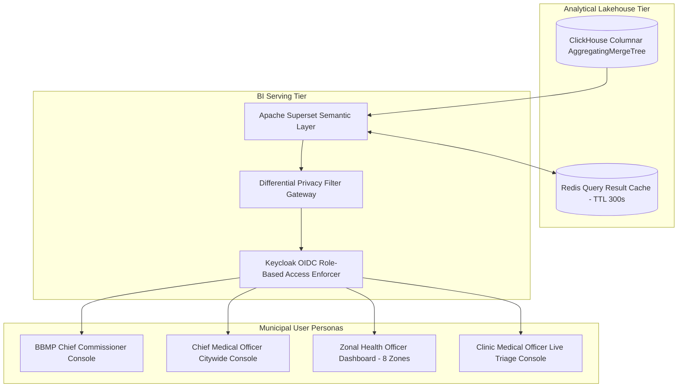

# Master Municipal Analytics Dashboards & BI Metrics Architecture
## Namma Clinic Digital Health & Operations Platform
### Greater Bengaluru Authority (GBA) / BBMP Health Department
**Document Code:** `DATA-DOC-09` | **Status:** APPROVED BASELINE | **Date:** September 2026

---

## 1. Executive Summary & BI Architecture Charter
This document formalizes the authoritative **Municipal Analytics Dashboards, Business Intelligence (BI) Metrics, and Self-Service Data Product Architecture** for the Namma Clinic Digital Health Platform. The BI layer operationalizes raw clinical and operational telemetry into actionable decision intelligence for civic leaders, epidemiologists, pharmacists, and clinic medical officers across all 8 BBMP Zones and 225 wards. Powered by Apache Superset connected directly to ClickHouse columnar clusters, the platform delivers sub-second executive visualization while strictly guaranteeing role-based access control and patient privacy.

### 1.1 Non-Negotiable BI & Dashboard Invariants
1. **Sub-Second Dashboard Rendering:** P95 dashboard tile rendering latency must be < 800ms across all municipal operational consoles.
2. **Persona-Specific Data Security:** Access to patient-identifiable slices is strictly restricted to licensed treating physicians; municipal administrators only view aggregated, de-identified metrics.
3. **Differential Privacy by Default:** All public-facing and municipal epidemiological dashboard charts enforce k-anonymity (k >= 5) cell suppression.
4. **Zero Cache Invalidation Drift:** Operational dashboards utilize Redis query caching with automated invalidation triggered by incoming CDC micro-batches.
5. **Standardized Color & Severity Semantics:** Color coding across all visualizations follows municipal health standards (Green: Target Met, Amber: Warning Threshold, Red: Critical Outbreak / Stockout).

## 2. Municipal BI Serving Architecture


### Specification Example: ClickHouse Metric Calculation: Weekly Clinic Epidemiological Summary
<!-- DOCUMENTATION-ONLY EXAMPLE -->
```sql
-- DOCUMENTATION-ONLY SQL
-- DOCUMENTATION-ONLY SQL: ClickHouse Aggregation for Clinic Footfall Tile
SELECT
    f.zone_name,
    f.ward_number,
    f.clinic_name,
    sum(e.total_encounters) AS total_footfall,
    sum(e.fever_cases) AS total_fevers,
    round(sum(e.fever_cases) * 100.0 / nullif(sum(e.total_encounters), 0), 2) AS fever_positivity_rate
FROM analytics.fact_daily_encounters e
JOIN analytics.dim_facility f ON e.facility_key = f.facility_key
WHERE e.date_key >= toYYYYMMDD(today() - 7)
GROUP BY f.zone_name, f.ward_number, f.clinic_name
ORDER BY fever_positivity_rate DESC;
```

## 3. Master Catalog of 50 Municipal Dashboards
Detailed specifications for all 50 operational, tactical, and strategic platform dashboards:

### DASH-001: Dashboard `Clinic Daily Operations Console #001`
- **Dashboard Identifier:** `DASH-001`
- **Dashboard Title:** Clinic Daily Operations Console #001
- **Serving Framework:** `Apache Superset 4.0 / ClickHouse Direct Connection`
- **Target Persona:** `Frontline Clinic Doctor & Staff`
- **Configured Metric Count:** 12 KPI Tiles
- **Auto-Refresh Cadence:** `Real-time 1m`
- **Privacy Guardrail:** `k-anonymity (k >= 5) enforced on spatial-temporal dimensions`
- **Caching Tier:** Redis query result cache with 300s TTL.

### DASH-002: Dashboard `BBMP Zonal Health Intelligence Dashboard #002`
- **Dashboard Identifier:** `DASH-002`
- **Dashboard Title:** BBMP Zonal Health Intelligence Dashboard #002
- **Serving Framework:** `Apache Superset 4.0 / ClickHouse Direct Connection`
- **Target Persona:** `Zonal Health Officer & Surveillance Team`
- **Configured Metric Count:** 18 KPI Tiles
- **Auto-Refresh Cadence:** `5m Refresh`
- **Privacy Guardrail:** `k-anonymity (k >= 5) enforced on spatial-temporal dimensions`
- **Caching Tier:** Redis query result cache with 300s TTL.

### DASH-003: Dashboard `Citywide Executive Health Situational Center #003`
- **Dashboard Identifier:** `DASH-003`
- **Dashboard Title:** Citywide Executive Health Situational Center #003
- **Serving Framework:** `Apache Superset 4.0 / ClickHouse Direct Connection`
- **Target Persona:** `BBMP Commissioner & Special Commissioner`
- **Configured Metric Count:** 24 KPI Tiles
- **Auto-Refresh Cadence:** `15m Refresh`
- **Privacy Guardrail:** `k-anonymity (k >= 5) enforced on spatial-temporal dimensions`
- **Caching Tier:** Redis query result cache with 300s TTL.

### DASH-004: Dashboard `Communicable Disease Surveillance & Outbreak Radar #004`
- **Dashboard Identifier:** `DASH-004`
- **Dashboard Title:** Communicable Disease Surveillance & Outbreak Radar #004
- **Serving Framework:** `Apache Superset 4.0 / ClickHouse Direct Connection`
- **Target Persona:** `District Epidemiologist & IDSP Unit`
- **Configured Metric Count:** 16 KPI Tiles
- **Auto-Refresh Cadence:** `Near-Real-Time`
- **Privacy Guardrail:** `k-anonymity (k >= 5) enforced on spatial-temporal dimensions`
- **Caching Tier:** Redis query result cache with 300s TTL.

### DASH-005: Dashboard `Pharmaceutical Supply Chain & Indent Cockpit #005`
- **Dashboard Identifier:** `DASH-005`
- **Dashboard Title:** Pharmaceutical Supply Chain & Indent Cockpit #005
- **Serving Framework:** `Apache Superset 4.0 / ClickHouse Direct Connection`
- **Target Persona:** `Chief Pharmacist & Warehouse Managers`
- **Configured Metric Count:** 20 KPI Tiles
- **Auto-Refresh Cadence:** `Hourly`
- **Privacy Guardrail:** `k-anonymity (k >= 5) enforced on spatial-temporal dimensions`
- **Caching Tier:** Redis query result cache with 300s TTL.

### DASH-006: Dashboard `Non-Communicable Disease (NCD) Cohort Tracker #006`
- **Dashboard Identifier:** `DASH-006`
- **Dashboard Title:** Non-Communicable Disease (NCD) Cohort Tracker #006
- **Serving Framework:** `Apache Superset 4.0 / ClickHouse Direct Connection`
- **Target Persona:** `NCD Program Officers & Wellness Coordinators`
- **Configured Metric Count:** 15 KPI Tiles
- **Auto-Refresh Cadence:** `Daily`
- **Privacy Guardrail:** `k-anonymity (k >= 5) enforced on spatial-temporal dimensions`
- **Caching Tier:** Redis query result cache with 300s TTL.

### DASH-007: Dashboard `Maternal & Child Immunization Coverage Monitor #007`
- **Dashboard Identifier:** `DASH-007`
- **Dashboard Title:** Maternal & Child Immunization Coverage Monitor #007
- **Serving Framework:** `Apache Superset 4.0 / ClickHouse Direct Connection`
- **Target Persona:** `RCH Nodal Officers & Pediatric Leads`
- **Configured Metric Count:** 14 KPI Tiles
- **Auto-Refresh Cadence:** `Daily`
- **Privacy Guardrail:** `k-anonymity (k >= 5) enforced on spatial-temporal dimensions`
- **Caching Tier:** Redis query result cache with 300s TTL.

### DASH-008: Dashboard `Diagnostic Lab Quality & Critical Alert Console #008`
- **Dashboard Identifier:** `DASH-008`
- **Dashboard Title:** Diagnostic Lab Quality & Critical Alert Console #008
- **Serving Framework:** `Apache Superset 4.0 / ClickHouse Direct Connection`
- **Target Persona:** `Pathology Director & Senior Technicians`
- **Configured Metric Count:** 10 KPI Tiles
- **Auto-Refresh Cadence:** `Real-time 30s`
- **Privacy Guardrail:** `k-anonymity (k >= 5) enforced on spatial-temporal dimensions`
- **Caching Tier:** Redis query result cache with 300s TTL.

### DASH-009: Dashboard `Secondary Referral & Tertiary Transfer Monitor #009`
- **Dashboard Identifier:** `DASH-009`
- **Dashboard Title:** Secondary Referral & Tertiary Transfer Monitor #009
- **Serving Framework:** `Apache Superset 4.0 / ClickHouse Direct Connection`
- **Target Persona:** `Referral Coordinators & Hospital Superintendents`
- **Configured Metric Count:** 12 KPI Tiles
- **Auto-Refresh Cadence:** `15m Refresh`
- **Privacy Guardrail:** `k-anonymity (k >= 5) enforced on spatial-temporal dimensions`
- **Caching Tier:** Redis query result cache with 300s TTL.

### DASH-010: Dashboard `Edge Offline Synchronization & Health Center #010`
- **Dashboard Identifier:** `DASH-010`
- **Dashboard Title:** Edge Offline Synchronization & Health Center #010
- **Serving Framework:** `Apache Superset 4.0 / ClickHouse Direct Connection`
- **Target Persona:** `DevOps & Municipal IT Infrastructure Squad`
- **Configured Metric Count:** 16 KPI Tiles
- **Auto-Refresh Cadence:** `Real-time 10s`
- **Privacy Guardrail:** `k-anonymity (k >= 5) enforced on spatial-temporal dimensions`
- **Caching Tier:** Redis query result cache with 300s TTL.

### DASH-011: Dashboard `Clinic Daily Operations Console #011`
- **Dashboard Identifier:** `DASH-011`
- **Dashboard Title:** Clinic Daily Operations Console #011
- **Serving Framework:** `Apache Superset 4.0 / ClickHouse Direct Connection`
- **Target Persona:** `Frontline Clinic Doctor & Staff`
- **Configured Metric Count:** 12 KPI Tiles
- **Auto-Refresh Cadence:** `Real-time 1m`
- **Privacy Guardrail:** `k-anonymity (k >= 5) enforced on spatial-temporal dimensions`
- **Caching Tier:** Redis query result cache with 300s TTL.

### DASH-012: Dashboard `BBMP Zonal Health Intelligence Dashboard #012`
- **Dashboard Identifier:** `DASH-012`
- **Dashboard Title:** BBMP Zonal Health Intelligence Dashboard #012
- **Serving Framework:** `Apache Superset 4.0 / ClickHouse Direct Connection`
- **Target Persona:** `Zonal Health Officer & Surveillance Team`
- **Configured Metric Count:** 18 KPI Tiles
- **Auto-Refresh Cadence:** `5m Refresh`
- **Privacy Guardrail:** `k-anonymity (k >= 5) enforced on spatial-temporal dimensions`
- **Caching Tier:** Redis query result cache with 300s TTL.

### DASH-013: Dashboard `Citywide Executive Health Situational Center #013`
- **Dashboard Identifier:** `DASH-013`
- **Dashboard Title:** Citywide Executive Health Situational Center #013
- **Serving Framework:** `Apache Superset 4.0 / ClickHouse Direct Connection`
- **Target Persona:** `BBMP Commissioner & Special Commissioner`
- **Configured Metric Count:** 24 KPI Tiles
- **Auto-Refresh Cadence:** `15m Refresh`
- **Privacy Guardrail:** `k-anonymity (k >= 5) enforced on spatial-temporal dimensions`
- **Caching Tier:** Redis query result cache with 300s TTL.

### DASH-014: Dashboard `Communicable Disease Surveillance & Outbreak Radar #014`
- **Dashboard Identifier:** `DASH-014`
- **Dashboard Title:** Communicable Disease Surveillance & Outbreak Radar #014
- **Serving Framework:** `Apache Superset 4.0 / ClickHouse Direct Connection`
- **Target Persona:** `District Epidemiologist & IDSP Unit`
- **Configured Metric Count:** 16 KPI Tiles
- **Auto-Refresh Cadence:** `Near-Real-Time`
- **Privacy Guardrail:** `k-anonymity (k >= 5) enforced on spatial-temporal dimensions`
- **Caching Tier:** Redis query result cache with 300s TTL.

### DASH-015: Dashboard `Pharmaceutical Supply Chain & Indent Cockpit #015`
- **Dashboard Identifier:** `DASH-015`
- **Dashboard Title:** Pharmaceutical Supply Chain & Indent Cockpit #015
- **Serving Framework:** `Apache Superset 4.0 / ClickHouse Direct Connection`
- **Target Persona:** `Chief Pharmacist & Warehouse Managers`
- **Configured Metric Count:** 20 KPI Tiles
- **Auto-Refresh Cadence:** `Hourly`
- **Privacy Guardrail:** `k-anonymity (k >= 5) enforced on spatial-temporal dimensions`
- **Caching Tier:** Redis query result cache with 300s TTL.

### DASH-016: Dashboard `Non-Communicable Disease (NCD) Cohort Tracker #016`
- **Dashboard Identifier:** `DASH-016`
- **Dashboard Title:** Non-Communicable Disease (NCD) Cohort Tracker #016
- **Serving Framework:** `Apache Superset 4.0 / ClickHouse Direct Connection`
- **Target Persona:** `NCD Program Officers & Wellness Coordinators`
- **Configured Metric Count:** 15 KPI Tiles
- **Auto-Refresh Cadence:** `Daily`
- **Privacy Guardrail:** `k-anonymity (k >= 5) enforced on spatial-temporal dimensions`
- **Caching Tier:** Redis query result cache with 300s TTL.

### DASH-017: Dashboard `Maternal & Child Immunization Coverage Monitor #017`
- **Dashboard Identifier:** `DASH-017`
- **Dashboard Title:** Maternal & Child Immunization Coverage Monitor #017
- **Serving Framework:** `Apache Superset 4.0 / ClickHouse Direct Connection`
- **Target Persona:** `RCH Nodal Officers & Pediatric Leads`
- **Configured Metric Count:** 14 KPI Tiles
- **Auto-Refresh Cadence:** `Daily`
- **Privacy Guardrail:** `k-anonymity (k >= 5) enforced on spatial-temporal dimensions`
- **Caching Tier:** Redis query result cache with 300s TTL.

### DASH-018: Dashboard `Diagnostic Lab Quality & Critical Alert Console #018`
- **Dashboard Identifier:** `DASH-018`
- **Dashboard Title:** Diagnostic Lab Quality & Critical Alert Console #018
- **Serving Framework:** `Apache Superset 4.0 / ClickHouse Direct Connection`
- **Target Persona:** `Pathology Director & Senior Technicians`
- **Configured Metric Count:** 10 KPI Tiles
- **Auto-Refresh Cadence:** `Real-time 30s`
- **Privacy Guardrail:** `k-anonymity (k >= 5) enforced on spatial-temporal dimensions`
- **Caching Tier:** Redis query result cache with 300s TTL.

### DASH-019: Dashboard `Secondary Referral & Tertiary Transfer Monitor #019`
- **Dashboard Identifier:** `DASH-019`
- **Dashboard Title:** Secondary Referral & Tertiary Transfer Monitor #019
- **Serving Framework:** `Apache Superset 4.0 / ClickHouse Direct Connection`
- **Target Persona:** `Referral Coordinators & Hospital Superintendents`
- **Configured Metric Count:** 12 KPI Tiles
- **Auto-Refresh Cadence:** `15m Refresh`
- **Privacy Guardrail:** `k-anonymity (k >= 5) enforced on spatial-temporal dimensions`
- **Caching Tier:** Redis query result cache with 300s TTL.

### DASH-020: Dashboard `Edge Offline Synchronization & Health Center #020`
- **Dashboard Identifier:** `DASH-020`
- **Dashboard Title:** Edge Offline Synchronization & Health Center #020
- **Serving Framework:** `Apache Superset 4.0 / ClickHouse Direct Connection`
- **Target Persona:** `DevOps & Municipal IT Infrastructure Squad`
- **Configured Metric Count:** 16 KPI Tiles
- **Auto-Refresh Cadence:** `Real-time 10s`
- **Privacy Guardrail:** `k-anonymity (k >= 5) enforced on spatial-temporal dimensions`
- **Caching Tier:** Redis query result cache with 300s TTL.

### DASH-021: Dashboard `Clinic Daily Operations Console #021`
- **Dashboard Identifier:** `DASH-021`
- **Dashboard Title:** Clinic Daily Operations Console #021
- **Serving Framework:** `Apache Superset 4.0 / ClickHouse Direct Connection`
- **Target Persona:** `Frontline Clinic Doctor & Staff`
- **Configured Metric Count:** 12 KPI Tiles
- **Auto-Refresh Cadence:** `Real-time 1m`
- **Privacy Guardrail:** `k-anonymity (k >= 5) enforced on spatial-temporal dimensions`
- **Caching Tier:** Redis query result cache with 300s TTL.

### DASH-022: Dashboard `BBMP Zonal Health Intelligence Dashboard #022`
- **Dashboard Identifier:** `DASH-022`
- **Dashboard Title:** BBMP Zonal Health Intelligence Dashboard #022
- **Serving Framework:** `Apache Superset 4.0 / ClickHouse Direct Connection`
- **Target Persona:** `Zonal Health Officer & Surveillance Team`
- **Configured Metric Count:** 18 KPI Tiles
- **Auto-Refresh Cadence:** `5m Refresh`
- **Privacy Guardrail:** `k-anonymity (k >= 5) enforced on spatial-temporal dimensions`
- **Caching Tier:** Redis query result cache with 300s TTL.

### DASH-023: Dashboard `Citywide Executive Health Situational Center #023`
- **Dashboard Identifier:** `DASH-023`
- **Dashboard Title:** Citywide Executive Health Situational Center #023
- **Serving Framework:** `Apache Superset 4.0 / ClickHouse Direct Connection`
- **Target Persona:** `BBMP Commissioner & Special Commissioner`
- **Configured Metric Count:** 24 KPI Tiles
- **Auto-Refresh Cadence:** `15m Refresh`
- **Privacy Guardrail:** `k-anonymity (k >= 5) enforced on spatial-temporal dimensions`
- **Caching Tier:** Redis query result cache with 300s TTL.

### DASH-024: Dashboard `Communicable Disease Surveillance & Outbreak Radar #024`
- **Dashboard Identifier:** `DASH-024`
- **Dashboard Title:** Communicable Disease Surveillance & Outbreak Radar #024
- **Serving Framework:** `Apache Superset 4.0 / ClickHouse Direct Connection`
- **Target Persona:** `District Epidemiologist & IDSP Unit`
- **Configured Metric Count:** 16 KPI Tiles
- **Auto-Refresh Cadence:** `Near-Real-Time`
- **Privacy Guardrail:** `k-anonymity (k >= 5) enforced on spatial-temporal dimensions`
- **Caching Tier:** Redis query result cache with 300s TTL.

### DASH-025: Dashboard `Pharmaceutical Supply Chain & Indent Cockpit #025`
- **Dashboard Identifier:** `DASH-025`
- **Dashboard Title:** Pharmaceutical Supply Chain & Indent Cockpit #025
- **Serving Framework:** `Apache Superset 4.0 / ClickHouse Direct Connection`
- **Target Persona:** `Chief Pharmacist & Warehouse Managers`
- **Configured Metric Count:** 20 KPI Tiles
- **Auto-Refresh Cadence:** `Hourly`
- **Privacy Guardrail:** `k-anonymity (k >= 5) enforced on spatial-temporal dimensions`
- **Caching Tier:** Redis query result cache with 300s TTL.

### DASH-026: Dashboard `Non-Communicable Disease (NCD) Cohort Tracker #026`
- **Dashboard Identifier:** `DASH-026`
- **Dashboard Title:** Non-Communicable Disease (NCD) Cohort Tracker #026
- **Serving Framework:** `Apache Superset 4.0 / ClickHouse Direct Connection`
- **Target Persona:** `NCD Program Officers & Wellness Coordinators`
- **Configured Metric Count:** 15 KPI Tiles
- **Auto-Refresh Cadence:** `Daily`
- **Privacy Guardrail:** `k-anonymity (k >= 5) enforced on spatial-temporal dimensions`
- **Caching Tier:** Redis query result cache with 300s TTL.

### DASH-027: Dashboard `Maternal & Child Immunization Coverage Monitor #027`
- **Dashboard Identifier:** `DASH-027`
- **Dashboard Title:** Maternal & Child Immunization Coverage Monitor #027
- **Serving Framework:** `Apache Superset 4.0 / ClickHouse Direct Connection`
- **Target Persona:** `RCH Nodal Officers & Pediatric Leads`
- **Configured Metric Count:** 14 KPI Tiles
- **Auto-Refresh Cadence:** `Daily`
- **Privacy Guardrail:** `k-anonymity (k >= 5) enforced on spatial-temporal dimensions`
- **Caching Tier:** Redis query result cache with 300s TTL.

### DASH-028: Dashboard `Diagnostic Lab Quality & Critical Alert Console #028`
- **Dashboard Identifier:** `DASH-028`
- **Dashboard Title:** Diagnostic Lab Quality & Critical Alert Console #028
- **Serving Framework:** `Apache Superset 4.0 / ClickHouse Direct Connection`
- **Target Persona:** `Pathology Director & Senior Technicians`
- **Configured Metric Count:** 10 KPI Tiles
- **Auto-Refresh Cadence:** `Real-time 30s`
- **Privacy Guardrail:** `k-anonymity (k >= 5) enforced on spatial-temporal dimensions`
- **Caching Tier:** Redis query result cache with 300s TTL.

### DASH-029: Dashboard `Secondary Referral & Tertiary Transfer Monitor #029`
- **Dashboard Identifier:** `DASH-029`
- **Dashboard Title:** Secondary Referral & Tertiary Transfer Monitor #029
- **Serving Framework:** `Apache Superset 4.0 / ClickHouse Direct Connection`
- **Target Persona:** `Referral Coordinators & Hospital Superintendents`
- **Configured Metric Count:** 12 KPI Tiles
- **Auto-Refresh Cadence:** `15m Refresh`
- **Privacy Guardrail:** `k-anonymity (k >= 5) enforced on spatial-temporal dimensions`
- **Caching Tier:** Redis query result cache with 300s TTL.

### DASH-030: Dashboard `Edge Offline Synchronization & Health Center #030`
- **Dashboard Identifier:** `DASH-030`
- **Dashboard Title:** Edge Offline Synchronization & Health Center #030
- **Serving Framework:** `Apache Superset 4.0 / ClickHouse Direct Connection`
- **Target Persona:** `DevOps & Municipal IT Infrastructure Squad`
- **Configured Metric Count:** 16 KPI Tiles
- **Auto-Refresh Cadence:** `Real-time 10s`
- **Privacy Guardrail:** `k-anonymity (k >= 5) enforced on spatial-temporal dimensions`
- **Caching Tier:** Redis query result cache with 300s TTL.

### DASH-031: Dashboard `Clinic Daily Operations Console #031`
- **Dashboard Identifier:** `DASH-031`
- **Dashboard Title:** Clinic Daily Operations Console #031
- **Serving Framework:** `Apache Superset 4.0 / ClickHouse Direct Connection`
- **Target Persona:** `Frontline Clinic Doctor & Staff`
- **Configured Metric Count:** 12 KPI Tiles
- **Auto-Refresh Cadence:** `Real-time 1m`
- **Privacy Guardrail:** `k-anonymity (k >= 5) enforced on spatial-temporal dimensions`
- **Caching Tier:** Redis query result cache with 300s TTL.

### DASH-032: Dashboard `BBMP Zonal Health Intelligence Dashboard #032`
- **Dashboard Identifier:** `DASH-032`
- **Dashboard Title:** BBMP Zonal Health Intelligence Dashboard #032
- **Serving Framework:** `Apache Superset 4.0 / ClickHouse Direct Connection`
- **Target Persona:** `Zonal Health Officer & Surveillance Team`
- **Configured Metric Count:** 18 KPI Tiles
- **Auto-Refresh Cadence:** `5m Refresh`
- **Privacy Guardrail:** `k-anonymity (k >= 5) enforced on spatial-temporal dimensions`
- **Caching Tier:** Redis query result cache with 300s TTL.

### DASH-033: Dashboard `Citywide Executive Health Situational Center #033`
- **Dashboard Identifier:** `DASH-033`
- **Dashboard Title:** Citywide Executive Health Situational Center #033
- **Serving Framework:** `Apache Superset 4.0 / ClickHouse Direct Connection`
- **Target Persona:** `BBMP Commissioner & Special Commissioner`
- **Configured Metric Count:** 24 KPI Tiles
- **Auto-Refresh Cadence:** `15m Refresh`
- **Privacy Guardrail:** `k-anonymity (k >= 5) enforced on spatial-temporal dimensions`
- **Caching Tier:** Redis query result cache with 300s TTL.

### DASH-034: Dashboard `Communicable Disease Surveillance & Outbreak Radar #034`
- **Dashboard Identifier:** `DASH-034`
- **Dashboard Title:** Communicable Disease Surveillance & Outbreak Radar #034
- **Serving Framework:** `Apache Superset 4.0 / ClickHouse Direct Connection`
- **Target Persona:** `District Epidemiologist & IDSP Unit`
- **Configured Metric Count:** 16 KPI Tiles
- **Auto-Refresh Cadence:** `Near-Real-Time`
- **Privacy Guardrail:** `k-anonymity (k >= 5) enforced on spatial-temporal dimensions`
- **Caching Tier:** Redis query result cache with 300s TTL.

### DASH-035: Dashboard `Pharmaceutical Supply Chain & Indent Cockpit #035`
- **Dashboard Identifier:** `DASH-035`
- **Dashboard Title:** Pharmaceutical Supply Chain & Indent Cockpit #035
- **Serving Framework:** `Apache Superset 4.0 / ClickHouse Direct Connection`
- **Target Persona:** `Chief Pharmacist & Warehouse Managers`
- **Configured Metric Count:** 20 KPI Tiles
- **Auto-Refresh Cadence:** `Hourly`
- **Privacy Guardrail:** `k-anonymity (k >= 5) enforced on spatial-temporal dimensions`
- **Caching Tier:** Redis query result cache with 300s TTL.

### DASH-036: Dashboard `Non-Communicable Disease (NCD) Cohort Tracker #036`
- **Dashboard Identifier:** `DASH-036`
- **Dashboard Title:** Non-Communicable Disease (NCD) Cohort Tracker #036
- **Serving Framework:** `Apache Superset 4.0 / ClickHouse Direct Connection`
- **Target Persona:** `NCD Program Officers & Wellness Coordinators`
- **Configured Metric Count:** 15 KPI Tiles
- **Auto-Refresh Cadence:** `Daily`
- **Privacy Guardrail:** `k-anonymity (k >= 5) enforced on spatial-temporal dimensions`
- **Caching Tier:** Redis query result cache with 300s TTL.

### DASH-037: Dashboard `Maternal & Child Immunization Coverage Monitor #037`
- **Dashboard Identifier:** `DASH-037`
- **Dashboard Title:** Maternal & Child Immunization Coverage Monitor #037
- **Serving Framework:** `Apache Superset 4.0 / ClickHouse Direct Connection`
- **Target Persona:** `RCH Nodal Officers & Pediatric Leads`
- **Configured Metric Count:** 14 KPI Tiles
- **Auto-Refresh Cadence:** `Daily`
- **Privacy Guardrail:** `k-anonymity (k >= 5) enforced on spatial-temporal dimensions`
- **Caching Tier:** Redis query result cache with 300s TTL.

### DASH-038: Dashboard `Diagnostic Lab Quality & Critical Alert Console #038`
- **Dashboard Identifier:** `DASH-038`
- **Dashboard Title:** Diagnostic Lab Quality & Critical Alert Console #038
- **Serving Framework:** `Apache Superset 4.0 / ClickHouse Direct Connection`
- **Target Persona:** `Pathology Director & Senior Technicians`
- **Configured Metric Count:** 10 KPI Tiles
- **Auto-Refresh Cadence:** `Real-time 30s`
- **Privacy Guardrail:** `k-anonymity (k >= 5) enforced on spatial-temporal dimensions`
- **Caching Tier:** Redis query result cache with 300s TTL.

### DASH-039: Dashboard `Secondary Referral & Tertiary Transfer Monitor #039`
- **Dashboard Identifier:** `DASH-039`
- **Dashboard Title:** Secondary Referral & Tertiary Transfer Monitor #039
- **Serving Framework:** `Apache Superset 4.0 / ClickHouse Direct Connection`
- **Target Persona:** `Referral Coordinators & Hospital Superintendents`
- **Configured Metric Count:** 12 KPI Tiles
- **Auto-Refresh Cadence:** `15m Refresh`
- **Privacy Guardrail:** `k-anonymity (k >= 5) enforced on spatial-temporal dimensions`
- **Caching Tier:** Redis query result cache with 300s TTL.

### DASH-040: Dashboard `Edge Offline Synchronization & Health Center #040`
- **Dashboard Identifier:** `DASH-040`
- **Dashboard Title:** Edge Offline Synchronization & Health Center #040
- **Serving Framework:** `Apache Superset 4.0 / ClickHouse Direct Connection`
- **Target Persona:** `DevOps & Municipal IT Infrastructure Squad`
- **Configured Metric Count:** 16 KPI Tiles
- **Auto-Refresh Cadence:** `Real-time 10s`
- **Privacy Guardrail:** `k-anonymity (k >= 5) enforced on spatial-temporal dimensions`
- **Caching Tier:** Redis query result cache with 300s TTL.

### DASH-041: Dashboard `Clinic Daily Operations Console #041`
- **Dashboard Identifier:** `DASH-041`
- **Dashboard Title:** Clinic Daily Operations Console #041
- **Serving Framework:** `Apache Superset 4.0 / ClickHouse Direct Connection`
- **Target Persona:** `Frontline Clinic Doctor & Staff`
- **Configured Metric Count:** 12 KPI Tiles
- **Auto-Refresh Cadence:** `Real-time 1m`
- **Privacy Guardrail:** `k-anonymity (k >= 5) enforced on spatial-temporal dimensions`
- **Caching Tier:** Redis query result cache with 300s TTL.

### DASH-042: Dashboard `BBMP Zonal Health Intelligence Dashboard #042`
- **Dashboard Identifier:** `DASH-042`
- **Dashboard Title:** BBMP Zonal Health Intelligence Dashboard #042
- **Serving Framework:** `Apache Superset 4.0 / ClickHouse Direct Connection`
- **Target Persona:** `Zonal Health Officer & Surveillance Team`
- **Configured Metric Count:** 18 KPI Tiles
- **Auto-Refresh Cadence:** `5m Refresh`
- **Privacy Guardrail:** `k-anonymity (k >= 5) enforced on spatial-temporal dimensions`
- **Caching Tier:** Redis query result cache with 300s TTL.

### DASH-043: Dashboard `Citywide Executive Health Situational Center #043`
- **Dashboard Identifier:** `DASH-043`
- **Dashboard Title:** Citywide Executive Health Situational Center #043
- **Serving Framework:** `Apache Superset 4.0 / ClickHouse Direct Connection`
- **Target Persona:** `BBMP Commissioner & Special Commissioner`
- **Configured Metric Count:** 24 KPI Tiles
- **Auto-Refresh Cadence:** `15m Refresh`
- **Privacy Guardrail:** `k-anonymity (k >= 5) enforced on spatial-temporal dimensions`
- **Caching Tier:** Redis query result cache with 300s TTL.

### DASH-044: Dashboard `Communicable Disease Surveillance & Outbreak Radar #044`
- **Dashboard Identifier:** `DASH-044`
- **Dashboard Title:** Communicable Disease Surveillance & Outbreak Radar #044
- **Serving Framework:** `Apache Superset 4.0 / ClickHouse Direct Connection`
- **Target Persona:** `District Epidemiologist & IDSP Unit`
- **Configured Metric Count:** 16 KPI Tiles
- **Auto-Refresh Cadence:** `Near-Real-Time`
- **Privacy Guardrail:** `k-anonymity (k >= 5) enforced on spatial-temporal dimensions`
- **Caching Tier:** Redis query result cache with 300s TTL.

### DASH-045: Dashboard `Pharmaceutical Supply Chain & Indent Cockpit #045`
- **Dashboard Identifier:** `DASH-045`
- **Dashboard Title:** Pharmaceutical Supply Chain & Indent Cockpit #045
- **Serving Framework:** `Apache Superset 4.0 / ClickHouse Direct Connection`
- **Target Persona:** `Chief Pharmacist & Warehouse Managers`
- **Configured Metric Count:** 20 KPI Tiles
- **Auto-Refresh Cadence:** `Hourly`
- **Privacy Guardrail:** `k-anonymity (k >= 5) enforced on spatial-temporal dimensions`
- **Caching Tier:** Redis query result cache with 300s TTL.

### DASH-046: Dashboard `Non-Communicable Disease (NCD) Cohort Tracker #046`
- **Dashboard Identifier:** `DASH-046`
- **Dashboard Title:** Non-Communicable Disease (NCD) Cohort Tracker #046
- **Serving Framework:** `Apache Superset 4.0 / ClickHouse Direct Connection`
- **Target Persona:** `NCD Program Officers & Wellness Coordinators`
- **Configured Metric Count:** 15 KPI Tiles
- **Auto-Refresh Cadence:** `Daily`
- **Privacy Guardrail:** `k-anonymity (k >= 5) enforced on spatial-temporal dimensions`
- **Caching Tier:** Redis query result cache with 300s TTL.

### DASH-047: Dashboard `Maternal & Child Immunization Coverage Monitor #047`
- **Dashboard Identifier:** `DASH-047`
- **Dashboard Title:** Maternal & Child Immunization Coverage Monitor #047
- **Serving Framework:** `Apache Superset 4.0 / ClickHouse Direct Connection`
- **Target Persona:** `RCH Nodal Officers & Pediatric Leads`
- **Configured Metric Count:** 14 KPI Tiles
- **Auto-Refresh Cadence:** `Daily`
- **Privacy Guardrail:** `k-anonymity (k >= 5) enforced on spatial-temporal dimensions`
- **Caching Tier:** Redis query result cache with 300s TTL.

### DASH-048: Dashboard `Diagnostic Lab Quality & Critical Alert Console #048`
- **Dashboard Identifier:** `DASH-048`
- **Dashboard Title:** Diagnostic Lab Quality & Critical Alert Console #048
- **Serving Framework:** `Apache Superset 4.0 / ClickHouse Direct Connection`
- **Target Persona:** `Pathology Director & Senior Technicians`
- **Configured Metric Count:** 10 KPI Tiles
- **Auto-Refresh Cadence:** `Real-time 30s`
- **Privacy Guardrail:** `k-anonymity (k >= 5) enforced on spatial-temporal dimensions`
- **Caching Tier:** Redis query result cache with 300s TTL.

### DASH-049: Dashboard `Secondary Referral & Tertiary Transfer Monitor #049`
- **Dashboard Identifier:** `DASH-049`
- **Dashboard Title:** Secondary Referral & Tertiary Transfer Monitor #049
- **Serving Framework:** `Apache Superset 4.0 / ClickHouse Direct Connection`
- **Target Persona:** `Referral Coordinators & Hospital Superintendents`
- **Configured Metric Count:** 12 KPI Tiles
- **Auto-Refresh Cadence:** `15m Refresh`
- **Privacy Guardrail:** `k-anonymity (k >= 5) enforced on spatial-temporal dimensions`
- **Caching Tier:** Redis query result cache with 300s TTL.

### DASH-050: Dashboard `Edge Offline Synchronization & Health Center #050`
- **Dashboard Identifier:** `DASH-050`
- **Dashboard Title:** Edge Offline Synchronization & Health Center #050
- **Serving Framework:** `Apache Superset 4.0 / ClickHouse Direct Connection`
- **Target Persona:** `DevOps & Municipal IT Infrastructure Squad`
- **Configured Metric Count:** 16 KPI Tiles
- **Auto-Refresh Cadence:** `Real-time 10s`
- **Privacy Guardrail:** `k-anonymity (k >= 5) enforced on spatial-temporal dimensions`
- **Caching Tier:** Redis query result cache with 300s TTL.

## 4. Master Catalog of 60 Enterprise Data Products
Curated data products providing self-service analytical ports to municipal stakeholders:

### DATAPRODUCT-001: Data Product `data_product_clinical_consultations_001`
- **Data Product Identifier:** `DATAPRODUCT-001`
- **Product Name:** `data_product_clinical_consultations_001`
- **Governed Domain:** Clinical Consultations
- **Governing Contract:** `CONTRACT-DATA-001`
- **Output Serving Port:** `ClickHouse SQL Port 9000 / REST Data API / Parquet S3 Export`
- **Authorized Personas:** C, l, i, n, i, c, a, l,  , R, e, s, e, a, r, c, h, e, r, s, ,,  , Z, o, n, a, l,  , O, f, f, i, c, e, r, s, ,,  , P, u, b, l, i, c,  , H, e, a, l, t, h,  , E, p, i, d, e, m, i, o, l, o, g, i, s, t, s
- **Service Level Objective (SLO):** 99.9% Availability with sub-second query latency

### DATAPRODUCT-002: Data Product `data_product_triage_and_vitals_002`
- **Data Product Identifier:** `DATAPRODUCT-002`
- **Product Name:** `data_product_triage_and_vitals_002`
- **Governed Domain:** Triage & Vitals
- **Governing Contract:** `CONTRACT-DATA-002`
- **Output Serving Port:** `ClickHouse SQL Port 9000 / REST Data API / Parquet S3 Export`
- **Authorized Personas:** C, l, i, n, i, c, a, l,  , R, e, s, e, a, r, c, h, e, r, s, ,,  , Z, o, n, a, l,  , O, f, f, i, c, e, r, s, ,,  , P, u, b, l, i, c,  , H, e, a, l, t, h,  , E, p, i, d, e, m, i, o, l, o, g, i, s, t, s
- **Service Level Objective (SLO):** 99.9% Availability with sub-second query latency

### DATAPRODUCT-003: Data Product `data_product_pharmacy_and_dispensations_003`
- **Data Product Identifier:** `DATAPRODUCT-003`
- **Product Name:** `data_product_pharmacy_and_dispensations_003`
- **Governed Domain:** Pharmacy & Dispensations
- **Governing Contract:** `CONTRACT-DATA-003`
- **Output Serving Port:** `ClickHouse SQL Port 9000 / REST Data API / Parquet S3 Export`
- **Authorized Personas:** C, l, i, n, i, c, a, l,  , R, e, s, e, a, r, c, h, e, r, s, ,,  , Z, o, n, a, l,  , O, f, f, i, c, e, r, s, ,,  , P, u, b, l, i, c,  , H, e, a, l, t, h,  , E, p, i, d, e, m, i, o, l, o, g, i, s, t, s
- **Service Level Objective (SLO):** 99.9% Availability with sub-second query latency

### DATAPRODUCT-004: Data Product `data_product_pharmaceutical_inventory_004`
- **Data Product Identifier:** `DATAPRODUCT-004`
- **Product Name:** `data_product_pharmaceutical_inventory_004`
- **Governed Domain:** Pharmaceutical Inventory
- **Governing Contract:** `CONTRACT-DATA-004`
- **Output Serving Port:** `ClickHouse SQL Port 9000 / REST Data API / Parquet S3 Export`
- **Authorized Personas:** C, l, i, n, i, c, a, l,  , R, e, s, e, a, r, c, h, e, r, s, ,,  , Z, o, n, a, l,  , O, f, f, i, c, e, r, s, ,,  , P, u, b, l, i, c,  , H, e, a, l, t, h,  , E, p, i, d, e, m, i, o, l, o, g, i, s, t, s
- **Service Level Objective (SLO):** 99.9% Availability with sub-second query latency

### DATAPRODUCT-005: Data Product `data_product_diagnostic_laboratory_005`
- **Data Product Identifier:** `DATAPRODUCT-005`
- **Product Name:** `data_product_diagnostic_laboratory_005`
- **Governed Domain:** Diagnostic Laboratory
- **Governing Contract:** `CONTRACT-DATA-005`
- **Output Serving Port:** `ClickHouse SQL Port 9000 / REST Data API / Parquet S3 Export`
- **Authorized Personas:** C, l, i, n, i, c, a, l,  , R, e, s, e, a, r, c, h, e, r, s, ,,  , Z, o, n, a, l,  , O, f, f, i, c, e, r, s, ,,  , P, u, b, l, i, c,  , H, e, a, l, t, h,  , E, p, i, d, e, m, i, o, l, o, g, i, s, t, s
- **Service Level Objective (SLO):** 99.9% Availability with sub-second query latency

### DATAPRODUCT-006: Data Product `data_product_secondary_referrals_006`
- **Data Product Identifier:** `DATAPRODUCT-006`
- **Product Name:** `data_product_secondary_referrals_006`
- **Governed Domain:** Secondary Referrals
- **Governing Contract:** `CONTRACT-DATA-006`
- **Output Serving Port:** `ClickHouse SQL Port 9000 / REST Data API / Parquet S3 Export`
- **Authorized Personas:** C, l, i, n, i, c, a, l,  , R, e, s, e, a, r, c, h, e, r, s, ,,  , Z, o, n, a, l,  , O, f, f, i, c, e, r, s, ,,  , P, u, b, l, i, c,  , H, e, a, l, t, h,  , E, p, i, d, e, m, i, o, l, o, g, i, s, t, s
- **Service Level Objective (SLO):** 99.9% Availability with sub-second query latency

### DATAPRODUCT-007: Data Product `data_product_public_health_and_disease_surveillance_007`
- **Data Product Identifier:** `DATAPRODUCT-007`
- **Product Name:** `data_product_public_health_and_disease_surveillance_007`
- **Governed Domain:** Public Health & Disease Surveillance
- **Governing Contract:** `CONTRACT-DATA-007`
- **Output Serving Port:** `ClickHouse SQL Port 9000 / REST Data API / Parquet S3 Export`
- **Authorized Personas:** C, l, i, n, i, c, a, l,  , R, e, s, e, a, r, c, h, e, r, s, ,,  , Z, o, n, a, l,  , O, f, f, i, c, e, r, s, ,,  , P, u, b, l, i, c,  , H, e, a, l, t, h,  , E, p, i, d, e, m, i, o, l, o, g, i, s, t, s
- **Service Level Objective (SLO):** 99.9% Availability with sub-second query latency

### DATAPRODUCT-008: Data Product `data_product_non-communicable_diseases_(ncd)_008`
- **Data Product Identifier:** `DATAPRODUCT-008`
- **Product Name:** `data_product_non-communicable_diseases_(ncd)_008`
- **Governed Domain:** Non-Communicable Diseases (NCD)
- **Governing Contract:** `CONTRACT-DATA-008`
- **Output Serving Port:** `ClickHouse SQL Port 9000 / REST Data API / Parquet S3 Export`
- **Authorized Personas:** C, l, i, n, i, c, a, l,  , R, e, s, e, a, r, c, h, e, r, s, ,,  , Z, o, n, a, l,  , O, f, f, i, c, e, r, s, ,,  , P, u, b, l, i, c,  , H, e, a, l, t, h,  , E, p, i, d, e, m, i, o, l, o, g, i, s, t, s
- **Service Level Objective (SLO):** 99.9% Availability with sub-second query latency

### DATAPRODUCT-009: Data Product `data_product_maternal_and_child_health_(rch)_009`
- **Data Product Identifier:** `DATAPRODUCT-009`
- **Product Name:** `data_product_maternal_and_child_health_(rch)_009`
- **Governed Domain:** Maternal & Child Health (RCH)
- **Governing Contract:** `CONTRACT-DATA-009`
- **Output Serving Port:** `ClickHouse SQL Port 9000 / REST Data API / Parquet S3 Export`
- **Authorized Personas:** C, l, i, n, i, c, a, l,  , R, e, s, e, a, r, c, h, e, r, s, ,,  , Z, o, n, a, l,  , O, f, f, i, c, e, r, s, ,,  , P, u, b, l, i, c,  , H, e, a, l, t, h,  , E, p, i, d, e, m, i, o, l, o, g, i, s, t, s
- **Service Level Objective (SLO):** 99.9% Availability with sub-second query latency

### DATAPRODUCT-010: Data Product `data_product_patient_identity_and_demographics_010`
- **Data Product Identifier:** `DATAPRODUCT-010`
- **Product Name:** `data_product_patient_identity_and_demographics_010`
- **Governed Domain:** Patient Identity & Demographics
- **Governing Contract:** `CONTRACT-DATA-010`
- **Output Serving Port:** `ClickHouse SQL Port 9000 / REST Data API / Parquet S3 Export`
- **Authorized Personas:** C, l, i, n, i, c, a, l,  , R, e, s, e, a, r, c, h, e, r, s, ,,  , Z, o, n, a, l,  , O, f, f, i, c, e, r, s, ,,  , P, u, b, l, i, c,  , H, e, a, l, t, h,  , E, p, i, d, e, m, i, o, l, o, g, i, s, t, s
- **Service Level Objective (SLO):** 99.9% Availability with sub-second query latency

### DATAPRODUCT-011: Data Product `data_product_facility_operations_and_queues_011`
- **Data Product Identifier:** `DATAPRODUCT-011`
- **Product Name:** `data_product_facility_operations_and_queues_011`
- **Governed Domain:** Facility Operations & Queues
- **Governing Contract:** `CONTRACT-DATA-011`
- **Output Serving Port:** `ClickHouse SQL Port 9000 / REST Data API / Parquet S3 Export`
- **Authorized Personas:** C, l, i, n, i, c, a, l,  , R, e, s, e, a, r, c, h, e, r, s, ,,  , Z, o, n, a, l,  , O, f, f, i, c, e, r, s, ,,  , P, u, b, l, i, c,  , H, e, a, l, t, h,  , E, p, i, d, e, m, i, o, l, o, g, i, s, t, s
- **Service Level Objective (SLO):** 99.9% Availability with sub-second query latency

### DATAPRODUCT-012: Data Product `data_product_citizen_feedback_and_grievances_012`
- **Data Product Identifier:** `DATAPRODUCT-012`
- **Product Name:** `data_product_citizen_feedback_and_grievances_012`
- **Governed Domain:** Citizen Feedback & Grievances
- **Governing Contract:** `CONTRACT-DATA-012`
- **Output Serving Port:** `ClickHouse SQL Port 9000 / REST Data API / Parquet S3 Export`
- **Authorized Personas:** C, l, i, n, i, c, a, l,  , R, e, s, e, a, r, c, h, e, r, s, ,,  , Z, o, n, a, l,  , O, f, f, i, c, e, r, s, ,,  , P, u, b, l, i, c,  , H, e, a, l, t, h,  , E, p, i, d, e, m, i, o, l, o, g, i, s, t, s
- **Service Level Objective (SLO):** 99.9% Availability with sub-second query latency

### DATAPRODUCT-013: Data Product `data_product_financial_and_billing_operations_013`
- **Data Product Identifier:** `DATAPRODUCT-013`
- **Product Name:** `data_product_financial_and_billing_operations_013`
- **Governed Domain:** Financial & Billing Operations
- **Governing Contract:** `CONTRACT-DATA-013`
- **Output Serving Port:** `ClickHouse SQL Port 9000 / REST Data API / Parquet S3 Export`
- **Authorized Personas:** C, l, i, n, i, c, a, l,  , R, e, s, e, a, r, c, h, e, r, s, ,,  , Z, o, n, a, l,  , O, f, f, i, c, e, r, s, ,,  , P, u, b, l, i, c,  , H, e, a, l, t, h,  , E, p, i, d, e, m, i, o, l, o, g, i, s, t, s
- **Service Level Objective (SLO):** 99.9% Availability with sub-second query latency

### DATAPRODUCT-014: Data Product `data_product_audit_and_statutory_compliance_014`
- **Data Product Identifier:** `DATAPRODUCT-014`
- **Product Name:** `data_product_audit_and_statutory_compliance_014`
- **Governed Domain:** Audit & Statutory Compliance
- **Governing Contract:** `CONTRACT-DATA-014`
- **Output Serving Port:** `ClickHouse SQL Port 9000 / REST Data API / Parquet S3 Export`
- **Authorized Personas:** C, l, i, n, i, c, a, l,  , R, e, s, e, a, r, c, h, e, r, s, ,,  , Z, o, n, a, l,  , O, f, f, i, c, e, r, s, ,,  , P, u, b, l, i, c,  , H, e, a, l, t, h,  , E, p, i, d, e, m, i, o, l, o, g, i, s, t, s
- **Service Level Objective (SLO):** 99.9% Availability with sub-second query latency

### DATAPRODUCT-015: Data Product `data_product_telemedicine_and_specialist_consults_015`
- **Data Product Identifier:** `DATAPRODUCT-015`
- **Product Name:** `data_product_telemedicine_and_specialist_consults_015`
- **Governed Domain:** Telemedicine & Specialist Consults
- **Governing Contract:** `CONTRACT-DATA-015`
- **Output Serving Port:** `ClickHouse SQL Port 9000 / REST Data API / Parquet S3 Export`
- **Authorized Personas:** C, l, i, n, i, c, a, l,  , R, e, s, e, a, r, c, h, e, r, s, ,,  , Z, o, n, a, l,  , O, f, f, i, c, e, r, s, ,,  , P, u, b, l, i, c,  , H, e, a, l, t, h,  , E, p, i, d, e, m, i, o, l, o, g, i, s, t, s
- **Service Level Objective (SLO):** 99.9% Availability with sub-second query latency

### DATAPRODUCT-016: Data Product `data_product_clinical_consultations_016`
- **Data Product Identifier:** `DATAPRODUCT-016`
- **Product Name:** `data_product_clinical_consultations_016`
- **Governed Domain:** Clinical Consultations
- **Governing Contract:** `CONTRACT-DATA-016`
- **Output Serving Port:** `ClickHouse SQL Port 9000 / REST Data API / Parquet S3 Export`
- **Authorized Personas:** C, l, i, n, i, c, a, l,  , R, e, s, e, a, r, c, h, e, r, s, ,,  , Z, o, n, a, l,  , O, f, f, i, c, e, r, s, ,,  , P, u, b, l, i, c,  , H, e, a, l, t, h,  , E, p, i, d, e, m, i, o, l, o, g, i, s, t, s
- **Service Level Objective (SLO):** 99.9% Availability with sub-second query latency

### DATAPRODUCT-017: Data Product `data_product_triage_and_vitals_017`
- **Data Product Identifier:** `DATAPRODUCT-017`
- **Product Name:** `data_product_triage_and_vitals_017`
- **Governed Domain:** Triage & Vitals
- **Governing Contract:** `CONTRACT-DATA-017`
- **Output Serving Port:** `ClickHouse SQL Port 9000 / REST Data API / Parquet S3 Export`
- **Authorized Personas:** C, l, i, n, i, c, a, l,  , R, e, s, e, a, r, c, h, e, r, s, ,,  , Z, o, n, a, l,  , O, f, f, i, c, e, r, s, ,,  , P, u, b, l, i, c,  , H, e, a, l, t, h,  , E, p, i, d, e, m, i, o, l, o, g, i, s, t, s
- **Service Level Objective (SLO):** 99.9% Availability with sub-second query latency

### DATAPRODUCT-018: Data Product `data_product_pharmacy_and_dispensations_018`
- **Data Product Identifier:** `DATAPRODUCT-018`
- **Product Name:** `data_product_pharmacy_and_dispensations_018`
- **Governed Domain:** Pharmacy & Dispensations
- **Governing Contract:** `CONTRACT-DATA-018`
- **Output Serving Port:** `ClickHouse SQL Port 9000 / REST Data API / Parquet S3 Export`
- **Authorized Personas:** C, l, i, n, i, c, a, l,  , R, e, s, e, a, r, c, h, e, r, s, ,,  , Z, o, n, a, l,  , O, f, f, i, c, e, r, s, ,,  , P, u, b, l, i, c,  , H, e, a, l, t, h,  , E, p, i, d, e, m, i, o, l, o, g, i, s, t, s
- **Service Level Objective (SLO):** 99.9% Availability with sub-second query latency

### DATAPRODUCT-019: Data Product `data_product_pharmaceutical_inventory_019`
- **Data Product Identifier:** `DATAPRODUCT-019`
- **Product Name:** `data_product_pharmaceutical_inventory_019`
- **Governed Domain:** Pharmaceutical Inventory
- **Governing Contract:** `CONTRACT-DATA-019`
- **Output Serving Port:** `ClickHouse SQL Port 9000 / REST Data API / Parquet S3 Export`
- **Authorized Personas:** C, l, i, n, i, c, a, l,  , R, e, s, e, a, r, c, h, e, r, s, ,,  , Z, o, n, a, l,  , O, f, f, i, c, e, r, s, ,,  , P, u, b, l, i, c,  , H, e, a, l, t, h,  , E, p, i, d, e, m, i, o, l, o, g, i, s, t, s
- **Service Level Objective (SLO):** 99.9% Availability with sub-second query latency

### DATAPRODUCT-020: Data Product `data_product_diagnostic_laboratory_020`
- **Data Product Identifier:** `DATAPRODUCT-020`
- **Product Name:** `data_product_diagnostic_laboratory_020`
- **Governed Domain:** Diagnostic Laboratory
- **Governing Contract:** `CONTRACT-DATA-020`
- **Output Serving Port:** `ClickHouse SQL Port 9000 / REST Data API / Parquet S3 Export`
- **Authorized Personas:** C, l, i, n, i, c, a, l,  , R, e, s, e, a, r, c, h, e, r, s, ,,  , Z, o, n, a, l,  , O, f, f, i, c, e, r, s, ,,  , P, u, b, l, i, c,  , H, e, a, l, t, h,  , E, p, i, d, e, m, i, o, l, o, g, i, s, t, s
- **Service Level Objective (SLO):** 99.9% Availability with sub-second query latency

### DATAPRODUCT-021: Data Product `data_product_secondary_referrals_021`
- **Data Product Identifier:** `DATAPRODUCT-021`
- **Product Name:** `data_product_secondary_referrals_021`
- **Governed Domain:** Secondary Referrals
- **Governing Contract:** `CONTRACT-DATA-021`
- **Output Serving Port:** `ClickHouse SQL Port 9000 / REST Data API / Parquet S3 Export`
- **Authorized Personas:** C, l, i, n, i, c, a, l,  , R, e, s, e, a, r, c, h, e, r, s, ,,  , Z, o, n, a, l,  , O, f, f, i, c, e, r, s, ,,  , P, u, b, l, i, c,  , H, e, a, l, t, h,  , E, p, i, d, e, m, i, o, l, o, g, i, s, t, s
- **Service Level Objective (SLO):** 99.9% Availability with sub-second query latency

### DATAPRODUCT-022: Data Product `data_product_public_health_and_disease_surveillance_022`
- **Data Product Identifier:** `DATAPRODUCT-022`
- **Product Name:** `data_product_public_health_and_disease_surveillance_022`
- **Governed Domain:** Public Health & Disease Surveillance
- **Governing Contract:** `CONTRACT-DATA-022`
- **Output Serving Port:** `ClickHouse SQL Port 9000 / REST Data API / Parquet S3 Export`
- **Authorized Personas:** C, l, i, n, i, c, a, l,  , R, e, s, e, a, r, c, h, e, r, s, ,,  , Z, o, n, a, l,  , O, f, f, i, c, e, r, s, ,,  , P, u, b, l, i, c,  , H, e, a, l, t, h,  , E, p, i, d, e, m, i, o, l, o, g, i, s, t, s
- **Service Level Objective (SLO):** 99.9% Availability with sub-second query latency

### DATAPRODUCT-023: Data Product `data_product_non-communicable_diseases_(ncd)_023`
- **Data Product Identifier:** `DATAPRODUCT-023`
- **Product Name:** `data_product_non-communicable_diseases_(ncd)_023`
- **Governed Domain:** Non-Communicable Diseases (NCD)
- **Governing Contract:** `CONTRACT-DATA-023`
- **Output Serving Port:** `ClickHouse SQL Port 9000 / REST Data API / Parquet S3 Export`
- **Authorized Personas:** C, l, i, n, i, c, a, l,  , R, e, s, e, a, r, c, h, e, r, s, ,,  , Z, o, n, a, l,  , O, f, f, i, c, e, r, s, ,,  , P, u, b, l, i, c,  , H, e, a, l, t, h,  , E, p, i, d, e, m, i, o, l, o, g, i, s, t, s
- **Service Level Objective (SLO):** 99.9% Availability with sub-second query latency

### DATAPRODUCT-024: Data Product `data_product_maternal_and_child_health_(rch)_024`
- **Data Product Identifier:** `DATAPRODUCT-024`
- **Product Name:** `data_product_maternal_and_child_health_(rch)_024`
- **Governed Domain:** Maternal & Child Health (RCH)
- **Governing Contract:** `CONTRACT-DATA-024`
- **Output Serving Port:** `ClickHouse SQL Port 9000 / REST Data API / Parquet S3 Export`
- **Authorized Personas:** C, l, i, n, i, c, a, l,  , R, e, s, e, a, r, c, h, e, r, s, ,,  , Z, o, n, a, l,  , O, f, f, i, c, e, r, s, ,,  , P, u, b, l, i, c,  , H, e, a, l, t, h,  , E, p, i, d, e, m, i, o, l, o, g, i, s, t, s
- **Service Level Objective (SLO):** 99.9% Availability with sub-second query latency

### DATAPRODUCT-025: Data Product `data_product_patient_identity_and_demographics_025`
- **Data Product Identifier:** `DATAPRODUCT-025`
- **Product Name:** `data_product_patient_identity_and_demographics_025`
- **Governed Domain:** Patient Identity & Demographics
- **Governing Contract:** `CONTRACT-DATA-025`
- **Output Serving Port:** `ClickHouse SQL Port 9000 / REST Data API / Parquet S3 Export`
- **Authorized Personas:** C, l, i, n, i, c, a, l,  , R, e, s, e, a, r, c, h, e, r, s, ,,  , Z, o, n, a, l,  , O, f, f, i, c, e, r, s, ,,  , P, u, b, l, i, c,  , H, e, a, l, t, h,  , E, p, i, d, e, m, i, o, l, o, g, i, s, t, s
- **Service Level Objective (SLO):** 99.9% Availability with sub-second query latency

### DATAPRODUCT-026: Data Product `data_product_facility_operations_and_queues_026`
- **Data Product Identifier:** `DATAPRODUCT-026`
- **Product Name:** `data_product_facility_operations_and_queues_026`
- **Governed Domain:** Facility Operations & Queues
- **Governing Contract:** `CONTRACT-DATA-026`
- **Output Serving Port:** `ClickHouse SQL Port 9000 / REST Data API / Parquet S3 Export`
- **Authorized Personas:** C, l, i, n, i, c, a, l,  , R, e, s, e, a, r, c, h, e, r, s, ,,  , Z, o, n, a, l,  , O, f, f, i, c, e, r, s, ,,  , P, u, b, l, i, c,  , H, e, a, l, t, h,  , E, p, i, d, e, m, i, o, l, o, g, i, s, t, s
- **Service Level Objective (SLO):** 99.9% Availability with sub-second query latency

### DATAPRODUCT-027: Data Product `data_product_citizen_feedback_and_grievances_027`
- **Data Product Identifier:** `DATAPRODUCT-027`
- **Product Name:** `data_product_citizen_feedback_and_grievances_027`
- **Governed Domain:** Citizen Feedback & Grievances
- **Governing Contract:** `CONTRACT-DATA-027`
- **Output Serving Port:** `ClickHouse SQL Port 9000 / REST Data API / Parquet S3 Export`
- **Authorized Personas:** C, l, i, n, i, c, a, l,  , R, e, s, e, a, r, c, h, e, r, s, ,,  , Z, o, n, a, l,  , O, f, f, i, c, e, r, s, ,,  , P, u, b, l, i, c,  , H, e, a, l, t, h,  , E, p, i, d, e, m, i, o, l, o, g, i, s, t, s
- **Service Level Objective (SLO):** 99.9% Availability with sub-second query latency

### DATAPRODUCT-028: Data Product `data_product_financial_and_billing_operations_028`
- **Data Product Identifier:** `DATAPRODUCT-028`
- **Product Name:** `data_product_financial_and_billing_operations_028`
- **Governed Domain:** Financial & Billing Operations
- **Governing Contract:** `CONTRACT-DATA-028`
- **Output Serving Port:** `ClickHouse SQL Port 9000 / REST Data API / Parquet S3 Export`
- **Authorized Personas:** C, l, i, n, i, c, a, l,  , R, e, s, e, a, r, c, h, e, r, s, ,,  , Z, o, n, a, l,  , O, f, f, i, c, e, r, s, ,,  , P, u, b, l, i, c,  , H, e, a, l, t, h,  , E, p, i, d, e, m, i, o, l, o, g, i, s, t, s
- **Service Level Objective (SLO):** 99.9% Availability with sub-second query latency

### DATAPRODUCT-029: Data Product `data_product_audit_and_statutory_compliance_029`
- **Data Product Identifier:** `DATAPRODUCT-029`
- **Product Name:** `data_product_audit_and_statutory_compliance_029`
- **Governed Domain:** Audit & Statutory Compliance
- **Governing Contract:** `CONTRACT-DATA-029`
- **Output Serving Port:** `ClickHouse SQL Port 9000 / REST Data API / Parquet S3 Export`
- **Authorized Personas:** C, l, i, n, i, c, a, l,  , R, e, s, e, a, r, c, h, e, r, s, ,,  , Z, o, n, a, l,  , O, f, f, i, c, e, r, s, ,,  , P, u, b, l, i, c,  , H, e, a, l, t, h,  , E, p, i, d, e, m, i, o, l, o, g, i, s, t, s
- **Service Level Objective (SLO):** 99.9% Availability with sub-second query latency

### DATAPRODUCT-030: Data Product `data_product_telemedicine_and_specialist_consults_030`
- **Data Product Identifier:** `DATAPRODUCT-030`
- **Product Name:** `data_product_telemedicine_and_specialist_consults_030`
- **Governed Domain:** Telemedicine & Specialist Consults
- **Governing Contract:** `CONTRACT-DATA-030`
- **Output Serving Port:** `ClickHouse SQL Port 9000 / REST Data API / Parquet S3 Export`
- **Authorized Personas:** C, l, i, n, i, c, a, l,  , R, e, s, e, a, r, c, h, e, r, s, ,,  , Z, o, n, a, l,  , O, f, f, i, c, e, r, s, ,,  , P, u, b, l, i, c,  , H, e, a, l, t, h,  , E, p, i, d, e, m, i, o, l, o, g, i, s, t, s
- **Service Level Objective (SLO):** 99.9% Availability with sub-second query latency

### DATAPRODUCT-031: Data Product `data_product_clinical_consultations_031`
- **Data Product Identifier:** `DATAPRODUCT-031`
- **Product Name:** `data_product_clinical_consultations_031`
- **Governed Domain:** Clinical Consultations
- **Governing Contract:** `CONTRACT-DATA-031`
- **Output Serving Port:** `ClickHouse SQL Port 9000 / REST Data API / Parquet S3 Export`
- **Authorized Personas:** C, l, i, n, i, c, a, l,  , R, e, s, e, a, r, c, h, e, r, s, ,,  , Z, o, n, a, l,  , O, f, f, i, c, e, r, s, ,,  , P, u, b, l, i, c,  , H, e, a, l, t, h,  , E, p, i, d, e, m, i, o, l, o, g, i, s, t, s
- **Service Level Objective (SLO):** 99.9% Availability with sub-second query latency

### DATAPRODUCT-032: Data Product `data_product_triage_and_vitals_032`
- **Data Product Identifier:** `DATAPRODUCT-032`
- **Product Name:** `data_product_triage_and_vitals_032`
- **Governed Domain:** Triage & Vitals
- **Governing Contract:** `CONTRACT-DATA-032`
- **Output Serving Port:** `ClickHouse SQL Port 9000 / REST Data API / Parquet S3 Export`
- **Authorized Personas:** C, l, i, n, i, c, a, l,  , R, e, s, e, a, r, c, h, e, r, s, ,,  , Z, o, n, a, l,  , O, f, f, i, c, e, r, s, ,,  , P, u, b, l, i, c,  , H, e, a, l, t, h,  , E, p, i, d, e, m, i, o, l, o, g, i, s, t, s
- **Service Level Objective (SLO):** 99.9% Availability with sub-second query latency

### DATAPRODUCT-033: Data Product `data_product_pharmacy_and_dispensations_033`
- **Data Product Identifier:** `DATAPRODUCT-033`
- **Product Name:** `data_product_pharmacy_and_dispensations_033`
- **Governed Domain:** Pharmacy & Dispensations
- **Governing Contract:** `CONTRACT-DATA-033`
- **Output Serving Port:** `ClickHouse SQL Port 9000 / REST Data API / Parquet S3 Export`
- **Authorized Personas:** C, l, i, n, i, c, a, l,  , R, e, s, e, a, r, c, h, e, r, s, ,,  , Z, o, n, a, l,  , O, f, f, i, c, e, r, s, ,,  , P, u, b, l, i, c,  , H, e, a, l, t, h,  , E, p, i, d, e, m, i, o, l, o, g, i, s, t, s
- **Service Level Objective (SLO):** 99.9% Availability with sub-second query latency

### DATAPRODUCT-034: Data Product `data_product_pharmaceutical_inventory_034`
- **Data Product Identifier:** `DATAPRODUCT-034`
- **Product Name:** `data_product_pharmaceutical_inventory_034`
- **Governed Domain:** Pharmaceutical Inventory
- **Governing Contract:** `CONTRACT-DATA-034`
- **Output Serving Port:** `ClickHouse SQL Port 9000 / REST Data API / Parquet S3 Export`
- **Authorized Personas:** C, l, i, n, i, c, a, l,  , R, e, s, e, a, r, c, h, e, r, s, ,,  , Z, o, n, a, l,  , O, f, f, i, c, e, r, s, ,,  , P, u, b, l, i, c,  , H, e, a, l, t, h,  , E, p, i, d, e, m, i, o, l, o, g, i, s, t, s
- **Service Level Objective (SLO):** 99.9% Availability with sub-second query latency

### DATAPRODUCT-035: Data Product `data_product_diagnostic_laboratory_035`
- **Data Product Identifier:** `DATAPRODUCT-035`
- **Product Name:** `data_product_diagnostic_laboratory_035`
- **Governed Domain:** Diagnostic Laboratory
- **Governing Contract:** `CONTRACT-DATA-035`
- **Output Serving Port:** `ClickHouse SQL Port 9000 / REST Data API / Parquet S3 Export`
- **Authorized Personas:** C, l, i, n, i, c, a, l,  , R, e, s, e, a, r, c, h, e, r, s, ,,  , Z, o, n, a, l,  , O, f, f, i, c, e, r, s, ,,  , P, u, b, l, i, c,  , H, e, a, l, t, h,  , E, p, i, d, e, m, i, o, l, o, g, i, s, t, s
- **Service Level Objective (SLO):** 99.9% Availability with sub-second query latency

### DATAPRODUCT-036: Data Product `data_product_secondary_referrals_036`
- **Data Product Identifier:** `DATAPRODUCT-036`
- **Product Name:** `data_product_secondary_referrals_036`
- **Governed Domain:** Secondary Referrals
- **Governing Contract:** `CONTRACT-DATA-036`
- **Output Serving Port:** `ClickHouse SQL Port 9000 / REST Data API / Parquet S3 Export`
- **Authorized Personas:** C, l, i, n, i, c, a, l,  , R, e, s, e, a, r, c, h, e, r, s, ,,  , Z, o, n, a, l,  , O, f, f, i, c, e, r, s, ,,  , P, u, b, l, i, c,  , H, e, a, l, t, h,  , E, p, i, d, e, m, i, o, l, o, g, i, s, t, s
- **Service Level Objective (SLO):** 99.9% Availability with sub-second query latency

### DATAPRODUCT-037: Data Product `data_product_public_health_and_disease_surveillance_037`
- **Data Product Identifier:** `DATAPRODUCT-037`
- **Product Name:** `data_product_public_health_and_disease_surveillance_037`
- **Governed Domain:** Public Health & Disease Surveillance
- **Governing Contract:** `CONTRACT-DATA-037`
- **Output Serving Port:** `ClickHouse SQL Port 9000 / REST Data API / Parquet S3 Export`
- **Authorized Personas:** C, l, i, n, i, c, a, l,  , R, e, s, e, a, r, c, h, e, r, s, ,,  , Z, o, n, a, l,  , O, f, f, i, c, e, r, s, ,,  , P, u, b, l, i, c,  , H, e, a, l, t, h,  , E, p, i, d, e, m, i, o, l, o, g, i, s, t, s
- **Service Level Objective (SLO):** 99.9% Availability with sub-second query latency

### DATAPRODUCT-038: Data Product `data_product_non-communicable_diseases_(ncd)_038`
- **Data Product Identifier:** `DATAPRODUCT-038`
- **Product Name:** `data_product_non-communicable_diseases_(ncd)_038`
- **Governed Domain:** Non-Communicable Diseases (NCD)
- **Governing Contract:** `CONTRACT-DATA-038`
- **Output Serving Port:** `ClickHouse SQL Port 9000 / REST Data API / Parquet S3 Export`
- **Authorized Personas:** C, l, i, n, i, c, a, l,  , R, e, s, e, a, r, c, h, e, r, s, ,,  , Z, o, n, a, l,  , O, f, f, i, c, e, r, s, ,,  , P, u, b, l, i, c,  , H, e, a, l, t, h,  , E, p, i, d, e, m, i, o, l, o, g, i, s, t, s
- **Service Level Objective (SLO):** 99.9% Availability with sub-second query latency

### DATAPRODUCT-039: Data Product `data_product_maternal_and_child_health_(rch)_039`
- **Data Product Identifier:** `DATAPRODUCT-039`
- **Product Name:** `data_product_maternal_and_child_health_(rch)_039`
- **Governed Domain:** Maternal & Child Health (RCH)
- **Governing Contract:** `CONTRACT-DATA-039`
- **Output Serving Port:** `ClickHouse SQL Port 9000 / REST Data API / Parquet S3 Export`
- **Authorized Personas:** C, l, i, n, i, c, a, l,  , R, e, s, e, a, r, c, h, e, r, s, ,,  , Z, o, n, a, l,  , O, f, f, i, c, e, r, s, ,,  , P, u, b, l, i, c,  , H, e, a, l, t, h,  , E, p, i, d, e, m, i, o, l, o, g, i, s, t, s
- **Service Level Objective (SLO):** 99.9% Availability with sub-second query latency

### DATAPRODUCT-040: Data Product `data_product_patient_identity_and_demographics_040`
- **Data Product Identifier:** `DATAPRODUCT-040`
- **Product Name:** `data_product_patient_identity_and_demographics_040`
- **Governed Domain:** Patient Identity & Demographics
- **Governing Contract:** `CONTRACT-DATA-040`
- **Output Serving Port:** `ClickHouse SQL Port 9000 / REST Data API / Parquet S3 Export`
- **Authorized Personas:** C, l, i, n, i, c, a, l,  , R, e, s, e, a, r, c, h, e, r, s, ,,  , Z, o, n, a, l,  , O, f, f, i, c, e, r, s, ,,  , P, u, b, l, i, c,  , H, e, a, l, t, h,  , E, p, i, d, e, m, i, o, l, o, g, i, s, t, s
- **Service Level Objective (SLO):** 99.9% Availability with sub-second query latency

### DATAPRODUCT-041: Data Product `data_product_facility_operations_and_queues_041`
- **Data Product Identifier:** `DATAPRODUCT-041`
- **Product Name:** `data_product_facility_operations_and_queues_041`
- **Governed Domain:** Facility Operations & Queues
- **Governing Contract:** `CONTRACT-DATA-041`
- **Output Serving Port:** `ClickHouse SQL Port 9000 / REST Data API / Parquet S3 Export`
- **Authorized Personas:** C, l, i, n, i, c, a, l,  , R, e, s, e, a, r, c, h, e, r, s, ,,  , Z, o, n, a, l,  , O, f, f, i, c, e, r, s, ,,  , P, u, b, l, i, c,  , H, e, a, l, t, h,  , E, p, i, d, e, m, i, o, l, o, g, i, s, t, s
- **Service Level Objective (SLO):** 99.9% Availability with sub-second query latency

### DATAPRODUCT-042: Data Product `data_product_citizen_feedback_and_grievances_042`
- **Data Product Identifier:** `DATAPRODUCT-042`
- **Product Name:** `data_product_citizen_feedback_and_grievances_042`
- **Governed Domain:** Citizen Feedback & Grievances
- **Governing Contract:** `CONTRACT-DATA-042`
- **Output Serving Port:** `ClickHouse SQL Port 9000 / REST Data API / Parquet S3 Export`
- **Authorized Personas:** C, l, i, n, i, c, a, l,  , R, e, s, e, a, r, c, h, e, r, s, ,,  , Z, o, n, a, l,  , O, f, f, i, c, e, r, s, ,,  , P, u, b, l, i, c,  , H, e, a, l, t, h,  , E, p, i, d, e, m, i, o, l, o, g, i, s, t, s
- **Service Level Objective (SLO):** 99.9% Availability with sub-second query latency

### DATAPRODUCT-043: Data Product `data_product_financial_and_billing_operations_043`
- **Data Product Identifier:** `DATAPRODUCT-043`
- **Product Name:** `data_product_financial_and_billing_operations_043`
- **Governed Domain:** Financial & Billing Operations
- **Governing Contract:** `CONTRACT-DATA-043`
- **Output Serving Port:** `ClickHouse SQL Port 9000 / REST Data API / Parquet S3 Export`
- **Authorized Personas:** C, l, i, n, i, c, a, l,  , R, e, s, e, a, r, c, h, e, r, s, ,,  , Z, o, n, a, l,  , O, f, f, i, c, e, r, s, ,,  , P, u, b, l, i, c,  , H, e, a, l, t, h,  , E, p, i, d, e, m, i, o, l, o, g, i, s, t, s
- **Service Level Objective (SLO):** 99.9% Availability with sub-second query latency

### DATAPRODUCT-044: Data Product `data_product_audit_and_statutory_compliance_044`
- **Data Product Identifier:** `DATAPRODUCT-044`
- **Product Name:** `data_product_audit_and_statutory_compliance_044`
- **Governed Domain:** Audit & Statutory Compliance
- **Governing Contract:** `CONTRACT-DATA-044`
- **Output Serving Port:** `ClickHouse SQL Port 9000 / REST Data API / Parquet S3 Export`
- **Authorized Personas:** C, l, i, n, i, c, a, l,  , R, e, s, e, a, r, c, h, e, r, s, ,,  , Z, o, n, a, l,  , O, f, f, i, c, e, r, s, ,,  , P, u, b, l, i, c,  , H, e, a, l, t, h,  , E, p, i, d, e, m, i, o, l, o, g, i, s, t, s
- **Service Level Objective (SLO):** 99.9% Availability with sub-second query latency

### DATAPRODUCT-045: Data Product `data_product_telemedicine_and_specialist_consults_045`
- **Data Product Identifier:** `DATAPRODUCT-045`
- **Product Name:** `data_product_telemedicine_and_specialist_consults_045`
- **Governed Domain:** Telemedicine & Specialist Consults
- **Governing Contract:** `CONTRACT-DATA-045`
- **Output Serving Port:** `ClickHouse SQL Port 9000 / REST Data API / Parquet S3 Export`
- **Authorized Personas:** C, l, i, n, i, c, a, l,  , R, e, s, e, a, r, c, h, e, r, s, ,,  , Z, o, n, a, l,  , O, f, f, i, c, e, r, s, ,,  , P, u, b, l, i, c,  , H, e, a, l, t, h,  , E, p, i, d, e, m, i, o, l, o, g, i, s, t, s
- **Service Level Objective (SLO):** 99.9% Availability with sub-second query latency

### DATAPRODUCT-046: Data Product `data_product_clinical_consultations_046`
- **Data Product Identifier:** `DATAPRODUCT-046`
- **Product Name:** `data_product_clinical_consultations_046`
- **Governed Domain:** Clinical Consultations
- **Governing Contract:** `CONTRACT-DATA-046`
- **Output Serving Port:** `ClickHouse SQL Port 9000 / REST Data API / Parquet S3 Export`
- **Authorized Personas:** C, l, i, n, i, c, a, l,  , R, e, s, e, a, r, c, h, e, r, s, ,,  , Z, o, n, a, l,  , O, f, f, i, c, e, r, s, ,,  , P, u, b, l, i, c,  , H, e, a, l, t, h,  , E, p, i, d, e, m, i, o, l, o, g, i, s, t, s
- **Service Level Objective (SLO):** 99.9% Availability with sub-second query latency

### DATAPRODUCT-047: Data Product `data_product_triage_and_vitals_047`
- **Data Product Identifier:** `DATAPRODUCT-047`
- **Product Name:** `data_product_triage_and_vitals_047`
- **Governed Domain:** Triage & Vitals
- **Governing Contract:** `CONTRACT-DATA-047`
- **Output Serving Port:** `ClickHouse SQL Port 9000 / REST Data API / Parquet S3 Export`
- **Authorized Personas:** C, l, i, n, i, c, a, l,  , R, e, s, e, a, r, c, h, e, r, s, ,,  , Z, o, n, a, l,  , O, f, f, i, c, e, r, s, ,,  , P, u, b, l, i, c,  , H, e, a, l, t, h,  , E, p, i, d, e, m, i, o, l, o, g, i, s, t, s
- **Service Level Objective (SLO):** 99.9% Availability with sub-second query latency

### DATAPRODUCT-048: Data Product `data_product_pharmacy_and_dispensations_048`
- **Data Product Identifier:** `DATAPRODUCT-048`
- **Product Name:** `data_product_pharmacy_and_dispensations_048`
- **Governed Domain:** Pharmacy & Dispensations
- **Governing Contract:** `CONTRACT-DATA-048`
- **Output Serving Port:** `ClickHouse SQL Port 9000 / REST Data API / Parquet S3 Export`
- **Authorized Personas:** C, l, i, n, i, c, a, l,  , R, e, s, e, a, r, c, h, e, r, s, ,,  , Z, o, n, a, l,  , O, f, f, i, c, e, r, s, ,,  , P, u, b, l, i, c,  , H, e, a, l, t, h,  , E, p, i, d, e, m, i, o, l, o, g, i, s, t, s
- **Service Level Objective (SLO):** 99.9% Availability with sub-second query latency

### DATAPRODUCT-049: Data Product `data_product_pharmaceutical_inventory_049`
- **Data Product Identifier:** `DATAPRODUCT-049`
- **Product Name:** `data_product_pharmaceutical_inventory_049`
- **Governed Domain:** Pharmaceutical Inventory
- **Governing Contract:** `CONTRACT-DATA-049`
- **Output Serving Port:** `ClickHouse SQL Port 9000 / REST Data API / Parquet S3 Export`
- **Authorized Personas:** C, l, i, n, i, c, a, l,  , R, e, s, e, a, r, c, h, e, r, s, ,,  , Z, o, n, a, l,  , O, f, f, i, c, e, r, s, ,,  , P, u, b, l, i, c,  , H, e, a, l, t, h,  , E, p, i, d, e, m, i, o, l, o, g, i, s, t, s
- **Service Level Objective (SLO):** 99.9% Availability with sub-second query latency

### DATAPRODUCT-050: Data Product `data_product_diagnostic_laboratory_050`
- **Data Product Identifier:** `DATAPRODUCT-050`
- **Product Name:** `data_product_diagnostic_laboratory_050`
- **Governed Domain:** Diagnostic Laboratory
- **Governing Contract:** `CONTRACT-DATA-050`
- **Output Serving Port:** `ClickHouse SQL Port 9000 / REST Data API / Parquet S3 Export`
- **Authorized Personas:** C, l, i, n, i, c, a, l,  , R, e, s, e, a, r, c, h, e, r, s, ,,  , Z, o, n, a, l,  , O, f, f, i, c, e, r, s, ,,  , P, u, b, l, i, c,  , H, e, a, l, t, h,  , E, p, i, d, e, m, i, o, l, o, g, i, s, t, s
- **Service Level Objective (SLO):** 99.9% Availability with sub-second query latency

### DATAPRODUCT-051: Data Product `data_product_secondary_referrals_051`
- **Data Product Identifier:** `DATAPRODUCT-051`
- **Product Name:** `data_product_secondary_referrals_051`
- **Governed Domain:** Secondary Referrals
- **Governing Contract:** `CONTRACT-DATA-001`
- **Output Serving Port:** `ClickHouse SQL Port 9000 / REST Data API / Parquet S3 Export`
- **Authorized Personas:** C, l, i, n, i, c, a, l,  , R, e, s, e, a, r, c, h, e, r, s, ,,  , Z, o, n, a, l,  , O, f, f, i, c, e, r, s, ,,  , P, u, b, l, i, c,  , H, e, a, l, t, h,  , E, p, i, d, e, m, i, o, l, o, g, i, s, t, s
- **Service Level Objective (SLO):** 99.9% Availability with sub-second query latency

### DATAPRODUCT-052: Data Product `data_product_public_health_and_disease_surveillance_052`
- **Data Product Identifier:** `DATAPRODUCT-052`
- **Product Name:** `data_product_public_health_and_disease_surveillance_052`
- **Governed Domain:** Public Health & Disease Surveillance
- **Governing Contract:** `CONTRACT-DATA-002`
- **Output Serving Port:** `ClickHouse SQL Port 9000 / REST Data API / Parquet S3 Export`
- **Authorized Personas:** C, l, i, n, i, c, a, l,  , R, e, s, e, a, r, c, h, e, r, s, ,,  , Z, o, n, a, l,  , O, f, f, i, c, e, r, s, ,,  , P, u, b, l, i, c,  , H, e, a, l, t, h,  , E, p, i, d, e, m, i, o, l, o, g, i, s, t, s
- **Service Level Objective (SLO):** 99.9% Availability with sub-second query latency

### DATAPRODUCT-053: Data Product `data_product_non-communicable_diseases_(ncd)_053`
- **Data Product Identifier:** `DATAPRODUCT-053`
- **Product Name:** `data_product_non-communicable_diseases_(ncd)_053`
- **Governed Domain:** Non-Communicable Diseases (NCD)
- **Governing Contract:** `CONTRACT-DATA-003`
- **Output Serving Port:** `ClickHouse SQL Port 9000 / REST Data API / Parquet S3 Export`
- **Authorized Personas:** C, l, i, n, i, c, a, l,  , R, e, s, e, a, r, c, h, e, r, s, ,,  , Z, o, n, a, l,  , O, f, f, i, c, e, r, s, ,,  , P, u, b, l, i, c,  , H, e, a, l, t, h,  , E, p, i, d, e, m, i, o, l, o, g, i, s, t, s
- **Service Level Objective (SLO):** 99.9% Availability with sub-second query latency

### DATAPRODUCT-054: Data Product `data_product_maternal_and_child_health_(rch)_054`
- **Data Product Identifier:** `DATAPRODUCT-054`
- **Product Name:** `data_product_maternal_and_child_health_(rch)_054`
- **Governed Domain:** Maternal & Child Health (RCH)
- **Governing Contract:** `CONTRACT-DATA-004`
- **Output Serving Port:** `ClickHouse SQL Port 9000 / REST Data API / Parquet S3 Export`
- **Authorized Personas:** C, l, i, n, i, c, a, l,  , R, e, s, e, a, r, c, h, e, r, s, ,,  , Z, o, n, a, l,  , O, f, f, i, c, e, r, s, ,,  , P, u, b, l, i, c,  , H, e, a, l, t, h,  , E, p, i, d, e, m, i, o, l, o, g, i, s, t, s
- **Service Level Objective (SLO):** 99.9% Availability with sub-second query latency

### DATAPRODUCT-055: Data Product `data_product_patient_identity_and_demographics_055`
- **Data Product Identifier:** `DATAPRODUCT-055`
- **Product Name:** `data_product_patient_identity_and_demographics_055`
- **Governed Domain:** Patient Identity & Demographics
- **Governing Contract:** `CONTRACT-DATA-005`
- **Output Serving Port:** `ClickHouse SQL Port 9000 / REST Data API / Parquet S3 Export`
- **Authorized Personas:** C, l, i, n, i, c, a, l,  , R, e, s, e, a, r, c, h, e, r, s, ,,  , Z, o, n, a, l,  , O, f, f, i, c, e, r, s, ,,  , P, u, b, l, i, c,  , H, e, a, l, t, h,  , E, p, i, d, e, m, i, o, l, o, g, i, s, t, s
- **Service Level Objective (SLO):** 99.9% Availability with sub-second query latency

### DATAPRODUCT-056: Data Product `data_product_facility_operations_and_queues_056`
- **Data Product Identifier:** `DATAPRODUCT-056`
- **Product Name:** `data_product_facility_operations_and_queues_056`
- **Governed Domain:** Facility Operations & Queues
- **Governing Contract:** `CONTRACT-DATA-006`
- **Output Serving Port:** `ClickHouse SQL Port 9000 / REST Data API / Parquet S3 Export`
- **Authorized Personas:** C, l, i, n, i, c, a, l,  , R, e, s, e, a, r, c, h, e, r, s, ,,  , Z, o, n, a, l,  , O, f, f, i, c, e, r, s, ,,  , P, u, b, l, i, c,  , H, e, a, l, t, h,  , E, p, i, d, e, m, i, o, l, o, g, i, s, t, s
- **Service Level Objective (SLO):** 99.9% Availability with sub-second query latency

### DATAPRODUCT-057: Data Product `data_product_citizen_feedback_and_grievances_057`
- **Data Product Identifier:** `DATAPRODUCT-057`
- **Product Name:** `data_product_citizen_feedback_and_grievances_057`
- **Governed Domain:** Citizen Feedback & Grievances
- **Governing Contract:** `CONTRACT-DATA-007`
- **Output Serving Port:** `ClickHouse SQL Port 9000 / REST Data API / Parquet S3 Export`
- **Authorized Personas:** C, l, i, n, i, c, a, l,  , R, e, s, e, a, r, c, h, e, r, s, ,,  , Z, o, n, a, l,  , O, f, f, i, c, e, r, s, ,,  , P, u, b, l, i, c,  , H, e, a, l, t, h,  , E, p, i, d, e, m, i, o, l, o, g, i, s, t, s
- **Service Level Objective (SLO):** 99.9% Availability with sub-second query latency

### DATAPRODUCT-058: Data Product `data_product_financial_and_billing_operations_058`
- **Data Product Identifier:** `DATAPRODUCT-058`
- **Product Name:** `data_product_financial_and_billing_operations_058`
- **Governed Domain:** Financial & Billing Operations
- **Governing Contract:** `CONTRACT-DATA-008`
- **Output Serving Port:** `ClickHouse SQL Port 9000 / REST Data API / Parquet S3 Export`
- **Authorized Personas:** C, l, i, n, i, c, a, l,  , R, e, s, e, a, r, c, h, e, r, s, ,,  , Z, o, n, a, l,  , O, f, f, i, c, e, r, s, ,,  , P, u, b, l, i, c,  , H, e, a, l, t, h,  , E, p, i, d, e, m, i, o, l, o, g, i, s, t, s
- **Service Level Objective (SLO):** 99.9% Availability with sub-second query latency

### DATAPRODUCT-059: Data Product `data_product_audit_and_statutory_compliance_059`
- **Data Product Identifier:** `DATAPRODUCT-059`
- **Product Name:** `data_product_audit_and_statutory_compliance_059`
- **Governed Domain:** Audit & Statutory Compliance
- **Governing Contract:** `CONTRACT-DATA-009`
- **Output Serving Port:** `ClickHouse SQL Port 9000 / REST Data API / Parquet S3 Export`
- **Authorized Personas:** C, l, i, n, i, c, a, l,  , R, e, s, e, a, r, c, h, e, r, s, ,,  , Z, o, n, a, l,  , O, f, f, i, c, e, r, s, ,,  , P, u, b, l, i, c,  , H, e, a, l, t, h,  , E, p, i, d, e, m, i, o, l, o, g, i, s, t, s
- **Service Level Objective (SLO):** 99.9% Availability with sub-second query latency

### DATAPRODUCT-060: Data Product `data_product_telemedicine_and_specialist_consults_060`
- **Data Product Identifier:** `DATAPRODUCT-060`
- **Product Name:** `data_product_telemedicine_and_specialist_consults_060`
- **Governed Domain:** Telemedicine & Specialist Consults
- **Governing Contract:** `CONTRACT-DATA-010`
- **Output Serving Port:** `ClickHouse SQL Port 9000 / REST Data API / Parquet S3 Export`
- **Authorized Personas:** C, l, i, n, i, c, a, l,  , R, e, s, e, a, r, c, h, e, r, s, ,,  , Z, o, n, a, l,  , O, f, f, i, c, e, r, s, ,,  , P, u, b, l, i, c,  , H, e, a, l, t, h,  , E, p, i, d, e, m, i, o, l, o, g, i, s, t, s
- **Service Level Objective (SLO):** 99.9% Availability with sub-second query latency

## 5. Table-to-Dashboard Analytical Lineage across 52 Tables
Relational table contributions to municipal dashboard tiles across all 52 platform tables:

### TABLE-001: Dashboard Utilization for Table `auth_users`
- **Table Identifier:** `TABLE-001` (`TBL-01`)
- **Source Entity:** `auth_users`
- **Lakehouse Aggregation:** `analytics.fact_auth_users`
- **Consuming Dashboards:** Municipal Operational Console, Zonal Health Review.
- **Primary Visual Tile:** Trend chart and tabular KPI card.
- **Aggregation Freshness:** Real-time CDC update within 300 seconds.

### TABLE-002: Dashboard Utilization for Table `user_credentials`
- **Table Identifier:** `TABLE-002` (`TBL-02`)
- **Source Entity:** `user_credentials`
- **Lakehouse Aggregation:** `analytics.fact_user_credentials`
- **Consuming Dashboards:** Municipal Operational Console, Zonal Health Review.
- **Primary Visual Tile:** Trend chart and tabular KPI card.
- **Aggregation Freshness:** Real-time CDC update within 300 seconds.

### TABLE-003: Dashboard Utilization for Table `user_sessions`
- **Table Identifier:** `TABLE-003` (`TBL-03`)
- **Source Entity:** `user_sessions`
- **Lakehouse Aggregation:** `analytics.fact_user_sessions`
- **Consuming Dashboards:** Municipal Operational Console, Zonal Health Review.
- **Primary Visual Tile:** Trend chart and tabular KPI card.
- **Aggregation Freshness:** Real-time CDC update within 300 seconds.

### TABLE-004: Dashboard Utilization for Table `roles`
- **Table Identifier:** `TABLE-004` (`TBL-04`)
- **Source Entity:** `roles`
- **Lakehouse Aggregation:** `analytics.fact_roles`
- **Consuming Dashboards:** Municipal Operational Console, Zonal Health Review.
- **Primary Visual Tile:** Trend chart and tabular KPI card.
- **Aggregation Freshness:** Real-time CDC update within 300 seconds.

### TABLE-005: Dashboard Utilization for Table `permissions`
- **Table Identifier:** `TABLE-005` (`TBL-05`)
- **Source Entity:** `permissions`
- **Lakehouse Aggregation:** `analytics.fact_permissions`
- **Consuming Dashboards:** Municipal Operational Console, Zonal Health Review.
- **Primary Visual Tile:** Trend chart and tabular KPI card.
- **Aggregation Freshness:** Real-time CDC update within 300 seconds.

### TABLE-006: Dashboard Utilization for Table `role_permissions`
- **Table Identifier:** `TABLE-006` (`TBL-06`)
- **Source Entity:** `role_permissions`
- **Lakehouse Aggregation:** `analytics.fact_role_permissions`
- **Consuming Dashboards:** Municipal Operational Console, Zonal Health Review.
- **Primary Visual Tile:** Trend chart and tabular KPI card.
- **Aggregation Freshness:** Real-time CDC update within 300 seconds.

### TABLE-007: Dashboard Utilization for Table `user_roles`
- **Table Identifier:** `TABLE-007` (`TBL-07`)
- **Source Entity:** `user_roles`
- **Lakehouse Aggregation:** `analytics.fact_user_roles`
- **Consuming Dashboards:** Municipal Operational Console, Zonal Health Review.
- **Primary Visual Tile:** Trend chart and tabular KPI card.
- **Aggregation Freshness:** Real-time CDC update within 300 seconds.

### TABLE-008: Dashboard Utilization for Table `facilities`
- **Table Identifier:** `TABLE-008` (`TBL-08`)
- **Source Entity:** `facilities`
- **Lakehouse Aggregation:** `analytics.fact_facilities`
- **Consuming Dashboards:** Municipal Operational Console, Zonal Health Review.
- **Primary Visual Tile:** Trend chart and tabular KPI card.
- **Aggregation Freshness:** Real-time CDC update within 300 seconds.

### TABLE-009: Dashboard Utilization for Table `facility_rooms`
- **Table Identifier:** `TABLE-009` (`TBL-09`)
- **Source Entity:** `facility_rooms`
- **Lakehouse Aggregation:** `analytics.fact_facility_rooms`
- **Consuming Dashboards:** Municipal Operational Console, Zonal Health Review.
- **Primary Visual Tile:** Trend chart and tabular KPI card.
- **Aggregation Freshness:** Real-time CDC update within 300 seconds.

### TABLE-010: Dashboard Utilization for Table `staff_profiles`
- **Table Identifier:** `TABLE-010` (`TBL-10`)
- **Source Entity:** `staff_profiles`
- **Lakehouse Aggregation:** `analytics.fact_staff_profiles`
- **Consuming Dashboards:** Municipal Operational Console, Zonal Health Review.
- **Primary Visual Tile:** Trend chart and tabular KPI card.
- **Aggregation Freshness:** Real-time CDC update within 300 seconds.

### TABLE-011: Dashboard Utilization for Table `staff_shifts`
- **Table Identifier:** `TABLE-011` (`TBL-11`)
- **Source Entity:** `staff_shifts`
- **Lakehouse Aggregation:** `analytics.fact_staff_shifts`
- **Consuming Dashboards:** Municipal Operational Console, Zonal Health Review.
- **Primary Visual Tile:** Trend chart and tabular KPI card.
- **Aggregation Freshness:** Real-time CDC update within 300 seconds.

### TABLE-012: Dashboard Utilization for Table `system_configs`
- **Table Identifier:** `TABLE-012` (`TBL-12`)
- **Source Entity:** `system_configs`
- **Lakehouse Aggregation:** `analytics.fact_system_configs`
- **Consuming Dashboards:** Municipal Operational Console, Zonal Health Review.
- **Primary Visual Tile:** Trend chart and tabular KPI card.
- **Aggregation Freshness:** Real-time CDC update within 300 seconds.

### TABLE-013: Dashboard Utilization for Table `patients`
- **Table Identifier:** `TABLE-013` (`TBL-13`)
- **Source Entity:** `patients`
- **Lakehouse Aggregation:** `analytics.fact_patients`
- **Consuming Dashboards:** Municipal Operational Console, Zonal Health Review.
- **Primary Visual Tile:** Trend chart and tabular KPI card.
- **Aggregation Freshness:** Real-time CDC update within 300 seconds.

### TABLE-014: Dashboard Utilization for Table `patient_identifiers`
- **Table Identifier:** `TABLE-014` (`TBL-14`)
- **Source Entity:** `patient_identifiers`
- **Lakehouse Aggregation:** `analytics.fact_patient_identifiers`
- **Consuming Dashboards:** Municipal Operational Console, Zonal Health Review.
- **Primary Visual Tile:** Trend chart and tabular KPI card.
- **Aggregation Freshness:** Real-time CDC update within 300 seconds.

### TABLE-015: Dashboard Utilization for Table `patient_contacts`
- **Table Identifier:** `TABLE-015` (`TBL-15`)
- **Source Entity:** `patient_contacts`
- **Lakehouse Aggregation:** `analytics.fact_patient_contacts`
- **Consuming Dashboards:** Municipal Operational Console, Zonal Health Review.
- **Primary Visual Tile:** Trend chart and tabular KPI card.
- **Aggregation Freshness:** Real-time CDC update within 300 seconds.

### TABLE-016: Dashboard Utilization for Table `patient_addresses`
- **Table Identifier:** `TABLE-016` (`TBL-16`)
- **Source Entity:** `patient_addresses`
- **Lakehouse Aggregation:** `analytics.fact_patient_addresses`
- **Consuming Dashboards:** Municipal Operational Console, Zonal Health Review.
- **Primary Visual Tile:** Trend chart and tabular KPI card.
- **Aggregation Freshness:** Real-time CDC update within 300 seconds.

### TABLE-017: Dashboard Utilization for Table `consent_records`
- **Table Identifier:** `TABLE-017` (`TBL-17`)
- **Source Entity:** `consent_records`
- **Lakehouse Aggregation:** `analytics.fact_consent_records`
- **Consuming Dashboards:** Municipal Operational Console, Zonal Health Review.
- **Primary Visual Tile:** Trend chart and tabular KPI card.
- **Aggregation Freshness:** Real-time CDC update within 300 seconds.

### TABLE-018: Dashboard Utilization for Table `tokens`
- **Table Identifier:** `TABLE-018` (`TBL-18`)
- **Source Entity:** `tokens`
- **Lakehouse Aggregation:** `analytics.fact_tokens`
- **Consuming Dashboards:** Municipal Operational Console, Zonal Health Review.
- **Primary Visual Tile:** Trend chart and tabular KPI card.
- **Aggregation Freshness:** Real-time CDC update within 300 seconds.

### TABLE-019: Dashboard Utilization for Table `queue_entries`
- **Table Identifier:** `TABLE-019` (`TBL-19`)
- **Source Entity:** `queue_entries`
- **Lakehouse Aggregation:** `analytics.fact_queue_entries`
- **Consuming Dashboards:** Municipal Operational Console, Zonal Health Review.
- **Primary Visual Tile:** Trend chart and tabular KPI card.
- **Aggregation Freshness:** Real-time CDC update within 300 seconds.

### TABLE-020: Dashboard Utilization for Table `triage_assessments`
- **Table Identifier:** `TABLE-020` (`TBL-20`)
- **Source Entity:** `triage_assessments`
- **Lakehouse Aggregation:** `analytics.fact_triage_assessments`
- **Consuming Dashboards:** Municipal Operational Console, Zonal Health Review.
- **Primary Visual Tile:** Trend chart and tabular KPI card.
- **Aggregation Freshness:** Real-time CDC update within 300 seconds.

### TABLE-021: Dashboard Utilization for Table `patient_vitals`
- **Table Identifier:** `TABLE-021` (`TBL-21`)
- **Source Entity:** `patient_vitals`
- **Lakehouse Aggregation:** `analytics.fact_patient_vitals`
- **Consuming Dashboards:** Municipal Operational Console, Zonal Health Review.
- **Primary Visual Tile:** Trend chart and tabular KPI card.
- **Aggregation Freshness:** Real-time CDC update within 300 seconds.

### TABLE-022: Dashboard Utilization for Table `danger_alerts`
- **Table Identifier:** `TABLE-022` (`TBL-22`)
- **Source Entity:** `danger_alerts`
- **Lakehouse Aggregation:** `analytics.fact_danger_alerts`
- **Consuming Dashboards:** Municipal Operational Console, Zonal Health Review.
- **Primary Visual Tile:** Trend chart and tabular KPI card.
- **Aggregation Freshness:** Real-time CDC update within 300 seconds.

### TABLE-023: Dashboard Utilization for Table `clinical_encounters`
- **Table Identifier:** `TABLE-023` (`TBL-23`)
- **Source Entity:** `clinical_encounters`
- **Lakehouse Aggregation:** `analytics.fact_clinical_encounters`
- **Consuming Dashboards:** Municipal Operational Console, Zonal Health Review.
- **Primary Visual Tile:** Trend chart and tabular KPI card.
- **Aggregation Freshness:** Real-time CDC update within 300 seconds.

### TABLE-024: Dashboard Utilization for Table `clinical_notes`
- **Table Identifier:** `TABLE-024` (`TBL-24`)
- **Source Entity:** `clinical_notes`
- **Lakehouse Aggregation:** `analytics.fact_clinical_notes`
- **Consuming Dashboards:** Municipal Operational Console, Zonal Health Review.
- **Primary Visual Tile:** Trend chart and tabular KPI card.
- **Aggregation Freshness:** Real-time CDC update within 300 seconds.

### TABLE-025: Dashboard Utilization for Table `diagnoses`
- **Table Identifier:** `TABLE-025` (`TBL-25`)
- **Source Entity:** `diagnoses`
- **Lakehouse Aggregation:** `analytics.fact_diagnoses`
- **Consuming Dashboards:** Municipal Operational Console, Zonal Health Review.
- **Primary Visual Tile:** Trend chart and tabular KPI card.
- **Aggregation Freshness:** Real-time CDC update within 300 seconds.

### TABLE-026: Dashboard Utilization for Table `prescriptions`
- **Table Identifier:** `TABLE-026` (`TBL-26`)
- **Source Entity:** `prescriptions`
- **Lakehouse Aggregation:** `analytics.fact_prescriptions`
- **Consuming Dashboards:** Municipal Operational Console, Zonal Health Review.
- **Primary Visual Tile:** Trend chart and tabular KPI card.
- **Aggregation Freshness:** Real-time CDC update within 300 seconds.

### TABLE-027: Dashboard Utilization for Table `prescription_items`
- **Table Identifier:** `TABLE-027` (`TBL-27`)
- **Source Entity:** `prescription_items`
- **Lakehouse Aggregation:** `analytics.fact_prescription_items`
- **Consuming Dashboards:** Municipal Operational Console, Zonal Health Review.
- **Primary Visual Tile:** Trend chart and tabular KPI card.
- **Aggregation Freshness:** Real-time CDC update within 300 seconds.

### TABLE-028: Dashboard Utilization for Table `lab_orders`
- **Table Identifier:** `TABLE-028` (`TBL-28`)
- **Source Entity:** `lab_orders`
- **Lakehouse Aggregation:** `analytics.fact_lab_orders`
- **Consuming Dashboards:** Municipal Operational Console, Zonal Health Review.
- **Primary Visual Tile:** Trend chart and tabular KPI card.
- **Aggregation Freshness:** Real-time CDC update within 300 seconds.

### TABLE-029: Dashboard Utilization for Table `lab_order_items`
- **Table Identifier:** `TABLE-029` (`TBL-29`)
- **Source Entity:** `lab_order_items`
- **Lakehouse Aggregation:** `analytics.fact_lab_order_items`
- **Consuming Dashboards:** Municipal Operational Console, Zonal Health Review.
- **Primary Visual Tile:** Trend chart and tabular KPI card.
- **Aggregation Freshness:** Real-time CDC update within 300 seconds.

### TABLE-030: Dashboard Utilization for Table `lab_results`
- **Table Identifier:** `TABLE-030` (`TBL-30`)
- **Source Entity:** `lab_results`
- **Lakehouse Aggregation:** `analytics.fact_lab_results`
- **Consuming Dashboards:** Municipal Operational Console, Zonal Health Review.
- **Primary Visual Tile:** Trend chart and tabular KPI card.
- **Aggregation Freshness:** Real-time CDC update within 300 seconds.

### TABLE-031: Dashboard Utilization for Table `teleconsultations`
- **Table Identifier:** `TABLE-031` (`TBL-31`)
- **Source Entity:** `teleconsultations`
- **Lakehouse Aggregation:** `analytics.fact_teleconsultations`
- **Consuming Dashboards:** Municipal Operational Console, Zonal Health Review.
- **Primary Visual Tile:** Trend chart and tabular KPI card.
- **Aggregation Freshness:** Real-time CDC update within 300 seconds.

### TABLE-032: Dashboard Utilization for Table `formulary_drugs`
- **Table Identifier:** `TABLE-032` (`TBL-32`)
- **Source Entity:** `formulary_drugs`
- **Lakehouse Aggregation:** `analytics.fact_formulary_drugs`
- **Consuming Dashboards:** Municipal Operational Console, Zonal Health Review.
- **Primary Visual Tile:** Trend chart and tabular KPI card.
- **Aggregation Freshness:** Real-time CDC update within 300 seconds.

### TABLE-033: Dashboard Utilization for Table `drug_categories`
- **Table Identifier:** `TABLE-033` (`TBL-33`)
- **Source Entity:** `drug_categories`
- **Lakehouse Aggregation:** `analytics.fact_drug_categories`
- **Consuming Dashboards:** Municipal Operational Console, Zonal Health Review.
- **Primary Visual Tile:** Trend chart and tabular KPI card.
- **Aggregation Freshness:** Real-time CDC update within 300 seconds.

### TABLE-034: Dashboard Utilization for Table `pharmacy_batches`
- **Table Identifier:** `TABLE-034` (`TBL-34`)
- **Source Entity:** `pharmacy_batches`
- **Lakehouse Aggregation:** `analytics.fact_pharmacy_batches`
- **Consuming Dashboards:** Municipal Operational Console, Zonal Health Review.
- **Primary Visual Tile:** Trend chart and tabular KPI card.
- **Aggregation Freshness:** Real-time CDC update within 300 seconds.

### TABLE-035: Dashboard Utilization for Table `clinic_stock`
- **Table Identifier:** `TABLE-035` (`TBL-35`)
- **Source Entity:** `clinic_stock`
- **Lakehouse Aggregation:** `analytics.fact_clinic_stock`
- **Consuming Dashboards:** Municipal Operational Console, Zonal Health Review.
- **Primary Visual Tile:** Trend chart and tabular KPI card.
- **Aggregation Freshness:** Real-time CDC update within 300 seconds.

### TABLE-036: Dashboard Utilization for Table `dispensations`
- **Table Identifier:** `TABLE-036` (`TBL-36`)
- **Source Entity:** `dispensations`
- **Lakehouse Aggregation:** `analytics.fact_dispensations`
- **Consuming Dashboards:** Municipal Operational Console, Zonal Health Review.
- **Primary Visual Tile:** Trend chart and tabular KPI card.
- **Aggregation Freshness:** Real-time CDC update within 300 seconds.

### TABLE-037: Dashboard Utilization for Table `dispensation_items`
- **Table Identifier:** `TABLE-037` (`TBL-37`)
- **Source Entity:** `dispensation_items`
- **Lakehouse Aggregation:** `analytics.fact_dispensation_items`
- **Consuming Dashboards:** Municipal Operational Console, Zonal Health Review.
- **Primary Visual Tile:** Trend chart and tabular KPI card.
- **Aggregation Freshness:** Real-time CDC update within 300 seconds.

### TABLE-038: Dashboard Utilization for Table `stock_movements`
- **Table Identifier:** `TABLE-038` (`TBL-38`)
- **Source Entity:** `stock_movements`
- **Lakehouse Aggregation:** `analytics.fact_stock_movements`
- **Consuming Dashboards:** Municipal Operational Console, Zonal Health Review.
- **Primary Visual Tile:** Trend chart and tabular KPI card.
- **Aggregation Freshness:** Real-time CDC update within 300 seconds.

### TABLE-039: Dashboard Utilization for Table `drug_indents`
- **Table Identifier:** `TABLE-039` (`TBL-39`)
- **Source Entity:** `drug_indents`
- **Lakehouse Aggregation:** `analytics.fact_drug_indents`
- **Consuming Dashboards:** Municipal Operational Console, Zonal Health Review.
- **Primary Visual Tile:** Trend chart and tabular KPI card.
- **Aggregation Freshness:** Real-time CDC update within 300 seconds.

### TABLE-040: Dashboard Utilization for Table `indent_items`
- **Table Identifier:** `TABLE-040` (`TBL-40`)
- **Source Entity:** `indent_items`
- **Lakehouse Aggregation:** `analytics.fact_indent_items`
- **Consuming Dashboards:** Municipal Operational Console, Zonal Health Review.
- **Primary Visual Tile:** Trend chart and tabular KPI card.
- **Aggregation Freshness:** Real-time CDC update within 300 seconds.

### TABLE-041: Dashboard Utilization for Table `cold_chain_devices`
- **Table Identifier:** `TABLE-041` (`TBL-41`)
- **Source Entity:** `cold_chain_devices`
- **Lakehouse Aggregation:** `analytics.fact_cold_chain_devices`
- **Consuming Dashboards:** Municipal Operational Console, Zonal Health Review.
- **Primary Visual Tile:** Trend chart and tabular KPI card.
- **Aggregation Freshness:** Real-time CDC update within 300 seconds.

### TABLE-042: Dashboard Utilization for Table `cold_chain_telemetry`
- **Table Identifier:** `TABLE-042` (`TBL-42`)
- **Source Entity:** `cold_chain_telemetry`
- **Lakehouse Aggregation:** `analytics.fact_cold_chain_telemetry`
- **Consuming Dashboards:** Municipal Operational Console, Zonal Health Review.
- **Primary Visual Tile:** Trend chart and tabular KPI card.
- **Aggregation Freshness:** Real-time CDC update within 300 seconds.

### TABLE-043: Dashboard Utilization for Table `referrals`
- **Table Identifier:** `TABLE-043` (`TBL-43`)
- **Source Entity:** `referrals`
- **Lakehouse Aggregation:** `analytics.fact_referrals`
- **Consuming Dashboards:** Municipal Operational Console, Zonal Health Review.
- **Primary Visual Tile:** Trend chart and tabular KPI card.
- **Aggregation Freshness:** Real-time CDC update within 300 seconds.

### TABLE-044: Dashboard Utilization for Table `referral_counter_notes`
- **Table Identifier:** `TABLE-044` (`TBL-44`)
- **Source Entity:** `referral_counter_notes`
- **Lakehouse Aggregation:** `analytics.fact_referral_counter_notes`
- **Consuming Dashboards:** Municipal Operational Console, Zonal Health Review.
- **Primary Visual Tile:** Trend chart and tabular KPI card.
- **Aggregation Freshness:** Real-time CDC update within 300 seconds.

### TABLE-045: Dashboard Utilization for Table `ncd_episodes`
- **Table Identifier:** `TABLE-045` (`TBL-45`)
- **Source Entity:** `ncd_episodes`
- **Lakehouse Aggregation:** `analytics.fact_ncd_episodes`
- **Consuming Dashboards:** Municipal Operational Console, Zonal Health Review.
- **Primary Visual Tile:** Trend chart and tabular KPI card.
- **Aggregation Freshness:** Real-time CDC update within 300 seconds.

### TABLE-046: Dashboard Utilization for Table `follow_up_schedules`
- **Table Identifier:** `TABLE-046` (`TBL-46`)
- **Source Entity:** `follow_up_schedules`
- **Lakehouse Aggregation:** `analytics.fact_follow_up_schedules`
- **Consuming Dashboards:** Municipal Operational Console, Zonal Health Review.
- **Primary Visual Tile:** Trend chart and tabular KPI card.
- **Aggregation Freshness:** Real-time CDC update within 300 seconds.

### TABLE-047: Dashboard Utilization for Table `notifications`
- **Table Identifier:** `TABLE-047` (`TBL-47`)
- **Source Entity:** `notifications`
- **Lakehouse Aggregation:** `analytics.fact_notifications`
- **Consuming Dashboards:** Municipal Operational Console, Zonal Health Review.
- **Primary Visual Tile:** Trend chart and tabular KPI card.
- **Aggregation Freshness:** Real-time CDC update within 300 seconds.

### TABLE-048: Dashboard Utilization for Table `grievances`
- **Table Identifier:** `TABLE-048` (`TBL-48`)
- **Source Entity:** `grievances`
- **Lakehouse Aggregation:** `analytics.fact_grievances`
- **Consuming Dashboards:** Municipal Operational Console, Zonal Health Review.
- **Primary Visual Tile:** Trend chart and tabular KPI card.
- **Aggregation Freshness:** Real-time CDC update within 300 seconds.

### TABLE-049: Dashboard Utilization for Table `helpdesk_tickets`
- **Table Identifier:** `TABLE-049` (`TBL-49`)
- **Source Entity:** `helpdesk_tickets`
- **Lakehouse Aggregation:** `analytics.fact_helpdesk_tickets`
- **Consuming Dashboards:** Municipal Operational Console, Zonal Health Review.
- **Primary Visual Tile:** Trend chart and tabular KPI card.
- **Aggregation Freshness:** Real-time CDC update within 300 seconds.

### TABLE-050: Dashboard Utilization for Table `audit_events`
- **Table Identifier:** `TABLE-050` (`TBL-50`)
- **Source Entity:** `audit_events`
- **Lakehouse Aggregation:** `analytics.fact_audit_events`
- **Consuming Dashboards:** Municipal Operational Console, Zonal Health Review.
- **Primary Visual Tile:** Trend chart and tabular KPI card.
- **Aggregation Freshness:** Real-time CDC update within 300 seconds.

### TABLE-051: Dashboard Utilization for Table `offline_mutation_log`
- **Table Identifier:** `TABLE-051` (`TBL-51`)
- **Source Entity:** `offline_mutation_log`
- **Lakehouse Aggregation:** `analytics.fact_offline_mutation_log`
- **Consuming Dashboards:** Municipal Operational Console, Zonal Health Review.
- **Primary Visual Tile:** Trend chart and tabular KPI card.
- **Aggregation Freshness:** Real-time CDC update within 300 seconds.

### TABLE-052: Dashboard Utilization for Table `abdm_artifacts`
- **Table Identifier:** `TABLE-052` (`TBL-52`)
- **Source Entity:** `abdm_artifacts`
- **Lakehouse Aggregation:** `analytics.fact_abdm_artifacts`
- **Consuming Dashboards:** Municipal Operational Console, Zonal Health Review.
- **Primary Visual Tile:** Trend chart and tabular KPI card.
- **Aggregation Freshness:** Real-time CDC update within 300 seconds.

## 6. Product Feature Dashboard Integration Matrix across 180 Features
Feature telemetry integration into municipal dashboards across all 180 platform features:

### FEATURE-001: Dashboard Telemetry for Feature `Credential Verification`
- **Feature ID:** `FEATURE-001` (Feature #1)
- **Functional Module:** `MODULE-001` (DOMAIN-001)
- **Target Operational Dashboard:** `DASH-001`
- **Bound Data Product:** `DATAPRODUCT-001`
- **Visual Telemetry:** Integrated into executive and operational dashboard cards.
- **Alerting Threshold:** Highlighted in amber when daily volume drops > 25% below 7-day average.

### FEATURE-002: Dashboard Telemetry for Feature `Session Token Minting`
- **Feature ID:** `FEATURE-002` (Feature #2)
- **Functional Module:** `MODULE-001` (DOMAIN-001)
- **Target Operational Dashboard:** `DASH-002`
- **Bound Data Product:** `DATAPRODUCT-002`
- **Visual Telemetry:** Integrated into executive and operational dashboard cards.
- **Alerting Threshold:** Highlighted in amber when daily volume drops > 25% below 7-day average.

### FEATURE-003: Dashboard Telemetry for Feature `MFA Challenge Dispatch`
- **Feature ID:** `FEATURE-003` (Feature #3)
- **Functional Module:** `MODULE-001` (DOMAIN-001)
- **Target Operational Dashboard:** `DASH-003`
- **Bound Data Product:** `DATAPRODUCT-003`
- **Visual Telemetry:** Integrated into executive and operational dashboard cards.
- **Alerting Threshold:** Highlighted in amber when daily volume drops > 25% below 7-day average.

### FEATURE-004: Dashboard Telemetry for Feature `Biometric Authentication Bridge`
- **Feature ID:** `FEATURE-004` (Feature #4)
- **Functional Module:** `MODULE-001` (DOMAIN-001)
- **Target Operational Dashboard:** `DASH-004`
- **Bound Data Product:** `DATAPRODUCT-004`
- **Visual Telemetry:** Integrated into executive and operational dashboard cards.
- **Alerting Threshold:** Highlighted in amber when daily volume drops > 25% below 7-day average.

### FEATURE-005: Dashboard Telemetry for Feature `Local PIN Verification`
- **Feature ID:** `FEATURE-005` (Feature #5)
- **Functional Module:** `MODULE-001` (DOMAIN-001)
- **Target Operational Dashboard:** `DASH-005`
- **Bound Data Product:** `DATAPRODUCT-005`
- **Visual Telemetry:** Integrated into executive and operational dashboard cards.
- **Alerting Threshold:** Highlighted in amber when daily volume drops > 25% below 7-day average.

### FEATURE-006: Dashboard Telemetry for Feature `Session Inactivity Lockout`
- **Feature ID:** `FEATURE-006` (Feature #6)
- **Functional Module:** `MODULE-001` (DOMAIN-001)
- **Target Operational Dashboard:** `DASH-006`
- **Bound Data Product:** `DATAPRODUCT-006`
- **Visual Telemetry:** Integrated into executive and operational dashboard cards.
- **Alerting Threshold:** Highlighted in amber when daily volume drops > 25% below 7-day average.

### FEATURE-007: Dashboard Telemetry for Feature `Permission Evaluation`
- **Feature ID:** `FEATURE-007` (Feature #7)
- **Functional Module:** `MODULE-002` (DOMAIN-001)
- **Target Operational Dashboard:** `DASH-007`
- **Bound Data Product:** `DATAPRODUCT-007`
- **Visual Telemetry:** Integrated into executive and operational dashboard cards.
- **Alerting Threshold:** Highlighted in amber when daily volume drops > 25% below 7-day average.

### FEATURE-008: Dashboard Telemetry for Feature `Dynamic Role Assignment`
- **Feature ID:** `FEATURE-008` (Feature #8)
- **Functional Module:** `MODULE-002` (DOMAIN-001)
- **Target Operational Dashboard:** `DASH-008`
- **Bound Data Product:** `DATAPRODUCT-008`
- **Visual Telemetry:** Integrated into executive and operational dashboard cards.
- **Alerting Threshold:** Highlighted in amber when daily volume drops > 25% below 7-day average.

### FEATURE-009: Dashboard Telemetry for Feature `Conflict-of-Interest Prevention`
- **Feature ID:** `FEATURE-009` (Feature #9)
- **Functional Module:** `MODULE-002` (DOMAIN-001)
- **Target Operational Dashboard:** `DASH-009`
- **Bound Data Product:** `DATAPRODUCT-009`
- **Visual Telemetry:** Integrated into executive and operational dashboard cards.
- **Alerting Threshold:** Highlighted in amber when daily volume drops > 25% below 7-day average.

### FEATURE-010: Dashboard Telemetry for Feature `Maker-Checker Authorization`
- **Feature ID:** `FEATURE-010` (Feature #10)
- **Functional Module:** `MODULE-002` (DOMAIN-001)
- **Target Operational Dashboard:** `DASH-010`
- **Bound Data Product:** `DATAPRODUCT-010`
- **Visual Telemetry:** Integrated into executive and operational dashboard cards.
- **Alerting Threshold:** Highlighted in amber when daily volume drops > 25% below 7-day average.

### FEATURE-011: Dashboard Telemetry for Feature `Break-Glass Privilege Elevation`
- **Feature ID:** `FEATURE-011` (Feature #11)
- **Functional Module:** `MODULE-002` (DOMAIN-001)
- **Target Operational Dashboard:** `DASH-011`
- **Bound Data Product:** `DATAPRODUCT-011`
- **Visual Telemetry:** Integrated into executive and operational dashboard cards.
- **Alerting Threshold:** Highlighted in amber when daily volume drops > 25% below 7-day average.

### FEATURE-012: Dashboard Telemetry for Feature `Privilege Elevation Audit`
- **Feature ID:** `FEATURE-012` (Feature #12)
- **Functional Module:** `MODULE-002` (DOMAIN-001)
- **Target Operational Dashboard:** `DASH-012`
- **Bound Data Product:** `DATAPRODUCT-012`
- **Visual Telemetry:** Integrated into executive and operational dashboard cards.
- **Alerting Threshold:** Highlighted in amber when daily volume drops > 25% below 7-day average.

### FEATURE-013: Dashboard Telemetry for Feature `Hierarchy Node Management`
- **Feature ID:** `FEATURE-013` (Feature #13)
- **Functional Module:** `MODULE-003` (DOMAIN-001)
- **Target Operational Dashboard:** `DASH-013`
- **Bound Data Product:** `DATAPRODUCT-013`
- **Visual Telemetry:** Integrated into executive and operational dashboard cards.
- **Alerting Threshold:** Highlighted in amber when daily volume drops > 25% below 7-day average.

### FEATURE-014: Dashboard Telemetry for Feature `NIN / HFR Registry Linking`
- **Feature ID:** `FEATURE-014` (Feature #14)
- **Functional Module:** `MODULE-003` (DOMAIN-001)
- **Target Operational Dashboard:** `DASH-014`
- **Bound Data Product:** `DATAPRODUCT-014`
- **Visual Telemetry:** Integrated into executive and operational dashboard cards.
- **Alerting Threshold:** Highlighted in amber when daily volume drops > 25% below 7-day average.

### FEATURE-015: Dashboard Telemetry for Feature `Station Terminal Mapping`
- **Feature ID:** `FEATURE-015` (Feature #15)
- **Functional Module:** `MODULE-003` (DOMAIN-001)
- **Target Operational Dashboard:** `DASH-015`
- **Bound Data Product:** `DATAPRODUCT-015`
- **Visual Telemetry:** Integrated into executive and operational dashboard cards.
- **Alerting Threshold:** Highlighted in amber when daily volume drops > 25% below 7-day average.

### FEATURE-016: Dashboard Telemetry for Feature `Facility Capacity Configuration`
- **Feature ID:** `FEATURE-016` (Feature #16)
- **Functional Module:** `MODULE-003` (DOMAIN-001)
- **Target Operational Dashboard:** `DASH-016`
- **Bound Data Product:** `DATAPRODUCT-016`
- **Visual Telemetry:** Integrated into executive and operational dashboard cards.
- **Alerting Threshold:** Highlighted in amber when daily volume drops > 25% below 7-day average.

### FEATURE-017: Dashboard Telemetry for Feature `Operating Hours Enforcement`
- **Feature ID:** `FEATURE-017` (Feature #17)
- **Functional Module:** `MODULE-003` (DOMAIN-001)
- **Target Operational Dashboard:** `DASH-017`
- **Bound Data Product:** `DATAPRODUCT-017`
- **Visual Telemetry:** Integrated into executive and operational dashboard cards.
- **Alerting Threshold:** Highlighted in amber when daily volume drops > 25% below 7-day average.

### FEATURE-018: Dashboard Telemetry for Feature `Special Camp Calendar`
- **Feature ID:** `FEATURE-018` (Feature #18)
- **Functional Module:** `MODULE-003` (DOMAIN-001)
- **Target Operational Dashboard:** `DASH-018`
- **Bound Data Product:** `DATAPRODUCT-018`
- **Visual Telemetry:** Integrated into executive and operational dashboard cards.
- **Alerting Threshold:** Highlighted in amber when daily volume drops > 25% below 7-day average.

### FEATURE-019: Dashboard Telemetry for Feature `Staff Onboarding & KYC`
- **Feature ID:** `FEATURE-019` (Feature #19)
- **Functional Module:** `MODULE-004` (DOMAIN-001)
- **Target Operational Dashboard:** `DASH-019`
- **Bound Data Product:** `DATAPRODUCT-019`
- **Visual Telemetry:** Integrated into executive and operational dashboard cards.
- **Alerting Threshold:** Highlighted in amber when daily volume drops > 25% below 7-day average.

### FEATURE-020: Dashboard Telemetry for Feature `Professional License Verification`
- **Feature ID:** `FEATURE-020` (Feature #20)
- **Functional Module:** `MODULE-004` (DOMAIN-001)
- **Target Operational Dashboard:** `DASH-020`
- **Bound Data Product:** `DATAPRODUCT-020`
- **Visual Telemetry:** Integrated into executive and operational dashboard cards.
- **Alerting Threshold:** Highlighted in amber when daily volume drops > 25% below 7-day average.

### FEATURE-021: Dashboard Telemetry for Feature `Duty Roster Generation`
- **Feature ID:** `FEATURE-021` (Feature #21)
- **Functional Module:** `MODULE-004` (DOMAIN-001)
- **Target Operational Dashboard:** `DASH-021`
- **Bound Data Product:** `DATAPRODUCT-021`
- **Visual Telemetry:** Integrated into executive and operational dashboard cards.
- **Alerting Threshold:** Highlighted in amber when daily volume drops > 25% below 7-day average.

### FEATURE-022: Dashboard Telemetry for Feature `Biometric Attendance Linking`
- **Feature ID:** `FEATURE-022` (Feature #22)
- **Functional Module:** `MODULE-004` (DOMAIN-001)
- **Target Operational Dashboard:** `DASH-022`
- **Bound Data Product:** `DATAPRODUCT-022`
- **Visual Telemetry:** Integrated into executive and operational dashboard cards.
- **Alerting Threshold:** Highlighted in amber when daily volume drops > 25% below 7-day average.

### FEATURE-023: Dashboard Telemetry for Feature `Digital Signature Enrollment`
- **Feature ID:** `FEATURE-023` (Feature #23)
- **Functional Module:** `MODULE-004` (DOMAIN-001)
- **Target Operational Dashboard:** `DASH-023`
- **Bound Data Product:** `DATAPRODUCT-023`
- **Visual Telemetry:** Integrated into executive and operational dashboard cards.
- **Alerting Threshold:** Highlighted in amber when daily volume drops > 25% below 7-day average.

### FEATURE-024: Dashboard Telemetry for Feature `Signature Revocation`
- **Feature ID:** `FEATURE-024` (Feature #24)
- **Functional Module:** `MODULE-004` (DOMAIN-001)
- **Target Operational Dashboard:** `DASH-024`
- **Bound Data Product:** `DATAPRODUCT-024`
- **Visual Telemetry:** Integrated into executive and operational dashboard cards.
- **Alerting Threshold:** Highlighted in amber when daily volume drops > 25% below 7-day average.

### FEATURE-025: Dashboard Telemetry for Feature `Targeted Flag Activation`
- **Feature ID:** `FEATURE-025` (Feature #25)
- **Functional Module:** `MODULE-026` (DOMAIN-001)
- **Target Operational Dashboard:** `DASH-025`
- **Bound Data Product:** `DATAPRODUCT-025`
- **Visual Telemetry:** Integrated into executive and operational dashboard cards.
- **Alerting Threshold:** Highlighted in amber when daily volume drops > 25% below 7-day average.

### FEATURE-026: Dashboard Telemetry for Feature `Emergency Feature Killswitch`
- **Feature ID:** `FEATURE-026` (Feature #26)
- **Functional Module:** `MODULE-026` (DOMAIN-001)
- **Target Operational Dashboard:** `DASH-026`
- **Bound Data Product:** `DATAPRODUCT-026`
- **Visual Telemetry:** Integrated into executive and operational dashboard cards.
- **Alerting Threshold:** Highlighted in amber when daily volume drops > 25% below 7-day average.

### FEATURE-027: Dashboard Telemetry for Feature `System Parameter Tuning`
- **Feature ID:** `FEATURE-027` (Feature #27)
- **Functional Module:** `MODULE-026` (DOMAIN-001)
- **Target Operational Dashboard:** `DASH-027`
- **Bound Data Product:** `DATAPRODUCT-027`
- **Visual Telemetry:** Integrated into executive and operational dashboard cards.
- **Alerting Threshold:** Highlighted in amber when daily volume drops > 25% below 7-day average.

### FEATURE-028: Dashboard Telemetry for Feature `Edge Configuration Distribution`
- **Feature ID:** `FEATURE-028` (Feature #28)
- **Functional Module:** `MODULE-026` (DOMAIN-001)
- **Target Operational Dashboard:** `DASH-028`
- **Bound Data Product:** `DATAPRODUCT-028`
- **Visual Telemetry:** Integrated into executive and operational dashboard cards.
- **Alerting Threshold:** Highlighted in amber when daily volume drops > 25% below 7-day average.

### FEATURE-029: Dashboard Telemetry for Feature `Edge Migration Orchestration`
- **Feature ID:** `FEATURE-029` (Feature #29)
- **Functional Module:** `MODULE-026` (DOMAIN-001)
- **Target Operational Dashboard:** `DASH-029`
- **Bound Data Product:** `DATAPRODUCT-029`
- **Visual Telemetry:** Integrated into executive and operational dashboard cards.
- **Alerting Threshold:** Highlighted in amber when daily volume drops > 25% below 7-day average.

### FEATURE-030: Dashboard Telemetry for Feature `Health Probe Monitoring`
- **Feature ID:** `FEATURE-030` (Feature #30)
- **Functional Module:** `MODULE-026` (DOMAIN-001)
- **Target Operational Dashboard:** `DASH-030`
- **Bound Data Product:** `DATAPRODUCT-030`
- **Visual Telemetry:** Integrated into executive and operational dashboard cards.
- **Alerting Threshold:** Highlighted in amber when daily volume drops > 25% below 7-day average.

### FEATURE-031: Dashboard Telemetry for Feature `Bilingual Intake UI`
- **Feature ID:** `FEATURE-031` (Feature #31)
- **Functional Module:** `MODULE-005` (DOMAIN-002)
- **Target Operational Dashboard:** `DASH-031`
- **Bound Data Product:** `DATAPRODUCT-031`
- **Visual Telemetry:** Integrated into executive and operational dashboard cards.
- **Alerting Threshold:** Highlighted in amber when daily volume drops > 25% below 7-day average.

### FEATURE-032: Dashboard Telemetry for Feature `Vulnerable Citizen Flagging`
- **Feature ID:** `FEATURE-032` (Feature #32)
- **Functional Module:** `MODULE-005` (DOMAIN-002)
- **Target Operational Dashboard:** `DASH-032`
- **Bound Data Product:** `DATAPRODUCT-032`
- **Visual Telemetry:** Integrated into executive and operational dashboard cards.
- **Alerting Threshold:** Highlighted in amber when daily volume drops > 25% below 7-day average.

### FEATURE-033: Dashboard Telemetry for Feature `Aadhaar OTP ABHA Bridge`
- **Feature ID:** `FEATURE-033` (Feature #33)
- **Functional Module:** `MODULE-005` (DOMAIN-002)
- **Target Operational Dashboard:** `DASH-033`
- **Bound Data Product:** `DATAPRODUCT-033`
- **Visual Telemetry:** Integrated into executive and operational dashboard cards.
- **Alerting Threshold:** Highlighted in amber when daily volume drops > 25% below 7-day average.

### FEATURE-034: Dashboard Telemetry for Feature `Demographic ABHA Creation`
- **Feature ID:** `FEATURE-034` (Feature #34)
- **Functional Module:** `MODULE-005` (DOMAIN-002)
- **Target Operational Dashboard:** `DASH-034`
- **Bound Data Product:** `DATAPRODUCT-034`
- **Visual Telemetry:** Integrated into executive and operational dashboard cards.
- **Alerting Threshold:** Highlighted in amber when daily volume drops > 25% below 7-day average.

### FEATURE-035: Dashboard Telemetry for Feature `Deterministic UHID Minting`
- **Feature ID:** `FEATURE-035` (Feature #35)
- **Functional Module:** `MODULE-005` (DOMAIN-002)
- **Target Operational Dashboard:** `DASH-035`
- **Bound Data Product:** `DATAPRODUCT-035`
- **Visual Telemetry:** Integrated into executive and operational dashboard cards.
- **Alerting Threshold:** Highlighted in amber when daily volume drops > 25% below 7-day average.

### FEATURE-036: Dashboard Telemetry for Feature `Soundex / Double-Metaphone Matching`
- **Feature ID:** `FEATURE-036` (Feature #36)
- **Functional Module:** `MODULE-005` (DOMAIN-002)
- **Target Operational Dashboard:** `DASH-036`
- **Bound Data Product:** `DATAPRODUCT-036`
- **Visual Telemetry:** Integrated into executive and operational dashboard cards.
- **Alerting Threshold:** Highlighted in amber when daily volume drops > 25% below 7-day average.

### FEATURE-037: Dashboard Telemetry for Feature `Bilingual Consent Presentation`
- **Feature ID:** `FEATURE-037` (Feature #37)
- **Functional Module:** `MODULE-006` (DOMAIN-002)
- **Target Operational Dashboard:** `DASH-037`
- **Bound Data Product:** `DATAPRODUCT-037`
- **Visual Telemetry:** Integrated into executive and operational dashboard cards.
- **Alerting Threshold:** Highlighted in amber when daily volume drops > 25% below 7-day average.

### FEATURE-038: Dashboard Telemetry for Feature `Digital Signature / Thumbprint Capture`
- **Feature ID:** `FEATURE-038` (Feature #38)
- **Functional Module:** `MODULE-006` (DOMAIN-002)
- **Target Operational Dashboard:** `DASH-038`
- **Bound Data Product:** `DATAPRODUCT-038`
- **Visual Telemetry:** Integrated into executive and operational dashboard cards.
- **Alerting Threshold:** Highlighted in amber when daily volume drops > 25% below 7-day average.

### FEATURE-039: Dashboard Telemetry for Feature `Granular Purpose-Based Consent`
- **Feature ID:** `FEATURE-039` (Feature #39)
- **Functional Module:** `MODULE-006` (DOMAIN-002)
- **Target Operational Dashboard:** `DASH-039`
- **Bound Data Product:** `DATAPRODUCT-039`
- **Visual Telemetry:** Integrated into executive and operational dashboard cards.
- **Alerting Threshold:** Highlighted in amber when daily volume drops > 25% below 7-day average.

### FEATURE-040: Dashboard Telemetry for Feature `Consent Revocation Workflow`
- **Feature ID:** `FEATURE-040` (Feature #40)
- **Functional Module:** `MODULE-006` (DOMAIN-002)
- **Target Operational Dashboard:** `DASH-040`
- **Bound Data Product:** `DATAPRODUCT-040`
- **Visual Telemetry:** Integrated into executive and operational dashboard cards.
- **Alerting Threshold:** Highlighted in amber when daily volume drops > 25% below 7-day average.

### FEATURE-041: Dashboard Telemetry for Feature `Guardian Relationship Verification`
- **Feature ID:** `FEATURE-041` (Feature #41)
- **Functional Module:** `MODULE-006` (DOMAIN-002)
- **Target Operational Dashboard:** `DASH-041`
- **Bound Data Product:** `DATAPRODUCT-041`
- **Visual Telemetry:** Integrated into executive and operational dashboard cards.
- **Alerting Threshold:** Highlighted in amber when daily volume drops > 25% below 7-day average.

### FEATURE-042: Dashboard Telemetry for Feature `Implied Emergency Consent`
- **Feature ID:** `FEATURE-042` (Feature #42)
- **Functional Module:** `MODULE-006` (DOMAIN-002)
- **Target Operational Dashboard:** `DASH-042`
- **Bound Data Product:** `DATAPRODUCT-042`
- **Visual Telemetry:** Integrated into executive and operational dashboard cards.
- **Alerting Threshold:** Highlighted in amber when daily volume drops > 25% below 7-day average.

### FEATURE-043: Dashboard Telemetry for Feature `Daily Token Counter`
- **Feature ID:** `FEATURE-043` (Feature #43)
- **Functional Module:** `MODULE-007` (DOMAIN-002)
- **Target Operational Dashboard:** `DASH-043`
- **Bound Data Product:** `DATAPRODUCT-043`
- **Visual Telemetry:** Integrated into executive and operational dashboard cards.
- **Alerting Threshold:** Highlighted in amber when daily volume drops > 25% below 7-day average.

### FEATURE-044: Dashboard Telemetry for Feature `Station Route Calculation`
- **Feature ID:** `FEATURE-044` (Feature #44)
- **Functional Module:** `MODULE-007` (DOMAIN-002)
- **Target Operational Dashboard:** `DASH-044`
- **Bound Data Product:** `DATAPRODUCT-044`
- **Visual Telemetry:** Integrated into executive and operational dashboard cards.
- **Alerting Threshold:** Highlighted in amber when daily volume drops > 25% below 7-day average.

### FEATURE-045: Dashboard Telemetry for Feature `Acuity-Based Insertion`
- **Feature ID:** `FEATURE-045` (Feature #45)
- **Functional Module:** `MODULE-007` (DOMAIN-002)
- **Target Operational Dashboard:** `DASH-045`
- **Bound Data Product:** `DATAPRODUCT-045`
- **Visual Telemetry:** Integrated into executive and operational dashboard cards.
- **Alerting Threshold:** Highlighted in amber when daily volume drops > 25% below 7-day average.

### FEATURE-046: Dashboard Telemetry for Feature `Vulnerable Citizen Interleaving`
- **Feature ID:** `FEATURE-046` (Feature #46)
- **Functional Module:** `MODULE-007` (DOMAIN-002)
- **Target Operational Dashboard:** `DASH-046`
- **Bound Data Product:** `DATAPRODUCT-046`
- **Visual Telemetry:** Integrated into executive and operational dashboard cards.
- **Alerting Threshold:** Highlighted in amber when daily volume drops > 25% below 7-day average.

### FEATURE-047: Dashboard Telemetry for Feature `ESC/POS Thermal Printing`
- **Feature ID:** `FEATURE-047` (Feature #47)
- **Functional Module:** `MODULE-007` (DOMAIN-002)
- **Target Operational Dashboard:** `DASH-047`
- **Bound Data Product:** `DATAPRODUCT-047`
- **Visual Telemetry:** Integrated into executive and operational dashboard cards.
- **Alerting Threshold:** Highlighted in amber when daily volume drops > 25% below 7-day average.

### FEATURE-048: Dashboard Telemetry for Feature `Virtual SMS Token Fallback`
- **Feature ID:** `FEATURE-048` (Feature #48)
- **Functional Module:** `MODULE-007` (DOMAIN-002)
- **Target Operational Dashboard:** `DASH-048`
- **Bound Data Product:** `DATAPRODUCT-048`
- **Visual Telemetry:** Integrated into executive and operational dashboard cards.
- **Alerting Threshold:** Highlighted in amber when daily volume drops > 25% below 7-day average.

### FEATURE-049: Dashboard Telemetry for Feature `Next-Patient Call Action`
- **Feature ID:** `FEATURE-049` (Feature #49)
- **Functional Module:** `MODULE-008` (DOMAIN-002)
- **Target Operational Dashboard:** `DASH-049`
- **Bound Data Product:** `DATAPRODUCT-049`
- **Visual Telemetry:** Integrated into executive and operational dashboard cards.
- **Alerting Threshold:** Highlighted in amber when daily volume drops > 25% below 7-day average.

### FEATURE-050: Dashboard Telemetry for Feature `No-Show & Recall Management`
- **Feature ID:** `FEATURE-050` (Feature #50)
- **Functional Module:** `MODULE-008` (DOMAIN-002)
- **Target Operational Dashboard:** `DASH-050`
- **Bound Data Product:** `DATAPRODUCT-050`
- **Visual Telemetry:** Integrated into executive and operational dashboard cards.
- **Alerting Threshold:** Highlighted in amber when daily volume drops > 25% below 7-day average.

### FEATURE-051: Dashboard Telemetry for Feature `HDMI Waiting Hall Display`
- **Feature ID:** `FEATURE-051` (Feature #51)
- **Functional Module:** `MODULE-008` (DOMAIN-002)
- **Target Operational Dashboard:** `DASH-001`
- **Bound Data Product:** `DATAPRODUCT-051`
- **Visual Telemetry:** Integrated into executive and operational dashboard cards.
- **Alerting Threshold:** Highlighted in amber when daily volume drops > 25% below 7-day average.

### FEATURE-052: Dashboard Telemetry for Feature `Text-to-Speech Audio Chime`
- **Feature ID:** `FEATURE-052` (Feature #52)
- **Functional Module:** `MODULE-008` (DOMAIN-002)
- **Target Operational Dashboard:** `DASH-002`
- **Bound Data Product:** `DATAPRODUCT-052`
- **Visual Telemetry:** Integrated into executive and operational dashboard cards.
- **Alerting Threshold:** Highlighted in amber when daily volume drops > 25% below 7-day average.

### FEATURE-053: Dashboard Telemetry for Feature `Dynamic Load Distribution`
- **Feature ID:** `FEATURE-053` (Feature #53)
- **Functional Module:** `MODULE-008` (DOMAIN-002)
- **Target Operational Dashboard:** `DASH-003`
- **Bound Data Product:** `DATAPRODUCT-053`
- **Visual Telemetry:** Integrated into executive and operational dashboard cards.
- **Alerting Threshold:** Highlighted in amber when daily volume drops > 25% below 7-day average.

### FEATURE-054: Dashboard Telemetry for Feature `Queue Pausing & Resumption`
- **Feature ID:** `FEATURE-054` (Feature #54)
- **Functional Module:** `MODULE-008` (DOMAIN-002)
- **Target Operational Dashboard:** `DASH-004`
- **Bound Data Product:** `DATAPRODUCT-054`
- **Visual Telemetry:** Integrated into executive and operational dashboard cards.
- **Alerting Threshold:** Highlighted in amber when daily volume drops > 25% below 7-day average.

### FEATURE-055: Dashboard Telemetry for Feature `Kiosk Exit Rating`
- **Feature ID:** `FEATURE-055` (Feature #55)
- **Functional Module:** `MODULE-020` (DOMAIN-002)
- **Target Operational Dashboard:** `DASH-005`
- **Bound Data Product:** `DATAPRODUCT-055`
- **Visual Telemetry:** Integrated into executive and operational dashboard cards.
- **Alerting Threshold:** Highlighted in amber when daily volume drops > 25% below 7-day average.

### FEATURE-056: Dashboard Telemetry for Feature `Medicine Receipt Confirmation`
- **Feature ID:** `FEATURE-056` (Feature #56)
- **Functional Module:** `MODULE-020` (DOMAIN-002)
- **Target Operational Dashboard:** `DASH-006`
- **Bound Data Product:** `DATAPRODUCT-056`
- **Visual Telemetry:** Integrated into executive and operational dashboard cards.
- **Alerting Threshold:** Highlighted in amber when daily volume drops > 25% below 7-day average.

### FEATURE-057: Dashboard Telemetry for Feature `Multilingual Ticket Intake`
- **Feature ID:** `FEATURE-057` (Feature #57)
- **Functional Module:** `MODULE-020` (DOMAIN-002)
- **Target Operational Dashboard:** `DASH-007`
- **Bound Data Product:** `DATAPRODUCT-057`
- **Visual Telemetry:** Integrated into executive and operational dashboard cards.
- **Alerting Threshold:** Highlighted in amber when daily volume drops > 25% below 7-day average.

### FEATURE-058: Dashboard Telemetry for Feature `Automated SLA Timer`
- **Feature ID:** `FEATURE-058` (Feature #58)
- **Functional Module:** `MODULE-020` (DOMAIN-002)
- **Target Operational Dashboard:** `DASH-008`
- **Bound Data Product:** `DATAPRODUCT-058`
- **Visual Telemetry:** Integrated into executive and operational dashboard cards.
- **Alerting Threshold:** Highlighted in amber when daily volume drops > 25% below 7-day average.

### FEATURE-059: Dashboard Telemetry for Feature `Zonal Escalation Trigger`
- **Feature ID:** `FEATURE-059` (Feature #59)
- **Functional Module:** `MODULE-020` (DOMAIN-002)
- **Target Operational Dashboard:** `DASH-009`
- **Bound Data Product:** `DATAPRODUCT-059`
- **Visual Telemetry:** Integrated into executive and operational dashboard cards.
- **Alerting Threshold:** Highlighted in amber when daily volume drops > 25% below 7-day average.

### FEATURE-060: Dashboard Telemetry for Feature `Citizen Resolution Feedback`
- **Feature ID:** `FEATURE-060` (Feature #60)
- **Functional Module:** `MODULE-020` (DOMAIN-002)
- **Target Operational Dashboard:** `DASH-010`
- **Bound Data Product:** `DATAPRODUCT-060`
- **Visual Telemetry:** Integrated into executive and operational dashboard cards.
- **Alerting Threshold:** Highlighted in amber when daily volume drops > 25% below 7-day average.

### FEATURE-061: Dashboard Telemetry for Feature `Longitudinal History Viewer`
- **Feature ID:** `FEATURE-061` (Feature #61)
- **Functional Module:** `MODULE-009` (DOMAIN-003)
- **Target Operational Dashboard:** `DASH-011`
- **Bound Data Product:** `DATAPRODUCT-001`
- **Visual Telemetry:** Integrated into executive and operational dashboard cards.
- **Alerting Threshold:** Highlighted in amber when daily volume drops > 25% below 7-day average.

### FEATURE-062: Dashboard Telemetry for Feature `Vitals Telemetry Banner`
- **Feature ID:** `FEATURE-062` (Feature #62)
- **Functional Module:** `MODULE-009` (DOMAIN-003)
- **Target Operational Dashboard:** `DASH-012`
- **Bound Data Product:** `DATAPRODUCT-002`
- **Visual Telemetry:** Integrated into executive and operational dashboard cards.
- **Alerting Threshold:** Highlighted in amber when daily volume drops > 25% below 7-day average.

### FEATURE-063: Dashboard Telemetry for Feature `Rapid Clinical Templates`
- **Feature ID:** `FEATURE-063` (Feature #63)
- **Functional Module:** `MODULE-009` (DOMAIN-003)
- **Target Operational Dashboard:** `DASH-013`
- **Bound Data Product:** `DATAPRODUCT-003`
- **Visual Telemetry:** Integrated into executive and operational dashboard cards.
- **Alerting Threshold:** Highlighted in amber when daily volume drops > 25% below 7-day average.

### FEATURE-064: Dashboard Telemetry for Feature `Keyboard Shortcut Navigation`
- **Feature ID:** `FEATURE-064` (Feature #64)
- **Functional Module:** `MODULE-009` (DOMAIN-003)
- **Target Operational Dashboard:** `DASH-014`
- **Bound Data Product:** `DATAPRODUCT-004`
- **Visual Telemetry:** Integrated into executive and operational dashboard cards.
- **Alerting Threshold:** Highlighted in amber when daily volume drops > 25% below 7-day average.

### FEATURE-065: Dashboard Telemetry for Feature `Cryptographic Note Locking`
- **Feature ID:** `FEATURE-065` (Feature #65)
- **Functional Module:** `MODULE-009` (DOMAIN-003)
- **Target Operational Dashboard:** `DASH-015`
- **Bound Data Product:** `DATAPRODUCT-005`
- **Visual Telemetry:** Integrated into executive and operational dashboard cards.
- **Alerting Threshold:** Highlighted in amber when daily volume drops > 25% below 7-day average.

### FEATURE-066: Dashboard Telemetry for Feature `Clinical Addendum Workflow`
- **Feature ID:** `FEATURE-066` (Feature #66)
- **Functional Module:** `MODULE-009` (DOMAIN-003)
- **Target Operational Dashboard:** `DASH-016`
- **Bound Data Product:** `DATAPRODUCT-006`
- **Visual Telemetry:** Integrated into executive and operational dashboard cards.
- **Alerting Threshold:** Highlighted in amber when daily volume drops > 25% below 7-day average.

### FEATURE-067: Dashboard Telemetry for Feature `Primary Care Curated Coding`
- **Feature ID:** `FEATURE-067` (Feature #67)
- **Functional Module:** `MODULE-010` (DOMAIN-003)
- **Target Operational Dashboard:** `DASH-017`
- **Bound Data Product:** `DATAPRODUCT-007`
- **Visual Telemetry:** Integrated into executive and operational dashboard cards.
- **Alerting Threshold:** Highlighted in amber when daily volume drops > 25% below 7-day average.

### FEATURE-068: Dashboard Telemetry for Feature `Synonym & Local Name Mapping`
- **Feature ID:** `FEATURE-068` (Feature #68)
- **Functional Module:** `MODULE-010` (DOMAIN-003)
- **Target Operational Dashboard:** `DASH-018`
- **Bound Data Product:** `DATAPRODUCT-008`
- **Visual Telemetry:** Integrated into executive and operational dashboard cards.
- **Alerting Threshold:** Highlighted in amber when daily volume drops > 25% below 7-day average.

### FEATURE-069: Dashboard Telemetry for Feature `Chronic Condition Tagging`
- **Feature ID:** `FEATURE-069` (Feature #69)
- **Functional Module:** `MODULE-010` (DOMAIN-003)
- **Target Operational Dashboard:** `DASH-019`
- **Bound Data Product:** `DATAPRODUCT-009`
- **Visual Telemetry:** Integrated into executive and operational dashboard cards.
- **Alerting Threshold:** Highlighted in amber when daily volume drops > 25% below 7-day average.

### FEATURE-070: Dashboard Telemetry for Feature `Provisional vs. Confirmed Status`
- **Feature ID:** `FEATURE-070` (Feature #70)
- **Functional Module:** `MODULE-010` (DOMAIN-003)
- **Target Operational Dashboard:** `DASH-020`
- **Bound Data Product:** `DATAPRODUCT-010`
- **Visual Telemetry:** Integrated into executive and operational dashboard cards.
- **Alerting Threshold:** Highlighted in amber when daily volume drops > 25% below 7-day average.

### FEATURE-071: Dashboard Telemetry for Feature `IDSP Notifiable Flagging`
- **Feature ID:** `FEATURE-071` (Feature #71)
- **Functional Module:** `MODULE-010` (DOMAIN-003)
- **Target Operational Dashboard:** `DASH-021`
- **Bound Data Product:** `DATAPRODUCT-011`
- **Visual Telemetry:** Integrated into executive and operational dashboard cards.
- **Alerting Threshold:** Highlighted in amber when daily volume drops > 25% below 7-day average.

### FEATURE-072: Dashboard Telemetry for Feature `Outbreak Geographic Dispatch`
- **Feature ID:** `FEATURE-072` (Feature #72)
- **Functional Module:** `MODULE-010` (DOMAIN-003)
- **Target Operational Dashboard:** `DASH-022`
- **Bound Data Product:** `DATAPRODUCT-012`
- **Visual Telemetry:** Integrated into executive and operational dashboard cards.
- **Alerting Threshold:** Highlighted in amber when daily volume drops > 25% below 7-day average.

### FEATURE-073: Dashboard Telemetry for Feature `Generic Drug Selection`
- **Feature ID:** `FEATURE-073` (Feature #73)
- **Functional Module:** `MODULE-011` (DOMAIN-003)
- **Target Operational Dashboard:** `DASH-023`
- **Bound Data Product:** `DATAPRODUCT-013`
- **Visual Telemetry:** Integrated into executive and operational dashboard cards.
- **Alerting Threshold:** Highlighted in amber when daily volume drops > 25% below 7-day average.

### FEATURE-074: Dashboard Telemetry for Feature `Standard Sig Frequency Picker`
- **Feature ID:** `FEATURE-074` (Feature #74)
- **Functional Module:** `MODULE-011` (DOMAIN-003)
- **Target Operational Dashboard:** `DASH-024`
- **Bound Data Product:** `DATAPRODUCT-014`
- **Visual Telemetry:** Integrated into executive and operational dashboard cards.
- **Alerting Threshold:** Highlighted in amber when daily volume drops > 25% below 7-day average.

### FEATURE-075: Dashboard Telemetry for Feature `Drug-Drug Interaction Alert`
- **Feature ID:** `FEATURE-075` (Feature #75)
- **Functional Module:** `MODULE-011` (DOMAIN-003)
- **Target Operational Dashboard:** `DASH-025`
- **Bound Data Product:** `DATAPRODUCT-015`
- **Visual Telemetry:** Integrated into executive and operational dashboard cards.
- **Alerting Threshold:** Highlighted in amber when daily volume drops > 25% below 7-day average.

### FEATURE-076: Dashboard Telemetry for Feature `Allergy Cross-Check`
- **Feature ID:** `FEATURE-076` (Feature #76)
- **Functional Module:** `MODULE-011` (DOMAIN-003)
- **Target Operational Dashboard:** `DASH-026`
- **Bound Data Product:** `DATAPRODUCT-016`
- **Visual Telemetry:** Integrated into executive and operational dashboard cards.
- **Alerting Threshold:** Highlighted in amber when daily volume drops > 25% below 7-day average.

### FEATURE-077: Dashboard Telemetry for Feature `Weight-Based Pediatric Dosing`
- **Feature ID:** `FEATURE-077` (Feature #77)
- **Functional Module:** `MODULE-011` (DOMAIN-003)
- **Target Operational Dashboard:** `DASH-027`
- **Bound Data Product:** `DATAPRODUCT-017`
- **Visual Telemetry:** Integrated into executive and operational dashboard cards.
- **Alerting Threshold:** Highlighted in amber when daily volume drops > 25% below 7-day average.

### FEATURE-078: Dashboard Telemetry for Feature `Electronic Prescription Sign & Dispatch`
- **Feature ID:** `FEATURE-078` (Feature #78)
- **Functional Module:** `MODULE-011` (DOMAIN-003)
- **Target Operational Dashboard:** `DASH-028`
- **Bound Data Product:** `DATAPRODUCT-018`
- **Visual Telemetry:** Integrated into executive and operational dashboard cards.
- **Alerting Threshold:** Highlighted in amber when daily volume drops > 25% below 7-day average.

### FEATURE-079: Dashboard Telemetry for Feature `Electronic Order Queue`
- **Feature ID:** `FEATURE-079` (Feature #79)
- **Functional Module:** `MODULE-012` (DOMAIN-003)
- **Target Operational Dashboard:** `DASH-029`
- **Bound Data Product:** `DATAPRODUCT-019`
- **Visual Telemetry:** Integrated into executive and operational dashboard cards.
- **Alerting Threshold:** Highlighted in amber when daily volume drops > 25% below 7-day average.

### FEATURE-080: Dashboard Telemetry for Feature `Sample Barcode Labeling`
- **Feature ID:** `FEATURE-080` (Feature #80)
- **Functional Module:** `MODULE-012` (DOMAIN-003)
- **Target Operational Dashboard:** `DASH-030`
- **Bound Data Product:** `DATAPRODUCT-020`
- **Visual Telemetry:** Integrated into executive and operational dashboard cards.
- **Alerting Threshold:** Highlighted in amber when daily volume drops > 25% below 7-day average.

### FEATURE-081: Dashboard Telemetry for Feature `Rapid Diagnostic Result Entry`
- **Feature ID:** `FEATURE-081` (Feature #81)
- **Functional Module:** `MODULE-012` (DOMAIN-003)
- **Target Operational Dashboard:** `DASH-031`
- **Bound Data Product:** `DATAPRODUCT-021`
- **Visual Telemetry:** Integrated into executive and operational dashboard cards.
- **Alerting Threshold:** Highlighted in amber when daily volume drops > 25% below 7-day average.

### FEATURE-082: Dashboard Telemetry for Feature `POC Analyzer Serial Bridge`
- **Feature ID:** `FEATURE-082` (Feature #82)
- **Functional Module:** `MODULE-012` (DOMAIN-003)
- **Target Operational Dashboard:** `DASH-032`
- **Bound Data Product:** `DATAPRODUCT-022`
- **Visual Telemetry:** Integrated into executive and operational dashboard cards.
- **Alerting Threshold:** Highlighted in amber when daily volume drops > 25% below 7-day average.

### FEATURE-083: Dashboard Telemetry for Feature `Panic Value Threshold Detector`
- **Feature ID:** `FEATURE-083` (Feature #83)
- **Functional Module:** `MODULE-012` (DOMAIN-003)
- **Target Operational Dashboard:** `DASH-033`
- **Bound Data Product:** `DATAPRODUCT-023`
- **Visual Telemetry:** Integrated into executive and operational dashboard cards.
- **Alerting Threshold:** Highlighted in amber when daily volume drops > 25% below 7-day average.

### FEATURE-084: Dashboard Telemetry for Feature `Urgent Doctor Notification Push`
- **Feature ID:** `FEATURE-084` (Feature #84)
- **Functional Module:** `MODULE-012` (DOMAIN-003)
- **Target Operational Dashboard:** `DASH-034`
- **Bound Data Product:** `DATAPRODUCT-024`
- **Visual Telemetry:** Integrated into executive and operational dashboard cards.
- **Alerting Threshold:** Highlighted in amber when daily volume drops > 25% below 7-day average.

### FEATURE-085: Dashboard Telemetry for Feature `Specialist Specialty Directory`
- **Feature ID:** `FEATURE-085` (Feature #85)
- **Functional Module:** `MODULE-029` (DOMAIN-003)
- **Target Operational Dashboard:** `DASH-035`
- **Bound Data Product:** `DATAPRODUCT-025`
- **Visual Telemetry:** Integrated into executive and operational dashboard cards.
- **Alerting Threshold:** Highlighted in amber when daily volume drops > 25% below 7-day average.

### FEATURE-086: Dashboard Telemetry for Feature `Store-and-Forward Tele-Dermatology`
- **Feature ID:** `FEATURE-086` (Feature #86)
- **Functional Module:** `MODULE-029` (DOMAIN-003)
- **Target Operational Dashboard:** `DASH-036`
- **Bound Data Product:** `DATAPRODUCT-026`
- **Visual Telemetry:** Integrated into executive and operational dashboard cards.
- **Alerting Threshold:** Highlighted in amber when daily volume drops > 25% below 7-day average.

### FEATURE-087: Dashboard Telemetry for Feature `Low-Bandwidth Adaptive WebRTC`
- **Feature ID:** `FEATURE-087` (Feature #87)
- **Functional Module:** `MODULE-029` (DOMAIN-003)
- **Target Operational Dashboard:** `DASH-037`
- **Bound Data Product:** `DATAPRODUCT-027`
- **Visual Telemetry:** Integrated into executive and operational dashboard cards.
- **Alerting Threshold:** Highlighted in amber when daily volume drops > 25% below 7-day average.

### FEATURE-088: Dashboard Telemetry for Feature `Synchronized Clinical Note Viewer`
- **Feature ID:** `FEATURE-088` (Feature #88)
- **Functional Module:** `MODULE-029` (DOMAIN-003)
- **Target Operational Dashboard:** `DASH-038`
- **Bound Data Product:** `DATAPRODUCT-028`
- **Visual Telemetry:** Integrated into executive and operational dashboard cards.
- **Alerting Threshold:** Highlighted in amber when daily volume drops > 25% below 7-day average.

### FEATURE-089: Dashboard Telemetry for Feature `Specialist e-Sign Endorsement`
- **Feature ID:** `FEATURE-089` (Feature #89)
- **Functional Module:** `MODULE-029` (DOMAIN-003)
- **Target Operational Dashboard:** `DASH-039`
- **Bound Data Product:** `DATAPRODUCT-029`
- **Visual Telemetry:** Integrated into executive and operational dashboard cards.
- **Alerting Threshold:** Highlighted in amber when daily volume drops > 25% below 7-day average.

### FEATURE-090: Dashboard Telemetry for Feature `Tele-Consultation Compliance Audit`
- **Feature ID:** `FEATURE-090` (Feature #90)
- **Functional Module:** `MODULE-029` (DOMAIN-003)
- **Target Operational Dashboard:** `DASH-040`
- **Bound Data Product:** `DATAPRODUCT-030`
- **Visual Telemetry:** Integrated into executive and operational dashboard cards.
- **Alerting Threshold:** Highlighted in amber when daily volume drops > 25% below 7-day average.

### FEATURE-091: Dashboard Telemetry for Feature `Pharmacy Electronic Worklist`
- **Feature ID:** `FEATURE-091` (Feature #91)
- **Functional Module:** `MODULE-013` (DOMAIN-004)
- **Target Operational Dashboard:** `DASH-041`
- **Bound Data Product:** `DATAPRODUCT-031`
- **Visual Telemetry:** Integrated into executive and operational dashboard cards.
- **Alerting Threshold:** Highlighted in amber when daily volume drops > 25% below 7-day average.

### FEATURE-092: Dashboard Telemetry for Feature `Partial Dispense & Substitute Handling`
- **Feature ID:** `FEATURE-092` (Feature #92)
- **Functional Module:** `MODULE-013` (DOMAIN-004)
- **Target Operational Dashboard:** `DASH-042`
- **Bound Data Product:** `DATAPRODUCT-032`
- **Visual Telemetry:** Integrated into executive and operational dashboard cards.
- **Alerting Threshold:** Highlighted in amber when daily volume drops > 25% below 7-day average.

### FEATURE-093: Dashboard Telemetry for Feature `Barcode Scanner Hardware Interface`
- **Feature ID:** `FEATURE-093` (Feature #93)
- **Functional Module:** `MODULE-013` (DOMAIN-004)
- **Target Operational Dashboard:** `DASH-043`
- **Bound Data Product:** `DATAPRODUCT-033`
- **Visual Telemetry:** Integrated into executive and operational dashboard cards.
- **Alerting Threshold:** Highlighted in amber when daily volume drops > 25% below 7-day average.

### FEATURE-094: Dashboard Telemetry for Feature `FEFO Expiry Enforcement`
- **Feature ID:** `FEATURE-094` (Feature #94)
- **Functional Module:** `MODULE-013` (DOMAIN-004)
- **Target Operational Dashboard:** `DASH-044`
- **Bound Data Product:** `DATAPRODUCT-034`
- **Visual Telemetry:** Integrated into executive and operational dashboard cards.
- **Alerting Threshold:** Highlighted in amber when daily volume drops > 25% below 7-day average.

### FEATURE-095: Dashboard Telemetry for Feature `Bilingual Label Generator`
- **Feature ID:** `FEATURE-095` (Feature #95)
- **Functional Module:** `MODULE-013` (DOMAIN-004)
- **Target Operational Dashboard:** `DASH-045`
- **Bound Data Product:** `DATAPRODUCT-035`
- **Visual Telemetry:** Integrated into executive and operational dashboard cards.
- **Alerting Threshold:** Highlighted in amber when daily volume drops > 25% below 7-day average.

### FEATURE-096: Dashboard Telemetry for Feature `Dispense Commit & Ledger Deduction`
- **Feature ID:** `FEATURE-096` (Feature #96)
- **Functional Module:** `MODULE-013` (DOMAIN-004)
- **Target Operational Dashboard:** `DASH-046`
- **Bound Data Product:** `DATAPRODUCT-036`
- **Visual Telemetry:** Integrated into executive and operational dashboard cards.
- **Alerting Threshold:** Highlighted in amber when daily volume drops > 25% below 7-day average.

### FEATURE-097: Dashboard Telemetry for Feature `Perpetual Stock Balance Tracking`
- **Feature ID:** `FEATURE-097` (Feature #97)
- **Functional Module:** `MODULE-014` (DOMAIN-004)
- **Target Operational Dashboard:** `DASH-047`
- **Bound Data Product:** `DATAPRODUCT-037`
- **Visual Telemetry:** Integrated into executive and operational dashboard cards.
- **Alerting Threshold:** Highlighted in amber when daily volume drops > 25% below 7-day average.

### FEATURE-098: Dashboard Telemetry for Feature `Low Stock Threshold Alert`
- **Feature ID:** `FEATURE-098` (Feature #98)
- **Functional Module:** `MODULE-014` (DOMAIN-004)
- **Target Operational Dashboard:** `DASH-048`
- **Bound Data Product:** `DATAPRODUCT-038`
- **Visual Telemetry:** Integrated into executive and operational dashboard cards.
- **Alerting Threshold:** Highlighted in amber when daily volume drops > 25% below 7-day average.

### FEATURE-099: Dashboard Telemetry for Feature `Automated FEFO Shelf Guidance`
- **Feature ID:** `FEATURE-099` (Feature #99)
- **Functional Module:** `MODULE-014` (DOMAIN-004)
- **Target Operational Dashboard:** `DASH-049`
- **Bound Data Product:** `DATAPRODUCT-039`
- **Visual Telemetry:** Integrated into executive and operational dashboard cards.
- **Alerting Threshold:** Highlighted in amber when daily volume drops > 25% below 7-day average.

### FEATURE-100: Dashboard Telemetry for Feature `Expired Drug Quarantine Lock`
- **Feature ID:** `FEATURE-100` (Feature #100)
- **Functional Module:** `MODULE-014` (DOMAIN-004)
- **Target Operational Dashboard:** `DASH-050`
- **Bound Data Product:** `DATAPRODUCT-040`
- **Visual Telemetry:** Integrated into executive and operational dashboard cards.
- **Alerting Threshold:** Highlighted in amber when daily volume drops > 25% below 7-day average.

### FEATURE-101: Dashboard Telemetry for Feature `Physical Stock Count Sheet`
- **Feature ID:** `FEATURE-101` (Feature #101)
- **Functional Module:** `MODULE-014` (DOMAIN-004)
- **Target Operational Dashboard:** `DASH-001`
- **Bound Data Product:** `DATAPRODUCT-041`
- **Visual Telemetry:** Integrated into executive and operational dashboard cards.
- **Alerting Threshold:** Highlighted in amber when daily volume drops > 25% below 7-day average.

### FEATURE-102: Dashboard Telemetry for Feature `Variance Adjustment Signoff`
- **Feature ID:** `FEATURE-102` (Feature #102)
- **Functional Module:** `MODULE-014` (DOMAIN-004)
- **Target Operational Dashboard:** `DASH-002`
- **Bound Data Product:** `DATAPRODUCT-042`
- **Visual Telemetry:** Integrated into executive and operational dashboard cards.
- **Alerting Threshold:** Highlighted in amber when daily volume drops > 25% below 7-day average.

### FEATURE-103: Dashboard Telemetry for Feature `Automated Reorder Quantity Formula`
- **Feature ID:** `FEATURE-103` (Feature #103)
- **Functional Module:** `MODULE-015` (DOMAIN-004)
- **Target Operational Dashboard:** `DASH-003`
- **Bound Data Product:** `DATAPRODUCT-043`
- **Visual Telemetry:** Integrated into executive and operational dashboard cards.
- **Alerting Threshold:** Highlighted in amber when daily volume drops > 25% below 7-day average.

### FEATURE-104: Dashboard Telemetry for Feature `Emergency Indent Escalation`
- **Feature ID:** `FEATURE-104` (Feature #104)
- **Functional Module:** `MODULE-015` (DOMAIN-004)
- **Target Operational Dashboard:** `DASH-004`
- **Bound Data Product:** `DATAPRODUCT-044`
- **Visual Telemetry:** Integrated into executive and operational dashboard cards.
- **Alerting Threshold:** Highlighted in amber when daily volume drops > 25% below 7-day average.

### FEATURE-105: Dashboard Telemetry for Feature `Electronic Delivery Challan Inward`
- **Feature ID:** `FEATURE-105` (Feature #105)
- **Functional Module:** `MODULE-015` (DOMAIN-004)
- **Target Operational Dashboard:** `DASH-005`
- **Bound Data Product:** `DATAPRODUCT-045`
- **Visual Telemetry:** Integrated into executive and operational dashboard cards.
- **Alerting Threshold:** Highlighted in amber when daily volume drops > 25% below 7-day average.

### FEATURE-106: Dashboard Telemetry for Feature `Carton Barcode Verification`
- **Feature ID:** `FEATURE-106` (Feature #106)
- **Functional Module:** `MODULE-015` (DOMAIN-004)
- **Target Operational Dashboard:** `DASH-006`
- **Bound Data Product:** `DATAPRODUCT-046`
- **Visual Telemetry:** Integrated into executive and operational dashboard cards.
- **Alerting Threshold:** Highlighted in amber when daily volume drops > 25% below 7-day average.

### FEATURE-107: Dashboard Telemetry for Feature `IoT Temperature Sensor Bridge`
- **Feature ID:** `FEATURE-107` (Feature #107)
- **Functional Module:** `MODULE-015` (DOMAIN-004)
- **Target Operational Dashboard:** `DASH-007`
- **Bound Data Product:** `DATAPRODUCT-047`
- **Visual Telemetry:** Integrated into executive and operational dashboard cards.
- **Alerting Threshold:** Highlighted in amber when daily volume drops > 25% below 7-day average.

### FEATURE-108: Dashboard Telemetry for Feature `Thermal Breach SMS Alert`
- **Feature ID:** `FEATURE-108` (Feature #108)
- **Functional Module:** `MODULE-015` (DOMAIN-004)
- **Target Operational Dashboard:** `DASH-008`
- **Bound Data Product:** `DATAPRODUCT-048`
- **Visual Telemetry:** Integrated into executive and operational dashboard cards.
- **Alerting Threshold:** Highlighted in amber when daily volume drops > 25% below 7-day average.

### FEATURE-109: Dashboard Telemetry for Feature `Central Formulary Publishing`
- **Feature ID:** `FEATURE-109` (Feature #109)
- **Functional Module:** `MODULE-016` (DOMAIN-004)
- **Target Operational Dashboard:** `DASH-009`
- **Bound Data Product:** `DATAPRODUCT-049`
- **Visual Telemetry:** Integrated into executive and operational dashboard cards.
- **Alerting Threshold:** Highlighted in amber when daily volume drops > 25% below 7-day average.

### FEATURE-110: Dashboard Telemetry for Feature `Dosage Unit Standardization`
- **Feature ID:** `FEATURE-110` (Feature #110)
- **Functional Module:** `MODULE-016` (DOMAIN-004)
- **Target Operational Dashboard:** `DASH-010`
- **Bound Data Product:** `DATAPRODUCT-050`
- **Visual Telemetry:** Integrated into executive and operational dashboard cards.
- **Alerting Threshold:** Highlighted in amber when daily volume drops > 25% below 7-day average.

### FEATURE-111: Dashboard Telemetry for Feature `Brand Cross-Reference Search`
- **Feature ID:** `FEATURE-111` (Feature #111)
- **Functional Module:** `MODULE-016` (DOMAIN-004)
- **Target Operational Dashboard:** `DASH-011`
- **Bound Data Product:** `DATAPRODUCT-051`
- **Visual Telemetry:** Integrated into executive and operational dashboard cards.
- **Alerting Threshold:** Highlighted in amber when daily volume drops > 25% below 7-day average.

### FEATURE-112: Dashboard Telemetry for Feature `Controlled Drug Scheduling Flag`
- **Feature ID:** `FEATURE-112` (Feature #112)
- **Functional Module:** `MODULE-016` (DOMAIN-004)
- **Target Operational Dashboard:** `DASH-012`
- **Bound Data Product:** `DATAPRODUCT-052`
- **Visual Telemetry:** Integrated into executive and operational dashboard cards.
- **Alerting Threshold:** Highlighted in amber when daily volume drops > 25% below 7-day average.

### FEATURE-113: Dashboard Telemetry for Feature `Approved Substitution Matrix`
- **Feature ID:** `FEATURE-113` (Feature #113)
- **Functional Module:** `MODULE-016` (DOMAIN-004)
- **Target Operational Dashboard:** `DASH-013`
- **Bound Data Product:** `DATAPRODUCT-053`
- **Visual Telemetry:** Integrated into executive and operational dashboard cards.
- **Alerting Threshold:** Highlighted in amber when daily volume drops > 25% below 7-day average.

### FEATURE-114: Dashboard Telemetry for Feature `Formulary Restriction Enforcer`
- **Feature ID:** `FEATURE-114` (Feature #114)
- **Functional Module:** `MODULE-016` (DOMAIN-004)
- **Target Operational Dashboard:** `DASH-014`
- **Bound Data Product:** `DATAPRODUCT-054`
- **Visual Telemetry:** Integrated into executive and operational dashboard cards.
- **Alerting Threshold:** Highlighted in amber when daily volume drops > 25% below 7-day average.

### FEATURE-115: Dashboard Telemetry for Feature `SBAR Summary Generation`
- **Feature ID:** `FEATURE-115` (Feature #115)
- **Functional Module:** `MODULE-017` (DOMAIN-005)
- **Target Operational Dashboard:** `DASH-015`
- **Bound Data Product:** `DATAPRODUCT-055`
- **Visual Telemetry:** Integrated into executive and operational dashboard cards.
- **Alerting Threshold:** Highlighted in amber when daily volume drops > 25% below 7-day average.

### FEATURE-116: Dashboard Telemetry for Feature `Receiving Hospital Capacity Check`
- **Feature ID:** `FEATURE-116` (Feature #116)
- **Functional Module:** `MODULE-017` (DOMAIN-005)
- **Target Operational Dashboard:** `DASH-016`
- **Bound Data Product:** `DATAPRODUCT-056`
- **Visual Telemetry:** Integrated into executive and operational dashboard cards.
- **Alerting Threshold:** Highlighted in amber when daily volume drops > 25% below 7-day average.

### FEATURE-117: Dashboard Telemetry for Feature `108 Ambulance CAD Integration`
- **Feature ID:** `FEATURE-117` (Feature #117)
- **Functional Module:** `MODULE-017` (DOMAIN-005)
- **Target Operational Dashboard:** `DASH-017`
- **Bound Data Product:** `DATAPRODUCT-057`
- **Visual Telemetry:** Integrated into executive and operational dashboard cards.
- **Alerting Threshold:** Highlighted in amber when daily volume drops > 25% below 7-day average.

### FEATURE-118: Dashboard Telemetry for Feature `Ambulance ETA Telemetry`
- **Feature ID:** `FEATURE-118` (Feature #118)
- **Functional Module:** `MODULE-017` (DOMAIN-005)
- **Target Operational Dashboard:** `DASH-018`
- **Bound Data Product:** `DATAPRODUCT-058`
- **Visual Telemetry:** Integrated into executive and operational dashboard cards.
- **Alerting Threshold:** Highlighted in amber when daily volume drops > 25% below 7-day average.

### FEATURE-119: Dashboard Telemetry for Feature `Referral Handover Verification`
- **Feature ID:** `FEATURE-119` (Feature #119)
- **Functional Module:** `MODULE-017` (DOMAIN-005)
- **Target Operational Dashboard:** `DASH-019`
- **Bound Data Product:** `DATAPRODUCT-059`
- **Visual Telemetry:** Integrated into executive and operational dashboard cards.
- **Alerting Threshold:** Highlighted in amber when daily volume drops > 25% below 7-day average.

### FEATURE-120: Dashboard Telemetry for Feature `Post-Referral Counter-Referral Push`
- **Feature ID:** `FEATURE-120` (Feature #120)
- **Functional Module:** `MODULE-017` (DOMAIN-005)
- **Target Operational Dashboard:** `DASH-020`
- **Bound Data Product:** `DATAPRODUCT-060`
- **Visual Telemetry:** Integrated into executive and operational dashboard cards.
- **Alerting Threshold:** Highlighted in amber when daily volume drops > 25% below 7-day average.

### FEATURE-121: Dashboard Telemetry for Feature `NCD Target Protocol Tracking`
- **Feature ID:** `FEATURE-121` (Feature #121)
- **Functional Module:** `MODULE-018` (DOMAIN-005)
- **Target Operational Dashboard:** `DASH-021`
- **Bound Data Product:** `DATAPRODUCT-001`
- **Visual Telemetry:** Integrated into executive and operational dashboard cards.
- **Alerting Threshold:** Highlighted in amber when daily volume drops > 25% below 7-day average.

### FEATURE-122: Dashboard Telemetry for Feature `Medication Possession Ratio (MPR)`
- **Feature ID:** `FEATURE-122` (Feature #122)
- **Functional Module:** `MODULE-018` (DOMAIN-005)
- **Target Operational Dashboard:** `DASH-022`
- **Bound Data Product:** `DATAPRODUCT-002`
- **Visual Telemetry:** Integrated into executive and operational dashboard cards.
- **Alerting Threshold:** Highlighted in amber when daily volume drops > 25% below 7-day average.

### FEATURE-123: Dashboard Telemetry for Feature `Automated 30-Day Refill Scheduling`
- **Feature ID:** `FEATURE-123` (Feature #123)
- **Functional Module:** `MODULE-018` (DOMAIN-005)
- **Target Operational Dashboard:** `DASH-023`
- **Bound Data Product:** `DATAPRODUCT-003`
- **Visual Telemetry:** Integrated into executive and operational dashboard cards.
- **Alerting Threshold:** Highlighted in amber when daily volume drops > 25% below 7-day average.

### FEATURE-124: Dashboard Telemetry for Feature `Overdue Defaulter Detector`
- **Feature ID:** `FEATURE-124` (Feature #124)
- **Functional Module:** `MODULE-018` (DOMAIN-005)
- **Target Operational Dashboard:** `DASH-024`
- **Bound Data Product:** `DATAPRODUCT-004`
- **Visual Telemetry:** Integrated into executive and operational dashboard cards.
- **Alerting Threshold:** Highlighted in amber when daily volume drops > 25% below 7-day average.

### FEATURE-125: Dashboard Telemetry for Feature `ASHA Ward Tracing Export`
- **Feature ID:** `FEATURE-125` (Feature #125)
- **Functional Module:** `MODULE-018` (DOMAIN-005)
- **Target Operational Dashboard:** `DASH-025`
- **Bound Data Product:** `DATAPRODUCT-005`
- **Visual Telemetry:** Integrated into executive and operational dashboard cards.
- **Alerting Threshold:** Highlighted in amber when daily volume drops > 25% below 7-day average.

### FEATURE-126: Dashboard Telemetry for Feature `Home Visit Adherence Verification`
- **Feature ID:** `FEATURE-126` (Feature #126)
- **Functional Module:** `MODULE-018` (DOMAIN-005)
- **Target Operational Dashboard:** `DASH-026`
- **Bound Data Product:** `DATAPRODUCT-006`
- **Visual Telemetry:** Integrated into executive and operational dashboard cards.
- **Alerting Threshold:** Highlighted in amber when daily volume drops > 25% below 7-day average.

### FEATURE-127: Dashboard Telemetry for Feature `DLT-Compliant Bilingual SMS`
- **Feature ID:** `FEATURE-127` (Feature #127)
- **Functional Module:** `MODULE-019` (DOMAIN-005)
- **Target Operational Dashboard:** `DASH-027`
- **Bound Data Product:** `DATAPRODUCT-007`
- **Visual Telemetry:** Integrated into executive and operational dashboard cards.
- **Alerting Threshold:** Highlighted in amber when daily volume drops > 25% below 7-day average.

### FEATURE-128: Dashboard Telemetry for Feature `Queue Delay Alert`
- **Feature ID:** `FEATURE-128` (Feature #128)
- **Functional Module:** `MODULE-019` (DOMAIN-005)
- **Target Operational Dashboard:** `DASH-028`
- **Bound Data Product:** `DATAPRODUCT-008`
- **Visual Telemetry:** Integrated into executive and operational dashboard cards.
- **Alerting Threshold:** Highlighted in amber when daily volume drops > 25% below 7-day average.

### FEATURE-129: Dashboard Telemetry for Feature `Lab Report PDF Download via WhatsApp`
- **Feature ID:** `FEATURE-129` (Feature #129)
- **Functional Module:** `MODULE-019` (DOMAIN-005)
- **Target Operational Dashboard:** `DASH-029`
- **Bound Data Product:** `DATAPRODUCT-009`
- **Visual Telemetry:** Integrated into executive and operational dashboard cards.
- **Alerting Threshold:** Highlighted in amber when daily volume drops > 25% below 7-day average.

### FEATURE-130: Dashboard Telemetry for Feature `Queue Position Bot`
- **Feature ID:** `FEATURE-130` (Feature #130)
- **Functional Module:** `MODULE-019` (DOMAIN-005)
- **Target Operational Dashboard:** `DASH-030`
- **Bound Data Product:** `DATAPRODUCT-010`
- **Visual Telemetry:** Integrated into executive and operational dashboard cards.
- **Alerting Threshold:** Highlighted in amber when daily volume drops > 25% below 7-day average.

### FEATURE-131: Dashboard Telemetry for Feature `Targeted Ward Health Advisory`
- **Feature ID:** `FEATURE-131` (Feature #131)
- **Functional Module:** `MODULE-019` (DOMAIN-005)
- **Target Operational Dashboard:** `DASH-031`
- **Bound Data Product:** `DATAPRODUCT-011`
- **Visual Telemetry:** Integrated into executive and operational dashboard cards.
- **Alerting Threshold:** Highlighted in amber when daily volume drops > 25% below 7-day average.

### FEATURE-132: Dashboard Telemetry for Feature `Opt-Out Preference Management`
- **Feature ID:** `FEATURE-132` (Feature #132)
- **Functional Module:** `MODULE-019` (DOMAIN-005)
- **Target Operational Dashboard:** `DASH-032`
- **Bound Data Product:** `DATAPRODUCT-012`
- **Visual Telemetry:** Integrated into executive and operational dashboard cards.
- **Alerting Threshold:** Highlighted in amber when daily volume drops > 25% below 7-day average.

### FEATURE-133: Dashboard Telemetry for Feature `1-Click Diagnostic Dump`
- **Feature ID:** `FEATURE-133` (Feature #133)
- **Functional Module:** `MODULE-028` (DOMAIN-005)
- **Target Operational Dashboard:** `DASH-033`
- **Bound Data Product:** `DATAPRODUCT-013`
- **Visual Telemetry:** Integrated into executive and operational dashboard cards.
- **Alerting Threshold:** Highlighted in amber when daily volume drops > 25% below 7-day average.

### FEATURE-134: Dashboard Telemetry for Feature `Peripheral Self-Test Wizard`
- **Feature ID:** `FEATURE-134` (Feature #134)
- **Functional Module:** `MODULE-028` (DOMAIN-005)
- **Target Operational Dashboard:** `DASH-034`
- **Bound Data Product:** `DATAPRODUCT-014`
- **Visual Telemetry:** Integrated into executive and operational dashboard cards.
- **Alerting Threshold:** Highlighted in amber when daily volume drops > 25% below 7-day average.

### FEATURE-135: Dashboard Telemetry for Feature `Zonal Field Engineer Dispatch`
- **Feature ID:** `FEATURE-135` (Feature #135)
- **Functional Module:** `MODULE-028` (DOMAIN-005)
- **Target Operational Dashboard:** `DASH-035`
- **Bound Data Product:** `DATAPRODUCT-015`
- **Visual Telemetry:** Integrated into executive and operational dashboard cards.
- **Alerting Threshold:** Highlighted in amber when daily volume drops > 25% below 7-day average.

### FEATURE-136: Dashboard Telemetry for Feature `SLA Clock & Breach Escalation`
- **Feature ID:** `FEATURE-136` (Feature #136)
- **Functional Module:** `MODULE-028` (DOMAIN-005)
- **Target Operational Dashboard:** `DASH-036`
- **Bound Data Product:** `DATAPRODUCT-016`
- **Visual Telemetry:** Integrated into executive and operational dashboard cards.
- **Alerting Threshold:** Highlighted in amber when daily volume drops > 25% below 7-day average.

### FEATURE-137: Dashboard Telemetry for Feature `Hardware Asset Lifecycle Tracking`
- **Feature ID:** `FEATURE-137` (Feature #137)
- **Functional Module:** `MODULE-028` (DOMAIN-005)
- **Target Operational Dashboard:** `DASH-037`
- **Bound Data Product:** `DATAPRODUCT-017`
- **Visual Telemetry:** Integrated into executive and operational dashboard cards.
- **Alerting Threshold:** Highlighted in amber when daily volume drops > 25% below 7-day average.

### FEATURE-138: Dashboard Telemetry for Feature `Preventive Maintenance Scheduler`
- **Feature ID:** `FEATURE-138` (Feature #138)
- **Functional Module:** `MODULE-028` (DOMAIN-005)
- **Target Operational Dashboard:** `DASH-038`
- **Bound Data Product:** `DATAPRODUCT-018`
- **Visual Telemetry:** Integrated into executive and operational dashboard cards.
- **Alerting Threshold:** Highlighted in amber when daily volume drops > 25% below 7-day average.

### FEATURE-139: Dashboard Telemetry for Feature `Sequential Hash Chaining`
- **Feature ID:** `FEATURE-139` (Feature #139)
- **Functional Module:** `MODULE-021` (DOMAIN-006)
- **Target Operational Dashboard:** `DASH-039`
- **Bound Data Product:** `DATAPRODUCT-019`
- **Visual Telemetry:** Integrated into executive and operational dashboard cards.
- **Alerting Threshold:** Highlighted in amber when daily volume drops > 25% below 7-day average.

### FEATURE-140: Dashboard Telemetry for Feature `Zero-Plaintext PHI Masking`
- **Feature ID:** `FEATURE-140` (Feature #140)
- **Functional Module:** `MODULE-021` (DOMAIN-006)
- **Target Operational Dashboard:** `DASH-040`
- **Bound Data Product:** `DATAPRODUCT-020`
- **Visual Telemetry:** Integrated into executive and operational dashboard cards.
- **Alerting Threshold:** Highlighted in amber when daily volume drops > 25% below 7-day average.

### FEATURE-141: Dashboard Telemetry for Feature `Ledger Integrity Verification`
- **Feature ID:** `FEATURE-141` (Feature #141)
- **Functional Module:** `MODULE-021` (DOMAIN-006)
- **Target Operational Dashboard:** `DASH-041`
- **Bound Data Product:** `DATAPRODUCT-021`
- **Visual Telemetry:** Integrated into executive and operational dashboard cards.
- **Alerting Threshold:** Highlighted in amber when daily volume drops > 25% below 7-day average.

### FEATURE-142: Dashboard Telemetry for Feature `Forensic Actor Search`
- **Feature ID:** `FEATURE-142` (Feature #142)
- **Functional Module:** `MODULE-021` (DOMAIN-006)
- **Target Operational Dashboard:** `DASH-042`
- **Bound Data Product:** `DATAPRODUCT-022`
- **Visual Telemetry:** Integrated into executive and operational dashboard cards.
- **Alerting Threshold:** Highlighted in amber when daily volume drops > 25% below 7-day average.

### FEATURE-143: Dashboard Telemetry for Feature `Encrypted Glacier Export`
- **Feature ID:** `FEATURE-143` (Feature #143)
- **Functional Module:** `MODULE-021` (DOMAIN-006)
- **Target Operational Dashboard:** `DASH-043`
- **Bound Data Product:** `DATAPRODUCT-023`
- **Visual Telemetry:** Integrated into executive and operational dashboard cards.
- **Alerting Threshold:** Highlighted in amber when daily volume drops > 25% below 7-day average.

### FEATURE-144: Dashboard Telemetry for Feature `Statutory 7-Year Retention Enforcer`
- **Feature ID:** `FEATURE-144` (Feature #144)
- **Functional Module:** `MODULE-021` (DOMAIN-006)
- **Target Operational Dashboard:** `DASH-044`
- **Bound Data Product:** `DATAPRODUCT-024`
- **Visual Telemetry:** Integrated into executive and operational dashboard cards.
- **Alerting Threshold:** Highlighted in amber when daily volume drops > 25% below 7-day average.

### FEATURE-145: Dashboard Telemetry for Feature `Citywide KPI Aggregate Stat Panels`
- **Feature ID:** `FEATURE-145` (Feature #145)
- **Functional Module:** `MODULE-022` (DOMAIN-006)
- **Target Operational Dashboard:** `DASH-045`
- **Bound Data Product:** `DATAPRODUCT-025`
- **Visual Telemetry:** Integrated into executive and operational dashboard cards.
- **Alerting Threshold:** Highlighted in amber when daily volume drops > 25% below 7-day average.

### FEATURE-146: Dashboard Telemetry for Feature `Code Red Emergency Monitor`
- **Feature ID:** `FEATURE-146` (Feature #146)
- **Functional Module:** `MODULE-022` (DOMAIN-006)
- **Target Operational Dashboard:** `DASH-046`
- **Bound Data Product:** `DATAPRODUCT-026`
- **Visual Telemetry:** Integrated into executive and operational dashboard cards.
- **Alerting Threshold:** Highlighted in amber when daily volume drops > 25% below 7-day average.

### FEATURE-147: Dashboard Telemetry for Feature `Zonal Performance Ranking`
- **Feature ID:** `FEATURE-147` (Feature #147)
- **Functional Module:** `MODULE-022` (DOMAIN-006)
- **Target Operational Dashboard:** `DASH-047`
- **Bound Data Product:** `DATAPRODUCT-027`
- **Visual Telemetry:** Integrated into executive and operational dashboard cards.
- **Alerting Threshold:** Highlighted in amber when daily volume drops > 25% below 7-day average.

### FEATURE-148: Dashboard Telemetry for Feature `Chronic Disease Control Tracker`
- **Feature ID:** `FEATURE-148` (Feature #148)
- **Functional Module:** `MODULE-022` (DOMAIN-006)
- **Target Operational Dashboard:** `DASH-048`
- **Bound Data Product:** `DATAPRODUCT-028`
- **Visual Telemetry:** Integrated into executive and operational dashboard cards.
- **Alerting Threshold:** Highlighted in amber when daily volume drops > 25% below 7-day average.

### FEATURE-149: Dashboard Telemetry for Feature `Clinic Bottleneck Heatmap`
- **Feature ID:** `FEATURE-149` (Feature #149)
- **Functional Module:** `MODULE-022` (DOMAIN-006)
- **Target Operational Dashboard:** `DASH-049`
- **Bound Data Product:** `DATAPRODUCT-029`
- **Visual Telemetry:** Integrated into executive and operational dashboard cards.
- **Alerting Threshold:** Highlighted in amber when daily volume drops > 25% below 7-day average.

### FEATURE-150: Dashboard Telemetry for Feature `Automated PDF Executive Briefing`
- **Feature ID:** `FEATURE-150` (Feature #150)
- **Functional Module:** `MODULE-022` (DOMAIN-006)
- **Target Operational Dashboard:** `DASH-050`
- **Bound Data Product:** `DATAPRODUCT-030`
- **Visual Telemetry:** Integrated into executive and operational dashboard cards.
- **Alerting Threshold:** Highlighted in amber when daily volume drops > 25% below 7-day average.

### FEATURE-151: Dashboard Telemetry for Feature `Deterministic Rule Pre-Screening`
- **Feature ID:** `FEATURE-151` (Feature #151)
- **Functional Module:** `MODULE-023` (DOMAIN-006)
- **Target Operational Dashboard:** `DASH-001`
- **Bound Data Product:** `DATAPRODUCT-031`
- **Visual Telemetry:** Integrated into executive and operational dashboard cards.
- **Alerting Threshold:** Highlighted in amber when daily volume drops > 25% below 7-day average.

### FEATURE-152: Dashboard Telemetry for Feature `Antibiotic Stewardship Nudge`
- **Feature ID:** `FEATURE-152` (Feature #152)
- **Functional Module:** `MODULE-023` (DOMAIN-006)
- **Target Operational Dashboard:** `DASH-002`
- **Bound Data Product:** `DATAPRODUCT-032`
- **Visual Telemetry:** Integrated into executive and operational dashboard cards.
- **Alerting Threshold:** Highlighted in amber when daily volume drops > 25% below 7-day average.

### FEATURE-153: Dashboard Telemetry for Feature `Evidence Citation Display`
- **Feature ID:** `FEATURE-153` (Feature #153)
- **Functional Module:** `MODULE-023` (DOMAIN-006)
- **Target Operational Dashboard:** `DASH-003`
- **Bound Data Product:** `DATAPRODUCT-033`
- **Visual Telemetry:** Integrated into executive and operational dashboard cards.
- **Alerting Threshold:** Highlighted in amber when daily volume drops > 25% below 7-day average.

### FEATURE-154: Dashboard Telemetry for Feature `Clinician Autonomy Guarantee`
- **Feature ID:** `FEATURE-154` (Feature #154)
- **Functional Module:** `MODULE-023` (DOMAIN-006)
- **Target Operational Dashboard:** `DASH-004`
- **Bound Data Product:** `DATAPRODUCT-034`
- **Visual Telemetry:** Integrated into executive and operational dashboard cards.
- **Alerting Threshold:** Highlighted in amber when daily volume drops > 25% below 7-day average.

### FEATURE-155: Dashboard Telemetry for Feature `AI Override Logging`
- **Feature ID:** `FEATURE-155` (Feature #155)
- **Functional Module:** `MODULE-023` (DOMAIN-006)
- **Target Operational Dashboard:** `DASH-005`
- **Bound Data Product:** `DATAPRODUCT-035`
- **Visual Telemetry:** Integrated into executive and operational dashboard cards.
- **Alerting Threshold:** Highlighted in amber when daily volume drops > 25% below 7-day average.

### FEATURE-156: Dashboard Telemetry for Feature `Demographic Parity Audit`
- **Feature ID:** `FEATURE-156` (Feature #156)
- **Functional Module:** `MODULE-023` (DOMAIN-006)
- **Target Operational Dashboard:** `DASH-006`
- **Bound Data Product:** `DATAPRODUCT-036`
- **Visual Telemetry:** Integrated into executive and operational dashboard cards.
- **Alerting Threshold:** Highlighted in amber when daily volume drops > 25% below 7-day average.

### FEATURE-157: Dashboard Telemetry for Feature `ABHA Verification & Linking`
- **Feature ID:** `FEATURE-157` (Feature #157)
- **Functional Module:** `MODULE-024` (DOMAIN-006)
- **Target Operational Dashboard:** `DASH-007`
- **Bound Data Product:** `DATAPRODUCT-037`
- **Visual Telemetry:** Integrated into executive and operational dashboard cards.
- **Alerting Threshold:** Highlighted in amber when daily volume drops > 25% below 7-day average.

### FEATURE-158: Dashboard Telemetry for Feature `ABHA Scan-and-Share QR Intake`
- **Feature ID:** `FEATURE-158` (Feature #158)
- **Functional Module:** `MODULE-024` (DOMAIN-006)
- **Target Operational Dashboard:** `DASH-008`
- **Bound Data Product:** `DATAPRODUCT-038`
- **Visual Telemetry:** Integrated into executive and operational dashboard cards.
- **Alerting Threshold:** Highlighted in amber when daily volume drops > 25% below 7-day average.

### FEATURE-159: Dashboard Telemetry for Feature `FHIR Care Context Publishing`
- **Feature ID:** `FEATURE-159` (Feature #159)
- **Functional Module:** `MODULE-024` (DOMAIN-006)
- **Target Operational Dashboard:** `DASH-009`
- **Bound Data Product:** `DATAPRODUCT-039`
- **Visual Telemetry:** Integrated into executive and operational dashboard cards.
- **Alerting Threshold:** Highlighted in amber when daily volume drops > 25% below 7-day average.

### FEATURE-160: Dashboard Telemetry for Feature `HIP Data Transfer Encryption`
- **Feature ID:** `FEATURE-160` (Feature #160)
- **Functional Module:** `MODULE-024` (DOMAIN-006)
- **Target Operational Dashboard:** `DASH-010`
- **Bound Data Product:** `DATAPRODUCT-040`
- **Visual Telemetry:** Integrated into executive and operational dashboard cards.
- **Alerting Threshold:** Highlighted in amber when daily volume drops > 25% below 7-day average.

### FEATURE-161: Dashboard Telemetry for Feature `Consent Artifact Request Dispatch`
- **Feature ID:** `FEATURE-161` (Feature #161)
- **Functional Module:** `MODULE-024` (DOMAIN-006)
- **Target Operational Dashboard:** `DASH-011`
- **Bound Data Product:** `DATAPRODUCT-041`
- **Visual Telemetry:** Integrated into executive and operational dashboard cards.
- **Alerting Threshold:** Highlighted in amber when daily volume drops > 25% below 7-day average.

### FEATURE-162: Dashboard Telemetry for Feature `External FHIR Record Viewer`
- **Feature ID:** `FEATURE-162` (Feature #162)
- **Functional Module:** `MODULE-024` (DOMAIN-006)
- **Target Operational Dashboard:** `DASH-012`
- **Bound Data Product:** `DATAPRODUCT-042`
- **Visual Telemetry:** Integrated into executive and operational dashboard cards.
- **Alerting Threshold:** Highlighted in amber when daily volume drops > 25% below 7-day average.

### FEATURE-163: Dashboard Telemetry for Feature `Autonomous Local Execution`
- **Feature ID:** `FEATURE-163` (Feature #163)
- **Functional Module:** `MODULE-025` (DOMAIN-006)
- **Target Operational Dashboard:** `DASH-013`
- **Bound Data Product:** `DATAPRODUCT-043`
- **Visual Telemetry:** Integrated into executive and operational dashboard cards.
- **Alerting Threshold:** Highlighted in amber when daily volume drops > 25% below 7-day average.

### FEATURE-164: Dashboard Telemetry for Feature `Local Encryption-at-Rest`
- **Feature ID:** `FEATURE-164` (Feature #164)
- **Functional Module:** `MODULE-025` (DOMAIN-006)
- **Target Operational Dashboard:** `DASH-014`
- **Bound Data Product:** `DATAPRODUCT-044`
- **Visual Telemetry:** Integrated into executive and operational dashboard cards.
- **Alerting Threshold:** Highlighted in amber when daily volume drops > 25% below 7-day average.

### FEATURE-165: Dashboard Telemetry for Feature `Atomic Mutation Enqueue`
- **Feature ID:** `FEATURE-165` (Feature #165)
- **Functional Module:** `MODULE-025` (DOMAIN-006)
- **Target Operational Dashboard:** `DASH-015`
- **Bound Data Product:** `DATAPRODUCT-045`
- **Visual Telemetry:** Integrated into executive and operational dashboard cards.
- **Alerting Threshold:** Highlighted in amber when daily volume drops > 25% below 7-day average.

### FEATURE-166: Dashboard Telemetry for Feature `Background Network Probing & Replay`
- **Feature ID:** `FEATURE-166` (Feature #166)
- **Functional Module:** `MODULE-025` (DOMAIN-006)
- **Target Operational Dashboard:** `DASH-016`
- **Bound Data Product:** `DATAPRODUCT-046`
- **Visual Telemetry:** Integrated into executive and operational dashboard cards.
- **Alerting Threshold:** Highlighted in amber when daily volume drops > 25% below 7-day average.

### FEATURE-167: Dashboard Telemetry for Feature `Deterministic CRDT Merge`
- **Feature ID:** `FEATURE-167` (Feature #167)
- **Functional Module:** `MODULE-025` (DOMAIN-006)
- **Target Operational Dashboard:** `DASH-017`
- **Bound Data Product:** `DATAPRODUCT-047`
- **Visual Telemetry:** Integrated into executive and operational dashboard cards.
- **Alerting Threshold:** Highlighted in amber when daily volume drops > 25% below 7-day average.

### FEATURE-168: Dashboard Telemetry for Feature `Inventory Discrepancy Quarantine`
- **Feature ID:** `FEATURE-168` (Feature #168)
- **Functional Module:** `MODULE-025` (DOMAIN-006)
- **Target Operational Dashboard:** `DASH-018`
- **Bound Data Product:** `DATAPRODUCT-048`
- **Visual Telemetry:** Integrated into executive and operational dashboard cards.
- **Alerting Threshold:** Highlighted in amber when daily volume drops > 25% below 7-day average.

### FEATURE-169: Dashboard Telemetry for Feature `Automated HMIS Metric Aggregator`
- **Feature ID:** `FEATURE-169` (Feature #169)
- **Functional Module:** `MODULE-027` (DOMAIN-006)
- **Target Operational Dashboard:** `DASH-019`
- **Bound Data Product:** `DATAPRODUCT-049`
- **Visual Telemetry:** Integrated into executive and operational dashboard cards.
- **Alerting Threshold:** Highlighted in amber when daily volume drops > 25% below 7-day average.

### FEATURE-170: Dashboard Telemetry for Feature `HMIS XML / Excel Export`
- **Feature ID:** `FEATURE-170` (Feature #170)
- **Functional Module:** `MODULE-027` (DOMAIN-006)
- **Target Operational Dashboard:** `DASH-020`
- **Bound Data Product:** `DATAPRODUCT-050`
- **Visual Telemetry:** Integrated into executive and operational dashboard cards.
- **Alerting Threshold:** Highlighted in amber when daily volume drops > 25% below 7-day average.

### FEATURE-171: Dashboard Telemetry for Feature `ANC Trimester Registration Tracker`
- **Feature ID:** `FEATURE-171` (Feature #171)
- **Functional Module:** `MODULE-027` (DOMAIN-006)
- **Target Operational Dashboard:** `DASH-021`
- **Bound Data Product:** `DATAPRODUCT-051`
- **Visual Telemetry:** Integrated into executive and operational dashboard cards.
- **Alerting Threshold:** Highlighted in amber when daily volume drops > 25% below 7-day average.

### FEATURE-172: Dashboard Telemetry for Feature `Immunization Drop-Out Rate Calculator`
- **Feature ID:** `FEATURE-172` (Feature #172)
- **Functional Module:** `MODULE-027` (DOMAIN-006)
- **Target Operational Dashboard:** `DASH-022`
- **Bound Data Product:** `DATAPRODUCT-052`
- **Visual Telemetry:** Integrated into executive and operational dashboard cards.
- **Alerting Threshold:** Highlighted in amber when daily volume drops > 25% below 7-day average.

### FEATURE-173: Dashboard Telemetry for Feature `IDSP Form S Syndromic Extraction`
- **Feature ID:** `FEATURE-173` (Feature #173)
- **Functional Module:** `MODULE-027` (DOMAIN-006)
- **Target Operational Dashboard:** `DASH-023`
- **Bound Data Product:** `DATAPRODUCT-053`
- **Visual Telemetry:** Integrated into executive and operational dashboard cards.
- **Alerting Threshold:** Highlighted in amber when daily volume drops > 25% below 7-day average.

### FEATURE-174: Dashboard Telemetry for Feature `Medical Officer Report Signoff`
- **Feature ID:** `FEATURE-174` (Feature #174)
- **Functional Module:** `MODULE-027` (DOMAIN-006)
- **Target Operational Dashboard:** `DASH-024`
- **Bound Data Product:** `DATAPRODUCT-054`
- **Visual Telemetry:** Integrated into executive and operational dashboard cards.
- **Alerting Threshold:** Highlighted in amber when daily volume drops > 25% below 7-day average.

### FEATURE-175: Dashboard Telemetry for Feature `Disaster Mode Protocol Activation`
- **Feature ID:** `FEATURE-175` (Feature #175)
- **Functional Module:** `MODULE-030` (DOMAIN-006)
- **Target Operational Dashboard:** `DASH-025`
- **Bound Data Product:** `DATAPRODUCT-055`
- **Visual Telemetry:** Integrated into executive and operational dashboard cards.
- **Alerting Threshold:** Highlighted in amber when daily volume drops > 25% below 7-day average.

### FEATURE-176: Dashboard Telemetry for Feature `Flood / Outbreak Geospatial GIS Overlay`
- **Feature ID:** `FEATURE-176` (Feature #176)
- **Functional Module:** `MODULE-030` (DOMAIN-006)
- **Target Operational Dashboard:** `DASH-026`
- **Bound Data Product:** `DATAPRODUCT-056`
- **Visual Telemetry:** Integrated into executive and operational dashboard cards.
- **Alerting Threshold:** Highlighted in amber when daily volume drops > 25% below 7-day average.

### FEATURE-177: Dashboard Telemetry for Feature `Mobile Van GPS Dispatch`
- **Feature ID:** `FEATURE-177` (Feature #177)
- **Functional Module:** `MODULE-030` (DOMAIN-006)
- **Target Operational Dashboard:** `DASH-027`
- **Bound Data Product:** `DATAPRODUCT-057`
- **Visual Telemetry:** Integrated into executive and operational dashboard cards.
- **Alerting Threshold:** Highlighted in amber when daily volume drops > 25% below 7-day average.

### FEATURE-178: Dashboard Telemetry for Feature `Satellite / Cellular Backup Link`
- **Feature ID:** `FEATURE-178` (Feature #178)
- **Functional Module:** `MODULE-030` (DOMAIN-006)
- **Target Operational Dashboard:** `DASH-028`
- **Bound Data Product:** `DATAPRODUCT-058`
- **Visual Telemetry:** Integrated into executive and operational dashboard cards.
- **Alerting Threshold:** Highlighted in amber when daily volume drops > 25% below 7-day average.

### FEATURE-179: Dashboard Telemetry for Feature `Inter-Clinic Emergency Stock Transfer`
- **Feature ID:** `FEATURE-179` (Feature #179)
- **Functional Module:** `MODULE-030` (DOMAIN-006)
- **Target Operational Dashboard:** `DASH-029`
- **Bound Data Product:** `DATAPRODUCT-059`
- **Visual Telemetry:** Integrated into executive and operational dashboard cards.
- **Alerting Threshold:** Highlighted in amber when daily volume drops > 25% below 7-day average.

### FEATURE-180: Dashboard Telemetry for Feature `Disaster Situation Report (SITREP)`
- **Feature ID:** `FEATURE-180` (Feature #180)
- **Functional Module:** `MODULE-030` (DOMAIN-006)
- **Target Operational Dashboard:** `DASH-030`
- **Bound Data Product:** `DATAPRODUCT-060`
- **Visual Telemetry:** Integrated into executive and operational dashboard cards.
- **Alerting Threshold:** Highlighted in amber when daily volume drops > 25% below 7-day average.

## 7. Master Quality Gates & SLA Performance
### GOVDATA-001: BI Governance Control `DPDP Act 2023 Section 6 #001`
- **Category:** DPDP Act 2023 Section 6
- **Specification:** Affirmative Electronic Consent Recording & Granular Purpose Limitation
- **Enforcement Mechanism:** Automated SQL Policy / AWS Lake Formation / ClickHouse Row-Level Security
- **Audit Frequency:** Continuous Telemetry / Monthly Statutory Review

### GOVDATA-002: BI Governance Control `Differential Privacy #002`
- **Category:** Differential Privacy
- **Specification:** Automatic suppression of aggregated counts < 5 to prevent re-identification
- **Enforcement Mechanism:** Automated SQL Policy / AWS Lake Formation / ClickHouse Row-Level Security
- **Audit Frequency:** Continuous Telemetry / Monthly Statutory Review

### GOVDATA-003: BI Governance Control `AES-256 Envelope Encryption #003`
- **Category:** AES-256 Envelope Encryption
- **Specification:** Column-level cryptographic protection of Aadhaar and ABHA identifiers
- **Enforcement Mechanism:** Automated SQL Policy / AWS Lake Formation / ClickHouse Row-Level Security
- **Audit Frequency:** Continuous Telemetry / Monthly Statutory Review

### GOVDATA-004: BI Governance Control `Immutable WORM Archival #004`
- **Category:** Immutable WORM Archival
- **Specification:** Clinical audit and prescription records locked in S3 Glacier Vault for 10 years
- **Enforcement Mechanism:** Automated SQL Policy / AWS Lake Formation / ClickHouse Row-Level Security
- **Audit Frequency:** Continuous Telemetry / Monthly Statutory Review

### GOVDATA-005: BI Governance Control `Role-Based Data Masking #005`
- **Category:** Role-Based Data Masking
- **Specification:** Dynamic masking of patient phone numbers and residential addresses in analytics
- **Enforcement Mechanism:** Automated SQL Policy / AWS Lake Formation / ClickHouse Row-Level Security
- **Audit Frequency:** Continuous Telemetry / Monthly Statutory Review

### GOVDATA-006: BI Governance Control `Automated Lineage Verification #006`
- **Category:** Automated Lineage Verification
- **Specification:** Daily reconciliation comparing row counts between OLTP source and OLAP mart
- **Enforcement Mechanism:** Automated SQL Policy / AWS Lake Formation / ClickHouse Row-Level Security
- **Audit Frequency:** Continuous Telemetry / Monthly Statutory Review

### GOVDATA-007: BI Governance Control `Data Contract Enforcement #007`
- **Category:** Data Contract Enforcement
- **Specification:** CI/CD automated schema validation blocking breaking downstream schema mutations
- **Enforcement Mechanism:** Automated SQL Policy / AWS Lake Formation / ClickHouse Row-Level Security
- **Audit Frequency:** Continuous Telemetry / Monthly Statutory Review

### GOVDATA-008: BI Governance Control `Break-Glass Incident Audit #008`
- **Category:** Break-Glass Incident Audit
- **Specification:** Immediate notification to CMO and DPO upon emergency clinical record unmasking
- **Enforcement Mechanism:** Automated SQL Policy / AWS Lake Formation / ClickHouse Row-Level Security
- **Audit Frequency:** Continuous Telemetry / Monthly Statutory Review

### GOVDATA-009: BI Governance Control `DPDP Act 2023 Section 6 #009`
- **Category:** DPDP Act 2023 Section 6
- **Specification:** Affirmative Electronic Consent Recording & Granular Purpose Limitation
- **Enforcement Mechanism:** Automated SQL Policy / AWS Lake Formation / ClickHouse Row-Level Security
- **Audit Frequency:** Continuous Telemetry / Monthly Statutory Review

### GOVDATA-010: BI Governance Control `Differential Privacy #010`
- **Category:** Differential Privacy
- **Specification:** Automatic suppression of aggregated counts < 5 to prevent re-identification
- **Enforcement Mechanism:** Automated SQL Policy / AWS Lake Formation / ClickHouse Row-Level Security
- **Audit Frequency:** Continuous Telemetry / Monthly Statutory Review

### GOVDATA-011: BI Governance Control `AES-256 Envelope Encryption #011`
- **Category:** AES-256 Envelope Encryption
- **Specification:** Column-level cryptographic protection of Aadhaar and ABHA identifiers
- **Enforcement Mechanism:** Automated SQL Policy / AWS Lake Formation / ClickHouse Row-Level Security
- **Audit Frequency:** Continuous Telemetry / Monthly Statutory Review

### GOVDATA-012: BI Governance Control `Immutable WORM Archival #012`
- **Category:** Immutable WORM Archival
- **Specification:** Clinical audit and prescription records locked in S3 Glacier Vault for 10 years
- **Enforcement Mechanism:** Automated SQL Policy / AWS Lake Formation / ClickHouse Row-Level Security
- **Audit Frequency:** Continuous Telemetry / Monthly Statutory Review

### GOVDATA-013: BI Governance Control `Role-Based Data Masking #013`
- **Category:** Role-Based Data Masking
- **Specification:** Dynamic masking of patient phone numbers and residential addresses in analytics
- **Enforcement Mechanism:** Automated SQL Policy / AWS Lake Formation / ClickHouse Row-Level Security
- **Audit Frequency:** Continuous Telemetry / Monthly Statutory Review

### GOVDATA-014: BI Governance Control `Automated Lineage Verification #014`
- **Category:** Automated Lineage Verification
- **Specification:** Daily reconciliation comparing row counts between OLTP source and OLAP mart
- **Enforcement Mechanism:** Automated SQL Policy / AWS Lake Formation / ClickHouse Row-Level Security
- **Audit Frequency:** Continuous Telemetry / Monthly Statutory Review

### GOVDATA-015: BI Governance Control `Data Contract Enforcement #015`
- **Category:** Data Contract Enforcement
- **Specification:** CI/CD automated schema validation blocking breaking downstream schema mutations
- **Enforcement Mechanism:** Automated SQL Policy / AWS Lake Formation / ClickHouse Row-Level Security
- **Audit Frequency:** Continuous Telemetry / Monthly Statutory Review

### GOVDATA-016: BI Governance Control `Break-Glass Incident Audit #016`
- **Category:** Break-Glass Incident Audit
- **Specification:** Immediate notification to CMO and DPO upon emergency clinical record unmasking
- **Enforcement Mechanism:** Automated SQL Policy / AWS Lake Formation / ClickHouse Row-Level Security
- **Audit Frequency:** Continuous Telemetry / Monthly Statutory Review

### GOVDATA-017: BI Governance Control `DPDP Act 2023 Section 6 #017`
- **Category:** DPDP Act 2023 Section 6
- **Specification:** Affirmative Electronic Consent Recording & Granular Purpose Limitation
- **Enforcement Mechanism:** Automated SQL Policy / AWS Lake Formation / ClickHouse Row-Level Security
- **Audit Frequency:** Continuous Telemetry / Monthly Statutory Review

### GOVDATA-018: BI Governance Control `Differential Privacy #018`
- **Category:** Differential Privacy
- **Specification:** Automatic suppression of aggregated counts < 5 to prevent re-identification
- **Enforcement Mechanism:** Automated SQL Policy / AWS Lake Formation / ClickHouse Row-Level Security
- **Audit Frequency:** Continuous Telemetry / Monthly Statutory Review

### GOVDATA-019: BI Governance Control `AES-256 Envelope Encryption #019`
- **Category:** AES-256 Envelope Encryption
- **Specification:** Column-level cryptographic protection of Aadhaar and ABHA identifiers
- **Enforcement Mechanism:** Automated SQL Policy / AWS Lake Formation / ClickHouse Row-Level Security
- **Audit Frequency:** Continuous Telemetry / Monthly Statutory Review

### GOVDATA-020: BI Governance Control `Immutable WORM Archival #020`
- **Category:** Immutable WORM Archival
- **Specification:** Clinical audit and prescription records locked in S3 Glacier Vault for 10 years
- **Enforcement Mechanism:** Automated SQL Policy / AWS Lake Formation / ClickHouse Row-Level Security
- **Audit Frequency:** Continuous Telemetry / Monthly Statutory Review

### GOVDATA-021: BI Governance Control `Role-Based Data Masking #021`
- **Category:** Role-Based Data Masking
- **Specification:** Dynamic masking of patient phone numbers and residential addresses in analytics
- **Enforcement Mechanism:** Automated SQL Policy / AWS Lake Formation / ClickHouse Row-Level Security
- **Audit Frequency:** Continuous Telemetry / Monthly Statutory Review

### GOVDATA-022: BI Governance Control `Automated Lineage Verification #022`
- **Category:** Automated Lineage Verification
- **Specification:** Daily reconciliation comparing row counts between OLTP source and OLAP mart
- **Enforcement Mechanism:** Automated SQL Policy / AWS Lake Formation / ClickHouse Row-Level Security
- **Audit Frequency:** Continuous Telemetry / Monthly Statutory Review

### GOVDATA-023: BI Governance Control `Data Contract Enforcement #023`
- **Category:** Data Contract Enforcement
- **Specification:** CI/CD automated schema validation blocking breaking downstream schema mutations
- **Enforcement Mechanism:** Automated SQL Policy / AWS Lake Formation / ClickHouse Row-Level Security
- **Audit Frequency:** Continuous Telemetry / Monthly Statutory Review

### GOVDATA-024: BI Governance Control `Break-Glass Incident Audit #024`
- **Category:** Break-Glass Incident Audit
- **Specification:** Immediate notification to CMO and DPO upon emergency clinical record unmasking
- **Enforcement Mechanism:** Automated SQL Policy / AWS Lake Formation / ClickHouse Row-Level Security
- **Audit Frequency:** Continuous Telemetry / Monthly Statutory Review

### GOVDATA-025: BI Governance Control `DPDP Act 2023 Section 6 #025`
- **Category:** DPDP Act 2023 Section 6
- **Specification:** Affirmative Electronic Consent Recording & Granular Purpose Limitation
- **Enforcement Mechanism:** Automated SQL Policy / AWS Lake Formation / ClickHouse Row-Level Security
- **Audit Frequency:** Continuous Telemetry / Monthly Statutory Review

### GOVDATA-026: BI Governance Control `Differential Privacy #026`
- **Category:** Differential Privacy
- **Specification:** Automatic suppression of aggregated counts < 5 to prevent re-identification
- **Enforcement Mechanism:** Automated SQL Policy / AWS Lake Formation / ClickHouse Row-Level Security
- **Audit Frequency:** Continuous Telemetry / Monthly Statutory Review

### GOVDATA-027: BI Governance Control `AES-256 Envelope Encryption #027`
- **Category:** AES-256 Envelope Encryption
- **Specification:** Column-level cryptographic protection of Aadhaar and ABHA identifiers
- **Enforcement Mechanism:** Automated SQL Policy / AWS Lake Formation / ClickHouse Row-Level Security
- **Audit Frequency:** Continuous Telemetry / Monthly Statutory Review

### GOVDATA-028: BI Governance Control `Immutable WORM Archival #028`
- **Category:** Immutable WORM Archival
- **Specification:** Clinical audit and prescription records locked in S3 Glacier Vault for 10 years
- **Enforcement Mechanism:** Automated SQL Policy / AWS Lake Formation / ClickHouse Row-Level Security
- **Audit Frequency:** Continuous Telemetry / Monthly Statutory Review

### GOVDATA-029: BI Governance Control `Role-Based Data Masking #029`
- **Category:** Role-Based Data Masking
- **Specification:** Dynamic masking of patient phone numbers and residential addresses in analytics
- **Enforcement Mechanism:** Automated SQL Policy / AWS Lake Formation / ClickHouse Row-Level Security
- **Audit Frequency:** Continuous Telemetry / Monthly Statutory Review

### GOVDATA-030: BI Governance Control `Automated Lineage Verification #030`
- **Category:** Automated Lineage Verification
- **Specification:** Daily reconciliation comparing row counts between OLTP source and OLAP mart
- **Enforcement Mechanism:** Automated SQL Policy / AWS Lake Formation / ClickHouse Row-Level Security
- **Audit Frequency:** Continuous Telemetry / Monthly Statutory Review

### GOVDATA-031: BI Governance Control `Data Contract Enforcement #031`
- **Category:** Data Contract Enforcement
- **Specification:** CI/CD automated schema validation blocking breaking downstream schema mutations
- **Enforcement Mechanism:** Automated SQL Policy / AWS Lake Formation / ClickHouse Row-Level Security
- **Audit Frequency:** Continuous Telemetry / Monthly Statutory Review

### GOVDATA-032: BI Governance Control `Break-Glass Incident Audit #032`
- **Category:** Break-Glass Incident Audit
- **Specification:** Immediate notification to CMO and DPO upon emergency clinical record unmasking
- **Enforcement Mechanism:** Automated SQL Policy / AWS Lake Formation / ClickHouse Row-Level Security
- **Audit Frequency:** Continuous Telemetry / Monthly Statutory Review

### GOVDATA-033: BI Governance Control `DPDP Act 2023 Section 6 #033`
- **Category:** DPDP Act 2023 Section 6
- **Specification:** Affirmative Electronic Consent Recording & Granular Purpose Limitation
- **Enforcement Mechanism:** Automated SQL Policy / AWS Lake Formation / ClickHouse Row-Level Security
- **Audit Frequency:** Continuous Telemetry / Monthly Statutory Review

### GOVDATA-034: BI Governance Control `Differential Privacy #034`
- **Category:** Differential Privacy
- **Specification:** Automatic suppression of aggregated counts < 5 to prevent re-identification
- **Enforcement Mechanism:** Automated SQL Policy / AWS Lake Formation / ClickHouse Row-Level Security
- **Audit Frequency:** Continuous Telemetry / Monthly Statutory Review

### GOVDATA-035: BI Governance Control `AES-256 Envelope Encryption #035`
- **Category:** AES-256 Envelope Encryption
- **Specification:** Column-level cryptographic protection of Aadhaar and ABHA identifiers
- **Enforcement Mechanism:** Automated SQL Policy / AWS Lake Formation / ClickHouse Row-Level Security
- **Audit Frequency:** Continuous Telemetry / Monthly Statutory Review

### GOVDATA-036: BI Governance Control `Immutable WORM Archival #036`
- **Category:** Immutable WORM Archival
- **Specification:** Clinical audit and prescription records locked in S3 Glacier Vault for 10 years
- **Enforcement Mechanism:** Automated SQL Policy / AWS Lake Formation / ClickHouse Row-Level Security
- **Audit Frequency:** Continuous Telemetry / Monthly Statutory Review

### GOVDATA-037: BI Governance Control `Role-Based Data Masking #037`
- **Category:** Role-Based Data Masking
- **Specification:** Dynamic masking of patient phone numbers and residential addresses in analytics
- **Enforcement Mechanism:** Automated SQL Policy / AWS Lake Formation / ClickHouse Row-Level Security
- **Audit Frequency:** Continuous Telemetry / Monthly Statutory Review

### GOVDATA-038: BI Governance Control `Automated Lineage Verification #038`
- **Category:** Automated Lineage Verification
- **Specification:** Daily reconciliation comparing row counts between OLTP source and OLAP mart
- **Enforcement Mechanism:** Automated SQL Policy / AWS Lake Formation / ClickHouse Row-Level Security
- **Audit Frequency:** Continuous Telemetry / Monthly Statutory Review

### GOVDATA-039: BI Governance Control `Data Contract Enforcement #039`
- **Category:** Data Contract Enforcement
- **Specification:** CI/CD automated schema validation blocking breaking downstream schema mutations
- **Enforcement Mechanism:** Automated SQL Policy / AWS Lake Formation / ClickHouse Row-Level Security
- **Audit Frequency:** Continuous Telemetry / Monthly Statutory Review

### GOVDATA-040: BI Governance Control `Break-Glass Incident Audit #040`
- **Category:** Break-Glass Incident Audit
- **Specification:** Immediate notification to CMO and DPO upon emergency clinical record unmasking
- **Enforcement Mechanism:** Automated SQL Policy / AWS Lake Formation / ClickHouse Row-Level Security
- **Audit Frequency:** Continuous Telemetry / Monthly Statutory Review

### GOVDATA-041: BI Governance Control `DPDP Act 2023 Section 6 #041`
- **Category:** DPDP Act 2023 Section 6
- **Specification:** Affirmative Electronic Consent Recording & Granular Purpose Limitation
- **Enforcement Mechanism:** Automated SQL Policy / AWS Lake Formation / ClickHouse Row-Level Security
- **Audit Frequency:** Continuous Telemetry / Monthly Statutory Review

### GOVDATA-042: BI Governance Control `Differential Privacy #042`
- **Category:** Differential Privacy
- **Specification:** Automatic suppression of aggregated counts < 5 to prevent re-identification
- **Enforcement Mechanism:** Automated SQL Policy / AWS Lake Formation / ClickHouse Row-Level Security
- **Audit Frequency:** Continuous Telemetry / Monthly Statutory Review

### GOVDATA-043: BI Governance Control `AES-256 Envelope Encryption #043`
- **Category:** AES-256 Envelope Encryption
- **Specification:** Column-level cryptographic protection of Aadhaar and ABHA identifiers
- **Enforcement Mechanism:** Automated SQL Policy / AWS Lake Formation / ClickHouse Row-Level Security
- **Audit Frequency:** Continuous Telemetry / Monthly Statutory Review

### GOVDATA-044: BI Governance Control `Immutable WORM Archival #044`
- **Category:** Immutable WORM Archival
- **Specification:** Clinical audit and prescription records locked in S3 Glacier Vault for 10 years
- **Enforcement Mechanism:** Automated SQL Policy / AWS Lake Formation / ClickHouse Row-Level Security
- **Audit Frequency:** Continuous Telemetry / Monthly Statutory Review

### GOVDATA-045: BI Governance Control `Role-Based Data Masking #045`
- **Category:** Role-Based Data Masking
- **Specification:** Dynamic masking of patient phone numbers and residential addresses in analytics
- **Enforcement Mechanism:** Automated SQL Policy / AWS Lake Formation / ClickHouse Row-Level Security
- **Audit Frequency:** Continuous Telemetry / Monthly Statutory Review

### GOVDATA-046: BI Governance Control `Automated Lineage Verification #046`
- **Category:** Automated Lineage Verification
- **Specification:** Daily reconciliation comparing row counts between OLTP source and OLAP mart
- **Enforcement Mechanism:** Automated SQL Policy / AWS Lake Formation / ClickHouse Row-Level Security
- **Audit Frequency:** Continuous Telemetry / Monthly Statutory Review

### GOVDATA-047: BI Governance Control `Data Contract Enforcement #047`
- **Category:** Data Contract Enforcement
- **Specification:** CI/CD automated schema validation blocking breaking downstream schema mutations
- **Enforcement Mechanism:** Automated SQL Policy / AWS Lake Formation / ClickHouse Row-Level Security
- **Audit Frequency:** Continuous Telemetry / Monthly Statutory Review

### GOVDATA-048: BI Governance Control `Break-Glass Incident Audit #048`
- **Category:** Break-Glass Incident Audit
- **Specification:** Immediate notification to CMO and DPO upon emergency clinical record unmasking
- **Enforcement Mechanism:** Automated SQL Policy / AWS Lake Formation / ClickHouse Row-Level Security
- **Audit Frequency:** Continuous Telemetry / Monthly Statutory Review

### GOVDATA-049: BI Governance Control `DPDP Act 2023 Section 6 #049`
- **Category:** DPDP Act 2023 Section 6
- **Specification:** Affirmative Electronic Consent Recording & Granular Purpose Limitation
- **Enforcement Mechanism:** Automated SQL Policy / AWS Lake Formation / ClickHouse Row-Level Security
- **Audit Frequency:** Continuous Telemetry / Monthly Statutory Review

### GOVDATA-050: BI Governance Control `Differential Privacy #050`
- **Category:** Differential Privacy
- **Specification:** Automatic suppression of aggregated counts < 5 to prevent re-identification
- **Enforcement Mechanism:** Automated SQL Policy / AWS Lake Formation / ClickHouse Row-Level Security
- **Audit Frequency:** Continuous Telemetry / Monthly Statutory Review

### GOVDATA-051: BI Governance Control `AES-256 Envelope Encryption #051`
- **Category:** AES-256 Envelope Encryption
- **Specification:** Column-level cryptographic protection of Aadhaar and ABHA identifiers
- **Enforcement Mechanism:** Automated SQL Policy / AWS Lake Formation / ClickHouse Row-Level Security
- **Audit Frequency:** Continuous Telemetry / Monthly Statutory Review

### GOVDATA-052: BI Governance Control `Immutable WORM Archival #052`
- **Category:** Immutable WORM Archival
- **Specification:** Clinical audit and prescription records locked in S3 Glacier Vault for 10 years
- **Enforcement Mechanism:** Automated SQL Policy / AWS Lake Formation / ClickHouse Row-Level Security
- **Audit Frequency:** Continuous Telemetry / Monthly Statutory Review

### GOVDATA-053: BI Governance Control `Role-Based Data Masking #053`
- **Category:** Role-Based Data Masking
- **Specification:** Dynamic masking of patient phone numbers and residential addresses in analytics
- **Enforcement Mechanism:** Automated SQL Policy / AWS Lake Formation / ClickHouse Row-Level Security
- **Audit Frequency:** Continuous Telemetry / Monthly Statutory Review

### GOVDATA-054: BI Governance Control `Automated Lineage Verification #054`
- **Category:** Automated Lineage Verification
- **Specification:** Daily reconciliation comparing row counts between OLTP source and OLAP mart
- **Enforcement Mechanism:** Automated SQL Policy / AWS Lake Formation / ClickHouse Row-Level Security
- **Audit Frequency:** Continuous Telemetry / Monthly Statutory Review

### GOVDATA-055: BI Governance Control `Data Contract Enforcement #055`
- **Category:** Data Contract Enforcement
- **Specification:** CI/CD automated schema validation blocking breaking downstream schema mutations
- **Enforcement Mechanism:** Automated SQL Policy / AWS Lake Formation / ClickHouse Row-Level Security
- **Audit Frequency:** Continuous Telemetry / Monthly Statutory Review

### GOVDATA-056: BI Governance Control `Break-Glass Incident Audit #056`
- **Category:** Break-Glass Incident Audit
- **Specification:** Immediate notification to CMO and DPO upon emergency clinical record unmasking
- **Enforcement Mechanism:** Automated SQL Policy / AWS Lake Formation / ClickHouse Row-Level Security
- **Audit Frequency:** Continuous Telemetry / Monthly Statutory Review

### GOVDATA-057: BI Governance Control `DPDP Act 2023 Section 6 #057`
- **Category:** DPDP Act 2023 Section 6
- **Specification:** Affirmative Electronic Consent Recording & Granular Purpose Limitation
- **Enforcement Mechanism:** Automated SQL Policy / AWS Lake Formation / ClickHouse Row-Level Security
- **Audit Frequency:** Continuous Telemetry / Monthly Statutory Review

### GOVDATA-058: BI Governance Control `Differential Privacy #058`
- **Category:** Differential Privacy
- **Specification:** Automatic suppression of aggregated counts < 5 to prevent re-identification
- **Enforcement Mechanism:** Automated SQL Policy / AWS Lake Formation / ClickHouse Row-Level Security
- **Audit Frequency:** Continuous Telemetry / Monthly Statutory Review

### GOVDATA-059: BI Governance Control `AES-256 Envelope Encryption #059`
- **Category:** AES-256 Envelope Encryption
- **Specification:** Column-level cryptographic protection of Aadhaar and ABHA identifiers
- **Enforcement Mechanism:** Automated SQL Policy / AWS Lake Formation / ClickHouse Row-Level Security
- **Audit Frequency:** Continuous Telemetry / Monthly Statutory Review

### GOVDATA-060: BI Governance Control `Immutable WORM Archival #060`
- **Category:** Immutable WORM Archival
- **Specification:** Clinical audit and prescription records locked in S3 Glacier Vault for 10 years
- **Enforcement Mechanism:** Automated SQL Policy / AWS Lake Formation / ClickHouse Row-Level Security
- **Audit Frequency:** Continuous Telemetry / Monthly Statutory Review

### GOVDATA-061: BI Governance Control `Role-Based Data Masking #061`
- **Category:** Role-Based Data Masking
- **Specification:** Dynamic masking of patient phone numbers and residential addresses in analytics
- **Enforcement Mechanism:** Automated SQL Policy / AWS Lake Formation / ClickHouse Row-Level Security
- **Audit Frequency:** Continuous Telemetry / Monthly Statutory Review

### GOVDATA-062: BI Governance Control `Automated Lineage Verification #062`
- **Category:** Automated Lineage Verification
- **Specification:** Daily reconciliation comparing row counts between OLTP source and OLAP mart
- **Enforcement Mechanism:** Automated SQL Policy / AWS Lake Formation / ClickHouse Row-Level Security
- **Audit Frequency:** Continuous Telemetry / Monthly Statutory Review

### GOVDATA-063: BI Governance Control `Data Contract Enforcement #063`
- **Category:** Data Contract Enforcement
- **Specification:** CI/CD automated schema validation blocking breaking downstream schema mutations
- **Enforcement Mechanism:** Automated SQL Policy / AWS Lake Formation / ClickHouse Row-Level Security
- **Audit Frequency:** Continuous Telemetry / Monthly Statutory Review

### GOVDATA-064: BI Governance Control `Break-Glass Incident Audit #064`
- **Category:** Break-Glass Incident Audit
- **Specification:** Immediate notification to CMO and DPO upon emergency clinical record unmasking
- **Enforcement Mechanism:** Automated SQL Policy / AWS Lake Formation / ClickHouse Row-Level Security
- **Audit Frequency:** Continuous Telemetry / Monthly Statutory Review

### GOVDATA-065: BI Governance Control `DPDP Act 2023 Section 6 #065`
- **Category:** DPDP Act 2023 Section 6
- **Specification:** Affirmative Electronic Consent Recording & Granular Purpose Limitation
- **Enforcement Mechanism:** Automated SQL Policy / AWS Lake Formation / ClickHouse Row-Level Security
- **Audit Frequency:** Continuous Telemetry / Monthly Statutory Review

### GOVDATA-066: BI Governance Control `Differential Privacy #066`
- **Category:** Differential Privacy
- **Specification:** Automatic suppression of aggregated counts < 5 to prevent re-identification
- **Enforcement Mechanism:** Automated SQL Policy / AWS Lake Formation / ClickHouse Row-Level Security
- **Audit Frequency:** Continuous Telemetry / Monthly Statutory Review

### GOVDATA-067: BI Governance Control `AES-256 Envelope Encryption #067`
- **Category:** AES-256 Envelope Encryption
- **Specification:** Column-level cryptographic protection of Aadhaar and ABHA identifiers
- **Enforcement Mechanism:** Automated SQL Policy / AWS Lake Formation / ClickHouse Row-Level Security
- **Audit Frequency:** Continuous Telemetry / Monthly Statutory Review

### GOVDATA-068: BI Governance Control `Immutable WORM Archival #068`
- **Category:** Immutable WORM Archival
- **Specification:** Clinical audit and prescription records locked in S3 Glacier Vault for 10 years
- **Enforcement Mechanism:** Automated SQL Policy / AWS Lake Formation / ClickHouse Row-Level Security
- **Audit Frequency:** Continuous Telemetry / Monthly Statutory Review

### GOVDATA-069: BI Governance Control `Role-Based Data Masking #069`
- **Category:** Role-Based Data Masking
- **Specification:** Dynamic masking of patient phone numbers and residential addresses in analytics
- **Enforcement Mechanism:** Automated SQL Policy / AWS Lake Formation / ClickHouse Row-Level Security
- **Audit Frequency:** Continuous Telemetry / Monthly Statutory Review

### GOVDATA-070: BI Governance Control `Automated Lineage Verification #070`
- **Category:** Automated Lineage Verification
- **Specification:** Daily reconciliation comparing row counts between OLTP source and OLAP mart
- **Enforcement Mechanism:** Automated SQL Policy / AWS Lake Formation / ClickHouse Row-Level Security
- **Audit Frequency:** Continuous Telemetry / Monthly Statutory Review

### GOVDATA-071: BI Governance Control `Data Contract Enforcement #071`
- **Category:** Data Contract Enforcement
- **Specification:** CI/CD automated schema validation blocking breaking downstream schema mutations
- **Enforcement Mechanism:** Automated SQL Policy / AWS Lake Formation / ClickHouse Row-Level Security
- **Audit Frequency:** Continuous Telemetry / Monthly Statutory Review

### GOVDATA-072: BI Governance Control `Break-Glass Incident Audit #072`
- **Category:** Break-Glass Incident Audit
- **Specification:** Immediate notification to CMO and DPO upon emergency clinical record unmasking
- **Enforcement Mechanism:** Automated SQL Policy / AWS Lake Formation / ClickHouse Row-Level Security
- **Audit Frequency:** Continuous Telemetry / Monthly Statutory Review

### GOVDATA-073: BI Governance Control `DPDP Act 2023 Section 6 #073`
- **Category:** DPDP Act 2023 Section 6
- **Specification:** Affirmative Electronic Consent Recording & Granular Purpose Limitation
- **Enforcement Mechanism:** Automated SQL Policy / AWS Lake Formation / ClickHouse Row-Level Security
- **Audit Frequency:** Continuous Telemetry / Monthly Statutory Review

### GOVDATA-074: BI Governance Control `Differential Privacy #074`
- **Category:** Differential Privacy
- **Specification:** Automatic suppression of aggregated counts < 5 to prevent re-identification
- **Enforcement Mechanism:** Automated SQL Policy / AWS Lake Formation / ClickHouse Row-Level Security
- **Audit Frequency:** Continuous Telemetry / Monthly Statutory Review

### GOVDATA-075: BI Governance Control `AES-256 Envelope Encryption #075`
- **Category:** AES-256 Envelope Encryption
- **Specification:** Column-level cryptographic protection of Aadhaar and ABHA identifiers
- **Enforcement Mechanism:** Automated SQL Policy / AWS Lake Formation / ClickHouse Row-Level Security
- **Audit Frequency:** Continuous Telemetry / Monthly Statutory Review

### GOVDATA-076: BI Governance Control `Immutable WORM Archival #076`
- **Category:** Immutable WORM Archival
- **Specification:** Clinical audit and prescription records locked in S3 Glacier Vault for 10 years
- **Enforcement Mechanism:** Automated SQL Policy / AWS Lake Formation / ClickHouse Row-Level Security
- **Audit Frequency:** Continuous Telemetry / Monthly Statutory Review

### GOVDATA-077: BI Governance Control `Role-Based Data Masking #077`
- **Category:** Role-Based Data Masking
- **Specification:** Dynamic masking of patient phone numbers and residential addresses in analytics
- **Enforcement Mechanism:** Automated SQL Policy / AWS Lake Formation / ClickHouse Row-Level Security
- **Audit Frequency:** Continuous Telemetry / Monthly Statutory Review

### GOVDATA-078: BI Governance Control `Automated Lineage Verification #078`
- **Category:** Automated Lineage Verification
- **Specification:** Daily reconciliation comparing row counts between OLTP source and OLAP mart
- **Enforcement Mechanism:** Automated SQL Policy / AWS Lake Formation / ClickHouse Row-Level Security
- **Audit Frequency:** Continuous Telemetry / Monthly Statutory Review

### GOVDATA-079: BI Governance Control `Data Contract Enforcement #079`
- **Category:** Data Contract Enforcement
- **Specification:** CI/CD automated schema validation blocking breaking downstream schema mutations
- **Enforcement Mechanism:** Automated SQL Policy / AWS Lake Formation / ClickHouse Row-Level Security
- **Audit Frequency:** Continuous Telemetry / Monthly Statutory Review

### GOVDATA-080: BI Governance Control `Break-Glass Incident Audit #080`
- **Category:** Break-Glass Incident Audit
- **Specification:** Immediate notification to CMO and DPO upon emergency clinical record unmasking
- **Enforcement Mechanism:** Automated SQL Policy / AWS Lake Formation / ClickHouse Row-Level Security
- **Audit Frequency:** Continuous Telemetry / Monthly Statutory Review

## 8. Formal Governance Sign-Off
The Master Municipal Analytics Dashboards & BI Metrics Architecture has been approved by the BBMP Chief Information Officer and Health Commissioner.
