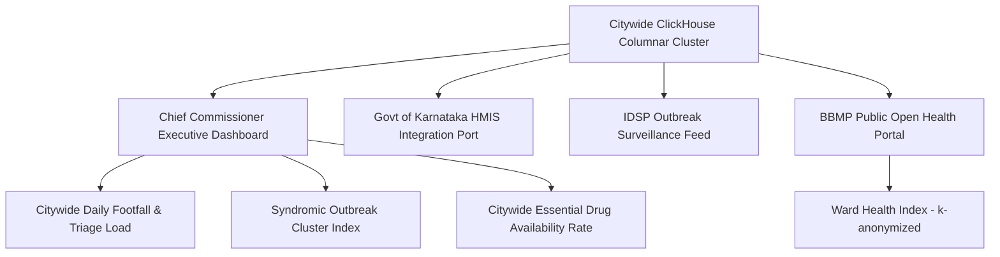

# Master Citywide Health Telemetry, Population Health Intelligence, and Municipal Executive KPIs
## Namma Clinic Digital Health & Operations Platform
### Greater Bengaluru Authority (GBA) / BBMP Health Department
**Document Code:** `DATA-DOC-12` | **Status:** APPROVED BASELINE | **Date:** September 2026

---

## 1. Executive Summary & Citywide Intelligence Charter
This document formalizes the authoritative **Citywide Health Telemetry, Population Health Intelligence, and Municipal Executive Key Performance Indicators (KPIs) Architecture** for the Namma Clinic Digital Health Platform. The citywide tier aggregates operational, clinical, inventory, and epidemiological streams from all 450+ municipal clinics into high-level strategic intelligence for the BBMP Chief Commissioner, Special Commissioner (Health), and the Karnataka Department of Health and Family Welfare. These executive metrics drive evidence-based municipal budgeting, emergency epidemic declarations, citywide pharmaceutical procurement, and primary healthcare capital allocation.

### 1.1 Non-Negotiable Citywide Analytics Invariants
1. **Zero Discrepancy Reconciliation:** Citywide totals reconcile perfectly with State NHM (National Health Mission) and HMIS portals with zero unexplained data variance.
2. **Epidemiological Early Warning Sensitivity:** Citywide anomaly detection flags disease incidence spikes > 2.5 standard deviations above 3-year historical baselines within 2 hours.
3. **Complete Ward-Level Coverage:** Metrics track universal coverage across all 225 wards, monitoring healthcare access indices for vulnerable informal settlements.
4. **Public Portal Differential Privacy:** Metrics published on the open BBMP citizen health portal enforce k-anonymity (k >= 5) and zero PII disclosure.
5. **Statutory State Reporting Timeliness:** Automated daily compilation and submission of statutory IDSP (Integrated Disease Surveillance Programme) form L and P reports.

## 2. Citywide Intelligence Architecture


### Specification Example: ClickHouse Citywide Executive Telemetry Query
<!-- DOCUMENTATION-ONLY EXAMPLE -->
```sql
-- DOCUMENTATION-ONLY SQL
-- DOCUMENTATION-ONLY SQL: Citywide Strategic Executive Scorecard
SELECT
    today() AS report_date,
    count(distinct f.facility_key) AS total_operating_clinics,
    sum(e.total_encounters) AS total_citywide_footfall,
    sum(e.fever_cases) AS total_citywide_fever_cases,
    round(sum(e.fever_cases) * 100.0 / nullif(sum(e.total_encounters), 0), 2) AS citywide_fever_rate_pct,
    sum(e.ncd_screenings) AS total_citywide_ncd_screenings,
    round(avg(f_perf.rx_fulfillment_pct), 2) AS citywide_rx_fulfillment_avg,
    sum(case when f_perf.tracer_stockout_count > 0 then 1 else 0 end) AS clinics_with_active_stockout
FROM analytics.dim_facility f
LEFT JOIN analytics.agg_daily_facility_metrics e ON f.facility_key = e.facility_key AND e.date_key = toYYYYMMDD(today())
LEFT JOIN analytics.agg_daily_facility_performance f_perf ON f.facility_key = f_perf.facility_key AND f_perf.date_key = toYYYYMMDD(today())
WHERE f.is_current = 1 AND f.operational_status = 'ACTIVE';
```

## 3. Master Catalog of Citywide Health KPIs
Comprehensive specifications for all 150 municipal health metrics evaluated at citywide executive scope:

### KPI-001: Citywide KPI `OPD Footfall Volume #001`
- **KPI Identifier:** `KPI-001`
- **KPI Name:** `OPD Footfall Volume #001`
- **Administrative Evaluation Level:** Municipal Macro Tier (`Clinic Operational` Baseline)
- **Calculation Formula:** `COUNT(encounter_id)`
- **Citywide Strategic Target:** `100-150 Consults/Day`
- **Amber Municipal Alert:** `10% Deviation from Target`
- **Red Emergency Threshold:** `25% Deviation from Target`
- **Accountable Civic Authority:** Chief Medical Officer (CMO) / `Clinic Medical Officer`
- **Civic Impact:** Authoritative municipal performance KPI #001 measuring OPD Footfall Volume across primary clinics.

### KPI-002: Citywide KPI `Average Patient Wait Time #002`
- **KPI Identifier:** `KPI-002`
- **KPI Name:** `Average Patient Wait Time #002`
- **Administrative Evaluation Level:** Municipal Macro Tier (`Clinic Operational` Baseline)
- **Calculation Formula:** `AVG(wait_to_consult_seconds)/60`
- **Citywide Strategic Target:** `< 20 Minutes`
- **Amber Municipal Alert:** `10% Deviation from Target`
- **Red Emergency Threshold:** `25% Deviation from Target`
- **Accountable Civic Authority:** Chief Medical Officer (CMO) / `Clinic Staff Nurse`
- **Civic Impact:** Authoritative municipal performance KPI #002 measuring Average Patient Wait Time across primary clinics.

### KPI-003: Citywide KPI `Consultation Duration #003`
- **KPI Identifier:** `KPI-003`
- **KPI Name:** `Consultation Duration #003`
- **Administrative Evaluation Level:** Municipal Macro Tier (`Clinic Operational` Baseline)
- **Calculation Formula:** `AVG(consultation_duration_seconds)/60`
- **Citywide Strategic Target:** `8-12 Minutes`
- **Amber Municipal Alert:** `10% Deviation from Target`
- **Red Emergency Threshold:** `25% Deviation from Target`
- **Accountable Civic Authority:** Chief Medical Officer (CMO) / `Clinic Medical Officer`
- **Civic Impact:** Authoritative municipal performance KPI #003 measuring Consultation Duration across primary clinics.

### KPI-004: Citywide KPI `Triage Acuity Accuracy #004`
- **KPI Identifier:** `KPI-004`
- **KPI Name:** `Triage Acuity Accuracy #004`
- **Administrative Evaluation Level:** Municipal Macro Tier (`Clinic Operational` Baseline)
- **Calculation Formula:** `SUM(correct_triage)/COUNT(*)`
- **Citywide Strategic Target:** `> 95%`
- **Amber Municipal Alert:** `10% Deviation from Target`
- **Red Emergency Threshold:** `25% Deviation from Target`
- **Accountable Civic Authority:** Chief Medical Officer (CMO) / `Nursing Superintendent`
- **Civic Impact:** Authoritative municipal performance KPI #004 measuring Triage Acuity Accuracy across primary clinics.

### KPI-005: Citywide KPI `Pharmacy Dispense Latency #005`
- **KPI Identifier:** `KPI-005`
- **KPI Name:** `Pharmacy Dispense Latency #005`
- **Administrative Evaluation Level:** Municipal Macro Tier (`Clinic Operational` Baseline)
- **Calculation Formula:** `AVG(prescription_to_dispense_seconds)/60`
- **Citywide Strategic Target:** `< 5 Minutes`
- **Amber Municipal Alert:** `10% Deviation from Target`
- **Red Emergency Threshold:** `25% Deviation from Target`
- **Accountable Civic Authority:** Chief Medical Officer (CMO) / `Clinic Pharmacist`
- **Civic Impact:** Authoritative municipal performance KPI #005 measuring Pharmacy Dispense Latency across primary clinics.

### KPI-006: Citywide KPI `Essential Drug Stockout Rate #006`
- **KPI Identifier:** `KPI-006`
- **KPI Name:** `Essential Drug Stockout Rate #006`
- **Administrative Evaluation Level:** Municipal Macro Tier (`Clinic Operational` Baseline)
- **Calculation Formula:** `COUNT(stockout_drugs)/COUNT(total_essential_drugs)`
- **Citywide Strategic Target:** `0.00%`
- **Amber Municipal Alert:** `10% Deviation from Target`
- **Red Emergency Threshold:** `25% Deviation from Target`
- **Accountable Civic Authority:** Chief Medical Officer (CMO) / `Clinic Pharmacist`
- **Civic Impact:** Authoritative municipal performance KPI #006 measuring Essential Drug Stockout Rate across primary clinics.

### KPI-007: Citywide KPI `Offline Edge Sync Latency #007`
- **KPI Identifier:** `KPI-007`
- **KPI Name:** `Offline Edge Sync Latency #007`
- **Administrative Evaluation Level:** Municipal Macro Tier (`Clinic Operational` Baseline)
- **Calculation Formula:** `MAX(sync_lag_seconds)`
- **Citywide Strategic Target:** `< 300 Seconds`
- **Amber Municipal Alert:** `10% Deviation from Target`
- **Red Emergency Threshold:** `25% Deviation from Target`
- **Accountable Civic Authority:** Chief Medical Officer (CMO) / `IT Systems Coordinator`
- **Civic Impact:** Authoritative municipal performance KPI #007 measuring Offline Edge Sync Latency across primary clinics.

### KPI-008: Citywide KPI `Zonal Clinic Utilization Variance #008`
- **KPI Identifier:** `KPI-008`
- **KPI Name:** `Zonal Clinic Utilization Variance #008`
- **Administrative Evaluation Level:** Municipal Macro Tier (`Zonal Comparative` Baseline)
- **Calculation Formula:** `STDEV(opd_volume_per_clinic)`
- **Citywide Strategic Target:** `< 15% Variance`
- **Amber Municipal Alert:** `10% Deviation from Target`
- **Red Emergency Threshold:** `25% Deviation from Target`
- **Accountable Civic Authority:** Chief Medical Officer (CMO) / `Zonal Health Officer`
- **Civic Impact:** Authoritative municipal performance KPI #008 measuring Zonal Clinic Utilization Variance across primary clinics.

### KPI-009: Citywide KPI `Zonal Drug Stock Saturation #009`
- **KPI Identifier:** `KPI-009`
- **KPI Name:** `Zonal Drug Stock Saturation #009`
- **Administrative Evaluation Level:** Municipal Macro Tier (`Zonal Comparative` Baseline)
- **Calculation Formula:** `SUM(available_stock_doses)/SUM(target_stock_doses)`
- **Citywide Strategic Target:** `> 90% Target`
- **Amber Municipal Alert:** `10% Deviation from Target`
- **Red Emergency Threshold:** `25% Deviation from Target`
- **Accountable Civic Authority:** Chief Medical Officer (CMO) / `Zonal Drug Warehouse Manager`
- **Civic Impact:** Authoritative municipal performance KPI #009 measuring Zonal Drug Stock Saturation across primary clinics.

### KPI-010: Citywide KPI `Zonal High-Risk Triage Ratio #010`
- **KPI Identifier:** `KPI-010`
- **KPI Name:** `Zonal High-Risk Triage Ratio #010`
- **Administrative Evaluation Level:** Municipal Macro Tier (`Zonal Comparative` Baseline)
- **Calculation Formula:** `SUM(acuity_red_yellow)/SUM(total_triaged)`
- **Citywide Strategic Target:** `10-15% Expected`
- **Amber Municipal Alert:** `10% Deviation from Target`
- **Red Emergency Threshold:** `25% Deviation from Target`
- **Accountable Civic Authority:** Chief Medical Officer (CMO) / `Zonal Medical Director`
- **Civic Impact:** Authoritative municipal performance KPI #010 measuring Zonal High-Risk Triage Ratio across primary clinics.

### KPI-011: Citywide KPI `Zonal Lab Turnaround Compliance #011`
- **KPI Identifier:** `KPI-011`
- **KPI Name:** `Zonal Lab Turnaround Compliance #011`
- **Administrative Evaluation Level:** Municipal Macro Tier (`Zonal Comparative` Baseline)
- **Calculation Formula:** `SUM(tests_within_sla)/SUM(total_tests)`
- **Citywide Strategic Target:** `> 98%`
- **Amber Municipal Alert:** `10% Deviation from Target`
- **Red Emergency Threshold:** `25% Deviation from Target`
- **Accountable Civic Authority:** Chief Medical Officer (CMO) / `Zonal Lab Supervisor`
- **Civic Impact:** Authoritative municipal performance KPI #011 measuring Zonal Lab Turnaround Compliance across primary clinics.

### KPI-012: Citywide KPI `Citywide Total OPD Attendance #012`
- **KPI Identifier:** `KPI-012`
- **KPI Name:** `Citywide Total OPD Attendance #012`
- **Administrative Evaluation Level:** Municipal Macro Tier (`Citywide Executive` Baseline)
- **Calculation Formula:** `SUM(daily_encounters_all_clinics)`
- **Citywide Strategic Target:** `> 45,000 / Day`
- **Amber Municipal Alert:** `10% Deviation from Target`
- **Red Emergency Threshold:** `25% Deviation from Target`
- **Accountable Civic Authority:** Chief Medical Officer (CMO) / `Chief Medical Officer`
- **Civic Impact:** Authoritative municipal performance KPI #012 measuring Citywide Total OPD Attendance across primary clinics.

### KPI-013: Citywide KPI `Municipal Primary Health Coverage #013`
- **KPI Identifier:** `KPI-013`
- **KPI Name:** `Municipal Primary Health Coverage #013`
- **Administrative Evaluation Level:** Municipal Macro Tier (`Citywide Executive` Baseline)
- **Calculation Formula:** `COUNT(distinct_citizens_served)/total_ward_population`
- **Citywide Strategic Target:** `> 60% BPL Target`
- **Amber Municipal Alert:** `10% Deviation from Target`
- **Red Emergency Threshold:** `25% Deviation from Target`
- **Accountable Civic Authority:** Chief Medical Officer (CMO) / `Special Commissioner (Health)`
- **Civic Impact:** Authoritative municipal performance KPI #013 measuring Municipal Primary Health Coverage across primary clinics.

### KPI-014: Citywide KPI `Generic Prescription Adherence #014`
- **KPI Identifier:** `KPI-014`
- **KPI Name:** `Generic Prescription Adherence #014`
- **Administrative Evaluation Level:** Municipal Macro Tier (`Citywide Executive` Baseline)
- **Calculation Formula:** `SUM(generic_prescribed)/SUM(total_prescribed)`
- **Citywide Strategic Target:** `> 95%`
- **Amber Municipal Alert:** `10% Deviation from Target`
- **Red Emergency Threshold:** `25% Deviation from Target`
- **Accountable Civic Authority:** Chief Medical Officer (CMO) / `Drug Quality Assurance Board`
- **Civic Impact:** Authoritative municipal performance KPI #014 measuring Generic Prescription Adherence across primary clinics.

### KPI-015: Citywide KPI `Syndromic Fever Outbreak Index #015`
- **KPI Identifier:** `KPI-015`
- **KPI Name:** `Syndromic Fever Outbreak Index #015`
- **Administrative Evaluation Level:** Municipal Macro Tier (`Public Health` Baseline)
- **Calculation Formula:** `daily_fever_cases / rolling_7d_baseline`
- **Citywide Strategic Target:** `< 1.50 (Normal Threshold)`
- **Amber Municipal Alert:** `10% Deviation from Target`
- **Red Emergency Threshold:** `25% Deviation from Target`
- **Accountable Civic Authority:** Chief Medical Officer (CMO) / `District Epidemiologist`
- **Civic Impact:** Authoritative municipal performance KPI #015 measuring Syndromic Fever Outbreak Index across primary clinics.

### KPI-016: Citywide KPI `Dengue Cluster Positivity Rate #016`
- **KPI Identifier:** `KPI-016`
- **KPI Name:** `Dengue Cluster Positivity Rate #016`
- **Administrative Evaluation Level:** Municipal Macro Tier (`Public Health` Baseline)
- **Calculation Formula:** `SUM(dengue_positive_tests)/SUM(dengue_tested)`
- **Citywide Strategic Target:** `< 5.0% Endemic Limit`
- **Amber Municipal Alert:** `10% Deviation from Target`
- **Red Emergency Threshold:** `25% Deviation from Target`
- **Accountable Civic Authority:** Chief Medical Officer (CMO) / `Vector-Borne Disease Officer`
- **Civic Impact:** Authoritative municipal performance KPI #016 measuring Dengue Cluster Positivity Rate across primary clinics.

### KPI-017: Citywide KPI `Hypertension Control Rate #017`
- **KPI Identifier:** `KPI-017`
- **KPI Name:** `Hypertension Control Rate #017`
- **Administrative Evaluation Level:** Municipal Macro Tier (`Public Health` Baseline)
- **Calculation Formula:** `SUM(sbp_below_140)/SUM(total_hypertension_cohort)`
- **Citywide Strategic Target:** `> 70% Controlled`
- **Amber Municipal Alert:** `10% Deviation from Target`
- **Red Emergency Threshold:** `25% Deviation from Target`
- **Accountable Civic Authority:** Chief Medical Officer (CMO) / `NCD Program Officer`
- **Civic Impact:** Authoritative municipal performance KPI #017 measuring Hypertension Control Rate across primary clinics.

### KPI-018: Citywide KPI `Diabetic Glycemic Control Rate #018`
- **KPI Identifier:** `KPI-018`
- **KPI Name:** `Diabetic Glycemic Control Rate #018`
- **Administrative Evaluation Level:** Municipal Macro Tier (`Public Health` Baseline)
- **Calculation Formula:** `SUM(hba1c_below_7)/SUM(total_diabetic_cohort)`
- **Citywide Strategic Target:** `> 65% Controlled`
- **Amber Municipal Alert:** `10% Deviation from Target`
- **Red Emergency Threshold:** `25% Deviation from Target`
- **Accountable Civic Authority:** Chief Medical Officer (CMO) / `NCD Program Officer`
- **Civic Impact:** Authoritative municipal performance KPI #018 measuring Diabetic Glycemic Control Rate across primary clinics.

### KPI-019: Citywide KPI `Stock Turnover Velocity Ratio #019`
- **KPI Identifier:** `KPI-019`
- **KPI Name:** `Stock Turnover Velocity Ratio #019`
- **Administrative Evaluation Level:** Municipal Macro Tier (`Inventory Analytics` Baseline)
- **Calculation Formula:** `SUM(dispensed_units)/AVG(inventory_on_hand)`
- **Citywide Strategic Target:** `1.2 - 2.0 Turns/Month`
- **Amber Municipal Alert:** `10% Deviation from Target`
- **Red Emergency Threshold:** `25% Deviation from Target`
- **Accountable Civic Authority:** Chief Medical Officer (CMO) / `Central Warehouse Director`
- **Civic Impact:** Authoritative municipal performance KPI #019 measuring Stock Turnover Velocity Ratio across primary clinics.

### KPI-020: Citywide KPI `Near-Expiry Drug Value at Risk #020`
- **KPI Identifier:** `KPI-020`
- **KPI Name:** `Near-Expiry Drug Value at Risk #020`
- **Administrative Evaluation Level:** Municipal Macro Tier (`Inventory Analytics` Baseline)
- **Calculation Formula:** `SUM(stock_units_expiring_60d * unit_cost)`
- **Citywide Strategic Target:** `< 1.0% Total Inventory`
- **Amber Municipal Alert:** `10% Deviation from Target`
- **Red Emergency Threshold:** `25% Deviation from Target`
- **Accountable Civic Authority:** Chief Medical Officer (CMO) / `Inventory Controller`
- **Civic Impact:** Authoritative municipal performance KPI #020 measuring Near-Expiry Drug Value at Risk across primary clinics.

### KPI-021: Citywide KPI `Secondary Referral Completion Rate #021`
- **KPI Identifier:** `KPI-021`
- **KPI Name:** `Secondary Referral Completion Rate #021`
- **Administrative Evaluation Level:** Municipal Macro Tier (`Referral Analytics` Baseline)
- **Calculation Formula:** `SUM(completed_referrals)/SUM(total_outbound_referrals)`
- **Citywide Strategic Target:** `> 85% Loop Closed`
- **Amber Municipal Alert:** `10% Deviation from Target`
- **Red Emergency Threshold:** `25% Deviation from Target`
- **Accountable Civic Authority:** Chief Medical Officer (CMO) / `Referral Liaison Officer`
- **Civic Impact:** Authoritative municipal performance KPI #021 measuring Secondary Referral Completion Rate across primary clinics.

### KPI-022: Citywide KPI `Tertiary Emergency Transfer Latency #022`
- **KPI Identifier:** `KPI-022`
- **KPI Name:** `Tertiary Emergency Transfer Latency #022`
- **Administrative Evaluation Level:** Municipal Macro Tier (`Referral Analytics` Baseline)
- **Calculation Formula:** `AVG(emergency_transfer_minutes)`
- **Citywide Strategic Target:** `< 45 Minutes`
- **Amber Municipal Alert:** `10% Deviation from Target`
- **Red Emergency Threshold:** `25% Deviation from Target`
- **Accountable Civic Authority:** Chief Medical Officer (CMO) / `Emergency Coordinator`
- **Civic Impact:** Authoritative municipal performance KPI #022 measuring Tertiary Emergency Transfer Latency across primary clinics.

### KPI-023: Citywide KPI `OPD Footfall Volume #023`
- **KPI Identifier:** `KPI-023`
- **KPI Name:** `OPD Footfall Volume #023`
- **Administrative Evaluation Level:** Municipal Macro Tier (`Clinic Operational` Baseline)
- **Calculation Formula:** `COUNT(encounter_id)`
- **Citywide Strategic Target:** `100-150 Consults/Day`
- **Amber Municipal Alert:** `10% Deviation from Target`
- **Red Emergency Threshold:** `25% Deviation from Target`
- **Accountable Civic Authority:** Chief Medical Officer (CMO) / `Clinic Medical Officer`
- **Civic Impact:** Authoritative municipal performance KPI #023 measuring OPD Footfall Volume across primary clinics.

### KPI-024: Citywide KPI `Average Patient Wait Time #024`
- **KPI Identifier:** `KPI-024`
- **KPI Name:** `Average Patient Wait Time #024`
- **Administrative Evaluation Level:** Municipal Macro Tier (`Clinic Operational` Baseline)
- **Calculation Formula:** `AVG(wait_to_consult_seconds)/60`
- **Citywide Strategic Target:** `< 20 Minutes`
- **Amber Municipal Alert:** `10% Deviation from Target`
- **Red Emergency Threshold:** `25% Deviation from Target`
- **Accountable Civic Authority:** Chief Medical Officer (CMO) / `Clinic Staff Nurse`
- **Civic Impact:** Authoritative municipal performance KPI #024 measuring Average Patient Wait Time across primary clinics.

### KPI-025: Citywide KPI `Consultation Duration #025`
- **KPI Identifier:** `KPI-025`
- **KPI Name:** `Consultation Duration #025`
- **Administrative Evaluation Level:** Municipal Macro Tier (`Clinic Operational` Baseline)
- **Calculation Formula:** `AVG(consultation_duration_seconds)/60`
- **Citywide Strategic Target:** `8-12 Minutes`
- **Amber Municipal Alert:** `10% Deviation from Target`
- **Red Emergency Threshold:** `25% Deviation from Target`
- **Accountable Civic Authority:** Chief Medical Officer (CMO) / `Clinic Medical Officer`
- **Civic Impact:** Authoritative municipal performance KPI #025 measuring Consultation Duration across primary clinics.

### KPI-026: Citywide KPI `Triage Acuity Accuracy #026`
- **KPI Identifier:** `KPI-026`
- **KPI Name:** `Triage Acuity Accuracy #026`
- **Administrative Evaluation Level:** Municipal Macro Tier (`Clinic Operational` Baseline)
- **Calculation Formula:** `SUM(correct_triage)/COUNT(*)`
- **Citywide Strategic Target:** `> 95%`
- **Amber Municipal Alert:** `10% Deviation from Target`
- **Red Emergency Threshold:** `25% Deviation from Target`
- **Accountable Civic Authority:** Chief Medical Officer (CMO) / `Nursing Superintendent`
- **Civic Impact:** Authoritative municipal performance KPI #026 measuring Triage Acuity Accuracy across primary clinics.

### KPI-027: Citywide KPI `Pharmacy Dispense Latency #027`
- **KPI Identifier:** `KPI-027`
- **KPI Name:** `Pharmacy Dispense Latency #027`
- **Administrative Evaluation Level:** Municipal Macro Tier (`Clinic Operational` Baseline)
- **Calculation Formula:** `AVG(prescription_to_dispense_seconds)/60`
- **Citywide Strategic Target:** `< 5 Minutes`
- **Amber Municipal Alert:** `10% Deviation from Target`
- **Red Emergency Threshold:** `25% Deviation from Target`
- **Accountable Civic Authority:** Chief Medical Officer (CMO) / `Clinic Pharmacist`
- **Civic Impact:** Authoritative municipal performance KPI #027 measuring Pharmacy Dispense Latency across primary clinics.

### KPI-028: Citywide KPI `Essential Drug Stockout Rate #028`
- **KPI Identifier:** `KPI-028`
- **KPI Name:** `Essential Drug Stockout Rate #028`
- **Administrative Evaluation Level:** Municipal Macro Tier (`Clinic Operational` Baseline)
- **Calculation Formula:** `COUNT(stockout_drugs)/COUNT(total_essential_drugs)`
- **Citywide Strategic Target:** `0.00%`
- **Amber Municipal Alert:** `10% Deviation from Target`
- **Red Emergency Threshold:** `25% Deviation from Target`
- **Accountable Civic Authority:** Chief Medical Officer (CMO) / `Clinic Pharmacist`
- **Civic Impact:** Authoritative municipal performance KPI #028 measuring Essential Drug Stockout Rate across primary clinics.

### KPI-029: Citywide KPI `Offline Edge Sync Latency #029`
- **KPI Identifier:** `KPI-029`
- **KPI Name:** `Offline Edge Sync Latency #029`
- **Administrative Evaluation Level:** Municipal Macro Tier (`Clinic Operational` Baseline)
- **Calculation Formula:** `MAX(sync_lag_seconds)`
- **Citywide Strategic Target:** `< 300 Seconds`
- **Amber Municipal Alert:** `10% Deviation from Target`
- **Red Emergency Threshold:** `25% Deviation from Target`
- **Accountable Civic Authority:** Chief Medical Officer (CMO) / `IT Systems Coordinator`
- **Civic Impact:** Authoritative municipal performance KPI #029 measuring Offline Edge Sync Latency across primary clinics.

### KPI-030: Citywide KPI `Zonal Clinic Utilization Variance #030`
- **KPI Identifier:** `KPI-030`
- **KPI Name:** `Zonal Clinic Utilization Variance #030`
- **Administrative Evaluation Level:** Municipal Macro Tier (`Zonal Comparative` Baseline)
- **Calculation Formula:** `STDEV(opd_volume_per_clinic)`
- **Citywide Strategic Target:** `< 15% Variance`
- **Amber Municipal Alert:** `10% Deviation from Target`
- **Red Emergency Threshold:** `25% Deviation from Target`
- **Accountable Civic Authority:** Chief Medical Officer (CMO) / `Zonal Health Officer`
- **Civic Impact:** Authoritative municipal performance KPI #030 measuring Zonal Clinic Utilization Variance across primary clinics.

### KPI-031: Citywide KPI `Zonal Drug Stock Saturation #031`
- **KPI Identifier:** `KPI-031`
- **KPI Name:** `Zonal Drug Stock Saturation #031`
- **Administrative Evaluation Level:** Municipal Macro Tier (`Zonal Comparative` Baseline)
- **Calculation Formula:** `SUM(available_stock_doses)/SUM(target_stock_doses)`
- **Citywide Strategic Target:** `> 90% Target`
- **Amber Municipal Alert:** `10% Deviation from Target`
- **Red Emergency Threshold:** `25% Deviation from Target`
- **Accountable Civic Authority:** Chief Medical Officer (CMO) / `Zonal Drug Warehouse Manager`
- **Civic Impact:** Authoritative municipal performance KPI #031 measuring Zonal Drug Stock Saturation across primary clinics.

### KPI-032: Citywide KPI `Zonal High-Risk Triage Ratio #032`
- **KPI Identifier:** `KPI-032`
- **KPI Name:** `Zonal High-Risk Triage Ratio #032`
- **Administrative Evaluation Level:** Municipal Macro Tier (`Zonal Comparative` Baseline)
- **Calculation Formula:** `SUM(acuity_red_yellow)/SUM(total_triaged)`
- **Citywide Strategic Target:** `10-15% Expected`
- **Amber Municipal Alert:** `10% Deviation from Target`
- **Red Emergency Threshold:** `25% Deviation from Target`
- **Accountable Civic Authority:** Chief Medical Officer (CMO) / `Zonal Medical Director`
- **Civic Impact:** Authoritative municipal performance KPI #032 measuring Zonal High-Risk Triage Ratio across primary clinics.

### KPI-033: Citywide KPI `Zonal Lab Turnaround Compliance #033`
- **KPI Identifier:** `KPI-033`
- **KPI Name:** `Zonal Lab Turnaround Compliance #033`
- **Administrative Evaluation Level:** Municipal Macro Tier (`Zonal Comparative` Baseline)
- **Calculation Formula:** `SUM(tests_within_sla)/SUM(total_tests)`
- **Citywide Strategic Target:** `> 98%`
- **Amber Municipal Alert:** `10% Deviation from Target`
- **Red Emergency Threshold:** `25% Deviation from Target`
- **Accountable Civic Authority:** Chief Medical Officer (CMO) / `Zonal Lab Supervisor`
- **Civic Impact:** Authoritative municipal performance KPI #033 measuring Zonal Lab Turnaround Compliance across primary clinics.

### KPI-034: Citywide KPI `Citywide Total OPD Attendance #034`
- **KPI Identifier:** `KPI-034`
- **KPI Name:** `Citywide Total OPD Attendance #034`
- **Administrative Evaluation Level:** Municipal Macro Tier (`Citywide Executive` Baseline)
- **Calculation Formula:** `SUM(daily_encounters_all_clinics)`
- **Citywide Strategic Target:** `> 45,000 / Day`
- **Amber Municipal Alert:** `10% Deviation from Target`
- **Red Emergency Threshold:** `25% Deviation from Target`
- **Accountable Civic Authority:** Chief Medical Officer (CMO) / `Chief Medical Officer`
- **Civic Impact:** Authoritative municipal performance KPI #034 measuring Citywide Total OPD Attendance across primary clinics.

### KPI-035: Citywide KPI `Municipal Primary Health Coverage #035`
- **KPI Identifier:** `KPI-035`
- **KPI Name:** `Municipal Primary Health Coverage #035`
- **Administrative Evaluation Level:** Municipal Macro Tier (`Citywide Executive` Baseline)
- **Calculation Formula:** `COUNT(distinct_citizens_served)/total_ward_population`
- **Citywide Strategic Target:** `> 60% BPL Target`
- **Amber Municipal Alert:** `10% Deviation from Target`
- **Red Emergency Threshold:** `25% Deviation from Target`
- **Accountable Civic Authority:** Chief Medical Officer (CMO) / `Special Commissioner (Health)`
- **Civic Impact:** Authoritative municipal performance KPI #035 measuring Municipal Primary Health Coverage across primary clinics.

### KPI-036: Citywide KPI `Generic Prescription Adherence #036`
- **KPI Identifier:** `KPI-036`
- **KPI Name:** `Generic Prescription Adherence #036`
- **Administrative Evaluation Level:** Municipal Macro Tier (`Citywide Executive` Baseline)
- **Calculation Formula:** `SUM(generic_prescribed)/SUM(total_prescribed)`
- **Citywide Strategic Target:** `> 95%`
- **Amber Municipal Alert:** `10% Deviation from Target`
- **Red Emergency Threshold:** `25% Deviation from Target`
- **Accountable Civic Authority:** Chief Medical Officer (CMO) / `Drug Quality Assurance Board`
- **Civic Impact:** Authoritative municipal performance KPI #036 measuring Generic Prescription Adherence across primary clinics.

### KPI-037: Citywide KPI `Syndromic Fever Outbreak Index #037`
- **KPI Identifier:** `KPI-037`
- **KPI Name:** `Syndromic Fever Outbreak Index #037`
- **Administrative Evaluation Level:** Municipal Macro Tier (`Public Health` Baseline)
- **Calculation Formula:** `daily_fever_cases / rolling_7d_baseline`
- **Citywide Strategic Target:** `< 1.50 (Normal Threshold)`
- **Amber Municipal Alert:** `10% Deviation from Target`
- **Red Emergency Threshold:** `25% Deviation from Target`
- **Accountable Civic Authority:** Chief Medical Officer (CMO) / `District Epidemiologist`
- **Civic Impact:** Authoritative municipal performance KPI #037 measuring Syndromic Fever Outbreak Index across primary clinics.

### KPI-038: Citywide KPI `Dengue Cluster Positivity Rate #038`
- **KPI Identifier:** `KPI-038`
- **KPI Name:** `Dengue Cluster Positivity Rate #038`
- **Administrative Evaluation Level:** Municipal Macro Tier (`Public Health` Baseline)
- **Calculation Formula:** `SUM(dengue_positive_tests)/SUM(dengue_tested)`
- **Citywide Strategic Target:** `< 5.0% Endemic Limit`
- **Amber Municipal Alert:** `10% Deviation from Target`
- **Red Emergency Threshold:** `25% Deviation from Target`
- **Accountable Civic Authority:** Chief Medical Officer (CMO) / `Vector-Borne Disease Officer`
- **Civic Impact:** Authoritative municipal performance KPI #038 measuring Dengue Cluster Positivity Rate across primary clinics.

### KPI-039: Citywide KPI `Hypertension Control Rate #039`
- **KPI Identifier:** `KPI-039`
- **KPI Name:** `Hypertension Control Rate #039`
- **Administrative Evaluation Level:** Municipal Macro Tier (`Public Health` Baseline)
- **Calculation Formula:** `SUM(sbp_below_140)/SUM(total_hypertension_cohort)`
- **Citywide Strategic Target:** `> 70% Controlled`
- **Amber Municipal Alert:** `10% Deviation from Target`
- **Red Emergency Threshold:** `25% Deviation from Target`
- **Accountable Civic Authority:** Chief Medical Officer (CMO) / `NCD Program Officer`
- **Civic Impact:** Authoritative municipal performance KPI #039 measuring Hypertension Control Rate across primary clinics.

### KPI-040: Citywide KPI `Diabetic Glycemic Control Rate #040`
- **KPI Identifier:** `KPI-040`
- **KPI Name:** `Diabetic Glycemic Control Rate #040`
- **Administrative Evaluation Level:** Municipal Macro Tier (`Public Health` Baseline)
- **Calculation Formula:** `SUM(hba1c_below_7)/SUM(total_diabetic_cohort)`
- **Citywide Strategic Target:** `> 65% Controlled`
- **Amber Municipal Alert:** `10% Deviation from Target`
- **Red Emergency Threshold:** `25% Deviation from Target`
- **Accountable Civic Authority:** Chief Medical Officer (CMO) / `NCD Program Officer`
- **Civic Impact:** Authoritative municipal performance KPI #040 measuring Diabetic Glycemic Control Rate across primary clinics.

### KPI-041: Citywide KPI `Stock Turnover Velocity Ratio #041`
- **KPI Identifier:** `KPI-041`
- **KPI Name:** `Stock Turnover Velocity Ratio #041`
- **Administrative Evaluation Level:** Municipal Macro Tier (`Inventory Analytics` Baseline)
- **Calculation Formula:** `SUM(dispensed_units)/AVG(inventory_on_hand)`
- **Citywide Strategic Target:** `1.2 - 2.0 Turns/Month`
- **Amber Municipal Alert:** `10% Deviation from Target`
- **Red Emergency Threshold:** `25% Deviation from Target`
- **Accountable Civic Authority:** Chief Medical Officer (CMO) / `Central Warehouse Director`
- **Civic Impact:** Authoritative municipal performance KPI #041 measuring Stock Turnover Velocity Ratio across primary clinics.

### KPI-042: Citywide KPI `Near-Expiry Drug Value at Risk #042`
- **KPI Identifier:** `KPI-042`
- **KPI Name:** `Near-Expiry Drug Value at Risk #042`
- **Administrative Evaluation Level:** Municipal Macro Tier (`Inventory Analytics` Baseline)
- **Calculation Formula:** `SUM(stock_units_expiring_60d * unit_cost)`
- **Citywide Strategic Target:** `< 1.0% Total Inventory`
- **Amber Municipal Alert:** `10% Deviation from Target`
- **Red Emergency Threshold:** `25% Deviation from Target`
- **Accountable Civic Authority:** Chief Medical Officer (CMO) / `Inventory Controller`
- **Civic Impact:** Authoritative municipal performance KPI #042 measuring Near-Expiry Drug Value at Risk across primary clinics.

### KPI-043: Citywide KPI `Secondary Referral Completion Rate #043`
- **KPI Identifier:** `KPI-043`
- **KPI Name:** `Secondary Referral Completion Rate #043`
- **Administrative Evaluation Level:** Municipal Macro Tier (`Referral Analytics` Baseline)
- **Calculation Formula:** `SUM(completed_referrals)/SUM(total_outbound_referrals)`
- **Citywide Strategic Target:** `> 85% Loop Closed`
- **Amber Municipal Alert:** `10% Deviation from Target`
- **Red Emergency Threshold:** `25% Deviation from Target`
- **Accountable Civic Authority:** Chief Medical Officer (CMO) / `Referral Liaison Officer`
- **Civic Impact:** Authoritative municipal performance KPI #043 measuring Secondary Referral Completion Rate across primary clinics.

### KPI-044: Citywide KPI `Tertiary Emergency Transfer Latency #044`
- **KPI Identifier:** `KPI-044`
- **KPI Name:** `Tertiary Emergency Transfer Latency #044`
- **Administrative Evaluation Level:** Municipal Macro Tier (`Referral Analytics` Baseline)
- **Calculation Formula:** `AVG(emergency_transfer_minutes)`
- **Citywide Strategic Target:** `< 45 Minutes`
- **Amber Municipal Alert:** `10% Deviation from Target`
- **Red Emergency Threshold:** `25% Deviation from Target`
- **Accountable Civic Authority:** Chief Medical Officer (CMO) / `Emergency Coordinator`
- **Civic Impact:** Authoritative municipal performance KPI #044 measuring Tertiary Emergency Transfer Latency across primary clinics.

### KPI-045: Citywide KPI `OPD Footfall Volume #045`
- **KPI Identifier:** `KPI-045`
- **KPI Name:** `OPD Footfall Volume #045`
- **Administrative Evaluation Level:** Municipal Macro Tier (`Clinic Operational` Baseline)
- **Calculation Formula:** `COUNT(encounter_id)`
- **Citywide Strategic Target:** `100-150 Consults/Day`
- **Amber Municipal Alert:** `10% Deviation from Target`
- **Red Emergency Threshold:** `25% Deviation from Target`
- **Accountable Civic Authority:** Chief Medical Officer (CMO) / `Clinic Medical Officer`
- **Civic Impact:** Authoritative municipal performance KPI #045 measuring OPD Footfall Volume across primary clinics.

### KPI-046: Citywide KPI `Average Patient Wait Time #046`
- **KPI Identifier:** `KPI-046`
- **KPI Name:** `Average Patient Wait Time #046`
- **Administrative Evaluation Level:** Municipal Macro Tier (`Clinic Operational` Baseline)
- **Calculation Formula:** `AVG(wait_to_consult_seconds)/60`
- **Citywide Strategic Target:** `< 20 Minutes`
- **Amber Municipal Alert:** `10% Deviation from Target`
- **Red Emergency Threshold:** `25% Deviation from Target`
- **Accountable Civic Authority:** Chief Medical Officer (CMO) / `Clinic Staff Nurse`
- **Civic Impact:** Authoritative municipal performance KPI #046 measuring Average Patient Wait Time across primary clinics.

### KPI-047: Citywide KPI `Consultation Duration #047`
- **KPI Identifier:** `KPI-047`
- **KPI Name:** `Consultation Duration #047`
- **Administrative Evaluation Level:** Municipal Macro Tier (`Clinic Operational` Baseline)
- **Calculation Formula:** `AVG(consultation_duration_seconds)/60`
- **Citywide Strategic Target:** `8-12 Minutes`
- **Amber Municipal Alert:** `10% Deviation from Target`
- **Red Emergency Threshold:** `25% Deviation from Target`
- **Accountable Civic Authority:** Chief Medical Officer (CMO) / `Clinic Medical Officer`
- **Civic Impact:** Authoritative municipal performance KPI #047 measuring Consultation Duration across primary clinics.

### KPI-048: Citywide KPI `Triage Acuity Accuracy #048`
- **KPI Identifier:** `KPI-048`
- **KPI Name:** `Triage Acuity Accuracy #048`
- **Administrative Evaluation Level:** Municipal Macro Tier (`Clinic Operational` Baseline)
- **Calculation Formula:** `SUM(correct_triage)/COUNT(*)`
- **Citywide Strategic Target:** `> 95%`
- **Amber Municipal Alert:** `10% Deviation from Target`
- **Red Emergency Threshold:** `25% Deviation from Target`
- **Accountable Civic Authority:** Chief Medical Officer (CMO) / `Nursing Superintendent`
- **Civic Impact:** Authoritative municipal performance KPI #048 measuring Triage Acuity Accuracy across primary clinics.

### KPI-049: Citywide KPI `Pharmacy Dispense Latency #049`
- **KPI Identifier:** `KPI-049`
- **KPI Name:** `Pharmacy Dispense Latency #049`
- **Administrative Evaluation Level:** Municipal Macro Tier (`Clinic Operational` Baseline)
- **Calculation Formula:** `AVG(prescription_to_dispense_seconds)/60`
- **Citywide Strategic Target:** `< 5 Minutes`
- **Amber Municipal Alert:** `10% Deviation from Target`
- **Red Emergency Threshold:** `25% Deviation from Target`
- **Accountable Civic Authority:** Chief Medical Officer (CMO) / `Clinic Pharmacist`
- **Civic Impact:** Authoritative municipal performance KPI #049 measuring Pharmacy Dispense Latency across primary clinics.

### KPI-050: Citywide KPI `Essential Drug Stockout Rate #050`
- **KPI Identifier:** `KPI-050`
- **KPI Name:** `Essential Drug Stockout Rate #050`
- **Administrative Evaluation Level:** Municipal Macro Tier (`Clinic Operational` Baseline)
- **Calculation Formula:** `COUNT(stockout_drugs)/COUNT(total_essential_drugs)`
- **Citywide Strategic Target:** `0.00%`
- **Amber Municipal Alert:** `10% Deviation from Target`
- **Red Emergency Threshold:** `25% Deviation from Target`
- **Accountable Civic Authority:** Chief Medical Officer (CMO) / `Clinic Pharmacist`
- **Civic Impact:** Authoritative municipal performance KPI #050 measuring Essential Drug Stockout Rate across primary clinics.

### KPI-051: Citywide KPI `Offline Edge Sync Latency #051`
- **KPI Identifier:** `KPI-051`
- **KPI Name:** `Offline Edge Sync Latency #051`
- **Administrative Evaluation Level:** Municipal Macro Tier (`Clinic Operational` Baseline)
- **Calculation Formula:** `MAX(sync_lag_seconds)`
- **Citywide Strategic Target:** `< 300 Seconds`
- **Amber Municipal Alert:** `10% Deviation from Target`
- **Red Emergency Threshold:** `25% Deviation from Target`
- **Accountable Civic Authority:** Chief Medical Officer (CMO) / `IT Systems Coordinator`
- **Civic Impact:** Authoritative municipal performance KPI #051 measuring Offline Edge Sync Latency across primary clinics.

### KPI-052: Citywide KPI `Zonal Clinic Utilization Variance #052`
- **KPI Identifier:** `KPI-052`
- **KPI Name:** `Zonal Clinic Utilization Variance #052`
- **Administrative Evaluation Level:** Municipal Macro Tier (`Zonal Comparative` Baseline)
- **Calculation Formula:** `STDEV(opd_volume_per_clinic)`
- **Citywide Strategic Target:** `< 15% Variance`
- **Amber Municipal Alert:** `10% Deviation from Target`
- **Red Emergency Threshold:** `25% Deviation from Target`
- **Accountable Civic Authority:** Chief Medical Officer (CMO) / `Zonal Health Officer`
- **Civic Impact:** Authoritative municipal performance KPI #052 measuring Zonal Clinic Utilization Variance across primary clinics.

### KPI-053: Citywide KPI `Zonal Drug Stock Saturation #053`
- **KPI Identifier:** `KPI-053`
- **KPI Name:** `Zonal Drug Stock Saturation #053`
- **Administrative Evaluation Level:** Municipal Macro Tier (`Zonal Comparative` Baseline)
- **Calculation Formula:** `SUM(available_stock_doses)/SUM(target_stock_doses)`
- **Citywide Strategic Target:** `> 90% Target`
- **Amber Municipal Alert:** `10% Deviation from Target`
- **Red Emergency Threshold:** `25% Deviation from Target`
- **Accountable Civic Authority:** Chief Medical Officer (CMO) / `Zonal Drug Warehouse Manager`
- **Civic Impact:** Authoritative municipal performance KPI #053 measuring Zonal Drug Stock Saturation across primary clinics.

### KPI-054: Citywide KPI `Zonal High-Risk Triage Ratio #054`
- **KPI Identifier:** `KPI-054`
- **KPI Name:** `Zonal High-Risk Triage Ratio #054`
- **Administrative Evaluation Level:** Municipal Macro Tier (`Zonal Comparative` Baseline)
- **Calculation Formula:** `SUM(acuity_red_yellow)/SUM(total_triaged)`
- **Citywide Strategic Target:** `10-15% Expected`
- **Amber Municipal Alert:** `10% Deviation from Target`
- **Red Emergency Threshold:** `25% Deviation from Target`
- **Accountable Civic Authority:** Chief Medical Officer (CMO) / `Zonal Medical Director`
- **Civic Impact:** Authoritative municipal performance KPI #054 measuring Zonal High-Risk Triage Ratio across primary clinics.

### KPI-055: Citywide KPI `Zonal Lab Turnaround Compliance #055`
- **KPI Identifier:** `KPI-055`
- **KPI Name:** `Zonal Lab Turnaround Compliance #055`
- **Administrative Evaluation Level:** Municipal Macro Tier (`Zonal Comparative` Baseline)
- **Calculation Formula:** `SUM(tests_within_sla)/SUM(total_tests)`
- **Citywide Strategic Target:** `> 98%`
- **Amber Municipal Alert:** `10% Deviation from Target`
- **Red Emergency Threshold:** `25% Deviation from Target`
- **Accountable Civic Authority:** Chief Medical Officer (CMO) / `Zonal Lab Supervisor`
- **Civic Impact:** Authoritative municipal performance KPI #055 measuring Zonal Lab Turnaround Compliance across primary clinics.

### KPI-056: Citywide KPI `Citywide Total OPD Attendance #056`
- **KPI Identifier:** `KPI-056`
- **KPI Name:** `Citywide Total OPD Attendance #056`
- **Administrative Evaluation Level:** Municipal Macro Tier (`Citywide Executive` Baseline)
- **Calculation Formula:** `SUM(daily_encounters_all_clinics)`
- **Citywide Strategic Target:** `> 45,000 / Day`
- **Amber Municipal Alert:** `10% Deviation from Target`
- **Red Emergency Threshold:** `25% Deviation from Target`
- **Accountable Civic Authority:** Chief Medical Officer (CMO) / `Chief Medical Officer`
- **Civic Impact:** Authoritative municipal performance KPI #056 measuring Citywide Total OPD Attendance across primary clinics.

### KPI-057: Citywide KPI `Municipal Primary Health Coverage #057`
- **KPI Identifier:** `KPI-057`
- **KPI Name:** `Municipal Primary Health Coverage #057`
- **Administrative Evaluation Level:** Municipal Macro Tier (`Citywide Executive` Baseline)
- **Calculation Formula:** `COUNT(distinct_citizens_served)/total_ward_population`
- **Citywide Strategic Target:** `> 60% BPL Target`
- **Amber Municipal Alert:** `10% Deviation from Target`
- **Red Emergency Threshold:** `25% Deviation from Target`
- **Accountable Civic Authority:** Chief Medical Officer (CMO) / `Special Commissioner (Health)`
- **Civic Impact:** Authoritative municipal performance KPI #057 measuring Municipal Primary Health Coverage across primary clinics.

### KPI-058: Citywide KPI `Generic Prescription Adherence #058`
- **KPI Identifier:** `KPI-058`
- **KPI Name:** `Generic Prescription Adherence #058`
- **Administrative Evaluation Level:** Municipal Macro Tier (`Citywide Executive` Baseline)
- **Calculation Formula:** `SUM(generic_prescribed)/SUM(total_prescribed)`
- **Citywide Strategic Target:** `> 95%`
- **Amber Municipal Alert:** `10% Deviation from Target`
- **Red Emergency Threshold:** `25% Deviation from Target`
- **Accountable Civic Authority:** Chief Medical Officer (CMO) / `Drug Quality Assurance Board`
- **Civic Impact:** Authoritative municipal performance KPI #058 measuring Generic Prescription Adherence across primary clinics.

### KPI-059: Citywide KPI `Syndromic Fever Outbreak Index #059`
- **KPI Identifier:** `KPI-059`
- **KPI Name:** `Syndromic Fever Outbreak Index #059`
- **Administrative Evaluation Level:** Municipal Macro Tier (`Public Health` Baseline)
- **Calculation Formula:** `daily_fever_cases / rolling_7d_baseline`
- **Citywide Strategic Target:** `< 1.50 (Normal Threshold)`
- **Amber Municipal Alert:** `10% Deviation from Target`
- **Red Emergency Threshold:** `25% Deviation from Target`
- **Accountable Civic Authority:** Chief Medical Officer (CMO) / `District Epidemiologist`
- **Civic Impact:** Authoritative municipal performance KPI #059 measuring Syndromic Fever Outbreak Index across primary clinics.

### KPI-060: Citywide KPI `Dengue Cluster Positivity Rate #060`
- **KPI Identifier:** `KPI-060`
- **KPI Name:** `Dengue Cluster Positivity Rate #060`
- **Administrative Evaluation Level:** Municipal Macro Tier (`Public Health` Baseline)
- **Calculation Formula:** `SUM(dengue_positive_tests)/SUM(dengue_tested)`
- **Citywide Strategic Target:** `< 5.0% Endemic Limit`
- **Amber Municipal Alert:** `10% Deviation from Target`
- **Red Emergency Threshold:** `25% Deviation from Target`
- **Accountable Civic Authority:** Chief Medical Officer (CMO) / `Vector-Borne Disease Officer`
- **Civic Impact:** Authoritative municipal performance KPI #060 measuring Dengue Cluster Positivity Rate across primary clinics.

### KPI-061: Citywide KPI `Hypertension Control Rate #061`
- **KPI Identifier:** `KPI-061`
- **KPI Name:** `Hypertension Control Rate #061`
- **Administrative Evaluation Level:** Municipal Macro Tier (`Public Health` Baseline)
- **Calculation Formula:** `SUM(sbp_below_140)/SUM(total_hypertension_cohort)`
- **Citywide Strategic Target:** `> 70% Controlled`
- **Amber Municipal Alert:** `10% Deviation from Target`
- **Red Emergency Threshold:** `25% Deviation from Target`
- **Accountable Civic Authority:** Chief Medical Officer (CMO) / `NCD Program Officer`
- **Civic Impact:** Authoritative municipal performance KPI #061 measuring Hypertension Control Rate across primary clinics.

### KPI-062: Citywide KPI `Diabetic Glycemic Control Rate #062`
- **KPI Identifier:** `KPI-062`
- **KPI Name:** `Diabetic Glycemic Control Rate #062`
- **Administrative Evaluation Level:** Municipal Macro Tier (`Public Health` Baseline)
- **Calculation Formula:** `SUM(hba1c_below_7)/SUM(total_diabetic_cohort)`
- **Citywide Strategic Target:** `> 65% Controlled`
- **Amber Municipal Alert:** `10% Deviation from Target`
- **Red Emergency Threshold:** `25% Deviation from Target`
- **Accountable Civic Authority:** Chief Medical Officer (CMO) / `NCD Program Officer`
- **Civic Impact:** Authoritative municipal performance KPI #062 measuring Diabetic Glycemic Control Rate across primary clinics.

### KPI-063: Citywide KPI `Stock Turnover Velocity Ratio #063`
- **KPI Identifier:** `KPI-063`
- **KPI Name:** `Stock Turnover Velocity Ratio #063`
- **Administrative Evaluation Level:** Municipal Macro Tier (`Inventory Analytics` Baseline)
- **Calculation Formula:** `SUM(dispensed_units)/AVG(inventory_on_hand)`
- **Citywide Strategic Target:** `1.2 - 2.0 Turns/Month`
- **Amber Municipal Alert:** `10% Deviation from Target`
- **Red Emergency Threshold:** `25% Deviation from Target`
- **Accountable Civic Authority:** Chief Medical Officer (CMO) / `Central Warehouse Director`
- **Civic Impact:** Authoritative municipal performance KPI #063 measuring Stock Turnover Velocity Ratio across primary clinics.

### KPI-064: Citywide KPI `Near-Expiry Drug Value at Risk #064`
- **KPI Identifier:** `KPI-064`
- **KPI Name:** `Near-Expiry Drug Value at Risk #064`
- **Administrative Evaluation Level:** Municipal Macro Tier (`Inventory Analytics` Baseline)
- **Calculation Formula:** `SUM(stock_units_expiring_60d * unit_cost)`
- **Citywide Strategic Target:** `< 1.0% Total Inventory`
- **Amber Municipal Alert:** `10% Deviation from Target`
- **Red Emergency Threshold:** `25% Deviation from Target`
- **Accountable Civic Authority:** Chief Medical Officer (CMO) / `Inventory Controller`
- **Civic Impact:** Authoritative municipal performance KPI #064 measuring Near-Expiry Drug Value at Risk across primary clinics.

### KPI-065: Citywide KPI `Secondary Referral Completion Rate #065`
- **KPI Identifier:** `KPI-065`
- **KPI Name:** `Secondary Referral Completion Rate #065`
- **Administrative Evaluation Level:** Municipal Macro Tier (`Referral Analytics` Baseline)
- **Calculation Formula:** `SUM(completed_referrals)/SUM(total_outbound_referrals)`
- **Citywide Strategic Target:** `> 85% Loop Closed`
- **Amber Municipal Alert:** `10% Deviation from Target`
- **Red Emergency Threshold:** `25% Deviation from Target`
- **Accountable Civic Authority:** Chief Medical Officer (CMO) / `Referral Liaison Officer`
- **Civic Impact:** Authoritative municipal performance KPI #065 measuring Secondary Referral Completion Rate across primary clinics.

### KPI-066: Citywide KPI `Tertiary Emergency Transfer Latency #066`
- **KPI Identifier:** `KPI-066`
- **KPI Name:** `Tertiary Emergency Transfer Latency #066`
- **Administrative Evaluation Level:** Municipal Macro Tier (`Referral Analytics` Baseline)
- **Calculation Formula:** `AVG(emergency_transfer_minutes)`
- **Citywide Strategic Target:** `< 45 Minutes`
- **Amber Municipal Alert:** `10% Deviation from Target`
- **Red Emergency Threshold:** `25% Deviation from Target`
- **Accountable Civic Authority:** Chief Medical Officer (CMO) / `Emergency Coordinator`
- **Civic Impact:** Authoritative municipal performance KPI #066 measuring Tertiary Emergency Transfer Latency across primary clinics.

### KPI-067: Citywide KPI `OPD Footfall Volume #067`
- **KPI Identifier:** `KPI-067`
- **KPI Name:** `OPD Footfall Volume #067`
- **Administrative Evaluation Level:** Municipal Macro Tier (`Clinic Operational` Baseline)
- **Calculation Formula:** `COUNT(encounter_id)`
- **Citywide Strategic Target:** `100-150 Consults/Day`
- **Amber Municipal Alert:** `10% Deviation from Target`
- **Red Emergency Threshold:** `25% Deviation from Target`
- **Accountable Civic Authority:** Chief Medical Officer (CMO) / `Clinic Medical Officer`
- **Civic Impact:** Authoritative municipal performance KPI #067 measuring OPD Footfall Volume across primary clinics.

### KPI-068: Citywide KPI `Average Patient Wait Time #068`
- **KPI Identifier:** `KPI-068`
- **KPI Name:** `Average Patient Wait Time #068`
- **Administrative Evaluation Level:** Municipal Macro Tier (`Clinic Operational` Baseline)
- **Calculation Formula:** `AVG(wait_to_consult_seconds)/60`
- **Citywide Strategic Target:** `< 20 Minutes`
- **Amber Municipal Alert:** `10% Deviation from Target`
- **Red Emergency Threshold:** `25% Deviation from Target`
- **Accountable Civic Authority:** Chief Medical Officer (CMO) / `Clinic Staff Nurse`
- **Civic Impact:** Authoritative municipal performance KPI #068 measuring Average Patient Wait Time across primary clinics.

### KPI-069: Citywide KPI `Consultation Duration #069`
- **KPI Identifier:** `KPI-069`
- **KPI Name:** `Consultation Duration #069`
- **Administrative Evaluation Level:** Municipal Macro Tier (`Clinic Operational` Baseline)
- **Calculation Formula:** `AVG(consultation_duration_seconds)/60`
- **Citywide Strategic Target:** `8-12 Minutes`
- **Amber Municipal Alert:** `10% Deviation from Target`
- **Red Emergency Threshold:** `25% Deviation from Target`
- **Accountable Civic Authority:** Chief Medical Officer (CMO) / `Clinic Medical Officer`
- **Civic Impact:** Authoritative municipal performance KPI #069 measuring Consultation Duration across primary clinics.

### KPI-070: Citywide KPI `Triage Acuity Accuracy #070`
- **KPI Identifier:** `KPI-070`
- **KPI Name:** `Triage Acuity Accuracy #070`
- **Administrative Evaluation Level:** Municipal Macro Tier (`Clinic Operational` Baseline)
- **Calculation Formula:** `SUM(correct_triage)/COUNT(*)`
- **Citywide Strategic Target:** `> 95%`
- **Amber Municipal Alert:** `10% Deviation from Target`
- **Red Emergency Threshold:** `25% Deviation from Target`
- **Accountable Civic Authority:** Chief Medical Officer (CMO) / `Nursing Superintendent`
- **Civic Impact:** Authoritative municipal performance KPI #070 measuring Triage Acuity Accuracy across primary clinics.

### KPI-071: Citywide KPI `Pharmacy Dispense Latency #071`
- **KPI Identifier:** `KPI-071`
- **KPI Name:** `Pharmacy Dispense Latency #071`
- **Administrative Evaluation Level:** Municipal Macro Tier (`Clinic Operational` Baseline)
- **Calculation Formula:** `AVG(prescription_to_dispense_seconds)/60`
- **Citywide Strategic Target:** `< 5 Minutes`
- **Amber Municipal Alert:** `10% Deviation from Target`
- **Red Emergency Threshold:** `25% Deviation from Target`
- **Accountable Civic Authority:** Chief Medical Officer (CMO) / `Clinic Pharmacist`
- **Civic Impact:** Authoritative municipal performance KPI #071 measuring Pharmacy Dispense Latency across primary clinics.

### KPI-072: Citywide KPI `Essential Drug Stockout Rate #072`
- **KPI Identifier:** `KPI-072`
- **KPI Name:** `Essential Drug Stockout Rate #072`
- **Administrative Evaluation Level:** Municipal Macro Tier (`Clinic Operational` Baseline)
- **Calculation Formula:** `COUNT(stockout_drugs)/COUNT(total_essential_drugs)`
- **Citywide Strategic Target:** `0.00%`
- **Amber Municipal Alert:** `10% Deviation from Target`
- **Red Emergency Threshold:** `25% Deviation from Target`
- **Accountable Civic Authority:** Chief Medical Officer (CMO) / `Clinic Pharmacist`
- **Civic Impact:** Authoritative municipal performance KPI #072 measuring Essential Drug Stockout Rate across primary clinics.

### KPI-073: Citywide KPI `Offline Edge Sync Latency #073`
- **KPI Identifier:** `KPI-073`
- **KPI Name:** `Offline Edge Sync Latency #073`
- **Administrative Evaluation Level:** Municipal Macro Tier (`Clinic Operational` Baseline)
- **Calculation Formula:** `MAX(sync_lag_seconds)`
- **Citywide Strategic Target:** `< 300 Seconds`
- **Amber Municipal Alert:** `10% Deviation from Target`
- **Red Emergency Threshold:** `25% Deviation from Target`
- **Accountable Civic Authority:** Chief Medical Officer (CMO) / `IT Systems Coordinator`
- **Civic Impact:** Authoritative municipal performance KPI #073 measuring Offline Edge Sync Latency across primary clinics.

### KPI-074: Citywide KPI `Zonal Clinic Utilization Variance #074`
- **KPI Identifier:** `KPI-074`
- **KPI Name:** `Zonal Clinic Utilization Variance #074`
- **Administrative Evaluation Level:** Municipal Macro Tier (`Zonal Comparative` Baseline)
- **Calculation Formula:** `STDEV(opd_volume_per_clinic)`
- **Citywide Strategic Target:** `< 15% Variance`
- **Amber Municipal Alert:** `10% Deviation from Target`
- **Red Emergency Threshold:** `25% Deviation from Target`
- **Accountable Civic Authority:** Chief Medical Officer (CMO) / `Zonal Health Officer`
- **Civic Impact:** Authoritative municipal performance KPI #074 measuring Zonal Clinic Utilization Variance across primary clinics.

### KPI-075: Citywide KPI `Zonal Drug Stock Saturation #075`
- **KPI Identifier:** `KPI-075`
- **KPI Name:** `Zonal Drug Stock Saturation #075`
- **Administrative Evaluation Level:** Municipal Macro Tier (`Zonal Comparative` Baseline)
- **Calculation Formula:** `SUM(available_stock_doses)/SUM(target_stock_doses)`
- **Citywide Strategic Target:** `> 90% Target`
- **Amber Municipal Alert:** `10% Deviation from Target`
- **Red Emergency Threshold:** `25% Deviation from Target`
- **Accountable Civic Authority:** Chief Medical Officer (CMO) / `Zonal Drug Warehouse Manager`
- **Civic Impact:** Authoritative municipal performance KPI #075 measuring Zonal Drug Stock Saturation across primary clinics.

### KPI-076: Citywide KPI `Zonal High-Risk Triage Ratio #076`
- **KPI Identifier:** `KPI-076`
- **KPI Name:** `Zonal High-Risk Triage Ratio #076`
- **Administrative Evaluation Level:** Municipal Macro Tier (`Zonal Comparative` Baseline)
- **Calculation Formula:** `SUM(acuity_red_yellow)/SUM(total_triaged)`
- **Citywide Strategic Target:** `10-15% Expected`
- **Amber Municipal Alert:** `10% Deviation from Target`
- **Red Emergency Threshold:** `25% Deviation from Target`
- **Accountable Civic Authority:** Chief Medical Officer (CMO) / `Zonal Medical Director`
- **Civic Impact:** Authoritative municipal performance KPI #076 measuring Zonal High-Risk Triage Ratio across primary clinics.

### KPI-077: Citywide KPI `Zonal Lab Turnaround Compliance #077`
- **KPI Identifier:** `KPI-077`
- **KPI Name:** `Zonal Lab Turnaround Compliance #077`
- **Administrative Evaluation Level:** Municipal Macro Tier (`Zonal Comparative` Baseline)
- **Calculation Formula:** `SUM(tests_within_sla)/SUM(total_tests)`
- **Citywide Strategic Target:** `> 98%`
- **Amber Municipal Alert:** `10% Deviation from Target`
- **Red Emergency Threshold:** `25% Deviation from Target`
- **Accountable Civic Authority:** Chief Medical Officer (CMO) / `Zonal Lab Supervisor`
- **Civic Impact:** Authoritative municipal performance KPI #077 measuring Zonal Lab Turnaround Compliance across primary clinics.

### KPI-078: Citywide KPI `Citywide Total OPD Attendance #078`
- **KPI Identifier:** `KPI-078`
- **KPI Name:** `Citywide Total OPD Attendance #078`
- **Administrative Evaluation Level:** Municipal Macro Tier (`Citywide Executive` Baseline)
- **Calculation Formula:** `SUM(daily_encounters_all_clinics)`
- **Citywide Strategic Target:** `> 45,000 / Day`
- **Amber Municipal Alert:** `10% Deviation from Target`
- **Red Emergency Threshold:** `25% Deviation from Target`
- **Accountable Civic Authority:** Chief Medical Officer (CMO) / `Chief Medical Officer`
- **Civic Impact:** Authoritative municipal performance KPI #078 measuring Citywide Total OPD Attendance across primary clinics.

### KPI-079: Citywide KPI `Municipal Primary Health Coverage #079`
- **KPI Identifier:** `KPI-079`
- **KPI Name:** `Municipal Primary Health Coverage #079`
- **Administrative Evaluation Level:** Municipal Macro Tier (`Citywide Executive` Baseline)
- **Calculation Formula:** `COUNT(distinct_citizens_served)/total_ward_population`
- **Citywide Strategic Target:** `> 60% BPL Target`
- **Amber Municipal Alert:** `10% Deviation from Target`
- **Red Emergency Threshold:** `25% Deviation from Target`
- **Accountable Civic Authority:** Chief Medical Officer (CMO) / `Special Commissioner (Health)`
- **Civic Impact:** Authoritative municipal performance KPI #079 measuring Municipal Primary Health Coverage across primary clinics.

### KPI-080: Citywide KPI `Generic Prescription Adherence #080`
- **KPI Identifier:** `KPI-080`
- **KPI Name:** `Generic Prescription Adherence #080`
- **Administrative Evaluation Level:** Municipal Macro Tier (`Citywide Executive` Baseline)
- **Calculation Formula:** `SUM(generic_prescribed)/SUM(total_prescribed)`
- **Citywide Strategic Target:** `> 95%`
- **Amber Municipal Alert:** `10% Deviation from Target`
- **Red Emergency Threshold:** `25% Deviation from Target`
- **Accountable Civic Authority:** Chief Medical Officer (CMO) / `Drug Quality Assurance Board`
- **Civic Impact:** Authoritative municipal performance KPI #080 measuring Generic Prescription Adherence across primary clinics.

### KPI-081: Citywide KPI `Syndromic Fever Outbreak Index #081`
- **KPI Identifier:** `KPI-081`
- **KPI Name:** `Syndromic Fever Outbreak Index #081`
- **Administrative Evaluation Level:** Municipal Macro Tier (`Public Health` Baseline)
- **Calculation Formula:** `daily_fever_cases / rolling_7d_baseline`
- **Citywide Strategic Target:** `< 1.50 (Normal Threshold)`
- **Amber Municipal Alert:** `10% Deviation from Target`
- **Red Emergency Threshold:** `25% Deviation from Target`
- **Accountable Civic Authority:** Chief Medical Officer (CMO) / `District Epidemiologist`
- **Civic Impact:** Authoritative municipal performance KPI #081 measuring Syndromic Fever Outbreak Index across primary clinics.

### KPI-082: Citywide KPI `Dengue Cluster Positivity Rate #082`
- **KPI Identifier:** `KPI-082`
- **KPI Name:** `Dengue Cluster Positivity Rate #082`
- **Administrative Evaluation Level:** Municipal Macro Tier (`Public Health` Baseline)
- **Calculation Formula:** `SUM(dengue_positive_tests)/SUM(dengue_tested)`
- **Citywide Strategic Target:** `< 5.0% Endemic Limit`
- **Amber Municipal Alert:** `10% Deviation from Target`
- **Red Emergency Threshold:** `25% Deviation from Target`
- **Accountable Civic Authority:** Chief Medical Officer (CMO) / `Vector-Borne Disease Officer`
- **Civic Impact:** Authoritative municipal performance KPI #082 measuring Dengue Cluster Positivity Rate across primary clinics.

### KPI-083: Citywide KPI `Hypertension Control Rate #083`
- **KPI Identifier:** `KPI-083`
- **KPI Name:** `Hypertension Control Rate #083`
- **Administrative Evaluation Level:** Municipal Macro Tier (`Public Health` Baseline)
- **Calculation Formula:** `SUM(sbp_below_140)/SUM(total_hypertension_cohort)`
- **Citywide Strategic Target:** `> 70% Controlled`
- **Amber Municipal Alert:** `10% Deviation from Target`
- **Red Emergency Threshold:** `25% Deviation from Target`
- **Accountable Civic Authority:** Chief Medical Officer (CMO) / `NCD Program Officer`
- **Civic Impact:** Authoritative municipal performance KPI #083 measuring Hypertension Control Rate across primary clinics.

### KPI-084: Citywide KPI `Diabetic Glycemic Control Rate #084`
- **KPI Identifier:** `KPI-084`
- **KPI Name:** `Diabetic Glycemic Control Rate #084`
- **Administrative Evaluation Level:** Municipal Macro Tier (`Public Health` Baseline)
- **Calculation Formula:** `SUM(hba1c_below_7)/SUM(total_diabetic_cohort)`
- **Citywide Strategic Target:** `> 65% Controlled`
- **Amber Municipal Alert:** `10% Deviation from Target`
- **Red Emergency Threshold:** `25% Deviation from Target`
- **Accountable Civic Authority:** Chief Medical Officer (CMO) / `NCD Program Officer`
- **Civic Impact:** Authoritative municipal performance KPI #084 measuring Diabetic Glycemic Control Rate across primary clinics.

### KPI-085: Citywide KPI `Stock Turnover Velocity Ratio #085`
- **KPI Identifier:** `KPI-085`
- **KPI Name:** `Stock Turnover Velocity Ratio #085`
- **Administrative Evaluation Level:** Municipal Macro Tier (`Inventory Analytics` Baseline)
- **Calculation Formula:** `SUM(dispensed_units)/AVG(inventory_on_hand)`
- **Citywide Strategic Target:** `1.2 - 2.0 Turns/Month`
- **Amber Municipal Alert:** `10% Deviation from Target`
- **Red Emergency Threshold:** `25% Deviation from Target`
- **Accountable Civic Authority:** Chief Medical Officer (CMO) / `Central Warehouse Director`
- **Civic Impact:** Authoritative municipal performance KPI #085 measuring Stock Turnover Velocity Ratio across primary clinics.

### KPI-086: Citywide KPI `Near-Expiry Drug Value at Risk #086`
- **KPI Identifier:** `KPI-086`
- **KPI Name:** `Near-Expiry Drug Value at Risk #086`
- **Administrative Evaluation Level:** Municipal Macro Tier (`Inventory Analytics` Baseline)
- **Calculation Formula:** `SUM(stock_units_expiring_60d * unit_cost)`
- **Citywide Strategic Target:** `< 1.0% Total Inventory`
- **Amber Municipal Alert:** `10% Deviation from Target`
- **Red Emergency Threshold:** `25% Deviation from Target`
- **Accountable Civic Authority:** Chief Medical Officer (CMO) / `Inventory Controller`
- **Civic Impact:** Authoritative municipal performance KPI #086 measuring Near-Expiry Drug Value at Risk across primary clinics.

### KPI-087: Citywide KPI `Secondary Referral Completion Rate #087`
- **KPI Identifier:** `KPI-087`
- **KPI Name:** `Secondary Referral Completion Rate #087`
- **Administrative Evaluation Level:** Municipal Macro Tier (`Referral Analytics` Baseline)
- **Calculation Formula:** `SUM(completed_referrals)/SUM(total_outbound_referrals)`
- **Citywide Strategic Target:** `> 85% Loop Closed`
- **Amber Municipal Alert:** `10% Deviation from Target`
- **Red Emergency Threshold:** `25% Deviation from Target`
- **Accountable Civic Authority:** Chief Medical Officer (CMO) / `Referral Liaison Officer`
- **Civic Impact:** Authoritative municipal performance KPI #087 measuring Secondary Referral Completion Rate across primary clinics.

### KPI-088: Citywide KPI `Tertiary Emergency Transfer Latency #088`
- **KPI Identifier:** `KPI-088`
- **KPI Name:** `Tertiary Emergency Transfer Latency #088`
- **Administrative Evaluation Level:** Municipal Macro Tier (`Referral Analytics` Baseline)
- **Calculation Formula:** `AVG(emergency_transfer_minutes)`
- **Citywide Strategic Target:** `< 45 Minutes`
- **Amber Municipal Alert:** `10% Deviation from Target`
- **Red Emergency Threshold:** `25% Deviation from Target`
- **Accountable Civic Authority:** Chief Medical Officer (CMO) / `Emergency Coordinator`
- **Civic Impact:** Authoritative municipal performance KPI #088 measuring Tertiary Emergency Transfer Latency across primary clinics.

### KPI-089: Citywide KPI `OPD Footfall Volume #089`
- **KPI Identifier:** `KPI-089`
- **KPI Name:** `OPD Footfall Volume #089`
- **Administrative Evaluation Level:** Municipal Macro Tier (`Clinic Operational` Baseline)
- **Calculation Formula:** `COUNT(encounter_id)`
- **Citywide Strategic Target:** `100-150 Consults/Day`
- **Amber Municipal Alert:** `10% Deviation from Target`
- **Red Emergency Threshold:** `25% Deviation from Target`
- **Accountable Civic Authority:** Chief Medical Officer (CMO) / `Clinic Medical Officer`
- **Civic Impact:** Authoritative municipal performance KPI #089 measuring OPD Footfall Volume across primary clinics.

### KPI-090: Citywide KPI `Average Patient Wait Time #090`
- **KPI Identifier:** `KPI-090`
- **KPI Name:** `Average Patient Wait Time #090`
- **Administrative Evaluation Level:** Municipal Macro Tier (`Clinic Operational` Baseline)
- **Calculation Formula:** `AVG(wait_to_consult_seconds)/60`
- **Citywide Strategic Target:** `< 20 Minutes`
- **Amber Municipal Alert:** `10% Deviation from Target`
- **Red Emergency Threshold:** `25% Deviation from Target`
- **Accountable Civic Authority:** Chief Medical Officer (CMO) / `Clinic Staff Nurse`
- **Civic Impact:** Authoritative municipal performance KPI #090 measuring Average Patient Wait Time across primary clinics.

### KPI-091: Citywide KPI `Consultation Duration #091`
- **KPI Identifier:** `KPI-091`
- **KPI Name:** `Consultation Duration #091`
- **Administrative Evaluation Level:** Municipal Macro Tier (`Clinic Operational` Baseline)
- **Calculation Formula:** `AVG(consultation_duration_seconds)/60`
- **Citywide Strategic Target:** `8-12 Minutes`
- **Amber Municipal Alert:** `10% Deviation from Target`
- **Red Emergency Threshold:** `25% Deviation from Target`
- **Accountable Civic Authority:** Chief Medical Officer (CMO) / `Clinic Medical Officer`
- **Civic Impact:** Authoritative municipal performance KPI #091 measuring Consultation Duration across primary clinics.

### KPI-092: Citywide KPI `Triage Acuity Accuracy #092`
- **KPI Identifier:** `KPI-092`
- **KPI Name:** `Triage Acuity Accuracy #092`
- **Administrative Evaluation Level:** Municipal Macro Tier (`Clinic Operational` Baseline)
- **Calculation Formula:** `SUM(correct_triage)/COUNT(*)`
- **Citywide Strategic Target:** `> 95%`
- **Amber Municipal Alert:** `10% Deviation from Target`
- **Red Emergency Threshold:** `25% Deviation from Target`
- **Accountable Civic Authority:** Chief Medical Officer (CMO) / `Nursing Superintendent`
- **Civic Impact:** Authoritative municipal performance KPI #092 measuring Triage Acuity Accuracy across primary clinics.

### KPI-093: Citywide KPI `Pharmacy Dispense Latency #093`
- **KPI Identifier:** `KPI-093`
- **KPI Name:** `Pharmacy Dispense Latency #093`
- **Administrative Evaluation Level:** Municipal Macro Tier (`Clinic Operational` Baseline)
- **Calculation Formula:** `AVG(prescription_to_dispense_seconds)/60`
- **Citywide Strategic Target:** `< 5 Minutes`
- **Amber Municipal Alert:** `10% Deviation from Target`
- **Red Emergency Threshold:** `25% Deviation from Target`
- **Accountable Civic Authority:** Chief Medical Officer (CMO) / `Clinic Pharmacist`
- **Civic Impact:** Authoritative municipal performance KPI #093 measuring Pharmacy Dispense Latency across primary clinics.

### KPI-094: Citywide KPI `Essential Drug Stockout Rate #094`
- **KPI Identifier:** `KPI-094`
- **KPI Name:** `Essential Drug Stockout Rate #094`
- **Administrative Evaluation Level:** Municipal Macro Tier (`Clinic Operational` Baseline)
- **Calculation Formula:** `COUNT(stockout_drugs)/COUNT(total_essential_drugs)`
- **Citywide Strategic Target:** `0.00%`
- **Amber Municipal Alert:** `10% Deviation from Target`
- **Red Emergency Threshold:** `25% Deviation from Target`
- **Accountable Civic Authority:** Chief Medical Officer (CMO) / `Clinic Pharmacist`
- **Civic Impact:** Authoritative municipal performance KPI #094 measuring Essential Drug Stockout Rate across primary clinics.

### KPI-095: Citywide KPI `Offline Edge Sync Latency #095`
- **KPI Identifier:** `KPI-095`
- **KPI Name:** `Offline Edge Sync Latency #095`
- **Administrative Evaluation Level:** Municipal Macro Tier (`Clinic Operational` Baseline)
- **Calculation Formula:** `MAX(sync_lag_seconds)`
- **Citywide Strategic Target:** `< 300 Seconds`
- **Amber Municipal Alert:** `10% Deviation from Target`
- **Red Emergency Threshold:** `25% Deviation from Target`
- **Accountable Civic Authority:** Chief Medical Officer (CMO) / `IT Systems Coordinator`
- **Civic Impact:** Authoritative municipal performance KPI #095 measuring Offline Edge Sync Latency across primary clinics.

### KPI-096: Citywide KPI `Zonal Clinic Utilization Variance #096`
- **KPI Identifier:** `KPI-096`
- **KPI Name:** `Zonal Clinic Utilization Variance #096`
- **Administrative Evaluation Level:** Municipal Macro Tier (`Zonal Comparative` Baseline)
- **Calculation Formula:** `STDEV(opd_volume_per_clinic)`
- **Citywide Strategic Target:** `< 15% Variance`
- **Amber Municipal Alert:** `10% Deviation from Target`
- **Red Emergency Threshold:** `25% Deviation from Target`
- **Accountable Civic Authority:** Chief Medical Officer (CMO) / `Zonal Health Officer`
- **Civic Impact:** Authoritative municipal performance KPI #096 measuring Zonal Clinic Utilization Variance across primary clinics.

### KPI-097: Citywide KPI `Zonal Drug Stock Saturation #097`
- **KPI Identifier:** `KPI-097`
- **KPI Name:** `Zonal Drug Stock Saturation #097`
- **Administrative Evaluation Level:** Municipal Macro Tier (`Zonal Comparative` Baseline)
- **Calculation Formula:** `SUM(available_stock_doses)/SUM(target_stock_doses)`
- **Citywide Strategic Target:** `> 90% Target`
- **Amber Municipal Alert:** `10% Deviation from Target`
- **Red Emergency Threshold:** `25% Deviation from Target`
- **Accountable Civic Authority:** Chief Medical Officer (CMO) / `Zonal Drug Warehouse Manager`
- **Civic Impact:** Authoritative municipal performance KPI #097 measuring Zonal Drug Stock Saturation across primary clinics.

### KPI-098: Citywide KPI `Zonal High-Risk Triage Ratio #098`
- **KPI Identifier:** `KPI-098`
- **KPI Name:** `Zonal High-Risk Triage Ratio #098`
- **Administrative Evaluation Level:** Municipal Macro Tier (`Zonal Comparative` Baseline)
- **Calculation Formula:** `SUM(acuity_red_yellow)/SUM(total_triaged)`
- **Citywide Strategic Target:** `10-15% Expected`
- **Amber Municipal Alert:** `10% Deviation from Target`
- **Red Emergency Threshold:** `25% Deviation from Target`
- **Accountable Civic Authority:** Chief Medical Officer (CMO) / `Zonal Medical Director`
- **Civic Impact:** Authoritative municipal performance KPI #098 measuring Zonal High-Risk Triage Ratio across primary clinics.

### KPI-099: Citywide KPI `Zonal Lab Turnaround Compliance #099`
- **KPI Identifier:** `KPI-099`
- **KPI Name:** `Zonal Lab Turnaround Compliance #099`
- **Administrative Evaluation Level:** Municipal Macro Tier (`Zonal Comparative` Baseline)
- **Calculation Formula:** `SUM(tests_within_sla)/SUM(total_tests)`
- **Citywide Strategic Target:** `> 98%`
- **Amber Municipal Alert:** `10% Deviation from Target`
- **Red Emergency Threshold:** `25% Deviation from Target`
- **Accountable Civic Authority:** Chief Medical Officer (CMO) / `Zonal Lab Supervisor`
- **Civic Impact:** Authoritative municipal performance KPI #099 measuring Zonal Lab Turnaround Compliance across primary clinics.

### KPI-100: Citywide KPI `Citywide Total OPD Attendance #100`
- **KPI Identifier:** `KPI-100`
- **KPI Name:** `Citywide Total OPD Attendance #100`
- **Administrative Evaluation Level:** Municipal Macro Tier (`Citywide Executive` Baseline)
- **Calculation Formula:** `SUM(daily_encounters_all_clinics)`
- **Citywide Strategic Target:** `> 45,000 / Day`
- **Amber Municipal Alert:** `10% Deviation from Target`
- **Red Emergency Threshold:** `25% Deviation from Target`
- **Accountable Civic Authority:** Chief Medical Officer (CMO) / `Chief Medical Officer`
- **Civic Impact:** Authoritative municipal performance KPI #100 measuring Citywide Total OPD Attendance across primary clinics.

### KPI-101: Citywide KPI `Municipal Primary Health Coverage #101`
- **KPI Identifier:** `KPI-101`
- **KPI Name:** `Municipal Primary Health Coverage #101`
- **Administrative Evaluation Level:** Municipal Macro Tier (`Citywide Executive` Baseline)
- **Calculation Formula:** `COUNT(distinct_citizens_served)/total_ward_population`
- **Citywide Strategic Target:** `> 60% BPL Target`
- **Amber Municipal Alert:** `10% Deviation from Target`
- **Red Emergency Threshold:** `25% Deviation from Target`
- **Accountable Civic Authority:** Chief Medical Officer (CMO) / `Special Commissioner (Health)`
- **Civic Impact:** Authoritative municipal performance KPI #101 measuring Municipal Primary Health Coverage across primary clinics.

### KPI-102: Citywide KPI `Generic Prescription Adherence #102`
- **KPI Identifier:** `KPI-102`
- **KPI Name:** `Generic Prescription Adherence #102`
- **Administrative Evaluation Level:** Municipal Macro Tier (`Citywide Executive` Baseline)
- **Calculation Formula:** `SUM(generic_prescribed)/SUM(total_prescribed)`
- **Citywide Strategic Target:** `> 95%`
- **Amber Municipal Alert:** `10% Deviation from Target`
- **Red Emergency Threshold:** `25% Deviation from Target`
- **Accountable Civic Authority:** Chief Medical Officer (CMO) / `Drug Quality Assurance Board`
- **Civic Impact:** Authoritative municipal performance KPI #102 measuring Generic Prescription Adherence across primary clinics.

### KPI-103: Citywide KPI `Syndromic Fever Outbreak Index #103`
- **KPI Identifier:** `KPI-103`
- **KPI Name:** `Syndromic Fever Outbreak Index #103`
- **Administrative Evaluation Level:** Municipal Macro Tier (`Public Health` Baseline)
- **Calculation Formula:** `daily_fever_cases / rolling_7d_baseline`
- **Citywide Strategic Target:** `< 1.50 (Normal Threshold)`
- **Amber Municipal Alert:** `10% Deviation from Target`
- **Red Emergency Threshold:** `25% Deviation from Target`
- **Accountable Civic Authority:** Chief Medical Officer (CMO) / `District Epidemiologist`
- **Civic Impact:** Authoritative municipal performance KPI #103 measuring Syndromic Fever Outbreak Index across primary clinics.

### KPI-104: Citywide KPI `Dengue Cluster Positivity Rate #104`
- **KPI Identifier:** `KPI-104`
- **KPI Name:** `Dengue Cluster Positivity Rate #104`
- **Administrative Evaluation Level:** Municipal Macro Tier (`Public Health` Baseline)
- **Calculation Formula:** `SUM(dengue_positive_tests)/SUM(dengue_tested)`
- **Citywide Strategic Target:** `< 5.0% Endemic Limit`
- **Amber Municipal Alert:** `10% Deviation from Target`
- **Red Emergency Threshold:** `25% Deviation from Target`
- **Accountable Civic Authority:** Chief Medical Officer (CMO) / `Vector-Borne Disease Officer`
- **Civic Impact:** Authoritative municipal performance KPI #104 measuring Dengue Cluster Positivity Rate across primary clinics.

### KPI-105: Citywide KPI `Hypertension Control Rate #105`
- **KPI Identifier:** `KPI-105`
- **KPI Name:** `Hypertension Control Rate #105`
- **Administrative Evaluation Level:** Municipal Macro Tier (`Public Health` Baseline)
- **Calculation Formula:** `SUM(sbp_below_140)/SUM(total_hypertension_cohort)`
- **Citywide Strategic Target:** `> 70% Controlled`
- **Amber Municipal Alert:** `10% Deviation from Target`
- **Red Emergency Threshold:** `25% Deviation from Target`
- **Accountable Civic Authority:** Chief Medical Officer (CMO) / `NCD Program Officer`
- **Civic Impact:** Authoritative municipal performance KPI #105 measuring Hypertension Control Rate across primary clinics.

### KPI-106: Citywide KPI `Diabetic Glycemic Control Rate #106`
- **KPI Identifier:** `KPI-106`
- **KPI Name:** `Diabetic Glycemic Control Rate #106`
- **Administrative Evaluation Level:** Municipal Macro Tier (`Public Health` Baseline)
- **Calculation Formula:** `SUM(hba1c_below_7)/SUM(total_diabetic_cohort)`
- **Citywide Strategic Target:** `> 65% Controlled`
- **Amber Municipal Alert:** `10% Deviation from Target`
- **Red Emergency Threshold:** `25% Deviation from Target`
- **Accountable Civic Authority:** Chief Medical Officer (CMO) / `NCD Program Officer`
- **Civic Impact:** Authoritative municipal performance KPI #106 measuring Diabetic Glycemic Control Rate across primary clinics.

### KPI-107: Citywide KPI `Stock Turnover Velocity Ratio #107`
- **KPI Identifier:** `KPI-107`
- **KPI Name:** `Stock Turnover Velocity Ratio #107`
- **Administrative Evaluation Level:** Municipal Macro Tier (`Inventory Analytics` Baseline)
- **Calculation Formula:** `SUM(dispensed_units)/AVG(inventory_on_hand)`
- **Citywide Strategic Target:** `1.2 - 2.0 Turns/Month`
- **Amber Municipal Alert:** `10% Deviation from Target`
- **Red Emergency Threshold:** `25% Deviation from Target`
- **Accountable Civic Authority:** Chief Medical Officer (CMO) / `Central Warehouse Director`
- **Civic Impact:** Authoritative municipal performance KPI #107 measuring Stock Turnover Velocity Ratio across primary clinics.

### KPI-108: Citywide KPI `Near-Expiry Drug Value at Risk #108`
- **KPI Identifier:** `KPI-108`
- **KPI Name:** `Near-Expiry Drug Value at Risk #108`
- **Administrative Evaluation Level:** Municipal Macro Tier (`Inventory Analytics` Baseline)
- **Calculation Formula:** `SUM(stock_units_expiring_60d * unit_cost)`
- **Citywide Strategic Target:** `< 1.0% Total Inventory`
- **Amber Municipal Alert:** `10% Deviation from Target`
- **Red Emergency Threshold:** `25% Deviation from Target`
- **Accountable Civic Authority:** Chief Medical Officer (CMO) / `Inventory Controller`
- **Civic Impact:** Authoritative municipal performance KPI #108 measuring Near-Expiry Drug Value at Risk across primary clinics.

### KPI-109: Citywide KPI `Secondary Referral Completion Rate #109`
- **KPI Identifier:** `KPI-109`
- **KPI Name:** `Secondary Referral Completion Rate #109`
- **Administrative Evaluation Level:** Municipal Macro Tier (`Referral Analytics` Baseline)
- **Calculation Formula:** `SUM(completed_referrals)/SUM(total_outbound_referrals)`
- **Citywide Strategic Target:** `> 85% Loop Closed`
- **Amber Municipal Alert:** `10% Deviation from Target`
- **Red Emergency Threshold:** `25% Deviation from Target`
- **Accountable Civic Authority:** Chief Medical Officer (CMO) / `Referral Liaison Officer`
- **Civic Impact:** Authoritative municipal performance KPI #109 measuring Secondary Referral Completion Rate across primary clinics.

### KPI-110: Citywide KPI `Tertiary Emergency Transfer Latency #110`
- **KPI Identifier:** `KPI-110`
- **KPI Name:** `Tertiary Emergency Transfer Latency #110`
- **Administrative Evaluation Level:** Municipal Macro Tier (`Referral Analytics` Baseline)
- **Calculation Formula:** `AVG(emergency_transfer_minutes)`
- **Citywide Strategic Target:** `< 45 Minutes`
- **Amber Municipal Alert:** `10% Deviation from Target`
- **Red Emergency Threshold:** `25% Deviation from Target`
- **Accountable Civic Authority:** Chief Medical Officer (CMO) / `Emergency Coordinator`
- **Civic Impact:** Authoritative municipal performance KPI #110 measuring Tertiary Emergency Transfer Latency across primary clinics.

### KPI-111: Citywide KPI `OPD Footfall Volume #111`
- **KPI Identifier:** `KPI-111`
- **KPI Name:** `OPD Footfall Volume #111`
- **Administrative Evaluation Level:** Municipal Macro Tier (`Clinic Operational` Baseline)
- **Calculation Formula:** `COUNT(encounter_id)`
- **Citywide Strategic Target:** `100-150 Consults/Day`
- **Amber Municipal Alert:** `10% Deviation from Target`
- **Red Emergency Threshold:** `25% Deviation from Target`
- **Accountable Civic Authority:** Chief Medical Officer (CMO) / `Clinic Medical Officer`
- **Civic Impact:** Authoritative municipal performance KPI #111 measuring OPD Footfall Volume across primary clinics.

### KPI-112: Citywide KPI `Average Patient Wait Time #112`
- **KPI Identifier:** `KPI-112`
- **KPI Name:** `Average Patient Wait Time #112`
- **Administrative Evaluation Level:** Municipal Macro Tier (`Clinic Operational` Baseline)
- **Calculation Formula:** `AVG(wait_to_consult_seconds)/60`
- **Citywide Strategic Target:** `< 20 Minutes`
- **Amber Municipal Alert:** `10% Deviation from Target`
- **Red Emergency Threshold:** `25% Deviation from Target`
- **Accountable Civic Authority:** Chief Medical Officer (CMO) / `Clinic Staff Nurse`
- **Civic Impact:** Authoritative municipal performance KPI #112 measuring Average Patient Wait Time across primary clinics.

### KPI-113: Citywide KPI `Consultation Duration #113`
- **KPI Identifier:** `KPI-113`
- **KPI Name:** `Consultation Duration #113`
- **Administrative Evaluation Level:** Municipal Macro Tier (`Clinic Operational` Baseline)
- **Calculation Formula:** `AVG(consultation_duration_seconds)/60`
- **Citywide Strategic Target:** `8-12 Minutes`
- **Amber Municipal Alert:** `10% Deviation from Target`
- **Red Emergency Threshold:** `25% Deviation from Target`
- **Accountable Civic Authority:** Chief Medical Officer (CMO) / `Clinic Medical Officer`
- **Civic Impact:** Authoritative municipal performance KPI #113 measuring Consultation Duration across primary clinics.

### KPI-114: Citywide KPI `Triage Acuity Accuracy #114`
- **KPI Identifier:** `KPI-114`
- **KPI Name:** `Triage Acuity Accuracy #114`
- **Administrative Evaluation Level:** Municipal Macro Tier (`Clinic Operational` Baseline)
- **Calculation Formula:** `SUM(correct_triage)/COUNT(*)`
- **Citywide Strategic Target:** `> 95%`
- **Amber Municipal Alert:** `10% Deviation from Target`
- **Red Emergency Threshold:** `25% Deviation from Target`
- **Accountable Civic Authority:** Chief Medical Officer (CMO) / `Nursing Superintendent`
- **Civic Impact:** Authoritative municipal performance KPI #114 measuring Triage Acuity Accuracy across primary clinics.

### KPI-115: Citywide KPI `Pharmacy Dispense Latency #115`
- **KPI Identifier:** `KPI-115`
- **KPI Name:** `Pharmacy Dispense Latency #115`
- **Administrative Evaluation Level:** Municipal Macro Tier (`Clinic Operational` Baseline)
- **Calculation Formula:** `AVG(prescription_to_dispense_seconds)/60`
- **Citywide Strategic Target:** `< 5 Minutes`
- **Amber Municipal Alert:** `10% Deviation from Target`
- **Red Emergency Threshold:** `25% Deviation from Target`
- **Accountable Civic Authority:** Chief Medical Officer (CMO) / `Clinic Pharmacist`
- **Civic Impact:** Authoritative municipal performance KPI #115 measuring Pharmacy Dispense Latency across primary clinics.

### KPI-116: Citywide KPI `Essential Drug Stockout Rate #116`
- **KPI Identifier:** `KPI-116`
- **KPI Name:** `Essential Drug Stockout Rate #116`
- **Administrative Evaluation Level:** Municipal Macro Tier (`Clinic Operational` Baseline)
- **Calculation Formula:** `COUNT(stockout_drugs)/COUNT(total_essential_drugs)`
- **Citywide Strategic Target:** `0.00%`
- **Amber Municipal Alert:** `10% Deviation from Target`
- **Red Emergency Threshold:** `25% Deviation from Target`
- **Accountable Civic Authority:** Chief Medical Officer (CMO) / `Clinic Pharmacist`
- **Civic Impact:** Authoritative municipal performance KPI #116 measuring Essential Drug Stockout Rate across primary clinics.

### KPI-117: Citywide KPI `Offline Edge Sync Latency #117`
- **KPI Identifier:** `KPI-117`
- **KPI Name:** `Offline Edge Sync Latency #117`
- **Administrative Evaluation Level:** Municipal Macro Tier (`Clinic Operational` Baseline)
- **Calculation Formula:** `MAX(sync_lag_seconds)`
- **Citywide Strategic Target:** `< 300 Seconds`
- **Amber Municipal Alert:** `10% Deviation from Target`
- **Red Emergency Threshold:** `25% Deviation from Target`
- **Accountable Civic Authority:** Chief Medical Officer (CMO) / `IT Systems Coordinator`
- **Civic Impact:** Authoritative municipal performance KPI #117 measuring Offline Edge Sync Latency across primary clinics.

### KPI-118: Citywide KPI `Zonal Clinic Utilization Variance #118`
- **KPI Identifier:** `KPI-118`
- **KPI Name:** `Zonal Clinic Utilization Variance #118`
- **Administrative Evaluation Level:** Municipal Macro Tier (`Zonal Comparative` Baseline)
- **Calculation Formula:** `STDEV(opd_volume_per_clinic)`
- **Citywide Strategic Target:** `< 15% Variance`
- **Amber Municipal Alert:** `10% Deviation from Target`
- **Red Emergency Threshold:** `25% Deviation from Target`
- **Accountable Civic Authority:** Chief Medical Officer (CMO) / `Zonal Health Officer`
- **Civic Impact:** Authoritative municipal performance KPI #118 measuring Zonal Clinic Utilization Variance across primary clinics.

### KPI-119: Citywide KPI `Zonal Drug Stock Saturation #119`
- **KPI Identifier:** `KPI-119`
- **KPI Name:** `Zonal Drug Stock Saturation #119`
- **Administrative Evaluation Level:** Municipal Macro Tier (`Zonal Comparative` Baseline)
- **Calculation Formula:** `SUM(available_stock_doses)/SUM(target_stock_doses)`
- **Citywide Strategic Target:** `> 90% Target`
- **Amber Municipal Alert:** `10% Deviation from Target`
- **Red Emergency Threshold:** `25% Deviation from Target`
- **Accountable Civic Authority:** Chief Medical Officer (CMO) / `Zonal Drug Warehouse Manager`
- **Civic Impact:** Authoritative municipal performance KPI #119 measuring Zonal Drug Stock Saturation across primary clinics.

### KPI-120: Citywide KPI `Zonal High-Risk Triage Ratio #120`
- **KPI Identifier:** `KPI-120`
- **KPI Name:** `Zonal High-Risk Triage Ratio #120`
- **Administrative Evaluation Level:** Municipal Macro Tier (`Zonal Comparative` Baseline)
- **Calculation Formula:** `SUM(acuity_red_yellow)/SUM(total_triaged)`
- **Citywide Strategic Target:** `10-15% Expected`
- **Amber Municipal Alert:** `10% Deviation from Target`
- **Red Emergency Threshold:** `25% Deviation from Target`
- **Accountable Civic Authority:** Chief Medical Officer (CMO) / `Zonal Medical Director`
- **Civic Impact:** Authoritative municipal performance KPI #120 measuring Zonal High-Risk Triage Ratio across primary clinics.

### KPI-121: Citywide KPI `Zonal Lab Turnaround Compliance #121`
- **KPI Identifier:** `KPI-121`
- **KPI Name:** `Zonal Lab Turnaround Compliance #121`
- **Administrative Evaluation Level:** Municipal Macro Tier (`Zonal Comparative` Baseline)
- **Calculation Formula:** `SUM(tests_within_sla)/SUM(total_tests)`
- **Citywide Strategic Target:** `> 98%`
- **Amber Municipal Alert:** `10% Deviation from Target`
- **Red Emergency Threshold:** `25% Deviation from Target`
- **Accountable Civic Authority:** Chief Medical Officer (CMO) / `Zonal Lab Supervisor`
- **Civic Impact:** Authoritative municipal performance KPI #121 measuring Zonal Lab Turnaround Compliance across primary clinics.

### KPI-122: Citywide KPI `Citywide Total OPD Attendance #122`
- **KPI Identifier:** `KPI-122`
- **KPI Name:** `Citywide Total OPD Attendance #122`
- **Administrative Evaluation Level:** Municipal Macro Tier (`Citywide Executive` Baseline)
- **Calculation Formula:** `SUM(daily_encounters_all_clinics)`
- **Citywide Strategic Target:** `> 45,000 / Day`
- **Amber Municipal Alert:** `10% Deviation from Target`
- **Red Emergency Threshold:** `25% Deviation from Target`
- **Accountable Civic Authority:** Chief Medical Officer (CMO) / `Chief Medical Officer`
- **Civic Impact:** Authoritative municipal performance KPI #122 measuring Citywide Total OPD Attendance across primary clinics.

### KPI-123: Citywide KPI `Municipal Primary Health Coverage #123`
- **KPI Identifier:** `KPI-123`
- **KPI Name:** `Municipal Primary Health Coverage #123`
- **Administrative Evaluation Level:** Municipal Macro Tier (`Citywide Executive` Baseline)
- **Calculation Formula:** `COUNT(distinct_citizens_served)/total_ward_population`
- **Citywide Strategic Target:** `> 60% BPL Target`
- **Amber Municipal Alert:** `10% Deviation from Target`
- **Red Emergency Threshold:** `25% Deviation from Target`
- **Accountable Civic Authority:** Chief Medical Officer (CMO) / `Special Commissioner (Health)`
- **Civic Impact:** Authoritative municipal performance KPI #123 measuring Municipal Primary Health Coverage across primary clinics.

### KPI-124: Citywide KPI `Generic Prescription Adherence #124`
- **KPI Identifier:** `KPI-124`
- **KPI Name:** `Generic Prescription Adherence #124`
- **Administrative Evaluation Level:** Municipal Macro Tier (`Citywide Executive` Baseline)
- **Calculation Formula:** `SUM(generic_prescribed)/SUM(total_prescribed)`
- **Citywide Strategic Target:** `> 95%`
- **Amber Municipal Alert:** `10% Deviation from Target`
- **Red Emergency Threshold:** `25% Deviation from Target`
- **Accountable Civic Authority:** Chief Medical Officer (CMO) / `Drug Quality Assurance Board`
- **Civic Impact:** Authoritative municipal performance KPI #124 measuring Generic Prescription Adherence across primary clinics.

### KPI-125: Citywide KPI `Syndromic Fever Outbreak Index #125`
- **KPI Identifier:** `KPI-125`
- **KPI Name:** `Syndromic Fever Outbreak Index #125`
- **Administrative Evaluation Level:** Municipal Macro Tier (`Public Health` Baseline)
- **Calculation Formula:** `daily_fever_cases / rolling_7d_baseline`
- **Citywide Strategic Target:** `< 1.50 (Normal Threshold)`
- **Amber Municipal Alert:** `10% Deviation from Target`
- **Red Emergency Threshold:** `25% Deviation from Target`
- **Accountable Civic Authority:** Chief Medical Officer (CMO) / `District Epidemiologist`
- **Civic Impact:** Authoritative municipal performance KPI #125 measuring Syndromic Fever Outbreak Index across primary clinics.

### KPI-126: Citywide KPI `Dengue Cluster Positivity Rate #126`
- **KPI Identifier:** `KPI-126`
- **KPI Name:** `Dengue Cluster Positivity Rate #126`
- **Administrative Evaluation Level:** Municipal Macro Tier (`Public Health` Baseline)
- **Calculation Formula:** `SUM(dengue_positive_tests)/SUM(dengue_tested)`
- **Citywide Strategic Target:** `< 5.0% Endemic Limit`
- **Amber Municipal Alert:** `10% Deviation from Target`
- **Red Emergency Threshold:** `25% Deviation from Target`
- **Accountable Civic Authority:** Chief Medical Officer (CMO) / `Vector-Borne Disease Officer`
- **Civic Impact:** Authoritative municipal performance KPI #126 measuring Dengue Cluster Positivity Rate across primary clinics.

### KPI-127: Citywide KPI `Hypertension Control Rate #127`
- **KPI Identifier:** `KPI-127`
- **KPI Name:** `Hypertension Control Rate #127`
- **Administrative Evaluation Level:** Municipal Macro Tier (`Public Health` Baseline)
- **Calculation Formula:** `SUM(sbp_below_140)/SUM(total_hypertension_cohort)`
- **Citywide Strategic Target:** `> 70% Controlled`
- **Amber Municipal Alert:** `10% Deviation from Target`
- **Red Emergency Threshold:** `25% Deviation from Target`
- **Accountable Civic Authority:** Chief Medical Officer (CMO) / `NCD Program Officer`
- **Civic Impact:** Authoritative municipal performance KPI #127 measuring Hypertension Control Rate across primary clinics.

### KPI-128: Citywide KPI `Diabetic Glycemic Control Rate #128`
- **KPI Identifier:** `KPI-128`
- **KPI Name:** `Diabetic Glycemic Control Rate #128`
- **Administrative Evaluation Level:** Municipal Macro Tier (`Public Health` Baseline)
- **Calculation Formula:** `SUM(hba1c_below_7)/SUM(total_diabetic_cohort)`
- **Citywide Strategic Target:** `> 65% Controlled`
- **Amber Municipal Alert:** `10% Deviation from Target`
- **Red Emergency Threshold:** `25% Deviation from Target`
- **Accountable Civic Authority:** Chief Medical Officer (CMO) / `NCD Program Officer`
- **Civic Impact:** Authoritative municipal performance KPI #128 measuring Diabetic Glycemic Control Rate across primary clinics.

### KPI-129: Citywide KPI `Stock Turnover Velocity Ratio #129`
- **KPI Identifier:** `KPI-129`
- **KPI Name:** `Stock Turnover Velocity Ratio #129`
- **Administrative Evaluation Level:** Municipal Macro Tier (`Inventory Analytics` Baseline)
- **Calculation Formula:** `SUM(dispensed_units)/AVG(inventory_on_hand)`
- **Citywide Strategic Target:** `1.2 - 2.0 Turns/Month`
- **Amber Municipal Alert:** `10% Deviation from Target`
- **Red Emergency Threshold:** `25% Deviation from Target`
- **Accountable Civic Authority:** Chief Medical Officer (CMO) / `Central Warehouse Director`
- **Civic Impact:** Authoritative municipal performance KPI #129 measuring Stock Turnover Velocity Ratio across primary clinics.

### KPI-130: Citywide KPI `Near-Expiry Drug Value at Risk #130`
- **KPI Identifier:** `KPI-130`
- **KPI Name:** `Near-Expiry Drug Value at Risk #130`
- **Administrative Evaluation Level:** Municipal Macro Tier (`Inventory Analytics` Baseline)
- **Calculation Formula:** `SUM(stock_units_expiring_60d * unit_cost)`
- **Citywide Strategic Target:** `< 1.0% Total Inventory`
- **Amber Municipal Alert:** `10% Deviation from Target`
- **Red Emergency Threshold:** `25% Deviation from Target`
- **Accountable Civic Authority:** Chief Medical Officer (CMO) / `Inventory Controller`
- **Civic Impact:** Authoritative municipal performance KPI #130 measuring Near-Expiry Drug Value at Risk across primary clinics.

### KPI-131: Citywide KPI `Secondary Referral Completion Rate #131`
- **KPI Identifier:** `KPI-131`
- **KPI Name:** `Secondary Referral Completion Rate #131`
- **Administrative Evaluation Level:** Municipal Macro Tier (`Referral Analytics` Baseline)
- **Calculation Formula:** `SUM(completed_referrals)/SUM(total_outbound_referrals)`
- **Citywide Strategic Target:** `> 85% Loop Closed`
- **Amber Municipal Alert:** `10% Deviation from Target`
- **Red Emergency Threshold:** `25% Deviation from Target`
- **Accountable Civic Authority:** Chief Medical Officer (CMO) / `Referral Liaison Officer`
- **Civic Impact:** Authoritative municipal performance KPI #131 measuring Secondary Referral Completion Rate across primary clinics.

### KPI-132: Citywide KPI `Tertiary Emergency Transfer Latency #132`
- **KPI Identifier:** `KPI-132`
- **KPI Name:** `Tertiary Emergency Transfer Latency #132`
- **Administrative Evaluation Level:** Municipal Macro Tier (`Referral Analytics` Baseline)
- **Calculation Formula:** `AVG(emergency_transfer_minutes)`
- **Citywide Strategic Target:** `< 45 Minutes`
- **Amber Municipal Alert:** `10% Deviation from Target`
- **Red Emergency Threshold:** `25% Deviation from Target`
- **Accountable Civic Authority:** Chief Medical Officer (CMO) / `Emergency Coordinator`
- **Civic Impact:** Authoritative municipal performance KPI #132 measuring Tertiary Emergency Transfer Latency across primary clinics.

### KPI-133: Citywide KPI `OPD Footfall Volume #133`
- **KPI Identifier:** `KPI-133`
- **KPI Name:** `OPD Footfall Volume #133`
- **Administrative Evaluation Level:** Municipal Macro Tier (`Clinic Operational` Baseline)
- **Calculation Formula:** `COUNT(encounter_id)`
- **Citywide Strategic Target:** `100-150 Consults/Day`
- **Amber Municipal Alert:** `10% Deviation from Target`
- **Red Emergency Threshold:** `25% Deviation from Target`
- **Accountable Civic Authority:** Chief Medical Officer (CMO) / `Clinic Medical Officer`
- **Civic Impact:** Authoritative municipal performance KPI #133 measuring OPD Footfall Volume across primary clinics.

### KPI-134: Citywide KPI `Average Patient Wait Time #134`
- **KPI Identifier:** `KPI-134`
- **KPI Name:** `Average Patient Wait Time #134`
- **Administrative Evaluation Level:** Municipal Macro Tier (`Clinic Operational` Baseline)
- **Calculation Formula:** `AVG(wait_to_consult_seconds)/60`
- **Citywide Strategic Target:** `< 20 Minutes`
- **Amber Municipal Alert:** `10% Deviation from Target`
- **Red Emergency Threshold:** `25% Deviation from Target`
- **Accountable Civic Authority:** Chief Medical Officer (CMO) / `Clinic Staff Nurse`
- **Civic Impact:** Authoritative municipal performance KPI #134 measuring Average Patient Wait Time across primary clinics.

### KPI-135: Citywide KPI `Consultation Duration #135`
- **KPI Identifier:** `KPI-135`
- **KPI Name:** `Consultation Duration #135`
- **Administrative Evaluation Level:** Municipal Macro Tier (`Clinic Operational` Baseline)
- **Calculation Formula:** `AVG(consultation_duration_seconds)/60`
- **Citywide Strategic Target:** `8-12 Minutes`
- **Amber Municipal Alert:** `10% Deviation from Target`
- **Red Emergency Threshold:** `25% Deviation from Target`
- **Accountable Civic Authority:** Chief Medical Officer (CMO) / `Clinic Medical Officer`
- **Civic Impact:** Authoritative municipal performance KPI #135 measuring Consultation Duration across primary clinics.

### KPI-136: Citywide KPI `Triage Acuity Accuracy #136`
- **KPI Identifier:** `KPI-136`
- **KPI Name:** `Triage Acuity Accuracy #136`
- **Administrative Evaluation Level:** Municipal Macro Tier (`Clinic Operational` Baseline)
- **Calculation Formula:** `SUM(correct_triage)/COUNT(*)`
- **Citywide Strategic Target:** `> 95%`
- **Amber Municipal Alert:** `10% Deviation from Target`
- **Red Emergency Threshold:** `25% Deviation from Target`
- **Accountable Civic Authority:** Chief Medical Officer (CMO) / `Nursing Superintendent`
- **Civic Impact:** Authoritative municipal performance KPI #136 measuring Triage Acuity Accuracy across primary clinics.

### KPI-137: Citywide KPI `Pharmacy Dispense Latency #137`
- **KPI Identifier:** `KPI-137`
- **KPI Name:** `Pharmacy Dispense Latency #137`
- **Administrative Evaluation Level:** Municipal Macro Tier (`Clinic Operational` Baseline)
- **Calculation Formula:** `AVG(prescription_to_dispense_seconds)/60`
- **Citywide Strategic Target:** `< 5 Minutes`
- **Amber Municipal Alert:** `10% Deviation from Target`
- **Red Emergency Threshold:** `25% Deviation from Target`
- **Accountable Civic Authority:** Chief Medical Officer (CMO) / `Clinic Pharmacist`
- **Civic Impact:** Authoritative municipal performance KPI #137 measuring Pharmacy Dispense Latency across primary clinics.

### KPI-138: Citywide KPI `Essential Drug Stockout Rate #138`
- **KPI Identifier:** `KPI-138`
- **KPI Name:** `Essential Drug Stockout Rate #138`
- **Administrative Evaluation Level:** Municipal Macro Tier (`Clinic Operational` Baseline)
- **Calculation Formula:** `COUNT(stockout_drugs)/COUNT(total_essential_drugs)`
- **Citywide Strategic Target:** `0.00%`
- **Amber Municipal Alert:** `10% Deviation from Target`
- **Red Emergency Threshold:** `25% Deviation from Target`
- **Accountable Civic Authority:** Chief Medical Officer (CMO) / `Clinic Pharmacist`
- **Civic Impact:** Authoritative municipal performance KPI #138 measuring Essential Drug Stockout Rate across primary clinics.

### KPI-139: Citywide KPI `Offline Edge Sync Latency #139`
- **KPI Identifier:** `KPI-139`
- **KPI Name:** `Offline Edge Sync Latency #139`
- **Administrative Evaluation Level:** Municipal Macro Tier (`Clinic Operational` Baseline)
- **Calculation Formula:** `MAX(sync_lag_seconds)`
- **Citywide Strategic Target:** `< 300 Seconds`
- **Amber Municipal Alert:** `10% Deviation from Target`
- **Red Emergency Threshold:** `25% Deviation from Target`
- **Accountable Civic Authority:** Chief Medical Officer (CMO) / `IT Systems Coordinator`
- **Civic Impact:** Authoritative municipal performance KPI #139 measuring Offline Edge Sync Latency across primary clinics.

### KPI-140: Citywide KPI `Zonal Clinic Utilization Variance #140`
- **KPI Identifier:** `KPI-140`
- **KPI Name:** `Zonal Clinic Utilization Variance #140`
- **Administrative Evaluation Level:** Municipal Macro Tier (`Zonal Comparative` Baseline)
- **Calculation Formula:** `STDEV(opd_volume_per_clinic)`
- **Citywide Strategic Target:** `< 15% Variance`
- **Amber Municipal Alert:** `10% Deviation from Target`
- **Red Emergency Threshold:** `25% Deviation from Target`
- **Accountable Civic Authority:** Chief Medical Officer (CMO) / `Zonal Health Officer`
- **Civic Impact:** Authoritative municipal performance KPI #140 measuring Zonal Clinic Utilization Variance across primary clinics.

### KPI-141: Citywide KPI `Zonal Drug Stock Saturation #141`
- **KPI Identifier:** `KPI-141`
- **KPI Name:** `Zonal Drug Stock Saturation #141`
- **Administrative Evaluation Level:** Municipal Macro Tier (`Zonal Comparative` Baseline)
- **Calculation Formula:** `SUM(available_stock_doses)/SUM(target_stock_doses)`
- **Citywide Strategic Target:** `> 90% Target`
- **Amber Municipal Alert:** `10% Deviation from Target`
- **Red Emergency Threshold:** `25% Deviation from Target`
- **Accountable Civic Authority:** Chief Medical Officer (CMO) / `Zonal Drug Warehouse Manager`
- **Civic Impact:** Authoritative municipal performance KPI #141 measuring Zonal Drug Stock Saturation across primary clinics.

### KPI-142: Citywide KPI `Zonal High-Risk Triage Ratio #142`
- **KPI Identifier:** `KPI-142`
- **KPI Name:** `Zonal High-Risk Triage Ratio #142`
- **Administrative Evaluation Level:** Municipal Macro Tier (`Zonal Comparative` Baseline)
- **Calculation Formula:** `SUM(acuity_red_yellow)/SUM(total_triaged)`
- **Citywide Strategic Target:** `10-15% Expected`
- **Amber Municipal Alert:** `10% Deviation from Target`
- **Red Emergency Threshold:** `25% Deviation from Target`
- **Accountable Civic Authority:** Chief Medical Officer (CMO) / `Zonal Medical Director`
- **Civic Impact:** Authoritative municipal performance KPI #142 measuring Zonal High-Risk Triage Ratio across primary clinics.

### KPI-143: Citywide KPI `Zonal Lab Turnaround Compliance #143`
- **KPI Identifier:** `KPI-143`
- **KPI Name:** `Zonal Lab Turnaround Compliance #143`
- **Administrative Evaluation Level:** Municipal Macro Tier (`Zonal Comparative` Baseline)
- **Calculation Formula:** `SUM(tests_within_sla)/SUM(total_tests)`
- **Citywide Strategic Target:** `> 98%`
- **Amber Municipal Alert:** `10% Deviation from Target`
- **Red Emergency Threshold:** `25% Deviation from Target`
- **Accountable Civic Authority:** Chief Medical Officer (CMO) / `Zonal Lab Supervisor`
- **Civic Impact:** Authoritative municipal performance KPI #143 measuring Zonal Lab Turnaround Compliance across primary clinics.

### KPI-144: Citywide KPI `Citywide Total OPD Attendance #144`
- **KPI Identifier:** `KPI-144`
- **KPI Name:** `Citywide Total OPD Attendance #144`
- **Administrative Evaluation Level:** Municipal Macro Tier (`Citywide Executive` Baseline)
- **Calculation Formula:** `SUM(daily_encounters_all_clinics)`
- **Citywide Strategic Target:** `> 45,000 / Day`
- **Amber Municipal Alert:** `10% Deviation from Target`
- **Red Emergency Threshold:** `25% Deviation from Target`
- **Accountable Civic Authority:** Chief Medical Officer (CMO) / `Chief Medical Officer`
- **Civic Impact:** Authoritative municipal performance KPI #144 measuring Citywide Total OPD Attendance across primary clinics.

### KPI-145: Citywide KPI `Municipal Primary Health Coverage #145`
- **KPI Identifier:** `KPI-145`
- **KPI Name:** `Municipal Primary Health Coverage #145`
- **Administrative Evaluation Level:** Municipal Macro Tier (`Citywide Executive` Baseline)
- **Calculation Formula:** `COUNT(distinct_citizens_served)/total_ward_population`
- **Citywide Strategic Target:** `> 60% BPL Target`
- **Amber Municipal Alert:** `10% Deviation from Target`
- **Red Emergency Threshold:** `25% Deviation from Target`
- **Accountable Civic Authority:** Chief Medical Officer (CMO) / `Special Commissioner (Health)`
- **Civic Impact:** Authoritative municipal performance KPI #145 measuring Municipal Primary Health Coverage across primary clinics.

### KPI-146: Citywide KPI `Generic Prescription Adherence #146`
- **KPI Identifier:** `KPI-146`
- **KPI Name:** `Generic Prescription Adherence #146`
- **Administrative Evaluation Level:** Municipal Macro Tier (`Citywide Executive` Baseline)
- **Calculation Formula:** `SUM(generic_prescribed)/SUM(total_prescribed)`
- **Citywide Strategic Target:** `> 95%`
- **Amber Municipal Alert:** `10% Deviation from Target`
- **Red Emergency Threshold:** `25% Deviation from Target`
- **Accountable Civic Authority:** Chief Medical Officer (CMO) / `Drug Quality Assurance Board`
- **Civic Impact:** Authoritative municipal performance KPI #146 measuring Generic Prescription Adherence across primary clinics.

### KPI-147: Citywide KPI `Syndromic Fever Outbreak Index #147`
- **KPI Identifier:** `KPI-147`
- **KPI Name:** `Syndromic Fever Outbreak Index #147`
- **Administrative Evaluation Level:** Municipal Macro Tier (`Public Health` Baseline)
- **Calculation Formula:** `daily_fever_cases / rolling_7d_baseline`
- **Citywide Strategic Target:** `< 1.50 (Normal Threshold)`
- **Amber Municipal Alert:** `10% Deviation from Target`
- **Red Emergency Threshold:** `25% Deviation from Target`
- **Accountable Civic Authority:** Chief Medical Officer (CMO) / `District Epidemiologist`
- **Civic Impact:** Authoritative municipal performance KPI #147 measuring Syndromic Fever Outbreak Index across primary clinics.

### KPI-148: Citywide KPI `Dengue Cluster Positivity Rate #148`
- **KPI Identifier:** `KPI-148`
- **KPI Name:** `Dengue Cluster Positivity Rate #148`
- **Administrative Evaluation Level:** Municipal Macro Tier (`Public Health` Baseline)
- **Calculation Formula:** `SUM(dengue_positive_tests)/SUM(dengue_tested)`
- **Citywide Strategic Target:** `< 5.0% Endemic Limit`
- **Amber Municipal Alert:** `10% Deviation from Target`
- **Red Emergency Threshold:** `25% Deviation from Target`
- **Accountable Civic Authority:** Chief Medical Officer (CMO) / `Vector-Borne Disease Officer`
- **Civic Impact:** Authoritative municipal performance KPI #148 measuring Dengue Cluster Positivity Rate across primary clinics.

### KPI-149: Citywide KPI `Hypertension Control Rate #149`
- **KPI Identifier:** `KPI-149`
- **KPI Name:** `Hypertension Control Rate #149`
- **Administrative Evaluation Level:** Municipal Macro Tier (`Public Health` Baseline)
- **Calculation Formula:** `SUM(sbp_below_140)/SUM(total_hypertension_cohort)`
- **Citywide Strategic Target:** `> 70% Controlled`
- **Amber Municipal Alert:** `10% Deviation from Target`
- **Red Emergency Threshold:** `25% Deviation from Target`
- **Accountable Civic Authority:** Chief Medical Officer (CMO) / `NCD Program Officer`
- **Civic Impact:** Authoritative municipal performance KPI #149 measuring Hypertension Control Rate across primary clinics.

### KPI-150: Citywide KPI `Diabetic Glycemic Control Rate #150`
- **KPI Identifier:** `KPI-150`
- **KPI Name:** `Diabetic Glycemic Control Rate #150`
- **Administrative Evaluation Level:** Municipal Macro Tier (`Public Health` Baseline)
- **Calculation Formula:** `SUM(hba1c_below_7)/SUM(total_diabetic_cohort)`
- **Citywide Strategic Target:** `> 65% Controlled`
- **Amber Municipal Alert:** `10% Deviation from Target`
- **Red Emergency Threshold:** `25% Deviation from Target`
- **Accountable Civic Authority:** Chief Medical Officer (CMO) / `NCD Program Officer`
- **Civic Impact:** Authoritative municipal performance KPI #150 measuring Diabetic Glycemic Control Rate across primary clinics.

## 4. Table-by-Table Citywide Rollup Matrix across 52 Tables
Citywide rollup architecture and storage tiers across all 52 platform relational tables:

### TABLE-001: Citywide Rollup for Table `auth_users`
- **Table Identifier:** `TABLE-001` (`TBL-01`)
- **Source Entity:** `auth_users`
- **Citywide Aggregate View:** `analytics.agg_citywide_auth_users`
- **Rollup Cadence:** Continuous incremental aggregation with daily midnight checkpoint.
- **Executive Reporting Surface:** BBMP Chief Commissioner Daily Health Briefing.
- **Historical Archival:** 10 Years continuous retention in Parquet format.

### TABLE-002: Citywide Rollup for Table `user_credentials`
- **Table Identifier:** `TABLE-002` (`TBL-02`)
- **Source Entity:** `user_credentials`
- **Citywide Aggregate View:** `analytics.agg_citywide_user_credentials`
- **Rollup Cadence:** Continuous incremental aggregation with daily midnight checkpoint.
- **Executive Reporting Surface:** BBMP Chief Commissioner Daily Health Briefing.
- **Historical Archival:** 10 Years continuous retention in Parquet format.

### TABLE-003: Citywide Rollup for Table `user_sessions`
- **Table Identifier:** `TABLE-003` (`TBL-03`)
- **Source Entity:** `user_sessions`
- **Citywide Aggregate View:** `analytics.agg_citywide_user_sessions`
- **Rollup Cadence:** Continuous incremental aggregation with daily midnight checkpoint.
- **Executive Reporting Surface:** BBMP Chief Commissioner Daily Health Briefing.
- **Historical Archival:** 10 Years continuous retention in Parquet format.

### TABLE-004: Citywide Rollup for Table `roles`
- **Table Identifier:** `TABLE-004` (`TBL-04`)
- **Source Entity:** `roles`
- **Citywide Aggregate View:** `analytics.agg_citywide_roles`
- **Rollup Cadence:** Continuous incremental aggregation with daily midnight checkpoint.
- **Executive Reporting Surface:** BBMP Chief Commissioner Daily Health Briefing.
- **Historical Archival:** 10 Years continuous retention in Parquet format.

### TABLE-005: Citywide Rollup for Table `permissions`
- **Table Identifier:** `TABLE-005` (`TBL-05`)
- **Source Entity:** `permissions`
- **Citywide Aggregate View:** `analytics.agg_citywide_permissions`
- **Rollup Cadence:** Continuous incremental aggregation with daily midnight checkpoint.
- **Executive Reporting Surface:** BBMP Chief Commissioner Daily Health Briefing.
- **Historical Archival:** 10 Years continuous retention in Parquet format.

### TABLE-006: Citywide Rollup for Table `role_permissions`
- **Table Identifier:** `TABLE-006` (`TBL-06`)
- **Source Entity:** `role_permissions`
- **Citywide Aggregate View:** `analytics.agg_citywide_role_permissions`
- **Rollup Cadence:** Continuous incremental aggregation with daily midnight checkpoint.
- **Executive Reporting Surface:** BBMP Chief Commissioner Daily Health Briefing.
- **Historical Archival:** 10 Years continuous retention in Parquet format.

### TABLE-007: Citywide Rollup for Table `user_roles`
- **Table Identifier:** `TABLE-007` (`TBL-07`)
- **Source Entity:** `user_roles`
- **Citywide Aggregate View:** `analytics.agg_citywide_user_roles`
- **Rollup Cadence:** Continuous incremental aggregation with daily midnight checkpoint.
- **Executive Reporting Surface:** BBMP Chief Commissioner Daily Health Briefing.
- **Historical Archival:** 10 Years continuous retention in Parquet format.

### TABLE-008: Citywide Rollup for Table `facilities`
- **Table Identifier:** `TABLE-008` (`TBL-08`)
- **Source Entity:** `facilities`
- **Citywide Aggregate View:** `analytics.agg_citywide_facilities`
- **Rollup Cadence:** Continuous incremental aggregation with daily midnight checkpoint.
- **Executive Reporting Surface:** BBMP Chief Commissioner Daily Health Briefing.
- **Historical Archival:** 10 Years continuous retention in Parquet format.

### TABLE-009: Citywide Rollup for Table `facility_rooms`
- **Table Identifier:** `TABLE-009` (`TBL-09`)
- **Source Entity:** `facility_rooms`
- **Citywide Aggregate View:** `analytics.agg_citywide_facility_rooms`
- **Rollup Cadence:** Continuous incremental aggregation with daily midnight checkpoint.
- **Executive Reporting Surface:** BBMP Chief Commissioner Daily Health Briefing.
- **Historical Archival:** 10 Years continuous retention in Parquet format.

### TABLE-010: Citywide Rollup for Table `staff_profiles`
- **Table Identifier:** `TABLE-010` (`TBL-10`)
- **Source Entity:** `staff_profiles`
- **Citywide Aggregate View:** `analytics.agg_citywide_staff_profiles`
- **Rollup Cadence:** Continuous incremental aggregation with daily midnight checkpoint.
- **Executive Reporting Surface:** BBMP Chief Commissioner Daily Health Briefing.
- **Historical Archival:** 10 Years continuous retention in Parquet format.

### TABLE-011: Citywide Rollup for Table `staff_shifts`
- **Table Identifier:** `TABLE-011` (`TBL-11`)
- **Source Entity:** `staff_shifts`
- **Citywide Aggregate View:** `analytics.agg_citywide_staff_shifts`
- **Rollup Cadence:** Continuous incremental aggregation with daily midnight checkpoint.
- **Executive Reporting Surface:** BBMP Chief Commissioner Daily Health Briefing.
- **Historical Archival:** 10 Years continuous retention in Parquet format.

### TABLE-012: Citywide Rollup for Table `system_configs`
- **Table Identifier:** `TABLE-012` (`TBL-12`)
- **Source Entity:** `system_configs`
- **Citywide Aggregate View:** `analytics.agg_citywide_system_configs`
- **Rollup Cadence:** Continuous incremental aggregation with daily midnight checkpoint.
- **Executive Reporting Surface:** BBMP Chief Commissioner Daily Health Briefing.
- **Historical Archival:** 10 Years continuous retention in Parquet format.

### TABLE-013: Citywide Rollup for Table `patients`
- **Table Identifier:** `TABLE-013` (`TBL-13`)
- **Source Entity:** `patients`
- **Citywide Aggregate View:** `analytics.agg_citywide_patients`
- **Rollup Cadence:** Continuous incremental aggregation with daily midnight checkpoint.
- **Executive Reporting Surface:** BBMP Chief Commissioner Daily Health Briefing.
- **Historical Archival:** 10 Years continuous retention in Parquet format.

### TABLE-014: Citywide Rollup for Table `patient_identifiers`
- **Table Identifier:** `TABLE-014` (`TBL-14`)
- **Source Entity:** `patient_identifiers`
- **Citywide Aggregate View:** `analytics.agg_citywide_patient_identifiers`
- **Rollup Cadence:** Continuous incremental aggregation with daily midnight checkpoint.
- **Executive Reporting Surface:** BBMP Chief Commissioner Daily Health Briefing.
- **Historical Archival:** 10 Years continuous retention in Parquet format.

### TABLE-015: Citywide Rollup for Table `patient_contacts`
- **Table Identifier:** `TABLE-015` (`TBL-15`)
- **Source Entity:** `patient_contacts`
- **Citywide Aggregate View:** `analytics.agg_citywide_patient_contacts`
- **Rollup Cadence:** Continuous incremental aggregation with daily midnight checkpoint.
- **Executive Reporting Surface:** BBMP Chief Commissioner Daily Health Briefing.
- **Historical Archival:** 10 Years continuous retention in Parquet format.

### TABLE-016: Citywide Rollup for Table `patient_addresses`
- **Table Identifier:** `TABLE-016` (`TBL-16`)
- **Source Entity:** `patient_addresses`
- **Citywide Aggregate View:** `analytics.agg_citywide_patient_addresses`
- **Rollup Cadence:** Continuous incremental aggregation with daily midnight checkpoint.
- **Executive Reporting Surface:** BBMP Chief Commissioner Daily Health Briefing.
- **Historical Archival:** 10 Years continuous retention in Parquet format.

### TABLE-017: Citywide Rollup for Table `consent_records`
- **Table Identifier:** `TABLE-017` (`TBL-17`)
- **Source Entity:** `consent_records`
- **Citywide Aggregate View:** `analytics.agg_citywide_consent_records`
- **Rollup Cadence:** Continuous incremental aggregation with daily midnight checkpoint.
- **Executive Reporting Surface:** BBMP Chief Commissioner Daily Health Briefing.
- **Historical Archival:** 10 Years continuous retention in Parquet format.

### TABLE-018: Citywide Rollup for Table `tokens`
- **Table Identifier:** `TABLE-018` (`TBL-18`)
- **Source Entity:** `tokens`
- **Citywide Aggregate View:** `analytics.agg_citywide_tokens`
- **Rollup Cadence:** Continuous incremental aggregation with daily midnight checkpoint.
- **Executive Reporting Surface:** BBMP Chief Commissioner Daily Health Briefing.
- **Historical Archival:** 10 Years continuous retention in Parquet format.

### TABLE-019: Citywide Rollup for Table `queue_entries`
- **Table Identifier:** `TABLE-019` (`TBL-19`)
- **Source Entity:** `queue_entries`
- **Citywide Aggregate View:** `analytics.agg_citywide_queue_entries`
- **Rollup Cadence:** Continuous incremental aggregation with daily midnight checkpoint.
- **Executive Reporting Surface:** BBMP Chief Commissioner Daily Health Briefing.
- **Historical Archival:** 10 Years continuous retention in Parquet format.

### TABLE-020: Citywide Rollup for Table `triage_assessments`
- **Table Identifier:** `TABLE-020` (`TBL-20`)
- **Source Entity:** `triage_assessments`
- **Citywide Aggregate View:** `analytics.agg_citywide_triage_assessments`
- **Rollup Cadence:** Continuous incremental aggregation with daily midnight checkpoint.
- **Executive Reporting Surface:** BBMP Chief Commissioner Daily Health Briefing.
- **Historical Archival:** 10 Years continuous retention in Parquet format.

### TABLE-021: Citywide Rollup for Table `patient_vitals`
- **Table Identifier:** `TABLE-021` (`TBL-21`)
- **Source Entity:** `patient_vitals`
- **Citywide Aggregate View:** `analytics.agg_citywide_patient_vitals`
- **Rollup Cadence:** Continuous incremental aggregation with daily midnight checkpoint.
- **Executive Reporting Surface:** BBMP Chief Commissioner Daily Health Briefing.
- **Historical Archival:** 10 Years continuous retention in Parquet format.

### TABLE-022: Citywide Rollup for Table `danger_alerts`
- **Table Identifier:** `TABLE-022` (`TBL-22`)
- **Source Entity:** `danger_alerts`
- **Citywide Aggregate View:** `analytics.agg_citywide_danger_alerts`
- **Rollup Cadence:** Continuous incremental aggregation with daily midnight checkpoint.
- **Executive Reporting Surface:** BBMP Chief Commissioner Daily Health Briefing.
- **Historical Archival:** 10 Years continuous retention in Parquet format.

### TABLE-023: Citywide Rollup for Table `clinical_encounters`
- **Table Identifier:** `TABLE-023` (`TBL-23`)
- **Source Entity:** `clinical_encounters`
- **Citywide Aggregate View:** `analytics.agg_citywide_clinical_encounters`
- **Rollup Cadence:** Continuous incremental aggregation with daily midnight checkpoint.
- **Executive Reporting Surface:** BBMP Chief Commissioner Daily Health Briefing.
- **Historical Archival:** 10 Years continuous retention in Parquet format.

### TABLE-024: Citywide Rollup for Table `clinical_notes`
- **Table Identifier:** `TABLE-024` (`TBL-24`)
- **Source Entity:** `clinical_notes`
- **Citywide Aggregate View:** `analytics.agg_citywide_clinical_notes`
- **Rollup Cadence:** Continuous incremental aggregation with daily midnight checkpoint.
- **Executive Reporting Surface:** BBMP Chief Commissioner Daily Health Briefing.
- **Historical Archival:** 10 Years continuous retention in Parquet format.

### TABLE-025: Citywide Rollup for Table `diagnoses`
- **Table Identifier:** `TABLE-025` (`TBL-25`)
- **Source Entity:** `diagnoses`
- **Citywide Aggregate View:** `analytics.agg_citywide_diagnoses`
- **Rollup Cadence:** Continuous incremental aggregation with daily midnight checkpoint.
- **Executive Reporting Surface:** BBMP Chief Commissioner Daily Health Briefing.
- **Historical Archival:** 10 Years continuous retention in Parquet format.

### TABLE-026: Citywide Rollup for Table `prescriptions`
- **Table Identifier:** `TABLE-026` (`TBL-26`)
- **Source Entity:** `prescriptions`
- **Citywide Aggregate View:** `analytics.agg_citywide_prescriptions`
- **Rollup Cadence:** Continuous incremental aggregation with daily midnight checkpoint.
- **Executive Reporting Surface:** BBMP Chief Commissioner Daily Health Briefing.
- **Historical Archival:** 10 Years continuous retention in Parquet format.

### TABLE-027: Citywide Rollup for Table `prescription_items`
- **Table Identifier:** `TABLE-027` (`TBL-27`)
- **Source Entity:** `prescription_items`
- **Citywide Aggregate View:** `analytics.agg_citywide_prescription_items`
- **Rollup Cadence:** Continuous incremental aggregation with daily midnight checkpoint.
- **Executive Reporting Surface:** BBMP Chief Commissioner Daily Health Briefing.
- **Historical Archival:** 10 Years continuous retention in Parquet format.

### TABLE-028: Citywide Rollup for Table `lab_orders`
- **Table Identifier:** `TABLE-028` (`TBL-28`)
- **Source Entity:** `lab_orders`
- **Citywide Aggregate View:** `analytics.agg_citywide_lab_orders`
- **Rollup Cadence:** Continuous incremental aggregation with daily midnight checkpoint.
- **Executive Reporting Surface:** BBMP Chief Commissioner Daily Health Briefing.
- **Historical Archival:** 10 Years continuous retention in Parquet format.

### TABLE-029: Citywide Rollup for Table `lab_order_items`
- **Table Identifier:** `TABLE-029` (`TBL-29`)
- **Source Entity:** `lab_order_items`
- **Citywide Aggregate View:** `analytics.agg_citywide_lab_order_items`
- **Rollup Cadence:** Continuous incremental aggregation with daily midnight checkpoint.
- **Executive Reporting Surface:** BBMP Chief Commissioner Daily Health Briefing.
- **Historical Archival:** 10 Years continuous retention in Parquet format.

### TABLE-030: Citywide Rollup for Table `lab_results`
- **Table Identifier:** `TABLE-030` (`TBL-30`)
- **Source Entity:** `lab_results`
- **Citywide Aggregate View:** `analytics.agg_citywide_lab_results`
- **Rollup Cadence:** Continuous incremental aggregation with daily midnight checkpoint.
- **Executive Reporting Surface:** BBMP Chief Commissioner Daily Health Briefing.
- **Historical Archival:** 10 Years continuous retention in Parquet format.

### TABLE-031: Citywide Rollup for Table `teleconsultations`
- **Table Identifier:** `TABLE-031` (`TBL-31`)
- **Source Entity:** `teleconsultations`
- **Citywide Aggregate View:** `analytics.agg_citywide_teleconsultations`
- **Rollup Cadence:** Continuous incremental aggregation with daily midnight checkpoint.
- **Executive Reporting Surface:** BBMP Chief Commissioner Daily Health Briefing.
- **Historical Archival:** 10 Years continuous retention in Parquet format.

### TABLE-032: Citywide Rollup for Table `formulary_drugs`
- **Table Identifier:** `TABLE-032` (`TBL-32`)
- **Source Entity:** `formulary_drugs`
- **Citywide Aggregate View:** `analytics.agg_citywide_formulary_drugs`
- **Rollup Cadence:** Continuous incremental aggregation with daily midnight checkpoint.
- **Executive Reporting Surface:** BBMP Chief Commissioner Daily Health Briefing.
- **Historical Archival:** 10 Years continuous retention in Parquet format.

### TABLE-033: Citywide Rollup for Table `drug_categories`
- **Table Identifier:** `TABLE-033` (`TBL-33`)
- **Source Entity:** `drug_categories`
- **Citywide Aggregate View:** `analytics.agg_citywide_drug_categories`
- **Rollup Cadence:** Continuous incremental aggregation with daily midnight checkpoint.
- **Executive Reporting Surface:** BBMP Chief Commissioner Daily Health Briefing.
- **Historical Archival:** 10 Years continuous retention in Parquet format.

### TABLE-034: Citywide Rollup for Table `pharmacy_batches`
- **Table Identifier:** `TABLE-034` (`TBL-34`)
- **Source Entity:** `pharmacy_batches`
- **Citywide Aggregate View:** `analytics.agg_citywide_pharmacy_batches`
- **Rollup Cadence:** Continuous incremental aggregation with daily midnight checkpoint.
- **Executive Reporting Surface:** BBMP Chief Commissioner Daily Health Briefing.
- **Historical Archival:** 10 Years continuous retention in Parquet format.

### TABLE-035: Citywide Rollup for Table `clinic_stock`
- **Table Identifier:** `TABLE-035` (`TBL-35`)
- **Source Entity:** `clinic_stock`
- **Citywide Aggregate View:** `analytics.agg_citywide_clinic_stock`
- **Rollup Cadence:** Continuous incremental aggregation with daily midnight checkpoint.
- **Executive Reporting Surface:** BBMP Chief Commissioner Daily Health Briefing.
- **Historical Archival:** 10 Years continuous retention in Parquet format.

### TABLE-036: Citywide Rollup for Table `dispensations`
- **Table Identifier:** `TABLE-036` (`TBL-36`)
- **Source Entity:** `dispensations`
- **Citywide Aggregate View:** `analytics.agg_citywide_dispensations`
- **Rollup Cadence:** Continuous incremental aggregation with daily midnight checkpoint.
- **Executive Reporting Surface:** BBMP Chief Commissioner Daily Health Briefing.
- **Historical Archival:** 10 Years continuous retention in Parquet format.

### TABLE-037: Citywide Rollup for Table `dispensation_items`
- **Table Identifier:** `TABLE-037` (`TBL-37`)
- **Source Entity:** `dispensation_items`
- **Citywide Aggregate View:** `analytics.agg_citywide_dispensation_items`
- **Rollup Cadence:** Continuous incremental aggregation with daily midnight checkpoint.
- **Executive Reporting Surface:** BBMP Chief Commissioner Daily Health Briefing.
- **Historical Archival:** 10 Years continuous retention in Parquet format.

### TABLE-038: Citywide Rollup for Table `stock_movements`
- **Table Identifier:** `TABLE-038` (`TBL-38`)
- **Source Entity:** `stock_movements`
- **Citywide Aggregate View:** `analytics.agg_citywide_stock_movements`
- **Rollup Cadence:** Continuous incremental aggregation with daily midnight checkpoint.
- **Executive Reporting Surface:** BBMP Chief Commissioner Daily Health Briefing.
- **Historical Archival:** 10 Years continuous retention in Parquet format.

### TABLE-039: Citywide Rollup for Table `drug_indents`
- **Table Identifier:** `TABLE-039` (`TBL-39`)
- **Source Entity:** `drug_indents`
- **Citywide Aggregate View:** `analytics.agg_citywide_drug_indents`
- **Rollup Cadence:** Continuous incremental aggregation with daily midnight checkpoint.
- **Executive Reporting Surface:** BBMP Chief Commissioner Daily Health Briefing.
- **Historical Archival:** 10 Years continuous retention in Parquet format.

### TABLE-040: Citywide Rollup for Table `indent_items`
- **Table Identifier:** `TABLE-040` (`TBL-40`)
- **Source Entity:** `indent_items`
- **Citywide Aggregate View:** `analytics.agg_citywide_indent_items`
- **Rollup Cadence:** Continuous incremental aggregation with daily midnight checkpoint.
- **Executive Reporting Surface:** BBMP Chief Commissioner Daily Health Briefing.
- **Historical Archival:** 10 Years continuous retention in Parquet format.

### TABLE-041: Citywide Rollup for Table `cold_chain_devices`
- **Table Identifier:** `TABLE-041` (`TBL-41`)
- **Source Entity:** `cold_chain_devices`
- **Citywide Aggregate View:** `analytics.agg_citywide_cold_chain_devices`
- **Rollup Cadence:** Continuous incremental aggregation with daily midnight checkpoint.
- **Executive Reporting Surface:** BBMP Chief Commissioner Daily Health Briefing.
- **Historical Archival:** 10 Years continuous retention in Parquet format.

### TABLE-042: Citywide Rollup for Table `cold_chain_telemetry`
- **Table Identifier:** `TABLE-042` (`TBL-42`)
- **Source Entity:** `cold_chain_telemetry`
- **Citywide Aggregate View:** `analytics.agg_citywide_cold_chain_telemetry`
- **Rollup Cadence:** Continuous incremental aggregation with daily midnight checkpoint.
- **Executive Reporting Surface:** BBMP Chief Commissioner Daily Health Briefing.
- **Historical Archival:** 10 Years continuous retention in Parquet format.

### TABLE-043: Citywide Rollup for Table `referrals`
- **Table Identifier:** `TABLE-043` (`TBL-43`)
- **Source Entity:** `referrals`
- **Citywide Aggregate View:** `analytics.agg_citywide_referrals`
- **Rollup Cadence:** Continuous incremental aggregation with daily midnight checkpoint.
- **Executive Reporting Surface:** BBMP Chief Commissioner Daily Health Briefing.
- **Historical Archival:** 10 Years continuous retention in Parquet format.

### TABLE-044: Citywide Rollup for Table `referral_counter_notes`
- **Table Identifier:** `TABLE-044` (`TBL-44`)
- **Source Entity:** `referral_counter_notes`
- **Citywide Aggregate View:** `analytics.agg_citywide_referral_counter_notes`
- **Rollup Cadence:** Continuous incremental aggregation with daily midnight checkpoint.
- **Executive Reporting Surface:** BBMP Chief Commissioner Daily Health Briefing.
- **Historical Archival:** 10 Years continuous retention in Parquet format.

### TABLE-045: Citywide Rollup for Table `ncd_episodes`
- **Table Identifier:** `TABLE-045` (`TBL-45`)
- **Source Entity:** `ncd_episodes`
- **Citywide Aggregate View:** `analytics.agg_citywide_ncd_episodes`
- **Rollup Cadence:** Continuous incremental aggregation with daily midnight checkpoint.
- **Executive Reporting Surface:** BBMP Chief Commissioner Daily Health Briefing.
- **Historical Archival:** 10 Years continuous retention in Parquet format.

### TABLE-046: Citywide Rollup for Table `follow_up_schedules`
- **Table Identifier:** `TABLE-046` (`TBL-46`)
- **Source Entity:** `follow_up_schedules`
- **Citywide Aggregate View:** `analytics.agg_citywide_follow_up_schedules`
- **Rollup Cadence:** Continuous incremental aggregation with daily midnight checkpoint.
- **Executive Reporting Surface:** BBMP Chief Commissioner Daily Health Briefing.
- **Historical Archival:** 10 Years continuous retention in Parquet format.

### TABLE-047: Citywide Rollup for Table `notifications`
- **Table Identifier:** `TABLE-047` (`TBL-47`)
- **Source Entity:** `notifications`
- **Citywide Aggregate View:** `analytics.agg_citywide_notifications`
- **Rollup Cadence:** Continuous incremental aggregation with daily midnight checkpoint.
- **Executive Reporting Surface:** BBMP Chief Commissioner Daily Health Briefing.
- **Historical Archival:** 10 Years continuous retention in Parquet format.

### TABLE-048: Citywide Rollup for Table `grievances`
- **Table Identifier:** `TABLE-048` (`TBL-48`)
- **Source Entity:** `grievances`
- **Citywide Aggregate View:** `analytics.agg_citywide_grievances`
- **Rollup Cadence:** Continuous incremental aggregation with daily midnight checkpoint.
- **Executive Reporting Surface:** BBMP Chief Commissioner Daily Health Briefing.
- **Historical Archival:** 10 Years continuous retention in Parquet format.

### TABLE-049: Citywide Rollup for Table `helpdesk_tickets`
- **Table Identifier:** `TABLE-049` (`TBL-49`)
- **Source Entity:** `helpdesk_tickets`
- **Citywide Aggregate View:** `analytics.agg_citywide_helpdesk_tickets`
- **Rollup Cadence:** Continuous incremental aggregation with daily midnight checkpoint.
- **Executive Reporting Surface:** BBMP Chief Commissioner Daily Health Briefing.
- **Historical Archival:** 10 Years continuous retention in Parquet format.

### TABLE-050: Citywide Rollup for Table `audit_events`
- **Table Identifier:** `TABLE-050` (`TBL-50`)
- **Source Entity:** `audit_events`
- **Citywide Aggregate View:** `analytics.agg_citywide_audit_events`
- **Rollup Cadence:** Continuous incremental aggregation with daily midnight checkpoint.
- **Executive Reporting Surface:** BBMP Chief Commissioner Daily Health Briefing.
- **Historical Archival:** 10 Years continuous retention in Parquet format.

### TABLE-051: Citywide Rollup for Table `offline_mutation_log`
- **Table Identifier:** `TABLE-051` (`TBL-51`)
- **Source Entity:** `offline_mutation_log`
- **Citywide Aggregate View:** `analytics.agg_citywide_offline_mutation_log`
- **Rollup Cadence:** Continuous incremental aggregation with daily midnight checkpoint.
- **Executive Reporting Surface:** BBMP Chief Commissioner Daily Health Briefing.
- **Historical Archival:** 10 Years continuous retention in Parquet format.

### TABLE-052: Citywide Rollup for Table `abdm_artifacts`
- **Table Identifier:** `TABLE-052` (`TBL-52`)
- **Source Entity:** `abdm_artifacts`
- **Citywide Aggregate View:** `analytics.agg_citywide_abdm_artifacts`
- **Rollup Cadence:** Continuous incremental aggregation with daily midnight checkpoint.
- **Executive Reporting Surface:** BBMP Chief Commissioner Daily Health Briefing.
- **Historical Archival:** 10 Years continuous retention in Parquet format.

## 5. Product Feature Citywide Metrics Matrix across 180 Features
Citywide strategic impact and usage analytics across all 180 platform features:

### FEATURE-001: Citywide Analytics for Feature `Credential Verification`
- **Feature ID:** `FEATURE-001` (Feature #1)
- **Functional Module:** `MODULE-001` (DOMAIN-001)
- **Governing Citywide KPI:** `KPI-001`
- **Municipal Policy Role:** Evaluated for citywide program expansion and resource allocation.
- **Adoption Rate Tracking:** Monthly feature utilization rate across all 450+ facilities.
- **Equity Metric:** Parity of adoption between core urban and peripheral peri-urban clinics.

### FEATURE-002: Citywide Analytics for Feature `Session Token Minting`
- **Feature ID:** `FEATURE-002` (Feature #2)
- **Functional Module:** `MODULE-001` (DOMAIN-001)
- **Governing Citywide KPI:** `KPI-002`
- **Municipal Policy Role:** Evaluated for citywide program expansion and resource allocation.
- **Adoption Rate Tracking:** Monthly feature utilization rate across all 450+ facilities.
- **Equity Metric:** Parity of adoption between core urban and peripheral peri-urban clinics.

### FEATURE-003: Citywide Analytics for Feature `MFA Challenge Dispatch`
- **Feature ID:** `FEATURE-003` (Feature #3)
- **Functional Module:** `MODULE-001` (DOMAIN-001)
- **Governing Citywide KPI:** `KPI-003`
- **Municipal Policy Role:** Evaluated for citywide program expansion and resource allocation.
- **Adoption Rate Tracking:** Monthly feature utilization rate across all 450+ facilities.
- **Equity Metric:** Parity of adoption between core urban and peripheral peri-urban clinics.

### FEATURE-004: Citywide Analytics for Feature `Biometric Authentication Bridge`
- **Feature ID:** `FEATURE-004` (Feature #4)
- **Functional Module:** `MODULE-001` (DOMAIN-001)
- **Governing Citywide KPI:** `KPI-004`
- **Municipal Policy Role:** Evaluated for citywide program expansion and resource allocation.
- **Adoption Rate Tracking:** Monthly feature utilization rate across all 450+ facilities.
- **Equity Metric:** Parity of adoption between core urban and peripheral peri-urban clinics.

### FEATURE-005: Citywide Analytics for Feature `Local PIN Verification`
- **Feature ID:** `FEATURE-005` (Feature #5)
- **Functional Module:** `MODULE-001` (DOMAIN-001)
- **Governing Citywide KPI:** `KPI-005`
- **Municipal Policy Role:** Evaluated for citywide program expansion and resource allocation.
- **Adoption Rate Tracking:** Monthly feature utilization rate across all 450+ facilities.
- **Equity Metric:** Parity of adoption between core urban and peripheral peri-urban clinics.

### FEATURE-006: Citywide Analytics for Feature `Session Inactivity Lockout`
- **Feature ID:** `FEATURE-006` (Feature #6)
- **Functional Module:** `MODULE-001` (DOMAIN-001)
- **Governing Citywide KPI:** `KPI-006`
- **Municipal Policy Role:** Evaluated for citywide program expansion and resource allocation.
- **Adoption Rate Tracking:** Monthly feature utilization rate across all 450+ facilities.
- **Equity Metric:** Parity of adoption between core urban and peripheral peri-urban clinics.

### FEATURE-007: Citywide Analytics for Feature `Permission Evaluation`
- **Feature ID:** `FEATURE-007` (Feature #7)
- **Functional Module:** `MODULE-002` (DOMAIN-001)
- **Governing Citywide KPI:** `KPI-007`
- **Municipal Policy Role:** Evaluated for citywide program expansion and resource allocation.
- **Adoption Rate Tracking:** Monthly feature utilization rate across all 450+ facilities.
- **Equity Metric:** Parity of adoption between core urban and peripheral peri-urban clinics.

### FEATURE-008: Citywide Analytics for Feature `Dynamic Role Assignment`
- **Feature ID:** `FEATURE-008` (Feature #8)
- **Functional Module:** `MODULE-002` (DOMAIN-001)
- **Governing Citywide KPI:** `KPI-008`
- **Municipal Policy Role:** Evaluated for citywide program expansion and resource allocation.
- **Adoption Rate Tracking:** Monthly feature utilization rate across all 450+ facilities.
- **Equity Metric:** Parity of adoption between core urban and peripheral peri-urban clinics.

### FEATURE-009: Citywide Analytics for Feature `Conflict-of-Interest Prevention`
- **Feature ID:** `FEATURE-009` (Feature #9)
- **Functional Module:** `MODULE-002` (DOMAIN-001)
- **Governing Citywide KPI:** `KPI-009`
- **Municipal Policy Role:** Evaluated for citywide program expansion and resource allocation.
- **Adoption Rate Tracking:** Monthly feature utilization rate across all 450+ facilities.
- **Equity Metric:** Parity of adoption between core urban and peripheral peri-urban clinics.

### FEATURE-010: Citywide Analytics for Feature `Maker-Checker Authorization`
- **Feature ID:** `FEATURE-010` (Feature #10)
- **Functional Module:** `MODULE-002` (DOMAIN-001)
- **Governing Citywide KPI:** `KPI-010`
- **Municipal Policy Role:** Evaluated for citywide program expansion and resource allocation.
- **Adoption Rate Tracking:** Monthly feature utilization rate across all 450+ facilities.
- **Equity Metric:** Parity of adoption between core urban and peripheral peri-urban clinics.

### FEATURE-011: Citywide Analytics for Feature `Break-Glass Privilege Elevation`
- **Feature ID:** `FEATURE-011` (Feature #11)
- **Functional Module:** `MODULE-002` (DOMAIN-001)
- **Governing Citywide KPI:** `KPI-011`
- **Municipal Policy Role:** Evaluated for citywide program expansion and resource allocation.
- **Adoption Rate Tracking:** Monthly feature utilization rate across all 450+ facilities.
- **Equity Metric:** Parity of adoption between core urban and peripheral peri-urban clinics.

### FEATURE-012: Citywide Analytics for Feature `Privilege Elevation Audit`
- **Feature ID:** `FEATURE-012` (Feature #12)
- **Functional Module:** `MODULE-002` (DOMAIN-001)
- **Governing Citywide KPI:** `KPI-012`
- **Municipal Policy Role:** Evaluated for citywide program expansion and resource allocation.
- **Adoption Rate Tracking:** Monthly feature utilization rate across all 450+ facilities.
- **Equity Metric:** Parity of adoption between core urban and peripheral peri-urban clinics.

### FEATURE-013: Citywide Analytics for Feature `Hierarchy Node Management`
- **Feature ID:** `FEATURE-013` (Feature #13)
- **Functional Module:** `MODULE-003` (DOMAIN-001)
- **Governing Citywide KPI:** `KPI-013`
- **Municipal Policy Role:** Evaluated for citywide program expansion and resource allocation.
- **Adoption Rate Tracking:** Monthly feature utilization rate across all 450+ facilities.
- **Equity Metric:** Parity of adoption between core urban and peripheral peri-urban clinics.

### FEATURE-014: Citywide Analytics for Feature `NIN / HFR Registry Linking`
- **Feature ID:** `FEATURE-014` (Feature #14)
- **Functional Module:** `MODULE-003` (DOMAIN-001)
- **Governing Citywide KPI:** `KPI-014`
- **Municipal Policy Role:** Evaluated for citywide program expansion and resource allocation.
- **Adoption Rate Tracking:** Monthly feature utilization rate across all 450+ facilities.
- **Equity Metric:** Parity of adoption between core urban and peripheral peri-urban clinics.

### FEATURE-015: Citywide Analytics for Feature `Station Terminal Mapping`
- **Feature ID:** `FEATURE-015` (Feature #15)
- **Functional Module:** `MODULE-003` (DOMAIN-001)
- **Governing Citywide KPI:** `KPI-015`
- **Municipal Policy Role:** Evaluated for citywide program expansion and resource allocation.
- **Adoption Rate Tracking:** Monthly feature utilization rate across all 450+ facilities.
- **Equity Metric:** Parity of adoption between core urban and peripheral peri-urban clinics.

### FEATURE-016: Citywide Analytics for Feature `Facility Capacity Configuration`
- **Feature ID:** `FEATURE-016` (Feature #16)
- **Functional Module:** `MODULE-003` (DOMAIN-001)
- **Governing Citywide KPI:** `KPI-016`
- **Municipal Policy Role:** Evaluated for citywide program expansion and resource allocation.
- **Adoption Rate Tracking:** Monthly feature utilization rate across all 450+ facilities.
- **Equity Metric:** Parity of adoption between core urban and peripheral peri-urban clinics.

### FEATURE-017: Citywide Analytics for Feature `Operating Hours Enforcement`
- **Feature ID:** `FEATURE-017` (Feature #17)
- **Functional Module:** `MODULE-003` (DOMAIN-001)
- **Governing Citywide KPI:** `KPI-017`
- **Municipal Policy Role:** Evaluated for citywide program expansion and resource allocation.
- **Adoption Rate Tracking:** Monthly feature utilization rate across all 450+ facilities.
- **Equity Metric:** Parity of adoption between core urban and peripheral peri-urban clinics.

### FEATURE-018: Citywide Analytics for Feature `Special Camp Calendar`
- **Feature ID:** `FEATURE-018` (Feature #18)
- **Functional Module:** `MODULE-003` (DOMAIN-001)
- **Governing Citywide KPI:** `KPI-018`
- **Municipal Policy Role:** Evaluated for citywide program expansion and resource allocation.
- **Adoption Rate Tracking:** Monthly feature utilization rate across all 450+ facilities.
- **Equity Metric:** Parity of adoption between core urban and peripheral peri-urban clinics.

### FEATURE-019: Citywide Analytics for Feature `Staff Onboarding & KYC`
- **Feature ID:** `FEATURE-019` (Feature #19)
- **Functional Module:** `MODULE-004` (DOMAIN-001)
- **Governing Citywide KPI:** `KPI-019`
- **Municipal Policy Role:** Evaluated for citywide program expansion and resource allocation.
- **Adoption Rate Tracking:** Monthly feature utilization rate across all 450+ facilities.
- **Equity Metric:** Parity of adoption between core urban and peripheral peri-urban clinics.

### FEATURE-020: Citywide Analytics for Feature `Professional License Verification`
- **Feature ID:** `FEATURE-020` (Feature #20)
- **Functional Module:** `MODULE-004` (DOMAIN-001)
- **Governing Citywide KPI:** `KPI-020`
- **Municipal Policy Role:** Evaluated for citywide program expansion and resource allocation.
- **Adoption Rate Tracking:** Monthly feature utilization rate across all 450+ facilities.
- **Equity Metric:** Parity of adoption between core urban and peripheral peri-urban clinics.

### FEATURE-021: Citywide Analytics for Feature `Duty Roster Generation`
- **Feature ID:** `FEATURE-021` (Feature #21)
- **Functional Module:** `MODULE-004` (DOMAIN-001)
- **Governing Citywide KPI:** `KPI-021`
- **Municipal Policy Role:** Evaluated for citywide program expansion and resource allocation.
- **Adoption Rate Tracking:** Monthly feature utilization rate across all 450+ facilities.
- **Equity Metric:** Parity of adoption between core urban and peripheral peri-urban clinics.

### FEATURE-022: Citywide Analytics for Feature `Biometric Attendance Linking`
- **Feature ID:** `FEATURE-022` (Feature #22)
- **Functional Module:** `MODULE-004` (DOMAIN-001)
- **Governing Citywide KPI:** `KPI-022`
- **Municipal Policy Role:** Evaluated for citywide program expansion and resource allocation.
- **Adoption Rate Tracking:** Monthly feature utilization rate across all 450+ facilities.
- **Equity Metric:** Parity of adoption between core urban and peripheral peri-urban clinics.

### FEATURE-023: Citywide Analytics for Feature `Digital Signature Enrollment`
- **Feature ID:** `FEATURE-023` (Feature #23)
- **Functional Module:** `MODULE-004` (DOMAIN-001)
- **Governing Citywide KPI:** `KPI-023`
- **Municipal Policy Role:** Evaluated for citywide program expansion and resource allocation.
- **Adoption Rate Tracking:** Monthly feature utilization rate across all 450+ facilities.
- **Equity Metric:** Parity of adoption between core urban and peripheral peri-urban clinics.

### FEATURE-024: Citywide Analytics for Feature `Signature Revocation`
- **Feature ID:** `FEATURE-024` (Feature #24)
- **Functional Module:** `MODULE-004` (DOMAIN-001)
- **Governing Citywide KPI:** `KPI-024`
- **Municipal Policy Role:** Evaluated for citywide program expansion and resource allocation.
- **Adoption Rate Tracking:** Monthly feature utilization rate across all 450+ facilities.
- **Equity Metric:** Parity of adoption between core urban and peripheral peri-urban clinics.

### FEATURE-025: Citywide Analytics for Feature `Targeted Flag Activation`
- **Feature ID:** `FEATURE-025` (Feature #25)
- **Functional Module:** `MODULE-026` (DOMAIN-001)
- **Governing Citywide KPI:** `KPI-025`
- **Municipal Policy Role:** Evaluated for citywide program expansion and resource allocation.
- **Adoption Rate Tracking:** Monthly feature utilization rate across all 450+ facilities.
- **Equity Metric:** Parity of adoption between core urban and peripheral peri-urban clinics.

### FEATURE-026: Citywide Analytics for Feature `Emergency Feature Killswitch`
- **Feature ID:** `FEATURE-026` (Feature #26)
- **Functional Module:** `MODULE-026` (DOMAIN-001)
- **Governing Citywide KPI:** `KPI-026`
- **Municipal Policy Role:** Evaluated for citywide program expansion and resource allocation.
- **Adoption Rate Tracking:** Monthly feature utilization rate across all 450+ facilities.
- **Equity Metric:** Parity of adoption between core urban and peripheral peri-urban clinics.

### FEATURE-027: Citywide Analytics for Feature `System Parameter Tuning`
- **Feature ID:** `FEATURE-027` (Feature #27)
- **Functional Module:** `MODULE-026` (DOMAIN-001)
- **Governing Citywide KPI:** `KPI-027`
- **Municipal Policy Role:** Evaluated for citywide program expansion and resource allocation.
- **Adoption Rate Tracking:** Monthly feature utilization rate across all 450+ facilities.
- **Equity Metric:** Parity of adoption between core urban and peripheral peri-urban clinics.

### FEATURE-028: Citywide Analytics for Feature `Edge Configuration Distribution`
- **Feature ID:** `FEATURE-028` (Feature #28)
- **Functional Module:** `MODULE-026` (DOMAIN-001)
- **Governing Citywide KPI:** `KPI-028`
- **Municipal Policy Role:** Evaluated for citywide program expansion and resource allocation.
- **Adoption Rate Tracking:** Monthly feature utilization rate across all 450+ facilities.
- **Equity Metric:** Parity of adoption between core urban and peripheral peri-urban clinics.

### FEATURE-029: Citywide Analytics for Feature `Edge Migration Orchestration`
- **Feature ID:** `FEATURE-029` (Feature #29)
- **Functional Module:** `MODULE-026` (DOMAIN-001)
- **Governing Citywide KPI:** `KPI-029`
- **Municipal Policy Role:** Evaluated for citywide program expansion and resource allocation.
- **Adoption Rate Tracking:** Monthly feature utilization rate across all 450+ facilities.
- **Equity Metric:** Parity of adoption between core urban and peripheral peri-urban clinics.

### FEATURE-030: Citywide Analytics for Feature `Health Probe Monitoring`
- **Feature ID:** `FEATURE-030` (Feature #30)
- **Functional Module:** `MODULE-026` (DOMAIN-001)
- **Governing Citywide KPI:** `KPI-030`
- **Municipal Policy Role:** Evaluated for citywide program expansion and resource allocation.
- **Adoption Rate Tracking:** Monthly feature utilization rate across all 450+ facilities.
- **Equity Metric:** Parity of adoption between core urban and peripheral peri-urban clinics.

### FEATURE-031: Citywide Analytics for Feature `Bilingual Intake UI`
- **Feature ID:** `FEATURE-031` (Feature #31)
- **Functional Module:** `MODULE-005` (DOMAIN-002)
- **Governing Citywide KPI:** `KPI-031`
- **Municipal Policy Role:** Evaluated for citywide program expansion and resource allocation.
- **Adoption Rate Tracking:** Monthly feature utilization rate across all 450+ facilities.
- **Equity Metric:** Parity of adoption between core urban and peripheral peri-urban clinics.

### FEATURE-032: Citywide Analytics for Feature `Vulnerable Citizen Flagging`
- **Feature ID:** `FEATURE-032` (Feature #32)
- **Functional Module:** `MODULE-005` (DOMAIN-002)
- **Governing Citywide KPI:** `KPI-032`
- **Municipal Policy Role:** Evaluated for citywide program expansion and resource allocation.
- **Adoption Rate Tracking:** Monthly feature utilization rate across all 450+ facilities.
- **Equity Metric:** Parity of adoption between core urban and peripheral peri-urban clinics.

### FEATURE-033: Citywide Analytics for Feature `Aadhaar OTP ABHA Bridge`
- **Feature ID:** `FEATURE-033` (Feature #33)
- **Functional Module:** `MODULE-005` (DOMAIN-002)
- **Governing Citywide KPI:** `KPI-033`
- **Municipal Policy Role:** Evaluated for citywide program expansion and resource allocation.
- **Adoption Rate Tracking:** Monthly feature utilization rate across all 450+ facilities.
- **Equity Metric:** Parity of adoption between core urban and peripheral peri-urban clinics.

### FEATURE-034: Citywide Analytics for Feature `Demographic ABHA Creation`
- **Feature ID:** `FEATURE-034` (Feature #34)
- **Functional Module:** `MODULE-005` (DOMAIN-002)
- **Governing Citywide KPI:** `KPI-034`
- **Municipal Policy Role:** Evaluated for citywide program expansion and resource allocation.
- **Adoption Rate Tracking:** Monthly feature utilization rate across all 450+ facilities.
- **Equity Metric:** Parity of adoption between core urban and peripheral peri-urban clinics.

### FEATURE-035: Citywide Analytics for Feature `Deterministic UHID Minting`
- **Feature ID:** `FEATURE-035` (Feature #35)
- **Functional Module:** `MODULE-005` (DOMAIN-002)
- **Governing Citywide KPI:** `KPI-035`
- **Municipal Policy Role:** Evaluated for citywide program expansion and resource allocation.
- **Adoption Rate Tracking:** Monthly feature utilization rate across all 450+ facilities.
- **Equity Metric:** Parity of adoption between core urban and peripheral peri-urban clinics.

### FEATURE-036: Citywide Analytics for Feature `Soundex / Double-Metaphone Matching`
- **Feature ID:** `FEATURE-036` (Feature #36)
- **Functional Module:** `MODULE-005` (DOMAIN-002)
- **Governing Citywide KPI:** `KPI-036`
- **Municipal Policy Role:** Evaluated for citywide program expansion and resource allocation.
- **Adoption Rate Tracking:** Monthly feature utilization rate across all 450+ facilities.
- **Equity Metric:** Parity of adoption between core urban and peripheral peri-urban clinics.

### FEATURE-037: Citywide Analytics for Feature `Bilingual Consent Presentation`
- **Feature ID:** `FEATURE-037` (Feature #37)
- **Functional Module:** `MODULE-006` (DOMAIN-002)
- **Governing Citywide KPI:** `KPI-037`
- **Municipal Policy Role:** Evaluated for citywide program expansion and resource allocation.
- **Adoption Rate Tracking:** Monthly feature utilization rate across all 450+ facilities.
- **Equity Metric:** Parity of adoption between core urban and peripheral peri-urban clinics.

### FEATURE-038: Citywide Analytics for Feature `Digital Signature / Thumbprint Capture`
- **Feature ID:** `FEATURE-038` (Feature #38)
- **Functional Module:** `MODULE-006` (DOMAIN-002)
- **Governing Citywide KPI:** `KPI-038`
- **Municipal Policy Role:** Evaluated for citywide program expansion and resource allocation.
- **Adoption Rate Tracking:** Monthly feature utilization rate across all 450+ facilities.
- **Equity Metric:** Parity of adoption between core urban and peripheral peri-urban clinics.

### FEATURE-039: Citywide Analytics for Feature `Granular Purpose-Based Consent`
- **Feature ID:** `FEATURE-039` (Feature #39)
- **Functional Module:** `MODULE-006` (DOMAIN-002)
- **Governing Citywide KPI:** `KPI-039`
- **Municipal Policy Role:** Evaluated for citywide program expansion and resource allocation.
- **Adoption Rate Tracking:** Monthly feature utilization rate across all 450+ facilities.
- **Equity Metric:** Parity of adoption between core urban and peripheral peri-urban clinics.

### FEATURE-040: Citywide Analytics for Feature `Consent Revocation Workflow`
- **Feature ID:** `FEATURE-040` (Feature #40)
- **Functional Module:** `MODULE-006` (DOMAIN-002)
- **Governing Citywide KPI:** `KPI-040`
- **Municipal Policy Role:** Evaluated for citywide program expansion and resource allocation.
- **Adoption Rate Tracking:** Monthly feature utilization rate across all 450+ facilities.
- **Equity Metric:** Parity of adoption between core urban and peripheral peri-urban clinics.

### FEATURE-041: Citywide Analytics for Feature `Guardian Relationship Verification`
- **Feature ID:** `FEATURE-041` (Feature #41)
- **Functional Module:** `MODULE-006` (DOMAIN-002)
- **Governing Citywide KPI:** `KPI-041`
- **Municipal Policy Role:** Evaluated for citywide program expansion and resource allocation.
- **Adoption Rate Tracking:** Monthly feature utilization rate across all 450+ facilities.
- **Equity Metric:** Parity of adoption between core urban and peripheral peri-urban clinics.

### FEATURE-042: Citywide Analytics for Feature `Implied Emergency Consent`
- **Feature ID:** `FEATURE-042` (Feature #42)
- **Functional Module:** `MODULE-006` (DOMAIN-002)
- **Governing Citywide KPI:** `KPI-042`
- **Municipal Policy Role:** Evaluated for citywide program expansion and resource allocation.
- **Adoption Rate Tracking:** Monthly feature utilization rate across all 450+ facilities.
- **Equity Metric:** Parity of adoption between core urban and peripheral peri-urban clinics.

### FEATURE-043: Citywide Analytics for Feature `Daily Token Counter`
- **Feature ID:** `FEATURE-043` (Feature #43)
- **Functional Module:** `MODULE-007` (DOMAIN-002)
- **Governing Citywide KPI:** `KPI-043`
- **Municipal Policy Role:** Evaluated for citywide program expansion and resource allocation.
- **Adoption Rate Tracking:** Monthly feature utilization rate across all 450+ facilities.
- **Equity Metric:** Parity of adoption between core urban and peripheral peri-urban clinics.

### FEATURE-044: Citywide Analytics for Feature `Station Route Calculation`
- **Feature ID:** `FEATURE-044` (Feature #44)
- **Functional Module:** `MODULE-007` (DOMAIN-002)
- **Governing Citywide KPI:** `KPI-044`
- **Municipal Policy Role:** Evaluated for citywide program expansion and resource allocation.
- **Adoption Rate Tracking:** Monthly feature utilization rate across all 450+ facilities.
- **Equity Metric:** Parity of adoption between core urban and peripheral peri-urban clinics.

### FEATURE-045: Citywide Analytics for Feature `Acuity-Based Insertion`
- **Feature ID:** `FEATURE-045` (Feature #45)
- **Functional Module:** `MODULE-007` (DOMAIN-002)
- **Governing Citywide KPI:** `KPI-045`
- **Municipal Policy Role:** Evaluated for citywide program expansion and resource allocation.
- **Adoption Rate Tracking:** Monthly feature utilization rate across all 450+ facilities.
- **Equity Metric:** Parity of adoption between core urban and peripheral peri-urban clinics.

### FEATURE-046: Citywide Analytics for Feature `Vulnerable Citizen Interleaving`
- **Feature ID:** `FEATURE-046` (Feature #46)
- **Functional Module:** `MODULE-007` (DOMAIN-002)
- **Governing Citywide KPI:** `KPI-046`
- **Municipal Policy Role:** Evaluated for citywide program expansion and resource allocation.
- **Adoption Rate Tracking:** Monthly feature utilization rate across all 450+ facilities.
- **Equity Metric:** Parity of adoption between core urban and peripheral peri-urban clinics.

### FEATURE-047: Citywide Analytics for Feature `ESC/POS Thermal Printing`
- **Feature ID:** `FEATURE-047` (Feature #47)
- **Functional Module:** `MODULE-007` (DOMAIN-002)
- **Governing Citywide KPI:** `KPI-047`
- **Municipal Policy Role:** Evaluated for citywide program expansion and resource allocation.
- **Adoption Rate Tracking:** Monthly feature utilization rate across all 450+ facilities.
- **Equity Metric:** Parity of adoption between core urban and peripheral peri-urban clinics.

### FEATURE-048: Citywide Analytics for Feature `Virtual SMS Token Fallback`
- **Feature ID:** `FEATURE-048` (Feature #48)
- **Functional Module:** `MODULE-007` (DOMAIN-002)
- **Governing Citywide KPI:** `KPI-048`
- **Municipal Policy Role:** Evaluated for citywide program expansion and resource allocation.
- **Adoption Rate Tracking:** Monthly feature utilization rate across all 450+ facilities.
- **Equity Metric:** Parity of adoption between core urban and peripheral peri-urban clinics.

### FEATURE-049: Citywide Analytics for Feature `Next-Patient Call Action`
- **Feature ID:** `FEATURE-049` (Feature #49)
- **Functional Module:** `MODULE-008` (DOMAIN-002)
- **Governing Citywide KPI:** `KPI-049`
- **Municipal Policy Role:** Evaluated for citywide program expansion and resource allocation.
- **Adoption Rate Tracking:** Monthly feature utilization rate across all 450+ facilities.
- **Equity Metric:** Parity of adoption between core urban and peripheral peri-urban clinics.

### FEATURE-050: Citywide Analytics for Feature `No-Show & Recall Management`
- **Feature ID:** `FEATURE-050` (Feature #50)
- **Functional Module:** `MODULE-008` (DOMAIN-002)
- **Governing Citywide KPI:** `KPI-050`
- **Municipal Policy Role:** Evaluated for citywide program expansion and resource allocation.
- **Adoption Rate Tracking:** Monthly feature utilization rate across all 450+ facilities.
- **Equity Metric:** Parity of adoption between core urban and peripheral peri-urban clinics.

### FEATURE-051: Citywide Analytics for Feature `HDMI Waiting Hall Display`
- **Feature ID:** `FEATURE-051` (Feature #51)
- **Functional Module:** `MODULE-008` (DOMAIN-002)
- **Governing Citywide KPI:** `KPI-051`
- **Municipal Policy Role:** Evaluated for citywide program expansion and resource allocation.
- **Adoption Rate Tracking:** Monthly feature utilization rate across all 450+ facilities.
- **Equity Metric:** Parity of adoption between core urban and peripheral peri-urban clinics.

### FEATURE-052: Citywide Analytics for Feature `Text-to-Speech Audio Chime`
- **Feature ID:** `FEATURE-052` (Feature #52)
- **Functional Module:** `MODULE-008` (DOMAIN-002)
- **Governing Citywide KPI:** `KPI-052`
- **Municipal Policy Role:** Evaluated for citywide program expansion and resource allocation.
- **Adoption Rate Tracking:** Monthly feature utilization rate across all 450+ facilities.
- **Equity Metric:** Parity of adoption between core urban and peripheral peri-urban clinics.

### FEATURE-053: Citywide Analytics for Feature `Dynamic Load Distribution`
- **Feature ID:** `FEATURE-053` (Feature #53)
- **Functional Module:** `MODULE-008` (DOMAIN-002)
- **Governing Citywide KPI:** `KPI-053`
- **Municipal Policy Role:** Evaluated for citywide program expansion and resource allocation.
- **Adoption Rate Tracking:** Monthly feature utilization rate across all 450+ facilities.
- **Equity Metric:** Parity of adoption between core urban and peripheral peri-urban clinics.

### FEATURE-054: Citywide Analytics for Feature `Queue Pausing & Resumption`
- **Feature ID:** `FEATURE-054` (Feature #54)
- **Functional Module:** `MODULE-008` (DOMAIN-002)
- **Governing Citywide KPI:** `KPI-054`
- **Municipal Policy Role:** Evaluated for citywide program expansion and resource allocation.
- **Adoption Rate Tracking:** Monthly feature utilization rate across all 450+ facilities.
- **Equity Metric:** Parity of adoption between core urban and peripheral peri-urban clinics.

### FEATURE-055: Citywide Analytics for Feature `Kiosk Exit Rating`
- **Feature ID:** `FEATURE-055` (Feature #55)
- **Functional Module:** `MODULE-020` (DOMAIN-002)
- **Governing Citywide KPI:** `KPI-055`
- **Municipal Policy Role:** Evaluated for citywide program expansion and resource allocation.
- **Adoption Rate Tracking:** Monthly feature utilization rate across all 450+ facilities.
- **Equity Metric:** Parity of adoption between core urban and peripheral peri-urban clinics.

### FEATURE-056: Citywide Analytics for Feature `Medicine Receipt Confirmation`
- **Feature ID:** `FEATURE-056` (Feature #56)
- **Functional Module:** `MODULE-020` (DOMAIN-002)
- **Governing Citywide KPI:** `KPI-056`
- **Municipal Policy Role:** Evaluated for citywide program expansion and resource allocation.
- **Adoption Rate Tracking:** Monthly feature utilization rate across all 450+ facilities.
- **Equity Metric:** Parity of adoption between core urban and peripheral peri-urban clinics.

### FEATURE-057: Citywide Analytics for Feature `Multilingual Ticket Intake`
- **Feature ID:** `FEATURE-057` (Feature #57)
- **Functional Module:** `MODULE-020` (DOMAIN-002)
- **Governing Citywide KPI:** `KPI-057`
- **Municipal Policy Role:** Evaluated for citywide program expansion and resource allocation.
- **Adoption Rate Tracking:** Monthly feature utilization rate across all 450+ facilities.
- **Equity Metric:** Parity of adoption between core urban and peripheral peri-urban clinics.

### FEATURE-058: Citywide Analytics for Feature `Automated SLA Timer`
- **Feature ID:** `FEATURE-058` (Feature #58)
- **Functional Module:** `MODULE-020` (DOMAIN-002)
- **Governing Citywide KPI:** `KPI-058`
- **Municipal Policy Role:** Evaluated for citywide program expansion and resource allocation.
- **Adoption Rate Tracking:** Monthly feature utilization rate across all 450+ facilities.
- **Equity Metric:** Parity of adoption between core urban and peripheral peri-urban clinics.

### FEATURE-059: Citywide Analytics for Feature `Zonal Escalation Trigger`
- **Feature ID:** `FEATURE-059` (Feature #59)
- **Functional Module:** `MODULE-020` (DOMAIN-002)
- **Governing Citywide KPI:** `KPI-059`
- **Municipal Policy Role:** Evaluated for citywide program expansion and resource allocation.
- **Adoption Rate Tracking:** Monthly feature utilization rate across all 450+ facilities.
- **Equity Metric:** Parity of adoption between core urban and peripheral peri-urban clinics.

### FEATURE-060: Citywide Analytics for Feature `Citizen Resolution Feedback`
- **Feature ID:** `FEATURE-060` (Feature #60)
- **Functional Module:** `MODULE-020` (DOMAIN-002)
- **Governing Citywide KPI:** `KPI-060`
- **Municipal Policy Role:** Evaluated for citywide program expansion and resource allocation.
- **Adoption Rate Tracking:** Monthly feature utilization rate across all 450+ facilities.
- **Equity Metric:** Parity of adoption between core urban and peripheral peri-urban clinics.

### FEATURE-061: Citywide Analytics for Feature `Longitudinal History Viewer`
- **Feature ID:** `FEATURE-061` (Feature #61)
- **Functional Module:** `MODULE-009` (DOMAIN-003)
- **Governing Citywide KPI:** `KPI-061`
- **Municipal Policy Role:** Evaluated for citywide program expansion and resource allocation.
- **Adoption Rate Tracking:** Monthly feature utilization rate across all 450+ facilities.
- **Equity Metric:** Parity of adoption between core urban and peripheral peri-urban clinics.

### FEATURE-062: Citywide Analytics for Feature `Vitals Telemetry Banner`
- **Feature ID:** `FEATURE-062` (Feature #62)
- **Functional Module:** `MODULE-009` (DOMAIN-003)
- **Governing Citywide KPI:** `KPI-062`
- **Municipal Policy Role:** Evaluated for citywide program expansion and resource allocation.
- **Adoption Rate Tracking:** Monthly feature utilization rate across all 450+ facilities.
- **Equity Metric:** Parity of adoption between core urban and peripheral peri-urban clinics.

### FEATURE-063: Citywide Analytics for Feature `Rapid Clinical Templates`
- **Feature ID:** `FEATURE-063` (Feature #63)
- **Functional Module:** `MODULE-009` (DOMAIN-003)
- **Governing Citywide KPI:** `KPI-063`
- **Municipal Policy Role:** Evaluated for citywide program expansion and resource allocation.
- **Adoption Rate Tracking:** Monthly feature utilization rate across all 450+ facilities.
- **Equity Metric:** Parity of adoption between core urban and peripheral peri-urban clinics.

### FEATURE-064: Citywide Analytics for Feature `Keyboard Shortcut Navigation`
- **Feature ID:** `FEATURE-064` (Feature #64)
- **Functional Module:** `MODULE-009` (DOMAIN-003)
- **Governing Citywide KPI:** `KPI-064`
- **Municipal Policy Role:** Evaluated for citywide program expansion and resource allocation.
- **Adoption Rate Tracking:** Monthly feature utilization rate across all 450+ facilities.
- **Equity Metric:** Parity of adoption between core urban and peripheral peri-urban clinics.

### FEATURE-065: Citywide Analytics for Feature `Cryptographic Note Locking`
- **Feature ID:** `FEATURE-065` (Feature #65)
- **Functional Module:** `MODULE-009` (DOMAIN-003)
- **Governing Citywide KPI:** `KPI-065`
- **Municipal Policy Role:** Evaluated for citywide program expansion and resource allocation.
- **Adoption Rate Tracking:** Monthly feature utilization rate across all 450+ facilities.
- **Equity Metric:** Parity of adoption between core urban and peripheral peri-urban clinics.

### FEATURE-066: Citywide Analytics for Feature `Clinical Addendum Workflow`
- **Feature ID:** `FEATURE-066` (Feature #66)
- **Functional Module:** `MODULE-009` (DOMAIN-003)
- **Governing Citywide KPI:** `KPI-066`
- **Municipal Policy Role:** Evaluated for citywide program expansion and resource allocation.
- **Adoption Rate Tracking:** Monthly feature utilization rate across all 450+ facilities.
- **Equity Metric:** Parity of adoption between core urban and peripheral peri-urban clinics.

### FEATURE-067: Citywide Analytics for Feature `Primary Care Curated Coding`
- **Feature ID:** `FEATURE-067` (Feature #67)
- **Functional Module:** `MODULE-010` (DOMAIN-003)
- **Governing Citywide KPI:** `KPI-067`
- **Municipal Policy Role:** Evaluated for citywide program expansion and resource allocation.
- **Adoption Rate Tracking:** Monthly feature utilization rate across all 450+ facilities.
- **Equity Metric:** Parity of adoption between core urban and peripheral peri-urban clinics.

### FEATURE-068: Citywide Analytics for Feature `Synonym & Local Name Mapping`
- **Feature ID:** `FEATURE-068` (Feature #68)
- **Functional Module:** `MODULE-010` (DOMAIN-003)
- **Governing Citywide KPI:** `KPI-068`
- **Municipal Policy Role:** Evaluated for citywide program expansion and resource allocation.
- **Adoption Rate Tracking:** Monthly feature utilization rate across all 450+ facilities.
- **Equity Metric:** Parity of adoption between core urban and peripheral peri-urban clinics.

### FEATURE-069: Citywide Analytics for Feature `Chronic Condition Tagging`
- **Feature ID:** `FEATURE-069` (Feature #69)
- **Functional Module:** `MODULE-010` (DOMAIN-003)
- **Governing Citywide KPI:** `KPI-069`
- **Municipal Policy Role:** Evaluated for citywide program expansion and resource allocation.
- **Adoption Rate Tracking:** Monthly feature utilization rate across all 450+ facilities.
- **Equity Metric:** Parity of adoption between core urban and peripheral peri-urban clinics.

### FEATURE-070: Citywide Analytics for Feature `Provisional vs. Confirmed Status`
- **Feature ID:** `FEATURE-070` (Feature #70)
- **Functional Module:** `MODULE-010` (DOMAIN-003)
- **Governing Citywide KPI:** `KPI-070`
- **Municipal Policy Role:** Evaluated for citywide program expansion and resource allocation.
- **Adoption Rate Tracking:** Monthly feature utilization rate across all 450+ facilities.
- **Equity Metric:** Parity of adoption between core urban and peripheral peri-urban clinics.

### FEATURE-071: Citywide Analytics for Feature `IDSP Notifiable Flagging`
- **Feature ID:** `FEATURE-071` (Feature #71)
- **Functional Module:** `MODULE-010` (DOMAIN-003)
- **Governing Citywide KPI:** `KPI-071`
- **Municipal Policy Role:** Evaluated for citywide program expansion and resource allocation.
- **Adoption Rate Tracking:** Monthly feature utilization rate across all 450+ facilities.
- **Equity Metric:** Parity of adoption between core urban and peripheral peri-urban clinics.

### FEATURE-072: Citywide Analytics for Feature `Outbreak Geographic Dispatch`
- **Feature ID:** `FEATURE-072` (Feature #72)
- **Functional Module:** `MODULE-010` (DOMAIN-003)
- **Governing Citywide KPI:** `KPI-072`
- **Municipal Policy Role:** Evaluated for citywide program expansion and resource allocation.
- **Adoption Rate Tracking:** Monthly feature utilization rate across all 450+ facilities.
- **Equity Metric:** Parity of adoption between core urban and peripheral peri-urban clinics.

### FEATURE-073: Citywide Analytics for Feature `Generic Drug Selection`
- **Feature ID:** `FEATURE-073` (Feature #73)
- **Functional Module:** `MODULE-011` (DOMAIN-003)
- **Governing Citywide KPI:** `KPI-073`
- **Municipal Policy Role:** Evaluated for citywide program expansion and resource allocation.
- **Adoption Rate Tracking:** Monthly feature utilization rate across all 450+ facilities.
- **Equity Metric:** Parity of adoption between core urban and peripheral peri-urban clinics.

### FEATURE-074: Citywide Analytics for Feature `Standard Sig Frequency Picker`
- **Feature ID:** `FEATURE-074` (Feature #74)
- **Functional Module:** `MODULE-011` (DOMAIN-003)
- **Governing Citywide KPI:** `KPI-074`
- **Municipal Policy Role:** Evaluated for citywide program expansion and resource allocation.
- **Adoption Rate Tracking:** Monthly feature utilization rate across all 450+ facilities.
- **Equity Metric:** Parity of adoption between core urban and peripheral peri-urban clinics.

### FEATURE-075: Citywide Analytics for Feature `Drug-Drug Interaction Alert`
- **Feature ID:** `FEATURE-075` (Feature #75)
- **Functional Module:** `MODULE-011` (DOMAIN-003)
- **Governing Citywide KPI:** `KPI-075`
- **Municipal Policy Role:** Evaluated for citywide program expansion and resource allocation.
- **Adoption Rate Tracking:** Monthly feature utilization rate across all 450+ facilities.
- **Equity Metric:** Parity of adoption between core urban and peripheral peri-urban clinics.

### FEATURE-076: Citywide Analytics for Feature `Allergy Cross-Check`
- **Feature ID:** `FEATURE-076` (Feature #76)
- **Functional Module:** `MODULE-011` (DOMAIN-003)
- **Governing Citywide KPI:** `KPI-076`
- **Municipal Policy Role:** Evaluated for citywide program expansion and resource allocation.
- **Adoption Rate Tracking:** Monthly feature utilization rate across all 450+ facilities.
- **Equity Metric:** Parity of adoption between core urban and peripheral peri-urban clinics.

### FEATURE-077: Citywide Analytics for Feature `Weight-Based Pediatric Dosing`
- **Feature ID:** `FEATURE-077` (Feature #77)
- **Functional Module:** `MODULE-011` (DOMAIN-003)
- **Governing Citywide KPI:** `KPI-077`
- **Municipal Policy Role:** Evaluated for citywide program expansion and resource allocation.
- **Adoption Rate Tracking:** Monthly feature utilization rate across all 450+ facilities.
- **Equity Metric:** Parity of adoption between core urban and peripheral peri-urban clinics.

### FEATURE-078: Citywide Analytics for Feature `Electronic Prescription Sign & Dispatch`
- **Feature ID:** `FEATURE-078` (Feature #78)
- **Functional Module:** `MODULE-011` (DOMAIN-003)
- **Governing Citywide KPI:** `KPI-078`
- **Municipal Policy Role:** Evaluated for citywide program expansion and resource allocation.
- **Adoption Rate Tracking:** Monthly feature utilization rate across all 450+ facilities.
- **Equity Metric:** Parity of adoption between core urban and peripheral peri-urban clinics.

### FEATURE-079: Citywide Analytics for Feature `Electronic Order Queue`
- **Feature ID:** `FEATURE-079` (Feature #79)
- **Functional Module:** `MODULE-012` (DOMAIN-003)
- **Governing Citywide KPI:** `KPI-079`
- **Municipal Policy Role:** Evaluated for citywide program expansion and resource allocation.
- **Adoption Rate Tracking:** Monthly feature utilization rate across all 450+ facilities.
- **Equity Metric:** Parity of adoption between core urban and peripheral peri-urban clinics.

### FEATURE-080: Citywide Analytics for Feature `Sample Barcode Labeling`
- **Feature ID:** `FEATURE-080` (Feature #80)
- **Functional Module:** `MODULE-012` (DOMAIN-003)
- **Governing Citywide KPI:** `KPI-080`
- **Municipal Policy Role:** Evaluated for citywide program expansion and resource allocation.
- **Adoption Rate Tracking:** Monthly feature utilization rate across all 450+ facilities.
- **Equity Metric:** Parity of adoption between core urban and peripheral peri-urban clinics.

### FEATURE-081: Citywide Analytics for Feature `Rapid Diagnostic Result Entry`
- **Feature ID:** `FEATURE-081` (Feature #81)
- **Functional Module:** `MODULE-012` (DOMAIN-003)
- **Governing Citywide KPI:** `KPI-081`
- **Municipal Policy Role:** Evaluated for citywide program expansion and resource allocation.
- **Adoption Rate Tracking:** Monthly feature utilization rate across all 450+ facilities.
- **Equity Metric:** Parity of adoption between core urban and peripheral peri-urban clinics.

### FEATURE-082: Citywide Analytics for Feature `POC Analyzer Serial Bridge`
- **Feature ID:** `FEATURE-082` (Feature #82)
- **Functional Module:** `MODULE-012` (DOMAIN-003)
- **Governing Citywide KPI:** `KPI-082`
- **Municipal Policy Role:** Evaluated for citywide program expansion and resource allocation.
- **Adoption Rate Tracking:** Monthly feature utilization rate across all 450+ facilities.
- **Equity Metric:** Parity of adoption between core urban and peripheral peri-urban clinics.

### FEATURE-083: Citywide Analytics for Feature `Panic Value Threshold Detector`
- **Feature ID:** `FEATURE-083` (Feature #83)
- **Functional Module:** `MODULE-012` (DOMAIN-003)
- **Governing Citywide KPI:** `KPI-083`
- **Municipal Policy Role:** Evaluated for citywide program expansion and resource allocation.
- **Adoption Rate Tracking:** Monthly feature utilization rate across all 450+ facilities.
- **Equity Metric:** Parity of adoption between core urban and peripheral peri-urban clinics.

### FEATURE-084: Citywide Analytics for Feature `Urgent Doctor Notification Push`
- **Feature ID:** `FEATURE-084` (Feature #84)
- **Functional Module:** `MODULE-012` (DOMAIN-003)
- **Governing Citywide KPI:** `KPI-084`
- **Municipal Policy Role:** Evaluated for citywide program expansion and resource allocation.
- **Adoption Rate Tracking:** Monthly feature utilization rate across all 450+ facilities.
- **Equity Metric:** Parity of adoption between core urban and peripheral peri-urban clinics.

### FEATURE-085: Citywide Analytics for Feature `Specialist Specialty Directory`
- **Feature ID:** `FEATURE-085` (Feature #85)
- **Functional Module:** `MODULE-029` (DOMAIN-003)
- **Governing Citywide KPI:** `KPI-085`
- **Municipal Policy Role:** Evaluated for citywide program expansion and resource allocation.
- **Adoption Rate Tracking:** Monthly feature utilization rate across all 450+ facilities.
- **Equity Metric:** Parity of adoption between core urban and peripheral peri-urban clinics.

### FEATURE-086: Citywide Analytics for Feature `Store-and-Forward Tele-Dermatology`
- **Feature ID:** `FEATURE-086` (Feature #86)
- **Functional Module:** `MODULE-029` (DOMAIN-003)
- **Governing Citywide KPI:** `KPI-086`
- **Municipal Policy Role:** Evaluated for citywide program expansion and resource allocation.
- **Adoption Rate Tracking:** Monthly feature utilization rate across all 450+ facilities.
- **Equity Metric:** Parity of adoption between core urban and peripheral peri-urban clinics.

### FEATURE-087: Citywide Analytics for Feature `Low-Bandwidth Adaptive WebRTC`
- **Feature ID:** `FEATURE-087` (Feature #87)
- **Functional Module:** `MODULE-029` (DOMAIN-003)
- **Governing Citywide KPI:** `KPI-087`
- **Municipal Policy Role:** Evaluated for citywide program expansion and resource allocation.
- **Adoption Rate Tracking:** Monthly feature utilization rate across all 450+ facilities.
- **Equity Metric:** Parity of adoption between core urban and peripheral peri-urban clinics.

### FEATURE-088: Citywide Analytics for Feature `Synchronized Clinical Note Viewer`
- **Feature ID:** `FEATURE-088` (Feature #88)
- **Functional Module:** `MODULE-029` (DOMAIN-003)
- **Governing Citywide KPI:** `KPI-088`
- **Municipal Policy Role:** Evaluated for citywide program expansion and resource allocation.
- **Adoption Rate Tracking:** Monthly feature utilization rate across all 450+ facilities.
- **Equity Metric:** Parity of adoption between core urban and peripheral peri-urban clinics.

### FEATURE-089: Citywide Analytics for Feature `Specialist e-Sign Endorsement`
- **Feature ID:** `FEATURE-089` (Feature #89)
- **Functional Module:** `MODULE-029` (DOMAIN-003)
- **Governing Citywide KPI:** `KPI-089`
- **Municipal Policy Role:** Evaluated for citywide program expansion and resource allocation.
- **Adoption Rate Tracking:** Monthly feature utilization rate across all 450+ facilities.
- **Equity Metric:** Parity of adoption between core urban and peripheral peri-urban clinics.

### FEATURE-090: Citywide Analytics for Feature `Tele-Consultation Compliance Audit`
- **Feature ID:** `FEATURE-090` (Feature #90)
- **Functional Module:** `MODULE-029` (DOMAIN-003)
- **Governing Citywide KPI:** `KPI-090`
- **Municipal Policy Role:** Evaluated for citywide program expansion and resource allocation.
- **Adoption Rate Tracking:** Monthly feature utilization rate across all 450+ facilities.
- **Equity Metric:** Parity of adoption between core urban and peripheral peri-urban clinics.

### FEATURE-091: Citywide Analytics for Feature `Pharmacy Electronic Worklist`
- **Feature ID:** `FEATURE-091` (Feature #91)
- **Functional Module:** `MODULE-013` (DOMAIN-004)
- **Governing Citywide KPI:** `KPI-091`
- **Municipal Policy Role:** Evaluated for citywide program expansion and resource allocation.
- **Adoption Rate Tracking:** Monthly feature utilization rate across all 450+ facilities.
- **Equity Metric:** Parity of adoption between core urban and peripheral peri-urban clinics.

### FEATURE-092: Citywide Analytics for Feature `Partial Dispense & Substitute Handling`
- **Feature ID:** `FEATURE-092` (Feature #92)
- **Functional Module:** `MODULE-013` (DOMAIN-004)
- **Governing Citywide KPI:** `KPI-092`
- **Municipal Policy Role:** Evaluated for citywide program expansion and resource allocation.
- **Adoption Rate Tracking:** Monthly feature utilization rate across all 450+ facilities.
- **Equity Metric:** Parity of adoption between core urban and peripheral peri-urban clinics.

### FEATURE-093: Citywide Analytics for Feature `Barcode Scanner Hardware Interface`
- **Feature ID:** `FEATURE-093` (Feature #93)
- **Functional Module:** `MODULE-013` (DOMAIN-004)
- **Governing Citywide KPI:** `KPI-093`
- **Municipal Policy Role:** Evaluated for citywide program expansion and resource allocation.
- **Adoption Rate Tracking:** Monthly feature utilization rate across all 450+ facilities.
- **Equity Metric:** Parity of adoption between core urban and peripheral peri-urban clinics.

### FEATURE-094: Citywide Analytics for Feature `FEFO Expiry Enforcement`
- **Feature ID:** `FEATURE-094` (Feature #94)
- **Functional Module:** `MODULE-013` (DOMAIN-004)
- **Governing Citywide KPI:** `KPI-094`
- **Municipal Policy Role:** Evaluated for citywide program expansion and resource allocation.
- **Adoption Rate Tracking:** Monthly feature utilization rate across all 450+ facilities.
- **Equity Metric:** Parity of adoption between core urban and peripheral peri-urban clinics.

### FEATURE-095: Citywide Analytics for Feature `Bilingual Label Generator`
- **Feature ID:** `FEATURE-095` (Feature #95)
- **Functional Module:** `MODULE-013` (DOMAIN-004)
- **Governing Citywide KPI:** `KPI-095`
- **Municipal Policy Role:** Evaluated for citywide program expansion and resource allocation.
- **Adoption Rate Tracking:** Monthly feature utilization rate across all 450+ facilities.
- **Equity Metric:** Parity of adoption between core urban and peripheral peri-urban clinics.

### FEATURE-096: Citywide Analytics for Feature `Dispense Commit & Ledger Deduction`
- **Feature ID:** `FEATURE-096` (Feature #96)
- **Functional Module:** `MODULE-013` (DOMAIN-004)
- **Governing Citywide KPI:** `KPI-096`
- **Municipal Policy Role:** Evaluated for citywide program expansion and resource allocation.
- **Adoption Rate Tracking:** Monthly feature utilization rate across all 450+ facilities.
- **Equity Metric:** Parity of adoption between core urban and peripheral peri-urban clinics.

### FEATURE-097: Citywide Analytics for Feature `Perpetual Stock Balance Tracking`
- **Feature ID:** `FEATURE-097` (Feature #97)
- **Functional Module:** `MODULE-014` (DOMAIN-004)
- **Governing Citywide KPI:** `KPI-097`
- **Municipal Policy Role:** Evaluated for citywide program expansion and resource allocation.
- **Adoption Rate Tracking:** Monthly feature utilization rate across all 450+ facilities.
- **Equity Metric:** Parity of adoption between core urban and peripheral peri-urban clinics.

### FEATURE-098: Citywide Analytics for Feature `Low Stock Threshold Alert`
- **Feature ID:** `FEATURE-098` (Feature #98)
- **Functional Module:** `MODULE-014` (DOMAIN-004)
- **Governing Citywide KPI:** `KPI-098`
- **Municipal Policy Role:** Evaluated for citywide program expansion and resource allocation.
- **Adoption Rate Tracking:** Monthly feature utilization rate across all 450+ facilities.
- **Equity Metric:** Parity of adoption between core urban and peripheral peri-urban clinics.

### FEATURE-099: Citywide Analytics for Feature `Automated FEFO Shelf Guidance`
- **Feature ID:** `FEATURE-099` (Feature #99)
- **Functional Module:** `MODULE-014` (DOMAIN-004)
- **Governing Citywide KPI:** `KPI-099`
- **Municipal Policy Role:** Evaluated for citywide program expansion and resource allocation.
- **Adoption Rate Tracking:** Monthly feature utilization rate across all 450+ facilities.
- **Equity Metric:** Parity of adoption between core urban and peripheral peri-urban clinics.

### FEATURE-100: Citywide Analytics for Feature `Expired Drug Quarantine Lock`
- **Feature ID:** `FEATURE-100` (Feature #100)
- **Functional Module:** `MODULE-014` (DOMAIN-004)
- **Governing Citywide KPI:** `KPI-100`
- **Municipal Policy Role:** Evaluated for citywide program expansion and resource allocation.
- **Adoption Rate Tracking:** Monthly feature utilization rate across all 450+ facilities.
- **Equity Metric:** Parity of adoption between core urban and peripheral peri-urban clinics.

### FEATURE-101: Citywide Analytics for Feature `Physical Stock Count Sheet`
- **Feature ID:** `FEATURE-101` (Feature #101)
- **Functional Module:** `MODULE-014` (DOMAIN-004)
- **Governing Citywide KPI:** `KPI-101`
- **Municipal Policy Role:** Evaluated for citywide program expansion and resource allocation.
- **Adoption Rate Tracking:** Monthly feature utilization rate across all 450+ facilities.
- **Equity Metric:** Parity of adoption between core urban and peripheral peri-urban clinics.

### FEATURE-102: Citywide Analytics for Feature `Variance Adjustment Signoff`
- **Feature ID:** `FEATURE-102` (Feature #102)
- **Functional Module:** `MODULE-014` (DOMAIN-004)
- **Governing Citywide KPI:** `KPI-102`
- **Municipal Policy Role:** Evaluated for citywide program expansion and resource allocation.
- **Adoption Rate Tracking:** Monthly feature utilization rate across all 450+ facilities.
- **Equity Metric:** Parity of adoption between core urban and peripheral peri-urban clinics.

### FEATURE-103: Citywide Analytics for Feature `Automated Reorder Quantity Formula`
- **Feature ID:** `FEATURE-103` (Feature #103)
- **Functional Module:** `MODULE-015` (DOMAIN-004)
- **Governing Citywide KPI:** `KPI-103`
- **Municipal Policy Role:** Evaluated for citywide program expansion and resource allocation.
- **Adoption Rate Tracking:** Monthly feature utilization rate across all 450+ facilities.
- **Equity Metric:** Parity of adoption between core urban and peripheral peri-urban clinics.

### FEATURE-104: Citywide Analytics for Feature `Emergency Indent Escalation`
- **Feature ID:** `FEATURE-104` (Feature #104)
- **Functional Module:** `MODULE-015` (DOMAIN-004)
- **Governing Citywide KPI:** `KPI-104`
- **Municipal Policy Role:** Evaluated for citywide program expansion and resource allocation.
- **Adoption Rate Tracking:** Monthly feature utilization rate across all 450+ facilities.
- **Equity Metric:** Parity of adoption between core urban and peripheral peri-urban clinics.

### FEATURE-105: Citywide Analytics for Feature `Electronic Delivery Challan Inward`
- **Feature ID:** `FEATURE-105` (Feature #105)
- **Functional Module:** `MODULE-015` (DOMAIN-004)
- **Governing Citywide KPI:** `KPI-105`
- **Municipal Policy Role:** Evaluated for citywide program expansion and resource allocation.
- **Adoption Rate Tracking:** Monthly feature utilization rate across all 450+ facilities.
- **Equity Metric:** Parity of adoption between core urban and peripheral peri-urban clinics.

### FEATURE-106: Citywide Analytics for Feature `Carton Barcode Verification`
- **Feature ID:** `FEATURE-106` (Feature #106)
- **Functional Module:** `MODULE-015` (DOMAIN-004)
- **Governing Citywide KPI:** `KPI-106`
- **Municipal Policy Role:** Evaluated for citywide program expansion and resource allocation.
- **Adoption Rate Tracking:** Monthly feature utilization rate across all 450+ facilities.
- **Equity Metric:** Parity of adoption between core urban and peripheral peri-urban clinics.

### FEATURE-107: Citywide Analytics for Feature `IoT Temperature Sensor Bridge`
- **Feature ID:** `FEATURE-107` (Feature #107)
- **Functional Module:** `MODULE-015` (DOMAIN-004)
- **Governing Citywide KPI:** `KPI-107`
- **Municipal Policy Role:** Evaluated for citywide program expansion and resource allocation.
- **Adoption Rate Tracking:** Monthly feature utilization rate across all 450+ facilities.
- **Equity Metric:** Parity of adoption between core urban and peripheral peri-urban clinics.

### FEATURE-108: Citywide Analytics for Feature `Thermal Breach SMS Alert`
- **Feature ID:** `FEATURE-108` (Feature #108)
- **Functional Module:** `MODULE-015` (DOMAIN-004)
- **Governing Citywide KPI:** `KPI-108`
- **Municipal Policy Role:** Evaluated for citywide program expansion and resource allocation.
- **Adoption Rate Tracking:** Monthly feature utilization rate across all 450+ facilities.
- **Equity Metric:** Parity of adoption between core urban and peripheral peri-urban clinics.

### FEATURE-109: Citywide Analytics for Feature `Central Formulary Publishing`
- **Feature ID:** `FEATURE-109` (Feature #109)
- **Functional Module:** `MODULE-016` (DOMAIN-004)
- **Governing Citywide KPI:** `KPI-109`
- **Municipal Policy Role:** Evaluated for citywide program expansion and resource allocation.
- **Adoption Rate Tracking:** Monthly feature utilization rate across all 450+ facilities.
- **Equity Metric:** Parity of adoption between core urban and peripheral peri-urban clinics.

### FEATURE-110: Citywide Analytics for Feature `Dosage Unit Standardization`
- **Feature ID:** `FEATURE-110` (Feature #110)
- **Functional Module:** `MODULE-016` (DOMAIN-004)
- **Governing Citywide KPI:** `KPI-110`
- **Municipal Policy Role:** Evaluated for citywide program expansion and resource allocation.
- **Adoption Rate Tracking:** Monthly feature utilization rate across all 450+ facilities.
- **Equity Metric:** Parity of adoption between core urban and peripheral peri-urban clinics.

### FEATURE-111: Citywide Analytics for Feature `Brand Cross-Reference Search`
- **Feature ID:** `FEATURE-111` (Feature #111)
- **Functional Module:** `MODULE-016` (DOMAIN-004)
- **Governing Citywide KPI:** `KPI-111`
- **Municipal Policy Role:** Evaluated for citywide program expansion and resource allocation.
- **Adoption Rate Tracking:** Monthly feature utilization rate across all 450+ facilities.
- **Equity Metric:** Parity of adoption between core urban and peripheral peri-urban clinics.

### FEATURE-112: Citywide Analytics for Feature `Controlled Drug Scheduling Flag`
- **Feature ID:** `FEATURE-112` (Feature #112)
- **Functional Module:** `MODULE-016` (DOMAIN-004)
- **Governing Citywide KPI:** `KPI-112`
- **Municipal Policy Role:** Evaluated for citywide program expansion and resource allocation.
- **Adoption Rate Tracking:** Monthly feature utilization rate across all 450+ facilities.
- **Equity Metric:** Parity of adoption between core urban and peripheral peri-urban clinics.

### FEATURE-113: Citywide Analytics for Feature `Approved Substitution Matrix`
- **Feature ID:** `FEATURE-113` (Feature #113)
- **Functional Module:** `MODULE-016` (DOMAIN-004)
- **Governing Citywide KPI:** `KPI-113`
- **Municipal Policy Role:** Evaluated for citywide program expansion and resource allocation.
- **Adoption Rate Tracking:** Monthly feature utilization rate across all 450+ facilities.
- **Equity Metric:** Parity of adoption between core urban and peripheral peri-urban clinics.

### FEATURE-114: Citywide Analytics for Feature `Formulary Restriction Enforcer`
- **Feature ID:** `FEATURE-114` (Feature #114)
- **Functional Module:** `MODULE-016` (DOMAIN-004)
- **Governing Citywide KPI:** `KPI-114`
- **Municipal Policy Role:** Evaluated for citywide program expansion and resource allocation.
- **Adoption Rate Tracking:** Monthly feature utilization rate across all 450+ facilities.
- **Equity Metric:** Parity of adoption between core urban and peripheral peri-urban clinics.

### FEATURE-115: Citywide Analytics for Feature `SBAR Summary Generation`
- **Feature ID:** `FEATURE-115` (Feature #115)
- **Functional Module:** `MODULE-017` (DOMAIN-005)
- **Governing Citywide KPI:** `KPI-115`
- **Municipal Policy Role:** Evaluated for citywide program expansion and resource allocation.
- **Adoption Rate Tracking:** Monthly feature utilization rate across all 450+ facilities.
- **Equity Metric:** Parity of adoption between core urban and peripheral peri-urban clinics.

### FEATURE-116: Citywide Analytics for Feature `Receiving Hospital Capacity Check`
- **Feature ID:** `FEATURE-116` (Feature #116)
- **Functional Module:** `MODULE-017` (DOMAIN-005)
- **Governing Citywide KPI:** `KPI-116`
- **Municipal Policy Role:** Evaluated for citywide program expansion and resource allocation.
- **Adoption Rate Tracking:** Monthly feature utilization rate across all 450+ facilities.
- **Equity Metric:** Parity of adoption between core urban and peripheral peri-urban clinics.

### FEATURE-117: Citywide Analytics for Feature `108 Ambulance CAD Integration`
- **Feature ID:** `FEATURE-117` (Feature #117)
- **Functional Module:** `MODULE-017` (DOMAIN-005)
- **Governing Citywide KPI:** `KPI-117`
- **Municipal Policy Role:** Evaluated for citywide program expansion and resource allocation.
- **Adoption Rate Tracking:** Monthly feature utilization rate across all 450+ facilities.
- **Equity Metric:** Parity of adoption between core urban and peripheral peri-urban clinics.

### FEATURE-118: Citywide Analytics for Feature `Ambulance ETA Telemetry`
- **Feature ID:** `FEATURE-118` (Feature #118)
- **Functional Module:** `MODULE-017` (DOMAIN-005)
- **Governing Citywide KPI:** `KPI-118`
- **Municipal Policy Role:** Evaluated for citywide program expansion and resource allocation.
- **Adoption Rate Tracking:** Monthly feature utilization rate across all 450+ facilities.
- **Equity Metric:** Parity of adoption between core urban and peripheral peri-urban clinics.

### FEATURE-119: Citywide Analytics for Feature `Referral Handover Verification`
- **Feature ID:** `FEATURE-119` (Feature #119)
- **Functional Module:** `MODULE-017` (DOMAIN-005)
- **Governing Citywide KPI:** `KPI-119`
- **Municipal Policy Role:** Evaluated for citywide program expansion and resource allocation.
- **Adoption Rate Tracking:** Monthly feature utilization rate across all 450+ facilities.
- **Equity Metric:** Parity of adoption between core urban and peripheral peri-urban clinics.

### FEATURE-120: Citywide Analytics for Feature `Post-Referral Counter-Referral Push`
- **Feature ID:** `FEATURE-120` (Feature #120)
- **Functional Module:** `MODULE-017` (DOMAIN-005)
- **Governing Citywide KPI:** `KPI-120`
- **Municipal Policy Role:** Evaluated for citywide program expansion and resource allocation.
- **Adoption Rate Tracking:** Monthly feature utilization rate across all 450+ facilities.
- **Equity Metric:** Parity of adoption between core urban and peripheral peri-urban clinics.

### FEATURE-121: Citywide Analytics for Feature `NCD Target Protocol Tracking`
- **Feature ID:** `FEATURE-121` (Feature #121)
- **Functional Module:** `MODULE-018` (DOMAIN-005)
- **Governing Citywide KPI:** `KPI-121`
- **Municipal Policy Role:** Evaluated for citywide program expansion and resource allocation.
- **Adoption Rate Tracking:** Monthly feature utilization rate across all 450+ facilities.
- **Equity Metric:** Parity of adoption between core urban and peripheral peri-urban clinics.

### FEATURE-122: Citywide Analytics for Feature `Medication Possession Ratio (MPR)`
- **Feature ID:** `FEATURE-122` (Feature #122)
- **Functional Module:** `MODULE-018` (DOMAIN-005)
- **Governing Citywide KPI:** `KPI-122`
- **Municipal Policy Role:** Evaluated for citywide program expansion and resource allocation.
- **Adoption Rate Tracking:** Monthly feature utilization rate across all 450+ facilities.
- **Equity Metric:** Parity of adoption between core urban and peripheral peri-urban clinics.

### FEATURE-123: Citywide Analytics for Feature `Automated 30-Day Refill Scheduling`
- **Feature ID:** `FEATURE-123` (Feature #123)
- **Functional Module:** `MODULE-018` (DOMAIN-005)
- **Governing Citywide KPI:** `KPI-123`
- **Municipal Policy Role:** Evaluated for citywide program expansion and resource allocation.
- **Adoption Rate Tracking:** Monthly feature utilization rate across all 450+ facilities.
- **Equity Metric:** Parity of adoption between core urban and peripheral peri-urban clinics.

### FEATURE-124: Citywide Analytics for Feature `Overdue Defaulter Detector`
- **Feature ID:** `FEATURE-124` (Feature #124)
- **Functional Module:** `MODULE-018` (DOMAIN-005)
- **Governing Citywide KPI:** `KPI-124`
- **Municipal Policy Role:** Evaluated for citywide program expansion and resource allocation.
- **Adoption Rate Tracking:** Monthly feature utilization rate across all 450+ facilities.
- **Equity Metric:** Parity of adoption between core urban and peripheral peri-urban clinics.

### FEATURE-125: Citywide Analytics for Feature `ASHA Ward Tracing Export`
- **Feature ID:** `FEATURE-125` (Feature #125)
- **Functional Module:** `MODULE-018` (DOMAIN-005)
- **Governing Citywide KPI:** `KPI-125`
- **Municipal Policy Role:** Evaluated for citywide program expansion and resource allocation.
- **Adoption Rate Tracking:** Monthly feature utilization rate across all 450+ facilities.
- **Equity Metric:** Parity of adoption between core urban and peripheral peri-urban clinics.

### FEATURE-126: Citywide Analytics for Feature `Home Visit Adherence Verification`
- **Feature ID:** `FEATURE-126` (Feature #126)
- **Functional Module:** `MODULE-018` (DOMAIN-005)
- **Governing Citywide KPI:** `KPI-126`
- **Municipal Policy Role:** Evaluated for citywide program expansion and resource allocation.
- **Adoption Rate Tracking:** Monthly feature utilization rate across all 450+ facilities.
- **Equity Metric:** Parity of adoption between core urban and peripheral peri-urban clinics.

### FEATURE-127: Citywide Analytics for Feature `DLT-Compliant Bilingual SMS`
- **Feature ID:** `FEATURE-127` (Feature #127)
- **Functional Module:** `MODULE-019` (DOMAIN-005)
- **Governing Citywide KPI:** `KPI-127`
- **Municipal Policy Role:** Evaluated for citywide program expansion and resource allocation.
- **Adoption Rate Tracking:** Monthly feature utilization rate across all 450+ facilities.
- **Equity Metric:** Parity of adoption between core urban and peripheral peri-urban clinics.

### FEATURE-128: Citywide Analytics for Feature `Queue Delay Alert`
- **Feature ID:** `FEATURE-128` (Feature #128)
- **Functional Module:** `MODULE-019` (DOMAIN-005)
- **Governing Citywide KPI:** `KPI-128`
- **Municipal Policy Role:** Evaluated for citywide program expansion and resource allocation.
- **Adoption Rate Tracking:** Monthly feature utilization rate across all 450+ facilities.
- **Equity Metric:** Parity of adoption between core urban and peripheral peri-urban clinics.

### FEATURE-129: Citywide Analytics for Feature `Lab Report PDF Download via WhatsApp`
- **Feature ID:** `FEATURE-129` (Feature #129)
- **Functional Module:** `MODULE-019` (DOMAIN-005)
- **Governing Citywide KPI:** `KPI-129`
- **Municipal Policy Role:** Evaluated for citywide program expansion and resource allocation.
- **Adoption Rate Tracking:** Monthly feature utilization rate across all 450+ facilities.
- **Equity Metric:** Parity of adoption between core urban and peripheral peri-urban clinics.

### FEATURE-130: Citywide Analytics for Feature `Queue Position Bot`
- **Feature ID:** `FEATURE-130` (Feature #130)
- **Functional Module:** `MODULE-019` (DOMAIN-005)
- **Governing Citywide KPI:** `KPI-130`
- **Municipal Policy Role:** Evaluated for citywide program expansion and resource allocation.
- **Adoption Rate Tracking:** Monthly feature utilization rate across all 450+ facilities.
- **Equity Metric:** Parity of adoption between core urban and peripheral peri-urban clinics.

### FEATURE-131: Citywide Analytics for Feature `Targeted Ward Health Advisory`
- **Feature ID:** `FEATURE-131` (Feature #131)
- **Functional Module:** `MODULE-019` (DOMAIN-005)
- **Governing Citywide KPI:** `KPI-131`
- **Municipal Policy Role:** Evaluated for citywide program expansion and resource allocation.
- **Adoption Rate Tracking:** Monthly feature utilization rate across all 450+ facilities.
- **Equity Metric:** Parity of adoption between core urban and peripheral peri-urban clinics.

### FEATURE-132: Citywide Analytics for Feature `Opt-Out Preference Management`
- **Feature ID:** `FEATURE-132` (Feature #132)
- **Functional Module:** `MODULE-019` (DOMAIN-005)
- **Governing Citywide KPI:** `KPI-132`
- **Municipal Policy Role:** Evaluated for citywide program expansion and resource allocation.
- **Adoption Rate Tracking:** Monthly feature utilization rate across all 450+ facilities.
- **Equity Metric:** Parity of adoption between core urban and peripheral peri-urban clinics.

### FEATURE-133: Citywide Analytics for Feature `1-Click Diagnostic Dump`
- **Feature ID:** `FEATURE-133` (Feature #133)
- **Functional Module:** `MODULE-028` (DOMAIN-005)
- **Governing Citywide KPI:** `KPI-133`
- **Municipal Policy Role:** Evaluated for citywide program expansion and resource allocation.
- **Adoption Rate Tracking:** Monthly feature utilization rate across all 450+ facilities.
- **Equity Metric:** Parity of adoption between core urban and peripheral peri-urban clinics.

### FEATURE-134: Citywide Analytics for Feature `Peripheral Self-Test Wizard`
- **Feature ID:** `FEATURE-134` (Feature #134)
- **Functional Module:** `MODULE-028` (DOMAIN-005)
- **Governing Citywide KPI:** `KPI-134`
- **Municipal Policy Role:** Evaluated for citywide program expansion and resource allocation.
- **Adoption Rate Tracking:** Monthly feature utilization rate across all 450+ facilities.
- **Equity Metric:** Parity of adoption between core urban and peripheral peri-urban clinics.

### FEATURE-135: Citywide Analytics for Feature `Zonal Field Engineer Dispatch`
- **Feature ID:** `FEATURE-135` (Feature #135)
- **Functional Module:** `MODULE-028` (DOMAIN-005)
- **Governing Citywide KPI:** `KPI-135`
- **Municipal Policy Role:** Evaluated for citywide program expansion and resource allocation.
- **Adoption Rate Tracking:** Monthly feature utilization rate across all 450+ facilities.
- **Equity Metric:** Parity of adoption between core urban and peripheral peri-urban clinics.

### FEATURE-136: Citywide Analytics for Feature `SLA Clock & Breach Escalation`
- **Feature ID:** `FEATURE-136` (Feature #136)
- **Functional Module:** `MODULE-028` (DOMAIN-005)
- **Governing Citywide KPI:** `KPI-136`
- **Municipal Policy Role:** Evaluated for citywide program expansion and resource allocation.
- **Adoption Rate Tracking:** Monthly feature utilization rate across all 450+ facilities.
- **Equity Metric:** Parity of adoption between core urban and peripheral peri-urban clinics.

### FEATURE-137: Citywide Analytics for Feature `Hardware Asset Lifecycle Tracking`
- **Feature ID:** `FEATURE-137` (Feature #137)
- **Functional Module:** `MODULE-028` (DOMAIN-005)
- **Governing Citywide KPI:** `KPI-137`
- **Municipal Policy Role:** Evaluated for citywide program expansion and resource allocation.
- **Adoption Rate Tracking:** Monthly feature utilization rate across all 450+ facilities.
- **Equity Metric:** Parity of adoption between core urban and peripheral peri-urban clinics.

### FEATURE-138: Citywide Analytics for Feature `Preventive Maintenance Scheduler`
- **Feature ID:** `FEATURE-138` (Feature #138)
- **Functional Module:** `MODULE-028` (DOMAIN-005)
- **Governing Citywide KPI:** `KPI-138`
- **Municipal Policy Role:** Evaluated for citywide program expansion and resource allocation.
- **Adoption Rate Tracking:** Monthly feature utilization rate across all 450+ facilities.
- **Equity Metric:** Parity of adoption between core urban and peripheral peri-urban clinics.

### FEATURE-139: Citywide Analytics for Feature `Sequential Hash Chaining`
- **Feature ID:** `FEATURE-139` (Feature #139)
- **Functional Module:** `MODULE-021` (DOMAIN-006)
- **Governing Citywide KPI:** `KPI-139`
- **Municipal Policy Role:** Evaluated for citywide program expansion and resource allocation.
- **Adoption Rate Tracking:** Monthly feature utilization rate across all 450+ facilities.
- **Equity Metric:** Parity of adoption between core urban and peripheral peri-urban clinics.

### FEATURE-140: Citywide Analytics for Feature `Zero-Plaintext PHI Masking`
- **Feature ID:** `FEATURE-140` (Feature #140)
- **Functional Module:** `MODULE-021` (DOMAIN-006)
- **Governing Citywide KPI:** `KPI-140`
- **Municipal Policy Role:** Evaluated for citywide program expansion and resource allocation.
- **Adoption Rate Tracking:** Monthly feature utilization rate across all 450+ facilities.
- **Equity Metric:** Parity of adoption between core urban and peripheral peri-urban clinics.

### FEATURE-141: Citywide Analytics for Feature `Ledger Integrity Verification`
- **Feature ID:** `FEATURE-141` (Feature #141)
- **Functional Module:** `MODULE-021` (DOMAIN-006)
- **Governing Citywide KPI:** `KPI-141`
- **Municipal Policy Role:** Evaluated for citywide program expansion and resource allocation.
- **Adoption Rate Tracking:** Monthly feature utilization rate across all 450+ facilities.
- **Equity Metric:** Parity of adoption between core urban and peripheral peri-urban clinics.

### FEATURE-142: Citywide Analytics for Feature `Forensic Actor Search`
- **Feature ID:** `FEATURE-142` (Feature #142)
- **Functional Module:** `MODULE-021` (DOMAIN-006)
- **Governing Citywide KPI:** `KPI-142`
- **Municipal Policy Role:** Evaluated for citywide program expansion and resource allocation.
- **Adoption Rate Tracking:** Monthly feature utilization rate across all 450+ facilities.
- **Equity Metric:** Parity of adoption between core urban and peripheral peri-urban clinics.

### FEATURE-143: Citywide Analytics for Feature `Encrypted Glacier Export`
- **Feature ID:** `FEATURE-143` (Feature #143)
- **Functional Module:** `MODULE-021` (DOMAIN-006)
- **Governing Citywide KPI:** `KPI-143`
- **Municipal Policy Role:** Evaluated for citywide program expansion and resource allocation.
- **Adoption Rate Tracking:** Monthly feature utilization rate across all 450+ facilities.
- **Equity Metric:** Parity of adoption between core urban and peripheral peri-urban clinics.

### FEATURE-144: Citywide Analytics for Feature `Statutory 7-Year Retention Enforcer`
- **Feature ID:** `FEATURE-144` (Feature #144)
- **Functional Module:** `MODULE-021` (DOMAIN-006)
- **Governing Citywide KPI:** `KPI-144`
- **Municipal Policy Role:** Evaluated for citywide program expansion and resource allocation.
- **Adoption Rate Tracking:** Monthly feature utilization rate across all 450+ facilities.
- **Equity Metric:** Parity of adoption between core urban and peripheral peri-urban clinics.

### FEATURE-145: Citywide Analytics for Feature `Citywide KPI Aggregate Stat Panels`
- **Feature ID:** `FEATURE-145` (Feature #145)
- **Functional Module:** `MODULE-022` (DOMAIN-006)
- **Governing Citywide KPI:** `KPI-145`
- **Municipal Policy Role:** Evaluated for citywide program expansion and resource allocation.
- **Adoption Rate Tracking:** Monthly feature utilization rate across all 450+ facilities.
- **Equity Metric:** Parity of adoption between core urban and peripheral peri-urban clinics.

### FEATURE-146: Citywide Analytics for Feature `Code Red Emergency Monitor`
- **Feature ID:** `FEATURE-146` (Feature #146)
- **Functional Module:** `MODULE-022` (DOMAIN-006)
- **Governing Citywide KPI:** `KPI-146`
- **Municipal Policy Role:** Evaluated for citywide program expansion and resource allocation.
- **Adoption Rate Tracking:** Monthly feature utilization rate across all 450+ facilities.
- **Equity Metric:** Parity of adoption between core urban and peripheral peri-urban clinics.

### FEATURE-147: Citywide Analytics for Feature `Zonal Performance Ranking`
- **Feature ID:** `FEATURE-147` (Feature #147)
- **Functional Module:** `MODULE-022` (DOMAIN-006)
- **Governing Citywide KPI:** `KPI-147`
- **Municipal Policy Role:** Evaluated for citywide program expansion and resource allocation.
- **Adoption Rate Tracking:** Monthly feature utilization rate across all 450+ facilities.
- **Equity Metric:** Parity of adoption between core urban and peripheral peri-urban clinics.

### FEATURE-148: Citywide Analytics for Feature `Chronic Disease Control Tracker`
- **Feature ID:** `FEATURE-148` (Feature #148)
- **Functional Module:** `MODULE-022` (DOMAIN-006)
- **Governing Citywide KPI:** `KPI-148`
- **Municipal Policy Role:** Evaluated for citywide program expansion and resource allocation.
- **Adoption Rate Tracking:** Monthly feature utilization rate across all 450+ facilities.
- **Equity Metric:** Parity of adoption between core urban and peripheral peri-urban clinics.

### FEATURE-149: Citywide Analytics for Feature `Clinic Bottleneck Heatmap`
- **Feature ID:** `FEATURE-149` (Feature #149)
- **Functional Module:** `MODULE-022` (DOMAIN-006)
- **Governing Citywide KPI:** `KPI-149`
- **Municipal Policy Role:** Evaluated for citywide program expansion and resource allocation.
- **Adoption Rate Tracking:** Monthly feature utilization rate across all 450+ facilities.
- **Equity Metric:** Parity of adoption between core urban and peripheral peri-urban clinics.

### FEATURE-150: Citywide Analytics for Feature `Automated PDF Executive Briefing`
- **Feature ID:** `FEATURE-150` (Feature #150)
- **Functional Module:** `MODULE-022` (DOMAIN-006)
- **Governing Citywide KPI:** `KPI-150`
- **Municipal Policy Role:** Evaluated for citywide program expansion and resource allocation.
- **Adoption Rate Tracking:** Monthly feature utilization rate across all 450+ facilities.
- **Equity Metric:** Parity of adoption between core urban and peripheral peri-urban clinics.

### FEATURE-151: Citywide Analytics for Feature `Deterministic Rule Pre-Screening`
- **Feature ID:** `FEATURE-151` (Feature #151)
- **Functional Module:** `MODULE-023` (DOMAIN-006)
- **Governing Citywide KPI:** `KPI-001`
- **Municipal Policy Role:** Evaluated for citywide program expansion and resource allocation.
- **Adoption Rate Tracking:** Monthly feature utilization rate across all 450+ facilities.
- **Equity Metric:** Parity of adoption between core urban and peripheral peri-urban clinics.

### FEATURE-152: Citywide Analytics for Feature `Antibiotic Stewardship Nudge`
- **Feature ID:** `FEATURE-152` (Feature #152)
- **Functional Module:** `MODULE-023` (DOMAIN-006)
- **Governing Citywide KPI:** `KPI-002`
- **Municipal Policy Role:** Evaluated for citywide program expansion and resource allocation.
- **Adoption Rate Tracking:** Monthly feature utilization rate across all 450+ facilities.
- **Equity Metric:** Parity of adoption between core urban and peripheral peri-urban clinics.

### FEATURE-153: Citywide Analytics for Feature `Evidence Citation Display`
- **Feature ID:** `FEATURE-153` (Feature #153)
- **Functional Module:** `MODULE-023` (DOMAIN-006)
- **Governing Citywide KPI:** `KPI-003`
- **Municipal Policy Role:** Evaluated for citywide program expansion and resource allocation.
- **Adoption Rate Tracking:** Monthly feature utilization rate across all 450+ facilities.
- **Equity Metric:** Parity of adoption between core urban and peripheral peri-urban clinics.

### FEATURE-154: Citywide Analytics for Feature `Clinician Autonomy Guarantee`
- **Feature ID:** `FEATURE-154` (Feature #154)
- **Functional Module:** `MODULE-023` (DOMAIN-006)
- **Governing Citywide KPI:** `KPI-004`
- **Municipal Policy Role:** Evaluated for citywide program expansion and resource allocation.
- **Adoption Rate Tracking:** Monthly feature utilization rate across all 450+ facilities.
- **Equity Metric:** Parity of adoption between core urban and peripheral peri-urban clinics.

### FEATURE-155: Citywide Analytics for Feature `AI Override Logging`
- **Feature ID:** `FEATURE-155` (Feature #155)
- **Functional Module:** `MODULE-023` (DOMAIN-006)
- **Governing Citywide KPI:** `KPI-005`
- **Municipal Policy Role:** Evaluated for citywide program expansion and resource allocation.
- **Adoption Rate Tracking:** Monthly feature utilization rate across all 450+ facilities.
- **Equity Metric:** Parity of adoption between core urban and peripheral peri-urban clinics.

### FEATURE-156: Citywide Analytics for Feature `Demographic Parity Audit`
- **Feature ID:** `FEATURE-156` (Feature #156)
- **Functional Module:** `MODULE-023` (DOMAIN-006)
- **Governing Citywide KPI:** `KPI-006`
- **Municipal Policy Role:** Evaluated for citywide program expansion and resource allocation.
- **Adoption Rate Tracking:** Monthly feature utilization rate across all 450+ facilities.
- **Equity Metric:** Parity of adoption between core urban and peripheral peri-urban clinics.

### FEATURE-157: Citywide Analytics for Feature `ABHA Verification & Linking`
- **Feature ID:** `FEATURE-157` (Feature #157)
- **Functional Module:** `MODULE-024` (DOMAIN-006)
- **Governing Citywide KPI:** `KPI-007`
- **Municipal Policy Role:** Evaluated for citywide program expansion and resource allocation.
- **Adoption Rate Tracking:** Monthly feature utilization rate across all 450+ facilities.
- **Equity Metric:** Parity of adoption between core urban and peripheral peri-urban clinics.

### FEATURE-158: Citywide Analytics for Feature `ABHA Scan-and-Share QR Intake`
- **Feature ID:** `FEATURE-158` (Feature #158)
- **Functional Module:** `MODULE-024` (DOMAIN-006)
- **Governing Citywide KPI:** `KPI-008`
- **Municipal Policy Role:** Evaluated for citywide program expansion and resource allocation.
- **Adoption Rate Tracking:** Monthly feature utilization rate across all 450+ facilities.
- **Equity Metric:** Parity of adoption between core urban and peripheral peri-urban clinics.

### FEATURE-159: Citywide Analytics for Feature `FHIR Care Context Publishing`
- **Feature ID:** `FEATURE-159` (Feature #159)
- **Functional Module:** `MODULE-024` (DOMAIN-006)
- **Governing Citywide KPI:** `KPI-009`
- **Municipal Policy Role:** Evaluated for citywide program expansion and resource allocation.
- **Adoption Rate Tracking:** Monthly feature utilization rate across all 450+ facilities.
- **Equity Metric:** Parity of adoption between core urban and peripheral peri-urban clinics.

### FEATURE-160: Citywide Analytics for Feature `HIP Data Transfer Encryption`
- **Feature ID:** `FEATURE-160` (Feature #160)
- **Functional Module:** `MODULE-024` (DOMAIN-006)
- **Governing Citywide KPI:** `KPI-010`
- **Municipal Policy Role:** Evaluated for citywide program expansion and resource allocation.
- **Adoption Rate Tracking:** Monthly feature utilization rate across all 450+ facilities.
- **Equity Metric:** Parity of adoption between core urban and peripheral peri-urban clinics.

### FEATURE-161: Citywide Analytics for Feature `Consent Artifact Request Dispatch`
- **Feature ID:** `FEATURE-161` (Feature #161)
- **Functional Module:** `MODULE-024` (DOMAIN-006)
- **Governing Citywide KPI:** `KPI-011`
- **Municipal Policy Role:** Evaluated for citywide program expansion and resource allocation.
- **Adoption Rate Tracking:** Monthly feature utilization rate across all 450+ facilities.
- **Equity Metric:** Parity of adoption between core urban and peripheral peri-urban clinics.

### FEATURE-162: Citywide Analytics for Feature `External FHIR Record Viewer`
- **Feature ID:** `FEATURE-162` (Feature #162)
- **Functional Module:** `MODULE-024` (DOMAIN-006)
- **Governing Citywide KPI:** `KPI-012`
- **Municipal Policy Role:** Evaluated for citywide program expansion and resource allocation.
- **Adoption Rate Tracking:** Monthly feature utilization rate across all 450+ facilities.
- **Equity Metric:** Parity of adoption between core urban and peripheral peri-urban clinics.

### FEATURE-163: Citywide Analytics for Feature `Autonomous Local Execution`
- **Feature ID:** `FEATURE-163` (Feature #163)
- **Functional Module:** `MODULE-025` (DOMAIN-006)
- **Governing Citywide KPI:** `KPI-013`
- **Municipal Policy Role:** Evaluated for citywide program expansion and resource allocation.
- **Adoption Rate Tracking:** Monthly feature utilization rate across all 450+ facilities.
- **Equity Metric:** Parity of adoption between core urban and peripheral peri-urban clinics.

### FEATURE-164: Citywide Analytics for Feature `Local Encryption-at-Rest`
- **Feature ID:** `FEATURE-164` (Feature #164)
- **Functional Module:** `MODULE-025` (DOMAIN-006)
- **Governing Citywide KPI:** `KPI-014`
- **Municipal Policy Role:** Evaluated for citywide program expansion and resource allocation.
- **Adoption Rate Tracking:** Monthly feature utilization rate across all 450+ facilities.
- **Equity Metric:** Parity of adoption between core urban and peripheral peri-urban clinics.

### FEATURE-165: Citywide Analytics for Feature `Atomic Mutation Enqueue`
- **Feature ID:** `FEATURE-165` (Feature #165)
- **Functional Module:** `MODULE-025` (DOMAIN-006)
- **Governing Citywide KPI:** `KPI-015`
- **Municipal Policy Role:** Evaluated for citywide program expansion and resource allocation.
- **Adoption Rate Tracking:** Monthly feature utilization rate across all 450+ facilities.
- **Equity Metric:** Parity of adoption between core urban and peripheral peri-urban clinics.

### FEATURE-166: Citywide Analytics for Feature `Background Network Probing & Replay`
- **Feature ID:** `FEATURE-166` (Feature #166)
- **Functional Module:** `MODULE-025` (DOMAIN-006)
- **Governing Citywide KPI:** `KPI-016`
- **Municipal Policy Role:** Evaluated for citywide program expansion and resource allocation.
- **Adoption Rate Tracking:** Monthly feature utilization rate across all 450+ facilities.
- **Equity Metric:** Parity of adoption between core urban and peripheral peri-urban clinics.

### FEATURE-167: Citywide Analytics for Feature `Deterministic CRDT Merge`
- **Feature ID:** `FEATURE-167` (Feature #167)
- **Functional Module:** `MODULE-025` (DOMAIN-006)
- **Governing Citywide KPI:** `KPI-017`
- **Municipal Policy Role:** Evaluated for citywide program expansion and resource allocation.
- **Adoption Rate Tracking:** Monthly feature utilization rate across all 450+ facilities.
- **Equity Metric:** Parity of adoption between core urban and peripheral peri-urban clinics.

### FEATURE-168: Citywide Analytics for Feature `Inventory Discrepancy Quarantine`
- **Feature ID:** `FEATURE-168` (Feature #168)
- **Functional Module:** `MODULE-025` (DOMAIN-006)
- **Governing Citywide KPI:** `KPI-018`
- **Municipal Policy Role:** Evaluated for citywide program expansion and resource allocation.
- **Adoption Rate Tracking:** Monthly feature utilization rate across all 450+ facilities.
- **Equity Metric:** Parity of adoption between core urban and peripheral peri-urban clinics.

### FEATURE-169: Citywide Analytics for Feature `Automated HMIS Metric Aggregator`
- **Feature ID:** `FEATURE-169` (Feature #169)
- **Functional Module:** `MODULE-027` (DOMAIN-006)
- **Governing Citywide KPI:** `KPI-019`
- **Municipal Policy Role:** Evaluated for citywide program expansion and resource allocation.
- **Adoption Rate Tracking:** Monthly feature utilization rate across all 450+ facilities.
- **Equity Metric:** Parity of adoption between core urban and peripheral peri-urban clinics.

### FEATURE-170: Citywide Analytics for Feature `HMIS XML / Excel Export`
- **Feature ID:** `FEATURE-170` (Feature #170)
- **Functional Module:** `MODULE-027` (DOMAIN-006)
- **Governing Citywide KPI:** `KPI-020`
- **Municipal Policy Role:** Evaluated for citywide program expansion and resource allocation.
- **Adoption Rate Tracking:** Monthly feature utilization rate across all 450+ facilities.
- **Equity Metric:** Parity of adoption between core urban and peripheral peri-urban clinics.

### FEATURE-171: Citywide Analytics for Feature `ANC Trimester Registration Tracker`
- **Feature ID:** `FEATURE-171` (Feature #171)
- **Functional Module:** `MODULE-027` (DOMAIN-006)
- **Governing Citywide KPI:** `KPI-021`
- **Municipal Policy Role:** Evaluated for citywide program expansion and resource allocation.
- **Adoption Rate Tracking:** Monthly feature utilization rate across all 450+ facilities.
- **Equity Metric:** Parity of adoption between core urban and peripheral peri-urban clinics.

### FEATURE-172: Citywide Analytics for Feature `Immunization Drop-Out Rate Calculator`
- **Feature ID:** `FEATURE-172` (Feature #172)
- **Functional Module:** `MODULE-027` (DOMAIN-006)
- **Governing Citywide KPI:** `KPI-022`
- **Municipal Policy Role:** Evaluated for citywide program expansion and resource allocation.
- **Adoption Rate Tracking:** Monthly feature utilization rate across all 450+ facilities.
- **Equity Metric:** Parity of adoption between core urban and peripheral peri-urban clinics.

### FEATURE-173: Citywide Analytics for Feature `IDSP Form S Syndromic Extraction`
- **Feature ID:** `FEATURE-173` (Feature #173)
- **Functional Module:** `MODULE-027` (DOMAIN-006)
- **Governing Citywide KPI:** `KPI-023`
- **Municipal Policy Role:** Evaluated for citywide program expansion and resource allocation.
- **Adoption Rate Tracking:** Monthly feature utilization rate across all 450+ facilities.
- **Equity Metric:** Parity of adoption between core urban and peripheral peri-urban clinics.

### FEATURE-174: Citywide Analytics for Feature `Medical Officer Report Signoff`
- **Feature ID:** `FEATURE-174` (Feature #174)
- **Functional Module:** `MODULE-027` (DOMAIN-006)
- **Governing Citywide KPI:** `KPI-024`
- **Municipal Policy Role:** Evaluated for citywide program expansion and resource allocation.
- **Adoption Rate Tracking:** Monthly feature utilization rate across all 450+ facilities.
- **Equity Metric:** Parity of adoption between core urban and peripheral peri-urban clinics.

### FEATURE-175: Citywide Analytics for Feature `Disaster Mode Protocol Activation`
- **Feature ID:** `FEATURE-175` (Feature #175)
- **Functional Module:** `MODULE-030` (DOMAIN-006)
- **Governing Citywide KPI:** `KPI-025`
- **Municipal Policy Role:** Evaluated for citywide program expansion and resource allocation.
- **Adoption Rate Tracking:** Monthly feature utilization rate across all 450+ facilities.
- **Equity Metric:** Parity of adoption between core urban and peripheral peri-urban clinics.

### FEATURE-176: Citywide Analytics for Feature `Flood / Outbreak Geospatial GIS Overlay`
- **Feature ID:** `FEATURE-176` (Feature #176)
- **Functional Module:** `MODULE-030` (DOMAIN-006)
- **Governing Citywide KPI:** `KPI-026`
- **Municipal Policy Role:** Evaluated for citywide program expansion and resource allocation.
- **Adoption Rate Tracking:** Monthly feature utilization rate across all 450+ facilities.
- **Equity Metric:** Parity of adoption between core urban and peripheral peri-urban clinics.

### FEATURE-177: Citywide Analytics for Feature `Mobile Van GPS Dispatch`
- **Feature ID:** `FEATURE-177` (Feature #177)
- **Functional Module:** `MODULE-030` (DOMAIN-006)
- **Governing Citywide KPI:** `KPI-027`
- **Municipal Policy Role:** Evaluated for citywide program expansion and resource allocation.
- **Adoption Rate Tracking:** Monthly feature utilization rate across all 450+ facilities.
- **Equity Metric:** Parity of adoption between core urban and peripheral peri-urban clinics.

### FEATURE-178: Citywide Analytics for Feature `Satellite / Cellular Backup Link`
- **Feature ID:** `FEATURE-178` (Feature #178)
- **Functional Module:** `MODULE-030` (DOMAIN-006)
- **Governing Citywide KPI:** `KPI-028`
- **Municipal Policy Role:** Evaluated for citywide program expansion and resource allocation.
- **Adoption Rate Tracking:** Monthly feature utilization rate across all 450+ facilities.
- **Equity Metric:** Parity of adoption between core urban and peripheral peri-urban clinics.

### FEATURE-179: Citywide Analytics for Feature `Inter-Clinic Emergency Stock Transfer`
- **Feature ID:** `FEATURE-179` (Feature #179)
- **Functional Module:** `MODULE-030` (DOMAIN-006)
- **Governing Citywide KPI:** `KPI-029`
- **Municipal Policy Role:** Evaluated for citywide program expansion and resource allocation.
- **Adoption Rate Tracking:** Monthly feature utilization rate across all 450+ facilities.
- **Equity Metric:** Parity of adoption between core urban and peripheral peri-urban clinics.

### FEATURE-180: Citywide Analytics for Feature `Disaster Situation Report (SITREP)`
- **Feature ID:** `FEATURE-180` (Feature #180)
- **Functional Module:** `MODULE-030` (DOMAIN-006)
- **Governing Citywide KPI:** `KPI-030`
- **Municipal Policy Role:** Evaluated for citywide program expansion and resource allocation.
- **Adoption Rate Tracking:** Monthly feature utilization rate across all 450+ facilities.
- **Equity Metric:** Parity of adoption between core urban and peripheral peri-urban clinics.

## 6. Master Quality Gates & SLA Performance
### GOVDATA-001: Citywide Governance Control `DPDP Act 2023 Section 6 #001`
- **Category:** DPDP Act 2023 Section 6
- **Specification:** Affirmative Electronic Consent Recording & Granular Purpose Limitation
- **Enforcement Mechanism:** Automated SQL Policy / AWS Lake Formation / ClickHouse Row-Level Security
- **Audit Frequency:** Continuous Telemetry / Monthly Statutory Review

### GOVDATA-002: Citywide Governance Control `Differential Privacy #002`
- **Category:** Differential Privacy
- **Specification:** Automatic suppression of aggregated counts < 5 to prevent re-identification
- **Enforcement Mechanism:** Automated SQL Policy / AWS Lake Formation / ClickHouse Row-Level Security
- **Audit Frequency:** Continuous Telemetry / Monthly Statutory Review

### GOVDATA-003: Citywide Governance Control `AES-256 Envelope Encryption #003`
- **Category:** AES-256 Envelope Encryption
- **Specification:** Column-level cryptographic protection of Aadhaar and ABHA identifiers
- **Enforcement Mechanism:** Automated SQL Policy / AWS Lake Formation / ClickHouse Row-Level Security
- **Audit Frequency:** Continuous Telemetry / Monthly Statutory Review

### GOVDATA-004: Citywide Governance Control `Immutable WORM Archival #004`
- **Category:** Immutable WORM Archival
- **Specification:** Clinical audit and prescription records locked in S3 Glacier Vault for 10 years
- **Enforcement Mechanism:** Automated SQL Policy / AWS Lake Formation / ClickHouse Row-Level Security
- **Audit Frequency:** Continuous Telemetry / Monthly Statutory Review

### GOVDATA-005: Citywide Governance Control `Role-Based Data Masking #005`
- **Category:** Role-Based Data Masking
- **Specification:** Dynamic masking of patient phone numbers and residential addresses in analytics
- **Enforcement Mechanism:** Automated SQL Policy / AWS Lake Formation / ClickHouse Row-Level Security
- **Audit Frequency:** Continuous Telemetry / Monthly Statutory Review

### GOVDATA-006: Citywide Governance Control `Automated Lineage Verification #006`
- **Category:** Automated Lineage Verification
- **Specification:** Daily reconciliation comparing row counts between OLTP source and OLAP mart
- **Enforcement Mechanism:** Automated SQL Policy / AWS Lake Formation / ClickHouse Row-Level Security
- **Audit Frequency:** Continuous Telemetry / Monthly Statutory Review

### GOVDATA-007: Citywide Governance Control `Data Contract Enforcement #007`
- **Category:** Data Contract Enforcement
- **Specification:** CI/CD automated schema validation blocking breaking downstream schema mutations
- **Enforcement Mechanism:** Automated SQL Policy / AWS Lake Formation / ClickHouse Row-Level Security
- **Audit Frequency:** Continuous Telemetry / Monthly Statutory Review

### GOVDATA-008: Citywide Governance Control `Break-Glass Incident Audit #008`
- **Category:** Break-Glass Incident Audit
- **Specification:** Immediate notification to CMO and DPO upon emergency clinical record unmasking
- **Enforcement Mechanism:** Automated SQL Policy / AWS Lake Formation / ClickHouse Row-Level Security
- **Audit Frequency:** Continuous Telemetry / Monthly Statutory Review

### GOVDATA-009: Citywide Governance Control `DPDP Act 2023 Section 6 #009`
- **Category:** DPDP Act 2023 Section 6
- **Specification:** Affirmative Electronic Consent Recording & Granular Purpose Limitation
- **Enforcement Mechanism:** Automated SQL Policy / AWS Lake Formation / ClickHouse Row-Level Security
- **Audit Frequency:** Continuous Telemetry / Monthly Statutory Review

### GOVDATA-010: Citywide Governance Control `Differential Privacy #010`
- **Category:** Differential Privacy
- **Specification:** Automatic suppression of aggregated counts < 5 to prevent re-identification
- **Enforcement Mechanism:** Automated SQL Policy / AWS Lake Formation / ClickHouse Row-Level Security
- **Audit Frequency:** Continuous Telemetry / Monthly Statutory Review

### GOVDATA-011: Citywide Governance Control `AES-256 Envelope Encryption #011`
- **Category:** AES-256 Envelope Encryption
- **Specification:** Column-level cryptographic protection of Aadhaar and ABHA identifiers
- **Enforcement Mechanism:** Automated SQL Policy / AWS Lake Formation / ClickHouse Row-Level Security
- **Audit Frequency:** Continuous Telemetry / Monthly Statutory Review

### GOVDATA-012: Citywide Governance Control `Immutable WORM Archival #012`
- **Category:** Immutable WORM Archival
- **Specification:** Clinical audit and prescription records locked in S3 Glacier Vault for 10 years
- **Enforcement Mechanism:** Automated SQL Policy / AWS Lake Formation / ClickHouse Row-Level Security
- **Audit Frequency:** Continuous Telemetry / Monthly Statutory Review

### GOVDATA-013: Citywide Governance Control `Role-Based Data Masking #013`
- **Category:** Role-Based Data Masking
- **Specification:** Dynamic masking of patient phone numbers and residential addresses in analytics
- **Enforcement Mechanism:** Automated SQL Policy / AWS Lake Formation / ClickHouse Row-Level Security
- **Audit Frequency:** Continuous Telemetry / Monthly Statutory Review

### GOVDATA-014: Citywide Governance Control `Automated Lineage Verification #014`
- **Category:** Automated Lineage Verification
- **Specification:** Daily reconciliation comparing row counts between OLTP source and OLAP mart
- **Enforcement Mechanism:** Automated SQL Policy / AWS Lake Formation / ClickHouse Row-Level Security
- **Audit Frequency:** Continuous Telemetry / Monthly Statutory Review

### GOVDATA-015: Citywide Governance Control `Data Contract Enforcement #015`
- **Category:** Data Contract Enforcement
- **Specification:** CI/CD automated schema validation blocking breaking downstream schema mutations
- **Enforcement Mechanism:** Automated SQL Policy / AWS Lake Formation / ClickHouse Row-Level Security
- **Audit Frequency:** Continuous Telemetry / Monthly Statutory Review

### GOVDATA-016: Citywide Governance Control `Break-Glass Incident Audit #016`
- **Category:** Break-Glass Incident Audit
- **Specification:** Immediate notification to CMO and DPO upon emergency clinical record unmasking
- **Enforcement Mechanism:** Automated SQL Policy / AWS Lake Formation / ClickHouse Row-Level Security
- **Audit Frequency:** Continuous Telemetry / Monthly Statutory Review

### GOVDATA-017: Citywide Governance Control `DPDP Act 2023 Section 6 #017`
- **Category:** DPDP Act 2023 Section 6
- **Specification:** Affirmative Electronic Consent Recording & Granular Purpose Limitation
- **Enforcement Mechanism:** Automated SQL Policy / AWS Lake Formation / ClickHouse Row-Level Security
- **Audit Frequency:** Continuous Telemetry / Monthly Statutory Review

### GOVDATA-018: Citywide Governance Control `Differential Privacy #018`
- **Category:** Differential Privacy
- **Specification:** Automatic suppression of aggregated counts < 5 to prevent re-identification
- **Enforcement Mechanism:** Automated SQL Policy / AWS Lake Formation / ClickHouse Row-Level Security
- **Audit Frequency:** Continuous Telemetry / Monthly Statutory Review

### GOVDATA-019: Citywide Governance Control `AES-256 Envelope Encryption #019`
- **Category:** AES-256 Envelope Encryption
- **Specification:** Column-level cryptographic protection of Aadhaar and ABHA identifiers
- **Enforcement Mechanism:** Automated SQL Policy / AWS Lake Formation / ClickHouse Row-Level Security
- **Audit Frequency:** Continuous Telemetry / Monthly Statutory Review

### GOVDATA-020: Citywide Governance Control `Immutable WORM Archival #020`
- **Category:** Immutable WORM Archival
- **Specification:** Clinical audit and prescription records locked in S3 Glacier Vault for 10 years
- **Enforcement Mechanism:** Automated SQL Policy / AWS Lake Formation / ClickHouse Row-Level Security
- **Audit Frequency:** Continuous Telemetry / Monthly Statutory Review

### GOVDATA-021: Citywide Governance Control `Role-Based Data Masking #021`
- **Category:** Role-Based Data Masking
- **Specification:** Dynamic masking of patient phone numbers and residential addresses in analytics
- **Enforcement Mechanism:** Automated SQL Policy / AWS Lake Formation / ClickHouse Row-Level Security
- **Audit Frequency:** Continuous Telemetry / Monthly Statutory Review

### GOVDATA-022: Citywide Governance Control `Automated Lineage Verification #022`
- **Category:** Automated Lineage Verification
- **Specification:** Daily reconciliation comparing row counts between OLTP source and OLAP mart
- **Enforcement Mechanism:** Automated SQL Policy / AWS Lake Formation / ClickHouse Row-Level Security
- **Audit Frequency:** Continuous Telemetry / Monthly Statutory Review

### GOVDATA-023: Citywide Governance Control `Data Contract Enforcement #023`
- **Category:** Data Contract Enforcement
- **Specification:** CI/CD automated schema validation blocking breaking downstream schema mutations
- **Enforcement Mechanism:** Automated SQL Policy / AWS Lake Formation / ClickHouse Row-Level Security
- **Audit Frequency:** Continuous Telemetry / Monthly Statutory Review

### GOVDATA-024: Citywide Governance Control `Break-Glass Incident Audit #024`
- **Category:** Break-Glass Incident Audit
- **Specification:** Immediate notification to CMO and DPO upon emergency clinical record unmasking
- **Enforcement Mechanism:** Automated SQL Policy / AWS Lake Formation / ClickHouse Row-Level Security
- **Audit Frequency:** Continuous Telemetry / Monthly Statutory Review

### GOVDATA-025: Citywide Governance Control `DPDP Act 2023 Section 6 #025`
- **Category:** DPDP Act 2023 Section 6
- **Specification:** Affirmative Electronic Consent Recording & Granular Purpose Limitation
- **Enforcement Mechanism:** Automated SQL Policy / AWS Lake Formation / ClickHouse Row-Level Security
- **Audit Frequency:** Continuous Telemetry / Monthly Statutory Review

### GOVDATA-026: Citywide Governance Control `Differential Privacy #026`
- **Category:** Differential Privacy
- **Specification:** Automatic suppression of aggregated counts < 5 to prevent re-identification
- **Enforcement Mechanism:** Automated SQL Policy / AWS Lake Formation / ClickHouse Row-Level Security
- **Audit Frequency:** Continuous Telemetry / Monthly Statutory Review

### GOVDATA-027: Citywide Governance Control `AES-256 Envelope Encryption #027`
- **Category:** AES-256 Envelope Encryption
- **Specification:** Column-level cryptographic protection of Aadhaar and ABHA identifiers
- **Enforcement Mechanism:** Automated SQL Policy / AWS Lake Formation / ClickHouse Row-Level Security
- **Audit Frequency:** Continuous Telemetry / Monthly Statutory Review

### GOVDATA-028: Citywide Governance Control `Immutable WORM Archival #028`
- **Category:** Immutable WORM Archival
- **Specification:** Clinical audit and prescription records locked in S3 Glacier Vault for 10 years
- **Enforcement Mechanism:** Automated SQL Policy / AWS Lake Formation / ClickHouse Row-Level Security
- **Audit Frequency:** Continuous Telemetry / Monthly Statutory Review

### GOVDATA-029: Citywide Governance Control `Role-Based Data Masking #029`
- **Category:** Role-Based Data Masking
- **Specification:** Dynamic masking of patient phone numbers and residential addresses in analytics
- **Enforcement Mechanism:** Automated SQL Policy / AWS Lake Formation / ClickHouse Row-Level Security
- **Audit Frequency:** Continuous Telemetry / Monthly Statutory Review

### GOVDATA-030: Citywide Governance Control `Automated Lineage Verification #030`
- **Category:** Automated Lineage Verification
- **Specification:** Daily reconciliation comparing row counts between OLTP source and OLAP mart
- **Enforcement Mechanism:** Automated SQL Policy / AWS Lake Formation / ClickHouse Row-Level Security
- **Audit Frequency:** Continuous Telemetry / Monthly Statutory Review

### GOVDATA-031: Citywide Governance Control `Data Contract Enforcement #031`
- **Category:** Data Contract Enforcement
- **Specification:** CI/CD automated schema validation blocking breaking downstream schema mutations
- **Enforcement Mechanism:** Automated SQL Policy / AWS Lake Formation / ClickHouse Row-Level Security
- **Audit Frequency:** Continuous Telemetry / Monthly Statutory Review

### GOVDATA-032: Citywide Governance Control `Break-Glass Incident Audit #032`
- **Category:** Break-Glass Incident Audit
- **Specification:** Immediate notification to CMO and DPO upon emergency clinical record unmasking
- **Enforcement Mechanism:** Automated SQL Policy / AWS Lake Formation / ClickHouse Row-Level Security
- **Audit Frequency:** Continuous Telemetry / Monthly Statutory Review

### GOVDATA-033: Citywide Governance Control `DPDP Act 2023 Section 6 #033`
- **Category:** DPDP Act 2023 Section 6
- **Specification:** Affirmative Electronic Consent Recording & Granular Purpose Limitation
- **Enforcement Mechanism:** Automated SQL Policy / AWS Lake Formation / ClickHouse Row-Level Security
- **Audit Frequency:** Continuous Telemetry / Monthly Statutory Review

### GOVDATA-034: Citywide Governance Control `Differential Privacy #034`
- **Category:** Differential Privacy
- **Specification:** Automatic suppression of aggregated counts < 5 to prevent re-identification
- **Enforcement Mechanism:** Automated SQL Policy / AWS Lake Formation / ClickHouse Row-Level Security
- **Audit Frequency:** Continuous Telemetry / Monthly Statutory Review

### GOVDATA-035: Citywide Governance Control `AES-256 Envelope Encryption #035`
- **Category:** AES-256 Envelope Encryption
- **Specification:** Column-level cryptographic protection of Aadhaar and ABHA identifiers
- **Enforcement Mechanism:** Automated SQL Policy / AWS Lake Formation / ClickHouse Row-Level Security
- **Audit Frequency:** Continuous Telemetry / Monthly Statutory Review

### GOVDATA-036: Citywide Governance Control `Immutable WORM Archival #036`
- **Category:** Immutable WORM Archival
- **Specification:** Clinical audit and prescription records locked in S3 Glacier Vault for 10 years
- **Enforcement Mechanism:** Automated SQL Policy / AWS Lake Formation / ClickHouse Row-Level Security
- **Audit Frequency:** Continuous Telemetry / Monthly Statutory Review

### GOVDATA-037: Citywide Governance Control `Role-Based Data Masking #037`
- **Category:** Role-Based Data Masking
- **Specification:** Dynamic masking of patient phone numbers and residential addresses in analytics
- **Enforcement Mechanism:** Automated SQL Policy / AWS Lake Formation / ClickHouse Row-Level Security
- **Audit Frequency:** Continuous Telemetry / Monthly Statutory Review

### GOVDATA-038: Citywide Governance Control `Automated Lineage Verification #038`
- **Category:** Automated Lineage Verification
- **Specification:** Daily reconciliation comparing row counts between OLTP source and OLAP mart
- **Enforcement Mechanism:** Automated SQL Policy / AWS Lake Formation / ClickHouse Row-Level Security
- **Audit Frequency:** Continuous Telemetry / Monthly Statutory Review

### GOVDATA-039: Citywide Governance Control `Data Contract Enforcement #039`
- **Category:** Data Contract Enforcement
- **Specification:** CI/CD automated schema validation blocking breaking downstream schema mutations
- **Enforcement Mechanism:** Automated SQL Policy / AWS Lake Formation / ClickHouse Row-Level Security
- **Audit Frequency:** Continuous Telemetry / Monthly Statutory Review

### GOVDATA-040: Citywide Governance Control `Break-Glass Incident Audit #040`
- **Category:** Break-Glass Incident Audit
- **Specification:** Immediate notification to CMO and DPO upon emergency clinical record unmasking
- **Enforcement Mechanism:** Automated SQL Policy / AWS Lake Formation / ClickHouse Row-Level Security
- **Audit Frequency:** Continuous Telemetry / Monthly Statutory Review

### GOVDATA-041: Citywide Governance Control `DPDP Act 2023 Section 6 #041`
- **Category:** DPDP Act 2023 Section 6
- **Specification:** Affirmative Electronic Consent Recording & Granular Purpose Limitation
- **Enforcement Mechanism:** Automated SQL Policy / AWS Lake Formation / ClickHouse Row-Level Security
- **Audit Frequency:** Continuous Telemetry / Monthly Statutory Review

### GOVDATA-042: Citywide Governance Control `Differential Privacy #042`
- **Category:** Differential Privacy
- **Specification:** Automatic suppression of aggregated counts < 5 to prevent re-identification
- **Enforcement Mechanism:** Automated SQL Policy / AWS Lake Formation / ClickHouse Row-Level Security
- **Audit Frequency:** Continuous Telemetry / Monthly Statutory Review

### GOVDATA-043: Citywide Governance Control `AES-256 Envelope Encryption #043`
- **Category:** AES-256 Envelope Encryption
- **Specification:** Column-level cryptographic protection of Aadhaar and ABHA identifiers
- **Enforcement Mechanism:** Automated SQL Policy / AWS Lake Formation / ClickHouse Row-Level Security
- **Audit Frequency:** Continuous Telemetry / Monthly Statutory Review

### GOVDATA-044: Citywide Governance Control `Immutable WORM Archival #044`
- **Category:** Immutable WORM Archival
- **Specification:** Clinical audit and prescription records locked in S3 Glacier Vault for 10 years
- **Enforcement Mechanism:** Automated SQL Policy / AWS Lake Formation / ClickHouse Row-Level Security
- **Audit Frequency:** Continuous Telemetry / Monthly Statutory Review

### GOVDATA-045: Citywide Governance Control `Role-Based Data Masking #045`
- **Category:** Role-Based Data Masking
- **Specification:** Dynamic masking of patient phone numbers and residential addresses in analytics
- **Enforcement Mechanism:** Automated SQL Policy / AWS Lake Formation / ClickHouse Row-Level Security
- **Audit Frequency:** Continuous Telemetry / Monthly Statutory Review

### GOVDATA-046: Citywide Governance Control `Automated Lineage Verification #046`
- **Category:** Automated Lineage Verification
- **Specification:** Daily reconciliation comparing row counts between OLTP source and OLAP mart
- **Enforcement Mechanism:** Automated SQL Policy / AWS Lake Formation / ClickHouse Row-Level Security
- **Audit Frequency:** Continuous Telemetry / Monthly Statutory Review

### GOVDATA-047: Citywide Governance Control `Data Contract Enforcement #047`
- **Category:** Data Contract Enforcement
- **Specification:** CI/CD automated schema validation blocking breaking downstream schema mutations
- **Enforcement Mechanism:** Automated SQL Policy / AWS Lake Formation / ClickHouse Row-Level Security
- **Audit Frequency:** Continuous Telemetry / Monthly Statutory Review

### GOVDATA-048: Citywide Governance Control `Break-Glass Incident Audit #048`
- **Category:** Break-Glass Incident Audit
- **Specification:** Immediate notification to CMO and DPO upon emergency clinical record unmasking
- **Enforcement Mechanism:** Automated SQL Policy / AWS Lake Formation / ClickHouse Row-Level Security
- **Audit Frequency:** Continuous Telemetry / Monthly Statutory Review

### GOVDATA-049: Citywide Governance Control `DPDP Act 2023 Section 6 #049`
- **Category:** DPDP Act 2023 Section 6
- **Specification:** Affirmative Electronic Consent Recording & Granular Purpose Limitation
- **Enforcement Mechanism:** Automated SQL Policy / AWS Lake Formation / ClickHouse Row-Level Security
- **Audit Frequency:** Continuous Telemetry / Monthly Statutory Review

### GOVDATA-050: Citywide Governance Control `Differential Privacy #050`
- **Category:** Differential Privacy
- **Specification:** Automatic suppression of aggregated counts < 5 to prevent re-identification
- **Enforcement Mechanism:** Automated SQL Policy / AWS Lake Formation / ClickHouse Row-Level Security
- **Audit Frequency:** Continuous Telemetry / Monthly Statutory Review

### GOVDATA-051: Citywide Governance Control `AES-256 Envelope Encryption #051`
- **Category:** AES-256 Envelope Encryption
- **Specification:** Column-level cryptographic protection of Aadhaar and ABHA identifiers
- **Enforcement Mechanism:** Automated SQL Policy / AWS Lake Formation / ClickHouse Row-Level Security
- **Audit Frequency:** Continuous Telemetry / Monthly Statutory Review

### GOVDATA-052: Citywide Governance Control `Immutable WORM Archival #052`
- **Category:** Immutable WORM Archival
- **Specification:** Clinical audit and prescription records locked in S3 Glacier Vault for 10 years
- **Enforcement Mechanism:** Automated SQL Policy / AWS Lake Formation / ClickHouse Row-Level Security
- **Audit Frequency:** Continuous Telemetry / Monthly Statutory Review

### GOVDATA-053: Citywide Governance Control `Role-Based Data Masking #053`
- **Category:** Role-Based Data Masking
- **Specification:** Dynamic masking of patient phone numbers and residential addresses in analytics
- **Enforcement Mechanism:** Automated SQL Policy / AWS Lake Formation / ClickHouse Row-Level Security
- **Audit Frequency:** Continuous Telemetry / Monthly Statutory Review

### GOVDATA-054: Citywide Governance Control `Automated Lineage Verification #054`
- **Category:** Automated Lineage Verification
- **Specification:** Daily reconciliation comparing row counts between OLTP source and OLAP mart
- **Enforcement Mechanism:** Automated SQL Policy / AWS Lake Formation / ClickHouse Row-Level Security
- **Audit Frequency:** Continuous Telemetry / Monthly Statutory Review

### GOVDATA-055: Citywide Governance Control `Data Contract Enforcement #055`
- **Category:** Data Contract Enforcement
- **Specification:** CI/CD automated schema validation blocking breaking downstream schema mutations
- **Enforcement Mechanism:** Automated SQL Policy / AWS Lake Formation / ClickHouse Row-Level Security
- **Audit Frequency:** Continuous Telemetry / Monthly Statutory Review

### GOVDATA-056: Citywide Governance Control `Break-Glass Incident Audit #056`
- **Category:** Break-Glass Incident Audit
- **Specification:** Immediate notification to CMO and DPO upon emergency clinical record unmasking
- **Enforcement Mechanism:** Automated SQL Policy / AWS Lake Formation / ClickHouse Row-Level Security
- **Audit Frequency:** Continuous Telemetry / Monthly Statutory Review

### GOVDATA-057: Citywide Governance Control `DPDP Act 2023 Section 6 #057`
- **Category:** DPDP Act 2023 Section 6
- **Specification:** Affirmative Electronic Consent Recording & Granular Purpose Limitation
- **Enforcement Mechanism:** Automated SQL Policy / AWS Lake Formation / ClickHouse Row-Level Security
- **Audit Frequency:** Continuous Telemetry / Monthly Statutory Review

### GOVDATA-058: Citywide Governance Control `Differential Privacy #058`
- **Category:** Differential Privacy
- **Specification:** Automatic suppression of aggregated counts < 5 to prevent re-identification
- **Enforcement Mechanism:** Automated SQL Policy / AWS Lake Formation / ClickHouse Row-Level Security
- **Audit Frequency:** Continuous Telemetry / Monthly Statutory Review

### GOVDATA-059: Citywide Governance Control `AES-256 Envelope Encryption #059`
- **Category:** AES-256 Envelope Encryption
- **Specification:** Column-level cryptographic protection of Aadhaar and ABHA identifiers
- **Enforcement Mechanism:** Automated SQL Policy / AWS Lake Formation / ClickHouse Row-Level Security
- **Audit Frequency:** Continuous Telemetry / Monthly Statutory Review

### GOVDATA-060: Citywide Governance Control `Immutable WORM Archival #060`
- **Category:** Immutable WORM Archival
- **Specification:** Clinical audit and prescription records locked in S3 Glacier Vault for 10 years
- **Enforcement Mechanism:** Automated SQL Policy / AWS Lake Formation / ClickHouse Row-Level Security
- **Audit Frequency:** Continuous Telemetry / Monthly Statutory Review

### GOVDATA-061: Citywide Governance Control `Role-Based Data Masking #061`
- **Category:** Role-Based Data Masking
- **Specification:** Dynamic masking of patient phone numbers and residential addresses in analytics
- **Enforcement Mechanism:** Automated SQL Policy / AWS Lake Formation / ClickHouse Row-Level Security
- **Audit Frequency:** Continuous Telemetry / Monthly Statutory Review

### GOVDATA-062: Citywide Governance Control `Automated Lineage Verification #062`
- **Category:** Automated Lineage Verification
- **Specification:** Daily reconciliation comparing row counts between OLTP source and OLAP mart
- **Enforcement Mechanism:** Automated SQL Policy / AWS Lake Formation / ClickHouse Row-Level Security
- **Audit Frequency:** Continuous Telemetry / Monthly Statutory Review

### GOVDATA-063: Citywide Governance Control `Data Contract Enforcement #063`
- **Category:** Data Contract Enforcement
- **Specification:** CI/CD automated schema validation blocking breaking downstream schema mutations
- **Enforcement Mechanism:** Automated SQL Policy / AWS Lake Formation / ClickHouse Row-Level Security
- **Audit Frequency:** Continuous Telemetry / Monthly Statutory Review

### GOVDATA-064: Citywide Governance Control `Break-Glass Incident Audit #064`
- **Category:** Break-Glass Incident Audit
- **Specification:** Immediate notification to CMO and DPO upon emergency clinical record unmasking
- **Enforcement Mechanism:** Automated SQL Policy / AWS Lake Formation / ClickHouse Row-Level Security
- **Audit Frequency:** Continuous Telemetry / Monthly Statutory Review

### GOVDATA-065: Citywide Governance Control `DPDP Act 2023 Section 6 #065`
- **Category:** DPDP Act 2023 Section 6
- **Specification:** Affirmative Electronic Consent Recording & Granular Purpose Limitation
- **Enforcement Mechanism:** Automated SQL Policy / AWS Lake Formation / ClickHouse Row-Level Security
- **Audit Frequency:** Continuous Telemetry / Monthly Statutory Review

### GOVDATA-066: Citywide Governance Control `Differential Privacy #066`
- **Category:** Differential Privacy
- **Specification:** Automatic suppression of aggregated counts < 5 to prevent re-identification
- **Enforcement Mechanism:** Automated SQL Policy / AWS Lake Formation / ClickHouse Row-Level Security
- **Audit Frequency:** Continuous Telemetry / Monthly Statutory Review

### GOVDATA-067: Citywide Governance Control `AES-256 Envelope Encryption #067`
- **Category:** AES-256 Envelope Encryption
- **Specification:** Column-level cryptographic protection of Aadhaar and ABHA identifiers
- **Enforcement Mechanism:** Automated SQL Policy / AWS Lake Formation / ClickHouse Row-Level Security
- **Audit Frequency:** Continuous Telemetry / Monthly Statutory Review

### GOVDATA-068: Citywide Governance Control `Immutable WORM Archival #068`
- **Category:** Immutable WORM Archival
- **Specification:** Clinical audit and prescription records locked in S3 Glacier Vault for 10 years
- **Enforcement Mechanism:** Automated SQL Policy / AWS Lake Formation / ClickHouse Row-Level Security
- **Audit Frequency:** Continuous Telemetry / Monthly Statutory Review

### GOVDATA-069: Citywide Governance Control `Role-Based Data Masking #069`
- **Category:** Role-Based Data Masking
- **Specification:** Dynamic masking of patient phone numbers and residential addresses in analytics
- **Enforcement Mechanism:** Automated SQL Policy / AWS Lake Formation / ClickHouse Row-Level Security
- **Audit Frequency:** Continuous Telemetry / Monthly Statutory Review

### GOVDATA-070: Citywide Governance Control `Automated Lineage Verification #070`
- **Category:** Automated Lineage Verification
- **Specification:** Daily reconciliation comparing row counts between OLTP source and OLAP mart
- **Enforcement Mechanism:** Automated SQL Policy / AWS Lake Formation / ClickHouse Row-Level Security
- **Audit Frequency:** Continuous Telemetry / Monthly Statutory Review

### GOVDATA-071: Citywide Governance Control `Data Contract Enforcement #071`
- **Category:** Data Contract Enforcement
- **Specification:** CI/CD automated schema validation blocking breaking downstream schema mutations
- **Enforcement Mechanism:** Automated SQL Policy / AWS Lake Formation / ClickHouse Row-Level Security
- **Audit Frequency:** Continuous Telemetry / Monthly Statutory Review

### GOVDATA-072: Citywide Governance Control `Break-Glass Incident Audit #072`
- **Category:** Break-Glass Incident Audit
- **Specification:** Immediate notification to CMO and DPO upon emergency clinical record unmasking
- **Enforcement Mechanism:** Automated SQL Policy / AWS Lake Formation / ClickHouse Row-Level Security
- **Audit Frequency:** Continuous Telemetry / Monthly Statutory Review

### GOVDATA-073: Citywide Governance Control `DPDP Act 2023 Section 6 #073`
- **Category:** DPDP Act 2023 Section 6
- **Specification:** Affirmative Electronic Consent Recording & Granular Purpose Limitation
- **Enforcement Mechanism:** Automated SQL Policy / AWS Lake Formation / ClickHouse Row-Level Security
- **Audit Frequency:** Continuous Telemetry / Monthly Statutory Review

### GOVDATA-074: Citywide Governance Control `Differential Privacy #074`
- **Category:** Differential Privacy
- **Specification:** Automatic suppression of aggregated counts < 5 to prevent re-identification
- **Enforcement Mechanism:** Automated SQL Policy / AWS Lake Formation / ClickHouse Row-Level Security
- **Audit Frequency:** Continuous Telemetry / Monthly Statutory Review

### GOVDATA-075: Citywide Governance Control `AES-256 Envelope Encryption #075`
- **Category:** AES-256 Envelope Encryption
- **Specification:** Column-level cryptographic protection of Aadhaar and ABHA identifiers
- **Enforcement Mechanism:** Automated SQL Policy / AWS Lake Formation / ClickHouse Row-Level Security
- **Audit Frequency:** Continuous Telemetry / Monthly Statutory Review

### GOVDATA-076: Citywide Governance Control `Immutable WORM Archival #076`
- **Category:** Immutable WORM Archival
- **Specification:** Clinical audit and prescription records locked in S3 Glacier Vault for 10 years
- **Enforcement Mechanism:** Automated SQL Policy / AWS Lake Formation / ClickHouse Row-Level Security
- **Audit Frequency:** Continuous Telemetry / Monthly Statutory Review

### GOVDATA-077: Citywide Governance Control `Role-Based Data Masking #077`
- **Category:** Role-Based Data Masking
- **Specification:** Dynamic masking of patient phone numbers and residential addresses in analytics
- **Enforcement Mechanism:** Automated SQL Policy / AWS Lake Formation / ClickHouse Row-Level Security
- **Audit Frequency:** Continuous Telemetry / Monthly Statutory Review

### GOVDATA-078: Citywide Governance Control `Automated Lineage Verification #078`
- **Category:** Automated Lineage Verification
- **Specification:** Daily reconciliation comparing row counts between OLTP source and OLAP mart
- **Enforcement Mechanism:** Automated SQL Policy / AWS Lake Formation / ClickHouse Row-Level Security
- **Audit Frequency:** Continuous Telemetry / Monthly Statutory Review

### GOVDATA-079: Citywide Governance Control `Data Contract Enforcement #079`
- **Category:** Data Contract Enforcement
- **Specification:** CI/CD automated schema validation blocking breaking downstream schema mutations
- **Enforcement Mechanism:** Automated SQL Policy / AWS Lake Formation / ClickHouse Row-Level Security
- **Audit Frequency:** Continuous Telemetry / Monthly Statutory Review

### GOVDATA-080: Citywide Governance Control `Break-Glass Incident Audit #080`
- **Category:** Break-Glass Incident Audit
- **Specification:** Immediate notification to CMO and DPO upon emergency clinical record unmasking
- **Enforcement Mechanism:** Automated SQL Policy / AWS Lake Formation / ClickHouse Row-Level Security
- **Audit Frequency:** Continuous Telemetry / Monthly Statutory Review

## 7. Formal Governance Sign-Off
The Master Citywide Health Telemetry, Population Health Intelligence, and Municipal Executive KPIs Specification has been ratified by the BBMP Health Commissioner.
