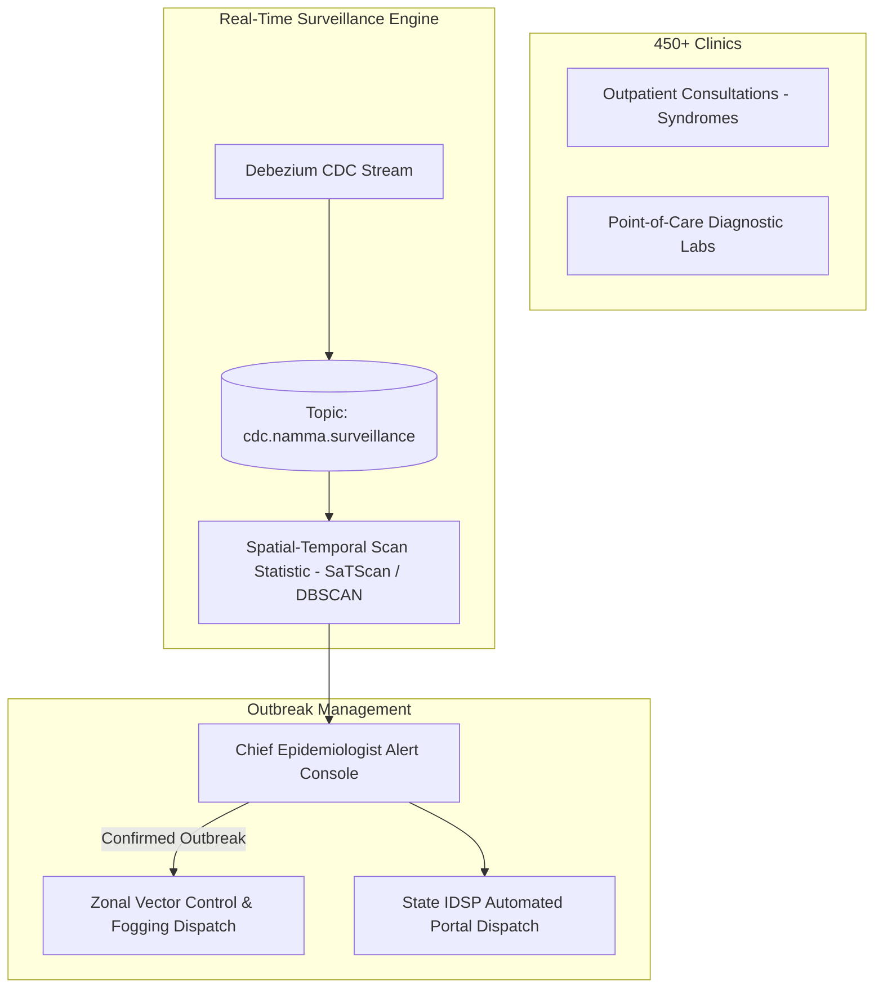

# Master Public Health, Epidemiological Surveillance, and Disease Outbreak Analytics Architecture
## Namma Clinic Digital Health & Operations Platform
### Greater Bengaluru Authority (GBA) / BBMP Health Department
**Document Code:** `DATA-DOC-13` | **Status:** APPROVED BASELINE | **Date:** September 2026

---

## 1. Executive Summary & Public Health Charter
This document formalizes the authoritative **Public Health, Epidemiological Surveillance, Vector-Borne Outbreak Detection, and Disease Analytics Architecture** for the Namma Clinic Digital Health Platform. The primary care network operates as the frontline sensory mesh of Greater Bengaluru, capturing clinical syndromes, rapid diagnostic confirmations, and seasonal fever surges across 450+ facilities. Through automated statistical anomaly detection and spatial-temporal clustering, the platform detects micro-outbreaks (Dengue, Chikungunya, Typhoid, Acute Diarrheal Diseases) days before hospitalizations occur, enabling rapid civic vector control and public health containment.

### 1.1 Non-Negotiable Epidemiological Invariants
1. **Continuous Syndromic Triage:** Every fever, acute respiratory, or diarrheal case logged in clinic OPD is tagged with spatial coordinates and ward identifier.
2. **Early Outbreak Threshold Detection:** Ward-level case velocity exceeding 2.0 standard deviations over the 21-day historical baseline triggers an automated epidemiological alert.
3. **Automated Statutory IDSP Reporting:** Daily syndromic (Form S), presumptive (Form P), and laboratory-confirmed (Form L) returns are generated and dispatched to the National Centre for Disease Control (NCDC).
4. **Privacy-Preserving Spatial Analytics:** Micro-cluster maps use spatial Gaussian blurring and ward-centroid aggregation to prevent household identification.
5. **Strict Dual-Validation on Outbreak Alerts:** Algorithmic outbreak warnings require physical review and confirmation by the BBMP Chief Epidemiologist before civic containment orders.

## 2. Integrated Disease Surveillance Architecture


### Implementation Blueprint: Farrington Epidemiological Anomaly Detector
<!-- DOCUMENTATION-ONLY EXAMPLE -->
```python
# DOCUMENTATION-ONLY PYTHON
# DOCUMENTATION-ONLY PYTHON: Farrington Epidemiological Outbreak Detection
import math
from typing import List, Dict, Any

def evaluate_ward_outbreak_risk(
    historical_cases: List[int],
    current_week_cases: int,
    alpha: float = 0.05
) -> Dict[str, Any]:
    """
    Evaluates epidemiological outbreak threshold using Poisson baseline
    and Farrington statistical anomaly threshold.
    """
    n = len(historical_cases)
    if n < 4:
        return {"status": "INSUFFICIENT_DATA", "is_outbreak": False}

    mean_baseline = sum(historical_cases) / n
    variance = sum((x - mean_baseline) ** 2 for x in historical_cases) / (n - 1)
    std_dev = math.sqrt(variance) if variance > 0 else 1.0

    # Quasi-Poisson dispersion factor
    dispersion = max(1.0, variance / max(0.1, mean_baseline))

    # Two-sigma threshold with overdispersion correction
    threshold = mean_baseline + 2.0 * math.sqrt(dispersion * mean_baseline)

    is_outbreak = current_week_cases > threshold
    z_score = (current_week_cases - mean_baseline) / std_dev if std_dev > 0 else 0.0

    return {
        "current_cases": current_week_cases,
        "baseline_mean": round(mean_baseline, 2),
        "alert_threshold": round(threshold, 2),
        "z_score": round(z_score, 2),
        "is_outbreak": is_outbreak,
        "severity": "CRITICAL" if z_score > 3.0 else ("WARNING" if is_outbreak else "NORMAL")
    }
```

## 3. Master Catalog of 80 Enterprise Datasets & Public Health Feeds
Comprehensive specifications for all 80 enterprise datasets powering public health analytics:

### DATASET-001: Dataset `dataset_clinical_consultations_001`
- **Dataset Identifier:** `DATASET-001`
- **Dataset Name:** `dataset_clinical_consultations_001`
- **Governed Domain:** Clinical Consultations
- **Lakehouse Layer:** `Raw Landing S3` (Parquet / Delta Lake)
- **Classification:** `Protected Health Information (PHI)`
- **Surveillance Utility:** Input dataset for syndromic surveillance and epidemic alerting.
- **Retention Mandate:** 10 Years Immutable
- **Freshness SLA:** `< 5 Minutes (CDC)`

### DATASET-002: Dataset `dataset_triage_and_vitals_002`
- **Dataset Identifier:** `DATASET-002`
- **Dataset Name:** `dataset_triage_and_vitals_002`
- **Governed Domain:** Triage & Vitals
- **Lakehouse Layer:** `Standardized Parquet S3` (Parquet / Delta Lake)
- **Classification:** `Sensitive Personal Data (SPD)`
- **Surveillance Utility:** Input dataset for syndromic surveillance and epidemic alerting.
- **Retention Mandate:** 5 Years Operational
- **Freshness SLA:** `Daily Nightly Batch (01:00 IST)`

### DATASET-003: Dataset `dataset_pharmacy_and_dispensations_003`
- **Dataset Identifier:** `DATASET-003`
- **Dataset Name:** `dataset_pharmacy_and_dispensations_003`
- **Governed Domain:** Pharmacy & Dispensations
- **Lakehouse Layer:** `Curated ClickHouse OLAP` (ClickHouse MergeTree)
- **Classification:** `Internal Operational`
- **Surveillance Utility:** Input dataset for syndromic surveillance and epidemic alerting.
- **Retention Mandate:** 5 Years Operational
- **Freshness SLA:** `< 5 Minutes (CDC)`

### DATASET-004: Dataset `dataset_pharmaceutical_inventory_004`
- **Dataset Identifier:** `DATASET-004`
- **Dataset Name:** `dataset_pharmaceutical_inventory_004`
- **Governed Domain:** Pharmaceutical Inventory
- **Lakehouse Layer:** `Serving Cache Redis` (JSON / Redis Vector)
- **Classification:** `Public Aggregate`
- **Surveillance Utility:** Input dataset for syndromic surveillance and epidemic alerting.
- **Retention Mandate:** 5 Years Operational
- **Freshness SLA:** `Daily Nightly Batch (01:00 IST)`

### DATASET-005: Dataset `dataset_diagnostic_laboratory_005`
- **Dataset Identifier:** `DATASET-005`
- **Dataset Name:** `dataset_diagnostic_laboratory_005`
- **Governed Domain:** Diagnostic Laboratory
- **Lakehouse Layer:** `Raw Landing S3` (Parquet / Delta Lake)
- **Classification:** `Protected Health Information (PHI)`
- **Surveillance Utility:** Input dataset for syndromic surveillance and epidemic alerting.
- **Retention Mandate:** 10 Years Immutable
- **Freshness SLA:** `< 5 Minutes (CDC)`

### DATASET-006: Dataset `dataset_secondary_referrals_006`
- **Dataset Identifier:** `DATASET-006`
- **Dataset Name:** `dataset_secondary_referrals_006`
- **Governed Domain:** Secondary Referrals
- **Lakehouse Layer:** `Standardized Parquet S3` (Parquet / Delta Lake)
- **Classification:** `Sensitive Personal Data (SPD)`
- **Surveillance Utility:** Input dataset for syndromic surveillance and epidemic alerting.
- **Retention Mandate:** 5 Years Operational
- **Freshness SLA:** `Daily Nightly Batch (01:00 IST)`

### DATASET-007: Dataset `dataset_public_health_and_disease_surveillance_007`
- **Dataset Identifier:** `DATASET-007`
- **Dataset Name:** `dataset_public_health_and_disease_surveillance_007`
- **Governed Domain:** Public Health & Disease Surveillance
- **Lakehouse Layer:** `Curated ClickHouse OLAP` (ClickHouse MergeTree)
- **Classification:** `Internal Operational`
- **Surveillance Utility:** Input dataset for syndromic surveillance and epidemic alerting.
- **Retention Mandate:** 5 Years Operational
- **Freshness SLA:** `< 5 Minutes (CDC)`

### DATASET-008: Dataset `dataset_non-communicable_diseases_(ncd)_008`
- **Dataset Identifier:** `DATASET-008`
- **Dataset Name:** `dataset_non-communicable_diseases_(ncd)_008`
- **Governed Domain:** Non-Communicable Diseases (NCD)
- **Lakehouse Layer:** `Serving Cache Redis` (JSON / Redis Vector)
- **Classification:** `Public Aggregate`
- **Surveillance Utility:** Input dataset for syndromic surveillance and epidemic alerting.
- **Retention Mandate:** 5 Years Operational
- **Freshness SLA:** `Daily Nightly Batch (01:00 IST)`

### DATASET-009: Dataset `dataset_maternal_and_child_health_(rch)_009`
- **Dataset Identifier:** `DATASET-009`
- **Dataset Name:** `dataset_maternal_and_child_health_(rch)_009`
- **Governed Domain:** Maternal & Child Health (RCH)
- **Lakehouse Layer:** `Raw Landing S3` (Parquet / Delta Lake)
- **Classification:** `Protected Health Information (PHI)`
- **Surveillance Utility:** Input dataset for syndromic surveillance and epidemic alerting.
- **Retention Mandate:** 10 Years Immutable
- **Freshness SLA:** `< 5 Minutes (CDC)`

### DATASET-010: Dataset `dataset_patient_identity_and_demographics_010`
- **Dataset Identifier:** `DATASET-010`
- **Dataset Name:** `dataset_patient_identity_and_demographics_010`
- **Governed Domain:** Patient Identity & Demographics
- **Lakehouse Layer:** `Standardized Parquet S3` (Parquet / Delta Lake)
- **Classification:** `Sensitive Personal Data (SPD)`
- **Surveillance Utility:** Input dataset for syndromic surveillance and epidemic alerting.
- **Retention Mandate:** 5 Years Operational
- **Freshness SLA:** `Daily Nightly Batch (01:00 IST)`

### DATASET-011: Dataset `dataset_facility_operations_and_queues_011`
- **Dataset Identifier:** `DATASET-011`
- **Dataset Name:** `dataset_facility_operations_and_queues_011`
- **Governed Domain:** Facility Operations & Queues
- **Lakehouse Layer:** `Curated ClickHouse OLAP` (ClickHouse MergeTree)
- **Classification:** `Internal Operational`
- **Surveillance Utility:** Input dataset for syndromic surveillance and epidemic alerting.
- **Retention Mandate:** 5 Years Operational
- **Freshness SLA:** `< 5 Minutes (CDC)`

### DATASET-012: Dataset `dataset_citizen_feedback_and_grievances_012`
- **Dataset Identifier:** `DATASET-012`
- **Dataset Name:** `dataset_citizen_feedback_and_grievances_012`
- **Governed Domain:** Citizen Feedback & Grievances
- **Lakehouse Layer:** `Serving Cache Redis` (JSON / Redis Vector)
- **Classification:** `Public Aggregate`
- **Surveillance Utility:** Input dataset for syndromic surveillance and epidemic alerting.
- **Retention Mandate:** 5 Years Operational
- **Freshness SLA:** `Daily Nightly Batch (01:00 IST)`

### DATASET-013: Dataset `dataset_financial_and_billing_operations_013`
- **Dataset Identifier:** `DATASET-013`
- **Dataset Name:** `dataset_financial_and_billing_operations_013`
- **Governed Domain:** Financial & Billing Operations
- **Lakehouse Layer:** `Raw Landing S3` (Parquet / Delta Lake)
- **Classification:** `Protected Health Information (PHI)`
- **Surveillance Utility:** Input dataset for syndromic surveillance and epidemic alerting.
- **Retention Mandate:** 10 Years Immutable
- **Freshness SLA:** `< 5 Minutes (CDC)`

### DATASET-014: Dataset `dataset_audit_and_statutory_compliance_014`
- **Dataset Identifier:** `DATASET-014`
- **Dataset Name:** `dataset_audit_and_statutory_compliance_014`
- **Governed Domain:** Audit & Statutory Compliance
- **Lakehouse Layer:** `Standardized Parquet S3` (Parquet / Delta Lake)
- **Classification:** `Sensitive Personal Data (SPD)`
- **Surveillance Utility:** Input dataset for syndromic surveillance and epidemic alerting.
- **Retention Mandate:** 5 Years Operational
- **Freshness SLA:** `Daily Nightly Batch (01:00 IST)`

### DATASET-015: Dataset `dataset_telemedicine_and_specialist_consults_015`
- **Dataset Identifier:** `DATASET-015`
- **Dataset Name:** `dataset_telemedicine_and_specialist_consults_015`
- **Governed Domain:** Telemedicine & Specialist Consults
- **Lakehouse Layer:** `Curated ClickHouse OLAP` (ClickHouse MergeTree)
- **Classification:** `Internal Operational`
- **Surveillance Utility:** Input dataset for syndromic surveillance and epidemic alerting.
- **Retention Mandate:** 5 Years Operational
- **Freshness SLA:** `< 5 Minutes (CDC)`

### DATASET-016: Dataset `dataset_clinical_consultations_016`
- **Dataset Identifier:** `DATASET-016`
- **Dataset Name:** `dataset_clinical_consultations_016`
- **Governed Domain:** Clinical Consultations
- **Lakehouse Layer:** `Serving Cache Redis` (JSON / Redis Vector)
- **Classification:** `Public Aggregate`
- **Surveillance Utility:** Input dataset for syndromic surveillance and epidemic alerting.
- **Retention Mandate:** 5 Years Operational
- **Freshness SLA:** `Daily Nightly Batch (01:00 IST)`

### DATASET-017: Dataset `dataset_triage_and_vitals_017`
- **Dataset Identifier:** `DATASET-017`
- **Dataset Name:** `dataset_triage_and_vitals_017`
- **Governed Domain:** Triage & Vitals
- **Lakehouse Layer:** `Raw Landing S3` (Parquet / Delta Lake)
- **Classification:** `Protected Health Information (PHI)`
- **Surveillance Utility:** Input dataset for syndromic surveillance and epidemic alerting.
- **Retention Mandate:** 10 Years Immutable
- **Freshness SLA:** `< 5 Minutes (CDC)`

### DATASET-018: Dataset `dataset_pharmacy_and_dispensations_018`
- **Dataset Identifier:** `DATASET-018`
- **Dataset Name:** `dataset_pharmacy_and_dispensations_018`
- **Governed Domain:** Pharmacy & Dispensations
- **Lakehouse Layer:** `Standardized Parquet S3` (Parquet / Delta Lake)
- **Classification:** `Sensitive Personal Data (SPD)`
- **Surveillance Utility:** Input dataset for syndromic surveillance and epidemic alerting.
- **Retention Mandate:** 5 Years Operational
- **Freshness SLA:** `Daily Nightly Batch (01:00 IST)`

### DATASET-019: Dataset `dataset_pharmaceutical_inventory_019`
- **Dataset Identifier:** `DATASET-019`
- **Dataset Name:** `dataset_pharmaceutical_inventory_019`
- **Governed Domain:** Pharmaceutical Inventory
- **Lakehouse Layer:** `Curated ClickHouse OLAP` (ClickHouse MergeTree)
- **Classification:** `Internal Operational`
- **Surveillance Utility:** Input dataset for syndromic surveillance and epidemic alerting.
- **Retention Mandate:** 5 Years Operational
- **Freshness SLA:** `< 5 Minutes (CDC)`

### DATASET-020: Dataset `dataset_diagnostic_laboratory_020`
- **Dataset Identifier:** `DATASET-020`
- **Dataset Name:** `dataset_diagnostic_laboratory_020`
- **Governed Domain:** Diagnostic Laboratory
- **Lakehouse Layer:** `Serving Cache Redis` (JSON / Redis Vector)
- **Classification:** `Public Aggregate`
- **Surveillance Utility:** Input dataset for syndromic surveillance and epidemic alerting.
- **Retention Mandate:** 5 Years Operational
- **Freshness SLA:** `Daily Nightly Batch (01:00 IST)`

### DATASET-021: Dataset `dataset_secondary_referrals_021`
- **Dataset Identifier:** `DATASET-021`
- **Dataset Name:** `dataset_secondary_referrals_021`
- **Governed Domain:** Secondary Referrals
- **Lakehouse Layer:** `Raw Landing S3` (Parquet / Delta Lake)
- **Classification:** `Protected Health Information (PHI)`
- **Surveillance Utility:** Input dataset for syndromic surveillance and epidemic alerting.
- **Retention Mandate:** 10 Years Immutable
- **Freshness SLA:** `< 5 Minutes (CDC)`

### DATASET-022: Dataset `dataset_public_health_and_disease_surveillance_022`
- **Dataset Identifier:** `DATASET-022`
- **Dataset Name:** `dataset_public_health_and_disease_surveillance_022`
- **Governed Domain:** Public Health & Disease Surveillance
- **Lakehouse Layer:** `Standardized Parquet S3` (Parquet / Delta Lake)
- **Classification:** `Sensitive Personal Data (SPD)`
- **Surveillance Utility:** Input dataset for syndromic surveillance and epidemic alerting.
- **Retention Mandate:** 5 Years Operational
- **Freshness SLA:** `Daily Nightly Batch (01:00 IST)`

### DATASET-023: Dataset `dataset_non-communicable_diseases_(ncd)_023`
- **Dataset Identifier:** `DATASET-023`
- **Dataset Name:** `dataset_non-communicable_diseases_(ncd)_023`
- **Governed Domain:** Non-Communicable Diseases (NCD)
- **Lakehouse Layer:** `Curated ClickHouse OLAP` (ClickHouse MergeTree)
- **Classification:** `Internal Operational`
- **Surveillance Utility:** Input dataset for syndromic surveillance and epidemic alerting.
- **Retention Mandate:** 5 Years Operational
- **Freshness SLA:** `< 5 Minutes (CDC)`

### DATASET-024: Dataset `dataset_maternal_and_child_health_(rch)_024`
- **Dataset Identifier:** `DATASET-024`
- **Dataset Name:** `dataset_maternal_and_child_health_(rch)_024`
- **Governed Domain:** Maternal & Child Health (RCH)
- **Lakehouse Layer:** `Serving Cache Redis` (JSON / Redis Vector)
- **Classification:** `Public Aggregate`
- **Surveillance Utility:** Input dataset for syndromic surveillance and epidemic alerting.
- **Retention Mandate:** 5 Years Operational
- **Freshness SLA:** `Daily Nightly Batch (01:00 IST)`

### DATASET-025: Dataset `dataset_patient_identity_and_demographics_025`
- **Dataset Identifier:** `DATASET-025`
- **Dataset Name:** `dataset_patient_identity_and_demographics_025`
- **Governed Domain:** Patient Identity & Demographics
- **Lakehouse Layer:** `Raw Landing S3` (Parquet / Delta Lake)
- **Classification:** `Protected Health Information (PHI)`
- **Surveillance Utility:** Input dataset for syndromic surveillance and epidemic alerting.
- **Retention Mandate:** 10 Years Immutable
- **Freshness SLA:** `< 5 Minutes (CDC)`

### DATASET-026: Dataset `dataset_facility_operations_and_queues_026`
- **Dataset Identifier:** `DATASET-026`
- **Dataset Name:** `dataset_facility_operations_and_queues_026`
- **Governed Domain:** Facility Operations & Queues
- **Lakehouse Layer:** `Standardized Parquet S3` (Parquet / Delta Lake)
- **Classification:** `Sensitive Personal Data (SPD)`
- **Surveillance Utility:** Input dataset for syndromic surveillance and epidemic alerting.
- **Retention Mandate:** 5 Years Operational
- **Freshness SLA:** `Daily Nightly Batch (01:00 IST)`

### DATASET-027: Dataset `dataset_citizen_feedback_and_grievances_027`
- **Dataset Identifier:** `DATASET-027`
- **Dataset Name:** `dataset_citizen_feedback_and_grievances_027`
- **Governed Domain:** Citizen Feedback & Grievances
- **Lakehouse Layer:** `Curated ClickHouse OLAP` (ClickHouse MergeTree)
- **Classification:** `Internal Operational`
- **Surveillance Utility:** Input dataset for syndromic surveillance and epidemic alerting.
- **Retention Mandate:** 5 Years Operational
- **Freshness SLA:** `< 5 Minutes (CDC)`

### DATASET-028: Dataset `dataset_financial_and_billing_operations_028`
- **Dataset Identifier:** `DATASET-028`
- **Dataset Name:** `dataset_financial_and_billing_operations_028`
- **Governed Domain:** Financial & Billing Operations
- **Lakehouse Layer:** `Serving Cache Redis` (JSON / Redis Vector)
- **Classification:** `Public Aggregate`
- **Surveillance Utility:** Input dataset for syndromic surveillance and epidemic alerting.
- **Retention Mandate:** 5 Years Operational
- **Freshness SLA:** `Daily Nightly Batch (01:00 IST)`

### DATASET-029: Dataset `dataset_audit_and_statutory_compliance_029`
- **Dataset Identifier:** `DATASET-029`
- **Dataset Name:** `dataset_audit_and_statutory_compliance_029`
- **Governed Domain:** Audit & Statutory Compliance
- **Lakehouse Layer:** `Raw Landing S3` (Parquet / Delta Lake)
- **Classification:** `Protected Health Information (PHI)`
- **Surveillance Utility:** Input dataset for syndromic surveillance and epidemic alerting.
- **Retention Mandate:** 10 Years Immutable
- **Freshness SLA:** `< 5 Minutes (CDC)`

### DATASET-030: Dataset `dataset_telemedicine_and_specialist_consults_030`
- **Dataset Identifier:** `DATASET-030`
- **Dataset Name:** `dataset_telemedicine_and_specialist_consults_030`
- **Governed Domain:** Telemedicine & Specialist Consults
- **Lakehouse Layer:** `Standardized Parquet S3` (Parquet / Delta Lake)
- **Classification:** `Sensitive Personal Data (SPD)`
- **Surveillance Utility:** Input dataset for syndromic surveillance and epidemic alerting.
- **Retention Mandate:** 5 Years Operational
- **Freshness SLA:** `Daily Nightly Batch (01:00 IST)`

### DATASET-031: Dataset `dataset_clinical_consultations_031`
- **Dataset Identifier:** `DATASET-031`
- **Dataset Name:** `dataset_clinical_consultations_031`
- **Governed Domain:** Clinical Consultations
- **Lakehouse Layer:** `Curated ClickHouse OLAP` (ClickHouse MergeTree)
- **Classification:** `Internal Operational`
- **Surveillance Utility:** Input dataset for syndromic surveillance and epidemic alerting.
- **Retention Mandate:** 5 Years Operational
- **Freshness SLA:** `< 5 Minutes (CDC)`

### DATASET-032: Dataset `dataset_triage_and_vitals_032`
- **Dataset Identifier:** `DATASET-032`
- **Dataset Name:** `dataset_triage_and_vitals_032`
- **Governed Domain:** Triage & Vitals
- **Lakehouse Layer:** `Serving Cache Redis` (JSON / Redis Vector)
- **Classification:** `Public Aggregate`
- **Surveillance Utility:** Input dataset for syndromic surveillance and epidemic alerting.
- **Retention Mandate:** 5 Years Operational
- **Freshness SLA:** `Daily Nightly Batch (01:00 IST)`

### DATASET-033: Dataset `dataset_pharmacy_and_dispensations_033`
- **Dataset Identifier:** `DATASET-033`
- **Dataset Name:** `dataset_pharmacy_and_dispensations_033`
- **Governed Domain:** Pharmacy & Dispensations
- **Lakehouse Layer:** `Raw Landing S3` (Parquet / Delta Lake)
- **Classification:** `Protected Health Information (PHI)`
- **Surveillance Utility:** Input dataset for syndromic surveillance and epidemic alerting.
- **Retention Mandate:** 10 Years Immutable
- **Freshness SLA:** `< 5 Minutes (CDC)`

### DATASET-034: Dataset `dataset_pharmaceutical_inventory_034`
- **Dataset Identifier:** `DATASET-034`
- **Dataset Name:** `dataset_pharmaceutical_inventory_034`
- **Governed Domain:** Pharmaceutical Inventory
- **Lakehouse Layer:** `Standardized Parquet S3` (Parquet / Delta Lake)
- **Classification:** `Sensitive Personal Data (SPD)`
- **Surveillance Utility:** Input dataset for syndromic surveillance and epidemic alerting.
- **Retention Mandate:** 5 Years Operational
- **Freshness SLA:** `Daily Nightly Batch (01:00 IST)`

### DATASET-035: Dataset `dataset_diagnostic_laboratory_035`
- **Dataset Identifier:** `DATASET-035`
- **Dataset Name:** `dataset_diagnostic_laboratory_035`
- **Governed Domain:** Diagnostic Laboratory
- **Lakehouse Layer:** `Curated ClickHouse OLAP` (ClickHouse MergeTree)
- **Classification:** `Internal Operational`
- **Surveillance Utility:** Input dataset for syndromic surveillance and epidemic alerting.
- **Retention Mandate:** 5 Years Operational
- **Freshness SLA:** `< 5 Minutes (CDC)`

### DATASET-036: Dataset `dataset_secondary_referrals_036`
- **Dataset Identifier:** `DATASET-036`
- **Dataset Name:** `dataset_secondary_referrals_036`
- **Governed Domain:** Secondary Referrals
- **Lakehouse Layer:** `Serving Cache Redis` (JSON / Redis Vector)
- **Classification:** `Public Aggregate`
- **Surveillance Utility:** Input dataset for syndromic surveillance and epidemic alerting.
- **Retention Mandate:** 5 Years Operational
- **Freshness SLA:** `Daily Nightly Batch (01:00 IST)`

### DATASET-037: Dataset `dataset_public_health_and_disease_surveillance_037`
- **Dataset Identifier:** `DATASET-037`
- **Dataset Name:** `dataset_public_health_and_disease_surveillance_037`
- **Governed Domain:** Public Health & Disease Surveillance
- **Lakehouse Layer:** `Raw Landing S3` (Parquet / Delta Lake)
- **Classification:** `Protected Health Information (PHI)`
- **Surveillance Utility:** Input dataset for syndromic surveillance and epidemic alerting.
- **Retention Mandate:** 10 Years Immutable
- **Freshness SLA:** `< 5 Minutes (CDC)`

### DATASET-038: Dataset `dataset_non-communicable_diseases_(ncd)_038`
- **Dataset Identifier:** `DATASET-038`
- **Dataset Name:** `dataset_non-communicable_diseases_(ncd)_038`
- **Governed Domain:** Non-Communicable Diseases (NCD)
- **Lakehouse Layer:** `Standardized Parquet S3` (Parquet / Delta Lake)
- **Classification:** `Sensitive Personal Data (SPD)`
- **Surveillance Utility:** Input dataset for syndromic surveillance and epidemic alerting.
- **Retention Mandate:** 5 Years Operational
- **Freshness SLA:** `Daily Nightly Batch (01:00 IST)`

### DATASET-039: Dataset `dataset_maternal_and_child_health_(rch)_039`
- **Dataset Identifier:** `DATASET-039`
- **Dataset Name:** `dataset_maternal_and_child_health_(rch)_039`
- **Governed Domain:** Maternal & Child Health (RCH)
- **Lakehouse Layer:** `Curated ClickHouse OLAP` (ClickHouse MergeTree)
- **Classification:** `Internal Operational`
- **Surveillance Utility:** Input dataset for syndromic surveillance and epidemic alerting.
- **Retention Mandate:** 5 Years Operational
- **Freshness SLA:** `< 5 Minutes (CDC)`

### DATASET-040: Dataset `dataset_patient_identity_and_demographics_040`
- **Dataset Identifier:** `DATASET-040`
- **Dataset Name:** `dataset_patient_identity_and_demographics_040`
- **Governed Domain:** Patient Identity & Demographics
- **Lakehouse Layer:** `Serving Cache Redis` (JSON / Redis Vector)
- **Classification:** `Public Aggregate`
- **Surveillance Utility:** Input dataset for syndromic surveillance and epidemic alerting.
- **Retention Mandate:** 5 Years Operational
- **Freshness SLA:** `Daily Nightly Batch (01:00 IST)`

### DATASET-041: Dataset `dataset_facility_operations_and_queues_041`
- **Dataset Identifier:** `DATASET-041`
- **Dataset Name:** `dataset_facility_operations_and_queues_041`
- **Governed Domain:** Facility Operations & Queues
- **Lakehouse Layer:** `Raw Landing S3` (Parquet / Delta Lake)
- **Classification:** `Protected Health Information (PHI)`
- **Surveillance Utility:** Input dataset for syndromic surveillance and epidemic alerting.
- **Retention Mandate:** 10 Years Immutable
- **Freshness SLA:** `< 5 Minutes (CDC)`

### DATASET-042: Dataset `dataset_citizen_feedback_and_grievances_042`
- **Dataset Identifier:** `DATASET-042`
- **Dataset Name:** `dataset_citizen_feedback_and_grievances_042`
- **Governed Domain:** Citizen Feedback & Grievances
- **Lakehouse Layer:** `Standardized Parquet S3` (Parquet / Delta Lake)
- **Classification:** `Sensitive Personal Data (SPD)`
- **Surveillance Utility:** Input dataset for syndromic surveillance and epidemic alerting.
- **Retention Mandate:** 5 Years Operational
- **Freshness SLA:** `Daily Nightly Batch (01:00 IST)`

### DATASET-043: Dataset `dataset_financial_and_billing_operations_043`
- **Dataset Identifier:** `DATASET-043`
- **Dataset Name:** `dataset_financial_and_billing_operations_043`
- **Governed Domain:** Financial & Billing Operations
- **Lakehouse Layer:** `Curated ClickHouse OLAP` (ClickHouse MergeTree)
- **Classification:** `Internal Operational`
- **Surveillance Utility:** Input dataset for syndromic surveillance and epidemic alerting.
- **Retention Mandate:** 5 Years Operational
- **Freshness SLA:** `< 5 Minutes (CDC)`

### DATASET-044: Dataset `dataset_audit_and_statutory_compliance_044`
- **Dataset Identifier:** `DATASET-044`
- **Dataset Name:** `dataset_audit_and_statutory_compliance_044`
- **Governed Domain:** Audit & Statutory Compliance
- **Lakehouse Layer:** `Serving Cache Redis` (JSON / Redis Vector)
- **Classification:** `Public Aggregate`
- **Surveillance Utility:** Input dataset for syndromic surveillance and epidemic alerting.
- **Retention Mandate:** 5 Years Operational
- **Freshness SLA:** `Daily Nightly Batch (01:00 IST)`

### DATASET-045: Dataset `dataset_telemedicine_and_specialist_consults_045`
- **Dataset Identifier:** `DATASET-045`
- **Dataset Name:** `dataset_telemedicine_and_specialist_consults_045`
- **Governed Domain:** Telemedicine & Specialist Consults
- **Lakehouse Layer:** `Raw Landing S3` (Parquet / Delta Lake)
- **Classification:** `Protected Health Information (PHI)`
- **Surveillance Utility:** Input dataset for syndromic surveillance and epidemic alerting.
- **Retention Mandate:** 10 Years Immutable
- **Freshness SLA:** `< 5 Minutes (CDC)`

### DATASET-046: Dataset `dataset_clinical_consultations_046`
- **Dataset Identifier:** `DATASET-046`
- **Dataset Name:** `dataset_clinical_consultations_046`
- **Governed Domain:** Clinical Consultations
- **Lakehouse Layer:** `Standardized Parquet S3` (Parquet / Delta Lake)
- **Classification:** `Sensitive Personal Data (SPD)`
- **Surveillance Utility:** Input dataset for syndromic surveillance and epidemic alerting.
- **Retention Mandate:** 5 Years Operational
- **Freshness SLA:** `Daily Nightly Batch (01:00 IST)`

### DATASET-047: Dataset `dataset_triage_and_vitals_047`
- **Dataset Identifier:** `DATASET-047`
- **Dataset Name:** `dataset_triage_and_vitals_047`
- **Governed Domain:** Triage & Vitals
- **Lakehouse Layer:** `Curated ClickHouse OLAP` (ClickHouse MergeTree)
- **Classification:** `Internal Operational`
- **Surveillance Utility:** Input dataset for syndromic surveillance and epidemic alerting.
- **Retention Mandate:** 5 Years Operational
- **Freshness SLA:** `< 5 Minutes (CDC)`

### DATASET-048: Dataset `dataset_pharmacy_and_dispensations_048`
- **Dataset Identifier:** `DATASET-048`
- **Dataset Name:** `dataset_pharmacy_and_dispensations_048`
- **Governed Domain:** Pharmacy & Dispensations
- **Lakehouse Layer:** `Serving Cache Redis` (JSON / Redis Vector)
- **Classification:** `Public Aggregate`
- **Surveillance Utility:** Input dataset for syndromic surveillance and epidemic alerting.
- **Retention Mandate:** 5 Years Operational
- **Freshness SLA:** `Daily Nightly Batch (01:00 IST)`

### DATASET-049: Dataset `dataset_pharmaceutical_inventory_049`
- **Dataset Identifier:** `DATASET-049`
- **Dataset Name:** `dataset_pharmaceutical_inventory_049`
- **Governed Domain:** Pharmaceutical Inventory
- **Lakehouse Layer:** `Raw Landing S3` (Parquet / Delta Lake)
- **Classification:** `Protected Health Information (PHI)`
- **Surveillance Utility:** Input dataset for syndromic surveillance and epidemic alerting.
- **Retention Mandate:** 10 Years Immutable
- **Freshness SLA:** `< 5 Minutes (CDC)`

### DATASET-050: Dataset `dataset_diagnostic_laboratory_050`
- **Dataset Identifier:** `DATASET-050`
- **Dataset Name:** `dataset_diagnostic_laboratory_050`
- **Governed Domain:** Diagnostic Laboratory
- **Lakehouse Layer:** `Standardized Parquet S3` (Parquet / Delta Lake)
- **Classification:** `Sensitive Personal Data (SPD)`
- **Surveillance Utility:** Input dataset for syndromic surveillance and epidemic alerting.
- **Retention Mandate:** 5 Years Operational
- **Freshness SLA:** `Daily Nightly Batch (01:00 IST)`

### DATASET-051: Dataset `dataset_secondary_referrals_051`
- **Dataset Identifier:** `DATASET-051`
- **Dataset Name:** `dataset_secondary_referrals_051`
- **Governed Domain:** Secondary Referrals
- **Lakehouse Layer:** `Curated ClickHouse OLAP` (ClickHouse MergeTree)
- **Classification:** `Internal Operational`
- **Surveillance Utility:** Input dataset for syndromic surveillance and epidemic alerting.
- **Retention Mandate:** 5 Years Operational
- **Freshness SLA:** `< 5 Minutes (CDC)`

### DATASET-052: Dataset `dataset_public_health_and_disease_surveillance_052`
- **Dataset Identifier:** `DATASET-052`
- **Dataset Name:** `dataset_public_health_and_disease_surveillance_052`
- **Governed Domain:** Public Health & Disease Surveillance
- **Lakehouse Layer:** `Serving Cache Redis` (JSON / Redis Vector)
- **Classification:** `Public Aggregate`
- **Surveillance Utility:** Input dataset for syndromic surveillance and epidemic alerting.
- **Retention Mandate:** 5 Years Operational
- **Freshness SLA:** `Daily Nightly Batch (01:00 IST)`

### DATASET-053: Dataset `dataset_non-communicable_diseases_(ncd)_053`
- **Dataset Identifier:** `DATASET-053`
- **Dataset Name:** `dataset_non-communicable_diseases_(ncd)_053`
- **Governed Domain:** Non-Communicable Diseases (NCD)
- **Lakehouse Layer:** `Raw Landing S3` (Parquet / Delta Lake)
- **Classification:** `Protected Health Information (PHI)`
- **Surveillance Utility:** Input dataset for syndromic surveillance and epidemic alerting.
- **Retention Mandate:** 10 Years Immutable
- **Freshness SLA:** `< 5 Minutes (CDC)`

### DATASET-054: Dataset `dataset_maternal_and_child_health_(rch)_054`
- **Dataset Identifier:** `DATASET-054`
- **Dataset Name:** `dataset_maternal_and_child_health_(rch)_054`
- **Governed Domain:** Maternal & Child Health (RCH)
- **Lakehouse Layer:** `Standardized Parquet S3` (Parquet / Delta Lake)
- **Classification:** `Sensitive Personal Data (SPD)`
- **Surveillance Utility:** Input dataset for syndromic surveillance and epidemic alerting.
- **Retention Mandate:** 5 Years Operational
- **Freshness SLA:** `Daily Nightly Batch (01:00 IST)`

### DATASET-055: Dataset `dataset_patient_identity_and_demographics_055`
- **Dataset Identifier:** `DATASET-055`
- **Dataset Name:** `dataset_patient_identity_and_demographics_055`
- **Governed Domain:** Patient Identity & Demographics
- **Lakehouse Layer:** `Curated ClickHouse OLAP` (ClickHouse MergeTree)
- **Classification:** `Internal Operational`
- **Surveillance Utility:** Input dataset for syndromic surveillance and epidemic alerting.
- **Retention Mandate:** 5 Years Operational
- **Freshness SLA:** `< 5 Minutes (CDC)`

### DATASET-056: Dataset `dataset_facility_operations_and_queues_056`
- **Dataset Identifier:** `DATASET-056`
- **Dataset Name:** `dataset_facility_operations_and_queues_056`
- **Governed Domain:** Facility Operations & Queues
- **Lakehouse Layer:** `Serving Cache Redis` (JSON / Redis Vector)
- **Classification:** `Public Aggregate`
- **Surveillance Utility:** Input dataset for syndromic surveillance and epidemic alerting.
- **Retention Mandate:** 5 Years Operational
- **Freshness SLA:** `Daily Nightly Batch (01:00 IST)`

### DATASET-057: Dataset `dataset_citizen_feedback_and_grievances_057`
- **Dataset Identifier:** `DATASET-057`
- **Dataset Name:** `dataset_citizen_feedback_and_grievances_057`
- **Governed Domain:** Citizen Feedback & Grievances
- **Lakehouse Layer:** `Raw Landing S3` (Parquet / Delta Lake)
- **Classification:** `Protected Health Information (PHI)`
- **Surveillance Utility:** Input dataset for syndromic surveillance and epidemic alerting.
- **Retention Mandate:** 10 Years Immutable
- **Freshness SLA:** `< 5 Minutes (CDC)`

### DATASET-058: Dataset `dataset_financial_and_billing_operations_058`
- **Dataset Identifier:** `DATASET-058`
- **Dataset Name:** `dataset_financial_and_billing_operations_058`
- **Governed Domain:** Financial & Billing Operations
- **Lakehouse Layer:** `Standardized Parquet S3` (Parquet / Delta Lake)
- **Classification:** `Sensitive Personal Data (SPD)`
- **Surveillance Utility:** Input dataset for syndromic surveillance and epidemic alerting.
- **Retention Mandate:** 5 Years Operational
- **Freshness SLA:** `Daily Nightly Batch (01:00 IST)`

### DATASET-059: Dataset `dataset_audit_and_statutory_compliance_059`
- **Dataset Identifier:** `DATASET-059`
- **Dataset Name:** `dataset_audit_and_statutory_compliance_059`
- **Governed Domain:** Audit & Statutory Compliance
- **Lakehouse Layer:** `Curated ClickHouse OLAP` (ClickHouse MergeTree)
- **Classification:** `Internal Operational`
- **Surveillance Utility:** Input dataset for syndromic surveillance and epidemic alerting.
- **Retention Mandate:** 5 Years Operational
- **Freshness SLA:** `< 5 Minutes (CDC)`

### DATASET-060: Dataset `dataset_telemedicine_and_specialist_consults_060`
- **Dataset Identifier:** `DATASET-060`
- **Dataset Name:** `dataset_telemedicine_and_specialist_consults_060`
- **Governed Domain:** Telemedicine & Specialist Consults
- **Lakehouse Layer:** `Serving Cache Redis` (JSON / Redis Vector)
- **Classification:** `Public Aggregate`
- **Surveillance Utility:** Input dataset for syndromic surveillance and epidemic alerting.
- **Retention Mandate:** 5 Years Operational
- **Freshness SLA:** `Daily Nightly Batch (01:00 IST)`

### DATASET-061: Dataset `dataset_clinical_consultations_061`
- **Dataset Identifier:** `DATASET-061`
- **Dataset Name:** `dataset_clinical_consultations_061`
- **Governed Domain:** Clinical Consultations
- **Lakehouse Layer:** `Raw Landing S3` (Parquet / Delta Lake)
- **Classification:** `Protected Health Information (PHI)`
- **Surveillance Utility:** Input dataset for syndromic surveillance and epidemic alerting.
- **Retention Mandate:** 10 Years Immutable
- **Freshness SLA:** `< 5 Minutes (CDC)`

### DATASET-062: Dataset `dataset_triage_and_vitals_062`
- **Dataset Identifier:** `DATASET-062`
- **Dataset Name:** `dataset_triage_and_vitals_062`
- **Governed Domain:** Triage & Vitals
- **Lakehouse Layer:** `Standardized Parquet S3` (Parquet / Delta Lake)
- **Classification:** `Sensitive Personal Data (SPD)`
- **Surveillance Utility:** Input dataset for syndromic surveillance and epidemic alerting.
- **Retention Mandate:** 5 Years Operational
- **Freshness SLA:** `Daily Nightly Batch (01:00 IST)`

### DATASET-063: Dataset `dataset_pharmacy_and_dispensations_063`
- **Dataset Identifier:** `DATASET-063`
- **Dataset Name:** `dataset_pharmacy_and_dispensations_063`
- **Governed Domain:** Pharmacy & Dispensations
- **Lakehouse Layer:** `Curated ClickHouse OLAP` (ClickHouse MergeTree)
- **Classification:** `Internal Operational`
- **Surveillance Utility:** Input dataset for syndromic surveillance and epidemic alerting.
- **Retention Mandate:** 5 Years Operational
- **Freshness SLA:** `< 5 Minutes (CDC)`

### DATASET-064: Dataset `dataset_pharmaceutical_inventory_064`
- **Dataset Identifier:** `DATASET-064`
- **Dataset Name:** `dataset_pharmaceutical_inventory_064`
- **Governed Domain:** Pharmaceutical Inventory
- **Lakehouse Layer:** `Serving Cache Redis` (JSON / Redis Vector)
- **Classification:** `Public Aggregate`
- **Surveillance Utility:** Input dataset for syndromic surveillance and epidemic alerting.
- **Retention Mandate:** 5 Years Operational
- **Freshness SLA:** `Daily Nightly Batch (01:00 IST)`

### DATASET-065: Dataset `dataset_diagnostic_laboratory_065`
- **Dataset Identifier:** `DATASET-065`
- **Dataset Name:** `dataset_diagnostic_laboratory_065`
- **Governed Domain:** Diagnostic Laboratory
- **Lakehouse Layer:** `Raw Landing S3` (Parquet / Delta Lake)
- **Classification:** `Protected Health Information (PHI)`
- **Surveillance Utility:** Input dataset for syndromic surveillance and epidemic alerting.
- **Retention Mandate:** 10 Years Immutable
- **Freshness SLA:** `< 5 Minutes (CDC)`

### DATASET-066: Dataset `dataset_secondary_referrals_066`
- **Dataset Identifier:** `DATASET-066`
- **Dataset Name:** `dataset_secondary_referrals_066`
- **Governed Domain:** Secondary Referrals
- **Lakehouse Layer:** `Standardized Parquet S3` (Parquet / Delta Lake)
- **Classification:** `Sensitive Personal Data (SPD)`
- **Surveillance Utility:** Input dataset for syndromic surveillance and epidemic alerting.
- **Retention Mandate:** 5 Years Operational
- **Freshness SLA:** `Daily Nightly Batch (01:00 IST)`

### DATASET-067: Dataset `dataset_public_health_and_disease_surveillance_067`
- **Dataset Identifier:** `DATASET-067`
- **Dataset Name:** `dataset_public_health_and_disease_surveillance_067`
- **Governed Domain:** Public Health & Disease Surveillance
- **Lakehouse Layer:** `Curated ClickHouse OLAP` (ClickHouse MergeTree)
- **Classification:** `Internal Operational`
- **Surveillance Utility:** Input dataset for syndromic surveillance and epidemic alerting.
- **Retention Mandate:** 5 Years Operational
- **Freshness SLA:** `< 5 Minutes (CDC)`

### DATASET-068: Dataset `dataset_non-communicable_diseases_(ncd)_068`
- **Dataset Identifier:** `DATASET-068`
- **Dataset Name:** `dataset_non-communicable_diseases_(ncd)_068`
- **Governed Domain:** Non-Communicable Diseases (NCD)
- **Lakehouse Layer:** `Serving Cache Redis` (JSON / Redis Vector)
- **Classification:** `Public Aggregate`
- **Surveillance Utility:** Input dataset for syndromic surveillance and epidemic alerting.
- **Retention Mandate:** 5 Years Operational
- **Freshness SLA:** `Daily Nightly Batch (01:00 IST)`

### DATASET-069: Dataset `dataset_maternal_and_child_health_(rch)_069`
- **Dataset Identifier:** `DATASET-069`
- **Dataset Name:** `dataset_maternal_and_child_health_(rch)_069`
- **Governed Domain:** Maternal & Child Health (RCH)
- **Lakehouse Layer:** `Raw Landing S3` (Parquet / Delta Lake)
- **Classification:** `Protected Health Information (PHI)`
- **Surveillance Utility:** Input dataset for syndromic surveillance and epidemic alerting.
- **Retention Mandate:** 10 Years Immutable
- **Freshness SLA:** `< 5 Minutes (CDC)`

### DATASET-070: Dataset `dataset_patient_identity_and_demographics_070`
- **Dataset Identifier:** `DATASET-070`
- **Dataset Name:** `dataset_patient_identity_and_demographics_070`
- **Governed Domain:** Patient Identity & Demographics
- **Lakehouse Layer:** `Standardized Parquet S3` (Parquet / Delta Lake)
- **Classification:** `Sensitive Personal Data (SPD)`
- **Surveillance Utility:** Input dataset for syndromic surveillance and epidemic alerting.
- **Retention Mandate:** 5 Years Operational
- **Freshness SLA:** `Daily Nightly Batch (01:00 IST)`

### DATASET-071: Dataset `dataset_facility_operations_and_queues_071`
- **Dataset Identifier:** `DATASET-071`
- **Dataset Name:** `dataset_facility_operations_and_queues_071`
- **Governed Domain:** Facility Operations & Queues
- **Lakehouse Layer:** `Curated ClickHouse OLAP` (ClickHouse MergeTree)
- **Classification:** `Internal Operational`
- **Surveillance Utility:** Input dataset for syndromic surveillance and epidemic alerting.
- **Retention Mandate:** 5 Years Operational
- **Freshness SLA:** `< 5 Minutes (CDC)`

### DATASET-072: Dataset `dataset_citizen_feedback_and_grievances_072`
- **Dataset Identifier:** `DATASET-072`
- **Dataset Name:** `dataset_citizen_feedback_and_grievances_072`
- **Governed Domain:** Citizen Feedback & Grievances
- **Lakehouse Layer:** `Serving Cache Redis` (JSON / Redis Vector)
- **Classification:** `Public Aggregate`
- **Surveillance Utility:** Input dataset for syndromic surveillance and epidemic alerting.
- **Retention Mandate:** 5 Years Operational
- **Freshness SLA:** `Daily Nightly Batch (01:00 IST)`

### DATASET-073: Dataset `dataset_financial_and_billing_operations_073`
- **Dataset Identifier:** `DATASET-073`
- **Dataset Name:** `dataset_financial_and_billing_operations_073`
- **Governed Domain:** Financial & Billing Operations
- **Lakehouse Layer:** `Raw Landing S3` (Parquet / Delta Lake)
- **Classification:** `Protected Health Information (PHI)`
- **Surveillance Utility:** Input dataset for syndromic surveillance and epidemic alerting.
- **Retention Mandate:** 10 Years Immutable
- **Freshness SLA:** `< 5 Minutes (CDC)`

### DATASET-074: Dataset `dataset_audit_and_statutory_compliance_074`
- **Dataset Identifier:** `DATASET-074`
- **Dataset Name:** `dataset_audit_and_statutory_compliance_074`
- **Governed Domain:** Audit & Statutory Compliance
- **Lakehouse Layer:** `Standardized Parquet S3` (Parquet / Delta Lake)
- **Classification:** `Sensitive Personal Data (SPD)`
- **Surveillance Utility:** Input dataset for syndromic surveillance and epidemic alerting.
- **Retention Mandate:** 5 Years Operational
- **Freshness SLA:** `Daily Nightly Batch (01:00 IST)`

### DATASET-075: Dataset `dataset_telemedicine_and_specialist_consults_075`
- **Dataset Identifier:** `DATASET-075`
- **Dataset Name:** `dataset_telemedicine_and_specialist_consults_075`
- **Governed Domain:** Telemedicine & Specialist Consults
- **Lakehouse Layer:** `Curated ClickHouse OLAP` (ClickHouse MergeTree)
- **Classification:** `Internal Operational`
- **Surveillance Utility:** Input dataset for syndromic surveillance and epidemic alerting.
- **Retention Mandate:** 5 Years Operational
- **Freshness SLA:** `< 5 Minutes (CDC)`

### DATASET-076: Dataset `dataset_clinical_consultations_076`
- **Dataset Identifier:** `DATASET-076`
- **Dataset Name:** `dataset_clinical_consultations_076`
- **Governed Domain:** Clinical Consultations
- **Lakehouse Layer:** `Serving Cache Redis` (JSON / Redis Vector)
- **Classification:** `Public Aggregate`
- **Surveillance Utility:** Input dataset for syndromic surveillance and epidemic alerting.
- **Retention Mandate:** 5 Years Operational
- **Freshness SLA:** `Daily Nightly Batch (01:00 IST)`

### DATASET-077: Dataset `dataset_triage_and_vitals_077`
- **Dataset Identifier:** `DATASET-077`
- **Dataset Name:** `dataset_triage_and_vitals_077`
- **Governed Domain:** Triage & Vitals
- **Lakehouse Layer:** `Raw Landing S3` (Parquet / Delta Lake)
- **Classification:** `Protected Health Information (PHI)`
- **Surveillance Utility:** Input dataset for syndromic surveillance and epidemic alerting.
- **Retention Mandate:** 10 Years Immutable
- **Freshness SLA:** `< 5 Minutes (CDC)`

### DATASET-078: Dataset `dataset_pharmacy_and_dispensations_078`
- **Dataset Identifier:** `DATASET-078`
- **Dataset Name:** `dataset_pharmacy_and_dispensations_078`
- **Governed Domain:** Pharmacy & Dispensations
- **Lakehouse Layer:** `Standardized Parquet S3` (Parquet / Delta Lake)
- **Classification:** `Sensitive Personal Data (SPD)`
- **Surveillance Utility:** Input dataset for syndromic surveillance and epidemic alerting.
- **Retention Mandate:** 5 Years Operational
- **Freshness SLA:** `Daily Nightly Batch (01:00 IST)`

### DATASET-079: Dataset `dataset_pharmaceutical_inventory_079`
- **Dataset Identifier:** `DATASET-079`
- **Dataset Name:** `dataset_pharmaceutical_inventory_079`
- **Governed Domain:** Pharmaceutical Inventory
- **Lakehouse Layer:** `Curated ClickHouse OLAP` (ClickHouse MergeTree)
- **Classification:** `Internal Operational`
- **Surveillance Utility:** Input dataset for syndromic surveillance and epidemic alerting.
- **Retention Mandate:** 5 Years Operational
- **Freshness SLA:** `< 5 Minutes (CDC)`

### DATASET-080: Dataset `dataset_diagnostic_laboratory_080`
- **Dataset Identifier:** `DATASET-080`
- **Dataset Name:** `dataset_diagnostic_laboratory_080`
- **Governed Domain:** Diagnostic Laboratory
- **Lakehouse Layer:** `Serving Cache Redis` (JSON / Redis Vector)
- **Classification:** `Public Aggregate`
- **Surveillance Utility:** Input dataset for syndromic surveillance and epidemic alerting.
- **Retention Mandate:** 5 Years Operational
- **Freshness SLA:** `Daily Nightly Batch (01:00 IST)`

## 4. Table-by-Table Epidemiological Extraction across 52 Tables
Epidemiological extraction points and disease indicators across all 52 platform tables:

### TABLE-001: Epidemiological Utility for Table `auth_users`
- **Table Identifier:** `TABLE-001` (`TBL-01`)
- **Source Entity:** `auth_users`
- **Surveillance Signal:** Clinical mutations tracked for syndromic outbreak correlation.
- **Spatial Grain:** Ward-level geospatial mapping with centroid privacy jitter.
- **Temporal Resolution:** Hourly ingestion into ClickHouse surveillance mart.
- **Public Health Value:** Feeds municipal disease heatmaps and IDSP returns.

### TABLE-002: Epidemiological Utility for Table `user_credentials`
- **Table Identifier:** `TABLE-002` (`TBL-02`)
- **Source Entity:** `user_credentials`
- **Surveillance Signal:** Clinical mutations tracked for syndromic outbreak correlation.
- **Spatial Grain:** Ward-level geospatial mapping with centroid privacy jitter.
- **Temporal Resolution:** Hourly ingestion into ClickHouse surveillance mart.
- **Public Health Value:** Feeds municipal disease heatmaps and IDSP returns.

### TABLE-003: Epidemiological Utility for Table `user_sessions`
- **Table Identifier:** `TABLE-003` (`TBL-03`)
- **Source Entity:** `user_sessions`
- **Surveillance Signal:** Clinical mutations tracked for syndromic outbreak correlation.
- **Spatial Grain:** Ward-level geospatial mapping with centroid privacy jitter.
- **Temporal Resolution:** Hourly ingestion into ClickHouse surveillance mart.
- **Public Health Value:** Feeds municipal disease heatmaps and IDSP returns.

### TABLE-004: Epidemiological Utility for Table `roles`
- **Table Identifier:** `TABLE-004` (`TBL-04`)
- **Source Entity:** `roles`
- **Surveillance Signal:** Clinical mutations tracked for syndromic outbreak correlation.
- **Spatial Grain:** Ward-level geospatial mapping with centroid privacy jitter.
- **Temporal Resolution:** Hourly ingestion into ClickHouse surveillance mart.
- **Public Health Value:** Feeds municipal disease heatmaps and IDSP returns.

### TABLE-005: Epidemiological Utility for Table `permissions`
- **Table Identifier:** `TABLE-005` (`TBL-05`)
- **Source Entity:** `permissions`
- **Surveillance Signal:** Clinical mutations tracked for syndromic outbreak correlation.
- **Spatial Grain:** Ward-level geospatial mapping with centroid privacy jitter.
- **Temporal Resolution:** Hourly ingestion into ClickHouse surveillance mart.
- **Public Health Value:** Feeds municipal disease heatmaps and IDSP returns.

### TABLE-006: Epidemiological Utility for Table `role_permissions`
- **Table Identifier:** `TABLE-006` (`TBL-06`)
- **Source Entity:** `role_permissions`
- **Surveillance Signal:** Clinical mutations tracked for syndromic outbreak correlation.
- **Spatial Grain:** Ward-level geospatial mapping with centroid privacy jitter.
- **Temporal Resolution:** Hourly ingestion into ClickHouse surveillance mart.
- **Public Health Value:** Feeds municipal disease heatmaps and IDSP returns.

### TABLE-007: Epidemiological Utility for Table `user_roles`
- **Table Identifier:** `TABLE-007` (`TBL-07`)
- **Source Entity:** `user_roles`
- **Surveillance Signal:** Clinical mutations tracked for syndromic outbreak correlation.
- **Spatial Grain:** Ward-level geospatial mapping with centroid privacy jitter.
- **Temporal Resolution:** Hourly ingestion into ClickHouse surveillance mart.
- **Public Health Value:** Feeds municipal disease heatmaps and IDSP returns.

### TABLE-008: Epidemiological Utility for Table `facilities`
- **Table Identifier:** `TABLE-008` (`TBL-08`)
- **Source Entity:** `facilities`
- **Surveillance Signal:** Clinical mutations tracked for syndromic outbreak correlation.
- **Spatial Grain:** Ward-level geospatial mapping with centroid privacy jitter.
- **Temporal Resolution:** Hourly ingestion into ClickHouse surveillance mart.
- **Public Health Value:** Feeds municipal disease heatmaps and IDSP returns.

### TABLE-009: Epidemiological Utility for Table `facility_rooms`
- **Table Identifier:** `TABLE-009` (`TBL-09`)
- **Source Entity:** `facility_rooms`
- **Surveillance Signal:** Clinical mutations tracked for syndromic outbreak correlation.
- **Spatial Grain:** Ward-level geospatial mapping with centroid privacy jitter.
- **Temporal Resolution:** Hourly ingestion into ClickHouse surveillance mart.
- **Public Health Value:** Feeds municipal disease heatmaps and IDSP returns.

### TABLE-010: Epidemiological Utility for Table `staff_profiles`
- **Table Identifier:** `TABLE-010` (`TBL-10`)
- **Source Entity:** `staff_profiles`
- **Surveillance Signal:** Clinical mutations tracked for syndromic outbreak correlation.
- **Spatial Grain:** Ward-level geospatial mapping with centroid privacy jitter.
- **Temporal Resolution:** Hourly ingestion into ClickHouse surveillance mart.
- **Public Health Value:** Feeds municipal disease heatmaps and IDSP returns.

### TABLE-011: Epidemiological Utility for Table `staff_shifts`
- **Table Identifier:** `TABLE-011` (`TBL-11`)
- **Source Entity:** `staff_shifts`
- **Surveillance Signal:** Clinical mutations tracked for syndromic outbreak correlation.
- **Spatial Grain:** Ward-level geospatial mapping with centroid privacy jitter.
- **Temporal Resolution:** Hourly ingestion into ClickHouse surveillance mart.
- **Public Health Value:** Feeds municipal disease heatmaps and IDSP returns.

### TABLE-012: Epidemiological Utility for Table `system_configs`
- **Table Identifier:** `TABLE-012` (`TBL-12`)
- **Source Entity:** `system_configs`
- **Surveillance Signal:** Clinical mutations tracked for syndromic outbreak correlation.
- **Spatial Grain:** Ward-level geospatial mapping with centroid privacy jitter.
- **Temporal Resolution:** Hourly ingestion into ClickHouse surveillance mart.
- **Public Health Value:** Feeds municipal disease heatmaps and IDSP returns.

### TABLE-013: Epidemiological Utility for Table `patients`
- **Table Identifier:** `TABLE-013` (`TBL-13`)
- **Source Entity:** `patients`
- **Surveillance Signal:** Clinical mutations tracked for syndromic outbreak correlation.
- **Spatial Grain:** Ward-level geospatial mapping with centroid privacy jitter.
- **Temporal Resolution:** Hourly ingestion into ClickHouse surveillance mart.
- **Public Health Value:** Feeds municipal disease heatmaps and IDSP returns.

### TABLE-014: Epidemiological Utility for Table `patient_identifiers`
- **Table Identifier:** `TABLE-014` (`TBL-14`)
- **Source Entity:** `patient_identifiers`
- **Surveillance Signal:** Clinical mutations tracked for syndromic outbreak correlation.
- **Spatial Grain:** Ward-level geospatial mapping with centroid privacy jitter.
- **Temporal Resolution:** Hourly ingestion into ClickHouse surveillance mart.
- **Public Health Value:** Feeds municipal disease heatmaps and IDSP returns.

### TABLE-015: Epidemiological Utility for Table `patient_contacts`
- **Table Identifier:** `TABLE-015` (`TBL-15`)
- **Source Entity:** `patient_contacts`
- **Surveillance Signal:** Clinical mutations tracked for syndromic outbreak correlation.
- **Spatial Grain:** Ward-level geospatial mapping with centroid privacy jitter.
- **Temporal Resolution:** Hourly ingestion into ClickHouse surveillance mart.
- **Public Health Value:** Feeds municipal disease heatmaps and IDSP returns.

### TABLE-016: Epidemiological Utility for Table `patient_addresses`
- **Table Identifier:** `TABLE-016` (`TBL-16`)
- **Source Entity:** `patient_addresses`
- **Surveillance Signal:** Clinical mutations tracked for syndromic outbreak correlation.
- **Spatial Grain:** Ward-level geospatial mapping with centroid privacy jitter.
- **Temporal Resolution:** Hourly ingestion into ClickHouse surveillance mart.
- **Public Health Value:** Feeds municipal disease heatmaps and IDSP returns.

### TABLE-017: Epidemiological Utility for Table `consent_records`
- **Table Identifier:** `TABLE-017` (`TBL-17`)
- **Source Entity:** `consent_records`
- **Surveillance Signal:** Clinical mutations tracked for syndromic outbreak correlation.
- **Spatial Grain:** Ward-level geospatial mapping with centroid privacy jitter.
- **Temporal Resolution:** Hourly ingestion into ClickHouse surveillance mart.
- **Public Health Value:** Feeds municipal disease heatmaps and IDSP returns.

### TABLE-018: Epidemiological Utility for Table `tokens`
- **Table Identifier:** `TABLE-018` (`TBL-18`)
- **Source Entity:** `tokens`
- **Surveillance Signal:** Clinical mutations tracked for syndromic outbreak correlation.
- **Spatial Grain:** Ward-level geospatial mapping with centroid privacy jitter.
- **Temporal Resolution:** Hourly ingestion into ClickHouse surveillance mart.
- **Public Health Value:** Feeds municipal disease heatmaps and IDSP returns.

### TABLE-019: Epidemiological Utility for Table `queue_entries`
- **Table Identifier:** `TABLE-019` (`TBL-19`)
- **Source Entity:** `queue_entries`
- **Surveillance Signal:** Clinical mutations tracked for syndromic outbreak correlation.
- **Spatial Grain:** Ward-level geospatial mapping with centroid privacy jitter.
- **Temporal Resolution:** Hourly ingestion into ClickHouse surveillance mart.
- **Public Health Value:** Feeds municipal disease heatmaps and IDSP returns.

### TABLE-020: Epidemiological Utility for Table `triage_assessments`
- **Table Identifier:** `TABLE-020` (`TBL-20`)
- **Source Entity:** `triage_assessments`
- **Surveillance Signal:** Clinical mutations tracked for syndromic outbreak correlation.
- **Spatial Grain:** Ward-level geospatial mapping with centroid privacy jitter.
- **Temporal Resolution:** Hourly ingestion into ClickHouse surveillance mart.
- **Public Health Value:** Feeds municipal disease heatmaps and IDSP returns.

### TABLE-021: Epidemiological Utility for Table `patient_vitals`
- **Table Identifier:** `TABLE-021` (`TBL-21`)
- **Source Entity:** `patient_vitals`
- **Surveillance Signal:** Clinical mutations tracked for syndromic outbreak correlation.
- **Spatial Grain:** Ward-level geospatial mapping with centroid privacy jitter.
- **Temporal Resolution:** Hourly ingestion into ClickHouse surveillance mart.
- **Public Health Value:** Feeds municipal disease heatmaps and IDSP returns.

### TABLE-022: Epidemiological Utility for Table `danger_alerts`
- **Table Identifier:** `TABLE-022` (`TBL-22`)
- **Source Entity:** `danger_alerts`
- **Surveillance Signal:** Clinical mutations tracked for syndromic outbreak correlation.
- **Spatial Grain:** Ward-level geospatial mapping with centroid privacy jitter.
- **Temporal Resolution:** Hourly ingestion into ClickHouse surveillance mart.
- **Public Health Value:** Feeds municipal disease heatmaps and IDSP returns.

### TABLE-023: Epidemiological Utility for Table `clinical_encounters`
- **Table Identifier:** `TABLE-023` (`TBL-23`)
- **Source Entity:** `clinical_encounters`
- **Surveillance Signal:** Clinical mutations tracked for syndromic outbreak correlation.
- **Spatial Grain:** Ward-level geospatial mapping with centroid privacy jitter.
- **Temporal Resolution:** Hourly ingestion into ClickHouse surveillance mart.
- **Public Health Value:** Feeds municipal disease heatmaps and IDSP returns.

### TABLE-024: Epidemiological Utility for Table `clinical_notes`
- **Table Identifier:** `TABLE-024` (`TBL-24`)
- **Source Entity:** `clinical_notes`
- **Surveillance Signal:** Clinical mutations tracked for syndromic outbreak correlation.
- **Spatial Grain:** Ward-level geospatial mapping with centroid privacy jitter.
- **Temporal Resolution:** Hourly ingestion into ClickHouse surveillance mart.
- **Public Health Value:** Feeds municipal disease heatmaps and IDSP returns.

### TABLE-025: Epidemiological Utility for Table `diagnoses`
- **Table Identifier:** `TABLE-025` (`TBL-25`)
- **Source Entity:** `diagnoses`
- **Surveillance Signal:** Clinical mutations tracked for syndromic outbreak correlation.
- **Spatial Grain:** Ward-level geospatial mapping with centroid privacy jitter.
- **Temporal Resolution:** Hourly ingestion into ClickHouse surveillance mart.
- **Public Health Value:** Feeds municipal disease heatmaps and IDSP returns.

### TABLE-026: Epidemiological Utility for Table `prescriptions`
- **Table Identifier:** `TABLE-026` (`TBL-26`)
- **Source Entity:** `prescriptions`
- **Surveillance Signal:** Clinical mutations tracked for syndromic outbreak correlation.
- **Spatial Grain:** Ward-level geospatial mapping with centroid privacy jitter.
- **Temporal Resolution:** Hourly ingestion into ClickHouse surveillance mart.
- **Public Health Value:** Feeds municipal disease heatmaps and IDSP returns.

### TABLE-027: Epidemiological Utility for Table `prescription_items`
- **Table Identifier:** `TABLE-027` (`TBL-27`)
- **Source Entity:** `prescription_items`
- **Surveillance Signal:** Clinical mutations tracked for syndromic outbreak correlation.
- **Spatial Grain:** Ward-level geospatial mapping with centroid privacy jitter.
- **Temporal Resolution:** Hourly ingestion into ClickHouse surveillance mart.
- **Public Health Value:** Feeds municipal disease heatmaps and IDSP returns.

### TABLE-028: Epidemiological Utility for Table `lab_orders`
- **Table Identifier:** `TABLE-028` (`TBL-28`)
- **Source Entity:** `lab_orders`
- **Surveillance Signal:** Clinical mutations tracked for syndromic outbreak correlation.
- **Spatial Grain:** Ward-level geospatial mapping with centroid privacy jitter.
- **Temporal Resolution:** Hourly ingestion into ClickHouse surveillance mart.
- **Public Health Value:** Feeds municipal disease heatmaps and IDSP returns.

### TABLE-029: Epidemiological Utility for Table `lab_order_items`
- **Table Identifier:** `TABLE-029` (`TBL-29`)
- **Source Entity:** `lab_order_items`
- **Surveillance Signal:** Clinical mutations tracked for syndromic outbreak correlation.
- **Spatial Grain:** Ward-level geospatial mapping with centroid privacy jitter.
- **Temporal Resolution:** Hourly ingestion into ClickHouse surveillance mart.
- **Public Health Value:** Feeds municipal disease heatmaps and IDSP returns.

### TABLE-030: Epidemiological Utility for Table `lab_results`
- **Table Identifier:** `TABLE-030` (`TBL-30`)
- **Source Entity:** `lab_results`
- **Surveillance Signal:** Clinical mutations tracked for syndromic outbreak correlation.
- **Spatial Grain:** Ward-level geospatial mapping with centroid privacy jitter.
- **Temporal Resolution:** Hourly ingestion into ClickHouse surveillance mart.
- **Public Health Value:** Feeds municipal disease heatmaps and IDSP returns.

### TABLE-031: Epidemiological Utility for Table `teleconsultations`
- **Table Identifier:** `TABLE-031` (`TBL-31`)
- **Source Entity:** `teleconsultations`
- **Surveillance Signal:** Clinical mutations tracked for syndromic outbreak correlation.
- **Spatial Grain:** Ward-level geospatial mapping with centroid privacy jitter.
- **Temporal Resolution:** Hourly ingestion into ClickHouse surveillance mart.
- **Public Health Value:** Feeds municipal disease heatmaps and IDSP returns.

### TABLE-032: Epidemiological Utility for Table `formulary_drugs`
- **Table Identifier:** `TABLE-032` (`TBL-32`)
- **Source Entity:** `formulary_drugs`
- **Surveillance Signal:** Clinical mutations tracked for syndromic outbreak correlation.
- **Spatial Grain:** Ward-level geospatial mapping with centroid privacy jitter.
- **Temporal Resolution:** Hourly ingestion into ClickHouse surveillance mart.
- **Public Health Value:** Feeds municipal disease heatmaps and IDSP returns.

### TABLE-033: Epidemiological Utility for Table `drug_categories`
- **Table Identifier:** `TABLE-033` (`TBL-33`)
- **Source Entity:** `drug_categories`
- **Surveillance Signal:** Clinical mutations tracked for syndromic outbreak correlation.
- **Spatial Grain:** Ward-level geospatial mapping with centroid privacy jitter.
- **Temporal Resolution:** Hourly ingestion into ClickHouse surveillance mart.
- **Public Health Value:** Feeds municipal disease heatmaps and IDSP returns.

### TABLE-034: Epidemiological Utility for Table `pharmacy_batches`
- **Table Identifier:** `TABLE-034` (`TBL-34`)
- **Source Entity:** `pharmacy_batches`
- **Surveillance Signal:** Clinical mutations tracked for syndromic outbreak correlation.
- **Spatial Grain:** Ward-level geospatial mapping with centroid privacy jitter.
- **Temporal Resolution:** Hourly ingestion into ClickHouse surveillance mart.
- **Public Health Value:** Feeds municipal disease heatmaps and IDSP returns.

### TABLE-035: Epidemiological Utility for Table `clinic_stock`
- **Table Identifier:** `TABLE-035` (`TBL-35`)
- **Source Entity:** `clinic_stock`
- **Surveillance Signal:** Clinical mutations tracked for syndromic outbreak correlation.
- **Spatial Grain:** Ward-level geospatial mapping with centroid privacy jitter.
- **Temporal Resolution:** Hourly ingestion into ClickHouse surveillance mart.
- **Public Health Value:** Feeds municipal disease heatmaps and IDSP returns.

### TABLE-036: Epidemiological Utility for Table `dispensations`
- **Table Identifier:** `TABLE-036` (`TBL-36`)
- **Source Entity:** `dispensations`
- **Surveillance Signal:** Clinical mutations tracked for syndromic outbreak correlation.
- **Spatial Grain:** Ward-level geospatial mapping with centroid privacy jitter.
- **Temporal Resolution:** Hourly ingestion into ClickHouse surveillance mart.
- **Public Health Value:** Feeds municipal disease heatmaps and IDSP returns.

### TABLE-037: Epidemiological Utility for Table `dispensation_items`
- **Table Identifier:** `TABLE-037` (`TBL-37`)
- **Source Entity:** `dispensation_items`
- **Surveillance Signal:** Clinical mutations tracked for syndromic outbreak correlation.
- **Spatial Grain:** Ward-level geospatial mapping with centroid privacy jitter.
- **Temporal Resolution:** Hourly ingestion into ClickHouse surveillance mart.
- **Public Health Value:** Feeds municipal disease heatmaps and IDSP returns.

### TABLE-038: Epidemiological Utility for Table `stock_movements`
- **Table Identifier:** `TABLE-038` (`TBL-38`)
- **Source Entity:** `stock_movements`
- **Surveillance Signal:** Clinical mutations tracked for syndromic outbreak correlation.
- **Spatial Grain:** Ward-level geospatial mapping with centroid privacy jitter.
- **Temporal Resolution:** Hourly ingestion into ClickHouse surveillance mart.
- **Public Health Value:** Feeds municipal disease heatmaps and IDSP returns.

### TABLE-039: Epidemiological Utility for Table `drug_indents`
- **Table Identifier:** `TABLE-039` (`TBL-39`)
- **Source Entity:** `drug_indents`
- **Surveillance Signal:** Clinical mutations tracked for syndromic outbreak correlation.
- **Spatial Grain:** Ward-level geospatial mapping with centroid privacy jitter.
- **Temporal Resolution:** Hourly ingestion into ClickHouse surveillance mart.
- **Public Health Value:** Feeds municipal disease heatmaps and IDSP returns.

### TABLE-040: Epidemiological Utility for Table `indent_items`
- **Table Identifier:** `TABLE-040` (`TBL-40`)
- **Source Entity:** `indent_items`
- **Surveillance Signal:** Clinical mutations tracked for syndromic outbreak correlation.
- **Spatial Grain:** Ward-level geospatial mapping with centroid privacy jitter.
- **Temporal Resolution:** Hourly ingestion into ClickHouse surveillance mart.
- **Public Health Value:** Feeds municipal disease heatmaps and IDSP returns.

### TABLE-041: Epidemiological Utility for Table `cold_chain_devices`
- **Table Identifier:** `TABLE-041` (`TBL-41`)
- **Source Entity:** `cold_chain_devices`
- **Surveillance Signal:** Clinical mutations tracked for syndromic outbreak correlation.
- **Spatial Grain:** Ward-level geospatial mapping with centroid privacy jitter.
- **Temporal Resolution:** Hourly ingestion into ClickHouse surveillance mart.
- **Public Health Value:** Feeds municipal disease heatmaps and IDSP returns.

### TABLE-042: Epidemiological Utility for Table `cold_chain_telemetry`
- **Table Identifier:** `TABLE-042` (`TBL-42`)
- **Source Entity:** `cold_chain_telemetry`
- **Surveillance Signal:** Clinical mutations tracked for syndromic outbreak correlation.
- **Spatial Grain:** Ward-level geospatial mapping with centroid privacy jitter.
- **Temporal Resolution:** Hourly ingestion into ClickHouse surveillance mart.
- **Public Health Value:** Feeds municipal disease heatmaps and IDSP returns.

### TABLE-043: Epidemiological Utility for Table `referrals`
- **Table Identifier:** `TABLE-043` (`TBL-43`)
- **Source Entity:** `referrals`
- **Surveillance Signal:** Clinical mutations tracked for syndromic outbreak correlation.
- **Spatial Grain:** Ward-level geospatial mapping with centroid privacy jitter.
- **Temporal Resolution:** Hourly ingestion into ClickHouse surveillance mart.
- **Public Health Value:** Feeds municipal disease heatmaps and IDSP returns.

### TABLE-044: Epidemiological Utility for Table `referral_counter_notes`
- **Table Identifier:** `TABLE-044` (`TBL-44`)
- **Source Entity:** `referral_counter_notes`
- **Surveillance Signal:** Clinical mutations tracked for syndromic outbreak correlation.
- **Spatial Grain:** Ward-level geospatial mapping with centroid privacy jitter.
- **Temporal Resolution:** Hourly ingestion into ClickHouse surveillance mart.
- **Public Health Value:** Feeds municipal disease heatmaps and IDSP returns.

### TABLE-045: Epidemiological Utility for Table `ncd_episodes`
- **Table Identifier:** `TABLE-045` (`TBL-45`)
- **Source Entity:** `ncd_episodes`
- **Surveillance Signal:** Clinical mutations tracked for syndromic outbreak correlation.
- **Spatial Grain:** Ward-level geospatial mapping with centroid privacy jitter.
- **Temporal Resolution:** Hourly ingestion into ClickHouse surveillance mart.
- **Public Health Value:** Feeds municipal disease heatmaps and IDSP returns.

### TABLE-046: Epidemiological Utility for Table `follow_up_schedules`
- **Table Identifier:** `TABLE-046` (`TBL-46`)
- **Source Entity:** `follow_up_schedules`
- **Surveillance Signal:** Clinical mutations tracked for syndromic outbreak correlation.
- **Spatial Grain:** Ward-level geospatial mapping with centroid privacy jitter.
- **Temporal Resolution:** Hourly ingestion into ClickHouse surveillance mart.
- **Public Health Value:** Feeds municipal disease heatmaps and IDSP returns.

### TABLE-047: Epidemiological Utility for Table `notifications`
- **Table Identifier:** `TABLE-047` (`TBL-47`)
- **Source Entity:** `notifications`
- **Surveillance Signal:** Clinical mutations tracked for syndromic outbreak correlation.
- **Spatial Grain:** Ward-level geospatial mapping with centroid privacy jitter.
- **Temporal Resolution:** Hourly ingestion into ClickHouse surveillance mart.
- **Public Health Value:** Feeds municipal disease heatmaps and IDSP returns.

### TABLE-048: Epidemiological Utility for Table `grievances`
- **Table Identifier:** `TABLE-048` (`TBL-48`)
- **Source Entity:** `grievances`
- **Surveillance Signal:** Clinical mutations tracked for syndromic outbreak correlation.
- **Spatial Grain:** Ward-level geospatial mapping with centroid privacy jitter.
- **Temporal Resolution:** Hourly ingestion into ClickHouse surveillance mart.
- **Public Health Value:** Feeds municipal disease heatmaps and IDSP returns.

### TABLE-049: Epidemiological Utility for Table `helpdesk_tickets`
- **Table Identifier:** `TABLE-049` (`TBL-49`)
- **Source Entity:** `helpdesk_tickets`
- **Surveillance Signal:** Clinical mutations tracked for syndromic outbreak correlation.
- **Spatial Grain:** Ward-level geospatial mapping with centroid privacy jitter.
- **Temporal Resolution:** Hourly ingestion into ClickHouse surveillance mart.
- **Public Health Value:** Feeds municipal disease heatmaps and IDSP returns.

### TABLE-050: Epidemiological Utility for Table `audit_events`
- **Table Identifier:** `TABLE-050` (`TBL-50`)
- **Source Entity:** `audit_events`
- **Surveillance Signal:** Clinical mutations tracked for syndromic outbreak correlation.
- **Spatial Grain:** Ward-level geospatial mapping with centroid privacy jitter.
- **Temporal Resolution:** Hourly ingestion into ClickHouse surveillance mart.
- **Public Health Value:** Feeds municipal disease heatmaps and IDSP returns.

### TABLE-051: Epidemiological Utility for Table `offline_mutation_log`
- **Table Identifier:** `TABLE-051` (`TBL-51`)
- **Source Entity:** `offline_mutation_log`
- **Surveillance Signal:** Clinical mutations tracked for syndromic outbreak correlation.
- **Spatial Grain:** Ward-level geospatial mapping with centroid privacy jitter.
- **Temporal Resolution:** Hourly ingestion into ClickHouse surveillance mart.
- **Public Health Value:** Feeds municipal disease heatmaps and IDSP returns.

### TABLE-052: Epidemiological Utility for Table `abdm_artifacts`
- **Table Identifier:** `TABLE-052` (`TBL-52`)
- **Source Entity:** `abdm_artifacts`
- **Surveillance Signal:** Clinical mutations tracked for syndromic outbreak correlation.
- **Spatial Grain:** Ward-level geospatial mapping with centroid privacy jitter.
- **Temporal Resolution:** Hourly ingestion into ClickHouse surveillance mart.
- **Public Health Value:** Feeds municipal disease heatmaps and IDSP returns.

## 5. Product Feature Disease Surveillance Matrix across 180 Features
Surveillance hooks and epidemic signal generation across all 180 platform features:

### FEATURE-001: Surveillance Integration for Feature `Credential Verification`
- **Feature ID:** `FEATURE-001` (Feature #1)
- **Functional Module:** `MODULE-001` (DOMAIN-001)
- **Bound Surveillance Dataset:** `DATASET-001`
- **Epidemiological Signal:** Captures frontline clinical encounter data points.
- **Alert Workflow:** Automatically highlights anomalous spikes in clinic consultations.
- **Frontline Role:** Medical Officer and Staff Nurse entry triggers backend alert pipeline.

### FEATURE-002: Surveillance Integration for Feature `Session Token Minting`
- **Feature ID:** `FEATURE-002` (Feature #2)
- **Functional Module:** `MODULE-001` (DOMAIN-001)
- **Bound Surveillance Dataset:** `DATASET-002`
- **Epidemiological Signal:** Captures frontline clinical encounter data points.
- **Alert Workflow:** Automatically highlights anomalous spikes in clinic consultations.
- **Frontline Role:** Medical Officer and Staff Nurse entry triggers backend alert pipeline.

### FEATURE-003: Surveillance Integration for Feature `MFA Challenge Dispatch`
- **Feature ID:** `FEATURE-003` (Feature #3)
- **Functional Module:** `MODULE-001` (DOMAIN-001)
- **Bound Surveillance Dataset:** `DATASET-003`
- **Epidemiological Signal:** Captures frontline clinical encounter data points.
- **Alert Workflow:** Automatically highlights anomalous spikes in clinic consultations.
- **Frontline Role:** Medical Officer and Staff Nurse entry triggers backend alert pipeline.

### FEATURE-004: Surveillance Integration for Feature `Biometric Authentication Bridge`
- **Feature ID:** `FEATURE-004` (Feature #4)
- **Functional Module:** `MODULE-001` (DOMAIN-001)
- **Bound Surveillance Dataset:** `DATASET-004`
- **Epidemiological Signal:** Captures frontline clinical encounter data points.
- **Alert Workflow:** Automatically highlights anomalous spikes in clinic consultations.
- **Frontline Role:** Medical Officer and Staff Nurse entry triggers backend alert pipeline.

### FEATURE-005: Surveillance Integration for Feature `Local PIN Verification`
- **Feature ID:** `FEATURE-005` (Feature #5)
- **Functional Module:** `MODULE-001` (DOMAIN-001)
- **Bound Surveillance Dataset:** `DATASET-005`
- **Epidemiological Signal:** Captures frontline clinical encounter data points.
- **Alert Workflow:** Automatically highlights anomalous spikes in clinic consultations.
- **Frontline Role:** Medical Officer and Staff Nurse entry triggers backend alert pipeline.

### FEATURE-006: Surveillance Integration for Feature `Session Inactivity Lockout`
- **Feature ID:** `FEATURE-006` (Feature #6)
- **Functional Module:** `MODULE-001` (DOMAIN-001)
- **Bound Surveillance Dataset:** `DATASET-006`
- **Epidemiological Signal:** Captures frontline clinical encounter data points.
- **Alert Workflow:** Automatically highlights anomalous spikes in clinic consultations.
- **Frontline Role:** Medical Officer and Staff Nurse entry triggers backend alert pipeline.

### FEATURE-007: Surveillance Integration for Feature `Permission Evaluation`
- **Feature ID:** `FEATURE-007` (Feature #7)
- **Functional Module:** `MODULE-002` (DOMAIN-001)
- **Bound Surveillance Dataset:** `DATASET-007`
- **Epidemiological Signal:** Captures frontline clinical encounter data points.
- **Alert Workflow:** Automatically highlights anomalous spikes in clinic consultations.
- **Frontline Role:** Medical Officer and Staff Nurse entry triggers backend alert pipeline.

### FEATURE-008: Surveillance Integration for Feature `Dynamic Role Assignment`
- **Feature ID:** `FEATURE-008` (Feature #8)
- **Functional Module:** `MODULE-002` (DOMAIN-001)
- **Bound Surveillance Dataset:** `DATASET-008`
- **Epidemiological Signal:** Captures frontline clinical encounter data points.
- **Alert Workflow:** Automatically highlights anomalous spikes in clinic consultations.
- **Frontline Role:** Medical Officer and Staff Nurse entry triggers backend alert pipeline.

### FEATURE-009: Surveillance Integration for Feature `Conflict-of-Interest Prevention`
- **Feature ID:** `FEATURE-009` (Feature #9)
- **Functional Module:** `MODULE-002` (DOMAIN-001)
- **Bound Surveillance Dataset:** `DATASET-009`
- **Epidemiological Signal:** Captures frontline clinical encounter data points.
- **Alert Workflow:** Automatically highlights anomalous spikes in clinic consultations.
- **Frontline Role:** Medical Officer and Staff Nurse entry triggers backend alert pipeline.

### FEATURE-010: Surveillance Integration for Feature `Maker-Checker Authorization`
- **Feature ID:** `FEATURE-010` (Feature #10)
- **Functional Module:** `MODULE-002` (DOMAIN-001)
- **Bound Surveillance Dataset:** `DATASET-010`
- **Epidemiological Signal:** Captures frontline clinical encounter data points.
- **Alert Workflow:** Automatically highlights anomalous spikes in clinic consultations.
- **Frontline Role:** Medical Officer and Staff Nurse entry triggers backend alert pipeline.

### FEATURE-011: Surveillance Integration for Feature `Break-Glass Privilege Elevation`
- **Feature ID:** `FEATURE-011` (Feature #11)
- **Functional Module:** `MODULE-002` (DOMAIN-001)
- **Bound Surveillance Dataset:** `DATASET-011`
- **Epidemiological Signal:** Captures frontline clinical encounter data points.
- **Alert Workflow:** Automatically highlights anomalous spikes in clinic consultations.
- **Frontline Role:** Medical Officer and Staff Nurse entry triggers backend alert pipeline.

### FEATURE-012: Surveillance Integration for Feature `Privilege Elevation Audit`
- **Feature ID:** `FEATURE-012` (Feature #12)
- **Functional Module:** `MODULE-002` (DOMAIN-001)
- **Bound Surveillance Dataset:** `DATASET-012`
- **Epidemiological Signal:** Captures frontline clinical encounter data points.
- **Alert Workflow:** Automatically highlights anomalous spikes in clinic consultations.
- **Frontline Role:** Medical Officer and Staff Nurse entry triggers backend alert pipeline.

### FEATURE-013: Surveillance Integration for Feature `Hierarchy Node Management`
- **Feature ID:** `FEATURE-013` (Feature #13)
- **Functional Module:** `MODULE-003` (DOMAIN-001)
- **Bound Surveillance Dataset:** `DATASET-013`
- **Epidemiological Signal:** Captures frontline clinical encounter data points.
- **Alert Workflow:** Automatically highlights anomalous spikes in clinic consultations.
- **Frontline Role:** Medical Officer and Staff Nurse entry triggers backend alert pipeline.

### FEATURE-014: Surveillance Integration for Feature `NIN / HFR Registry Linking`
- **Feature ID:** `FEATURE-014` (Feature #14)
- **Functional Module:** `MODULE-003` (DOMAIN-001)
- **Bound Surveillance Dataset:** `DATASET-014`
- **Epidemiological Signal:** Captures frontline clinical encounter data points.
- **Alert Workflow:** Automatically highlights anomalous spikes in clinic consultations.
- **Frontline Role:** Medical Officer and Staff Nurse entry triggers backend alert pipeline.

### FEATURE-015: Surveillance Integration for Feature `Station Terminal Mapping`
- **Feature ID:** `FEATURE-015` (Feature #15)
- **Functional Module:** `MODULE-003` (DOMAIN-001)
- **Bound Surveillance Dataset:** `DATASET-015`
- **Epidemiological Signal:** Captures frontline clinical encounter data points.
- **Alert Workflow:** Automatically highlights anomalous spikes in clinic consultations.
- **Frontline Role:** Medical Officer and Staff Nurse entry triggers backend alert pipeline.

### FEATURE-016: Surveillance Integration for Feature `Facility Capacity Configuration`
- **Feature ID:** `FEATURE-016` (Feature #16)
- **Functional Module:** `MODULE-003` (DOMAIN-001)
- **Bound Surveillance Dataset:** `DATASET-016`
- **Epidemiological Signal:** Captures frontline clinical encounter data points.
- **Alert Workflow:** Automatically highlights anomalous spikes in clinic consultations.
- **Frontline Role:** Medical Officer and Staff Nurse entry triggers backend alert pipeline.

### FEATURE-017: Surveillance Integration for Feature `Operating Hours Enforcement`
- **Feature ID:** `FEATURE-017` (Feature #17)
- **Functional Module:** `MODULE-003` (DOMAIN-001)
- **Bound Surveillance Dataset:** `DATASET-017`
- **Epidemiological Signal:** Captures frontline clinical encounter data points.
- **Alert Workflow:** Automatically highlights anomalous spikes in clinic consultations.
- **Frontline Role:** Medical Officer and Staff Nurse entry triggers backend alert pipeline.

### FEATURE-018: Surveillance Integration for Feature `Special Camp Calendar`
- **Feature ID:** `FEATURE-018` (Feature #18)
- **Functional Module:** `MODULE-003` (DOMAIN-001)
- **Bound Surveillance Dataset:** `DATASET-018`
- **Epidemiological Signal:** Captures frontline clinical encounter data points.
- **Alert Workflow:** Automatically highlights anomalous spikes in clinic consultations.
- **Frontline Role:** Medical Officer and Staff Nurse entry triggers backend alert pipeline.

### FEATURE-019: Surveillance Integration for Feature `Staff Onboarding & KYC`
- **Feature ID:** `FEATURE-019` (Feature #19)
- **Functional Module:** `MODULE-004` (DOMAIN-001)
- **Bound Surveillance Dataset:** `DATASET-019`
- **Epidemiological Signal:** Captures frontline clinical encounter data points.
- **Alert Workflow:** Automatically highlights anomalous spikes in clinic consultations.
- **Frontline Role:** Medical Officer and Staff Nurse entry triggers backend alert pipeline.

### FEATURE-020: Surveillance Integration for Feature `Professional License Verification`
- **Feature ID:** `FEATURE-020` (Feature #20)
- **Functional Module:** `MODULE-004` (DOMAIN-001)
- **Bound Surveillance Dataset:** `DATASET-020`
- **Epidemiological Signal:** Captures frontline clinical encounter data points.
- **Alert Workflow:** Automatically highlights anomalous spikes in clinic consultations.
- **Frontline Role:** Medical Officer and Staff Nurse entry triggers backend alert pipeline.

### FEATURE-021: Surveillance Integration for Feature `Duty Roster Generation`
- **Feature ID:** `FEATURE-021` (Feature #21)
- **Functional Module:** `MODULE-004` (DOMAIN-001)
- **Bound Surveillance Dataset:** `DATASET-021`
- **Epidemiological Signal:** Captures frontline clinical encounter data points.
- **Alert Workflow:** Automatically highlights anomalous spikes in clinic consultations.
- **Frontline Role:** Medical Officer and Staff Nurse entry triggers backend alert pipeline.

### FEATURE-022: Surveillance Integration for Feature `Biometric Attendance Linking`
- **Feature ID:** `FEATURE-022` (Feature #22)
- **Functional Module:** `MODULE-004` (DOMAIN-001)
- **Bound Surveillance Dataset:** `DATASET-022`
- **Epidemiological Signal:** Captures frontline clinical encounter data points.
- **Alert Workflow:** Automatically highlights anomalous spikes in clinic consultations.
- **Frontline Role:** Medical Officer and Staff Nurse entry triggers backend alert pipeline.

### FEATURE-023: Surveillance Integration for Feature `Digital Signature Enrollment`
- **Feature ID:** `FEATURE-023` (Feature #23)
- **Functional Module:** `MODULE-004` (DOMAIN-001)
- **Bound Surveillance Dataset:** `DATASET-023`
- **Epidemiological Signal:** Captures frontline clinical encounter data points.
- **Alert Workflow:** Automatically highlights anomalous spikes in clinic consultations.
- **Frontline Role:** Medical Officer and Staff Nurse entry triggers backend alert pipeline.

### FEATURE-024: Surveillance Integration for Feature `Signature Revocation`
- **Feature ID:** `FEATURE-024` (Feature #24)
- **Functional Module:** `MODULE-004` (DOMAIN-001)
- **Bound Surveillance Dataset:** `DATASET-024`
- **Epidemiological Signal:** Captures frontline clinical encounter data points.
- **Alert Workflow:** Automatically highlights anomalous spikes in clinic consultations.
- **Frontline Role:** Medical Officer and Staff Nurse entry triggers backend alert pipeline.

### FEATURE-025: Surveillance Integration for Feature `Targeted Flag Activation`
- **Feature ID:** `FEATURE-025` (Feature #25)
- **Functional Module:** `MODULE-026` (DOMAIN-001)
- **Bound Surveillance Dataset:** `DATASET-025`
- **Epidemiological Signal:** Captures frontline clinical encounter data points.
- **Alert Workflow:** Automatically highlights anomalous spikes in clinic consultations.
- **Frontline Role:** Medical Officer and Staff Nurse entry triggers backend alert pipeline.

### FEATURE-026: Surveillance Integration for Feature `Emergency Feature Killswitch`
- **Feature ID:** `FEATURE-026` (Feature #26)
- **Functional Module:** `MODULE-026` (DOMAIN-001)
- **Bound Surveillance Dataset:** `DATASET-026`
- **Epidemiological Signal:** Captures frontline clinical encounter data points.
- **Alert Workflow:** Automatically highlights anomalous spikes in clinic consultations.
- **Frontline Role:** Medical Officer and Staff Nurse entry triggers backend alert pipeline.

### FEATURE-027: Surveillance Integration for Feature `System Parameter Tuning`
- **Feature ID:** `FEATURE-027` (Feature #27)
- **Functional Module:** `MODULE-026` (DOMAIN-001)
- **Bound Surveillance Dataset:** `DATASET-027`
- **Epidemiological Signal:** Captures frontline clinical encounter data points.
- **Alert Workflow:** Automatically highlights anomalous spikes in clinic consultations.
- **Frontline Role:** Medical Officer and Staff Nurse entry triggers backend alert pipeline.

### FEATURE-028: Surveillance Integration for Feature `Edge Configuration Distribution`
- **Feature ID:** `FEATURE-028` (Feature #28)
- **Functional Module:** `MODULE-026` (DOMAIN-001)
- **Bound Surveillance Dataset:** `DATASET-028`
- **Epidemiological Signal:** Captures frontline clinical encounter data points.
- **Alert Workflow:** Automatically highlights anomalous spikes in clinic consultations.
- **Frontline Role:** Medical Officer and Staff Nurse entry triggers backend alert pipeline.

### FEATURE-029: Surveillance Integration for Feature `Edge Migration Orchestration`
- **Feature ID:** `FEATURE-029` (Feature #29)
- **Functional Module:** `MODULE-026` (DOMAIN-001)
- **Bound Surveillance Dataset:** `DATASET-029`
- **Epidemiological Signal:** Captures frontline clinical encounter data points.
- **Alert Workflow:** Automatically highlights anomalous spikes in clinic consultations.
- **Frontline Role:** Medical Officer and Staff Nurse entry triggers backend alert pipeline.

### FEATURE-030: Surveillance Integration for Feature `Health Probe Monitoring`
- **Feature ID:** `FEATURE-030` (Feature #30)
- **Functional Module:** `MODULE-026` (DOMAIN-001)
- **Bound Surveillance Dataset:** `DATASET-030`
- **Epidemiological Signal:** Captures frontline clinical encounter data points.
- **Alert Workflow:** Automatically highlights anomalous spikes in clinic consultations.
- **Frontline Role:** Medical Officer and Staff Nurse entry triggers backend alert pipeline.

### FEATURE-031: Surveillance Integration for Feature `Bilingual Intake UI`
- **Feature ID:** `FEATURE-031` (Feature #31)
- **Functional Module:** `MODULE-005` (DOMAIN-002)
- **Bound Surveillance Dataset:** `DATASET-031`
- **Epidemiological Signal:** Captures frontline clinical encounter data points.
- **Alert Workflow:** Automatically highlights anomalous spikes in clinic consultations.
- **Frontline Role:** Medical Officer and Staff Nurse entry triggers backend alert pipeline.

### FEATURE-032: Surveillance Integration for Feature `Vulnerable Citizen Flagging`
- **Feature ID:** `FEATURE-032` (Feature #32)
- **Functional Module:** `MODULE-005` (DOMAIN-002)
- **Bound Surveillance Dataset:** `DATASET-032`
- **Epidemiological Signal:** Captures frontline clinical encounter data points.
- **Alert Workflow:** Automatically highlights anomalous spikes in clinic consultations.
- **Frontline Role:** Medical Officer and Staff Nurse entry triggers backend alert pipeline.

### FEATURE-033: Surveillance Integration for Feature `Aadhaar OTP ABHA Bridge`
- **Feature ID:** `FEATURE-033` (Feature #33)
- **Functional Module:** `MODULE-005` (DOMAIN-002)
- **Bound Surveillance Dataset:** `DATASET-033`
- **Epidemiological Signal:** Captures frontline clinical encounter data points.
- **Alert Workflow:** Automatically highlights anomalous spikes in clinic consultations.
- **Frontline Role:** Medical Officer and Staff Nurse entry triggers backend alert pipeline.

### FEATURE-034: Surveillance Integration for Feature `Demographic ABHA Creation`
- **Feature ID:** `FEATURE-034` (Feature #34)
- **Functional Module:** `MODULE-005` (DOMAIN-002)
- **Bound Surveillance Dataset:** `DATASET-034`
- **Epidemiological Signal:** Captures frontline clinical encounter data points.
- **Alert Workflow:** Automatically highlights anomalous spikes in clinic consultations.
- **Frontline Role:** Medical Officer and Staff Nurse entry triggers backend alert pipeline.

### FEATURE-035: Surveillance Integration for Feature `Deterministic UHID Minting`
- **Feature ID:** `FEATURE-035` (Feature #35)
- **Functional Module:** `MODULE-005` (DOMAIN-002)
- **Bound Surveillance Dataset:** `DATASET-035`
- **Epidemiological Signal:** Captures frontline clinical encounter data points.
- **Alert Workflow:** Automatically highlights anomalous spikes in clinic consultations.
- **Frontline Role:** Medical Officer and Staff Nurse entry triggers backend alert pipeline.

### FEATURE-036: Surveillance Integration for Feature `Soundex / Double-Metaphone Matching`
- **Feature ID:** `FEATURE-036` (Feature #36)
- **Functional Module:** `MODULE-005` (DOMAIN-002)
- **Bound Surveillance Dataset:** `DATASET-036`
- **Epidemiological Signal:** Captures frontline clinical encounter data points.
- **Alert Workflow:** Automatically highlights anomalous spikes in clinic consultations.
- **Frontline Role:** Medical Officer and Staff Nurse entry triggers backend alert pipeline.

### FEATURE-037: Surveillance Integration for Feature `Bilingual Consent Presentation`
- **Feature ID:** `FEATURE-037` (Feature #37)
- **Functional Module:** `MODULE-006` (DOMAIN-002)
- **Bound Surveillance Dataset:** `DATASET-037`
- **Epidemiological Signal:** Captures frontline clinical encounter data points.
- **Alert Workflow:** Automatically highlights anomalous spikes in clinic consultations.
- **Frontline Role:** Medical Officer and Staff Nurse entry triggers backend alert pipeline.

### FEATURE-038: Surveillance Integration for Feature `Digital Signature / Thumbprint Capture`
- **Feature ID:** `FEATURE-038` (Feature #38)
- **Functional Module:** `MODULE-006` (DOMAIN-002)
- **Bound Surveillance Dataset:** `DATASET-038`
- **Epidemiological Signal:** Captures frontline clinical encounter data points.
- **Alert Workflow:** Automatically highlights anomalous spikes in clinic consultations.
- **Frontline Role:** Medical Officer and Staff Nurse entry triggers backend alert pipeline.

### FEATURE-039: Surveillance Integration for Feature `Granular Purpose-Based Consent`
- **Feature ID:** `FEATURE-039` (Feature #39)
- **Functional Module:** `MODULE-006` (DOMAIN-002)
- **Bound Surveillance Dataset:** `DATASET-039`
- **Epidemiological Signal:** Captures frontline clinical encounter data points.
- **Alert Workflow:** Automatically highlights anomalous spikes in clinic consultations.
- **Frontline Role:** Medical Officer and Staff Nurse entry triggers backend alert pipeline.

### FEATURE-040: Surveillance Integration for Feature `Consent Revocation Workflow`
- **Feature ID:** `FEATURE-040` (Feature #40)
- **Functional Module:** `MODULE-006` (DOMAIN-002)
- **Bound Surveillance Dataset:** `DATASET-040`
- **Epidemiological Signal:** Captures frontline clinical encounter data points.
- **Alert Workflow:** Automatically highlights anomalous spikes in clinic consultations.
- **Frontline Role:** Medical Officer and Staff Nurse entry triggers backend alert pipeline.

### FEATURE-041: Surveillance Integration for Feature `Guardian Relationship Verification`
- **Feature ID:** `FEATURE-041` (Feature #41)
- **Functional Module:** `MODULE-006` (DOMAIN-002)
- **Bound Surveillance Dataset:** `DATASET-041`
- **Epidemiological Signal:** Captures frontline clinical encounter data points.
- **Alert Workflow:** Automatically highlights anomalous spikes in clinic consultations.
- **Frontline Role:** Medical Officer and Staff Nurse entry triggers backend alert pipeline.

### FEATURE-042: Surveillance Integration for Feature `Implied Emergency Consent`
- **Feature ID:** `FEATURE-042` (Feature #42)
- **Functional Module:** `MODULE-006` (DOMAIN-002)
- **Bound Surveillance Dataset:** `DATASET-042`
- **Epidemiological Signal:** Captures frontline clinical encounter data points.
- **Alert Workflow:** Automatically highlights anomalous spikes in clinic consultations.
- **Frontline Role:** Medical Officer and Staff Nurse entry triggers backend alert pipeline.

### FEATURE-043: Surveillance Integration for Feature `Daily Token Counter`
- **Feature ID:** `FEATURE-043` (Feature #43)
- **Functional Module:** `MODULE-007` (DOMAIN-002)
- **Bound Surveillance Dataset:** `DATASET-043`
- **Epidemiological Signal:** Captures frontline clinical encounter data points.
- **Alert Workflow:** Automatically highlights anomalous spikes in clinic consultations.
- **Frontline Role:** Medical Officer and Staff Nurse entry triggers backend alert pipeline.

### FEATURE-044: Surveillance Integration for Feature `Station Route Calculation`
- **Feature ID:** `FEATURE-044` (Feature #44)
- **Functional Module:** `MODULE-007` (DOMAIN-002)
- **Bound Surveillance Dataset:** `DATASET-044`
- **Epidemiological Signal:** Captures frontline clinical encounter data points.
- **Alert Workflow:** Automatically highlights anomalous spikes in clinic consultations.
- **Frontline Role:** Medical Officer and Staff Nurse entry triggers backend alert pipeline.

### FEATURE-045: Surveillance Integration for Feature `Acuity-Based Insertion`
- **Feature ID:** `FEATURE-045` (Feature #45)
- **Functional Module:** `MODULE-007` (DOMAIN-002)
- **Bound Surveillance Dataset:** `DATASET-045`
- **Epidemiological Signal:** Captures frontline clinical encounter data points.
- **Alert Workflow:** Automatically highlights anomalous spikes in clinic consultations.
- **Frontline Role:** Medical Officer and Staff Nurse entry triggers backend alert pipeline.

### FEATURE-046: Surveillance Integration for Feature `Vulnerable Citizen Interleaving`
- **Feature ID:** `FEATURE-046` (Feature #46)
- **Functional Module:** `MODULE-007` (DOMAIN-002)
- **Bound Surveillance Dataset:** `DATASET-046`
- **Epidemiological Signal:** Captures frontline clinical encounter data points.
- **Alert Workflow:** Automatically highlights anomalous spikes in clinic consultations.
- **Frontline Role:** Medical Officer and Staff Nurse entry triggers backend alert pipeline.

### FEATURE-047: Surveillance Integration for Feature `ESC/POS Thermal Printing`
- **Feature ID:** `FEATURE-047` (Feature #47)
- **Functional Module:** `MODULE-007` (DOMAIN-002)
- **Bound Surveillance Dataset:** `DATASET-047`
- **Epidemiological Signal:** Captures frontline clinical encounter data points.
- **Alert Workflow:** Automatically highlights anomalous spikes in clinic consultations.
- **Frontline Role:** Medical Officer and Staff Nurse entry triggers backend alert pipeline.

### FEATURE-048: Surveillance Integration for Feature `Virtual SMS Token Fallback`
- **Feature ID:** `FEATURE-048` (Feature #48)
- **Functional Module:** `MODULE-007` (DOMAIN-002)
- **Bound Surveillance Dataset:** `DATASET-048`
- **Epidemiological Signal:** Captures frontline clinical encounter data points.
- **Alert Workflow:** Automatically highlights anomalous spikes in clinic consultations.
- **Frontline Role:** Medical Officer and Staff Nurse entry triggers backend alert pipeline.

### FEATURE-049: Surveillance Integration for Feature `Next-Patient Call Action`
- **Feature ID:** `FEATURE-049` (Feature #49)
- **Functional Module:** `MODULE-008` (DOMAIN-002)
- **Bound Surveillance Dataset:** `DATASET-049`
- **Epidemiological Signal:** Captures frontline clinical encounter data points.
- **Alert Workflow:** Automatically highlights anomalous spikes in clinic consultations.
- **Frontline Role:** Medical Officer and Staff Nurse entry triggers backend alert pipeline.

### FEATURE-050: Surveillance Integration for Feature `No-Show & Recall Management`
- **Feature ID:** `FEATURE-050` (Feature #50)
- **Functional Module:** `MODULE-008` (DOMAIN-002)
- **Bound Surveillance Dataset:** `DATASET-050`
- **Epidemiological Signal:** Captures frontline clinical encounter data points.
- **Alert Workflow:** Automatically highlights anomalous spikes in clinic consultations.
- **Frontline Role:** Medical Officer and Staff Nurse entry triggers backend alert pipeline.

### FEATURE-051: Surveillance Integration for Feature `HDMI Waiting Hall Display`
- **Feature ID:** `FEATURE-051` (Feature #51)
- **Functional Module:** `MODULE-008` (DOMAIN-002)
- **Bound Surveillance Dataset:** `DATASET-051`
- **Epidemiological Signal:** Captures frontline clinical encounter data points.
- **Alert Workflow:** Automatically highlights anomalous spikes in clinic consultations.
- **Frontline Role:** Medical Officer and Staff Nurse entry triggers backend alert pipeline.

### FEATURE-052: Surveillance Integration for Feature `Text-to-Speech Audio Chime`
- **Feature ID:** `FEATURE-052` (Feature #52)
- **Functional Module:** `MODULE-008` (DOMAIN-002)
- **Bound Surveillance Dataset:** `DATASET-052`
- **Epidemiological Signal:** Captures frontline clinical encounter data points.
- **Alert Workflow:** Automatically highlights anomalous spikes in clinic consultations.
- **Frontline Role:** Medical Officer and Staff Nurse entry triggers backend alert pipeline.

### FEATURE-053: Surveillance Integration for Feature `Dynamic Load Distribution`
- **Feature ID:** `FEATURE-053` (Feature #53)
- **Functional Module:** `MODULE-008` (DOMAIN-002)
- **Bound Surveillance Dataset:** `DATASET-053`
- **Epidemiological Signal:** Captures frontline clinical encounter data points.
- **Alert Workflow:** Automatically highlights anomalous spikes in clinic consultations.
- **Frontline Role:** Medical Officer and Staff Nurse entry triggers backend alert pipeline.

### FEATURE-054: Surveillance Integration for Feature `Queue Pausing & Resumption`
- **Feature ID:** `FEATURE-054` (Feature #54)
- **Functional Module:** `MODULE-008` (DOMAIN-002)
- **Bound Surveillance Dataset:** `DATASET-054`
- **Epidemiological Signal:** Captures frontline clinical encounter data points.
- **Alert Workflow:** Automatically highlights anomalous spikes in clinic consultations.
- **Frontline Role:** Medical Officer and Staff Nurse entry triggers backend alert pipeline.

### FEATURE-055: Surveillance Integration for Feature `Kiosk Exit Rating`
- **Feature ID:** `FEATURE-055` (Feature #55)
- **Functional Module:** `MODULE-020` (DOMAIN-002)
- **Bound Surveillance Dataset:** `DATASET-055`
- **Epidemiological Signal:** Captures frontline clinical encounter data points.
- **Alert Workflow:** Automatically highlights anomalous spikes in clinic consultations.
- **Frontline Role:** Medical Officer and Staff Nurse entry triggers backend alert pipeline.

### FEATURE-056: Surveillance Integration for Feature `Medicine Receipt Confirmation`
- **Feature ID:** `FEATURE-056` (Feature #56)
- **Functional Module:** `MODULE-020` (DOMAIN-002)
- **Bound Surveillance Dataset:** `DATASET-056`
- **Epidemiological Signal:** Captures frontline clinical encounter data points.
- **Alert Workflow:** Automatically highlights anomalous spikes in clinic consultations.
- **Frontline Role:** Medical Officer and Staff Nurse entry triggers backend alert pipeline.

### FEATURE-057: Surveillance Integration for Feature `Multilingual Ticket Intake`
- **Feature ID:** `FEATURE-057` (Feature #57)
- **Functional Module:** `MODULE-020` (DOMAIN-002)
- **Bound Surveillance Dataset:** `DATASET-057`
- **Epidemiological Signal:** Captures frontline clinical encounter data points.
- **Alert Workflow:** Automatically highlights anomalous spikes in clinic consultations.
- **Frontline Role:** Medical Officer and Staff Nurse entry triggers backend alert pipeline.

### FEATURE-058: Surveillance Integration for Feature `Automated SLA Timer`
- **Feature ID:** `FEATURE-058` (Feature #58)
- **Functional Module:** `MODULE-020` (DOMAIN-002)
- **Bound Surveillance Dataset:** `DATASET-058`
- **Epidemiological Signal:** Captures frontline clinical encounter data points.
- **Alert Workflow:** Automatically highlights anomalous spikes in clinic consultations.
- **Frontline Role:** Medical Officer and Staff Nurse entry triggers backend alert pipeline.

### FEATURE-059: Surveillance Integration for Feature `Zonal Escalation Trigger`
- **Feature ID:** `FEATURE-059` (Feature #59)
- **Functional Module:** `MODULE-020` (DOMAIN-002)
- **Bound Surveillance Dataset:** `DATASET-059`
- **Epidemiological Signal:** Captures frontline clinical encounter data points.
- **Alert Workflow:** Automatically highlights anomalous spikes in clinic consultations.
- **Frontline Role:** Medical Officer and Staff Nurse entry triggers backend alert pipeline.

### FEATURE-060: Surveillance Integration for Feature `Citizen Resolution Feedback`
- **Feature ID:** `FEATURE-060` (Feature #60)
- **Functional Module:** `MODULE-020` (DOMAIN-002)
- **Bound Surveillance Dataset:** `DATASET-060`
- **Epidemiological Signal:** Captures frontline clinical encounter data points.
- **Alert Workflow:** Automatically highlights anomalous spikes in clinic consultations.
- **Frontline Role:** Medical Officer and Staff Nurse entry triggers backend alert pipeline.

### FEATURE-061: Surveillance Integration for Feature `Longitudinal History Viewer`
- **Feature ID:** `FEATURE-061` (Feature #61)
- **Functional Module:** `MODULE-009` (DOMAIN-003)
- **Bound Surveillance Dataset:** `DATASET-061`
- **Epidemiological Signal:** Captures frontline clinical encounter data points.
- **Alert Workflow:** Automatically highlights anomalous spikes in clinic consultations.
- **Frontline Role:** Medical Officer and Staff Nurse entry triggers backend alert pipeline.

### FEATURE-062: Surveillance Integration for Feature `Vitals Telemetry Banner`
- **Feature ID:** `FEATURE-062` (Feature #62)
- **Functional Module:** `MODULE-009` (DOMAIN-003)
- **Bound Surveillance Dataset:** `DATASET-062`
- **Epidemiological Signal:** Captures frontline clinical encounter data points.
- **Alert Workflow:** Automatically highlights anomalous spikes in clinic consultations.
- **Frontline Role:** Medical Officer and Staff Nurse entry triggers backend alert pipeline.

### FEATURE-063: Surveillance Integration for Feature `Rapid Clinical Templates`
- **Feature ID:** `FEATURE-063` (Feature #63)
- **Functional Module:** `MODULE-009` (DOMAIN-003)
- **Bound Surveillance Dataset:** `DATASET-063`
- **Epidemiological Signal:** Captures frontline clinical encounter data points.
- **Alert Workflow:** Automatically highlights anomalous spikes in clinic consultations.
- **Frontline Role:** Medical Officer and Staff Nurse entry triggers backend alert pipeline.

### FEATURE-064: Surveillance Integration for Feature `Keyboard Shortcut Navigation`
- **Feature ID:** `FEATURE-064` (Feature #64)
- **Functional Module:** `MODULE-009` (DOMAIN-003)
- **Bound Surveillance Dataset:** `DATASET-064`
- **Epidemiological Signal:** Captures frontline clinical encounter data points.
- **Alert Workflow:** Automatically highlights anomalous spikes in clinic consultations.
- **Frontline Role:** Medical Officer and Staff Nurse entry triggers backend alert pipeline.

### FEATURE-065: Surveillance Integration for Feature `Cryptographic Note Locking`
- **Feature ID:** `FEATURE-065` (Feature #65)
- **Functional Module:** `MODULE-009` (DOMAIN-003)
- **Bound Surveillance Dataset:** `DATASET-065`
- **Epidemiological Signal:** Captures frontline clinical encounter data points.
- **Alert Workflow:** Automatically highlights anomalous spikes in clinic consultations.
- **Frontline Role:** Medical Officer and Staff Nurse entry triggers backend alert pipeline.

### FEATURE-066: Surveillance Integration for Feature `Clinical Addendum Workflow`
- **Feature ID:** `FEATURE-066` (Feature #66)
- **Functional Module:** `MODULE-009` (DOMAIN-003)
- **Bound Surveillance Dataset:** `DATASET-066`
- **Epidemiological Signal:** Captures frontline clinical encounter data points.
- **Alert Workflow:** Automatically highlights anomalous spikes in clinic consultations.
- **Frontline Role:** Medical Officer and Staff Nurse entry triggers backend alert pipeline.

### FEATURE-067: Surveillance Integration for Feature `Primary Care Curated Coding`
- **Feature ID:** `FEATURE-067` (Feature #67)
- **Functional Module:** `MODULE-010` (DOMAIN-003)
- **Bound Surveillance Dataset:** `DATASET-067`
- **Epidemiological Signal:** Captures frontline clinical encounter data points.
- **Alert Workflow:** Automatically highlights anomalous spikes in clinic consultations.
- **Frontline Role:** Medical Officer and Staff Nurse entry triggers backend alert pipeline.

### FEATURE-068: Surveillance Integration for Feature `Synonym & Local Name Mapping`
- **Feature ID:** `FEATURE-068` (Feature #68)
- **Functional Module:** `MODULE-010` (DOMAIN-003)
- **Bound Surveillance Dataset:** `DATASET-068`
- **Epidemiological Signal:** Captures frontline clinical encounter data points.
- **Alert Workflow:** Automatically highlights anomalous spikes in clinic consultations.
- **Frontline Role:** Medical Officer and Staff Nurse entry triggers backend alert pipeline.

### FEATURE-069: Surveillance Integration for Feature `Chronic Condition Tagging`
- **Feature ID:** `FEATURE-069` (Feature #69)
- **Functional Module:** `MODULE-010` (DOMAIN-003)
- **Bound Surveillance Dataset:** `DATASET-069`
- **Epidemiological Signal:** Captures frontline clinical encounter data points.
- **Alert Workflow:** Automatically highlights anomalous spikes in clinic consultations.
- **Frontline Role:** Medical Officer and Staff Nurse entry triggers backend alert pipeline.

### FEATURE-070: Surveillance Integration for Feature `Provisional vs. Confirmed Status`
- **Feature ID:** `FEATURE-070` (Feature #70)
- **Functional Module:** `MODULE-010` (DOMAIN-003)
- **Bound Surveillance Dataset:** `DATASET-070`
- **Epidemiological Signal:** Captures frontline clinical encounter data points.
- **Alert Workflow:** Automatically highlights anomalous spikes in clinic consultations.
- **Frontline Role:** Medical Officer and Staff Nurse entry triggers backend alert pipeline.

### FEATURE-071: Surveillance Integration for Feature `IDSP Notifiable Flagging`
- **Feature ID:** `FEATURE-071` (Feature #71)
- **Functional Module:** `MODULE-010` (DOMAIN-003)
- **Bound Surveillance Dataset:** `DATASET-071`
- **Epidemiological Signal:** Captures frontline clinical encounter data points.
- **Alert Workflow:** Automatically highlights anomalous spikes in clinic consultations.
- **Frontline Role:** Medical Officer and Staff Nurse entry triggers backend alert pipeline.

### FEATURE-072: Surveillance Integration for Feature `Outbreak Geographic Dispatch`
- **Feature ID:** `FEATURE-072` (Feature #72)
- **Functional Module:** `MODULE-010` (DOMAIN-003)
- **Bound Surveillance Dataset:** `DATASET-072`
- **Epidemiological Signal:** Captures frontline clinical encounter data points.
- **Alert Workflow:** Automatically highlights anomalous spikes in clinic consultations.
- **Frontline Role:** Medical Officer and Staff Nurse entry triggers backend alert pipeline.

### FEATURE-073: Surveillance Integration for Feature `Generic Drug Selection`
- **Feature ID:** `FEATURE-073` (Feature #73)
- **Functional Module:** `MODULE-011` (DOMAIN-003)
- **Bound Surveillance Dataset:** `DATASET-073`
- **Epidemiological Signal:** Captures frontline clinical encounter data points.
- **Alert Workflow:** Automatically highlights anomalous spikes in clinic consultations.
- **Frontline Role:** Medical Officer and Staff Nurse entry triggers backend alert pipeline.

### FEATURE-074: Surveillance Integration for Feature `Standard Sig Frequency Picker`
- **Feature ID:** `FEATURE-074` (Feature #74)
- **Functional Module:** `MODULE-011` (DOMAIN-003)
- **Bound Surveillance Dataset:** `DATASET-074`
- **Epidemiological Signal:** Captures frontline clinical encounter data points.
- **Alert Workflow:** Automatically highlights anomalous spikes in clinic consultations.
- **Frontline Role:** Medical Officer and Staff Nurse entry triggers backend alert pipeline.

### FEATURE-075: Surveillance Integration for Feature `Drug-Drug Interaction Alert`
- **Feature ID:** `FEATURE-075` (Feature #75)
- **Functional Module:** `MODULE-011` (DOMAIN-003)
- **Bound Surveillance Dataset:** `DATASET-075`
- **Epidemiological Signal:** Captures frontline clinical encounter data points.
- **Alert Workflow:** Automatically highlights anomalous spikes in clinic consultations.
- **Frontline Role:** Medical Officer and Staff Nurse entry triggers backend alert pipeline.

### FEATURE-076: Surveillance Integration for Feature `Allergy Cross-Check`
- **Feature ID:** `FEATURE-076` (Feature #76)
- **Functional Module:** `MODULE-011` (DOMAIN-003)
- **Bound Surveillance Dataset:** `DATASET-076`
- **Epidemiological Signal:** Captures frontline clinical encounter data points.
- **Alert Workflow:** Automatically highlights anomalous spikes in clinic consultations.
- **Frontline Role:** Medical Officer and Staff Nurse entry triggers backend alert pipeline.

### FEATURE-077: Surveillance Integration for Feature `Weight-Based Pediatric Dosing`
- **Feature ID:** `FEATURE-077` (Feature #77)
- **Functional Module:** `MODULE-011` (DOMAIN-003)
- **Bound Surveillance Dataset:** `DATASET-077`
- **Epidemiological Signal:** Captures frontline clinical encounter data points.
- **Alert Workflow:** Automatically highlights anomalous spikes in clinic consultations.
- **Frontline Role:** Medical Officer and Staff Nurse entry triggers backend alert pipeline.

### FEATURE-078: Surveillance Integration for Feature `Electronic Prescription Sign & Dispatch`
- **Feature ID:** `FEATURE-078` (Feature #78)
- **Functional Module:** `MODULE-011` (DOMAIN-003)
- **Bound Surveillance Dataset:** `DATASET-078`
- **Epidemiological Signal:** Captures frontline clinical encounter data points.
- **Alert Workflow:** Automatically highlights anomalous spikes in clinic consultations.
- **Frontline Role:** Medical Officer and Staff Nurse entry triggers backend alert pipeline.

### FEATURE-079: Surveillance Integration for Feature `Electronic Order Queue`
- **Feature ID:** `FEATURE-079` (Feature #79)
- **Functional Module:** `MODULE-012` (DOMAIN-003)
- **Bound Surveillance Dataset:** `DATASET-079`
- **Epidemiological Signal:** Captures frontline clinical encounter data points.
- **Alert Workflow:** Automatically highlights anomalous spikes in clinic consultations.
- **Frontline Role:** Medical Officer and Staff Nurse entry triggers backend alert pipeline.

### FEATURE-080: Surveillance Integration for Feature `Sample Barcode Labeling`
- **Feature ID:** `FEATURE-080` (Feature #80)
- **Functional Module:** `MODULE-012` (DOMAIN-003)
- **Bound Surveillance Dataset:** `DATASET-080`
- **Epidemiological Signal:** Captures frontline clinical encounter data points.
- **Alert Workflow:** Automatically highlights anomalous spikes in clinic consultations.
- **Frontline Role:** Medical Officer and Staff Nurse entry triggers backend alert pipeline.

### FEATURE-081: Surveillance Integration for Feature `Rapid Diagnostic Result Entry`
- **Feature ID:** `FEATURE-081` (Feature #81)
- **Functional Module:** `MODULE-012` (DOMAIN-003)
- **Bound Surveillance Dataset:** `DATASET-001`
- **Epidemiological Signal:** Captures frontline clinical encounter data points.
- **Alert Workflow:** Automatically highlights anomalous spikes in clinic consultations.
- **Frontline Role:** Medical Officer and Staff Nurse entry triggers backend alert pipeline.

### FEATURE-082: Surveillance Integration for Feature `POC Analyzer Serial Bridge`
- **Feature ID:** `FEATURE-082` (Feature #82)
- **Functional Module:** `MODULE-012` (DOMAIN-003)
- **Bound Surveillance Dataset:** `DATASET-002`
- **Epidemiological Signal:** Captures frontline clinical encounter data points.
- **Alert Workflow:** Automatically highlights anomalous spikes in clinic consultations.
- **Frontline Role:** Medical Officer and Staff Nurse entry triggers backend alert pipeline.

### FEATURE-083: Surveillance Integration for Feature `Panic Value Threshold Detector`
- **Feature ID:** `FEATURE-083` (Feature #83)
- **Functional Module:** `MODULE-012` (DOMAIN-003)
- **Bound Surveillance Dataset:** `DATASET-003`
- **Epidemiological Signal:** Captures frontline clinical encounter data points.
- **Alert Workflow:** Automatically highlights anomalous spikes in clinic consultations.
- **Frontline Role:** Medical Officer and Staff Nurse entry triggers backend alert pipeline.

### FEATURE-084: Surveillance Integration for Feature `Urgent Doctor Notification Push`
- **Feature ID:** `FEATURE-084` (Feature #84)
- **Functional Module:** `MODULE-012` (DOMAIN-003)
- **Bound Surveillance Dataset:** `DATASET-004`
- **Epidemiological Signal:** Captures frontline clinical encounter data points.
- **Alert Workflow:** Automatically highlights anomalous spikes in clinic consultations.
- **Frontline Role:** Medical Officer and Staff Nurse entry triggers backend alert pipeline.

### FEATURE-085: Surveillance Integration for Feature `Specialist Specialty Directory`
- **Feature ID:** `FEATURE-085` (Feature #85)
- **Functional Module:** `MODULE-029` (DOMAIN-003)
- **Bound Surveillance Dataset:** `DATASET-005`
- **Epidemiological Signal:** Captures frontline clinical encounter data points.
- **Alert Workflow:** Automatically highlights anomalous spikes in clinic consultations.
- **Frontline Role:** Medical Officer and Staff Nurse entry triggers backend alert pipeline.

### FEATURE-086: Surveillance Integration for Feature `Store-and-Forward Tele-Dermatology`
- **Feature ID:** `FEATURE-086` (Feature #86)
- **Functional Module:** `MODULE-029` (DOMAIN-003)
- **Bound Surveillance Dataset:** `DATASET-006`
- **Epidemiological Signal:** Captures frontline clinical encounter data points.
- **Alert Workflow:** Automatically highlights anomalous spikes in clinic consultations.
- **Frontline Role:** Medical Officer and Staff Nurse entry triggers backend alert pipeline.

### FEATURE-087: Surveillance Integration for Feature `Low-Bandwidth Adaptive WebRTC`
- **Feature ID:** `FEATURE-087` (Feature #87)
- **Functional Module:** `MODULE-029` (DOMAIN-003)
- **Bound Surveillance Dataset:** `DATASET-007`
- **Epidemiological Signal:** Captures frontline clinical encounter data points.
- **Alert Workflow:** Automatically highlights anomalous spikes in clinic consultations.
- **Frontline Role:** Medical Officer and Staff Nurse entry triggers backend alert pipeline.

### FEATURE-088: Surveillance Integration for Feature `Synchronized Clinical Note Viewer`
- **Feature ID:** `FEATURE-088` (Feature #88)
- **Functional Module:** `MODULE-029` (DOMAIN-003)
- **Bound Surveillance Dataset:** `DATASET-008`
- **Epidemiological Signal:** Captures frontline clinical encounter data points.
- **Alert Workflow:** Automatically highlights anomalous spikes in clinic consultations.
- **Frontline Role:** Medical Officer and Staff Nurse entry triggers backend alert pipeline.

### FEATURE-089: Surveillance Integration for Feature `Specialist e-Sign Endorsement`
- **Feature ID:** `FEATURE-089` (Feature #89)
- **Functional Module:** `MODULE-029` (DOMAIN-003)
- **Bound Surveillance Dataset:** `DATASET-009`
- **Epidemiological Signal:** Captures frontline clinical encounter data points.
- **Alert Workflow:** Automatically highlights anomalous spikes in clinic consultations.
- **Frontline Role:** Medical Officer and Staff Nurse entry triggers backend alert pipeline.

### FEATURE-090: Surveillance Integration for Feature `Tele-Consultation Compliance Audit`
- **Feature ID:** `FEATURE-090` (Feature #90)
- **Functional Module:** `MODULE-029` (DOMAIN-003)
- **Bound Surveillance Dataset:** `DATASET-010`
- **Epidemiological Signal:** Captures frontline clinical encounter data points.
- **Alert Workflow:** Automatically highlights anomalous spikes in clinic consultations.
- **Frontline Role:** Medical Officer and Staff Nurse entry triggers backend alert pipeline.

### FEATURE-091: Surveillance Integration for Feature `Pharmacy Electronic Worklist`
- **Feature ID:** `FEATURE-091` (Feature #91)
- **Functional Module:** `MODULE-013` (DOMAIN-004)
- **Bound Surveillance Dataset:** `DATASET-011`
- **Epidemiological Signal:** Captures frontline clinical encounter data points.
- **Alert Workflow:** Automatically highlights anomalous spikes in clinic consultations.
- **Frontline Role:** Medical Officer and Staff Nurse entry triggers backend alert pipeline.

### FEATURE-092: Surveillance Integration for Feature `Partial Dispense & Substitute Handling`
- **Feature ID:** `FEATURE-092` (Feature #92)
- **Functional Module:** `MODULE-013` (DOMAIN-004)
- **Bound Surveillance Dataset:** `DATASET-012`
- **Epidemiological Signal:** Captures frontline clinical encounter data points.
- **Alert Workflow:** Automatically highlights anomalous spikes in clinic consultations.
- **Frontline Role:** Medical Officer and Staff Nurse entry triggers backend alert pipeline.

### FEATURE-093: Surveillance Integration for Feature `Barcode Scanner Hardware Interface`
- **Feature ID:** `FEATURE-093` (Feature #93)
- **Functional Module:** `MODULE-013` (DOMAIN-004)
- **Bound Surveillance Dataset:** `DATASET-013`
- **Epidemiological Signal:** Captures frontline clinical encounter data points.
- **Alert Workflow:** Automatically highlights anomalous spikes in clinic consultations.
- **Frontline Role:** Medical Officer and Staff Nurse entry triggers backend alert pipeline.

### FEATURE-094: Surveillance Integration for Feature `FEFO Expiry Enforcement`
- **Feature ID:** `FEATURE-094` (Feature #94)
- **Functional Module:** `MODULE-013` (DOMAIN-004)
- **Bound Surveillance Dataset:** `DATASET-014`
- **Epidemiological Signal:** Captures frontline clinical encounter data points.
- **Alert Workflow:** Automatically highlights anomalous spikes in clinic consultations.
- **Frontline Role:** Medical Officer and Staff Nurse entry triggers backend alert pipeline.

### FEATURE-095: Surveillance Integration for Feature `Bilingual Label Generator`
- **Feature ID:** `FEATURE-095` (Feature #95)
- **Functional Module:** `MODULE-013` (DOMAIN-004)
- **Bound Surveillance Dataset:** `DATASET-015`
- **Epidemiological Signal:** Captures frontline clinical encounter data points.
- **Alert Workflow:** Automatically highlights anomalous spikes in clinic consultations.
- **Frontline Role:** Medical Officer and Staff Nurse entry triggers backend alert pipeline.

### FEATURE-096: Surveillance Integration for Feature `Dispense Commit & Ledger Deduction`
- **Feature ID:** `FEATURE-096` (Feature #96)
- **Functional Module:** `MODULE-013` (DOMAIN-004)
- **Bound Surveillance Dataset:** `DATASET-016`
- **Epidemiological Signal:** Captures frontline clinical encounter data points.
- **Alert Workflow:** Automatically highlights anomalous spikes in clinic consultations.
- **Frontline Role:** Medical Officer and Staff Nurse entry triggers backend alert pipeline.

### FEATURE-097: Surveillance Integration for Feature `Perpetual Stock Balance Tracking`
- **Feature ID:** `FEATURE-097` (Feature #97)
- **Functional Module:** `MODULE-014` (DOMAIN-004)
- **Bound Surveillance Dataset:** `DATASET-017`
- **Epidemiological Signal:** Captures frontline clinical encounter data points.
- **Alert Workflow:** Automatically highlights anomalous spikes in clinic consultations.
- **Frontline Role:** Medical Officer and Staff Nurse entry triggers backend alert pipeline.

### FEATURE-098: Surveillance Integration for Feature `Low Stock Threshold Alert`
- **Feature ID:** `FEATURE-098` (Feature #98)
- **Functional Module:** `MODULE-014` (DOMAIN-004)
- **Bound Surveillance Dataset:** `DATASET-018`
- **Epidemiological Signal:** Captures frontline clinical encounter data points.
- **Alert Workflow:** Automatically highlights anomalous spikes in clinic consultations.
- **Frontline Role:** Medical Officer and Staff Nurse entry triggers backend alert pipeline.

### FEATURE-099: Surveillance Integration for Feature `Automated FEFO Shelf Guidance`
- **Feature ID:** `FEATURE-099` (Feature #99)
- **Functional Module:** `MODULE-014` (DOMAIN-004)
- **Bound Surveillance Dataset:** `DATASET-019`
- **Epidemiological Signal:** Captures frontline clinical encounter data points.
- **Alert Workflow:** Automatically highlights anomalous spikes in clinic consultations.
- **Frontline Role:** Medical Officer and Staff Nurse entry triggers backend alert pipeline.

### FEATURE-100: Surveillance Integration for Feature `Expired Drug Quarantine Lock`
- **Feature ID:** `FEATURE-100` (Feature #100)
- **Functional Module:** `MODULE-014` (DOMAIN-004)
- **Bound Surveillance Dataset:** `DATASET-020`
- **Epidemiological Signal:** Captures frontline clinical encounter data points.
- **Alert Workflow:** Automatically highlights anomalous spikes in clinic consultations.
- **Frontline Role:** Medical Officer and Staff Nurse entry triggers backend alert pipeline.

### FEATURE-101: Surveillance Integration for Feature `Physical Stock Count Sheet`
- **Feature ID:** `FEATURE-101` (Feature #101)
- **Functional Module:** `MODULE-014` (DOMAIN-004)
- **Bound Surveillance Dataset:** `DATASET-021`
- **Epidemiological Signal:** Captures frontline clinical encounter data points.
- **Alert Workflow:** Automatically highlights anomalous spikes in clinic consultations.
- **Frontline Role:** Medical Officer and Staff Nurse entry triggers backend alert pipeline.

### FEATURE-102: Surveillance Integration for Feature `Variance Adjustment Signoff`
- **Feature ID:** `FEATURE-102` (Feature #102)
- **Functional Module:** `MODULE-014` (DOMAIN-004)
- **Bound Surveillance Dataset:** `DATASET-022`
- **Epidemiological Signal:** Captures frontline clinical encounter data points.
- **Alert Workflow:** Automatically highlights anomalous spikes in clinic consultations.
- **Frontline Role:** Medical Officer and Staff Nurse entry triggers backend alert pipeline.

### FEATURE-103: Surveillance Integration for Feature `Automated Reorder Quantity Formula`
- **Feature ID:** `FEATURE-103` (Feature #103)
- **Functional Module:** `MODULE-015` (DOMAIN-004)
- **Bound Surveillance Dataset:** `DATASET-023`
- **Epidemiological Signal:** Captures frontline clinical encounter data points.
- **Alert Workflow:** Automatically highlights anomalous spikes in clinic consultations.
- **Frontline Role:** Medical Officer and Staff Nurse entry triggers backend alert pipeline.

### FEATURE-104: Surveillance Integration for Feature `Emergency Indent Escalation`
- **Feature ID:** `FEATURE-104` (Feature #104)
- **Functional Module:** `MODULE-015` (DOMAIN-004)
- **Bound Surveillance Dataset:** `DATASET-024`
- **Epidemiological Signal:** Captures frontline clinical encounter data points.
- **Alert Workflow:** Automatically highlights anomalous spikes in clinic consultations.
- **Frontline Role:** Medical Officer and Staff Nurse entry triggers backend alert pipeline.

### FEATURE-105: Surveillance Integration for Feature `Electronic Delivery Challan Inward`
- **Feature ID:** `FEATURE-105` (Feature #105)
- **Functional Module:** `MODULE-015` (DOMAIN-004)
- **Bound Surveillance Dataset:** `DATASET-025`
- **Epidemiological Signal:** Captures frontline clinical encounter data points.
- **Alert Workflow:** Automatically highlights anomalous spikes in clinic consultations.
- **Frontline Role:** Medical Officer and Staff Nurse entry triggers backend alert pipeline.

### FEATURE-106: Surveillance Integration for Feature `Carton Barcode Verification`
- **Feature ID:** `FEATURE-106` (Feature #106)
- **Functional Module:** `MODULE-015` (DOMAIN-004)
- **Bound Surveillance Dataset:** `DATASET-026`
- **Epidemiological Signal:** Captures frontline clinical encounter data points.
- **Alert Workflow:** Automatically highlights anomalous spikes in clinic consultations.
- **Frontline Role:** Medical Officer and Staff Nurse entry triggers backend alert pipeline.

### FEATURE-107: Surveillance Integration for Feature `IoT Temperature Sensor Bridge`
- **Feature ID:** `FEATURE-107` (Feature #107)
- **Functional Module:** `MODULE-015` (DOMAIN-004)
- **Bound Surveillance Dataset:** `DATASET-027`
- **Epidemiological Signal:** Captures frontline clinical encounter data points.
- **Alert Workflow:** Automatically highlights anomalous spikes in clinic consultations.
- **Frontline Role:** Medical Officer and Staff Nurse entry triggers backend alert pipeline.

### FEATURE-108: Surveillance Integration for Feature `Thermal Breach SMS Alert`
- **Feature ID:** `FEATURE-108` (Feature #108)
- **Functional Module:** `MODULE-015` (DOMAIN-004)
- **Bound Surveillance Dataset:** `DATASET-028`
- **Epidemiological Signal:** Captures frontline clinical encounter data points.
- **Alert Workflow:** Automatically highlights anomalous spikes in clinic consultations.
- **Frontline Role:** Medical Officer and Staff Nurse entry triggers backend alert pipeline.

### FEATURE-109: Surveillance Integration for Feature `Central Formulary Publishing`
- **Feature ID:** `FEATURE-109` (Feature #109)
- **Functional Module:** `MODULE-016` (DOMAIN-004)
- **Bound Surveillance Dataset:** `DATASET-029`
- **Epidemiological Signal:** Captures frontline clinical encounter data points.
- **Alert Workflow:** Automatically highlights anomalous spikes in clinic consultations.
- **Frontline Role:** Medical Officer and Staff Nurse entry triggers backend alert pipeline.

### FEATURE-110: Surveillance Integration for Feature `Dosage Unit Standardization`
- **Feature ID:** `FEATURE-110` (Feature #110)
- **Functional Module:** `MODULE-016` (DOMAIN-004)
- **Bound Surveillance Dataset:** `DATASET-030`
- **Epidemiological Signal:** Captures frontline clinical encounter data points.
- **Alert Workflow:** Automatically highlights anomalous spikes in clinic consultations.
- **Frontline Role:** Medical Officer and Staff Nurse entry triggers backend alert pipeline.

### FEATURE-111: Surveillance Integration for Feature `Brand Cross-Reference Search`
- **Feature ID:** `FEATURE-111` (Feature #111)
- **Functional Module:** `MODULE-016` (DOMAIN-004)
- **Bound Surveillance Dataset:** `DATASET-031`
- **Epidemiological Signal:** Captures frontline clinical encounter data points.
- **Alert Workflow:** Automatically highlights anomalous spikes in clinic consultations.
- **Frontline Role:** Medical Officer and Staff Nurse entry triggers backend alert pipeline.

### FEATURE-112: Surveillance Integration for Feature `Controlled Drug Scheduling Flag`
- **Feature ID:** `FEATURE-112` (Feature #112)
- **Functional Module:** `MODULE-016` (DOMAIN-004)
- **Bound Surveillance Dataset:** `DATASET-032`
- **Epidemiological Signal:** Captures frontline clinical encounter data points.
- **Alert Workflow:** Automatically highlights anomalous spikes in clinic consultations.
- **Frontline Role:** Medical Officer and Staff Nurse entry triggers backend alert pipeline.

### FEATURE-113: Surveillance Integration for Feature `Approved Substitution Matrix`
- **Feature ID:** `FEATURE-113` (Feature #113)
- **Functional Module:** `MODULE-016` (DOMAIN-004)
- **Bound Surveillance Dataset:** `DATASET-033`
- **Epidemiological Signal:** Captures frontline clinical encounter data points.
- **Alert Workflow:** Automatically highlights anomalous spikes in clinic consultations.
- **Frontline Role:** Medical Officer and Staff Nurse entry triggers backend alert pipeline.

### FEATURE-114: Surveillance Integration for Feature `Formulary Restriction Enforcer`
- **Feature ID:** `FEATURE-114` (Feature #114)
- **Functional Module:** `MODULE-016` (DOMAIN-004)
- **Bound Surveillance Dataset:** `DATASET-034`
- **Epidemiological Signal:** Captures frontline clinical encounter data points.
- **Alert Workflow:** Automatically highlights anomalous spikes in clinic consultations.
- **Frontline Role:** Medical Officer and Staff Nurse entry triggers backend alert pipeline.

### FEATURE-115: Surveillance Integration for Feature `SBAR Summary Generation`
- **Feature ID:** `FEATURE-115` (Feature #115)
- **Functional Module:** `MODULE-017` (DOMAIN-005)
- **Bound Surveillance Dataset:** `DATASET-035`
- **Epidemiological Signal:** Captures frontline clinical encounter data points.
- **Alert Workflow:** Automatically highlights anomalous spikes in clinic consultations.
- **Frontline Role:** Medical Officer and Staff Nurse entry triggers backend alert pipeline.

### FEATURE-116: Surveillance Integration for Feature `Receiving Hospital Capacity Check`
- **Feature ID:** `FEATURE-116` (Feature #116)
- **Functional Module:** `MODULE-017` (DOMAIN-005)
- **Bound Surveillance Dataset:** `DATASET-036`
- **Epidemiological Signal:** Captures frontline clinical encounter data points.
- **Alert Workflow:** Automatically highlights anomalous spikes in clinic consultations.
- **Frontline Role:** Medical Officer and Staff Nurse entry triggers backend alert pipeline.

### FEATURE-117: Surveillance Integration for Feature `108 Ambulance CAD Integration`
- **Feature ID:** `FEATURE-117` (Feature #117)
- **Functional Module:** `MODULE-017` (DOMAIN-005)
- **Bound Surveillance Dataset:** `DATASET-037`
- **Epidemiological Signal:** Captures frontline clinical encounter data points.
- **Alert Workflow:** Automatically highlights anomalous spikes in clinic consultations.
- **Frontline Role:** Medical Officer and Staff Nurse entry triggers backend alert pipeline.

### FEATURE-118: Surveillance Integration for Feature `Ambulance ETA Telemetry`
- **Feature ID:** `FEATURE-118` (Feature #118)
- **Functional Module:** `MODULE-017` (DOMAIN-005)
- **Bound Surveillance Dataset:** `DATASET-038`
- **Epidemiological Signal:** Captures frontline clinical encounter data points.
- **Alert Workflow:** Automatically highlights anomalous spikes in clinic consultations.
- **Frontline Role:** Medical Officer and Staff Nurse entry triggers backend alert pipeline.

### FEATURE-119: Surveillance Integration for Feature `Referral Handover Verification`
- **Feature ID:** `FEATURE-119` (Feature #119)
- **Functional Module:** `MODULE-017` (DOMAIN-005)
- **Bound Surveillance Dataset:** `DATASET-039`
- **Epidemiological Signal:** Captures frontline clinical encounter data points.
- **Alert Workflow:** Automatically highlights anomalous spikes in clinic consultations.
- **Frontline Role:** Medical Officer and Staff Nurse entry triggers backend alert pipeline.

### FEATURE-120: Surveillance Integration for Feature `Post-Referral Counter-Referral Push`
- **Feature ID:** `FEATURE-120` (Feature #120)
- **Functional Module:** `MODULE-017` (DOMAIN-005)
- **Bound Surveillance Dataset:** `DATASET-040`
- **Epidemiological Signal:** Captures frontline clinical encounter data points.
- **Alert Workflow:** Automatically highlights anomalous spikes in clinic consultations.
- **Frontline Role:** Medical Officer and Staff Nurse entry triggers backend alert pipeline.

### FEATURE-121: Surveillance Integration for Feature `NCD Target Protocol Tracking`
- **Feature ID:** `FEATURE-121` (Feature #121)
- **Functional Module:** `MODULE-018` (DOMAIN-005)
- **Bound Surveillance Dataset:** `DATASET-041`
- **Epidemiological Signal:** Captures frontline clinical encounter data points.
- **Alert Workflow:** Automatically highlights anomalous spikes in clinic consultations.
- **Frontline Role:** Medical Officer and Staff Nurse entry triggers backend alert pipeline.

### FEATURE-122: Surveillance Integration for Feature `Medication Possession Ratio (MPR)`
- **Feature ID:** `FEATURE-122` (Feature #122)
- **Functional Module:** `MODULE-018` (DOMAIN-005)
- **Bound Surveillance Dataset:** `DATASET-042`
- **Epidemiological Signal:** Captures frontline clinical encounter data points.
- **Alert Workflow:** Automatically highlights anomalous spikes in clinic consultations.
- **Frontline Role:** Medical Officer and Staff Nurse entry triggers backend alert pipeline.

### FEATURE-123: Surveillance Integration for Feature `Automated 30-Day Refill Scheduling`
- **Feature ID:** `FEATURE-123` (Feature #123)
- **Functional Module:** `MODULE-018` (DOMAIN-005)
- **Bound Surveillance Dataset:** `DATASET-043`
- **Epidemiological Signal:** Captures frontline clinical encounter data points.
- **Alert Workflow:** Automatically highlights anomalous spikes in clinic consultations.
- **Frontline Role:** Medical Officer and Staff Nurse entry triggers backend alert pipeline.

### FEATURE-124: Surveillance Integration for Feature `Overdue Defaulter Detector`
- **Feature ID:** `FEATURE-124` (Feature #124)
- **Functional Module:** `MODULE-018` (DOMAIN-005)
- **Bound Surveillance Dataset:** `DATASET-044`
- **Epidemiological Signal:** Captures frontline clinical encounter data points.
- **Alert Workflow:** Automatically highlights anomalous spikes in clinic consultations.
- **Frontline Role:** Medical Officer and Staff Nurse entry triggers backend alert pipeline.

### FEATURE-125: Surveillance Integration for Feature `ASHA Ward Tracing Export`
- **Feature ID:** `FEATURE-125` (Feature #125)
- **Functional Module:** `MODULE-018` (DOMAIN-005)
- **Bound Surveillance Dataset:** `DATASET-045`
- **Epidemiological Signal:** Captures frontline clinical encounter data points.
- **Alert Workflow:** Automatically highlights anomalous spikes in clinic consultations.
- **Frontline Role:** Medical Officer and Staff Nurse entry triggers backend alert pipeline.

### FEATURE-126: Surveillance Integration for Feature `Home Visit Adherence Verification`
- **Feature ID:** `FEATURE-126` (Feature #126)
- **Functional Module:** `MODULE-018` (DOMAIN-005)
- **Bound Surveillance Dataset:** `DATASET-046`
- **Epidemiological Signal:** Captures frontline clinical encounter data points.
- **Alert Workflow:** Automatically highlights anomalous spikes in clinic consultations.
- **Frontline Role:** Medical Officer and Staff Nurse entry triggers backend alert pipeline.

### FEATURE-127: Surveillance Integration for Feature `DLT-Compliant Bilingual SMS`
- **Feature ID:** `FEATURE-127` (Feature #127)
- **Functional Module:** `MODULE-019` (DOMAIN-005)
- **Bound Surveillance Dataset:** `DATASET-047`
- **Epidemiological Signal:** Captures frontline clinical encounter data points.
- **Alert Workflow:** Automatically highlights anomalous spikes in clinic consultations.
- **Frontline Role:** Medical Officer and Staff Nurse entry triggers backend alert pipeline.

### FEATURE-128: Surveillance Integration for Feature `Queue Delay Alert`
- **Feature ID:** `FEATURE-128` (Feature #128)
- **Functional Module:** `MODULE-019` (DOMAIN-005)
- **Bound Surveillance Dataset:** `DATASET-048`
- **Epidemiological Signal:** Captures frontline clinical encounter data points.
- **Alert Workflow:** Automatically highlights anomalous spikes in clinic consultations.
- **Frontline Role:** Medical Officer and Staff Nurse entry triggers backend alert pipeline.

### FEATURE-129: Surveillance Integration for Feature `Lab Report PDF Download via WhatsApp`
- **Feature ID:** `FEATURE-129` (Feature #129)
- **Functional Module:** `MODULE-019` (DOMAIN-005)
- **Bound Surveillance Dataset:** `DATASET-049`
- **Epidemiological Signal:** Captures frontline clinical encounter data points.
- **Alert Workflow:** Automatically highlights anomalous spikes in clinic consultations.
- **Frontline Role:** Medical Officer and Staff Nurse entry triggers backend alert pipeline.

### FEATURE-130: Surveillance Integration for Feature `Queue Position Bot`
- **Feature ID:** `FEATURE-130` (Feature #130)
- **Functional Module:** `MODULE-019` (DOMAIN-005)
- **Bound Surveillance Dataset:** `DATASET-050`
- **Epidemiological Signal:** Captures frontline clinical encounter data points.
- **Alert Workflow:** Automatically highlights anomalous spikes in clinic consultations.
- **Frontline Role:** Medical Officer and Staff Nurse entry triggers backend alert pipeline.

### FEATURE-131: Surveillance Integration for Feature `Targeted Ward Health Advisory`
- **Feature ID:** `FEATURE-131` (Feature #131)
- **Functional Module:** `MODULE-019` (DOMAIN-005)
- **Bound Surveillance Dataset:** `DATASET-051`
- **Epidemiological Signal:** Captures frontline clinical encounter data points.
- **Alert Workflow:** Automatically highlights anomalous spikes in clinic consultations.
- **Frontline Role:** Medical Officer and Staff Nurse entry triggers backend alert pipeline.

### FEATURE-132: Surveillance Integration for Feature `Opt-Out Preference Management`
- **Feature ID:** `FEATURE-132` (Feature #132)
- **Functional Module:** `MODULE-019` (DOMAIN-005)
- **Bound Surveillance Dataset:** `DATASET-052`
- **Epidemiological Signal:** Captures frontline clinical encounter data points.
- **Alert Workflow:** Automatically highlights anomalous spikes in clinic consultations.
- **Frontline Role:** Medical Officer and Staff Nurse entry triggers backend alert pipeline.

### FEATURE-133: Surveillance Integration for Feature `1-Click Diagnostic Dump`
- **Feature ID:** `FEATURE-133` (Feature #133)
- **Functional Module:** `MODULE-028` (DOMAIN-005)
- **Bound Surveillance Dataset:** `DATASET-053`
- **Epidemiological Signal:** Captures frontline clinical encounter data points.
- **Alert Workflow:** Automatically highlights anomalous spikes in clinic consultations.
- **Frontline Role:** Medical Officer and Staff Nurse entry triggers backend alert pipeline.

### FEATURE-134: Surveillance Integration for Feature `Peripheral Self-Test Wizard`
- **Feature ID:** `FEATURE-134` (Feature #134)
- **Functional Module:** `MODULE-028` (DOMAIN-005)
- **Bound Surveillance Dataset:** `DATASET-054`
- **Epidemiological Signal:** Captures frontline clinical encounter data points.
- **Alert Workflow:** Automatically highlights anomalous spikes in clinic consultations.
- **Frontline Role:** Medical Officer and Staff Nurse entry triggers backend alert pipeline.

### FEATURE-135: Surveillance Integration for Feature `Zonal Field Engineer Dispatch`
- **Feature ID:** `FEATURE-135` (Feature #135)
- **Functional Module:** `MODULE-028` (DOMAIN-005)
- **Bound Surveillance Dataset:** `DATASET-055`
- **Epidemiological Signal:** Captures frontline clinical encounter data points.
- **Alert Workflow:** Automatically highlights anomalous spikes in clinic consultations.
- **Frontline Role:** Medical Officer and Staff Nurse entry triggers backend alert pipeline.

### FEATURE-136: Surveillance Integration for Feature `SLA Clock & Breach Escalation`
- **Feature ID:** `FEATURE-136` (Feature #136)
- **Functional Module:** `MODULE-028` (DOMAIN-005)
- **Bound Surveillance Dataset:** `DATASET-056`
- **Epidemiological Signal:** Captures frontline clinical encounter data points.
- **Alert Workflow:** Automatically highlights anomalous spikes in clinic consultations.
- **Frontline Role:** Medical Officer and Staff Nurse entry triggers backend alert pipeline.

### FEATURE-137: Surveillance Integration for Feature `Hardware Asset Lifecycle Tracking`
- **Feature ID:** `FEATURE-137` (Feature #137)
- **Functional Module:** `MODULE-028` (DOMAIN-005)
- **Bound Surveillance Dataset:** `DATASET-057`
- **Epidemiological Signal:** Captures frontline clinical encounter data points.
- **Alert Workflow:** Automatically highlights anomalous spikes in clinic consultations.
- **Frontline Role:** Medical Officer and Staff Nurse entry triggers backend alert pipeline.

### FEATURE-138: Surveillance Integration for Feature `Preventive Maintenance Scheduler`
- **Feature ID:** `FEATURE-138` (Feature #138)
- **Functional Module:** `MODULE-028` (DOMAIN-005)
- **Bound Surveillance Dataset:** `DATASET-058`
- **Epidemiological Signal:** Captures frontline clinical encounter data points.
- **Alert Workflow:** Automatically highlights anomalous spikes in clinic consultations.
- **Frontline Role:** Medical Officer and Staff Nurse entry triggers backend alert pipeline.

### FEATURE-139: Surveillance Integration for Feature `Sequential Hash Chaining`
- **Feature ID:** `FEATURE-139` (Feature #139)
- **Functional Module:** `MODULE-021` (DOMAIN-006)
- **Bound Surveillance Dataset:** `DATASET-059`
- **Epidemiological Signal:** Captures frontline clinical encounter data points.
- **Alert Workflow:** Automatically highlights anomalous spikes in clinic consultations.
- **Frontline Role:** Medical Officer and Staff Nurse entry triggers backend alert pipeline.

### FEATURE-140: Surveillance Integration for Feature `Zero-Plaintext PHI Masking`
- **Feature ID:** `FEATURE-140` (Feature #140)
- **Functional Module:** `MODULE-021` (DOMAIN-006)
- **Bound Surveillance Dataset:** `DATASET-060`
- **Epidemiological Signal:** Captures frontline clinical encounter data points.
- **Alert Workflow:** Automatically highlights anomalous spikes in clinic consultations.
- **Frontline Role:** Medical Officer and Staff Nurse entry triggers backend alert pipeline.

### FEATURE-141: Surveillance Integration for Feature `Ledger Integrity Verification`
- **Feature ID:** `FEATURE-141` (Feature #141)
- **Functional Module:** `MODULE-021` (DOMAIN-006)
- **Bound Surveillance Dataset:** `DATASET-061`
- **Epidemiological Signal:** Captures frontline clinical encounter data points.
- **Alert Workflow:** Automatically highlights anomalous spikes in clinic consultations.
- **Frontline Role:** Medical Officer and Staff Nurse entry triggers backend alert pipeline.

### FEATURE-142: Surveillance Integration for Feature `Forensic Actor Search`
- **Feature ID:** `FEATURE-142` (Feature #142)
- **Functional Module:** `MODULE-021` (DOMAIN-006)
- **Bound Surveillance Dataset:** `DATASET-062`
- **Epidemiological Signal:** Captures frontline clinical encounter data points.
- **Alert Workflow:** Automatically highlights anomalous spikes in clinic consultations.
- **Frontline Role:** Medical Officer and Staff Nurse entry triggers backend alert pipeline.

### FEATURE-143: Surveillance Integration for Feature `Encrypted Glacier Export`
- **Feature ID:** `FEATURE-143` (Feature #143)
- **Functional Module:** `MODULE-021` (DOMAIN-006)
- **Bound Surveillance Dataset:** `DATASET-063`
- **Epidemiological Signal:** Captures frontline clinical encounter data points.
- **Alert Workflow:** Automatically highlights anomalous spikes in clinic consultations.
- **Frontline Role:** Medical Officer and Staff Nurse entry triggers backend alert pipeline.

### FEATURE-144: Surveillance Integration for Feature `Statutory 7-Year Retention Enforcer`
- **Feature ID:** `FEATURE-144` (Feature #144)
- **Functional Module:** `MODULE-021` (DOMAIN-006)
- **Bound Surveillance Dataset:** `DATASET-064`
- **Epidemiological Signal:** Captures frontline clinical encounter data points.
- **Alert Workflow:** Automatically highlights anomalous spikes in clinic consultations.
- **Frontline Role:** Medical Officer and Staff Nurse entry triggers backend alert pipeline.

### FEATURE-145: Surveillance Integration for Feature `Citywide KPI Aggregate Stat Panels`
- **Feature ID:** `FEATURE-145` (Feature #145)
- **Functional Module:** `MODULE-022` (DOMAIN-006)
- **Bound Surveillance Dataset:** `DATASET-065`
- **Epidemiological Signal:** Captures frontline clinical encounter data points.
- **Alert Workflow:** Automatically highlights anomalous spikes in clinic consultations.
- **Frontline Role:** Medical Officer and Staff Nurse entry triggers backend alert pipeline.

### FEATURE-146: Surveillance Integration for Feature `Code Red Emergency Monitor`
- **Feature ID:** `FEATURE-146` (Feature #146)
- **Functional Module:** `MODULE-022` (DOMAIN-006)
- **Bound Surveillance Dataset:** `DATASET-066`
- **Epidemiological Signal:** Captures frontline clinical encounter data points.
- **Alert Workflow:** Automatically highlights anomalous spikes in clinic consultations.
- **Frontline Role:** Medical Officer and Staff Nurse entry triggers backend alert pipeline.

### FEATURE-147: Surveillance Integration for Feature `Zonal Performance Ranking`
- **Feature ID:** `FEATURE-147` (Feature #147)
- **Functional Module:** `MODULE-022` (DOMAIN-006)
- **Bound Surveillance Dataset:** `DATASET-067`
- **Epidemiological Signal:** Captures frontline clinical encounter data points.
- **Alert Workflow:** Automatically highlights anomalous spikes in clinic consultations.
- **Frontline Role:** Medical Officer and Staff Nurse entry triggers backend alert pipeline.

### FEATURE-148: Surveillance Integration for Feature `Chronic Disease Control Tracker`
- **Feature ID:** `FEATURE-148` (Feature #148)
- **Functional Module:** `MODULE-022` (DOMAIN-006)
- **Bound Surveillance Dataset:** `DATASET-068`
- **Epidemiological Signal:** Captures frontline clinical encounter data points.
- **Alert Workflow:** Automatically highlights anomalous spikes in clinic consultations.
- **Frontline Role:** Medical Officer and Staff Nurse entry triggers backend alert pipeline.

### FEATURE-149: Surveillance Integration for Feature `Clinic Bottleneck Heatmap`
- **Feature ID:** `FEATURE-149` (Feature #149)
- **Functional Module:** `MODULE-022` (DOMAIN-006)
- **Bound Surveillance Dataset:** `DATASET-069`
- **Epidemiological Signal:** Captures frontline clinical encounter data points.
- **Alert Workflow:** Automatically highlights anomalous spikes in clinic consultations.
- **Frontline Role:** Medical Officer and Staff Nurse entry triggers backend alert pipeline.

### FEATURE-150: Surveillance Integration for Feature `Automated PDF Executive Briefing`
- **Feature ID:** `FEATURE-150` (Feature #150)
- **Functional Module:** `MODULE-022` (DOMAIN-006)
- **Bound Surveillance Dataset:** `DATASET-070`
- **Epidemiological Signal:** Captures frontline clinical encounter data points.
- **Alert Workflow:** Automatically highlights anomalous spikes in clinic consultations.
- **Frontline Role:** Medical Officer and Staff Nurse entry triggers backend alert pipeline.

### FEATURE-151: Surveillance Integration for Feature `Deterministic Rule Pre-Screening`
- **Feature ID:** `FEATURE-151` (Feature #151)
- **Functional Module:** `MODULE-023` (DOMAIN-006)
- **Bound Surveillance Dataset:** `DATASET-071`
- **Epidemiological Signal:** Captures frontline clinical encounter data points.
- **Alert Workflow:** Automatically highlights anomalous spikes in clinic consultations.
- **Frontline Role:** Medical Officer and Staff Nurse entry triggers backend alert pipeline.

### FEATURE-152: Surveillance Integration for Feature `Antibiotic Stewardship Nudge`
- **Feature ID:** `FEATURE-152` (Feature #152)
- **Functional Module:** `MODULE-023` (DOMAIN-006)
- **Bound Surveillance Dataset:** `DATASET-072`
- **Epidemiological Signal:** Captures frontline clinical encounter data points.
- **Alert Workflow:** Automatically highlights anomalous spikes in clinic consultations.
- **Frontline Role:** Medical Officer and Staff Nurse entry triggers backend alert pipeline.

### FEATURE-153: Surveillance Integration for Feature `Evidence Citation Display`
- **Feature ID:** `FEATURE-153` (Feature #153)
- **Functional Module:** `MODULE-023` (DOMAIN-006)
- **Bound Surveillance Dataset:** `DATASET-073`
- **Epidemiological Signal:** Captures frontline clinical encounter data points.
- **Alert Workflow:** Automatically highlights anomalous spikes in clinic consultations.
- **Frontline Role:** Medical Officer and Staff Nurse entry triggers backend alert pipeline.

### FEATURE-154: Surveillance Integration for Feature `Clinician Autonomy Guarantee`
- **Feature ID:** `FEATURE-154` (Feature #154)
- **Functional Module:** `MODULE-023` (DOMAIN-006)
- **Bound Surveillance Dataset:** `DATASET-074`
- **Epidemiological Signal:** Captures frontline clinical encounter data points.
- **Alert Workflow:** Automatically highlights anomalous spikes in clinic consultations.
- **Frontline Role:** Medical Officer and Staff Nurse entry triggers backend alert pipeline.

### FEATURE-155: Surveillance Integration for Feature `AI Override Logging`
- **Feature ID:** `FEATURE-155` (Feature #155)
- **Functional Module:** `MODULE-023` (DOMAIN-006)
- **Bound Surveillance Dataset:** `DATASET-075`
- **Epidemiological Signal:** Captures frontline clinical encounter data points.
- **Alert Workflow:** Automatically highlights anomalous spikes in clinic consultations.
- **Frontline Role:** Medical Officer and Staff Nurse entry triggers backend alert pipeline.

### FEATURE-156: Surveillance Integration for Feature `Demographic Parity Audit`
- **Feature ID:** `FEATURE-156` (Feature #156)
- **Functional Module:** `MODULE-023` (DOMAIN-006)
- **Bound Surveillance Dataset:** `DATASET-076`
- **Epidemiological Signal:** Captures frontline clinical encounter data points.
- **Alert Workflow:** Automatically highlights anomalous spikes in clinic consultations.
- **Frontline Role:** Medical Officer and Staff Nurse entry triggers backend alert pipeline.

### FEATURE-157: Surveillance Integration for Feature `ABHA Verification & Linking`
- **Feature ID:** `FEATURE-157` (Feature #157)
- **Functional Module:** `MODULE-024` (DOMAIN-006)
- **Bound Surveillance Dataset:** `DATASET-077`
- **Epidemiological Signal:** Captures frontline clinical encounter data points.
- **Alert Workflow:** Automatically highlights anomalous spikes in clinic consultations.
- **Frontline Role:** Medical Officer and Staff Nurse entry triggers backend alert pipeline.

### FEATURE-158: Surveillance Integration for Feature `ABHA Scan-and-Share QR Intake`
- **Feature ID:** `FEATURE-158` (Feature #158)
- **Functional Module:** `MODULE-024` (DOMAIN-006)
- **Bound Surveillance Dataset:** `DATASET-078`
- **Epidemiological Signal:** Captures frontline clinical encounter data points.
- **Alert Workflow:** Automatically highlights anomalous spikes in clinic consultations.
- **Frontline Role:** Medical Officer and Staff Nurse entry triggers backend alert pipeline.

### FEATURE-159: Surveillance Integration for Feature `FHIR Care Context Publishing`
- **Feature ID:** `FEATURE-159` (Feature #159)
- **Functional Module:** `MODULE-024` (DOMAIN-006)
- **Bound Surveillance Dataset:** `DATASET-079`
- **Epidemiological Signal:** Captures frontline clinical encounter data points.
- **Alert Workflow:** Automatically highlights anomalous spikes in clinic consultations.
- **Frontline Role:** Medical Officer and Staff Nurse entry triggers backend alert pipeline.

### FEATURE-160: Surveillance Integration for Feature `HIP Data Transfer Encryption`
- **Feature ID:** `FEATURE-160` (Feature #160)
- **Functional Module:** `MODULE-024` (DOMAIN-006)
- **Bound Surveillance Dataset:** `DATASET-080`
- **Epidemiological Signal:** Captures frontline clinical encounter data points.
- **Alert Workflow:** Automatically highlights anomalous spikes in clinic consultations.
- **Frontline Role:** Medical Officer and Staff Nurse entry triggers backend alert pipeline.

### FEATURE-161: Surveillance Integration for Feature `Consent Artifact Request Dispatch`
- **Feature ID:** `FEATURE-161` (Feature #161)
- **Functional Module:** `MODULE-024` (DOMAIN-006)
- **Bound Surveillance Dataset:** `DATASET-001`
- **Epidemiological Signal:** Captures frontline clinical encounter data points.
- **Alert Workflow:** Automatically highlights anomalous spikes in clinic consultations.
- **Frontline Role:** Medical Officer and Staff Nurse entry triggers backend alert pipeline.

### FEATURE-162: Surveillance Integration for Feature `External FHIR Record Viewer`
- **Feature ID:** `FEATURE-162` (Feature #162)
- **Functional Module:** `MODULE-024` (DOMAIN-006)
- **Bound Surveillance Dataset:** `DATASET-002`
- **Epidemiological Signal:** Captures frontline clinical encounter data points.
- **Alert Workflow:** Automatically highlights anomalous spikes in clinic consultations.
- **Frontline Role:** Medical Officer and Staff Nurse entry triggers backend alert pipeline.

### FEATURE-163: Surveillance Integration for Feature `Autonomous Local Execution`
- **Feature ID:** `FEATURE-163` (Feature #163)
- **Functional Module:** `MODULE-025` (DOMAIN-006)
- **Bound Surveillance Dataset:** `DATASET-003`
- **Epidemiological Signal:** Captures frontline clinical encounter data points.
- **Alert Workflow:** Automatically highlights anomalous spikes in clinic consultations.
- **Frontline Role:** Medical Officer and Staff Nurse entry triggers backend alert pipeline.

### FEATURE-164: Surveillance Integration for Feature `Local Encryption-at-Rest`
- **Feature ID:** `FEATURE-164` (Feature #164)
- **Functional Module:** `MODULE-025` (DOMAIN-006)
- **Bound Surveillance Dataset:** `DATASET-004`
- **Epidemiological Signal:** Captures frontline clinical encounter data points.
- **Alert Workflow:** Automatically highlights anomalous spikes in clinic consultations.
- **Frontline Role:** Medical Officer and Staff Nurse entry triggers backend alert pipeline.

### FEATURE-165: Surveillance Integration for Feature `Atomic Mutation Enqueue`
- **Feature ID:** `FEATURE-165` (Feature #165)
- **Functional Module:** `MODULE-025` (DOMAIN-006)
- **Bound Surveillance Dataset:** `DATASET-005`
- **Epidemiological Signal:** Captures frontline clinical encounter data points.
- **Alert Workflow:** Automatically highlights anomalous spikes in clinic consultations.
- **Frontline Role:** Medical Officer and Staff Nurse entry triggers backend alert pipeline.

### FEATURE-166: Surveillance Integration for Feature `Background Network Probing & Replay`
- **Feature ID:** `FEATURE-166` (Feature #166)
- **Functional Module:** `MODULE-025` (DOMAIN-006)
- **Bound Surveillance Dataset:** `DATASET-006`
- **Epidemiological Signal:** Captures frontline clinical encounter data points.
- **Alert Workflow:** Automatically highlights anomalous spikes in clinic consultations.
- **Frontline Role:** Medical Officer and Staff Nurse entry triggers backend alert pipeline.

### FEATURE-167: Surveillance Integration for Feature `Deterministic CRDT Merge`
- **Feature ID:** `FEATURE-167` (Feature #167)
- **Functional Module:** `MODULE-025` (DOMAIN-006)
- **Bound Surveillance Dataset:** `DATASET-007`
- **Epidemiological Signal:** Captures frontline clinical encounter data points.
- **Alert Workflow:** Automatically highlights anomalous spikes in clinic consultations.
- **Frontline Role:** Medical Officer and Staff Nurse entry triggers backend alert pipeline.

### FEATURE-168: Surveillance Integration for Feature `Inventory Discrepancy Quarantine`
- **Feature ID:** `FEATURE-168` (Feature #168)
- **Functional Module:** `MODULE-025` (DOMAIN-006)
- **Bound Surveillance Dataset:** `DATASET-008`
- **Epidemiological Signal:** Captures frontline clinical encounter data points.
- **Alert Workflow:** Automatically highlights anomalous spikes in clinic consultations.
- **Frontline Role:** Medical Officer and Staff Nurse entry triggers backend alert pipeline.

### FEATURE-169: Surveillance Integration for Feature `Automated HMIS Metric Aggregator`
- **Feature ID:** `FEATURE-169` (Feature #169)
- **Functional Module:** `MODULE-027` (DOMAIN-006)
- **Bound Surveillance Dataset:** `DATASET-009`
- **Epidemiological Signal:** Captures frontline clinical encounter data points.
- **Alert Workflow:** Automatically highlights anomalous spikes in clinic consultations.
- **Frontline Role:** Medical Officer and Staff Nurse entry triggers backend alert pipeline.

### FEATURE-170: Surveillance Integration for Feature `HMIS XML / Excel Export`
- **Feature ID:** `FEATURE-170` (Feature #170)
- **Functional Module:** `MODULE-027` (DOMAIN-006)
- **Bound Surveillance Dataset:** `DATASET-010`
- **Epidemiological Signal:** Captures frontline clinical encounter data points.
- **Alert Workflow:** Automatically highlights anomalous spikes in clinic consultations.
- **Frontline Role:** Medical Officer and Staff Nurse entry triggers backend alert pipeline.

### FEATURE-171: Surveillance Integration for Feature `ANC Trimester Registration Tracker`
- **Feature ID:** `FEATURE-171` (Feature #171)
- **Functional Module:** `MODULE-027` (DOMAIN-006)
- **Bound Surveillance Dataset:** `DATASET-011`
- **Epidemiological Signal:** Captures frontline clinical encounter data points.
- **Alert Workflow:** Automatically highlights anomalous spikes in clinic consultations.
- **Frontline Role:** Medical Officer and Staff Nurse entry triggers backend alert pipeline.

### FEATURE-172: Surveillance Integration for Feature `Immunization Drop-Out Rate Calculator`
- **Feature ID:** `FEATURE-172` (Feature #172)
- **Functional Module:** `MODULE-027` (DOMAIN-006)
- **Bound Surveillance Dataset:** `DATASET-012`
- **Epidemiological Signal:** Captures frontline clinical encounter data points.
- **Alert Workflow:** Automatically highlights anomalous spikes in clinic consultations.
- **Frontline Role:** Medical Officer and Staff Nurse entry triggers backend alert pipeline.

### FEATURE-173: Surveillance Integration for Feature `IDSP Form S Syndromic Extraction`
- **Feature ID:** `FEATURE-173` (Feature #173)
- **Functional Module:** `MODULE-027` (DOMAIN-006)
- **Bound Surveillance Dataset:** `DATASET-013`
- **Epidemiological Signal:** Captures frontline clinical encounter data points.
- **Alert Workflow:** Automatically highlights anomalous spikes in clinic consultations.
- **Frontline Role:** Medical Officer and Staff Nurse entry triggers backend alert pipeline.

### FEATURE-174: Surveillance Integration for Feature `Medical Officer Report Signoff`
- **Feature ID:** `FEATURE-174` (Feature #174)
- **Functional Module:** `MODULE-027` (DOMAIN-006)
- **Bound Surveillance Dataset:** `DATASET-014`
- **Epidemiological Signal:** Captures frontline clinical encounter data points.
- **Alert Workflow:** Automatically highlights anomalous spikes in clinic consultations.
- **Frontline Role:** Medical Officer and Staff Nurse entry triggers backend alert pipeline.

### FEATURE-175: Surveillance Integration for Feature `Disaster Mode Protocol Activation`
- **Feature ID:** `FEATURE-175` (Feature #175)
- **Functional Module:** `MODULE-030` (DOMAIN-006)
- **Bound Surveillance Dataset:** `DATASET-015`
- **Epidemiological Signal:** Captures frontline clinical encounter data points.
- **Alert Workflow:** Automatically highlights anomalous spikes in clinic consultations.
- **Frontline Role:** Medical Officer and Staff Nurse entry triggers backend alert pipeline.

### FEATURE-176: Surveillance Integration for Feature `Flood / Outbreak Geospatial GIS Overlay`
- **Feature ID:** `FEATURE-176` (Feature #176)
- **Functional Module:** `MODULE-030` (DOMAIN-006)
- **Bound Surveillance Dataset:** `DATASET-016`
- **Epidemiological Signal:** Captures frontline clinical encounter data points.
- **Alert Workflow:** Automatically highlights anomalous spikes in clinic consultations.
- **Frontline Role:** Medical Officer and Staff Nurse entry triggers backend alert pipeline.

### FEATURE-177: Surveillance Integration for Feature `Mobile Van GPS Dispatch`
- **Feature ID:** `FEATURE-177` (Feature #177)
- **Functional Module:** `MODULE-030` (DOMAIN-006)
- **Bound Surveillance Dataset:** `DATASET-017`
- **Epidemiological Signal:** Captures frontline clinical encounter data points.
- **Alert Workflow:** Automatically highlights anomalous spikes in clinic consultations.
- **Frontline Role:** Medical Officer and Staff Nurse entry triggers backend alert pipeline.

### FEATURE-178: Surveillance Integration for Feature `Satellite / Cellular Backup Link`
- **Feature ID:** `FEATURE-178` (Feature #178)
- **Functional Module:** `MODULE-030` (DOMAIN-006)
- **Bound Surveillance Dataset:** `DATASET-018`
- **Epidemiological Signal:** Captures frontline clinical encounter data points.
- **Alert Workflow:** Automatically highlights anomalous spikes in clinic consultations.
- **Frontline Role:** Medical Officer and Staff Nurse entry triggers backend alert pipeline.

### FEATURE-179: Surveillance Integration for Feature `Inter-Clinic Emergency Stock Transfer`
- **Feature ID:** `FEATURE-179` (Feature #179)
- **Functional Module:** `MODULE-030` (DOMAIN-006)
- **Bound Surveillance Dataset:** `DATASET-019`
- **Epidemiological Signal:** Captures frontline clinical encounter data points.
- **Alert Workflow:** Automatically highlights anomalous spikes in clinic consultations.
- **Frontline Role:** Medical Officer and Staff Nurse entry triggers backend alert pipeline.

### FEATURE-180: Surveillance Integration for Feature `Disaster Situation Report (SITREP)`
- **Feature ID:** `FEATURE-180` (Feature #180)
- **Functional Module:** `MODULE-030` (DOMAIN-006)
- **Bound Surveillance Dataset:** `DATASET-020`
- **Epidemiological Signal:** Captures frontline clinical encounter data points.
- **Alert Workflow:** Automatically highlights anomalous spikes in clinic consultations.
- **Frontline Role:** Medical Officer and Staff Nurse entry triggers backend alert pipeline.

## 6. Master Quality Gates & SLA Performance
### GOVDATA-001: Public Health Control `DPDP Act 2023 Section 6 #001`
- **Category:** DPDP Act 2023 Section 6
- **Specification:** Affirmative Electronic Consent Recording & Granular Purpose Limitation
- **Enforcement Mechanism:** Automated SQL Policy / AWS Lake Formation / ClickHouse Row-Level Security
- **Audit Frequency:** Continuous Telemetry / Monthly Statutory Review

### GOVDATA-002: Public Health Control `Differential Privacy #002`
- **Category:** Differential Privacy
- **Specification:** Automatic suppression of aggregated counts < 5 to prevent re-identification
- **Enforcement Mechanism:** Automated SQL Policy / AWS Lake Formation / ClickHouse Row-Level Security
- **Audit Frequency:** Continuous Telemetry / Monthly Statutory Review

### GOVDATA-003: Public Health Control `AES-256 Envelope Encryption #003`
- **Category:** AES-256 Envelope Encryption
- **Specification:** Column-level cryptographic protection of Aadhaar and ABHA identifiers
- **Enforcement Mechanism:** Automated SQL Policy / AWS Lake Formation / ClickHouse Row-Level Security
- **Audit Frequency:** Continuous Telemetry / Monthly Statutory Review

### GOVDATA-004: Public Health Control `Immutable WORM Archival #004`
- **Category:** Immutable WORM Archival
- **Specification:** Clinical audit and prescription records locked in S3 Glacier Vault for 10 years
- **Enforcement Mechanism:** Automated SQL Policy / AWS Lake Formation / ClickHouse Row-Level Security
- **Audit Frequency:** Continuous Telemetry / Monthly Statutory Review

### GOVDATA-005: Public Health Control `Role-Based Data Masking #005`
- **Category:** Role-Based Data Masking
- **Specification:** Dynamic masking of patient phone numbers and residential addresses in analytics
- **Enforcement Mechanism:** Automated SQL Policy / AWS Lake Formation / ClickHouse Row-Level Security
- **Audit Frequency:** Continuous Telemetry / Monthly Statutory Review

### GOVDATA-006: Public Health Control `Automated Lineage Verification #006`
- **Category:** Automated Lineage Verification
- **Specification:** Daily reconciliation comparing row counts between OLTP source and OLAP mart
- **Enforcement Mechanism:** Automated SQL Policy / AWS Lake Formation / ClickHouse Row-Level Security
- **Audit Frequency:** Continuous Telemetry / Monthly Statutory Review

### GOVDATA-007: Public Health Control `Data Contract Enforcement #007`
- **Category:** Data Contract Enforcement
- **Specification:** CI/CD automated schema validation blocking breaking downstream schema mutations
- **Enforcement Mechanism:** Automated SQL Policy / AWS Lake Formation / ClickHouse Row-Level Security
- **Audit Frequency:** Continuous Telemetry / Monthly Statutory Review

### GOVDATA-008: Public Health Control `Break-Glass Incident Audit #008`
- **Category:** Break-Glass Incident Audit
- **Specification:** Immediate notification to CMO and DPO upon emergency clinical record unmasking
- **Enforcement Mechanism:** Automated SQL Policy / AWS Lake Formation / ClickHouse Row-Level Security
- **Audit Frequency:** Continuous Telemetry / Monthly Statutory Review

### GOVDATA-009: Public Health Control `DPDP Act 2023 Section 6 #009`
- **Category:** DPDP Act 2023 Section 6
- **Specification:** Affirmative Electronic Consent Recording & Granular Purpose Limitation
- **Enforcement Mechanism:** Automated SQL Policy / AWS Lake Formation / ClickHouse Row-Level Security
- **Audit Frequency:** Continuous Telemetry / Monthly Statutory Review

### GOVDATA-010: Public Health Control `Differential Privacy #010`
- **Category:** Differential Privacy
- **Specification:** Automatic suppression of aggregated counts < 5 to prevent re-identification
- **Enforcement Mechanism:** Automated SQL Policy / AWS Lake Formation / ClickHouse Row-Level Security
- **Audit Frequency:** Continuous Telemetry / Monthly Statutory Review

### GOVDATA-011: Public Health Control `AES-256 Envelope Encryption #011`
- **Category:** AES-256 Envelope Encryption
- **Specification:** Column-level cryptographic protection of Aadhaar and ABHA identifiers
- **Enforcement Mechanism:** Automated SQL Policy / AWS Lake Formation / ClickHouse Row-Level Security
- **Audit Frequency:** Continuous Telemetry / Monthly Statutory Review

### GOVDATA-012: Public Health Control `Immutable WORM Archival #012`
- **Category:** Immutable WORM Archival
- **Specification:** Clinical audit and prescription records locked in S3 Glacier Vault for 10 years
- **Enforcement Mechanism:** Automated SQL Policy / AWS Lake Formation / ClickHouse Row-Level Security
- **Audit Frequency:** Continuous Telemetry / Monthly Statutory Review

### GOVDATA-013: Public Health Control `Role-Based Data Masking #013`
- **Category:** Role-Based Data Masking
- **Specification:** Dynamic masking of patient phone numbers and residential addresses in analytics
- **Enforcement Mechanism:** Automated SQL Policy / AWS Lake Formation / ClickHouse Row-Level Security
- **Audit Frequency:** Continuous Telemetry / Monthly Statutory Review

### GOVDATA-014: Public Health Control `Automated Lineage Verification #014`
- **Category:** Automated Lineage Verification
- **Specification:** Daily reconciliation comparing row counts between OLTP source and OLAP mart
- **Enforcement Mechanism:** Automated SQL Policy / AWS Lake Formation / ClickHouse Row-Level Security
- **Audit Frequency:** Continuous Telemetry / Monthly Statutory Review

### GOVDATA-015: Public Health Control `Data Contract Enforcement #015`
- **Category:** Data Contract Enforcement
- **Specification:** CI/CD automated schema validation blocking breaking downstream schema mutations
- **Enforcement Mechanism:** Automated SQL Policy / AWS Lake Formation / ClickHouse Row-Level Security
- **Audit Frequency:** Continuous Telemetry / Monthly Statutory Review

### GOVDATA-016: Public Health Control `Break-Glass Incident Audit #016`
- **Category:** Break-Glass Incident Audit
- **Specification:** Immediate notification to CMO and DPO upon emergency clinical record unmasking
- **Enforcement Mechanism:** Automated SQL Policy / AWS Lake Formation / ClickHouse Row-Level Security
- **Audit Frequency:** Continuous Telemetry / Monthly Statutory Review

### GOVDATA-017: Public Health Control `DPDP Act 2023 Section 6 #017`
- **Category:** DPDP Act 2023 Section 6
- **Specification:** Affirmative Electronic Consent Recording & Granular Purpose Limitation
- **Enforcement Mechanism:** Automated SQL Policy / AWS Lake Formation / ClickHouse Row-Level Security
- **Audit Frequency:** Continuous Telemetry / Monthly Statutory Review

### GOVDATA-018: Public Health Control `Differential Privacy #018`
- **Category:** Differential Privacy
- **Specification:** Automatic suppression of aggregated counts < 5 to prevent re-identification
- **Enforcement Mechanism:** Automated SQL Policy / AWS Lake Formation / ClickHouse Row-Level Security
- **Audit Frequency:** Continuous Telemetry / Monthly Statutory Review

### GOVDATA-019: Public Health Control `AES-256 Envelope Encryption #019`
- **Category:** AES-256 Envelope Encryption
- **Specification:** Column-level cryptographic protection of Aadhaar and ABHA identifiers
- **Enforcement Mechanism:** Automated SQL Policy / AWS Lake Formation / ClickHouse Row-Level Security
- **Audit Frequency:** Continuous Telemetry / Monthly Statutory Review

### GOVDATA-020: Public Health Control `Immutable WORM Archival #020`
- **Category:** Immutable WORM Archival
- **Specification:** Clinical audit and prescription records locked in S3 Glacier Vault for 10 years
- **Enforcement Mechanism:** Automated SQL Policy / AWS Lake Formation / ClickHouse Row-Level Security
- **Audit Frequency:** Continuous Telemetry / Monthly Statutory Review

### GOVDATA-021: Public Health Control `Role-Based Data Masking #021`
- **Category:** Role-Based Data Masking
- **Specification:** Dynamic masking of patient phone numbers and residential addresses in analytics
- **Enforcement Mechanism:** Automated SQL Policy / AWS Lake Formation / ClickHouse Row-Level Security
- **Audit Frequency:** Continuous Telemetry / Monthly Statutory Review

### GOVDATA-022: Public Health Control `Automated Lineage Verification #022`
- **Category:** Automated Lineage Verification
- **Specification:** Daily reconciliation comparing row counts between OLTP source and OLAP mart
- **Enforcement Mechanism:** Automated SQL Policy / AWS Lake Formation / ClickHouse Row-Level Security
- **Audit Frequency:** Continuous Telemetry / Monthly Statutory Review

### GOVDATA-023: Public Health Control `Data Contract Enforcement #023`
- **Category:** Data Contract Enforcement
- **Specification:** CI/CD automated schema validation blocking breaking downstream schema mutations
- **Enforcement Mechanism:** Automated SQL Policy / AWS Lake Formation / ClickHouse Row-Level Security
- **Audit Frequency:** Continuous Telemetry / Monthly Statutory Review

### GOVDATA-024: Public Health Control `Break-Glass Incident Audit #024`
- **Category:** Break-Glass Incident Audit
- **Specification:** Immediate notification to CMO and DPO upon emergency clinical record unmasking
- **Enforcement Mechanism:** Automated SQL Policy / AWS Lake Formation / ClickHouse Row-Level Security
- **Audit Frequency:** Continuous Telemetry / Monthly Statutory Review

### GOVDATA-025: Public Health Control `DPDP Act 2023 Section 6 #025`
- **Category:** DPDP Act 2023 Section 6
- **Specification:** Affirmative Electronic Consent Recording & Granular Purpose Limitation
- **Enforcement Mechanism:** Automated SQL Policy / AWS Lake Formation / ClickHouse Row-Level Security
- **Audit Frequency:** Continuous Telemetry / Monthly Statutory Review

### GOVDATA-026: Public Health Control `Differential Privacy #026`
- **Category:** Differential Privacy
- **Specification:** Automatic suppression of aggregated counts < 5 to prevent re-identification
- **Enforcement Mechanism:** Automated SQL Policy / AWS Lake Formation / ClickHouse Row-Level Security
- **Audit Frequency:** Continuous Telemetry / Monthly Statutory Review

### GOVDATA-027: Public Health Control `AES-256 Envelope Encryption #027`
- **Category:** AES-256 Envelope Encryption
- **Specification:** Column-level cryptographic protection of Aadhaar and ABHA identifiers
- **Enforcement Mechanism:** Automated SQL Policy / AWS Lake Formation / ClickHouse Row-Level Security
- **Audit Frequency:** Continuous Telemetry / Monthly Statutory Review

### GOVDATA-028: Public Health Control `Immutable WORM Archival #028`
- **Category:** Immutable WORM Archival
- **Specification:** Clinical audit and prescription records locked in S3 Glacier Vault for 10 years
- **Enforcement Mechanism:** Automated SQL Policy / AWS Lake Formation / ClickHouse Row-Level Security
- **Audit Frequency:** Continuous Telemetry / Monthly Statutory Review

### GOVDATA-029: Public Health Control `Role-Based Data Masking #029`
- **Category:** Role-Based Data Masking
- **Specification:** Dynamic masking of patient phone numbers and residential addresses in analytics
- **Enforcement Mechanism:** Automated SQL Policy / AWS Lake Formation / ClickHouse Row-Level Security
- **Audit Frequency:** Continuous Telemetry / Monthly Statutory Review

### GOVDATA-030: Public Health Control `Automated Lineage Verification #030`
- **Category:** Automated Lineage Verification
- **Specification:** Daily reconciliation comparing row counts between OLTP source and OLAP mart
- **Enforcement Mechanism:** Automated SQL Policy / AWS Lake Formation / ClickHouse Row-Level Security
- **Audit Frequency:** Continuous Telemetry / Monthly Statutory Review

### GOVDATA-031: Public Health Control `Data Contract Enforcement #031`
- **Category:** Data Contract Enforcement
- **Specification:** CI/CD automated schema validation blocking breaking downstream schema mutations
- **Enforcement Mechanism:** Automated SQL Policy / AWS Lake Formation / ClickHouse Row-Level Security
- **Audit Frequency:** Continuous Telemetry / Monthly Statutory Review

### GOVDATA-032: Public Health Control `Break-Glass Incident Audit #032`
- **Category:** Break-Glass Incident Audit
- **Specification:** Immediate notification to CMO and DPO upon emergency clinical record unmasking
- **Enforcement Mechanism:** Automated SQL Policy / AWS Lake Formation / ClickHouse Row-Level Security
- **Audit Frequency:** Continuous Telemetry / Monthly Statutory Review

### GOVDATA-033: Public Health Control `DPDP Act 2023 Section 6 #033`
- **Category:** DPDP Act 2023 Section 6
- **Specification:** Affirmative Electronic Consent Recording & Granular Purpose Limitation
- **Enforcement Mechanism:** Automated SQL Policy / AWS Lake Formation / ClickHouse Row-Level Security
- **Audit Frequency:** Continuous Telemetry / Monthly Statutory Review

### GOVDATA-034: Public Health Control `Differential Privacy #034`
- **Category:** Differential Privacy
- **Specification:** Automatic suppression of aggregated counts < 5 to prevent re-identification
- **Enforcement Mechanism:** Automated SQL Policy / AWS Lake Formation / ClickHouse Row-Level Security
- **Audit Frequency:** Continuous Telemetry / Monthly Statutory Review

### GOVDATA-035: Public Health Control `AES-256 Envelope Encryption #035`
- **Category:** AES-256 Envelope Encryption
- **Specification:** Column-level cryptographic protection of Aadhaar and ABHA identifiers
- **Enforcement Mechanism:** Automated SQL Policy / AWS Lake Formation / ClickHouse Row-Level Security
- **Audit Frequency:** Continuous Telemetry / Monthly Statutory Review

### GOVDATA-036: Public Health Control `Immutable WORM Archival #036`
- **Category:** Immutable WORM Archival
- **Specification:** Clinical audit and prescription records locked in S3 Glacier Vault for 10 years
- **Enforcement Mechanism:** Automated SQL Policy / AWS Lake Formation / ClickHouse Row-Level Security
- **Audit Frequency:** Continuous Telemetry / Monthly Statutory Review

### GOVDATA-037: Public Health Control `Role-Based Data Masking #037`
- **Category:** Role-Based Data Masking
- **Specification:** Dynamic masking of patient phone numbers and residential addresses in analytics
- **Enforcement Mechanism:** Automated SQL Policy / AWS Lake Formation / ClickHouse Row-Level Security
- **Audit Frequency:** Continuous Telemetry / Monthly Statutory Review

### GOVDATA-038: Public Health Control `Automated Lineage Verification #038`
- **Category:** Automated Lineage Verification
- **Specification:** Daily reconciliation comparing row counts between OLTP source and OLAP mart
- **Enforcement Mechanism:** Automated SQL Policy / AWS Lake Formation / ClickHouse Row-Level Security
- **Audit Frequency:** Continuous Telemetry / Monthly Statutory Review

### GOVDATA-039: Public Health Control `Data Contract Enforcement #039`
- **Category:** Data Contract Enforcement
- **Specification:** CI/CD automated schema validation blocking breaking downstream schema mutations
- **Enforcement Mechanism:** Automated SQL Policy / AWS Lake Formation / ClickHouse Row-Level Security
- **Audit Frequency:** Continuous Telemetry / Monthly Statutory Review

### GOVDATA-040: Public Health Control `Break-Glass Incident Audit #040`
- **Category:** Break-Glass Incident Audit
- **Specification:** Immediate notification to CMO and DPO upon emergency clinical record unmasking
- **Enforcement Mechanism:** Automated SQL Policy / AWS Lake Formation / ClickHouse Row-Level Security
- **Audit Frequency:** Continuous Telemetry / Monthly Statutory Review

### GOVDATA-041: Public Health Control `DPDP Act 2023 Section 6 #041`
- **Category:** DPDP Act 2023 Section 6
- **Specification:** Affirmative Electronic Consent Recording & Granular Purpose Limitation
- **Enforcement Mechanism:** Automated SQL Policy / AWS Lake Formation / ClickHouse Row-Level Security
- **Audit Frequency:** Continuous Telemetry / Monthly Statutory Review

### GOVDATA-042: Public Health Control `Differential Privacy #042`
- **Category:** Differential Privacy
- **Specification:** Automatic suppression of aggregated counts < 5 to prevent re-identification
- **Enforcement Mechanism:** Automated SQL Policy / AWS Lake Formation / ClickHouse Row-Level Security
- **Audit Frequency:** Continuous Telemetry / Monthly Statutory Review

### GOVDATA-043: Public Health Control `AES-256 Envelope Encryption #043`
- **Category:** AES-256 Envelope Encryption
- **Specification:** Column-level cryptographic protection of Aadhaar and ABHA identifiers
- **Enforcement Mechanism:** Automated SQL Policy / AWS Lake Formation / ClickHouse Row-Level Security
- **Audit Frequency:** Continuous Telemetry / Monthly Statutory Review

### GOVDATA-044: Public Health Control `Immutable WORM Archival #044`
- **Category:** Immutable WORM Archival
- **Specification:** Clinical audit and prescription records locked in S3 Glacier Vault for 10 years
- **Enforcement Mechanism:** Automated SQL Policy / AWS Lake Formation / ClickHouse Row-Level Security
- **Audit Frequency:** Continuous Telemetry / Monthly Statutory Review

### GOVDATA-045: Public Health Control `Role-Based Data Masking #045`
- **Category:** Role-Based Data Masking
- **Specification:** Dynamic masking of patient phone numbers and residential addresses in analytics
- **Enforcement Mechanism:** Automated SQL Policy / AWS Lake Formation / ClickHouse Row-Level Security
- **Audit Frequency:** Continuous Telemetry / Monthly Statutory Review

### GOVDATA-046: Public Health Control `Automated Lineage Verification #046`
- **Category:** Automated Lineage Verification
- **Specification:** Daily reconciliation comparing row counts between OLTP source and OLAP mart
- **Enforcement Mechanism:** Automated SQL Policy / AWS Lake Formation / ClickHouse Row-Level Security
- **Audit Frequency:** Continuous Telemetry / Monthly Statutory Review

### GOVDATA-047: Public Health Control `Data Contract Enforcement #047`
- **Category:** Data Contract Enforcement
- **Specification:** CI/CD automated schema validation blocking breaking downstream schema mutations
- **Enforcement Mechanism:** Automated SQL Policy / AWS Lake Formation / ClickHouse Row-Level Security
- **Audit Frequency:** Continuous Telemetry / Monthly Statutory Review

### GOVDATA-048: Public Health Control `Break-Glass Incident Audit #048`
- **Category:** Break-Glass Incident Audit
- **Specification:** Immediate notification to CMO and DPO upon emergency clinical record unmasking
- **Enforcement Mechanism:** Automated SQL Policy / AWS Lake Formation / ClickHouse Row-Level Security
- **Audit Frequency:** Continuous Telemetry / Monthly Statutory Review

### GOVDATA-049: Public Health Control `DPDP Act 2023 Section 6 #049`
- **Category:** DPDP Act 2023 Section 6
- **Specification:** Affirmative Electronic Consent Recording & Granular Purpose Limitation
- **Enforcement Mechanism:** Automated SQL Policy / AWS Lake Formation / ClickHouse Row-Level Security
- **Audit Frequency:** Continuous Telemetry / Monthly Statutory Review

### GOVDATA-050: Public Health Control `Differential Privacy #050`
- **Category:** Differential Privacy
- **Specification:** Automatic suppression of aggregated counts < 5 to prevent re-identification
- **Enforcement Mechanism:** Automated SQL Policy / AWS Lake Formation / ClickHouse Row-Level Security
- **Audit Frequency:** Continuous Telemetry / Monthly Statutory Review

### GOVDATA-051: Public Health Control `AES-256 Envelope Encryption #051`
- **Category:** AES-256 Envelope Encryption
- **Specification:** Column-level cryptographic protection of Aadhaar and ABHA identifiers
- **Enforcement Mechanism:** Automated SQL Policy / AWS Lake Formation / ClickHouse Row-Level Security
- **Audit Frequency:** Continuous Telemetry / Monthly Statutory Review

### GOVDATA-052: Public Health Control `Immutable WORM Archival #052`
- **Category:** Immutable WORM Archival
- **Specification:** Clinical audit and prescription records locked in S3 Glacier Vault for 10 years
- **Enforcement Mechanism:** Automated SQL Policy / AWS Lake Formation / ClickHouse Row-Level Security
- **Audit Frequency:** Continuous Telemetry / Monthly Statutory Review

### GOVDATA-053: Public Health Control `Role-Based Data Masking #053`
- **Category:** Role-Based Data Masking
- **Specification:** Dynamic masking of patient phone numbers and residential addresses in analytics
- **Enforcement Mechanism:** Automated SQL Policy / AWS Lake Formation / ClickHouse Row-Level Security
- **Audit Frequency:** Continuous Telemetry / Monthly Statutory Review

### GOVDATA-054: Public Health Control `Automated Lineage Verification #054`
- **Category:** Automated Lineage Verification
- **Specification:** Daily reconciliation comparing row counts between OLTP source and OLAP mart
- **Enforcement Mechanism:** Automated SQL Policy / AWS Lake Formation / ClickHouse Row-Level Security
- **Audit Frequency:** Continuous Telemetry / Monthly Statutory Review

### GOVDATA-055: Public Health Control `Data Contract Enforcement #055`
- **Category:** Data Contract Enforcement
- **Specification:** CI/CD automated schema validation blocking breaking downstream schema mutations
- **Enforcement Mechanism:** Automated SQL Policy / AWS Lake Formation / ClickHouse Row-Level Security
- **Audit Frequency:** Continuous Telemetry / Monthly Statutory Review

### GOVDATA-056: Public Health Control `Break-Glass Incident Audit #056`
- **Category:** Break-Glass Incident Audit
- **Specification:** Immediate notification to CMO and DPO upon emergency clinical record unmasking
- **Enforcement Mechanism:** Automated SQL Policy / AWS Lake Formation / ClickHouse Row-Level Security
- **Audit Frequency:** Continuous Telemetry / Monthly Statutory Review

### GOVDATA-057: Public Health Control `DPDP Act 2023 Section 6 #057`
- **Category:** DPDP Act 2023 Section 6
- **Specification:** Affirmative Electronic Consent Recording & Granular Purpose Limitation
- **Enforcement Mechanism:** Automated SQL Policy / AWS Lake Formation / ClickHouse Row-Level Security
- **Audit Frequency:** Continuous Telemetry / Monthly Statutory Review

### GOVDATA-058: Public Health Control `Differential Privacy #058`
- **Category:** Differential Privacy
- **Specification:** Automatic suppression of aggregated counts < 5 to prevent re-identification
- **Enforcement Mechanism:** Automated SQL Policy / AWS Lake Formation / ClickHouse Row-Level Security
- **Audit Frequency:** Continuous Telemetry / Monthly Statutory Review

### GOVDATA-059: Public Health Control `AES-256 Envelope Encryption #059`
- **Category:** AES-256 Envelope Encryption
- **Specification:** Column-level cryptographic protection of Aadhaar and ABHA identifiers
- **Enforcement Mechanism:** Automated SQL Policy / AWS Lake Formation / ClickHouse Row-Level Security
- **Audit Frequency:** Continuous Telemetry / Monthly Statutory Review

### GOVDATA-060: Public Health Control `Immutable WORM Archival #060`
- **Category:** Immutable WORM Archival
- **Specification:** Clinical audit and prescription records locked in S3 Glacier Vault for 10 years
- **Enforcement Mechanism:** Automated SQL Policy / AWS Lake Formation / ClickHouse Row-Level Security
- **Audit Frequency:** Continuous Telemetry / Monthly Statutory Review

### GOVDATA-061: Public Health Control `Role-Based Data Masking #061`
- **Category:** Role-Based Data Masking
- **Specification:** Dynamic masking of patient phone numbers and residential addresses in analytics
- **Enforcement Mechanism:** Automated SQL Policy / AWS Lake Formation / ClickHouse Row-Level Security
- **Audit Frequency:** Continuous Telemetry / Monthly Statutory Review

### GOVDATA-062: Public Health Control `Automated Lineage Verification #062`
- **Category:** Automated Lineage Verification
- **Specification:** Daily reconciliation comparing row counts between OLTP source and OLAP mart
- **Enforcement Mechanism:** Automated SQL Policy / AWS Lake Formation / ClickHouse Row-Level Security
- **Audit Frequency:** Continuous Telemetry / Monthly Statutory Review

### GOVDATA-063: Public Health Control `Data Contract Enforcement #063`
- **Category:** Data Contract Enforcement
- **Specification:** CI/CD automated schema validation blocking breaking downstream schema mutations
- **Enforcement Mechanism:** Automated SQL Policy / AWS Lake Formation / ClickHouse Row-Level Security
- **Audit Frequency:** Continuous Telemetry / Monthly Statutory Review

### GOVDATA-064: Public Health Control `Break-Glass Incident Audit #064`
- **Category:** Break-Glass Incident Audit
- **Specification:** Immediate notification to CMO and DPO upon emergency clinical record unmasking
- **Enforcement Mechanism:** Automated SQL Policy / AWS Lake Formation / ClickHouse Row-Level Security
- **Audit Frequency:** Continuous Telemetry / Monthly Statutory Review

### GOVDATA-065: Public Health Control `DPDP Act 2023 Section 6 #065`
- **Category:** DPDP Act 2023 Section 6
- **Specification:** Affirmative Electronic Consent Recording & Granular Purpose Limitation
- **Enforcement Mechanism:** Automated SQL Policy / AWS Lake Formation / ClickHouse Row-Level Security
- **Audit Frequency:** Continuous Telemetry / Monthly Statutory Review

### GOVDATA-066: Public Health Control `Differential Privacy #066`
- **Category:** Differential Privacy
- **Specification:** Automatic suppression of aggregated counts < 5 to prevent re-identification
- **Enforcement Mechanism:** Automated SQL Policy / AWS Lake Formation / ClickHouse Row-Level Security
- **Audit Frequency:** Continuous Telemetry / Monthly Statutory Review

### GOVDATA-067: Public Health Control `AES-256 Envelope Encryption #067`
- **Category:** AES-256 Envelope Encryption
- **Specification:** Column-level cryptographic protection of Aadhaar and ABHA identifiers
- **Enforcement Mechanism:** Automated SQL Policy / AWS Lake Formation / ClickHouse Row-Level Security
- **Audit Frequency:** Continuous Telemetry / Monthly Statutory Review

### GOVDATA-068: Public Health Control `Immutable WORM Archival #068`
- **Category:** Immutable WORM Archival
- **Specification:** Clinical audit and prescription records locked in S3 Glacier Vault for 10 years
- **Enforcement Mechanism:** Automated SQL Policy / AWS Lake Formation / ClickHouse Row-Level Security
- **Audit Frequency:** Continuous Telemetry / Monthly Statutory Review

### GOVDATA-069: Public Health Control `Role-Based Data Masking #069`
- **Category:** Role-Based Data Masking
- **Specification:** Dynamic masking of patient phone numbers and residential addresses in analytics
- **Enforcement Mechanism:** Automated SQL Policy / AWS Lake Formation / ClickHouse Row-Level Security
- **Audit Frequency:** Continuous Telemetry / Monthly Statutory Review

### GOVDATA-070: Public Health Control `Automated Lineage Verification #070`
- **Category:** Automated Lineage Verification
- **Specification:** Daily reconciliation comparing row counts between OLTP source and OLAP mart
- **Enforcement Mechanism:** Automated SQL Policy / AWS Lake Formation / ClickHouse Row-Level Security
- **Audit Frequency:** Continuous Telemetry / Monthly Statutory Review

### GOVDATA-071: Public Health Control `Data Contract Enforcement #071`
- **Category:** Data Contract Enforcement
- **Specification:** CI/CD automated schema validation blocking breaking downstream schema mutations
- **Enforcement Mechanism:** Automated SQL Policy / AWS Lake Formation / ClickHouse Row-Level Security
- **Audit Frequency:** Continuous Telemetry / Monthly Statutory Review

### GOVDATA-072: Public Health Control `Break-Glass Incident Audit #072`
- **Category:** Break-Glass Incident Audit
- **Specification:** Immediate notification to CMO and DPO upon emergency clinical record unmasking
- **Enforcement Mechanism:** Automated SQL Policy / AWS Lake Formation / ClickHouse Row-Level Security
- **Audit Frequency:** Continuous Telemetry / Monthly Statutory Review

### GOVDATA-073: Public Health Control `DPDP Act 2023 Section 6 #073`
- **Category:** DPDP Act 2023 Section 6
- **Specification:** Affirmative Electronic Consent Recording & Granular Purpose Limitation
- **Enforcement Mechanism:** Automated SQL Policy / AWS Lake Formation / ClickHouse Row-Level Security
- **Audit Frequency:** Continuous Telemetry / Monthly Statutory Review

### GOVDATA-074: Public Health Control `Differential Privacy #074`
- **Category:** Differential Privacy
- **Specification:** Automatic suppression of aggregated counts < 5 to prevent re-identification
- **Enforcement Mechanism:** Automated SQL Policy / AWS Lake Formation / ClickHouse Row-Level Security
- **Audit Frequency:** Continuous Telemetry / Monthly Statutory Review

### GOVDATA-075: Public Health Control `AES-256 Envelope Encryption #075`
- **Category:** AES-256 Envelope Encryption
- **Specification:** Column-level cryptographic protection of Aadhaar and ABHA identifiers
- **Enforcement Mechanism:** Automated SQL Policy / AWS Lake Formation / ClickHouse Row-Level Security
- **Audit Frequency:** Continuous Telemetry / Monthly Statutory Review

### GOVDATA-076: Public Health Control `Immutable WORM Archival #076`
- **Category:** Immutable WORM Archival
- **Specification:** Clinical audit and prescription records locked in S3 Glacier Vault for 10 years
- **Enforcement Mechanism:** Automated SQL Policy / AWS Lake Formation / ClickHouse Row-Level Security
- **Audit Frequency:** Continuous Telemetry / Monthly Statutory Review

### GOVDATA-077: Public Health Control `Role-Based Data Masking #077`
- **Category:** Role-Based Data Masking
- **Specification:** Dynamic masking of patient phone numbers and residential addresses in analytics
- **Enforcement Mechanism:** Automated SQL Policy / AWS Lake Formation / ClickHouse Row-Level Security
- **Audit Frequency:** Continuous Telemetry / Monthly Statutory Review

### GOVDATA-078: Public Health Control `Automated Lineage Verification #078`
- **Category:** Automated Lineage Verification
- **Specification:** Daily reconciliation comparing row counts between OLTP source and OLAP mart
- **Enforcement Mechanism:** Automated SQL Policy / AWS Lake Formation / ClickHouse Row-Level Security
- **Audit Frequency:** Continuous Telemetry / Monthly Statutory Review

### GOVDATA-079: Public Health Control `Data Contract Enforcement #079`
- **Category:** Data Contract Enforcement
- **Specification:** CI/CD automated schema validation blocking breaking downstream schema mutations
- **Enforcement Mechanism:** Automated SQL Policy / AWS Lake Formation / ClickHouse Row-Level Security
- **Audit Frequency:** Continuous Telemetry / Monthly Statutory Review

### GOVDATA-080: Public Health Control `Break-Glass Incident Audit #080`
- **Category:** Break-Glass Incident Audit
- **Specification:** Immediate notification to CMO and DPO upon emergency clinical record unmasking
- **Enforcement Mechanism:** Automated SQL Policy / AWS Lake Formation / ClickHouse Row-Level Security
- **Audit Frequency:** Continuous Telemetry / Monthly Statutory Review

## 7. Formal Governance Sign-Off
The Master Public Health, Epidemiological Surveillance, and Disease Outbreak Analytics Architecture has been ratified by the BBMP Epidemiological Surveillance Directorate.
