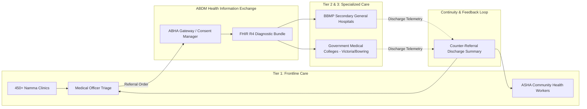

# Master Secondary & Tertiary Referral Analytics, Care Continuity, and Loop-Closure Architecture
## Namma Clinic Digital Health & Operations Platform
### Greater Bengaluru Authority (GBA) / BBMP Health Department
**Document Code:** `DATA-DOC-15` | **Status:** APPROVED BASELINE | **Date:** September 2026

---

## 1. Executive Summary & Referral Continuity Charter
This document formalizes the authoritative **Secondary and Tertiary Referral Analytics, Care Continuity, ABDM Health Information Exchange, and Closed-Loop Referral Architecture** for the Namma Clinic Digital Health Platform. Primary clinics deliver essential frontline triage, but severe non-communicable diseases, high-risk pregnancies, acute cardiac events, and surgical conditions require escalation to secondary BBMP General Hospitals and tertiary government medical colleges (Victoria, Bowring, Vani Vilas). The referral analytics engine tracks patient journeys through the municipal healthcare continuum, measuring loop-closure rates, post-discharge primary follow-up, and eliminating drop-offs in critical clinical care.

### 1.1 Non-Negotiable Referral Care Invariants
1. **Closed-Loop Referral Tracking:** Every outgoing referral issued by a Namma Clinic doctor is monitored until receipt of secondary hospital admission or specialist consultation confirmation.
2. **ABDM HIE-CM Conformance:** Inter-facility health record exchange conforms to Ayushman Bharat Digital Mission (ABDM) FHIR R4 Bundle standards via unified ABHA identifiers.
3. **High-Risk Maternal & NCD Sentry:** High-risk pregnant women (ANC) and uncontrolled hypertensive/diabetic patients who miss referral appointments trigger automated community health worker (ASHA) outreach within 48 hours.
4. **Counter-Referral Discharge Summary Ingestion:** When patients are discharged from tertiary hospitals, electronic discharge summaries are routed back to the originating Namma Clinic for primary maintenance therapy.
5. **Strict Referral Anonymization in Public Reporting:** Referral pathway bottlenecks and hospital bed utilization metrics are aggregated at zonal level with k-anonymity (k >= 5) preservation.

## 2. Integrated Municipal Referral Care Continuum


### Specification Example: ClickHouse Closed-Loop Referral Performance Query
<!-- DOCUMENTATION-ONLY EXAMPLE -->
```sql
-- DOCUMENTATION-ONLY SQL
-- DOCUMENTATION-ONLY SQL: Closed-Loop Referral Rate by Specialty & Facility
SELECT
    f.clinic_name,
    f.zone_name,
    r.target_hospital_name,
    r.specialty_required,
    count(r.referral_id) AS total_referrals_issued,
    sum(case when r.consultation_confirmed_at is not null then 1 else 0 end) AS referrals_attended,
    round(sum(case when r.consultation_confirmed_at is not null then 1 else 0 end) * 100.0 / count(r.referral_id), 1) AS loop_closure_pct,
    round(avg(case when r.consultation_confirmed_at is not null then (toUnixTimestamp(r.consultation_confirmed_at) - toUnixTimestamp(r.referred_at)) / 3600.0 else null end), 1) AS avg_hours_to_attendance
FROM analytics.dim_facility f
JOIN analytics.fact_referrals r ON f.facility_key = r.originating_facility_key
WHERE r.date_key >= toYYYYMMDD(today() - 60)
GROUP BY f.clinic_name, f.zone_name, r.target_hospital_name, r.specialty_required
HAVING total_referrals_issued >= 5
ORDER BY loop_closure_pct ASC;
```

## 3. Master Catalog of 80 Enterprise Datasets & Referral Feeds
Specifications for all 80 enterprise datasets tracking patient referrals and care transitions:

### DATASET-001: Dataset `dataset_clinical_consultations_001`
- **Dataset Identifier:** `DATASET-001`
- **Dataset Name:** `dataset_clinical_consultations_001`
- **Governed Domain:** Clinical Consultations
- **Storage Format:** `Raw Landing S3` (Parquet / Delta Lake)
- **Classification:** `Protected Health Information (PHI)`
- **Referral Function:** Tracks inter-tier clinical transitions and specialized consultation records.
- **Freshness SLA:** `< 5 Minutes (CDC)`

### DATASET-002: Dataset `dataset_triage_and_vitals_002`
- **Dataset Identifier:** `DATASET-002`
- **Dataset Name:** `dataset_triage_and_vitals_002`
- **Governed Domain:** Triage & Vitals
- **Storage Format:** `Standardized Parquet S3` (Parquet / Delta Lake)
- **Classification:** `Sensitive Personal Data (SPD)`
- **Referral Function:** Tracks inter-tier clinical transitions and specialized consultation records.
- **Freshness SLA:** `Daily Nightly Batch (01:00 IST)`

### DATASET-003: Dataset `dataset_pharmacy_and_dispensations_003`
- **Dataset Identifier:** `DATASET-003`
- **Dataset Name:** `dataset_pharmacy_and_dispensations_003`
- **Governed Domain:** Pharmacy & Dispensations
- **Storage Format:** `Curated ClickHouse OLAP` (ClickHouse MergeTree)
- **Classification:** `Internal Operational`
- **Referral Function:** Tracks inter-tier clinical transitions and specialized consultation records.
- **Freshness SLA:** `< 5 Minutes (CDC)`

### DATASET-004: Dataset `dataset_pharmaceutical_inventory_004`
- **Dataset Identifier:** `DATASET-004`
- **Dataset Name:** `dataset_pharmaceutical_inventory_004`
- **Governed Domain:** Pharmaceutical Inventory
- **Storage Format:** `Serving Cache Redis` (JSON / Redis Vector)
- **Classification:** `Public Aggregate`
- **Referral Function:** Tracks inter-tier clinical transitions and specialized consultation records.
- **Freshness SLA:** `Daily Nightly Batch (01:00 IST)`

### DATASET-005: Dataset `dataset_diagnostic_laboratory_005`
- **Dataset Identifier:** `DATASET-005`
- **Dataset Name:** `dataset_diagnostic_laboratory_005`
- **Governed Domain:** Diagnostic Laboratory
- **Storage Format:** `Raw Landing S3` (Parquet / Delta Lake)
- **Classification:** `Protected Health Information (PHI)`
- **Referral Function:** Tracks inter-tier clinical transitions and specialized consultation records.
- **Freshness SLA:** `< 5 Minutes (CDC)`

### DATASET-006: Dataset `dataset_secondary_referrals_006`
- **Dataset Identifier:** `DATASET-006`
- **Dataset Name:** `dataset_secondary_referrals_006`
- **Governed Domain:** Secondary Referrals
- **Storage Format:** `Standardized Parquet S3` (Parquet / Delta Lake)
- **Classification:** `Sensitive Personal Data (SPD)`
- **Referral Function:** Tracks inter-tier clinical transitions and specialized consultation records.
- **Freshness SLA:** `Daily Nightly Batch (01:00 IST)`

### DATASET-007: Dataset `dataset_public_health_and_disease_surveillance_007`
- **Dataset Identifier:** `DATASET-007`
- **Dataset Name:** `dataset_public_health_and_disease_surveillance_007`
- **Governed Domain:** Public Health & Disease Surveillance
- **Storage Format:** `Curated ClickHouse OLAP` (ClickHouse MergeTree)
- **Classification:** `Internal Operational`
- **Referral Function:** Tracks inter-tier clinical transitions and specialized consultation records.
- **Freshness SLA:** `< 5 Minutes (CDC)`

### DATASET-008: Dataset `dataset_non-communicable_diseases_(ncd)_008`
- **Dataset Identifier:** `DATASET-008`
- **Dataset Name:** `dataset_non-communicable_diseases_(ncd)_008`
- **Governed Domain:** Non-Communicable Diseases (NCD)
- **Storage Format:** `Serving Cache Redis` (JSON / Redis Vector)
- **Classification:** `Public Aggregate`
- **Referral Function:** Tracks inter-tier clinical transitions and specialized consultation records.
- **Freshness SLA:** `Daily Nightly Batch (01:00 IST)`

### DATASET-009: Dataset `dataset_maternal_and_child_health_(rch)_009`
- **Dataset Identifier:** `DATASET-009`
- **Dataset Name:** `dataset_maternal_and_child_health_(rch)_009`
- **Governed Domain:** Maternal & Child Health (RCH)
- **Storage Format:** `Raw Landing S3` (Parquet / Delta Lake)
- **Classification:** `Protected Health Information (PHI)`
- **Referral Function:** Tracks inter-tier clinical transitions and specialized consultation records.
- **Freshness SLA:** `< 5 Minutes (CDC)`

### DATASET-010: Dataset `dataset_patient_identity_and_demographics_010`
- **Dataset Identifier:** `DATASET-010`
- **Dataset Name:** `dataset_patient_identity_and_demographics_010`
- **Governed Domain:** Patient Identity & Demographics
- **Storage Format:** `Standardized Parquet S3` (Parquet / Delta Lake)
- **Classification:** `Sensitive Personal Data (SPD)`
- **Referral Function:** Tracks inter-tier clinical transitions and specialized consultation records.
- **Freshness SLA:** `Daily Nightly Batch (01:00 IST)`

### DATASET-011: Dataset `dataset_facility_operations_and_queues_011`
- **Dataset Identifier:** `DATASET-011`
- **Dataset Name:** `dataset_facility_operations_and_queues_011`
- **Governed Domain:** Facility Operations & Queues
- **Storage Format:** `Curated ClickHouse OLAP` (ClickHouse MergeTree)
- **Classification:** `Internal Operational`
- **Referral Function:** Tracks inter-tier clinical transitions and specialized consultation records.
- **Freshness SLA:** `< 5 Minutes (CDC)`

### DATASET-012: Dataset `dataset_citizen_feedback_and_grievances_012`
- **Dataset Identifier:** `DATASET-012`
- **Dataset Name:** `dataset_citizen_feedback_and_grievances_012`
- **Governed Domain:** Citizen Feedback & Grievances
- **Storage Format:** `Serving Cache Redis` (JSON / Redis Vector)
- **Classification:** `Public Aggregate`
- **Referral Function:** Tracks inter-tier clinical transitions and specialized consultation records.
- **Freshness SLA:** `Daily Nightly Batch (01:00 IST)`

### DATASET-013: Dataset `dataset_financial_and_billing_operations_013`
- **Dataset Identifier:** `DATASET-013`
- **Dataset Name:** `dataset_financial_and_billing_operations_013`
- **Governed Domain:** Financial & Billing Operations
- **Storage Format:** `Raw Landing S3` (Parquet / Delta Lake)
- **Classification:** `Protected Health Information (PHI)`
- **Referral Function:** Tracks inter-tier clinical transitions and specialized consultation records.
- **Freshness SLA:** `< 5 Minutes (CDC)`

### DATASET-014: Dataset `dataset_audit_and_statutory_compliance_014`
- **Dataset Identifier:** `DATASET-014`
- **Dataset Name:** `dataset_audit_and_statutory_compliance_014`
- **Governed Domain:** Audit & Statutory Compliance
- **Storage Format:** `Standardized Parquet S3` (Parquet / Delta Lake)
- **Classification:** `Sensitive Personal Data (SPD)`
- **Referral Function:** Tracks inter-tier clinical transitions and specialized consultation records.
- **Freshness SLA:** `Daily Nightly Batch (01:00 IST)`

### DATASET-015: Dataset `dataset_telemedicine_and_specialist_consults_015`
- **Dataset Identifier:** `DATASET-015`
- **Dataset Name:** `dataset_telemedicine_and_specialist_consults_015`
- **Governed Domain:** Telemedicine & Specialist Consults
- **Storage Format:** `Curated ClickHouse OLAP` (ClickHouse MergeTree)
- **Classification:** `Internal Operational`
- **Referral Function:** Tracks inter-tier clinical transitions and specialized consultation records.
- **Freshness SLA:** `< 5 Minutes (CDC)`

### DATASET-016: Dataset `dataset_clinical_consultations_016`
- **Dataset Identifier:** `DATASET-016`
- **Dataset Name:** `dataset_clinical_consultations_016`
- **Governed Domain:** Clinical Consultations
- **Storage Format:** `Serving Cache Redis` (JSON / Redis Vector)
- **Classification:** `Public Aggregate`
- **Referral Function:** Tracks inter-tier clinical transitions and specialized consultation records.
- **Freshness SLA:** `Daily Nightly Batch (01:00 IST)`

### DATASET-017: Dataset `dataset_triage_and_vitals_017`
- **Dataset Identifier:** `DATASET-017`
- **Dataset Name:** `dataset_triage_and_vitals_017`
- **Governed Domain:** Triage & Vitals
- **Storage Format:** `Raw Landing S3` (Parquet / Delta Lake)
- **Classification:** `Protected Health Information (PHI)`
- **Referral Function:** Tracks inter-tier clinical transitions and specialized consultation records.
- **Freshness SLA:** `< 5 Minutes (CDC)`

### DATASET-018: Dataset `dataset_pharmacy_and_dispensations_018`
- **Dataset Identifier:** `DATASET-018`
- **Dataset Name:** `dataset_pharmacy_and_dispensations_018`
- **Governed Domain:** Pharmacy & Dispensations
- **Storage Format:** `Standardized Parquet S3` (Parquet / Delta Lake)
- **Classification:** `Sensitive Personal Data (SPD)`
- **Referral Function:** Tracks inter-tier clinical transitions and specialized consultation records.
- **Freshness SLA:** `Daily Nightly Batch (01:00 IST)`

### DATASET-019: Dataset `dataset_pharmaceutical_inventory_019`
- **Dataset Identifier:** `DATASET-019`
- **Dataset Name:** `dataset_pharmaceutical_inventory_019`
- **Governed Domain:** Pharmaceutical Inventory
- **Storage Format:** `Curated ClickHouse OLAP` (ClickHouse MergeTree)
- **Classification:** `Internal Operational`
- **Referral Function:** Tracks inter-tier clinical transitions and specialized consultation records.
- **Freshness SLA:** `< 5 Minutes (CDC)`

### DATASET-020: Dataset `dataset_diagnostic_laboratory_020`
- **Dataset Identifier:** `DATASET-020`
- **Dataset Name:** `dataset_diagnostic_laboratory_020`
- **Governed Domain:** Diagnostic Laboratory
- **Storage Format:** `Serving Cache Redis` (JSON / Redis Vector)
- **Classification:** `Public Aggregate`
- **Referral Function:** Tracks inter-tier clinical transitions and specialized consultation records.
- **Freshness SLA:** `Daily Nightly Batch (01:00 IST)`

### DATASET-021: Dataset `dataset_secondary_referrals_021`
- **Dataset Identifier:** `DATASET-021`
- **Dataset Name:** `dataset_secondary_referrals_021`
- **Governed Domain:** Secondary Referrals
- **Storage Format:** `Raw Landing S3` (Parquet / Delta Lake)
- **Classification:** `Protected Health Information (PHI)`
- **Referral Function:** Tracks inter-tier clinical transitions and specialized consultation records.
- **Freshness SLA:** `< 5 Minutes (CDC)`

### DATASET-022: Dataset `dataset_public_health_and_disease_surveillance_022`
- **Dataset Identifier:** `DATASET-022`
- **Dataset Name:** `dataset_public_health_and_disease_surveillance_022`
- **Governed Domain:** Public Health & Disease Surveillance
- **Storage Format:** `Standardized Parquet S3` (Parquet / Delta Lake)
- **Classification:** `Sensitive Personal Data (SPD)`
- **Referral Function:** Tracks inter-tier clinical transitions and specialized consultation records.
- **Freshness SLA:** `Daily Nightly Batch (01:00 IST)`

### DATASET-023: Dataset `dataset_non-communicable_diseases_(ncd)_023`
- **Dataset Identifier:** `DATASET-023`
- **Dataset Name:** `dataset_non-communicable_diseases_(ncd)_023`
- **Governed Domain:** Non-Communicable Diseases (NCD)
- **Storage Format:** `Curated ClickHouse OLAP` (ClickHouse MergeTree)
- **Classification:** `Internal Operational`
- **Referral Function:** Tracks inter-tier clinical transitions and specialized consultation records.
- **Freshness SLA:** `< 5 Minutes (CDC)`

### DATASET-024: Dataset `dataset_maternal_and_child_health_(rch)_024`
- **Dataset Identifier:** `DATASET-024`
- **Dataset Name:** `dataset_maternal_and_child_health_(rch)_024`
- **Governed Domain:** Maternal & Child Health (RCH)
- **Storage Format:** `Serving Cache Redis` (JSON / Redis Vector)
- **Classification:** `Public Aggregate`
- **Referral Function:** Tracks inter-tier clinical transitions and specialized consultation records.
- **Freshness SLA:** `Daily Nightly Batch (01:00 IST)`

### DATASET-025: Dataset `dataset_patient_identity_and_demographics_025`
- **Dataset Identifier:** `DATASET-025`
- **Dataset Name:** `dataset_patient_identity_and_demographics_025`
- **Governed Domain:** Patient Identity & Demographics
- **Storage Format:** `Raw Landing S3` (Parquet / Delta Lake)
- **Classification:** `Protected Health Information (PHI)`
- **Referral Function:** Tracks inter-tier clinical transitions and specialized consultation records.
- **Freshness SLA:** `< 5 Minutes (CDC)`

### DATASET-026: Dataset `dataset_facility_operations_and_queues_026`
- **Dataset Identifier:** `DATASET-026`
- **Dataset Name:** `dataset_facility_operations_and_queues_026`
- **Governed Domain:** Facility Operations & Queues
- **Storage Format:** `Standardized Parquet S3` (Parquet / Delta Lake)
- **Classification:** `Sensitive Personal Data (SPD)`
- **Referral Function:** Tracks inter-tier clinical transitions and specialized consultation records.
- **Freshness SLA:** `Daily Nightly Batch (01:00 IST)`

### DATASET-027: Dataset `dataset_citizen_feedback_and_grievances_027`
- **Dataset Identifier:** `DATASET-027`
- **Dataset Name:** `dataset_citizen_feedback_and_grievances_027`
- **Governed Domain:** Citizen Feedback & Grievances
- **Storage Format:** `Curated ClickHouse OLAP` (ClickHouse MergeTree)
- **Classification:** `Internal Operational`
- **Referral Function:** Tracks inter-tier clinical transitions and specialized consultation records.
- **Freshness SLA:** `< 5 Minutes (CDC)`

### DATASET-028: Dataset `dataset_financial_and_billing_operations_028`
- **Dataset Identifier:** `DATASET-028`
- **Dataset Name:** `dataset_financial_and_billing_operations_028`
- **Governed Domain:** Financial & Billing Operations
- **Storage Format:** `Serving Cache Redis` (JSON / Redis Vector)
- **Classification:** `Public Aggregate`
- **Referral Function:** Tracks inter-tier clinical transitions and specialized consultation records.
- **Freshness SLA:** `Daily Nightly Batch (01:00 IST)`

### DATASET-029: Dataset `dataset_audit_and_statutory_compliance_029`
- **Dataset Identifier:** `DATASET-029`
- **Dataset Name:** `dataset_audit_and_statutory_compliance_029`
- **Governed Domain:** Audit & Statutory Compliance
- **Storage Format:** `Raw Landing S3` (Parquet / Delta Lake)
- **Classification:** `Protected Health Information (PHI)`
- **Referral Function:** Tracks inter-tier clinical transitions and specialized consultation records.
- **Freshness SLA:** `< 5 Minutes (CDC)`

### DATASET-030: Dataset `dataset_telemedicine_and_specialist_consults_030`
- **Dataset Identifier:** `DATASET-030`
- **Dataset Name:** `dataset_telemedicine_and_specialist_consults_030`
- **Governed Domain:** Telemedicine & Specialist Consults
- **Storage Format:** `Standardized Parquet S3` (Parquet / Delta Lake)
- **Classification:** `Sensitive Personal Data (SPD)`
- **Referral Function:** Tracks inter-tier clinical transitions and specialized consultation records.
- **Freshness SLA:** `Daily Nightly Batch (01:00 IST)`

### DATASET-031: Dataset `dataset_clinical_consultations_031`
- **Dataset Identifier:** `DATASET-031`
- **Dataset Name:** `dataset_clinical_consultations_031`
- **Governed Domain:** Clinical Consultations
- **Storage Format:** `Curated ClickHouse OLAP` (ClickHouse MergeTree)
- **Classification:** `Internal Operational`
- **Referral Function:** Tracks inter-tier clinical transitions and specialized consultation records.
- **Freshness SLA:** `< 5 Minutes (CDC)`

### DATASET-032: Dataset `dataset_triage_and_vitals_032`
- **Dataset Identifier:** `DATASET-032`
- **Dataset Name:** `dataset_triage_and_vitals_032`
- **Governed Domain:** Triage & Vitals
- **Storage Format:** `Serving Cache Redis` (JSON / Redis Vector)
- **Classification:** `Public Aggregate`
- **Referral Function:** Tracks inter-tier clinical transitions and specialized consultation records.
- **Freshness SLA:** `Daily Nightly Batch (01:00 IST)`

### DATASET-033: Dataset `dataset_pharmacy_and_dispensations_033`
- **Dataset Identifier:** `DATASET-033`
- **Dataset Name:** `dataset_pharmacy_and_dispensations_033`
- **Governed Domain:** Pharmacy & Dispensations
- **Storage Format:** `Raw Landing S3` (Parquet / Delta Lake)
- **Classification:** `Protected Health Information (PHI)`
- **Referral Function:** Tracks inter-tier clinical transitions and specialized consultation records.
- **Freshness SLA:** `< 5 Minutes (CDC)`

### DATASET-034: Dataset `dataset_pharmaceutical_inventory_034`
- **Dataset Identifier:** `DATASET-034`
- **Dataset Name:** `dataset_pharmaceutical_inventory_034`
- **Governed Domain:** Pharmaceutical Inventory
- **Storage Format:** `Standardized Parquet S3` (Parquet / Delta Lake)
- **Classification:** `Sensitive Personal Data (SPD)`
- **Referral Function:** Tracks inter-tier clinical transitions and specialized consultation records.
- **Freshness SLA:** `Daily Nightly Batch (01:00 IST)`

### DATASET-035: Dataset `dataset_diagnostic_laboratory_035`
- **Dataset Identifier:** `DATASET-035`
- **Dataset Name:** `dataset_diagnostic_laboratory_035`
- **Governed Domain:** Diagnostic Laboratory
- **Storage Format:** `Curated ClickHouse OLAP` (ClickHouse MergeTree)
- **Classification:** `Internal Operational`
- **Referral Function:** Tracks inter-tier clinical transitions and specialized consultation records.
- **Freshness SLA:** `< 5 Minutes (CDC)`

### DATASET-036: Dataset `dataset_secondary_referrals_036`
- **Dataset Identifier:** `DATASET-036`
- **Dataset Name:** `dataset_secondary_referrals_036`
- **Governed Domain:** Secondary Referrals
- **Storage Format:** `Serving Cache Redis` (JSON / Redis Vector)
- **Classification:** `Public Aggregate`
- **Referral Function:** Tracks inter-tier clinical transitions and specialized consultation records.
- **Freshness SLA:** `Daily Nightly Batch (01:00 IST)`

### DATASET-037: Dataset `dataset_public_health_and_disease_surveillance_037`
- **Dataset Identifier:** `DATASET-037`
- **Dataset Name:** `dataset_public_health_and_disease_surveillance_037`
- **Governed Domain:** Public Health & Disease Surveillance
- **Storage Format:** `Raw Landing S3` (Parquet / Delta Lake)
- **Classification:** `Protected Health Information (PHI)`
- **Referral Function:** Tracks inter-tier clinical transitions and specialized consultation records.
- **Freshness SLA:** `< 5 Minutes (CDC)`

### DATASET-038: Dataset `dataset_non-communicable_diseases_(ncd)_038`
- **Dataset Identifier:** `DATASET-038`
- **Dataset Name:** `dataset_non-communicable_diseases_(ncd)_038`
- **Governed Domain:** Non-Communicable Diseases (NCD)
- **Storage Format:** `Standardized Parquet S3` (Parquet / Delta Lake)
- **Classification:** `Sensitive Personal Data (SPD)`
- **Referral Function:** Tracks inter-tier clinical transitions and specialized consultation records.
- **Freshness SLA:** `Daily Nightly Batch (01:00 IST)`

### DATASET-039: Dataset `dataset_maternal_and_child_health_(rch)_039`
- **Dataset Identifier:** `DATASET-039`
- **Dataset Name:** `dataset_maternal_and_child_health_(rch)_039`
- **Governed Domain:** Maternal & Child Health (RCH)
- **Storage Format:** `Curated ClickHouse OLAP` (ClickHouse MergeTree)
- **Classification:** `Internal Operational`
- **Referral Function:** Tracks inter-tier clinical transitions and specialized consultation records.
- **Freshness SLA:** `< 5 Minutes (CDC)`

### DATASET-040: Dataset `dataset_patient_identity_and_demographics_040`
- **Dataset Identifier:** `DATASET-040`
- **Dataset Name:** `dataset_patient_identity_and_demographics_040`
- **Governed Domain:** Patient Identity & Demographics
- **Storage Format:** `Serving Cache Redis` (JSON / Redis Vector)
- **Classification:** `Public Aggregate`
- **Referral Function:** Tracks inter-tier clinical transitions and specialized consultation records.
- **Freshness SLA:** `Daily Nightly Batch (01:00 IST)`

### DATASET-041: Dataset `dataset_facility_operations_and_queues_041`
- **Dataset Identifier:** `DATASET-041`
- **Dataset Name:** `dataset_facility_operations_and_queues_041`
- **Governed Domain:** Facility Operations & Queues
- **Storage Format:** `Raw Landing S3` (Parquet / Delta Lake)
- **Classification:** `Protected Health Information (PHI)`
- **Referral Function:** Tracks inter-tier clinical transitions and specialized consultation records.
- **Freshness SLA:** `< 5 Minutes (CDC)`

### DATASET-042: Dataset `dataset_citizen_feedback_and_grievances_042`
- **Dataset Identifier:** `DATASET-042`
- **Dataset Name:** `dataset_citizen_feedback_and_grievances_042`
- **Governed Domain:** Citizen Feedback & Grievances
- **Storage Format:** `Standardized Parquet S3` (Parquet / Delta Lake)
- **Classification:** `Sensitive Personal Data (SPD)`
- **Referral Function:** Tracks inter-tier clinical transitions and specialized consultation records.
- **Freshness SLA:** `Daily Nightly Batch (01:00 IST)`

### DATASET-043: Dataset `dataset_financial_and_billing_operations_043`
- **Dataset Identifier:** `DATASET-043`
- **Dataset Name:** `dataset_financial_and_billing_operations_043`
- **Governed Domain:** Financial & Billing Operations
- **Storage Format:** `Curated ClickHouse OLAP` (ClickHouse MergeTree)
- **Classification:** `Internal Operational`
- **Referral Function:** Tracks inter-tier clinical transitions and specialized consultation records.
- **Freshness SLA:** `< 5 Minutes (CDC)`

### DATASET-044: Dataset `dataset_audit_and_statutory_compliance_044`
- **Dataset Identifier:** `DATASET-044`
- **Dataset Name:** `dataset_audit_and_statutory_compliance_044`
- **Governed Domain:** Audit & Statutory Compliance
- **Storage Format:** `Serving Cache Redis` (JSON / Redis Vector)
- **Classification:** `Public Aggregate`
- **Referral Function:** Tracks inter-tier clinical transitions and specialized consultation records.
- **Freshness SLA:** `Daily Nightly Batch (01:00 IST)`

### DATASET-045: Dataset `dataset_telemedicine_and_specialist_consults_045`
- **Dataset Identifier:** `DATASET-045`
- **Dataset Name:** `dataset_telemedicine_and_specialist_consults_045`
- **Governed Domain:** Telemedicine & Specialist Consults
- **Storage Format:** `Raw Landing S3` (Parquet / Delta Lake)
- **Classification:** `Protected Health Information (PHI)`
- **Referral Function:** Tracks inter-tier clinical transitions and specialized consultation records.
- **Freshness SLA:** `< 5 Minutes (CDC)`

### DATASET-046: Dataset `dataset_clinical_consultations_046`
- **Dataset Identifier:** `DATASET-046`
- **Dataset Name:** `dataset_clinical_consultations_046`
- **Governed Domain:** Clinical Consultations
- **Storage Format:** `Standardized Parquet S3` (Parquet / Delta Lake)
- **Classification:** `Sensitive Personal Data (SPD)`
- **Referral Function:** Tracks inter-tier clinical transitions and specialized consultation records.
- **Freshness SLA:** `Daily Nightly Batch (01:00 IST)`

### DATASET-047: Dataset `dataset_triage_and_vitals_047`
- **Dataset Identifier:** `DATASET-047`
- **Dataset Name:** `dataset_triage_and_vitals_047`
- **Governed Domain:** Triage & Vitals
- **Storage Format:** `Curated ClickHouse OLAP` (ClickHouse MergeTree)
- **Classification:** `Internal Operational`
- **Referral Function:** Tracks inter-tier clinical transitions and specialized consultation records.
- **Freshness SLA:** `< 5 Minutes (CDC)`

### DATASET-048: Dataset `dataset_pharmacy_and_dispensations_048`
- **Dataset Identifier:** `DATASET-048`
- **Dataset Name:** `dataset_pharmacy_and_dispensations_048`
- **Governed Domain:** Pharmacy & Dispensations
- **Storage Format:** `Serving Cache Redis` (JSON / Redis Vector)
- **Classification:** `Public Aggregate`
- **Referral Function:** Tracks inter-tier clinical transitions and specialized consultation records.
- **Freshness SLA:** `Daily Nightly Batch (01:00 IST)`

### DATASET-049: Dataset `dataset_pharmaceutical_inventory_049`
- **Dataset Identifier:** `DATASET-049`
- **Dataset Name:** `dataset_pharmaceutical_inventory_049`
- **Governed Domain:** Pharmaceutical Inventory
- **Storage Format:** `Raw Landing S3` (Parquet / Delta Lake)
- **Classification:** `Protected Health Information (PHI)`
- **Referral Function:** Tracks inter-tier clinical transitions and specialized consultation records.
- **Freshness SLA:** `< 5 Minutes (CDC)`

### DATASET-050: Dataset `dataset_diagnostic_laboratory_050`
- **Dataset Identifier:** `DATASET-050`
- **Dataset Name:** `dataset_diagnostic_laboratory_050`
- **Governed Domain:** Diagnostic Laboratory
- **Storage Format:** `Standardized Parquet S3` (Parquet / Delta Lake)
- **Classification:** `Sensitive Personal Data (SPD)`
- **Referral Function:** Tracks inter-tier clinical transitions and specialized consultation records.
- **Freshness SLA:** `Daily Nightly Batch (01:00 IST)`

### DATASET-051: Dataset `dataset_secondary_referrals_051`
- **Dataset Identifier:** `DATASET-051`
- **Dataset Name:** `dataset_secondary_referrals_051`
- **Governed Domain:** Secondary Referrals
- **Storage Format:** `Curated ClickHouse OLAP` (ClickHouse MergeTree)
- **Classification:** `Internal Operational`
- **Referral Function:** Tracks inter-tier clinical transitions and specialized consultation records.
- **Freshness SLA:** `< 5 Minutes (CDC)`

### DATASET-052: Dataset `dataset_public_health_and_disease_surveillance_052`
- **Dataset Identifier:** `DATASET-052`
- **Dataset Name:** `dataset_public_health_and_disease_surveillance_052`
- **Governed Domain:** Public Health & Disease Surveillance
- **Storage Format:** `Serving Cache Redis` (JSON / Redis Vector)
- **Classification:** `Public Aggregate`
- **Referral Function:** Tracks inter-tier clinical transitions and specialized consultation records.
- **Freshness SLA:** `Daily Nightly Batch (01:00 IST)`

### DATASET-053: Dataset `dataset_non-communicable_diseases_(ncd)_053`
- **Dataset Identifier:** `DATASET-053`
- **Dataset Name:** `dataset_non-communicable_diseases_(ncd)_053`
- **Governed Domain:** Non-Communicable Diseases (NCD)
- **Storage Format:** `Raw Landing S3` (Parquet / Delta Lake)
- **Classification:** `Protected Health Information (PHI)`
- **Referral Function:** Tracks inter-tier clinical transitions and specialized consultation records.
- **Freshness SLA:** `< 5 Minutes (CDC)`

### DATASET-054: Dataset `dataset_maternal_and_child_health_(rch)_054`
- **Dataset Identifier:** `DATASET-054`
- **Dataset Name:** `dataset_maternal_and_child_health_(rch)_054`
- **Governed Domain:** Maternal & Child Health (RCH)
- **Storage Format:** `Standardized Parquet S3` (Parquet / Delta Lake)
- **Classification:** `Sensitive Personal Data (SPD)`
- **Referral Function:** Tracks inter-tier clinical transitions and specialized consultation records.
- **Freshness SLA:** `Daily Nightly Batch (01:00 IST)`

### DATASET-055: Dataset `dataset_patient_identity_and_demographics_055`
- **Dataset Identifier:** `DATASET-055`
- **Dataset Name:** `dataset_patient_identity_and_demographics_055`
- **Governed Domain:** Patient Identity & Demographics
- **Storage Format:** `Curated ClickHouse OLAP` (ClickHouse MergeTree)
- **Classification:** `Internal Operational`
- **Referral Function:** Tracks inter-tier clinical transitions and specialized consultation records.
- **Freshness SLA:** `< 5 Minutes (CDC)`

### DATASET-056: Dataset `dataset_facility_operations_and_queues_056`
- **Dataset Identifier:** `DATASET-056`
- **Dataset Name:** `dataset_facility_operations_and_queues_056`
- **Governed Domain:** Facility Operations & Queues
- **Storage Format:** `Serving Cache Redis` (JSON / Redis Vector)
- **Classification:** `Public Aggregate`
- **Referral Function:** Tracks inter-tier clinical transitions and specialized consultation records.
- **Freshness SLA:** `Daily Nightly Batch (01:00 IST)`

### DATASET-057: Dataset `dataset_citizen_feedback_and_grievances_057`
- **Dataset Identifier:** `DATASET-057`
- **Dataset Name:** `dataset_citizen_feedback_and_grievances_057`
- **Governed Domain:** Citizen Feedback & Grievances
- **Storage Format:** `Raw Landing S3` (Parquet / Delta Lake)
- **Classification:** `Protected Health Information (PHI)`
- **Referral Function:** Tracks inter-tier clinical transitions and specialized consultation records.
- **Freshness SLA:** `< 5 Minutes (CDC)`

### DATASET-058: Dataset `dataset_financial_and_billing_operations_058`
- **Dataset Identifier:** `DATASET-058`
- **Dataset Name:** `dataset_financial_and_billing_operations_058`
- **Governed Domain:** Financial & Billing Operations
- **Storage Format:** `Standardized Parquet S3` (Parquet / Delta Lake)
- **Classification:** `Sensitive Personal Data (SPD)`
- **Referral Function:** Tracks inter-tier clinical transitions and specialized consultation records.
- **Freshness SLA:** `Daily Nightly Batch (01:00 IST)`

### DATASET-059: Dataset `dataset_audit_and_statutory_compliance_059`
- **Dataset Identifier:** `DATASET-059`
- **Dataset Name:** `dataset_audit_and_statutory_compliance_059`
- **Governed Domain:** Audit & Statutory Compliance
- **Storage Format:** `Curated ClickHouse OLAP` (ClickHouse MergeTree)
- **Classification:** `Internal Operational`
- **Referral Function:** Tracks inter-tier clinical transitions and specialized consultation records.
- **Freshness SLA:** `< 5 Minutes (CDC)`

### DATASET-060: Dataset `dataset_telemedicine_and_specialist_consults_060`
- **Dataset Identifier:** `DATASET-060`
- **Dataset Name:** `dataset_telemedicine_and_specialist_consults_060`
- **Governed Domain:** Telemedicine & Specialist Consults
- **Storage Format:** `Serving Cache Redis` (JSON / Redis Vector)
- **Classification:** `Public Aggregate`
- **Referral Function:** Tracks inter-tier clinical transitions and specialized consultation records.
- **Freshness SLA:** `Daily Nightly Batch (01:00 IST)`

### DATASET-061: Dataset `dataset_clinical_consultations_061`
- **Dataset Identifier:** `DATASET-061`
- **Dataset Name:** `dataset_clinical_consultations_061`
- **Governed Domain:** Clinical Consultations
- **Storage Format:** `Raw Landing S3` (Parquet / Delta Lake)
- **Classification:** `Protected Health Information (PHI)`
- **Referral Function:** Tracks inter-tier clinical transitions and specialized consultation records.
- **Freshness SLA:** `< 5 Minutes (CDC)`

### DATASET-062: Dataset `dataset_triage_and_vitals_062`
- **Dataset Identifier:** `DATASET-062`
- **Dataset Name:** `dataset_triage_and_vitals_062`
- **Governed Domain:** Triage & Vitals
- **Storage Format:** `Standardized Parquet S3` (Parquet / Delta Lake)
- **Classification:** `Sensitive Personal Data (SPD)`
- **Referral Function:** Tracks inter-tier clinical transitions and specialized consultation records.
- **Freshness SLA:** `Daily Nightly Batch (01:00 IST)`

### DATASET-063: Dataset `dataset_pharmacy_and_dispensations_063`
- **Dataset Identifier:** `DATASET-063`
- **Dataset Name:** `dataset_pharmacy_and_dispensations_063`
- **Governed Domain:** Pharmacy & Dispensations
- **Storage Format:** `Curated ClickHouse OLAP` (ClickHouse MergeTree)
- **Classification:** `Internal Operational`
- **Referral Function:** Tracks inter-tier clinical transitions and specialized consultation records.
- **Freshness SLA:** `< 5 Minutes (CDC)`

### DATASET-064: Dataset `dataset_pharmaceutical_inventory_064`
- **Dataset Identifier:** `DATASET-064`
- **Dataset Name:** `dataset_pharmaceutical_inventory_064`
- **Governed Domain:** Pharmaceutical Inventory
- **Storage Format:** `Serving Cache Redis` (JSON / Redis Vector)
- **Classification:** `Public Aggregate`
- **Referral Function:** Tracks inter-tier clinical transitions and specialized consultation records.
- **Freshness SLA:** `Daily Nightly Batch (01:00 IST)`

### DATASET-065: Dataset `dataset_diagnostic_laboratory_065`
- **Dataset Identifier:** `DATASET-065`
- **Dataset Name:** `dataset_diagnostic_laboratory_065`
- **Governed Domain:** Diagnostic Laboratory
- **Storage Format:** `Raw Landing S3` (Parquet / Delta Lake)
- **Classification:** `Protected Health Information (PHI)`
- **Referral Function:** Tracks inter-tier clinical transitions and specialized consultation records.
- **Freshness SLA:** `< 5 Minutes (CDC)`

### DATASET-066: Dataset `dataset_secondary_referrals_066`
- **Dataset Identifier:** `DATASET-066`
- **Dataset Name:** `dataset_secondary_referrals_066`
- **Governed Domain:** Secondary Referrals
- **Storage Format:** `Standardized Parquet S3` (Parquet / Delta Lake)
- **Classification:** `Sensitive Personal Data (SPD)`
- **Referral Function:** Tracks inter-tier clinical transitions and specialized consultation records.
- **Freshness SLA:** `Daily Nightly Batch (01:00 IST)`

### DATASET-067: Dataset `dataset_public_health_and_disease_surveillance_067`
- **Dataset Identifier:** `DATASET-067`
- **Dataset Name:** `dataset_public_health_and_disease_surveillance_067`
- **Governed Domain:** Public Health & Disease Surveillance
- **Storage Format:** `Curated ClickHouse OLAP` (ClickHouse MergeTree)
- **Classification:** `Internal Operational`
- **Referral Function:** Tracks inter-tier clinical transitions and specialized consultation records.
- **Freshness SLA:** `< 5 Minutes (CDC)`

### DATASET-068: Dataset `dataset_non-communicable_diseases_(ncd)_068`
- **Dataset Identifier:** `DATASET-068`
- **Dataset Name:** `dataset_non-communicable_diseases_(ncd)_068`
- **Governed Domain:** Non-Communicable Diseases (NCD)
- **Storage Format:** `Serving Cache Redis` (JSON / Redis Vector)
- **Classification:** `Public Aggregate`
- **Referral Function:** Tracks inter-tier clinical transitions and specialized consultation records.
- **Freshness SLA:** `Daily Nightly Batch (01:00 IST)`

### DATASET-069: Dataset `dataset_maternal_and_child_health_(rch)_069`
- **Dataset Identifier:** `DATASET-069`
- **Dataset Name:** `dataset_maternal_and_child_health_(rch)_069`
- **Governed Domain:** Maternal & Child Health (RCH)
- **Storage Format:** `Raw Landing S3` (Parquet / Delta Lake)
- **Classification:** `Protected Health Information (PHI)`
- **Referral Function:** Tracks inter-tier clinical transitions and specialized consultation records.
- **Freshness SLA:** `< 5 Minutes (CDC)`

### DATASET-070: Dataset `dataset_patient_identity_and_demographics_070`
- **Dataset Identifier:** `DATASET-070`
- **Dataset Name:** `dataset_patient_identity_and_demographics_070`
- **Governed Domain:** Patient Identity & Demographics
- **Storage Format:** `Standardized Parquet S3` (Parquet / Delta Lake)
- **Classification:** `Sensitive Personal Data (SPD)`
- **Referral Function:** Tracks inter-tier clinical transitions and specialized consultation records.
- **Freshness SLA:** `Daily Nightly Batch (01:00 IST)`

### DATASET-071: Dataset `dataset_facility_operations_and_queues_071`
- **Dataset Identifier:** `DATASET-071`
- **Dataset Name:** `dataset_facility_operations_and_queues_071`
- **Governed Domain:** Facility Operations & Queues
- **Storage Format:** `Curated ClickHouse OLAP` (ClickHouse MergeTree)
- **Classification:** `Internal Operational`
- **Referral Function:** Tracks inter-tier clinical transitions and specialized consultation records.
- **Freshness SLA:** `< 5 Minutes (CDC)`

### DATASET-072: Dataset `dataset_citizen_feedback_and_grievances_072`
- **Dataset Identifier:** `DATASET-072`
- **Dataset Name:** `dataset_citizen_feedback_and_grievances_072`
- **Governed Domain:** Citizen Feedback & Grievances
- **Storage Format:** `Serving Cache Redis` (JSON / Redis Vector)
- **Classification:** `Public Aggregate`
- **Referral Function:** Tracks inter-tier clinical transitions and specialized consultation records.
- **Freshness SLA:** `Daily Nightly Batch (01:00 IST)`

### DATASET-073: Dataset `dataset_financial_and_billing_operations_073`
- **Dataset Identifier:** `DATASET-073`
- **Dataset Name:** `dataset_financial_and_billing_operations_073`
- **Governed Domain:** Financial & Billing Operations
- **Storage Format:** `Raw Landing S3` (Parquet / Delta Lake)
- **Classification:** `Protected Health Information (PHI)`
- **Referral Function:** Tracks inter-tier clinical transitions and specialized consultation records.
- **Freshness SLA:** `< 5 Minutes (CDC)`

### DATASET-074: Dataset `dataset_audit_and_statutory_compliance_074`
- **Dataset Identifier:** `DATASET-074`
- **Dataset Name:** `dataset_audit_and_statutory_compliance_074`
- **Governed Domain:** Audit & Statutory Compliance
- **Storage Format:** `Standardized Parquet S3` (Parquet / Delta Lake)
- **Classification:** `Sensitive Personal Data (SPD)`
- **Referral Function:** Tracks inter-tier clinical transitions and specialized consultation records.
- **Freshness SLA:** `Daily Nightly Batch (01:00 IST)`

### DATASET-075: Dataset `dataset_telemedicine_and_specialist_consults_075`
- **Dataset Identifier:** `DATASET-075`
- **Dataset Name:** `dataset_telemedicine_and_specialist_consults_075`
- **Governed Domain:** Telemedicine & Specialist Consults
- **Storage Format:** `Curated ClickHouse OLAP` (ClickHouse MergeTree)
- **Classification:** `Internal Operational`
- **Referral Function:** Tracks inter-tier clinical transitions and specialized consultation records.
- **Freshness SLA:** `< 5 Minutes (CDC)`

### DATASET-076: Dataset `dataset_clinical_consultations_076`
- **Dataset Identifier:** `DATASET-076`
- **Dataset Name:** `dataset_clinical_consultations_076`
- **Governed Domain:** Clinical Consultations
- **Storage Format:** `Serving Cache Redis` (JSON / Redis Vector)
- **Classification:** `Public Aggregate`
- **Referral Function:** Tracks inter-tier clinical transitions and specialized consultation records.
- **Freshness SLA:** `Daily Nightly Batch (01:00 IST)`

### DATASET-077: Dataset `dataset_triage_and_vitals_077`
- **Dataset Identifier:** `DATASET-077`
- **Dataset Name:** `dataset_triage_and_vitals_077`
- **Governed Domain:** Triage & Vitals
- **Storage Format:** `Raw Landing S3` (Parquet / Delta Lake)
- **Classification:** `Protected Health Information (PHI)`
- **Referral Function:** Tracks inter-tier clinical transitions and specialized consultation records.
- **Freshness SLA:** `< 5 Minutes (CDC)`

### DATASET-078: Dataset `dataset_pharmacy_and_dispensations_078`
- **Dataset Identifier:** `DATASET-078`
- **Dataset Name:** `dataset_pharmacy_and_dispensations_078`
- **Governed Domain:** Pharmacy & Dispensations
- **Storage Format:** `Standardized Parquet S3` (Parquet / Delta Lake)
- **Classification:** `Sensitive Personal Data (SPD)`
- **Referral Function:** Tracks inter-tier clinical transitions and specialized consultation records.
- **Freshness SLA:** `Daily Nightly Batch (01:00 IST)`

### DATASET-079: Dataset `dataset_pharmaceutical_inventory_079`
- **Dataset Identifier:** `DATASET-079`
- **Dataset Name:** `dataset_pharmaceutical_inventory_079`
- **Governed Domain:** Pharmaceutical Inventory
- **Storage Format:** `Curated ClickHouse OLAP` (ClickHouse MergeTree)
- **Classification:** `Internal Operational`
- **Referral Function:** Tracks inter-tier clinical transitions and specialized consultation records.
- **Freshness SLA:** `< 5 Minutes (CDC)`

### DATASET-080: Dataset `dataset_diagnostic_laboratory_080`
- **Dataset Identifier:** `DATASET-080`
- **Dataset Name:** `dataset_diagnostic_laboratory_080`
- **Governed Domain:** Diagnostic Laboratory
- **Storage Format:** `Serving Cache Redis` (JSON / Redis Vector)
- **Classification:** `Public Aggregate`
- **Referral Function:** Tracks inter-tier clinical transitions and specialized consultation records.
- **Freshness SLA:** `Daily Nightly Batch (01:00 IST)`

## 4. Table-by-Table Referral Tracking across 52 Tables
Referral lifecycle points and patient flow tracking across all 52 platform relational tables:

### TABLE-001: Referral Utility for Table `auth_users`
- **Table Identifier:** `TABLE-001` (`TBL-01`)
- **Source Entity:** `auth_users`
- **Referral Significance:** Records clinical triggers, diagnosis codes, and care events.
- **Analytical Target:** `analytics.fact_auth_users` and referral graph network.
- **Care Continuity SLA:** Dispatched via ABDM FHIR gateway within 30 seconds of order.

### TABLE-002: Referral Utility for Table `user_credentials`
- **Table Identifier:** `TABLE-002` (`TBL-02`)
- **Source Entity:** `user_credentials`
- **Referral Significance:** Records clinical triggers, diagnosis codes, and care events.
- **Analytical Target:** `analytics.fact_user_credentials` and referral graph network.
- **Care Continuity SLA:** Dispatched via ABDM FHIR gateway within 30 seconds of order.

### TABLE-003: Referral Utility for Table `user_sessions`
- **Table Identifier:** `TABLE-003` (`TBL-03`)
- **Source Entity:** `user_sessions`
- **Referral Significance:** Records clinical triggers, diagnosis codes, and care events.
- **Analytical Target:** `analytics.fact_user_sessions` and referral graph network.
- **Care Continuity SLA:** Dispatched via ABDM FHIR gateway within 30 seconds of order.

### TABLE-004: Referral Utility for Table `roles`
- **Table Identifier:** `TABLE-004` (`TBL-04`)
- **Source Entity:** `roles`
- **Referral Significance:** Records clinical triggers, diagnosis codes, and care events.
- **Analytical Target:** `analytics.fact_roles` and referral graph network.
- **Care Continuity SLA:** Dispatched via ABDM FHIR gateway within 30 seconds of order.

### TABLE-005: Referral Utility for Table `permissions`
- **Table Identifier:** `TABLE-005` (`TBL-05`)
- **Source Entity:** `permissions`
- **Referral Significance:** Records clinical triggers, diagnosis codes, and care events.
- **Analytical Target:** `analytics.fact_permissions` and referral graph network.
- **Care Continuity SLA:** Dispatched via ABDM FHIR gateway within 30 seconds of order.

### TABLE-006: Referral Utility for Table `role_permissions`
- **Table Identifier:** `TABLE-006` (`TBL-06`)
- **Source Entity:** `role_permissions`
- **Referral Significance:** Records clinical triggers, diagnosis codes, and care events.
- **Analytical Target:** `analytics.fact_role_permissions` and referral graph network.
- **Care Continuity SLA:** Dispatched via ABDM FHIR gateway within 30 seconds of order.

### TABLE-007: Referral Utility for Table `user_roles`
- **Table Identifier:** `TABLE-007` (`TBL-07`)
- **Source Entity:** `user_roles`
- **Referral Significance:** Records clinical triggers, diagnosis codes, and care events.
- **Analytical Target:** `analytics.fact_user_roles` and referral graph network.
- **Care Continuity SLA:** Dispatched via ABDM FHIR gateway within 30 seconds of order.

### TABLE-008: Referral Utility for Table `facilities`
- **Table Identifier:** `TABLE-008` (`TBL-08`)
- **Source Entity:** `facilities`
- **Referral Significance:** Records clinical triggers, diagnosis codes, and care events.
- **Analytical Target:** `analytics.fact_facilities` and referral graph network.
- **Care Continuity SLA:** Dispatched via ABDM FHIR gateway within 30 seconds of order.

### TABLE-009: Referral Utility for Table `facility_rooms`
- **Table Identifier:** `TABLE-009` (`TBL-09`)
- **Source Entity:** `facility_rooms`
- **Referral Significance:** Records clinical triggers, diagnosis codes, and care events.
- **Analytical Target:** `analytics.fact_facility_rooms` and referral graph network.
- **Care Continuity SLA:** Dispatched via ABDM FHIR gateway within 30 seconds of order.

### TABLE-010: Referral Utility for Table `staff_profiles`
- **Table Identifier:** `TABLE-010` (`TBL-10`)
- **Source Entity:** `staff_profiles`
- **Referral Significance:** Records clinical triggers, diagnosis codes, and care events.
- **Analytical Target:** `analytics.fact_staff_profiles` and referral graph network.
- **Care Continuity SLA:** Dispatched via ABDM FHIR gateway within 30 seconds of order.

### TABLE-011: Referral Utility for Table `staff_shifts`
- **Table Identifier:** `TABLE-011` (`TBL-11`)
- **Source Entity:** `staff_shifts`
- **Referral Significance:** Records clinical triggers, diagnosis codes, and care events.
- **Analytical Target:** `analytics.fact_staff_shifts` and referral graph network.
- **Care Continuity SLA:** Dispatched via ABDM FHIR gateway within 30 seconds of order.

### TABLE-012: Referral Utility for Table `system_configs`
- **Table Identifier:** `TABLE-012` (`TBL-12`)
- **Source Entity:** `system_configs`
- **Referral Significance:** Records clinical triggers, diagnosis codes, and care events.
- **Analytical Target:** `analytics.fact_system_configs` and referral graph network.
- **Care Continuity SLA:** Dispatched via ABDM FHIR gateway within 30 seconds of order.

### TABLE-013: Referral Utility for Table `patients`
- **Table Identifier:** `TABLE-013` (`TBL-13`)
- **Source Entity:** `patients`
- **Referral Significance:** Records clinical triggers, diagnosis codes, and care events.
- **Analytical Target:** `analytics.fact_patients` and referral graph network.
- **Care Continuity SLA:** Dispatched via ABDM FHIR gateway within 30 seconds of order.

### TABLE-014: Referral Utility for Table `patient_identifiers`
- **Table Identifier:** `TABLE-014` (`TBL-14`)
- **Source Entity:** `patient_identifiers`
- **Referral Significance:** Records clinical triggers, diagnosis codes, and care events.
- **Analytical Target:** `analytics.fact_patient_identifiers` and referral graph network.
- **Care Continuity SLA:** Dispatched via ABDM FHIR gateway within 30 seconds of order.

### TABLE-015: Referral Utility for Table `patient_contacts`
- **Table Identifier:** `TABLE-015` (`TBL-15`)
- **Source Entity:** `patient_contacts`
- **Referral Significance:** Records clinical triggers, diagnosis codes, and care events.
- **Analytical Target:** `analytics.fact_patient_contacts` and referral graph network.
- **Care Continuity SLA:** Dispatched via ABDM FHIR gateway within 30 seconds of order.

### TABLE-016: Referral Utility for Table `patient_addresses`
- **Table Identifier:** `TABLE-016` (`TBL-16`)
- **Source Entity:** `patient_addresses`
- **Referral Significance:** Records clinical triggers, diagnosis codes, and care events.
- **Analytical Target:** `analytics.fact_patient_addresses` and referral graph network.
- **Care Continuity SLA:** Dispatched via ABDM FHIR gateway within 30 seconds of order.

### TABLE-017: Referral Utility for Table `consent_records`
- **Table Identifier:** `TABLE-017` (`TBL-17`)
- **Source Entity:** `consent_records`
- **Referral Significance:** Records clinical triggers, diagnosis codes, and care events.
- **Analytical Target:** `analytics.fact_consent_records` and referral graph network.
- **Care Continuity SLA:** Dispatched via ABDM FHIR gateway within 30 seconds of order.

### TABLE-018: Referral Utility for Table `tokens`
- **Table Identifier:** `TABLE-018` (`TBL-18`)
- **Source Entity:** `tokens`
- **Referral Significance:** Records clinical triggers, diagnosis codes, and care events.
- **Analytical Target:** `analytics.fact_tokens` and referral graph network.
- **Care Continuity SLA:** Dispatched via ABDM FHIR gateway within 30 seconds of order.

### TABLE-019: Referral Utility for Table `queue_entries`
- **Table Identifier:** `TABLE-019` (`TBL-19`)
- **Source Entity:** `queue_entries`
- **Referral Significance:** Records clinical triggers, diagnosis codes, and care events.
- **Analytical Target:** `analytics.fact_queue_entries` and referral graph network.
- **Care Continuity SLA:** Dispatched via ABDM FHIR gateway within 30 seconds of order.

### TABLE-020: Referral Utility for Table `triage_assessments`
- **Table Identifier:** `TABLE-020` (`TBL-20`)
- **Source Entity:** `triage_assessments`
- **Referral Significance:** Records clinical triggers, diagnosis codes, and care events.
- **Analytical Target:** `analytics.fact_triage_assessments` and referral graph network.
- **Care Continuity SLA:** Dispatched via ABDM FHIR gateway within 30 seconds of order.

### TABLE-021: Referral Utility for Table `patient_vitals`
- **Table Identifier:** `TABLE-021` (`TBL-21`)
- **Source Entity:** `patient_vitals`
- **Referral Significance:** Records clinical triggers, diagnosis codes, and care events.
- **Analytical Target:** `analytics.fact_patient_vitals` and referral graph network.
- **Care Continuity SLA:** Dispatched via ABDM FHIR gateway within 30 seconds of order.

### TABLE-022: Referral Utility for Table `danger_alerts`
- **Table Identifier:** `TABLE-022` (`TBL-22`)
- **Source Entity:** `danger_alerts`
- **Referral Significance:** Records clinical triggers, diagnosis codes, and care events.
- **Analytical Target:** `analytics.fact_danger_alerts` and referral graph network.
- **Care Continuity SLA:** Dispatched via ABDM FHIR gateway within 30 seconds of order.

### TABLE-023: Referral Utility for Table `clinical_encounters`
- **Table Identifier:** `TABLE-023` (`TBL-23`)
- **Source Entity:** `clinical_encounters`
- **Referral Significance:** Records clinical triggers, diagnosis codes, and care events.
- **Analytical Target:** `analytics.fact_clinical_encounters` and referral graph network.
- **Care Continuity SLA:** Dispatched via ABDM FHIR gateway within 30 seconds of order.

### TABLE-024: Referral Utility for Table `clinical_notes`
- **Table Identifier:** `TABLE-024` (`TBL-24`)
- **Source Entity:** `clinical_notes`
- **Referral Significance:** Records clinical triggers, diagnosis codes, and care events.
- **Analytical Target:** `analytics.fact_clinical_notes` and referral graph network.
- **Care Continuity SLA:** Dispatched via ABDM FHIR gateway within 30 seconds of order.

### TABLE-025: Referral Utility for Table `diagnoses`
- **Table Identifier:** `TABLE-025` (`TBL-25`)
- **Source Entity:** `diagnoses`
- **Referral Significance:** Records clinical triggers, diagnosis codes, and care events.
- **Analytical Target:** `analytics.fact_diagnoses` and referral graph network.
- **Care Continuity SLA:** Dispatched via ABDM FHIR gateway within 30 seconds of order.

### TABLE-026: Referral Utility for Table `prescriptions`
- **Table Identifier:** `TABLE-026` (`TBL-26`)
- **Source Entity:** `prescriptions`
- **Referral Significance:** Records clinical triggers, diagnosis codes, and care events.
- **Analytical Target:** `analytics.fact_prescriptions` and referral graph network.
- **Care Continuity SLA:** Dispatched via ABDM FHIR gateway within 30 seconds of order.

### TABLE-027: Referral Utility for Table `prescription_items`
- **Table Identifier:** `TABLE-027` (`TBL-27`)
- **Source Entity:** `prescription_items`
- **Referral Significance:** Records clinical triggers, diagnosis codes, and care events.
- **Analytical Target:** `analytics.fact_prescription_items` and referral graph network.
- **Care Continuity SLA:** Dispatched via ABDM FHIR gateway within 30 seconds of order.

### TABLE-028: Referral Utility for Table `lab_orders`
- **Table Identifier:** `TABLE-028` (`TBL-28`)
- **Source Entity:** `lab_orders`
- **Referral Significance:** Records clinical triggers, diagnosis codes, and care events.
- **Analytical Target:** `analytics.fact_lab_orders` and referral graph network.
- **Care Continuity SLA:** Dispatched via ABDM FHIR gateway within 30 seconds of order.

### TABLE-029: Referral Utility for Table `lab_order_items`
- **Table Identifier:** `TABLE-029` (`TBL-29`)
- **Source Entity:** `lab_order_items`
- **Referral Significance:** Records clinical triggers, diagnosis codes, and care events.
- **Analytical Target:** `analytics.fact_lab_order_items` and referral graph network.
- **Care Continuity SLA:** Dispatched via ABDM FHIR gateway within 30 seconds of order.

### TABLE-030: Referral Utility for Table `lab_results`
- **Table Identifier:** `TABLE-030` (`TBL-30`)
- **Source Entity:** `lab_results`
- **Referral Significance:** Records clinical triggers, diagnosis codes, and care events.
- **Analytical Target:** `analytics.fact_lab_results` and referral graph network.
- **Care Continuity SLA:** Dispatched via ABDM FHIR gateway within 30 seconds of order.

### TABLE-031: Referral Utility for Table `teleconsultations`
- **Table Identifier:** `TABLE-031` (`TBL-31`)
- **Source Entity:** `teleconsultations`
- **Referral Significance:** Records clinical triggers, diagnosis codes, and care events.
- **Analytical Target:** `analytics.fact_teleconsultations` and referral graph network.
- **Care Continuity SLA:** Dispatched via ABDM FHIR gateway within 30 seconds of order.

### TABLE-032: Referral Utility for Table `formulary_drugs`
- **Table Identifier:** `TABLE-032` (`TBL-32`)
- **Source Entity:** `formulary_drugs`
- **Referral Significance:** Records clinical triggers, diagnosis codes, and care events.
- **Analytical Target:** `analytics.fact_formulary_drugs` and referral graph network.
- **Care Continuity SLA:** Dispatched via ABDM FHIR gateway within 30 seconds of order.

### TABLE-033: Referral Utility for Table `drug_categories`
- **Table Identifier:** `TABLE-033` (`TBL-33`)
- **Source Entity:** `drug_categories`
- **Referral Significance:** Records clinical triggers, diagnosis codes, and care events.
- **Analytical Target:** `analytics.fact_drug_categories` and referral graph network.
- **Care Continuity SLA:** Dispatched via ABDM FHIR gateway within 30 seconds of order.

### TABLE-034: Referral Utility for Table `pharmacy_batches`
- **Table Identifier:** `TABLE-034` (`TBL-34`)
- **Source Entity:** `pharmacy_batches`
- **Referral Significance:** Records clinical triggers, diagnosis codes, and care events.
- **Analytical Target:** `analytics.fact_pharmacy_batches` and referral graph network.
- **Care Continuity SLA:** Dispatched via ABDM FHIR gateway within 30 seconds of order.

### TABLE-035: Referral Utility for Table `clinic_stock`
- **Table Identifier:** `TABLE-035` (`TBL-35`)
- **Source Entity:** `clinic_stock`
- **Referral Significance:** Records clinical triggers, diagnosis codes, and care events.
- **Analytical Target:** `analytics.fact_clinic_stock` and referral graph network.
- **Care Continuity SLA:** Dispatched via ABDM FHIR gateway within 30 seconds of order.

### TABLE-036: Referral Utility for Table `dispensations`
- **Table Identifier:** `TABLE-036` (`TBL-36`)
- **Source Entity:** `dispensations`
- **Referral Significance:** Records clinical triggers, diagnosis codes, and care events.
- **Analytical Target:** `analytics.fact_dispensations` and referral graph network.
- **Care Continuity SLA:** Dispatched via ABDM FHIR gateway within 30 seconds of order.

### TABLE-037: Referral Utility for Table `dispensation_items`
- **Table Identifier:** `TABLE-037` (`TBL-37`)
- **Source Entity:** `dispensation_items`
- **Referral Significance:** Records clinical triggers, diagnosis codes, and care events.
- **Analytical Target:** `analytics.fact_dispensation_items` and referral graph network.
- **Care Continuity SLA:** Dispatched via ABDM FHIR gateway within 30 seconds of order.

### TABLE-038: Referral Utility for Table `stock_movements`
- **Table Identifier:** `TABLE-038` (`TBL-38`)
- **Source Entity:** `stock_movements`
- **Referral Significance:** Records clinical triggers, diagnosis codes, and care events.
- **Analytical Target:** `analytics.fact_stock_movements` and referral graph network.
- **Care Continuity SLA:** Dispatched via ABDM FHIR gateway within 30 seconds of order.

### TABLE-039: Referral Utility for Table `drug_indents`
- **Table Identifier:** `TABLE-039` (`TBL-39`)
- **Source Entity:** `drug_indents`
- **Referral Significance:** Records clinical triggers, diagnosis codes, and care events.
- **Analytical Target:** `analytics.fact_drug_indents` and referral graph network.
- **Care Continuity SLA:** Dispatched via ABDM FHIR gateway within 30 seconds of order.

### TABLE-040: Referral Utility for Table `indent_items`
- **Table Identifier:** `TABLE-040` (`TBL-40`)
- **Source Entity:** `indent_items`
- **Referral Significance:** Records clinical triggers, diagnosis codes, and care events.
- **Analytical Target:** `analytics.fact_indent_items` and referral graph network.
- **Care Continuity SLA:** Dispatched via ABDM FHIR gateway within 30 seconds of order.

### TABLE-041: Referral Utility for Table `cold_chain_devices`
- **Table Identifier:** `TABLE-041` (`TBL-41`)
- **Source Entity:** `cold_chain_devices`
- **Referral Significance:** Records clinical triggers, diagnosis codes, and care events.
- **Analytical Target:** `analytics.fact_cold_chain_devices` and referral graph network.
- **Care Continuity SLA:** Dispatched via ABDM FHIR gateway within 30 seconds of order.

### TABLE-042: Referral Utility for Table `cold_chain_telemetry`
- **Table Identifier:** `TABLE-042` (`TBL-42`)
- **Source Entity:** `cold_chain_telemetry`
- **Referral Significance:** Records clinical triggers, diagnosis codes, and care events.
- **Analytical Target:** `analytics.fact_cold_chain_telemetry` and referral graph network.
- **Care Continuity SLA:** Dispatched via ABDM FHIR gateway within 30 seconds of order.

### TABLE-043: Referral Utility for Table `referrals`
- **Table Identifier:** `TABLE-043` (`TBL-43`)
- **Source Entity:** `referrals`
- **Referral Significance:** Records clinical triggers, diagnosis codes, and care events.
- **Analytical Target:** `analytics.fact_referrals` and referral graph network.
- **Care Continuity SLA:** Dispatched via ABDM FHIR gateway within 30 seconds of order.

### TABLE-044: Referral Utility for Table `referral_counter_notes`
- **Table Identifier:** `TABLE-044` (`TBL-44`)
- **Source Entity:** `referral_counter_notes`
- **Referral Significance:** Records clinical triggers, diagnosis codes, and care events.
- **Analytical Target:** `analytics.fact_referral_counter_notes` and referral graph network.
- **Care Continuity SLA:** Dispatched via ABDM FHIR gateway within 30 seconds of order.

### TABLE-045: Referral Utility for Table `ncd_episodes`
- **Table Identifier:** `TABLE-045` (`TBL-45`)
- **Source Entity:** `ncd_episodes`
- **Referral Significance:** Records clinical triggers, diagnosis codes, and care events.
- **Analytical Target:** `analytics.fact_ncd_episodes` and referral graph network.
- **Care Continuity SLA:** Dispatched via ABDM FHIR gateway within 30 seconds of order.

### TABLE-046: Referral Utility for Table `follow_up_schedules`
- **Table Identifier:** `TABLE-046` (`TBL-46`)
- **Source Entity:** `follow_up_schedules`
- **Referral Significance:** Records clinical triggers, diagnosis codes, and care events.
- **Analytical Target:** `analytics.fact_follow_up_schedules` and referral graph network.
- **Care Continuity SLA:** Dispatched via ABDM FHIR gateway within 30 seconds of order.

### TABLE-047: Referral Utility for Table `notifications`
- **Table Identifier:** `TABLE-047` (`TBL-47`)
- **Source Entity:** `notifications`
- **Referral Significance:** Records clinical triggers, diagnosis codes, and care events.
- **Analytical Target:** `analytics.fact_notifications` and referral graph network.
- **Care Continuity SLA:** Dispatched via ABDM FHIR gateway within 30 seconds of order.

### TABLE-048: Referral Utility for Table `grievances`
- **Table Identifier:** `TABLE-048` (`TBL-48`)
- **Source Entity:** `grievances`
- **Referral Significance:** Records clinical triggers, diagnosis codes, and care events.
- **Analytical Target:** `analytics.fact_grievances` and referral graph network.
- **Care Continuity SLA:** Dispatched via ABDM FHIR gateway within 30 seconds of order.

### TABLE-049: Referral Utility for Table `helpdesk_tickets`
- **Table Identifier:** `TABLE-049` (`TBL-49`)
- **Source Entity:** `helpdesk_tickets`
- **Referral Significance:** Records clinical triggers, diagnosis codes, and care events.
- **Analytical Target:** `analytics.fact_helpdesk_tickets` and referral graph network.
- **Care Continuity SLA:** Dispatched via ABDM FHIR gateway within 30 seconds of order.

### TABLE-050: Referral Utility for Table `audit_events`
- **Table Identifier:** `TABLE-050` (`TBL-50`)
- **Source Entity:** `audit_events`
- **Referral Significance:** Records clinical triggers, diagnosis codes, and care events.
- **Analytical Target:** `analytics.fact_audit_events` and referral graph network.
- **Care Continuity SLA:** Dispatched via ABDM FHIR gateway within 30 seconds of order.

### TABLE-051: Referral Utility for Table `offline_mutation_log`
- **Table Identifier:** `TABLE-051` (`TBL-51`)
- **Source Entity:** `offline_mutation_log`
- **Referral Significance:** Records clinical triggers, diagnosis codes, and care events.
- **Analytical Target:** `analytics.fact_offline_mutation_log` and referral graph network.
- **Care Continuity SLA:** Dispatched via ABDM FHIR gateway within 30 seconds of order.

### TABLE-052: Referral Utility for Table `abdm_artifacts`
- **Table Identifier:** `TABLE-052` (`TBL-52`)
- **Source Entity:** `abdm_artifacts`
- **Referral Significance:** Records clinical triggers, diagnosis codes, and care events.
- **Analytical Target:** `analytics.fact_abdm_artifacts` and referral graph network.
- **Care Continuity SLA:** Dispatched via ABDM FHIR gateway within 30 seconds of order.

## 5. Product Feature Referral Tracking Matrix across 180 Features
Referral capabilities and hospital coordination across all 180 platform features:

### FEATURE-001: Referral Management for Feature `Credential Verification`
- **Feature ID:** `FEATURE-001` (Feature #1)
- **Functional Module:** `MODULE-001` (DOMAIN-001)
- **Bound Referral Dataset:** `DATASET-001`
- **Inter-Tier Workflow:** Coordinates escalation from primary clinic to higher hospital centers.
- **Care Continuity Safeguard:** ASHA task generated automatically if appointment missed.
- **User Role:** Treating Physician, Referral Coordinator, and ASHA Worker.

### FEATURE-002: Referral Management for Feature `Session Token Minting`
- **Feature ID:** `FEATURE-002` (Feature #2)
- **Functional Module:** `MODULE-001` (DOMAIN-001)
- **Bound Referral Dataset:** `DATASET-002`
- **Inter-Tier Workflow:** Coordinates escalation from primary clinic to higher hospital centers.
- **Care Continuity Safeguard:** ASHA task generated automatically if appointment missed.
- **User Role:** Treating Physician, Referral Coordinator, and ASHA Worker.

### FEATURE-003: Referral Management for Feature `MFA Challenge Dispatch`
- **Feature ID:** `FEATURE-003` (Feature #3)
- **Functional Module:** `MODULE-001` (DOMAIN-001)
- **Bound Referral Dataset:** `DATASET-003`
- **Inter-Tier Workflow:** Coordinates escalation from primary clinic to higher hospital centers.
- **Care Continuity Safeguard:** ASHA task generated automatically if appointment missed.
- **User Role:** Treating Physician, Referral Coordinator, and ASHA Worker.

### FEATURE-004: Referral Management for Feature `Biometric Authentication Bridge`
- **Feature ID:** `FEATURE-004` (Feature #4)
- **Functional Module:** `MODULE-001` (DOMAIN-001)
- **Bound Referral Dataset:** `DATASET-004`
- **Inter-Tier Workflow:** Coordinates escalation from primary clinic to higher hospital centers.
- **Care Continuity Safeguard:** ASHA task generated automatically if appointment missed.
- **User Role:** Treating Physician, Referral Coordinator, and ASHA Worker.

### FEATURE-005: Referral Management for Feature `Local PIN Verification`
- **Feature ID:** `FEATURE-005` (Feature #5)
- **Functional Module:** `MODULE-001` (DOMAIN-001)
- **Bound Referral Dataset:** `DATASET-005`
- **Inter-Tier Workflow:** Coordinates escalation from primary clinic to higher hospital centers.
- **Care Continuity Safeguard:** ASHA task generated automatically if appointment missed.
- **User Role:** Treating Physician, Referral Coordinator, and ASHA Worker.

### FEATURE-006: Referral Management for Feature `Session Inactivity Lockout`
- **Feature ID:** `FEATURE-006` (Feature #6)
- **Functional Module:** `MODULE-001` (DOMAIN-001)
- **Bound Referral Dataset:** `DATASET-006`
- **Inter-Tier Workflow:** Coordinates escalation from primary clinic to higher hospital centers.
- **Care Continuity Safeguard:** ASHA task generated automatically if appointment missed.
- **User Role:** Treating Physician, Referral Coordinator, and ASHA Worker.

### FEATURE-007: Referral Management for Feature `Permission Evaluation`
- **Feature ID:** `FEATURE-007` (Feature #7)
- **Functional Module:** `MODULE-002` (DOMAIN-001)
- **Bound Referral Dataset:** `DATASET-007`
- **Inter-Tier Workflow:** Coordinates escalation from primary clinic to higher hospital centers.
- **Care Continuity Safeguard:** ASHA task generated automatically if appointment missed.
- **User Role:** Treating Physician, Referral Coordinator, and ASHA Worker.

### FEATURE-008: Referral Management for Feature `Dynamic Role Assignment`
- **Feature ID:** `FEATURE-008` (Feature #8)
- **Functional Module:** `MODULE-002` (DOMAIN-001)
- **Bound Referral Dataset:** `DATASET-008`
- **Inter-Tier Workflow:** Coordinates escalation from primary clinic to higher hospital centers.
- **Care Continuity Safeguard:** ASHA task generated automatically if appointment missed.
- **User Role:** Treating Physician, Referral Coordinator, and ASHA Worker.

### FEATURE-009: Referral Management for Feature `Conflict-of-Interest Prevention`
- **Feature ID:** `FEATURE-009` (Feature #9)
- **Functional Module:** `MODULE-002` (DOMAIN-001)
- **Bound Referral Dataset:** `DATASET-009`
- **Inter-Tier Workflow:** Coordinates escalation from primary clinic to higher hospital centers.
- **Care Continuity Safeguard:** ASHA task generated automatically if appointment missed.
- **User Role:** Treating Physician, Referral Coordinator, and ASHA Worker.

### FEATURE-010: Referral Management for Feature `Maker-Checker Authorization`
- **Feature ID:** `FEATURE-010` (Feature #10)
- **Functional Module:** `MODULE-002` (DOMAIN-001)
- **Bound Referral Dataset:** `DATASET-010`
- **Inter-Tier Workflow:** Coordinates escalation from primary clinic to higher hospital centers.
- **Care Continuity Safeguard:** ASHA task generated automatically if appointment missed.
- **User Role:** Treating Physician, Referral Coordinator, and ASHA Worker.

### FEATURE-011: Referral Management for Feature `Break-Glass Privilege Elevation`
- **Feature ID:** `FEATURE-011` (Feature #11)
- **Functional Module:** `MODULE-002` (DOMAIN-001)
- **Bound Referral Dataset:** `DATASET-011`
- **Inter-Tier Workflow:** Coordinates escalation from primary clinic to higher hospital centers.
- **Care Continuity Safeguard:** ASHA task generated automatically if appointment missed.
- **User Role:** Treating Physician, Referral Coordinator, and ASHA Worker.

### FEATURE-012: Referral Management for Feature `Privilege Elevation Audit`
- **Feature ID:** `FEATURE-012` (Feature #12)
- **Functional Module:** `MODULE-002` (DOMAIN-001)
- **Bound Referral Dataset:** `DATASET-012`
- **Inter-Tier Workflow:** Coordinates escalation from primary clinic to higher hospital centers.
- **Care Continuity Safeguard:** ASHA task generated automatically if appointment missed.
- **User Role:** Treating Physician, Referral Coordinator, and ASHA Worker.

### FEATURE-013: Referral Management for Feature `Hierarchy Node Management`
- **Feature ID:** `FEATURE-013` (Feature #13)
- **Functional Module:** `MODULE-003` (DOMAIN-001)
- **Bound Referral Dataset:** `DATASET-013`
- **Inter-Tier Workflow:** Coordinates escalation from primary clinic to higher hospital centers.
- **Care Continuity Safeguard:** ASHA task generated automatically if appointment missed.
- **User Role:** Treating Physician, Referral Coordinator, and ASHA Worker.

### FEATURE-014: Referral Management for Feature `NIN / HFR Registry Linking`
- **Feature ID:** `FEATURE-014` (Feature #14)
- **Functional Module:** `MODULE-003` (DOMAIN-001)
- **Bound Referral Dataset:** `DATASET-014`
- **Inter-Tier Workflow:** Coordinates escalation from primary clinic to higher hospital centers.
- **Care Continuity Safeguard:** ASHA task generated automatically if appointment missed.
- **User Role:** Treating Physician, Referral Coordinator, and ASHA Worker.

### FEATURE-015: Referral Management for Feature `Station Terminal Mapping`
- **Feature ID:** `FEATURE-015` (Feature #15)
- **Functional Module:** `MODULE-003` (DOMAIN-001)
- **Bound Referral Dataset:** `DATASET-015`
- **Inter-Tier Workflow:** Coordinates escalation from primary clinic to higher hospital centers.
- **Care Continuity Safeguard:** ASHA task generated automatically if appointment missed.
- **User Role:** Treating Physician, Referral Coordinator, and ASHA Worker.

### FEATURE-016: Referral Management for Feature `Facility Capacity Configuration`
- **Feature ID:** `FEATURE-016` (Feature #16)
- **Functional Module:** `MODULE-003` (DOMAIN-001)
- **Bound Referral Dataset:** `DATASET-016`
- **Inter-Tier Workflow:** Coordinates escalation from primary clinic to higher hospital centers.
- **Care Continuity Safeguard:** ASHA task generated automatically if appointment missed.
- **User Role:** Treating Physician, Referral Coordinator, and ASHA Worker.

### FEATURE-017: Referral Management for Feature `Operating Hours Enforcement`
- **Feature ID:** `FEATURE-017` (Feature #17)
- **Functional Module:** `MODULE-003` (DOMAIN-001)
- **Bound Referral Dataset:** `DATASET-017`
- **Inter-Tier Workflow:** Coordinates escalation from primary clinic to higher hospital centers.
- **Care Continuity Safeguard:** ASHA task generated automatically if appointment missed.
- **User Role:** Treating Physician, Referral Coordinator, and ASHA Worker.

### FEATURE-018: Referral Management for Feature `Special Camp Calendar`
- **Feature ID:** `FEATURE-018` (Feature #18)
- **Functional Module:** `MODULE-003` (DOMAIN-001)
- **Bound Referral Dataset:** `DATASET-018`
- **Inter-Tier Workflow:** Coordinates escalation from primary clinic to higher hospital centers.
- **Care Continuity Safeguard:** ASHA task generated automatically if appointment missed.
- **User Role:** Treating Physician, Referral Coordinator, and ASHA Worker.

### FEATURE-019: Referral Management for Feature `Staff Onboarding & KYC`
- **Feature ID:** `FEATURE-019` (Feature #19)
- **Functional Module:** `MODULE-004` (DOMAIN-001)
- **Bound Referral Dataset:** `DATASET-019`
- **Inter-Tier Workflow:** Coordinates escalation from primary clinic to higher hospital centers.
- **Care Continuity Safeguard:** ASHA task generated automatically if appointment missed.
- **User Role:** Treating Physician, Referral Coordinator, and ASHA Worker.

### FEATURE-020: Referral Management for Feature `Professional License Verification`
- **Feature ID:** `FEATURE-020` (Feature #20)
- **Functional Module:** `MODULE-004` (DOMAIN-001)
- **Bound Referral Dataset:** `DATASET-020`
- **Inter-Tier Workflow:** Coordinates escalation from primary clinic to higher hospital centers.
- **Care Continuity Safeguard:** ASHA task generated automatically if appointment missed.
- **User Role:** Treating Physician, Referral Coordinator, and ASHA Worker.

### FEATURE-021: Referral Management for Feature `Duty Roster Generation`
- **Feature ID:** `FEATURE-021` (Feature #21)
- **Functional Module:** `MODULE-004` (DOMAIN-001)
- **Bound Referral Dataset:** `DATASET-021`
- **Inter-Tier Workflow:** Coordinates escalation from primary clinic to higher hospital centers.
- **Care Continuity Safeguard:** ASHA task generated automatically if appointment missed.
- **User Role:** Treating Physician, Referral Coordinator, and ASHA Worker.

### FEATURE-022: Referral Management for Feature `Biometric Attendance Linking`
- **Feature ID:** `FEATURE-022` (Feature #22)
- **Functional Module:** `MODULE-004` (DOMAIN-001)
- **Bound Referral Dataset:** `DATASET-022`
- **Inter-Tier Workflow:** Coordinates escalation from primary clinic to higher hospital centers.
- **Care Continuity Safeguard:** ASHA task generated automatically if appointment missed.
- **User Role:** Treating Physician, Referral Coordinator, and ASHA Worker.

### FEATURE-023: Referral Management for Feature `Digital Signature Enrollment`
- **Feature ID:** `FEATURE-023` (Feature #23)
- **Functional Module:** `MODULE-004` (DOMAIN-001)
- **Bound Referral Dataset:** `DATASET-023`
- **Inter-Tier Workflow:** Coordinates escalation from primary clinic to higher hospital centers.
- **Care Continuity Safeguard:** ASHA task generated automatically if appointment missed.
- **User Role:** Treating Physician, Referral Coordinator, and ASHA Worker.

### FEATURE-024: Referral Management for Feature `Signature Revocation`
- **Feature ID:** `FEATURE-024` (Feature #24)
- **Functional Module:** `MODULE-004` (DOMAIN-001)
- **Bound Referral Dataset:** `DATASET-024`
- **Inter-Tier Workflow:** Coordinates escalation from primary clinic to higher hospital centers.
- **Care Continuity Safeguard:** ASHA task generated automatically if appointment missed.
- **User Role:** Treating Physician, Referral Coordinator, and ASHA Worker.

### FEATURE-025: Referral Management for Feature `Targeted Flag Activation`
- **Feature ID:** `FEATURE-025` (Feature #25)
- **Functional Module:** `MODULE-026` (DOMAIN-001)
- **Bound Referral Dataset:** `DATASET-025`
- **Inter-Tier Workflow:** Coordinates escalation from primary clinic to higher hospital centers.
- **Care Continuity Safeguard:** ASHA task generated automatically if appointment missed.
- **User Role:** Treating Physician, Referral Coordinator, and ASHA Worker.

### FEATURE-026: Referral Management for Feature `Emergency Feature Killswitch`
- **Feature ID:** `FEATURE-026` (Feature #26)
- **Functional Module:** `MODULE-026` (DOMAIN-001)
- **Bound Referral Dataset:** `DATASET-026`
- **Inter-Tier Workflow:** Coordinates escalation from primary clinic to higher hospital centers.
- **Care Continuity Safeguard:** ASHA task generated automatically if appointment missed.
- **User Role:** Treating Physician, Referral Coordinator, and ASHA Worker.

### FEATURE-027: Referral Management for Feature `System Parameter Tuning`
- **Feature ID:** `FEATURE-027` (Feature #27)
- **Functional Module:** `MODULE-026` (DOMAIN-001)
- **Bound Referral Dataset:** `DATASET-027`
- **Inter-Tier Workflow:** Coordinates escalation from primary clinic to higher hospital centers.
- **Care Continuity Safeguard:** ASHA task generated automatically if appointment missed.
- **User Role:** Treating Physician, Referral Coordinator, and ASHA Worker.

### FEATURE-028: Referral Management for Feature `Edge Configuration Distribution`
- **Feature ID:** `FEATURE-028` (Feature #28)
- **Functional Module:** `MODULE-026` (DOMAIN-001)
- **Bound Referral Dataset:** `DATASET-028`
- **Inter-Tier Workflow:** Coordinates escalation from primary clinic to higher hospital centers.
- **Care Continuity Safeguard:** ASHA task generated automatically if appointment missed.
- **User Role:** Treating Physician, Referral Coordinator, and ASHA Worker.

### FEATURE-029: Referral Management for Feature `Edge Migration Orchestration`
- **Feature ID:** `FEATURE-029` (Feature #29)
- **Functional Module:** `MODULE-026` (DOMAIN-001)
- **Bound Referral Dataset:** `DATASET-029`
- **Inter-Tier Workflow:** Coordinates escalation from primary clinic to higher hospital centers.
- **Care Continuity Safeguard:** ASHA task generated automatically if appointment missed.
- **User Role:** Treating Physician, Referral Coordinator, and ASHA Worker.

### FEATURE-030: Referral Management for Feature `Health Probe Monitoring`
- **Feature ID:** `FEATURE-030` (Feature #30)
- **Functional Module:** `MODULE-026` (DOMAIN-001)
- **Bound Referral Dataset:** `DATASET-030`
- **Inter-Tier Workflow:** Coordinates escalation from primary clinic to higher hospital centers.
- **Care Continuity Safeguard:** ASHA task generated automatically if appointment missed.
- **User Role:** Treating Physician, Referral Coordinator, and ASHA Worker.

### FEATURE-031: Referral Management for Feature `Bilingual Intake UI`
- **Feature ID:** `FEATURE-031` (Feature #31)
- **Functional Module:** `MODULE-005` (DOMAIN-002)
- **Bound Referral Dataset:** `DATASET-031`
- **Inter-Tier Workflow:** Coordinates escalation from primary clinic to higher hospital centers.
- **Care Continuity Safeguard:** ASHA task generated automatically if appointment missed.
- **User Role:** Treating Physician, Referral Coordinator, and ASHA Worker.

### FEATURE-032: Referral Management for Feature `Vulnerable Citizen Flagging`
- **Feature ID:** `FEATURE-032` (Feature #32)
- **Functional Module:** `MODULE-005` (DOMAIN-002)
- **Bound Referral Dataset:** `DATASET-032`
- **Inter-Tier Workflow:** Coordinates escalation from primary clinic to higher hospital centers.
- **Care Continuity Safeguard:** ASHA task generated automatically if appointment missed.
- **User Role:** Treating Physician, Referral Coordinator, and ASHA Worker.

### FEATURE-033: Referral Management for Feature `Aadhaar OTP ABHA Bridge`
- **Feature ID:** `FEATURE-033` (Feature #33)
- **Functional Module:** `MODULE-005` (DOMAIN-002)
- **Bound Referral Dataset:** `DATASET-033`
- **Inter-Tier Workflow:** Coordinates escalation from primary clinic to higher hospital centers.
- **Care Continuity Safeguard:** ASHA task generated automatically if appointment missed.
- **User Role:** Treating Physician, Referral Coordinator, and ASHA Worker.

### FEATURE-034: Referral Management for Feature `Demographic ABHA Creation`
- **Feature ID:** `FEATURE-034` (Feature #34)
- **Functional Module:** `MODULE-005` (DOMAIN-002)
- **Bound Referral Dataset:** `DATASET-034`
- **Inter-Tier Workflow:** Coordinates escalation from primary clinic to higher hospital centers.
- **Care Continuity Safeguard:** ASHA task generated automatically if appointment missed.
- **User Role:** Treating Physician, Referral Coordinator, and ASHA Worker.

### FEATURE-035: Referral Management for Feature `Deterministic UHID Minting`
- **Feature ID:** `FEATURE-035` (Feature #35)
- **Functional Module:** `MODULE-005` (DOMAIN-002)
- **Bound Referral Dataset:** `DATASET-035`
- **Inter-Tier Workflow:** Coordinates escalation from primary clinic to higher hospital centers.
- **Care Continuity Safeguard:** ASHA task generated automatically if appointment missed.
- **User Role:** Treating Physician, Referral Coordinator, and ASHA Worker.

### FEATURE-036: Referral Management for Feature `Soundex / Double-Metaphone Matching`
- **Feature ID:** `FEATURE-036` (Feature #36)
- **Functional Module:** `MODULE-005` (DOMAIN-002)
- **Bound Referral Dataset:** `DATASET-036`
- **Inter-Tier Workflow:** Coordinates escalation from primary clinic to higher hospital centers.
- **Care Continuity Safeguard:** ASHA task generated automatically if appointment missed.
- **User Role:** Treating Physician, Referral Coordinator, and ASHA Worker.

### FEATURE-037: Referral Management for Feature `Bilingual Consent Presentation`
- **Feature ID:** `FEATURE-037` (Feature #37)
- **Functional Module:** `MODULE-006` (DOMAIN-002)
- **Bound Referral Dataset:** `DATASET-037`
- **Inter-Tier Workflow:** Coordinates escalation from primary clinic to higher hospital centers.
- **Care Continuity Safeguard:** ASHA task generated automatically if appointment missed.
- **User Role:** Treating Physician, Referral Coordinator, and ASHA Worker.

### FEATURE-038: Referral Management for Feature `Digital Signature / Thumbprint Capture`
- **Feature ID:** `FEATURE-038` (Feature #38)
- **Functional Module:** `MODULE-006` (DOMAIN-002)
- **Bound Referral Dataset:** `DATASET-038`
- **Inter-Tier Workflow:** Coordinates escalation from primary clinic to higher hospital centers.
- **Care Continuity Safeguard:** ASHA task generated automatically if appointment missed.
- **User Role:** Treating Physician, Referral Coordinator, and ASHA Worker.

### FEATURE-039: Referral Management for Feature `Granular Purpose-Based Consent`
- **Feature ID:** `FEATURE-039` (Feature #39)
- **Functional Module:** `MODULE-006` (DOMAIN-002)
- **Bound Referral Dataset:** `DATASET-039`
- **Inter-Tier Workflow:** Coordinates escalation from primary clinic to higher hospital centers.
- **Care Continuity Safeguard:** ASHA task generated automatically if appointment missed.
- **User Role:** Treating Physician, Referral Coordinator, and ASHA Worker.

### FEATURE-040: Referral Management for Feature `Consent Revocation Workflow`
- **Feature ID:** `FEATURE-040` (Feature #40)
- **Functional Module:** `MODULE-006` (DOMAIN-002)
- **Bound Referral Dataset:** `DATASET-040`
- **Inter-Tier Workflow:** Coordinates escalation from primary clinic to higher hospital centers.
- **Care Continuity Safeguard:** ASHA task generated automatically if appointment missed.
- **User Role:** Treating Physician, Referral Coordinator, and ASHA Worker.

### FEATURE-041: Referral Management for Feature `Guardian Relationship Verification`
- **Feature ID:** `FEATURE-041` (Feature #41)
- **Functional Module:** `MODULE-006` (DOMAIN-002)
- **Bound Referral Dataset:** `DATASET-041`
- **Inter-Tier Workflow:** Coordinates escalation from primary clinic to higher hospital centers.
- **Care Continuity Safeguard:** ASHA task generated automatically if appointment missed.
- **User Role:** Treating Physician, Referral Coordinator, and ASHA Worker.

### FEATURE-042: Referral Management for Feature `Implied Emergency Consent`
- **Feature ID:** `FEATURE-042` (Feature #42)
- **Functional Module:** `MODULE-006` (DOMAIN-002)
- **Bound Referral Dataset:** `DATASET-042`
- **Inter-Tier Workflow:** Coordinates escalation from primary clinic to higher hospital centers.
- **Care Continuity Safeguard:** ASHA task generated automatically if appointment missed.
- **User Role:** Treating Physician, Referral Coordinator, and ASHA Worker.

### FEATURE-043: Referral Management for Feature `Daily Token Counter`
- **Feature ID:** `FEATURE-043` (Feature #43)
- **Functional Module:** `MODULE-007` (DOMAIN-002)
- **Bound Referral Dataset:** `DATASET-043`
- **Inter-Tier Workflow:** Coordinates escalation from primary clinic to higher hospital centers.
- **Care Continuity Safeguard:** ASHA task generated automatically if appointment missed.
- **User Role:** Treating Physician, Referral Coordinator, and ASHA Worker.

### FEATURE-044: Referral Management for Feature `Station Route Calculation`
- **Feature ID:** `FEATURE-044` (Feature #44)
- **Functional Module:** `MODULE-007` (DOMAIN-002)
- **Bound Referral Dataset:** `DATASET-044`
- **Inter-Tier Workflow:** Coordinates escalation from primary clinic to higher hospital centers.
- **Care Continuity Safeguard:** ASHA task generated automatically if appointment missed.
- **User Role:** Treating Physician, Referral Coordinator, and ASHA Worker.

### FEATURE-045: Referral Management for Feature `Acuity-Based Insertion`
- **Feature ID:** `FEATURE-045` (Feature #45)
- **Functional Module:** `MODULE-007` (DOMAIN-002)
- **Bound Referral Dataset:** `DATASET-045`
- **Inter-Tier Workflow:** Coordinates escalation from primary clinic to higher hospital centers.
- **Care Continuity Safeguard:** ASHA task generated automatically if appointment missed.
- **User Role:** Treating Physician, Referral Coordinator, and ASHA Worker.

### FEATURE-046: Referral Management for Feature `Vulnerable Citizen Interleaving`
- **Feature ID:** `FEATURE-046` (Feature #46)
- **Functional Module:** `MODULE-007` (DOMAIN-002)
- **Bound Referral Dataset:** `DATASET-046`
- **Inter-Tier Workflow:** Coordinates escalation from primary clinic to higher hospital centers.
- **Care Continuity Safeguard:** ASHA task generated automatically if appointment missed.
- **User Role:** Treating Physician, Referral Coordinator, and ASHA Worker.

### FEATURE-047: Referral Management for Feature `ESC/POS Thermal Printing`
- **Feature ID:** `FEATURE-047` (Feature #47)
- **Functional Module:** `MODULE-007` (DOMAIN-002)
- **Bound Referral Dataset:** `DATASET-047`
- **Inter-Tier Workflow:** Coordinates escalation from primary clinic to higher hospital centers.
- **Care Continuity Safeguard:** ASHA task generated automatically if appointment missed.
- **User Role:** Treating Physician, Referral Coordinator, and ASHA Worker.

### FEATURE-048: Referral Management for Feature `Virtual SMS Token Fallback`
- **Feature ID:** `FEATURE-048` (Feature #48)
- **Functional Module:** `MODULE-007` (DOMAIN-002)
- **Bound Referral Dataset:** `DATASET-048`
- **Inter-Tier Workflow:** Coordinates escalation from primary clinic to higher hospital centers.
- **Care Continuity Safeguard:** ASHA task generated automatically if appointment missed.
- **User Role:** Treating Physician, Referral Coordinator, and ASHA Worker.

### FEATURE-049: Referral Management for Feature `Next-Patient Call Action`
- **Feature ID:** `FEATURE-049` (Feature #49)
- **Functional Module:** `MODULE-008` (DOMAIN-002)
- **Bound Referral Dataset:** `DATASET-049`
- **Inter-Tier Workflow:** Coordinates escalation from primary clinic to higher hospital centers.
- **Care Continuity Safeguard:** ASHA task generated automatically if appointment missed.
- **User Role:** Treating Physician, Referral Coordinator, and ASHA Worker.

### FEATURE-050: Referral Management for Feature `No-Show & Recall Management`
- **Feature ID:** `FEATURE-050` (Feature #50)
- **Functional Module:** `MODULE-008` (DOMAIN-002)
- **Bound Referral Dataset:** `DATASET-050`
- **Inter-Tier Workflow:** Coordinates escalation from primary clinic to higher hospital centers.
- **Care Continuity Safeguard:** ASHA task generated automatically if appointment missed.
- **User Role:** Treating Physician, Referral Coordinator, and ASHA Worker.

### FEATURE-051: Referral Management for Feature `HDMI Waiting Hall Display`
- **Feature ID:** `FEATURE-051` (Feature #51)
- **Functional Module:** `MODULE-008` (DOMAIN-002)
- **Bound Referral Dataset:** `DATASET-051`
- **Inter-Tier Workflow:** Coordinates escalation from primary clinic to higher hospital centers.
- **Care Continuity Safeguard:** ASHA task generated automatically if appointment missed.
- **User Role:** Treating Physician, Referral Coordinator, and ASHA Worker.

### FEATURE-052: Referral Management for Feature `Text-to-Speech Audio Chime`
- **Feature ID:** `FEATURE-052` (Feature #52)
- **Functional Module:** `MODULE-008` (DOMAIN-002)
- **Bound Referral Dataset:** `DATASET-052`
- **Inter-Tier Workflow:** Coordinates escalation from primary clinic to higher hospital centers.
- **Care Continuity Safeguard:** ASHA task generated automatically if appointment missed.
- **User Role:** Treating Physician, Referral Coordinator, and ASHA Worker.

### FEATURE-053: Referral Management for Feature `Dynamic Load Distribution`
- **Feature ID:** `FEATURE-053` (Feature #53)
- **Functional Module:** `MODULE-008` (DOMAIN-002)
- **Bound Referral Dataset:** `DATASET-053`
- **Inter-Tier Workflow:** Coordinates escalation from primary clinic to higher hospital centers.
- **Care Continuity Safeguard:** ASHA task generated automatically if appointment missed.
- **User Role:** Treating Physician, Referral Coordinator, and ASHA Worker.

### FEATURE-054: Referral Management for Feature `Queue Pausing & Resumption`
- **Feature ID:** `FEATURE-054` (Feature #54)
- **Functional Module:** `MODULE-008` (DOMAIN-002)
- **Bound Referral Dataset:** `DATASET-054`
- **Inter-Tier Workflow:** Coordinates escalation from primary clinic to higher hospital centers.
- **Care Continuity Safeguard:** ASHA task generated automatically if appointment missed.
- **User Role:** Treating Physician, Referral Coordinator, and ASHA Worker.

### FEATURE-055: Referral Management for Feature `Kiosk Exit Rating`
- **Feature ID:** `FEATURE-055` (Feature #55)
- **Functional Module:** `MODULE-020` (DOMAIN-002)
- **Bound Referral Dataset:** `DATASET-055`
- **Inter-Tier Workflow:** Coordinates escalation from primary clinic to higher hospital centers.
- **Care Continuity Safeguard:** ASHA task generated automatically if appointment missed.
- **User Role:** Treating Physician, Referral Coordinator, and ASHA Worker.

### FEATURE-056: Referral Management for Feature `Medicine Receipt Confirmation`
- **Feature ID:** `FEATURE-056` (Feature #56)
- **Functional Module:** `MODULE-020` (DOMAIN-002)
- **Bound Referral Dataset:** `DATASET-056`
- **Inter-Tier Workflow:** Coordinates escalation from primary clinic to higher hospital centers.
- **Care Continuity Safeguard:** ASHA task generated automatically if appointment missed.
- **User Role:** Treating Physician, Referral Coordinator, and ASHA Worker.

### FEATURE-057: Referral Management for Feature `Multilingual Ticket Intake`
- **Feature ID:** `FEATURE-057` (Feature #57)
- **Functional Module:** `MODULE-020` (DOMAIN-002)
- **Bound Referral Dataset:** `DATASET-057`
- **Inter-Tier Workflow:** Coordinates escalation from primary clinic to higher hospital centers.
- **Care Continuity Safeguard:** ASHA task generated automatically if appointment missed.
- **User Role:** Treating Physician, Referral Coordinator, and ASHA Worker.

### FEATURE-058: Referral Management for Feature `Automated SLA Timer`
- **Feature ID:** `FEATURE-058` (Feature #58)
- **Functional Module:** `MODULE-020` (DOMAIN-002)
- **Bound Referral Dataset:** `DATASET-058`
- **Inter-Tier Workflow:** Coordinates escalation from primary clinic to higher hospital centers.
- **Care Continuity Safeguard:** ASHA task generated automatically if appointment missed.
- **User Role:** Treating Physician, Referral Coordinator, and ASHA Worker.

### FEATURE-059: Referral Management for Feature `Zonal Escalation Trigger`
- **Feature ID:** `FEATURE-059` (Feature #59)
- **Functional Module:** `MODULE-020` (DOMAIN-002)
- **Bound Referral Dataset:** `DATASET-059`
- **Inter-Tier Workflow:** Coordinates escalation from primary clinic to higher hospital centers.
- **Care Continuity Safeguard:** ASHA task generated automatically if appointment missed.
- **User Role:** Treating Physician, Referral Coordinator, and ASHA Worker.

### FEATURE-060: Referral Management for Feature `Citizen Resolution Feedback`
- **Feature ID:** `FEATURE-060` (Feature #60)
- **Functional Module:** `MODULE-020` (DOMAIN-002)
- **Bound Referral Dataset:** `DATASET-060`
- **Inter-Tier Workflow:** Coordinates escalation from primary clinic to higher hospital centers.
- **Care Continuity Safeguard:** ASHA task generated automatically if appointment missed.
- **User Role:** Treating Physician, Referral Coordinator, and ASHA Worker.

### FEATURE-061: Referral Management for Feature `Longitudinal History Viewer`
- **Feature ID:** `FEATURE-061` (Feature #61)
- **Functional Module:** `MODULE-009` (DOMAIN-003)
- **Bound Referral Dataset:** `DATASET-061`
- **Inter-Tier Workflow:** Coordinates escalation from primary clinic to higher hospital centers.
- **Care Continuity Safeguard:** ASHA task generated automatically if appointment missed.
- **User Role:** Treating Physician, Referral Coordinator, and ASHA Worker.

### FEATURE-062: Referral Management for Feature `Vitals Telemetry Banner`
- **Feature ID:** `FEATURE-062` (Feature #62)
- **Functional Module:** `MODULE-009` (DOMAIN-003)
- **Bound Referral Dataset:** `DATASET-062`
- **Inter-Tier Workflow:** Coordinates escalation from primary clinic to higher hospital centers.
- **Care Continuity Safeguard:** ASHA task generated automatically if appointment missed.
- **User Role:** Treating Physician, Referral Coordinator, and ASHA Worker.

### FEATURE-063: Referral Management for Feature `Rapid Clinical Templates`
- **Feature ID:** `FEATURE-063` (Feature #63)
- **Functional Module:** `MODULE-009` (DOMAIN-003)
- **Bound Referral Dataset:** `DATASET-063`
- **Inter-Tier Workflow:** Coordinates escalation from primary clinic to higher hospital centers.
- **Care Continuity Safeguard:** ASHA task generated automatically if appointment missed.
- **User Role:** Treating Physician, Referral Coordinator, and ASHA Worker.

### FEATURE-064: Referral Management for Feature `Keyboard Shortcut Navigation`
- **Feature ID:** `FEATURE-064` (Feature #64)
- **Functional Module:** `MODULE-009` (DOMAIN-003)
- **Bound Referral Dataset:** `DATASET-064`
- **Inter-Tier Workflow:** Coordinates escalation from primary clinic to higher hospital centers.
- **Care Continuity Safeguard:** ASHA task generated automatically if appointment missed.
- **User Role:** Treating Physician, Referral Coordinator, and ASHA Worker.

### FEATURE-065: Referral Management for Feature `Cryptographic Note Locking`
- **Feature ID:** `FEATURE-065` (Feature #65)
- **Functional Module:** `MODULE-009` (DOMAIN-003)
- **Bound Referral Dataset:** `DATASET-065`
- **Inter-Tier Workflow:** Coordinates escalation from primary clinic to higher hospital centers.
- **Care Continuity Safeguard:** ASHA task generated automatically if appointment missed.
- **User Role:** Treating Physician, Referral Coordinator, and ASHA Worker.

### FEATURE-066: Referral Management for Feature `Clinical Addendum Workflow`
- **Feature ID:** `FEATURE-066` (Feature #66)
- **Functional Module:** `MODULE-009` (DOMAIN-003)
- **Bound Referral Dataset:** `DATASET-066`
- **Inter-Tier Workflow:** Coordinates escalation from primary clinic to higher hospital centers.
- **Care Continuity Safeguard:** ASHA task generated automatically if appointment missed.
- **User Role:** Treating Physician, Referral Coordinator, and ASHA Worker.

### FEATURE-067: Referral Management for Feature `Primary Care Curated Coding`
- **Feature ID:** `FEATURE-067` (Feature #67)
- **Functional Module:** `MODULE-010` (DOMAIN-003)
- **Bound Referral Dataset:** `DATASET-067`
- **Inter-Tier Workflow:** Coordinates escalation from primary clinic to higher hospital centers.
- **Care Continuity Safeguard:** ASHA task generated automatically if appointment missed.
- **User Role:** Treating Physician, Referral Coordinator, and ASHA Worker.

### FEATURE-068: Referral Management for Feature `Synonym & Local Name Mapping`
- **Feature ID:** `FEATURE-068` (Feature #68)
- **Functional Module:** `MODULE-010` (DOMAIN-003)
- **Bound Referral Dataset:** `DATASET-068`
- **Inter-Tier Workflow:** Coordinates escalation from primary clinic to higher hospital centers.
- **Care Continuity Safeguard:** ASHA task generated automatically if appointment missed.
- **User Role:** Treating Physician, Referral Coordinator, and ASHA Worker.

### FEATURE-069: Referral Management for Feature `Chronic Condition Tagging`
- **Feature ID:** `FEATURE-069` (Feature #69)
- **Functional Module:** `MODULE-010` (DOMAIN-003)
- **Bound Referral Dataset:** `DATASET-069`
- **Inter-Tier Workflow:** Coordinates escalation from primary clinic to higher hospital centers.
- **Care Continuity Safeguard:** ASHA task generated automatically if appointment missed.
- **User Role:** Treating Physician, Referral Coordinator, and ASHA Worker.

### FEATURE-070: Referral Management for Feature `Provisional vs. Confirmed Status`
- **Feature ID:** `FEATURE-070` (Feature #70)
- **Functional Module:** `MODULE-010` (DOMAIN-003)
- **Bound Referral Dataset:** `DATASET-070`
- **Inter-Tier Workflow:** Coordinates escalation from primary clinic to higher hospital centers.
- **Care Continuity Safeguard:** ASHA task generated automatically if appointment missed.
- **User Role:** Treating Physician, Referral Coordinator, and ASHA Worker.

### FEATURE-071: Referral Management for Feature `IDSP Notifiable Flagging`
- **Feature ID:** `FEATURE-071` (Feature #71)
- **Functional Module:** `MODULE-010` (DOMAIN-003)
- **Bound Referral Dataset:** `DATASET-071`
- **Inter-Tier Workflow:** Coordinates escalation from primary clinic to higher hospital centers.
- **Care Continuity Safeguard:** ASHA task generated automatically if appointment missed.
- **User Role:** Treating Physician, Referral Coordinator, and ASHA Worker.

### FEATURE-072: Referral Management for Feature `Outbreak Geographic Dispatch`
- **Feature ID:** `FEATURE-072` (Feature #72)
- **Functional Module:** `MODULE-010` (DOMAIN-003)
- **Bound Referral Dataset:** `DATASET-072`
- **Inter-Tier Workflow:** Coordinates escalation from primary clinic to higher hospital centers.
- **Care Continuity Safeguard:** ASHA task generated automatically if appointment missed.
- **User Role:** Treating Physician, Referral Coordinator, and ASHA Worker.

### FEATURE-073: Referral Management for Feature `Generic Drug Selection`
- **Feature ID:** `FEATURE-073` (Feature #73)
- **Functional Module:** `MODULE-011` (DOMAIN-003)
- **Bound Referral Dataset:** `DATASET-073`
- **Inter-Tier Workflow:** Coordinates escalation from primary clinic to higher hospital centers.
- **Care Continuity Safeguard:** ASHA task generated automatically if appointment missed.
- **User Role:** Treating Physician, Referral Coordinator, and ASHA Worker.

### FEATURE-074: Referral Management for Feature `Standard Sig Frequency Picker`
- **Feature ID:** `FEATURE-074` (Feature #74)
- **Functional Module:** `MODULE-011` (DOMAIN-003)
- **Bound Referral Dataset:** `DATASET-074`
- **Inter-Tier Workflow:** Coordinates escalation from primary clinic to higher hospital centers.
- **Care Continuity Safeguard:** ASHA task generated automatically if appointment missed.
- **User Role:** Treating Physician, Referral Coordinator, and ASHA Worker.

### FEATURE-075: Referral Management for Feature `Drug-Drug Interaction Alert`
- **Feature ID:** `FEATURE-075` (Feature #75)
- **Functional Module:** `MODULE-011` (DOMAIN-003)
- **Bound Referral Dataset:** `DATASET-075`
- **Inter-Tier Workflow:** Coordinates escalation from primary clinic to higher hospital centers.
- **Care Continuity Safeguard:** ASHA task generated automatically if appointment missed.
- **User Role:** Treating Physician, Referral Coordinator, and ASHA Worker.

### FEATURE-076: Referral Management for Feature `Allergy Cross-Check`
- **Feature ID:** `FEATURE-076` (Feature #76)
- **Functional Module:** `MODULE-011` (DOMAIN-003)
- **Bound Referral Dataset:** `DATASET-076`
- **Inter-Tier Workflow:** Coordinates escalation from primary clinic to higher hospital centers.
- **Care Continuity Safeguard:** ASHA task generated automatically if appointment missed.
- **User Role:** Treating Physician, Referral Coordinator, and ASHA Worker.

### FEATURE-077: Referral Management for Feature `Weight-Based Pediatric Dosing`
- **Feature ID:** `FEATURE-077` (Feature #77)
- **Functional Module:** `MODULE-011` (DOMAIN-003)
- **Bound Referral Dataset:** `DATASET-077`
- **Inter-Tier Workflow:** Coordinates escalation from primary clinic to higher hospital centers.
- **Care Continuity Safeguard:** ASHA task generated automatically if appointment missed.
- **User Role:** Treating Physician, Referral Coordinator, and ASHA Worker.

### FEATURE-078: Referral Management for Feature `Electronic Prescription Sign & Dispatch`
- **Feature ID:** `FEATURE-078` (Feature #78)
- **Functional Module:** `MODULE-011` (DOMAIN-003)
- **Bound Referral Dataset:** `DATASET-078`
- **Inter-Tier Workflow:** Coordinates escalation from primary clinic to higher hospital centers.
- **Care Continuity Safeguard:** ASHA task generated automatically if appointment missed.
- **User Role:** Treating Physician, Referral Coordinator, and ASHA Worker.

### FEATURE-079: Referral Management for Feature `Electronic Order Queue`
- **Feature ID:** `FEATURE-079` (Feature #79)
- **Functional Module:** `MODULE-012` (DOMAIN-003)
- **Bound Referral Dataset:** `DATASET-079`
- **Inter-Tier Workflow:** Coordinates escalation from primary clinic to higher hospital centers.
- **Care Continuity Safeguard:** ASHA task generated automatically if appointment missed.
- **User Role:** Treating Physician, Referral Coordinator, and ASHA Worker.

### FEATURE-080: Referral Management for Feature `Sample Barcode Labeling`
- **Feature ID:** `FEATURE-080` (Feature #80)
- **Functional Module:** `MODULE-012` (DOMAIN-003)
- **Bound Referral Dataset:** `DATASET-080`
- **Inter-Tier Workflow:** Coordinates escalation from primary clinic to higher hospital centers.
- **Care Continuity Safeguard:** ASHA task generated automatically if appointment missed.
- **User Role:** Treating Physician, Referral Coordinator, and ASHA Worker.

### FEATURE-081: Referral Management for Feature `Rapid Diagnostic Result Entry`
- **Feature ID:** `FEATURE-081` (Feature #81)
- **Functional Module:** `MODULE-012` (DOMAIN-003)
- **Bound Referral Dataset:** `DATASET-001`
- **Inter-Tier Workflow:** Coordinates escalation from primary clinic to higher hospital centers.
- **Care Continuity Safeguard:** ASHA task generated automatically if appointment missed.
- **User Role:** Treating Physician, Referral Coordinator, and ASHA Worker.

### FEATURE-082: Referral Management for Feature `POC Analyzer Serial Bridge`
- **Feature ID:** `FEATURE-082` (Feature #82)
- **Functional Module:** `MODULE-012` (DOMAIN-003)
- **Bound Referral Dataset:** `DATASET-002`
- **Inter-Tier Workflow:** Coordinates escalation from primary clinic to higher hospital centers.
- **Care Continuity Safeguard:** ASHA task generated automatically if appointment missed.
- **User Role:** Treating Physician, Referral Coordinator, and ASHA Worker.

### FEATURE-083: Referral Management for Feature `Panic Value Threshold Detector`
- **Feature ID:** `FEATURE-083` (Feature #83)
- **Functional Module:** `MODULE-012` (DOMAIN-003)
- **Bound Referral Dataset:** `DATASET-003`
- **Inter-Tier Workflow:** Coordinates escalation from primary clinic to higher hospital centers.
- **Care Continuity Safeguard:** ASHA task generated automatically if appointment missed.
- **User Role:** Treating Physician, Referral Coordinator, and ASHA Worker.

### FEATURE-084: Referral Management for Feature `Urgent Doctor Notification Push`
- **Feature ID:** `FEATURE-084` (Feature #84)
- **Functional Module:** `MODULE-012` (DOMAIN-003)
- **Bound Referral Dataset:** `DATASET-004`
- **Inter-Tier Workflow:** Coordinates escalation from primary clinic to higher hospital centers.
- **Care Continuity Safeguard:** ASHA task generated automatically if appointment missed.
- **User Role:** Treating Physician, Referral Coordinator, and ASHA Worker.

### FEATURE-085: Referral Management for Feature `Specialist Specialty Directory`
- **Feature ID:** `FEATURE-085` (Feature #85)
- **Functional Module:** `MODULE-029` (DOMAIN-003)
- **Bound Referral Dataset:** `DATASET-005`
- **Inter-Tier Workflow:** Coordinates escalation from primary clinic to higher hospital centers.
- **Care Continuity Safeguard:** ASHA task generated automatically if appointment missed.
- **User Role:** Treating Physician, Referral Coordinator, and ASHA Worker.

### FEATURE-086: Referral Management for Feature `Store-and-Forward Tele-Dermatology`
- **Feature ID:** `FEATURE-086` (Feature #86)
- **Functional Module:** `MODULE-029` (DOMAIN-003)
- **Bound Referral Dataset:** `DATASET-006`
- **Inter-Tier Workflow:** Coordinates escalation from primary clinic to higher hospital centers.
- **Care Continuity Safeguard:** ASHA task generated automatically if appointment missed.
- **User Role:** Treating Physician, Referral Coordinator, and ASHA Worker.

### FEATURE-087: Referral Management for Feature `Low-Bandwidth Adaptive WebRTC`
- **Feature ID:** `FEATURE-087` (Feature #87)
- **Functional Module:** `MODULE-029` (DOMAIN-003)
- **Bound Referral Dataset:** `DATASET-007`
- **Inter-Tier Workflow:** Coordinates escalation from primary clinic to higher hospital centers.
- **Care Continuity Safeguard:** ASHA task generated automatically if appointment missed.
- **User Role:** Treating Physician, Referral Coordinator, and ASHA Worker.

### FEATURE-088: Referral Management for Feature `Synchronized Clinical Note Viewer`
- **Feature ID:** `FEATURE-088` (Feature #88)
- **Functional Module:** `MODULE-029` (DOMAIN-003)
- **Bound Referral Dataset:** `DATASET-008`
- **Inter-Tier Workflow:** Coordinates escalation from primary clinic to higher hospital centers.
- **Care Continuity Safeguard:** ASHA task generated automatically if appointment missed.
- **User Role:** Treating Physician, Referral Coordinator, and ASHA Worker.

### FEATURE-089: Referral Management for Feature `Specialist e-Sign Endorsement`
- **Feature ID:** `FEATURE-089` (Feature #89)
- **Functional Module:** `MODULE-029` (DOMAIN-003)
- **Bound Referral Dataset:** `DATASET-009`
- **Inter-Tier Workflow:** Coordinates escalation from primary clinic to higher hospital centers.
- **Care Continuity Safeguard:** ASHA task generated automatically if appointment missed.
- **User Role:** Treating Physician, Referral Coordinator, and ASHA Worker.

### FEATURE-090: Referral Management for Feature `Tele-Consultation Compliance Audit`
- **Feature ID:** `FEATURE-090` (Feature #90)
- **Functional Module:** `MODULE-029` (DOMAIN-003)
- **Bound Referral Dataset:** `DATASET-010`
- **Inter-Tier Workflow:** Coordinates escalation from primary clinic to higher hospital centers.
- **Care Continuity Safeguard:** ASHA task generated automatically if appointment missed.
- **User Role:** Treating Physician, Referral Coordinator, and ASHA Worker.

### FEATURE-091: Referral Management for Feature `Pharmacy Electronic Worklist`
- **Feature ID:** `FEATURE-091` (Feature #91)
- **Functional Module:** `MODULE-013` (DOMAIN-004)
- **Bound Referral Dataset:** `DATASET-011`
- **Inter-Tier Workflow:** Coordinates escalation from primary clinic to higher hospital centers.
- **Care Continuity Safeguard:** ASHA task generated automatically if appointment missed.
- **User Role:** Treating Physician, Referral Coordinator, and ASHA Worker.

### FEATURE-092: Referral Management for Feature `Partial Dispense & Substitute Handling`
- **Feature ID:** `FEATURE-092` (Feature #92)
- **Functional Module:** `MODULE-013` (DOMAIN-004)
- **Bound Referral Dataset:** `DATASET-012`
- **Inter-Tier Workflow:** Coordinates escalation from primary clinic to higher hospital centers.
- **Care Continuity Safeguard:** ASHA task generated automatically if appointment missed.
- **User Role:** Treating Physician, Referral Coordinator, and ASHA Worker.

### FEATURE-093: Referral Management for Feature `Barcode Scanner Hardware Interface`
- **Feature ID:** `FEATURE-093` (Feature #93)
- **Functional Module:** `MODULE-013` (DOMAIN-004)
- **Bound Referral Dataset:** `DATASET-013`
- **Inter-Tier Workflow:** Coordinates escalation from primary clinic to higher hospital centers.
- **Care Continuity Safeguard:** ASHA task generated automatically if appointment missed.
- **User Role:** Treating Physician, Referral Coordinator, and ASHA Worker.

### FEATURE-094: Referral Management for Feature `FEFO Expiry Enforcement`
- **Feature ID:** `FEATURE-094` (Feature #94)
- **Functional Module:** `MODULE-013` (DOMAIN-004)
- **Bound Referral Dataset:** `DATASET-014`
- **Inter-Tier Workflow:** Coordinates escalation from primary clinic to higher hospital centers.
- **Care Continuity Safeguard:** ASHA task generated automatically if appointment missed.
- **User Role:** Treating Physician, Referral Coordinator, and ASHA Worker.

### FEATURE-095: Referral Management for Feature `Bilingual Label Generator`
- **Feature ID:** `FEATURE-095` (Feature #95)
- **Functional Module:** `MODULE-013` (DOMAIN-004)
- **Bound Referral Dataset:** `DATASET-015`
- **Inter-Tier Workflow:** Coordinates escalation from primary clinic to higher hospital centers.
- **Care Continuity Safeguard:** ASHA task generated automatically if appointment missed.
- **User Role:** Treating Physician, Referral Coordinator, and ASHA Worker.

### FEATURE-096: Referral Management for Feature `Dispense Commit & Ledger Deduction`
- **Feature ID:** `FEATURE-096` (Feature #96)
- **Functional Module:** `MODULE-013` (DOMAIN-004)
- **Bound Referral Dataset:** `DATASET-016`
- **Inter-Tier Workflow:** Coordinates escalation from primary clinic to higher hospital centers.
- **Care Continuity Safeguard:** ASHA task generated automatically if appointment missed.
- **User Role:** Treating Physician, Referral Coordinator, and ASHA Worker.

### FEATURE-097: Referral Management for Feature `Perpetual Stock Balance Tracking`
- **Feature ID:** `FEATURE-097` (Feature #97)
- **Functional Module:** `MODULE-014` (DOMAIN-004)
- **Bound Referral Dataset:** `DATASET-017`
- **Inter-Tier Workflow:** Coordinates escalation from primary clinic to higher hospital centers.
- **Care Continuity Safeguard:** ASHA task generated automatically if appointment missed.
- **User Role:** Treating Physician, Referral Coordinator, and ASHA Worker.

### FEATURE-098: Referral Management for Feature `Low Stock Threshold Alert`
- **Feature ID:** `FEATURE-098` (Feature #98)
- **Functional Module:** `MODULE-014` (DOMAIN-004)
- **Bound Referral Dataset:** `DATASET-018`
- **Inter-Tier Workflow:** Coordinates escalation from primary clinic to higher hospital centers.
- **Care Continuity Safeguard:** ASHA task generated automatically if appointment missed.
- **User Role:** Treating Physician, Referral Coordinator, and ASHA Worker.

### FEATURE-099: Referral Management for Feature `Automated FEFO Shelf Guidance`
- **Feature ID:** `FEATURE-099` (Feature #99)
- **Functional Module:** `MODULE-014` (DOMAIN-004)
- **Bound Referral Dataset:** `DATASET-019`
- **Inter-Tier Workflow:** Coordinates escalation from primary clinic to higher hospital centers.
- **Care Continuity Safeguard:** ASHA task generated automatically if appointment missed.
- **User Role:** Treating Physician, Referral Coordinator, and ASHA Worker.

### FEATURE-100: Referral Management for Feature `Expired Drug Quarantine Lock`
- **Feature ID:** `FEATURE-100` (Feature #100)
- **Functional Module:** `MODULE-014` (DOMAIN-004)
- **Bound Referral Dataset:** `DATASET-020`
- **Inter-Tier Workflow:** Coordinates escalation from primary clinic to higher hospital centers.
- **Care Continuity Safeguard:** ASHA task generated automatically if appointment missed.
- **User Role:** Treating Physician, Referral Coordinator, and ASHA Worker.

### FEATURE-101: Referral Management for Feature `Physical Stock Count Sheet`
- **Feature ID:** `FEATURE-101` (Feature #101)
- **Functional Module:** `MODULE-014` (DOMAIN-004)
- **Bound Referral Dataset:** `DATASET-021`
- **Inter-Tier Workflow:** Coordinates escalation from primary clinic to higher hospital centers.
- **Care Continuity Safeguard:** ASHA task generated automatically if appointment missed.
- **User Role:** Treating Physician, Referral Coordinator, and ASHA Worker.

### FEATURE-102: Referral Management for Feature `Variance Adjustment Signoff`
- **Feature ID:** `FEATURE-102` (Feature #102)
- **Functional Module:** `MODULE-014` (DOMAIN-004)
- **Bound Referral Dataset:** `DATASET-022`
- **Inter-Tier Workflow:** Coordinates escalation from primary clinic to higher hospital centers.
- **Care Continuity Safeguard:** ASHA task generated automatically if appointment missed.
- **User Role:** Treating Physician, Referral Coordinator, and ASHA Worker.

### FEATURE-103: Referral Management for Feature `Automated Reorder Quantity Formula`
- **Feature ID:** `FEATURE-103` (Feature #103)
- **Functional Module:** `MODULE-015` (DOMAIN-004)
- **Bound Referral Dataset:** `DATASET-023`
- **Inter-Tier Workflow:** Coordinates escalation from primary clinic to higher hospital centers.
- **Care Continuity Safeguard:** ASHA task generated automatically if appointment missed.
- **User Role:** Treating Physician, Referral Coordinator, and ASHA Worker.

### FEATURE-104: Referral Management for Feature `Emergency Indent Escalation`
- **Feature ID:** `FEATURE-104` (Feature #104)
- **Functional Module:** `MODULE-015` (DOMAIN-004)
- **Bound Referral Dataset:** `DATASET-024`
- **Inter-Tier Workflow:** Coordinates escalation from primary clinic to higher hospital centers.
- **Care Continuity Safeguard:** ASHA task generated automatically if appointment missed.
- **User Role:** Treating Physician, Referral Coordinator, and ASHA Worker.

### FEATURE-105: Referral Management for Feature `Electronic Delivery Challan Inward`
- **Feature ID:** `FEATURE-105` (Feature #105)
- **Functional Module:** `MODULE-015` (DOMAIN-004)
- **Bound Referral Dataset:** `DATASET-025`
- **Inter-Tier Workflow:** Coordinates escalation from primary clinic to higher hospital centers.
- **Care Continuity Safeguard:** ASHA task generated automatically if appointment missed.
- **User Role:** Treating Physician, Referral Coordinator, and ASHA Worker.

### FEATURE-106: Referral Management for Feature `Carton Barcode Verification`
- **Feature ID:** `FEATURE-106` (Feature #106)
- **Functional Module:** `MODULE-015` (DOMAIN-004)
- **Bound Referral Dataset:** `DATASET-026`
- **Inter-Tier Workflow:** Coordinates escalation from primary clinic to higher hospital centers.
- **Care Continuity Safeguard:** ASHA task generated automatically if appointment missed.
- **User Role:** Treating Physician, Referral Coordinator, and ASHA Worker.

### FEATURE-107: Referral Management for Feature `IoT Temperature Sensor Bridge`
- **Feature ID:** `FEATURE-107` (Feature #107)
- **Functional Module:** `MODULE-015` (DOMAIN-004)
- **Bound Referral Dataset:** `DATASET-027`
- **Inter-Tier Workflow:** Coordinates escalation from primary clinic to higher hospital centers.
- **Care Continuity Safeguard:** ASHA task generated automatically if appointment missed.
- **User Role:** Treating Physician, Referral Coordinator, and ASHA Worker.

### FEATURE-108: Referral Management for Feature `Thermal Breach SMS Alert`
- **Feature ID:** `FEATURE-108` (Feature #108)
- **Functional Module:** `MODULE-015` (DOMAIN-004)
- **Bound Referral Dataset:** `DATASET-028`
- **Inter-Tier Workflow:** Coordinates escalation from primary clinic to higher hospital centers.
- **Care Continuity Safeguard:** ASHA task generated automatically if appointment missed.
- **User Role:** Treating Physician, Referral Coordinator, and ASHA Worker.

### FEATURE-109: Referral Management for Feature `Central Formulary Publishing`
- **Feature ID:** `FEATURE-109` (Feature #109)
- **Functional Module:** `MODULE-016` (DOMAIN-004)
- **Bound Referral Dataset:** `DATASET-029`
- **Inter-Tier Workflow:** Coordinates escalation from primary clinic to higher hospital centers.
- **Care Continuity Safeguard:** ASHA task generated automatically if appointment missed.
- **User Role:** Treating Physician, Referral Coordinator, and ASHA Worker.

### FEATURE-110: Referral Management for Feature `Dosage Unit Standardization`
- **Feature ID:** `FEATURE-110` (Feature #110)
- **Functional Module:** `MODULE-016` (DOMAIN-004)
- **Bound Referral Dataset:** `DATASET-030`
- **Inter-Tier Workflow:** Coordinates escalation from primary clinic to higher hospital centers.
- **Care Continuity Safeguard:** ASHA task generated automatically if appointment missed.
- **User Role:** Treating Physician, Referral Coordinator, and ASHA Worker.

### FEATURE-111: Referral Management for Feature `Brand Cross-Reference Search`
- **Feature ID:** `FEATURE-111` (Feature #111)
- **Functional Module:** `MODULE-016` (DOMAIN-004)
- **Bound Referral Dataset:** `DATASET-031`
- **Inter-Tier Workflow:** Coordinates escalation from primary clinic to higher hospital centers.
- **Care Continuity Safeguard:** ASHA task generated automatically if appointment missed.
- **User Role:** Treating Physician, Referral Coordinator, and ASHA Worker.

### FEATURE-112: Referral Management for Feature `Controlled Drug Scheduling Flag`
- **Feature ID:** `FEATURE-112` (Feature #112)
- **Functional Module:** `MODULE-016` (DOMAIN-004)
- **Bound Referral Dataset:** `DATASET-032`
- **Inter-Tier Workflow:** Coordinates escalation from primary clinic to higher hospital centers.
- **Care Continuity Safeguard:** ASHA task generated automatically if appointment missed.
- **User Role:** Treating Physician, Referral Coordinator, and ASHA Worker.

### FEATURE-113: Referral Management for Feature `Approved Substitution Matrix`
- **Feature ID:** `FEATURE-113` (Feature #113)
- **Functional Module:** `MODULE-016` (DOMAIN-004)
- **Bound Referral Dataset:** `DATASET-033`
- **Inter-Tier Workflow:** Coordinates escalation from primary clinic to higher hospital centers.
- **Care Continuity Safeguard:** ASHA task generated automatically if appointment missed.
- **User Role:** Treating Physician, Referral Coordinator, and ASHA Worker.

### FEATURE-114: Referral Management for Feature `Formulary Restriction Enforcer`
- **Feature ID:** `FEATURE-114` (Feature #114)
- **Functional Module:** `MODULE-016` (DOMAIN-004)
- **Bound Referral Dataset:** `DATASET-034`
- **Inter-Tier Workflow:** Coordinates escalation from primary clinic to higher hospital centers.
- **Care Continuity Safeguard:** ASHA task generated automatically if appointment missed.
- **User Role:** Treating Physician, Referral Coordinator, and ASHA Worker.

### FEATURE-115: Referral Management for Feature `SBAR Summary Generation`
- **Feature ID:** `FEATURE-115` (Feature #115)
- **Functional Module:** `MODULE-017` (DOMAIN-005)
- **Bound Referral Dataset:** `DATASET-035`
- **Inter-Tier Workflow:** Coordinates escalation from primary clinic to higher hospital centers.
- **Care Continuity Safeguard:** ASHA task generated automatically if appointment missed.
- **User Role:** Treating Physician, Referral Coordinator, and ASHA Worker.

### FEATURE-116: Referral Management for Feature `Receiving Hospital Capacity Check`
- **Feature ID:** `FEATURE-116` (Feature #116)
- **Functional Module:** `MODULE-017` (DOMAIN-005)
- **Bound Referral Dataset:** `DATASET-036`
- **Inter-Tier Workflow:** Coordinates escalation from primary clinic to higher hospital centers.
- **Care Continuity Safeguard:** ASHA task generated automatically if appointment missed.
- **User Role:** Treating Physician, Referral Coordinator, and ASHA Worker.

### FEATURE-117: Referral Management for Feature `108 Ambulance CAD Integration`
- **Feature ID:** `FEATURE-117` (Feature #117)
- **Functional Module:** `MODULE-017` (DOMAIN-005)
- **Bound Referral Dataset:** `DATASET-037`
- **Inter-Tier Workflow:** Coordinates escalation from primary clinic to higher hospital centers.
- **Care Continuity Safeguard:** ASHA task generated automatically if appointment missed.
- **User Role:** Treating Physician, Referral Coordinator, and ASHA Worker.

### FEATURE-118: Referral Management for Feature `Ambulance ETA Telemetry`
- **Feature ID:** `FEATURE-118` (Feature #118)
- **Functional Module:** `MODULE-017` (DOMAIN-005)
- **Bound Referral Dataset:** `DATASET-038`
- **Inter-Tier Workflow:** Coordinates escalation from primary clinic to higher hospital centers.
- **Care Continuity Safeguard:** ASHA task generated automatically if appointment missed.
- **User Role:** Treating Physician, Referral Coordinator, and ASHA Worker.

### FEATURE-119: Referral Management for Feature `Referral Handover Verification`
- **Feature ID:** `FEATURE-119` (Feature #119)
- **Functional Module:** `MODULE-017` (DOMAIN-005)
- **Bound Referral Dataset:** `DATASET-039`
- **Inter-Tier Workflow:** Coordinates escalation from primary clinic to higher hospital centers.
- **Care Continuity Safeguard:** ASHA task generated automatically if appointment missed.
- **User Role:** Treating Physician, Referral Coordinator, and ASHA Worker.

### FEATURE-120: Referral Management for Feature `Post-Referral Counter-Referral Push`
- **Feature ID:** `FEATURE-120` (Feature #120)
- **Functional Module:** `MODULE-017` (DOMAIN-005)
- **Bound Referral Dataset:** `DATASET-040`
- **Inter-Tier Workflow:** Coordinates escalation from primary clinic to higher hospital centers.
- **Care Continuity Safeguard:** ASHA task generated automatically if appointment missed.
- **User Role:** Treating Physician, Referral Coordinator, and ASHA Worker.

### FEATURE-121: Referral Management for Feature `NCD Target Protocol Tracking`
- **Feature ID:** `FEATURE-121` (Feature #121)
- **Functional Module:** `MODULE-018` (DOMAIN-005)
- **Bound Referral Dataset:** `DATASET-041`
- **Inter-Tier Workflow:** Coordinates escalation from primary clinic to higher hospital centers.
- **Care Continuity Safeguard:** ASHA task generated automatically if appointment missed.
- **User Role:** Treating Physician, Referral Coordinator, and ASHA Worker.

### FEATURE-122: Referral Management for Feature `Medication Possession Ratio (MPR)`
- **Feature ID:** `FEATURE-122` (Feature #122)
- **Functional Module:** `MODULE-018` (DOMAIN-005)
- **Bound Referral Dataset:** `DATASET-042`
- **Inter-Tier Workflow:** Coordinates escalation from primary clinic to higher hospital centers.
- **Care Continuity Safeguard:** ASHA task generated automatically if appointment missed.
- **User Role:** Treating Physician, Referral Coordinator, and ASHA Worker.

### FEATURE-123: Referral Management for Feature `Automated 30-Day Refill Scheduling`
- **Feature ID:** `FEATURE-123` (Feature #123)
- **Functional Module:** `MODULE-018` (DOMAIN-005)
- **Bound Referral Dataset:** `DATASET-043`
- **Inter-Tier Workflow:** Coordinates escalation from primary clinic to higher hospital centers.
- **Care Continuity Safeguard:** ASHA task generated automatically if appointment missed.
- **User Role:** Treating Physician, Referral Coordinator, and ASHA Worker.

### FEATURE-124: Referral Management for Feature `Overdue Defaulter Detector`
- **Feature ID:** `FEATURE-124` (Feature #124)
- **Functional Module:** `MODULE-018` (DOMAIN-005)
- **Bound Referral Dataset:** `DATASET-044`
- **Inter-Tier Workflow:** Coordinates escalation from primary clinic to higher hospital centers.
- **Care Continuity Safeguard:** ASHA task generated automatically if appointment missed.
- **User Role:** Treating Physician, Referral Coordinator, and ASHA Worker.

### FEATURE-125: Referral Management for Feature `ASHA Ward Tracing Export`
- **Feature ID:** `FEATURE-125` (Feature #125)
- **Functional Module:** `MODULE-018` (DOMAIN-005)
- **Bound Referral Dataset:** `DATASET-045`
- **Inter-Tier Workflow:** Coordinates escalation from primary clinic to higher hospital centers.
- **Care Continuity Safeguard:** ASHA task generated automatically if appointment missed.
- **User Role:** Treating Physician, Referral Coordinator, and ASHA Worker.

### FEATURE-126: Referral Management for Feature `Home Visit Adherence Verification`
- **Feature ID:** `FEATURE-126` (Feature #126)
- **Functional Module:** `MODULE-018` (DOMAIN-005)
- **Bound Referral Dataset:** `DATASET-046`
- **Inter-Tier Workflow:** Coordinates escalation from primary clinic to higher hospital centers.
- **Care Continuity Safeguard:** ASHA task generated automatically if appointment missed.
- **User Role:** Treating Physician, Referral Coordinator, and ASHA Worker.

### FEATURE-127: Referral Management for Feature `DLT-Compliant Bilingual SMS`
- **Feature ID:** `FEATURE-127` (Feature #127)
- **Functional Module:** `MODULE-019` (DOMAIN-005)
- **Bound Referral Dataset:** `DATASET-047`
- **Inter-Tier Workflow:** Coordinates escalation from primary clinic to higher hospital centers.
- **Care Continuity Safeguard:** ASHA task generated automatically if appointment missed.
- **User Role:** Treating Physician, Referral Coordinator, and ASHA Worker.

### FEATURE-128: Referral Management for Feature `Queue Delay Alert`
- **Feature ID:** `FEATURE-128` (Feature #128)
- **Functional Module:** `MODULE-019` (DOMAIN-005)
- **Bound Referral Dataset:** `DATASET-048`
- **Inter-Tier Workflow:** Coordinates escalation from primary clinic to higher hospital centers.
- **Care Continuity Safeguard:** ASHA task generated automatically if appointment missed.
- **User Role:** Treating Physician, Referral Coordinator, and ASHA Worker.

### FEATURE-129: Referral Management for Feature `Lab Report PDF Download via WhatsApp`
- **Feature ID:** `FEATURE-129` (Feature #129)
- **Functional Module:** `MODULE-019` (DOMAIN-005)
- **Bound Referral Dataset:** `DATASET-049`
- **Inter-Tier Workflow:** Coordinates escalation from primary clinic to higher hospital centers.
- **Care Continuity Safeguard:** ASHA task generated automatically if appointment missed.
- **User Role:** Treating Physician, Referral Coordinator, and ASHA Worker.

### FEATURE-130: Referral Management for Feature `Queue Position Bot`
- **Feature ID:** `FEATURE-130` (Feature #130)
- **Functional Module:** `MODULE-019` (DOMAIN-005)
- **Bound Referral Dataset:** `DATASET-050`
- **Inter-Tier Workflow:** Coordinates escalation from primary clinic to higher hospital centers.
- **Care Continuity Safeguard:** ASHA task generated automatically if appointment missed.
- **User Role:** Treating Physician, Referral Coordinator, and ASHA Worker.

### FEATURE-131: Referral Management for Feature `Targeted Ward Health Advisory`
- **Feature ID:** `FEATURE-131` (Feature #131)
- **Functional Module:** `MODULE-019` (DOMAIN-005)
- **Bound Referral Dataset:** `DATASET-051`
- **Inter-Tier Workflow:** Coordinates escalation from primary clinic to higher hospital centers.
- **Care Continuity Safeguard:** ASHA task generated automatically if appointment missed.
- **User Role:** Treating Physician, Referral Coordinator, and ASHA Worker.

### FEATURE-132: Referral Management for Feature `Opt-Out Preference Management`
- **Feature ID:** `FEATURE-132` (Feature #132)
- **Functional Module:** `MODULE-019` (DOMAIN-005)
- **Bound Referral Dataset:** `DATASET-052`
- **Inter-Tier Workflow:** Coordinates escalation from primary clinic to higher hospital centers.
- **Care Continuity Safeguard:** ASHA task generated automatically if appointment missed.
- **User Role:** Treating Physician, Referral Coordinator, and ASHA Worker.

### FEATURE-133: Referral Management for Feature `1-Click Diagnostic Dump`
- **Feature ID:** `FEATURE-133` (Feature #133)
- **Functional Module:** `MODULE-028` (DOMAIN-005)
- **Bound Referral Dataset:** `DATASET-053`
- **Inter-Tier Workflow:** Coordinates escalation from primary clinic to higher hospital centers.
- **Care Continuity Safeguard:** ASHA task generated automatically if appointment missed.
- **User Role:** Treating Physician, Referral Coordinator, and ASHA Worker.

### FEATURE-134: Referral Management for Feature `Peripheral Self-Test Wizard`
- **Feature ID:** `FEATURE-134` (Feature #134)
- **Functional Module:** `MODULE-028` (DOMAIN-005)
- **Bound Referral Dataset:** `DATASET-054`
- **Inter-Tier Workflow:** Coordinates escalation from primary clinic to higher hospital centers.
- **Care Continuity Safeguard:** ASHA task generated automatically if appointment missed.
- **User Role:** Treating Physician, Referral Coordinator, and ASHA Worker.

### FEATURE-135: Referral Management for Feature `Zonal Field Engineer Dispatch`
- **Feature ID:** `FEATURE-135` (Feature #135)
- **Functional Module:** `MODULE-028` (DOMAIN-005)
- **Bound Referral Dataset:** `DATASET-055`
- **Inter-Tier Workflow:** Coordinates escalation from primary clinic to higher hospital centers.
- **Care Continuity Safeguard:** ASHA task generated automatically if appointment missed.
- **User Role:** Treating Physician, Referral Coordinator, and ASHA Worker.

### FEATURE-136: Referral Management for Feature `SLA Clock & Breach Escalation`
- **Feature ID:** `FEATURE-136` (Feature #136)
- **Functional Module:** `MODULE-028` (DOMAIN-005)
- **Bound Referral Dataset:** `DATASET-056`
- **Inter-Tier Workflow:** Coordinates escalation from primary clinic to higher hospital centers.
- **Care Continuity Safeguard:** ASHA task generated automatically if appointment missed.
- **User Role:** Treating Physician, Referral Coordinator, and ASHA Worker.

### FEATURE-137: Referral Management for Feature `Hardware Asset Lifecycle Tracking`
- **Feature ID:** `FEATURE-137` (Feature #137)
- **Functional Module:** `MODULE-028` (DOMAIN-005)
- **Bound Referral Dataset:** `DATASET-057`
- **Inter-Tier Workflow:** Coordinates escalation from primary clinic to higher hospital centers.
- **Care Continuity Safeguard:** ASHA task generated automatically if appointment missed.
- **User Role:** Treating Physician, Referral Coordinator, and ASHA Worker.

### FEATURE-138: Referral Management for Feature `Preventive Maintenance Scheduler`
- **Feature ID:** `FEATURE-138` (Feature #138)
- **Functional Module:** `MODULE-028` (DOMAIN-005)
- **Bound Referral Dataset:** `DATASET-058`
- **Inter-Tier Workflow:** Coordinates escalation from primary clinic to higher hospital centers.
- **Care Continuity Safeguard:** ASHA task generated automatically if appointment missed.
- **User Role:** Treating Physician, Referral Coordinator, and ASHA Worker.

### FEATURE-139: Referral Management for Feature `Sequential Hash Chaining`
- **Feature ID:** `FEATURE-139` (Feature #139)
- **Functional Module:** `MODULE-021` (DOMAIN-006)
- **Bound Referral Dataset:** `DATASET-059`
- **Inter-Tier Workflow:** Coordinates escalation from primary clinic to higher hospital centers.
- **Care Continuity Safeguard:** ASHA task generated automatically if appointment missed.
- **User Role:** Treating Physician, Referral Coordinator, and ASHA Worker.

### FEATURE-140: Referral Management for Feature `Zero-Plaintext PHI Masking`
- **Feature ID:** `FEATURE-140` (Feature #140)
- **Functional Module:** `MODULE-021` (DOMAIN-006)
- **Bound Referral Dataset:** `DATASET-060`
- **Inter-Tier Workflow:** Coordinates escalation from primary clinic to higher hospital centers.
- **Care Continuity Safeguard:** ASHA task generated automatically if appointment missed.
- **User Role:** Treating Physician, Referral Coordinator, and ASHA Worker.

### FEATURE-141: Referral Management for Feature `Ledger Integrity Verification`
- **Feature ID:** `FEATURE-141` (Feature #141)
- **Functional Module:** `MODULE-021` (DOMAIN-006)
- **Bound Referral Dataset:** `DATASET-061`
- **Inter-Tier Workflow:** Coordinates escalation from primary clinic to higher hospital centers.
- **Care Continuity Safeguard:** ASHA task generated automatically if appointment missed.
- **User Role:** Treating Physician, Referral Coordinator, and ASHA Worker.

### FEATURE-142: Referral Management for Feature `Forensic Actor Search`
- **Feature ID:** `FEATURE-142` (Feature #142)
- **Functional Module:** `MODULE-021` (DOMAIN-006)
- **Bound Referral Dataset:** `DATASET-062`
- **Inter-Tier Workflow:** Coordinates escalation from primary clinic to higher hospital centers.
- **Care Continuity Safeguard:** ASHA task generated automatically if appointment missed.
- **User Role:** Treating Physician, Referral Coordinator, and ASHA Worker.

### FEATURE-143: Referral Management for Feature `Encrypted Glacier Export`
- **Feature ID:** `FEATURE-143` (Feature #143)
- **Functional Module:** `MODULE-021` (DOMAIN-006)
- **Bound Referral Dataset:** `DATASET-063`
- **Inter-Tier Workflow:** Coordinates escalation from primary clinic to higher hospital centers.
- **Care Continuity Safeguard:** ASHA task generated automatically if appointment missed.
- **User Role:** Treating Physician, Referral Coordinator, and ASHA Worker.

### FEATURE-144: Referral Management for Feature `Statutory 7-Year Retention Enforcer`
- **Feature ID:** `FEATURE-144` (Feature #144)
- **Functional Module:** `MODULE-021` (DOMAIN-006)
- **Bound Referral Dataset:** `DATASET-064`
- **Inter-Tier Workflow:** Coordinates escalation from primary clinic to higher hospital centers.
- **Care Continuity Safeguard:** ASHA task generated automatically if appointment missed.
- **User Role:** Treating Physician, Referral Coordinator, and ASHA Worker.

### FEATURE-145: Referral Management for Feature `Citywide KPI Aggregate Stat Panels`
- **Feature ID:** `FEATURE-145` (Feature #145)
- **Functional Module:** `MODULE-022` (DOMAIN-006)
- **Bound Referral Dataset:** `DATASET-065`
- **Inter-Tier Workflow:** Coordinates escalation from primary clinic to higher hospital centers.
- **Care Continuity Safeguard:** ASHA task generated automatically if appointment missed.
- **User Role:** Treating Physician, Referral Coordinator, and ASHA Worker.

### FEATURE-146: Referral Management for Feature `Code Red Emergency Monitor`
- **Feature ID:** `FEATURE-146` (Feature #146)
- **Functional Module:** `MODULE-022` (DOMAIN-006)
- **Bound Referral Dataset:** `DATASET-066`
- **Inter-Tier Workflow:** Coordinates escalation from primary clinic to higher hospital centers.
- **Care Continuity Safeguard:** ASHA task generated automatically if appointment missed.
- **User Role:** Treating Physician, Referral Coordinator, and ASHA Worker.

### FEATURE-147: Referral Management for Feature `Zonal Performance Ranking`
- **Feature ID:** `FEATURE-147` (Feature #147)
- **Functional Module:** `MODULE-022` (DOMAIN-006)
- **Bound Referral Dataset:** `DATASET-067`
- **Inter-Tier Workflow:** Coordinates escalation from primary clinic to higher hospital centers.
- **Care Continuity Safeguard:** ASHA task generated automatically if appointment missed.
- **User Role:** Treating Physician, Referral Coordinator, and ASHA Worker.

### FEATURE-148: Referral Management for Feature `Chronic Disease Control Tracker`
- **Feature ID:** `FEATURE-148` (Feature #148)
- **Functional Module:** `MODULE-022` (DOMAIN-006)
- **Bound Referral Dataset:** `DATASET-068`
- **Inter-Tier Workflow:** Coordinates escalation from primary clinic to higher hospital centers.
- **Care Continuity Safeguard:** ASHA task generated automatically if appointment missed.
- **User Role:** Treating Physician, Referral Coordinator, and ASHA Worker.

### FEATURE-149: Referral Management for Feature `Clinic Bottleneck Heatmap`
- **Feature ID:** `FEATURE-149` (Feature #149)
- **Functional Module:** `MODULE-022` (DOMAIN-006)
- **Bound Referral Dataset:** `DATASET-069`
- **Inter-Tier Workflow:** Coordinates escalation from primary clinic to higher hospital centers.
- **Care Continuity Safeguard:** ASHA task generated automatically if appointment missed.
- **User Role:** Treating Physician, Referral Coordinator, and ASHA Worker.

### FEATURE-150: Referral Management for Feature `Automated PDF Executive Briefing`
- **Feature ID:** `FEATURE-150` (Feature #150)
- **Functional Module:** `MODULE-022` (DOMAIN-006)
- **Bound Referral Dataset:** `DATASET-070`
- **Inter-Tier Workflow:** Coordinates escalation from primary clinic to higher hospital centers.
- **Care Continuity Safeguard:** ASHA task generated automatically if appointment missed.
- **User Role:** Treating Physician, Referral Coordinator, and ASHA Worker.

### FEATURE-151: Referral Management for Feature `Deterministic Rule Pre-Screening`
- **Feature ID:** `FEATURE-151` (Feature #151)
- **Functional Module:** `MODULE-023` (DOMAIN-006)
- **Bound Referral Dataset:** `DATASET-071`
- **Inter-Tier Workflow:** Coordinates escalation from primary clinic to higher hospital centers.
- **Care Continuity Safeguard:** ASHA task generated automatically if appointment missed.
- **User Role:** Treating Physician, Referral Coordinator, and ASHA Worker.

### FEATURE-152: Referral Management for Feature `Antibiotic Stewardship Nudge`
- **Feature ID:** `FEATURE-152` (Feature #152)
- **Functional Module:** `MODULE-023` (DOMAIN-006)
- **Bound Referral Dataset:** `DATASET-072`
- **Inter-Tier Workflow:** Coordinates escalation from primary clinic to higher hospital centers.
- **Care Continuity Safeguard:** ASHA task generated automatically if appointment missed.
- **User Role:** Treating Physician, Referral Coordinator, and ASHA Worker.

### FEATURE-153: Referral Management for Feature `Evidence Citation Display`
- **Feature ID:** `FEATURE-153` (Feature #153)
- **Functional Module:** `MODULE-023` (DOMAIN-006)
- **Bound Referral Dataset:** `DATASET-073`
- **Inter-Tier Workflow:** Coordinates escalation from primary clinic to higher hospital centers.
- **Care Continuity Safeguard:** ASHA task generated automatically if appointment missed.
- **User Role:** Treating Physician, Referral Coordinator, and ASHA Worker.

### FEATURE-154: Referral Management for Feature `Clinician Autonomy Guarantee`
- **Feature ID:** `FEATURE-154` (Feature #154)
- **Functional Module:** `MODULE-023` (DOMAIN-006)
- **Bound Referral Dataset:** `DATASET-074`
- **Inter-Tier Workflow:** Coordinates escalation from primary clinic to higher hospital centers.
- **Care Continuity Safeguard:** ASHA task generated automatically if appointment missed.
- **User Role:** Treating Physician, Referral Coordinator, and ASHA Worker.

### FEATURE-155: Referral Management for Feature `AI Override Logging`
- **Feature ID:** `FEATURE-155` (Feature #155)
- **Functional Module:** `MODULE-023` (DOMAIN-006)
- **Bound Referral Dataset:** `DATASET-075`
- **Inter-Tier Workflow:** Coordinates escalation from primary clinic to higher hospital centers.
- **Care Continuity Safeguard:** ASHA task generated automatically if appointment missed.
- **User Role:** Treating Physician, Referral Coordinator, and ASHA Worker.

### FEATURE-156: Referral Management for Feature `Demographic Parity Audit`
- **Feature ID:** `FEATURE-156` (Feature #156)
- **Functional Module:** `MODULE-023` (DOMAIN-006)
- **Bound Referral Dataset:** `DATASET-076`
- **Inter-Tier Workflow:** Coordinates escalation from primary clinic to higher hospital centers.
- **Care Continuity Safeguard:** ASHA task generated automatically if appointment missed.
- **User Role:** Treating Physician, Referral Coordinator, and ASHA Worker.

### FEATURE-157: Referral Management for Feature `ABHA Verification & Linking`
- **Feature ID:** `FEATURE-157` (Feature #157)
- **Functional Module:** `MODULE-024` (DOMAIN-006)
- **Bound Referral Dataset:** `DATASET-077`
- **Inter-Tier Workflow:** Coordinates escalation from primary clinic to higher hospital centers.
- **Care Continuity Safeguard:** ASHA task generated automatically if appointment missed.
- **User Role:** Treating Physician, Referral Coordinator, and ASHA Worker.

### FEATURE-158: Referral Management for Feature `ABHA Scan-and-Share QR Intake`
- **Feature ID:** `FEATURE-158` (Feature #158)
- **Functional Module:** `MODULE-024` (DOMAIN-006)
- **Bound Referral Dataset:** `DATASET-078`
- **Inter-Tier Workflow:** Coordinates escalation from primary clinic to higher hospital centers.
- **Care Continuity Safeguard:** ASHA task generated automatically if appointment missed.
- **User Role:** Treating Physician, Referral Coordinator, and ASHA Worker.

### FEATURE-159: Referral Management for Feature `FHIR Care Context Publishing`
- **Feature ID:** `FEATURE-159` (Feature #159)
- **Functional Module:** `MODULE-024` (DOMAIN-006)
- **Bound Referral Dataset:** `DATASET-079`
- **Inter-Tier Workflow:** Coordinates escalation from primary clinic to higher hospital centers.
- **Care Continuity Safeguard:** ASHA task generated automatically if appointment missed.
- **User Role:** Treating Physician, Referral Coordinator, and ASHA Worker.

### FEATURE-160: Referral Management for Feature `HIP Data Transfer Encryption`
- **Feature ID:** `FEATURE-160` (Feature #160)
- **Functional Module:** `MODULE-024` (DOMAIN-006)
- **Bound Referral Dataset:** `DATASET-080`
- **Inter-Tier Workflow:** Coordinates escalation from primary clinic to higher hospital centers.
- **Care Continuity Safeguard:** ASHA task generated automatically if appointment missed.
- **User Role:** Treating Physician, Referral Coordinator, and ASHA Worker.

### FEATURE-161: Referral Management for Feature `Consent Artifact Request Dispatch`
- **Feature ID:** `FEATURE-161` (Feature #161)
- **Functional Module:** `MODULE-024` (DOMAIN-006)
- **Bound Referral Dataset:** `DATASET-001`
- **Inter-Tier Workflow:** Coordinates escalation from primary clinic to higher hospital centers.
- **Care Continuity Safeguard:** ASHA task generated automatically if appointment missed.
- **User Role:** Treating Physician, Referral Coordinator, and ASHA Worker.

### FEATURE-162: Referral Management for Feature `External FHIR Record Viewer`
- **Feature ID:** `FEATURE-162` (Feature #162)
- **Functional Module:** `MODULE-024` (DOMAIN-006)
- **Bound Referral Dataset:** `DATASET-002`
- **Inter-Tier Workflow:** Coordinates escalation from primary clinic to higher hospital centers.
- **Care Continuity Safeguard:** ASHA task generated automatically if appointment missed.
- **User Role:** Treating Physician, Referral Coordinator, and ASHA Worker.

### FEATURE-163: Referral Management for Feature `Autonomous Local Execution`
- **Feature ID:** `FEATURE-163` (Feature #163)
- **Functional Module:** `MODULE-025` (DOMAIN-006)
- **Bound Referral Dataset:** `DATASET-003`
- **Inter-Tier Workflow:** Coordinates escalation from primary clinic to higher hospital centers.
- **Care Continuity Safeguard:** ASHA task generated automatically if appointment missed.
- **User Role:** Treating Physician, Referral Coordinator, and ASHA Worker.

### FEATURE-164: Referral Management for Feature `Local Encryption-at-Rest`
- **Feature ID:** `FEATURE-164` (Feature #164)
- **Functional Module:** `MODULE-025` (DOMAIN-006)
- **Bound Referral Dataset:** `DATASET-004`
- **Inter-Tier Workflow:** Coordinates escalation from primary clinic to higher hospital centers.
- **Care Continuity Safeguard:** ASHA task generated automatically if appointment missed.
- **User Role:** Treating Physician, Referral Coordinator, and ASHA Worker.

### FEATURE-165: Referral Management for Feature `Atomic Mutation Enqueue`
- **Feature ID:** `FEATURE-165` (Feature #165)
- **Functional Module:** `MODULE-025` (DOMAIN-006)
- **Bound Referral Dataset:** `DATASET-005`
- **Inter-Tier Workflow:** Coordinates escalation from primary clinic to higher hospital centers.
- **Care Continuity Safeguard:** ASHA task generated automatically if appointment missed.
- **User Role:** Treating Physician, Referral Coordinator, and ASHA Worker.

### FEATURE-166: Referral Management for Feature `Background Network Probing & Replay`
- **Feature ID:** `FEATURE-166` (Feature #166)
- **Functional Module:** `MODULE-025` (DOMAIN-006)
- **Bound Referral Dataset:** `DATASET-006`
- **Inter-Tier Workflow:** Coordinates escalation from primary clinic to higher hospital centers.
- **Care Continuity Safeguard:** ASHA task generated automatically if appointment missed.
- **User Role:** Treating Physician, Referral Coordinator, and ASHA Worker.

### FEATURE-167: Referral Management for Feature `Deterministic CRDT Merge`
- **Feature ID:** `FEATURE-167` (Feature #167)
- **Functional Module:** `MODULE-025` (DOMAIN-006)
- **Bound Referral Dataset:** `DATASET-007`
- **Inter-Tier Workflow:** Coordinates escalation from primary clinic to higher hospital centers.
- **Care Continuity Safeguard:** ASHA task generated automatically if appointment missed.
- **User Role:** Treating Physician, Referral Coordinator, and ASHA Worker.

### FEATURE-168: Referral Management for Feature `Inventory Discrepancy Quarantine`
- **Feature ID:** `FEATURE-168` (Feature #168)
- **Functional Module:** `MODULE-025` (DOMAIN-006)
- **Bound Referral Dataset:** `DATASET-008`
- **Inter-Tier Workflow:** Coordinates escalation from primary clinic to higher hospital centers.
- **Care Continuity Safeguard:** ASHA task generated automatically if appointment missed.
- **User Role:** Treating Physician, Referral Coordinator, and ASHA Worker.

### FEATURE-169: Referral Management for Feature `Automated HMIS Metric Aggregator`
- **Feature ID:** `FEATURE-169` (Feature #169)
- **Functional Module:** `MODULE-027` (DOMAIN-006)
- **Bound Referral Dataset:** `DATASET-009`
- **Inter-Tier Workflow:** Coordinates escalation from primary clinic to higher hospital centers.
- **Care Continuity Safeguard:** ASHA task generated automatically if appointment missed.
- **User Role:** Treating Physician, Referral Coordinator, and ASHA Worker.

### FEATURE-170: Referral Management for Feature `HMIS XML / Excel Export`
- **Feature ID:** `FEATURE-170` (Feature #170)
- **Functional Module:** `MODULE-027` (DOMAIN-006)
- **Bound Referral Dataset:** `DATASET-010`
- **Inter-Tier Workflow:** Coordinates escalation from primary clinic to higher hospital centers.
- **Care Continuity Safeguard:** ASHA task generated automatically if appointment missed.
- **User Role:** Treating Physician, Referral Coordinator, and ASHA Worker.

### FEATURE-171: Referral Management for Feature `ANC Trimester Registration Tracker`
- **Feature ID:** `FEATURE-171` (Feature #171)
- **Functional Module:** `MODULE-027` (DOMAIN-006)
- **Bound Referral Dataset:** `DATASET-011`
- **Inter-Tier Workflow:** Coordinates escalation from primary clinic to higher hospital centers.
- **Care Continuity Safeguard:** ASHA task generated automatically if appointment missed.
- **User Role:** Treating Physician, Referral Coordinator, and ASHA Worker.

### FEATURE-172: Referral Management for Feature `Immunization Drop-Out Rate Calculator`
- **Feature ID:** `FEATURE-172` (Feature #172)
- **Functional Module:** `MODULE-027` (DOMAIN-006)
- **Bound Referral Dataset:** `DATASET-012`
- **Inter-Tier Workflow:** Coordinates escalation from primary clinic to higher hospital centers.
- **Care Continuity Safeguard:** ASHA task generated automatically if appointment missed.
- **User Role:** Treating Physician, Referral Coordinator, and ASHA Worker.

### FEATURE-173: Referral Management for Feature `IDSP Form S Syndromic Extraction`
- **Feature ID:** `FEATURE-173` (Feature #173)
- **Functional Module:** `MODULE-027` (DOMAIN-006)
- **Bound Referral Dataset:** `DATASET-013`
- **Inter-Tier Workflow:** Coordinates escalation from primary clinic to higher hospital centers.
- **Care Continuity Safeguard:** ASHA task generated automatically if appointment missed.
- **User Role:** Treating Physician, Referral Coordinator, and ASHA Worker.

### FEATURE-174: Referral Management for Feature `Medical Officer Report Signoff`
- **Feature ID:** `FEATURE-174` (Feature #174)
- **Functional Module:** `MODULE-027` (DOMAIN-006)
- **Bound Referral Dataset:** `DATASET-014`
- **Inter-Tier Workflow:** Coordinates escalation from primary clinic to higher hospital centers.
- **Care Continuity Safeguard:** ASHA task generated automatically if appointment missed.
- **User Role:** Treating Physician, Referral Coordinator, and ASHA Worker.

### FEATURE-175: Referral Management for Feature `Disaster Mode Protocol Activation`
- **Feature ID:** `FEATURE-175` (Feature #175)
- **Functional Module:** `MODULE-030` (DOMAIN-006)
- **Bound Referral Dataset:** `DATASET-015`
- **Inter-Tier Workflow:** Coordinates escalation from primary clinic to higher hospital centers.
- **Care Continuity Safeguard:** ASHA task generated automatically if appointment missed.
- **User Role:** Treating Physician, Referral Coordinator, and ASHA Worker.

### FEATURE-176: Referral Management for Feature `Flood / Outbreak Geospatial GIS Overlay`
- **Feature ID:** `FEATURE-176` (Feature #176)
- **Functional Module:** `MODULE-030` (DOMAIN-006)
- **Bound Referral Dataset:** `DATASET-016`
- **Inter-Tier Workflow:** Coordinates escalation from primary clinic to higher hospital centers.
- **Care Continuity Safeguard:** ASHA task generated automatically if appointment missed.
- **User Role:** Treating Physician, Referral Coordinator, and ASHA Worker.

### FEATURE-177: Referral Management for Feature `Mobile Van GPS Dispatch`
- **Feature ID:** `FEATURE-177` (Feature #177)
- **Functional Module:** `MODULE-030` (DOMAIN-006)
- **Bound Referral Dataset:** `DATASET-017`
- **Inter-Tier Workflow:** Coordinates escalation from primary clinic to higher hospital centers.
- **Care Continuity Safeguard:** ASHA task generated automatically if appointment missed.
- **User Role:** Treating Physician, Referral Coordinator, and ASHA Worker.

### FEATURE-178: Referral Management for Feature `Satellite / Cellular Backup Link`
- **Feature ID:** `FEATURE-178` (Feature #178)
- **Functional Module:** `MODULE-030` (DOMAIN-006)
- **Bound Referral Dataset:** `DATASET-018`
- **Inter-Tier Workflow:** Coordinates escalation from primary clinic to higher hospital centers.
- **Care Continuity Safeguard:** ASHA task generated automatically if appointment missed.
- **User Role:** Treating Physician, Referral Coordinator, and ASHA Worker.

### FEATURE-179: Referral Management for Feature `Inter-Clinic Emergency Stock Transfer`
- **Feature ID:** `FEATURE-179` (Feature #179)
- **Functional Module:** `MODULE-030` (DOMAIN-006)
- **Bound Referral Dataset:** `DATASET-019`
- **Inter-Tier Workflow:** Coordinates escalation from primary clinic to higher hospital centers.
- **Care Continuity Safeguard:** ASHA task generated automatically if appointment missed.
- **User Role:** Treating Physician, Referral Coordinator, and ASHA Worker.

### FEATURE-180: Referral Management for Feature `Disaster Situation Report (SITREP)`
- **Feature ID:** `FEATURE-180` (Feature #180)
- **Functional Module:** `MODULE-030` (DOMAIN-006)
- **Bound Referral Dataset:** `DATASET-020`
- **Inter-Tier Workflow:** Coordinates escalation from primary clinic to higher hospital centers.
- **Care Continuity Safeguard:** ASHA task generated automatically if appointment missed.
- **User Role:** Treating Physician, Referral Coordinator, and ASHA Worker.

## 6. Master Quality Gates & SLA Performance
### GOVDATA-001: Referral Governance Control `DPDP Act 2023 Section 6 #001`
- **Category:** DPDP Act 2023 Section 6
- **Specification:** Affirmative Electronic Consent Recording & Granular Purpose Limitation
- **Enforcement Mechanism:** Automated SQL Policy / AWS Lake Formation / ClickHouse Row-Level Security
- **Audit Frequency:** Continuous Telemetry / Monthly Statutory Review

### GOVDATA-002: Referral Governance Control `Differential Privacy #002`
- **Category:** Differential Privacy
- **Specification:** Automatic suppression of aggregated counts < 5 to prevent re-identification
- **Enforcement Mechanism:** Automated SQL Policy / AWS Lake Formation / ClickHouse Row-Level Security
- **Audit Frequency:** Continuous Telemetry / Monthly Statutory Review

### GOVDATA-003: Referral Governance Control `AES-256 Envelope Encryption #003`
- **Category:** AES-256 Envelope Encryption
- **Specification:** Column-level cryptographic protection of Aadhaar and ABHA identifiers
- **Enforcement Mechanism:** Automated SQL Policy / AWS Lake Formation / ClickHouse Row-Level Security
- **Audit Frequency:** Continuous Telemetry / Monthly Statutory Review

### GOVDATA-004: Referral Governance Control `Immutable WORM Archival #004`
- **Category:** Immutable WORM Archival
- **Specification:** Clinical audit and prescription records locked in S3 Glacier Vault for 10 years
- **Enforcement Mechanism:** Automated SQL Policy / AWS Lake Formation / ClickHouse Row-Level Security
- **Audit Frequency:** Continuous Telemetry / Monthly Statutory Review

### GOVDATA-005: Referral Governance Control `Role-Based Data Masking #005`
- **Category:** Role-Based Data Masking
- **Specification:** Dynamic masking of patient phone numbers and residential addresses in analytics
- **Enforcement Mechanism:** Automated SQL Policy / AWS Lake Formation / ClickHouse Row-Level Security
- **Audit Frequency:** Continuous Telemetry / Monthly Statutory Review

### GOVDATA-006: Referral Governance Control `Automated Lineage Verification #006`
- **Category:** Automated Lineage Verification
- **Specification:** Daily reconciliation comparing row counts between OLTP source and OLAP mart
- **Enforcement Mechanism:** Automated SQL Policy / AWS Lake Formation / ClickHouse Row-Level Security
- **Audit Frequency:** Continuous Telemetry / Monthly Statutory Review

### GOVDATA-007: Referral Governance Control `Data Contract Enforcement #007`
- **Category:** Data Contract Enforcement
- **Specification:** CI/CD automated schema validation blocking breaking downstream schema mutations
- **Enforcement Mechanism:** Automated SQL Policy / AWS Lake Formation / ClickHouse Row-Level Security
- **Audit Frequency:** Continuous Telemetry / Monthly Statutory Review

### GOVDATA-008: Referral Governance Control `Break-Glass Incident Audit #008`
- **Category:** Break-Glass Incident Audit
- **Specification:** Immediate notification to CMO and DPO upon emergency clinical record unmasking
- **Enforcement Mechanism:** Automated SQL Policy / AWS Lake Formation / ClickHouse Row-Level Security
- **Audit Frequency:** Continuous Telemetry / Monthly Statutory Review

### GOVDATA-009: Referral Governance Control `DPDP Act 2023 Section 6 #009`
- **Category:** DPDP Act 2023 Section 6
- **Specification:** Affirmative Electronic Consent Recording & Granular Purpose Limitation
- **Enforcement Mechanism:** Automated SQL Policy / AWS Lake Formation / ClickHouse Row-Level Security
- **Audit Frequency:** Continuous Telemetry / Monthly Statutory Review

### GOVDATA-010: Referral Governance Control `Differential Privacy #010`
- **Category:** Differential Privacy
- **Specification:** Automatic suppression of aggregated counts < 5 to prevent re-identification
- **Enforcement Mechanism:** Automated SQL Policy / AWS Lake Formation / ClickHouse Row-Level Security
- **Audit Frequency:** Continuous Telemetry / Monthly Statutory Review

### GOVDATA-011: Referral Governance Control `AES-256 Envelope Encryption #011`
- **Category:** AES-256 Envelope Encryption
- **Specification:** Column-level cryptographic protection of Aadhaar and ABHA identifiers
- **Enforcement Mechanism:** Automated SQL Policy / AWS Lake Formation / ClickHouse Row-Level Security
- **Audit Frequency:** Continuous Telemetry / Monthly Statutory Review

### GOVDATA-012: Referral Governance Control `Immutable WORM Archival #012`
- **Category:** Immutable WORM Archival
- **Specification:** Clinical audit and prescription records locked in S3 Glacier Vault for 10 years
- **Enforcement Mechanism:** Automated SQL Policy / AWS Lake Formation / ClickHouse Row-Level Security
- **Audit Frequency:** Continuous Telemetry / Monthly Statutory Review

### GOVDATA-013: Referral Governance Control `Role-Based Data Masking #013`
- **Category:** Role-Based Data Masking
- **Specification:** Dynamic masking of patient phone numbers and residential addresses in analytics
- **Enforcement Mechanism:** Automated SQL Policy / AWS Lake Formation / ClickHouse Row-Level Security
- **Audit Frequency:** Continuous Telemetry / Monthly Statutory Review

### GOVDATA-014: Referral Governance Control `Automated Lineage Verification #014`
- **Category:** Automated Lineage Verification
- **Specification:** Daily reconciliation comparing row counts between OLTP source and OLAP mart
- **Enforcement Mechanism:** Automated SQL Policy / AWS Lake Formation / ClickHouse Row-Level Security
- **Audit Frequency:** Continuous Telemetry / Monthly Statutory Review

### GOVDATA-015: Referral Governance Control `Data Contract Enforcement #015`
- **Category:** Data Contract Enforcement
- **Specification:** CI/CD automated schema validation blocking breaking downstream schema mutations
- **Enforcement Mechanism:** Automated SQL Policy / AWS Lake Formation / ClickHouse Row-Level Security
- **Audit Frequency:** Continuous Telemetry / Monthly Statutory Review

### GOVDATA-016: Referral Governance Control `Break-Glass Incident Audit #016`
- **Category:** Break-Glass Incident Audit
- **Specification:** Immediate notification to CMO and DPO upon emergency clinical record unmasking
- **Enforcement Mechanism:** Automated SQL Policy / AWS Lake Formation / ClickHouse Row-Level Security
- **Audit Frequency:** Continuous Telemetry / Monthly Statutory Review

### GOVDATA-017: Referral Governance Control `DPDP Act 2023 Section 6 #017`
- **Category:** DPDP Act 2023 Section 6
- **Specification:** Affirmative Electronic Consent Recording & Granular Purpose Limitation
- **Enforcement Mechanism:** Automated SQL Policy / AWS Lake Formation / ClickHouse Row-Level Security
- **Audit Frequency:** Continuous Telemetry / Monthly Statutory Review

### GOVDATA-018: Referral Governance Control `Differential Privacy #018`
- **Category:** Differential Privacy
- **Specification:** Automatic suppression of aggregated counts < 5 to prevent re-identification
- **Enforcement Mechanism:** Automated SQL Policy / AWS Lake Formation / ClickHouse Row-Level Security
- **Audit Frequency:** Continuous Telemetry / Monthly Statutory Review

### GOVDATA-019: Referral Governance Control `AES-256 Envelope Encryption #019`
- **Category:** AES-256 Envelope Encryption
- **Specification:** Column-level cryptographic protection of Aadhaar and ABHA identifiers
- **Enforcement Mechanism:** Automated SQL Policy / AWS Lake Formation / ClickHouse Row-Level Security
- **Audit Frequency:** Continuous Telemetry / Monthly Statutory Review

### GOVDATA-020: Referral Governance Control `Immutable WORM Archival #020`
- **Category:** Immutable WORM Archival
- **Specification:** Clinical audit and prescription records locked in S3 Glacier Vault for 10 years
- **Enforcement Mechanism:** Automated SQL Policy / AWS Lake Formation / ClickHouse Row-Level Security
- **Audit Frequency:** Continuous Telemetry / Monthly Statutory Review

### GOVDATA-021: Referral Governance Control `Role-Based Data Masking #021`
- **Category:** Role-Based Data Masking
- **Specification:** Dynamic masking of patient phone numbers and residential addresses in analytics
- **Enforcement Mechanism:** Automated SQL Policy / AWS Lake Formation / ClickHouse Row-Level Security
- **Audit Frequency:** Continuous Telemetry / Monthly Statutory Review

### GOVDATA-022: Referral Governance Control `Automated Lineage Verification #022`
- **Category:** Automated Lineage Verification
- **Specification:** Daily reconciliation comparing row counts between OLTP source and OLAP mart
- **Enforcement Mechanism:** Automated SQL Policy / AWS Lake Formation / ClickHouse Row-Level Security
- **Audit Frequency:** Continuous Telemetry / Monthly Statutory Review

### GOVDATA-023: Referral Governance Control `Data Contract Enforcement #023`
- **Category:** Data Contract Enforcement
- **Specification:** CI/CD automated schema validation blocking breaking downstream schema mutations
- **Enforcement Mechanism:** Automated SQL Policy / AWS Lake Formation / ClickHouse Row-Level Security
- **Audit Frequency:** Continuous Telemetry / Monthly Statutory Review

### GOVDATA-024: Referral Governance Control `Break-Glass Incident Audit #024`
- **Category:** Break-Glass Incident Audit
- **Specification:** Immediate notification to CMO and DPO upon emergency clinical record unmasking
- **Enforcement Mechanism:** Automated SQL Policy / AWS Lake Formation / ClickHouse Row-Level Security
- **Audit Frequency:** Continuous Telemetry / Monthly Statutory Review

### GOVDATA-025: Referral Governance Control `DPDP Act 2023 Section 6 #025`
- **Category:** DPDP Act 2023 Section 6
- **Specification:** Affirmative Electronic Consent Recording & Granular Purpose Limitation
- **Enforcement Mechanism:** Automated SQL Policy / AWS Lake Formation / ClickHouse Row-Level Security
- **Audit Frequency:** Continuous Telemetry / Monthly Statutory Review

### GOVDATA-026: Referral Governance Control `Differential Privacy #026`
- **Category:** Differential Privacy
- **Specification:** Automatic suppression of aggregated counts < 5 to prevent re-identification
- **Enforcement Mechanism:** Automated SQL Policy / AWS Lake Formation / ClickHouse Row-Level Security
- **Audit Frequency:** Continuous Telemetry / Monthly Statutory Review

### GOVDATA-027: Referral Governance Control `AES-256 Envelope Encryption #027`
- **Category:** AES-256 Envelope Encryption
- **Specification:** Column-level cryptographic protection of Aadhaar and ABHA identifiers
- **Enforcement Mechanism:** Automated SQL Policy / AWS Lake Formation / ClickHouse Row-Level Security
- **Audit Frequency:** Continuous Telemetry / Monthly Statutory Review

### GOVDATA-028: Referral Governance Control `Immutable WORM Archival #028`
- **Category:** Immutable WORM Archival
- **Specification:** Clinical audit and prescription records locked in S3 Glacier Vault for 10 years
- **Enforcement Mechanism:** Automated SQL Policy / AWS Lake Formation / ClickHouse Row-Level Security
- **Audit Frequency:** Continuous Telemetry / Monthly Statutory Review

### GOVDATA-029: Referral Governance Control `Role-Based Data Masking #029`
- **Category:** Role-Based Data Masking
- **Specification:** Dynamic masking of patient phone numbers and residential addresses in analytics
- **Enforcement Mechanism:** Automated SQL Policy / AWS Lake Formation / ClickHouse Row-Level Security
- **Audit Frequency:** Continuous Telemetry / Monthly Statutory Review

### GOVDATA-030: Referral Governance Control `Automated Lineage Verification #030`
- **Category:** Automated Lineage Verification
- **Specification:** Daily reconciliation comparing row counts between OLTP source and OLAP mart
- **Enforcement Mechanism:** Automated SQL Policy / AWS Lake Formation / ClickHouse Row-Level Security
- **Audit Frequency:** Continuous Telemetry / Monthly Statutory Review

### GOVDATA-031: Referral Governance Control `Data Contract Enforcement #031`
- **Category:** Data Contract Enforcement
- **Specification:** CI/CD automated schema validation blocking breaking downstream schema mutations
- **Enforcement Mechanism:** Automated SQL Policy / AWS Lake Formation / ClickHouse Row-Level Security
- **Audit Frequency:** Continuous Telemetry / Monthly Statutory Review

### GOVDATA-032: Referral Governance Control `Break-Glass Incident Audit #032`
- **Category:** Break-Glass Incident Audit
- **Specification:** Immediate notification to CMO and DPO upon emergency clinical record unmasking
- **Enforcement Mechanism:** Automated SQL Policy / AWS Lake Formation / ClickHouse Row-Level Security
- **Audit Frequency:** Continuous Telemetry / Monthly Statutory Review

### GOVDATA-033: Referral Governance Control `DPDP Act 2023 Section 6 #033`
- **Category:** DPDP Act 2023 Section 6
- **Specification:** Affirmative Electronic Consent Recording & Granular Purpose Limitation
- **Enforcement Mechanism:** Automated SQL Policy / AWS Lake Formation / ClickHouse Row-Level Security
- **Audit Frequency:** Continuous Telemetry / Monthly Statutory Review

### GOVDATA-034: Referral Governance Control `Differential Privacy #034`
- **Category:** Differential Privacy
- **Specification:** Automatic suppression of aggregated counts < 5 to prevent re-identification
- **Enforcement Mechanism:** Automated SQL Policy / AWS Lake Formation / ClickHouse Row-Level Security
- **Audit Frequency:** Continuous Telemetry / Monthly Statutory Review

### GOVDATA-035: Referral Governance Control `AES-256 Envelope Encryption #035`
- **Category:** AES-256 Envelope Encryption
- **Specification:** Column-level cryptographic protection of Aadhaar and ABHA identifiers
- **Enforcement Mechanism:** Automated SQL Policy / AWS Lake Formation / ClickHouse Row-Level Security
- **Audit Frequency:** Continuous Telemetry / Monthly Statutory Review

### GOVDATA-036: Referral Governance Control `Immutable WORM Archival #036`
- **Category:** Immutable WORM Archival
- **Specification:** Clinical audit and prescription records locked in S3 Glacier Vault for 10 years
- **Enforcement Mechanism:** Automated SQL Policy / AWS Lake Formation / ClickHouse Row-Level Security
- **Audit Frequency:** Continuous Telemetry / Monthly Statutory Review

### GOVDATA-037: Referral Governance Control `Role-Based Data Masking #037`
- **Category:** Role-Based Data Masking
- **Specification:** Dynamic masking of patient phone numbers and residential addresses in analytics
- **Enforcement Mechanism:** Automated SQL Policy / AWS Lake Formation / ClickHouse Row-Level Security
- **Audit Frequency:** Continuous Telemetry / Monthly Statutory Review

### GOVDATA-038: Referral Governance Control `Automated Lineage Verification #038`
- **Category:** Automated Lineage Verification
- **Specification:** Daily reconciliation comparing row counts between OLTP source and OLAP mart
- **Enforcement Mechanism:** Automated SQL Policy / AWS Lake Formation / ClickHouse Row-Level Security
- **Audit Frequency:** Continuous Telemetry / Monthly Statutory Review

### GOVDATA-039: Referral Governance Control `Data Contract Enforcement #039`
- **Category:** Data Contract Enforcement
- **Specification:** CI/CD automated schema validation blocking breaking downstream schema mutations
- **Enforcement Mechanism:** Automated SQL Policy / AWS Lake Formation / ClickHouse Row-Level Security
- **Audit Frequency:** Continuous Telemetry / Monthly Statutory Review

### GOVDATA-040: Referral Governance Control `Break-Glass Incident Audit #040`
- **Category:** Break-Glass Incident Audit
- **Specification:** Immediate notification to CMO and DPO upon emergency clinical record unmasking
- **Enforcement Mechanism:** Automated SQL Policy / AWS Lake Formation / ClickHouse Row-Level Security
- **Audit Frequency:** Continuous Telemetry / Monthly Statutory Review

### GOVDATA-041: Referral Governance Control `DPDP Act 2023 Section 6 #041`
- **Category:** DPDP Act 2023 Section 6
- **Specification:** Affirmative Electronic Consent Recording & Granular Purpose Limitation
- **Enforcement Mechanism:** Automated SQL Policy / AWS Lake Formation / ClickHouse Row-Level Security
- **Audit Frequency:** Continuous Telemetry / Monthly Statutory Review

### GOVDATA-042: Referral Governance Control `Differential Privacy #042`
- **Category:** Differential Privacy
- **Specification:** Automatic suppression of aggregated counts < 5 to prevent re-identification
- **Enforcement Mechanism:** Automated SQL Policy / AWS Lake Formation / ClickHouse Row-Level Security
- **Audit Frequency:** Continuous Telemetry / Monthly Statutory Review

### GOVDATA-043: Referral Governance Control `AES-256 Envelope Encryption #043`
- **Category:** AES-256 Envelope Encryption
- **Specification:** Column-level cryptographic protection of Aadhaar and ABHA identifiers
- **Enforcement Mechanism:** Automated SQL Policy / AWS Lake Formation / ClickHouse Row-Level Security
- **Audit Frequency:** Continuous Telemetry / Monthly Statutory Review

### GOVDATA-044: Referral Governance Control `Immutable WORM Archival #044`
- **Category:** Immutable WORM Archival
- **Specification:** Clinical audit and prescription records locked in S3 Glacier Vault for 10 years
- **Enforcement Mechanism:** Automated SQL Policy / AWS Lake Formation / ClickHouse Row-Level Security
- **Audit Frequency:** Continuous Telemetry / Monthly Statutory Review

### GOVDATA-045: Referral Governance Control `Role-Based Data Masking #045`
- **Category:** Role-Based Data Masking
- **Specification:** Dynamic masking of patient phone numbers and residential addresses in analytics
- **Enforcement Mechanism:** Automated SQL Policy / AWS Lake Formation / ClickHouse Row-Level Security
- **Audit Frequency:** Continuous Telemetry / Monthly Statutory Review

### GOVDATA-046: Referral Governance Control `Automated Lineage Verification #046`
- **Category:** Automated Lineage Verification
- **Specification:** Daily reconciliation comparing row counts between OLTP source and OLAP mart
- **Enforcement Mechanism:** Automated SQL Policy / AWS Lake Formation / ClickHouse Row-Level Security
- **Audit Frequency:** Continuous Telemetry / Monthly Statutory Review

### GOVDATA-047: Referral Governance Control `Data Contract Enforcement #047`
- **Category:** Data Contract Enforcement
- **Specification:** CI/CD automated schema validation blocking breaking downstream schema mutations
- **Enforcement Mechanism:** Automated SQL Policy / AWS Lake Formation / ClickHouse Row-Level Security
- **Audit Frequency:** Continuous Telemetry / Monthly Statutory Review

### GOVDATA-048: Referral Governance Control `Break-Glass Incident Audit #048`
- **Category:** Break-Glass Incident Audit
- **Specification:** Immediate notification to CMO and DPO upon emergency clinical record unmasking
- **Enforcement Mechanism:** Automated SQL Policy / AWS Lake Formation / ClickHouse Row-Level Security
- **Audit Frequency:** Continuous Telemetry / Monthly Statutory Review

### GOVDATA-049: Referral Governance Control `DPDP Act 2023 Section 6 #049`
- **Category:** DPDP Act 2023 Section 6
- **Specification:** Affirmative Electronic Consent Recording & Granular Purpose Limitation
- **Enforcement Mechanism:** Automated SQL Policy / AWS Lake Formation / ClickHouse Row-Level Security
- **Audit Frequency:** Continuous Telemetry / Monthly Statutory Review

### GOVDATA-050: Referral Governance Control `Differential Privacy #050`
- **Category:** Differential Privacy
- **Specification:** Automatic suppression of aggregated counts < 5 to prevent re-identification
- **Enforcement Mechanism:** Automated SQL Policy / AWS Lake Formation / ClickHouse Row-Level Security
- **Audit Frequency:** Continuous Telemetry / Monthly Statutory Review

### GOVDATA-051: Referral Governance Control `AES-256 Envelope Encryption #051`
- **Category:** AES-256 Envelope Encryption
- **Specification:** Column-level cryptographic protection of Aadhaar and ABHA identifiers
- **Enforcement Mechanism:** Automated SQL Policy / AWS Lake Formation / ClickHouse Row-Level Security
- **Audit Frequency:** Continuous Telemetry / Monthly Statutory Review

### GOVDATA-052: Referral Governance Control `Immutable WORM Archival #052`
- **Category:** Immutable WORM Archival
- **Specification:** Clinical audit and prescription records locked in S3 Glacier Vault for 10 years
- **Enforcement Mechanism:** Automated SQL Policy / AWS Lake Formation / ClickHouse Row-Level Security
- **Audit Frequency:** Continuous Telemetry / Monthly Statutory Review

### GOVDATA-053: Referral Governance Control `Role-Based Data Masking #053`
- **Category:** Role-Based Data Masking
- **Specification:** Dynamic masking of patient phone numbers and residential addresses in analytics
- **Enforcement Mechanism:** Automated SQL Policy / AWS Lake Formation / ClickHouse Row-Level Security
- **Audit Frequency:** Continuous Telemetry / Monthly Statutory Review

### GOVDATA-054: Referral Governance Control `Automated Lineage Verification #054`
- **Category:** Automated Lineage Verification
- **Specification:** Daily reconciliation comparing row counts between OLTP source and OLAP mart
- **Enforcement Mechanism:** Automated SQL Policy / AWS Lake Formation / ClickHouse Row-Level Security
- **Audit Frequency:** Continuous Telemetry / Monthly Statutory Review

### GOVDATA-055: Referral Governance Control `Data Contract Enforcement #055`
- **Category:** Data Contract Enforcement
- **Specification:** CI/CD automated schema validation blocking breaking downstream schema mutations
- **Enforcement Mechanism:** Automated SQL Policy / AWS Lake Formation / ClickHouse Row-Level Security
- **Audit Frequency:** Continuous Telemetry / Monthly Statutory Review

### GOVDATA-056: Referral Governance Control `Break-Glass Incident Audit #056`
- **Category:** Break-Glass Incident Audit
- **Specification:** Immediate notification to CMO and DPO upon emergency clinical record unmasking
- **Enforcement Mechanism:** Automated SQL Policy / AWS Lake Formation / ClickHouse Row-Level Security
- **Audit Frequency:** Continuous Telemetry / Monthly Statutory Review

### GOVDATA-057: Referral Governance Control `DPDP Act 2023 Section 6 #057`
- **Category:** DPDP Act 2023 Section 6
- **Specification:** Affirmative Electronic Consent Recording & Granular Purpose Limitation
- **Enforcement Mechanism:** Automated SQL Policy / AWS Lake Formation / ClickHouse Row-Level Security
- **Audit Frequency:** Continuous Telemetry / Monthly Statutory Review

### GOVDATA-058: Referral Governance Control `Differential Privacy #058`
- **Category:** Differential Privacy
- **Specification:** Automatic suppression of aggregated counts < 5 to prevent re-identification
- **Enforcement Mechanism:** Automated SQL Policy / AWS Lake Formation / ClickHouse Row-Level Security
- **Audit Frequency:** Continuous Telemetry / Monthly Statutory Review

### GOVDATA-059: Referral Governance Control `AES-256 Envelope Encryption #059`
- **Category:** AES-256 Envelope Encryption
- **Specification:** Column-level cryptographic protection of Aadhaar and ABHA identifiers
- **Enforcement Mechanism:** Automated SQL Policy / AWS Lake Formation / ClickHouse Row-Level Security
- **Audit Frequency:** Continuous Telemetry / Monthly Statutory Review

### GOVDATA-060: Referral Governance Control `Immutable WORM Archival #060`
- **Category:** Immutable WORM Archival
- **Specification:** Clinical audit and prescription records locked in S3 Glacier Vault for 10 years
- **Enforcement Mechanism:** Automated SQL Policy / AWS Lake Formation / ClickHouse Row-Level Security
- **Audit Frequency:** Continuous Telemetry / Monthly Statutory Review

### GOVDATA-061: Referral Governance Control `Role-Based Data Masking #061`
- **Category:** Role-Based Data Masking
- **Specification:** Dynamic masking of patient phone numbers and residential addresses in analytics
- **Enforcement Mechanism:** Automated SQL Policy / AWS Lake Formation / ClickHouse Row-Level Security
- **Audit Frequency:** Continuous Telemetry / Monthly Statutory Review

### GOVDATA-062: Referral Governance Control `Automated Lineage Verification #062`
- **Category:** Automated Lineage Verification
- **Specification:** Daily reconciliation comparing row counts between OLTP source and OLAP mart
- **Enforcement Mechanism:** Automated SQL Policy / AWS Lake Formation / ClickHouse Row-Level Security
- **Audit Frequency:** Continuous Telemetry / Monthly Statutory Review

### GOVDATA-063: Referral Governance Control `Data Contract Enforcement #063`
- **Category:** Data Contract Enforcement
- **Specification:** CI/CD automated schema validation blocking breaking downstream schema mutations
- **Enforcement Mechanism:** Automated SQL Policy / AWS Lake Formation / ClickHouse Row-Level Security
- **Audit Frequency:** Continuous Telemetry / Monthly Statutory Review

### GOVDATA-064: Referral Governance Control `Break-Glass Incident Audit #064`
- **Category:** Break-Glass Incident Audit
- **Specification:** Immediate notification to CMO and DPO upon emergency clinical record unmasking
- **Enforcement Mechanism:** Automated SQL Policy / AWS Lake Formation / ClickHouse Row-Level Security
- **Audit Frequency:** Continuous Telemetry / Monthly Statutory Review

### GOVDATA-065: Referral Governance Control `DPDP Act 2023 Section 6 #065`
- **Category:** DPDP Act 2023 Section 6
- **Specification:** Affirmative Electronic Consent Recording & Granular Purpose Limitation
- **Enforcement Mechanism:** Automated SQL Policy / AWS Lake Formation / ClickHouse Row-Level Security
- **Audit Frequency:** Continuous Telemetry / Monthly Statutory Review

### GOVDATA-066: Referral Governance Control `Differential Privacy #066`
- **Category:** Differential Privacy
- **Specification:** Automatic suppression of aggregated counts < 5 to prevent re-identification
- **Enforcement Mechanism:** Automated SQL Policy / AWS Lake Formation / ClickHouse Row-Level Security
- **Audit Frequency:** Continuous Telemetry / Monthly Statutory Review

### GOVDATA-067: Referral Governance Control `AES-256 Envelope Encryption #067`
- **Category:** AES-256 Envelope Encryption
- **Specification:** Column-level cryptographic protection of Aadhaar and ABHA identifiers
- **Enforcement Mechanism:** Automated SQL Policy / AWS Lake Formation / ClickHouse Row-Level Security
- **Audit Frequency:** Continuous Telemetry / Monthly Statutory Review

### GOVDATA-068: Referral Governance Control `Immutable WORM Archival #068`
- **Category:** Immutable WORM Archival
- **Specification:** Clinical audit and prescription records locked in S3 Glacier Vault for 10 years
- **Enforcement Mechanism:** Automated SQL Policy / AWS Lake Formation / ClickHouse Row-Level Security
- **Audit Frequency:** Continuous Telemetry / Monthly Statutory Review

### GOVDATA-069: Referral Governance Control `Role-Based Data Masking #069`
- **Category:** Role-Based Data Masking
- **Specification:** Dynamic masking of patient phone numbers and residential addresses in analytics
- **Enforcement Mechanism:** Automated SQL Policy / AWS Lake Formation / ClickHouse Row-Level Security
- **Audit Frequency:** Continuous Telemetry / Monthly Statutory Review

### GOVDATA-070: Referral Governance Control `Automated Lineage Verification #070`
- **Category:** Automated Lineage Verification
- **Specification:** Daily reconciliation comparing row counts between OLTP source and OLAP mart
- **Enforcement Mechanism:** Automated SQL Policy / AWS Lake Formation / ClickHouse Row-Level Security
- **Audit Frequency:** Continuous Telemetry / Monthly Statutory Review

### GOVDATA-071: Referral Governance Control `Data Contract Enforcement #071`
- **Category:** Data Contract Enforcement
- **Specification:** CI/CD automated schema validation blocking breaking downstream schema mutations
- **Enforcement Mechanism:** Automated SQL Policy / AWS Lake Formation / ClickHouse Row-Level Security
- **Audit Frequency:** Continuous Telemetry / Monthly Statutory Review

### GOVDATA-072: Referral Governance Control `Break-Glass Incident Audit #072`
- **Category:** Break-Glass Incident Audit
- **Specification:** Immediate notification to CMO and DPO upon emergency clinical record unmasking
- **Enforcement Mechanism:** Automated SQL Policy / AWS Lake Formation / ClickHouse Row-Level Security
- **Audit Frequency:** Continuous Telemetry / Monthly Statutory Review

### GOVDATA-073: Referral Governance Control `DPDP Act 2023 Section 6 #073`
- **Category:** DPDP Act 2023 Section 6
- **Specification:** Affirmative Electronic Consent Recording & Granular Purpose Limitation
- **Enforcement Mechanism:** Automated SQL Policy / AWS Lake Formation / ClickHouse Row-Level Security
- **Audit Frequency:** Continuous Telemetry / Monthly Statutory Review

### GOVDATA-074: Referral Governance Control `Differential Privacy #074`
- **Category:** Differential Privacy
- **Specification:** Automatic suppression of aggregated counts < 5 to prevent re-identification
- **Enforcement Mechanism:** Automated SQL Policy / AWS Lake Formation / ClickHouse Row-Level Security
- **Audit Frequency:** Continuous Telemetry / Monthly Statutory Review

### GOVDATA-075: Referral Governance Control `AES-256 Envelope Encryption #075`
- **Category:** AES-256 Envelope Encryption
- **Specification:** Column-level cryptographic protection of Aadhaar and ABHA identifiers
- **Enforcement Mechanism:** Automated SQL Policy / AWS Lake Formation / ClickHouse Row-Level Security
- **Audit Frequency:** Continuous Telemetry / Monthly Statutory Review

### GOVDATA-076: Referral Governance Control `Immutable WORM Archival #076`
- **Category:** Immutable WORM Archival
- **Specification:** Clinical audit and prescription records locked in S3 Glacier Vault for 10 years
- **Enforcement Mechanism:** Automated SQL Policy / AWS Lake Formation / ClickHouse Row-Level Security
- **Audit Frequency:** Continuous Telemetry / Monthly Statutory Review

### GOVDATA-077: Referral Governance Control `Role-Based Data Masking #077`
- **Category:** Role-Based Data Masking
- **Specification:** Dynamic masking of patient phone numbers and residential addresses in analytics
- **Enforcement Mechanism:** Automated SQL Policy / AWS Lake Formation / ClickHouse Row-Level Security
- **Audit Frequency:** Continuous Telemetry / Monthly Statutory Review

### GOVDATA-078: Referral Governance Control `Automated Lineage Verification #078`
- **Category:** Automated Lineage Verification
- **Specification:** Daily reconciliation comparing row counts between OLTP source and OLAP mart
- **Enforcement Mechanism:** Automated SQL Policy / AWS Lake Formation / ClickHouse Row-Level Security
- **Audit Frequency:** Continuous Telemetry / Monthly Statutory Review

### GOVDATA-079: Referral Governance Control `Data Contract Enforcement #079`
- **Category:** Data Contract Enforcement
- **Specification:** CI/CD automated schema validation blocking breaking downstream schema mutations
- **Enforcement Mechanism:** Automated SQL Policy / AWS Lake Formation / ClickHouse Row-Level Security
- **Audit Frequency:** Continuous Telemetry / Monthly Statutory Review

### GOVDATA-080: Referral Governance Control `Break-Glass Incident Audit #080`
- **Category:** Break-Glass Incident Audit
- **Specification:** Immediate notification to CMO and DPO upon emergency clinical record unmasking
- **Enforcement Mechanism:** Automated SQL Policy / AWS Lake Formation / ClickHouse Row-Level Security
- **Audit Frequency:** Continuous Telemetry / Monthly Statutory Review

## 7. Formal Governance Sign-Off
The Master Secondary & Tertiary Referral Analytics, Care Continuity, and Loop-Closure Architecture has been approved by the BBMP Hospital Operations Directorate.
