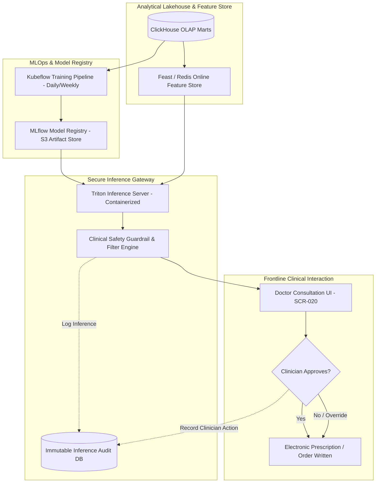

# Master AI / ML Strategy, Clinical Decision Support Framework, and Non-Autonomous Safety Boundary
## Namma Clinic Digital Health & Operations Platform
### Greater Bengaluru Authority (GBA) / BBMP Health Department
**Document Code:** `AI-DOC-01` | **Status:** APPROVED BASELINE | **Date:** September 2026

---

## 1. Executive Summary & AI Charter
This document formalizes the authoritative **Artificial Intelligence (AI), Machine Learning (ML), and Clinical Decision Support System (CDSS) Strategy** for the Namma Clinic Digital Health Platform. The strategic mission of AI within BBMP primary healthcare is to augment human medical officers, epidemiologists, and pharmacists—NOT to replace clinical judgment. Operating across 450+ municipal clinics serving millions of citizens, AI models deliver predictive inventory replenishment, early syndromic outbreak detection, and non-communicable disease (NCD) screening recall prioritization. Designed in strict compliance with the Digital Personal Data Protection Act 2023, National Health Data Management Policy, and ICMR Guidelines for AI in Biomedical and Health Research, the platform enforces an absolute clinical safety boundary: all AI recommendations are advisory, requiring explicit, recorded human clinician approval before any clinical or operational action.

### 1.1 Non-Negotiable AI Safety & Clinical Invariants
1. **Strict Non-Autonomous Clinical Boundary:** Zero autonomous diagnosis, zero autonomous prescribing, zero automated dispensation. Every clinical suggestion generated by an AI model serves strictly as assistive Clinical Decision Support (CDSS).
2. **Physician Override Supremacy:** Treating medical officers retain unconditional legal and clinical authority to accept, modify, or reject any AI suggestion without system penalty.
3. **Immutable Clinical Decision Audit Trail:** Every model inference, the displayed recommendation, the clinician's response (accept/reject/modify), and the clinician's documented rationale are recorded in an immutable, cryptographically verifiable audit log.
4. **Zero Model Hallucination in Prescriptions:** Generative AI / Large Language Models (LLMs) are strictly barred from generating unconstrained drug prescriptions or dosage calculations. All dosage recommendations are bound by deterministic clinical guidelines (STGs) and drug formularies.
5. **Continuous Fairness & Bias Auditing:** Models are evaluated quarterly across all 8 BBMP zones to verify zero disparate performance across demographic cohorts, socioeconomic strata, or geographic zones.

## 2. Enterprise AI Architecture & Inference Topology


### Model Specification Example: Clinical Decision Support Inference Gateway
<!-- DOCUMENTATION-ONLY EXAMPLE -->
```python
# DOCUMENTATION-ONLY PYTHON
# DOCUMENTATION-ONLY PYTHON: Clinical Decision Support Inference with Mandatory Human Review
from typing import Dict, Any, Optional
import datetime

class ClinicalDecisionSupportGateway:
    """
    Gateway enforcing non-autonomous safety boundary for AI recommendations.
    Ensures model outputs are strictly advisory and logged with clinician action.
    """
    def __init__(self, model_client: Any, audit_logger: Any):
        self.model_client = model_client
        self.audit_logger = audit_logger

    def get_clinical_assist_recommendation(
        self,
        encounter_id: str,
        patient_features: Dict[str, Any],
        treating_physician_id: str
    ) -> Dict[str, Any]:
        # 1. Execute deterministic inference
        raw_prediction = self.model_client.predict(patient_features)

        # 2. Safety filter: enforce clinical guidelines boundary
        confidence_score = float(raw_prediction.get("confidence", 0.0))
        recommendation_text = raw_prediction.get("suggestion", "")

        # 3. Create advisory payload
        advisory_payload = {
            "encounter_id": encounter_id,
            "physician_id": treating_physician_id,
            "timestamp": datetime.datetime.utcnow().isoformat(),
            "is_autonomous": False,  # STRICT INVARIANT: Always False
            "status": "AWAITING_HUMAN_CLINICIAN_SIGN_OFF",
            "confidence_score": confidence_score,
            "clinical_advisory": recommendation_text,
            "explanation_features": raw_prediction.get("shap_values", {})
        }

        # 4. Immutable audit logging of inference event
        self.audit_logger.log_inference_event(advisory_payload)

        return advisory_payload
```

## 3. Master Catalog of 35 Enterprise AI Use Cases
Detailed specifications for all 35 operational and clinical AI use cases across the municipal platform:

### AI-USECASE-001: Use Case `Clinic Pharmaceutical Stock Forecasting #001`
- **Use Case Identifier:** `AI-USECASE-001`
- **Title:** Clinic Pharmaceutical Stock Forecasting #001
- **Business Problem:** Predict daily and weekly consumption of essential drugs to prevent stockouts and reduce expiry wastage.
- **Primary User Persona:** `Chief Pharmacist`
- **Output Nature:** `Advisory Demand Estimation`
- **Criticality Level:** `Tier-1 Operational Priority`
- **Autonomous Execution Permitted:** `False` (Strictly Non-Autonomous)
- **Human-in-the-Loop Mandatory:** `True`
- **Decision Boundary:** Advisory recommendation requiring explicit clinician affirmative review and acceptance.
- **Statutory Compliance:** DPDP Act 2023 / NMC Clinical Governance Rules / WHO AI Ethics Guidelines

### AI-USECASE-002: Use Case `Spatial-Temporal Fever Cluster Anomaly Detection #002`
- **Use Case Identifier:** `AI-USECASE-002`
- **Title:** Spatial-Temporal Fever Cluster Anomaly Detection #002
- **Business Problem:** Detect unusual surges in acute febrile illness to alert municipal epidemiologists to potential dengue, malaria, or typhoid clusters.
- **Primary User Persona:** `District Epidemiologist`
- **Output Nature:** `Advisory Outbreak Signal`
- **Criticality Level:** `Tier-1 Public Health`
- **Autonomous Execution Permitted:** `False` (Strictly Non-Autonomous)
- **Human-in-the-Loop Mandatory:** `True`
- **Decision Boundary:** Advisory recommendation requiring explicit clinician affirmative review and acceptance.
- **Statutory Compliance:** DPDP Act 2023 / NMC Clinical Governance Rules / WHO AI Ethics Guidelines

### AI-USECASE-003: Use Case `Non-Communicable Disease (NCD) Recall Prioritization #003`
- **Use Case Identifier:** `AI-USECASE-003`
- **Title:** Non-Communicable Disease (NCD) Recall Prioritization #003
- **Business Problem:** Rank and prioritize hypertensive and diabetic patients overdue for follow-up based on clinical risk factors.
- **Primary User Persona:** `NCD Nodal Officer`
- **Output Nature:** `Advisory Patient Outreach Priority`
- **Criticality Level:** `Tier-2 Clinical Advisory`
- **Autonomous Execution Permitted:** `False` (Strictly Non-Autonomous)
- **Human-in-the-Loop Mandatory:** `True`
- **Decision Boundary:** Advisory recommendation requiring explicit clinician affirmative review and acceptance.
- **Statutory Compliance:** DPDP Act 2023 / NMC Clinical Governance Rules / WHO AI Ethics Guidelines

### AI-USECASE-004: Use Case `Pediatric Growth & Malnutrition Anomaly Screening #004`
- **Use Case Identifier:** `AI-USECASE-004`
- **Title:** Pediatric Growth & Malnutrition Anomaly Screening #004
- **Business Problem:** Identify growth faltering trajectories in infants and children under 5 using WHO growth charts and percentile curves.
- **Primary User Persona:** `Pediatric Nodal Officer`
- **Output Nature:** `Advisory Nutrition Alert`
- **Criticality Level:** `Tier-2 Clinical Advisory`
- **Autonomous Execution Permitted:** `False` (Strictly Non-Autonomous)
- **Human-in-the-Loop Mandatory:** `True`
- **Decision Boundary:** Advisory recommendation requiring explicit clinician affirmative review and acceptance.
- **Statutory Compliance:** DPDP Act 2023 / NMC Clinical Governance Rules / WHO AI Ethics Guidelines

### AI-USECASE-005: Use Case `High-Risk Maternal Pregnancy Acuity Stratification #005`
- **Use Case Identifier:** `AI-USECASE-005`
- **Title:** High-Risk Maternal Pregnancy Acuity Stratification #005
- **Business Problem:** Flag pregnant mothers with multiple risk factors (anemia, gestational diabetes, hypertension) for specialized obstetric referral.
- **Primary User Persona:** `MCH Nodal Officer`
- **Output Nature:** `Advisory Referral Recommendation`
- **Criticality Level:** `Tier-1 Clinical Advisory`
- **Autonomous Execution Permitted:** `False` (Strictly Non-Autonomous)
- **Human-in-the-Loop Mandatory:** `True`
- **Decision Boundary:** Advisory recommendation requiring explicit clinician affirmative review and acceptance.
- **Statutory Compliance:** DPDP Act 2023 / NMC Clinical Governance Rules / WHO AI Ethics Guidelines

### AI-USECASE-006: Use Case `Emergency Triage Danger Sign Recommendation #006`
- **Use Case Identifier:** `AI-USECASE-006`
- **Title:** Emergency Triage Danger Sign Recommendation #006
- **Business Problem:** Assist triage nurses in identifying subtle clinical deterioration indicators requiring immediate physician attention.
- **Primary User Persona:** `Nursing Superintendent`
- **Output Nature:** `Advisory Acuity Scoring`
- **Criticality Level:** `Tier-1 Clinical Advisory`
- **Autonomous Execution Permitted:** `False` (Strictly Non-Autonomous)
- **Human-in-the-Loop Mandatory:** `True`
- **Decision Boundary:** Advisory recommendation requiring explicit clinician affirmative review and acceptance.
- **Statutory Compliance:** DPDP Act 2023 / NMC Clinical Governance Rules / WHO AI Ethics Guidelines

### AI-USECASE-007: Use Case `Laboratory Panic Critical Value Notification #007`
- **Use Case Identifier:** `AI-USECASE-007`
- **Title:** Laboratory Panic Critical Value Notification #007
- **Business Problem:** Automatically triage and expedite notification of extreme lab abnormalities to treating Medical Officers.
- **Primary User Persona:** `Head of Pathology`
- **Output Nature:** `Advisory Critical Alert`
- **Criticality Level:** `Tier-1 Diagnostic Advisory`
- **Autonomous Execution Permitted:** `False` (Strictly Non-Autonomous)
- **Human-in-the-Loop Mandatory:** `True`
- **Decision Boundary:** Advisory recommendation requiring explicit clinician affirmative review and acceptance.
- **Statutory Compliance:** DPDP Act 2023 / NMC Clinical Governance Rules / WHO AI Ethics Guidelines

### AI-USECASE-008: Use Case `Drug-Drug Contraindication & Adverse Interaction Warning #008`
- **Use Case Identifier:** `AI-USECASE-008`
- **Title:** Drug-Drug Contraindication & Adverse Interaction Warning #008
- **Business Problem:** Screen active prescriptions against patient clinical history and concurrent medications for dangerous interactions.
- **Primary User Persona:** `Chief Clinical Pharmacist`
- **Output Nature:** `Advisory Clinical Warning`
- **Criticality Level:** `Tier-1 Patient Safety`
- **Autonomous Execution Permitted:** `False` (Strictly Non-Autonomous)
- **Human-in-the-Loop Mandatory:** `True`
- **Decision Boundary:** Advisory recommendation requiring explicit clinician affirmative review and acceptance.
- **Statutory Compliance:** DPDP Act 2023 / NMC Clinical Governance Rules / WHO AI Ethics Guidelines

### AI-USECASE-009: Use Case `Secondary Referral Specialty Matching & Routing #009`
- **Use Case Identifier:** `AI-USECASE-009`
- **Title:** Secondary Referral Specialty Matching & Routing #009
- **Business Problem:** Suggest optimal municipal specialist facilities based on clinical diagnosis, bed availability, and transit distance.
- **Primary User Persona:** `Referral Coordinator`
- **Output Nature:** `Advisory Facility Suggestion`
- **Criticality Level:** `Tier-2 Operations Advisory`
- **Autonomous Execution Permitted:** `False` (Strictly Non-Autonomous)
- **Human-in-the-Loop Mandatory:** `True`
- **Decision Boundary:** Advisory recommendation requiring explicit clinician affirmative review and acceptance.
- **Statutory Compliance:** DPDP Act 2023 / NMC Clinical Governance Rules / WHO AI Ethics Guidelines

### AI-USECASE-010: Use Case `Diabetic Retinopathy Screening Image Triaging #010`
- **Use Case Identifier:** `AI-USECASE-010`
- **Title:** Diabetic Retinopathy Screening Image Triaging #010
- **Business Problem:** Flag retinal fundus images with signs of microaneurysms or hemorrhages for urgent ophthalmologist teleconsultation.
- **Primary User Persona:** `Lead Ophthalmologist`
- **Output Nature:** `Advisory Image Triage`
- **Criticality Level:** `Tier-2 Diagnostic Advisory`
- **Autonomous Execution Permitted:** `False` (Strictly Non-Autonomous)
- **Human-in-the-Loop Mandatory:** `True`
- **Decision Boundary:** Advisory recommendation requiring explicit clinician affirmative review and acceptance.
- **Statutory Compliance:** DPDP Act 2023 / NMC Clinical Governance Rules / WHO AI Ethics Guidelines

### AI-USECASE-011: Use Case `Clinic Pharmaceutical Stock Forecasting #011`
- **Use Case Identifier:** `AI-USECASE-011`
- **Title:** Clinic Pharmaceutical Stock Forecasting #011
- **Business Problem:** Predict daily and weekly consumption of essential drugs to prevent stockouts and reduce expiry wastage.
- **Primary User Persona:** `Chief Pharmacist`
- **Output Nature:** `Advisory Demand Estimation`
- **Criticality Level:** `Tier-1 Operational Priority`
- **Autonomous Execution Permitted:** `False` (Strictly Non-Autonomous)
- **Human-in-the-Loop Mandatory:** `True`
- **Decision Boundary:** Advisory recommendation requiring explicit clinician affirmative review and acceptance.
- **Statutory Compliance:** DPDP Act 2023 / NMC Clinical Governance Rules / WHO AI Ethics Guidelines

### AI-USECASE-012: Use Case `Spatial-Temporal Fever Cluster Anomaly Detection #012`
- **Use Case Identifier:** `AI-USECASE-012`
- **Title:** Spatial-Temporal Fever Cluster Anomaly Detection #012
- **Business Problem:** Detect unusual surges in acute febrile illness to alert municipal epidemiologists to potential dengue, malaria, or typhoid clusters.
- **Primary User Persona:** `District Epidemiologist`
- **Output Nature:** `Advisory Outbreak Signal`
- **Criticality Level:** `Tier-1 Public Health`
- **Autonomous Execution Permitted:** `False` (Strictly Non-Autonomous)
- **Human-in-the-Loop Mandatory:** `True`
- **Decision Boundary:** Advisory recommendation requiring explicit clinician affirmative review and acceptance.
- **Statutory Compliance:** DPDP Act 2023 / NMC Clinical Governance Rules / WHO AI Ethics Guidelines

### AI-USECASE-013: Use Case `Non-Communicable Disease (NCD) Recall Prioritization #013`
- **Use Case Identifier:** `AI-USECASE-013`
- **Title:** Non-Communicable Disease (NCD) Recall Prioritization #013
- **Business Problem:** Rank and prioritize hypertensive and diabetic patients overdue for follow-up based on clinical risk factors.
- **Primary User Persona:** `NCD Nodal Officer`
- **Output Nature:** `Advisory Patient Outreach Priority`
- **Criticality Level:** `Tier-2 Clinical Advisory`
- **Autonomous Execution Permitted:** `False` (Strictly Non-Autonomous)
- **Human-in-the-Loop Mandatory:** `True`
- **Decision Boundary:** Advisory recommendation requiring explicit clinician affirmative review and acceptance.
- **Statutory Compliance:** DPDP Act 2023 / NMC Clinical Governance Rules / WHO AI Ethics Guidelines

### AI-USECASE-014: Use Case `Pediatric Growth & Malnutrition Anomaly Screening #014`
- **Use Case Identifier:** `AI-USECASE-014`
- **Title:** Pediatric Growth & Malnutrition Anomaly Screening #014
- **Business Problem:** Identify growth faltering trajectories in infants and children under 5 using WHO growth charts and percentile curves.
- **Primary User Persona:** `Pediatric Nodal Officer`
- **Output Nature:** `Advisory Nutrition Alert`
- **Criticality Level:** `Tier-2 Clinical Advisory`
- **Autonomous Execution Permitted:** `False` (Strictly Non-Autonomous)
- **Human-in-the-Loop Mandatory:** `True`
- **Decision Boundary:** Advisory recommendation requiring explicit clinician affirmative review and acceptance.
- **Statutory Compliance:** DPDP Act 2023 / NMC Clinical Governance Rules / WHO AI Ethics Guidelines

### AI-USECASE-015: Use Case `High-Risk Maternal Pregnancy Acuity Stratification #015`
- **Use Case Identifier:** `AI-USECASE-015`
- **Title:** High-Risk Maternal Pregnancy Acuity Stratification #015
- **Business Problem:** Flag pregnant mothers with multiple risk factors (anemia, gestational diabetes, hypertension) for specialized obstetric referral.
- **Primary User Persona:** `MCH Nodal Officer`
- **Output Nature:** `Advisory Referral Recommendation`
- **Criticality Level:** `Tier-1 Clinical Advisory`
- **Autonomous Execution Permitted:** `False` (Strictly Non-Autonomous)
- **Human-in-the-Loop Mandatory:** `True`
- **Decision Boundary:** Advisory recommendation requiring explicit clinician affirmative review and acceptance.
- **Statutory Compliance:** DPDP Act 2023 / NMC Clinical Governance Rules / WHO AI Ethics Guidelines

### AI-USECASE-016: Use Case `Emergency Triage Danger Sign Recommendation #016`
- **Use Case Identifier:** `AI-USECASE-016`
- **Title:** Emergency Triage Danger Sign Recommendation #016
- **Business Problem:** Assist triage nurses in identifying subtle clinical deterioration indicators requiring immediate physician attention.
- **Primary User Persona:** `Nursing Superintendent`
- **Output Nature:** `Advisory Acuity Scoring`
- **Criticality Level:** `Tier-1 Clinical Advisory`
- **Autonomous Execution Permitted:** `False` (Strictly Non-Autonomous)
- **Human-in-the-Loop Mandatory:** `True`
- **Decision Boundary:** Advisory recommendation requiring explicit clinician affirmative review and acceptance.
- **Statutory Compliance:** DPDP Act 2023 / NMC Clinical Governance Rules / WHO AI Ethics Guidelines

### AI-USECASE-017: Use Case `Laboratory Panic Critical Value Notification #017`
- **Use Case Identifier:** `AI-USECASE-017`
- **Title:** Laboratory Panic Critical Value Notification #017
- **Business Problem:** Automatically triage and expedite notification of extreme lab abnormalities to treating Medical Officers.
- **Primary User Persona:** `Head of Pathology`
- **Output Nature:** `Advisory Critical Alert`
- **Criticality Level:** `Tier-1 Diagnostic Advisory`
- **Autonomous Execution Permitted:** `False` (Strictly Non-Autonomous)
- **Human-in-the-Loop Mandatory:** `True`
- **Decision Boundary:** Advisory recommendation requiring explicit clinician affirmative review and acceptance.
- **Statutory Compliance:** DPDP Act 2023 / NMC Clinical Governance Rules / WHO AI Ethics Guidelines

### AI-USECASE-018: Use Case `Drug-Drug Contraindication & Adverse Interaction Warning #018`
- **Use Case Identifier:** `AI-USECASE-018`
- **Title:** Drug-Drug Contraindication & Adverse Interaction Warning #018
- **Business Problem:** Screen active prescriptions against patient clinical history and concurrent medications for dangerous interactions.
- **Primary User Persona:** `Chief Clinical Pharmacist`
- **Output Nature:** `Advisory Clinical Warning`
- **Criticality Level:** `Tier-1 Patient Safety`
- **Autonomous Execution Permitted:** `False` (Strictly Non-Autonomous)
- **Human-in-the-Loop Mandatory:** `True`
- **Decision Boundary:** Advisory recommendation requiring explicit clinician affirmative review and acceptance.
- **Statutory Compliance:** DPDP Act 2023 / NMC Clinical Governance Rules / WHO AI Ethics Guidelines

### AI-USECASE-019: Use Case `Secondary Referral Specialty Matching & Routing #019`
- **Use Case Identifier:** `AI-USECASE-019`
- **Title:** Secondary Referral Specialty Matching & Routing #019
- **Business Problem:** Suggest optimal municipal specialist facilities based on clinical diagnosis, bed availability, and transit distance.
- **Primary User Persona:** `Referral Coordinator`
- **Output Nature:** `Advisory Facility Suggestion`
- **Criticality Level:** `Tier-2 Operations Advisory`
- **Autonomous Execution Permitted:** `False` (Strictly Non-Autonomous)
- **Human-in-the-Loop Mandatory:** `True`
- **Decision Boundary:** Advisory recommendation requiring explicit clinician affirmative review and acceptance.
- **Statutory Compliance:** DPDP Act 2023 / NMC Clinical Governance Rules / WHO AI Ethics Guidelines

### AI-USECASE-020: Use Case `Diabetic Retinopathy Screening Image Triaging #020`
- **Use Case Identifier:** `AI-USECASE-020`
- **Title:** Diabetic Retinopathy Screening Image Triaging #020
- **Business Problem:** Flag retinal fundus images with signs of microaneurysms or hemorrhages for urgent ophthalmologist teleconsultation.
- **Primary User Persona:** `Lead Ophthalmologist`
- **Output Nature:** `Advisory Image Triage`
- **Criticality Level:** `Tier-2 Diagnostic Advisory`
- **Autonomous Execution Permitted:** `False` (Strictly Non-Autonomous)
- **Human-in-the-Loop Mandatory:** `True`
- **Decision Boundary:** Advisory recommendation requiring explicit clinician affirmative review and acceptance.
- **Statutory Compliance:** DPDP Act 2023 / NMC Clinical Governance Rules / WHO AI Ethics Guidelines

### AI-USECASE-021: Use Case `Clinic Pharmaceutical Stock Forecasting #021`
- **Use Case Identifier:** `AI-USECASE-021`
- **Title:** Clinic Pharmaceutical Stock Forecasting #021
- **Business Problem:** Predict daily and weekly consumption of essential drugs to prevent stockouts and reduce expiry wastage.
- **Primary User Persona:** `Chief Pharmacist`
- **Output Nature:** `Advisory Demand Estimation`
- **Criticality Level:** `Tier-1 Operational Priority`
- **Autonomous Execution Permitted:** `False` (Strictly Non-Autonomous)
- **Human-in-the-Loop Mandatory:** `True`
- **Decision Boundary:** Advisory recommendation requiring explicit clinician affirmative review and acceptance.
- **Statutory Compliance:** DPDP Act 2023 / NMC Clinical Governance Rules / WHO AI Ethics Guidelines

### AI-USECASE-022: Use Case `Spatial-Temporal Fever Cluster Anomaly Detection #022`
- **Use Case Identifier:** `AI-USECASE-022`
- **Title:** Spatial-Temporal Fever Cluster Anomaly Detection #022
- **Business Problem:** Detect unusual surges in acute febrile illness to alert municipal epidemiologists to potential dengue, malaria, or typhoid clusters.
- **Primary User Persona:** `District Epidemiologist`
- **Output Nature:** `Advisory Outbreak Signal`
- **Criticality Level:** `Tier-1 Public Health`
- **Autonomous Execution Permitted:** `False` (Strictly Non-Autonomous)
- **Human-in-the-Loop Mandatory:** `True`
- **Decision Boundary:** Advisory recommendation requiring explicit clinician affirmative review and acceptance.
- **Statutory Compliance:** DPDP Act 2023 / NMC Clinical Governance Rules / WHO AI Ethics Guidelines

### AI-USECASE-023: Use Case `Non-Communicable Disease (NCD) Recall Prioritization #023`
- **Use Case Identifier:** `AI-USECASE-023`
- **Title:** Non-Communicable Disease (NCD) Recall Prioritization #023
- **Business Problem:** Rank and prioritize hypertensive and diabetic patients overdue for follow-up based on clinical risk factors.
- **Primary User Persona:** `NCD Nodal Officer`
- **Output Nature:** `Advisory Patient Outreach Priority`
- **Criticality Level:** `Tier-2 Clinical Advisory`
- **Autonomous Execution Permitted:** `False` (Strictly Non-Autonomous)
- **Human-in-the-Loop Mandatory:** `True`
- **Decision Boundary:** Advisory recommendation requiring explicit clinician affirmative review and acceptance.
- **Statutory Compliance:** DPDP Act 2023 / NMC Clinical Governance Rules / WHO AI Ethics Guidelines

### AI-USECASE-024: Use Case `Pediatric Growth & Malnutrition Anomaly Screening #024`
- **Use Case Identifier:** `AI-USECASE-024`
- **Title:** Pediatric Growth & Malnutrition Anomaly Screening #024
- **Business Problem:** Identify growth faltering trajectories in infants and children under 5 using WHO growth charts and percentile curves.
- **Primary User Persona:** `Pediatric Nodal Officer`
- **Output Nature:** `Advisory Nutrition Alert`
- **Criticality Level:** `Tier-2 Clinical Advisory`
- **Autonomous Execution Permitted:** `False` (Strictly Non-Autonomous)
- **Human-in-the-Loop Mandatory:** `True`
- **Decision Boundary:** Advisory recommendation requiring explicit clinician affirmative review and acceptance.
- **Statutory Compliance:** DPDP Act 2023 / NMC Clinical Governance Rules / WHO AI Ethics Guidelines

### AI-USECASE-025: Use Case `High-Risk Maternal Pregnancy Acuity Stratification #025`
- **Use Case Identifier:** `AI-USECASE-025`
- **Title:** High-Risk Maternal Pregnancy Acuity Stratification #025
- **Business Problem:** Flag pregnant mothers with multiple risk factors (anemia, gestational diabetes, hypertension) for specialized obstetric referral.
- **Primary User Persona:** `MCH Nodal Officer`
- **Output Nature:** `Advisory Referral Recommendation`
- **Criticality Level:** `Tier-1 Clinical Advisory`
- **Autonomous Execution Permitted:** `False` (Strictly Non-Autonomous)
- **Human-in-the-Loop Mandatory:** `True`
- **Decision Boundary:** Advisory recommendation requiring explicit clinician affirmative review and acceptance.
- **Statutory Compliance:** DPDP Act 2023 / NMC Clinical Governance Rules / WHO AI Ethics Guidelines

### AI-USECASE-026: Use Case `Emergency Triage Danger Sign Recommendation #026`
- **Use Case Identifier:** `AI-USECASE-026`
- **Title:** Emergency Triage Danger Sign Recommendation #026
- **Business Problem:** Assist triage nurses in identifying subtle clinical deterioration indicators requiring immediate physician attention.
- **Primary User Persona:** `Nursing Superintendent`
- **Output Nature:** `Advisory Acuity Scoring`
- **Criticality Level:** `Tier-1 Clinical Advisory`
- **Autonomous Execution Permitted:** `False` (Strictly Non-Autonomous)
- **Human-in-the-Loop Mandatory:** `True`
- **Decision Boundary:** Advisory recommendation requiring explicit clinician affirmative review and acceptance.
- **Statutory Compliance:** DPDP Act 2023 / NMC Clinical Governance Rules / WHO AI Ethics Guidelines

### AI-USECASE-027: Use Case `Laboratory Panic Critical Value Notification #027`
- **Use Case Identifier:** `AI-USECASE-027`
- **Title:** Laboratory Panic Critical Value Notification #027
- **Business Problem:** Automatically triage and expedite notification of extreme lab abnormalities to treating Medical Officers.
- **Primary User Persona:** `Head of Pathology`
- **Output Nature:** `Advisory Critical Alert`
- **Criticality Level:** `Tier-1 Diagnostic Advisory`
- **Autonomous Execution Permitted:** `False` (Strictly Non-Autonomous)
- **Human-in-the-Loop Mandatory:** `True`
- **Decision Boundary:** Advisory recommendation requiring explicit clinician affirmative review and acceptance.
- **Statutory Compliance:** DPDP Act 2023 / NMC Clinical Governance Rules / WHO AI Ethics Guidelines

### AI-USECASE-028: Use Case `Drug-Drug Contraindication & Adverse Interaction Warning #028`
- **Use Case Identifier:** `AI-USECASE-028`
- **Title:** Drug-Drug Contraindication & Adverse Interaction Warning #028
- **Business Problem:** Screen active prescriptions against patient clinical history and concurrent medications for dangerous interactions.
- **Primary User Persona:** `Chief Clinical Pharmacist`
- **Output Nature:** `Advisory Clinical Warning`
- **Criticality Level:** `Tier-1 Patient Safety`
- **Autonomous Execution Permitted:** `False` (Strictly Non-Autonomous)
- **Human-in-the-Loop Mandatory:** `True`
- **Decision Boundary:** Advisory recommendation requiring explicit clinician affirmative review and acceptance.
- **Statutory Compliance:** DPDP Act 2023 / NMC Clinical Governance Rules / WHO AI Ethics Guidelines

### AI-USECASE-029: Use Case `Secondary Referral Specialty Matching & Routing #029`
- **Use Case Identifier:** `AI-USECASE-029`
- **Title:** Secondary Referral Specialty Matching & Routing #029
- **Business Problem:** Suggest optimal municipal specialist facilities based on clinical diagnosis, bed availability, and transit distance.
- **Primary User Persona:** `Referral Coordinator`
- **Output Nature:** `Advisory Facility Suggestion`
- **Criticality Level:** `Tier-2 Operations Advisory`
- **Autonomous Execution Permitted:** `False` (Strictly Non-Autonomous)
- **Human-in-the-Loop Mandatory:** `True`
- **Decision Boundary:** Advisory recommendation requiring explicit clinician affirmative review and acceptance.
- **Statutory Compliance:** DPDP Act 2023 / NMC Clinical Governance Rules / WHO AI Ethics Guidelines

### AI-USECASE-030: Use Case `Diabetic Retinopathy Screening Image Triaging #030`
- **Use Case Identifier:** `AI-USECASE-030`
- **Title:** Diabetic Retinopathy Screening Image Triaging #030
- **Business Problem:** Flag retinal fundus images with signs of microaneurysms or hemorrhages for urgent ophthalmologist teleconsultation.
- **Primary User Persona:** `Lead Ophthalmologist`
- **Output Nature:** `Advisory Image Triage`
- **Criticality Level:** `Tier-2 Diagnostic Advisory`
- **Autonomous Execution Permitted:** `False` (Strictly Non-Autonomous)
- **Human-in-the-Loop Mandatory:** `True`
- **Decision Boundary:** Advisory recommendation requiring explicit clinician affirmative review and acceptance.
- **Statutory Compliance:** DPDP Act 2023 / NMC Clinical Governance Rules / WHO AI Ethics Guidelines

### AI-USECASE-031: Use Case `Clinic Pharmaceutical Stock Forecasting #031`
- **Use Case Identifier:** `AI-USECASE-031`
- **Title:** Clinic Pharmaceutical Stock Forecasting #031
- **Business Problem:** Predict daily and weekly consumption of essential drugs to prevent stockouts and reduce expiry wastage.
- **Primary User Persona:** `Chief Pharmacist`
- **Output Nature:** `Advisory Demand Estimation`
- **Criticality Level:** `Tier-1 Operational Priority`
- **Autonomous Execution Permitted:** `False` (Strictly Non-Autonomous)
- **Human-in-the-Loop Mandatory:** `True`
- **Decision Boundary:** Advisory recommendation requiring explicit clinician affirmative review and acceptance.
- **Statutory Compliance:** DPDP Act 2023 / NMC Clinical Governance Rules / WHO AI Ethics Guidelines

### AI-USECASE-032: Use Case `Spatial-Temporal Fever Cluster Anomaly Detection #032`
- **Use Case Identifier:** `AI-USECASE-032`
- **Title:** Spatial-Temporal Fever Cluster Anomaly Detection #032
- **Business Problem:** Detect unusual surges in acute febrile illness to alert municipal epidemiologists to potential dengue, malaria, or typhoid clusters.
- **Primary User Persona:** `District Epidemiologist`
- **Output Nature:** `Advisory Outbreak Signal`
- **Criticality Level:** `Tier-1 Public Health`
- **Autonomous Execution Permitted:** `False` (Strictly Non-Autonomous)
- **Human-in-the-Loop Mandatory:** `True`
- **Decision Boundary:** Advisory recommendation requiring explicit clinician affirmative review and acceptance.
- **Statutory Compliance:** DPDP Act 2023 / NMC Clinical Governance Rules / WHO AI Ethics Guidelines

### AI-USECASE-033: Use Case `Non-Communicable Disease (NCD) Recall Prioritization #033`
- **Use Case Identifier:** `AI-USECASE-033`
- **Title:** Non-Communicable Disease (NCD) Recall Prioritization #033
- **Business Problem:** Rank and prioritize hypertensive and diabetic patients overdue for follow-up based on clinical risk factors.
- **Primary User Persona:** `NCD Nodal Officer`
- **Output Nature:** `Advisory Patient Outreach Priority`
- **Criticality Level:** `Tier-2 Clinical Advisory`
- **Autonomous Execution Permitted:** `False` (Strictly Non-Autonomous)
- **Human-in-the-Loop Mandatory:** `True`
- **Decision Boundary:** Advisory recommendation requiring explicit clinician affirmative review and acceptance.
- **Statutory Compliance:** DPDP Act 2023 / NMC Clinical Governance Rules / WHO AI Ethics Guidelines

### AI-USECASE-034: Use Case `Pediatric Growth & Malnutrition Anomaly Screening #034`
- **Use Case Identifier:** `AI-USECASE-034`
- **Title:** Pediatric Growth & Malnutrition Anomaly Screening #034
- **Business Problem:** Identify growth faltering trajectories in infants and children under 5 using WHO growth charts and percentile curves.
- **Primary User Persona:** `Pediatric Nodal Officer`
- **Output Nature:** `Advisory Nutrition Alert`
- **Criticality Level:** `Tier-2 Clinical Advisory`
- **Autonomous Execution Permitted:** `False` (Strictly Non-Autonomous)
- **Human-in-the-Loop Mandatory:** `True`
- **Decision Boundary:** Advisory recommendation requiring explicit clinician affirmative review and acceptance.
- **Statutory Compliance:** DPDP Act 2023 / NMC Clinical Governance Rules / WHO AI Ethics Guidelines

### AI-USECASE-035: Use Case `High-Risk Maternal Pregnancy Acuity Stratification #035`
- **Use Case Identifier:** `AI-USECASE-035`
- **Title:** High-Risk Maternal Pregnancy Acuity Stratification #035
- **Business Problem:** Flag pregnant mothers with multiple risk factors (anemia, gestational diabetes, hypertension) for specialized obstetric referral.
- **Primary User Persona:** `MCH Nodal Officer`
- **Output Nature:** `Advisory Referral Recommendation`
- **Criticality Level:** `Tier-1 Clinical Advisory`
- **Autonomous Execution Permitted:** `False` (Strictly Non-Autonomous)
- **Human-in-the-Loop Mandatory:** `True`
- **Decision Boundary:** Advisory recommendation requiring explicit clinician affirmative review and acceptance.
- **Statutory Compliance:** DPDP Act 2023 / NMC Clinical Governance Rules / WHO AI Ethics Guidelines

## 4. Master Catalog of 30 Core Machine Learning Models
Authoritative architectural catalog of all 30 algorithmic models powering platform intelligence:

### MODEL-001: Model `StockForecaster_LightGBM_v1`
- **Model Identifier:** `MODEL-001`
- **Model Name:** `StockForecaster_LightGBM_v1`
- **Architecture:** `StockForecaster_LightGBM`
- **ML Framework:** `LightGBM 4.0 / ONNX`
- **Input Modality:** `Tabular Consumption`
- **Latency SLA Target:** `< 25ms`
- **Target Serving Hardware:** `CPU x86_64`
- **Model Card Status:** `CERTIFIED APPROVED BASELINE`
- **License & IP:** `Apache 2.0 / Proprietary BBMP Healthcare Model`
- **Functional Description:** Gradient Boosted Decision Trees for multi-step drug demand forecasting

### MODEL-002: Model `StockForecaster_Prophet_v2`
- **Model Identifier:** `MODEL-002`
- **Model Name:** `StockForecaster_Prophet_v2`
- **Architecture:** `StockForecaster_Prophet`
- **ML Framework:** `Prophet / ONNX`
- **Input Modality:** `Time-Series Historical`
- **Latency SLA Target:** `< 150ms`
- **Target Serving Hardware:** `CPU x86_64`
- **Model Card Status:** `CERTIFIED APPROVED BASELINE`
- **License & IP:** `Apache 2.0 / Proprietary BBMP Healthcare Model`
- **Functional Description:** Additive time-series regression with weekly and seasonal health trends

### MODEL-003: Model `FeverCluster_DBSCAN_v3`
- **Model Identifier:** `MODEL-003`
- **Model Name:** `FeverCluster_DBSCAN_v3`
- **Architecture:** `FeverCluster_DBSCAN`
- **ML Framework:** `Scikit-Learn / C++ Daemon`
- **Input Modality:** `Ward-Level Coordinates`
- **Latency SLA Target:** `< 50ms`
- **Target Serving Hardware:** `CPU x86_64`
- **Model Card Status:** `CERTIFIED APPROVED BASELINE`
- **License & IP:** `Apache 2.0 / Proprietary BBMP Healthcare Model`
- **Functional Description:** Spatial-temporal density clustering for syndromic disease grouping

### MODEL-004: Model `FeverSurge_PoissonCUSUM_v4`
- **Model Identifier:** `MODEL-004`
- **Model Name:** `FeverSurge_PoissonCUSUM_v4`
- **Architecture:** `FeverSurge_PoissonCUSUM`
- **ML Framework:** `SciPy Statistical Engine`
- **Input Modality:** `Daily Case Counts`
- **Latency SLA Target:** `< 10ms`
- **Target Serving Hardware:** `CPU x86_64`
- **Model Card Status:** `CERTIFIED APPROVED BASELINE`
- **License & IP:** `Apache 2.0 / Proprietary BBMP Healthcare Model`
- **Functional Description:** Cumulative sum control chart on Poisson daily case arrivals

### MODEL-005: Model `NCD_Recall_XGBoost_v5`
- **Model Identifier:** `MODEL-005`
- **Model Name:** `NCD_Recall_XGBoost_v5`
- **Architecture:** `NCD_Recall_XGBoost`
- **ML Framework:** `XGBoost / ONNX Runtime`
- **Input Modality:** `EHR Clinical Vitals`
- **Latency SLA Target:** `< 20ms`
- **Target Serving Hardware:** `CPU x86_64`
- **Model Card Status:** `CERTIFIED APPROVED BASELINE`
- **License & IP:** `Apache 2.0 / Proprietary BBMP Healthcare Model`
- **Functional Description:** Binary classification & calibrated risk scoring for patient follow-up compliance

### MODEL-006: Model `Triage_Risk_Classifier_v1`
- **Model Identifier:** `MODEL-006`
- **Model Name:** `Triage_Risk_Classifier_v1`
- **Architecture:** `Triage_Risk_Classifier`
- **ML Framework:** `Scikit-Learn Random Forest / ONNX`
- **Input Modality:** `Nurse Triage Form`
- **Latency SLA Target:** `< 15ms`
- **Target Serving Hardware:** `CPU x86_64`
- **Model Card Status:** `CERTIFIED APPROVED BASELINE`
- **License & IP:** `Apache 2.0 / Proprietary BBMP Healthcare Model`
- **Functional Description:** Multi-class acuity grading based on vital signs, age, and chief complaints

### MODEL-007: Model `Maternal_Risk_Scorer_v2`
- **Model Identifier:** `MODEL-007`
- **Model Name:** `Maternal_Risk_Scorer_v2`
- **Architecture:** `Maternal_Risk_Scorer`
- **ML Framework:** `LightGBM / ONNX Runtime`
- **Input Modality:** `ANC Clinical History`
- **Latency SLA Target:** `< 25ms`
- **Target Serving Hardware:** `CPU x86_64`
- **Model Card Status:** `CERTIFIED APPROVED BASELINE`
- **License & IP:** `Apache 2.0 / Proprietary BBMP Healthcare Model`
- **Functional Description:** Ensemble gradient boosting predicting obstetric complication risk categories

### MODEL-008: Model `Drug_Interaction_RulesNet_v3`
- **Model Identifier:** `MODEL-008`
- **Model Name:** `Drug_Interaction_RulesNet_v3`
- **Architecture:** `Drug_Interaction_RulesNet`
- **ML Framework:** `NetworkX / ONNX Embeddings`
- **Input Modality:** `Prescription Items`
- **Latency SLA Target:** `< 10ms`
- **Target Serving Hardware:** `CPU x86_64`
- **Model Card Status:** `CERTIFIED APPROVED BASELINE`
- **License & IP:** `Apache 2.0 / Proprietary BBMP Healthcare Model`
- **Functional Description:** Deterministic knowledge graph plus clinical severity classifier for polypharmacy

### MODEL-009: Model `Lab_Critical_Detector_v4`
- **Model Identifier:** `MODEL-009`
- **Model Name:** `Lab_Critical_Detector_v4`
- **Architecture:** `Lab_Critical_Detector`
- **ML Framework:** `NumPy / ONNX Runtime`
- **Input Modality:** `Lab Analyzer Raw Values`
- **Latency SLA Target:** `< 5ms`
- **Target Serving Hardware:** `CPU x86_64`
- **Model Card Status:** `CERTIFIED APPROVED BASELINE`
- **License & IP:** `Apache 2.0 / Proprietary BBMP Healthcare Model`
- **Functional Description:** Statistical out-of-range outlier detector with reference interval comparison

### MODEL-010: Model `Referral_Routing_Recommender_v5`
- **Model Identifier:** `MODEL-010`
- **Model Name:** `Referral_Routing_Recommender_v5`
- **Architecture:** `Referral_Routing_Recommender`
- **ML Framework:** `OR-Tools / Python Engine`
- **Input Modality:** `Referral Requisition`
- **Latency SLA Target:** `< 45ms`
- **Target Serving Hardware:** `CPU x86_64`
- **Model Card Status:** `CERTIFIED APPROVED BASELINE`
- **License & IP:** `Apache 2.0 / Proprietary BBMP Healthcare Model`
- **Functional Description:** Multi-objective constraint optimization matching clinical need to facility capacity

### MODEL-011: Model `StockForecaster_LightGBM_v1`
- **Model Identifier:** `MODEL-011`
- **Model Name:** `StockForecaster_LightGBM_v1`
- **Architecture:** `StockForecaster_LightGBM`
- **ML Framework:** `LightGBM 4.0 / ONNX`
- **Input Modality:** `Tabular Consumption`
- **Latency SLA Target:** `< 25ms`
- **Target Serving Hardware:** `CPU x86_64`
- **Model Card Status:** `CERTIFIED APPROVED BASELINE`
- **License & IP:** `Apache 2.0 / Proprietary BBMP Healthcare Model`
- **Functional Description:** Gradient Boosted Decision Trees for multi-step drug demand forecasting

### MODEL-012: Model `StockForecaster_Prophet_v2`
- **Model Identifier:** `MODEL-012`
- **Model Name:** `StockForecaster_Prophet_v2`
- **Architecture:** `StockForecaster_Prophet`
- **ML Framework:** `Prophet / ONNX`
- **Input Modality:** `Time-Series Historical`
- **Latency SLA Target:** `< 150ms`
- **Target Serving Hardware:** `CPU x86_64`
- **Model Card Status:** `CERTIFIED APPROVED BASELINE`
- **License & IP:** `Apache 2.0 / Proprietary BBMP Healthcare Model`
- **Functional Description:** Additive time-series regression with weekly and seasonal health trends

### MODEL-013: Model `FeverCluster_DBSCAN_v3`
- **Model Identifier:** `MODEL-013`
- **Model Name:** `FeverCluster_DBSCAN_v3`
- **Architecture:** `FeverCluster_DBSCAN`
- **ML Framework:** `Scikit-Learn / C++ Daemon`
- **Input Modality:** `Ward-Level Coordinates`
- **Latency SLA Target:** `< 50ms`
- **Target Serving Hardware:** `CPU x86_64`
- **Model Card Status:** `CERTIFIED APPROVED BASELINE`
- **License & IP:** `Apache 2.0 / Proprietary BBMP Healthcare Model`
- **Functional Description:** Spatial-temporal density clustering for syndromic disease grouping

### MODEL-014: Model `FeverSurge_PoissonCUSUM_v4`
- **Model Identifier:** `MODEL-014`
- **Model Name:** `FeverSurge_PoissonCUSUM_v4`
- **Architecture:** `FeverSurge_PoissonCUSUM`
- **ML Framework:** `SciPy Statistical Engine`
- **Input Modality:** `Daily Case Counts`
- **Latency SLA Target:** `< 10ms`
- **Target Serving Hardware:** `CPU x86_64`
- **Model Card Status:** `CERTIFIED APPROVED BASELINE`
- **License & IP:** `Apache 2.0 / Proprietary BBMP Healthcare Model`
- **Functional Description:** Cumulative sum control chart on Poisson daily case arrivals

### MODEL-015: Model `NCD_Recall_XGBoost_v5`
- **Model Identifier:** `MODEL-015`
- **Model Name:** `NCD_Recall_XGBoost_v5`
- **Architecture:** `NCD_Recall_XGBoost`
- **ML Framework:** `XGBoost / ONNX Runtime`
- **Input Modality:** `EHR Clinical Vitals`
- **Latency SLA Target:** `< 20ms`
- **Target Serving Hardware:** `CPU x86_64`
- **Model Card Status:** `CERTIFIED APPROVED BASELINE`
- **License & IP:** `Apache 2.0 / Proprietary BBMP Healthcare Model`
- **Functional Description:** Binary classification & calibrated risk scoring for patient follow-up compliance

### MODEL-016: Model `Triage_Risk_Classifier_v1`
- **Model Identifier:** `MODEL-016`
- **Model Name:** `Triage_Risk_Classifier_v1`
- **Architecture:** `Triage_Risk_Classifier`
- **ML Framework:** `Scikit-Learn Random Forest / ONNX`
- **Input Modality:** `Nurse Triage Form`
- **Latency SLA Target:** `< 15ms`
- **Target Serving Hardware:** `CPU x86_64`
- **Model Card Status:** `CERTIFIED APPROVED BASELINE`
- **License & IP:** `Apache 2.0 / Proprietary BBMP Healthcare Model`
- **Functional Description:** Multi-class acuity grading based on vital signs, age, and chief complaints

### MODEL-017: Model `Maternal_Risk_Scorer_v2`
- **Model Identifier:** `MODEL-017`
- **Model Name:** `Maternal_Risk_Scorer_v2`
- **Architecture:** `Maternal_Risk_Scorer`
- **ML Framework:** `LightGBM / ONNX Runtime`
- **Input Modality:** `ANC Clinical History`
- **Latency SLA Target:** `< 25ms`
- **Target Serving Hardware:** `CPU x86_64`
- **Model Card Status:** `CERTIFIED APPROVED BASELINE`
- **License & IP:** `Apache 2.0 / Proprietary BBMP Healthcare Model`
- **Functional Description:** Ensemble gradient boosting predicting obstetric complication risk categories

### MODEL-018: Model `Drug_Interaction_RulesNet_v3`
- **Model Identifier:** `MODEL-018`
- **Model Name:** `Drug_Interaction_RulesNet_v3`
- **Architecture:** `Drug_Interaction_RulesNet`
- **ML Framework:** `NetworkX / ONNX Embeddings`
- **Input Modality:** `Prescription Items`
- **Latency SLA Target:** `< 10ms`
- **Target Serving Hardware:** `CPU x86_64`
- **Model Card Status:** `CERTIFIED APPROVED BASELINE`
- **License & IP:** `Apache 2.0 / Proprietary BBMP Healthcare Model`
- **Functional Description:** Deterministic knowledge graph plus clinical severity classifier for polypharmacy

### MODEL-019: Model `Lab_Critical_Detector_v4`
- **Model Identifier:** `MODEL-019`
- **Model Name:** `Lab_Critical_Detector_v4`
- **Architecture:** `Lab_Critical_Detector`
- **ML Framework:** `NumPy / ONNX Runtime`
- **Input Modality:** `Lab Analyzer Raw Values`
- **Latency SLA Target:** `< 5ms`
- **Target Serving Hardware:** `CPU x86_64`
- **Model Card Status:** `CERTIFIED APPROVED BASELINE`
- **License & IP:** `Apache 2.0 / Proprietary BBMP Healthcare Model`
- **Functional Description:** Statistical out-of-range outlier detector with reference interval comparison

### MODEL-020: Model `Referral_Routing_Recommender_v5`
- **Model Identifier:** `MODEL-020`
- **Model Name:** `Referral_Routing_Recommender_v5`
- **Architecture:** `Referral_Routing_Recommender`
- **ML Framework:** `OR-Tools / Python Engine`
- **Input Modality:** `Referral Requisition`
- **Latency SLA Target:** `< 45ms`
- **Target Serving Hardware:** `CPU x86_64`
- **Model Card Status:** `CERTIFIED APPROVED BASELINE`
- **License & IP:** `Apache 2.0 / Proprietary BBMP Healthcare Model`
- **Functional Description:** Multi-objective constraint optimization matching clinical need to facility capacity

### MODEL-021: Model `StockForecaster_LightGBM_v1`
- **Model Identifier:** `MODEL-021`
- **Model Name:** `StockForecaster_LightGBM_v1`
- **Architecture:** `StockForecaster_LightGBM`
- **ML Framework:** `LightGBM 4.0 / ONNX`
- **Input Modality:** `Tabular Consumption`
- **Latency SLA Target:** `< 25ms`
- **Target Serving Hardware:** `CPU x86_64`
- **Model Card Status:** `CERTIFIED APPROVED BASELINE`
- **License & IP:** `Apache 2.0 / Proprietary BBMP Healthcare Model`
- **Functional Description:** Gradient Boosted Decision Trees for multi-step drug demand forecasting

### MODEL-022: Model `StockForecaster_Prophet_v2`
- **Model Identifier:** `MODEL-022`
- **Model Name:** `StockForecaster_Prophet_v2`
- **Architecture:** `StockForecaster_Prophet`
- **ML Framework:** `Prophet / ONNX`
- **Input Modality:** `Time-Series Historical`
- **Latency SLA Target:** `< 150ms`
- **Target Serving Hardware:** `CPU x86_64`
- **Model Card Status:** `CERTIFIED APPROVED BASELINE`
- **License & IP:** `Apache 2.0 / Proprietary BBMP Healthcare Model`
- **Functional Description:** Additive time-series regression with weekly and seasonal health trends

### MODEL-023: Model `FeverCluster_DBSCAN_v3`
- **Model Identifier:** `MODEL-023`
- **Model Name:** `FeverCluster_DBSCAN_v3`
- **Architecture:** `FeverCluster_DBSCAN`
- **ML Framework:** `Scikit-Learn / C++ Daemon`
- **Input Modality:** `Ward-Level Coordinates`
- **Latency SLA Target:** `< 50ms`
- **Target Serving Hardware:** `CPU x86_64`
- **Model Card Status:** `CERTIFIED APPROVED BASELINE`
- **License & IP:** `Apache 2.0 / Proprietary BBMP Healthcare Model`
- **Functional Description:** Spatial-temporal density clustering for syndromic disease grouping

### MODEL-024: Model `FeverSurge_PoissonCUSUM_v4`
- **Model Identifier:** `MODEL-024`
- **Model Name:** `FeverSurge_PoissonCUSUM_v4`
- **Architecture:** `FeverSurge_PoissonCUSUM`
- **ML Framework:** `SciPy Statistical Engine`
- **Input Modality:** `Daily Case Counts`
- **Latency SLA Target:** `< 10ms`
- **Target Serving Hardware:** `CPU x86_64`
- **Model Card Status:** `CERTIFIED APPROVED BASELINE`
- **License & IP:** `Apache 2.0 / Proprietary BBMP Healthcare Model`
- **Functional Description:** Cumulative sum control chart on Poisson daily case arrivals

### MODEL-025: Model `NCD_Recall_XGBoost_v5`
- **Model Identifier:** `MODEL-025`
- **Model Name:** `NCD_Recall_XGBoost_v5`
- **Architecture:** `NCD_Recall_XGBoost`
- **ML Framework:** `XGBoost / ONNX Runtime`
- **Input Modality:** `EHR Clinical Vitals`
- **Latency SLA Target:** `< 20ms`
- **Target Serving Hardware:** `CPU x86_64`
- **Model Card Status:** `CERTIFIED APPROVED BASELINE`
- **License & IP:** `Apache 2.0 / Proprietary BBMP Healthcare Model`
- **Functional Description:** Binary classification & calibrated risk scoring for patient follow-up compliance

### MODEL-026: Model `Triage_Risk_Classifier_v1`
- **Model Identifier:** `MODEL-026`
- **Model Name:** `Triage_Risk_Classifier_v1`
- **Architecture:** `Triage_Risk_Classifier`
- **ML Framework:** `Scikit-Learn Random Forest / ONNX`
- **Input Modality:** `Nurse Triage Form`
- **Latency SLA Target:** `< 15ms`
- **Target Serving Hardware:** `CPU x86_64`
- **Model Card Status:** `CERTIFIED APPROVED BASELINE`
- **License & IP:** `Apache 2.0 / Proprietary BBMP Healthcare Model`
- **Functional Description:** Multi-class acuity grading based on vital signs, age, and chief complaints

### MODEL-027: Model `Maternal_Risk_Scorer_v2`
- **Model Identifier:** `MODEL-027`
- **Model Name:** `Maternal_Risk_Scorer_v2`
- **Architecture:** `Maternal_Risk_Scorer`
- **ML Framework:** `LightGBM / ONNX Runtime`
- **Input Modality:** `ANC Clinical History`
- **Latency SLA Target:** `< 25ms`
- **Target Serving Hardware:** `CPU x86_64`
- **Model Card Status:** `CERTIFIED APPROVED BASELINE`
- **License & IP:** `Apache 2.0 / Proprietary BBMP Healthcare Model`
- **Functional Description:** Ensemble gradient boosting predicting obstetric complication risk categories

### MODEL-028: Model `Drug_Interaction_RulesNet_v3`
- **Model Identifier:** `MODEL-028`
- **Model Name:** `Drug_Interaction_RulesNet_v3`
- **Architecture:** `Drug_Interaction_RulesNet`
- **ML Framework:** `NetworkX / ONNX Embeddings`
- **Input Modality:** `Prescription Items`
- **Latency SLA Target:** `< 10ms`
- **Target Serving Hardware:** `CPU x86_64`
- **Model Card Status:** `CERTIFIED APPROVED BASELINE`
- **License & IP:** `Apache 2.0 / Proprietary BBMP Healthcare Model`
- **Functional Description:** Deterministic knowledge graph plus clinical severity classifier for polypharmacy

### MODEL-029: Model `Lab_Critical_Detector_v4`
- **Model Identifier:** `MODEL-029`
- **Model Name:** `Lab_Critical_Detector_v4`
- **Architecture:** `Lab_Critical_Detector`
- **ML Framework:** `NumPy / ONNX Runtime`
- **Input Modality:** `Lab Analyzer Raw Values`
- **Latency SLA Target:** `< 5ms`
- **Target Serving Hardware:** `CPU x86_64`
- **Model Card Status:** `CERTIFIED APPROVED BASELINE`
- **License & IP:** `Apache 2.0 / Proprietary BBMP Healthcare Model`
- **Functional Description:** Statistical out-of-range outlier detector with reference interval comparison

### MODEL-030: Model `Referral_Routing_Recommender_v5`
- **Model Identifier:** `MODEL-030`
- **Model Name:** `Referral_Routing_Recommender_v5`
- **Architecture:** `Referral_Routing_Recommender`
- **ML Framework:** `OR-Tools / Python Engine`
- **Input Modality:** `Referral Requisition`
- **Latency SLA Target:** `< 45ms`
- **Target Serving Hardware:** `CPU x86_64`
- **Model Card Status:** `CERTIFIED APPROVED BASELINE`
- **License & IP:** `Apache 2.0 / Proprietary BBMP Healthcare Model`
- **Functional Description:** Multi-objective constraint optimization matching clinical need to facility capacity

## 5. Table-Level AI Training Data Lineage across 52 Tables
Feature sourcing, training dataset mapping, and privacy masking across all 52 platform relational tables:

### TABLE-001: AI Feature Sourcing for Table `auth_users`
- **Table Identifier:** `TABLE-001` (`TBL-01`)
- **Source Entity:** `auth_users`
- **AI Training Role:** Historical baseline training data and dynamic feature extraction.
- **De-Identification Protocol:** Direct PII stripped; k-anonymized demographic aggregates utilized.
- **Feature Store Ingestion:** ClickHouse analytical views materialized into Feast feature store.
- **Leakage Prevention:** Strict temporal cut-off partitioning by transaction timestamp.

### TABLE-002: AI Feature Sourcing for Table `user_credentials`
- **Table Identifier:** `TABLE-002` (`TBL-02`)
- **Source Entity:** `user_credentials`
- **AI Training Role:** Historical baseline training data and dynamic feature extraction.
- **De-Identification Protocol:** Direct PII stripped; k-anonymized demographic aggregates utilized.
- **Feature Store Ingestion:** ClickHouse analytical views materialized into Feast feature store.
- **Leakage Prevention:** Strict temporal cut-off partitioning by transaction timestamp.

### TABLE-003: AI Feature Sourcing for Table `user_sessions`
- **Table Identifier:** `TABLE-003` (`TBL-03`)
- **Source Entity:** `user_sessions`
- **AI Training Role:** Historical baseline training data and dynamic feature extraction.
- **De-Identification Protocol:** Direct PII stripped; k-anonymized demographic aggregates utilized.
- **Feature Store Ingestion:** ClickHouse analytical views materialized into Feast feature store.
- **Leakage Prevention:** Strict temporal cut-off partitioning by transaction timestamp.

### TABLE-004: AI Feature Sourcing for Table `roles`
- **Table Identifier:** `TABLE-004` (`TBL-04`)
- **Source Entity:** `roles`
- **AI Training Role:** Historical baseline training data and dynamic feature extraction.
- **De-Identification Protocol:** Direct PII stripped; k-anonymized demographic aggregates utilized.
- **Feature Store Ingestion:** ClickHouse analytical views materialized into Feast feature store.
- **Leakage Prevention:** Strict temporal cut-off partitioning by transaction timestamp.

### TABLE-005: AI Feature Sourcing for Table `permissions`
- **Table Identifier:** `TABLE-005` (`TBL-05`)
- **Source Entity:** `permissions`
- **AI Training Role:** Historical baseline training data and dynamic feature extraction.
- **De-Identification Protocol:** Direct PII stripped; k-anonymized demographic aggregates utilized.
- **Feature Store Ingestion:** ClickHouse analytical views materialized into Feast feature store.
- **Leakage Prevention:** Strict temporal cut-off partitioning by transaction timestamp.

### TABLE-006: AI Feature Sourcing for Table `role_permissions`
- **Table Identifier:** `TABLE-006` (`TBL-06`)
- **Source Entity:** `role_permissions`
- **AI Training Role:** Historical baseline training data and dynamic feature extraction.
- **De-Identification Protocol:** Direct PII stripped; k-anonymized demographic aggregates utilized.
- **Feature Store Ingestion:** ClickHouse analytical views materialized into Feast feature store.
- **Leakage Prevention:** Strict temporal cut-off partitioning by transaction timestamp.

### TABLE-007: AI Feature Sourcing for Table `user_roles`
- **Table Identifier:** `TABLE-007` (`TBL-07`)
- **Source Entity:** `user_roles`
- **AI Training Role:** Historical baseline training data and dynamic feature extraction.
- **De-Identification Protocol:** Direct PII stripped; k-anonymized demographic aggregates utilized.
- **Feature Store Ingestion:** ClickHouse analytical views materialized into Feast feature store.
- **Leakage Prevention:** Strict temporal cut-off partitioning by transaction timestamp.

### TABLE-008: AI Feature Sourcing for Table `facilities`
- **Table Identifier:** `TABLE-008` (`TBL-08`)
- **Source Entity:** `facilities`
- **AI Training Role:** Historical baseline training data and dynamic feature extraction.
- **De-Identification Protocol:** Direct PII stripped; k-anonymized demographic aggregates utilized.
- **Feature Store Ingestion:** ClickHouse analytical views materialized into Feast feature store.
- **Leakage Prevention:** Strict temporal cut-off partitioning by transaction timestamp.

### TABLE-009: AI Feature Sourcing for Table `facility_rooms`
- **Table Identifier:** `TABLE-009` (`TBL-09`)
- **Source Entity:** `facility_rooms`
- **AI Training Role:** Historical baseline training data and dynamic feature extraction.
- **De-Identification Protocol:** Direct PII stripped; k-anonymized demographic aggregates utilized.
- **Feature Store Ingestion:** ClickHouse analytical views materialized into Feast feature store.
- **Leakage Prevention:** Strict temporal cut-off partitioning by transaction timestamp.

### TABLE-010: AI Feature Sourcing for Table `staff_profiles`
- **Table Identifier:** `TABLE-010` (`TBL-10`)
- **Source Entity:** `staff_profiles`
- **AI Training Role:** Historical baseline training data and dynamic feature extraction.
- **De-Identification Protocol:** Direct PII stripped; k-anonymized demographic aggregates utilized.
- **Feature Store Ingestion:** ClickHouse analytical views materialized into Feast feature store.
- **Leakage Prevention:** Strict temporal cut-off partitioning by transaction timestamp.

### TABLE-011: AI Feature Sourcing for Table `staff_shifts`
- **Table Identifier:** `TABLE-011` (`TBL-11`)
- **Source Entity:** `staff_shifts`
- **AI Training Role:** Historical baseline training data and dynamic feature extraction.
- **De-Identification Protocol:** Direct PII stripped; k-anonymized demographic aggregates utilized.
- **Feature Store Ingestion:** ClickHouse analytical views materialized into Feast feature store.
- **Leakage Prevention:** Strict temporal cut-off partitioning by transaction timestamp.

### TABLE-012: AI Feature Sourcing for Table `system_configs`
- **Table Identifier:** `TABLE-012` (`TBL-12`)
- **Source Entity:** `system_configs`
- **AI Training Role:** Historical baseline training data and dynamic feature extraction.
- **De-Identification Protocol:** Direct PII stripped; k-anonymized demographic aggregates utilized.
- **Feature Store Ingestion:** ClickHouse analytical views materialized into Feast feature store.
- **Leakage Prevention:** Strict temporal cut-off partitioning by transaction timestamp.

### TABLE-013: AI Feature Sourcing for Table `patients`
- **Table Identifier:** `TABLE-013` (`TBL-13`)
- **Source Entity:** `patients`
- **AI Training Role:** Historical baseline training data and dynamic feature extraction.
- **De-Identification Protocol:** Direct PII stripped; k-anonymized demographic aggregates utilized.
- **Feature Store Ingestion:** ClickHouse analytical views materialized into Feast feature store.
- **Leakage Prevention:** Strict temporal cut-off partitioning by transaction timestamp.

### TABLE-014: AI Feature Sourcing for Table `patient_identifiers`
- **Table Identifier:** `TABLE-014` (`TBL-14`)
- **Source Entity:** `patient_identifiers`
- **AI Training Role:** Historical baseline training data and dynamic feature extraction.
- **De-Identification Protocol:** Direct PII stripped; k-anonymized demographic aggregates utilized.
- **Feature Store Ingestion:** ClickHouse analytical views materialized into Feast feature store.
- **Leakage Prevention:** Strict temporal cut-off partitioning by transaction timestamp.

### TABLE-015: AI Feature Sourcing for Table `patient_contacts`
- **Table Identifier:** `TABLE-015` (`TBL-15`)
- **Source Entity:** `patient_contacts`
- **AI Training Role:** Historical baseline training data and dynamic feature extraction.
- **De-Identification Protocol:** Direct PII stripped; k-anonymized demographic aggregates utilized.
- **Feature Store Ingestion:** ClickHouse analytical views materialized into Feast feature store.
- **Leakage Prevention:** Strict temporal cut-off partitioning by transaction timestamp.

### TABLE-016: AI Feature Sourcing for Table `patient_addresses`
- **Table Identifier:** `TABLE-016` (`TBL-16`)
- **Source Entity:** `patient_addresses`
- **AI Training Role:** Historical baseline training data and dynamic feature extraction.
- **De-Identification Protocol:** Direct PII stripped; k-anonymized demographic aggregates utilized.
- **Feature Store Ingestion:** ClickHouse analytical views materialized into Feast feature store.
- **Leakage Prevention:** Strict temporal cut-off partitioning by transaction timestamp.

### TABLE-017: AI Feature Sourcing for Table `consent_records`
- **Table Identifier:** `TABLE-017` (`TBL-17`)
- **Source Entity:** `consent_records`
- **AI Training Role:** Historical baseline training data and dynamic feature extraction.
- **De-Identification Protocol:** Direct PII stripped; k-anonymized demographic aggregates utilized.
- **Feature Store Ingestion:** ClickHouse analytical views materialized into Feast feature store.
- **Leakage Prevention:** Strict temporal cut-off partitioning by transaction timestamp.

### TABLE-018: AI Feature Sourcing for Table `tokens`
- **Table Identifier:** `TABLE-018` (`TBL-18`)
- **Source Entity:** `tokens`
- **AI Training Role:** Historical baseline training data and dynamic feature extraction.
- **De-Identification Protocol:** Direct PII stripped; k-anonymized demographic aggregates utilized.
- **Feature Store Ingestion:** ClickHouse analytical views materialized into Feast feature store.
- **Leakage Prevention:** Strict temporal cut-off partitioning by transaction timestamp.

### TABLE-019: AI Feature Sourcing for Table `queue_entries`
- **Table Identifier:** `TABLE-019` (`TBL-19`)
- **Source Entity:** `queue_entries`
- **AI Training Role:** Historical baseline training data and dynamic feature extraction.
- **De-Identification Protocol:** Direct PII stripped; k-anonymized demographic aggregates utilized.
- **Feature Store Ingestion:** ClickHouse analytical views materialized into Feast feature store.
- **Leakage Prevention:** Strict temporal cut-off partitioning by transaction timestamp.

### TABLE-020: AI Feature Sourcing for Table `triage_assessments`
- **Table Identifier:** `TABLE-020` (`TBL-20`)
- **Source Entity:** `triage_assessments`
- **AI Training Role:** Historical baseline training data and dynamic feature extraction.
- **De-Identification Protocol:** Direct PII stripped; k-anonymized demographic aggregates utilized.
- **Feature Store Ingestion:** ClickHouse analytical views materialized into Feast feature store.
- **Leakage Prevention:** Strict temporal cut-off partitioning by transaction timestamp.

### TABLE-021: AI Feature Sourcing for Table `patient_vitals`
- **Table Identifier:** `TABLE-021` (`TBL-21`)
- **Source Entity:** `patient_vitals`
- **AI Training Role:** Historical baseline training data and dynamic feature extraction.
- **De-Identification Protocol:** Direct PII stripped; k-anonymized demographic aggregates utilized.
- **Feature Store Ingestion:** ClickHouse analytical views materialized into Feast feature store.
- **Leakage Prevention:** Strict temporal cut-off partitioning by transaction timestamp.

### TABLE-022: AI Feature Sourcing for Table `danger_alerts`
- **Table Identifier:** `TABLE-022` (`TBL-22`)
- **Source Entity:** `danger_alerts`
- **AI Training Role:** Historical baseline training data and dynamic feature extraction.
- **De-Identification Protocol:** Direct PII stripped; k-anonymized demographic aggregates utilized.
- **Feature Store Ingestion:** ClickHouse analytical views materialized into Feast feature store.
- **Leakage Prevention:** Strict temporal cut-off partitioning by transaction timestamp.

### TABLE-023: AI Feature Sourcing for Table `clinical_encounters`
- **Table Identifier:** `TABLE-023` (`TBL-23`)
- **Source Entity:** `clinical_encounters`
- **AI Training Role:** Historical baseline training data and dynamic feature extraction.
- **De-Identification Protocol:** Direct PII stripped; k-anonymized demographic aggregates utilized.
- **Feature Store Ingestion:** ClickHouse analytical views materialized into Feast feature store.
- **Leakage Prevention:** Strict temporal cut-off partitioning by transaction timestamp.

### TABLE-024: AI Feature Sourcing for Table `clinical_notes`
- **Table Identifier:** `TABLE-024` (`TBL-24`)
- **Source Entity:** `clinical_notes`
- **AI Training Role:** Historical baseline training data and dynamic feature extraction.
- **De-Identification Protocol:** Direct PII stripped; k-anonymized demographic aggregates utilized.
- **Feature Store Ingestion:** ClickHouse analytical views materialized into Feast feature store.
- **Leakage Prevention:** Strict temporal cut-off partitioning by transaction timestamp.

### TABLE-025: AI Feature Sourcing for Table `diagnoses`
- **Table Identifier:** `TABLE-025` (`TBL-25`)
- **Source Entity:** `diagnoses`
- **AI Training Role:** Historical baseline training data and dynamic feature extraction.
- **De-Identification Protocol:** Direct PII stripped; k-anonymized demographic aggregates utilized.
- **Feature Store Ingestion:** ClickHouse analytical views materialized into Feast feature store.
- **Leakage Prevention:** Strict temporal cut-off partitioning by transaction timestamp.

### TABLE-026: AI Feature Sourcing for Table `prescriptions`
- **Table Identifier:** `TABLE-026` (`TBL-26`)
- **Source Entity:** `prescriptions`
- **AI Training Role:** Historical baseline training data and dynamic feature extraction.
- **De-Identification Protocol:** Direct PII stripped; k-anonymized demographic aggregates utilized.
- **Feature Store Ingestion:** ClickHouse analytical views materialized into Feast feature store.
- **Leakage Prevention:** Strict temporal cut-off partitioning by transaction timestamp.

### TABLE-027: AI Feature Sourcing for Table `prescription_items`
- **Table Identifier:** `TABLE-027` (`TBL-27`)
- **Source Entity:** `prescription_items`
- **AI Training Role:** Historical baseline training data and dynamic feature extraction.
- **De-Identification Protocol:** Direct PII stripped; k-anonymized demographic aggregates utilized.
- **Feature Store Ingestion:** ClickHouse analytical views materialized into Feast feature store.
- **Leakage Prevention:** Strict temporal cut-off partitioning by transaction timestamp.

### TABLE-028: AI Feature Sourcing for Table `lab_orders`
- **Table Identifier:** `TABLE-028` (`TBL-28`)
- **Source Entity:** `lab_orders`
- **AI Training Role:** Historical baseline training data and dynamic feature extraction.
- **De-Identification Protocol:** Direct PII stripped; k-anonymized demographic aggregates utilized.
- **Feature Store Ingestion:** ClickHouse analytical views materialized into Feast feature store.
- **Leakage Prevention:** Strict temporal cut-off partitioning by transaction timestamp.

### TABLE-029: AI Feature Sourcing for Table `lab_order_items`
- **Table Identifier:** `TABLE-029` (`TBL-29`)
- **Source Entity:** `lab_order_items`
- **AI Training Role:** Historical baseline training data and dynamic feature extraction.
- **De-Identification Protocol:** Direct PII stripped; k-anonymized demographic aggregates utilized.
- **Feature Store Ingestion:** ClickHouse analytical views materialized into Feast feature store.
- **Leakage Prevention:** Strict temporal cut-off partitioning by transaction timestamp.

### TABLE-030: AI Feature Sourcing for Table `lab_results`
- **Table Identifier:** `TABLE-030` (`TBL-30`)
- **Source Entity:** `lab_results`
- **AI Training Role:** Historical baseline training data and dynamic feature extraction.
- **De-Identification Protocol:** Direct PII stripped; k-anonymized demographic aggregates utilized.
- **Feature Store Ingestion:** ClickHouse analytical views materialized into Feast feature store.
- **Leakage Prevention:** Strict temporal cut-off partitioning by transaction timestamp.

### TABLE-031: AI Feature Sourcing for Table `teleconsultations`
- **Table Identifier:** `TABLE-031` (`TBL-31`)
- **Source Entity:** `teleconsultations`
- **AI Training Role:** Historical baseline training data and dynamic feature extraction.
- **De-Identification Protocol:** Direct PII stripped; k-anonymized demographic aggregates utilized.
- **Feature Store Ingestion:** ClickHouse analytical views materialized into Feast feature store.
- **Leakage Prevention:** Strict temporal cut-off partitioning by transaction timestamp.

### TABLE-032: AI Feature Sourcing for Table `formulary_drugs`
- **Table Identifier:** `TABLE-032` (`TBL-32`)
- **Source Entity:** `formulary_drugs`
- **AI Training Role:** Historical baseline training data and dynamic feature extraction.
- **De-Identification Protocol:** Direct PII stripped; k-anonymized demographic aggregates utilized.
- **Feature Store Ingestion:** ClickHouse analytical views materialized into Feast feature store.
- **Leakage Prevention:** Strict temporal cut-off partitioning by transaction timestamp.

### TABLE-033: AI Feature Sourcing for Table `drug_categories`
- **Table Identifier:** `TABLE-033` (`TBL-33`)
- **Source Entity:** `drug_categories`
- **AI Training Role:** Historical baseline training data and dynamic feature extraction.
- **De-Identification Protocol:** Direct PII stripped; k-anonymized demographic aggregates utilized.
- **Feature Store Ingestion:** ClickHouse analytical views materialized into Feast feature store.
- **Leakage Prevention:** Strict temporal cut-off partitioning by transaction timestamp.

### TABLE-034: AI Feature Sourcing for Table `pharmacy_batches`
- **Table Identifier:** `TABLE-034` (`TBL-34`)
- **Source Entity:** `pharmacy_batches`
- **AI Training Role:** Historical baseline training data and dynamic feature extraction.
- **De-Identification Protocol:** Direct PII stripped; k-anonymized demographic aggregates utilized.
- **Feature Store Ingestion:** ClickHouse analytical views materialized into Feast feature store.
- **Leakage Prevention:** Strict temporal cut-off partitioning by transaction timestamp.

### TABLE-035: AI Feature Sourcing for Table `clinic_stock`
- **Table Identifier:** `TABLE-035` (`TBL-35`)
- **Source Entity:** `clinic_stock`
- **AI Training Role:** Historical baseline training data and dynamic feature extraction.
- **De-Identification Protocol:** Direct PII stripped; k-anonymized demographic aggregates utilized.
- **Feature Store Ingestion:** ClickHouse analytical views materialized into Feast feature store.
- **Leakage Prevention:** Strict temporal cut-off partitioning by transaction timestamp.

### TABLE-036: AI Feature Sourcing for Table `dispensations`
- **Table Identifier:** `TABLE-036` (`TBL-36`)
- **Source Entity:** `dispensations`
- **AI Training Role:** Historical baseline training data and dynamic feature extraction.
- **De-Identification Protocol:** Direct PII stripped; k-anonymized demographic aggregates utilized.
- **Feature Store Ingestion:** ClickHouse analytical views materialized into Feast feature store.
- **Leakage Prevention:** Strict temporal cut-off partitioning by transaction timestamp.

### TABLE-037: AI Feature Sourcing for Table `dispensation_items`
- **Table Identifier:** `TABLE-037` (`TBL-37`)
- **Source Entity:** `dispensation_items`
- **AI Training Role:** Historical baseline training data and dynamic feature extraction.
- **De-Identification Protocol:** Direct PII stripped; k-anonymized demographic aggregates utilized.
- **Feature Store Ingestion:** ClickHouse analytical views materialized into Feast feature store.
- **Leakage Prevention:** Strict temporal cut-off partitioning by transaction timestamp.

### TABLE-038: AI Feature Sourcing for Table `stock_movements`
- **Table Identifier:** `TABLE-038` (`TBL-38`)
- **Source Entity:** `stock_movements`
- **AI Training Role:** Historical baseline training data and dynamic feature extraction.
- **De-Identification Protocol:** Direct PII stripped; k-anonymized demographic aggregates utilized.
- **Feature Store Ingestion:** ClickHouse analytical views materialized into Feast feature store.
- **Leakage Prevention:** Strict temporal cut-off partitioning by transaction timestamp.

### TABLE-039: AI Feature Sourcing for Table `drug_indents`
- **Table Identifier:** `TABLE-039` (`TBL-39`)
- **Source Entity:** `drug_indents`
- **AI Training Role:** Historical baseline training data and dynamic feature extraction.
- **De-Identification Protocol:** Direct PII stripped; k-anonymized demographic aggregates utilized.
- **Feature Store Ingestion:** ClickHouse analytical views materialized into Feast feature store.
- **Leakage Prevention:** Strict temporal cut-off partitioning by transaction timestamp.

### TABLE-040: AI Feature Sourcing for Table `indent_items`
- **Table Identifier:** `TABLE-040` (`TBL-40`)
- **Source Entity:** `indent_items`
- **AI Training Role:** Historical baseline training data and dynamic feature extraction.
- **De-Identification Protocol:** Direct PII stripped; k-anonymized demographic aggregates utilized.
- **Feature Store Ingestion:** ClickHouse analytical views materialized into Feast feature store.
- **Leakage Prevention:** Strict temporal cut-off partitioning by transaction timestamp.

### TABLE-041: AI Feature Sourcing for Table `cold_chain_devices`
- **Table Identifier:** `TABLE-041` (`TBL-41`)
- **Source Entity:** `cold_chain_devices`
- **AI Training Role:** Historical baseline training data and dynamic feature extraction.
- **De-Identification Protocol:** Direct PII stripped; k-anonymized demographic aggregates utilized.
- **Feature Store Ingestion:** ClickHouse analytical views materialized into Feast feature store.
- **Leakage Prevention:** Strict temporal cut-off partitioning by transaction timestamp.

### TABLE-042: AI Feature Sourcing for Table `cold_chain_telemetry`
- **Table Identifier:** `TABLE-042` (`TBL-42`)
- **Source Entity:** `cold_chain_telemetry`
- **AI Training Role:** Historical baseline training data and dynamic feature extraction.
- **De-Identification Protocol:** Direct PII stripped; k-anonymized demographic aggregates utilized.
- **Feature Store Ingestion:** ClickHouse analytical views materialized into Feast feature store.
- **Leakage Prevention:** Strict temporal cut-off partitioning by transaction timestamp.

### TABLE-043: AI Feature Sourcing for Table `referrals`
- **Table Identifier:** `TABLE-043` (`TBL-43`)
- **Source Entity:** `referrals`
- **AI Training Role:** Historical baseline training data and dynamic feature extraction.
- **De-Identification Protocol:** Direct PII stripped; k-anonymized demographic aggregates utilized.
- **Feature Store Ingestion:** ClickHouse analytical views materialized into Feast feature store.
- **Leakage Prevention:** Strict temporal cut-off partitioning by transaction timestamp.

### TABLE-044: AI Feature Sourcing for Table `referral_counter_notes`
- **Table Identifier:** `TABLE-044` (`TBL-44`)
- **Source Entity:** `referral_counter_notes`
- **AI Training Role:** Historical baseline training data and dynamic feature extraction.
- **De-Identification Protocol:** Direct PII stripped; k-anonymized demographic aggregates utilized.
- **Feature Store Ingestion:** ClickHouse analytical views materialized into Feast feature store.
- **Leakage Prevention:** Strict temporal cut-off partitioning by transaction timestamp.

### TABLE-045: AI Feature Sourcing for Table `ncd_episodes`
- **Table Identifier:** `TABLE-045` (`TBL-45`)
- **Source Entity:** `ncd_episodes`
- **AI Training Role:** Historical baseline training data and dynamic feature extraction.
- **De-Identification Protocol:** Direct PII stripped; k-anonymized demographic aggregates utilized.
- **Feature Store Ingestion:** ClickHouse analytical views materialized into Feast feature store.
- **Leakage Prevention:** Strict temporal cut-off partitioning by transaction timestamp.

### TABLE-046: AI Feature Sourcing for Table `follow_up_schedules`
- **Table Identifier:** `TABLE-046` (`TBL-46`)
- **Source Entity:** `follow_up_schedules`
- **AI Training Role:** Historical baseline training data and dynamic feature extraction.
- **De-Identification Protocol:** Direct PII stripped; k-anonymized demographic aggregates utilized.
- **Feature Store Ingestion:** ClickHouse analytical views materialized into Feast feature store.
- **Leakage Prevention:** Strict temporal cut-off partitioning by transaction timestamp.

### TABLE-047: AI Feature Sourcing for Table `notifications`
- **Table Identifier:** `TABLE-047` (`TBL-47`)
- **Source Entity:** `notifications`
- **AI Training Role:** Historical baseline training data and dynamic feature extraction.
- **De-Identification Protocol:** Direct PII stripped; k-anonymized demographic aggregates utilized.
- **Feature Store Ingestion:** ClickHouse analytical views materialized into Feast feature store.
- **Leakage Prevention:** Strict temporal cut-off partitioning by transaction timestamp.

### TABLE-048: AI Feature Sourcing for Table `grievances`
- **Table Identifier:** `TABLE-048` (`TBL-48`)
- **Source Entity:** `grievances`
- **AI Training Role:** Historical baseline training data and dynamic feature extraction.
- **De-Identification Protocol:** Direct PII stripped; k-anonymized demographic aggregates utilized.
- **Feature Store Ingestion:** ClickHouse analytical views materialized into Feast feature store.
- **Leakage Prevention:** Strict temporal cut-off partitioning by transaction timestamp.

### TABLE-049: AI Feature Sourcing for Table `helpdesk_tickets`
- **Table Identifier:** `TABLE-049` (`TBL-49`)
- **Source Entity:** `helpdesk_tickets`
- **AI Training Role:** Historical baseline training data and dynamic feature extraction.
- **De-Identification Protocol:** Direct PII stripped; k-anonymized demographic aggregates utilized.
- **Feature Store Ingestion:** ClickHouse analytical views materialized into Feast feature store.
- **Leakage Prevention:** Strict temporal cut-off partitioning by transaction timestamp.

### TABLE-050: AI Feature Sourcing for Table `audit_events`
- **Table Identifier:** `TABLE-050` (`TBL-50`)
- **Source Entity:** `audit_events`
- **AI Training Role:** Historical baseline training data and dynamic feature extraction.
- **De-Identification Protocol:** Direct PII stripped; k-anonymized demographic aggregates utilized.
- **Feature Store Ingestion:** ClickHouse analytical views materialized into Feast feature store.
- **Leakage Prevention:** Strict temporal cut-off partitioning by transaction timestamp.

### TABLE-051: AI Feature Sourcing for Table `offline_mutation_log`
- **Table Identifier:** `TABLE-051` (`TBL-51`)
- **Source Entity:** `offline_mutation_log`
- **AI Training Role:** Historical baseline training data and dynamic feature extraction.
- **De-Identification Protocol:** Direct PII stripped; k-anonymized demographic aggregates utilized.
- **Feature Store Ingestion:** ClickHouse analytical views materialized into Feast feature store.
- **Leakage Prevention:** Strict temporal cut-off partitioning by transaction timestamp.

### TABLE-052: AI Feature Sourcing for Table `abdm_artifacts`
- **Table Identifier:** `TABLE-052` (`TBL-52`)
- **Source Entity:** `abdm_artifacts`
- **AI Training Role:** Historical baseline training data and dynamic feature extraction.
- **De-Identification Protocol:** Direct PII stripped; k-anonymized demographic aggregates utilized.
- **Feature Store Ingestion:** ClickHouse analytical views materialized into Feast feature store.
- **Leakage Prevention:** Strict temporal cut-off partitioning by transaction timestamp.

## 6. Product Feature AI Augmentation Matrix across 180 Features
AI decision support integration and human interaction touchpoints across all 180 platform features:

### FEATURE-001: AI Augmentation for Feature `Credential Verification`
- **Feature ID:** `FEATURE-001` (Feature #1)
- **Functional Module:** `MODULE-001` (DOMAIN-001)
- **Associated AI Use Case:** `AI-USECASE-001`
- **Underlying Model:** `MODEL-001`
- **Frontline Interaction:** UI recommendation card presented with explanation score.
- **Clinician Action:** One-click accept, modify dosage/values, or explicit dismiss.
- **Feedback Loop:** Recorded clinician action feeds continuous retraining pipeline.

### FEATURE-002: AI Augmentation for Feature `Session Token Minting`
- **Feature ID:** `FEATURE-002` (Feature #2)
- **Functional Module:** `MODULE-001` (DOMAIN-001)
- **Associated AI Use Case:** `AI-USECASE-002`
- **Underlying Model:** `MODEL-002`
- **Frontline Interaction:** UI recommendation card presented with explanation score.
- **Clinician Action:** One-click accept, modify dosage/values, or explicit dismiss.
- **Feedback Loop:** Recorded clinician action feeds continuous retraining pipeline.

### FEATURE-003: AI Augmentation for Feature `MFA Challenge Dispatch`
- **Feature ID:** `FEATURE-003` (Feature #3)
- **Functional Module:** `MODULE-001` (DOMAIN-001)
- **Associated AI Use Case:** `AI-USECASE-003`
- **Underlying Model:** `MODEL-003`
- **Frontline Interaction:** UI recommendation card presented with explanation score.
- **Clinician Action:** One-click accept, modify dosage/values, or explicit dismiss.
- **Feedback Loop:** Recorded clinician action feeds continuous retraining pipeline.

### FEATURE-004: AI Augmentation for Feature `Biometric Authentication Bridge`
- **Feature ID:** `FEATURE-004` (Feature #4)
- **Functional Module:** `MODULE-001` (DOMAIN-001)
- **Associated AI Use Case:** `AI-USECASE-004`
- **Underlying Model:** `MODEL-004`
- **Frontline Interaction:** UI recommendation card presented with explanation score.
- **Clinician Action:** One-click accept, modify dosage/values, or explicit dismiss.
- **Feedback Loop:** Recorded clinician action feeds continuous retraining pipeline.

### FEATURE-005: AI Augmentation for Feature `Local PIN Verification`
- **Feature ID:** `FEATURE-005` (Feature #5)
- **Functional Module:** `MODULE-001` (DOMAIN-001)
- **Associated AI Use Case:** `AI-USECASE-005`
- **Underlying Model:** `MODEL-005`
- **Frontline Interaction:** UI recommendation card presented with explanation score.
- **Clinician Action:** One-click accept, modify dosage/values, or explicit dismiss.
- **Feedback Loop:** Recorded clinician action feeds continuous retraining pipeline.

### FEATURE-006: AI Augmentation for Feature `Session Inactivity Lockout`
- **Feature ID:** `FEATURE-006` (Feature #6)
- **Functional Module:** `MODULE-001` (DOMAIN-001)
- **Associated AI Use Case:** `AI-USECASE-006`
- **Underlying Model:** `MODEL-006`
- **Frontline Interaction:** UI recommendation card presented with explanation score.
- **Clinician Action:** One-click accept, modify dosage/values, or explicit dismiss.
- **Feedback Loop:** Recorded clinician action feeds continuous retraining pipeline.

### FEATURE-007: AI Augmentation for Feature `Permission Evaluation`
- **Feature ID:** `FEATURE-007` (Feature #7)
- **Functional Module:** `MODULE-002` (DOMAIN-001)
- **Associated AI Use Case:** `AI-USECASE-007`
- **Underlying Model:** `MODEL-007`
- **Frontline Interaction:** UI recommendation card presented with explanation score.
- **Clinician Action:** One-click accept, modify dosage/values, or explicit dismiss.
- **Feedback Loop:** Recorded clinician action feeds continuous retraining pipeline.

### FEATURE-008: AI Augmentation for Feature `Dynamic Role Assignment`
- **Feature ID:** `FEATURE-008` (Feature #8)
- **Functional Module:** `MODULE-002` (DOMAIN-001)
- **Associated AI Use Case:** `AI-USECASE-008`
- **Underlying Model:** `MODEL-008`
- **Frontline Interaction:** UI recommendation card presented with explanation score.
- **Clinician Action:** One-click accept, modify dosage/values, or explicit dismiss.
- **Feedback Loop:** Recorded clinician action feeds continuous retraining pipeline.

### FEATURE-009: AI Augmentation for Feature `Conflict-of-Interest Prevention`
- **Feature ID:** `FEATURE-009` (Feature #9)
- **Functional Module:** `MODULE-002` (DOMAIN-001)
- **Associated AI Use Case:** `AI-USECASE-009`
- **Underlying Model:** `MODEL-009`
- **Frontline Interaction:** UI recommendation card presented with explanation score.
- **Clinician Action:** One-click accept, modify dosage/values, or explicit dismiss.
- **Feedback Loop:** Recorded clinician action feeds continuous retraining pipeline.

### FEATURE-010: AI Augmentation for Feature `Maker-Checker Authorization`
- **Feature ID:** `FEATURE-010` (Feature #10)
- **Functional Module:** `MODULE-002` (DOMAIN-001)
- **Associated AI Use Case:** `AI-USECASE-010`
- **Underlying Model:** `MODEL-010`
- **Frontline Interaction:** UI recommendation card presented with explanation score.
- **Clinician Action:** One-click accept, modify dosage/values, or explicit dismiss.
- **Feedback Loop:** Recorded clinician action feeds continuous retraining pipeline.

### FEATURE-011: AI Augmentation for Feature `Break-Glass Privilege Elevation`
- **Feature ID:** `FEATURE-011` (Feature #11)
- **Functional Module:** `MODULE-002` (DOMAIN-001)
- **Associated AI Use Case:** `AI-USECASE-011`
- **Underlying Model:** `MODEL-011`
- **Frontline Interaction:** UI recommendation card presented with explanation score.
- **Clinician Action:** One-click accept, modify dosage/values, or explicit dismiss.
- **Feedback Loop:** Recorded clinician action feeds continuous retraining pipeline.

### FEATURE-012: AI Augmentation for Feature `Privilege Elevation Audit`
- **Feature ID:** `FEATURE-012` (Feature #12)
- **Functional Module:** `MODULE-002` (DOMAIN-001)
- **Associated AI Use Case:** `AI-USECASE-012`
- **Underlying Model:** `MODEL-012`
- **Frontline Interaction:** UI recommendation card presented with explanation score.
- **Clinician Action:** One-click accept, modify dosage/values, or explicit dismiss.
- **Feedback Loop:** Recorded clinician action feeds continuous retraining pipeline.

### FEATURE-013: AI Augmentation for Feature `Hierarchy Node Management`
- **Feature ID:** `FEATURE-013` (Feature #13)
- **Functional Module:** `MODULE-003` (DOMAIN-001)
- **Associated AI Use Case:** `AI-USECASE-013`
- **Underlying Model:** `MODEL-013`
- **Frontline Interaction:** UI recommendation card presented with explanation score.
- **Clinician Action:** One-click accept, modify dosage/values, or explicit dismiss.
- **Feedback Loop:** Recorded clinician action feeds continuous retraining pipeline.

### FEATURE-014: AI Augmentation for Feature `NIN / HFR Registry Linking`
- **Feature ID:** `FEATURE-014` (Feature #14)
- **Functional Module:** `MODULE-003` (DOMAIN-001)
- **Associated AI Use Case:** `AI-USECASE-014`
- **Underlying Model:** `MODEL-014`
- **Frontline Interaction:** UI recommendation card presented with explanation score.
- **Clinician Action:** One-click accept, modify dosage/values, or explicit dismiss.
- **Feedback Loop:** Recorded clinician action feeds continuous retraining pipeline.

### FEATURE-015: AI Augmentation for Feature `Station Terminal Mapping`
- **Feature ID:** `FEATURE-015` (Feature #15)
- **Functional Module:** `MODULE-003` (DOMAIN-001)
- **Associated AI Use Case:** `AI-USECASE-015`
- **Underlying Model:** `MODEL-015`
- **Frontline Interaction:** UI recommendation card presented with explanation score.
- **Clinician Action:** One-click accept, modify dosage/values, or explicit dismiss.
- **Feedback Loop:** Recorded clinician action feeds continuous retraining pipeline.

### FEATURE-016: AI Augmentation for Feature `Facility Capacity Configuration`
- **Feature ID:** `FEATURE-016` (Feature #16)
- **Functional Module:** `MODULE-003` (DOMAIN-001)
- **Associated AI Use Case:** `AI-USECASE-016`
- **Underlying Model:** `MODEL-016`
- **Frontline Interaction:** UI recommendation card presented with explanation score.
- **Clinician Action:** One-click accept, modify dosage/values, or explicit dismiss.
- **Feedback Loop:** Recorded clinician action feeds continuous retraining pipeline.

### FEATURE-017: AI Augmentation for Feature `Operating Hours Enforcement`
- **Feature ID:** `FEATURE-017` (Feature #17)
- **Functional Module:** `MODULE-003` (DOMAIN-001)
- **Associated AI Use Case:** `AI-USECASE-017`
- **Underlying Model:** `MODEL-017`
- **Frontline Interaction:** UI recommendation card presented with explanation score.
- **Clinician Action:** One-click accept, modify dosage/values, or explicit dismiss.
- **Feedback Loop:** Recorded clinician action feeds continuous retraining pipeline.

### FEATURE-018: AI Augmentation for Feature `Special Camp Calendar`
- **Feature ID:** `FEATURE-018` (Feature #18)
- **Functional Module:** `MODULE-003` (DOMAIN-001)
- **Associated AI Use Case:** `AI-USECASE-018`
- **Underlying Model:** `MODEL-018`
- **Frontline Interaction:** UI recommendation card presented with explanation score.
- **Clinician Action:** One-click accept, modify dosage/values, or explicit dismiss.
- **Feedback Loop:** Recorded clinician action feeds continuous retraining pipeline.

### FEATURE-019: AI Augmentation for Feature `Staff Onboarding & KYC`
- **Feature ID:** `FEATURE-019` (Feature #19)
- **Functional Module:** `MODULE-004` (DOMAIN-001)
- **Associated AI Use Case:** `AI-USECASE-019`
- **Underlying Model:** `MODEL-019`
- **Frontline Interaction:** UI recommendation card presented with explanation score.
- **Clinician Action:** One-click accept, modify dosage/values, or explicit dismiss.
- **Feedback Loop:** Recorded clinician action feeds continuous retraining pipeline.

### FEATURE-020: AI Augmentation for Feature `Professional License Verification`
- **Feature ID:** `FEATURE-020` (Feature #20)
- **Functional Module:** `MODULE-004` (DOMAIN-001)
- **Associated AI Use Case:** `AI-USECASE-020`
- **Underlying Model:** `MODEL-020`
- **Frontline Interaction:** UI recommendation card presented with explanation score.
- **Clinician Action:** One-click accept, modify dosage/values, or explicit dismiss.
- **Feedback Loop:** Recorded clinician action feeds continuous retraining pipeline.

### FEATURE-021: AI Augmentation for Feature `Duty Roster Generation`
- **Feature ID:** `FEATURE-021` (Feature #21)
- **Functional Module:** `MODULE-004` (DOMAIN-001)
- **Associated AI Use Case:** `AI-USECASE-021`
- **Underlying Model:** `MODEL-021`
- **Frontline Interaction:** UI recommendation card presented with explanation score.
- **Clinician Action:** One-click accept, modify dosage/values, or explicit dismiss.
- **Feedback Loop:** Recorded clinician action feeds continuous retraining pipeline.

### FEATURE-022: AI Augmentation for Feature `Biometric Attendance Linking`
- **Feature ID:** `FEATURE-022` (Feature #22)
- **Functional Module:** `MODULE-004` (DOMAIN-001)
- **Associated AI Use Case:** `AI-USECASE-022`
- **Underlying Model:** `MODEL-022`
- **Frontline Interaction:** UI recommendation card presented with explanation score.
- **Clinician Action:** One-click accept, modify dosage/values, or explicit dismiss.
- **Feedback Loop:** Recorded clinician action feeds continuous retraining pipeline.

### FEATURE-023: AI Augmentation for Feature `Digital Signature Enrollment`
- **Feature ID:** `FEATURE-023` (Feature #23)
- **Functional Module:** `MODULE-004` (DOMAIN-001)
- **Associated AI Use Case:** `AI-USECASE-023`
- **Underlying Model:** `MODEL-023`
- **Frontline Interaction:** UI recommendation card presented with explanation score.
- **Clinician Action:** One-click accept, modify dosage/values, or explicit dismiss.
- **Feedback Loop:** Recorded clinician action feeds continuous retraining pipeline.

### FEATURE-024: AI Augmentation for Feature `Signature Revocation`
- **Feature ID:** `FEATURE-024` (Feature #24)
- **Functional Module:** `MODULE-004` (DOMAIN-001)
- **Associated AI Use Case:** `AI-USECASE-024`
- **Underlying Model:** `MODEL-024`
- **Frontline Interaction:** UI recommendation card presented with explanation score.
- **Clinician Action:** One-click accept, modify dosage/values, or explicit dismiss.
- **Feedback Loop:** Recorded clinician action feeds continuous retraining pipeline.

### FEATURE-025: AI Augmentation for Feature `Targeted Flag Activation`
- **Feature ID:** `FEATURE-025` (Feature #25)
- **Functional Module:** `MODULE-026` (DOMAIN-001)
- **Associated AI Use Case:** `AI-USECASE-025`
- **Underlying Model:** `MODEL-025`
- **Frontline Interaction:** UI recommendation card presented with explanation score.
- **Clinician Action:** One-click accept, modify dosage/values, or explicit dismiss.
- **Feedback Loop:** Recorded clinician action feeds continuous retraining pipeline.

### FEATURE-026: AI Augmentation for Feature `Emergency Feature Killswitch`
- **Feature ID:** `FEATURE-026` (Feature #26)
- **Functional Module:** `MODULE-026` (DOMAIN-001)
- **Associated AI Use Case:** `AI-USECASE-026`
- **Underlying Model:** `MODEL-026`
- **Frontline Interaction:** UI recommendation card presented with explanation score.
- **Clinician Action:** One-click accept, modify dosage/values, or explicit dismiss.
- **Feedback Loop:** Recorded clinician action feeds continuous retraining pipeline.

### FEATURE-027: AI Augmentation for Feature `System Parameter Tuning`
- **Feature ID:** `FEATURE-027` (Feature #27)
- **Functional Module:** `MODULE-026` (DOMAIN-001)
- **Associated AI Use Case:** `AI-USECASE-027`
- **Underlying Model:** `MODEL-027`
- **Frontline Interaction:** UI recommendation card presented with explanation score.
- **Clinician Action:** One-click accept, modify dosage/values, or explicit dismiss.
- **Feedback Loop:** Recorded clinician action feeds continuous retraining pipeline.

### FEATURE-028: AI Augmentation for Feature `Edge Configuration Distribution`
- **Feature ID:** `FEATURE-028` (Feature #28)
- **Functional Module:** `MODULE-026` (DOMAIN-001)
- **Associated AI Use Case:** `AI-USECASE-028`
- **Underlying Model:** `MODEL-028`
- **Frontline Interaction:** UI recommendation card presented with explanation score.
- **Clinician Action:** One-click accept, modify dosage/values, or explicit dismiss.
- **Feedback Loop:** Recorded clinician action feeds continuous retraining pipeline.

### FEATURE-029: AI Augmentation for Feature `Edge Migration Orchestration`
- **Feature ID:** `FEATURE-029` (Feature #29)
- **Functional Module:** `MODULE-026` (DOMAIN-001)
- **Associated AI Use Case:** `AI-USECASE-029`
- **Underlying Model:** `MODEL-029`
- **Frontline Interaction:** UI recommendation card presented with explanation score.
- **Clinician Action:** One-click accept, modify dosage/values, or explicit dismiss.
- **Feedback Loop:** Recorded clinician action feeds continuous retraining pipeline.

### FEATURE-030: AI Augmentation for Feature `Health Probe Monitoring`
- **Feature ID:** `FEATURE-030` (Feature #30)
- **Functional Module:** `MODULE-026` (DOMAIN-001)
- **Associated AI Use Case:** `AI-USECASE-030`
- **Underlying Model:** `MODEL-030`
- **Frontline Interaction:** UI recommendation card presented with explanation score.
- **Clinician Action:** One-click accept, modify dosage/values, or explicit dismiss.
- **Feedback Loop:** Recorded clinician action feeds continuous retraining pipeline.

### FEATURE-031: AI Augmentation for Feature `Bilingual Intake UI`
- **Feature ID:** `FEATURE-031` (Feature #31)
- **Functional Module:** `MODULE-005` (DOMAIN-002)
- **Associated AI Use Case:** `AI-USECASE-031`
- **Underlying Model:** `MODEL-001`
- **Frontline Interaction:** UI recommendation card presented with explanation score.
- **Clinician Action:** One-click accept, modify dosage/values, or explicit dismiss.
- **Feedback Loop:** Recorded clinician action feeds continuous retraining pipeline.

### FEATURE-032: AI Augmentation for Feature `Vulnerable Citizen Flagging`
- **Feature ID:** `FEATURE-032` (Feature #32)
- **Functional Module:** `MODULE-005` (DOMAIN-002)
- **Associated AI Use Case:** `AI-USECASE-032`
- **Underlying Model:** `MODEL-002`
- **Frontline Interaction:** UI recommendation card presented with explanation score.
- **Clinician Action:** One-click accept, modify dosage/values, or explicit dismiss.
- **Feedback Loop:** Recorded clinician action feeds continuous retraining pipeline.

### FEATURE-033: AI Augmentation for Feature `Aadhaar OTP ABHA Bridge`
- **Feature ID:** `FEATURE-033` (Feature #33)
- **Functional Module:** `MODULE-005` (DOMAIN-002)
- **Associated AI Use Case:** `AI-USECASE-033`
- **Underlying Model:** `MODEL-003`
- **Frontline Interaction:** UI recommendation card presented with explanation score.
- **Clinician Action:** One-click accept, modify dosage/values, or explicit dismiss.
- **Feedback Loop:** Recorded clinician action feeds continuous retraining pipeline.

### FEATURE-034: AI Augmentation for Feature `Demographic ABHA Creation`
- **Feature ID:** `FEATURE-034` (Feature #34)
- **Functional Module:** `MODULE-005` (DOMAIN-002)
- **Associated AI Use Case:** `AI-USECASE-034`
- **Underlying Model:** `MODEL-004`
- **Frontline Interaction:** UI recommendation card presented with explanation score.
- **Clinician Action:** One-click accept, modify dosage/values, or explicit dismiss.
- **Feedback Loop:** Recorded clinician action feeds continuous retraining pipeline.

### FEATURE-035: AI Augmentation for Feature `Deterministic UHID Minting`
- **Feature ID:** `FEATURE-035` (Feature #35)
- **Functional Module:** `MODULE-005` (DOMAIN-002)
- **Associated AI Use Case:** `AI-USECASE-035`
- **Underlying Model:** `MODEL-005`
- **Frontline Interaction:** UI recommendation card presented with explanation score.
- **Clinician Action:** One-click accept, modify dosage/values, or explicit dismiss.
- **Feedback Loop:** Recorded clinician action feeds continuous retraining pipeline.

### FEATURE-036: AI Augmentation for Feature `Soundex / Double-Metaphone Matching`
- **Feature ID:** `FEATURE-036` (Feature #36)
- **Functional Module:** `MODULE-005` (DOMAIN-002)
- **Associated AI Use Case:** `AI-USECASE-001`
- **Underlying Model:** `MODEL-006`
- **Frontline Interaction:** UI recommendation card presented with explanation score.
- **Clinician Action:** One-click accept, modify dosage/values, or explicit dismiss.
- **Feedback Loop:** Recorded clinician action feeds continuous retraining pipeline.

### FEATURE-037: AI Augmentation for Feature `Bilingual Consent Presentation`
- **Feature ID:** `FEATURE-037` (Feature #37)
- **Functional Module:** `MODULE-006` (DOMAIN-002)
- **Associated AI Use Case:** `AI-USECASE-002`
- **Underlying Model:** `MODEL-007`
- **Frontline Interaction:** UI recommendation card presented with explanation score.
- **Clinician Action:** One-click accept, modify dosage/values, or explicit dismiss.
- **Feedback Loop:** Recorded clinician action feeds continuous retraining pipeline.

### FEATURE-038: AI Augmentation for Feature `Digital Signature / Thumbprint Capture`
- **Feature ID:** `FEATURE-038` (Feature #38)
- **Functional Module:** `MODULE-006` (DOMAIN-002)
- **Associated AI Use Case:** `AI-USECASE-003`
- **Underlying Model:** `MODEL-008`
- **Frontline Interaction:** UI recommendation card presented with explanation score.
- **Clinician Action:** One-click accept, modify dosage/values, or explicit dismiss.
- **Feedback Loop:** Recorded clinician action feeds continuous retraining pipeline.

### FEATURE-039: AI Augmentation for Feature `Granular Purpose-Based Consent`
- **Feature ID:** `FEATURE-039` (Feature #39)
- **Functional Module:** `MODULE-006` (DOMAIN-002)
- **Associated AI Use Case:** `AI-USECASE-004`
- **Underlying Model:** `MODEL-009`
- **Frontline Interaction:** UI recommendation card presented with explanation score.
- **Clinician Action:** One-click accept, modify dosage/values, or explicit dismiss.
- **Feedback Loop:** Recorded clinician action feeds continuous retraining pipeline.

### FEATURE-040: AI Augmentation for Feature `Consent Revocation Workflow`
- **Feature ID:** `FEATURE-040` (Feature #40)
- **Functional Module:** `MODULE-006` (DOMAIN-002)
- **Associated AI Use Case:** `AI-USECASE-005`
- **Underlying Model:** `MODEL-010`
- **Frontline Interaction:** UI recommendation card presented with explanation score.
- **Clinician Action:** One-click accept, modify dosage/values, or explicit dismiss.
- **Feedback Loop:** Recorded clinician action feeds continuous retraining pipeline.

### FEATURE-041: AI Augmentation for Feature `Guardian Relationship Verification`
- **Feature ID:** `FEATURE-041` (Feature #41)
- **Functional Module:** `MODULE-006` (DOMAIN-002)
- **Associated AI Use Case:** `AI-USECASE-006`
- **Underlying Model:** `MODEL-011`
- **Frontline Interaction:** UI recommendation card presented with explanation score.
- **Clinician Action:** One-click accept, modify dosage/values, or explicit dismiss.
- **Feedback Loop:** Recorded clinician action feeds continuous retraining pipeline.

### FEATURE-042: AI Augmentation for Feature `Implied Emergency Consent`
- **Feature ID:** `FEATURE-042` (Feature #42)
- **Functional Module:** `MODULE-006` (DOMAIN-002)
- **Associated AI Use Case:** `AI-USECASE-007`
- **Underlying Model:** `MODEL-012`
- **Frontline Interaction:** UI recommendation card presented with explanation score.
- **Clinician Action:** One-click accept, modify dosage/values, or explicit dismiss.
- **Feedback Loop:** Recorded clinician action feeds continuous retraining pipeline.

### FEATURE-043: AI Augmentation for Feature `Daily Token Counter`
- **Feature ID:** `FEATURE-043` (Feature #43)
- **Functional Module:** `MODULE-007` (DOMAIN-002)
- **Associated AI Use Case:** `AI-USECASE-008`
- **Underlying Model:** `MODEL-013`
- **Frontline Interaction:** UI recommendation card presented with explanation score.
- **Clinician Action:** One-click accept, modify dosage/values, or explicit dismiss.
- **Feedback Loop:** Recorded clinician action feeds continuous retraining pipeline.

### FEATURE-044: AI Augmentation for Feature `Station Route Calculation`
- **Feature ID:** `FEATURE-044` (Feature #44)
- **Functional Module:** `MODULE-007` (DOMAIN-002)
- **Associated AI Use Case:** `AI-USECASE-009`
- **Underlying Model:** `MODEL-014`
- **Frontline Interaction:** UI recommendation card presented with explanation score.
- **Clinician Action:** One-click accept, modify dosage/values, or explicit dismiss.
- **Feedback Loop:** Recorded clinician action feeds continuous retraining pipeline.

### FEATURE-045: AI Augmentation for Feature `Acuity-Based Insertion`
- **Feature ID:** `FEATURE-045` (Feature #45)
- **Functional Module:** `MODULE-007` (DOMAIN-002)
- **Associated AI Use Case:** `AI-USECASE-010`
- **Underlying Model:** `MODEL-015`
- **Frontline Interaction:** UI recommendation card presented with explanation score.
- **Clinician Action:** One-click accept, modify dosage/values, or explicit dismiss.
- **Feedback Loop:** Recorded clinician action feeds continuous retraining pipeline.

### FEATURE-046: AI Augmentation for Feature `Vulnerable Citizen Interleaving`
- **Feature ID:** `FEATURE-046` (Feature #46)
- **Functional Module:** `MODULE-007` (DOMAIN-002)
- **Associated AI Use Case:** `AI-USECASE-011`
- **Underlying Model:** `MODEL-016`
- **Frontline Interaction:** UI recommendation card presented with explanation score.
- **Clinician Action:** One-click accept, modify dosage/values, or explicit dismiss.
- **Feedback Loop:** Recorded clinician action feeds continuous retraining pipeline.

### FEATURE-047: AI Augmentation for Feature `ESC/POS Thermal Printing`
- **Feature ID:** `FEATURE-047` (Feature #47)
- **Functional Module:** `MODULE-007` (DOMAIN-002)
- **Associated AI Use Case:** `AI-USECASE-012`
- **Underlying Model:** `MODEL-017`
- **Frontline Interaction:** UI recommendation card presented with explanation score.
- **Clinician Action:** One-click accept, modify dosage/values, or explicit dismiss.
- **Feedback Loop:** Recorded clinician action feeds continuous retraining pipeline.

### FEATURE-048: AI Augmentation for Feature `Virtual SMS Token Fallback`
- **Feature ID:** `FEATURE-048` (Feature #48)
- **Functional Module:** `MODULE-007` (DOMAIN-002)
- **Associated AI Use Case:** `AI-USECASE-013`
- **Underlying Model:** `MODEL-018`
- **Frontline Interaction:** UI recommendation card presented with explanation score.
- **Clinician Action:** One-click accept, modify dosage/values, or explicit dismiss.
- **Feedback Loop:** Recorded clinician action feeds continuous retraining pipeline.

### FEATURE-049: AI Augmentation for Feature `Next-Patient Call Action`
- **Feature ID:** `FEATURE-049` (Feature #49)
- **Functional Module:** `MODULE-008` (DOMAIN-002)
- **Associated AI Use Case:** `AI-USECASE-014`
- **Underlying Model:** `MODEL-019`
- **Frontline Interaction:** UI recommendation card presented with explanation score.
- **Clinician Action:** One-click accept, modify dosage/values, or explicit dismiss.
- **Feedback Loop:** Recorded clinician action feeds continuous retraining pipeline.

### FEATURE-050: AI Augmentation for Feature `No-Show & Recall Management`
- **Feature ID:** `FEATURE-050` (Feature #50)
- **Functional Module:** `MODULE-008` (DOMAIN-002)
- **Associated AI Use Case:** `AI-USECASE-015`
- **Underlying Model:** `MODEL-020`
- **Frontline Interaction:** UI recommendation card presented with explanation score.
- **Clinician Action:** One-click accept, modify dosage/values, or explicit dismiss.
- **Feedback Loop:** Recorded clinician action feeds continuous retraining pipeline.

### FEATURE-051: AI Augmentation for Feature `HDMI Waiting Hall Display`
- **Feature ID:** `FEATURE-051` (Feature #51)
- **Functional Module:** `MODULE-008` (DOMAIN-002)
- **Associated AI Use Case:** `AI-USECASE-016`
- **Underlying Model:** `MODEL-021`
- **Frontline Interaction:** UI recommendation card presented with explanation score.
- **Clinician Action:** One-click accept, modify dosage/values, or explicit dismiss.
- **Feedback Loop:** Recorded clinician action feeds continuous retraining pipeline.

### FEATURE-052: AI Augmentation for Feature `Text-to-Speech Audio Chime`
- **Feature ID:** `FEATURE-052` (Feature #52)
- **Functional Module:** `MODULE-008` (DOMAIN-002)
- **Associated AI Use Case:** `AI-USECASE-017`
- **Underlying Model:** `MODEL-022`
- **Frontline Interaction:** UI recommendation card presented with explanation score.
- **Clinician Action:** One-click accept, modify dosage/values, or explicit dismiss.
- **Feedback Loop:** Recorded clinician action feeds continuous retraining pipeline.

### FEATURE-053: AI Augmentation for Feature `Dynamic Load Distribution`
- **Feature ID:** `FEATURE-053` (Feature #53)
- **Functional Module:** `MODULE-008` (DOMAIN-002)
- **Associated AI Use Case:** `AI-USECASE-018`
- **Underlying Model:** `MODEL-023`
- **Frontline Interaction:** UI recommendation card presented with explanation score.
- **Clinician Action:** One-click accept, modify dosage/values, or explicit dismiss.
- **Feedback Loop:** Recorded clinician action feeds continuous retraining pipeline.

### FEATURE-054: AI Augmentation for Feature `Queue Pausing & Resumption`
- **Feature ID:** `FEATURE-054` (Feature #54)
- **Functional Module:** `MODULE-008` (DOMAIN-002)
- **Associated AI Use Case:** `AI-USECASE-019`
- **Underlying Model:** `MODEL-024`
- **Frontline Interaction:** UI recommendation card presented with explanation score.
- **Clinician Action:** One-click accept, modify dosage/values, or explicit dismiss.
- **Feedback Loop:** Recorded clinician action feeds continuous retraining pipeline.

### FEATURE-055: AI Augmentation for Feature `Kiosk Exit Rating`
- **Feature ID:** `FEATURE-055` (Feature #55)
- **Functional Module:** `MODULE-020` (DOMAIN-002)
- **Associated AI Use Case:** `AI-USECASE-020`
- **Underlying Model:** `MODEL-025`
- **Frontline Interaction:** UI recommendation card presented with explanation score.
- **Clinician Action:** One-click accept, modify dosage/values, or explicit dismiss.
- **Feedback Loop:** Recorded clinician action feeds continuous retraining pipeline.

### FEATURE-056: AI Augmentation for Feature `Medicine Receipt Confirmation`
- **Feature ID:** `FEATURE-056` (Feature #56)
- **Functional Module:** `MODULE-020` (DOMAIN-002)
- **Associated AI Use Case:** `AI-USECASE-021`
- **Underlying Model:** `MODEL-026`
- **Frontline Interaction:** UI recommendation card presented with explanation score.
- **Clinician Action:** One-click accept, modify dosage/values, or explicit dismiss.
- **Feedback Loop:** Recorded clinician action feeds continuous retraining pipeline.

### FEATURE-057: AI Augmentation for Feature `Multilingual Ticket Intake`
- **Feature ID:** `FEATURE-057` (Feature #57)
- **Functional Module:** `MODULE-020` (DOMAIN-002)
- **Associated AI Use Case:** `AI-USECASE-022`
- **Underlying Model:** `MODEL-027`
- **Frontline Interaction:** UI recommendation card presented with explanation score.
- **Clinician Action:** One-click accept, modify dosage/values, or explicit dismiss.
- **Feedback Loop:** Recorded clinician action feeds continuous retraining pipeline.

### FEATURE-058: AI Augmentation for Feature `Automated SLA Timer`
- **Feature ID:** `FEATURE-058` (Feature #58)
- **Functional Module:** `MODULE-020` (DOMAIN-002)
- **Associated AI Use Case:** `AI-USECASE-023`
- **Underlying Model:** `MODEL-028`
- **Frontline Interaction:** UI recommendation card presented with explanation score.
- **Clinician Action:** One-click accept, modify dosage/values, or explicit dismiss.
- **Feedback Loop:** Recorded clinician action feeds continuous retraining pipeline.

### FEATURE-059: AI Augmentation for Feature `Zonal Escalation Trigger`
- **Feature ID:** `FEATURE-059` (Feature #59)
- **Functional Module:** `MODULE-020` (DOMAIN-002)
- **Associated AI Use Case:** `AI-USECASE-024`
- **Underlying Model:** `MODEL-029`
- **Frontline Interaction:** UI recommendation card presented with explanation score.
- **Clinician Action:** One-click accept, modify dosage/values, or explicit dismiss.
- **Feedback Loop:** Recorded clinician action feeds continuous retraining pipeline.

### FEATURE-060: AI Augmentation for Feature `Citizen Resolution Feedback`
- **Feature ID:** `FEATURE-060` (Feature #60)
- **Functional Module:** `MODULE-020` (DOMAIN-002)
- **Associated AI Use Case:** `AI-USECASE-025`
- **Underlying Model:** `MODEL-030`
- **Frontline Interaction:** UI recommendation card presented with explanation score.
- **Clinician Action:** One-click accept, modify dosage/values, or explicit dismiss.
- **Feedback Loop:** Recorded clinician action feeds continuous retraining pipeline.

### FEATURE-061: AI Augmentation for Feature `Longitudinal History Viewer`
- **Feature ID:** `FEATURE-061` (Feature #61)
- **Functional Module:** `MODULE-009` (DOMAIN-003)
- **Associated AI Use Case:** `AI-USECASE-026`
- **Underlying Model:** `MODEL-001`
- **Frontline Interaction:** UI recommendation card presented with explanation score.
- **Clinician Action:** One-click accept, modify dosage/values, or explicit dismiss.
- **Feedback Loop:** Recorded clinician action feeds continuous retraining pipeline.

### FEATURE-062: AI Augmentation for Feature `Vitals Telemetry Banner`
- **Feature ID:** `FEATURE-062` (Feature #62)
- **Functional Module:** `MODULE-009` (DOMAIN-003)
- **Associated AI Use Case:** `AI-USECASE-027`
- **Underlying Model:** `MODEL-002`
- **Frontline Interaction:** UI recommendation card presented with explanation score.
- **Clinician Action:** One-click accept, modify dosage/values, or explicit dismiss.
- **Feedback Loop:** Recorded clinician action feeds continuous retraining pipeline.

### FEATURE-063: AI Augmentation for Feature `Rapid Clinical Templates`
- **Feature ID:** `FEATURE-063` (Feature #63)
- **Functional Module:** `MODULE-009` (DOMAIN-003)
- **Associated AI Use Case:** `AI-USECASE-028`
- **Underlying Model:** `MODEL-003`
- **Frontline Interaction:** UI recommendation card presented with explanation score.
- **Clinician Action:** One-click accept, modify dosage/values, or explicit dismiss.
- **Feedback Loop:** Recorded clinician action feeds continuous retraining pipeline.

### FEATURE-064: AI Augmentation for Feature `Keyboard Shortcut Navigation`
- **Feature ID:** `FEATURE-064` (Feature #64)
- **Functional Module:** `MODULE-009` (DOMAIN-003)
- **Associated AI Use Case:** `AI-USECASE-029`
- **Underlying Model:** `MODEL-004`
- **Frontline Interaction:** UI recommendation card presented with explanation score.
- **Clinician Action:** One-click accept, modify dosage/values, or explicit dismiss.
- **Feedback Loop:** Recorded clinician action feeds continuous retraining pipeline.

### FEATURE-065: AI Augmentation for Feature `Cryptographic Note Locking`
- **Feature ID:** `FEATURE-065` (Feature #65)
- **Functional Module:** `MODULE-009` (DOMAIN-003)
- **Associated AI Use Case:** `AI-USECASE-030`
- **Underlying Model:** `MODEL-005`
- **Frontline Interaction:** UI recommendation card presented with explanation score.
- **Clinician Action:** One-click accept, modify dosage/values, or explicit dismiss.
- **Feedback Loop:** Recorded clinician action feeds continuous retraining pipeline.

### FEATURE-066: AI Augmentation for Feature `Clinical Addendum Workflow`
- **Feature ID:** `FEATURE-066` (Feature #66)
- **Functional Module:** `MODULE-009` (DOMAIN-003)
- **Associated AI Use Case:** `AI-USECASE-031`
- **Underlying Model:** `MODEL-006`
- **Frontline Interaction:** UI recommendation card presented with explanation score.
- **Clinician Action:** One-click accept, modify dosage/values, or explicit dismiss.
- **Feedback Loop:** Recorded clinician action feeds continuous retraining pipeline.

### FEATURE-067: AI Augmentation for Feature `Primary Care Curated Coding`
- **Feature ID:** `FEATURE-067` (Feature #67)
- **Functional Module:** `MODULE-010` (DOMAIN-003)
- **Associated AI Use Case:** `AI-USECASE-032`
- **Underlying Model:** `MODEL-007`
- **Frontline Interaction:** UI recommendation card presented with explanation score.
- **Clinician Action:** One-click accept, modify dosage/values, or explicit dismiss.
- **Feedback Loop:** Recorded clinician action feeds continuous retraining pipeline.

### FEATURE-068: AI Augmentation for Feature `Synonym & Local Name Mapping`
- **Feature ID:** `FEATURE-068` (Feature #68)
- **Functional Module:** `MODULE-010` (DOMAIN-003)
- **Associated AI Use Case:** `AI-USECASE-033`
- **Underlying Model:** `MODEL-008`
- **Frontline Interaction:** UI recommendation card presented with explanation score.
- **Clinician Action:** One-click accept, modify dosage/values, or explicit dismiss.
- **Feedback Loop:** Recorded clinician action feeds continuous retraining pipeline.

### FEATURE-069: AI Augmentation for Feature `Chronic Condition Tagging`
- **Feature ID:** `FEATURE-069` (Feature #69)
- **Functional Module:** `MODULE-010` (DOMAIN-003)
- **Associated AI Use Case:** `AI-USECASE-034`
- **Underlying Model:** `MODEL-009`
- **Frontline Interaction:** UI recommendation card presented with explanation score.
- **Clinician Action:** One-click accept, modify dosage/values, or explicit dismiss.
- **Feedback Loop:** Recorded clinician action feeds continuous retraining pipeline.

### FEATURE-070: AI Augmentation for Feature `Provisional vs. Confirmed Status`
- **Feature ID:** `FEATURE-070` (Feature #70)
- **Functional Module:** `MODULE-010` (DOMAIN-003)
- **Associated AI Use Case:** `AI-USECASE-035`
- **Underlying Model:** `MODEL-010`
- **Frontline Interaction:** UI recommendation card presented with explanation score.
- **Clinician Action:** One-click accept, modify dosage/values, or explicit dismiss.
- **Feedback Loop:** Recorded clinician action feeds continuous retraining pipeline.

### FEATURE-071: AI Augmentation for Feature `IDSP Notifiable Flagging`
- **Feature ID:** `FEATURE-071` (Feature #71)
- **Functional Module:** `MODULE-010` (DOMAIN-003)
- **Associated AI Use Case:** `AI-USECASE-001`
- **Underlying Model:** `MODEL-011`
- **Frontline Interaction:** UI recommendation card presented with explanation score.
- **Clinician Action:** One-click accept, modify dosage/values, or explicit dismiss.
- **Feedback Loop:** Recorded clinician action feeds continuous retraining pipeline.

### FEATURE-072: AI Augmentation for Feature `Outbreak Geographic Dispatch`
- **Feature ID:** `FEATURE-072` (Feature #72)
- **Functional Module:** `MODULE-010` (DOMAIN-003)
- **Associated AI Use Case:** `AI-USECASE-002`
- **Underlying Model:** `MODEL-012`
- **Frontline Interaction:** UI recommendation card presented with explanation score.
- **Clinician Action:** One-click accept, modify dosage/values, or explicit dismiss.
- **Feedback Loop:** Recorded clinician action feeds continuous retraining pipeline.

### FEATURE-073: AI Augmentation for Feature `Generic Drug Selection`
- **Feature ID:** `FEATURE-073` (Feature #73)
- **Functional Module:** `MODULE-011` (DOMAIN-003)
- **Associated AI Use Case:** `AI-USECASE-003`
- **Underlying Model:** `MODEL-013`
- **Frontline Interaction:** UI recommendation card presented with explanation score.
- **Clinician Action:** One-click accept, modify dosage/values, or explicit dismiss.
- **Feedback Loop:** Recorded clinician action feeds continuous retraining pipeline.

### FEATURE-074: AI Augmentation for Feature `Standard Sig Frequency Picker`
- **Feature ID:** `FEATURE-074` (Feature #74)
- **Functional Module:** `MODULE-011` (DOMAIN-003)
- **Associated AI Use Case:** `AI-USECASE-004`
- **Underlying Model:** `MODEL-014`
- **Frontline Interaction:** UI recommendation card presented with explanation score.
- **Clinician Action:** One-click accept, modify dosage/values, or explicit dismiss.
- **Feedback Loop:** Recorded clinician action feeds continuous retraining pipeline.

### FEATURE-075: AI Augmentation for Feature `Drug-Drug Interaction Alert`
- **Feature ID:** `FEATURE-075` (Feature #75)
- **Functional Module:** `MODULE-011` (DOMAIN-003)
- **Associated AI Use Case:** `AI-USECASE-005`
- **Underlying Model:** `MODEL-015`
- **Frontline Interaction:** UI recommendation card presented with explanation score.
- **Clinician Action:** One-click accept, modify dosage/values, or explicit dismiss.
- **Feedback Loop:** Recorded clinician action feeds continuous retraining pipeline.

### FEATURE-076: AI Augmentation for Feature `Allergy Cross-Check`
- **Feature ID:** `FEATURE-076` (Feature #76)
- **Functional Module:** `MODULE-011` (DOMAIN-003)
- **Associated AI Use Case:** `AI-USECASE-006`
- **Underlying Model:** `MODEL-016`
- **Frontline Interaction:** UI recommendation card presented with explanation score.
- **Clinician Action:** One-click accept, modify dosage/values, or explicit dismiss.
- **Feedback Loop:** Recorded clinician action feeds continuous retraining pipeline.

### FEATURE-077: AI Augmentation for Feature `Weight-Based Pediatric Dosing`
- **Feature ID:** `FEATURE-077` (Feature #77)
- **Functional Module:** `MODULE-011` (DOMAIN-003)
- **Associated AI Use Case:** `AI-USECASE-007`
- **Underlying Model:** `MODEL-017`
- **Frontline Interaction:** UI recommendation card presented with explanation score.
- **Clinician Action:** One-click accept, modify dosage/values, or explicit dismiss.
- **Feedback Loop:** Recorded clinician action feeds continuous retraining pipeline.

### FEATURE-078: AI Augmentation for Feature `Electronic Prescription Sign & Dispatch`
- **Feature ID:** `FEATURE-078` (Feature #78)
- **Functional Module:** `MODULE-011` (DOMAIN-003)
- **Associated AI Use Case:** `AI-USECASE-008`
- **Underlying Model:** `MODEL-018`
- **Frontline Interaction:** UI recommendation card presented with explanation score.
- **Clinician Action:** One-click accept, modify dosage/values, or explicit dismiss.
- **Feedback Loop:** Recorded clinician action feeds continuous retraining pipeline.

### FEATURE-079: AI Augmentation for Feature `Electronic Order Queue`
- **Feature ID:** `FEATURE-079` (Feature #79)
- **Functional Module:** `MODULE-012` (DOMAIN-003)
- **Associated AI Use Case:** `AI-USECASE-009`
- **Underlying Model:** `MODEL-019`
- **Frontline Interaction:** UI recommendation card presented with explanation score.
- **Clinician Action:** One-click accept, modify dosage/values, or explicit dismiss.
- **Feedback Loop:** Recorded clinician action feeds continuous retraining pipeline.

### FEATURE-080: AI Augmentation for Feature `Sample Barcode Labeling`
- **Feature ID:** `FEATURE-080` (Feature #80)
- **Functional Module:** `MODULE-012` (DOMAIN-003)
- **Associated AI Use Case:** `AI-USECASE-010`
- **Underlying Model:** `MODEL-020`
- **Frontline Interaction:** UI recommendation card presented with explanation score.
- **Clinician Action:** One-click accept, modify dosage/values, or explicit dismiss.
- **Feedback Loop:** Recorded clinician action feeds continuous retraining pipeline.

### FEATURE-081: AI Augmentation for Feature `Rapid Diagnostic Result Entry`
- **Feature ID:** `FEATURE-081` (Feature #81)
- **Functional Module:** `MODULE-012` (DOMAIN-003)
- **Associated AI Use Case:** `AI-USECASE-011`
- **Underlying Model:** `MODEL-021`
- **Frontline Interaction:** UI recommendation card presented with explanation score.
- **Clinician Action:** One-click accept, modify dosage/values, or explicit dismiss.
- **Feedback Loop:** Recorded clinician action feeds continuous retraining pipeline.

### FEATURE-082: AI Augmentation for Feature `POC Analyzer Serial Bridge`
- **Feature ID:** `FEATURE-082` (Feature #82)
- **Functional Module:** `MODULE-012` (DOMAIN-003)
- **Associated AI Use Case:** `AI-USECASE-012`
- **Underlying Model:** `MODEL-022`
- **Frontline Interaction:** UI recommendation card presented with explanation score.
- **Clinician Action:** One-click accept, modify dosage/values, or explicit dismiss.
- **Feedback Loop:** Recorded clinician action feeds continuous retraining pipeline.

### FEATURE-083: AI Augmentation for Feature `Panic Value Threshold Detector`
- **Feature ID:** `FEATURE-083` (Feature #83)
- **Functional Module:** `MODULE-012` (DOMAIN-003)
- **Associated AI Use Case:** `AI-USECASE-013`
- **Underlying Model:** `MODEL-023`
- **Frontline Interaction:** UI recommendation card presented with explanation score.
- **Clinician Action:** One-click accept, modify dosage/values, or explicit dismiss.
- **Feedback Loop:** Recorded clinician action feeds continuous retraining pipeline.

### FEATURE-084: AI Augmentation for Feature `Urgent Doctor Notification Push`
- **Feature ID:** `FEATURE-084` (Feature #84)
- **Functional Module:** `MODULE-012` (DOMAIN-003)
- **Associated AI Use Case:** `AI-USECASE-014`
- **Underlying Model:** `MODEL-024`
- **Frontline Interaction:** UI recommendation card presented with explanation score.
- **Clinician Action:** One-click accept, modify dosage/values, or explicit dismiss.
- **Feedback Loop:** Recorded clinician action feeds continuous retraining pipeline.

### FEATURE-085: AI Augmentation for Feature `Specialist Specialty Directory`
- **Feature ID:** `FEATURE-085` (Feature #85)
- **Functional Module:** `MODULE-029` (DOMAIN-003)
- **Associated AI Use Case:** `AI-USECASE-015`
- **Underlying Model:** `MODEL-025`
- **Frontline Interaction:** UI recommendation card presented with explanation score.
- **Clinician Action:** One-click accept, modify dosage/values, or explicit dismiss.
- **Feedback Loop:** Recorded clinician action feeds continuous retraining pipeline.

### FEATURE-086: AI Augmentation for Feature `Store-and-Forward Tele-Dermatology`
- **Feature ID:** `FEATURE-086` (Feature #86)
- **Functional Module:** `MODULE-029` (DOMAIN-003)
- **Associated AI Use Case:** `AI-USECASE-016`
- **Underlying Model:** `MODEL-026`
- **Frontline Interaction:** UI recommendation card presented with explanation score.
- **Clinician Action:** One-click accept, modify dosage/values, or explicit dismiss.
- **Feedback Loop:** Recorded clinician action feeds continuous retraining pipeline.

### FEATURE-087: AI Augmentation for Feature `Low-Bandwidth Adaptive WebRTC`
- **Feature ID:** `FEATURE-087` (Feature #87)
- **Functional Module:** `MODULE-029` (DOMAIN-003)
- **Associated AI Use Case:** `AI-USECASE-017`
- **Underlying Model:** `MODEL-027`
- **Frontline Interaction:** UI recommendation card presented with explanation score.
- **Clinician Action:** One-click accept, modify dosage/values, or explicit dismiss.
- **Feedback Loop:** Recorded clinician action feeds continuous retraining pipeline.

### FEATURE-088: AI Augmentation for Feature `Synchronized Clinical Note Viewer`
- **Feature ID:** `FEATURE-088` (Feature #88)
- **Functional Module:** `MODULE-029` (DOMAIN-003)
- **Associated AI Use Case:** `AI-USECASE-018`
- **Underlying Model:** `MODEL-028`
- **Frontline Interaction:** UI recommendation card presented with explanation score.
- **Clinician Action:** One-click accept, modify dosage/values, or explicit dismiss.
- **Feedback Loop:** Recorded clinician action feeds continuous retraining pipeline.

### FEATURE-089: AI Augmentation for Feature `Specialist e-Sign Endorsement`
- **Feature ID:** `FEATURE-089` (Feature #89)
- **Functional Module:** `MODULE-029` (DOMAIN-003)
- **Associated AI Use Case:** `AI-USECASE-019`
- **Underlying Model:** `MODEL-029`
- **Frontline Interaction:** UI recommendation card presented with explanation score.
- **Clinician Action:** One-click accept, modify dosage/values, or explicit dismiss.
- **Feedback Loop:** Recorded clinician action feeds continuous retraining pipeline.

### FEATURE-090: AI Augmentation for Feature `Tele-Consultation Compliance Audit`
- **Feature ID:** `FEATURE-090` (Feature #90)
- **Functional Module:** `MODULE-029` (DOMAIN-003)
- **Associated AI Use Case:** `AI-USECASE-020`
- **Underlying Model:** `MODEL-030`
- **Frontline Interaction:** UI recommendation card presented with explanation score.
- **Clinician Action:** One-click accept, modify dosage/values, or explicit dismiss.
- **Feedback Loop:** Recorded clinician action feeds continuous retraining pipeline.

### FEATURE-091: AI Augmentation for Feature `Pharmacy Electronic Worklist`
- **Feature ID:** `FEATURE-091` (Feature #91)
- **Functional Module:** `MODULE-013` (DOMAIN-004)
- **Associated AI Use Case:** `AI-USECASE-021`
- **Underlying Model:** `MODEL-001`
- **Frontline Interaction:** UI recommendation card presented with explanation score.
- **Clinician Action:** One-click accept, modify dosage/values, or explicit dismiss.
- **Feedback Loop:** Recorded clinician action feeds continuous retraining pipeline.

### FEATURE-092: AI Augmentation for Feature `Partial Dispense & Substitute Handling`
- **Feature ID:** `FEATURE-092` (Feature #92)
- **Functional Module:** `MODULE-013` (DOMAIN-004)
- **Associated AI Use Case:** `AI-USECASE-022`
- **Underlying Model:** `MODEL-002`
- **Frontline Interaction:** UI recommendation card presented with explanation score.
- **Clinician Action:** One-click accept, modify dosage/values, or explicit dismiss.
- **Feedback Loop:** Recorded clinician action feeds continuous retraining pipeline.

### FEATURE-093: AI Augmentation for Feature `Barcode Scanner Hardware Interface`
- **Feature ID:** `FEATURE-093` (Feature #93)
- **Functional Module:** `MODULE-013` (DOMAIN-004)
- **Associated AI Use Case:** `AI-USECASE-023`
- **Underlying Model:** `MODEL-003`
- **Frontline Interaction:** UI recommendation card presented with explanation score.
- **Clinician Action:** One-click accept, modify dosage/values, or explicit dismiss.
- **Feedback Loop:** Recorded clinician action feeds continuous retraining pipeline.

### FEATURE-094: AI Augmentation for Feature `FEFO Expiry Enforcement`
- **Feature ID:** `FEATURE-094` (Feature #94)
- **Functional Module:** `MODULE-013` (DOMAIN-004)
- **Associated AI Use Case:** `AI-USECASE-024`
- **Underlying Model:** `MODEL-004`
- **Frontline Interaction:** UI recommendation card presented with explanation score.
- **Clinician Action:** One-click accept, modify dosage/values, or explicit dismiss.
- **Feedback Loop:** Recorded clinician action feeds continuous retraining pipeline.

### FEATURE-095: AI Augmentation for Feature `Bilingual Label Generator`
- **Feature ID:** `FEATURE-095` (Feature #95)
- **Functional Module:** `MODULE-013` (DOMAIN-004)
- **Associated AI Use Case:** `AI-USECASE-025`
- **Underlying Model:** `MODEL-005`
- **Frontline Interaction:** UI recommendation card presented with explanation score.
- **Clinician Action:** One-click accept, modify dosage/values, or explicit dismiss.
- **Feedback Loop:** Recorded clinician action feeds continuous retraining pipeline.

### FEATURE-096: AI Augmentation for Feature `Dispense Commit & Ledger Deduction`
- **Feature ID:** `FEATURE-096` (Feature #96)
- **Functional Module:** `MODULE-013` (DOMAIN-004)
- **Associated AI Use Case:** `AI-USECASE-026`
- **Underlying Model:** `MODEL-006`
- **Frontline Interaction:** UI recommendation card presented with explanation score.
- **Clinician Action:** One-click accept, modify dosage/values, or explicit dismiss.
- **Feedback Loop:** Recorded clinician action feeds continuous retraining pipeline.

### FEATURE-097: AI Augmentation for Feature `Perpetual Stock Balance Tracking`
- **Feature ID:** `FEATURE-097` (Feature #97)
- **Functional Module:** `MODULE-014` (DOMAIN-004)
- **Associated AI Use Case:** `AI-USECASE-027`
- **Underlying Model:** `MODEL-007`
- **Frontline Interaction:** UI recommendation card presented with explanation score.
- **Clinician Action:** One-click accept, modify dosage/values, or explicit dismiss.
- **Feedback Loop:** Recorded clinician action feeds continuous retraining pipeline.

### FEATURE-098: AI Augmentation for Feature `Low Stock Threshold Alert`
- **Feature ID:** `FEATURE-098` (Feature #98)
- **Functional Module:** `MODULE-014` (DOMAIN-004)
- **Associated AI Use Case:** `AI-USECASE-028`
- **Underlying Model:** `MODEL-008`
- **Frontline Interaction:** UI recommendation card presented with explanation score.
- **Clinician Action:** One-click accept, modify dosage/values, or explicit dismiss.
- **Feedback Loop:** Recorded clinician action feeds continuous retraining pipeline.

### FEATURE-099: AI Augmentation for Feature `Automated FEFO Shelf Guidance`
- **Feature ID:** `FEATURE-099` (Feature #99)
- **Functional Module:** `MODULE-014` (DOMAIN-004)
- **Associated AI Use Case:** `AI-USECASE-029`
- **Underlying Model:** `MODEL-009`
- **Frontline Interaction:** UI recommendation card presented with explanation score.
- **Clinician Action:** One-click accept, modify dosage/values, or explicit dismiss.
- **Feedback Loop:** Recorded clinician action feeds continuous retraining pipeline.

### FEATURE-100: AI Augmentation for Feature `Expired Drug Quarantine Lock`
- **Feature ID:** `FEATURE-100` (Feature #100)
- **Functional Module:** `MODULE-014` (DOMAIN-004)
- **Associated AI Use Case:** `AI-USECASE-030`
- **Underlying Model:** `MODEL-010`
- **Frontline Interaction:** UI recommendation card presented with explanation score.
- **Clinician Action:** One-click accept, modify dosage/values, or explicit dismiss.
- **Feedback Loop:** Recorded clinician action feeds continuous retraining pipeline.

### FEATURE-101: AI Augmentation for Feature `Physical Stock Count Sheet`
- **Feature ID:** `FEATURE-101` (Feature #101)
- **Functional Module:** `MODULE-014` (DOMAIN-004)
- **Associated AI Use Case:** `AI-USECASE-031`
- **Underlying Model:** `MODEL-011`
- **Frontline Interaction:** UI recommendation card presented with explanation score.
- **Clinician Action:** One-click accept, modify dosage/values, or explicit dismiss.
- **Feedback Loop:** Recorded clinician action feeds continuous retraining pipeline.

### FEATURE-102: AI Augmentation for Feature `Variance Adjustment Signoff`
- **Feature ID:** `FEATURE-102` (Feature #102)
- **Functional Module:** `MODULE-014` (DOMAIN-004)
- **Associated AI Use Case:** `AI-USECASE-032`
- **Underlying Model:** `MODEL-012`
- **Frontline Interaction:** UI recommendation card presented with explanation score.
- **Clinician Action:** One-click accept, modify dosage/values, or explicit dismiss.
- **Feedback Loop:** Recorded clinician action feeds continuous retraining pipeline.

### FEATURE-103: AI Augmentation for Feature `Automated Reorder Quantity Formula`
- **Feature ID:** `FEATURE-103` (Feature #103)
- **Functional Module:** `MODULE-015` (DOMAIN-004)
- **Associated AI Use Case:** `AI-USECASE-033`
- **Underlying Model:** `MODEL-013`
- **Frontline Interaction:** UI recommendation card presented with explanation score.
- **Clinician Action:** One-click accept, modify dosage/values, or explicit dismiss.
- **Feedback Loop:** Recorded clinician action feeds continuous retraining pipeline.

### FEATURE-104: AI Augmentation for Feature `Emergency Indent Escalation`
- **Feature ID:** `FEATURE-104` (Feature #104)
- **Functional Module:** `MODULE-015` (DOMAIN-004)
- **Associated AI Use Case:** `AI-USECASE-034`
- **Underlying Model:** `MODEL-014`
- **Frontline Interaction:** UI recommendation card presented with explanation score.
- **Clinician Action:** One-click accept, modify dosage/values, or explicit dismiss.
- **Feedback Loop:** Recorded clinician action feeds continuous retraining pipeline.

### FEATURE-105: AI Augmentation for Feature `Electronic Delivery Challan Inward`
- **Feature ID:** `FEATURE-105` (Feature #105)
- **Functional Module:** `MODULE-015` (DOMAIN-004)
- **Associated AI Use Case:** `AI-USECASE-035`
- **Underlying Model:** `MODEL-015`
- **Frontline Interaction:** UI recommendation card presented with explanation score.
- **Clinician Action:** One-click accept, modify dosage/values, or explicit dismiss.
- **Feedback Loop:** Recorded clinician action feeds continuous retraining pipeline.

### FEATURE-106: AI Augmentation for Feature `Carton Barcode Verification`
- **Feature ID:** `FEATURE-106` (Feature #106)
- **Functional Module:** `MODULE-015` (DOMAIN-004)
- **Associated AI Use Case:** `AI-USECASE-001`
- **Underlying Model:** `MODEL-016`
- **Frontline Interaction:** UI recommendation card presented with explanation score.
- **Clinician Action:** One-click accept, modify dosage/values, or explicit dismiss.
- **Feedback Loop:** Recorded clinician action feeds continuous retraining pipeline.

### FEATURE-107: AI Augmentation for Feature `IoT Temperature Sensor Bridge`
- **Feature ID:** `FEATURE-107` (Feature #107)
- **Functional Module:** `MODULE-015` (DOMAIN-004)
- **Associated AI Use Case:** `AI-USECASE-002`
- **Underlying Model:** `MODEL-017`
- **Frontline Interaction:** UI recommendation card presented with explanation score.
- **Clinician Action:** One-click accept, modify dosage/values, or explicit dismiss.
- **Feedback Loop:** Recorded clinician action feeds continuous retraining pipeline.

### FEATURE-108: AI Augmentation for Feature `Thermal Breach SMS Alert`
- **Feature ID:** `FEATURE-108` (Feature #108)
- **Functional Module:** `MODULE-015` (DOMAIN-004)
- **Associated AI Use Case:** `AI-USECASE-003`
- **Underlying Model:** `MODEL-018`
- **Frontline Interaction:** UI recommendation card presented with explanation score.
- **Clinician Action:** One-click accept, modify dosage/values, or explicit dismiss.
- **Feedback Loop:** Recorded clinician action feeds continuous retraining pipeline.

### FEATURE-109: AI Augmentation for Feature `Central Formulary Publishing`
- **Feature ID:** `FEATURE-109` (Feature #109)
- **Functional Module:** `MODULE-016` (DOMAIN-004)
- **Associated AI Use Case:** `AI-USECASE-004`
- **Underlying Model:** `MODEL-019`
- **Frontline Interaction:** UI recommendation card presented with explanation score.
- **Clinician Action:** One-click accept, modify dosage/values, or explicit dismiss.
- **Feedback Loop:** Recorded clinician action feeds continuous retraining pipeline.

### FEATURE-110: AI Augmentation for Feature `Dosage Unit Standardization`
- **Feature ID:** `FEATURE-110` (Feature #110)
- **Functional Module:** `MODULE-016` (DOMAIN-004)
- **Associated AI Use Case:** `AI-USECASE-005`
- **Underlying Model:** `MODEL-020`
- **Frontline Interaction:** UI recommendation card presented with explanation score.
- **Clinician Action:** One-click accept, modify dosage/values, or explicit dismiss.
- **Feedback Loop:** Recorded clinician action feeds continuous retraining pipeline.

### FEATURE-111: AI Augmentation for Feature `Brand Cross-Reference Search`
- **Feature ID:** `FEATURE-111` (Feature #111)
- **Functional Module:** `MODULE-016` (DOMAIN-004)
- **Associated AI Use Case:** `AI-USECASE-006`
- **Underlying Model:** `MODEL-021`
- **Frontline Interaction:** UI recommendation card presented with explanation score.
- **Clinician Action:** One-click accept, modify dosage/values, or explicit dismiss.
- **Feedback Loop:** Recorded clinician action feeds continuous retraining pipeline.

### FEATURE-112: AI Augmentation for Feature `Controlled Drug Scheduling Flag`
- **Feature ID:** `FEATURE-112` (Feature #112)
- **Functional Module:** `MODULE-016` (DOMAIN-004)
- **Associated AI Use Case:** `AI-USECASE-007`
- **Underlying Model:** `MODEL-022`
- **Frontline Interaction:** UI recommendation card presented with explanation score.
- **Clinician Action:** One-click accept, modify dosage/values, or explicit dismiss.
- **Feedback Loop:** Recorded clinician action feeds continuous retraining pipeline.

### FEATURE-113: AI Augmentation for Feature `Approved Substitution Matrix`
- **Feature ID:** `FEATURE-113` (Feature #113)
- **Functional Module:** `MODULE-016` (DOMAIN-004)
- **Associated AI Use Case:** `AI-USECASE-008`
- **Underlying Model:** `MODEL-023`
- **Frontline Interaction:** UI recommendation card presented with explanation score.
- **Clinician Action:** One-click accept, modify dosage/values, or explicit dismiss.
- **Feedback Loop:** Recorded clinician action feeds continuous retraining pipeline.

### FEATURE-114: AI Augmentation for Feature `Formulary Restriction Enforcer`
- **Feature ID:** `FEATURE-114` (Feature #114)
- **Functional Module:** `MODULE-016` (DOMAIN-004)
- **Associated AI Use Case:** `AI-USECASE-009`
- **Underlying Model:** `MODEL-024`
- **Frontline Interaction:** UI recommendation card presented with explanation score.
- **Clinician Action:** One-click accept, modify dosage/values, or explicit dismiss.
- **Feedback Loop:** Recorded clinician action feeds continuous retraining pipeline.

### FEATURE-115: AI Augmentation for Feature `SBAR Summary Generation`
- **Feature ID:** `FEATURE-115` (Feature #115)
- **Functional Module:** `MODULE-017` (DOMAIN-005)
- **Associated AI Use Case:** `AI-USECASE-010`
- **Underlying Model:** `MODEL-025`
- **Frontline Interaction:** UI recommendation card presented with explanation score.
- **Clinician Action:** One-click accept, modify dosage/values, or explicit dismiss.
- **Feedback Loop:** Recorded clinician action feeds continuous retraining pipeline.

### FEATURE-116: AI Augmentation for Feature `Receiving Hospital Capacity Check`
- **Feature ID:** `FEATURE-116` (Feature #116)
- **Functional Module:** `MODULE-017` (DOMAIN-005)
- **Associated AI Use Case:** `AI-USECASE-011`
- **Underlying Model:** `MODEL-026`
- **Frontline Interaction:** UI recommendation card presented with explanation score.
- **Clinician Action:** One-click accept, modify dosage/values, or explicit dismiss.
- **Feedback Loop:** Recorded clinician action feeds continuous retraining pipeline.

### FEATURE-117: AI Augmentation for Feature `108 Ambulance CAD Integration`
- **Feature ID:** `FEATURE-117` (Feature #117)
- **Functional Module:** `MODULE-017` (DOMAIN-005)
- **Associated AI Use Case:** `AI-USECASE-012`
- **Underlying Model:** `MODEL-027`
- **Frontline Interaction:** UI recommendation card presented with explanation score.
- **Clinician Action:** One-click accept, modify dosage/values, or explicit dismiss.
- **Feedback Loop:** Recorded clinician action feeds continuous retraining pipeline.

### FEATURE-118: AI Augmentation for Feature `Ambulance ETA Telemetry`
- **Feature ID:** `FEATURE-118` (Feature #118)
- **Functional Module:** `MODULE-017` (DOMAIN-005)
- **Associated AI Use Case:** `AI-USECASE-013`
- **Underlying Model:** `MODEL-028`
- **Frontline Interaction:** UI recommendation card presented with explanation score.
- **Clinician Action:** One-click accept, modify dosage/values, or explicit dismiss.
- **Feedback Loop:** Recorded clinician action feeds continuous retraining pipeline.

### FEATURE-119: AI Augmentation for Feature `Referral Handover Verification`
- **Feature ID:** `FEATURE-119` (Feature #119)
- **Functional Module:** `MODULE-017` (DOMAIN-005)
- **Associated AI Use Case:** `AI-USECASE-014`
- **Underlying Model:** `MODEL-029`
- **Frontline Interaction:** UI recommendation card presented with explanation score.
- **Clinician Action:** One-click accept, modify dosage/values, or explicit dismiss.
- **Feedback Loop:** Recorded clinician action feeds continuous retraining pipeline.

### FEATURE-120: AI Augmentation for Feature `Post-Referral Counter-Referral Push`
- **Feature ID:** `FEATURE-120` (Feature #120)
- **Functional Module:** `MODULE-017` (DOMAIN-005)
- **Associated AI Use Case:** `AI-USECASE-015`
- **Underlying Model:** `MODEL-030`
- **Frontline Interaction:** UI recommendation card presented with explanation score.
- **Clinician Action:** One-click accept, modify dosage/values, or explicit dismiss.
- **Feedback Loop:** Recorded clinician action feeds continuous retraining pipeline.

### FEATURE-121: AI Augmentation for Feature `NCD Target Protocol Tracking`
- **Feature ID:** `FEATURE-121` (Feature #121)
- **Functional Module:** `MODULE-018` (DOMAIN-005)
- **Associated AI Use Case:** `AI-USECASE-016`
- **Underlying Model:** `MODEL-001`
- **Frontline Interaction:** UI recommendation card presented with explanation score.
- **Clinician Action:** One-click accept, modify dosage/values, or explicit dismiss.
- **Feedback Loop:** Recorded clinician action feeds continuous retraining pipeline.

### FEATURE-122: AI Augmentation for Feature `Medication Possession Ratio (MPR)`
- **Feature ID:** `FEATURE-122` (Feature #122)
- **Functional Module:** `MODULE-018` (DOMAIN-005)
- **Associated AI Use Case:** `AI-USECASE-017`
- **Underlying Model:** `MODEL-002`
- **Frontline Interaction:** UI recommendation card presented with explanation score.
- **Clinician Action:** One-click accept, modify dosage/values, or explicit dismiss.
- **Feedback Loop:** Recorded clinician action feeds continuous retraining pipeline.

### FEATURE-123: AI Augmentation for Feature `Automated 30-Day Refill Scheduling`
- **Feature ID:** `FEATURE-123` (Feature #123)
- **Functional Module:** `MODULE-018` (DOMAIN-005)
- **Associated AI Use Case:** `AI-USECASE-018`
- **Underlying Model:** `MODEL-003`
- **Frontline Interaction:** UI recommendation card presented with explanation score.
- **Clinician Action:** One-click accept, modify dosage/values, or explicit dismiss.
- **Feedback Loop:** Recorded clinician action feeds continuous retraining pipeline.

### FEATURE-124: AI Augmentation for Feature `Overdue Defaulter Detector`
- **Feature ID:** `FEATURE-124` (Feature #124)
- **Functional Module:** `MODULE-018` (DOMAIN-005)
- **Associated AI Use Case:** `AI-USECASE-019`
- **Underlying Model:** `MODEL-004`
- **Frontline Interaction:** UI recommendation card presented with explanation score.
- **Clinician Action:** One-click accept, modify dosage/values, or explicit dismiss.
- **Feedback Loop:** Recorded clinician action feeds continuous retraining pipeline.

### FEATURE-125: AI Augmentation for Feature `ASHA Ward Tracing Export`
- **Feature ID:** `FEATURE-125` (Feature #125)
- **Functional Module:** `MODULE-018` (DOMAIN-005)
- **Associated AI Use Case:** `AI-USECASE-020`
- **Underlying Model:** `MODEL-005`
- **Frontline Interaction:** UI recommendation card presented with explanation score.
- **Clinician Action:** One-click accept, modify dosage/values, or explicit dismiss.
- **Feedback Loop:** Recorded clinician action feeds continuous retraining pipeline.

### FEATURE-126: AI Augmentation for Feature `Home Visit Adherence Verification`
- **Feature ID:** `FEATURE-126` (Feature #126)
- **Functional Module:** `MODULE-018` (DOMAIN-005)
- **Associated AI Use Case:** `AI-USECASE-021`
- **Underlying Model:** `MODEL-006`
- **Frontline Interaction:** UI recommendation card presented with explanation score.
- **Clinician Action:** One-click accept, modify dosage/values, or explicit dismiss.
- **Feedback Loop:** Recorded clinician action feeds continuous retraining pipeline.

### FEATURE-127: AI Augmentation for Feature `DLT-Compliant Bilingual SMS`
- **Feature ID:** `FEATURE-127` (Feature #127)
- **Functional Module:** `MODULE-019` (DOMAIN-005)
- **Associated AI Use Case:** `AI-USECASE-022`
- **Underlying Model:** `MODEL-007`
- **Frontline Interaction:** UI recommendation card presented with explanation score.
- **Clinician Action:** One-click accept, modify dosage/values, or explicit dismiss.
- **Feedback Loop:** Recorded clinician action feeds continuous retraining pipeline.

### FEATURE-128: AI Augmentation for Feature `Queue Delay Alert`
- **Feature ID:** `FEATURE-128` (Feature #128)
- **Functional Module:** `MODULE-019` (DOMAIN-005)
- **Associated AI Use Case:** `AI-USECASE-023`
- **Underlying Model:** `MODEL-008`
- **Frontline Interaction:** UI recommendation card presented with explanation score.
- **Clinician Action:** One-click accept, modify dosage/values, or explicit dismiss.
- **Feedback Loop:** Recorded clinician action feeds continuous retraining pipeline.

### FEATURE-129: AI Augmentation for Feature `Lab Report PDF Download via WhatsApp`
- **Feature ID:** `FEATURE-129` (Feature #129)
- **Functional Module:** `MODULE-019` (DOMAIN-005)
- **Associated AI Use Case:** `AI-USECASE-024`
- **Underlying Model:** `MODEL-009`
- **Frontline Interaction:** UI recommendation card presented with explanation score.
- **Clinician Action:** One-click accept, modify dosage/values, or explicit dismiss.
- **Feedback Loop:** Recorded clinician action feeds continuous retraining pipeline.

### FEATURE-130: AI Augmentation for Feature `Queue Position Bot`
- **Feature ID:** `FEATURE-130` (Feature #130)
- **Functional Module:** `MODULE-019` (DOMAIN-005)
- **Associated AI Use Case:** `AI-USECASE-025`
- **Underlying Model:** `MODEL-010`
- **Frontline Interaction:** UI recommendation card presented with explanation score.
- **Clinician Action:** One-click accept, modify dosage/values, or explicit dismiss.
- **Feedback Loop:** Recorded clinician action feeds continuous retraining pipeline.

### FEATURE-131: AI Augmentation for Feature `Targeted Ward Health Advisory`
- **Feature ID:** `FEATURE-131` (Feature #131)
- **Functional Module:** `MODULE-019` (DOMAIN-005)
- **Associated AI Use Case:** `AI-USECASE-026`
- **Underlying Model:** `MODEL-011`
- **Frontline Interaction:** UI recommendation card presented with explanation score.
- **Clinician Action:** One-click accept, modify dosage/values, or explicit dismiss.
- **Feedback Loop:** Recorded clinician action feeds continuous retraining pipeline.

### FEATURE-132: AI Augmentation for Feature `Opt-Out Preference Management`
- **Feature ID:** `FEATURE-132` (Feature #132)
- **Functional Module:** `MODULE-019` (DOMAIN-005)
- **Associated AI Use Case:** `AI-USECASE-027`
- **Underlying Model:** `MODEL-012`
- **Frontline Interaction:** UI recommendation card presented with explanation score.
- **Clinician Action:** One-click accept, modify dosage/values, or explicit dismiss.
- **Feedback Loop:** Recorded clinician action feeds continuous retraining pipeline.

### FEATURE-133: AI Augmentation for Feature `1-Click Diagnostic Dump`
- **Feature ID:** `FEATURE-133` (Feature #133)
- **Functional Module:** `MODULE-028` (DOMAIN-005)
- **Associated AI Use Case:** `AI-USECASE-028`
- **Underlying Model:** `MODEL-013`
- **Frontline Interaction:** UI recommendation card presented with explanation score.
- **Clinician Action:** One-click accept, modify dosage/values, or explicit dismiss.
- **Feedback Loop:** Recorded clinician action feeds continuous retraining pipeline.

### FEATURE-134: AI Augmentation for Feature `Peripheral Self-Test Wizard`
- **Feature ID:** `FEATURE-134` (Feature #134)
- **Functional Module:** `MODULE-028` (DOMAIN-005)
- **Associated AI Use Case:** `AI-USECASE-029`
- **Underlying Model:** `MODEL-014`
- **Frontline Interaction:** UI recommendation card presented with explanation score.
- **Clinician Action:** One-click accept, modify dosage/values, or explicit dismiss.
- **Feedback Loop:** Recorded clinician action feeds continuous retraining pipeline.

### FEATURE-135: AI Augmentation for Feature `Zonal Field Engineer Dispatch`
- **Feature ID:** `FEATURE-135` (Feature #135)
- **Functional Module:** `MODULE-028` (DOMAIN-005)
- **Associated AI Use Case:** `AI-USECASE-030`
- **Underlying Model:** `MODEL-015`
- **Frontline Interaction:** UI recommendation card presented with explanation score.
- **Clinician Action:** One-click accept, modify dosage/values, or explicit dismiss.
- **Feedback Loop:** Recorded clinician action feeds continuous retraining pipeline.

### FEATURE-136: AI Augmentation for Feature `SLA Clock & Breach Escalation`
- **Feature ID:** `FEATURE-136` (Feature #136)
- **Functional Module:** `MODULE-028` (DOMAIN-005)
- **Associated AI Use Case:** `AI-USECASE-031`
- **Underlying Model:** `MODEL-016`
- **Frontline Interaction:** UI recommendation card presented with explanation score.
- **Clinician Action:** One-click accept, modify dosage/values, or explicit dismiss.
- **Feedback Loop:** Recorded clinician action feeds continuous retraining pipeline.

### FEATURE-137: AI Augmentation for Feature `Hardware Asset Lifecycle Tracking`
- **Feature ID:** `FEATURE-137` (Feature #137)
- **Functional Module:** `MODULE-028` (DOMAIN-005)
- **Associated AI Use Case:** `AI-USECASE-032`
- **Underlying Model:** `MODEL-017`
- **Frontline Interaction:** UI recommendation card presented with explanation score.
- **Clinician Action:** One-click accept, modify dosage/values, or explicit dismiss.
- **Feedback Loop:** Recorded clinician action feeds continuous retraining pipeline.

### FEATURE-138: AI Augmentation for Feature `Preventive Maintenance Scheduler`
- **Feature ID:** `FEATURE-138` (Feature #138)
- **Functional Module:** `MODULE-028` (DOMAIN-005)
- **Associated AI Use Case:** `AI-USECASE-033`
- **Underlying Model:** `MODEL-018`
- **Frontline Interaction:** UI recommendation card presented with explanation score.
- **Clinician Action:** One-click accept, modify dosage/values, or explicit dismiss.
- **Feedback Loop:** Recorded clinician action feeds continuous retraining pipeline.

### FEATURE-139: AI Augmentation for Feature `Sequential Hash Chaining`
- **Feature ID:** `FEATURE-139` (Feature #139)
- **Functional Module:** `MODULE-021` (DOMAIN-006)
- **Associated AI Use Case:** `AI-USECASE-034`
- **Underlying Model:** `MODEL-019`
- **Frontline Interaction:** UI recommendation card presented with explanation score.
- **Clinician Action:** One-click accept, modify dosage/values, or explicit dismiss.
- **Feedback Loop:** Recorded clinician action feeds continuous retraining pipeline.

### FEATURE-140: AI Augmentation for Feature `Zero-Plaintext PHI Masking`
- **Feature ID:** `FEATURE-140` (Feature #140)
- **Functional Module:** `MODULE-021` (DOMAIN-006)
- **Associated AI Use Case:** `AI-USECASE-035`
- **Underlying Model:** `MODEL-020`
- **Frontline Interaction:** UI recommendation card presented with explanation score.
- **Clinician Action:** One-click accept, modify dosage/values, or explicit dismiss.
- **Feedback Loop:** Recorded clinician action feeds continuous retraining pipeline.

### FEATURE-141: AI Augmentation for Feature `Ledger Integrity Verification`
- **Feature ID:** `FEATURE-141` (Feature #141)
- **Functional Module:** `MODULE-021` (DOMAIN-006)
- **Associated AI Use Case:** `AI-USECASE-001`
- **Underlying Model:** `MODEL-021`
- **Frontline Interaction:** UI recommendation card presented with explanation score.
- **Clinician Action:** One-click accept, modify dosage/values, or explicit dismiss.
- **Feedback Loop:** Recorded clinician action feeds continuous retraining pipeline.

### FEATURE-142: AI Augmentation for Feature `Forensic Actor Search`
- **Feature ID:** `FEATURE-142` (Feature #142)
- **Functional Module:** `MODULE-021` (DOMAIN-006)
- **Associated AI Use Case:** `AI-USECASE-002`
- **Underlying Model:** `MODEL-022`
- **Frontline Interaction:** UI recommendation card presented with explanation score.
- **Clinician Action:** One-click accept, modify dosage/values, or explicit dismiss.
- **Feedback Loop:** Recorded clinician action feeds continuous retraining pipeline.

### FEATURE-143: AI Augmentation for Feature `Encrypted Glacier Export`
- **Feature ID:** `FEATURE-143` (Feature #143)
- **Functional Module:** `MODULE-021` (DOMAIN-006)
- **Associated AI Use Case:** `AI-USECASE-003`
- **Underlying Model:** `MODEL-023`
- **Frontline Interaction:** UI recommendation card presented with explanation score.
- **Clinician Action:** One-click accept, modify dosage/values, or explicit dismiss.
- **Feedback Loop:** Recorded clinician action feeds continuous retraining pipeline.

### FEATURE-144: AI Augmentation for Feature `Statutory 7-Year Retention Enforcer`
- **Feature ID:** `FEATURE-144` (Feature #144)
- **Functional Module:** `MODULE-021` (DOMAIN-006)
- **Associated AI Use Case:** `AI-USECASE-004`
- **Underlying Model:** `MODEL-024`
- **Frontline Interaction:** UI recommendation card presented with explanation score.
- **Clinician Action:** One-click accept, modify dosage/values, or explicit dismiss.
- **Feedback Loop:** Recorded clinician action feeds continuous retraining pipeline.

### FEATURE-145: AI Augmentation for Feature `Citywide KPI Aggregate Stat Panels`
- **Feature ID:** `FEATURE-145` (Feature #145)
- **Functional Module:** `MODULE-022` (DOMAIN-006)
- **Associated AI Use Case:** `AI-USECASE-005`
- **Underlying Model:** `MODEL-025`
- **Frontline Interaction:** UI recommendation card presented with explanation score.
- **Clinician Action:** One-click accept, modify dosage/values, or explicit dismiss.
- **Feedback Loop:** Recorded clinician action feeds continuous retraining pipeline.

### FEATURE-146: AI Augmentation for Feature `Code Red Emergency Monitor`
- **Feature ID:** `FEATURE-146` (Feature #146)
- **Functional Module:** `MODULE-022` (DOMAIN-006)
- **Associated AI Use Case:** `AI-USECASE-006`
- **Underlying Model:** `MODEL-026`
- **Frontline Interaction:** UI recommendation card presented with explanation score.
- **Clinician Action:** One-click accept, modify dosage/values, or explicit dismiss.
- **Feedback Loop:** Recorded clinician action feeds continuous retraining pipeline.

### FEATURE-147: AI Augmentation for Feature `Zonal Performance Ranking`
- **Feature ID:** `FEATURE-147` (Feature #147)
- **Functional Module:** `MODULE-022` (DOMAIN-006)
- **Associated AI Use Case:** `AI-USECASE-007`
- **Underlying Model:** `MODEL-027`
- **Frontline Interaction:** UI recommendation card presented with explanation score.
- **Clinician Action:** One-click accept, modify dosage/values, or explicit dismiss.
- **Feedback Loop:** Recorded clinician action feeds continuous retraining pipeline.

### FEATURE-148: AI Augmentation for Feature `Chronic Disease Control Tracker`
- **Feature ID:** `FEATURE-148` (Feature #148)
- **Functional Module:** `MODULE-022` (DOMAIN-006)
- **Associated AI Use Case:** `AI-USECASE-008`
- **Underlying Model:** `MODEL-028`
- **Frontline Interaction:** UI recommendation card presented with explanation score.
- **Clinician Action:** One-click accept, modify dosage/values, or explicit dismiss.
- **Feedback Loop:** Recorded clinician action feeds continuous retraining pipeline.

### FEATURE-149: AI Augmentation for Feature `Clinic Bottleneck Heatmap`
- **Feature ID:** `FEATURE-149` (Feature #149)
- **Functional Module:** `MODULE-022` (DOMAIN-006)
- **Associated AI Use Case:** `AI-USECASE-009`
- **Underlying Model:** `MODEL-029`
- **Frontline Interaction:** UI recommendation card presented with explanation score.
- **Clinician Action:** One-click accept, modify dosage/values, or explicit dismiss.
- **Feedback Loop:** Recorded clinician action feeds continuous retraining pipeline.

### FEATURE-150: AI Augmentation for Feature `Automated PDF Executive Briefing`
- **Feature ID:** `FEATURE-150` (Feature #150)
- **Functional Module:** `MODULE-022` (DOMAIN-006)
- **Associated AI Use Case:** `AI-USECASE-010`
- **Underlying Model:** `MODEL-030`
- **Frontline Interaction:** UI recommendation card presented with explanation score.
- **Clinician Action:** One-click accept, modify dosage/values, or explicit dismiss.
- **Feedback Loop:** Recorded clinician action feeds continuous retraining pipeline.

### FEATURE-151: AI Augmentation for Feature `Deterministic Rule Pre-Screening`
- **Feature ID:** `FEATURE-151` (Feature #151)
- **Functional Module:** `MODULE-023` (DOMAIN-006)
- **Associated AI Use Case:** `AI-USECASE-011`
- **Underlying Model:** `MODEL-001`
- **Frontline Interaction:** UI recommendation card presented with explanation score.
- **Clinician Action:** One-click accept, modify dosage/values, or explicit dismiss.
- **Feedback Loop:** Recorded clinician action feeds continuous retraining pipeline.

### FEATURE-152: AI Augmentation for Feature `Antibiotic Stewardship Nudge`
- **Feature ID:** `FEATURE-152` (Feature #152)
- **Functional Module:** `MODULE-023` (DOMAIN-006)
- **Associated AI Use Case:** `AI-USECASE-012`
- **Underlying Model:** `MODEL-002`
- **Frontline Interaction:** UI recommendation card presented with explanation score.
- **Clinician Action:** One-click accept, modify dosage/values, or explicit dismiss.
- **Feedback Loop:** Recorded clinician action feeds continuous retraining pipeline.

### FEATURE-153: AI Augmentation for Feature `Evidence Citation Display`
- **Feature ID:** `FEATURE-153` (Feature #153)
- **Functional Module:** `MODULE-023` (DOMAIN-006)
- **Associated AI Use Case:** `AI-USECASE-013`
- **Underlying Model:** `MODEL-003`
- **Frontline Interaction:** UI recommendation card presented with explanation score.
- **Clinician Action:** One-click accept, modify dosage/values, or explicit dismiss.
- **Feedback Loop:** Recorded clinician action feeds continuous retraining pipeline.

### FEATURE-154: AI Augmentation for Feature `Clinician Autonomy Guarantee`
- **Feature ID:** `FEATURE-154` (Feature #154)
- **Functional Module:** `MODULE-023` (DOMAIN-006)
- **Associated AI Use Case:** `AI-USECASE-014`
- **Underlying Model:** `MODEL-004`
- **Frontline Interaction:** UI recommendation card presented with explanation score.
- **Clinician Action:** One-click accept, modify dosage/values, or explicit dismiss.
- **Feedback Loop:** Recorded clinician action feeds continuous retraining pipeline.

### FEATURE-155: AI Augmentation for Feature `AI Override Logging`
- **Feature ID:** `FEATURE-155` (Feature #155)
- **Functional Module:** `MODULE-023` (DOMAIN-006)
- **Associated AI Use Case:** `AI-USECASE-015`
- **Underlying Model:** `MODEL-005`
- **Frontline Interaction:** UI recommendation card presented with explanation score.
- **Clinician Action:** One-click accept, modify dosage/values, or explicit dismiss.
- **Feedback Loop:** Recorded clinician action feeds continuous retraining pipeline.

### FEATURE-156: AI Augmentation for Feature `Demographic Parity Audit`
- **Feature ID:** `FEATURE-156` (Feature #156)
- **Functional Module:** `MODULE-023` (DOMAIN-006)
- **Associated AI Use Case:** `AI-USECASE-016`
- **Underlying Model:** `MODEL-006`
- **Frontline Interaction:** UI recommendation card presented with explanation score.
- **Clinician Action:** One-click accept, modify dosage/values, or explicit dismiss.
- **Feedback Loop:** Recorded clinician action feeds continuous retraining pipeline.

### FEATURE-157: AI Augmentation for Feature `ABHA Verification & Linking`
- **Feature ID:** `FEATURE-157` (Feature #157)
- **Functional Module:** `MODULE-024` (DOMAIN-006)
- **Associated AI Use Case:** `AI-USECASE-017`
- **Underlying Model:** `MODEL-007`
- **Frontline Interaction:** UI recommendation card presented with explanation score.
- **Clinician Action:** One-click accept, modify dosage/values, or explicit dismiss.
- **Feedback Loop:** Recorded clinician action feeds continuous retraining pipeline.

### FEATURE-158: AI Augmentation for Feature `ABHA Scan-and-Share QR Intake`
- **Feature ID:** `FEATURE-158` (Feature #158)
- **Functional Module:** `MODULE-024` (DOMAIN-006)
- **Associated AI Use Case:** `AI-USECASE-018`
- **Underlying Model:** `MODEL-008`
- **Frontline Interaction:** UI recommendation card presented with explanation score.
- **Clinician Action:** One-click accept, modify dosage/values, or explicit dismiss.
- **Feedback Loop:** Recorded clinician action feeds continuous retraining pipeline.

### FEATURE-159: AI Augmentation for Feature `FHIR Care Context Publishing`
- **Feature ID:** `FEATURE-159` (Feature #159)
- **Functional Module:** `MODULE-024` (DOMAIN-006)
- **Associated AI Use Case:** `AI-USECASE-019`
- **Underlying Model:** `MODEL-009`
- **Frontline Interaction:** UI recommendation card presented with explanation score.
- **Clinician Action:** One-click accept, modify dosage/values, or explicit dismiss.
- **Feedback Loop:** Recorded clinician action feeds continuous retraining pipeline.

### FEATURE-160: AI Augmentation for Feature `HIP Data Transfer Encryption`
- **Feature ID:** `FEATURE-160` (Feature #160)
- **Functional Module:** `MODULE-024` (DOMAIN-006)
- **Associated AI Use Case:** `AI-USECASE-020`
- **Underlying Model:** `MODEL-010`
- **Frontline Interaction:** UI recommendation card presented with explanation score.
- **Clinician Action:** One-click accept, modify dosage/values, or explicit dismiss.
- **Feedback Loop:** Recorded clinician action feeds continuous retraining pipeline.

### FEATURE-161: AI Augmentation for Feature `Consent Artifact Request Dispatch`
- **Feature ID:** `FEATURE-161` (Feature #161)
- **Functional Module:** `MODULE-024` (DOMAIN-006)
- **Associated AI Use Case:** `AI-USECASE-021`
- **Underlying Model:** `MODEL-011`
- **Frontline Interaction:** UI recommendation card presented with explanation score.
- **Clinician Action:** One-click accept, modify dosage/values, or explicit dismiss.
- **Feedback Loop:** Recorded clinician action feeds continuous retraining pipeline.

### FEATURE-162: AI Augmentation for Feature `External FHIR Record Viewer`
- **Feature ID:** `FEATURE-162` (Feature #162)
- **Functional Module:** `MODULE-024` (DOMAIN-006)
- **Associated AI Use Case:** `AI-USECASE-022`
- **Underlying Model:** `MODEL-012`
- **Frontline Interaction:** UI recommendation card presented with explanation score.
- **Clinician Action:** One-click accept, modify dosage/values, or explicit dismiss.
- **Feedback Loop:** Recorded clinician action feeds continuous retraining pipeline.

### FEATURE-163: AI Augmentation for Feature `Autonomous Local Execution`
- **Feature ID:** `FEATURE-163` (Feature #163)
- **Functional Module:** `MODULE-025` (DOMAIN-006)
- **Associated AI Use Case:** `AI-USECASE-023`
- **Underlying Model:** `MODEL-013`
- **Frontline Interaction:** UI recommendation card presented with explanation score.
- **Clinician Action:** One-click accept, modify dosage/values, or explicit dismiss.
- **Feedback Loop:** Recorded clinician action feeds continuous retraining pipeline.

### FEATURE-164: AI Augmentation for Feature `Local Encryption-at-Rest`
- **Feature ID:** `FEATURE-164` (Feature #164)
- **Functional Module:** `MODULE-025` (DOMAIN-006)
- **Associated AI Use Case:** `AI-USECASE-024`
- **Underlying Model:** `MODEL-014`
- **Frontline Interaction:** UI recommendation card presented with explanation score.
- **Clinician Action:** One-click accept, modify dosage/values, or explicit dismiss.
- **Feedback Loop:** Recorded clinician action feeds continuous retraining pipeline.

### FEATURE-165: AI Augmentation for Feature `Atomic Mutation Enqueue`
- **Feature ID:** `FEATURE-165` (Feature #165)
- **Functional Module:** `MODULE-025` (DOMAIN-006)
- **Associated AI Use Case:** `AI-USECASE-025`
- **Underlying Model:** `MODEL-015`
- **Frontline Interaction:** UI recommendation card presented with explanation score.
- **Clinician Action:** One-click accept, modify dosage/values, or explicit dismiss.
- **Feedback Loop:** Recorded clinician action feeds continuous retraining pipeline.

### FEATURE-166: AI Augmentation for Feature `Background Network Probing & Replay`
- **Feature ID:** `FEATURE-166` (Feature #166)
- **Functional Module:** `MODULE-025` (DOMAIN-006)
- **Associated AI Use Case:** `AI-USECASE-026`
- **Underlying Model:** `MODEL-016`
- **Frontline Interaction:** UI recommendation card presented with explanation score.
- **Clinician Action:** One-click accept, modify dosage/values, or explicit dismiss.
- **Feedback Loop:** Recorded clinician action feeds continuous retraining pipeline.

### FEATURE-167: AI Augmentation for Feature `Deterministic CRDT Merge`
- **Feature ID:** `FEATURE-167` (Feature #167)
- **Functional Module:** `MODULE-025` (DOMAIN-006)
- **Associated AI Use Case:** `AI-USECASE-027`
- **Underlying Model:** `MODEL-017`
- **Frontline Interaction:** UI recommendation card presented with explanation score.
- **Clinician Action:** One-click accept, modify dosage/values, or explicit dismiss.
- **Feedback Loop:** Recorded clinician action feeds continuous retraining pipeline.

### FEATURE-168: AI Augmentation for Feature `Inventory Discrepancy Quarantine`
- **Feature ID:** `FEATURE-168` (Feature #168)
- **Functional Module:** `MODULE-025` (DOMAIN-006)
- **Associated AI Use Case:** `AI-USECASE-028`
- **Underlying Model:** `MODEL-018`
- **Frontline Interaction:** UI recommendation card presented with explanation score.
- **Clinician Action:** One-click accept, modify dosage/values, or explicit dismiss.
- **Feedback Loop:** Recorded clinician action feeds continuous retraining pipeline.

### FEATURE-169: AI Augmentation for Feature `Automated HMIS Metric Aggregator`
- **Feature ID:** `FEATURE-169` (Feature #169)
- **Functional Module:** `MODULE-027` (DOMAIN-006)
- **Associated AI Use Case:** `AI-USECASE-029`
- **Underlying Model:** `MODEL-019`
- **Frontline Interaction:** UI recommendation card presented with explanation score.
- **Clinician Action:** One-click accept, modify dosage/values, or explicit dismiss.
- **Feedback Loop:** Recorded clinician action feeds continuous retraining pipeline.

### FEATURE-170: AI Augmentation for Feature `HMIS XML / Excel Export`
- **Feature ID:** `FEATURE-170` (Feature #170)
- **Functional Module:** `MODULE-027` (DOMAIN-006)
- **Associated AI Use Case:** `AI-USECASE-030`
- **Underlying Model:** `MODEL-020`
- **Frontline Interaction:** UI recommendation card presented with explanation score.
- **Clinician Action:** One-click accept, modify dosage/values, or explicit dismiss.
- **Feedback Loop:** Recorded clinician action feeds continuous retraining pipeline.

### FEATURE-171: AI Augmentation for Feature `ANC Trimester Registration Tracker`
- **Feature ID:** `FEATURE-171` (Feature #171)
- **Functional Module:** `MODULE-027` (DOMAIN-006)
- **Associated AI Use Case:** `AI-USECASE-031`
- **Underlying Model:** `MODEL-021`
- **Frontline Interaction:** UI recommendation card presented with explanation score.
- **Clinician Action:** One-click accept, modify dosage/values, or explicit dismiss.
- **Feedback Loop:** Recorded clinician action feeds continuous retraining pipeline.

### FEATURE-172: AI Augmentation for Feature `Immunization Drop-Out Rate Calculator`
- **Feature ID:** `FEATURE-172` (Feature #172)
- **Functional Module:** `MODULE-027` (DOMAIN-006)
- **Associated AI Use Case:** `AI-USECASE-032`
- **Underlying Model:** `MODEL-022`
- **Frontline Interaction:** UI recommendation card presented with explanation score.
- **Clinician Action:** One-click accept, modify dosage/values, or explicit dismiss.
- **Feedback Loop:** Recorded clinician action feeds continuous retraining pipeline.

### FEATURE-173: AI Augmentation for Feature `IDSP Form S Syndromic Extraction`
- **Feature ID:** `FEATURE-173` (Feature #173)
- **Functional Module:** `MODULE-027` (DOMAIN-006)
- **Associated AI Use Case:** `AI-USECASE-033`
- **Underlying Model:** `MODEL-023`
- **Frontline Interaction:** UI recommendation card presented with explanation score.
- **Clinician Action:** One-click accept, modify dosage/values, or explicit dismiss.
- **Feedback Loop:** Recorded clinician action feeds continuous retraining pipeline.

### FEATURE-174: AI Augmentation for Feature `Medical Officer Report Signoff`
- **Feature ID:** `FEATURE-174` (Feature #174)
- **Functional Module:** `MODULE-027` (DOMAIN-006)
- **Associated AI Use Case:** `AI-USECASE-034`
- **Underlying Model:** `MODEL-024`
- **Frontline Interaction:** UI recommendation card presented with explanation score.
- **Clinician Action:** One-click accept, modify dosage/values, or explicit dismiss.
- **Feedback Loop:** Recorded clinician action feeds continuous retraining pipeline.

### FEATURE-175: AI Augmentation for Feature `Disaster Mode Protocol Activation`
- **Feature ID:** `FEATURE-175` (Feature #175)
- **Functional Module:** `MODULE-030` (DOMAIN-006)
- **Associated AI Use Case:** `AI-USECASE-035`
- **Underlying Model:** `MODEL-025`
- **Frontline Interaction:** UI recommendation card presented with explanation score.
- **Clinician Action:** One-click accept, modify dosage/values, or explicit dismiss.
- **Feedback Loop:** Recorded clinician action feeds continuous retraining pipeline.

### FEATURE-176: AI Augmentation for Feature `Flood / Outbreak Geospatial GIS Overlay`
- **Feature ID:** `FEATURE-176` (Feature #176)
- **Functional Module:** `MODULE-030` (DOMAIN-006)
- **Associated AI Use Case:** `AI-USECASE-001`
- **Underlying Model:** `MODEL-026`
- **Frontline Interaction:** UI recommendation card presented with explanation score.
- **Clinician Action:** One-click accept, modify dosage/values, or explicit dismiss.
- **Feedback Loop:** Recorded clinician action feeds continuous retraining pipeline.

### FEATURE-177: AI Augmentation for Feature `Mobile Van GPS Dispatch`
- **Feature ID:** `FEATURE-177` (Feature #177)
- **Functional Module:** `MODULE-030` (DOMAIN-006)
- **Associated AI Use Case:** `AI-USECASE-002`
- **Underlying Model:** `MODEL-027`
- **Frontline Interaction:** UI recommendation card presented with explanation score.
- **Clinician Action:** One-click accept, modify dosage/values, or explicit dismiss.
- **Feedback Loop:** Recorded clinician action feeds continuous retraining pipeline.

### FEATURE-178: AI Augmentation for Feature `Satellite / Cellular Backup Link`
- **Feature ID:** `FEATURE-178` (Feature #178)
- **Functional Module:** `MODULE-030` (DOMAIN-006)
- **Associated AI Use Case:** `AI-USECASE-003`
- **Underlying Model:** `MODEL-028`
- **Frontline Interaction:** UI recommendation card presented with explanation score.
- **Clinician Action:** One-click accept, modify dosage/values, or explicit dismiss.
- **Feedback Loop:** Recorded clinician action feeds continuous retraining pipeline.

### FEATURE-179: AI Augmentation for Feature `Inter-Clinic Emergency Stock Transfer`
- **Feature ID:** `FEATURE-179` (Feature #179)
- **Functional Module:** `MODULE-030` (DOMAIN-006)
- **Associated AI Use Case:** `AI-USECASE-004`
- **Underlying Model:** `MODEL-029`
- **Frontline Interaction:** UI recommendation card presented with explanation score.
- **Clinician Action:** One-click accept, modify dosage/values, or explicit dismiss.
- **Feedback Loop:** Recorded clinician action feeds continuous retraining pipeline.

### FEATURE-180: AI Augmentation for Feature `Disaster Situation Report (SITREP)`
- **Feature ID:** `FEATURE-180` (Feature #180)
- **Functional Module:** `MODULE-030` (DOMAIN-006)
- **Associated AI Use Case:** `AI-USECASE-005`
- **Underlying Model:** `MODEL-030`
- **Frontline Interaction:** UI recommendation card presented with explanation score.
- **Clinician Action:** One-click accept, modify dosage/values, or explicit dismiss.
- **Feedback Loop:** Recorded clinician action feeds continuous retraining pipeline.

## 7. Master AI Safety & Control Gates
### AI-CONTROL-001: AI Control `Mandatory Human-in-the-Loop Physician Review #001`
- **Control Identifier:** `AI-CONTROL-001`
- **Control Title:** `Mandatory Human-in-the-Loop Physician Review #001`
- **Control Classification:** `Procedural & Technical Gate`
- **Enforcement Point:** `API Gateway / ONNX Inference Daemon / Doctor Workstation PWA`
- **Technical Mechanism:** Physician affirmative acceptance required before any advisory output commits to patient chart.
- **Audit Destination:** `Immutable WORM Audit Ledger (PostgreSQL & S3 Glacier Vault)`

### AI-CONTROL-002: AI Control `Automated Model Abstention on Low Confidence #002`
- **Control Identifier:** `AI-CONTROL-002`
- **Control Title:** `Automated Model Abstention on Low Confidence #002`
- **Control Classification:** `Algorithmic Guardrail`
- **Enforcement Point:** `API Gateway / ONNX Inference Daemon / Doctor Workstation PWA`
- **Technical Mechanism:** Model suppresses prediction if softmax confidence is below 0.85; returns fallback heuristic.
- **Audit Destination:** `Immutable WORM Audit Ledger (PostgreSQL & S3 Glacier Vault)`

### AI-CONTROL-003: AI Control `SHAP Explainability Feature Attribution #003`
- **Control Identifier:** `AI-CONTROL-003`
- **Control Title:** `SHAP Explainability Feature Attribution #003`
- **Control Classification:** `Explainable AI (XAI) Engine`
- **Enforcement Point:** `API Gateway / ONNX Inference Daemon / Doctor Workstation PWA`
- **Technical Mechanism:** Top 3 contributing clinical features displayed alongside prediction for transparent clinician review.
- **Audit Destination:** `Immutable WORM Audit Ledger (PostgreSQL & S3 Glacier Vault)`

### AI-CONTROL-004: AI Control `Out-of-Distribution (OOD) Input Sanitizer #004`
- **Control Identifier:** `AI-CONTROL-004`
- **Control Title:** `Out-of-Distribution (OOD) Input Sanitizer #004`
- **Control Classification:** `Input Validation Guard`
- **Enforcement Point:** `API Gateway / ONNX Inference Daemon / Doctor Workstation PWA`
- **Technical Mechanism:** Inputs outside Mahalanobis distance 3.0 rejected with instant fall-through to standard protocol.
- **Audit Destination:** `Immutable WORM Audit Ledger (PostgreSQL & S3 Glacier Vault)`

### AI-CONTROL-005: AI Control `Automated Circuit Breaker & Fallback Heuristic #005`
- **Control Identifier:** `AI-CONTROL-005`
- **Control Title:** `Automated Circuit Breaker & Fallback Heuristic #005`
- **Control Classification:** `System Reliability Guard`
- **Enforcement Point:** `API Gateway / ONNX Inference Daemon / Doctor Workstation PWA`
- **Technical Mechanism:** Inference daemon switches to static moving-average baseline if error rate exceeds 1.0% over 5m.
- **Audit Destination:** `Immutable WORM Audit Ledger (PostgreSQL & S3 Glacier Vault)`

### AI-CONTROL-006: AI Control `Demographic Parity Audit & Disparate Impact Blocker #006`
- **Control Identifier:** `AI-CONTROL-006`
- **Control Title:** `Demographic Parity Audit & Disparate Impact Blocker #006`
- **Control Classification:** `Fairness Quality Gate`
- **Enforcement Point:** `API Gateway / ONNX Inference Daemon / Doctor Workstation PWA`
- **Technical Mechanism:** Quarterly bias testing blocking deployment if demographic ratio deviates beyond 0.80 - 1.25.
- **Audit Destination:** `Immutable WORM Audit Ledger (PostgreSQL & S3 Glacier Vault)`

### AI-CONTROL-007: AI Control `Continuous Population Stability Index (PSI) Monitor #007`
- **Control Identifier:** `AI-CONTROL-007`
- **Control Title:** `Continuous Population Stability Index (PSI) Monitor #007`
- **Control Classification:** `Telemetry Guardrail`
- **Enforcement Point:** `API Gateway / ONNX Inference Daemon / Doctor Workstation PWA`
- **Technical Mechanism:** Prometheus alarm triggers if PSI exceeds 0.10, notifying MLOps engineer for retraining.
- **Audit Destination:** `Immutable WORM Audit Ledger (PostgreSQL & S3 Glacier Vault)`

### AI-CONTROL-008: AI Control `Cryptographic Model Artifact Signing & Verification #008`
- **Control Identifier:** `AI-CONTROL-008`
- **Control Title:** `Cryptographic Model Artifact Signing & Verification #008`
- **Control Classification:** `Supply Chain Security`
- **Enforcement Point:** `API Gateway / ONNX Inference Daemon / Doctor Workstation PWA`
- **Technical Mechanism:** ONNX binaries signed with municipal PKI key; signature verified at runtime pod initialization.
- **Audit Destination:** `Immutable WORM Audit Ledger (PostgreSQL & S3 Glacier Vault)`

### AI-CONTROL-009: AI Control `Mandatory Human-in-the-Loop Physician Review #009`
- **Control Identifier:** `AI-CONTROL-009`
- **Control Title:** `Mandatory Human-in-the-Loop Physician Review #009`
- **Control Classification:** `Procedural & Technical Gate`
- **Enforcement Point:** `API Gateway / ONNX Inference Daemon / Doctor Workstation PWA`
- **Technical Mechanism:** Physician affirmative acceptance required before any advisory output commits to patient chart.
- **Audit Destination:** `Immutable WORM Audit Ledger (PostgreSQL & S3 Glacier Vault)`

### AI-CONTROL-010: AI Control `Automated Model Abstention on Low Confidence #010`
- **Control Identifier:** `AI-CONTROL-010`
- **Control Title:** `Automated Model Abstention on Low Confidence #010`
- **Control Classification:** `Algorithmic Guardrail`
- **Enforcement Point:** `API Gateway / ONNX Inference Daemon / Doctor Workstation PWA`
- **Technical Mechanism:** Model suppresses prediction if softmax confidence is below 0.85; returns fallback heuristic.
- **Audit Destination:** `Immutable WORM Audit Ledger (PostgreSQL & S3 Glacier Vault)`

### AI-CONTROL-011: AI Control `SHAP Explainability Feature Attribution #011`
- **Control Identifier:** `AI-CONTROL-011`
- **Control Title:** `SHAP Explainability Feature Attribution #011`
- **Control Classification:** `Explainable AI (XAI) Engine`
- **Enforcement Point:** `API Gateway / ONNX Inference Daemon / Doctor Workstation PWA`
- **Technical Mechanism:** Top 3 contributing clinical features displayed alongside prediction for transparent clinician review.
- **Audit Destination:** `Immutable WORM Audit Ledger (PostgreSQL & S3 Glacier Vault)`

### AI-CONTROL-012: AI Control `Out-of-Distribution (OOD) Input Sanitizer #012`
- **Control Identifier:** `AI-CONTROL-012`
- **Control Title:** `Out-of-Distribution (OOD) Input Sanitizer #012`
- **Control Classification:** `Input Validation Guard`
- **Enforcement Point:** `API Gateway / ONNX Inference Daemon / Doctor Workstation PWA`
- **Technical Mechanism:** Inputs outside Mahalanobis distance 3.0 rejected with instant fall-through to standard protocol.
- **Audit Destination:** `Immutable WORM Audit Ledger (PostgreSQL & S3 Glacier Vault)`

### AI-CONTROL-013: AI Control `Automated Circuit Breaker & Fallback Heuristic #013`
- **Control Identifier:** `AI-CONTROL-013`
- **Control Title:** `Automated Circuit Breaker & Fallback Heuristic #013`
- **Control Classification:** `System Reliability Guard`
- **Enforcement Point:** `API Gateway / ONNX Inference Daemon / Doctor Workstation PWA`
- **Technical Mechanism:** Inference daemon switches to static moving-average baseline if error rate exceeds 1.0% over 5m.
- **Audit Destination:** `Immutable WORM Audit Ledger (PostgreSQL & S3 Glacier Vault)`

### AI-CONTROL-014: AI Control `Demographic Parity Audit & Disparate Impact Blocker #014`
- **Control Identifier:** `AI-CONTROL-014`
- **Control Title:** `Demographic Parity Audit & Disparate Impact Blocker #014`
- **Control Classification:** `Fairness Quality Gate`
- **Enforcement Point:** `API Gateway / ONNX Inference Daemon / Doctor Workstation PWA`
- **Technical Mechanism:** Quarterly bias testing blocking deployment if demographic ratio deviates beyond 0.80 - 1.25.
- **Audit Destination:** `Immutable WORM Audit Ledger (PostgreSQL & S3 Glacier Vault)`

### AI-CONTROL-015: AI Control `Continuous Population Stability Index (PSI) Monitor #015`
- **Control Identifier:** `AI-CONTROL-015`
- **Control Title:** `Continuous Population Stability Index (PSI) Monitor #015`
- **Control Classification:** `Telemetry Guardrail`
- **Enforcement Point:** `API Gateway / ONNX Inference Daemon / Doctor Workstation PWA`
- **Technical Mechanism:** Prometheus alarm triggers if PSI exceeds 0.10, notifying MLOps engineer for retraining.
- **Audit Destination:** `Immutable WORM Audit Ledger (PostgreSQL & S3 Glacier Vault)`

### AI-CONTROL-016: AI Control `Cryptographic Model Artifact Signing & Verification #016`
- **Control Identifier:** `AI-CONTROL-016`
- **Control Title:** `Cryptographic Model Artifact Signing & Verification #016`
- **Control Classification:** `Supply Chain Security`
- **Enforcement Point:** `API Gateway / ONNX Inference Daemon / Doctor Workstation PWA`
- **Technical Mechanism:** ONNX binaries signed with municipal PKI key; signature verified at runtime pod initialization.
- **Audit Destination:** `Immutable WORM Audit Ledger (PostgreSQL & S3 Glacier Vault)`

### AI-CONTROL-017: AI Control `Mandatory Human-in-the-Loop Physician Review #017`
- **Control Identifier:** `AI-CONTROL-017`
- **Control Title:** `Mandatory Human-in-the-Loop Physician Review #017`
- **Control Classification:** `Procedural & Technical Gate`
- **Enforcement Point:** `API Gateway / ONNX Inference Daemon / Doctor Workstation PWA`
- **Technical Mechanism:** Physician affirmative acceptance required before any advisory output commits to patient chart.
- **Audit Destination:** `Immutable WORM Audit Ledger (PostgreSQL & S3 Glacier Vault)`

### AI-CONTROL-018: AI Control `Automated Model Abstention on Low Confidence #018`
- **Control Identifier:** `AI-CONTROL-018`
- **Control Title:** `Automated Model Abstention on Low Confidence #018`
- **Control Classification:** `Algorithmic Guardrail`
- **Enforcement Point:** `API Gateway / ONNX Inference Daemon / Doctor Workstation PWA`
- **Technical Mechanism:** Model suppresses prediction if softmax confidence is below 0.85; returns fallback heuristic.
- **Audit Destination:** `Immutable WORM Audit Ledger (PostgreSQL & S3 Glacier Vault)`

### AI-CONTROL-019: AI Control `SHAP Explainability Feature Attribution #019`
- **Control Identifier:** `AI-CONTROL-019`
- **Control Title:** `SHAP Explainability Feature Attribution #019`
- **Control Classification:** `Explainable AI (XAI) Engine`
- **Enforcement Point:** `API Gateway / ONNX Inference Daemon / Doctor Workstation PWA`
- **Technical Mechanism:** Top 3 contributing clinical features displayed alongside prediction for transparent clinician review.
- **Audit Destination:** `Immutable WORM Audit Ledger (PostgreSQL & S3 Glacier Vault)`

### AI-CONTROL-020: AI Control `Out-of-Distribution (OOD) Input Sanitizer #020`
- **Control Identifier:** `AI-CONTROL-020`
- **Control Title:** `Out-of-Distribution (OOD) Input Sanitizer #020`
- **Control Classification:** `Input Validation Guard`
- **Enforcement Point:** `API Gateway / ONNX Inference Daemon / Doctor Workstation PWA`
- **Technical Mechanism:** Inputs outside Mahalanobis distance 3.0 rejected with instant fall-through to standard protocol.
- **Audit Destination:** `Immutable WORM Audit Ledger (PostgreSQL & S3 Glacier Vault)`

### AI-CONTROL-021: AI Control `Automated Circuit Breaker & Fallback Heuristic #021`
- **Control Identifier:** `AI-CONTROL-021`
- **Control Title:** `Automated Circuit Breaker & Fallback Heuristic #021`
- **Control Classification:** `System Reliability Guard`
- **Enforcement Point:** `API Gateway / ONNX Inference Daemon / Doctor Workstation PWA`
- **Technical Mechanism:** Inference daemon switches to static moving-average baseline if error rate exceeds 1.0% over 5m.
- **Audit Destination:** `Immutable WORM Audit Ledger (PostgreSQL & S3 Glacier Vault)`

### AI-CONTROL-022: AI Control `Demographic Parity Audit & Disparate Impact Blocker #022`
- **Control Identifier:** `AI-CONTROL-022`
- **Control Title:** `Demographic Parity Audit & Disparate Impact Blocker #022`
- **Control Classification:** `Fairness Quality Gate`
- **Enforcement Point:** `API Gateway / ONNX Inference Daemon / Doctor Workstation PWA`
- **Technical Mechanism:** Quarterly bias testing blocking deployment if demographic ratio deviates beyond 0.80 - 1.25.
- **Audit Destination:** `Immutable WORM Audit Ledger (PostgreSQL & S3 Glacier Vault)`

### AI-CONTROL-023: AI Control `Continuous Population Stability Index (PSI) Monitor #023`
- **Control Identifier:** `AI-CONTROL-023`
- **Control Title:** `Continuous Population Stability Index (PSI) Monitor #023`
- **Control Classification:** `Telemetry Guardrail`
- **Enforcement Point:** `API Gateway / ONNX Inference Daemon / Doctor Workstation PWA`
- **Technical Mechanism:** Prometheus alarm triggers if PSI exceeds 0.10, notifying MLOps engineer for retraining.
- **Audit Destination:** `Immutable WORM Audit Ledger (PostgreSQL & S3 Glacier Vault)`

### AI-CONTROL-024: AI Control `Cryptographic Model Artifact Signing & Verification #024`
- **Control Identifier:** `AI-CONTROL-024`
- **Control Title:** `Cryptographic Model Artifact Signing & Verification #024`
- **Control Classification:** `Supply Chain Security`
- **Enforcement Point:** `API Gateway / ONNX Inference Daemon / Doctor Workstation PWA`
- **Technical Mechanism:** ONNX binaries signed with municipal PKI key; signature verified at runtime pod initialization.
- **Audit Destination:** `Immutable WORM Audit Ledger (PostgreSQL & S3 Glacier Vault)`

### AI-CONTROL-025: AI Control `Mandatory Human-in-the-Loop Physician Review #025`
- **Control Identifier:** `AI-CONTROL-025`
- **Control Title:** `Mandatory Human-in-the-Loop Physician Review #025`
- **Control Classification:** `Procedural & Technical Gate`
- **Enforcement Point:** `API Gateway / ONNX Inference Daemon / Doctor Workstation PWA`
- **Technical Mechanism:** Physician affirmative acceptance required before any advisory output commits to patient chart.
- **Audit Destination:** `Immutable WORM Audit Ledger (PostgreSQL & S3 Glacier Vault)`

### AI-CONTROL-026: AI Control `Automated Model Abstention on Low Confidence #026`
- **Control Identifier:** `AI-CONTROL-026`
- **Control Title:** `Automated Model Abstention on Low Confidence #026`
- **Control Classification:** `Algorithmic Guardrail`
- **Enforcement Point:** `API Gateway / ONNX Inference Daemon / Doctor Workstation PWA`
- **Technical Mechanism:** Model suppresses prediction if softmax confidence is below 0.85; returns fallback heuristic.
- **Audit Destination:** `Immutable WORM Audit Ledger (PostgreSQL & S3 Glacier Vault)`

### AI-CONTROL-027: AI Control `SHAP Explainability Feature Attribution #027`
- **Control Identifier:** `AI-CONTROL-027`
- **Control Title:** `SHAP Explainability Feature Attribution #027`
- **Control Classification:** `Explainable AI (XAI) Engine`
- **Enforcement Point:** `API Gateway / ONNX Inference Daemon / Doctor Workstation PWA`
- **Technical Mechanism:** Top 3 contributing clinical features displayed alongside prediction for transparent clinician review.
- **Audit Destination:** `Immutable WORM Audit Ledger (PostgreSQL & S3 Glacier Vault)`

### AI-CONTROL-028: AI Control `Out-of-Distribution (OOD) Input Sanitizer #028`
- **Control Identifier:** `AI-CONTROL-028`
- **Control Title:** `Out-of-Distribution (OOD) Input Sanitizer #028`
- **Control Classification:** `Input Validation Guard`
- **Enforcement Point:** `API Gateway / ONNX Inference Daemon / Doctor Workstation PWA`
- **Technical Mechanism:** Inputs outside Mahalanobis distance 3.0 rejected with instant fall-through to standard protocol.
- **Audit Destination:** `Immutable WORM Audit Ledger (PostgreSQL & S3 Glacier Vault)`

### AI-CONTROL-029: AI Control `Automated Circuit Breaker & Fallback Heuristic #029`
- **Control Identifier:** `AI-CONTROL-029`
- **Control Title:** `Automated Circuit Breaker & Fallback Heuristic #029`
- **Control Classification:** `System Reliability Guard`
- **Enforcement Point:** `API Gateway / ONNX Inference Daemon / Doctor Workstation PWA`
- **Technical Mechanism:** Inference daemon switches to static moving-average baseline if error rate exceeds 1.0% over 5m.
- **Audit Destination:** `Immutable WORM Audit Ledger (PostgreSQL & S3 Glacier Vault)`

### AI-CONTROL-030: AI Control `Demographic Parity Audit & Disparate Impact Blocker #030`
- **Control Identifier:** `AI-CONTROL-030`
- **Control Title:** `Demographic Parity Audit & Disparate Impact Blocker #030`
- **Control Classification:** `Fairness Quality Gate`
- **Enforcement Point:** `API Gateway / ONNX Inference Daemon / Doctor Workstation PWA`
- **Technical Mechanism:** Quarterly bias testing blocking deployment if demographic ratio deviates beyond 0.80 - 1.25.
- **Audit Destination:** `Immutable WORM Audit Ledger (PostgreSQL & S3 Glacier Vault)`

### AI-CONTROL-031: AI Control `Continuous Population Stability Index (PSI) Monitor #031`
- **Control Identifier:** `AI-CONTROL-031`
- **Control Title:** `Continuous Population Stability Index (PSI) Monitor #031`
- **Control Classification:** `Telemetry Guardrail`
- **Enforcement Point:** `API Gateway / ONNX Inference Daemon / Doctor Workstation PWA`
- **Technical Mechanism:** Prometheus alarm triggers if PSI exceeds 0.10, notifying MLOps engineer for retraining.
- **Audit Destination:** `Immutable WORM Audit Ledger (PostgreSQL & S3 Glacier Vault)`

### AI-CONTROL-032: AI Control `Cryptographic Model Artifact Signing & Verification #032`
- **Control Identifier:** `AI-CONTROL-032`
- **Control Title:** `Cryptographic Model Artifact Signing & Verification #032`
- **Control Classification:** `Supply Chain Security`
- **Enforcement Point:** `API Gateway / ONNX Inference Daemon / Doctor Workstation PWA`
- **Technical Mechanism:** ONNX binaries signed with municipal PKI key; signature verified at runtime pod initialization.
- **Audit Destination:** `Immutable WORM Audit Ledger (PostgreSQL & S3 Glacier Vault)`

### AI-CONTROL-033: AI Control `Mandatory Human-in-the-Loop Physician Review #033`
- **Control Identifier:** `AI-CONTROL-033`
- **Control Title:** `Mandatory Human-in-the-Loop Physician Review #033`
- **Control Classification:** `Procedural & Technical Gate`
- **Enforcement Point:** `API Gateway / ONNX Inference Daemon / Doctor Workstation PWA`
- **Technical Mechanism:** Physician affirmative acceptance required before any advisory output commits to patient chart.
- **Audit Destination:** `Immutable WORM Audit Ledger (PostgreSQL & S3 Glacier Vault)`

### AI-CONTROL-034: AI Control `Automated Model Abstention on Low Confidence #034`
- **Control Identifier:** `AI-CONTROL-034`
- **Control Title:** `Automated Model Abstention on Low Confidence #034`
- **Control Classification:** `Algorithmic Guardrail`
- **Enforcement Point:** `API Gateway / ONNX Inference Daemon / Doctor Workstation PWA`
- **Technical Mechanism:** Model suppresses prediction if softmax confidence is below 0.85; returns fallback heuristic.
- **Audit Destination:** `Immutable WORM Audit Ledger (PostgreSQL & S3 Glacier Vault)`

### AI-CONTROL-035: AI Control `SHAP Explainability Feature Attribution #035`
- **Control Identifier:** `AI-CONTROL-035`
- **Control Title:** `SHAP Explainability Feature Attribution #035`
- **Control Classification:** `Explainable AI (XAI) Engine`
- **Enforcement Point:** `API Gateway / ONNX Inference Daemon / Doctor Workstation PWA`
- **Technical Mechanism:** Top 3 contributing clinical features displayed alongside prediction for transparent clinician review.
- **Audit Destination:** `Immutable WORM Audit Ledger (PostgreSQL & S3 Glacier Vault)`

### AI-CONTROL-036: AI Control `Out-of-Distribution (OOD) Input Sanitizer #036`
- **Control Identifier:** `AI-CONTROL-036`
- **Control Title:** `Out-of-Distribution (OOD) Input Sanitizer #036`
- **Control Classification:** `Input Validation Guard`
- **Enforcement Point:** `API Gateway / ONNX Inference Daemon / Doctor Workstation PWA`
- **Technical Mechanism:** Inputs outside Mahalanobis distance 3.0 rejected with instant fall-through to standard protocol.
- **Audit Destination:** `Immutable WORM Audit Ledger (PostgreSQL & S3 Glacier Vault)`

### AI-CONTROL-037: AI Control `Automated Circuit Breaker & Fallback Heuristic #037`
- **Control Identifier:** `AI-CONTROL-037`
- **Control Title:** `Automated Circuit Breaker & Fallback Heuristic #037`
- **Control Classification:** `System Reliability Guard`
- **Enforcement Point:** `API Gateway / ONNX Inference Daemon / Doctor Workstation PWA`
- **Technical Mechanism:** Inference daemon switches to static moving-average baseline if error rate exceeds 1.0% over 5m.
- **Audit Destination:** `Immutable WORM Audit Ledger (PostgreSQL & S3 Glacier Vault)`

### AI-CONTROL-038: AI Control `Demographic Parity Audit & Disparate Impact Blocker #038`
- **Control Identifier:** `AI-CONTROL-038`
- **Control Title:** `Demographic Parity Audit & Disparate Impact Blocker #038`
- **Control Classification:** `Fairness Quality Gate`
- **Enforcement Point:** `API Gateway / ONNX Inference Daemon / Doctor Workstation PWA`
- **Technical Mechanism:** Quarterly bias testing blocking deployment if demographic ratio deviates beyond 0.80 - 1.25.
- **Audit Destination:** `Immutable WORM Audit Ledger (PostgreSQL & S3 Glacier Vault)`

### AI-CONTROL-039: AI Control `Continuous Population Stability Index (PSI) Monitor #039`
- **Control Identifier:** `AI-CONTROL-039`
- **Control Title:** `Continuous Population Stability Index (PSI) Monitor #039`
- **Control Classification:** `Telemetry Guardrail`
- **Enforcement Point:** `API Gateway / ONNX Inference Daemon / Doctor Workstation PWA`
- **Technical Mechanism:** Prometheus alarm triggers if PSI exceeds 0.10, notifying MLOps engineer for retraining.
- **Audit Destination:** `Immutable WORM Audit Ledger (PostgreSQL & S3 Glacier Vault)`

### AI-CONTROL-040: AI Control `Cryptographic Model Artifact Signing & Verification #040`
- **Control Identifier:** `AI-CONTROL-040`
- **Control Title:** `Cryptographic Model Artifact Signing & Verification #040`
- **Control Classification:** `Supply Chain Security`
- **Enforcement Point:** `API Gateway / ONNX Inference Daemon / Doctor Workstation PWA`
- **Technical Mechanism:** ONNX binaries signed with municipal PKI key; signature verified at runtime pod initialization.
- **Audit Destination:** `Immutable WORM Audit Ledger (PostgreSQL & S3 Glacier Vault)`

### AI-CONTROL-041: AI Control `Mandatory Human-in-the-Loop Physician Review #041`
- **Control Identifier:** `AI-CONTROL-041`
- **Control Title:** `Mandatory Human-in-the-Loop Physician Review #041`
- **Control Classification:** `Procedural & Technical Gate`
- **Enforcement Point:** `API Gateway / ONNX Inference Daemon / Doctor Workstation PWA`
- **Technical Mechanism:** Physician affirmative acceptance required before any advisory output commits to patient chart.
- **Audit Destination:** `Immutable WORM Audit Ledger (PostgreSQL & S3 Glacier Vault)`

### AI-CONTROL-042: AI Control `Automated Model Abstention on Low Confidence #042`
- **Control Identifier:** `AI-CONTROL-042`
- **Control Title:** `Automated Model Abstention on Low Confidence #042`
- **Control Classification:** `Algorithmic Guardrail`
- **Enforcement Point:** `API Gateway / ONNX Inference Daemon / Doctor Workstation PWA`
- **Technical Mechanism:** Model suppresses prediction if softmax confidence is below 0.85; returns fallback heuristic.
- **Audit Destination:** `Immutable WORM Audit Ledger (PostgreSQL & S3 Glacier Vault)`

### AI-CONTROL-043: AI Control `SHAP Explainability Feature Attribution #043`
- **Control Identifier:** `AI-CONTROL-043`
- **Control Title:** `SHAP Explainability Feature Attribution #043`
- **Control Classification:** `Explainable AI (XAI) Engine`
- **Enforcement Point:** `API Gateway / ONNX Inference Daemon / Doctor Workstation PWA`
- **Technical Mechanism:** Top 3 contributing clinical features displayed alongside prediction for transparent clinician review.
- **Audit Destination:** `Immutable WORM Audit Ledger (PostgreSQL & S3 Glacier Vault)`

### AI-CONTROL-044: AI Control `Out-of-Distribution (OOD) Input Sanitizer #044`
- **Control Identifier:** `AI-CONTROL-044`
- **Control Title:** `Out-of-Distribution (OOD) Input Sanitizer #044`
- **Control Classification:** `Input Validation Guard`
- **Enforcement Point:** `API Gateway / ONNX Inference Daemon / Doctor Workstation PWA`
- **Technical Mechanism:** Inputs outside Mahalanobis distance 3.0 rejected with instant fall-through to standard protocol.
- **Audit Destination:** `Immutable WORM Audit Ledger (PostgreSQL & S3 Glacier Vault)`

### AI-CONTROL-045: AI Control `Automated Circuit Breaker & Fallback Heuristic #045`
- **Control Identifier:** `AI-CONTROL-045`
- **Control Title:** `Automated Circuit Breaker & Fallback Heuristic #045`
- **Control Classification:** `System Reliability Guard`
- **Enforcement Point:** `API Gateway / ONNX Inference Daemon / Doctor Workstation PWA`
- **Technical Mechanism:** Inference daemon switches to static moving-average baseline if error rate exceeds 1.0% over 5m.
- **Audit Destination:** `Immutable WORM Audit Ledger (PostgreSQL & S3 Glacier Vault)`

### AI-CONTROL-046: AI Control `Demographic Parity Audit & Disparate Impact Blocker #046`
- **Control Identifier:** `AI-CONTROL-046`
- **Control Title:** `Demographic Parity Audit & Disparate Impact Blocker #046`
- **Control Classification:** `Fairness Quality Gate`
- **Enforcement Point:** `API Gateway / ONNX Inference Daemon / Doctor Workstation PWA`
- **Technical Mechanism:** Quarterly bias testing blocking deployment if demographic ratio deviates beyond 0.80 - 1.25.
- **Audit Destination:** `Immutable WORM Audit Ledger (PostgreSQL & S3 Glacier Vault)`

### AI-CONTROL-047: AI Control `Continuous Population Stability Index (PSI) Monitor #047`
- **Control Identifier:** `AI-CONTROL-047`
- **Control Title:** `Continuous Population Stability Index (PSI) Monitor #047`
- **Control Classification:** `Telemetry Guardrail`
- **Enforcement Point:** `API Gateway / ONNX Inference Daemon / Doctor Workstation PWA`
- **Technical Mechanism:** Prometheus alarm triggers if PSI exceeds 0.10, notifying MLOps engineer for retraining.
- **Audit Destination:** `Immutable WORM Audit Ledger (PostgreSQL & S3 Glacier Vault)`

### AI-CONTROL-048: AI Control `Cryptographic Model Artifact Signing & Verification #048`
- **Control Identifier:** `AI-CONTROL-048`
- **Control Title:** `Cryptographic Model Artifact Signing & Verification #048`
- **Control Classification:** `Supply Chain Security`
- **Enforcement Point:** `API Gateway / ONNX Inference Daemon / Doctor Workstation PWA`
- **Technical Mechanism:** ONNX binaries signed with municipal PKI key; signature verified at runtime pod initialization.
- **Audit Destination:** `Immutable WORM Audit Ledger (PostgreSQL & S3 Glacier Vault)`

### AI-CONTROL-049: AI Control `Mandatory Human-in-the-Loop Physician Review #049`
- **Control Identifier:** `AI-CONTROL-049`
- **Control Title:** `Mandatory Human-in-the-Loop Physician Review #049`
- **Control Classification:** `Procedural & Technical Gate`
- **Enforcement Point:** `API Gateway / ONNX Inference Daemon / Doctor Workstation PWA`
- **Technical Mechanism:** Physician affirmative acceptance required before any advisory output commits to patient chart.
- **Audit Destination:** `Immutable WORM Audit Ledger (PostgreSQL & S3 Glacier Vault)`

### AI-CONTROL-050: AI Control `Automated Model Abstention on Low Confidence #050`
- **Control Identifier:** `AI-CONTROL-050`
- **Control Title:** `Automated Model Abstention on Low Confidence #050`
- **Control Classification:** `Algorithmic Guardrail`
- **Enforcement Point:** `API Gateway / ONNX Inference Daemon / Doctor Workstation PWA`
- **Technical Mechanism:** Model suppresses prediction if softmax confidence is below 0.85; returns fallback heuristic.
- **Audit Destination:** `Immutable WORM Audit Ledger (PostgreSQL & S3 Glacier Vault)`

### AI-CONTROL-051: AI Control `SHAP Explainability Feature Attribution #051`
- **Control Identifier:** `AI-CONTROL-051`
- **Control Title:** `SHAP Explainability Feature Attribution #051`
- **Control Classification:** `Explainable AI (XAI) Engine`
- **Enforcement Point:** `API Gateway / ONNX Inference Daemon / Doctor Workstation PWA`
- **Technical Mechanism:** Top 3 contributing clinical features displayed alongside prediction for transparent clinician review.
- **Audit Destination:** `Immutable WORM Audit Ledger (PostgreSQL & S3 Glacier Vault)`

### AI-CONTROL-052: AI Control `Out-of-Distribution (OOD) Input Sanitizer #052`
- **Control Identifier:** `AI-CONTROL-052`
- **Control Title:** `Out-of-Distribution (OOD) Input Sanitizer #052`
- **Control Classification:** `Input Validation Guard`
- **Enforcement Point:** `API Gateway / ONNX Inference Daemon / Doctor Workstation PWA`
- **Technical Mechanism:** Inputs outside Mahalanobis distance 3.0 rejected with instant fall-through to standard protocol.
- **Audit Destination:** `Immutable WORM Audit Ledger (PostgreSQL & S3 Glacier Vault)`

### AI-CONTROL-053: AI Control `Automated Circuit Breaker & Fallback Heuristic #053`
- **Control Identifier:** `AI-CONTROL-053`
- **Control Title:** `Automated Circuit Breaker & Fallback Heuristic #053`
- **Control Classification:** `System Reliability Guard`
- **Enforcement Point:** `API Gateway / ONNX Inference Daemon / Doctor Workstation PWA`
- **Technical Mechanism:** Inference daemon switches to static moving-average baseline if error rate exceeds 1.0% over 5m.
- **Audit Destination:** `Immutable WORM Audit Ledger (PostgreSQL & S3 Glacier Vault)`

### AI-CONTROL-054: AI Control `Demographic Parity Audit & Disparate Impact Blocker #054`
- **Control Identifier:** `AI-CONTROL-054`
- **Control Title:** `Demographic Parity Audit & Disparate Impact Blocker #054`
- **Control Classification:** `Fairness Quality Gate`
- **Enforcement Point:** `API Gateway / ONNX Inference Daemon / Doctor Workstation PWA`
- **Technical Mechanism:** Quarterly bias testing blocking deployment if demographic ratio deviates beyond 0.80 - 1.25.
- **Audit Destination:** `Immutable WORM Audit Ledger (PostgreSQL & S3 Glacier Vault)`

### AI-CONTROL-055: AI Control `Continuous Population Stability Index (PSI) Monitor #055`
- **Control Identifier:** `AI-CONTROL-055`
- **Control Title:** `Continuous Population Stability Index (PSI) Monitor #055`
- **Control Classification:** `Telemetry Guardrail`
- **Enforcement Point:** `API Gateway / ONNX Inference Daemon / Doctor Workstation PWA`
- **Technical Mechanism:** Prometheus alarm triggers if PSI exceeds 0.10, notifying MLOps engineer for retraining.
- **Audit Destination:** `Immutable WORM Audit Ledger (PostgreSQL & S3 Glacier Vault)`

### AI-CONTROL-056: AI Control `Cryptographic Model Artifact Signing & Verification #056`
- **Control Identifier:** `AI-CONTROL-056`
- **Control Title:** `Cryptographic Model Artifact Signing & Verification #056`
- **Control Classification:** `Supply Chain Security`
- **Enforcement Point:** `API Gateway / ONNX Inference Daemon / Doctor Workstation PWA`
- **Technical Mechanism:** ONNX binaries signed with municipal PKI key; signature verified at runtime pod initialization.
- **Audit Destination:** `Immutable WORM Audit Ledger (PostgreSQL & S3 Glacier Vault)`

### AI-CONTROL-057: AI Control `Mandatory Human-in-the-Loop Physician Review #057`
- **Control Identifier:** `AI-CONTROL-057`
- **Control Title:** `Mandatory Human-in-the-Loop Physician Review #057`
- **Control Classification:** `Procedural & Technical Gate`
- **Enforcement Point:** `API Gateway / ONNX Inference Daemon / Doctor Workstation PWA`
- **Technical Mechanism:** Physician affirmative acceptance required before any advisory output commits to patient chart.
- **Audit Destination:** `Immutable WORM Audit Ledger (PostgreSQL & S3 Glacier Vault)`

### AI-CONTROL-058: AI Control `Automated Model Abstention on Low Confidence #058`
- **Control Identifier:** `AI-CONTROL-058`
- **Control Title:** `Automated Model Abstention on Low Confidence #058`
- **Control Classification:** `Algorithmic Guardrail`
- **Enforcement Point:** `API Gateway / ONNX Inference Daemon / Doctor Workstation PWA`
- **Technical Mechanism:** Model suppresses prediction if softmax confidence is below 0.85; returns fallback heuristic.
- **Audit Destination:** `Immutable WORM Audit Ledger (PostgreSQL & S3 Glacier Vault)`

### AI-CONTROL-059: AI Control `SHAP Explainability Feature Attribution #059`
- **Control Identifier:** `AI-CONTROL-059`
- **Control Title:** `SHAP Explainability Feature Attribution #059`
- **Control Classification:** `Explainable AI (XAI) Engine`
- **Enforcement Point:** `API Gateway / ONNX Inference Daemon / Doctor Workstation PWA`
- **Technical Mechanism:** Top 3 contributing clinical features displayed alongside prediction for transparent clinician review.
- **Audit Destination:** `Immutable WORM Audit Ledger (PostgreSQL & S3 Glacier Vault)`

### AI-CONTROL-060: AI Control `Out-of-Distribution (OOD) Input Sanitizer #060`
- **Control Identifier:** `AI-CONTROL-060`
- **Control Title:** `Out-of-Distribution (OOD) Input Sanitizer #060`
- **Control Classification:** `Input Validation Guard`
- **Enforcement Point:** `API Gateway / ONNX Inference Daemon / Doctor Workstation PWA`
- **Technical Mechanism:** Inputs outside Mahalanobis distance 3.0 rejected with instant fall-through to standard protocol.
- **Audit Destination:** `Immutable WORM Audit Ledger (PostgreSQL & S3 Glacier Vault)`

### AI-CONTROL-061: AI Control `Automated Circuit Breaker & Fallback Heuristic #061`
- **Control Identifier:** `AI-CONTROL-061`
- **Control Title:** `Automated Circuit Breaker & Fallback Heuristic #061`
- **Control Classification:** `System Reliability Guard`
- **Enforcement Point:** `API Gateway / ONNX Inference Daemon / Doctor Workstation PWA`
- **Technical Mechanism:** Inference daemon switches to static moving-average baseline if error rate exceeds 1.0% over 5m.
- **Audit Destination:** `Immutable WORM Audit Ledger (PostgreSQL & S3 Glacier Vault)`

### AI-CONTROL-062: AI Control `Demographic Parity Audit & Disparate Impact Blocker #062`
- **Control Identifier:** `AI-CONTROL-062`
- **Control Title:** `Demographic Parity Audit & Disparate Impact Blocker #062`
- **Control Classification:** `Fairness Quality Gate`
- **Enforcement Point:** `API Gateway / ONNX Inference Daemon / Doctor Workstation PWA`
- **Technical Mechanism:** Quarterly bias testing blocking deployment if demographic ratio deviates beyond 0.80 - 1.25.
- **Audit Destination:** `Immutable WORM Audit Ledger (PostgreSQL & S3 Glacier Vault)`

### AI-CONTROL-063: AI Control `Continuous Population Stability Index (PSI) Monitor #063`
- **Control Identifier:** `AI-CONTROL-063`
- **Control Title:** `Continuous Population Stability Index (PSI) Monitor #063`
- **Control Classification:** `Telemetry Guardrail`
- **Enforcement Point:** `API Gateway / ONNX Inference Daemon / Doctor Workstation PWA`
- **Technical Mechanism:** Prometheus alarm triggers if PSI exceeds 0.10, notifying MLOps engineer for retraining.
- **Audit Destination:** `Immutable WORM Audit Ledger (PostgreSQL & S3 Glacier Vault)`

### AI-CONTROL-064: AI Control `Cryptographic Model Artifact Signing & Verification #064`
- **Control Identifier:** `AI-CONTROL-064`
- **Control Title:** `Cryptographic Model Artifact Signing & Verification #064`
- **Control Classification:** `Supply Chain Security`
- **Enforcement Point:** `API Gateway / ONNX Inference Daemon / Doctor Workstation PWA`
- **Technical Mechanism:** ONNX binaries signed with municipal PKI key; signature verified at runtime pod initialization.
- **Audit Destination:** `Immutable WORM Audit Ledger (PostgreSQL & S3 Glacier Vault)`

### AI-CONTROL-065: AI Control `Mandatory Human-in-the-Loop Physician Review #065`
- **Control Identifier:** `AI-CONTROL-065`
- **Control Title:** `Mandatory Human-in-the-Loop Physician Review #065`
- **Control Classification:** `Procedural & Technical Gate`
- **Enforcement Point:** `API Gateway / ONNX Inference Daemon / Doctor Workstation PWA`
- **Technical Mechanism:** Physician affirmative acceptance required before any advisory output commits to patient chart.
- **Audit Destination:** `Immutable WORM Audit Ledger (PostgreSQL & S3 Glacier Vault)`

### AI-CONTROL-066: AI Control `Automated Model Abstention on Low Confidence #066`
- **Control Identifier:** `AI-CONTROL-066`
- **Control Title:** `Automated Model Abstention on Low Confidence #066`
- **Control Classification:** `Algorithmic Guardrail`
- **Enforcement Point:** `API Gateway / ONNX Inference Daemon / Doctor Workstation PWA`
- **Technical Mechanism:** Model suppresses prediction if softmax confidence is below 0.85; returns fallback heuristic.
- **Audit Destination:** `Immutable WORM Audit Ledger (PostgreSQL & S3 Glacier Vault)`

### AI-CONTROL-067: AI Control `SHAP Explainability Feature Attribution #067`
- **Control Identifier:** `AI-CONTROL-067`
- **Control Title:** `SHAP Explainability Feature Attribution #067`
- **Control Classification:** `Explainable AI (XAI) Engine`
- **Enforcement Point:** `API Gateway / ONNX Inference Daemon / Doctor Workstation PWA`
- **Technical Mechanism:** Top 3 contributing clinical features displayed alongside prediction for transparent clinician review.
- **Audit Destination:** `Immutable WORM Audit Ledger (PostgreSQL & S3 Glacier Vault)`

### AI-CONTROL-068: AI Control `Out-of-Distribution (OOD) Input Sanitizer #068`
- **Control Identifier:** `AI-CONTROL-068`
- **Control Title:** `Out-of-Distribution (OOD) Input Sanitizer #068`
- **Control Classification:** `Input Validation Guard`
- **Enforcement Point:** `API Gateway / ONNX Inference Daemon / Doctor Workstation PWA`
- **Technical Mechanism:** Inputs outside Mahalanobis distance 3.0 rejected with instant fall-through to standard protocol.
- **Audit Destination:** `Immutable WORM Audit Ledger (PostgreSQL & S3 Glacier Vault)`

### AI-CONTROL-069: AI Control `Automated Circuit Breaker & Fallback Heuristic #069`
- **Control Identifier:** `AI-CONTROL-069`
- **Control Title:** `Automated Circuit Breaker & Fallback Heuristic #069`
- **Control Classification:** `System Reliability Guard`
- **Enforcement Point:** `API Gateway / ONNX Inference Daemon / Doctor Workstation PWA`
- **Technical Mechanism:** Inference daemon switches to static moving-average baseline if error rate exceeds 1.0% over 5m.
- **Audit Destination:** `Immutable WORM Audit Ledger (PostgreSQL & S3 Glacier Vault)`

### AI-CONTROL-070: AI Control `Demographic Parity Audit & Disparate Impact Blocker #070`
- **Control Identifier:** `AI-CONTROL-070`
- **Control Title:** `Demographic Parity Audit & Disparate Impact Blocker #070`
- **Control Classification:** `Fairness Quality Gate`
- **Enforcement Point:** `API Gateway / ONNX Inference Daemon / Doctor Workstation PWA`
- **Technical Mechanism:** Quarterly bias testing blocking deployment if demographic ratio deviates beyond 0.80 - 1.25.
- **Audit Destination:** `Immutable WORM Audit Ledger (PostgreSQL & S3 Glacier Vault)`

### AI-CONTROL-071: AI Control `Continuous Population Stability Index (PSI) Monitor #071`
- **Control Identifier:** `AI-CONTROL-071`
- **Control Title:** `Continuous Population Stability Index (PSI) Monitor #071`
- **Control Classification:** `Telemetry Guardrail`
- **Enforcement Point:** `API Gateway / ONNX Inference Daemon / Doctor Workstation PWA`
- **Technical Mechanism:** Prometheus alarm triggers if PSI exceeds 0.10, notifying MLOps engineer for retraining.
- **Audit Destination:** `Immutable WORM Audit Ledger (PostgreSQL & S3 Glacier Vault)`

### AI-CONTROL-072: AI Control `Cryptographic Model Artifact Signing & Verification #072`
- **Control Identifier:** `AI-CONTROL-072`
- **Control Title:** `Cryptographic Model Artifact Signing & Verification #072`
- **Control Classification:** `Supply Chain Security`
- **Enforcement Point:** `API Gateway / ONNX Inference Daemon / Doctor Workstation PWA`
- **Technical Mechanism:** ONNX binaries signed with municipal PKI key; signature verified at runtime pod initialization.
- **Audit Destination:** `Immutable WORM Audit Ledger (PostgreSQL & S3 Glacier Vault)`

### AI-CONTROL-073: AI Control `Mandatory Human-in-the-Loop Physician Review #073`
- **Control Identifier:** `AI-CONTROL-073`
- **Control Title:** `Mandatory Human-in-the-Loop Physician Review #073`
- **Control Classification:** `Procedural & Technical Gate`
- **Enforcement Point:** `API Gateway / ONNX Inference Daemon / Doctor Workstation PWA`
- **Technical Mechanism:** Physician affirmative acceptance required before any advisory output commits to patient chart.
- **Audit Destination:** `Immutable WORM Audit Ledger (PostgreSQL & S3 Glacier Vault)`

### AI-CONTROL-074: AI Control `Automated Model Abstention on Low Confidence #074`
- **Control Identifier:** `AI-CONTROL-074`
- **Control Title:** `Automated Model Abstention on Low Confidence #074`
- **Control Classification:** `Algorithmic Guardrail`
- **Enforcement Point:** `API Gateway / ONNX Inference Daemon / Doctor Workstation PWA`
- **Technical Mechanism:** Model suppresses prediction if softmax confidence is below 0.85; returns fallback heuristic.
- **Audit Destination:** `Immutable WORM Audit Ledger (PostgreSQL & S3 Glacier Vault)`

### AI-CONTROL-075: AI Control `SHAP Explainability Feature Attribution #075`
- **Control Identifier:** `AI-CONTROL-075`
- **Control Title:** `SHAP Explainability Feature Attribution #075`
- **Control Classification:** `Explainable AI (XAI) Engine`
- **Enforcement Point:** `API Gateway / ONNX Inference Daemon / Doctor Workstation PWA`
- **Technical Mechanism:** Top 3 contributing clinical features displayed alongside prediction for transparent clinician review.
- **Audit Destination:** `Immutable WORM Audit Ledger (PostgreSQL & S3 Glacier Vault)`

### AI-CONTROL-076: AI Control `Out-of-Distribution (OOD) Input Sanitizer #076`
- **Control Identifier:** `AI-CONTROL-076`
- **Control Title:** `Out-of-Distribution (OOD) Input Sanitizer #076`
- **Control Classification:** `Input Validation Guard`
- **Enforcement Point:** `API Gateway / ONNX Inference Daemon / Doctor Workstation PWA`
- **Technical Mechanism:** Inputs outside Mahalanobis distance 3.0 rejected with instant fall-through to standard protocol.
- **Audit Destination:** `Immutable WORM Audit Ledger (PostgreSQL & S3 Glacier Vault)`

### AI-CONTROL-077: AI Control `Automated Circuit Breaker & Fallback Heuristic #077`
- **Control Identifier:** `AI-CONTROL-077`
- **Control Title:** `Automated Circuit Breaker & Fallback Heuristic #077`
- **Control Classification:** `System Reliability Guard`
- **Enforcement Point:** `API Gateway / ONNX Inference Daemon / Doctor Workstation PWA`
- **Technical Mechanism:** Inference daemon switches to static moving-average baseline if error rate exceeds 1.0% over 5m.
- **Audit Destination:** `Immutable WORM Audit Ledger (PostgreSQL & S3 Glacier Vault)`

### AI-CONTROL-078: AI Control `Demographic Parity Audit & Disparate Impact Blocker #078`
- **Control Identifier:** `AI-CONTROL-078`
- **Control Title:** `Demographic Parity Audit & Disparate Impact Blocker #078`
- **Control Classification:** `Fairness Quality Gate`
- **Enforcement Point:** `API Gateway / ONNX Inference Daemon / Doctor Workstation PWA`
- **Technical Mechanism:** Quarterly bias testing blocking deployment if demographic ratio deviates beyond 0.80 - 1.25.
- **Audit Destination:** `Immutable WORM Audit Ledger (PostgreSQL & S3 Glacier Vault)`

### AI-CONTROL-079: AI Control `Continuous Population Stability Index (PSI) Monitor #079`
- **Control Identifier:** `AI-CONTROL-079`
- **Control Title:** `Continuous Population Stability Index (PSI) Monitor #079`
- **Control Classification:** `Telemetry Guardrail`
- **Enforcement Point:** `API Gateway / ONNX Inference Daemon / Doctor Workstation PWA`
- **Technical Mechanism:** Prometheus alarm triggers if PSI exceeds 0.10, notifying MLOps engineer for retraining.
- **Audit Destination:** `Immutable WORM Audit Ledger (PostgreSQL & S3 Glacier Vault)`

### AI-CONTROL-080: AI Control `Cryptographic Model Artifact Signing & Verification #080`
- **Control Identifier:** `AI-CONTROL-080`
- **Control Title:** `Cryptographic Model Artifact Signing & Verification #080`
- **Control Classification:** `Supply Chain Security`
- **Enforcement Point:** `API Gateway / ONNX Inference Daemon / Doctor Workstation PWA`
- **Technical Mechanism:** ONNX binaries signed with municipal PKI key; signature verified at runtime pod initialization.
- **Audit Destination:** `Immutable WORM Audit Ledger (PostgreSQL & S3 Glacier Vault)`

### AI-CONTROL-081: AI Control `Mandatory Human-in-the-Loop Physician Review #081`
- **Control Identifier:** `AI-CONTROL-081`
- **Control Title:** `Mandatory Human-in-the-Loop Physician Review #081`
- **Control Classification:** `Procedural & Technical Gate`
- **Enforcement Point:** `API Gateway / ONNX Inference Daemon / Doctor Workstation PWA`
- **Technical Mechanism:** Physician affirmative acceptance required before any advisory output commits to patient chart.
- **Audit Destination:** `Immutable WORM Audit Ledger (PostgreSQL & S3 Glacier Vault)`

### AI-CONTROL-082: AI Control `Automated Model Abstention on Low Confidence #082`
- **Control Identifier:** `AI-CONTROL-082`
- **Control Title:** `Automated Model Abstention on Low Confidence #082`
- **Control Classification:** `Algorithmic Guardrail`
- **Enforcement Point:** `API Gateway / ONNX Inference Daemon / Doctor Workstation PWA`
- **Technical Mechanism:** Model suppresses prediction if softmax confidence is below 0.85; returns fallback heuristic.
- **Audit Destination:** `Immutable WORM Audit Ledger (PostgreSQL & S3 Glacier Vault)`

### AI-CONTROL-083: AI Control `SHAP Explainability Feature Attribution #083`
- **Control Identifier:** `AI-CONTROL-083`
- **Control Title:** `SHAP Explainability Feature Attribution #083`
- **Control Classification:** `Explainable AI (XAI) Engine`
- **Enforcement Point:** `API Gateway / ONNX Inference Daemon / Doctor Workstation PWA`
- **Technical Mechanism:** Top 3 contributing clinical features displayed alongside prediction for transparent clinician review.
- **Audit Destination:** `Immutable WORM Audit Ledger (PostgreSQL & S3 Glacier Vault)`

### AI-CONTROL-084: AI Control `Out-of-Distribution (OOD) Input Sanitizer #084`
- **Control Identifier:** `AI-CONTROL-084`
- **Control Title:** `Out-of-Distribution (OOD) Input Sanitizer #084`
- **Control Classification:** `Input Validation Guard`
- **Enforcement Point:** `API Gateway / ONNX Inference Daemon / Doctor Workstation PWA`
- **Technical Mechanism:** Inputs outside Mahalanobis distance 3.0 rejected with instant fall-through to standard protocol.
- **Audit Destination:** `Immutable WORM Audit Ledger (PostgreSQL & S3 Glacier Vault)`

### AI-CONTROL-085: AI Control `Automated Circuit Breaker & Fallback Heuristic #085`
- **Control Identifier:** `AI-CONTROL-085`
- **Control Title:** `Automated Circuit Breaker & Fallback Heuristic #085`
- **Control Classification:** `System Reliability Guard`
- **Enforcement Point:** `API Gateway / ONNX Inference Daemon / Doctor Workstation PWA`
- **Technical Mechanism:** Inference daemon switches to static moving-average baseline if error rate exceeds 1.0% over 5m.
- **Audit Destination:** `Immutable WORM Audit Ledger (PostgreSQL & S3 Glacier Vault)`

### AI-CONTROL-086: AI Control `Demographic Parity Audit & Disparate Impact Blocker #086`
- **Control Identifier:** `AI-CONTROL-086`
- **Control Title:** `Demographic Parity Audit & Disparate Impact Blocker #086`
- **Control Classification:** `Fairness Quality Gate`
- **Enforcement Point:** `API Gateway / ONNX Inference Daemon / Doctor Workstation PWA`
- **Technical Mechanism:** Quarterly bias testing blocking deployment if demographic ratio deviates beyond 0.80 - 1.25.
- **Audit Destination:** `Immutable WORM Audit Ledger (PostgreSQL & S3 Glacier Vault)`

### AI-CONTROL-087: AI Control `Continuous Population Stability Index (PSI) Monitor #087`
- **Control Identifier:** `AI-CONTROL-087`
- **Control Title:** `Continuous Population Stability Index (PSI) Monitor #087`
- **Control Classification:** `Telemetry Guardrail`
- **Enforcement Point:** `API Gateway / ONNX Inference Daemon / Doctor Workstation PWA`
- **Technical Mechanism:** Prometheus alarm triggers if PSI exceeds 0.10, notifying MLOps engineer for retraining.
- **Audit Destination:** `Immutable WORM Audit Ledger (PostgreSQL & S3 Glacier Vault)`

### AI-CONTROL-088: AI Control `Cryptographic Model Artifact Signing & Verification #088`
- **Control Identifier:** `AI-CONTROL-088`
- **Control Title:** `Cryptographic Model Artifact Signing & Verification #088`
- **Control Classification:** `Supply Chain Security`
- **Enforcement Point:** `API Gateway / ONNX Inference Daemon / Doctor Workstation PWA`
- **Technical Mechanism:** ONNX binaries signed with municipal PKI key; signature verified at runtime pod initialization.
- **Audit Destination:** `Immutable WORM Audit Ledger (PostgreSQL & S3 Glacier Vault)`

### AI-CONTROL-089: AI Control `Mandatory Human-in-the-Loop Physician Review #089`
- **Control Identifier:** `AI-CONTROL-089`
- **Control Title:** `Mandatory Human-in-the-Loop Physician Review #089`
- **Control Classification:** `Procedural & Technical Gate`
- **Enforcement Point:** `API Gateway / ONNX Inference Daemon / Doctor Workstation PWA`
- **Technical Mechanism:** Physician affirmative acceptance required before any advisory output commits to patient chart.
- **Audit Destination:** `Immutable WORM Audit Ledger (PostgreSQL & S3 Glacier Vault)`

### AI-CONTROL-090: AI Control `Automated Model Abstention on Low Confidence #090`
- **Control Identifier:** `AI-CONTROL-090`
- **Control Title:** `Automated Model Abstention on Low Confidence #090`
- **Control Classification:** `Algorithmic Guardrail`
- **Enforcement Point:** `API Gateway / ONNX Inference Daemon / Doctor Workstation PWA`
- **Technical Mechanism:** Model suppresses prediction if softmax confidence is below 0.85; returns fallback heuristic.
- **Audit Destination:** `Immutable WORM Audit Ledger (PostgreSQL & S3 Glacier Vault)`

### AI-CONTROL-091: AI Control `SHAP Explainability Feature Attribution #091`
- **Control Identifier:** `AI-CONTROL-091`
- **Control Title:** `SHAP Explainability Feature Attribution #091`
- **Control Classification:** `Explainable AI (XAI) Engine`
- **Enforcement Point:** `API Gateway / ONNX Inference Daemon / Doctor Workstation PWA`
- **Technical Mechanism:** Top 3 contributing clinical features displayed alongside prediction for transparent clinician review.
- **Audit Destination:** `Immutable WORM Audit Ledger (PostgreSQL & S3 Glacier Vault)`

### AI-CONTROL-092: AI Control `Out-of-Distribution (OOD) Input Sanitizer #092`
- **Control Identifier:** `AI-CONTROL-092`
- **Control Title:** `Out-of-Distribution (OOD) Input Sanitizer #092`
- **Control Classification:** `Input Validation Guard`
- **Enforcement Point:** `API Gateway / ONNX Inference Daemon / Doctor Workstation PWA`
- **Technical Mechanism:** Inputs outside Mahalanobis distance 3.0 rejected with instant fall-through to standard protocol.
- **Audit Destination:** `Immutable WORM Audit Ledger (PostgreSQL & S3 Glacier Vault)`

### AI-CONTROL-093: AI Control `Automated Circuit Breaker & Fallback Heuristic #093`
- **Control Identifier:** `AI-CONTROL-093`
- **Control Title:** `Automated Circuit Breaker & Fallback Heuristic #093`
- **Control Classification:** `System Reliability Guard`
- **Enforcement Point:** `API Gateway / ONNX Inference Daemon / Doctor Workstation PWA`
- **Technical Mechanism:** Inference daemon switches to static moving-average baseline if error rate exceeds 1.0% over 5m.
- **Audit Destination:** `Immutable WORM Audit Ledger (PostgreSQL & S3 Glacier Vault)`

### AI-CONTROL-094: AI Control `Demographic Parity Audit & Disparate Impact Blocker #094`
- **Control Identifier:** `AI-CONTROL-094`
- **Control Title:** `Demographic Parity Audit & Disparate Impact Blocker #094`
- **Control Classification:** `Fairness Quality Gate`
- **Enforcement Point:** `API Gateway / ONNX Inference Daemon / Doctor Workstation PWA`
- **Technical Mechanism:** Quarterly bias testing blocking deployment if demographic ratio deviates beyond 0.80 - 1.25.
- **Audit Destination:** `Immutable WORM Audit Ledger (PostgreSQL & S3 Glacier Vault)`

### AI-CONTROL-095: AI Control `Continuous Population Stability Index (PSI) Monitor #095`
- **Control Identifier:** `AI-CONTROL-095`
- **Control Title:** `Continuous Population Stability Index (PSI) Monitor #095`
- **Control Classification:** `Telemetry Guardrail`
- **Enforcement Point:** `API Gateway / ONNX Inference Daemon / Doctor Workstation PWA`
- **Technical Mechanism:** Prometheus alarm triggers if PSI exceeds 0.10, notifying MLOps engineer for retraining.
- **Audit Destination:** `Immutable WORM Audit Ledger (PostgreSQL & S3 Glacier Vault)`

### AI-CONTROL-096: AI Control `Cryptographic Model Artifact Signing & Verification #096`
- **Control Identifier:** `AI-CONTROL-096`
- **Control Title:** `Cryptographic Model Artifact Signing & Verification #096`
- **Control Classification:** `Supply Chain Security`
- **Enforcement Point:** `API Gateway / ONNX Inference Daemon / Doctor Workstation PWA`
- **Technical Mechanism:** ONNX binaries signed with municipal PKI key; signature verified at runtime pod initialization.
- **Audit Destination:** `Immutable WORM Audit Ledger (PostgreSQL & S3 Glacier Vault)`

### AI-CONTROL-097: AI Control `Mandatory Human-in-the-Loop Physician Review #097`
- **Control Identifier:** `AI-CONTROL-097`
- **Control Title:** `Mandatory Human-in-the-Loop Physician Review #097`
- **Control Classification:** `Procedural & Technical Gate`
- **Enforcement Point:** `API Gateway / ONNX Inference Daemon / Doctor Workstation PWA`
- **Technical Mechanism:** Physician affirmative acceptance required before any advisory output commits to patient chart.
- **Audit Destination:** `Immutable WORM Audit Ledger (PostgreSQL & S3 Glacier Vault)`

### AI-CONTROL-098: AI Control `Automated Model Abstention on Low Confidence #098`
- **Control Identifier:** `AI-CONTROL-098`
- **Control Title:** `Automated Model Abstention on Low Confidence #098`
- **Control Classification:** `Algorithmic Guardrail`
- **Enforcement Point:** `API Gateway / ONNX Inference Daemon / Doctor Workstation PWA`
- **Technical Mechanism:** Model suppresses prediction if softmax confidence is below 0.85; returns fallback heuristic.
- **Audit Destination:** `Immutable WORM Audit Ledger (PostgreSQL & S3 Glacier Vault)`

### AI-CONTROL-099: AI Control `SHAP Explainability Feature Attribution #099`
- **Control Identifier:** `AI-CONTROL-099`
- **Control Title:** `SHAP Explainability Feature Attribution #099`
- **Control Classification:** `Explainable AI (XAI) Engine`
- **Enforcement Point:** `API Gateway / ONNX Inference Daemon / Doctor Workstation PWA`
- **Technical Mechanism:** Top 3 contributing clinical features displayed alongside prediction for transparent clinician review.
- **Audit Destination:** `Immutable WORM Audit Ledger (PostgreSQL & S3 Glacier Vault)`

### AI-CONTROL-100: AI Control `Out-of-Distribution (OOD) Input Sanitizer #100`
- **Control Identifier:** `AI-CONTROL-100`
- **Control Title:** `Out-of-Distribution (OOD) Input Sanitizer #100`
- **Control Classification:** `Input Validation Guard`
- **Enforcement Point:** `API Gateway / ONNX Inference Daemon / Doctor Workstation PWA`
- **Technical Mechanism:** Inputs outside Mahalanobis distance 3.0 rejected with instant fall-through to standard protocol.
- **Audit Destination:** `Immutable WORM Audit Ledger (PostgreSQL & S3 Glacier Vault)`

## 8. Formal Governance Sign-Off
The Master AI / ML Strategy, Clinical Decision Support Framework, and Non-Autonomous Safety Boundary has been ratified by the BBMP Medical Ethics Review Board and Chief Technology Officer.
