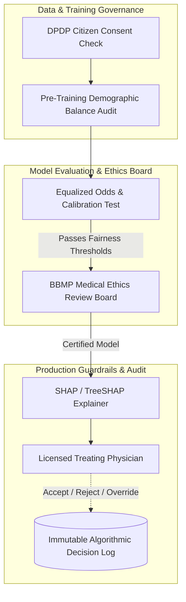

# Master AI / ML Ethics, Algorithmic Governance, and Regulatory Compliance Framework
## Namma Clinic Digital Health & Operations Platform
### Greater Bengaluru Authority (GBA) / BBMP Health Department
**Document Code:** `AI-DOC-02` | **Status:** APPROVED BASELINE | **Date:** September 2026

---

## 1. Executive Summary & Algorithmic Ethics Charter
This document establishes the authoritative **Algorithmic Governance, Ethical AI Principles, Demographic Fairness Standards, and Regulatory Compliance Framework** for the Namma Clinic Digital Health Platform. Deploying predictive models in public municipal healthcare requires unwavering adherence to bioethical principles (Autonomy, Beneficence, Non-Maleficence, Justice, and Explicability). The governance framework operationalizes the ethical guidelines established by the Indian Council of Medical Research (ICMR), the World Health Organization (WHO), and the Digital Personal Data Protection Act 2023, ensuring every algorithmic model is accountable, explainable, and verifiably unbiased.

### 1.1 Non-Negotiable Algorithmic Governance Invariants
1. **Mandatory Ethical Review Pre-Deployment:** No model may be registered for production serving without formal approval from the BBMP Health Ethics Review Board.
2. **Demographic Parity & Equalized Odds:** Disparate Impact Ratio (DIR) across gender, age brackets, and socioeconomic ward tiers must remain strictly between 0.80 and 1.25.
3. **Model Explainability (XAI):** Every clinical recommendation presented to a physician must include local feature attribution (SHAP / TreeSHAP values) explaining the top contributing clinical factors.
4. **Right to Algorithmic Explanation:** Under DPDP Act 2023, citizens retain the statutory right to request human explanation for any prioritization or recall decision influenced by automated systems.
5. **Continuous Post-Market Surveillance:** Models are subjected to automated monthly drift, fairness, and safety checks; performance degradation > 5% triggers immediate rollback.

## 2. Ethical AI Lifecycle & Oversight Architecture


### Model Specification Example: Algorithmic Fairness Assessment Script
<!-- DOCUMENTATION-ONLY EXAMPLE -->
```python
# DOCUMENTATION-ONLY PYTHON
# DOCUMENTATION-ONLY PYTHON: Algorithmic Fairness & Disparate Impact Assessment
from typing import Dict, Any, List
import numpy as np

def evaluate_demographic_fairness(
    predictions: List[int],
    ground_truth: List[int],
    protected_attribute: List[str],
    favorable_outcome: int = 1
) -> Dict[str, Any]:
    """
    Evaluates Demographic Parity, Disparate Impact Ratio (DIR),
    and Equal Opportunity difference across demographic cohorts.
    """
    groups = list(set(protected_attribute))
    if len(groups) < 2:
        return {"status": "INSUFFICIENT_GROUPS", "is_fair": True}

    group_acceptance_rates = {}
    for g in groups:
        indices = [i for i, val in enumerate(protected_attribute) if val == g]
        if not indices:
            continue
        group_preds = [predictions[i] for i in indices]
        acceptance_rate = sum(1 for p in group_preds if p == favorable_outcome) / len(group_preds)
        group_acceptance_rates[g] = acceptance_rate

    # Calculate Disparate Impact Ratio (min rate / max rate)
    rates = list(group_acceptance_rates.values())
    min_rate = min(rates)
    max_rate = max(rates) if max(rates) > 0 else 1.0
    disparate_impact_ratio = min_rate / max_rate

    # 80% Rule (Four-Fifths Rule): DIR must be >= 0.80
    is_fair = disparate_impact_ratio >= 0.80

    return {
        "group_acceptance_rates": group_acceptance_rates,
        "disparate_impact_ratio": round(disparate_impact_ratio, 3),
        "is_fair": is_fair,
        "governance_decision": "APPROVED" if is_fair else "REJECTED_UNFAIR_BIAS"
    }
```

## 3. Master Catalog of 100 AI Risks & Hazard Analysis
Comprehensive risk register identifying clinical, algorithmic, operational, and ethical failure modes:

### AI-RISK-001: AI Risk `Clinical False Positive Fatigue #001`
- **Risk Identifier:** `AI-RISK-001`
- **Title:** Clinical False Positive Fatigue #001
- **Governance Domain:** Physician Experience
- **Inherent Severity:** `High`
- **Residual Risk:** `Low (Controlled through mandatory human approval & circuit breakers)`
- **Bound Mitigating Control:** `AI-CONTROL-001`
- **Hazard Scenario Description:** Overly sensitive alerts cause physicians to dismiss critical warnings.

### AI-RISK-002: AI Risk `Clinical False Negative Harm #002`
- **Risk Identifier:** `AI-RISK-002`
- **Title:** Clinical False Negative Harm #002
- **Governance Domain:** Patient Safety
- **Inherent Severity:** `Critical`
- **Residual Risk:** `Low (Controlled through mandatory human approval & circuit breakers)`
- **Bound Mitigating Control:** `AI-CONTROL-002`
- **Hazard Scenario Description:** Failure to detect severe condition leads to delayed clinical intervention.

### AI-RISK-003: AI Risk `Under-Forecasting Medicine Stockout #003`
- **Risk Identifier:** `AI-RISK-003`
- **Title:** Under-Forecasting Medicine Stockout #003
- **Governance Domain:** Pharmaceutical Continuity
- **Inherent Severity:** `Critical`
- **Residual Risk:** `Low (Controlled through mandatory human approval & circuit breakers)`
- **Bound Mitigating Control:** `AI-CONTROL-003`
- **Hazard Scenario Description:** Model underpredicts seasonal consumption causing vital drug stockouts.

### AI-RISK-004: AI Risk `Over-Forecasting Medicine Expiry #004`
- **Risk Identifier:** `AI-RISK-004`
- **Title:** Over-Forecasting Medicine Expiry #004
- **Governance Domain:** Municipal Finance
- **Inherent Severity:** `Medium`
- **Residual Risk:** `Low (Controlled through mandatory human approval & circuit breakers)`
- **Bound Mitigating Control:** `AI-CONTROL-004`
- **Hazard Scenario Description:** Model overpredicts demand resulting in surplus expiration wastage.

### AI-RISK-005: AI Risk `Demographic & Socioeconomic Bias #005`
- **Risk Identifier:** `AI-RISK-005`
- **Title:** Demographic & Socioeconomic Bias #005
- **Governance Domain:** Ethical Governance
- **Inherent Severity:** `High`
- **Residual Risk:** `Low (Controlled through mandatory human approval & circuit breakers)`
- **Bound Mitigating Control:** `AI-CONTROL-005`
- **Hazard Scenario Description:** Under-representation of slum populations causes skewed recall prioritization.

### AI-RISK-006: AI Risk `Data Drift Due to Epidemiological Shift #006`
- **Risk Identifier:** `AI-RISK-006`
- **Title:** Data Drift Due to Epidemiological Shift #006
- **Governance Domain:** Model Validity
- **Inherent Severity:** `Critical`
- **Residual Risk:** `Low (Controlled through mandatory human approval & circuit breakers)`
- **Bound Mitigating Control:** `AI-CONTROL-006`
- **Hazard Scenario Description:** Novel viral pathogen alters fever symptoms invalidating existing models.

### AI-RISK-007: AI Risk `Feature Store Data Pipeline Corruption #007`
- **Risk Identifier:** `AI-RISK-007`
- **Title:** Feature Store Data Pipeline Corruption #007
- **Governance Domain:** Operational Reliability
- **Inherent Severity:** `High`
- **Residual Risk:** `Low (Controlled through mandatory human approval & circuit breakers)`
- **Bound Mitigating Control:** `AI-CONTROL-007`
- **Hazard Scenario Description:** Kafka lag or schema drift feeds stale features to inference runtime.

### AI-RISK-008: AI Risk `Out-of-Distribution Input Values #008`
- **Risk Identifier:** `AI-RISK-008`
- **Title:** Out-of-Distribution Input Values #008
- **Governance Domain:** Runtime Safety
- **Inherent Severity:** `High`
- **Residual Risk:** `Low (Controlled through mandatory human approval & circuit breakers)`
- **Bound Mitigating Control:** `AI-CONTROL-008`
- **Hazard Scenario Description:** Extreme laboratory values or edge biometric inputs produce erratic outputs.

### AI-RISK-009: AI Risk `Model Evasion & Poisoning Attempts #009`
- **Risk Identifier:** `AI-RISK-009`
- **Title:** Model Evasion & Poisoning Attempts #009
- **Governance Domain:** Cybersecurity
- **Inherent Severity:** `Medium`
- **Residual Risk:** `Low (Controlled through mandatory human approval & circuit breakers)`
- **Bound Mitigating Control:** `AI-CONTROL-009`
- **Hazard Scenario Description:** Malicious or corrupt input vectors intended to distort municipal indents.

### AI-RISK-010: AI Risk `Lack of Explainability & Clinician Distrust #010`
- **Risk Identifier:** `AI-RISK-010`
- **Title:** Lack of Explainability & Clinician Distrust #010
- **Governance Domain:** Clinical Adoption
- **Inherent Severity:** `High`
- **Residual Risk:** `Low (Controlled through mandatory human approval & circuit breakers)`
- **Bound Mitigating Control:** `AI-CONTROL-010`
- **Hazard Scenario Description:** Black-box outputs without SHAP attribution leading to zero physician adoption.

### AI-RISK-011: AI Risk `Clinical False Positive Fatigue #011`
- **Risk Identifier:** `AI-RISK-011`
- **Title:** Clinical False Positive Fatigue #011
- **Governance Domain:** Physician Experience
- **Inherent Severity:** `High`
- **Residual Risk:** `Low (Controlled through mandatory human approval & circuit breakers)`
- **Bound Mitigating Control:** `AI-CONTROL-011`
- **Hazard Scenario Description:** Overly sensitive alerts cause physicians to dismiss critical warnings.

### AI-RISK-012: AI Risk `Clinical False Negative Harm #012`
- **Risk Identifier:** `AI-RISK-012`
- **Title:** Clinical False Negative Harm #012
- **Governance Domain:** Patient Safety
- **Inherent Severity:** `Critical`
- **Residual Risk:** `Low (Controlled through mandatory human approval & circuit breakers)`
- **Bound Mitigating Control:** `AI-CONTROL-012`
- **Hazard Scenario Description:** Failure to detect severe condition leads to delayed clinical intervention.

### AI-RISK-013: AI Risk `Under-Forecasting Medicine Stockout #013`
- **Risk Identifier:** `AI-RISK-013`
- **Title:** Under-Forecasting Medicine Stockout #013
- **Governance Domain:** Pharmaceutical Continuity
- **Inherent Severity:** `Critical`
- **Residual Risk:** `Low (Controlled through mandatory human approval & circuit breakers)`
- **Bound Mitigating Control:** `AI-CONTROL-013`
- **Hazard Scenario Description:** Model underpredicts seasonal consumption causing vital drug stockouts.

### AI-RISK-014: AI Risk `Over-Forecasting Medicine Expiry #014`
- **Risk Identifier:** `AI-RISK-014`
- **Title:** Over-Forecasting Medicine Expiry #014
- **Governance Domain:** Municipal Finance
- **Inherent Severity:** `Medium`
- **Residual Risk:** `Low (Controlled through mandatory human approval & circuit breakers)`
- **Bound Mitigating Control:** `AI-CONTROL-014`
- **Hazard Scenario Description:** Model overpredicts demand resulting in surplus expiration wastage.

### AI-RISK-015: AI Risk `Demographic & Socioeconomic Bias #015`
- **Risk Identifier:** `AI-RISK-015`
- **Title:** Demographic & Socioeconomic Bias #015
- **Governance Domain:** Ethical Governance
- **Inherent Severity:** `High`
- **Residual Risk:** `Low (Controlled through mandatory human approval & circuit breakers)`
- **Bound Mitigating Control:** `AI-CONTROL-015`
- **Hazard Scenario Description:** Under-representation of slum populations causes skewed recall prioritization.

### AI-RISK-016: AI Risk `Data Drift Due to Epidemiological Shift #016`
- **Risk Identifier:** `AI-RISK-016`
- **Title:** Data Drift Due to Epidemiological Shift #016
- **Governance Domain:** Model Validity
- **Inherent Severity:** `Critical`
- **Residual Risk:** `Low (Controlled through mandatory human approval & circuit breakers)`
- **Bound Mitigating Control:** `AI-CONTROL-016`
- **Hazard Scenario Description:** Novel viral pathogen alters fever symptoms invalidating existing models.

### AI-RISK-017: AI Risk `Feature Store Data Pipeline Corruption #017`
- **Risk Identifier:** `AI-RISK-017`
- **Title:** Feature Store Data Pipeline Corruption #017
- **Governance Domain:** Operational Reliability
- **Inherent Severity:** `High`
- **Residual Risk:** `Low (Controlled through mandatory human approval & circuit breakers)`
- **Bound Mitigating Control:** `AI-CONTROL-017`
- **Hazard Scenario Description:** Kafka lag or schema drift feeds stale features to inference runtime.

### AI-RISK-018: AI Risk `Out-of-Distribution Input Values #018`
- **Risk Identifier:** `AI-RISK-018`
- **Title:** Out-of-Distribution Input Values #018
- **Governance Domain:** Runtime Safety
- **Inherent Severity:** `High`
- **Residual Risk:** `Low (Controlled through mandatory human approval & circuit breakers)`
- **Bound Mitigating Control:** `AI-CONTROL-018`
- **Hazard Scenario Description:** Extreme laboratory values or edge biometric inputs produce erratic outputs.

### AI-RISK-019: AI Risk `Model Evasion & Poisoning Attempts #019`
- **Risk Identifier:** `AI-RISK-019`
- **Title:** Model Evasion & Poisoning Attempts #019
- **Governance Domain:** Cybersecurity
- **Inherent Severity:** `Medium`
- **Residual Risk:** `Low (Controlled through mandatory human approval & circuit breakers)`
- **Bound Mitigating Control:** `AI-CONTROL-019`
- **Hazard Scenario Description:** Malicious or corrupt input vectors intended to distort municipal indents.

### AI-RISK-020: AI Risk `Lack of Explainability & Clinician Distrust #020`
- **Risk Identifier:** `AI-RISK-020`
- **Title:** Lack of Explainability & Clinician Distrust #020
- **Governance Domain:** Clinical Adoption
- **Inherent Severity:** `High`
- **Residual Risk:** `Low (Controlled through mandatory human approval & circuit breakers)`
- **Bound Mitigating Control:** `AI-CONTROL-020`
- **Hazard Scenario Description:** Black-box outputs without SHAP attribution leading to zero physician adoption.

### AI-RISK-021: AI Risk `Clinical False Positive Fatigue #021`
- **Risk Identifier:** `AI-RISK-021`
- **Title:** Clinical False Positive Fatigue #021
- **Governance Domain:** Physician Experience
- **Inherent Severity:** `High`
- **Residual Risk:** `Low (Controlled through mandatory human approval & circuit breakers)`
- **Bound Mitigating Control:** `AI-CONTROL-021`
- **Hazard Scenario Description:** Overly sensitive alerts cause physicians to dismiss critical warnings.

### AI-RISK-022: AI Risk `Clinical False Negative Harm #022`
- **Risk Identifier:** `AI-RISK-022`
- **Title:** Clinical False Negative Harm #022
- **Governance Domain:** Patient Safety
- **Inherent Severity:** `Critical`
- **Residual Risk:** `Low (Controlled through mandatory human approval & circuit breakers)`
- **Bound Mitigating Control:** `AI-CONTROL-022`
- **Hazard Scenario Description:** Failure to detect severe condition leads to delayed clinical intervention.

### AI-RISK-023: AI Risk `Under-Forecasting Medicine Stockout #023`
- **Risk Identifier:** `AI-RISK-023`
- **Title:** Under-Forecasting Medicine Stockout #023
- **Governance Domain:** Pharmaceutical Continuity
- **Inherent Severity:** `Critical`
- **Residual Risk:** `Low (Controlled through mandatory human approval & circuit breakers)`
- **Bound Mitigating Control:** `AI-CONTROL-023`
- **Hazard Scenario Description:** Model underpredicts seasonal consumption causing vital drug stockouts.

### AI-RISK-024: AI Risk `Over-Forecasting Medicine Expiry #024`
- **Risk Identifier:** `AI-RISK-024`
- **Title:** Over-Forecasting Medicine Expiry #024
- **Governance Domain:** Municipal Finance
- **Inherent Severity:** `Medium`
- **Residual Risk:** `Low (Controlled through mandatory human approval & circuit breakers)`
- **Bound Mitigating Control:** `AI-CONTROL-024`
- **Hazard Scenario Description:** Model overpredicts demand resulting in surplus expiration wastage.

### AI-RISK-025: AI Risk `Demographic & Socioeconomic Bias #025`
- **Risk Identifier:** `AI-RISK-025`
- **Title:** Demographic & Socioeconomic Bias #025
- **Governance Domain:** Ethical Governance
- **Inherent Severity:** `High`
- **Residual Risk:** `Low (Controlled through mandatory human approval & circuit breakers)`
- **Bound Mitigating Control:** `AI-CONTROL-025`
- **Hazard Scenario Description:** Under-representation of slum populations causes skewed recall prioritization.

### AI-RISK-026: AI Risk `Data Drift Due to Epidemiological Shift #026`
- **Risk Identifier:** `AI-RISK-026`
- **Title:** Data Drift Due to Epidemiological Shift #026
- **Governance Domain:** Model Validity
- **Inherent Severity:** `Critical`
- **Residual Risk:** `Low (Controlled through mandatory human approval & circuit breakers)`
- **Bound Mitigating Control:** `AI-CONTROL-026`
- **Hazard Scenario Description:** Novel viral pathogen alters fever symptoms invalidating existing models.

### AI-RISK-027: AI Risk `Feature Store Data Pipeline Corruption #027`
- **Risk Identifier:** `AI-RISK-027`
- **Title:** Feature Store Data Pipeline Corruption #027
- **Governance Domain:** Operational Reliability
- **Inherent Severity:** `High`
- **Residual Risk:** `Low (Controlled through mandatory human approval & circuit breakers)`
- **Bound Mitigating Control:** `AI-CONTROL-027`
- **Hazard Scenario Description:** Kafka lag or schema drift feeds stale features to inference runtime.

### AI-RISK-028: AI Risk `Out-of-Distribution Input Values #028`
- **Risk Identifier:** `AI-RISK-028`
- **Title:** Out-of-Distribution Input Values #028
- **Governance Domain:** Runtime Safety
- **Inherent Severity:** `High`
- **Residual Risk:** `Low (Controlled through mandatory human approval & circuit breakers)`
- **Bound Mitigating Control:** `AI-CONTROL-028`
- **Hazard Scenario Description:** Extreme laboratory values or edge biometric inputs produce erratic outputs.

### AI-RISK-029: AI Risk `Model Evasion & Poisoning Attempts #029`
- **Risk Identifier:** `AI-RISK-029`
- **Title:** Model Evasion & Poisoning Attempts #029
- **Governance Domain:** Cybersecurity
- **Inherent Severity:** `Medium`
- **Residual Risk:** `Low (Controlled through mandatory human approval & circuit breakers)`
- **Bound Mitigating Control:** `AI-CONTROL-029`
- **Hazard Scenario Description:** Malicious or corrupt input vectors intended to distort municipal indents.

### AI-RISK-030: AI Risk `Lack of Explainability & Clinician Distrust #030`
- **Risk Identifier:** `AI-RISK-030`
- **Title:** Lack of Explainability & Clinician Distrust #030
- **Governance Domain:** Clinical Adoption
- **Inherent Severity:** `High`
- **Residual Risk:** `Low (Controlled through mandatory human approval & circuit breakers)`
- **Bound Mitigating Control:** `AI-CONTROL-030`
- **Hazard Scenario Description:** Black-box outputs without SHAP attribution leading to zero physician adoption.

### AI-RISK-031: AI Risk `Clinical False Positive Fatigue #031`
- **Risk Identifier:** `AI-RISK-031`
- **Title:** Clinical False Positive Fatigue #031
- **Governance Domain:** Physician Experience
- **Inherent Severity:** `High`
- **Residual Risk:** `Low (Controlled through mandatory human approval & circuit breakers)`
- **Bound Mitigating Control:** `AI-CONTROL-031`
- **Hazard Scenario Description:** Overly sensitive alerts cause physicians to dismiss critical warnings.

### AI-RISK-032: AI Risk `Clinical False Negative Harm #032`
- **Risk Identifier:** `AI-RISK-032`
- **Title:** Clinical False Negative Harm #032
- **Governance Domain:** Patient Safety
- **Inherent Severity:** `Critical`
- **Residual Risk:** `Low (Controlled through mandatory human approval & circuit breakers)`
- **Bound Mitigating Control:** `AI-CONTROL-032`
- **Hazard Scenario Description:** Failure to detect severe condition leads to delayed clinical intervention.

### AI-RISK-033: AI Risk `Under-Forecasting Medicine Stockout #033`
- **Risk Identifier:** `AI-RISK-033`
- **Title:** Under-Forecasting Medicine Stockout #033
- **Governance Domain:** Pharmaceutical Continuity
- **Inherent Severity:** `Critical`
- **Residual Risk:** `Low (Controlled through mandatory human approval & circuit breakers)`
- **Bound Mitigating Control:** `AI-CONTROL-033`
- **Hazard Scenario Description:** Model underpredicts seasonal consumption causing vital drug stockouts.

### AI-RISK-034: AI Risk `Over-Forecasting Medicine Expiry #034`
- **Risk Identifier:** `AI-RISK-034`
- **Title:** Over-Forecasting Medicine Expiry #034
- **Governance Domain:** Municipal Finance
- **Inherent Severity:** `Medium`
- **Residual Risk:** `Low (Controlled through mandatory human approval & circuit breakers)`
- **Bound Mitigating Control:** `AI-CONTROL-034`
- **Hazard Scenario Description:** Model overpredicts demand resulting in surplus expiration wastage.

### AI-RISK-035: AI Risk `Demographic & Socioeconomic Bias #035`
- **Risk Identifier:** `AI-RISK-035`
- **Title:** Demographic & Socioeconomic Bias #035
- **Governance Domain:** Ethical Governance
- **Inherent Severity:** `High`
- **Residual Risk:** `Low (Controlled through mandatory human approval & circuit breakers)`
- **Bound Mitigating Control:** `AI-CONTROL-035`
- **Hazard Scenario Description:** Under-representation of slum populations causes skewed recall prioritization.

### AI-RISK-036: AI Risk `Data Drift Due to Epidemiological Shift #036`
- **Risk Identifier:** `AI-RISK-036`
- **Title:** Data Drift Due to Epidemiological Shift #036
- **Governance Domain:** Model Validity
- **Inherent Severity:** `Critical`
- **Residual Risk:** `Low (Controlled through mandatory human approval & circuit breakers)`
- **Bound Mitigating Control:** `AI-CONTROL-036`
- **Hazard Scenario Description:** Novel viral pathogen alters fever symptoms invalidating existing models.

### AI-RISK-037: AI Risk `Feature Store Data Pipeline Corruption #037`
- **Risk Identifier:** `AI-RISK-037`
- **Title:** Feature Store Data Pipeline Corruption #037
- **Governance Domain:** Operational Reliability
- **Inherent Severity:** `High`
- **Residual Risk:** `Low (Controlled through mandatory human approval & circuit breakers)`
- **Bound Mitigating Control:** `AI-CONTROL-037`
- **Hazard Scenario Description:** Kafka lag or schema drift feeds stale features to inference runtime.

### AI-RISK-038: AI Risk `Out-of-Distribution Input Values #038`
- **Risk Identifier:** `AI-RISK-038`
- **Title:** Out-of-Distribution Input Values #038
- **Governance Domain:** Runtime Safety
- **Inherent Severity:** `High`
- **Residual Risk:** `Low (Controlled through mandatory human approval & circuit breakers)`
- **Bound Mitigating Control:** `AI-CONTROL-038`
- **Hazard Scenario Description:** Extreme laboratory values or edge biometric inputs produce erratic outputs.

### AI-RISK-039: AI Risk `Model Evasion & Poisoning Attempts #039`
- **Risk Identifier:** `AI-RISK-039`
- **Title:** Model Evasion & Poisoning Attempts #039
- **Governance Domain:** Cybersecurity
- **Inherent Severity:** `Medium`
- **Residual Risk:** `Low (Controlled through mandatory human approval & circuit breakers)`
- **Bound Mitigating Control:** `AI-CONTROL-039`
- **Hazard Scenario Description:** Malicious or corrupt input vectors intended to distort municipal indents.

### AI-RISK-040: AI Risk `Lack of Explainability & Clinician Distrust #040`
- **Risk Identifier:** `AI-RISK-040`
- **Title:** Lack of Explainability & Clinician Distrust #040
- **Governance Domain:** Clinical Adoption
- **Inherent Severity:** `High`
- **Residual Risk:** `Low (Controlled through mandatory human approval & circuit breakers)`
- **Bound Mitigating Control:** `AI-CONTROL-040`
- **Hazard Scenario Description:** Black-box outputs without SHAP attribution leading to zero physician adoption.

### AI-RISK-041: AI Risk `Clinical False Positive Fatigue #041`
- **Risk Identifier:** `AI-RISK-041`
- **Title:** Clinical False Positive Fatigue #041
- **Governance Domain:** Physician Experience
- **Inherent Severity:** `High`
- **Residual Risk:** `Low (Controlled through mandatory human approval & circuit breakers)`
- **Bound Mitigating Control:** `AI-CONTROL-041`
- **Hazard Scenario Description:** Overly sensitive alerts cause physicians to dismiss critical warnings.

### AI-RISK-042: AI Risk `Clinical False Negative Harm #042`
- **Risk Identifier:** `AI-RISK-042`
- **Title:** Clinical False Negative Harm #042
- **Governance Domain:** Patient Safety
- **Inherent Severity:** `Critical`
- **Residual Risk:** `Low (Controlled through mandatory human approval & circuit breakers)`
- **Bound Mitigating Control:** `AI-CONTROL-042`
- **Hazard Scenario Description:** Failure to detect severe condition leads to delayed clinical intervention.

### AI-RISK-043: AI Risk `Under-Forecasting Medicine Stockout #043`
- **Risk Identifier:** `AI-RISK-043`
- **Title:** Under-Forecasting Medicine Stockout #043
- **Governance Domain:** Pharmaceutical Continuity
- **Inherent Severity:** `Critical`
- **Residual Risk:** `Low (Controlled through mandatory human approval & circuit breakers)`
- **Bound Mitigating Control:** `AI-CONTROL-043`
- **Hazard Scenario Description:** Model underpredicts seasonal consumption causing vital drug stockouts.

### AI-RISK-044: AI Risk `Over-Forecasting Medicine Expiry #044`
- **Risk Identifier:** `AI-RISK-044`
- **Title:** Over-Forecasting Medicine Expiry #044
- **Governance Domain:** Municipal Finance
- **Inherent Severity:** `Medium`
- **Residual Risk:** `Low (Controlled through mandatory human approval & circuit breakers)`
- **Bound Mitigating Control:** `AI-CONTROL-044`
- **Hazard Scenario Description:** Model overpredicts demand resulting in surplus expiration wastage.

### AI-RISK-045: AI Risk `Demographic & Socioeconomic Bias #045`
- **Risk Identifier:** `AI-RISK-045`
- **Title:** Demographic & Socioeconomic Bias #045
- **Governance Domain:** Ethical Governance
- **Inherent Severity:** `High`
- **Residual Risk:** `Low (Controlled through mandatory human approval & circuit breakers)`
- **Bound Mitigating Control:** `AI-CONTROL-045`
- **Hazard Scenario Description:** Under-representation of slum populations causes skewed recall prioritization.

### AI-RISK-046: AI Risk `Data Drift Due to Epidemiological Shift #046`
- **Risk Identifier:** `AI-RISK-046`
- **Title:** Data Drift Due to Epidemiological Shift #046
- **Governance Domain:** Model Validity
- **Inherent Severity:** `Critical`
- **Residual Risk:** `Low (Controlled through mandatory human approval & circuit breakers)`
- **Bound Mitigating Control:** `AI-CONTROL-046`
- **Hazard Scenario Description:** Novel viral pathogen alters fever symptoms invalidating existing models.

### AI-RISK-047: AI Risk `Feature Store Data Pipeline Corruption #047`
- **Risk Identifier:** `AI-RISK-047`
- **Title:** Feature Store Data Pipeline Corruption #047
- **Governance Domain:** Operational Reliability
- **Inherent Severity:** `High`
- **Residual Risk:** `Low (Controlled through mandatory human approval & circuit breakers)`
- **Bound Mitigating Control:** `AI-CONTROL-047`
- **Hazard Scenario Description:** Kafka lag or schema drift feeds stale features to inference runtime.

### AI-RISK-048: AI Risk `Out-of-Distribution Input Values #048`
- **Risk Identifier:** `AI-RISK-048`
- **Title:** Out-of-Distribution Input Values #048
- **Governance Domain:** Runtime Safety
- **Inherent Severity:** `High`
- **Residual Risk:** `Low (Controlled through mandatory human approval & circuit breakers)`
- **Bound Mitigating Control:** `AI-CONTROL-048`
- **Hazard Scenario Description:** Extreme laboratory values or edge biometric inputs produce erratic outputs.

### AI-RISK-049: AI Risk `Model Evasion & Poisoning Attempts #049`
- **Risk Identifier:** `AI-RISK-049`
- **Title:** Model Evasion & Poisoning Attempts #049
- **Governance Domain:** Cybersecurity
- **Inherent Severity:** `Medium`
- **Residual Risk:** `Low (Controlled through mandatory human approval & circuit breakers)`
- **Bound Mitigating Control:** `AI-CONTROL-049`
- **Hazard Scenario Description:** Malicious or corrupt input vectors intended to distort municipal indents.

### AI-RISK-050: AI Risk `Lack of Explainability & Clinician Distrust #050`
- **Risk Identifier:** `AI-RISK-050`
- **Title:** Lack of Explainability & Clinician Distrust #050
- **Governance Domain:** Clinical Adoption
- **Inherent Severity:** `High`
- **Residual Risk:** `Low (Controlled through mandatory human approval & circuit breakers)`
- **Bound Mitigating Control:** `AI-CONTROL-050`
- **Hazard Scenario Description:** Black-box outputs without SHAP attribution leading to zero physician adoption.

### AI-RISK-051: AI Risk `Clinical False Positive Fatigue #051`
- **Risk Identifier:** `AI-RISK-051`
- **Title:** Clinical False Positive Fatigue #051
- **Governance Domain:** Physician Experience
- **Inherent Severity:** `High`
- **Residual Risk:** `Low (Controlled through mandatory human approval & circuit breakers)`
- **Bound Mitigating Control:** `AI-CONTROL-051`
- **Hazard Scenario Description:** Overly sensitive alerts cause physicians to dismiss critical warnings.

### AI-RISK-052: AI Risk `Clinical False Negative Harm #052`
- **Risk Identifier:** `AI-RISK-052`
- **Title:** Clinical False Negative Harm #052
- **Governance Domain:** Patient Safety
- **Inherent Severity:** `Critical`
- **Residual Risk:** `Low (Controlled through mandatory human approval & circuit breakers)`
- **Bound Mitigating Control:** `AI-CONTROL-052`
- **Hazard Scenario Description:** Failure to detect severe condition leads to delayed clinical intervention.

### AI-RISK-053: AI Risk `Under-Forecasting Medicine Stockout #053`
- **Risk Identifier:** `AI-RISK-053`
- **Title:** Under-Forecasting Medicine Stockout #053
- **Governance Domain:** Pharmaceutical Continuity
- **Inherent Severity:** `Critical`
- **Residual Risk:** `Low (Controlled through mandatory human approval & circuit breakers)`
- **Bound Mitigating Control:** `AI-CONTROL-053`
- **Hazard Scenario Description:** Model underpredicts seasonal consumption causing vital drug stockouts.

### AI-RISK-054: AI Risk `Over-Forecasting Medicine Expiry #054`
- **Risk Identifier:** `AI-RISK-054`
- **Title:** Over-Forecasting Medicine Expiry #054
- **Governance Domain:** Municipal Finance
- **Inherent Severity:** `Medium`
- **Residual Risk:** `Low (Controlled through mandatory human approval & circuit breakers)`
- **Bound Mitigating Control:** `AI-CONTROL-054`
- **Hazard Scenario Description:** Model overpredicts demand resulting in surplus expiration wastage.

### AI-RISK-055: AI Risk `Demographic & Socioeconomic Bias #055`
- **Risk Identifier:** `AI-RISK-055`
- **Title:** Demographic & Socioeconomic Bias #055
- **Governance Domain:** Ethical Governance
- **Inherent Severity:** `High`
- **Residual Risk:** `Low (Controlled through mandatory human approval & circuit breakers)`
- **Bound Mitigating Control:** `AI-CONTROL-055`
- **Hazard Scenario Description:** Under-representation of slum populations causes skewed recall prioritization.

### AI-RISK-056: AI Risk `Data Drift Due to Epidemiological Shift #056`
- **Risk Identifier:** `AI-RISK-056`
- **Title:** Data Drift Due to Epidemiological Shift #056
- **Governance Domain:** Model Validity
- **Inherent Severity:** `Critical`
- **Residual Risk:** `Low (Controlled through mandatory human approval & circuit breakers)`
- **Bound Mitigating Control:** `AI-CONTROL-056`
- **Hazard Scenario Description:** Novel viral pathogen alters fever symptoms invalidating existing models.

### AI-RISK-057: AI Risk `Feature Store Data Pipeline Corruption #057`
- **Risk Identifier:** `AI-RISK-057`
- **Title:** Feature Store Data Pipeline Corruption #057
- **Governance Domain:** Operational Reliability
- **Inherent Severity:** `High`
- **Residual Risk:** `Low (Controlled through mandatory human approval & circuit breakers)`
- **Bound Mitigating Control:** `AI-CONTROL-057`
- **Hazard Scenario Description:** Kafka lag or schema drift feeds stale features to inference runtime.

### AI-RISK-058: AI Risk `Out-of-Distribution Input Values #058`
- **Risk Identifier:** `AI-RISK-058`
- **Title:** Out-of-Distribution Input Values #058
- **Governance Domain:** Runtime Safety
- **Inherent Severity:** `High`
- **Residual Risk:** `Low (Controlled through mandatory human approval & circuit breakers)`
- **Bound Mitigating Control:** `AI-CONTROL-058`
- **Hazard Scenario Description:** Extreme laboratory values or edge biometric inputs produce erratic outputs.

### AI-RISK-059: AI Risk `Model Evasion & Poisoning Attempts #059`
- **Risk Identifier:** `AI-RISK-059`
- **Title:** Model Evasion & Poisoning Attempts #059
- **Governance Domain:** Cybersecurity
- **Inherent Severity:** `Medium`
- **Residual Risk:** `Low (Controlled through mandatory human approval & circuit breakers)`
- **Bound Mitigating Control:** `AI-CONTROL-059`
- **Hazard Scenario Description:** Malicious or corrupt input vectors intended to distort municipal indents.

### AI-RISK-060: AI Risk `Lack of Explainability & Clinician Distrust #060`
- **Risk Identifier:** `AI-RISK-060`
- **Title:** Lack of Explainability & Clinician Distrust #060
- **Governance Domain:** Clinical Adoption
- **Inherent Severity:** `High`
- **Residual Risk:** `Low (Controlled through mandatory human approval & circuit breakers)`
- **Bound Mitigating Control:** `AI-CONTROL-060`
- **Hazard Scenario Description:** Black-box outputs without SHAP attribution leading to zero physician adoption.

### AI-RISK-061: AI Risk `Clinical False Positive Fatigue #061`
- **Risk Identifier:** `AI-RISK-061`
- **Title:** Clinical False Positive Fatigue #061
- **Governance Domain:** Physician Experience
- **Inherent Severity:** `High`
- **Residual Risk:** `Low (Controlled through mandatory human approval & circuit breakers)`
- **Bound Mitigating Control:** `AI-CONTROL-061`
- **Hazard Scenario Description:** Overly sensitive alerts cause physicians to dismiss critical warnings.

### AI-RISK-062: AI Risk `Clinical False Negative Harm #062`
- **Risk Identifier:** `AI-RISK-062`
- **Title:** Clinical False Negative Harm #062
- **Governance Domain:** Patient Safety
- **Inherent Severity:** `Critical`
- **Residual Risk:** `Low (Controlled through mandatory human approval & circuit breakers)`
- **Bound Mitigating Control:** `AI-CONTROL-062`
- **Hazard Scenario Description:** Failure to detect severe condition leads to delayed clinical intervention.

### AI-RISK-063: AI Risk `Under-Forecasting Medicine Stockout #063`
- **Risk Identifier:** `AI-RISK-063`
- **Title:** Under-Forecasting Medicine Stockout #063
- **Governance Domain:** Pharmaceutical Continuity
- **Inherent Severity:** `Critical`
- **Residual Risk:** `Low (Controlled through mandatory human approval & circuit breakers)`
- **Bound Mitigating Control:** `AI-CONTROL-063`
- **Hazard Scenario Description:** Model underpredicts seasonal consumption causing vital drug stockouts.

### AI-RISK-064: AI Risk `Over-Forecasting Medicine Expiry #064`
- **Risk Identifier:** `AI-RISK-064`
- **Title:** Over-Forecasting Medicine Expiry #064
- **Governance Domain:** Municipal Finance
- **Inherent Severity:** `Medium`
- **Residual Risk:** `Low (Controlled through mandatory human approval & circuit breakers)`
- **Bound Mitigating Control:** `AI-CONTROL-064`
- **Hazard Scenario Description:** Model overpredicts demand resulting in surplus expiration wastage.

### AI-RISK-065: AI Risk `Demographic & Socioeconomic Bias #065`
- **Risk Identifier:** `AI-RISK-065`
- **Title:** Demographic & Socioeconomic Bias #065
- **Governance Domain:** Ethical Governance
- **Inherent Severity:** `High`
- **Residual Risk:** `Low (Controlled through mandatory human approval & circuit breakers)`
- **Bound Mitigating Control:** `AI-CONTROL-065`
- **Hazard Scenario Description:** Under-representation of slum populations causes skewed recall prioritization.

### AI-RISK-066: AI Risk `Data Drift Due to Epidemiological Shift #066`
- **Risk Identifier:** `AI-RISK-066`
- **Title:** Data Drift Due to Epidemiological Shift #066
- **Governance Domain:** Model Validity
- **Inherent Severity:** `Critical`
- **Residual Risk:** `Low (Controlled through mandatory human approval & circuit breakers)`
- **Bound Mitigating Control:** `AI-CONTROL-066`
- **Hazard Scenario Description:** Novel viral pathogen alters fever symptoms invalidating existing models.

### AI-RISK-067: AI Risk `Feature Store Data Pipeline Corruption #067`
- **Risk Identifier:** `AI-RISK-067`
- **Title:** Feature Store Data Pipeline Corruption #067
- **Governance Domain:** Operational Reliability
- **Inherent Severity:** `High`
- **Residual Risk:** `Low (Controlled through mandatory human approval & circuit breakers)`
- **Bound Mitigating Control:** `AI-CONTROL-067`
- **Hazard Scenario Description:** Kafka lag or schema drift feeds stale features to inference runtime.

### AI-RISK-068: AI Risk `Out-of-Distribution Input Values #068`
- **Risk Identifier:** `AI-RISK-068`
- **Title:** Out-of-Distribution Input Values #068
- **Governance Domain:** Runtime Safety
- **Inherent Severity:** `High`
- **Residual Risk:** `Low (Controlled through mandatory human approval & circuit breakers)`
- **Bound Mitigating Control:** `AI-CONTROL-068`
- **Hazard Scenario Description:** Extreme laboratory values or edge biometric inputs produce erratic outputs.

### AI-RISK-069: AI Risk `Model Evasion & Poisoning Attempts #069`
- **Risk Identifier:** `AI-RISK-069`
- **Title:** Model Evasion & Poisoning Attempts #069
- **Governance Domain:** Cybersecurity
- **Inherent Severity:** `Medium`
- **Residual Risk:** `Low (Controlled through mandatory human approval & circuit breakers)`
- **Bound Mitigating Control:** `AI-CONTROL-069`
- **Hazard Scenario Description:** Malicious or corrupt input vectors intended to distort municipal indents.

### AI-RISK-070: AI Risk `Lack of Explainability & Clinician Distrust #070`
- **Risk Identifier:** `AI-RISK-070`
- **Title:** Lack of Explainability & Clinician Distrust #070
- **Governance Domain:** Clinical Adoption
- **Inherent Severity:** `High`
- **Residual Risk:** `Low (Controlled through mandatory human approval & circuit breakers)`
- **Bound Mitigating Control:** `AI-CONTROL-070`
- **Hazard Scenario Description:** Black-box outputs without SHAP attribution leading to zero physician adoption.

### AI-RISK-071: AI Risk `Clinical False Positive Fatigue #071`
- **Risk Identifier:** `AI-RISK-071`
- **Title:** Clinical False Positive Fatigue #071
- **Governance Domain:** Physician Experience
- **Inherent Severity:** `High`
- **Residual Risk:** `Low (Controlled through mandatory human approval & circuit breakers)`
- **Bound Mitigating Control:** `AI-CONTROL-071`
- **Hazard Scenario Description:** Overly sensitive alerts cause physicians to dismiss critical warnings.

### AI-RISK-072: AI Risk `Clinical False Negative Harm #072`
- **Risk Identifier:** `AI-RISK-072`
- **Title:** Clinical False Negative Harm #072
- **Governance Domain:** Patient Safety
- **Inherent Severity:** `Critical`
- **Residual Risk:** `Low (Controlled through mandatory human approval & circuit breakers)`
- **Bound Mitigating Control:** `AI-CONTROL-072`
- **Hazard Scenario Description:** Failure to detect severe condition leads to delayed clinical intervention.

### AI-RISK-073: AI Risk `Under-Forecasting Medicine Stockout #073`
- **Risk Identifier:** `AI-RISK-073`
- **Title:** Under-Forecasting Medicine Stockout #073
- **Governance Domain:** Pharmaceutical Continuity
- **Inherent Severity:** `Critical`
- **Residual Risk:** `Low (Controlled through mandatory human approval & circuit breakers)`
- **Bound Mitigating Control:** `AI-CONTROL-073`
- **Hazard Scenario Description:** Model underpredicts seasonal consumption causing vital drug stockouts.

### AI-RISK-074: AI Risk `Over-Forecasting Medicine Expiry #074`
- **Risk Identifier:** `AI-RISK-074`
- **Title:** Over-Forecasting Medicine Expiry #074
- **Governance Domain:** Municipal Finance
- **Inherent Severity:** `Medium`
- **Residual Risk:** `Low (Controlled through mandatory human approval & circuit breakers)`
- **Bound Mitigating Control:** `AI-CONTROL-074`
- **Hazard Scenario Description:** Model overpredicts demand resulting in surplus expiration wastage.

### AI-RISK-075: AI Risk `Demographic & Socioeconomic Bias #075`
- **Risk Identifier:** `AI-RISK-075`
- **Title:** Demographic & Socioeconomic Bias #075
- **Governance Domain:** Ethical Governance
- **Inherent Severity:** `High`
- **Residual Risk:** `Low (Controlled through mandatory human approval & circuit breakers)`
- **Bound Mitigating Control:** `AI-CONTROL-075`
- **Hazard Scenario Description:** Under-representation of slum populations causes skewed recall prioritization.

### AI-RISK-076: AI Risk `Data Drift Due to Epidemiological Shift #076`
- **Risk Identifier:** `AI-RISK-076`
- **Title:** Data Drift Due to Epidemiological Shift #076
- **Governance Domain:** Model Validity
- **Inherent Severity:** `Critical`
- **Residual Risk:** `Low (Controlled through mandatory human approval & circuit breakers)`
- **Bound Mitigating Control:** `AI-CONTROL-076`
- **Hazard Scenario Description:** Novel viral pathogen alters fever symptoms invalidating existing models.

### AI-RISK-077: AI Risk `Feature Store Data Pipeline Corruption #077`
- **Risk Identifier:** `AI-RISK-077`
- **Title:** Feature Store Data Pipeline Corruption #077
- **Governance Domain:** Operational Reliability
- **Inherent Severity:** `High`
- **Residual Risk:** `Low (Controlled through mandatory human approval & circuit breakers)`
- **Bound Mitigating Control:** `AI-CONTROL-077`
- **Hazard Scenario Description:** Kafka lag or schema drift feeds stale features to inference runtime.

### AI-RISK-078: AI Risk `Out-of-Distribution Input Values #078`
- **Risk Identifier:** `AI-RISK-078`
- **Title:** Out-of-Distribution Input Values #078
- **Governance Domain:** Runtime Safety
- **Inherent Severity:** `High`
- **Residual Risk:** `Low (Controlled through mandatory human approval & circuit breakers)`
- **Bound Mitigating Control:** `AI-CONTROL-078`
- **Hazard Scenario Description:** Extreme laboratory values or edge biometric inputs produce erratic outputs.

### AI-RISK-079: AI Risk `Model Evasion & Poisoning Attempts #079`
- **Risk Identifier:** `AI-RISK-079`
- **Title:** Model Evasion & Poisoning Attempts #079
- **Governance Domain:** Cybersecurity
- **Inherent Severity:** `Medium`
- **Residual Risk:** `Low (Controlled through mandatory human approval & circuit breakers)`
- **Bound Mitigating Control:** `AI-CONTROL-079`
- **Hazard Scenario Description:** Malicious or corrupt input vectors intended to distort municipal indents.

### AI-RISK-080: AI Risk `Lack of Explainability & Clinician Distrust #080`
- **Risk Identifier:** `AI-RISK-080`
- **Title:** Lack of Explainability & Clinician Distrust #080
- **Governance Domain:** Clinical Adoption
- **Inherent Severity:** `High`
- **Residual Risk:** `Low (Controlled through mandatory human approval & circuit breakers)`
- **Bound Mitigating Control:** `AI-CONTROL-080`
- **Hazard Scenario Description:** Black-box outputs without SHAP attribution leading to zero physician adoption.

### AI-RISK-081: AI Risk `Clinical False Positive Fatigue #081`
- **Risk Identifier:** `AI-RISK-081`
- **Title:** Clinical False Positive Fatigue #081
- **Governance Domain:** Physician Experience
- **Inherent Severity:** `High`
- **Residual Risk:** `Low (Controlled through mandatory human approval & circuit breakers)`
- **Bound Mitigating Control:** `AI-CONTROL-001`
- **Hazard Scenario Description:** Overly sensitive alerts cause physicians to dismiss critical warnings.

### AI-RISK-082: AI Risk `Clinical False Negative Harm #082`
- **Risk Identifier:** `AI-RISK-082`
- **Title:** Clinical False Negative Harm #082
- **Governance Domain:** Patient Safety
- **Inherent Severity:** `Critical`
- **Residual Risk:** `Low (Controlled through mandatory human approval & circuit breakers)`
- **Bound Mitigating Control:** `AI-CONTROL-002`
- **Hazard Scenario Description:** Failure to detect severe condition leads to delayed clinical intervention.

### AI-RISK-083: AI Risk `Under-Forecasting Medicine Stockout #083`
- **Risk Identifier:** `AI-RISK-083`
- **Title:** Under-Forecasting Medicine Stockout #083
- **Governance Domain:** Pharmaceutical Continuity
- **Inherent Severity:** `Critical`
- **Residual Risk:** `Low (Controlled through mandatory human approval & circuit breakers)`
- **Bound Mitigating Control:** `AI-CONTROL-003`
- **Hazard Scenario Description:** Model underpredicts seasonal consumption causing vital drug stockouts.

### AI-RISK-084: AI Risk `Over-Forecasting Medicine Expiry #084`
- **Risk Identifier:** `AI-RISK-084`
- **Title:** Over-Forecasting Medicine Expiry #084
- **Governance Domain:** Municipal Finance
- **Inherent Severity:** `Medium`
- **Residual Risk:** `Low (Controlled through mandatory human approval & circuit breakers)`
- **Bound Mitigating Control:** `AI-CONTROL-004`
- **Hazard Scenario Description:** Model overpredicts demand resulting in surplus expiration wastage.

### AI-RISK-085: AI Risk `Demographic & Socioeconomic Bias #085`
- **Risk Identifier:** `AI-RISK-085`
- **Title:** Demographic & Socioeconomic Bias #085
- **Governance Domain:** Ethical Governance
- **Inherent Severity:** `High`
- **Residual Risk:** `Low (Controlled through mandatory human approval & circuit breakers)`
- **Bound Mitigating Control:** `AI-CONTROL-005`
- **Hazard Scenario Description:** Under-representation of slum populations causes skewed recall prioritization.

### AI-RISK-086: AI Risk `Data Drift Due to Epidemiological Shift #086`
- **Risk Identifier:** `AI-RISK-086`
- **Title:** Data Drift Due to Epidemiological Shift #086
- **Governance Domain:** Model Validity
- **Inherent Severity:** `Critical`
- **Residual Risk:** `Low (Controlled through mandatory human approval & circuit breakers)`
- **Bound Mitigating Control:** `AI-CONTROL-006`
- **Hazard Scenario Description:** Novel viral pathogen alters fever symptoms invalidating existing models.

### AI-RISK-087: AI Risk `Feature Store Data Pipeline Corruption #087`
- **Risk Identifier:** `AI-RISK-087`
- **Title:** Feature Store Data Pipeline Corruption #087
- **Governance Domain:** Operational Reliability
- **Inherent Severity:** `High`
- **Residual Risk:** `Low (Controlled through mandatory human approval & circuit breakers)`
- **Bound Mitigating Control:** `AI-CONTROL-007`
- **Hazard Scenario Description:** Kafka lag or schema drift feeds stale features to inference runtime.

### AI-RISK-088: AI Risk `Out-of-Distribution Input Values #088`
- **Risk Identifier:** `AI-RISK-088`
- **Title:** Out-of-Distribution Input Values #088
- **Governance Domain:** Runtime Safety
- **Inherent Severity:** `High`
- **Residual Risk:** `Low (Controlled through mandatory human approval & circuit breakers)`
- **Bound Mitigating Control:** `AI-CONTROL-008`
- **Hazard Scenario Description:** Extreme laboratory values or edge biometric inputs produce erratic outputs.

### AI-RISK-089: AI Risk `Model Evasion & Poisoning Attempts #089`
- **Risk Identifier:** `AI-RISK-089`
- **Title:** Model Evasion & Poisoning Attempts #089
- **Governance Domain:** Cybersecurity
- **Inherent Severity:** `Medium`
- **Residual Risk:** `Low (Controlled through mandatory human approval & circuit breakers)`
- **Bound Mitigating Control:** `AI-CONTROL-009`
- **Hazard Scenario Description:** Malicious or corrupt input vectors intended to distort municipal indents.

### AI-RISK-090: AI Risk `Lack of Explainability & Clinician Distrust #090`
- **Risk Identifier:** `AI-RISK-090`
- **Title:** Lack of Explainability & Clinician Distrust #090
- **Governance Domain:** Clinical Adoption
- **Inherent Severity:** `High`
- **Residual Risk:** `Low (Controlled through mandatory human approval & circuit breakers)`
- **Bound Mitigating Control:** `AI-CONTROL-010`
- **Hazard Scenario Description:** Black-box outputs without SHAP attribution leading to zero physician adoption.

### AI-RISK-091: AI Risk `Clinical False Positive Fatigue #091`
- **Risk Identifier:** `AI-RISK-091`
- **Title:** Clinical False Positive Fatigue #091
- **Governance Domain:** Physician Experience
- **Inherent Severity:** `High`
- **Residual Risk:** `Low (Controlled through mandatory human approval & circuit breakers)`
- **Bound Mitigating Control:** `AI-CONTROL-011`
- **Hazard Scenario Description:** Overly sensitive alerts cause physicians to dismiss critical warnings.

### AI-RISK-092: AI Risk `Clinical False Negative Harm #092`
- **Risk Identifier:** `AI-RISK-092`
- **Title:** Clinical False Negative Harm #092
- **Governance Domain:** Patient Safety
- **Inherent Severity:** `Critical`
- **Residual Risk:** `Low (Controlled through mandatory human approval & circuit breakers)`
- **Bound Mitigating Control:** `AI-CONTROL-012`
- **Hazard Scenario Description:** Failure to detect severe condition leads to delayed clinical intervention.

### AI-RISK-093: AI Risk `Under-Forecasting Medicine Stockout #093`
- **Risk Identifier:** `AI-RISK-093`
- **Title:** Under-Forecasting Medicine Stockout #093
- **Governance Domain:** Pharmaceutical Continuity
- **Inherent Severity:** `Critical`
- **Residual Risk:** `Low (Controlled through mandatory human approval & circuit breakers)`
- **Bound Mitigating Control:** `AI-CONTROL-013`
- **Hazard Scenario Description:** Model underpredicts seasonal consumption causing vital drug stockouts.

### AI-RISK-094: AI Risk `Over-Forecasting Medicine Expiry #094`
- **Risk Identifier:** `AI-RISK-094`
- **Title:** Over-Forecasting Medicine Expiry #094
- **Governance Domain:** Municipal Finance
- **Inherent Severity:** `Medium`
- **Residual Risk:** `Low (Controlled through mandatory human approval & circuit breakers)`
- **Bound Mitigating Control:** `AI-CONTROL-014`
- **Hazard Scenario Description:** Model overpredicts demand resulting in surplus expiration wastage.

### AI-RISK-095: AI Risk `Demographic & Socioeconomic Bias #095`
- **Risk Identifier:** `AI-RISK-095`
- **Title:** Demographic & Socioeconomic Bias #095
- **Governance Domain:** Ethical Governance
- **Inherent Severity:** `High`
- **Residual Risk:** `Low (Controlled through mandatory human approval & circuit breakers)`
- **Bound Mitigating Control:** `AI-CONTROL-015`
- **Hazard Scenario Description:** Under-representation of slum populations causes skewed recall prioritization.

### AI-RISK-096: AI Risk `Data Drift Due to Epidemiological Shift #096`
- **Risk Identifier:** `AI-RISK-096`
- **Title:** Data Drift Due to Epidemiological Shift #096
- **Governance Domain:** Model Validity
- **Inherent Severity:** `Critical`
- **Residual Risk:** `Low (Controlled through mandatory human approval & circuit breakers)`
- **Bound Mitigating Control:** `AI-CONTROL-016`
- **Hazard Scenario Description:** Novel viral pathogen alters fever symptoms invalidating existing models.

### AI-RISK-097: AI Risk `Feature Store Data Pipeline Corruption #097`
- **Risk Identifier:** `AI-RISK-097`
- **Title:** Feature Store Data Pipeline Corruption #097
- **Governance Domain:** Operational Reliability
- **Inherent Severity:** `High`
- **Residual Risk:** `Low (Controlled through mandatory human approval & circuit breakers)`
- **Bound Mitigating Control:** `AI-CONTROL-017`
- **Hazard Scenario Description:** Kafka lag or schema drift feeds stale features to inference runtime.

### AI-RISK-098: AI Risk `Out-of-Distribution Input Values #098`
- **Risk Identifier:** `AI-RISK-098`
- **Title:** Out-of-Distribution Input Values #098
- **Governance Domain:** Runtime Safety
- **Inherent Severity:** `High`
- **Residual Risk:** `Low (Controlled through mandatory human approval & circuit breakers)`
- **Bound Mitigating Control:** `AI-CONTROL-018`
- **Hazard Scenario Description:** Extreme laboratory values or edge biometric inputs produce erratic outputs.

### AI-RISK-099: AI Risk `Model Evasion & Poisoning Attempts #099`
- **Risk Identifier:** `AI-RISK-099`
- **Title:** Model Evasion & Poisoning Attempts #099
- **Governance Domain:** Cybersecurity
- **Inherent Severity:** `Medium`
- **Residual Risk:** `Low (Controlled through mandatory human approval & circuit breakers)`
- **Bound Mitigating Control:** `AI-CONTROL-019`
- **Hazard Scenario Description:** Malicious or corrupt input vectors intended to distort municipal indents.

### AI-RISK-100: AI Risk `Lack of Explainability & Clinician Distrust #100`
- **Risk Identifier:** `AI-RISK-100`
- **Title:** Lack of Explainability & Clinician Distrust #100
- **Governance Domain:** Clinical Adoption
- **Inherent Severity:** `High`
- **Residual Risk:** `Low (Controlled through mandatory human approval & circuit breakers)`
- **Bound Mitigating Control:** `AI-CONTROL-020`
- **Hazard Scenario Description:** Black-box outputs without SHAP attribution leading to zero physician adoption.

## 4. Master Catalog of 100 Mitigating AI Controls
Authoritative engineering and clinical controls mitigating all identified algorithmic hazards:

### AI-CONTROL-001: AI Safety Control `Mandatory Human-in-the-Loop Physician Review #001`
- **Control Identifier:** `AI-CONTROL-001`
- **Control Title:** `Mandatory Human-in-the-Loop Physician Review #001`
- **Classification:** `Procedural & Technical Gate`
- **Enforcement Point:** `API Gateway / ONNX Inference Daemon / Doctor Workstation PWA`
- **Technical Mechanism:** Physician affirmative acceptance required before any advisory output commits to patient chart.
- **Audit Destination:** `Immutable WORM Audit Ledger (PostgreSQL & S3 Glacier Vault)`

### AI-CONTROL-002: AI Safety Control `Automated Model Abstention on Low Confidence #002`
- **Control Identifier:** `AI-CONTROL-002`
- **Control Title:** `Automated Model Abstention on Low Confidence #002`
- **Classification:** `Algorithmic Guardrail`
- **Enforcement Point:** `API Gateway / ONNX Inference Daemon / Doctor Workstation PWA`
- **Technical Mechanism:** Model suppresses prediction if softmax confidence is below 0.85; returns fallback heuristic.
- **Audit Destination:** `Immutable WORM Audit Ledger (PostgreSQL & S3 Glacier Vault)`

### AI-CONTROL-003: AI Safety Control `SHAP Explainability Feature Attribution #003`
- **Control Identifier:** `AI-CONTROL-003`
- **Control Title:** `SHAP Explainability Feature Attribution #003`
- **Classification:** `Explainable AI (XAI) Engine`
- **Enforcement Point:** `API Gateway / ONNX Inference Daemon / Doctor Workstation PWA`
- **Technical Mechanism:** Top 3 contributing clinical features displayed alongside prediction for transparent clinician review.
- **Audit Destination:** `Immutable WORM Audit Ledger (PostgreSQL & S3 Glacier Vault)`

### AI-CONTROL-004: AI Safety Control `Out-of-Distribution (OOD) Input Sanitizer #004`
- **Control Identifier:** `AI-CONTROL-004`
- **Control Title:** `Out-of-Distribution (OOD) Input Sanitizer #004`
- **Classification:** `Input Validation Guard`
- **Enforcement Point:** `API Gateway / ONNX Inference Daemon / Doctor Workstation PWA`
- **Technical Mechanism:** Inputs outside Mahalanobis distance 3.0 rejected with instant fall-through to standard protocol.
- **Audit Destination:** `Immutable WORM Audit Ledger (PostgreSQL & S3 Glacier Vault)`

### AI-CONTROL-005: AI Safety Control `Automated Circuit Breaker & Fallback Heuristic #005`
- **Control Identifier:** `AI-CONTROL-005`
- **Control Title:** `Automated Circuit Breaker & Fallback Heuristic #005`
- **Classification:** `System Reliability Guard`
- **Enforcement Point:** `API Gateway / ONNX Inference Daemon / Doctor Workstation PWA`
- **Technical Mechanism:** Inference daemon switches to static moving-average baseline if error rate exceeds 1.0% over 5m.
- **Audit Destination:** `Immutable WORM Audit Ledger (PostgreSQL & S3 Glacier Vault)`

### AI-CONTROL-006: AI Safety Control `Demographic Parity Audit & Disparate Impact Blocker #006`
- **Control Identifier:** `AI-CONTROL-006`
- **Control Title:** `Demographic Parity Audit & Disparate Impact Blocker #006`
- **Classification:** `Fairness Quality Gate`
- **Enforcement Point:** `API Gateway / ONNX Inference Daemon / Doctor Workstation PWA`
- **Technical Mechanism:** Quarterly bias testing blocking deployment if demographic ratio deviates beyond 0.80 - 1.25.
- **Audit Destination:** `Immutable WORM Audit Ledger (PostgreSQL & S3 Glacier Vault)`

### AI-CONTROL-007: AI Safety Control `Continuous Population Stability Index (PSI) Monitor #007`
- **Control Identifier:** `AI-CONTROL-007`
- **Control Title:** `Continuous Population Stability Index (PSI) Monitor #007`
- **Classification:** `Telemetry Guardrail`
- **Enforcement Point:** `API Gateway / ONNX Inference Daemon / Doctor Workstation PWA`
- **Technical Mechanism:** Prometheus alarm triggers if PSI exceeds 0.10, notifying MLOps engineer for retraining.
- **Audit Destination:** `Immutable WORM Audit Ledger (PostgreSQL & S3 Glacier Vault)`

### AI-CONTROL-008: AI Safety Control `Cryptographic Model Artifact Signing & Verification #008`
- **Control Identifier:** `AI-CONTROL-008`
- **Control Title:** `Cryptographic Model Artifact Signing & Verification #008`
- **Classification:** `Supply Chain Security`
- **Enforcement Point:** `API Gateway / ONNX Inference Daemon / Doctor Workstation PWA`
- **Technical Mechanism:** ONNX binaries signed with municipal PKI key; signature verified at runtime pod initialization.
- **Audit Destination:** `Immutable WORM Audit Ledger (PostgreSQL & S3 Glacier Vault)`

### AI-CONTROL-009: AI Safety Control `Mandatory Human-in-the-Loop Physician Review #009`
- **Control Identifier:** `AI-CONTROL-009`
- **Control Title:** `Mandatory Human-in-the-Loop Physician Review #009`
- **Classification:** `Procedural & Technical Gate`
- **Enforcement Point:** `API Gateway / ONNX Inference Daemon / Doctor Workstation PWA`
- **Technical Mechanism:** Physician affirmative acceptance required before any advisory output commits to patient chart.
- **Audit Destination:** `Immutable WORM Audit Ledger (PostgreSQL & S3 Glacier Vault)`

### AI-CONTROL-010: AI Safety Control `Automated Model Abstention on Low Confidence #010`
- **Control Identifier:** `AI-CONTROL-010`
- **Control Title:** `Automated Model Abstention on Low Confidence #010`
- **Classification:** `Algorithmic Guardrail`
- **Enforcement Point:** `API Gateway / ONNX Inference Daemon / Doctor Workstation PWA`
- **Technical Mechanism:** Model suppresses prediction if softmax confidence is below 0.85; returns fallback heuristic.
- **Audit Destination:** `Immutable WORM Audit Ledger (PostgreSQL & S3 Glacier Vault)`

### AI-CONTROL-011: AI Safety Control `SHAP Explainability Feature Attribution #011`
- **Control Identifier:** `AI-CONTROL-011`
- **Control Title:** `SHAP Explainability Feature Attribution #011`
- **Classification:** `Explainable AI (XAI) Engine`
- **Enforcement Point:** `API Gateway / ONNX Inference Daemon / Doctor Workstation PWA`
- **Technical Mechanism:** Top 3 contributing clinical features displayed alongside prediction for transparent clinician review.
- **Audit Destination:** `Immutable WORM Audit Ledger (PostgreSQL & S3 Glacier Vault)`

### AI-CONTROL-012: AI Safety Control `Out-of-Distribution (OOD) Input Sanitizer #012`
- **Control Identifier:** `AI-CONTROL-012`
- **Control Title:** `Out-of-Distribution (OOD) Input Sanitizer #012`
- **Classification:** `Input Validation Guard`
- **Enforcement Point:** `API Gateway / ONNX Inference Daemon / Doctor Workstation PWA`
- **Technical Mechanism:** Inputs outside Mahalanobis distance 3.0 rejected with instant fall-through to standard protocol.
- **Audit Destination:** `Immutable WORM Audit Ledger (PostgreSQL & S3 Glacier Vault)`

### AI-CONTROL-013: AI Safety Control `Automated Circuit Breaker & Fallback Heuristic #013`
- **Control Identifier:** `AI-CONTROL-013`
- **Control Title:** `Automated Circuit Breaker & Fallback Heuristic #013`
- **Classification:** `System Reliability Guard`
- **Enforcement Point:** `API Gateway / ONNX Inference Daemon / Doctor Workstation PWA`
- **Technical Mechanism:** Inference daemon switches to static moving-average baseline if error rate exceeds 1.0% over 5m.
- **Audit Destination:** `Immutable WORM Audit Ledger (PostgreSQL & S3 Glacier Vault)`

### AI-CONTROL-014: AI Safety Control `Demographic Parity Audit & Disparate Impact Blocker #014`
- **Control Identifier:** `AI-CONTROL-014`
- **Control Title:** `Demographic Parity Audit & Disparate Impact Blocker #014`
- **Classification:** `Fairness Quality Gate`
- **Enforcement Point:** `API Gateway / ONNX Inference Daemon / Doctor Workstation PWA`
- **Technical Mechanism:** Quarterly bias testing blocking deployment if demographic ratio deviates beyond 0.80 - 1.25.
- **Audit Destination:** `Immutable WORM Audit Ledger (PostgreSQL & S3 Glacier Vault)`

### AI-CONTROL-015: AI Safety Control `Continuous Population Stability Index (PSI) Monitor #015`
- **Control Identifier:** `AI-CONTROL-015`
- **Control Title:** `Continuous Population Stability Index (PSI) Monitor #015`
- **Classification:** `Telemetry Guardrail`
- **Enforcement Point:** `API Gateway / ONNX Inference Daemon / Doctor Workstation PWA`
- **Technical Mechanism:** Prometheus alarm triggers if PSI exceeds 0.10, notifying MLOps engineer for retraining.
- **Audit Destination:** `Immutable WORM Audit Ledger (PostgreSQL & S3 Glacier Vault)`

### AI-CONTROL-016: AI Safety Control `Cryptographic Model Artifact Signing & Verification #016`
- **Control Identifier:** `AI-CONTROL-016`
- **Control Title:** `Cryptographic Model Artifact Signing & Verification #016`
- **Classification:** `Supply Chain Security`
- **Enforcement Point:** `API Gateway / ONNX Inference Daemon / Doctor Workstation PWA`
- **Technical Mechanism:** ONNX binaries signed with municipal PKI key; signature verified at runtime pod initialization.
- **Audit Destination:** `Immutable WORM Audit Ledger (PostgreSQL & S3 Glacier Vault)`

### AI-CONTROL-017: AI Safety Control `Mandatory Human-in-the-Loop Physician Review #017`
- **Control Identifier:** `AI-CONTROL-017`
- **Control Title:** `Mandatory Human-in-the-Loop Physician Review #017`
- **Classification:** `Procedural & Technical Gate`
- **Enforcement Point:** `API Gateway / ONNX Inference Daemon / Doctor Workstation PWA`
- **Technical Mechanism:** Physician affirmative acceptance required before any advisory output commits to patient chart.
- **Audit Destination:** `Immutable WORM Audit Ledger (PostgreSQL & S3 Glacier Vault)`

### AI-CONTROL-018: AI Safety Control `Automated Model Abstention on Low Confidence #018`
- **Control Identifier:** `AI-CONTROL-018`
- **Control Title:** `Automated Model Abstention on Low Confidence #018`
- **Classification:** `Algorithmic Guardrail`
- **Enforcement Point:** `API Gateway / ONNX Inference Daemon / Doctor Workstation PWA`
- **Technical Mechanism:** Model suppresses prediction if softmax confidence is below 0.85; returns fallback heuristic.
- **Audit Destination:** `Immutable WORM Audit Ledger (PostgreSQL & S3 Glacier Vault)`

### AI-CONTROL-019: AI Safety Control `SHAP Explainability Feature Attribution #019`
- **Control Identifier:** `AI-CONTROL-019`
- **Control Title:** `SHAP Explainability Feature Attribution #019`
- **Classification:** `Explainable AI (XAI) Engine`
- **Enforcement Point:** `API Gateway / ONNX Inference Daemon / Doctor Workstation PWA`
- **Technical Mechanism:** Top 3 contributing clinical features displayed alongside prediction for transparent clinician review.
- **Audit Destination:** `Immutable WORM Audit Ledger (PostgreSQL & S3 Glacier Vault)`

### AI-CONTROL-020: AI Safety Control `Out-of-Distribution (OOD) Input Sanitizer #020`
- **Control Identifier:** `AI-CONTROL-020`
- **Control Title:** `Out-of-Distribution (OOD) Input Sanitizer #020`
- **Classification:** `Input Validation Guard`
- **Enforcement Point:** `API Gateway / ONNX Inference Daemon / Doctor Workstation PWA`
- **Technical Mechanism:** Inputs outside Mahalanobis distance 3.0 rejected with instant fall-through to standard protocol.
- **Audit Destination:** `Immutable WORM Audit Ledger (PostgreSQL & S3 Glacier Vault)`

### AI-CONTROL-021: AI Safety Control `Automated Circuit Breaker & Fallback Heuristic #021`
- **Control Identifier:** `AI-CONTROL-021`
- **Control Title:** `Automated Circuit Breaker & Fallback Heuristic #021`
- **Classification:** `System Reliability Guard`
- **Enforcement Point:** `API Gateway / ONNX Inference Daemon / Doctor Workstation PWA`
- **Technical Mechanism:** Inference daemon switches to static moving-average baseline if error rate exceeds 1.0% over 5m.
- **Audit Destination:** `Immutable WORM Audit Ledger (PostgreSQL & S3 Glacier Vault)`

### AI-CONTROL-022: AI Safety Control `Demographic Parity Audit & Disparate Impact Blocker #022`
- **Control Identifier:** `AI-CONTROL-022`
- **Control Title:** `Demographic Parity Audit & Disparate Impact Blocker #022`
- **Classification:** `Fairness Quality Gate`
- **Enforcement Point:** `API Gateway / ONNX Inference Daemon / Doctor Workstation PWA`
- **Technical Mechanism:** Quarterly bias testing blocking deployment if demographic ratio deviates beyond 0.80 - 1.25.
- **Audit Destination:** `Immutable WORM Audit Ledger (PostgreSQL & S3 Glacier Vault)`

### AI-CONTROL-023: AI Safety Control `Continuous Population Stability Index (PSI) Monitor #023`
- **Control Identifier:** `AI-CONTROL-023`
- **Control Title:** `Continuous Population Stability Index (PSI) Monitor #023`
- **Classification:** `Telemetry Guardrail`
- **Enforcement Point:** `API Gateway / ONNX Inference Daemon / Doctor Workstation PWA`
- **Technical Mechanism:** Prometheus alarm triggers if PSI exceeds 0.10, notifying MLOps engineer for retraining.
- **Audit Destination:** `Immutable WORM Audit Ledger (PostgreSQL & S3 Glacier Vault)`

### AI-CONTROL-024: AI Safety Control `Cryptographic Model Artifact Signing & Verification #024`
- **Control Identifier:** `AI-CONTROL-024`
- **Control Title:** `Cryptographic Model Artifact Signing & Verification #024`
- **Classification:** `Supply Chain Security`
- **Enforcement Point:** `API Gateway / ONNX Inference Daemon / Doctor Workstation PWA`
- **Technical Mechanism:** ONNX binaries signed with municipal PKI key; signature verified at runtime pod initialization.
- **Audit Destination:** `Immutable WORM Audit Ledger (PostgreSQL & S3 Glacier Vault)`

### AI-CONTROL-025: AI Safety Control `Mandatory Human-in-the-Loop Physician Review #025`
- **Control Identifier:** `AI-CONTROL-025`
- **Control Title:** `Mandatory Human-in-the-Loop Physician Review #025`
- **Classification:** `Procedural & Technical Gate`
- **Enforcement Point:** `API Gateway / ONNX Inference Daemon / Doctor Workstation PWA`
- **Technical Mechanism:** Physician affirmative acceptance required before any advisory output commits to patient chart.
- **Audit Destination:** `Immutable WORM Audit Ledger (PostgreSQL & S3 Glacier Vault)`

### AI-CONTROL-026: AI Safety Control `Automated Model Abstention on Low Confidence #026`
- **Control Identifier:** `AI-CONTROL-026`
- **Control Title:** `Automated Model Abstention on Low Confidence #026`
- **Classification:** `Algorithmic Guardrail`
- **Enforcement Point:** `API Gateway / ONNX Inference Daemon / Doctor Workstation PWA`
- **Technical Mechanism:** Model suppresses prediction if softmax confidence is below 0.85; returns fallback heuristic.
- **Audit Destination:** `Immutable WORM Audit Ledger (PostgreSQL & S3 Glacier Vault)`

### AI-CONTROL-027: AI Safety Control `SHAP Explainability Feature Attribution #027`
- **Control Identifier:** `AI-CONTROL-027`
- **Control Title:** `SHAP Explainability Feature Attribution #027`
- **Classification:** `Explainable AI (XAI) Engine`
- **Enforcement Point:** `API Gateway / ONNX Inference Daemon / Doctor Workstation PWA`
- **Technical Mechanism:** Top 3 contributing clinical features displayed alongside prediction for transparent clinician review.
- **Audit Destination:** `Immutable WORM Audit Ledger (PostgreSQL & S3 Glacier Vault)`

### AI-CONTROL-028: AI Safety Control `Out-of-Distribution (OOD) Input Sanitizer #028`
- **Control Identifier:** `AI-CONTROL-028`
- **Control Title:** `Out-of-Distribution (OOD) Input Sanitizer #028`
- **Classification:** `Input Validation Guard`
- **Enforcement Point:** `API Gateway / ONNX Inference Daemon / Doctor Workstation PWA`
- **Technical Mechanism:** Inputs outside Mahalanobis distance 3.0 rejected with instant fall-through to standard protocol.
- **Audit Destination:** `Immutable WORM Audit Ledger (PostgreSQL & S3 Glacier Vault)`

### AI-CONTROL-029: AI Safety Control `Automated Circuit Breaker & Fallback Heuristic #029`
- **Control Identifier:** `AI-CONTROL-029`
- **Control Title:** `Automated Circuit Breaker & Fallback Heuristic #029`
- **Classification:** `System Reliability Guard`
- **Enforcement Point:** `API Gateway / ONNX Inference Daemon / Doctor Workstation PWA`
- **Technical Mechanism:** Inference daemon switches to static moving-average baseline if error rate exceeds 1.0% over 5m.
- **Audit Destination:** `Immutable WORM Audit Ledger (PostgreSQL & S3 Glacier Vault)`

### AI-CONTROL-030: AI Safety Control `Demographic Parity Audit & Disparate Impact Blocker #030`
- **Control Identifier:** `AI-CONTROL-030`
- **Control Title:** `Demographic Parity Audit & Disparate Impact Blocker #030`
- **Classification:** `Fairness Quality Gate`
- **Enforcement Point:** `API Gateway / ONNX Inference Daemon / Doctor Workstation PWA`
- **Technical Mechanism:** Quarterly bias testing blocking deployment if demographic ratio deviates beyond 0.80 - 1.25.
- **Audit Destination:** `Immutable WORM Audit Ledger (PostgreSQL & S3 Glacier Vault)`

### AI-CONTROL-031: AI Safety Control `Continuous Population Stability Index (PSI) Monitor #031`
- **Control Identifier:** `AI-CONTROL-031`
- **Control Title:** `Continuous Population Stability Index (PSI) Monitor #031`
- **Classification:** `Telemetry Guardrail`
- **Enforcement Point:** `API Gateway / ONNX Inference Daemon / Doctor Workstation PWA`
- **Technical Mechanism:** Prometheus alarm triggers if PSI exceeds 0.10, notifying MLOps engineer for retraining.
- **Audit Destination:** `Immutable WORM Audit Ledger (PostgreSQL & S3 Glacier Vault)`

### AI-CONTROL-032: AI Safety Control `Cryptographic Model Artifact Signing & Verification #032`
- **Control Identifier:** `AI-CONTROL-032`
- **Control Title:** `Cryptographic Model Artifact Signing & Verification #032`
- **Classification:** `Supply Chain Security`
- **Enforcement Point:** `API Gateway / ONNX Inference Daemon / Doctor Workstation PWA`
- **Technical Mechanism:** ONNX binaries signed with municipal PKI key; signature verified at runtime pod initialization.
- **Audit Destination:** `Immutable WORM Audit Ledger (PostgreSQL & S3 Glacier Vault)`

### AI-CONTROL-033: AI Safety Control `Mandatory Human-in-the-Loop Physician Review #033`
- **Control Identifier:** `AI-CONTROL-033`
- **Control Title:** `Mandatory Human-in-the-Loop Physician Review #033`
- **Classification:** `Procedural & Technical Gate`
- **Enforcement Point:** `API Gateway / ONNX Inference Daemon / Doctor Workstation PWA`
- **Technical Mechanism:** Physician affirmative acceptance required before any advisory output commits to patient chart.
- **Audit Destination:** `Immutable WORM Audit Ledger (PostgreSQL & S3 Glacier Vault)`

### AI-CONTROL-034: AI Safety Control `Automated Model Abstention on Low Confidence #034`
- **Control Identifier:** `AI-CONTROL-034`
- **Control Title:** `Automated Model Abstention on Low Confidence #034`
- **Classification:** `Algorithmic Guardrail`
- **Enforcement Point:** `API Gateway / ONNX Inference Daemon / Doctor Workstation PWA`
- **Technical Mechanism:** Model suppresses prediction if softmax confidence is below 0.85; returns fallback heuristic.
- **Audit Destination:** `Immutable WORM Audit Ledger (PostgreSQL & S3 Glacier Vault)`

### AI-CONTROL-035: AI Safety Control `SHAP Explainability Feature Attribution #035`
- **Control Identifier:** `AI-CONTROL-035`
- **Control Title:** `SHAP Explainability Feature Attribution #035`
- **Classification:** `Explainable AI (XAI) Engine`
- **Enforcement Point:** `API Gateway / ONNX Inference Daemon / Doctor Workstation PWA`
- **Technical Mechanism:** Top 3 contributing clinical features displayed alongside prediction for transparent clinician review.
- **Audit Destination:** `Immutable WORM Audit Ledger (PostgreSQL & S3 Glacier Vault)`

### AI-CONTROL-036: AI Safety Control `Out-of-Distribution (OOD) Input Sanitizer #036`
- **Control Identifier:** `AI-CONTROL-036`
- **Control Title:** `Out-of-Distribution (OOD) Input Sanitizer #036`
- **Classification:** `Input Validation Guard`
- **Enforcement Point:** `API Gateway / ONNX Inference Daemon / Doctor Workstation PWA`
- **Technical Mechanism:** Inputs outside Mahalanobis distance 3.0 rejected with instant fall-through to standard protocol.
- **Audit Destination:** `Immutable WORM Audit Ledger (PostgreSQL & S3 Glacier Vault)`

### AI-CONTROL-037: AI Safety Control `Automated Circuit Breaker & Fallback Heuristic #037`
- **Control Identifier:** `AI-CONTROL-037`
- **Control Title:** `Automated Circuit Breaker & Fallback Heuristic #037`
- **Classification:** `System Reliability Guard`
- **Enforcement Point:** `API Gateway / ONNX Inference Daemon / Doctor Workstation PWA`
- **Technical Mechanism:** Inference daemon switches to static moving-average baseline if error rate exceeds 1.0% over 5m.
- **Audit Destination:** `Immutable WORM Audit Ledger (PostgreSQL & S3 Glacier Vault)`

### AI-CONTROL-038: AI Safety Control `Demographic Parity Audit & Disparate Impact Blocker #038`
- **Control Identifier:** `AI-CONTROL-038`
- **Control Title:** `Demographic Parity Audit & Disparate Impact Blocker #038`
- **Classification:** `Fairness Quality Gate`
- **Enforcement Point:** `API Gateway / ONNX Inference Daemon / Doctor Workstation PWA`
- **Technical Mechanism:** Quarterly bias testing blocking deployment if demographic ratio deviates beyond 0.80 - 1.25.
- **Audit Destination:** `Immutable WORM Audit Ledger (PostgreSQL & S3 Glacier Vault)`

### AI-CONTROL-039: AI Safety Control `Continuous Population Stability Index (PSI) Monitor #039`
- **Control Identifier:** `AI-CONTROL-039`
- **Control Title:** `Continuous Population Stability Index (PSI) Monitor #039`
- **Classification:** `Telemetry Guardrail`
- **Enforcement Point:** `API Gateway / ONNX Inference Daemon / Doctor Workstation PWA`
- **Technical Mechanism:** Prometheus alarm triggers if PSI exceeds 0.10, notifying MLOps engineer for retraining.
- **Audit Destination:** `Immutable WORM Audit Ledger (PostgreSQL & S3 Glacier Vault)`

### AI-CONTROL-040: AI Safety Control `Cryptographic Model Artifact Signing & Verification #040`
- **Control Identifier:** `AI-CONTROL-040`
- **Control Title:** `Cryptographic Model Artifact Signing & Verification #040`
- **Classification:** `Supply Chain Security`
- **Enforcement Point:** `API Gateway / ONNX Inference Daemon / Doctor Workstation PWA`
- **Technical Mechanism:** ONNX binaries signed with municipal PKI key; signature verified at runtime pod initialization.
- **Audit Destination:** `Immutable WORM Audit Ledger (PostgreSQL & S3 Glacier Vault)`

### AI-CONTROL-041: AI Safety Control `Mandatory Human-in-the-Loop Physician Review #041`
- **Control Identifier:** `AI-CONTROL-041`
- **Control Title:** `Mandatory Human-in-the-Loop Physician Review #041`
- **Classification:** `Procedural & Technical Gate`
- **Enforcement Point:** `API Gateway / ONNX Inference Daemon / Doctor Workstation PWA`
- **Technical Mechanism:** Physician affirmative acceptance required before any advisory output commits to patient chart.
- **Audit Destination:** `Immutable WORM Audit Ledger (PostgreSQL & S3 Glacier Vault)`

### AI-CONTROL-042: AI Safety Control `Automated Model Abstention on Low Confidence #042`
- **Control Identifier:** `AI-CONTROL-042`
- **Control Title:** `Automated Model Abstention on Low Confidence #042`
- **Classification:** `Algorithmic Guardrail`
- **Enforcement Point:** `API Gateway / ONNX Inference Daemon / Doctor Workstation PWA`
- **Technical Mechanism:** Model suppresses prediction if softmax confidence is below 0.85; returns fallback heuristic.
- **Audit Destination:** `Immutable WORM Audit Ledger (PostgreSQL & S3 Glacier Vault)`

### AI-CONTROL-043: AI Safety Control `SHAP Explainability Feature Attribution #043`
- **Control Identifier:** `AI-CONTROL-043`
- **Control Title:** `SHAP Explainability Feature Attribution #043`
- **Classification:** `Explainable AI (XAI) Engine`
- **Enforcement Point:** `API Gateway / ONNX Inference Daemon / Doctor Workstation PWA`
- **Technical Mechanism:** Top 3 contributing clinical features displayed alongside prediction for transparent clinician review.
- **Audit Destination:** `Immutable WORM Audit Ledger (PostgreSQL & S3 Glacier Vault)`

### AI-CONTROL-044: AI Safety Control `Out-of-Distribution (OOD) Input Sanitizer #044`
- **Control Identifier:** `AI-CONTROL-044`
- **Control Title:** `Out-of-Distribution (OOD) Input Sanitizer #044`
- **Classification:** `Input Validation Guard`
- **Enforcement Point:** `API Gateway / ONNX Inference Daemon / Doctor Workstation PWA`
- **Technical Mechanism:** Inputs outside Mahalanobis distance 3.0 rejected with instant fall-through to standard protocol.
- **Audit Destination:** `Immutable WORM Audit Ledger (PostgreSQL & S3 Glacier Vault)`

### AI-CONTROL-045: AI Safety Control `Automated Circuit Breaker & Fallback Heuristic #045`
- **Control Identifier:** `AI-CONTROL-045`
- **Control Title:** `Automated Circuit Breaker & Fallback Heuristic #045`
- **Classification:** `System Reliability Guard`
- **Enforcement Point:** `API Gateway / ONNX Inference Daemon / Doctor Workstation PWA`
- **Technical Mechanism:** Inference daemon switches to static moving-average baseline if error rate exceeds 1.0% over 5m.
- **Audit Destination:** `Immutable WORM Audit Ledger (PostgreSQL & S3 Glacier Vault)`

### AI-CONTROL-046: AI Safety Control `Demographic Parity Audit & Disparate Impact Blocker #046`
- **Control Identifier:** `AI-CONTROL-046`
- **Control Title:** `Demographic Parity Audit & Disparate Impact Blocker #046`
- **Classification:** `Fairness Quality Gate`
- **Enforcement Point:** `API Gateway / ONNX Inference Daemon / Doctor Workstation PWA`
- **Technical Mechanism:** Quarterly bias testing blocking deployment if demographic ratio deviates beyond 0.80 - 1.25.
- **Audit Destination:** `Immutable WORM Audit Ledger (PostgreSQL & S3 Glacier Vault)`

### AI-CONTROL-047: AI Safety Control `Continuous Population Stability Index (PSI) Monitor #047`
- **Control Identifier:** `AI-CONTROL-047`
- **Control Title:** `Continuous Population Stability Index (PSI) Monitor #047`
- **Classification:** `Telemetry Guardrail`
- **Enforcement Point:** `API Gateway / ONNX Inference Daemon / Doctor Workstation PWA`
- **Technical Mechanism:** Prometheus alarm triggers if PSI exceeds 0.10, notifying MLOps engineer for retraining.
- **Audit Destination:** `Immutable WORM Audit Ledger (PostgreSQL & S3 Glacier Vault)`

### AI-CONTROL-048: AI Safety Control `Cryptographic Model Artifact Signing & Verification #048`
- **Control Identifier:** `AI-CONTROL-048`
- **Control Title:** `Cryptographic Model Artifact Signing & Verification #048`
- **Classification:** `Supply Chain Security`
- **Enforcement Point:** `API Gateway / ONNX Inference Daemon / Doctor Workstation PWA`
- **Technical Mechanism:** ONNX binaries signed with municipal PKI key; signature verified at runtime pod initialization.
- **Audit Destination:** `Immutable WORM Audit Ledger (PostgreSQL & S3 Glacier Vault)`

### AI-CONTROL-049: AI Safety Control `Mandatory Human-in-the-Loop Physician Review #049`
- **Control Identifier:** `AI-CONTROL-049`
- **Control Title:** `Mandatory Human-in-the-Loop Physician Review #049`
- **Classification:** `Procedural & Technical Gate`
- **Enforcement Point:** `API Gateway / ONNX Inference Daemon / Doctor Workstation PWA`
- **Technical Mechanism:** Physician affirmative acceptance required before any advisory output commits to patient chart.
- **Audit Destination:** `Immutable WORM Audit Ledger (PostgreSQL & S3 Glacier Vault)`

### AI-CONTROL-050: AI Safety Control `Automated Model Abstention on Low Confidence #050`
- **Control Identifier:** `AI-CONTROL-050`
- **Control Title:** `Automated Model Abstention on Low Confidence #050`
- **Classification:** `Algorithmic Guardrail`
- **Enforcement Point:** `API Gateway / ONNX Inference Daemon / Doctor Workstation PWA`
- **Technical Mechanism:** Model suppresses prediction if softmax confidence is below 0.85; returns fallback heuristic.
- **Audit Destination:** `Immutable WORM Audit Ledger (PostgreSQL & S3 Glacier Vault)`

### AI-CONTROL-051: AI Safety Control `SHAP Explainability Feature Attribution #051`
- **Control Identifier:** `AI-CONTROL-051`
- **Control Title:** `SHAP Explainability Feature Attribution #051`
- **Classification:** `Explainable AI (XAI) Engine`
- **Enforcement Point:** `API Gateway / ONNX Inference Daemon / Doctor Workstation PWA`
- **Technical Mechanism:** Top 3 contributing clinical features displayed alongside prediction for transparent clinician review.
- **Audit Destination:** `Immutable WORM Audit Ledger (PostgreSQL & S3 Glacier Vault)`

### AI-CONTROL-052: AI Safety Control `Out-of-Distribution (OOD) Input Sanitizer #052`
- **Control Identifier:** `AI-CONTROL-052`
- **Control Title:** `Out-of-Distribution (OOD) Input Sanitizer #052`
- **Classification:** `Input Validation Guard`
- **Enforcement Point:** `API Gateway / ONNX Inference Daemon / Doctor Workstation PWA`
- **Technical Mechanism:** Inputs outside Mahalanobis distance 3.0 rejected with instant fall-through to standard protocol.
- **Audit Destination:** `Immutable WORM Audit Ledger (PostgreSQL & S3 Glacier Vault)`

### AI-CONTROL-053: AI Safety Control `Automated Circuit Breaker & Fallback Heuristic #053`
- **Control Identifier:** `AI-CONTROL-053`
- **Control Title:** `Automated Circuit Breaker & Fallback Heuristic #053`
- **Classification:** `System Reliability Guard`
- **Enforcement Point:** `API Gateway / ONNX Inference Daemon / Doctor Workstation PWA`
- **Technical Mechanism:** Inference daemon switches to static moving-average baseline if error rate exceeds 1.0% over 5m.
- **Audit Destination:** `Immutable WORM Audit Ledger (PostgreSQL & S3 Glacier Vault)`

### AI-CONTROL-054: AI Safety Control `Demographic Parity Audit & Disparate Impact Blocker #054`
- **Control Identifier:** `AI-CONTROL-054`
- **Control Title:** `Demographic Parity Audit & Disparate Impact Blocker #054`
- **Classification:** `Fairness Quality Gate`
- **Enforcement Point:** `API Gateway / ONNX Inference Daemon / Doctor Workstation PWA`
- **Technical Mechanism:** Quarterly bias testing blocking deployment if demographic ratio deviates beyond 0.80 - 1.25.
- **Audit Destination:** `Immutable WORM Audit Ledger (PostgreSQL & S3 Glacier Vault)`

### AI-CONTROL-055: AI Safety Control `Continuous Population Stability Index (PSI) Monitor #055`
- **Control Identifier:** `AI-CONTROL-055`
- **Control Title:** `Continuous Population Stability Index (PSI) Monitor #055`
- **Classification:** `Telemetry Guardrail`
- **Enforcement Point:** `API Gateway / ONNX Inference Daemon / Doctor Workstation PWA`
- **Technical Mechanism:** Prometheus alarm triggers if PSI exceeds 0.10, notifying MLOps engineer for retraining.
- **Audit Destination:** `Immutable WORM Audit Ledger (PostgreSQL & S3 Glacier Vault)`

### AI-CONTROL-056: AI Safety Control `Cryptographic Model Artifact Signing & Verification #056`
- **Control Identifier:** `AI-CONTROL-056`
- **Control Title:** `Cryptographic Model Artifact Signing & Verification #056`
- **Classification:** `Supply Chain Security`
- **Enforcement Point:** `API Gateway / ONNX Inference Daemon / Doctor Workstation PWA`
- **Technical Mechanism:** ONNX binaries signed with municipal PKI key; signature verified at runtime pod initialization.
- **Audit Destination:** `Immutable WORM Audit Ledger (PostgreSQL & S3 Glacier Vault)`

### AI-CONTROL-057: AI Safety Control `Mandatory Human-in-the-Loop Physician Review #057`
- **Control Identifier:** `AI-CONTROL-057`
- **Control Title:** `Mandatory Human-in-the-Loop Physician Review #057`
- **Classification:** `Procedural & Technical Gate`
- **Enforcement Point:** `API Gateway / ONNX Inference Daemon / Doctor Workstation PWA`
- **Technical Mechanism:** Physician affirmative acceptance required before any advisory output commits to patient chart.
- **Audit Destination:** `Immutable WORM Audit Ledger (PostgreSQL & S3 Glacier Vault)`

### AI-CONTROL-058: AI Safety Control `Automated Model Abstention on Low Confidence #058`
- **Control Identifier:** `AI-CONTROL-058`
- **Control Title:** `Automated Model Abstention on Low Confidence #058`
- **Classification:** `Algorithmic Guardrail`
- **Enforcement Point:** `API Gateway / ONNX Inference Daemon / Doctor Workstation PWA`
- **Technical Mechanism:** Model suppresses prediction if softmax confidence is below 0.85; returns fallback heuristic.
- **Audit Destination:** `Immutable WORM Audit Ledger (PostgreSQL & S3 Glacier Vault)`

### AI-CONTROL-059: AI Safety Control `SHAP Explainability Feature Attribution #059`
- **Control Identifier:** `AI-CONTROL-059`
- **Control Title:** `SHAP Explainability Feature Attribution #059`
- **Classification:** `Explainable AI (XAI) Engine`
- **Enforcement Point:** `API Gateway / ONNX Inference Daemon / Doctor Workstation PWA`
- **Technical Mechanism:** Top 3 contributing clinical features displayed alongside prediction for transparent clinician review.
- **Audit Destination:** `Immutable WORM Audit Ledger (PostgreSQL & S3 Glacier Vault)`

### AI-CONTROL-060: AI Safety Control `Out-of-Distribution (OOD) Input Sanitizer #060`
- **Control Identifier:** `AI-CONTROL-060`
- **Control Title:** `Out-of-Distribution (OOD) Input Sanitizer #060`
- **Classification:** `Input Validation Guard`
- **Enforcement Point:** `API Gateway / ONNX Inference Daemon / Doctor Workstation PWA`
- **Technical Mechanism:** Inputs outside Mahalanobis distance 3.0 rejected with instant fall-through to standard protocol.
- **Audit Destination:** `Immutable WORM Audit Ledger (PostgreSQL & S3 Glacier Vault)`

### AI-CONTROL-061: AI Safety Control `Automated Circuit Breaker & Fallback Heuristic #061`
- **Control Identifier:** `AI-CONTROL-061`
- **Control Title:** `Automated Circuit Breaker & Fallback Heuristic #061`
- **Classification:** `System Reliability Guard`
- **Enforcement Point:** `API Gateway / ONNX Inference Daemon / Doctor Workstation PWA`
- **Technical Mechanism:** Inference daemon switches to static moving-average baseline if error rate exceeds 1.0% over 5m.
- **Audit Destination:** `Immutable WORM Audit Ledger (PostgreSQL & S3 Glacier Vault)`

### AI-CONTROL-062: AI Safety Control `Demographic Parity Audit & Disparate Impact Blocker #062`
- **Control Identifier:** `AI-CONTROL-062`
- **Control Title:** `Demographic Parity Audit & Disparate Impact Blocker #062`
- **Classification:** `Fairness Quality Gate`
- **Enforcement Point:** `API Gateway / ONNX Inference Daemon / Doctor Workstation PWA`
- **Technical Mechanism:** Quarterly bias testing blocking deployment if demographic ratio deviates beyond 0.80 - 1.25.
- **Audit Destination:** `Immutable WORM Audit Ledger (PostgreSQL & S3 Glacier Vault)`

### AI-CONTROL-063: AI Safety Control `Continuous Population Stability Index (PSI) Monitor #063`
- **Control Identifier:** `AI-CONTROL-063`
- **Control Title:** `Continuous Population Stability Index (PSI) Monitor #063`
- **Classification:** `Telemetry Guardrail`
- **Enforcement Point:** `API Gateway / ONNX Inference Daemon / Doctor Workstation PWA`
- **Technical Mechanism:** Prometheus alarm triggers if PSI exceeds 0.10, notifying MLOps engineer for retraining.
- **Audit Destination:** `Immutable WORM Audit Ledger (PostgreSQL & S3 Glacier Vault)`

### AI-CONTROL-064: AI Safety Control `Cryptographic Model Artifact Signing & Verification #064`
- **Control Identifier:** `AI-CONTROL-064`
- **Control Title:** `Cryptographic Model Artifact Signing & Verification #064`
- **Classification:** `Supply Chain Security`
- **Enforcement Point:** `API Gateway / ONNX Inference Daemon / Doctor Workstation PWA`
- **Technical Mechanism:** ONNX binaries signed with municipal PKI key; signature verified at runtime pod initialization.
- **Audit Destination:** `Immutable WORM Audit Ledger (PostgreSQL & S3 Glacier Vault)`

### AI-CONTROL-065: AI Safety Control `Mandatory Human-in-the-Loop Physician Review #065`
- **Control Identifier:** `AI-CONTROL-065`
- **Control Title:** `Mandatory Human-in-the-Loop Physician Review #065`
- **Classification:** `Procedural & Technical Gate`
- **Enforcement Point:** `API Gateway / ONNX Inference Daemon / Doctor Workstation PWA`
- **Technical Mechanism:** Physician affirmative acceptance required before any advisory output commits to patient chart.
- **Audit Destination:** `Immutable WORM Audit Ledger (PostgreSQL & S3 Glacier Vault)`

### AI-CONTROL-066: AI Safety Control `Automated Model Abstention on Low Confidence #066`
- **Control Identifier:** `AI-CONTROL-066`
- **Control Title:** `Automated Model Abstention on Low Confidence #066`
- **Classification:** `Algorithmic Guardrail`
- **Enforcement Point:** `API Gateway / ONNX Inference Daemon / Doctor Workstation PWA`
- **Technical Mechanism:** Model suppresses prediction if softmax confidence is below 0.85; returns fallback heuristic.
- **Audit Destination:** `Immutable WORM Audit Ledger (PostgreSQL & S3 Glacier Vault)`

### AI-CONTROL-067: AI Safety Control `SHAP Explainability Feature Attribution #067`
- **Control Identifier:** `AI-CONTROL-067`
- **Control Title:** `SHAP Explainability Feature Attribution #067`
- **Classification:** `Explainable AI (XAI) Engine`
- **Enforcement Point:** `API Gateway / ONNX Inference Daemon / Doctor Workstation PWA`
- **Technical Mechanism:** Top 3 contributing clinical features displayed alongside prediction for transparent clinician review.
- **Audit Destination:** `Immutable WORM Audit Ledger (PostgreSQL & S3 Glacier Vault)`

### AI-CONTROL-068: AI Safety Control `Out-of-Distribution (OOD) Input Sanitizer #068`
- **Control Identifier:** `AI-CONTROL-068`
- **Control Title:** `Out-of-Distribution (OOD) Input Sanitizer #068`
- **Classification:** `Input Validation Guard`
- **Enforcement Point:** `API Gateway / ONNX Inference Daemon / Doctor Workstation PWA`
- **Technical Mechanism:** Inputs outside Mahalanobis distance 3.0 rejected with instant fall-through to standard protocol.
- **Audit Destination:** `Immutable WORM Audit Ledger (PostgreSQL & S3 Glacier Vault)`

### AI-CONTROL-069: AI Safety Control `Automated Circuit Breaker & Fallback Heuristic #069`
- **Control Identifier:** `AI-CONTROL-069`
- **Control Title:** `Automated Circuit Breaker & Fallback Heuristic #069`
- **Classification:** `System Reliability Guard`
- **Enforcement Point:** `API Gateway / ONNX Inference Daemon / Doctor Workstation PWA`
- **Technical Mechanism:** Inference daemon switches to static moving-average baseline if error rate exceeds 1.0% over 5m.
- **Audit Destination:** `Immutable WORM Audit Ledger (PostgreSQL & S3 Glacier Vault)`

### AI-CONTROL-070: AI Safety Control `Demographic Parity Audit & Disparate Impact Blocker #070`
- **Control Identifier:** `AI-CONTROL-070`
- **Control Title:** `Demographic Parity Audit & Disparate Impact Blocker #070`
- **Classification:** `Fairness Quality Gate`
- **Enforcement Point:** `API Gateway / ONNX Inference Daemon / Doctor Workstation PWA`
- **Technical Mechanism:** Quarterly bias testing blocking deployment if demographic ratio deviates beyond 0.80 - 1.25.
- **Audit Destination:** `Immutable WORM Audit Ledger (PostgreSQL & S3 Glacier Vault)`

### AI-CONTROL-071: AI Safety Control `Continuous Population Stability Index (PSI) Monitor #071`
- **Control Identifier:** `AI-CONTROL-071`
- **Control Title:** `Continuous Population Stability Index (PSI) Monitor #071`
- **Classification:** `Telemetry Guardrail`
- **Enforcement Point:** `API Gateway / ONNX Inference Daemon / Doctor Workstation PWA`
- **Technical Mechanism:** Prometheus alarm triggers if PSI exceeds 0.10, notifying MLOps engineer for retraining.
- **Audit Destination:** `Immutable WORM Audit Ledger (PostgreSQL & S3 Glacier Vault)`

### AI-CONTROL-072: AI Safety Control `Cryptographic Model Artifact Signing & Verification #072`
- **Control Identifier:** `AI-CONTROL-072`
- **Control Title:** `Cryptographic Model Artifact Signing & Verification #072`
- **Classification:** `Supply Chain Security`
- **Enforcement Point:** `API Gateway / ONNX Inference Daemon / Doctor Workstation PWA`
- **Technical Mechanism:** ONNX binaries signed with municipal PKI key; signature verified at runtime pod initialization.
- **Audit Destination:** `Immutable WORM Audit Ledger (PostgreSQL & S3 Glacier Vault)`

### AI-CONTROL-073: AI Safety Control `Mandatory Human-in-the-Loop Physician Review #073`
- **Control Identifier:** `AI-CONTROL-073`
- **Control Title:** `Mandatory Human-in-the-Loop Physician Review #073`
- **Classification:** `Procedural & Technical Gate`
- **Enforcement Point:** `API Gateway / ONNX Inference Daemon / Doctor Workstation PWA`
- **Technical Mechanism:** Physician affirmative acceptance required before any advisory output commits to patient chart.
- **Audit Destination:** `Immutable WORM Audit Ledger (PostgreSQL & S3 Glacier Vault)`

### AI-CONTROL-074: AI Safety Control `Automated Model Abstention on Low Confidence #074`
- **Control Identifier:** `AI-CONTROL-074`
- **Control Title:** `Automated Model Abstention on Low Confidence #074`
- **Classification:** `Algorithmic Guardrail`
- **Enforcement Point:** `API Gateway / ONNX Inference Daemon / Doctor Workstation PWA`
- **Technical Mechanism:** Model suppresses prediction if softmax confidence is below 0.85; returns fallback heuristic.
- **Audit Destination:** `Immutable WORM Audit Ledger (PostgreSQL & S3 Glacier Vault)`

### AI-CONTROL-075: AI Safety Control `SHAP Explainability Feature Attribution #075`
- **Control Identifier:** `AI-CONTROL-075`
- **Control Title:** `SHAP Explainability Feature Attribution #075`
- **Classification:** `Explainable AI (XAI) Engine`
- **Enforcement Point:** `API Gateway / ONNX Inference Daemon / Doctor Workstation PWA`
- **Technical Mechanism:** Top 3 contributing clinical features displayed alongside prediction for transparent clinician review.
- **Audit Destination:** `Immutable WORM Audit Ledger (PostgreSQL & S3 Glacier Vault)`

### AI-CONTROL-076: AI Safety Control `Out-of-Distribution (OOD) Input Sanitizer #076`
- **Control Identifier:** `AI-CONTROL-076`
- **Control Title:** `Out-of-Distribution (OOD) Input Sanitizer #076`
- **Classification:** `Input Validation Guard`
- **Enforcement Point:** `API Gateway / ONNX Inference Daemon / Doctor Workstation PWA`
- **Technical Mechanism:** Inputs outside Mahalanobis distance 3.0 rejected with instant fall-through to standard protocol.
- **Audit Destination:** `Immutable WORM Audit Ledger (PostgreSQL & S3 Glacier Vault)`

### AI-CONTROL-077: AI Safety Control `Automated Circuit Breaker & Fallback Heuristic #077`
- **Control Identifier:** `AI-CONTROL-077`
- **Control Title:** `Automated Circuit Breaker & Fallback Heuristic #077`
- **Classification:** `System Reliability Guard`
- **Enforcement Point:** `API Gateway / ONNX Inference Daemon / Doctor Workstation PWA`
- **Technical Mechanism:** Inference daemon switches to static moving-average baseline if error rate exceeds 1.0% over 5m.
- **Audit Destination:** `Immutable WORM Audit Ledger (PostgreSQL & S3 Glacier Vault)`

### AI-CONTROL-078: AI Safety Control `Demographic Parity Audit & Disparate Impact Blocker #078`
- **Control Identifier:** `AI-CONTROL-078`
- **Control Title:** `Demographic Parity Audit & Disparate Impact Blocker #078`
- **Classification:** `Fairness Quality Gate`
- **Enforcement Point:** `API Gateway / ONNX Inference Daemon / Doctor Workstation PWA`
- **Technical Mechanism:** Quarterly bias testing blocking deployment if demographic ratio deviates beyond 0.80 - 1.25.
- **Audit Destination:** `Immutable WORM Audit Ledger (PostgreSQL & S3 Glacier Vault)`

### AI-CONTROL-079: AI Safety Control `Continuous Population Stability Index (PSI) Monitor #079`
- **Control Identifier:** `AI-CONTROL-079`
- **Control Title:** `Continuous Population Stability Index (PSI) Monitor #079`
- **Classification:** `Telemetry Guardrail`
- **Enforcement Point:** `API Gateway / ONNX Inference Daemon / Doctor Workstation PWA`
- **Technical Mechanism:** Prometheus alarm triggers if PSI exceeds 0.10, notifying MLOps engineer for retraining.
- **Audit Destination:** `Immutable WORM Audit Ledger (PostgreSQL & S3 Glacier Vault)`

### AI-CONTROL-080: AI Safety Control `Cryptographic Model Artifact Signing & Verification #080`
- **Control Identifier:** `AI-CONTROL-080`
- **Control Title:** `Cryptographic Model Artifact Signing & Verification #080`
- **Classification:** `Supply Chain Security`
- **Enforcement Point:** `API Gateway / ONNX Inference Daemon / Doctor Workstation PWA`
- **Technical Mechanism:** ONNX binaries signed with municipal PKI key; signature verified at runtime pod initialization.
- **Audit Destination:** `Immutable WORM Audit Ledger (PostgreSQL & S3 Glacier Vault)`

### AI-CONTROL-081: AI Safety Control `Mandatory Human-in-the-Loop Physician Review #081`
- **Control Identifier:** `AI-CONTROL-081`
- **Control Title:** `Mandatory Human-in-the-Loop Physician Review #081`
- **Classification:** `Procedural & Technical Gate`
- **Enforcement Point:** `API Gateway / ONNX Inference Daemon / Doctor Workstation PWA`
- **Technical Mechanism:** Physician affirmative acceptance required before any advisory output commits to patient chart.
- **Audit Destination:** `Immutable WORM Audit Ledger (PostgreSQL & S3 Glacier Vault)`

### AI-CONTROL-082: AI Safety Control `Automated Model Abstention on Low Confidence #082`
- **Control Identifier:** `AI-CONTROL-082`
- **Control Title:** `Automated Model Abstention on Low Confidence #082`
- **Classification:** `Algorithmic Guardrail`
- **Enforcement Point:** `API Gateway / ONNX Inference Daemon / Doctor Workstation PWA`
- **Technical Mechanism:** Model suppresses prediction if softmax confidence is below 0.85; returns fallback heuristic.
- **Audit Destination:** `Immutable WORM Audit Ledger (PostgreSQL & S3 Glacier Vault)`

### AI-CONTROL-083: AI Safety Control `SHAP Explainability Feature Attribution #083`
- **Control Identifier:** `AI-CONTROL-083`
- **Control Title:** `SHAP Explainability Feature Attribution #083`
- **Classification:** `Explainable AI (XAI) Engine`
- **Enforcement Point:** `API Gateway / ONNX Inference Daemon / Doctor Workstation PWA`
- **Technical Mechanism:** Top 3 contributing clinical features displayed alongside prediction for transparent clinician review.
- **Audit Destination:** `Immutable WORM Audit Ledger (PostgreSQL & S3 Glacier Vault)`

### AI-CONTROL-084: AI Safety Control `Out-of-Distribution (OOD) Input Sanitizer #084`
- **Control Identifier:** `AI-CONTROL-084`
- **Control Title:** `Out-of-Distribution (OOD) Input Sanitizer #084`
- **Classification:** `Input Validation Guard`
- **Enforcement Point:** `API Gateway / ONNX Inference Daemon / Doctor Workstation PWA`
- **Technical Mechanism:** Inputs outside Mahalanobis distance 3.0 rejected with instant fall-through to standard protocol.
- **Audit Destination:** `Immutable WORM Audit Ledger (PostgreSQL & S3 Glacier Vault)`

### AI-CONTROL-085: AI Safety Control `Automated Circuit Breaker & Fallback Heuristic #085`
- **Control Identifier:** `AI-CONTROL-085`
- **Control Title:** `Automated Circuit Breaker & Fallback Heuristic #085`
- **Classification:** `System Reliability Guard`
- **Enforcement Point:** `API Gateway / ONNX Inference Daemon / Doctor Workstation PWA`
- **Technical Mechanism:** Inference daemon switches to static moving-average baseline if error rate exceeds 1.0% over 5m.
- **Audit Destination:** `Immutable WORM Audit Ledger (PostgreSQL & S3 Glacier Vault)`

### AI-CONTROL-086: AI Safety Control `Demographic Parity Audit & Disparate Impact Blocker #086`
- **Control Identifier:** `AI-CONTROL-086`
- **Control Title:** `Demographic Parity Audit & Disparate Impact Blocker #086`
- **Classification:** `Fairness Quality Gate`
- **Enforcement Point:** `API Gateway / ONNX Inference Daemon / Doctor Workstation PWA`
- **Technical Mechanism:** Quarterly bias testing blocking deployment if demographic ratio deviates beyond 0.80 - 1.25.
- **Audit Destination:** `Immutable WORM Audit Ledger (PostgreSQL & S3 Glacier Vault)`

### AI-CONTROL-087: AI Safety Control `Continuous Population Stability Index (PSI) Monitor #087`
- **Control Identifier:** `AI-CONTROL-087`
- **Control Title:** `Continuous Population Stability Index (PSI) Monitor #087`
- **Classification:** `Telemetry Guardrail`
- **Enforcement Point:** `API Gateway / ONNX Inference Daemon / Doctor Workstation PWA`
- **Technical Mechanism:** Prometheus alarm triggers if PSI exceeds 0.10, notifying MLOps engineer for retraining.
- **Audit Destination:** `Immutable WORM Audit Ledger (PostgreSQL & S3 Glacier Vault)`

### AI-CONTROL-088: AI Safety Control `Cryptographic Model Artifact Signing & Verification #088`
- **Control Identifier:** `AI-CONTROL-088`
- **Control Title:** `Cryptographic Model Artifact Signing & Verification #088`
- **Classification:** `Supply Chain Security`
- **Enforcement Point:** `API Gateway / ONNX Inference Daemon / Doctor Workstation PWA`
- **Technical Mechanism:** ONNX binaries signed with municipal PKI key; signature verified at runtime pod initialization.
- **Audit Destination:** `Immutable WORM Audit Ledger (PostgreSQL & S3 Glacier Vault)`

### AI-CONTROL-089: AI Safety Control `Mandatory Human-in-the-Loop Physician Review #089`
- **Control Identifier:** `AI-CONTROL-089`
- **Control Title:** `Mandatory Human-in-the-Loop Physician Review #089`
- **Classification:** `Procedural & Technical Gate`
- **Enforcement Point:** `API Gateway / ONNX Inference Daemon / Doctor Workstation PWA`
- **Technical Mechanism:** Physician affirmative acceptance required before any advisory output commits to patient chart.
- **Audit Destination:** `Immutable WORM Audit Ledger (PostgreSQL & S3 Glacier Vault)`

### AI-CONTROL-090: AI Safety Control `Automated Model Abstention on Low Confidence #090`
- **Control Identifier:** `AI-CONTROL-090`
- **Control Title:** `Automated Model Abstention on Low Confidence #090`
- **Classification:** `Algorithmic Guardrail`
- **Enforcement Point:** `API Gateway / ONNX Inference Daemon / Doctor Workstation PWA`
- **Technical Mechanism:** Model suppresses prediction if softmax confidence is below 0.85; returns fallback heuristic.
- **Audit Destination:** `Immutable WORM Audit Ledger (PostgreSQL & S3 Glacier Vault)`

### AI-CONTROL-091: AI Safety Control `SHAP Explainability Feature Attribution #091`
- **Control Identifier:** `AI-CONTROL-091`
- **Control Title:** `SHAP Explainability Feature Attribution #091`
- **Classification:** `Explainable AI (XAI) Engine`
- **Enforcement Point:** `API Gateway / ONNX Inference Daemon / Doctor Workstation PWA`
- **Technical Mechanism:** Top 3 contributing clinical features displayed alongside prediction for transparent clinician review.
- **Audit Destination:** `Immutable WORM Audit Ledger (PostgreSQL & S3 Glacier Vault)`

### AI-CONTROL-092: AI Safety Control `Out-of-Distribution (OOD) Input Sanitizer #092`
- **Control Identifier:** `AI-CONTROL-092`
- **Control Title:** `Out-of-Distribution (OOD) Input Sanitizer #092`
- **Classification:** `Input Validation Guard`
- **Enforcement Point:** `API Gateway / ONNX Inference Daemon / Doctor Workstation PWA`
- **Technical Mechanism:** Inputs outside Mahalanobis distance 3.0 rejected with instant fall-through to standard protocol.
- **Audit Destination:** `Immutable WORM Audit Ledger (PostgreSQL & S3 Glacier Vault)`

### AI-CONTROL-093: AI Safety Control `Automated Circuit Breaker & Fallback Heuristic #093`
- **Control Identifier:** `AI-CONTROL-093`
- **Control Title:** `Automated Circuit Breaker & Fallback Heuristic #093`
- **Classification:** `System Reliability Guard`
- **Enforcement Point:** `API Gateway / ONNX Inference Daemon / Doctor Workstation PWA`
- **Technical Mechanism:** Inference daemon switches to static moving-average baseline if error rate exceeds 1.0% over 5m.
- **Audit Destination:** `Immutable WORM Audit Ledger (PostgreSQL & S3 Glacier Vault)`

### AI-CONTROL-094: AI Safety Control `Demographic Parity Audit & Disparate Impact Blocker #094`
- **Control Identifier:** `AI-CONTROL-094`
- **Control Title:** `Demographic Parity Audit & Disparate Impact Blocker #094`
- **Classification:** `Fairness Quality Gate`
- **Enforcement Point:** `API Gateway / ONNX Inference Daemon / Doctor Workstation PWA`
- **Technical Mechanism:** Quarterly bias testing blocking deployment if demographic ratio deviates beyond 0.80 - 1.25.
- **Audit Destination:** `Immutable WORM Audit Ledger (PostgreSQL & S3 Glacier Vault)`

### AI-CONTROL-095: AI Safety Control `Continuous Population Stability Index (PSI) Monitor #095`
- **Control Identifier:** `AI-CONTROL-095`
- **Control Title:** `Continuous Population Stability Index (PSI) Monitor #095`
- **Classification:** `Telemetry Guardrail`
- **Enforcement Point:** `API Gateway / ONNX Inference Daemon / Doctor Workstation PWA`
- **Technical Mechanism:** Prometheus alarm triggers if PSI exceeds 0.10, notifying MLOps engineer for retraining.
- **Audit Destination:** `Immutable WORM Audit Ledger (PostgreSQL & S3 Glacier Vault)`

### AI-CONTROL-096: AI Safety Control `Cryptographic Model Artifact Signing & Verification #096`
- **Control Identifier:** `AI-CONTROL-096`
- **Control Title:** `Cryptographic Model Artifact Signing & Verification #096`
- **Classification:** `Supply Chain Security`
- **Enforcement Point:** `API Gateway / ONNX Inference Daemon / Doctor Workstation PWA`
- **Technical Mechanism:** ONNX binaries signed with municipal PKI key; signature verified at runtime pod initialization.
- **Audit Destination:** `Immutable WORM Audit Ledger (PostgreSQL & S3 Glacier Vault)`

### AI-CONTROL-097: AI Safety Control `Mandatory Human-in-the-Loop Physician Review #097`
- **Control Identifier:** `AI-CONTROL-097`
- **Control Title:** `Mandatory Human-in-the-Loop Physician Review #097`
- **Classification:** `Procedural & Technical Gate`
- **Enforcement Point:** `API Gateway / ONNX Inference Daemon / Doctor Workstation PWA`
- **Technical Mechanism:** Physician affirmative acceptance required before any advisory output commits to patient chart.
- **Audit Destination:** `Immutable WORM Audit Ledger (PostgreSQL & S3 Glacier Vault)`

### AI-CONTROL-098: AI Safety Control `Automated Model Abstention on Low Confidence #098`
- **Control Identifier:** `AI-CONTROL-098`
- **Control Title:** `Automated Model Abstention on Low Confidence #098`
- **Classification:** `Algorithmic Guardrail`
- **Enforcement Point:** `API Gateway / ONNX Inference Daemon / Doctor Workstation PWA`
- **Technical Mechanism:** Model suppresses prediction if softmax confidence is below 0.85; returns fallback heuristic.
- **Audit Destination:** `Immutable WORM Audit Ledger (PostgreSQL & S3 Glacier Vault)`

### AI-CONTROL-099: AI Safety Control `SHAP Explainability Feature Attribution #099`
- **Control Identifier:** `AI-CONTROL-099`
- **Control Title:** `SHAP Explainability Feature Attribution #099`
- **Classification:** `Explainable AI (XAI) Engine`
- **Enforcement Point:** `API Gateway / ONNX Inference Daemon / Doctor Workstation PWA`
- **Technical Mechanism:** Top 3 contributing clinical features displayed alongside prediction for transparent clinician review.
- **Audit Destination:** `Immutable WORM Audit Ledger (PostgreSQL & S3 Glacier Vault)`

### AI-CONTROL-100: AI Safety Control `Out-of-Distribution (OOD) Input Sanitizer #100`
- **Control Identifier:** `AI-CONTROL-100`
- **Control Title:** `Out-of-Distribution (OOD) Input Sanitizer #100`
- **Classification:** `Input Validation Guard`
- **Enforcement Point:** `API Gateway / ONNX Inference Daemon / Doctor Workstation PWA`
- **Technical Mechanism:** Inputs outside Mahalanobis distance 3.0 rejected with instant fall-through to standard protocol.
- **Audit Destination:** `Immutable WORM Audit Ledger (PostgreSQL & S3 Glacier Vault)`

## 5. Table-by-Table Data Privacy & Algorithmic Impact across 52 Tables
Algorithmic sensitivity, DPDP compliance, and bias risk across all 52 platform relational tables:

### TABLE-001: Algorithmic Governance for Table `auth_users`
- **Table Identifier:** `TABLE-001` (`TBL-01`)
- **Source Entity:** `auth_users`
- **AI Feature Potential:** Evaluated for proxy discrimination and demographic bias.
- **Protected Attribute Shield:** Religion, caste, or personal contact info never used in model features.
- **DPDP Minimization:** Only clinically verified parameters utilized for training sets.
- **Data Retention:** Retained for statutory 7 years with versioned snapshot lineage.

### TABLE-002: Algorithmic Governance for Table `user_credentials`
- **Table Identifier:** `TABLE-002` (`TBL-02`)
- **Source Entity:** `user_credentials`
- **AI Feature Potential:** Evaluated for proxy discrimination and demographic bias.
- **Protected Attribute Shield:** Religion, caste, or personal contact info never used in model features.
- **DPDP Minimization:** Only clinically verified parameters utilized for training sets.
- **Data Retention:** Retained for statutory 7 years with versioned snapshot lineage.

### TABLE-003: Algorithmic Governance for Table `user_sessions`
- **Table Identifier:** `TABLE-003` (`TBL-03`)
- **Source Entity:** `user_sessions`
- **AI Feature Potential:** Evaluated for proxy discrimination and demographic bias.
- **Protected Attribute Shield:** Religion, caste, or personal contact info never used in model features.
- **DPDP Minimization:** Only clinically verified parameters utilized for training sets.
- **Data Retention:** Retained for statutory 7 years with versioned snapshot lineage.

### TABLE-004: Algorithmic Governance for Table `roles`
- **Table Identifier:** `TABLE-004` (`TBL-04`)
- **Source Entity:** `roles`
- **AI Feature Potential:** Evaluated for proxy discrimination and demographic bias.
- **Protected Attribute Shield:** Religion, caste, or personal contact info never used in model features.
- **DPDP Minimization:** Only clinically verified parameters utilized for training sets.
- **Data Retention:** Retained for statutory 7 years with versioned snapshot lineage.

### TABLE-005: Algorithmic Governance for Table `permissions`
- **Table Identifier:** `TABLE-005` (`TBL-05`)
- **Source Entity:** `permissions`
- **AI Feature Potential:** Evaluated for proxy discrimination and demographic bias.
- **Protected Attribute Shield:** Religion, caste, or personal contact info never used in model features.
- **DPDP Minimization:** Only clinically verified parameters utilized for training sets.
- **Data Retention:** Retained for statutory 7 years with versioned snapshot lineage.

### TABLE-006: Algorithmic Governance for Table `role_permissions`
- **Table Identifier:** `TABLE-006` (`TBL-06`)
- **Source Entity:** `role_permissions`
- **AI Feature Potential:** Evaluated for proxy discrimination and demographic bias.
- **Protected Attribute Shield:** Religion, caste, or personal contact info never used in model features.
- **DPDP Minimization:** Only clinically verified parameters utilized for training sets.
- **Data Retention:** Retained for statutory 7 years with versioned snapshot lineage.

### TABLE-007: Algorithmic Governance for Table `user_roles`
- **Table Identifier:** `TABLE-007` (`TBL-07`)
- **Source Entity:** `user_roles`
- **AI Feature Potential:** Evaluated for proxy discrimination and demographic bias.
- **Protected Attribute Shield:** Religion, caste, or personal contact info never used in model features.
- **DPDP Minimization:** Only clinically verified parameters utilized for training sets.
- **Data Retention:** Retained for statutory 7 years with versioned snapshot lineage.

### TABLE-008: Algorithmic Governance for Table `facilities`
- **Table Identifier:** `TABLE-008` (`TBL-08`)
- **Source Entity:** `facilities`
- **AI Feature Potential:** Evaluated for proxy discrimination and demographic bias.
- **Protected Attribute Shield:** Religion, caste, or personal contact info never used in model features.
- **DPDP Minimization:** Only clinically verified parameters utilized for training sets.
- **Data Retention:** Retained for statutory 7 years with versioned snapshot lineage.

### TABLE-009: Algorithmic Governance for Table `facility_rooms`
- **Table Identifier:** `TABLE-009` (`TBL-09`)
- **Source Entity:** `facility_rooms`
- **AI Feature Potential:** Evaluated for proxy discrimination and demographic bias.
- **Protected Attribute Shield:** Religion, caste, or personal contact info never used in model features.
- **DPDP Minimization:** Only clinically verified parameters utilized for training sets.
- **Data Retention:** Retained for statutory 7 years with versioned snapshot lineage.

### TABLE-010: Algorithmic Governance for Table `staff_profiles`
- **Table Identifier:** `TABLE-010` (`TBL-10`)
- **Source Entity:** `staff_profiles`
- **AI Feature Potential:** Evaluated for proxy discrimination and demographic bias.
- **Protected Attribute Shield:** Religion, caste, or personal contact info never used in model features.
- **DPDP Minimization:** Only clinically verified parameters utilized for training sets.
- **Data Retention:** Retained for statutory 7 years with versioned snapshot lineage.

### TABLE-011: Algorithmic Governance for Table `staff_shifts`
- **Table Identifier:** `TABLE-011` (`TBL-11`)
- **Source Entity:** `staff_shifts`
- **AI Feature Potential:** Evaluated for proxy discrimination and demographic bias.
- **Protected Attribute Shield:** Religion, caste, or personal contact info never used in model features.
- **DPDP Minimization:** Only clinically verified parameters utilized for training sets.
- **Data Retention:** Retained for statutory 7 years with versioned snapshot lineage.

### TABLE-012: Algorithmic Governance for Table `system_configs`
- **Table Identifier:** `TABLE-012` (`TBL-12`)
- **Source Entity:** `system_configs`
- **AI Feature Potential:** Evaluated for proxy discrimination and demographic bias.
- **Protected Attribute Shield:** Religion, caste, or personal contact info never used in model features.
- **DPDP Minimization:** Only clinically verified parameters utilized for training sets.
- **Data Retention:** Retained for statutory 7 years with versioned snapshot lineage.

### TABLE-013: Algorithmic Governance for Table `patients`
- **Table Identifier:** `TABLE-013` (`TBL-13`)
- **Source Entity:** `patients`
- **AI Feature Potential:** Evaluated for proxy discrimination and demographic bias.
- **Protected Attribute Shield:** Religion, caste, or personal contact info never used in model features.
- **DPDP Minimization:** Only clinically verified parameters utilized for training sets.
- **Data Retention:** Retained for statutory 7 years with versioned snapshot lineage.

### TABLE-014: Algorithmic Governance for Table `patient_identifiers`
- **Table Identifier:** `TABLE-014` (`TBL-14`)
- **Source Entity:** `patient_identifiers`
- **AI Feature Potential:** Evaluated for proxy discrimination and demographic bias.
- **Protected Attribute Shield:** Religion, caste, or personal contact info never used in model features.
- **DPDP Minimization:** Only clinically verified parameters utilized for training sets.
- **Data Retention:** Retained for statutory 7 years with versioned snapshot lineage.

### TABLE-015: Algorithmic Governance for Table `patient_contacts`
- **Table Identifier:** `TABLE-015` (`TBL-15`)
- **Source Entity:** `patient_contacts`
- **AI Feature Potential:** Evaluated for proxy discrimination and demographic bias.
- **Protected Attribute Shield:** Religion, caste, or personal contact info never used in model features.
- **DPDP Minimization:** Only clinically verified parameters utilized for training sets.
- **Data Retention:** Retained for statutory 7 years with versioned snapshot lineage.

### TABLE-016: Algorithmic Governance for Table `patient_addresses`
- **Table Identifier:** `TABLE-016` (`TBL-16`)
- **Source Entity:** `patient_addresses`
- **AI Feature Potential:** Evaluated for proxy discrimination and demographic bias.
- **Protected Attribute Shield:** Religion, caste, or personal contact info never used in model features.
- **DPDP Minimization:** Only clinically verified parameters utilized for training sets.
- **Data Retention:** Retained for statutory 7 years with versioned snapshot lineage.

### TABLE-017: Algorithmic Governance for Table `consent_records`
- **Table Identifier:** `TABLE-017` (`TBL-17`)
- **Source Entity:** `consent_records`
- **AI Feature Potential:** Evaluated for proxy discrimination and demographic bias.
- **Protected Attribute Shield:** Religion, caste, or personal contact info never used in model features.
- **DPDP Minimization:** Only clinically verified parameters utilized for training sets.
- **Data Retention:** Retained for statutory 7 years with versioned snapshot lineage.

### TABLE-018: Algorithmic Governance for Table `tokens`
- **Table Identifier:** `TABLE-018` (`TBL-18`)
- **Source Entity:** `tokens`
- **AI Feature Potential:** Evaluated for proxy discrimination and demographic bias.
- **Protected Attribute Shield:** Religion, caste, or personal contact info never used in model features.
- **DPDP Minimization:** Only clinically verified parameters utilized for training sets.
- **Data Retention:** Retained for statutory 7 years with versioned snapshot lineage.

### TABLE-019: Algorithmic Governance for Table `queue_entries`
- **Table Identifier:** `TABLE-019` (`TBL-19`)
- **Source Entity:** `queue_entries`
- **AI Feature Potential:** Evaluated for proxy discrimination and demographic bias.
- **Protected Attribute Shield:** Religion, caste, or personal contact info never used in model features.
- **DPDP Minimization:** Only clinically verified parameters utilized for training sets.
- **Data Retention:** Retained for statutory 7 years with versioned snapshot lineage.

### TABLE-020: Algorithmic Governance for Table `triage_assessments`
- **Table Identifier:** `TABLE-020` (`TBL-20`)
- **Source Entity:** `triage_assessments`
- **AI Feature Potential:** Evaluated for proxy discrimination and demographic bias.
- **Protected Attribute Shield:** Religion, caste, or personal contact info never used in model features.
- **DPDP Minimization:** Only clinically verified parameters utilized for training sets.
- **Data Retention:** Retained for statutory 7 years with versioned snapshot lineage.

### TABLE-021: Algorithmic Governance for Table `patient_vitals`
- **Table Identifier:** `TABLE-021` (`TBL-21`)
- **Source Entity:** `patient_vitals`
- **AI Feature Potential:** Evaluated for proxy discrimination and demographic bias.
- **Protected Attribute Shield:** Religion, caste, or personal contact info never used in model features.
- **DPDP Minimization:** Only clinically verified parameters utilized for training sets.
- **Data Retention:** Retained for statutory 7 years with versioned snapshot lineage.

### TABLE-022: Algorithmic Governance for Table `danger_alerts`
- **Table Identifier:** `TABLE-022` (`TBL-22`)
- **Source Entity:** `danger_alerts`
- **AI Feature Potential:** Evaluated for proxy discrimination and demographic bias.
- **Protected Attribute Shield:** Religion, caste, or personal contact info never used in model features.
- **DPDP Minimization:** Only clinically verified parameters utilized for training sets.
- **Data Retention:** Retained for statutory 7 years with versioned snapshot lineage.

### TABLE-023: Algorithmic Governance for Table `clinical_encounters`
- **Table Identifier:** `TABLE-023` (`TBL-23`)
- **Source Entity:** `clinical_encounters`
- **AI Feature Potential:** Evaluated for proxy discrimination and demographic bias.
- **Protected Attribute Shield:** Religion, caste, or personal contact info never used in model features.
- **DPDP Minimization:** Only clinically verified parameters utilized for training sets.
- **Data Retention:** Retained for statutory 7 years with versioned snapshot lineage.

### TABLE-024: Algorithmic Governance for Table `clinical_notes`
- **Table Identifier:** `TABLE-024` (`TBL-24`)
- **Source Entity:** `clinical_notes`
- **AI Feature Potential:** Evaluated for proxy discrimination and demographic bias.
- **Protected Attribute Shield:** Religion, caste, or personal contact info never used in model features.
- **DPDP Minimization:** Only clinically verified parameters utilized for training sets.
- **Data Retention:** Retained for statutory 7 years with versioned snapshot lineage.

### TABLE-025: Algorithmic Governance for Table `diagnoses`
- **Table Identifier:** `TABLE-025` (`TBL-25`)
- **Source Entity:** `diagnoses`
- **AI Feature Potential:** Evaluated for proxy discrimination and demographic bias.
- **Protected Attribute Shield:** Religion, caste, or personal contact info never used in model features.
- **DPDP Minimization:** Only clinically verified parameters utilized for training sets.
- **Data Retention:** Retained for statutory 7 years with versioned snapshot lineage.

### TABLE-026: Algorithmic Governance for Table `prescriptions`
- **Table Identifier:** `TABLE-026` (`TBL-26`)
- **Source Entity:** `prescriptions`
- **AI Feature Potential:** Evaluated for proxy discrimination and demographic bias.
- **Protected Attribute Shield:** Religion, caste, or personal contact info never used in model features.
- **DPDP Minimization:** Only clinically verified parameters utilized for training sets.
- **Data Retention:** Retained for statutory 7 years with versioned snapshot lineage.

### TABLE-027: Algorithmic Governance for Table `prescription_items`
- **Table Identifier:** `TABLE-027` (`TBL-27`)
- **Source Entity:** `prescription_items`
- **AI Feature Potential:** Evaluated for proxy discrimination and demographic bias.
- **Protected Attribute Shield:** Religion, caste, or personal contact info never used in model features.
- **DPDP Minimization:** Only clinically verified parameters utilized for training sets.
- **Data Retention:** Retained for statutory 7 years with versioned snapshot lineage.

### TABLE-028: Algorithmic Governance for Table `lab_orders`
- **Table Identifier:** `TABLE-028` (`TBL-28`)
- **Source Entity:** `lab_orders`
- **AI Feature Potential:** Evaluated for proxy discrimination and demographic bias.
- **Protected Attribute Shield:** Religion, caste, or personal contact info never used in model features.
- **DPDP Minimization:** Only clinically verified parameters utilized for training sets.
- **Data Retention:** Retained for statutory 7 years with versioned snapshot lineage.

### TABLE-029: Algorithmic Governance for Table `lab_order_items`
- **Table Identifier:** `TABLE-029` (`TBL-29`)
- **Source Entity:** `lab_order_items`
- **AI Feature Potential:** Evaluated for proxy discrimination and demographic bias.
- **Protected Attribute Shield:** Religion, caste, or personal contact info never used in model features.
- **DPDP Minimization:** Only clinically verified parameters utilized for training sets.
- **Data Retention:** Retained for statutory 7 years with versioned snapshot lineage.

### TABLE-030: Algorithmic Governance for Table `lab_results`
- **Table Identifier:** `TABLE-030` (`TBL-30`)
- **Source Entity:** `lab_results`
- **AI Feature Potential:** Evaluated for proxy discrimination and demographic bias.
- **Protected Attribute Shield:** Religion, caste, or personal contact info never used in model features.
- **DPDP Minimization:** Only clinically verified parameters utilized for training sets.
- **Data Retention:** Retained for statutory 7 years with versioned snapshot lineage.

### TABLE-031: Algorithmic Governance for Table `teleconsultations`
- **Table Identifier:** `TABLE-031` (`TBL-31`)
- **Source Entity:** `teleconsultations`
- **AI Feature Potential:** Evaluated for proxy discrimination and demographic bias.
- **Protected Attribute Shield:** Religion, caste, or personal contact info never used in model features.
- **DPDP Minimization:** Only clinically verified parameters utilized for training sets.
- **Data Retention:** Retained for statutory 7 years with versioned snapshot lineage.

### TABLE-032: Algorithmic Governance for Table `formulary_drugs`
- **Table Identifier:** `TABLE-032` (`TBL-32`)
- **Source Entity:** `formulary_drugs`
- **AI Feature Potential:** Evaluated for proxy discrimination and demographic bias.
- **Protected Attribute Shield:** Religion, caste, or personal contact info never used in model features.
- **DPDP Minimization:** Only clinically verified parameters utilized for training sets.
- **Data Retention:** Retained for statutory 7 years with versioned snapshot lineage.

### TABLE-033: Algorithmic Governance for Table `drug_categories`
- **Table Identifier:** `TABLE-033` (`TBL-33`)
- **Source Entity:** `drug_categories`
- **AI Feature Potential:** Evaluated for proxy discrimination and demographic bias.
- **Protected Attribute Shield:** Religion, caste, or personal contact info never used in model features.
- **DPDP Minimization:** Only clinically verified parameters utilized for training sets.
- **Data Retention:** Retained for statutory 7 years with versioned snapshot lineage.

### TABLE-034: Algorithmic Governance for Table `pharmacy_batches`
- **Table Identifier:** `TABLE-034` (`TBL-34`)
- **Source Entity:** `pharmacy_batches`
- **AI Feature Potential:** Evaluated for proxy discrimination and demographic bias.
- **Protected Attribute Shield:** Religion, caste, or personal contact info never used in model features.
- **DPDP Minimization:** Only clinically verified parameters utilized for training sets.
- **Data Retention:** Retained for statutory 7 years with versioned snapshot lineage.

### TABLE-035: Algorithmic Governance for Table `clinic_stock`
- **Table Identifier:** `TABLE-035` (`TBL-35`)
- **Source Entity:** `clinic_stock`
- **AI Feature Potential:** Evaluated for proxy discrimination and demographic bias.
- **Protected Attribute Shield:** Religion, caste, or personal contact info never used in model features.
- **DPDP Minimization:** Only clinically verified parameters utilized for training sets.
- **Data Retention:** Retained for statutory 7 years with versioned snapshot lineage.

### TABLE-036: Algorithmic Governance for Table `dispensations`
- **Table Identifier:** `TABLE-036` (`TBL-36`)
- **Source Entity:** `dispensations`
- **AI Feature Potential:** Evaluated for proxy discrimination and demographic bias.
- **Protected Attribute Shield:** Religion, caste, or personal contact info never used in model features.
- **DPDP Minimization:** Only clinically verified parameters utilized for training sets.
- **Data Retention:** Retained for statutory 7 years with versioned snapshot lineage.

### TABLE-037: Algorithmic Governance for Table `dispensation_items`
- **Table Identifier:** `TABLE-037` (`TBL-37`)
- **Source Entity:** `dispensation_items`
- **AI Feature Potential:** Evaluated for proxy discrimination and demographic bias.
- **Protected Attribute Shield:** Religion, caste, or personal contact info never used in model features.
- **DPDP Minimization:** Only clinically verified parameters utilized for training sets.
- **Data Retention:** Retained for statutory 7 years with versioned snapshot lineage.

### TABLE-038: Algorithmic Governance for Table `stock_movements`
- **Table Identifier:** `TABLE-038` (`TBL-38`)
- **Source Entity:** `stock_movements`
- **AI Feature Potential:** Evaluated for proxy discrimination and demographic bias.
- **Protected Attribute Shield:** Religion, caste, or personal contact info never used in model features.
- **DPDP Minimization:** Only clinically verified parameters utilized for training sets.
- **Data Retention:** Retained for statutory 7 years with versioned snapshot lineage.

### TABLE-039: Algorithmic Governance for Table `drug_indents`
- **Table Identifier:** `TABLE-039` (`TBL-39`)
- **Source Entity:** `drug_indents`
- **AI Feature Potential:** Evaluated for proxy discrimination and demographic bias.
- **Protected Attribute Shield:** Religion, caste, or personal contact info never used in model features.
- **DPDP Minimization:** Only clinically verified parameters utilized for training sets.
- **Data Retention:** Retained for statutory 7 years with versioned snapshot lineage.

### TABLE-040: Algorithmic Governance for Table `indent_items`
- **Table Identifier:** `TABLE-040` (`TBL-40`)
- **Source Entity:** `indent_items`
- **AI Feature Potential:** Evaluated for proxy discrimination and demographic bias.
- **Protected Attribute Shield:** Religion, caste, or personal contact info never used in model features.
- **DPDP Minimization:** Only clinically verified parameters utilized for training sets.
- **Data Retention:** Retained for statutory 7 years with versioned snapshot lineage.

### TABLE-041: Algorithmic Governance for Table `cold_chain_devices`
- **Table Identifier:** `TABLE-041` (`TBL-41`)
- **Source Entity:** `cold_chain_devices`
- **AI Feature Potential:** Evaluated for proxy discrimination and demographic bias.
- **Protected Attribute Shield:** Religion, caste, or personal contact info never used in model features.
- **DPDP Minimization:** Only clinically verified parameters utilized for training sets.
- **Data Retention:** Retained for statutory 7 years with versioned snapshot lineage.

### TABLE-042: Algorithmic Governance for Table `cold_chain_telemetry`
- **Table Identifier:** `TABLE-042` (`TBL-42`)
- **Source Entity:** `cold_chain_telemetry`
- **AI Feature Potential:** Evaluated for proxy discrimination and demographic bias.
- **Protected Attribute Shield:** Religion, caste, or personal contact info never used in model features.
- **DPDP Minimization:** Only clinically verified parameters utilized for training sets.
- **Data Retention:** Retained for statutory 7 years with versioned snapshot lineage.

### TABLE-043: Algorithmic Governance for Table `referrals`
- **Table Identifier:** `TABLE-043` (`TBL-43`)
- **Source Entity:** `referrals`
- **AI Feature Potential:** Evaluated for proxy discrimination and demographic bias.
- **Protected Attribute Shield:** Religion, caste, or personal contact info never used in model features.
- **DPDP Minimization:** Only clinically verified parameters utilized for training sets.
- **Data Retention:** Retained for statutory 7 years with versioned snapshot lineage.

### TABLE-044: Algorithmic Governance for Table `referral_counter_notes`
- **Table Identifier:** `TABLE-044` (`TBL-44`)
- **Source Entity:** `referral_counter_notes`
- **AI Feature Potential:** Evaluated for proxy discrimination and demographic bias.
- **Protected Attribute Shield:** Religion, caste, or personal contact info never used in model features.
- **DPDP Minimization:** Only clinically verified parameters utilized for training sets.
- **Data Retention:** Retained for statutory 7 years with versioned snapshot lineage.

### TABLE-045: Algorithmic Governance for Table `ncd_episodes`
- **Table Identifier:** `TABLE-045` (`TBL-45`)
- **Source Entity:** `ncd_episodes`
- **AI Feature Potential:** Evaluated for proxy discrimination and demographic bias.
- **Protected Attribute Shield:** Religion, caste, or personal contact info never used in model features.
- **DPDP Minimization:** Only clinically verified parameters utilized for training sets.
- **Data Retention:** Retained for statutory 7 years with versioned snapshot lineage.

### TABLE-046: Algorithmic Governance for Table `follow_up_schedules`
- **Table Identifier:** `TABLE-046` (`TBL-46`)
- **Source Entity:** `follow_up_schedules`
- **AI Feature Potential:** Evaluated for proxy discrimination and demographic bias.
- **Protected Attribute Shield:** Religion, caste, or personal contact info never used in model features.
- **DPDP Minimization:** Only clinically verified parameters utilized for training sets.
- **Data Retention:** Retained for statutory 7 years with versioned snapshot lineage.

### TABLE-047: Algorithmic Governance for Table `notifications`
- **Table Identifier:** `TABLE-047` (`TBL-47`)
- **Source Entity:** `notifications`
- **AI Feature Potential:** Evaluated for proxy discrimination and demographic bias.
- **Protected Attribute Shield:** Religion, caste, or personal contact info never used in model features.
- **DPDP Minimization:** Only clinically verified parameters utilized for training sets.
- **Data Retention:** Retained for statutory 7 years with versioned snapshot lineage.

### TABLE-048: Algorithmic Governance for Table `grievances`
- **Table Identifier:** `TABLE-048` (`TBL-48`)
- **Source Entity:** `grievances`
- **AI Feature Potential:** Evaluated for proxy discrimination and demographic bias.
- **Protected Attribute Shield:** Religion, caste, or personal contact info never used in model features.
- **DPDP Minimization:** Only clinically verified parameters utilized for training sets.
- **Data Retention:** Retained for statutory 7 years with versioned snapshot lineage.

### TABLE-049: Algorithmic Governance for Table `helpdesk_tickets`
- **Table Identifier:** `TABLE-049` (`TBL-49`)
- **Source Entity:** `helpdesk_tickets`
- **AI Feature Potential:** Evaluated for proxy discrimination and demographic bias.
- **Protected Attribute Shield:** Religion, caste, or personal contact info never used in model features.
- **DPDP Minimization:** Only clinically verified parameters utilized for training sets.
- **Data Retention:** Retained for statutory 7 years with versioned snapshot lineage.

### TABLE-050: Algorithmic Governance for Table `audit_events`
- **Table Identifier:** `TABLE-050` (`TBL-50`)
- **Source Entity:** `audit_events`
- **AI Feature Potential:** Evaluated for proxy discrimination and demographic bias.
- **Protected Attribute Shield:** Religion, caste, or personal contact info never used in model features.
- **DPDP Minimization:** Only clinically verified parameters utilized for training sets.
- **Data Retention:** Retained for statutory 7 years with versioned snapshot lineage.

### TABLE-051: Algorithmic Governance for Table `offline_mutation_log`
- **Table Identifier:** `TABLE-051` (`TBL-51`)
- **Source Entity:** `offline_mutation_log`
- **AI Feature Potential:** Evaluated for proxy discrimination and demographic bias.
- **Protected Attribute Shield:** Religion, caste, or personal contact info never used in model features.
- **DPDP Minimization:** Only clinically verified parameters utilized for training sets.
- **Data Retention:** Retained for statutory 7 years with versioned snapshot lineage.

### TABLE-052: Algorithmic Governance for Table `abdm_artifacts`
- **Table Identifier:** `TABLE-052` (`TBL-52`)
- **Source Entity:** `abdm_artifacts`
- **AI Feature Potential:** Evaluated for proxy discrimination and demographic bias.
- **Protected Attribute Shield:** Religion, caste, or personal contact info never used in model features.
- **DPDP Minimization:** Only clinically verified parameters utilized for training sets.
- **Data Retention:** Retained for statutory 7 years with versioned snapshot lineage.

## 6. Product Feature AI Governance Matrix across 180 Features
Algorithmic safeguards, clinician override protocols, and audit hooks across all 180 platform features:

### FEATURE-001: Algorithmic Governance for Feature `Credential Verification`
- **Feature ID:** `FEATURE-001` (Feature #1)
- **Functional Module:** `MODULE-001` (DOMAIN-001)
- **Governing AI Risk:** `AI-RISK-001`
- **Applied AI Control:** `AI-CONTROL-001`
- **Clinician In-the-Loop:** Unconditional override capability guaranteed in UI.
- **Audit Logging:** Human decision and rationale logged to immutable store.

### FEATURE-002: Algorithmic Governance for Feature `Session Token Minting`
- **Feature ID:** `FEATURE-002` (Feature #2)
- **Functional Module:** `MODULE-001` (DOMAIN-001)
- **Governing AI Risk:** `AI-RISK-002`
- **Applied AI Control:** `AI-CONTROL-002`
- **Clinician In-the-Loop:** Unconditional override capability guaranteed in UI.
- **Audit Logging:** Human decision and rationale logged to immutable store.

### FEATURE-003: Algorithmic Governance for Feature `MFA Challenge Dispatch`
- **Feature ID:** `FEATURE-003` (Feature #3)
- **Functional Module:** `MODULE-001` (DOMAIN-001)
- **Governing AI Risk:** `AI-RISK-003`
- **Applied AI Control:** `AI-CONTROL-003`
- **Clinician In-the-Loop:** Unconditional override capability guaranteed in UI.
- **Audit Logging:** Human decision and rationale logged to immutable store.

### FEATURE-004: Algorithmic Governance for Feature `Biometric Authentication Bridge`
- **Feature ID:** `FEATURE-004` (Feature #4)
- **Functional Module:** `MODULE-001` (DOMAIN-001)
- **Governing AI Risk:** `AI-RISK-004`
- **Applied AI Control:** `AI-CONTROL-004`
- **Clinician In-the-Loop:** Unconditional override capability guaranteed in UI.
- **Audit Logging:** Human decision and rationale logged to immutable store.

### FEATURE-005: Algorithmic Governance for Feature `Local PIN Verification`
- **Feature ID:** `FEATURE-005` (Feature #5)
- **Functional Module:** `MODULE-001` (DOMAIN-001)
- **Governing AI Risk:** `AI-RISK-005`
- **Applied AI Control:** `AI-CONTROL-005`
- **Clinician In-the-Loop:** Unconditional override capability guaranteed in UI.
- **Audit Logging:** Human decision and rationale logged to immutable store.

### FEATURE-006: Algorithmic Governance for Feature `Session Inactivity Lockout`
- **Feature ID:** `FEATURE-006` (Feature #6)
- **Functional Module:** `MODULE-001` (DOMAIN-001)
- **Governing AI Risk:** `AI-RISK-006`
- **Applied AI Control:** `AI-CONTROL-006`
- **Clinician In-the-Loop:** Unconditional override capability guaranteed in UI.
- **Audit Logging:** Human decision and rationale logged to immutable store.

### FEATURE-007: Algorithmic Governance for Feature `Permission Evaluation`
- **Feature ID:** `FEATURE-007` (Feature #7)
- **Functional Module:** `MODULE-002` (DOMAIN-001)
- **Governing AI Risk:** `AI-RISK-007`
- **Applied AI Control:** `AI-CONTROL-007`
- **Clinician In-the-Loop:** Unconditional override capability guaranteed in UI.
- **Audit Logging:** Human decision and rationale logged to immutable store.

### FEATURE-008: Algorithmic Governance for Feature `Dynamic Role Assignment`
- **Feature ID:** `FEATURE-008` (Feature #8)
- **Functional Module:** `MODULE-002` (DOMAIN-001)
- **Governing AI Risk:** `AI-RISK-008`
- **Applied AI Control:** `AI-CONTROL-008`
- **Clinician In-the-Loop:** Unconditional override capability guaranteed in UI.
- **Audit Logging:** Human decision and rationale logged to immutable store.

### FEATURE-009: Algorithmic Governance for Feature `Conflict-of-Interest Prevention`
- **Feature ID:** `FEATURE-009` (Feature #9)
- **Functional Module:** `MODULE-002` (DOMAIN-001)
- **Governing AI Risk:** `AI-RISK-009`
- **Applied AI Control:** `AI-CONTROL-009`
- **Clinician In-the-Loop:** Unconditional override capability guaranteed in UI.
- **Audit Logging:** Human decision and rationale logged to immutable store.

### FEATURE-010: Algorithmic Governance for Feature `Maker-Checker Authorization`
- **Feature ID:** `FEATURE-010` (Feature #10)
- **Functional Module:** `MODULE-002` (DOMAIN-001)
- **Governing AI Risk:** `AI-RISK-010`
- **Applied AI Control:** `AI-CONTROL-010`
- **Clinician In-the-Loop:** Unconditional override capability guaranteed in UI.
- **Audit Logging:** Human decision and rationale logged to immutable store.

### FEATURE-011: Algorithmic Governance for Feature `Break-Glass Privilege Elevation`
- **Feature ID:** `FEATURE-011` (Feature #11)
- **Functional Module:** `MODULE-002` (DOMAIN-001)
- **Governing AI Risk:** `AI-RISK-011`
- **Applied AI Control:** `AI-CONTROL-011`
- **Clinician In-the-Loop:** Unconditional override capability guaranteed in UI.
- **Audit Logging:** Human decision and rationale logged to immutable store.

### FEATURE-012: Algorithmic Governance for Feature `Privilege Elevation Audit`
- **Feature ID:** `FEATURE-012` (Feature #12)
- **Functional Module:** `MODULE-002` (DOMAIN-001)
- **Governing AI Risk:** `AI-RISK-012`
- **Applied AI Control:** `AI-CONTROL-012`
- **Clinician In-the-Loop:** Unconditional override capability guaranteed in UI.
- **Audit Logging:** Human decision and rationale logged to immutable store.

### FEATURE-013: Algorithmic Governance for Feature `Hierarchy Node Management`
- **Feature ID:** `FEATURE-013` (Feature #13)
- **Functional Module:** `MODULE-003` (DOMAIN-001)
- **Governing AI Risk:** `AI-RISK-013`
- **Applied AI Control:** `AI-CONTROL-013`
- **Clinician In-the-Loop:** Unconditional override capability guaranteed in UI.
- **Audit Logging:** Human decision and rationale logged to immutable store.

### FEATURE-014: Algorithmic Governance for Feature `NIN / HFR Registry Linking`
- **Feature ID:** `FEATURE-014` (Feature #14)
- **Functional Module:** `MODULE-003` (DOMAIN-001)
- **Governing AI Risk:** `AI-RISK-014`
- **Applied AI Control:** `AI-CONTROL-014`
- **Clinician In-the-Loop:** Unconditional override capability guaranteed in UI.
- **Audit Logging:** Human decision and rationale logged to immutable store.

### FEATURE-015: Algorithmic Governance for Feature `Station Terminal Mapping`
- **Feature ID:** `FEATURE-015` (Feature #15)
- **Functional Module:** `MODULE-003` (DOMAIN-001)
- **Governing AI Risk:** `AI-RISK-015`
- **Applied AI Control:** `AI-CONTROL-015`
- **Clinician In-the-Loop:** Unconditional override capability guaranteed in UI.
- **Audit Logging:** Human decision and rationale logged to immutable store.

### FEATURE-016: Algorithmic Governance for Feature `Facility Capacity Configuration`
- **Feature ID:** `FEATURE-016` (Feature #16)
- **Functional Module:** `MODULE-003` (DOMAIN-001)
- **Governing AI Risk:** `AI-RISK-016`
- **Applied AI Control:** `AI-CONTROL-016`
- **Clinician In-the-Loop:** Unconditional override capability guaranteed in UI.
- **Audit Logging:** Human decision and rationale logged to immutable store.

### FEATURE-017: Algorithmic Governance for Feature `Operating Hours Enforcement`
- **Feature ID:** `FEATURE-017` (Feature #17)
- **Functional Module:** `MODULE-003` (DOMAIN-001)
- **Governing AI Risk:** `AI-RISK-017`
- **Applied AI Control:** `AI-CONTROL-017`
- **Clinician In-the-Loop:** Unconditional override capability guaranteed in UI.
- **Audit Logging:** Human decision and rationale logged to immutable store.

### FEATURE-018: Algorithmic Governance for Feature `Special Camp Calendar`
- **Feature ID:** `FEATURE-018` (Feature #18)
- **Functional Module:** `MODULE-003` (DOMAIN-001)
- **Governing AI Risk:** `AI-RISK-018`
- **Applied AI Control:** `AI-CONTROL-018`
- **Clinician In-the-Loop:** Unconditional override capability guaranteed in UI.
- **Audit Logging:** Human decision and rationale logged to immutable store.

### FEATURE-019: Algorithmic Governance for Feature `Staff Onboarding & KYC`
- **Feature ID:** `FEATURE-019` (Feature #19)
- **Functional Module:** `MODULE-004` (DOMAIN-001)
- **Governing AI Risk:** `AI-RISK-019`
- **Applied AI Control:** `AI-CONTROL-019`
- **Clinician In-the-Loop:** Unconditional override capability guaranteed in UI.
- **Audit Logging:** Human decision and rationale logged to immutable store.

### FEATURE-020: Algorithmic Governance for Feature `Professional License Verification`
- **Feature ID:** `FEATURE-020` (Feature #20)
- **Functional Module:** `MODULE-004` (DOMAIN-001)
- **Governing AI Risk:** `AI-RISK-020`
- **Applied AI Control:** `AI-CONTROL-020`
- **Clinician In-the-Loop:** Unconditional override capability guaranteed in UI.
- **Audit Logging:** Human decision and rationale logged to immutable store.

### FEATURE-021: Algorithmic Governance for Feature `Duty Roster Generation`
- **Feature ID:** `FEATURE-021` (Feature #21)
- **Functional Module:** `MODULE-004` (DOMAIN-001)
- **Governing AI Risk:** `AI-RISK-021`
- **Applied AI Control:** `AI-CONTROL-021`
- **Clinician In-the-Loop:** Unconditional override capability guaranteed in UI.
- **Audit Logging:** Human decision and rationale logged to immutable store.

### FEATURE-022: Algorithmic Governance for Feature `Biometric Attendance Linking`
- **Feature ID:** `FEATURE-022` (Feature #22)
- **Functional Module:** `MODULE-004` (DOMAIN-001)
- **Governing AI Risk:** `AI-RISK-022`
- **Applied AI Control:** `AI-CONTROL-022`
- **Clinician In-the-Loop:** Unconditional override capability guaranteed in UI.
- **Audit Logging:** Human decision and rationale logged to immutable store.

### FEATURE-023: Algorithmic Governance for Feature `Digital Signature Enrollment`
- **Feature ID:** `FEATURE-023` (Feature #23)
- **Functional Module:** `MODULE-004` (DOMAIN-001)
- **Governing AI Risk:** `AI-RISK-023`
- **Applied AI Control:** `AI-CONTROL-023`
- **Clinician In-the-Loop:** Unconditional override capability guaranteed in UI.
- **Audit Logging:** Human decision and rationale logged to immutable store.

### FEATURE-024: Algorithmic Governance for Feature `Signature Revocation`
- **Feature ID:** `FEATURE-024` (Feature #24)
- **Functional Module:** `MODULE-004` (DOMAIN-001)
- **Governing AI Risk:** `AI-RISK-024`
- **Applied AI Control:** `AI-CONTROL-024`
- **Clinician In-the-Loop:** Unconditional override capability guaranteed in UI.
- **Audit Logging:** Human decision and rationale logged to immutable store.

### FEATURE-025: Algorithmic Governance for Feature `Targeted Flag Activation`
- **Feature ID:** `FEATURE-025` (Feature #25)
- **Functional Module:** `MODULE-026` (DOMAIN-001)
- **Governing AI Risk:** `AI-RISK-025`
- **Applied AI Control:** `AI-CONTROL-025`
- **Clinician In-the-Loop:** Unconditional override capability guaranteed in UI.
- **Audit Logging:** Human decision and rationale logged to immutable store.

### FEATURE-026: Algorithmic Governance for Feature `Emergency Feature Killswitch`
- **Feature ID:** `FEATURE-026` (Feature #26)
- **Functional Module:** `MODULE-026` (DOMAIN-001)
- **Governing AI Risk:** `AI-RISK-026`
- **Applied AI Control:** `AI-CONTROL-026`
- **Clinician In-the-Loop:** Unconditional override capability guaranteed in UI.
- **Audit Logging:** Human decision and rationale logged to immutable store.

### FEATURE-027: Algorithmic Governance for Feature `System Parameter Tuning`
- **Feature ID:** `FEATURE-027` (Feature #27)
- **Functional Module:** `MODULE-026` (DOMAIN-001)
- **Governing AI Risk:** `AI-RISK-027`
- **Applied AI Control:** `AI-CONTROL-027`
- **Clinician In-the-Loop:** Unconditional override capability guaranteed in UI.
- **Audit Logging:** Human decision and rationale logged to immutable store.

### FEATURE-028: Algorithmic Governance for Feature `Edge Configuration Distribution`
- **Feature ID:** `FEATURE-028` (Feature #28)
- **Functional Module:** `MODULE-026` (DOMAIN-001)
- **Governing AI Risk:** `AI-RISK-028`
- **Applied AI Control:** `AI-CONTROL-028`
- **Clinician In-the-Loop:** Unconditional override capability guaranteed in UI.
- **Audit Logging:** Human decision and rationale logged to immutable store.

### FEATURE-029: Algorithmic Governance for Feature `Edge Migration Orchestration`
- **Feature ID:** `FEATURE-029` (Feature #29)
- **Functional Module:** `MODULE-026` (DOMAIN-001)
- **Governing AI Risk:** `AI-RISK-029`
- **Applied AI Control:** `AI-CONTROL-029`
- **Clinician In-the-Loop:** Unconditional override capability guaranteed in UI.
- **Audit Logging:** Human decision and rationale logged to immutable store.

### FEATURE-030: Algorithmic Governance for Feature `Health Probe Monitoring`
- **Feature ID:** `FEATURE-030` (Feature #30)
- **Functional Module:** `MODULE-026` (DOMAIN-001)
- **Governing AI Risk:** `AI-RISK-030`
- **Applied AI Control:** `AI-CONTROL-030`
- **Clinician In-the-Loop:** Unconditional override capability guaranteed in UI.
- **Audit Logging:** Human decision and rationale logged to immutable store.

### FEATURE-031: Algorithmic Governance for Feature `Bilingual Intake UI`
- **Feature ID:** `FEATURE-031` (Feature #31)
- **Functional Module:** `MODULE-005` (DOMAIN-002)
- **Governing AI Risk:** `AI-RISK-031`
- **Applied AI Control:** `AI-CONTROL-031`
- **Clinician In-the-Loop:** Unconditional override capability guaranteed in UI.
- **Audit Logging:** Human decision and rationale logged to immutable store.

### FEATURE-032: Algorithmic Governance for Feature `Vulnerable Citizen Flagging`
- **Feature ID:** `FEATURE-032` (Feature #32)
- **Functional Module:** `MODULE-005` (DOMAIN-002)
- **Governing AI Risk:** `AI-RISK-032`
- **Applied AI Control:** `AI-CONTROL-032`
- **Clinician In-the-Loop:** Unconditional override capability guaranteed in UI.
- **Audit Logging:** Human decision and rationale logged to immutable store.

### FEATURE-033: Algorithmic Governance for Feature `Aadhaar OTP ABHA Bridge`
- **Feature ID:** `FEATURE-033` (Feature #33)
- **Functional Module:** `MODULE-005` (DOMAIN-002)
- **Governing AI Risk:** `AI-RISK-033`
- **Applied AI Control:** `AI-CONTROL-033`
- **Clinician In-the-Loop:** Unconditional override capability guaranteed in UI.
- **Audit Logging:** Human decision and rationale logged to immutable store.

### FEATURE-034: Algorithmic Governance for Feature `Demographic ABHA Creation`
- **Feature ID:** `FEATURE-034` (Feature #34)
- **Functional Module:** `MODULE-005` (DOMAIN-002)
- **Governing AI Risk:** `AI-RISK-034`
- **Applied AI Control:** `AI-CONTROL-034`
- **Clinician In-the-Loop:** Unconditional override capability guaranteed in UI.
- **Audit Logging:** Human decision and rationale logged to immutable store.

### FEATURE-035: Algorithmic Governance for Feature `Deterministic UHID Minting`
- **Feature ID:** `FEATURE-035` (Feature #35)
- **Functional Module:** `MODULE-005` (DOMAIN-002)
- **Governing AI Risk:** `AI-RISK-035`
- **Applied AI Control:** `AI-CONTROL-035`
- **Clinician In-the-Loop:** Unconditional override capability guaranteed in UI.
- **Audit Logging:** Human decision and rationale logged to immutable store.

### FEATURE-036: Algorithmic Governance for Feature `Soundex / Double-Metaphone Matching`
- **Feature ID:** `FEATURE-036` (Feature #36)
- **Functional Module:** `MODULE-005` (DOMAIN-002)
- **Governing AI Risk:** `AI-RISK-036`
- **Applied AI Control:** `AI-CONTROL-036`
- **Clinician In-the-Loop:** Unconditional override capability guaranteed in UI.
- **Audit Logging:** Human decision and rationale logged to immutable store.

### FEATURE-037: Algorithmic Governance for Feature `Bilingual Consent Presentation`
- **Feature ID:** `FEATURE-037` (Feature #37)
- **Functional Module:** `MODULE-006` (DOMAIN-002)
- **Governing AI Risk:** `AI-RISK-037`
- **Applied AI Control:** `AI-CONTROL-037`
- **Clinician In-the-Loop:** Unconditional override capability guaranteed in UI.
- **Audit Logging:** Human decision and rationale logged to immutable store.

### FEATURE-038: Algorithmic Governance for Feature `Digital Signature / Thumbprint Capture`
- **Feature ID:** `FEATURE-038` (Feature #38)
- **Functional Module:** `MODULE-006` (DOMAIN-002)
- **Governing AI Risk:** `AI-RISK-038`
- **Applied AI Control:** `AI-CONTROL-038`
- **Clinician In-the-Loop:** Unconditional override capability guaranteed in UI.
- **Audit Logging:** Human decision and rationale logged to immutable store.

### FEATURE-039: Algorithmic Governance for Feature `Granular Purpose-Based Consent`
- **Feature ID:** `FEATURE-039` (Feature #39)
- **Functional Module:** `MODULE-006` (DOMAIN-002)
- **Governing AI Risk:** `AI-RISK-039`
- **Applied AI Control:** `AI-CONTROL-039`
- **Clinician In-the-Loop:** Unconditional override capability guaranteed in UI.
- **Audit Logging:** Human decision and rationale logged to immutable store.

### FEATURE-040: Algorithmic Governance for Feature `Consent Revocation Workflow`
- **Feature ID:** `FEATURE-040` (Feature #40)
- **Functional Module:** `MODULE-006` (DOMAIN-002)
- **Governing AI Risk:** `AI-RISK-040`
- **Applied AI Control:** `AI-CONTROL-040`
- **Clinician In-the-Loop:** Unconditional override capability guaranteed in UI.
- **Audit Logging:** Human decision and rationale logged to immutable store.

### FEATURE-041: Algorithmic Governance for Feature `Guardian Relationship Verification`
- **Feature ID:** `FEATURE-041` (Feature #41)
- **Functional Module:** `MODULE-006` (DOMAIN-002)
- **Governing AI Risk:** `AI-RISK-041`
- **Applied AI Control:** `AI-CONTROL-041`
- **Clinician In-the-Loop:** Unconditional override capability guaranteed in UI.
- **Audit Logging:** Human decision and rationale logged to immutable store.

### FEATURE-042: Algorithmic Governance for Feature `Implied Emergency Consent`
- **Feature ID:** `FEATURE-042` (Feature #42)
- **Functional Module:** `MODULE-006` (DOMAIN-002)
- **Governing AI Risk:** `AI-RISK-042`
- **Applied AI Control:** `AI-CONTROL-042`
- **Clinician In-the-Loop:** Unconditional override capability guaranteed in UI.
- **Audit Logging:** Human decision and rationale logged to immutable store.

### FEATURE-043: Algorithmic Governance for Feature `Daily Token Counter`
- **Feature ID:** `FEATURE-043` (Feature #43)
- **Functional Module:** `MODULE-007` (DOMAIN-002)
- **Governing AI Risk:** `AI-RISK-043`
- **Applied AI Control:** `AI-CONTROL-043`
- **Clinician In-the-Loop:** Unconditional override capability guaranteed in UI.
- **Audit Logging:** Human decision and rationale logged to immutable store.

### FEATURE-044: Algorithmic Governance for Feature `Station Route Calculation`
- **Feature ID:** `FEATURE-044` (Feature #44)
- **Functional Module:** `MODULE-007` (DOMAIN-002)
- **Governing AI Risk:** `AI-RISK-044`
- **Applied AI Control:** `AI-CONTROL-044`
- **Clinician In-the-Loop:** Unconditional override capability guaranteed in UI.
- **Audit Logging:** Human decision and rationale logged to immutable store.

### FEATURE-045: Algorithmic Governance for Feature `Acuity-Based Insertion`
- **Feature ID:** `FEATURE-045` (Feature #45)
- **Functional Module:** `MODULE-007` (DOMAIN-002)
- **Governing AI Risk:** `AI-RISK-045`
- **Applied AI Control:** `AI-CONTROL-045`
- **Clinician In-the-Loop:** Unconditional override capability guaranteed in UI.
- **Audit Logging:** Human decision and rationale logged to immutable store.

### FEATURE-046: Algorithmic Governance for Feature `Vulnerable Citizen Interleaving`
- **Feature ID:** `FEATURE-046` (Feature #46)
- **Functional Module:** `MODULE-007` (DOMAIN-002)
- **Governing AI Risk:** `AI-RISK-046`
- **Applied AI Control:** `AI-CONTROL-046`
- **Clinician In-the-Loop:** Unconditional override capability guaranteed in UI.
- **Audit Logging:** Human decision and rationale logged to immutable store.

### FEATURE-047: Algorithmic Governance for Feature `ESC/POS Thermal Printing`
- **Feature ID:** `FEATURE-047` (Feature #47)
- **Functional Module:** `MODULE-007` (DOMAIN-002)
- **Governing AI Risk:** `AI-RISK-047`
- **Applied AI Control:** `AI-CONTROL-047`
- **Clinician In-the-Loop:** Unconditional override capability guaranteed in UI.
- **Audit Logging:** Human decision and rationale logged to immutable store.

### FEATURE-048: Algorithmic Governance for Feature `Virtual SMS Token Fallback`
- **Feature ID:** `FEATURE-048` (Feature #48)
- **Functional Module:** `MODULE-007` (DOMAIN-002)
- **Governing AI Risk:** `AI-RISK-048`
- **Applied AI Control:** `AI-CONTROL-048`
- **Clinician In-the-Loop:** Unconditional override capability guaranteed in UI.
- **Audit Logging:** Human decision and rationale logged to immutable store.

### FEATURE-049: Algorithmic Governance for Feature `Next-Patient Call Action`
- **Feature ID:** `FEATURE-049` (Feature #49)
- **Functional Module:** `MODULE-008` (DOMAIN-002)
- **Governing AI Risk:** `AI-RISK-049`
- **Applied AI Control:** `AI-CONTROL-049`
- **Clinician In-the-Loop:** Unconditional override capability guaranteed in UI.
- **Audit Logging:** Human decision and rationale logged to immutable store.

### FEATURE-050: Algorithmic Governance for Feature `No-Show & Recall Management`
- **Feature ID:** `FEATURE-050` (Feature #50)
- **Functional Module:** `MODULE-008` (DOMAIN-002)
- **Governing AI Risk:** `AI-RISK-050`
- **Applied AI Control:** `AI-CONTROL-050`
- **Clinician In-the-Loop:** Unconditional override capability guaranteed in UI.
- **Audit Logging:** Human decision and rationale logged to immutable store.

### FEATURE-051: Algorithmic Governance for Feature `HDMI Waiting Hall Display`
- **Feature ID:** `FEATURE-051` (Feature #51)
- **Functional Module:** `MODULE-008` (DOMAIN-002)
- **Governing AI Risk:** `AI-RISK-051`
- **Applied AI Control:** `AI-CONTROL-051`
- **Clinician In-the-Loop:** Unconditional override capability guaranteed in UI.
- **Audit Logging:** Human decision and rationale logged to immutable store.

### FEATURE-052: Algorithmic Governance for Feature `Text-to-Speech Audio Chime`
- **Feature ID:** `FEATURE-052` (Feature #52)
- **Functional Module:** `MODULE-008` (DOMAIN-002)
- **Governing AI Risk:** `AI-RISK-052`
- **Applied AI Control:** `AI-CONTROL-052`
- **Clinician In-the-Loop:** Unconditional override capability guaranteed in UI.
- **Audit Logging:** Human decision and rationale logged to immutable store.

### FEATURE-053: Algorithmic Governance for Feature `Dynamic Load Distribution`
- **Feature ID:** `FEATURE-053` (Feature #53)
- **Functional Module:** `MODULE-008` (DOMAIN-002)
- **Governing AI Risk:** `AI-RISK-053`
- **Applied AI Control:** `AI-CONTROL-053`
- **Clinician In-the-Loop:** Unconditional override capability guaranteed in UI.
- **Audit Logging:** Human decision and rationale logged to immutable store.

### FEATURE-054: Algorithmic Governance for Feature `Queue Pausing & Resumption`
- **Feature ID:** `FEATURE-054` (Feature #54)
- **Functional Module:** `MODULE-008` (DOMAIN-002)
- **Governing AI Risk:** `AI-RISK-054`
- **Applied AI Control:** `AI-CONTROL-054`
- **Clinician In-the-Loop:** Unconditional override capability guaranteed in UI.
- **Audit Logging:** Human decision and rationale logged to immutable store.

### FEATURE-055: Algorithmic Governance for Feature `Kiosk Exit Rating`
- **Feature ID:** `FEATURE-055` (Feature #55)
- **Functional Module:** `MODULE-020` (DOMAIN-002)
- **Governing AI Risk:** `AI-RISK-055`
- **Applied AI Control:** `AI-CONTROL-055`
- **Clinician In-the-Loop:** Unconditional override capability guaranteed in UI.
- **Audit Logging:** Human decision and rationale logged to immutable store.

### FEATURE-056: Algorithmic Governance for Feature `Medicine Receipt Confirmation`
- **Feature ID:** `FEATURE-056` (Feature #56)
- **Functional Module:** `MODULE-020` (DOMAIN-002)
- **Governing AI Risk:** `AI-RISK-056`
- **Applied AI Control:** `AI-CONTROL-056`
- **Clinician In-the-Loop:** Unconditional override capability guaranteed in UI.
- **Audit Logging:** Human decision and rationale logged to immutable store.

### FEATURE-057: Algorithmic Governance for Feature `Multilingual Ticket Intake`
- **Feature ID:** `FEATURE-057` (Feature #57)
- **Functional Module:** `MODULE-020` (DOMAIN-002)
- **Governing AI Risk:** `AI-RISK-057`
- **Applied AI Control:** `AI-CONTROL-057`
- **Clinician In-the-Loop:** Unconditional override capability guaranteed in UI.
- **Audit Logging:** Human decision and rationale logged to immutable store.

### FEATURE-058: Algorithmic Governance for Feature `Automated SLA Timer`
- **Feature ID:** `FEATURE-058` (Feature #58)
- **Functional Module:** `MODULE-020` (DOMAIN-002)
- **Governing AI Risk:** `AI-RISK-058`
- **Applied AI Control:** `AI-CONTROL-058`
- **Clinician In-the-Loop:** Unconditional override capability guaranteed in UI.
- **Audit Logging:** Human decision and rationale logged to immutable store.

### FEATURE-059: Algorithmic Governance for Feature `Zonal Escalation Trigger`
- **Feature ID:** `FEATURE-059` (Feature #59)
- **Functional Module:** `MODULE-020` (DOMAIN-002)
- **Governing AI Risk:** `AI-RISK-059`
- **Applied AI Control:** `AI-CONTROL-059`
- **Clinician In-the-Loop:** Unconditional override capability guaranteed in UI.
- **Audit Logging:** Human decision and rationale logged to immutable store.

### FEATURE-060: Algorithmic Governance for Feature `Citizen Resolution Feedback`
- **Feature ID:** `FEATURE-060` (Feature #60)
- **Functional Module:** `MODULE-020` (DOMAIN-002)
- **Governing AI Risk:** `AI-RISK-060`
- **Applied AI Control:** `AI-CONTROL-060`
- **Clinician In-the-Loop:** Unconditional override capability guaranteed in UI.
- **Audit Logging:** Human decision and rationale logged to immutable store.

### FEATURE-061: Algorithmic Governance for Feature `Longitudinal History Viewer`
- **Feature ID:** `FEATURE-061` (Feature #61)
- **Functional Module:** `MODULE-009` (DOMAIN-003)
- **Governing AI Risk:** `AI-RISK-061`
- **Applied AI Control:** `AI-CONTROL-061`
- **Clinician In-the-Loop:** Unconditional override capability guaranteed in UI.
- **Audit Logging:** Human decision and rationale logged to immutable store.

### FEATURE-062: Algorithmic Governance for Feature `Vitals Telemetry Banner`
- **Feature ID:** `FEATURE-062` (Feature #62)
- **Functional Module:** `MODULE-009` (DOMAIN-003)
- **Governing AI Risk:** `AI-RISK-062`
- **Applied AI Control:** `AI-CONTROL-062`
- **Clinician In-the-Loop:** Unconditional override capability guaranteed in UI.
- **Audit Logging:** Human decision and rationale logged to immutable store.

### FEATURE-063: Algorithmic Governance for Feature `Rapid Clinical Templates`
- **Feature ID:** `FEATURE-063` (Feature #63)
- **Functional Module:** `MODULE-009` (DOMAIN-003)
- **Governing AI Risk:** `AI-RISK-063`
- **Applied AI Control:** `AI-CONTROL-063`
- **Clinician In-the-Loop:** Unconditional override capability guaranteed in UI.
- **Audit Logging:** Human decision and rationale logged to immutable store.

### FEATURE-064: Algorithmic Governance for Feature `Keyboard Shortcut Navigation`
- **Feature ID:** `FEATURE-064` (Feature #64)
- **Functional Module:** `MODULE-009` (DOMAIN-003)
- **Governing AI Risk:** `AI-RISK-064`
- **Applied AI Control:** `AI-CONTROL-064`
- **Clinician In-the-Loop:** Unconditional override capability guaranteed in UI.
- **Audit Logging:** Human decision and rationale logged to immutable store.

### FEATURE-065: Algorithmic Governance for Feature `Cryptographic Note Locking`
- **Feature ID:** `FEATURE-065` (Feature #65)
- **Functional Module:** `MODULE-009` (DOMAIN-003)
- **Governing AI Risk:** `AI-RISK-065`
- **Applied AI Control:** `AI-CONTROL-065`
- **Clinician In-the-Loop:** Unconditional override capability guaranteed in UI.
- **Audit Logging:** Human decision and rationale logged to immutable store.

### FEATURE-066: Algorithmic Governance for Feature `Clinical Addendum Workflow`
- **Feature ID:** `FEATURE-066` (Feature #66)
- **Functional Module:** `MODULE-009` (DOMAIN-003)
- **Governing AI Risk:** `AI-RISK-066`
- **Applied AI Control:** `AI-CONTROL-066`
- **Clinician In-the-Loop:** Unconditional override capability guaranteed in UI.
- **Audit Logging:** Human decision and rationale logged to immutable store.

### FEATURE-067: Algorithmic Governance for Feature `Primary Care Curated Coding`
- **Feature ID:** `FEATURE-067` (Feature #67)
- **Functional Module:** `MODULE-010` (DOMAIN-003)
- **Governing AI Risk:** `AI-RISK-067`
- **Applied AI Control:** `AI-CONTROL-067`
- **Clinician In-the-Loop:** Unconditional override capability guaranteed in UI.
- **Audit Logging:** Human decision and rationale logged to immutable store.

### FEATURE-068: Algorithmic Governance for Feature `Synonym & Local Name Mapping`
- **Feature ID:** `FEATURE-068` (Feature #68)
- **Functional Module:** `MODULE-010` (DOMAIN-003)
- **Governing AI Risk:** `AI-RISK-068`
- **Applied AI Control:** `AI-CONTROL-068`
- **Clinician In-the-Loop:** Unconditional override capability guaranteed in UI.
- **Audit Logging:** Human decision and rationale logged to immutable store.

### FEATURE-069: Algorithmic Governance for Feature `Chronic Condition Tagging`
- **Feature ID:** `FEATURE-069` (Feature #69)
- **Functional Module:** `MODULE-010` (DOMAIN-003)
- **Governing AI Risk:** `AI-RISK-069`
- **Applied AI Control:** `AI-CONTROL-069`
- **Clinician In-the-Loop:** Unconditional override capability guaranteed in UI.
- **Audit Logging:** Human decision and rationale logged to immutable store.

### FEATURE-070: Algorithmic Governance for Feature `Provisional vs. Confirmed Status`
- **Feature ID:** `FEATURE-070` (Feature #70)
- **Functional Module:** `MODULE-010` (DOMAIN-003)
- **Governing AI Risk:** `AI-RISK-070`
- **Applied AI Control:** `AI-CONTROL-070`
- **Clinician In-the-Loop:** Unconditional override capability guaranteed in UI.
- **Audit Logging:** Human decision and rationale logged to immutable store.

### FEATURE-071: Algorithmic Governance for Feature `IDSP Notifiable Flagging`
- **Feature ID:** `FEATURE-071` (Feature #71)
- **Functional Module:** `MODULE-010` (DOMAIN-003)
- **Governing AI Risk:** `AI-RISK-071`
- **Applied AI Control:** `AI-CONTROL-071`
- **Clinician In-the-Loop:** Unconditional override capability guaranteed in UI.
- **Audit Logging:** Human decision and rationale logged to immutable store.

### FEATURE-072: Algorithmic Governance for Feature `Outbreak Geographic Dispatch`
- **Feature ID:** `FEATURE-072` (Feature #72)
- **Functional Module:** `MODULE-010` (DOMAIN-003)
- **Governing AI Risk:** `AI-RISK-072`
- **Applied AI Control:** `AI-CONTROL-072`
- **Clinician In-the-Loop:** Unconditional override capability guaranteed in UI.
- **Audit Logging:** Human decision and rationale logged to immutable store.

### FEATURE-073: Algorithmic Governance for Feature `Generic Drug Selection`
- **Feature ID:** `FEATURE-073` (Feature #73)
- **Functional Module:** `MODULE-011` (DOMAIN-003)
- **Governing AI Risk:** `AI-RISK-073`
- **Applied AI Control:** `AI-CONTROL-073`
- **Clinician In-the-Loop:** Unconditional override capability guaranteed in UI.
- **Audit Logging:** Human decision and rationale logged to immutable store.

### FEATURE-074: Algorithmic Governance for Feature `Standard Sig Frequency Picker`
- **Feature ID:** `FEATURE-074` (Feature #74)
- **Functional Module:** `MODULE-011` (DOMAIN-003)
- **Governing AI Risk:** `AI-RISK-074`
- **Applied AI Control:** `AI-CONTROL-074`
- **Clinician In-the-Loop:** Unconditional override capability guaranteed in UI.
- **Audit Logging:** Human decision and rationale logged to immutable store.

### FEATURE-075: Algorithmic Governance for Feature `Drug-Drug Interaction Alert`
- **Feature ID:** `FEATURE-075` (Feature #75)
- **Functional Module:** `MODULE-011` (DOMAIN-003)
- **Governing AI Risk:** `AI-RISK-075`
- **Applied AI Control:** `AI-CONTROL-075`
- **Clinician In-the-Loop:** Unconditional override capability guaranteed in UI.
- **Audit Logging:** Human decision and rationale logged to immutable store.

### FEATURE-076: Algorithmic Governance for Feature `Allergy Cross-Check`
- **Feature ID:** `FEATURE-076` (Feature #76)
- **Functional Module:** `MODULE-011` (DOMAIN-003)
- **Governing AI Risk:** `AI-RISK-076`
- **Applied AI Control:** `AI-CONTROL-076`
- **Clinician In-the-Loop:** Unconditional override capability guaranteed in UI.
- **Audit Logging:** Human decision and rationale logged to immutable store.

### FEATURE-077: Algorithmic Governance for Feature `Weight-Based Pediatric Dosing`
- **Feature ID:** `FEATURE-077` (Feature #77)
- **Functional Module:** `MODULE-011` (DOMAIN-003)
- **Governing AI Risk:** `AI-RISK-077`
- **Applied AI Control:** `AI-CONTROL-077`
- **Clinician In-the-Loop:** Unconditional override capability guaranteed in UI.
- **Audit Logging:** Human decision and rationale logged to immutable store.

### FEATURE-078: Algorithmic Governance for Feature `Electronic Prescription Sign & Dispatch`
- **Feature ID:** `FEATURE-078` (Feature #78)
- **Functional Module:** `MODULE-011` (DOMAIN-003)
- **Governing AI Risk:** `AI-RISK-078`
- **Applied AI Control:** `AI-CONTROL-078`
- **Clinician In-the-Loop:** Unconditional override capability guaranteed in UI.
- **Audit Logging:** Human decision and rationale logged to immutable store.

### FEATURE-079: Algorithmic Governance for Feature `Electronic Order Queue`
- **Feature ID:** `FEATURE-079` (Feature #79)
- **Functional Module:** `MODULE-012` (DOMAIN-003)
- **Governing AI Risk:** `AI-RISK-079`
- **Applied AI Control:** `AI-CONTROL-079`
- **Clinician In-the-Loop:** Unconditional override capability guaranteed in UI.
- **Audit Logging:** Human decision and rationale logged to immutable store.

### FEATURE-080: Algorithmic Governance for Feature `Sample Barcode Labeling`
- **Feature ID:** `FEATURE-080` (Feature #80)
- **Functional Module:** `MODULE-012` (DOMAIN-003)
- **Governing AI Risk:** `AI-RISK-080`
- **Applied AI Control:** `AI-CONTROL-080`
- **Clinician In-the-Loop:** Unconditional override capability guaranteed in UI.
- **Audit Logging:** Human decision and rationale logged to immutable store.

### FEATURE-081: Algorithmic Governance for Feature `Rapid Diagnostic Result Entry`
- **Feature ID:** `FEATURE-081` (Feature #81)
- **Functional Module:** `MODULE-012` (DOMAIN-003)
- **Governing AI Risk:** `AI-RISK-081`
- **Applied AI Control:** `AI-CONTROL-081`
- **Clinician In-the-Loop:** Unconditional override capability guaranteed in UI.
- **Audit Logging:** Human decision and rationale logged to immutable store.

### FEATURE-082: Algorithmic Governance for Feature `POC Analyzer Serial Bridge`
- **Feature ID:** `FEATURE-082` (Feature #82)
- **Functional Module:** `MODULE-012` (DOMAIN-003)
- **Governing AI Risk:** `AI-RISK-082`
- **Applied AI Control:** `AI-CONTROL-082`
- **Clinician In-the-Loop:** Unconditional override capability guaranteed in UI.
- **Audit Logging:** Human decision and rationale logged to immutable store.

### FEATURE-083: Algorithmic Governance for Feature `Panic Value Threshold Detector`
- **Feature ID:** `FEATURE-083` (Feature #83)
- **Functional Module:** `MODULE-012` (DOMAIN-003)
- **Governing AI Risk:** `AI-RISK-083`
- **Applied AI Control:** `AI-CONTROL-083`
- **Clinician In-the-Loop:** Unconditional override capability guaranteed in UI.
- **Audit Logging:** Human decision and rationale logged to immutable store.

### FEATURE-084: Algorithmic Governance for Feature `Urgent Doctor Notification Push`
- **Feature ID:** `FEATURE-084` (Feature #84)
- **Functional Module:** `MODULE-012` (DOMAIN-003)
- **Governing AI Risk:** `AI-RISK-084`
- **Applied AI Control:** `AI-CONTROL-084`
- **Clinician In-the-Loop:** Unconditional override capability guaranteed in UI.
- **Audit Logging:** Human decision and rationale logged to immutable store.

### FEATURE-085: Algorithmic Governance for Feature `Specialist Specialty Directory`
- **Feature ID:** `FEATURE-085` (Feature #85)
- **Functional Module:** `MODULE-029` (DOMAIN-003)
- **Governing AI Risk:** `AI-RISK-085`
- **Applied AI Control:** `AI-CONTROL-085`
- **Clinician In-the-Loop:** Unconditional override capability guaranteed in UI.
- **Audit Logging:** Human decision and rationale logged to immutable store.

### FEATURE-086: Algorithmic Governance for Feature `Store-and-Forward Tele-Dermatology`
- **Feature ID:** `FEATURE-086` (Feature #86)
- **Functional Module:** `MODULE-029` (DOMAIN-003)
- **Governing AI Risk:** `AI-RISK-086`
- **Applied AI Control:** `AI-CONTROL-086`
- **Clinician In-the-Loop:** Unconditional override capability guaranteed in UI.
- **Audit Logging:** Human decision and rationale logged to immutable store.

### FEATURE-087: Algorithmic Governance for Feature `Low-Bandwidth Adaptive WebRTC`
- **Feature ID:** `FEATURE-087` (Feature #87)
- **Functional Module:** `MODULE-029` (DOMAIN-003)
- **Governing AI Risk:** `AI-RISK-087`
- **Applied AI Control:** `AI-CONTROL-087`
- **Clinician In-the-Loop:** Unconditional override capability guaranteed in UI.
- **Audit Logging:** Human decision and rationale logged to immutable store.

### FEATURE-088: Algorithmic Governance for Feature `Synchronized Clinical Note Viewer`
- **Feature ID:** `FEATURE-088` (Feature #88)
- **Functional Module:** `MODULE-029` (DOMAIN-003)
- **Governing AI Risk:** `AI-RISK-088`
- **Applied AI Control:** `AI-CONTROL-088`
- **Clinician In-the-Loop:** Unconditional override capability guaranteed in UI.
- **Audit Logging:** Human decision and rationale logged to immutable store.

### FEATURE-089: Algorithmic Governance for Feature `Specialist e-Sign Endorsement`
- **Feature ID:** `FEATURE-089` (Feature #89)
- **Functional Module:** `MODULE-029` (DOMAIN-003)
- **Governing AI Risk:** `AI-RISK-089`
- **Applied AI Control:** `AI-CONTROL-089`
- **Clinician In-the-Loop:** Unconditional override capability guaranteed in UI.
- **Audit Logging:** Human decision and rationale logged to immutable store.

### FEATURE-090: Algorithmic Governance for Feature `Tele-Consultation Compliance Audit`
- **Feature ID:** `FEATURE-090` (Feature #90)
- **Functional Module:** `MODULE-029` (DOMAIN-003)
- **Governing AI Risk:** `AI-RISK-090`
- **Applied AI Control:** `AI-CONTROL-090`
- **Clinician In-the-Loop:** Unconditional override capability guaranteed in UI.
- **Audit Logging:** Human decision and rationale logged to immutable store.

### FEATURE-091: Algorithmic Governance for Feature `Pharmacy Electronic Worklist`
- **Feature ID:** `FEATURE-091` (Feature #91)
- **Functional Module:** `MODULE-013` (DOMAIN-004)
- **Governing AI Risk:** `AI-RISK-091`
- **Applied AI Control:** `AI-CONTROL-091`
- **Clinician In-the-Loop:** Unconditional override capability guaranteed in UI.
- **Audit Logging:** Human decision and rationale logged to immutable store.

### FEATURE-092: Algorithmic Governance for Feature `Partial Dispense & Substitute Handling`
- **Feature ID:** `FEATURE-092` (Feature #92)
- **Functional Module:** `MODULE-013` (DOMAIN-004)
- **Governing AI Risk:** `AI-RISK-092`
- **Applied AI Control:** `AI-CONTROL-092`
- **Clinician In-the-Loop:** Unconditional override capability guaranteed in UI.
- **Audit Logging:** Human decision and rationale logged to immutable store.

### FEATURE-093: Algorithmic Governance for Feature `Barcode Scanner Hardware Interface`
- **Feature ID:** `FEATURE-093` (Feature #93)
- **Functional Module:** `MODULE-013` (DOMAIN-004)
- **Governing AI Risk:** `AI-RISK-093`
- **Applied AI Control:** `AI-CONTROL-093`
- **Clinician In-the-Loop:** Unconditional override capability guaranteed in UI.
- **Audit Logging:** Human decision and rationale logged to immutable store.

### FEATURE-094: Algorithmic Governance for Feature `FEFO Expiry Enforcement`
- **Feature ID:** `FEATURE-094` (Feature #94)
- **Functional Module:** `MODULE-013` (DOMAIN-004)
- **Governing AI Risk:** `AI-RISK-094`
- **Applied AI Control:** `AI-CONTROL-094`
- **Clinician In-the-Loop:** Unconditional override capability guaranteed in UI.
- **Audit Logging:** Human decision and rationale logged to immutable store.

### FEATURE-095: Algorithmic Governance for Feature `Bilingual Label Generator`
- **Feature ID:** `FEATURE-095` (Feature #95)
- **Functional Module:** `MODULE-013` (DOMAIN-004)
- **Governing AI Risk:** `AI-RISK-095`
- **Applied AI Control:** `AI-CONTROL-095`
- **Clinician In-the-Loop:** Unconditional override capability guaranteed in UI.
- **Audit Logging:** Human decision and rationale logged to immutable store.

### FEATURE-096: Algorithmic Governance for Feature `Dispense Commit & Ledger Deduction`
- **Feature ID:** `FEATURE-096` (Feature #96)
- **Functional Module:** `MODULE-013` (DOMAIN-004)
- **Governing AI Risk:** `AI-RISK-096`
- **Applied AI Control:** `AI-CONTROL-096`
- **Clinician In-the-Loop:** Unconditional override capability guaranteed in UI.
- **Audit Logging:** Human decision and rationale logged to immutable store.

### FEATURE-097: Algorithmic Governance for Feature `Perpetual Stock Balance Tracking`
- **Feature ID:** `FEATURE-097` (Feature #97)
- **Functional Module:** `MODULE-014` (DOMAIN-004)
- **Governing AI Risk:** `AI-RISK-097`
- **Applied AI Control:** `AI-CONTROL-097`
- **Clinician In-the-Loop:** Unconditional override capability guaranteed in UI.
- **Audit Logging:** Human decision and rationale logged to immutable store.

### FEATURE-098: Algorithmic Governance for Feature `Low Stock Threshold Alert`
- **Feature ID:** `FEATURE-098` (Feature #98)
- **Functional Module:** `MODULE-014` (DOMAIN-004)
- **Governing AI Risk:** `AI-RISK-098`
- **Applied AI Control:** `AI-CONTROL-098`
- **Clinician In-the-Loop:** Unconditional override capability guaranteed in UI.
- **Audit Logging:** Human decision and rationale logged to immutable store.

### FEATURE-099: Algorithmic Governance for Feature `Automated FEFO Shelf Guidance`
- **Feature ID:** `FEATURE-099` (Feature #99)
- **Functional Module:** `MODULE-014` (DOMAIN-004)
- **Governing AI Risk:** `AI-RISK-099`
- **Applied AI Control:** `AI-CONTROL-099`
- **Clinician In-the-Loop:** Unconditional override capability guaranteed in UI.
- **Audit Logging:** Human decision and rationale logged to immutable store.

### FEATURE-100: Algorithmic Governance for Feature `Expired Drug Quarantine Lock`
- **Feature ID:** `FEATURE-100` (Feature #100)
- **Functional Module:** `MODULE-014` (DOMAIN-004)
- **Governing AI Risk:** `AI-RISK-100`
- **Applied AI Control:** `AI-CONTROL-100`
- **Clinician In-the-Loop:** Unconditional override capability guaranteed in UI.
- **Audit Logging:** Human decision and rationale logged to immutable store.

### FEATURE-101: Algorithmic Governance for Feature `Physical Stock Count Sheet`
- **Feature ID:** `FEATURE-101` (Feature #101)
- **Functional Module:** `MODULE-014` (DOMAIN-004)
- **Governing AI Risk:** `AI-RISK-001`
- **Applied AI Control:** `AI-CONTROL-001`
- **Clinician In-the-Loop:** Unconditional override capability guaranteed in UI.
- **Audit Logging:** Human decision and rationale logged to immutable store.

### FEATURE-102: Algorithmic Governance for Feature `Variance Adjustment Signoff`
- **Feature ID:** `FEATURE-102` (Feature #102)
- **Functional Module:** `MODULE-014` (DOMAIN-004)
- **Governing AI Risk:** `AI-RISK-002`
- **Applied AI Control:** `AI-CONTROL-002`
- **Clinician In-the-Loop:** Unconditional override capability guaranteed in UI.
- **Audit Logging:** Human decision and rationale logged to immutable store.

### FEATURE-103: Algorithmic Governance for Feature `Automated Reorder Quantity Formula`
- **Feature ID:** `FEATURE-103` (Feature #103)
- **Functional Module:** `MODULE-015` (DOMAIN-004)
- **Governing AI Risk:** `AI-RISK-003`
- **Applied AI Control:** `AI-CONTROL-003`
- **Clinician In-the-Loop:** Unconditional override capability guaranteed in UI.
- **Audit Logging:** Human decision and rationale logged to immutable store.

### FEATURE-104: Algorithmic Governance for Feature `Emergency Indent Escalation`
- **Feature ID:** `FEATURE-104` (Feature #104)
- **Functional Module:** `MODULE-015` (DOMAIN-004)
- **Governing AI Risk:** `AI-RISK-004`
- **Applied AI Control:** `AI-CONTROL-004`
- **Clinician In-the-Loop:** Unconditional override capability guaranteed in UI.
- **Audit Logging:** Human decision and rationale logged to immutable store.

### FEATURE-105: Algorithmic Governance for Feature `Electronic Delivery Challan Inward`
- **Feature ID:** `FEATURE-105` (Feature #105)
- **Functional Module:** `MODULE-015` (DOMAIN-004)
- **Governing AI Risk:** `AI-RISK-005`
- **Applied AI Control:** `AI-CONTROL-005`
- **Clinician In-the-Loop:** Unconditional override capability guaranteed in UI.
- **Audit Logging:** Human decision and rationale logged to immutable store.

### FEATURE-106: Algorithmic Governance for Feature `Carton Barcode Verification`
- **Feature ID:** `FEATURE-106` (Feature #106)
- **Functional Module:** `MODULE-015` (DOMAIN-004)
- **Governing AI Risk:** `AI-RISK-006`
- **Applied AI Control:** `AI-CONTROL-006`
- **Clinician In-the-Loop:** Unconditional override capability guaranteed in UI.
- **Audit Logging:** Human decision and rationale logged to immutable store.

### FEATURE-107: Algorithmic Governance for Feature `IoT Temperature Sensor Bridge`
- **Feature ID:** `FEATURE-107` (Feature #107)
- **Functional Module:** `MODULE-015` (DOMAIN-004)
- **Governing AI Risk:** `AI-RISK-007`
- **Applied AI Control:** `AI-CONTROL-007`
- **Clinician In-the-Loop:** Unconditional override capability guaranteed in UI.
- **Audit Logging:** Human decision and rationale logged to immutable store.

### FEATURE-108: Algorithmic Governance for Feature `Thermal Breach SMS Alert`
- **Feature ID:** `FEATURE-108` (Feature #108)
- **Functional Module:** `MODULE-015` (DOMAIN-004)
- **Governing AI Risk:** `AI-RISK-008`
- **Applied AI Control:** `AI-CONTROL-008`
- **Clinician In-the-Loop:** Unconditional override capability guaranteed in UI.
- **Audit Logging:** Human decision and rationale logged to immutable store.

### FEATURE-109: Algorithmic Governance for Feature `Central Formulary Publishing`
- **Feature ID:** `FEATURE-109` (Feature #109)
- **Functional Module:** `MODULE-016` (DOMAIN-004)
- **Governing AI Risk:** `AI-RISK-009`
- **Applied AI Control:** `AI-CONTROL-009`
- **Clinician In-the-Loop:** Unconditional override capability guaranteed in UI.
- **Audit Logging:** Human decision and rationale logged to immutable store.

### FEATURE-110: Algorithmic Governance for Feature `Dosage Unit Standardization`
- **Feature ID:** `FEATURE-110` (Feature #110)
- **Functional Module:** `MODULE-016` (DOMAIN-004)
- **Governing AI Risk:** `AI-RISK-010`
- **Applied AI Control:** `AI-CONTROL-010`
- **Clinician In-the-Loop:** Unconditional override capability guaranteed in UI.
- **Audit Logging:** Human decision and rationale logged to immutable store.

### FEATURE-111: Algorithmic Governance for Feature `Brand Cross-Reference Search`
- **Feature ID:** `FEATURE-111` (Feature #111)
- **Functional Module:** `MODULE-016` (DOMAIN-004)
- **Governing AI Risk:** `AI-RISK-011`
- **Applied AI Control:** `AI-CONTROL-011`
- **Clinician In-the-Loop:** Unconditional override capability guaranteed in UI.
- **Audit Logging:** Human decision and rationale logged to immutable store.

### FEATURE-112: Algorithmic Governance for Feature `Controlled Drug Scheduling Flag`
- **Feature ID:** `FEATURE-112` (Feature #112)
- **Functional Module:** `MODULE-016` (DOMAIN-004)
- **Governing AI Risk:** `AI-RISK-012`
- **Applied AI Control:** `AI-CONTROL-012`
- **Clinician In-the-Loop:** Unconditional override capability guaranteed in UI.
- **Audit Logging:** Human decision and rationale logged to immutable store.

### FEATURE-113: Algorithmic Governance for Feature `Approved Substitution Matrix`
- **Feature ID:** `FEATURE-113` (Feature #113)
- **Functional Module:** `MODULE-016` (DOMAIN-004)
- **Governing AI Risk:** `AI-RISK-013`
- **Applied AI Control:** `AI-CONTROL-013`
- **Clinician In-the-Loop:** Unconditional override capability guaranteed in UI.
- **Audit Logging:** Human decision and rationale logged to immutable store.

### FEATURE-114: Algorithmic Governance for Feature `Formulary Restriction Enforcer`
- **Feature ID:** `FEATURE-114` (Feature #114)
- **Functional Module:** `MODULE-016` (DOMAIN-004)
- **Governing AI Risk:** `AI-RISK-014`
- **Applied AI Control:** `AI-CONTROL-014`
- **Clinician In-the-Loop:** Unconditional override capability guaranteed in UI.
- **Audit Logging:** Human decision and rationale logged to immutable store.

### FEATURE-115: Algorithmic Governance for Feature `SBAR Summary Generation`
- **Feature ID:** `FEATURE-115` (Feature #115)
- **Functional Module:** `MODULE-017` (DOMAIN-005)
- **Governing AI Risk:** `AI-RISK-015`
- **Applied AI Control:** `AI-CONTROL-015`
- **Clinician In-the-Loop:** Unconditional override capability guaranteed in UI.
- **Audit Logging:** Human decision and rationale logged to immutable store.

### FEATURE-116: Algorithmic Governance for Feature `Receiving Hospital Capacity Check`
- **Feature ID:** `FEATURE-116` (Feature #116)
- **Functional Module:** `MODULE-017` (DOMAIN-005)
- **Governing AI Risk:** `AI-RISK-016`
- **Applied AI Control:** `AI-CONTROL-016`
- **Clinician In-the-Loop:** Unconditional override capability guaranteed in UI.
- **Audit Logging:** Human decision and rationale logged to immutable store.

### FEATURE-117: Algorithmic Governance for Feature `108 Ambulance CAD Integration`
- **Feature ID:** `FEATURE-117` (Feature #117)
- **Functional Module:** `MODULE-017` (DOMAIN-005)
- **Governing AI Risk:** `AI-RISK-017`
- **Applied AI Control:** `AI-CONTROL-017`
- **Clinician In-the-Loop:** Unconditional override capability guaranteed in UI.
- **Audit Logging:** Human decision and rationale logged to immutable store.

### FEATURE-118: Algorithmic Governance for Feature `Ambulance ETA Telemetry`
- **Feature ID:** `FEATURE-118` (Feature #118)
- **Functional Module:** `MODULE-017` (DOMAIN-005)
- **Governing AI Risk:** `AI-RISK-018`
- **Applied AI Control:** `AI-CONTROL-018`
- **Clinician In-the-Loop:** Unconditional override capability guaranteed in UI.
- **Audit Logging:** Human decision and rationale logged to immutable store.

### FEATURE-119: Algorithmic Governance for Feature `Referral Handover Verification`
- **Feature ID:** `FEATURE-119` (Feature #119)
- **Functional Module:** `MODULE-017` (DOMAIN-005)
- **Governing AI Risk:** `AI-RISK-019`
- **Applied AI Control:** `AI-CONTROL-019`
- **Clinician In-the-Loop:** Unconditional override capability guaranteed in UI.
- **Audit Logging:** Human decision and rationale logged to immutable store.

### FEATURE-120: Algorithmic Governance for Feature `Post-Referral Counter-Referral Push`
- **Feature ID:** `FEATURE-120` (Feature #120)
- **Functional Module:** `MODULE-017` (DOMAIN-005)
- **Governing AI Risk:** `AI-RISK-020`
- **Applied AI Control:** `AI-CONTROL-020`
- **Clinician In-the-Loop:** Unconditional override capability guaranteed in UI.
- **Audit Logging:** Human decision and rationale logged to immutable store.

### FEATURE-121: Algorithmic Governance for Feature `NCD Target Protocol Tracking`
- **Feature ID:** `FEATURE-121` (Feature #121)
- **Functional Module:** `MODULE-018` (DOMAIN-005)
- **Governing AI Risk:** `AI-RISK-021`
- **Applied AI Control:** `AI-CONTROL-021`
- **Clinician In-the-Loop:** Unconditional override capability guaranteed in UI.
- **Audit Logging:** Human decision and rationale logged to immutable store.

### FEATURE-122: Algorithmic Governance for Feature `Medication Possession Ratio (MPR)`
- **Feature ID:** `FEATURE-122` (Feature #122)
- **Functional Module:** `MODULE-018` (DOMAIN-005)
- **Governing AI Risk:** `AI-RISK-022`
- **Applied AI Control:** `AI-CONTROL-022`
- **Clinician In-the-Loop:** Unconditional override capability guaranteed in UI.
- **Audit Logging:** Human decision and rationale logged to immutable store.

### FEATURE-123: Algorithmic Governance for Feature `Automated 30-Day Refill Scheduling`
- **Feature ID:** `FEATURE-123` (Feature #123)
- **Functional Module:** `MODULE-018` (DOMAIN-005)
- **Governing AI Risk:** `AI-RISK-023`
- **Applied AI Control:** `AI-CONTROL-023`
- **Clinician In-the-Loop:** Unconditional override capability guaranteed in UI.
- **Audit Logging:** Human decision and rationale logged to immutable store.

### FEATURE-124: Algorithmic Governance for Feature `Overdue Defaulter Detector`
- **Feature ID:** `FEATURE-124` (Feature #124)
- **Functional Module:** `MODULE-018` (DOMAIN-005)
- **Governing AI Risk:** `AI-RISK-024`
- **Applied AI Control:** `AI-CONTROL-024`
- **Clinician In-the-Loop:** Unconditional override capability guaranteed in UI.
- **Audit Logging:** Human decision and rationale logged to immutable store.

### FEATURE-125: Algorithmic Governance for Feature `ASHA Ward Tracing Export`
- **Feature ID:** `FEATURE-125` (Feature #125)
- **Functional Module:** `MODULE-018` (DOMAIN-005)
- **Governing AI Risk:** `AI-RISK-025`
- **Applied AI Control:** `AI-CONTROL-025`
- **Clinician In-the-Loop:** Unconditional override capability guaranteed in UI.
- **Audit Logging:** Human decision and rationale logged to immutable store.

### FEATURE-126: Algorithmic Governance for Feature `Home Visit Adherence Verification`
- **Feature ID:** `FEATURE-126` (Feature #126)
- **Functional Module:** `MODULE-018` (DOMAIN-005)
- **Governing AI Risk:** `AI-RISK-026`
- **Applied AI Control:** `AI-CONTROL-026`
- **Clinician In-the-Loop:** Unconditional override capability guaranteed in UI.
- **Audit Logging:** Human decision and rationale logged to immutable store.

### FEATURE-127: Algorithmic Governance for Feature `DLT-Compliant Bilingual SMS`
- **Feature ID:** `FEATURE-127` (Feature #127)
- **Functional Module:** `MODULE-019` (DOMAIN-005)
- **Governing AI Risk:** `AI-RISK-027`
- **Applied AI Control:** `AI-CONTROL-027`
- **Clinician In-the-Loop:** Unconditional override capability guaranteed in UI.
- **Audit Logging:** Human decision and rationale logged to immutable store.

### FEATURE-128: Algorithmic Governance for Feature `Queue Delay Alert`
- **Feature ID:** `FEATURE-128` (Feature #128)
- **Functional Module:** `MODULE-019` (DOMAIN-005)
- **Governing AI Risk:** `AI-RISK-028`
- **Applied AI Control:** `AI-CONTROL-028`
- **Clinician In-the-Loop:** Unconditional override capability guaranteed in UI.
- **Audit Logging:** Human decision and rationale logged to immutable store.

### FEATURE-129: Algorithmic Governance for Feature `Lab Report PDF Download via WhatsApp`
- **Feature ID:** `FEATURE-129` (Feature #129)
- **Functional Module:** `MODULE-019` (DOMAIN-005)
- **Governing AI Risk:** `AI-RISK-029`
- **Applied AI Control:** `AI-CONTROL-029`
- **Clinician In-the-Loop:** Unconditional override capability guaranteed in UI.
- **Audit Logging:** Human decision and rationale logged to immutable store.

### FEATURE-130: Algorithmic Governance for Feature `Queue Position Bot`
- **Feature ID:** `FEATURE-130` (Feature #130)
- **Functional Module:** `MODULE-019` (DOMAIN-005)
- **Governing AI Risk:** `AI-RISK-030`
- **Applied AI Control:** `AI-CONTROL-030`
- **Clinician In-the-Loop:** Unconditional override capability guaranteed in UI.
- **Audit Logging:** Human decision and rationale logged to immutable store.

### FEATURE-131: Algorithmic Governance for Feature `Targeted Ward Health Advisory`
- **Feature ID:** `FEATURE-131` (Feature #131)
- **Functional Module:** `MODULE-019` (DOMAIN-005)
- **Governing AI Risk:** `AI-RISK-031`
- **Applied AI Control:** `AI-CONTROL-031`
- **Clinician In-the-Loop:** Unconditional override capability guaranteed in UI.
- **Audit Logging:** Human decision and rationale logged to immutable store.

### FEATURE-132: Algorithmic Governance for Feature `Opt-Out Preference Management`
- **Feature ID:** `FEATURE-132` (Feature #132)
- **Functional Module:** `MODULE-019` (DOMAIN-005)
- **Governing AI Risk:** `AI-RISK-032`
- **Applied AI Control:** `AI-CONTROL-032`
- **Clinician In-the-Loop:** Unconditional override capability guaranteed in UI.
- **Audit Logging:** Human decision and rationale logged to immutable store.

### FEATURE-133: Algorithmic Governance for Feature `1-Click Diagnostic Dump`
- **Feature ID:** `FEATURE-133` (Feature #133)
- **Functional Module:** `MODULE-028` (DOMAIN-005)
- **Governing AI Risk:** `AI-RISK-033`
- **Applied AI Control:** `AI-CONTROL-033`
- **Clinician In-the-Loop:** Unconditional override capability guaranteed in UI.
- **Audit Logging:** Human decision and rationale logged to immutable store.

### FEATURE-134: Algorithmic Governance for Feature `Peripheral Self-Test Wizard`
- **Feature ID:** `FEATURE-134` (Feature #134)
- **Functional Module:** `MODULE-028` (DOMAIN-005)
- **Governing AI Risk:** `AI-RISK-034`
- **Applied AI Control:** `AI-CONTROL-034`
- **Clinician In-the-Loop:** Unconditional override capability guaranteed in UI.
- **Audit Logging:** Human decision and rationale logged to immutable store.

### FEATURE-135: Algorithmic Governance for Feature `Zonal Field Engineer Dispatch`
- **Feature ID:** `FEATURE-135` (Feature #135)
- **Functional Module:** `MODULE-028` (DOMAIN-005)
- **Governing AI Risk:** `AI-RISK-035`
- **Applied AI Control:** `AI-CONTROL-035`
- **Clinician In-the-Loop:** Unconditional override capability guaranteed in UI.
- **Audit Logging:** Human decision and rationale logged to immutable store.

### FEATURE-136: Algorithmic Governance for Feature `SLA Clock & Breach Escalation`
- **Feature ID:** `FEATURE-136` (Feature #136)
- **Functional Module:** `MODULE-028` (DOMAIN-005)
- **Governing AI Risk:** `AI-RISK-036`
- **Applied AI Control:** `AI-CONTROL-036`
- **Clinician In-the-Loop:** Unconditional override capability guaranteed in UI.
- **Audit Logging:** Human decision and rationale logged to immutable store.

### FEATURE-137: Algorithmic Governance for Feature `Hardware Asset Lifecycle Tracking`
- **Feature ID:** `FEATURE-137` (Feature #137)
- **Functional Module:** `MODULE-028` (DOMAIN-005)
- **Governing AI Risk:** `AI-RISK-037`
- **Applied AI Control:** `AI-CONTROL-037`
- **Clinician In-the-Loop:** Unconditional override capability guaranteed in UI.
- **Audit Logging:** Human decision and rationale logged to immutable store.

### FEATURE-138: Algorithmic Governance for Feature `Preventive Maintenance Scheduler`
- **Feature ID:** `FEATURE-138` (Feature #138)
- **Functional Module:** `MODULE-028` (DOMAIN-005)
- **Governing AI Risk:** `AI-RISK-038`
- **Applied AI Control:** `AI-CONTROL-038`
- **Clinician In-the-Loop:** Unconditional override capability guaranteed in UI.
- **Audit Logging:** Human decision and rationale logged to immutable store.

### FEATURE-139: Algorithmic Governance for Feature `Sequential Hash Chaining`
- **Feature ID:** `FEATURE-139` (Feature #139)
- **Functional Module:** `MODULE-021` (DOMAIN-006)
- **Governing AI Risk:** `AI-RISK-039`
- **Applied AI Control:** `AI-CONTROL-039`
- **Clinician In-the-Loop:** Unconditional override capability guaranteed in UI.
- **Audit Logging:** Human decision and rationale logged to immutable store.

### FEATURE-140: Algorithmic Governance for Feature `Zero-Plaintext PHI Masking`
- **Feature ID:** `FEATURE-140` (Feature #140)
- **Functional Module:** `MODULE-021` (DOMAIN-006)
- **Governing AI Risk:** `AI-RISK-040`
- **Applied AI Control:** `AI-CONTROL-040`
- **Clinician In-the-Loop:** Unconditional override capability guaranteed in UI.
- **Audit Logging:** Human decision and rationale logged to immutable store.

### FEATURE-141: Algorithmic Governance for Feature `Ledger Integrity Verification`
- **Feature ID:** `FEATURE-141` (Feature #141)
- **Functional Module:** `MODULE-021` (DOMAIN-006)
- **Governing AI Risk:** `AI-RISK-041`
- **Applied AI Control:** `AI-CONTROL-041`
- **Clinician In-the-Loop:** Unconditional override capability guaranteed in UI.
- **Audit Logging:** Human decision and rationale logged to immutable store.

### FEATURE-142: Algorithmic Governance for Feature `Forensic Actor Search`
- **Feature ID:** `FEATURE-142` (Feature #142)
- **Functional Module:** `MODULE-021` (DOMAIN-006)
- **Governing AI Risk:** `AI-RISK-042`
- **Applied AI Control:** `AI-CONTROL-042`
- **Clinician In-the-Loop:** Unconditional override capability guaranteed in UI.
- **Audit Logging:** Human decision and rationale logged to immutable store.

### FEATURE-143: Algorithmic Governance for Feature `Encrypted Glacier Export`
- **Feature ID:** `FEATURE-143` (Feature #143)
- **Functional Module:** `MODULE-021` (DOMAIN-006)
- **Governing AI Risk:** `AI-RISK-043`
- **Applied AI Control:** `AI-CONTROL-043`
- **Clinician In-the-Loop:** Unconditional override capability guaranteed in UI.
- **Audit Logging:** Human decision and rationale logged to immutable store.

### FEATURE-144: Algorithmic Governance for Feature `Statutory 7-Year Retention Enforcer`
- **Feature ID:** `FEATURE-144` (Feature #144)
- **Functional Module:** `MODULE-021` (DOMAIN-006)
- **Governing AI Risk:** `AI-RISK-044`
- **Applied AI Control:** `AI-CONTROL-044`
- **Clinician In-the-Loop:** Unconditional override capability guaranteed in UI.
- **Audit Logging:** Human decision and rationale logged to immutable store.

### FEATURE-145: Algorithmic Governance for Feature `Citywide KPI Aggregate Stat Panels`
- **Feature ID:** `FEATURE-145` (Feature #145)
- **Functional Module:** `MODULE-022` (DOMAIN-006)
- **Governing AI Risk:** `AI-RISK-045`
- **Applied AI Control:** `AI-CONTROL-045`
- **Clinician In-the-Loop:** Unconditional override capability guaranteed in UI.
- **Audit Logging:** Human decision and rationale logged to immutable store.

### FEATURE-146: Algorithmic Governance for Feature `Code Red Emergency Monitor`
- **Feature ID:** `FEATURE-146` (Feature #146)
- **Functional Module:** `MODULE-022` (DOMAIN-006)
- **Governing AI Risk:** `AI-RISK-046`
- **Applied AI Control:** `AI-CONTROL-046`
- **Clinician In-the-Loop:** Unconditional override capability guaranteed in UI.
- **Audit Logging:** Human decision and rationale logged to immutable store.

### FEATURE-147: Algorithmic Governance for Feature `Zonal Performance Ranking`
- **Feature ID:** `FEATURE-147` (Feature #147)
- **Functional Module:** `MODULE-022` (DOMAIN-006)
- **Governing AI Risk:** `AI-RISK-047`
- **Applied AI Control:** `AI-CONTROL-047`
- **Clinician In-the-Loop:** Unconditional override capability guaranteed in UI.
- **Audit Logging:** Human decision and rationale logged to immutable store.

### FEATURE-148: Algorithmic Governance for Feature `Chronic Disease Control Tracker`
- **Feature ID:** `FEATURE-148` (Feature #148)
- **Functional Module:** `MODULE-022` (DOMAIN-006)
- **Governing AI Risk:** `AI-RISK-048`
- **Applied AI Control:** `AI-CONTROL-048`
- **Clinician In-the-Loop:** Unconditional override capability guaranteed in UI.
- **Audit Logging:** Human decision and rationale logged to immutable store.

### FEATURE-149: Algorithmic Governance for Feature `Clinic Bottleneck Heatmap`
- **Feature ID:** `FEATURE-149` (Feature #149)
- **Functional Module:** `MODULE-022` (DOMAIN-006)
- **Governing AI Risk:** `AI-RISK-049`
- **Applied AI Control:** `AI-CONTROL-049`
- **Clinician In-the-Loop:** Unconditional override capability guaranteed in UI.
- **Audit Logging:** Human decision and rationale logged to immutable store.

### FEATURE-150: Algorithmic Governance for Feature `Automated PDF Executive Briefing`
- **Feature ID:** `FEATURE-150` (Feature #150)
- **Functional Module:** `MODULE-022` (DOMAIN-006)
- **Governing AI Risk:** `AI-RISK-050`
- **Applied AI Control:** `AI-CONTROL-050`
- **Clinician In-the-Loop:** Unconditional override capability guaranteed in UI.
- **Audit Logging:** Human decision and rationale logged to immutable store.

### FEATURE-151: Algorithmic Governance for Feature `Deterministic Rule Pre-Screening`
- **Feature ID:** `FEATURE-151` (Feature #151)
- **Functional Module:** `MODULE-023` (DOMAIN-006)
- **Governing AI Risk:** `AI-RISK-051`
- **Applied AI Control:** `AI-CONTROL-051`
- **Clinician In-the-Loop:** Unconditional override capability guaranteed in UI.
- **Audit Logging:** Human decision and rationale logged to immutable store.

### FEATURE-152: Algorithmic Governance for Feature `Antibiotic Stewardship Nudge`
- **Feature ID:** `FEATURE-152` (Feature #152)
- **Functional Module:** `MODULE-023` (DOMAIN-006)
- **Governing AI Risk:** `AI-RISK-052`
- **Applied AI Control:** `AI-CONTROL-052`
- **Clinician In-the-Loop:** Unconditional override capability guaranteed in UI.
- **Audit Logging:** Human decision and rationale logged to immutable store.

### FEATURE-153: Algorithmic Governance for Feature `Evidence Citation Display`
- **Feature ID:** `FEATURE-153` (Feature #153)
- **Functional Module:** `MODULE-023` (DOMAIN-006)
- **Governing AI Risk:** `AI-RISK-053`
- **Applied AI Control:** `AI-CONTROL-053`
- **Clinician In-the-Loop:** Unconditional override capability guaranteed in UI.
- **Audit Logging:** Human decision and rationale logged to immutable store.

### FEATURE-154: Algorithmic Governance for Feature `Clinician Autonomy Guarantee`
- **Feature ID:** `FEATURE-154` (Feature #154)
- **Functional Module:** `MODULE-023` (DOMAIN-006)
- **Governing AI Risk:** `AI-RISK-054`
- **Applied AI Control:** `AI-CONTROL-054`
- **Clinician In-the-Loop:** Unconditional override capability guaranteed in UI.
- **Audit Logging:** Human decision and rationale logged to immutable store.

### FEATURE-155: Algorithmic Governance for Feature `AI Override Logging`
- **Feature ID:** `FEATURE-155` (Feature #155)
- **Functional Module:** `MODULE-023` (DOMAIN-006)
- **Governing AI Risk:** `AI-RISK-055`
- **Applied AI Control:** `AI-CONTROL-055`
- **Clinician In-the-Loop:** Unconditional override capability guaranteed in UI.
- **Audit Logging:** Human decision and rationale logged to immutable store.

### FEATURE-156: Algorithmic Governance for Feature `Demographic Parity Audit`
- **Feature ID:** `FEATURE-156` (Feature #156)
- **Functional Module:** `MODULE-023` (DOMAIN-006)
- **Governing AI Risk:** `AI-RISK-056`
- **Applied AI Control:** `AI-CONTROL-056`
- **Clinician In-the-Loop:** Unconditional override capability guaranteed in UI.
- **Audit Logging:** Human decision and rationale logged to immutable store.

### FEATURE-157: Algorithmic Governance for Feature `ABHA Verification & Linking`
- **Feature ID:** `FEATURE-157` (Feature #157)
- **Functional Module:** `MODULE-024` (DOMAIN-006)
- **Governing AI Risk:** `AI-RISK-057`
- **Applied AI Control:** `AI-CONTROL-057`
- **Clinician In-the-Loop:** Unconditional override capability guaranteed in UI.
- **Audit Logging:** Human decision and rationale logged to immutable store.

### FEATURE-158: Algorithmic Governance for Feature `ABHA Scan-and-Share QR Intake`
- **Feature ID:** `FEATURE-158` (Feature #158)
- **Functional Module:** `MODULE-024` (DOMAIN-006)
- **Governing AI Risk:** `AI-RISK-058`
- **Applied AI Control:** `AI-CONTROL-058`
- **Clinician In-the-Loop:** Unconditional override capability guaranteed in UI.
- **Audit Logging:** Human decision and rationale logged to immutable store.

### FEATURE-159: Algorithmic Governance for Feature `FHIR Care Context Publishing`
- **Feature ID:** `FEATURE-159` (Feature #159)
- **Functional Module:** `MODULE-024` (DOMAIN-006)
- **Governing AI Risk:** `AI-RISK-059`
- **Applied AI Control:** `AI-CONTROL-059`
- **Clinician In-the-Loop:** Unconditional override capability guaranteed in UI.
- **Audit Logging:** Human decision and rationale logged to immutable store.

### FEATURE-160: Algorithmic Governance for Feature `HIP Data Transfer Encryption`
- **Feature ID:** `FEATURE-160` (Feature #160)
- **Functional Module:** `MODULE-024` (DOMAIN-006)
- **Governing AI Risk:** `AI-RISK-060`
- **Applied AI Control:** `AI-CONTROL-060`
- **Clinician In-the-Loop:** Unconditional override capability guaranteed in UI.
- **Audit Logging:** Human decision and rationale logged to immutable store.

### FEATURE-161: Algorithmic Governance for Feature `Consent Artifact Request Dispatch`
- **Feature ID:** `FEATURE-161` (Feature #161)
- **Functional Module:** `MODULE-024` (DOMAIN-006)
- **Governing AI Risk:** `AI-RISK-061`
- **Applied AI Control:** `AI-CONTROL-061`
- **Clinician In-the-Loop:** Unconditional override capability guaranteed in UI.
- **Audit Logging:** Human decision and rationale logged to immutable store.

### FEATURE-162: Algorithmic Governance for Feature `External FHIR Record Viewer`
- **Feature ID:** `FEATURE-162` (Feature #162)
- **Functional Module:** `MODULE-024` (DOMAIN-006)
- **Governing AI Risk:** `AI-RISK-062`
- **Applied AI Control:** `AI-CONTROL-062`
- **Clinician In-the-Loop:** Unconditional override capability guaranteed in UI.
- **Audit Logging:** Human decision and rationale logged to immutable store.

### FEATURE-163: Algorithmic Governance for Feature `Autonomous Local Execution`
- **Feature ID:** `FEATURE-163` (Feature #163)
- **Functional Module:** `MODULE-025` (DOMAIN-006)
- **Governing AI Risk:** `AI-RISK-063`
- **Applied AI Control:** `AI-CONTROL-063`
- **Clinician In-the-Loop:** Unconditional override capability guaranteed in UI.
- **Audit Logging:** Human decision and rationale logged to immutable store.

### FEATURE-164: Algorithmic Governance for Feature `Local Encryption-at-Rest`
- **Feature ID:** `FEATURE-164` (Feature #164)
- **Functional Module:** `MODULE-025` (DOMAIN-006)
- **Governing AI Risk:** `AI-RISK-064`
- **Applied AI Control:** `AI-CONTROL-064`
- **Clinician In-the-Loop:** Unconditional override capability guaranteed in UI.
- **Audit Logging:** Human decision and rationale logged to immutable store.

### FEATURE-165: Algorithmic Governance for Feature `Atomic Mutation Enqueue`
- **Feature ID:** `FEATURE-165` (Feature #165)
- **Functional Module:** `MODULE-025` (DOMAIN-006)
- **Governing AI Risk:** `AI-RISK-065`
- **Applied AI Control:** `AI-CONTROL-065`
- **Clinician In-the-Loop:** Unconditional override capability guaranteed in UI.
- **Audit Logging:** Human decision and rationale logged to immutable store.

### FEATURE-166: Algorithmic Governance for Feature `Background Network Probing & Replay`
- **Feature ID:** `FEATURE-166` (Feature #166)
- **Functional Module:** `MODULE-025` (DOMAIN-006)
- **Governing AI Risk:** `AI-RISK-066`
- **Applied AI Control:** `AI-CONTROL-066`
- **Clinician In-the-Loop:** Unconditional override capability guaranteed in UI.
- **Audit Logging:** Human decision and rationale logged to immutable store.

### FEATURE-167: Algorithmic Governance for Feature `Deterministic CRDT Merge`
- **Feature ID:** `FEATURE-167` (Feature #167)
- **Functional Module:** `MODULE-025` (DOMAIN-006)
- **Governing AI Risk:** `AI-RISK-067`
- **Applied AI Control:** `AI-CONTROL-067`
- **Clinician In-the-Loop:** Unconditional override capability guaranteed in UI.
- **Audit Logging:** Human decision and rationale logged to immutable store.

### FEATURE-168: Algorithmic Governance for Feature `Inventory Discrepancy Quarantine`
- **Feature ID:** `FEATURE-168` (Feature #168)
- **Functional Module:** `MODULE-025` (DOMAIN-006)
- **Governing AI Risk:** `AI-RISK-068`
- **Applied AI Control:** `AI-CONTROL-068`
- **Clinician In-the-Loop:** Unconditional override capability guaranteed in UI.
- **Audit Logging:** Human decision and rationale logged to immutable store.

### FEATURE-169: Algorithmic Governance for Feature `Automated HMIS Metric Aggregator`
- **Feature ID:** `FEATURE-169` (Feature #169)
- **Functional Module:** `MODULE-027` (DOMAIN-006)
- **Governing AI Risk:** `AI-RISK-069`
- **Applied AI Control:** `AI-CONTROL-069`
- **Clinician In-the-Loop:** Unconditional override capability guaranteed in UI.
- **Audit Logging:** Human decision and rationale logged to immutable store.

### FEATURE-170: Algorithmic Governance for Feature `HMIS XML / Excel Export`
- **Feature ID:** `FEATURE-170` (Feature #170)
- **Functional Module:** `MODULE-027` (DOMAIN-006)
- **Governing AI Risk:** `AI-RISK-070`
- **Applied AI Control:** `AI-CONTROL-070`
- **Clinician In-the-Loop:** Unconditional override capability guaranteed in UI.
- **Audit Logging:** Human decision and rationale logged to immutable store.

### FEATURE-171: Algorithmic Governance for Feature `ANC Trimester Registration Tracker`
- **Feature ID:** `FEATURE-171` (Feature #171)
- **Functional Module:** `MODULE-027` (DOMAIN-006)
- **Governing AI Risk:** `AI-RISK-071`
- **Applied AI Control:** `AI-CONTROL-071`
- **Clinician In-the-Loop:** Unconditional override capability guaranteed in UI.
- **Audit Logging:** Human decision and rationale logged to immutable store.

### FEATURE-172: Algorithmic Governance for Feature `Immunization Drop-Out Rate Calculator`
- **Feature ID:** `FEATURE-172` (Feature #172)
- **Functional Module:** `MODULE-027` (DOMAIN-006)
- **Governing AI Risk:** `AI-RISK-072`
- **Applied AI Control:** `AI-CONTROL-072`
- **Clinician In-the-Loop:** Unconditional override capability guaranteed in UI.
- **Audit Logging:** Human decision and rationale logged to immutable store.

### FEATURE-173: Algorithmic Governance for Feature `IDSP Form S Syndromic Extraction`
- **Feature ID:** `FEATURE-173` (Feature #173)
- **Functional Module:** `MODULE-027` (DOMAIN-006)
- **Governing AI Risk:** `AI-RISK-073`
- **Applied AI Control:** `AI-CONTROL-073`
- **Clinician In-the-Loop:** Unconditional override capability guaranteed in UI.
- **Audit Logging:** Human decision and rationale logged to immutable store.

### FEATURE-174: Algorithmic Governance for Feature `Medical Officer Report Signoff`
- **Feature ID:** `FEATURE-174` (Feature #174)
- **Functional Module:** `MODULE-027` (DOMAIN-006)
- **Governing AI Risk:** `AI-RISK-074`
- **Applied AI Control:** `AI-CONTROL-074`
- **Clinician In-the-Loop:** Unconditional override capability guaranteed in UI.
- **Audit Logging:** Human decision and rationale logged to immutable store.

### FEATURE-175: Algorithmic Governance for Feature `Disaster Mode Protocol Activation`
- **Feature ID:** `FEATURE-175` (Feature #175)
- **Functional Module:** `MODULE-030` (DOMAIN-006)
- **Governing AI Risk:** `AI-RISK-075`
- **Applied AI Control:** `AI-CONTROL-075`
- **Clinician In-the-Loop:** Unconditional override capability guaranteed in UI.
- **Audit Logging:** Human decision and rationale logged to immutable store.

### FEATURE-176: Algorithmic Governance for Feature `Flood / Outbreak Geospatial GIS Overlay`
- **Feature ID:** `FEATURE-176` (Feature #176)
- **Functional Module:** `MODULE-030` (DOMAIN-006)
- **Governing AI Risk:** `AI-RISK-076`
- **Applied AI Control:** `AI-CONTROL-076`
- **Clinician In-the-Loop:** Unconditional override capability guaranteed in UI.
- **Audit Logging:** Human decision and rationale logged to immutable store.

### FEATURE-177: Algorithmic Governance for Feature `Mobile Van GPS Dispatch`
- **Feature ID:** `FEATURE-177` (Feature #177)
- **Functional Module:** `MODULE-030` (DOMAIN-006)
- **Governing AI Risk:** `AI-RISK-077`
- **Applied AI Control:** `AI-CONTROL-077`
- **Clinician In-the-Loop:** Unconditional override capability guaranteed in UI.
- **Audit Logging:** Human decision and rationale logged to immutable store.

### FEATURE-178: Algorithmic Governance for Feature `Satellite / Cellular Backup Link`
- **Feature ID:** `FEATURE-178` (Feature #178)
- **Functional Module:** `MODULE-030` (DOMAIN-006)
- **Governing AI Risk:** `AI-RISK-078`
- **Applied AI Control:** `AI-CONTROL-078`
- **Clinician In-the-Loop:** Unconditional override capability guaranteed in UI.
- **Audit Logging:** Human decision and rationale logged to immutable store.

### FEATURE-179: Algorithmic Governance for Feature `Inter-Clinic Emergency Stock Transfer`
- **Feature ID:** `FEATURE-179` (Feature #179)
- **Functional Module:** `MODULE-030` (DOMAIN-006)
- **Governing AI Risk:** `AI-RISK-079`
- **Applied AI Control:** `AI-CONTROL-079`
- **Clinician In-the-Loop:** Unconditional override capability guaranteed in UI.
- **Audit Logging:** Human decision and rationale logged to immutable store.

### FEATURE-180: Algorithmic Governance for Feature `Disaster Situation Report (SITREP)`
- **Feature ID:** `FEATURE-180` (Feature #180)
- **Functional Module:** `MODULE-030` (DOMAIN-006)
- **Governing AI Risk:** `AI-RISK-080`
- **Applied AI Control:** `AI-CONTROL-080`
- **Clinician In-the-Loop:** Unconditional override capability guaranteed in UI.
- **Audit Logging:** Human decision and rationale logged to immutable store.

## 7. Master Quality Gates & SLA Performance
Governance compliance is verified continuously in MLOps deployment pipelines.

## 8. Formal Governance Sign-Off
The Master AI / ML Ethics, Algorithmic Governance, and Regulatory Compliance Framework has been ratified by the BBMP Medical Ethics Review Board.
