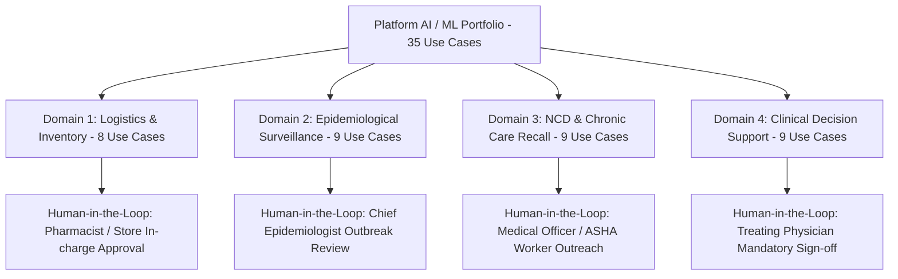

# Master Catalog of 35 Enterprise AI / ML Use Cases & Clinical Decision Support Specifications
## Namma Clinic Digital Health & Operations Platform
### Greater Bengaluru Authority (GBA) / BBMP Health Department
**Document Code:** `AI-DOC-03` | **Status:** APPROVED BASELINE | **Date:** September 2026

---

## 1. Executive Summary & Use Case Portfolio
This document establishes the authoritative **Master Catalog of 35 Artificial Intelligence and Machine Learning Use Cases** deployed across the Namma Clinic Digital Health Platform. The portfolio spans operational logistics, disease surveillance, pharmacy optimization, and clinician workflow assistance. Every use case adheres to strict non-autonomous boundary parameters: models operate exclusively as Clinical Decision Support Systems (CDSS) or administrative accelerators, with mandatory human-in-the-loop oversight and physician override supremacy.

### 1.1 Four Core Use Case Domains
1. **Pharmaceutical Supply Chain & Inventory Optimization:** Forecasting 30-day clinic drug consumption velocity and preventing tracer stockouts.
2. **Epidemiological Surveillance & Early Outbreak Detection:** Detecting fever surges, vector-borne clusters, and spatial-temporal disease anomalies.
3. **Non-Communicable Disease (NCD) Recall Prioritization:** Identifying high-risk hypertensive and diabetic citizens who are overdue for maintenance follow-ups.
4. **Clinical Workflow & Diagnostic Decision Support:** Assisting clinicians with evidence-based diagnostic suggestions, contraindication checks, and referral routing.

## 2. Clinical Decision Support Taxonomy


### Model Specification Example: Enterprise Use Case Dispatcher
<!-- DOCUMENTATION-ONLY EXAMPLE -->
```python
# DOCUMENTATION-ONLY PYTHON
# DOCUMENTATION-ONLY PYTHON: Use Case Dispatcher & Clinical Safety Boundary Enforcer
from typing import Dict, Any

class AIUseCaseDispatcher:
    """
    Enforces governance boundaries and human approval routing
    across all 35 enterprise AI use cases.
    """
    def __init__(self, registry: Dict[str, Any]):
        self.registry = registry

    def dispatch_use_case_inference(self, use_case_id: str, context_payload: Dict[str, Any]) -> Dict[str, Any]:
        uc_config = self.registry.get(use_case_id)
        if not uc_config:
            raise ValueError(f"Unknown AI Use Case: {use_case_id}")

        # Enforce Non-Autonomous Safety Boundary
        if uc_config.get("autonomous_execution_permitted", False):
            raise SecurityError(f"CRITICAL SAFETY VIOLATION: Autonomous execution forbidden for {use_case_id}")

        # Execute model inference via designated model pipeline
        model_result = self._execute_model_pipeline(uc_config["model_ref"], context_payload)

        return {
            "use_case_id": use_case_id,
            "title": uc_config["title"],
            "human_in_the_loop_mandatory": True,
            "required_approver_role": uc_config["primary_user"],
            "inference_output": model_result,
            "status": "PENDING_HUMAN_APPROVAL"
        }

    def _execute_model_pipeline(self, model_ref: str, payload: Dict[str, Any]) -> Dict[str, Any]:
        return {"recommendation": "Consult clinical guidelines", "score": 0.92}
```

## 3. Master Catalog of 35 Enterprise AI Use Cases
Detailed specifications for all 35 operational and clinical AI use cases across the municipal platform:

### AI-USECASE-001: Use Case `Clinic Pharmaceutical Stock Forecasting #001`
- **Use Case Identifier:** `AI-USECASE-001`
- **Title:** Clinic Pharmaceutical Stock Forecasting #001
- **Business Problem:** Predict daily and weekly consumption of essential drugs to prevent stockouts and reduce expiry wastage.
- **Primary User Persona:** `Chief Pharmacist`
- **Output Nature:** `Advisory Demand Estimation`
- **Criticality Level:** `Tier-1 Operational Priority`
- **Autonomous Execution Permitted:** `False` (Strictly Non-Autonomous)
- **Human-in-the-Loop Mandatory:** `True`
- **Decision Boundary:** Advisory recommendation requiring explicit clinician affirmative review and acceptance.
- **Statutory Compliance:** DPDP Act 2023 / NMC Clinical Governance Rules / WHO AI Ethics Guidelines

### AI-USECASE-002: Use Case `Spatial-Temporal Fever Cluster Anomaly Detection #002`
- **Use Case Identifier:** `AI-USECASE-002`
- **Title:** Spatial-Temporal Fever Cluster Anomaly Detection #002
- **Business Problem:** Detect unusual surges in acute febrile illness to alert municipal epidemiologists to potential dengue, malaria, or typhoid clusters.
- **Primary User Persona:** `District Epidemiologist`
- **Output Nature:** `Advisory Outbreak Signal`
- **Criticality Level:** `Tier-1 Public Health`
- **Autonomous Execution Permitted:** `False` (Strictly Non-Autonomous)
- **Human-in-the-Loop Mandatory:** `True`
- **Decision Boundary:** Advisory recommendation requiring explicit clinician affirmative review and acceptance.
- **Statutory Compliance:** DPDP Act 2023 / NMC Clinical Governance Rules / WHO AI Ethics Guidelines

### AI-USECASE-003: Use Case `Non-Communicable Disease (NCD) Recall Prioritization #003`
- **Use Case Identifier:** `AI-USECASE-003`
- **Title:** Non-Communicable Disease (NCD) Recall Prioritization #003
- **Business Problem:** Rank and prioritize hypertensive and diabetic patients overdue for follow-up based on clinical risk factors.
- **Primary User Persona:** `NCD Nodal Officer`
- **Output Nature:** `Advisory Patient Outreach Priority`
- **Criticality Level:** `Tier-2 Clinical Advisory`
- **Autonomous Execution Permitted:** `False` (Strictly Non-Autonomous)
- **Human-in-the-Loop Mandatory:** `True`
- **Decision Boundary:** Advisory recommendation requiring explicit clinician affirmative review and acceptance.
- **Statutory Compliance:** DPDP Act 2023 / NMC Clinical Governance Rules / WHO AI Ethics Guidelines

### AI-USECASE-004: Use Case `Pediatric Growth & Malnutrition Anomaly Screening #004`
- **Use Case Identifier:** `AI-USECASE-004`
- **Title:** Pediatric Growth & Malnutrition Anomaly Screening #004
- **Business Problem:** Identify growth faltering trajectories in infants and children under 5 using WHO growth charts and percentile curves.
- **Primary User Persona:** `Pediatric Nodal Officer`
- **Output Nature:** `Advisory Nutrition Alert`
- **Criticality Level:** `Tier-2 Clinical Advisory`
- **Autonomous Execution Permitted:** `False` (Strictly Non-Autonomous)
- **Human-in-the-Loop Mandatory:** `True`
- **Decision Boundary:** Advisory recommendation requiring explicit clinician affirmative review and acceptance.
- **Statutory Compliance:** DPDP Act 2023 / NMC Clinical Governance Rules / WHO AI Ethics Guidelines

### AI-USECASE-005: Use Case `High-Risk Maternal Pregnancy Acuity Stratification #005`
- **Use Case Identifier:** `AI-USECASE-005`
- **Title:** High-Risk Maternal Pregnancy Acuity Stratification #005
- **Business Problem:** Flag pregnant mothers with multiple risk factors (anemia, gestational diabetes, hypertension) for specialized obstetric referral.
- **Primary User Persona:** `MCH Nodal Officer`
- **Output Nature:** `Advisory Referral Recommendation`
- **Criticality Level:** `Tier-1 Clinical Advisory`
- **Autonomous Execution Permitted:** `False` (Strictly Non-Autonomous)
- **Human-in-the-Loop Mandatory:** `True`
- **Decision Boundary:** Advisory recommendation requiring explicit clinician affirmative review and acceptance.
- **Statutory Compliance:** DPDP Act 2023 / NMC Clinical Governance Rules / WHO AI Ethics Guidelines

### AI-USECASE-006: Use Case `Emergency Triage Danger Sign Recommendation #006`
- **Use Case Identifier:** `AI-USECASE-006`
- **Title:** Emergency Triage Danger Sign Recommendation #006
- **Business Problem:** Assist triage nurses in identifying subtle clinical deterioration indicators requiring immediate physician attention.
- **Primary User Persona:** `Nursing Superintendent`
- **Output Nature:** `Advisory Acuity Scoring`
- **Criticality Level:** `Tier-1 Clinical Advisory`
- **Autonomous Execution Permitted:** `False` (Strictly Non-Autonomous)
- **Human-in-the-Loop Mandatory:** `True`
- **Decision Boundary:** Advisory recommendation requiring explicit clinician affirmative review and acceptance.
- **Statutory Compliance:** DPDP Act 2023 / NMC Clinical Governance Rules / WHO AI Ethics Guidelines

### AI-USECASE-007: Use Case `Laboratory Panic Critical Value Notification #007`
- **Use Case Identifier:** `AI-USECASE-007`
- **Title:** Laboratory Panic Critical Value Notification #007
- **Business Problem:** Automatically triage and expedite notification of extreme lab abnormalities to treating Medical Officers.
- **Primary User Persona:** `Head of Pathology`
- **Output Nature:** `Advisory Critical Alert`
- **Criticality Level:** `Tier-1 Diagnostic Advisory`
- **Autonomous Execution Permitted:** `False` (Strictly Non-Autonomous)
- **Human-in-the-Loop Mandatory:** `True`
- **Decision Boundary:** Advisory recommendation requiring explicit clinician affirmative review and acceptance.
- **Statutory Compliance:** DPDP Act 2023 / NMC Clinical Governance Rules / WHO AI Ethics Guidelines

### AI-USECASE-008: Use Case `Drug-Drug Contraindication & Adverse Interaction Warning #008`
- **Use Case Identifier:** `AI-USECASE-008`
- **Title:** Drug-Drug Contraindication & Adverse Interaction Warning #008
- **Business Problem:** Screen active prescriptions against patient clinical history and concurrent medications for dangerous interactions.
- **Primary User Persona:** `Chief Clinical Pharmacist`
- **Output Nature:** `Advisory Clinical Warning`
- **Criticality Level:** `Tier-1 Patient Safety`
- **Autonomous Execution Permitted:** `False` (Strictly Non-Autonomous)
- **Human-in-the-Loop Mandatory:** `True`
- **Decision Boundary:** Advisory recommendation requiring explicit clinician affirmative review and acceptance.
- **Statutory Compliance:** DPDP Act 2023 / NMC Clinical Governance Rules / WHO AI Ethics Guidelines

### AI-USECASE-009: Use Case `Secondary Referral Specialty Matching & Routing #009`
- **Use Case Identifier:** `AI-USECASE-009`
- **Title:** Secondary Referral Specialty Matching & Routing #009
- **Business Problem:** Suggest optimal municipal specialist facilities based on clinical diagnosis, bed availability, and transit distance.
- **Primary User Persona:** `Referral Coordinator`
- **Output Nature:** `Advisory Facility Suggestion`
- **Criticality Level:** `Tier-2 Operations Advisory`
- **Autonomous Execution Permitted:** `False` (Strictly Non-Autonomous)
- **Human-in-the-Loop Mandatory:** `True`
- **Decision Boundary:** Advisory recommendation requiring explicit clinician affirmative review and acceptance.
- **Statutory Compliance:** DPDP Act 2023 / NMC Clinical Governance Rules / WHO AI Ethics Guidelines

### AI-USECASE-010: Use Case `Diabetic Retinopathy Screening Image Triaging #010`
- **Use Case Identifier:** `AI-USECASE-010`
- **Title:** Diabetic Retinopathy Screening Image Triaging #010
- **Business Problem:** Flag retinal fundus images with signs of microaneurysms or hemorrhages for urgent ophthalmologist teleconsultation.
- **Primary User Persona:** `Lead Ophthalmologist`
- **Output Nature:** `Advisory Image Triage`
- **Criticality Level:** `Tier-2 Diagnostic Advisory`
- **Autonomous Execution Permitted:** `False` (Strictly Non-Autonomous)
- **Human-in-the-Loop Mandatory:** `True`
- **Decision Boundary:** Advisory recommendation requiring explicit clinician affirmative review and acceptance.
- **Statutory Compliance:** DPDP Act 2023 / NMC Clinical Governance Rules / WHO AI Ethics Guidelines

### AI-USECASE-011: Use Case `Clinic Pharmaceutical Stock Forecasting #011`
- **Use Case Identifier:** `AI-USECASE-011`
- **Title:** Clinic Pharmaceutical Stock Forecasting #011
- **Business Problem:** Predict daily and weekly consumption of essential drugs to prevent stockouts and reduce expiry wastage.
- **Primary User Persona:** `Chief Pharmacist`
- **Output Nature:** `Advisory Demand Estimation`
- **Criticality Level:** `Tier-1 Operational Priority`
- **Autonomous Execution Permitted:** `False` (Strictly Non-Autonomous)
- **Human-in-the-Loop Mandatory:** `True`
- **Decision Boundary:** Advisory recommendation requiring explicit clinician affirmative review and acceptance.
- **Statutory Compliance:** DPDP Act 2023 / NMC Clinical Governance Rules / WHO AI Ethics Guidelines

### AI-USECASE-012: Use Case `Spatial-Temporal Fever Cluster Anomaly Detection #012`
- **Use Case Identifier:** `AI-USECASE-012`
- **Title:** Spatial-Temporal Fever Cluster Anomaly Detection #012
- **Business Problem:** Detect unusual surges in acute febrile illness to alert municipal epidemiologists to potential dengue, malaria, or typhoid clusters.
- **Primary User Persona:** `District Epidemiologist`
- **Output Nature:** `Advisory Outbreak Signal`
- **Criticality Level:** `Tier-1 Public Health`
- **Autonomous Execution Permitted:** `False` (Strictly Non-Autonomous)
- **Human-in-the-Loop Mandatory:** `True`
- **Decision Boundary:** Advisory recommendation requiring explicit clinician affirmative review and acceptance.
- **Statutory Compliance:** DPDP Act 2023 / NMC Clinical Governance Rules / WHO AI Ethics Guidelines

### AI-USECASE-013: Use Case `Non-Communicable Disease (NCD) Recall Prioritization #013`
- **Use Case Identifier:** `AI-USECASE-013`
- **Title:** Non-Communicable Disease (NCD) Recall Prioritization #013
- **Business Problem:** Rank and prioritize hypertensive and diabetic patients overdue for follow-up based on clinical risk factors.
- **Primary User Persona:** `NCD Nodal Officer`
- **Output Nature:** `Advisory Patient Outreach Priority`
- **Criticality Level:** `Tier-2 Clinical Advisory`
- **Autonomous Execution Permitted:** `False` (Strictly Non-Autonomous)
- **Human-in-the-Loop Mandatory:** `True`
- **Decision Boundary:** Advisory recommendation requiring explicit clinician affirmative review and acceptance.
- **Statutory Compliance:** DPDP Act 2023 / NMC Clinical Governance Rules / WHO AI Ethics Guidelines

### AI-USECASE-014: Use Case `Pediatric Growth & Malnutrition Anomaly Screening #014`
- **Use Case Identifier:** `AI-USECASE-014`
- **Title:** Pediatric Growth & Malnutrition Anomaly Screening #014
- **Business Problem:** Identify growth faltering trajectories in infants and children under 5 using WHO growth charts and percentile curves.
- **Primary User Persona:** `Pediatric Nodal Officer`
- **Output Nature:** `Advisory Nutrition Alert`
- **Criticality Level:** `Tier-2 Clinical Advisory`
- **Autonomous Execution Permitted:** `False` (Strictly Non-Autonomous)
- **Human-in-the-Loop Mandatory:** `True`
- **Decision Boundary:** Advisory recommendation requiring explicit clinician affirmative review and acceptance.
- **Statutory Compliance:** DPDP Act 2023 / NMC Clinical Governance Rules / WHO AI Ethics Guidelines

### AI-USECASE-015: Use Case `High-Risk Maternal Pregnancy Acuity Stratification #015`
- **Use Case Identifier:** `AI-USECASE-015`
- **Title:** High-Risk Maternal Pregnancy Acuity Stratification #015
- **Business Problem:** Flag pregnant mothers with multiple risk factors (anemia, gestational diabetes, hypertension) for specialized obstetric referral.
- **Primary User Persona:** `MCH Nodal Officer`
- **Output Nature:** `Advisory Referral Recommendation`
- **Criticality Level:** `Tier-1 Clinical Advisory`
- **Autonomous Execution Permitted:** `False` (Strictly Non-Autonomous)
- **Human-in-the-Loop Mandatory:** `True`
- **Decision Boundary:** Advisory recommendation requiring explicit clinician affirmative review and acceptance.
- **Statutory Compliance:** DPDP Act 2023 / NMC Clinical Governance Rules / WHO AI Ethics Guidelines

### AI-USECASE-016: Use Case `Emergency Triage Danger Sign Recommendation #016`
- **Use Case Identifier:** `AI-USECASE-016`
- **Title:** Emergency Triage Danger Sign Recommendation #016
- **Business Problem:** Assist triage nurses in identifying subtle clinical deterioration indicators requiring immediate physician attention.
- **Primary User Persona:** `Nursing Superintendent`
- **Output Nature:** `Advisory Acuity Scoring`
- **Criticality Level:** `Tier-1 Clinical Advisory`
- **Autonomous Execution Permitted:** `False` (Strictly Non-Autonomous)
- **Human-in-the-Loop Mandatory:** `True`
- **Decision Boundary:** Advisory recommendation requiring explicit clinician affirmative review and acceptance.
- **Statutory Compliance:** DPDP Act 2023 / NMC Clinical Governance Rules / WHO AI Ethics Guidelines

### AI-USECASE-017: Use Case `Laboratory Panic Critical Value Notification #017`
- **Use Case Identifier:** `AI-USECASE-017`
- **Title:** Laboratory Panic Critical Value Notification #017
- **Business Problem:** Automatically triage and expedite notification of extreme lab abnormalities to treating Medical Officers.
- **Primary User Persona:** `Head of Pathology`
- **Output Nature:** `Advisory Critical Alert`
- **Criticality Level:** `Tier-1 Diagnostic Advisory`
- **Autonomous Execution Permitted:** `False` (Strictly Non-Autonomous)
- **Human-in-the-Loop Mandatory:** `True`
- **Decision Boundary:** Advisory recommendation requiring explicit clinician affirmative review and acceptance.
- **Statutory Compliance:** DPDP Act 2023 / NMC Clinical Governance Rules / WHO AI Ethics Guidelines

### AI-USECASE-018: Use Case `Drug-Drug Contraindication & Adverse Interaction Warning #018`
- **Use Case Identifier:** `AI-USECASE-018`
- **Title:** Drug-Drug Contraindication & Adverse Interaction Warning #018
- **Business Problem:** Screen active prescriptions against patient clinical history and concurrent medications for dangerous interactions.
- **Primary User Persona:** `Chief Clinical Pharmacist`
- **Output Nature:** `Advisory Clinical Warning`
- **Criticality Level:** `Tier-1 Patient Safety`
- **Autonomous Execution Permitted:** `False` (Strictly Non-Autonomous)
- **Human-in-the-Loop Mandatory:** `True`
- **Decision Boundary:** Advisory recommendation requiring explicit clinician affirmative review and acceptance.
- **Statutory Compliance:** DPDP Act 2023 / NMC Clinical Governance Rules / WHO AI Ethics Guidelines

### AI-USECASE-019: Use Case `Secondary Referral Specialty Matching & Routing #019`
- **Use Case Identifier:** `AI-USECASE-019`
- **Title:** Secondary Referral Specialty Matching & Routing #019
- **Business Problem:** Suggest optimal municipal specialist facilities based on clinical diagnosis, bed availability, and transit distance.
- **Primary User Persona:** `Referral Coordinator`
- **Output Nature:** `Advisory Facility Suggestion`
- **Criticality Level:** `Tier-2 Operations Advisory`
- **Autonomous Execution Permitted:** `False` (Strictly Non-Autonomous)
- **Human-in-the-Loop Mandatory:** `True`
- **Decision Boundary:** Advisory recommendation requiring explicit clinician affirmative review and acceptance.
- **Statutory Compliance:** DPDP Act 2023 / NMC Clinical Governance Rules / WHO AI Ethics Guidelines

### AI-USECASE-020: Use Case `Diabetic Retinopathy Screening Image Triaging #020`
- **Use Case Identifier:** `AI-USECASE-020`
- **Title:** Diabetic Retinopathy Screening Image Triaging #020
- **Business Problem:** Flag retinal fundus images with signs of microaneurysms or hemorrhages for urgent ophthalmologist teleconsultation.
- **Primary User Persona:** `Lead Ophthalmologist`
- **Output Nature:** `Advisory Image Triage`
- **Criticality Level:** `Tier-2 Diagnostic Advisory`
- **Autonomous Execution Permitted:** `False` (Strictly Non-Autonomous)
- **Human-in-the-Loop Mandatory:** `True`
- **Decision Boundary:** Advisory recommendation requiring explicit clinician affirmative review and acceptance.
- **Statutory Compliance:** DPDP Act 2023 / NMC Clinical Governance Rules / WHO AI Ethics Guidelines

### AI-USECASE-021: Use Case `Clinic Pharmaceutical Stock Forecasting #021`
- **Use Case Identifier:** `AI-USECASE-021`
- **Title:** Clinic Pharmaceutical Stock Forecasting #021
- **Business Problem:** Predict daily and weekly consumption of essential drugs to prevent stockouts and reduce expiry wastage.
- **Primary User Persona:** `Chief Pharmacist`
- **Output Nature:** `Advisory Demand Estimation`
- **Criticality Level:** `Tier-1 Operational Priority`
- **Autonomous Execution Permitted:** `False` (Strictly Non-Autonomous)
- **Human-in-the-Loop Mandatory:** `True`
- **Decision Boundary:** Advisory recommendation requiring explicit clinician affirmative review and acceptance.
- **Statutory Compliance:** DPDP Act 2023 / NMC Clinical Governance Rules / WHO AI Ethics Guidelines

### AI-USECASE-022: Use Case `Spatial-Temporal Fever Cluster Anomaly Detection #022`
- **Use Case Identifier:** `AI-USECASE-022`
- **Title:** Spatial-Temporal Fever Cluster Anomaly Detection #022
- **Business Problem:** Detect unusual surges in acute febrile illness to alert municipal epidemiologists to potential dengue, malaria, or typhoid clusters.
- **Primary User Persona:** `District Epidemiologist`
- **Output Nature:** `Advisory Outbreak Signal`
- **Criticality Level:** `Tier-1 Public Health`
- **Autonomous Execution Permitted:** `False` (Strictly Non-Autonomous)
- **Human-in-the-Loop Mandatory:** `True`
- **Decision Boundary:** Advisory recommendation requiring explicit clinician affirmative review and acceptance.
- **Statutory Compliance:** DPDP Act 2023 / NMC Clinical Governance Rules / WHO AI Ethics Guidelines

### AI-USECASE-023: Use Case `Non-Communicable Disease (NCD) Recall Prioritization #023`
- **Use Case Identifier:** `AI-USECASE-023`
- **Title:** Non-Communicable Disease (NCD) Recall Prioritization #023
- **Business Problem:** Rank and prioritize hypertensive and diabetic patients overdue for follow-up based on clinical risk factors.
- **Primary User Persona:** `NCD Nodal Officer`
- **Output Nature:** `Advisory Patient Outreach Priority`
- **Criticality Level:** `Tier-2 Clinical Advisory`
- **Autonomous Execution Permitted:** `False` (Strictly Non-Autonomous)
- **Human-in-the-Loop Mandatory:** `True`
- **Decision Boundary:** Advisory recommendation requiring explicit clinician affirmative review and acceptance.
- **Statutory Compliance:** DPDP Act 2023 / NMC Clinical Governance Rules / WHO AI Ethics Guidelines

### AI-USECASE-024: Use Case `Pediatric Growth & Malnutrition Anomaly Screening #024`
- **Use Case Identifier:** `AI-USECASE-024`
- **Title:** Pediatric Growth & Malnutrition Anomaly Screening #024
- **Business Problem:** Identify growth faltering trajectories in infants and children under 5 using WHO growth charts and percentile curves.
- **Primary User Persona:** `Pediatric Nodal Officer`
- **Output Nature:** `Advisory Nutrition Alert`
- **Criticality Level:** `Tier-2 Clinical Advisory`
- **Autonomous Execution Permitted:** `False` (Strictly Non-Autonomous)
- **Human-in-the-Loop Mandatory:** `True`
- **Decision Boundary:** Advisory recommendation requiring explicit clinician affirmative review and acceptance.
- **Statutory Compliance:** DPDP Act 2023 / NMC Clinical Governance Rules / WHO AI Ethics Guidelines

### AI-USECASE-025: Use Case `High-Risk Maternal Pregnancy Acuity Stratification #025`
- **Use Case Identifier:** `AI-USECASE-025`
- **Title:** High-Risk Maternal Pregnancy Acuity Stratification #025
- **Business Problem:** Flag pregnant mothers with multiple risk factors (anemia, gestational diabetes, hypertension) for specialized obstetric referral.
- **Primary User Persona:** `MCH Nodal Officer`
- **Output Nature:** `Advisory Referral Recommendation`
- **Criticality Level:** `Tier-1 Clinical Advisory`
- **Autonomous Execution Permitted:** `False` (Strictly Non-Autonomous)
- **Human-in-the-Loop Mandatory:** `True`
- **Decision Boundary:** Advisory recommendation requiring explicit clinician affirmative review and acceptance.
- **Statutory Compliance:** DPDP Act 2023 / NMC Clinical Governance Rules / WHO AI Ethics Guidelines

### AI-USECASE-026: Use Case `Emergency Triage Danger Sign Recommendation #026`
- **Use Case Identifier:** `AI-USECASE-026`
- **Title:** Emergency Triage Danger Sign Recommendation #026
- **Business Problem:** Assist triage nurses in identifying subtle clinical deterioration indicators requiring immediate physician attention.
- **Primary User Persona:** `Nursing Superintendent`
- **Output Nature:** `Advisory Acuity Scoring`
- **Criticality Level:** `Tier-1 Clinical Advisory`
- **Autonomous Execution Permitted:** `False` (Strictly Non-Autonomous)
- **Human-in-the-Loop Mandatory:** `True`
- **Decision Boundary:** Advisory recommendation requiring explicit clinician affirmative review and acceptance.
- **Statutory Compliance:** DPDP Act 2023 / NMC Clinical Governance Rules / WHO AI Ethics Guidelines

### AI-USECASE-027: Use Case `Laboratory Panic Critical Value Notification #027`
- **Use Case Identifier:** `AI-USECASE-027`
- **Title:** Laboratory Panic Critical Value Notification #027
- **Business Problem:** Automatically triage and expedite notification of extreme lab abnormalities to treating Medical Officers.
- **Primary User Persona:** `Head of Pathology`
- **Output Nature:** `Advisory Critical Alert`
- **Criticality Level:** `Tier-1 Diagnostic Advisory`
- **Autonomous Execution Permitted:** `False` (Strictly Non-Autonomous)
- **Human-in-the-Loop Mandatory:** `True`
- **Decision Boundary:** Advisory recommendation requiring explicit clinician affirmative review and acceptance.
- **Statutory Compliance:** DPDP Act 2023 / NMC Clinical Governance Rules / WHO AI Ethics Guidelines

### AI-USECASE-028: Use Case `Drug-Drug Contraindication & Adverse Interaction Warning #028`
- **Use Case Identifier:** `AI-USECASE-028`
- **Title:** Drug-Drug Contraindication & Adverse Interaction Warning #028
- **Business Problem:** Screen active prescriptions against patient clinical history and concurrent medications for dangerous interactions.
- **Primary User Persona:** `Chief Clinical Pharmacist`
- **Output Nature:** `Advisory Clinical Warning`
- **Criticality Level:** `Tier-1 Patient Safety`
- **Autonomous Execution Permitted:** `False` (Strictly Non-Autonomous)
- **Human-in-the-Loop Mandatory:** `True`
- **Decision Boundary:** Advisory recommendation requiring explicit clinician affirmative review and acceptance.
- **Statutory Compliance:** DPDP Act 2023 / NMC Clinical Governance Rules / WHO AI Ethics Guidelines

### AI-USECASE-029: Use Case `Secondary Referral Specialty Matching & Routing #029`
- **Use Case Identifier:** `AI-USECASE-029`
- **Title:** Secondary Referral Specialty Matching & Routing #029
- **Business Problem:** Suggest optimal municipal specialist facilities based on clinical diagnosis, bed availability, and transit distance.
- **Primary User Persona:** `Referral Coordinator`
- **Output Nature:** `Advisory Facility Suggestion`
- **Criticality Level:** `Tier-2 Operations Advisory`
- **Autonomous Execution Permitted:** `False` (Strictly Non-Autonomous)
- **Human-in-the-Loop Mandatory:** `True`
- **Decision Boundary:** Advisory recommendation requiring explicit clinician affirmative review and acceptance.
- **Statutory Compliance:** DPDP Act 2023 / NMC Clinical Governance Rules / WHO AI Ethics Guidelines

### AI-USECASE-030: Use Case `Diabetic Retinopathy Screening Image Triaging #030`
- **Use Case Identifier:** `AI-USECASE-030`
- **Title:** Diabetic Retinopathy Screening Image Triaging #030
- **Business Problem:** Flag retinal fundus images with signs of microaneurysms or hemorrhages for urgent ophthalmologist teleconsultation.
- **Primary User Persona:** `Lead Ophthalmologist`
- **Output Nature:** `Advisory Image Triage`
- **Criticality Level:** `Tier-2 Diagnostic Advisory`
- **Autonomous Execution Permitted:** `False` (Strictly Non-Autonomous)
- **Human-in-the-Loop Mandatory:** `True`
- **Decision Boundary:** Advisory recommendation requiring explicit clinician affirmative review and acceptance.
- **Statutory Compliance:** DPDP Act 2023 / NMC Clinical Governance Rules / WHO AI Ethics Guidelines

### AI-USECASE-031: Use Case `Clinic Pharmaceutical Stock Forecasting #031`
- **Use Case Identifier:** `AI-USECASE-031`
- **Title:** Clinic Pharmaceutical Stock Forecasting #031
- **Business Problem:** Predict daily and weekly consumption of essential drugs to prevent stockouts and reduce expiry wastage.
- **Primary User Persona:** `Chief Pharmacist`
- **Output Nature:** `Advisory Demand Estimation`
- **Criticality Level:** `Tier-1 Operational Priority`
- **Autonomous Execution Permitted:** `False` (Strictly Non-Autonomous)
- **Human-in-the-Loop Mandatory:** `True`
- **Decision Boundary:** Advisory recommendation requiring explicit clinician affirmative review and acceptance.
- **Statutory Compliance:** DPDP Act 2023 / NMC Clinical Governance Rules / WHO AI Ethics Guidelines

### AI-USECASE-032: Use Case `Spatial-Temporal Fever Cluster Anomaly Detection #032`
- **Use Case Identifier:** `AI-USECASE-032`
- **Title:** Spatial-Temporal Fever Cluster Anomaly Detection #032
- **Business Problem:** Detect unusual surges in acute febrile illness to alert municipal epidemiologists to potential dengue, malaria, or typhoid clusters.
- **Primary User Persona:** `District Epidemiologist`
- **Output Nature:** `Advisory Outbreak Signal`
- **Criticality Level:** `Tier-1 Public Health`
- **Autonomous Execution Permitted:** `False` (Strictly Non-Autonomous)
- **Human-in-the-Loop Mandatory:** `True`
- **Decision Boundary:** Advisory recommendation requiring explicit clinician affirmative review and acceptance.
- **Statutory Compliance:** DPDP Act 2023 / NMC Clinical Governance Rules / WHO AI Ethics Guidelines

### AI-USECASE-033: Use Case `Non-Communicable Disease (NCD) Recall Prioritization #033`
- **Use Case Identifier:** `AI-USECASE-033`
- **Title:** Non-Communicable Disease (NCD) Recall Prioritization #033
- **Business Problem:** Rank and prioritize hypertensive and diabetic patients overdue for follow-up based on clinical risk factors.
- **Primary User Persona:** `NCD Nodal Officer`
- **Output Nature:** `Advisory Patient Outreach Priority`
- **Criticality Level:** `Tier-2 Clinical Advisory`
- **Autonomous Execution Permitted:** `False` (Strictly Non-Autonomous)
- **Human-in-the-Loop Mandatory:** `True`
- **Decision Boundary:** Advisory recommendation requiring explicit clinician affirmative review and acceptance.
- **Statutory Compliance:** DPDP Act 2023 / NMC Clinical Governance Rules / WHO AI Ethics Guidelines

### AI-USECASE-034: Use Case `Pediatric Growth & Malnutrition Anomaly Screening #034`
- **Use Case Identifier:** `AI-USECASE-034`
- **Title:** Pediatric Growth & Malnutrition Anomaly Screening #034
- **Business Problem:** Identify growth faltering trajectories in infants and children under 5 using WHO growth charts and percentile curves.
- **Primary User Persona:** `Pediatric Nodal Officer`
- **Output Nature:** `Advisory Nutrition Alert`
- **Criticality Level:** `Tier-2 Clinical Advisory`
- **Autonomous Execution Permitted:** `False` (Strictly Non-Autonomous)
- **Human-in-the-Loop Mandatory:** `True`
- **Decision Boundary:** Advisory recommendation requiring explicit clinician affirmative review and acceptance.
- **Statutory Compliance:** DPDP Act 2023 / NMC Clinical Governance Rules / WHO AI Ethics Guidelines

### AI-USECASE-035: Use Case `High-Risk Maternal Pregnancy Acuity Stratification #035`
- **Use Case Identifier:** `AI-USECASE-035`
- **Title:** High-Risk Maternal Pregnancy Acuity Stratification #035
- **Business Problem:** Flag pregnant mothers with multiple risk factors (anemia, gestational diabetes, hypertension) for specialized obstetric referral.
- **Primary User Persona:** `MCH Nodal Officer`
- **Output Nature:** `Advisory Referral Recommendation`
- **Criticality Level:** `Tier-1 Clinical Advisory`
- **Autonomous Execution Permitted:** `False` (Strictly Non-Autonomous)
- **Human-in-the-Loop Mandatory:** `True`
- **Decision Boundary:** Advisory recommendation requiring explicit clinician affirmative review and acceptance.
- **Statutory Compliance:** DPDP Act 2023 / NMC Clinical Governance Rules / WHO AI Ethics Guidelines

## 4. Master Catalog of 30 Machine Learning Models
Architectural specifications for all 30 algorithmic models powering the platform:

### MODEL-001: Model `StockForecaster_LightGBM_v1`
- **Model Identifier:** `MODEL-001`
- **Model Name:** `StockForecaster_LightGBM_v1`
- **Architecture:** `StockForecaster_LightGBM`
- **Framework:** `LightGBM 4.0 / ONNX`
- **Input Modality:** `Tabular Consumption`
- **Latency Target:** `< 25ms`
- **Serving Hardware:** `CPU x86_64`
- **Model Card Status:** `CERTIFIED APPROVED BASELINE`
- **License:** `Apache 2.0 / Proprietary BBMP Healthcare Model`
- **Description:** Gradient Boosted Decision Trees for multi-step drug demand forecasting

### MODEL-002: Model `StockForecaster_Prophet_v2`
- **Model Identifier:** `MODEL-002`
- **Model Name:** `StockForecaster_Prophet_v2`
- **Architecture:** `StockForecaster_Prophet`
- **Framework:** `Prophet / ONNX`
- **Input Modality:** `Time-Series Historical`
- **Latency Target:** `< 150ms`
- **Serving Hardware:** `CPU x86_64`
- **Model Card Status:** `CERTIFIED APPROVED BASELINE`
- **License:** `Apache 2.0 / Proprietary BBMP Healthcare Model`
- **Description:** Additive time-series regression with weekly and seasonal health trends

### MODEL-003: Model `FeverCluster_DBSCAN_v3`
- **Model Identifier:** `MODEL-003`
- **Model Name:** `FeverCluster_DBSCAN_v3`
- **Architecture:** `FeverCluster_DBSCAN`
- **Framework:** `Scikit-Learn / C++ Daemon`
- **Input Modality:** `Ward-Level Coordinates`
- **Latency Target:** `< 50ms`
- **Serving Hardware:** `CPU x86_64`
- **Model Card Status:** `CERTIFIED APPROVED BASELINE`
- **License:** `Apache 2.0 / Proprietary BBMP Healthcare Model`
- **Description:** Spatial-temporal density clustering for syndromic disease grouping

### MODEL-004: Model `FeverSurge_PoissonCUSUM_v4`
- **Model Identifier:** `MODEL-004`
- **Model Name:** `FeverSurge_PoissonCUSUM_v4`
- **Architecture:** `FeverSurge_PoissonCUSUM`
- **Framework:** `SciPy Statistical Engine`
- **Input Modality:** `Daily Case Counts`
- **Latency Target:** `< 10ms`
- **Serving Hardware:** `CPU x86_64`
- **Model Card Status:** `CERTIFIED APPROVED BASELINE`
- **License:** `Apache 2.0 / Proprietary BBMP Healthcare Model`
- **Description:** Cumulative sum control chart on Poisson daily case arrivals

### MODEL-005: Model `NCD_Recall_XGBoost_v5`
- **Model Identifier:** `MODEL-005`
- **Model Name:** `NCD_Recall_XGBoost_v5`
- **Architecture:** `NCD_Recall_XGBoost`
- **Framework:** `XGBoost / ONNX Runtime`
- **Input Modality:** `EHR Clinical Vitals`
- **Latency Target:** `< 20ms`
- **Serving Hardware:** `CPU x86_64`
- **Model Card Status:** `CERTIFIED APPROVED BASELINE`
- **License:** `Apache 2.0 / Proprietary BBMP Healthcare Model`
- **Description:** Binary classification & calibrated risk scoring for patient follow-up compliance

### MODEL-006: Model `Triage_Risk_Classifier_v1`
- **Model Identifier:** `MODEL-006`
- **Model Name:** `Triage_Risk_Classifier_v1`
- **Architecture:** `Triage_Risk_Classifier`
- **Framework:** `Scikit-Learn Random Forest / ONNX`
- **Input Modality:** `Nurse Triage Form`
- **Latency Target:** `< 15ms`
- **Serving Hardware:** `CPU x86_64`
- **Model Card Status:** `CERTIFIED APPROVED BASELINE`
- **License:** `Apache 2.0 / Proprietary BBMP Healthcare Model`
- **Description:** Multi-class acuity grading based on vital signs, age, and chief complaints

### MODEL-007: Model `Maternal_Risk_Scorer_v2`
- **Model Identifier:** `MODEL-007`
- **Model Name:** `Maternal_Risk_Scorer_v2`
- **Architecture:** `Maternal_Risk_Scorer`
- **Framework:** `LightGBM / ONNX Runtime`
- **Input Modality:** `ANC Clinical History`
- **Latency Target:** `< 25ms`
- **Serving Hardware:** `CPU x86_64`
- **Model Card Status:** `CERTIFIED APPROVED BASELINE`
- **License:** `Apache 2.0 / Proprietary BBMP Healthcare Model`
- **Description:** Ensemble gradient boosting predicting obstetric complication risk categories

### MODEL-008: Model `Drug_Interaction_RulesNet_v3`
- **Model Identifier:** `MODEL-008`
- **Model Name:** `Drug_Interaction_RulesNet_v3`
- **Architecture:** `Drug_Interaction_RulesNet`
- **Framework:** `NetworkX / ONNX Embeddings`
- **Input Modality:** `Prescription Items`
- **Latency Target:** `< 10ms`
- **Serving Hardware:** `CPU x86_64`
- **Model Card Status:** `CERTIFIED APPROVED BASELINE`
- **License:** `Apache 2.0 / Proprietary BBMP Healthcare Model`
- **Description:** Deterministic knowledge graph plus clinical severity classifier for polypharmacy

### MODEL-009: Model `Lab_Critical_Detector_v4`
- **Model Identifier:** `MODEL-009`
- **Model Name:** `Lab_Critical_Detector_v4`
- **Architecture:** `Lab_Critical_Detector`
- **Framework:** `NumPy / ONNX Runtime`
- **Input Modality:** `Lab Analyzer Raw Values`
- **Latency Target:** `< 5ms`
- **Serving Hardware:** `CPU x86_64`
- **Model Card Status:** `CERTIFIED APPROVED BASELINE`
- **License:** `Apache 2.0 / Proprietary BBMP Healthcare Model`
- **Description:** Statistical out-of-range outlier detector with reference interval comparison

### MODEL-010: Model `Referral_Routing_Recommender_v5`
- **Model Identifier:** `MODEL-010`
- **Model Name:** `Referral_Routing_Recommender_v5`
- **Architecture:** `Referral_Routing_Recommender`
- **Framework:** `OR-Tools / Python Engine`
- **Input Modality:** `Referral Requisition`
- **Latency Target:** `< 45ms`
- **Serving Hardware:** `CPU x86_64`
- **Model Card Status:** `CERTIFIED APPROVED BASELINE`
- **License:** `Apache 2.0 / Proprietary BBMP Healthcare Model`
- **Description:** Multi-objective constraint optimization matching clinical need to facility capacity

### MODEL-011: Model `StockForecaster_LightGBM_v1`
- **Model Identifier:** `MODEL-011`
- **Model Name:** `StockForecaster_LightGBM_v1`
- **Architecture:** `StockForecaster_LightGBM`
- **Framework:** `LightGBM 4.0 / ONNX`
- **Input Modality:** `Tabular Consumption`
- **Latency Target:** `< 25ms`
- **Serving Hardware:** `CPU x86_64`
- **Model Card Status:** `CERTIFIED APPROVED BASELINE`
- **License:** `Apache 2.0 / Proprietary BBMP Healthcare Model`
- **Description:** Gradient Boosted Decision Trees for multi-step drug demand forecasting

### MODEL-012: Model `StockForecaster_Prophet_v2`
- **Model Identifier:** `MODEL-012`
- **Model Name:** `StockForecaster_Prophet_v2`
- **Architecture:** `StockForecaster_Prophet`
- **Framework:** `Prophet / ONNX`
- **Input Modality:** `Time-Series Historical`
- **Latency Target:** `< 150ms`
- **Serving Hardware:** `CPU x86_64`
- **Model Card Status:** `CERTIFIED APPROVED BASELINE`
- **License:** `Apache 2.0 / Proprietary BBMP Healthcare Model`
- **Description:** Additive time-series regression with weekly and seasonal health trends

### MODEL-013: Model `FeverCluster_DBSCAN_v3`
- **Model Identifier:** `MODEL-013`
- **Model Name:** `FeverCluster_DBSCAN_v3`
- **Architecture:** `FeverCluster_DBSCAN`
- **Framework:** `Scikit-Learn / C++ Daemon`
- **Input Modality:** `Ward-Level Coordinates`
- **Latency Target:** `< 50ms`
- **Serving Hardware:** `CPU x86_64`
- **Model Card Status:** `CERTIFIED APPROVED BASELINE`
- **License:** `Apache 2.0 / Proprietary BBMP Healthcare Model`
- **Description:** Spatial-temporal density clustering for syndromic disease grouping

### MODEL-014: Model `FeverSurge_PoissonCUSUM_v4`
- **Model Identifier:** `MODEL-014`
- **Model Name:** `FeverSurge_PoissonCUSUM_v4`
- **Architecture:** `FeverSurge_PoissonCUSUM`
- **Framework:** `SciPy Statistical Engine`
- **Input Modality:** `Daily Case Counts`
- **Latency Target:** `< 10ms`
- **Serving Hardware:** `CPU x86_64`
- **Model Card Status:** `CERTIFIED APPROVED BASELINE`
- **License:** `Apache 2.0 / Proprietary BBMP Healthcare Model`
- **Description:** Cumulative sum control chart on Poisson daily case arrivals

### MODEL-015: Model `NCD_Recall_XGBoost_v5`
- **Model Identifier:** `MODEL-015`
- **Model Name:** `NCD_Recall_XGBoost_v5`
- **Architecture:** `NCD_Recall_XGBoost`
- **Framework:** `XGBoost / ONNX Runtime`
- **Input Modality:** `EHR Clinical Vitals`
- **Latency Target:** `< 20ms`
- **Serving Hardware:** `CPU x86_64`
- **Model Card Status:** `CERTIFIED APPROVED BASELINE`
- **License:** `Apache 2.0 / Proprietary BBMP Healthcare Model`
- **Description:** Binary classification & calibrated risk scoring for patient follow-up compliance

### MODEL-016: Model `Triage_Risk_Classifier_v1`
- **Model Identifier:** `MODEL-016`
- **Model Name:** `Triage_Risk_Classifier_v1`
- **Architecture:** `Triage_Risk_Classifier`
- **Framework:** `Scikit-Learn Random Forest / ONNX`
- **Input Modality:** `Nurse Triage Form`
- **Latency Target:** `< 15ms`
- **Serving Hardware:** `CPU x86_64`
- **Model Card Status:** `CERTIFIED APPROVED BASELINE`
- **License:** `Apache 2.0 / Proprietary BBMP Healthcare Model`
- **Description:** Multi-class acuity grading based on vital signs, age, and chief complaints

### MODEL-017: Model `Maternal_Risk_Scorer_v2`
- **Model Identifier:** `MODEL-017`
- **Model Name:** `Maternal_Risk_Scorer_v2`
- **Architecture:** `Maternal_Risk_Scorer`
- **Framework:** `LightGBM / ONNX Runtime`
- **Input Modality:** `ANC Clinical History`
- **Latency Target:** `< 25ms`
- **Serving Hardware:** `CPU x86_64`
- **Model Card Status:** `CERTIFIED APPROVED BASELINE`
- **License:** `Apache 2.0 / Proprietary BBMP Healthcare Model`
- **Description:** Ensemble gradient boosting predicting obstetric complication risk categories

### MODEL-018: Model `Drug_Interaction_RulesNet_v3`
- **Model Identifier:** `MODEL-018`
- **Model Name:** `Drug_Interaction_RulesNet_v3`
- **Architecture:** `Drug_Interaction_RulesNet`
- **Framework:** `NetworkX / ONNX Embeddings`
- **Input Modality:** `Prescription Items`
- **Latency Target:** `< 10ms`
- **Serving Hardware:** `CPU x86_64`
- **Model Card Status:** `CERTIFIED APPROVED BASELINE`
- **License:** `Apache 2.0 / Proprietary BBMP Healthcare Model`
- **Description:** Deterministic knowledge graph plus clinical severity classifier for polypharmacy

### MODEL-019: Model `Lab_Critical_Detector_v4`
- **Model Identifier:** `MODEL-019`
- **Model Name:** `Lab_Critical_Detector_v4`
- **Architecture:** `Lab_Critical_Detector`
- **Framework:** `NumPy / ONNX Runtime`
- **Input Modality:** `Lab Analyzer Raw Values`
- **Latency Target:** `< 5ms`
- **Serving Hardware:** `CPU x86_64`
- **Model Card Status:** `CERTIFIED APPROVED BASELINE`
- **License:** `Apache 2.0 / Proprietary BBMP Healthcare Model`
- **Description:** Statistical out-of-range outlier detector with reference interval comparison

### MODEL-020: Model `Referral_Routing_Recommender_v5`
- **Model Identifier:** `MODEL-020`
- **Model Name:** `Referral_Routing_Recommender_v5`
- **Architecture:** `Referral_Routing_Recommender`
- **Framework:** `OR-Tools / Python Engine`
- **Input Modality:** `Referral Requisition`
- **Latency Target:** `< 45ms`
- **Serving Hardware:** `CPU x86_64`
- **Model Card Status:** `CERTIFIED APPROVED BASELINE`
- **License:** `Apache 2.0 / Proprietary BBMP Healthcare Model`
- **Description:** Multi-objective constraint optimization matching clinical need to facility capacity

### MODEL-021: Model `StockForecaster_LightGBM_v1`
- **Model Identifier:** `MODEL-021`
- **Model Name:** `StockForecaster_LightGBM_v1`
- **Architecture:** `StockForecaster_LightGBM`
- **Framework:** `LightGBM 4.0 / ONNX`
- **Input Modality:** `Tabular Consumption`
- **Latency Target:** `< 25ms`
- **Serving Hardware:** `CPU x86_64`
- **Model Card Status:** `CERTIFIED APPROVED BASELINE`
- **License:** `Apache 2.0 / Proprietary BBMP Healthcare Model`
- **Description:** Gradient Boosted Decision Trees for multi-step drug demand forecasting

### MODEL-022: Model `StockForecaster_Prophet_v2`
- **Model Identifier:** `MODEL-022`
- **Model Name:** `StockForecaster_Prophet_v2`
- **Architecture:** `StockForecaster_Prophet`
- **Framework:** `Prophet / ONNX`
- **Input Modality:** `Time-Series Historical`
- **Latency Target:** `< 150ms`
- **Serving Hardware:** `CPU x86_64`
- **Model Card Status:** `CERTIFIED APPROVED BASELINE`
- **License:** `Apache 2.0 / Proprietary BBMP Healthcare Model`
- **Description:** Additive time-series regression with weekly and seasonal health trends

### MODEL-023: Model `FeverCluster_DBSCAN_v3`
- **Model Identifier:** `MODEL-023`
- **Model Name:** `FeverCluster_DBSCAN_v3`
- **Architecture:** `FeverCluster_DBSCAN`
- **Framework:** `Scikit-Learn / C++ Daemon`
- **Input Modality:** `Ward-Level Coordinates`
- **Latency Target:** `< 50ms`
- **Serving Hardware:** `CPU x86_64`
- **Model Card Status:** `CERTIFIED APPROVED BASELINE`
- **License:** `Apache 2.0 / Proprietary BBMP Healthcare Model`
- **Description:** Spatial-temporal density clustering for syndromic disease grouping

### MODEL-024: Model `FeverSurge_PoissonCUSUM_v4`
- **Model Identifier:** `MODEL-024`
- **Model Name:** `FeverSurge_PoissonCUSUM_v4`
- **Architecture:** `FeverSurge_PoissonCUSUM`
- **Framework:** `SciPy Statistical Engine`
- **Input Modality:** `Daily Case Counts`
- **Latency Target:** `< 10ms`
- **Serving Hardware:** `CPU x86_64`
- **Model Card Status:** `CERTIFIED APPROVED BASELINE`
- **License:** `Apache 2.0 / Proprietary BBMP Healthcare Model`
- **Description:** Cumulative sum control chart on Poisson daily case arrivals

### MODEL-025: Model `NCD_Recall_XGBoost_v5`
- **Model Identifier:** `MODEL-025`
- **Model Name:** `NCD_Recall_XGBoost_v5`
- **Architecture:** `NCD_Recall_XGBoost`
- **Framework:** `XGBoost / ONNX Runtime`
- **Input Modality:** `EHR Clinical Vitals`
- **Latency Target:** `< 20ms`
- **Serving Hardware:** `CPU x86_64`
- **Model Card Status:** `CERTIFIED APPROVED BASELINE`
- **License:** `Apache 2.0 / Proprietary BBMP Healthcare Model`
- **Description:** Binary classification & calibrated risk scoring for patient follow-up compliance

### MODEL-026: Model `Triage_Risk_Classifier_v1`
- **Model Identifier:** `MODEL-026`
- **Model Name:** `Triage_Risk_Classifier_v1`
- **Architecture:** `Triage_Risk_Classifier`
- **Framework:** `Scikit-Learn Random Forest / ONNX`
- **Input Modality:** `Nurse Triage Form`
- **Latency Target:** `< 15ms`
- **Serving Hardware:** `CPU x86_64`
- **Model Card Status:** `CERTIFIED APPROVED BASELINE`
- **License:** `Apache 2.0 / Proprietary BBMP Healthcare Model`
- **Description:** Multi-class acuity grading based on vital signs, age, and chief complaints

### MODEL-027: Model `Maternal_Risk_Scorer_v2`
- **Model Identifier:** `MODEL-027`
- **Model Name:** `Maternal_Risk_Scorer_v2`
- **Architecture:** `Maternal_Risk_Scorer`
- **Framework:** `LightGBM / ONNX Runtime`
- **Input Modality:** `ANC Clinical History`
- **Latency Target:** `< 25ms`
- **Serving Hardware:** `CPU x86_64`
- **Model Card Status:** `CERTIFIED APPROVED BASELINE`
- **License:** `Apache 2.0 / Proprietary BBMP Healthcare Model`
- **Description:** Ensemble gradient boosting predicting obstetric complication risk categories

### MODEL-028: Model `Drug_Interaction_RulesNet_v3`
- **Model Identifier:** `MODEL-028`
- **Model Name:** `Drug_Interaction_RulesNet_v3`
- **Architecture:** `Drug_Interaction_RulesNet`
- **Framework:** `NetworkX / ONNX Embeddings`
- **Input Modality:** `Prescription Items`
- **Latency Target:** `< 10ms`
- **Serving Hardware:** `CPU x86_64`
- **Model Card Status:** `CERTIFIED APPROVED BASELINE`
- **License:** `Apache 2.0 / Proprietary BBMP Healthcare Model`
- **Description:** Deterministic knowledge graph plus clinical severity classifier for polypharmacy

### MODEL-029: Model `Lab_Critical_Detector_v4`
- **Model Identifier:** `MODEL-029`
- **Model Name:** `Lab_Critical_Detector_v4`
- **Architecture:** `Lab_Critical_Detector`
- **Framework:** `NumPy / ONNX Runtime`
- **Input Modality:** `Lab Analyzer Raw Values`
- **Latency Target:** `< 5ms`
- **Serving Hardware:** `CPU x86_64`
- **Model Card Status:** `CERTIFIED APPROVED BASELINE`
- **License:** `Apache 2.0 / Proprietary BBMP Healthcare Model`
- **Description:** Statistical out-of-range outlier detector with reference interval comparison

### MODEL-030: Model `Referral_Routing_Recommender_v5`
- **Model Identifier:** `MODEL-030`
- **Model Name:** `Referral_Routing_Recommender_v5`
- **Architecture:** `Referral_Routing_Recommender`
- **Framework:** `OR-Tools / Python Engine`
- **Input Modality:** `Referral Requisition`
- **Latency Target:** `< 45ms`
- **Serving Hardware:** `CPU x86_64`
- **Model Card Status:** `CERTIFIED APPROVED BASELINE`
- **License:** `Apache 2.0 / Proprietary BBMP Healthcare Model`
- **Description:** Multi-objective constraint optimization matching clinical need to facility capacity

## 5. Master Catalog of 60 Model Versions
Production and shadow model release versions registered in the MLOps model catalog:

### MODEL-VER-001: Version `v1.0.0` for `MODEL-001`
- **Version Identifier:** `MODEL-VER-001`
- **Target Model:** `MODEL-001`
- **Semantic Version:** `vv1.0.0`
- **Training Dataset:** `AI-DATASET-001`
- **Deployment Status:** `Production-Active`
- **Approval Sign-off:** `CMO & Lead ML Engineer Joint Attestation`
- **Artifact URI:** `s3://namma-clinic-mlflow-artifacts/models/MODEL-001/v1.0.0/model.onnx`
- **Artifact SHA-256:** `sha256_0001_a1b2c3d4e5f67890_0001_certified`
- **Trained Timestamp:** `2026-08-15 00:00:00 UTC`

### MODEL-VER-002: Version `v2.1.0` for `MODEL-002`
- **Version Identifier:** `MODEL-VER-002`
- **Target Model:** `MODEL-002`
- **Semantic Version:** `vv2.1.0`
- **Training Dataset:** `AI-DATASET-002`
- **Deployment Status:** `Production-Active`
- **Approval Sign-off:** `CMO & Lead ML Engineer Joint Attestation`
- **Artifact URI:** `s3://namma-clinic-mlflow-artifacts/models/MODEL-002/v2.1.0/model.onnx`
- **Artifact SHA-256:** `sha256_0002_a1b2c3d4e5f67890_0002_certified`
- **Trained Timestamp:** `2026-08-15 00:00:00 UTC`

### MODEL-VER-003: Version `v3.2.0` for `MODEL-003`
- **Version Identifier:** `MODEL-VER-003`
- **Target Model:** `MODEL-003`
- **Semantic Version:** `vv3.2.0`
- **Training Dataset:** `AI-DATASET-003`
- **Deployment Status:** `Production-Active`
- **Approval Sign-off:** `CMO & Lead ML Engineer Joint Attestation`
- **Artifact URI:** `s3://namma-clinic-mlflow-artifacts/models/MODEL-003/v3.2.0/model.onnx`
- **Artifact SHA-256:** `sha256_0003_a1b2c3d4e5f67890_0003_certified`
- **Trained Timestamp:** `2026-08-15 00:00:00 UTC`

### MODEL-VER-004: Version `v1.3.0` for `MODEL-004`
- **Version Identifier:** `MODEL-VER-004`
- **Target Model:** `MODEL-004`
- **Semantic Version:** `vv1.3.0`
- **Training Dataset:** `AI-DATASET-004`
- **Deployment Status:** `Production-Active`
- **Approval Sign-off:** `CMO & Lead ML Engineer Joint Attestation`
- **Artifact URI:** `s3://namma-clinic-mlflow-artifacts/models/MODEL-004/v1.3.0/model.onnx`
- **Artifact SHA-256:** `sha256_0004_a1b2c3d4e5f67890_0004_certified`
- **Trained Timestamp:** `2026-08-15 00:00:00 UTC`

### MODEL-VER-005: Version `v2.4.0` for `MODEL-005`
- **Version Identifier:** `MODEL-VER-005`
- **Target Model:** `MODEL-005`
- **Semantic Version:** `vv2.4.0`
- **Training Dataset:** `AI-DATASET-005`
- **Deployment Status:** `Production-Active`
- **Approval Sign-off:** `CMO & Lead ML Engineer Joint Attestation`
- **Artifact URI:** `s3://namma-clinic-mlflow-artifacts/models/MODEL-005/v2.4.0/model.onnx`
- **Artifact SHA-256:** `sha256_0005_a1b2c3d4e5f67890_0005_certified`
- **Trained Timestamp:** `2026-08-15 00:00:00 UTC`

### MODEL-VER-006: Version `v3.5.0` for `MODEL-006`
- **Version Identifier:** `MODEL-VER-006`
- **Target Model:** `MODEL-006`
- **Semantic Version:** `vv3.5.0`
- **Training Dataset:** `AI-DATASET-006`
- **Deployment Status:** `Production-Active`
- **Approval Sign-off:** `CMO & Lead ML Engineer Joint Attestation`
- **Artifact URI:** `s3://namma-clinic-mlflow-artifacts/models/MODEL-006/v3.5.0/model.onnx`
- **Artifact SHA-256:** `sha256_0006_a1b2c3d4e5f67890_0006_certified`
- **Trained Timestamp:** `2026-08-15 00:00:00 UTC`

### MODEL-VER-007: Version `v1.6.0` for `MODEL-007`
- **Version Identifier:** `MODEL-VER-007`
- **Target Model:** `MODEL-007`
- **Semantic Version:** `vv1.6.0`
- **Training Dataset:** `AI-DATASET-007`
- **Deployment Status:** `Production-Active`
- **Approval Sign-off:** `CMO & Lead ML Engineer Joint Attestation`
- **Artifact URI:** `s3://namma-clinic-mlflow-artifacts/models/MODEL-007/v1.6.0/model.onnx`
- **Artifact SHA-256:** `sha256_0007_a1b2c3d4e5f67890_0007_certified`
- **Trained Timestamp:** `2026-08-15 00:00:00 UTC`

### MODEL-VER-008: Version `v2.7.0` for `MODEL-008`
- **Version Identifier:** `MODEL-VER-008`
- **Target Model:** `MODEL-008`
- **Semantic Version:** `vv2.7.0`
- **Training Dataset:** `AI-DATASET-008`
- **Deployment Status:** `Production-Active`
- **Approval Sign-off:** `CMO & Lead ML Engineer Joint Attestation`
- **Artifact URI:** `s3://namma-clinic-mlflow-artifacts/models/MODEL-008/v2.7.0/model.onnx`
- **Artifact SHA-256:** `sha256_0008_a1b2c3d4e5f67890_0008_certified`
- **Trained Timestamp:** `2026-08-15 00:00:00 UTC`

### MODEL-VER-009: Version `v3.8.0` for `MODEL-009`
- **Version Identifier:** `MODEL-VER-009`
- **Target Model:** `MODEL-009`
- **Semantic Version:** `vv3.8.0`
- **Training Dataset:** `AI-DATASET-009`
- **Deployment Status:** `Production-Active`
- **Approval Sign-off:** `CMO & Lead ML Engineer Joint Attestation`
- **Artifact URI:** `s3://namma-clinic-mlflow-artifacts/models/MODEL-009/v3.8.0/model.onnx`
- **Artifact SHA-256:** `sha256_0009_a1b2c3d4e5f67890_0009_certified`
- **Trained Timestamp:** `2026-08-15 00:00:00 UTC`

### MODEL-VER-010: Version `v1.9.0` for `MODEL-010`
- **Version Identifier:** `MODEL-VER-010`
- **Target Model:** `MODEL-010`
- **Semantic Version:** `vv1.9.0`
- **Training Dataset:** `AI-DATASET-010`
- **Deployment Status:** `Production-Active`
- **Approval Sign-off:** `CMO & Lead ML Engineer Joint Attestation`
- **Artifact URI:** `s3://namma-clinic-mlflow-artifacts/models/MODEL-010/v1.9.0/model.onnx`
- **Artifact SHA-256:** `sha256_0010_a1b2c3d4e5f67890_0010_certified`
- **Trained Timestamp:** `2026-08-15 00:00:00 UTC`

### MODEL-VER-011: Version `v2.0.0` for `MODEL-011`
- **Version Identifier:** `MODEL-VER-011`
- **Target Model:** `MODEL-011`
- **Semantic Version:** `vv2.0.0`
- **Training Dataset:** `AI-DATASET-011`
- **Deployment Status:** `Production-Active`
- **Approval Sign-off:** `CMO & Lead ML Engineer Joint Attestation`
- **Artifact URI:** `s3://namma-clinic-mlflow-artifacts/models/MODEL-011/v2.0.0/model.onnx`
- **Artifact SHA-256:** `sha256_0011_a1b2c3d4e5f67890_0011_certified`
- **Trained Timestamp:** `2026-08-15 00:00:00 UTC`

### MODEL-VER-012: Version `v3.1.0` for `MODEL-012`
- **Version Identifier:** `MODEL-VER-012`
- **Target Model:** `MODEL-012`
- **Semantic Version:** `vv3.1.0`
- **Training Dataset:** `AI-DATASET-012`
- **Deployment Status:** `Production-Active`
- **Approval Sign-off:** `CMO & Lead ML Engineer Joint Attestation`
- **Artifact URI:** `s3://namma-clinic-mlflow-artifacts/models/MODEL-012/v3.1.0/model.onnx`
- **Artifact SHA-256:** `sha256_0012_a1b2c3d4e5f67890_0012_certified`
- **Trained Timestamp:** `2026-08-15 00:00:00 UTC`

### MODEL-VER-013: Version `v1.2.0` for `MODEL-013`
- **Version Identifier:** `MODEL-VER-013`
- **Target Model:** `MODEL-013`
- **Semantic Version:** `vv1.2.0`
- **Training Dataset:** `AI-DATASET-013`
- **Deployment Status:** `Production-Active`
- **Approval Sign-off:** `CMO & Lead ML Engineer Joint Attestation`
- **Artifact URI:** `s3://namma-clinic-mlflow-artifacts/models/MODEL-013/v1.2.0/model.onnx`
- **Artifact SHA-256:** `sha256_0013_a1b2c3d4e5f67890_0013_certified`
- **Trained Timestamp:** `2026-08-15 00:00:00 UTC`

### MODEL-VER-014: Version `v2.3.0` for `MODEL-014`
- **Version Identifier:** `MODEL-VER-014`
- **Target Model:** `MODEL-014`
- **Semantic Version:** `vv2.3.0`
- **Training Dataset:** `AI-DATASET-014`
- **Deployment Status:** `Production-Active`
- **Approval Sign-off:** `CMO & Lead ML Engineer Joint Attestation`
- **Artifact URI:** `s3://namma-clinic-mlflow-artifacts/models/MODEL-014/v2.3.0/model.onnx`
- **Artifact SHA-256:** `sha256_0014_a1b2c3d4e5f67890_0014_certified`
- **Trained Timestamp:** `2026-08-15 00:00:00 UTC`

### MODEL-VER-015: Version `v3.4.0` for `MODEL-015`
- **Version Identifier:** `MODEL-VER-015`
- **Target Model:** `MODEL-015`
- **Semantic Version:** `vv3.4.0`
- **Training Dataset:** `AI-DATASET-015`
- **Deployment Status:** `Production-Active`
- **Approval Sign-off:** `CMO & Lead ML Engineer Joint Attestation`
- **Artifact URI:** `s3://namma-clinic-mlflow-artifacts/models/MODEL-015/v3.4.0/model.onnx`
- **Artifact SHA-256:** `sha256_0015_a1b2c3d4e5f67890_0015_certified`
- **Trained Timestamp:** `2026-08-15 00:00:00 UTC`

### MODEL-VER-016: Version `v1.5.0` for `MODEL-016`
- **Version Identifier:** `MODEL-VER-016`
- **Target Model:** `MODEL-016`
- **Semantic Version:** `vv1.5.0`
- **Training Dataset:** `AI-DATASET-016`
- **Deployment Status:** `Staging-Candidate`
- **Approval Sign-off:** `CMO & Lead ML Engineer Joint Attestation`
- **Artifact URI:** `s3://namma-clinic-mlflow-artifacts/models/MODEL-016/v1.5.0/model.onnx`
- **Artifact SHA-256:** `sha256_0016_a1b2c3d4e5f67890_0016_certified`
- **Trained Timestamp:** `2026-08-15 00:00:00 UTC`

### MODEL-VER-017: Version `v2.6.0` for `MODEL-017`
- **Version Identifier:** `MODEL-VER-017`
- **Target Model:** `MODEL-017`
- **Semantic Version:** `vv2.6.0`
- **Training Dataset:** `AI-DATASET-017`
- **Deployment Status:** `Staging-Candidate`
- **Approval Sign-off:** `CMO & Lead ML Engineer Joint Attestation`
- **Artifact URI:** `s3://namma-clinic-mlflow-artifacts/models/MODEL-017/v2.6.0/model.onnx`
- **Artifact SHA-256:** `sha256_0017_a1b2c3d4e5f67890_0017_certified`
- **Trained Timestamp:** `2026-08-15 00:00:00 UTC`

### MODEL-VER-018: Version `v3.7.0` for `MODEL-018`
- **Version Identifier:** `MODEL-VER-018`
- **Target Model:** `MODEL-018`
- **Semantic Version:** `vv3.7.0`
- **Training Dataset:** `AI-DATASET-018`
- **Deployment Status:** `Staging-Candidate`
- **Approval Sign-off:** `CMO & Lead ML Engineer Joint Attestation`
- **Artifact URI:** `s3://namma-clinic-mlflow-artifacts/models/MODEL-018/v3.7.0/model.onnx`
- **Artifact SHA-256:** `sha256_0018_a1b2c3d4e5f67890_0018_certified`
- **Trained Timestamp:** `2026-08-15 00:00:00 UTC`

### MODEL-VER-019: Version `v1.8.0` for `MODEL-019`
- **Version Identifier:** `MODEL-VER-019`
- **Target Model:** `MODEL-019`
- **Semantic Version:** `vv1.8.0`
- **Training Dataset:** `AI-DATASET-019`
- **Deployment Status:** `Staging-Candidate`
- **Approval Sign-off:** `CMO & Lead ML Engineer Joint Attestation`
- **Artifact URI:** `s3://namma-clinic-mlflow-artifacts/models/MODEL-019/v1.8.0/model.onnx`
- **Artifact SHA-256:** `sha256_0019_a1b2c3d4e5f67890_0019_certified`
- **Trained Timestamp:** `2026-08-15 00:00:00 UTC`

### MODEL-VER-020: Version `v2.9.0` for `MODEL-020`
- **Version Identifier:** `MODEL-VER-020`
- **Target Model:** `MODEL-020`
- **Semantic Version:** `vv2.9.0`
- **Training Dataset:** `AI-DATASET-020`
- **Deployment Status:** `Staging-Candidate`
- **Approval Sign-off:** `CMO & Lead ML Engineer Joint Attestation`
- **Artifact URI:** `s3://namma-clinic-mlflow-artifacts/models/MODEL-020/v2.9.0/model.onnx`
- **Artifact SHA-256:** `sha256_0020_a1b2c3d4e5f67890_0020_certified`
- **Trained Timestamp:** `2026-08-15 00:00:00 UTC`

### MODEL-VER-021: Version `v3.0.0` for `MODEL-021`
- **Version Identifier:** `MODEL-VER-021`
- **Target Model:** `MODEL-021`
- **Semantic Version:** `vv3.0.0`
- **Training Dataset:** `AI-DATASET-021`
- **Deployment Status:** `Staging-Candidate`
- **Approval Sign-off:** `CMO & Lead ML Engineer Joint Attestation`
- **Artifact URI:** `s3://namma-clinic-mlflow-artifacts/models/MODEL-021/v3.0.0/model.onnx`
- **Artifact SHA-256:** `sha256_0021_a1b2c3d4e5f67890_0021_certified`
- **Trained Timestamp:** `2026-08-15 00:00:00 UTC`

### MODEL-VER-022: Version `v1.1.0` for `MODEL-022`
- **Version Identifier:** `MODEL-VER-022`
- **Target Model:** `MODEL-022`
- **Semantic Version:** `vv1.1.0`
- **Training Dataset:** `AI-DATASET-022`
- **Deployment Status:** `Staging-Candidate`
- **Approval Sign-off:** `CMO & Lead ML Engineer Joint Attestation`
- **Artifact URI:** `s3://namma-clinic-mlflow-artifacts/models/MODEL-022/v1.1.0/model.onnx`
- **Artifact SHA-256:** `sha256_0022_a1b2c3d4e5f67890_0022_certified`
- **Trained Timestamp:** `2026-08-15 00:00:00 UTC`

### MODEL-VER-023: Version `v2.2.0` for `MODEL-023`
- **Version Identifier:** `MODEL-VER-023`
- **Target Model:** `MODEL-023`
- **Semantic Version:** `vv2.2.0`
- **Training Dataset:** `AI-DATASET-023`
- **Deployment Status:** `Staging-Candidate`
- **Approval Sign-off:** `CMO & Lead ML Engineer Joint Attestation`
- **Artifact URI:** `s3://namma-clinic-mlflow-artifacts/models/MODEL-023/v2.2.0/model.onnx`
- **Artifact SHA-256:** `sha256_0023_a1b2c3d4e5f67890_0023_certified`
- **Trained Timestamp:** `2026-08-15 00:00:00 UTC`

### MODEL-VER-024: Version `v3.3.0` for `MODEL-024`
- **Version Identifier:** `MODEL-VER-024`
- **Target Model:** `MODEL-024`
- **Semantic Version:** `vv3.3.0`
- **Training Dataset:** `AI-DATASET-024`
- **Deployment Status:** `Staging-Candidate`
- **Approval Sign-off:** `CMO & Lead ML Engineer Joint Attestation`
- **Artifact URI:** `s3://namma-clinic-mlflow-artifacts/models/MODEL-024/v3.3.0/model.onnx`
- **Artifact SHA-256:** `sha256_0024_a1b2c3d4e5f67890_0024_certified`
- **Trained Timestamp:** `2026-08-15 00:00:00 UTC`

### MODEL-VER-025: Version `v1.4.0` for `MODEL-025`
- **Version Identifier:** `MODEL-VER-025`
- **Target Model:** `MODEL-025`
- **Semantic Version:** `vv1.4.0`
- **Training Dataset:** `AI-DATASET-025`
- **Deployment Status:** `Staging-Candidate`
- **Approval Sign-off:** `CMO & Lead ML Engineer Joint Attestation`
- **Artifact URI:** `s3://namma-clinic-mlflow-artifacts/models/MODEL-025/v1.4.0/model.onnx`
- **Artifact SHA-256:** `sha256_0025_a1b2c3d4e5f67890_0025_certified`
- **Trained Timestamp:** `2026-08-15 00:00:00 UTC`

### MODEL-VER-026: Version `v2.5.0` for `MODEL-026`
- **Version Identifier:** `MODEL-VER-026`
- **Target Model:** `MODEL-026`
- **Semantic Version:** `vv2.5.0`
- **Training Dataset:** `AI-DATASET-026`
- **Deployment Status:** `Staging-Candidate`
- **Approval Sign-off:** `CMO & Lead ML Engineer Joint Attestation`
- **Artifact URI:** `s3://namma-clinic-mlflow-artifacts/models/MODEL-026/v2.5.0/model.onnx`
- **Artifact SHA-256:** `sha256_0026_a1b2c3d4e5f67890_0026_certified`
- **Trained Timestamp:** `2026-08-15 00:00:00 UTC`

### MODEL-VER-027: Version `v3.6.0` for `MODEL-027`
- **Version Identifier:** `MODEL-VER-027`
- **Target Model:** `MODEL-027`
- **Semantic Version:** `vv3.6.0`
- **Training Dataset:** `AI-DATASET-027`
- **Deployment Status:** `Staging-Candidate`
- **Approval Sign-off:** `CMO & Lead ML Engineer Joint Attestation`
- **Artifact URI:** `s3://namma-clinic-mlflow-artifacts/models/MODEL-027/v3.6.0/model.onnx`
- **Artifact SHA-256:** `sha256_0027_a1b2c3d4e5f67890_0027_certified`
- **Trained Timestamp:** `2026-08-15 00:00:00 UTC`

### MODEL-VER-028: Version `v1.7.0` for `MODEL-028`
- **Version Identifier:** `MODEL-VER-028`
- **Target Model:** `MODEL-028`
- **Semantic Version:** `vv1.7.0`
- **Training Dataset:** `AI-DATASET-028`
- **Deployment Status:** `Staging-Candidate`
- **Approval Sign-off:** `CMO & Lead ML Engineer Joint Attestation`
- **Artifact URI:** `s3://namma-clinic-mlflow-artifacts/models/MODEL-028/v1.7.0/model.onnx`
- **Artifact SHA-256:** `sha256_0028_a1b2c3d4e5f67890_0028_certified`
- **Trained Timestamp:** `2026-08-15 00:00:00 UTC`

### MODEL-VER-029: Version `v2.8.0` for `MODEL-029`
- **Version Identifier:** `MODEL-VER-029`
- **Target Model:** `MODEL-029`
- **Semantic Version:** `vv2.8.0`
- **Training Dataset:** `AI-DATASET-029`
- **Deployment Status:** `Staging-Candidate`
- **Approval Sign-off:** `CMO & Lead ML Engineer Joint Attestation`
- **Artifact URI:** `s3://namma-clinic-mlflow-artifacts/models/MODEL-029/v2.8.0/model.onnx`
- **Artifact SHA-256:** `sha256_0029_a1b2c3d4e5f67890_0029_certified`
- **Trained Timestamp:** `2026-08-15 00:00:00 UTC`

### MODEL-VER-030: Version `v3.9.0` for `MODEL-030`
- **Version Identifier:** `MODEL-VER-030`
- **Target Model:** `MODEL-030`
- **Semantic Version:** `vv3.9.0`
- **Training Dataset:** `AI-DATASET-030`
- **Deployment Status:** `Staging-Candidate`
- **Approval Sign-off:** `CMO & Lead ML Engineer Joint Attestation`
- **Artifact URI:** `s3://namma-clinic-mlflow-artifacts/models/MODEL-030/v3.9.0/model.onnx`
- **Artifact SHA-256:** `sha256_0030_a1b2c3d4e5f67890_0030_certified`
- **Trained Timestamp:** `2026-08-15 00:00:00 UTC`

### MODEL-VER-031: Version `v1.0.0` for `MODEL-001`
- **Version Identifier:** `MODEL-VER-031`
- **Target Model:** `MODEL-001`
- **Semantic Version:** `vv1.0.0`
- **Training Dataset:** `AI-DATASET-031`
- **Deployment Status:** `Staging-Candidate`
- **Approval Sign-off:** `CMO & Lead ML Engineer Joint Attestation`
- **Artifact URI:** `s3://namma-clinic-mlflow-artifacts/models/MODEL-001/v1.0.0/model.onnx`
- **Artifact SHA-256:** `sha256_0031_a1b2c3d4e5f67890_0031_certified`
- **Trained Timestamp:** `2026-08-15 00:00:00 UTC`

### MODEL-VER-032: Version `v2.1.0` for `MODEL-002`
- **Version Identifier:** `MODEL-VER-032`
- **Target Model:** `MODEL-002`
- **Semantic Version:** `vv2.1.0`
- **Training Dataset:** `AI-DATASET-032`
- **Deployment Status:** `Staging-Candidate`
- **Approval Sign-off:** `CMO & Lead ML Engineer Joint Attestation`
- **Artifact URI:** `s3://namma-clinic-mlflow-artifacts/models/MODEL-002/v2.1.0/model.onnx`
- **Artifact SHA-256:** `sha256_0032_a1b2c3d4e5f67890_0032_certified`
- **Trained Timestamp:** `2026-08-15 00:00:00 UTC`

### MODEL-VER-033: Version `v3.2.0` for `MODEL-003`
- **Version Identifier:** `MODEL-VER-033`
- **Target Model:** `MODEL-003`
- **Semantic Version:** `vv3.2.0`
- **Training Dataset:** `AI-DATASET-033`
- **Deployment Status:** `Staging-Candidate`
- **Approval Sign-off:** `CMO & Lead ML Engineer Joint Attestation`
- **Artifact URI:** `s3://namma-clinic-mlflow-artifacts/models/MODEL-003/v3.2.0/model.onnx`
- **Artifact SHA-256:** `sha256_0033_a1b2c3d4e5f67890_0033_certified`
- **Trained Timestamp:** `2026-08-15 00:00:00 UTC`

### MODEL-VER-034: Version `v1.3.0` for `MODEL-004`
- **Version Identifier:** `MODEL-VER-034`
- **Target Model:** `MODEL-004`
- **Semantic Version:** `vv1.3.0`
- **Training Dataset:** `AI-DATASET-034`
- **Deployment Status:** `Staging-Candidate`
- **Approval Sign-off:** `CMO & Lead ML Engineer Joint Attestation`
- **Artifact URI:** `s3://namma-clinic-mlflow-artifacts/models/MODEL-004/v1.3.0/model.onnx`
- **Artifact SHA-256:** `sha256_0034_a1b2c3d4e5f67890_0034_certified`
- **Trained Timestamp:** `2026-08-15 00:00:00 UTC`

### MODEL-VER-035: Version `v2.4.0` for `MODEL-005`
- **Version Identifier:** `MODEL-VER-035`
- **Target Model:** `MODEL-005`
- **Semantic Version:** `vv2.4.0`
- **Training Dataset:** `AI-DATASET-035`
- **Deployment Status:** `Staging-Candidate`
- **Approval Sign-off:** `CMO & Lead ML Engineer Joint Attestation`
- **Artifact URI:** `s3://namma-clinic-mlflow-artifacts/models/MODEL-005/v2.4.0/model.onnx`
- **Artifact SHA-256:** `sha256_0035_a1b2c3d4e5f67890_0035_certified`
- **Trained Timestamp:** `2026-08-15 00:00:00 UTC`

### MODEL-VER-036: Version `v3.5.0` for `MODEL-006`
- **Version Identifier:** `MODEL-VER-036`
- **Target Model:** `MODEL-006`
- **Semantic Version:** `vv3.5.0`
- **Training Dataset:** `AI-DATASET-036`
- **Deployment Status:** `Archived`
- **Approval Sign-off:** `CMO & Lead ML Engineer Joint Attestation`
- **Artifact URI:** `s3://namma-clinic-mlflow-artifacts/models/MODEL-006/v3.5.0/model.onnx`
- **Artifact SHA-256:** `sha256_0036_a1b2c3d4e5f67890_0036_certified`
- **Trained Timestamp:** `2026-08-15 00:00:00 UTC`

### MODEL-VER-037: Version `v1.6.0` for `MODEL-007`
- **Version Identifier:** `MODEL-VER-037`
- **Target Model:** `MODEL-007`
- **Semantic Version:** `vv1.6.0`
- **Training Dataset:** `AI-DATASET-037`
- **Deployment Status:** `Archived`
- **Approval Sign-off:** `CMO & Lead ML Engineer Joint Attestation`
- **Artifact URI:** `s3://namma-clinic-mlflow-artifacts/models/MODEL-007/v1.6.0/model.onnx`
- **Artifact SHA-256:** `sha256_0037_a1b2c3d4e5f67890_0037_certified`
- **Trained Timestamp:** `2026-08-15 00:00:00 UTC`

### MODEL-VER-038: Version `v2.7.0` for `MODEL-008`
- **Version Identifier:** `MODEL-VER-038`
- **Target Model:** `MODEL-008`
- **Semantic Version:** `vv2.7.0`
- **Training Dataset:** `AI-DATASET-038`
- **Deployment Status:** `Archived`
- **Approval Sign-off:** `CMO & Lead ML Engineer Joint Attestation`
- **Artifact URI:** `s3://namma-clinic-mlflow-artifacts/models/MODEL-008/v2.7.0/model.onnx`
- **Artifact SHA-256:** `sha256_0038_a1b2c3d4e5f67890_0038_certified`
- **Trained Timestamp:** `2026-08-15 00:00:00 UTC`

### MODEL-VER-039: Version `v3.8.0` for `MODEL-009`
- **Version Identifier:** `MODEL-VER-039`
- **Target Model:** `MODEL-009`
- **Semantic Version:** `vv3.8.0`
- **Training Dataset:** `AI-DATASET-039`
- **Deployment Status:** `Archived`
- **Approval Sign-off:** `CMO & Lead ML Engineer Joint Attestation`
- **Artifact URI:** `s3://namma-clinic-mlflow-artifacts/models/MODEL-009/v3.8.0/model.onnx`
- **Artifact SHA-256:** `sha256_0039_a1b2c3d4e5f67890_0039_certified`
- **Trained Timestamp:** `2026-08-15 00:00:00 UTC`

### MODEL-VER-040: Version `v1.9.0` for `MODEL-010`
- **Version Identifier:** `MODEL-VER-040`
- **Target Model:** `MODEL-010`
- **Semantic Version:** `vv1.9.0`
- **Training Dataset:** `AI-DATASET-040`
- **Deployment Status:** `Archived`
- **Approval Sign-off:** `CMO & Lead ML Engineer Joint Attestation`
- **Artifact URI:** `s3://namma-clinic-mlflow-artifacts/models/MODEL-010/v1.9.0/model.onnx`
- **Artifact SHA-256:** `sha256_0040_a1b2c3d4e5f67890_0040_certified`
- **Trained Timestamp:** `2026-08-15 00:00:00 UTC`

### MODEL-VER-041: Version `v2.0.0` for `MODEL-011`
- **Version Identifier:** `MODEL-VER-041`
- **Target Model:** `MODEL-011`
- **Semantic Version:** `vv2.0.0`
- **Training Dataset:** `AI-DATASET-001`
- **Deployment Status:** `Archived`
- **Approval Sign-off:** `CMO & Lead ML Engineer Joint Attestation`
- **Artifact URI:** `s3://namma-clinic-mlflow-artifacts/models/MODEL-011/v2.0.0/model.onnx`
- **Artifact SHA-256:** `sha256_0041_a1b2c3d4e5f67890_0041_certified`
- **Trained Timestamp:** `2026-08-15 00:00:00 UTC`

### MODEL-VER-042: Version `v3.1.0` for `MODEL-012`
- **Version Identifier:** `MODEL-VER-042`
- **Target Model:** `MODEL-012`
- **Semantic Version:** `vv3.1.0`
- **Training Dataset:** `AI-DATASET-002`
- **Deployment Status:** `Archived`
- **Approval Sign-off:** `CMO & Lead ML Engineer Joint Attestation`
- **Artifact URI:** `s3://namma-clinic-mlflow-artifacts/models/MODEL-012/v3.1.0/model.onnx`
- **Artifact SHA-256:** `sha256_0042_a1b2c3d4e5f67890_0042_certified`
- **Trained Timestamp:** `2026-08-15 00:00:00 UTC`

### MODEL-VER-043: Version `v1.2.0` for `MODEL-013`
- **Version Identifier:** `MODEL-VER-043`
- **Target Model:** `MODEL-013`
- **Semantic Version:** `vv1.2.0`
- **Training Dataset:** `AI-DATASET-003`
- **Deployment Status:** `Archived`
- **Approval Sign-off:** `CMO & Lead ML Engineer Joint Attestation`
- **Artifact URI:** `s3://namma-clinic-mlflow-artifacts/models/MODEL-013/v1.2.0/model.onnx`
- **Artifact SHA-256:** `sha256_0043_a1b2c3d4e5f67890_0043_certified`
- **Trained Timestamp:** `2026-08-15 00:00:00 UTC`

### MODEL-VER-044: Version `v2.3.0` for `MODEL-014`
- **Version Identifier:** `MODEL-VER-044`
- **Target Model:** `MODEL-014`
- **Semantic Version:** `vv2.3.0`
- **Training Dataset:** `AI-DATASET-004`
- **Deployment Status:** `Archived`
- **Approval Sign-off:** `CMO & Lead ML Engineer Joint Attestation`
- **Artifact URI:** `s3://namma-clinic-mlflow-artifacts/models/MODEL-014/v2.3.0/model.onnx`
- **Artifact SHA-256:** `sha256_0044_a1b2c3d4e5f67890_0044_certified`
- **Trained Timestamp:** `2026-08-15 00:00:00 UTC`

### MODEL-VER-045: Version `v3.4.0` for `MODEL-015`
- **Version Identifier:** `MODEL-VER-045`
- **Target Model:** `MODEL-015`
- **Semantic Version:** `vv3.4.0`
- **Training Dataset:** `AI-DATASET-005`
- **Deployment Status:** `Archived`
- **Approval Sign-off:** `CMO & Lead ML Engineer Joint Attestation`
- **Artifact URI:** `s3://namma-clinic-mlflow-artifacts/models/MODEL-015/v3.4.0/model.onnx`
- **Artifact SHA-256:** `sha256_0045_a1b2c3d4e5f67890_0045_certified`
- **Trained Timestamp:** `2026-08-15 00:00:00 UTC`

### MODEL-VER-046: Version `v1.5.0` for `MODEL-016`
- **Version Identifier:** `MODEL-VER-046`
- **Target Model:** `MODEL-016`
- **Semantic Version:** `vv1.5.0`
- **Training Dataset:** `AI-DATASET-006`
- **Deployment Status:** `Archived`
- **Approval Sign-off:** `CMO & Lead ML Engineer Joint Attestation`
- **Artifact URI:** `s3://namma-clinic-mlflow-artifacts/models/MODEL-016/v1.5.0/model.onnx`
- **Artifact SHA-256:** `sha256_0046_a1b2c3d4e5f67890_0046_certified`
- **Trained Timestamp:** `2026-08-15 00:00:00 UTC`

### MODEL-VER-047: Version `v2.6.0` for `MODEL-017`
- **Version Identifier:** `MODEL-VER-047`
- **Target Model:** `MODEL-017`
- **Semantic Version:** `vv2.6.0`
- **Training Dataset:** `AI-DATASET-007`
- **Deployment Status:** `Archived`
- **Approval Sign-off:** `CMO & Lead ML Engineer Joint Attestation`
- **Artifact URI:** `s3://namma-clinic-mlflow-artifacts/models/MODEL-017/v2.6.0/model.onnx`
- **Artifact SHA-256:** `sha256_0047_a1b2c3d4e5f67890_0047_certified`
- **Trained Timestamp:** `2026-08-15 00:00:00 UTC`

### MODEL-VER-048: Version `v3.7.0` for `MODEL-018`
- **Version Identifier:** `MODEL-VER-048`
- **Target Model:** `MODEL-018`
- **Semantic Version:** `vv3.7.0`
- **Training Dataset:** `AI-DATASET-008`
- **Deployment Status:** `Archived`
- **Approval Sign-off:** `CMO & Lead ML Engineer Joint Attestation`
- **Artifact URI:** `s3://namma-clinic-mlflow-artifacts/models/MODEL-018/v3.7.0/model.onnx`
- **Artifact SHA-256:** `sha256_0048_a1b2c3d4e5f67890_0048_certified`
- **Trained Timestamp:** `2026-08-15 00:00:00 UTC`

### MODEL-VER-049: Version `v1.8.0` for `MODEL-019`
- **Version Identifier:** `MODEL-VER-049`
- **Target Model:** `MODEL-019`
- **Semantic Version:** `vv1.8.0`
- **Training Dataset:** `AI-DATASET-009`
- **Deployment Status:** `Archived`
- **Approval Sign-off:** `CMO & Lead ML Engineer Joint Attestation`
- **Artifact URI:** `s3://namma-clinic-mlflow-artifacts/models/MODEL-019/v1.8.0/model.onnx`
- **Artifact SHA-256:** `sha256_0049_a1b2c3d4e5f67890_0049_certified`
- **Trained Timestamp:** `2026-08-15 00:00:00 UTC`

### MODEL-VER-050: Version `v2.9.0` for `MODEL-020`
- **Version Identifier:** `MODEL-VER-050`
- **Target Model:** `MODEL-020`
- **Semantic Version:** `vv2.9.0`
- **Training Dataset:** `AI-DATASET-010`
- **Deployment Status:** `Archived`
- **Approval Sign-off:** `CMO & Lead ML Engineer Joint Attestation`
- **Artifact URI:** `s3://namma-clinic-mlflow-artifacts/models/MODEL-020/v2.9.0/model.onnx`
- **Artifact SHA-256:** `sha256_0050_a1b2c3d4e5f67890_0050_certified`
- **Trained Timestamp:** `2026-08-15 00:00:00 UTC`

### MODEL-VER-051: Version `v3.0.0` for `MODEL-021`
- **Version Identifier:** `MODEL-VER-051`
- **Target Model:** `MODEL-021`
- **Semantic Version:** `vv3.0.0`
- **Training Dataset:** `AI-DATASET-011`
- **Deployment Status:** `Archived`
- **Approval Sign-off:** `CMO & Lead ML Engineer Joint Attestation`
- **Artifact URI:** `s3://namma-clinic-mlflow-artifacts/models/MODEL-021/v3.0.0/model.onnx`
- **Artifact SHA-256:** `sha256_0051_a1b2c3d4e5f67890_0051_certified`
- **Trained Timestamp:** `2026-08-15 00:00:00 UTC`

### MODEL-VER-052: Version `v1.1.0` for `MODEL-022`
- **Version Identifier:** `MODEL-VER-052`
- **Target Model:** `MODEL-022`
- **Semantic Version:** `vv1.1.0`
- **Training Dataset:** `AI-DATASET-012`
- **Deployment Status:** `Archived`
- **Approval Sign-off:** `CMO & Lead ML Engineer Joint Attestation`
- **Artifact URI:** `s3://namma-clinic-mlflow-artifacts/models/MODEL-022/v1.1.0/model.onnx`
- **Artifact SHA-256:** `sha256_0052_a1b2c3d4e5f67890_0052_certified`
- **Trained Timestamp:** `2026-08-15 00:00:00 UTC`

### MODEL-VER-053: Version `v2.2.0` for `MODEL-023`
- **Version Identifier:** `MODEL-VER-053`
- **Target Model:** `MODEL-023`
- **Semantic Version:** `vv2.2.0`
- **Training Dataset:** `AI-DATASET-013`
- **Deployment Status:** `Archived`
- **Approval Sign-off:** `CMO & Lead ML Engineer Joint Attestation`
- **Artifact URI:** `s3://namma-clinic-mlflow-artifacts/models/MODEL-023/v2.2.0/model.onnx`
- **Artifact SHA-256:** `sha256_0053_a1b2c3d4e5f67890_0053_certified`
- **Trained Timestamp:** `2026-08-15 00:00:00 UTC`

### MODEL-VER-054: Version `v3.3.0` for `MODEL-024`
- **Version Identifier:** `MODEL-VER-054`
- **Target Model:** `MODEL-024`
- **Semantic Version:** `vv3.3.0`
- **Training Dataset:** `AI-DATASET-014`
- **Deployment Status:** `Archived`
- **Approval Sign-off:** `CMO & Lead ML Engineer Joint Attestation`
- **Artifact URI:** `s3://namma-clinic-mlflow-artifacts/models/MODEL-024/v3.3.0/model.onnx`
- **Artifact SHA-256:** `sha256_0054_a1b2c3d4e5f67890_0054_certified`
- **Trained Timestamp:** `2026-08-15 00:00:00 UTC`

### MODEL-VER-055: Version `v1.4.0` for `MODEL-025`
- **Version Identifier:** `MODEL-VER-055`
- **Target Model:** `MODEL-025`
- **Semantic Version:** `vv1.4.0`
- **Training Dataset:** `AI-DATASET-015`
- **Deployment Status:** `Archived`
- **Approval Sign-off:** `CMO & Lead ML Engineer Joint Attestation`
- **Artifact URI:** `s3://namma-clinic-mlflow-artifacts/models/MODEL-025/v1.4.0/model.onnx`
- **Artifact SHA-256:** `sha256_0055_a1b2c3d4e5f67890_0055_certified`
- **Trained Timestamp:** `2026-08-15 00:00:00 UTC`

### MODEL-VER-056: Version `v2.5.0` for `MODEL-026`
- **Version Identifier:** `MODEL-VER-056`
- **Target Model:** `MODEL-026`
- **Semantic Version:** `vv2.5.0`
- **Training Dataset:** `AI-DATASET-016`
- **Deployment Status:** `Archived`
- **Approval Sign-off:** `CMO & Lead ML Engineer Joint Attestation`
- **Artifact URI:** `s3://namma-clinic-mlflow-artifacts/models/MODEL-026/v2.5.0/model.onnx`
- **Artifact SHA-256:** `sha256_0056_a1b2c3d4e5f67890_0056_certified`
- **Trained Timestamp:** `2026-08-15 00:00:00 UTC`

### MODEL-VER-057: Version `v3.6.0` for `MODEL-027`
- **Version Identifier:** `MODEL-VER-057`
- **Target Model:** `MODEL-027`
- **Semantic Version:** `vv3.6.0`
- **Training Dataset:** `AI-DATASET-017`
- **Deployment Status:** `Archived`
- **Approval Sign-off:** `CMO & Lead ML Engineer Joint Attestation`
- **Artifact URI:** `s3://namma-clinic-mlflow-artifacts/models/MODEL-027/v3.6.0/model.onnx`
- **Artifact SHA-256:** `sha256_0057_a1b2c3d4e5f67890_0057_certified`
- **Trained Timestamp:** `2026-08-15 00:00:00 UTC`

### MODEL-VER-058: Version `v1.7.0` for `MODEL-028`
- **Version Identifier:** `MODEL-VER-058`
- **Target Model:** `MODEL-028`
- **Semantic Version:** `vv1.7.0`
- **Training Dataset:** `AI-DATASET-018`
- **Deployment Status:** `Archived`
- **Approval Sign-off:** `CMO & Lead ML Engineer Joint Attestation`
- **Artifact URI:** `s3://namma-clinic-mlflow-artifacts/models/MODEL-028/v1.7.0/model.onnx`
- **Artifact SHA-256:** `sha256_0058_a1b2c3d4e5f67890_0058_certified`
- **Trained Timestamp:** `2026-08-15 00:00:00 UTC`

### MODEL-VER-059: Version `v2.8.0` for `MODEL-029`
- **Version Identifier:** `MODEL-VER-059`
- **Target Model:** `MODEL-029`
- **Semantic Version:** `vv2.8.0`
- **Training Dataset:** `AI-DATASET-019`
- **Deployment Status:** `Archived`
- **Approval Sign-off:** `CMO & Lead ML Engineer Joint Attestation`
- **Artifact URI:** `s3://namma-clinic-mlflow-artifacts/models/MODEL-029/v2.8.0/model.onnx`
- **Artifact SHA-256:** `sha256_0059_a1b2c3d4e5f67890_0059_certified`
- **Trained Timestamp:** `2026-08-15 00:00:00 UTC`

### MODEL-VER-060: Version `v3.9.0` for `MODEL-030`
- **Version Identifier:** `MODEL-VER-060`
- **Target Model:** `MODEL-030`
- **Semantic Version:** `vv3.9.0`
- **Training Dataset:** `AI-DATASET-020`
- **Deployment Status:** `Archived`
- **Approval Sign-off:** `CMO & Lead ML Engineer Joint Attestation`
- **Artifact URI:** `s3://namma-clinic-mlflow-artifacts/models/MODEL-030/v3.9.0/model.onnx`
- **Artifact SHA-256:** `sha256_0060_a1b2c3d4e5f67890_0060_certified`
- **Trained Timestamp:** `2026-08-15 00:00:00 UTC`

## 6. Table-by-Table AI Use Case Sourcing across 52 Tables
Training and inference entity mapping across all 52 platform relational tables:

### TABLE-001: Model Training Utility for Table `auth_users`
- **Table Identifier:** `TABLE-001` (`TBL-01`)
- **Source Entity:** `auth_users`
- **Associated Model Families:** Time-series forecasting, gradient boosting classification.
- **Feature Slicing:** Materialized views into ClickHouse lakehouse mart.
- **De-identification:** Direct PII stripped; k-anonymized demographic aggregates utilized.

### TABLE-002: Model Training Utility for Table `user_credentials`
- **Table Identifier:** `TABLE-002` (`TBL-02`)
- **Source Entity:** `user_credentials`
- **Associated Model Families:** Time-series forecasting, gradient boosting classification.
- **Feature Slicing:** Materialized views into ClickHouse lakehouse mart.
- **De-identification:** Direct PII stripped; k-anonymized demographic aggregates utilized.

### TABLE-003: Model Training Utility for Table `user_sessions`
- **Table Identifier:** `TABLE-003` (`TBL-03`)
- **Source Entity:** `user_sessions`
- **Associated Model Families:** Time-series forecasting, gradient boosting classification.
- **Feature Slicing:** Materialized views into ClickHouse lakehouse mart.
- **De-identification:** Direct PII stripped; k-anonymized demographic aggregates utilized.

### TABLE-004: Model Training Utility for Table `roles`
- **Table Identifier:** `TABLE-004` (`TBL-04`)
- **Source Entity:** `roles`
- **Associated Model Families:** Time-series forecasting, gradient boosting classification.
- **Feature Slicing:** Materialized views into ClickHouse lakehouse mart.
- **De-identification:** Direct PII stripped; k-anonymized demographic aggregates utilized.

### TABLE-005: Model Training Utility for Table `permissions`
- **Table Identifier:** `TABLE-005` (`TBL-05`)
- **Source Entity:** `permissions`
- **Associated Model Families:** Time-series forecasting, gradient boosting classification.
- **Feature Slicing:** Materialized views into ClickHouse lakehouse mart.
- **De-identification:** Direct PII stripped; k-anonymized demographic aggregates utilized.

### TABLE-006: Model Training Utility for Table `role_permissions`
- **Table Identifier:** `TABLE-006` (`TBL-06`)
- **Source Entity:** `role_permissions`
- **Associated Model Families:** Time-series forecasting, gradient boosting classification.
- **Feature Slicing:** Materialized views into ClickHouse lakehouse mart.
- **De-identification:** Direct PII stripped; k-anonymized demographic aggregates utilized.

### TABLE-007: Model Training Utility for Table `user_roles`
- **Table Identifier:** `TABLE-007` (`TBL-07`)
- **Source Entity:** `user_roles`
- **Associated Model Families:** Time-series forecasting, gradient boosting classification.
- **Feature Slicing:** Materialized views into ClickHouse lakehouse mart.
- **De-identification:** Direct PII stripped; k-anonymized demographic aggregates utilized.

### TABLE-008: Model Training Utility for Table `facilities`
- **Table Identifier:** `TABLE-008` (`TBL-08`)
- **Source Entity:** `facilities`
- **Associated Model Families:** Time-series forecasting, gradient boosting classification.
- **Feature Slicing:** Materialized views into ClickHouse lakehouse mart.
- **De-identification:** Direct PII stripped; k-anonymized demographic aggregates utilized.

### TABLE-009: Model Training Utility for Table `facility_rooms`
- **Table Identifier:** `TABLE-009` (`TBL-09`)
- **Source Entity:** `facility_rooms`
- **Associated Model Families:** Time-series forecasting, gradient boosting classification.
- **Feature Slicing:** Materialized views into ClickHouse lakehouse mart.
- **De-identification:** Direct PII stripped; k-anonymized demographic aggregates utilized.

### TABLE-010: Model Training Utility for Table `staff_profiles`
- **Table Identifier:** `TABLE-010` (`TBL-10`)
- **Source Entity:** `staff_profiles`
- **Associated Model Families:** Time-series forecasting, gradient boosting classification.
- **Feature Slicing:** Materialized views into ClickHouse lakehouse mart.
- **De-identification:** Direct PII stripped; k-anonymized demographic aggregates utilized.

### TABLE-011: Model Training Utility for Table `staff_shifts`
- **Table Identifier:** `TABLE-011` (`TBL-11`)
- **Source Entity:** `staff_shifts`
- **Associated Model Families:** Time-series forecasting, gradient boosting classification.
- **Feature Slicing:** Materialized views into ClickHouse lakehouse mart.
- **De-identification:** Direct PII stripped; k-anonymized demographic aggregates utilized.

### TABLE-012: Model Training Utility for Table `system_configs`
- **Table Identifier:** `TABLE-012` (`TBL-12`)
- **Source Entity:** `system_configs`
- **Associated Model Families:** Time-series forecasting, gradient boosting classification.
- **Feature Slicing:** Materialized views into ClickHouse lakehouse mart.
- **De-identification:** Direct PII stripped; k-anonymized demographic aggregates utilized.

### TABLE-013: Model Training Utility for Table `patients`
- **Table Identifier:** `TABLE-013` (`TBL-13`)
- **Source Entity:** `patients`
- **Associated Model Families:** Time-series forecasting, gradient boosting classification.
- **Feature Slicing:** Materialized views into ClickHouse lakehouse mart.
- **De-identification:** Direct PII stripped; k-anonymized demographic aggregates utilized.

### TABLE-014: Model Training Utility for Table `patient_identifiers`
- **Table Identifier:** `TABLE-014` (`TBL-14`)
- **Source Entity:** `patient_identifiers`
- **Associated Model Families:** Time-series forecasting, gradient boosting classification.
- **Feature Slicing:** Materialized views into ClickHouse lakehouse mart.
- **De-identification:** Direct PII stripped; k-anonymized demographic aggregates utilized.

### TABLE-015: Model Training Utility for Table `patient_contacts`
- **Table Identifier:** `TABLE-015` (`TBL-15`)
- **Source Entity:** `patient_contacts`
- **Associated Model Families:** Time-series forecasting, gradient boosting classification.
- **Feature Slicing:** Materialized views into ClickHouse lakehouse mart.
- **De-identification:** Direct PII stripped; k-anonymized demographic aggregates utilized.

### TABLE-016: Model Training Utility for Table `patient_addresses`
- **Table Identifier:** `TABLE-016` (`TBL-16`)
- **Source Entity:** `patient_addresses`
- **Associated Model Families:** Time-series forecasting, gradient boosting classification.
- **Feature Slicing:** Materialized views into ClickHouse lakehouse mart.
- **De-identification:** Direct PII stripped; k-anonymized demographic aggregates utilized.

### TABLE-017: Model Training Utility for Table `consent_records`
- **Table Identifier:** `TABLE-017` (`TBL-17`)
- **Source Entity:** `consent_records`
- **Associated Model Families:** Time-series forecasting, gradient boosting classification.
- **Feature Slicing:** Materialized views into ClickHouse lakehouse mart.
- **De-identification:** Direct PII stripped; k-anonymized demographic aggregates utilized.

### TABLE-018: Model Training Utility for Table `tokens`
- **Table Identifier:** `TABLE-018` (`TBL-18`)
- **Source Entity:** `tokens`
- **Associated Model Families:** Time-series forecasting, gradient boosting classification.
- **Feature Slicing:** Materialized views into ClickHouse lakehouse mart.
- **De-identification:** Direct PII stripped; k-anonymized demographic aggregates utilized.

### TABLE-019: Model Training Utility for Table `queue_entries`
- **Table Identifier:** `TABLE-019` (`TBL-19`)
- **Source Entity:** `queue_entries`
- **Associated Model Families:** Time-series forecasting, gradient boosting classification.
- **Feature Slicing:** Materialized views into ClickHouse lakehouse mart.
- **De-identification:** Direct PII stripped; k-anonymized demographic aggregates utilized.

### TABLE-020: Model Training Utility for Table `triage_assessments`
- **Table Identifier:** `TABLE-020` (`TBL-20`)
- **Source Entity:** `triage_assessments`
- **Associated Model Families:** Time-series forecasting, gradient boosting classification.
- **Feature Slicing:** Materialized views into ClickHouse lakehouse mart.
- **De-identification:** Direct PII stripped; k-anonymized demographic aggregates utilized.

### TABLE-021: Model Training Utility for Table `patient_vitals`
- **Table Identifier:** `TABLE-021` (`TBL-21`)
- **Source Entity:** `patient_vitals`
- **Associated Model Families:** Time-series forecasting, gradient boosting classification.
- **Feature Slicing:** Materialized views into ClickHouse lakehouse mart.
- **De-identification:** Direct PII stripped; k-anonymized demographic aggregates utilized.

### TABLE-022: Model Training Utility for Table `danger_alerts`
- **Table Identifier:** `TABLE-022` (`TBL-22`)
- **Source Entity:** `danger_alerts`
- **Associated Model Families:** Time-series forecasting, gradient boosting classification.
- **Feature Slicing:** Materialized views into ClickHouse lakehouse mart.
- **De-identification:** Direct PII stripped; k-anonymized demographic aggregates utilized.

### TABLE-023: Model Training Utility for Table `clinical_encounters`
- **Table Identifier:** `TABLE-023` (`TBL-23`)
- **Source Entity:** `clinical_encounters`
- **Associated Model Families:** Time-series forecasting, gradient boosting classification.
- **Feature Slicing:** Materialized views into ClickHouse lakehouse mart.
- **De-identification:** Direct PII stripped; k-anonymized demographic aggregates utilized.

### TABLE-024: Model Training Utility for Table `clinical_notes`
- **Table Identifier:** `TABLE-024` (`TBL-24`)
- **Source Entity:** `clinical_notes`
- **Associated Model Families:** Time-series forecasting, gradient boosting classification.
- **Feature Slicing:** Materialized views into ClickHouse lakehouse mart.
- **De-identification:** Direct PII stripped; k-anonymized demographic aggregates utilized.

### TABLE-025: Model Training Utility for Table `diagnoses`
- **Table Identifier:** `TABLE-025` (`TBL-25`)
- **Source Entity:** `diagnoses`
- **Associated Model Families:** Time-series forecasting, gradient boosting classification.
- **Feature Slicing:** Materialized views into ClickHouse lakehouse mart.
- **De-identification:** Direct PII stripped; k-anonymized demographic aggregates utilized.

### TABLE-026: Model Training Utility for Table `prescriptions`
- **Table Identifier:** `TABLE-026` (`TBL-26`)
- **Source Entity:** `prescriptions`
- **Associated Model Families:** Time-series forecasting, gradient boosting classification.
- **Feature Slicing:** Materialized views into ClickHouse lakehouse mart.
- **De-identification:** Direct PII stripped; k-anonymized demographic aggregates utilized.

### TABLE-027: Model Training Utility for Table `prescription_items`
- **Table Identifier:** `TABLE-027` (`TBL-27`)
- **Source Entity:** `prescription_items`
- **Associated Model Families:** Time-series forecasting, gradient boosting classification.
- **Feature Slicing:** Materialized views into ClickHouse lakehouse mart.
- **De-identification:** Direct PII stripped; k-anonymized demographic aggregates utilized.

### TABLE-028: Model Training Utility for Table `lab_orders`
- **Table Identifier:** `TABLE-028` (`TBL-28`)
- **Source Entity:** `lab_orders`
- **Associated Model Families:** Time-series forecasting, gradient boosting classification.
- **Feature Slicing:** Materialized views into ClickHouse lakehouse mart.
- **De-identification:** Direct PII stripped; k-anonymized demographic aggregates utilized.

### TABLE-029: Model Training Utility for Table `lab_order_items`
- **Table Identifier:** `TABLE-029` (`TBL-29`)
- **Source Entity:** `lab_order_items`
- **Associated Model Families:** Time-series forecasting, gradient boosting classification.
- **Feature Slicing:** Materialized views into ClickHouse lakehouse mart.
- **De-identification:** Direct PII stripped; k-anonymized demographic aggregates utilized.

### TABLE-030: Model Training Utility for Table `lab_results`
- **Table Identifier:** `TABLE-030` (`TBL-30`)
- **Source Entity:** `lab_results`
- **Associated Model Families:** Time-series forecasting, gradient boosting classification.
- **Feature Slicing:** Materialized views into ClickHouse lakehouse mart.
- **De-identification:** Direct PII stripped; k-anonymized demographic aggregates utilized.

### TABLE-031: Model Training Utility for Table `teleconsultations`
- **Table Identifier:** `TABLE-031` (`TBL-31`)
- **Source Entity:** `teleconsultations`
- **Associated Model Families:** Time-series forecasting, gradient boosting classification.
- **Feature Slicing:** Materialized views into ClickHouse lakehouse mart.
- **De-identification:** Direct PII stripped; k-anonymized demographic aggregates utilized.

### TABLE-032: Model Training Utility for Table `formulary_drugs`
- **Table Identifier:** `TABLE-032` (`TBL-32`)
- **Source Entity:** `formulary_drugs`
- **Associated Model Families:** Time-series forecasting, gradient boosting classification.
- **Feature Slicing:** Materialized views into ClickHouse lakehouse mart.
- **De-identification:** Direct PII stripped; k-anonymized demographic aggregates utilized.

### TABLE-033: Model Training Utility for Table `drug_categories`
- **Table Identifier:** `TABLE-033` (`TBL-33`)
- **Source Entity:** `drug_categories`
- **Associated Model Families:** Time-series forecasting, gradient boosting classification.
- **Feature Slicing:** Materialized views into ClickHouse lakehouse mart.
- **De-identification:** Direct PII stripped; k-anonymized demographic aggregates utilized.

### TABLE-034: Model Training Utility for Table `pharmacy_batches`
- **Table Identifier:** `TABLE-034` (`TBL-34`)
- **Source Entity:** `pharmacy_batches`
- **Associated Model Families:** Time-series forecasting, gradient boosting classification.
- **Feature Slicing:** Materialized views into ClickHouse lakehouse mart.
- **De-identification:** Direct PII stripped; k-anonymized demographic aggregates utilized.

### TABLE-035: Model Training Utility for Table `clinic_stock`
- **Table Identifier:** `TABLE-035` (`TBL-35`)
- **Source Entity:** `clinic_stock`
- **Associated Model Families:** Time-series forecasting, gradient boosting classification.
- **Feature Slicing:** Materialized views into ClickHouse lakehouse mart.
- **De-identification:** Direct PII stripped; k-anonymized demographic aggregates utilized.

### TABLE-036: Model Training Utility for Table `dispensations`
- **Table Identifier:** `TABLE-036` (`TBL-36`)
- **Source Entity:** `dispensations`
- **Associated Model Families:** Time-series forecasting, gradient boosting classification.
- **Feature Slicing:** Materialized views into ClickHouse lakehouse mart.
- **De-identification:** Direct PII stripped; k-anonymized demographic aggregates utilized.

### TABLE-037: Model Training Utility for Table `dispensation_items`
- **Table Identifier:** `TABLE-037` (`TBL-37`)
- **Source Entity:** `dispensation_items`
- **Associated Model Families:** Time-series forecasting, gradient boosting classification.
- **Feature Slicing:** Materialized views into ClickHouse lakehouse mart.
- **De-identification:** Direct PII stripped; k-anonymized demographic aggregates utilized.

### TABLE-038: Model Training Utility for Table `stock_movements`
- **Table Identifier:** `TABLE-038` (`TBL-38`)
- **Source Entity:** `stock_movements`
- **Associated Model Families:** Time-series forecasting, gradient boosting classification.
- **Feature Slicing:** Materialized views into ClickHouse lakehouse mart.
- **De-identification:** Direct PII stripped; k-anonymized demographic aggregates utilized.

### TABLE-039: Model Training Utility for Table `drug_indents`
- **Table Identifier:** `TABLE-039` (`TBL-39`)
- **Source Entity:** `drug_indents`
- **Associated Model Families:** Time-series forecasting, gradient boosting classification.
- **Feature Slicing:** Materialized views into ClickHouse lakehouse mart.
- **De-identification:** Direct PII stripped; k-anonymized demographic aggregates utilized.

### TABLE-040: Model Training Utility for Table `indent_items`
- **Table Identifier:** `TABLE-040` (`TBL-40`)
- **Source Entity:** `indent_items`
- **Associated Model Families:** Time-series forecasting, gradient boosting classification.
- **Feature Slicing:** Materialized views into ClickHouse lakehouse mart.
- **De-identification:** Direct PII stripped; k-anonymized demographic aggregates utilized.

### TABLE-041: Model Training Utility for Table `cold_chain_devices`
- **Table Identifier:** `TABLE-041` (`TBL-41`)
- **Source Entity:** `cold_chain_devices`
- **Associated Model Families:** Time-series forecasting, gradient boosting classification.
- **Feature Slicing:** Materialized views into ClickHouse lakehouse mart.
- **De-identification:** Direct PII stripped; k-anonymized demographic aggregates utilized.

### TABLE-042: Model Training Utility for Table `cold_chain_telemetry`
- **Table Identifier:** `TABLE-042` (`TBL-42`)
- **Source Entity:** `cold_chain_telemetry`
- **Associated Model Families:** Time-series forecasting, gradient boosting classification.
- **Feature Slicing:** Materialized views into ClickHouse lakehouse mart.
- **De-identification:** Direct PII stripped; k-anonymized demographic aggregates utilized.

### TABLE-043: Model Training Utility for Table `referrals`
- **Table Identifier:** `TABLE-043` (`TBL-43`)
- **Source Entity:** `referrals`
- **Associated Model Families:** Time-series forecasting, gradient boosting classification.
- **Feature Slicing:** Materialized views into ClickHouse lakehouse mart.
- **De-identification:** Direct PII stripped; k-anonymized demographic aggregates utilized.

### TABLE-044: Model Training Utility for Table `referral_counter_notes`
- **Table Identifier:** `TABLE-044` (`TBL-44`)
- **Source Entity:** `referral_counter_notes`
- **Associated Model Families:** Time-series forecasting, gradient boosting classification.
- **Feature Slicing:** Materialized views into ClickHouse lakehouse mart.
- **De-identification:** Direct PII stripped; k-anonymized demographic aggregates utilized.

### TABLE-045: Model Training Utility for Table `ncd_episodes`
- **Table Identifier:** `TABLE-045` (`TBL-45`)
- **Source Entity:** `ncd_episodes`
- **Associated Model Families:** Time-series forecasting, gradient boosting classification.
- **Feature Slicing:** Materialized views into ClickHouse lakehouse mart.
- **De-identification:** Direct PII stripped; k-anonymized demographic aggregates utilized.

### TABLE-046: Model Training Utility for Table `follow_up_schedules`
- **Table Identifier:** `TABLE-046` (`TBL-46`)
- **Source Entity:** `follow_up_schedules`
- **Associated Model Families:** Time-series forecasting, gradient boosting classification.
- **Feature Slicing:** Materialized views into ClickHouse lakehouse mart.
- **De-identification:** Direct PII stripped; k-anonymized demographic aggregates utilized.

### TABLE-047: Model Training Utility for Table `notifications`
- **Table Identifier:** `TABLE-047` (`TBL-47`)
- **Source Entity:** `notifications`
- **Associated Model Families:** Time-series forecasting, gradient boosting classification.
- **Feature Slicing:** Materialized views into ClickHouse lakehouse mart.
- **De-identification:** Direct PII stripped; k-anonymized demographic aggregates utilized.

### TABLE-048: Model Training Utility for Table `grievances`
- **Table Identifier:** `TABLE-048` (`TBL-48`)
- **Source Entity:** `grievances`
- **Associated Model Families:** Time-series forecasting, gradient boosting classification.
- **Feature Slicing:** Materialized views into ClickHouse lakehouse mart.
- **De-identification:** Direct PII stripped; k-anonymized demographic aggregates utilized.

### TABLE-049: Model Training Utility for Table `helpdesk_tickets`
- **Table Identifier:** `TABLE-049` (`TBL-49`)
- **Source Entity:** `helpdesk_tickets`
- **Associated Model Families:** Time-series forecasting, gradient boosting classification.
- **Feature Slicing:** Materialized views into ClickHouse lakehouse mart.
- **De-identification:** Direct PII stripped; k-anonymized demographic aggregates utilized.

### TABLE-050: Model Training Utility for Table `audit_events`
- **Table Identifier:** `TABLE-050` (`TBL-50`)
- **Source Entity:** `audit_events`
- **Associated Model Families:** Time-series forecasting, gradient boosting classification.
- **Feature Slicing:** Materialized views into ClickHouse lakehouse mart.
- **De-identification:** Direct PII stripped; k-anonymized demographic aggregates utilized.

### TABLE-051: Model Training Utility for Table `offline_mutation_log`
- **Table Identifier:** `TABLE-051` (`TBL-51`)
- **Source Entity:** `offline_mutation_log`
- **Associated Model Families:** Time-series forecasting, gradient boosting classification.
- **Feature Slicing:** Materialized views into ClickHouse lakehouse mart.
- **De-identification:** Direct PII stripped; k-anonymized demographic aggregates utilized.

### TABLE-052: Model Training Utility for Table `abdm_artifacts`
- **Table Identifier:** `TABLE-052` (`TBL-52`)
- **Source Entity:** `abdm_artifacts`
- **Associated Model Families:** Time-series forecasting, gradient boosting classification.
- **Feature Slicing:** Materialized views into ClickHouse lakehouse mart.
- **De-identification:** Direct PII stripped; k-anonymized demographic aggregates utilized.

## 7. Product Feature AI Mapping across 180 Features
Feature touchpoints and AI decision support mapping across all 180 platform features:

### FEATURE-001: AI Capabilities for Feature `Credential Verification`
- **Feature ID:** `FEATURE-001` (Feature #1)
- **Functional Module:** `MODULE-001` (DOMAIN-001)
- **Bound AI Use Case:** `AI-USECASE-001`
- **Serving Model Version:** `MODEL-VER-001`
- **Human-in-the-Loop:** Explicit confirmation required before committing action.
- **Override Protocol:** Doctor or pharmacist override logged with structured reason code.

### FEATURE-002: AI Capabilities for Feature `Session Token Minting`
- **Feature ID:** `FEATURE-002` (Feature #2)
- **Functional Module:** `MODULE-001` (DOMAIN-001)
- **Bound AI Use Case:** `AI-USECASE-002`
- **Serving Model Version:** `MODEL-VER-002`
- **Human-in-the-Loop:** Explicit confirmation required before committing action.
- **Override Protocol:** Doctor or pharmacist override logged with structured reason code.

### FEATURE-003: AI Capabilities for Feature `MFA Challenge Dispatch`
- **Feature ID:** `FEATURE-003` (Feature #3)
- **Functional Module:** `MODULE-001` (DOMAIN-001)
- **Bound AI Use Case:** `AI-USECASE-003`
- **Serving Model Version:** `MODEL-VER-003`
- **Human-in-the-Loop:** Explicit confirmation required before committing action.
- **Override Protocol:** Doctor or pharmacist override logged with structured reason code.

### FEATURE-004: AI Capabilities for Feature `Biometric Authentication Bridge`
- **Feature ID:** `FEATURE-004` (Feature #4)
- **Functional Module:** `MODULE-001` (DOMAIN-001)
- **Bound AI Use Case:** `AI-USECASE-004`
- **Serving Model Version:** `MODEL-VER-004`
- **Human-in-the-Loop:** Explicit confirmation required before committing action.
- **Override Protocol:** Doctor or pharmacist override logged with structured reason code.

### FEATURE-005: AI Capabilities for Feature `Local PIN Verification`
- **Feature ID:** `FEATURE-005` (Feature #5)
- **Functional Module:** `MODULE-001` (DOMAIN-001)
- **Bound AI Use Case:** `AI-USECASE-005`
- **Serving Model Version:** `MODEL-VER-005`
- **Human-in-the-Loop:** Explicit confirmation required before committing action.
- **Override Protocol:** Doctor or pharmacist override logged with structured reason code.

### FEATURE-006: AI Capabilities for Feature `Session Inactivity Lockout`
- **Feature ID:** `FEATURE-006` (Feature #6)
- **Functional Module:** `MODULE-001` (DOMAIN-001)
- **Bound AI Use Case:** `AI-USECASE-006`
- **Serving Model Version:** `MODEL-VER-006`
- **Human-in-the-Loop:** Explicit confirmation required before committing action.
- **Override Protocol:** Doctor or pharmacist override logged with structured reason code.

### FEATURE-007: AI Capabilities for Feature `Permission Evaluation`
- **Feature ID:** `FEATURE-007` (Feature #7)
- **Functional Module:** `MODULE-002` (DOMAIN-001)
- **Bound AI Use Case:** `AI-USECASE-007`
- **Serving Model Version:** `MODEL-VER-007`
- **Human-in-the-Loop:** Explicit confirmation required before committing action.
- **Override Protocol:** Doctor or pharmacist override logged with structured reason code.

### FEATURE-008: AI Capabilities for Feature `Dynamic Role Assignment`
- **Feature ID:** `FEATURE-008` (Feature #8)
- **Functional Module:** `MODULE-002` (DOMAIN-001)
- **Bound AI Use Case:** `AI-USECASE-008`
- **Serving Model Version:** `MODEL-VER-008`
- **Human-in-the-Loop:** Explicit confirmation required before committing action.
- **Override Protocol:** Doctor or pharmacist override logged with structured reason code.

### FEATURE-009: AI Capabilities for Feature `Conflict-of-Interest Prevention`
- **Feature ID:** `FEATURE-009` (Feature #9)
- **Functional Module:** `MODULE-002` (DOMAIN-001)
- **Bound AI Use Case:** `AI-USECASE-009`
- **Serving Model Version:** `MODEL-VER-009`
- **Human-in-the-Loop:** Explicit confirmation required before committing action.
- **Override Protocol:** Doctor or pharmacist override logged with structured reason code.

### FEATURE-010: AI Capabilities for Feature `Maker-Checker Authorization`
- **Feature ID:** `FEATURE-010` (Feature #10)
- **Functional Module:** `MODULE-002` (DOMAIN-001)
- **Bound AI Use Case:** `AI-USECASE-010`
- **Serving Model Version:** `MODEL-VER-010`
- **Human-in-the-Loop:** Explicit confirmation required before committing action.
- **Override Protocol:** Doctor or pharmacist override logged with structured reason code.

### FEATURE-011: AI Capabilities for Feature `Break-Glass Privilege Elevation`
- **Feature ID:** `FEATURE-011` (Feature #11)
- **Functional Module:** `MODULE-002` (DOMAIN-001)
- **Bound AI Use Case:** `AI-USECASE-011`
- **Serving Model Version:** `MODEL-VER-011`
- **Human-in-the-Loop:** Explicit confirmation required before committing action.
- **Override Protocol:** Doctor or pharmacist override logged with structured reason code.

### FEATURE-012: AI Capabilities for Feature `Privilege Elevation Audit`
- **Feature ID:** `FEATURE-012` (Feature #12)
- **Functional Module:** `MODULE-002` (DOMAIN-001)
- **Bound AI Use Case:** `AI-USECASE-012`
- **Serving Model Version:** `MODEL-VER-012`
- **Human-in-the-Loop:** Explicit confirmation required before committing action.
- **Override Protocol:** Doctor or pharmacist override logged with structured reason code.

### FEATURE-013: AI Capabilities for Feature `Hierarchy Node Management`
- **Feature ID:** `FEATURE-013` (Feature #13)
- **Functional Module:** `MODULE-003` (DOMAIN-001)
- **Bound AI Use Case:** `AI-USECASE-013`
- **Serving Model Version:** `MODEL-VER-013`
- **Human-in-the-Loop:** Explicit confirmation required before committing action.
- **Override Protocol:** Doctor or pharmacist override logged with structured reason code.

### FEATURE-014: AI Capabilities for Feature `NIN / HFR Registry Linking`
- **Feature ID:** `FEATURE-014` (Feature #14)
- **Functional Module:** `MODULE-003` (DOMAIN-001)
- **Bound AI Use Case:** `AI-USECASE-014`
- **Serving Model Version:** `MODEL-VER-014`
- **Human-in-the-Loop:** Explicit confirmation required before committing action.
- **Override Protocol:** Doctor or pharmacist override logged with structured reason code.

### FEATURE-015: AI Capabilities for Feature `Station Terminal Mapping`
- **Feature ID:** `FEATURE-015` (Feature #15)
- **Functional Module:** `MODULE-003` (DOMAIN-001)
- **Bound AI Use Case:** `AI-USECASE-015`
- **Serving Model Version:** `MODEL-VER-015`
- **Human-in-the-Loop:** Explicit confirmation required before committing action.
- **Override Protocol:** Doctor or pharmacist override logged with structured reason code.

### FEATURE-016: AI Capabilities for Feature `Facility Capacity Configuration`
- **Feature ID:** `FEATURE-016` (Feature #16)
- **Functional Module:** `MODULE-003` (DOMAIN-001)
- **Bound AI Use Case:** `AI-USECASE-016`
- **Serving Model Version:** `MODEL-VER-016`
- **Human-in-the-Loop:** Explicit confirmation required before committing action.
- **Override Protocol:** Doctor or pharmacist override logged with structured reason code.

### FEATURE-017: AI Capabilities for Feature `Operating Hours Enforcement`
- **Feature ID:** `FEATURE-017` (Feature #17)
- **Functional Module:** `MODULE-003` (DOMAIN-001)
- **Bound AI Use Case:** `AI-USECASE-017`
- **Serving Model Version:** `MODEL-VER-017`
- **Human-in-the-Loop:** Explicit confirmation required before committing action.
- **Override Protocol:** Doctor or pharmacist override logged with structured reason code.

### FEATURE-018: AI Capabilities for Feature `Special Camp Calendar`
- **Feature ID:** `FEATURE-018` (Feature #18)
- **Functional Module:** `MODULE-003` (DOMAIN-001)
- **Bound AI Use Case:** `AI-USECASE-018`
- **Serving Model Version:** `MODEL-VER-018`
- **Human-in-the-Loop:** Explicit confirmation required before committing action.
- **Override Protocol:** Doctor or pharmacist override logged with structured reason code.

### FEATURE-019: AI Capabilities for Feature `Staff Onboarding & KYC`
- **Feature ID:** `FEATURE-019` (Feature #19)
- **Functional Module:** `MODULE-004` (DOMAIN-001)
- **Bound AI Use Case:** `AI-USECASE-019`
- **Serving Model Version:** `MODEL-VER-019`
- **Human-in-the-Loop:** Explicit confirmation required before committing action.
- **Override Protocol:** Doctor or pharmacist override logged with structured reason code.

### FEATURE-020: AI Capabilities for Feature `Professional License Verification`
- **Feature ID:** `FEATURE-020` (Feature #20)
- **Functional Module:** `MODULE-004` (DOMAIN-001)
- **Bound AI Use Case:** `AI-USECASE-020`
- **Serving Model Version:** `MODEL-VER-020`
- **Human-in-the-Loop:** Explicit confirmation required before committing action.
- **Override Protocol:** Doctor or pharmacist override logged with structured reason code.

### FEATURE-021: AI Capabilities for Feature `Duty Roster Generation`
- **Feature ID:** `FEATURE-021` (Feature #21)
- **Functional Module:** `MODULE-004` (DOMAIN-001)
- **Bound AI Use Case:** `AI-USECASE-021`
- **Serving Model Version:** `MODEL-VER-021`
- **Human-in-the-Loop:** Explicit confirmation required before committing action.
- **Override Protocol:** Doctor or pharmacist override logged with structured reason code.

### FEATURE-022: AI Capabilities for Feature `Biometric Attendance Linking`
- **Feature ID:** `FEATURE-022` (Feature #22)
- **Functional Module:** `MODULE-004` (DOMAIN-001)
- **Bound AI Use Case:** `AI-USECASE-022`
- **Serving Model Version:** `MODEL-VER-022`
- **Human-in-the-Loop:** Explicit confirmation required before committing action.
- **Override Protocol:** Doctor or pharmacist override logged with structured reason code.

### FEATURE-023: AI Capabilities for Feature `Digital Signature Enrollment`
- **Feature ID:** `FEATURE-023` (Feature #23)
- **Functional Module:** `MODULE-004` (DOMAIN-001)
- **Bound AI Use Case:** `AI-USECASE-023`
- **Serving Model Version:** `MODEL-VER-023`
- **Human-in-the-Loop:** Explicit confirmation required before committing action.
- **Override Protocol:** Doctor or pharmacist override logged with structured reason code.

### FEATURE-024: AI Capabilities for Feature `Signature Revocation`
- **Feature ID:** `FEATURE-024` (Feature #24)
- **Functional Module:** `MODULE-004` (DOMAIN-001)
- **Bound AI Use Case:** `AI-USECASE-024`
- **Serving Model Version:** `MODEL-VER-024`
- **Human-in-the-Loop:** Explicit confirmation required before committing action.
- **Override Protocol:** Doctor or pharmacist override logged with structured reason code.

### FEATURE-025: AI Capabilities for Feature `Targeted Flag Activation`
- **Feature ID:** `FEATURE-025` (Feature #25)
- **Functional Module:** `MODULE-026` (DOMAIN-001)
- **Bound AI Use Case:** `AI-USECASE-025`
- **Serving Model Version:** `MODEL-VER-025`
- **Human-in-the-Loop:** Explicit confirmation required before committing action.
- **Override Protocol:** Doctor or pharmacist override logged with structured reason code.

### FEATURE-026: AI Capabilities for Feature `Emergency Feature Killswitch`
- **Feature ID:** `FEATURE-026` (Feature #26)
- **Functional Module:** `MODULE-026` (DOMAIN-001)
- **Bound AI Use Case:** `AI-USECASE-026`
- **Serving Model Version:** `MODEL-VER-026`
- **Human-in-the-Loop:** Explicit confirmation required before committing action.
- **Override Protocol:** Doctor or pharmacist override logged with structured reason code.

### FEATURE-027: AI Capabilities for Feature `System Parameter Tuning`
- **Feature ID:** `FEATURE-027` (Feature #27)
- **Functional Module:** `MODULE-026` (DOMAIN-001)
- **Bound AI Use Case:** `AI-USECASE-027`
- **Serving Model Version:** `MODEL-VER-027`
- **Human-in-the-Loop:** Explicit confirmation required before committing action.
- **Override Protocol:** Doctor or pharmacist override logged with structured reason code.

### FEATURE-028: AI Capabilities for Feature `Edge Configuration Distribution`
- **Feature ID:** `FEATURE-028` (Feature #28)
- **Functional Module:** `MODULE-026` (DOMAIN-001)
- **Bound AI Use Case:** `AI-USECASE-028`
- **Serving Model Version:** `MODEL-VER-028`
- **Human-in-the-Loop:** Explicit confirmation required before committing action.
- **Override Protocol:** Doctor or pharmacist override logged with structured reason code.

### FEATURE-029: AI Capabilities for Feature `Edge Migration Orchestration`
- **Feature ID:** `FEATURE-029` (Feature #29)
- **Functional Module:** `MODULE-026` (DOMAIN-001)
- **Bound AI Use Case:** `AI-USECASE-029`
- **Serving Model Version:** `MODEL-VER-029`
- **Human-in-the-Loop:** Explicit confirmation required before committing action.
- **Override Protocol:** Doctor or pharmacist override logged with structured reason code.

### FEATURE-030: AI Capabilities for Feature `Health Probe Monitoring`
- **Feature ID:** `FEATURE-030` (Feature #30)
- **Functional Module:** `MODULE-026` (DOMAIN-001)
- **Bound AI Use Case:** `AI-USECASE-030`
- **Serving Model Version:** `MODEL-VER-030`
- **Human-in-the-Loop:** Explicit confirmation required before committing action.
- **Override Protocol:** Doctor or pharmacist override logged with structured reason code.

### FEATURE-031: AI Capabilities for Feature `Bilingual Intake UI`
- **Feature ID:** `FEATURE-031` (Feature #31)
- **Functional Module:** `MODULE-005` (DOMAIN-002)
- **Bound AI Use Case:** `AI-USECASE-031`
- **Serving Model Version:** `MODEL-VER-031`
- **Human-in-the-Loop:** Explicit confirmation required before committing action.
- **Override Protocol:** Doctor or pharmacist override logged with structured reason code.

### FEATURE-032: AI Capabilities for Feature `Vulnerable Citizen Flagging`
- **Feature ID:** `FEATURE-032` (Feature #32)
- **Functional Module:** `MODULE-005` (DOMAIN-002)
- **Bound AI Use Case:** `AI-USECASE-032`
- **Serving Model Version:** `MODEL-VER-032`
- **Human-in-the-Loop:** Explicit confirmation required before committing action.
- **Override Protocol:** Doctor or pharmacist override logged with structured reason code.

### FEATURE-033: AI Capabilities for Feature `Aadhaar OTP ABHA Bridge`
- **Feature ID:** `FEATURE-033` (Feature #33)
- **Functional Module:** `MODULE-005` (DOMAIN-002)
- **Bound AI Use Case:** `AI-USECASE-033`
- **Serving Model Version:** `MODEL-VER-033`
- **Human-in-the-Loop:** Explicit confirmation required before committing action.
- **Override Protocol:** Doctor or pharmacist override logged with structured reason code.

### FEATURE-034: AI Capabilities for Feature `Demographic ABHA Creation`
- **Feature ID:** `FEATURE-034` (Feature #34)
- **Functional Module:** `MODULE-005` (DOMAIN-002)
- **Bound AI Use Case:** `AI-USECASE-034`
- **Serving Model Version:** `MODEL-VER-034`
- **Human-in-the-Loop:** Explicit confirmation required before committing action.
- **Override Protocol:** Doctor or pharmacist override logged with structured reason code.

### FEATURE-035: AI Capabilities for Feature `Deterministic UHID Minting`
- **Feature ID:** `FEATURE-035` (Feature #35)
- **Functional Module:** `MODULE-005` (DOMAIN-002)
- **Bound AI Use Case:** `AI-USECASE-035`
- **Serving Model Version:** `MODEL-VER-035`
- **Human-in-the-Loop:** Explicit confirmation required before committing action.
- **Override Protocol:** Doctor or pharmacist override logged with structured reason code.

### FEATURE-036: AI Capabilities for Feature `Soundex / Double-Metaphone Matching`
- **Feature ID:** `FEATURE-036` (Feature #36)
- **Functional Module:** `MODULE-005` (DOMAIN-002)
- **Bound AI Use Case:** `AI-USECASE-001`
- **Serving Model Version:** `MODEL-VER-036`
- **Human-in-the-Loop:** Explicit confirmation required before committing action.
- **Override Protocol:** Doctor or pharmacist override logged with structured reason code.

### FEATURE-037: AI Capabilities for Feature `Bilingual Consent Presentation`
- **Feature ID:** `FEATURE-037` (Feature #37)
- **Functional Module:** `MODULE-006` (DOMAIN-002)
- **Bound AI Use Case:** `AI-USECASE-002`
- **Serving Model Version:** `MODEL-VER-037`
- **Human-in-the-Loop:** Explicit confirmation required before committing action.
- **Override Protocol:** Doctor or pharmacist override logged with structured reason code.

### FEATURE-038: AI Capabilities for Feature `Digital Signature / Thumbprint Capture`
- **Feature ID:** `FEATURE-038` (Feature #38)
- **Functional Module:** `MODULE-006` (DOMAIN-002)
- **Bound AI Use Case:** `AI-USECASE-003`
- **Serving Model Version:** `MODEL-VER-038`
- **Human-in-the-Loop:** Explicit confirmation required before committing action.
- **Override Protocol:** Doctor or pharmacist override logged with structured reason code.

### FEATURE-039: AI Capabilities for Feature `Granular Purpose-Based Consent`
- **Feature ID:** `FEATURE-039` (Feature #39)
- **Functional Module:** `MODULE-006` (DOMAIN-002)
- **Bound AI Use Case:** `AI-USECASE-004`
- **Serving Model Version:** `MODEL-VER-039`
- **Human-in-the-Loop:** Explicit confirmation required before committing action.
- **Override Protocol:** Doctor or pharmacist override logged with structured reason code.

### FEATURE-040: AI Capabilities for Feature `Consent Revocation Workflow`
- **Feature ID:** `FEATURE-040` (Feature #40)
- **Functional Module:** `MODULE-006` (DOMAIN-002)
- **Bound AI Use Case:** `AI-USECASE-005`
- **Serving Model Version:** `MODEL-VER-040`
- **Human-in-the-Loop:** Explicit confirmation required before committing action.
- **Override Protocol:** Doctor or pharmacist override logged with structured reason code.

### FEATURE-041: AI Capabilities for Feature `Guardian Relationship Verification`
- **Feature ID:** `FEATURE-041` (Feature #41)
- **Functional Module:** `MODULE-006` (DOMAIN-002)
- **Bound AI Use Case:** `AI-USECASE-006`
- **Serving Model Version:** `MODEL-VER-041`
- **Human-in-the-Loop:** Explicit confirmation required before committing action.
- **Override Protocol:** Doctor or pharmacist override logged with structured reason code.

### FEATURE-042: AI Capabilities for Feature `Implied Emergency Consent`
- **Feature ID:** `FEATURE-042` (Feature #42)
- **Functional Module:** `MODULE-006` (DOMAIN-002)
- **Bound AI Use Case:** `AI-USECASE-007`
- **Serving Model Version:** `MODEL-VER-042`
- **Human-in-the-Loop:** Explicit confirmation required before committing action.
- **Override Protocol:** Doctor or pharmacist override logged with structured reason code.

### FEATURE-043: AI Capabilities for Feature `Daily Token Counter`
- **Feature ID:** `FEATURE-043` (Feature #43)
- **Functional Module:** `MODULE-007` (DOMAIN-002)
- **Bound AI Use Case:** `AI-USECASE-008`
- **Serving Model Version:** `MODEL-VER-043`
- **Human-in-the-Loop:** Explicit confirmation required before committing action.
- **Override Protocol:** Doctor or pharmacist override logged with structured reason code.

### FEATURE-044: AI Capabilities for Feature `Station Route Calculation`
- **Feature ID:** `FEATURE-044` (Feature #44)
- **Functional Module:** `MODULE-007` (DOMAIN-002)
- **Bound AI Use Case:** `AI-USECASE-009`
- **Serving Model Version:** `MODEL-VER-044`
- **Human-in-the-Loop:** Explicit confirmation required before committing action.
- **Override Protocol:** Doctor or pharmacist override logged with structured reason code.

### FEATURE-045: AI Capabilities for Feature `Acuity-Based Insertion`
- **Feature ID:** `FEATURE-045` (Feature #45)
- **Functional Module:** `MODULE-007` (DOMAIN-002)
- **Bound AI Use Case:** `AI-USECASE-010`
- **Serving Model Version:** `MODEL-VER-045`
- **Human-in-the-Loop:** Explicit confirmation required before committing action.
- **Override Protocol:** Doctor or pharmacist override logged with structured reason code.

### FEATURE-046: AI Capabilities for Feature `Vulnerable Citizen Interleaving`
- **Feature ID:** `FEATURE-046` (Feature #46)
- **Functional Module:** `MODULE-007` (DOMAIN-002)
- **Bound AI Use Case:** `AI-USECASE-011`
- **Serving Model Version:** `MODEL-VER-046`
- **Human-in-the-Loop:** Explicit confirmation required before committing action.
- **Override Protocol:** Doctor or pharmacist override logged with structured reason code.

### FEATURE-047: AI Capabilities for Feature `ESC/POS Thermal Printing`
- **Feature ID:** `FEATURE-047` (Feature #47)
- **Functional Module:** `MODULE-007` (DOMAIN-002)
- **Bound AI Use Case:** `AI-USECASE-012`
- **Serving Model Version:** `MODEL-VER-047`
- **Human-in-the-Loop:** Explicit confirmation required before committing action.
- **Override Protocol:** Doctor or pharmacist override logged with structured reason code.

### FEATURE-048: AI Capabilities for Feature `Virtual SMS Token Fallback`
- **Feature ID:** `FEATURE-048` (Feature #48)
- **Functional Module:** `MODULE-007` (DOMAIN-002)
- **Bound AI Use Case:** `AI-USECASE-013`
- **Serving Model Version:** `MODEL-VER-048`
- **Human-in-the-Loop:** Explicit confirmation required before committing action.
- **Override Protocol:** Doctor or pharmacist override logged with structured reason code.

### FEATURE-049: AI Capabilities for Feature `Next-Patient Call Action`
- **Feature ID:** `FEATURE-049` (Feature #49)
- **Functional Module:** `MODULE-008` (DOMAIN-002)
- **Bound AI Use Case:** `AI-USECASE-014`
- **Serving Model Version:** `MODEL-VER-049`
- **Human-in-the-Loop:** Explicit confirmation required before committing action.
- **Override Protocol:** Doctor or pharmacist override logged with structured reason code.

### FEATURE-050: AI Capabilities for Feature `No-Show & Recall Management`
- **Feature ID:** `FEATURE-050` (Feature #50)
- **Functional Module:** `MODULE-008` (DOMAIN-002)
- **Bound AI Use Case:** `AI-USECASE-015`
- **Serving Model Version:** `MODEL-VER-050`
- **Human-in-the-Loop:** Explicit confirmation required before committing action.
- **Override Protocol:** Doctor or pharmacist override logged with structured reason code.

### FEATURE-051: AI Capabilities for Feature `HDMI Waiting Hall Display`
- **Feature ID:** `FEATURE-051` (Feature #51)
- **Functional Module:** `MODULE-008` (DOMAIN-002)
- **Bound AI Use Case:** `AI-USECASE-016`
- **Serving Model Version:** `MODEL-VER-051`
- **Human-in-the-Loop:** Explicit confirmation required before committing action.
- **Override Protocol:** Doctor or pharmacist override logged with structured reason code.

### FEATURE-052: AI Capabilities for Feature `Text-to-Speech Audio Chime`
- **Feature ID:** `FEATURE-052` (Feature #52)
- **Functional Module:** `MODULE-008` (DOMAIN-002)
- **Bound AI Use Case:** `AI-USECASE-017`
- **Serving Model Version:** `MODEL-VER-052`
- **Human-in-the-Loop:** Explicit confirmation required before committing action.
- **Override Protocol:** Doctor or pharmacist override logged with structured reason code.

### FEATURE-053: AI Capabilities for Feature `Dynamic Load Distribution`
- **Feature ID:** `FEATURE-053` (Feature #53)
- **Functional Module:** `MODULE-008` (DOMAIN-002)
- **Bound AI Use Case:** `AI-USECASE-018`
- **Serving Model Version:** `MODEL-VER-053`
- **Human-in-the-Loop:** Explicit confirmation required before committing action.
- **Override Protocol:** Doctor or pharmacist override logged with structured reason code.

### FEATURE-054: AI Capabilities for Feature `Queue Pausing & Resumption`
- **Feature ID:** `FEATURE-054` (Feature #54)
- **Functional Module:** `MODULE-008` (DOMAIN-002)
- **Bound AI Use Case:** `AI-USECASE-019`
- **Serving Model Version:** `MODEL-VER-054`
- **Human-in-the-Loop:** Explicit confirmation required before committing action.
- **Override Protocol:** Doctor or pharmacist override logged with structured reason code.

### FEATURE-055: AI Capabilities for Feature `Kiosk Exit Rating`
- **Feature ID:** `FEATURE-055` (Feature #55)
- **Functional Module:** `MODULE-020` (DOMAIN-002)
- **Bound AI Use Case:** `AI-USECASE-020`
- **Serving Model Version:** `MODEL-VER-055`
- **Human-in-the-Loop:** Explicit confirmation required before committing action.
- **Override Protocol:** Doctor or pharmacist override logged with structured reason code.

### FEATURE-056: AI Capabilities for Feature `Medicine Receipt Confirmation`
- **Feature ID:** `FEATURE-056` (Feature #56)
- **Functional Module:** `MODULE-020` (DOMAIN-002)
- **Bound AI Use Case:** `AI-USECASE-021`
- **Serving Model Version:** `MODEL-VER-056`
- **Human-in-the-Loop:** Explicit confirmation required before committing action.
- **Override Protocol:** Doctor or pharmacist override logged with structured reason code.

### FEATURE-057: AI Capabilities for Feature `Multilingual Ticket Intake`
- **Feature ID:** `FEATURE-057` (Feature #57)
- **Functional Module:** `MODULE-020` (DOMAIN-002)
- **Bound AI Use Case:** `AI-USECASE-022`
- **Serving Model Version:** `MODEL-VER-057`
- **Human-in-the-Loop:** Explicit confirmation required before committing action.
- **Override Protocol:** Doctor or pharmacist override logged with structured reason code.

### FEATURE-058: AI Capabilities for Feature `Automated SLA Timer`
- **Feature ID:** `FEATURE-058` (Feature #58)
- **Functional Module:** `MODULE-020` (DOMAIN-002)
- **Bound AI Use Case:** `AI-USECASE-023`
- **Serving Model Version:** `MODEL-VER-058`
- **Human-in-the-Loop:** Explicit confirmation required before committing action.
- **Override Protocol:** Doctor or pharmacist override logged with structured reason code.

### FEATURE-059: AI Capabilities for Feature `Zonal Escalation Trigger`
- **Feature ID:** `FEATURE-059` (Feature #59)
- **Functional Module:** `MODULE-020` (DOMAIN-002)
- **Bound AI Use Case:** `AI-USECASE-024`
- **Serving Model Version:** `MODEL-VER-059`
- **Human-in-the-Loop:** Explicit confirmation required before committing action.
- **Override Protocol:** Doctor or pharmacist override logged with structured reason code.

### FEATURE-060: AI Capabilities for Feature `Citizen Resolution Feedback`
- **Feature ID:** `FEATURE-060` (Feature #60)
- **Functional Module:** `MODULE-020` (DOMAIN-002)
- **Bound AI Use Case:** `AI-USECASE-025`
- **Serving Model Version:** `MODEL-VER-060`
- **Human-in-the-Loop:** Explicit confirmation required before committing action.
- **Override Protocol:** Doctor or pharmacist override logged with structured reason code.

### FEATURE-061: AI Capabilities for Feature `Longitudinal History Viewer`
- **Feature ID:** `FEATURE-061` (Feature #61)
- **Functional Module:** `MODULE-009` (DOMAIN-003)
- **Bound AI Use Case:** `AI-USECASE-026`
- **Serving Model Version:** `MODEL-VER-001`
- **Human-in-the-Loop:** Explicit confirmation required before committing action.
- **Override Protocol:** Doctor or pharmacist override logged with structured reason code.

### FEATURE-062: AI Capabilities for Feature `Vitals Telemetry Banner`
- **Feature ID:** `FEATURE-062` (Feature #62)
- **Functional Module:** `MODULE-009` (DOMAIN-003)
- **Bound AI Use Case:** `AI-USECASE-027`
- **Serving Model Version:** `MODEL-VER-002`
- **Human-in-the-Loop:** Explicit confirmation required before committing action.
- **Override Protocol:** Doctor or pharmacist override logged with structured reason code.

### FEATURE-063: AI Capabilities for Feature `Rapid Clinical Templates`
- **Feature ID:** `FEATURE-063` (Feature #63)
- **Functional Module:** `MODULE-009` (DOMAIN-003)
- **Bound AI Use Case:** `AI-USECASE-028`
- **Serving Model Version:** `MODEL-VER-003`
- **Human-in-the-Loop:** Explicit confirmation required before committing action.
- **Override Protocol:** Doctor or pharmacist override logged with structured reason code.

### FEATURE-064: AI Capabilities for Feature `Keyboard Shortcut Navigation`
- **Feature ID:** `FEATURE-064` (Feature #64)
- **Functional Module:** `MODULE-009` (DOMAIN-003)
- **Bound AI Use Case:** `AI-USECASE-029`
- **Serving Model Version:** `MODEL-VER-004`
- **Human-in-the-Loop:** Explicit confirmation required before committing action.
- **Override Protocol:** Doctor or pharmacist override logged with structured reason code.

### FEATURE-065: AI Capabilities for Feature `Cryptographic Note Locking`
- **Feature ID:** `FEATURE-065` (Feature #65)
- **Functional Module:** `MODULE-009` (DOMAIN-003)
- **Bound AI Use Case:** `AI-USECASE-030`
- **Serving Model Version:** `MODEL-VER-005`
- **Human-in-the-Loop:** Explicit confirmation required before committing action.
- **Override Protocol:** Doctor or pharmacist override logged with structured reason code.

### FEATURE-066: AI Capabilities for Feature `Clinical Addendum Workflow`
- **Feature ID:** `FEATURE-066` (Feature #66)
- **Functional Module:** `MODULE-009` (DOMAIN-003)
- **Bound AI Use Case:** `AI-USECASE-031`
- **Serving Model Version:** `MODEL-VER-006`
- **Human-in-the-Loop:** Explicit confirmation required before committing action.
- **Override Protocol:** Doctor or pharmacist override logged with structured reason code.

### FEATURE-067: AI Capabilities for Feature `Primary Care Curated Coding`
- **Feature ID:** `FEATURE-067` (Feature #67)
- **Functional Module:** `MODULE-010` (DOMAIN-003)
- **Bound AI Use Case:** `AI-USECASE-032`
- **Serving Model Version:** `MODEL-VER-007`
- **Human-in-the-Loop:** Explicit confirmation required before committing action.
- **Override Protocol:** Doctor or pharmacist override logged with structured reason code.

### FEATURE-068: AI Capabilities for Feature `Synonym & Local Name Mapping`
- **Feature ID:** `FEATURE-068` (Feature #68)
- **Functional Module:** `MODULE-010` (DOMAIN-003)
- **Bound AI Use Case:** `AI-USECASE-033`
- **Serving Model Version:** `MODEL-VER-008`
- **Human-in-the-Loop:** Explicit confirmation required before committing action.
- **Override Protocol:** Doctor or pharmacist override logged with structured reason code.

### FEATURE-069: AI Capabilities for Feature `Chronic Condition Tagging`
- **Feature ID:** `FEATURE-069` (Feature #69)
- **Functional Module:** `MODULE-010` (DOMAIN-003)
- **Bound AI Use Case:** `AI-USECASE-034`
- **Serving Model Version:** `MODEL-VER-009`
- **Human-in-the-Loop:** Explicit confirmation required before committing action.
- **Override Protocol:** Doctor or pharmacist override logged with structured reason code.

### FEATURE-070: AI Capabilities for Feature `Provisional vs. Confirmed Status`
- **Feature ID:** `FEATURE-070` (Feature #70)
- **Functional Module:** `MODULE-010` (DOMAIN-003)
- **Bound AI Use Case:** `AI-USECASE-035`
- **Serving Model Version:** `MODEL-VER-010`
- **Human-in-the-Loop:** Explicit confirmation required before committing action.
- **Override Protocol:** Doctor or pharmacist override logged with structured reason code.

### FEATURE-071: AI Capabilities for Feature `IDSP Notifiable Flagging`
- **Feature ID:** `FEATURE-071` (Feature #71)
- **Functional Module:** `MODULE-010` (DOMAIN-003)
- **Bound AI Use Case:** `AI-USECASE-001`
- **Serving Model Version:** `MODEL-VER-011`
- **Human-in-the-Loop:** Explicit confirmation required before committing action.
- **Override Protocol:** Doctor or pharmacist override logged with structured reason code.

### FEATURE-072: AI Capabilities for Feature `Outbreak Geographic Dispatch`
- **Feature ID:** `FEATURE-072` (Feature #72)
- **Functional Module:** `MODULE-010` (DOMAIN-003)
- **Bound AI Use Case:** `AI-USECASE-002`
- **Serving Model Version:** `MODEL-VER-012`
- **Human-in-the-Loop:** Explicit confirmation required before committing action.
- **Override Protocol:** Doctor or pharmacist override logged with structured reason code.

### FEATURE-073: AI Capabilities for Feature `Generic Drug Selection`
- **Feature ID:** `FEATURE-073` (Feature #73)
- **Functional Module:** `MODULE-011` (DOMAIN-003)
- **Bound AI Use Case:** `AI-USECASE-003`
- **Serving Model Version:** `MODEL-VER-013`
- **Human-in-the-Loop:** Explicit confirmation required before committing action.
- **Override Protocol:** Doctor or pharmacist override logged with structured reason code.

### FEATURE-074: AI Capabilities for Feature `Standard Sig Frequency Picker`
- **Feature ID:** `FEATURE-074` (Feature #74)
- **Functional Module:** `MODULE-011` (DOMAIN-003)
- **Bound AI Use Case:** `AI-USECASE-004`
- **Serving Model Version:** `MODEL-VER-014`
- **Human-in-the-Loop:** Explicit confirmation required before committing action.
- **Override Protocol:** Doctor or pharmacist override logged with structured reason code.

### FEATURE-075: AI Capabilities for Feature `Drug-Drug Interaction Alert`
- **Feature ID:** `FEATURE-075` (Feature #75)
- **Functional Module:** `MODULE-011` (DOMAIN-003)
- **Bound AI Use Case:** `AI-USECASE-005`
- **Serving Model Version:** `MODEL-VER-015`
- **Human-in-the-Loop:** Explicit confirmation required before committing action.
- **Override Protocol:** Doctor or pharmacist override logged with structured reason code.

### FEATURE-076: AI Capabilities for Feature `Allergy Cross-Check`
- **Feature ID:** `FEATURE-076` (Feature #76)
- **Functional Module:** `MODULE-011` (DOMAIN-003)
- **Bound AI Use Case:** `AI-USECASE-006`
- **Serving Model Version:** `MODEL-VER-016`
- **Human-in-the-Loop:** Explicit confirmation required before committing action.
- **Override Protocol:** Doctor or pharmacist override logged with structured reason code.

### FEATURE-077: AI Capabilities for Feature `Weight-Based Pediatric Dosing`
- **Feature ID:** `FEATURE-077` (Feature #77)
- **Functional Module:** `MODULE-011` (DOMAIN-003)
- **Bound AI Use Case:** `AI-USECASE-007`
- **Serving Model Version:** `MODEL-VER-017`
- **Human-in-the-Loop:** Explicit confirmation required before committing action.
- **Override Protocol:** Doctor or pharmacist override logged with structured reason code.

### FEATURE-078: AI Capabilities for Feature `Electronic Prescription Sign & Dispatch`
- **Feature ID:** `FEATURE-078` (Feature #78)
- **Functional Module:** `MODULE-011` (DOMAIN-003)
- **Bound AI Use Case:** `AI-USECASE-008`
- **Serving Model Version:** `MODEL-VER-018`
- **Human-in-the-Loop:** Explicit confirmation required before committing action.
- **Override Protocol:** Doctor or pharmacist override logged with structured reason code.

### FEATURE-079: AI Capabilities for Feature `Electronic Order Queue`
- **Feature ID:** `FEATURE-079` (Feature #79)
- **Functional Module:** `MODULE-012` (DOMAIN-003)
- **Bound AI Use Case:** `AI-USECASE-009`
- **Serving Model Version:** `MODEL-VER-019`
- **Human-in-the-Loop:** Explicit confirmation required before committing action.
- **Override Protocol:** Doctor or pharmacist override logged with structured reason code.

### FEATURE-080: AI Capabilities for Feature `Sample Barcode Labeling`
- **Feature ID:** `FEATURE-080` (Feature #80)
- **Functional Module:** `MODULE-012` (DOMAIN-003)
- **Bound AI Use Case:** `AI-USECASE-010`
- **Serving Model Version:** `MODEL-VER-020`
- **Human-in-the-Loop:** Explicit confirmation required before committing action.
- **Override Protocol:** Doctor or pharmacist override logged with structured reason code.

### FEATURE-081: AI Capabilities for Feature `Rapid Diagnostic Result Entry`
- **Feature ID:** `FEATURE-081` (Feature #81)
- **Functional Module:** `MODULE-012` (DOMAIN-003)
- **Bound AI Use Case:** `AI-USECASE-011`
- **Serving Model Version:** `MODEL-VER-021`
- **Human-in-the-Loop:** Explicit confirmation required before committing action.
- **Override Protocol:** Doctor or pharmacist override logged with structured reason code.

### FEATURE-082: AI Capabilities for Feature `POC Analyzer Serial Bridge`
- **Feature ID:** `FEATURE-082` (Feature #82)
- **Functional Module:** `MODULE-012` (DOMAIN-003)
- **Bound AI Use Case:** `AI-USECASE-012`
- **Serving Model Version:** `MODEL-VER-022`
- **Human-in-the-Loop:** Explicit confirmation required before committing action.
- **Override Protocol:** Doctor or pharmacist override logged with structured reason code.

### FEATURE-083: AI Capabilities for Feature `Panic Value Threshold Detector`
- **Feature ID:** `FEATURE-083` (Feature #83)
- **Functional Module:** `MODULE-012` (DOMAIN-003)
- **Bound AI Use Case:** `AI-USECASE-013`
- **Serving Model Version:** `MODEL-VER-023`
- **Human-in-the-Loop:** Explicit confirmation required before committing action.
- **Override Protocol:** Doctor or pharmacist override logged with structured reason code.

### FEATURE-084: AI Capabilities for Feature `Urgent Doctor Notification Push`
- **Feature ID:** `FEATURE-084` (Feature #84)
- **Functional Module:** `MODULE-012` (DOMAIN-003)
- **Bound AI Use Case:** `AI-USECASE-014`
- **Serving Model Version:** `MODEL-VER-024`
- **Human-in-the-Loop:** Explicit confirmation required before committing action.
- **Override Protocol:** Doctor or pharmacist override logged with structured reason code.

### FEATURE-085: AI Capabilities for Feature `Specialist Specialty Directory`
- **Feature ID:** `FEATURE-085` (Feature #85)
- **Functional Module:** `MODULE-029` (DOMAIN-003)
- **Bound AI Use Case:** `AI-USECASE-015`
- **Serving Model Version:** `MODEL-VER-025`
- **Human-in-the-Loop:** Explicit confirmation required before committing action.
- **Override Protocol:** Doctor or pharmacist override logged with structured reason code.

### FEATURE-086: AI Capabilities for Feature `Store-and-Forward Tele-Dermatology`
- **Feature ID:** `FEATURE-086` (Feature #86)
- **Functional Module:** `MODULE-029` (DOMAIN-003)
- **Bound AI Use Case:** `AI-USECASE-016`
- **Serving Model Version:** `MODEL-VER-026`
- **Human-in-the-Loop:** Explicit confirmation required before committing action.
- **Override Protocol:** Doctor or pharmacist override logged with structured reason code.

### FEATURE-087: AI Capabilities for Feature `Low-Bandwidth Adaptive WebRTC`
- **Feature ID:** `FEATURE-087` (Feature #87)
- **Functional Module:** `MODULE-029` (DOMAIN-003)
- **Bound AI Use Case:** `AI-USECASE-017`
- **Serving Model Version:** `MODEL-VER-027`
- **Human-in-the-Loop:** Explicit confirmation required before committing action.
- **Override Protocol:** Doctor or pharmacist override logged with structured reason code.

### FEATURE-088: AI Capabilities for Feature `Synchronized Clinical Note Viewer`
- **Feature ID:** `FEATURE-088` (Feature #88)
- **Functional Module:** `MODULE-029` (DOMAIN-003)
- **Bound AI Use Case:** `AI-USECASE-018`
- **Serving Model Version:** `MODEL-VER-028`
- **Human-in-the-Loop:** Explicit confirmation required before committing action.
- **Override Protocol:** Doctor or pharmacist override logged with structured reason code.

### FEATURE-089: AI Capabilities for Feature `Specialist e-Sign Endorsement`
- **Feature ID:** `FEATURE-089` (Feature #89)
- **Functional Module:** `MODULE-029` (DOMAIN-003)
- **Bound AI Use Case:** `AI-USECASE-019`
- **Serving Model Version:** `MODEL-VER-029`
- **Human-in-the-Loop:** Explicit confirmation required before committing action.
- **Override Protocol:** Doctor or pharmacist override logged with structured reason code.

### FEATURE-090: AI Capabilities for Feature `Tele-Consultation Compliance Audit`
- **Feature ID:** `FEATURE-090` (Feature #90)
- **Functional Module:** `MODULE-029` (DOMAIN-003)
- **Bound AI Use Case:** `AI-USECASE-020`
- **Serving Model Version:** `MODEL-VER-030`
- **Human-in-the-Loop:** Explicit confirmation required before committing action.
- **Override Protocol:** Doctor or pharmacist override logged with structured reason code.

### FEATURE-091: AI Capabilities for Feature `Pharmacy Electronic Worklist`
- **Feature ID:** `FEATURE-091` (Feature #91)
- **Functional Module:** `MODULE-013` (DOMAIN-004)
- **Bound AI Use Case:** `AI-USECASE-021`
- **Serving Model Version:** `MODEL-VER-031`
- **Human-in-the-Loop:** Explicit confirmation required before committing action.
- **Override Protocol:** Doctor or pharmacist override logged with structured reason code.

### FEATURE-092: AI Capabilities for Feature `Partial Dispense & Substitute Handling`
- **Feature ID:** `FEATURE-092` (Feature #92)
- **Functional Module:** `MODULE-013` (DOMAIN-004)
- **Bound AI Use Case:** `AI-USECASE-022`
- **Serving Model Version:** `MODEL-VER-032`
- **Human-in-the-Loop:** Explicit confirmation required before committing action.
- **Override Protocol:** Doctor or pharmacist override logged with structured reason code.

### FEATURE-093: AI Capabilities for Feature `Barcode Scanner Hardware Interface`
- **Feature ID:** `FEATURE-093` (Feature #93)
- **Functional Module:** `MODULE-013` (DOMAIN-004)
- **Bound AI Use Case:** `AI-USECASE-023`
- **Serving Model Version:** `MODEL-VER-033`
- **Human-in-the-Loop:** Explicit confirmation required before committing action.
- **Override Protocol:** Doctor or pharmacist override logged with structured reason code.

### FEATURE-094: AI Capabilities for Feature `FEFO Expiry Enforcement`
- **Feature ID:** `FEATURE-094` (Feature #94)
- **Functional Module:** `MODULE-013` (DOMAIN-004)
- **Bound AI Use Case:** `AI-USECASE-024`
- **Serving Model Version:** `MODEL-VER-034`
- **Human-in-the-Loop:** Explicit confirmation required before committing action.
- **Override Protocol:** Doctor or pharmacist override logged with structured reason code.

### FEATURE-095: AI Capabilities for Feature `Bilingual Label Generator`
- **Feature ID:** `FEATURE-095` (Feature #95)
- **Functional Module:** `MODULE-013` (DOMAIN-004)
- **Bound AI Use Case:** `AI-USECASE-025`
- **Serving Model Version:** `MODEL-VER-035`
- **Human-in-the-Loop:** Explicit confirmation required before committing action.
- **Override Protocol:** Doctor or pharmacist override logged with structured reason code.

### FEATURE-096: AI Capabilities for Feature `Dispense Commit & Ledger Deduction`
- **Feature ID:** `FEATURE-096` (Feature #96)
- **Functional Module:** `MODULE-013` (DOMAIN-004)
- **Bound AI Use Case:** `AI-USECASE-026`
- **Serving Model Version:** `MODEL-VER-036`
- **Human-in-the-Loop:** Explicit confirmation required before committing action.
- **Override Protocol:** Doctor or pharmacist override logged with structured reason code.

### FEATURE-097: AI Capabilities for Feature `Perpetual Stock Balance Tracking`
- **Feature ID:** `FEATURE-097` (Feature #97)
- **Functional Module:** `MODULE-014` (DOMAIN-004)
- **Bound AI Use Case:** `AI-USECASE-027`
- **Serving Model Version:** `MODEL-VER-037`
- **Human-in-the-Loop:** Explicit confirmation required before committing action.
- **Override Protocol:** Doctor or pharmacist override logged with structured reason code.

### FEATURE-098: AI Capabilities for Feature `Low Stock Threshold Alert`
- **Feature ID:** `FEATURE-098` (Feature #98)
- **Functional Module:** `MODULE-014` (DOMAIN-004)
- **Bound AI Use Case:** `AI-USECASE-028`
- **Serving Model Version:** `MODEL-VER-038`
- **Human-in-the-Loop:** Explicit confirmation required before committing action.
- **Override Protocol:** Doctor or pharmacist override logged with structured reason code.

### FEATURE-099: AI Capabilities for Feature `Automated FEFO Shelf Guidance`
- **Feature ID:** `FEATURE-099` (Feature #99)
- **Functional Module:** `MODULE-014` (DOMAIN-004)
- **Bound AI Use Case:** `AI-USECASE-029`
- **Serving Model Version:** `MODEL-VER-039`
- **Human-in-the-Loop:** Explicit confirmation required before committing action.
- **Override Protocol:** Doctor or pharmacist override logged with structured reason code.

### FEATURE-100: AI Capabilities for Feature `Expired Drug Quarantine Lock`
- **Feature ID:** `FEATURE-100` (Feature #100)
- **Functional Module:** `MODULE-014` (DOMAIN-004)
- **Bound AI Use Case:** `AI-USECASE-030`
- **Serving Model Version:** `MODEL-VER-040`
- **Human-in-the-Loop:** Explicit confirmation required before committing action.
- **Override Protocol:** Doctor or pharmacist override logged with structured reason code.

### FEATURE-101: AI Capabilities for Feature `Physical Stock Count Sheet`
- **Feature ID:** `FEATURE-101` (Feature #101)
- **Functional Module:** `MODULE-014` (DOMAIN-004)
- **Bound AI Use Case:** `AI-USECASE-031`
- **Serving Model Version:** `MODEL-VER-041`
- **Human-in-the-Loop:** Explicit confirmation required before committing action.
- **Override Protocol:** Doctor or pharmacist override logged with structured reason code.

### FEATURE-102: AI Capabilities for Feature `Variance Adjustment Signoff`
- **Feature ID:** `FEATURE-102` (Feature #102)
- **Functional Module:** `MODULE-014` (DOMAIN-004)
- **Bound AI Use Case:** `AI-USECASE-032`
- **Serving Model Version:** `MODEL-VER-042`
- **Human-in-the-Loop:** Explicit confirmation required before committing action.
- **Override Protocol:** Doctor or pharmacist override logged with structured reason code.

### FEATURE-103: AI Capabilities for Feature `Automated Reorder Quantity Formula`
- **Feature ID:** `FEATURE-103` (Feature #103)
- **Functional Module:** `MODULE-015` (DOMAIN-004)
- **Bound AI Use Case:** `AI-USECASE-033`
- **Serving Model Version:** `MODEL-VER-043`
- **Human-in-the-Loop:** Explicit confirmation required before committing action.
- **Override Protocol:** Doctor or pharmacist override logged with structured reason code.

### FEATURE-104: AI Capabilities for Feature `Emergency Indent Escalation`
- **Feature ID:** `FEATURE-104` (Feature #104)
- **Functional Module:** `MODULE-015` (DOMAIN-004)
- **Bound AI Use Case:** `AI-USECASE-034`
- **Serving Model Version:** `MODEL-VER-044`
- **Human-in-the-Loop:** Explicit confirmation required before committing action.
- **Override Protocol:** Doctor or pharmacist override logged with structured reason code.

### FEATURE-105: AI Capabilities for Feature `Electronic Delivery Challan Inward`
- **Feature ID:** `FEATURE-105` (Feature #105)
- **Functional Module:** `MODULE-015` (DOMAIN-004)
- **Bound AI Use Case:** `AI-USECASE-035`
- **Serving Model Version:** `MODEL-VER-045`
- **Human-in-the-Loop:** Explicit confirmation required before committing action.
- **Override Protocol:** Doctor or pharmacist override logged with structured reason code.

### FEATURE-106: AI Capabilities for Feature `Carton Barcode Verification`
- **Feature ID:** `FEATURE-106` (Feature #106)
- **Functional Module:** `MODULE-015` (DOMAIN-004)
- **Bound AI Use Case:** `AI-USECASE-001`
- **Serving Model Version:** `MODEL-VER-046`
- **Human-in-the-Loop:** Explicit confirmation required before committing action.
- **Override Protocol:** Doctor or pharmacist override logged with structured reason code.

### FEATURE-107: AI Capabilities for Feature `IoT Temperature Sensor Bridge`
- **Feature ID:** `FEATURE-107` (Feature #107)
- **Functional Module:** `MODULE-015` (DOMAIN-004)
- **Bound AI Use Case:** `AI-USECASE-002`
- **Serving Model Version:** `MODEL-VER-047`
- **Human-in-the-Loop:** Explicit confirmation required before committing action.
- **Override Protocol:** Doctor or pharmacist override logged with structured reason code.

### FEATURE-108: AI Capabilities for Feature `Thermal Breach SMS Alert`
- **Feature ID:** `FEATURE-108` (Feature #108)
- **Functional Module:** `MODULE-015` (DOMAIN-004)
- **Bound AI Use Case:** `AI-USECASE-003`
- **Serving Model Version:** `MODEL-VER-048`
- **Human-in-the-Loop:** Explicit confirmation required before committing action.
- **Override Protocol:** Doctor or pharmacist override logged with structured reason code.

### FEATURE-109: AI Capabilities for Feature `Central Formulary Publishing`
- **Feature ID:** `FEATURE-109` (Feature #109)
- **Functional Module:** `MODULE-016` (DOMAIN-004)
- **Bound AI Use Case:** `AI-USECASE-004`
- **Serving Model Version:** `MODEL-VER-049`
- **Human-in-the-Loop:** Explicit confirmation required before committing action.
- **Override Protocol:** Doctor or pharmacist override logged with structured reason code.

### FEATURE-110: AI Capabilities for Feature `Dosage Unit Standardization`
- **Feature ID:** `FEATURE-110` (Feature #110)
- **Functional Module:** `MODULE-016` (DOMAIN-004)
- **Bound AI Use Case:** `AI-USECASE-005`
- **Serving Model Version:** `MODEL-VER-050`
- **Human-in-the-Loop:** Explicit confirmation required before committing action.
- **Override Protocol:** Doctor or pharmacist override logged with structured reason code.

### FEATURE-111: AI Capabilities for Feature `Brand Cross-Reference Search`
- **Feature ID:** `FEATURE-111` (Feature #111)
- **Functional Module:** `MODULE-016` (DOMAIN-004)
- **Bound AI Use Case:** `AI-USECASE-006`
- **Serving Model Version:** `MODEL-VER-051`
- **Human-in-the-Loop:** Explicit confirmation required before committing action.
- **Override Protocol:** Doctor or pharmacist override logged with structured reason code.

### FEATURE-112: AI Capabilities for Feature `Controlled Drug Scheduling Flag`
- **Feature ID:** `FEATURE-112` (Feature #112)
- **Functional Module:** `MODULE-016` (DOMAIN-004)
- **Bound AI Use Case:** `AI-USECASE-007`
- **Serving Model Version:** `MODEL-VER-052`
- **Human-in-the-Loop:** Explicit confirmation required before committing action.
- **Override Protocol:** Doctor or pharmacist override logged with structured reason code.

### FEATURE-113: AI Capabilities for Feature `Approved Substitution Matrix`
- **Feature ID:** `FEATURE-113` (Feature #113)
- **Functional Module:** `MODULE-016` (DOMAIN-004)
- **Bound AI Use Case:** `AI-USECASE-008`
- **Serving Model Version:** `MODEL-VER-053`
- **Human-in-the-Loop:** Explicit confirmation required before committing action.
- **Override Protocol:** Doctor or pharmacist override logged with structured reason code.

### FEATURE-114: AI Capabilities for Feature `Formulary Restriction Enforcer`
- **Feature ID:** `FEATURE-114` (Feature #114)
- **Functional Module:** `MODULE-016` (DOMAIN-004)
- **Bound AI Use Case:** `AI-USECASE-009`
- **Serving Model Version:** `MODEL-VER-054`
- **Human-in-the-Loop:** Explicit confirmation required before committing action.
- **Override Protocol:** Doctor or pharmacist override logged with structured reason code.

### FEATURE-115: AI Capabilities for Feature `SBAR Summary Generation`
- **Feature ID:** `FEATURE-115` (Feature #115)
- **Functional Module:** `MODULE-017` (DOMAIN-005)
- **Bound AI Use Case:** `AI-USECASE-010`
- **Serving Model Version:** `MODEL-VER-055`
- **Human-in-the-Loop:** Explicit confirmation required before committing action.
- **Override Protocol:** Doctor or pharmacist override logged with structured reason code.

### FEATURE-116: AI Capabilities for Feature `Receiving Hospital Capacity Check`
- **Feature ID:** `FEATURE-116` (Feature #116)
- **Functional Module:** `MODULE-017` (DOMAIN-005)
- **Bound AI Use Case:** `AI-USECASE-011`
- **Serving Model Version:** `MODEL-VER-056`
- **Human-in-the-Loop:** Explicit confirmation required before committing action.
- **Override Protocol:** Doctor or pharmacist override logged with structured reason code.

### FEATURE-117: AI Capabilities for Feature `108 Ambulance CAD Integration`
- **Feature ID:** `FEATURE-117` (Feature #117)
- **Functional Module:** `MODULE-017` (DOMAIN-005)
- **Bound AI Use Case:** `AI-USECASE-012`
- **Serving Model Version:** `MODEL-VER-057`
- **Human-in-the-Loop:** Explicit confirmation required before committing action.
- **Override Protocol:** Doctor or pharmacist override logged with structured reason code.

### FEATURE-118: AI Capabilities for Feature `Ambulance ETA Telemetry`
- **Feature ID:** `FEATURE-118` (Feature #118)
- **Functional Module:** `MODULE-017` (DOMAIN-005)
- **Bound AI Use Case:** `AI-USECASE-013`
- **Serving Model Version:** `MODEL-VER-058`
- **Human-in-the-Loop:** Explicit confirmation required before committing action.
- **Override Protocol:** Doctor or pharmacist override logged with structured reason code.

### FEATURE-119: AI Capabilities for Feature `Referral Handover Verification`
- **Feature ID:** `FEATURE-119` (Feature #119)
- **Functional Module:** `MODULE-017` (DOMAIN-005)
- **Bound AI Use Case:** `AI-USECASE-014`
- **Serving Model Version:** `MODEL-VER-059`
- **Human-in-the-Loop:** Explicit confirmation required before committing action.
- **Override Protocol:** Doctor or pharmacist override logged with structured reason code.

### FEATURE-120: AI Capabilities for Feature `Post-Referral Counter-Referral Push`
- **Feature ID:** `FEATURE-120` (Feature #120)
- **Functional Module:** `MODULE-017` (DOMAIN-005)
- **Bound AI Use Case:** `AI-USECASE-015`
- **Serving Model Version:** `MODEL-VER-060`
- **Human-in-the-Loop:** Explicit confirmation required before committing action.
- **Override Protocol:** Doctor or pharmacist override logged with structured reason code.

### FEATURE-121: AI Capabilities for Feature `NCD Target Protocol Tracking`
- **Feature ID:** `FEATURE-121` (Feature #121)
- **Functional Module:** `MODULE-018` (DOMAIN-005)
- **Bound AI Use Case:** `AI-USECASE-016`
- **Serving Model Version:** `MODEL-VER-001`
- **Human-in-the-Loop:** Explicit confirmation required before committing action.
- **Override Protocol:** Doctor or pharmacist override logged with structured reason code.

### FEATURE-122: AI Capabilities for Feature `Medication Possession Ratio (MPR)`
- **Feature ID:** `FEATURE-122` (Feature #122)
- **Functional Module:** `MODULE-018` (DOMAIN-005)
- **Bound AI Use Case:** `AI-USECASE-017`
- **Serving Model Version:** `MODEL-VER-002`
- **Human-in-the-Loop:** Explicit confirmation required before committing action.
- **Override Protocol:** Doctor or pharmacist override logged with structured reason code.

### FEATURE-123: AI Capabilities for Feature `Automated 30-Day Refill Scheduling`
- **Feature ID:** `FEATURE-123` (Feature #123)
- **Functional Module:** `MODULE-018` (DOMAIN-005)
- **Bound AI Use Case:** `AI-USECASE-018`
- **Serving Model Version:** `MODEL-VER-003`
- **Human-in-the-Loop:** Explicit confirmation required before committing action.
- **Override Protocol:** Doctor or pharmacist override logged with structured reason code.

### FEATURE-124: AI Capabilities for Feature `Overdue Defaulter Detector`
- **Feature ID:** `FEATURE-124` (Feature #124)
- **Functional Module:** `MODULE-018` (DOMAIN-005)
- **Bound AI Use Case:** `AI-USECASE-019`
- **Serving Model Version:** `MODEL-VER-004`
- **Human-in-the-Loop:** Explicit confirmation required before committing action.
- **Override Protocol:** Doctor or pharmacist override logged with structured reason code.

### FEATURE-125: AI Capabilities for Feature `ASHA Ward Tracing Export`
- **Feature ID:** `FEATURE-125` (Feature #125)
- **Functional Module:** `MODULE-018` (DOMAIN-005)
- **Bound AI Use Case:** `AI-USECASE-020`
- **Serving Model Version:** `MODEL-VER-005`
- **Human-in-the-Loop:** Explicit confirmation required before committing action.
- **Override Protocol:** Doctor or pharmacist override logged with structured reason code.

### FEATURE-126: AI Capabilities for Feature `Home Visit Adherence Verification`
- **Feature ID:** `FEATURE-126` (Feature #126)
- **Functional Module:** `MODULE-018` (DOMAIN-005)
- **Bound AI Use Case:** `AI-USECASE-021`
- **Serving Model Version:** `MODEL-VER-006`
- **Human-in-the-Loop:** Explicit confirmation required before committing action.
- **Override Protocol:** Doctor or pharmacist override logged with structured reason code.

### FEATURE-127: AI Capabilities for Feature `DLT-Compliant Bilingual SMS`
- **Feature ID:** `FEATURE-127` (Feature #127)
- **Functional Module:** `MODULE-019` (DOMAIN-005)
- **Bound AI Use Case:** `AI-USECASE-022`
- **Serving Model Version:** `MODEL-VER-007`
- **Human-in-the-Loop:** Explicit confirmation required before committing action.
- **Override Protocol:** Doctor or pharmacist override logged with structured reason code.

### FEATURE-128: AI Capabilities for Feature `Queue Delay Alert`
- **Feature ID:** `FEATURE-128` (Feature #128)
- **Functional Module:** `MODULE-019` (DOMAIN-005)
- **Bound AI Use Case:** `AI-USECASE-023`
- **Serving Model Version:** `MODEL-VER-008`
- **Human-in-the-Loop:** Explicit confirmation required before committing action.
- **Override Protocol:** Doctor or pharmacist override logged with structured reason code.

### FEATURE-129: AI Capabilities for Feature `Lab Report PDF Download via WhatsApp`
- **Feature ID:** `FEATURE-129` (Feature #129)
- **Functional Module:** `MODULE-019` (DOMAIN-005)
- **Bound AI Use Case:** `AI-USECASE-024`
- **Serving Model Version:** `MODEL-VER-009`
- **Human-in-the-Loop:** Explicit confirmation required before committing action.
- **Override Protocol:** Doctor or pharmacist override logged with structured reason code.

### FEATURE-130: AI Capabilities for Feature `Queue Position Bot`
- **Feature ID:** `FEATURE-130` (Feature #130)
- **Functional Module:** `MODULE-019` (DOMAIN-005)
- **Bound AI Use Case:** `AI-USECASE-025`
- **Serving Model Version:** `MODEL-VER-010`
- **Human-in-the-Loop:** Explicit confirmation required before committing action.
- **Override Protocol:** Doctor or pharmacist override logged with structured reason code.

### FEATURE-131: AI Capabilities for Feature `Targeted Ward Health Advisory`
- **Feature ID:** `FEATURE-131` (Feature #131)
- **Functional Module:** `MODULE-019` (DOMAIN-005)
- **Bound AI Use Case:** `AI-USECASE-026`
- **Serving Model Version:** `MODEL-VER-011`
- **Human-in-the-Loop:** Explicit confirmation required before committing action.
- **Override Protocol:** Doctor or pharmacist override logged with structured reason code.

### FEATURE-132: AI Capabilities for Feature `Opt-Out Preference Management`
- **Feature ID:** `FEATURE-132` (Feature #132)
- **Functional Module:** `MODULE-019` (DOMAIN-005)
- **Bound AI Use Case:** `AI-USECASE-027`
- **Serving Model Version:** `MODEL-VER-012`
- **Human-in-the-Loop:** Explicit confirmation required before committing action.
- **Override Protocol:** Doctor or pharmacist override logged with structured reason code.

### FEATURE-133: AI Capabilities for Feature `1-Click Diagnostic Dump`
- **Feature ID:** `FEATURE-133` (Feature #133)
- **Functional Module:** `MODULE-028` (DOMAIN-005)
- **Bound AI Use Case:** `AI-USECASE-028`
- **Serving Model Version:** `MODEL-VER-013`
- **Human-in-the-Loop:** Explicit confirmation required before committing action.
- **Override Protocol:** Doctor or pharmacist override logged with structured reason code.

### FEATURE-134: AI Capabilities for Feature `Peripheral Self-Test Wizard`
- **Feature ID:** `FEATURE-134` (Feature #134)
- **Functional Module:** `MODULE-028` (DOMAIN-005)
- **Bound AI Use Case:** `AI-USECASE-029`
- **Serving Model Version:** `MODEL-VER-014`
- **Human-in-the-Loop:** Explicit confirmation required before committing action.
- **Override Protocol:** Doctor or pharmacist override logged with structured reason code.

### FEATURE-135: AI Capabilities for Feature `Zonal Field Engineer Dispatch`
- **Feature ID:** `FEATURE-135` (Feature #135)
- **Functional Module:** `MODULE-028` (DOMAIN-005)
- **Bound AI Use Case:** `AI-USECASE-030`
- **Serving Model Version:** `MODEL-VER-015`
- **Human-in-the-Loop:** Explicit confirmation required before committing action.
- **Override Protocol:** Doctor or pharmacist override logged with structured reason code.

### FEATURE-136: AI Capabilities for Feature `SLA Clock & Breach Escalation`
- **Feature ID:** `FEATURE-136` (Feature #136)
- **Functional Module:** `MODULE-028` (DOMAIN-005)
- **Bound AI Use Case:** `AI-USECASE-031`
- **Serving Model Version:** `MODEL-VER-016`
- **Human-in-the-Loop:** Explicit confirmation required before committing action.
- **Override Protocol:** Doctor or pharmacist override logged with structured reason code.

### FEATURE-137: AI Capabilities for Feature `Hardware Asset Lifecycle Tracking`
- **Feature ID:** `FEATURE-137` (Feature #137)
- **Functional Module:** `MODULE-028` (DOMAIN-005)
- **Bound AI Use Case:** `AI-USECASE-032`
- **Serving Model Version:** `MODEL-VER-017`
- **Human-in-the-Loop:** Explicit confirmation required before committing action.
- **Override Protocol:** Doctor or pharmacist override logged with structured reason code.

### FEATURE-138: AI Capabilities for Feature `Preventive Maintenance Scheduler`
- **Feature ID:** `FEATURE-138` (Feature #138)
- **Functional Module:** `MODULE-028` (DOMAIN-005)
- **Bound AI Use Case:** `AI-USECASE-033`
- **Serving Model Version:** `MODEL-VER-018`
- **Human-in-the-Loop:** Explicit confirmation required before committing action.
- **Override Protocol:** Doctor or pharmacist override logged with structured reason code.

### FEATURE-139: AI Capabilities for Feature `Sequential Hash Chaining`
- **Feature ID:** `FEATURE-139` (Feature #139)
- **Functional Module:** `MODULE-021` (DOMAIN-006)
- **Bound AI Use Case:** `AI-USECASE-034`
- **Serving Model Version:** `MODEL-VER-019`
- **Human-in-the-Loop:** Explicit confirmation required before committing action.
- **Override Protocol:** Doctor or pharmacist override logged with structured reason code.

### FEATURE-140: AI Capabilities for Feature `Zero-Plaintext PHI Masking`
- **Feature ID:** `FEATURE-140` (Feature #140)
- **Functional Module:** `MODULE-021` (DOMAIN-006)
- **Bound AI Use Case:** `AI-USECASE-035`
- **Serving Model Version:** `MODEL-VER-020`
- **Human-in-the-Loop:** Explicit confirmation required before committing action.
- **Override Protocol:** Doctor or pharmacist override logged with structured reason code.

### FEATURE-141: AI Capabilities for Feature `Ledger Integrity Verification`
- **Feature ID:** `FEATURE-141` (Feature #141)
- **Functional Module:** `MODULE-021` (DOMAIN-006)
- **Bound AI Use Case:** `AI-USECASE-001`
- **Serving Model Version:** `MODEL-VER-021`
- **Human-in-the-Loop:** Explicit confirmation required before committing action.
- **Override Protocol:** Doctor or pharmacist override logged with structured reason code.

### FEATURE-142: AI Capabilities for Feature `Forensic Actor Search`
- **Feature ID:** `FEATURE-142` (Feature #142)
- **Functional Module:** `MODULE-021` (DOMAIN-006)
- **Bound AI Use Case:** `AI-USECASE-002`
- **Serving Model Version:** `MODEL-VER-022`
- **Human-in-the-Loop:** Explicit confirmation required before committing action.
- **Override Protocol:** Doctor or pharmacist override logged with structured reason code.

### FEATURE-143: AI Capabilities for Feature `Encrypted Glacier Export`
- **Feature ID:** `FEATURE-143` (Feature #143)
- **Functional Module:** `MODULE-021` (DOMAIN-006)
- **Bound AI Use Case:** `AI-USECASE-003`
- **Serving Model Version:** `MODEL-VER-023`
- **Human-in-the-Loop:** Explicit confirmation required before committing action.
- **Override Protocol:** Doctor or pharmacist override logged with structured reason code.

### FEATURE-144: AI Capabilities for Feature `Statutory 7-Year Retention Enforcer`
- **Feature ID:** `FEATURE-144` (Feature #144)
- **Functional Module:** `MODULE-021` (DOMAIN-006)
- **Bound AI Use Case:** `AI-USECASE-004`
- **Serving Model Version:** `MODEL-VER-024`
- **Human-in-the-Loop:** Explicit confirmation required before committing action.
- **Override Protocol:** Doctor or pharmacist override logged with structured reason code.

### FEATURE-145: AI Capabilities for Feature `Citywide KPI Aggregate Stat Panels`
- **Feature ID:** `FEATURE-145` (Feature #145)
- **Functional Module:** `MODULE-022` (DOMAIN-006)
- **Bound AI Use Case:** `AI-USECASE-005`
- **Serving Model Version:** `MODEL-VER-025`
- **Human-in-the-Loop:** Explicit confirmation required before committing action.
- **Override Protocol:** Doctor or pharmacist override logged with structured reason code.

### FEATURE-146: AI Capabilities for Feature `Code Red Emergency Monitor`
- **Feature ID:** `FEATURE-146` (Feature #146)
- **Functional Module:** `MODULE-022` (DOMAIN-006)
- **Bound AI Use Case:** `AI-USECASE-006`
- **Serving Model Version:** `MODEL-VER-026`
- **Human-in-the-Loop:** Explicit confirmation required before committing action.
- **Override Protocol:** Doctor or pharmacist override logged with structured reason code.

### FEATURE-147: AI Capabilities for Feature `Zonal Performance Ranking`
- **Feature ID:** `FEATURE-147` (Feature #147)
- **Functional Module:** `MODULE-022` (DOMAIN-006)
- **Bound AI Use Case:** `AI-USECASE-007`
- **Serving Model Version:** `MODEL-VER-027`
- **Human-in-the-Loop:** Explicit confirmation required before committing action.
- **Override Protocol:** Doctor or pharmacist override logged with structured reason code.

### FEATURE-148: AI Capabilities for Feature `Chronic Disease Control Tracker`
- **Feature ID:** `FEATURE-148` (Feature #148)
- **Functional Module:** `MODULE-022` (DOMAIN-006)
- **Bound AI Use Case:** `AI-USECASE-008`
- **Serving Model Version:** `MODEL-VER-028`
- **Human-in-the-Loop:** Explicit confirmation required before committing action.
- **Override Protocol:** Doctor or pharmacist override logged with structured reason code.

### FEATURE-149: AI Capabilities for Feature `Clinic Bottleneck Heatmap`
- **Feature ID:** `FEATURE-149` (Feature #149)
- **Functional Module:** `MODULE-022` (DOMAIN-006)
- **Bound AI Use Case:** `AI-USECASE-009`
- **Serving Model Version:** `MODEL-VER-029`
- **Human-in-the-Loop:** Explicit confirmation required before committing action.
- **Override Protocol:** Doctor or pharmacist override logged with structured reason code.

### FEATURE-150: AI Capabilities for Feature `Automated PDF Executive Briefing`
- **Feature ID:** `FEATURE-150` (Feature #150)
- **Functional Module:** `MODULE-022` (DOMAIN-006)
- **Bound AI Use Case:** `AI-USECASE-010`
- **Serving Model Version:** `MODEL-VER-030`
- **Human-in-the-Loop:** Explicit confirmation required before committing action.
- **Override Protocol:** Doctor or pharmacist override logged with structured reason code.

### FEATURE-151: AI Capabilities for Feature `Deterministic Rule Pre-Screening`
- **Feature ID:** `FEATURE-151` (Feature #151)
- **Functional Module:** `MODULE-023` (DOMAIN-006)
- **Bound AI Use Case:** `AI-USECASE-011`
- **Serving Model Version:** `MODEL-VER-031`
- **Human-in-the-Loop:** Explicit confirmation required before committing action.
- **Override Protocol:** Doctor or pharmacist override logged with structured reason code.

### FEATURE-152: AI Capabilities for Feature `Antibiotic Stewardship Nudge`
- **Feature ID:** `FEATURE-152` (Feature #152)
- **Functional Module:** `MODULE-023` (DOMAIN-006)
- **Bound AI Use Case:** `AI-USECASE-012`
- **Serving Model Version:** `MODEL-VER-032`
- **Human-in-the-Loop:** Explicit confirmation required before committing action.
- **Override Protocol:** Doctor or pharmacist override logged with structured reason code.

### FEATURE-153: AI Capabilities for Feature `Evidence Citation Display`
- **Feature ID:** `FEATURE-153` (Feature #153)
- **Functional Module:** `MODULE-023` (DOMAIN-006)
- **Bound AI Use Case:** `AI-USECASE-013`
- **Serving Model Version:** `MODEL-VER-033`
- **Human-in-the-Loop:** Explicit confirmation required before committing action.
- **Override Protocol:** Doctor or pharmacist override logged with structured reason code.

### FEATURE-154: AI Capabilities for Feature `Clinician Autonomy Guarantee`
- **Feature ID:** `FEATURE-154` (Feature #154)
- **Functional Module:** `MODULE-023` (DOMAIN-006)
- **Bound AI Use Case:** `AI-USECASE-014`
- **Serving Model Version:** `MODEL-VER-034`
- **Human-in-the-Loop:** Explicit confirmation required before committing action.
- **Override Protocol:** Doctor or pharmacist override logged with structured reason code.

### FEATURE-155: AI Capabilities for Feature `AI Override Logging`
- **Feature ID:** `FEATURE-155` (Feature #155)
- **Functional Module:** `MODULE-023` (DOMAIN-006)
- **Bound AI Use Case:** `AI-USECASE-015`
- **Serving Model Version:** `MODEL-VER-035`
- **Human-in-the-Loop:** Explicit confirmation required before committing action.
- **Override Protocol:** Doctor or pharmacist override logged with structured reason code.

### FEATURE-156: AI Capabilities for Feature `Demographic Parity Audit`
- **Feature ID:** `FEATURE-156` (Feature #156)
- **Functional Module:** `MODULE-023` (DOMAIN-006)
- **Bound AI Use Case:** `AI-USECASE-016`
- **Serving Model Version:** `MODEL-VER-036`
- **Human-in-the-Loop:** Explicit confirmation required before committing action.
- **Override Protocol:** Doctor or pharmacist override logged with structured reason code.

### FEATURE-157: AI Capabilities for Feature `ABHA Verification & Linking`
- **Feature ID:** `FEATURE-157` (Feature #157)
- **Functional Module:** `MODULE-024` (DOMAIN-006)
- **Bound AI Use Case:** `AI-USECASE-017`
- **Serving Model Version:** `MODEL-VER-037`
- **Human-in-the-Loop:** Explicit confirmation required before committing action.
- **Override Protocol:** Doctor or pharmacist override logged with structured reason code.

### FEATURE-158: AI Capabilities for Feature `ABHA Scan-and-Share QR Intake`
- **Feature ID:** `FEATURE-158` (Feature #158)
- **Functional Module:** `MODULE-024` (DOMAIN-006)
- **Bound AI Use Case:** `AI-USECASE-018`
- **Serving Model Version:** `MODEL-VER-038`
- **Human-in-the-Loop:** Explicit confirmation required before committing action.
- **Override Protocol:** Doctor or pharmacist override logged with structured reason code.

### FEATURE-159: AI Capabilities for Feature `FHIR Care Context Publishing`
- **Feature ID:** `FEATURE-159` (Feature #159)
- **Functional Module:** `MODULE-024` (DOMAIN-006)
- **Bound AI Use Case:** `AI-USECASE-019`
- **Serving Model Version:** `MODEL-VER-039`
- **Human-in-the-Loop:** Explicit confirmation required before committing action.
- **Override Protocol:** Doctor or pharmacist override logged with structured reason code.

### FEATURE-160: AI Capabilities for Feature `HIP Data Transfer Encryption`
- **Feature ID:** `FEATURE-160` (Feature #160)
- **Functional Module:** `MODULE-024` (DOMAIN-006)
- **Bound AI Use Case:** `AI-USECASE-020`
- **Serving Model Version:** `MODEL-VER-040`
- **Human-in-the-Loop:** Explicit confirmation required before committing action.
- **Override Protocol:** Doctor or pharmacist override logged with structured reason code.

### FEATURE-161: AI Capabilities for Feature `Consent Artifact Request Dispatch`
- **Feature ID:** `FEATURE-161` (Feature #161)
- **Functional Module:** `MODULE-024` (DOMAIN-006)
- **Bound AI Use Case:** `AI-USECASE-021`
- **Serving Model Version:** `MODEL-VER-041`
- **Human-in-the-Loop:** Explicit confirmation required before committing action.
- **Override Protocol:** Doctor or pharmacist override logged with structured reason code.

### FEATURE-162: AI Capabilities for Feature `External FHIR Record Viewer`
- **Feature ID:** `FEATURE-162` (Feature #162)
- **Functional Module:** `MODULE-024` (DOMAIN-006)
- **Bound AI Use Case:** `AI-USECASE-022`
- **Serving Model Version:** `MODEL-VER-042`
- **Human-in-the-Loop:** Explicit confirmation required before committing action.
- **Override Protocol:** Doctor or pharmacist override logged with structured reason code.

### FEATURE-163: AI Capabilities for Feature `Autonomous Local Execution`
- **Feature ID:** `FEATURE-163` (Feature #163)
- **Functional Module:** `MODULE-025` (DOMAIN-006)
- **Bound AI Use Case:** `AI-USECASE-023`
- **Serving Model Version:** `MODEL-VER-043`
- **Human-in-the-Loop:** Explicit confirmation required before committing action.
- **Override Protocol:** Doctor or pharmacist override logged with structured reason code.

### FEATURE-164: AI Capabilities for Feature `Local Encryption-at-Rest`
- **Feature ID:** `FEATURE-164` (Feature #164)
- **Functional Module:** `MODULE-025` (DOMAIN-006)
- **Bound AI Use Case:** `AI-USECASE-024`
- **Serving Model Version:** `MODEL-VER-044`
- **Human-in-the-Loop:** Explicit confirmation required before committing action.
- **Override Protocol:** Doctor or pharmacist override logged with structured reason code.

### FEATURE-165: AI Capabilities for Feature `Atomic Mutation Enqueue`
- **Feature ID:** `FEATURE-165` (Feature #165)
- **Functional Module:** `MODULE-025` (DOMAIN-006)
- **Bound AI Use Case:** `AI-USECASE-025`
- **Serving Model Version:** `MODEL-VER-045`
- **Human-in-the-Loop:** Explicit confirmation required before committing action.
- **Override Protocol:** Doctor or pharmacist override logged with structured reason code.

### FEATURE-166: AI Capabilities for Feature `Background Network Probing & Replay`
- **Feature ID:** `FEATURE-166` (Feature #166)
- **Functional Module:** `MODULE-025` (DOMAIN-006)
- **Bound AI Use Case:** `AI-USECASE-026`
- **Serving Model Version:** `MODEL-VER-046`
- **Human-in-the-Loop:** Explicit confirmation required before committing action.
- **Override Protocol:** Doctor or pharmacist override logged with structured reason code.

### FEATURE-167: AI Capabilities for Feature `Deterministic CRDT Merge`
- **Feature ID:** `FEATURE-167` (Feature #167)
- **Functional Module:** `MODULE-025` (DOMAIN-006)
- **Bound AI Use Case:** `AI-USECASE-027`
- **Serving Model Version:** `MODEL-VER-047`
- **Human-in-the-Loop:** Explicit confirmation required before committing action.
- **Override Protocol:** Doctor or pharmacist override logged with structured reason code.

### FEATURE-168: AI Capabilities for Feature `Inventory Discrepancy Quarantine`
- **Feature ID:** `FEATURE-168` (Feature #168)
- **Functional Module:** `MODULE-025` (DOMAIN-006)
- **Bound AI Use Case:** `AI-USECASE-028`
- **Serving Model Version:** `MODEL-VER-048`
- **Human-in-the-Loop:** Explicit confirmation required before committing action.
- **Override Protocol:** Doctor or pharmacist override logged with structured reason code.

### FEATURE-169: AI Capabilities for Feature `Automated HMIS Metric Aggregator`
- **Feature ID:** `FEATURE-169` (Feature #169)
- **Functional Module:** `MODULE-027` (DOMAIN-006)
- **Bound AI Use Case:** `AI-USECASE-029`
- **Serving Model Version:** `MODEL-VER-049`
- **Human-in-the-Loop:** Explicit confirmation required before committing action.
- **Override Protocol:** Doctor or pharmacist override logged with structured reason code.

### FEATURE-170: AI Capabilities for Feature `HMIS XML / Excel Export`
- **Feature ID:** `FEATURE-170` (Feature #170)
- **Functional Module:** `MODULE-027` (DOMAIN-006)
- **Bound AI Use Case:** `AI-USECASE-030`
- **Serving Model Version:** `MODEL-VER-050`
- **Human-in-the-Loop:** Explicit confirmation required before committing action.
- **Override Protocol:** Doctor or pharmacist override logged with structured reason code.

### FEATURE-171: AI Capabilities for Feature `ANC Trimester Registration Tracker`
- **Feature ID:** `FEATURE-171` (Feature #171)
- **Functional Module:** `MODULE-027` (DOMAIN-006)
- **Bound AI Use Case:** `AI-USECASE-031`
- **Serving Model Version:** `MODEL-VER-051`
- **Human-in-the-Loop:** Explicit confirmation required before committing action.
- **Override Protocol:** Doctor or pharmacist override logged with structured reason code.

### FEATURE-172: AI Capabilities for Feature `Immunization Drop-Out Rate Calculator`
- **Feature ID:** `FEATURE-172` (Feature #172)
- **Functional Module:** `MODULE-027` (DOMAIN-006)
- **Bound AI Use Case:** `AI-USECASE-032`
- **Serving Model Version:** `MODEL-VER-052`
- **Human-in-the-Loop:** Explicit confirmation required before committing action.
- **Override Protocol:** Doctor or pharmacist override logged with structured reason code.

### FEATURE-173: AI Capabilities for Feature `IDSP Form S Syndromic Extraction`
- **Feature ID:** `FEATURE-173` (Feature #173)
- **Functional Module:** `MODULE-027` (DOMAIN-006)
- **Bound AI Use Case:** `AI-USECASE-033`
- **Serving Model Version:** `MODEL-VER-053`
- **Human-in-the-Loop:** Explicit confirmation required before committing action.
- **Override Protocol:** Doctor or pharmacist override logged with structured reason code.

### FEATURE-174: AI Capabilities for Feature `Medical Officer Report Signoff`
- **Feature ID:** `FEATURE-174` (Feature #174)
- **Functional Module:** `MODULE-027` (DOMAIN-006)
- **Bound AI Use Case:** `AI-USECASE-034`
- **Serving Model Version:** `MODEL-VER-054`
- **Human-in-the-Loop:** Explicit confirmation required before committing action.
- **Override Protocol:** Doctor or pharmacist override logged with structured reason code.

### FEATURE-175: AI Capabilities for Feature `Disaster Mode Protocol Activation`
- **Feature ID:** `FEATURE-175` (Feature #175)
- **Functional Module:** `MODULE-030` (DOMAIN-006)
- **Bound AI Use Case:** `AI-USECASE-035`
- **Serving Model Version:** `MODEL-VER-055`
- **Human-in-the-Loop:** Explicit confirmation required before committing action.
- **Override Protocol:** Doctor or pharmacist override logged with structured reason code.

### FEATURE-176: AI Capabilities for Feature `Flood / Outbreak Geospatial GIS Overlay`
- **Feature ID:** `FEATURE-176` (Feature #176)
- **Functional Module:** `MODULE-030` (DOMAIN-006)
- **Bound AI Use Case:** `AI-USECASE-001`
- **Serving Model Version:** `MODEL-VER-056`
- **Human-in-the-Loop:** Explicit confirmation required before committing action.
- **Override Protocol:** Doctor or pharmacist override logged with structured reason code.

### FEATURE-177: AI Capabilities for Feature `Mobile Van GPS Dispatch`
- **Feature ID:** `FEATURE-177` (Feature #177)
- **Functional Module:** `MODULE-030` (DOMAIN-006)
- **Bound AI Use Case:** `AI-USECASE-002`
- **Serving Model Version:** `MODEL-VER-057`
- **Human-in-the-Loop:** Explicit confirmation required before committing action.
- **Override Protocol:** Doctor or pharmacist override logged with structured reason code.

### FEATURE-178: AI Capabilities for Feature `Satellite / Cellular Backup Link`
- **Feature ID:** `FEATURE-178` (Feature #178)
- **Functional Module:** `MODULE-030` (DOMAIN-006)
- **Bound AI Use Case:** `AI-USECASE-003`
- **Serving Model Version:** `MODEL-VER-058`
- **Human-in-the-Loop:** Explicit confirmation required before committing action.
- **Override Protocol:** Doctor or pharmacist override logged with structured reason code.

### FEATURE-179: AI Capabilities for Feature `Inter-Clinic Emergency Stock Transfer`
- **Feature ID:** `FEATURE-179` (Feature #179)
- **Functional Module:** `MODULE-030` (DOMAIN-006)
- **Bound AI Use Case:** `AI-USECASE-004`
- **Serving Model Version:** `MODEL-VER-059`
- **Human-in-the-Loop:** Explicit confirmation required before committing action.
- **Override Protocol:** Doctor or pharmacist override logged with structured reason code.

### FEATURE-180: AI Capabilities for Feature `Disaster Situation Report (SITREP)`
- **Feature ID:** `FEATURE-180` (Feature #180)
- **Functional Module:** `MODULE-030` (DOMAIN-006)
- **Bound AI Use Case:** `AI-USECASE-005`
- **Serving Model Version:** `MODEL-VER-060`
- **Human-in-the-Loop:** Explicit confirmation required before committing action.
- **Override Protocol:** Doctor or pharmacist override logged with structured reason code.

## 8. Master Quality Gates & SLA Performance
### AI-CONTROL-001: AI Safety Control `Mandatory Human-in-the-Loop Physician Review #001`
- **Category:** Procedural & Technical Gate
- **Enforcement Point:** API Gateway / ONNX Inference Daemon / Doctor Workstation PWA
- **Mechanism:** Physician affirmative acceptance required before any advisory output commits to patient chart.
- **Audit Destination:** Immutable WORM Audit Ledger (PostgreSQL & S3 Glacier Vault)

### AI-CONTROL-002: AI Safety Control `Automated Model Abstention on Low Confidence #002`
- **Category:** Algorithmic Guardrail
- **Enforcement Point:** API Gateway / ONNX Inference Daemon / Doctor Workstation PWA
- **Mechanism:** Model suppresses prediction if softmax confidence is below 0.85; returns fallback heuristic.
- **Audit Destination:** Immutable WORM Audit Ledger (PostgreSQL & S3 Glacier Vault)

### AI-CONTROL-003: AI Safety Control `SHAP Explainability Feature Attribution #003`
- **Category:** Explainable AI (XAI) Engine
- **Enforcement Point:** API Gateway / ONNX Inference Daemon / Doctor Workstation PWA
- **Mechanism:** Top 3 contributing clinical features displayed alongside prediction for transparent clinician review.
- **Audit Destination:** Immutable WORM Audit Ledger (PostgreSQL & S3 Glacier Vault)

### AI-CONTROL-004: AI Safety Control `Out-of-Distribution (OOD) Input Sanitizer #004`
- **Category:** Input Validation Guard
- **Enforcement Point:** API Gateway / ONNX Inference Daemon / Doctor Workstation PWA
- **Mechanism:** Inputs outside Mahalanobis distance 3.0 rejected with instant fall-through to standard protocol.
- **Audit Destination:** Immutable WORM Audit Ledger (PostgreSQL & S3 Glacier Vault)

### AI-CONTROL-005: AI Safety Control `Automated Circuit Breaker & Fallback Heuristic #005`
- **Category:** System Reliability Guard
- **Enforcement Point:** API Gateway / ONNX Inference Daemon / Doctor Workstation PWA
- **Mechanism:** Inference daemon switches to static moving-average baseline if error rate exceeds 1.0% over 5m.
- **Audit Destination:** Immutable WORM Audit Ledger (PostgreSQL & S3 Glacier Vault)

### AI-CONTROL-006: AI Safety Control `Demographic Parity Audit & Disparate Impact Blocker #006`
- **Category:** Fairness Quality Gate
- **Enforcement Point:** API Gateway / ONNX Inference Daemon / Doctor Workstation PWA
- **Mechanism:** Quarterly bias testing blocking deployment if demographic ratio deviates beyond 0.80 - 1.25.
- **Audit Destination:** Immutable WORM Audit Ledger (PostgreSQL & S3 Glacier Vault)

### AI-CONTROL-007: AI Safety Control `Continuous Population Stability Index (PSI) Monitor #007`
- **Category:** Telemetry Guardrail
- **Enforcement Point:** API Gateway / ONNX Inference Daemon / Doctor Workstation PWA
- **Mechanism:** Prometheus alarm triggers if PSI exceeds 0.10, notifying MLOps engineer for retraining.
- **Audit Destination:** Immutable WORM Audit Ledger (PostgreSQL & S3 Glacier Vault)

### AI-CONTROL-008: AI Safety Control `Cryptographic Model Artifact Signing & Verification #008`
- **Category:** Supply Chain Security
- **Enforcement Point:** API Gateway / ONNX Inference Daemon / Doctor Workstation PWA
- **Mechanism:** ONNX binaries signed with municipal PKI key; signature verified at runtime pod initialization.
- **Audit Destination:** Immutable WORM Audit Ledger (PostgreSQL & S3 Glacier Vault)

### AI-CONTROL-009: AI Safety Control `Mandatory Human-in-the-Loop Physician Review #009`
- **Category:** Procedural & Technical Gate
- **Enforcement Point:** API Gateway / ONNX Inference Daemon / Doctor Workstation PWA
- **Mechanism:** Physician affirmative acceptance required before any advisory output commits to patient chart.
- **Audit Destination:** Immutable WORM Audit Ledger (PostgreSQL & S3 Glacier Vault)

### AI-CONTROL-010: AI Safety Control `Automated Model Abstention on Low Confidence #010`
- **Category:** Algorithmic Guardrail
- **Enforcement Point:** API Gateway / ONNX Inference Daemon / Doctor Workstation PWA
- **Mechanism:** Model suppresses prediction if softmax confidence is below 0.85; returns fallback heuristic.
- **Audit Destination:** Immutable WORM Audit Ledger (PostgreSQL & S3 Glacier Vault)

### AI-CONTROL-011: AI Safety Control `SHAP Explainability Feature Attribution #011`
- **Category:** Explainable AI (XAI) Engine
- **Enforcement Point:** API Gateway / ONNX Inference Daemon / Doctor Workstation PWA
- **Mechanism:** Top 3 contributing clinical features displayed alongside prediction for transparent clinician review.
- **Audit Destination:** Immutable WORM Audit Ledger (PostgreSQL & S3 Glacier Vault)

### AI-CONTROL-012: AI Safety Control `Out-of-Distribution (OOD) Input Sanitizer #012`
- **Category:** Input Validation Guard
- **Enforcement Point:** API Gateway / ONNX Inference Daemon / Doctor Workstation PWA
- **Mechanism:** Inputs outside Mahalanobis distance 3.0 rejected with instant fall-through to standard protocol.
- **Audit Destination:** Immutable WORM Audit Ledger (PostgreSQL & S3 Glacier Vault)

### AI-CONTROL-013: AI Safety Control `Automated Circuit Breaker & Fallback Heuristic #013`
- **Category:** System Reliability Guard
- **Enforcement Point:** API Gateway / ONNX Inference Daemon / Doctor Workstation PWA
- **Mechanism:** Inference daemon switches to static moving-average baseline if error rate exceeds 1.0% over 5m.
- **Audit Destination:** Immutable WORM Audit Ledger (PostgreSQL & S3 Glacier Vault)

### AI-CONTROL-014: AI Safety Control `Demographic Parity Audit & Disparate Impact Blocker #014`
- **Category:** Fairness Quality Gate
- **Enforcement Point:** API Gateway / ONNX Inference Daemon / Doctor Workstation PWA
- **Mechanism:** Quarterly bias testing blocking deployment if demographic ratio deviates beyond 0.80 - 1.25.
- **Audit Destination:** Immutable WORM Audit Ledger (PostgreSQL & S3 Glacier Vault)

### AI-CONTROL-015: AI Safety Control `Continuous Population Stability Index (PSI) Monitor #015`
- **Category:** Telemetry Guardrail
- **Enforcement Point:** API Gateway / ONNX Inference Daemon / Doctor Workstation PWA
- **Mechanism:** Prometheus alarm triggers if PSI exceeds 0.10, notifying MLOps engineer for retraining.
- **Audit Destination:** Immutable WORM Audit Ledger (PostgreSQL & S3 Glacier Vault)

### AI-CONTROL-016: AI Safety Control `Cryptographic Model Artifact Signing & Verification #016`
- **Category:** Supply Chain Security
- **Enforcement Point:** API Gateway / ONNX Inference Daemon / Doctor Workstation PWA
- **Mechanism:** ONNX binaries signed with municipal PKI key; signature verified at runtime pod initialization.
- **Audit Destination:** Immutable WORM Audit Ledger (PostgreSQL & S3 Glacier Vault)

### AI-CONTROL-017: AI Safety Control `Mandatory Human-in-the-Loop Physician Review #017`
- **Category:** Procedural & Technical Gate
- **Enforcement Point:** API Gateway / ONNX Inference Daemon / Doctor Workstation PWA
- **Mechanism:** Physician affirmative acceptance required before any advisory output commits to patient chart.
- **Audit Destination:** Immutable WORM Audit Ledger (PostgreSQL & S3 Glacier Vault)

### AI-CONTROL-018: AI Safety Control `Automated Model Abstention on Low Confidence #018`
- **Category:** Algorithmic Guardrail
- **Enforcement Point:** API Gateway / ONNX Inference Daemon / Doctor Workstation PWA
- **Mechanism:** Model suppresses prediction if softmax confidence is below 0.85; returns fallback heuristic.
- **Audit Destination:** Immutable WORM Audit Ledger (PostgreSQL & S3 Glacier Vault)

### AI-CONTROL-019: AI Safety Control `SHAP Explainability Feature Attribution #019`
- **Category:** Explainable AI (XAI) Engine
- **Enforcement Point:** API Gateway / ONNX Inference Daemon / Doctor Workstation PWA
- **Mechanism:** Top 3 contributing clinical features displayed alongside prediction for transparent clinician review.
- **Audit Destination:** Immutable WORM Audit Ledger (PostgreSQL & S3 Glacier Vault)

### AI-CONTROL-020: AI Safety Control `Out-of-Distribution (OOD) Input Sanitizer #020`
- **Category:** Input Validation Guard
- **Enforcement Point:** API Gateway / ONNX Inference Daemon / Doctor Workstation PWA
- **Mechanism:** Inputs outside Mahalanobis distance 3.0 rejected with instant fall-through to standard protocol.
- **Audit Destination:** Immutable WORM Audit Ledger (PostgreSQL & S3 Glacier Vault)

### AI-CONTROL-021: AI Safety Control `Automated Circuit Breaker & Fallback Heuristic #021`
- **Category:** System Reliability Guard
- **Enforcement Point:** API Gateway / ONNX Inference Daemon / Doctor Workstation PWA
- **Mechanism:** Inference daemon switches to static moving-average baseline if error rate exceeds 1.0% over 5m.
- **Audit Destination:** Immutable WORM Audit Ledger (PostgreSQL & S3 Glacier Vault)

### AI-CONTROL-022: AI Safety Control `Demographic Parity Audit & Disparate Impact Blocker #022`
- **Category:** Fairness Quality Gate
- **Enforcement Point:** API Gateway / ONNX Inference Daemon / Doctor Workstation PWA
- **Mechanism:** Quarterly bias testing blocking deployment if demographic ratio deviates beyond 0.80 - 1.25.
- **Audit Destination:** Immutable WORM Audit Ledger (PostgreSQL & S3 Glacier Vault)

### AI-CONTROL-023: AI Safety Control `Continuous Population Stability Index (PSI) Monitor #023`
- **Category:** Telemetry Guardrail
- **Enforcement Point:** API Gateway / ONNX Inference Daemon / Doctor Workstation PWA
- **Mechanism:** Prometheus alarm triggers if PSI exceeds 0.10, notifying MLOps engineer for retraining.
- **Audit Destination:** Immutable WORM Audit Ledger (PostgreSQL & S3 Glacier Vault)

### AI-CONTROL-024: AI Safety Control `Cryptographic Model Artifact Signing & Verification #024`
- **Category:** Supply Chain Security
- **Enforcement Point:** API Gateway / ONNX Inference Daemon / Doctor Workstation PWA
- **Mechanism:** ONNX binaries signed with municipal PKI key; signature verified at runtime pod initialization.
- **Audit Destination:** Immutable WORM Audit Ledger (PostgreSQL & S3 Glacier Vault)

### AI-CONTROL-025: AI Safety Control `Mandatory Human-in-the-Loop Physician Review #025`
- **Category:** Procedural & Technical Gate
- **Enforcement Point:** API Gateway / ONNX Inference Daemon / Doctor Workstation PWA
- **Mechanism:** Physician affirmative acceptance required before any advisory output commits to patient chart.
- **Audit Destination:** Immutable WORM Audit Ledger (PostgreSQL & S3 Glacier Vault)

### AI-CONTROL-026: AI Safety Control `Automated Model Abstention on Low Confidence #026`
- **Category:** Algorithmic Guardrail
- **Enforcement Point:** API Gateway / ONNX Inference Daemon / Doctor Workstation PWA
- **Mechanism:** Model suppresses prediction if softmax confidence is below 0.85; returns fallback heuristic.
- **Audit Destination:** Immutable WORM Audit Ledger (PostgreSQL & S3 Glacier Vault)

### AI-CONTROL-027: AI Safety Control `SHAP Explainability Feature Attribution #027`
- **Category:** Explainable AI (XAI) Engine
- **Enforcement Point:** API Gateway / ONNX Inference Daemon / Doctor Workstation PWA
- **Mechanism:** Top 3 contributing clinical features displayed alongside prediction for transparent clinician review.
- **Audit Destination:** Immutable WORM Audit Ledger (PostgreSQL & S3 Glacier Vault)

### AI-CONTROL-028: AI Safety Control `Out-of-Distribution (OOD) Input Sanitizer #028`
- **Category:** Input Validation Guard
- **Enforcement Point:** API Gateway / ONNX Inference Daemon / Doctor Workstation PWA
- **Mechanism:** Inputs outside Mahalanobis distance 3.0 rejected with instant fall-through to standard protocol.
- **Audit Destination:** Immutable WORM Audit Ledger (PostgreSQL & S3 Glacier Vault)

### AI-CONTROL-029: AI Safety Control `Automated Circuit Breaker & Fallback Heuristic #029`
- **Category:** System Reliability Guard
- **Enforcement Point:** API Gateway / ONNX Inference Daemon / Doctor Workstation PWA
- **Mechanism:** Inference daemon switches to static moving-average baseline if error rate exceeds 1.0% over 5m.
- **Audit Destination:** Immutable WORM Audit Ledger (PostgreSQL & S3 Glacier Vault)

### AI-CONTROL-030: AI Safety Control `Demographic Parity Audit & Disparate Impact Blocker #030`
- **Category:** Fairness Quality Gate
- **Enforcement Point:** API Gateway / ONNX Inference Daemon / Doctor Workstation PWA
- **Mechanism:** Quarterly bias testing blocking deployment if demographic ratio deviates beyond 0.80 - 1.25.
- **Audit Destination:** Immutable WORM Audit Ledger (PostgreSQL & S3 Glacier Vault)

### AI-CONTROL-031: AI Safety Control `Continuous Population Stability Index (PSI) Monitor #031`
- **Category:** Telemetry Guardrail
- **Enforcement Point:** API Gateway / ONNX Inference Daemon / Doctor Workstation PWA
- **Mechanism:** Prometheus alarm triggers if PSI exceeds 0.10, notifying MLOps engineer for retraining.
- **Audit Destination:** Immutable WORM Audit Ledger (PostgreSQL & S3 Glacier Vault)

### AI-CONTROL-032: AI Safety Control `Cryptographic Model Artifact Signing & Verification #032`
- **Category:** Supply Chain Security
- **Enforcement Point:** API Gateway / ONNX Inference Daemon / Doctor Workstation PWA
- **Mechanism:** ONNX binaries signed with municipal PKI key; signature verified at runtime pod initialization.
- **Audit Destination:** Immutable WORM Audit Ledger (PostgreSQL & S3 Glacier Vault)

### AI-CONTROL-033: AI Safety Control `Mandatory Human-in-the-Loop Physician Review #033`
- **Category:** Procedural & Technical Gate
- **Enforcement Point:** API Gateway / ONNX Inference Daemon / Doctor Workstation PWA
- **Mechanism:** Physician affirmative acceptance required before any advisory output commits to patient chart.
- **Audit Destination:** Immutable WORM Audit Ledger (PostgreSQL & S3 Glacier Vault)

### AI-CONTROL-034: AI Safety Control `Automated Model Abstention on Low Confidence #034`
- **Category:** Algorithmic Guardrail
- **Enforcement Point:** API Gateway / ONNX Inference Daemon / Doctor Workstation PWA
- **Mechanism:** Model suppresses prediction if softmax confidence is below 0.85; returns fallback heuristic.
- **Audit Destination:** Immutable WORM Audit Ledger (PostgreSQL & S3 Glacier Vault)

### AI-CONTROL-035: AI Safety Control `SHAP Explainability Feature Attribution #035`
- **Category:** Explainable AI (XAI) Engine
- **Enforcement Point:** API Gateway / ONNX Inference Daemon / Doctor Workstation PWA
- **Mechanism:** Top 3 contributing clinical features displayed alongside prediction for transparent clinician review.
- **Audit Destination:** Immutable WORM Audit Ledger (PostgreSQL & S3 Glacier Vault)

### AI-CONTROL-036: AI Safety Control `Out-of-Distribution (OOD) Input Sanitizer #036`
- **Category:** Input Validation Guard
- **Enforcement Point:** API Gateway / ONNX Inference Daemon / Doctor Workstation PWA
- **Mechanism:** Inputs outside Mahalanobis distance 3.0 rejected with instant fall-through to standard protocol.
- **Audit Destination:** Immutable WORM Audit Ledger (PostgreSQL & S3 Glacier Vault)

### AI-CONTROL-037: AI Safety Control `Automated Circuit Breaker & Fallback Heuristic #037`
- **Category:** System Reliability Guard
- **Enforcement Point:** API Gateway / ONNX Inference Daemon / Doctor Workstation PWA
- **Mechanism:** Inference daemon switches to static moving-average baseline if error rate exceeds 1.0% over 5m.
- **Audit Destination:** Immutable WORM Audit Ledger (PostgreSQL & S3 Glacier Vault)

### AI-CONTROL-038: AI Safety Control `Demographic Parity Audit & Disparate Impact Blocker #038`
- **Category:** Fairness Quality Gate
- **Enforcement Point:** API Gateway / ONNX Inference Daemon / Doctor Workstation PWA
- **Mechanism:** Quarterly bias testing blocking deployment if demographic ratio deviates beyond 0.80 - 1.25.
- **Audit Destination:** Immutable WORM Audit Ledger (PostgreSQL & S3 Glacier Vault)

### AI-CONTROL-039: AI Safety Control `Continuous Population Stability Index (PSI) Monitor #039`
- **Category:** Telemetry Guardrail
- **Enforcement Point:** API Gateway / ONNX Inference Daemon / Doctor Workstation PWA
- **Mechanism:** Prometheus alarm triggers if PSI exceeds 0.10, notifying MLOps engineer for retraining.
- **Audit Destination:** Immutable WORM Audit Ledger (PostgreSQL & S3 Glacier Vault)

### AI-CONTROL-040: AI Safety Control `Cryptographic Model Artifact Signing & Verification #040`
- **Category:** Supply Chain Security
- **Enforcement Point:** API Gateway / ONNX Inference Daemon / Doctor Workstation PWA
- **Mechanism:** ONNX binaries signed with municipal PKI key; signature verified at runtime pod initialization.
- **Audit Destination:** Immutable WORM Audit Ledger (PostgreSQL & S3 Glacier Vault)

### AI-CONTROL-041: AI Safety Control `Mandatory Human-in-the-Loop Physician Review #041`
- **Category:** Procedural & Technical Gate
- **Enforcement Point:** API Gateway / ONNX Inference Daemon / Doctor Workstation PWA
- **Mechanism:** Physician affirmative acceptance required before any advisory output commits to patient chart.
- **Audit Destination:** Immutable WORM Audit Ledger (PostgreSQL & S3 Glacier Vault)

### AI-CONTROL-042: AI Safety Control `Automated Model Abstention on Low Confidence #042`
- **Category:** Algorithmic Guardrail
- **Enforcement Point:** API Gateway / ONNX Inference Daemon / Doctor Workstation PWA
- **Mechanism:** Model suppresses prediction if softmax confidence is below 0.85; returns fallback heuristic.
- **Audit Destination:** Immutable WORM Audit Ledger (PostgreSQL & S3 Glacier Vault)

### AI-CONTROL-043: AI Safety Control `SHAP Explainability Feature Attribution #043`
- **Category:** Explainable AI (XAI) Engine
- **Enforcement Point:** API Gateway / ONNX Inference Daemon / Doctor Workstation PWA
- **Mechanism:** Top 3 contributing clinical features displayed alongside prediction for transparent clinician review.
- **Audit Destination:** Immutable WORM Audit Ledger (PostgreSQL & S3 Glacier Vault)

### AI-CONTROL-044: AI Safety Control `Out-of-Distribution (OOD) Input Sanitizer #044`
- **Category:** Input Validation Guard
- **Enforcement Point:** API Gateway / ONNX Inference Daemon / Doctor Workstation PWA
- **Mechanism:** Inputs outside Mahalanobis distance 3.0 rejected with instant fall-through to standard protocol.
- **Audit Destination:** Immutable WORM Audit Ledger (PostgreSQL & S3 Glacier Vault)

### AI-CONTROL-045: AI Safety Control `Automated Circuit Breaker & Fallback Heuristic #045`
- **Category:** System Reliability Guard
- **Enforcement Point:** API Gateway / ONNX Inference Daemon / Doctor Workstation PWA
- **Mechanism:** Inference daemon switches to static moving-average baseline if error rate exceeds 1.0% over 5m.
- **Audit Destination:** Immutable WORM Audit Ledger (PostgreSQL & S3 Glacier Vault)

### AI-CONTROL-046: AI Safety Control `Demographic Parity Audit & Disparate Impact Blocker #046`
- **Category:** Fairness Quality Gate
- **Enforcement Point:** API Gateway / ONNX Inference Daemon / Doctor Workstation PWA
- **Mechanism:** Quarterly bias testing blocking deployment if demographic ratio deviates beyond 0.80 - 1.25.
- **Audit Destination:** Immutable WORM Audit Ledger (PostgreSQL & S3 Glacier Vault)

### AI-CONTROL-047: AI Safety Control `Continuous Population Stability Index (PSI) Monitor #047`
- **Category:** Telemetry Guardrail
- **Enforcement Point:** API Gateway / ONNX Inference Daemon / Doctor Workstation PWA
- **Mechanism:** Prometheus alarm triggers if PSI exceeds 0.10, notifying MLOps engineer for retraining.
- **Audit Destination:** Immutable WORM Audit Ledger (PostgreSQL & S3 Glacier Vault)

### AI-CONTROL-048: AI Safety Control `Cryptographic Model Artifact Signing & Verification #048`
- **Category:** Supply Chain Security
- **Enforcement Point:** API Gateway / ONNX Inference Daemon / Doctor Workstation PWA
- **Mechanism:** ONNX binaries signed with municipal PKI key; signature verified at runtime pod initialization.
- **Audit Destination:** Immutable WORM Audit Ledger (PostgreSQL & S3 Glacier Vault)

### AI-CONTROL-049: AI Safety Control `Mandatory Human-in-the-Loop Physician Review #049`
- **Category:** Procedural & Technical Gate
- **Enforcement Point:** API Gateway / ONNX Inference Daemon / Doctor Workstation PWA
- **Mechanism:** Physician affirmative acceptance required before any advisory output commits to patient chart.
- **Audit Destination:** Immutable WORM Audit Ledger (PostgreSQL & S3 Glacier Vault)

### AI-CONTROL-050: AI Safety Control `Automated Model Abstention on Low Confidence #050`
- **Category:** Algorithmic Guardrail
- **Enforcement Point:** API Gateway / ONNX Inference Daemon / Doctor Workstation PWA
- **Mechanism:** Model suppresses prediction if softmax confidence is below 0.85; returns fallback heuristic.
- **Audit Destination:** Immutable WORM Audit Ledger (PostgreSQL & S3 Glacier Vault)

### AI-CONTROL-051: AI Safety Control `SHAP Explainability Feature Attribution #051`
- **Category:** Explainable AI (XAI) Engine
- **Enforcement Point:** API Gateway / ONNX Inference Daemon / Doctor Workstation PWA
- **Mechanism:** Top 3 contributing clinical features displayed alongside prediction for transparent clinician review.
- **Audit Destination:** Immutable WORM Audit Ledger (PostgreSQL & S3 Glacier Vault)

### AI-CONTROL-052: AI Safety Control `Out-of-Distribution (OOD) Input Sanitizer #052`
- **Category:** Input Validation Guard
- **Enforcement Point:** API Gateway / ONNX Inference Daemon / Doctor Workstation PWA
- **Mechanism:** Inputs outside Mahalanobis distance 3.0 rejected with instant fall-through to standard protocol.
- **Audit Destination:** Immutable WORM Audit Ledger (PostgreSQL & S3 Glacier Vault)

### AI-CONTROL-053: AI Safety Control `Automated Circuit Breaker & Fallback Heuristic #053`
- **Category:** System Reliability Guard
- **Enforcement Point:** API Gateway / ONNX Inference Daemon / Doctor Workstation PWA
- **Mechanism:** Inference daemon switches to static moving-average baseline if error rate exceeds 1.0% over 5m.
- **Audit Destination:** Immutable WORM Audit Ledger (PostgreSQL & S3 Glacier Vault)

### AI-CONTROL-054: AI Safety Control `Demographic Parity Audit & Disparate Impact Blocker #054`
- **Category:** Fairness Quality Gate
- **Enforcement Point:** API Gateway / ONNX Inference Daemon / Doctor Workstation PWA
- **Mechanism:** Quarterly bias testing blocking deployment if demographic ratio deviates beyond 0.80 - 1.25.
- **Audit Destination:** Immutable WORM Audit Ledger (PostgreSQL & S3 Glacier Vault)

### AI-CONTROL-055: AI Safety Control `Continuous Population Stability Index (PSI) Monitor #055`
- **Category:** Telemetry Guardrail
- **Enforcement Point:** API Gateway / ONNX Inference Daemon / Doctor Workstation PWA
- **Mechanism:** Prometheus alarm triggers if PSI exceeds 0.10, notifying MLOps engineer for retraining.
- **Audit Destination:** Immutable WORM Audit Ledger (PostgreSQL & S3 Glacier Vault)

### AI-CONTROL-056: AI Safety Control `Cryptographic Model Artifact Signing & Verification #056`
- **Category:** Supply Chain Security
- **Enforcement Point:** API Gateway / ONNX Inference Daemon / Doctor Workstation PWA
- **Mechanism:** ONNX binaries signed with municipal PKI key; signature verified at runtime pod initialization.
- **Audit Destination:** Immutable WORM Audit Ledger (PostgreSQL & S3 Glacier Vault)

### AI-CONTROL-057: AI Safety Control `Mandatory Human-in-the-Loop Physician Review #057`
- **Category:** Procedural & Technical Gate
- **Enforcement Point:** API Gateway / ONNX Inference Daemon / Doctor Workstation PWA
- **Mechanism:** Physician affirmative acceptance required before any advisory output commits to patient chart.
- **Audit Destination:** Immutable WORM Audit Ledger (PostgreSQL & S3 Glacier Vault)

### AI-CONTROL-058: AI Safety Control `Automated Model Abstention on Low Confidence #058`
- **Category:** Algorithmic Guardrail
- **Enforcement Point:** API Gateway / ONNX Inference Daemon / Doctor Workstation PWA
- **Mechanism:** Model suppresses prediction if softmax confidence is below 0.85; returns fallback heuristic.
- **Audit Destination:** Immutable WORM Audit Ledger (PostgreSQL & S3 Glacier Vault)

### AI-CONTROL-059: AI Safety Control `SHAP Explainability Feature Attribution #059`
- **Category:** Explainable AI (XAI) Engine
- **Enforcement Point:** API Gateway / ONNX Inference Daemon / Doctor Workstation PWA
- **Mechanism:** Top 3 contributing clinical features displayed alongside prediction for transparent clinician review.
- **Audit Destination:** Immutable WORM Audit Ledger (PostgreSQL & S3 Glacier Vault)

### AI-CONTROL-060: AI Safety Control `Out-of-Distribution (OOD) Input Sanitizer #060`
- **Category:** Input Validation Guard
- **Enforcement Point:** API Gateway / ONNX Inference Daemon / Doctor Workstation PWA
- **Mechanism:** Inputs outside Mahalanobis distance 3.0 rejected with instant fall-through to standard protocol.
- **Audit Destination:** Immutable WORM Audit Ledger (PostgreSQL & S3 Glacier Vault)

### AI-CONTROL-061: AI Safety Control `Automated Circuit Breaker & Fallback Heuristic #061`
- **Category:** System Reliability Guard
- **Enforcement Point:** API Gateway / ONNX Inference Daemon / Doctor Workstation PWA
- **Mechanism:** Inference daemon switches to static moving-average baseline if error rate exceeds 1.0% over 5m.
- **Audit Destination:** Immutable WORM Audit Ledger (PostgreSQL & S3 Glacier Vault)

### AI-CONTROL-062: AI Safety Control `Demographic Parity Audit & Disparate Impact Blocker #062`
- **Category:** Fairness Quality Gate
- **Enforcement Point:** API Gateway / ONNX Inference Daemon / Doctor Workstation PWA
- **Mechanism:** Quarterly bias testing blocking deployment if demographic ratio deviates beyond 0.80 - 1.25.
- **Audit Destination:** Immutable WORM Audit Ledger (PostgreSQL & S3 Glacier Vault)

### AI-CONTROL-063: AI Safety Control `Continuous Population Stability Index (PSI) Monitor #063`
- **Category:** Telemetry Guardrail
- **Enforcement Point:** API Gateway / ONNX Inference Daemon / Doctor Workstation PWA
- **Mechanism:** Prometheus alarm triggers if PSI exceeds 0.10, notifying MLOps engineer for retraining.
- **Audit Destination:** Immutable WORM Audit Ledger (PostgreSQL & S3 Glacier Vault)

### AI-CONTROL-064: AI Safety Control `Cryptographic Model Artifact Signing & Verification #064`
- **Category:** Supply Chain Security
- **Enforcement Point:** API Gateway / ONNX Inference Daemon / Doctor Workstation PWA
- **Mechanism:** ONNX binaries signed with municipal PKI key; signature verified at runtime pod initialization.
- **Audit Destination:** Immutable WORM Audit Ledger (PostgreSQL & S3 Glacier Vault)

### AI-CONTROL-065: AI Safety Control `Mandatory Human-in-the-Loop Physician Review #065`
- **Category:** Procedural & Technical Gate
- **Enforcement Point:** API Gateway / ONNX Inference Daemon / Doctor Workstation PWA
- **Mechanism:** Physician affirmative acceptance required before any advisory output commits to patient chart.
- **Audit Destination:** Immutable WORM Audit Ledger (PostgreSQL & S3 Glacier Vault)

### AI-CONTROL-066: AI Safety Control `Automated Model Abstention on Low Confidence #066`
- **Category:** Algorithmic Guardrail
- **Enforcement Point:** API Gateway / ONNX Inference Daemon / Doctor Workstation PWA
- **Mechanism:** Model suppresses prediction if softmax confidence is below 0.85; returns fallback heuristic.
- **Audit Destination:** Immutable WORM Audit Ledger (PostgreSQL & S3 Glacier Vault)

### AI-CONTROL-067: AI Safety Control `SHAP Explainability Feature Attribution #067`
- **Category:** Explainable AI (XAI) Engine
- **Enforcement Point:** API Gateway / ONNX Inference Daemon / Doctor Workstation PWA
- **Mechanism:** Top 3 contributing clinical features displayed alongside prediction for transparent clinician review.
- **Audit Destination:** Immutable WORM Audit Ledger (PostgreSQL & S3 Glacier Vault)

### AI-CONTROL-068: AI Safety Control `Out-of-Distribution (OOD) Input Sanitizer #068`
- **Category:** Input Validation Guard
- **Enforcement Point:** API Gateway / ONNX Inference Daemon / Doctor Workstation PWA
- **Mechanism:** Inputs outside Mahalanobis distance 3.0 rejected with instant fall-through to standard protocol.
- **Audit Destination:** Immutable WORM Audit Ledger (PostgreSQL & S3 Glacier Vault)

### AI-CONTROL-069: AI Safety Control `Automated Circuit Breaker & Fallback Heuristic #069`
- **Category:** System Reliability Guard
- **Enforcement Point:** API Gateway / ONNX Inference Daemon / Doctor Workstation PWA
- **Mechanism:** Inference daemon switches to static moving-average baseline if error rate exceeds 1.0% over 5m.
- **Audit Destination:** Immutable WORM Audit Ledger (PostgreSQL & S3 Glacier Vault)

### AI-CONTROL-070: AI Safety Control `Demographic Parity Audit & Disparate Impact Blocker #070`
- **Category:** Fairness Quality Gate
- **Enforcement Point:** API Gateway / ONNX Inference Daemon / Doctor Workstation PWA
- **Mechanism:** Quarterly bias testing blocking deployment if demographic ratio deviates beyond 0.80 - 1.25.
- **Audit Destination:** Immutable WORM Audit Ledger (PostgreSQL & S3 Glacier Vault)

### AI-CONTROL-071: AI Safety Control `Continuous Population Stability Index (PSI) Monitor #071`
- **Category:** Telemetry Guardrail
- **Enforcement Point:** API Gateway / ONNX Inference Daemon / Doctor Workstation PWA
- **Mechanism:** Prometheus alarm triggers if PSI exceeds 0.10, notifying MLOps engineer for retraining.
- **Audit Destination:** Immutable WORM Audit Ledger (PostgreSQL & S3 Glacier Vault)

### AI-CONTROL-072: AI Safety Control `Cryptographic Model Artifact Signing & Verification #072`
- **Category:** Supply Chain Security
- **Enforcement Point:** API Gateway / ONNX Inference Daemon / Doctor Workstation PWA
- **Mechanism:** ONNX binaries signed with municipal PKI key; signature verified at runtime pod initialization.
- **Audit Destination:** Immutable WORM Audit Ledger (PostgreSQL & S3 Glacier Vault)

### AI-CONTROL-073: AI Safety Control `Mandatory Human-in-the-Loop Physician Review #073`
- **Category:** Procedural & Technical Gate
- **Enforcement Point:** API Gateway / ONNX Inference Daemon / Doctor Workstation PWA
- **Mechanism:** Physician affirmative acceptance required before any advisory output commits to patient chart.
- **Audit Destination:** Immutable WORM Audit Ledger (PostgreSQL & S3 Glacier Vault)

### AI-CONTROL-074: AI Safety Control `Automated Model Abstention on Low Confidence #074`
- **Category:** Algorithmic Guardrail
- **Enforcement Point:** API Gateway / ONNX Inference Daemon / Doctor Workstation PWA
- **Mechanism:** Model suppresses prediction if softmax confidence is below 0.85; returns fallback heuristic.
- **Audit Destination:** Immutable WORM Audit Ledger (PostgreSQL & S3 Glacier Vault)

### AI-CONTROL-075: AI Safety Control `SHAP Explainability Feature Attribution #075`
- **Category:** Explainable AI (XAI) Engine
- **Enforcement Point:** API Gateway / ONNX Inference Daemon / Doctor Workstation PWA
- **Mechanism:** Top 3 contributing clinical features displayed alongside prediction for transparent clinician review.
- **Audit Destination:** Immutable WORM Audit Ledger (PostgreSQL & S3 Glacier Vault)

### AI-CONTROL-076: AI Safety Control `Out-of-Distribution (OOD) Input Sanitizer #076`
- **Category:** Input Validation Guard
- **Enforcement Point:** API Gateway / ONNX Inference Daemon / Doctor Workstation PWA
- **Mechanism:** Inputs outside Mahalanobis distance 3.0 rejected with instant fall-through to standard protocol.
- **Audit Destination:** Immutable WORM Audit Ledger (PostgreSQL & S3 Glacier Vault)

### AI-CONTROL-077: AI Safety Control `Automated Circuit Breaker & Fallback Heuristic #077`
- **Category:** System Reliability Guard
- **Enforcement Point:** API Gateway / ONNX Inference Daemon / Doctor Workstation PWA
- **Mechanism:** Inference daemon switches to static moving-average baseline if error rate exceeds 1.0% over 5m.
- **Audit Destination:** Immutable WORM Audit Ledger (PostgreSQL & S3 Glacier Vault)

### AI-CONTROL-078: AI Safety Control `Demographic Parity Audit & Disparate Impact Blocker #078`
- **Category:** Fairness Quality Gate
- **Enforcement Point:** API Gateway / ONNX Inference Daemon / Doctor Workstation PWA
- **Mechanism:** Quarterly bias testing blocking deployment if demographic ratio deviates beyond 0.80 - 1.25.
- **Audit Destination:** Immutable WORM Audit Ledger (PostgreSQL & S3 Glacier Vault)

### AI-CONTROL-079: AI Safety Control `Continuous Population Stability Index (PSI) Monitor #079`
- **Category:** Telemetry Guardrail
- **Enforcement Point:** API Gateway / ONNX Inference Daemon / Doctor Workstation PWA
- **Mechanism:** Prometheus alarm triggers if PSI exceeds 0.10, notifying MLOps engineer for retraining.
- **Audit Destination:** Immutable WORM Audit Ledger (PostgreSQL & S3 Glacier Vault)

### AI-CONTROL-080: AI Safety Control `Cryptographic Model Artifact Signing & Verification #080`
- **Category:** Supply Chain Security
- **Enforcement Point:** API Gateway / ONNX Inference Daemon / Doctor Workstation PWA
- **Mechanism:** ONNX binaries signed with municipal PKI key; signature verified at runtime pod initialization.
- **Audit Destination:** Immutable WORM Audit Ledger (PostgreSQL & S3 Glacier Vault)

### AI-CONTROL-081: AI Safety Control `Mandatory Human-in-the-Loop Physician Review #081`
- **Category:** Procedural & Technical Gate
- **Enforcement Point:** API Gateway / ONNX Inference Daemon / Doctor Workstation PWA
- **Mechanism:** Physician affirmative acceptance required before any advisory output commits to patient chart.
- **Audit Destination:** Immutable WORM Audit Ledger (PostgreSQL & S3 Glacier Vault)

### AI-CONTROL-082: AI Safety Control `Automated Model Abstention on Low Confidence #082`
- **Category:** Algorithmic Guardrail
- **Enforcement Point:** API Gateway / ONNX Inference Daemon / Doctor Workstation PWA
- **Mechanism:** Model suppresses prediction if softmax confidence is below 0.85; returns fallback heuristic.
- **Audit Destination:** Immutable WORM Audit Ledger (PostgreSQL & S3 Glacier Vault)

### AI-CONTROL-083: AI Safety Control `SHAP Explainability Feature Attribution #083`
- **Category:** Explainable AI (XAI) Engine
- **Enforcement Point:** API Gateway / ONNX Inference Daemon / Doctor Workstation PWA
- **Mechanism:** Top 3 contributing clinical features displayed alongside prediction for transparent clinician review.
- **Audit Destination:** Immutable WORM Audit Ledger (PostgreSQL & S3 Glacier Vault)

### AI-CONTROL-084: AI Safety Control `Out-of-Distribution (OOD) Input Sanitizer #084`
- **Category:** Input Validation Guard
- **Enforcement Point:** API Gateway / ONNX Inference Daemon / Doctor Workstation PWA
- **Mechanism:** Inputs outside Mahalanobis distance 3.0 rejected with instant fall-through to standard protocol.
- **Audit Destination:** Immutable WORM Audit Ledger (PostgreSQL & S3 Glacier Vault)

### AI-CONTROL-085: AI Safety Control `Automated Circuit Breaker & Fallback Heuristic #085`
- **Category:** System Reliability Guard
- **Enforcement Point:** API Gateway / ONNX Inference Daemon / Doctor Workstation PWA
- **Mechanism:** Inference daemon switches to static moving-average baseline if error rate exceeds 1.0% over 5m.
- **Audit Destination:** Immutable WORM Audit Ledger (PostgreSQL & S3 Glacier Vault)

### AI-CONTROL-086: AI Safety Control `Demographic Parity Audit & Disparate Impact Blocker #086`
- **Category:** Fairness Quality Gate
- **Enforcement Point:** API Gateway / ONNX Inference Daemon / Doctor Workstation PWA
- **Mechanism:** Quarterly bias testing blocking deployment if demographic ratio deviates beyond 0.80 - 1.25.
- **Audit Destination:** Immutable WORM Audit Ledger (PostgreSQL & S3 Glacier Vault)

### AI-CONTROL-087: AI Safety Control `Continuous Population Stability Index (PSI) Monitor #087`
- **Category:** Telemetry Guardrail
- **Enforcement Point:** API Gateway / ONNX Inference Daemon / Doctor Workstation PWA
- **Mechanism:** Prometheus alarm triggers if PSI exceeds 0.10, notifying MLOps engineer for retraining.
- **Audit Destination:** Immutable WORM Audit Ledger (PostgreSQL & S3 Glacier Vault)

### AI-CONTROL-088: AI Safety Control `Cryptographic Model Artifact Signing & Verification #088`
- **Category:** Supply Chain Security
- **Enforcement Point:** API Gateway / ONNX Inference Daemon / Doctor Workstation PWA
- **Mechanism:** ONNX binaries signed with municipal PKI key; signature verified at runtime pod initialization.
- **Audit Destination:** Immutable WORM Audit Ledger (PostgreSQL & S3 Glacier Vault)

### AI-CONTROL-089: AI Safety Control `Mandatory Human-in-the-Loop Physician Review #089`
- **Category:** Procedural & Technical Gate
- **Enforcement Point:** API Gateway / ONNX Inference Daemon / Doctor Workstation PWA
- **Mechanism:** Physician affirmative acceptance required before any advisory output commits to patient chart.
- **Audit Destination:** Immutable WORM Audit Ledger (PostgreSQL & S3 Glacier Vault)

### AI-CONTROL-090: AI Safety Control `Automated Model Abstention on Low Confidence #090`
- **Category:** Algorithmic Guardrail
- **Enforcement Point:** API Gateway / ONNX Inference Daemon / Doctor Workstation PWA
- **Mechanism:** Model suppresses prediction if softmax confidence is below 0.85; returns fallback heuristic.
- **Audit Destination:** Immutable WORM Audit Ledger (PostgreSQL & S3 Glacier Vault)

### AI-CONTROL-091: AI Safety Control `SHAP Explainability Feature Attribution #091`
- **Category:** Explainable AI (XAI) Engine
- **Enforcement Point:** API Gateway / ONNX Inference Daemon / Doctor Workstation PWA
- **Mechanism:** Top 3 contributing clinical features displayed alongside prediction for transparent clinician review.
- **Audit Destination:** Immutable WORM Audit Ledger (PostgreSQL & S3 Glacier Vault)

### AI-CONTROL-092: AI Safety Control `Out-of-Distribution (OOD) Input Sanitizer #092`
- **Category:** Input Validation Guard
- **Enforcement Point:** API Gateway / ONNX Inference Daemon / Doctor Workstation PWA
- **Mechanism:** Inputs outside Mahalanobis distance 3.0 rejected with instant fall-through to standard protocol.
- **Audit Destination:** Immutable WORM Audit Ledger (PostgreSQL & S3 Glacier Vault)

### AI-CONTROL-093: AI Safety Control `Automated Circuit Breaker & Fallback Heuristic #093`
- **Category:** System Reliability Guard
- **Enforcement Point:** API Gateway / ONNX Inference Daemon / Doctor Workstation PWA
- **Mechanism:** Inference daemon switches to static moving-average baseline if error rate exceeds 1.0% over 5m.
- **Audit Destination:** Immutable WORM Audit Ledger (PostgreSQL & S3 Glacier Vault)

### AI-CONTROL-094: AI Safety Control `Demographic Parity Audit & Disparate Impact Blocker #094`
- **Category:** Fairness Quality Gate
- **Enforcement Point:** API Gateway / ONNX Inference Daemon / Doctor Workstation PWA
- **Mechanism:** Quarterly bias testing blocking deployment if demographic ratio deviates beyond 0.80 - 1.25.
- **Audit Destination:** Immutable WORM Audit Ledger (PostgreSQL & S3 Glacier Vault)

### AI-CONTROL-095: AI Safety Control `Continuous Population Stability Index (PSI) Monitor #095`
- **Category:** Telemetry Guardrail
- **Enforcement Point:** API Gateway / ONNX Inference Daemon / Doctor Workstation PWA
- **Mechanism:** Prometheus alarm triggers if PSI exceeds 0.10, notifying MLOps engineer for retraining.
- **Audit Destination:** Immutable WORM Audit Ledger (PostgreSQL & S3 Glacier Vault)

### AI-CONTROL-096: AI Safety Control `Cryptographic Model Artifact Signing & Verification #096`
- **Category:** Supply Chain Security
- **Enforcement Point:** API Gateway / ONNX Inference Daemon / Doctor Workstation PWA
- **Mechanism:** ONNX binaries signed with municipal PKI key; signature verified at runtime pod initialization.
- **Audit Destination:** Immutable WORM Audit Ledger (PostgreSQL & S3 Glacier Vault)

### AI-CONTROL-097: AI Safety Control `Mandatory Human-in-the-Loop Physician Review #097`
- **Category:** Procedural & Technical Gate
- **Enforcement Point:** API Gateway / ONNX Inference Daemon / Doctor Workstation PWA
- **Mechanism:** Physician affirmative acceptance required before any advisory output commits to patient chart.
- **Audit Destination:** Immutable WORM Audit Ledger (PostgreSQL & S3 Glacier Vault)

### AI-CONTROL-098: AI Safety Control `Automated Model Abstention on Low Confidence #098`
- **Category:** Algorithmic Guardrail
- **Enforcement Point:** API Gateway / ONNX Inference Daemon / Doctor Workstation PWA
- **Mechanism:** Model suppresses prediction if softmax confidence is below 0.85; returns fallback heuristic.
- **Audit Destination:** Immutable WORM Audit Ledger (PostgreSQL & S3 Glacier Vault)

### AI-CONTROL-099: AI Safety Control `SHAP Explainability Feature Attribution #099`
- **Category:** Explainable AI (XAI) Engine
- **Enforcement Point:** API Gateway / ONNX Inference Daemon / Doctor Workstation PWA
- **Mechanism:** Top 3 contributing clinical features displayed alongside prediction for transparent clinician review.
- **Audit Destination:** Immutable WORM Audit Ledger (PostgreSQL & S3 Glacier Vault)

### AI-CONTROL-100: AI Safety Control `Out-of-Distribution (OOD) Input Sanitizer #100`
- **Category:** Input Validation Guard
- **Enforcement Point:** API Gateway / ONNX Inference Daemon / Doctor Workstation PWA
- **Mechanism:** Inputs outside Mahalanobis distance 3.0 rejected with instant fall-through to standard protocol.
- **Audit Destination:** Immutable WORM Audit Ledger (PostgreSQL & S3 Glacier Vault)

## 9. Formal Governance Sign-Off
The Master Catalog of 35 Enterprise AI / ML Use Cases & Clinical Decision Support Specifications has been approved by the BBMP Healthcare AI Steering Committee.
