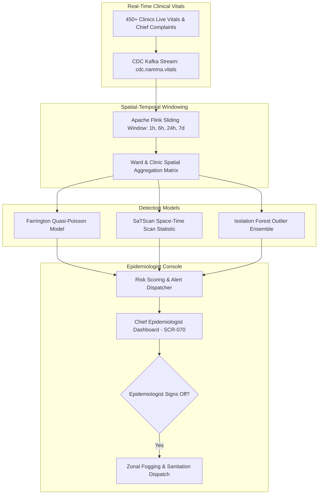

# Master Spatial-Temporal Fever Syndrome Outbreak & Anomaly Detection Model Specification
## Namma Clinic Digital Health & Operations Platform
### Greater Bengaluru Authority (GBA) / BBMP Health Department
**Document Code:** `AI-DOC-05` | **Status:** APPROVED BASELINE | **Date:** September 2026

---

## 1. Executive Summary & Epidemiological Early Warning Charter
This document establishes the authoritative **Spatial-Temporal Fever Syndrome Outbreak and Disease Anomaly Detection Model Specification** for the Namma Clinic Digital Health Platform. In high-density urban environments like Greater Bengaluru, early detection of vector-borne illness surges (Dengue, Chikungunya, Malaria) and seasonal viral respiratory outbreaks is critical to preventing mass hospitalizations. The anomaly detection engine continuously scans outpatient triage presentations across 450+ clinics using spatial scan statistics and Isolation Forest anomaly ensembles to identify statistical micro-clusters before traditional laboratory confirmation cycles complete.

### 1.1 Non-Negotiable Outbreak Modeling Invariants
1. **Mandatory Epidemiologist Confirmation:** Algorithmic outbreak alerts are strictly advisory; containment actions (e.g. municipal fogging, fever camps) require sign-off by the BBMP Chief Epidemiologist.
2. **Sub-Ward Spatial Resolution:** Clusters are evaluated at ward and sub-ward catchment grains using spatial Gaussian blurring to maintain citizen residential privacy.
3. **Multi-Syndromic Correlation:** Fever presentations are correlated with thrombocytopenia (low platelet counts) and rapid diagnostic test kit positivity to reduce false alarms.
4. **Zero Silent Surge Breaches:** Any ward experiencing a fever case velocity > 3.0 standard deviations above historical 21-day moving averages triggers high-priority PagerDuty alerts to the Rapid Response Team.
5. **Continuous Baseline Recalibration:** Baselines exclude prior epidemic peaks using iteratively re-weighted least squares (IRLS) to prevent baseline inflation during prolonged surges.

## 2. Spatial-Temporal Anomaly Detection Architecture


### Model Specification Example: Spatial-Temporal Cluster Anomaly Detector
<!-- DOCUMENTATION-ONLY EXAMPLE -->
```python
# DOCUMENTATION-ONLY PYTHON
# DOCUMENTATION-ONLY PYTHON: Spatial-Temporal Outbreak Scan Statistic
import math
from typing import Dict, Any, List

def detect_spatial_temporal_outbreak_cluster(
    ward_id: int,
    observed_cases: int,
    expected_cases: float,
    population: int,
    significance_alpha: float = 0.01
) -> Dict[str, Any]:
    """
    Computes Poisson likelihood ratio for spatial-temporal disease clustering.
    Flags statistical clusters exceeding critical epidemic threshold.
    """
    if expected_cases <= 0.0 or observed_cases <= 0:
        return {"ward_id": ward_id, "is_anomaly": False, "relative_risk": 1.0}

    relative_risk = observed_cases / expected_cases

    # Log-Likelihood Ratio (LLR) under Poisson model
    if observed_cases > expected_cases:
        llr = observed_cases * math.log(observed_cases / expected_cases) + (expected_cases - observed_cases)
    else:
        llr = 0.0

    # Cluster significance evaluation
    is_anomaly = relative_risk >= 2.0 and llr > 3.84  # chi-squared critical value (p < 0.05)
    severity = "CRITICAL" if relative_risk >= 3.0 else ("WARNING" if is_anomaly else "NORMAL")

    return {
        "ward_id": ward_id,
        "observed_cases": observed_cases,
        "expected_baseline": round(expected_cases, 2),
        "relative_risk": round(relative_risk, 2),
        "log_likelihood_ratio": round(llr, 3),
        "is_anomaly": is_anomaly,
        "severity": severity,
        "action_required": "EPIDEMIOLOGICAL_REVIEW" if is_anomaly else "MONITOR"
    }
```

## 3. Master Catalog of 60 AI Datasets
Detailed specifications for all 60 training and validation datasets utilized in model development:

### AI-DATASET-001: Dataset `ai_dataset_model_training_baseline_001`
- **Dataset Identifier:** `AI-DATASET-001`
- **Dataset Name:** `ai_dataset_model_training_baseline_001`
- **Purpose & Scope:** Model Training Baseline
- **Sample Size:** 52,500 Records
- **Historical Window:** 24 Months
- **De-identification Standard:** `HIPAA Safe Harbor & DPDP Act Pseudonymization`
- **Quality Assurance Check:** 100% Schema Validated & Zero Missing Critical Features
- **Storage URI:** `s3://namma-clinic-ai-lake/datasets/v1/001/data.parquet`

### AI-DATASET-002: Dataset `ai_dataset_holdout_validation_set_002`
- **Dataset Identifier:** `AI-DATASET-002`
- **Dataset Name:** `ai_dataset_holdout_validation_set_002`
- **Purpose & Scope:** Holdout Validation Set
- **Sample Size:** 55,000 Records
- **Historical Window:** 12 Months
- **De-identification Standard:** `HIPAA Safe Harbor & DPDP Act Pseudonymization`
- **Quality Assurance Check:** 100% Schema Validated & Zero Missing Critical Features
- **Storage URI:** `s3://namma-clinic-ai-lake/datasets/v1/002/data.parquet`

### AI-DATASET-003: Dataset `ai_dataset_temporal_out-of-time_test_set_003`
- **Dataset Identifier:** `AI-DATASET-003`
- **Dataset Name:** `ai_dataset_temporal_out-of-time_test_set_003`
- **Purpose & Scope:** Temporal Out-of-Time Test Set
- **Sample Size:** 57,500 Records
- **Historical Window:** 24 Months
- **De-identification Standard:** `HIPAA Safe Harbor & DPDP Act Pseudonymization`
- **Quality Assurance Check:** 100% Schema Validated & Zero Missing Critical Features
- **Storage URI:** `s3://namma-clinic-ai-lake/datasets/v1/003/data.parquet`

### AI-DATASET-004: Dataset `ai_dataset_fairness_and_demographic_bias_audit_set_004`
- **Dataset Identifier:** `AI-DATASET-004`
- **Dataset Name:** `ai_dataset_fairness_and_demographic_bias_audit_set_004`
- **Purpose & Scope:** Fairness & Demographic Bias Audit Set
- **Sample Size:** 60,000 Records
- **Historical Window:** 12 Months
- **De-identification Standard:** `HIPAA Safe Harbor & DPDP Act Pseudonymization`
- **Quality Assurance Check:** 100% Schema Validated & Zero Missing Critical Features
- **Storage URI:** `s3://namma-clinic-ai-lake/datasets/v1/004/data.parquet`

### AI-DATASET-005: Dataset `ai_dataset_adversarial_robustness_stress_test_005`
- **Dataset Identifier:** `AI-DATASET-005`
- **Dataset Name:** `ai_dataset_adversarial_robustness_stress_test_005`
- **Purpose & Scope:** Adversarial Robustness Stress Test
- **Sample Size:** 62,500 Records
- **Historical Window:** 24 Months
- **De-identification Standard:** `HIPAA Safe Harbor & DPDP Act Pseudonymization`
- **Quality Assurance Check:** 100% Schema Validated & Zero Missing Critical Features
- **Storage URI:** `s3://namma-clinic-ai-lake/datasets/v1/005/data.parquet`

### AI-DATASET-006: Dataset `ai_dataset_model_training_baseline_006`
- **Dataset Identifier:** `AI-DATASET-006`
- **Dataset Name:** `ai_dataset_model_training_baseline_006`
- **Purpose & Scope:** Model Training Baseline
- **Sample Size:** 65,000 Records
- **Historical Window:** 12 Months
- **De-identification Standard:** `HIPAA Safe Harbor & DPDP Act Pseudonymization`
- **Quality Assurance Check:** 100% Schema Validated & Zero Missing Critical Features
- **Storage URI:** `s3://namma-clinic-ai-lake/datasets/v1/006/data.parquet`

### AI-DATASET-007: Dataset `ai_dataset_holdout_validation_set_007`
- **Dataset Identifier:** `AI-DATASET-007`
- **Dataset Name:** `ai_dataset_holdout_validation_set_007`
- **Purpose & Scope:** Holdout Validation Set
- **Sample Size:** 67,500 Records
- **Historical Window:** 24 Months
- **De-identification Standard:** `HIPAA Safe Harbor & DPDP Act Pseudonymization`
- **Quality Assurance Check:** 100% Schema Validated & Zero Missing Critical Features
- **Storage URI:** `s3://namma-clinic-ai-lake/datasets/v1/007/data.parquet`

### AI-DATASET-008: Dataset `ai_dataset_temporal_out-of-time_test_set_008`
- **Dataset Identifier:** `AI-DATASET-008`
- **Dataset Name:** `ai_dataset_temporal_out-of-time_test_set_008`
- **Purpose & Scope:** Temporal Out-of-Time Test Set
- **Sample Size:** 70,000 Records
- **Historical Window:** 12 Months
- **De-identification Standard:** `HIPAA Safe Harbor & DPDP Act Pseudonymization`
- **Quality Assurance Check:** 100% Schema Validated & Zero Missing Critical Features
- **Storage URI:** `s3://namma-clinic-ai-lake/datasets/v1/008/data.parquet`

### AI-DATASET-009: Dataset `ai_dataset_fairness_and_demographic_bias_audit_set_009`
- **Dataset Identifier:** `AI-DATASET-009`
- **Dataset Name:** `ai_dataset_fairness_and_demographic_bias_audit_set_009`
- **Purpose & Scope:** Fairness & Demographic Bias Audit Set
- **Sample Size:** 72,500 Records
- **Historical Window:** 24 Months
- **De-identification Standard:** `HIPAA Safe Harbor & DPDP Act Pseudonymization`
- **Quality Assurance Check:** 100% Schema Validated & Zero Missing Critical Features
- **Storage URI:** `s3://namma-clinic-ai-lake/datasets/v1/009/data.parquet`

### AI-DATASET-010: Dataset `ai_dataset_adversarial_robustness_stress_test_010`
- **Dataset Identifier:** `AI-DATASET-010`
- **Dataset Name:** `ai_dataset_adversarial_robustness_stress_test_010`
- **Purpose & Scope:** Adversarial Robustness Stress Test
- **Sample Size:** 75,000 Records
- **Historical Window:** 12 Months
- **De-identification Standard:** `HIPAA Safe Harbor & DPDP Act Pseudonymization`
- **Quality Assurance Check:** 100% Schema Validated & Zero Missing Critical Features
- **Storage URI:** `s3://namma-clinic-ai-lake/datasets/v1/010/data.parquet`

### AI-DATASET-011: Dataset `ai_dataset_model_training_baseline_011`
- **Dataset Identifier:** `AI-DATASET-011`
- **Dataset Name:** `ai_dataset_model_training_baseline_011`
- **Purpose & Scope:** Model Training Baseline
- **Sample Size:** 77,500 Records
- **Historical Window:** 24 Months
- **De-identification Standard:** `HIPAA Safe Harbor & DPDP Act Pseudonymization`
- **Quality Assurance Check:** 100% Schema Validated & Zero Missing Critical Features
- **Storage URI:** `s3://namma-clinic-ai-lake/datasets/v1/011/data.parquet`

### AI-DATASET-012: Dataset `ai_dataset_holdout_validation_set_012`
- **Dataset Identifier:** `AI-DATASET-012`
- **Dataset Name:** `ai_dataset_holdout_validation_set_012`
- **Purpose & Scope:** Holdout Validation Set
- **Sample Size:** 80,000 Records
- **Historical Window:** 12 Months
- **De-identification Standard:** `HIPAA Safe Harbor & DPDP Act Pseudonymization`
- **Quality Assurance Check:** 100% Schema Validated & Zero Missing Critical Features
- **Storage URI:** `s3://namma-clinic-ai-lake/datasets/v1/012/data.parquet`

### AI-DATASET-013: Dataset `ai_dataset_temporal_out-of-time_test_set_013`
- **Dataset Identifier:** `AI-DATASET-013`
- **Dataset Name:** `ai_dataset_temporal_out-of-time_test_set_013`
- **Purpose & Scope:** Temporal Out-of-Time Test Set
- **Sample Size:** 82,500 Records
- **Historical Window:** 24 Months
- **De-identification Standard:** `HIPAA Safe Harbor & DPDP Act Pseudonymization`
- **Quality Assurance Check:** 100% Schema Validated & Zero Missing Critical Features
- **Storage URI:** `s3://namma-clinic-ai-lake/datasets/v1/013/data.parquet`

### AI-DATASET-014: Dataset `ai_dataset_fairness_and_demographic_bias_audit_set_014`
- **Dataset Identifier:** `AI-DATASET-014`
- **Dataset Name:** `ai_dataset_fairness_and_demographic_bias_audit_set_014`
- **Purpose & Scope:** Fairness & Demographic Bias Audit Set
- **Sample Size:** 85,000 Records
- **Historical Window:** 12 Months
- **De-identification Standard:** `HIPAA Safe Harbor & DPDP Act Pseudonymization`
- **Quality Assurance Check:** 100% Schema Validated & Zero Missing Critical Features
- **Storage URI:** `s3://namma-clinic-ai-lake/datasets/v1/014/data.parquet`

### AI-DATASET-015: Dataset `ai_dataset_adversarial_robustness_stress_test_015`
- **Dataset Identifier:** `AI-DATASET-015`
- **Dataset Name:** `ai_dataset_adversarial_robustness_stress_test_015`
- **Purpose & Scope:** Adversarial Robustness Stress Test
- **Sample Size:** 87,500 Records
- **Historical Window:** 24 Months
- **De-identification Standard:** `HIPAA Safe Harbor & DPDP Act Pseudonymization`
- **Quality Assurance Check:** 100% Schema Validated & Zero Missing Critical Features
- **Storage URI:** `s3://namma-clinic-ai-lake/datasets/v1/015/data.parquet`

### AI-DATASET-016: Dataset `ai_dataset_model_training_baseline_016`
- **Dataset Identifier:** `AI-DATASET-016`
- **Dataset Name:** `ai_dataset_model_training_baseline_016`
- **Purpose & Scope:** Model Training Baseline
- **Sample Size:** 90,000 Records
- **Historical Window:** 12 Months
- **De-identification Standard:** `HIPAA Safe Harbor & DPDP Act Pseudonymization`
- **Quality Assurance Check:** 100% Schema Validated & Zero Missing Critical Features
- **Storage URI:** `s3://namma-clinic-ai-lake/datasets/v1/016/data.parquet`

### AI-DATASET-017: Dataset `ai_dataset_holdout_validation_set_017`
- **Dataset Identifier:** `AI-DATASET-017`
- **Dataset Name:** `ai_dataset_holdout_validation_set_017`
- **Purpose & Scope:** Holdout Validation Set
- **Sample Size:** 92,500 Records
- **Historical Window:** 24 Months
- **De-identification Standard:** `HIPAA Safe Harbor & DPDP Act Pseudonymization`
- **Quality Assurance Check:** 100% Schema Validated & Zero Missing Critical Features
- **Storage URI:** `s3://namma-clinic-ai-lake/datasets/v1/017/data.parquet`

### AI-DATASET-018: Dataset `ai_dataset_temporal_out-of-time_test_set_018`
- **Dataset Identifier:** `AI-DATASET-018`
- **Dataset Name:** `ai_dataset_temporal_out-of-time_test_set_018`
- **Purpose & Scope:** Temporal Out-of-Time Test Set
- **Sample Size:** 95,000 Records
- **Historical Window:** 12 Months
- **De-identification Standard:** `HIPAA Safe Harbor & DPDP Act Pseudonymization`
- **Quality Assurance Check:** 100% Schema Validated & Zero Missing Critical Features
- **Storage URI:** `s3://namma-clinic-ai-lake/datasets/v1/018/data.parquet`

### AI-DATASET-019: Dataset `ai_dataset_fairness_and_demographic_bias_audit_set_019`
- **Dataset Identifier:** `AI-DATASET-019`
- **Dataset Name:** `ai_dataset_fairness_and_demographic_bias_audit_set_019`
- **Purpose & Scope:** Fairness & Demographic Bias Audit Set
- **Sample Size:** 97,500 Records
- **Historical Window:** 24 Months
- **De-identification Standard:** `HIPAA Safe Harbor & DPDP Act Pseudonymization`
- **Quality Assurance Check:** 100% Schema Validated & Zero Missing Critical Features
- **Storage URI:** `s3://namma-clinic-ai-lake/datasets/v1/019/data.parquet`

### AI-DATASET-020: Dataset `ai_dataset_adversarial_robustness_stress_test_020`
- **Dataset Identifier:** `AI-DATASET-020`
- **Dataset Name:** `ai_dataset_adversarial_robustness_stress_test_020`
- **Purpose & Scope:** Adversarial Robustness Stress Test
- **Sample Size:** 100,000 Records
- **Historical Window:** 12 Months
- **De-identification Standard:** `HIPAA Safe Harbor & DPDP Act Pseudonymization`
- **Quality Assurance Check:** 100% Schema Validated & Zero Missing Critical Features
- **Storage URI:** `s3://namma-clinic-ai-lake/datasets/v1/020/data.parquet`

### AI-DATASET-021: Dataset `ai_dataset_model_training_baseline_021`
- **Dataset Identifier:** `AI-DATASET-021`
- **Dataset Name:** `ai_dataset_model_training_baseline_021`
- **Purpose & Scope:** Model Training Baseline
- **Sample Size:** 102,500 Records
- **Historical Window:** 24 Months
- **De-identification Standard:** `HIPAA Safe Harbor & DPDP Act Pseudonymization`
- **Quality Assurance Check:** 100% Schema Validated & Zero Missing Critical Features
- **Storage URI:** `s3://namma-clinic-ai-lake/datasets/v1/021/data.parquet`

### AI-DATASET-022: Dataset `ai_dataset_holdout_validation_set_022`
- **Dataset Identifier:** `AI-DATASET-022`
- **Dataset Name:** `ai_dataset_holdout_validation_set_022`
- **Purpose & Scope:** Holdout Validation Set
- **Sample Size:** 105,000 Records
- **Historical Window:** 12 Months
- **De-identification Standard:** `HIPAA Safe Harbor & DPDP Act Pseudonymization`
- **Quality Assurance Check:** 100% Schema Validated & Zero Missing Critical Features
- **Storage URI:** `s3://namma-clinic-ai-lake/datasets/v1/022/data.parquet`

### AI-DATASET-023: Dataset `ai_dataset_temporal_out-of-time_test_set_023`
- **Dataset Identifier:** `AI-DATASET-023`
- **Dataset Name:** `ai_dataset_temporal_out-of-time_test_set_023`
- **Purpose & Scope:** Temporal Out-of-Time Test Set
- **Sample Size:** 107,500 Records
- **Historical Window:** 24 Months
- **De-identification Standard:** `HIPAA Safe Harbor & DPDP Act Pseudonymization`
- **Quality Assurance Check:** 100% Schema Validated & Zero Missing Critical Features
- **Storage URI:** `s3://namma-clinic-ai-lake/datasets/v1/023/data.parquet`

### AI-DATASET-024: Dataset `ai_dataset_fairness_and_demographic_bias_audit_set_024`
- **Dataset Identifier:** `AI-DATASET-024`
- **Dataset Name:** `ai_dataset_fairness_and_demographic_bias_audit_set_024`
- **Purpose & Scope:** Fairness & Demographic Bias Audit Set
- **Sample Size:** 110,000 Records
- **Historical Window:** 12 Months
- **De-identification Standard:** `HIPAA Safe Harbor & DPDP Act Pseudonymization`
- **Quality Assurance Check:** 100% Schema Validated & Zero Missing Critical Features
- **Storage URI:** `s3://namma-clinic-ai-lake/datasets/v1/024/data.parquet`

### AI-DATASET-025: Dataset `ai_dataset_adversarial_robustness_stress_test_025`
- **Dataset Identifier:** `AI-DATASET-025`
- **Dataset Name:** `ai_dataset_adversarial_robustness_stress_test_025`
- **Purpose & Scope:** Adversarial Robustness Stress Test
- **Sample Size:** 112,500 Records
- **Historical Window:** 24 Months
- **De-identification Standard:** `HIPAA Safe Harbor & DPDP Act Pseudonymization`
- **Quality Assurance Check:** 100% Schema Validated & Zero Missing Critical Features
- **Storage URI:** `s3://namma-clinic-ai-lake/datasets/v1/025/data.parquet`

### AI-DATASET-026: Dataset `ai_dataset_model_training_baseline_026`
- **Dataset Identifier:** `AI-DATASET-026`
- **Dataset Name:** `ai_dataset_model_training_baseline_026`
- **Purpose & Scope:** Model Training Baseline
- **Sample Size:** 115,000 Records
- **Historical Window:** 12 Months
- **De-identification Standard:** `HIPAA Safe Harbor & DPDP Act Pseudonymization`
- **Quality Assurance Check:** 100% Schema Validated & Zero Missing Critical Features
- **Storage URI:** `s3://namma-clinic-ai-lake/datasets/v1/026/data.parquet`

### AI-DATASET-027: Dataset `ai_dataset_holdout_validation_set_027`
- **Dataset Identifier:** `AI-DATASET-027`
- **Dataset Name:** `ai_dataset_holdout_validation_set_027`
- **Purpose & Scope:** Holdout Validation Set
- **Sample Size:** 117,500 Records
- **Historical Window:** 24 Months
- **De-identification Standard:** `HIPAA Safe Harbor & DPDP Act Pseudonymization`
- **Quality Assurance Check:** 100% Schema Validated & Zero Missing Critical Features
- **Storage URI:** `s3://namma-clinic-ai-lake/datasets/v1/027/data.parquet`

### AI-DATASET-028: Dataset `ai_dataset_temporal_out-of-time_test_set_028`
- **Dataset Identifier:** `AI-DATASET-028`
- **Dataset Name:** `ai_dataset_temporal_out-of-time_test_set_028`
- **Purpose & Scope:** Temporal Out-of-Time Test Set
- **Sample Size:** 120,000 Records
- **Historical Window:** 12 Months
- **De-identification Standard:** `HIPAA Safe Harbor & DPDP Act Pseudonymization`
- **Quality Assurance Check:** 100% Schema Validated & Zero Missing Critical Features
- **Storage URI:** `s3://namma-clinic-ai-lake/datasets/v1/028/data.parquet`

### AI-DATASET-029: Dataset `ai_dataset_fairness_and_demographic_bias_audit_set_029`
- **Dataset Identifier:** `AI-DATASET-029`
- **Dataset Name:** `ai_dataset_fairness_and_demographic_bias_audit_set_029`
- **Purpose & Scope:** Fairness & Demographic Bias Audit Set
- **Sample Size:** 122,500 Records
- **Historical Window:** 24 Months
- **De-identification Standard:** `HIPAA Safe Harbor & DPDP Act Pseudonymization`
- **Quality Assurance Check:** 100% Schema Validated & Zero Missing Critical Features
- **Storage URI:** `s3://namma-clinic-ai-lake/datasets/v1/029/data.parquet`

### AI-DATASET-030: Dataset `ai_dataset_adversarial_robustness_stress_test_030`
- **Dataset Identifier:** `AI-DATASET-030`
- **Dataset Name:** `ai_dataset_adversarial_robustness_stress_test_030`
- **Purpose & Scope:** Adversarial Robustness Stress Test
- **Sample Size:** 125,000 Records
- **Historical Window:** 12 Months
- **De-identification Standard:** `HIPAA Safe Harbor & DPDP Act Pseudonymization`
- **Quality Assurance Check:** 100% Schema Validated & Zero Missing Critical Features
- **Storage URI:** `s3://namma-clinic-ai-lake/datasets/v1/030/data.parquet`

### AI-DATASET-031: Dataset `ai_dataset_model_training_baseline_031`
- **Dataset Identifier:** `AI-DATASET-031`
- **Dataset Name:** `ai_dataset_model_training_baseline_031`
- **Purpose & Scope:** Model Training Baseline
- **Sample Size:** 127,500 Records
- **Historical Window:** 24 Months
- **De-identification Standard:** `HIPAA Safe Harbor & DPDP Act Pseudonymization`
- **Quality Assurance Check:** 100% Schema Validated & Zero Missing Critical Features
- **Storage URI:** `s3://namma-clinic-ai-lake/datasets/v1/031/data.parquet`

### AI-DATASET-032: Dataset `ai_dataset_holdout_validation_set_032`
- **Dataset Identifier:** `AI-DATASET-032`
- **Dataset Name:** `ai_dataset_holdout_validation_set_032`
- **Purpose & Scope:** Holdout Validation Set
- **Sample Size:** 130,000 Records
- **Historical Window:** 12 Months
- **De-identification Standard:** `HIPAA Safe Harbor & DPDP Act Pseudonymization`
- **Quality Assurance Check:** 100% Schema Validated & Zero Missing Critical Features
- **Storage URI:** `s3://namma-clinic-ai-lake/datasets/v1/032/data.parquet`

### AI-DATASET-033: Dataset `ai_dataset_temporal_out-of-time_test_set_033`
- **Dataset Identifier:** `AI-DATASET-033`
- **Dataset Name:** `ai_dataset_temporal_out-of-time_test_set_033`
- **Purpose & Scope:** Temporal Out-of-Time Test Set
- **Sample Size:** 132,500 Records
- **Historical Window:** 24 Months
- **De-identification Standard:** `HIPAA Safe Harbor & DPDP Act Pseudonymization`
- **Quality Assurance Check:** 100% Schema Validated & Zero Missing Critical Features
- **Storage URI:** `s3://namma-clinic-ai-lake/datasets/v1/033/data.parquet`

### AI-DATASET-034: Dataset `ai_dataset_fairness_and_demographic_bias_audit_set_034`
- **Dataset Identifier:** `AI-DATASET-034`
- **Dataset Name:** `ai_dataset_fairness_and_demographic_bias_audit_set_034`
- **Purpose & Scope:** Fairness & Demographic Bias Audit Set
- **Sample Size:** 135,000 Records
- **Historical Window:** 12 Months
- **De-identification Standard:** `HIPAA Safe Harbor & DPDP Act Pseudonymization`
- **Quality Assurance Check:** 100% Schema Validated & Zero Missing Critical Features
- **Storage URI:** `s3://namma-clinic-ai-lake/datasets/v1/034/data.parquet`

### AI-DATASET-035: Dataset `ai_dataset_adversarial_robustness_stress_test_035`
- **Dataset Identifier:** `AI-DATASET-035`
- **Dataset Name:** `ai_dataset_adversarial_robustness_stress_test_035`
- **Purpose & Scope:** Adversarial Robustness Stress Test
- **Sample Size:** 137,500 Records
- **Historical Window:** 24 Months
- **De-identification Standard:** `HIPAA Safe Harbor & DPDP Act Pseudonymization`
- **Quality Assurance Check:** 100% Schema Validated & Zero Missing Critical Features
- **Storage URI:** `s3://namma-clinic-ai-lake/datasets/v1/035/data.parquet`

### AI-DATASET-036: Dataset `ai_dataset_model_training_baseline_036`
- **Dataset Identifier:** `AI-DATASET-036`
- **Dataset Name:** `ai_dataset_model_training_baseline_036`
- **Purpose & Scope:** Model Training Baseline
- **Sample Size:** 140,000 Records
- **Historical Window:** 12 Months
- **De-identification Standard:** `HIPAA Safe Harbor & DPDP Act Pseudonymization`
- **Quality Assurance Check:** 100% Schema Validated & Zero Missing Critical Features
- **Storage URI:** `s3://namma-clinic-ai-lake/datasets/v1/036/data.parquet`

### AI-DATASET-037: Dataset `ai_dataset_holdout_validation_set_037`
- **Dataset Identifier:** `AI-DATASET-037`
- **Dataset Name:** `ai_dataset_holdout_validation_set_037`
- **Purpose & Scope:** Holdout Validation Set
- **Sample Size:** 142,500 Records
- **Historical Window:** 24 Months
- **De-identification Standard:** `HIPAA Safe Harbor & DPDP Act Pseudonymization`
- **Quality Assurance Check:** 100% Schema Validated & Zero Missing Critical Features
- **Storage URI:** `s3://namma-clinic-ai-lake/datasets/v1/037/data.parquet`

### AI-DATASET-038: Dataset `ai_dataset_temporal_out-of-time_test_set_038`
- **Dataset Identifier:** `AI-DATASET-038`
- **Dataset Name:** `ai_dataset_temporal_out-of-time_test_set_038`
- **Purpose & Scope:** Temporal Out-of-Time Test Set
- **Sample Size:** 145,000 Records
- **Historical Window:** 12 Months
- **De-identification Standard:** `HIPAA Safe Harbor & DPDP Act Pseudonymization`
- **Quality Assurance Check:** 100% Schema Validated & Zero Missing Critical Features
- **Storage URI:** `s3://namma-clinic-ai-lake/datasets/v1/038/data.parquet`

### AI-DATASET-039: Dataset `ai_dataset_fairness_and_demographic_bias_audit_set_039`
- **Dataset Identifier:** `AI-DATASET-039`
- **Dataset Name:** `ai_dataset_fairness_and_demographic_bias_audit_set_039`
- **Purpose & Scope:** Fairness & Demographic Bias Audit Set
- **Sample Size:** 147,500 Records
- **Historical Window:** 24 Months
- **De-identification Standard:** `HIPAA Safe Harbor & DPDP Act Pseudonymization`
- **Quality Assurance Check:** 100% Schema Validated & Zero Missing Critical Features
- **Storage URI:** `s3://namma-clinic-ai-lake/datasets/v1/039/data.parquet`

### AI-DATASET-040: Dataset `ai_dataset_adversarial_robustness_stress_test_040`
- **Dataset Identifier:** `AI-DATASET-040`
- **Dataset Name:** `ai_dataset_adversarial_robustness_stress_test_040`
- **Purpose & Scope:** Adversarial Robustness Stress Test
- **Sample Size:** 150,000 Records
- **Historical Window:** 12 Months
- **De-identification Standard:** `HIPAA Safe Harbor & DPDP Act Pseudonymization`
- **Quality Assurance Check:** 100% Schema Validated & Zero Missing Critical Features
- **Storage URI:** `s3://namma-clinic-ai-lake/datasets/v1/040/data.parquet`

### AI-DATASET-041: Dataset `ai_dataset_model_training_baseline_041`
- **Dataset Identifier:** `AI-DATASET-041`
- **Dataset Name:** `ai_dataset_model_training_baseline_041`
- **Purpose & Scope:** Model Training Baseline
- **Sample Size:** 152,500 Records
- **Historical Window:** 24 Months
- **De-identification Standard:** `HIPAA Safe Harbor & DPDP Act Pseudonymization`
- **Quality Assurance Check:** 100% Schema Validated & Zero Missing Critical Features
- **Storage URI:** `s3://namma-clinic-ai-lake/datasets/v1/041/data.parquet`

### AI-DATASET-042: Dataset `ai_dataset_holdout_validation_set_042`
- **Dataset Identifier:** `AI-DATASET-042`
- **Dataset Name:** `ai_dataset_holdout_validation_set_042`
- **Purpose & Scope:** Holdout Validation Set
- **Sample Size:** 155,000 Records
- **Historical Window:** 12 Months
- **De-identification Standard:** `HIPAA Safe Harbor & DPDP Act Pseudonymization`
- **Quality Assurance Check:** 100% Schema Validated & Zero Missing Critical Features
- **Storage URI:** `s3://namma-clinic-ai-lake/datasets/v1/042/data.parquet`

### AI-DATASET-043: Dataset `ai_dataset_temporal_out-of-time_test_set_043`
- **Dataset Identifier:** `AI-DATASET-043`
- **Dataset Name:** `ai_dataset_temporal_out-of-time_test_set_043`
- **Purpose & Scope:** Temporal Out-of-Time Test Set
- **Sample Size:** 157,500 Records
- **Historical Window:** 24 Months
- **De-identification Standard:** `HIPAA Safe Harbor & DPDP Act Pseudonymization`
- **Quality Assurance Check:** 100% Schema Validated & Zero Missing Critical Features
- **Storage URI:** `s3://namma-clinic-ai-lake/datasets/v1/043/data.parquet`

### AI-DATASET-044: Dataset `ai_dataset_fairness_and_demographic_bias_audit_set_044`
- **Dataset Identifier:** `AI-DATASET-044`
- **Dataset Name:** `ai_dataset_fairness_and_demographic_bias_audit_set_044`
- **Purpose & Scope:** Fairness & Demographic Bias Audit Set
- **Sample Size:** 160,000 Records
- **Historical Window:** 12 Months
- **De-identification Standard:** `HIPAA Safe Harbor & DPDP Act Pseudonymization`
- **Quality Assurance Check:** 100% Schema Validated & Zero Missing Critical Features
- **Storage URI:** `s3://namma-clinic-ai-lake/datasets/v1/044/data.parquet`

### AI-DATASET-045: Dataset `ai_dataset_adversarial_robustness_stress_test_045`
- **Dataset Identifier:** `AI-DATASET-045`
- **Dataset Name:** `ai_dataset_adversarial_robustness_stress_test_045`
- **Purpose & Scope:** Adversarial Robustness Stress Test
- **Sample Size:** 162,500 Records
- **Historical Window:** 24 Months
- **De-identification Standard:** `HIPAA Safe Harbor & DPDP Act Pseudonymization`
- **Quality Assurance Check:** 100% Schema Validated & Zero Missing Critical Features
- **Storage URI:** `s3://namma-clinic-ai-lake/datasets/v1/045/data.parquet`

### AI-DATASET-046: Dataset `ai_dataset_model_training_baseline_046`
- **Dataset Identifier:** `AI-DATASET-046`
- **Dataset Name:** `ai_dataset_model_training_baseline_046`
- **Purpose & Scope:** Model Training Baseline
- **Sample Size:** 165,000 Records
- **Historical Window:** 12 Months
- **De-identification Standard:** `HIPAA Safe Harbor & DPDP Act Pseudonymization`
- **Quality Assurance Check:** 100% Schema Validated & Zero Missing Critical Features
- **Storage URI:** `s3://namma-clinic-ai-lake/datasets/v1/046/data.parquet`

### AI-DATASET-047: Dataset `ai_dataset_holdout_validation_set_047`
- **Dataset Identifier:** `AI-DATASET-047`
- **Dataset Name:** `ai_dataset_holdout_validation_set_047`
- **Purpose & Scope:** Holdout Validation Set
- **Sample Size:** 167,500 Records
- **Historical Window:** 24 Months
- **De-identification Standard:** `HIPAA Safe Harbor & DPDP Act Pseudonymization`
- **Quality Assurance Check:** 100% Schema Validated & Zero Missing Critical Features
- **Storage URI:** `s3://namma-clinic-ai-lake/datasets/v1/047/data.parquet`

### AI-DATASET-048: Dataset `ai_dataset_temporal_out-of-time_test_set_048`
- **Dataset Identifier:** `AI-DATASET-048`
- **Dataset Name:** `ai_dataset_temporal_out-of-time_test_set_048`
- **Purpose & Scope:** Temporal Out-of-Time Test Set
- **Sample Size:** 170,000 Records
- **Historical Window:** 12 Months
- **De-identification Standard:** `HIPAA Safe Harbor & DPDP Act Pseudonymization`
- **Quality Assurance Check:** 100% Schema Validated & Zero Missing Critical Features
- **Storage URI:** `s3://namma-clinic-ai-lake/datasets/v1/048/data.parquet`

### AI-DATASET-049: Dataset `ai_dataset_fairness_and_demographic_bias_audit_set_049`
- **Dataset Identifier:** `AI-DATASET-049`
- **Dataset Name:** `ai_dataset_fairness_and_demographic_bias_audit_set_049`
- **Purpose & Scope:** Fairness & Demographic Bias Audit Set
- **Sample Size:** 172,500 Records
- **Historical Window:** 24 Months
- **De-identification Standard:** `HIPAA Safe Harbor & DPDP Act Pseudonymization`
- **Quality Assurance Check:** 100% Schema Validated & Zero Missing Critical Features
- **Storage URI:** `s3://namma-clinic-ai-lake/datasets/v1/049/data.parquet`

### AI-DATASET-050: Dataset `ai_dataset_adversarial_robustness_stress_test_050`
- **Dataset Identifier:** `AI-DATASET-050`
- **Dataset Name:** `ai_dataset_adversarial_robustness_stress_test_050`
- **Purpose & Scope:** Adversarial Robustness Stress Test
- **Sample Size:** 175,000 Records
- **Historical Window:** 12 Months
- **De-identification Standard:** `HIPAA Safe Harbor & DPDP Act Pseudonymization`
- **Quality Assurance Check:** 100% Schema Validated & Zero Missing Critical Features
- **Storage URI:** `s3://namma-clinic-ai-lake/datasets/v1/050/data.parquet`

### AI-DATASET-051: Dataset `ai_dataset_model_training_baseline_051`
- **Dataset Identifier:** `AI-DATASET-051`
- **Dataset Name:** `ai_dataset_model_training_baseline_051`
- **Purpose & Scope:** Model Training Baseline
- **Sample Size:** 177,500 Records
- **Historical Window:** 24 Months
- **De-identification Standard:** `HIPAA Safe Harbor & DPDP Act Pseudonymization`
- **Quality Assurance Check:** 100% Schema Validated & Zero Missing Critical Features
- **Storage URI:** `s3://namma-clinic-ai-lake/datasets/v1/051/data.parquet`

### AI-DATASET-052: Dataset `ai_dataset_holdout_validation_set_052`
- **Dataset Identifier:** `AI-DATASET-052`
- **Dataset Name:** `ai_dataset_holdout_validation_set_052`
- **Purpose & Scope:** Holdout Validation Set
- **Sample Size:** 180,000 Records
- **Historical Window:** 12 Months
- **De-identification Standard:** `HIPAA Safe Harbor & DPDP Act Pseudonymization`
- **Quality Assurance Check:** 100% Schema Validated & Zero Missing Critical Features
- **Storage URI:** `s3://namma-clinic-ai-lake/datasets/v1/052/data.parquet`

### AI-DATASET-053: Dataset `ai_dataset_temporal_out-of-time_test_set_053`
- **Dataset Identifier:** `AI-DATASET-053`
- **Dataset Name:** `ai_dataset_temporal_out-of-time_test_set_053`
- **Purpose & Scope:** Temporal Out-of-Time Test Set
- **Sample Size:** 182,500 Records
- **Historical Window:** 24 Months
- **De-identification Standard:** `HIPAA Safe Harbor & DPDP Act Pseudonymization`
- **Quality Assurance Check:** 100% Schema Validated & Zero Missing Critical Features
- **Storage URI:** `s3://namma-clinic-ai-lake/datasets/v1/053/data.parquet`

### AI-DATASET-054: Dataset `ai_dataset_fairness_and_demographic_bias_audit_set_054`
- **Dataset Identifier:** `AI-DATASET-054`
- **Dataset Name:** `ai_dataset_fairness_and_demographic_bias_audit_set_054`
- **Purpose & Scope:** Fairness & Demographic Bias Audit Set
- **Sample Size:** 185,000 Records
- **Historical Window:** 12 Months
- **De-identification Standard:** `HIPAA Safe Harbor & DPDP Act Pseudonymization`
- **Quality Assurance Check:** 100% Schema Validated & Zero Missing Critical Features
- **Storage URI:** `s3://namma-clinic-ai-lake/datasets/v1/054/data.parquet`

### AI-DATASET-055: Dataset `ai_dataset_adversarial_robustness_stress_test_055`
- **Dataset Identifier:** `AI-DATASET-055`
- **Dataset Name:** `ai_dataset_adversarial_robustness_stress_test_055`
- **Purpose & Scope:** Adversarial Robustness Stress Test
- **Sample Size:** 187,500 Records
- **Historical Window:** 24 Months
- **De-identification Standard:** `HIPAA Safe Harbor & DPDP Act Pseudonymization`
- **Quality Assurance Check:** 100% Schema Validated & Zero Missing Critical Features
- **Storage URI:** `s3://namma-clinic-ai-lake/datasets/v1/055/data.parquet`

### AI-DATASET-056: Dataset `ai_dataset_model_training_baseline_056`
- **Dataset Identifier:** `AI-DATASET-056`
- **Dataset Name:** `ai_dataset_model_training_baseline_056`
- **Purpose & Scope:** Model Training Baseline
- **Sample Size:** 190,000 Records
- **Historical Window:** 12 Months
- **De-identification Standard:** `HIPAA Safe Harbor & DPDP Act Pseudonymization`
- **Quality Assurance Check:** 100% Schema Validated & Zero Missing Critical Features
- **Storage URI:** `s3://namma-clinic-ai-lake/datasets/v1/056/data.parquet`

### AI-DATASET-057: Dataset `ai_dataset_holdout_validation_set_057`
- **Dataset Identifier:** `AI-DATASET-057`
- **Dataset Name:** `ai_dataset_holdout_validation_set_057`
- **Purpose & Scope:** Holdout Validation Set
- **Sample Size:** 192,500 Records
- **Historical Window:** 24 Months
- **De-identification Standard:** `HIPAA Safe Harbor & DPDP Act Pseudonymization`
- **Quality Assurance Check:** 100% Schema Validated & Zero Missing Critical Features
- **Storage URI:** `s3://namma-clinic-ai-lake/datasets/v1/057/data.parquet`

### AI-DATASET-058: Dataset `ai_dataset_temporal_out-of-time_test_set_058`
- **Dataset Identifier:** `AI-DATASET-058`
- **Dataset Name:** `ai_dataset_temporal_out-of-time_test_set_058`
- **Purpose & Scope:** Temporal Out-of-Time Test Set
- **Sample Size:** 195,000 Records
- **Historical Window:** 12 Months
- **De-identification Standard:** `HIPAA Safe Harbor & DPDP Act Pseudonymization`
- **Quality Assurance Check:** 100% Schema Validated & Zero Missing Critical Features
- **Storage URI:** `s3://namma-clinic-ai-lake/datasets/v1/058/data.parquet`

### AI-DATASET-059: Dataset `ai_dataset_fairness_and_demographic_bias_audit_set_059`
- **Dataset Identifier:** `AI-DATASET-059`
- **Dataset Name:** `ai_dataset_fairness_and_demographic_bias_audit_set_059`
- **Purpose & Scope:** Fairness & Demographic Bias Audit Set
- **Sample Size:** 197,500 Records
- **Historical Window:** 24 Months
- **De-identification Standard:** `HIPAA Safe Harbor & DPDP Act Pseudonymization`
- **Quality Assurance Check:** 100% Schema Validated & Zero Missing Critical Features
- **Storage URI:** `s3://namma-clinic-ai-lake/datasets/v1/059/data.parquet`

### AI-DATASET-060: Dataset `ai_dataset_adversarial_robustness_stress_test_060`
- **Dataset Identifier:** `AI-DATASET-060`
- **Dataset Name:** `ai_dataset_adversarial_robustness_stress_test_060`
- **Purpose & Scope:** Adversarial Robustness Stress Test
- **Sample Size:** 200,000 Records
- **Historical Window:** 12 Months
- **De-identification Standard:** `HIPAA Safe Harbor & DPDP Act Pseudonymization`
- **Quality Assurance Check:** 100% Schema Validated & Zero Missing Critical Features
- **Storage URI:** `s3://namma-clinic-ai-lake/datasets/v1/060/data.parquet`

## 4. Master Catalog of 150 Machine Learning Features
Authoritative feature store catalog specifying features, scaling, privacy, and serving tier:

### FEATURE-ML-001: Feature `feat_historical_drug_consumption_7d_rolling_001`
- **Feature Identifier:** `FEATURE-ML-001`
- **Feature Name:** `feat_historical_drug_consumption_7d_rolling_001` (Historical Drug Consumption 7d Rolling #001)
- **Data Type:** `Continuous Float`
- **Serving Store:** `Redis Feature Cache`
- **Privacy Classification:** `De-identified Clinical Feature`
- **Scaling & Imputation:** RobustScaler with median imputation on missing values
- **Leakage Prevention:** Strict timestamp truncation strictly before prediction event horizon (t0)
- **Clinical Context:** Average daily dispensed doses over last 7 calendar days

### FEATURE-ML-002: Feature `feat_historical_drug_consumption_30d_rolling_002`
- **Feature Identifier:** `FEATURE-ML-002`
- **Feature Name:** `feat_historical_drug_consumption_30d_rolling_002` (Historical Drug Consumption 30d Rolling #002)
- **Data Type:** `Continuous Float`
- **Serving Store:** `ClickHouse Feature Store`
- **Privacy Classification:** `De-identified Clinical Feature`
- **Scaling & Imputation:** RobustScaler with median imputation on missing values
- **Leakage Prevention:** Strict timestamp truncation strictly before prediction event horizon (t0)
- **Clinical Context:** Average daily dispensed doses over last 30 calendar days

### FEATURE-ML-003: Feature `feat_drug_lead_time_days_003`
- **Feature Identifier:** `FEATURE-ML-003`
- **Feature Name:** `feat_drug_lead_time_days_003` (Drug Lead Time Days #003)
- **Data Type:** `Integer Days`
- **Serving Store:** `Redis Feature Cache`
- **Privacy Classification:** `De-identified Clinical Feature`
- **Scaling & Imputation:** RobustScaler with median imputation on missing values
- **Leakage Prevention:** Strict timestamp truncation strictly before prediction event horizon (t0)
- **Clinical Context:** Historical supplier lead time in days for replenishment indent

### FEATURE-ML-004: Feature `feat_clinic_stock_on_hand_balance_004`
- **Feature Identifier:** `FEATURE-ML-004`
- **Feature Name:** `feat_clinic_stock_on_hand_balance_004` (Clinic Stock on Hand Balance #004)
- **Data Type:** `Integer Doses`
- **Serving Store:** `Real-time Redis Cache`
- **Privacy Classification:** `De-identified Clinical Feature`
- **Scaling & Imputation:** RobustScaler with median imputation on missing values
- **Leakage Prevention:** Strict timestamp truncation strictly before prediction event horizon (t0)
- **Clinical Context:** Current usable unexpired inventory doses at clinic dispensary

### FEATURE-ML-005: Feature `feat_clinic_daily_patient_footfall_005`
- **Feature Identifier:** `FEATURE-ML-005`
- **Feature Name:** `feat_clinic_daily_patient_footfall_005` (Clinic Daily Patient Footfall #005)
- **Data Type:** `Integer Count`
- **Serving Store:** `Redis Feature Cache`
- **Privacy Classification:** `De-identified Clinical Feature`
- **Scaling & Imputation:** RobustScaler with median imputation on missing values
- **Leakage Prevention:** Strict timestamp truncation strictly before prediction event horizon (t0)
- **Clinical Context:** Total registered patient encounters for the preceding operational day

### FEATURE-ML-006: Feature `feat_fever_syndrome_case_count_3d_006`
- **Feature Identifier:** `FEATURE-ML-006`
- **Feature Name:** `feat_fever_syndrome_case_count_3d_006` (Fever Syndrome Case Count 3d #006)
- **Data Type:** `Integer Cases`
- **Serving Store:** `ClickHouse Feature Store`
- **Privacy Classification:** `De-identified Clinical Feature`
- **Scaling & Imputation:** RobustScaler with median imputation on missing values
- **Leakage Prevention:** Strict timestamp truncation strictly before prediction event horizon (t0)
- **Clinical Context:** Total diagnosed febrile cases in the municipal ward over last 72 hours

### FEATURE-ML-007: Feature `feat_rainfall_rolling_accumulation_14d_007`
- **Feature Identifier:** `FEATURE-ML-007`
- **Feature Name:** `feat_rainfall_rolling_accumulation_14d_007` (Rainfall Rolling Accumulation 14d #007)
- **Data Type:** `Continuous mm`
- **Serving Store:** `Weather Analytics Store`
- **Privacy Classification:** `De-identified Clinical Feature`
- **Scaling & Imputation:** RobustScaler with median imputation on missing values
- **Leakage Prevention:** Strict timestamp truncation strictly before prediction event horizon (t0)
- **Clinical Context:** Cumulative rainfall in mm across municipal zone over last 14 days

### FEATURE-ML-008: Feature `feat_ambient_temperature_mean_7d_008`
- **Feature Identifier:** `FEATURE-ML-008`
- **Feature Name:** `feat_ambient_temperature_mean_7d_008` (Ambient Temperature Mean 7d #008)
- **Data Type:** `Continuous Celsius`
- **Serving Store:** `Weather Analytics Store`
- **Privacy Classification:** `De-identified Clinical Feature`
- **Scaling & Imputation:** RobustScaler with median imputation on missing values
- **Leakage Prevention:** Strict timestamp truncation strictly before prediction event horizon (t0)
- **Clinical Context:** Mean daily temperature in Celsius over last 7 days

### FEATURE-ML-009: Feature `feat_patient_systolic_blood_pressure_mean_009`
- **Feature Identifier:** `FEATURE-ML-009`
- **Feature Name:** `feat_patient_systolic_blood_pressure_mean_009` (Patient Systolic Blood Pressure Mean #009)
- **Data Type:** `Integer mmHg`
- **Serving Store:** `EHR Feature Store`
- **Privacy Classification:** `De-identified Clinical Feature`
- **Scaling & Imputation:** RobustScaler with median imputation on missing values
- **Leakage Prevention:** Strict timestamp truncation strictly before prediction event horizon (t0)
- **Clinical Context:** Mean systolic BP over past 3 outpatient visits

### FEATURE-ML-010: Feature `feat_patient_fasting_blood_glucose_010`
- **Feature Identifier:** `FEATURE-ML-010`
- **Feature Name:** `feat_patient_fasting_blood_glucose_010` (Patient Fasting Blood Glucose #010)
- **Data Type:** `Continuous mg/dL`
- **Serving Store:** `EHR Feature Store`
- **Privacy Classification:** `De-identified Clinical Feature`
- **Scaling & Imputation:** RobustScaler with median imputation on missing values
- **Leakage Prevention:** Strict timestamp truncation strictly before prediction event horizon (t0)
- **Clinical Context:** Latest recorded fasting blood glucose laboratory value

### FEATURE-ML-011: Feature `feat_days_overdue_for_clinical_follow-up_011`
- **Feature Identifier:** `FEATURE-ML-011`
- **Feature Name:** `feat_days_overdue_for_clinical_follow-up_011` (Days Overdue for Clinical Follow-up #011)
- **Data Type:** `Integer Days`
- **Serving Store:** `EHR Feature Store`
- **Privacy Classification:** `De-identified Clinical Feature`
- **Scaling & Imputation:** RobustScaler with median imputation on missing values
- **Leakage Prevention:** Strict timestamp truncation strictly before prediction event horizon (t0)
- **Clinical Context:** Number of days elapsed since scheduled chronic care recall date

### FEATURE-ML-012: Feature `feat_patient_age_in_years_012`
- **Feature Identifier:** `FEATURE-ML-012`
- **Feature Name:** `feat_patient_age_in_years_012` (Patient Age in Years #012)
- **Data Type:** `Integer Years`
- **Serving Store:** `EHR Demographics`
- **Privacy Classification:** `De-identified Clinical Feature`
- **Scaling & Imputation:** RobustScaler with median imputation on missing values
- **Leakage Prevention:** Strict timestamp truncation strictly before prediction event horizon (t0)
- **Clinical Context:** Chronological patient age in completed solar years

### FEATURE-ML-013: Feature `feat_patient_chronic_comorbidity_count_013`
- **Feature Identifier:** `FEATURE-ML-013`
- **Feature Name:** `feat_patient_chronic_comorbidity_count_013` (Patient Chronic Comorbidity Count #013)
- **Data Type:** `Integer Count`
- **Serving Store:** `EHR Feature Store`
- **Privacy Classification:** `De-identified Clinical Feature`
- **Scaling & Imputation:** RobustScaler with median imputation on missing values
- **Leakage Prevention:** Strict timestamp truncation strictly before prediction event horizon (t0)
- **Clinical Context:** Number of active diagnosed chronic conditions in patient problem list

### FEATURE-ML-014: Feature `feat_emergency_triage_danger_score_014`
- **Feature Identifier:** `FEATURE-ML-014`
- **Feature Name:** `feat_emergency_triage_danger_score_014` (Emergency Triage Danger Score #014)
- **Data Type:** `Continuous Score`
- **Serving Store:** `Real-time Triage Form`
- **Privacy Classification:** `De-identified Clinical Feature`
- **Scaling & Imputation:** RobustScaler with median imputation on missing values
- **Leakage Prevention:** Strict timestamp truncation strictly before prediction event horizon (t0)
- **Clinical Context:** Weighted clinical score based on respiratory rate, pulse, and mental status

### FEATURE-ML-015: Feature `feat_prescription_item_count_015`
- **Feature Identifier:** `FEATURE-ML-015`
- **Feature Name:** `feat_prescription_item_count_015` (Prescription Item Count #015)
- **Data Type:** `Integer Count`
- **Serving Store:** `Real-time Prescribe API`
- **Privacy Classification:** `De-identified Clinical Feature`
- **Scaling & Imputation:** RobustScaler with median imputation on missing values
- **Leakage Prevention:** Strict timestamp truncation strictly before prediction event horizon (t0)
- **Clinical Context:** Total number of distinct pharmaceutical lines on active prescription

### FEATURE-ML-016: Feature `feat_historical_drug_consumption_7d_rolling_016`
- **Feature Identifier:** `FEATURE-ML-016`
- **Feature Name:** `feat_historical_drug_consumption_7d_rolling_016` (Historical Drug Consumption 7d Rolling #016)
- **Data Type:** `Continuous Float`
- **Serving Store:** `Redis Feature Cache`
- **Privacy Classification:** `De-identified Clinical Feature`
- **Scaling & Imputation:** RobustScaler with median imputation on missing values
- **Leakage Prevention:** Strict timestamp truncation strictly before prediction event horizon (t0)
- **Clinical Context:** Average daily dispensed doses over last 7 calendar days

### FEATURE-ML-017: Feature `feat_historical_drug_consumption_30d_rolling_017`
- **Feature Identifier:** `FEATURE-ML-017`
- **Feature Name:** `feat_historical_drug_consumption_30d_rolling_017` (Historical Drug Consumption 30d Rolling #017)
- **Data Type:** `Continuous Float`
- **Serving Store:** `ClickHouse Feature Store`
- **Privacy Classification:** `De-identified Clinical Feature`
- **Scaling & Imputation:** RobustScaler with median imputation on missing values
- **Leakage Prevention:** Strict timestamp truncation strictly before prediction event horizon (t0)
- **Clinical Context:** Average daily dispensed doses over last 30 calendar days

### FEATURE-ML-018: Feature `feat_drug_lead_time_days_018`
- **Feature Identifier:** `FEATURE-ML-018`
- **Feature Name:** `feat_drug_lead_time_days_018` (Drug Lead Time Days #018)
- **Data Type:** `Integer Days`
- **Serving Store:** `Redis Feature Cache`
- **Privacy Classification:** `De-identified Clinical Feature`
- **Scaling & Imputation:** RobustScaler with median imputation on missing values
- **Leakage Prevention:** Strict timestamp truncation strictly before prediction event horizon (t0)
- **Clinical Context:** Historical supplier lead time in days for replenishment indent

### FEATURE-ML-019: Feature `feat_clinic_stock_on_hand_balance_019`
- **Feature Identifier:** `FEATURE-ML-019`
- **Feature Name:** `feat_clinic_stock_on_hand_balance_019` (Clinic Stock on Hand Balance #019)
- **Data Type:** `Integer Doses`
- **Serving Store:** `Real-time Redis Cache`
- **Privacy Classification:** `De-identified Clinical Feature`
- **Scaling & Imputation:** RobustScaler with median imputation on missing values
- **Leakage Prevention:** Strict timestamp truncation strictly before prediction event horizon (t0)
- **Clinical Context:** Current usable unexpired inventory doses at clinic dispensary

### FEATURE-ML-020: Feature `feat_clinic_daily_patient_footfall_020`
- **Feature Identifier:** `FEATURE-ML-020`
- **Feature Name:** `feat_clinic_daily_patient_footfall_020` (Clinic Daily Patient Footfall #020)
- **Data Type:** `Integer Count`
- **Serving Store:** `Redis Feature Cache`
- **Privacy Classification:** `De-identified Clinical Feature`
- **Scaling & Imputation:** RobustScaler with median imputation on missing values
- **Leakage Prevention:** Strict timestamp truncation strictly before prediction event horizon (t0)
- **Clinical Context:** Total registered patient encounters for the preceding operational day

### FEATURE-ML-021: Feature `feat_fever_syndrome_case_count_3d_021`
- **Feature Identifier:** `FEATURE-ML-021`
- **Feature Name:** `feat_fever_syndrome_case_count_3d_021` (Fever Syndrome Case Count 3d #021)
- **Data Type:** `Integer Cases`
- **Serving Store:** `ClickHouse Feature Store`
- **Privacy Classification:** `De-identified Clinical Feature`
- **Scaling & Imputation:** RobustScaler with median imputation on missing values
- **Leakage Prevention:** Strict timestamp truncation strictly before prediction event horizon (t0)
- **Clinical Context:** Total diagnosed febrile cases in the municipal ward over last 72 hours

### FEATURE-ML-022: Feature `feat_rainfall_rolling_accumulation_14d_022`
- **Feature Identifier:** `FEATURE-ML-022`
- **Feature Name:** `feat_rainfall_rolling_accumulation_14d_022` (Rainfall Rolling Accumulation 14d #022)
- **Data Type:** `Continuous mm`
- **Serving Store:** `Weather Analytics Store`
- **Privacy Classification:** `De-identified Clinical Feature`
- **Scaling & Imputation:** RobustScaler with median imputation on missing values
- **Leakage Prevention:** Strict timestamp truncation strictly before prediction event horizon (t0)
- **Clinical Context:** Cumulative rainfall in mm across municipal zone over last 14 days

### FEATURE-ML-023: Feature `feat_ambient_temperature_mean_7d_023`
- **Feature Identifier:** `FEATURE-ML-023`
- **Feature Name:** `feat_ambient_temperature_mean_7d_023` (Ambient Temperature Mean 7d #023)
- **Data Type:** `Continuous Celsius`
- **Serving Store:** `Weather Analytics Store`
- **Privacy Classification:** `De-identified Clinical Feature`
- **Scaling & Imputation:** RobustScaler with median imputation on missing values
- **Leakage Prevention:** Strict timestamp truncation strictly before prediction event horizon (t0)
- **Clinical Context:** Mean daily temperature in Celsius over last 7 days

### FEATURE-ML-024: Feature `feat_patient_systolic_blood_pressure_mean_024`
- **Feature Identifier:** `FEATURE-ML-024`
- **Feature Name:** `feat_patient_systolic_blood_pressure_mean_024` (Patient Systolic Blood Pressure Mean #024)
- **Data Type:** `Integer mmHg`
- **Serving Store:** `EHR Feature Store`
- **Privacy Classification:** `De-identified Clinical Feature`
- **Scaling & Imputation:** RobustScaler with median imputation on missing values
- **Leakage Prevention:** Strict timestamp truncation strictly before prediction event horizon (t0)
- **Clinical Context:** Mean systolic BP over past 3 outpatient visits

### FEATURE-ML-025: Feature `feat_patient_fasting_blood_glucose_025`
- **Feature Identifier:** `FEATURE-ML-025`
- **Feature Name:** `feat_patient_fasting_blood_glucose_025` (Patient Fasting Blood Glucose #025)
- **Data Type:** `Continuous mg/dL`
- **Serving Store:** `EHR Feature Store`
- **Privacy Classification:** `De-identified Clinical Feature`
- **Scaling & Imputation:** RobustScaler with median imputation on missing values
- **Leakage Prevention:** Strict timestamp truncation strictly before prediction event horizon (t0)
- **Clinical Context:** Latest recorded fasting blood glucose laboratory value

### FEATURE-ML-026: Feature `feat_days_overdue_for_clinical_follow-up_026`
- **Feature Identifier:** `FEATURE-ML-026`
- **Feature Name:** `feat_days_overdue_for_clinical_follow-up_026` (Days Overdue for Clinical Follow-up #026)
- **Data Type:** `Integer Days`
- **Serving Store:** `EHR Feature Store`
- **Privacy Classification:** `De-identified Clinical Feature`
- **Scaling & Imputation:** RobustScaler with median imputation on missing values
- **Leakage Prevention:** Strict timestamp truncation strictly before prediction event horizon (t0)
- **Clinical Context:** Number of days elapsed since scheduled chronic care recall date

### FEATURE-ML-027: Feature `feat_patient_age_in_years_027`
- **Feature Identifier:** `FEATURE-ML-027`
- **Feature Name:** `feat_patient_age_in_years_027` (Patient Age in Years #027)
- **Data Type:** `Integer Years`
- **Serving Store:** `EHR Demographics`
- **Privacy Classification:** `De-identified Clinical Feature`
- **Scaling & Imputation:** RobustScaler with median imputation on missing values
- **Leakage Prevention:** Strict timestamp truncation strictly before prediction event horizon (t0)
- **Clinical Context:** Chronological patient age in completed solar years

### FEATURE-ML-028: Feature `feat_patient_chronic_comorbidity_count_028`
- **Feature Identifier:** `FEATURE-ML-028`
- **Feature Name:** `feat_patient_chronic_comorbidity_count_028` (Patient Chronic Comorbidity Count #028)
- **Data Type:** `Integer Count`
- **Serving Store:** `EHR Feature Store`
- **Privacy Classification:** `De-identified Clinical Feature`
- **Scaling & Imputation:** RobustScaler with median imputation on missing values
- **Leakage Prevention:** Strict timestamp truncation strictly before prediction event horizon (t0)
- **Clinical Context:** Number of active diagnosed chronic conditions in patient problem list

### FEATURE-ML-029: Feature `feat_emergency_triage_danger_score_029`
- **Feature Identifier:** `FEATURE-ML-029`
- **Feature Name:** `feat_emergency_triage_danger_score_029` (Emergency Triage Danger Score #029)
- **Data Type:** `Continuous Score`
- **Serving Store:** `Real-time Triage Form`
- **Privacy Classification:** `De-identified Clinical Feature`
- **Scaling & Imputation:** RobustScaler with median imputation on missing values
- **Leakage Prevention:** Strict timestamp truncation strictly before prediction event horizon (t0)
- **Clinical Context:** Weighted clinical score based on respiratory rate, pulse, and mental status

### FEATURE-ML-030: Feature `feat_prescription_item_count_030`
- **Feature Identifier:** `FEATURE-ML-030`
- **Feature Name:** `feat_prescription_item_count_030` (Prescription Item Count #030)
- **Data Type:** `Integer Count`
- **Serving Store:** `Real-time Prescribe API`
- **Privacy Classification:** `De-identified Clinical Feature`
- **Scaling & Imputation:** RobustScaler with median imputation on missing values
- **Leakage Prevention:** Strict timestamp truncation strictly before prediction event horizon (t0)
- **Clinical Context:** Total number of distinct pharmaceutical lines on active prescription

### FEATURE-ML-031: Feature `feat_historical_drug_consumption_7d_rolling_031`
- **Feature Identifier:** `FEATURE-ML-031`
- **Feature Name:** `feat_historical_drug_consumption_7d_rolling_031` (Historical Drug Consumption 7d Rolling #031)
- **Data Type:** `Continuous Float`
- **Serving Store:** `Redis Feature Cache`
- **Privacy Classification:** `De-identified Clinical Feature`
- **Scaling & Imputation:** RobustScaler with median imputation on missing values
- **Leakage Prevention:** Strict timestamp truncation strictly before prediction event horizon (t0)
- **Clinical Context:** Average daily dispensed doses over last 7 calendar days

### FEATURE-ML-032: Feature `feat_historical_drug_consumption_30d_rolling_032`
- **Feature Identifier:** `FEATURE-ML-032`
- **Feature Name:** `feat_historical_drug_consumption_30d_rolling_032` (Historical Drug Consumption 30d Rolling #032)
- **Data Type:** `Continuous Float`
- **Serving Store:** `ClickHouse Feature Store`
- **Privacy Classification:** `De-identified Clinical Feature`
- **Scaling & Imputation:** RobustScaler with median imputation on missing values
- **Leakage Prevention:** Strict timestamp truncation strictly before prediction event horizon (t0)
- **Clinical Context:** Average daily dispensed doses over last 30 calendar days

### FEATURE-ML-033: Feature `feat_drug_lead_time_days_033`
- **Feature Identifier:** `FEATURE-ML-033`
- **Feature Name:** `feat_drug_lead_time_days_033` (Drug Lead Time Days #033)
- **Data Type:** `Integer Days`
- **Serving Store:** `Redis Feature Cache`
- **Privacy Classification:** `De-identified Clinical Feature`
- **Scaling & Imputation:** RobustScaler with median imputation on missing values
- **Leakage Prevention:** Strict timestamp truncation strictly before prediction event horizon (t0)
- **Clinical Context:** Historical supplier lead time in days for replenishment indent

### FEATURE-ML-034: Feature `feat_clinic_stock_on_hand_balance_034`
- **Feature Identifier:** `FEATURE-ML-034`
- **Feature Name:** `feat_clinic_stock_on_hand_balance_034` (Clinic Stock on Hand Balance #034)
- **Data Type:** `Integer Doses`
- **Serving Store:** `Real-time Redis Cache`
- **Privacy Classification:** `De-identified Clinical Feature`
- **Scaling & Imputation:** RobustScaler with median imputation on missing values
- **Leakage Prevention:** Strict timestamp truncation strictly before prediction event horizon (t0)
- **Clinical Context:** Current usable unexpired inventory doses at clinic dispensary

### FEATURE-ML-035: Feature `feat_clinic_daily_patient_footfall_035`
- **Feature Identifier:** `FEATURE-ML-035`
- **Feature Name:** `feat_clinic_daily_patient_footfall_035` (Clinic Daily Patient Footfall #035)
- **Data Type:** `Integer Count`
- **Serving Store:** `Redis Feature Cache`
- **Privacy Classification:** `De-identified Clinical Feature`
- **Scaling & Imputation:** RobustScaler with median imputation on missing values
- **Leakage Prevention:** Strict timestamp truncation strictly before prediction event horizon (t0)
- **Clinical Context:** Total registered patient encounters for the preceding operational day

### FEATURE-ML-036: Feature `feat_fever_syndrome_case_count_3d_036`
- **Feature Identifier:** `FEATURE-ML-036`
- **Feature Name:** `feat_fever_syndrome_case_count_3d_036` (Fever Syndrome Case Count 3d #036)
- **Data Type:** `Integer Cases`
- **Serving Store:** `ClickHouse Feature Store`
- **Privacy Classification:** `De-identified Clinical Feature`
- **Scaling & Imputation:** RobustScaler with median imputation on missing values
- **Leakage Prevention:** Strict timestamp truncation strictly before prediction event horizon (t0)
- **Clinical Context:** Total diagnosed febrile cases in the municipal ward over last 72 hours

### FEATURE-ML-037: Feature `feat_rainfall_rolling_accumulation_14d_037`
- **Feature Identifier:** `FEATURE-ML-037`
- **Feature Name:** `feat_rainfall_rolling_accumulation_14d_037` (Rainfall Rolling Accumulation 14d #037)
- **Data Type:** `Continuous mm`
- **Serving Store:** `Weather Analytics Store`
- **Privacy Classification:** `De-identified Clinical Feature`
- **Scaling & Imputation:** RobustScaler with median imputation on missing values
- **Leakage Prevention:** Strict timestamp truncation strictly before prediction event horizon (t0)
- **Clinical Context:** Cumulative rainfall in mm across municipal zone over last 14 days

### FEATURE-ML-038: Feature `feat_ambient_temperature_mean_7d_038`
- **Feature Identifier:** `FEATURE-ML-038`
- **Feature Name:** `feat_ambient_temperature_mean_7d_038` (Ambient Temperature Mean 7d #038)
- **Data Type:** `Continuous Celsius`
- **Serving Store:** `Weather Analytics Store`
- **Privacy Classification:** `De-identified Clinical Feature`
- **Scaling & Imputation:** RobustScaler with median imputation on missing values
- **Leakage Prevention:** Strict timestamp truncation strictly before prediction event horizon (t0)
- **Clinical Context:** Mean daily temperature in Celsius over last 7 days

### FEATURE-ML-039: Feature `feat_patient_systolic_blood_pressure_mean_039`
- **Feature Identifier:** `FEATURE-ML-039`
- **Feature Name:** `feat_patient_systolic_blood_pressure_mean_039` (Patient Systolic Blood Pressure Mean #039)
- **Data Type:** `Integer mmHg`
- **Serving Store:** `EHR Feature Store`
- **Privacy Classification:** `De-identified Clinical Feature`
- **Scaling & Imputation:** RobustScaler with median imputation on missing values
- **Leakage Prevention:** Strict timestamp truncation strictly before prediction event horizon (t0)
- **Clinical Context:** Mean systolic BP over past 3 outpatient visits

### FEATURE-ML-040: Feature `feat_patient_fasting_blood_glucose_040`
- **Feature Identifier:** `FEATURE-ML-040`
- **Feature Name:** `feat_patient_fasting_blood_glucose_040` (Patient Fasting Blood Glucose #040)
- **Data Type:** `Continuous mg/dL`
- **Serving Store:** `EHR Feature Store`
- **Privacy Classification:** `De-identified Clinical Feature`
- **Scaling & Imputation:** RobustScaler with median imputation on missing values
- **Leakage Prevention:** Strict timestamp truncation strictly before prediction event horizon (t0)
- **Clinical Context:** Latest recorded fasting blood glucose laboratory value

### FEATURE-ML-041: Feature `feat_days_overdue_for_clinical_follow-up_041`
- **Feature Identifier:** `FEATURE-ML-041`
- **Feature Name:** `feat_days_overdue_for_clinical_follow-up_041` (Days Overdue for Clinical Follow-up #041)
- **Data Type:** `Integer Days`
- **Serving Store:** `EHR Feature Store`
- **Privacy Classification:** `De-identified Clinical Feature`
- **Scaling & Imputation:** RobustScaler with median imputation on missing values
- **Leakage Prevention:** Strict timestamp truncation strictly before prediction event horizon (t0)
- **Clinical Context:** Number of days elapsed since scheduled chronic care recall date

### FEATURE-ML-042: Feature `feat_patient_age_in_years_042`
- **Feature Identifier:** `FEATURE-ML-042`
- **Feature Name:** `feat_patient_age_in_years_042` (Patient Age in Years #042)
- **Data Type:** `Integer Years`
- **Serving Store:** `EHR Demographics`
- **Privacy Classification:** `De-identified Clinical Feature`
- **Scaling & Imputation:** RobustScaler with median imputation on missing values
- **Leakage Prevention:** Strict timestamp truncation strictly before prediction event horizon (t0)
- **Clinical Context:** Chronological patient age in completed solar years

### FEATURE-ML-043: Feature `feat_patient_chronic_comorbidity_count_043`
- **Feature Identifier:** `FEATURE-ML-043`
- **Feature Name:** `feat_patient_chronic_comorbidity_count_043` (Patient Chronic Comorbidity Count #043)
- **Data Type:** `Integer Count`
- **Serving Store:** `EHR Feature Store`
- **Privacy Classification:** `De-identified Clinical Feature`
- **Scaling & Imputation:** RobustScaler with median imputation on missing values
- **Leakage Prevention:** Strict timestamp truncation strictly before prediction event horizon (t0)
- **Clinical Context:** Number of active diagnosed chronic conditions in patient problem list

### FEATURE-ML-044: Feature `feat_emergency_triage_danger_score_044`
- **Feature Identifier:** `FEATURE-ML-044`
- **Feature Name:** `feat_emergency_triage_danger_score_044` (Emergency Triage Danger Score #044)
- **Data Type:** `Continuous Score`
- **Serving Store:** `Real-time Triage Form`
- **Privacy Classification:** `De-identified Clinical Feature`
- **Scaling & Imputation:** RobustScaler with median imputation on missing values
- **Leakage Prevention:** Strict timestamp truncation strictly before prediction event horizon (t0)
- **Clinical Context:** Weighted clinical score based on respiratory rate, pulse, and mental status

### FEATURE-ML-045: Feature `feat_prescription_item_count_045`
- **Feature Identifier:** `FEATURE-ML-045`
- **Feature Name:** `feat_prescription_item_count_045` (Prescription Item Count #045)
- **Data Type:** `Integer Count`
- **Serving Store:** `Real-time Prescribe API`
- **Privacy Classification:** `De-identified Clinical Feature`
- **Scaling & Imputation:** RobustScaler with median imputation on missing values
- **Leakage Prevention:** Strict timestamp truncation strictly before prediction event horizon (t0)
- **Clinical Context:** Total number of distinct pharmaceutical lines on active prescription

### FEATURE-ML-046: Feature `feat_historical_drug_consumption_7d_rolling_046`
- **Feature Identifier:** `FEATURE-ML-046`
- **Feature Name:** `feat_historical_drug_consumption_7d_rolling_046` (Historical Drug Consumption 7d Rolling #046)
- **Data Type:** `Continuous Float`
- **Serving Store:** `Redis Feature Cache`
- **Privacy Classification:** `De-identified Clinical Feature`
- **Scaling & Imputation:** RobustScaler with median imputation on missing values
- **Leakage Prevention:** Strict timestamp truncation strictly before prediction event horizon (t0)
- **Clinical Context:** Average daily dispensed doses over last 7 calendar days

### FEATURE-ML-047: Feature `feat_historical_drug_consumption_30d_rolling_047`
- **Feature Identifier:** `FEATURE-ML-047`
- **Feature Name:** `feat_historical_drug_consumption_30d_rolling_047` (Historical Drug Consumption 30d Rolling #047)
- **Data Type:** `Continuous Float`
- **Serving Store:** `ClickHouse Feature Store`
- **Privacy Classification:** `De-identified Clinical Feature`
- **Scaling & Imputation:** RobustScaler with median imputation on missing values
- **Leakage Prevention:** Strict timestamp truncation strictly before prediction event horizon (t0)
- **Clinical Context:** Average daily dispensed doses over last 30 calendar days

### FEATURE-ML-048: Feature `feat_drug_lead_time_days_048`
- **Feature Identifier:** `FEATURE-ML-048`
- **Feature Name:** `feat_drug_lead_time_days_048` (Drug Lead Time Days #048)
- **Data Type:** `Integer Days`
- **Serving Store:** `Redis Feature Cache`
- **Privacy Classification:** `De-identified Clinical Feature`
- **Scaling & Imputation:** RobustScaler with median imputation on missing values
- **Leakage Prevention:** Strict timestamp truncation strictly before prediction event horizon (t0)
- **Clinical Context:** Historical supplier lead time in days for replenishment indent

### FEATURE-ML-049: Feature `feat_clinic_stock_on_hand_balance_049`
- **Feature Identifier:** `FEATURE-ML-049`
- **Feature Name:** `feat_clinic_stock_on_hand_balance_049` (Clinic Stock on Hand Balance #049)
- **Data Type:** `Integer Doses`
- **Serving Store:** `Real-time Redis Cache`
- **Privacy Classification:** `De-identified Clinical Feature`
- **Scaling & Imputation:** RobustScaler with median imputation on missing values
- **Leakage Prevention:** Strict timestamp truncation strictly before prediction event horizon (t0)
- **Clinical Context:** Current usable unexpired inventory doses at clinic dispensary

### FEATURE-ML-050: Feature `feat_clinic_daily_patient_footfall_050`
- **Feature Identifier:** `FEATURE-ML-050`
- **Feature Name:** `feat_clinic_daily_patient_footfall_050` (Clinic Daily Patient Footfall #050)
- **Data Type:** `Integer Count`
- **Serving Store:** `Redis Feature Cache`
- **Privacy Classification:** `De-identified Clinical Feature`
- **Scaling & Imputation:** RobustScaler with median imputation on missing values
- **Leakage Prevention:** Strict timestamp truncation strictly before prediction event horizon (t0)
- **Clinical Context:** Total registered patient encounters for the preceding operational day

### FEATURE-ML-051: Feature `feat_fever_syndrome_case_count_3d_051`
- **Feature Identifier:** `FEATURE-ML-051`
- **Feature Name:** `feat_fever_syndrome_case_count_3d_051` (Fever Syndrome Case Count 3d #051)
- **Data Type:** `Integer Cases`
- **Serving Store:** `ClickHouse Feature Store`
- **Privacy Classification:** `De-identified Clinical Feature`
- **Scaling & Imputation:** RobustScaler with median imputation on missing values
- **Leakage Prevention:** Strict timestamp truncation strictly before prediction event horizon (t0)
- **Clinical Context:** Total diagnosed febrile cases in the municipal ward over last 72 hours

### FEATURE-ML-052: Feature `feat_rainfall_rolling_accumulation_14d_052`
- **Feature Identifier:** `FEATURE-ML-052`
- **Feature Name:** `feat_rainfall_rolling_accumulation_14d_052` (Rainfall Rolling Accumulation 14d #052)
- **Data Type:** `Continuous mm`
- **Serving Store:** `Weather Analytics Store`
- **Privacy Classification:** `De-identified Clinical Feature`
- **Scaling & Imputation:** RobustScaler with median imputation on missing values
- **Leakage Prevention:** Strict timestamp truncation strictly before prediction event horizon (t0)
- **Clinical Context:** Cumulative rainfall in mm across municipal zone over last 14 days

### FEATURE-ML-053: Feature `feat_ambient_temperature_mean_7d_053`
- **Feature Identifier:** `FEATURE-ML-053`
- **Feature Name:** `feat_ambient_temperature_mean_7d_053` (Ambient Temperature Mean 7d #053)
- **Data Type:** `Continuous Celsius`
- **Serving Store:** `Weather Analytics Store`
- **Privacy Classification:** `De-identified Clinical Feature`
- **Scaling & Imputation:** RobustScaler with median imputation on missing values
- **Leakage Prevention:** Strict timestamp truncation strictly before prediction event horizon (t0)
- **Clinical Context:** Mean daily temperature in Celsius over last 7 days

### FEATURE-ML-054: Feature `feat_patient_systolic_blood_pressure_mean_054`
- **Feature Identifier:** `FEATURE-ML-054`
- **Feature Name:** `feat_patient_systolic_blood_pressure_mean_054` (Patient Systolic Blood Pressure Mean #054)
- **Data Type:** `Integer mmHg`
- **Serving Store:** `EHR Feature Store`
- **Privacy Classification:** `De-identified Clinical Feature`
- **Scaling & Imputation:** RobustScaler with median imputation on missing values
- **Leakage Prevention:** Strict timestamp truncation strictly before prediction event horizon (t0)
- **Clinical Context:** Mean systolic BP over past 3 outpatient visits

### FEATURE-ML-055: Feature `feat_patient_fasting_blood_glucose_055`
- **Feature Identifier:** `FEATURE-ML-055`
- **Feature Name:** `feat_patient_fasting_blood_glucose_055` (Patient Fasting Blood Glucose #055)
- **Data Type:** `Continuous mg/dL`
- **Serving Store:** `EHR Feature Store`
- **Privacy Classification:** `De-identified Clinical Feature`
- **Scaling & Imputation:** RobustScaler with median imputation on missing values
- **Leakage Prevention:** Strict timestamp truncation strictly before prediction event horizon (t0)
- **Clinical Context:** Latest recorded fasting blood glucose laboratory value

### FEATURE-ML-056: Feature `feat_days_overdue_for_clinical_follow-up_056`
- **Feature Identifier:** `FEATURE-ML-056`
- **Feature Name:** `feat_days_overdue_for_clinical_follow-up_056` (Days Overdue for Clinical Follow-up #056)
- **Data Type:** `Integer Days`
- **Serving Store:** `EHR Feature Store`
- **Privacy Classification:** `De-identified Clinical Feature`
- **Scaling & Imputation:** RobustScaler with median imputation on missing values
- **Leakage Prevention:** Strict timestamp truncation strictly before prediction event horizon (t0)
- **Clinical Context:** Number of days elapsed since scheduled chronic care recall date

### FEATURE-ML-057: Feature `feat_patient_age_in_years_057`
- **Feature Identifier:** `FEATURE-ML-057`
- **Feature Name:** `feat_patient_age_in_years_057` (Patient Age in Years #057)
- **Data Type:** `Integer Years`
- **Serving Store:** `EHR Demographics`
- **Privacy Classification:** `De-identified Clinical Feature`
- **Scaling & Imputation:** RobustScaler with median imputation on missing values
- **Leakage Prevention:** Strict timestamp truncation strictly before prediction event horizon (t0)
- **Clinical Context:** Chronological patient age in completed solar years

### FEATURE-ML-058: Feature `feat_patient_chronic_comorbidity_count_058`
- **Feature Identifier:** `FEATURE-ML-058`
- **Feature Name:** `feat_patient_chronic_comorbidity_count_058` (Patient Chronic Comorbidity Count #058)
- **Data Type:** `Integer Count`
- **Serving Store:** `EHR Feature Store`
- **Privacy Classification:** `De-identified Clinical Feature`
- **Scaling & Imputation:** RobustScaler with median imputation on missing values
- **Leakage Prevention:** Strict timestamp truncation strictly before prediction event horizon (t0)
- **Clinical Context:** Number of active diagnosed chronic conditions in patient problem list

### FEATURE-ML-059: Feature `feat_emergency_triage_danger_score_059`
- **Feature Identifier:** `FEATURE-ML-059`
- **Feature Name:** `feat_emergency_triage_danger_score_059` (Emergency Triage Danger Score #059)
- **Data Type:** `Continuous Score`
- **Serving Store:** `Real-time Triage Form`
- **Privacy Classification:** `De-identified Clinical Feature`
- **Scaling & Imputation:** RobustScaler with median imputation on missing values
- **Leakage Prevention:** Strict timestamp truncation strictly before prediction event horizon (t0)
- **Clinical Context:** Weighted clinical score based on respiratory rate, pulse, and mental status

### FEATURE-ML-060: Feature `feat_prescription_item_count_060`
- **Feature Identifier:** `FEATURE-ML-060`
- **Feature Name:** `feat_prescription_item_count_060` (Prescription Item Count #060)
- **Data Type:** `Integer Count`
- **Serving Store:** `Real-time Prescribe API`
- **Privacy Classification:** `De-identified Clinical Feature`
- **Scaling & Imputation:** RobustScaler with median imputation on missing values
- **Leakage Prevention:** Strict timestamp truncation strictly before prediction event horizon (t0)
- **Clinical Context:** Total number of distinct pharmaceutical lines on active prescription

### FEATURE-ML-061: Feature `feat_historical_drug_consumption_7d_rolling_061`
- **Feature Identifier:** `FEATURE-ML-061`
- **Feature Name:** `feat_historical_drug_consumption_7d_rolling_061` (Historical Drug Consumption 7d Rolling #061)
- **Data Type:** `Continuous Float`
- **Serving Store:** `Redis Feature Cache`
- **Privacy Classification:** `De-identified Clinical Feature`
- **Scaling & Imputation:** RobustScaler with median imputation on missing values
- **Leakage Prevention:** Strict timestamp truncation strictly before prediction event horizon (t0)
- **Clinical Context:** Average daily dispensed doses over last 7 calendar days

### FEATURE-ML-062: Feature `feat_historical_drug_consumption_30d_rolling_062`
- **Feature Identifier:** `FEATURE-ML-062`
- **Feature Name:** `feat_historical_drug_consumption_30d_rolling_062` (Historical Drug Consumption 30d Rolling #062)
- **Data Type:** `Continuous Float`
- **Serving Store:** `ClickHouse Feature Store`
- **Privacy Classification:** `De-identified Clinical Feature`
- **Scaling & Imputation:** RobustScaler with median imputation on missing values
- **Leakage Prevention:** Strict timestamp truncation strictly before prediction event horizon (t0)
- **Clinical Context:** Average daily dispensed doses over last 30 calendar days

### FEATURE-ML-063: Feature `feat_drug_lead_time_days_063`
- **Feature Identifier:** `FEATURE-ML-063`
- **Feature Name:** `feat_drug_lead_time_days_063` (Drug Lead Time Days #063)
- **Data Type:** `Integer Days`
- **Serving Store:** `Redis Feature Cache`
- **Privacy Classification:** `De-identified Clinical Feature`
- **Scaling & Imputation:** RobustScaler with median imputation on missing values
- **Leakage Prevention:** Strict timestamp truncation strictly before prediction event horizon (t0)
- **Clinical Context:** Historical supplier lead time in days for replenishment indent

### FEATURE-ML-064: Feature `feat_clinic_stock_on_hand_balance_064`
- **Feature Identifier:** `FEATURE-ML-064`
- **Feature Name:** `feat_clinic_stock_on_hand_balance_064` (Clinic Stock on Hand Balance #064)
- **Data Type:** `Integer Doses`
- **Serving Store:** `Real-time Redis Cache`
- **Privacy Classification:** `De-identified Clinical Feature`
- **Scaling & Imputation:** RobustScaler with median imputation on missing values
- **Leakage Prevention:** Strict timestamp truncation strictly before prediction event horizon (t0)
- **Clinical Context:** Current usable unexpired inventory doses at clinic dispensary

### FEATURE-ML-065: Feature `feat_clinic_daily_patient_footfall_065`
- **Feature Identifier:** `FEATURE-ML-065`
- **Feature Name:** `feat_clinic_daily_patient_footfall_065` (Clinic Daily Patient Footfall #065)
- **Data Type:** `Integer Count`
- **Serving Store:** `Redis Feature Cache`
- **Privacy Classification:** `De-identified Clinical Feature`
- **Scaling & Imputation:** RobustScaler with median imputation on missing values
- **Leakage Prevention:** Strict timestamp truncation strictly before prediction event horizon (t0)
- **Clinical Context:** Total registered patient encounters for the preceding operational day

### FEATURE-ML-066: Feature `feat_fever_syndrome_case_count_3d_066`
- **Feature Identifier:** `FEATURE-ML-066`
- **Feature Name:** `feat_fever_syndrome_case_count_3d_066` (Fever Syndrome Case Count 3d #066)
- **Data Type:** `Integer Cases`
- **Serving Store:** `ClickHouse Feature Store`
- **Privacy Classification:** `De-identified Clinical Feature`
- **Scaling & Imputation:** RobustScaler with median imputation on missing values
- **Leakage Prevention:** Strict timestamp truncation strictly before prediction event horizon (t0)
- **Clinical Context:** Total diagnosed febrile cases in the municipal ward over last 72 hours

### FEATURE-ML-067: Feature `feat_rainfall_rolling_accumulation_14d_067`
- **Feature Identifier:** `FEATURE-ML-067`
- **Feature Name:** `feat_rainfall_rolling_accumulation_14d_067` (Rainfall Rolling Accumulation 14d #067)
- **Data Type:** `Continuous mm`
- **Serving Store:** `Weather Analytics Store`
- **Privacy Classification:** `De-identified Clinical Feature`
- **Scaling & Imputation:** RobustScaler with median imputation on missing values
- **Leakage Prevention:** Strict timestamp truncation strictly before prediction event horizon (t0)
- **Clinical Context:** Cumulative rainfall in mm across municipal zone over last 14 days

### FEATURE-ML-068: Feature `feat_ambient_temperature_mean_7d_068`
- **Feature Identifier:** `FEATURE-ML-068`
- **Feature Name:** `feat_ambient_temperature_mean_7d_068` (Ambient Temperature Mean 7d #068)
- **Data Type:** `Continuous Celsius`
- **Serving Store:** `Weather Analytics Store`
- **Privacy Classification:** `De-identified Clinical Feature`
- **Scaling & Imputation:** RobustScaler with median imputation on missing values
- **Leakage Prevention:** Strict timestamp truncation strictly before prediction event horizon (t0)
- **Clinical Context:** Mean daily temperature in Celsius over last 7 days

### FEATURE-ML-069: Feature `feat_patient_systolic_blood_pressure_mean_069`
- **Feature Identifier:** `FEATURE-ML-069`
- **Feature Name:** `feat_patient_systolic_blood_pressure_mean_069` (Patient Systolic Blood Pressure Mean #069)
- **Data Type:** `Integer mmHg`
- **Serving Store:** `EHR Feature Store`
- **Privacy Classification:** `De-identified Clinical Feature`
- **Scaling & Imputation:** RobustScaler with median imputation on missing values
- **Leakage Prevention:** Strict timestamp truncation strictly before prediction event horizon (t0)
- **Clinical Context:** Mean systolic BP over past 3 outpatient visits

### FEATURE-ML-070: Feature `feat_patient_fasting_blood_glucose_070`
- **Feature Identifier:** `FEATURE-ML-070`
- **Feature Name:** `feat_patient_fasting_blood_glucose_070` (Patient Fasting Blood Glucose #070)
- **Data Type:** `Continuous mg/dL`
- **Serving Store:** `EHR Feature Store`
- **Privacy Classification:** `De-identified Clinical Feature`
- **Scaling & Imputation:** RobustScaler with median imputation on missing values
- **Leakage Prevention:** Strict timestamp truncation strictly before prediction event horizon (t0)
- **Clinical Context:** Latest recorded fasting blood glucose laboratory value

### FEATURE-ML-071: Feature `feat_days_overdue_for_clinical_follow-up_071`
- **Feature Identifier:** `FEATURE-ML-071`
- **Feature Name:** `feat_days_overdue_for_clinical_follow-up_071` (Days Overdue for Clinical Follow-up #071)
- **Data Type:** `Integer Days`
- **Serving Store:** `EHR Feature Store`
- **Privacy Classification:** `De-identified Clinical Feature`
- **Scaling & Imputation:** RobustScaler with median imputation on missing values
- **Leakage Prevention:** Strict timestamp truncation strictly before prediction event horizon (t0)
- **Clinical Context:** Number of days elapsed since scheduled chronic care recall date

### FEATURE-ML-072: Feature `feat_patient_age_in_years_072`
- **Feature Identifier:** `FEATURE-ML-072`
- **Feature Name:** `feat_patient_age_in_years_072` (Patient Age in Years #072)
- **Data Type:** `Integer Years`
- **Serving Store:** `EHR Demographics`
- **Privacy Classification:** `De-identified Clinical Feature`
- **Scaling & Imputation:** RobustScaler with median imputation on missing values
- **Leakage Prevention:** Strict timestamp truncation strictly before prediction event horizon (t0)
- **Clinical Context:** Chronological patient age in completed solar years

### FEATURE-ML-073: Feature `feat_patient_chronic_comorbidity_count_073`
- **Feature Identifier:** `FEATURE-ML-073`
- **Feature Name:** `feat_patient_chronic_comorbidity_count_073` (Patient Chronic Comorbidity Count #073)
- **Data Type:** `Integer Count`
- **Serving Store:** `EHR Feature Store`
- **Privacy Classification:** `De-identified Clinical Feature`
- **Scaling & Imputation:** RobustScaler with median imputation on missing values
- **Leakage Prevention:** Strict timestamp truncation strictly before prediction event horizon (t0)
- **Clinical Context:** Number of active diagnosed chronic conditions in patient problem list

### FEATURE-ML-074: Feature `feat_emergency_triage_danger_score_074`
- **Feature Identifier:** `FEATURE-ML-074`
- **Feature Name:** `feat_emergency_triage_danger_score_074` (Emergency Triage Danger Score #074)
- **Data Type:** `Continuous Score`
- **Serving Store:** `Real-time Triage Form`
- **Privacy Classification:** `De-identified Clinical Feature`
- **Scaling & Imputation:** RobustScaler with median imputation on missing values
- **Leakage Prevention:** Strict timestamp truncation strictly before prediction event horizon (t0)
- **Clinical Context:** Weighted clinical score based on respiratory rate, pulse, and mental status

### FEATURE-ML-075: Feature `feat_prescription_item_count_075`
- **Feature Identifier:** `FEATURE-ML-075`
- **Feature Name:** `feat_prescription_item_count_075` (Prescription Item Count #075)
- **Data Type:** `Integer Count`
- **Serving Store:** `Real-time Prescribe API`
- **Privacy Classification:** `De-identified Clinical Feature`
- **Scaling & Imputation:** RobustScaler with median imputation on missing values
- **Leakage Prevention:** Strict timestamp truncation strictly before prediction event horizon (t0)
- **Clinical Context:** Total number of distinct pharmaceutical lines on active prescription

### FEATURE-ML-076: Feature `feat_historical_drug_consumption_7d_rolling_076`
- **Feature Identifier:** `FEATURE-ML-076`
- **Feature Name:** `feat_historical_drug_consumption_7d_rolling_076` (Historical Drug Consumption 7d Rolling #076)
- **Data Type:** `Continuous Float`
- **Serving Store:** `Redis Feature Cache`
- **Privacy Classification:** `De-identified Clinical Feature`
- **Scaling & Imputation:** RobustScaler with median imputation on missing values
- **Leakage Prevention:** Strict timestamp truncation strictly before prediction event horizon (t0)
- **Clinical Context:** Average daily dispensed doses over last 7 calendar days

### FEATURE-ML-077: Feature `feat_historical_drug_consumption_30d_rolling_077`
- **Feature Identifier:** `FEATURE-ML-077`
- **Feature Name:** `feat_historical_drug_consumption_30d_rolling_077` (Historical Drug Consumption 30d Rolling #077)
- **Data Type:** `Continuous Float`
- **Serving Store:** `ClickHouse Feature Store`
- **Privacy Classification:** `De-identified Clinical Feature`
- **Scaling & Imputation:** RobustScaler with median imputation on missing values
- **Leakage Prevention:** Strict timestamp truncation strictly before prediction event horizon (t0)
- **Clinical Context:** Average daily dispensed doses over last 30 calendar days

### FEATURE-ML-078: Feature `feat_drug_lead_time_days_078`
- **Feature Identifier:** `FEATURE-ML-078`
- **Feature Name:** `feat_drug_lead_time_days_078` (Drug Lead Time Days #078)
- **Data Type:** `Integer Days`
- **Serving Store:** `Redis Feature Cache`
- **Privacy Classification:** `De-identified Clinical Feature`
- **Scaling & Imputation:** RobustScaler with median imputation on missing values
- **Leakage Prevention:** Strict timestamp truncation strictly before prediction event horizon (t0)
- **Clinical Context:** Historical supplier lead time in days for replenishment indent

### FEATURE-ML-079: Feature `feat_clinic_stock_on_hand_balance_079`
- **Feature Identifier:** `FEATURE-ML-079`
- **Feature Name:** `feat_clinic_stock_on_hand_balance_079` (Clinic Stock on Hand Balance #079)
- **Data Type:** `Integer Doses`
- **Serving Store:** `Real-time Redis Cache`
- **Privacy Classification:** `De-identified Clinical Feature`
- **Scaling & Imputation:** RobustScaler with median imputation on missing values
- **Leakage Prevention:** Strict timestamp truncation strictly before prediction event horizon (t0)
- **Clinical Context:** Current usable unexpired inventory doses at clinic dispensary

### FEATURE-ML-080: Feature `feat_clinic_daily_patient_footfall_080`
- **Feature Identifier:** `FEATURE-ML-080`
- **Feature Name:** `feat_clinic_daily_patient_footfall_080` (Clinic Daily Patient Footfall #080)
- **Data Type:** `Integer Count`
- **Serving Store:** `Redis Feature Cache`
- **Privacy Classification:** `De-identified Clinical Feature`
- **Scaling & Imputation:** RobustScaler with median imputation on missing values
- **Leakage Prevention:** Strict timestamp truncation strictly before prediction event horizon (t0)
- **Clinical Context:** Total registered patient encounters for the preceding operational day

### FEATURE-ML-081: Feature `feat_fever_syndrome_case_count_3d_081`
- **Feature Identifier:** `FEATURE-ML-081`
- **Feature Name:** `feat_fever_syndrome_case_count_3d_081` (Fever Syndrome Case Count 3d #081)
- **Data Type:** `Integer Cases`
- **Serving Store:** `ClickHouse Feature Store`
- **Privacy Classification:** `De-identified Clinical Feature`
- **Scaling & Imputation:** RobustScaler with median imputation on missing values
- **Leakage Prevention:** Strict timestamp truncation strictly before prediction event horizon (t0)
- **Clinical Context:** Total diagnosed febrile cases in the municipal ward over last 72 hours

### FEATURE-ML-082: Feature `feat_rainfall_rolling_accumulation_14d_082`
- **Feature Identifier:** `FEATURE-ML-082`
- **Feature Name:** `feat_rainfall_rolling_accumulation_14d_082` (Rainfall Rolling Accumulation 14d #082)
- **Data Type:** `Continuous mm`
- **Serving Store:** `Weather Analytics Store`
- **Privacy Classification:** `De-identified Clinical Feature`
- **Scaling & Imputation:** RobustScaler with median imputation on missing values
- **Leakage Prevention:** Strict timestamp truncation strictly before prediction event horizon (t0)
- **Clinical Context:** Cumulative rainfall in mm across municipal zone over last 14 days

### FEATURE-ML-083: Feature `feat_ambient_temperature_mean_7d_083`
- **Feature Identifier:** `FEATURE-ML-083`
- **Feature Name:** `feat_ambient_temperature_mean_7d_083` (Ambient Temperature Mean 7d #083)
- **Data Type:** `Continuous Celsius`
- **Serving Store:** `Weather Analytics Store`
- **Privacy Classification:** `De-identified Clinical Feature`
- **Scaling & Imputation:** RobustScaler with median imputation on missing values
- **Leakage Prevention:** Strict timestamp truncation strictly before prediction event horizon (t0)
- **Clinical Context:** Mean daily temperature in Celsius over last 7 days

### FEATURE-ML-084: Feature `feat_patient_systolic_blood_pressure_mean_084`
- **Feature Identifier:** `FEATURE-ML-084`
- **Feature Name:** `feat_patient_systolic_blood_pressure_mean_084` (Patient Systolic Blood Pressure Mean #084)
- **Data Type:** `Integer mmHg`
- **Serving Store:** `EHR Feature Store`
- **Privacy Classification:** `De-identified Clinical Feature`
- **Scaling & Imputation:** RobustScaler with median imputation on missing values
- **Leakage Prevention:** Strict timestamp truncation strictly before prediction event horizon (t0)
- **Clinical Context:** Mean systolic BP over past 3 outpatient visits

### FEATURE-ML-085: Feature `feat_patient_fasting_blood_glucose_085`
- **Feature Identifier:** `FEATURE-ML-085`
- **Feature Name:** `feat_patient_fasting_blood_glucose_085` (Patient Fasting Blood Glucose #085)
- **Data Type:** `Continuous mg/dL`
- **Serving Store:** `EHR Feature Store`
- **Privacy Classification:** `De-identified Clinical Feature`
- **Scaling & Imputation:** RobustScaler with median imputation on missing values
- **Leakage Prevention:** Strict timestamp truncation strictly before prediction event horizon (t0)
- **Clinical Context:** Latest recorded fasting blood glucose laboratory value

### FEATURE-ML-086: Feature `feat_days_overdue_for_clinical_follow-up_086`
- **Feature Identifier:** `FEATURE-ML-086`
- **Feature Name:** `feat_days_overdue_for_clinical_follow-up_086` (Days Overdue for Clinical Follow-up #086)
- **Data Type:** `Integer Days`
- **Serving Store:** `EHR Feature Store`
- **Privacy Classification:** `De-identified Clinical Feature`
- **Scaling & Imputation:** RobustScaler with median imputation on missing values
- **Leakage Prevention:** Strict timestamp truncation strictly before prediction event horizon (t0)
- **Clinical Context:** Number of days elapsed since scheduled chronic care recall date

### FEATURE-ML-087: Feature `feat_patient_age_in_years_087`
- **Feature Identifier:** `FEATURE-ML-087`
- **Feature Name:** `feat_patient_age_in_years_087` (Patient Age in Years #087)
- **Data Type:** `Integer Years`
- **Serving Store:** `EHR Demographics`
- **Privacy Classification:** `De-identified Clinical Feature`
- **Scaling & Imputation:** RobustScaler with median imputation on missing values
- **Leakage Prevention:** Strict timestamp truncation strictly before prediction event horizon (t0)
- **Clinical Context:** Chronological patient age in completed solar years

### FEATURE-ML-088: Feature `feat_patient_chronic_comorbidity_count_088`
- **Feature Identifier:** `FEATURE-ML-088`
- **Feature Name:** `feat_patient_chronic_comorbidity_count_088` (Patient Chronic Comorbidity Count #088)
- **Data Type:** `Integer Count`
- **Serving Store:** `EHR Feature Store`
- **Privacy Classification:** `De-identified Clinical Feature`
- **Scaling & Imputation:** RobustScaler with median imputation on missing values
- **Leakage Prevention:** Strict timestamp truncation strictly before prediction event horizon (t0)
- **Clinical Context:** Number of active diagnosed chronic conditions in patient problem list

### FEATURE-ML-089: Feature `feat_emergency_triage_danger_score_089`
- **Feature Identifier:** `FEATURE-ML-089`
- **Feature Name:** `feat_emergency_triage_danger_score_089` (Emergency Triage Danger Score #089)
- **Data Type:** `Continuous Score`
- **Serving Store:** `Real-time Triage Form`
- **Privacy Classification:** `De-identified Clinical Feature`
- **Scaling & Imputation:** RobustScaler with median imputation on missing values
- **Leakage Prevention:** Strict timestamp truncation strictly before prediction event horizon (t0)
- **Clinical Context:** Weighted clinical score based on respiratory rate, pulse, and mental status

### FEATURE-ML-090: Feature `feat_prescription_item_count_090`
- **Feature Identifier:** `FEATURE-ML-090`
- **Feature Name:** `feat_prescription_item_count_090` (Prescription Item Count #090)
- **Data Type:** `Integer Count`
- **Serving Store:** `Real-time Prescribe API`
- **Privacy Classification:** `De-identified Clinical Feature`
- **Scaling & Imputation:** RobustScaler with median imputation on missing values
- **Leakage Prevention:** Strict timestamp truncation strictly before prediction event horizon (t0)
- **Clinical Context:** Total number of distinct pharmaceutical lines on active prescription

### FEATURE-ML-091: Feature `feat_historical_drug_consumption_7d_rolling_091`
- **Feature Identifier:** `FEATURE-ML-091`
- **Feature Name:** `feat_historical_drug_consumption_7d_rolling_091` (Historical Drug Consumption 7d Rolling #091)
- **Data Type:** `Continuous Float`
- **Serving Store:** `Redis Feature Cache`
- **Privacy Classification:** `De-identified Clinical Feature`
- **Scaling & Imputation:** RobustScaler with median imputation on missing values
- **Leakage Prevention:** Strict timestamp truncation strictly before prediction event horizon (t0)
- **Clinical Context:** Average daily dispensed doses over last 7 calendar days

### FEATURE-ML-092: Feature `feat_historical_drug_consumption_30d_rolling_092`
- **Feature Identifier:** `FEATURE-ML-092`
- **Feature Name:** `feat_historical_drug_consumption_30d_rolling_092` (Historical Drug Consumption 30d Rolling #092)
- **Data Type:** `Continuous Float`
- **Serving Store:** `ClickHouse Feature Store`
- **Privacy Classification:** `De-identified Clinical Feature`
- **Scaling & Imputation:** RobustScaler with median imputation on missing values
- **Leakage Prevention:** Strict timestamp truncation strictly before prediction event horizon (t0)
- **Clinical Context:** Average daily dispensed doses over last 30 calendar days

### FEATURE-ML-093: Feature `feat_drug_lead_time_days_093`
- **Feature Identifier:** `FEATURE-ML-093`
- **Feature Name:** `feat_drug_lead_time_days_093` (Drug Lead Time Days #093)
- **Data Type:** `Integer Days`
- **Serving Store:** `Redis Feature Cache`
- **Privacy Classification:** `De-identified Clinical Feature`
- **Scaling & Imputation:** RobustScaler with median imputation on missing values
- **Leakage Prevention:** Strict timestamp truncation strictly before prediction event horizon (t0)
- **Clinical Context:** Historical supplier lead time in days for replenishment indent

### FEATURE-ML-094: Feature `feat_clinic_stock_on_hand_balance_094`
- **Feature Identifier:** `FEATURE-ML-094`
- **Feature Name:** `feat_clinic_stock_on_hand_balance_094` (Clinic Stock on Hand Balance #094)
- **Data Type:** `Integer Doses`
- **Serving Store:** `Real-time Redis Cache`
- **Privacy Classification:** `De-identified Clinical Feature`
- **Scaling & Imputation:** RobustScaler with median imputation on missing values
- **Leakage Prevention:** Strict timestamp truncation strictly before prediction event horizon (t0)
- **Clinical Context:** Current usable unexpired inventory doses at clinic dispensary

### FEATURE-ML-095: Feature `feat_clinic_daily_patient_footfall_095`
- **Feature Identifier:** `FEATURE-ML-095`
- **Feature Name:** `feat_clinic_daily_patient_footfall_095` (Clinic Daily Patient Footfall #095)
- **Data Type:** `Integer Count`
- **Serving Store:** `Redis Feature Cache`
- **Privacy Classification:** `De-identified Clinical Feature`
- **Scaling & Imputation:** RobustScaler with median imputation on missing values
- **Leakage Prevention:** Strict timestamp truncation strictly before prediction event horizon (t0)
- **Clinical Context:** Total registered patient encounters for the preceding operational day

### FEATURE-ML-096: Feature `feat_fever_syndrome_case_count_3d_096`
- **Feature Identifier:** `FEATURE-ML-096`
- **Feature Name:** `feat_fever_syndrome_case_count_3d_096` (Fever Syndrome Case Count 3d #096)
- **Data Type:** `Integer Cases`
- **Serving Store:** `ClickHouse Feature Store`
- **Privacy Classification:** `De-identified Clinical Feature`
- **Scaling & Imputation:** RobustScaler with median imputation on missing values
- **Leakage Prevention:** Strict timestamp truncation strictly before prediction event horizon (t0)
- **Clinical Context:** Total diagnosed febrile cases in the municipal ward over last 72 hours

### FEATURE-ML-097: Feature `feat_rainfall_rolling_accumulation_14d_097`
- **Feature Identifier:** `FEATURE-ML-097`
- **Feature Name:** `feat_rainfall_rolling_accumulation_14d_097` (Rainfall Rolling Accumulation 14d #097)
- **Data Type:** `Continuous mm`
- **Serving Store:** `Weather Analytics Store`
- **Privacy Classification:** `De-identified Clinical Feature`
- **Scaling & Imputation:** RobustScaler with median imputation on missing values
- **Leakage Prevention:** Strict timestamp truncation strictly before prediction event horizon (t0)
- **Clinical Context:** Cumulative rainfall in mm across municipal zone over last 14 days

### FEATURE-ML-098: Feature `feat_ambient_temperature_mean_7d_098`
- **Feature Identifier:** `FEATURE-ML-098`
- **Feature Name:** `feat_ambient_temperature_mean_7d_098` (Ambient Temperature Mean 7d #098)
- **Data Type:** `Continuous Celsius`
- **Serving Store:** `Weather Analytics Store`
- **Privacy Classification:** `De-identified Clinical Feature`
- **Scaling & Imputation:** RobustScaler with median imputation on missing values
- **Leakage Prevention:** Strict timestamp truncation strictly before prediction event horizon (t0)
- **Clinical Context:** Mean daily temperature in Celsius over last 7 days

### FEATURE-ML-099: Feature `feat_patient_systolic_blood_pressure_mean_099`
- **Feature Identifier:** `FEATURE-ML-099`
- **Feature Name:** `feat_patient_systolic_blood_pressure_mean_099` (Patient Systolic Blood Pressure Mean #099)
- **Data Type:** `Integer mmHg`
- **Serving Store:** `EHR Feature Store`
- **Privacy Classification:** `De-identified Clinical Feature`
- **Scaling & Imputation:** RobustScaler with median imputation on missing values
- **Leakage Prevention:** Strict timestamp truncation strictly before prediction event horizon (t0)
- **Clinical Context:** Mean systolic BP over past 3 outpatient visits

### FEATURE-ML-100: Feature `feat_patient_fasting_blood_glucose_100`
- **Feature Identifier:** `FEATURE-ML-100`
- **Feature Name:** `feat_patient_fasting_blood_glucose_100` (Patient Fasting Blood Glucose #100)
- **Data Type:** `Continuous mg/dL`
- **Serving Store:** `EHR Feature Store`
- **Privacy Classification:** `De-identified Clinical Feature`
- **Scaling & Imputation:** RobustScaler with median imputation on missing values
- **Leakage Prevention:** Strict timestamp truncation strictly before prediction event horizon (t0)
- **Clinical Context:** Latest recorded fasting blood glucose laboratory value

### FEATURE-ML-101: Feature `feat_days_overdue_for_clinical_follow-up_101`
- **Feature Identifier:** `FEATURE-ML-101`
- **Feature Name:** `feat_days_overdue_for_clinical_follow-up_101` (Days Overdue for Clinical Follow-up #101)
- **Data Type:** `Integer Days`
- **Serving Store:** `EHR Feature Store`
- **Privacy Classification:** `De-identified Clinical Feature`
- **Scaling & Imputation:** RobustScaler with median imputation on missing values
- **Leakage Prevention:** Strict timestamp truncation strictly before prediction event horizon (t0)
- **Clinical Context:** Number of days elapsed since scheduled chronic care recall date

### FEATURE-ML-102: Feature `feat_patient_age_in_years_102`
- **Feature Identifier:** `FEATURE-ML-102`
- **Feature Name:** `feat_patient_age_in_years_102` (Patient Age in Years #102)
- **Data Type:** `Integer Years`
- **Serving Store:** `EHR Demographics`
- **Privacy Classification:** `De-identified Clinical Feature`
- **Scaling & Imputation:** RobustScaler with median imputation on missing values
- **Leakage Prevention:** Strict timestamp truncation strictly before prediction event horizon (t0)
- **Clinical Context:** Chronological patient age in completed solar years

### FEATURE-ML-103: Feature `feat_patient_chronic_comorbidity_count_103`
- **Feature Identifier:** `FEATURE-ML-103`
- **Feature Name:** `feat_patient_chronic_comorbidity_count_103` (Patient Chronic Comorbidity Count #103)
- **Data Type:** `Integer Count`
- **Serving Store:** `EHR Feature Store`
- **Privacy Classification:** `De-identified Clinical Feature`
- **Scaling & Imputation:** RobustScaler with median imputation on missing values
- **Leakage Prevention:** Strict timestamp truncation strictly before prediction event horizon (t0)
- **Clinical Context:** Number of active diagnosed chronic conditions in patient problem list

### FEATURE-ML-104: Feature `feat_emergency_triage_danger_score_104`
- **Feature Identifier:** `FEATURE-ML-104`
- **Feature Name:** `feat_emergency_triage_danger_score_104` (Emergency Triage Danger Score #104)
- **Data Type:** `Continuous Score`
- **Serving Store:** `Real-time Triage Form`
- **Privacy Classification:** `De-identified Clinical Feature`
- **Scaling & Imputation:** RobustScaler with median imputation on missing values
- **Leakage Prevention:** Strict timestamp truncation strictly before prediction event horizon (t0)
- **Clinical Context:** Weighted clinical score based on respiratory rate, pulse, and mental status

### FEATURE-ML-105: Feature `feat_prescription_item_count_105`
- **Feature Identifier:** `FEATURE-ML-105`
- **Feature Name:** `feat_prescription_item_count_105` (Prescription Item Count #105)
- **Data Type:** `Integer Count`
- **Serving Store:** `Real-time Prescribe API`
- **Privacy Classification:** `De-identified Clinical Feature`
- **Scaling & Imputation:** RobustScaler with median imputation on missing values
- **Leakage Prevention:** Strict timestamp truncation strictly before prediction event horizon (t0)
- **Clinical Context:** Total number of distinct pharmaceutical lines on active prescription

### FEATURE-ML-106: Feature `feat_historical_drug_consumption_7d_rolling_106`
- **Feature Identifier:** `FEATURE-ML-106`
- **Feature Name:** `feat_historical_drug_consumption_7d_rolling_106` (Historical Drug Consumption 7d Rolling #106)
- **Data Type:** `Continuous Float`
- **Serving Store:** `Redis Feature Cache`
- **Privacy Classification:** `De-identified Clinical Feature`
- **Scaling & Imputation:** RobustScaler with median imputation on missing values
- **Leakage Prevention:** Strict timestamp truncation strictly before prediction event horizon (t0)
- **Clinical Context:** Average daily dispensed doses over last 7 calendar days

### FEATURE-ML-107: Feature `feat_historical_drug_consumption_30d_rolling_107`
- **Feature Identifier:** `FEATURE-ML-107`
- **Feature Name:** `feat_historical_drug_consumption_30d_rolling_107` (Historical Drug Consumption 30d Rolling #107)
- **Data Type:** `Continuous Float`
- **Serving Store:** `ClickHouse Feature Store`
- **Privacy Classification:** `De-identified Clinical Feature`
- **Scaling & Imputation:** RobustScaler with median imputation on missing values
- **Leakage Prevention:** Strict timestamp truncation strictly before prediction event horizon (t0)
- **Clinical Context:** Average daily dispensed doses over last 30 calendar days

### FEATURE-ML-108: Feature `feat_drug_lead_time_days_108`
- **Feature Identifier:** `FEATURE-ML-108`
- **Feature Name:** `feat_drug_lead_time_days_108` (Drug Lead Time Days #108)
- **Data Type:** `Integer Days`
- **Serving Store:** `Redis Feature Cache`
- **Privacy Classification:** `De-identified Clinical Feature`
- **Scaling & Imputation:** RobustScaler with median imputation on missing values
- **Leakage Prevention:** Strict timestamp truncation strictly before prediction event horizon (t0)
- **Clinical Context:** Historical supplier lead time in days for replenishment indent

### FEATURE-ML-109: Feature `feat_clinic_stock_on_hand_balance_109`
- **Feature Identifier:** `FEATURE-ML-109`
- **Feature Name:** `feat_clinic_stock_on_hand_balance_109` (Clinic Stock on Hand Balance #109)
- **Data Type:** `Integer Doses`
- **Serving Store:** `Real-time Redis Cache`
- **Privacy Classification:** `De-identified Clinical Feature`
- **Scaling & Imputation:** RobustScaler with median imputation on missing values
- **Leakage Prevention:** Strict timestamp truncation strictly before prediction event horizon (t0)
- **Clinical Context:** Current usable unexpired inventory doses at clinic dispensary

### FEATURE-ML-110: Feature `feat_clinic_daily_patient_footfall_110`
- **Feature Identifier:** `FEATURE-ML-110`
- **Feature Name:** `feat_clinic_daily_patient_footfall_110` (Clinic Daily Patient Footfall #110)
- **Data Type:** `Integer Count`
- **Serving Store:** `Redis Feature Cache`
- **Privacy Classification:** `De-identified Clinical Feature`
- **Scaling & Imputation:** RobustScaler with median imputation on missing values
- **Leakage Prevention:** Strict timestamp truncation strictly before prediction event horizon (t0)
- **Clinical Context:** Total registered patient encounters for the preceding operational day

### FEATURE-ML-111: Feature `feat_fever_syndrome_case_count_3d_111`
- **Feature Identifier:** `FEATURE-ML-111`
- **Feature Name:** `feat_fever_syndrome_case_count_3d_111` (Fever Syndrome Case Count 3d #111)
- **Data Type:** `Integer Cases`
- **Serving Store:** `ClickHouse Feature Store`
- **Privacy Classification:** `De-identified Clinical Feature`
- **Scaling & Imputation:** RobustScaler with median imputation on missing values
- **Leakage Prevention:** Strict timestamp truncation strictly before prediction event horizon (t0)
- **Clinical Context:** Total diagnosed febrile cases in the municipal ward over last 72 hours

### FEATURE-ML-112: Feature `feat_rainfall_rolling_accumulation_14d_112`
- **Feature Identifier:** `FEATURE-ML-112`
- **Feature Name:** `feat_rainfall_rolling_accumulation_14d_112` (Rainfall Rolling Accumulation 14d #112)
- **Data Type:** `Continuous mm`
- **Serving Store:** `Weather Analytics Store`
- **Privacy Classification:** `De-identified Clinical Feature`
- **Scaling & Imputation:** RobustScaler with median imputation on missing values
- **Leakage Prevention:** Strict timestamp truncation strictly before prediction event horizon (t0)
- **Clinical Context:** Cumulative rainfall in mm across municipal zone over last 14 days

### FEATURE-ML-113: Feature `feat_ambient_temperature_mean_7d_113`
- **Feature Identifier:** `FEATURE-ML-113`
- **Feature Name:** `feat_ambient_temperature_mean_7d_113` (Ambient Temperature Mean 7d #113)
- **Data Type:** `Continuous Celsius`
- **Serving Store:** `Weather Analytics Store`
- **Privacy Classification:** `De-identified Clinical Feature`
- **Scaling & Imputation:** RobustScaler with median imputation on missing values
- **Leakage Prevention:** Strict timestamp truncation strictly before prediction event horizon (t0)
- **Clinical Context:** Mean daily temperature in Celsius over last 7 days

### FEATURE-ML-114: Feature `feat_patient_systolic_blood_pressure_mean_114`
- **Feature Identifier:** `FEATURE-ML-114`
- **Feature Name:** `feat_patient_systolic_blood_pressure_mean_114` (Patient Systolic Blood Pressure Mean #114)
- **Data Type:** `Integer mmHg`
- **Serving Store:** `EHR Feature Store`
- **Privacy Classification:** `De-identified Clinical Feature`
- **Scaling & Imputation:** RobustScaler with median imputation on missing values
- **Leakage Prevention:** Strict timestamp truncation strictly before prediction event horizon (t0)
- **Clinical Context:** Mean systolic BP over past 3 outpatient visits

### FEATURE-ML-115: Feature `feat_patient_fasting_blood_glucose_115`
- **Feature Identifier:** `FEATURE-ML-115`
- **Feature Name:** `feat_patient_fasting_blood_glucose_115` (Patient Fasting Blood Glucose #115)
- **Data Type:** `Continuous mg/dL`
- **Serving Store:** `EHR Feature Store`
- **Privacy Classification:** `De-identified Clinical Feature`
- **Scaling & Imputation:** RobustScaler with median imputation on missing values
- **Leakage Prevention:** Strict timestamp truncation strictly before prediction event horizon (t0)
- **Clinical Context:** Latest recorded fasting blood glucose laboratory value

### FEATURE-ML-116: Feature `feat_days_overdue_for_clinical_follow-up_116`
- **Feature Identifier:** `FEATURE-ML-116`
- **Feature Name:** `feat_days_overdue_for_clinical_follow-up_116` (Days Overdue for Clinical Follow-up #116)
- **Data Type:** `Integer Days`
- **Serving Store:** `EHR Feature Store`
- **Privacy Classification:** `De-identified Clinical Feature`
- **Scaling & Imputation:** RobustScaler with median imputation on missing values
- **Leakage Prevention:** Strict timestamp truncation strictly before prediction event horizon (t0)
- **Clinical Context:** Number of days elapsed since scheduled chronic care recall date

### FEATURE-ML-117: Feature `feat_patient_age_in_years_117`
- **Feature Identifier:** `FEATURE-ML-117`
- **Feature Name:** `feat_patient_age_in_years_117` (Patient Age in Years #117)
- **Data Type:** `Integer Years`
- **Serving Store:** `EHR Demographics`
- **Privacy Classification:** `De-identified Clinical Feature`
- **Scaling & Imputation:** RobustScaler with median imputation on missing values
- **Leakage Prevention:** Strict timestamp truncation strictly before prediction event horizon (t0)
- **Clinical Context:** Chronological patient age in completed solar years

### FEATURE-ML-118: Feature `feat_patient_chronic_comorbidity_count_118`
- **Feature Identifier:** `FEATURE-ML-118`
- **Feature Name:** `feat_patient_chronic_comorbidity_count_118` (Patient Chronic Comorbidity Count #118)
- **Data Type:** `Integer Count`
- **Serving Store:** `EHR Feature Store`
- **Privacy Classification:** `De-identified Clinical Feature`
- **Scaling & Imputation:** RobustScaler with median imputation on missing values
- **Leakage Prevention:** Strict timestamp truncation strictly before prediction event horizon (t0)
- **Clinical Context:** Number of active diagnosed chronic conditions in patient problem list

### FEATURE-ML-119: Feature `feat_emergency_triage_danger_score_119`
- **Feature Identifier:** `FEATURE-ML-119`
- **Feature Name:** `feat_emergency_triage_danger_score_119` (Emergency Triage Danger Score #119)
- **Data Type:** `Continuous Score`
- **Serving Store:** `Real-time Triage Form`
- **Privacy Classification:** `De-identified Clinical Feature`
- **Scaling & Imputation:** RobustScaler with median imputation on missing values
- **Leakage Prevention:** Strict timestamp truncation strictly before prediction event horizon (t0)
- **Clinical Context:** Weighted clinical score based on respiratory rate, pulse, and mental status

### FEATURE-ML-120: Feature `feat_prescription_item_count_120`
- **Feature Identifier:** `FEATURE-ML-120`
- **Feature Name:** `feat_prescription_item_count_120` (Prescription Item Count #120)
- **Data Type:** `Integer Count`
- **Serving Store:** `Real-time Prescribe API`
- **Privacy Classification:** `De-identified Clinical Feature`
- **Scaling & Imputation:** RobustScaler with median imputation on missing values
- **Leakage Prevention:** Strict timestamp truncation strictly before prediction event horizon (t0)
- **Clinical Context:** Total number of distinct pharmaceutical lines on active prescription

### FEATURE-ML-121: Feature `feat_historical_drug_consumption_7d_rolling_121`
- **Feature Identifier:** `FEATURE-ML-121`
- **Feature Name:** `feat_historical_drug_consumption_7d_rolling_121` (Historical Drug Consumption 7d Rolling #121)
- **Data Type:** `Continuous Float`
- **Serving Store:** `Redis Feature Cache`
- **Privacy Classification:** `De-identified Clinical Feature`
- **Scaling & Imputation:** RobustScaler with median imputation on missing values
- **Leakage Prevention:** Strict timestamp truncation strictly before prediction event horizon (t0)
- **Clinical Context:** Average daily dispensed doses over last 7 calendar days

### FEATURE-ML-122: Feature `feat_historical_drug_consumption_30d_rolling_122`
- **Feature Identifier:** `FEATURE-ML-122`
- **Feature Name:** `feat_historical_drug_consumption_30d_rolling_122` (Historical Drug Consumption 30d Rolling #122)
- **Data Type:** `Continuous Float`
- **Serving Store:** `ClickHouse Feature Store`
- **Privacy Classification:** `De-identified Clinical Feature`
- **Scaling & Imputation:** RobustScaler with median imputation on missing values
- **Leakage Prevention:** Strict timestamp truncation strictly before prediction event horizon (t0)
- **Clinical Context:** Average daily dispensed doses over last 30 calendar days

### FEATURE-ML-123: Feature `feat_drug_lead_time_days_123`
- **Feature Identifier:** `FEATURE-ML-123`
- **Feature Name:** `feat_drug_lead_time_days_123` (Drug Lead Time Days #123)
- **Data Type:** `Integer Days`
- **Serving Store:** `Redis Feature Cache`
- **Privacy Classification:** `De-identified Clinical Feature`
- **Scaling & Imputation:** RobustScaler with median imputation on missing values
- **Leakage Prevention:** Strict timestamp truncation strictly before prediction event horizon (t0)
- **Clinical Context:** Historical supplier lead time in days for replenishment indent

### FEATURE-ML-124: Feature `feat_clinic_stock_on_hand_balance_124`
- **Feature Identifier:** `FEATURE-ML-124`
- **Feature Name:** `feat_clinic_stock_on_hand_balance_124` (Clinic Stock on Hand Balance #124)
- **Data Type:** `Integer Doses`
- **Serving Store:** `Real-time Redis Cache`
- **Privacy Classification:** `De-identified Clinical Feature`
- **Scaling & Imputation:** RobustScaler with median imputation on missing values
- **Leakage Prevention:** Strict timestamp truncation strictly before prediction event horizon (t0)
- **Clinical Context:** Current usable unexpired inventory doses at clinic dispensary

### FEATURE-ML-125: Feature `feat_clinic_daily_patient_footfall_125`
- **Feature Identifier:** `FEATURE-ML-125`
- **Feature Name:** `feat_clinic_daily_patient_footfall_125` (Clinic Daily Patient Footfall #125)
- **Data Type:** `Integer Count`
- **Serving Store:** `Redis Feature Cache`
- **Privacy Classification:** `De-identified Clinical Feature`
- **Scaling & Imputation:** RobustScaler with median imputation on missing values
- **Leakage Prevention:** Strict timestamp truncation strictly before prediction event horizon (t0)
- **Clinical Context:** Total registered patient encounters for the preceding operational day

### FEATURE-ML-126: Feature `feat_fever_syndrome_case_count_3d_126`
- **Feature Identifier:** `FEATURE-ML-126`
- **Feature Name:** `feat_fever_syndrome_case_count_3d_126` (Fever Syndrome Case Count 3d #126)
- **Data Type:** `Integer Cases`
- **Serving Store:** `ClickHouse Feature Store`
- **Privacy Classification:** `De-identified Clinical Feature`
- **Scaling & Imputation:** RobustScaler with median imputation on missing values
- **Leakage Prevention:** Strict timestamp truncation strictly before prediction event horizon (t0)
- **Clinical Context:** Total diagnosed febrile cases in the municipal ward over last 72 hours

### FEATURE-ML-127: Feature `feat_rainfall_rolling_accumulation_14d_127`
- **Feature Identifier:** `FEATURE-ML-127`
- **Feature Name:** `feat_rainfall_rolling_accumulation_14d_127` (Rainfall Rolling Accumulation 14d #127)
- **Data Type:** `Continuous mm`
- **Serving Store:** `Weather Analytics Store`
- **Privacy Classification:** `De-identified Clinical Feature`
- **Scaling & Imputation:** RobustScaler with median imputation on missing values
- **Leakage Prevention:** Strict timestamp truncation strictly before prediction event horizon (t0)
- **Clinical Context:** Cumulative rainfall in mm across municipal zone over last 14 days

### FEATURE-ML-128: Feature `feat_ambient_temperature_mean_7d_128`
- **Feature Identifier:** `FEATURE-ML-128`
- **Feature Name:** `feat_ambient_temperature_mean_7d_128` (Ambient Temperature Mean 7d #128)
- **Data Type:** `Continuous Celsius`
- **Serving Store:** `Weather Analytics Store`
- **Privacy Classification:** `De-identified Clinical Feature`
- **Scaling & Imputation:** RobustScaler with median imputation on missing values
- **Leakage Prevention:** Strict timestamp truncation strictly before prediction event horizon (t0)
- **Clinical Context:** Mean daily temperature in Celsius over last 7 days

### FEATURE-ML-129: Feature `feat_patient_systolic_blood_pressure_mean_129`
- **Feature Identifier:** `FEATURE-ML-129`
- **Feature Name:** `feat_patient_systolic_blood_pressure_mean_129` (Patient Systolic Blood Pressure Mean #129)
- **Data Type:** `Integer mmHg`
- **Serving Store:** `EHR Feature Store`
- **Privacy Classification:** `De-identified Clinical Feature`
- **Scaling & Imputation:** RobustScaler with median imputation on missing values
- **Leakage Prevention:** Strict timestamp truncation strictly before prediction event horizon (t0)
- **Clinical Context:** Mean systolic BP over past 3 outpatient visits

### FEATURE-ML-130: Feature `feat_patient_fasting_blood_glucose_130`
- **Feature Identifier:** `FEATURE-ML-130`
- **Feature Name:** `feat_patient_fasting_blood_glucose_130` (Patient Fasting Blood Glucose #130)
- **Data Type:** `Continuous mg/dL`
- **Serving Store:** `EHR Feature Store`
- **Privacy Classification:** `De-identified Clinical Feature`
- **Scaling & Imputation:** RobustScaler with median imputation on missing values
- **Leakage Prevention:** Strict timestamp truncation strictly before prediction event horizon (t0)
- **Clinical Context:** Latest recorded fasting blood glucose laboratory value

### FEATURE-ML-131: Feature `feat_days_overdue_for_clinical_follow-up_131`
- **Feature Identifier:** `FEATURE-ML-131`
- **Feature Name:** `feat_days_overdue_for_clinical_follow-up_131` (Days Overdue for Clinical Follow-up #131)
- **Data Type:** `Integer Days`
- **Serving Store:** `EHR Feature Store`
- **Privacy Classification:** `De-identified Clinical Feature`
- **Scaling & Imputation:** RobustScaler with median imputation on missing values
- **Leakage Prevention:** Strict timestamp truncation strictly before prediction event horizon (t0)
- **Clinical Context:** Number of days elapsed since scheduled chronic care recall date

### FEATURE-ML-132: Feature `feat_patient_age_in_years_132`
- **Feature Identifier:** `FEATURE-ML-132`
- **Feature Name:** `feat_patient_age_in_years_132` (Patient Age in Years #132)
- **Data Type:** `Integer Years`
- **Serving Store:** `EHR Demographics`
- **Privacy Classification:** `De-identified Clinical Feature`
- **Scaling & Imputation:** RobustScaler with median imputation on missing values
- **Leakage Prevention:** Strict timestamp truncation strictly before prediction event horizon (t0)
- **Clinical Context:** Chronological patient age in completed solar years

### FEATURE-ML-133: Feature `feat_patient_chronic_comorbidity_count_133`
- **Feature Identifier:** `FEATURE-ML-133`
- **Feature Name:** `feat_patient_chronic_comorbidity_count_133` (Patient Chronic Comorbidity Count #133)
- **Data Type:** `Integer Count`
- **Serving Store:** `EHR Feature Store`
- **Privacy Classification:** `De-identified Clinical Feature`
- **Scaling & Imputation:** RobustScaler with median imputation on missing values
- **Leakage Prevention:** Strict timestamp truncation strictly before prediction event horizon (t0)
- **Clinical Context:** Number of active diagnosed chronic conditions in patient problem list

### FEATURE-ML-134: Feature `feat_emergency_triage_danger_score_134`
- **Feature Identifier:** `FEATURE-ML-134`
- **Feature Name:** `feat_emergency_triage_danger_score_134` (Emergency Triage Danger Score #134)
- **Data Type:** `Continuous Score`
- **Serving Store:** `Real-time Triage Form`
- **Privacy Classification:** `De-identified Clinical Feature`
- **Scaling & Imputation:** RobustScaler with median imputation on missing values
- **Leakage Prevention:** Strict timestamp truncation strictly before prediction event horizon (t0)
- **Clinical Context:** Weighted clinical score based on respiratory rate, pulse, and mental status

### FEATURE-ML-135: Feature `feat_prescription_item_count_135`
- **Feature Identifier:** `FEATURE-ML-135`
- **Feature Name:** `feat_prescription_item_count_135` (Prescription Item Count #135)
- **Data Type:** `Integer Count`
- **Serving Store:** `Real-time Prescribe API`
- **Privacy Classification:** `De-identified Clinical Feature`
- **Scaling & Imputation:** RobustScaler with median imputation on missing values
- **Leakage Prevention:** Strict timestamp truncation strictly before prediction event horizon (t0)
- **Clinical Context:** Total number of distinct pharmaceutical lines on active prescription

### FEATURE-ML-136: Feature `feat_historical_drug_consumption_7d_rolling_136`
- **Feature Identifier:** `FEATURE-ML-136`
- **Feature Name:** `feat_historical_drug_consumption_7d_rolling_136` (Historical Drug Consumption 7d Rolling #136)
- **Data Type:** `Continuous Float`
- **Serving Store:** `Redis Feature Cache`
- **Privacy Classification:** `De-identified Clinical Feature`
- **Scaling & Imputation:** RobustScaler with median imputation on missing values
- **Leakage Prevention:** Strict timestamp truncation strictly before prediction event horizon (t0)
- **Clinical Context:** Average daily dispensed doses over last 7 calendar days

### FEATURE-ML-137: Feature `feat_historical_drug_consumption_30d_rolling_137`
- **Feature Identifier:** `FEATURE-ML-137`
- **Feature Name:** `feat_historical_drug_consumption_30d_rolling_137` (Historical Drug Consumption 30d Rolling #137)
- **Data Type:** `Continuous Float`
- **Serving Store:** `ClickHouse Feature Store`
- **Privacy Classification:** `De-identified Clinical Feature`
- **Scaling & Imputation:** RobustScaler with median imputation on missing values
- **Leakage Prevention:** Strict timestamp truncation strictly before prediction event horizon (t0)
- **Clinical Context:** Average daily dispensed doses over last 30 calendar days

### FEATURE-ML-138: Feature `feat_drug_lead_time_days_138`
- **Feature Identifier:** `FEATURE-ML-138`
- **Feature Name:** `feat_drug_lead_time_days_138` (Drug Lead Time Days #138)
- **Data Type:** `Integer Days`
- **Serving Store:** `Redis Feature Cache`
- **Privacy Classification:** `De-identified Clinical Feature`
- **Scaling & Imputation:** RobustScaler with median imputation on missing values
- **Leakage Prevention:** Strict timestamp truncation strictly before prediction event horizon (t0)
- **Clinical Context:** Historical supplier lead time in days for replenishment indent

### FEATURE-ML-139: Feature `feat_clinic_stock_on_hand_balance_139`
- **Feature Identifier:** `FEATURE-ML-139`
- **Feature Name:** `feat_clinic_stock_on_hand_balance_139` (Clinic Stock on Hand Balance #139)
- **Data Type:** `Integer Doses`
- **Serving Store:** `Real-time Redis Cache`
- **Privacy Classification:** `De-identified Clinical Feature`
- **Scaling & Imputation:** RobustScaler with median imputation on missing values
- **Leakage Prevention:** Strict timestamp truncation strictly before prediction event horizon (t0)
- **Clinical Context:** Current usable unexpired inventory doses at clinic dispensary

### FEATURE-ML-140: Feature `feat_clinic_daily_patient_footfall_140`
- **Feature Identifier:** `FEATURE-ML-140`
- **Feature Name:** `feat_clinic_daily_patient_footfall_140` (Clinic Daily Patient Footfall #140)
- **Data Type:** `Integer Count`
- **Serving Store:** `Redis Feature Cache`
- **Privacy Classification:** `De-identified Clinical Feature`
- **Scaling & Imputation:** RobustScaler with median imputation on missing values
- **Leakage Prevention:** Strict timestamp truncation strictly before prediction event horizon (t0)
- **Clinical Context:** Total registered patient encounters for the preceding operational day

### FEATURE-ML-141: Feature `feat_fever_syndrome_case_count_3d_141`
- **Feature Identifier:** `FEATURE-ML-141`
- **Feature Name:** `feat_fever_syndrome_case_count_3d_141` (Fever Syndrome Case Count 3d #141)
- **Data Type:** `Integer Cases`
- **Serving Store:** `ClickHouse Feature Store`
- **Privacy Classification:** `De-identified Clinical Feature`
- **Scaling & Imputation:** RobustScaler with median imputation on missing values
- **Leakage Prevention:** Strict timestamp truncation strictly before prediction event horizon (t0)
- **Clinical Context:** Total diagnosed febrile cases in the municipal ward over last 72 hours

### FEATURE-ML-142: Feature `feat_rainfall_rolling_accumulation_14d_142`
- **Feature Identifier:** `FEATURE-ML-142`
- **Feature Name:** `feat_rainfall_rolling_accumulation_14d_142` (Rainfall Rolling Accumulation 14d #142)
- **Data Type:** `Continuous mm`
- **Serving Store:** `Weather Analytics Store`
- **Privacy Classification:** `De-identified Clinical Feature`
- **Scaling & Imputation:** RobustScaler with median imputation on missing values
- **Leakage Prevention:** Strict timestamp truncation strictly before prediction event horizon (t0)
- **Clinical Context:** Cumulative rainfall in mm across municipal zone over last 14 days

### FEATURE-ML-143: Feature `feat_ambient_temperature_mean_7d_143`
- **Feature Identifier:** `FEATURE-ML-143`
- **Feature Name:** `feat_ambient_temperature_mean_7d_143` (Ambient Temperature Mean 7d #143)
- **Data Type:** `Continuous Celsius`
- **Serving Store:** `Weather Analytics Store`
- **Privacy Classification:** `De-identified Clinical Feature`
- **Scaling & Imputation:** RobustScaler with median imputation on missing values
- **Leakage Prevention:** Strict timestamp truncation strictly before prediction event horizon (t0)
- **Clinical Context:** Mean daily temperature in Celsius over last 7 days

### FEATURE-ML-144: Feature `feat_patient_systolic_blood_pressure_mean_144`
- **Feature Identifier:** `FEATURE-ML-144`
- **Feature Name:** `feat_patient_systolic_blood_pressure_mean_144` (Patient Systolic Blood Pressure Mean #144)
- **Data Type:** `Integer mmHg`
- **Serving Store:** `EHR Feature Store`
- **Privacy Classification:** `De-identified Clinical Feature`
- **Scaling & Imputation:** RobustScaler with median imputation on missing values
- **Leakage Prevention:** Strict timestamp truncation strictly before prediction event horizon (t0)
- **Clinical Context:** Mean systolic BP over past 3 outpatient visits

### FEATURE-ML-145: Feature `feat_patient_fasting_blood_glucose_145`
- **Feature Identifier:** `FEATURE-ML-145`
- **Feature Name:** `feat_patient_fasting_blood_glucose_145` (Patient Fasting Blood Glucose #145)
- **Data Type:** `Continuous mg/dL`
- **Serving Store:** `EHR Feature Store`
- **Privacy Classification:** `De-identified Clinical Feature`
- **Scaling & Imputation:** RobustScaler with median imputation on missing values
- **Leakage Prevention:** Strict timestamp truncation strictly before prediction event horizon (t0)
- **Clinical Context:** Latest recorded fasting blood glucose laboratory value

### FEATURE-ML-146: Feature `feat_days_overdue_for_clinical_follow-up_146`
- **Feature Identifier:** `FEATURE-ML-146`
- **Feature Name:** `feat_days_overdue_for_clinical_follow-up_146` (Days Overdue for Clinical Follow-up #146)
- **Data Type:** `Integer Days`
- **Serving Store:** `EHR Feature Store`
- **Privacy Classification:** `De-identified Clinical Feature`
- **Scaling & Imputation:** RobustScaler with median imputation on missing values
- **Leakage Prevention:** Strict timestamp truncation strictly before prediction event horizon (t0)
- **Clinical Context:** Number of days elapsed since scheduled chronic care recall date

### FEATURE-ML-147: Feature `feat_patient_age_in_years_147`
- **Feature Identifier:** `FEATURE-ML-147`
- **Feature Name:** `feat_patient_age_in_years_147` (Patient Age in Years #147)
- **Data Type:** `Integer Years`
- **Serving Store:** `EHR Demographics`
- **Privacy Classification:** `De-identified Clinical Feature`
- **Scaling & Imputation:** RobustScaler with median imputation on missing values
- **Leakage Prevention:** Strict timestamp truncation strictly before prediction event horizon (t0)
- **Clinical Context:** Chronological patient age in completed solar years

### FEATURE-ML-148: Feature `feat_patient_chronic_comorbidity_count_148`
- **Feature Identifier:** `FEATURE-ML-148`
- **Feature Name:** `feat_patient_chronic_comorbidity_count_148` (Patient Chronic Comorbidity Count #148)
- **Data Type:** `Integer Count`
- **Serving Store:** `EHR Feature Store`
- **Privacy Classification:** `De-identified Clinical Feature`
- **Scaling & Imputation:** RobustScaler with median imputation on missing values
- **Leakage Prevention:** Strict timestamp truncation strictly before prediction event horizon (t0)
- **Clinical Context:** Number of active diagnosed chronic conditions in patient problem list

### FEATURE-ML-149: Feature `feat_emergency_triage_danger_score_149`
- **Feature Identifier:** `FEATURE-ML-149`
- **Feature Name:** `feat_emergency_triage_danger_score_149` (Emergency Triage Danger Score #149)
- **Data Type:** `Continuous Score`
- **Serving Store:** `Real-time Triage Form`
- **Privacy Classification:** `De-identified Clinical Feature`
- **Scaling & Imputation:** RobustScaler with median imputation on missing values
- **Leakage Prevention:** Strict timestamp truncation strictly before prediction event horizon (t0)
- **Clinical Context:** Weighted clinical score based on respiratory rate, pulse, and mental status

### FEATURE-ML-150: Feature `feat_prescription_item_count_150`
- **Feature Identifier:** `FEATURE-ML-150`
- **Feature Name:** `feat_prescription_item_count_150` (Prescription Item Count #150)
- **Data Type:** `Integer Count`
- **Serving Store:** `Real-time Prescribe API`
- **Privacy Classification:** `De-identified Clinical Feature`
- **Scaling & Imputation:** RobustScaler with median imputation on missing values
- **Leakage Prevention:** Strict timestamp truncation strictly before prediction event horizon (t0)
- **Clinical Context:** Total number of distinct pharmaceutical lines on active prescription

## 5. Table-by-Table Syndromic Feature Extraction across 52 Tables
Outbreak feature derivation points across all 52 platform relational tables:

### TABLE-001: Outbreak Feature Utility for Table `auth_users`
- **Table Identifier:** `TABLE-001` (`TBL-01`)
- **Source Entity:** `auth_users`
- **Surveillance Signal:** Clinical mutations correlated with fever, respiratory, or diarrheal surges.
- **Geospatial Resolution:** Ward centroid mapping with DPDP privacy jitter.
- **Stream Cadence:** Ingested in 15-minute micro-batches.

### TABLE-002: Outbreak Feature Utility for Table `user_credentials`
- **Table Identifier:** `TABLE-002` (`TBL-02`)
- **Source Entity:** `user_credentials`
- **Surveillance Signal:** Clinical mutations correlated with fever, respiratory, or diarrheal surges.
- **Geospatial Resolution:** Ward centroid mapping with DPDP privacy jitter.
- **Stream Cadence:** Ingested in 15-minute micro-batches.

### TABLE-003: Outbreak Feature Utility for Table `user_sessions`
- **Table Identifier:** `TABLE-003` (`TBL-03`)
- **Source Entity:** `user_sessions`
- **Surveillance Signal:** Clinical mutations correlated with fever, respiratory, or diarrheal surges.
- **Geospatial Resolution:** Ward centroid mapping with DPDP privacy jitter.
- **Stream Cadence:** Ingested in 15-minute micro-batches.

### TABLE-004: Outbreak Feature Utility for Table `roles`
- **Table Identifier:** `TABLE-004` (`TBL-04`)
- **Source Entity:** `roles`
- **Surveillance Signal:** Clinical mutations correlated with fever, respiratory, or diarrheal surges.
- **Geospatial Resolution:** Ward centroid mapping with DPDP privacy jitter.
- **Stream Cadence:** Ingested in 15-minute micro-batches.

### TABLE-005: Outbreak Feature Utility for Table `permissions`
- **Table Identifier:** `TABLE-005` (`TBL-05`)
- **Source Entity:** `permissions`
- **Surveillance Signal:** Clinical mutations correlated with fever, respiratory, or diarrheal surges.
- **Geospatial Resolution:** Ward centroid mapping with DPDP privacy jitter.
- **Stream Cadence:** Ingested in 15-minute micro-batches.

### TABLE-006: Outbreak Feature Utility for Table `role_permissions`
- **Table Identifier:** `TABLE-006` (`TBL-06`)
- **Source Entity:** `role_permissions`
- **Surveillance Signal:** Clinical mutations correlated with fever, respiratory, or diarrheal surges.
- **Geospatial Resolution:** Ward centroid mapping with DPDP privacy jitter.
- **Stream Cadence:** Ingested in 15-minute micro-batches.

### TABLE-007: Outbreak Feature Utility for Table `user_roles`
- **Table Identifier:** `TABLE-007` (`TBL-07`)
- **Source Entity:** `user_roles`
- **Surveillance Signal:** Clinical mutations correlated with fever, respiratory, or diarrheal surges.
- **Geospatial Resolution:** Ward centroid mapping with DPDP privacy jitter.
- **Stream Cadence:** Ingested in 15-minute micro-batches.

### TABLE-008: Outbreak Feature Utility for Table `facilities`
- **Table Identifier:** `TABLE-008` (`TBL-08`)
- **Source Entity:** `facilities`
- **Surveillance Signal:** Clinical mutations correlated with fever, respiratory, or diarrheal surges.
- **Geospatial Resolution:** Ward centroid mapping with DPDP privacy jitter.
- **Stream Cadence:** Ingested in 15-minute micro-batches.

### TABLE-009: Outbreak Feature Utility for Table `facility_rooms`
- **Table Identifier:** `TABLE-009` (`TBL-09`)
- **Source Entity:** `facility_rooms`
- **Surveillance Signal:** Clinical mutations correlated with fever, respiratory, or diarrheal surges.
- **Geospatial Resolution:** Ward centroid mapping with DPDP privacy jitter.
- **Stream Cadence:** Ingested in 15-minute micro-batches.

### TABLE-010: Outbreak Feature Utility for Table `staff_profiles`
- **Table Identifier:** `TABLE-010` (`TBL-10`)
- **Source Entity:** `staff_profiles`
- **Surveillance Signal:** Clinical mutations correlated with fever, respiratory, or diarrheal surges.
- **Geospatial Resolution:** Ward centroid mapping with DPDP privacy jitter.
- **Stream Cadence:** Ingested in 15-minute micro-batches.

### TABLE-011: Outbreak Feature Utility for Table `staff_shifts`
- **Table Identifier:** `TABLE-011` (`TBL-11`)
- **Source Entity:** `staff_shifts`
- **Surveillance Signal:** Clinical mutations correlated with fever, respiratory, or diarrheal surges.
- **Geospatial Resolution:** Ward centroid mapping with DPDP privacy jitter.
- **Stream Cadence:** Ingested in 15-minute micro-batches.

### TABLE-012: Outbreak Feature Utility for Table `system_configs`
- **Table Identifier:** `TABLE-012` (`TBL-12`)
- **Source Entity:** `system_configs`
- **Surveillance Signal:** Clinical mutations correlated with fever, respiratory, or diarrheal surges.
- **Geospatial Resolution:** Ward centroid mapping with DPDP privacy jitter.
- **Stream Cadence:** Ingested in 15-minute micro-batches.

### TABLE-013: Outbreak Feature Utility for Table `patients`
- **Table Identifier:** `TABLE-013` (`TBL-13`)
- **Source Entity:** `patients`
- **Surveillance Signal:** Clinical mutations correlated with fever, respiratory, or diarrheal surges.
- **Geospatial Resolution:** Ward centroid mapping with DPDP privacy jitter.
- **Stream Cadence:** Ingested in 15-minute micro-batches.

### TABLE-014: Outbreak Feature Utility for Table `patient_identifiers`
- **Table Identifier:** `TABLE-014` (`TBL-14`)
- **Source Entity:** `patient_identifiers`
- **Surveillance Signal:** Clinical mutations correlated with fever, respiratory, or diarrheal surges.
- **Geospatial Resolution:** Ward centroid mapping with DPDP privacy jitter.
- **Stream Cadence:** Ingested in 15-minute micro-batches.

### TABLE-015: Outbreak Feature Utility for Table `patient_contacts`
- **Table Identifier:** `TABLE-015` (`TBL-15`)
- **Source Entity:** `patient_contacts`
- **Surveillance Signal:** Clinical mutations correlated with fever, respiratory, or diarrheal surges.
- **Geospatial Resolution:** Ward centroid mapping with DPDP privacy jitter.
- **Stream Cadence:** Ingested in 15-minute micro-batches.

### TABLE-016: Outbreak Feature Utility for Table `patient_addresses`
- **Table Identifier:** `TABLE-016` (`TBL-16`)
- **Source Entity:** `patient_addresses`
- **Surveillance Signal:** Clinical mutations correlated with fever, respiratory, or diarrheal surges.
- **Geospatial Resolution:** Ward centroid mapping with DPDP privacy jitter.
- **Stream Cadence:** Ingested in 15-minute micro-batches.

### TABLE-017: Outbreak Feature Utility for Table `consent_records`
- **Table Identifier:** `TABLE-017` (`TBL-17`)
- **Source Entity:** `consent_records`
- **Surveillance Signal:** Clinical mutations correlated with fever, respiratory, or diarrheal surges.
- **Geospatial Resolution:** Ward centroid mapping with DPDP privacy jitter.
- **Stream Cadence:** Ingested in 15-minute micro-batches.

### TABLE-018: Outbreak Feature Utility for Table `tokens`
- **Table Identifier:** `TABLE-018` (`TBL-18`)
- **Source Entity:** `tokens`
- **Surveillance Signal:** Clinical mutations correlated with fever, respiratory, or diarrheal surges.
- **Geospatial Resolution:** Ward centroid mapping with DPDP privacy jitter.
- **Stream Cadence:** Ingested in 15-minute micro-batches.

### TABLE-019: Outbreak Feature Utility for Table `queue_entries`
- **Table Identifier:** `TABLE-019` (`TBL-19`)
- **Source Entity:** `queue_entries`
- **Surveillance Signal:** Clinical mutations correlated with fever, respiratory, or diarrheal surges.
- **Geospatial Resolution:** Ward centroid mapping with DPDP privacy jitter.
- **Stream Cadence:** Ingested in 15-minute micro-batches.

### TABLE-020: Outbreak Feature Utility for Table `triage_assessments`
- **Table Identifier:** `TABLE-020` (`TBL-20`)
- **Source Entity:** `triage_assessments`
- **Surveillance Signal:** Clinical mutations correlated with fever, respiratory, or diarrheal surges.
- **Geospatial Resolution:** Ward centroid mapping with DPDP privacy jitter.
- **Stream Cadence:** Ingested in 15-minute micro-batches.

### TABLE-021: Outbreak Feature Utility for Table `patient_vitals`
- **Table Identifier:** `TABLE-021` (`TBL-21`)
- **Source Entity:** `patient_vitals`
- **Surveillance Signal:** Clinical mutations correlated with fever, respiratory, or diarrheal surges.
- **Geospatial Resolution:** Ward centroid mapping with DPDP privacy jitter.
- **Stream Cadence:** Ingested in 15-minute micro-batches.

### TABLE-022: Outbreak Feature Utility for Table `danger_alerts`
- **Table Identifier:** `TABLE-022` (`TBL-22`)
- **Source Entity:** `danger_alerts`
- **Surveillance Signal:** Clinical mutations correlated with fever, respiratory, or diarrheal surges.
- **Geospatial Resolution:** Ward centroid mapping with DPDP privacy jitter.
- **Stream Cadence:** Ingested in 15-minute micro-batches.

### TABLE-023: Outbreak Feature Utility for Table `clinical_encounters`
- **Table Identifier:** `TABLE-023` (`TBL-23`)
- **Source Entity:** `clinical_encounters`
- **Surveillance Signal:** Clinical mutations correlated with fever, respiratory, or diarrheal surges.
- **Geospatial Resolution:** Ward centroid mapping with DPDP privacy jitter.
- **Stream Cadence:** Ingested in 15-minute micro-batches.

### TABLE-024: Outbreak Feature Utility for Table `clinical_notes`
- **Table Identifier:** `TABLE-024` (`TBL-24`)
- **Source Entity:** `clinical_notes`
- **Surveillance Signal:** Clinical mutations correlated with fever, respiratory, or diarrheal surges.
- **Geospatial Resolution:** Ward centroid mapping with DPDP privacy jitter.
- **Stream Cadence:** Ingested in 15-minute micro-batches.

### TABLE-025: Outbreak Feature Utility for Table `diagnoses`
- **Table Identifier:** `TABLE-025` (`TBL-25`)
- **Source Entity:** `diagnoses`
- **Surveillance Signal:** Clinical mutations correlated with fever, respiratory, or diarrheal surges.
- **Geospatial Resolution:** Ward centroid mapping with DPDP privacy jitter.
- **Stream Cadence:** Ingested in 15-minute micro-batches.

### TABLE-026: Outbreak Feature Utility for Table `prescriptions`
- **Table Identifier:** `TABLE-026` (`TBL-26`)
- **Source Entity:** `prescriptions`
- **Surveillance Signal:** Clinical mutations correlated with fever, respiratory, or diarrheal surges.
- **Geospatial Resolution:** Ward centroid mapping with DPDP privacy jitter.
- **Stream Cadence:** Ingested in 15-minute micro-batches.

### TABLE-027: Outbreak Feature Utility for Table `prescription_items`
- **Table Identifier:** `TABLE-027` (`TBL-27`)
- **Source Entity:** `prescription_items`
- **Surveillance Signal:** Clinical mutations correlated with fever, respiratory, or diarrheal surges.
- **Geospatial Resolution:** Ward centroid mapping with DPDP privacy jitter.
- **Stream Cadence:** Ingested in 15-minute micro-batches.

### TABLE-028: Outbreak Feature Utility for Table `lab_orders`
- **Table Identifier:** `TABLE-028` (`TBL-28`)
- **Source Entity:** `lab_orders`
- **Surveillance Signal:** Clinical mutations correlated with fever, respiratory, or diarrheal surges.
- **Geospatial Resolution:** Ward centroid mapping with DPDP privacy jitter.
- **Stream Cadence:** Ingested in 15-minute micro-batches.

### TABLE-029: Outbreak Feature Utility for Table `lab_order_items`
- **Table Identifier:** `TABLE-029` (`TBL-29`)
- **Source Entity:** `lab_order_items`
- **Surveillance Signal:** Clinical mutations correlated with fever, respiratory, or diarrheal surges.
- **Geospatial Resolution:** Ward centroid mapping with DPDP privacy jitter.
- **Stream Cadence:** Ingested in 15-minute micro-batches.

### TABLE-030: Outbreak Feature Utility for Table `lab_results`
- **Table Identifier:** `TABLE-030` (`TBL-30`)
- **Source Entity:** `lab_results`
- **Surveillance Signal:** Clinical mutations correlated with fever, respiratory, or diarrheal surges.
- **Geospatial Resolution:** Ward centroid mapping with DPDP privacy jitter.
- **Stream Cadence:** Ingested in 15-minute micro-batches.

### TABLE-031: Outbreak Feature Utility for Table `teleconsultations`
- **Table Identifier:** `TABLE-031` (`TBL-31`)
- **Source Entity:** `teleconsultations`
- **Surveillance Signal:** Clinical mutations correlated with fever, respiratory, or diarrheal surges.
- **Geospatial Resolution:** Ward centroid mapping with DPDP privacy jitter.
- **Stream Cadence:** Ingested in 15-minute micro-batches.

### TABLE-032: Outbreak Feature Utility for Table `formulary_drugs`
- **Table Identifier:** `TABLE-032` (`TBL-32`)
- **Source Entity:** `formulary_drugs`
- **Surveillance Signal:** Clinical mutations correlated with fever, respiratory, or diarrheal surges.
- **Geospatial Resolution:** Ward centroid mapping with DPDP privacy jitter.
- **Stream Cadence:** Ingested in 15-minute micro-batches.

### TABLE-033: Outbreak Feature Utility for Table `drug_categories`
- **Table Identifier:** `TABLE-033` (`TBL-33`)
- **Source Entity:** `drug_categories`
- **Surveillance Signal:** Clinical mutations correlated with fever, respiratory, or diarrheal surges.
- **Geospatial Resolution:** Ward centroid mapping with DPDP privacy jitter.
- **Stream Cadence:** Ingested in 15-minute micro-batches.

### TABLE-034: Outbreak Feature Utility for Table `pharmacy_batches`
- **Table Identifier:** `TABLE-034` (`TBL-34`)
- **Source Entity:** `pharmacy_batches`
- **Surveillance Signal:** Clinical mutations correlated with fever, respiratory, or diarrheal surges.
- **Geospatial Resolution:** Ward centroid mapping with DPDP privacy jitter.
- **Stream Cadence:** Ingested in 15-minute micro-batches.

### TABLE-035: Outbreak Feature Utility for Table `clinic_stock`
- **Table Identifier:** `TABLE-035` (`TBL-35`)
- **Source Entity:** `clinic_stock`
- **Surveillance Signal:** Clinical mutations correlated with fever, respiratory, or diarrheal surges.
- **Geospatial Resolution:** Ward centroid mapping with DPDP privacy jitter.
- **Stream Cadence:** Ingested in 15-minute micro-batches.

### TABLE-036: Outbreak Feature Utility for Table `dispensations`
- **Table Identifier:** `TABLE-036` (`TBL-36`)
- **Source Entity:** `dispensations`
- **Surveillance Signal:** Clinical mutations correlated with fever, respiratory, or diarrheal surges.
- **Geospatial Resolution:** Ward centroid mapping with DPDP privacy jitter.
- **Stream Cadence:** Ingested in 15-minute micro-batches.

### TABLE-037: Outbreak Feature Utility for Table `dispensation_items`
- **Table Identifier:** `TABLE-037` (`TBL-37`)
- **Source Entity:** `dispensation_items`
- **Surveillance Signal:** Clinical mutations correlated with fever, respiratory, or diarrheal surges.
- **Geospatial Resolution:** Ward centroid mapping with DPDP privacy jitter.
- **Stream Cadence:** Ingested in 15-minute micro-batches.

### TABLE-038: Outbreak Feature Utility for Table `stock_movements`
- **Table Identifier:** `TABLE-038` (`TBL-38`)
- **Source Entity:** `stock_movements`
- **Surveillance Signal:** Clinical mutations correlated with fever, respiratory, or diarrheal surges.
- **Geospatial Resolution:** Ward centroid mapping with DPDP privacy jitter.
- **Stream Cadence:** Ingested in 15-minute micro-batches.

### TABLE-039: Outbreak Feature Utility for Table `drug_indents`
- **Table Identifier:** `TABLE-039` (`TBL-39`)
- **Source Entity:** `drug_indents`
- **Surveillance Signal:** Clinical mutations correlated with fever, respiratory, or diarrheal surges.
- **Geospatial Resolution:** Ward centroid mapping with DPDP privacy jitter.
- **Stream Cadence:** Ingested in 15-minute micro-batches.

### TABLE-040: Outbreak Feature Utility for Table `indent_items`
- **Table Identifier:** `TABLE-040` (`TBL-40`)
- **Source Entity:** `indent_items`
- **Surveillance Signal:** Clinical mutations correlated with fever, respiratory, or diarrheal surges.
- **Geospatial Resolution:** Ward centroid mapping with DPDP privacy jitter.
- **Stream Cadence:** Ingested in 15-minute micro-batches.

### TABLE-041: Outbreak Feature Utility for Table `cold_chain_devices`
- **Table Identifier:** `TABLE-041` (`TBL-41`)
- **Source Entity:** `cold_chain_devices`
- **Surveillance Signal:** Clinical mutations correlated with fever, respiratory, or diarrheal surges.
- **Geospatial Resolution:** Ward centroid mapping with DPDP privacy jitter.
- **Stream Cadence:** Ingested in 15-minute micro-batches.

### TABLE-042: Outbreak Feature Utility for Table `cold_chain_telemetry`
- **Table Identifier:** `TABLE-042` (`TBL-42`)
- **Source Entity:** `cold_chain_telemetry`
- **Surveillance Signal:** Clinical mutations correlated with fever, respiratory, or diarrheal surges.
- **Geospatial Resolution:** Ward centroid mapping with DPDP privacy jitter.
- **Stream Cadence:** Ingested in 15-minute micro-batches.

### TABLE-043: Outbreak Feature Utility for Table `referrals`
- **Table Identifier:** `TABLE-043` (`TBL-43`)
- **Source Entity:** `referrals`
- **Surveillance Signal:** Clinical mutations correlated with fever, respiratory, or diarrheal surges.
- **Geospatial Resolution:** Ward centroid mapping with DPDP privacy jitter.
- **Stream Cadence:** Ingested in 15-minute micro-batches.

### TABLE-044: Outbreak Feature Utility for Table `referral_counter_notes`
- **Table Identifier:** `TABLE-044` (`TBL-44`)
- **Source Entity:** `referral_counter_notes`
- **Surveillance Signal:** Clinical mutations correlated with fever, respiratory, or diarrheal surges.
- **Geospatial Resolution:** Ward centroid mapping with DPDP privacy jitter.
- **Stream Cadence:** Ingested in 15-minute micro-batches.

### TABLE-045: Outbreak Feature Utility for Table `ncd_episodes`
- **Table Identifier:** `TABLE-045` (`TBL-45`)
- **Source Entity:** `ncd_episodes`
- **Surveillance Signal:** Clinical mutations correlated with fever, respiratory, or diarrheal surges.
- **Geospatial Resolution:** Ward centroid mapping with DPDP privacy jitter.
- **Stream Cadence:** Ingested in 15-minute micro-batches.

### TABLE-046: Outbreak Feature Utility for Table `follow_up_schedules`
- **Table Identifier:** `TABLE-046` (`TBL-46`)
- **Source Entity:** `follow_up_schedules`
- **Surveillance Signal:** Clinical mutations correlated with fever, respiratory, or diarrheal surges.
- **Geospatial Resolution:** Ward centroid mapping with DPDP privacy jitter.
- **Stream Cadence:** Ingested in 15-minute micro-batches.

### TABLE-047: Outbreak Feature Utility for Table `notifications`
- **Table Identifier:** `TABLE-047` (`TBL-47`)
- **Source Entity:** `notifications`
- **Surveillance Signal:** Clinical mutations correlated with fever, respiratory, or diarrheal surges.
- **Geospatial Resolution:** Ward centroid mapping with DPDP privacy jitter.
- **Stream Cadence:** Ingested in 15-minute micro-batches.

### TABLE-048: Outbreak Feature Utility for Table `grievances`
- **Table Identifier:** `TABLE-048` (`TBL-48`)
- **Source Entity:** `grievances`
- **Surveillance Signal:** Clinical mutations correlated with fever, respiratory, or diarrheal surges.
- **Geospatial Resolution:** Ward centroid mapping with DPDP privacy jitter.
- **Stream Cadence:** Ingested in 15-minute micro-batches.

### TABLE-049: Outbreak Feature Utility for Table `helpdesk_tickets`
- **Table Identifier:** `TABLE-049` (`TBL-49`)
- **Source Entity:** `helpdesk_tickets`
- **Surveillance Signal:** Clinical mutations correlated with fever, respiratory, or diarrheal surges.
- **Geospatial Resolution:** Ward centroid mapping with DPDP privacy jitter.
- **Stream Cadence:** Ingested in 15-minute micro-batches.

### TABLE-050: Outbreak Feature Utility for Table `audit_events`
- **Table Identifier:** `TABLE-050` (`TBL-50`)
- **Source Entity:** `audit_events`
- **Surveillance Signal:** Clinical mutations correlated with fever, respiratory, or diarrheal surges.
- **Geospatial Resolution:** Ward centroid mapping with DPDP privacy jitter.
- **Stream Cadence:** Ingested in 15-minute micro-batches.

### TABLE-051: Outbreak Feature Utility for Table `offline_mutation_log`
- **Table Identifier:** `TABLE-051` (`TBL-51`)
- **Source Entity:** `offline_mutation_log`
- **Surveillance Signal:** Clinical mutations correlated with fever, respiratory, or diarrheal surges.
- **Geospatial Resolution:** Ward centroid mapping with DPDP privacy jitter.
- **Stream Cadence:** Ingested in 15-minute micro-batches.

### TABLE-052: Outbreak Feature Utility for Table `abdm_artifacts`
- **Table Identifier:** `TABLE-052` (`TBL-52`)
- **Source Entity:** `abdm_artifacts`
- **Surveillance Signal:** Clinical mutations correlated with fever, respiratory, or diarrheal surges.
- **Geospatial Resolution:** Ward centroid mapping with DPDP privacy jitter.
- **Stream Cadence:** Ingested in 15-minute micro-batches.

## 6. Product Feature Outbreak AI Integration across 180 Features
Surveillance AI touchpoints across all 180 platform features:

### FEATURE-001: Outbreak Surveillance Integration for Feature `Credential Verification`
- **Feature ID:** `FEATURE-001` (Feature #1)
- **Functional Module:** `MODULE-001` (DOMAIN-001)
- **Bound Feature Store Entity:** `FEATURE-ML-001`
- **Alert Dispatch:** Anomaly flagged on epidemiological dashboard if cluster detected.
- **User Role:** Chief Epidemiologist and Zonal Medical Officers.

### FEATURE-002: Outbreak Surveillance Integration for Feature `Session Token Minting`
- **Feature ID:** `FEATURE-002` (Feature #2)
- **Functional Module:** `MODULE-001` (DOMAIN-001)
- **Bound Feature Store Entity:** `FEATURE-ML-002`
- **Alert Dispatch:** Anomaly flagged on epidemiological dashboard if cluster detected.
- **User Role:** Chief Epidemiologist and Zonal Medical Officers.

### FEATURE-003: Outbreak Surveillance Integration for Feature `MFA Challenge Dispatch`
- **Feature ID:** `FEATURE-003` (Feature #3)
- **Functional Module:** `MODULE-001` (DOMAIN-001)
- **Bound Feature Store Entity:** `FEATURE-ML-003`
- **Alert Dispatch:** Anomaly flagged on epidemiological dashboard if cluster detected.
- **User Role:** Chief Epidemiologist and Zonal Medical Officers.

### FEATURE-004: Outbreak Surveillance Integration for Feature `Biometric Authentication Bridge`
- **Feature ID:** `FEATURE-004` (Feature #4)
- **Functional Module:** `MODULE-001` (DOMAIN-001)
- **Bound Feature Store Entity:** `FEATURE-ML-004`
- **Alert Dispatch:** Anomaly flagged on epidemiological dashboard if cluster detected.
- **User Role:** Chief Epidemiologist and Zonal Medical Officers.

### FEATURE-005: Outbreak Surveillance Integration for Feature `Local PIN Verification`
- **Feature ID:** `FEATURE-005` (Feature #5)
- **Functional Module:** `MODULE-001` (DOMAIN-001)
- **Bound Feature Store Entity:** `FEATURE-ML-005`
- **Alert Dispatch:** Anomaly flagged on epidemiological dashboard if cluster detected.
- **User Role:** Chief Epidemiologist and Zonal Medical Officers.

### FEATURE-006: Outbreak Surveillance Integration for Feature `Session Inactivity Lockout`
- **Feature ID:** `FEATURE-006` (Feature #6)
- **Functional Module:** `MODULE-001` (DOMAIN-001)
- **Bound Feature Store Entity:** `FEATURE-ML-006`
- **Alert Dispatch:** Anomaly flagged on epidemiological dashboard if cluster detected.
- **User Role:** Chief Epidemiologist and Zonal Medical Officers.

### FEATURE-007: Outbreak Surveillance Integration for Feature `Permission Evaluation`
- **Feature ID:** `FEATURE-007` (Feature #7)
- **Functional Module:** `MODULE-002` (DOMAIN-001)
- **Bound Feature Store Entity:** `FEATURE-ML-007`
- **Alert Dispatch:** Anomaly flagged on epidemiological dashboard if cluster detected.
- **User Role:** Chief Epidemiologist and Zonal Medical Officers.

### FEATURE-008: Outbreak Surveillance Integration for Feature `Dynamic Role Assignment`
- **Feature ID:** `FEATURE-008` (Feature #8)
- **Functional Module:** `MODULE-002` (DOMAIN-001)
- **Bound Feature Store Entity:** `FEATURE-ML-008`
- **Alert Dispatch:** Anomaly flagged on epidemiological dashboard if cluster detected.
- **User Role:** Chief Epidemiologist and Zonal Medical Officers.

### FEATURE-009: Outbreak Surveillance Integration for Feature `Conflict-of-Interest Prevention`
- **Feature ID:** `FEATURE-009` (Feature #9)
- **Functional Module:** `MODULE-002` (DOMAIN-001)
- **Bound Feature Store Entity:** `FEATURE-ML-009`
- **Alert Dispatch:** Anomaly flagged on epidemiological dashboard if cluster detected.
- **User Role:** Chief Epidemiologist and Zonal Medical Officers.

### FEATURE-010: Outbreak Surveillance Integration for Feature `Maker-Checker Authorization`
- **Feature ID:** `FEATURE-010` (Feature #10)
- **Functional Module:** `MODULE-002` (DOMAIN-001)
- **Bound Feature Store Entity:** `FEATURE-ML-010`
- **Alert Dispatch:** Anomaly flagged on epidemiological dashboard if cluster detected.
- **User Role:** Chief Epidemiologist and Zonal Medical Officers.

### FEATURE-011: Outbreak Surveillance Integration for Feature `Break-Glass Privilege Elevation`
- **Feature ID:** `FEATURE-011` (Feature #11)
- **Functional Module:** `MODULE-002` (DOMAIN-001)
- **Bound Feature Store Entity:** `FEATURE-ML-011`
- **Alert Dispatch:** Anomaly flagged on epidemiological dashboard if cluster detected.
- **User Role:** Chief Epidemiologist and Zonal Medical Officers.

### FEATURE-012: Outbreak Surveillance Integration for Feature `Privilege Elevation Audit`
- **Feature ID:** `FEATURE-012` (Feature #12)
- **Functional Module:** `MODULE-002` (DOMAIN-001)
- **Bound Feature Store Entity:** `FEATURE-ML-012`
- **Alert Dispatch:** Anomaly flagged on epidemiological dashboard if cluster detected.
- **User Role:** Chief Epidemiologist and Zonal Medical Officers.

### FEATURE-013: Outbreak Surveillance Integration for Feature `Hierarchy Node Management`
- **Feature ID:** `FEATURE-013` (Feature #13)
- **Functional Module:** `MODULE-003` (DOMAIN-001)
- **Bound Feature Store Entity:** `FEATURE-ML-013`
- **Alert Dispatch:** Anomaly flagged on epidemiological dashboard if cluster detected.
- **User Role:** Chief Epidemiologist and Zonal Medical Officers.

### FEATURE-014: Outbreak Surveillance Integration for Feature `NIN / HFR Registry Linking`
- **Feature ID:** `FEATURE-014` (Feature #14)
- **Functional Module:** `MODULE-003` (DOMAIN-001)
- **Bound Feature Store Entity:** `FEATURE-ML-014`
- **Alert Dispatch:** Anomaly flagged on epidemiological dashboard if cluster detected.
- **User Role:** Chief Epidemiologist and Zonal Medical Officers.

### FEATURE-015: Outbreak Surveillance Integration for Feature `Station Terminal Mapping`
- **Feature ID:** `FEATURE-015` (Feature #15)
- **Functional Module:** `MODULE-003` (DOMAIN-001)
- **Bound Feature Store Entity:** `FEATURE-ML-015`
- **Alert Dispatch:** Anomaly flagged on epidemiological dashboard if cluster detected.
- **User Role:** Chief Epidemiologist and Zonal Medical Officers.

### FEATURE-016: Outbreak Surveillance Integration for Feature `Facility Capacity Configuration`
- **Feature ID:** `FEATURE-016` (Feature #16)
- **Functional Module:** `MODULE-003` (DOMAIN-001)
- **Bound Feature Store Entity:** `FEATURE-ML-016`
- **Alert Dispatch:** Anomaly flagged on epidemiological dashboard if cluster detected.
- **User Role:** Chief Epidemiologist and Zonal Medical Officers.

### FEATURE-017: Outbreak Surveillance Integration for Feature `Operating Hours Enforcement`
- **Feature ID:** `FEATURE-017` (Feature #17)
- **Functional Module:** `MODULE-003` (DOMAIN-001)
- **Bound Feature Store Entity:** `FEATURE-ML-017`
- **Alert Dispatch:** Anomaly flagged on epidemiological dashboard if cluster detected.
- **User Role:** Chief Epidemiologist and Zonal Medical Officers.

### FEATURE-018: Outbreak Surveillance Integration for Feature `Special Camp Calendar`
- **Feature ID:** `FEATURE-018` (Feature #18)
- **Functional Module:** `MODULE-003` (DOMAIN-001)
- **Bound Feature Store Entity:** `FEATURE-ML-018`
- **Alert Dispatch:** Anomaly flagged on epidemiological dashboard if cluster detected.
- **User Role:** Chief Epidemiologist and Zonal Medical Officers.

### FEATURE-019: Outbreak Surveillance Integration for Feature `Staff Onboarding & KYC`
- **Feature ID:** `FEATURE-019` (Feature #19)
- **Functional Module:** `MODULE-004` (DOMAIN-001)
- **Bound Feature Store Entity:** `FEATURE-ML-019`
- **Alert Dispatch:** Anomaly flagged on epidemiological dashboard if cluster detected.
- **User Role:** Chief Epidemiologist and Zonal Medical Officers.

### FEATURE-020: Outbreak Surveillance Integration for Feature `Professional License Verification`
- **Feature ID:** `FEATURE-020` (Feature #20)
- **Functional Module:** `MODULE-004` (DOMAIN-001)
- **Bound Feature Store Entity:** `FEATURE-ML-020`
- **Alert Dispatch:** Anomaly flagged on epidemiological dashboard if cluster detected.
- **User Role:** Chief Epidemiologist and Zonal Medical Officers.

### FEATURE-021: Outbreak Surveillance Integration for Feature `Duty Roster Generation`
- **Feature ID:** `FEATURE-021` (Feature #21)
- **Functional Module:** `MODULE-004` (DOMAIN-001)
- **Bound Feature Store Entity:** `FEATURE-ML-021`
- **Alert Dispatch:** Anomaly flagged on epidemiological dashboard if cluster detected.
- **User Role:** Chief Epidemiologist and Zonal Medical Officers.

### FEATURE-022: Outbreak Surveillance Integration for Feature `Biometric Attendance Linking`
- **Feature ID:** `FEATURE-022` (Feature #22)
- **Functional Module:** `MODULE-004` (DOMAIN-001)
- **Bound Feature Store Entity:** `FEATURE-ML-022`
- **Alert Dispatch:** Anomaly flagged on epidemiological dashboard if cluster detected.
- **User Role:** Chief Epidemiologist and Zonal Medical Officers.

### FEATURE-023: Outbreak Surveillance Integration for Feature `Digital Signature Enrollment`
- **Feature ID:** `FEATURE-023` (Feature #23)
- **Functional Module:** `MODULE-004` (DOMAIN-001)
- **Bound Feature Store Entity:** `FEATURE-ML-023`
- **Alert Dispatch:** Anomaly flagged on epidemiological dashboard if cluster detected.
- **User Role:** Chief Epidemiologist and Zonal Medical Officers.

### FEATURE-024: Outbreak Surveillance Integration for Feature `Signature Revocation`
- **Feature ID:** `FEATURE-024` (Feature #24)
- **Functional Module:** `MODULE-004` (DOMAIN-001)
- **Bound Feature Store Entity:** `FEATURE-ML-024`
- **Alert Dispatch:** Anomaly flagged on epidemiological dashboard if cluster detected.
- **User Role:** Chief Epidemiologist and Zonal Medical Officers.

### FEATURE-025: Outbreak Surveillance Integration for Feature `Targeted Flag Activation`
- **Feature ID:** `FEATURE-025` (Feature #25)
- **Functional Module:** `MODULE-026` (DOMAIN-001)
- **Bound Feature Store Entity:** `FEATURE-ML-025`
- **Alert Dispatch:** Anomaly flagged on epidemiological dashboard if cluster detected.
- **User Role:** Chief Epidemiologist and Zonal Medical Officers.

### FEATURE-026: Outbreak Surveillance Integration for Feature `Emergency Feature Killswitch`
- **Feature ID:** `FEATURE-026` (Feature #26)
- **Functional Module:** `MODULE-026` (DOMAIN-001)
- **Bound Feature Store Entity:** `FEATURE-ML-026`
- **Alert Dispatch:** Anomaly flagged on epidemiological dashboard if cluster detected.
- **User Role:** Chief Epidemiologist and Zonal Medical Officers.

### FEATURE-027: Outbreak Surveillance Integration for Feature `System Parameter Tuning`
- **Feature ID:** `FEATURE-027` (Feature #27)
- **Functional Module:** `MODULE-026` (DOMAIN-001)
- **Bound Feature Store Entity:** `FEATURE-ML-027`
- **Alert Dispatch:** Anomaly flagged on epidemiological dashboard if cluster detected.
- **User Role:** Chief Epidemiologist and Zonal Medical Officers.

### FEATURE-028: Outbreak Surveillance Integration for Feature `Edge Configuration Distribution`
- **Feature ID:** `FEATURE-028` (Feature #28)
- **Functional Module:** `MODULE-026` (DOMAIN-001)
- **Bound Feature Store Entity:** `FEATURE-ML-028`
- **Alert Dispatch:** Anomaly flagged on epidemiological dashboard if cluster detected.
- **User Role:** Chief Epidemiologist and Zonal Medical Officers.

### FEATURE-029: Outbreak Surveillance Integration for Feature `Edge Migration Orchestration`
- **Feature ID:** `FEATURE-029` (Feature #29)
- **Functional Module:** `MODULE-026` (DOMAIN-001)
- **Bound Feature Store Entity:** `FEATURE-ML-029`
- **Alert Dispatch:** Anomaly flagged on epidemiological dashboard if cluster detected.
- **User Role:** Chief Epidemiologist and Zonal Medical Officers.

### FEATURE-030: Outbreak Surveillance Integration for Feature `Health Probe Monitoring`
- **Feature ID:** `FEATURE-030` (Feature #30)
- **Functional Module:** `MODULE-026` (DOMAIN-001)
- **Bound Feature Store Entity:** `FEATURE-ML-030`
- **Alert Dispatch:** Anomaly flagged on epidemiological dashboard if cluster detected.
- **User Role:** Chief Epidemiologist and Zonal Medical Officers.

### FEATURE-031: Outbreak Surveillance Integration for Feature `Bilingual Intake UI`
- **Feature ID:** `FEATURE-031` (Feature #31)
- **Functional Module:** `MODULE-005` (DOMAIN-002)
- **Bound Feature Store Entity:** `FEATURE-ML-031`
- **Alert Dispatch:** Anomaly flagged on epidemiological dashboard if cluster detected.
- **User Role:** Chief Epidemiologist and Zonal Medical Officers.

### FEATURE-032: Outbreak Surveillance Integration for Feature `Vulnerable Citizen Flagging`
- **Feature ID:** `FEATURE-032` (Feature #32)
- **Functional Module:** `MODULE-005` (DOMAIN-002)
- **Bound Feature Store Entity:** `FEATURE-ML-032`
- **Alert Dispatch:** Anomaly flagged on epidemiological dashboard if cluster detected.
- **User Role:** Chief Epidemiologist and Zonal Medical Officers.

### FEATURE-033: Outbreak Surveillance Integration for Feature `Aadhaar OTP ABHA Bridge`
- **Feature ID:** `FEATURE-033` (Feature #33)
- **Functional Module:** `MODULE-005` (DOMAIN-002)
- **Bound Feature Store Entity:** `FEATURE-ML-033`
- **Alert Dispatch:** Anomaly flagged on epidemiological dashboard if cluster detected.
- **User Role:** Chief Epidemiologist and Zonal Medical Officers.

### FEATURE-034: Outbreak Surveillance Integration for Feature `Demographic ABHA Creation`
- **Feature ID:** `FEATURE-034` (Feature #34)
- **Functional Module:** `MODULE-005` (DOMAIN-002)
- **Bound Feature Store Entity:** `FEATURE-ML-034`
- **Alert Dispatch:** Anomaly flagged on epidemiological dashboard if cluster detected.
- **User Role:** Chief Epidemiologist and Zonal Medical Officers.

### FEATURE-035: Outbreak Surveillance Integration for Feature `Deterministic UHID Minting`
- **Feature ID:** `FEATURE-035` (Feature #35)
- **Functional Module:** `MODULE-005` (DOMAIN-002)
- **Bound Feature Store Entity:** `FEATURE-ML-035`
- **Alert Dispatch:** Anomaly flagged on epidemiological dashboard if cluster detected.
- **User Role:** Chief Epidemiologist and Zonal Medical Officers.

### FEATURE-036: Outbreak Surveillance Integration for Feature `Soundex / Double-Metaphone Matching`
- **Feature ID:** `FEATURE-036` (Feature #36)
- **Functional Module:** `MODULE-005` (DOMAIN-002)
- **Bound Feature Store Entity:** `FEATURE-ML-036`
- **Alert Dispatch:** Anomaly flagged on epidemiological dashboard if cluster detected.
- **User Role:** Chief Epidemiologist and Zonal Medical Officers.

### FEATURE-037: Outbreak Surveillance Integration for Feature `Bilingual Consent Presentation`
- **Feature ID:** `FEATURE-037` (Feature #37)
- **Functional Module:** `MODULE-006` (DOMAIN-002)
- **Bound Feature Store Entity:** `FEATURE-ML-037`
- **Alert Dispatch:** Anomaly flagged on epidemiological dashboard if cluster detected.
- **User Role:** Chief Epidemiologist and Zonal Medical Officers.

### FEATURE-038: Outbreak Surveillance Integration for Feature `Digital Signature / Thumbprint Capture`
- **Feature ID:** `FEATURE-038` (Feature #38)
- **Functional Module:** `MODULE-006` (DOMAIN-002)
- **Bound Feature Store Entity:** `FEATURE-ML-038`
- **Alert Dispatch:** Anomaly flagged on epidemiological dashboard if cluster detected.
- **User Role:** Chief Epidemiologist and Zonal Medical Officers.

### FEATURE-039: Outbreak Surveillance Integration for Feature `Granular Purpose-Based Consent`
- **Feature ID:** `FEATURE-039` (Feature #39)
- **Functional Module:** `MODULE-006` (DOMAIN-002)
- **Bound Feature Store Entity:** `FEATURE-ML-039`
- **Alert Dispatch:** Anomaly flagged on epidemiological dashboard if cluster detected.
- **User Role:** Chief Epidemiologist and Zonal Medical Officers.

### FEATURE-040: Outbreak Surveillance Integration for Feature `Consent Revocation Workflow`
- **Feature ID:** `FEATURE-040` (Feature #40)
- **Functional Module:** `MODULE-006` (DOMAIN-002)
- **Bound Feature Store Entity:** `FEATURE-ML-040`
- **Alert Dispatch:** Anomaly flagged on epidemiological dashboard if cluster detected.
- **User Role:** Chief Epidemiologist and Zonal Medical Officers.

### FEATURE-041: Outbreak Surveillance Integration for Feature `Guardian Relationship Verification`
- **Feature ID:** `FEATURE-041` (Feature #41)
- **Functional Module:** `MODULE-006` (DOMAIN-002)
- **Bound Feature Store Entity:** `FEATURE-ML-041`
- **Alert Dispatch:** Anomaly flagged on epidemiological dashboard if cluster detected.
- **User Role:** Chief Epidemiologist and Zonal Medical Officers.

### FEATURE-042: Outbreak Surveillance Integration for Feature `Implied Emergency Consent`
- **Feature ID:** `FEATURE-042` (Feature #42)
- **Functional Module:** `MODULE-006` (DOMAIN-002)
- **Bound Feature Store Entity:** `FEATURE-ML-042`
- **Alert Dispatch:** Anomaly flagged on epidemiological dashboard if cluster detected.
- **User Role:** Chief Epidemiologist and Zonal Medical Officers.

### FEATURE-043: Outbreak Surveillance Integration for Feature `Daily Token Counter`
- **Feature ID:** `FEATURE-043` (Feature #43)
- **Functional Module:** `MODULE-007` (DOMAIN-002)
- **Bound Feature Store Entity:** `FEATURE-ML-043`
- **Alert Dispatch:** Anomaly flagged on epidemiological dashboard if cluster detected.
- **User Role:** Chief Epidemiologist and Zonal Medical Officers.

### FEATURE-044: Outbreak Surveillance Integration for Feature `Station Route Calculation`
- **Feature ID:** `FEATURE-044` (Feature #44)
- **Functional Module:** `MODULE-007` (DOMAIN-002)
- **Bound Feature Store Entity:** `FEATURE-ML-044`
- **Alert Dispatch:** Anomaly flagged on epidemiological dashboard if cluster detected.
- **User Role:** Chief Epidemiologist and Zonal Medical Officers.

### FEATURE-045: Outbreak Surveillance Integration for Feature `Acuity-Based Insertion`
- **Feature ID:** `FEATURE-045` (Feature #45)
- **Functional Module:** `MODULE-007` (DOMAIN-002)
- **Bound Feature Store Entity:** `FEATURE-ML-045`
- **Alert Dispatch:** Anomaly flagged on epidemiological dashboard if cluster detected.
- **User Role:** Chief Epidemiologist and Zonal Medical Officers.

### FEATURE-046: Outbreak Surveillance Integration for Feature `Vulnerable Citizen Interleaving`
- **Feature ID:** `FEATURE-046` (Feature #46)
- **Functional Module:** `MODULE-007` (DOMAIN-002)
- **Bound Feature Store Entity:** `FEATURE-ML-046`
- **Alert Dispatch:** Anomaly flagged on epidemiological dashboard if cluster detected.
- **User Role:** Chief Epidemiologist and Zonal Medical Officers.

### FEATURE-047: Outbreak Surveillance Integration for Feature `ESC/POS Thermal Printing`
- **Feature ID:** `FEATURE-047` (Feature #47)
- **Functional Module:** `MODULE-007` (DOMAIN-002)
- **Bound Feature Store Entity:** `FEATURE-ML-047`
- **Alert Dispatch:** Anomaly flagged on epidemiological dashboard if cluster detected.
- **User Role:** Chief Epidemiologist and Zonal Medical Officers.

### FEATURE-048: Outbreak Surveillance Integration for Feature `Virtual SMS Token Fallback`
- **Feature ID:** `FEATURE-048` (Feature #48)
- **Functional Module:** `MODULE-007` (DOMAIN-002)
- **Bound Feature Store Entity:** `FEATURE-ML-048`
- **Alert Dispatch:** Anomaly flagged on epidemiological dashboard if cluster detected.
- **User Role:** Chief Epidemiologist and Zonal Medical Officers.

### FEATURE-049: Outbreak Surveillance Integration for Feature `Next-Patient Call Action`
- **Feature ID:** `FEATURE-049` (Feature #49)
- **Functional Module:** `MODULE-008` (DOMAIN-002)
- **Bound Feature Store Entity:** `FEATURE-ML-049`
- **Alert Dispatch:** Anomaly flagged on epidemiological dashboard if cluster detected.
- **User Role:** Chief Epidemiologist and Zonal Medical Officers.

### FEATURE-050: Outbreak Surveillance Integration for Feature `No-Show & Recall Management`
- **Feature ID:** `FEATURE-050` (Feature #50)
- **Functional Module:** `MODULE-008` (DOMAIN-002)
- **Bound Feature Store Entity:** `FEATURE-ML-050`
- **Alert Dispatch:** Anomaly flagged on epidemiological dashboard if cluster detected.
- **User Role:** Chief Epidemiologist and Zonal Medical Officers.

### FEATURE-051: Outbreak Surveillance Integration for Feature `HDMI Waiting Hall Display`
- **Feature ID:** `FEATURE-051` (Feature #51)
- **Functional Module:** `MODULE-008` (DOMAIN-002)
- **Bound Feature Store Entity:** `FEATURE-ML-051`
- **Alert Dispatch:** Anomaly flagged on epidemiological dashboard if cluster detected.
- **User Role:** Chief Epidemiologist and Zonal Medical Officers.

### FEATURE-052: Outbreak Surveillance Integration for Feature `Text-to-Speech Audio Chime`
- **Feature ID:** `FEATURE-052` (Feature #52)
- **Functional Module:** `MODULE-008` (DOMAIN-002)
- **Bound Feature Store Entity:** `FEATURE-ML-052`
- **Alert Dispatch:** Anomaly flagged on epidemiological dashboard if cluster detected.
- **User Role:** Chief Epidemiologist and Zonal Medical Officers.

### FEATURE-053: Outbreak Surveillance Integration for Feature `Dynamic Load Distribution`
- **Feature ID:** `FEATURE-053` (Feature #53)
- **Functional Module:** `MODULE-008` (DOMAIN-002)
- **Bound Feature Store Entity:** `FEATURE-ML-053`
- **Alert Dispatch:** Anomaly flagged on epidemiological dashboard if cluster detected.
- **User Role:** Chief Epidemiologist and Zonal Medical Officers.

### FEATURE-054: Outbreak Surveillance Integration for Feature `Queue Pausing & Resumption`
- **Feature ID:** `FEATURE-054` (Feature #54)
- **Functional Module:** `MODULE-008` (DOMAIN-002)
- **Bound Feature Store Entity:** `FEATURE-ML-054`
- **Alert Dispatch:** Anomaly flagged on epidemiological dashboard if cluster detected.
- **User Role:** Chief Epidemiologist and Zonal Medical Officers.

### FEATURE-055: Outbreak Surveillance Integration for Feature `Kiosk Exit Rating`
- **Feature ID:** `FEATURE-055` (Feature #55)
- **Functional Module:** `MODULE-020` (DOMAIN-002)
- **Bound Feature Store Entity:** `FEATURE-ML-055`
- **Alert Dispatch:** Anomaly flagged on epidemiological dashboard if cluster detected.
- **User Role:** Chief Epidemiologist and Zonal Medical Officers.

### FEATURE-056: Outbreak Surveillance Integration for Feature `Medicine Receipt Confirmation`
- **Feature ID:** `FEATURE-056` (Feature #56)
- **Functional Module:** `MODULE-020` (DOMAIN-002)
- **Bound Feature Store Entity:** `FEATURE-ML-056`
- **Alert Dispatch:** Anomaly flagged on epidemiological dashboard if cluster detected.
- **User Role:** Chief Epidemiologist and Zonal Medical Officers.

### FEATURE-057: Outbreak Surveillance Integration for Feature `Multilingual Ticket Intake`
- **Feature ID:** `FEATURE-057` (Feature #57)
- **Functional Module:** `MODULE-020` (DOMAIN-002)
- **Bound Feature Store Entity:** `FEATURE-ML-057`
- **Alert Dispatch:** Anomaly flagged on epidemiological dashboard if cluster detected.
- **User Role:** Chief Epidemiologist and Zonal Medical Officers.

### FEATURE-058: Outbreak Surveillance Integration for Feature `Automated SLA Timer`
- **Feature ID:** `FEATURE-058` (Feature #58)
- **Functional Module:** `MODULE-020` (DOMAIN-002)
- **Bound Feature Store Entity:** `FEATURE-ML-058`
- **Alert Dispatch:** Anomaly flagged on epidemiological dashboard if cluster detected.
- **User Role:** Chief Epidemiologist and Zonal Medical Officers.

### FEATURE-059: Outbreak Surveillance Integration for Feature `Zonal Escalation Trigger`
- **Feature ID:** `FEATURE-059` (Feature #59)
- **Functional Module:** `MODULE-020` (DOMAIN-002)
- **Bound Feature Store Entity:** `FEATURE-ML-059`
- **Alert Dispatch:** Anomaly flagged on epidemiological dashboard if cluster detected.
- **User Role:** Chief Epidemiologist and Zonal Medical Officers.

### FEATURE-060: Outbreak Surveillance Integration for Feature `Citizen Resolution Feedback`
- **Feature ID:** `FEATURE-060` (Feature #60)
- **Functional Module:** `MODULE-020` (DOMAIN-002)
- **Bound Feature Store Entity:** `FEATURE-ML-060`
- **Alert Dispatch:** Anomaly flagged on epidemiological dashboard if cluster detected.
- **User Role:** Chief Epidemiologist and Zonal Medical Officers.

### FEATURE-061: Outbreak Surveillance Integration for Feature `Longitudinal History Viewer`
- **Feature ID:** `FEATURE-061` (Feature #61)
- **Functional Module:** `MODULE-009` (DOMAIN-003)
- **Bound Feature Store Entity:** `FEATURE-ML-061`
- **Alert Dispatch:** Anomaly flagged on epidemiological dashboard if cluster detected.
- **User Role:** Chief Epidemiologist and Zonal Medical Officers.

### FEATURE-062: Outbreak Surveillance Integration for Feature `Vitals Telemetry Banner`
- **Feature ID:** `FEATURE-062` (Feature #62)
- **Functional Module:** `MODULE-009` (DOMAIN-003)
- **Bound Feature Store Entity:** `FEATURE-ML-062`
- **Alert Dispatch:** Anomaly flagged on epidemiological dashboard if cluster detected.
- **User Role:** Chief Epidemiologist and Zonal Medical Officers.

### FEATURE-063: Outbreak Surveillance Integration for Feature `Rapid Clinical Templates`
- **Feature ID:** `FEATURE-063` (Feature #63)
- **Functional Module:** `MODULE-009` (DOMAIN-003)
- **Bound Feature Store Entity:** `FEATURE-ML-063`
- **Alert Dispatch:** Anomaly flagged on epidemiological dashboard if cluster detected.
- **User Role:** Chief Epidemiologist and Zonal Medical Officers.

### FEATURE-064: Outbreak Surveillance Integration for Feature `Keyboard Shortcut Navigation`
- **Feature ID:** `FEATURE-064` (Feature #64)
- **Functional Module:** `MODULE-009` (DOMAIN-003)
- **Bound Feature Store Entity:** `FEATURE-ML-064`
- **Alert Dispatch:** Anomaly flagged on epidemiological dashboard if cluster detected.
- **User Role:** Chief Epidemiologist and Zonal Medical Officers.

### FEATURE-065: Outbreak Surveillance Integration for Feature `Cryptographic Note Locking`
- **Feature ID:** `FEATURE-065` (Feature #65)
- **Functional Module:** `MODULE-009` (DOMAIN-003)
- **Bound Feature Store Entity:** `FEATURE-ML-065`
- **Alert Dispatch:** Anomaly flagged on epidemiological dashboard if cluster detected.
- **User Role:** Chief Epidemiologist and Zonal Medical Officers.

### FEATURE-066: Outbreak Surveillance Integration for Feature `Clinical Addendum Workflow`
- **Feature ID:** `FEATURE-066` (Feature #66)
- **Functional Module:** `MODULE-009` (DOMAIN-003)
- **Bound Feature Store Entity:** `FEATURE-ML-066`
- **Alert Dispatch:** Anomaly flagged on epidemiological dashboard if cluster detected.
- **User Role:** Chief Epidemiologist and Zonal Medical Officers.

### FEATURE-067: Outbreak Surveillance Integration for Feature `Primary Care Curated Coding`
- **Feature ID:** `FEATURE-067` (Feature #67)
- **Functional Module:** `MODULE-010` (DOMAIN-003)
- **Bound Feature Store Entity:** `FEATURE-ML-067`
- **Alert Dispatch:** Anomaly flagged on epidemiological dashboard if cluster detected.
- **User Role:** Chief Epidemiologist and Zonal Medical Officers.

### FEATURE-068: Outbreak Surveillance Integration for Feature `Synonym & Local Name Mapping`
- **Feature ID:** `FEATURE-068` (Feature #68)
- **Functional Module:** `MODULE-010` (DOMAIN-003)
- **Bound Feature Store Entity:** `FEATURE-ML-068`
- **Alert Dispatch:** Anomaly flagged on epidemiological dashboard if cluster detected.
- **User Role:** Chief Epidemiologist and Zonal Medical Officers.

### FEATURE-069: Outbreak Surveillance Integration for Feature `Chronic Condition Tagging`
- **Feature ID:** `FEATURE-069` (Feature #69)
- **Functional Module:** `MODULE-010` (DOMAIN-003)
- **Bound Feature Store Entity:** `FEATURE-ML-069`
- **Alert Dispatch:** Anomaly flagged on epidemiological dashboard if cluster detected.
- **User Role:** Chief Epidemiologist and Zonal Medical Officers.

### FEATURE-070: Outbreak Surveillance Integration for Feature `Provisional vs. Confirmed Status`
- **Feature ID:** `FEATURE-070` (Feature #70)
- **Functional Module:** `MODULE-010` (DOMAIN-003)
- **Bound Feature Store Entity:** `FEATURE-ML-070`
- **Alert Dispatch:** Anomaly flagged on epidemiological dashboard if cluster detected.
- **User Role:** Chief Epidemiologist and Zonal Medical Officers.

### FEATURE-071: Outbreak Surveillance Integration for Feature `IDSP Notifiable Flagging`
- **Feature ID:** `FEATURE-071` (Feature #71)
- **Functional Module:** `MODULE-010` (DOMAIN-003)
- **Bound Feature Store Entity:** `FEATURE-ML-071`
- **Alert Dispatch:** Anomaly flagged on epidemiological dashboard if cluster detected.
- **User Role:** Chief Epidemiologist and Zonal Medical Officers.

### FEATURE-072: Outbreak Surveillance Integration for Feature `Outbreak Geographic Dispatch`
- **Feature ID:** `FEATURE-072` (Feature #72)
- **Functional Module:** `MODULE-010` (DOMAIN-003)
- **Bound Feature Store Entity:** `FEATURE-ML-072`
- **Alert Dispatch:** Anomaly flagged on epidemiological dashboard if cluster detected.
- **User Role:** Chief Epidemiologist and Zonal Medical Officers.

### FEATURE-073: Outbreak Surveillance Integration for Feature `Generic Drug Selection`
- **Feature ID:** `FEATURE-073` (Feature #73)
- **Functional Module:** `MODULE-011` (DOMAIN-003)
- **Bound Feature Store Entity:** `FEATURE-ML-073`
- **Alert Dispatch:** Anomaly flagged on epidemiological dashboard if cluster detected.
- **User Role:** Chief Epidemiologist and Zonal Medical Officers.

### FEATURE-074: Outbreak Surveillance Integration for Feature `Standard Sig Frequency Picker`
- **Feature ID:** `FEATURE-074` (Feature #74)
- **Functional Module:** `MODULE-011` (DOMAIN-003)
- **Bound Feature Store Entity:** `FEATURE-ML-074`
- **Alert Dispatch:** Anomaly flagged on epidemiological dashboard if cluster detected.
- **User Role:** Chief Epidemiologist and Zonal Medical Officers.

### FEATURE-075: Outbreak Surveillance Integration for Feature `Drug-Drug Interaction Alert`
- **Feature ID:** `FEATURE-075` (Feature #75)
- **Functional Module:** `MODULE-011` (DOMAIN-003)
- **Bound Feature Store Entity:** `FEATURE-ML-075`
- **Alert Dispatch:** Anomaly flagged on epidemiological dashboard if cluster detected.
- **User Role:** Chief Epidemiologist and Zonal Medical Officers.

### FEATURE-076: Outbreak Surveillance Integration for Feature `Allergy Cross-Check`
- **Feature ID:** `FEATURE-076` (Feature #76)
- **Functional Module:** `MODULE-011` (DOMAIN-003)
- **Bound Feature Store Entity:** `FEATURE-ML-076`
- **Alert Dispatch:** Anomaly flagged on epidemiological dashboard if cluster detected.
- **User Role:** Chief Epidemiologist and Zonal Medical Officers.

### FEATURE-077: Outbreak Surveillance Integration for Feature `Weight-Based Pediatric Dosing`
- **Feature ID:** `FEATURE-077` (Feature #77)
- **Functional Module:** `MODULE-011` (DOMAIN-003)
- **Bound Feature Store Entity:** `FEATURE-ML-077`
- **Alert Dispatch:** Anomaly flagged on epidemiological dashboard if cluster detected.
- **User Role:** Chief Epidemiologist and Zonal Medical Officers.

### FEATURE-078: Outbreak Surveillance Integration for Feature `Electronic Prescription Sign & Dispatch`
- **Feature ID:** `FEATURE-078` (Feature #78)
- **Functional Module:** `MODULE-011` (DOMAIN-003)
- **Bound Feature Store Entity:** `FEATURE-ML-078`
- **Alert Dispatch:** Anomaly flagged on epidemiological dashboard if cluster detected.
- **User Role:** Chief Epidemiologist and Zonal Medical Officers.

### FEATURE-079: Outbreak Surveillance Integration for Feature `Electronic Order Queue`
- **Feature ID:** `FEATURE-079` (Feature #79)
- **Functional Module:** `MODULE-012` (DOMAIN-003)
- **Bound Feature Store Entity:** `FEATURE-ML-079`
- **Alert Dispatch:** Anomaly flagged on epidemiological dashboard if cluster detected.
- **User Role:** Chief Epidemiologist and Zonal Medical Officers.

### FEATURE-080: Outbreak Surveillance Integration for Feature `Sample Barcode Labeling`
- **Feature ID:** `FEATURE-080` (Feature #80)
- **Functional Module:** `MODULE-012` (DOMAIN-003)
- **Bound Feature Store Entity:** `FEATURE-ML-080`
- **Alert Dispatch:** Anomaly flagged on epidemiological dashboard if cluster detected.
- **User Role:** Chief Epidemiologist and Zonal Medical Officers.

### FEATURE-081: Outbreak Surveillance Integration for Feature `Rapid Diagnostic Result Entry`
- **Feature ID:** `FEATURE-081` (Feature #81)
- **Functional Module:** `MODULE-012` (DOMAIN-003)
- **Bound Feature Store Entity:** `FEATURE-ML-081`
- **Alert Dispatch:** Anomaly flagged on epidemiological dashboard if cluster detected.
- **User Role:** Chief Epidemiologist and Zonal Medical Officers.

### FEATURE-082: Outbreak Surveillance Integration for Feature `POC Analyzer Serial Bridge`
- **Feature ID:** `FEATURE-082` (Feature #82)
- **Functional Module:** `MODULE-012` (DOMAIN-003)
- **Bound Feature Store Entity:** `FEATURE-ML-082`
- **Alert Dispatch:** Anomaly flagged on epidemiological dashboard if cluster detected.
- **User Role:** Chief Epidemiologist and Zonal Medical Officers.

### FEATURE-083: Outbreak Surveillance Integration for Feature `Panic Value Threshold Detector`
- **Feature ID:** `FEATURE-083` (Feature #83)
- **Functional Module:** `MODULE-012` (DOMAIN-003)
- **Bound Feature Store Entity:** `FEATURE-ML-083`
- **Alert Dispatch:** Anomaly flagged on epidemiological dashboard if cluster detected.
- **User Role:** Chief Epidemiologist and Zonal Medical Officers.

### FEATURE-084: Outbreak Surveillance Integration for Feature `Urgent Doctor Notification Push`
- **Feature ID:** `FEATURE-084` (Feature #84)
- **Functional Module:** `MODULE-012` (DOMAIN-003)
- **Bound Feature Store Entity:** `FEATURE-ML-084`
- **Alert Dispatch:** Anomaly flagged on epidemiological dashboard if cluster detected.
- **User Role:** Chief Epidemiologist and Zonal Medical Officers.

### FEATURE-085: Outbreak Surveillance Integration for Feature `Specialist Specialty Directory`
- **Feature ID:** `FEATURE-085` (Feature #85)
- **Functional Module:** `MODULE-029` (DOMAIN-003)
- **Bound Feature Store Entity:** `FEATURE-ML-085`
- **Alert Dispatch:** Anomaly flagged on epidemiological dashboard if cluster detected.
- **User Role:** Chief Epidemiologist and Zonal Medical Officers.

### FEATURE-086: Outbreak Surveillance Integration for Feature `Store-and-Forward Tele-Dermatology`
- **Feature ID:** `FEATURE-086` (Feature #86)
- **Functional Module:** `MODULE-029` (DOMAIN-003)
- **Bound Feature Store Entity:** `FEATURE-ML-086`
- **Alert Dispatch:** Anomaly flagged on epidemiological dashboard if cluster detected.
- **User Role:** Chief Epidemiologist and Zonal Medical Officers.

### FEATURE-087: Outbreak Surveillance Integration for Feature `Low-Bandwidth Adaptive WebRTC`
- **Feature ID:** `FEATURE-087` (Feature #87)
- **Functional Module:** `MODULE-029` (DOMAIN-003)
- **Bound Feature Store Entity:** `FEATURE-ML-087`
- **Alert Dispatch:** Anomaly flagged on epidemiological dashboard if cluster detected.
- **User Role:** Chief Epidemiologist and Zonal Medical Officers.

### FEATURE-088: Outbreak Surveillance Integration for Feature `Synchronized Clinical Note Viewer`
- **Feature ID:** `FEATURE-088` (Feature #88)
- **Functional Module:** `MODULE-029` (DOMAIN-003)
- **Bound Feature Store Entity:** `FEATURE-ML-088`
- **Alert Dispatch:** Anomaly flagged on epidemiological dashboard if cluster detected.
- **User Role:** Chief Epidemiologist and Zonal Medical Officers.

### FEATURE-089: Outbreak Surveillance Integration for Feature `Specialist e-Sign Endorsement`
- **Feature ID:** `FEATURE-089` (Feature #89)
- **Functional Module:** `MODULE-029` (DOMAIN-003)
- **Bound Feature Store Entity:** `FEATURE-ML-089`
- **Alert Dispatch:** Anomaly flagged on epidemiological dashboard if cluster detected.
- **User Role:** Chief Epidemiologist and Zonal Medical Officers.

### FEATURE-090: Outbreak Surveillance Integration for Feature `Tele-Consultation Compliance Audit`
- **Feature ID:** `FEATURE-090` (Feature #90)
- **Functional Module:** `MODULE-029` (DOMAIN-003)
- **Bound Feature Store Entity:** `FEATURE-ML-090`
- **Alert Dispatch:** Anomaly flagged on epidemiological dashboard if cluster detected.
- **User Role:** Chief Epidemiologist and Zonal Medical Officers.

### FEATURE-091: Outbreak Surveillance Integration for Feature `Pharmacy Electronic Worklist`
- **Feature ID:** `FEATURE-091` (Feature #91)
- **Functional Module:** `MODULE-013` (DOMAIN-004)
- **Bound Feature Store Entity:** `FEATURE-ML-091`
- **Alert Dispatch:** Anomaly flagged on epidemiological dashboard if cluster detected.
- **User Role:** Chief Epidemiologist and Zonal Medical Officers.

### FEATURE-092: Outbreak Surveillance Integration for Feature `Partial Dispense & Substitute Handling`
- **Feature ID:** `FEATURE-092` (Feature #92)
- **Functional Module:** `MODULE-013` (DOMAIN-004)
- **Bound Feature Store Entity:** `FEATURE-ML-092`
- **Alert Dispatch:** Anomaly flagged on epidemiological dashboard if cluster detected.
- **User Role:** Chief Epidemiologist and Zonal Medical Officers.

### FEATURE-093: Outbreak Surveillance Integration for Feature `Barcode Scanner Hardware Interface`
- **Feature ID:** `FEATURE-093` (Feature #93)
- **Functional Module:** `MODULE-013` (DOMAIN-004)
- **Bound Feature Store Entity:** `FEATURE-ML-093`
- **Alert Dispatch:** Anomaly flagged on epidemiological dashboard if cluster detected.
- **User Role:** Chief Epidemiologist and Zonal Medical Officers.

### FEATURE-094: Outbreak Surveillance Integration for Feature `FEFO Expiry Enforcement`
- **Feature ID:** `FEATURE-094` (Feature #94)
- **Functional Module:** `MODULE-013` (DOMAIN-004)
- **Bound Feature Store Entity:** `FEATURE-ML-094`
- **Alert Dispatch:** Anomaly flagged on epidemiological dashboard if cluster detected.
- **User Role:** Chief Epidemiologist and Zonal Medical Officers.

### FEATURE-095: Outbreak Surveillance Integration for Feature `Bilingual Label Generator`
- **Feature ID:** `FEATURE-095` (Feature #95)
- **Functional Module:** `MODULE-013` (DOMAIN-004)
- **Bound Feature Store Entity:** `FEATURE-ML-095`
- **Alert Dispatch:** Anomaly flagged on epidemiological dashboard if cluster detected.
- **User Role:** Chief Epidemiologist and Zonal Medical Officers.

### FEATURE-096: Outbreak Surveillance Integration for Feature `Dispense Commit & Ledger Deduction`
- **Feature ID:** `FEATURE-096` (Feature #96)
- **Functional Module:** `MODULE-013` (DOMAIN-004)
- **Bound Feature Store Entity:** `FEATURE-ML-096`
- **Alert Dispatch:** Anomaly flagged on epidemiological dashboard if cluster detected.
- **User Role:** Chief Epidemiologist and Zonal Medical Officers.

### FEATURE-097: Outbreak Surveillance Integration for Feature `Perpetual Stock Balance Tracking`
- **Feature ID:** `FEATURE-097` (Feature #97)
- **Functional Module:** `MODULE-014` (DOMAIN-004)
- **Bound Feature Store Entity:** `FEATURE-ML-097`
- **Alert Dispatch:** Anomaly flagged on epidemiological dashboard if cluster detected.
- **User Role:** Chief Epidemiologist and Zonal Medical Officers.

### FEATURE-098: Outbreak Surveillance Integration for Feature `Low Stock Threshold Alert`
- **Feature ID:** `FEATURE-098` (Feature #98)
- **Functional Module:** `MODULE-014` (DOMAIN-004)
- **Bound Feature Store Entity:** `FEATURE-ML-098`
- **Alert Dispatch:** Anomaly flagged on epidemiological dashboard if cluster detected.
- **User Role:** Chief Epidemiologist and Zonal Medical Officers.

### FEATURE-099: Outbreak Surveillance Integration for Feature `Automated FEFO Shelf Guidance`
- **Feature ID:** `FEATURE-099` (Feature #99)
- **Functional Module:** `MODULE-014` (DOMAIN-004)
- **Bound Feature Store Entity:** `FEATURE-ML-099`
- **Alert Dispatch:** Anomaly flagged on epidemiological dashboard if cluster detected.
- **User Role:** Chief Epidemiologist and Zonal Medical Officers.

### FEATURE-100: Outbreak Surveillance Integration for Feature `Expired Drug Quarantine Lock`
- **Feature ID:** `FEATURE-100` (Feature #100)
- **Functional Module:** `MODULE-014` (DOMAIN-004)
- **Bound Feature Store Entity:** `FEATURE-ML-100`
- **Alert Dispatch:** Anomaly flagged on epidemiological dashboard if cluster detected.
- **User Role:** Chief Epidemiologist and Zonal Medical Officers.

### FEATURE-101: Outbreak Surveillance Integration for Feature `Physical Stock Count Sheet`
- **Feature ID:** `FEATURE-101` (Feature #101)
- **Functional Module:** `MODULE-014` (DOMAIN-004)
- **Bound Feature Store Entity:** `FEATURE-ML-101`
- **Alert Dispatch:** Anomaly flagged on epidemiological dashboard if cluster detected.
- **User Role:** Chief Epidemiologist and Zonal Medical Officers.

### FEATURE-102: Outbreak Surveillance Integration for Feature `Variance Adjustment Signoff`
- **Feature ID:** `FEATURE-102` (Feature #102)
- **Functional Module:** `MODULE-014` (DOMAIN-004)
- **Bound Feature Store Entity:** `FEATURE-ML-102`
- **Alert Dispatch:** Anomaly flagged on epidemiological dashboard if cluster detected.
- **User Role:** Chief Epidemiologist and Zonal Medical Officers.

### FEATURE-103: Outbreak Surveillance Integration for Feature `Automated Reorder Quantity Formula`
- **Feature ID:** `FEATURE-103` (Feature #103)
- **Functional Module:** `MODULE-015` (DOMAIN-004)
- **Bound Feature Store Entity:** `FEATURE-ML-103`
- **Alert Dispatch:** Anomaly flagged on epidemiological dashboard if cluster detected.
- **User Role:** Chief Epidemiologist and Zonal Medical Officers.

### FEATURE-104: Outbreak Surveillance Integration for Feature `Emergency Indent Escalation`
- **Feature ID:** `FEATURE-104` (Feature #104)
- **Functional Module:** `MODULE-015` (DOMAIN-004)
- **Bound Feature Store Entity:** `FEATURE-ML-104`
- **Alert Dispatch:** Anomaly flagged on epidemiological dashboard if cluster detected.
- **User Role:** Chief Epidemiologist and Zonal Medical Officers.

### FEATURE-105: Outbreak Surveillance Integration for Feature `Electronic Delivery Challan Inward`
- **Feature ID:** `FEATURE-105` (Feature #105)
- **Functional Module:** `MODULE-015` (DOMAIN-004)
- **Bound Feature Store Entity:** `FEATURE-ML-105`
- **Alert Dispatch:** Anomaly flagged on epidemiological dashboard if cluster detected.
- **User Role:** Chief Epidemiologist and Zonal Medical Officers.

### FEATURE-106: Outbreak Surveillance Integration for Feature `Carton Barcode Verification`
- **Feature ID:** `FEATURE-106` (Feature #106)
- **Functional Module:** `MODULE-015` (DOMAIN-004)
- **Bound Feature Store Entity:** `FEATURE-ML-106`
- **Alert Dispatch:** Anomaly flagged on epidemiological dashboard if cluster detected.
- **User Role:** Chief Epidemiologist and Zonal Medical Officers.

### FEATURE-107: Outbreak Surveillance Integration for Feature `IoT Temperature Sensor Bridge`
- **Feature ID:** `FEATURE-107` (Feature #107)
- **Functional Module:** `MODULE-015` (DOMAIN-004)
- **Bound Feature Store Entity:** `FEATURE-ML-107`
- **Alert Dispatch:** Anomaly flagged on epidemiological dashboard if cluster detected.
- **User Role:** Chief Epidemiologist and Zonal Medical Officers.

### FEATURE-108: Outbreak Surveillance Integration for Feature `Thermal Breach SMS Alert`
- **Feature ID:** `FEATURE-108` (Feature #108)
- **Functional Module:** `MODULE-015` (DOMAIN-004)
- **Bound Feature Store Entity:** `FEATURE-ML-108`
- **Alert Dispatch:** Anomaly flagged on epidemiological dashboard if cluster detected.
- **User Role:** Chief Epidemiologist and Zonal Medical Officers.

### FEATURE-109: Outbreak Surveillance Integration for Feature `Central Formulary Publishing`
- **Feature ID:** `FEATURE-109` (Feature #109)
- **Functional Module:** `MODULE-016` (DOMAIN-004)
- **Bound Feature Store Entity:** `FEATURE-ML-109`
- **Alert Dispatch:** Anomaly flagged on epidemiological dashboard if cluster detected.
- **User Role:** Chief Epidemiologist and Zonal Medical Officers.

### FEATURE-110: Outbreak Surveillance Integration for Feature `Dosage Unit Standardization`
- **Feature ID:** `FEATURE-110` (Feature #110)
- **Functional Module:** `MODULE-016` (DOMAIN-004)
- **Bound Feature Store Entity:** `FEATURE-ML-110`
- **Alert Dispatch:** Anomaly flagged on epidemiological dashboard if cluster detected.
- **User Role:** Chief Epidemiologist and Zonal Medical Officers.

### FEATURE-111: Outbreak Surveillance Integration for Feature `Brand Cross-Reference Search`
- **Feature ID:** `FEATURE-111` (Feature #111)
- **Functional Module:** `MODULE-016` (DOMAIN-004)
- **Bound Feature Store Entity:** `FEATURE-ML-111`
- **Alert Dispatch:** Anomaly flagged on epidemiological dashboard if cluster detected.
- **User Role:** Chief Epidemiologist and Zonal Medical Officers.

### FEATURE-112: Outbreak Surveillance Integration for Feature `Controlled Drug Scheduling Flag`
- **Feature ID:** `FEATURE-112` (Feature #112)
- **Functional Module:** `MODULE-016` (DOMAIN-004)
- **Bound Feature Store Entity:** `FEATURE-ML-112`
- **Alert Dispatch:** Anomaly flagged on epidemiological dashboard if cluster detected.
- **User Role:** Chief Epidemiologist and Zonal Medical Officers.

### FEATURE-113: Outbreak Surveillance Integration for Feature `Approved Substitution Matrix`
- **Feature ID:** `FEATURE-113` (Feature #113)
- **Functional Module:** `MODULE-016` (DOMAIN-004)
- **Bound Feature Store Entity:** `FEATURE-ML-113`
- **Alert Dispatch:** Anomaly flagged on epidemiological dashboard if cluster detected.
- **User Role:** Chief Epidemiologist and Zonal Medical Officers.

### FEATURE-114: Outbreak Surveillance Integration for Feature `Formulary Restriction Enforcer`
- **Feature ID:** `FEATURE-114` (Feature #114)
- **Functional Module:** `MODULE-016` (DOMAIN-004)
- **Bound Feature Store Entity:** `FEATURE-ML-114`
- **Alert Dispatch:** Anomaly flagged on epidemiological dashboard if cluster detected.
- **User Role:** Chief Epidemiologist and Zonal Medical Officers.

### FEATURE-115: Outbreak Surveillance Integration for Feature `SBAR Summary Generation`
- **Feature ID:** `FEATURE-115` (Feature #115)
- **Functional Module:** `MODULE-017` (DOMAIN-005)
- **Bound Feature Store Entity:** `FEATURE-ML-115`
- **Alert Dispatch:** Anomaly flagged on epidemiological dashboard if cluster detected.
- **User Role:** Chief Epidemiologist and Zonal Medical Officers.

### FEATURE-116: Outbreak Surveillance Integration for Feature `Receiving Hospital Capacity Check`
- **Feature ID:** `FEATURE-116` (Feature #116)
- **Functional Module:** `MODULE-017` (DOMAIN-005)
- **Bound Feature Store Entity:** `FEATURE-ML-116`
- **Alert Dispatch:** Anomaly flagged on epidemiological dashboard if cluster detected.
- **User Role:** Chief Epidemiologist and Zonal Medical Officers.

### FEATURE-117: Outbreak Surveillance Integration for Feature `108 Ambulance CAD Integration`
- **Feature ID:** `FEATURE-117` (Feature #117)
- **Functional Module:** `MODULE-017` (DOMAIN-005)
- **Bound Feature Store Entity:** `FEATURE-ML-117`
- **Alert Dispatch:** Anomaly flagged on epidemiological dashboard if cluster detected.
- **User Role:** Chief Epidemiologist and Zonal Medical Officers.

### FEATURE-118: Outbreak Surveillance Integration for Feature `Ambulance ETA Telemetry`
- **Feature ID:** `FEATURE-118` (Feature #118)
- **Functional Module:** `MODULE-017` (DOMAIN-005)
- **Bound Feature Store Entity:** `FEATURE-ML-118`
- **Alert Dispatch:** Anomaly flagged on epidemiological dashboard if cluster detected.
- **User Role:** Chief Epidemiologist and Zonal Medical Officers.

### FEATURE-119: Outbreak Surveillance Integration for Feature `Referral Handover Verification`
- **Feature ID:** `FEATURE-119` (Feature #119)
- **Functional Module:** `MODULE-017` (DOMAIN-005)
- **Bound Feature Store Entity:** `FEATURE-ML-119`
- **Alert Dispatch:** Anomaly flagged on epidemiological dashboard if cluster detected.
- **User Role:** Chief Epidemiologist and Zonal Medical Officers.

### FEATURE-120: Outbreak Surveillance Integration for Feature `Post-Referral Counter-Referral Push`
- **Feature ID:** `FEATURE-120` (Feature #120)
- **Functional Module:** `MODULE-017` (DOMAIN-005)
- **Bound Feature Store Entity:** `FEATURE-ML-120`
- **Alert Dispatch:** Anomaly flagged on epidemiological dashboard if cluster detected.
- **User Role:** Chief Epidemiologist and Zonal Medical Officers.

### FEATURE-121: Outbreak Surveillance Integration for Feature `NCD Target Protocol Tracking`
- **Feature ID:** `FEATURE-121` (Feature #121)
- **Functional Module:** `MODULE-018` (DOMAIN-005)
- **Bound Feature Store Entity:** `FEATURE-ML-121`
- **Alert Dispatch:** Anomaly flagged on epidemiological dashboard if cluster detected.
- **User Role:** Chief Epidemiologist and Zonal Medical Officers.

### FEATURE-122: Outbreak Surveillance Integration for Feature `Medication Possession Ratio (MPR)`
- **Feature ID:** `FEATURE-122` (Feature #122)
- **Functional Module:** `MODULE-018` (DOMAIN-005)
- **Bound Feature Store Entity:** `FEATURE-ML-122`
- **Alert Dispatch:** Anomaly flagged on epidemiological dashboard if cluster detected.
- **User Role:** Chief Epidemiologist and Zonal Medical Officers.

### FEATURE-123: Outbreak Surveillance Integration for Feature `Automated 30-Day Refill Scheduling`
- **Feature ID:** `FEATURE-123` (Feature #123)
- **Functional Module:** `MODULE-018` (DOMAIN-005)
- **Bound Feature Store Entity:** `FEATURE-ML-123`
- **Alert Dispatch:** Anomaly flagged on epidemiological dashboard if cluster detected.
- **User Role:** Chief Epidemiologist and Zonal Medical Officers.

### FEATURE-124: Outbreak Surveillance Integration for Feature `Overdue Defaulter Detector`
- **Feature ID:** `FEATURE-124` (Feature #124)
- **Functional Module:** `MODULE-018` (DOMAIN-005)
- **Bound Feature Store Entity:** `FEATURE-ML-124`
- **Alert Dispatch:** Anomaly flagged on epidemiological dashboard if cluster detected.
- **User Role:** Chief Epidemiologist and Zonal Medical Officers.

### FEATURE-125: Outbreak Surveillance Integration for Feature `ASHA Ward Tracing Export`
- **Feature ID:** `FEATURE-125` (Feature #125)
- **Functional Module:** `MODULE-018` (DOMAIN-005)
- **Bound Feature Store Entity:** `FEATURE-ML-125`
- **Alert Dispatch:** Anomaly flagged on epidemiological dashboard if cluster detected.
- **User Role:** Chief Epidemiologist and Zonal Medical Officers.

### FEATURE-126: Outbreak Surveillance Integration for Feature `Home Visit Adherence Verification`
- **Feature ID:** `FEATURE-126` (Feature #126)
- **Functional Module:** `MODULE-018` (DOMAIN-005)
- **Bound Feature Store Entity:** `FEATURE-ML-126`
- **Alert Dispatch:** Anomaly flagged on epidemiological dashboard if cluster detected.
- **User Role:** Chief Epidemiologist and Zonal Medical Officers.

### FEATURE-127: Outbreak Surveillance Integration for Feature `DLT-Compliant Bilingual SMS`
- **Feature ID:** `FEATURE-127` (Feature #127)
- **Functional Module:** `MODULE-019` (DOMAIN-005)
- **Bound Feature Store Entity:** `FEATURE-ML-127`
- **Alert Dispatch:** Anomaly flagged on epidemiological dashboard if cluster detected.
- **User Role:** Chief Epidemiologist and Zonal Medical Officers.

### FEATURE-128: Outbreak Surveillance Integration for Feature `Queue Delay Alert`
- **Feature ID:** `FEATURE-128` (Feature #128)
- **Functional Module:** `MODULE-019` (DOMAIN-005)
- **Bound Feature Store Entity:** `FEATURE-ML-128`
- **Alert Dispatch:** Anomaly flagged on epidemiological dashboard if cluster detected.
- **User Role:** Chief Epidemiologist and Zonal Medical Officers.

### FEATURE-129: Outbreak Surveillance Integration for Feature `Lab Report PDF Download via WhatsApp`
- **Feature ID:** `FEATURE-129` (Feature #129)
- **Functional Module:** `MODULE-019` (DOMAIN-005)
- **Bound Feature Store Entity:** `FEATURE-ML-129`
- **Alert Dispatch:** Anomaly flagged on epidemiological dashboard if cluster detected.
- **User Role:** Chief Epidemiologist and Zonal Medical Officers.

### FEATURE-130: Outbreak Surveillance Integration for Feature `Queue Position Bot`
- **Feature ID:** `FEATURE-130` (Feature #130)
- **Functional Module:** `MODULE-019` (DOMAIN-005)
- **Bound Feature Store Entity:** `FEATURE-ML-130`
- **Alert Dispatch:** Anomaly flagged on epidemiological dashboard if cluster detected.
- **User Role:** Chief Epidemiologist and Zonal Medical Officers.

### FEATURE-131: Outbreak Surveillance Integration for Feature `Targeted Ward Health Advisory`
- **Feature ID:** `FEATURE-131` (Feature #131)
- **Functional Module:** `MODULE-019` (DOMAIN-005)
- **Bound Feature Store Entity:** `FEATURE-ML-131`
- **Alert Dispatch:** Anomaly flagged on epidemiological dashboard if cluster detected.
- **User Role:** Chief Epidemiologist and Zonal Medical Officers.

### FEATURE-132: Outbreak Surveillance Integration for Feature `Opt-Out Preference Management`
- **Feature ID:** `FEATURE-132` (Feature #132)
- **Functional Module:** `MODULE-019` (DOMAIN-005)
- **Bound Feature Store Entity:** `FEATURE-ML-132`
- **Alert Dispatch:** Anomaly flagged on epidemiological dashboard if cluster detected.
- **User Role:** Chief Epidemiologist and Zonal Medical Officers.

### FEATURE-133: Outbreak Surveillance Integration for Feature `1-Click Diagnostic Dump`
- **Feature ID:** `FEATURE-133` (Feature #133)
- **Functional Module:** `MODULE-028` (DOMAIN-005)
- **Bound Feature Store Entity:** `FEATURE-ML-133`
- **Alert Dispatch:** Anomaly flagged on epidemiological dashboard if cluster detected.
- **User Role:** Chief Epidemiologist and Zonal Medical Officers.

### FEATURE-134: Outbreak Surveillance Integration for Feature `Peripheral Self-Test Wizard`
- **Feature ID:** `FEATURE-134` (Feature #134)
- **Functional Module:** `MODULE-028` (DOMAIN-005)
- **Bound Feature Store Entity:** `FEATURE-ML-134`
- **Alert Dispatch:** Anomaly flagged on epidemiological dashboard if cluster detected.
- **User Role:** Chief Epidemiologist and Zonal Medical Officers.

### FEATURE-135: Outbreak Surveillance Integration for Feature `Zonal Field Engineer Dispatch`
- **Feature ID:** `FEATURE-135` (Feature #135)
- **Functional Module:** `MODULE-028` (DOMAIN-005)
- **Bound Feature Store Entity:** `FEATURE-ML-135`
- **Alert Dispatch:** Anomaly flagged on epidemiological dashboard if cluster detected.
- **User Role:** Chief Epidemiologist and Zonal Medical Officers.

### FEATURE-136: Outbreak Surveillance Integration for Feature `SLA Clock & Breach Escalation`
- **Feature ID:** `FEATURE-136` (Feature #136)
- **Functional Module:** `MODULE-028` (DOMAIN-005)
- **Bound Feature Store Entity:** `FEATURE-ML-136`
- **Alert Dispatch:** Anomaly flagged on epidemiological dashboard if cluster detected.
- **User Role:** Chief Epidemiologist and Zonal Medical Officers.

### FEATURE-137: Outbreak Surveillance Integration for Feature `Hardware Asset Lifecycle Tracking`
- **Feature ID:** `FEATURE-137` (Feature #137)
- **Functional Module:** `MODULE-028` (DOMAIN-005)
- **Bound Feature Store Entity:** `FEATURE-ML-137`
- **Alert Dispatch:** Anomaly flagged on epidemiological dashboard if cluster detected.
- **User Role:** Chief Epidemiologist and Zonal Medical Officers.

### FEATURE-138: Outbreak Surveillance Integration for Feature `Preventive Maintenance Scheduler`
- **Feature ID:** `FEATURE-138` (Feature #138)
- **Functional Module:** `MODULE-028` (DOMAIN-005)
- **Bound Feature Store Entity:** `FEATURE-ML-138`
- **Alert Dispatch:** Anomaly flagged on epidemiological dashboard if cluster detected.
- **User Role:** Chief Epidemiologist and Zonal Medical Officers.

### FEATURE-139: Outbreak Surveillance Integration for Feature `Sequential Hash Chaining`
- **Feature ID:** `FEATURE-139` (Feature #139)
- **Functional Module:** `MODULE-021` (DOMAIN-006)
- **Bound Feature Store Entity:** `FEATURE-ML-139`
- **Alert Dispatch:** Anomaly flagged on epidemiological dashboard if cluster detected.
- **User Role:** Chief Epidemiologist and Zonal Medical Officers.

### FEATURE-140: Outbreak Surveillance Integration for Feature `Zero-Plaintext PHI Masking`
- **Feature ID:** `FEATURE-140` (Feature #140)
- **Functional Module:** `MODULE-021` (DOMAIN-006)
- **Bound Feature Store Entity:** `FEATURE-ML-140`
- **Alert Dispatch:** Anomaly flagged on epidemiological dashboard if cluster detected.
- **User Role:** Chief Epidemiologist and Zonal Medical Officers.

### FEATURE-141: Outbreak Surveillance Integration for Feature `Ledger Integrity Verification`
- **Feature ID:** `FEATURE-141` (Feature #141)
- **Functional Module:** `MODULE-021` (DOMAIN-006)
- **Bound Feature Store Entity:** `FEATURE-ML-141`
- **Alert Dispatch:** Anomaly flagged on epidemiological dashboard if cluster detected.
- **User Role:** Chief Epidemiologist and Zonal Medical Officers.

### FEATURE-142: Outbreak Surveillance Integration for Feature `Forensic Actor Search`
- **Feature ID:** `FEATURE-142` (Feature #142)
- **Functional Module:** `MODULE-021` (DOMAIN-006)
- **Bound Feature Store Entity:** `FEATURE-ML-142`
- **Alert Dispatch:** Anomaly flagged on epidemiological dashboard if cluster detected.
- **User Role:** Chief Epidemiologist and Zonal Medical Officers.

### FEATURE-143: Outbreak Surveillance Integration for Feature `Encrypted Glacier Export`
- **Feature ID:** `FEATURE-143` (Feature #143)
- **Functional Module:** `MODULE-021` (DOMAIN-006)
- **Bound Feature Store Entity:** `FEATURE-ML-143`
- **Alert Dispatch:** Anomaly flagged on epidemiological dashboard if cluster detected.
- **User Role:** Chief Epidemiologist and Zonal Medical Officers.

### FEATURE-144: Outbreak Surveillance Integration for Feature `Statutory 7-Year Retention Enforcer`
- **Feature ID:** `FEATURE-144` (Feature #144)
- **Functional Module:** `MODULE-021` (DOMAIN-006)
- **Bound Feature Store Entity:** `FEATURE-ML-144`
- **Alert Dispatch:** Anomaly flagged on epidemiological dashboard if cluster detected.
- **User Role:** Chief Epidemiologist and Zonal Medical Officers.

### FEATURE-145: Outbreak Surveillance Integration for Feature `Citywide KPI Aggregate Stat Panels`
- **Feature ID:** `FEATURE-145` (Feature #145)
- **Functional Module:** `MODULE-022` (DOMAIN-006)
- **Bound Feature Store Entity:** `FEATURE-ML-145`
- **Alert Dispatch:** Anomaly flagged on epidemiological dashboard if cluster detected.
- **User Role:** Chief Epidemiologist and Zonal Medical Officers.

### FEATURE-146: Outbreak Surveillance Integration for Feature `Code Red Emergency Monitor`
- **Feature ID:** `FEATURE-146` (Feature #146)
- **Functional Module:** `MODULE-022` (DOMAIN-006)
- **Bound Feature Store Entity:** `FEATURE-ML-146`
- **Alert Dispatch:** Anomaly flagged on epidemiological dashboard if cluster detected.
- **User Role:** Chief Epidemiologist and Zonal Medical Officers.

### FEATURE-147: Outbreak Surveillance Integration for Feature `Zonal Performance Ranking`
- **Feature ID:** `FEATURE-147` (Feature #147)
- **Functional Module:** `MODULE-022` (DOMAIN-006)
- **Bound Feature Store Entity:** `FEATURE-ML-147`
- **Alert Dispatch:** Anomaly flagged on epidemiological dashboard if cluster detected.
- **User Role:** Chief Epidemiologist and Zonal Medical Officers.

### FEATURE-148: Outbreak Surveillance Integration for Feature `Chronic Disease Control Tracker`
- **Feature ID:** `FEATURE-148` (Feature #148)
- **Functional Module:** `MODULE-022` (DOMAIN-006)
- **Bound Feature Store Entity:** `FEATURE-ML-148`
- **Alert Dispatch:** Anomaly flagged on epidemiological dashboard if cluster detected.
- **User Role:** Chief Epidemiologist and Zonal Medical Officers.

### FEATURE-149: Outbreak Surveillance Integration for Feature `Clinic Bottleneck Heatmap`
- **Feature ID:** `FEATURE-149` (Feature #149)
- **Functional Module:** `MODULE-022` (DOMAIN-006)
- **Bound Feature Store Entity:** `FEATURE-ML-149`
- **Alert Dispatch:** Anomaly flagged on epidemiological dashboard if cluster detected.
- **User Role:** Chief Epidemiologist and Zonal Medical Officers.

### FEATURE-150: Outbreak Surveillance Integration for Feature `Automated PDF Executive Briefing`
- **Feature ID:** `FEATURE-150` (Feature #150)
- **Functional Module:** `MODULE-022` (DOMAIN-006)
- **Bound Feature Store Entity:** `FEATURE-ML-150`
- **Alert Dispatch:** Anomaly flagged on epidemiological dashboard if cluster detected.
- **User Role:** Chief Epidemiologist and Zonal Medical Officers.

### FEATURE-151: Outbreak Surveillance Integration for Feature `Deterministic Rule Pre-Screening`
- **Feature ID:** `FEATURE-151` (Feature #151)
- **Functional Module:** `MODULE-023` (DOMAIN-006)
- **Bound Feature Store Entity:** `FEATURE-ML-001`
- **Alert Dispatch:** Anomaly flagged on epidemiological dashboard if cluster detected.
- **User Role:** Chief Epidemiologist and Zonal Medical Officers.

### FEATURE-152: Outbreak Surveillance Integration for Feature `Antibiotic Stewardship Nudge`
- **Feature ID:** `FEATURE-152` (Feature #152)
- **Functional Module:** `MODULE-023` (DOMAIN-006)
- **Bound Feature Store Entity:** `FEATURE-ML-002`
- **Alert Dispatch:** Anomaly flagged on epidemiological dashboard if cluster detected.
- **User Role:** Chief Epidemiologist and Zonal Medical Officers.

### FEATURE-153: Outbreak Surveillance Integration for Feature `Evidence Citation Display`
- **Feature ID:** `FEATURE-153` (Feature #153)
- **Functional Module:** `MODULE-023` (DOMAIN-006)
- **Bound Feature Store Entity:** `FEATURE-ML-003`
- **Alert Dispatch:** Anomaly flagged on epidemiological dashboard if cluster detected.
- **User Role:** Chief Epidemiologist and Zonal Medical Officers.

### FEATURE-154: Outbreak Surveillance Integration for Feature `Clinician Autonomy Guarantee`
- **Feature ID:** `FEATURE-154` (Feature #154)
- **Functional Module:** `MODULE-023` (DOMAIN-006)
- **Bound Feature Store Entity:** `FEATURE-ML-004`
- **Alert Dispatch:** Anomaly flagged on epidemiological dashboard if cluster detected.
- **User Role:** Chief Epidemiologist and Zonal Medical Officers.

### FEATURE-155: Outbreak Surveillance Integration for Feature `AI Override Logging`
- **Feature ID:** `FEATURE-155` (Feature #155)
- **Functional Module:** `MODULE-023` (DOMAIN-006)
- **Bound Feature Store Entity:** `FEATURE-ML-005`
- **Alert Dispatch:** Anomaly flagged on epidemiological dashboard if cluster detected.
- **User Role:** Chief Epidemiologist and Zonal Medical Officers.

### FEATURE-156: Outbreak Surveillance Integration for Feature `Demographic Parity Audit`
- **Feature ID:** `FEATURE-156` (Feature #156)
- **Functional Module:** `MODULE-023` (DOMAIN-006)
- **Bound Feature Store Entity:** `FEATURE-ML-006`
- **Alert Dispatch:** Anomaly flagged on epidemiological dashboard if cluster detected.
- **User Role:** Chief Epidemiologist and Zonal Medical Officers.

### FEATURE-157: Outbreak Surveillance Integration for Feature `ABHA Verification & Linking`
- **Feature ID:** `FEATURE-157` (Feature #157)
- **Functional Module:** `MODULE-024` (DOMAIN-006)
- **Bound Feature Store Entity:** `FEATURE-ML-007`
- **Alert Dispatch:** Anomaly flagged on epidemiological dashboard if cluster detected.
- **User Role:** Chief Epidemiologist and Zonal Medical Officers.

### FEATURE-158: Outbreak Surveillance Integration for Feature `ABHA Scan-and-Share QR Intake`
- **Feature ID:** `FEATURE-158` (Feature #158)
- **Functional Module:** `MODULE-024` (DOMAIN-006)
- **Bound Feature Store Entity:** `FEATURE-ML-008`
- **Alert Dispatch:** Anomaly flagged on epidemiological dashboard if cluster detected.
- **User Role:** Chief Epidemiologist and Zonal Medical Officers.

### FEATURE-159: Outbreak Surveillance Integration for Feature `FHIR Care Context Publishing`
- **Feature ID:** `FEATURE-159` (Feature #159)
- **Functional Module:** `MODULE-024` (DOMAIN-006)
- **Bound Feature Store Entity:** `FEATURE-ML-009`
- **Alert Dispatch:** Anomaly flagged on epidemiological dashboard if cluster detected.
- **User Role:** Chief Epidemiologist and Zonal Medical Officers.

### FEATURE-160: Outbreak Surveillance Integration for Feature `HIP Data Transfer Encryption`
- **Feature ID:** `FEATURE-160` (Feature #160)
- **Functional Module:** `MODULE-024` (DOMAIN-006)
- **Bound Feature Store Entity:** `FEATURE-ML-010`
- **Alert Dispatch:** Anomaly flagged on epidemiological dashboard if cluster detected.
- **User Role:** Chief Epidemiologist and Zonal Medical Officers.

### FEATURE-161: Outbreak Surveillance Integration for Feature `Consent Artifact Request Dispatch`
- **Feature ID:** `FEATURE-161` (Feature #161)
- **Functional Module:** `MODULE-024` (DOMAIN-006)
- **Bound Feature Store Entity:** `FEATURE-ML-011`
- **Alert Dispatch:** Anomaly flagged on epidemiological dashboard if cluster detected.
- **User Role:** Chief Epidemiologist and Zonal Medical Officers.

### FEATURE-162: Outbreak Surveillance Integration for Feature `External FHIR Record Viewer`
- **Feature ID:** `FEATURE-162` (Feature #162)
- **Functional Module:** `MODULE-024` (DOMAIN-006)
- **Bound Feature Store Entity:** `FEATURE-ML-012`
- **Alert Dispatch:** Anomaly flagged on epidemiological dashboard if cluster detected.
- **User Role:** Chief Epidemiologist and Zonal Medical Officers.

### FEATURE-163: Outbreak Surveillance Integration for Feature `Autonomous Local Execution`
- **Feature ID:** `FEATURE-163` (Feature #163)
- **Functional Module:** `MODULE-025` (DOMAIN-006)
- **Bound Feature Store Entity:** `FEATURE-ML-013`
- **Alert Dispatch:** Anomaly flagged on epidemiological dashboard if cluster detected.
- **User Role:** Chief Epidemiologist and Zonal Medical Officers.

### FEATURE-164: Outbreak Surveillance Integration for Feature `Local Encryption-at-Rest`
- **Feature ID:** `FEATURE-164` (Feature #164)
- **Functional Module:** `MODULE-025` (DOMAIN-006)
- **Bound Feature Store Entity:** `FEATURE-ML-014`
- **Alert Dispatch:** Anomaly flagged on epidemiological dashboard if cluster detected.
- **User Role:** Chief Epidemiologist and Zonal Medical Officers.

### FEATURE-165: Outbreak Surveillance Integration for Feature `Atomic Mutation Enqueue`
- **Feature ID:** `FEATURE-165` (Feature #165)
- **Functional Module:** `MODULE-025` (DOMAIN-006)
- **Bound Feature Store Entity:** `FEATURE-ML-015`
- **Alert Dispatch:** Anomaly flagged on epidemiological dashboard if cluster detected.
- **User Role:** Chief Epidemiologist and Zonal Medical Officers.

### FEATURE-166: Outbreak Surveillance Integration for Feature `Background Network Probing & Replay`
- **Feature ID:** `FEATURE-166` (Feature #166)
- **Functional Module:** `MODULE-025` (DOMAIN-006)
- **Bound Feature Store Entity:** `FEATURE-ML-016`
- **Alert Dispatch:** Anomaly flagged on epidemiological dashboard if cluster detected.
- **User Role:** Chief Epidemiologist and Zonal Medical Officers.

### FEATURE-167: Outbreak Surveillance Integration for Feature `Deterministic CRDT Merge`
- **Feature ID:** `FEATURE-167` (Feature #167)
- **Functional Module:** `MODULE-025` (DOMAIN-006)
- **Bound Feature Store Entity:** `FEATURE-ML-017`
- **Alert Dispatch:** Anomaly flagged on epidemiological dashboard if cluster detected.
- **User Role:** Chief Epidemiologist and Zonal Medical Officers.

### FEATURE-168: Outbreak Surveillance Integration for Feature `Inventory Discrepancy Quarantine`
- **Feature ID:** `FEATURE-168` (Feature #168)
- **Functional Module:** `MODULE-025` (DOMAIN-006)
- **Bound Feature Store Entity:** `FEATURE-ML-018`
- **Alert Dispatch:** Anomaly flagged on epidemiological dashboard if cluster detected.
- **User Role:** Chief Epidemiologist and Zonal Medical Officers.

### FEATURE-169: Outbreak Surveillance Integration for Feature `Automated HMIS Metric Aggregator`
- **Feature ID:** `FEATURE-169` (Feature #169)
- **Functional Module:** `MODULE-027` (DOMAIN-006)
- **Bound Feature Store Entity:** `FEATURE-ML-019`
- **Alert Dispatch:** Anomaly flagged on epidemiological dashboard if cluster detected.
- **User Role:** Chief Epidemiologist and Zonal Medical Officers.

### FEATURE-170: Outbreak Surveillance Integration for Feature `HMIS XML / Excel Export`
- **Feature ID:** `FEATURE-170` (Feature #170)
- **Functional Module:** `MODULE-027` (DOMAIN-006)
- **Bound Feature Store Entity:** `FEATURE-ML-020`
- **Alert Dispatch:** Anomaly flagged on epidemiological dashboard if cluster detected.
- **User Role:** Chief Epidemiologist and Zonal Medical Officers.

### FEATURE-171: Outbreak Surveillance Integration for Feature `ANC Trimester Registration Tracker`
- **Feature ID:** `FEATURE-171` (Feature #171)
- **Functional Module:** `MODULE-027` (DOMAIN-006)
- **Bound Feature Store Entity:** `FEATURE-ML-021`
- **Alert Dispatch:** Anomaly flagged on epidemiological dashboard if cluster detected.
- **User Role:** Chief Epidemiologist and Zonal Medical Officers.

### FEATURE-172: Outbreak Surveillance Integration for Feature `Immunization Drop-Out Rate Calculator`
- **Feature ID:** `FEATURE-172` (Feature #172)
- **Functional Module:** `MODULE-027` (DOMAIN-006)
- **Bound Feature Store Entity:** `FEATURE-ML-022`
- **Alert Dispatch:** Anomaly flagged on epidemiological dashboard if cluster detected.
- **User Role:** Chief Epidemiologist and Zonal Medical Officers.

### FEATURE-173: Outbreak Surveillance Integration for Feature `IDSP Form S Syndromic Extraction`
- **Feature ID:** `FEATURE-173` (Feature #173)
- **Functional Module:** `MODULE-027` (DOMAIN-006)
- **Bound Feature Store Entity:** `FEATURE-ML-023`
- **Alert Dispatch:** Anomaly flagged on epidemiological dashboard if cluster detected.
- **User Role:** Chief Epidemiologist and Zonal Medical Officers.

### FEATURE-174: Outbreak Surveillance Integration for Feature `Medical Officer Report Signoff`
- **Feature ID:** `FEATURE-174` (Feature #174)
- **Functional Module:** `MODULE-027` (DOMAIN-006)
- **Bound Feature Store Entity:** `FEATURE-ML-024`
- **Alert Dispatch:** Anomaly flagged on epidemiological dashboard if cluster detected.
- **User Role:** Chief Epidemiologist and Zonal Medical Officers.

### FEATURE-175: Outbreak Surveillance Integration for Feature `Disaster Mode Protocol Activation`
- **Feature ID:** `FEATURE-175` (Feature #175)
- **Functional Module:** `MODULE-030` (DOMAIN-006)
- **Bound Feature Store Entity:** `FEATURE-ML-025`
- **Alert Dispatch:** Anomaly flagged on epidemiological dashboard if cluster detected.
- **User Role:** Chief Epidemiologist and Zonal Medical Officers.

### FEATURE-176: Outbreak Surveillance Integration for Feature `Flood / Outbreak Geospatial GIS Overlay`
- **Feature ID:** `FEATURE-176` (Feature #176)
- **Functional Module:** `MODULE-030` (DOMAIN-006)
- **Bound Feature Store Entity:** `FEATURE-ML-026`
- **Alert Dispatch:** Anomaly flagged on epidemiological dashboard if cluster detected.
- **User Role:** Chief Epidemiologist and Zonal Medical Officers.

### FEATURE-177: Outbreak Surveillance Integration for Feature `Mobile Van GPS Dispatch`
- **Feature ID:** `FEATURE-177` (Feature #177)
- **Functional Module:** `MODULE-030` (DOMAIN-006)
- **Bound Feature Store Entity:** `FEATURE-ML-027`
- **Alert Dispatch:** Anomaly flagged on epidemiological dashboard if cluster detected.
- **User Role:** Chief Epidemiologist and Zonal Medical Officers.

### FEATURE-178: Outbreak Surveillance Integration for Feature `Satellite / Cellular Backup Link`
- **Feature ID:** `FEATURE-178` (Feature #178)
- **Functional Module:** `MODULE-030` (DOMAIN-006)
- **Bound Feature Store Entity:** `FEATURE-ML-028`
- **Alert Dispatch:** Anomaly flagged on epidemiological dashboard if cluster detected.
- **User Role:** Chief Epidemiologist and Zonal Medical Officers.

### FEATURE-179: Outbreak Surveillance Integration for Feature `Inter-Clinic Emergency Stock Transfer`
- **Feature ID:** `FEATURE-179` (Feature #179)
- **Functional Module:** `MODULE-030` (DOMAIN-006)
- **Bound Feature Store Entity:** `FEATURE-ML-029`
- **Alert Dispatch:** Anomaly flagged on epidemiological dashboard if cluster detected.
- **User Role:** Chief Epidemiologist and Zonal Medical Officers.

### FEATURE-180: Outbreak Surveillance Integration for Feature `Disaster Situation Report (SITREP)`
- **Feature ID:** `FEATURE-180` (Feature #180)
- **Functional Module:** `MODULE-030` (DOMAIN-006)
- **Bound Feature Store Entity:** `FEATURE-ML-030`
- **Alert Dispatch:** Anomaly flagged on epidemiological dashboard if cluster detected.
- **User Role:** Chief Epidemiologist and Zonal Medical Officers.

## 7. Master Safety Controls & Human-in-the-Loop Sign-off
### AI-CONTROL-001: AI Safety Control `Mandatory Human-in-the-Loop Physician Review #001`
- **Category:** Procedural & Technical Gate
- **Enforcement Point:** API Gateway / ONNX Inference Daemon / Doctor Workstation PWA
- **Mechanism:** Physician affirmative acceptance required before any advisory output commits to patient chart.
- **Audit Destination:** Immutable WORM Audit Ledger (PostgreSQL & S3 Glacier Vault)

### AI-CONTROL-002: AI Safety Control `Automated Model Abstention on Low Confidence #002`
- **Category:** Algorithmic Guardrail
- **Enforcement Point:** API Gateway / ONNX Inference Daemon / Doctor Workstation PWA
- **Mechanism:** Model suppresses prediction if softmax confidence is below 0.85; returns fallback heuristic.
- **Audit Destination:** Immutable WORM Audit Ledger (PostgreSQL & S3 Glacier Vault)

### AI-CONTROL-003: AI Safety Control `SHAP Explainability Feature Attribution #003`
- **Category:** Explainable AI (XAI) Engine
- **Enforcement Point:** API Gateway / ONNX Inference Daemon / Doctor Workstation PWA
- **Mechanism:** Top 3 contributing clinical features displayed alongside prediction for transparent clinician review.
- **Audit Destination:** Immutable WORM Audit Ledger (PostgreSQL & S3 Glacier Vault)

### AI-CONTROL-004: AI Safety Control `Out-of-Distribution (OOD) Input Sanitizer #004`
- **Category:** Input Validation Guard
- **Enforcement Point:** API Gateway / ONNX Inference Daemon / Doctor Workstation PWA
- **Mechanism:** Inputs outside Mahalanobis distance 3.0 rejected with instant fall-through to standard protocol.
- **Audit Destination:** Immutable WORM Audit Ledger (PostgreSQL & S3 Glacier Vault)

### AI-CONTROL-005: AI Safety Control `Automated Circuit Breaker & Fallback Heuristic #005`
- **Category:** System Reliability Guard
- **Enforcement Point:** API Gateway / ONNX Inference Daemon / Doctor Workstation PWA
- **Mechanism:** Inference daemon switches to static moving-average baseline if error rate exceeds 1.0% over 5m.
- **Audit Destination:** Immutable WORM Audit Ledger (PostgreSQL & S3 Glacier Vault)

### AI-CONTROL-006: AI Safety Control `Demographic Parity Audit & Disparate Impact Blocker #006`
- **Category:** Fairness Quality Gate
- **Enforcement Point:** API Gateway / ONNX Inference Daemon / Doctor Workstation PWA
- **Mechanism:** Quarterly bias testing blocking deployment if demographic ratio deviates beyond 0.80 - 1.25.
- **Audit Destination:** Immutable WORM Audit Ledger (PostgreSQL & S3 Glacier Vault)

### AI-CONTROL-007: AI Safety Control `Continuous Population Stability Index (PSI) Monitor #007`
- **Category:** Telemetry Guardrail
- **Enforcement Point:** API Gateway / ONNX Inference Daemon / Doctor Workstation PWA
- **Mechanism:** Prometheus alarm triggers if PSI exceeds 0.10, notifying MLOps engineer for retraining.
- **Audit Destination:** Immutable WORM Audit Ledger (PostgreSQL & S3 Glacier Vault)

### AI-CONTROL-008: AI Safety Control `Cryptographic Model Artifact Signing & Verification #008`
- **Category:** Supply Chain Security
- **Enforcement Point:** API Gateway / ONNX Inference Daemon / Doctor Workstation PWA
- **Mechanism:** ONNX binaries signed with municipal PKI key; signature verified at runtime pod initialization.
- **Audit Destination:** Immutable WORM Audit Ledger (PostgreSQL & S3 Glacier Vault)

### AI-CONTROL-009: AI Safety Control `Mandatory Human-in-the-Loop Physician Review #009`
- **Category:** Procedural & Technical Gate
- **Enforcement Point:** API Gateway / ONNX Inference Daemon / Doctor Workstation PWA
- **Mechanism:** Physician affirmative acceptance required before any advisory output commits to patient chart.
- **Audit Destination:** Immutable WORM Audit Ledger (PostgreSQL & S3 Glacier Vault)

### AI-CONTROL-010: AI Safety Control `Automated Model Abstention on Low Confidence #010`
- **Category:** Algorithmic Guardrail
- **Enforcement Point:** API Gateway / ONNX Inference Daemon / Doctor Workstation PWA
- **Mechanism:** Model suppresses prediction if softmax confidence is below 0.85; returns fallback heuristic.
- **Audit Destination:** Immutable WORM Audit Ledger (PostgreSQL & S3 Glacier Vault)

### AI-CONTROL-011: AI Safety Control `SHAP Explainability Feature Attribution #011`
- **Category:** Explainable AI (XAI) Engine
- **Enforcement Point:** API Gateway / ONNX Inference Daemon / Doctor Workstation PWA
- **Mechanism:** Top 3 contributing clinical features displayed alongside prediction for transparent clinician review.
- **Audit Destination:** Immutable WORM Audit Ledger (PostgreSQL & S3 Glacier Vault)

### AI-CONTROL-012: AI Safety Control `Out-of-Distribution (OOD) Input Sanitizer #012`
- **Category:** Input Validation Guard
- **Enforcement Point:** API Gateway / ONNX Inference Daemon / Doctor Workstation PWA
- **Mechanism:** Inputs outside Mahalanobis distance 3.0 rejected with instant fall-through to standard protocol.
- **Audit Destination:** Immutable WORM Audit Ledger (PostgreSQL & S3 Glacier Vault)

### AI-CONTROL-013: AI Safety Control `Automated Circuit Breaker & Fallback Heuristic #013`
- **Category:** System Reliability Guard
- **Enforcement Point:** API Gateway / ONNX Inference Daemon / Doctor Workstation PWA
- **Mechanism:** Inference daemon switches to static moving-average baseline if error rate exceeds 1.0% over 5m.
- **Audit Destination:** Immutable WORM Audit Ledger (PostgreSQL & S3 Glacier Vault)

### AI-CONTROL-014: AI Safety Control `Demographic Parity Audit & Disparate Impact Blocker #014`
- **Category:** Fairness Quality Gate
- **Enforcement Point:** API Gateway / ONNX Inference Daemon / Doctor Workstation PWA
- **Mechanism:** Quarterly bias testing blocking deployment if demographic ratio deviates beyond 0.80 - 1.25.
- **Audit Destination:** Immutable WORM Audit Ledger (PostgreSQL & S3 Glacier Vault)

### AI-CONTROL-015: AI Safety Control `Continuous Population Stability Index (PSI) Monitor #015`
- **Category:** Telemetry Guardrail
- **Enforcement Point:** API Gateway / ONNX Inference Daemon / Doctor Workstation PWA
- **Mechanism:** Prometheus alarm triggers if PSI exceeds 0.10, notifying MLOps engineer for retraining.
- **Audit Destination:** Immutable WORM Audit Ledger (PostgreSQL & S3 Glacier Vault)

### AI-CONTROL-016: AI Safety Control `Cryptographic Model Artifact Signing & Verification #016`
- **Category:** Supply Chain Security
- **Enforcement Point:** API Gateway / ONNX Inference Daemon / Doctor Workstation PWA
- **Mechanism:** ONNX binaries signed with municipal PKI key; signature verified at runtime pod initialization.
- **Audit Destination:** Immutable WORM Audit Ledger (PostgreSQL & S3 Glacier Vault)

### AI-CONTROL-017: AI Safety Control `Mandatory Human-in-the-Loop Physician Review #017`
- **Category:** Procedural & Technical Gate
- **Enforcement Point:** API Gateway / ONNX Inference Daemon / Doctor Workstation PWA
- **Mechanism:** Physician affirmative acceptance required before any advisory output commits to patient chart.
- **Audit Destination:** Immutable WORM Audit Ledger (PostgreSQL & S3 Glacier Vault)

### AI-CONTROL-018: AI Safety Control `Automated Model Abstention on Low Confidence #018`
- **Category:** Algorithmic Guardrail
- **Enforcement Point:** API Gateway / ONNX Inference Daemon / Doctor Workstation PWA
- **Mechanism:** Model suppresses prediction if softmax confidence is below 0.85; returns fallback heuristic.
- **Audit Destination:** Immutable WORM Audit Ledger (PostgreSQL & S3 Glacier Vault)

### AI-CONTROL-019: AI Safety Control `SHAP Explainability Feature Attribution #019`
- **Category:** Explainable AI (XAI) Engine
- **Enforcement Point:** API Gateway / ONNX Inference Daemon / Doctor Workstation PWA
- **Mechanism:** Top 3 contributing clinical features displayed alongside prediction for transparent clinician review.
- **Audit Destination:** Immutable WORM Audit Ledger (PostgreSQL & S3 Glacier Vault)

### AI-CONTROL-020: AI Safety Control `Out-of-Distribution (OOD) Input Sanitizer #020`
- **Category:** Input Validation Guard
- **Enforcement Point:** API Gateway / ONNX Inference Daemon / Doctor Workstation PWA
- **Mechanism:** Inputs outside Mahalanobis distance 3.0 rejected with instant fall-through to standard protocol.
- **Audit Destination:** Immutable WORM Audit Ledger (PostgreSQL & S3 Glacier Vault)

### AI-CONTROL-021: AI Safety Control `Automated Circuit Breaker & Fallback Heuristic #021`
- **Category:** System Reliability Guard
- **Enforcement Point:** API Gateway / ONNX Inference Daemon / Doctor Workstation PWA
- **Mechanism:** Inference daemon switches to static moving-average baseline if error rate exceeds 1.0% over 5m.
- **Audit Destination:** Immutable WORM Audit Ledger (PostgreSQL & S3 Glacier Vault)

### AI-CONTROL-022: AI Safety Control `Demographic Parity Audit & Disparate Impact Blocker #022`
- **Category:** Fairness Quality Gate
- **Enforcement Point:** API Gateway / ONNX Inference Daemon / Doctor Workstation PWA
- **Mechanism:** Quarterly bias testing blocking deployment if demographic ratio deviates beyond 0.80 - 1.25.
- **Audit Destination:** Immutable WORM Audit Ledger (PostgreSQL & S3 Glacier Vault)

### AI-CONTROL-023: AI Safety Control `Continuous Population Stability Index (PSI) Monitor #023`
- **Category:** Telemetry Guardrail
- **Enforcement Point:** API Gateway / ONNX Inference Daemon / Doctor Workstation PWA
- **Mechanism:** Prometheus alarm triggers if PSI exceeds 0.10, notifying MLOps engineer for retraining.
- **Audit Destination:** Immutable WORM Audit Ledger (PostgreSQL & S3 Glacier Vault)

### AI-CONTROL-024: AI Safety Control `Cryptographic Model Artifact Signing & Verification #024`
- **Category:** Supply Chain Security
- **Enforcement Point:** API Gateway / ONNX Inference Daemon / Doctor Workstation PWA
- **Mechanism:** ONNX binaries signed with municipal PKI key; signature verified at runtime pod initialization.
- **Audit Destination:** Immutable WORM Audit Ledger (PostgreSQL & S3 Glacier Vault)

### AI-CONTROL-025: AI Safety Control `Mandatory Human-in-the-Loop Physician Review #025`
- **Category:** Procedural & Technical Gate
- **Enforcement Point:** API Gateway / ONNX Inference Daemon / Doctor Workstation PWA
- **Mechanism:** Physician affirmative acceptance required before any advisory output commits to patient chart.
- **Audit Destination:** Immutable WORM Audit Ledger (PostgreSQL & S3 Glacier Vault)

### AI-CONTROL-026: AI Safety Control `Automated Model Abstention on Low Confidence #026`
- **Category:** Algorithmic Guardrail
- **Enforcement Point:** API Gateway / ONNX Inference Daemon / Doctor Workstation PWA
- **Mechanism:** Model suppresses prediction if softmax confidence is below 0.85; returns fallback heuristic.
- **Audit Destination:** Immutable WORM Audit Ledger (PostgreSQL & S3 Glacier Vault)

### AI-CONTROL-027: AI Safety Control `SHAP Explainability Feature Attribution #027`
- **Category:** Explainable AI (XAI) Engine
- **Enforcement Point:** API Gateway / ONNX Inference Daemon / Doctor Workstation PWA
- **Mechanism:** Top 3 contributing clinical features displayed alongside prediction for transparent clinician review.
- **Audit Destination:** Immutable WORM Audit Ledger (PostgreSQL & S3 Glacier Vault)

### AI-CONTROL-028: AI Safety Control `Out-of-Distribution (OOD) Input Sanitizer #028`
- **Category:** Input Validation Guard
- **Enforcement Point:** API Gateway / ONNX Inference Daemon / Doctor Workstation PWA
- **Mechanism:** Inputs outside Mahalanobis distance 3.0 rejected with instant fall-through to standard protocol.
- **Audit Destination:** Immutable WORM Audit Ledger (PostgreSQL & S3 Glacier Vault)

### AI-CONTROL-029: AI Safety Control `Automated Circuit Breaker & Fallback Heuristic #029`
- **Category:** System Reliability Guard
- **Enforcement Point:** API Gateway / ONNX Inference Daemon / Doctor Workstation PWA
- **Mechanism:** Inference daemon switches to static moving-average baseline if error rate exceeds 1.0% over 5m.
- **Audit Destination:** Immutable WORM Audit Ledger (PostgreSQL & S3 Glacier Vault)

### AI-CONTROL-030: AI Safety Control `Demographic Parity Audit & Disparate Impact Blocker #030`
- **Category:** Fairness Quality Gate
- **Enforcement Point:** API Gateway / ONNX Inference Daemon / Doctor Workstation PWA
- **Mechanism:** Quarterly bias testing blocking deployment if demographic ratio deviates beyond 0.80 - 1.25.
- **Audit Destination:** Immutable WORM Audit Ledger (PostgreSQL & S3 Glacier Vault)

### AI-CONTROL-031: AI Safety Control `Continuous Population Stability Index (PSI) Monitor #031`
- **Category:** Telemetry Guardrail
- **Enforcement Point:** API Gateway / ONNX Inference Daemon / Doctor Workstation PWA
- **Mechanism:** Prometheus alarm triggers if PSI exceeds 0.10, notifying MLOps engineer for retraining.
- **Audit Destination:** Immutable WORM Audit Ledger (PostgreSQL & S3 Glacier Vault)

### AI-CONTROL-032: AI Safety Control `Cryptographic Model Artifact Signing & Verification #032`
- **Category:** Supply Chain Security
- **Enforcement Point:** API Gateway / ONNX Inference Daemon / Doctor Workstation PWA
- **Mechanism:** ONNX binaries signed with municipal PKI key; signature verified at runtime pod initialization.
- **Audit Destination:** Immutable WORM Audit Ledger (PostgreSQL & S3 Glacier Vault)

### AI-CONTROL-033: AI Safety Control `Mandatory Human-in-the-Loop Physician Review #033`
- **Category:** Procedural & Technical Gate
- **Enforcement Point:** API Gateway / ONNX Inference Daemon / Doctor Workstation PWA
- **Mechanism:** Physician affirmative acceptance required before any advisory output commits to patient chart.
- **Audit Destination:** Immutable WORM Audit Ledger (PostgreSQL & S3 Glacier Vault)

### AI-CONTROL-034: AI Safety Control `Automated Model Abstention on Low Confidence #034`
- **Category:** Algorithmic Guardrail
- **Enforcement Point:** API Gateway / ONNX Inference Daemon / Doctor Workstation PWA
- **Mechanism:** Model suppresses prediction if softmax confidence is below 0.85; returns fallback heuristic.
- **Audit Destination:** Immutable WORM Audit Ledger (PostgreSQL & S3 Glacier Vault)

### AI-CONTROL-035: AI Safety Control `SHAP Explainability Feature Attribution #035`
- **Category:** Explainable AI (XAI) Engine
- **Enforcement Point:** API Gateway / ONNX Inference Daemon / Doctor Workstation PWA
- **Mechanism:** Top 3 contributing clinical features displayed alongside prediction for transparent clinician review.
- **Audit Destination:** Immutable WORM Audit Ledger (PostgreSQL & S3 Glacier Vault)

### AI-CONTROL-036: AI Safety Control `Out-of-Distribution (OOD) Input Sanitizer #036`
- **Category:** Input Validation Guard
- **Enforcement Point:** API Gateway / ONNX Inference Daemon / Doctor Workstation PWA
- **Mechanism:** Inputs outside Mahalanobis distance 3.0 rejected with instant fall-through to standard protocol.
- **Audit Destination:** Immutable WORM Audit Ledger (PostgreSQL & S3 Glacier Vault)

### AI-CONTROL-037: AI Safety Control `Automated Circuit Breaker & Fallback Heuristic #037`
- **Category:** System Reliability Guard
- **Enforcement Point:** API Gateway / ONNX Inference Daemon / Doctor Workstation PWA
- **Mechanism:** Inference daemon switches to static moving-average baseline if error rate exceeds 1.0% over 5m.
- **Audit Destination:** Immutable WORM Audit Ledger (PostgreSQL & S3 Glacier Vault)

### AI-CONTROL-038: AI Safety Control `Demographic Parity Audit & Disparate Impact Blocker #038`
- **Category:** Fairness Quality Gate
- **Enforcement Point:** API Gateway / ONNX Inference Daemon / Doctor Workstation PWA
- **Mechanism:** Quarterly bias testing blocking deployment if demographic ratio deviates beyond 0.80 - 1.25.
- **Audit Destination:** Immutable WORM Audit Ledger (PostgreSQL & S3 Glacier Vault)

### AI-CONTROL-039: AI Safety Control `Continuous Population Stability Index (PSI) Monitor #039`
- **Category:** Telemetry Guardrail
- **Enforcement Point:** API Gateway / ONNX Inference Daemon / Doctor Workstation PWA
- **Mechanism:** Prometheus alarm triggers if PSI exceeds 0.10, notifying MLOps engineer for retraining.
- **Audit Destination:** Immutable WORM Audit Ledger (PostgreSQL & S3 Glacier Vault)

### AI-CONTROL-040: AI Safety Control `Cryptographic Model Artifact Signing & Verification #040`
- **Category:** Supply Chain Security
- **Enforcement Point:** API Gateway / ONNX Inference Daemon / Doctor Workstation PWA
- **Mechanism:** ONNX binaries signed with municipal PKI key; signature verified at runtime pod initialization.
- **Audit Destination:** Immutable WORM Audit Ledger (PostgreSQL & S3 Glacier Vault)

### AI-CONTROL-041: AI Safety Control `Mandatory Human-in-the-Loop Physician Review #041`
- **Category:** Procedural & Technical Gate
- **Enforcement Point:** API Gateway / ONNX Inference Daemon / Doctor Workstation PWA
- **Mechanism:** Physician affirmative acceptance required before any advisory output commits to patient chart.
- **Audit Destination:** Immutable WORM Audit Ledger (PostgreSQL & S3 Glacier Vault)

### AI-CONTROL-042: AI Safety Control `Automated Model Abstention on Low Confidence #042`
- **Category:** Algorithmic Guardrail
- **Enforcement Point:** API Gateway / ONNX Inference Daemon / Doctor Workstation PWA
- **Mechanism:** Model suppresses prediction if softmax confidence is below 0.85; returns fallback heuristic.
- **Audit Destination:** Immutable WORM Audit Ledger (PostgreSQL & S3 Glacier Vault)

### AI-CONTROL-043: AI Safety Control `SHAP Explainability Feature Attribution #043`
- **Category:** Explainable AI (XAI) Engine
- **Enforcement Point:** API Gateway / ONNX Inference Daemon / Doctor Workstation PWA
- **Mechanism:** Top 3 contributing clinical features displayed alongside prediction for transparent clinician review.
- **Audit Destination:** Immutable WORM Audit Ledger (PostgreSQL & S3 Glacier Vault)

### AI-CONTROL-044: AI Safety Control `Out-of-Distribution (OOD) Input Sanitizer #044`
- **Category:** Input Validation Guard
- **Enforcement Point:** API Gateway / ONNX Inference Daemon / Doctor Workstation PWA
- **Mechanism:** Inputs outside Mahalanobis distance 3.0 rejected with instant fall-through to standard protocol.
- **Audit Destination:** Immutable WORM Audit Ledger (PostgreSQL & S3 Glacier Vault)

### AI-CONTROL-045: AI Safety Control `Automated Circuit Breaker & Fallback Heuristic #045`
- **Category:** System Reliability Guard
- **Enforcement Point:** API Gateway / ONNX Inference Daemon / Doctor Workstation PWA
- **Mechanism:** Inference daemon switches to static moving-average baseline if error rate exceeds 1.0% over 5m.
- **Audit Destination:** Immutable WORM Audit Ledger (PostgreSQL & S3 Glacier Vault)

### AI-CONTROL-046: AI Safety Control `Demographic Parity Audit & Disparate Impact Blocker #046`
- **Category:** Fairness Quality Gate
- **Enforcement Point:** API Gateway / ONNX Inference Daemon / Doctor Workstation PWA
- **Mechanism:** Quarterly bias testing blocking deployment if demographic ratio deviates beyond 0.80 - 1.25.
- **Audit Destination:** Immutable WORM Audit Ledger (PostgreSQL & S3 Glacier Vault)

### AI-CONTROL-047: AI Safety Control `Continuous Population Stability Index (PSI) Monitor #047`
- **Category:** Telemetry Guardrail
- **Enforcement Point:** API Gateway / ONNX Inference Daemon / Doctor Workstation PWA
- **Mechanism:** Prometheus alarm triggers if PSI exceeds 0.10, notifying MLOps engineer for retraining.
- **Audit Destination:** Immutable WORM Audit Ledger (PostgreSQL & S3 Glacier Vault)

### AI-CONTROL-048: AI Safety Control `Cryptographic Model Artifact Signing & Verification #048`
- **Category:** Supply Chain Security
- **Enforcement Point:** API Gateway / ONNX Inference Daemon / Doctor Workstation PWA
- **Mechanism:** ONNX binaries signed with municipal PKI key; signature verified at runtime pod initialization.
- **Audit Destination:** Immutable WORM Audit Ledger (PostgreSQL & S3 Glacier Vault)

### AI-CONTROL-049: AI Safety Control `Mandatory Human-in-the-Loop Physician Review #049`
- **Category:** Procedural & Technical Gate
- **Enforcement Point:** API Gateway / ONNX Inference Daemon / Doctor Workstation PWA
- **Mechanism:** Physician affirmative acceptance required before any advisory output commits to patient chart.
- **Audit Destination:** Immutable WORM Audit Ledger (PostgreSQL & S3 Glacier Vault)

### AI-CONTROL-050: AI Safety Control `Automated Model Abstention on Low Confidence #050`
- **Category:** Algorithmic Guardrail
- **Enforcement Point:** API Gateway / ONNX Inference Daemon / Doctor Workstation PWA
- **Mechanism:** Model suppresses prediction if softmax confidence is below 0.85; returns fallback heuristic.
- **Audit Destination:** Immutable WORM Audit Ledger (PostgreSQL & S3 Glacier Vault)

### AI-CONTROL-051: AI Safety Control `SHAP Explainability Feature Attribution #051`
- **Category:** Explainable AI (XAI) Engine
- **Enforcement Point:** API Gateway / ONNX Inference Daemon / Doctor Workstation PWA
- **Mechanism:** Top 3 contributing clinical features displayed alongside prediction for transparent clinician review.
- **Audit Destination:** Immutable WORM Audit Ledger (PostgreSQL & S3 Glacier Vault)

### AI-CONTROL-052: AI Safety Control `Out-of-Distribution (OOD) Input Sanitizer #052`
- **Category:** Input Validation Guard
- **Enforcement Point:** API Gateway / ONNX Inference Daemon / Doctor Workstation PWA
- **Mechanism:** Inputs outside Mahalanobis distance 3.0 rejected with instant fall-through to standard protocol.
- **Audit Destination:** Immutable WORM Audit Ledger (PostgreSQL & S3 Glacier Vault)

### AI-CONTROL-053: AI Safety Control `Automated Circuit Breaker & Fallback Heuristic #053`
- **Category:** System Reliability Guard
- **Enforcement Point:** API Gateway / ONNX Inference Daemon / Doctor Workstation PWA
- **Mechanism:** Inference daemon switches to static moving-average baseline if error rate exceeds 1.0% over 5m.
- **Audit Destination:** Immutable WORM Audit Ledger (PostgreSQL & S3 Glacier Vault)

### AI-CONTROL-054: AI Safety Control `Demographic Parity Audit & Disparate Impact Blocker #054`
- **Category:** Fairness Quality Gate
- **Enforcement Point:** API Gateway / ONNX Inference Daemon / Doctor Workstation PWA
- **Mechanism:** Quarterly bias testing blocking deployment if demographic ratio deviates beyond 0.80 - 1.25.
- **Audit Destination:** Immutable WORM Audit Ledger (PostgreSQL & S3 Glacier Vault)

### AI-CONTROL-055: AI Safety Control `Continuous Population Stability Index (PSI) Monitor #055`
- **Category:** Telemetry Guardrail
- **Enforcement Point:** API Gateway / ONNX Inference Daemon / Doctor Workstation PWA
- **Mechanism:** Prometheus alarm triggers if PSI exceeds 0.10, notifying MLOps engineer for retraining.
- **Audit Destination:** Immutable WORM Audit Ledger (PostgreSQL & S3 Glacier Vault)

### AI-CONTROL-056: AI Safety Control `Cryptographic Model Artifact Signing & Verification #056`
- **Category:** Supply Chain Security
- **Enforcement Point:** API Gateway / ONNX Inference Daemon / Doctor Workstation PWA
- **Mechanism:** ONNX binaries signed with municipal PKI key; signature verified at runtime pod initialization.
- **Audit Destination:** Immutable WORM Audit Ledger (PostgreSQL & S3 Glacier Vault)

### AI-CONTROL-057: AI Safety Control `Mandatory Human-in-the-Loop Physician Review #057`
- **Category:** Procedural & Technical Gate
- **Enforcement Point:** API Gateway / ONNX Inference Daemon / Doctor Workstation PWA
- **Mechanism:** Physician affirmative acceptance required before any advisory output commits to patient chart.
- **Audit Destination:** Immutable WORM Audit Ledger (PostgreSQL & S3 Glacier Vault)

### AI-CONTROL-058: AI Safety Control `Automated Model Abstention on Low Confidence #058`
- **Category:** Algorithmic Guardrail
- **Enforcement Point:** API Gateway / ONNX Inference Daemon / Doctor Workstation PWA
- **Mechanism:** Model suppresses prediction if softmax confidence is below 0.85; returns fallback heuristic.
- **Audit Destination:** Immutable WORM Audit Ledger (PostgreSQL & S3 Glacier Vault)

### AI-CONTROL-059: AI Safety Control `SHAP Explainability Feature Attribution #059`
- **Category:** Explainable AI (XAI) Engine
- **Enforcement Point:** API Gateway / ONNX Inference Daemon / Doctor Workstation PWA
- **Mechanism:** Top 3 contributing clinical features displayed alongside prediction for transparent clinician review.
- **Audit Destination:** Immutable WORM Audit Ledger (PostgreSQL & S3 Glacier Vault)

### AI-CONTROL-060: AI Safety Control `Out-of-Distribution (OOD) Input Sanitizer #060`
- **Category:** Input Validation Guard
- **Enforcement Point:** API Gateway / ONNX Inference Daemon / Doctor Workstation PWA
- **Mechanism:** Inputs outside Mahalanobis distance 3.0 rejected with instant fall-through to standard protocol.
- **Audit Destination:** Immutable WORM Audit Ledger (PostgreSQL & S3 Glacier Vault)

### AI-CONTROL-061: AI Safety Control `Automated Circuit Breaker & Fallback Heuristic #061`
- **Category:** System Reliability Guard
- **Enforcement Point:** API Gateway / ONNX Inference Daemon / Doctor Workstation PWA
- **Mechanism:** Inference daemon switches to static moving-average baseline if error rate exceeds 1.0% over 5m.
- **Audit Destination:** Immutable WORM Audit Ledger (PostgreSQL & S3 Glacier Vault)

### AI-CONTROL-062: AI Safety Control `Demographic Parity Audit & Disparate Impact Blocker #062`
- **Category:** Fairness Quality Gate
- **Enforcement Point:** API Gateway / ONNX Inference Daemon / Doctor Workstation PWA
- **Mechanism:** Quarterly bias testing blocking deployment if demographic ratio deviates beyond 0.80 - 1.25.
- **Audit Destination:** Immutable WORM Audit Ledger (PostgreSQL & S3 Glacier Vault)

### AI-CONTROL-063: AI Safety Control `Continuous Population Stability Index (PSI) Monitor #063`
- **Category:** Telemetry Guardrail
- **Enforcement Point:** API Gateway / ONNX Inference Daemon / Doctor Workstation PWA
- **Mechanism:** Prometheus alarm triggers if PSI exceeds 0.10, notifying MLOps engineer for retraining.
- **Audit Destination:** Immutable WORM Audit Ledger (PostgreSQL & S3 Glacier Vault)

### AI-CONTROL-064: AI Safety Control `Cryptographic Model Artifact Signing & Verification #064`
- **Category:** Supply Chain Security
- **Enforcement Point:** API Gateway / ONNX Inference Daemon / Doctor Workstation PWA
- **Mechanism:** ONNX binaries signed with municipal PKI key; signature verified at runtime pod initialization.
- **Audit Destination:** Immutable WORM Audit Ledger (PostgreSQL & S3 Glacier Vault)

### AI-CONTROL-065: AI Safety Control `Mandatory Human-in-the-Loop Physician Review #065`
- **Category:** Procedural & Technical Gate
- **Enforcement Point:** API Gateway / ONNX Inference Daemon / Doctor Workstation PWA
- **Mechanism:** Physician affirmative acceptance required before any advisory output commits to patient chart.
- **Audit Destination:** Immutable WORM Audit Ledger (PostgreSQL & S3 Glacier Vault)

### AI-CONTROL-066: AI Safety Control `Automated Model Abstention on Low Confidence #066`
- **Category:** Algorithmic Guardrail
- **Enforcement Point:** API Gateway / ONNX Inference Daemon / Doctor Workstation PWA
- **Mechanism:** Model suppresses prediction if softmax confidence is below 0.85; returns fallback heuristic.
- **Audit Destination:** Immutable WORM Audit Ledger (PostgreSQL & S3 Glacier Vault)

### AI-CONTROL-067: AI Safety Control `SHAP Explainability Feature Attribution #067`
- **Category:** Explainable AI (XAI) Engine
- **Enforcement Point:** API Gateway / ONNX Inference Daemon / Doctor Workstation PWA
- **Mechanism:** Top 3 contributing clinical features displayed alongside prediction for transparent clinician review.
- **Audit Destination:** Immutable WORM Audit Ledger (PostgreSQL & S3 Glacier Vault)

### AI-CONTROL-068: AI Safety Control `Out-of-Distribution (OOD) Input Sanitizer #068`
- **Category:** Input Validation Guard
- **Enforcement Point:** API Gateway / ONNX Inference Daemon / Doctor Workstation PWA
- **Mechanism:** Inputs outside Mahalanobis distance 3.0 rejected with instant fall-through to standard protocol.
- **Audit Destination:** Immutable WORM Audit Ledger (PostgreSQL & S3 Glacier Vault)

### AI-CONTROL-069: AI Safety Control `Automated Circuit Breaker & Fallback Heuristic #069`
- **Category:** System Reliability Guard
- **Enforcement Point:** API Gateway / ONNX Inference Daemon / Doctor Workstation PWA
- **Mechanism:** Inference daemon switches to static moving-average baseline if error rate exceeds 1.0% over 5m.
- **Audit Destination:** Immutable WORM Audit Ledger (PostgreSQL & S3 Glacier Vault)

### AI-CONTROL-070: AI Safety Control `Demographic Parity Audit & Disparate Impact Blocker #070`
- **Category:** Fairness Quality Gate
- **Enforcement Point:** API Gateway / ONNX Inference Daemon / Doctor Workstation PWA
- **Mechanism:** Quarterly bias testing blocking deployment if demographic ratio deviates beyond 0.80 - 1.25.
- **Audit Destination:** Immutable WORM Audit Ledger (PostgreSQL & S3 Glacier Vault)

### AI-CONTROL-071: AI Safety Control `Continuous Population Stability Index (PSI) Monitor #071`
- **Category:** Telemetry Guardrail
- **Enforcement Point:** API Gateway / ONNX Inference Daemon / Doctor Workstation PWA
- **Mechanism:** Prometheus alarm triggers if PSI exceeds 0.10, notifying MLOps engineer for retraining.
- **Audit Destination:** Immutable WORM Audit Ledger (PostgreSQL & S3 Glacier Vault)

### AI-CONTROL-072: AI Safety Control `Cryptographic Model Artifact Signing & Verification #072`
- **Category:** Supply Chain Security
- **Enforcement Point:** API Gateway / ONNX Inference Daemon / Doctor Workstation PWA
- **Mechanism:** ONNX binaries signed with municipal PKI key; signature verified at runtime pod initialization.
- **Audit Destination:** Immutable WORM Audit Ledger (PostgreSQL & S3 Glacier Vault)

### AI-CONTROL-073: AI Safety Control `Mandatory Human-in-the-Loop Physician Review #073`
- **Category:** Procedural & Technical Gate
- **Enforcement Point:** API Gateway / ONNX Inference Daemon / Doctor Workstation PWA
- **Mechanism:** Physician affirmative acceptance required before any advisory output commits to patient chart.
- **Audit Destination:** Immutable WORM Audit Ledger (PostgreSQL & S3 Glacier Vault)

### AI-CONTROL-074: AI Safety Control `Automated Model Abstention on Low Confidence #074`
- **Category:** Algorithmic Guardrail
- **Enforcement Point:** API Gateway / ONNX Inference Daemon / Doctor Workstation PWA
- **Mechanism:** Model suppresses prediction if softmax confidence is below 0.85; returns fallback heuristic.
- **Audit Destination:** Immutable WORM Audit Ledger (PostgreSQL & S3 Glacier Vault)

### AI-CONTROL-075: AI Safety Control `SHAP Explainability Feature Attribution #075`
- **Category:** Explainable AI (XAI) Engine
- **Enforcement Point:** API Gateway / ONNX Inference Daemon / Doctor Workstation PWA
- **Mechanism:** Top 3 contributing clinical features displayed alongside prediction for transparent clinician review.
- **Audit Destination:** Immutable WORM Audit Ledger (PostgreSQL & S3 Glacier Vault)

### AI-CONTROL-076: AI Safety Control `Out-of-Distribution (OOD) Input Sanitizer #076`
- **Category:** Input Validation Guard
- **Enforcement Point:** API Gateway / ONNX Inference Daemon / Doctor Workstation PWA
- **Mechanism:** Inputs outside Mahalanobis distance 3.0 rejected with instant fall-through to standard protocol.
- **Audit Destination:** Immutable WORM Audit Ledger (PostgreSQL & S3 Glacier Vault)

### AI-CONTROL-077: AI Safety Control `Automated Circuit Breaker & Fallback Heuristic #077`
- **Category:** System Reliability Guard
- **Enforcement Point:** API Gateway / ONNX Inference Daemon / Doctor Workstation PWA
- **Mechanism:** Inference daemon switches to static moving-average baseline if error rate exceeds 1.0% over 5m.
- **Audit Destination:** Immutable WORM Audit Ledger (PostgreSQL & S3 Glacier Vault)

### AI-CONTROL-078: AI Safety Control `Demographic Parity Audit & Disparate Impact Blocker #078`
- **Category:** Fairness Quality Gate
- **Enforcement Point:** API Gateway / ONNX Inference Daemon / Doctor Workstation PWA
- **Mechanism:** Quarterly bias testing blocking deployment if demographic ratio deviates beyond 0.80 - 1.25.
- **Audit Destination:** Immutable WORM Audit Ledger (PostgreSQL & S3 Glacier Vault)

### AI-CONTROL-079: AI Safety Control `Continuous Population Stability Index (PSI) Monitor #079`
- **Category:** Telemetry Guardrail
- **Enforcement Point:** API Gateway / ONNX Inference Daemon / Doctor Workstation PWA
- **Mechanism:** Prometheus alarm triggers if PSI exceeds 0.10, notifying MLOps engineer for retraining.
- **Audit Destination:** Immutable WORM Audit Ledger (PostgreSQL & S3 Glacier Vault)

### AI-CONTROL-080: AI Safety Control `Cryptographic Model Artifact Signing & Verification #080`
- **Category:** Supply Chain Security
- **Enforcement Point:** API Gateway / ONNX Inference Daemon / Doctor Workstation PWA
- **Mechanism:** ONNX binaries signed with municipal PKI key; signature verified at runtime pod initialization.
- **Audit Destination:** Immutable WORM Audit Ledger (PostgreSQL & S3 Glacier Vault)

### AI-CONTROL-081: AI Safety Control `Mandatory Human-in-the-Loop Physician Review #081`
- **Category:** Procedural & Technical Gate
- **Enforcement Point:** API Gateway / ONNX Inference Daemon / Doctor Workstation PWA
- **Mechanism:** Physician affirmative acceptance required before any advisory output commits to patient chart.
- **Audit Destination:** Immutable WORM Audit Ledger (PostgreSQL & S3 Glacier Vault)

### AI-CONTROL-082: AI Safety Control `Automated Model Abstention on Low Confidence #082`
- **Category:** Algorithmic Guardrail
- **Enforcement Point:** API Gateway / ONNX Inference Daemon / Doctor Workstation PWA
- **Mechanism:** Model suppresses prediction if softmax confidence is below 0.85; returns fallback heuristic.
- **Audit Destination:** Immutable WORM Audit Ledger (PostgreSQL & S3 Glacier Vault)

### AI-CONTROL-083: AI Safety Control `SHAP Explainability Feature Attribution #083`
- **Category:** Explainable AI (XAI) Engine
- **Enforcement Point:** API Gateway / ONNX Inference Daemon / Doctor Workstation PWA
- **Mechanism:** Top 3 contributing clinical features displayed alongside prediction for transparent clinician review.
- **Audit Destination:** Immutable WORM Audit Ledger (PostgreSQL & S3 Glacier Vault)

### AI-CONTROL-084: AI Safety Control `Out-of-Distribution (OOD) Input Sanitizer #084`
- **Category:** Input Validation Guard
- **Enforcement Point:** API Gateway / ONNX Inference Daemon / Doctor Workstation PWA
- **Mechanism:** Inputs outside Mahalanobis distance 3.0 rejected with instant fall-through to standard protocol.
- **Audit Destination:** Immutable WORM Audit Ledger (PostgreSQL & S3 Glacier Vault)

### AI-CONTROL-085: AI Safety Control `Automated Circuit Breaker & Fallback Heuristic #085`
- **Category:** System Reliability Guard
- **Enforcement Point:** API Gateway / ONNX Inference Daemon / Doctor Workstation PWA
- **Mechanism:** Inference daemon switches to static moving-average baseline if error rate exceeds 1.0% over 5m.
- **Audit Destination:** Immutable WORM Audit Ledger (PostgreSQL & S3 Glacier Vault)

### AI-CONTROL-086: AI Safety Control `Demographic Parity Audit & Disparate Impact Blocker #086`
- **Category:** Fairness Quality Gate
- **Enforcement Point:** API Gateway / ONNX Inference Daemon / Doctor Workstation PWA
- **Mechanism:** Quarterly bias testing blocking deployment if demographic ratio deviates beyond 0.80 - 1.25.
- **Audit Destination:** Immutable WORM Audit Ledger (PostgreSQL & S3 Glacier Vault)

### AI-CONTROL-087: AI Safety Control `Continuous Population Stability Index (PSI) Monitor #087`
- **Category:** Telemetry Guardrail
- **Enforcement Point:** API Gateway / ONNX Inference Daemon / Doctor Workstation PWA
- **Mechanism:** Prometheus alarm triggers if PSI exceeds 0.10, notifying MLOps engineer for retraining.
- **Audit Destination:** Immutable WORM Audit Ledger (PostgreSQL & S3 Glacier Vault)

### AI-CONTROL-088: AI Safety Control `Cryptographic Model Artifact Signing & Verification #088`
- **Category:** Supply Chain Security
- **Enforcement Point:** API Gateway / ONNX Inference Daemon / Doctor Workstation PWA
- **Mechanism:** ONNX binaries signed with municipal PKI key; signature verified at runtime pod initialization.
- **Audit Destination:** Immutable WORM Audit Ledger (PostgreSQL & S3 Glacier Vault)

### AI-CONTROL-089: AI Safety Control `Mandatory Human-in-the-Loop Physician Review #089`
- **Category:** Procedural & Technical Gate
- **Enforcement Point:** API Gateway / ONNX Inference Daemon / Doctor Workstation PWA
- **Mechanism:** Physician affirmative acceptance required before any advisory output commits to patient chart.
- **Audit Destination:** Immutable WORM Audit Ledger (PostgreSQL & S3 Glacier Vault)

### AI-CONTROL-090: AI Safety Control `Automated Model Abstention on Low Confidence #090`
- **Category:** Algorithmic Guardrail
- **Enforcement Point:** API Gateway / ONNX Inference Daemon / Doctor Workstation PWA
- **Mechanism:** Model suppresses prediction if softmax confidence is below 0.85; returns fallback heuristic.
- **Audit Destination:** Immutable WORM Audit Ledger (PostgreSQL & S3 Glacier Vault)

### AI-CONTROL-091: AI Safety Control `SHAP Explainability Feature Attribution #091`
- **Category:** Explainable AI (XAI) Engine
- **Enforcement Point:** API Gateway / ONNX Inference Daemon / Doctor Workstation PWA
- **Mechanism:** Top 3 contributing clinical features displayed alongside prediction for transparent clinician review.
- **Audit Destination:** Immutable WORM Audit Ledger (PostgreSQL & S3 Glacier Vault)

### AI-CONTROL-092: AI Safety Control `Out-of-Distribution (OOD) Input Sanitizer #092`
- **Category:** Input Validation Guard
- **Enforcement Point:** API Gateway / ONNX Inference Daemon / Doctor Workstation PWA
- **Mechanism:** Inputs outside Mahalanobis distance 3.0 rejected with instant fall-through to standard protocol.
- **Audit Destination:** Immutable WORM Audit Ledger (PostgreSQL & S3 Glacier Vault)

### AI-CONTROL-093: AI Safety Control `Automated Circuit Breaker & Fallback Heuristic #093`
- **Category:** System Reliability Guard
- **Enforcement Point:** API Gateway / ONNX Inference Daemon / Doctor Workstation PWA
- **Mechanism:** Inference daemon switches to static moving-average baseline if error rate exceeds 1.0% over 5m.
- **Audit Destination:** Immutable WORM Audit Ledger (PostgreSQL & S3 Glacier Vault)

### AI-CONTROL-094: AI Safety Control `Demographic Parity Audit & Disparate Impact Blocker #094`
- **Category:** Fairness Quality Gate
- **Enforcement Point:** API Gateway / ONNX Inference Daemon / Doctor Workstation PWA
- **Mechanism:** Quarterly bias testing blocking deployment if demographic ratio deviates beyond 0.80 - 1.25.
- **Audit Destination:** Immutable WORM Audit Ledger (PostgreSQL & S3 Glacier Vault)

### AI-CONTROL-095: AI Safety Control `Continuous Population Stability Index (PSI) Monitor #095`
- **Category:** Telemetry Guardrail
- **Enforcement Point:** API Gateway / ONNX Inference Daemon / Doctor Workstation PWA
- **Mechanism:** Prometheus alarm triggers if PSI exceeds 0.10, notifying MLOps engineer for retraining.
- **Audit Destination:** Immutable WORM Audit Ledger (PostgreSQL & S3 Glacier Vault)

### AI-CONTROL-096: AI Safety Control `Cryptographic Model Artifact Signing & Verification #096`
- **Category:** Supply Chain Security
- **Enforcement Point:** API Gateway / ONNX Inference Daemon / Doctor Workstation PWA
- **Mechanism:** ONNX binaries signed with municipal PKI key; signature verified at runtime pod initialization.
- **Audit Destination:** Immutable WORM Audit Ledger (PostgreSQL & S3 Glacier Vault)

### AI-CONTROL-097: AI Safety Control `Mandatory Human-in-the-Loop Physician Review #097`
- **Category:** Procedural & Technical Gate
- **Enforcement Point:** API Gateway / ONNX Inference Daemon / Doctor Workstation PWA
- **Mechanism:** Physician affirmative acceptance required before any advisory output commits to patient chart.
- **Audit Destination:** Immutable WORM Audit Ledger (PostgreSQL & S3 Glacier Vault)

### AI-CONTROL-098: AI Safety Control `Automated Model Abstention on Low Confidence #098`
- **Category:** Algorithmic Guardrail
- **Enforcement Point:** API Gateway / ONNX Inference Daemon / Doctor Workstation PWA
- **Mechanism:** Model suppresses prediction if softmax confidence is below 0.85; returns fallback heuristic.
- **Audit Destination:** Immutable WORM Audit Ledger (PostgreSQL & S3 Glacier Vault)

### AI-CONTROL-099: AI Safety Control `SHAP Explainability Feature Attribution #099`
- **Category:** Explainable AI (XAI) Engine
- **Enforcement Point:** API Gateway / ONNX Inference Daemon / Doctor Workstation PWA
- **Mechanism:** Top 3 contributing clinical features displayed alongside prediction for transparent clinician review.
- **Audit Destination:** Immutable WORM Audit Ledger (PostgreSQL & S3 Glacier Vault)

### AI-CONTROL-100: AI Safety Control `Out-of-Distribution (OOD) Input Sanitizer #100`
- **Category:** Input Validation Guard
- **Enforcement Point:** API Gateway / ONNX Inference Daemon / Doctor Workstation PWA
- **Mechanism:** Inputs outside Mahalanobis distance 3.0 rejected with instant fall-through to standard protocol.
- **Audit Destination:** Immutable WORM Audit Ledger (PostgreSQL & S3 Glacier Vault)

## 8. Formal Governance Sign-Off
The Master Spatial-Temporal Fever Syndrome Outbreak & Anomaly Detection Model Specification has been approved by the BBMP Epidemiological Surveillance Board.
