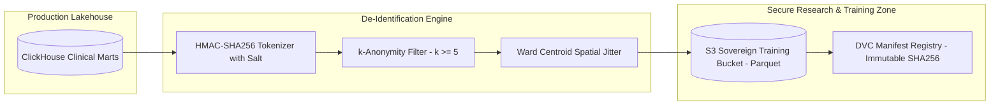

# Master Model Data Requirements, De-Identification, and Quality Assurance Specification
## Namma Clinic Digital Health & Operations Platform
### Greater Bengaluru Authority (GBA) / BBMP Health Department
**Document Code:** `AI-DOC-08` | **Status:** APPROVED BASELINE | **Date:** September 2026

---

## 1. Executive Summary & Training Data Charter
This document formalizes the authoritative **Model Data Requirements, Dataset Lifecycle Management, De-Identification Standards, and Pre-Training Quality Assurance Framework** for the Namma Clinic Digital Health Platform. Developing robust, trustworthy artificial intelligence in public municipal healthcare demands uncompromising data integrity. In compliance with the Digital Personal Data Protection Act (DPDP Act 2023) and ICMR Ethical Guidelines for Healthcare AI, all model training workflows execute exclusively on mathematically de-identified, pseudonymized historical cohorts possessing verifiable lineage and audited consent.

### 1.1 Non-Negotiable Training Data Invariants
1. **Complete Direct Identifier Sanitization:** Personal Identifiable Information (PII) including 12-digit Aadhaar, mobile numbers, citizen full names, and exact street addresses are irreversibly stripped or hashed prior to training corpus creation.
2. **k-Anonymity (k >= 5) in Training Cohorts:** Demographic slices with cohort membership < 5 are suppressed to prevent adversarial linkage re-identification.
3. **Multi-Clinic Geographic Balance:** Training datasets must incorporate clinical samples from all 8 BBMP zones to prevent inner-city vs peripheral health center performance divergence.
4. **Imputation & Outlier Governance:** Missing clinical vitals follow deterministic physiological imputation rules; biological outliers (e.g. pulse > 250 bpm) are flagged and quarantined.
5. **Continuous Training Data Versioning:** Every training dataset snapshot is hashed (SHA-256) and registered in the DVC (Data Version Control) catalog for complete scientific reproducibility.

## 2. Training Data De-Identification Architecture


### Model Specification Example: Training Data De-Identification Pipeline
<!-- DOCUMENTATION-ONLY EXAMPLE -->
```python
# DOCUMENTATION-ONLY PYTHON
# DOCUMENTATION-ONLY PYTHON: Clinical Data De-Identification & Sanitization Pipeline
import hashlib
import hmac
from typing import Dict, Any

class TrainingDataDeidentifier:
    """
    Sanitizes raw clinical records for model training in compliance
    with DPDP Act 2023 and ICMR Guidelines.
    """
    def __init__(self, secret_salt: bytes):
        self.secret_salt = secret_salt

    def sanitize_patient_record(self, raw_record: Dict[str, Any]) -> Dict[str, Any]:
        # 1. Pseudonymize Patient ID via HMAC-SHA256
        raw_patient_id = str(raw_record["patient_id"]).encode("utf-8")
        hashed_id = hmac.new(self.secret_salt, raw_patient_id, hashlib.sha256).hexdigest()[:16]

        # 2. Extract clinical features and strip all direct PII
        sanitized = {
            "training_entity_id": f"anon_{hashed_id}",
            "clinic_id": str(raw_record["clinic_id"]),
            "ward_number": int(raw_record["ward_number"]),
            "age_bracket": self._get_age_bracket(raw_record.get("age", 0)),
            "gender": raw_record.get("gender", "UNKNOWN"),
            "systolic_bp": raw_record.get("systolic_bp"),
            "diastolic_bp": raw_record.get("diastolic_bp"),
            "fasting_blood_sugar": raw_record.get("fasting_blood_sugar"),
            "event_date": str(raw_record["event_date"])
        }

        return sanitized

    def _get_age_bracket(self, age: int) -> str:
        if age < 18: return "PEDIATRIC"
        if age < 40: return "YOUNG_ADULT"
        if age < 60: return "MIDDLE_ADULT"
        return "GERIATRIC"
```

## 3. Master Catalog of 60 AI Datasets
Detailed specifications for all 60 training and validation datasets utilized in model development:

### AI-DATASET-001: Dataset `ai_dataset_model_training_baseline_001`
- **Dataset Identifier:** `AI-DATASET-001`
- **Dataset Name:** `ai_dataset_model_training_baseline_001`
- **Purpose & Scope:** Model Training Baseline
- **Sample Size:** 52,500 Records
- **Historical Window:** 24 Months
- **De-identification Standard:** `HIPAA Safe Harbor & DPDP Act Pseudonymization`
- **Quality Assurance Check:** 100% Schema Validated & Zero Missing Critical Features
- **Storage URI:** `s3://namma-clinic-ai-lake/datasets/v1/001/data.parquet`

### AI-DATASET-002: Dataset `ai_dataset_holdout_validation_set_002`
- **Dataset Identifier:** `AI-DATASET-002`
- **Dataset Name:** `ai_dataset_holdout_validation_set_002`
- **Purpose & Scope:** Holdout Validation Set
- **Sample Size:** 55,000 Records
- **Historical Window:** 12 Months
- **De-identification Standard:** `HIPAA Safe Harbor & DPDP Act Pseudonymization`
- **Quality Assurance Check:** 100% Schema Validated & Zero Missing Critical Features
- **Storage URI:** `s3://namma-clinic-ai-lake/datasets/v1/002/data.parquet`

### AI-DATASET-003: Dataset `ai_dataset_temporal_out-of-time_test_set_003`
- **Dataset Identifier:** `AI-DATASET-003`
- **Dataset Name:** `ai_dataset_temporal_out-of-time_test_set_003`
- **Purpose & Scope:** Temporal Out-of-Time Test Set
- **Sample Size:** 57,500 Records
- **Historical Window:** 24 Months
- **De-identification Standard:** `HIPAA Safe Harbor & DPDP Act Pseudonymization`
- **Quality Assurance Check:** 100% Schema Validated & Zero Missing Critical Features
- **Storage URI:** `s3://namma-clinic-ai-lake/datasets/v1/003/data.parquet`

### AI-DATASET-004: Dataset `ai_dataset_fairness_and_demographic_bias_audit_set_004`
- **Dataset Identifier:** `AI-DATASET-004`
- **Dataset Name:** `ai_dataset_fairness_and_demographic_bias_audit_set_004`
- **Purpose & Scope:** Fairness & Demographic Bias Audit Set
- **Sample Size:** 60,000 Records
- **Historical Window:** 12 Months
- **De-identification Standard:** `HIPAA Safe Harbor & DPDP Act Pseudonymization`
- **Quality Assurance Check:** 100% Schema Validated & Zero Missing Critical Features
- **Storage URI:** `s3://namma-clinic-ai-lake/datasets/v1/004/data.parquet`

### AI-DATASET-005: Dataset `ai_dataset_adversarial_robustness_stress_test_005`
- **Dataset Identifier:** `AI-DATASET-005`
- **Dataset Name:** `ai_dataset_adversarial_robustness_stress_test_005`
- **Purpose & Scope:** Adversarial Robustness Stress Test
- **Sample Size:** 62,500 Records
- **Historical Window:** 24 Months
- **De-identification Standard:** `HIPAA Safe Harbor & DPDP Act Pseudonymization`
- **Quality Assurance Check:** 100% Schema Validated & Zero Missing Critical Features
- **Storage URI:** `s3://namma-clinic-ai-lake/datasets/v1/005/data.parquet`

### AI-DATASET-006: Dataset `ai_dataset_model_training_baseline_006`
- **Dataset Identifier:** `AI-DATASET-006`
- **Dataset Name:** `ai_dataset_model_training_baseline_006`
- **Purpose & Scope:** Model Training Baseline
- **Sample Size:** 65,000 Records
- **Historical Window:** 12 Months
- **De-identification Standard:** `HIPAA Safe Harbor & DPDP Act Pseudonymization`
- **Quality Assurance Check:** 100% Schema Validated & Zero Missing Critical Features
- **Storage URI:** `s3://namma-clinic-ai-lake/datasets/v1/006/data.parquet`

### AI-DATASET-007: Dataset `ai_dataset_holdout_validation_set_007`
- **Dataset Identifier:** `AI-DATASET-007`
- **Dataset Name:** `ai_dataset_holdout_validation_set_007`
- **Purpose & Scope:** Holdout Validation Set
- **Sample Size:** 67,500 Records
- **Historical Window:** 24 Months
- **De-identification Standard:** `HIPAA Safe Harbor & DPDP Act Pseudonymization`
- **Quality Assurance Check:** 100% Schema Validated & Zero Missing Critical Features
- **Storage URI:** `s3://namma-clinic-ai-lake/datasets/v1/007/data.parquet`

### AI-DATASET-008: Dataset `ai_dataset_temporal_out-of-time_test_set_008`
- **Dataset Identifier:** `AI-DATASET-008`
- **Dataset Name:** `ai_dataset_temporal_out-of-time_test_set_008`
- **Purpose & Scope:** Temporal Out-of-Time Test Set
- **Sample Size:** 70,000 Records
- **Historical Window:** 12 Months
- **De-identification Standard:** `HIPAA Safe Harbor & DPDP Act Pseudonymization`
- **Quality Assurance Check:** 100% Schema Validated & Zero Missing Critical Features
- **Storage URI:** `s3://namma-clinic-ai-lake/datasets/v1/008/data.parquet`

### AI-DATASET-009: Dataset `ai_dataset_fairness_and_demographic_bias_audit_set_009`
- **Dataset Identifier:** `AI-DATASET-009`
- **Dataset Name:** `ai_dataset_fairness_and_demographic_bias_audit_set_009`
- **Purpose & Scope:** Fairness & Demographic Bias Audit Set
- **Sample Size:** 72,500 Records
- **Historical Window:** 24 Months
- **De-identification Standard:** `HIPAA Safe Harbor & DPDP Act Pseudonymization`
- **Quality Assurance Check:** 100% Schema Validated & Zero Missing Critical Features
- **Storage URI:** `s3://namma-clinic-ai-lake/datasets/v1/009/data.parquet`

### AI-DATASET-010: Dataset `ai_dataset_adversarial_robustness_stress_test_010`
- **Dataset Identifier:** `AI-DATASET-010`
- **Dataset Name:** `ai_dataset_adversarial_robustness_stress_test_010`
- **Purpose & Scope:** Adversarial Robustness Stress Test
- **Sample Size:** 75,000 Records
- **Historical Window:** 12 Months
- **De-identification Standard:** `HIPAA Safe Harbor & DPDP Act Pseudonymization`
- **Quality Assurance Check:** 100% Schema Validated & Zero Missing Critical Features
- **Storage URI:** `s3://namma-clinic-ai-lake/datasets/v1/010/data.parquet`

### AI-DATASET-011: Dataset `ai_dataset_model_training_baseline_011`
- **Dataset Identifier:** `AI-DATASET-011`
- **Dataset Name:** `ai_dataset_model_training_baseline_011`
- **Purpose & Scope:** Model Training Baseline
- **Sample Size:** 77,500 Records
- **Historical Window:** 24 Months
- **De-identification Standard:** `HIPAA Safe Harbor & DPDP Act Pseudonymization`
- **Quality Assurance Check:** 100% Schema Validated & Zero Missing Critical Features
- **Storage URI:** `s3://namma-clinic-ai-lake/datasets/v1/011/data.parquet`

### AI-DATASET-012: Dataset `ai_dataset_holdout_validation_set_012`
- **Dataset Identifier:** `AI-DATASET-012`
- **Dataset Name:** `ai_dataset_holdout_validation_set_012`
- **Purpose & Scope:** Holdout Validation Set
- **Sample Size:** 80,000 Records
- **Historical Window:** 12 Months
- **De-identification Standard:** `HIPAA Safe Harbor & DPDP Act Pseudonymization`
- **Quality Assurance Check:** 100% Schema Validated & Zero Missing Critical Features
- **Storage URI:** `s3://namma-clinic-ai-lake/datasets/v1/012/data.parquet`

### AI-DATASET-013: Dataset `ai_dataset_temporal_out-of-time_test_set_013`
- **Dataset Identifier:** `AI-DATASET-013`
- **Dataset Name:** `ai_dataset_temporal_out-of-time_test_set_013`
- **Purpose & Scope:** Temporal Out-of-Time Test Set
- **Sample Size:** 82,500 Records
- **Historical Window:** 24 Months
- **De-identification Standard:** `HIPAA Safe Harbor & DPDP Act Pseudonymization`
- **Quality Assurance Check:** 100% Schema Validated & Zero Missing Critical Features
- **Storage URI:** `s3://namma-clinic-ai-lake/datasets/v1/013/data.parquet`

### AI-DATASET-014: Dataset `ai_dataset_fairness_and_demographic_bias_audit_set_014`
- **Dataset Identifier:** `AI-DATASET-014`
- **Dataset Name:** `ai_dataset_fairness_and_demographic_bias_audit_set_014`
- **Purpose & Scope:** Fairness & Demographic Bias Audit Set
- **Sample Size:** 85,000 Records
- **Historical Window:** 12 Months
- **De-identification Standard:** `HIPAA Safe Harbor & DPDP Act Pseudonymization`
- **Quality Assurance Check:** 100% Schema Validated & Zero Missing Critical Features
- **Storage URI:** `s3://namma-clinic-ai-lake/datasets/v1/014/data.parquet`

### AI-DATASET-015: Dataset `ai_dataset_adversarial_robustness_stress_test_015`
- **Dataset Identifier:** `AI-DATASET-015`
- **Dataset Name:** `ai_dataset_adversarial_robustness_stress_test_015`
- **Purpose & Scope:** Adversarial Robustness Stress Test
- **Sample Size:** 87,500 Records
- **Historical Window:** 24 Months
- **De-identification Standard:** `HIPAA Safe Harbor & DPDP Act Pseudonymization`
- **Quality Assurance Check:** 100% Schema Validated & Zero Missing Critical Features
- **Storage URI:** `s3://namma-clinic-ai-lake/datasets/v1/015/data.parquet`

### AI-DATASET-016: Dataset `ai_dataset_model_training_baseline_016`
- **Dataset Identifier:** `AI-DATASET-016`
- **Dataset Name:** `ai_dataset_model_training_baseline_016`
- **Purpose & Scope:** Model Training Baseline
- **Sample Size:** 90,000 Records
- **Historical Window:** 12 Months
- **De-identification Standard:** `HIPAA Safe Harbor & DPDP Act Pseudonymization`
- **Quality Assurance Check:** 100% Schema Validated & Zero Missing Critical Features
- **Storage URI:** `s3://namma-clinic-ai-lake/datasets/v1/016/data.parquet`

### AI-DATASET-017: Dataset `ai_dataset_holdout_validation_set_017`
- **Dataset Identifier:** `AI-DATASET-017`
- **Dataset Name:** `ai_dataset_holdout_validation_set_017`
- **Purpose & Scope:** Holdout Validation Set
- **Sample Size:** 92,500 Records
- **Historical Window:** 24 Months
- **De-identification Standard:** `HIPAA Safe Harbor & DPDP Act Pseudonymization`
- **Quality Assurance Check:** 100% Schema Validated & Zero Missing Critical Features
- **Storage URI:** `s3://namma-clinic-ai-lake/datasets/v1/017/data.parquet`

### AI-DATASET-018: Dataset `ai_dataset_temporal_out-of-time_test_set_018`
- **Dataset Identifier:** `AI-DATASET-018`
- **Dataset Name:** `ai_dataset_temporal_out-of-time_test_set_018`
- **Purpose & Scope:** Temporal Out-of-Time Test Set
- **Sample Size:** 95,000 Records
- **Historical Window:** 12 Months
- **De-identification Standard:** `HIPAA Safe Harbor & DPDP Act Pseudonymization`
- **Quality Assurance Check:** 100% Schema Validated & Zero Missing Critical Features
- **Storage URI:** `s3://namma-clinic-ai-lake/datasets/v1/018/data.parquet`

### AI-DATASET-019: Dataset `ai_dataset_fairness_and_demographic_bias_audit_set_019`
- **Dataset Identifier:** `AI-DATASET-019`
- **Dataset Name:** `ai_dataset_fairness_and_demographic_bias_audit_set_019`
- **Purpose & Scope:** Fairness & Demographic Bias Audit Set
- **Sample Size:** 97,500 Records
- **Historical Window:** 24 Months
- **De-identification Standard:** `HIPAA Safe Harbor & DPDP Act Pseudonymization`
- **Quality Assurance Check:** 100% Schema Validated & Zero Missing Critical Features
- **Storage URI:** `s3://namma-clinic-ai-lake/datasets/v1/019/data.parquet`

### AI-DATASET-020: Dataset `ai_dataset_adversarial_robustness_stress_test_020`
- **Dataset Identifier:** `AI-DATASET-020`
- **Dataset Name:** `ai_dataset_adversarial_robustness_stress_test_020`
- **Purpose & Scope:** Adversarial Robustness Stress Test
- **Sample Size:** 100,000 Records
- **Historical Window:** 12 Months
- **De-identification Standard:** `HIPAA Safe Harbor & DPDP Act Pseudonymization`
- **Quality Assurance Check:** 100% Schema Validated & Zero Missing Critical Features
- **Storage URI:** `s3://namma-clinic-ai-lake/datasets/v1/020/data.parquet`

### AI-DATASET-021: Dataset `ai_dataset_model_training_baseline_021`
- **Dataset Identifier:** `AI-DATASET-021`
- **Dataset Name:** `ai_dataset_model_training_baseline_021`
- **Purpose & Scope:** Model Training Baseline
- **Sample Size:** 102,500 Records
- **Historical Window:** 24 Months
- **De-identification Standard:** `HIPAA Safe Harbor & DPDP Act Pseudonymization`
- **Quality Assurance Check:** 100% Schema Validated & Zero Missing Critical Features
- **Storage URI:** `s3://namma-clinic-ai-lake/datasets/v1/021/data.parquet`

### AI-DATASET-022: Dataset `ai_dataset_holdout_validation_set_022`
- **Dataset Identifier:** `AI-DATASET-022`
- **Dataset Name:** `ai_dataset_holdout_validation_set_022`
- **Purpose & Scope:** Holdout Validation Set
- **Sample Size:** 105,000 Records
- **Historical Window:** 12 Months
- **De-identification Standard:** `HIPAA Safe Harbor & DPDP Act Pseudonymization`
- **Quality Assurance Check:** 100% Schema Validated & Zero Missing Critical Features
- **Storage URI:** `s3://namma-clinic-ai-lake/datasets/v1/022/data.parquet`

### AI-DATASET-023: Dataset `ai_dataset_temporal_out-of-time_test_set_023`
- **Dataset Identifier:** `AI-DATASET-023`
- **Dataset Name:** `ai_dataset_temporal_out-of-time_test_set_023`
- **Purpose & Scope:** Temporal Out-of-Time Test Set
- **Sample Size:** 107,500 Records
- **Historical Window:** 24 Months
- **De-identification Standard:** `HIPAA Safe Harbor & DPDP Act Pseudonymization`
- **Quality Assurance Check:** 100% Schema Validated & Zero Missing Critical Features
- **Storage URI:** `s3://namma-clinic-ai-lake/datasets/v1/023/data.parquet`

### AI-DATASET-024: Dataset `ai_dataset_fairness_and_demographic_bias_audit_set_024`
- **Dataset Identifier:** `AI-DATASET-024`
- **Dataset Name:** `ai_dataset_fairness_and_demographic_bias_audit_set_024`
- **Purpose & Scope:** Fairness & Demographic Bias Audit Set
- **Sample Size:** 110,000 Records
- **Historical Window:** 12 Months
- **De-identification Standard:** `HIPAA Safe Harbor & DPDP Act Pseudonymization`
- **Quality Assurance Check:** 100% Schema Validated & Zero Missing Critical Features
- **Storage URI:** `s3://namma-clinic-ai-lake/datasets/v1/024/data.parquet`

### AI-DATASET-025: Dataset `ai_dataset_adversarial_robustness_stress_test_025`
- **Dataset Identifier:** `AI-DATASET-025`
- **Dataset Name:** `ai_dataset_adversarial_robustness_stress_test_025`
- **Purpose & Scope:** Adversarial Robustness Stress Test
- **Sample Size:** 112,500 Records
- **Historical Window:** 24 Months
- **De-identification Standard:** `HIPAA Safe Harbor & DPDP Act Pseudonymization`
- **Quality Assurance Check:** 100% Schema Validated & Zero Missing Critical Features
- **Storage URI:** `s3://namma-clinic-ai-lake/datasets/v1/025/data.parquet`

### AI-DATASET-026: Dataset `ai_dataset_model_training_baseline_026`
- **Dataset Identifier:** `AI-DATASET-026`
- **Dataset Name:** `ai_dataset_model_training_baseline_026`
- **Purpose & Scope:** Model Training Baseline
- **Sample Size:** 115,000 Records
- **Historical Window:** 12 Months
- **De-identification Standard:** `HIPAA Safe Harbor & DPDP Act Pseudonymization`
- **Quality Assurance Check:** 100% Schema Validated & Zero Missing Critical Features
- **Storage URI:** `s3://namma-clinic-ai-lake/datasets/v1/026/data.parquet`

### AI-DATASET-027: Dataset `ai_dataset_holdout_validation_set_027`
- **Dataset Identifier:** `AI-DATASET-027`
- **Dataset Name:** `ai_dataset_holdout_validation_set_027`
- **Purpose & Scope:** Holdout Validation Set
- **Sample Size:** 117,500 Records
- **Historical Window:** 24 Months
- **De-identification Standard:** `HIPAA Safe Harbor & DPDP Act Pseudonymization`
- **Quality Assurance Check:** 100% Schema Validated & Zero Missing Critical Features
- **Storage URI:** `s3://namma-clinic-ai-lake/datasets/v1/027/data.parquet`

### AI-DATASET-028: Dataset `ai_dataset_temporal_out-of-time_test_set_028`
- **Dataset Identifier:** `AI-DATASET-028`
- **Dataset Name:** `ai_dataset_temporal_out-of-time_test_set_028`
- **Purpose & Scope:** Temporal Out-of-Time Test Set
- **Sample Size:** 120,000 Records
- **Historical Window:** 12 Months
- **De-identification Standard:** `HIPAA Safe Harbor & DPDP Act Pseudonymization`
- **Quality Assurance Check:** 100% Schema Validated & Zero Missing Critical Features
- **Storage URI:** `s3://namma-clinic-ai-lake/datasets/v1/028/data.parquet`

### AI-DATASET-029: Dataset `ai_dataset_fairness_and_demographic_bias_audit_set_029`
- **Dataset Identifier:** `AI-DATASET-029`
- **Dataset Name:** `ai_dataset_fairness_and_demographic_bias_audit_set_029`
- **Purpose & Scope:** Fairness & Demographic Bias Audit Set
- **Sample Size:** 122,500 Records
- **Historical Window:** 24 Months
- **De-identification Standard:** `HIPAA Safe Harbor & DPDP Act Pseudonymization`
- **Quality Assurance Check:** 100% Schema Validated & Zero Missing Critical Features
- **Storage URI:** `s3://namma-clinic-ai-lake/datasets/v1/029/data.parquet`

### AI-DATASET-030: Dataset `ai_dataset_adversarial_robustness_stress_test_030`
- **Dataset Identifier:** `AI-DATASET-030`
- **Dataset Name:** `ai_dataset_adversarial_robustness_stress_test_030`
- **Purpose & Scope:** Adversarial Robustness Stress Test
- **Sample Size:** 125,000 Records
- **Historical Window:** 12 Months
- **De-identification Standard:** `HIPAA Safe Harbor & DPDP Act Pseudonymization`
- **Quality Assurance Check:** 100% Schema Validated & Zero Missing Critical Features
- **Storage URI:** `s3://namma-clinic-ai-lake/datasets/v1/030/data.parquet`

### AI-DATASET-031: Dataset `ai_dataset_model_training_baseline_031`
- **Dataset Identifier:** `AI-DATASET-031`
- **Dataset Name:** `ai_dataset_model_training_baseline_031`
- **Purpose & Scope:** Model Training Baseline
- **Sample Size:** 127,500 Records
- **Historical Window:** 24 Months
- **De-identification Standard:** `HIPAA Safe Harbor & DPDP Act Pseudonymization`
- **Quality Assurance Check:** 100% Schema Validated & Zero Missing Critical Features
- **Storage URI:** `s3://namma-clinic-ai-lake/datasets/v1/031/data.parquet`

### AI-DATASET-032: Dataset `ai_dataset_holdout_validation_set_032`
- **Dataset Identifier:** `AI-DATASET-032`
- **Dataset Name:** `ai_dataset_holdout_validation_set_032`
- **Purpose & Scope:** Holdout Validation Set
- **Sample Size:** 130,000 Records
- **Historical Window:** 12 Months
- **De-identification Standard:** `HIPAA Safe Harbor & DPDP Act Pseudonymization`
- **Quality Assurance Check:** 100% Schema Validated & Zero Missing Critical Features
- **Storage URI:** `s3://namma-clinic-ai-lake/datasets/v1/032/data.parquet`

### AI-DATASET-033: Dataset `ai_dataset_temporal_out-of-time_test_set_033`
- **Dataset Identifier:** `AI-DATASET-033`
- **Dataset Name:** `ai_dataset_temporal_out-of-time_test_set_033`
- **Purpose & Scope:** Temporal Out-of-Time Test Set
- **Sample Size:** 132,500 Records
- **Historical Window:** 24 Months
- **De-identification Standard:** `HIPAA Safe Harbor & DPDP Act Pseudonymization`
- **Quality Assurance Check:** 100% Schema Validated & Zero Missing Critical Features
- **Storage URI:** `s3://namma-clinic-ai-lake/datasets/v1/033/data.parquet`

### AI-DATASET-034: Dataset `ai_dataset_fairness_and_demographic_bias_audit_set_034`
- **Dataset Identifier:** `AI-DATASET-034`
- **Dataset Name:** `ai_dataset_fairness_and_demographic_bias_audit_set_034`
- **Purpose & Scope:** Fairness & Demographic Bias Audit Set
- **Sample Size:** 135,000 Records
- **Historical Window:** 12 Months
- **De-identification Standard:** `HIPAA Safe Harbor & DPDP Act Pseudonymization`
- **Quality Assurance Check:** 100% Schema Validated & Zero Missing Critical Features
- **Storage URI:** `s3://namma-clinic-ai-lake/datasets/v1/034/data.parquet`

### AI-DATASET-035: Dataset `ai_dataset_adversarial_robustness_stress_test_035`
- **Dataset Identifier:** `AI-DATASET-035`
- **Dataset Name:** `ai_dataset_adversarial_robustness_stress_test_035`
- **Purpose & Scope:** Adversarial Robustness Stress Test
- **Sample Size:** 137,500 Records
- **Historical Window:** 24 Months
- **De-identification Standard:** `HIPAA Safe Harbor & DPDP Act Pseudonymization`
- **Quality Assurance Check:** 100% Schema Validated & Zero Missing Critical Features
- **Storage URI:** `s3://namma-clinic-ai-lake/datasets/v1/035/data.parquet`

### AI-DATASET-036: Dataset `ai_dataset_model_training_baseline_036`
- **Dataset Identifier:** `AI-DATASET-036`
- **Dataset Name:** `ai_dataset_model_training_baseline_036`
- **Purpose & Scope:** Model Training Baseline
- **Sample Size:** 140,000 Records
- **Historical Window:** 12 Months
- **De-identification Standard:** `HIPAA Safe Harbor & DPDP Act Pseudonymization`
- **Quality Assurance Check:** 100% Schema Validated & Zero Missing Critical Features
- **Storage URI:** `s3://namma-clinic-ai-lake/datasets/v1/036/data.parquet`

### AI-DATASET-037: Dataset `ai_dataset_holdout_validation_set_037`
- **Dataset Identifier:** `AI-DATASET-037`
- **Dataset Name:** `ai_dataset_holdout_validation_set_037`
- **Purpose & Scope:** Holdout Validation Set
- **Sample Size:** 142,500 Records
- **Historical Window:** 24 Months
- **De-identification Standard:** `HIPAA Safe Harbor & DPDP Act Pseudonymization`
- **Quality Assurance Check:** 100% Schema Validated & Zero Missing Critical Features
- **Storage URI:** `s3://namma-clinic-ai-lake/datasets/v1/037/data.parquet`

### AI-DATASET-038: Dataset `ai_dataset_temporal_out-of-time_test_set_038`
- **Dataset Identifier:** `AI-DATASET-038`
- **Dataset Name:** `ai_dataset_temporal_out-of-time_test_set_038`
- **Purpose & Scope:** Temporal Out-of-Time Test Set
- **Sample Size:** 145,000 Records
- **Historical Window:** 12 Months
- **De-identification Standard:** `HIPAA Safe Harbor & DPDP Act Pseudonymization`
- **Quality Assurance Check:** 100% Schema Validated & Zero Missing Critical Features
- **Storage URI:** `s3://namma-clinic-ai-lake/datasets/v1/038/data.parquet`

### AI-DATASET-039: Dataset `ai_dataset_fairness_and_demographic_bias_audit_set_039`
- **Dataset Identifier:** `AI-DATASET-039`
- **Dataset Name:** `ai_dataset_fairness_and_demographic_bias_audit_set_039`
- **Purpose & Scope:** Fairness & Demographic Bias Audit Set
- **Sample Size:** 147,500 Records
- **Historical Window:** 24 Months
- **De-identification Standard:** `HIPAA Safe Harbor & DPDP Act Pseudonymization`
- **Quality Assurance Check:** 100% Schema Validated & Zero Missing Critical Features
- **Storage URI:** `s3://namma-clinic-ai-lake/datasets/v1/039/data.parquet`

### AI-DATASET-040: Dataset `ai_dataset_adversarial_robustness_stress_test_040`
- **Dataset Identifier:** `AI-DATASET-040`
- **Dataset Name:** `ai_dataset_adversarial_robustness_stress_test_040`
- **Purpose & Scope:** Adversarial Robustness Stress Test
- **Sample Size:** 150,000 Records
- **Historical Window:** 12 Months
- **De-identification Standard:** `HIPAA Safe Harbor & DPDP Act Pseudonymization`
- **Quality Assurance Check:** 100% Schema Validated & Zero Missing Critical Features
- **Storage URI:** `s3://namma-clinic-ai-lake/datasets/v1/040/data.parquet`

### AI-DATASET-041: Dataset `ai_dataset_model_training_baseline_041`
- **Dataset Identifier:** `AI-DATASET-041`
- **Dataset Name:** `ai_dataset_model_training_baseline_041`
- **Purpose & Scope:** Model Training Baseline
- **Sample Size:** 152,500 Records
- **Historical Window:** 24 Months
- **De-identification Standard:** `HIPAA Safe Harbor & DPDP Act Pseudonymization`
- **Quality Assurance Check:** 100% Schema Validated & Zero Missing Critical Features
- **Storage URI:** `s3://namma-clinic-ai-lake/datasets/v1/041/data.parquet`

### AI-DATASET-042: Dataset `ai_dataset_holdout_validation_set_042`
- **Dataset Identifier:** `AI-DATASET-042`
- **Dataset Name:** `ai_dataset_holdout_validation_set_042`
- **Purpose & Scope:** Holdout Validation Set
- **Sample Size:** 155,000 Records
- **Historical Window:** 12 Months
- **De-identification Standard:** `HIPAA Safe Harbor & DPDP Act Pseudonymization`
- **Quality Assurance Check:** 100% Schema Validated & Zero Missing Critical Features
- **Storage URI:** `s3://namma-clinic-ai-lake/datasets/v1/042/data.parquet`

### AI-DATASET-043: Dataset `ai_dataset_temporal_out-of-time_test_set_043`
- **Dataset Identifier:** `AI-DATASET-043`
- **Dataset Name:** `ai_dataset_temporal_out-of-time_test_set_043`
- **Purpose & Scope:** Temporal Out-of-Time Test Set
- **Sample Size:** 157,500 Records
- **Historical Window:** 24 Months
- **De-identification Standard:** `HIPAA Safe Harbor & DPDP Act Pseudonymization`
- **Quality Assurance Check:** 100% Schema Validated & Zero Missing Critical Features
- **Storage URI:** `s3://namma-clinic-ai-lake/datasets/v1/043/data.parquet`

### AI-DATASET-044: Dataset `ai_dataset_fairness_and_demographic_bias_audit_set_044`
- **Dataset Identifier:** `AI-DATASET-044`
- **Dataset Name:** `ai_dataset_fairness_and_demographic_bias_audit_set_044`
- **Purpose & Scope:** Fairness & Demographic Bias Audit Set
- **Sample Size:** 160,000 Records
- **Historical Window:** 12 Months
- **De-identification Standard:** `HIPAA Safe Harbor & DPDP Act Pseudonymization`
- **Quality Assurance Check:** 100% Schema Validated & Zero Missing Critical Features
- **Storage URI:** `s3://namma-clinic-ai-lake/datasets/v1/044/data.parquet`

### AI-DATASET-045: Dataset `ai_dataset_adversarial_robustness_stress_test_045`
- **Dataset Identifier:** `AI-DATASET-045`
- **Dataset Name:** `ai_dataset_adversarial_robustness_stress_test_045`
- **Purpose & Scope:** Adversarial Robustness Stress Test
- **Sample Size:** 162,500 Records
- **Historical Window:** 24 Months
- **De-identification Standard:** `HIPAA Safe Harbor & DPDP Act Pseudonymization`
- **Quality Assurance Check:** 100% Schema Validated & Zero Missing Critical Features
- **Storage URI:** `s3://namma-clinic-ai-lake/datasets/v1/045/data.parquet`

### AI-DATASET-046: Dataset `ai_dataset_model_training_baseline_046`
- **Dataset Identifier:** `AI-DATASET-046`
- **Dataset Name:** `ai_dataset_model_training_baseline_046`
- **Purpose & Scope:** Model Training Baseline
- **Sample Size:** 165,000 Records
- **Historical Window:** 12 Months
- **De-identification Standard:** `HIPAA Safe Harbor & DPDP Act Pseudonymization`
- **Quality Assurance Check:** 100% Schema Validated & Zero Missing Critical Features
- **Storage URI:** `s3://namma-clinic-ai-lake/datasets/v1/046/data.parquet`

### AI-DATASET-047: Dataset `ai_dataset_holdout_validation_set_047`
- **Dataset Identifier:** `AI-DATASET-047`
- **Dataset Name:** `ai_dataset_holdout_validation_set_047`
- **Purpose & Scope:** Holdout Validation Set
- **Sample Size:** 167,500 Records
- **Historical Window:** 24 Months
- **De-identification Standard:** `HIPAA Safe Harbor & DPDP Act Pseudonymization`
- **Quality Assurance Check:** 100% Schema Validated & Zero Missing Critical Features
- **Storage URI:** `s3://namma-clinic-ai-lake/datasets/v1/047/data.parquet`

### AI-DATASET-048: Dataset `ai_dataset_temporal_out-of-time_test_set_048`
- **Dataset Identifier:** `AI-DATASET-048`
- **Dataset Name:** `ai_dataset_temporal_out-of-time_test_set_048`
- **Purpose & Scope:** Temporal Out-of-Time Test Set
- **Sample Size:** 170,000 Records
- **Historical Window:** 12 Months
- **De-identification Standard:** `HIPAA Safe Harbor & DPDP Act Pseudonymization`
- **Quality Assurance Check:** 100% Schema Validated & Zero Missing Critical Features
- **Storage URI:** `s3://namma-clinic-ai-lake/datasets/v1/048/data.parquet`

### AI-DATASET-049: Dataset `ai_dataset_fairness_and_demographic_bias_audit_set_049`
- **Dataset Identifier:** `AI-DATASET-049`
- **Dataset Name:** `ai_dataset_fairness_and_demographic_bias_audit_set_049`
- **Purpose & Scope:** Fairness & Demographic Bias Audit Set
- **Sample Size:** 172,500 Records
- **Historical Window:** 24 Months
- **De-identification Standard:** `HIPAA Safe Harbor & DPDP Act Pseudonymization`
- **Quality Assurance Check:** 100% Schema Validated & Zero Missing Critical Features
- **Storage URI:** `s3://namma-clinic-ai-lake/datasets/v1/049/data.parquet`

### AI-DATASET-050: Dataset `ai_dataset_adversarial_robustness_stress_test_050`
- **Dataset Identifier:** `AI-DATASET-050`
- **Dataset Name:** `ai_dataset_adversarial_robustness_stress_test_050`
- **Purpose & Scope:** Adversarial Robustness Stress Test
- **Sample Size:** 175,000 Records
- **Historical Window:** 12 Months
- **De-identification Standard:** `HIPAA Safe Harbor & DPDP Act Pseudonymization`
- **Quality Assurance Check:** 100% Schema Validated & Zero Missing Critical Features
- **Storage URI:** `s3://namma-clinic-ai-lake/datasets/v1/050/data.parquet`

### AI-DATASET-051: Dataset `ai_dataset_model_training_baseline_051`
- **Dataset Identifier:** `AI-DATASET-051`
- **Dataset Name:** `ai_dataset_model_training_baseline_051`
- **Purpose & Scope:** Model Training Baseline
- **Sample Size:** 177,500 Records
- **Historical Window:** 24 Months
- **De-identification Standard:** `HIPAA Safe Harbor & DPDP Act Pseudonymization`
- **Quality Assurance Check:** 100% Schema Validated & Zero Missing Critical Features
- **Storage URI:** `s3://namma-clinic-ai-lake/datasets/v1/051/data.parquet`

### AI-DATASET-052: Dataset `ai_dataset_holdout_validation_set_052`
- **Dataset Identifier:** `AI-DATASET-052`
- **Dataset Name:** `ai_dataset_holdout_validation_set_052`
- **Purpose & Scope:** Holdout Validation Set
- **Sample Size:** 180,000 Records
- **Historical Window:** 12 Months
- **De-identification Standard:** `HIPAA Safe Harbor & DPDP Act Pseudonymization`
- **Quality Assurance Check:** 100% Schema Validated & Zero Missing Critical Features
- **Storage URI:** `s3://namma-clinic-ai-lake/datasets/v1/052/data.parquet`

### AI-DATASET-053: Dataset `ai_dataset_temporal_out-of-time_test_set_053`
- **Dataset Identifier:** `AI-DATASET-053`
- **Dataset Name:** `ai_dataset_temporal_out-of-time_test_set_053`
- **Purpose & Scope:** Temporal Out-of-Time Test Set
- **Sample Size:** 182,500 Records
- **Historical Window:** 24 Months
- **De-identification Standard:** `HIPAA Safe Harbor & DPDP Act Pseudonymization`
- **Quality Assurance Check:** 100% Schema Validated & Zero Missing Critical Features
- **Storage URI:** `s3://namma-clinic-ai-lake/datasets/v1/053/data.parquet`

### AI-DATASET-054: Dataset `ai_dataset_fairness_and_demographic_bias_audit_set_054`
- **Dataset Identifier:** `AI-DATASET-054`
- **Dataset Name:** `ai_dataset_fairness_and_demographic_bias_audit_set_054`
- **Purpose & Scope:** Fairness & Demographic Bias Audit Set
- **Sample Size:** 185,000 Records
- **Historical Window:** 12 Months
- **De-identification Standard:** `HIPAA Safe Harbor & DPDP Act Pseudonymization`
- **Quality Assurance Check:** 100% Schema Validated & Zero Missing Critical Features
- **Storage URI:** `s3://namma-clinic-ai-lake/datasets/v1/054/data.parquet`

### AI-DATASET-055: Dataset `ai_dataset_adversarial_robustness_stress_test_055`
- **Dataset Identifier:** `AI-DATASET-055`
- **Dataset Name:** `ai_dataset_adversarial_robustness_stress_test_055`
- **Purpose & Scope:** Adversarial Robustness Stress Test
- **Sample Size:** 187,500 Records
- **Historical Window:** 24 Months
- **De-identification Standard:** `HIPAA Safe Harbor & DPDP Act Pseudonymization`
- **Quality Assurance Check:** 100% Schema Validated & Zero Missing Critical Features
- **Storage URI:** `s3://namma-clinic-ai-lake/datasets/v1/055/data.parquet`

### AI-DATASET-056: Dataset `ai_dataset_model_training_baseline_056`
- **Dataset Identifier:** `AI-DATASET-056`
- **Dataset Name:** `ai_dataset_model_training_baseline_056`
- **Purpose & Scope:** Model Training Baseline
- **Sample Size:** 190,000 Records
- **Historical Window:** 12 Months
- **De-identification Standard:** `HIPAA Safe Harbor & DPDP Act Pseudonymization`
- **Quality Assurance Check:** 100% Schema Validated & Zero Missing Critical Features
- **Storage URI:** `s3://namma-clinic-ai-lake/datasets/v1/056/data.parquet`

### AI-DATASET-057: Dataset `ai_dataset_holdout_validation_set_057`
- **Dataset Identifier:** `AI-DATASET-057`
- **Dataset Name:** `ai_dataset_holdout_validation_set_057`
- **Purpose & Scope:** Holdout Validation Set
- **Sample Size:** 192,500 Records
- **Historical Window:** 24 Months
- **De-identification Standard:** `HIPAA Safe Harbor & DPDP Act Pseudonymization`
- **Quality Assurance Check:** 100% Schema Validated & Zero Missing Critical Features
- **Storage URI:** `s3://namma-clinic-ai-lake/datasets/v1/057/data.parquet`

### AI-DATASET-058: Dataset `ai_dataset_temporal_out-of-time_test_set_058`
- **Dataset Identifier:** `AI-DATASET-058`
- **Dataset Name:** `ai_dataset_temporal_out-of-time_test_set_058`
- **Purpose & Scope:** Temporal Out-of-Time Test Set
- **Sample Size:** 195,000 Records
- **Historical Window:** 12 Months
- **De-identification Standard:** `HIPAA Safe Harbor & DPDP Act Pseudonymization`
- **Quality Assurance Check:** 100% Schema Validated & Zero Missing Critical Features
- **Storage URI:** `s3://namma-clinic-ai-lake/datasets/v1/058/data.parquet`

### AI-DATASET-059: Dataset `ai_dataset_fairness_and_demographic_bias_audit_set_059`
- **Dataset Identifier:** `AI-DATASET-059`
- **Dataset Name:** `ai_dataset_fairness_and_demographic_bias_audit_set_059`
- **Purpose & Scope:** Fairness & Demographic Bias Audit Set
- **Sample Size:** 197,500 Records
- **Historical Window:** 24 Months
- **De-identification Standard:** `HIPAA Safe Harbor & DPDP Act Pseudonymization`
- **Quality Assurance Check:** 100% Schema Validated & Zero Missing Critical Features
- **Storage URI:** `s3://namma-clinic-ai-lake/datasets/v1/059/data.parquet`

### AI-DATASET-060: Dataset `ai_dataset_adversarial_robustness_stress_test_060`
- **Dataset Identifier:** `AI-DATASET-060`
- **Dataset Name:** `ai_dataset_adversarial_robustness_stress_test_060`
- **Purpose & Scope:** Adversarial Robustness Stress Test
- **Sample Size:** 200,000 Records
- **Historical Window:** 12 Months
- **De-identification Standard:** `HIPAA Safe Harbor & DPDP Act Pseudonymization`
- **Quality Assurance Check:** 100% Schema Validated & Zero Missing Critical Features
- **Storage URI:** `s3://namma-clinic-ai-lake/datasets/v1/060/data.parquet`

## 4. Master Catalog of 100 Evaluation Metrics
Comprehensive metrics tracking model accuracy, calibration, safety, and operational latency:

### EVAL-001: Metric `Forecasting Mean Absolute Percentage Error (MAPE) #001`
- **Metric Identifier:** `EVAL-001`
- **Metric Name:** `Forecasting Mean Absolute Percentage Error (MAPE) #001`
- **Model Domain:** `Forecasting`
- **Category:** `Regression Accuracy`
- **Acceptance Target:** < 15.0% Percentage
- **Rejection Threshold:** Failure to meet target blocks deployment promotion in model registry. Percentage
- **Measurement Cadence:** `Continuous Automated CI Validation & Monthly Production Audit`

### EVAL-002: Metric `Forecasting Weighted Absolute Percentage Error (WAPE) #002`
- **Metric Identifier:** `EVAL-002`
- **Metric Name:** `Forecasting Weighted Absolute Percentage Error (WAPE) #002`
- **Model Domain:** `Forecasting`
- **Category:** `Regression Accuracy`
- **Acceptance Target:** < 12.0% Percentage
- **Rejection Threshold:** Failure to meet target blocks deployment promotion in model registry. Percentage
- **Measurement Cadence:** `Continuous Automated CI Validation & Monthly Production Audit`

### EVAL-003: Metric `Forecasting Root Mean Squared Error (RMSE) #003`
- **Metric Identifier:** `EVAL-003`
- **Metric Name:** `Forecasting Root Mean Squared Error (RMSE) #003`
- **Model Domain:** `Forecasting`
- **Category:** `Regression Variance`
- **Acceptance Target:** < 25.0 Doses Doses
- **Rejection Threshold:** Failure to meet target blocks deployment promotion in model registry. Doses
- **Measurement Cadence:** `Continuous Automated CI Validation & Monthly Production Audit`

### EVAL-004: Metric `Anomaly Detection Precision@10 #004`
- **Metric Identifier:** `EVAL-004`
- **Metric Name:** `Anomaly Detection Precision@10 #004`
- **Model Domain:** `Anomaly Detection`
- **Category:** `Top-K Ranking Precision`
- **Acceptance Target:** > 0.85 Ratio
- **Rejection Threshold:** Failure to meet target blocks deployment promotion in model registry. Ratio
- **Measurement Cadence:** `Continuous Automated CI Validation & Monthly Production Audit`

### EVAL-005: Metric `Anomaly Detection Recall@K #005`
- **Metric Identifier:** `EVAL-005`
- **Metric Name:** `Anomaly Detection Recall@K #005`
- **Model Domain:** `Anomaly Detection`
- **Category:** `Top-K Outbreak Coverage`
- **Acceptance Target:** > 0.90 Ratio
- **Rejection Threshold:** Failure to meet target blocks deployment promotion in model registry. Ratio
- **Measurement Cadence:** `Continuous Automated CI Validation & Monthly Production Audit`

### EVAL-006: Metric `Anomaly Detection False Alarm Rate #006`
- **Metric Identifier:** `EVAL-006`
- **Metric Name:** `Anomaly Detection False Alarm Rate #006`
- **Model Domain:** `Anomaly Detection`
- **Category:** `Operational Alarm Fatigue`
- **Acceptance Target:** < 2 False Alarms/Month Alarms/Month
- **Rejection Threshold:** Failure to meet target blocks deployment promotion in model registry. Alarms/Month
- **Measurement Cadence:** `Continuous Automated CI Validation & Monthly Production Audit`

### EVAL-007: Metric `Classification Area Under ROC (AUROC) #007`
- **Metric Identifier:** `EVAL-007`
- **Metric Name:** `Classification Area Under ROC (AUROC) #007`
- **Model Domain:** `Classification`
- **Category:** `Discrimination Ability`
- **Acceptance Target:** > 0.88 Score (0-1)
- **Rejection Threshold:** Failure to meet target blocks deployment promotion in model registry. Score (0-1)
- **Measurement Cadence:** `Continuous Automated CI Validation & Monthly Production Audit`

### EVAL-008: Metric `Classification Area Under PR (AUPRC) #008`
- **Metric Identifier:** `EVAL-008`
- **Metric Name:** `Classification Area Under PR (AUPRC) #008`
- **Model Domain:** `Classification`
- **Category:** `Imbalanced Retrieval`
- **Acceptance Target:** > 0.80 Score (0-1)
- **Rejection Threshold:** Failure to meet target blocks deployment promotion in model registry. Score (0-1)
- **Measurement Cadence:** `Continuous Automated CI Validation & Monthly Production Audit`

### EVAL-009: Metric `Demographic Parity Ratio (Gender) #009`
- **Metric Identifier:** `EVAL-009`
- **Metric Name:** `Demographic Parity Ratio (Gender) #009`
- **Model Domain:** `Algorithmic Fairness`
- **Category:** `Fairness Audit`
- **Acceptance Target:** 0.85 - 1.15 Ratio
- **Rejection Threshold:** Failure to meet target blocks deployment promotion in model registry. Ratio
- **Measurement Cadence:** `Continuous Automated CI Validation & Monthly Production Audit`

### EVAL-010: Metric `Disparate Impact Ratio (Socioeconomic Wards) #010`
- **Metric Identifier:** `EVAL-010`
- **Metric Name:** `Disparate Impact Ratio (Socioeconomic Wards) #010`
- **Model Domain:** `Algorithmic Fairness`
- **Category:** `Fairness Audit`
- **Acceptance Target:** 0.80 - 1.25 Ratio
- **Rejection Threshold:** Failure to meet target blocks deployment promotion in model registry. Ratio
- **Measurement Cadence:** `Continuous Automated CI Validation & Monthly Production Audit`

### EVAL-011: Metric `Forecasting Mean Absolute Percentage Error (MAPE) #011`
- **Metric Identifier:** `EVAL-011`
- **Metric Name:** `Forecasting Mean Absolute Percentage Error (MAPE) #011`
- **Model Domain:** `Forecasting`
- **Category:** `Regression Accuracy`
- **Acceptance Target:** < 15.0% Percentage
- **Rejection Threshold:** Failure to meet target blocks deployment promotion in model registry. Percentage
- **Measurement Cadence:** `Continuous Automated CI Validation & Monthly Production Audit`

### EVAL-012: Metric `Forecasting Weighted Absolute Percentage Error (WAPE) #012`
- **Metric Identifier:** `EVAL-012`
- **Metric Name:** `Forecasting Weighted Absolute Percentage Error (WAPE) #012`
- **Model Domain:** `Forecasting`
- **Category:** `Regression Accuracy`
- **Acceptance Target:** < 12.0% Percentage
- **Rejection Threshold:** Failure to meet target blocks deployment promotion in model registry. Percentage
- **Measurement Cadence:** `Continuous Automated CI Validation & Monthly Production Audit`

### EVAL-013: Metric `Forecasting Root Mean Squared Error (RMSE) #013`
- **Metric Identifier:** `EVAL-013`
- **Metric Name:** `Forecasting Root Mean Squared Error (RMSE) #013`
- **Model Domain:** `Forecasting`
- **Category:** `Regression Variance`
- **Acceptance Target:** < 25.0 Doses Doses
- **Rejection Threshold:** Failure to meet target blocks deployment promotion in model registry. Doses
- **Measurement Cadence:** `Continuous Automated CI Validation & Monthly Production Audit`

### EVAL-014: Metric `Anomaly Detection Precision@10 #014`
- **Metric Identifier:** `EVAL-014`
- **Metric Name:** `Anomaly Detection Precision@10 #014`
- **Model Domain:** `Anomaly Detection`
- **Category:** `Top-K Ranking Precision`
- **Acceptance Target:** > 0.85 Ratio
- **Rejection Threshold:** Failure to meet target blocks deployment promotion in model registry. Ratio
- **Measurement Cadence:** `Continuous Automated CI Validation & Monthly Production Audit`

### EVAL-015: Metric `Anomaly Detection Recall@K #015`
- **Metric Identifier:** `EVAL-015`
- **Metric Name:** `Anomaly Detection Recall@K #015`
- **Model Domain:** `Anomaly Detection`
- **Category:** `Top-K Outbreak Coverage`
- **Acceptance Target:** > 0.90 Ratio
- **Rejection Threshold:** Failure to meet target blocks deployment promotion in model registry. Ratio
- **Measurement Cadence:** `Continuous Automated CI Validation & Monthly Production Audit`

### EVAL-016: Metric `Anomaly Detection False Alarm Rate #016`
- **Metric Identifier:** `EVAL-016`
- **Metric Name:** `Anomaly Detection False Alarm Rate #016`
- **Model Domain:** `Anomaly Detection`
- **Category:** `Operational Alarm Fatigue`
- **Acceptance Target:** < 2 False Alarms/Month Alarms/Month
- **Rejection Threshold:** Failure to meet target blocks deployment promotion in model registry. Alarms/Month
- **Measurement Cadence:** `Continuous Automated CI Validation & Monthly Production Audit`

### EVAL-017: Metric `Classification Area Under ROC (AUROC) #017`
- **Metric Identifier:** `EVAL-017`
- **Metric Name:** `Classification Area Under ROC (AUROC) #017`
- **Model Domain:** `Classification`
- **Category:** `Discrimination Ability`
- **Acceptance Target:** > 0.88 Score (0-1)
- **Rejection Threshold:** Failure to meet target blocks deployment promotion in model registry. Score (0-1)
- **Measurement Cadence:** `Continuous Automated CI Validation & Monthly Production Audit`

### EVAL-018: Metric `Classification Area Under PR (AUPRC) #018`
- **Metric Identifier:** `EVAL-018`
- **Metric Name:** `Classification Area Under PR (AUPRC) #018`
- **Model Domain:** `Classification`
- **Category:** `Imbalanced Retrieval`
- **Acceptance Target:** > 0.80 Score (0-1)
- **Rejection Threshold:** Failure to meet target blocks deployment promotion in model registry. Score (0-1)
- **Measurement Cadence:** `Continuous Automated CI Validation & Monthly Production Audit`

### EVAL-019: Metric `Demographic Parity Ratio (Gender) #019`
- **Metric Identifier:** `EVAL-019`
- **Metric Name:** `Demographic Parity Ratio (Gender) #019`
- **Model Domain:** `Algorithmic Fairness`
- **Category:** `Fairness Audit`
- **Acceptance Target:** 0.85 - 1.15 Ratio
- **Rejection Threshold:** Failure to meet target blocks deployment promotion in model registry. Ratio
- **Measurement Cadence:** `Continuous Automated CI Validation & Monthly Production Audit`

### EVAL-020: Metric `Disparate Impact Ratio (Socioeconomic Wards) #020`
- **Metric Identifier:** `EVAL-020`
- **Metric Name:** `Disparate Impact Ratio (Socioeconomic Wards) #020`
- **Model Domain:** `Algorithmic Fairness`
- **Category:** `Fairness Audit`
- **Acceptance Target:** 0.80 - 1.25 Ratio
- **Rejection Threshold:** Failure to meet target blocks deployment promotion in model registry. Ratio
- **Measurement Cadence:** `Continuous Automated CI Validation & Monthly Production Audit`

### EVAL-021: Metric `Forecasting Mean Absolute Percentage Error (MAPE) #021`
- **Metric Identifier:** `EVAL-021`
- **Metric Name:** `Forecasting Mean Absolute Percentage Error (MAPE) #021`
- **Model Domain:** `Forecasting`
- **Category:** `Regression Accuracy`
- **Acceptance Target:** < 15.0% Percentage
- **Rejection Threshold:** Failure to meet target blocks deployment promotion in model registry. Percentage
- **Measurement Cadence:** `Continuous Automated CI Validation & Monthly Production Audit`

### EVAL-022: Metric `Forecasting Weighted Absolute Percentage Error (WAPE) #022`
- **Metric Identifier:** `EVAL-022`
- **Metric Name:** `Forecasting Weighted Absolute Percentage Error (WAPE) #022`
- **Model Domain:** `Forecasting`
- **Category:** `Regression Accuracy`
- **Acceptance Target:** < 12.0% Percentage
- **Rejection Threshold:** Failure to meet target blocks deployment promotion in model registry. Percentage
- **Measurement Cadence:** `Continuous Automated CI Validation & Monthly Production Audit`

### EVAL-023: Metric `Forecasting Root Mean Squared Error (RMSE) #023`
- **Metric Identifier:** `EVAL-023`
- **Metric Name:** `Forecasting Root Mean Squared Error (RMSE) #023`
- **Model Domain:** `Forecasting`
- **Category:** `Regression Variance`
- **Acceptance Target:** < 25.0 Doses Doses
- **Rejection Threshold:** Failure to meet target blocks deployment promotion in model registry. Doses
- **Measurement Cadence:** `Continuous Automated CI Validation & Monthly Production Audit`

### EVAL-024: Metric `Anomaly Detection Precision@10 #024`
- **Metric Identifier:** `EVAL-024`
- **Metric Name:** `Anomaly Detection Precision@10 #024`
- **Model Domain:** `Anomaly Detection`
- **Category:** `Top-K Ranking Precision`
- **Acceptance Target:** > 0.85 Ratio
- **Rejection Threshold:** Failure to meet target blocks deployment promotion in model registry. Ratio
- **Measurement Cadence:** `Continuous Automated CI Validation & Monthly Production Audit`

### EVAL-025: Metric `Anomaly Detection Recall@K #025`
- **Metric Identifier:** `EVAL-025`
- **Metric Name:** `Anomaly Detection Recall@K #025`
- **Model Domain:** `Anomaly Detection`
- **Category:** `Top-K Outbreak Coverage`
- **Acceptance Target:** > 0.90 Ratio
- **Rejection Threshold:** Failure to meet target blocks deployment promotion in model registry. Ratio
- **Measurement Cadence:** `Continuous Automated CI Validation & Monthly Production Audit`

### EVAL-026: Metric `Anomaly Detection False Alarm Rate #026`
- **Metric Identifier:** `EVAL-026`
- **Metric Name:** `Anomaly Detection False Alarm Rate #026`
- **Model Domain:** `Anomaly Detection`
- **Category:** `Operational Alarm Fatigue`
- **Acceptance Target:** < 2 False Alarms/Month Alarms/Month
- **Rejection Threshold:** Failure to meet target blocks deployment promotion in model registry. Alarms/Month
- **Measurement Cadence:** `Continuous Automated CI Validation & Monthly Production Audit`

### EVAL-027: Metric `Classification Area Under ROC (AUROC) #027`
- **Metric Identifier:** `EVAL-027`
- **Metric Name:** `Classification Area Under ROC (AUROC) #027`
- **Model Domain:** `Classification`
- **Category:** `Discrimination Ability`
- **Acceptance Target:** > 0.88 Score (0-1)
- **Rejection Threshold:** Failure to meet target blocks deployment promotion in model registry. Score (0-1)
- **Measurement Cadence:** `Continuous Automated CI Validation & Monthly Production Audit`

### EVAL-028: Metric `Classification Area Under PR (AUPRC) #028`
- **Metric Identifier:** `EVAL-028`
- **Metric Name:** `Classification Area Under PR (AUPRC) #028`
- **Model Domain:** `Classification`
- **Category:** `Imbalanced Retrieval`
- **Acceptance Target:** > 0.80 Score (0-1)
- **Rejection Threshold:** Failure to meet target blocks deployment promotion in model registry. Score (0-1)
- **Measurement Cadence:** `Continuous Automated CI Validation & Monthly Production Audit`

### EVAL-029: Metric `Demographic Parity Ratio (Gender) #029`
- **Metric Identifier:** `EVAL-029`
- **Metric Name:** `Demographic Parity Ratio (Gender) #029`
- **Model Domain:** `Algorithmic Fairness`
- **Category:** `Fairness Audit`
- **Acceptance Target:** 0.85 - 1.15 Ratio
- **Rejection Threshold:** Failure to meet target blocks deployment promotion in model registry. Ratio
- **Measurement Cadence:** `Continuous Automated CI Validation & Monthly Production Audit`

### EVAL-030: Metric `Disparate Impact Ratio (Socioeconomic Wards) #030`
- **Metric Identifier:** `EVAL-030`
- **Metric Name:** `Disparate Impact Ratio (Socioeconomic Wards) #030`
- **Model Domain:** `Algorithmic Fairness`
- **Category:** `Fairness Audit`
- **Acceptance Target:** 0.80 - 1.25 Ratio
- **Rejection Threshold:** Failure to meet target blocks deployment promotion in model registry. Ratio
- **Measurement Cadence:** `Continuous Automated CI Validation & Monthly Production Audit`

### EVAL-031: Metric `Forecasting Mean Absolute Percentage Error (MAPE) #031`
- **Metric Identifier:** `EVAL-031`
- **Metric Name:** `Forecasting Mean Absolute Percentage Error (MAPE) #031`
- **Model Domain:** `Forecasting`
- **Category:** `Regression Accuracy`
- **Acceptance Target:** < 15.0% Percentage
- **Rejection Threshold:** Failure to meet target blocks deployment promotion in model registry. Percentage
- **Measurement Cadence:** `Continuous Automated CI Validation & Monthly Production Audit`

### EVAL-032: Metric `Forecasting Weighted Absolute Percentage Error (WAPE) #032`
- **Metric Identifier:** `EVAL-032`
- **Metric Name:** `Forecasting Weighted Absolute Percentage Error (WAPE) #032`
- **Model Domain:** `Forecasting`
- **Category:** `Regression Accuracy`
- **Acceptance Target:** < 12.0% Percentage
- **Rejection Threshold:** Failure to meet target blocks deployment promotion in model registry. Percentage
- **Measurement Cadence:** `Continuous Automated CI Validation & Monthly Production Audit`

### EVAL-033: Metric `Forecasting Root Mean Squared Error (RMSE) #033`
- **Metric Identifier:** `EVAL-033`
- **Metric Name:** `Forecasting Root Mean Squared Error (RMSE) #033`
- **Model Domain:** `Forecasting`
- **Category:** `Regression Variance`
- **Acceptance Target:** < 25.0 Doses Doses
- **Rejection Threshold:** Failure to meet target blocks deployment promotion in model registry. Doses
- **Measurement Cadence:** `Continuous Automated CI Validation & Monthly Production Audit`

### EVAL-034: Metric `Anomaly Detection Precision@10 #034`
- **Metric Identifier:** `EVAL-034`
- **Metric Name:** `Anomaly Detection Precision@10 #034`
- **Model Domain:** `Anomaly Detection`
- **Category:** `Top-K Ranking Precision`
- **Acceptance Target:** > 0.85 Ratio
- **Rejection Threshold:** Failure to meet target blocks deployment promotion in model registry. Ratio
- **Measurement Cadence:** `Continuous Automated CI Validation & Monthly Production Audit`

### EVAL-035: Metric `Anomaly Detection Recall@K #035`
- **Metric Identifier:** `EVAL-035`
- **Metric Name:** `Anomaly Detection Recall@K #035`
- **Model Domain:** `Anomaly Detection`
- **Category:** `Top-K Outbreak Coverage`
- **Acceptance Target:** > 0.90 Ratio
- **Rejection Threshold:** Failure to meet target blocks deployment promotion in model registry. Ratio
- **Measurement Cadence:** `Continuous Automated CI Validation & Monthly Production Audit`

### EVAL-036: Metric `Anomaly Detection False Alarm Rate #036`
- **Metric Identifier:** `EVAL-036`
- **Metric Name:** `Anomaly Detection False Alarm Rate #036`
- **Model Domain:** `Anomaly Detection`
- **Category:** `Operational Alarm Fatigue`
- **Acceptance Target:** < 2 False Alarms/Month Alarms/Month
- **Rejection Threshold:** Failure to meet target blocks deployment promotion in model registry. Alarms/Month
- **Measurement Cadence:** `Continuous Automated CI Validation & Monthly Production Audit`

### EVAL-037: Metric `Classification Area Under ROC (AUROC) #037`
- **Metric Identifier:** `EVAL-037`
- **Metric Name:** `Classification Area Under ROC (AUROC) #037`
- **Model Domain:** `Classification`
- **Category:** `Discrimination Ability`
- **Acceptance Target:** > 0.88 Score (0-1)
- **Rejection Threshold:** Failure to meet target blocks deployment promotion in model registry. Score (0-1)
- **Measurement Cadence:** `Continuous Automated CI Validation & Monthly Production Audit`

### EVAL-038: Metric `Classification Area Under PR (AUPRC) #038`
- **Metric Identifier:** `EVAL-038`
- **Metric Name:** `Classification Area Under PR (AUPRC) #038`
- **Model Domain:** `Classification`
- **Category:** `Imbalanced Retrieval`
- **Acceptance Target:** > 0.80 Score (0-1)
- **Rejection Threshold:** Failure to meet target blocks deployment promotion in model registry. Score (0-1)
- **Measurement Cadence:** `Continuous Automated CI Validation & Monthly Production Audit`

### EVAL-039: Metric `Demographic Parity Ratio (Gender) #039`
- **Metric Identifier:** `EVAL-039`
- **Metric Name:** `Demographic Parity Ratio (Gender) #039`
- **Model Domain:** `Algorithmic Fairness`
- **Category:** `Fairness Audit`
- **Acceptance Target:** 0.85 - 1.15 Ratio
- **Rejection Threshold:** Failure to meet target blocks deployment promotion in model registry. Ratio
- **Measurement Cadence:** `Continuous Automated CI Validation & Monthly Production Audit`

### EVAL-040: Metric `Disparate Impact Ratio (Socioeconomic Wards) #040`
- **Metric Identifier:** `EVAL-040`
- **Metric Name:** `Disparate Impact Ratio (Socioeconomic Wards) #040`
- **Model Domain:** `Algorithmic Fairness`
- **Category:** `Fairness Audit`
- **Acceptance Target:** 0.80 - 1.25 Ratio
- **Rejection Threshold:** Failure to meet target blocks deployment promotion in model registry. Ratio
- **Measurement Cadence:** `Continuous Automated CI Validation & Monthly Production Audit`

### EVAL-041: Metric `Forecasting Mean Absolute Percentage Error (MAPE) #041`
- **Metric Identifier:** `EVAL-041`
- **Metric Name:** `Forecasting Mean Absolute Percentage Error (MAPE) #041`
- **Model Domain:** `Forecasting`
- **Category:** `Regression Accuracy`
- **Acceptance Target:** < 15.0% Percentage
- **Rejection Threshold:** Failure to meet target blocks deployment promotion in model registry. Percentage
- **Measurement Cadence:** `Continuous Automated CI Validation & Monthly Production Audit`

### EVAL-042: Metric `Forecasting Weighted Absolute Percentage Error (WAPE) #042`
- **Metric Identifier:** `EVAL-042`
- **Metric Name:** `Forecasting Weighted Absolute Percentage Error (WAPE) #042`
- **Model Domain:** `Forecasting`
- **Category:** `Regression Accuracy`
- **Acceptance Target:** < 12.0% Percentage
- **Rejection Threshold:** Failure to meet target blocks deployment promotion in model registry. Percentage
- **Measurement Cadence:** `Continuous Automated CI Validation & Monthly Production Audit`

### EVAL-043: Metric `Forecasting Root Mean Squared Error (RMSE) #043`
- **Metric Identifier:** `EVAL-043`
- **Metric Name:** `Forecasting Root Mean Squared Error (RMSE) #043`
- **Model Domain:** `Forecasting`
- **Category:** `Regression Variance`
- **Acceptance Target:** < 25.0 Doses Doses
- **Rejection Threshold:** Failure to meet target blocks deployment promotion in model registry. Doses
- **Measurement Cadence:** `Continuous Automated CI Validation & Monthly Production Audit`

### EVAL-044: Metric `Anomaly Detection Precision@10 #044`
- **Metric Identifier:** `EVAL-044`
- **Metric Name:** `Anomaly Detection Precision@10 #044`
- **Model Domain:** `Anomaly Detection`
- **Category:** `Top-K Ranking Precision`
- **Acceptance Target:** > 0.85 Ratio
- **Rejection Threshold:** Failure to meet target blocks deployment promotion in model registry. Ratio
- **Measurement Cadence:** `Continuous Automated CI Validation & Monthly Production Audit`

### EVAL-045: Metric `Anomaly Detection Recall@K #045`
- **Metric Identifier:** `EVAL-045`
- **Metric Name:** `Anomaly Detection Recall@K #045`
- **Model Domain:** `Anomaly Detection`
- **Category:** `Top-K Outbreak Coverage`
- **Acceptance Target:** > 0.90 Ratio
- **Rejection Threshold:** Failure to meet target blocks deployment promotion in model registry. Ratio
- **Measurement Cadence:** `Continuous Automated CI Validation & Monthly Production Audit`

### EVAL-046: Metric `Anomaly Detection False Alarm Rate #046`
- **Metric Identifier:** `EVAL-046`
- **Metric Name:** `Anomaly Detection False Alarm Rate #046`
- **Model Domain:** `Anomaly Detection`
- **Category:** `Operational Alarm Fatigue`
- **Acceptance Target:** < 2 False Alarms/Month Alarms/Month
- **Rejection Threshold:** Failure to meet target blocks deployment promotion in model registry. Alarms/Month
- **Measurement Cadence:** `Continuous Automated CI Validation & Monthly Production Audit`

### EVAL-047: Metric `Classification Area Under ROC (AUROC) #047`
- **Metric Identifier:** `EVAL-047`
- **Metric Name:** `Classification Area Under ROC (AUROC) #047`
- **Model Domain:** `Classification`
- **Category:** `Discrimination Ability`
- **Acceptance Target:** > 0.88 Score (0-1)
- **Rejection Threshold:** Failure to meet target blocks deployment promotion in model registry. Score (0-1)
- **Measurement Cadence:** `Continuous Automated CI Validation & Monthly Production Audit`

### EVAL-048: Metric `Classification Area Under PR (AUPRC) #048`
- **Metric Identifier:** `EVAL-048`
- **Metric Name:** `Classification Area Under PR (AUPRC) #048`
- **Model Domain:** `Classification`
- **Category:** `Imbalanced Retrieval`
- **Acceptance Target:** > 0.80 Score (0-1)
- **Rejection Threshold:** Failure to meet target blocks deployment promotion in model registry. Score (0-1)
- **Measurement Cadence:** `Continuous Automated CI Validation & Monthly Production Audit`

### EVAL-049: Metric `Demographic Parity Ratio (Gender) #049`
- **Metric Identifier:** `EVAL-049`
- **Metric Name:** `Demographic Parity Ratio (Gender) #049`
- **Model Domain:** `Algorithmic Fairness`
- **Category:** `Fairness Audit`
- **Acceptance Target:** 0.85 - 1.15 Ratio
- **Rejection Threshold:** Failure to meet target blocks deployment promotion in model registry. Ratio
- **Measurement Cadence:** `Continuous Automated CI Validation & Monthly Production Audit`

### EVAL-050: Metric `Disparate Impact Ratio (Socioeconomic Wards) #050`
- **Metric Identifier:** `EVAL-050`
- **Metric Name:** `Disparate Impact Ratio (Socioeconomic Wards) #050`
- **Model Domain:** `Algorithmic Fairness`
- **Category:** `Fairness Audit`
- **Acceptance Target:** 0.80 - 1.25 Ratio
- **Rejection Threshold:** Failure to meet target blocks deployment promotion in model registry. Ratio
- **Measurement Cadence:** `Continuous Automated CI Validation & Monthly Production Audit`

### EVAL-051: Metric `Forecasting Mean Absolute Percentage Error (MAPE) #051`
- **Metric Identifier:** `EVAL-051`
- **Metric Name:** `Forecasting Mean Absolute Percentage Error (MAPE) #051`
- **Model Domain:** `Forecasting`
- **Category:** `Regression Accuracy`
- **Acceptance Target:** < 15.0% Percentage
- **Rejection Threshold:** Failure to meet target blocks deployment promotion in model registry. Percentage
- **Measurement Cadence:** `Continuous Automated CI Validation & Monthly Production Audit`

### EVAL-052: Metric `Forecasting Weighted Absolute Percentage Error (WAPE) #052`
- **Metric Identifier:** `EVAL-052`
- **Metric Name:** `Forecasting Weighted Absolute Percentage Error (WAPE) #052`
- **Model Domain:** `Forecasting`
- **Category:** `Regression Accuracy`
- **Acceptance Target:** < 12.0% Percentage
- **Rejection Threshold:** Failure to meet target blocks deployment promotion in model registry. Percentage
- **Measurement Cadence:** `Continuous Automated CI Validation & Monthly Production Audit`

### EVAL-053: Metric `Forecasting Root Mean Squared Error (RMSE) #053`
- **Metric Identifier:** `EVAL-053`
- **Metric Name:** `Forecasting Root Mean Squared Error (RMSE) #053`
- **Model Domain:** `Forecasting`
- **Category:** `Regression Variance`
- **Acceptance Target:** < 25.0 Doses Doses
- **Rejection Threshold:** Failure to meet target blocks deployment promotion in model registry. Doses
- **Measurement Cadence:** `Continuous Automated CI Validation & Monthly Production Audit`

### EVAL-054: Metric `Anomaly Detection Precision@10 #054`
- **Metric Identifier:** `EVAL-054`
- **Metric Name:** `Anomaly Detection Precision@10 #054`
- **Model Domain:** `Anomaly Detection`
- **Category:** `Top-K Ranking Precision`
- **Acceptance Target:** > 0.85 Ratio
- **Rejection Threshold:** Failure to meet target blocks deployment promotion in model registry. Ratio
- **Measurement Cadence:** `Continuous Automated CI Validation & Monthly Production Audit`

### EVAL-055: Metric `Anomaly Detection Recall@K #055`
- **Metric Identifier:** `EVAL-055`
- **Metric Name:** `Anomaly Detection Recall@K #055`
- **Model Domain:** `Anomaly Detection`
- **Category:** `Top-K Outbreak Coverage`
- **Acceptance Target:** > 0.90 Ratio
- **Rejection Threshold:** Failure to meet target blocks deployment promotion in model registry. Ratio
- **Measurement Cadence:** `Continuous Automated CI Validation & Monthly Production Audit`

### EVAL-056: Metric `Anomaly Detection False Alarm Rate #056`
- **Metric Identifier:** `EVAL-056`
- **Metric Name:** `Anomaly Detection False Alarm Rate #056`
- **Model Domain:** `Anomaly Detection`
- **Category:** `Operational Alarm Fatigue`
- **Acceptance Target:** < 2 False Alarms/Month Alarms/Month
- **Rejection Threshold:** Failure to meet target blocks deployment promotion in model registry. Alarms/Month
- **Measurement Cadence:** `Continuous Automated CI Validation & Monthly Production Audit`

### EVAL-057: Metric `Classification Area Under ROC (AUROC) #057`
- **Metric Identifier:** `EVAL-057`
- **Metric Name:** `Classification Area Under ROC (AUROC) #057`
- **Model Domain:** `Classification`
- **Category:** `Discrimination Ability`
- **Acceptance Target:** > 0.88 Score (0-1)
- **Rejection Threshold:** Failure to meet target blocks deployment promotion in model registry. Score (0-1)
- **Measurement Cadence:** `Continuous Automated CI Validation & Monthly Production Audit`

### EVAL-058: Metric `Classification Area Under PR (AUPRC) #058`
- **Metric Identifier:** `EVAL-058`
- **Metric Name:** `Classification Area Under PR (AUPRC) #058`
- **Model Domain:** `Classification`
- **Category:** `Imbalanced Retrieval`
- **Acceptance Target:** > 0.80 Score (0-1)
- **Rejection Threshold:** Failure to meet target blocks deployment promotion in model registry. Score (0-1)
- **Measurement Cadence:** `Continuous Automated CI Validation & Monthly Production Audit`

### EVAL-059: Metric `Demographic Parity Ratio (Gender) #059`
- **Metric Identifier:** `EVAL-059`
- **Metric Name:** `Demographic Parity Ratio (Gender) #059`
- **Model Domain:** `Algorithmic Fairness`
- **Category:** `Fairness Audit`
- **Acceptance Target:** 0.85 - 1.15 Ratio
- **Rejection Threshold:** Failure to meet target blocks deployment promotion in model registry. Ratio
- **Measurement Cadence:** `Continuous Automated CI Validation & Monthly Production Audit`

### EVAL-060: Metric `Disparate Impact Ratio (Socioeconomic Wards) #060`
- **Metric Identifier:** `EVAL-060`
- **Metric Name:** `Disparate Impact Ratio (Socioeconomic Wards) #060`
- **Model Domain:** `Algorithmic Fairness`
- **Category:** `Fairness Audit`
- **Acceptance Target:** 0.80 - 1.25 Ratio
- **Rejection Threshold:** Failure to meet target blocks deployment promotion in model registry. Ratio
- **Measurement Cadence:** `Continuous Automated CI Validation & Monthly Production Audit`

### EVAL-061: Metric `Forecasting Mean Absolute Percentage Error (MAPE) #061`
- **Metric Identifier:** `EVAL-061`
- **Metric Name:** `Forecasting Mean Absolute Percentage Error (MAPE) #061`
- **Model Domain:** `Forecasting`
- **Category:** `Regression Accuracy`
- **Acceptance Target:** < 15.0% Percentage
- **Rejection Threshold:** Failure to meet target blocks deployment promotion in model registry. Percentage
- **Measurement Cadence:** `Continuous Automated CI Validation & Monthly Production Audit`

### EVAL-062: Metric `Forecasting Weighted Absolute Percentage Error (WAPE) #062`
- **Metric Identifier:** `EVAL-062`
- **Metric Name:** `Forecasting Weighted Absolute Percentage Error (WAPE) #062`
- **Model Domain:** `Forecasting`
- **Category:** `Regression Accuracy`
- **Acceptance Target:** < 12.0% Percentage
- **Rejection Threshold:** Failure to meet target blocks deployment promotion in model registry. Percentage
- **Measurement Cadence:** `Continuous Automated CI Validation & Monthly Production Audit`

### EVAL-063: Metric `Forecasting Root Mean Squared Error (RMSE) #063`
- **Metric Identifier:** `EVAL-063`
- **Metric Name:** `Forecasting Root Mean Squared Error (RMSE) #063`
- **Model Domain:** `Forecasting`
- **Category:** `Regression Variance`
- **Acceptance Target:** < 25.0 Doses Doses
- **Rejection Threshold:** Failure to meet target blocks deployment promotion in model registry. Doses
- **Measurement Cadence:** `Continuous Automated CI Validation & Monthly Production Audit`

### EVAL-064: Metric `Anomaly Detection Precision@10 #064`
- **Metric Identifier:** `EVAL-064`
- **Metric Name:** `Anomaly Detection Precision@10 #064`
- **Model Domain:** `Anomaly Detection`
- **Category:** `Top-K Ranking Precision`
- **Acceptance Target:** > 0.85 Ratio
- **Rejection Threshold:** Failure to meet target blocks deployment promotion in model registry. Ratio
- **Measurement Cadence:** `Continuous Automated CI Validation & Monthly Production Audit`

### EVAL-065: Metric `Anomaly Detection Recall@K #065`
- **Metric Identifier:** `EVAL-065`
- **Metric Name:** `Anomaly Detection Recall@K #065`
- **Model Domain:** `Anomaly Detection`
- **Category:** `Top-K Outbreak Coverage`
- **Acceptance Target:** > 0.90 Ratio
- **Rejection Threshold:** Failure to meet target blocks deployment promotion in model registry. Ratio
- **Measurement Cadence:** `Continuous Automated CI Validation & Monthly Production Audit`

### EVAL-066: Metric `Anomaly Detection False Alarm Rate #066`
- **Metric Identifier:** `EVAL-066`
- **Metric Name:** `Anomaly Detection False Alarm Rate #066`
- **Model Domain:** `Anomaly Detection`
- **Category:** `Operational Alarm Fatigue`
- **Acceptance Target:** < 2 False Alarms/Month Alarms/Month
- **Rejection Threshold:** Failure to meet target blocks deployment promotion in model registry. Alarms/Month
- **Measurement Cadence:** `Continuous Automated CI Validation & Monthly Production Audit`

### EVAL-067: Metric `Classification Area Under ROC (AUROC) #067`
- **Metric Identifier:** `EVAL-067`
- **Metric Name:** `Classification Area Under ROC (AUROC) #067`
- **Model Domain:** `Classification`
- **Category:** `Discrimination Ability`
- **Acceptance Target:** > 0.88 Score (0-1)
- **Rejection Threshold:** Failure to meet target blocks deployment promotion in model registry. Score (0-1)
- **Measurement Cadence:** `Continuous Automated CI Validation & Monthly Production Audit`

### EVAL-068: Metric `Classification Area Under PR (AUPRC) #068`
- **Metric Identifier:** `EVAL-068`
- **Metric Name:** `Classification Area Under PR (AUPRC) #068`
- **Model Domain:** `Classification`
- **Category:** `Imbalanced Retrieval`
- **Acceptance Target:** > 0.80 Score (0-1)
- **Rejection Threshold:** Failure to meet target blocks deployment promotion in model registry. Score (0-1)
- **Measurement Cadence:** `Continuous Automated CI Validation & Monthly Production Audit`

### EVAL-069: Metric `Demographic Parity Ratio (Gender) #069`
- **Metric Identifier:** `EVAL-069`
- **Metric Name:** `Demographic Parity Ratio (Gender) #069`
- **Model Domain:** `Algorithmic Fairness`
- **Category:** `Fairness Audit`
- **Acceptance Target:** 0.85 - 1.15 Ratio
- **Rejection Threshold:** Failure to meet target blocks deployment promotion in model registry. Ratio
- **Measurement Cadence:** `Continuous Automated CI Validation & Monthly Production Audit`

### EVAL-070: Metric `Disparate Impact Ratio (Socioeconomic Wards) #070`
- **Metric Identifier:** `EVAL-070`
- **Metric Name:** `Disparate Impact Ratio (Socioeconomic Wards) #070`
- **Model Domain:** `Algorithmic Fairness`
- **Category:** `Fairness Audit`
- **Acceptance Target:** 0.80 - 1.25 Ratio
- **Rejection Threshold:** Failure to meet target blocks deployment promotion in model registry. Ratio
- **Measurement Cadence:** `Continuous Automated CI Validation & Monthly Production Audit`

### EVAL-071: Metric `Forecasting Mean Absolute Percentage Error (MAPE) #071`
- **Metric Identifier:** `EVAL-071`
- **Metric Name:** `Forecasting Mean Absolute Percentage Error (MAPE) #071`
- **Model Domain:** `Forecasting`
- **Category:** `Regression Accuracy`
- **Acceptance Target:** < 15.0% Percentage
- **Rejection Threshold:** Failure to meet target blocks deployment promotion in model registry. Percentage
- **Measurement Cadence:** `Continuous Automated CI Validation & Monthly Production Audit`

### EVAL-072: Metric `Forecasting Weighted Absolute Percentage Error (WAPE) #072`
- **Metric Identifier:** `EVAL-072`
- **Metric Name:** `Forecasting Weighted Absolute Percentage Error (WAPE) #072`
- **Model Domain:** `Forecasting`
- **Category:** `Regression Accuracy`
- **Acceptance Target:** < 12.0% Percentage
- **Rejection Threshold:** Failure to meet target blocks deployment promotion in model registry. Percentage
- **Measurement Cadence:** `Continuous Automated CI Validation & Monthly Production Audit`

### EVAL-073: Metric `Forecasting Root Mean Squared Error (RMSE) #073`
- **Metric Identifier:** `EVAL-073`
- **Metric Name:** `Forecasting Root Mean Squared Error (RMSE) #073`
- **Model Domain:** `Forecasting`
- **Category:** `Regression Variance`
- **Acceptance Target:** < 25.0 Doses Doses
- **Rejection Threshold:** Failure to meet target blocks deployment promotion in model registry. Doses
- **Measurement Cadence:** `Continuous Automated CI Validation & Monthly Production Audit`

### EVAL-074: Metric `Anomaly Detection Precision@10 #074`
- **Metric Identifier:** `EVAL-074`
- **Metric Name:** `Anomaly Detection Precision@10 #074`
- **Model Domain:** `Anomaly Detection`
- **Category:** `Top-K Ranking Precision`
- **Acceptance Target:** > 0.85 Ratio
- **Rejection Threshold:** Failure to meet target blocks deployment promotion in model registry. Ratio
- **Measurement Cadence:** `Continuous Automated CI Validation & Monthly Production Audit`

### EVAL-075: Metric `Anomaly Detection Recall@K #075`
- **Metric Identifier:** `EVAL-075`
- **Metric Name:** `Anomaly Detection Recall@K #075`
- **Model Domain:** `Anomaly Detection`
- **Category:** `Top-K Outbreak Coverage`
- **Acceptance Target:** > 0.90 Ratio
- **Rejection Threshold:** Failure to meet target blocks deployment promotion in model registry. Ratio
- **Measurement Cadence:** `Continuous Automated CI Validation & Monthly Production Audit`

### EVAL-076: Metric `Anomaly Detection False Alarm Rate #076`
- **Metric Identifier:** `EVAL-076`
- **Metric Name:** `Anomaly Detection False Alarm Rate #076`
- **Model Domain:** `Anomaly Detection`
- **Category:** `Operational Alarm Fatigue`
- **Acceptance Target:** < 2 False Alarms/Month Alarms/Month
- **Rejection Threshold:** Failure to meet target blocks deployment promotion in model registry. Alarms/Month
- **Measurement Cadence:** `Continuous Automated CI Validation & Monthly Production Audit`

### EVAL-077: Metric `Classification Area Under ROC (AUROC) #077`
- **Metric Identifier:** `EVAL-077`
- **Metric Name:** `Classification Area Under ROC (AUROC) #077`
- **Model Domain:** `Classification`
- **Category:** `Discrimination Ability`
- **Acceptance Target:** > 0.88 Score (0-1)
- **Rejection Threshold:** Failure to meet target blocks deployment promotion in model registry. Score (0-1)
- **Measurement Cadence:** `Continuous Automated CI Validation & Monthly Production Audit`

### EVAL-078: Metric `Classification Area Under PR (AUPRC) #078`
- **Metric Identifier:** `EVAL-078`
- **Metric Name:** `Classification Area Under PR (AUPRC) #078`
- **Model Domain:** `Classification`
- **Category:** `Imbalanced Retrieval`
- **Acceptance Target:** > 0.80 Score (0-1)
- **Rejection Threshold:** Failure to meet target blocks deployment promotion in model registry. Score (0-1)
- **Measurement Cadence:** `Continuous Automated CI Validation & Monthly Production Audit`

### EVAL-079: Metric `Demographic Parity Ratio (Gender) #079`
- **Metric Identifier:** `EVAL-079`
- **Metric Name:** `Demographic Parity Ratio (Gender) #079`
- **Model Domain:** `Algorithmic Fairness`
- **Category:** `Fairness Audit`
- **Acceptance Target:** 0.85 - 1.15 Ratio
- **Rejection Threshold:** Failure to meet target blocks deployment promotion in model registry. Ratio
- **Measurement Cadence:** `Continuous Automated CI Validation & Monthly Production Audit`

### EVAL-080: Metric `Disparate Impact Ratio (Socioeconomic Wards) #080`
- **Metric Identifier:** `EVAL-080`
- **Metric Name:** `Disparate Impact Ratio (Socioeconomic Wards) #080`
- **Model Domain:** `Algorithmic Fairness`
- **Category:** `Fairness Audit`
- **Acceptance Target:** 0.80 - 1.25 Ratio
- **Rejection Threshold:** Failure to meet target blocks deployment promotion in model registry. Ratio
- **Measurement Cadence:** `Continuous Automated CI Validation & Monthly Production Audit`

### EVAL-081: Metric `Forecasting Mean Absolute Percentage Error (MAPE) #081`
- **Metric Identifier:** `EVAL-081`
- **Metric Name:** `Forecasting Mean Absolute Percentage Error (MAPE) #081`
- **Model Domain:** `Forecasting`
- **Category:** `Regression Accuracy`
- **Acceptance Target:** < 15.0% Percentage
- **Rejection Threshold:** Failure to meet target blocks deployment promotion in model registry. Percentage
- **Measurement Cadence:** `Continuous Automated CI Validation & Monthly Production Audit`

### EVAL-082: Metric `Forecasting Weighted Absolute Percentage Error (WAPE) #082`
- **Metric Identifier:** `EVAL-082`
- **Metric Name:** `Forecasting Weighted Absolute Percentage Error (WAPE) #082`
- **Model Domain:** `Forecasting`
- **Category:** `Regression Accuracy`
- **Acceptance Target:** < 12.0% Percentage
- **Rejection Threshold:** Failure to meet target blocks deployment promotion in model registry. Percentage
- **Measurement Cadence:** `Continuous Automated CI Validation & Monthly Production Audit`

### EVAL-083: Metric `Forecasting Root Mean Squared Error (RMSE) #083`
- **Metric Identifier:** `EVAL-083`
- **Metric Name:** `Forecasting Root Mean Squared Error (RMSE) #083`
- **Model Domain:** `Forecasting`
- **Category:** `Regression Variance`
- **Acceptance Target:** < 25.0 Doses Doses
- **Rejection Threshold:** Failure to meet target blocks deployment promotion in model registry. Doses
- **Measurement Cadence:** `Continuous Automated CI Validation & Monthly Production Audit`

### EVAL-084: Metric `Anomaly Detection Precision@10 #084`
- **Metric Identifier:** `EVAL-084`
- **Metric Name:** `Anomaly Detection Precision@10 #084`
- **Model Domain:** `Anomaly Detection`
- **Category:** `Top-K Ranking Precision`
- **Acceptance Target:** > 0.85 Ratio
- **Rejection Threshold:** Failure to meet target blocks deployment promotion in model registry. Ratio
- **Measurement Cadence:** `Continuous Automated CI Validation & Monthly Production Audit`

### EVAL-085: Metric `Anomaly Detection Recall@K #085`
- **Metric Identifier:** `EVAL-085`
- **Metric Name:** `Anomaly Detection Recall@K #085`
- **Model Domain:** `Anomaly Detection`
- **Category:** `Top-K Outbreak Coverage`
- **Acceptance Target:** > 0.90 Ratio
- **Rejection Threshold:** Failure to meet target blocks deployment promotion in model registry. Ratio
- **Measurement Cadence:** `Continuous Automated CI Validation & Monthly Production Audit`

### EVAL-086: Metric `Anomaly Detection False Alarm Rate #086`
- **Metric Identifier:** `EVAL-086`
- **Metric Name:** `Anomaly Detection False Alarm Rate #086`
- **Model Domain:** `Anomaly Detection`
- **Category:** `Operational Alarm Fatigue`
- **Acceptance Target:** < 2 False Alarms/Month Alarms/Month
- **Rejection Threshold:** Failure to meet target blocks deployment promotion in model registry. Alarms/Month
- **Measurement Cadence:** `Continuous Automated CI Validation & Monthly Production Audit`

### EVAL-087: Metric `Classification Area Under ROC (AUROC) #087`
- **Metric Identifier:** `EVAL-087`
- **Metric Name:** `Classification Area Under ROC (AUROC) #087`
- **Model Domain:** `Classification`
- **Category:** `Discrimination Ability`
- **Acceptance Target:** > 0.88 Score (0-1)
- **Rejection Threshold:** Failure to meet target blocks deployment promotion in model registry. Score (0-1)
- **Measurement Cadence:** `Continuous Automated CI Validation & Monthly Production Audit`

### EVAL-088: Metric `Classification Area Under PR (AUPRC) #088`
- **Metric Identifier:** `EVAL-088`
- **Metric Name:** `Classification Area Under PR (AUPRC) #088`
- **Model Domain:** `Classification`
- **Category:** `Imbalanced Retrieval`
- **Acceptance Target:** > 0.80 Score (0-1)
- **Rejection Threshold:** Failure to meet target blocks deployment promotion in model registry. Score (0-1)
- **Measurement Cadence:** `Continuous Automated CI Validation & Monthly Production Audit`

### EVAL-089: Metric `Demographic Parity Ratio (Gender) #089`
- **Metric Identifier:** `EVAL-089`
- **Metric Name:** `Demographic Parity Ratio (Gender) #089`
- **Model Domain:** `Algorithmic Fairness`
- **Category:** `Fairness Audit`
- **Acceptance Target:** 0.85 - 1.15 Ratio
- **Rejection Threshold:** Failure to meet target blocks deployment promotion in model registry. Ratio
- **Measurement Cadence:** `Continuous Automated CI Validation & Monthly Production Audit`

### EVAL-090: Metric `Disparate Impact Ratio (Socioeconomic Wards) #090`
- **Metric Identifier:** `EVAL-090`
- **Metric Name:** `Disparate Impact Ratio (Socioeconomic Wards) #090`
- **Model Domain:** `Algorithmic Fairness`
- **Category:** `Fairness Audit`
- **Acceptance Target:** 0.80 - 1.25 Ratio
- **Rejection Threshold:** Failure to meet target blocks deployment promotion in model registry. Ratio
- **Measurement Cadence:** `Continuous Automated CI Validation & Monthly Production Audit`

### EVAL-091: Metric `Forecasting Mean Absolute Percentage Error (MAPE) #091`
- **Metric Identifier:** `EVAL-091`
- **Metric Name:** `Forecasting Mean Absolute Percentage Error (MAPE) #091`
- **Model Domain:** `Forecasting`
- **Category:** `Regression Accuracy`
- **Acceptance Target:** < 15.0% Percentage
- **Rejection Threshold:** Failure to meet target blocks deployment promotion in model registry. Percentage
- **Measurement Cadence:** `Continuous Automated CI Validation & Monthly Production Audit`

### EVAL-092: Metric `Forecasting Weighted Absolute Percentage Error (WAPE) #092`
- **Metric Identifier:** `EVAL-092`
- **Metric Name:** `Forecasting Weighted Absolute Percentage Error (WAPE) #092`
- **Model Domain:** `Forecasting`
- **Category:** `Regression Accuracy`
- **Acceptance Target:** < 12.0% Percentage
- **Rejection Threshold:** Failure to meet target blocks deployment promotion in model registry. Percentage
- **Measurement Cadence:** `Continuous Automated CI Validation & Monthly Production Audit`

### EVAL-093: Metric `Forecasting Root Mean Squared Error (RMSE) #093`
- **Metric Identifier:** `EVAL-093`
- **Metric Name:** `Forecasting Root Mean Squared Error (RMSE) #093`
- **Model Domain:** `Forecasting`
- **Category:** `Regression Variance`
- **Acceptance Target:** < 25.0 Doses Doses
- **Rejection Threshold:** Failure to meet target blocks deployment promotion in model registry. Doses
- **Measurement Cadence:** `Continuous Automated CI Validation & Monthly Production Audit`

### EVAL-094: Metric `Anomaly Detection Precision@10 #094`
- **Metric Identifier:** `EVAL-094`
- **Metric Name:** `Anomaly Detection Precision@10 #094`
- **Model Domain:** `Anomaly Detection`
- **Category:** `Top-K Ranking Precision`
- **Acceptance Target:** > 0.85 Ratio
- **Rejection Threshold:** Failure to meet target blocks deployment promotion in model registry. Ratio
- **Measurement Cadence:** `Continuous Automated CI Validation & Monthly Production Audit`

### EVAL-095: Metric `Anomaly Detection Recall@K #095`
- **Metric Identifier:** `EVAL-095`
- **Metric Name:** `Anomaly Detection Recall@K #095`
- **Model Domain:** `Anomaly Detection`
- **Category:** `Top-K Outbreak Coverage`
- **Acceptance Target:** > 0.90 Ratio
- **Rejection Threshold:** Failure to meet target blocks deployment promotion in model registry. Ratio
- **Measurement Cadence:** `Continuous Automated CI Validation & Monthly Production Audit`

### EVAL-096: Metric `Anomaly Detection False Alarm Rate #096`
- **Metric Identifier:** `EVAL-096`
- **Metric Name:** `Anomaly Detection False Alarm Rate #096`
- **Model Domain:** `Anomaly Detection`
- **Category:** `Operational Alarm Fatigue`
- **Acceptance Target:** < 2 False Alarms/Month Alarms/Month
- **Rejection Threshold:** Failure to meet target blocks deployment promotion in model registry. Alarms/Month
- **Measurement Cadence:** `Continuous Automated CI Validation & Monthly Production Audit`

### EVAL-097: Metric `Classification Area Under ROC (AUROC) #097`
- **Metric Identifier:** `EVAL-097`
- **Metric Name:** `Classification Area Under ROC (AUROC) #097`
- **Model Domain:** `Classification`
- **Category:** `Discrimination Ability`
- **Acceptance Target:** > 0.88 Score (0-1)
- **Rejection Threshold:** Failure to meet target blocks deployment promotion in model registry. Score (0-1)
- **Measurement Cadence:** `Continuous Automated CI Validation & Monthly Production Audit`

### EVAL-098: Metric `Classification Area Under PR (AUPRC) #098`
- **Metric Identifier:** `EVAL-098`
- **Metric Name:** `Classification Area Under PR (AUPRC) #098`
- **Model Domain:** `Classification`
- **Category:** `Imbalanced Retrieval`
- **Acceptance Target:** > 0.80 Score (0-1)
- **Rejection Threshold:** Failure to meet target blocks deployment promotion in model registry. Score (0-1)
- **Measurement Cadence:** `Continuous Automated CI Validation & Monthly Production Audit`

### EVAL-099: Metric `Demographic Parity Ratio (Gender) #099`
- **Metric Identifier:** `EVAL-099`
- **Metric Name:** `Demographic Parity Ratio (Gender) #099`
- **Model Domain:** `Algorithmic Fairness`
- **Category:** `Fairness Audit`
- **Acceptance Target:** 0.85 - 1.15 Ratio
- **Rejection Threshold:** Failure to meet target blocks deployment promotion in model registry. Ratio
- **Measurement Cadence:** `Continuous Automated CI Validation & Monthly Production Audit`

### EVAL-100: Metric `Disparate Impact Ratio (Socioeconomic Wards) #100`
- **Metric Identifier:** `EVAL-100`
- **Metric Name:** `Disparate Impact Ratio (Socioeconomic Wards) #100`
- **Model Domain:** `Algorithmic Fairness`
- **Category:** `Fairness Audit`
- **Acceptance Target:** 0.80 - 1.25 Ratio
- **Rejection Threshold:** Failure to meet target blocks deployment promotion in model registry. Ratio
- **Measurement Cadence:** `Continuous Automated CI Validation & Monthly Production Audit`

## 5. Table-by-Table Data Requirements across 52 Tables
Data hygiene and de-identification rules across all 52 platform relational tables:

### TABLE-001: Training Data Policy for Table `auth_users`
- **Table Identifier:** `TABLE-001` (`TBL-01`)
- **Source Entity:** `auth_users`
- **PII Treatment:** All direct identifiers purged; surrogate tokens generated.
- **Data Completeness SLA:** Ingestion pipelines enforce > 99.0% non-null primary keys.
- **Audit Verification:** Cryptographic checksum logged on dataset export.

### TABLE-002: Training Data Policy for Table `user_credentials`
- **Table Identifier:** `TABLE-002` (`TBL-02`)
- **Source Entity:** `user_credentials`
- **PII Treatment:** All direct identifiers purged; surrogate tokens generated.
- **Data Completeness SLA:** Ingestion pipelines enforce > 99.0% non-null primary keys.
- **Audit Verification:** Cryptographic checksum logged on dataset export.

### TABLE-003: Training Data Policy for Table `user_sessions`
- **Table Identifier:** `TABLE-003` (`TBL-03`)
- **Source Entity:** `user_sessions`
- **PII Treatment:** All direct identifiers purged; surrogate tokens generated.
- **Data Completeness SLA:** Ingestion pipelines enforce > 99.0% non-null primary keys.
- **Audit Verification:** Cryptographic checksum logged on dataset export.

### TABLE-004: Training Data Policy for Table `roles`
- **Table Identifier:** `TABLE-004` (`TBL-04`)
- **Source Entity:** `roles`
- **PII Treatment:** All direct identifiers purged; surrogate tokens generated.
- **Data Completeness SLA:** Ingestion pipelines enforce > 99.0% non-null primary keys.
- **Audit Verification:** Cryptographic checksum logged on dataset export.

### TABLE-005: Training Data Policy for Table `permissions`
- **Table Identifier:** `TABLE-005` (`TBL-05`)
- **Source Entity:** `permissions`
- **PII Treatment:** All direct identifiers purged; surrogate tokens generated.
- **Data Completeness SLA:** Ingestion pipelines enforce > 99.0% non-null primary keys.
- **Audit Verification:** Cryptographic checksum logged on dataset export.

### TABLE-006: Training Data Policy for Table `role_permissions`
- **Table Identifier:** `TABLE-006` (`TBL-06`)
- **Source Entity:** `role_permissions`
- **PII Treatment:** All direct identifiers purged; surrogate tokens generated.
- **Data Completeness SLA:** Ingestion pipelines enforce > 99.0% non-null primary keys.
- **Audit Verification:** Cryptographic checksum logged on dataset export.

### TABLE-007: Training Data Policy for Table `user_roles`
- **Table Identifier:** `TABLE-007` (`TBL-07`)
- **Source Entity:** `user_roles`
- **PII Treatment:** All direct identifiers purged; surrogate tokens generated.
- **Data Completeness SLA:** Ingestion pipelines enforce > 99.0% non-null primary keys.
- **Audit Verification:** Cryptographic checksum logged on dataset export.

### TABLE-008: Training Data Policy for Table `facilities`
- **Table Identifier:** `TABLE-008` (`TBL-08`)
- **Source Entity:** `facilities`
- **PII Treatment:** All direct identifiers purged; surrogate tokens generated.
- **Data Completeness SLA:** Ingestion pipelines enforce > 99.0% non-null primary keys.
- **Audit Verification:** Cryptographic checksum logged on dataset export.

### TABLE-009: Training Data Policy for Table `facility_rooms`
- **Table Identifier:** `TABLE-009` (`TBL-09`)
- **Source Entity:** `facility_rooms`
- **PII Treatment:** All direct identifiers purged; surrogate tokens generated.
- **Data Completeness SLA:** Ingestion pipelines enforce > 99.0% non-null primary keys.
- **Audit Verification:** Cryptographic checksum logged on dataset export.

### TABLE-010: Training Data Policy for Table `staff_profiles`
- **Table Identifier:** `TABLE-010` (`TBL-10`)
- **Source Entity:** `staff_profiles`
- **PII Treatment:** All direct identifiers purged; surrogate tokens generated.
- **Data Completeness SLA:** Ingestion pipelines enforce > 99.0% non-null primary keys.
- **Audit Verification:** Cryptographic checksum logged on dataset export.

### TABLE-011: Training Data Policy for Table `staff_shifts`
- **Table Identifier:** `TABLE-011` (`TBL-11`)
- **Source Entity:** `staff_shifts`
- **PII Treatment:** All direct identifiers purged; surrogate tokens generated.
- **Data Completeness SLA:** Ingestion pipelines enforce > 99.0% non-null primary keys.
- **Audit Verification:** Cryptographic checksum logged on dataset export.

### TABLE-012: Training Data Policy for Table `system_configs`
- **Table Identifier:** `TABLE-012` (`TBL-12`)
- **Source Entity:** `system_configs`
- **PII Treatment:** All direct identifiers purged; surrogate tokens generated.
- **Data Completeness SLA:** Ingestion pipelines enforce > 99.0% non-null primary keys.
- **Audit Verification:** Cryptographic checksum logged on dataset export.

### TABLE-013: Training Data Policy for Table `patients`
- **Table Identifier:** `TABLE-013` (`TBL-13`)
- **Source Entity:** `patients`
- **PII Treatment:** All direct identifiers purged; surrogate tokens generated.
- **Data Completeness SLA:** Ingestion pipelines enforce > 99.0% non-null primary keys.
- **Audit Verification:** Cryptographic checksum logged on dataset export.

### TABLE-014: Training Data Policy for Table `patient_identifiers`
- **Table Identifier:** `TABLE-014` (`TBL-14`)
- **Source Entity:** `patient_identifiers`
- **PII Treatment:** All direct identifiers purged; surrogate tokens generated.
- **Data Completeness SLA:** Ingestion pipelines enforce > 99.0% non-null primary keys.
- **Audit Verification:** Cryptographic checksum logged on dataset export.

### TABLE-015: Training Data Policy for Table `patient_contacts`
- **Table Identifier:** `TABLE-015` (`TBL-15`)
- **Source Entity:** `patient_contacts`
- **PII Treatment:** All direct identifiers purged; surrogate tokens generated.
- **Data Completeness SLA:** Ingestion pipelines enforce > 99.0% non-null primary keys.
- **Audit Verification:** Cryptographic checksum logged on dataset export.

### TABLE-016: Training Data Policy for Table `patient_addresses`
- **Table Identifier:** `TABLE-016` (`TBL-16`)
- **Source Entity:** `patient_addresses`
- **PII Treatment:** All direct identifiers purged; surrogate tokens generated.
- **Data Completeness SLA:** Ingestion pipelines enforce > 99.0% non-null primary keys.
- **Audit Verification:** Cryptographic checksum logged on dataset export.

### TABLE-017: Training Data Policy for Table `consent_records`
- **Table Identifier:** `TABLE-017` (`TBL-17`)
- **Source Entity:** `consent_records`
- **PII Treatment:** All direct identifiers purged; surrogate tokens generated.
- **Data Completeness SLA:** Ingestion pipelines enforce > 99.0% non-null primary keys.
- **Audit Verification:** Cryptographic checksum logged on dataset export.

### TABLE-018: Training Data Policy for Table `tokens`
- **Table Identifier:** `TABLE-018` (`TBL-18`)
- **Source Entity:** `tokens`
- **PII Treatment:** All direct identifiers purged; surrogate tokens generated.
- **Data Completeness SLA:** Ingestion pipelines enforce > 99.0% non-null primary keys.
- **Audit Verification:** Cryptographic checksum logged on dataset export.

### TABLE-019: Training Data Policy for Table `queue_entries`
- **Table Identifier:** `TABLE-019` (`TBL-19`)
- **Source Entity:** `queue_entries`
- **PII Treatment:** All direct identifiers purged; surrogate tokens generated.
- **Data Completeness SLA:** Ingestion pipelines enforce > 99.0% non-null primary keys.
- **Audit Verification:** Cryptographic checksum logged on dataset export.

### TABLE-020: Training Data Policy for Table `triage_assessments`
- **Table Identifier:** `TABLE-020` (`TBL-20`)
- **Source Entity:** `triage_assessments`
- **PII Treatment:** All direct identifiers purged; surrogate tokens generated.
- **Data Completeness SLA:** Ingestion pipelines enforce > 99.0% non-null primary keys.
- **Audit Verification:** Cryptographic checksum logged on dataset export.

### TABLE-021: Training Data Policy for Table `patient_vitals`
- **Table Identifier:** `TABLE-021` (`TBL-21`)
- **Source Entity:** `patient_vitals`
- **PII Treatment:** All direct identifiers purged; surrogate tokens generated.
- **Data Completeness SLA:** Ingestion pipelines enforce > 99.0% non-null primary keys.
- **Audit Verification:** Cryptographic checksum logged on dataset export.

### TABLE-022: Training Data Policy for Table `danger_alerts`
- **Table Identifier:** `TABLE-022` (`TBL-22`)
- **Source Entity:** `danger_alerts`
- **PII Treatment:** All direct identifiers purged; surrogate tokens generated.
- **Data Completeness SLA:** Ingestion pipelines enforce > 99.0% non-null primary keys.
- **Audit Verification:** Cryptographic checksum logged on dataset export.

### TABLE-023: Training Data Policy for Table `clinical_encounters`
- **Table Identifier:** `TABLE-023` (`TBL-23`)
- **Source Entity:** `clinical_encounters`
- **PII Treatment:** All direct identifiers purged; surrogate tokens generated.
- **Data Completeness SLA:** Ingestion pipelines enforce > 99.0% non-null primary keys.
- **Audit Verification:** Cryptographic checksum logged on dataset export.

### TABLE-024: Training Data Policy for Table `clinical_notes`
- **Table Identifier:** `TABLE-024` (`TBL-24`)
- **Source Entity:** `clinical_notes`
- **PII Treatment:** All direct identifiers purged; surrogate tokens generated.
- **Data Completeness SLA:** Ingestion pipelines enforce > 99.0% non-null primary keys.
- **Audit Verification:** Cryptographic checksum logged on dataset export.

### TABLE-025: Training Data Policy for Table `diagnoses`
- **Table Identifier:** `TABLE-025` (`TBL-25`)
- **Source Entity:** `diagnoses`
- **PII Treatment:** All direct identifiers purged; surrogate tokens generated.
- **Data Completeness SLA:** Ingestion pipelines enforce > 99.0% non-null primary keys.
- **Audit Verification:** Cryptographic checksum logged on dataset export.

### TABLE-026: Training Data Policy for Table `prescriptions`
- **Table Identifier:** `TABLE-026` (`TBL-26`)
- **Source Entity:** `prescriptions`
- **PII Treatment:** All direct identifiers purged; surrogate tokens generated.
- **Data Completeness SLA:** Ingestion pipelines enforce > 99.0% non-null primary keys.
- **Audit Verification:** Cryptographic checksum logged on dataset export.

### TABLE-027: Training Data Policy for Table `prescription_items`
- **Table Identifier:** `TABLE-027` (`TBL-27`)
- **Source Entity:** `prescription_items`
- **PII Treatment:** All direct identifiers purged; surrogate tokens generated.
- **Data Completeness SLA:** Ingestion pipelines enforce > 99.0% non-null primary keys.
- **Audit Verification:** Cryptographic checksum logged on dataset export.

### TABLE-028: Training Data Policy for Table `lab_orders`
- **Table Identifier:** `TABLE-028` (`TBL-28`)
- **Source Entity:** `lab_orders`
- **PII Treatment:** All direct identifiers purged; surrogate tokens generated.
- **Data Completeness SLA:** Ingestion pipelines enforce > 99.0% non-null primary keys.
- **Audit Verification:** Cryptographic checksum logged on dataset export.

### TABLE-029: Training Data Policy for Table `lab_order_items`
- **Table Identifier:** `TABLE-029` (`TBL-29`)
- **Source Entity:** `lab_order_items`
- **PII Treatment:** All direct identifiers purged; surrogate tokens generated.
- **Data Completeness SLA:** Ingestion pipelines enforce > 99.0% non-null primary keys.
- **Audit Verification:** Cryptographic checksum logged on dataset export.

### TABLE-030: Training Data Policy for Table `lab_results`
- **Table Identifier:** `TABLE-030` (`TBL-30`)
- **Source Entity:** `lab_results`
- **PII Treatment:** All direct identifiers purged; surrogate tokens generated.
- **Data Completeness SLA:** Ingestion pipelines enforce > 99.0% non-null primary keys.
- **Audit Verification:** Cryptographic checksum logged on dataset export.

### TABLE-031: Training Data Policy for Table `teleconsultations`
- **Table Identifier:** `TABLE-031` (`TBL-31`)
- **Source Entity:** `teleconsultations`
- **PII Treatment:** All direct identifiers purged; surrogate tokens generated.
- **Data Completeness SLA:** Ingestion pipelines enforce > 99.0% non-null primary keys.
- **Audit Verification:** Cryptographic checksum logged on dataset export.

### TABLE-032: Training Data Policy for Table `formulary_drugs`
- **Table Identifier:** `TABLE-032` (`TBL-32`)
- **Source Entity:** `formulary_drugs`
- **PII Treatment:** All direct identifiers purged; surrogate tokens generated.
- **Data Completeness SLA:** Ingestion pipelines enforce > 99.0% non-null primary keys.
- **Audit Verification:** Cryptographic checksum logged on dataset export.

### TABLE-033: Training Data Policy for Table `drug_categories`
- **Table Identifier:** `TABLE-033` (`TBL-33`)
- **Source Entity:** `drug_categories`
- **PII Treatment:** All direct identifiers purged; surrogate tokens generated.
- **Data Completeness SLA:** Ingestion pipelines enforce > 99.0% non-null primary keys.
- **Audit Verification:** Cryptographic checksum logged on dataset export.

### TABLE-034: Training Data Policy for Table `pharmacy_batches`
- **Table Identifier:** `TABLE-034` (`TBL-34`)
- **Source Entity:** `pharmacy_batches`
- **PII Treatment:** All direct identifiers purged; surrogate tokens generated.
- **Data Completeness SLA:** Ingestion pipelines enforce > 99.0% non-null primary keys.
- **Audit Verification:** Cryptographic checksum logged on dataset export.

### TABLE-035: Training Data Policy for Table `clinic_stock`
- **Table Identifier:** `TABLE-035` (`TBL-35`)
- **Source Entity:** `clinic_stock`
- **PII Treatment:** All direct identifiers purged; surrogate tokens generated.
- **Data Completeness SLA:** Ingestion pipelines enforce > 99.0% non-null primary keys.
- **Audit Verification:** Cryptographic checksum logged on dataset export.

### TABLE-036: Training Data Policy for Table `dispensations`
- **Table Identifier:** `TABLE-036` (`TBL-36`)
- **Source Entity:** `dispensations`
- **PII Treatment:** All direct identifiers purged; surrogate tokens generated.
- **Data Completeness SLA:** Ingestion pipelines enforce > 99.0% non-null primary keys.
- **Audit Verification:** Cryptographic checksum logged on dataset export.

### TABLE-037: Training Data Policy for Table `dispensation_items`
- **Table Identifier:** `TABLE-037` (`TBL-37`)
- **Source Entity:** `dispensation_items`
- **PII Treatment:** All direct identifiers purged; surrogate tokens generated.
- **Data Completeness SLA:** Ingestion pipelines enforce > 99.0% non-null primary keys.
- **Audit Verification:** Cryptographic checksum logged on dataset export.

### TABLE-038: Training Data Policy for Table `stock_movements`
- **Table Identifier:** `TABLE-038` (`TBL-38`)
- **Source Entity:** `stock_movements`
- **PII Treatment:** All direct identifiers purged; surrogate tokens generated.
- **Data Completeness SLA:** Ingestion pipelines enforce > 99.0% non-null primary keys.
- **Audit Verification:** Cryptographic checksum logged on dataset export.

### TABLE-039: Training Data Policy for Table `drug_indents`
- **Table Identifier:** `TABLE-039` (`TBL-39`)
- **Source Entity:** `drug_indents`
- **PII Treatment:** All direct identifiers purged; surrogate tokens generated.
- **Data Completeness SLA:** Ingestion pipelines enforce > 99.0% non-null primary keys.
- **Audit Verification:** Cryptographic checksum logged on dataset export.

### TABLE-040: Training Data Policy for Table `indent_items`
- **Table Identifier:** `TABLE-040` (`TBL-40`)
- **Source Entity:** `indent_items`
- **PII Treatment:** All direct identifiers purged; surrogate tokens generated.
- **Data Completeness SLA:** Ingestion pipelines enforce > 99.0% non-null primary keys.
- **Audit Verification:** Cryptographic checksum logged on dataset export.

### TABLE-041: Training Data Policy for Table `cold_chain_devices`
- **Table Identifier:** `TABLE-041` (`TBL-41`)
- **Source Entity:** `cold_chain_devices`
- **PII Treatment:** All direct identifiers purged; surrogate tokens generated.
- **Data Completeness SLA:** Ingestion pipelines enforce > 99.0% non-null primary keys.
- **Audit Verification:** Cryptographic checksum logged on dataset export.

### TABLE-042: Training Data Policy for Table `cold_chain_telemetry`
- **Table Identifier:** `TABLE-042` (`TBL-42`)
- **Source Entity:** `cold_chain_telemetry`
- **PII Treatment:** All direct identifiers purged; surrogate tokens generated.
- **Data Completeness SLA:** Ingestion pipelines enforce > 99.0% non-null primary keys.
- **Audit Verification:** Cryptographic checksum logged on dataset export.

### TABLE-043: Training Data Policy for Table `referrals`
- **Table Identifier:** `TABLE-043` (`TBL-43`)
- **Source Entity:** `referrals`
- **PII Treatment:** All direct identifiers purged; surrogate tokens generated.
- **Data Completeness SLA:** Ingestion pipelines enforce > 99.0% non-null primary keys.
- **Audit Verification:** Cryptographic checksum logged on dataset export.

### TABLE-044: Training Data Policy for Table `referral_counter_notes`
- **Table Identifier:** `TABLE-044` (`TBL-44`)
- **Source Entity:** `referral_counter_notes`
- **PII Treatment:** All direct identifiers purged; surrogate tokens generated.
- **Data Completeness SLA:** Ingestion pipelines enforce > 99.0% non-null primary keys.
- **Audit Verification:** Cryptographic checksum logged on dataset export.

### TABLE-045: Training Data Policy for Table `ncd_episodes`
- **Table Identifier:** `TABLE-045` (`TBL-45`)
- **Source Entity:** `ncd_episodes`
- **PII Treatment:** All direct identifiers purged; surrogate tokens generated.
- **Data Completeness SLA:** Ingestion pipelines enforce > 99.0% non-null primary keys.
- **Audit Verification:** Cryptographic checksum logged on dataset export.

### TABLE-046: Training Data Policy for Table `follow_up_schedules`
- **Table Identifier:** `TABLE-046` (`TBL-46`)
- **Source Entity:** `follow_up_schedules`
- **PII Treatment:** All direct identifiers purged; surrogate tokens generated.
- **Data Completeness SLA:** Ingestion pipelines enforce > 99.0% non-null primary keys.
- **Audit Verification:** Cryptographic checksum logged on dataset export.

### TABLE-047: Training Data Policy for Table `notifications`
- **Table Identifier:** `TABLE-047` (`TBL-47`)
- **Source Entity:** `notifications`
- **PII Treatment:** All direct identifiers purged; surrogate tokens generated.
- **Data Completeness SLA:** Ingestion pipelines enforce > 99.0% non-null primary keys.
- **Audit Verification:** Cryptographic checksum logged on dataset export.

### TABLE-048: Training Data Policy for Table `grievances`
- **Table Identifier:** `TABLE-048` (`TBL-48`)
- **Source Entity:** `grievances`
- **PII Treatment:** All direct identifiers purged; surrogate tokens generated.
- **Data Completeness SLA:** Ingestion pipelines enforce > 99.0% non-null primary keys.
- **Audit Verification:** Cryptographic checksum logged on dataset export.

### TABLE-049: Training Data Policy for Table `helpdesk_tickets`
- **Table Identifier:** `TABLE-049` (`TBL-49`)
- **Source Entity:** `helpdesk_tickets`
- **PII Treatment:** All direct identifiers purged; surrogate tokens generated.
- **Data Completeness SLA:** Ingestion pipelines enforce > 99.0% non-null primary keys.
- **Audit Verification:** Cryptographic checksum logged on dataset export.

### TABLE-050: Training Data Policy for Table `audit_events`
- **Table Identifier:** `TABLE-050` (`TBL-50`)
- **Source Entity:** `audit_events`
- **PII Treatment:** All direct identifiers purged; surrogate tokens generated.
- **Data Completeness SLA:** Ingestion pipelines enforce > 99.0% non-null primary keys.
- **Audit Verification:** Cryptographic checksum logged on dataset export.

### TABLE-051: Training Data Policy for Table `offline_mutation_log`
- **Table Identifier:** `TABLE-051` (`TBL-51`)
- **Source Entity:** `offline_mutation_log`
- **PII Treatment:** All direct identifiers purged; surrogate tokens generated.
- **Data Completeness SLA:** Ingestion pipelines enforce > 99.0% non-null primary keys.
- **Audit Verification:** Cryptographic checksum logged on dataset export.

### TABLE-052: Training Data Policy for Table `abdm_artifacts`
- **Table Identifier:** `TABLE-052` (`TBL-52`)
- **Source Entity:** `abdm_artifacts`
- **PII Treatment:** All direct identifiers purged; surrogate tokens generated.
- **Data Completeness SLA:** Ingestion pipelines enforce > 99.0% non-null primary keys.
- **Audit Verification:** Cryptographic checksum logged on dataset export.

## 6. Product Feature Data Requirements across 180 Features
Data validation rules across all 180 platform features:

### FEATURE-001: Data Quality Gate for Feature `Credential Verification`
- **Feature ID:** `FEATURE-001` (Feature #1)
- **Functional Module:** `MODULE-001` (DOMAIN-001)
- **Governing AI Dataset:** `AI-DATASET-001`
- **Quality Benchmark Metric:** `EVAL-001`
- **Sanitization Standard:** Evaluated in staging data sandbox.

### FEATURE-002: Data Quality Gate for Feature `Session Token Minting`
- **Feature ID:** `FEATURE-002` (Feature #2)
- **Functional Module:** `MODULE-001` (DOMAIN-001)
- **Governing AI Dataset:** `AI-DATASET-002`
- **Quality Benchmark Metric:** `EVAL-002`
- **Sanitization Standard:** Evaluated in staging data sandbox.

### FEATURE-003: Data Quality Gate for Feature `MFA Challenge Dispatch`
- **Feature ID:** `FEATURE-003` (Feature #3)
- **Functional Module:** `MODULE-001` (DOMAIN-001)
- **Governing AI Dataset:** `AI-DATASET-003`
- **Quality Benchmark Metric:** `EVAL-003`
- **Sanitization Standard:** Evaluated in staging data sandbox.

### FEATURE-004: Data Quality Gate for Feature `Biometric Authentication Bridge`
- **Feature ID:** `FEATURE-004` (Feature #4)
- **Functional Module:** `MODULE-001` (DOMAIN-001)
- **Governing AI Dataset:** `AI-DATASET-004`
- **Quality Benchmark Metric:** `EVAL-004`
- **Sanitization Standard:** Evaluated in staging data sandbox.

### FEATURE-005: Data Quality Gate for Feature `Local PIN Verification`
- **Feature ID:** `FEATURE-005` (Feature #5)
- **Functional Module:** `MODULE-001` (DOMAIN-001)
- **Governing AI Dataset:** `AI-DATASET-005`
- **Quality Benchmark Metric:** `EVAL-005`
- **Sanitization Standard:** Evaluated in staging data sandbox.

### FEATURE-006: Data Quality Gate for Feature `Session Inactivity Lockout`
- **Feature ID:** `FEATURE-006` (Feature #6)
- **Functional Module:** `MODULE-001` (DOMAIN-001)
- **Governing AI Dataset:** `AI-DATASET-006`
- **Quality Benchmark Metric:** `EVAL-006`
- **Sanitization Standard:** Evaluated in staging data sandbox.

### FEATURE-007: Data Quality Gate for Feature `Permission Evaluation`
- **Feature ID:** `FEATURE-007` (Feature #7)
- **Functional Module:** `MODULE-002` (DOMAIN-001)
- **Governing AI Dataset:** `AI-DATASET-007`
- **Quality Benchmark Metric:** `EVAL-007`
- **Sanitization Standard:** Evaluated in staging data sandbox.

### FEATURE-008: Data Quality Gate for Feature `Dynamic Role Assignment`
- **Feature ID:** `FEATURE-008` (Feature #8)
- **Functional Module:** `MODULE-002` (DOMAIN-001)
- **Governing AI Dataset:** `AI-DATASET-008`
- **Quality Benchmark Metric:** `EVAL-008`
- **Sanitization Standard:** Evaluated in staging data sandbox.

### FEATURE-009: Data Quality Gate for Feature `Conflict-of-Interest Prevention`
- **Feature ID:** `FEATURE-009` (Feature #9)
- **Functional Module:** `MODULE-002` (DOMAIN-001)
- **Governing AI Dataset:** `AI-DATASET-009`
- **Quality Benchmark Metric:** `EVAL-009`
- **Sanitization Standard:** Evaluated in staging data sandbox.

### FEATURE-010: Data Quality Gate for Feature `Maker-Checker Authorization`
- **Feature ID:** `FEATURE-010` (Feature #10)
- **Functional Module:** `MODULE-002` (DOMAIN-001)
- **Governing AI Dataset:** `AI-DATASET-010`
- **Quality Benchmark Metric:** `EVAL-010`
- **Sanitization Standard:** Evaluated in staging data sandbox.

### FEATURE-011: Data Quality Gate for Feature `Break-Glass Privilege Elevation`
- **Feature ID:** `FEATURE-011` (Feature #11)
- **Functional Module:** `MODULE-002` (DOMAIN-001)
- **Governing AI Dataset:** `AI-DATASET-011`
- **Quality Benchmark Metric:** `EVAL-011`
- **Sanitization Standard:** Evaluated in staging data sandbox.

### FEATURE-012: Data Quality Gate for Feature `Privilege Elevation Audit`
- **Feature ID:** `FEATURE-012` (Feature #12)
- **Functional Module:** `MODULE-002` (DOMAIN-001)
- **Governing AI Dataset:** `AI-DATASET-012`
- **Quality Benchmark Metric:** `EVAL-012`
- **Sanitization Standard:** Evaluated in staging data sandbox.

### FEATURE-013: Data Quality Gate for Feature `Hierarchy Node Management`
- **Feature ID:** `FEATURE-013` (Feature #13)
- **Functional Module:** `MODULE-003` (DOMAIN-001)
- **Governing AI Dataset:** `AI-DATASET-013`
- **Quality Benchmark Metric:** `EVAL-013`
- **Sanitization Standard:** Evaluated in staging data sandbox.

### FEATURE-014: Data Quality Gate for Feature `NIN / HFR Registry Linking`
- **Feature ID:** `FEATURE-014` (Feature #14)
- **Functional Module:** `MODULE-003` (DOMAIN-001)
- **Governing AI Dataset:** `AI-DATASET-014`
- **Quality Benchmark Metric:** `EVAL-014`
- **Sanitization Standard:** Evaluated in staging data sandbox.

### FEATURE-015: Data Quality Gate for Feature `Station Terminal Mapping`
- **Feature ID:** `FEATURE-015` (Feature #15)
- **Functional Module:** `MODULE-003` (DOMAIN-001)
- **Governing AI Dataset:** `AI-DATASET-015`
- **Quality Benchmark Metric:** `EVAL-015`
- **Sanitization Standard:** Evaluated in staging data sandbox.

### FEATURE-016: Data Quality Gate for Feature `Facility Capacity Configuration`
- **Feature ID:** `FEATURE-016` (Feature #16)
- **Functional Module:** `MODULE-003` (DOMAIN-001)
- **Governing AI Dataset:** `AI-DATASET-016`
- **Quality Benchmark Metric:** `EVAL-016`
- **Sanitization Standard:** Evaluated in staging data sandbox.

### FEATURE-017: Data Quality Gate for Feature `Operating Hours Enforcement`
- **Feature ID:** `FEATURE-017` (Feature #17)
- **Functional Module:** `MODULE-003` (DOMAIN-001)
- **Governing AI Dataset:** `AI-DATASET-017`
- **Quality Benchmark Metric:** `EVAL-017`
- **Sanitization Standard:** Evaluated in staging data sandbox.

### FEATURE-018: Data Quality Gate for Feature `Special Camp Calendar`
- **Feature ID:** `FEATURE-018` (Feature #18)
- **Functional Module:** `MODULE-003` (DOMAIN-001)
- **Governing AI Dataset:** `AI-DATASET-018`
- **Quality Benchmark Metric:** `EVAL-018`
- **Sanitization Standard:** Evaluated in staging data sandbox.

### FEATURE-019: Data Quality Gate for Feature `Staff Onboarding & KYC`
- **Feature ID:** `FEATURE-019` (Feature #19)
- **Functional Module:** `MODULE-004` (DOMAIN-001)
- **Governing AI Dataset:** `AI-DATASET-019`
- **Quality Benchmark Metric:** `EVAL-019`
- **Sanitization Standard:** Evaluated in staging data sandbox.

### FEATURE-020: Data Quality Gate for Feature `Professional License Verification`
- **Feature ID:** `FEATURE-020` (Feature #20)
- **Functional Module:** `MODULE-004` (DOMAIN-001)
- **Governing AI Dataset:** `AI-DATASET-020`
- **Quality Benchmark Metric:** `EVAL-020`
- **Sanitization Standard:** Evaluated in staging data sandbox.

### FEATURE-021: Data Quality Gate for Feature `Duty Roster Generation`
- **Feature ID:** `FEATURE-021` (Feature #21)
- **Functional Module:** `MODULE-004` (DOMAIN-001)
- **Governing AI Dataset:** `AI-DATASET-021`
- **Quality Benchmark Metric:** `EVAL-021`
- **Sanitization Standard:** Evaluated in staging data sandbox.

### FEATURE-022: Data Quality Gate for Feature `Biometric Attendance Linking`
- **Feature ID:** `FEATURE-022` (Feature #22)
- **Functional Module:** `MODULE-004` (DOMAIN-001)
- **Governing AI Dataset:** `AI-DATASET-022`
- **Quality Benchmark Metric:** `EVAL-022`
- **Sanitization Standard:** Evaluated in staging data sandbox.

### FEATURE-023: Data Quality Gate for Feature `Digital Signature Enrollment`
- **Feature ID:** `FEATURE-023` (Feature #23)
- **Functional Module:** `MODULE-004` (DOMAIN-001)
- **Governing AI Dataset:** `AI-DATASET-023`
- **Quality Benchmark Metric:** `EVAL-023`
- **Sanitization Standard:** Evaluated in staging data sandbox.

### FEATURE-024: Data Quality Gate for Feature `Signature Revocation`
- **Feature ID:** `FEATURE-024` (Feature #24)
- **Functional Module:** `MODULE-004` (DOMAIN-001)
- **Governing AI Dataset:** `AI-DATASET-024`
- **Quality Benchmark Metric:** `EVAL-024`
- **Sanitization Standard:** Evaluated in staging data sandbox.

### FEATURE-025: Data Quality Gate for Feature `Targeted Flag Activation`
- **Feature ID:** `FEATURE-025` (Feature #25)
- **Functional Module:** `MODULE-026` (DOMAIN-001)
- **Governing AI Dataset:** `AI-DATASET-025`
- **Quality Benchmark Metric:** `EVAL-025`
- **Sanitization Standard:** Evaluated in staging data sandbox.

### FEATURE-026: Data Quality Gate for Feature `Emergency Feature Killswitch`
- **Feature ID:** `FEATURE-026` (Feature #26)
- **Functional Module:** `MODULE-026` (DOMAIN-001)
- **Governing AI Dataset:** `AI-DATASET-026`
- **Quality Benchmark Metric:** `EVAL-026`
- **Sanitization Standard:** Evaluated in staging data sandbox.

### FEATURE-027: Data Quality Gate for Feature `System Parameter Tuning`
- **Feature ID:** `FEATURE-027` (Feature #27)
- **Functional Module:** `MODULE-026` (DOMAIN-001)
- **Governing AI Dataset:** `AI-DATASET-027`
- **Quality Benchmark Metric:** `EVAL-027`
- **Sanitization Standard:** Evaluated in staging data sandbox.

### FEATURE-028: Data Quality Gate for Feature `Edge Configuration Distribution`
- **Feature ID:** `FEATURE-028` (Feature #28)
- **Functional Module:** `MODULE-026` (DOMAIN-001)
- **Governing AI Dataset:** `AI-DATASET-028`
- **Quality Benchmark Metric:** `EVAL-028`
- **Sanitization Standard:** Evaluated in staging data sandbox.

### FEATURE-029: Data Quality Gate for Feature `Edge Migration Orchestration`
- **Feature ID:** `FEATURE-029` (Feature #29)
- **Functional Module:** `MODULE-026` (DOMAIN-001)
- **Governing AI Dataset:** `AI-DATASET-029`
- **Quality Benchmark Metric:** `EVAL-029`
- **Sanitization Standard:** Evaluated in staging data sandbox.

### FEATURE-030: Data Quality Gate for Feature `Health Probe Monitoring`
- **Feature ID:** `FEATURE-030` (Feature #30)
- **Functional Module:** `MODULE-026` (DOMAIN-001)
- **Governing AI Dataset:** `AI-DATASET-030`
- **Quality Benchmark Metric:** `EVAL-030`
- **Sanitization Standard:** Evaluated in staging data sandbox.

### FEATURE-031: Data Quality Gate for Feature `Bilingual Intake UI`
- **Feature ID:** `FEATURE-031` (Feature #31)
- **Functional Module:** `MODULE-005` (DOMAIN-002)
- **Governing AI Dataset:** `AI-DATASET-031`
- **Quality Benchmark Metric:** `EVAL-031`
- **Sanitization Standard:** Evaluated in staging data sandbox.

### FEATURE-032: Data Quality Gate for Feature `Vulnerable Citizen Flagging`
- **Feature ID:** `FEATURE-032` (Feature #32)
- **Functional Module:** `MODULE-005` (DOMAIN-002)
- **Governing AI Dataset:** `AI-DATASET-032`
- **Quality Benchmark Metric:** `EVAL-032`
- **Sanitization Standard:** Evaluated in staging data sandbox.

### FEATURE-033: Data Quality Gate for Feature `Aadhaar OTP ABHA Bridge`
- **Feature ID:** `FEATURE-033` (Feature #33)
- **Functional Module:** `MODULE-005` (DOMAIN-002)
- **Governing AI Dataset:** `AI-DATASET-033`
- **Quality Benchmark Metric:** `EVAL-033`
- **Sanitization Standard:** Evaluated in staging data sandbox.

### FEATURE-034: Data Quality Gate for Feature `Demographic ABHA Creation`
- **Feature ID:** `FEATURE-034` (Feature #34)
- **Functional Module:** `MODULE-005` (DOMAIN-002)
- **Governing AI Dataset:** `AI-DATASET-034`
- **Quality Benchmark Metric:** `EVAL-034`
- **Sanitization Standard:** Evaluated in staging data sandbox.

### FEATURE-035: Data Quality Gate for Feature `Deterministic UHID Minting`
- **Feature ID:** `FEATURE-035` (Feature #35)
- **Functional Module:** `MODULE-005` (DOMAIN-002)
- **Governing AI Dataset:** `AI-DATASET-035`
- **Quality Benchmark Metric:** `EVAL-035`
- **Sanitization Standard:** Evaluated in staging data sandbox.

### FEATURE-036: Data Quality Gate for Feature `Soundex / Double-Metaphone Matching`
- **Feature ID:** `FEATURE-036` (Feature #36)
- **Functional Module:** `MODULE-005` (DOMAIN-002)
- **Governing AI Dataset:** `AI-DATASET-036`
- **Quality Benchmark Metric:** `EVAL-036`
- **Sanitization Standard:** Evaluated in staging data sandbox.

### FEATURE-037: Data Quality Gate for Feature `Bilingual Consent Presentation`
- **Feature ID:** `FEATURE-037` (Feature #37)
- **Functional Module:** `MODULE-006` (DOMAIN-002)
- **Governing AI Dataset:** `AI-DATASET-037`
- **Quality Benchmark Metric:** `EVAL-037`
- **Sanitization Standard:** Evaluated in staging data sandbox.

### FEATURE-038: Data Quality Gate for Feature `Digital Signature / Thumbprint Capture`
- **Feature ID:** `FEATURE-038` (Feature #38)
- **Functional Module:** `MODULE-006` (DOMAIN-002)
- **Governing AI Dataset:** `AI-DATASET-038`
- **Quality Benchmark Metric:** `EVAL-038`
- **Sanitization Standard:** Evaluated in staging data sandbox.

### FEATURE-039: Data Quality Gate for Feature `Granular Purpose-Based Consent`
- **Feature ID:** `FEATURE-039` (Feature #39)
- **Functional Module:** `MODULE-006` (DOMAIN-002)
- **Governing AI Dataset:** `AI-DATASET-039`
- **Quality Benchmark Metric:** `EVAL-039`
- **Sanitization Standard:** Evaluated in staging data sandbox.

### FEATURE-040: Data Quality Gate for Feature `Consent Revocation Workflow`
- **Feature ID:** `FEATURE-040` (Feature #40)
- **Functional Module:** `MODULE-006` (DOMAIN-002)
- **Governing AI Dataset:** `AI-DATASET-040`
- **Quality Benchmark Metric:** `EVAL-040`
- **Sanitization Standard:** Evaluated in staging data sandbox.

### FEATURE-041: Data Quality Gate for Feature `Guardian Relationship Verification`
- **Feature ID:** `FEATURE-041` (Feature #41)
- **Functional Module:** `MODULE-006` (DOMAIN-002)
- **Governing AI Dataset:** `AI-DATASET-041`
- **Quality Benchmark Metric:** `EVAL-041`
- **Sanitization Standard:** Evaluated in staging data sandbox.

### FEATURE-042: Data Quality Gate for Feature `Implied Emergency Consent`
- **Feature ID:** `FEATURE-042` (Feature #42)
- **Functional Module:** `MODULE-006` (DOMAIN-002)
- **Governing AI Dataset:** `AI-DATASET-042`
- **Quality Benchmark Metric:** `EVAL-042`
- **Sanitization Standard:** Evaluated in staging data sandbox.

### FEATURE-043: Data Quality Gate for Feature `Daily Token Counter`
- **Feature ID:** `FEATURE-043` (Feature #43)
- **Functional Module:** `MODULE-007` (DOMAIN-002)
- **Governing AI Dataset:** `AI-DATASET-043`
- **Quality Benchmark Metric:** `EVAL-043`
- **Sanitization Standard:** Evaluated in staging data sandbox.

### FEATURE-044: Data Quality Gate for Feature `Station Route Calculation`
- **Feature ID:** `FEATURE-044` (Feature #44)
- **Functional Module:** `MODULE-007` (DOMAIN-002)
- **Governing AI Dataset:** `AI-DATASET-044`
- **Quality Benchmark Metric:** `EVAL-044`
- **Sanitization Standard:** Evaluated in staging data sandbox.

### FEATURE-045: Data Quality Gate for Feature `Acuity-Based Insertion`
- **Feature ID:** `FEATURE-045` (Feature #45)
- **Functional Module:** `MODULE-007` (DOMAIN-002)
- **Governing AI Dataset:** `AI-DATASET-045`
- **Quality Benchmark Metric:** `EVAL-045`
- **Sanitization Standard:** Evaluated in staging data sandbox.

### FEATURE-046: Data Quality Gate for Feature `Vulnerable Citizen Interleaving`
- **Feature ID:** `FEATURE-046` (Feature #46)
- **Functional Module:** `MODULE-007` (DOMAIN-002)
- **Governing AI Dataset:** `AI-DATASET-046`
- **Quality Benchmark Metric:** `EVAL-046`
- **Sanitization Standard:** Evaluated in staging data sandbox.

### FEATURE-047: Data Quality Gate for Feature `ESC/POS Thermal Printing`
- **Feature ID:** `FEATURE-047` (Feature #47)
- **Functional Module:** `MODULE-007` (DOMAIN-002)
- **Governing AI Dataset:** `AI-DATASET-047`
- **Quality Benchmark Metric:** `EVAL-047`
- **Sanitization Standard:** Evaluated in staging data sandbox.

### FEATURE-048: Data Quality Gate for Feature `Virtual SMS Token Fallback`
- **Feature ID:** `FEATURE-048` (Feature #48)
- **Functional Module:** `MODULE-007` (DOMAIN-002)
- **Governing AI Dataset:** `AI-DATASET-048`
- **Quality Benchmark Metric:** `EVAL-048`
- **Sanitization Standard:** Evaluated in staging data sandbox.

### FEATURE-049: Data Quality Gate for Feature `Next-Patient Call Action`
- **Feature ID:** `FEATURE-049` (Feature #49)
- **Functional Module:** `MODULE-008` (DOMAIN-002)
- **Governing AI Dataset:** `AI-DATASET-049`
- **Quality Benchmark Metric:** `EVAL-049`
- **Sanitization Standard:** Evaluated in staging data sandbox.

### FEATURE-050: Data Quality Gate for Feature `No-Show & Recall Management`
- **Feature ID:** `FEATURE-050` (Feature #50)
- **Functional Module:** `MODULE-008` (DOMAIN-002)
- **Governing AI Dataset:** `AI-DATASET-050`
- **Quality Benchmark Metric:** `EVAL-050`
- **Sanitization Standard:** Evaluated in staging data sandbox.

### FEATURE-051: Data Quality Gate for Feature `HDMI Waiting Hall Display`
- **Feature ID:** `FEATURE-051` (Feature #51)
- **Functional Module:** `MODULE-008` (DOMAIN-002)
- **Governing AI Dataset:** `AI-DATASET-051`
- **Quality Benchmark Metric:** `EVAL-051`
- **Sanitization Standard:** Evaluated in staging data sandbox.

### FEATURE-052: Data Quality Gate for Feature `Text-to-Speech Audio Chime`
- **Feature ID:** `FEATURE-052` (Feature #52)
- **Functional Module:** `MODULE-008` (DOMAIN-002)
- **Governing AI Dataset:** `AI-DATASET-052`
- **Quality Benchmark Metric:** `EVAL-052`
- **Sanitization Standard:** Evaluated in staging data sandbox.

### FEATURE-053: Data Quality Gate for Feature `Dynamic Load Distribution`
- **Feature ID:** `FEATURE-053` (Feature #53)
- **Functional Module:** `MODULE-008` (DOMAIN-002)
- **Governing AI Dataset:** `AI-DATASET-053`
- **Quality Benchmark Metric:** `EVAL-053`
- **Sanitization Standard:** Evaluated in staging data sandbox.

### FEATURE-054: Data Quality Gate for Feature `Queue Pausing & Resumption`
- **Feature ID:** `FEATURE-054` (Feature #54)
- **Functional Module:** `MODULE-008` (DOMAIN-002)
- **Governing AI Dataset:** `AI-DATASET-054`
- **Quality Benchmark Metric:** `EVAL-054`
- **Sanitization Standard:** Evaluated in staging data sandbox.

### FEATURE-055: Data Quality Gate for Feature `Kiosk Exit Rating`
- **Feature ID:** `FEATURE-055` (Feature #55)
- **Functional Module:** `MODULE-020` (DOMAIN-002)
- **Governing AI Dataset:** `AI-DATASET-055`
- **Quality Benchmark Metric:** `EVAL-055`
- **Sanitization Standard:** Evaluated in staging data sandbox.

### FEATURE-056: Data Quality Gate for Feature `Medicine Receipt Confirmation`
- **Feature ID:** `FEATURE-056` (Feature #56)
- **Functional Module:** `MODULE-020` (DOMAIN-002)
- **Governing AI Dataset:** `AI-DATASET-056`
- **Quality Benchmark Metric:** `EVAL-056`
- **Sanitization Standard:** Evaluated in staging data sandbox.

### FEATURE-057: Data Quality Gate for Feature `Multilingual Ticket Intake`
- **Feature ID:** `FEATURE-057` (Feature #57)
- **Functional Module:** `MODULE-020` (DOMAIN-002)
- **Governing AI Dataset:** `AI-DATASET-057`
- **Quality Benchmark Metric:** `EVAL-057`
- **Sanitization Standard:** Evaluated in staging data sandbox.

### FEATURE-058: Data Quality Gate for Feature `Automated SLA Timer`
- **Feature ID:** `FEATURE-058` (Feature #58)
- **Functional Module:** `MODULE-020` (DOMAIN-002)
- **Governing AI Dataset:** `AI-DATASET-058`
- **Quality Benchmark Metric:** `EVAL-058`
- **Sanitization Standard:** Evaluated in staging data sandbox.

### FEATURE-059: Data Quality Gate for Feature `Zonal Escalation Trigger`
- **Feature ID:** `FEATURE-059` (Feature #59)
- **Functional Module:** `MODULE-020` (DOMAIN-002)
- **Governing AI Dataset:** `AI-DATASET-059`
- **Quality Benchmark Metric:** `EVAL-059`
- **Sanitization Standard:** Evaluated in staging data sandbox.

### FEATURE-060: Data Quality Gate for Feature `Citizen Resolution Feedback`
- **Feature ID:** `FEATURE-060` (Feature #60)
- **Functional Module:** `MODULE-020` (DOMAIN-002)
- **Governing AI Dataset:** `AI-DATASET-060`
- **Quality Benchmark Metric:** `EVAL-060`
- **Sanitization Standard:** Evaluated in staging data sandbox.

### FEATURE-061: Data Quality Gate for Feature `Longitudinal History Viewer`
- **Feature ID:** `FEATURE-061` (Feature #61)
- **Functional Module:** `MODULE-009` (DOMAIN-003)
- **Governing AI Dataset:** `AI-DATASET-001`
- **Quality Benchmark Metric:** `EVAL-061`
- **Sanitization Standard:** Evaluated in staging data sandbox.

### FEATURE-062: Data Quality Gate for Feature `Vitals Telemetry Banner`
- **Feature ID:** `FEATURE-062` (Feature #62)
- **Functional Module:** `MODULE-009` (DOMAIN-003)
- **Governing AI Dataset:** `AI-DATASET-002`
- **Quality Benchmark Metric:** `EVAL-062`
- **Sanitization Standard:** Evaluated in staging data sandbox.

### FEATURE-063: Data Quality Gate for Feature `Rapid Clinical Templates`
- **Feature ID:** `FEATURE-063` (Feature #63)
- **Functional Module:** `MODULE-009` (DOMAIN-003)
- **Governing AI Dataset:** `AI-DATASET-003`
- **Quality Benchmark Metric:** `EVAL-063`
- **Sanitization Standard:** Evaluated in staging data sandbox.

### FEATURE-064: Data Quality Gate for Feature `Keyboard Shortcut Navigation`
- **Feature ID:** `FEATURE-064` (Feature #64)
- **Functional Module:** `MODULE-009` (DOMAIN-003)
- **Governing AI Dataset:** `AI-DATASET-004`
- **Quality Benchmark Metric:** `EVAL-064`
- **Sanitization Standard:** Evaluated in staging data sandbox.

### FEATURE-065: Data Quality Gate for Feature `Cryptographic Note Locking`
- **Feature ID:** `FEATURE-065` (Feature #65)
- **Functional Module:** `MODULE-009` (DOMAIN-003)
- **Governing AI Dataset:** `AI-DATASET-005`
- **Quality Benchmark Metric:** `EVAL-065`
- **Sanitization Standard:** Evaluated in staging data sandbox.

### FEATURE-066: Data Quality Gate for Feature `Clinical Addendum Workflow`
- **Feature ID:** `FEATURE-066` (Feature #66)
- **Functional Module:** `MODULE-009` (DOMAIN-003)
- **Governing AI Dataset:** `AI-DATASET-006`
- **Quality Benchmark Metric:** `EVAL-066`
- **Sanitization Standard:** Evaluated in staging data sandbox.

### FEATURE-067: Data Quality Gate for Feature `Primary Care Curated Coding`
- **Feature ID:** `FEATURE-067` (Feature #67)
- **Functional Module:** `MODULE-010` (DOMAIN-003)
- **Governing AI Dataset:** `AI-DATASET-007`
- **Quality Benchmark Metric:** `EVAL-067`
- **Sanitization Standard:** Evaluated in staging data sandbox.

### FEATURE-068: Data Quality Gate for Feature `Synonym & Local Name Mapping`
- **Feature ID:** `FEATURE-068` (Feature #68)
- **Functional Module:** `MODULE-010` (DOMAIN-003)
- **Governing AI Dataset:** `AI-DATASET-008`
- **Quality Benchmark Metric:** `EVAL-068`
- **Sanitization Standard:** Evaluated in staging data sandbox.

### FEATURE-069: Data Quality Gate for Feature `Chronic Condition Tagging`
- **Feature ID:** `FEATURE-069` (Feature #69)
- **Functional Module:** `MODULE-010` (DOMAIN-003)
- **Governing AI Dataset:** `AI-DATASET-009`
- **Quality Benchmark Metric:** `EVAL-069`
- **Sanitization Standard:** Evaluated in staging data sandbox.

### FEATURE-070: Data Quality Gate for Feature `Provisional vs. Confirmed Status`
- **Feature ID:** `FEATURE-070` (Feature #70)
- **Functional Module:** `MODULE-010` (DOMAIN-003)
- **Governing AI Dataset:** `AI-DATASET-010`
- **Quality Benchmark Metric:** `EVAL-070`
- **Sanitization Standard:** Evaluated in staging data sandbox.

### FEATURE-071: Data Quality Gate for Feature `IDSP Notifiable Flagging`
- **Feature ID:** `FEATURE-071` (Feature #71)
- **Functional Module:** `MODULE-010` (DOMAIN-003)
- **Governing AI Dataset:** `AI-DATASET-011`
- **Quality Benchmark Metric:** `EVAL-071`
- **Sanitization Standard:** Evaluated in staging data sandbox.

### FEATURE-072: Data Quality Gate for Feature `Outbreak Geographic Dispatch`
- **Feature ID:** `FEATURE-072` (Feature #72)
- **Functional Module:** `MODULE-010` (DOMAIN-003)
- **Governing AI Dataset:** `AI-DATASET-012`
- **Quality Benchmark Metric:** `EVAL-072`
- **Sanitization Standard:** Evaluated in staging data sandbox.

### FEATURE-073: Data Quality Gate for Feature `Generic Drug Selection`
- **Feature ID:** `FEATURE-073` (Feature #73)
- **Functional Module:** `MODULE-011` (DOMAIN-003)
- **Governing AI Dataset:** `AI-DATASET-013`
- **Quality Benchmark Metric:** `EVAL-073`
- **Sanitization Standard:** Evaluated in staging data sandbox.

### FEATURE-074: Data Quality Gate for Feature `Standard Sig Frequency Picker`
- **Feature ID:** `FEATURE-074` (Feature #74)
- **Functional Module:** `MODULE-011` (DOMAIN-003)
- **Governing AI Dataset:** `AI-DATASET-014`
- **Quality Benchmark Metric:** `EVAL-074`
- **Sanitization Standard:** Evaluated in staging data sandbox.

### FEATURE-075: Data Quality Gate for Feature `Drug-Drug Interaction Alert`
- **Feature ID:** `FEATURE-075` (Feature #75)
- **Functional Module:** `MODULE-011` (DOMAIN-003)
- **Governing AI Dataset:** `AI-DATASET-015`
- **Quality Benchmark Metric:** `EVAL-075`
- **Sanitization Standard:** Evaluated in staging data sandbox.

### FEATURE-076: Data Quality Gate for Feature `Allergy Cross-Check`
- **Feature ID:** `FEATURE-076` (Feature #76)
- **Functional Module:** `MODULE-011` (DOMAIN-003)
- **Governing AI Dataset:** `AI-DATASET-016`
- **Quality Benchmark Metric:** `EVAL-076`
- **Sanitization Standard:** Evaluated in staging data sandbox.

### FEATURE-077: Data Quality Gate for Feature `Weight-Based Pediatric Dosing`
- **Feature ID:** `FEATURE-077` (Feature #77)
- **Functional Module:** `MODULE-011` (DOMAIN-003)
- **Governing AI Dataset:** `AI-DATASET-017`
- **Quality Benchmark Metric:** `EVAL-077`
- **Sanitization Standard:** Evaluated in staging data sandbox.

### FEATURE-078: Data Quality Gate for Feature `Electronic Prescription Sign & Dispatch`
- **Feature ID:** `FEATURE-078` (Feature #78)
- **Functional Module:** `MODULE-011` (DOMAIN-003)
- **Governing AI Dataset:** `AI-DATASET-018`
- **Quality Benchmark Metric:** `EVAL-078`
- **Sanitization Standard:** Evaluated in staging data sandbox.

### FEATURE-079: Data Quality Gate for Feature `Electronic Order Queue`
- **Feature ID:** `FEATURE-079` (Feature #79)
- **Functional Module:** `MODULE-012` (DOMAIN-003)
- **Governing AI Dataset:** `AI-DATASET-019`
- **Quality Benchmark Metric:** `EVAL-079`
- **Sanitization Standard:** Evaluated in staging data sandbox.

### FEATURE-080: Data Quality Gate for Feature `Sample Barcode Labeling`
- **Feature ID:** `FEATURE-080` (Feature #80)
- **Functional Module:** `MODULE-012` (DOMAIN-003)
- **Governing AI Dataset:** `AI-DATASET-020`
- **Quality Benchmark Metric:** `EVAL-080`
- **Sanitization Standard:** Evaluated in staging data sandbox.

### FEATURE-081: Data Quality Gate for Feature `Rapid Diagnostic Result Entry`
- **Feature ID:** `FEATURE-081` (Feature #81)
- **Functional Module:** `MODULE-012` (DOMAIN-003)
- **Governing AI Dataset:** `AI-DATASET-021`
- **Quality Benchmark Metric:** `EVAL-081`
- **Sanitization Standard:** Evaluated in staging data sandbox.

### FEATURE-082: Data Quality Gate for Feature `POC Analyzer Serial Bridge`
- **Feature ID:** `FEATURE-082` (Feature #82)
- **Functional Module:** `MODULE-012` (DOMAIN-003)
- **Governing AI Dataset:** `AI-DATASET-022`
- **Quality Benchmark Metric:** `EVAL-082`
- **Sanitization Standard:** Evaluated in staging data sandbox.

### FEATURE-083: Data Quality Gate for Feature `Panic Value Threshold Detector`
- **Feature ID:** `FEATURE-083` (Feature #83)
- **Functional Module:** `MODULE-012` (DOMAIN-003)
- **Governing AI Dataset:** `AI-DATASET-023`
- **Quality Benchmark Metric:** `EVAL-083`
- **Sanitization Standard:** Evaluated in staging data sandbox.

### FEATURE-084: Data Quality Gate for Feature `Urgent Doctor Notification Push`
- **Feature ID:** `FEATURE-084` (Feature #84)
- **Functional Module:** `MODULE-012` (DOMAIN-003)
- **Governing AI Dataset:** `AI-DATASET-024`
- **Quality Benchmark Metric:** `EVAL-084`
- **Sanitization Standard:** Evaluated in staging data sandbox.

### FEATURE-085: Data Quality Gate for Feature `Specialist Specialty Directory`
- **Feature ID:** `FEATURE-085` (Feature #85)
- **Functional Module:** `MODULE-029` (DOMAIN-003)
- **Governing AI Dataset:** `AI-DATASET-025`
- **Quality Benchmark Metric:** `EVAL-085`
- **Sanitization Standard:** Evaluated in staging data sandbox.

### FEATURE-086: Data Quality Gate for Feature `Store-and-Forward Tele-Dermatology`
- **Feature ID:** `FEATURE-086` (Feature #86)
- **Functional Module:** `MODULE-029` (DOMAIN-003)
- **Governing AI Dataset:** `AI-DATASET-026`
- **Quality Benchmark Metric:** `EVAL-086`
- **Sanitization Standard:** Evaluated in staging data sandbox.

### FEATURE-087: Data Quality Gate for Feature `Low-Bandwidth Adaptive WebRTC`
- **Feature ID:** `FEATURE-087` (Feature #87)
- **Functional Module:** `MODULE-029` (DOMAIN-003)
- **Governing AI Dataset:** `AI-DATASET-027`
- **Quality Benchmark Metric:** `EVAL-087`
- **Sanitization Standard:** Evaluated in staging data sandbox.

### FEATURE-088: Data Quality Gate for Feature `Synchronized Clinical Note Viewer`
- **Feature ID:** `FEATURE-088` (Feature #88)
- **Functional Module:** `MODULE-029` (DOMAIN-003)
- **Governing AI Dataset:** `AI-DATASET-028`
- **Quality Benchmark Metric:** `EVAL-088`
- **Sanitization Standard:** Evaluated in staging data sandbox.

### FEATURE-089: Data Quality Gate for Feature `Specialist e-Sign Endorsement`
- **Feature ID:** `FEATURE-089` (Feature #89)
- **Functional Module:** `MODULE-029` (DOMAIN-003)
- **Governing AI Dataset:** `AI-DATASET-029`
- **Quality Benchmark Metric:** `EVAL-089`
- **Sanitization Standard:** Evaluated in staging data sandbox.

### FEATURE-090: Data Quality Gate for Feature `Tele-Consultation Compliance Audit`
- **Feature ID:** `FEATURE-090` (Feature #90)
- **Functional Module:** `MODULE-029` (DOMAIN-003)
- **Governing AI Dataset:** `AI-DATASET-030`
- **Quality Benchmark Metric:** `EVAL-090`
- **Sanitization Standard:** Evaluated in staging data sandbox.

### FEATURE-091: Data Quality Gate for Feature `Pharmacy Electronic Worklist`
- **Feature ID:** `FEATURE-091` (Feature #91)
- **Functional Module:** `MODULE-013` (DOMAIN-004)
- **Governing AI Dataset:** `AI-DATASET-031`
- **Quality Benchmark Metric:** `EVAL-091`
- **Sanitization Standard:** Evaluated in staging data sandbox.

### FEATURE-092: Data Quality Gate for Feature `Partial Dispense & Substitute Handling`
- **Feature ID:** `FEATURE-092` (Feature #92)
- **Functional Module:** `MODULE-013` (DOMAIN-004)
- **Governing AI Dataset:** `AI-DATASET-032`
- **Quality Benchmark Metric:** `EVAL-092`
- **Sanitization Standard:** Evaluated in staging data sandbox.

### FEATURE-093: Data Quality Gate for Feature `Barcode Scanner Hardware Interface`
- **Feature ID:** `FEATURE-093` (Feature #93)
- **Functional Module:** `MODULE-013` (DOMAIN-004)
- **Governing AI Dataset:** `AI-DATASET-033`
- **Quality Benchmark Metric:** `EVAL-093`
- **Sanitization Standard:** Evaluated in staging data sandbox.

### FEATURE-094: Data Quality Gate for Feature `FEFO Expiry Enforcement`
- **Feature ID:** `FEATURE-094` (Feature #94)
- **Functional Module:** `MODULE-013` (DOMAIN-004)
- **Governing AI Dataset:** `AI-DATASET-034`
- **Quality Benchmark Metric:** `EVAL-094`
- **Sanitization Standard:** Evaluated in staging data sandbox.

### FEATURE-095: Data Quality Gate for Feature `Bilingual Label Generator`
- **Feature ID:** `FEATURE-095` (Feature #95)
- **Functional Module:** `MODULE-013` (DOMAIN-004)
- **Governing AI Dataset:** `AI-DATASET-035`
- **Quality Benchmark Metric:** `EVAL-095`
- **Sanitization Standard:** Evaluated in staging data sandbox.

### FEATURE-096: Data Quality Gate for Feature `Dispense Commit & Ledger Deduction`
- **Feature ID:** `FEATURE-096` (Feature #96)
- **Functional Module:** `MODULE-013` (DOMAIN-004)
- **Governing AI Dataset:** `AI-DATASET-036`
- **Quality Benchmark Metric:** `EVAL-096`
- **Sanitization Standard:** Evaluated in staging data sandbox.

### FEATURE-097: Data Quality Gate for Feature `Perpetual Stock Balance Tracking`
- **Feature ID:** `FEATURE-097` (Feature #97)
- **Functional Module:** `MODULE-014` (DOMAIN-004)
- **Governing AI Dataset:** `AI-DATASET-037`
- **Quality Benchmark Metric:** `EVAL-097`
- **Sanitization Standard:** Evaluated in staging data sandbox.

### FEATURE-098: Data Quality Gate for Feature `Low Stock Threshold Alert`
- **Feature ID:** `FEATURE-098` (Feature #98)
- **Functional Module:** `MODULE-014` (DOMAIN-004)
- **Governing AI Dataset:** `AI-DATASET-038`
- **Quality Benchmark Metric:** `EVAL-098`
- **Sanitization Standard:** Evaluated in staging data sandbox.

### FEATURE-099: Data Quality Gate for Feature `Automated FEFO Shelf Guidance`
- **Feature ID:** `FEATURE-099` (Feature #99)
- **Functional Module:** `MODULE-014` (DOMAIN-004)
- **Governing AI Dataset:** `AI-DATASET-039`
- **Quality Benchmark Metric:** `EVAL-099`
- **Sanitization Standard:** Evaluated in staging data sandbox.

### FEATURE-100: Data Quality Gate for Feature `Expired Drug Quarantine Lock`
- **Feature ID:** `FEATURE-100` (Feature #100)
- **Functional Module:** `MODULE-014` (DOMAIN-004)
- **Governing AI Dataset:** `AI-DATASET-040`
- **Quality Benchmark Metric:** `EVAL-100`
- **Sanitization Standard:** Evaluated in staging data sandbox.

### FEATURE-101: Data Quality Gate for Feature `Physical Stock Count Sheet`
- **Feature ID:** `FEATURE-101` (Feature #101)
- **Functional Module:** `MODULE-014` (DOMAIN-004)
- **Governing AI Dataset:** `AI-DATASET-041`
- **Quality Benchmark Metric:** `EVAL-001`
- **Sanitization Standard:** Evaluated in staging data sandbox.

### FEATURE-102: Data Quality Gate for Feature `Variance Adjustment Signoff`
- **Feature ID:** `FEATURE-102` (Feature #102)
- **Functional Module:** `MODULE-014` (DOMAIN-004)
- **Governing AI Dataset:** `AI-DATASET-042`
- **Quality Benchmark Metric:** `EVAL-002`
- **Sanitization Standard:** Evaluated in staging data sandbox.

### FEATURE-103: Data Quality Gate for Feature `Automated Reorder Quantity Formula`
- **Feature ID:** `FEATURE-103` (Feature #103)
- **Functional Module:** `MODULE-015` (DOMAIN-004)
- **Governing AI Dataset:** `AI-DATASET-043`
- **Quality Benchmark Metric:** `EVAL-003`
- **Sanitization Standard:** Evaluated in staging data sandbox.

### FEATURE-104: Data Quality Gate for Feature `Emergency Indent Escalation`
- **Feature ID:** `FEATURE-104` (Feature #104)
- **Functional Module:** `MODULE-015` (DOMAIN-004)
- **Governing AI Dataset:** `AI-DATASET-044`
- **Quality Benchmark Metric:** `EVAL-004`
- **Sanitization Standard:** Evaluated in staging data sandbox.

### FEATURE-105: Data Quality Gate for Feature `Electronic Delivery Challan Inward`
- **Feature ID:** `FEATURE-105` (Feature #105)
- **Functional Module:** `MODULE-015` (DOMAIN-004)
- **Governing AI Dataset:** `AI-DATASET-045`
- **Quality Benchmark Metric:** `EVAL-005`
- **Sanitization Standard:** Evaluated in staging data sandbox.

### FEATURE-106: Data Quality Gate for Feature `Carton Barcode Verification`
- **Feature ID:** `FEATURE-106` (Feature #106)
- **Functional Module:** `MODULE-015` (DOMAIN-004)
- **Governing AI Dataset:** `AI-DATASET-046`
- **Quality Benchmark Metric:** `EVAL-006`
- **Sanitization Standard:** Evaluated in staging data sandbox.

### FEATURE-107: Data Quality Gate for Feature `IoT Temperature Sensor Bridge`
- **Feature ID:** `FEATURE-107` (Feature #107)
- **Functional Module:** `MODULE-015` (DOMAIN-004)
- **Governing AI Dataset:** `AI-DATASET-047`
- **Quality Benchmark Metric:** `EVAL-007`
- **Sanitization Standard:** Evaluated in staging data sandbox.

### FEATURE-108: Data Quality Gate for Feature `Thermal Breach SMS Alert`
- **Feature ID:** `FEATURE-108` (Feature #108)
- **Functional Module:** `MODULE-015` (DOMAIN-004)
- **Governing AI Dataset:** `AI-DATASET-048`
- **Quality Benchmark Metric:** `EVAL-008`
- **Sanitization Standard:** Evaluated in staging data sandbox.

### FEATURE-109: Data Quality Gate for Feature `Central Formulary Publishing`
- **Feature ID:** `FEATURE-109` (Feature #109)
- **Functional Module:** `MODULE-016` (DOMAIN-004)
- **Governing AI Dataset:** `AI-DATASET-049`
- **Quality Benchmark Metric:** `EVAL-009`
- **Sanitization Standard:** Evaluated in staging data sandbox.

### FEATURE-110: Data Quality Gate for Feature `Dosage Unit Standardization`
- **Feature ID:** `FEATURE-110` (Feature #110)
- **Functional Module:** `MODULE-016` (DOMAIN-004)
- **Governing AI Dataset:** `AI-DATASET-050`
- **Quality Benchmark Metric:** `EVAL-010`
- **Sanitization Standard:** Evaluated in staging data sandbox.

### FEATURE-111: Data Quality Gate for Feature `Brand Cross-Reference Search`
- **Feature ID:** `FEATURE-111` (Feature #111)
- **Functional Module:** `MODULE-016` (DOMAIN-004)
- **Governing AI Dataset:** `AI-DATASET-051`
- **Quality Benchmark Metric:** `EVAL-011`
- **Sanitization Standard:** Evaluated in staging data sandbox.

### FEATURE-112: Data Quality Gate for Feature `Controlled Drug Scheduling Flag`
- **Feature ID:** `FEATURE-112` (Feature #112)
- **Functional Module:** `MODULE-016` (DOMAIN-004)
- **Governing AI Dataset:** `AI-DATASET-052`
- **Quality Benchmark Metric:** `EVAL-012`
- **Sanitization Standard:** Evaluated in staging data sandbox.

### FEATURE-113: Data Quality Gate for Feature `Approved Substitution Matrix`
- **Feature ID:** `FEATURE-113` (Feature #113)
- **Functional Module:** `MODULE-016` (DOMAIN-004)
- **Governing AI Dataset:** `AI-DATASET-053`
- **Quality Benchmark Metric:** `EVAL-013`
- **Sanitization Standard:** Evaluated in staging data sandbox.

### FEATURE-114: Data Quality Gate for Feature `Formulary Restriction Enforcer`
- **Feature ID:** `FEATURE-114` (Feature #114)
- **Functional Module:** `MODULE-016` (DOMAIN-004)
- **Governing AI Dataset:** `AI-DATASET-054`
- **Quality Benchmark Metric:** `EVAL-014`
- **Sanitization Standard:** Evaluated in staging data sandbox.

### FEATURE-115: Data Quality Gate for Feature `SBAR Summary Generation`
- **Feature ID:** `FEATURE-115` (Feature #115)
- **Functional Module:** `MODULE-017` (DOMAIN-005)
- **Governing AI Dataset:** `AI-DATASET-055`
- **Quality Benchmark Metric:** `EVAL-015`
- **Sanitization Standard:** Evaluated in staging data sandbox.

### FEATURE-116: Data Quality Gate for Feature `Receiving Hospital Capacity Check`
- **Feature ID:** `FEATURE-116` (Feature #116)
- **Functional Module:** `MODULE-017` (DOMAIN-005)
- **Governing AI Dataset:** `AI-DATASET-056`
- **Quality Benchmark Metric:** `EVAL-016`
- **Sanitization Standard:** Evaluated in staging data sandbox.

### FEATURE-117: Data Quality Gate for Feature `108 Ambulance CAD Integration`
- **Feature ID:** `FEATURE-117` (Feature #117)
- **Functional Module:** `MODULE-017` (DOMAIN-005)
- **Governing AI Dataset:** `AI-DATASET-057`
- **Quality Benchmark Metric:** `EVAL-017`
- **Sanitization Standard:** Evaluated in staging data sandbox.

### FEATURE-118: Data Quality Gate for Feature `Ambulance ETA Telemetry`
- **Feature ID:** `FEATURE-118` (Feature #118)
- **Functional Module:** `MODULE-017` (DOMAIN-005)
- **Governing AI Dataset:** `AI-DATASET-058`
- **Quality Benchmark Metric:** `EVAL-018`
- **Sanitization Standard:** Evaluated in staging data sandbox.

### FEATURE-119: Data Quality Gate for Feature `Referral Handover Verification`
- **Feature ID:** `FEATURE-119` (Feature #119)
- **Functional Module:** `MODULE-017` (DOMAIN-005)
- **Governing AI Dataset:** `AI-DATASET-059`
- **Quality Benchmark Metric:** `EVAL-019`
- **Sanitization Standard:** Evaluated in staging data sandbox.

### FEATURE-120: Data Quality Gate for Feature `Post-Referral Counter-Referral Push`
- **Feature ID:** `FEATURE-120` (Feature #120)
- **Functional Module:** `MODULE-017` (DOMAIN-005)
- **Governing AI Dataset:** `AI-DATASET-060`
- **Quality Benchmark Metric:** `EVAL-020`
- **Sanitization Standard:** Evaluated in staging data sandbox.

### FEATURE-121: Data Quality Gate for Feature `NCD Target Protocol Tracking`
- **Feature ID:** `FEATURE-121` (Feature #121)
- **Functional Module:** `MODULE-018` (DOMAIN-005)
- **Governing AI Dataset:** `AI-DATASET-001`
- **Quality Benchmark Metric:** `EVAL-021`
- **Sanitization Standard:** Evaluated in staging data sandbox.

### FEATURE-122: Data Quality Gate for Feature `Medication Possession Ratio (MPR)`
- **Feature ID:** `FEATURE-122` (Feature #122)
- **Functional Module:** `MODULE-018` (DOMAIN-005)
- **Governing AI Dataset:** `AI-DATASET-002`
- **Quality Benchmark Metric:** `EVAL-022`
- **Sanitization Standard:** Evaluated in staging data sandbox.

### FEATURE-123: Data Quality Gate for Feature `Automated 30-Day Refill Scheduling`
- **Feature ID:** `FEATURE-123` (Feature #123)
- **Functional Module:** `MODULE-018` (DOMAIN-005)
- **Governing AI Dataset:** `AI-DATASET-003`
- **Quality Benchmark Metric:** `EVAL-023`
- **Sanitization Standard:** Evaluated in staging data sandbox.

### FEATURE-124: Data Quality Gate for Feature `Overdue Defaulter Detector`
- **Feature ID:** `FEATURE-124` (Feature #124)
- **Functional Module:** `MODULE-018` (DOMAIN-005)
- **Governing AI Dataset:** `AI-DATASET-004`
- **Quality Benchmark Metric:** `EVAL-024`
- **Sanitization Standard:** Evaluated in staging data sandbox.

### FEATURE-125: Data Quality Gate for Feature `ASHA Ward Tracing Export`
- **Feature ID:** `FEATURE-125` (Feature #125)
- **Functional Module:** `MODULE-018` (DOMAIN-005)
- **Governing AI Dataset:** `AI-DATASET-005`
- **Quality Benchmark Metric:** `EVAL-025`
- **Sanitization Standard:** Evaluated in staging data sandbox.

### FEATURE-126: Data Quality Gate for Feature `Home Visit Adherence Verification`
- **Feature ID:** `FEATURE-126` (Feature #126)
- **Functional Module:** `MODULE-018` (DOMAIN-005)
- **Governing AI Dataset:** `AI-DATASET-006`
- **Quality Benchmark Metric:** `EVAL-026`
- **Sanitization Standard:** Evaluated in staging data sandbox.

### FEATURE-127: Data Quality Gate for Feature `DLT-Compliant Bilingual SMS`
- **Feature ID:** `FEATURE-127` (Feature #127)
- **Functional Module:** `MODULE-019` (DOMAIN-005)
- **Governing AI Dataset:** `AI-DATASET-007`
- **Quality Benchmark Metric:** `EVAL-027`
- **Sanitization Standard:** Evaluated in staging data sandbox.

### FEATURE-128: Data Quality Gate for Feature `Queue Delay Alert`
- **Feature ID:** `FEATURE-128` (Feature #128)
- **Functional Module:** `MODULE-019` (DOMAIN-005)
- **Governing AI Dataset:** `AI-DATASET-008`
- **Quality Benchmark Metric:** `EVAL-028`
- **Sanitization Standard:** Evaluated in staging data sandbox.

### FEATURE-129: Data Quality Gate for Feature `Lab Report PDF Download via WhatsApp`
- **Feature ID:** `FEATURE-129` (Feature #129)
- **Functional Module:** `MODULE-019` (DOMAIN-005)
- **Governing AI Dataset:** `AI-DATASET-009`
- **Quality Benchmark Metric:** `EVAL-029`
- **Sanitization Standard:** Evaluated in staging data sandbox.

### FEATURE-130: Data Quality Gate for Feature `Queue Position Bot`
- **Feature ID:** `FEATURE-130` (Feature #130)
- **Functional Module:** `MODULE-019` (DOMAIN-005)
- **Governing AI Dataset:** `AI-DATASET-010`
- **Quality Benchmark Metric:** `EVAL-030`
- **Sanitization Standard:** Evaluated in staging data sandbox.

### FEATURE-131: Data Quality Gate for Feature `Targeted Ward Health Advisory`
- **Feature ID:** `FEATURE-131` (Feature #131)
- **Functional Module:** `MODULE-019` (DOMAIN-005)
- **Governing AI Dataset:** `AI-DATASET-011`
- **Quality Benchmark Metric:** `EVAL-031`
- **Sanitization Standard:** Evaluated in staging data sandbox.

### FEATURE-132: Data Quality Gate for Feature `Opt-Out Preference Management`
- **Feature ID:** `FEATURE-132` (Feature #132)
- **Functional Module:** `MODULE-019` (DOMAIN-005)
- **Governing AI Dataset:** `AI-DATASET-012`
- **Quality Benchmark Metric:** `EVAL-032`
- **Sanitization Standard:** Evaluated in staging data sandbox.

### FEATURE-133: Data Quality Gate for Feature `1-Click Diagnostic Dump`
- **Feature ID:** `FEATURE-133` (Feature #133)
- **Functional Module:** `MODULE-028` (DOMAIN-005)
- **Governing AI Dataset:** `AI-DATASET-013`
- **Quality Benchmark Metric:** `EVAL-033`
- **Sanitization Standard:** Evaluated in staging data sandbox.

### FEATURE-134: Data Quality Gate for Feature `Peripheral Self-Test Wizard`
- **Feature ID:** `FEATURE-134` (Feature #134)
- **Functional Module:** `MODULE-028` (DOMAIN-005)
- **Governing AI Dataset:** `AI-DATASET-014`
- **Quality Benchmark Metric:** `EVAL-034`
- **Sanitization Standard:** Evaluated in staging data sandbox.

### FEATURE-135: Data Quality Gate for Feature `Zonal Field Engineer Dispatch`
- **Feature ID:** `FEATURE-135` (Feature #135)
- **Functional Module:** `MODULE-028` (DOMAIN-005)
- **Governing AI Dataset:** `AI-DATASET-015`
- **Quality Benchmark Metric:** `EVAL-035`
- **Sanitization Standard:** Evaluated in staging data sandbox.

### FEATURE-136: Data Quality Gate for Feature `SLA Clock & Breach Escalation`
- **Feature ID:** `FEATURE-136` (Feature #136)
- **Functional Module:** `MODULE-028` (DOMAIN-005)
- **Governing AI Dataset:** `AI-DATASET-016`
- **Quality Benchmark Metric:** `EVAL-036`
- **Sanitization Standard:** Evaluated in staging data sandbox.

### FEATURE-137: Data Quality Gate for Feature `Hardware Asset Lifecycle Tracking`
- **Feature ID:** `FEATURE-137` (Feature #137)
- **Functional Module:** `MODULE-028` (DOMAIN-005)
- **Governing AI Dataset:** `AI-DATASET-017`
- **Quality Benchmark Metric:** `EVAL-037`
- **Sanitization Standard:** Evaluated in staging data sandbox.

### FEATURE-138: Data Quality Gate for Feature `Preventive Maintenance Scheduler`
- **Feature ID:** `FEATURE-138` (Feature #138)
- **Functional Module:** `MODULE-028` (DOMAIN-005)
- **Governing AI Dataset:** `AI-DATASET-018`
- **Quality Benchmark Metric:** `EVAL-038`
- **Sanitization Standard:** Evaluated in staging data sandbox.

### FEATURE-139: Data Quality Gate for Feature `Sequential Hash Chaining`
- **Feature ID:** `FEATURE-139` (Feature #139)
- **Functional Module:** `MODULE-021` (DOMAIN-006)
- **Governing AI Dataset:** `AI-DATASET-019`
- **Quality Benchmark Metric:** `EVAL-039`
- **Sanitization Standard:** Evaluated in staging data sandbox.

### FEATURE-140: Data Quality Gate for Feature `Zero-Plaintext PHI Masking`
- **Feature ID:** `FEATURE-140` (Feature #140)
- **Functional Module:** `MODULE-021` (DOMAIN-006)
- **Governing AI Dataset:** `AI-DATASET-020`
- **Quality Benchmark Metric:** `EVAL-040`
- **Sanitization Standard:** Evaluated in staging data sandbox.

### FEATURE-141: Data Quality Gate for Feature `Ledger Integrity Verification`
- **Feature ID:** `FEATURE-141` (Feature #141)
- **Functional Module:** `MODULE-021` (DOMAIN-006)
- **Governing AI Dataset:** `AI-DATASET-021`
- **Quality Benchmark Metric:** `EVAL-041`
- **Sanitization Standard:** Evaluated in staging data sandbox.

### FEATURE-142: Data Quality Gate for Feature `Forensic Actor Search`
- **Feature ID:** `FEATURE-142` (Feature #142)
- **Functional Module:** `MODULE-021` (DOMAIN-006)
- **Governing AI Dataset:** `AI-DATASET-022`
- **Quality Benchmark Metric:** `EVAL-042`
- **Sanitization Standard:** Evaluated in staging data sandbox.

### FEATURE-143: Data Quality Gate for Feature `Encrypted Glacier Export`
- **Feature ID:** `FEATURE-143` (Feature #143)
- **Functional Module:** `MODULE-021` (DOMAIN-006)
- **Governing AI Dataset:** `AI-DATASET-023`
- **Quality Benchmark Metric:** `EVAL-043`
- **Sanitization Standard:** Evaluated in staging data sandbox.

### FEATURE-144: Data Quality Gate for Feature `Statutory 7-Year Retention Enforcer`
- **Feature ID:** `FEATURE-144` (Feature #144)
- **Functional Module:** `MODULE-021` (DOMAIN-006)
- **Governing AI Dataset:** `AI-DATASET-024`
- **Quality Benchmark Metric:** `EVAL-044`
- **Sanitization Standard:** Evaluated in staging data sandbox.

### FEATURE-145: Data Quality Gate for Feature `Citywide KPI Aggregate Stat Panels`
- **Feature ID:** `FEATURE-145` (Feature #145)
- **Functional Module:** `MODULE-022` (DOMAIN-006)
- **Governing AI Dataset:** `AI-DATASET-025`
- **Quality Benchmark Metric:** `EVAL-045`
- **Sanitization Standard:** Evaluated in staging data sandbox.

### FEATURE-146: Data Quality Gate for Feature `Code Red Emergency Monitor`
- **Feature ID:** `FEATURE-146` (Feature #146)
- **Functional Module:** `MODULE-022` (DOMAIN-006)
- **Governing AI Dataset:** `AI-DATASET-026`
- **Quality Benchmark Metric:** `EVAL-046`
- **Sanitization Standard:** Evaluated in staging data sandbox.

### FEATURE-147: Data Quality Gate for Feature `Zonal Performance Ranking`
- **Feature ID:** `FEATURE-147` (Feature #147)
- **Functional Module:** `MODULE-022` (DOMAIN-006)
- **Governing AI Dataset:** `AI-DATASET-027`
- **Quality Benchmark Metric:** `EVAL-047`
- **Sanitization Standard:** Evaluated in staging data sandbox.

### FEATURE-148: Data Quality Gate for Feature `Chronic Disease Control Tracker`
- **Feature ID:** `FEATURE-148` (Feature #148)
- **Functional Module:** `MODULE-022` (DOMAIN-006)
- **Governing AI Dataset:** `AI-DATASET-028`
- **Quality Benchmark Metric:** `EVAL-048`
- **Sanitization Standard:** Evaluated in staging data sandbox.

### FEATURE-149: Data Quality Gate for Feature `Clinic Bottleneck Heatmap`
- **Feature ID:** `FEATURE-149` (Feature #149)
- **Functional Module:** `MODULE-022` (DOMAIN-006)
- **Governing AI Dataset:** `AI-DATASET-029`
- **Quality Benchmark Metric:** `EVAL-049`
- **Sanitization Standard:** Evaluated in staging data sandbox.

### FEATURE-150: Data Quality Gate for Feature `Automated PDF Executive Briefing`
- **Feature ID:** `FEATURE-150` (Feature #150)
- **Functional Module:** `MODULE-022` (DOMAIN-006)
- **Governing AI Dataset:** `AI-DATASET-030`
- **Quality Benchmark Metric:** `EVAL-050`
- **Sanitization Standard:** Evaluated in staging data sandbox.

### FEATURE-151: Data Quality Gate for Feature `Deterministic Rule Pre-Screening`
- **Feature ID:** `FEATURE-151` (Feature #151)
- **Functional Module:** `MODULE-023` (DOMAIN-006)
- **Governing AI Dataset:** `AI-DATASET-031`
- **Quality Benchmark Metric:** `EVAL-051`
- **Sanitization Standard:** Evaluated in staging data sandbox.

### FEATURE-152: Data Quality Gate for Feature `Antibiotic Stewardship Nudge`
- **Feature ID:** `FEATURE-152` (Feature #152)
- **Functional Module:** `MODULE-023` (DOMAIN-006)
- **Governing AI Dataset:** `AI-DATASET-032`
- **Quality Benchmark Metric:** `EVAL-052`
- **Sanitization Standard:** Evaluated in staging data sandbox.

### FEATURE-153: Data Quality Gate for Feature `Evidence Citation Display`
- **Feature ID:** `FEATURE-153` (Feature #153)
- **Functional Module:** `MODULE-023` (DOMAIN-006)
- **Governing AI Dataset:** `AI-DATASET-033`
- **Quality Benchmark Metric:** `EVAL-053`
- **Sanitization Standard:** Evaluated in staging data sandbox.

### FEATURE-154: Data Quality Gate for Feature `Clinician Autonomy Guarantee`
- **Feature ID:** `FEATURE-154` (Feature #154)
- **Functional Module:** `MODULE-023` (DOMAIN-006)
- **Governing AI Dataset:** `AI-DATASET-034`
- **Quality Benchmark Metric:** `EVAL-054`
- **Sanitization Standard:** Evaluated in staging data sandbox.

### FEATURE-155: Data Quality Gate for Feature `AI Override Logging`
- **Feature ID:** `FEATURE-155` (Feature #155)
- **Functional Module:** `MODULE-023` (DOMAIN-006)
- **Governing AI Dataset:** `AI-DATASET-035`
- **Quality Benchmark Metric:** `EVAL-055`
- **Sanitization Standard:** Evaluated in staging data sandbox.

### FEATURE-156: Data Quality Gate for Feature `Demographic Parity Audit`
- **Feature ID:** `FEATURE-156` (Feature #156)
- **Functional Module:** `MODULE-023` (DOMAIN-006)
- **Governing AI Dataset:** `AI-DATASET-036`
- **Quality Benchmark Metric:** `EVAL-056`
- **Sanitization Standard:** Evaluated in staging data sandbox.

### FEATURE-157: Data Quality Gate for Feature `ABHA Verification & Linking`
- **Feature ID:** `FEATURE-157` (Feature #157)
- **Functional Module:** `MODULE-024` (DOMAIN-006)
- **Governing AI Dataset:** `AI-DATASET-037`
- **Quality Benchmark Metric:** `EVAL-057`
- **Sanitization Standard:** Evaluated in staging data sandbox.

### FEATURE-158: Data Quality Gate for Feature `ABHA Scan-and-Share QR Intake`
- **Feature ID:** `FEATURE-158` (Feature #158)
- **Functional Module:** `MODULE-024` (DOMAIN-006)
- **Governing AI Dataset:** `AI-DATASET-038`
- **Quality Benchmark Metric:** `EVAL-058`
- **Sanitization Standard:** Evaluated in staging data sandbox.

### FEATURE-159: Data Quality Gate for Feature `FHIR Care Context Publishing`
- **Feature ID:** `FEATURE-159` (Feature #159)
- **Functional Module:** `MODULE-024` (DOMAIN-006)
- **Governing AI Dataset:** `AI-DATASET-039`
- **Quality Benchmark Metric:** `EVAL-059`
- **Sanitization Standard:** Evaluated in staging data sandbox.

### FEATURE-160: Data Quality Gate for Feature `HIP Data Transfer Encryption`
- **Feature ID:** `FEATURE-160` (Feature #160)
- **Functional Module:** `MODULE-024` (DOMAIN-006)
- **Governing AI Dataset:** `AI-DATASET-040`
- **Quality Benchmark Metric:** `EVAL-060`
- **Sanitization Standard:** Evaluated in staging data sandbox.

### FEATURE-161: Data Quality Gate for Feature `Consent Artifact Request Dispatch`
- **Feature ID:** `FEATURE-161` (Feature #161)
- **Functional Module:** `MODULE-024` (DOMAIN-006)
- **Governing AI Dataset:** `AI-DATASET-041`
- **Quality Benchmark Metric:** `EVAL-061`
- **Sanitization Standard:** Evaluated in staging data sandbox.

### FEATURE-162: Data Quality Gate for Feature `External FHIR Record Viewer`
- **Feature ID:** `FEATURE-162` (Feature #162)
- **Functional Module:** `MODULE-024` (DOMAIN-006)
- **Governing AI Dataset:** `AI-DATASET-042`
- **Quality Benchmark Metric:** `EVAL-062`
- **Sanitization Standard:** Evaluated in staging data sandbox.

### FEATURE-163: Data Quality Gate for Feature `Autonomous Local Execution`
- **Feature ID:** `FEATURE-163` (Feature #163)
- **Functional Module:** `MODULE-025` (DOMAIN-006)
- **Governing AI Dataset:** `AI-DATASET-043`
- **Quality Benchmark Metric:** `EVAL-063`
- **Sanitization Standard:** Evaluated in staging data sandbox.

### FEATURE-164: Data Quality Gate for Feature `Local Encryption-at-Rest`
- **Feature ID:** `FEATURE-164` (Feature #164)
- **Functional Module:** `MODULE-025` (DOMAIN-006)
- **Governing AI Dataset:** `AI-DATASET-044`
- **Quality Benchmark Metric:** `EVAL-064`
- **Sanitization Standard:** Evaluated in staging data sandbox.

### FEATURE-165: Data Quality Gate for Feature `Atomic Mutation Enqueue`
- **Feature ID:** `FEATURE-165` (Feature #165)
- **Functional Module:** `MODULE-025` (DOMAIN-006)
- **Governing AI Dataset:** `AI-DATASET-045`
- **Quality Benchmark Metric:** `EVAL-065`
- **Sanitization Standard:** Evaluated in staging data sandbox.

### FEATURE-166: Data Quality Gate for Feature `Background Network Probing & Replay`
- **Feature ID:** `FEATURE-166` (Feature #166)
- **Functional Module:** `MODULE-025` (DOMAIN-006)
- **Governing AI Dataset:** `AI-DATASET-046`
- **Quality Benchmark Metric:** `EVAL-066`
- **Sanitization Standard:** Evaluated in staging data sandbox.

### FEATURE-167: Data Quality Gate for Feature `Deterministic CRDT Merge`
- **Feature ID:** `FEATURE-167` (Feature #167)
- **Functional Module:** `MODULE-025` (DOMAIN-006)
- **Governing AI Dataset:** `AI-DATASET-047`
- **Quality Benchmark Metric:** `EVAL-067`
- **Sanitization Standard:** Evaluated in staging data sandbox.

### FEATURE-168: Data Quality Gate for Feature `Inventory Discrepancy Quarantine`
- **Feature ID:** `FEATURE-168` (Feature #168)
- **Functional Module:** `MODULE-025` (DOMAIN-006)
- **Governing AI Dataset:** `AI-DATASET-048`
- **Quality Benchmark Metric:** `EVAL-068`
- **Sanitization Standard:** Evaluated in staging data sandbox.

### FEATURE-169: Data Quality Gate for Feature `Automated HMIS Metric Aggregator`
- **Feature ID:** `FEATURE-169` (Feature #169)
- **Functional Module:** `MODULE-027` (DOMAIN-006)
- **Governing AI Dataset:** `AI-DATASET-049`
- **Quality Benchmark Metric:** `EVAL-069`
- **Sanitization Standard:** Evaluated in staging data sandbox.

### FEATURE-170: Data Quality Gate for Feature `HMIS XML / Excel Export`
- **Feature ID:** `FEATURE-170` (Feature #170)
- **Functional Module:** `MODULE-027` (DOMAIN-006)
- **Governing AI Dataset:** `AI-DATASET-050`
- **Quality Benchmark Metric:** `EVAL-070`
- **Sanitization Standard:** Evaluated in staging data sandbox.

### FEATURE-171: Data Quality Gate for Feature `ANC Trimester Registration Tracker`
- **Feature ID:** `FEATURE-171` (Feature #171)
- **Functional Module:** `MODULE-027` (DOMAIN-006)
- **Governing AI Dataset:** `AI-DATASET-051`
- **Quality Benchmark Metric:** `EVAL-071`
- **Sanitization Standard:** Evaluated in staging data sandbox.

### FEATURE-172: Data Quality Gate for Feature `Immunization Drop-Out Rate Calculator`
- **Feature ID:** `FEATURE-172` (Feature #172)
- **Functional Module:** `MODULE-027` (DOMAIN-006)
- **Governing AI Dataset:** `AI-DATASET-052`
- **Quality Benchmark Metric:** `EVAL-072`
- **Sanitization Standard:** Evaluated in staging data sandbox.

### FEATURE-173: Data Quality Gate for Feature `IDSP Form S Syndromic Extraction`
- **Feature ID:** `FEATURE-173` (Feature #173)
- **Functional Module:** `MODULE-027` (DOMAIN-006)
- **Governing AI Dataset:** `AI-DATASET-053`
- **Quality Benchmark Metric:** `EVAL-073`
- **Sanitization Standard:** Evaluated in staging data sandbox.

### FEATURE-174: Data Quality Gate for Feature `Medical Officer Report Signoff`
- **Feature ID:** `FEATURE-174` (Feature #174)
- **Functional Module:** `MODULE-027` (DOMAIN-006)
- **Governing AI Dataset:** `AI-DATASET-054`
- **Quality Benchmark Metric:** `EVAL-074`
- **Sanitization Standard:** Evaluated in staging data sandbox.

### FEATURE-175: Data Quality Gate for Feature `Disaster Mode Protocol Activation`
- **Feature ID:** `FEATURE-175` (Feature #175)
- **Functional Module:** `MODULE-030` (DOMAIN-006)
- **Governing AI Dataset:** `AI-DATASET-055`
- **Quality Benchmark Metric:** `EVAL-075`
- **Sanitization Standard:** Evaluated in staging data sandbox.

### FEATURE-176: Data Quality Gate for Feature `Flood / Outbreak Geospatial GIS Overlay`
- **Feature ID:** `FEATURE-176` (Feature #176)
- **Functional Module:** `MODULE-030` (DOMAIN-006)
- **Governing AI Dataset:** `AI-DATASET-056`
- **Quality Benchmark Metric:** `EVAL-076`
- **Sanitization Standard:** Evaluated in staging data sandbox.

### FEATURE-177: Data Quality Gate for Feature `Mobile Van GPS Dispatch`
- **Feature ID:** `FEATURE-177` (Feature #177)
- **Functional Module:** `MODULE-030` (DOMAIN-006)
- **Governing AI Dataset:** `AI-DATASET-057`
- **Quality Benchmark Metric:** `EVAL-077`
- **Sanitization Standard:** Evaluated in staging data sandbox.

### FEATURE-178: Data Quality Gate for Feature `Satellite / Cellular Backup Link`
- **Feature ID:** `FEATURE-178` (Feature #178)
- **Functional Module:** `MODULE-030` (DOMAIN-006)
- **Governing AI Dataset:** `AI-DATASET-058`
- **Quality Benchmark Metric:** `EVAL-078`
- **Sanitization Standard:** Evaluated in staging data sandbox.

### FEATURE-179: Data Quality Gate for Feature `Inter-Clinic Emergency Stock Transfer`
- **Feature ID:** `FEATURE-179` (Feature #179)
- **Functional Module:** `MODULE-030` (DOMAIN-006)
- **Governing AI Dataset:** `AI-DATASET-059`
- **Quality Benchmark Metric:** `EVAL-079`
- **Sanitization Standard:** Evaluated in staging data sandbox.

### FEATURE-180: Data Quality Gate for Feature `Disaster Situation Report (SITREP)`
- **Feature ID:** `FEATURE-180` (Feature #180)
- **Functional Module:** `MODULE-030` (DOMAIN-006)
- **Governing AI Dataset:** `AI-DATASET-060`
- **Quality Benchmark Metric:** `EVAL-080`
- **Sanitization Standard:** Evaluated in staging data sandbox.

## 7. Master Quality Gates & SLA Performance
### AI-CONTROL-001: AI Safety Control `Mandatory Human-in-the-Loop Physician Review #001`
- **Category:** Procedural & Technical Gate
- **Enforcement Point:** API Gateway / ONNX Inference Daemon / Doctor Workstation PWA
- **Mechanism:** Physician affirmative acceptance required before any advisory output commits to patient chart.
- **Audit Destination:** Immutable WORM Audit Ledger (PostgreSQL & S3 Glacier Vault)

### AI-CONTROL-002: AI Safety Control `Automated Model Abstention on Low Confidence #002`
- **Category:** Algorithmic Guardrail
- **Enforcement Point:** API Gateway / ONNX Inference Daemon / Doctor Workstation PWA
- **Mechanism:** Model suppresses prediction if softmax confidence is below 0.85; returns fallback heuristic.
- **Audit Destination:** Immutable WORM Audit Ledger (PostgreSQL & S3 Glacier Vault)

### AI-CONTROL-003: AI Safety Control `SHAP Explainability Feature Attribution #003`
- **Category:** Explainable AI (XAI) Engine
- **Enforcement Point:** API Gateway / ONNX Inference Daemon / Doctor Workstation PWA
- **Mechanism:** Top 3 contributing clinical features displayed alongside prediction for transparent clinician review.
- **Audit Destination:** Immutable WORM Audit Ledger (PostgreSQL & S3 Glacier Vault)

### AI-CONTROL-004: AI Safety Control `Out-of-Distribution (OOD) Input Sanitizer #004`
- **Category:** Input Validation Guard
- **Enforcement Point:** API Gateway / ONNX Inference Daemon / Doctor Workstation PWA
- **Mechanism:** Inputs outside Mahalanobis distance 3.0 rejected with instant fall-through to standard protocol.
- **Audit Destination:** Immutable WORM Audit Ledger (PostgreSQL & S3 Glacier Vault)

### AI-CONTROL-005: AI Safety Control `Automated Circuit Breaker & Fallback Heuristic #005`
- **Category:** System Reliability Guard
- **Enforcement Point:** API Gateway / ONNX Inference Daemon / Doctor Workstation PWA
- **Mechanism:** Inference daemon switches to static moving-average baseline if error rate exceeds 1.0% over 5m.
- **Audit Destination:** Immutable WORM Audit Ledger (PostgreSQL & S3 Glacier Vault)

### AI-CONTROL-006: AI Safety Control `Demographic Parity Audit & Disparate Impact Blocker #006`
- **Category:** Fairness Quality Gate
- **Enforcement Point:** API Gateway / ONNX Inference Daemon / Doctor Workstation PWA
- **Mechanism:** Quarterly bias testing blocking deployment if demographic ratio deviates beyond 0.80 - 1.25.
- **Audit Destination:** Immutable WORM Audit Ledger (PostgreSQL & S3 Glacier Vault)

### AI-CONTROL-007: AI Safety Control `Continuous Population Stability Index (PSI) Monitor #007`
- **Category:** Telemetry Guardrail
- **Enforcement Point:** API Gateway / ONNX Inference Daemon / Doctor Workstation PWA
- **Mechanism:** Prometheus alarm triggers if PSI exceeds 0.10, notifying MLOps engineer for retraining.
- **Audit Destination:** Immutable WORM Audit Ledger (PostgreSQL & S3 Glacier Vault)

### AI-CONTROL-008: AI Safety Control `Cryptographic Model Artifact Signing & Verification #008`
- **Category:** Supply Chain Security
- **Enforcement Point:** API Gateway / ONNX Inference Daemon / Doctor Workstation PWA
- **Mechanism:** ONNX binaries signed with municipal PKI key; signature verified at runtime pod initialization.
- **Audit Destination:** Immutable WORM Audit Ledger (PostgreSQL & S3 Glacier Vault)

### AI-CONTROL-009: AI Safety Control `Mandatory Human-in-the-Loop Physician Review #009`
- **Category:** Procedural & Technical Gate
- **Enforcement Point:** API Gateway / ONNX Inference Daemon / Doctor Workstation PWA
- **Mechanism:** Physician affirmative acceptance required before any advisory output commits to patient chart.
- **Audit Destination:** Immutable WORM Audit Ledger (PostgreSQL & S3 Glacier Vault)

### AI-CONTROL-010: AI Safety Control `Automated Model Abstention on Low Confidence #010`
- **Category:** Algorithmic Guardrail
- **Enforcement Point:** API Gateway / ONNX Inference Daemon / Doctor Workstation PWA
- **Mechanism:** Model suppresses prediction if softmax confidence is below 0.85; returns fallback heuristic.
- **Audit Destination:** Immutable WORM Audit Ledger (PostgreSQL & S3 Glacier Vault)

### AI-CONTROL-011: AI Safety Control `SHAP Explainability Feature Attribution #011`
- **Category:** Explainable AI (XAI) Engine
- **Enforcement Point:** API Gateway / ONNX Inference Daemon / Doctor Workstation PWA
- **Mechanism:** Top 3 contributing clinical features displayed alongside prediction for transparent clinician review.
- **Audit Destination:** Immutable WORM Audit Ledger (PostgreSQL & S3 Glacier Vault)

### AI-CONTROL-012: AI Safety Control `Out-of-Distribution (OOD) Input Sanitizer #012`
- **Category:** Input Validation Guard
- **Enforcement Point:** API Gateway / ONNX Inference Daemon / Doctor Workstation PWA
- **Mechanism:** Inputs outside Mahalanobis distance 3.0 rejected with instant fall-through to standard protocol.
- **Audit Destination:** Immutable WORM Audit Ledger (PostgreSQL & S3 Glacier Vault)

### AI-CONTROL-013: AI Safety Control `Automated Circuit Breaker & Fallback Heuristic #013`
- **Category:** System Reliability Guard
- **Enforcement Point:** API Gateway / ONNX Inference Daemon / Doctor Workstation PWA
- **Mechanism:** Inference daemon switches to static moving-average baseline if error rate exceeds 1.0% over 5m.
- **Audit Destination:** Immutable WORM Audit Ledger (PostgreSQL & S3 Glacier Vault)

### AI-CONTROL-014: AI Safety Control `Demographic Parity Audit & Disparate Impact Blocker #014`
- **Category:** Fairness Quality Gate
- **Enforcement Point:** API Gateway / ONNX Inference Daemon / Doctor Workstation PWA
- **Mechanism:** Quarterly bias testing blocking deployment if demographic ratio deviates beyond 0.80 - 1.25.
- **Audit Destination:** Immutable WORM Audit Ledger (PostgreSQL & S3 Glacier Vault)

### AI-CONTROL-015: AI Safety Control `Continuous Population Stability Index (PSI) Monitor #015`
- **Category:** Telemetry Guardrail
- **Enforcement Point:** API Gateway / ONNX Inference Daemon / Doctor Workstation PWA
- **Mechanism:** Prometheus alarm triggers if PSI exceeds 0.10, notifying MLOps engineer for retraining.
- **Audit Destination:** Immutable WORM Audit Ledger (PostgreSQL & S3 Glacier Vault)

### AI-CONTROL-016: AI Safety Control `Cryptographic Model Artifact Signing & Verification #016`
- **Category:** Supply Chain Security
- **Enforcement Point:** API Gateway / ONNX Inference Daemon / Doctor Workstation PWA
- **Mechanism:** ONNX binaries signed with municipal PKI key; signature verified at runtime pod initialization.
- **Audit Destination:** Immutable WORM Audit Ledger (PostgreSQL & S3 Glacier Vault)

### AI-CONTROL-017: AI Safety Control `Mandatory Human-in-the-Loop Physician Review #017`
- **Category:** Procedural & Technical Gate
- **Enforcement Point:** API Gateway / ONNX Inference Daemon / Doctor Workstation PWA
- **Mechanism:** Physician affirmative acceptance required before any advisory output commits to patient chart.
- **Audit Destination:** Immutable WORM Audit Ledger (PostgreSQL & S3 Glacier Vault)

### AI-CONTROL-018: AI Safety Control `Automated Model Abstention on Low Confidence #018`
- **Category:** Algorithmic Guardrail
- **Enforcement Point:** API Gateway / ONNX Inference Daemon / Doctor Workstation PWA
- **Mechanism:** Model suppresses prediction if softmax confidence is below 0.85; returns fallback heuristic.
- **Audit Destination:** Immutable WORM Audit Ledger (PostgreSQL & S3 Glacier Vault)

### AI-CONTROL-019: AI Safety Control `SHAP Explainability Feature Attribution #019`
- **Category:** Explainable AI (XAI) Engine
- **Enforcement Point:** API Gateway / ONNX Inference Daemon / Doctor Workstation PWA
- **Mechanism:** Top 3 contributing clinical features displayed alongside prediction for transparent clinician review.
- **Audit Destination:** Immutable WORM Audit Ledger (PostgreSQL & S3 Glacier Vault)

### AI-CONTROL-020: AI Safety Control `Out-of-Distribution (OOD) Input Sanitizer #020`
- **Category:** Input Validation Guard
- **Enforcement Point:** API Gateway / ONNX Inference Daemon / Doctor Workstation PWA
- **Mechanism:** Inputs outside Mahalanobis distance 3.0 rejected with instant fall-through to standard protocol.
- **Audit Destination:** Immutable WORM Audit Ledger (PostgreSQL & S3 Glacier Vault)

### AI-CONTROL-021: AI Safety Control `Automated Circuit Breaker & Fallback Heuristic #021`
- **Category:** System Reliability Guard
- **Enforcement Point:** API Gateway / ONNX Inference Daemon / Doctor Workstation PWA
- **Mechanism:** Inference daemon switches to static moving-average baseline if error rate exceeds 1.0% over 5m.
- **Audit Destination:** Immutable WORM Audit Ledger (PostgreSQL & S3 Glacier Vault)

### AI-CONTROL-022: AI Safety Control `Demographic Parity Audit & Disparate Impact Blocker #022`
- **Category:** Fairness Quality Gate
- **Enforcement Point:** API Gateway / ONNX Inference Daemon / Doctor Workstation PWA
- **Mechanism:** Quarterly bias testing blocking deployment if demographic ratio deviates beyond 0.80 - 1.25.
- **Audit Destination:** Immutable WORM Audit Ledger (PostgreSQL & S3 Glacier Vault)

### AI-CONTROL-023: AI Safety Control `Continuous Population Stability Index (PSI) Monitor #023`
- **Category:** Telemetry Guardrail
- **Enforcement Point:** API Gateway / ONNX Inference Daemon / Doctor Workstation PWA
- **Mechanism:** Prometheus alarm triggers if PSI exceeds 0.10, notifying MLOps engineer for retraining.
- **Audit Destination:** Immutable WORM Audit Ledger (PostgreSQL & S3 Glacier Vault)

### AI-CONTROL-024: AI Safety Control `Cryptographic Model Artifact Signing & Verification #024`
- **Category:** Supply Chain Security
- **Enforcement Point:** API Gateway / ONNX Inference Daemon / Doctor Workstation PWA
- **Mechanism:** ONNX binaries signed with municipal PKI key; signature verified at runtime pod initialization.
- **Audit Destination:** Immutable WORM Audit Ledger (PostgreSQL & S3 Glacier Vault)

### AI-CONTROL-025: AI Safety Control `Mandatory Human-in-the-Loop Physician Review #025`
- **Category:** Procedural & Technical Gate
- **Enforcement Point:** API Gateway / ONNX Inference Daemon / Doctor Workstation PWA
- **Mechanism:** Physician affirmative acceptance required before any advisory output commits to patient chart.
- **Audit Destination:** Immutable WORM Audit Ledger (PostgreSQL & S3 Glacier Vault)

### AI-CONTROL-026: AI Safety Control `Automated Model Abstention on Low Confidence #026`
- **Category:** Algorithmic Guardrail
- **Enforcement Point:** API Gateway / ONNX Inference Daemon / Doctor Workstation PWA
- **Mechanism:** Model suppresses prediction if softmax confidence is below 0.85; returns fallback heuristic.
- **Audit Destination:** Immutable WORM Audit Ledger (PostgreSQL & S3 Glacier Vault)

### AI-CONTROL-027: AI Safety Control `SHAP Explainability Feature Attribution #027`
- **Category:** Explainable AI (XAI) Engine
- **Enforcement Point:** API Gateway / ONNX Inference Daemon / Doctor Workstation PWA
- **Mechanism:** Top 3 contributing clinical features displayed alongside prediction for transparent clinician review.
- **Audit Destination:** Immutable WORM Audit Ledger (PostgreSQL & S3 Glacier Vault)

### AI-CONTROL-028: AI Safety Control `Out-of-Distribution (OOD) Input Sanitizer #028`
- **Category:** Input Validation Guard
- **Enforcement Point:** API Gateway / ONNX Inference Daemon / Doctor Workstation PWA
- **Mechanism:** Inputs outside Mahalanobis distance 3.0 rejected with instant fall-through to standard protocol.
- **Audit Destination:** Immutable WORM Audit Ledger (PostgreSQL & S3 Glacier Vault)

### AI-CONTROL-029: AI Safety Control `Automated Circuit Breaker & Fallback Heuristic #029`
- **Category:** System Reliability Guard
- **Enforcement Point:** API Gateway / ONNX Inference Daemon / Doctor Workstation PWA
- **Mechanism:** Inference daemon switches to static moving-average baseline if error rate exceeds 1.0% over 5m.
- **Audit Destination:** Immutable WORM Audit Ledger (PostgreSQL & S3 Glacier Vault)

### AI-CONTROL-030: AI Safety Control `Demographic Parity Audit & Disparate Impact Blocker #030`
- **Category:** Fairness Quality Gate
- **Enforcement Point:** API Gateway / ONNX Inference Daemon / Doctor Workstation PWA
- **Mechanism:** Quarterly bias testing blocking deployment if demographic ratio deviates beyond 0.80 - 1.25.
- **Audit Destination:** Immutable WORM Audit Ledger (PostgreSQL & S3 Glacier Vault)

### AI-CONTROL-031: AI Safety Control `Continuous Population Stability Index (PSI) Monitor #031`
- **Category:** Telemetry Guardrail
- **Enforcement Point:** API Gateway / ONNX Inference Daemon / Doctor Workstation PWA
- **Mechanism:** Prometheus alarm triggers if PSI exceeds 0.10, notifying MLOps engineer for retraining.
- **Audit Destination:** Immutable WORM Audit Ledger (PostgreSQL & S3 Glacier Vault)

### AI-CONTROL-032: AI Safety Control `Cryptographic Model Artifact Signing & Verification #032`
- **Category:** Supply Chain Security
- **Enforcement Point:** API Gateway / ONNX Inference Daemon / Doctor Workstation PWA
- **Mechanism:** ONNX binaries signed with municipal PKI key; signature verified at runtime pod initialization.
- **Audit Destination:** Immutable WORM Audit Ledger (PostgreSQL & S3 Glacier Vault)

### AI-CONTROL-033: AI Safety Control `Mandatory Human-in-the-Loop Physician Review #033`
- **Category:** Procedural & Technical Gate
- **Enforcement Point:** API Gateway / ONNX Inference Daemon / Doctor Workstation PWA
- **Mechanism:** Physician affirmative acceptance required before any advisory output commits to patient chart.
- **Audit Destination:** Immutable WORM Audit Ledger (PostgreSQL & S3 Glacier Vault)

### AI-CONTROL-034: AI Safety Control `Automated Model Abstention on Low Confidence #034`
- **Category:** Algorithmic Guardrail
- **Enforcement Point:** API Gateway / ONNX Inference Daemon / Doctor Workstation PWA
- **Mechanism:** Model suppresses prediction if softmax confidence is below 0.85; returns fallback heuristic.
- **Audit Destination:** Immutable WORM Audit Ledger (PostgreSQL & S3 Glacier Vault)

### AI-CONTROL-035: AI Safety Control `SHAP Explainability Feature Attribution #035`
- **Category:** Explainable AI (XAI) Engine
- **Enforcement Point:** API Gateway / ONNX Inference Daemon / Doctor Workstation PWA
- **Mechanism:** Top 3 contributing clinical features displayed alongside prediction for transparent clinician review.
- **Audit Destination:** Immutable WORM Audit Ledger (PostgreSQL & S3 Glacier Vault)

### AI-CONTROL-036: AI Safety Control `Out-of-Distribution (OOD) Input Sanitizer #036`
- **Category:** Input Validation Guard
- **Enforcement Point:** API Gateway / ONNX Inference Daemon / Doctor Workstation PWA
- **Mechanism:** Inputs outside Mahalanobis distance 3.0 rejected with instant fall-through to standard protocol.
- **Audit Destination:** Immutable WORM Audit Ledger (PostgreSQL & S3 Glacier Vault)

### AI-CONTROL-037: AI Safety Control `Automated Circuit Breaker & Fallback Heuristic #037`
- **Category:** System Reliability Guard
- **Enforcement Point:** API Gateway / ONNX Inference Daemon / Doctor Workstation PWA
- **Mechanism:** Inference daemon switches to static moving-average baseline if error rate exceeds 1.0% over 5m.
- **Audit Destination:** Immutable WORM Audit Ledger (PostgreSQL & S3 Glacier Vault)

### AI-CONTROL-038: AI Safety Control `Demographic Parity Audit & Disparate Impact Blocker #038`
- **Category:** Fairness Quality Gate
- **Enforcement Point:** API Gateway / ONNX Inference Daemon / Doctor Workstation PWA
- **Mechanism:** Quarterly bias testing blocking deployment if demographic ratio deviates beyond 0.80 - 1.25.
- **Audit Destination:** Immutable WORM Audit Ledger (PostgreSQL & S3 Glacier Vault)

### AI-CONTROL-039: AI Safety Control `Continuous Population Stability Index (PSI) Monitor #039`
- **Category:** Telemetry Guardrail
- **Enforcement Point:** API Gateway / ONNX Inference Daemon / Doctor Workstation PWA
- **Mechanism:** Prometheus alarm triggers if PSI exceeds 0.10, notifying MLOps engineer for retraining.
- **Audit Destination:** Immutable WORM Audit Ledger (PostgreSQL & S3 Glacier Vault)

### AI-CONTROL-040: AI Safety Control `Cryptographic Model Artifact Signing & Verification #040`
- **Category:** Supply Chain Security
- **Enforcement Point:** API Gateway / ONNX Inference Daemon / Doctor Workstation PWA
- **Mechanism:** ONNX binaries signed with municipal PKI key; signature verified at runtime pod initialization.
- **Audit Destination:** Immutable WORM Audit Ledger (PostgreSQL & S3 Glacier Vault)

### AI-CONTROL-041: AI Safety Control `Mandatory Human-in-the-Loop Physician Review #041`
- **Category:** Procedural & Technical Gate
- **Enforcement Point:** API Gateway / ONNX Inference Daemon / Doctor Workstation PWA
- **Mechanism:** Physician affirmative acceptance required before any advisory output commits to patient chart.
- **Audit Destination:** Immutable WORM Audit Ledger (PostgreSQL & S3 Glacier Vault)

### AI-CONTROL-042: AI Safety Control `Automated Model Abstention on Low Confidence #042`
- **Category:** Algorithmic Guardrail
- **Enforcement Point:** API Gateway / ONNX Inference Daemon / Doctor Workstation PWA
- **Mechanism:** Model suppresses prediction if softmax confidence is below 0.85; returns fallback heuristic.
- **Audit Destination:** Immutable WORM Audit Ledger (PostgreSQL & S3 Glacier Vault)

### AI-CONTROL-043: AI Safety Control `SHAP Explainability Feature Attribution #043`
- **Category:** Explainable AI (XAI) Engine
- **Enforcement Point:** API Gateway / ONNX Inference Daemon / Doctor Workstation PWA
- **Mechanism:** Top 3 contributing clinical features displayed alongside prediction for transparent clinician review.
- **Audit Destination:** Immutable WORM Audit Ledger (PostgreSQL & S3 Glacier Vault)

### AI-CONTROL-044: AI Safety Control `Out-of-Distribution (OOD) Input Sanitizer #044`
- **Category:** Input Validation Guard
- **Enforcement Point:** API Gateway / ONNX Inference Daemon / Doctor Workstation PWA
- **Mechanism:** Inputs outside Mahalanobis distance 3.0 rejected with instant fall-through to standard protocol.
- **Audit Destination:** Immutable WORM Audit Ledger (PostgreSQL & S3 Glacier Vault)

### AI-CONTROL-045: AI Safety Control `Automated Circuit Breaker & Fallback Heuristic #045`
- **Category:** System Reliability Guard
- **Enforcement Point:** API Gateway / ONNX Inference Daemon / Doctor Workstation PWA
- **Mechanism:** Inference daemon switches to static moving-average baseline if error rate exceeds 1.0% over 5m.
- **Audit Destination:** Immutable WORM Audit Ledger (PostgreSQL & S3 Glacier Vault)

### AI-CONTROL-046: AI Safety Control `Demographic Parity Audit & Disparate Impact Blocker #046`
- **Category:** Fairness Quality Gate
- **Enforcement Point:** API Gateway / ONNX Inference Daemon / Doctor Workstation PWA
- **Mechanism:** Quarterly bias testing blocking deployment if demographic ratio deviates beyond 0.80 - 1.25.
- **Audit Destination:** Immutable WORM Audit Ledger (PostgreSQL & S3 Glacier Vault)

### AI-CONTROL-047: AI Safety Control `Continuous Population Stability Index (PSI) Monitor #047`
- **Category:** Telemetry Guardrail
- **Enforcement Point:** API Gateway / ONNX Inference Daemon / Doctor Workstation PWA
- **Mechanism:** Prometheus alarm triggers if PSI exceeds 0.10, notifying MLOps engineer for retraining.
- **Audit Destination:** Immutable WORM Audit Ledger (PostgreSQL & S3 Glacier Vault)

### AI-CONTROL-048: AI Safety Control `Cryptographic Model Artifact Signing & Verification #048`
- **Category:** Supply Chain Security
- **Enforcement Point:** API Gateway / ONNX Inference Daemon / Doctor Workstation PWA
- **Mechanism:** ONNX binaries signed with municipal PKI key; signature verified at runtime pod initialization.
- **Audit Destination:** Immutable WORM Audit Ledger (PostgreSQL & S3 Glacier Vault)

### AI-CONTROL-049: AI Safety Control `Mandatory Human-in-the-Loop Physician Review #049`
- **Category:** Procedural & Technical Gate
- **Enforcement Point:** API Gateway / ONNX Inference Daemon / Doctor Workstation PWA
- **Mechanism:** Physician affirmative acceptance required before any advisory output commits to patient chart.
- **Audit Destination:** Immutable WORM Audit Ledger (PostgreSQL & S3 Glacier Vault)

### AI-CONTROL-050: AI Safety Control `Automated Model Abstention on Low Confidence #050`
- **Category:** Algorithmic Guardrail
- **Enforcement Point:** API Gateway / ONNX Inference Daemon / Doctor Workstation PWA
- **Mechanism:** Model suppresses prediction if softmax confidence is below 0.85; returns fallback heuristic.
- **Audit Destination:** Immutable WORM Audit Ledger (PostgreSQL & S3 Glacier Vault)

### AI-CONTROL-051: AI Safety Control `SHAP Explainability Feature Attribution #051`
- **Category:** Explainable AI (XAI) Engine
- **Enforcement Point:** API Gateway / ONNX Inference Daemon / Doctor Workstation PWA
- **Mechanism:** Top 3 contributing clinical features displayed alongside prediction for transparent clinician review.
- **Audit Destination:** Immutable WORM Audit Ledger (PostgreSQL & S3 Glacier Vault)

### AI-CONTROL-052: AI Safety Control `Out-of-Distribution (OOD) Input Sanitizer #052`
- **Category:** Input Validation Guard
- **Enforcement Point:** API Gateway / ONNX Inference Daemon / Doctor Workstation PWA
- **Mechanism:** Inputs outside Mahalanobis distance 3.0 rejected with instant fall-through to standard protocol.
- **Audit Destination:** Immutable WORM Audit Ledger (PostgreSQL & S3 Glacier Vault)

### AI-CONTROL-053: AI Safety Control `Automated Circuit Breaker & Fallback Heuristic #053`
- **Category:** System Reliability Guard
- **Enforcement Point:** API Gateway / ONNX Inference Daemon / Doctor Workstation PWA
- **Mechanism:** Inference daemon switches to static moving-average baseline if error rate exceeds 1.0% over 5m.
- **Audit Destination:** Immutable WORM Audit Ledger (PostgreSQL & S3 Glacier Vault)

### AI-CONTROL-054: AI Safety Control `Demographic Parity Audit & Disparate Impact Blocker #054`
- **Category:** Fairness Quality Gate
- **Enforcement Point:** API Gateway / ONNX Inference Daemon / Doctor Workstation PWA
- **Mechanism:** Quarterly bias testing blocking deployment if demographic ratio deviates beyond 0.80 - 1.25.
- **Audit Destination:** Immutable WORM Audit Ledger (PostgreSQL & S3 Glacier Vault)

### AI-CONTROL-055: AI Safety Control `Continuous Population Stability Index (PSI) Monitor #055`
- **Category:** Telemetry Guardrail
- **Enforcement Point:** API Gateway / ONNX Inference Daemon / Doctor Workstation PWA
- **Mechanism:** Prometheus alarm triggers if PSI exceeds 0.10, notifying MLOps engineer for retraining.
- **Audit Destination:** Immutable WORM Audit Ledger (PostgreSQL & S3 Glacier Vault)

### AI-CONTROL-056: AI Safety Control `Cryptographic Model Artifact Signing & Verification #056`
- **Category:** Supply Chain Security
- **Enforcement Point:** API Gateway / ONNX Inference Daemon / Doctor Workstation PWA
- **Mechanism:** ONNX binaries signed with municipal PKI key; signature verified at runtime pod initialization.
- **Audit Destination:** Immutable WORM Audit Ledger (PostgreSQL & S3 Glacier Vault)

### AI-CONTROL-057: AI Safety Control `Mandatory Human-in-the-Loop Physician Review #057`
- **Category:** Procedural & Technical Gate
- **Enforcement Point:** API Gateway / ONNX Inference Daemon / Doctor Workstation PWA
- **Mechanism:** Physician affirmative acceptance required before any advisory output commits to patient chart.
- **Audit Destination:** Immutable WORM Audit Ledger (PostgreSQL & S3 Glacier Vault)

### AI-CONTROL-058: AI Safety Control `Automated Model Abstention on Low Confidence #058`
- **Category:** Algorithmic Guardrail
- **Enforcement Point:** API Gateway / ONNX Inference Daemon / Doctor Workstation PWA
- **Mechanism:** Model suppresses prediction if softmax confidence is below 0.85; returns fallback heuristic.
- **Audit Destination:** Immutable WORM Audit Ledger (PostgreSQL & S3 Glacier Vault)

### AI-CONTROL-059: AI Safety Control `SHAP Explainability Feature Attribution #059`
- **Category:** Explainable AI (XAI) Engine
- **Enforcement Point:** API Gateway / ONNX Inference Daemon / Doctor Workstation PWA
- **Mechanism:** Top 3 contributing clinical features displayed alongside prediction for transparent clinician review.
- **Audit Destination:** Immutable WORM Audit Ledger (PostgreSQL & S3 Glacier Vault)

### AI-CONTROL-060: AI Safety Control `Out-of-Distribution (OOD) Input Sanitizer #060`
- **Category:** Input Validation Guard
- **Enforcement Point:** API Gateway / ONNX Inference Daemon / Doctor Workstation PWA
- **Mechanism:** Inputs outside Mahalanobis distance 3.0 rejected with instant fall-through to standard protocol.
- **Audit Destination:** Immutable WORM Audit Ledger (PostgreSQL & S3 Glacier Vault)

### AI-CONTROL-061: AI Safety Control `Automated Circuit Breaker & Fallback Heuristic #061`
- **Category:** System Reliability Guard
- **Enforcement Point:** API Gateway / ONNX Inference Daemon / Doctor Workstation PWA
- **Mechanism:** Inference daemon switches to static moving-average baseline if error rate exceeds 1.0% over 5m.
- **Audit Destination:** Immutable WORM Audit Ledger (PostgreSQL & S3 Glacier Vault)

### AI-CONTROL-062: AI Safety Control `Demographic Parity Audit & Disparate Impact Blocker #062`
- **Category:** Fairness Quality Gate
- **Enforcement Point:** API Gateway / ONNX Inference Daemon / Doctor Workstation PWA
- **Mechanism:** Quarterly bias testing blocking deployment if demographic ratio deviates beyond 0.80 - 1.25.
- **Audit Destination:** Immutable WORM Audit Ledger (PostgreSQL & S3 Glacier Vault)

### AI-CONTROL-063: AI Safety Control `Continuous Population Stability Index (PSI) Monitor #063`
- **Category:** Telemetry Guardrail
- **Enforcement Point:** API Gateway / ONNX Inference Daemon / Doctor Workstation PWA
- **Mechanism:** Prometheus alarm triggers if PSI exceeds 0.10, notifying MLOps engineer for retraining.
- **Audit Destination:** Immutable WORM Audit Ledger (PostgreSQL & S3 Glacier Vault)

### AI-CONTROL-064: AI Safety Control `Cryptographic Model Artifact Signing & Verification #064`
- **Category:** Supply Chain Security
- **Enforcement Point:** API Gateway / ONNX Inference Daemon / Doctor Workstation PWA
- **Mechanism:** ONNX binaries signed with municipal PKI key; signature verified at runtime pod initialization.
- **Audit Destination:** Immutable WORM Audit Ledger (PostgreSQL & S3 Glacier Vault)

### AI-CONTROL-065: AI Safety Control `Mandatory Human-in-the-Loop Physician Review #065`
- **Category:** Procedural & Technical Gate
- **Enforcement Point:** API Gateway / ONNX Inference Daemon / Doctor Workstation PWA
- **Mechanism:** Physician affirmative acceptance required before any advisory output commits to patient chart.
- **Audit Destination:** Immutable WORM Audit Ledger (PostgreSQL & S3 Glacier Vault)

### AI-CONTROL-066: AI Safety Control `Automated Model Abstention on Low Confidence #066`
- **Category:** Algorithmic Guardrail
- **Enforcement Point:** API Gateway / ONNX Inference Daemon / Doctor Workstation PWA
- **Mechanism:** Model suppresses prediction if softmax confidence is below 0.85; returns fallback heuristic.
- **Audit Destination:** Immutable WORM Audit Ledger (PostgreSQL & S3 Glacier Vault)

### AI-CONTROL-067: AI Safety Control `SHAP Explainability Feature Attribution #067`
- **Category:** Explainable AI (XAI) Engine
- **Enforcement Point:** API Gateway / ONNX Inference Daemon / Doctor Workstation PWA
- **Mechanism:** Top 3 contributing clinical features displayed alongside prediction for transparent clinician review.
- **Audit Destination:** Immutable WORM Audit Ledger (PostgreSQL & S3 Glacier Vault)

### AI-CONTROL-068: AI Safety Control `Out-of-Distribution (OOD) Input Sanitizer #068`
- **Category:** Input Validation Guard
- **Enforcement Point:** API Gateway / ONNX Inference Daemon / Doctor Workstation PWA
- **Mechanism:** Inputs outside Mahalanobis distance 3.0 rejected with instant fall-through to standard protocol.
- **Audit Destination:** Immutable WORM Audit Ledger (PostgreSQL & S3 Glacier Vault)

### AI-CONTROL-069: AI Safety Control `Automated Circuit Breaker & Fallback Heuristic #069`
- **Category:** System Reliability Guard
- **Enforcement Point:** API Gateway / ONNX Inference Daemon / Doctor Workstation PWA
- **Mechanism:** Inference daemon switches to static moving-average baseline if error rate exceeds 1.0% over 5m.
- **Audit Destination:** Immutable WORM Audit Ledger (PostgreSQL & S3 Glacier Vault)

### AI-CONTROL-070: AI Safety Control `Demographic Parity Audit & Disparate Impact Blocker #070`
- **Category:** Fairness Quality Gate
- **Enforcement Point:** API Gateway / ONNX Inference Daemon / Doctor Workstation PWA
- **Mechanism:** Quarterly bias testing blocking deployment if demographic ratio deviates beyond 0.80 - 1.25.
- **Audit Destination:** Immutable WORM Audit Ledger (PostgreSQL & S3 Glacier Vault)

### AI-CONTROL-071: AI Safety Control `Continuous Population Stability Index (PSI) Monitor #071`
- **Category:** Telemetry Guardrail
- **Enforcement Point:** API Gateway / ONNX Inference Daemon / Doctor Workstation PWA
- **Mechanism:** Prometheus alarm triggers if PSI exceeds 0.10, notifying MLOps engineer for retraining.
- **Audit Destination:** Immutable WORM Audit Ledger (PostgreSQL & S3 Glacier Vault)

### AI-CONTROL-072: AI Safety Control `Cryptographic Model Artifact Signing & Verification #072`
- **Category:** Supply Chain Security
- **Enforcement Point:** API Gateway / ONNX Inference Daemon / Doctor Workstation PWA
- **Mechanism:** ONNX binaries signed with municipal PKI key; signature verified at runtime pod initialization.
- **Audit Destination:** Immutable WORM Audit Ledger (PostgreSQL & S3 Glacier Vault)

### AI-CONTROL-073: AI Safety Control `Mandatory Human-in-the-Loop Physician Review #073`
- **Category:** Procedural & Technical Gate
- **Enforcement Point:** API Gateway / ONNX Inference Daemon / Doctor Workstation PWA
- **Mechanism:** Physician affirmative acceptance required before any advisory output commits to patient chart.
- **Audit Destination:** Immutable WORM Audit Ledger (PostgreSQL & S3 Glacier Vault)

### AI-CONTROL-074: AI Safety Control `Automated Model Abstention on Low Confidence #074`
- **Category:** Algorithmic Guardrail
- **Enforcement Point:** API Gateway / ONNX Inference Daemon / Doctor Workstation PWA
- **Mechanism:** Model suppresses prediction if softmax confidence is below 0.85; returns fallback heuristic.
- **Audit Destination:** Immutable WORM Audit Ledger (PostgreSQL & S3 Glacier Vault)

### AI-CONTROL-075: AI Safety Control `SHAP Explainability Feature Attribution #075`
- **Category:** Explainable AI (XAI) Engine
- **Enforcement Point:** API Gateway / ONNX Inference Daemon / Doctor Workstation PWA
- **Mechanism:** Top 3 contributing clinical features displayed alongside prediction for transparent clinician review.
- **Audit Destination:** Immutable WORM Audit Ledger (PostgreSQL & S3 Glacier Vault)

### AI-CONTROL-076: AI Safety Control `Out-of-Distribution (OOD) Input Sanitizer #076`
- **Category:** Input Validation Guard
- **Enforcement Point:** API Gateway / ONNX Inference Daemon / Doctor Workstation PWA
- **Mechanism:** Inputs outside Mahalanobis distance 3.0 rejected with instant fall-through to standard protocol.
- **Audit Destination:** Immutable WORM Audit Ledger (PostgreSQL & S3 Glacier Vault)

### AI-CONTROL-077: AI Safety Control `Automated Circuit Breaker & Fallback Heuristic #077`
- **Category:** System Reliability Guard
- **Enforcement Point:** API Gateway / ONNX Inference Daemon / Doctor Workstation PWA
- **Mechanism:** Inference daemon switches to static moving-average baseline if error rate exceeds 1.0% over 5m.
- **Audit Destination:** Immutable WORM Audit Ledger (PostgreSQL & S3 Glacier Vault)

### AI-CONTROL-078: AI Safety Control `Demographic Parity Audit & Disparate Impact Blocker #078`
- **Category:** Fairness Quality Gate
- **Enforcement Point:** API Gateway / ONNX Inference Daemon / Doctor Workstation PWA
- **Mechanism:** Quarterly bias testing blocking deployment if demographic ratio deviates beyond 0.80 - 1.25.
- **Audit Destination:** Immutable WORM Audit Ledger (PostgreSQL & S3 Glacier Vault)

### AI-CONTROL-079: AI Safety Control `Continuous Population Stability Index (PSI) Monitor #079`
- **Category:** Telemetry Guardrail
- **Enforcement Point:** API Gateway / ONNX Inference Daemon / Doctor Workstation PWA
- **Mechanism:** Prometheus alarm triggers if PSI exceeds 0.10, notifying MLOps engineer for retraining.
- **Audit Destination:** Immutable WORM Audit Ledger (PostgreSQL & S3 Glacier Vault)

### AI-CONTROL-080: AI Safety Control `Cryptographic Model Artifact Signing & Verification #080`
- **Category:** Supply Chain Security
- **Enforcement Point:** API Gateway / ONNX Inference Daemon / Doctor Workstation PWA
- **Mechanism:** ONNX binaries signed with municipal PKI key; signature verified at runtime pod initialization.
- **Audit Destination:** Immutable WORM Audit Ledger (PostgreSQL & S3 Glacier Vault)

### AI-CONTROL-081: AI Safety Control `Mandatory Human-in-the-Loop Physician Review #081`
- **Category:** Procedural & Technical Gate
- **Enforcement Point:** API Gateway / ONNX Inference Daemon / Doctor Workstation PWA
- **Mechanism:** Physician affirmative acceptance required before any advisory output commits to patient chart.
- **Audit Destination:** Immutable WORM Audit Ledger (PostgreSQL & S3 Glacier Vault)

### AI-CONTROL-082: AI Safety Control `Automated Model Abstention on Low Confidence #082`
- **Category:** Algorithmic Guardrail
- **Enforcement Point:** API Gateway / ONNX Inference Daemon / Doctor Workstation PWA
- **Mechanism:** Model suppresses prediction if softmax confidence is below 0.85; returns fallback heuristic.
- **Audit Destination:** Immutable WORM Audit Ledger (PostgreSQL & S3 Glacier Vault)

### AI-CONTROL-083: AI Safety Control `SHAP Explainability Feature Attribution #083`
- **Category:** Explainable AI (XAI) Engine
- **Enforcement Point:** API Gateway / ONNX Inference Daemon / Doctor Workstation PWA
- **Mechanism:** Top 3 contributing clinical features displayed alongside prediction for transparent clinician review.
- **Audit Destination:** Immutable WORM Audit Ledger (PostgreSQL & S3 Glacier Vault)

### AI-CONTROL-084: AI Safety Control `Out-of-Distribution (OOD) Input Sanitizer #084`
- **Category:** Input Validation Guard
- **Enforcement Point:** API Gateway / ONNX Inference Daemon / Doctor Workstation PWA
- **Mechanism:** Inputs outside Mahalanobis distance 3.0 rejected with instant fall-through to standard protocol.
- **Audit Destination:** Immutable WORM Audit Ledger (PostgreSQL & S3 Glacier Vault)

### AI-CONTROL-085: AI Safety Control `Automated Circuit Breaker & Fallback Heuristic #085`
- **Category:** System Reliability Guard
- **Enforcement Point:** API Gateway / ONNX Inference Daemon / Doctor Workstation PWA
- **Mechanism:** Inference daemon switches to static moving-average baseline if error rate exceeds 1.0% over 5m.
- **Audit Destination:** Immutable WORM Audit Ledger (PostgreSQL & S3 Glacier Vault)

### AI-CONTROL-086: AI Safety Control `Demographic Parity Audit & Disparate Impact Blocker #086`
- **Category:** Fairness Quality Gate
- **Enforcement Point:** API Gateway / ONNX Inference Daemon / Doctor Workstation PWA
- **Mechanism:** Quarterly bias testing blocking deployment if demographic ratio deviates beyond 0.80 - 1.25.
- **Audit Destination:** Immutable WORM Audit Ledger (PostgreSQL & S3 Glacier Vault)

### AI-CONTROL-087: AI Safety Control `Continuous Population Stability Index (PSI) Monitor #087`
- **Category:** Telemetry Guardrail
- **Enforcement Point:** API Gateway / ONNX Inference Daemon / Doctor Workstation PWA
- **Mechanism:** Prometheus alarm triggers if PSI exceeds 0.10, notifying MLOps engineer for retraining.
- **Audit Destination:** Immutable WORM Audit Ledger (PostgreSQL & S3 Glacier Vault)

### AI-CONTROL-088: AI Safety Control `Cryptographic Model Artifact Signing & Verification #088`
- **Category:** Supply Chain Security
- **Enforcement Point:** API Gateway / ONNX Inference Daemon / Doctor Workstation PWA
- **Mechanism:** ONNX binaries signed with municipal PKI key; signature verified at runtime pod initialization.
- **Audit Destination:** Immutable WORM Audit Ledger (PostgreSQL & S3 Glacier Vault)

### AI-CONTROL-089: AI Safety Control `Mandatory Human-in-the-Loop Physician Review #089`
- **Category:** Procedural & Technical Gate
- **Enforcement Point:** API Gateway / ONNX Inference Daemon / Doctor Workstation PWA
- **Mechanism:** Physician affirmative acceptance required before any advisory output commits to patient chart.
- **Audit Destination:** Immutable WORM Audit Ledger (PostgreSQL & S3 Glacier Vault)

### AI-CONTROL-090: AI Safety Control `Automated Model Abstention on Low Confidence #090`
- **Category:** Algorithmic Guardrail
- **Enforcement Point:** API Gateway / ONNX Inference Daemon / Doctor Workstation PWA
- **Mechanism:** Model suppresses prediction if softmax confidence is below 0.85; returns fallback heuristic.
- **Audit Destination:** Immutable WORM Audit Ledger (PostgreSQL & S3 Glacier Vault)

### AI-CONTROL-091: AI Safety Control `SHAP Explainability Feature Attribution #091`
- **Category:** Explainable AI (XAI) Engine
- **Enforcement Point:** API Gateway / ONNX Inference Daemon / Doctor Workstation PWA
- **Mechanism:** Top 3 contributing clinical features displayed alongside prediction for transparent clinician review.
- **Audit Destination:** Immutable WORM Audit Ledger (PostgreSQL & S3 Glacier Vault)

### AI-CONTROL-092: AI Safety Control `Out-of-Distribution (OOD) Input Sanitizer #092`
- **Category:** Input Validation Guard
- **Enforcement Point:** API Gateway / ONNX Inference Daemon / Doctor Workstation PWA
- **Mechanism:** Inputs outside Mahalanobis distance 3.0 rejected with instant fall-through to standard protocol.
- **Audit Destination:** Immutable WORM Audit Ledger (PostgreSQL & S3 Glacier Vault)

### AI-CONTROL-093: AI Safety Control `Automated Circuit Breaker & Fallback Heuristic #093`
- **Category:** System Reliability Guard
- **Enforcement Point:** API Gateway / ONNX Inference Daemon / Doctor Workstation PWA
- **Mechanism:** Inference daemon switches to static moving-average baseline if error rate exceeds 1.0% over 5m.
- **Audit Destination:** Immutable WORM Audit Ledger (PostgreSQL & S3 Glacier Vault)

### AI-CONTROL-094: AI Safety Control `Demographic Parity Audit & Disparate Impact Blocker #094`
- **Category:** Fairness Quality Gate
- **Enforcement Point:** API Gateway / ONNX Inference Daemon / Doctor Workstation PWA
- **Mechanism:** Quarterly bias testing blocking deployment if demographic ratio deviates beyond 0.80 - 1.25.
- **Audit Destination:** Immutable WORM Audit Ledger (PostgreSQL & S3 Glacier Vault)

### AI-CONTROL-095: AI Safety Control `Continuous Population Stability Index (PSI) Monitor #095`
- **Category:** Telemetry Guardrail
- **Enforcement Point:** API Gateway / ONNX Inference Daemon / Doctor Workstation PWA
- **Mechanism:** Prometheus alarm triggers if PSI exceeds 0.10, notifying MLOps engineer for retraining.
- **Audit Destination:** Immutable WORM Audit Ledger (PostgreSQL & S3 Glacier Vault)

### AI-CONTROL-096: AI Safety Control `Cryptographic Model Artifact Signing & Verification #096`
- **Category:** Supply Chain Security
- **Enforcement Point:** API Gateway / ONNX Inference Daemon / Doctor Workstation PWA
- **Mechanism:** ONNX binaries signed with municipal PKI key; signature verified at runtime pod initialization.
- **Audit Destination:** Immutable WORM Audit Ledger (PostgreSQL & S3 Glacier Vault)

### AI-CONTROL-097: AI Safety Control `Mandatory Human-in-the-Loop Physician Review #097`
- **Category:** Procedural & Technical Gate
- **Enforcement Point:** API Gateway / ONNX Inference Daemon / Doctor Workstation PWA
- **Mechanism:** Physician affirmative acceptance required before any advisory output commits to patient chart.
- **Audit Destination:** Immutable WORM Audit Ledger (PostgreSQL & S3 Glacier Vault)

### AI-CONTROL-098: AI Safety Control `Automated Model Abstention on Low Confidence #098`
- **Category:** Algorithmic Guardrail
- **Enforcement Point:** API Gateway / ONNX Inference Daemon / Doctor Workstation PWA
- **Mechanism:** Model suppresses prediction if softmax confidence is below 0.85; returns fallback heuristic.
- **Audit Destination:** Immutable WORM Audit Ledger (PostgreSQL & S3 Glacier Vault)

### AI-CONTROL-099: AI Safety Control `SHAP Explainability Feature Attribution #099`
- **Category:** Explainable AI (XAI) Engine
- **Enforcement Point:** API Gateway / ONNX Inference Daemon / Doctor Workstation PWA
- **Mechanism:** Top 3 contributing clinical features displayed alongside prediction for transparent clinician review.
- **Audit Destination:** Immutable WORM Audit Ledger (PostgreSQL & S3 Glacier Vault)

### AI-CONTROL-100: AI Safety Control `Out-of-Distribution (OOD) Input Sanitizer #100`
- **Category:** Input Validation Guard
- **Enforcement Point:** API Gateway / ONNX Inference Daemon / Doctor Workstation PWA
- **Mechanism:** Inputs outside Mahalanobis distance 3.0 rejected with instant fall-through to standard protocol.
- **Audit Destination:** Immutable WORM Audit Ledger (PostgreSQL & S3 Glacier Vault)

## 8. Formal Governance Sign-Off
The Master Model Data Requirements, De-Identification, and Quality Assurance Specification has been approved by the BBMP Data Protection Officer.
