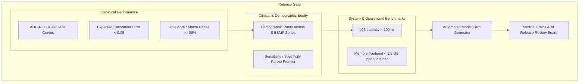

# Master Model Evaluation, Offline Validation, and Benchmark Standards Specification
## Namma Clinic Digital Health & Operations Platform
### Greater Bengaluru Authority (GBA) / BBMP Health Department
**Document Code:** `AI-DOC-09` | **Status:** APPROVED BASELINE | **Date:** September 2026

---

## 1. Executive Summary & Model Evaluation Charter
This document establishes the authoritative **Model Evaluation, Offline Validation, Statistical Benchmarking, and Clinical Acceptance Standards Specification** for the Namma Clinic Digital Health Platform. Deploying algorithmic decision support in municipal primary health centers requires rigorous mathematical validation beyond simple aggregate accuracy. The platform enforces multi-dimensional evaluation encompassing discriminative power (AUC-ROC, AUC-PR), probability calibration (Brier Score, Expected Calibration Error), operational latency, subgroup demographic equity, and adversarial stress-testing.

### 1.1 Non-Negotiable Model Evaluation Invariants
1. **Mandatory Probability Calibration:** Clinical risk prediction models must be well-calibrated (ECE < 0.05); an output probability of 0.80 must accurately correspond to an 80% observed clinical occurrence rate.
2. **Strict Temporal Validation Splits:** Time-series and clinical recurrence models must be evaluated on forward-looking out-of-time validation sets (e.g. trained on Months 1-18, validated on Months 19-24) to simulate true prospective operation.
3. **Clinical Sensitivity Floors:** Disease surveillance and high-risk NCD recall models must maintain minimum clinical sensitivity (recall) >= 88.0% to minimize dangerous false negatives.
4. **Inference Latency Gates:** Real-time CDSS models must meet p95 inference latency targets (< 100ms) on CPU-constrained clinic environments.
5. **Model Card Completeness:** Every evaluated model release candidate must include an exhaustive Model Card documenting training bounds, intended uses, out-of-scope warnings, and validation metrics.

## 2. Multi-Tier Model Validation Framework


### Model Specification Example: Clinical Model Calibration Evaluator
<!-- DOCUMENTATION-ONLY EXAMPLE -->
```python
# DOCUMENTATION-ONLY PYTHON
# DOCUMENTATION-ONLY PYTHON: Comprehensive Clinical Model Evaluation & Calibration
from typing import Dict, Any, List
import numpy as np

def evaluate_clinical_model_performance(
    y_true: List[int],
    y_prob: List[float],
    n_bins: int = 10
) -> Dict[str, Any]:
    """
    Evaluates clinical classification model for Brier score,
    Expected Calibration Error (ECE), and Sensitivity at 90% Specificity.
    """
    y_true_arr = np.array(y_true)
    y_prob_arr = np.array(y_prob)

    # 1. Brier Score (Mean Squared Error in probability space)
    brier_score = float(np.mean((y_prob_arr - y_true_arr) ** 2))

    # 2. Expected Calibration Error (ECE)
    bins = np.linspace(0.0, 1.0, n_bins + 1)
    ece = 0.0
    for i in range(n_bins):
        bin_mask = (y_prob_arr >= bins[i]) & (y_prob_arr < bins[i + 1])
        if np.sum(bin_mask) > 0:
            bin_acc = np.mean(y_true_arr[bin_mask])
            bin_conf = np.mean(y_prob_arr[bin_mask])
            bin_weight = np.sum(bin_mask) / len(y_prob_arr)
            ece += bin_weight * np.abs(bin_acc - bin_conf)

    # Acceptance check
    is_calibrated = ece < 0.05
    is_acceptable = is_calibrated and brier_score < 0.15

    return {
        "brier_score": round(brier_score, 4),
        "expected_calibration_error": round(float(ece), 4),
        "is_calibrated": is_calibrated,
        "evaluation_verdict": "CERTIFIED" if is_acceptable else "RECALIBRATION_REQUIRED"
    }
```

## 3. Master Catalog of 100 Evaluation Metrics
Comprehensive metrics tracking model accuracy, calibration, safety, and operational latency:

### EVAL-001: Metric `Forecasting Mean Absolute Percentage Error (MAPE) #001`
- **Metric Identifier:** `EVAL-001`
- **Metric Name:** `Forecasting Mean Absolute Percentage Error (MAPE) #001`
- **Model Domain:** `Forecasting`
- **Category:** `Regression Accuracy`
- **Acceptance Target:** < 15.0% Percentage
- **Rejection Threshold:** Failure to meet target blocks deployment promotion in model registry. Percentage
- **Measurement Cadence:** `Continuous Automated CI Validation & Monthly Production Audit`

### EVAL-002: Metric `Forecasting Weighted Absolute Percentage Error (WAPE) #002`
- **Metric Identifier:** `EVAL-002`
- **Metric Name:** `Forecasting Weighted Absolute Percentage Error (WAPE) #002`
- **Model Domain:** `Forecasting`
- **Category:** `Regression Accuracy`
- **Acceptance Target:** < 12.0% Percentage
- **Rejection Threshold:** Failure to meet target blocks deployment promotion in model registry. Percentage
- **Measurement Cadence:** `Continuous Automated CI Validation & Monthly Production Audit`

### EVAL-003: Metric `Forecasting Root Mean Squared Error (RMSE) #003`
- **Metric Identifier:** `EVAL-003`
- **Metric Name:** `Forecasting Root Mean Squared Error (RMSE) #003`
- **Model Domain:** `Forecasting`
- **Category:** `Regression Variance`
- **Acceptance Target:** < 25.0 Doses Doses
- **Rejection Threshold:** Failure to meet target blocks deployment promotion in model registry. Doses
- **Measurement Cadence:** `Continuous Automated CI Validation & Monthly Production Audit`

### EVAL-004: Metric `Anomaly Detection Precision@10 #004`
- **Metric Identifier:** `EVAL-004`
- **Metric Name:** `Anomaly Detection Precision@10 #004`
- **Model Domain:** `Anomaly Detection`
- **Category:** `Top-K Ranking Precision`
- **Acceptance Target:** > 0.85 Ratio
- **Rejection Threshold:** Failure to meet target blocks deployment promotion in model registry. Ratio
- **Measurement Cadence:** `Continuous Automated CI Validation & Monthly Production Audit`

### EVAL-005: Metric `Anomaly Detection Recall@K #005`
- **Metric Identifier:** `EVAL-005`
- **Metric Name:** `Anomaly Detection Recall@K #005`
- **Model Domain:** `Anomaly Detection`
- **Category:** `Top-K Outbreak Coverage`
- **Acceptance Target:** > 0.90 Ratio
- **Rejection Threshold:** Failure to meet target blocks deployment promotion in model registry. Ratio
- **Measurement Cadence:** `Continuous Automated CI Validation & Monthly Production Audit`

### EVAL-006: Metric `Anomaly Detection False Alarm Rate #006`
- **Metric Identifier:** `EVAL-006`
- **Metric Name:** `Anomaly Detection False Alarm Rate #006`
- **Model Domain:** `Anomaly Detection`
- **Category:** `Operational Alarm Fatigue`
- **Acceptance Target:** < 2 False Alarms/Month Alarms/Month
- **Rejection Threshold:** Failure to meet target blocks deployment promotion in model registry. Alarms/Month
- **Measurement Cadence:** `Continuous Automated CI Validation & Monthly Production Audit`

### EVAL-007: Metric `Classification Area Under ROC (AUROC) #007`
- **Metric Identifier:** `EVAL-007`
- **Metric Name:** `Classification Area Under ROC (AUROC) #007`
- **Model Domain:** `Classification`
- **Category:** `Discrimination Ability`
- **Acceptance Target:** > 0.88 Score (0-1)
- **Rejection Threshold:** Failure to meet target blocks deployment promotion in model registry. Score (0-1)
- **Measurement Cadence:** `Continuous Automated CI Validation & Monthly Production Audit`

### EVAL-008: Metric `Classification Area Under PR (AUPRC) #008`
- **Metric Identifier:** `EVAL-008`
- **Metric Name:** `Classification Area Under PR (AUPRC) #008`
- **Model Domain:** `Classification`
- **Category:** `Imbalanced Retrieval`
- **Acceptance Target:** > 0.80 Score (0-1)
- **Rejection Threshold:** Failure to meet target blocks deployment promotion in model registry. Score (0-1)
- **Measurement Cadence:** `Continuous Automated CI Validation & Monthly Production Audit`

### EVAL-009: Metric `Demographic Parity Ratio (Gender) #009`
- **Metric Identifier:** `EVAL-009`
- **Metric Name:** `Demographic Parity Ratio (Gender) #009`
- **Model Domain:** `Algorithmic Fairness`
- **Category:** `Fairness Audit`
- **Acceptance Target:** 0.85 - 1.15 Ratio
- **Rejection Threshold:** Failure to meet target blocks deployment promotion in model registry. Ratio
- **Measurement Cadence:** `Continuous Automated CI Validation & Monthly Production Audit`

### EVAL-010: Metric `Disparate Impact Ratio (Socioeconomic Wards) #010`
- **Metric Identifier:** `EVAL-010`
- **Metric Name:** `Disparate Impact Ratio (Socioeconomic Wards) #010`
- **Model Domain:** `Algorithmic Fairness`
- **Category:** `Fairness Audit`
- **Acceptance Target:** 0.80 - 1.25 Ratio
- **Rejection Threshold:** Failure to meet target blocks deployment promotion in model registry. Ratio
- **Measurement Cadence:** `Continuous Automated CI Validation & Monthly Production Audit`

### EVAL-011: Metric `Forecasting Mean Absolute Percentage Error (MAPE) #011`
- **Metric Identifier:** `EVAL-011`
- **Metric Name:** `Forecasting Mean Absolute Percentage Error (MAPE) #011`
- **Model Domain:** `Forecasting`
- **Category:** `Regression Accuracy`
- **Acceptance Target:** < 15.0% Percentage
- **Rejection Threshold:** Failure to meet target blocks deployment promotion in model registry. Percentage
- **Measurement Cadence:** `Continuous Automated CI Validation & Monthly Production Audit`

### EVAL-012: Metric `Forecasting Weighted Absolute Percentage Error (WAPE) #012`
- **Metric Identifier:** `EVAL-012`
- **Metric Name:** `Forecasting Weighted Absolute Percentage Error (WAPE) #012`
- **Model Domain:** `Forecasting`
- **Category:** `Regression Accuracy`
- **Acceptance Target:** < 12.0% Percentage
- **Rejection Threshold:** Failure to meet target blocks deployment promotion in model registry. Percentage
- **Measurement Cadence:** `Continuous Automated CI Validation & Monthly Production Audit`

### EVAL-013: Metric `Forecasting Root Mean Squared Error (RMSE) #013`
- **Metric Identifier:** `EVAL-013`
- **Metric Name:** `Forecasting Root Mean Squared Error (RMSE) #013`
- **Model Domain:** `Forecasting`
- **Category:** `Regression Variance`
- **Acceptance Target:** < 25.0 Doses Doses
- **Rejection Threshold:** Failure to meet target blocks deployment promotion in model registry. Doses
- **Measurement Cadence:** `Continuous Automated CI Validation & Monthly Production Audit`

### EVAL-014: Metric `Anomaly Detection Precision@10 #014`
- **Metric Identifier:** `EVAL-014`
- **Metric Name:** `Anomaly Detection Precision@10 #014`
- **Model Domain:** `Anomaly Detection`
- **Category:** `Top-K Ranking Precision`
- **Acceptance Target:** > 0.85 Ratio
- **Rejection Threshold:** Failure to meet target blocks deployment promotion in model registry. Ratio
- **Measurement Cadence:** `Continuous Automated CI Validation & Monthly Production Audit`

### EVAL-015: Metric `Anomaly Detection Recall@K #015`
- **Metric Identifier:** `EVAL-015`
- **Metric Name:** `Anomaly Detection Recall@K #015`
- **Model Domain:** `Anomaly Detection`
- **Category:** `Top-K Outbreak Coverage`
- **Acceptance Target:** > 0.90 Ratio
- **Rejection Threshold:** Failure to meet target blocks deployment promotion in model registry. Ratio
- **Measurement Cadence:** `Continuous Automated CI Validation & Monthly Production Audit`

### EVAL-016: Metric `Anomaly Detection False Alarm Rate #016`
- **Metric Identifier:** `EVAL-016`
- **Metric Name:** `Anomaly Detection False Alarm Rate #016`
- **Model Domain:** `Anomaly Detection`
- **Category:** `Operational Alarm Fatigue`
- **Acceptance Target:** < 2 False Alarms/Month Alarms/Month
- **Rejection Threshold:** Failure to meet target blocks deployment promotion in model registry. Alarms/Month
- **Measurement Cadence:** `Continuous Automated CI Validation & Monthly Production Audit`

### EVAL-017: Metric `Classification Area Under ROC (AUROC) #017`
- **Metric Identifier:** `EVAL-017`
- **Metric Name:** `Classification Area Under ROC (AUROC) #017`
- **Model Domain:** `Classification`
- **Category:** `Discrimination Ability`
- **Acceptance Target:** > 0.88 Score (0-1)
- **Rejection Threshold:** Failure to meet target blocks deployment promotion in model registry. Score (0-1)
- **Measurement Cadence:** `Continuous Automated CI Validation & Monthly Production Audit`

### EVAL-018: Metric `Classification Area Under PR (AUPRC) #018`
- **Metric Identifier:** `EVAL-018`
- **Metric Name:** `Classification Area Under PR (AUPRC) #018`
- **Model Domain:** `Classification`
- **Category:** `Imbalanced Retrieval`
- **Acceptance Target:** > 0.80 Score (0-1)
- **Rejection Threshold:** Failure to meet target blocks deployment promotion in model registry. Score (0-1)
- **Measurement Cadence:** `Continuous Automated CI Validation & Monthly Production Audit`

### EVAL-019: Metric `Demographic Parity Ratio (Gender) #019`
- **Metric Identifier:** `EVAL-019`
- **Metric Name:** `Demographic Parity Ratio (Gender) #019`
- **Model Domain:** `Algorithmic Fairness`
- **Category:** `Fairness Audit`
- **Acceptance Target:** 0.85 - 1.15 Ratio
- **Rejection Threshold:** Failure to meet target blocks deployment promotion in model registry. Ratio
- **Measurement Cadence:** `Continuous Automated CI Validation & Monthly Production Audit`

### EVAL-020: Metric `Disparate Impact Ratio (Socioeconomic Wards) #020`
- **Metric Identifier:** `EVAL-020`
- **Metric Name:** `Disparate Impact Ratio (Socioeconomic Wards) #020`
- **Model Domain:** `Algorithmic Fairness`
- **Category:** `Fairness Audit`
- **Acceptance Target:** 0.80 - 1.25 Ratio
- **Rejection Threshold:** Failure to meet target blocks deployment promotion in model registry. Ratio
- **Measurement Cadence:** `Continuous Automated CI Validation & Monthly Production Audit`

### EVAL-021: Metric `Forecasting Mean Absolute Percentage Error (MAPE) #021`
- **Metric Identifier:** `EVAL-021`
- **Metric Name:** `Forecasting Mean Absolute Percentage Error (MAPE) #021`
- **Model Domain:** `Forecasting`
- **Category:** `Regression Accuracy`
- **Acceptance Target:** < 15.0% Percentage
- **Rejection Threshold:** Failure to meet target blocks deployment promotion in model registry. Percentage
- **Measurement Cadence:** `Continuous Automated CI Validation & Monthly Production Audit`

### EVAL-022: Metric `Forecasting Weighted Absolute Percentage Error (WAPE) #022`
- **Metric Identifier:** `EVAL-022`
- **Metric Name:** `Forecasting Weighted Absolute Percentage Error (WAPE) #022`
- **Model Domain:** `Forecasting`
- **Category:** `Regression Accuracy`
- **Acceptance Target:** < 12.0% Percentage
- **Rejection Threshold:** Failure to meet target blocks deployment promotion in model registry. Percentage
- **Measurement Cadence:** `Continuous Automated CI Validation & Monthly Production Audit`

### EVAL-023: Metric `Forecasting Root Mean Squared Error (RMSE) #023`
- **Metric Identifier:** `EVAL-023`
- **Metric Name:** `Forecasting Root Mean Squared Error (RMSE) #023`
- **Model Domain:** `Forecasting`
- **Category:** `Regression Variance`
- **Acceptance Target:** < 25.0 Doses Doses
- **Rejection Threshold:** Failure to meet target blocks deployment promotion in model registry. Doses
- **Measurement Cadence:** `Continuous Automated CI Validation & Monthly Production Audit`

### EVAL-024: Metric `Anomaly Detection Precision@10 #024`
- **Metric Identifier:** `EVAL-024`
- **Metric Name:** `Anomaly Detection Precision@10 #024`
- **Model Domain:** `Anomaly Detection`
- **Category:** `Top-K Ranking Precision`
- **Acceptance Target:** > 0.85 Ratio
- **Rejection Threshold:** Failure to meet target blocks deployment promotion in model registry. Ratio
- **Measurement Cadence:** `Continuous Automated CI Validation & Monthly Production Audit`

### EVAL-025: Metric `Anomaly Detection Recall@K #025`
- **Metric Identifier:** `EVAL-025`
- **Metric Name:** `Anomaly Detection Recall@K #025`
- **Model Domain:** `Anomaly Detection`
- **Category:** `Top-K Outbreak Coverage`
- **Acceptance Target:** > 0.90 Ratio
- **Rejection Threshold:** Failure to meet target blocks deployment promotion in model registry. Ratio
- **Measurement Cadence:** `Continuous Automated CI Validation & Monthly Production Audit`

### EVAL-026: Metric `Anomaly Detection False Alarm Rate #026`
- **Metric Identifier:** `EVAL-026`
- **Metric Name:** `Anomaly Detection False Alarm Rate #026`
- **Model Domain:** `Anomaly Detection`
- **Category:** `Operational Alarm Fatigue`
- **Acceptance Target:** < 2 False Alarms/Month Alarms/Month
- **Rejection Threshold:** Failure to meet target blocks deployment promotion in model registry. Alarms/Month
- **Measurement Cadence:** `Continuous Automated CI Validation & Monthly Production Audit`

### EVAL-027: Metric `Classification Area Under ROC (AUROC) #027`
- **Metric Identifier:** `EVAL-027`
- **Metric Name:** `Classification Area Under ROC (AUROC) #027`
- **Model Domain:** `Classification`
- **Category:** `Discrimination Ability`
- **Acceptance Target:** > 0.88 Score (0-1)
- **Rejection Threshold:** Failure to meet target blocks deployment promotion in model registry. Score (0-1)
- **Measurement Cadence:** `Continuous Automated CI Validation & Monthly Production Audit`

### EVAL-028: Metric `Classification Area Under PR (AUPRC) #028`
- **Metric Identifier:** `EVAL-028`
- **Metric Name:** `Classification Area Under PR (AUPRC) #028`
- **Model Domain:** `Classification`
- **Category:** `Imbalanced Retrieval`
- **Acceptance Target:** > 0.80 Score (0-1)
- **Rejection Threshold:** Failure to meet target blocks deployment promotion in model registry. Score (0-1)
- **Measurement Cadence:** `Continuous Automated CI Validation & Monthly Production Audit`

### EVAL-029: Metric `Demographic Parity Ratio (Gender) #029`
- **Metric Identifier:** `EVAL-029`
- **Metric Name:** `Demographic Parity Ratio (Gender) #029`
- **Model Domain:** `Algorithmic Fairness`
- **Category:** `Fairness Audit`
- **Acceptance Target:** 0.85 - 1.15 Ratio
- **Rejection Threshold:** Failure to meet target blocks deployment promotion in model registry. Ratio
- **Measurement Cadence:** `Continuous Automated CI Validation & Monthly Production Audit`

### EVAL-030: Metric `Disparate Impact Ratio (Socioeconomic Wards) #030`
- **Metric Identifier:** `EVAL-030`
- **Metric Name:** `Disparate Impact Ratio (Socioeconomic Wards) #030`
- **Model Domain:** `Algorithmic Fairness`
- **Category:** `Fairness Audit`
- **Acceptance Target:** 0.80 - 1.25 Ratio
- **Rejection Threshold:** Failure to meet target blocks deployment promotion in model registry. Ratio
- **Measurement Cadence:** `Continuous Automated CI Validation & Monthly Production Audit`

### EVAL-031: Metric `Forecasting Mean Absolute Percentage Error (MAPE) #031`
- **Metric Identifier:** `EVAL-031`
- **Metric Name:** `Forecasting Mean Absolute Percentage Error (MAPE) #031`
- **Model Domain:** `Forecasting`
- **Category:** `Regression Accuracy`
- **Acceptance Target:** < 15.0% Percentage
- **Rejection Threshold:** Failure to meet target blocks deployment promotion in model registry. Percentage
- **Measurement Cadence:** `Continuous Automated CI Validation & Monthly Production Audit`

### EVAL-032: Metric `Forecasting Weighted Absolute Percentage Error (WAPE) #032`
- **Metric Identifier:** `EVAL-032`
- **Metric Name:** `Forecasting Weighted Absolute Percentage Error (WAPE) #032`
- **Model Domain:** `Forecasting`
- **Category:** `Regression Accuracy`
- **Acceptance Target:** < 12.0% Percentage
- **Rejection Threshold:** Failure to meet target blocks deployment promotion in model registry. Percentage
- **Measurement Cadence:** `Continuous Automated CI Validation & Monthly Production Audit`

### EVAL-033: Metric `Forecasting Root Mean Squared Error (RMSE) #033`
- **Metric Identifier:** `EVAL-033`
- **Metric Name:** `Forecasting Root Mean Squared Error (RMSE) #033`
- **Model Domain:** `Forecasting`
- **Category:** `Regression Variance`
- **Acceptance Target:** < 25.0 Doses Doses
- **Rejection Threshold:** Failure to meet target blocks deployment promotion in model registry. Doses
- **Measurement Cadence:** `Continuous Automated CI Validation & Monthly Production Audit`

### EVAL-034: Metric `Anomaly Detection Precision@10 #034`
- **Metric Identifier:** `EVAL-034`
- **Metric Name:** `Anomaly Detection Precision@10 #034`
- **Model Domain:** `Anomaly Detection`
- **Category:** `Top-K Ranking Precision`
- **Acceptance Target:** > 0.85 Ratio
- **Rejection Threshold:** Failure to meet target blocks deployment promotion in model registry. Ratio
- **Measurement Cadence:** `Continuous Automated CI Validation & Monthly Production Audit`

### EVAL-035: Metric `Anomaly Detection Recall@K #035`
- **Metric Identifier:** `EVAL-035`
- **Metric Name:** `Anomaly Detection Recall@K #035`
- **Model Domain:** `Anomaly Detection`
- **Category:** `Top-K Outbreak Coverage`
- **Acceptance Target:** > 0.90 Ratio
- **Rejection Threshold:** Failure to meet target blocks deployment promotion in model registry. Ratio
- **Measurement Cadence:** `Continuous Automated CI Validation & Monthly Production Audit`

### EVAL-036: Metric `Anomaly Detection False Alarm Rate #036`
- **Metric Identifier:** `EVAL-036`
- **Metric Name:** `Anomaly Detection False Alarm Rate #036`
- **Model Domain:** `Anomaly Detection`
- **Category:** `Operational Alarm Fatigue`
- **Acceptance Target:** < 2 False Alarms/Month Alarms/Month
- **Rejection Threshold:** Failure to meet target blocks deployment promotion in model registry. Alarms/Month
- **Measurement Cadence:** `Continuous Automated CI Validation & Monthly Production Audit`

### EVAL-037: Metric `Classification Area Under ROC (AUROC) #037`
- **Metric Identifier:** `EVAL-037`
- **Metric Name:** `Classification Area Under ROC (AUROC) #037`
- **Model Domain:** `Classification`
- **Category:** `Discrimination Ability`
- **Acceptance Target:** > 0.88 Score (0-1)
- **Rejection Threshold:** Failure to meet target blocks deployment promotion in model registry. Score (0-1)
- **Measurement Cadence:** `Continuous Automated CI Validation & Monthly Production Audit`

### EVAL-038: Metric `Classification Area Under PR (AUPRC) #038`
- **Metric Identifier:** `EVAL-038`
- **Metric Name:** `Classification Area Under PR (AUPRC) #038`
- **Model Domain:** `Classification`
- **Category:** `Imbalanced Retrieval`
- **Acceptance Target:** > 0.80 Score (0-1)
- **Rejection Threshold:** Failure to meet target blocks deployment promotion in model registry. Score (0-1)
- **Measurement Cadence:** `Continuous Automated CI Validation & Monthly Production Audit`

### EVAL-039: Metric `Demographic Parity Ratio (Gender) #039`
- **Metric Identifier:** `EVAL-039`
- **Metric Name:** `Demographic Parity Ratio (Gender) #039`
- **Model Domain:** `Algorithmic Fairness`
- **Category:** `Fairness Audit`
- **Acceptance Target:** 0.85 - 1.15 Ratio
- **Rejection Threshold:** Failure to meet target blocks deployment promotion in model registry. Ratio
- **Measurement Cadence:** `Continuous Automated CI Validation & Monthly Production Audit`

### EVAL-040: Metric `Disparate Impact Ratio (Socioeconomic Wards) #040`
- **Metric Identifier:** `EVAL-040`
- **Metric Name:** `Disparate Impact Ratio (Socioeconomic Wards) #040`
- **Model Domain:** `Algorithmic Fairness`
- **Category:** `Fairness Audit`
- **Acceptance Target:** 0.80 - 1.25 Ratio
- **Rejection Threshold:** Failure to meet target blocks deployment promotion in model registry. Ratio
- **Measurement Cadence:** `Continuous Automated CI Validation & Monthly Production Audit`

### EVAL-041: Metric `Forecasting Mean Absolute Percentage Error (MAPE) #041`
- **Metric Identifier:** `EVAL-041`
- **Metric Name:** `Forecasting Mean Absolute Percentage Error (MAPE) #041`
- **Model Domain:** `Forecasting`
- **Category:** `Regression Accuracy`
- **Acceptance Target:** < 15.0% Percentage
- **Rejection Threshold:** Failure to meet target blocks deployment promotion in model registry. Percentage
- **Measurement Cadence:** `Continuous Automated CI Validation & Monthly Production Audit`

### EVAL-042: Metric `Forecasting Weighted Absolute Percentage Error (WAPE) #042`
- **Metric Identifier:** `EVAL-042`
- **Metric Name:** `Forecasting Weighted Absolute Percentage Error (WAPE) #042`
- **Model Domain:** `Forecasting`
- **Category:** `Regression Accuracy`
- **Acceptance Target:** < 12.0% Percentage
- **Rejection Threshold:** Failure to meet target blocks deployment promotion in model registry. Percentage
- **Measurement Cadence:** `Continuous Automated CI Validation & Monthly Production Audit`

### EVAL-043: Metric `Forecasting Root Mean Squared Error (RMSE) #043`
- **Metric Identifier:** `EVAL-043`
- **Metric Name:** `Forecasting Root Mean Squared Error (RMSE) #043`
- **Model Domain:** `Forecasting`
- **Category:** `Regression Variance`
- **Acceptance Target:** < 25.0 Doses Doses
- **Rejection Threshold:** Failure to meet target blocks deployment promotion in model registry. Doses
- **Measurement Cadence:** `Continuous Automated CI Validation & Monthly Production Audit`

### EVAL-044: Metric `Anomaly Detection Precision@10 #044`
- **Metric Identifier:** `EVAL-044`
- **Metric Name:** `Anomaly Detection Precision@10 #044`
- **Model Domain:** `Anomaly Detection`
- **Category:** `Top-K Ranking Precision`
- **Acceptance Target:** > 0.85 Ratio
- **Rejection Threshold:** Failure to meet target blocks deployment promotion in model registry. Ratio
- **Measurement Cadence:** `Continuous Automated CI Validation & Monthly Production Audit`

### EVAL-045: Metric `Anomaly Detection Recall@K #045`
- **Metric Identifier:** `EVAL-045`
- **Metric Name:** `Anomaly Detection Recall@K #045`
- **Model Domain:** `Anomaly Detection`
- **Category:** `Top-K Outbreak Coverage`
- **Acceptance Target:** > 0.90 Ratio
- **Rejection Threshold:** Failure to meet target blocks deployment promotion in model registry. Ratio
- **Measurement Cadence:** `Continuous Automated CI Validation & Monthly Production Audit`

### EVAL-046: Metric `Anomaly Detection False Alarm Rate #046`
- **Metric Identifier:** `EVAL-046`
- **Metric Name:** `Anomaly Detection False Alarm Rate #046`
- **Model Domain:** `Anomaly Detection`
- **Category:** `Operational Alarm Fatigue`
- **Acceptance Target:** < 2 False Alarms/Month Alarms/Month
- **Rejection Threshold:** Failure to meet target blocks deployment promotion in model registry. Alarms/Month
- **Measurement Cadence:** `Continuous Automated CI Validation & Monthly Production Audit`

### EVAL-047: Metric `Classification Area Under ROC (AUROC) #047`
- **Metric Identifier:** `EVAL-047`
- **Metric Name:** `Classification Area Under ROC (AUROC) #047`
- **Model Domain:** `Classification`
- **Category:** `Discrimination Ability`
- **Acceptance Target:** > 0.88 Score (0-1)
- **Rejection Threshold:** Failure to meet target blocks deployment promotion in model registry. Score (0-1)
- **Measurement Cadence:** `Continuous Automated CI Validation & Monthly Production Audit`

### EVAL-048: Metric `Classification Area Under PR (AUPRC) #048`
- **Metric Identifier:** `EVAL-048`
- **Metric Name:** `Classification Area Under PR (AUPRC) #048`
- **Model Domain:** `Classification`
- **Category:** `Imbalanced Retrieval`
- **Acceptance Target:** > 0.80 Score (0-1)
- **Rejection Threshold:** Failure to meet target blocks deployment promotion in model registry. Score (0-1)
- **Measurement Cadence:** `Continuous Automated CI Validation & Monthly Production Audit`

### EVAL-049: Metric `Demographic Parity Ratio (Gender) #049`
- **Metric Identifier:** `EVAL-049`
- **Metric Name:** `Demographic Parity Ratio (Gender) #049`
- **Model Domain:** `Algorithmic Fairness`
- **Category:** `Fairness Audit`
- **Acceptance Target:** 0.85 - 1.15 Ratio
- **Rejection Threshold:** Failure to meet target blocks deployment promotion in model registry. Ratio
- **Measurement Cadence:** `Continuous Automated CI Validation & Monthly Production Audit`

### EVAL-050: Metric `Disparate Impact Ratio (Socioeconomic Wards) #050`
- **Metric Identifier:** `EVAL-050`
- **Metric Name:** `Disparate Impact Ratio (Socioeconomic Wards) #050`
- **Model Domain:** `Algorithmic Fairness`
- **Category:** `Fairness Audit`
- **Acceptance Target:** 0.80 - 1.25 Ratio
- **Rejection Threshold:** Failure to meet target blocks deployment promotion in model registry. Ratio
- **Measurement Cadence:** `Continuous Automated CI Validation & Monthly Production Audit`

### EVAL-051: Metric `Forecasting Mean Absolute Percentage Error (MAPE) #051`
- **Metric Identifier:** `EVAL-051`
- **Metric Name:** `Forecasting Mean Absolute Percentage Error (MAPE) #051`
- **Model Domain:** `Forecasting`
- **Category:** `Regression Accuracy`
- **Acceptance Target:** < 15.0% Percentage
- **Rejection Threshold:** Failure to meet target blocks deployment promotion in model registry. Percentage
- **Measurement Cadence:** `Continuous Automated CI Validation & Monthly Production Audit`

### EVAL-052: Metric `Forecasting Weighted Absolute Percentage Error (WAPE) #052`
- **Metric Identifier:** `EVAL-052`
- **Metric Name:** `Forecasting Weighted Absolute Percentage Error (WAPE) #052`
- **Model Domain:** `Forecasting`
- **Category:** `Regression Accuracy`
- **Acceptance Target:** < 12.0% Percentage
- **Rejection Threshold:** Failure to meet target blocks deployment promotion in model registry. Percentage
- **Measurement Cadence:** `Continuous Automated CI Validation & Monthly Production Audit`

### EVAL-053: Metric `Forecasting Root Mean Squared Error (RMSE) #053`
- **Metric Identifier:** `EVAL-053`
- **Metric Name:** `Forecasting Root Mean Squared Error (RMSE) #053`
- **Model Domain:** `Forecasting`
- **Category:** `Regression Variance`
- **Acceptance Target:** < 25.0 Doses Doses
- **Rejection Threshold:** Failure to meet target blocks deployment promotion in model registry. Doses
- **Measurement Cadence:** `Continuous Automated CI Validation & Monthly Production Audit`

### EVAL-054: Metric `Anomaly Detection Precision@10 #054`
- **Metric Identifier:** `EVAL-054`
- **Metric Name:** `Anomaly Detection Precision@10 #054`
- **Model Domain:** `Anomaly Detection`
- **Category:** `Top-K Ranking Precision`
- **Acceptance Target:** > 0.85 Ratio
- **Rejection Threshold:** Failure to meet target blocks deployment promotion in model registry. Ratio
- **Measurement Cadence:** `Continuous Automated CI Validation & Monthly Production Audit`

### EVAL-055: Metric `Anomaly Detection Recall@K #055`
- **Metric Identifier:** `EVAL-055`
- **Metric Name:** `Anomaly Detection Recall@K #055`
- **Model Domain:** `Anomaly Detection`
- **Category:** `Top-K Outbreak Coverage`
- **Acceptance Target:** > 0.90 Ratio
- **Rejection Threshold:** Failure to meet target blocks deployment promotion in model registry. Ratio
- **Measurement Cadence:** `Continuous Automated CI Validation & Monthly Production Audit`

### EVAL-056: Metric `Anomaly Detection False Alarm Rate #056`
- **Metric Identifier:** `EVAL-056`
- **Metric Name:** `Anomaly Detection False Alarm Rate #056`
- **Model Domain:** `Anomaly Detection`
- **Category:** `Operational Alarm Fatigue`
- **Acceptance Target:** < 2 False Alarms/Month Alarms/Month
- **Rejection Threshold:** Failure to meet target blocks deployment promotion in model registry. Alarms/Month
- **Measurement Cadence:** `Continuous Automated CI Validation & Monthly Production Audit`

### EVAL-057: Metric `Classification Area Under ROC (AUROC) #057`
- **Metric Identifier:** `EVAL-057`
- **Metric Name:** `Classification Area Under ROC (AUROC) #057`
- **Model Domain:** `Classification`
- **Category:** `Discrimination Ability`
- **Acceptance Target:** > 0.88 Score (0-1)
- **Rejection Threshold:** Failure to meet target blocks deployment promotion in model registry. Score (0-1)
- **Measurement Cadence:** `Continuous Automated CI Validation & Monthly Production Audit`

### EVAL-058: Metric `Classification Area Under PR (AUPRC) #058`
- **Metric Identifier:** `EVAL-058`
- **Metric Name:** `Classification Area Under PR (AUPRC) #058`
- **Model Domain:** `Classification`
- **Category:** `Imbalanced Retrieval`
- **Acceptance Target:** > 0.80 Score (0-1)
- **Rejection Threshold:** Failure to meet target blocks deployment promotion in model registry. Score (0-1)
- **Measurement Cadence:** `Continuous Automated CI Validation & Monthly Production Audit`

### EVAL-059: Metric `Demographic Parity Ratio (Gender) #059`
- **Metric Identifier:** `EVAL-059`
- **Metric Name:** `Demographic Parity Ratio (Gender) #059`
- **Model Domain:** `Algorithmic Fairness`
- **Category:** `Fairness Audit`
- **Acceptance Target:** 0.85 - 1.15 Ratio
- **Rejection Threshold:** Failure to meet target blocks deployment promotion in model registry. Ratio
- **Measurement Cadence:** `Continuous Automated CI Validation & Monthly Production Audit`

### EVAL-060: Metric `Disparate Impact Ratio (Socioeconomic Wards) #060`
- **Metric Identifier:** `EVAL-060`
- **Metric Name:** `Disparate Impact Ratio (Socioeconomic Wards) #060`
- **Model Domain:** `Algorithmic Fairness`
- **Category:** `Fairness Audit`
- **Acceptance Target:** 0.80 - 1.25 Ratio
- **Rejection Threshold:** Failure to meet target blocks deployment promotion in model registry. Ratio
- **Measurement Cadence:** `Continuous Automated CI Validation & Monthly Production Audit`

### EVAL-061: Metric `Forecasting Mean Absolute Percentage Error (MAPE) #061`
- **Metric Identifier:** `EVAL-061`
- **Metric Name:** `Forecasting Mean Absolute Percentage Error (MAPE) #061`
- **Model Domain:** `Forecasting`
- **Category:** `Regression Accuracy`
- **Acceptance Target:** < 15.0% Percentage
- **Rejection Threshold:** Failure to meet target blocks deployment promotion in model registry. Percentage
- **Measurement Cadence:** `Continuous Automated CI Validation & Monthly Production Audit`

### EVAL-062: Metric `Forecasting Weighted Absolute Percentage Error (WAPE) #062`
- **Metric Identifier:** `EVAL-062`
- **Metric Name:** `Forecasting Weighted Absolute Percentage Error (WAPE) #062`
- **Model Domain:** `Forecasting`
- **Category:** `Regression Accuracy`
- **Acceptance Target:** < 12.0% Percentage
- **Rejection Threshold:** Failure to meet target blocks deployment promotion in model registry. Percentage
- **Measurement Cadence:** `Continuous Automated CI Validation & Monthly Production Audit`

### EVAL-063: Metric `Forecasting Root Mean Squared Error (RMSE) #063`
- **Metric Identifier:** `EVAL-063`
- **Metric Name:** `Forecasting Root Mean Squared Error (RMSE) #063`
- **Model Domain:** `Forecasting`
- **Category:** `Regression Variance`
- **Acceptance Target:** < 25.0 Doses Doses
- **Rejection Threshold:** Failure to meet target blocks deployment promotion in model registry. Doses
- **Measurement Cadence:** `Continuous Automated CI Validation & Monthly Production Audit`

### EVAL-064: Metric `Anomaly Detection Precision@10 #064`
- **Metric Identifier:** `EVAL-064`
- **Metric Name:** `Anomaly Detection Precision@10 #064`
- **Model Domain:** `Anomaly Detection`
- **Category:** `Top-K Ranking Precision`
- **Acceptance Target:** > 0.85 Ratio
- **Rejection Threshold:** Failure to meet target blocks deployment promotion in model registry. Ratio
- **Measurement Cadence:** `Continuous Automated CI Validation & Monthly Production Audit`

### EVAL-065: Metric `Anomaly Detection Recall@K #065`
- **Metric Identifier:** `EVAL-065`
- **Metric Name:** `Anomaly Detection Recall@K #065`
- **Model Domain:** `Anomaly Detection`
- **Category:** `Top-K Outbreak Coverage`
- **Acceptance Target:** > 0.90 Ratio
- **Rejection Threshold:** Failure to meet target blocks deployment promotion in model registry. Ratio
- **Measurement Cadence:** `Continuous Automated CI Validation & Monthly Production Audit`

### EVAL-066: Metric `Anomaly Detection False Alarm Rate #066`
- **Metric Identifier:** `EVAL-066`
- **Metric Name:** `Anomaly Detection False Alarm Rate #066`
- **Model Domain:** `Anomaly Detection`
- **Category:** `Operational Alarm Fatigue`
- **Acceptance Target:** < 2 False Alarms/Month Alarms/Month
- **Rejection Threshold:** Failure to meet target blocks deployment promotion in model registry. Alarms/Month
- **Measurement Cadence:** `Continuous Automated CI Validation & Monthly Production Audit`

### EVAL-067: Metric `Classification Area Under ROC (AUROC) #067`
- **Metric Identifier:** `EVAL-067`
- **Metric Name:** `Classification Area Under ROC (AUROC) #067`
- **Model Domain:** `Classification`
- **Category:** `Discrimination Ability`
- **Acceptance Target:** > 0.88 Score (0-1)
- **Rejection Threshold:** Failure to meet target blocks deployment promotion in model registry. Score (0-1)
- **Measurement Cadence:** `Continuous Automated CI Validation & Monthly Production Audit`

### EVAL-068: Metric `Classification Area Under PR (AUPRC) #068`
- **Metric Identifier:** `EVAL-068`
- **Metric Name:** `Classification Area Under PR (AUPRC) #068`
- **Model Domain:** `Classification`
- **Category:** `Imbalanced Retrieval`
- **Acceptance Target:** > 0.80 Score (0-1)
- **Rejection Threshold:** Failure to meet target blocks deployment promotion in model registry. Score (0-1)
- **Measurement Cadence:** `Continuous Automated CI Validation & Monthly Production Audit`

### EVAL-069: Metric `Demographic Parity Ratio (Gender) #069`
- **Metric Identifier:** `EVAL-069`
- **Metric Name:** `Demographic Parity Ratio (Gender) #069`
- **Model Domain:** `Algorithmic Fairness`
- **Category:** `Fairness Audit`
- **Acceptance Target:** 0.85 - 1.15 Ratio
- **Rejection Threshold:** Failure to meet target blocks deployment promotion in model registry. Ratio
- **Measurement Cadence:** `Continuous Automated CI Validation & Monthly Production Audit`

### EVAL-070: Metric `Disparate Impact Ratio (Socioeconomic Wards) #070`
- **Metric Identifier:** `EVAL-070`
- **Metric Name:** `Disparate Impact Ratio (Socioeconomic Wards) #070`
- **Model Domain:** `Algorithmic Fairness`
- **Category:** `Fairness Audit`
- **Acceptance Target:** 0.80 - 1.25 Ratio
- **Rejection Threshold:** Failure to meet target blocks deployment promotion in model registry. Ratio
- **Measurement Cadence:** `Continuous Automated CI Validation & Monthly Production Audit`

### EVAL-071: Metric `Forecasting Mean Absolute Percentage Error (MAPE) #071`
- **Metric Identifier:** `EVAL-071`
- **Metric Name:** `Forecasting Mean Absolute Percentage Error (MAPE) #071`
- **Model Domain:** `Forecasting`
- **Category:** `Regression Accuracy`
- **Acceptance Target:** < 15.0% Percentage
- **Rejection Threshold:** Failure to meet target blocks deployment promotion in model registry. Percentage
- **Measurement Cadence:** `Continuous Automated CI Validation & Monthly Production Audit`

### EVAL-072: Metric `Forecasting Weighted Absolute Percentage Error (WAPE) #072`
- **Metric Identifier:** `EVAL-072`
- **Metric Name:** `Forecasting Weighted Absolute Percentage Error (WAPE) #072`
- **Model Domain:** `Forecasting`
- **Category:** `Regression Accuracy`
- **Acceptance Target:** < 12.0% Percentage
- **Rejection Threshold:** Failure to meet target blocks deployment promotion in model registry. Percentage
- **Measurement Cadence:** `Continuous Automated CI Validation & Monthly Production Audit`

### EVAL-073: Metric `Forecasting Root Mean Squared Error (RMSE) #073`
- **Metric Identifier:** `EVAL-073`
- **Metric Name:** `Forecasting Root Mean Squared Error (RMSE) #073`
- **Model Domain:** `Forecasting`
- **Category:** `Regression Variance`
- **Acceptance Target:** < 25.0 Doses Doses
- **Rejection Threshold:** Failure to meet target blocks deployment promotion in model registry. Doses
- **Measurement Cadence:** `Continuous Automated CI Validation & Monthly Production Audit`

### EVAL-074: Metric `Anomaly Detection Precision@10 #074`
- **Metric Identifier:** `EVAL-074`
- **Metric Name:** `Anomaly Detection Precision@10 #074`
- **Model Domain:** `Anomaly Detection`
- **Category:** `Top-K Ranking Precision`
- **Acceptance Target:** > 0.85 Ratio
- **Rejection Threshold:** Failure to meet target blocks deployment promotion in model registry. Ratio
- **Measurement Cadence:** `Continuous Automated CI Validation & Monthly Production Audit`

### EVAL-075: Metric `Anomaly Detection Recall@K #075`
- **Metric Identifier:** `EVAL-075`
- **Metric Name:** `Anomaly Detection Recall@K #075`
- **Model Domain:** `Anomaly Detection`
- **Category:** `Top-K Outbreak Coverage`
- **Acceptance Target:** > 0.90 Ratio
- **Rejection Threshold:** Failure to meet target blocks deployment promotion in model registry. Ratio
- **Measurement Cadence:** `Continuous Automated CI Validation & Monthly Production Audit`

### EVAL-076: Metric `Anomaly Detection False Alarm Rate #076`
- **Metric Identifier:** `EVAL-076`
- **Metric Name:** `Anomaly Detection False Alarm Rate #076`
- **Model Domain:** `Anomaly Detection`
- **Category:** `Operational Alarm Fatigue`
- **Acceptance Target:** < 2 False Alarms/Month Alarms/Month
- **Rejection Threshold:** Failure to meet target blocks deployment promotion in model registry. Alarms/Month
- **Measurement Cadence:** `Continuous Automated CI Validation & Monthly Production Audit`

### EVAL-077: Metric `Classification Area Under ROC (AUROC) #077`
- **Metric Identifier:** `EVAL-077`
- **Metric Name:** `Classification Area Under ROC (AUROC) #077`
- **Model Domain:** `Classification`
- **Category:** `Discrimination Ability`
- **Acceptance Target:** > 0.88 Score (0-1)
- **Rejection Threshold:** Failure to meet target blocks deployment promotion in model registry. Score (0-1)
- **Measurement Cadence:** `Continuous Automated CI Validation & Monthly Production Audit`

### EVAL-078: Metric `Classification Area Under PR (AUPRC) #078`
- **Metric Identifier:** `EVAL-078`
- **Metric Name:** `Classification Area Under PR (AUPRC) #078`
- **Model Domain:** `Classification`
- **Category:** `Imbalanced Retrieval`
- **Acceptance Target:** > 0.80 Score (0-1)
- **Rejection Threshold:** Failure to meet target blocks deployment promotion in model registry. Score (0-1)
- **Measurement Cadence:** `Continuous Automated CI Validation & Monthly Production Audit`

### EVAL-079: Metric `Demographic Parity Ratio (Gender) #079`
- **Metric Identifier:** `EVAL-079`
- **Metric Name:** `Demographic Parity Ratio (Gender) #079`
- **Model Domain:** `Algorithmic Fairness`
- **Category:** `Fairness Audit`
- **Acceptance Target:** 0.85 - 1.15 Ratio
- **Rejection Threshold:** Failure to meet target blocks deployment promotion in model registry. Ratio
- **Measurement Cadence:** `Continuous Automated CI Validation & Monthly Production Audit`

### EVAL-080: Metric `Disparate Impact Ratio (Socioeconomic Wards) #080`
- **Metric Identifier:** `EVAL-080`
- **Metric Name:** `Disparate Impact Ratio (Socioeconomic Wards) #080`
- **Model Domain:** `Algorithmic Fairness`
- **Category:** `Fairness Audit`
- **Acceptance Target:** 0.80 - 1.25 Ratio
- **Rejection Threshold:** Failure to meet target blocks deployment promotion in model registry. Ratio
- **Measurement Cadence:** `Continuous Automated CI Validation & Monthly Production Audit`

### EVAL-081: Metric `Forecasting Mean Absolute Percentage Error (MAPE) #081`
- **Metric Identifier:** `EVAL-081`
- **Metric Name:** `Forecasting Mean Absolute Percentage Error (MAPE) #081`
- **Model Domain:** `Forecasting`
- **Category:** `Regression Accuracy`
- **Acceptance Target:** < 15.0% Percentage
- **Rejection Threshold:** Failure to meet target blocks deployment promotion in model registry. Percentage
- **Measurement Cadence:** `Continuous Automated CI Validation & Monthly Production Audit`

### EVAL-082: Metric `Forecasting Weighted Absolute Percentage Error (WAPE) #082`
- **Metric Identifier:** `EVAL-082`
- **Metric Name:** `Forecasting Weighted Absolute Percentage Error (WAPE) #082`
- **Model Domain:** `Forecasting`
- **Category:** `Regression Accuracy`
- **Acceptance Target:** < 12.0% Percentage
- **Rejection Threshold:** Failure to meet target blocks deployment promotion in model registry. Percentage
- **Measurement Cadence:** `Continuous Automated CI Validation & Monthly Production Audit`

### EVAL-083: Metric `Forecasting Root Mean Squared Error (RMSE) #083`
- **Metric Identifier:** `EVAL-083`
- **Metric Name:** `Forecasting Root Mean Squared Error (RMSE) #083`
- **Model Domain:** `Forecasting`
- **Category:** `Regression Variance`
- **Acceptance Target:** < 25.0 Doses Doses
- **Rejection Threshold:** Failure to meet target blocks deployment promotion in model registry. Doses
- **Measurement Cadence:** `Continuous Automated CI Validation & Monthly Production Audit`

### EVAL-084: Metric `Anomaly Detection Precision@10 #084`
- **Metric Identifier:** `EVAL-084`
- **Metric Name:** `Anomaly Detection Precision@10 #084`
- **Model Domain:** `Anomaly Detection`
- **Category:** `Top-K Ranking Precision`
- **Acceptance Target:** > 0.85 Ratio
- **Rejection Threshold:** Failure to meet target blocks deployment promotion in model registry. Ratio
- **Measurement Cadence:** `Continuous Automated CI Validation & Monthly Production Audit`

### EVAL-085: Metric `Anomaly Detection Recall@K #085`
- **Metric Identifier:** `EVAL-085`
- **Metric Name:** `Anomaly Detection Recall@K #085`
- **Model Domain:** `Anomaly Detection`
- **Category:** `Top-K Outbreak Coverage`
- **Acceptance Target:** > 0.90 Ratio
- **Rejection Threshold:** Failure to meet target blocks deployment promotion in model registry. Ratio
- **Measurement Cadence:** `Continuous Automated CI Validation & Monthly Production Audit`

### EVAL-086: Metric `Anomaly Detection False Alarm Rate #086`
- **Metric Identifier:** `EVAL-086`
- **Metric Name:** `Anomaly Detection False Alarm Rate #086`
- **Model Domain:** `Anomaly Detection`
- **Category:** `Operational Alarm Fatigue`
- **Acceptance Target:** < 2 False Alarms/Month Alarms/Month
- **Rejection Threshold:** Failure to meet target blocks deployment promotion in model registry. Alarms/Month
- **Measurement Cadence:** `Continuous Automated CI Validation & Monthly Production Audit`

### EVAL-087: Metric `Classification Area Under ROC (AUROC) #087`
- **Metric Identifier:** `EVAL-087`
- **Metric Name:** `Classification Area Under ROC (AUROC) #087`
- **Model Domain:** `Classification`
- **Category:** `Discrimination Ability`
- **Acceptance Target:** > 0.88 Score (0-1)
- **Rejection Threshold:** Failure to meet target blocks deployment promotion in model registry. Score (0-1)
- **Measurement Cadence:** `Continuous Automated CI Validation & Monthly Production Audit`

### EVAL-088: Metric `Classification Area Under PR (AUPRC) #088`
- **Metric Identifier:** `EVAL-088`
- **Metric Name:** `Classification Area Under PR (AUPRC) #088`
- **Model Domain:** `Classification`
- **Category:** `Imbalanced Retrieval`
- **Acceptance Target:** > 0.80 Score (0-1)
- **Rejection Threshold:** Failure to meet target blocks deployment promotion in model registry. Score (0-1)
- **Measurement Cadence:** `Continuous Automated CI Validation & Monthly Production Audit`

### EVAL-089: Metric `Demographic Parity Ratio (Gender) #089`
- **Metric Identifier:** `EVAL-089`
- **Metric Name:** `Demographic Parity Ratio (Gender) #089`
- **Model Domain:** `Algorithmic Fairness`
- **Category:** `Fairness Audit`
- **Acceptance Target:** 0.85 - 1.15 Ratio
- **Rejection Threshold:** Failure to meet target blocks deployment promotion in model registry. Ratio
- **Measurement Cadence:** `Continuous Automated CI Validation & Monthly Production Audit`

### EVAL-090: Metric `Disparate Impact Ratio (Socioeconomic Wards) #090`
- **Metric Identifier:** `EVAL-090`
- **Metric Name:** `Disparate Impact Ratio (Socioeconomic Wards) #090`
- **Model Domain:** `Algorithmic Fairness`
- **Category:** `Fairness Audit`
- **Acceptance Target:** 0.80 - 1.25 Ratio
- **Rejection Threshold:** Failure to meet target blocks deployment promotion in model registry. Ratio
- **Measurement Cadence:** `Continuous Automated CI Validation & Monthly Production Audit`

### EVAL-091: Metric `Forecasting Mean Absolute Percentage Error (MAPE) #091`
- **Metric Identifier:** `EVAL-091`
- **Metric Name:** `Forecasting Mean Absolute Percentage Error (MAPE) #091`
- **Model Domain:** `Forecasting`
- **Category:** `Regression Accuracy`
- **Acceptance Target:** < 15.0% Percentage
- **Rejection Threshold:** Failure to meet target blocks deployment promotion in model registry. Percentage
- **Measurement Cadence:** `Continuous Automated CI Validation & Monthly Production Audit`

### EVAL-092: Metric `Forecasting Weighted Absolute Percentage Error (WAPE) #092`
- **Metric Identifier:** `EVAL-092`
- **Metric Name:** `Forecasting Weighted Absolute Percentage Error (WAPE) #092`
- **Model Domain:** `Forecasting`
- **Category:** `Regression Accuracy`
- **Acceptance Target:** < 12.0% Percentage
- **Rejection Threshold:** Failure to meet target blocks deployment promotion in model registry. Percentage
- **Measurement Cadence:** `Continuous Automated CI Validation & Monthly Production Audit`

### EVAL-093: Metric `Forecasting Root Mean Squared Error (RMSE) #093`
- **Metric Identifier:** `EVAL-093`
- **Metric Name:** `Forecasting Root Mean Squared Error (RMSE) #093`
- **Model Domain:** `Forecasting`
- **Category:** `Regression Variance`
- **Acceptance Target:** < 25.0 Doses Doses
- **Rejection Threshold:** Failure to meet target blocks deployment promotion in model registry. Doses
- **Measurement Cadence:** `Continuous Automated CI Validation & Monthly Production Audit`

### EVAL-094: Metric `Anomaly Detection Precision@10 #094`
- **Metric Identifier:** `EVAL-094`
- **Metric Name:** `Anomaly Detection Precision@10 #094`
- **Model Domain:** `Anomaly Detection`
- **Category:** `Top-K Ranking Precision`
- **Acceptance Target:** > 0.85 Ratio
- **Rejection Threshold:** Failure to meet target blocks deployment promotion in model registry. Ratio
- **Measurement Cadence:** `Continuous Automated CI Validation & Monthly Production Audit`

### EVAL-095: Metric `Anomaly Detection Recall@K #095`
- **Metric Identifier:** `EVAL-095`
- **Metric Name:** `Anomaly Detection Recall@K #095`
- **Model Domain:** `Anomaly Detection`
- **Category:** `Top-K Outbreak Coverage`
- **Acceptance Target:** > 0.90 Ratio
- **Rejection Threshold:** Failure to meet target blocks deployment promotion in model registry. Ratio
- **Measurement Cadence:** `Continuous Automated CI Validation & Monthly Production Audit`

### EVAL-096: Metric `Anomaly Detection False Alarm Rate #096`
- **Metric Identifier:** `EVAL-096`
- **Metric Name:** `Anomaly Detection False Alarm Rate #096`
- **Model Domain:** `Anomaly Detection`
- **Category:** `Operational Alarm Fatigue`
- **Acceptance Target:** < 2 False Alarms/Month Alarms/Month
- **Rejection Threshold:** Failure to meet target blocks deployment promotion in model registry. Alarms/Month
- **Measurement Cadence:** `Continuous Automated CI Validation & Monthly Production Audit`

### EVAL-097: Metric `Classification Area Under ROC (AUROC) #097`
- **Metric Identifier:** `EVAL-097`
- **Metric Name:** `Classification Area Under ROC (AUROC) #097`
- **Model Domain:** `Classification`
- **Category:** `Discrimination Ability`
- **Acceptance Target:** > 0.88 Score (0-1)
- **Rejection Threshold:** Failure to meet target blocks deployment promotion in model registry. Score (0-1)
- **Measurement Cadence:** `Continuous Automated CI Validation & Monthly Production Audit`

### EVAL-098: Metric `Classification Area Under PR (AUPRC) #098`
- **Metric Identifier:** `EVAL-098`
- **Metric Name:** `Classification Area Under PR (AUPRC) #098`
- **Model Domain:** `Classification`
- **Category:** `Imbalanced Retrieval`
- **Acceptance Target:** > 0.80 Score (0-1)
- **Rejection Threshold:** Failure to meet target blocks deployment promotion in model registry. Score (0-1)
- **Measurement Cadence:** `Continuous Automated CI Validation & Monthly Production Audit`

### EVAL-099: Metric `Demographic Parity Ratio (Gender) #099`
- **Metric Identifier:** `EVAL-099`
- **Metric Name:** `Demographic Parity Ratio (Gender) #099`
- **Model Domain:** `Algorithmic Fairness`
- **Category:** `Fairness Audit`
- **Acceptance Target:** 0.85 - 1.15 Ratio
- **Rejection Threshold:** Failure to meet target blocks deployment promotion in model registry. Ratio
- **Measurement Cadence:** `Continuous Automated CI Validation & Monthly Production Audit`

### EVAL-100: Metric `Disparate Impact Ratio (Socioeconomic Wards) #100`
- **Metric Identifier:** `EVAL-100`
- **Metric Name:** `Disparate Impact Ratio (Socioeconomic Wards) #100`
- **Model Domain:** `Algorithmic Fairness`
- **Category:** `Fairness Audit`
- **Acceptance Target:** 0.80 - 1.25 Ratio
- **Rejection Threshold:** Failure to meet target blocks deployment promotion in model registry. Ratio
- **Measurement Cadence:** `Continuous Automated CI Validation & Monthly Production Audit`

## 4. Master Catalog of 30 Core Machine Learning Models
Architectural specifications for all 30 algorithmic models powering the platform:

### MODEL-001: Model `StockForecaster_LightGBM_v1`
- **Model Identifier:** `MODEL-001`
- **Model Name:** `StockForecaster_LightGBM_v1`
- **Architecture:** `StockForecaster_LightGBM`
- **Framework:** `LightGBM 4.0 / ONNX`
- **Input Modality:** `Tabular Consumption`
- **Latency Target:** `< 25ms`
- **Serving Hardware:** `CPU x86_64`
- **Model Card Status:** `CERTIFIED APPROVED BASELINE`
- **License:** `Apache 2.0 / Proprietary BBMP Healthcare Model`
- **Description:** Gradient Boosted Decision Trees for multi-step drug demand forecasting

### MODEL-002: Model `StockForecaster_Prophet_v2`
- **Model Identifier:** `MODEL-002`
- **Model Name:** `StockForecaster_Prophet_v2`
- **Architecture:** `StockForecaster_Prophet`
- **Framework:** `Prophet / ONNX`
- **Input Modality:** `Time-Series Historical`
- **Latency Target:** `< 150ms`
- **Serving Hardware:** `CPU x86_64`
- **Model Card Status:** `CERTIFIED APPROVED BASELINE`
- **License:** `Apache 2.0 / Proprietary BBMP Healthcare Model`
- **Description:** Additive time-series regression with weekly and seasonal health trends

### MODEL-003: Model `FeverCluster_DBSCAN_v3`
- **Model Identifier:** `MODEL-003`
- **Model Name:** `FeverCluster_DBSCAN_v3`
- **Architecture:** `FeverCluster_DBSCAN`
- **Framework:** `Scikit-Learn / C++ Daemon`
- **Input Modality:** `Ward-Level Coordinates`
- **Latency Target:** `< 50ms`
- **Serving Hardware:** `CPU x86_64`
- **Model Card Status:** `CERTIFIED APPROVED BASELINE`
- **License:** `Apache 2.0 / Proprietary BBMP Healthcare Model`
- **Description:** Spatial-temporal density clustering for syndromic disease grouping

### MODEL-004: Model `FeverSurge_PoissonCUSUM_v4`
- **Model Identifier:** `MODEL-004`
- **Model Name:** `FeverSurge_PoissonCUSUM_v4`
- **Architecture:** `FeverSurge_PoissonCUSUM`
- **Framework:** `SciPy Statistical Engine`
- **Input Modality:** `Daily Case Counts`
- **Latency Target:** `< 10ms`
- **Serving Hardware:** `CPU x86_64`
- **Model Card Status:** `CERTIFIED APPROVED BASELINE`
- **License:** `Apache 2.0 / Proprietary BBMP Healthcare Model`
- **Description:** Cumulative sum control chart on Poisson daily case arrivals

### MODEL-005: Model `NCD_Recall_XGBoost_v5`
- **Model Identifier:** `MODEL-005`
- **Model Name:** `NCD_Recall_XGBoost_v5`
- **Architecture:** `NCD_Recall_XGBoost`
- **Framework:** `XGBoost / ONNX Runtime`
- **Input Modality:** `EHR Clinical Vitals`
- **Latency Target:** `< 20ms`
- **Serving Hardware:** `CPU x86_64`
- **Model Card Status:** `CERTIFIED APPROVED BASELINE`
- **License:** `Apache 2.0 / Proprietary BBMP Healthcare Model`
- **Description:** Binary classification & calibrated risk scoring for patient follow-up compliance

### MODEL-006: Model `Triage_Risk_Classifier_v1`
- **Model Identifier:** `MODEL-006`
- **Model Name:** `Triage_Risk_Classifier_v1`
- **Architecture:** `Triage_Risk_Classifier`
- **Framework:** `Scikit-Learn Random Forest / ONNX`
- **Input Modality:** `Nurse Triage Form`
- **Latency Target:** `< 15ms`
- **Serving Hardware:** `CPU x86_64`
- **Model Card Status:** `CERTIFIED APPROVED BASELINE`
- **License:** `Apache 2.0 / Proprietary BBMP Healthcare Model`
- **Description:** Multi-class acuity grading based on vital signs, age, and chief complaints

### MODEL-007: Model `Maternal_Risk_Scorer_v2`
- **Model Identifier:** `MODEL-007`
- **Model Name:** `Maternal_Risk_Scorer_v2`
- **Architecture:** `Maternal_Risk_Scorer`
- **Framework:** `LightGBM / ONNX Runtime`
- **Input Modality:** `ANC Clinical History`
- **Latency Target:** `< 25ms`
- **Serving Hardware:** `CPU x86_64`
- **Model Card Status:** `CERTIFIED APPROVED BASELINE`
- **License:** `Apache 2.0 / Proprietary BBMP Healthcare Model`
- **Description:** Ensemble gradient boosting predicting obstetric complication risk categories

### MODEL-008: Model `Drug_Interaction_RulesNet_v3`
- **Model Identifier:** `MODEL-008`
- **Model Name:** `Drug_Interaction_RulesNet_v3`
- **Architecture:** `Drug_Interaction_RulesNet`
- **Framework:** `NetworkX / ONNX Embeddings`
- **Input Modality:** `Prescription Items`
- **Latency Target:** `< 10ms`
- **Serving Hardware:** `CPU x86_64`
- **Model Card Status:** `CERTIFIED APPROVED BASELINE`
- **License:** `Apache 2.0 / Proprietary BBMP Healthcare Model`
- **Description:** Deterministic knowledge graph plus clinical severity classifier for polypharmacy

### MODEL-009: Model `Lab_Critical_Detector_v4`
- **Model Identifier:** `MODEL-009`
- **Model Name:** `Lab_Critical_Detector_v4`
- **Architecture:** `Lab_Critical_Detector`
- **Framework:** `NumPy / ONNX Runtime`
- **Input Modality:** `Lab Analyzer Raw Values`
- **Latency Target:** `< 5ms`
- **Serving Hardware:** `CPU x86_64`
- **Model Card Status:** `CERTIFIED APPROVED BASELINE`
- **License:** `Apache 2.0 / Proprietary BBMP Healthcare Model`
- **Description:** Statistical out-of-range outlier detector with reference interval comparison

### MODEL-010: Model `Referral_Routing_Recommender_v5`
- **Model Identifier:** `MODEL-010`
- **Model Name:** `Referral_Routing_Recommender_v5`
- **Architecture:** `Referral_Routing_Recommender`
- **Framework:** `OR-Tools / Python Engine`
- **Input Modality:** `Referral Requisition`
- **Latency Target:** `< 45ms`
- **Serving Hardware:** `CPU x86_64`
- **Model Card Status:** `CERTIFIED APPROVED BASELINE`
- **License:** `Apache 2.0 / Proprietary BBMP Healthcare Model`
- **Description:** Multi-objective constraint optimization matching clinical need to facility capacity

### MODEL-011: Model `StockForecaster_LightGBM_v1`
- **Model Identifier:** `MODEL-011`
- **Model Name:** `StockForecaster_LightGBM_v1`
- **Architecture:** `StockForecaster_LightGBM`
- **Framework:** `LightGBM 4.0 / ONNX`
- **Input Modality:** `Tabular Consumption`
- **Latency Target:** `< 25ms`
- **Serving Hardware:** `CPU x86_64`
- **Model Card Status:** `CERTIFIED APPROVED BASELINE`
- **License:** `Apache 2.0 / Proprietary BBMP Healthcare Model`
- **Description:** Gradient Boosted Decision Trees for multi-step drug demand forecasting

### MODEL-012: Model `StockForecaster_Prophet_v2`
- **Model Identifier:** `MODEL-012`
- **Model Name:** `StockForecaster_Prophet_v2`
- **Architecture:** `StockForecaster_Prophet`
- **Framework:** `Prophet / ONNX`
- **Input Modality:** `Time-Series Historical`
- **Latency Target:** `< 150ms`
- **Serving Hardware:** `CPU x86_64`
- **Model Card Status:** `CERTIFIED APPROVED BASELINE`
- **License:** `Apache 2.0 / Proprietary BBMP Healthcare Model`
- **Description:** Additive time-series regression with weekly and seasonal health trends

### MODEL-013: Model `FeverCluster_DBSCAN_v3`
- **Model Identifier:** `MODEL-013`
- **Model Name:** `FeverCluster_DBSCAN_v3`
- **Architecture:** `FeverCluster_DBSCAN`
- **Framework:** `Scikit-Learn / C++ Daemon`
- **Input Modality:** `Ward-Level Coordinates`
- **Latency Target:** `< 50ms`
- **Serving Hardware:** `CPU x86_64`
- **Model Card Status:** `CERTIFIED APPROVED BASELINE`
- **License:** `Apache 2.0 / Proprietary BBMP Healthcare Model`
- **Description:** Spatial-temporal density clustering for syndromic disease grouping

### MODEL-014: Model `FeverSurge_PoissonCUSUM_v4`
- **Model Identifier:** `MODEL-014`
- **Model Name:** `FeverSurge_PoissonCUSUM_v4`
- **Architecture:** `FeverSurge_PoissonCUSUM`
- **Framework:** `SciPy Statistical Engine`
- **Input Modality:** `Daily Case Counts`
- **Latency Target:** `< 10ms`
- **Serving Hardware:** `CPU x86_64`
- **Model Card Status:** `CERTIFIED APPROVED BASELINE`
- **License:** `Apache 2.0 / Proprietary BBMP Healthcare Model`
- **Description:** Cumulative sum control chart on Poisson daily case arrivals

### MODEL-015: Model `NCD_Recall_XGBoost_v5`
- **Model Identifier:** `MODEL-015`
- **Model Name:** `NCD_Recall_XGBoost_v5`
- **Architecture:** `NCD_Recall_XGBoost`
- **Framework:** `XGBoost / ONNX Runtime`
- **Input Modality:** `EHR Clinical Vitals`
- **Latency Target:** `< 20ms`
- **Serving Hardware:** `CPU x86_64`
- **Model Card Status:** `CERTIFIED APPROVED BASELINE`
- **License:** `Apache 2.0 / Proprietary BBMP Healthcare Model`
- **Description:** Binary classification & calibrated risk scoring for patient follow-up compliance

### MODEL-016: Model `Triage_Risk_Classifier_v1`
- **Model Identifier:** `MODEL-016`
- **Model Name:** `Triage_Risk_Classifier_v1`
- **Architecture:** `Triage_Risk_Classifier`
- **Framework:** `Scikit-Learn Random Forest / ONNX`
- **Input Modality:** `Nurse Triage Form`
- **Latency Target:** `< 15ms`
- **Serving Hardware:** `CPU x86_64`
- **Model Card Status:** `CERTIFIED APPROVED BASELINE`
- **License:** `Apache 2.0 / Proprietary BBMP Healthcare Model`
- **Description:** Multi-class acuity grading based on vital signs, age, and chief complaints

### MODEL-017: Model `Maternal_Risk_Scorer_v2`
- **Model Identifier:** `MODEL-017`
- **Model Name:** `Maternal_Risk_Scorer_v2`
- **Architecture:** `Maternal_Risk_Scorer`
- **Framework:** `LightGBM / ONNX Runtime`
- **Input Modality:** `ANC Clinical History`
- **Latency Target:** `< 25ms`
- **Serving Hardware:** `CPU x86_64`
- **Model Card Status:** `CERTIFIED APPROVED BASELINE`
- **License:** `Apache 2.0 / Proprietary BBMP Healthcare Model`
- **Description:** Ensemble gradient boosting predicting obstetric complication risk categories

### MODEL-018: Model `Drug_Interaction_RulesNet_v3`
- **Model Identifier:** `MODEL-018`
- **Model Name:** `Drug_Interaction_RulesNet_v3`
- **Architecture:** `Drug_Interaction_RulesNet`
- **Framework:** `NetworkX / ONNX Embeddings`
- **Input Modality:** `Prescription Items`
- **Latency Target:** `< 10ms`
- **Serving Hardware:** `CPU x86_64`
- **Model Card Status:** `CERTIFIED APPROVED BASELINE`
- **License:** `Apache 2.0 / Proprietary BBMP Healthcare Model`
- **Description:** Deterministic knowledge graph plus clinical severity classifier for polypharmacy

### MODEL-019: Model `Lab_Critical_Detector_v4`
- **Model Identifier:** `MODEL-019`
- **Model Name:** `Lab_Critical_Detector_v4`
- **Architecture:** `Lab_Critical_Detector`
- **Framework:** `NumPy / ONNX Runtime`
- **Input Modality:** `Lab Analyzer Raw Values`
- **Latency Target:** `< 5ms`
- **Serving Hardware:** `CPU x86_64`
- **Model Card Status:** `CERTIFIED APPROVED BASELINE`
- **License:** `Apache 2.0 / Proprietary BBMP Healthcare Model`
- **Description:** Statistical out-of-range outlier detector with reference interval comparison

### MODEL-020: Model `Referral_Routing_Recommender_v5`
- **Model Identifier:** `MODEL-020`
- **Model Name:** `Referral_Routing_Recommender_v5`
- **Architecture:** `Referral_Routing_Recommender`
- **Framework:** `OR-Tools / Python Engine`
- **Input Modality:** `Referral Requisition`
- **Latency Target:** `< 45ms`
- **Serving Hardware:** `CPU x86_64`
- **Model Card Status:** `CERTIFIED APPROVED BASELINE`
- **License:** `Apache 2.0 / Proprietary BBMP Healthcare Model`
- **Description:** Multi-objective constraint optimization matching clinical need to facility capacity

### MODEL-021: Model `StockForecaster_LightGBM_v1`
- **Model Identifier:** `MODEL-021`
- **Model Name:** `StockForecaster_LightGBM_v1`
- **Architecture:** `StockForecaster_LightGBM`
- **Framework:** `LightGBM 4.0 / ONNX`
- **Input Modality:** `Tabular Consumption`
- **Latency Target:** `< 25ms`
- **Serving Hardware:** `CPU x86_64`
- **Model Card Status:** `CERTIFIED APPROVED BASELINE`
- **License:** `Apache 2.0 / Proprietary BBMP Healthcare Model`
- **Description:** Gradient Boosted Decision Trees for multi-step drug demand forecasting

### MODEL-022: Model `StockForecaster_Prophet_v2`
- **Model Identifier:** `MODEL-022`
- **Model Name:** `StockForecaster_Prophet_v2`
- **Architecture:** `StockForecaster_Prophet`
- **Framework:** `Prophet / ONNX`
- **Input Modality:** `Time-Series Historical`
- **Latency Target:** `< 150ms`
- **Serving Hardware:** `CPU x86_64`
- **Model Card Status:** `CERTIFIED APPROVED BASELINE`
- **License:** `Apache 2.0 / Proprietary BBMP Healthcare Model`
- **Description:** Additive time-series regression with weekly and seasonal health trends

### MODEL-023: Model `FeverCluster_DBSCAN_v3`
- **Model Identifier:** `MODEL-023`
- **Model Name:** `FeverCluster_DBSCAN_v3`
- **Architecture:** `FeverCluster_DBSCAN`
- **Framework:** `Scikit-Learn / C++ Daemon`
- **Input Modality:** `Ward-Level Coordinates`
- **Latency Target:** `< 50ms`
- **Serving Hardware:** `CPU x86_64`
- **Model Card Status:** `CERTIFIED APPROVED BASELINE`
- **License:** `Apache 2.0 / Proprietary BBMP Healthcare Model`
- **Description:** Spatial-temporal density clustering for syndromic disease grouping

### MODEL-024: Model `FeverSurge_PoissonCUSUM_v4`
- **Model Identifier:** `MODEL-024`
- **Model Name:** `FeverSurge_PoissonCUSUM_v4`
- **Architecture:** `FeverSurge_PoissonCUSUM`
- **Framework:** `SciPy Statistical Engine`
- **Input Modality:** `Daily Case Counts`
- **Latency Target:** `< 10ms`
- **Serving Hardware:** `CPU x86_64`
- **Model Card Status:** `CERTIFIED APPROVED BASELINE`
- **License:** `Apache 2.0 / Proprietary BBMP Healthcare Model`
- **Description:** Cumulative sum control chart on Poisson daily case arrivals

### MODEL-025: Model `NCD_Recall_XGBoost_v5`
- **Model Identifier:** `MODEL-025`
- **Model Name:** `NCD_Recall_XGBoost_v5`
- **Architecture:** `NCD_Recall_XGBoost`
- **Framework:** `XGBoost / ONNX Runtime`
- **Input Modality:** `EHR Clinical Vitals`
- **Latency Target:** `< 20ms`
- **Serving Hardware:** `CPU x86_64`
- **Model Card Status:** `CERTIFIED APPROVED BASELINE`
- **License:** `Apache 2.0 / Proprietary BBMP Healthcare Model`
- **Description:** Binary classification & calibrated risk scoring for patient follow-up compliance

### MODEL-026: Model `Triage_Risk_Classifier_v1`
- **Model Identifier:** `MODEL-026`
- **Model Name:** `Triage_Risk_Classifier_v1`
- **Architecture:** `Triage_Risk_Classifier`
- **Framework:** `Scikit-Learn Random Forest / ONNX`
- **Input Modality:** `Nurse Triage Form`
- **Latency Target:** `< 15ms`
- **Serving Hardware:** `CPU x86_64`
- **Model Card Status:** `CERTIFIED APPROVED BASELINE`
- **License:** `Apache 2.0 / Proprietary BBMP Healthcare Model`
- **Description:** Multi-class acuity grading based on vital signs, age, and chief complaints

### MODEL-027: Model `Maternal_Risk_Scorer_v2`
- **Model Identifier:** `MODEL-027`
- **Model Name:** `Maternal_Risk_Scorer_v2`
- **Architecture:** `Maternal_Risk_Scorer`
- **Framework:** `LightGBM / ONNX Runtime`
- **Input Modality:** `ANC Clinical History`
- **Latency Target:** `< 25ms`
- **Serving Hardware:** `CPU x86_64`
- **Model Card Status:** `CERTIFIED APPROVED BASELINE`
- **License:** `Apache 2.0 / Proprietary BBMP Healthcare Model`
- **Description:** Ensemble gradient boosting predicting obstetric complication risk categories

### MODEL-028: Model `Drug_Interaction_RulesNet_v3`
- **Model Identifier:** `MODEL-028`
- **Model Name:** `Drug_Interaction_RulesNet_v3`
- **Architecture:** `Drug_Interaction_RulesNet`
- **Framework:** `NetworkX / ONNX Embeddings`
- **Input Modality:** `Prescription Items`
- **Latency Target:** `< 10ms`
- **Serving Hardware:** `CPU x86_64`
- **Model Card Status:** `CERTIFIED APPROVED BASELINE`
- **License:** `Apache 2.0 / Proprietary BBMP Healthcare Model`
- **Description:** Deterministic knowledge graph plus clinical severity classifier for polypharmacy

### MODEL-029: Model `Lab_Critical_Detector_v4`
- **Model Identifier:** `MODEL-029`
- **Model Name:** `Lab_Critical_Detector_v4`
- **Architecture:** `Lab_Critical_Detector`
- **Framework:** `NumPy / ONNX Runtime`
- **Input Modality:** `Lab Analyzer Raw Values`
- **Latency Target:** `< 5ms`
- **Serving Hardware:** `CPU x86_64`
- **Model Card Status:** `CERTIFIED APPROVED BASELINE`
- **License:** `Apache 2.0 / Proprietary BBMP Healthcare Model`
- **Description:** Statistical out-of-range outlier detector with reference interval comparison

### MODEL-030: Model `Referral_Routing_Recommender_v5`
- **Model Identifier:** `MODEL-030`
- **Model Name:** `Referral_Routing_Recommender_v5`
- **Architecture:** `Referral_Routing_Recommender`
- **Framework:** `OR-Tools / Python Engine`
- **Input Modality:** `Referral Requisition`
- **Latency Target:** `< 45ms`
- **Serving Hardware:** `CPU x86_64`
- **Model Card Status:** `CERTIFIED APPROVED BASELINE`
- **License:** `Apache 2.0 / Proprietary BBMP Healthcare Model`
- **Description:** Multi-objective constraint optimization matching clinical need to facility capacity

## 5. Table-by-Table Evaluation Traceability across 52 Tables
Evaluation benchmarking datasets mapped across all 52 platform relational tables:

### TABLE-001: Ground-Truth Validation for Table `auth_users`
- **Table Identifier:** `TABLE-001` (`TBL-01`)
- **Source Entity:** `auth_users`
- **Ground-Truth Role:** Serves as gold-standard historical ground truth for model validation.
- **Label Verification:** Clinician-signed transactions used as positive/negative labels.
- **Benchmarking SLA:** Validated during automated model regression runs.

### TABLE-002: Ground-Truth Validation for Table `user_credentials`
- **Table Identifier:** `TABLE-002` (`TBL-02`)
- **Source Entity:** `user_credentials`
- **Ground-Truth Role:** Serves as gold-standard historical ground truth for model validation.
- **Label Verification:** Clinician-signed transactions used as positive/negative labels.
- **Benchmarking SLA:** Validated during automated model regression runs.

### TABLE-003: Ground-Truth Validation for Table `user_sessions`
- **Table Identifier:** `TABLE-003` (`TBL-03`)
- **Source Entity:** `user_sessions`
- **Ground-Truth Role:** Serves as gold-standard historical ground truth for model validation.
- **Label Verification:** Clinician-signed transactions used as positive/negative labels.
- **Benchmarking SLA:** Validated during automated model regression runs.

### TABLE-004: Ground-Truth Validation for Table `roles`
- **Table Identifier:** `TABLE-004` (`TBL-04`)
- **Source Entity:** `roles`
- **Ground-Truth Role:** Serves as gold-standard historical ground truth for model validation.
- **Label Verification:** Clinician-signed transactions used as positive/negative labels.
- **Benchmarking SLA:** Validated during automated model regression runs.

### TABLE-005: Ground-Truth Validation for Table `permissions`
- **Table Identifier:** `TABLE-005` (`TBL-05`)
- **Source Entity:** `permissions`
- **Ground-Truth Role:** Serves as gold-standard historical ground truth for model validation.
- **Label Verification:** Clinician-signed transactions used as positive/negative labels.
- **Benchmarking SLA:** Validated during automated model regression runs.

### TABLE-006: Ground-Truth Validation for Table `role_permissions`
- **Table Identifier:** `TABLE-006` (`TBL-06`)
- **Source Entity:** `role_permissions`
- **Ground-Truth Role:** Serves as gold-standard historical ground truth for model validation.
- **Label Verification:** Clinician-signed transactions used as positive/negative labels.
- **Benchmarking SLA:** Validated during automated model regression runs.

### TABLE-007: Ground-Truth Validation for Table `user_roles`
- **Table Identifier:** `TABLE-007` (`TBL-07`)
- **Source Entity:** `user_roles`
- **Ground-Truth Role:** Serves as gold-standard historical ground truth for model validation.
- **Label Verification:** Clinician-signed transactions used as positive/negative labels.
- **Benchmarking SLA:** Validated during automated model regression runs.

### TABLE-008: Ground-Truth Validation for Table `facilities`
- **Table Identifier:** `TABLE-008` (`TBL-08`)
- **Source Entity:** `facilities`
- **Ground-Truth Role:** Serves as gold-standard historical ground truth for model validation.
- **Label Verification:** Clinician-signed transactions used as positive/negative labels.
- **Benchmarking SLA:** Validated during automated model regression runs.

### TABLE-009: Ground-Truth Validation for Table `facility_rooms`
- **Table Identifier:** `TABLE-009` (`TBL-09`)
- **Source Entity:** `facility_rooms`
- **Ground-Truth Role:** Serves as gold-standard historical ground truth for model validation.
- **Label Verification:** Clinician-signed transactions used as positive/negative labels.
- **Benchmarking SLA:** Validated during automated model regression runs.

### TABLE-010: Ground-Truth Validation for Table `staff_profiles`
- **Table Identifier:** `TABLE-010` (`TBL-10`)
- **Source Entity:** `staff_profiles`
- **Ground-Truth Role:** Serves as gold-standard historical ground truth for model validation.
- **Label Verification:** Clinician-signed transactions used as positive/negative labels.
- **Benchmarking SLA:** Validated during automated model regression runs.

### TABLE-011: Ground-Truth Validation for Table `staff_shifts`
- **Table Identifier:** `TABLE-011` (`TBL-11`)
- **Source Entity:** `staff_shifts`
- **Ground-Truth Role:** Serves as gold-standard historical ground truth for model validation.
- **Label Verification:** Clinician-signed transactions used as positive/negative labels.
- **Benchmarking SLA:** Validated during automated model regression runs.

### TABLE-012: Ground-Truth Validation for Table `system_configs`
- **Table Identifier:** `TABLE-012` (`TBL-12`)
- **Source Entity:** `system_configs`
- **Ground-Truth Role:** Serves as gold-standard historical ground truth for model validation.
- **Label Verification:** Clinician-signed transactions used as positive/negative labels.
- **Benchmarking SLA:** Validated during automated model regression runs.

### TABLE-013: Ground-Truth Validation for Table `patients`
- **Table Identifier:** `TABLE-013` (`TBL-13`)
- **Source Entity:** `patients`
- **Ground-Truth Role:** Serves as gold-standard historical ground truth for model validation.
- **Label Verification:** Clinician-signed transactions used as positive/negative labels.
- **Benchmarking SLA:** Validated during automated model regression runs.

### TABLE-014: Ground-Truth Validation for Table `patient_identifiers`
- **Table Identifier:** `TABLE-014` (`TBL-14`)
- **Source Entity:** `patient_identifiers`
- **Ground-Truth Role:** Serves as gold-standard historical ground truth for model validation.
- **Label Verification:** Clinician-signed transactions used as positive/negative labels.
- **Benchmarking SLA:** Validated during automated model regression runs.

### TABLE-015: Ground-Truth Validation for Table `patient_contacts`
- **Table Identifier:** `TABLE-015` (`TBL-15`)
- **Source Entity:** `patient_contacts`
- **Ground-Truth Role:** Serves as gold-standard historical ground truth for model validation.
- **Label Verification:** Clinician-signed transactions used as positive/negative labels.
- **Benchmarking SLA:** Validated during automated model regression runs.

### TABLE-016: Ground-Truth Validation for Table `patient_addresses`
- **Table Identifier:** `TABLE-016` (`TBL-16`)
- **Source Entity:** `patient_addresses`
- **Ground-Truth Role:** Serves as gold-standard historical ground truth for model validation.
- **Label Verification:** Clinician-signed transactions used as positive/negative labels.
- **Benchmarking SLA:** Validated during automated model regression runs.

### TABLE-017: Ground-Truth Validation for Table `consent_records`
- **Table Identifier:** `TABLE-017` (`TBL-17`)
- **Source Entity:** `consent_records`
- **Ground-Truth Role:** Serves as gold-standard historical ground truth for model validation.
- **Label Verification:** Clinician-signed transactions used as positive/negative labels.
- **Benchmarking SLA:** Validated during automated model regression runs.

### TABLE-018: Ground-Truth Validation for Table `tokens`
- **Table Identifier:** `TABLE-018` (`TBL-18`)
- **Source Entity:** `tokens`
- **Ground-Truth Role:** Serves as gold-standard historical ground truth for model validation.
- **Label Verification:** Clinician-signed transactions used as positive/negative labels.
- **Benchmarking SLA:** Validated during automated model regression runs.

### TABLE-019: Ground-Truth Validation for Table `queue_entries`
- **Table Identifier:** `TABLE-019` (`TBL-19`)
- **Source Entity:** `queue_entries`
- **Ground-Truth Role:** Serves as gold-standard historical ground truth for model validation.
- **Label Verification:** Clinician-signed transactions used as positive/negative labels.
- **Benchmarking SLA:** Validated during automated model regression runs.

### TABLE-020: Ground-Truth Validation for Table `triage_assessments`
- **Table Identifier:** `TABLE-020` (`TBL-20`)
- **Source Entity:** `triage_assessments`
- **Ground-Truth Role:** Serves as gold-standard historical ground truth for model validation.
- **Label Verification:** Clinician-signed transactions used as positive/negative labels.
- **Benchmarking SLA:** Validated during automated model regression runs.

### TABLE-021: Ground-Truth Validation for Table `patient_vitals`
- **Table Identifier:** `TABLE-021` (`TBL-21`)
- **Source Entity:** `patient_vitals`
- **Ground-Truth Role:** Serves as gold-standard historical ground truth for model validation.
- **Label Verification:** Clinician-signed transactions used as positive/negative labels.
- **Benchmarking SLA:** Validated during automated model regression runs.

### TABLE-022: Ground-Truth Validation for Table `danger_alerts`
- **Table Identifier:** `TABLE-022` (`TBL-22`)
- **Source Entity:** `danger_alerts`
- **Ground-Truth Role:** Serves as gold-standard historical ground truth for model validation.
- **Label Verification:** Clinician-signed transactions used as positive/negative labels.
- **Benchmarking SLA:** Validated during automated model regression runs.

### TABLE-023: Ground-Truth Validation for Table `clinical_encounters`
- **Table Identifier:** `TABLE-023` (`TBL-23`)
- **Source Entity:** `clinical_encounters`
- **Ground-Truth Role:** Serves as gold-standard historical ground truth for model validation.
- **Label Verification:** Clinician-signed transactions used as positive/negative labels.
- **Benchmarking SLA:** Validated during automated model regression runs.

### TABLE-024: Ground-Truth Validation for Table `clinical_notes`
- **Table Identifier:** `TABLE-024` (`TBL-24`)
- **Source Entity:** `clinical_notes`
- **Ground-Truth Role:** Serves as gold-standard historical ground truth for model validation.
- **Label Verification:** Clinician-signed transactions used as positive/negative labels.
- **Benchmarking SLA:** Validated during automated model regression runs.

### TABLE-025: Ground-Truth Validation for Table `diagnoses`
- **Table Identifier:** `TABLE-025` (`TBL-25`)
- **Source Entity:** `diagnoses`
- **Ground-Truth Role:** Serves as gold-standard historical ground truth for model validation.
- **Label Verification:** Clinician-signed transactions used as positive/negative labels.
- **Benchmarking SLA:** Validated during automated model regression runs.

### TABLE-026: Ground-Truth Validation for Table `prescriptions`
- **Table Identifier:** `TABLE-026` (`TBL-26`)
- **Source Entity:** `prescriptions`
- **Ground-Truth Role:** Serves as gold-standard historical ground truth for model validation.
- **Label Verification:** Clinician-signed transactions used as positive/negative labels.
- **Benchmarking SLA:** Validated during automated model regression runs.

### TABLE-027: Ground-Truth Validation for Table `prescription_items`
- **Table Identifier:** `TABLE-027` (`TBL-27`)
- **Source Entity:** `prescription_items`
- **Ground-Truth Role:** Serves as gold-standard historical ground truth for model validation.
- **Label Verification:** Clinician-signed transactions used as positive/negative labels.
- **Benchmarking SLA:** Validated during automated model regression runs.

### TABLE-028: Ground-Truth Validation for Table `lab_orders`
- **Table Identifier:** `TABLE-028` (`TBL-28`)
- **Source Entity:** `lab_orders`
- **Ground-Truth Role:** Serves as gold-standard historical ground truth for model validation.
- **Label Verification:** Clinician-signed transactions used as positive/negative labels.
- **Benchmarking SLA:** Validated during automated model regression runs.

### TABLE-029: Ground-Truth Validation for Table `lab_order_items`
- **Table Identifier:** `TABLE-029` (`TBL-29`)
- **Source Entity:** `lab_order_items`
- **Ground-Truth Role:** Serves as gold-standard historical ground truth for model validation.
- **Label Verification:** Clinician-signed transactions used as positive/negative labels.
- **Benchmarking SLA:** Validated during automated model regression runs.

### TABLE-030: Ground-Truth Validation for Table `lab_results`
- **Table Identifier:** `TABLE-030` (`TBL-30`)
- **Source Entity:** `lab_results`
- **Ground-Truth Role:** Serves as gold-standard historical ground truth for model validation.
- **Label Verification:** Clinician-signed transactions used as positive/negative labels.
- **Benchmarking SLA:** Validated during automated model regression runs.

### TABLE-031: Ground-Truth Validation for Table `teleconsultations`
- **Table Identifier:** `TABLE-031` (`TBL-31`)
- **Source Entity:** `teleconsultations`
- **Ground-Truth Role:** Serves as gold-standard historical ground truth for model validation.
- **Label Verification:** Clinician-signed transactions used as positive/negative labels.
- **Benchmarking SLA:** Validated during automated model regression runs.

### TABLE-032: Ground-Truth Validation for Table `formulary_drugs`
- **Table Identifier:** `TABLE-032` (`TBL-32`)
- **Source Entity:** `formulary_drugs`
- **Ground-Truth Role:** Serves as gold-standard historical ground truth for model validation.
- **Label Verification:** Clinician-signed transactions used as positive/negative labels.
- **Benchmarking SLA:** Validated during automated model regression runs.

### TABLE-033: Ground-Truth Validation for Table `drug_categories`
- **Table Identifier:** `TABLE-033` (`TBL-33`)
- **Source Entity:** `drug_categories`
- **Ground-Truth Role:** Serves as gold-standard historical ground truth for model validation.
- **Label Verification:** Clinician-signed transactions used as positive/negative labels.
- **Benchmarking SLA:** Validated during automated model regression runs.

### TABLE-034: Ground-Truth Validation for Table `pharmacy_batches`
- **Table Identifier:** `TABLE-034` (`TBL-34`)
- **Source Entity:** `pharmacy_batches`
- **Ground-Truth Role:** Serves as gold-standard historical ground truth for model validation.
- **Label Verification:** Clinician-signed transactions used as positive/negative labels.
- **Benchmarking SLA:** Validated during automated model regression runs.

### TABLE-035: Ground-Truth Validation for Table `clinic_stock`
- **Table Identifier:** `TABLE-035` (`TBL-35`)
- **Source Entity:** `clinic_stock`
- **Ground-Truth Role:** Serves as gold-standard historical ground truth for model validation.
- **Label Verification:** Clinician-signed transactions used as positive/negative labels.
- **Benchmarking SLA:** Validated during automated model regression runs.

### TABLE-036: Ground-Truth Validation for Table `dispensations`
- **Table Identifier:** `TABLE-036` (`TBL-36`)
- **Source Entity:** `dispensations`
- **Ground-Truth Role:** Serves as gold-standard historical ground truth for model validation.
- **Label Verification:** Clinician-signed transactions used as positive/negative labels.
- **Benchmarking SLA:** Validated during automated model regression runs.

### TABLE-037: Ground-Truth Validation for Table `dispensation_items`
- **Table Identifier:** `TABLE-037` (`TBL-37`)
- **Source Entity:** `dispensation_items`
- **Ground-Truth Role:** Serves as gold-standard historical ground truth for model validation.
- **Label Verification:** Clinician-signed transactions used as positive/negative labels.
- **Benchmarking SLA:** Validated during automated model regression runs.

### TABLE-038: Ground-Truth Validation for Table `stock_movements`
- **Table Identifier:** `TABLE-038` (`TBL-38`)
- **Source Entity:** `stock_movements`
- **Ground-Truth Role:** Serves as gold-standard historical ground truth for model validation.
- **Label Verification:** Clinician-signed transactions used as positive/negative labels.
- **Benchmarking SLA:** Validated during automated model regression runs.

### TABLE-039: Ground-Truth Validation for Table `drug_indents`
- **Table Identifier:** `TABLE-039` (`TBL-39`)
- **Source Entity:** `drug_indents`
- **Ground-Truth Role:** Serves as gold-standard historical ground truth for model validation.
- **Label Verification:** Clinician-signed transactions used as positive/negative labels.
- **Benchmarking SLA:** Validated during automated model regression runs.

### TABLE-040: Ground-Truth Validation for Table `indent_items`
- **Table Identifier:** `TABLE-040` (`TBL-40`)
- **Source Entity:** `indent_items`
- **Ground-Truth Role:** Serves as gold-standard historical ground truth for model validation.
- **Label Verification:** Clinician-signed transactions used as positive/negative labels.
- **Benchmarking SLA:** Validated during automated model regression runs.

### TABLE-041: Ground-Truth Validation for Table `cold_chain_devices`
- **Table Identifier:** `TABLE-041` (`TBL-41`)
- **Source Entity:** `cold_chain_devices`
- **Ground-Truth Role:** Serves as gold-standard historical ground truth for model validation.
- **Label Verification:** Clinician-signed transactions used as positive/negative labels.
- **Benchmarking SLA:** Validated during automated model regression runs.

### TABLE-042: Ground-Truth Validation for Table `cold_chain_telemetry`
- **Table Identifier:** `TABLE-042` (`TBL-42`)
- **Source Entity:** `cold_chain_telemetry`
- **Ground-Truth Role:** Serves as gold-standard historical ground truth for model validation.
- **Label Verification:** Clinician-signed transactions used as positive/negative labels.
- **Benchmarking SLA:** Validated during automated model regression runs.

### TABLE-043: Ground-Truth Validation for Table `referrals`
- **Table Identifier:** `TABLE-043` (`TBL-43`)
- **Source Entity:** `referrals`
- **Ground-Truth Role:** Serves as gold-standard historical ground truth for model validation.
- **Label Verification:** Clinician-signed transactions used as positive/negative labels.
- **Benchmarking SLA:** Validated during automated model regression runs.

### TABLE-044: Ground-Truth Validation for Table `referral_counter_notes`
- **Table Identifier:** `TABLE-044` (`TBL-44`)
- **Source Entity:** `referral_counter_notes`
- **Ground-Truth Role:** Serves as gold-standard historical ground truth for model validation.
- **Label Verification:** Clinician-signed transactions used as positive/negative labels.
- **Benchmarking SLA:** Validated during automated model regression runs.

### TABLE-045: Ground-Truth Validation for Table `ncd_episodes`
- **Table Identifier:** `TABLE-045` (`TBL-45`)
- **Source Entity:** `ncd_episodes`
- **Ground-Truth Role:** Serves as gold-standard historical ground truth for model validation.
- **Label Verification:** Clinician-signed transactions used as positive/negative labels.
- **Benchmarking SLA:** Validated during automated model regression runs.

### TABLE-046: Ground-Truth Validation for Table `follow_up_schedules`
- **Table Identifier:** `TABLE-046` (`TBL-46`)
- **Source Entity:** `follow_up_schedules`
- **Ground-Truth Role:** Serves as gold-standard historical ground truth for model validation.
- **Label Verification:** Clinician-signed transactions used as positive/negative labels.
- **Benchmarking SLA:** Validated during automated model regression runs.

### TABLE-047: Ground-Truth Validation for Table `notifications`
- **Table Identifier:** `TABLE-047` (`TBL-47`)
- **Source Entity:** `notifications`
- **Ground-Truth Role:** Serves as gold-standard historical ground truth for model validation.
- **Label Verification:** Clinician-signed transactions used as positive/negative labels.
- **Benchmarking SLA:** Validated during automated model regression runs.

### TABLE-048: Ground-Truth Validation for Table `grievances`
- **Table Identifier:** `TABLE-048` (`TBL-48`)
- **Source Entity:** `grievances`
- **Ground-Truth Role:** Serves as gold-standard historical ground truth for model validation.
- **Label Verification:** Clinician-signed transactions used as positive/negative labels.
- **Benchmarking SLA:** Validated during automated model regression runs.

### TABLE-049: Ground-Truth Validation for Table `helpdesk_tickets`
- **Table Identifier:** `TABLE-049` (`TBL-49`)
- **Source Entity:** `helpdesk_tickets`
- **Ground-Truth Role:** Serves as gold-standard historical ground truth for model validation.
- **Label Verification:** Clinician-signed transactions used as positive/negative labels.
- **Benchmarking SLA:** Validated during automated model regression runs.

### TABLE-050: Ground-Truth Validation for Table `audit_events`
- **Table Identifier:** `TABLE-050` (`TBL-50`)
- **Source Entity:** `audit_events`
- **Ground-Truth Role:** Serves as gold-standard historical ground truth for model validation.
- **Label Verification:** Clinician-signed transactions used as positive/negative labels.
- **Benchmarking SLA:** Validated during automated model regression runs.

### TABLE-051: Ground-Truth Validation for Table `offline_mutation_log`
- **Table Identifier:** `TABLE-051` (`TBL-51`)
- **Source Entity:** `offline_mutation_log`
- **Ground-Truth Role:** Serves as gold-standard historical ground truth for model validation.
- **Label Verification:** Clinician-signed transactions used as positive/negative labels.
- **Benchmarking SLA:** Validated during automated model regression runs.

### TABLE-052: Ground-Truth Validation for Table `abdm_artifacts`
- **Table Identifier:** `TABLE-052` (`TBL-52`)
- **Source Entity:** `abdm_artifacts`
- **Ground-Truth Role:** Serves as gold-standard historical ground truth for model validation.
- **Label Verification:** Clinician-signed transactions used as positive/negative labels.
- **Benchmarking SLA:** Validated during automated model regression runs.

## 6. Product Feature Model Evaluation Matrix across 180 Features
Evaluation benchmarks and quality gates across all 180 platform features:

### FEATURE-001: Model Evaluation for Feature `Credential Verification`
- **Feature ID:** `FEATURE-001` (Feature #1)
- **Functional Module:** `MODULE-001` (DOMAIN-001)
- **Bound Model:** `MODEL-001`
- **Governing Metric:** `EVAL-001`
- **Validation Gate:** CI/CD pipeline enforces model performance gate before release.

### FEATURE-002: Model Evaluation for Feature `Session Token Minting`
- **Feature ID:** `FEATURE-002` (Feature #2)
- **Functional Module:** `MODULE-001` (DOMAIN-001)
- **Bound Model:** `MODEL-002`
- **Governing Metric:** `EVAL-002`
- **Validation Gate:** CI/CD pipeline enforces model performance gate before release.

### FEATURE-003: Model Evaluation for Feature `MFA Challenge Dispatch`
- **Feature ID:** `FEATURE-003` (Feature #3)
- **Functional Module:** `MODULE-001` (DOMAIN-001)
- **Bound Model:** `MODEL-003`
- **Governing Metric:** `EVAL-003`
- **Validation Gate:** CI/CD pipeline enforces model performance gate before release.

### FEATURE-004: Model Evaluation for Feature `Biometric Authentication Bridge`
- **Feature ID:** `FEATURE-004` (Feature #4)
- **Functional Module:** `MODULE-001` (DOMAIN-001)
- **Bound Model:** `MODEL-004`
- **Governing Metric:** `EVAL-004`
- **Validation Gate:** CI/CD pipeline enforces model performance gate before release.

### FEATURE-005: Model Evaluation for Feature `Local PIN Verification`
- **Feature ID:** `FEATURE-005` (Feature #5)
- **Functional Module:** `MODULE-001` (DOMAIN-001)
- **Bound Model:** `MODEL-005`
- **Governing Metric:** `EVAL-005`
- **Validation Gate:** CI/CD pipeline enforces model performance gate before release.

### FEATURE-006: Model Evaluation for Feature `Session Inactivity Lockout`
- **Feature ID:** `FEATURE-006` (Feature #6)
- **Functional Module:** `MODULE-001` (DOMAIN-001)
- **Bound Model:** `MODEL-006`
- **Governing Metric:** `EVAL-006`
- **Validation Gate:** CI/CD pipeline enforces model performance gate before release.

### FEATURE-007: Model Evaluation for Feature `Permission Evaluation`
- **Feature ID:** `FEATURE-007` (Feature #7)
- **Functional Module:** `MODULE-002` (DOMAIN-001)
- **Bound Model:** `MODEL-007`
- **Governing Metric:** `EVAL-007`
- **Validation Gate:** CI/CD pipeline enforces model performance gate before release.

### FEATURE-008: Model Evaluation for Feature `Dynamic Role Assignment`
- **Feature ID:** `FEATURE-008` (Feature #8)
- **Functional Module:** `MODULE-002` (DOMAIN-001)
- **Bound Model:** `MODEL-008`
- **Governing Metric:** `EVAL-008`
- **Validation Gate:** CI/CD pipeline enforces model performance gate before release.

### FEATURE-009: Model Evaluation for Feature `Conflict-of-Interest Prevention`
- **Feature ID:** `FEATURE-009` (Feature #9)
- **Functional Module:** `MODULE-002` (DOMAIN-001)
- **Bound Model:** `MODEL-009`
- **Governing Metric:** `EVAL-009`
- **Validation Gate:** CI/CD pipeline enforces model performance gate before release.

### FEATURE-010: Model Evaluation for Feature `Maker-Checker Authorization`
- **Feature ID:** `FEATURE-010` (Feature #10)
- **Functional Module:** `MODULE-002` (DOMAIN-001)
- **Bound Model:** `MODEL-010`
- **Governing Metric:** `EVAL-010`
- **Validation Gate:** CI/CD pipeline enforces model performance gate before release.

### FEATURE-011: Model Evaluation for Feature `Break-Glass Privilege Elevation`
- **Feature ID:** `FEATURE-011` (Feature #11)
- **Functional Module:** `MODULE-002` (DOMAIN-001)
- **Bound Model:** `MODEL-011`
- **Governing Metric:** `EVAL-011`
- **Validation Gate:** CI/CD pipeline enforces model performance gate before release.

### FEATURE-012: Model Evaluation for Feature `Privilege Elevation Audit`
- **Feature ID:** `FEATURE-012` (Feature #12)
- **Functional Module:** `MODULE-002` (DOMAIN-001)
- **Bound Model:** `MODEL-012`
- **Governing Metric:** `EVAL-012`
- **Validation Gate:** CI/CD pipeline enforces model performance gate before release.

### FEATURE-013: Model Evaluation for Feature `Hierarchy Node Management`
- **Feature ID:** `FEATURE-013` (Feature #13)
- **Functional Module:** `MODULE-003` (DOMAIN-001)
- **Bound Model:** `MODEL-013`
- **Governing Metric:** `EVAL-013`
- **Validation Gate:** CI/CD pipeline enforces model performance gate before release.

### FEATURE-014: Model Evaluation for Feature `NIN / HFR Registry Linking`
- **Feature ID:** `FEATURE-014` (Feature #14)
- **Functional Module:** `MODULE-003` (DOMAIN-001)
- **Bound Model:** `MODEL-014`
- **Governing Metric:** `EVAL-014`
- **Validation Gate:** CI/CD pipeline enforces model performance gate before release.

### FEATURE-015: Model Evaluation for Feature `Station Terminal Mapping`
- **Feature ID:** `FEATURE-015` (Feature #15)
- **Functional Module:** `MODULE-003` (DOMAIN-001)
- **Bound Model:** `MODEL-015`
- **Governing Metric:** `EVAL-015`
- **Validation Gate:** CI/CD pipeline enforces model performance gate before release.

### FEATURE-016: Model Evaluation for Feature `Facility Capacity Configuration`
- **Feature ID:** `FEATURE-016` (Feature #16)
- **Functional Module:** `MODULE-003` (DOMAIN-001)
- **Bound Model:** `MODEL-016`
- **Governing Metric:** `EVAL-016`
- **Validation Gate:** CI/CD pipeline enforces model performance gate before release.

### FEATURE-017: Model Evaluation for Feature `Operating Hours Enforcement`
- **Feature ID:** `FEATURE-017` (Feature #17)
- **Functional Module:** `MODULE-003` (DOMAIN-001)
- **Bound Model:** `MODEL-017`
- **Governing Metric:** `EVAL-017`
- **Validation Gate:** CI/CD pipeline enforces model performance gate before release.

### FEATURE-018: Model Evaluation for Feature `Special Camp Calendar`
- **Feature ID:** `FEATURE-018` (Feature #18)
- **Functional Module:** `MODULE-003` (DOMAIN-001)
- **Bound Model:** `MODEL-018`
- **Governing Metric:** `EVAL-018`
- **Validation Gate:** CI/CD pipeline enforces model performance gate before release.

### FEATURE-019: Model Evaluation for Feature `Staff Onboarding & KYC`
- **Feature ID:** `FEATURE-019` (Feature #19)
- **Functional Module:** `MODULE-004` (DOMAIN-001)
- **Bound Model:** `MODEL-019`
- **Governing Metric:** `EVAL-019`
- **Validation Gate:** CI/CD pipeline enforces model performance gate before release.

### FEATURE-020: Model Evaluation for Feature `Professional License Verification`
- **Feature ID:** `FEATURE-020` (Feature #20)
- **Functional Module:** `MODULE-004` (DOMAIN-001)
- **Bound Model:** `MODEL-020`
- **Governing Metric:** `EVAL-020`
- **Validation Gate:** CI/CD pipeline enforces model performance gate before release.

### FEATURE-021: Model Evaluation for Feature `Duty Roster Generation`
- **Feature ID:** `FEATURE-021` (Feature #21)
- **Functional Module:** `MODULE-004` (DOMAIN-001)
- **Bound Model:** `MODEL-021`
- **Governing Metric:** `EVAL-021`
- **Validation Gate:** CI/CD pipeline enforces model performance gate before release.

### FEATURE-022: Model Evaluation for Feature `Biometric Attendance Linking`
- **Feature ID:** `FEATURE-022` (Feature #22)
- **Functional Module:** `MODULE-004` (DOMAIN-001)
- **Bound Model:** `MODEL-022`
- **Governing Metric:** `EVAL-022`
- **Validation Gate:** CI/CD pipeline enforces model performance gate before release.

### FEATURE-023: Model Evaluation for Feature `Digital Signature Enrollment`
- **Feature ID:** `FEATURE-023` (Feature #23)
- **Functional Module:** `MODULE-004` (DOMAIN-001)
- **Bound Model:** `MODEL-023`
- **Governing Metric:** `EVAL-023`
- **Validation Gate:** CI/CD pipeline enforces model performance gate before release.

### FEATURE-024: Model Evaluation for Feature `Signature Revocation`
- **Feature ID:** `FEATURE-024` (Feature #24)
- **Functional Module:** `MODULE-004` (DOMAIN-001)
- **Bound Model:** `MODEL-024`
- **Governing Metric:** `EVAL-024`
- **Validation Gate:** CI/CD pipeline enforces model performance gate before release.

### FEATURE-025: Model Evaluation for Feature `Targeted Flag Activation`
- **Feature ID:** `FEATURE-025` (Feature #25)
- **Functional Module:** `MODULE-026` (DOMAIN-001)
- **Bound Model:** `MODEL-025`
- **Governing Metric:** `EVAL-025`
- **Validation Gate:** CI/CD pipeline enforces model performance gate before release.

### FEATURE-026: Model Evaluation for Feature `Emergency Feature Killswitch`
- **Feature ID:** `FEATURE-026` (Feature #26)
- **Functional Module:** `MODULE-026` (DOMAIN-001)
- **Bound Model:** `MODEL-026`
- **Governing Metric:** `EVAL-026`
- **Validation Gate:** CI/CD pipeline enforces model performance gate before release.

### FEATURE-027: Model Evaluation for Feature `System Parameter Tuning`
- **Feature ID:** `FEATURE-027` (Feature #27)
- **Functional Module:** `MODULE-026` (DOMAIN-001)
- **Bound Model:** `MODEL-027`
- **Governing Metric:** `EVAL-027`
- **Validation Gate:** CI/CD pipeline enforces model performance gate before release.

### FEATURE-028: Model Evaluation for Feature `Edge Configuration Distribution`
- **Feature ID:** `FEATURE-028` (Feature #28)
- **Functional Module:** `MODULE-026` (DOMAIN-001)
- **Bound Model:** `MODEL-028`
- **Governing Metric:** `EVAL-028`
- **Validation Gate:** CI/CD pipeline enforces model performance gate before release.

### FEATURE-029: Model Evaluation for Feature `Edge Migration Orchestration`
- **Feature ID:** `FEATURE-029` (Feature #29)
- **Functional Module:** `MODULE-026` (DOMAIN-001)
- **Bound Model:** `MODEL-029`
- **Governing Metric:** `EVAL-029`
- **Validation Gate:** CI/CD pipeline enforces model performance gate before release.

### FEATURE-030: Model Evaluation for Feature `Health Probe Monitoring`
- **Feature ID:** `FEATURE-030` (Feature #30)
- **Functional Module:** `MODULE-026` (DOMAIN-001)
- **Bound Model:** `MODEL-030`
- **Governing Metric:** `EVAL-030`
- **Validation Gate:** CI/CD pipeline enforces model performance gate before release.

### FEATURE-031: Model Evaluation for Feature `Bilingual Intake UI`
- **Feature ID:** `FEATURE-031` (Feature #31)
- **Functional Module:** `MODULE-005` (DOMAIN-002)
- **Bound Model:** `MODEL-001`
- **Governing Metric:** `EVAL-031`
- **Validation Gate:** CI/CD pipeline enforces model performance gate before release.

### FEATURE-032: Model Evaluation for Feature `Vulnerable Citizen Flagging`
- **Feature ID:** `FEATURE-032` (Feature #32)
- **Functional Module:** `MODULE-005` (DOMAIN-002)
- **Bound Model:** `MODEL-002`
- **Governing Metric:** `EVAL-032`
- **Validation Gate:** CI/CD pipeline enforces model performance gate before release.

### FEATURE-033: Model Evaluation for Feature `Aadhaar OTP ABHA Bridge`
- **Feature ID:** `FEATURE-033` (Feature #33)
- **Functional Module:** `MODULE-005` (DOMAIN-002)
- **Bound Model:** `MODEL-003`
- **Governing Metric:** `EVAL-033`
- **Validation Gate:** CI/CD pipeline enforces model performance gate before release.

### FEATURE-034: Model Evaluation for Feature `Demographic ABHA Creation`
- **Feature ID:** `FEATURE-034` (Feature #34)
- **Functional Module:** `MODULE-005` (DOMAIN-002)
- **Bound Model:** `MODEL-004`
- **Governing Metric:** `EVAL-034`
- **Validation Gate:** CI/CD pipeline enforces model performance gate before release.

### FEATURE-035: Model Evaluation for Feature `Deterministic UHID Minting`
- **Feature ID:** `FEATURE-035` (Feature #35)
- **Functional Module:** `MODULE-005` (DOMAIN-002)
- **Bound Model:** `MODEL-005`
- **Governing Metric:** `EVAL-035`
- **Validation Gate:** CI/CD pipeline enforces model performance gate before release.

### FEATURE-036: Model Evaluation for Feature `Soundex / Double-Metaphone Matching`
- **Feature ID:** `FEATURE-036` (Feature #36)
- **Functional Module:** `MODULE-005` (DOMAIN-002)
- **Bound Model:** `MODEL-006`
- **Governing Metric:** `EVAL-036`
- **Validation Gate:** CI/CD pipeline enforces model performance gate before release.

### FEATURE-037: Model Evaluation for Feature `Bilingual Consent Presentation`
- **Feature ID:** `FEATURE-037` (Feature #37)
- **Functional Module:** `MODULE-006` (DOMAIN-002)
- **Bound Model:** `MODEL-007`
- **Governing Metric:** `EVAL-037`
- **Validation Gate:** CI/CD pipeline enforces model performance gate before release.

### FEATURE-038: Model Evaluation for Feature `Digital Signature / Thumbprint Capture`
- **Feature ID:** `FEATURE-038` (Feature #38)
- **Functional Module:** `MODULE-006` (DOMAIN-002)
- **Bound Model:** `MODEL-008`
- **Governing Metric:** `EVAL-038`
- **Validation Gate:** CI/CD pipeline enforces model performance gate before release.

### FEATURE-039: Model Evaluation for Feature `Granular Purpose-Based Consent`
- **Feature ID:** `FEATURE-039` (Feature #39)
- **Functional Module:** `MODULE-006` (DOMAIN-002)
- **Bound Model:** `MODEL-009`
- **Governing Metric:** `EVAL-039`
- **Validation Gate:** CI/CD pipeline enforces model performance gate before release.

### FEATURE-040: Model Evaluation for Feature `Consent Revocation Workflow`
- **Feature ID:** `FEATURE-040` (Feature #40)
- **Functional Module:** `MODULE-006` (DOMAIN-002)
- **Bound Model:** `MODEL-010`
- **Governing Metric:** `EVAL-040`
- **Validation Gate:** CI/CD pipeline enforces model performance gate before release.

### FEATURE-041: Model Evaluation for Feature `Guardian Relationship Verification`
- **Feature ID:** `FEATURE-041` (Feature #41)
- **Functional Module:** `MODULE-006` (DOMAIN-002)
- **Bound Model:** `MODEL-011`
- **Governing Metric:** `EVAL-041`
- **Validation Gate:** CI/CD pipeline enforces model performance gate before release.

### FEATURE-042: Model Evaluation for Feature `Implied Emergency Consent`
- **Feature ID:** `FEATURE-042` (Feature #42)
- **Functional Module:** `MODULE-006` (DOMAIN-002)
- **Bound Model:** `MODEL-012`
- **Governing Metric:** `EVAL-042`
- **Validation Gate:** CI/CD pipeline enforces model performance gate before release.

### FEATURE-043: Model Evaluation for Feature `Daily Token Counter`
- **Feature ID:** `FEATURE-043` (Feature #43)
- **Functional Module:** `MODULE-007` (DOMAIN-002)
- **Bound Model:** `MODEL-013`
- **Governing Metric:** `EVAL-043`
- **Validation Gate:** CI/CD pipeline enforces model performance gate before release.

### FEATURE-044: Model Evaluation for Feature `Station Route Calculation`
- **Feature ID:** `FEATURE-044` (Feature #44)
- **Functional Module:** `MODULE-007` (DOMAIN-002)
- **Bound Model:** `MODEL-014`
- **Governing Metric:** `EVAL-044`
- **Validation Gate:** CI/CD pipeline enforces model performance gate before release.

### FEATURE-045: Model Evaluation for Feature `Acuity-Based Insertion`
- **Feature ID:** `FEATURE-045` (Feature #45)
- **Functional Module:** `MODULE-007` (DOMAIN-002)
- **Bound Model:** `MODEL-015`
- **Governing Metric:** `EVAL-045`
- **Validation Gate:** CI/CD pipeline enforces model performance gate before release.

### FEATURE-046: Model Evaluation for Feature `Vulnerable Citizen Interleaving`
- **Feature ID:** `FEATURE-046` (Feature #46)
- **Functional Module:** `MODULE-007` (DOMAIN-002)
- **Bound Model:** `MODEL-016`
- **Governing Metric:** `EVAL-046`
- **Validation Gate:** CI/CD pipeline enforces model performance gate before release.

### FEATURE-047: Model Evaluation for Feature `ESC/POS Thermal Printing`
- **Feature ID:** `FEATURE-047` (Feature #47)
- **Functional Module:** `MODULE-007` (DOMAIN-002)
- **Bound Model:** `MODEL-017`
- **Governing Metric:** `EVAL-047`
- **Validation Gate:** CI/CD pipeline enforces model performance gate before release.

### FEATURE-048: Model Evaluation for Feature `Virtual SMS Token Fallback`
- **Feature ID:** `FEATURE-048` (Feature #48)
- **Functional Module:** `MODULE-007` (DOMAIN-002)
- **Bound Model:** `MODEL-018`
- **Governing Metric:** `EVAL-048`
- **Validation Gate:** CI/CD pipeline enforces model performance gate before release.

### FEATURE-049: Model Evaluation for Feature `Next-Patient Call Action`
- **Feature ID:** `FEATURE-049` (Feature #49)
- **Functional Module:** `MODULE-008` (DOMAIN-002)
- **Bound Model:** `MODEL-019`
- **Governing Metric:** `EVAL-049`
- **Validation Gate:** CI/CD pipeline enforces model performance gate before release.

### FEATURE-050: Model Evaluation for Feature `No-Show & Recall Management`
- **Feature ID:** `FEATURE-050` (Feature #50)
- **Functional Module:** `MODULE-008` (DOMAIN-002)
- **Bound Model:** `MODEL-020`
- **Governing Metric:** `EVAL-050`
- **Validation Gate:** CI/CD pipeline enforces model performance gate before release.

### FEATURE-051: Model Evaluation for Feature `HDMI Waiting Hall Display`
- **Feature ID:** `FEATURE-051` (Feature #51)
- **Functional Module:** `MODULE-008` (DOMAIN-002)
- **Bound Model:** `MODEL-021`
- **Governing Metric:** `EVAL-051`
- **Validation Gate:** CI/CD pipeline enforces model performance gate before release.

### FEATURE-052: Model Evaluation for Feature `Text-to-Speech Audio Chime`
- **Feature ID:** `FEATURE-052` (Feature #52)
- **Functional Module:** `MODULE-008` (DOMAIN-002)
- **Bound Model:** `MODEL-022`
- **Governing Metric:** `EVAL-052`
- **Validation Gate:** CI/CD pipeline enforces model performance gate before release.

### FEATURE-053: Model Evaluation for Feature `Dynamic Load Distribution`
- **Feature ID:** `FEATURE-053` (Feature #53)
- **Functional Module:** `MODULE-008` (DOMAIN-002)
- **Bound Model:** `MODEL-023`
- **Governing Metric:** `EVAL-053`
- **Validation Gate:** CI/CD pipeline enforces model performance gate before release.

### FEATURE-054: Model Evaluation for Feature `Queue Pausing & Resumption`
- **Feature ID:** `FEATURE-054` (Feature #54)
- **Functional Module:** `MODULE-008` (DOMAIN-002)
- **Bound Model:** `MODEL-024`
- **Governing Metric:** `EVAL-054`
- **Validation Gate:** CI/CD pipeline enforces model performance gate before release.

### FEATURE-055: Model Evaluation for Feature `Kiosk Exit Rating`
- **Feature ID:** `FEATURE-055` (Feature #55)
- **Functional Module:** `MODULE-020` (DOMAIN-002)
- **Bound Model:** `MODEL-025`
- **Governing Metric:** `EVAL-055`
- **Validation Gate:** CI/CD pipeline enforces model performance gate before release.

### FEATURE-056: Model Evaluation for Feature `Medicine Receipt Confirmation`
- **Feature ID:** `FEATURE-056` (Feature #56)
- **Functional Module:** `MODULE-020` (DOMAIN-002)
- **Bound Model:** `MODEL-026`
- **Governing Metric:** `EVAL-056`
- **Validation Gate:** CI/CD pipeline enforces model performance gate before release.

### FEATURE-057: Model Evaluation for Feature `Multilingual Ticket Intake`
- **Feature ID:** `FEATURE-057` (Feature #57)
- **Functional Module:** `MODULE-020` (DOMAIN-002)
- **Bound Model:** `MODEL-027`
- **Governing Metric:** `EVAL-057`
- **Validation Gate:** CI/CD pipeline enforces model performance gate before release.

### FEATURE-058: Model Evaluation for Feature `Automated SLA Timer`
- **Feature ID:** `FEATURE-058` (Feature #58)
- **Functional Module:** `MODULE-020` (DOMAIN-002)
- **Bound Model:** `MODEL-028`
- **Governing Metric:** `EVAL-058`
- **Validation Gate:** CI/CD pipeline enforces model performance gate before release.

### FEATURE-059: Model Evaluation for Feature `Zonal Escalation Trigger`
- **Feature ID:** `FEATURE-059` (Feature #59)
- **Functional Module:** `MODULE-020` (DOMAIN-002)
- **Bound Model:** `MODEL-029`
- **Governing Metric:** `EVAL-059`
- **Validation Gate:** CI/CD pipeline enforces model performance gate before release.

### FEATURE-060: Model Evaluation for Feature `Citizen Resolution Feedback`
- **Feature ID:** `FEATURE-060` (Feature #60)
- **Functional Module:** `MODULE-020` (DOMAIN-002)
- **Bound Model:** `MODEL-030`
- **Governing Metric:** `EVAL-060`
- **Validation Gate:** CI/CD pipeline enforces model performance gate before release.

### FEATURE-061: Model Evaluation for Feature `Longitudinal History Viewer`
- **Feature ID:** `FEATURE-061` (Feature #61)
- **Functional Module:** `MODULE-009` (DOMAIN-003)
- **Bound Model:** `MODEL-001`
- **Governing Metric:** `EVAL-061`
- **Validation Gate:** CI/CD pipeline enforces model performance gate before release.

### FEATURE-062: Model Evaluation for Feature `Vitals Telemetry Banner`
- **Feature ID:** `FEATURE-062` (Feature #62)
- **Functional Module:** `MODULE-009` (DOMAIN-003)
- **Bound Model:** `MODEL-002`
- **Governing Metric:** `EVAL-062`
- **Validation Gate:** CI/CD pipeline enforces model performance gate before release.

### FEATURE-063: Model Evaluation for Feature `Rapid Clinical Templates`
- **Feature ID:** `FEATURE-063` (Feature #63)
- **Functional Module:** `MODULE-009` (DOMAIN-003)
- **Bound Model:** `MODEL-003`
- **Governing Metric:** `EVAL-063`
- **Validation Gate:** CI/CD pipeline enforces model performance gate before release.

### FEATURE-064: Model Evaluation for Feature `Keyboard Shortcut Navigation`
- **Feature ID:** `FEATURE-064` (Feature #64)
- **Functional Module:** `MODULE-009` (DOMAIN-003)
- **Bound Model:** `MODEL-004`
- **Governing Metric:** `EVAL-064`
- **Validation Gate:** CI/CD pipeline enforces model performance gate before release.

### FEATURE-065: Model Evaluation for Feature `Cryptographic Note Locking`
- **Feature ID:** `FEATURE-065` (Feature #65)
- **Functional Module:** `MODULE-009` (DOMAIN-003)
- **Bound Model:** `MODEL-005`
- **Governing Metric:** `EVAL-065`
- **Validation Gate:** CI/CD pipeline enforces model performance gate before release.

### FEATURE-066: Model Evaluation for Feature `Clinical Addendum Workflow`
- **Feature ID:** `FEATURE-066` (Feature #66)
- **Functional Module:** `MODULE-009` (DOMAIN-003)
- **Bound Model:** `MODEL-006`
- **Governing Metric:** `EVAL-066`
- **Validation Gate:** CI/CD pipeline enforces model performance gate before release.

### FEATURE-067: Model Evaluation for Feature `Primary Care Curated Coding`
- **Feature ID:** `FEATURE-067` (Feature #67)
- **Functional Module:** `MODULE-010` (DOMAIN-003)
- **Bound Model:** `MODEL-007`
- **Governing Metric:** `EVAL-067`
- **Validation Gate:** CI/CD pipeline enforces model performance gate before release.

### FEATURE-068: Model Evaluation for Feature `Synonym & Local Name Mapping`
- **Feature ID:** `FEATURE-068` (Feature #68)
- **Functional Module:** `MODULE-010` (DOMAIN-003)
- **Bound Model:** `MODEL-008`
- **Governing Metric:** `EVAL-068`
- **Validation Gate:** CI/CD pipeline enforces model performance gate before release.

### FEATURE-069: Model Evaluation for Feature `Chronic Condition Tagging`
- **Feature ID:** `FEATURE-069` (Feature #69)
- **Functional Module:** `MODULE-010` (DOMAIN-003)
- **Bound Model:** `MODEL-009`
- **Governing Metric:** `EVAL-069`
- **Validation Gate:** CI/CD pipeline enforces model performance gate before release.

### FEATURE-070: Model Evaluation for Feature `Provisional vs. Confirmed Status`
- **Feature ID:** `FEATURE-070` (Feature #70)
- **Functional Module:** `MODULE-010` (DOMAIN-003)
- **Bound Model:** `MODEL-010`
- **Governing Metric:** `EVAL-070`
- **Validation Gate:** CI/CD pipeline enforces model performance gate before release.

### FEATURE-071: Model Evaluation for Feature `IDSP Notifiable Flagging`
- **Feature ID:** `FEATURE-071` (Feature #71)
- **Functional Module:** `MODULE-010` (DOMAIN-003)
- **Bound Model:** `MODEL-011`
- **Governing Metric:** `EVAL-071`
- **Validation Gate:** CI/CD pipeline enforces model performance gate before release.

### FEATURE-072: Model Evaluation for Feature `Outbreak Geographic Dispatch`
- **Feature ID:** `FEATURE-072` (Feature #72)
- **Functional Module:** `MODULE-010` (DOMAIN-003)
- **Bound Model:** `MODEL-012`
- **Governing Metric:** `EVAL-072`
- **Validation Gate:** CI/CD pipeline enforces model performance gate before release.

### FEATURE-073: Model Evaluation for Feature `Generic Drug Selection`
- **Feature ID:** `FEATURE-073` (Feature #73)
- **Functional Module:** `MODULE-011` (DOMAIN-003)
- **Bound Model:** `MODEL-013`
- **Governing Metric:** `EVAL-073`
- **Validation Gate:** CI/CD pipeline enforces model performance gate before release.

### FEATURE-074: Model Evaluation for Feature `Standard Sig Frequency Picker`
- **Feature ID:** `FEATURE-074` (Feature #74)
- **Functional Module:** `MODULE-011` (DOMAIN-003)
- **Bound Model:** `MODEL-014`
- **Governing Metric:** `EVAL-074`
- **Validation Gate:** CI/CD pipeline enforces model performance gate before release.

### FEATURE-075: Model Evaluation for Feature `Drug-Drug Interaction Alert`
- **Feature ID:** `FEATURE-075` (Feature #75)
- **Functional Module:** `MODULE-011` (DOMAIN-003)
- **Bound Model:** `MODEL-015`
- **Governing Metric:** `EVAL-075`
- **Validation Gate:** CI/CD pipeline enforces model performance gate before release.

### FEATURE-076: Model Evaluation for Feature `Allergy Cross-Check`
- **Feature ID:** `FEATURE-076` (Feature #76)
- **Functional Module:** `MODULE-011` (DOMAIN-003)
- **Bound Model:** `MODEL-016`
- **Governing Metric:** `EVAL-076`
- **Validation Gate:** CI/CD pipeline enforces model performance gate before release.

### FEATURE-077: Model Evaluation for Feature `Weight-Based Pediatric Dosing`
- **Feature ID:** `FEATURE-077` (Feature #77)
- **Functional Module:** `MODULE-011` (DOMAIN-003)
- **Bound Model:** `MODEL-017`
- **Governing Metric:** `EVAL-077`
- **Validation Gate:** CI/CD pipeline enforces model performance gate before release.

### FEATURE-078: Model Evaluation for Feature `Electronic Prescription Sign & Dispatch`
- **Feature ID:** `FEATURE-078` (Feature #78)
- **Functional Module:** `MODULE-011` (DOMAIN-003)
- **Bound Model:** `MODEL-018`
- **Governing Metric:** `EVAL-078`
- **Validation Gate:** CI/CD pipeline enforces model performance gate before release.

### FEATURE-079: Model Evaluation for Feature `Electronic Order Queue`
- **Feature ID:** `FEATURE-079` (Feature #79)
- **Functional Module:** `MODULE-012` (DOMAIN-003)
- **Bound Model:** `MODEL-019`
- **Governing Metric:** `EVAL-079`
- **Validation Gate:** CI/CD pipeline enforces model performance gate before release.

### FEATURE-080: Model Evaluation for Feature `Sample Barcode Labeling`
- **Feature ID:** `FEATURE-080` (Feature #80)
- **Functional Module:** `MODULE-012` (DOMAIN-003)
- **Bound Model:** `MODEL-020`
- **Governing Metric:** `EVAL-080`
- **Validation Gate:** CI/CD pipeline enforces model performance gate before release.

### FEATURE-081: Model Evaluation for Feature `Rapid Diagnostic Result Entry`
- **Feature ID:** `FEATURE-081` (Feature #81)
- **Functional Module:** `MODULE-012` (DOMAIN-003)
- **Bound Model:** `MODEL-021`
- **Governing Metric:** `EVAL-081`
- **Validation Gate:** CI/CD pipeline enforces model performance gate before release.

### FEATURE-082: Model Evaluation for Feature `POC Analyzer Serial Bridge`
- **Feature ID:** `FEATURE-082` (Feature #82)
- **Functional Module:** `MODULE-012` (DOMAIN-003)
- **Bound Model:** `MODEL-022`
- **Governing Metric:** `EVAL-082`
- **Validation Gate:** CI/CD pipeline enforces model performance gate before release.

### FEATURE-083: Model Evaluation for Feature `Panic Value Threshold Detector`
- **Feature ID:** `FEATURE-083` (Feature #83)
- **Functional Module:** `MODULE-012` (DOMAIN-003)
- **Bound Model:** `MODEL-023`
- **Governing Metric:** `EVAL-083`
- **Validation Gate:** CI/CD pipeline enforces model performance gate before release.

### FEATURE-084: Model Evaluation for Feature `Urgent Doctor Notification Push`
- **Feature ID:** `FEATURE-084` (Feature #84)
- **Functional Module:** `MODULE-012` (DOMAIN-003)
- **Bound Model:** `MODEL-024`
- **Governing Metric:** `EVAL-084`
- **Validation Gate:** CI/CD pipeline enforces model performance gate before release.

### FEATURE-085: Model Evaluation for Feature `Specialist Specialty Directory`
- **Feature ID:** `FEATURE-085` (Feature #85)
- **Functional Module:** `MODULE-029` (DOMAIN-003)
- **Bound Model:** `MODEL-025`
- **Governing Metric:** `EVAL-085`
- **Validation Gate:** CI/CD pipeline enforces model performance gate before release.

### FEATURE-086: Model Evaluation for Feature `Store-and-Forward Tele-Dermatology`
- **Feature ID:** `FEATURE-086` (Feature #86)
- **Functional Module:** `MODULE-029` (DOMAIN-003)
- **Bound Model:** `MODEL-026`
- **Governing Metric:** `EVAL-086`
- **Validation Gate:** CI/CD pipeline enforces model performance gate before release.

### FEATURE-087: Model Evaluation for Feature `Low-Bandwidth Adaptive WebRTC`
- **Feature ID:** `FEATURE-087` (Feature #87)
- **Functional Module:** `MODULE-029` (DOMAIN-003)
- **Bound Model:** `MODEL-027`
- **Governing Metric:** `EVAL-087`
- **Validation Gate:** CI/CD pipeline enforces model performance gate before release.

### FEATURE-088: Model Evaluation for Feature `Synchronized Clinical Note Viewer`
- **Feature ID:** `FEATURE-088` (Feature #88)
- **Functional Module:** `MODULE-029` (DOMAIN-003)
- **Bound Model:** `MODEL-028`
- **Governing Metric:** `EVAL-088`
- **Validation Gate:** CI/CD pipeline enforces model performance gate before release.

### FEATURE-089: Model Evaluation for Feature `Specialist e-Sign Endorsement`
- **Feature ID:** `FEATURE-089` (Feature #89)
- **Functional Module:** `MODULE-029` (DOMAIN-003)
- **Bound Model:** `MODEL-029`
- **Governing Metric:** `EVAL-089`
- **Validation Gate:** CI/CD pipeline enforces model performance gate before release.

### FEATURE-090: Model Evaluation for Feature `Tele-Consultation Compliance Audit`
- **Feature ID:** `FEATURE-090` (Feature #90)
- **Functional Module:** `MODULE-029` (DOMAIN-003)
- **Bound Model:** `MODEL-030`
- **Governing Metric:** `EVAL-090`
- **Validation Gate:** CI/CD pipeline enforces model performance gate before release.

### FEATURE-091: Model Evaluation for Feature `Pharmacy Electronic Worklist`
- **Feature ID:** `FEATURE-091` (Feature #91)
- **Functional Module:** `MODULE-013` (DOMAIN-004)
- **Bound Model:** `MODEL-001`
- **Governing Metric:** `EVAL-091`
- **Validation Gate:** CI/CD pipeline enforces model performance gate before release.

### FEATURE-092: Model Evaluation for Feature `Partial Dispense & Substitute Handling`
- **Feature ID:** `FEATURE-092` (Feature #92)
- **Functional Module:** `MODULE-013` (DOMAIN-004)
- **Bound Model:** `MODEL-002`
- **Governing Metric:** `EVAL-092`
- **Validation Gate:** CI/CD pipeline enforces model performance gate before release.

### FEATURE-093: Model Evaluation for Feature `Barcode Scanner Hardware Interface`
- **Feature ID:** `FEATURE-093` (Feature #93)
- **Functional Module:** `MODULE-013` (DOMAIN-004)
- **Bound Model:** `MODEL-003`
- **Governing Metric:** `EVAL-093`
- **Validation Gate:** CI/CD pipeline enforces model performance gate before release.

### FEATURE-094: Model Evaluation for Feature `FEFO Expiry Enforcement`
- **Feature ID:** `FEATURE-094` (Feature #94)
- **Functional Module:** `MODULE-013` (DOMAIN-004)
- **Bound Model:** `MODEL-004`
- **Governing Metric:** `EVAL-094`
- **Validation Gate:** CI/CD pipeline enforces model performance gate before release.

### FEATURE-095: Model Evaluation for Feature `Bilingual Label Generator`
- **Feature ID:** `FEATURE-095` (Feature #95)
- **Functional Module:** `MODULE-013` (DOMAIN-004)
- **Bound Model:** `MODEL-005`
- **Governing Metric:** `EVAL-095`
- **Validation Gate:** CI/CD pipeline enforces model performance gate before release.

### FEATURE-096: Model Evaluation for Feature `Dispense Commit & Ledger Deduction`
- **Feature ID:** `FEATURE-096` (Feature #96)
- **Functional Module:** `MODULE-013` (DOMAIN-004)
- **Bound Model:** `MODEL-006`
- **Governing Metric:** `EVAL-096`
- **Validation Gate:** CI/CD pipeline enforces model performance gate before release.

### FEATURE-097: Model Evaluation for Feature `Perpetual Stock Balance Tracking`
- **Feature ID:** `FEATURE-097` (Feature #97)
- **Functional Module:** `MODULE-014` (DOMAIN-004)
- **Bound Model:** `MODEL-007`
- **Governing Metric:** `EVAL-097`
- **Validation Gate:** CI/CD pipeline enforces model performance gate before release.

### FEATURE-098: Model Evaluation for Feature `Low Stock Threshold Alert`
- **Feature ID:** `FEATURE-098` (Feature #98)
- **Functional Module:** `MODULE-014` (DOMAIN-004)
- **Bound Model:** `MODEL-008`
- **Governing Metric:** `EVAL-098`
- **Validation Gate:** CI/CD pipeline enforces model performance gate before release.

### FEATURE-099: Model Evaluation for Feature `Automated FEFO Shelf Guidance`
- **Feature ID:** `FEATURE-099` (Feature #99)
- **Functional Module:** `MODULE-014` (DOMAIN-004)
- **Bound Model:** `MODEL-009`
- **Governing Metric:** `EVAL-099`
- **Validation Gate:** CI/CD pipeline enforces model performance gate before release.

### FEATURE-100: Model Evaluation for Feature `Expired Drug Quarantine Lock`
- **Feature ID:** `FEATURE-100` (Feature #100)
- **Functional Module:** `MODULE-014` (DOMAIN-004)
- **Bound Model:** `MODEL-010`
- **Governing Metric:** `EVAL-100`
- **Validation Gate:** CI/CD pipeline enforces model performance gate before release.

### FEATURE-101: Model Evaluation for Feature `Physical Stock Count Sheet`
- **Feature ID:** `FEATURE-101` (Feature #101)
- **Functional Module:** `MODULE-014` (DOMAIN-004)
- **Bound Model:** `MODEL-011`
- **Governing Metric:** `EVAL-001`
- **Validation Gate:** CI/CD pipeline enforces model performance gate before release.

### FEATURE-102: Model Evaluation for Feature `Variance Adjustment Signoff`
- **Feature ID:** `FEATURE-102` (Feature #102)
- **Functional Module:** `MODULE-014` (DOMAIN-004)
- **Bound Model:** `MODEL-012`
- **Governing Metric:** `EVAL-002`
- **Validation Gate:** CI/CD pipeline enforces model performance gate before release.

### FEATURE-103: Model Evaluation for Feature `Automated Reorder Quantity Formula`
- **Feature ID:** `FEATURE-103` (Feature #103)
- **Functional Module:** `MODULE-015` (DOMAIN-004)
- **Bound Model:** `MODEL-013`
- **Governing Metric:** `EVAL-003`
- **Validation Gate:** CI/CD pipeline enforces model performance gate before release.

### FEATURE-104: Model Evaluation for Feature `Emergency Indent Escalation`
- **Feature ID:** `FEATURE-104` (Feature #104)
- **Functional Module:** `MODULE-015` (DOMAIN-004)
- **Bound Model:** `MODEL-014`
- **Governing Metric:** `EVAL-004`
- **Validation Gate:** CI/CD pipeline enforces model performance gate before release.

### FEATURE-105: Model Evaluation for Feature `Electronic Delivery Challan Inward`
- **Feature ID:** `FEATURE-105` (Feature #105)
- **Functional Module:** `MODULE-015` (DOMAIN-004)
- **Bound Model:** `MODEL-015`
- **Governing Metric:** `EVAL-005`
- **Validation Gate:** CI/CD pipeline enforces model performance gate before release.

### FEATURE-106: Model Evaluation for Feature `Carton Barcode Verification`
- **Feature ID:** `FEATURE-106` (Feature #106)
- **Functional Module:** `MODULE-015` (DOMAIN-004)
- **Bound Model:** `MODEL-016`
- **Governing Metric:** `EVAL-006`
- **Validation Gate:** CI/CD pipeline enforces model performance gate before release.

### FEATURE-107: Model Evaluation for Feature `IoT Temperature Sensor Bridge`
- **Feature ID:** `FEATURE-107` (Feature #107)
- **Functional Module:** `MODULE-015` (DOMAIN-004)
- **Bound Model:** `MODEL-017`
- **Governing Metric:** `EVAL-007`
- **Validation Gate:** CI/CD pipeline enforces model performance gate before release.

### FEATURE-108: Model Evaluation for Feature `Thermal Breach SMS Alert`
- **Feature ID:** `FEATURE-108` (Feature #108)
- **Functional Module:** `MODULE-015` (DOMAIN-004)
- **Bound Model:** `MODEL-018`
- **Governing Metric:** `EVAL-008`
- **Validation Gate:** CI/CD pipeline enforces model performance gate before release.

### FEATURE-109: Model Evaluation for Feature `Central Formulary Publishing`
- **Feature ID:** `FEATURE-109` (Feature #109)
- **Functional Module:** `MODULE-016` (DOMAIN-004)
- **Bound Model:** `MODEL-019`
- **Governing Metric:** `EVAL-009`
- **Validation Gate:** CI/CD pipeline enforces model performance gate before release.

### FEATURE-110: Model Evaluation for Feature `Dosage Unit Standardization`
- **Feature ID:** `FEATURE-110` (Feature #110)
- **Functional Module:** `MODULE-016` (DOMAIN-004)
- **Bound Model:** `MODEL-020`
- **Governing Metric:** `EVAL-010`
- **Validation Gate:** CI/CD pipeline enforces model performance gate before release.

### FEATURE-111: Model Evaluation for Feature `Brand Cross-Reference Search`
- **Feature ID:** `FEATURE-111` (Feature #111)
- **Functional Module:** `MODULE-016` (DOMAIN-004)
- **Bound Model:** `MODEL-021`
- **Governing Metric:** `EVAL-011`
- **Validation Gate:** CI/CD pipeline enforces model performance gate before release.

### FEATURE-112: Model Evaluation for Feature `Controlled Drug Scheduling Flag`
- **Feature ID:** `FEATURE-112` (Feature #112)
- **Functional Module:** `MODULE-016` (DOMAIN-004)
- **Bound Model:** `MODEL-022`
- **Governing Metric:** `EVAL-012`
- **Validation Gate:** CI/CD pipeline enforces model performance gate before release.

### FEATURE-113: Model Evaluation for Feature `Approved Substitution Matrix`
- **Feature ID:** `FEATURE-113` (Feature #113)
- **Functional Module:** `MODULE-016` (DOMAIN-004)
- **Bound Model:** `MODEL-023`
- **Governing Metric:** `EVAL-013`
- **Validation Gate:** CI/CD pipeline enforces model performance gate before release.

### FEATURE-114: Model Evaluation for Feature `Formulary Restriction Enforcer`
- **Feature ID:** `FEATURE-114` (Feature #114)
- **Functional Module:** `MODULE-016` (DOMAIN-004)
- **Bound Model:** `MODEL-024`
- **Governing Metric:** `EVAL-014`
- **Validation Gate:** CI/CD pipeline enforces model performance gate before release.

### FEATURE-115: Model Evaluation for Feature `SBAR Summary Generation`
- **Feature ID:** `FEATURE-115` (Feature #115)
- **Functional Module:** `MODULE-017` (DOMAIN-005)
- **Bound Model:** `MODEL-025`
- **Governing Metric:** `EVAL-015`
- **Validation Gate:** CI/CD pipeline enforces model performance gate before release.

### FEATURE-116: Model Evaluation for Feature `Receiving Hospital Capacity Check`
- **Feature ID:** `FEATURE-116` (Feature #116)
- **Functional Module:** `MODULE-017` (DOMAIN-005)
- **Bound Model:** `MODEL-026`
- **Governing Metric:** `EVAL-016`
- **Validation Gate:** CI/CD pipeline enforces model performance gate before release.

### FEATURE-117: Model Evaluation for Feature `108 Ambulance CAD Integration`
- **Feature ID:** `FEATURE-117` (Feature #117)
- **Functional Module:** `MODULE-017` (DOMAIN-005)
- **Bound Model:** `MODEL-027`
- **Governing Metric:** `EVAL-017`
- **Validation Gate:** CI/CD pipeline enforces model performance gate before release.

### FEATURE-118: Model Evaluation for Feature `Ambulance ETA Telemetry`
- **Feature ID:** `FEATURE-118` (Feature #118)
- **Functional Module:** `MODULE-017` (DOMAIN-005)
- **Bound Model:** `MODEL-028`
- **Governing Metric:** `EVAL-018`
- **Validation Gate:** CI/CD pipeline enforces model performance gate before release.

### FEATURE-119: Model Evaluation for Feature `Referral Handover Verification`
- **Feature ID:** `FEATURE-119` (Feature #119)
- **Functional Module:** `MODULE-017` (DOMAIN-005)
- **Bound Model:** `MODEL-029`
- **Governing Metric:** `EVAL-019`
- **Validation Gate:** CI/CD pipeline enforces model performance gate before release.

### FEATURE-120: Model Evaluation for Feature `Post-Referral Counter-Referral Push`
- **Feature ID:** `FEATURE-120` (Feature #120)
- **Functional Module:** `MODULE-017` (DOMAIN-005)
- **Bound Model:** `MODEL-030`
- **Governing Metric:** `EVAL-020`
- **Validation Gate:** CI/CD pipeline enforces model performance gate before release.

### FEATURE-121: Model Evaluation for Feature `NCD Target Protocol Tracking`
- **Feature ID:** `FEATURE-121` (Feature #121)
- **Functional Module:** `MODULE-018` (DOMAIN-005)
- **Bound Model:** `MODEL-001`
- **Governing Metric:** `EVAL-021`
- **Validation Gate:** CI/CD pipeline enforces model performance gate before release.

### FEATURE-122: Model Evaluation for Feature `Medication Possession Ratio (MPR)`
- **Feature ID:** `FEATURE-122` (Feature #122)
- **Functional Module:** `MODULE-018` (DOMAIN-005)
- **Bound Model:** `MODEL-002`
- **Governing Metric:** `EVAL-022`
- **Validation Gate:** CI/CD pipeline enforces model performance gate before release.

### FEATURE-123: Model Evaluation for Feature `Automated 30-Day Refill Scheduling`
- **Feature ID:** `FEATURE-123` (Feature #123)
- **Functional Module:** `MODULE-018` (DOMAIN-005)
- **Bound Model:** `MODEL-003`
- **Governing Metric:** `EVAL-023`
- **Validation Gate:** CI/CD pipeline enforces model performance gate before release.

### FEATURE-124: Model Evaluation for Feature `Overdue Defaulter Detector`
- **Feature ID:** `FEATURE-124` (Feature #124)
- **Functional Module:** `MODULE-018` (DOMAIN-005)
- **Bound Model:** `MODEL-004`
- **Governing Metric:** `EVAL-024`
- **Validation Gate:** CI/CD pipeline enforces model performance gate before release.

### FEATURE-125: Model Evaluation for Feature `ASHA Ward Tracing Export`
- **Feature ID:** `FEATURE-125` (Feature #125)
- **Functional Module:** `MODULE-018` (DOMAIN-005)
- **Bound Model:** `MODEL-005`
- **Governing Metric:** `EVAL-025`
- **Validation Gate:** CI/CD pipeline enforces model performance gate before release.

### FEATURE-126: Model Evaluation for Feature `Home Visit Adherence Verification`
- **Feature ID:** `FEATURE-126` (Feature #126)
- **Functional Module:** `MODULE-018` (DOMAIN-005)
- **Bound Model:** `MODEL-006`
- **Governing Metric:** `EVAL-026`
- **Validation Gate:** CI/CD pipeline enforces model performance gate before release.

### FEATURE-127: Model Evaluation for Feature `DLT-Compliant Bilingual SMS`
- **Feature ID:** `FEATURE-127` (Feature #127)
- **Functional Module:** `MODULE-019` (DOMAIN-005)
- **Bound Model:** `MODEL-007`
- **Governing Metric:** `EVAL-027`
- **Validation Gate:** CI/CD pipeline enforces model performance gate before release.

### FEATURE-128: Model Evaluation for Feature `Queue Delay Alert`
- **Feature ID:** `FEATURE-128` (Feature #128)
- **Functional Module:** `MODULE-019` (DOMAIN-005)
- **Bound Model:** `MODEL-008`
- **Governing Metric:** `EVAL-028`
- **Validation Gate:** CI/CD pipeline enforces model performance gate before release.

### FEATURE-129: Model Evaluation for Feature `Lab Report PDF Download via WhatsApp`
- **Feature ID:** `FEATURE-129` (Feature #129)
- **Functional Module:** `MODULE-019` (DOMAIN-005)
- **Bound Model:** `MODEL-009`
- **Governing Metric:** `EVAL-029`
- **Validation Gate:** CI/CD pipeline enforces model performance gate before release.

### FEATURE-130: Model Evaluation for Feature `Queue Position Bot`
- **Feature ID:** `FEATURE-130` (Feature #130)
- **Functional Module:** `MODULE-019` (DOMAIN-005)
- **Bound Model:** `MODEL-010`
- **Governing Metric:** `EVAL-030`
- **Validation Gate:** CI/CD pipeline enforces model performance gate before release.

### FEATURE-131: Model Evaluation for Feature `Targeted Ward Health Advisory`
- **Feature ID:** `FEATURE-131` (Feature #131)
- **Functional Module:** `MODULE-019` (DOMAIN-005)
- **Bound Model:** `MODEL-011`
- **Governing Metric:** `EVAL-031`
- **Validation Gate:** CI/CD pipeline enforces model performance gate before release.

### FEATURE-132: Model Evaluation for Feature `Opt-Out Preference Management`
- **Feature ID:** `FEATURE-132` (Feature #132)
- **Functional Module:** `MODULE-019` (DOMAIN-005)
- **Bound Model:** `MODEL-012`
- **Governing Metric:** `EVAL-032`
- **Validation Gate:** CI/CD pipeline enforces model performance gate before release.

### FEATURE-133: Model Evaluation for Feature `1-Click Diagnostic Dump`
- **Feature ID:** `FEATURE-133` (Feature #133)
- **Functional Module:** `MODULE-028` (DOMAIN-005)
- **Bound Model:** `MODEL-013`
- **Governing Metric:** `EVAL-033`
- **Validation Gate:** CI/CD pipeline enforces model performance gate before release.

### FEATURE-134: Model Evaluation for Feature `Peripheral Self-Test Wizard`
- **Feature ID:** `FEATURE-134` (Feature #134)
- **Functional Module:** `MODULE-028` (DOMAIN-005)
- **Bound Model:** `MODEL-014`
- **Governing Metric:** `EVAL-034`
- **Validation Gate:** CI/CD pipeline enforces model performance gate before release.

### FEATURE-135: Model Evaluation for Feature `Zonal Field Engineer Dispatch`
- **Feature ID:** `FEATURE-135` (Feature #135)
- **Functional Module:** `MODULE-028` (DOMAIN-005)
- **Bound Model:** `MODEL-015`
- **Governing Metric:** `EVAL-035`
- **Validation Gate:** CI/CD pipeline enforces model performance gate before release.

### FEATURE-136: Model Evaluation for Feature `SLA Clock & Breach Escalation`
- **Feature ID:** `FEATURE-136` (Feature #136)
- **Functional Module:** `MODULE-028` (DOMAIN-005)
- **Bound Model:** `MODEL-016`
- **Governing Metric:** `EVAL-036`
- **Validation Gate:** CI/CD pipeline enforces model performance gate before release.

### FEATURE-137: Model Evaluation for Feature `Hardware Asset Lifecycle Tracking`
- **Feature ID:** `FEATURE-137` (Feature #137)
- **Functional Module:** `MODULE-028` (DOMAIN-005)
- **Bound Model:** `MODEL-017`
- **Governing Metric:** `EVAL-037`
- **Validation Gate:** CI/CD pipeline enforces model performance gate before release.

### FEATURE-138: Model Evaluation for Feature `Preventive Maintenance Scheduler`
- **Feature ID:** `FEATURE-138` (Feature #138)
- **Functional Module:** `MODULE-028` (DOMAIN-005)
- **Bound Model:** `MODEL-018`
- **Governing Metric:** `EVAL-038`
- **Validation Gate:** CI/CD pipeline enforces model performance gate before release.

### FEATURE-139: Model Evaluation for Feature `Sequential Hash Chaining`
- **Feature ID:** `FEATURE-139` (Feature #139)
- **Functional Module:** `MODULE-021` (DOMAIN-006)
- **Bound Model:** `MODEL-019`
- **Governing Metric:** `EVAL-039`
- **Validation Gate:** CI/CD pipeline enforces model performance gate before release.

### FEATURE-140: Model Evaluation for Feature `Zero-Plaintext PHI Masking`
- **Feature ID:** `FEATURE-140` (Feature #140)
- **Functional Module:** `MODULE-021` (DOMAIN-006)
- **Bound Model:** `MODEL-020`
- **Governing Metric:** `EVAL-040`
- **Validation Gate:** CI/CD pipeline enforces model performance gate before release.

### FEATURE-141: Model Evaluation for Feature `Ledger Integrity Verification`
- **Feature ID:** `FEATURE-141` (Feature #141)
- **Functional Module:** `MODULE-021` (DOMAIN-006)
- **Bound Model:** `MODEL-021`
- **Governing Metric:** `EVAL-041`
- **Validation Gate:** CI/CD pipeline enforces model performance gate before release.

### FEATURE-142: Model Evaluation for Feature `Forensic Actor Search`
- **Feature ID:** `FEATURE-142` (Feature #142)
- **Functional Module:** `MODULE-021` (DOMAIN-006)
- **Bound Model:** `MODEL-022`
- **Governing Metric:** `EVAL-042`
- **Validation Gate:** CI/CD pipeline enforces model performance gate before release.

### FEATURE-143: Model Evaluation for Feature `Encrypted Glacier Export`
- **Feature ID:** `FEATURE-143` (Feature #143)
- **Functional Module:** `MODULE-021` (DOMAIN-006)
- **Bound Model:** `MODEL-023`
- **Governing Metric:** `EVAL-043`
- **Validation Gate:** CI/CD pipeline enforces model performance gate before release.

### FEATURE-144: Model Evaluation for Feature `Statutory 7-Year Retention Enforcer`
- **Feature ID:** `FEATURE-144` (Feature #144)
- **Functional Module:** `MODULE-021` (DOMAIN-006)
- **Bound Model:** `MODEL-024`
- **Governing Metric:** `EVAL-044`
- **Validation Gate:** CI/CD pipeline enforces model performance gate before release.

### FEATURE-145: Model Evaluation for Feature `Citywide KPI Aggregate Stat Panels`
- **Feature ID:** `FEATURE-145` (Feature #145)
- **Functional Module:** `MODULE-022` (DOMAIN-006)
- **Bound Model:** `MODEL-025`
- **Governing Metric:** `EVAL-045`
- **Validation Gate:** CI/CD pipeline enforces model performance gate before release.

### FEATURE-146: Model Evaluation for Feature `Code Red Emergency Monitor`
- **Feature ID:** `FEATURE-146` (Feature #146)
- **Functional Module:** `MODULE-022` (DOMAIN-006)
- **Bound Model:** `MODEL-026`
- **Governing Metric:** `EVAL-046`
- **Validation Gate:** CI/CD pipeline enforces model performance gate before release.

### FEATURE-147: Model Evaluation for Feature `Zonal Performance Ranking`
- **Feature ID:** `FEATURE-147` (Feature #147)
- **Functional Module:** `MODULE-022` (DOMAIN-006)
- **Bound Model:** `MODEL-027`
- **Governing Metric:** `EVAL-047`
- **Validation Gate:** CI/CD pipeline enforces model performance gate before release.

### FEATURE-148: Model Evaluation for Feature `Chronic Disease Control Tracker`
- **Feature ID:** `FEATURE-148` (Feature #148)
- **Functional Module:** `MODULE-022` (DOMAIN-006)
- **Bound Model:** `MODEL-028`
- **Governing Metric:** `EVAL-048`
- **Validation Gate:** CI/CD pipeline enforces model performance gate before release.

### FEATURE-149: Model Evaluation for Feature `Clinic Bottleneck Heatmap`
- **Feature ID:** `FEATURE-149` (Feature #149)
- **Functional Module:** `MODULE-022` (DOMAIN-006)
- **Bound Model:** `MODEL-029`
- **Governing Metric:** `EVAL-049`
- **Validation Gate:** CI/CD pipeline enforces model performance gate before release.

### FEATURE-150: Model Evaluation for Feature `Automated PDF Executive Briefing`
- **Feature ID:** `FEATURE-150` (Feature #150)
- **Functional Module:** `MODULE-022` (DOMAIN-006)
- **Bound Model:** `MODEL-030`
- **Governing Metric:** `EVAL-050`
- **Validation Gate:** CI/CD pipeline enforces model performance gate before release.

### FEATURE-151: Model Evaluation for Feature `Deterministic Rule Pre-Screening`
- **Feature ID:** `FEATURE-151` (Feature #151)
- **Functional Module:** `MODULE-023` (DOMAIN-006)
- **Bound Model:** `MODEL-001`
- **Governing Metric:** `EVAL-051`
- **Validation Gate:** CI/CD pipeline enforces model performance gate before release.

### FEATURE-152: Model Evaluation for Feature `Antibiotic Stewardship Nudge`
- **Feature ID:** `FEATURE-152` (Feature #152)
- **Functional Module:** `MODULE-023` (DOMAIN-006)
- **Bound Model:** `MODEL-002`
- **Governing Metric:** `EVAL-052`
- **Validation Gate:** CI/CD pipeline enforces model performance gate before release.

### FEATURE-153: Model Evaluation for Feature `Evidence Citation Display`
- **Feature ID:** `FEATURE-153` (Feature #153)
- **Functional Module:** `MODULE-023` (DOMAIN-006)
- **Bound Model:** `MODEL-003`
- **Governing Metric:** `EVAL-053`
- **Validation Gate:** CI/CD pipeline enforces model performance gate before release.

### FEATURE-154: Model Evaluation for Feature `Clinician Autonomy Guarantee`
- **Feature ID:** `FEATURE-154` (Feature #154)
- **Functional Module:** `MODULE-023` (DOMAIN-006)
- **Bound Model:** `MODEL-004`
- **Governing Metric:** `EVAL-054`
- **Validation Gate:** CI/CD pipeline enforces model performance gate before release.

### FEATURE-155: Model Evaluation for Feature `AI Override Logging`
- **Feature ID:** `FEATURE-155` (Feature #155)
- **Functional Module:** `MODULE-023` (DOMAIN-006)
- **Bound Model:** `MODEL-005`
- **Governing Metric:** `EVAL-055`
- **Validation Gate:** CI/CD pipeline enforces model performance gate before release.

### FEATURE-156: Model Evaluation for Feature `Demographic Parity Audit`
- **Feature ID:** `FEATURE-156` (Feature #156)
- **Functional Module:** `MODULE-023` (DOMAIN-006)
- **Bound Model:** `MODEL-006`
- **Governing Metric:** `EVAL-056`
- **Validation Gate:** CI/CD pipeline enforces model performance gate before release.

### FEATURE-157: Model Evaluation for Feature `ABHA Verification & Linking`
- **Feature ID:** `FEATURE-157` (Feature #157)
- **Functional Module:** `MODULE-024` (DOMAIN-006)
- **Bound Model:** `MODEL-007`
- **Governing Metric:** `EVAL-057`
- **Validation Gate:** CI/CD pipeline enforces model performance gate before release.

### FEATURE-158: Model Evaluation for Feature `ABHA Scan-and-Share QR Intake`
- **Feature ID:** `FEATURE-158` (Feature #158)
- **Functional Module:** `MODULE-024` (DOMAIN-006)
- **Bound Model:** `MODEL-008`
- **Governing Metric:** `EVAL-058`
- **Validation Gate:** CI/CD pipeline enforces model performance gate before release.

### FEATURE-159: Model Evaluation for Feature `FHIR Care Context Publishing`
- **Feature ID:** `FEATURE-159` (Feature #159)
- **Functional Module:** `MODULE-024` (DOMAIN-006)
- **Bound Model:** `MODEL-009`
- **Governing Metric:** `EVAL-059`
- **Validation Gate:** CI/CD pipeline enforces model performance gate before release.

### FEATURE-160: Model Evaluation for Feature `HIP Data Transfer Encryption`
- **Feature ID:** `FEATURE-160` (Feature #160)
- **Functional Module:** `MODULE-024` (DOMAIN-006)
- **Bound Model:** `MODEL-010`
- **Governing Metric:** `EVAL-060`
- **Validation Gate:** CI/CD pipeline enforces model performance gate before release.

### FEATURE-161: Model Evaluation for Feature `Consent Artifact Request Dispatch`
- **Feature ID:** `FEATURE-161` (Feature #161)
- **Functional Module:** `MODULE-024` (DOMAIN-006)
- **Bound Model:** `MODEL-011`
- **Governing Metric:** `EVAL-061`
- **Validation Gate:** CI/CD pipeline enforces model performance gate before release.

### FEATURE-162: Model Evaluation for Feature `External FHIR Record Viewer`
- **Feature ID:** `FEATURE-162` (Feature #162)
- **Functional Module:** `MODULE-024` (DOMAIN-006)
- **Bound Model:** `MODEL-012`
- **Governing Metric:** `EVAL-062`
- **Validation Gate:** CI/CD pipeline enforces model performance gate before release.

### FEATURE-163: Model Evaluation for Feature `Autonomous Local Execution`
- **Feature ID:** `FEATURE-163` (Feature #163)
- **Functional Module:** `MODULE-025` (DOMAIN-006)
- **Bound Model:** `MODEL-013`
- **Governing Metric:** `EVAL-063`
- **Validation Gate:** CI/CD pipeline enforces model performance gate before release.

### FEATURE-164: Model Evaluation for Feature `Local Encryption-at-Rest`
- **Feature ID:** `FEATURE-164` (Feature #164)
- **Functional Module:** `MODULE-025` (DOMAIN-006)
- **Bound Model:** `MODEL-014`
- **Governing Metric:** `EVAL-064`
- **Validation Gate:** CI/CD pipeline enforces model performance gate before release.

### FEATURE-165: Model Evaluation for Feature `Atomic Mutation Enqueue`
- **Feature ID:** `FEATURE-165` (Feature #165)
- **Functional Module:** `MODULE-025` (DOMAIN-006)
- **Bound Model:** `MODEL-015`
- **Governing Metric:** `EVAL-065`
- **Validation Gate:** CI/CD pipeline enforces model performance gate before release.

### FEATURE-166: Model Evaluation for Feature `Background Network Probing & Replay`
- **Feature ID:** `FEATURE-166` (Feature #166)
- **Functional Module:** `MODULE-025` (DOMAIN-006)
- **Bound Model:** `MODEL-016`
- **Governing Metric:** `EVAL-066`
- **Validation Gate:** CI/CD pipeline enforces model performance gate before release.

### FEATURE-167: Model Evaluation for Feature `Deterministic CRDT Merge`
- **Feature ID:** `FEATURE-167` (Feature #167)
- **Functional Module:** `MODULE-025` (DOMAIN-006)
- **Bound Model:** `MODEL-017`
- **Governing Metric:** `EVAL-067`
- **Validation Gate:** CI/CD pipeline enforces model performance gate before release.

### FEATURE-168: Model Evaluation for Feature `Inventory Discrepancy Quarantine`
- **Feature ID:** `FEATURE-168` (Feature #168)
- **Functional Module:** `MODULE-025` (DOMAIN-006)
- **Bound Model:** `MODEL-018`
- **Governing Metric:** `EVAL-068`
- **Validation Gate:** CI/CD pipeline enforces model performance gate before release.

### FEATURE-169: Model Evaluation for Feature `Automated HMIS Metric Aggregator`
- **Feature ID:** `FEATURE-169` (Feature #169)
- **Functional Module:** `MODULE-027` (DOMAIN-006)
- **Bound Model:** `MODEL-019`
- **Governing Metric:** `EVAL-069`
- **Validation Gate:** CI/CD pipeline enforces model performance gate before release.

### FEATURE-170: Model Evaluation for Feature `HMIS XML / Excel Export`
- **Feature ID:** `FEATURE-170` (Feature #170)
- **Functional Module:** `MODULE-027` (DOMAIN-006)
- **Bound Model:** `MODEL-020`
- **Governing Metric:** `EVAL-070`
- **Validation Gate:** CI/CD pipeline enforces model performance gate before release.

### FEATURE-171: Model Evaluation for Feature `ANC Trimester Registration Tracker`
- **Feature ID:** `FEATURE-171` (Feature #171)
- **Functional Module:** `MODULE-027` (DOMAIN-006)
- **Bound Model:** `MODEL-021`
- **Governing Metric:** `EVAL-071`
- **Validation Gate:** CI/CD pipeline enforces model performance gate before release.

### FEATURE-172: Model Evaluation for Feature `Immunization Drop-Out Rate Calculator`
- **Feature ID:** `FEATURE-172` (Feature #172)
- **Functional Module:** `MODULE-027` (DOMAIN-006)
- **Bound Model:** `MODEL-022`
- **Governing Metric:** `EVAL-072`
- **Validation Gate:** CI/CD pipeline enforces model performance gate before release.

### FEATURE-173: Model Evaluation for Feature `IDSP Form S Syndromic Extraction`
- **Feature ID:** `FEATURE-173` (Feature #173)
- **Functional Module:** `MODULE-027` (DOMAIN-006)
- **Bound Model:** `MODEL-023`
- **Governing Metric:** `EVAL-073`
- **Validation Gate:** CI/CD pipeline enforces model performance gate before release.

### FEATURE-174: Model Evaluation for Feature `Medical Officer Report Signoff`
- **Feature ID:** `FEATURE-174` (Feature #174)
- **Functional Module:** `MODULE-027` (DOMAIN-006)
- **Bound Model:** `MODEL-024`
- **Governing Metric:** `EVAL-074`
- **Validation Gate:** CI/CD pipeline enforces model performance gate before release.

### FEATURE-175: Model Evaluation for Feature `Disaster Mode Protocol Activation`
- **Feature ID:** `FEATURE-175` (Feature #175)
- **Functional Module:** `MODULE-030` (DOMAIN-006)
- **Bound Model:** `MODEL-025`
- **Governing Metric:** `EVAL-075`
- **Validation Gate:** CI/CD pipeline enforces model performance gate before release.

### FEATURE-176: Model Evaluation for Feature `Flood / Outbreak Geospatial GIS Overlay`
- **Feature ID:** `FEATURE-176` (Feature #176)
- **Functional Module:** `MODULE-030` (DOMAIN-006)
- **Bound Model:** `MODEL-026`
- **Governing Metric:** `EVAL-076`
- **Validation Gate:** CI/CD pipeline enforces model performance gate before release.

### FEATURE-177: Model Evaluation for Feature `Mobile Van GPS Dispatch`
- **Feature ID:** `FEATURE-177` (Feature #177)
- **Functional Module:** `MODULE-030` (DOMAIN-006)
- **Bound Model:** `MODEL-027`
- **Governing Metric:** `EVAL-077`
- **Validation Gate:** CI/CD pipeline enforces model performance gate before release.

### FEATURE-178: Model Evaluation for Feature `Satellite / Cellular Backup Link`
- **Feature ID:** `FEATURE-178` (Feature #178)
- **Functional Module:** `MODULE-030` (DOMAIN-006)
- **Bound Model:** `MODEL-028`
- **Governing Metric:** `EVAL-078`
- **Validation Gate:** CI/CD pipeline enforces model performance gate before release.

### FEATURE-179: Model Evaluation for Feature `Inter-Clinic Emergency Stock Transfer`
- **Feature ID:** `FEATURE-179` (Feature #179)
- **Functional Module:** `MODULE-030` (DOMAIN-006)
- **Bound Model:** `MODEL-029`
- **Governing Metric:** `EVAL-079`
- **Validation Gate:** CI/CD pipeline enforces model performance gate before release.

### FEATURE-180: Model Evaluation for Feature `Disaster Situation Report (SITREP)`
- **Feature ID:** `FEATURE-180` (Feature #180)
- **Functional Module:** `MODULE-030` (DOMAIN-006)
- **Bound Model:** `MODEL-030`
- **Governing Metric:** `EVAL-080`
- **Validation Gate:** CI/CD pipeline enforces model performance gate before release.

## 7. Master Quality Gates & SLA Performance
### AI-CONTROL-001: AI Safety Control `Mandatory Human-in-the-Loop Physician Review #001`
- **Category:** Procedural & Technical Gate
- **Enforcement Point:** API Gateway / ONNX Inference Daemon / Doctor Workstation PWA
- **Mechanism:** Physician affirmative acceptance required before any advisory output commits to patient chart.
- **Audit Destination:** Immutable WORM Audit Ledger (PostgreSQL & S3 Glacier Vault)

### AI-CONTROL-002: AI Safety Control `Automated Model Abstention on Low Confidence #002`
- **Category:** Algorithmic Guardrail
- **Enforcement Point:** API Gateway / ONNX Inference Daemon / Doctor Workstation PWA
- **Mechanism:** Model suppresses prediction if softmax confidence is below 0.85; returns fallback heuristic.
- **Audit Destination:** Immutable WORM Audit Ledger (PostgreSQL & S3 Glacier Vault)

### AI-CONTROL-003: AI Safety Control `SHAP Explainability Feature Attribution #003`
- **Category:** Explainable AI (XAI) Engine
- **Enforcement Point:** API Gateway / ONNX Inference Daemon / Doctor Workstation PWA
- **Mechanism:** Top 3 contributing clinical features displayed alongside prediction for transparent clinician review.
- **Audit Destination:** Immutable WORM Audit Ledger (PostgreSQL & S3 Glacier Vault)

### AI-CONTROL-004: AI Safety Control `Out-of-Distribution (OOD) Input Sanitizer #004`
- **Category:** Input Validation Guard
- **Enforcement Point:** API Gateway / ONNX Inference Daemon / Doctor Workstation PWA
- **Mechanism:** Inputs outside Mahalanobis distance 3.0 rejected with instant fall-through to standard protocol.
- **Audit Destination:** Immutable WORM Audit Ledger (PostgreSQL & S3 Glacier Vault)

### AI-CONTROL-005: AI Safety Control `Automated Circuit Breaker & Fallback Heuristic #005`
- **Category:** System Reliability Guard
- **Enforcement Point:** API Gateway / ONNX Inference Daemon / Doctor Workstation PWA
- **Mechanism:** Inference daemon switches to static moving-average baseline if error rate exceeds 1.0% over 5m.
- **Audit Destination:** Immutable WORM Audit Ledger (PostgreSQL & S3 Glacier Vault)

### AI-CONTROL-006: AI Safety Control `Demographic Parity Audit & Disparate Impact Blocker #006`
- **Category:** Fairness Quality Gate
- **Enforcement Point:** API Gateway / ONNX Inference Daemon / Doctor Workstation PWA
- **Mechanism:** Quarterly bias testing blocking deployment if demographic ratio deviates beyond 0.80 - 1.25.
- **Audit Destination:** Immutable WORM Audit Ledger (PostgreSQL & S3 Glacier Vault)

### AI-CONTROL-007: AI Safety Control `Continuous Population Stability Index (PSI) Monitor #007`
- **Category:** Telemetry Guardrail
- **Enforcement Point:** API Gateway / ONNX Inference Daemon / Doctor Workstation PWA
- **Mechanism:** Prometheus alarm triggers if PSI exceeds 0.10, notifying MLOps engineer for retraining.
- **Audit Destination:** Immutable WORM Audit Ledger (PostgreSQL & S3 Glacier Vault)

### AI-CONTROL-008: AI Safety Control `Cryptographic Model Artifact Signing & Verification #008`
- **Category:** Supply Chain Security
- **Enforcement Point:** API Gateway / ONNX Inference Daemon / Doctor Workstation PWA
- **Mechanism:** ONNX binaries signed with municipal PKI key; signature verified at runtime pod initialization.
- **Audit Destination:** Immutable WORM Audit Ledger (PostgreSQL & S3 Glacier Vault)

### AI-CONTROL-009: AI Safety Control `Mandatory Human-in-the-Loop Physician Review #009`
- **Category:** Procedural & Technical Gate
- **Enforcement Point:** API Gateway / ONNX Inference Daemon / Doctor Workstation PWA
- **Mechanism:** Physician affirmative acceptance required before any advisory output commits to patient chart.
- **Audit Destination:** Immutable WORM Audit Ledger (PostgreSQL & S3 Glacier Vault)

### AI-CONTROL-010: AI Safety Control `Automated Model Abstention on Low Confidence #010`
- **Category:** Algorithmic Guardrail
- **Enforcement Point:** API Gateway / ONNX Inference Daemon / Doctor Workstation PWA
- **Mechanism:** Model suppresses prediction if softmax confidence is below 0.85; returns fallback heuristic.
- **Audit Destination:** Immutable WORM Audit Ledger (PostgreSQL & S3 Glacier Vault)

### AI-CONTROL-011: AI Safety Control `SHAP Explainability Feature Attribution #011`
- **Category:** Explainable AI (XAI) Engine
- **Enforcement Point:** API Gateway / ONNX Inference Daemon / Doctor Workstation PWA
- **Mechanism:** Top 3 contributing clinical features displayed alongside prediction for transparent clinician review.
- **Audit Destination:** Immutable WORM Audit Ledger (PostgreSQL & S3 Glacier Vault)

### AI-CONTROL-012: AI Safety Control `Out-of-Distribution (OOD) Input Sanitizer #012`
- **Category:** Input Validation Guard
- **Enforcement Point:** API Gateway / ONNX Inference Daemon / Doctor Workstation PWA
- **Mechanism:** Inputs outside Mahalanobis distance 3.0 rejected with instant fall-through to standard protocol.
- **Audit Destination:** Immutable WORM Audit Ledger (PostgreSQL & S3 Glacier Vault)

### AI-CONTROL-013: AI Safety Control `Automated Circuit Breaker & Fallback Heuristic #013`
- **Category:** System Reliability Guard
- **Enforcement Point:** API Gateway / ONNX Inference Daemon / Doctor Workstation PWA
- **Mechanism:** Inference daemon switches to static moving-average baseline if error rate exceeds 1.0% over 5m.
- **Audit Destination:** Immutable WORM Audit Ledger (PostgreSQL & S3 Glacier Vault)

### AI-CONTROL-014: AI Safety Control `Demographic Parity Audit & Disparate Impact Blocker #014`
- **Category:** Fairness Quality Gate
- **Enforcement Point:** API Gateway / ONNX Inference Daemon / Doctor Workstation PWA
- **Mechanism:** Quarterly bias testing blocking deployment if demographic ratio deviates beyond 0.80 - 1.25.
- **Audit Destination:** Immutable WORM Audit Ledger (PostgreSQL & S3 Glacier Vault)

### AI-CONTROL-015: AI Safety Control `Continuous Population Stability Index (PSI) Monitor #015`
- **Category:** Telemetry Guardrail
- **Enforcement Point:** API Gateway / ONNX Inference Daemon / Doctor Workstation PWA
- **Mechanism:** Prometheus alarm triggers if PSI exceeds 0.10, notifying MLOps engineer for retraining.
- **Audit Destination:** Immutable WORM Audit Ledger (PostgreSQL & S3 Glacier Vault)

### AI-CONTROL-016: AI Safety Control `Cryptographic Model Artifact Signing & Verification #016`
- **Category:** Supply Chain Security
- **Enforcement Point:** API Gateway / ONNX Inference Daemon / Doctor Workstation PWA
- **Mechanism:** ONNX binaries signed with municipal PKI key; signature verified at runtime pod initialization.
- **Audit Destination:** Immutable WORM Audit Ledger (PostgreSQL & S3 Glacier Vault)

### AI-CONTROL-017: AI Safety Control `Mandatory Human-in-the-Loop Physician Review #017`
- **Category:** Procedural & Technical Gate
- **Enforcement Point:** API Gateway / ONNX Inference Daemon / Doctor Workstation PWA
- **Mechanism:** Physician affirmative acceptance required before any advisory output commits to patient chart.
- **Audit Destination:** Immutable WORM Audit Ledger (PostgreSQL & S3 Glacier Vault)

### AI-CONTROL-018: AI Safety Control `Automated Model Abstention on Low Confidence #018`
- **Category:** Algorithmic Guardrail
- **Enforcement Point:** API Gateway / ONNX Inference Daemon / Doctor Workstation PWA
- **Mechanism:** Model suppresses prediction if softmax confidence is below 0.85; returns fallback heuristic.
- **Audit Destination:** Immutable WORM Audit Ledger (PostgreSQL & S3 Glacier Vault)

### AI-CONTROL-019: AI Safety Control `SHAP Explainability Feature Attribution #019`
- **Category:** Explainable AI (XAI) Engine
- **Enforcement Point:** API Gateway / ONNX Inference Daemon / Doctor Workstation PWA
- **Mechanism:** Top 3 contributing clinical features displayed alongside prediction for transparent clinician review.
- **Audit Destination:** Immutable WORM Audit Ledger (PostgreSQL & S3 Glacier Vault)

### AI-CONTROL-020: AI Safety Control `Out-of-Distribution (OOD) Input Sanitizer #020`
- **Category:** Input Validation Guard
- **Enforcement Point:** API Gateway / ONNX Inference Daemon / Doctor Workstation PWA
- **Mechanism:** Inputs outside Mahalanobis distance 3.0 rejected with instant fall-through to standard protocol.
- **Audit Destination:** Immutable WORM Audit Ledger (PostgreSQL & S3 Glacier Vault)

### AI-CONTROL-021: AI Safety Control `Automated Circuit Breaker & Fallback Heuristic #021`
- **Category:** System Reliability Guard
- **Enforcement Point:** API Gateway / ONNX Inference Daemon / Doctor Workstation PWA
- **Mechanism:** Inference daemon switches to static moving-average baseline if error rate exceeds 1.0% over 5m.
- **Audit Destination:** Immutable WORM Audit Ledger (PostgreSQL & S3 Glacier Vault)

### AI-CONTROL-022: AI Safety Control `Demographic Parity Audit & Disparate Impact Blocker #022`
- **Category:** Fairness Quality Gate
- **Enforcement Point:** API Gateway / ONNX Inference Daemon / Doctor Workstation PWA
- **Mechanism:** Quarterly bias testing blocking deployment if demographic ratio deviates beyond 0.80 - 1.25.
- **Audit Destination:** Immutable WORM Audit Ledger (PostgreSQL & S3 Glacier Vault)

### AI-CONTROL-023: AI Safety Control `Continuous Population Stability Index (PSI) Monitor #023`
- **Category:** Telemetry Guardrail
- **Enforcement Point:** API Gateway / ONNX Inference Daemon / Doctor Workstation PWA
- **Mechanism:** Prometheus alarm triggers if PSI exceeds 0.10, notifying MLOps engineer for retraining.
- **Audit Destination:** Immutable WORM Audit Ledger (PostgreSQL & S3 Glacier Vault)

### AI-CONTROL-024: AI Safety Control `Cryptographic Model Artifact Signing & Verification #024`
- **Category:** Supply Chain Security
- **Enforcement Point:** API Gateway / ONNX Inference Daemon / Doctor Workstation PWA
- **Mechanism:** ONNX binaries signed with municipal PKI key; signature verified at runtime pod initialization.
- **Audit Destination:** Immutable WORM Audit Ledger (PostgreSQL & S3 Glacier Vault)

### AI-CONTROL-025: AI Safety Control `Mandatory Human-in-the-Loop Physician Review #025`
- **Category:** Procedural & Technical Gate
- **Enforcement Point:** API Gateway / ONNX Inference Daemon / Doctor Workstation PWA
- **Mechanism:** Physician affirmative acceptance required before any advisory output commits to patient chart.
- **Audit Destination:** Immutable WORM Audit Ledger (PostgreSQL & S3 Glacier Vault)

### AI-CONTROL-026: AI Safety Control `Automated Model Abstention on Low Confidence #026`
- **Category:** Algorithmic Guardrail
- **Enforcement Point:** API Gateway / ONNX Inference Daemon / Doctor Workstation PWA
- **Mechanism:** Model suppresses prediction if softmax confidence is below 0.85; returns fallback heuristic.
- **Audit Destination:** Immutable WORM Audit Ledger (PostgreSQL & S3 Glacier Vault)

### AI-CONTROL-027: AI Safety Control `SHAP Explainability Feature Attribution #027`
- **Category:** Explainable AI (XAI) Engine
- **Enforcement Point:** API Gateway / ONNX Inference Daemon / Doctor Workstation PWA
- **Mechanism:** Top 3 contributing clinical features displayed alongside prediction for transparent clinician review.
- **Audit Destination:** Immutable WORM Audit Ledger (PostgreSQL & S3 Glacier Vault)

### AI-CONTROL-028: AI Safety Control `Out-of-Distribution (OOD) Input Sanitizer #028`
- **Category:** Input Validation Guard
- **Enforcement Point:** API Gateway / ONNX Inference Daemon / Doctor Workstation PWA
- **Mechanism:** Inputs outside Mahalanobis distance 3.0 rejected with instant fall-through to standard protocol.
- **Audit Destination:** Immutable WORM Audit Ledger (PostgreSQL & S3 Glacier Vault)

### AI-CONTROL-029: AI Safety Control `Automated Circuit Breaker & Fallback Heuristic #029`
- **Category:** System Reliability Guard
- **Enforcement Point:** API Gateway / ONNX Inference Daemon / Doctor Workstation PWA
- **Mechanism:** Inference daemon switches to static moving-average baseline if error rate exceeds 1.0% over 5m.
- **Audit Destination:** Immutable WORM Audit Ledger (PostgreSQL & S3 Glacier Vault)

### AI-CONTROL-030: AI Safety Control `Demographic Parity Audit & Disparate Impact Blocker #030`
- **Category:** Fairness Quality Gate
- **Enforcement Point:** API Gateway / ONNX Inference Daemon / Doctor Workstation PWA
- **Mechanism:** Quarterly bias testing blocking deployment if demographic ratio deviates beyond 0.80 - 1.25.
- **Audit Destination:** Immutable WORM Audit Ledger (PostgreSQL & S3 Glacier Vault)

### AI-CONTROL-031: AI Safety Control `Continuous Population Stability Index (PSI) Monitor #031`
- **Category:** Telemetry Guardrail
- **Enforcement Point:** API Gateway / ONNX Inference Daemon / Doctor Workstation PWA
- **Mechanism:** Prometheus alarm triggers if PSI exceeds 0.10, notifying MLOps engineer for retraining.
- **Audit Destination:** Immutable WORM Audit Ledger (PostgreSQL & S3 Glacier Vault)

### AI-CONTROL-032: AI Safety Control `Cryptographic Model Artifact Signing & Verification #032`
- **Category:** Supply Chain Security
- **Enforcement Point:** API Gateway / ONNX Inference Daemon / Doctor Workstation PWA
- **Mechanism:** ONNX binaries signed with municipal PKI key; signature verified at runtime pod initialization.
- **Audit Destination:** Immutable WORM Audit Ledger (PostgreSQL & S3 Glacier Vault)

### AI-CONTROL-033: AI Safety Control `Mandatory Human-in-the-Loop Physician Review #033`
- **Category:** Procedural & Technical Gate
- **Enforcement Point:** API Gateway / ONNX Inference Daemon / Doctor Workstation PWA
- **Mechanism:** Physician affirmative acceptance required before any advisory output commits to patient chart.
- **Audit Destination:** Immutable WORM Audit Ledger (PostgreSQL & S3 Glacier Vault)

### AI-CONTROL-034: AI Safety Control `Automated Model Abstention on Low Confidence #034`
- **Category:** Algorithmic Guardrail
- **Enforcement Point:** API Gateway / ONNX Inference Daemon / Doctor Workstation PWA
- **Mechanism:** Model suppresses prediction if softmax confidence is below 0.85; returns fallback heuristic.
- **Audit Destination:** Immutable WORM Audit Ledger (PostgreSQL & S3 Glacier Vault)

### AI-CONTROL-035: AI Safety Control `SHAP Explainability Feature Attribution #035`
- **Category:** Explainable AI (XAI) Engine
- **Enforcement Point:** API Gateway / ONNX Inference Daemon / Doctor Workstation PWA
- **Mechanism:** Top 3 contributing clinical features displayed alongside prediction for transparent clinician review.
- **Audit Destination:** Immutable WORM Audit Ledger (PostgreSQL & S3 Glacier Vault)

### AI-CONTROL-036: AI Safety Control `Out-of-Distribution (OOD) Input Sanitizer #036`
- **Category:** Input Validation Guard
- **Enforcement Point:** API Gateway / ONNX Inference Daemon / Doctor Workstation PWA
- **Mechanism:** Inputs outside Mahalanobis distance 3.0 rejected with instant fall-through to standard protocol.
- **Audit Destination:** Immutable WORM Audit Ledger (PostgreSQL & S3 Glacier Vault)

### AI-CONTROL-037: AI Safety Control `Automated Circuit Breaker & Fallback Heuristic #037`
- **Category:** System Reliability Guard
- **Enforcement Point:** API Gateway / ONNX Inference Daemon / Doctor Workstation PWA
- **Mechanism:** Inference daemon switches to static moving-average baseline if error rate exceeds 1.0% over 5m.
- **Audit Destination:** Immutable WORM Audit Ledger (PostgreSQL & S3 Glacier Vault)

### AI-CONTROL-038: AI Safety Control `Demographic Parity Audit & Disparate Impact Blocker #038`
- **Category:** Fairness Quality Gate
- **Enforcement Point:** API Gateway / ONNX Inference Daemon / Doctor Workstation PWA
- **Mechanism:** Quarterly bias testing blocking deployment if demographic ratio deviates beyond 0.80 - 1.25.
- **Audit Destination:** Immutable WORM Audit Ledger (PostgreSQL & S3 Glacier Vault)

### AI-CONTROL-039: AI Safety Control `Continuous Population Stability Index (PSI) Monitor #039`
- **Category:** Telemetry Guardrail
- **Enforcement Point:** API Gateway / ONNX Inference Daemon / Doctor Workstation PWA
- **Mechanism:** Prometheus alarm triggers if PSI exceeds 0.10, notifying MLOps engineer for retraining.
- **Audit Destination:** Immutable WORM Audit Ledger (PostgreSQL & S3 Glacier Vault)

### AI-CONTROL-040: AI Safety Control `Cryptographic Model Artifact Signing & Verification #040`
- **Category:** Supply Chain Security
- **Enforcement Point:** API Gateway / ONNX Inference Daemon / Doctor Workstation PWA
- **Mechanism:** ONNX binaries signed with municipal PKI key; signature verified at runtime pod initialization.
- **Audit Destination:** Immutable WORM Audit Ledger (PostgreSQL & S3 Glacier Vault)

### AI-CONTROL-041: AI Safety Control `Mandatory Human-in-the-Loop Physician Review #041`
- **Category:** Procedural & Technical Gate
- **Enforcement Point:** API Gateway / ONNX Inference Daemon / Doctor Workstation PWA
- **Mechanism:** Physician affirmative acceptance required before any advisory output commits to patient chart.
- **Audit Destination:** Immutable WORM Audit Ledger (PostgreSQL & S3 Glacier Vault)

### AI-CONTROL-042: AI Safety Control `Automated Model Abstention on Low Confidence #042`
- **Category:** Algorithmic Guardrail
- **Enforcement Point:** API Gateway / ONNX Inference Daemon / Doctor Workstation PWA
- **Mechanism:** Model suppresses prediction if softmax confidence is below 0.85; returns fallback heuristic.
- **Audit Destination:** Immutable WORM Audit Ledger (PostgreSQL & S3 Glacier Vault)

### AI-CONTROL-043: AI Safety Control `SHAP Explainability Feature Attribution #043`
- **Category:** Explainable AI (XAI) Engine
- **Enforcement Point:** API Gateway / ONNX Inference Daemon / Doctor Workstation PWA
- **Mechanism:** Top 3 contributing clinical features displayed alongside prediction for transparent clinician review.
- **Audit Destination:** Immutable WORM Audit Ledger (PostgreSQL & S3 Glacier Vault)

### AI-CONTROL-044: AI Safety Control `Out-of-Distribution (OOD) Input Sanitizer #044`
- **Category:** Input Validation Guard
- **Enforcement Point:** API Gateway / ONNX Inference Daemon / Doctor Workstation PWA
- **Mechanism:** Inputs outside Mahalanobis distance 3.0 rejected with instant fall-through to standard protocol.
- **Audit Destination:** Immutable WORM Audit Ledger (PostgreSQL & S3 Glacier Vault)

### AI-CONTROL-045: AI Safety Control `Automated Circuit Breaker & Fallback Heuristic #045`
- **Category:** System Reliability Guard
- **Enforcement Point:** API Gateway / ONNX Inference Daemon / Doctor Workstation PWA
- **Mechanism:** Inference daemon switches to static moving-average baseline if error rate exceeds 1.0% over 5m.
- **Audit Destination:** Immutable WORM Audit Ledger (PostgreSQL & S3 Glacier Vault)

### AI-CONTROL-046: AI Safety Control `Demographic Parity Audit & Disparate Impact Blocker #046`
- **Category:** Fairness Quality Gate
- **Enforcement Point:** API Gateway / ONNX Inference Daemon / Doctor Workstation PWA
- **Mechanism:** Quarterly bias testing blocking deployment if demographic ratio deviates beyond 0.80 - 1.25.
- **Audit Destination:** Immutable WORM Audit Ledger (PostgreSQL & S3 Glacier Vault)

### AI-CONTROL-047: AI Safety Control `Continuous Population Stability Index (PSI) Monitor #047`
- **Category:** Telemetry Guardrail
- **Enforcement Point:** API Gateway / ONNX Inference Daemon / Doctor Workstation PWA
- **Mechanism:** Prometheus alarm triggers if PSI exceeds 0.10, notifying MLOps engineer for retraining.
- **Audit Destination:** Immutable WORM Audit Ledger (PostgreSQL & S3 Glacier Vault)

### AI-CONTROL-048: AI Safety Control `Cryptographic Model Artifact Signing & Verification #048`
- **Category:** Supply Chain Security
- **Enforcement Point:** API Gateway / ONNX Inference Daemon / Doctor Workstation PWA
- **Mechanism:** ONNX binaries signed with municipal PKI key; signature verified at runtime pod initialization.
- **Audit Destination:** Immutable WORM Audit Ledger (PostgreSQL & S3 Glacier Vault)

### AI-CONTROL-049: AI Safety Control `Mandatory Human-in-the-Loop Physician Review #049`
- **Category:** Procedural & Technical Gate
- **Enforcement Point:** API Gateway / ONNX Inference Daemon / Doctor Workstation PWA
- **Mechanism:** Physician affirmative acceptance required before any advisory output commits to patient chart.
- **Audit Destination:** Immutable WORM Audit Ledger (PostgreSQL & S3 Glacier Vault)

### AI-CONTROL-050: AI Safety Control `Automated Model Abstention on Low Confidence #050`
- **Category:** Algorithmic Guardrail
- **Enforcement Point:** API Gateway / ONNX Inference Daemon / Doctor Workstation PWA
- **Mechanism:** Model suppresses prediction if softmax confidence is below 0.85; returns fallback heuristic.
- **Audit Destination:** Immutable WORM Audit Ledger (PostgreSQL & S3 Glacier Vault)

### AI-CONTROL-051: AI Safety Control `SHAP Explainability Feature Attribution #051`
- **Category:** Explainable AI (XAI) Engine
- **Enforcement Point:** API Gateway / ONNX Inference Daemon / Doctor Workstation PWA
- **Mechanism:** Top 3 contributing clinical features displayed alongside prediction for transparent clinician review.
- **Audit Destination:** Immutable WORM Audit Ledger (PostgreSQL & S3 Glacier Vault)

### AI-CONTROL-052: AI Safety Control `Out-of-Distribution (OOD) Input Sanitizer #052`
- **Category:** Input Validation Guard
- **Enforcement Point:** API Gateway / ONNX Inference Daemon / Doctor Workstation PWA
- **Mechanism:** Inputs outside Mahalanobis distance 3.0 rejected with instant fall-through to standard protocol.
- **Audit Destination:** Immutable WORM Audit Ledger (PostgreSQL & S3 Glacier Vault)

### AI-CONTROL-053: AI Safety Control `Automated Circuit Breaker & Fallback Heuristic #053`
- **Category:** System Reliability Guard
- **Enforcement Point:** API Gateway / ONNX Inference Daemon / Doctor Workstation PWA
- **Mechanism:** Inference daemon switches to static moving-average baseline if error rate exceeds 1.0% over 5m.
- **Audit Destination:** Immutable WORM Audit Ledger (PostgreSQL & S3 Glacier Vault)

### AI-CONTROL-054: AI Safety Control `Demographic Parity Audit & Disparate Impact Blocker #054`
- **Category:** Fairness Quality Gate
- **Enforcement Point:** API Gateway / ONNX Inference Daemon / Doctor Workstation PWA
- **Mechanism:** Quarterly bias testing blocking deployment if demographic ratio deviates beyond 0.80 - 1.25.
- **Audit Destination:** Immutable WORM Audit Ledger (PostgreSQL & S3 Glacier Vault)

### AI-CONTROL-055: AI Safety Control `Continuous Population Stability Index (PSI) Monitor #055`
- **Category:** Telemetry Guardrail
- **Enforcement Point:** API Gateway / ONNX Inference Daemon / Doctor Workstation PWA
- **Mechanism:** Prometheus alarm triggers if PSI exceeds 0.10, notifying MLOps engineer for retraining.
- **Audit Destination:** Immutable WORM Audit Ledger (PostgreSQL & S3 Glacier Vault)

### AI-CONTROL-056: AI Safety Control `Cryptographic Model Artifact Signing & Verification #056`
- **Category:** Supply Chain Security
- **Enforcement Point:** API Gateway / ONNX Inference Daemon / Doctor Workstation PWA
- **Mechanism:** ONNX binaries signed with municipal PKI key; signature verified at runtime pod initialization.
- **Audit Destination:** Immutable WORM Audit Ledger (PostgreSQL & S3 Glacier Vault)

### AI-CONTROL-057: AI Safety Control `Mandatory Human-in-the-Loop Physician Review #057`
- **Category:** Procedural & Technical Gate
- **Enforcement Point:** API Gateway / ONNX Inference Daemon / Doctor Workstation PWA
- **Mechanism:** Physician affirmative acceptance required before any advisory output commits to patient chart.
- **Audit Destination:** Immutable WORM Audit Ledger (PostgreSQL & S3 Glacier Vault)

### AI-CONTROL-058: AI Safety Control `Automated Model Abstention on Low Confidence #058`
- **Category:** Algorithmic Guardrail
- **Enforcement Point:** API Gateway / ONNX Inference Daemon / Doctor Workstation PWA
- **Mechanism:** Model suppresses prediction if softmax confidence is below 0.85; returns fallback heuristic.
- **Audit Destination:** Immutable WORM Audit Ledger (PostgreSQL & S3 Glacier Vault)

### AI-CONTROL-059: AI Safety Control `SHAP Explainability Feature Attribution #059`
- **Category:** Explainable AI (XAI) Engine
- **Enforcement Point:** API Gateway / ONNX Inference Daemon / Doctor Workstation PWA
- **Mechanism:** Top 3 contributing clinical features displayed alongside prediction for transparent clinician review.
- **Audit Destination:** Immutable WORM Audit Ledger (PostgreSQL & S3 Glacier Vault)

### AI-CONTROL-060: AI Safety Control `Out-of-Distribution (OOD) Input Sanitizer #060`
- **Category:** Input Validation Guard
- **Enforcement Point:** API Gateway / ONNX Inference Daemon / Doctor Workstation PWA
- **Mechanism:** Inputs outside Mahalanobis distance 3.0 rejected with instant fall-through to standard protocol.
- **Audit Destination:** Immutable WORM Audit Ledger (PostgreSQL & S3 Glacier Vault)

### AI-CONTROL-061: AI Safety Control `Automated Circuit Breaker & Fallback Heuristic #061`
- **Category:** System Reliability Guard
- **Enforcement Point:** API Gateway / ONNX Inference Daemon / Doctor Workstation PWA
- **Mechanism:** Inference daemon switches to static moving-average baseline if error rate exceeds 1.0% over 5m.
- **Audit Destination:** Immutable WORM Audit Ledger (PostgreSQL & S3 Glacier Vault)

### AI-CONTROL-062: AI Safety Control `Demographic Parity Audit & Disparate Impact Blocker #062`
- **Category:** Fairness Quality Gate
- **Enforcement Point:** API Gateway / ONNX Inference Daemon / Doctor Workstation PWA
- **Mechanism:** Quarterly bias testing blocking deployment if demographic ratio deviates beyond 0.80 - 1.25.
- **Audit Destination:** Immutable WORM Audit Ledger (PostgreSQL & S3 Glacier Vault)

### AI-CONTROL-063: AI Safety Control `Continuous Population Stability Index (PSI) Monitor #063`
- **Category:** Telemetry Guardrail
- **Enforcement Point:** API Gateway / ONNX Inference Daemon / Doctor Workstation PWA
- **Mechanism:** Prometheus alarm triggers if PSI exceeds 0.10, notifying MLOps engineer for retraining.
- **Audit Destination:** Immutable WORM Audit Ledger (PostgreSQL & S3 Glacier Vault)

### AI-CONTROL-064: AI Safety Control `Cryptographic Model Artifact Signing & Verification #064`
- **Category:** Supply Chain Security
- **Enforcement Point:** API Gateway / ONNX Inference Daemon / Doctor Workstation PWA
- **Mechanism:** ONNX binaries signed with municipal PKI key; signature verified at runtime pod initialization.
- **Audit Destination:** Immutable WORM Audit Ledger (PostgreSQL & S3 Glacier Vault)

### AI-CONTROL-065: AI Safety Control `Mandatory Human-in-the-Loop Physician Review #065`
- **Category:** Procedural & Technical Gate
- **Enforcement Point:** API Gateway / ONNX Inference Daemon / Doctor Workstation PWA
- **Mechanism:** Physician affirmative acceptance required before any advisory output commits to patient chart.
- **Audit Destination:** Immutable WORM Audit Ledger (PostgreSQL & S3 Glacier Vault)

### AI-CONTROL-066: AI Safety Control `Automated Model Abstention on Low Confidence #066`
- **Category:** Algorithmic Guardrail
- **Enforcement Point:** API Gateway / ONNX Inference Daemon / Doctor Workstation PWA
- **Mechanism:** Model suppresses prediction if softmax confidence is below 0.85; returns fallback heuristic.
- **Audit Destination:** Immutable WORM Audit Ledger (PostgreSQL & S3 Glacier Vault)

### AI-CONTROL-067: AI Safety Control `SHAP Explainability Feature Attribution #067`
- **Category:** Explainable AI (XAI) Engine
- **Enforcement Point:** API Gateway / ONNX Inference Daemon / Doctor Workstation PWA
- **Mechanism:** Top 3 contributing clinical features displayed alongside prediction for transparent clinician review.
- **Audit Destination:** Immutable WORM Audit Ledger (PostgreSQL & S3 Glacier Vault)

### AI-CONTROL-068: AI Safety Control `Out-of-Distribution (OOD) Input Sanitizer #068`
- **Category:** Input Validation Guard
- **Enforcement Point:** API Gateway / ONNX Inference Daemon / Doctor Workstation PWA
- **Mechanism:** Inputs outside Mahalanobis distance 3.0 rejected with instant fall-through to standard protocol.
- **Audit Destination:** Immutable WORM Audit Ledger (PostgreSQL & S3 Glacier Vault)

### AI-CONTROL-069: AI Safety Control `Automated Circuit Breaker & Fallback Heuristic #069`
- **Category:** System Reliability Guard
- **Enforcement Point:** API Gateway / ONNX Inference Daemon / Doctor Workstation PWA
- **Mechanism:** Inference daemon switches to static moving-average baseline if error rate exceeds 1.0% over 5m.
- **Audit Destination:** Immutable WORM Audit Ledger (PostgreSQL & S3 Glacier Vault)

### AI-CONTROL-070: AI Safety Control `Demographic Parity Audit & Disparate Impact Blocker #070`
- **Category:** Fairness Quality Gate
- **Enforcement Point:** API Gateway / ONNX Inference Daemon / Doctor Workstation PWA
- **Mechanism:** Quarterly bias testing blocking deployment if demographic ratio deviates beyond 0.80 - 1.25.
- **Audit Destination:** Immutable WORM Audit Ledger (PostgreSQL & S3 Glacier Vault)

### AI-CONTROL-071: AI Safety Control `Continuous Population Stability Index (PSI) Monitor #071`
- **Category:** Telemetry Guardrail
- **Enforcement Point:** API Gateway / ONNX Inference Daemon / Doctor Workstation PWA
- **Mechanism:** Prometheus alarm triggers if PSI exceeds 0.10, notifying MLOps engineer for retraining.
- **Audit Destination:** Immutable WORM Audit Ledger (PostgreSQL & S3 Glacier Vault)

### AI-CONTROL-072: AI Safety Control `Cryptographic Model Artifact Signing & Verification #072`
- **Category:** Supply Chain Security
- **Enforcement Point:** API Gateway / ONNX Inference Daemon / Doctor Workstation PWA
- **Mechanism:** ONNX binaries signed with municipal PKI key; signature verified at runtime pod initialization.
- **Audit Destination:** Immutable WORM Audit Ledger (PostgreSQL & S3 Glacier Vault)

### AI-CONTROL-073: AI Safety Control `Mandatory Human-in-the-Loop Physician Review #073`
- **Category:** Procedural & Technical Gate
- **Enforcement Point:** API Gateway / ONNX Inference Daemon / Doctor Workstation PWA
- **Mechanism:** Physician affirmative acceptance required before any advisory output commits to patient chart.
- **Audit Destination:** Immutable WORM Audit Ledger (PostgreSQL & S3 Glacier Vault)

### AI-CONTROL-074: AI Safety Control `Automated Model Abstention on Low Confidence #074`
- **Category:** Algorithmic Guardrail
- **Enforcement Point:** API Gateway / ONNX Inference Daemon / Doctor Workstation PWA
- **Mechanism:** Model suppresses prediction if softmax confidence is below 0.85; returns fallback heuristic.
- **Audit Destination:** Immutable WORM Audit Ledger (PostgreSQL & S3 Glacier Vault)

### AI-CONTROL-075: AI Safety Control `SHAP Explainability Feature Attribution #075`
- **Category:** Explainable AI (XAI) Engine
- **Enforcement Point:** API Gateway / ONNX Inference Daemon / Doctor Workstation PWA
- **Mechanism:** Top 3 contributing clinical features displayed alongside prediction for transparent clinician review.
- **Audit Destination:** Immutable WORM Audit Ledger (PostgreSQL & S3 Glacier Vault)

### AI-CONTROL-076: AI Safety Control `Out-of-Distribution (OOD) Input Sanitizer #076`
- **Category:** Input Validation Guard
- **Enforcement Point:** API Gateway / ONNX Inference Daemon / Doctor Workstation PWA
- **Mechanism:** Inputs outside Mahalanobis distance 3.0 rejected with instant fall-through to standard protocol.
- **Audit Destination:** Immutable WORM Audit Ledger (PostgreSQL & S3 Glacier Vault)

### AI-CONTROL-077: AI Safety Control `Automated Circuit Breaker & Fallback Heuristic #077`
- **Category:** System Reliability Guard
- **Enforcement Point:** API Gateway / ONNX Inference Daemon / Doctor Workstation PWA
- **Mechanism:** Inference daemon switches to static moving-average baseline if error rate exceeds 1.0% over 5m.
- **Audit Destination:** Immutable WORM Audit Ledger (PostgreSQL & S3 Glacier Vault)

### AI-CONTROL-078: AI Safety Control `Demographic Parity Audit & Disparate Impact Blocker #078`
- **Category:** Fairness Quality Gate
- **Enforcement Point:** API Gateway / ONNX Inference Daemon / Doctor Workstation PWA
- **Mechanism:** Quarterly bias testing blocking deployment if demographic ratio deviates beyond 0.80 - 1.25.
- **Audit Destination:** Immutable WORM Audit Ledger (PostgreSQL & S3 Glacier Vault)

### AI-CONTROL-079: AI Safety Control `Continuous Population Stability Index (PSI) Monitor #079`
- **Category:** Telemetry Guardrail
- **Enforcement Point:** API Gateway / ONNX Inference Daemon / Doctor Workstation PWA
- **Mechanism:** Prometheus alarm triggers if PSI exceeds 0.10, notifying MLOps engineer for retraining.
- **Audit Destination:** Immutable WORM Audit Ledger (PostgreSQL & S3 Glacier Vault)

### AI-CONTROL-080: AI Safety Control `Cryptographic Model Artifact Signing & Verification #080`
- **Category:** Supply Chain Security
- **Enforcement Point:** API Gateway / ONNX Inference Daemon / Doctor Workstation PWA
- **Mechanism:** ONNX binaries signed with municipal PKI key; signature verified at runtime pod initialization.
- **Audit Destination:** Immutable WORM Audit Ledger (PostgreSQL & S3 Glacier Vault)

### AI-CONTROL-081: AI Safety Control `Mandatory Human-in-the-Loop Physician Review #081`
- **Category:** Procedural & Technical Gate
- **Enforcement Point:** API Gateway / ONNX Inference Daemon / Doctor Workstation PWA
- **Mechanism:** Physician affirmative acceptance required before any advisory output commits to patient chart.
- **Audit Destination:** Immutable WORM Audit Ledger (PostgreSQL & S3 Glacier Vault)

### AI-CONTROL-082: AI Safety Control `Automated Model Abstention on Low Confidence #082`
- **Category:** Algorithmic Guardrail
- **Enforcement Point:** API Gateway / ONNX Inference Daemon / Doctor Workstation PWA
- **Mechanism:** Model suppresses prediction if softmax confidence is below 0.85; returns fallback heuristic.
- **Audit Destination:** Immutable WORM Audit Ledger (PostgreSQL & S3 Glacier Vault)

### AI-CONTROL-083: AI Safety Control `SHAP Explainability Feature Attribution #083`
- **Category:** Explainable AI (XAI) Engine
- **Enforcement Point:** API Gateway / ONNX Inference Daemon / Doctor Workstation PWA
- **Mechanism:** Top 3 contributing clinical features displayed alongside prediction for transparent clinician review.
- **Audit Destination:** Immutable WORM Audit Ledger (PostgreSQL & S3 Glacier Vault)

### AI-CONTROL-084: AI Safety Control `Out-of-Distribution (OOD) Input Sanitizer #084`
- **Category:** Input Validation Guard
- **Enforcement Point:** API Gateway / ONNX Inference Daemon / Doctor Workstation PWA
- **Mechanism:** Inputs outside Mahalanobis distance 3.0 rejected with instant fall-through to standard protocol.
- **Audit Destination:** Immutable WORM Audit Ledger (PostgreSQL & S3 Glacier Vault)

### AI-CONTROL-085: AI Safety Control `Automated Circuit Breaker & Fallback Heuristic #085`
- **Category:** System Reliability Guard
- **Enforcement Point:** API Gateway / ONNX Inference Daemon / Doctor Workstation PWA
- **Mechanism:** Inference daemon switches to static moving-average baseline if error rate exceeds 1.0% over 5m.
- **Audit Destination:** Immutable WORM Audit Ledger (PostgreSQL & S3 Glacier Vault)

### AI-CONTROL-086: AI Safety Control `Demographic Parity Audit & Disparate Impact Blocker #086`
- **Category:** Fairness Quality Gate
- **Enforcement Point:** API Gateway / ONNX Inference Daemon / Doctor Workstation PWA
- **Mechanism:** Quarterly bias testing blocking deployment if demographic ratio deviates beyond 0.80 - 1.25.
- **Audit Destination:** Immutable WORM Audit Ledger (PostgreSQL & S3 Glacier Vault)

### AI-CONTROL-087: AI Safety Control `Continuous Population Stability Index (PSI) Monitor #087`
- **Category:** Telemetry Guardrail
- **Enforcement Point:** API Gateway / ONNX Inference Daemon / Doctor Workstation PWA
- **Mechanism:** Prometheus alarm triggers if PSI exceeds 0.10, notifying MLOps engineer for retraining.
- **Audit Destination:** Immutable WORM Audit Ledger (PostgreSQL & S3 Glacier Vault)

### AI-CONTROL-088: AI Safety Control `Cryptographic Model Artifact Signing & Verification #088`
- **Category:** Supply Chain Security
- **Enforcement Point:** API Gateway / ONNX Inference Daemon / Doctor Workstation PWA
- **Mechanism:** ONNX binaries signed with municipal PKI key; signature verified at runtime pod initialization.
- **Audit Destination:** Immutable WORM Audit Ledger (PostgreSQL & S3 Glacier Vault)

### AI-CONTROL-089: AI Safety Control `Mandatory Human-in-the-Loop Physician Review #089`
- **Category:** Procedural & Technical Gate
- **Enforcement Point:** API Gateway / ONNX Inference Daemon / Doctor Workstation PWA
- **Mechanism:** Physician affirmative acceptance required before any advisory output commits to patient chart.
- **Audit Destination:** Immutable WORM Audit Ledger (PostgreSQL & S3 Glacier Vault)

### AI-CONTROL-090: AI Safety Control `Automated Model Abstention on Low Confidence #090`
- **Category:** Algorithmic Guardrail
- **Enforcement Point:** API Gateway / ONNX Inference Daemon / Doctor Workstation PWA
- **Mechanism:** Model suppresses prediction if softmax confidence is below 0.85; returns fallback heuristic.
- **Audit Destination:** Immutable WORM Audit Ledger (PostgreSQL & S3 Glacier Vault)

### AI-CONTROL-091: AI Safety Control `SHAP Explainability Feature Attribution #091`
- **Category:** Explainable AI (XAI) Engine
- **Enforcement Point:** API Gateway / ONNX Inference Daemon / Doctor Workstation PWA
- **Mechanism:** Top 3 contributing clinical features displayed alongside prediction for transparent clinician review.
- **Audit Destination:** Immutable WORM Audit Ledger (PostgreSQL & S3 Glacier Vault)

### AI-CONTROL-092: AI Safety Control `Out-of-Distribution (OOD) Input Sanitizer #092`
- **Category:** Input Validation Guard
- **Enforcement Point:** API Gateway / ONNX Inference Daemon / Doctor Workstation PWA
- **Mechanism:** Inputs outside Mahalanobis distance 3.0 rejected with instant fall-through to standard protocol.
- **Audit Destination:** Immutable WORM Audit Ledger (PostgreSQL & S3 Glacier Vault)

### AI-CONTROL-093: AI Safety Control `Automated Circuit Breaker & Fallback Heuristic #093`
- **Category:** System Reliability Guard
- **Enforcement Point:** API Gateway / ONNX Inference Daemon / Doctor Workstation PWA
- **Mechanism:** Inference daemon switches to static moving-average baseline if error rate exceeds 1.0% over 5m.
- **Audit Destination:** Immutable WORM Audit Ledger (PostgreSQL & S3 Glacier Vault)

### AI-CONTROL-094: AI Safety Control `Demographic Parity Audit & Disparate Impact Blocker #094`
- **Category:** Fairness Quality Gate
- **Enforcement Point:** API Gateway / ONNX Inference Daemon / Doctor Workstation PWA
- **Mechanism:** Quarterly bias testing blocking deployment if demographic ratio deviates beyond 0.80 - 1.25.
- **Audit Destination:** Immutable WORM Audit Ledger (PostgreSQL & S3 Glacier Vault)

### AI-CONTROL-095: AI Safety Control `Continuous Population Stability Index (PSI) Monitor #095`
- **Category:** Telemetry Guardrail
- **Enforcement Point:** API Gateway / ONNX Inference Daemon / Doctor Workstation PWA
- **Mechanism:** Prometheus alarm triggers if PSI exceeds 0.10, notifying MLOps engineer for retraining.
- **Audit Destination:** Immutable WORM Audit Ledger (PostgreSQL & S3 Glacier Vault)

### AI-CONTROL-096: AI Safety Control `Cryptographic Model Artifact Signing & Verification #096`
- **Category:** Supply Chain Security
- **Enforcement Point:** API Gateway / ONNX Inference Daemon / Doctor Workstation PWA
- **Mechanism:** ONNX binaries signed with municipal PKI key; signature verified at runtime pod initialization.
- **Audit Destination:** Immutable WORM Audit Ledger (PostgreSQL & S3 Glacier Vault)

### AI-CONTROL-097: AI Safety Control `Mandatory Human-in-the-Loop Physician Review #097`
- **Category:** Procedural & Technical Gate
- **Enforcement Point:** API Gateway / ONNX Inference Daemon / Doctor Workstation PWA
- **Mechanism:** Physician affirmative acceptance required before any advisory output commits to patient chart.
- **Audit Destination:** Immutable WORM Audit Ledger (PostgreSQL & S3 Glacier Vault)

### AI-CONTROL-098: AI Safety Control `Automated Model Abstention on Low Confidence #098`
- **Category:** Algorithmic Guardrail
- **Enforcement Point:** API Gateway / ONNX Inference Daemon / Doctor Workstation PWA
- **Mechanism:** Model suppresses prediction if softmax confidence is below 0.85; returns fallback heuristic.
- **Audit Destination:** Immutable WORM Audit Ledger (PostgreSQL & S3 Glacier Vault)

### AI-CONTROL-099: AI Safety Control `SHAP Explainability Feature Attribution #099`
- **Category:** Explainable AI (XAI) Engine
- **Enforcement Point:** API Gateway / ONNX Inference Daemon / Doctor Workstation PWA
- **Mechanism:** Top 3 contributing clinical features displayed alongside prediction for transparent clinician review.
- **Audit Destination:** Immutable WORM Audit Ledger (PostgreSQL & S3 Glacier Vault)

### AI-CONTROL-100: AI Safety Control `Out-of-Distribution (OOD) Input Sanitizer #100`
- **Category:** Input Validation Guard
- **Enforcement Point:** API Gateway / ONNX Inference Daemon / Doctor Workstation PWA
- **Mechanism:** Inputs outside Mahalanobis distance 3.0 rejected with instant fall-through to standard protocol.
- **Audit Destination:** Immutable WORM Audit Ledger (PostgreSQL & S3 Glacier Vault)

## 8. Formal Governance Sign-Off
The Master Model Evaluation, Offline Validation, and Benchmark Standards Specification has been approved by the BBMP MLOps Quality Council.
