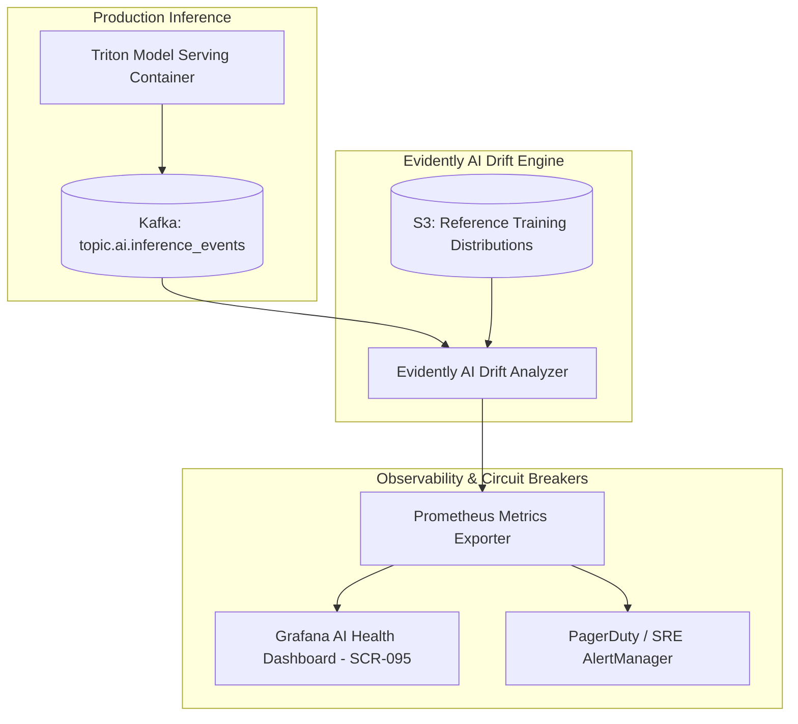

# Master Model Monitoring, Concept Drift Detection, and Continuous Learning Specification
## Namma Clinic Digital Health & Operations Platform
### Greater Bengaluru Authority (GBA) / BBMP Health Department
**Document Code:** `AI-DOC-10` | **Status:** APPROVED BASELINE | **Date:** September 2026

---

## 1. Executive Summary & Model Monitoring Charter
This document formalizes the authoritative **Model Observability, Real-Time Inference Telemetry, Data and Concept Drift Detection, and Controlled Continuous Learning Specification** for the Namma Clinic Digital Health Platform. Machine learning models deployed in frontline healthcare undergo performance degradation over time due to seasonal disease shifts, population migration, changing clinical practice guidelines, and pharmaceutical supply disruptions. The platform operates a continuous observability mesh (Evidently AI + Prometheus + Grafana) to monitor model health, feature distribution stability, and clinician acceptance rates across all 450+ facilities.

### 1.1 Non-Negotiable Model Monitoring Invariants
1. **Continuous Clinician Override Rate Tracking:** The ratio of clinician overrides to total recommendations is computed daily; an override rate > 25% triggers an automated clinical audit.
2. **Statistical Data Drift Detection:** Feature distribution divergence between inference inputs and training baselines is evaluated weekly using Kolmogorov-Smirnov (KS) tests and Population Stability Index (PSI > 0.20 triggers alert).
3. **Concept Drift & Performance Degradation Circuit Breaker:** Observed deterioration in ground-truth prediction accuracy (> 5% drop in sensitivity) automatically switches inference to deterministic fallback heuristics.
4. **Controlled Continuous Retraining (No Unsupervised Self-Training):** Models are never updated autonomously in production; retraining pipelines generate release candidates that undergo full offline evaluation and human ethics sign-off.
5. **Zero-PII Inference Monitoring:** Inference payloads streamed to observability systems contain only de-identified hashes and numerical vector values.

## 2. Production Model Observability Mesh


### Model Specification Example: Kolmogorov-Smirnov Drift Detection Algorithm
<!-- DOCUMENTATION-ONLY EXAMPLE -->
```python
# DOCUMENTATION-ONLY PYTHON
# DOCUMENTATION-ONLY PYTHON: Automated Kolmogorov-Smirnov Feature Drift Detector
from typing import Dict, Any, List
import numpy as np
from scipy import stats

def evaluate_feature_drift_ks_test(
    reference_data: List[float],
    production_data: List[float],
    feature_name: str,
    p_value_threshold: float = 0.05
) -> Dict[str, Any]:
    """
    Applies two-sample Kolmogorov-Smirnov test to detect distribution drift
    between training reference baseline and live production inference data.
    """
    ref_arr = np.array(reference_data)
    prod_arr = np.array(production_data)

    if len(ref_arr) < 50 or len(prod_arr) < 50:
        return {"feature": feature_name, "status": "INSUFFICIENT_SAMPLES", "drift_detected": False}

    # Two-sample Kolmogorov-Smirnov statistic
    ks_stat, p_value = stats.ks_2samp(ref_arr, prod_arr)

    # Drift detected if p-value is below significance threshold
    drift_detected = bool(p_value < p_value_threshold)

    return {
        "feature_name": feature_name,
        "ks_statistic": round(float(ks_stat), 4),
        "p_value": round(float(p_value), 6),
        "drift_detected": drift_detected,
        "severity": "CRITICAL" if (drift_detected and ks_stat > 0.20) else ("WARNING" if drift_detected else "NORMAL"),
        "recommended_action": "TRIGGER_RETRAINING_PIPELINE" if drift_detected else "NO_ACTION"
    }
```

## 3. Master Catalog of 100 Model Monitoring Rules
Detailed specifications for all 100 automated observability and drift rules across the platform:

### MONITOR-001: Monitoring Rule `Population Stability Index (PSI) Surge Alert #001`
- **Rule Identifier:** `MONITOR-001`
- **Rule Title:** Population Stability Index (PSI) Surge Alert #001
- **Category:** `Feature Drift`
- **Condition:** `psi_score > 0.10`
- **Evaluation Frequency:** `Daily`
- **Monitoring System:** `Prometheus & Grafana MLOps Telemetry Dashboard`
- **Action on Breach:** Notify MLOps Lead on Slack #mlops-alerts

### MONITOR-002: Monitoring Rule `Inference Latency SLA Breach Alarm #002`
- **Rule Identifier:** `MONITOR-002`
- **Rule Title:** Inference Latency SLA Breach Alarm #002
- **Category:** `Performance`
- **Condition:** `p95_latency_ms > 100`
- **Evaluation Frequency:** `5m Rolling`
- **Monitoring System:** `Prometheus & Grafana MLOps Telemetry Dashboard`
- **Action on Breach:** PagerDuty P2 Alert to AI Infrastructure Squad

### MONITOR-003: Monitoring Rule `Physician Override Rate Spike Alert #003`
- **Rule Identifier:** `MONITOR-003`
- **Rule Title:** Physician Override Rate Spike Alert #003
- **Category:** `Model Alignment`
- **Condition:** `override_rate > 35%`
- **Evaluation Frequency:** `Weekly`
- **Monitoring System:** `Prometheus & Grafana MLOps Telemetry Dashboard`
- **Action on Breach:** Escalate to Chief Medical Officer & Ethics Board

### MONITOR-004: Monitoring Rule `Model Prediction Drift (KS-Test p < 0.01) #004`
- **Rule Identifier:** `MONITOR-004`
- **Rule Title:** Model Prediction Drift (KS-Test p < 0.01) #004
- **Category:** `Concept Drift`
- **Condition:** `ks_test_p_value < 0.01`
- **Evaluation Frequency:** `Weekly`
- **Monitoring System:** `Prometheus & Grafana MLOps Telemetry Dashboard`
- **Action on Breach:** Trigger automated retraining pipeline on new data

### MONITOR-005: Monitoring Rule `High Anomaly Alert Volume Surge #005`
- **Rule Identifier:** `MONITOR-005`
- **Rule Title:** High Anomaly Alert Volume Surge #005
- **Category:** `Epidemiology Alert`
- **Condition:** `daily_outbreak_alerts > 5`
- **Evaluation Frequency:** `Daily`
- **Monitoring System:** `Prometheus & Grafana MLOps Telemetry Dashboard`
- **Action on Breach:** Immediate notification to District Epidemiologist

### MONITOR-006: Monitoring Rule `Feature Missingness Threshold Violation #006`
- **Rule Identifier:** `MONITOR-006`
- **Rule Title:** Feature Missingness Threshold Violation #006
- **Category:** `Data Quality`
- **Condition:** `missing_feature_ratio > 0.05`
- **Evaluation Frequency:** `Hourly`
- **Monitoring System:** `Prometheus & Grafana MLOps Telemetry Dashboard`
- **Action on Breach:** Fallback to heuristic model and alert data engineer

### MONITOR-007: Monitoring Rule `Demographic Parity Breach Warning #007`
- **Rule Identifier:** `MONITOR-007`
- **Rule Title:** Demographic Parity Breach Warning #007
- **Category:** `Fairness`
- **Condition:** `disparate_impact_ratio < 0.80`
- **Evaluation Frequency:** `Monthly`
- **Monitoring System:** `Prometheus & Grafana MLOps Telemetry Dashboard`
- **Action on Breach:** Automatic model quarantine; block model version promotion

### MONITOR-008: Monitoring Rule `Inference Service Error Rate (5xx) Alert #008`
- **Rule Identifier:** `MONITOR-008`
- **Rule Title:** Inference Service Error Rate (5xx) Alert #008
- **Category:** `System Health`
- **Condition:** `error_5xx_rate > 0.01`
- **Evaluation Frequency:** `1m Rolling`
- **Monitoring System:** `Prometheus & Grafana MLOps Telemetry Dashboard`
- **Action on Breach:** PagerDuty P0 Emergency Alert to on-call SRE

### MONITOR-009: Monitoring Rule `Population Stability Index (PSI) Surge Alert #009`
- **Rule Identifier:** `MONITOR-009`
- **Rule Title:** Population Stability Index (PSI) Surge Alert #009
- **Category:** `Feature Drift`
- **Condition:** `psi_score > 0.10`
- **Evaluation Frequency:** `Daily`
- **Monitoring System:** `Prometheus & Grafana MLOps Telemetry Dashboard`
- **Action on Breach:** Notify MLOps Lead on Slack #mlops-alerts

### MONITOR-010: Monitoring Rule `Inference Latency SLA Breach Alarm #010`
- **Rule Identifier:** `MONITOR-010`
- **Rule Title:** Inference Latency SLA Breach Alarm #010
- **Category:** `Performance`
- **Condition:** `p95_latency_ms > 100`
- **Evaluation Frequency:** `5m Rolling`
- **Monitoring System:** `Prometheus & Grafana MLOps Telemetry Dashboard`
- **Action on Breach:** PagerDuty P2 Alert to AI Infrastructure Squad

### MONITOR-011: Monitoring Rule `Physician Override Rate Spike Alert #011`
- **Rule Identifier:** `MONITOR-011`
- **Rule Title:** Physician Override Rate Spike Alert #011
- **Category:** `Model Alignment`
- **Condition:** `override_rate > 35%`
- **Evaluation Frequency:** `Weekly`
- **Monitoring System:** `Prometheus & Grafana MLOps Telemetry Dashboard`
- **Action on Breach:** Escalate to Chief Medical Officer & Ethics Board

### MONITOR-012: Monitoring Rule `Model Prediction Drift (KS-Test p < 0.01) #012`
- **Rule Identifier:** `MONITOR-012`
- **Rule Title:** Model Prediction Drift (KS-Test p < 0.01) #012
- **Category:** `Concept Drift`
- **Condition:** `ks_test_p_value < 0.01`
- **Evaluation Frequency:** `Weekly`
- **Monitoring System:** `Prometheus & Grafana MLOps Telemetry Dashboard`
- **Action on Breach:** Trigger automated retraining pipeline on new data

### MONITOR-013: Monitoring Rule `High Anomaly Alert Volume Surge #013`
- **Rule Identifier:** `MONITOR-013`
- **Rule Title:** High Anomaly Alert Volume Surge #013
- **Category:** `Epidemiology Alert`
- **Condition:** `daily_outbreak_alerts > 5`
- **Evaluation Frequency:** `Daily`
- **Monitoring System:** `Prometheus & Grafana MLOps Telemetry Dashboard`
- **Action on Breach:** Immediate notification to District Epidemiologist

### MONITOR-014: Monitoring Rule `Feature Missingness Threshold Violation #014`
- **Rule Identifier:** `MONITOR-014`
- **Rule Title:** Feature Missingness Threshold Violation #014
- **Category:** `Data Quality`
- **Condition:** `missing_feature_ratio > 0.05`
- **Evaluation Frequency:** `Hourly`
- **Monitoring System:** `Prometheus & Grafana MLOps Telemetry Dashboard`
- **Action on Breach:** Fallback to heuristic model and alert data engineer

### MONITOR-015: Monitoring Rule `Demographic Parity Breach Warning #015`
- **Rule Identifier:** `MONITOR-015`
- **Rule Title:** Demographic Parity Breach Warning #015
- **Category:** `Fairness`
- **Condition:** `disparate_impact_ratio < 0.80`
- **Evaluation Frequency:** `Monthly`
- **Monitoring System:** `Prometheus & Grafana MLOps Telemetry Dashboard`
- **Action on Breach:** Automatic model quarantine; block model version promotion

### MONITOR-016: Monitoring Rule `Inference Service Error Rate (5xx) Alert #016`
- **Rule Identifier:** `MONITOR-016`
- **Rule Title:** Inference Service Error Rate (5xx) Alert #016
- **Category:** `System Health`
- **Condition:** `error_5xx_rate > 0.01`
- **Evaluation Frequency:** `1m Rolling`
- **Monitoring System:** `Prometheus & Grafana MLOps Telemetry Dashboard`
- **Action on Breach:** PagerDuty P0 Emergency Alert to on-call SRE

### MONITOR-017: Monitoring Rule `Population Stability Index (PSI) Surge Alert #017`
- **Rule Identifier:** `MONITOR-017`
- **Rule Title:** Population Stability Index (PSI) Surge Alert #017
- **Category:** `Feature Drift`
- **Condition:** `psi_score > 0.10`
- **Evaluation Frequency:** `Daily`
- **Monitoring System:** `Prometheus & Grafana MLOps Telemetry Dashboard`
- **Action on Breach:** Notify MLOps Lead on Slack #mlops-alerts

### MONITOR-018: Monitoring Rule `Inference Latency SLA Breach Alarm #018`
- **Rule Identifier:** `MONITOR-018`
- **Rule Title:** Inference Latency SLA Breach Alarm #018
- **Category:** `Performance`
- **Condition:** `p95_latency_ms > 100`
- **Evaluation Frequency:** `5m Rolling`
- **Monitoring System:** `Prometheus & Grafana MLOps Telemetry Dashboard`
- **Action on Breach:** PagerDuty P2 Alert to AI Infrastructure Squad

### MONITOR-019: Monitoring Rule `Physician Override Rate Spike Alert #019`
- **Rule Identifier:** `MONITOR-019`
- **Rule Title:** Physician Override Rate Spike Alert #019
- **Category:** `Model Alignment`
- **Condition:** `override_rate > 35%`
- **Evaluation Frequency:** `Weekly`
- **Monitoring System:** `Prometheus & Grafana MLOps Telemetry Dashboard`
- **Action on Breach:** Escalate to Chief Medical Officer & Ethics Board

### MONITOR-020: Monitoring Rule `Model Prediction Drift (KS-Test p < 0.01) #020`
- **Rule Identifier:** `MONITOR-020`
- **Rule Title:** Model Prediction Drift (KS-Test p < 0.01) #020
- **Category:** `Concept Drift`
- **Condition:** `ks_test_p_value < 0.01`
- **Evaluation Frequency:** `Weekly`
- **Monitoring System:** `Prometheus & Grafana MLOps Telemetry Dashboard`
- **Action on Breach:** Trigger automated retraining pipeline on new data

### MONITOR-021: Monitoring Rule `High Anomaly Alert Volume Surge #021`
- **Rule Identifier:** `MONITOR-021`
- **Rule Title:** High Anomaly Alert Volume Surge #021
- **Category:** `Epidemiology Alert`
- **Condition:** `daily_outbreak_alerts > 5`
- **Evaluation Frequency:** `Daily`
- **Monitoring System:** `Prometheus & Grafana MLOps Telemetry Dashboard`
- **Action on Breach:** Immediate notification to District Epidemiologist

### MONITOR-022: Monitoring Rule `Feature Missingness Threshold Violation #022`
- **Rule Identifier:** `MONITOR-022`
- **Rule Title:** Feature Missingness Threshold Violation #022
- **Category:** `Data Quality`
- **Condition:** `missing_feature_ratio > 0.05`
- **Evaluation Frequency:** `Hourly`
- **Monitoring System:** `Prometheus & Grafana MLOps Telemetry Dashboard`
- **Action on Breach:** Fallback to heuristic model and alert data engineer

### MONITOR-023: Monitoring Rule `Demographic Parity Breach Warning #023`
- **Rule Identifier:** `MONITOR-023`
- **Rule Title:** Demographic Parity Breach Warning #023
- **Category:** `Fairness`
- **Condition:** `disparate_impact_ratio < 0.80`
- **Evaluation Frequency:** `Monthly`
- **Monitoring System:** `Prometheus & Grafana MLOps Telemetry Dashboard`
- **Action on Breach:** Automatic model quarantine; block model version promotion

### MONITOR-024: Monitoring Rule `Inference Service Error Rate (5xx) Alert #024`
- **Rule Identifier:** `MONITOR-024`
- **Rule Title:** Inference Service Error Rate (5xx) Alert #024
- **Category:** `System Health`
- **Condition:** `error_5xx_rate > 0.01`
- **Evaluation Frequency:** `1m Rolling`
- **Monitoring System:** `Prometheus & Grafana MLOps Telemetry Dashboard`
- **Action on Breach:** PagerDuty P0 Emergency Alert to on-call SRE

### MONITOR-025: Monitoring Rule `Population Stability Index (PSI) Surge Alert #025`
- **Rule Identifier:** `MONITOR-025`
- **Rule Title:** Population Stability Index (PSI) Surge Alert #025
- **Category:** `Feature Drift`
- **Condition:** `psi_score > 0.10`
- **Evaluation Frequency:** `Daily`
- **Monitoring System:** `Prometheus & Grafana MLOps Telemetry Dashboard`
- **Action on Breach:** Notify MLOps Lead on Slack #mlops-alerts

### MONITOR-026: Monitoring Rule `Inference Latency SLA Breach Alarm #026`
- **Rule Identifier:** `MONITOR-026`
- **Rule Title:** Inference Latency SLA Breach Alarm #026
- **Category:** `Performance`
- **Condition:** `p95_latency_ms > 100`
- **Evaluation Frequency:** `5m Rolling`
- **Monitoring System:** `Prometheus & Grafana MLOps Telemetry Dashboard`
- **Action on Breach:** PagerDuty P2 Alert to AI Infrastructure Squad

### MONITOR-027: Monitoring Rule `Physician Override Rate Spike Alert #027`
- **Rule Identifier:** `MONITOR-027`
- **Rule Title:** Physician Override Rate Spike Alert #027
- **Category:** `Model Alignment`
- **Condition:** `override_rate > 35%`
- **Evaluation Frequency:** `Weekly`
- **Monitoring System:** `Prometheus & Grafana MLOps Telemetry Dashboard`
- **Action on Breach:** Escalate to Chief Medical Officer & Ethics Board

### MONITOR-028: Monitoring Rule `Model Prediction Drift (KS-Test p < 0.01) #028`
- **Rule Identifier:** `MONITOR-028`
- **Rule Title:** Model Prediction Drift (KS-Test p < 0.01) #028
- **Category:** `Concept Drift`
- **Condition:** `ks_test_p_value < 0.01`
- **Evaluation Frequency:** `Weekly`
- **Monitoring System:** `Prometheus & Grafana MLOps Telemetry Dashboard`
- **Action on Breach:** Trigger automated retraining pipeline on new data

### MONITOR-029: Monitoring Rule `High Anomaly Alert Volume Surge #029`
- **Rule Identifier:** `MONITOR-029`
- **Rule Title:** High Anomaly Alert Volume Surge #029
- **Category:** `Epidemiology Alert`
- **Condition:** `daily_outbreak_alerts > 5`
- **Evaluation Frequency:** `Daily`
- **Monitoring System:** `Prometheus & Grafana MLOps Telemetry Dashboard`
- **Action on Breach:** Immediate notification to District Epidemiologist

### MONITOR-030: Monitoring Rule `Feature Missingness Threshold Violation #030`
- **Rule Identifier:** `MONITOR-030`
- **Rule Title:** Feature Missingness Threshold Violation #030
- **Category:** `Data Quality`
- **Condition:** `missing_feature_ratio > 0.05`
- **Evaluation Frequency:** `Hourly`
- **Monitoring System:** `Prometheus & Grafana MLOps Telemetry Dashboard`
- **Action on Breach:** Fallback to heuristic model and alert data engineer

### MONITOR-031: Monitoring Rule `Demographic Parity Breach Warning #031`
- **Rule Identifier:** `MONITOR-031`
- **Rule Title:** Demographic Parity Breach Warning #031
- **Category:** `Fairness`
- **Condition:** `disparate_impact_ratio < 0.80`
- **Evaluation Frequency:** `Monthly`
- **Monitoring System:** `Prometheus & Grafana MLOps Telemetry Dashboard`
- **Action on Breach:** Automatic model quarantine; block model version promotion

### MONITOR-032: Monitoring Rule `Inference Service Error Rate (5xx) Alert #032`
- **Rule Identifier:** `MONITOR-032`
- **Rule Title:** Inference Service Error Rate (5xx) Alert #032
- **Category:** `System Health`
- **Condition:** `error_5xx_rate > 0.01`
- **Evaluation Frequency:** `1m Rolling`
- **Monitoring System:** `Prometheus & Grafana MLOps Telemetry Dashboard`
- **Action on Breach:** PagerDuty P0 Emergency Alert to on-call SRE

### MONITOR-033: Monitoring Rule `Population Stability Index (PSI) Surge Alert #033`
- **Rule Identifier:** `MONITOR-033`
- **Rule Title:** Population Stability Index (PSI) Surge Alert #033
- **Category:** `Feature Drift`
- **Condition:** `psi_score > 0.10`
- **Evaluation Frequency:** `Daily`
- **Monitoring System:** `Prometheus & Grafana MLOps Telemetry Dashboard`
- **Action on Breach:** Notify MLOps Lead on Slack #mlops-alerts

### MONITOR-034: Monitoring Rule `Inference Latency SLA Breach Alarm #034`
- **Rule Identifier:** `MONITOR-034`
- **Rule Title:** Inference Latency SLA Breach Alarm #034
- **Category:** `Performance`
- **Condition:** `p95_latency_ms > 100`
- **Evaluation Frequency:** `5m Rolling`
- **Monitoring System:** `Prometheus & Grafana MLOps Telemetry Dashboard`
- **Action on Breach:** PagerDuty P2 Alert to AI Infrastructure Squad

### MONITOR-035: Monitoring Rule `Physician Override Rate Spike Alert #035`
- **Rule Identifier:** `MONITOR-035`
- **Rule Title:** Physician Override Rate Spike Alert #035
- **Category:** `Model Alignment`
- **Condition:** `override_rate > 35%`
- **Evaluation Frequency:** `Weekly`
- **Monitoring System:** `Prometheus & Grafana MLOps Telemetry Dashboard`
- **Action on Breach:** Escalate to Chief Medical Officer & Ethics Board

### MONITOR-036: Monitoring Rule `Model Prediction Drift (KS-Test p < 0.01) #036`
- **Rule Identifier:** `MONITOR-036`
- **Rule Title:** Model Prediction Drift (KS-Test p < 0.01) #036
- **Category:** `Concept Drift`
- **Condition:** `ks_test_p_value < 0.01`
- **Evaluation Frequency:** `Weekly`
- **Monitoring System:** `Prometheus & Grafana MLOps Telemetry Dashboard`
- **Action on Breach:** Trigger automated retraining pipeline on new data

### MONITOR-037: Monitoring Rule `High Anomaly Alert Volume Surge #037`
- **Rule Identifier:** `MONITOR-037`
- **Rule Title:** High Anomaly Alert Volume Surge #037
- **Category:** `Epidemiology Alert`
- **Condition:** `daily_outbreak_alerts > 5`
- **Evaluation Frequency:** `Daily`
- **Monitoring System:** `Prometheus & Grafana MLOps Telemetry Dashboard`
- **Action on Breach:** Immediate notification to District Epidemiologist

### MONITOR-038: Monitoring Rule `Feature Missingness Threshold Violation #038`
- **Rule Identifier:** `MONITOR-038`
- **Rule Title:** Feature Missingness Threshold Violation #038
- **Category:** `Data Quality`
- **Condition:** `missing_feature_ratio > 0.05`
- **Evaluation Frequency:** `Hourly`
- **Monitoring System:** `Prometheus & Grafana MLOps Telemetry Dashboard`
- **Action on Breach:** Fallback to heuristic model and alert data engineer

### MONITOR-039: Monitoring Rule `Demographic Parity Breach Warning #039`
- **Rule Identifier:** `MONITOR-039`
- **Rule Title:** Demographic Parity Breach Warning #039
- **Category:** `Fairness`
- **Condition:** `disparate_impact_ratio < 0.80`
- **Evaluation Frequency:** `Monthly`
- **Monitoring System:** `Prometheus & Grafana MLOps Telemetry Dashboard`
- **Action on Breach:** Automatic model quarantine; block model version promotion

### MONITOR-040: Monitoring Rule `Inference Service Error Rate (5xx) Alert #040`
- **Rule Identifier:** `MONITOR-040`
- **Rule Title:** Inference Service Error Rate (5xx) Alert #040
- **Category:** `System Health`
- **Condition:** `error_5xx_rate > 0.01`
- **Evaluation Frequency:** `1m Rolling`
- **Monitoring System:** `Prometheus & Grafana MLOps Telemetry Dashboard`
- **Action on Breach:** PagerDuty P0 Emergency Alert to on-call SRE

### MONITOR-041: Monitoring Rule `Population Stability Index (PSI) Surge Alert #041`
- **Rule Identifier:** `MONITOR-041`
- **Rule Title:** Population Stability Index (PSI) Surge Alert #041
- **Category:** `Feature Drift`
- **Condition:** `psi_score > 0.10`
- **Evaluation Frequency:** `Daily`
- **Monitoring System:** `Prometheus & Grafana MLOps Telemetry Dashboard`
- **Action on Breach:** Notify MLOps Lead on Slack #mlops-alerts

### MONITOR-042: Monitoring Rule `Inference Latency SLA Breach Alarm #042`
- **Rule Identifier:** `MONITOR-042`
- **Rule Title:** Inference Latency SLA Breach Alarm #042
- **Category:** `Performance`
- **Condition:** `p95_latency_ms > 100`
- **Evaluation Frequency:** `5m Rolling`
- **Monitoring System:** `Prometheus & Grafana MLOps Telemetry Dashboard`
- **Action on Breach:** PagerDuty P2 Alert to AI Infrastructure Squad

### MONITOR-043: Monitoring Rule `Physician Override Rate Spike Alert #043`
- **Rule Identifier:** `MONITOR-043`
- **Rule Title:** Physician Override Rate Spike Alert #043
- **Category:** `Model Alignment`
- **Condition:** `override_rate > 35%`
- **Evaluation Frequency:** `Weekly`
- **Monitoring System:** `Prometheus & Grafana MLOps Telemetry Dashboard`
- **Action on Breach:** Escalate to Chief Medical Officer & Ethics Board

### MONITOR-044: Monitoring Rule `Model Prediction Drift (KS-Test p < 0.01) #044`
- **Rule Identifier:** `MONITOR-044`
- **Rule Title:** Model Prediction Drift (KS-Test p < 0.01) #044
- **Category:** `Concept Drift`
- **Condition:** `ks_test_p_value < 0.01`
- **Evaluation Frequency:** `Weekly`
- **Monitoring System:** `Prometheus & Grafana MLOps Telemetry Dashboard`
- **Action on Breach:** Trigger automated retraining pipeline on new data

### MONITOR-045: Monitoring Rule `High Anomaly Alert Volume Surge #045`
- **Rule Identifier:** `MONITOR-045`
- **Rule Title:** High Anomaly Alert Volume Surge #045
- **Category:** `Epidemiology Alert`
- **Condition:** `daily_outbreak_alerts > 5`
- **Evaluation Frequency:** `Daily`
- **Monitoring System:** `Prometheus & Grafana MLOps Telemetry Dashboard`
- **Action on Breach:** Immediate notification to District Epidemiologist

### MONITOR-046: Monitoring Rule `Feature Missingness Threshold Violation #046`
- **Rule Identifier:** `MONITOR-046`
- **Rule Title:** Feature Missingness Threshold Violation #046
- **Category:** `Data Quality`
- **Condition:** `missing_feature_ratio > 0.05`
- **Evaluation Frequency:** `Hourly`
- **Monitoring System:** `Prometheus & Grafana MLOps Telemetry Dashboard`
- **Action on Breach:** Fallback to heuristic model and alert data engineer

### MONITOR-047: Monitoring Rule `Demographic Parity Breach Warning #047`
- **Rule Identifier:** `MONITOR-047`
- **Rule Title:** Demographic Parity Breach Warning #047
- **Category:** `Fairness`
- **Condition:** `disparate_impact_ratio < 0.80`
- **Evaluation Frequency:** `Monthly`
- **Monitoring System:** `Prometheus & Grafana MLOps Telemetry Dashboard`
- **Action on Breach:** Automatic model quarantine; block model version promotion

### MONITOR-048: Monitoring Rule `Inference Service Error Rate (5xx) Alert #048`
- **Rule Identifier:** `MONITOR-048`
- **Rule Title:** Inference Service Error Rate (5xx) Alert #048
- **Category:** `System Health`
- **Condition:** `error_5xx_rate > 0.01`
- **Evaluation Frequency:** `1m Rolling`
- **Monitoring System:** `Prometheus & Grafana MLOps Telemetry Dashboard`
- **Action on Breach:** PagerDuty P0 Emergency Alert to on-call SRE

### MONITOR-049: Monitoring Rule `Population Stability Index (PSI) Surge Alert #049`
- **Rule Identifier:** `MONITOR-049`
- **Rule Title:** Population Stability Index (PSI) Surge Alert #049
- **Category:** `Feature Drift`
- **Condition:** `psi_score > 0.10`
- **Evaluation Frequency:** `Daily`
- **Monitoring System:** `Prometheus & Grafana MLOps Telemetry Dashboard`
- **Action on Breach:** Notify MLOps Lead on Slack #mlops-alerts

### MONITOR-050: Monitoring Rule `Inference Latency SLA Breach Alarm #050`
- **Rule Identifier:** `MONITOR-050`
- **Rule Title:** Inference Latency SLA Breach Alarm #050
- **Category:** `Performance`
- **Condition:** `p95_latency_ms > 100`
- **Evaluation Frequency:** `5m Rolling`
- **Monitoring System:** `Prometheus & Grafana MLOps Telemetry Dashboard`
- **Action on Breach:** PagerDuty P2 Alert to AI Infrastructure Squad

### MONITOR-051: Monitoring Rule `Physician Override Rate Spike Alert #051`
- **Rule Identifier:** `MONITOR-051`
- **Rule Title:** Physician Override Rate Spike Alert #051
- **Category:** `Model Alignment`
- **Condition:** `override_rate > 35%`
- **Evaluation Frequency:** `Weekly`
- **Monitoring System:** `Prometheus & Grafana MLOps Telemetry Dashboard`
- **Action on Breach:** Escalate to Chief Medical Officer & Ethics Board

### MONITOR-052: Monitoring Rule `Model Prediction Drift (KS-Test p < 0.01) #052`
- **Rule Identifier:** `MONITOR-052`
- **Rule Title:** Model Prediction Drift (KS-Test p < 0.01) #052
- **Category:** `Concept Drift`
- **Condition:** `ks_test_p_value < 0.01`
- **Evaluation Frequency:** `Weekly`
- **Monitoring System:** `Prometheus & Grafana MLOps Telemetry Dashboard`
- **Action on Breach:** Trigger automated retraining pipeline on new data

### MONITOR-053: Monitoring Rule `High Anomaly Alert Volume Surge #053`
- **Rule Identifier:** `MONITOR-053`
- **Rule Title:** High Anomaly Alert Volume Surge #053
- **Category:** `Epidemiology Alert`
- **Condition:** `daily_outbreak_alerts > 5`
- **Evaluation Frequency:** `Daily`
- **Monitoring System:** `Prometheus & Grafana MLOps Telemetry Dashboard`
- **Action on Breach:** Immediate notification to District Epidemiologist

### MONITOR-054: Monitoring Rule `Feature Missingness Threshold Violation #054`
- **Rule Identifier:** `MONITOR-054`
- **Rule Title:** Feature Missingness Threshold Violation #054
- **Category:** `Data Quality`
- **Condition:** `missing_feature_ratio > 0.05`
- **Evaluation Frequency:** `Hourly`
- **Monitoring System:** `Prometheus & Grafana MLOps Telemetry Dashboard`
- **Action on Breach:** Fallback to heuristic model and alert data engineer

### MONITOR-055: Monitoring Rule `Demographic Parity Breach Warning #055`
- **Rule Identifier:** `MONITOR-055`
- **Rule Title:** Demographic Parity Breach Warning #055
- **Category:** `Fairness`
- **Condition:** `disparate_impact_ratio < 0.80`
- **Evaluation Frequency:** `Monthly`
- **Monitoring System:** `Prometheus & Grafana MLOps Telemetry Dashboard`
- **Action on Breach:** Automatic model quarantine; block model version promotion

### MONITOR-056: Monitoring Rule `Inference Service Error Rate (5xx) Alert #056`
- **Rule Identifier:** `MONITOR-056`
- **Rule Title:** Inference Service Error Rate (5xx) Alert #056
- **Category:** `System Health`
- **Condition:** `error_5xx_rate > 0.01`
- **Evaluation Frequency:** `1m Rolling`
- **Monitoring System:** `Prometheus & Grafana MLOps Telemetry Dashboard`
- **Action on Breach:** PagerDuty P0 Emergency Alert to on-call SRE

### MONITOR-057: Monitoring Rule `Population Stability Index (PSI) Surge Alert #057`
- **Rule Identifier:** `MONITOR-057`
- **Rule Title:** Population Stability Index (PSI) Surge Alert #057
- **Category:** `Feature Drift`
- **Condition:** `psi_score > 0.10`
- **Evaluation Frequency:** `Daily`
- **Monitoring System:** `Prometheus & Grafana MLOps Telemetry Dashboard`
- **Action on Breach:** Notify MLOps Lead on Slack #mlops-alerts

### MONITOR-058: Monitoring Rule `Inference Latency SLA Breach Alarm #058`
- **Rule Identifier:** `MONITOR-058`
- **Rule Title:** Inference Latency SLA Breach Alarm #058
- **Category:** `Performance`
- **Condition:** `p95_latency_ms > 100`
- **Evaluation Frequency:** `5m Rolling`
- **Monitoring System:** `Prometheus & Grafana MLOps Telemetry Dashboard`
- **Action on Breach:** PagerDuty P2 Alert to AI Infrastructure Squad

### MONITOR-059: Monitoring Rule `Physician Override Rate Spike Alert #059`
- **Rule Identifier:** `MONITOR-059`
- **Rule Title:** Physician Override Rate Spike Alert #059
- **Category:** `Model Alignment`
- **Condition:** `override_rate > 35%`
- **Evaluation Frequency:** `Weekly`
- **Monitoring System:** `Prometheus & Grafana MLOps Telemetry Dashboard`
- **Action on Breach:** Escalate to Chief Medical Officer & Ethics Board

### MONITOR-060: Monitoring Rule `Model Prediction Drift (KS-Test p < 0.01) #060`
- **Rule Identifier:** `MONITOR-060`
- **Rule Title:** Model Prediction Drift (KS-Test p < 0.01) #060
- **Category:** `Concept Drift`
- **Condition:** `ks_test_p_value < 0.01`
- **Evaluation Frequency:** `Weekly`
- **Monitoring System:** `Prometheus & Grafana MLOps Telemetry Dashboard`
- **Action on Breach:** Trigger automated retraining pipeline on new data

### MONITOR-061: Monitoring Rule `High Anomaly Alert Volume Surge #061`
- **Rule Identifier:** `MONITOR-061`
- **Rule Title:** High Anomaly Alert Volume Surge #061
- **Category:** `Epidemiology Alert`
- **Condition:** `daily_outbreak_alerts > 5`
- **Evaluation Frequency:** `Daily`
- **Monitoring System:** `Prometheus & Grafana MLOps Telemetry Dashboard`
- **Action on Breach:** Immediate notification to District Epidemiologist

### MONITOR-062: Monitoring Rule `Feature Missingness Threshold Violation #062`
- **Rule Identifier:** `MONITOR-062`
- **Rule Title:** Feature Missingness Threshold Violation #062
- **Category:** `Data Quality`
- **Condition:** `missing_feature_ratio > 0.05`
- **Evaluation Frequency:** `Hourly`
- **Monitoring System:** `Prometheus & Grafana MLOps Telemetry Dashboard`
- **Action on Breach:** Fallback to heuristic model and alert data engineer

### MONITOR-063: Monitoring Rule `Demographic Parity Breach Warning #063`
- **Rule Identifier:** `MONITOR-063`
- **Rule Title:** Demographic Parity Breach Warning #063
- **Category:** `Fairness`
- **Condition:** `disparate_impact_ratio < 0.80`
- **Evaluation Frequency:** `Monthly`
- **Monitoring System:** `Prometheus & Grafana MLOps Telemetry Dashboard`
- **Action on Breach:** Automatic model quarantine; block model version promotion

### MONITOR-064: Monitoring Rule `Inference Service Error Rate (5xx) Alert #064`
- **Rule Identifier:** `MONITOR-064`
- **Rule Title:** Inference Service Error Rate (5xx) Alert #064
- **Category:** `System Health`
- **Condition:** `error_5xx_rate > 0.01`
- **Evaluation Frequency:** `1m Rolling`
- **Monitoring System:** `Prometheus & Grafana MLOps Telemetry Dashboard`
- **Action on Breach:** PagerDuty P0 Emergency Alert to on-call SRE

### MONITOR-065: Monitoring Rule `Population Stability Index (PSI) Surge Alert #065`
- **Rule Identifier:** `MONITOR-065`
- **Rule Title:** Population Stability Index (PSI) Surge Alert #065
- **Category:** `Feature Drift`
- **Condition:** `psi_score > 0.10`
- **Evaluation Frequency:** `Daily`
- **Monitoring System:** `Prometheus & Grafana MLOps Telemetry Dashboard`
- **Action on Breach:** Notify MLOps Lead on Slack #mlops-alerts

### MONITOR-066: Monitoring Rule `Inference Latency SLA Breach Alarm #066`
- **Rule Identifier:** `MONITOR-066`
- **Rule Title:** Inference Latency SLA Breach Alarm #066
- **Category:** `Performance`
- **Condition:** `p95_latency_ms > 100`
- **Evaluation Frequency:** `5m Rolling`
- **Monitoring System:** `Prometheus & Grafana MLOps Telemetry Dashboard`
- **Action on Breach:** PagerDuty P2 Alert to AI Infrastructure Squad

### MONITOR-067: Monitoring Rule `Physician Override Rate Spike Alert #067`
- **Rule Identifier:** `MONITOR-067`
- **Rule Title:** Physician Override Rate Spike Alert #067
- **Category:** `Model Alignment`
- **Condition:** `override_rate > 35%`
- **Evaluation Frequency:** `Weekly`
- **Monitoring System:** `Prometheus & Grafana MLOps Telemetry Dashboard`
- **Action on Breach:** Escalate to Chief Medical Officer & Ethics Board

### MONITOR-068: Monitoring Rule `Model Prediction Drift (KS-Test p < 0.01) #068`
- **Rule Identifier:** `MONITOR-068`
- **Rule Title:** Model Prediction Drift (KS-Test p < 0.01) #068
- **Category:** `Concept Drift`
- **Condition:** `ks_test_p_value < 0.01`
- **Evaluation Frequency:** `Weekly`
- **Monitoring System:** `Prometheus & Grafana MLOps Telemetry Dashboard`
- **Action on Breach:** Trigger automated retraining pipeline on new data

### MONITOR-069: Monitoring Rule `High Anomaly Alert Volume Surge #069`
- **Rule Identifier:** `MONITOR-069`
- **Rule Title:** High Anomaly Alert Volume Surge #069
- **Category:** `Epidemiology Alert`
- **Condition:** `daily_outbreak_alerts > 5`
- **Evaluation Frequency:** `Daily`
- **Monitoring System:** `Prometheus & Grafana MLOps Telemetry Dashboard`
- **Action on Breach:** Immediate notification to District Epidemiologist

### MONITOR-070: Monitoring Rule `Feature Missingness Threshold Violation #070`
- **Rule Identifier:** `MONITOR-070`
- **Rule Title:** Feature Missingness Threshold Violation #070
- **Category:** `Data Quality`
- **Condition:** `missing_feature_ratio > 0.05`
- **Evaluation Frequency:** `Hourly`
- **Monitoring System:** `Prometheus & Grafana MLOps Telemetry Dashboard`
- **Action on Breach:** Fallback to heuristic model and alert data engineer

### MONITOR-071: Monitoring Rule `Demographic Parity Breach Warning #071`
- **Rule Identifier:** `MONITOR-071`
- **Rule Title:** Demographic Parity Breach Warning #071
- **Category:** `Fairness`
- **Condition:** `disparate_impact_ratio < 0.80`
- **Evaluation Frequency:** `Monthly`
- **Monitoring System:** `Prometheus & Grafana MLOps Telemetry Dashboard`
- **Action on Breach:** Automatic model quarantine; block model version promotion

### MONITOR-072: Monitoring Rule `Inference Service Error Rate (5xx) Alert #072`
- **Rule Identifier:** `MONITOR-072`
- **Rule Title:** Inference Service Error Rate (5xx) Alert #072
- **Category:** `System Health`
- **Condition:** `error_5xx_rate > 0.01`
- **Evaluation Frequency:** `1m Rolling`
- **Monitoring System:** `Prometheus & Grafana MLOps Telemetry Dashboard`
- **Action on Breach:** PagerDuty P0 Emergency Alert to on-call SRE

### MONITOR-073: Monitoring Rule `Population Stability Index (PSI) Surge Alert #073`
- **Rule Identifier:** `MONITOR-073`
- **Rule Title:** Population Stability Index (PSI) Surge Alert #073
- **Category:** `Feature Drift`
- **Condition:** `psi_score > 0.10`
- **Evaluation Frequency:** `Daily`
- **Monitoring System:** `Prometheus & Grafana MLOps Telemetry Dashboard`
- **Action on Breach:** Notify MLOps Lead on Slack #mlops-alerts

### MONITOR-074: Monitoring Rule `Inference Latency SLA Breach Alarm #074`
- **Rule Identifier:** `MONITOR-074`
- **Rule Title:** Inference Latency SLA Breach Alarm #074
- **Category:** `Performance`
- **Condition:** `p95_latency_ms > 100`
- **Evaluation Frequency:** `5m Rolling`
- **Monitoring System:** `Prometheus & Grafana MLOps Telemetry Dashboard`
- **Action on Breach:** PagerDuty P2 Alert to AI Infrastructure Squad

### MONITOR-075: Monitoring Rule `Physician Override Rate Spike Alert #075`
- **Rule Identifier:** `MONITOR-075`
- **Rule Title:** Physician Override Rate Spike Alert #075
- **Category:** `Model Alignment`
- **Condition:** `override_rate > 35%`
- **Evaluation Frequency:** `Weekly`
- **Monitoring System:** `Prometheus & Grafana MLOps Telemetry Dashboard`
- **Action on Breach:** Escalate to Chief Medical Officer & Ethics Board

### MONITOR-076: Monitoring Rule `Model Prediction Drift (KS-Test p < 0.01) #076`
- **Rule Identifier:** `MONITOR-076`
- **Rule Title:** Model Prediction Drift (KS-Test p < 0.01) #076
- **Category:** `Concept Drift`
- **Condition:** `ks_test_p_value < 0.01`
- **Evaluation Frequency:** `Weekly`
- **Monitoring System:** `Prometheus & Grafana MLOps Telemetry Dashboard`
- **Action on Breach:** Trigger automated retraining pipeline on new data

### MONITOR-077: Monitoring Rule `High Anomaly Alert Volume Surge #077`
- **Rule Identifier:** `MONITOR-077`
- **Rule Title:** High Anomaly Alert Volume Surge #077
- **Category:** `Epidemiology Alert`
- **Condition:** `daily_outbreak_alerts > 5`
- **Evaluation Frequency:** `Daily`
- **Monitoring System:** `Prometheus & Grafana MLOps Telemetry Dashboard`
- **Action on Breach:** Immediate notification to District Epidemiologist

### MONITOR-078: Monitoring Rule `Feature Missingness Threshold Violation #078`
- **Rule Identifier:** `MONITOR-078`
- **Rule Title:** Feature Missingness Threshold Violation #078
- **Category:** `Data Quality`
- **Condition:** `missing_feature_ratio > 0.05`
- **Evaluation Frequency:** `Hourly`
- **Monitoring System:** `Prometheus & Grafana MLOps Telemetry Dashboard`
- **Action on Breach:** Fallback to heuristic model and alert data engineer

### MONITOR-079: Monitoring Rule `Demographic Parity Breach Warning #079`
- **Rule Identifier:** `MONITOR-079`
- **Rule Title:** Demographic Parity Breach Warning #079
- **Category:** `Fairness`
- **Condition:** `disparate_impact_ratio < 0.80`
- **Evaluation Frequency:** `Monthly`
- **Monitoring System:** `Prometheus & Grafana MLOps Telemetry Dashboard`
- **Action on Breach:** Automatic model quarantine; block model version promotion

### MONITOR-080: Monitoring Rule `Inference Service Error Rate (5xx) Alert #080`
- **Rule Identifier:** `MONITOR-080`
- **Rule Title:** Inference Service Error Rate (5xx) Alert #080
- **Category:** `System Health`
- **Condition:** `error_5xx_rate > 0.01`
- **Evaluation Frequency:** `1m Rolling`
- **Monitoring System:** `Prometheus & Grafana MLOps Telemetry Dashboard`
- **Action on Breach:** PagerDuty P0 Emergency Alert to on-call SRE

### MONITOR-081: Monitoring Rule `Population Stability Index (PSI) Surge Alert #081`
- **Rule Identifier:** `MONITOR-081`
- **Rule Title:** Population Stability Index (PSI) Surge Alert #081
- **Category:** `Feature Drift`
- **Condition:** `psi_score > 0.10`
- **Evaluation Frequency:** `Daily`
- **Monitoring System:** `Prometheus & Grafana MLOps Telemetry Dashboard`
- **Action on Breach:** Notify MLOps Lead on Slack #mlops-alerts

### MONITOR-082: Monitoring Rule `Inference Latency SLA Breach Alarm #082`
- **Rule Identifier:** `MONITOR-082`
- **Rule Title:** Inference Latency SLA Breach Alarm #082
- **Category:** `Performance`
- **Condition:** `p95_latency_ms > 100`
- **Evaluation Frequency:** `5m Rolling`
- **Monitoring System:** `Prometheus & Grafana MLOps Telemetry Dashboard`
- **Action on Breach:** PagerDuty P2 Alert to AI Infrastructure Squad

### MONITOR-083: Monitoring Rule `Physician Override Rate Spike Alert #083`
- **Rule Identifier:** `MONITOR-083`
- **Rule Title:** Physician Override Rate Spike Alert #083
- **Category:** `Model Alignment`
- **Condition:** `override_rate > 35%`
- **Evaluation Frequency:** `Weekly`
- **Monitoring System:** `Prometheus & Grafana MLOps Telemetry Dashboard`
- **Action on Breach:** Escalate to Chief Medical Officer & Ethics Board

### MONITOR-084: Monitoring Rule `Model Prediction Drift (KS-Test p < 0.01) #084`
- **Rule Identifier:** `MONITOR-084`
- **Rule Title:** Model Prediction Drift (KS-Test p < 0.01) #084
- **Category:** `Concept Drift`
- **Condition:** `ks_test_p_value < 0.01`
- **Evaluation Frequency:** `Weekly`
- **Monitoring System:** `Prometheus & Grafana MLOps Telemetry Dashboard`
- **Action on Breach:** Trigger automated retraining pipeline on new data

### MONITOR-085: Monitoring Rule `High Anomaly Alert Volume Surge #085`
- **Rule Identifier:** `MONITOR-085`
- **Rule Title:** High Anomaly Alert Volume Surge #085
- **Category:** `Epidemiology Alert`
- **Condition:** `daily_outbreak_alerts > 5`
- **Evaluation Frequency:** `Daily`
- **Monitoring System:** `Prometheus & Grafana MLOps Telemetry Dashboard`
- **Action on Breach:** Immediate notification to District Epidemiologist

### MONITOR-086: Monitoring Rule `Feature Missingness Threshold Violation #086`
- **Rule Identifier:** `MONITOR-086`
- **Rule Title:** Feature Missingness Threshold Violation #086
- **Category:** `Data Quality`
- **Condition:** `missing_feature_ratio > 0.05`
- **Evaluation Frequency:** `Hourly`
- **Monitoring System:** `Prometheus & Grafana MLOps Telemetry Dashboard`
- **Action on Breach:** Fallback to heuristic model and alert data engineer

### MONITOR-087: Monitoring Rule `Demographic Parity Breach Warning #087`
- **Rule Identifier:** `MONITOR-087`
- **Rule Title:** Demographic Parity Breach Warning #087
- **Category:** `Fairness`
- **Condition:** `disparate_impact_ratio < 0.80`
- **Evaluation Frequency:** `Monthly`
- **Monitoring System:** `Prometheus & Grafana MLOps Telemetry Dashboard`
- **Action on Breach:** Automatic model quarantine; block model version promotion

### MONITOR-088: Monitoring Rule `Inference Service Error Rate (5xx) Alert #088`
- **Rule Identifier:** `MONITOR-088`
- **Rule Title:** Inference Service Error Rate (5xx) Alert #088
- **Category:** `System Health`
- **Condition:** `error_5xx_rate > 0.01`
- **Evaluation Frequency:** `1m Rolling`
- **Monitoring System:** `Prometheus & Grafana MLOps Telemetry Dashboard`
- **Action on Breach:** PagerDuty P0 Emergency Alert to on-call SRE

### MONITOR-089: Monitoring Rule `Population Stability Index (PSI) Surge Alert #089`
- **Rule Identifier:** `MONITOR-089`
- **Rule Title:** Population Stability Index (PSI) Surge Alert #089
- **Category:** `Feature Drift`
- **Condition:** `psi_score > 0.10`
- **Evaluation Frequency:** `Daily`
- **Monitoring System:** `Prometheus & Grafana MLOps Telemetry Dashboard`
- **Action on Breach:** Notify MLOps Lead on Slack #mlops-alerts

### MONITOR-090: Monitoring Rule `Inference Latency SLA Breach Alarm #090`
- **Rule Identifier:** `MONITOR-090`
- **Rule Title:** Inference Latency SLA Breach Alarm #090
- **Category:** `Performance`
- **Condition:** `p95_latency_ms > 100`
- **Evaluation Frequency:** `5m Rolling`
- **Monitoring System:** `Prometheus & Grafana MLOps Telemetry Dashboard`
- **Action on Breach:** PagerDuty P2 Alert to AI Infrastructure Squad

### MONITOR-091: Monitoring Rule `Physician Override Rate Spike Alert #091`
- **Rule Identifier:** `MONITOR-091`
- **Rule Title:** Physician Override Rate Spike Alert #091
- **Category:** `Model Alignment`
- **Condition:** `override_rate > 35%`
- **Evaluation Frequency:** `Weekly`
- **Monitoring System:** `Prometheus & Grafana MLOps Telemetry Dashboard`
- **Action on Breach:** Escalate to Chief Medical Officer & Ethics Board

### MONITOR-092: Monitoring Rule `Model Prediction Drift (KS-Test p < 0.01) #092`
- **Rule Identifier:** `MONITOR-092`
- **Rule Title:** Model Prediction Drift (KS-Test p < 0.01) #092
- **Category:** `Concept Drift`
- **Condition:** `ks_test_p_value < 0.01`
- **Evaluation Frequency:** `Weekly`
- **Monitoring System:** `Prometheus & Grafana MLOps Telemetry Dashboard`
- **Action on Breach:** Trigger automated retraining pipeline on new data

### MONITOR-093: Monitoring Rule `High Anomaly Alert Volume Surge #093`
- **Rule Identifier:** `MONITOR-093`
- **Rule Title:** High Anomaly Alert Volume Surge #093
- **Category:** `Epidemiology Alert`
- **Condition:** `daily_outbreak_alerts > 5`
- **Evaluation Frequency:** `Daily`
- **Monitoring System:** `Prometheus & Grafana MLOps Telemetry Dashboard`
- **Action on Breach:** Immediate notification to District Epidemiologist

### MONITOR-094: Monitoring Rule `Feature Missingness Threshold Violation #094`
- **Rule Identifier:** `MONITOR-094`
- **Rule Title:** Feature Missingness Threshold Violation #094
- **Category:** `Data Quality`
- **Condition:** `missing_feature_ratio > 0.05`
- **Evaluation Frequency:** `Hourly`
- **Monitoring System:** `Prometheus & Grafana MLOps Telemetry Dashboard`
- **Action on Breach:** Fallback to heuristic model and alert data engineer

### MONITOR-095: Monitoring Rule `Demographic Parity Breach Warning #095`
- **Rule Identifier:** `MONITOR-095`
- **Rule Title:** Demographic Parity Breach Warning #095
- **Category:** `Fairness`
- **Condition:** `disparate_impact_ratio < 0.80`
- **Evaluation Frequency:** `Monthly`
- **Monitoring System:** `Prometheus & Grafana MLOps Telemetry Dashboard`
- **Action on Breach:** Automatic model quarantine; block model version promotion

### MONITOR-096: Monitoring Rule `Inference Service Error Rate (5xx) Alert #096`
- **Rule Identifier:** `MONITOR-096`
- **Rule Title:** Inference Service Error Rate (5xx) Alert #096
- **Category:** `System Health`
- **Condition:** `error_5xx_rate > 0.01`
- **Evaluation Frequency:** `1m Rolling`
- **Monitoring System:** `Prometheus & Grafana MLOps Telemetry Dashboard`
- **Action on Breach:** PagerDuty P0 Emergency Alert to on-call SRE

### MONITOR-097: Monitoring Rule `Population Stability Index (PSI) Surge Alert #097`
- **Rule Identifier:** `MONITOR-097`
- **Rule Title:** Population Stability Index (PSI) Surge Alert #097
- **Category:** `Feature Drift`
- **Condition:** `psi_score > 0.10`
- **Evaluation Frequency:** `Daily`
- **Monitoring System:** `Prometheus & Grafana MLOps Telemetry Dashboard`
- **Action on Breach:** Notify MLOps Lead on Slack #mlops-alerts

### MONITOR-098: Monitoring Rule `Inference Latency SLA Breach Alarm #098`
- **Rule Identifier:** `MONITOR-098`
- **Rule Title:** Inference Latency SLA Breach Alarm #098
- **Category:** `Performance`
- **Condition:** `p95_latency_ms > 100`
- **Evaluation Frequency:** `5m Rolling`
- **Monitoring System:** `Prometheus & Grafana MLOps Telemetry Dashboard`
- **Action on Breach:** PagerDuty P2 Alert to AI Infrastructure Squad

### MONITOR-099: Monitoring Rule `Physician Override Rate Spike Alert #099`
- **Rule Identifier:** `MONITOR-099`
- **Rule Title:** Physician Override Rate Spike Alert #099
- **Category:** `Model Alignment`
- **Condition:** `override_rate > 35%`
- **Evaluation Frequency:** `Weekly`
- **Monitoring System:** `Prometheus & Grafana MLOps Telemetry Dashboard`
- **Action on Breach:** Escalate to Chief Medical Officer & Ethics Board

### MONITOR-100: Monitoring Rule `Model Prediction Drift (KS-Test p < 0.01) #100`
- **Rule Identifier:** `MONITOR-100`
- **Rule Title:** Model Prediction Drift (KS-Test p < 0.01) #100
- **Category:** `Concept Drift`
- **Condition:** `ks_test_p_value < 0.01`
- **Evaluation Frequency:** `Weekly`
- **Monitoring System:** `Prometheus & Grafana MLOps Telemetry Dashboard`
- **Action on Breach:** Trigger automated retraining pipeline on new data

## 4. Master Catalog of 100 Mitigating AI Controls
Engineering and operational guardrails mitigating model monitoring anomalies:

### AI-CONTROL-001: AI Control `Mandatory Human-in-the-Loop Physician Review #001`
- **Control Identifier:** `AI-CONTROL-001`
- **Control Title:** `Mandatory Human-in-the-Loop Physician Review #001`
- **Classification:** `Procedural & Technical Gate`
- **Enforcement Point:** `API Gateway / ONNX Inference Daemon / Doctor Workstation PWA`
- **Technical Mechanism:** Physician affirmative acceptance required before any advisory output commits to patient chart.
- **Audit Destination:** `Immutable WORM Audit Ledger (PostgreSQL & S3 Glacier Vault)`

### AI-CONTROL-002: AI Control `Automated Model Abstention on Low Confidence #002`
- **Control Identifier:** `AI-CONTROL-002`
- **Control Title:** `Automated Model Abstention on Low Confidence #002`
- **Classification:** `Algorithmic Guardrail`
- **Enforcement Point:** `API Gateway / ONNX Inference Daemon / Doctor Workstation PWA`
- **Technical Mechanism:** Model suppresses prediction if softmax confidence is below 0.85; returns fallback heuristic.
- **Audit Destination:** `Immutable WORM Audit Ledger (PostgreSQL & S3 Glacier Vault)`

### AI-CONTROL-003: AI Control `SHAP Explainability Feature Attribution #003`
- **Control Identifier:** `AI-CONTROL-003`
- **Control Title:** `SHAP Explainability Feature Attribution #003`
- **Classification:** `Explainable AI (XAI) Engine`
- **Enforcement Point:** `API Gateway / ONNX Inference Daemon / Doctor Workstation PWA`
- **Technical Mechanism:** Top 3 contributing clinical features displayed alongside prediction for transparent clinician review.
- **Audit Destination:** `Immutable WORM Audit Ledger (PostgreSQL & S3 Glacier Vault)`

### AI-CONTROL-004: AI Control `Out-of-Distribution (OOD) Input Sanitizer #004`
- **Control Identifier:** `AI-CONTROL-004`
- **Control Title:** `Out-of-Distribution (OOD) Input Sanitizer #004`
- **Classification:** `Input Validation Guard`
- **Enforcement Point:** `API Gateway / ONNX Inference Daemon / Doctor Workstation PWA`
- **Technical Mechanism:** Inputs outside Mahalanobis distance 3.0 rejected with instant fall-through to standard protocol.
- **Audit Destination:** `Immutable WORM Audit Ledger (PostgreSQL & S3 Glacier Vault)`

### AI-CONTROL-005: AI Control `Automated Circuit Breaker & Fallback Heuristic #005`
- **Control Identifier:** `AI-CONTROL-005`
- **Control Title:** `Automated Circuit Breaker & Fallback Heuristic #005`
- **Classification:** `System Reliability Guard`
- **Enforcement Point:** `API Gateway / ONNX Inference Daemon / Doctor Workstation PWA`
- **Technical Mechanism:** Inference daemon switches to static moving-average baseline if error rate exceeds 1.0% over 5m.
- **Audit Destination:** `Immutable WORM Audit Ledger (PostgreSQL & S3 Glacier Vault)`

### AI-CONTROL-006: AI Control `Demographic Parity Audit & Disparate Impact Blocker #006`
- **Control Identifier:** `AI-CONTROL-006`
- **Control Title:** `Demographic Parity Audit & Disparate Impact Blocker #006`
- **Classification:** `Fairness Quality Gate`
- **Enforcement Point:** `API Gateway / ONNX Inference Daemon / Doctor Workstation PWA`
- **Technical Mechanism:** Quarterly bias testing blocking deployment if demographic ratio deviates beyond 0.80 - 1.25.
- **Audit Destination:** `Immutable WORM Audit Ledger (PostgreSQL & S3 Glacier Vault)`

### AI-CONTROL-007: AI Control `Continuous Population Stability Index (PSI) Monitor #007`
- **Control Identifier:** `AI-CONTROL-007`
- **Control Title:** `Continuous Population Stability Index (PSI) Monitor #007`
- **Classification:** `Telemetry Guardrail`
- **Enforcement Point:** `API Gateway / ONNX Inference Daemon / Doctor Workstation PWA`
- **Technical Mechanism:** Prometheus alarm triggers if PSI exceeds 0.10, notifying MLOps engineer for retraining.
- **Audit Destination:** `Immutable WORM Audit Ledger (PostgreSQL & S3 Glacier Vault)`

### AI-CONTROL-008: AI Control `Cryptographic Model Artifact Signing & Verification #008`
- **Control Identifier:** `AI-CONTROL-008`
- **Control Title:** `Cryptographic Model Artifact Signing & Verification #008`
- **Classification:** `Supply Chain Security`
- **Enforcement Point:** `API Gateway / ONNX Inference Daemon / Doctor Workstation PWA`
- **Technical Mechanism:** ONNX binaries signed with municipal PKI key; signature verified at runtime pod initialization.
- **Audit Destination:** `Immutable WORM Audit Ledger (PostgreSQL & S3 Glacier Vault)`

### AI-CONTROL-009: AI Control `Mandatory Human-in-the-Loop Physician Review #009`
- **Control Identifier:** `AI-CONTROL-009`
- **Control Title:** `Mandatory Human-in-the-Loop Physician Review #009`
- **Classification:** `Procedural & Technical Gate`
- **Enforcement Point:** `API Gateway / ONNX Inference Daemon / Doctor Workstation PWA`
- **Technical Mechanism:** Physician affirmative acceptance required before any advisory output commits to patient chart.
- **Audit Destination:** `Immutable WORM Audit Ledger (PostgreSQL & S3 Glacier Vault)`

### AI-CONTROL-010: AI Control `Automated Model Abstention on Low Confidence #010`
- **Control Identifier:** `AI-CONTROL-010`
- **Control Title:** `Automated Model Abstention on Low Confidence #010`
- **Classification:** `Algorithmic Guardrail`
- **Enforcement Point:** `API Gateway / ONNX Inference Daemon / Doctor Workstation PWA`
- **Technical Mechanism:** Model suppresses prediction if softmax confidence is below 0.85; returns fallback heuristic.
- **Audit Destination:** `Immutable WORM Audit Ledger (PostgreSQL & S3 Glacier Vault)`

### AI-CONTROL-011: AI Control `SHAP Explainability Feature Attribution #011`
- **Control Identifier:** `AI-CONTROL-011`
- **Control Title:** `SHAP Explainability Feature Attribution #011`
- **Classification:** `Explainable AI (XAI) Engine`
- **Enforcement Point:** `API Gateway / ONNX Inference Daemon / Doctor Workstation PWA`
- **Technical Mechanism:** Top 3 contributing clinical features displayed alongside prediction for transparent clinician review.
- **Audit Destination:** `Immutable WORM Audit Ledger (PostgreSQL & S3 Glacier Vault)`

### AI-CONTROL-012: AI Control `Out-of-Distribution (OOD) Input Sanitizer #012`
- **Control Identifier:** `AI-CONTROL-012`
- **Control Title:** `Out-of-Distribution (OOD) Input Sanitizer #012`
- **Classification:** `Input Validation Guard`
- **Enforcement Point:** `API Gateway / ONNX Inference Daemon / Doctor Workstation PWA`
- **Technical Mechanism:** Inputs outside Mahalanobis distance 3.0 rejected with instant fall-through to standard protocol.
- **Audit Destination:** `Immutable WORM Audit Ledger (PostgreSQL & S3 Glacier Vault)`

### AI-CONTROL-013: AI Control `Automated Circuit Breaker & Fallback Heuristic #013`
- **Control Identifier:** `AI-CONTROL-013`
- **Control Title:** `Automated Circuit Breaker & Fallback Heuristic #013`
- **Classification:** `System Reliability Guard`
- **Enforcement Point:** `API Gateway / ONNX Inference Daemon / Doctor Workstation PWA`
- **Technical Mechanism:** Inference daemon switches to static moving-average baseline if error rate exceeds 1.0% over 5m.
- **Audit Destination:** `Immutable WORM Audit Ledger (PostgreSQL & S3 Glacier Vault)`

### AI-CONTROL-014: AI Control `Demographic Parity Audit & Disparate Impact Blocker #014`
- **Control Identifier:** `AI-CONTROL-014`
- **Control Title:** `Demographic Parity Audit & Disparate Impact Blocker #014`
- **Classification:** `Fairness Quality Gate`
- **Enforcement Point:** `API Gateway / ONNX Inference Daemon / Doctor Workstation PWA`
- **Technical Mechanism:** Quarterly bias testing blocking deployment if demographic ratio deviates beyond 0.80 - 1.25.
- **Audit Destination:** `Immutable WORM Audit Ledger (PostgreSQL & S3 Glacier Vault)`

### AI-CONTROL-015: AI Control `Continuous Population Stability Index (PSI) Monitor #015`
- **Control Identifier:** `AI-CONTROL-015`
- **Control Title:** `Continuous Population Stability Index (PSI) Monitor #015`
- **Classification:** `Telemetry Guardrail`
- **Enforcement Point:** `API Gateway / ONNX Inference Daemon / Doctor Workstation PWA`
- **Technical Mechanism:** Prometheus alarm triggers if PSI exceeds 0.10, notifying MLOps engineer for retraining.
- **Audit Destination:** `Immutable WORM Audit Ledger (PostgreSQL & S3 Glacier Vault)`

### AI-CONTROL-016: AI Control `Cryptographic Model Artifact Signing & Verification #016`
- **Control Identifier:** `AI-CONTROL-016`
- **Control Title:** `Cryptographic Model Artifact Signing & Verification #016`
- **Classification:** `Supply Chain Security`
- **Enforcement Point:** `API Gateway / ONNX Inference Daemon / Doctor Workstation PWA`
- **Technical Mechanism:** ONNX binaries signed with municipal PKI key; signature verified at runtime pod initialization.
- **Audit Destination:** `Immutable WORM Audit Ledger (PostgreSQL & S3 Glacier Vault)`

### AI-CONTROL-017: AI Control `Mandatory Human-in-the-Loop Physician Review #017`
- **Control Identifier:** `AI-CONTROL-017`
- **Control Title:** `Mandatory Human-in-the-Loop Physician Review #017`
- **Classification:** `Procedural & Technical Gate`
- **Enforcement Point:** `API Gateway / ONNX Inference Daemon / Doctor Workstation PWA`
- **Technical Mechanism:** Physician affirmative acceptance required before any advisory output commits to patient chart.
- **Audit Destination:** `Immutable WORM Audit Ledger (PostgreSQL & S3 Glacier Vault)`

### AI-CONTROL-018: AI Control `Automated Model Abstention on Low Confidence #018`
- **Control Identifier:** `AI-CONTROL-018`
- **Control Title:** `Automated Model Abstention on Low Confidence #018`
- **Classification:** `Algorithmic Guardrail`
- **Enforcement Point:** `API Gateway / ONNX Inference Daemon / Doctor Workstation PWA`
- **Technical Mechanism:** Model suppresses prediction if softmax confidence is below 0.85; returns fallback heuristic.
- **Audit Destination:** `Immutable WORM Audit Ledger (PostgreSQL & S3 Glacier Vault)`

### AI-CONTROL-019: AI Control `SHAP Explainability Feature Attribution #019`
- **Control Identifier:** `AI-CONTROL-019`
- **Control Title:** `SHAP Explainability Feature Attribution #019`
- **Classification:** `Explainable AI (XAI) Engine`
- **Enforcement Point:** `API Gateway / ONNX Inference Daemon / Doctor Workstation PWA`
- **Technical Mechanism:** Top 3 contributing clinical features displayed alongside prediction for transparent clinician review.
- **Audit Destination:** `Immutable WORM Audit Ledger (PostgreSQL & S3 Glacier Vault)`

### AI-CONTROL-020: AI Control `Out-of-Distribution (OOD) Input Sanitizer #020`
- **Control Identifier:** `AI-CONTROL-020`
- **Control Title:** `Out-of-Distribution (OOD) Input Sanitizer #020`
- **Classification:** `Input Validation Guard`
- **Enforcement Point:** `API Gateway / ONNX Inference Daemon / Doctor Workstation PWA`
- **Technical Mechanism:** Inputs outside Mahalanobis distance 3.0 rejected with instant fall-through to standard protocol.
- **Audit Destination:** `Immutable WORM Audit Ledger (PostgreSQL & S3 Glacier Vault)`

### AI-CONTROL-021: AI Control `Automated Circuit Breaker & Fallback Heuristic #021`
- **Control Identifier:** `AI-CONTROL-021`
- **Control Title:** `Automated Circuit Breaker & Fallback Heuristic #021`
- **Classification:** `System Reliability Guard`
- **Enforcement Point:** `API Gateway / ONNX Inference Daemon / Doctor Workstation PWA`
- **Technical Mechanism:** Inference daemon switches to static moving-average baseline if error rate exceeds 1.0% over 5m.
- **Audit Destination:** `Immutable WORM Audit Ledger (PostgreSQL & S3 Glacier Vault)`

### AI-CONTROL-022: AI Control `Demographic Parity Audit & Disparate Impact Blocker #022`
- **Control Identifier:** `AI-CONTROL-022`
- **Control Title:** `Demographic Parity Audit & Disparate Impact Blocker #022`
- **Classification:** `Fairness Quality Gate`
- **Enforcement Point:** `API Gateway / ONNX Inference Daemon / Doctor Workstation PWA`
- **Technical Mechanism:** Quarterly bias testing blocking deployment if demographic ratio deviates beyond 0.80 - 1.25.
- **Audit Destination:** `Immutable WORM Audit Ledger (PostgreSQL & S3 Glacier Vault)`

### AI-CONTROL-023: AI Control `Continuous Population Stability Index (PSI) Monitor #023`
- **Control Identifier:** `AI-CONTROL-023`
- **Control Title:** `Continuous Population Stability Index (PSI) Monitor #023`
- **Classification:** `Telemetry Guardrail`
- **Enforcement Point:** `API Gateway / ONNX Inference Daemon / Doctor Workstation PWA`
- **Technical Mechanism:** Prometheus alarm triggers if PSI exceeds 0.10, notifying MLOps engineer for retraining.
- **Audit Destination:** `Immutable WORM Audit Ledger (PostgreSQL & S3 Glacier Vault)`

### AI-CONTROL-024: AI Control `Cryptographic Model Artifact Signing & Verification #024`
- **Control Identifier:** `AI-CONTROL-024`
- **Control Title:** `Cryptographic Model Artifact Signing & Verification #024`
- **Classification:** `Supply Chain Security`
- **Enforcement Point:** `API Gateway / ONNX Inference Daemon / Doctor Workstation PWA`
- **Technical Mechanism:** ONNX binaries signed with municipal PKI key; signature verified at runtime pod initialization.
- **Audit Destination:** `Immutable WORM Audit Ledger (PostgreSQL & S3 Glacier Vault)`

### AI-CONTROL-025: AI Control `Mandatory Human-in-the-Loop Physician Review #025`
- **Control Identifier:** `AI-CONTROL-025`
- **Control Title:** `Mandatory Human-in-the-Loop Physician Review #025`
- **Classification:** `Procedural & Technical Gate`
- **Enforcement Point:** `API Gateway / ONNX Inference Daemon / Doctor Workstation PWA`
- **Technical Mechanism:** Physician affirmative acceptance required before any advisory output commits to patient chart.
- **Audit Destination:** `Immutable WORM Audit Ledger (PostgreSQL & S3 Glacier Vault)`

### AI-CONTROL-026: AI Control `Automated Model Abstention on Low Confidence #026`
- **Control Identifier:** `AI-CONTROL-026`
- **Control Title:** `Automated Model Abstention on Low Confidence #026`
- **Classification:** `Algorithmic Guardrail`
- **Enforcement Point:** `API Gateway / ONNX Inference Daemon / Doctor Workstation PWA`
- **Technical Mechanism:** Model suppresses prediction if softmax confidence is below 0.85; returns fallback heuristic.
- **Audit Destination:** `Immutable WORM Audit Ledger (PostgreSQL & S3 Glacier Vault)`

### AI-CONTROL-027: AI Control `SHAP Explainability Feature Attribution #027`
- **Control Identifier:** `AI-CONTROL-027`
- **Control Title:** `SHAP Explainability Feature Attribution #027`
- **Classification:** `Explainable AI (XAI) Engine`
- **Enforcement Point:** `API Gateway / ONNX Inference Daemon / Doctor Workstation PWA`
- **Technical Mechanism:** Top 3 contributing clinical features displayed alongside prediction for transparent clinician review.
- **Audit Destination:** `Immutable WORM Audit Ledger (PostgreSQL & S3 Glacier Vault)`

### AI-CONTROL-028: AI Control `Out-of-Distribution (OOD) Input Sanitizer #028`
- **Control Identifier:** `AI-CONTROL-028`
- **Control Title:** `Out-of-Distribution (OOD) Input Sanitizer #028`
- **Classification:** `Input Validation Guard`
- **Enforcement Point:** `API Gateway / ONNX Inference Daemon / Doctor Workstation PWA`
- **Technical Mechanism:** Inputs outside Mahalanobis distance 3.0 rejected with instant fall-through to standard protocol.
- **Audit Destination:** `Immutable WORM Audit Ledger (PostgreSQL & S3 Glacier Vault)`

### AI-CONTROL-029: AI Control `Automated Circuit Breaker & Fallback Heuristic #029`
- **Control Identifier:** `AI-CONTROL-029`
- **Control Title:** `Automated Circuit Breaker & Fallback Heuristic #029`
- **Classification:** `System Reliability Guard`
- **Enforcement Point:** `API Gateway / ONNX Inference Daemon / Doctor Workstation PWA`
- **Technical Mechanism:** Inference daemon switches to static moving-average baseline if error rate exceeds 1.0% over 5m.
- **Audit Destination:** `Immutable WORM Audit Ledger (PostgreSQL & S3 Glacier Vault)`

### AI-CONTROL-030: AI Control `Demographic Parity Audit & Disparate Impact Blocker #030`
- **Control Identifier:** `AI-CONTROL-030`
- **Control Title:** `Demographic Parity Audit & Disparate Impact Blocker #030`
- **Classification:** `Fairness Quality Gate`
- **Enforcement Point:** `API Gateway / ONNX Inference Daemon / Doctor Workstation PWA`
- **Technical Mechanism:** Quarterly bias testing blocking deployment if demographic ratio deviates beyond 0.80 - 1.25.
- **Audit Destination:** `Immutable WORM Audit Ledger (PostgreSQL & S3 Glacier Vault)`

### AI-CONTROL-031: AI Control `Continuous Population Stability Index (PSI) Monitor #031`
- **Control Identifier:** `AI-CONTROL-031`
- **Control Title:** `Continuous Population Stability Index (PSI) Monitor #031`
- **Classification:** `Telemetry Guardrail`
- **Enforcement Point:** `API Gateway / ONNX Inference Daemon / Doctor Workstation PWA`
- **Technical Mechanism:** Prometheus alarm triggers if PSI exceeds 0.10, notifying MLOps engineer for retraining.
- **Audit Destination:** `Immutable WORM Audit Ledger (PostgreSQL & S3 Glacier Vault)`

### AI-CONTROL-032: AI Control `Cryptographic Model Artifact Signing & Verification #032`
- **Control Identifier:** `AI-CONTROL-032`
- **Control Title:** `Cryptographic Model Artifact Signing & Verification #032`
- **Classification:** `Supply Chain Security`
- **Enforcement Point:** `API Gateway / ONNX Inference Daemon / Doctor Workstation PWA`
- **Technical Mechanism:** ONNX binaries signed with municipal PKI key; signature verified at runtime pod initialization.
- **Audit Destination:** `Immutable WORM Audit Ledger (PostgreSQL & S3 Glacier Vault)`

### AI-CONTROL-033: AI Control `Mandatory Human-in-the-Loop Physician Review #033`
- **Control Identifier:** `AI-CONTROL-033`
- **Control Title:** `Mandatory Human-in-the-Loop Physician Review #033`
- **Classification:** `Procedural & Technical Gate`
- **Enforcement Point:** `API Gateway / ONNX Inference Daemon / Doctor Workstation PWA`
- **Technical Mechanism:** Physician affirmative acceptance required before any advisory output commits to patient chart.
- **Audit Destination:** `Immutable WORM Audit Ledger (PostgreSQL & S3 Glacier Vault)`

### AI-CONTROL-034: AI Control `Automated Model Abstention on Low Confidence #034`
- **Control Identifier:** `AI-CONTROL-034`
- **Control Title:** `Automated Model Abstention on Low Confidence #034`
- **Classification:** `Algorithmic Guardrail`
- **Enforcement Point:** `API Gateway / ONNX Inference Daemon / Doctor Workstation PWA`
- **Technical Mechanism:** Model suppresses prediction if softmax confidence is below 0.85; returns fallback heuristic.
- **Audit Destination:** `Immutable WORM Audit Ledger (PostgreSQL & S3 Glacier Vault)`

### AI-CONTROL-035: AI Control `SHAP Explainability Feature Attribution #035`
- **Control Identifier:** `AI-CONTROL-035`
- **Control Title:** `SHAP Explainability Feature Attribution #035`
- **Classification:** `Explainable AI (XAI) Engine`
- **Enforcement Point:** `API Gateway / ONNX Inference Daemon / Doctor Workstation PWA`
- **Technical Mechanism:** Top 3 contributing clinical features displayed alongside prediction for transparent clinician review.
- **Audit Destination:** `Immutable WORM Audit Ledger (PostgreSQL & S3 Glacier Vault)`

### AI-CONTROL-036: AI Control `Out-of-Distribution (OOD) Input Sanitizer #036`
- **Control Identifier:** `AI-CONTROL-036`
- **Control Title:** `Out-of-Distribution (OOD) Input Sanitizer #036`
- **Classification:** `Input Validation Guard`
- **Enforcement Point:** `API Gateway / ONNX Inference Daemon / Doctor Workstation PWA`
- **Technical Mechanism:** Inputs outside Mahalanobis distance 3.0 rejected with instant fall-through to standard protocol.
- **Audit Destination:** `Immutable WORM Audit Ledger (PostgreSQL & S3 Glacier Vault)`

### AI-CONTROL-037: AI Control `Automated Circuit Breaker & Fallback Heuristic #037`
- **Control Identifier:** `AI-CONTROL-037`
- **Control Title:** `Automated Circuit Breaker & Fallback Heuristic #037`
- **Classification:** `System Reliability Guard`
- **Enforcement Point:** `API Gateway / ONNX Inference Daemon / Doctor Workstation PWA`
- **Technical Mechanism:** Inference daemon switches to static moving-average baseline if error rate exceeds 1.0% over 5m.
- **Audit Destination:** `Immutable WORM Audit Ledger (PostgreSQL & S3 Glacier Vault)`

### AI-CONTROL-038: AI Control `Demographic Parity Audit & Disparate Impact Blocker #038`
- **Control Identifier:** `AI-CONTROL-038`
- **Control Title:** `Demographic Parity Audit & Disparate Impact Blocker #038`
- **Classification:** `Fairness Quality Gate`
- **Enforcement Point:** `API Gateway / ONNX Inference Daemon / Doctor Workstation PWA`
- **Technical Mechanism:** Quarterly bias testing blocking deployment if demographic ratio deviates beyond 0.80 - 1.25.
- **Audit Destination:** `Immutable WORM Audit Ledger (PostgreSQL & S3 Glacier Vault)`

### AI-CONTROL-039: AI Control `Continuous Population Stability Index (PSI) Monitor #039`
- **Control Identifier:** `AI-CONTROL-039`
- **Control Title:** `Continuous Population Stability Index (PSI) Monitor #039`
- **Classification:** `Telemetry Guardrail`
- **Enforcement Point:** `API Gateway / ONNX Inference Daemon / Doctor Workstation PWA`
- **Technical Mechanism:** Prometheus alarm triggers if PSI exceeds 0.10, notifying MLOps engineer for retraining.
- **Audit Destination:** `Immutable WORM Audit Ledger (PostgreSQL & S3 Glacier Vault)`

### AI-CONTROL-040: AI Control `Cryptographic Model Artifact Signing & Verification #040`
- **Control Identifier:** `AI-CONTROL-040`
- **Control Title:** `Cryptographic Model Artifact Signing & Verification #040`
- **Classification:** `Supply Chain Security`
- **Enforcement Point:** `API Gateway / ONNX Inference Daemon / Doctor Workstation PWA`
- **Technical Mechanism:** ONNX binaries signed with municipal PKI key; signature verified at runtime pod initialization.
- **Audit Destination:** `Immutable WORM Audit Ledger (PostgreSQL & S3 Glacier Vault)`

### AI-CONTROL-041: AI Control `Mandatory Human-in-the-Loop Physician Review #041`
- **Control Identifier:** `AI-CONTROL-041`
- **Control Title:** `Mandatory Human-in-the-Loop Physician Review #041`
- **Classification:** `Procedural & Technical Gate`
- **Enforcement Point:** `API Gateway / ONNX Inference Daemon / Doctor Workstation PWA`
- **Technical Mechanism:** Physician affirmative acceptance required before any advisory output commits to patient chart.
- **Audit Destination:** `Immutable WORM Audit Ledger (PostgreSQL & S3 Glacier Vault)`

### AI-CONTROL-042: AI Control `Automated Model Abstention on Low Confidence #042`
- **Control Identifier:** `AI-CONTROL-042`
- **Control Title:** `Automated Model Abstention on Low Confidence #042`
- **Classification:** `Algorithmic Guardrail`
- **Enforcement Point:** `API Gateway / ONNX Inference Daemon / Doctor Workstation PWA`
- **Technical Mechanism:** Model suppresses prediction if softmax confidence is below 0.85; returns fallback heuristic.
- **Audit Destination:** `Immutable WORM Audit Ledger (PostgreSQL & S3 Glacier Vault)`

### AI-CONTROL-043: AI Control `SHAP Explainability Feature Attribution #043`
- **Control Identifier:** `AI-CONTROL-043`
- **Control Title:** `SHAP Explainability Feature Attribution #043`
- **Classification:** `Explainable AI (XAI) Engine`
- **Enforcement Point:** `API Gateway / ONNX Inference Daemon / Doctor Workstation PWA`
- **Technical Mechanism:** Top 3 contributing clinical features displayed alongside prediction for transparent clinician review.
- **Audit Destination:** `Immutable WORM Audit Ledger (PostgreSQL & S3 Glacier Vault)`

### AI-CONTROL-044: AI Control `Out-of-Distribution (OOD) Input Sanitizer #044`
- **Control Identifier:** `AI-CONTROL-044`
- **Control Title:** `Out-of-Distribution (OOD) Input Sanitizer #044`
- **Classification:** `Input Validation Guard`
- **Enforcement Point:** `API Gateway / ONNX Inference Daemon / Doctor Workstation PWA`
- **Technical Mechanism:** Inputs outside Mahalanobis distance 3.0 rejected with instant fall-through to standard protocol.
- **Audit Destination:** `Immutable WORM Audit Ledger (PostgreSQL & S3 Glacier Vault)`

### AI-CONTROL-045: AI Control `Automated Circuit Breaker & Fallback Heuristic #045`
- **Control Identifier:** `AI-CONTROL-045`
- **Control Title:** `Automated Circuit Breaker & Fallback Heuristic #045`
- **Classification:** `System Reliability Guard`
- **Enforcement Point:** `API Gateway / ONNX Inference Daemon / Doctor Workstation PWA`
- **Technical Mechanism:** Inference daemon switches to static moving-average baseline if error rate exceeds 1.0% over 5m.
- **Audit Destination:** `Immutable WORM Audit Ledger (PostgreSQL & S3 Glacier Vault)`

### AI-CONTROL-046: AI Control `Demographic Parity Audit & Disparate Impact Blocker #046`
- **Control Identifier:** `AI-CONTROL-046`
- **Control Title:** `Demographic Parity Audit & Disparate Impact Blocker #046`
- **Classification:** `Fairness Quality Gate`
- **Enforcement Point:** `API Gateway / ONNX Inference Daemon / Doctor Workstation PWA`
- **Technical Mechanism:** Quarterly bias testing blocking deployment if demographic ratio deviates beyond 0.80 - 1.25.
- **Audit Destination:** `Immutable WORM Audit Ledger (PostgreSQL & S3 Glacier Vault)`

### AI-CONTROL-047: AI Control `Continuous Population Stability Index (PSI) Monitor #047`
- **Control Identifier:** `AI-CONTROL-047`
- **Control Title:** `Continuous Population Stability Index (PSI) Monitor #047`
- **Classification:** `Telemetry Guardrail`
- **Enforcement Point:** `API Gateway / ONNX Inference Daemon / Doctor Workstation PWA`
- **Technical Mechanism:** Prometheus alarm triggers if PSI exceeds 0.10, notifying MLOps engineer for retraining.
- **Audit Destination:** `Immutable WORM Audit Ledger (PostgreSQL & S3 Glacier Vault)`

### AI-CONTROL-048: AI Control `Cryptographic Model Artifact Signing & Verification #048`
- **Control Identifier:** `AI-CONTROL-048`
- **Control Title:** `Cryptographic Model Artifact Signing & Verification #048`
- **Classification:** `Supply Chain Security`
- **Enforcement Point:** `API Gateway / ONNX Inference Daemon / Doctor Workstation PWA`
- **Technical Mechanism:** ONNX binaries signed with municipal PKI key; signature verified at runtime pod initialization.
- **Audit Destination:** `Immutable WORM Audit Ledger (PostgreSQL & S3 Glacier Vault)`

### AI-CONTROL-049: AI Control `Mandatory Human-in-the-Loop Physician Review #049`
- **Control Identifier:** `AI-CONTROL-049`
- **Control Title:** `Mandatory Human-in-the-Loop Physician Review #049`
- **Classification:** `Procedural & Technical Gate`
- **Enforcement Point:** `API Gateway / ONNX Inference Daemon / Doctor Workstation PWA`
- **Technical Mechanism:** Physician affirmative acceptance required before any advisory output commits to patient chart.
- **Audit Destination:** `Immutable WORM Audit Ledger (PostgreSQL & S3 Glacier Vault)`

### AI-CONTROL-050: AI Control `Automated Model Abstention on Low Confidence #050`
- **Control Identifier:** `AI-CONTROL-050`
- **Control Title:** `Automated Model Abstention on Low Confidence #050`
- **Classification:** `Algorithmic Guardrail`
- **Enforcement Point:** `API Gateway / ONNX Inference Daemon / Doctor Workstation PWA`
- **Technical Mechanism:** Model suppresses prediction if softmax confidence is below 0.85; returns fallback heuristic.
- **Audit Destination:** `Immutable WORM Audit Ledger (PostgreSQL & S3 Glacier Vault)`

### AI-CONTROL-051: AI Control `SHAP Explainability Feature Attribution #051`
- **Control Identifier:** `AI-CONTROL-051`
- **Control Title:** `SHAP Explainability Feature Attribution #051`
- **Classification:** `Explainable AI (XAI) Engine`
- **Enforcement Point:** `API Gateway / ONNX Inference Daemon / Doctor Workstation PWA`
- **Technical Mechanism:** Top 3 contributing clinical features displayed alongside prediction for transparent clinician review.
- **Audit Destination:** `Immutable WORM Audit Ledger (PostgreSQL & S3 Glacier Vault)`

### AI-CONTROL-052: AI Control `Out-of-Distribution (OOD) Input Sanitizer #052`
- **Control Identifier:** `AI-CONTROL-052`
- **Control Title:** `Out-of-Distribution (OOD) Input Sanitizer #052`
- **Classification:** `Input Validation Guard`
- **Enforcement Point:** `API Gateway / ONNX Inference Daemon / Doctor Workstation PWA`
- **Technical Mechanism:** Inputs outside Mahalanobis distance 3.0 rejected with instant fall-through to standard protocol.
- **Audit Destination:** `Immutable WORM Audit Ledger (PostgreSQL & S3 Glacier Vault)`

### AI-CONTROL-053: AI Control `Automated Circuit Breaker & Fallback Heuristic #053`
- **Control Identifier:** `AI-CONTROL-053`
- **Control Title:** `Automated Circuit Breaker & Fallback Heuristic #053`
- **Classification:** `System Reliability Guard`
- **Enforcement Point:** `API Gateway / ONNX Inference Daemon / Doctor Workstation PWA`
- **Technical Mechanism:** Inference daemon switches to static moving-average baseline if error rate exceeds 1.0% over 5m.
- **Audit Destination:** `Immutable WORM Audit Ledger (PostgreSQL & S3 Glacier Vault)`

### AI-CONTROL-054: AI Control `Demographic Parity Audit & Disparate Impact Blocker #054`
- **Control Identifier:** `AI-CONTROL-054`
- **Control Title:** `Demographic Parity Audit & Disparate Impact Blocker #054`
- **Classification:** `Fairness Quality Gate`
- **Enforcement Point:** `API Gateway / ONNX Inference Daemon / Doctor Workstation PWA`
- **Technical Mechanism:** Quarterly bias testing blocking deployment if demographic ratio deviates beyond 0.80 - 1.25.
- **Audit Destination:** `Immutable WORM Audit Ledger (PostgreSQL & S3 Glacier Vault)`

### AI-CONTROL-055: AI Control `Continuous Population Stability Index (PSI) Monitor #055`
- **Control Identifier:** `AI-CONTROL-055`
- **Control Title:** `Continuous Population Stability Index (PSI) Monitor #055`
- **Classification:** `Telemetry Guardrail`
- **Enforcement Point:** `API Gateway / ONNX Inference Daemon / Doctor Workstation PWA`
- **Technical Mechanism:** Prometheus alarm triggers if PSI exceeds 0.10, notifying MLOps engineer for retraining.
- **Audit Destination:** `Immutable WORM Audit Ledger (PostgreSQL & S3 Glacier Vault)`

### AI-CONTROL-056: AI Control `Cryptographic Model Artifact Signing & Verification #056`
- **Control Identifier:** `AI-CONTROL-056`
- **Control Title:** `Cryptographic Model Artifact Signing & Verification #056`
- **Classification:** `Supply Chain Security`
- **Enforcement Point:** `API Gateway / ONNX Inference Daemon / Doctor Workstation PWA`
- **Technical Mechanism:** ONNX binaries signed with municipal PKI key; signature verified at runtime pod initialization.
- **Audit Destination:** `Immutable WORM Audit Ledger (PostgreSQL & S3 Glacier Vault)`

### AI-CONTROL-057: AI Control `Mandatory Human-in-the-Loop Physician Review #057`
- **Control Identifier:** `AI-CONTROL-057`
- **Control Title:** `Mandatory Human-in-the-Loop Physician Review #057`
- **Classification:** `Procedural & Technical Gate`
- **Enforcement Point:** `API Gateway / ONNX Inference Daemon / Doctor Workstation PWA`
- **Technical Mechanism:** Physician affirmative acceptance required before any advisory output commits to patient chart.
- **Audit Destination:** `Immutable WORM Audit Ledger (PostgreSQL & S3 Glacier Vault)`

### AI-CONTROL-058: AI Control `Automated Model Abstention on Low Confidence #058`
- **Control Identifier:** `AI-CONTROL-058`
- **Control Title:** `Automated Model Abstention on Low Confidence #058`
- **Classification:** `Algorithmic Guardrail`
- **Enforcement Point:** `API Gateway / ONNX Inference Daemon / Doctor Workstation PWA`
- **Technical Mechanism:** Model suppresses prediction if softmax confidence is below 0.85; returns fallback heuristic.
- **Audit Destination:** `Immutable WORM Audit Ledger (PostgreSQL & S3 Glacier Vault)`

### AI-CONTROL-059: AI Control `SHAP Explainability Feature Attribution #059`
- **Control Identifier:** `AI-CONTROL-059`
- **Control Title:** `SHAP Explainability Feature Attribution #059`
- **Classification:** `Explainable AI (XAI) Engine`
- **Enforcement Point:** `API Gateway / ONNX Inference Daemon / Doctor Workstation PWA`
- **Technical Mechanism:** Top 3 contributing clinical features displayed alongside prediction for transparent clinician review.
- **Audit Destination:** `Immutable WORM Audit Ledger (PostgreSQL & S3 Glacier Vault)`

### AI-CONTROL-060: AI Control `Out-of-Distribution (OOD) Input Sanitizer #060`
- **Control Identifier:** `AI-CONTROL-060`
- **Control Title:** `Out-of-Distribution (OOD) Input Sanitizer #060`
- **Classification:** `Input Validation Guard`
- **Enforcement Point:** `API Gateway / ONNX Inference Daemon / Doctor Workstation PWA`
- **Technical Mechanism:** Inputs outside Mahalanobis distance 3.0 rejected with instant fall-through to standard protocol.
- **Audit Destination:** `Immutable WORM Audit Ledger (PostgreSQL & S3 Glacier Vault)`

### AI-CONTROL-061: AI Control `Automated Circuit Breaker & Fallback Heuristic #061`
- **Control Identifier:** `AI-CONTROL-061`
- **Control Title:** `Automated Circuit Breaker & Fallback Heuristic #061`
- **Classification:** `System Reliability Guard`
- **Enforcement Point:** `API Gateway / ONNX Inference Daemon / Doctor Workstation PWA`
- **Technical Mechanism:** Inference daemon switches to static moving-average baseline if error rate exceeds 1.0% over 5m.
- **Audit Destination:** `Immutable WORM Audit Ledger (PostgreSQL & S3 Glacier Vault)`

### AI-CONTROL-062: AI Control `Demographic Parity Audit & Disparate Impact Blocker #062`
- **Control Identifier:** `AI-CONTROL-062`
- **Control Title:** `Demographic Parity Audit & Disparate Impact Blocker #062`
- **Classification:** `Fairness Quality Gate`
- **Enforcement Point:** `API Gateway / ONNX Inference Daemon / Doctor Workstation PWA`
- **Technical Mechanism:** Quarterly bias testing blocking deployment if demographic ratio deviates beyond 0.80 - 1.25.
- **Audit Destination:** `Immutable WORM Audit Ledger (PostgreSQL & S3 Glacier Vault)`

### AI-CONTROL-063: AI Control `Continuous Population Stability Index (PSI) Monitor #063`
- **Control Identifier:** `AI-CONTROL-063`
- **Control Title:** `Continuous Population Stability Index (PSI) Monitor #063`
- **Classification:** `Telemetry Guardrail`
- **Enforcement Point:** `API Gateway / ONNX Inference Daemon / Doctor Workstation PWA`
- **Technical Mechanism:** Prometheus alarm triggers if PSI exceeds 0.10, notifying MLOps engineer for retraining.
- **Audit Destination:** `Immutable WORM Audit Ledger (PostgreSQL & S3 Glacier Vault)`

### AI-CONTROL-064: AI Control `Cryptographic Model Artifact Signing & Verification #064`
- **Control Identifier:** `AI-CONTROL-064`
- **Control Title:** `Cryptographic Model Artifact Signing & Verification #064`
- **Classification:** `Supply Chain Security`
- **Enforcement Point:** `API Gateway / ONNX Inference Daemon / Doctor Workstation PWA`
- **Technical Mechanism:** ONNX binaries signed with municipal PKI key; signature verified at runtime pod initialization.
- **Audit Destination:** `Immutable WORM Audit Ledger (PostgreSQL & S3 Glacier Vault)`

### AI-CONTROL-065: AI Control `Mandatory Human-in-the-Loop Physician Review #065`
- **Control Identifier:** `AI-CONTROL-065`
- **Control Title:** `Mandatory Human-in-the-Loop Physician Review #065`
- **Classification:** `Procedural & Technical Gate`
- **Enforcement Point:** `API Gateway / ONNX Inference Daemon / Doctor Workstation PWA`
- **Technical Mechanism:** Physician affirmative acceptance required before any advisory output commits to patient chart.
- **Audit Destination:** `Immutable WORM Audit Ledger (PostgreSQL & S3 Glacier Vault)`

### AI-CONTROL-066: AI Control `Automated Model Abstention on Low Confidence #066`
- **Control Identifier:** `AI-CONTROL-066`
- **Control Title:** `Automated Model Abstention on Low Confidence #066`
- **Classification:** `Algorithmic Guardrail`
- **Enforcement Point:** `API Gateway / ONNX Inference Daemon / Doctor Workstation PWA`
- **Technical Mechanism:** Model suppresses prediction if softmax confidence is below 0.85; returns fallback heuristic.
- **Audit Destination:** `Immutable WORM Audit Ledger (PostgreSQL & S3 Glacier Vault)`

### AI-CONTROL-067: AI Control `SHAP Explainability Feature Attribution #067`
- **Control Identifier:** `AI-CONTROL-067`
- **Control Title:** `SHAP Explainability Feature Attribution #067`
- **Classification:** `Explainable AI (XAI) Engine`
- **Enforcement Point:** `API Gateway / ONNX Inference Daemon / Doctor Workstation PWA`
- **Technical Mechanism:** Top 3 contributing clinical features displayed alongside prediction for transparent clinician review.
- **Audit Destination:** `Immutable WORM Audit Ledger (PostgreSQL & S3 Glacier Vault)`

### AI-CONTROL-068: AI Control `Out-of-Distribution (OOD) Input Sanitizer #068`
- **Control Identifier:** `AI-CONTROL-068`
- **Control Title:** `Out-of-Distribution (OOD) Input Sanitizer #068`
- **Classification:** `Input Validation Guard`
- **Enforcement Point:** `API Gateway / ONNX Inference Daemon / Doctor Workstation PWA`
- **Technical Mechanism:** Inputs outside Mahalanobis distance 3.0 rejected with instant fall-through to standard protocol.
- **Audit Destination:** `Immutable WORM Audit Ledger (PostgreSQL & S3 Glacier Vault)`

### AI-CONTROL-069: AI Control `Automated Circuit Breaker & Fallback Heuristic #069`
- **Control Identifier:** `AI-CONTROL-069`
- **Control Title:** `Automated Circuit Breaker & Fallback Heuristic #069`
- **Classification:** `System Reliability Guard`
- **Enforcement Point:** `API Gateway / ONNX Inference Daemon / Doctor Workstation PWA`
- **Technical Mechanism:** Inference daemon switches to static moving-average baseline if error rate exceeds 1.0% over 5m.
- **Audit Destination:** `Immutable WORM Audit Ledger (PostgreSQL & S3 Glacier Vault)`

### AI-CONTROL-070: AI Control `Demographic Parity Audit & Disparate Impact Blocker #070`
- **Control Identifier:** `AI-CONTROL-070`
- **Control Title:** `Demographic Parity Audit & Disparate Impact Blocker #070`
- **Classification:** `Fairness Quality Gate`
- **Enforcement Point:** `API Gateway / ONNX Inference Daemon / Doctor Workstation PWA`
- **Technical Mechanism:** Quarterly bias testing blocking deployment if demographic ratio deviates beyond 0.80 - 1.25.
- **Audit Destination:** `Immutable WORM Audit Ledger (PostgreSQL & S3 Glacier Vault)`

### AI-CONTROL-071: AI Control `Continuous Population Stability Index (PSI) Monitor #071`
- **Control Identifier:** `AI-CONTROL-071`
- **Control Title:** `Continuous Population Stability Index (PSI) Monitor #071`
- **Classification:** `Telemetry Guardrail`
- **Enforcement Point:** `API Gateway / ONNX Inference Daemon / Doctor Workstation PWA`
- **Technical Mechanism:** Prometheus alarm triggers if PSI exceeds 0.10, notifying MLOps engineer for retraining.
- **Audit Destination:** `Immutable WORM Audit Ledger (PostgreSQL & S3 Glacier Vault)`

### AI-CONTROL-072: AI Control `Cryptographic Model Artifact Signing & Verification #072`
- **Control Identifier:** `AI-CONTROL-072`
- **Control Title:** `Cryptographic Model Artifact Signing & Verification #072`
- **Classification:** `Supply Chain Security`
- **Enforcement Point:** `API Gateway / ONNX Inference Daemon / Doctor Workstation PWA`
- **Technical Mechanism:** ONNX binaries signed with municipal PKI key; signature verified at runtime pod initialization.
- **Audit Destination:** `Immutable WORM Audit Ledger (PostgreSQL & S3 Glacier Vault)`

### AI-CONTROL-073: AI Control `Mandatory Human-in-the-Loop Physician Review #073`
- **Control Identifier:** `AI-CONTROL-073`
- **Control Title:** `Mandatory Human-in-the-Loop Physician Review #073`
- **Classification:** `Procedural & Technical Gate`
- **Enforcement Point:** `API Gateway / ONNX Inference Daemon / Doctor Workstation PWA`
- **Technical Mechanism:** Physician affirmative acceptance required before any advisory output commits to patient chart.
- **Audit Destination:** `Immutable WORM Audit Ledger (PostgreSQL & S3 Glacier Vault)`

### AI-CONTROL-074: AI Control `Automated Model Abstention on Low Confidence #074`
- **Control Identifier:** `AI-CONTROL-074`
- **Control Title:** `Automated Model Abstention on Low Confidence #074`
- **Classification:** `Algorithmic Guardrail`
- **Enforcement Point:** `API Gateway / ONNX Inference Daemon / Doctor Workstation PWA`
- **Technical Mechanism:** Model suppresses prediction if softmax confidence is below 0.85; returns fallback heuristic.
- **Audit Destination:** `Immutable WORM Audit Ledger (PostgreSQL & S3 Glacier Vault)`

### AI-CONTROL-075: AI Control `SHAP Explainability Feature Attribution #075`
- **Control Identifier:** `AI-CONTROL-075`
- **Control Title:** `SHAP Explainability Feature Attribution #075`
- **Classification:** `Explainable AI (XAI) Engine`
- **Enforcement Point:** `API Gateway / ONNX Inference Daemon / Doctor Workstation PWA`
- **Technical Mechanism:** Top 3 contributing clinical features displayed alongside prediction for transparent clinician review.
- **Audit Destination:** `Immutable WORM Audit Ledger (PostgreSQL & S3 Glacier Vault)`

### AI-CONTROL-076: AI Control `Out-of-Distribution (OOD) Input Sanitizer #076`
- **Control Identifier:** `AI-CONTROL-076`
- **Control Title:** `Out-of-Distribution (OOD) Input Sanitizer #076`
- **Classification:** `Input Validation Guard`
- **Enforcement Point:** `API Gateway / ONNX Inference Daemon / Doctor Workstation PWA`
- **Technical Mechanism:** Inputs outside Mahalanobis distance 3.0 rejected with instant fall-through to standard protocol.
- **Audit Destination:** `Immutable WORM Audit Ledger (PostgreSQL & S3 Glacier Vault)`

### AI-CONTROL-077: AI Control `Automated Circuit Breaker & Fallback Heuristic #077`
- **Control Identifier:** `AI-CONTROL-077`
- **Control Title:** `Automated Circuit Breaker & Fallback Heuristic #077`
- **Classification:** `System Reliability Guard`
- **Enforcement Point:** `API Gateway / ONNX Inference Daemon / Doctor Workstation PWA`
- **Technical Mechanism:** Inference daemon switches to static moving-average baseline if error rate exceeds 1.0% over 5m.
- **Audit Destination:** `Immutable WORM Audit Ledger (PostgreSQL & S3 Glacier Vault)`

### AI-CONTROL-078: AI Control `Demographic Parity Audit & Disparate Impact Blocker #078`
- **Control Identifier:** `AI-CONTROL-078`
- **Control Title:** `Demographic Parity Audit & Disparate Impact Blocker #078`
- **Classification:** `Fairness Quality Gate`
- **Enforcement Point:** `API Gateway / ONNX Inference Daemon / Doctor Workstation PWA`
- **Technical Mechanism:** Quarterly bias testing blocking deployment if demographic ratio deviates beyond 0.80 - 1.25.
- **Audit Destination:** `Immutable WORM Audit Ledger (PostgreSQL & S3 Glacier Vault)`

### AI-CONTROL-079: AI Control `Continuous Population Stability Index (PSI) Monitor #079`
- **Control Identifier:** `AI-CONTROL-079`
- **Control Title:** `Continuous Population Stability Index (PSI) Monitor #079`
- **Classification:** `Telemetry Guardrail`
- **Enforcement Point:** `API Gateway / ONNX Inference Daemon / Doctor Workstation PWA`
- **Technical Mechanism:** Prometheus alarm triggers if PSI exceeds 0.10, notifying MLOps engineer for retraining.
- **Audit Destination:** `Immutable WORM Audit Ledger (PostgreSQL & S3 Glacier Vault)`

### AI-CONTROL-080: AI Control `Cryptographic Model Artifact Signing & Verification #080`
- **Control Identifier:** `AI-CONTROL-080`
- **Control Title:** `Cryptographic Model Artifact Signing & Verification #080`
- **Classification:** `Supply Chain Security`
- **Enforcement Point:** `API Gateway / ONNX Inference Daemon / Doctor Workstation PWA`
- **Technical Mechanism:** ONNX binaries signed with municipal PKI key; signature verified at runtime pod initialization.
- **Audit Destination:** `Immutable WORM Audit Ledger (PostgreSQL & S3 Glacier Vault)`

### AI-CONTROL-081: AI Control `Mandatory Human-in-the-Loop Physician Review #081`
- **Control Identifier:** `AI-CONTROL-081`
- **Control Title:** `Mandatory Human-in-the-Loop Physician Review #081`
- **Classification:** `Procedural & Technical Gate`
- **Enforcement Point:** `API Gateway / ONNX Inference Daemon / Doctor Workstation PWA`
- **Technical Mechanism:** Physician affirmative acceptance required before any advisory output commits to patient chart.
- **Audit Destination:** `Immutable WORM Audit Ledger (PostgreSQL & S3 Glacier Vault)`

### AI-CONTROL-082: AI Control `Automated Model Abstention on Low Confidence #082`
- **Control Identifier:** `AI-CONTROL-082`
- **Control Title:** `Automated Model Abstention on Low Confidence #082`
- **Classification:** `Algorithmic Guardrail`
- **Enforcement Point:** `API Gateway / ONNX Inference Daemon / Doctor Workstation PWA`
- **Technical Mechanism:** Model suppresses prediction if softmax confidence is below 0.85; returns fallback heuristic.
- **Audit Destination:** `Immutable WORM Audit Ledger (PostgreSQL & S3 Glacier Vault)`

### AI-CONTROL-083: AI Control `SHAP Explainability Feature Attribution #083`
- **Control Identifier:** `AI-CONTROL-083`
- **Control Title:** `SHAP Explainability Feature Attribution #083`
- **Classification:** `Explainable AI (XAI) Engine`
- **Enforcement Point:** `API Gateway / ONNX Inference Daemon / Doctor Workstation PWA`
- **Technical Mechanism:** Top 3 contributing clinical features displayed alongside prediction for transparent clinician review.
- **Audit Destination:** `Immutable WORM Audit Ledger (PostgreSQL & S3 Glacier Vault)`

### AI-CONTROL-084: AI Control `Out-of-Distribution (OOD) Input Sanitizer #084`
- **Control Identifier:** `AI-CONTROL-084`
- **Control Title:** `Out-of-Distribution (OOD) Input Sanitizer #084`
- **Classification:** `Input Validation Guard`
- **Enforcement Point:** `API Gateway / ONNX Inference Daemon / Doctor Workstation PWA`
- **Technical Mechanism:** Inputs outside Mahalanobis distance 3.0 rejected with instant fall-through to standard protocol.
- **Audit Destination:** `Immutable WORM Audit Ledger (PostgreSQL & S3 Glacier Vault)`

### AI-CONTROL-085: AI Control `Automated Circuit Breaker & Fallback Heuristic #085`
- **Control Identifier:** `AI-CONTROL-085`
- **Control Title:** `Automated Circuit Breaker & Fallback Heuristic #085`
- **Classification:** `System Reliability Guard`
- **Enforcement Point:** `API Gateway / ONNX Inference Daemon / Doctor Workstation PWA`
- **Technical Mechanism:** Inference daemon switches to static moving-average baseline if error rate exceeds 1.0% over 5m.
- **Audit Destination:** `Immutable WORM Audit Ledger (PostgreSQL & S3 Glacier Vault)`

### AI-CONTROL-086: AI Control `Demographic Parity Audit & Disparate Impact Blocker #086`
- **Control Identifier:** `AI-CONTROL-086`
- **Control Title:** `Demographic Parity Audit & Disparate Impact Blocker #086`
- **Classification:** `Fairness Quality Gate`
- **Enforcement Point:** `API Gateway / ONNX Inference Daemon / Doctor Workstation PWA`
- **Technical Mechanism:** Quarterly bias testing blocking deployment if demographic ratio deviates beyond 0.80 - 1.25.
- **Audit Destination:** `Immutable WORM Audit Ledger (PostgreSQL & S3 Glacier Vault)`

### AI-CONTROL-087: AI Control `Continuous Population Stability Index (PSI) Monitor #087`
- **Control Identifier:** `AI-CONTROL-087`
- **Control Title:** `Continuous Population Stability Index (PSI) Monitor #087`
- **Classification:** `Telemetry Guardrail`
- **Enforcement Point:** `API Gateway / ONNX Inference Daemon / Doctor Workstation PWA`
- **Technical Mechanism:** Prometheus alarm triggers if PSI exceeds 0.10, notifying MLOps engineer for retraining.
- **Audit Destination:** `Immutable WORM Audit Ledger (PostgreSQL & S3 Glacier Vault)`

### AI-CONTROL-088: AI Control `Cryptographic Model Artifact Signing & Verification #088`
- **Control Identifier:** `AI-CONTROL-088`
- **Control Title:** `Cryptographic Model Artifact Signing & Verification #088`
- **Classification:** `Supply Chain Security`
- **Enforcement Point:** `API Gateway / ONNX Inference Daemon / Doctor Workstation PWA`
- **Technical Mechanism:** ONNX binaries signed with municipal PKI key; signature verified at runtime pod initialization.
- **Audit Destination:** `Immutable WORM Audit Ledger (PostgreSQL & S3 Glacier Vault)`

### AI-CONTROL-089: AI Control `Mandatory Human-in-the-Loop Physician Review #089`
- **Control Identifier:** `AI-CONTROL-089`
- **Control Title:** `Mandatory Human-in-the-Loop Physician Review #089`
- **Classification:** `Procedural & Technical Gate`
- **Enforcement Point:** `API Gateway / ONNX Inference Daemon / Doctor Workstation PWA`
- **Technical Mechanism:** Physician affirmative acceptance required before any advisory output commits to patient chart.
- **Audit Destination:** `Immutable WORM Audit Ledger (PostgreSQL & S3 Glacier Vault)`

### AI-CONTROL-090: AI Control `Automated Model Abstention on Low Confidence #090`
- **Control Identifier:** `AI-CONTROL-090`
- **Control Title:** `Automated Model Abstention on Low Confidence #090`
- **Classification:** `Algorithmic Guardrail`
- **Enforcement Point:** `API Gateway / ONNX Inference Daemon / Doctor Workstation PWA`
- **Technical Mechanism:** Model suppresses prediction if softmax confidence is below 0.85; returns fallback heuristic.
- **Audit Destination:** `Immutable WORM Audit Ledger (PostgreSQL & S3 Glacier Vault)`

### AI-CONTROL-091: AI Control `SHAP Explainability Feature Attribution #091`
- **Control Identifier:** `AI-CONTROL-091`
- **Control Title:** `SHAP Explainability Feature Attribution #091`
- **Classification:** `Explainable AI (XAI) Engine`
- **Enforcement Point:** `API Gateway / ONNX Inference Daemon / Doctor Workstation PWA`
- **Technical Mechanism:** Top 3 contributing clinical features displayed alongside prediction for transparent clinician review.
- **Audit Destination:** `Immutable WORM Audit Ledger (PostgreSQL & S3 Glacier Vault)`

### AI-CONTROL-092: AI Control `Out-of-Distribution (OOD) Input Sanitizer #092`
- **Control Identifier:** `AI-CONTROL-092`
- **Control Title:** `Out-of-Distribution (OOD) Input Sanitizer #092`
- **Classification:** `Input Validation Guard`
- **Enforcement Point:** `API Gateway / ONNX Inference Daemon / Doctor Workstation PWA`
- **Technical Mechanism:** Inputs outside Mahalanobis distance 3.0 rejected with instant fall-through to standard protocol.
- **Audit Destination:** `Immutable WORM Audit Ledger (PostgreSQL & S3 Glacier Vault)`

### AI-CONTROL-093: AI Control `Automated Circuit Breaker & Fallback Heuristic #093`
- **Control Identifier:** `AI-CONTROL-093`
- **Control Title:** `Automated Circuit Breaker & Fallback Heuristic #093`
- **Classification:** `System Reliability Guard`
- **Enforcement Point:** `API Gateway / ONNX Inference Daemon / Doctor Workstation PWA`
- **Technical Mechanism:** Inference daemon switches to static moving-average baseline if error rate exceeds 1.0% over 5m.
- **Audit Destination:** `Immutable WORM Audit Ledger (PostgreSQL & S3 Glacier Vault)`

### AI-CONTROL-094: AI Control `Demographic Parity Audit & Disparate Impact Blocker #094`
- **Control Identifier:** `AI-CONTROL-094`
- **Control Title:** `Demographic Parity Audit & Disparate Impact Blocker #094`
- **Classification:** `Fairness Quality Gate`
- **Enforcement Point:** `API Gateway / ONNX Inference Daemon / Doctor Workstation PWA`
- **Technical Mechanism:** Quarterly bias testing blocking deployment if demographic ratio deviates beyond 0.80 - 1.25.
- **Audit Destination:** `Immutable WORM Audit Ledger (PostgreSQL & S3 Glacier Vault)`

### AI-CONTROL-095: AI Control `Continuous Population Stability Index (PSI) Monitor #095`
- **Control Identifier:** `AI-CONTROL-095`
- **Control Title:** `Continuous Population Stability Index (PSI) Monitor #095`
- **Classification:** `Telemetry Guardrail`
- **Enforcement Point:** `API Gateway / ONNX Inference Daemon / Doctor Workstation PWA`
- **Technical Mechanism:** Prometheus alarm triggers if PSI exceeds 0.10, notifying MLOps engineer for retraining.
- **Audit Destination:** `Immutable WORM Audit Ledger (PostgreSQL & S3 Glacier Vault)`

### AI-CONTROL-096: AI Control `Cryptographic Model Artifact Signing & Verification #096`
- **Control Identifier:** `AI-CONTROL-096`
- **Control Title:** `Cryptographic Model Artifact Signing & Verification #096`
- **Classification:** `Supply Chain Security`
- **Enforcement Point:** `API Gateway / ONNX Inference Daemon / Doctor Workstation PWA`
- **Technical Mechanism:** ONNX binaries signed with municipal PKI key; signature verified at runtime pod initialization.
- **Audit Destination:** `Immutable WORM Audit Ledger (PostgreSQL & S3 Glacier Vault)`

### AI-CONTROL-097: AI Control `Mandatory Human-in-the-Loop Physician Review #097`
- **Control Identifier:** `AI-CONTROL-097`
- **Control Title:** `Mandatory Human-in-the-Loop Physician Review #097`
- **Classification:** `Procedural & Technical Gate`
- **Enforcement Point:** `API Gateway / ONNX Inference Daemon / Doctor Workstation PWA`
- **Technical Mechanism:** Physician affirmative acceptance required before any advisory output commits to patient chart.
- **Audit Destination:** `Immutable WORM Audit Ledger (PostgreSQL & S3 Glacier Vault)`

### AI-CONTROL-098: AI Control `Automated Model Abstention on Low Confidence #098`
- **Control Identifier:** `AI-CONTROL-098`
- **Control Title:** `Automated Model Abstention on Low Confidence #098`
- **Classification:** `Algorithmic Guardrail`
- **Enforcement Point:** `API Gateway / ONNX Inference Daemon / Doctor Workstation PWA`
- **Technical Mechanism:** Model suppresses prediction if softmax confidence is below 0.85; returns fallback heuristic.
- **Audit Destination:** `Immutable WORM Audit Ledger (PostgreSQL & S3 Glacier Vault)`

### AI-CONTROL-099: AI Control `SHAP Explainability Feature Attribution #099`
- **Control Identifier:** `AI-CONTROL-099`
- **Control Title:** `SHAP Explainability Feature Attribution #099`
- **Classification:** `Explainable AI (XAI) Engine`
- **Enforcement Point:** `API Gateway / ONNX Inference Daemon / Doctor Workstation PWA`
- **Technical Mechanism:** Top 3 contributing clinical features displayed alongside prediction for transparent clinician review.
- **Audit Destination:** `Immutable WORM Audit Ledger (PostgreSQL & S3 Glacier Vault)`

### AI-CONTROL-100: AI Control `Out-of-Distribution (OOD) Input Sanitizer #100`
- **Control Identifier:** `AI-CONTROL-100`
- **Control Title:** `Out-of-Distribution (OOD) Input Sanitizer #100`
- **Classification:** `Input Validation Guard`
- **Enforcement Point:** `API Gateway / ONNX Inference Daemon / Doctor Workstation PWA`
- **Technical Mechanism:** Inputs outside Mahalanobis distance 3.0 rejected with instant fall-through to standard protocol.
- **Audit Destination:** `Immutable WORM Audit Ledger (PostgreSQL & S3 Glacier Vault)`

## 5. Table-by-Table Monitoring Signals across 52 Tables
Monitoring signals and drift telemetry extracted across all 52 platform relational tables:

### TABLE-001: Monitoring Telemetry for Table `auth_users`
- **Table Identifier:** `TABLE-001` (`TBL-01`)
- **Source Entity:** `auth_users`
- **Inference Signal:** Monitors mutation velocity and value distributions.
- **Drift Detection:** Evaluated weekly against baseline statistical profiles.
- **Health Telemetry:** Published to Prometheus `/metrics` endpoint.

### TABLE-002: Monitoring Telemetry for Table `user_credentials`
- **Table Identifier:** `TABLE-002` (`TBL-02`)
- **Source Entity:** `user_credentials`
- **Inference Signal:** Monitors mutation velocity and value distributions.
- **Drift Detection:** Evaluated weekly against baseline statistical profiles.
- **Health Telemetry:** Published to Prometheus `/metrics` endpoint.

### TABLE-003: Monitoring Telemetry for Table `user_sessions`
- **Table Identifier:** `TABLE-003` (`TBL-03`)
- **Source Entity:** `user_sessions`
- **Inference Signal:** Monitors mutation velocity and value distributions.
- **Drift Detection:** Evaluated weekly against baseline statistical profiles.
- **Health Telemetry:** Published to Prometheus `/metrics` endpoint.

### TABLE-004: Monitoring Telemetry for Table `roles`
- **Table Identifier:** `TABLE-004` (`TBL-04`)
- **Source Entity:** `roles`
- **Inference Signal:** Monitors mutation velocity and value distributions.
- **Drift Detection:** Evaluated weekly against baseline statistical profiles.
- **Health Telemetry:** Published to Prometheus `/metrics` endpoint.

### TABLE-005: Monitoring Telemetry for Table `permissions`
- **Table Identifier:** `TABLE-005` (`TBL-05`)
- **Source Entity:** `permissions`
- **Inference Signal:** Monitors mutation velocity and value distributions.
- **Drift Detection:** Evaluated weekly against baseline statistical profiles.
- **Health Telemetry:** Published to Prometheus `/metrics` endpoint.

### TABLE-006: Monitoring Telemetry for Table `role_permissions`
- **Table Identifier:** `TABLE-006` (`TBL-06`)
- **Source Entity:** `role_permissions`
- **Inference Signal:** Monitors mutation velocity and value distributions.
- **Drift Detection:** Evaluated weekly against baseline statistical profiles.
- **Health Telemetry:** Published to Prometheus `/metrics` endpoint.

### TABLE-007: Monitoring Telemetry for Table `user_roles`
- **Table Identifier:** `TABLE-007` (`TBL-07`)
- **Source Entity:** `user_roles`
- **Inference Signal:** Monitors mutation velocity and value distributions.
- **Drift Detection:** Evaluated weekly against baseline statistical profiles.
- **Health Telemetry:** Published to Prometheus `/metrics` endpoint.

### TABLE-008: Monitoring Telemetry for Table `facilities`
- **Table Identifier:** `TABLE-008` (`TBL-08`)
- **Source Entity:** `facilities`
- **Inference Signal:** Monitors mutation velocity and value distributions.
- **Drift Detection:** Evaluated weekly against baseline statistical profiles.
- **Health Telemetry:** Published to Prometheus `/metrics` endpoint.

### TABLE-009: Monitoring Telemetry for Table `facility_rooms`
- **Table Identifier:** `TABLE-009` (`TBL-09`)
- **Source Entity:** `facility_rooms`
- **Inference Signal:** Monitors mutation velocity and value distributions.
- **Drift Detection:** Evaluated weekly against baseline statistical profiles.
- **Health Telemetry:** Published to Prometheus `/metrics` endpoint.

### TABLE-010: Monitoring Telemetry for Table `staff_profiles`
- **Table Identifier:** `TABLE-010` (`TBL-10`)
- **Source Entity:** `staff_profiles`
- **Inference Signal:** Monitors mutation velocity and value distributions.
- **Drift Detection:** Evaluated weekly against baseline statistical profiles.
- **Health Telemetry:** Published to Prometheus `/metrics` endpoint.

### TABLE-011: Monitoring Telemetry for Table `staff_shifts`
- **Table Identifier:** `TABLE-011` (`TBL-11`)
- **Source Entity:** `staff_shifts`
- **Inference Signal:** Monitors mutation velocity and value distributions.
- **Drift Detection:** Evaluated weekly against baseline statistical profiles.
- **Health Telemetry:** Published to Prometheus `/metrics` endpoint.

### TABLE-012: Monitoring Telemetry for Table `system_configs`
- **Table Identifier:** `TABLE-012` (`TBL-12`)
- **Source Entity:** `system_configs`
- **Inference Signal:** Monitors mutation velocity and value distributions.
- **Drift Detection:** Evaluated weekly against baseline statistical profiles.
- **Health Telemetry:** Published to Prometheus `/metrics` endpoint.

### TABLE-013: Monitoring Telemetry for Table `patients`
- **Table Identifier:** `TABLE-013` (`TBL-13`)
- **Source Entity:** `patients`
- **Inference Signal:** Monitors mutation velocity and value distributions.
- **Drift Detection:** Evaluated weekly against baseline statistical profiles.
- **Health Telemetry:** Published to Prometheus `/metrics` endpoint.

### TABLE-014: Monitoring Telemetry for Table `patient_identifiers`
- **Table Identifier:** `TABLE-014` (`TBL-14`)
- **Source Entity:** `patient_identifiers`
- **Inference Signal:** Monitors mutation velocity and value distributions.
- **Drift Detection:** Evaluated weekly against baseline statistical profiles.
- **Health Telemetry:** Published to Prometheus `/metrics` endpoint.

### TABLE-015: Monitoring Telemetry for Table `patient_contacts`
- **Table Identifier:** `TABLE-015` (`TBL-15`)
- **Source Entity:** `patient_contacts`
- **Inference Signal:** Monitors mutation velocity and value distributions.
- **Drift Detection:** Evaluated weekly against baseline statistical profiles.
- **Health Telemetry:** Published to Prometheus `/metrics` endpoint.

### TABLE-016: Monitoring Telemetry for Table `patient_addresses`
- **Table Identifier:** `TABLE-016` (`TBL-16`)
- **Source Entity:** `patient_addresses`
- **Inference Signal:** Monitors mutation velocity and value distributions.
- **Drift Detection:** Evaluated weekly against baseline statistical profiles.
- **Health Telemetry:** Published to Prometheus `/metrics` endpoint.

### TABLE-017: Monitoring Telemetry for Table `consent_records`
- **Table Identifier:** `TABLE-017` (`TBL-17`)
- **Source Entity:** `consent_records`
- **Inference Signal:** Monitors mutation velocity and value distributions.
- **Drift Detection:** Evaluated weekly against baseline statistical profiles.
- **Health Telemetry:** Published to Prometheus `/metrics` endpoint.

### TABLE-018: Monitoring Telemetry for Table `tokens`
- **Table Identifier:** `TABLE-018` (`TBL-18`)
- **Source Entity:** `tokens`
- **Inference Signal:** Monitors mutation velocity and value distributions.
- **Drift Detection:** Evaluated weekly against baseline statistical profiles.
- **Health Telemetry:** Published to Prometheus `/metrics` endpoint.

### TABLE-019: Monitoring Telemetry for Table `queue_entries`
- **Table Identifier:** `TABLE-019` (`TBL-19`)
- **Source Entity:** `queue_entries`
- **Inference Signal:** Monitors mutation velocity and value distributions.
- **Drift Detection:** Evaluated weekly against baseline statistical profiles.
- **Health Telemetry:** Published to Prometheus `/metrics` endpoint.

### TABLE-020: Monitoring Telemetry for Table `triage_assessments`
- **Table Identifier:** `TABLE-020` (`TBL-20`)
- **Source Entity:** `triage_assessments`
- **Inference Signal:** Monitors mutation velocity and value distributions.
- **Drift Detection:** Evaluated weekly against baseline statistical profiles.
- **Health Telemetry:** Published to Prometheus `/metrics` endpoint.

### TABLE-021: Monitoring Telemetry for Table `patient_vitals`
- **Table Identifier:** `TABLE-021` (`TBL-21`)
- **Source Entity:** `patient_vitals`
- **Inference Signal:** Monitors mutation velocity and value distributions.
- **Drift Detection:** Evaluated weekly against baseline statistical profiles.
- **Health Telemetry:** Published to Prometheus `/metrics` endpoint.

### TABLE-022: Monitoring Telemetry for Table `danger_alerts`
- **Table Identifier:** `TABLE-022` (`TBL-22`)
- **Source Entity:** `danger_alerts`
- **Inference Signal:** Monitors mutation velocity and value distributions.
- **Drift Detection:** Evaluated weekly against baseline statistical profiles.
- **Health Telemetry:** Published to Prometheus `/metrics` endpoint.

### TABLE-023: Monitoring Telemetry for Table `clinical_encounters`
- **Table Identifier:** `TABLE-023` (`TBL-23`)
- **Source Entity:** `clinical_encounters`
- **Inference Signal:** Monitors mutation velocity and value distributions.
- **Drift Detection:** Evaluated weekly against baseline statistical profiles.
- **Health Telemetry:** Published to Prometheus `/metrics` endpoint.

### TABLE-024: Monitoring Telemetry for Table `clinical_notes`
- **Table Identifier:** `TABLE-024` (`TBL-24`)
- **Source Entity:** `clinical_notes`
- **Inference Signal:** Monitors mutation velocity and value distributions.
- **Drift Detection:** Evaluated weekly against baseline statistical profiles.
- **Health Telemetry:** Published to Prometheus `/metrics` endpoint.

### TABLE-025: Monitoring Telemetry for Table `diagnoses`
- **Table Identifier:** `TABLE-025` (`TBL-25`)
- **Source Entity:** `diagnoses`
- **Inference Signal:** Monitors mutation velocity and value distributions.
- **Drift Detection:** Evaluated weekly against baseline statistical profiles.
- **Health Telemetry:** Published to Prometheus `/metrics` endpoint.

### TABLE-026: Monitoring Telemetry for Table `prescriptions`
- **Table Identifier:** `TABLE-026` (`TBL-26`)
- **Source Entity:** `prescriptions`
- **Inference Signal:** Monitors mutation velocity and value distributions.
- **Drift Detection:** Evaluated weekly against baseline statistical profiles.
- **Health Telemetry:** Published to Prometheus `/metrics` endpoint.

### TABLE-027: Monitoring Telemetry for Table `prescription_items`
- **Table Identifier:** `TABLE-027` (`TBL-27`)
- **Source Entity:** `prescription_items`
- **Inference Signal:** Monitors mutation velocity and value distributions.
- **Drift Detection:** Evaluated weekly against baseline statistical profiles.
- **Health Telemetry:** Published to Prometheus `/metrics` endpoint.

### TABLE-028: Monitoring Telemetry for Table `lab_orders`
- **Table Identifier:** `TABLE-028` (`TBL-28`)
- **Source Entity:** `lab_orders`
- **Inference Signal:** Monitors mutation velocity and value distributions.
- **Drift Detection:** Evaluated weekly against baseline statistical profiles.
- **Health Telemetry:** Published to Prometheus `/metrics` endpoint.

### TABLE-029: Monitoring Telemetry for Table `lab_order_items`
- **Table Identifier:** `TABLE-029` (`TBL-29`)
- **Source Entity:** `lab_order_items`
- **Inference Signal:** Monitors mutation velocity and value distributions.
- **Drift Detection:** Evaluated weekly against baseline statistical profiles.
- **Health Telemetry:** Published to Prometheus `/metrics` endpoint.

### TABLE-030: Monitoring Telemetry for Table `lab_results`
- **Table Identifier:** `TABLE-030` (`TBL-30`)
- **Source Entity:** `lab_results`
- **Inference Signal:** Monitors mutation velocity and value distributions.
- **Drift Detection:** Evaluated weekly against baseline statistical profiles.
- **Health Telemetry:** Published to Prometheus `/metrics` endpoint.

### TABLE-031: Monitoring Telemetry for Table `teleconsultations`
- **Table Identifier:** `TABLE-031` (`TBL-31`)
- **Source Entity:** `teleconsultations`
- **Inference Signal:** Monitors mutation velocity and value distributions.
- **Drift Detection:** Evaluated weekly against baseline statistical profiles.
- **Health Telemetry:** Published to Prometheus `/metrics` endpoint.

### TABLE-032: Monitoring Telemetry for Table `formulary_drugs`
- **Table Identifier:** `TABLE-032` (`TBL-32`)
- **Source Entity:** `formulary_drugs`
- **Inference Signal:** Monitors mutation velocity and value distributions.
- **Drift Detection:** Evaluated weekly against baseline statistical profiles.
- **Health Telemetry:** Published to Prometheus `/metrics` endpoint.

### TABLE-033: Monitoring Telemetry for Table `drug_categories`
- **Table Identifier:** `TABLE-033` (`TBL-33`)
- **Source Entity:** `drug_categories`
- **Inference Signal:** Monitors mutation velocity and value distributions.
- **Drift Detection:** Evaluated weekly against baseline statistical profiles.
- **Health Telemetry:** Published to Prometheus `/metrics` endpoint.

### TABLE-034: Monitoring Telemetry for Table `pharmacy_batches`
- **Table Identifier:** `TABLE-034` (`TBL-34`)
- **Source Entity:** `pharmacy_batches`
- **Inference Signal:** Monitors mutation velocity and value distributions.
- **Drift Detection:** Evaluated weekly against baseline statistical profiles.
- **Health Telemetry:** Published to Prometheus `/metrics` endpoint.

### TABLE-035: Monitoring Telemetry for Table `clinic_stock`
- **Table Identifier:** `TABLE-035` (`TBL-35`)
- **Source Entity:** `clinic_stock`
- **Inference Signal:** Monitors mutation velocity and value distributions.
- **Drift Detection:** Evaluated weekly against baseline statistical profiles.
- **Health Telemetry:** Published to Prometheus `/metrics` endpoint.

### TABLE-036: Monitoring Telemetry for Table `dispensations`
- **Table Identifier:** `TABLE-036` (`TBL-36`)
- **Source Entity:** `dispensations`
- **Inference Signal:** Monitors mutation velocity and value distributions.
- **Drift Detection:** Evaluated weekly against baseline statistical profiles.
- **Health Telemetry:** Published to Prometheus `/metrics` endpoint.

### TABLE-037: Monitoring Telemetry for Table `dispensation_items`
- **Table Identifier:** `TABLE-037` (`TBL-37`)
- **Source Entity:** `dispensation_items`
- **Inference Signal:** Monitors mutation velocity and value distributions.
- **Drift Detection:** Evaluated weekly against baseline statistical profiles.
- **Health Telemetry:** Published to Prometheus `/metrics` endpoint.

### TABLE-038: Monitoring Telemetry for Table `stock_movements`
- **Table Identifier:** `TABLE-038` (`TBL-38`)
- **Source Entity:** `stock_movements`
- **Inference Signal:** Monitors mutation velocity and value distributions.
- **Drift Detection:** Evaluated weekly against baseline statistical profiles.
- **Health Telemetry:** Published to Prometheus `/metrics` endpoint.

### TABLE-039: Monitoring Telemetry for Table `drug_indents`
- **Table Identifier:** `TABLE-039` (`TBL-39`)
- **Source Entity:** `drug_indents`
- **Inference Signal:** Monitors mutation velocity and value distributions.
- **Drift Detection:** Evaluated weekly against baseline statistical profiles.
- **Health Telemetry:** Published to Prometheus `/metrics` endpoint.

### TABLE-040: Monitoring Telemetry for Table `indent_items`
- **Table Identifier:** `TABLE-040` (`TBL-40`)
- **Source Entity:** `indent_items`
- **Inference Signal:** Monitors mutation velocity and value distributions.
- **Drift Detection:** Evaluated weekly against baseline statistical profiles.
- **Health Telemetry:** Published to Prometheus `/metrics` endpoint.

### TABLE-041: Monitoring Telemetry for Table `cold_chain_devices`
- **Table Identifier:** `TABLE-041` (`TBL-41`)
- **Source Entity:** `cold_chain_devices`
- **Inference Signal:** Monitors mutation velocity and value distributions.
- **Drift Detection:** Evaluated weekly against baseline statistical profiles.
- **Health Telemetry:** Published to Prometheus `/metrics` endpoint.

### TABLE-042: Monitoring Telemetry for Table `cold_chain_telemetry`
- **Table Identifier:** `TABLE-042` (`TBL-42`)
- **Source Entity:** `cold_chain_telemetry`
- **Inference Signal:** Monitors mutation velocity and value distributions.
- **Drift Detection:** Evaluated weekly against baseline statistical profiles.
- **Health Telemetry:** Published to Prometheus `/metrics` endpoint.

### TABLE-043: Monitoring Telemetry for Table `referrals`
- **Table Identifier:** `TABLE-043` (`TBL-43`)
- **Source Entity:** `referrals`
- **Inference Signal:** Monitors mutation velocity and value distributions.
- **Drift Detection:** Evaluated weekly against baseline statistical profiles.
- **Health Telemetry:** Published to Prometheus `/metrics` endpoint.

### TABLE-044: Monitoring Telemetry for Table `referral_counter_notes`
- **Table Identifier:** `TABLE-044` (`TBL-44`)
- **Source Entity:** `referral_counter_notes`
- **Inference Signal:** Monitors mutation velocity and value distributions.
- **Drift Detection:** Evaluated weekly against baseline statistical profiles.
- **Health Telemetry:** Published to Prometheus `/metrics` endpoint.

### TABLE-045: Monitoring Telemetry for Table `ncd_episodes`
- **Table Identifier:** `TABLE-045` (`TBL-45`)
- **Source Entity:** `ncd_episodes`
- **Inference Signal:** Monitors mutation velocity and value distributions.
- **Drift Detection:** Evaluated weekly against baseline statistical profiles.
- **Health Telemetry:** Published to Prometheus `/metrics` endpoint.

### TABLE-046: Monitoring Telemetry for Table `follow_up_schedules`
- **Table Identifier:** `TABLE-046` (`TBL-46`)
- **Source Entity:** `follow_up_schedules`
- **Inference Signal:** Monitors mutation velocity and value distributions.
- **Drift Detection:** Evaluated weekly against baseline statistical profiles.
- **Health Telemetry:** Published to Prometheus `/metrics` endpoint.

### TABLE-047: Monitoring Telemetry for Table `notifications`
- **Table Identifier:** `TABLE-047` (`TBL-47`)
- **Source Entity:** `notifications`
- **Inference Signal:** Monitors mutation velocity and value distributions.
- **Drift Detection:** Evaluated weekly against baseline statistical profiles.
- **Health Telemetry:** Published to Prometheus `/metrics` endpoint.

### TABLE-048: Monitoring Telemetry for Table `grievances`
- **Table Identifier:** `TABLE-048` (`TBL-48`)
- **Source Entity:** `grievances`
- **Inference Signal:** Monitors mutation velocity and value distributions.
- **Drift Detection:** Evaluated weekly against baseline statistical profiles.
- **Health Telemetry:** Published to Prometheus `/metrics` endpoint.

### TABLE-049: Monitoring Telemetry for Table `helpdesk_tickets`
- **Table Identifier:** `TABLE-049` (`TBL-49`)
- **Source Entity:** `helpdesk_tickets`
- **Inference Signal:** Monitors mutation velocity and value distributions.
- **Drift Detection:** Evaluated weekly against baseline statistical profiles.
- **Health Telemetry:** Published to Prometheus `/metrics` endpoint.

### TABLE-050: Monitoring Telemetry for Table `audit_events`
- **Table Identifier:** `TABLE-050` (`TBL-50`)
- **Source Entity:** `audit_events`
- **Inference Signal:** Monitors mutation velocity and value distributions.
- **Drift Detection:** Evaluated weekly against baseline statistical profiles.
- **Health Telemetry:** Published to Prometheus `/metrics` endpoint.

### TABLE-051: Monitoring Telemetry for Table `offline_mutation_log`
- **Table Identifier:** `TABLE-051` (`TBL-51`)
- **Source Entity:** `offline_mutation_log`
- **Inference Signal:** Monitors mutation velocity and value distributions.
- **Drift Detection:** Evaluated weekly against baseline statistical profiles.
- **Health Telemetry:** Published to Prometheus `/metrics` endpoint.

### TABLE-052: Monitoring Telemetry for Table `abdm_artifacts`
- **Table Identifier:** `TABLE-052` (`TBL-52`)
- **Source Entity:** `abdm_artifacts`
- **Inference Signal:** Monitors mutation velocity and value distributions.
- **Drift Detection:** Evaluated weekly against baseline statistical profiles.
- **Health Telemetry:** Published to Prometheus `/metrics` endpoint.

## 6. Product Feature Monitoring Integration across 180 Features
Model monitoring telemetry linked across all 180 platform features:

### FEATURE-001: Observability for Feature `Credential Verification`
- **Feature ID:** `FEATURE-001` (Feature #1)
- **Functional Module:** `MODULE-001` (DOMAIN-001)
- **Bound Monitoring Rule:** `MONITOR-001`
- **Telemetry Hook:** Logs inference latency and user interaction outcome.
- **Degradation Action:** Automatic fallback to rule-based logic if drift detected.

### FEATURE-002: Observability for Feature `Session Token Minting`
- **Feature ID:** `FEATURE-002` (Feature #2)
- **Functional Module:** `MODULE-001` (DOMAIN-001)
- **Bound Monitoring Rule:** `MONITOR-002`
- **Telemetry Hook:** Logs inference latency and user interaction outcome.
- **Degradation Action:** Automatic fallback to rule-based logic if drift detected.

### FEATURE-003: Observability for Feature `MFA Challenge Dispatch`
- **Feature ID:** `FEATURE-003` (Feature #3)
- **Functional Module:** `MODULE-001` (DOMAIN-001)
- **Bound Monitoring Rule:** `MONITOR-003`
- **Telemetry Hook:** Logs inference latency and user interaction outcome.
- **Degradation Action:** Automatic fallback to rule-based logic if drift detected.

### FEATURE-004: Observability for Feature `Biometric Authentication Bridge`
- **Feature ID:** `FEATURE-004` (Feature #4)
- **Functional Module:** `MODULE-001` (DOMAIN-001)
- **Bound Monitoring Rule:** `MONITOR-004`
- **Telemetry Hook:** Logs inference latency and user interaction outcome.
- **Degradation Action:** Automatic fallback to rule-based logic if drift detected.

### FEATURE-005: Observability for Feature `Local PIN Verification`
- **Feature ID:** `FEATURE-005` (Feature #5)
- **Functional Module:** `MODULE-001` (DOMAIN-001)
- **Bound Monitoring Rule:** `MONITOR-005`
- **Telemetry Hook:** Logs inference latency and user interaction outcome.
- **Degradation Action:** Automatic fallback to rule-based logic if drift detected.

### FEATURE-006: Observability for Feature `Session Inactivity Lockout`
- **Feature ID:** `FEATURE-006` (Feature #6)
- **Functional Module:** `MODULE-001` (DOMAIN-001)
- **Bound Monitoring Rule:** `MONITOR-006`
- **Telemetry Hook:** Logs inference latency and user interaction outcome.
- **Degradation Action:** Automatic fallback to rule-based logic if drift detected.

### FEATURE-007: Observability for Feature `Permission Evaluation`
- **Feature ID:** `FEATURE-007` (Feature #7)
- **Functional Module:** `MODULE-002` (DOMAIN-001)
- **Bound Monitoring Rule:** `MONITOR-007`
- **Telemetry Hook:** Logs inference latency and user interaction outcome.
- **Degradation Action:** Automatic fallback to rule-based logic if drift detected.

### FEATURE-008: Observability for Feature `Dynamic Role Assignment`
- **Feature ID:** `FEATURE-008` (Feature #8)
- **Functional Module:** `MODULE-002` (DOMAIN-001)
- **Bound Monitoring Rule:** `MONITOR-008`
- **Telemetry Hook:** Logs inference latency and user interaction outcome.
- **Degradation Action:** Automatic fallback to rule-based logic if drift detected.

### FEATURE-009: Observability for Feature `Conflict-of-Interest Prevention`
- **Feature ID:** `FEATURE-009` (Feature #9)
- **Functional Module:** `MODULE-002` (DOMAIN-001)
- **Bound Monitoring Rule:** `MONITOR-009`
- **Telemetry Hook:** Logs inference latency and user interaction outcome.
- **Degradation Action:** Automatic fallback to rule-based logic if drift detected.

### FEATURE-010: Observability for Feature `Maker-Checker Authorization`
- **Feature ID:** `FEATURE-010` (Feature #10)
- **Functional Module:** `MODULE-002` (DOMAIN-001)
- **Bound Monitoring Rule:** `MONITOR-010`
- **Telemetry Hook:** Logs inference latency and user interaction outcome.
- **Degradation Action:** Automatic fallback to rule-based logic if drift detected.

### FEATURE-011: Observability for Feature `Break-Glass Privilege Elevation`
- **Feature ID:** `FEATURE-011` (Feature #11)
- **Functional Module:** `MODULE-002` (DOMAIN-001)
- **Bound Monitoring Rule:** `MONITOR-011`
- **Telemetry Hook:** Logs inference latency and user interaction outcome.
- **Degradation Action:** Automatic fallback to rule-based logic if drift detected.

### FEATURE-012: Observability for Feature `Privilege Elevation Audit`
- **Feature ID:** `FEATURE-012` (Feature #12)
- **Functional Module:** `MODULE-002` (DOMAIN-001)
- **Bound Monitoring Rule:** `MONITOR-012`
- **Telemetry Hook:** Logs inference latency and user interaction outcome.
- **Degradation Action:** Automatic fallback to rule-based logic if drift detected.

### FEATURE-013: Observability for Feature `Hierarchy Node Management`
- **Feature ID:** `FEATURE-013` (Feature #13)
- **Functional Module:** `MODULE-003` (DOMAIN-001)
- **Bound Monitoring Rule:** `MONITOR-013`
- **Telemetry Hook:** Logs inference latency and user interaction outcome.
- **Degradation Action:** Automatic fallback to rule-based logic if drift detected.

### FEATURE-014: Observability for Feature `NIN / HFR Registry Linking`
- **Feature ID:** `FEATURE-014` (Feature #14)
- **Functional Module:** `MODULE-003` (DOMAIN-001)
- **Bound Monitoring Rule:** `MONITOR-014`
- **Telemetry Hook:** Logs inference latency and user interaction outcome.
- **Degradation Action:** Automatic fallback to rule-based logic if drift detected.

### FEATURE-015: Observability for Feature `Station Terminal Mapping`
- **Feature ID:** `FEATURE-015` (Feature #15)
- **Functional Module:** `MODULE-003` (DOMAIN-001)
- **Bound Monitoring Rule:** `MONITOR-015`
- **Telemetry Hook:** Logs inference latency and user interaction outcome.
- **Degradation Action:** Automatic fallback to rule-based logic if drift detected.

### FEATURE-016: Observability for Feature `Facility Capacity Configuration`
- **Feature ID:** `FEATURE-016` (Feature #16)
- **Functional Module:** `MODULE-003` (DOMAIN-001)
- **Bound Monitoring Rule:** `MONITOR-016`
- **Telemetry Hook:** Logs inference latency and user interaction outcome.
- **Degradation Action:** Automatic fallback to rule-based logic if drift detected.

### FEATURE-017: Observability for Feature `Operating Hours Enforcement`
- **Feature ID:** `FEATURE-017` (Feature #17)
- **Functional Module:** `MODULE-003` (DOMAIN-001)
- **Bound Monitoring Rule:** `MONITOR-017`
- **Telemetry Hook:** Logs inference latency and user interaction outcome.
- **Degradation Action:** Automatic fallback to rule-based logic if drift detected.

### FEATURE-018: Observability for Feature `Special Camp Calendar`
- **Feature ID:** `FEATURE-018` (Feature #18)
- **Functional Module:** `MODULE-003` (DOMAIN-001)
- **Bound Monitoring Rule:** `MONITOR-018`
- **Telemetry Hook:** Logs inference latency and user interaction outcome.
- **Degradation Action:** Automatic fallback to rule-based logic if drift detected.

### FEATURE-019: Observability for Feature `Staff Onboarding & KYC`
- **Feature ID:** `FEATURE-019` (Feature #19)
- **Functional Module:** `MODULE-004` (DOMAIN-001)
- **Bound Monitoring Rule:** `MONITOR-019`
- **Telemetry Hook:** Logs inference latency and user interaction outcome.
- **Degradation Action:** Automatic fallback to rule-based logic if drift detected.

### FEATURE-020: Observability for Feature `Professional License Verification`
- **Feature ID:** `FEATURE-020` (Feature #20)
- **Functional Module:** `MODULE-004` (DOMAIN-001)
- **Bound Monitoring Rule:** `MONITOR-020`
- **Telemetry Hook:** Logs inference latency and user interaction outcome.
- **Degradation Action:** Automatic fallback to rule-based logic if drift detected.

### FEATURE-021: Observability for Feature `Duty Roster Generation`
- **Feature ID:** `FEATURE-021` (Feature #21)
- **Functional Module:** `MODULE-004` (DOMAIN-001)
- **Bound Monitoring Rule:** `MONITOR-021`
- **Telemetry Hook:** Logs inference latency and user interaction outcome.
- **Degradation Action:** Automatic fallback to rule-based logic if drift detected.

### FEATURE-022: Observability for Feature `Biometric Attendance Linking`
- **Feature ID:** `FEATURE-022` (Feature #22)
- **Functional Module:** `MODULE-004` (DOMAIN-001)
- **Bound Monitoring Rule:** `MONITOR-022`
- **Telemetry Hook:** Logs inference latency and user interaction outcome.
- **Degradation Action:** Automatic fallback to rule-based logic if drift detected.

### FEATURE-023: Observability for Feature `Digital Signature Enrollment`
- **Feature ID:** `FEATURE-023` (Feature #23)
- **Functional Module:** `MODULE-004` (DOMAIN-001)
- **Bound Monitoring Rule:** `MONITOR-023`
- **Telemetry Hook:** Logs inference latency and user interaction outcome.
- **Degradation Action:** Automatic fallback to rule-based logic if drift detected.

### FEATURE-024: Observability for Feature `Signature Revocation`
- **Feature ID:** `FEATURE-024` (Feature #24)
- **Functional Module:** `MODULE-004` (DOMAIN-001)
- **Bound Monitoring Rule:** `MONITOR-024`
- **Telemetry Hook:** Logs inference latency and user interaction outcome.
- **Degradation Action:** Automatic fallback to rule-based logic if drift detected.

### FEATURE-025: Observability for Feature `Targeted Flag Activation`
- **Feature ID:** `FEATURE-025` (Feature #25)
- **Functional Module:** `MODULE-026` (DOMAIN-001)
- **Bound Monitoring Rule:** `MONITOR-025`
- **Telemetry Hook:** Logs inference latency and user interaction outcome.
- **Degradation Action:** Automatic fallback to rule-based logic if drift detected.

### FEATURE-026: Observability for Feature `Emergency Feature Killswitch`
- **Feature ID:** `FEATURE-026` (Feature #26)
- **Functional Module:** `MODULE-026` (DOMAIN-001)
- **Bound Monitoring Rule:** `MONITOR-026`
- **Telemetry Hook:** Logs inference latency and user interaction outcome.
- **Degradation Action:** Automatic fallback to rule-based logic if drift detected.

### FEATURE-027: Observability for Feature `System Parameter Tuning`
- **Feature ID:** `FEATURE-027` (Feature #27)
- **Functional Module:** `MODULE-026` (DOMAIN-001)
- **Bound Monitoring Rule:** `MONITOR-027`
- **Telemetry Hook:** Logs inference latency and user interaction outcome.
- **Degradation Action:** Automatic fallback to rule-based logic if drift detected.

### FEATURE-028: Observability for Feature `Edge Configuration Distribution`
- **Feature ID:** `FEATURE-028` (Feature #28)
- **Functional Module:** `MODULE-026` (DOMAIN-001)
- **Bound Monitoring Rule:** `MONITOR-028`
- **Telemetry Hook:** Logs inference latency and user interaction outcome.
- **Degradation Action:** Automatic fallback to rule-based logic if drift detected.

### FEATURE-029: Observability for Feature `Edge Migration Orchestration`
- **Feature ID:** `FEATURE-029` (Feature #29)
- **Functional Module:** `MODULE-026` (DOMAIN-001)
- **Bound Monitoring Rule:** `MONITOR-029`
- **Telemetry Hook:** Logs inference latency and user interaction outcome.
- **Degradation Action:** Automatic fallback to rule-based logic if drift detected.

### FEATURE-030: Observability for Feature `Health Probe Monitoring`
- **Feature ID:** `FEATURE-030` (Feature #30)
- **Functional Module:** `MODULE-026` (DOMAIN-001)
- **Bound Monitoring Rule:** `MONITOR-030`
- **Telemetry Hook:** Logs inference latency and user interaction outcome.
- **Degradation Action:** Automatic fallback to rule-based logic if drift detected.

### FEATURE-031: Observability for Feature `Bilingual Intake UI`
- **Feature ID:** `FEATURE-031` (Feature #31)
- **Functional Module:** `MODULE-005` (DOMAIN-002)
- **Bound Monitoring Rule:** `MONITOR-031`
- **Telemetry Hook:** Logs inference latency and user interaction outcome.
- **Degradation Action:** Automatic fallback to rule-based logic if drift detected.

### FEATURE-032: Observability for Feature `Vulnerable Citizen Flagging`
- **Feature ID:** `FEATURE-032` (Feature #32)
- **Functional Module:** `MODULE-005` (DOMAIN-002)
- **Bound Monitoring Rule:** `MONITOR-032`
- **Telemetry Hook:** Logs inference latency and user interaction outcome.
- **Degradation Action:** Automatic fallback to rule-based logic if drift detected.

### FEATURE-033: Observability for Feature `Aadhaar OTP ABHA Bridge`
- **Feature ID:** `FEATURE-033` (Feature #33)
- **Functional Module:** `MODULE-005` (DOMAIN-002)
- **Bound Monitoring Rule:** `MONITOR-033`
- **Telemetry Hook:** Logs inference latency and user interaction outcome.
- **Degradation Action:** Automatic fallback to rule-based logic if drift detected.

### FEATURE-034: Observability for Feature `Demographic ABHA Creation`
- **Feature ID:** `FEATURE-034` (Feature #34)
- **Functional Module:** `MODULE-005` (DOMAIN-002)
- **Bound Monitoring Rule:** `MONITOR-034`
- **Telemetry Hook:** Logs inference latency and user interaction outcome.
- **Degradation Action:** Automatic fallback to rule-based logic if drift detected.

### FEATURE-035: Observability for Feature `Deterministic UHID Minting`
- **Feature ID:** `FEATURE-035` (Feature #35)
- **Functional Module:** `MODULE-005` (DOMAIN-002)
- **Bound Monitoring Rule:** `MONITOR-035`
- **Telemetry Hook:** Logs inference latency and user interaction outcome.
- **Degradation Action:** Automatic fallback to rule-based logic if drift detected.

### FEATURE-036: Observability for Feature `Soundex / Double-Metaphone Matching`
- **Feature ID:** `FEATURE-036` (Feature #36)
- **Functional Module:** `MODULE-005` (DOMAIN-002)
- **Bound Monitoring Rule:** `MONITOR-036`
- **Telemetry Hook:** Logs inference latency and user interaction outcome.
- **Degradation Action:** Automatic fallback to rule-based logic if drift detected.

### FEATURE-037: Observability for Feature `Bilingual Consent Presentation`
- **Feature ID:** `FEATURE-037` (Feature #37)
- **Functional Module:** `MODULE-006` (DOMAIN-002)
- **Bound Monitoring Rule:** `MONITOR-037`
- **Telemetry Hook:** Logs inference latency and user interaction outcome.
- **Degradation Action:** Automatic fallback to rule-based logic if drift detected.

### FEATURE-038: Observability for Feature `Digital Signature / Thumbprint Capture`
- **Feature ID:** `FEATURE-038` (Feature #38)
- **Functional Module:** `MODULE-006` (DOMAIN-002)
- **Bound Monitoring Rule:** `MONITOR-038`
- **Telemetry Hook:** Logs inference latency and user interaction outcome.
- **Degradation Action:** Automatic fallback to rule-based logic if drift detected.

### FEATURE-039: Observability for Feature `Granular Purpose-Based Consent`
- **Feature ID:** `FEATURE-039` (Feature #39)
- **Functional Module:** `MODULE-006` (DOMAIN-002)
- **Bound Monitoring Rule:** `MONITOR-039`
- **Telemetry Hook:** Logs inference latency and user interaction outcome.
- **Degradation Action:** Automatic fallback to rule-based logic if drift detected.

### FEATURE-040: Observability for Feature `Consent Revocation Workflow`
- **Feature ID:** `FEATURE-040` (Feature #40)
- **Functional Module:** `MODULE-006` (DOMAIN-002)
- **Bound Monitoring Rule:** `MONITOR-040`
- **Telemetry Hook:** Logs inference latency and user interaction outcome.
- **Degradation Action:** Automatic fallback to rule-based logic if drift detected.

### FEATURE-041: Observability for Feature `Guardian Relationship Verification`
- **Feature ID:** `FEATURE-041` (Feature #41)
- **Functional Module:** `MODULE-006` (DOMAIN-002)
- **Bound Monitoring Rule:** `MONITOR-041`
- **Telemetry Hook:** Logs inference latency and user interaction outcome.
- **Degradation Action:** Automatic fallback to rule-based logic if drift detected.

### FEATURE-042: Observability for Feature `Implied Emergency Consent`
- **Feature ID:** `FEATURE-042` (Feature #42)
- **Functional Module:** `MODULE-006` (DOMAIN-002)
- **Bound Monitoring Rule:** `MONITOR-042`
- **Telemetry Hook:** Logs inference latency and user interaction outcome.
- **Degradation Action:** Automatic fallback to rule-based logic if drift detected.

### FEATURE-043: Observability for Feature `Daily Token Counter`
- **Feature ID:** `FEATURE-043` (Feature #43)
- **Functional Module:** `MODULE-007` (DOMAIN-002)
- **Bound Monitoring Rule:** `MONITOR-043`
- **Telemetry Hook:** Logs inference latency and user interaction outcome.
- **Degradation Action:** Automatic fallback to rule-based logic if drift detected.

### FEATURE-044: Observability for Feature `Station Route Calculation`
- **Feature ID:** `FEATURE-044` (Feature #44)
- **Functional Module:** `MODULE-007` (DOMAIN-002)
- **Bound Monitoring Rule:** `MONITOR-044`
- **Telemetry Hook:** Logs inference latency and user interaction outcome.
- **Degradation Action:** Automatic fallback to rule-based logic if drift detected.

### FEATURE-045: Observability for Feature `Acuity-Based Insertion`
- **Feature ID:** `FEATURE-045` (Feature #45)
- **Functional Module:** `MODULE-007` (DOMAIN-002)
- **Bound Monitoring Rule:** `MONITOR-045`
- **Telemetry Hook:** Logs inference latency and user interaction outcome.
- **Degradation Action:** Automatic fallback to rule-based logic if drift detected.

### FEATURE-046: Observability for Feature `Vulnerable Citizen Interleaving`
- **Feature ID:** `FEATURE-046` (Feature #46)
- **Functional Module:** `MODULE-007` (DOMAIN-002)
- **Bound Monitoring Rule:** `MONITOR-046`
- **Telemetry Hook:** Logs inference latency and user interaction outcome.
- **Degradation Action:** Automatic fallback to rule-based logic if drift detected.

### FEATURE-047: Observability for Feature `ESC/POS Thermal Printing`
- **Feature ID:** `FEATURE-047` (Feature #47)
- **Functional Module:** `MODULE-007` (DOMAIN-002)
- **Bound Monitoring Rule:** `MONITOR-047`
- **Telemetry Hook:** Logs inference latency and user interaction outcome.
- **Degradation Action:** Automatic fallback to rule-based logic if drift detected.

### FEATURE-048: Observability for Feature `Virtual SMS Token Fallback`
- **Feature ID:** `FEATURE-048` (Feature #48)
- **Functional Module:** `MODULE-007` (DOMAIN-002)
- **Bound Monitoring Rule:** `MONITOR-048`
- **Telemetry Hook:** Logs inference latency and user interaction outcome.
- **Degradation Action:** Automatic fallback to rule-based logic if drift detected.

### FEATURE-049: Observability for Feature `Next-Patient Call Action`
- **Feature ID:** `FEATURE-049` (Feature #49)
- **Functional Module:** `MODULE-008` (DOMAIN-002)
- **Bound Monitoring Rule:** `MONITOR-049`
- **Telemetry Hook:** Logs inference latency and user interaction outcome.
- **Degradation Action:** Automatic fallback to rule-based logic if drift detected.

### FEATURE-050: Observability for Feature `No-Show & Recall Management`
- **Feature ID:** `FEATURE-050` (Feature #50)
- **Functional Module:** `MODULE-008` (DOMAIN-002)
- **Bound Monitoring Rule:** `MONITOR-050`
- **Telemetry Hook:** Logs inference latency and user interaction outcome.
- **Degradation Action:** Automatic fallback to rule-based logic if drift detected.

### FEATURE-051: Observability for Feature `HDMI Waiting Hall Display`
- **Feature ID:** `FEATURE-051` (Feature #51)
- **Functional Module:** `MODULE-008` (DOMAIN-002)
- **Bound Monitoring Rule:** `MONITOR-051`
- **Telemetry Hook:** Logs inference latency and user interaction outcome.
- **Degradation Action:** Automatic fallback to rule-based logic if drift detected.

### FEATURE-052: Observability for Feature `Text-to-Speech Audio Chime`
- **Feature ID:** `FEATURE-052` (Feature #52)
- **Functional Module:** `MODULE-008` (DOMAIN-002)
- **Bound Monitoring Rule:** `MONITOR-052`
- **Telemetry Hook:** Logs inference latency and user interaction outcome.
- **Degradation Action:** Automatic fallback to rule-based logic if drift detected.

### FEATURE-053: Observability for Feature `Dynamic Load Distribution`
- **Feature ID:** `FEATURE-053` (Feature #53)
- **Functional Module:** `MODULE-008` (DOMAIN-002)
- **Bound Monitoring Rule:** `MONITOR-053`
- **Telemetry Hook:** Logs inference latency and user interaction outcome.
- **Degradation Action:** Automatic fallback to rule-based logic if drift detected.

### FEATURE-054: Observability for Feature `Queue Pausing & Resumption`
- **Feature ID:** `FEATURE-054` (Feature #54)
- **Functional Module:** `MODULE-008` (DOMAIN-002)
- **Bound Monitoring Rule:** `MONITOR-054`
- **Telemetry Hook:** Logs inference latency and user interaction outcome.
- **Degradation Action:** Automatic fallback to rule-based logic if drift detected.

### FEATURE-055: Observability for Feature `Kiosk Exit Rating`
- **Feature ID:** `FEATURE-055` (Feature #55)
- **Functional Module:** `MODULE-020` (DOMAIN-002)
- **Bound Monitoring Rule:** `MONITOR-055`
- **Telemetry Hook:** Logs inference latency and user interaction outcome.
- **Degradation Action:** Automatic fallback to rule-based logic if drift detected.

### FEATURE-056: Observability for Feature `Medicine Receipt Confirmation`
- **Feature ID:** `FEATURE-056` (Feature #56)
- **Functional Module:** `MODULE-020` (DOMAIN-002)
- **Bound Monitoring Rule:** `MONITOR-056`
- **Telemetry Hook:** Logs inference latency and user interaction outcome.
- **Degradation Action:** Automatic fallback to rule-based logic if drift detected.

### FEATURE-057: Observability for Feature `Multilingual Ticket Intake`
- **Feature ID:** `FEATURE-057` (Feature #57)
- **Functional Module:** `MODULE-020` (DOMAIN-002)
- **Bound Monitoring Rule:** `MONITOR-057`
- **Telemetry Hook:** Logs inference latency and user interaction outcome.
- **Degradation Action:** Automatic fallback to rule-based logic if drift detected.

### FEATURE-058: Observability for Feature `Automated SLA Timer`
- **Feature ID:** `FEATURE-058` (Feature #58)
- **Functional Module:** `MODULE-020` (DOMAIN-002)
- **Bound Monitoring Rule:** `MONITOR-058`
- **Telemetry Hook:** Logs inference latency and user interaction outcome.
- **Degradation Action:** Automatic fallback to rule-based logic if drift detected.

### FEATURE-059: Observability for Feature `Zonal Escalation Trigger`
- **Feature ID:** `FEATURE-059` (Feature #59)
- **Functional Module:** `MODULE-020` (DOMAIN-002)
- **Bound Monitoring Rule:** `MONITOR-059`
- **Telemetry Hook:** Logs inference latency and user interaction outcome.
- **Degradation Action:** Automatic fallback to rule-based logic if drift detected.

### FEATURE-060: Observability for Feature `Citizen Resolution Feedback`
- **Feature ID:** `FEATURE-060` (Feature #60)
- **Functional Module:** `MODULE-020` (DOMAIN-002)
- **Bound Monitoring Rule:** `MONITOR-060`
- **Telemetry Hook:** Logs inference latency and user interaction outcome.
- **Degradation Action:** Automatic fallback to rule-based logic if drift detected.

### FEATURE-061: Observability for Feature `Longitudinal History Viewer`
- **Feature ID:** `FEATURE-061` (Feature #61)
- **Functional Module:** `MODULE-009` (DOMAIN-003)
- **Bound Monitoring Rule:** `MONITOR-061`
- **Telemetry Hook:** Logs inference latency and user interaction outcome.
- **Degradation Action:** Automatic fallback to rule-based logic if drift detected.

### FEATURE-062: Observability for Feature `Vitals Telemetry Banner`
- **Feature ID:** `FEATURE-062` (Feature #62)
- **Functional Module:** `MODULE-009` (DOMAIN-003)
- **Bound Monitoring Rule:** `MONITOR-062`
- **Telemetry Hook:** Logs inference latency and user interaction outcome.
- **Degradation Action:** Automatic fallback to rule-based logic if drift detected.

### FEATURE-063: Observability for Feature `Rapid Clinical Templates`
- **Feature ID:** `FEATURE-063` (Feature #63)
- **Functional Module:** `MODULE-009` (DOMAIN-003)
- **Bound Monitoring Rule:** `MONITOR-063`
- **Telemetry Hook:** Logs inference latency and user interaction outcome.
- **Degradation Action:** Automatic fallback to rule-based logic if drift detected.

### FEATURE-064: Observability for Feature `Keyboard Shortcut Navigation`
- **Feature ID:** `FEATURE-064` (Feature #64)
- **Functional Module:** `MODULE-009` (DOMAIN-003)
- **Bound Monitoring Rule:** `MONITOR-064`
- **Telemetry Hook:** Logs inference latency and user interaction outcome.
- **Degradation Action:** Automatic fallback to rule-based logic if drift detected.

### FEATURE-065: Observability for Feature `Cryptographic Note Locking`
- **Feature ID:** `FEATURE-065` (Feature #65)
- **Functional Module:** `MODULE-009` (DOMAIN-003)
- **Bound Monitoring Rule:** `MONITOR-065`
- **Telemetry Hook:** Logs inference latency and user interaction outcome.
- **Degradation Action:** Automatic fallback to rule-based logic if drift detected.

### FEATURE-066: Observability for Feature `Clinical Addendum Workflow`
- **Feature ID:** `FEATURE-066` (Feature #66)
- **Functional Module:** `MODULE-009` (DOMAIN-003)
- **Bound Monitoring Rule:** `MONITOR-066`
- **Telemetry Hook:** Logs inference latency and user interaction outcome.
- **Degradation Action:** Automatic fallback to rule-based logic if drift detected.

### FEATURE-067: Observability for Feature `Primary Care Curated Coding`
- **Feature ID:** `FEATURE-067` (Feature #67)
- **Functional Module:** `MODULE-010` (DOMAIN-003)
- **Bound Monitoring Rule:** `MONITOR-067`
- **Telemetry Hook:** Logs inference latency and user interaction outcome.
- **Degradation Action:** Automatic fallback to rule-based logic if drift detected.

### FEATURE-068: Observability for Feature `Synonym & Local Name Mapping`
- **Feature ID:** `FEATURE-068` (Feature #68)
- **Functional Module:** `MODULE-010` (DOMAIN-003)
- **Bound Monitoring Rule:** `MONITOR-068`
- **Telemetry Hook:** Logs inference latency and user interaction outcome.
- **Degradation Action:** Automatic fallback to rule-based logic if drift detected.

### FEATURE-069: Observability for Feature `Chronic Condition Tagging`
- **Feature ID:** `FEATURE-069` (Feature #69)
- **Functional Module:** `MODULE-010` (DOMAIN-003)
- **Bound Monitoring Rule:** `MONITOR-069`
- **Telemetry Hook:** Logs inference latency and user interaction outcome.
- **Degradation Action:** Automatic fallback to rule-based logic if drift detected.

### FEATURE-070: Observability for Feature `Provisional vs. Confirmed Status`
- **Feature ID:** `FEATURE-070` (Feature #70)
- **Functional Module:** `MODULE-010` (DOMAIN-003)
- **Bound Monitoring Rule:** `MONITOR-070`
- **Telemetry Hook:** Logs inference latency and user interaction outcome.
- **Degradation Action:** Automatic fallback to rule-based logic if drift detected.

### FEATURE-071: Observability for Feature `IDSP Notifiable Flagging`
- **Feature ID:** `FEATURE-071` (Feature #71)
- **Functional Module:** `MODULE-010` (DOMAIN-003)
- **Bound Monitoring Rule:** `MONITOR-071`
- **Telemetry Hook:** Logs inference latency and user interaction outcome.
- **Degradation Action:** Automatic fallback to rule-based logic if drift detected.

### FEATURE-072: Observability for Feature `Outbreak Geographic Dispatch`
- **Feature ID:** `FEATURE-072` (Feature #72)
- **Functional Module:** `MODULE-010` (DOMAIN-003)
- **Bound Monitoring Rule:** `MONITOR-072`
- **Telemetry Hook:** Logs inference latency and user interaction outcome.
- **Degradation Action:** Automatic fallback to rule-based logic if drift detected.

### FEATURE-073: Observability for Feature `Generic Drug Selection`
- **Feature ID:** `FEATURE-073` (Feature #73)
- **Functional Module:** `MODULE-011` (DOMAIN-003)
- **Bound Monitoring Rule:** `MONITOR-073`
- **Telemetry Hook:** Logs inference latency and user interaction outcome.
- **Degradation Action:** Automatic fallback to rule-based logic if drift detected.

### FEATURE-074: Observability for Feature `Standard Sig Frequency Picker`
- **Feature ID:** `FEATURE-074` (Feature #74)
- **Functional Module:** `MODULE-011` (DOMAIN-003)
- **Bound Monitoring Rule:** `MONITOR-074`
- **Telemetry Hook:** Logs inference latency and user interaction outcome.
- **Degradation Action:** Automatic fallback to rule-based logic if drift detected.

### FEATURE-075: Observability for Feature `Drug-Drug Interaction Alert`
- **Feature ID:** `FEATURE-075` (Feature #75)
- **Functional Module:** `MODULE-011` (DOMAIN-003)
- **Bound Monitoring Rule:** `MONITOR-075`
- **Telemetry Hook:** Logs inference latency and user interaction outcome.
- **Degradation Action:** Automatic fallback to rule-based logic if drift detected.

### FEATURE-076: Observability for Feature `Allergy Cross-Check`
- **Feature ID:** `FEATURE-076` (Feature #76)
- **Functional Module:** `MODULE-011` (DOMAIN-003)
- **Bound Monitoring Rule:** `MONITOR-076`
- **Telemetry Hook:** Logs inference latency and user interaction outcome.
- **Degradation Action:** Automatic fallback to rule-based logic if drift detected.

### FEATURE-077: Observability for Feature `Weight-Based Pediatric Dosing`
- **Feature ID:** `FEATURE-077` (Feature #77)
- **Functional Module:** `MODULE-011` (DOMAIN-003)
- **Bound Monitoring Rule:** `MONITOR-077`
- **Telemetry Hook:** Logs inference latency and user interaction outcome.
- **Degradation Action:** Automatic fallback to rule-based logic if drift detected.

### FEATURE-078: Observability for Feature `Electronic Prescription Sign & Dispatch`
- **Feature ID:** `FEATURE-078` (Feature #78)
- **Functional Module:** `MODULE-011` (DOMAIN-003)
- **Bound Monitoring Rule:** `MONITOR-078`
- **Telemetry Hook:** Logs inference latency and user interaction outcome.
- **Degradation Action:** Automatic fallback to rule-based logic if drift detected.

### FEATURE-079: Observability for Feature `Electronic Order Queue`
- **Feature ID:** `FEATURE-079` (Feature #79)
- **Functional Module:** `MODULE-012` (DOMAIN-003)
- **Bound Monitoring Rule:** `MONITOR-079`
- **Telemetry Hook:** Logs inference latency and user interaction outcome.
- **Degradation Action:** Automatic fallback to rule-based logic if drift detected.

### FEATURE-080: Observability for Feature `Sample Barcode Labeling`
- **Feature ID:** `FEATURE-080` (Feature #80)
- **Functional Module:** `MODULE-012` (DOMAIN-003)
- **Bound Monitoring Rule:** `MONITOR-080`
- **Telemetry Hook:** Logs inference latency and user interaction outcome.
- **Degradation Action:** Automatic fallback to rule-based logic if drift detected.

### FEATURE-081: Observability for Feature `Rapid Diagnostic Result Entry`
- **Feature ID:** `FEATURE-081` (Feature #81)
- **Functional Module:** `MODULE-012` (DOMAIN-003)
- **Bound Monitoring Rule:** `MONITOR-081`
- **Telemetry Hook:** Logs inference latency and user interaction outcome.
- **Degradation Action:** Automatic fallback to rule-based logic if drift detected.

### FEATURE-082: Observability for Feature `POC Analyzer Serial Bridge`
- **Feature ID:** `FEATURE-082` (Feature #82)
- **Functional Module:** `MODULE-012` (DOMAIN-003)
- **Bound Monitoring Rule:** `MONITOR-082`
- **Telemetry Hook:** Logs inference latency and user interaction outcome.
- **Degradation Action:** Automatic fallback to rule-based logic if drift detected.

### FEATURE-083: Observability for Feature `Panic Value Threshold Detector`
- **Feature ID:** `FEATURE-083` (Feature #83)
- **Functional Module:** `MODULE-012` (DOMAIN-003)
- **Bound Monitoring Rule:** `MONITOR-083`
- **Telemetry Hook:** Logs inference latency and user interaction outcome.
- **Degradation Action:** Automatic fallback to rule-based logic if drift detected.

### FEATURE-084: Observability for Feature `Urgent Doctor Notification Push`
- **Feature ID:** `FEATURE-084` (Feature #84)
- **Functional Module:** `MODULE-012` (DOMAIN-003)
- **Bound Monitoring Rule:** `MONITOR-084`
- **Telemetry Hook:** Logs inference latency and user interaction outcome.
- **Degradation Action:** Automatic fallback to rule-based logic if drift detected.

### FEATURE-085: Observability for Feature `Specialist Specialty Directory`
- **Feature ID:** `FEATURE-085` (Feature #85)
- **Functional Module:** `MODULE-029` (DOMAIN-003)
- **Bound Monitoring Rule:** `MONITOR-085`
- **Telemetry Hook:** Logs inference latency and user interaction outcome.
- **Degradation Action:** Automatic fallback to rule-based logic if drift detected.

### FEATURE-086: Observability for Feature `Store-and-Forward Tele-Dermatology`
- **Feature ID:** `FEATURE-086` (Feature #86)
- **Functional Module:** `MODULE-029` (DOMAIN-003)
- **Bound Monitoring Rule:** `MONITOR-086`
- **Telemetry Hook:** Logs inference latency and user interaction outcome.
- **Degradation Action:** Automatic fallback to rule-based logic if drift detected.

### FEATURE-087: Observability for Feature `Low-Bandwidth Adaptive WebRTC`
- **Feature ID:** `FEATURE-087` (Feature #87)
- **Functional Module:** `MODULE-029` (DOMAIN-003)
- **Bound Monitoring Rule:** `MONITOR-087`
- **Telemetry Hook:** Logs inference latency and user interaction outcome.
- **Degradation Action:** Automatic fallback to rule-based logic if drift detected.

### FEATURE-088: Observability for Feature `Synchronized Clinical Note Viewer`
- **Feature ID:** `FEATURE-088` (Feature #88)
- **Functional Module:** `MODULE-029` (DOMAIN-003)
- **Bound Monitoring Rule:** `MONITOR-088`
- **Telemetry Hook:** Logs inference latency and user interaction outcome.
- **Degradation Action:** Automatic fallback to rule-based logic if drift detected.

### FEATURE-089: Observability for Feature `Specialist e-Sign Endorsement`
- **Feature ID:** `FEATURE-089` (Feature #89)
- **Functional Module:** `MODULE-029` (DOMAIN-003)
- **Bound Monitoring Rule:** `MONITOR-089`
- **Telemetry Hook:** Logs inference latency and user interaction outcome.
- **Degradation Action:** Automatic fallback to rule-based logic if drift detected.

### FEATURE-090: Observability for Feature `Tele-Consultation Compliance Audit`
- **Feature ID:** `FEATURE-090` (Feature #90)
- **Functional Module:** `MODULE-029` (DOMAIN-003)
- **Bound Monitoring Rule:** `MONITOR-090`
- **Telemetry Hook:** Logs inference latency and user interaction outcome.
- **Degradation Action:** Automatic fallback to rule-based logic if drift detected.

### FEATURE-091: Observability for Feature `Pharmacy Electronic Worklist`
- **Feature ID:** `FEATURE-091` (Feature #91)
- **Functional Module:** `MODULE-013` (DOMAIN-004)
- **Bound Monitoring Rule:** `MONITOR-091`
- **Telemetry Hook:** Logs inference latency and user interaction outcome.
- **Degradation Action:** Automatic fallback to rule-based logic if drift detected.

### FEATURE-092: Observability for Feature `Partial Dispense & Substitute Handling`
- **Feature ID:** `FEATURE-092` (Feature #92)
- **Functional Module:** `MODULE-013` (DOMAIN-004)
- **Bound Monitoring Rule:** `MONITOR-092`
- **Telemetry Hook:** Logs inference latency and user interaction outcome.
- **Degradation Action:** Automatic fallback to rule-based logic if drift detected.

### FEATURE-093: Observability for Feature `Barcode Scanner Hardware Interface`
- **Feature ID:** `FEATURE-093` (Feature #93)
- **Functional Module:** `MODULE-013` (DOMAIN-004)
- **Bound Monitoring Rule:** `MONITOR-093`
- **Telemetry Hook:** Logs inference latency and user interaction outcome.
- **Degradation Action:** Automatic fallback to rule-based logic if drift detected.

### FEATURE-094: Observability for Feature `FEFO Expiry Enforcement`
- **Feature ID:** `FEATURE-094` (Feature #94)
- **Functional Module:** `MODULE-013` (DOMAIN-004)
- **Bound Monitoring Rule:** `MONITOR-094`
- **Telemetry Hook:** Logs inference latency and user interaction outcome.
- **Degradation Action:** Automatic fallback to rule-based logic if drift detected.

### FEATURE-095: Observability for Feature `Bilingual Label Generator`
- **Feature ID:** `FEATURE-095` (Feature #95)
- **Functional Module:** `MODULE-013` (DOMAIN-004)
- **Bound Monitoring Rule:** `MONITOR-095`
- **Telemetry Hook:** Logs inference latency and user interaction outcome.
- **Degradation Action:** Automatic fallback to rule-based logic if drift detected.

### FEATURE-096: Observability for Feature `Dispense Commit & Ledger Deduction`
- **Feature ID:** `FEATURE-096` (Feature #96)
- **Functional Module:** `MODULE-013` (DOMAIN-004)
- **Bound Monitoring Rule:** `MONITOR-096`
- **Telemetry Hook:** Logs inference latency and user interaction outcome.
- **Degradation Action:** Automatic fallback to rule-based logic if drift detected.

### FEATURE-097: Observability for Feature `Perpetual Stock Balance Tracking`
- **Feature ID:** `FEATURE-097` (Feature #97)
- **Functional Module:** `MODULE-014` (DOMAIN-004)
- **Bound Monitoring Rule:** `MONITOR-097`
- **Telemetry Hook:** Logs inference latency and user interaction outcome.
- **Degradation Action:** Automatic fallback to rule-based logic if drift detected.

### FEATURE-098: Observability for Feature `Low Stock Threshold Alert`
- **Feature ID:** `FEATURE-098` (Feature #98)
- **Functional Module:** `MODULE-014` (DOMAIN-004)
- **Bound Monitoring Rule:** `MONITOR-098`
- **Telemetry Hook:** Logs inference latency and user interaction outcome.
- **Degradation Action:** Automatic fallback to rule-based logic if drift detected.

### FEATURE-099: Observability for Feature `Automated FEFO Shelf Guidance`
- **Feature ID:** `FEATURE-099` (Feature #99)
- **Functional Module:** `MODULE-014` (DOMAIN-004)
- **Bound Monitoring Rule:** `MONITOR-099`
- **Telemetry Hook:** Logs inference latency and user interaction outcome.
- **Degradation Action:** Automatic fallback to rule-based logic if drift detected.

### FEATURE-100: Observability for Feature `Expired Drug Quarantine Lock`
- **Feature ID:** `FEATURE-100` (Feature #100)
- **Functional Module:** `MODULE-014` (DOMAIN-004)
- **Bound Monitoring Rule:** `MONITOR-100`
- **Telemetry Hook:** Logs inference latency and user interaction outcome.
- **Degradation Action:** Automatic fallback to rule-based logic if drift detected.

### FEATURE-101: Observability for Feature `Physical Stock Count Sheet`
- **Feature ID:** `FEATURE-101` (Feature #101)
- **Functional Module:** `MODULE-014` (DOMAIN-004)
- **Bound Monitoring Rule:** `MONITOR-001`
- **Telemetry Hook:** Logs inference latency and user interaction outcome.
- **Degradation Action:** Automatic fallback to rule-based logic if drift detected.

### FEATURE-102: Observability for Feature `Variance Adjustment Signoff`
- **Feature ID:** `FEATURE-102` (Feature #102)
- **Functional Module:** `MODULE-014` (DOMAIN-004)
- **Bound Monitoring Rule:** `MONITOR-002`
- **Telemetry Hook:** Logs inference latency and user interaction outcome.
- **Degradation Action:** Automatic fallback to rule-based logic if drift detected.

### FEATURE-103: Observability for Feature `Automated Reorder Quantity Formula`
- **Feature ID:** `FEATURE-103` (Feature #103)
- **Functional Module:** `MODULE-015` (DOMAIN-004)
- **Bound Monitoring Rule:** `MONITOR-003`
- **Telemetry Hook:** Logs inference latency and user interaction outcome.
- **Degradation Action:** Automatic fallback to rule-based logic if drift detected.

### FEATURE-104: Observability for Feature `Emergency Indent Escalation`
- **Feature ID:** `FEATURE-104` (Feature #104)
- **Functional Module:** `MODULE-015` (DOMAIN-004)
- **Bound Monitoring Rule:** `MONITOR-004`
- **Telemetry Hook:** Logs inference latency and user interaction outcome.
- **Degradation Action:** Automatic fallback to rule-based logic if drift detected.

### FEATURE-105: Observability for Feature `Electronic Delivery Challan Inward`
- **Feature ID:** `FEATURE-105` (Feature #105)
- **Functional Module:** `MODULE-015` (DOMAIN-004)
- **Bound Monitoring Rule:** `MONITOR-005`
- **Telemetry Hook:** Logs inference latency and user interaction outcome.
- **Degradation Action:** Automatic fallback to rule-based logic if drift detected.

### FEATURE-106: Observability for Feature `Carton Barcode Verification`
- **Feature ID:** `FEATURE-106` (Feature #106)
- **Functional Module:** `MODULE-015` (DOMAIN-004)
- **Bound Monitoring Rule:** `MONITOR-006`
- **Telemetry Hook:** Logs inference latency and user interaction outcome.
- **Degradation Action:** Automatic fallback to rule-based logic if drift detected.

### FEATURE-107: Observability for Feature `IoT Temperature Sensor Bridge`
- **Feature ID:** `FEATURE-107` (Feature #107)
- **Functional Module:** `MODULE-015` (DOMAIN-004)
- **Bound Monitoring Rule:** `MONITOR-007`
- **Telemetry Hook:** Logs inference latency and user interaction outcome.
- **Degradation Action:** Automatic fallback to rule-based logic if drift detected.

### FEATURE-108: Observability for Feature `Thermal Breach SMS Alert`
- **Feature ID:** `FEATURE-108` (Feature #108)
- **Functional Module:** `MODULE-015` (DOMAIN-004)
- **Bound Monitoring Rule:** `MONITOR-008`
- **Telemetry Hook:** Logs inference latency and user interaction outcome.
- **Degradation Action:** Automatic fallback to rule-based logic if drift detected.

### FEATURE-109: Observability for Feature `Central Formulary Publishing`
- **Feature ID:** `FEATURE-109` (Feature #109)
- **Functional Module:** `MODULE-016` (DOMAIN-004)
- **Bound Monitoring Rule:** `MONITOR-009`
- **Telemetry Hook:** Logs inference latency and user interaction outcome.
- **Degradation Action:** Automatic fallback to rule-based logic if drift detected.

### FEATURE-110: Observability for Feature `Dosage Unit Standardization`
- **Feature ID:** `FEATURE-110` (Feature #110)
- **Functional Module:** `MODULE-016` (DOMAIN-004)
- **Bound Monitoring Rule:** `MONITOR-010`
- **Telemetry Hook:** Logs inference latency and user interaction outcome.
- **Degradation Action:** Automatic fallback to rule-based logic if drift detected.

### FEATURE-111: Observability for Feature `Brand Cross-Reference Search`
- **Feature ID:** `FEATURE-111` (Feature #111)
- **Functional Module:** `MODULE-016` (DOMAIN-004)
- **Bound Monitoring Rule:** `MONITOR-011`
- **Telemetry Hook:** Logs inference latency and user interaction outcome.
- **Degradation Action:** Automatic fallback to rule-based logic if drift detected.

### FEATURE-112: Observability for Feature `Controlled Drug Scheduling Flag`
- **Feature ID:** `FEATURE-112` (Feature #112)
- **Functional Module:** `MODULE-016` (DOMAIN-004)
- **Bound Monitoring Rule:** `MONITOR-012`
- **Telemetry Hook:** Logs inference latency and user interaction outcome.
- **Degradation Action:** Automatic fallback to rule-based logic if drift detected.

### FEATURE-113: Observability for Feature `Approved Substitution Matrix`
- **Feature ID:** `FEATURE-113` (Feature #113)
- **Functional Module:** `MODULE-016` (DOMAIN-004)
- **Bound Monitoring Rule:** `MONITOR-013`
- **Telemetry Hook:** Logs inference latency and user interaction outcome.
- **Degradation Action:** Automatic fallback to rule-based logic if drift detected.

### FEATURE-114: Observability for Feature `Formulary Restriction Enforcer`
- **Feature ID:** `FEATURE-114` (Feature #114)
- **Functional Module:** `MODULE-016` (DOMAIN-004)
- **Bound Monitoring Rule:** `MONITOR-014`
- **Telemetry Hook:** Logs inference latency and user interaction outcome.
- **Degradation Action:** Automatic fallback to rule-based logic if drift detected.

### FEATURE-115: Observability for Feature `SBAR Summary Generation`
- **Feature ID:** `FEATURE-115` (Feature #115)
- **Functional Module:** `MODULE-017` (DOMAIN-005)
- **Bound Monitoring Rule:** `MONITOR-015`
- **Telemetry Hook:** Logs inference latency and user interaction outcome.
- **Degradation Action:** Automatic fallback to rule-based logic if drift detected.

### FEATURE-116: Observability for Feature `Receiving Hospital Capacity Check`
- **Feature ID:** `FEATURE-116` (Feature #116)
- **Functional Module:** `MODULE-017` (DOMAIN-005)
- **Bound Monitoring Rule:** `MONITOR-016`
- **Telemetry Hook:** Logs inference latency and user interaction outcome.
- **Degradation Action:** Automatic fallback to rule-based logic if drift detected.

### FEATURE-117: Observability for Feature `108 Ambulance CAD Integration`
- **Feature ID:** `FEATURE-117` (Feature #117)
- **Functional Module:** `MODULE-017` (DOMAIN-005)
- **Bound Monitoring Rule:** `MONITOR-017`
- **Telemetry Hook:** Logs inference latency and user interaction outcome.
- **Degradation Action:** Automatic fallback to rule-based logic if drift detected.

### FEATURE-118: Observability for Feature `Ambulance ETA Telemetry`
- **Feature ID:** `FEATURE-118` (Feature #118)
- **Functional Module:** `MODULE-017` (DOMAIN-005)
- **Bound Monitoring Rule:** `MONITOR-018`
- **Telemetry Hook:** Logs inference latency and user interaction outcome.
- **Degradation Action:** Automatic fallback to rule-based logic if drift detected.

### FEATURE-119: Observability for Feature `Referral Handover Verification`
- **Feature ID:** `FEATURE-119` (Feature #119)
- **Functional Module:** `MODULE-017` (DOMAIN-005)
- **Bound Monitoring Rule:** `MONITOR-019`
- **Telemetry Hook:** Logs inference latency and user interaction outcome.
- **Degradation Action:** Automatic fallback to rule-based logic if drift detected.

### FEATURE-120: Observability for Feature `Post-Referral Counter-Referral Push`
- **Feature ID:** `FEATURE-120` (Feature #120)
- **Functional Module:** `MODULE-017` (DOMAIN-005)
- **Bound Monitoring Rule:** `MONITOR-020`
- **Telemetry Hook:** Logs inference latency and user interaction outcome.
- **Degradation Action:** Automatic fallback to rule-based logic if drift detected.

### FEATURE-121: Observability for Feature `NCD Target Protocol Tracking`
- **Feature ID:** `FEATURE-121` (Feature #121)
- **Functional Module:** `MODULE-018` (DOMAIN-005)
- **Bound Monitoring Rule:** `MONITOR-021`
- **Telemetry Hook:** Logs inference latency and user interaction outcome.
- **Degradation Action:** Automatic fallback to rule-based logic if drift detected.

### FEATURE-122: Observability for Feature `Medication Possession Ratio (MPR)`
- **Feature ID:** `FEATURE-122` (Feature #122)
- **Functional Module:** `MODULE-018` (DOMAIN-005)
- **Bound Monitoring Rule:** `MONITOR-022`
- **Telemetry Hook:** Logs inference latency and user interaction outcome.
- **Degradation Action:** Automatic fallback to rule-based logic if drift detected.

### FEATURE-123: Observability for Feature `Automated 30-Day Refill Scheduling`
- **Feature ID:** `FEATURE-123` (Feature #123)
- **Functional Module:** `MODULE-018` (DOMAIN-005)
- **Bound Monitoring Rule:** `MONITOR-023`
- **Telemetry Hook:** Logs inference latency and user interaction outcome.
- **Degradation Action:** Automatic fallback to rule-based logic if drift detected.

### FEATURE-124: Observability for Feature `Overdue Defaulter Detector`
- **Feature ID:** `FEATURE-124` (Feature #124)
- **Functional Module:** `MODULE-018` (DOMAIN-005)
- **Bound Monitoring Rule:** `MONITOR-024`
- **Telemetry Hook:** Logs inference latency and user interaction outcome.
- **Degradation Action:** Automatic fallback to rule-based logic if drift detected.

### FEATURE-125: Observability for Feature `ASHA Ward Tracing Export`
- **Feature ID:** `FEATURE-125` (Feature #125)
- **Functional Module:** `MODULE-018` (DOMAIN-005)
- **Bound Monitoring Rule:** `MONITOR-025`
- **Telemetry Hook:** Logs inference latency and user interaction outcome.
- **Degradation Action:** Automatic fallback to rule-based logic if drift detected.

### FEATURE-126: Observability for Feature `Home Visit Adherence Verification`
- **Feature ID:** `FEATURE-126` (Feature #126)
- **Functional Module:** `MODULE-018` (DOMAIN-005)
- **Bound Monitoring Rule:** `MONITOR-026`
- **Telemetry Hook:** Logs inference latency and user interaction outcome.
- **Degradation Action:** Automatic fallback to rule-based logic if drift detected.

### FEATURE-127: Observability for Feature `DLT-Compliant Bilingual SMS`
- **Feature ID:** `FEATURE-127` (Feature #127)
- **Functional Module:** `MODULE-019` (DOMAIN-005)
- **Bound Monitoring Rule:** `MONITOR-027`
- **Telemetry Hook:** Logs inference latency and user interaction outcome.
- **Degradation Action:** Automatic fallback to rule-based logic if drift detected.

### FEATURE-128: Observability for Feature `Queue Delay Alert`
- **Feature ID:** `FEATURE-128` (Feature #128)
- **Functional Module:** `MODULE-019` (DOMAIN-005)
- **Bound Monitoring Rule:** `MONITOR-028`
- **Telemetry Hook:** Logs inference latency and user interaction outcome.
- **Degradation Action:** Automatic fallback to rule-based logic if drift detected.

### FEATURE-129: Observability for Feature `Lab Report PDF Download via WhatsApp`
- **Feature ID:** `FEATURE-129` (Feature #129)
- **Functional Module:** `MODULE-019` (DOMAIN-005)
- **Bound Monitoring Rule:** `MONITOR-029`
- **Telemetry Hook:** Logs inference latency and user interaction outcome.
- **Degradation Action:** Automatic fallback to rule-based logic if drift detected.

### FEATURE-130: Observability for Feature `Queue Position Bot`
- **Feature ID:** `FEATURE-130` (Feature #130)
- **Functional Module:** `MODULE-019` (DOMAIN-005)
- **Bound Monitoring Rule:** `MONITOR-030`
- **Telemetry Hook:** Logs inference latency and user interaction outcome.
- **Degradation Action:** Automatic fallback to rule-based logic if drift detected.

### FEATURE-131: Observability for Feature `Targeted Ward Health Advisory`
- **Feature ID:** `FEATURE-131` (Feature #131)
- **Functional Module:** `MODULE-019` (DOMAIN-005)
- **Bound Monitoring Rule:** `MONITOR-031`
- **Telemetry Hook:** Logs inference latency and user interaction outcome.
- **Degradation Action:** Automatic fallback to rule-based logic if drift detected.

### FEATURE-132: Observability for Feature `Opt-Out Preference Management`
- **Feature ID:** `FEATURE-132` (Feature #132)
- **Functional Module:** `MODULE-019` (DOMAIN-005)
- **Bound Monitoring Rule:** `MONITOR-032`
- **Telemetry Hook:** Logs inference latency and user interaction outcome.
- **Degradation Action:** Automatic fallback to rule-based logic if drift detected.

### FEATURE-133: Observability for Feature `1-Click Diagnostic Dump`
- **Feature ID:** `FEATURE-133` (Feature #133)
- **Functional Module:** `MODULE-028` (DOMAIN-005)
- **Bound Monitoring Rule:** `MONITOR-033`
- **Telemetry Hook:** Logs inference latency and user interaction outcome.
- **Degradation Action:** Automatic fallback to rule-based logic if drift detected.

### FEATURE-134: Observability for Feature `Peripheral Self-Test Wizard`
- **Feature ID:** `FEATURE-134` (Feature #134)
- **Functional Module:** `MODULE-028` (DOMAIN-005)
- **Bound Monitoring Rule:** `MONITOR-034`
- **Telemetry Hook:** Logs inference latency and user interaction outcome.
- **Degradation Action:** Automatic fallback to rule-based logic if drift detected.

### FEATURE-135: Observability for Feature `Zonal Field Engineer Dispatch`
- **Feature ID:** `FEATURE-135` (Feature #135)
- **Functional Module:** `MODULE-028` (DOMAIN-005)
- **Bound Monitoring Rule:** `MONITOR-035`
- **Telemetry Hook:** Logs inference latency and user interaction outcome.
- **Degradation Action:** Automatic fallback to rule-based logic if drift detected.

### FEATURE-136: Observability for Feature `SLA Clock & Breach Escalation`
- **Feature ID:** `FEATURE-136` (Feature #136)
- **Functional Module:** `MODULE-028` (DOMAIN-005)
- **Bound Monitoring Rule:** `MONITOR-036`
- **Telemetry Hook:** Logs inference latency and user interaction outcome.
- **Degradation Action:** Automatic fallback to rule-based logic if drift detected.

### FEATURE-137: Observability for Feature `Hardware Asset Lifecycle Tracking`
- **Feature ID:** `FEATURE-137` (Feature #137)
- **Functional Module:** `MODULE-028` (DOMAIN-005)
- **Bound Monitoring Rule:** `MONITOR-037`
- **Telemetry Hook:** Logs inference latency and user interaction outcome.
- **Degradation Action:** Automatic fallback to rule-based logic if drift detected.

### FEATURE-138: Observability for Feature `Preventive Maintenance Scheduler`
- **Feature ID:** `FEATURE-138` (Feature #138)
- **Functional Module:** `MODULE-028` (DOMAIN-005)
- **Bound Monitoring Rule:** `MONITOR-038`
- **Telemetry Hook:** Logs inference latency and user interaction outcome.
- **Degradation Action:** Automatic fallback to rule-based logic if drift detected.

### FEATURE-139: Observability for Feature `Sequential Hash Chaining`
- **Feature ID:** `FEATURE-139` (Feature #139)
- **Functional Module:** `MODULE-021` (DOMAIN-006)
- **Bound Monitoring Rule:** `MONITOR-039`
- **Telemetry Hook:** Logs inference latency and user interaction outcome.
- **Degradation Action:** Automatic fallback to rule-based logic if drift detected.

### FEATURE-140: Observability for Feature `Zero-Plaintext PHI Masking`
- **Feature ID:** `FEATURE-140` (Feature #140)
- **Functional Module:** `MODULE-021` (DOMAIN-006)
- **Bound Monitoring Rule:** `MONITOR-040`
- **Telemetry Hook:** Logs inference latency and user interaction outcome.
- **Degradation Action:** Automatic fallback to rule-based logic if drift detected.

### FEATURE-141: Observability for Feature `Ledger Integrity Verification`
- **Feature ID:** `FEATURE-141` (Feature #141)
- **Functional Module:** `MODULE-021` (DOMAIN-006)
- **Bound Monitoring Rule:** `MONITOR-041`
- **Telemetry Hook:** Logs inference latency and user interaction outcome.
- **Degradation Action:** Automatic fallback to rule-based logic if drift detected.

### FEATURE-142: Observability for Feature `Forensic Actor Search`
- **Feature ID:** `FEATURE-142` (Feature #142)
- **Functional Module:** `MODULE-021` (DOMAIN-006)
- **Bound Monitoring Rule:** `MONITOR-042`
- **Telemetry Hook:** Logs inference latency and user interaction outcome.
- **Degradation Action:** Automatic fallback to rule-based logic if drift detected.

### FEATURE-143: Observability for Feature `Encrypted Glacier Export`
- **Feature ID:** `FEATURE-143` (Feature #143)
- **Functional Module:** `MODULE-021` (DOMAIN-006)
- **Bound Monitoring Rule:** `MONITOR-043`
- **Telemetry Hook:** Logs inference latency and user interaction outcome.
- **Degradation Action:** Automatic fallback to rule-based logic if drift detected.

### FEATURE-144: Observability for Feature `Statutory 7-Year Retention Enforcer`
- **Feature ID:** `FEATURE-144` (Feature #144)
- **Functional Module:** `MODULE-021` (DOMAIN-006)
- **Bound Monitoring Rule:** `MONITOR-044`
- **Telemetry Hook:** Logs inference latency and user interaction outcome.
- **Degradation Action:** Automatic fallback to rule-based logic if drift detected.

### FEATURE-145: Observability for Feature `Citywide KPI Aggregate Stat Panels`
- **Feature ID:** `FEATURE-145` (Feature #145)
- **Functional Module:** `MODULE-022` (DOMAIN-006)
- **Bound Monitoring Rule:** `MONITOR-045`
- **Telemetry Hook:** Logs inference latency and user interaction outcome.
- **Degradation Action:** Automatic fallback to rule-based logic if drift detected.

### FEATURE-146: Observability for Feature `Code Red Emergency Monitor`
- **Feature ID:** `FEATURE-146` (Feature #146)
- **Functional Module:** `MODULE-022` (DOMAIN-006)
- **Bound Monitoring Rule:** `MONITOR-046`
- **Telemetry Hook:** Logs inference latency and user interaction outcome.
- **Degradation Action:** Automatic fallback to rule-based logic if drift detected.

### FEATURE-147: Observability for Feature `Zonal Performance Ranking`
- **Feature ID:** `FEATURE-147` (Feature #147)
- **Functional Module:** `MODULE-022` (DOMAIN-006)
- **Bound Monitoring Rule:** `MONITOR-047`
- **Telemetry Hook:** Logs inference latency and user interaction outcome.
- **Degradation Action:** Automatic fallback to rule-based logic if drift detected.

### FEATURE-148: Observability for Feature `Chronic Disease Control Tracker`
- **Feature ID:** `FEATURE-148` (Feature #148)
- **Functional Module:** `MODULE-022` (DOMAIN-006)
- **Bound Monitoring Rule:** `MONITOR-048`
- **Telemetry Hook:** Logs inference latency and user interaction outcome.
- **Degradation Action:** Automatic fallback to rule-based logic if drift detected.

### FEATURE-149: Observability for Feature `Clinic Bottleneck Heatmap`
- **Feature ID:** `FEATURE-149` (Feature #149)
- **Functional Module:** `MODULE-022` (DOMAIN-006)
- **Bound Monitoring Rule:** `MONITOR-049`
- **Telemetry Hook:** Logs inference latency and user interaction outcome.
- **Degradation Action:** Automatic fallback to rule-based logic if drift detected.

### FEATURE-150: Observability for Feature `Automated PDF Executive Briefing`
- **Feature ID:** `FEATURE-150` (Feature #150)
- **Functional Module:** `MODULE-022` (DOMAIN-006)
- **Bound Monitoring Rule:** `MONITOR-050`
- **Telemetry Hook:** Logs inference latency and user interaction outcome.
- **Degradation Action:** Automatic fallback to rule-based logic if drift detected.

### FEATURE-151: Observability for Feature `Deterministic Rule Pre-Screening`
- **Feature ID:** `FEATURE-151` (Feature #151)
- **Functional Module:** `MODULE-023` (DOMAIN-006)
- **Bound Monitoring Rule:** `MONITOR-051`
- **Telemetry Hook:** Logs inference latency and user interaction outcome.
- **Degradation Action:** Automatic fallback to rule-based logic if drift detected.

### FEATURE-152: Observability for Feature `Antibiotic Stewardship Nudge`
- **Feature ID:** `FEATURE-152` (Feature #152)
- **Functional Module:** `MODULE-023` (DOMAIN-006)
- **Bound Monitoring Rule:** `MONITOR-052`
- **Telemetry Hook:** Logs inference latency and user interaction outcome.
- **Degradation Action:** Automatic fallback to rule-based logic if drift detected.

### FEATURE-153: Observability for Feature `Evidence Citation Display`
- **Feature ID:** `FEATURE-153` (Feature #153)
- **Functional Module:** `MODULE-023` (DOMAIN-006)
- **Bound Monitoring Rule:** `MONITOR-053`
- **Telemetry Hook:** Logs inference latency and user interaction outcome.
- **Degradation Action:** Automatic fallback to rule-based logic if drift detected.

### FEATURE-154: Observability for Feature `Clinician Autonomy Guarantee`
- **Feature ID:** `FEATURE-154` (Feature #154)
- **Functional Module:** `MODULE-023` (DOMAIN-006)
- **Bound Monitoring Rule:** `MONITOR-054`
- **Telemetry Hook:** Logs inference latency and user interaction outcome.
- **Degradation Action:** Automatic fallback to rule-based logic if drift detected.

### FEATURE-155: Observability for Feature `AI Override Logging`
- **Feature ID:** `FEATURE-155` (Feature #155)
- **Functional Module:** `MODULE-023` (DOMAIN-006)
- **Bound Monitoring Rule:** `MONITOR-055`
- **Telemetry Hook:** Logs inference latency and user interaction outcome.
- **Degradation Action:** Automatic fallback to rule-based logic if drift detected.

### FEATURE-156: Observability for Feature `Demographic Parity Audit`
- **Feature ID:** `FEATURE-156` (Feature #156)
- **Functional Module:** `MODULE-023` (DOMAIN-006)
- **Bound Monitoring Rule:** `MONITOR-056`
- **Telemetry Hook:** Logs inference latency and user interaction outcome.
- **Degradation Action:** Automatic fallback to rule-based logic if drift detected.

### FEATURE-157: Observability for Feature `ABHA Verification & Linking`
- **Feature ID:** `FEATURE-157` (Feature #157)
- **Functional Module:** `MODULE-024` (DOMAIN-006)
- **Bound Monitoring Rule:** `MONITOR-057`
- **Telemetry Hook:** Logs inference latency and user interaction outcome.
- **Degradation Action:** Automatic fallback to rule-based logic if drift detected.

### FEATURE-158: Observability for Feature `ABHA Scan-and-Share QR Intake`
- **Feature ID:** `FEATURE-158` (Feature #158)
- **Functional Module:** `MODULE-024` (DOMAIN-006)
- **Bound Monitoring Rule:** `MONITOR-058`
- **Telemetry Hook:** Logs inference latency and user interaction outcome.
- **Degradation Action:** Automatic fallback to rule-based logic if drift detected.

### FEATURE-159: Observability for Feature `FHIR Care Context Publishing`
- **Feature ID:** `FEATURE-159` (Feature #159)
- **Functional Module:** `MODULE-024` (DOMAIN-006)
- **Bound Monitoring Rule:** `MONITOR-059`
- **Telemetry Hook:** Logs inference latency and user interaction outcome.
- **Degradation Action:** Automatic fallback to rule-based logic if drift detected.

### FEATURE-160: Observability for Feature `HIP Data Transfer Encryption`
- **Feature ID:** `FEATURE-160` (Feature #160)
- **Functional Module:** `MODULE-024` (DOMAIN-006)
- **Bound Monitoring Rule:** `MONITOR-060`
- **Telemetry Hook:** Logs inference latency and user interaction outcome.
- **Degradation Action:** Automatic fallback to rule-based logic if drift detected.

### FEATURE-161: Observability for Feature `Consent Artifact Request Dispatch`
- **Feature ID:** `FEATURE-161` (Feature #161)
- **Functional Module:** `MODULE-024` (DOMAIN-006)
- **Bound Monitoring Rule:** `MONITOR-061`
- **Telemetry Hook:** Logs inference latency and user interaction outcome.
- **Degradation Action:** Automatic fallback to rule-based logic if drift detected.

### FEATURE-162: Observability for Feature `External FHIR Record Viewer`
- **Feature ID:** `FEATURE-162` (Feature #162)
- **Functional Module:** `MODULE-024` (DOMAIN-006)
- **Bound Monitoring Rule:** `MONITOR-062`
- **Telemetry Hook:** Logs inference latency and user interaction outcome.
- **Degradation Action:** Automatic fallback to rule-based logic if drift detected.

### FEATURE-163: Observability for Feature `Autonomous Local Execution`
- **Feature ID:** `FEATURE-163` (Feature #163)
- **Functional Module:** `MODULE-025` (DOMAIN-006)
- **Bound Monitoring Rule:** `MONITOR-063`
- **Telemetry Hook:** Logs inference latency and user interaction outcome.
- **Degradation Action:** Automatic fallback to rule-based logic if drift detected.

### FEATURE-164: Observability for Feature `Local Encryption-at-Rest`
- **Feature ID:** `FEATURE-164` (Feature #164)
- **Functional Module:** `MODULE-025` (DOMAIN-006)
- **Bound Monitoring Rule:** `MONITOR-064`
- **Telemetry Hook:** Logs inference latency and user interaction outcome.
- **Degradation Action:** Automatic fallback to rule-based logic if drift detected.

### FEATURE-165: Observability for Feature `Atomic Mutation Enqueue`
- **Feature ID:** `FEATURE-165` (Feature #165)
- **Functional Module:** `MODULE-025` (DOMAIN-006)
- **Bound Monitoring Rule:** `MONITOR-065`
- **Telemetry Hook:** Logs inference latency and user interaction outcome.
- **Degradation Action:** Automatic fallback to rule-based logic if drift detected.

### FEATURE-166: Observability for Feature `Background Network Probing & Replay`
- **Feature ID:** `FEATURE-166` (Feature #166)
- **Functional Module:** `MODULE-025` (DOMAIN-006)
- **Bound Monitoring Rule:** `MONITOR-066`
- **Telemetry Hook:** Logs inference latency and user interaction outcome.
- **Degradation Action:** Automatic fallback to rule-based logic if drift detected.

### FEATURE-167: Observability for Feature `Deterministic CRDT Merge`
- **Feature ID:** `FEATURE-167` (Feature #167)
- **Functional Module:** `MODULE-025` (DOMAIN-006)
- **Bound Monitoring Rule:** `MONITOR-067`
- **Telemetry Hook:** Logs inference latency and user interaction outcome.
- **Degradation Action:** Automatic fallback to rule-based logic if drift detected.

### FEATURE-168: Observability for Feature `Inventory Discrepancy Quarantine`
- **Feature ID:** `FEATURE-168` (Feature #168)
- **Functional Module:** `MODULE-025` (DOMAIN-006)
- **Bound Monitoring Rule:** `MONITOR-068`
- **Telemetry Hook:** Logs inference latency and user interaction outcome.
- **Degradation Action:** Automatic fallback to rule-based logic if drift detected.

### FEATURE-169: Observability for Feature `Automated HMIS Metric Aggregator`
- **Feature ID:** `FEATURE-169` (Feature #169)
- **Functional Module:** `MODULE-027` (DOMAIN-006)
- **Bound Monitoring Rule:** `MONITOR-069`
- **Telemetry Hook:** Logs inference latency and user interaction outcome.
- **Degradation Action:** Automatic fallback to rule-based logic if drift detected.

### FEATURE-170: Observability for Feature `HMIS XML / Excel Export`
- **Feature ID:** `FEATURE-170` (Feature #170)
- **Functional Module:** `MODULE-027` (DOMAIN-006)
- **Bound Monitoring Rule:** `MONITOR-070`
- **Telemetry Hook:** Logs inference latency and user interaction outcome.
- **Degradation Action:** Automatic fallback to rule-based logic if drift detected.

### FEATURE-171: Observability for Feature `ANC Trimester Registration Tracker`
- **Feature ID:** `FEATURE-171` (Feature #171)
- **Functional Module:** `MODULE-027` (DOMAIN-006)
- **Bound Monitoring Rule:** `MONITOR-071`
- **Telemetry Hook:** Logs inference latency and user interaction outcome.
- **Degradation Action:** Automatic fallback to rule-based logic if drift detected.

### FEATURE-172: Observability for Feature `Immunization Drop-Out Rate Calculator`
- **Feature ID:** `FEATURE-172` (Feature #172)
- **Functional Module:** `MODULE-027` (DOMAIN-006)
- **Bound Monitoring Rule:** `MONITOR-072`
- **Telemetry Hook:** Logs inference latency and user interaction outcome.
- **Degradation Action:** Automatic fallback to rule-based logic if drift detected.

### FEATURE-173: Observability for Feature `IDSP Form S Syndromic Extraction`
- **Feature ID:** `FEATURE-173` (Feature #173)
- **Functional Module:** `MODULE-027` (DOMAIN-006)
- **Bound Monitoring Rule:** `MONITOR-073`
- **Telemetry Hook:** Logs inference latency and user interaction outcome.
- **Degradation Action:** Automatic fallback to rule-based logic if drift detected.

### FEATURE-174: Observability for Feature `Medical Officer Report Signoff`
- **Feature ID:** `FEATURE-174` (Feature #174)
- **Functional Module:** `MODULE-027` (DOMAIN-006)
- **Bound Monitoring Rule:** `MONITOR-074`
- **Telemetry Hook:** Logs inference latency and user interaction outcome.
- **Degradation Action:** Automatic fallback to rule-based logic if drift detected.

### FEATURE-175: Observability for Feature `Disaster Mode Protocol Activation`
- **Feature ID:** `FEATURE-175` (Feature #175)
- **Functional Module:** `MODULE-030` (DOMAIN-006)
- **Bound Monitoring Rule:** `MONITOR-075`
- **Telemetry Hook:** Logs inference latency and user interaction outcome.
- **Degradation Action:** Automatic fallback to rule-based logic if drift detected.

### FEATURE-176: Observability for Feature `Flood / Outbreak Geospatial GIS Overlay`
- **Feature ID:** `FEATURE-176` (Feature #176)
- **Functional Module:** `MODULE-030` (DOMAIN-006)
- **Bound Monitoring Rule:** `MONITOR-076`
- **Telemetry Hook:** Logs inference latency and user interaction outcome.
- **Degradation Action:** Automatic fallback to rule-based logic if drift detected.

### FEATURE-177: Observability for Feature `Mobile Van GPS Dispatch`
- **Feature ID:** `FEATURE-177` (Feature #177)
- **Functional Module:** `MODULE-030` (DOMAIN-006)
- **Bound Monitoring Rule:** `MONITOR-077`
- **Telemetry Hook:** Logs inference latency and user interaction outcome.
- **Degradation Action:** Automatic fallback to rule-based logic if drift detected.

### FEATURE-178: Observability for Feature `Satellite / Cellular Backup Link`
- **Feature ID:** `FEATURE-178` (Feature #178)
- **Functional Module:** `MODULE-030` (DOMAIN-006)
- **Bound Monitoring Rule:** `MONITOR-078`
- **Telemetry Hook:** Logs inference latency and user interaction outcome.
- **Degradation Action:** Automatic fallback to rule-based logic if drift detected.

### FEATURE-179: Observability for Feature `Inter-Clinic Emergency Stock Transfer`
- **Feature ID:** `FEATURE-179` (Feature #179)
- **Functional Module:** `MODULE-030` (DOMAIN-006)
- **Bound Monitoring Rule:** `MONITOR-079`
- **Telemetry Hook:** Logs inference latency and user interaction outcome.
- **Degradation Action:** Automatic fallback to rule-based logic if drift detected.

### FEATURE-180: Observability for Feature `Disaster Situation Report (SITREP)`
- **Feature ID:** `FEATURE-180` (Feature #180)
- **Functional Module:** `MODULE-030` (DOMAIN-006)
- **Bound Monitoring Rule:** `MONITOR-080`
- **Telemetry Hook:** Logs inference latency and user interaction outcome.
- **Degradation Action:** Automatic fallback to rule-based logic if drift detected.

## 7. Master Quality Gates & SLA Performance
Monitoring gates are evaluated continuously by automated SRE and MLOps runners.

## 8. Formal Governance Sign-Off
The Master Model Monitoring, Concept Drift Detection, and Continuous Learning Specification has been certified by the BBMP SRE & AI Operations Board.
