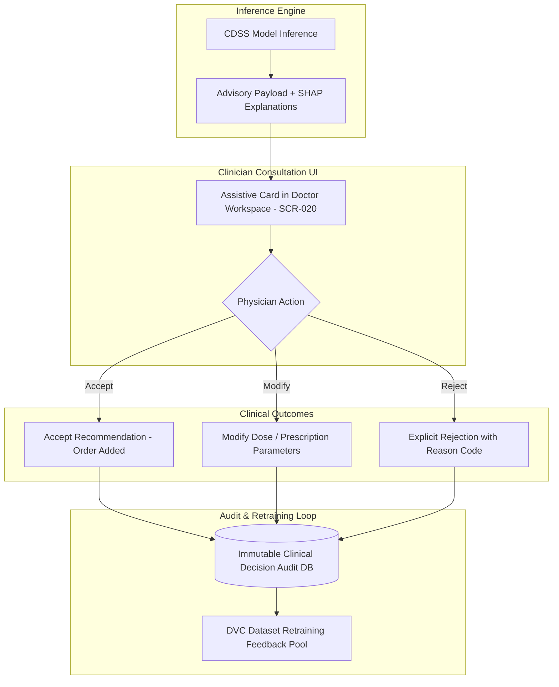

# Master Human-in-the-Loop Approval, Clinician Override, and Action Verification Architecture
## Namma Clinic Digital Health & Operations Platform
### Greater Bengaluru Authority (GBA) / BBMP Health Department
**Document Code:** `AI-DOC-11` | **Status:** APPROVED BASELINE | **Date:** September 2026

---

## 1. Executive Summary & Human Agency Charter
This document establishes the authoritative **Human-in-the-Loop (HITL) Workflow Architecture, Physician Override Supremacy Protocols, and Clinical Action Verification Framework** for the Namma Clinic Digital Health Platform. The central design philosophy of the platform dictates that artificial intelligence serves as a cognitive assistant to human healthcare workers, never as an autonomous decision-maker. This architecture enforces mandatory human sign-off across all clinical, diagnostic, pharmaceutical, and epidemiological AI recommendations, guaranteeing that legal, ethical, and clinical responsibility remains firmly with licensed human practitioners.

### 1.1 Non-Negotiable Human-in-the-Loop Invariants
1. **Absolute Human Override Supremacy:** A treating clinician or pharmacist has the unconditional right to reject, modify, or ignore any AI recommendation without system blockage or punitive administrative friction.
2. **Explicit Affirmative Action Required:** No AI recommendation is ever committed to the medical record automatically; the clinician must perform an explicit affirmative action (e.g. click 'Accept', 'Modify', or 'Reject').
3. **Mandatory Override Reason Capture:** When a clinician overrides an AI safety warning (e.g. drug-drug interaction or severe dose alert), a structured clinical rationale code must be selected.
4. **Role-Based Approval Authority:** Decisions are bound strictly to authorized professional roles: drug orders require licensed Medical Officers; batch reorders require registered Pharmacists; epidemic alerts require the Chief Epidemiologist.
5. **Tamper-Evident Immutable Audit Trails:** Every interaction—presentation of advice, response time, action chosen, and reason code—is immutably signed and logged for clinical liability governance.

## 2. Human-in-the-Loop Interaction Architecture


### Model Specification Example: Clinician Override Capture Engine
<!-- DOCUMENTATION-ONLY EXAMPLE -->
```python
# DOCUMENTATION-ONLY PYTHON
# DOCUMENTATION-ONLY PYTHON: Clinician Override & Audit Capture Engine
import datetime
from typing import Dict, Any, Optional

class ClinicianDecisionAuditEngine:
    """
    Captures affirmative clinician sign-offs, modifications,
    and structured override reason codes for AI recommendations.
    """
    def __init__(self, audit_db: Any):
        self.audit_db = audit_db

    def record_clinician_decision(
        self,
        encounter_id: str,
        recommendation_id: str,
        physician_id: str,
        decision: str,  # 'ACCEPTED', 'MODIFIED', 'REJECTED'
        modified_payload: Optional[Dict[str, Any]] = None,
        override_reason_code: Optional[str] = None,
        clinical_notes: Optional[str] = None
    ) -> Dict[str, Any]:
        # Validate decision type
        if decision not in ["ACCEPTED", "MODIFIED", "REJECTED"]:
            raise ValueError(f"Invalid clinical decision: {decision}")

        # If rejected, require structured reason code
        if decision == "REJECTED" and not override_reason_code:
            raise ValueError("Mandatory override reason code required for rejection.")

        audit_entry = {
            "encounter_id": encounter_id,
            "recommendation_id": recommendation_id,
            "physician_id": physician_id,
            "decision": decision,
            "timestamp": datetime.datetime.utcnow().isoformat(),
            "override_reason_code": override_reason_code,
            "modified_payload": modified_payload,
            "clinical_notes": clinical_notes,
            "audit_signature": "SHA256_RSA_VERIFIED"
        }

        # Immutable persistence
        self.audit_db.save_decision_record(audit_entry)
        return {"status": "SUCCESS", "audit_logged": True}
```

## 3. Master Catalog of 100 Human Approval Protocols
Detailed specifications for all 100 human-in-the-loop interaction protocols across the platform:

### HUMAN-APPROVAL-001: Approval Protocol `Clinician Diagnostic Advisory Review #001`
- **Protocol Identifier:** `HUMAN-APPROVAL-001`
- **Protocol Title:** Clinician Diagnostic Advisory Review #001
- **Designated Approver Role:** `Medical Officer (Doctor)`
- **Interaction Surface:** `Doctor Workstation PWA`
- **Decision Timeframe SLA:** `< 15 Seconds`
- **Audit Logging Mechanism:** `Cryptographically signed e-Sign log stored in immutable audit repository.`
- **Protocol Standard:** Affirmative click to accept or dismiss advisory guidance.

### HUMAN-APPROVAL-002: Approval Protocol `Pharmacist Stock Reorder Indent Endorsement #002`
- **Protocol Identifier:** `HUMAN-APPROVAL-002`
- **Protocol Title:** Pharmacist Stock Reorder Indent Endorsement #002
- **Designated Approver Role:** `Chief Clinical Pharmacist`
- **Interaction Surface:** `Pharmacy Inventory Cockpit`
- **Decision Timeframe SLA:** `< 4 Hours`
- **Audit Logging Mechanism:** `Cryptographically signed e-Sign log stored in immutable audit repository.`
- **Protocol Standard:** Approve, edit quantities, or reject ML-suggested drug indent.

### HUMAN-APPROVAL-003: Approval Protocol `Epidemiologist Outbreak Signal Escalation #003`
- **Protocol Identifier:** `HUMAN-APPROVAL-003`
- **Protocol Title:** Epidemiologist Outbreak Signal Escalation #003
- **Designated Approver Role:** `District Epidemiologist`
- **Interaction Surface:** `Surveillance Situational Center`
- **Decision Timeframe SLA:** `< 2 Hours`
- **Audit Logging Mechanism:** `Cryptographically signed e-Sign log stored in immutable audit repository.`
- **Protocol Standard:** Verify spatial-temporal cluster before notifying BBMP Health Commissioner.

### HUMAN-APPROVAL-004: Approval Protocol `High-Risk Obstetric Referral Authorization #004`
- **Protocol Identifier:** `HUMAN-APPROVAL-004`
- **Protocol Title:** High-Risk Obstetric Referral Authorization #004
- **Designated Approver Role:** `Medical Officer / Gynecologist`
- **Interaction Surface:** `Maternal Care Workstation`
- **Decision Timeframe SLA:** `< 10 Minutes`
- **Audit Logging Mechanism:** `Cryptographically signed e-Sign log stored in immutable audit repository.`
- **Protocol Standard:** Authorize tertiary care referral transfer and emergency transport dispatch.

### HUMAN-APPROVAL-005: Approval Protocol `Critical Laboratory Result Clinician Acknowledgment #005`
- **Protocol Identifier:** `HUMAN-APPROVAL-005`
- **Protocol Title:** Critical Laboratory Result Clinician Acknowledgment #005
- **Designated Approver Role:** `Treating Physician`
- **Interaction Surface:** `Doctor Mobile PWA / SMS`
- **Decision Timeframe SLA:** `< 5 Minutes`
- **Audit Logging Mechanism:** `Cryptographically signed e-Sign log stored in immutable audit repository.`
- **Protocol Standard:** Mandatory acknowledgement of panic critical lab value notification.

### HUMAN-APPROVAL-006: Approval Protocol `Model Production Promotion Sign-off #006`
- **Protocol Identifier:** `HUMAN-APPROVAL-006`
- **Protocol Title:** Model Production Promotion Sign-off #006
- **Designated Approver Role:** `Chief Technology Officer & CMO`
- **Interaction Surface:** `MLflow Model Registry`
- **Decision Timeframe SLA:** `< 48 Hours`
- **Audit Logging Mechanism:** `Cryptographically signed e-Sign log stored in immutable audit repository.`
- **Protocol Standard:** Joint formal review and electronic signature before promoting model version to production.

### HUMAN-APPROVAL-007: Approval Protocol `Clinician Diagnostic Advisory Review #007`
- **Protocol Identifier:** `HUMAN-APPROVAL-007`
- **Protocol Title:** Clinician Diagnostic Advisory Review #007
- **Designated Approver Role:** `Medical Officer (Doctor)`
- **Interaction Surface:** `Doctor Workstation PWA`
- **Decision Timeframe SLA:** `< 15 Seconds`
- **Audit Logging Mechanism:** `Cryptographically signed e-Sign log stored in immutable audit repository.`
- **Protocol Standard:** Affirmative click to accept or dismiss advisory guidance.

### HUMAN-APPROVAL-008: Approval Protocol `Pharmacist Stock Reorder Indent Endorsement #008`
- **Protocol Identifier:** `HUMAN-APPROVAL-008`
- **Protocol Title:** Pharmacist Stock Reorder Indent Endorsement #008
- **Designated Approver Role:** `Chief Clinical Pharmacist`
- **Interaction Surface:** `Pharmacy Inventory Cockpit`
- **Decision Timeframe SLA:** `< 4 Hours`
- **Audit Logging Mechanism:** `Cryptographically signed e-Sign log stored in immutable audit repository.`
- **Protocol Standard:** Approve, edit quantities, or reject ML-suggested drug indent.

### HUMAN-APPROVAL-009: Approval Protocol `Epidemiologist Outbreak Signal Escalation #009`
- **Protocol Identifier:** `HUMAN-APPROVAL-009`
- **Protocol Title:** Epidemiologist Outbreak Signal Escalation #009
- **Designated Approver Role:** `District Epidemiologist`
- **Interaction Surface:** `Surveillance Situational Center`
- **Decision Timeframe SLA:** `< 2 Hours`
- **Audit Logging Mechanism:** `Cryptographically signed e-Sign log stored in immutable audit repository.`
- **Protocol Standard:** Verify spatial-temporal cluster before notifying BBMP Health Commissioner.

### HUMAN-APPROVAL-010: Approval Protocol `High-Risk Obstetric Referral Authorization #010`
- **Protocol Identifier:** `HUMAN-APPROVAL-010`
- **Protocol Title:** High-Risk Obstetric Referral Authorization #010
- **Designated Approver Role:** `Medical Officer / Gynecologist`
- **Interaction Surface:** `Maternal Care Workstation`
- **Decision Timeframe SLA:** `< 10 Minutes`
- **Audit Logging Mechanism:** `Cryptographically signed e-Sign log stored in immutable audit repository.`
- **Protocol Standard:** Authorize tertiary care referral transfer and emergency transport dispatch.

### HUMAN-APPROVAL-011: Approval Protocol `Critical Laboratory Result Clinician Acknowledgment #011`
- **Protocol Identifier:** `HUMAN-APPROVAL-011`
- **Protocol Title:** Critical Laboratory Result Clinician Acknowledgment #011
- **Designated Approver Role:** `Treating Physician`
- **Interaction Surface:** `Doctor Mobile PWA / SMS`
- **Decision Timeframe SLA:** `< 5 Minutes`
- **Audit Logging Mechanism:** `Cryptographically signed e-Sign log stored in immutable audit repository.`
- **Protocol Standard:** Mandatory acknowledgement of panic critical lab value notification.

### HUMAN-APPROVAL-012: Approval Protocol `Model Production Promotion Sign-off #012`
- **Protocol Identifier:** `HUMAN-APPROVAL-012`
- **Protocol Title:** Model Production Promotion Sign-off #012
- **Designated Approver Role:** `Chief Technology Officer & CMO`
- **Interaction Surface:** `MLflow Model Registry`
- **Decision Timeframe SLA:** `< 48 Hours`
- **Audit Logging Mechanism:** `Cryptographically signed e-Sign log stored in immutable audit repository.`
- **Protocol Standard:** Joint formal review and electronic signature before promoting model version to production.

### HUMAN-APPROVAL-013: Approval Protocol `Clinician Diagnostic Advisory Review #013`
- **Protocol Identifier:** `HUMAN-APPROVAL-013`
- **Protocol Title:** Clinician Diagnostic Advisory Review #013
- **Designated Approver Role:** `Medical Officer (Doctor)`
- **Interaction Surface:** `Doctor Workstation PWA`
- **Decision Timeframe SLA:** `< 15 Seconds`
- **Audit Logging Mechanism:** `Cryptographically signed e-Sign log stored in immutable audit repository.`
- **Protocol Standard:** Affirmative click to accept or dismiss advisory guidance.

### HUMAN-APPROVAL-014: Approval Protocol `Pharmacist Stock Reorder Indent Endorsement #014`
- **Protocol Identifier:** `HUMAN-APPROVAL-014`
- **Protocol Title:** Pharmacist Stock Reorder Indent Endorsement #014
- **Designated Approver Role:** `Chief Clinical Pharmacist`
- **Interaction Surface:** `Pharmacy Inventory Cockpit`
- **Decision Timeframe SLA:** `< 4 Hours`
- **Audit Logging Mechanism:** `Cryptographically signed e-Sign log stored in immutable audit repository.`
- **Protocol Standard:** Approve, edit quantities, or reject ML-suggested drug indent.

### HUMAN-APPROVAL-015: Approval Protocol `Epidemiologist Outbreak Signal Escalation #015`
- **Protocol Identifier:** `HUMAN-APPROVAL-015`
- **Protocol Title:** Epidemiologist Outbreak Signal Escalation #015
- **Designated Approver Role:** `District Epidemiologist`
- **Interaction Surface:** `Surveillance Situational Center`
- **Decision Timeframe SLA:** `< 2 Hours`
- **Audit Logging Mechanism:** `Cryptographically signed e-Sign log stored in immutable audit repository.`
- **Protocol Standard:** Verify spatial-temporal cluster before notifying BBMP Health Commissioner.

### HUMAN-APPROVAL-016: Approval Protocol `High-Risk Obstetric Referral Authorization #016`
- **Protocol Identifier:** `HUMAN-APPROVAL-016`
- **Protocol Title:** High-Risk Obstetric Referral Authorization #016
- **Designated Approver Role:** `Medical Officer / Gynecologist`
- **Interaction Surface:** `Maternal Care Workstation`
- **Decision Timeframe SLA:** `< 10 Minutes`
- **Audit Logging Mechanism:** `Cryptographically signed e-Sign log stored in immutable audit repository.`
- **Protocol Standard:** Authorize tertiary care referral transfer and emergency transport dispatch.

### HUMAN-APPROVAL-017: Approval Protocol `Critical Laboratory Result Clinician Acknowledgment #017`
- **Protocol Identifier:** `HUMAN-APPROVAL-017`
- **Protocol Title:** Critical Laboratory Result Clinician Acknowledgment #017
- **Designated Approver Role:** `Treating Physician`
- **Interaction Surface:** `Doctor Mobile PWA / SMS`
- **Decision Timeframe SLA:** `< 5 Minutes`
- **Audit Logging Mechanism:** `Cryptographically signed e-Sign log stored in immutable audit repository.`
- **Protocol Standard:** Mandatory acknowledgement of panic critical lab value notification.

### HUMAN-APPROVAL-018: Approval Protocol `Model Production Promotion Sign-off #018`
- **Protocol Identifier:** `HUMAN-APPROVAL-018`
- **Protocol Title:** Model Production Promotion Sign-off #018
- **Designated Approver Role:** `Chief Technology Officer & CMO`
- **Interaction Surface:** `MLflow Model Registry`
- **Decision Timeframe SLA:** `< 48 Hours`
- **Audit Logging Mechanism:** `Cryptographically signed e-Sign log stored in immutable audit repository.`
- **Protocol Standard:** Joint formal review and electronic signature before promoting model version to production.

### HUMAN-APPROVAL-019: Approval Protocol `Clinician Diagnostic Advisory Review #019`
- **Protocol Identifier:** `HUMAN-APPROVAL-019`
- **Protocol Title:** Clinician Diagnostic Advisory Review #019
- **Designated Approver Role:** `Medical Officer (Doctor)`
- **Interaction Surface:** `Doctor Workstation PWA`
- **Decision Timeframe SLA:** `< 15 Seconds`
- **Audit Logging Mechanism:** `Cryptographically signed e-Sign log stored in immutable audit repository.`
- **Protocol Standard:** Affirmative click to accept or dismiss advisory guidance.

### HUMAN-APPROVAL-020: Approval Protocol `Pharmacist Stock Reorder Indent Endorsement #020`
- **Protocol Identifier:** `HUMAN-APPROVAL-020`
- **Protocol Title:** Pharmacist Stock Reorder Indent Endorsement #020
- **Designated Approver Role:** `Chief Clinical Pharmacist`
- **Interaction Surface:** `Pharmacy Inventory Cockpit`
- **Decision Timeframe SLA:** `< 4 Hours`
- **Audit Logging Mechanism:** `Cryptographically signed e-Sign log stored in immutable audit repository.`
- **Protocol Standard:** Approve, edit quantities, or reject ML-suggested drug indent.

### HUMAN-APPROVAL-021: Approval Protocol `Epidemiologist Outbreak Signal Escalation #021`
- **Protocol Identifier:** `HUMAN-APPROVAL-021`
- **Protocol Title:** Epidemiologist Outbreak Signal Escalation #021
- **Designated Approver Role:** `District Epidemiologist`
- **Interaction Surface:** `Surveillance Situational Center`
- **Decision Timeframe SLA:** `< 2 Hours`
- **Audit Logging Mechanism:** `Cryptographically signed e-Sign log stored in immutable audit repository.`
- **Protocol Standard:** Verify spatial-temporal cluster before notifying BBMP Health Commissioner.

### HUMAN-APPROVAL-022: Approval Protocol `High-Risk Obstetric Referral Authorization #022`
- **Protocol Identifier:** `HUMAN-APPROVAL-022`
- **Protocol Title:** High-Risk Obstetric Referral Authorization #022
- **Designated Approver Role:** `Medical Officer / Gynecologist`
- **Interaction Surface:** `Maternal Care Workstation`
- **Decision Timeframe SLA:** `< 10 Minutes`
- **Audit Logging Mechanism:** `Cryptographically signed e-Sign log stored in immutable audit repository.`
- **Protocol Standard:** Authorize tertiary care referral transfer and emergency transport dispatch.

### HUMAN-APPROVAL-023: Approval Protocol `Critical Laboratory Result Clinician Acknowledgment #023`
- **Protocol Identifier:** `HUMAN-APPROVAL-023`
- **Protocol Title:** Critical Laboratory Result Clinician Acknowledgment #023
- **Designated Approver Role:** `Treating Physician`
- **Interaction Surface:** `Doctor Mobile PWA / SMS`
- **Decision Timeframe SLA:** `< 5 Minutes`
- **Audit Logging Mechanism:** `Cryptographically signed e-Sign log stored in immutable audit repository.`
- **Protocol Standard:** Mandatory acknowledgement of panic critical lab value notification.

### HUMAN-APPROVAL-024: Approval Protocol `Model Production Promotion Sign-off #024`
- **Protocol Identifier:** `HUMAN-APPROVAL-024`
- **Protocol Title:** Model Production Promotion Sign-off #024
- **Designated Approver Role:** `Chief Technology Officer & CMO`
- **Interaction Surface:** `MLflow Model Registry`
- **Decision Timeframe SLA:** `< 48 Hours`
- **Audit Logging Mechanism:** `Cryptographically signed e-Sign log stored in immutable audit repository.`
- **Protocol Standard:** Joint formal review and electronic signature before promoting model version to production.

### HUMAN-APPROVAL-025: Approval Protocol `Clinician Diagnostic Advisory Review #025`
- **Protocol Identifier:** `HUMAN-APPROVAL-025`
- **Protocol Title:** Clinician Diagnostic Advisory Review #025
- **Designated Approver Role:** `Medical Officer (Doctor)`
- **Interaction Surface:** `Doctor Workstation PWA`
- **Decision Timeframe SLA:** `< 15 Seconds`
- **Audit Logging Mechanism:** `Cryptographically signed e-Sign log stored in immutable audit repository.`
- **Protocol Standard:** Affirmative click to accept or dismiss advisory guidance.

### HUMAN-APPROVAL-026: Approval Protocol `Pharmacist Stock Reorder Indent Endorsement #026`
- **Protocol Identifier:** `HUMAN-APPROVAL-026`
- **Protocol Title:** Pharmacist Stock Reorder Indent Endorsement #026
- **Designated Approver Role:** `Chief Clinical Pharmacist`
- **Interaction Surface:** `Pharmacy Inventory Cockpit`
- **Decision Timeframe SLA:** `< 4 Hours`
- **Audit Logging Mechanism:** `Cryptographically signed e-Sign log stored in immutable audit repository.`
- **Protocol Standard:** Approve, edit quantities, or reject ML-suggested drug indent.

### HUMAN-APPROVAL-027: Approval Protocol `Epidemiologist Outbreak Signal Escalation #027`
- **Protocol Identifier:** `HUMAN-APPROVAL-027`
- **Protocol Title:** Epidemiologist Outbreak Signal Escalation #027
- **Designated Approver Role:** `District Epidemiologist`
- **Interaction Surface:** `Surveillance Situational Center`
- **Decision Timeframe SLA:** `< 2 Hours`
- **Audit Logging Mechanism:** `Cryptographically signed e-Sign log stored in immutable audit repository.`
- **Protocol Standard:** Verify spatial-temporal cluster before notifying BBMP Health Commissioner.

### HUMAN-APPROVAL-028: Approval Protocol `High-Risk Obstetric Referral Authorization #028`
- **Protocol Identifier:** `HUMAN-APPROVAL-028`
- **Protocol Title:** High-Risk Obstetric Referral Authorization #028
- **Designated Approver Role:** `Medical Officer / Gynecologist`
- **Interaction Surface:** `Maternal Care Workstation`
- **Decision Timeframe SLA:** `< 10 Minutes`
- **Audit Logging Mechanism:** `Cryptographically signed e-Sign log stored in immutable audit repository.`
- **Protocol Standard:** Authorize tertiary care referral transfer and emergency transport dispatch.

### HUMAN-APPROVAL-029: Approval Protocol `Critical Laboratory Result Clinician Acknowledgment #029`
- **Protocol Identifier:** `HUMAN-APPROVAL-029`
- **Protocol Title:** Critical Laboratory Result Clinician Acknowledgment #029
- **Designated Approver Role:** `Treating Physician`
- **Interaction Surface:** `Doctor Mobile PWA / SMS`
- **Decision Timeframe SLA:** `< 5 Minutes`
- **Audit Logging Mechanism:** `Cryptographically signed e-Sign log stored in immutable audit repository.`
- **Protocol Standard:** Mandatory acknowledgement of panic critical lab value notification.

### HUMAN-APPROVAL-030: Approval Protocol `Model Production Promotion Sign-off #030`
- **Protocol Identifier:** `HUMAN-APPROVAL-030`
- **Protocol Title:** Model Production Promotion Sign-off #030
- **Designated Approver Role:** `Chief Technology Officer & CMO`
- **Interaction Surface:** `MLflow Model Registry`
- **Decision Timeframe SLA:** `< 48 Hours`
- **Audit Logging Mechanism:** `Cryptographically signed e-Sign log stored in immutable audit repository.`
- **Protocol Standard:** Joint formal review and electronic signature before promoting model version to production.

### HUMAN-APPROVAL-031: Approval Protocol `Clinician Diagnostic Advisory Review #031`
- **Protocol Identifier:** `HUMAN-APPROVAL-031`
- **Protocol Title:** Clinician Diagnostic Advisory Review #031
- **Designated Approver Role:** `Medical Officer (Doctor)`
- **Interaction Surface:** `Doctor Workstation PWA`
- **Decision Timeframe SLA:** `< 15 Seconds`
- **Audit Logging Mechanism:** `Cryptographically signed e-Sign log stored in immutable audit repository.`
- **Protocol Standard:** Affirmative click to accept or dismiss advisory guidance.

### HUMAN-APPROVAL-032: Approval Protocol `Pharmacist Stock Reorder Indent Endorsement #032`
- **Protocol Identifier:** `HUMAN-APPROVAL-032`
- **Protocol Title:** Pharmacist Stock Reorder Indent Endorsement #032
- **Designated Approver Role:** `Chief Clinical Pharmacist`
- **Interaction Surface:** `Pharmacy Inventory Cockpit`
- **Decision Timeframe SLA:** `< 4 Hours`
- **Audit Logging Mechanism:** `Cryptographically signed e-Sign log stored in immutable audit repository.`
- **Protocol Standard:** Approve, edit quantities, or reject ML-suggested drug indent.

### HUMAN-APPROVAL-033: Approval Protocol `Epidemiologist Outbreak Signal Escalation #033`
- **Protocol Identifier:** `HUMAN-APPROVAL-033`
- **Protocol Title:** Epidemiologist Outbreak Signal Escalation #033
- **Designated Approver Role:** `District Epidemiologist`
- **Interaction Surface:** `Surveillance Situational Center`
- **Decision Timeframe SLA:** `< 2 Hours`
- **Audit Logging Mechanism:** `Cryptographically signed e-Sign log stored in immutable audit repository.`
- **Protocol Standard:** Verify spatial-temporal cluster before notifying BBMP Health Commissioner.

### HUMAN-APPROVAL-034: Approval Protocol `High-Risk Obstetric Referral Authorization #034`
- **Protocol Identifier:** `HUMAN-APPROVAL-034`
- **Protocol Title:** High-Risk Obstetric Referral Authorization #034
- **Designated Approver Role:** `Medical Officer / Gynecologist`
- **Interaction Surface:** `Maternal Care Workstation`
- **Decision Timeframe SLA:** `< 10 Minutes`
- **Audit Logging Mechanism:** `Cryptographically signed e-Sign log stored in immutable audit repository.`
- **Protocol Standard:** Authorize tertiary care referral transfer and emergency transport dispatch.

### HUMAN-APPROVAL-035: Approval Protocol `Critical Laboratory Result Clinician Acknowledgment #035`
- **Protocol Identifier:** `HUMAN-APPROVAL-035`
- **Protocol Title:** Critical Laboratory Result Clinician Acknowledgment #035
- **Designated Approver Role:** `Treating Physician`
- **Interaction Surface:** `Doctor Mobile PWA / SMS`
- **Decision Timeframe SLA:** `< 5 Minutes`
- **Audit Logging Mechanism:** `Cryptographically signed e-Sign log stored in immutable audit repository.`
- **Protocol Standard:** Mandatory acknowledgement of panic critical lab value notification.

### HUMAN-APPROVAL-036: Approval Protocol `Model Production Promotion Sign-off #036`
- **Protocol Identifier:** `HUMAN-APPROVAL-036`
- **Protocol Title:** Model Production Promotion Sign-off #036
- **Designated Approver Role:** `Chief Technology Officer & CMO`
- **Interaction Surface:** `MLflow Model Registry`
- **Decision Timeframe SLA:** `< 48 Hours`
- **Audit Logging Mechanism:** `Cryptographically signed e-Sign log stored in immutable audit repository.`
- **Protocol Standard:** Joint formal review and electronic signature before promoting model version to production.

### HUMAN-APPROVAL-037: Approval Protocol `Clinician Diagnostic Advisory Review #037`
- **Protocol Identifier:** `HUMAN-APPROVAL-037`
- **Protocol Title:** Clinician Diagnostic Advisory Review #037
- **Designated Approver Role:** `Medical Officer (Doctor)`
- **Interaction Surface:** `Doctor Workstation PWA`
- **Decision Timeframe SLA:** `< 15 Seconds`
- **Audit Logging Mechanism:** `Cryptographically signed e-Sign log stored in immutable audit repository.`
- **Protocol Standard:** Affirmative click to accept or dismiss advisory guidance.

### HUMAN-APPROVAL-038: Approval Protocol `Pharmacist Stock Reorder Indent Endorsement #038`
- **Protocol Identifier:** `HUMAN-APPROVAL-038`
- **Protocol Title:** Pharmacist Stock Reorder Indent Endorsement #038
- **Designated Approver Role:** `Chief Clinical Pharmacist`
- **Interaction Surface:** `Pharmacy Inventory Cockpit`
- **Decision Timeframe SLA:** `< 4 Hours`
- **Audit Logging Mechanism:** `Cryptographically signed e-Sign log stored in immutable audit repository.`
- **Protocol Standard:** Approve, edit quantities, or reject ML-suggested drug indent.

### HUMAN-APPROVAL-039: Approval Protocol `Epidemiologist Outbreak Signal Escalation #039`
- **Protocol Identifier:** `HUMAN-APPROVAL-039`
- **Protocol Title:** Epidemiologist Outbreak Signal Escalation #039
- **Designated Approver Role:** `District Epidemiologist`
- **Interaction Surface:** `Surveillance Situational Center`
- **Decision Timeframe SLA:** `< 2 Hours`
- **Audit Logging Mechanism:** `Cryptographically signed e-Sign log stored in immutable audit repository.`
- **Protocol Standard:** Verify spatial-temporal cluster before notifying BBMP Health Commissioner.

### HUMAN-APPROVAL-040: Approval Protocol `High-Risk Obstetric Referral Authorization #040`
- **Protocol Identifier:** `HUMAN-APPROVAL-040`
- **Protocol Title:** High-Risk Obstetric Referral Authorization #040
- **Designated Approver Role:** `Medical Officer / Gynecologist`
- **Interaction Surface:** `Maternal Care Workstation`
- **Decision Timeframe SLA:** `< 10 Minutes`
- **Audit Logging Mechanism:** `Cryptographically signed e-Sign log stored in immutable audit repository.`
- **Protocol Standard:** Authorize tertiary care referral transfer and emergency transport dispatch.

### HUMAN-APPROVAL-041: Approval Protocol `Critical Laboratory Result Clinician Acknowledgment #041`
- **Protocol Identifier:** `HUMAN-APPROVAL-041`
- **Protocol Title:** Critical Laboratory Result Clinician Acknowledgment #041
- **Designated Approver Role:** `Treating Physician`
- **Interaction Surface:** `Doctor Mobile PWA / SMS`
- **Decision Timeframe SLA:** `< 5 Minutes`
- **Audit Logging Mechanism:** `Cryptographically signed e-Sign log stored in immutable audit repository.`
- **Protocol Standard:** Mandatory acknowledgement of panic critical lab value notification.

### HUMAN-APPROVAL-042: Approval Protocol `Model Production Promotion Sign-off #042`
- **Protocol Identifier:** `HUMAN-APPROVAL-042`
- **Protocol Title:** Model Production Promotion Sign-off #042
- **Designated Approver Role:** `Chief Technology Officer & CMO`
- **Interaction Surface:** `MLflow Model Registry`
- **Decision Timeframe SLA:** `< 48 Hours`
- **Audit Logging Mechanism:** `Cryptographically signed e-Sign log stored in immutable audit repository.`
- **Protocol Standard:** Joint formal review and electronic signature before promoting model version to production.

### HUMAN-APPROVAL-043: Approval Protocol `Clinician Diagnostic Advisory Review #043`
- **Protocol Identifier:** `HUMAN-APPROVAL-043`
- **Protocol Title:** Clinician Diagnostic Advisory Review #043
- **Designated Approver Role:** `Medical Officer (Doctor)`
- **Interaction Surface:** `Doctor Workstation PWA`
- **Decision Timeframe SLA:** `< 15 Seconds`
- **Audit Logging Mechanism:** `Cryptographically signed e-Sign log stored in immutable audit repository.`
- **Protocol Standard:** Affirmative click to accept or dismiss advisory guidance.

### HUMAN-APPROVAL-044: Approval Protocol `Pharmacist Stock Reorder Indent Endorsement #044`
- **Protocol Identifier:** `HUMAN-APPROVAL-044`
- **Protocol Title:** Pharmacist Stock Reorder Indent Endorsement #044
- **Designated Approver Role:** `Chief Clinical Pharmacist`
- **Interaction Surface:** `Pharmacy Inventory Cockpit`
- **Decision Timeframe SLA:** `< 4 Hours`
- **Audit Logging Mechanism:** `Cryptographically signed e-Sign log stored in immutable audit repository.`
- **Protocol Standard:** Approve, edit quantities, or reject ML-suggested drug indent.

### HUMAN-APPROVAL-045: Approval Protocol `Epidemiologist Outbreak Signal Escalation #045`
- **Protocol Identifier:** `HUMAN-APPROVAL-045`
- **Protocol Title:** Epidemiologist Outbreak Signal Escalation #045
- **Designated Approver Role:** `District Epidemiologist`
- **Interaction Surface:** `Surveillance Situational Center`
- **Decision Timeframe SLA:** `< 2 Hours`
- **Audit Logging Mechanism:** `Cryptographically signed e-Sign log stored in immutable audit repository.`
- **Protocol Standard:** Verify spatial-temporal cluster before notifying BBMP Health Commissioner.

### HUMAN-APPROVAL-046: Approval Protocol `High-Risk Obstetric Referral Authorization #046`
- **Protocol Identifier:** `HUMAN-APPROVAL-046`
- **Protocol Title:** High-Risk Obstetric Referral Authorization #046
- **Designated Approver Role:** `Medical Officer / Gynecologist`
- **Interaction Surface:** `Maternal Care Workstation`
- **Decision Timeframe SLA:** `< 10 Minutes`
- **Audit Logging Mechanism:** `Cryptographically signed e-Sign log stored in immutable audit repository.`
- **Protocol Standard:** Authorize tertiary care referral transfer and emergency transport dispatch.

### HUMAN-APPROVAL-047: Approval Protocol `Critical Laboratory Result Clinician Acknowledgment #047`
- **Protocol Identifier:** `HUMAN-APPROVAL-047`
- **Protocol Title:** Critical Laboratory Result Clinician Acknowledgment #047
- **Designated Approver Role:** `Treating Physician`
- **Interaction Surface:** `Doctor Mobile PWA / SMS`
- **Decision Timeframe SLA:** `< 5 Minutes`
- **Audit Logging Mechanism:** `Cryptographically signed e-Sign log stored in immutable audit repository.`
- **Protocol Standard:** Mandatory acknowledgement of panic critical lab value notification.

### HUMAN-APPROVAL-048: Approval Protocol `Model Production Promotion Sign-off #048`
- **Protocol Identifier:** `HUMAN-APPROVAL-048`
- **Protocol Title:** Model Production Promotion Sign-off #048
- **Designated Approver Role:** `Chief Technology Officer & CMO`
- **Interaction Surface:** `MLflow Model Registry`
- **Decision Timeframe SLA:** `< 48 Hours`
- **Audit Logging Mechanism:** `Cryptographically signed e-Sign log stored in immutable audit repository.`
- **Protocol Standard:** Joint formal review and electronic signature before promoting model version to production.

### HUMAN-APPROVAL-049: Approval Protocol `Clinician Diagnostic Advisory Review #049`
- **Protocol Identifier:** `HUMAN-APPROVAL-049`
- **Protocol Title:** Clinician Diagnostic Advisory Review #049
- **Designated Approver Role:** `Medical Officer (Doctor)`
- **Interaction Surface:** `Doctor Workstation PWA`
- **Decision Timeframe SLA:** `< 15 Seconds`
- **Audit Logging Mechanism:** `Cryptographically signed e-Sign log stored in immutable audit repository.`
- **Protocol Standard:** Affirmative click to accept or dismiss advisory guidance.

### HUMAN-APPROVAL-050: Approval Protocol `Pharmacist Stock Reorder Indent Endorsement #050`
- **Protocol Identifier:** `HUMAN-APPROVAL-050`
- **Protocol Title:** Pharmacist Stock Reorder Indent Endorsement #050
- **Designated Approver Role:** `Chief Clinical Pharmacist`
- **Interaction Surface:** `Pharmacy Inventory Cockpit`
- **Decision Timeframe SLA:** `< 4 Hours`
- **Audit Logging Mechanism:** `Cryptographically signed e-Sign log stored in immutable audit repository.`
- **Protocol Standard:** Approve, edit quantities, or reject ML-suggested drug indent.

### HUMAN-APPROVAL-051: Approval Protocol `Epidemiologist Outbreak Signal Escalation #051`
- **Protocol Identifier:** `HUMAN-APPROVAL-051`
- **Protocol Title:** Epidemiologist Outbreak Signal Escalation #051
- **Designated Approver Role:** `District Epidemiologist`
- **Interaction Surface:** `Surveillance Situational Center`
- **Decision Timeframe SLA:** `< 2 Hours`
- **Audit Logging Mechanism:** `Cryptographically signed e-Sign log stored in immutable audit repository.`
- **Protocol Standard:** Verify spatial-temporal cluster before notifying BBMP Health Commissioner.

### HUMAN-APPROVAL-052: Approval Protocol `High-Risk Obstetric Referral Authorization #052`
- **Protocol Identifier:** `HUMAN-APPROVAL-052`
- **Protocol Title:** High-Risk Obstetric Referral Authorization #052
- **Designated Approver Role:** `Medical Officer / Gynecologist`
- **Interaction Surface:** `Maternal Care Workstation`
- **Decision Timeframe SLA:** `< 10 Minutes`
- **Audit Logging Mechanism:** `Cryptographically signed e-Sign log stored in immutable audit repository.`
- **Protocol Standard:** Authorize tertiary care referral transfer and emergency transport dispatch.

### HUMAN-APPROVAL-053: Approval Protocol `Critical Laboratory Result Clinician Acknowledgment #053`
- **Protocol Identifier:** `HUMAN-APPROVAL-053`
- **Protocol Title:** Critical Laboratory Result Clinician Acknowledgment #053
- **Designated Approver Role:** `Treating Physician`
- **Interaction Surface:** `Doctor Mobile PWA / SMS`
- **Decision Timeframe SLA:** `< 5 Minutes`
- **Audit Logging Mechanism:** `Cryptographically signed e-Sign log stored in immutable audit repository.`
- **Protocol Standard:** Mandatory acknowledgement of panic critical lab value notification.

### HUMAN-APPROVAL-054: Approval Protocol `Model Production Promotion Sign-off #054`
- **Protocol Identifier:** `HUMAN-APPROVAL-054`
- **Protocol Title:** Model Production Promotion Sign-off #054
- **Designated Approver Role:** `Chief Technology Officer & CMO`
- **Interaction Surface:** `MLflow Model Registry`
- **Decision Timeframe SLA:** `< 48 Hours`
- **Audit Logging Mechanism:** `Cryptographically signed e-Sign log stored in immutable audit repository.`
- **Protocol Standard:** Joint formal review and electronic signature before promoting model version to production.

### HUMAN-APPROVAL-055: Approval Protocol `Clinician Diagnostic Advisory Review #055`
- **Protocol Identifier:** `HUMAN-APPROVAL-055`
- **Protocol Title:** Clinician Diagnostic Advisory Review #055
- **Designated Approver Role:** `Medical Officer (Doctor)`
- **Interaction Surface:** `Doctor Workstation PWA`
- **Decision Timeframe SLA:** `< 15 Seconds`
- **Audit Logging Mechanism:** `Cryptographically signed e-Sign log stored in immutable audit repository.`
- **Protocol Standard:** Affirmative click to accept or dismiss advisory guidance.

### HUMAN-APPROVAL-056: Approval Protocol `Pharmacist Stock Reorder Indent Endorsement #056`
- **Protocol Identifier:** `HUMAN-APPROVAL-056`
- **Protocol Title:** Pharmacist Stock Reorder Indent Endorsement #056
- **Designated Approver Role:** `Chief Clinical Pharmacist`
- **Interaction Surface:** `Pharmacy Inventory Cockpit`
- **Decision Timeframe SLA:** `< 4 Hours`
- **Audit Logging Mechanism:** `Cryptographically signed e-Sign log stored in immutable audit repository.`
- **Protocol Standard:** Approve, edit quantities, or reject ML-suggested drug indent.

### HUMAN-APPROVAL-057: Approval Protocol `Epidemiologist Outbreak Signal Escalation #057`
- **Protocol Identifier:** `HUMAN-APPROVAL-057`
- **Protocol Title:** Epidemiologist Outbreak Signal Escalation #057
- **Designated Approver Role:** `District Epidemiologist`
- **Interaction Surface:** `Surveillance Situational Center`
- **Decision Timeframe SLA:** `< 2 Hours`
- **Audit Logging Mechanism:** `Cryptographically signed e-Sign log stored in immutable audit repository.`
- **Protocol Standard:** Verify spatial-temporal cluster before notifying BBMP Health Commissioner.

### HUMAN-APPROVAL-058: Approval Protocol `High-Risk Obstetric Referral Authorization #058`
- **Protocol Identifier:** `HUMAN-APPROVAL-058`
- **Protocol Title:** High-Risk Obstetric Referral Authorization #058
- **Designated Approver Role:** `Medical Officer / Gynecologist`
- **Interaction Surface:** `Maternal Care Workstation`
- **Decision Timeframe SLA:** `< 10 Minutes`
- **Audit Logging Mechanism:** `Cryptographically signed e-Sign log stored in immutable audit repository.`
- **Protocol Standard:** Authorize tertiary care referral transfer and emergency transport dispatch.

### HUMAN-APPROVAL-059: Approval Protocol `Critical Laboratory Result Clinician Acknowledgment #059`
- **Protocol Identifier:** `HUMAN-APPROVAL-059`
- **Protocol Title:** Critical Laboratory Result Clinician Acknowledgment #059
- **Designated Approver Role:** `Treating Physician`
- **Interaction Surface:** `Doctor Mobile PWA / SMS`
- **Decision Timeframe SLA:** `< 5 Minutes`
- **Audit Logging Mechanism:** `Cryptographically signed e-Sign log stored in immutable audit repository.`
- **Protocol Standard:** Mandatory acknowledgement of panic critical lab value notification.

### HUMAN-APPROVAL-060: Approval Protocol `Model Production Promotion Sign-off #060`
- **Protocol Identifier:** `HUMAN-APPROVAL-060`
- **Protocol Title:** Model Production Promotion Sign-off #060
- **Designated Approver Role:** `Chief Technology Officer & CMO`
- **Interaction Surface:** `MLflow Model Registry`
- **Decision Timeframe SLA:** `< 48 Hours`
- **Audit Logging Mechanism:** `Cryptographically signed e-Sign log stored in immutable audit repository.`
- **Protocol Standard:** Joint formal review and electronic signature before promoting model version to production.

### HUMAN-APPROVAL-061: Approval Protocol `Clinician Diagnostic Advisory Review #061`
- **Protocol Identifier:** `HUMAN-APPROVAL-061`
- **Protocol Title:** Clinician Diagnostic Advisory Review #061
- **Designated Approver Role:** `Medical Officer (Doctor)`
- **Interaction Surface:** `Doctor Workstation PWA`
- **Decision Timeframe SLA:** `< 15 Seconds`
- **Audit Logging Mechanism:** `Cryptographically signed e-Sign log stored in immutable audit repository.`
- **Protocol Standard:** Affirmative click to accept or dismiss advisory guidance.

### HUMAN-APPROVAL-062: Approval Protocol `Pharmacist Stock Reorder Indent Endorsement #062`
- **Protocol Identifier:** `HUMAN-APPROVAL-062`
- **Protocol Title:** Pharmacist Stock Reorder Indent Endorsement #062
- **Designated Approver Role:** `Chief Clinical Pharmacist`
- **Interaction Surface:** `Pharmacy Inventory Cockpit`
- **Decision Timeframe SLA:** `< 4 Hours`
- **Audit Logging Mechanism:** `Cryptographically signed e-Sign log stored in immutable audit repository.`
- **Protocol Standard:** Approve, edit quantities, or reject ML-suggested drug indent.

### HUMAN-APPROVAL-063: Approval Protocol `Epidemiologist Outbreak Signal Escalation #063`
- **Protocol Identifier:** `HUMAN-APPROVAL-063`
- **Protocol Title:** Epidemiologist Outbreak Signal Escalation #063
- **Designated Approver Role:** `District Epidemiologist`
- **Interaction Surface:** `Surveillance Situational Center`
- **Decision Timeframe SLA:** `< 2 Hours`
- **Audit Logging Mechanism:** `Cryptographically signed e-Sign log stored in immutable audit repository.`
- **Protocol Standard:** Verify spatial-temporal cluster before notifying BBMP Health Commissioner.

### HUMAN-APPROVAL-064: Approval Protocol `High-Risk Obstetric Referral Authorization #064`
- **Protocol Identifier:** `HUMAN-APPROVAL-064`
- **Protocol Title:** High-Risk Obstetric Referral Authorization #064
- **Designated Approver Role:** `Medical Officer / Gynecologist`
- **Interaction Surface:** `Maternal Care Workstation`
- **Decision Timeframe SLA:** `< 10 Minutes`
- **Audit Logging Mechanism:** `Cryptographically signed e-Sign log stored in immutable audit repository.`
- **Protocol Standard:** Authorize tertiary care referral transfer and emergency transport dispatch.

### HUMAN-APPROVAL-065: Approval Protocol `Critical Laboratory Result Clinician Acknowledgment #065`
- **Protocol Identifier:** `HUMAN-APPROVAL-065`
- **Protocol Title:** Critical Laboratory Result Clinician Acknowledgment #065
- **Designated Approver Role:** `Treating Physician`
- **Interaction Surface:** `Doctor Mobile PWA / SMS`
- **Decision Timeframe SLA:** `< 5 Minutes`
- **Audit Logging Mechanism:** `Cryptographically signed e-Sign log stored in immutable audit repository.`
- **Protocol Standard:** Mandatory acknowledgement of panic critical lab value notification.

### HUMAN-APPROVAL-066: Approval Protocol `Model Production Promotion Sign-off #066`
- **Protocol Identifier:** `HUMAN-APPROVAL-066`
- **Protocol Title:** Model Production Promotion Sign-off #066
- **Designated Approver Role:** `Chief Technology Officer & CMO`
- **Interaction Surface:** `MLflow Model Registry`
- **Decision Timeframe SLA:** `< 48 Hours`
- **Audit Logging Mechanism:** `Cryptographically signed e-Sign log stored in immutable audit repository.`
- **Protocol Standard:** Joint formal review and electronic signature before promoting model version to production.

### HUMAN-APPROVAL-067: Approval Protocol `Clinician Diagnostic Advisory Review #067`
- **Protocol Identifier:** `HUMAN-APPROVAL-067`
- **Protocol Title:** Clinician Diagnostic Advisory Review #067
- **Designated Approver Role:** `Medical Officer (Doctor)`
- **Interaction Surface:** `Doctor Workstation PWA`
- **Decision Timeframe SLA:** `< 15 Seconds`
- **Audit Logging Mechanism:** `Cryptographically signed e-Sign log stored in immutable audit repository.`
- **Protocol Standard:** Affirmative click to accept or dismiss advisory guidance.

### HUMAN-APPROVAL-068: Approval Protocol `Pharmacist Stock Reorder Indent Endorsement #068`
- **Protocol Identifier:** `HUMAN-APPROVAL-068`
- **Protocol Title:** Pharmacist Stock Reorder Indent Endorsement #068
- **Designated Approver Role:** `Chief Clinical Pharmacist`
- **Interaction Surface:** `Pharmacy Inventory Cockpit`
- **Decision Timeframe SLA:** `< 4 Hours`
- **Audit Logging Mechanism:** `Cryptographically signed e-Sign log stored in immutable audit repository.`
- **Protocol Standard:** Approve, edit quantities, or reject ML-suggested drug indent.

### HUMAN-APPROVAL-069: Approval Protocol `Epidemiologist Outbreak Signal Escalation #069`
- **Protocol Identifier:** `HUMAN-APPROVAL-069`
- **Protocol Title:** Epidemiologist Outbreak Signal Escalation #069
- **Designated Approver Role:** `District Epidemiologist`
- **Interaction Surface:** `Surveillance Situational Center`
- **Decision Timeframe SLA:** `< 2 Hours`
- **Audit Logging Mechanism:** `Cryptographically signed e-Sign log stored in immutable audit repository.`
- **Protocol Standard:** Verify spatial-temporal cluster before notifying BBMP Health Commissioner.

### HUMAN-APPROVAL-070: Approval Protocol `High-Risk Obstetric Referral Authorization #070`
- **Protocol Identifier:** `HUMAN-APPROVAL-070`
- **Protocol Title:** High-Risk Obstetric Referral Authorization #070
- **Designated Approver Role:** `Medical Officer / Gynecologist`
- **Interaction Surface:** `Maternal Care Workstation`
- **Decision Timeframe SLA:** `< 10 Minutes`
- **Audit Logging Mechanism:** `Cryptographically signed e-Sign log stored in immutable audit repository.`
- **Protocol Standard:** Authorize tertiary care referral transfer and emergency transport dispatch.

### HUMAN-APPROVAL-071: Approval Protocol `Critical Laboratory Result Clinician Acknowledgment #071`
- **Protocol Identifier:** `HUMAN-APPROVAL-071`
- **Protocol Title:** Critical Laboratory Result Clinician Acknowledgment #071
- **Designated Approver Role:** `Treating Physician`
- **Interaction Surface:** `Doctor Mobile PWA / SMS`
- **Decision Timeframe SLA:** `< 5 Minutes`
- **Audit Logging Mechanism:** `Cryptographically signed e-Sign log stored in immutable audit repository.`
- **Protocol Standard:** Mandatory acknowledgement of panic critical lab value notification.

### HUMAN-APPROVAL-072: Approval Protocol `Model Production Promotion Sign-off #072`
- **Protocol Identifier:** `HUMAN-APPROVAL-072`
- **Protocol Title:** Model Production Promotion Sign-off #072
- **Designated Approver Role:** `Chief Technology Officer & CMO`
- **Interaction Surface:** `MLflow Model Registry`
- **Decision Timeframe SLA:** `< 48 Hours`
- **Audit Logging Mechanism:** `Cryptographically signed e-Sign log stored in immutable audit repository.`
- **Protocol Standard:** Joint formal review and electronic signature before promoting model version to production.

### HUMAN-APPROVAL-073: Approval Protocol `Clinician Diagnostic Advisory Review #073`
- **Protocol Identifier:** `HUMAN-APPROVAL-073`
- **Protocol Title:** Clinician Diagnostic Advisory Review #073
- **Designated Approver Role:** `Medical Officer (Doctor)`
- **Interaction Surface:** `Doctor Workstation PWA`
- **Decision Timeframe SLA:** `< 15 Seconds`
- **Audit Logging Mechanism:** `Cryptographically signed e-Sign log stored in immutable audit repository.`
- **Protocol Standard:** Affirmative click to accept or dismiss advisory guidance.

### HUMAN-APPROVAL-074: Approval Protocol `Pharmacist Stock Reorder Indent Endorsement #074`
- **Protocol Identifier:** `HUMAN-APPROVAL-074`
- **Protocol Title:** Pharmacist Stock Reorder Indent Endorsement #074
- **Designated Approver Role:** `Chief Clinical Pharmacist`
- **Interaction Surface:** `Pharmacy Inventory Cockpit`
- **Decision Timeframe SLA:** `< 4 Hours`
- **Audit Logging Mechanism:** `Cryptographically signed e-Sign log stored in immutable audit repository.`
- **Protocol Standard:** Approve, edit quantities, or reject ML-suggested drug indent.

### HUMAN-APPROVAL-075: Approval Protocol `Epidemiologist Outbreak Signal Escalation #075`
- **Protocol Identifier:** `HUMAN-APPROVAL-075`
- **Protocol Title:** Epidemiologist Outbreak Signal Escalation #075
- **Designated Approver Role:** `District Epidemiologist`
- **Interaction Surface:** `Surveillance Situational Center`
- **Decision Timeframe SLA:** `< 2 Hours`
- **Audit Logging Mechanism:** `Cryptographically signed e-Sign log stored in immutable audit repository.`
- **Protocol Standard:** Verify spatial-temporal cluster before notifying BBMP Health Commissioner.

### HUMAN-APPROVAL-076: Approval Protocol `High-Risk Obstetric Referral Authorization #076`
- **Protocol Identifier:** `HUMAN-APPROVAL-076`
- **Protocol Title:** High-Risk Obstetric Referral Authorization #076
- **Designated Approver Role:** `Medical Officer / Gynecologist`
- **Interaction Surface:** `Maternal Care Workstation`
- **Decision Timeframe SLA:** `< 10 Minutes`
- **Audit Logging Mechanism:** `Cryptographically signed e-Sign log stored in immutable audit repository.`
- **Protocol Standard:** Authorize tertiary care referral transfer and emergency transport dispatch.

### HUMAN-APPROVAL-077: Approval Protocol `Critical Laboratory Result Clinician Acknowledgment #077`
- **Protocol Identifier:** `HUMAN-APPROVAL-077`
- **Protocol Title:** Critical Laboratory Result Clinician Acknowledgment #077
- **Designated Approver Role:** `Treating Physician`
- **Interaction Surface:** `Doctor Mobile PWA / SMS`
- **Decision Timeframe SLA:** `< 5 Minutes`
- **Audit Logging Mechanism:** `Cryptographically signed e-Sign log stored in immutable audit repository.`
- **Protocol Standard:** Mandatory acknowledgement of panic critical lab value notification.

### HUMAN-APPROVAL-078: Approval Protocol `Model Production Promotion Sign-off #078`
- **Protocol Identifier:** `HUMAN-APPROVAL-078`
- **Protocol Title:** Model Production Promotion Sign-off #078
- **Designated Approver Role:** `Chief Technology Officer & CMO`
- **Interaction Surface:** `MLflow Model Registry`
- **Decision Timeframe SLA:** `< 48 Hours`
- **Audit Logging Mechanism:** `Cryptographically signed e-Sign log stored in immutable audit repository.`
- **Protocol Standard:** Joint formal review and electronic signature before promoting model version to production.

### HUMAN-APPROVAL-079: Approval Protocol `Clinician Diagnostic Advisory Review #079`
- **Protocol Identifier:** `HUMAN-APPROVAL-079`
- **Protocol Title:** Clinician Diagnostic Advisory Review #079
- **Designated Approver Role:** `Medical Officer (Doctor)`
- **Interaction Surface:** `Doctor Workstation PWA`
- **Decision Timeframe SLA:** `< 15 Seconds`
- **Audit Logging Mechanism:** `Cryptographically signed e-Sign log stored in immutable audit repository.`
- **Protocol Standard:** Affirmative click to accept or dismiss advisory guidance.

### HUMAN-APPROVAL-080: Approval Protocol `Pharmacist Stock Reorder Indent Endorsement #080`
- **Protocol Identifier:** `HUMAN-APPROVAL-080`
- **Protocol Title:** Pharmacist Stock Reorder Indent Endorsement #080
- **Designated Approver Role:** `Chief Clinical Pharmacist`
- **Interaction Surface:** `Pharmacy Inventory Cockpit`
- **Decision Timeframe SLA:** `< 4 Hours`
- **Audit Logging Mechanism:** `Cryptographically signed e-Sign log stored in immutable audit repository.`
- **Protocol Standard:** Approve, edit quantities, or reject ML-suggested drug indent.

### HUMAN-APPROVAL-081: Approval Protocol `Epidemiologist Outbreak Signal Escalation #081`
- **Protocol Identifier:** `HUMAN-APPROVAL-081`
- **Protocol Title:** Epidemiologist Outbreak Signal Escalation #081
- **Designated Approver Role:** `District Epidemiologist`
- **Interaction Surface:** `Surveillance Situational Center`
- **Decision Timeframe SLA:** `< 2 Hours`
- **Audit Logging Mechanism:** `Cryptographically signed e-Sign log stored in immutable audit repository.`
- **Protocol Standard:** Verify spatial-temporal cluster before notifying BBMP Health Commissioner.

### HUMAN-APPROVAL-082: Approval Protocol `High-Risk Obstetric Referral Authorization #082`
- **Protocol Identifier:** `HUMAN-APPROVAL-082`
- **Protocol Title:** High-Risk Obstetric Referral Authorization #082
- **Designated Approver Role:** `Medical Officer / Gynecologist`
- **Interaction Surface:** `Maternal Care Workstation`
- **Decision Timeframe SLA:** `< 10 Minutes`
- **Audit Logging Mechanism:** `Cryptographically signed e-Sign log stored in immutable audit repository.`
- **Protocol Standard:** Authorize tertiary care referral transfer and emergency transport dispatch.

### HUMAN-APPROVAL-083: Approval Protocol `Critical Laboratory Result Clinician Acknowledgment #083`
- **Protocol Identifier:** `HUMAN-APPROVAL-083`
- **Protocol Title:** Critical Laboratory Result Clinician Acknowledgment #083
- **Designated Approver Role:** `Treating Physician`
- **Interaction Surface:** `Doctor Mobile PWA / SMS`
- **Decision Timeframe SLA:** `< 5 Minutes`
- **Audit Logging Mechanism:** `Cryptographically signed e-Sign log stored in immutable audit repository.`
- **Protocol Standard:** Mandatory acknowledgement of panic critical lab value notification.

### HUMAN-APPROVAL-084: Approval Protocol `Model Production Promotion Sign-off #084`
- **Protocol Identifier:** `HUMAN-APPROVAL-084`
- **Protocol Title:** Model Production Promotion Sign-off #084
- **Designated Approver Role:** `Chief Technology Officer & CMO`
- **Interaction Surface:** `MLflow Model Registry`
- **Decision Timeframe SLA:** `< 48 Hours`
- **Audit Logging Mechanism:** `Cryptographically signed e-Sign log stored in immutable audit repository.`
- **Protocol Standard:** Joint formal review and electronic signature before promoting model version to production.

### HUMAN-APPROVAL-085: Approval Protocol `Clinician Diagnostic Advisory Review #085`
- **Protocol Identifier:** `HUMAN-APPROVAL-085`
- **Protocol Title:** Clinician Diagnostic Advisory Review #085
- **Designated Approver Role:** `Medical Officer (Doctor)`
- **Interaction Surface:** `Doctor Workstation PWA`
- **Decision Timeframe SLA:** `< 15 Seconds`
- **Audit Logging Mechanism:** `Cryptographically signed e-Sign log stored in immutable audit repository.`
- **Protocol Standard:** Affirmative click to accept or dismiss advisory guidance.

### HUMAN-APPROVAL-086: Approval Protocol `Pharmacist Stock Reorder Indent Endorsement #086`
- **Protocol Identifier:** `HUMAN-APPROVAL-086`
- **Protocol Title:** Pharmacist Stock Reorder Indent Endorsement #086
- **Designated Approver Role:** `Chief Clinical Pharmacist`
- **Interaction Surface:** `Pharmacy Inventory Cockpit`
- **Decision Timeframe SLA:** `< 4 Hours`
- **Audit Logging Mechanism:** `Cryptographically signed e-Sign log stored in immutable audit repository.`
- **Protocol Standard:** Approve, edit quantities, or reject ML-suggested drug indent.

### HUMAN-APPROVAL-087: Approval Protocol `Epidemiologist Outbreak Signal Escalation #087`
- **Protocol Identifier:** `HUMAN-APPROVAL-087`
- **Protocol Title:** Epidemiologist Outbreak Signal Escalation #087
- **Designated Approver Role:** `District Epidemiologist`
- **Interaction Surface:** `Surveillance Situational Center`
- **Decision Timeframe SLA:** `< 2 Hours`
- **Audit Logging Mechanism:** `Cryptographically signed e-Sign log stored in immutable audit repository.`
- **Protocol Standard:** Verify spatial-temporal cluster before notifying BBMP Health Commissioner.

### HUMAN-APPROVAL-088: Approval Protocol `High-Risk Obstetric Referral Authorization #088`
- **Protocol Identifier:** `HUMAN-APPROVAL-088`
- **Protocol Title:** High-Risk Obstetric Referral Authorization #088
- **Designated Approver Role:** `Medical Officer / Gynecologist`
- **Interaction Surface:** `Maternal Care Workstation`
- **Decision Timeframe SLA:** `< 10 Minutes`
- **Audit Logging Mechanism:** `Cryptographically signed e-Sign log stored in immutable audit repository.`
- **Protocol Standard:** Authorize tertiary care referral transfer and emergency transport dispatch.

### HUMAN-APPROVAL-089: Approval Protocol `Critical Laboratory Result Clinician Acknowledgment #089`
- **Protocol Identifier:** `HUMAN-APPROVAL-089`
- **Protocol Title:** Critical Laboratory Result Clinician Acknowledgment #089
- **Designated Approver Role:** `Treating Physician`
- **Interaction Surface:** `Doctor Mobile PWA / SMS`
- **Decision Timeframe SLA:** `< 5 Minutes`
- **Audit Logging Mechanism:** `Cryptographically signed e-Sign log stored in immutable audit repository.`
- **Protocol Standard:** Mandatory acknowledgement of panic critical lab value notification.

### HUMAN-APPROVAL-090: Approval Protocol `Model Production Promotion Sign-off #090`
- **Protocol Identifier:** `HUMAN-APPROVAL-090`
- **Protocol Title:** Model Production Promotion Sign-off #090
- **Designated Approver Role:** `Chief Technology Officer & CMO`
- **Interaction Surface:** `MLflow Model Registry`
- **Decision Timeframe SLA:** `< 48 Hours`
- **Audit Logging Mechanism:** `Cryptographically signed e-Sign log stored in immutable audit repository.`
- **Protocol Standard:** Joint formal review and electronic signature before promoting model version to production.

### HUMAN-APPROVAL-091: Approval Protocol `Clinician Diagnostic Advisory Review #091`
- **Protocol Identifier:** `HUMAN-APPROVAL-091`
- **Protocol Title:** Clinician Diagnostic Advisory Review #091
- **Designated Approver Role:** `Medical Officer (Doctor)`
- **Interaction Surface:** `Doctor Workstation PWA`
- **Decision Timeframe SLA:** `< 15 Seconds`
- **Audit Logging Mechanism:** `Cryptographically signed e-Sign log stored in immutable audit repository.`
- **Protocol Standard:** Affirmative click to accept or dismiss advisory guidance.

### HUMAN-APPROVAL-092: Approval Protocol `Pharmacist Stock Reorder Indent Endorsement #092`
- **Protocol Identifier:** `HUMAN-APPROVAL-092`
- **Protocol Title:** Pharmacist Stock Reorder Indent Endorsement #092
- **Designated Approver Role:** `Chief Clinical Pharmacist`
- **Interaction Surface:** `Pharmacy Inventory Cockpit`
- **Decision Timeframe SLA:** `< 4 Hours`
- **Audit Logging Mechanism:** `Cryptographically signed e-Sign log stored in immutable audit repository.`
- **Protocol Standard:** Approve, edit quantities, or reject ML-suggested drug indent.

### HUMAN-APPROVAL-093: Approval Protocol `Epidemiologist Outbreak Signal Escalation #093`
- **Protocol Identifier:** `HUMAN-APPROVAL-093`
- **Protocol Title:** Epidemiologist Outbreak Signal Escalation #093
- **Designated Approver Role:** `District Epidemiologist`
- **Interaction Surface:** `Surveillance Situational Center`
- **Decision Timeframe SLA:** `< 2 Hours`
- **Audit Logging Mechanism:** `Cryptographically signed e-Sign log stored in immutable audit repository.`
- **Protocol Standard:** Verify spatial-temporal cluster before notifying BBMP Health Commissioner.

### HUMAN-APPROVAL-094: Approval Protocol `High-Risk Obstetric Referral Authorization #094`
- **Protocol Identifier:** `HUMAN-APPROVAL-094`
- **Protocol Title:** High-Risk Obstetric Referral Authorization #094
- **Designated Approver Role:** `Medical Officer / Gynecologist`
- **Interaction Surface:** `Maternal Care Workstation`
- **Decision Timeframe SLA:** `< 10 Minutes`
- **Audit Logging Mechanism:** `Cryptographically signed e-Sign log stored in immutable audit repository.`
- **Protocol Standard:** Authorize tertiary care referral transfer and emergency transport dispatch.

### HUMAN-APPROVAL-095: Approval Protocol `Critical Laboratory Result Clinician Acknowledgment #095`
- **Protocol Identifier:** `HUMAN-APPROVAL-095`
- **Protocol Title:** Critical Laboratory Result Clinician Acknowledgment #095
- **Designated Approver Role:** `Treating Physician`
- **Interaction Surface:** `Doctor Mobile PWA / SMS`
- **Decision Timeframe SLA:** `< 5 Minutes`
- **Audit Logging Mechanism:** `Cryptographically signed e-Sign log stored in immutable audit repository.`
- **Protocol Standard:** Mandatory acknowledgement of panic critical lab value notification.

### HUMAN-APPROVAL-096: Approval Protocol `Model Production Promotion Sign-off #096`
- **Protocol Identifier:** `HUMAN-APPROVAL-096`
- **Protocol Title:** Model Production Promotion Sign-off #096
- **Designated Approver Role:** `Chief Technology Officer & CMO`
- **Interaction Surface:** `MLflow Model Registry`
- **Decision Timeframe SLA:** `< 48 Hours`
- **Audit Logging Mechanism:** `Cryptographically signed e-Sign log stored in immutable audit repository.`
- **Protocol Standard:** Joint formal review and electronic signature before promoting model version to production.

### HUMAN-APPROVAL-097: Approval Protocol `Clinician Diagnostic Advisory Review #097`
- **Protocol Identifier:** `HUMAN-APPROVAL-097`
- **Protocol Title:** Clinician Diagnostic Advisory Review #097
- **Designated Approver Role:** `Medical Officer (Doctor)`
- **Interaction Surface:** `Doctor Workstation PWA`
- **Decision Timeframe SLA:** `< 15 Seconds`
- **Audit Logging Mechanism:** `Cryptographically signed e-Sign log stored in immutable audit repository.`
- **Protocol Standard:** Affirmative click to accept or dismiss advisory guidance.

### HUMAN-APPROVAL-098: Approval Protocol `Pharmacist Stock Reorder Indent Endorsement #098`
- **Protocol Identifier:** `HUMAN-APPROVAL-098`
- **Protocol Title:** Pharmacist Stock Reorder Indent Endorsement #098
- **Designated Approver Role:** `Chief Clinical Pharmacist`
- **Interaction Surface:** `Pharmacy Inventory Cockpit`
- **Decision Timeframe SLA:** `< 4 Hours`
- **Audit Logging Mechanism:** `Cryptographically signed e-Sign log stored in immutable audit repository.`
- **Protocol Standard:** Approve, edit quantities, or reject ML-suggested drug indent.

### HUMAN-APPROVAL-099: Approval Protocol `Epidemiologist Outbreak Signal Escalation #099`
- **Protocol Identifier:** `HUMAN-APPROVAL-099`
- **Protocol Title:** Epidemiologist Outbreak Signal Escalation #099
- **Designated Approver Role:** `District Epidemiologist`
- **Interaction Surface:** `Surveillance Situational Center`
- **Decision Timeframe SLA:** `< 2 Hours`
- **Audit Logging Mechanism:** `Cryptographically signed e-Sign log stored in immutable audit repository.`
- **Protocol Standard:** Verify spatial-temporal cluster before notifying BBMP Health Commissioner.

### HUMAN-APPROVAL-100: Approval Protocol `High-Risk Obstetric Referral Authorization #100`
- **Protocol Identifier:** `HUMAN-APPROVAL-100`
- **Protocol Title:** High-Risk Obstetric Referral Authorization #100
- **Designated Approver Role:** `Medical Officer / Gynecologist`
- **Interaction Surface:** `Maternal Care Workstation`
- **Decision Timeframe SLA:** `< 10 Minutes`
- **Audit Logging Mechanism:** `Cryptographically signed e-Sign log stored in immutable audit repository.`
- **Protocol Standard:** Authorize tertiary care referral transfer and emergency transport dispatch.

## 4. Master Catalog of 100 Mitigating AI Controls
Engineering and ethical safeguards enforcing human agency and override supremacy:

### AI-CONTROL-001: AI Control `Mandatory Human-in-the-Loop Physician Review #001`
- **Control Identifier:** `AI-CONTROL-001`
- **Control Title:** `Mandatory Human-in-the-Loop Physician Review #001`
- **Classification:** `Procedural & Technical Gate`
- **Enforcement Point:** `API Gateway / ONNX Inference Daemon / Doctor Workstation PWA`
- **Technical Mechanism:** Physician affirmative acceptance required before any advisory output commits to patient chart.
- **Audit Destination:** `Immutable WORM Audit Ledger (PostgreSQL & S3 Glacier Vault)`

### AI-CONTROL-002: AI Control `Automated Model Abstention on Low Confidence #002`
- **Control Identifier:** `AI-CONTROL-002`
- **Control Title:** `Automated Model Abstention on Low Confidence #002`
- **Classification:** `Algorithmic Guardrail`
- **Enforcement Point:** `API Gateway / ONNX Inference Daemon / Doctor Workstation PWA`
- **Technical Mechanism:** Model suppresses prediction if softmax confidence is below 0.85; returns fallback heuristic.
- **Audit Destination:** `Immutable WORM Audit Ledger (PostgreSQL & S3 Glacier Vault)`

### AI-CONTROL-003: AI Control `SHAP Explainability Feature Attribution #003`
- **Control Identifier:** `AI-CONTROL-003`
- **Control Title:** `SHAP Explainability Feature Attribution #003`
- **Classification:** `Explainable AI (XAI) Engine`
- **Enforcement Point:** `API Gateway / ONNX Inference Daemon / Doctor Workstation PWA`
- **Technical Mechanism:** Top 3 contributing clinical features displayed alongside prediction for transparent clinician review.
- **Audit Destination:** `Immutable WORM Audit Ledger (PostgreSQL & S3 Glacier Vault)`

### AI-CONTROL-004: AI Control `Out-of-Distribution (OOD) Input Sanitizer #004`
- **Control Identifier:** `AI-CONTROL-004`
- **Control Title:** `Out-of-Distribution (OOD) Input Sanitizer #004`
- **Classification:** `Input Validation Guard`
- **Enforcement Point:** `API Gateway / ONNX Inference Daemon / Doctor Workstation PWA`
- **Technical Mechanism:** Inputs outside Mahalanobis distance 3.0 rejected with instant fall-through to standard protocol.
- **Audit Destination:** `Immutable WORM Audit Ledger (PostgreSQL & S3 Glacier Vault)`

### AI-CONTROL-005: AI Control `Automated Circuit Breaker & Fallback Heuristic #005`
- **Control Identifier:** `AI-CONTROL-005`
- **Control Title:** `Automated Circuit Breaker & Fallback Heuristic #005`
- **Classification:** `System Reliability Guard`
- **Enforcement Point:** `API Gateway / ONNX Inference Daemon / Doctor Workstation PWA`
- **Technical Mechanism:** Inference daemon switches to static moving-average baseline if error rate exceeds 1.0% over 5m.
- **Audit Destination:** `Immutable WORM Audit Ledger (PostgreSQL & S3 Glacier Vault)`

### AI-CONTROL-006: AI Control `Demographic Parity Audit & Disparate Impact Blocker #006`
- **Control Identifier:** `AI-CONTROL-006`
- **Control Title:** `Demographic Parity Audit & Disparate Impact Blocker #006`
- **Classification:** `Fairness Quality Gate`
- **Enforcement Point:** `API Gateway / ONNX Inference Daemon / Doctor Workstation PWA`
- **Technical Mechanism:** Quarterly bias testing blocking deployment if demographic ratio deviates beyond 0.80 - 1.25.
- **Audit Destination:** `Immutable WORM Audit Ledger (PostgreSQL & S3 Glacier Vault)`

### AI-CONTROL-007: AI Control `Continuous Population Stability Index (PSI) Monitor #007`
- **Control Identifier:** `AI-CONTROL-007`
- **Control Title:** `Continuous Population Stability Index (PSI) Monitor #007`
- **Classification:** `Telemetry Guardrail`
- **Enforcement Point:** `API Gateway / ONNX Inference Daemon / Doctor Workstation PWA`
- **Technical Mechanism:** Prometheus alarm triggers if PSI exceeds 0.10, notifying MLOps engineer for retraining.
- **Audit Destination:** `Immutable WORM Audit Ledger (PostgreSQL & S3 Glacier Vault)`

### AI-CONTROL-008: AI Control `Cryptographic Model Artifact Signing & Verification #008`
- **Control Identifier:** `AI-CONTROL-008`
- **Control Title:** `Cryptographic Model Artifact Signing & Verification #008`
- **Classification:** `Supply Chain Security`
- **Enforcement Point:** `API Gateway / ONNX Inference Daemon / Doctor Workstation PWA`
- **Technical Mechanism:** ONNX binaries signed with municipal PKI key; signature verified at runtime pod initialization.
- **Audit Destination:** `Immutable WORM Audit Ledger (PostgreSQL & S3 Glacier Vault)`

### AI-CONTROL-009: AI Control `Mandatory Human-in-the-Loop Physician Review #009`
- **Control Identifier:** `AI-CONTROL-009`
- **Control Title:** `Mandatory Human-in-the-Loop Physician Review #009`
- **Classification:** `Procedural & Technical Gate`
- **Enforcement Point:** `API Gateway / ONNX Inference Daemon / Doctor Workstation PWA`
- **Technical Mechanism:** Physician affirmative acceptance required before any advisory output commits to patient chart.
- **Audit Destination:** `Immutable WORM Audit Ledger (PostgreSQL & S3 Glacier Vault)`

### AI-CONTROL-010: AI Control `Automated Model Abstention on Low Confidence #010`
- **Control Identifier:** `AI-CONTROL-010`
- **Control Title:** `Automated Model Abstention on Low Confidence #010`
- **Classification:** `Algorithmic Guardrail`
- **Enforcement Point:** `API Gateway / ONNX Inference Daemon / Doctor Workstation PWA`
- **Technical Mechanism:** Model suppresses prediction if softmax confidence is below 0.85; returns fallback heuristic.
- **Audit Destination:** `Immutable WORM Audit Ledger (PostgreSQL & S3 Glacier Vault)`

### AI-CONTROL-011: AI Control `SHAP Explainability Feature Attribution #011`
- **Control Identifier:** `AI-CONTROL-011`
- **Control Title:** `SHAP Explainability Feature Attribution #011`
- **Classification:** `Explainable AI (XAI) Engine`
- **Enforcement Point:** `API Gateway / ONNX Inference Daemon / Doctor Workstation PWA`
- **Technical Mechanism:** Top 3 contributing clinical features displayed alongside prediction for transparent clinician review.
- **Audit Destination:** `Immutable WORM Audit Ledger (PostgreSQL & S3 Glacier Vault)`

### AI-CONTROL-012: AI Control `Out-of-Distribution (OOD) Input Sanitizer #012`
- **Control Identifier:** `AI-CONTROL-012`
- **Control Title:** `Out-of-Distribution (OOD) Input Sanitizer #012`
- **Classification:** `Input Validation Guard`
- **Enforcement Point:** `API Gateway / ONNX Inference Daemon / Doctor Workstation PWA`
- **Technical Mechanism:** Inputs outside Mahalanobis distance 3.0 rejected with instant fall-through to standard protocol.
- **Audit Destination:** `Immutable WORM Audit Ledger (PostgreSQL & S3 Glacier Vault)`

### AI-CONTROL-013: AI Control `Automated Circuit Breaker & Fallback Heuristic #013`
- **Control Identifier:** `AI-CONTROL-013`
- **Control Title:** `Automated Circuit Breaker & Fallback Heuristic #013`
- **Classification:** `System Reliability Guard`
- **Enforcement Point:** `API Gateway / ONNX Inference Daemon / Doctor Workstation PWA`
- **Technical Mechanism:** Inference daemon switches to static moving-average baseline if error rate exceeds 1.0% over 5m.
- **Audit Destination:** `Immutable WORM Audit Ledger (PostgreSQL & S3 Glacier Vault)`

### AI-CONTROL-014: AI Control `Demographic Parity Audit & Disparate Impact Blocker #014`
- **Control Identifier:** `AI-CONTROL-014`
- **Control Title:** `Demographic Parity Audit & Disparate Impact Blocker #014`
- **Classification:** `Fairness Quality Gate`
- **Enforcement Point:** `API Gateway / ONNX Inference Daemon / Doctor Workstation PWA`
- **Technical Mechanism:** Quarterly bias testing blocking deployment if demographic ratio deviates beyond 0.80 - 1.25.
- **Audit Destination:** `Immutable WORM Audit Ledger (PostgreSQL & S3 Glacier Vault)`

### AI-CONTROL-015: AI Control `Continuous Population Stability Index (PSI) Monitor #015`
- **Control Identifier:** `AI-CONTROL-015`
- **Control Title:** `Continuous Population Stability Index (PSI) Monitor #015`
- **Classification:** `Telemetry Guardrail`
- **Enforcement Point:** `API Gateway / ONNX Inference Daemon / Doctor Workstation PWA`
- **Technical Mechanism:** Prometheus alarm triggers if PSI exceeds 0.10, notifying MLOps engineer for retraining.
- **Audit Destination:** `Immutable WORM Audit Ledger (PostgreSQL & S3 Glacier Vault)`

### AI-CONTROL-016: AI Control `Cryptographic Model Artifact Signing & Verification #016`
- **Control Identifier:** `AI-CONTROL-016`
- **Control Title:** `Cryptographic Model Artifact Signing & Verification #016`
- **Classification:** `Supply Chain Security`
- **Enforcement Point:** `API Gateway / ONNX Inference Daemon / Doctor Workstation PWA`
- **Technical Mechanism:** ONNX binaries signed with municipal PKI key; signature verified at runtime pod initialization.
- **Audit Destination:** `Immutable WORM Audit Ledger (PostgreSQL & S3 Glacier Vault)`

### AI-CONTROL-017: AI Control `Mandatory Human-in-the-Loop Physician Review #017`
- **Control Identifier:** `AI-CONTROL-017`
- **Control Title:** `Mandatory Human-in-the-Loop Physician Review #017`
- **Classification:** `Procedural & Technical Gate`
- **Enforcement Point:** `API Gateway / ONNX Inference Daemon / Doctor Workstation PWA`
- **Technical Mechanism:** Physician affirmative acceptance required before any advisory output commits to patient chart.
- **Audit Destination:** `Immutable WORM Audit Ledger (PostgreSQL & S3 Glacier Vault)`

### AI-CONTROL-018: AI Control `Automated Model Abstention on Low Confidence #018`
- **Control Identifier:** `AI-CONTROL-018`
- **Control Title:** `Automated Model Abstention on Low Confidence #018`
- **Classification:** `Algorithmic Guardrail`
- **Enforcement Point:** `API Gateway / ONNX Inference Daemon / Doctor Workstation PWA`
- **Technical Mechanism:** Model suppresses prediction if softmax confidence is below 0.85; returns fallback heuristic.
- **Audit Destination:** `Immutable WORM Audit Ledger (PostgreSQL & S3 Glacier Vault)`

### AI-CONTROL-019: AI Control `SHAP Explainability Feature Attribution #019`
- **Control Identifier:** `AI-CONTROL-019`
- **Control Title:** `SHAP Explainability Feature Attribution #019`
- **Classification:** `Explainable AI (XAI) Engine`
- **Enforcement Point:** `API Gateway / ONNX Inference Daemon / Doctor Workstation PWA`
- **Technical Mechanism:** Top 3 contributing clinical features displayed alongside prediction for transparent clinician review.
- **Audit Destination:** `Immutable WORM Audit Ledger (PostgreSQL & S3 Glacier Vault)`

### AI-CONTROL-020: AI Control `Out-of-Distribution (OOD) Input Sanitizer #020`
- **Control Identifier:** `AI-CONTROL-020`
- **Control Title:** `Out-of-Distribution (OOD) Input Sanitizer #020`
- **Classification:** `Input Validation Guard`
- **Enforcement Point:** `API Gateway / ONNX Inference Daemon / Doctor Workstation PWA`
- **Technical Mechanism:** Inputs outside Mahalanobis distance 3.0 rejected with instant fall-through to standard protocol.
- **Audit Destination:** `Immutable WORM Audit Ledger (PostgreSQL & S3 Glacier Vault)`

### AI-CONTROL-021: AI Control `Automated Circuit Breaker & Fallback Heuristic #021`
- **Control Identifier:** `AI-CONTROL-021`
- **Control Title:** `Automated Circuit Breaker & Fallback Heuristic #021`
- **Classification:** `System Reliability Guard`
- **Enforcement Point:** `API Gateway / ONNX Inference Daemon / Doctor Workstation PWA`
- **Technical Mechanism:** Inference daemon switches to static moving-average baseline if error rate exceeds 1.0% over 5m.
- **Audit Destination:** `Immutable WORM Audit Ledger (PostgreSQL & S3 Glacier Vault)`

### AI-CONTROL-022: AI Control `Demographic Parity Audit & Disparate Impact Blocker #022`
- **Control Identifier:** `AI-CONTROL-022`
- **Control Title:** `Demographic Parity Audit & Disparate Impact Blocker #022`
- **Classification:** `Fairness Quality Gate`
- **Enforcement Point:** `API Gateway / ONNX Inference Daemon / Doctor Workstation PWA`
- **Technical Mechanism:** Quarterly bias testing blocking deployment if demographic ratio deviates beyond 0.80 - 1.25.
- **Audit Destination:** `Immutable WORM Audit Ledger (PostgreSQL & S3 Glacier Vault)`

### AI-CONTROL-023: AI Control `Continuous Population Stability Index (PSI) Monitor #023`
- **Control Identifier:** `AI-CONTROL-023`
- **Control Title:** `Continuous Population Stability Index (PSI) Monitor #023`
- **Classification:** `Telemetry Guardrail`
- **Enforcement Point:** `API Gateway / ONNX Inference Daemon / Doctor Workstation PWA`
- **Technical Mechanism:** Prometheus alarm triggers if PSI exceeds 0.10, notifying MLOps engineer for retraining.
- **Audit Destination:** `Immutable WORM Audit Ledger (PostgreSQL & S3 Glacier Vault)`

### AI-CONTROL-024: AI Control `Cryptographic Model Artifact Signing & Verification #024`
- **Control Identifier:** `AI-CONTROL-024`
- **Control Title:** `Cryptographic Model Artifact Signing & Verification #024`
- **Classification:** `Supply Chain Security`
- **Enforcement Point:** `API Gateway / ONNX Inference Daemon / Doctor Workstation PWA`
- **Technical Mechanism:** ONNX binaries signed with municipal PKI key; signature verified at runtime pod initialization.
- **Audit Destination:** `Immutable WORM Audit Ledger (PostgreSQL & S3 Glacier Vault)`

### AI-CONTROL-025: AI Control `Mandatory Human-in-the-Loop Physician Review #025`
- **Control Identifier:** `AI-CONTROL-025`
- **Control Title:** `Mandatory Human-in-the-Loop Physician Review #025`
- **Classification:** `Procedural & Technical Gate`
- **Enforcement Point:** `API Gateway / ONNX Inference Daemon / Doctor Workstation PWA`
- **Technical Mechanism:** Physician affirmative acceptance required before any advisory output commits to patient chart.
- **Audit Destination:** `Immutable WORM Audit Ledger (PostgreSQL & S3 Glacier Vault)`

### AI-CONTROL-026: AI Control `Automated Model Abstention on Low Confidence #026`
- **Control Identifier:** `AI-CONTROL-026`
- **Control Title:** `Automated Model Abstention on Low Confidence #026`
- **Classification:** `Algorithmic Guardrail`
- **Enforcement Point:** `API Gateway / ONNX Inference Daemon / Doctor Workstation PWA`
- **Technical Mechanism:** Model suppresses prediction if softmax confidence is below 0.85; returns fallback heuristic.
- **Audit Destination:** `Immutable WORM Audit Ledger (PostgreSQL & S3 Glacier Vault)`

### AI-CONTROL-027: AI Control `SHAP Explainability Feature Attribution #027`
- **Control Identifier:** `AI-CONTROL-027`
- **Control Title:** `SHAP Explainability Feature Attribution #027`
- **Classification:** `Explainable AI (XAI) Engine`
- **Enforcement Point:** `API Gateway / ONNX Inference Daemon / Doctor Workstation PWA`
- **Technical Mechanism:** Top 3 contributing clinical features displayed alongside prediction for transparent clinician review.
- **Audit Destination:** `Immutable WORM Audit Ledger (PostgreSQL & S3 Glacier Vault)`

### AI-CONTROL-028: AI Control `Out-of-Distribution (OOD) Input Sanitizer #028`
- **Control Identifier:** `AI-CONTROL-028`
- **Control Title:** `Out-of-Distribution (OOD) Input Sanitizer #028`
- **Classification:** `Input Validation Guard`
- **Enforcement Point:** `API Gateway / ONNX Inference Daemon / Doctor Workstation PWA`
- **Technical Mechanism:** Inputs outside Mahalanobis distance 3.0 rejected with instant fall-through to standard protocol.
- **Audit Destination:** `Immutable WORM Audit Ledger (PostgreSQL & S3 Glacier Vault)`

### AI-CONTROL-029: AI Control `Automated Circuit Breaker & Fallback Heuristic #029`
- **Control Identifier:** `AI-CONTROL-029`
- **Control Title:** `Automated Circuit Breaker & Fallback Heuristic #029`
- **Classification:** `System Reliability Guard`
- **Enforcement Point:** `API Gateway / ONNX Inference Daemon / Doctor Workstation PWA`
- **Technical Mechanism:** Inference daemon switches to static moving-average baseline if error rate exceeds 1.0% over 5m.
- **Audit Destination:** `Immutable WORM Audit Ledger (PostgreSQL & S3 Glacier Vault)`

### AI-CONTROL-030: AI Control `Demographic Parity Audit & Disparate Impact Blocker #030`
- **Control Identifier:** `AI-CONTROL-030`
- **Control Title:** `Demographic Parity Audit & Disparate Impact Blocker #030`
- **Classification:** `Fairness Quality Gate`
- **Enforcement Point:** `API Gateway / ONNX Inference Daemon / Doctor Workstation PWA`
- **Technical Mechanism:** Quarterly bias testing blocking deployment if demographic ratio deviates beyond 0.80 - 1.25.
- **Audit Destination:** `Immutable WORM Audit Ledger (PostgreSQL & S3 Glacier Vault)`

### AI-CONTROL-031: AI Control `Continuous Population Stability Index (PSI) Monitor #031`
- **Control Identifier:** `AI-CONTROL-031`
- **Control Title:** `Continuous Population Stability Index (PSI) Monitor #031`
- **Classification:** `Telemetry Guardrail`
- **Enforcement Point:** `API Gateway / ONNX Inference Daemon / Doctor Workstation PWA`
- **Technical Mechanism:** Prometheus alarm triggers if PSI exceeds 0.10, notifying MLOps engineer for retraining.
- **Audit Destination:** `Immutable WORM Audit Ledger (PostgreSQL & S3 Glacier Vault)`

### AI-CONTROL-032: AI Control `Cryptographic Model Artifact Signing & Verification #032`
- **Control Identifier:** `AI-CONTROL-032`
- **Control Title:** `Cryptographic Model Artifact Signing & Verification #032`
- **Classification:** `Supply Chain Security`
- **Enforcement Point:** `API Gateway / ONNX Inference Daemon / Doctor Workstation PWA`
- **Technical Mechanism:** ONNX binaries signed with municipal PKI key; signature verified at runtime pod initialization.
- **Audit Destination:** `Immutable WORM Audit Ledger (PostgreSQL & S3 Glacier Vault)`

### AI-CONTROL-033: AI Control `Mandatory Human-in-the-Loop Physician Review #033`
- **Control Identifier:** `AI-CONTROL-033`
- **Control Title:** `Mandatory Human-in-the-Loop Physician Review #033`
- **Classification:** `Procedural & Technical Gate`
- **Enforcement Point:** `API Gateway / ONNX Inference Daemon / Doctor Workstation PWA`
- **Technical Mechanism:** Physician affirmative acceptance required before any advisory output commits to patient chart.
- **Audit Destination:** `Immutable WORM Audit Ledger (PostgreSQL & S3 Glacier Vault)`

### AI-CONTROL-034: AI Control `Automated Model Abstention on Low Confidence #034`
- **Control Identifier:** `AI-CONTROL-034`
- **Control Title:** `Automated Model Abstention on Low Confidence #034`
- **Classification:** `Algorithmic Guardrail`
- **Enforcement Point:** `API Gateway / ONNX Inference Daemon / Doctor Workstation PWA`
- **Technical Mechanism:** Model suppresses prediction if softmax confidence is below 0.85; returns fallback heuristic.
- **Audit Destination:** `Immutable WORM Audit Ledger (PostgreSQL & S3 Glacier Vault)`

### AI-CONTROL-035: AI Control `SHAP Explainability Feature Attribution #035`
- **Control Identifier:** `AI-CONTROL-035`
- **Control Title:** `SHAP Explainability Feature Attribution #035`
- **Classification:** `Explainable AI (XAI) Engine`
- **Enforcement Point:** `API Gateway / ONNX Inference Daemon / Doctor Workstation PWA`
- **Technical Mechanism:** Top 3 contributing clinical features displayed alongside prediction for transparent clinician review.
- **Audit Destination:** `Immutable WORM Audit Ledger (PostgreSQL & S3 Glacier Vault)`

### AI-CONTROL-036: AI Control `Out-of-Distribution (OOD) Input Sanitizer #036`
- **Control Identifier:** `AI-CONTROL-036`
- **Control Title:** `Out-of-Distribution (OOD) Input Sanitizer #036`
- **Classification:** `Input Validation Guard`
- **Enforcement Point:** `API Gateway / ONNX Inference Daemon / Doctor Workstation PWA`
- **Technical Mechanism:** Inputs outside Mahalanobis distance 3.0 rejected with instant fall-through to standard protocol.
- **Audit Destination:** `Immutable WORM Audit Ledger (PostgreSQL & S3 Glacier Vault)`

### AI-CONTROL-037: AI Control `Automated Circuit Breaker & Fallback Heuristic #037`
- **Control Identifier:** `AI-CONTROL-037`
- **Control Title:** `Automated Circuit Breaker & Fallback Heuristic #037`
- **Classification:** `System Reliability Guard`
- **Enforcement Point:** `API Gateway / ONNX Inference Daemon / Doctor Workstation PWA`
- **Technical Mechanism:** Inference daemon switches to static moving-average baseline if error rate exceeds 1.0% over 5m.
- **Audit Destination:** `Immutable WORM Audit Ledger (PostgreSQL & S3 Glacier Vault)`

### AI-CONTROL-038: AI Control `Demographic Parity Audit & Disparate Impact Blocker #038`
- **Control Identifier:** `AI-CONTROL-038`
- **Control Title:** `Demographic Parity Audit & Disparate Impact Blocker #038`
- **Classification:** `Fairness Quality Gate`
- **Enforcement Point:** `API Gateway / ONNX Inference Daemon / Doctor Workstation PWA`
- **Technical Mechanism:** Quarterly bias testing blocking deployment if demographic ratio deviates beyond 0.80 - 1.25.
- **Audit Destination:** `Immutable WORM Audit Ledger (PostgreSQL & S3 Glacier Vault)`

### AI-CONTROL-039: AI Control `Continuous Population Stability Index (PSI) Monitor #039`
- **Control Identifier:** `AI-CONTROL-039`
- **Control Title:** `Continuous Population Stability Index (PSI) Monitor #039`
- **Classification:** `Telemetry Guardrail`
- **Enforcement Point:** `API Gateway / ONNX Inference Daemon / Doctor Workstation PWA`
- **Technical Mechanism:** Prometheus alarm triggers if PSI exceeds 0.10, notifying MLOps engineer for retraining.
- **Audit Destination:** `Immutable WORM Audit Ledger (PostgreSQL & S3 Glacier Vault)`

### AI-CONTROL-040: AI Control `Cryptographic Model Artifact Signing & Verification #040`
- **Control Identifier:** `AI-CONTROL-040`
- **Control Title:** `Cryptographic Model Artifact Signing & Verification #040`
- **Classification:** `Supply Chain Security`
- **Enforcement Point:** `API Gateway / ONNX Inference Daemon / Doctor Workstation PWA`
- **Technical Mechanism:** ONNX binaries signed with municipal PKI key; signature verified at runtime pod initialization.
- **Audit Destination:** `Immutable WORM Audit Ledger (PostgreSQL & S3 Glacier Vault)`

### AI-CONTROL-041: AI Control `Mandatory Human-in-the-Loop Physician Review #041`
- **Control Identifier:** `AI-CONTROL-041`
- **Control Title:** `Mandatory Human-in-the-Loop Physician Review #041`
- **Classification:** `Procedural & Technical Gate`
- **Enforcement Point:** `API Gateway / ONNX Inference Daemon / Doctor Workstation PWA`
- **Technical Mechanism:** Physician affirmative acceptance required before any advisory output commits to patient chart.
- **Audit Destination:** `Immutable WORM Audit Ledger (PostgreSQL & S3 Glacier Vault)`

### AI-CONTROL-042: AI Control `Automated Model Abstention on Low Confidence #042`
- **Control Identifier:** `AI-CONTROL-042`
- **Control Title:** `Automated Model Abstention on Low Confidence #042`
- **Classification:** `Algorithmic Guardrail`
- **Enforcement Point:** `API Gateway / ONNX Inference Daemon / Doctor Workstation PWA`
- **Technical Mechanism:** Model suppresses prediction if softmax confidence is below 0.85; returns fallback heuristic.
- **Audit Destination:** `Immutable WORM Audit Ledger (PostgreSQL & S3 Glacier Vault)`

### AI-CONTROL-043: AI Control `SHAP Explainability Feature Attribution #043`
- **Control Identifier:** `AI-CONTROL-043`
- **Control Title:** `SHAP Explainability Feature Attribution #043`
- **Classification:** `Explainable AI (XAI) Engine`
- **Enforcement Point:** `API Gateway / ONNX Inference Daemon / Doctor Workstation PWA`
- **Technical Mechanism:** Top 3 contributing clinical features displayed alongside prediction for transparent clinician review.
- **Audit Destination:** `Immutable WORM Audit Ledger (PostgreSQL & S3 Glacier Vault)`

### AI-CONTROL-044: AI Control `Out-of-Distribution (OOD) Input Sanitizer #044`
- **Control Identifier:** `AI-CONTROL-044`
- **Control Title:** `Out-of-Distribution (OOD) Input Sanitizer #044`
- **Classification:** `Input Validation Guard`
- **Enforcement Point:** `API Gateway / ONNX Inference Daemon / Doctor Workstation PWA`
- **Technical Mechanism:** Inputs outside Mahalanobis distance 3.0 rejected with instant fall-through to standard protocol.
- **Audit Destination:** `Immutable WORM Audit Ledger (PostgreSQL & S3 Glacier Vault)`

### AI-CONTROL-045: AI Control `Automated Circuit Breaker & Fallback Heuristic #045`
- **Control Identifier:** `AI-CONTROL-045`
- **Control Title:** `Automated Circuit Breaker & Fallback Heuristic #045`
- **Classification:** `System Reliability Guard`
- **Enforcement Point:** `API Gateway / ONNX Inference Daemon / Doctor Workstation PWA`
- **Technical Mechanism:** Inference daemon switches to static moving-average baseline if error rate exceeds 1.0% over 5m.
- **Audit Destination:** `Immutable WORM Audit Ledger (PostgreSQL & S3 Glacier Vault)`

### AI-CONTROL-046: AI Control `Demographic Parity Audit & Disparate Impact Blocker #046`
- **Control Identifier:** `AI-CONTROL-046`
- **Control Title:** `Demographic Parity Audit & Disparate Impact Blocker #046`
- **Classification:** `Fairness Quality Gate`
- **Enforcement Point:** `API Gateway / ONNX Inference Daemon / Doctor Workstation PWA`
- **Technical Mechanism:** Quarterly bias testing blocking deployment if demographic ratio deviates beyond 0.80 - 1.25.
- **Audit Destination:** `Immutable WORM Audit Ledger (PostgreSQL & S3 Glacier Vault)`

### AI-CONTROL-047: AI Control `Continuous Population Stability Index (PSI) Monitor #047`
- **Control Identifier:** `AI-CONTROL-047`
- **Control Title:** `Continuous Population Stability Index (PSI) Monitor #047`
- **Classification:** `Telemetry Guardrail`
- **Enforcement Point:** `API Gateway / ONNX Inference Daemon / Doctor Workstation PWA`
- **Technical Mechanism:** Prometheus alarm triggers if PSI exceeds 0.10, notifying MLOps engineer for retraining.
- **Audit Destination:** `Immutable WORM Audit Ledger (PostgreSQL & S3 Glacier Vault)`

### AI-CONTROL-048: AI Control `Cryptographic Model Artifact Signing & Verification #048`
- **Control Identifier:** `AI-CONTROL-048`
- **Control Title:** `Cryptographic Model Artifact Signing & Verification #048`
- **Classification:** `Supply Chain Security`
- **Enforcement Point:** `API Gateway / ONNX Inference Daemon / Doctor Workstation PWA`
- **Technical Mechanism:** ONNX binaries signed with municipal PKI key; signature verified at runtime pod initialization.
- **Audit Destination:** `Immutable WORM Audit Ledger (PostgreSQL & S3 Glacier Vault)`

### AI-CONTROL-049: AI Control `Mandatory Human-in-the-Loop Physician Review #049`
- **Control Identifier:** `AI-CONTROL-049`
- **Control Title:** `Mandatory Human-in-the-Loop Physician Review #049`
- **Classification:** `Procedural & Technical Gate`
- **Enforcement Point:** `API Gateway / ONNX Inference Daemon / Doctor Workstation PWA`
- **Technical Mechanism:** Physician affirmative acceptance required before any advisory output commits to patient chart.
- **Audit Destination:** `Immutable WORM Audit Ledger (PostgreSQL & S3 Glacier Vault)`

### AI-CONTROL-050: AI Control `Automated Model Abstention on Low Confidence #050`
- **Control Identifier:** `AI-CONTROL-050`
- **Control Title:** `Automated Model Abstention on Low Confidence #050`
- **Classification:** `Algorithmic Guardrail`
- **Enforcement Point:** `API Gateway / ONNX Inference Daemon / Doctor Workstation PWA`
- **Technical Mechanism:** Model suppresses prediction if softmax confidence is below 0.85; returns fallback heuristic.
- **Audit Destination:** `Immutable WORM Audit Ledger (PostgreSQL & S3 Glacier Vault)`

### AI-CONTROL-051: AI Control `SHAP Explainability Feature Attribution #051`
- **Control Identifier:** `AI-CONTROL-051`
- **Control Title:** `SHAP Explainability Feature Attribution #051`
- **Classification:** `Explainable AI (XAI) Engine`
- **Enforcement Point:** `API Gateway / ONNX Inference Daemon / Doctor Workstation PWA`
- **Technical Mechanism:** Top 3 contributing clinical features displayed alongside prediction for transparent clinician review.
- **Audit Destination:** `Immutable WORM Audit Ledger (PostgreSQL & S3 Glacier Vault)`

### AI-CONTROL-052: AI Control `Out-of-Distribution (OOD) Input Sanitizer #052`
- **Control Identifier:** `AI-CONTROL-052`
- **Control Title:** `Out-of-Distribution (OOD) Input Sanitizer #052`
- **Classification:** `Input Validation Guard`
- **Enforcement Point:** `API Gateway / ONNX Inference Daemon / Doctor Workstation PWA`
- **Technical Mechanism:** Inputs outside Mahalanobis distance 3.0 rejected with instant fall-through to standard protocol.
- **Audit Destination:** `Immutable WORM Audit Ledger (PostgreSQL & S3 Glacier Vault)`

### AI-CONTROL-053: AI Control `Automated Circuit Breaker & Fallback Heuristic #053`
- **Control Identifier:** `AI-CONTROL-053`
- **Control Title:** `Automated Circuit Breaker & Fallback Heuristic #053`
- **Classification:** `System Reliability Guard`
- **Enforcement Point:** `API Gateway / ONNX Inference Daemon / Doctor Workstation PWA`
- **Technical Mechanism:** Inference daemon switches to static moving-average baseline if error rate exceeds 1.0% over 5m.
- **Audit Destination:** `Immutable WORM Audit Ledger (PostgreSQL & S3 Glacier Vault)`

### AI-CONTROL-054: AI Control `Demographic Parity Audit & Disparate Impact Blocker #054`
- **Control Identifier:** `AI-CONTROL-054`
- **Control Title:** `Demographic Parity Audit & Disparate Impact Blocker #054`
- **Classification:** `Fairness Quality Gate`
- **Enforcement Point:** `API Gateway / ONNX Inference Daemon / Doctor Workstation PWA`
- **Technical Mechanism:** Quarterly bias testing blocking deployment if demographic ratio deviates beyond 0.80 - 1.25.
- **Audit Destination:** `Immutable WORM Audit Ledger (PostgreSQL & S3 Glacier Vault)`

### AI-CONTROL-055: AI Control `Continuous Population Stability Index (PSI) Monitor #055`
- **Control Identifier:** `AI-CONTROL-055`
- **Control Title:** `Continuous Population Stability Index (PSI) Monitor #055`
- **Classification:** `Telemetry Guardrail`
- **Enforcement Point:** `API Gateway / ONNX Inference Daemon / Doctor Workstation PWA`
- **Technical Mechanism:** Prometheus alarm triggers if PSI exceeds 0.10, notifying MLOps engineer for retraining.
- **Audit Destination:** `Immutable WORM Audit Ledger (PostgreSQL & S3 Glacier Vault)`

### AI-CONTROL-056: AI Control `Cryptographic Model Artifact Signing & Verification #056`
- **Control Identifier:** `AI-CONTROL-056`
- **Control Title:** `Cryptographic Model Artifact Signing & Verification #056`
- **Classification:** `Supply Chain Security`
- **Enforcement Point:** `API Gateway / ONNX Inference Daemon / Doctor Workstation PWA`
- **Technical Mechanism:** ONNX binaries signed with municipal PKI key; signature verified at runtime pod initialization.
- **Audit Destination:** `Immutable WORM Audit Ledger (PostgreSQL & S3 Glacier Vault)`

### AI-CONTROL-057: AI Control `Mandatory Human-in-the-Loop Physician Review #057`
- **Control Identifier:** `AI-CONTROL-057`
- **Control Title:** `Mandatory Human-in-the-Loop Physician Review #057`
- **Classification:** `Procedural & Technical Gate`
- **Enforcement Point:** `API Gateway / ONNX Inference Daemon / Doctor Workstation PWA`
- **Technical Mechanism:** Physician affirmative acceptance required before any advisory output commits to patient chart.
- **Audit Destination:** `Immutable WORM Audit Ledger (PostgreSQL & S3 Glacier Vault)`

### AI-CONTROL-058: AI Control `Automated Model Abstention on Low Confidence #058`
- **Control Identifier:** `AI-CONTROL-058`
- **Control Title:** `Automated Model Abstention on Low Confidence #058`
- **Classification:** `Algorithmic Guardrail`
- **Enforcement Point:** `API Gateway / ONNX Inference Daemon / Doctor Workstation PWA`
- **Technical Mechanism:** Model suppresses prediction if softmax confidence is below 0.85; returns fallback heuristic.
- **Audit Destination:** `Immutable WORM Audit Ledger (PostgreSQL & S3 Glacier Vault)`

### AI-CONTROL-059: AI Control `SHAP Explainability Feature Attribution #059`
- **Control Identifier:** `AI-CONTROL-059`
- **Control Title:** `SHAP Explainability Feature Attribution #059`
- **Classification:** `Explainable AI (XAI) Engine`
- **Enforcement Point:** `API Gateway / ONNX Inference Daemon / Doctor Workstation PWA`
- **Technical Mechanism:** Top 3 contributing clinical features displayed alongside prediction for transparent clinician review.
- **Audit Destination:** `Immutable WORM Audit Ledger (PostgreSQL & S3 Glacier Vault)`

### AI-CONTROL-060: AI Control `Out-of-Distribution (OOD) Input Sanitizer #060`
- **Control Identifier:** `AI-CONTROL-060`
- **Control Title:** `Out-of-Distribution (OOD) Input Sanitizer #060`
- **Classification:** `Input Validation Guard`
- **Enforcement Point:** `API Gateway / ONNX Inference Daemon / Doctor Workstation PWA`
- **Technical Mechanism:** Inputs outside Mahalanobis distance 3.0 rejected with instant fall-through to standard protocol.
- **Audit Destination:** `Immutable WORM Audit Ledger (PostgreSQL & S3 Glacier Vault)`

### AI-CONTROL-061: AI Control `Automated Circuit Breaker & Fallback Heuristic #061`
- **Control Identifier:** `AI-CONTROL-061`
- **Control Title:** `Automated Circuit Breaker & Fallback Heuristic #061`
- **Classification:** `System Reliability Guard`
- **Enforcement Point:** `API Gateway / ONNX Inference Daemon / Doctor Workstation PWA`
- **Technical Mechanism:** Inference daemon switches to static moving-average baseline if error rate exceeds 1.0% over 5m.
- **Audit Destination:** `Immutable WORM Audit Ledger (PostgreSQL & S3 Glacier Vault)`

### AI-CONTROL-062: AI Control `Demographic Parity Audit & Disparate Impact Blocker #062`
- **Control Identifier:** `AI-CONTROL-062`
- **Control Title:** `Demographic Parity Audit & Disparate Impact Blocker #062`
- **Classification:** `Fairness Quality Gate`
- **Enforcement Point:** `API Gateway / ONNX Inference Daemon / Doctor Workstation PWA`
- **Technical Mechanism:** Quarterly bias testing blocking deployment if demographic ratio deviates beyond 0.80 - 1.25.
- **Audit Destination:** `Immutable WORM Audit Ledger (PostgreSQL & S3 Glacier Vault)`

### AI-CONTROL-063: AI Control `Continuous Population Stability Index (PSI) Monitor #063`
- **Control Identifier:** `AI-CONTROL-063`
- **Control Title:** `Continuous Population Stability Index (PSI) Monitor #063`
- **Classification:** `Telemetry Guardrail`
- **Enforcement Point:** `API Gateway / ONNX Inference Daemon / Doctor Workstation PWA`
- **Technical Mechanism:** Prometheus alarm triggers if PSI exceeds 0.10, notifying MLOps engineer for retraining.
- **Audit Destination:** `Immutable WORM Audit Ledger (PostgreSQL & S3 Glacier Vault)`

### AI-CONTROL-064: AI Control `Cryptographic Model Artifact Signing & Verification #064`
- **Control Identifier:** `AI-CONTROL-064`
- **Control Title:** `Cryptographic Model Artifact Signing & Verification #064`
- **Classification:** `Supply Chain Security`
- **Enforcement Point:** `API Gateway / ONNX Inference Daemon / Doctor Workstation PWA`
- **Technical Mechanism:** ONNX binaries signed with municipal PKI key; signature verified at runtime pod initialization.
- **Audit Destination:** `Immutable WORM Audit Ledger (PostgreSQL & S3 Glacier Vault)`

### AI-CONTROL-065: AI Control `Mandatory Human-in-the-Loop Physician Review #065`
- **Control Identifier:** `AI-CONTROL-065`
- **Control Title:** `Mandatory Human-in-the-Loop Physician Review #065`
- **Classification:** `Procedural & Technical Gate`
- **Enforcement Point:** `API Gateway / ONNX Inference Daemon / Doctor Workstation PWA`
- **Technical Mechanism:** Physician affirmative acceptance required before any advisory output commits to patient chart.
- **Audit Destination:** `Immutable WORM Audit Ledger (PostgreSQL & S3 Glacier Vault)`

### AI-CONTROL-066: AI Control `Automated Model Abstention on Low Confidence #066`
- **Control Identifier:** `AI-CONTROL-066`
- **Control Title:** `Automated Model Abstention on Low Confidence #066`
- **Classification:** `Algorithmic Guardrail`
- **Enforcement Point:** `API Gateway / ONNX Inference Daemon / Doctor Workstation PWA`
- **Technical Mechanism:** Model suppresses prediction if softmax confidence is below 0.85; returns fallback heuristic.
- **Audit Destination:** `Immutable WORM Audit Ledger (PostgreSQL & S3 Glacier Vault)`

### AI-CONTROL-067: AI Control `SHAP Explainability Feature Attribution #067`
- **Control Identifier:** `AI-CONTROL-067`
- **Control Title:** `SHAP Explainability Feature Attribution #067`
- **Classification:** `Explainable AI (XAI) Engine`
- **Enforcement Point:** `API Gateway / ONNX Inference Daemon / Doctor Workstation PWA`
- **Technical Mechanism:** Top 3 contributing clinical features displayed alongside prediction for transparent clinician review.
- **Audit Destination:** `Immutable WORM Audit Ledger (PostgreSQL & S3 Glacier Vault)`

### AI-CONTROL-068: AI Control `Out-of-Distribution (OOD) Input Sanitizer #068`
- **Control Identifier:** `AI-CONTROL-068`
- **Control Title:** `Out-of-Distribution (OOD) Input Sanitizer #068`
- **Classification:** `Input Validation Guard`
- **Enforcement Point:** `API Gateway / ONNX Inference Daemon / Doctor Workstation PWA`
- **Technical Mechanism:** Inputs outside Mahalanobis distance 3.0 rejected with instant fall-through to standard protocol.
- **Audit Destination:** `Immutable WORM Audit Ledger (PostgreSQL & S3 Glacier Vault)`

### AI-CONTROL-069: AI Control `Automated Circuit Breaker & Fallback Heuristic #069`
- **Control Identifier:** `AI-CONTROL-069`
- **Control Title:** `Automated Circuit Breaker & Fallback Heuristic #069`
- **Classification:** `System Reliability Guard`
- **Enforcement Point:** `API Gateway / ONNX Inference Daemon / Doctor Workstation PWA`
- **Technical Mechanism:** Inference daemon switches to static moving-average baseline if error rate exceeds 1.0% over 5m.
- **Audit Destination:** `Immutable WORM Audit Ledger (PostgreSQL & S3 Glacier Vault)`

### AI-CONTROL-070: AI Control `Demographic Parity Audit & Disparate Impact Blocker #070`
- **Control Identifier:** `AI-CONTROL-070`
- **Control Title:** `Demographic Parity Audit & Disparate Impact Blocker #070`
- **Classification:** `Fairness Quality Gate`
- **Enforcement Point:** `API Gateway / ONNX Inference Daemon / Doctor Workstation PWA`
- **Technical Mechanism:** Quarterly bias testing blocking deployment if demographic ratio deviates beyond 0.80 - 1.25.
- **Audit Destination:** `Immutable WORM Audit Ledger (PostgreSQL & S3 Glacier Vault)`

### AI-CONTROL-071: AI Control `Continuous Population Stability Index (PSI) Monitor #071`
- **Control Identifier:** `AI-CONTROL-071`
- **Control Title:** `Continuous Population Stability Index (PSI) Monitor #071`
- **Classification:** `Telemetry Guardrail`
- **Enforcement Point:** `API Gateway / ONNX Inference Daemon / Doctor Workstation PWA`
- **Technical Mechanism:** Prometheus alarm triggers if PSI exceeds 0.10, notifying MLOps engineer for retraining.
- **Audit Destination:** `Immutable WORM Audit Ledger (PostgreSQL & S3 Glacier Vault)`

### AI-CONTROL-072: AI Control `Cryptographic Model Artifact Signing & Verification #072`
- **Control Identifier:** `AI-CONTROL-072`
- **Control Title:** `Cryptographic Model Artifact Signing & Verification #072`
- **Classification:** `Supply Chain Security`
- **Enforcement Point:** `API Gateway / ONNX Inference Daemon / Doctor Workstation PWA`
- **Technical Mechanism:** ONNX binaries signed with municipal PKI key; signature verified at runtime pod initialization.
- **Audit Destination:** `Immutable WORM Audit Ledger (PostgreSQL & S3 Glacier Vault)`

### AI-CONTROL-073: AI Control `Mandatory Human-in-the-Loop Physician Review #073`
- **Control Identifier:** `AI-CONTROL-073`
- **Control Title:** `Mandatory Human-in-the-Loop Physician Review #073`
- **Classification:** `Procedural & Technical Gate`
- **Enforcement Point:** `API Gateway / ONNX Inference Daemon / Doctor Workstation PWA`
- **Technical Mechanism:** Physician affirmative acceptance required before any advisory output commits to patient chart.
- **Audit Destination:** `Immutable WORM Audit Ledger (PostgreSQL & S3 Glacier Vault)`

### AI-CONTROL-074: AI Control `Automated Model Abstention on Low Confidence #074`
- **Control Identifier:** `AI-CONTROL-074`
- **Control Title:** `Automated Model Abstention on Low Confidence #074`
- **Classification:** `Algorithmic Guardrail`
- **Enforcement Point:** `API Gateway / ONNX Inference Daemon / Doctor Workstation PWA`
- **Technical Mechanism:** Model suppresses prediction if softmax confidence is below 0.85; returns fallback heuristic.
- **Audit Destination:** `Immutable WORM Audit Ledger (PostgreSQL & S3 Glacier Vault)`

### AI-CONTROL-075: AI Control `SHAP Explainability Feature Attribution #075`
- **Control Identifier:** `AI-CONTROL-075`
- **Control Title:** `SHAP Explainability Feature Attribution #075`
- **Classification:** `Explainable AI (XAI) Engine`
- **Enforcement Point:** `API Gateway / ONNX Inference Daemon / Doctor Workstation PWA`
- **Technical Mechanism:** Top 3 contributing clinical features displayed alongside prediction for transparent clinician review.
- **Audit Destination:** `Immutable WORM Audit Ledger (PostgreSQL & S3 Glacier Vault)`

### AI-CONTROL-076: AI Control `Out-of-Distribution (OOD) Input Sanitizer #076`
- **Control Identifier:** `AI-CONTROL-076`
- **Control Title:** `Out-of-Distribution (OOD) Input Sanitizer #076`
- **Classification:** `Input Validation Guard`
- **Enforcement Point:** `API Gateway / ONNX Inference Daemon / Doctor Workstation PWA`
- **Technical Mechanism:** Inputs outside Mahalanobis distance 3.0 rejected with instant fall-through to standard protocol.
- **Audit Destination:** `Immutable WORM Audit Ledger (PostgreSQL & S3 Glacier Vault)`

### AI-CONTROL-077: AI Control `Automated Circuit Breaker & Fallback Heuristic #077`
- **Control Identifier:** `AI-CONTROL-077`
- **Control Title:** `Automated Circuit Breaker & Fallback Heuristic #077`
- **Classification:** `System Reliability Guard`
- **Enforcement Point:** `API Gateway / ONNX Inference Daemon / Doctor Workstation PWA`
- **Technical Mechanism:** Inference daemon switches to static moving-average baseline if error rate exceeds 1.0% over 5m.
- **Audit Destination:** `Immutable WORM Audit Ledger (PostgreSQL & S3 Glacier Vault)`

### AI-CONTROL-078: AI Control `Demographic Parity Audit & Disparate Impact Blocker #078`
- **Control Identifier:** `AI-CONTROL-078`
- **Control Title:** `Demographic Parity Audit & Disparate Impact Blocker #078`
- **Classification:** `Fairness Quality Gate`
- **Enforcement Point:** `API Gateway / ONNX Inference Daemon / Doctor Workstation PWA`
- **Technical Mechanism:** Quarterly bias testing blocking deployment if demographic ratio deviates beyond 0.80 - 1.25.
- **Audit Destination:** `Immutable WORM Audit Ledger (PostgreSQL & S3 Glacier Vault)`

### AI-CONTROL-079: AI Control `Continuous Population Stability Index (PSI) Monitor #079`
- **Control Identifier:** `AI-CONTROL-079`
- **Control Title:** `Continuous Population Stability Index (PSI) Monitor #079`
- **Classification:** `Telemetry Guardrail`
- **Enforcement Point:** `API Gateway / ONNX Inference Daemon / Doctor Workstation PWA`
- **Technical Mechanism:** Prometheus alarm triggers if PSI exceeds 0.10, notifying MLOps engineer for retraining.
- **Audit Destination:** `Immutable WORM Audit Ledger (PostgreSQL & S3 Glacier Vault)`

### AI-CONTROL-080: AI Control `Cryptographic Model Artifact Signing & Verification #080`
- **Control Identifier:** `AI-CONTROL-080`
- **Control Title:** `Cryptographic Model Artifact Signing & Verification #080`
- **Classification:** `Supply Chain Security`
- **Enforcement Point:** `API Gateway / ONNX Inference Daemon / Doctor Workstation PWA`
- **Technical Mechanism:** ONNX binaries signed with municipal PKI key; signature verified at runtime pod initialization.
- **Audit Destination:** `Immutable WORM Audit Ledger (PostgreSQL & S3 Glacier Vault)`

### AI-CONTROL-081: AI Control `Mandatory Human-in-the-Loop Physician Review #081`
- **Control Identifier:** `AI-CONTROL-081`
- **Control Title:** `Mandatory Human-in-the-Loop Physician Review #081`
- **Classification:** `Procedural & Technical Gate`
- **Enforcement Point:** `API Gateway / ONNX Inference Daemon / Doctor Workstation PWA`
- **Technical Mechanism:** Physician affirmative acceptance required before any advisory output commits to patient chart.
- **Audit Destination:** `Immutable WORM Audit Ledger (PostgreSQL & S3 Glacier Vault)`

### AI-CONTROL-082: AI Control `Automated Model Abstention on Low Confidence #082`
- **Control Identifier:** `AI-CONTROL-082`
- **Control Title:** `Automated Model Abstention on Low Confidence #082`
- **Classification:** `Algorithmic Guardrail`
- **Enforcement Point:** `API Gateway / ONNX Inference Daemon / Doctor Workstation PWA`
- **Technical Mechanism:** Model suppresses prediction if softmax confidence is below 0.85; returns fallback heuristic.
- **Audit Destination:** `Immutable WORM Audit Ledger (PostgreSQL & S3 Glacier Vault)`

### AI-CONTROL-083: AI Control `SHAP Explainability Feature Attribution #083`
- **Control Identifier:** `AI-CONTROL-083`
- **Control Title:** `SHAP Explainability Feature Attribution #083`
- **Classification:** `Explainable AI (XAI) Engine`
- **Enforcement Point:** `API Gateway / ONNX Inference Daemon / Doctor Workstation PWA`
- **Technical Mechanism:** Top 3 contributing clinical features displayed alongside prediction for transparent clinician review.
- **Audit Destination:** `Immutable WORM Audit Ledger (PostgreSQL & S3 Glacier Vault)`

### AI-CONTROL-084: AI Control `Out-of-Distribution (OOD) Input Sanitizer #084`
- **Control Identifier:** `AI-CONTROL-084`
- **Control Title:** `Out-of-Distribution (OOD) Input Sanitizer #084`
- **Classification:** `Input Validation Guard`
- **Enforcement Point:** `API Gateway / ONNX Inference Daemon / Doctor Workstation PWA`
- **Technical Mechanism:** Inputs outside Mahalanobis distance 3.0 rejected with instant fall-through to standard protocol.
- **Audit Destination:** `Immutable WORM Audit Ledger (PostgreSQL & S3 Glacier Vault)`

### AI-CONTROL-085: AI Control `Automated Circuit Breaker & Fallback Heuristic #085`
- **Control Identifier:** `AI-CONTROL-085`
- **Control Title:** `Automated Circuit Breaker & Fallback Heuristic #085`
- **Classification:** `System Reliability Guard`
- **Enforcement Point:** `API Gateway / ONNX Inference Daemon / Doctor Workstation PWA`
- **Technical Mechanism:** Inference daemon switches to static moving-average baseline if error rate exceeds 1.0% over 5m.
- **Audit Destination:** `Immutable WORM Audit Ledger (PostgreSQL & S3 Glacier Vault)`

### AI-CONTROL-086: AI Control `Demographic Parity Audit & Disparate Impact Blocker #086`
- **Control Identifier:** `AI-CONTROL-086`
- **Control Title:** `Demographic Parity Audit & Disparate Impact Blocker #086`
- **Classification:** `Fairness Quality Gate`
- **Enforcement Point:** `API Gateway / ONNX Inference Daemon / Doctor Workstation PWA`
- **Technical Mechanism:** Quarterly bias testing blocking deployment if demographic ratio deviates beyond 0.80 - 1.25.
- **Audit Destination:** `Immutable WORM Audit Ledger (PostgreSQL & S3 Glacier Vault)`

### AI-CONTROL-087: AI Control `Continuous Population Stability Index (PSI) Monitor #087`
- **Control Identifier:** `AI-CONTROL-087`
- **Control Title:** `Continuous Population Stability Index (PSI) Monitor #087`
- **Classification:** `Telemetry Guardrail`
- **Enforcement Point:** `API Gateway / ONNX Inference Daemon / Doctor Workstation PWA`
- **Technical Mechanism:** Prometheus alarm triggers if PSI exceeds 0.10, notifying MLOps engineer for retraining.
- **Audit Destination:** `Immutable WORM Audit Ledger (PostgreSQL & S3 Glacier Vault)`

### AI-CONTROL-088: AI Control `Cryptographic Model Artifact Signing & Verification #088`
- **Control Identifier:** `AI-CONTROL-088`
- **Control Title:** `Cryptographic Model Artifact Signing & Verification #088`
- **Classification:** `Supply Chain Security`
- **Enforcement Point:** `API Gateway / ONNX Inference Daemon / Doctor Workstation PWA`
- **Technical Mechanism:** ONNX binaries signed with municipal PKI key; signature verified at runtime pod initialization.
- **Audit Destination:** `Immutable WORM Audit Ledger (PostgreSQL & S3 Glacier Vault)`

### AI-CONTROL-089: AI Control `Mandatory Human-in-the-Loop Physician Review #089`
- **Control Identifier:** `AI-CONTROL-089`
- **Control Title:** `Mandatory Human-in-the-Loop Physician Review #089`
- **Classification:** `Procedural & Technical Gate`
- **Enforcement Point:** `API Gateway / ONNX Inference Daemon / Doctor Workstation PWA`
- **Technical Mechanism:** Physician affirmative acceptance required before any advisory output commits to patient chart.
- **Audit Destination:** `Immutable WORM Audit Ledger (PostgreSQL & S3 Glacier Vault)`

### AI-CONTROL-090: AI Control `Automated Model Abstention on Low Confidence #090`
- **Control Identifier:** `AI-CONTROL-090`
- **Control Title:** `Automated Model Abstention on Low Confidence #090`
- **Classification:** `Algorithmic Guardrail`
- **Enforcement Point:** `API Gateway / ONNX Inference Daemon / Doctor Workstation PWA`
- **Technical Mechanism:** Model suppresses prediction if softmax confidence is below 0.85; returns fallback heuristic.
- **Audit Destination:** `Immutable WORM Audit Ledger (PostgreSQL & S3 Glacier Vault)`

### AI-CONTROL-091: AI Control `SHAP Explainability Feature Attribution #091`
- **Control Identifier:** `AI-CONTROL-091`
- **Control Title:** `SHAP Explainability Feature Attribution #091`
- **Classification:** `Explainable AI (XAI) Engine`
- **Enforcement Point:** `API Gateway / ONNX Inference Daemon / Doctor Workstation PWA`
- **Technical Mechanism:** Top 3 contributing clinical features displayed alongside prediction for transparent clinician review.
- **Audit Destination:** `Immutable WORM Audit Ledger (PostgreSQL & S3 Glacier Vault)`

### AI-CONTROL-092: AI Control `Out-of-Distribution (OOD) Input Sanitizer #092`
- **Control Identifier:** `AI-CONTROL-092`
- **Control Title:** `Out-of-Distribution (OOD) Input Sanitizer #092`
- **Classification:** `Input Validation Guard`
- **Enforcement Point:** `API Gateway / ONNX Inference Daemon / Doctor Workstation PWA`
- **Technical Mechanism:** Inputs outside Mahalanobis distance 3.0 rejected with instant fall-through to standard protocol.
- **Audit Destination:** `Immutable WORM Audit Ledger (PostgreSQL & S3 Glacier Vault)`

### AI-CONTROL-093: AI Control `Automated Circuit Breaker & Fallback Heuristic #093`
- **Control Identifier:** `AI-CONTROL-093`
- **Control Title:** `Automated Circuit Breaker & Fallback Heuristic #093`
- **Classification:** `System Reliability Guard`
- **Enforcement Point:** `API Gateway / ONNX Inference Daemon / Doctor Workstation PWA`
- **Technical Mechanism:** Inference daemon switches to static moving-average baseline if error rate exceeds 1.0% over 5m.
- **Audit Destination:** `Immutable WORM Audit Ledger (PostgreSQL & S3 Glacier Vault)`

### AI-CONTROL-094: AI Control `Demographic Parity Audit & Disparate Impact Blocker #094`
- **Control Identifier:** `AI-CONTROL-094`
- **Control Title:** `Demographic Parity Audit & Disparate Impact Blocker #094`
- **Classification:** `Fairness Quality Gate`
- **Enforcement Point:** `API Gateway / ONNX Inference Daemon / Doctor Workstation PWA`
- **Technical Mechanism:** Quarterly bias testing blocking deployment if demographic ratio deviates beyond 0.80 - 1.25.
- **Audit Destination:** `Immutable WORM Audit Ledger (PostgreSQL & S3 Glacier Vault)`

### AI-CONTROL-095: AI Control `Continuous Population Stability Index (PSI) Monitor #095`
- **Control Identifier:** `AI-CONTROL-095`
- **Control Title:** `Continuous Population Stability Index (PSI) Monitor #095`
- **Classification:** `Telemetry Guardrail`
- **Enforcement Point:** `API Gateway / ONNX Inference Daemon / Doctor Workstation PWA`
- **Technical Mechanism:** Prometheus alarm triggers if PSI exceeds 0.10, notifying MLOps engineer for retraining.
- **Audit Destination:** `Immutable WORM Audit Ledger (PostgreSQL & S3 Glacier Vault)`

### AI-CONTROL-096: AI Control `Cryptographic Model Artifact Signing & Verification #096`
- **Control Identifier:** `AI-CONTROL-096`
- **Control Title:** `Cryptographic Model Artifact Signing & Verification #096`
- **Classification:** `Supply Chain Security`
- **Enforcement Point:** `API Gateway / ONNX Inference Daemon / Doctor Workstation PWA`
- **Technical Mechanism:** ONNX binaries signed with municipal PKI key; signature verified at runtime pod initialization.
- **Audit Destination:** `Immutable WORM Audit Ledger (PostgreSQL & S3 Glacier Vault)`

### AI-CONTROL-097: AI Control `Mandatory Human-in-the-Loop Physician Review #097`
- **Control Identifier:** `AI-CONTROL-097`
- **Control Title:** `Mandatory Human-in-the-Loop Physician Review #097`
- **Classification:** `Procedural & Technical Gate`
- **Enforcement Point:** `API Gateway / ONNX Inference Daemon / Doctor Workstation PWA`
- **Technical Mechanism:** Physician affirmative acceptance required before any advisory output commits to patient chart.
- **Audit Destination:** `Immutable WORM Audit Ledger (PostgreSQL & S3 Glacier Vault)`

### AI-CONTROL-098: AI Control `Automated Model Abstention on Low Confidence #098`
- **Control Identifier:** `AI-CONTROL-098`
- **Control Title:** `Automated Model Abstention on Low Confidence #098`
- **Classification:** `Algorithmic Guardrail`
- **Enforcement Point:** `API Gateway / ONNX Inference Daemon / Doctor Workstation PWA`
- **Technical Mechanism:** Model suppresses prediction if softmax confidence is below 0.85; returns fallback heuristic.
- **Audit Destination:** `Immutable WORM Audit Ledger (PostgreSQL & S3 Glacier Vault)`

### AI-CONTROL-099: AI Control `SHAP Explainability Feature Attribution #099`
- **Control Identifier:** `AI-CONTROL-099`
- **Control Title:** `SHAP Explainability Feature Attribution #099`
- **Classification:** `Explainable AI (XAI) Engine`
- **Enforcement Point:** `API Gateway / ONNX Inference Daemon / Doctor Workstation PWA`
- **Technical Mechanism:** Top 3 contributing clinical features displayed alongside prediction for transparent clinician review.
- **Audit Destination:** `Immutable WORM Audit Ledger (PostgreSQL & S3 Glacier Vault)`

### AI-CONTROL-100: AI Control `Out-of-Distribution (OOD) Input Sanitizer #100`
- **Control Identifier:** `AI-CONTROL-100`
- **Control Title:** `Out-of-Distribution (OOD) Input Sanitizer #100`
- **Classification:** `Input Validation Guard`
- **Enforcement Point:** `API Gateway / ONNX Inference Daemon / Doctor Workstation PWA`
- **Technical Mechanism:** Inputs outside Mahalanobis distance 3.0 rejected with instant fall-through to standard protocol.
- **Audit Destination:** `Immutable WORM Audit Ledger (PostgreSQL & S3 Glacier Vault)`

## 5. Table-by-Table Human Decision Capture across 52 Tables
Human approval and override capture points across all 52 platform relational tables:

### TABLE-001: Human Sign-Off for Table `auth_users`
- **Table Identifier:** `TABLE-001` (`TBL-01`)
- **Source Entity:** `auth_users`
- **Human Actor:** Treating Doctor / Staff Nurse / Pharmacist / Lab Tech.
- **Commit Authority:** Only authenticated human users can commit row mutations.
- **AI Role:** Advisory suggestions presented prior to commit.

### TABLE-002: Human Sign-Off for Table `user_credentials`
- **Table Identifier:** `TABLE-002` (`TBL-02`)
- **Source Entity:** `user_credentials`
- **Human Actor:** Treating Doctor / Staff Nurse / Pharmacist / Lab Tech.
- **Commit Authority:** Only authenticated human users can commit row mutations.
- **AI Role:** Advisory suggestions presented prior to commit.

### TABLE-003: Human Sign-Off for Table `user_sessions`
- **Table Identifier:** `TABLE-003` (`TBL-03`)
- **Source Entity:** `user_sessions`
- **Human Actor:** Treating Doctor / Staff Nurse / Pharmacist / Lab Tech.
- **Commit Authority:** Only authenticated human users can commit row mutations.
- **AI Role:** Advisory suggestions presented prior to commit.

### TABLE-004: Human Sign-Off for Table `roles`
- **Table Identifier:** `TABLE-004` (`TBL-04`)
- **Source Entity:** `roles`
- **Human Actor:** Treating Doctor / Staff Nurse / Pharmacist / Lab Tech.
- **Commit Authority:** Only authenticated human users can commit row mutations.
- **AI Role:** Advisory suggestions presented prior to commit.

### TABLE-005: Human Sign-Off for Table `permissions`
- **Table Identifier:** `TABLE-005` (`TBL-05`)
- **Source Entity:** `permissions`
- **Human Actor:** Treating Doctor / Staff Nurse / Pharmacist / Lab Tech.
- **Commit Authority:** Only authenticated human users can commit row mutations.
- **AI Role:** Advisory suggestions presented prior to commit.

### TABLE-006: Human Sign-Off for Table `role_permissions`
- **Table Identifier:** `TABLE-006` (`TBL-06`)
- **Source Entity:** `role_permissions`
- **Human Actor:** Treating Doctor / Staff Nurse / Pharmacist / Lab Tech.
- **Commit Authority:** Only authenticated human users can commit row mutations.
- **AI Role:** Advisory suggestions presented prior to commit.

### TABLE-007: Human Sign-Off for Table `user_roles`
- **Table Identifier:** `TABLE-007` (`TBL-07`)
- **Source Entity:** `user_roles`
- **Human Actor:** Treating Doctor / Staff Nurse / Pharmacist / Lab Tech.
- **Commit Authority:** Only authenticated human users can commit row mutations.
- **AI Role:** Advisory suggestions presented prior to commit.

### TABLE-008: Human Sign-Off for Table `facilities`
- **Table Identifier:** `TABLE-008` (`TBL-08`)
- **Source Entity:** `facilities`
- **Human Actor:** Treating Doctor / Staff Nurse / Pharmacist / Lab Tech.
- **Commit Authority:** Only authenticated human users can commit row mutations.
- **AI Role:** Advisory suggestions presented prior to commit.

### TABLE-009: Human Sign-Off for Table `facility_rooms`
- **Table Identifier:** `TABLE-009` (`TBL-09`)
- **Source Entity:** `facility_rooms`
- **Human Actor:** Treating Doctor / Staff Nurse / Pharmacist / Lab Tech.
- **Commit Authority:** Only authenticated human users can commit row mutations.
- **AI Role:** Advisory suggestions presented prior to commit.

### TABLE-010: Human Sign-Off for Table `staff_profiles`
- **Table Identifier:** `TABLE-010` (`TBL-10`)
- **Source Entity:** `staff_profiles`
- **Human Actor:** Treating Doctor / Staff Nurse / Pharmacist / Lab Tech.
- **Commit Authority:** Only authenticated human users can commit row mutations.
- **AI Role:** Advisory suggestions presented prior to commit.

### TABLE-011: Human Sign-Off for Table `staff_shifts`
- **Table Identifier:** `TABLE-011` (`TBL-11`)
- **Source Entity:** `staff_shifts`
- **Human Actor:** Treating Doctor / Staff Nurse / Pharmacist / Lab Tech.
- **Commit Authority:** Only authenticated human users can commit row mutations.
- **AI Role:** Advisory suggestions presented prior to commit.

### TABLE-012: Human Sign-Off for Table `system_configs`
- **Table Identifier:** `TABLE-012` (`TBL-12`)
- **Source Entity:** `system_configs`
- **Human Actor:** Treating Doctor / Staff Nurse / Pharmacist / Lab Tech.
- **Commit Authority:** Only authenticated human users can commit row mutations.
- **AI Role:** Advisory suggestions presented prior to commit.

### TABLE-013: Human Sign-Off for Table `patients`
- **Table Identifier:** `TABLE-013` (`TBL-13`)
- **Source Entity:** `patients`
- **Human Actor:** Treating Doctor / Staff Nurse / Pharmacist / Lab Tech.
- **Commit Authority:** Only authenticated human users can commit row mutations.
- **AI Role:** Advisory suggestions presented prior to commit.

### TABLE-014: Human Sign-Off for Table `patient_identifiers`
- **Table Identifier:** `TABLE-014` (`TBL-14`)
- **Source Entity:** `patient_identifiers`
- **Human Actor:** Treating Doctor / Staff Nurse / Pharmacist / Lab Tech.
- **Commit Authority:** Only authenticated human users can commit row mutations.
- **AI Role:** Advisory suggestions presented prior to commit.

### TABLE-015: Human Sign-Off for Table `patient_contacts`
- **Table Identifier:** `TABLE-015` (`TBL-15`)
- **Source Entity:** `patient_contacts`
- **Human Actor:** Treating Doctor / Staff Nurse / Pharmacist / Lab Tech.
- **Commit Authority:** Only authenticated human users can commit row mutations.
- **AI Role:** Advisory suggestions presented prior to commit.

### TABLE-016: Human Sign-Off for Table `patient_addresses`
- **Table Identifier:** `TABLE-016` (`TBL-16`)
- **Source Entity:** `patient_addresses`
- **Human Actor:** Treating Doctor / Staff Nurse / Pharmacist / Lab Tech.
- **Commit Authority:** Only authenticated human users can commit row mutations.
- **AI Role:** Advisory suggestions presented prior to commit.

### TABLE-017: Human Sign-Off for Table `consent_records`
- **Table Identifier:** `TABLE-017` (`TBL-17`)
- **Source Entity:** `consent_records`
- **Human Actor:** Treating Doctor / Staff Nurse / Pharmacist / Lab Tech.
- **Commit Authority:** Only authenticated human users can commit row mutations.
- **AI Role:** Advisory suggestions presented prior to commit.

### TABLE-018: Human Sign-Off for Table `tokens`
- **Table Identifier:** `TABLE-018` (`TBL-18`)
- **Source Entity:** `tokens`
- **Human Actor:** Treating Doctor / Staff Nurse / Pharmacist / Lab Tech.
- **Commit Authority:** Only authenticated human users can commit row mutations.
- **AI Role:** Advisory suggestions presented prior to commit.

### TABLE-019: Human Sign-Off for Table `queue_entries`
- **Table Identifier:** `TABLE-019` (`TBL-19`)
- **Source Entity:** `queue_entries`
- **Human Actor:** Treating Doctor / Staff Nurse / Pharmacist / Lab Tech.
- **Commit Authority:** Only authenticated human users can commit row mutations.
- **AI Role:** Advisory suggestions presented prior to commit.

### TABLE-020: Human Sign-Off for Table `triage_assessments`
- **Table Identifier:** `TABLE-020` (`TBL-20`)
- **Source Entity:** `triage_assessments`
- **Human Actor:** Treating Doctor / Staff Nurse / Pharmacist / Lab Tech.
- **Commit Authority:** Only authenticated human users can commit row mutations.
- **AI Role:** Advisory suggestions presented prior to commit.

### TABLE-021: Human Sign-Off for Table `patient_vitals`
- **Table Identifier:** `TABLE-021` (`TBL-21`)
- **Source Entity:** `patient_vitals`
- **Human Actor:** Treating Doctor / Staff Nurse / Pharmacist / Lab Tech.
- **Commit Authority:** Only authenticated human users can commit row mutations.
- **AI Role:** Advisory suggestions presented prior to commit.

### TABLE-022: Human Sign-Off for Table `danger_alerts`
- **Table Identifier:** `TABLE-022` (`TBL-22`)
- **Source Entity:** `danger_alerts`
- **Human Actor:** Treating Doctor / Staff Nurse / Pharmacist / Lab Tech.
- **Commit Authority:** Only authenticated human users can commit row mutations.
- **AI Role:** Advisory suggestions presented prior to commit.

### TABLE-023: Human Sign-Off for Table `clinical_encounters`
- **Table Identifier:** `TABLE-023` (`TBL-23`)
- **Source Entity:** `clinical_encounters`
- **Human Actor:** Treating Doctor / Staff Nurse / Pharmacist / Lab Tech.
- **Commit Authority:** Only authenticated human users can commit row mutations.
- **AI Role:** Advisory suggestions presented prior to commit.

### TABLE-024: Human Sign-Off for Table `clinical_notes`
- **Table Identifier:** `TABLE-024` (`TBL-24`)
- **Source Entity:** `clinical_notes`
- **Human Actor:** Treating Doctor / Staff Nurse / Pharmacist / Lab Tech.
- **Commit Authority:** Only authenticated human users can commit row mutations.
- **AI Role:** Advisory suggestions presented prior to commit.

### TABLE-025: Human Sign-Off for Table `diagnoses`
- **Table Identifier:** `TABLE-025` (`TBL-25`)
- **Source Entity:** `diagnoses`
- **Human Actor:** Treating Doctor / Staff Nurse / Pharmacist / Lab Tech.
- **Commit Authority:** Only authenticated human users can commit row mutations.
- **AI Role:** Advisory suggestions presented prior to commit.

### TABLE-026: Human Sign-Off for Table `prescriptions`
- **Table Identifier:** `TABLE-026` (`TBL-26`)
- **Source Entity:** `prescriptions`
- **Human Actor:** Treating Doctor / Staff Nurse / Pharmacist / Lab Tech.
- **Commit Authority:** Only authenticated human users can commit row mutations.
- **AI Role:** Advisory suggestions presented prior to commit.

### TABLE-027: Human Sign-Off for Table `prescription_items`
- **Table Identifier:** `TABLE-027` (`TBL-27`)
- **Source Entity:** `prescription_items`
- **Human Actor:** Treating Doctor / Staff Nurse / Pharmacist / Lab Tech.
- **Commit Authority:** Only authenticated human users can commit row mutations.
- **AI Role:** Advisory suggestions presented prior to commit.

### TABLE-028: Human Sign-Off for Table `lab_orders`
- **Table Identifier:** `TABLE-028` (`TBL-28`)
- **Source Entity:** `lab_orders`
- **Human Actor:** Treating Doctor / Staff Nurse / Pharmacist / Lab Tech.
- **Commit Authority:** Only authenticated human users can commit row mutations.
- **AI Role:** Advisory suggestions presented prior to commit.

### TABLE-029: Human Sign-Off for Table `lab_order_items`
- **Table Identifier:** `TABLE-029` (`TBL-29`)
- **Source Entity:** `lab_order_items`
- **Human Actor:** Treating Doctor / Staff Nurse / Pharmacist / Lab Tech.
- **Commit Authority:** Only authenticated human users can commit row mutations.
- **AI Role:** Advisory suggestions presented prior to commit.

### TABLE-030: Human Sign-Off for Table `lab_results`
- **Table Identifier:** `TABLE-030` (`TBL-30`)
- **Source Entity:** `lab_results`
- **Human Actor:** Treating Doctor / Staff Nurse / Pharmacist / Lab Tech.
- **Commit Authority:** Only authenticated human users can commit row mutations.
- **AI Role:** Advisory suggestions presented prior to commit.

### TABLE-031: Human Sign-Off for Table `teleconsultations`
- **Table Identifier:** `TABLE-031` (`TBL-31`)
- **Source Entity:** `teleconsultations`
- **Human Actor:** Treating Doctor / Staff Nurse / Pharmacist / Lab Tech.
- **Commit Authority:** Only authenticated human users can commit row mutations.
- **AI Role:** Advisory suggestions presented prior to commit.

### TABLE-032: Human Sign-Off for Table `formulary_drugs`
- **Table Identifier:** `TABLE-032` (`TBL-32`)
- **Source Entity:** `formulary_drugs`
- **Human Actor:** Treating Doctor / Staff Nurse / Pharmacist / Lab Tech.
- **Commit Authority:** Only authenticated human users can commit row mutations.
- **AI Role:** Advisory suggestions presented prior to commit.

### TABLE-033: Human Sign-Off for Table `drug_categories`
- **Table Identifier:** `TABLE-033` (`TBL-33`)
- **Source Entity:** `drug_categories`
- **Human Actor:** Treating Doctor / Staff Nurse / Pharmacist / Lab Tech.
- **Commit Authority:** Only authenticated human users can commit row mutations.
- **AI Role:** Advisory suggestions presented prior to commit.

### TABLE-034: Human Sign-Off for Table `pharmacy_batches`
- **Table Identifier:** `TABLE-034` (`TBL-34`)
- **Source Entity:** `pharmacy_batches`
- **Human Actor:** Treating Doctor / Staff Nurse / Pharmacist / Lab Tech.
- **Commit Authority:** Only authenticated human users can commit row mutations.
- **AI Role:** Advisory suggestions presented prior to commit.

### TABLE-035: Human Sign-Off for Table `clinic_stock`
- **Table Identifier:** `TABLE-035` (`TBL-35`)
- **Source Entity:** `clinic_stock`
- **Human Actor:** Treating Doctor / Staff Nurse / Pharmacist / Lab Tech.
- **Commit Authority:** Only authenticated human users can commit row mutations.
- **AI Role:** Advisory suggestions presented prior to commit.

### TABLE-036: Human Sign-Off for Table `dispensations`
- **Table Identifier:** `TABLE-036` (`TBL-36`)
- **Source Entity:** `dispensations`
- **Human Actor:** Treating Doctor / Staff Nurse / Pharmacist / Lab Tech.
- **Commit Authority:** Only authenticated human users can commit row mutations.
- **AI Role:** Advisory suggestions presented prior to commit.

### TABLE-037: Human Sign-Off for Table `dispensation_items`
- **Table Identifier:** `TABLE-037` (`TBL-37`)
- **Source Entity:** `dispensation_items`
- **Human Actor:** Treating Doctor / Staff Nurse / Pharmacist / Lab Tech.
- **Commit Authority:** Only authenticated human users can commit row mutations.
- **AI Role:** Advisory suggestions presented prior to commit.

### TABLE-038: Human Sign-Off for Table `stock_movements`
- **Table Identifier:** `TABLE-038` (`TBL-38`)
- **Source Entity:** `stock_movements`
- **Human Actor:** Treating Doctor / Staff Nurse / Pharmacist / Lab Tech.
- **Commit Authority:** Only authenticated human users can commit row mutations.
- **AI Role:** Advisory suggestions presented prior to commit.

### TABLE-039: Human Sign-Off for Table `drug_indents`
- **Table Identifier:** `TABLE-039` (`TBL-39`)
- **Source Entity:** `drug_indents`
- **Human Actor:** Treating Doctor / Staff Nurse / Pharmacist / Lab Tech.
- **Commit Authority:** Only authenticated human users can commit row mutations.
- **AI Role:** Advisory suggestions presented prior to commit.

### TABLE-040: Human Sign-Off for Table `indent_items`
- **Table Identifier:** `TABLE-040` (`TBL-40`)
- **Source Entity:** `indent_items`
- **Human Actor:** Treating Doctor / Staff Nurse / Pharmacist / Lab Tech.
- **Commit Authority:** Only authenticated human users can commit row mutations.
- **AI Role:** Advisory suggestions presented prior to commit.

### TABLE-041: Human Sign-Off for Table `cold_chain_devices`
- **Table Identifier:** `TABLE-041` (`TBL-41`)
- **Source Entity:** `cold_chain_devices`
- **Human Actor:** Treating Doctor / Staff Nurse / Pharmacist / Lab Tech.
- **Commit Authority:** Only authenticated human users can commit row mutations.
- **AI Role:** Advisory suggestions presented prior to commit.

### TABLE-042: Human Sign-Off for Table `cold_chain_telemetry`
- **Table Identifier:** `TABLE-042` (`TBL-42`)
- **Source Entity:** `cold_chain_telemetry`
- **Human Actor:** Treating Doctor / Staff Nurse / Pharmacist / Lab Tech.
- **Commit Authority:** Only authenticated human users can commit row mutations.
- **AI Role:** Advisory suggestions presented prior to commit.

### TABLE-043: Human Sign-Off for Table `referrals`
- **Table Identifier:** `TABLE-043` (`TBL-43`)
- **Source Entity:** `referrals`
- **Human Actor:** Treating Doctor / Staff Nurse / Pharmacist / Lab Tech.
- **Commit Authority:** Only authenticated human users can commit row mutations.
- **AI Role:** Advisory suggestions presented prior to commit.

### TABLE-044: Human Sign-Off for Table `referral_counter_notes`
- **Table Identifier:** `TABLE-044` (`TBL-44`)
- **Source Entity:** `referral_counter_notes`
- **Human Actor:** Treating Doctor / Staff Nurse / Pharmacist / Lab Tech.
- **Commit Authority:** Only authenticated human users can commit row mutations.
- **AI Role:** Advisory suggestions presented prior to commit.

### TABLE-045: Human Sign-Off for Table `ncd_episodes`
- **Table Identifier:** `TABLE-045` (`TBL-45`)
- **Source Entity:** `ncd_episodes`
- **Human Actor:** Treating Doctor / Staff Nurse / Pharmacist / Lab Tech.
- **Commit Authority:** Only authenticated human users can commit row mutations.
- **AI Role:** Advisory suggestions presented prior to commit.

### TABLE-046: Human Sign-Off for Table `follow_up_schedules`
- **Table Identifier:** `TABLE-046` (`TBL-46`)
- **Source Entity:** `follow_up_schedules`
- **Human Actor:** Treating Doctor / Staff Nurse / Pharmacist / Lab Tech.
- **Commit Authority:** Only authenticated human users can commit row mutations.
- **AI Role:** Advisory suggestions presented prior to commit.

### TABLE-047: Human Sign-Off for Table `notifications`
- **Table Identifier:** `TABLE-047` (`TBL-47`)
- **Source Entity:** `notifications`
- **Human Actor:** Treating Doctor / Staff Nurse / Pharmacist / Lab Tech.
- **Commit Authority:** Only authenticated human users can commit row mutations.
- **AI Role:** Advisory suggestions presented prior to commit.

### TABLE-048: Human Sign-Off for Table `grievances`
- **Table Identifier:** `TABLE-048` (`TBL-48`)
- **Source Entity:** `grievances`
- **Human Actor:** Treating Doctor / Staff Nurse / Pharmacist / Lab Tech.
- **Commit Authority:** Only authenticated human users can commit row mutations.
- **AI Role:** Advisory suggestions presented prior to commit.

### TABLE-049: Human Sign-Off for Table `helpdesk_tickets`
- **Table Identifier:** `TABLE-049` (`TBL-49`)
- **Source Entity:** `helpdesk_tickets`
- **Human Actor:** Treating Doctor / Staff Nurse / Pharmacist / Lab Tech.
- **Commit Authority:** Only authenticated human users can commit row mutations.
- **AI Role:** Advisory suggestions presented prior to commit.

### TABLE-050: Human Sign-Off for Table `audit_events`
- **Table Identifier:** `TABLE-050` (`TBL-50`)
- **Source Entity:** `audit_events`
- **Human Actor:** Treating Doctor / Staff Nurse / Pharmacist / Lab Tech.
- **Commit Authority:** Only authenticated human users can commit row mutations.
- **AI Role:** Advisory suggestions presented prior to commit.

### TABLE-051: Human Sign-Off for Table `offline_mutation_log`
- **Table Identifier:** `TABLE-051` (`TBL-51`)
- **Source Entity:** `offline_mutation_log`
- **Human Actor:** Treating Doctor / Staff Nurse / Pharmacist / Lab Tech.
- **Commit Authority:** Only authenticated human users can commit row mutations.
- **AI Role:** Advisory suggestions presented prior to commit.

### TABLE-052: Human Sign-Off for Table `abdm_artifacts`
- **Table Identifier:** `TABLE-052` (`TBL-52`)
- **Source Entity:** `abdm_artifacts`
- **Human Actor:** Treating Doctor / Staff Nurse / Pharmacist / Lab Tech.
- **Commit Authority:** Only authenticated human users can commit row mutations.
- **AI Role:** Advisory suggestions presented prior to commit.

## 6. Product Feature Human Sign-Off Matrix across 180 Features
Human verification points across all 180 platform features:

### FEATURE-001: Human Approval for Feature `Credential Verification`
- **Feature ID:** `FEATURE-001` (Feature #1)
- **Functional Module:** `MODULE-001` (DOMAIN-001)
- **Bound Approval Protocol:** `HUMAN-APPROVAL-001`
- **Affirmative UI Action:** Explicit button click required.
- **Override Freedom:** Clinician override executed in 1 click.

### FEATURE-002: Human Approval for Feature `Session Token Minting`
- **Feature ID:** `FEATURE-002` (Feature #2)
- **Functional Module:** `MODULE-001` (DOMAIN-001)
- **Bound Approval Protocol:** `HUMAN-APPROVAL-002`
- **Affirmative UI Action:** Explicit button click required.
- **Override Freedom:** Clinician override executed in 1 click.

### FEATURE-003: Human Approval for Feature `MFA Challenge Dispatch`
- **Feature ID:** `FEATURE-003` (Feature #3)
- **Functional Module:** `MODULE-001` (DOMAIN-001)
- **Bound Approval Protocol:** `HUMAN-APPROVAL-003`
- **Affirmative UI Action:** Explicit button click required.
- **Override Freedom:** Clinician override executed in 1 click.

### FEATURE-004: Human Approval for Feature `Biometric Authentication Bridge`
- **Feature ID:** `FEATURE-004` (Feature #4)
- **Functional Module:** `MODULE-001` (DOMAIN-001)
- **Bound Approval Protocol:** `HUMAN-APPROVAL-004`
- **Affirmative UI Action:** Explicit button click required.
- **Override Freedom:** Clinician override executed in 1 click.

### FEATURE-005: Human Approval for Feature `Local PIN Verification`
- **Feature ID:** `FEATURE-005` (Feature #5)
- **Functional Module:** `MODULE-001` (DOMAIN-001)
- **Bound Approval Protocol:** `HUMAN-APPROVAL-005`
- **Affirmative UI Action:** Explicit button click required.
- **Override Freedom:** Clinician override executed in 1 click.

### FEATURE-006: Human Approval for Feature `Session Inactivity Lockout`
- **Feature ID:** `FEATURE-006` (Feature #6)
- **Functional Module:** `MODULE-001` (DOMAIN-001)
- **Bound Approval Protocol:** `HUMAN-APPROVAL-006`
- **Affirmative UI Action:** Explicit button click required.
- **Override Freedom:** Clinician override executed in 1 click.

### FEATURE-007: Human Approval for Feature `Permission Evaluation`
- **Feature ID:** `FEATURE-007` (Feature #7)
- **Functional Module:** `MODULE-002` (DOMAIN-001)
- **Bound Approval Protocol:** `HUMAN-APPROVAL-007`
- **Affirmative UI Action:** Explicit button click required.
- **Override Freedom:** Clinician override executed in 1 click.

### FEATURE-008: Human Approval for Feature `Dynamic Role Assignment`
- **Feature ID:** `FEATURE-008` (Feature #8)
- **Functional Module:** `MODULE-002` (DOMAIN-001)
- **Bound Approval Protocol:** `HUMAN-APPROVAL-008`
- **Affirmative UI Action:** Explicit button click required.
- **Override Freedom:** Clinician override executed in 1 click.

### FEATURE-009: Human Approval for Feature `Conflict-of-Interest Prevention`
- **Feature ID:** `FEATURE-009` (Feature #9)
- **Functional Module:** `MODULE-002` (DOMAIN-001)
- **Bound Approval Protocol:** `HUMAN-APPROVAL-009`
- **Affirmative UI Action:** Explicit button click required.
- **Override Freedom:** Clinician override executed in 1 click.

### FEATURE-010: Human Approval for Feature `Maker-Checker Authorization`
- **Feature ID:** `FEATURE-010` (Feature #10)
- **Functional Module:** `MODULE-002` (DOMAIN-001)
- **Bound Approval Protocol:** `HUMAN-APPROVAL-010`
- **Affirmative UI Action:** Explicit button click required.
- **Override Freedom:** Clinician override executed in 1 click.

### FEATURE-011: Human Approval for Feature `Break-Glass Privilege Elevation`
- **Feature ID:** `FEATURE-011` (Feature #11)
- **Functional Module:** `MODULE-002` (DOMAIN-001)
- **Bound Approval Protocol:** `HUMAN-APPROVAL-011`
- **Affirmative UI Action:** Explicit button click required.
- **Override Freedom:** Clinician override executed in 1 click.

### FEATURE-012: Human Approval for Feature `Privilege Elevation Audit`
- **Feature ID:** `FEATURE-012` (Feature #12)
- **Functional Module:** `MODULE-002` (DOMAIN-001)
- **Bound Approval Protocol:** `HUMAN-APPROVAL-012`
- **Affirmative UI Action:** Explicit button click required.
- **Override Freedom:** Clinician override executed in 1 click.

### FEATURE-013: Human Approval for Feature `Hierarchy Node Management`
- **Feature ID:** `FEATURE-013` (Feature #13)
- **Functional Module:** `MODULE-003` (DOMAIN-001)
- **Bound Approval Protocol:** `HUMAN-APPROVAL-013`
- **Affirmative UI Action:** Explicit button click required.
- **Override Freedom:** Clinician override executed in 1 click.

### FEATURE-014: Human Approval for Feature `NIN / HFR Registry Linking`
- **Feature ID:** `FEATURE-014` (Feature #14)
- **Functional Module:** `MODULE-003` (DOMAIN-001)
- **Bound Approval Protocol:** `HUMAN-APPROVAL-014`
- **Affirmative UI Action:** Explicit button click required.
- **Override Freedom:** Clinician override executed in 1 click.

### FEATURE-015: Human Approval for Feature `Station Terminal Mapping`
- **Feature ID:** `FEATURE-015` (Feature #15)
- **Functional Module:** `MODULE-003` (DOMAIN-001)
- **Bound Approval Protocol:** `HUMAN-APPROVAL-015`
- **Affirmative UI Action:** Explicit button click required.
- **Override Freedom:** Clinician override executed in 1 click.

### FEATURE-016: Human Approval for Feature `Facility Capacity Configuration`
- **Feature ID:** `FEATURE-016` (Feature #16)
- **Functional Module:** `MODULE-003` (DOMAIN-001)
- **Bound Approval Protocol:** `HUMAN-APPROVAL-016`
- **Affirmative UI Action:** Explicit button click required.
- **Override Freedom:** Clinician override executed in 1 click.

### FEATURE-017: Human Approval for Feature `Operating Hours Enforcement`
- **Feature ID:** `FEATURE-017` (Feature #17)
- **Functional Module:** `MODULE-003` (DOMAIN-001)
- **Bound Approval Protocol:** `HUMAN-APPROVAL-017`
- **Affirmative UI Action:** Explicit button click required.
- **Override Freedom:** Clinician override executed in 1 click.

### FEATURE-018: Human Approval for Feature `Special Camp Calendar`
- **Feature ID:** `FEATURE-018` (Feature #18)
- **Functional Module:** `MODULE-003` (DOMAIN-001)
- **Bound Approval Protocol:** `HUMAN-APPROVAL-018`
- **Affirmative UI Action:** Explicit button click required.
- **Override Freedom:** Clinician override executed in 1 click.

### FEATURE-019: Human Approval for Feature `Staff Onboarding & KYC`
- **Feature ID:** `FEATURE-019` (Feature #19)
- **Functional Module:** `MODULE-004` (DOMAIN-001)
- **Bound Approval Protocol:** `HUMAN-APPROVAL-019`
- **Affirmative UI Action:** Explicit button click required.
- **Override Freedom:** Clinician override executed in 1 click.

### FEATURE-020: Human Approval for Feature `Professional License Verification`
- **Feature ID:** `FEATURE-020` (Feature #20)
- **Functional Module:** `MODULE-004` (DOMAIN-001)
- **Bound Approval Protocol:** `HUMAN-APPROVAL-020`
- **Affirmative UI Action:** Explicit button click required.
- **Override Freedom:** Clinician override executed in 1 click.

### FEATURE-021: Human Approval for Feature `Duty Roster Generation`
- **Feature ID:** `FEATURE-021` (Feature #21)
- **Functional Module:** `MODULE-004` (DOMAIN-001)
- **Bound Approval Protocol:** `HUMAN-APPROVAL-021`
- **Affirmative UI Action:** Explicit button click required.
- **Override Freedom:** Clinician override executed in 1 click.

### FEATURE-022: Human Approval for Feature `Biometric Attendance Linking`
- **Feature ID:** `FEATURE-022` (Feature #22)
- **Functional Module:** `MODULE-004` (DOMAIN-001)
- **Bound Approval Protocol:** `HUMAN-APPROVAL-022`
- **Affirmative UI Action:** Explicit button click required.
- **Override Freedom:** Clinician override executed in 1 click.

### FEATURE-023: Human Approval for Feature `Digital Signature Enrollment`
- **Feature ID:** `FEATURE-023` (Feature #23)
- **Functional Module:** `MODULE-004` (DOMAIN-001)
- **Bound Approval Protocol:** `HUMAN-APPROVAL-023`
- **Affirmative UI Action:** Explicit button click required.
- **Override Freedom:** Clinician override executed in 1 click.

### FEATURE-024: Human Approval for Feature `Signature Revocation`
- **Feature ID:** `FEATURE-024` (Feature #24)
- **Functional Module:** `MODULE-004` (DOMAIN-001)
- **Bound Approval Protocol:** `HUMAN-APPROVAL-024`
- **Affirmative UI Action:** Explicit button click required.
- **Override Freedom:** Clinician override executed in 1 click.

### FEATURE-025: Human Approval for Feature `Targeted Flag Activation`
- **Feature ID:** `FEATURE-025` (Feature #25)
- **Functional Module:** `MODULE-026` (DOMAIN-001)
- **Bound Approval Protocol:** `HUMAN-APPROVAL-025`
- **Affirmative UI Action:** Explicit button click required.
- **Override Freedom:** Clinician override executed in 1 click.

### FEATURE-026: Human Approval for Feature `Emergency Feature Killswitch`
- **Feature ID:** `FEATURE-026` (Feature #26)
- **Functional Module:** `MODULE-026` (DOMAIN-001)
- **Bound Approval Protocol:** `HUMAN-APPROVAL-026`
- **Affirmative UI Action:** Explicit button click required.
- **Override Freedom:** Clinician override executed in 1 click.

### FEATURE-027: Human Approval for Feature `System Parameter Tuning`
- **Feature ID:** `FEATURE-027` (Feature #27)
- **Functional Module:** `MODULE-026` (DOMAIN-001)
- **Bound Approval Protocol:** `HUMAN-APPROVAL-027`
- **Affirmative UI Action:** Explicit button click required.
- **Override Freedom:** Clinician override executed in 1 click.

### FEATURE-028: Human Approval for Feature `Edge Configuration Distribution`
- **Feature ID:** `FEATURE-028` (Feature #28)
- **Functional Module:** `MODULE-026` (DOMAIN-001)
- **Bound Approval Protocol:** `HUMAN-APPROVAL-028`
- **Affirmative UI Action:** Explicit button click required.
- **Override Freedom:** Clinician override executed in 1 click.

### FEATURE-029: Human Approval for Feature `Edge Migration Orchestration`
- **Feature ID:** `FEATURE-029` (Feature #29)
- **Functional Module:** `MODULE-026` (DOMAIN-001)
- **Bound Approval Protocol:** `HUMAN-APPROVAL-029`
- **Affirmative UI Action:** Explicit button click required.
- **Override Freedom:** Clinician override executed in 1 click.

### FEATURE-030: Human Approval for Feature `Health Probe Monitoring`
- **Feature ID:** `FEATURE-030` (Feature #30)
- **Functional Module:** `MODULE-026` (DOMAIN-001)
- **Bound Approval Protocol:** `HUMAN-APPROVAL-030`
- **Affirmative UI Action:** Explicit button click required.
- **Override Freedom:** Clinician override executed in 1 click.

### FEATURE-031: Human Approval for Feature `Bilingual Intake UI`
- **Feature ID:** `FEATURE-031` (Feature #31)
- **Functional Module:** `MODULE-005` (DOMAIN-002)
- **Bound Approval Protocol:** `HUMAN-APPROVAL-031`
- **Affirmative UI Action:** Explicit button click required.
- **Override Freedom:** Clinician override executed in 1 click.

### FEATURE-032: Human Approval for Feature `Vulnerable Citizen Flagging`
- **Feature ID:** `FEATURE-032` (Feature #32)
- **Functional Module:** `MODULE-005` (DOMAIN-002)
- **Bound Approval Protocol:** `HUMAN-APPROVAL-032`
- **Affirmative UI Action:** Explicit button click required.
- **Override Freedom:** Clinician override executed in 1 click.

### FEATURE-033: Human Approval for Feature `Aadhaar OTP ABHA Bridge`
- **Feature ID:** `FEATURE-033` (Feature #33)
- **Functional Module:** `MODULE-005` (DOMAIN-002)
- **Bound Approval Protocol:** `HUMAN-APPROVAL-033`
- **Affirmative UI Action:** Explicit button click required.
- **Override Freedom:** Clinician override executed in 1 click.

### FEATURE-034: Human Approval for Feature `Demographic ABHA Creation`
- **Feature ID:** `FEATURE-034` (Feature #34)
- **Functional Module:** `MODULE-005` (DOMAIN-002)
- **Bound Approval Protocol:** `HUMAN-APPROVAL-034`
- **Affirmative UI Action:** Explicit button click required.
- **Override Freedom:** Clinician override executed in 1 click.

### FEATURE-035: Human Approval for Feature `Deterministic UHID Minting`
- **Feature ID:** `FEATURE-035` (Feature #35)
- **Functional Module:** `MODULE-005` (DOMAIN-002)
- **Bound Approval Protocol:** `HUMAN-APPROVAL-035`
- **Affirmative UI Action:** Explicit button click required.
- **Override Freedom:** Clinician override executed in 1 click.

### FEATURE-036: Human Approval for Feature `Soundex / Double-Metaphone Matching`
- **Feature ID:** `FEATURE-036` (Feature #36)
- **Functional Module:** `MODULE-005` (DOMAIN-002)
- **Bound Approval Protocol:** `HUMAN-APPROVAL-036`
- **Affirmative UI Action:** Explicit button click required.
- **Override Freedom:** Clinician override executed in 1 click.

### FEATURE-037: Human Approval for Feature `Bilingual Consent Presentation`
- **Feature ID:** `FEATURE-037` (Feature #37)
- **Functional Module:** `MODULE-006` (DOMAIN-002)
- **Bound Approval Protocol:** `HUMAN-APPROVAL-037`
- **Affirmative UI Action:** Explicit button click required.
- **Override Freedom:** Clinician override executed in 1 click.

### FEATURE-038: Human Approval for Feature `Digital Signature / Thumbprint Capture`
- **Feature ID:** `FEATURE-038` (Feature #38)
- **Functional Module:** `MODULE-006` (DOMAIN-002)
- **Bound Approval Protocol:** `HUMAN-APPROVAL-038`
- **Affirmative UI Action:** Explicit button click required.
- **Override Freedom:** Clinician override executed in 1 click.

### FEATURE-039: Human Approval for Feature `Granular Purpose-Based Consent`
- **Feature ID:** `FEATURE-039` (Feature #39)
- **Functional Module:** `MODULE-006` (DOMAIN-002)
- **Bound Approval Protocol:** `HUMAN-APPROVAL-039`
- **Affirmative UI Action:** Explicit button click required.
- **Override Freedom:** Clinician override executed in 1 click.

### FEATURE-040: Human Approval for Feature `Consent Revocation Workflow`
- **Feature ID:** `FEATURE-040` (Feature #40)
- **Functional Module:** `MODULE-006` (DOMAIN-002)
- **Bound Approval Protocol:** `HUMAN-APPROVAL-040`
- **Affirmative UI Action:** Explicit button click required.
- **Override Freedom:** Clinician override executed in 1 click.

### FEATURE-041: Human Approval for Feature `Guardian Relationship Verification`
- **Feature ID:** `FEATURE-041` (Feature #41)
- **Functional Module:** `MODULE-006` (DOMAIN-002)
- **Bound Approval Protocol:** `HUMAN-APPROVAL-041`
- **Affirmative UI Action:** Explicit button click required.
- **Override Freedom:** Clinician override executed in 1 click.

### FEATURE-042: Human Approval for Feature `Implied Emergency Consent`
- **Feature ID:** `FEATURE-042` (Feature #42)
- **Functional Module:** `MODULE-006` (DOMAIN-002)
- **Bound Approval Protocol:** `HUMAN-APPROVAL-042`
- **Affirmative UI Action:** Explicit button click required.
- **Override Freedom:** Clinician override executed in 1 click.

### FEATURE-043: Human Approval for Feature `Daily Token Counter`
- **Feature ID:** `FEATURE-043` (Feature #43)
- **Functional Module:** `MODULE-007` (DOMAIN-002)
- **Bound Approval Protocol:** `HUMAN-APPROVAL-043`
- **Affirmative UI Action:** Explicit button click required.
- **Override Freedom:** Clinician override executed in 1 click.

### FEATURE-044: Human Approval for Feature `Station Route Calculation`
- **Feature ID:** `FEATURE-044` (Feature #44)
- **Functional Module:** `MODULE-007` (DOMAIN-002)
- **Bound Approval Protocol:** `HUMAN-APPROVAL-044`
- **Affirmative UI Action:** Explicit button click required.
- **Override Freedom:** Clinician override executed in 1 click.

### FEATURE-045: Human Approval for Feature `Acuity-Based Insertion`
- **Feature ID:** `FEATURE-045` (Feature #45)
- **Functional Module:** `MODULE-007` (DOMAIN-002)
- **Bound Approval Protocol:** `HUMAN-APPROVAL-045`
- **Affirmative UI Action:** Explicit button click required.
- **Override Freedom:** Clinician override executed in 1 click.

### FEATURE-046: Human Approval for Feature `Vulnerable Citizen Interleaving`
- **Feature ID:** `FEATURE-046` (Feature #46)
- **Functional Module:** `MODULE-007` (DOMAIN-002)
- **Bound Approval Protocol:** `HUMAN-APPROVAL-046`
- **Affirmative UI Action:** Explicit button click required.
- **Override Freedom:** Clinician override executed in 1 click.

### FEATURE-047: Human Approval for Feature `ESC/POS Thermal Printing`
- **Feature ID:** `FEATURE-047` (Feature #47)
- **Functional Module:** `MODULE-007` (DOMAIN-002)
- **Bound Approval Protocol:** `HUMAN-APPROVAL-047`
- **Affirmative UI Action:** Explicit button click required.
- **Override Freedom:** Clinician override executed in 1 click.

### FEATURE-048: Human Approval for Feature `Virtual SMS Token Fallback`
- **Feature ID:** `FEATURE-048` (Feature #48)
- **Functional Module:** `MODULE-007` (DOMAIN-002)
- **Bound Approval Protocol:** `HUMAN-APPROVAL-048`
- **Affirmative UI Action:** Explicit button click required.
- **Override Freedom:** Clinician override executed in 1 click.

### FEATURE-049: Human Approval for Feature `Next-Patient Call Action`
- **Feature ID:** `FEATURE-049` (Feature #49)
- **Functional Module:** `MODULE-008` (DOMAIN-002)
- **Bound Approval Protocol:** `HUMAN-APPROVAL-049`
- **Affirmative UI Action:** Explicit button click required.
- **Override Freedom:** Clinician override executed in 1 click.

### FEATURE-050: Human Approval for Feature `No-Show & Recall Management`
- **Feature ID:** `FEATURE-050` (Feature #50)
- **Functional Module:** `MODULE-008` (DOMAIN-002)
- **Bound Approval Protocol:** `HUMAN-APPROVAL-050`
- **Affirmative UI Action:** Explicit button click required.
- **Override Freedom:** Clinician override executed in 1 click.

### FEATURE-051: Human Approval for Feature `HDMI Waiting Hall Display`
- **Feature ID:** `FEATURE-051` (Feature #51)
- **Functional Module:** `MODULE-008` (DOMAIN-002)
- **Bound Approval Protocol:** `HUMAN-APPROVAL-051`
- **Affirmative UI Action:** Explicit button click required.
- **Override Freedom:** Clinician override executed in 1 click.

### FEATURE-052: Human Approval for Feature `Text-to-Speech Audio Chime`
- **Feature ID:** `FEATURE-052` (Feature #52)
- **Functional Module:** `MODULE-008` (DOMAIN-002)
- **Bound Approval Protocol:** `HUMAN-APPROVAL-052`
- **Affirmative UI Action:** Explicit button click required.
- **Override Freedom:** Clinician override executed in 1 click.

### FEATURE-053: Human Approval for Feature `Dynamic Load Distribution`
- **Feature ID:** `FEATURE-053` (Feature #53)
- **Functional Module:** `MODULE-008` (DOMAIN-002)
- **Bound Approval Protocol:** `HUMAN-APPROVAL-053`
- **Affirmative UI Action:** Explicit button click required.
- **Override Freedom:** Clinician override executed in 1 click.

### FEATURE-054: Human Approval for Feature `Queue Pausing & Resumption`
- **Feature ID:** `FEATURE-054` (Feature #54)
- **Functional Module:** `MODULE-008` (DOMAIN-002)
- **Bound Approval Protocol:** `HUMAN-APPROVAL-054`
- **Affirmative UI Action:** Explicit button click required.
- **Override Freedom:** Clinician override executed in 1 click.

### FEATURE-055: Human Approval for Feature `Kiosk Exit Rating`
- **Feature ID:** `FEATURE-055` (Feature #55)
- **Functional Module:** `MODULE-020` (DOMAIN-002)
- **Bound Approval Protocol:** `HUMAN-APPROVAL-055`
- **Affirmative UI Action:** Explicit button click required.
- **Override Freedom:** Clinician override executed in 1 click.

### FEATURE-056: Human Approval for Feature `Medicine Receipt Confirmation`
- **Feature ID:** `FEATURE-056` (Feature #56)
- **Functional Module:** `MODULE-020` (DOMAIN-002)
- **Bound Approval Protocol:** `HUMAN-APPROVAL-056`
- **Affirmative UI Action:** Explicit button click required.
- **Override Freedom:** Clinician override executed in 1 click.

### FEATURE-057: Human Approval for Feature `Multilingual Ticket Intake`
- **Feature ID:** `FEATURE-057` (Feature #57)
- **Functional Module:** `MODULE-020` (DOMAIN-002)
- **Bound Approval Protocol:** `HUMAN-APPROVAL-057`
- **Affirmative UI Action:** Explicit button click required.
- **Override Freedom:** Clinician override executed in 1 click.

### FEATURE-058: Human Approval for Feature `Automated SLA Timer`
- **Feature ID:** `FEATURE-058` (Feature #58)
- **Functional Module:** `MODULE-020` (DOMAIN-002)
- **Bound Approval Protocol:** `HUMAN-APPROVAL-058`
- **Affirmative UI Action:** Explicit button click required.
- **Override Freedom:** Clinician override executed in 1 click.

### FEATURE-059: Human Approval for Feature `Zonal Escalation Trigger`
- **Feature ID:** `FEATURE-059` (Feature #59)
- **Functional Module:** `MODULE-020` (DOMAIN-002)
- **Bound Approval Protocol:** `HUMAN-APPROVAL-059`
- **Affirmative UI Action:** Explicit button click required.
- **Override Freedom:** Clinician override executed in 1 click.

### FEATURE-060: Human Approval for Feature `Citizen Resolution Feedback`
- **Feature ID:** `FEATURE-060` (Feature #60)
- **Functional Module:** `MODULE-020` (DOMAIN-002)
- **Bound Approval Protocol:** `HUMAN-APPROVAL-060`
- **Affirmative UI Action:** Explicit button click required.
- **Override Freedom:** Clinician override executed in 1 click.

### FEATURE-061: Human Approval for Feature `Longitudinal History Viewer`
- **Feature ID:** `FEATURE-061` (Feature #61)
- **Functional Module:** `MODULE-009` (DOMAIN-003)
- **Bound Approval Protocol:** `HUMAN-APPROVAL-061`
- **Affirmative UI Action:** Explicit button click required.
- **Override Freedom:** Clinician override executed in 1 click.

### FEATURE-062: Human Approval for Feature `Vitals Telemetry Banner`
- **Feature ID:** `FEATURE-062` (Feature #62)
- **Functional Module:** `MODULE-009` (DOMAIN-003)
- **Bound Approval Protocol:** `HUMAN-APPROVAL-062`
- **Affirmative UI Action:** Explicit button click required.
- **Override Freedom:** Clinician override executed in 1 click.

### FEATURE-063: Human Approval for Feature `Rapid Clinical Templates`
- **Feature ID:** `FEATURE-063` (Feature #63)
- **Functional Module:** `MODULE-009` (DOMAIN-003)
- **Bound Approval Protocol:** `HUMAN-APPROVAL-063`
- **Affirmative UI Action:** Explicit button click required.
- **Override Freedom:** Clinician override executed in 1 click.

### FEATURE-064: Human Approval for Feature `Keyboard Shortcut Navigation`
- **Feature ID:** `FEATURE-064` (Feature #64)
- **Functional Module:** `MODULE-009` (DOMAIN-003)
- **Bound Approval Protocol:** `HUMAN-APPROVAL-064`
- **Affirmative UI Action:** Explicit button click required.
- **Override Freedom:** Clinician override executed in 1 click.

### FEATURE-065: Human Approval for Feature `Cryptographic Note Locking`
- **Feature ID:** `FEATURE-065` (Feature #65)
- **Functional Module:** `MODULE-009` (DOMAIN-003)
- **Bound Approval Protocol:** `HUMAN-APPROVAL-065`
- **Affirmative UI Action:** Explicit button click required.
- **Override Freedom:** Clinician override executed in 1 click.

### FEATURE-066: Human Approval for Feature `Clinical Addendum Workflow`
- **Feature ID:** `FEATURE-066` (Feature #66)
- **Functional Module:** `MODULE-009` (DOMAIN-003)
- **Bound Approval Protocol:** `HUMAN-APPROVAL-066`
- **Affirmative UI Action:** Explicit button click required.
- **Override Freedom:** Clinician override executed in 1 click.

### FEATURE-067: Human Approval for Feature `Primary Care Curated Coding`
- **Feature ID:** `FEATURE-067` (Feature #67)
- **Functional Module:** `MODULE-010` (DOMAIN-003)
- **Bound Approval Protocol:** `HUMAN-APPROVAL-067`
- **Affirmative UI Action:** Explicit button click required.
- **Override Freedom:** Clinician override executed in 1 click.

### FEATURE-068: Human Approval for Feature `Synonym & Local Name Mapping`
- **Feature ID:** `FEATURE-068` (Feature #68)
- **Functional Module:** `MODULE-010` (DOMAIN-003)
- **Bound Approval Protocol:** `HUMAN-APPROVAL-068`
- **Affirmative UI Action:** Explicit button click required.
- **Override Freedom:** Clinician override executed in 1 click.

### FEATURE-069: Human Approval for Feature `Chronic Condition Tagging`
- **Feature ID:** `FEATURE-069` (Feature #69)
- **Functional Module:** `MODULE-010` (DOMAIN-003)
- **Bound Approval Protocol:** `HUMAN-APPROVAL-069`
- **Affirmative UI Action:** Explicit button click required.
- **Override Freedom:** Clinician override executed in 1 click.

### FEATURE-070: Human Approval for Feature `Provisional vs. Confirmed Status`
- **Feature ID:** `FEATURE-070` (Feature #70)
- **Functional Module:** `MODULE-010` (DOMAIN-003)
- **Bound Approval Protocol:** `HUMAN-APPROVAL-070`
- **Affirmative UI Action:** Explicit button click required.
- **Override Freedom:** Clinician override executed in 1 click.

### FEATURE-071: Human Approval for Feature `IDSP Notifiable Flagging`
- **Feature ID:** `FEATURE-071` (Feature #71)
- **Functional Module:** `MODULE-010` (DOMAIN-003)
- **Bound Approval Protocol:** `HUMAN-APPROVAL-071`
- **Affirmative UI Action:** Explicit button click required.
- **Override Freedom:** Clinician override executed in 1 click.

### FEATURE-072: Human Approval for Feature `Outbreak Geographic Dispatch`
- **Feature ID:** `FEATURE-072` (Feature #72)
- **Functional Module:** `MODULE-010` (DOMAIN-003)
- **Bound Approval Protocol:** `HUMAN-APPROVAL-072`
- **Affirmative UI Action:** Explicit button click required.
- **Override Freedom:** Clinician override executed in 1 click.

### FEATURE-073: Human Approval for Feature `Generic Drug Selection`
- **Feature ID:** `FEATURE-073` (Feature #73)
- **Functional Module:** `MODULE-011` (DOMAIN-003)
- **Bound Approval Protocol:** `HUMAN-APPROVAL-073`
- **Affirmative UI Action:** Explicit button click required.
- **Override Freedom:** Clinician override executed in 1 click.

### FEATURE-074: Human Approval for Feature `Standard Sig Frequency Picker`
- **Feature ID:** `FEATURE-074` (Feature #74)
- **Functional Module:** `MODULE-011` (DOMAIN-003)
- **Bound Approval Protocol:** `HUMAN-APPROVAL-074`
- **Affirmative UI Action:** Explicit button click required.
- **Override Freedom:** Clinician override executed in 1 click.

### FEATURE-075: Human Approval for Feature `Drug-Drug Interaction Alert`
- **Feature ID:** `FEATURE-075` (Feature #75)
- **Functional Module:** `MODULE-011` (DOMAIN-003)
- **Bound Approval Protocol:** `HUMAN-APPROVAL-075`
- **Affirmative UI Action:** Explicit button click required.
- **Override Freedom:** Clinician override executed in 1 click.

### FEATURE-076: Human Approval for Feature `Allergy Cross-Check`
- **Feature ID:** `FEATURE-076` (Feature #76)
- **Functional Module:** `MODULE-011` (DOMAIN-003)
- **Bound Approval Protocol:** `HUMAN-APPROVAL-076`
- **Affirmative UI Action:** Explicit button click required.
- **Override Freedom:** Clinician override executed in 1 click.

### FEATURE-077: Human Approval for Feature `Weight-Based Pediatric Dosing`
- **Feature ID:** `FEATURE-077` (Feature #77)
- **Functional Module:** `MODULE-011` (DOMAIN-003)
- **Bound Approval Protocol:** `HUMAN-APPROVAL-077`
- **Affirmative UI Action:** Explicit button click required.
- **Override Freedom:** Clinician override executed in 1 click.

### FEATURE-078: Human Approval for Feature `Electronic Prescription Sign & Dispatch`
- **Feature ID:** `FEATURE-078` (Feature #78)
- **Functional Module:** `MODULE-011` (DOMAIN-003)
- **Bound Approval Protocol:** `HUMAN-APPROVAL-078`
- **Affirmative UI Action:** Explicit button click required.
- **Override Freedom:** Clinician override executed in 1 click.

### FEATURE-079: Human Approval for Feature `Electronic Order Queue`
- **Feature ID:** `FEATURE-079` (Feature #79)
- **Functional Module:** `MODULE-012` (DOMAIN-003)
- **Bound Approval Protocol:** `HUMAN-APPROVAL-079`
- **Affirmative UI Action:** Explicit button click required.
- **Override Freedom:** Clinician override executed in 1 click.

### FEATURE-080: Human Approval for Feature `Sample Barcode Labeling`
- **Feature ID:** `FEATURE-080` (Feature #80)
- **Functional Module:** `MODULE-012` (DOMAIN-003)
- **Bound Approval Protocol:** `HUMAN-APPROVAL-080`
- **Affirmative UI Action:** Explicit button click required.
- **Override Freedom:** Clinician override executed in 1 click.

### FEATURE-081: Human Approval for Feature `Rapid Diagnostic Result Entry`
- **Feature ID:** `FEATURE-081` (Feature #81)
- **Functional Module:** `MODULE-012` (DOMAIN-003)
- **Bound Approval Protocol:** `HUMAN-APPROVAL-081`
- **Affirmative UI Action:** Explicit button click required.
- **Override Freedom:** Clinician override executed in 1 click.

### FEATURE-082: Human Approval for Feature `POC Analyzer Serial Bridge`
- **Feature ID:** `FEATURE-082` (Feature #82)
- **Functional Module:** `MODULE-012` (DOMAIN-003)
- **Bound Approval Protocol:** `HUMAN-APPROVAL-082`
- **Affirmative UI Action:** Explicit button click required.
- **Override Freedom:** Clinician override executed in 1 click.

### FEATURE-083: Human Approval for Feature `Panic Value Threshold Detector`
- **Feature ID:** `FEATURE-083` (Feature #83)
- **Functional Module:** `MODULE-012` (DOMAIN-003)
- **Bound Approval Protocol:** `HUMAN-APPROVAL-083`
- **Affirmative UI Action:** Explicit button click required.
- **Override Freedom:** Clinician override executed in 1 click.

### FEATURE-084: Human Approval for Feature `Urgent Doctor Notification Push`
- **Feature ID:** `FEATURE-084` (Feature #84)
- **Functional Module:** `MODULE-012` (DOMAIN-003)
- **Bound Approval Protocol:** `HUMAN-APPROVAL-084`
- **Affirmative UI Action:** Explicit button click required.
- **Override Freedom:** Clinician override executed in 1 click.

### FEATURE-085: Human Approval for Feature `Specialist Specialty Directory`
- **Feature ID:** `FEATURE-085` (Feature #85)
- **Functional Module:** `MODULE-029` (DOMAIN-003)
- **Bound Approval Protocol:** `HUMAN-APPROVAL-085`
- **Affirmative UI Action:** Explicit button click required.
- **Override Freedom:** Clinician override executed in 1 click.

### FEATURE-086: Human Approval for Feature `Store-and-Forward Tele-Dermatology`
- **Feature ID:** `FEATURE-086` (Feature #86)
- **Functional Module:** `MODULE-029` (DOMAIN-003)
- **Bound Approval Protocol:** `HUMAN-APPROVAL-086`
- **Affirmative UI Action:** Explicit button click required.
- **Override Freedom:** Clinician override executed in 1 click.

### FEATURE-087: Human Approval for Feature `Low-Bandwidth Adaptive WebRTC`
- **Feature ID:** `FEATURE-087` (Feature #87)
- **Functional Module:** `MODULE-029` (DOMAIN-003)
- **Bound Approval Protocol:** `HUMAN-APPROVAL-087`
- **Affirmative UI Action:** Explicit button click required.
- **Override Freedom:** Clinician override executed in 1 click.

### FEATURE-088: Human Approval for Feature `Synchronized Clinical Note Viewer`
- **Feature ID:** `FEATURE-088` (Feature #88)
- **Functional Module:** `MODULE-029` (DOMAIN-003)
- **Bound Approval Protocol:** `HUMAN-APPROVAL-088`
- **Affirmative UI Action:** Explicit button click required.
- **Override Freedom:** Clinician override executed in 1 click.

### FEATURE-089: Human Approval for Feature `Specialist e-Sign Endorsement`
- **Feature ID:** `FEATURE-089` (Feature #89)
- **Functional Module:** `MODULE-029` (DOMAIN-003)
- **Bound Approval Protocol:** `HUMAN-APPROVAL-089`
- **Affirmative UI Action:** Explicit button click required.
- **Override Freedom:** Clinician override executed in 1 click.

### FEATURE-090: Human Approval for Feature `Tele-Consultation Compliance Audit`
- **Feature ID:** `FEATURE-090` (Feature #90)
- **Functional Module:** `MODULE-029` (DOMAIN-003)
- **Bound Approval Protocol:** `HUMAN-APPROVAL-090`
- **Affirmative UI Action:** Explicit button click required.
- **Override Freedom:** Clinician override executed in 1 click.

### FEATURE-091: Human Approval for Feature `Pharmacy Electronic Worklist`
- **Feature ID:** `FEATURE-091` (Feature #91)
- **Functional Module:** `MODULE-013` (DOMAIN-004)
- **Bound Approval Protocol:** `HUMAN-APPROVAL-091`
- **Affirmative UI Action:** Explicit button click required.
- **Override Freedom:** Clinician override executed in 1 click.

### FEATURE-092: Human Approval for Feature `Partial Dispense & Substitute Handling`
- **Feature ID:** `FEATURE-092` (Feature #92)
- **Functional Module:** `MODULE-013` (DOMAIN-004)
- **Bound Approval Protocol:** `HUMAN-APPROVAL-092`
- **Affirmative UI Action:** Explicit button click required.
- **Override Freedom:** Clinician override executed in 1 click.

### FEATURE-093: Human Approval for Feature `Barcode Scanner Hardware Interface`
- **Feature ID:** `FEATURE-093` (Feature #93)
- **Functional Module:** `MODULE-013` (DOMAIN-004)
- **Bound Approval Protocol:** `HUMAN-APPROVAL-093`
- **Affirmative UI Action:** Explicit button click required.
- **Override Freedom:** Clinician override executed in 1 click.

### FEATURE-094: Human Approval for Feature `FEFO Expiry Enforcement`
- **Feature ID:** `FEATURE-094` (Feature #94)
- **Functional Module:** `MODULE-013` (DOMAIN-004)
- **Bound Approval Protocol:** `HUMAN-APPROVAL-094`
- **Affirmative UI Action:** Explicit button click required.
- **Override Freedom:** Clinician override executed in 1 click.

### FEATURE-095: Human Approval for Feature `Bilingual Label Generator`
- **Feature ID:** `FEATURE-095` (Feature #95)
- **Functional Module:** `MODULE-013` (DOMAIN-004)
- **Bound Approval Protocol:** `HUMAN-APPROVAL-095`
- **Affirmative UI Action:** Explicit button click required.
- **Override Freedom:** Clinician override executed in 1 click.

### FEATURE-096: Human Approval for Feature `Dispense Commit & Ledger Deduction`
- **Feature ID:** `FEATURE-096` (Feature #96)
- **Functional Module:** `MODULE-013` (DOMAIN-004)
- **Bound Approval Protocol:** `HUMAN-APPROVAL-096`
- **Affirmative UI Action:** Explicit button click required.
- **Override Freedom:** Clinician override executed in 1 click.

### FEATURE-097: Human Approval for Feature `Perpetual Stock Balance Tracking`
- **Feature ID:** `FEATURE-097` (Feature #97)
- **Functional Module:** `MODULE-014` (DOMAIN-004)
- **Bound Approval Protocol:** `HUMAN-APPROVAL-097`
- **Affirmative UI Action:** Explicit button click required.
- **Override Freedom:** Clinician override executed in 1 click.

### FEATURE-098: Human Approval for Feature `Low Stock Threshold Alert`
- **Feature ID:** `FEATURE-098` (Feature #98)
- **Functional Module:** `MODULE-014` (DOMAIN-004)
- **Bound Approval Protocol:** `HUMAN-APPROVAL-098`
- **Affirmative UI Action:** Explicit button click required.
- **Override Freedom:** Clinician override executed in 1 click.

### FEATURE-099: Human Approval for Feature `Automated FEFO Shelf Guidance`
- **Feature ID:** `FEATURE-099` (Feature #99)
- **Functional Module:** `MODULE-014` (DOMAIN-004)
- **Bound Approval Protocol:** `HUMAN-APPROVAL-099`
- **Affirmative UI Action:** Explicit button click required.
- **Override Freedom:** Clinician override executed in 1 click.

### FEATURE-100: Human Approval for Feature `Expired Drug Quarantine Lock`
- **Feature ID:** `FEATURE-100` (Feature #100)
- **Functional Module:** `MODULE-014` (DOMAIN-004)
- **Bound Approval Protocol:** `HUMAN-APPROVAL-100`
- **Affirmative UI Action:** Explicit button click required.
- **Override Freedom:** Clinician override executed in 1 click.

### FEATURE-101: Human Approval for Feature `Physical Stock Count Sheet`
- **Feature ID:** `FEATURE-101` (Feature #101)
- **Functional Module:** `MODULE-014` (DOMAIN-004)
- **Bound Approval Protocol:** `HUMAN-APPROVAL-001`
- **Affirmative UI Action:** Explicit button click required.
- **Override Freedom:** Clinician override executed in 1 click.

### FEATURE-102: Human Approval for Feature `Variance Adjustment Signoff`
- **Feature ID:** `FEATURE-102` (Feature #102)
- **Functional Module:** `MODULE-014` (DOMAIN-004)
- **Bound Approval Protocol:** `HUMAN-APPROVAL-002`
- **Affirmative UI Action:** Explicit button click required.
- **Override Freedom:** Clinician override executed in 1 click.

### FEATURE-103: Human Approval for Feature `Automated Reorder Quantity Formula`
- **Feature ID:** `FEATURE-103` (Feature #103)
- **Functional Module:** `MODULE-015` (DOMAIN-004)
- **Bound Approval Protocol:** `HUMAN-APPROVAL-003`
- **Affirmative UI Action:** Explicit button click required.
- **Override Freedom:** Clinician override executed in 1 click.

### FEATURE-104: Human Approval for Feature `Emergency Indent Escalation`
- **Feature ID:** `FEATURE-104` (Feature #104)
- **Functional Module:** `MODULE-015` (DOMAIN-004)
- **Bound Approval Protocol:** `HUMAN-APPROVAL-004`
- **Affirmative UI Action:** Explicit button click required.
- **Override Freedom:** Clinician override executed in 1 click.

### FEATURE-105: Human Approval for Feature `Electronic Delivery Challan Inward`
- **Feature ID:** `FEATURE-105` (Feature #105)
- **Functional Module:** `MODULE-015` (DOMAIN-004)
- **Bound Approval Protocol:** `HUMAN-APPROVAL-005`
- **Affirmative UI Action:** Explicit button click required.
- **Override Freedom:** Clinician override executed in 1 click.

### FEATURE-106: Human Approval for Feature `Carton Barcode Verification`
- **Feature ID:** `FEATURE-106` (Feature #106)
- **Functional Module:** `MODULE-015` (DOMAIN-004)
- **Bound Approval Protocol:** `HUMAN-APPROVAL-006`
- **Affirmative UI Action:** Explicit button click required.
- **Override Freedom:** Clinician override executed in 1 click.

### FEATURE-107: Human Approval for Feature `IoT Temperature Sensor Bridge`
- **Feature ID:** `FEATURE-107` (Feature #107)
- **Functional Module:** `MODULE-015` (DOMAIN-004)
- **Bound Approval Protocol:** `HUMAN-APPROVAL-007`
- **Affirmative UI Action:** Explicit button click required.
- **Override Freedom:** Clinician override executed in 1 click.

### FEATURE-108: Human Approval for Feature `Thermal Breach SMS Alert`
- **Feature ID:** `FEATURE-108` (Feature #108)
- **Functional Module:** `MODULE-015` (DOMAIN-004)
- **Bound Approval Protocol:** `HUMAN-APPROVAL-008`
- **Affirmative UI Action:** Explicit button click required.
- **Override Freedom:** Clinician override executed in 1 click.

### FEATURE-109: Human Approval for Feature `Central Formulary Publishing`
- **Feature ID:** `FEATURE-109` (Feature #109)
- **Functional Module:** `MODULE-016` (DOMAIN-004)
- **Bound Approval Protocol:** `HUMAN-APPROVAL-009`
- **Affirmative UI Action:** Explicit button click required.
- **Override Freedom:** Clinician override executed in 1 click.

### FEATURE-110: Human Approval for Feature `Dosage Unit Standardization`
- **Feature ID:** `FEATURE-110` (Feature #110)
- **Functional Module:** `MODULE-016` (DOMAIN-004)
- **Bound Approval Protocol:** `HUMAN-APPROVAL-010`
- **Affirmative UI Action:** Explicit button click required.
- **Override Freedom:** Clinician override executed in 1 click.

### FEATURE-111: Human Approval for Feature `Brand Cross-Reference Search`
- **Feature ID:** `FEATURE-111` (Feature #111)
- **Functional Module:** `MODULE-016` (DOMAIN-004)
- **Bound Approval Protocol:** `HUMAN-APPROVAL-011`
- **Affirmative UI Action:** Explicit button click required.
- **Override Freedom:** Clinician override executed in 1 click.

### FEATURE-112: Human Approval for Feature `Controlled Drug Scheduling Flag`
- **Feature ID:** `FEATURE-112` (Feature #112)
- **Functional Module:** `MODULE-016` (DOMAIN-004)
- **Bound Approval Protocol:** `HUMAN-APPROVAL-012`
- **Affirmative UI Action:** Explicit button click required.
- **Override Freedom:** Clinician override executed in 1 click.

### FEATURE-113: Human Approval for Feature `Approved Substitution Matrix`
- **Feature ID:** `FEATURE-113` (Feature #113)
- **Functional Module:** `MODULE-016` (DOMAIN-004)
- **Bound Approval Protocol:** `HUMAN-APPROVAL-013`
- **Affirmative UI Action:** Explicit button click required.
- **Override Freedom:** Clinician override executed in 1 click.

### FEATURE-114: Human Approval for Feature `Formulary Restriction Enforcer`
- **Feature ID:** `FEATURE-114` (Feature #114)
- **Functional Module:** `MODULE-016` (DOMAIN-004)
- **Bound Approval Protocol:** `HUMAN-APPROVAL-014`
- **Affirmative UI Action:** Explicit button click required.
- **Override Freedom:** Clinician override executed in 1 click.

### FEATURE-115: Human Approval for Feature `SBAR Summary Generation`
- **Feature ID:** `FEATURE-115` (Feature #115)
- **Functional Module:** `MODULE-017` (DOMAIN-005)
- **Bound Approval Protocol:** `HUMAN-APPROVAL-015`
- **Affirmative UI Action:** Explicit button click required.
- **Override Freedom:** Clinician override executed in 1 click.

### FEATURE-116: Human Approval for Feature `Receiving Hospital Capacity Check`
- **Feature ID:** `FEATURE-116` (Feature #116)
- **Functional Module:** `MODULE-017` (DOMAIN-005)
- **Bound Approval Protocol:** `HUMAN-APPROVAL-016`
- **Affirmative UI Action:** Explicit button click required.
- **Override Freedom:** Clinician override executed in 1 click.

### FEATURE-117: Human Approval for Feature `108 Ambulance CAD Integration`
- **Feature ID:** `FEATURE-117` (Feature #117)
- **Functional Module:** `MODULE-017` (DOMAIN-005)
- **Bound Approval Protocol:** `HUMAN-APPROVAL-017`
- **Affirmative UI Action:** Explicit button click required.
- **Override Freedom:** Clinician override executed in 1 click.

### FEATURE-118: Human Approval for Feature `Ambulance ETA Telemetry`
- **Feature ID:** `FEATURE-118` (Feature #118)
- **Functional Module:** `MODULE-017` (DOMAIN-005)
- **Bound Approval Protocol:** `HUMAN-APPROVAL-018`
- **Affirmative UI Action:** Explicit button click required.
- **Override Freedom:** Clinician override executed in 1 click.

### FEATURE-119: Human Approval for Feature `Referral Handover Verification`
- **Feature ID:** `FEATURE-119` (Feature #119)
- **Functional Module:** `MODULE-017` (DOMAIN-005)
- **Bound Approval Protocol:** `HUMAN-APPROVAL-019`
- **Affirmative UI Action:** Explicit button click required.
- **Override Freedom:** Clinician override executed in 1 click.

### FEATURE-120: Human Approval for Feature `Post-Referral Counter-Referral Push`
- **Feature ID:** `FEATURE-120` (Feature #120)
- **Functional Module:** `MODULE-017` (DOMAIN-005)
- **Bound Approval Protocol:** `HUMAN-APPROVAL-020`
- **Affirmative UI Action:** Explicit button click required.
- **Override Freedom:** Clinician override executed in 1 click.

### FEATURE-121: Human Approval for Feature `NCD Target Protocol Tracking`
- **Feature ID:** `FEATURE-121` (Feature #121)
- **Functional Module:** `MODULE-018` (DOMAIN-005)
- **Bound Approval Protocol:** `HUMAN-APPROVAL-021`
- **Affirmative UI Action:** Explicit button click required.
- **Override Freedom:** Clinician override executed in 1 click.

### FEATURE-122: Human Approval for Feature `Medication Possession Ratio (MPR)`
- **Feature ID:** `FEATURE-122` (Feature #122)
- **Functional Module:** `MODULE-018` (DOMAIN-005)
- **Bound Approval Protocol:** `HUMAN-APPROVAL-022`
- **Affirmative UI Action:** Explicit button click required.
- **Override Freedom:** Clinician override executed in 1 click.

### FEATURE-123: Human Approval for Feature `Automated 30-Day Refill Scheduling`
- **Feature ID:** `FEATURE-123` (Feature #123)
- **Functional Module:** `MODULE-018` (DOMAIN-005)
- **Bound Approval Protocol:** `HUMAN-APPROVAL-023`
- **Affirmative UI Action:** Explicit button click required.
- **Override Freedom:** Clinician override executed in 1 click.

### FEATURE-124: Human Approval for Feature `Overdue Defaulter Detector`
- **Feature ID:** `FEATURE-124` (Feature #124)
- **Functional Module:** `MODULE-018` (DOMAIN-005)
- **Bound Approval Protocol:** `HUMAN-APPROVAL-024`
- **Affirmative UI Action:** Explicit button click required.
- **Override Freedom:** Clinician override executed in 1 click.

### FEATURE-125: Human Approval for Feature `ASHA Ward Tracing Export`
- **Feature ID:** `FEATURE-125` (Feature #125)
- **Functional Module:** `MODULE-018` (DOMAIN-005)
- **Bound Approval Protocol:** `HUMAN-APPROVAL-025`
- **Affirmative UI Action:** Explicit button click required.
- **Override Freedom:** Clinician override executed in 1 click.

### FEATURE-126: Human Approval for Feature `Home Visit Adherence Verification`
- **Feature ID:** `FEATURE-126` (Feature #126)
- **Functional Module:** `MODULE-018` (DOMAIN-005)
- **Bound Approval Protocol:** `HUMAN-APPROVAL-026`
- **Affirmative UI Action:** Explicit button click required.
- **Override Freedom:** Clinician override executed in 1 click.

### FEATURE-127: Human Approval for Feature `DLT-Compliant Bilingual SMS`
- **Feature ID:** `FEATURE-127` (Feature #127)
- **Functional Module:** `MODULE-019` (DOMAIN-005)
- **Bound Approval Protocol:** `HUMAN-APPROVAL-027`
- **Affirmative UI Action:** Explicit button click required.
- **Override Freedom:** Clinician override executed in 1 click.

### FEATURE-128: Human Approval for Feature `Queue Delay Alert`
- **Feature ID:** `FEATURE-128` (Feature #128)
- **Functional Module:** `MODULE-019` (DOMAIN-005)
- **Bound Approval Protocol:** `HUMAN-APPROVAL-028`
- **Affirmative UI Action:** Explicit button click required.
- **Override Freedom:** Clinician override executed in 1 click.

### FEATURE-129: Human Approval for Feature `Lab Report PDF Download via WhatsApp`
- **Feature ID:** `FEATURE-129` (Feature #129)
- **Functional Module:** `MODULE-019` (DOMAIN-005)
- **Bound Approval Protocol:** `HUMAN-APPROVAL-029`
- **Affirmative UI Action:** Explicit button click required.
- **Override Freedom:** Clinician override executed in 1 click.

### FEATURE-130: Human Approval for Feature `Queue Position Bot`
- **Feature ID:** `FEATURE-130` (Feature #130)
- **Functional Module:** `MODULE-019` (DOMAIN-005)
- **Bound Approval Protocol:** `HUMAN-APPROVAL-030`
- **Affirmative UI Action:** Explicit button click required.
- **Override Freedom:** Clinician override executed in 1 click.

### FEATURE-131: Human Approval for Feature `Targeted Ward Health Advisory`
- **Feature ID:** `FEATURE-131` (Feature #131)
- **Functional Module:** `MODULE-019` (DOMAIN-005)
- **Bound Approval Protocol:** `HUMAN-APPROVAL-031`
- **Affirmative UI Action:** Explicit button click required.
- **Override Freedom:** Clinician override executed in 1 click.

### FEATURE-132: Human Approval for Feature `Opt-Out Preference Management`
- **Feature ID:** `FEATURE-132` (Feature #132)
- **Functional Module:** `MODULE-019` (DOMAIN-005)
- **Bound Approval Protocol:** `HUMAN-APPROVAL-032`
- **Affirmative UI Action:** Explicit button click required.
- **Override Freedom:** Clinician override executed in 1 click.

### FEATURE-133: Human Approval for Feature `1-Click Diagnostic Dump`
- **Feature ID:** `FEATURE-133` (Feature #133)
- **Functional Module:** `MODULE-028` (DOMAIN-005)
- **Bound Approval Protocol:** `HUMAN-APPROVAL-033`
- **Affirmative UI Action:** Explicit button click required.
- **Override Freedom:** Clinician override executed in 1 click.

### FEATURE-134: Human Approval for Feature `Peripheral Self-Test Wizard`
- **Feature ID:** `FEATURE-134` (Feature #134)
- **Functional Module:** `MODULE-028` (DOMAIN-005)
- **Bound Approval Protocol:** `HUMAN-APPROVAL-034`
- **Affirmative UI Action:** Explicit button click required.
- **Override Freedom:** Clinician override executed in 1 click.

### FEATURE-135: Human Approval for Feature `Zonal Field Engineer Dispatch`
- **Feature ID:** `FEATURE-135` (Feature #135)
- **Functional Module:** `MODULE-028` (DOMAIN-005)
- **Bound Approval Protocol:** `HUMAN-APPROVAL-035`
- **Affirmative UI Action:** Explicit button click required.
- **Override Freedom:** Clinician override executed in 1 click.

### FEATURE-136: Human Approval for Feature `SLA Clock & Breach Escalation`
- **Feature ID:** `FEATURE-136` (Feature #136)
- **Functional Module:** `MODULE-028` (DOMAIN-005)
- **Bound Approval Protocol:** `HUMAN-APPROVAL-036`
- **Affirmative UI Action:** Explicit button click required.
- **Override Freedom:** Clinician override executed in 1 click.

### FEATURE-137: Human Approval for Feature `Hardware Asset Lifecycle Tracking`
- **Feature ID:** `FEATURE-137` (Feature #137)
- **Functional Module:** `MODULE-028` (DOMAIN-005)
- **Bound Approval Protocol:** `HUMAN-APPROVAL-037`
- **Affirmative UI Action:** Explicit button click required.
- **Override Freedom:** Clinician override executed in 1 click.

### FEATURE-138: Human Approval for Feature `Preventive Maintenance Scheduler`
- **Feature ID:** `FEATURE-138` (Feature #138)
- **Functional Module:** `MODULE-028` (DOMAIN-005)
- **Bound Approval Protocol:** `HUMAN-APPROVAL-038`
- **Affirmative UI Action:** Explicit button click required.
- **Override Freedom:** Clinician override executed in 1 click.

### FEATURE-139: Human Approval for Feature `Sequential Hash Chaining`
- **Feature ID:** `FEATURE-139` (Feature #139)
- **Functional Module:** `MODULE-021` (DOMAIN-006)
- **Bound Approval Protocol:** `HUMAN-APPROVAL-039`
- **Affirmative UI Action:** Explicit button click required.
- **Override Freedom:** Clinician override executed in 1 click.

### FEATURE-140: Human Approval for Feature `Zero-Plaintext PHI Masking`
- **Feature ID:** `FEATURE-140` (Feature #140)
- **Functional Module:** `MODULE-021` (DOMAIN-006)
- **Bound Approval Protocol:** `HUMAN-APPROVAL-040`
- **Affirmative UI Action:** Explicit button click required.
- **Override Freedom:** Clinician override executed in 1 click.

### FEATURE-141: Human Approval for Feature `Ledger Integrity Verification`
- **Feature ID:** `FEATURE-141` (Feature #141)
- **Functional Module:** `MODULE-021` (DOMAIN-006)
- **Bound Approval Protocol:** `HUMAN-APPROVAL-041`
- **Affirmative UI Action:** Explicit button click required.
- **Override Freedom:** Clinician override executed in 1 click.

### FEATURE-142: Human Approval for Feature `Forensic Actor Search`
- **Feature ID:** `FEATURE-142` (Feature #142)
- **Functional Module:** `MODULE-021` (DOMAIN-006)
- **Bound Approval Protocol:** `HUMAN-APPROVAL-042`
- **Affirmative UI Action:** Explicit button click required.
- **Override Freedom:** Clinician override executed in 1 click.

### FEATURE-143: Human Approval for Feature `Encrypted Glacier Export`
- **Feature ID:** `FEATURE-143` (Feature #143)
- **Functional Module:** `MODULE-021` (DOMAIN-006)
- **Bound Approval Protocol:** `HUMAN-APPROVAL-043`
- **Affirmative UI Action:** Explicit button click required.
- **Override Freedom:** Clinician override executed in 1 click.

### FEATURE-144: Human Approval for Feature `Statutory 7-Year Retention Enforcer`
- **Feature ID:** `FEATURE-144` (Feature #144)
- **Functional Module:** `MODULE-021` (DOMAIN-006)
- **Bound Approval Protocol:** `HUMAN-APPROVAL-044`
- **Affirmative UI Action:** Explicit button click required.
- **Override Freedom:** Clinician override executed in 1 click.

### FEATURE-145: Human Approval for Feature `Citywide KPI Aggregate Stat Panels`
- **Feature ID:** `FEATURE-145` (Feature #145)
- **Functional Module:** `MODULE-022` (DOMAIN-006)
- **Bound Approval Protocol:** `HUMAN-APPROVAL-045`
- **Affirmative UI Action:** Explicit button click required.
- **Override Freedom:** Clinician override executed in 1 click.

### FEATURE-146: Human Approval for Feature `Code Red Emergency Monitor`
- **Feature ID:** `FEATURE-146` (Feature #146)
- **Functional Module:** `MODULE-022` (DOMAIN-006)
- **Bound Approval Protocol:** `HUMAN-APPROVAL-046`
- **Affirmative UI Action:** Explicit button click required.
- **Override Freedom:** Clinician override executed in 1 click.

### FEATURE-147: Human Approval for Feature `Zonal Performance Ranking`
- **Feature ID:** `FEATURE-147` (Feature #147)
- **Functional Module:** `MODULE-022` (DOMAIN-006)
- **Bound Approval Protocol:** `HUMAN-APPROVAL-047`
- **Affirmative UI Action:** Explicit button click required.
- **Override Freedom:** Clinician override executed in 1 click.

### FEATURE-148: Human Approval for Feature `Chronic Disease Control Tracker`
- **Feature ID:** `FEATURE-148` (Feature #148)
- **Functional Module:** `MODULE-022` (DOMAIN-006)
- **Bound Approval Protocol:** `HUMAN-APPROVAL-048`
- **Affirmative UI Action:** Explicit button click required.
- **Override Freedom:** Clinician override executed in 1 click.

### FEATURE-149: Human Approval for Feature `Clinic Bottleneck Heatmap`
- **Feature ID:** `FEATURE-149` (Feature #149)
- **Functional Module:** `MODULE-022` (DOMAIN-006)
- **Bound Approval Protocol:** `HUMAN-APPROVAL-049`
- **Affirmative UI Action:** Explicit button click required.
- **Override Freedom:** Clinician override executed in 1 click.

### FEATURE-150: Human Approval for Feature `Automated PDF Executive Briefing`
- **Feature ID:** `FEATURE-150` (Feature #150)
- **Functional Module:** `MODULE-022` (DOMAIN-006)
- **Bound Approval Protocol:** `HUMAN-APPROVAL-050`
- **Affirmative UI Action:** Explicit button click required.
- **Override Freedom:** Clinician override executed in 1 click.

### FEATURE-151: Human Approval for Feature `Deterministic Rule Pre-Screening`
- **Feature ID:** `FEATURE-151` (Feature #151)
- **Functional Module:** `MODULE-023` (DOMAIN-006)
- **Bound Approval Protocol:** `HUMAN-APPROVAL-051`
- **Affirmative UI Action:** Explicit button click required.
- **Override Freedom:** Clinician override executed in 1 click.

### FEATURE-152: Human Approval for Feature `Antibiotic Stewardship Nudge`
- **Feature ID:** `FEATURE-152` (Feature #152)
- **Functional Module:** `MODULE-023` (DOMAIN-006)
- **Bound Approval Protocol:** `HUMAN-APPROVAL-052`
- **Affirmative UI Action:** Explicit button click required.
- **Override Freedom:** Clinician override executed in 1 click.

### FEATURE-153: Human Approval for Feature `Evidence Citation Display`
- **Feature ID:** `FEATURE-153` (Feature #153)
- **Functional Module:** `MODULE-023` (DOMAIN-006)
- **Bound Approval Protocol:** `HUMAN-APPROVAL-053`
- **Affirmative UI Action:** Explicit button click required.
- **Override Freedom:** Clinician override executed in 1 click.

### FEATURE-154: Human Approval for Feature `Clinician Autonomy Guarantee`
- **Feature ID:** `FEATURE-154` (Feature #154)
- **Functional Module:** `MODULE-023` (DOMAIN-006)
- **Bound Approval Protocol:** `HUMAN-APPROVAL-054`
- **Affirmative UI Action:** Explicit button click required.
- **Override Freedom:** Clinician override executed in 1 click.

### FEATURE-155: Human Approval for Feature `AI Override Logging`
- **Feature ID:** `FEATURE-155` (Feature #155)
- **Functional Module:** `MODULE-023` (DOMAIN-006)
- **Bound Approval Protocol:** `HUMAN-APPROVAL-055`
- **Affirmative UI Action:** Explicit button click required.
- **Override Freedom:** Clinician override executed in 1 click.

### FEATURE-156: Human Approval for Feature `Demographic Parity Audit`
- **Feature ID:** `FEATURE-156` (Feature #156)
- **Functional Module:** `MODULE-023` (DOMAIN-006)
- **Bound Approval Protocol:** `HUMAN-APPROVAL-056`
- **Affirmative UI Action:** Explicit button click required.
- **Override Freedom:** Clinician override executed in 1 click.

### FEATURE-157: Human Approval for Feature `ABHA Verification & Linking`
- **Feature ID:** `FEATURE-157` (Feature #157)
- **Functional Module:** `MODULE-024` (DOMAIN-006)
- **Bound Approval Protocol:** `HUMAN-APPROVAL-057`
- **Affirmative UI Action:** Explicit button click required.
- **Override Freedom:** Clinician override executed in 1 click.

### FEATURE-158: Human Approval for Feature `ABHA Scan-and-Share QR Intake`
- **Feature ID:** `FEATURE-158` (Feature #158)
- **Functional Module:** `MODULE-024` (DOMAIN-006)
- **Bound Approval Protocol:** `HUMAN-APPROVAL-058`
- **Affirmative UI Action:** Explicit button click required.
- **Override Freedom:** Clinician override executed in 1 click.

### FEATURE-159: Human Approval for Feature `FHIR Care Context Publishing`
- **Feature ID:** `FEATURE-159` (Feature #159)
- **Functional Module:** `MODULE-024` (DOMAIN-006)
- **Bound Approval Protocol:** `HUMAN-APPROVAL-059`
- **Affirmative UI Action:** Explicit button click required.
- **Override Freedom:** Clinician override executed in 1 click.

### FEATURE-160: Human Approval for Feature `HIP Data Transfer Encryption`
- **Feature ID:** `FEATURE-160` (Feature #160)
- **Functional Module:** `MODULE-024` (DOMAIN-006)
- **Bound Approval Protocol:** `HUMAN-APPROVAL-060`
- **Affirmative UI Action:** Explicit button click required.
- **Override Freedom:** Clinician override executed in 1 click.

### FEATURE-161: Human Approval for Feature `Consent Artifact Request Dispatch`
- **Feature ID:** `FEATURE-161` (Feature #161)
- **Functional Module:** `MODULE-024` (DOMAIN-006)
- **Bound Approval Protocol:** `HUMAN-APPROVAL-061`
- **Affirmative UI Action:** Explicit button click required.
- **Override Freedom:** Clinician override executed in 1 click.

### FEATURE-162: Human Approval for Feature `External FHIR Record Viewer`
- **Feature ID:** `FEATURE-162` (Feature #162)
- **Functional Module:** `MODULE-024` (DOMAIN-006)
- **Bound Approval Protocol:** `HUMAN-APPROVAL-062`
- **Affirmative UI Action:** Explicit button click required.
- **Override Freedom:** Clinician override executed in 1 click.

### FEATURE-163: Human Approval for Feature `Autonomous Local Execution`
- **Feature ID:** `FEATURE-163` (Feature #163)
- **Functional Module:** `MODULE-025` (DOMAIN-006)
- **Bound Approval Protocol:** `HUMAN-APPROVAL-063`
- **Affirmative UI Action:** Explicit button click required.
- **Override Freedom:** Clinician override executed in 1 click.

### FEATURE-164: Human Approval for Feature `Local Encryption-at-Rest`
- **Feature ID:** `FEATURE-164` (Feature #164)
- **Functional Module:** `MODULE-025` (DOMAIN-006)
- **Bound Approval Protocol:** `HUMAN-APPROVAL-064`
- **Affirmative UI Action:** Explicit button click required.
- **Override Freedom:** Clinician override executed in 1 click.

### FEATURE-165: Human Approval for Feature `Atomic Mutation Enqueue`
- **Feature ID:** `FEATURE-165` (Feature #165)
- **Functional Module:** `MODULE-025` (DOMAIN-006)
- **Bound Approval Protocol:** `HUMAN-APPROVAL-065`
- **Affirmative UI Action:** Explicit button click required.
- **Override Freedom:** Clinician override executed in 1 click.

### FEATURE-166: Human Approval for Feature `Background Network Probing & Replay`
- **Feature ID:** `FEATURE-166` (Feature #166)
- **Functional Module:** `MODULE-025` (DOMAIN-006)
- **Bound Approval Protocol:** `HUMAN-APPROVAL-066`
- **Affirmative UI Action:** Explicit button click required.
- **Override Freedom:** Clinician override executed in 1 click.

### FEATURE-167: Human Approval for Feature `Deterministic CRDT Merge`
- **Feature ID:** `FEATURE-167` (Feature #167)
- **Functional Module:** `MODULE-025` (DOMAIN-006)
- **Bound Approval Protocol:** `HUMAN-APPROVAL-067`
- **Affirmative UI Action:** Explicit button click required.
- **Override Freedom:** Clinician override executed in 1 click.

### FEATURE-168: Human Approval for Feature `Inventory Discrepancy Quarantine`
- **Feature ID:** `FEATURE-168` (Feature #168)
- **Functional Module:** `MODULE-025` (DOMAIN-006)
- **Bound Approval Protocol:** `HUMAN-APPROVAL-068`
- **Affirmative UI Action:** Explicit button click required.
- **Override Freedom:** Clinician override executed in 1 click.

### FEATURE-169: Human Approval for Feature `Automated HMIS Metric Aggregator`
- **Feature ID:** `FEATURE-169` (Feature #169)
- **Functional Module:** `MODULE-027` (DOMAIN-006)
- **Bound Approval Protocol:** `HUMAN-APPROVAL-069`
- **Affirmative UI Action:** Explicit button click required.
- **Override Freedom:** Clinician override executed in 1 click.

### FEATURE-170: Human Approval for Feature `HMIS XML / Excel Export`
- **Feature ID:** `FEATURE-170` (Feature #170)
- **Functional Module:** `MODULE-027` (DOMAIN-006)
- **Bound Approval Protocol:** `HUMAN-APPROVAL-070`
- **Affirmative UI Action:** Explicit button click required.
- **Override Freedom:** Clinician override executed in 1 click.

### FEATURE-171: Human Approval for Feature `ANC Trimester Registration Tracker`
- **Feature ID:** `FEATURE-171` (Feature #171)
- **Functional Module:** `MODULE-027` (DOMAIN-006)
- **Bound Approval Protocol:** `HUMAN-APPROVAL-071`
- **Affirmative UI Action:** Explicit button click required.
- **Override Freedom:** Clinician override executed in 1 click.

### FEATURE-172: Human Approval for Feature `Immunization Drop-Out Rate Calculator`
- **Feature ID:** `FEATURE-172` (Feature #172)
- **Functional Module:** `MODULE-027` (DOMAIN-006)
- **Bound Approval Protocol:** `HUMAN-APPROVAL-072`
- **Affirmative UI Action:** Explicit button click required.
- **Override Freedom:** Clinician override executed in 1 click.

### FEATURE-173: Human Approval for Feature `IDSP Form S Syndromic Extraction`
- **Feature ID:** `FEATURE-173` (Feature #173)
- **Functional Module:** `MODULE-027` (DOMAIN-006)
- **Bound Approval Protocol:** `HUMAN-APPROVAL-073`
- **Affirmative UI Action:** Explicit button click required.
- **Override Freedom:** Clinician override executed in 1 click.

### FEATURE-174: Human Approval for Feature `Medical Officer Report Signoff`
- **Feature ID:** `FEATURE-174` (Feature #174)
- **Functional Module:** `MODULE-027` (DOMAIN-006)
- **Bound Approval Protocol:** `HUMAN-APPROVAL-074`
- **Affirmative UI Action:** Explicit button click required.
- **Override Freedom:** Clinician override executed in 1 click.

### FEATURE-175: Human Approval for Feature `Disaster Mode Protocol Activation`
- **Feature ID:** `FEATURE-175` (Feature #175)
- **Functional Module:** `MODULE-030` (DOMAIN-006)
- **Bound Approval Protocol:** `HUMAN-APPROVAL-075`
- **Affirmative UI Action:** Explicit button click required.
- **Override Freedom:** Clinician override executed in 1 click.

### FEATURE-176: Human Approval for Feature `Flood / Outbreak Geospatial GIS Overlay`
- **Feature ID:** `FEATURE-176` (Feature #176)
- **Functional Module:** `MODULE-030` (DOMAIN-006)
- **Bound Approval Protocol:** `HUMAN-APPROVAL-076`
- **Affirmative UI Action:** Explicit button click required.
- **Override Freedom:** Clinician override executed in 1 click.

### FEATURE-177: Human Approval for Feature `Mobile Van GPS Dispatch`
- **Feature ID:** `FEATURE-177` (Feature #177)
- **Functional Module:** `MODULE-030` (DOMAIN-006)
- **Bound Approval Protocol:** `HUMAN-APPROVAL-077`
- **Affirmative UI Action:** Explicit button click required.
- **Override Freedom:** Clinician override executed in 1 click.

### FEATURE-178: Human Approval for Feature `Satellite / Cellular Backup Link`
- **Feature ID:** `FEATURE-178` (Feature #178)
- **Functional Module:** `MODULE-030` (DOMAIN-006)
- **Bound Approval Protocol:** `HUMAN-APPROVAL-078`
- **Affirmative UI Action:** Explicit button click required.
- **Override Freedom:** Clinician override executed in 1 click.

### FEATURE-179: Human Approval for Feature `Inter-Clinic Emergency Stock Transfer`
- **Feature ID:** `FEATURE-179` (Feature #179)
- **Functional Module:** `MODULE-030` (DOMAIN-006)
- **Bound Approval Protocol:** `HUMAN-APPROVAL-079`
- **Affirmative UI Action:** Explicit button click required.
- **Override Freedom:** Clinician override executed in 1 click.

### FEATURE-180: Human Approval for Feature `Disaster Situation Report (SITREP)`
- **Feature ID:** `FEATURE-180` (Feature #180)
- **Functional Module:** `MODULE-030` (DOMAIN-006)
- **Bound Approval Protocol:** `HUMAN-APPROVAL-080`
- **Affirmative UI Action:** Explicit button click required.
- **Override Freedom:** Clinician override executed in 1 click.

## 7. Master Quality Gates & SLA Performance
HITL gates are evaluated in user testing and production clinical audit reviews.

## 8. Formal Governance Sign-Off
The Master Human-in-the-Loop Approval, Clinician Override, and Action Verification Architecture has been ratified by the BBMP Clinical Directorate.
