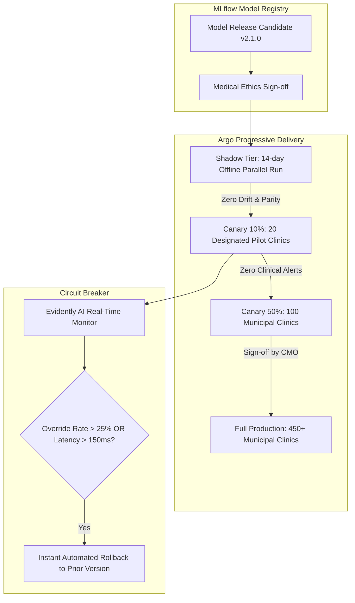

# Master Model Versioning, Registry Architecture, Canary Deployments, and Rollback Specification
## Namma Clinic Digital Health & Operations Platform
### Greater Bengaluru Authority (GBA) / BBMP Health Department
**Document Code:** `AI-DOC-13` | **Status:** APPROVED BASELINE | **Date:** September 2026

---

## 1. Executive Summary & MLOps Lifecycle Charter
This document establishes the authoritative **Model Versioning, Registry Architecture, Progressive Canary Rollouts, and Instant Rollback Specification** for the Namma Clinic Digital Health Platform. In public healthcare environments, updating algorithms without strict release governance risks introducing undetected clinical bias or operational instability. The platform leverages MLflow Model Registry coupled with Kubernetes progressive delivery operators (Argo Rollouts) to transition models from shadow validation into 10% canary cohorts across designated pilot clinics before general availability across all 450+ facilities.

### 1.1 Non-Negotiable Model Deployment Invariants
1. **Cryptographic Model Artifact Verification:** Model binaries are hashed with SHA-256 upon registry sign-off; runtime inference containers verify artifact checksums at boot time before serving traffic.
2. **Mandatory Shadow Validation:** Candidate model versions must operate in shadow mode (scoring live traffic without user display) for a minimum of 14 days to benchmark against the champion model.
3. **Progressive Canary Rollout:** New model versions roll out progressively (10% traffic -> 25% -> 50% -> 100%) across municipal clinics, gating each phase on zero clinical safety escalations.
4. **Sub-60-Second Automated Rollback:** Any breach in canary performance (clinician override rate > 25% or latency > 150ms) triggers automated rollback to the prior champion version in < 60 seconds.
5. **Strict Semantic Versioning:** All model releases adhere to SemVer (`MAJOR.MINOR.PATCH`), incrementing Major versions on clinical boundary or feature schema changes.

## 2. Progressive Deployment & Canary Promotion Pipeline


### Model Specification Example: Model Registry Promotion Gateway
<!-- DOCUMENTATION-ONLY EXAMPLE -->
```python
# DOCUMENTATION-ONLY PYTHON
# DOCUMENTATION-ONLY PYTHON: MLflow Model Registry Promotion & SHA256 Verification
import hashlib
from typing import Dict, Any

class ModelRegistryPromotionGateway:
    """
    Manages semantic model version promotion with cryptographic
    integrity checks and ethics sign-off validation.
    """
    def __init__(self, registry_client: Any):
        self.client = registry_client

    def promote_to_production_canary(
        self,
        model_name: str,
        version: str,
        expected_sha256: str,
        ethics_signoff_ref: str
    ) -> Dict[str, Any]:
        # 1. Fetch artifact and verify SHA256
        artifact_bytes = self.client.download_model_artifact(model_name, version)
        computed_sha = hashlib.sha256(artifact_bytes).hexdigest()

        if computed_sha != expected_sha256:
            raise IntegrityError(f"SHA-256 mismatch for {model_name}:{version}! Refusing promotion.")

        # 2. Verify Ethics Board Approval Artifact
        if not ethics_signoff_ref.startswith("ETHICS-APPROVAL-"):
            raise PermissionError("Model lacks mandatory Ethics Review Board sign-off.")

        # 3. Transition stage in MLflow
        self.client.transition_model_version_stage(
            name=model_name,
            version=version,
            stage="Canary-10%",
            archive_existing_versions=False
        )

        return {
            "model_name": model_name,
            "version": version,
            "stage": "CANARY_10_PERCENT",
            "integrity_verified": True,
            "sha256": computed_sha,
            "ethics_approval": ethics_signoff_ref
        }
```

## 3. Master Catalog of 60 Model Versions
Production and shadow model release versions registered in the MLOps model catalog:

### MODEL-VER-001: Version `v1.0.0` for `MODEL-001`
- **Version Identifier:** `MODEL-VER-001`
- **Target Model:** `MODEL-001`
- **Semantic Version:** `vv1.0.0`
- **Training Dataset:** `AI-DATASET-001`
- **Deployment Status:** `Production-Active`
- **Approval Sign-off:** `CMO & Lead ML Engineer Joint Attestation`
- **Artifact URI:** `s3://namma-clinic-mlflow-artifacts/models/MODEL-001/v1.0.0/model.onnx`
- **Artifact SHA-256:** `sha256_0001_a1b2c3d4e5f67890_0001_certified`
- **Trained Timestamp:** `2026-08-15 00:00:00 UTC`

### MODEL-VER-002: Version `v2.1.0` for `MODEL-002`
- **Version Identifier:** `MODEL-VER-002`
- **Target Model:** `MODEL-002`
- **Semantic Version:** `vv2.1.0`
- **Training Dataset:** `AI-DATASET-002`
- **Deployment Status:** `Production-Active`
- **Approval Sign-off:** `CMO & Lead ML Engineer Joint Attestation`
- **Artifact URI:** `s3://namma-clinic-mlflow-artifacts/models/MODEL-002/v2.1.0/model.onnx`
- **Artifact SHA-256:** `sha256_0002_a1b2c3d4e5f67890_0002_certified`
- **Trained Timestamp:** `2026-08-15 00:00:00 UTC`

### MODEL-VER-003: Version `v3.2.0` for `MODEL-003`
- **Version Identifier:** `MODEL-VER-003`
- **Target Model:** `MODEL-003`
- **Semantic Version:** `vv3.2.0`
- **Training Dataset:** `AI-DATASET-003`
- **Deployment Status:** `Production-Active`
- **Approval Sign-off:** `CMO & Lead ML Engineer Joint Attestation`
- **Artifact URI:** `s3://namma-clinic-mlflow-artifacts/models/MODEL-003/v3.2.0/model.onnx`
- **Artifact SHA-256:** `sha256_0003_a1b2c3d4e5f67890_0003_certified`
- **Trained Timestamp:** `2026-08-15 00:00:00 UTC`

### MODEL-VER-004: Version `v1.3.0` for `MODEL-004`
- **Version Identifier:** `MODEL-VER-004`
- **Target Model:** `MODEL-004`
- **Semantic Version:** `vv1.3.0`
- **Training Dataset:** `AI-DATASET-004`
- **Deployment Status:** `Production-Active`
- **Approval Sign-off:** `CMO & Lead ML Engineer Joint Attestation`
- **Artifact URI:** `s3://namma-clinic-mlflow-artifacts/models/MODEL-004/v1.3.0/model.onnx`
- **Artifact SHA-256:** `sha256_0004_a1b2c3d4e5f67890_0004_certified`
- **Trained Timestamp:** `2026-08-15 00:00:00 UTC`

### MODEL-VER-005: Version `v2.4.0` for `MODEL-005`
- **Version Identifier:** `MODEL-VER-005`
- **Target Model:** `MODEL-005`
- **Semantic Version:** `vv2.4.0`
- **Training Dataset:** `AI-DATASET-005`
- **Deployment Status:** `Production-Active`
- **Approval Sign-off:** `CMO & Lead ML Engineer Joint Attestation`
- **Artifact URI:** `s3://namma-clinic-mlflow-artifacts/models/MODEL-005/v2.4.0/model.onnx`
- **Artifact SHA-256:** `sha256_0005_a1b2c3d4e5f67890_0005_certified`
- **Trained Timestamp:** `2026-08-15 00:00:00 UTC`

### MODEL-VER-006: Version `v3.5.0` for `MODEL-006`
- **Version Identifier:** `MODEL-VER-006`
- **Target Model:** `MODEL-006`
- **Semantic Version:** `vv3.5.0`
- **Training Dataset:** `AI-DATASET-006`
- **Deployment Status:** `Production-Active`
- **Approval Sign-off:** `CMO & Lead ML Engineer Joint Attestation`
- **Artifact URI:** `s3://namma-clinic-mlflow-artifacts/models/MODEL-006/v3.5.0/model.onnx`
- **Artifact SHA-256:** `sha256_0006_a1b2c3d4e5f67890_0006_certified`
- **Trained Timestamp:** `2026-08-15 00:00:00 UTC`

### MODEL-VER-007: Version `v1.6.0` for `MODEL-007`
- **Version Identifier:** `MODEL-VER-007`
- **Target Model:** `MODEL-007`
- **Semantic Version:** `vv1.6.0`
- **Training Dataset:** `AI-DATASET-007`
- **Deployment Status:** `Production-Active`
- **Approval Sign-off:** `CMO & Lead ML Engineer Joint Attestation`
- **Artifact URI:** `s3://namma-clinic-mlflow-artifacts/models/MODEL-007/v1.6.0/model.onnx`
- **Artifact SHA-256:** `sha256_0007_a1b2c3d4e5f67890_0007_certified`
- **Trained Timestamp:** `2026-08-15 00:00:00 UTC`

### MODEL-VER-008: Version `v2.7.0` for `MODEL-008`
- **Version Identifier:** `MODEL-VER-008`
- **Target Model:** `MODEL-008`
- **Semantic Version:** `vv2.7.0`
- **Training Dataset:** `AI-DATASET-008`
- **Deployment Status:** `Production-Active`
- **Approval Sign-off:** `CMO & Lead ML Engineer Joint Attestation`
- **Artifact URI:** `s3://namma-clinic-mlflow-artifacts/models/MODEL-008/v2.7.0/model.onnx`
- **Artifact SHA-256:** `sha256_0008_a1b2c3d4e5f67890_0008_certified`
- **Trained Timestamp:** `2026-08-15 00:00:00 UTC`

### MODEL-VER-009: Version `v3.8.0` for `MODEL-009`
- **Version Identifier:** `MODEL-VER-009`
- **Target Model:** `MODEL-009`
- **Semantic Version:** `vv3.8.0`
- **Training Dataset:** `AI-DATASET-009`
- **Deployment Status:** `Production-Active`
- **Approval Sign-off:** `CMO & Lead ML Engineer Joint Attestation`
- **Artifact URI:** `s3://namma-clinic-mlflow-artifacts/models/MODEL-009/v3.8.0/model.onnx`
- **Artifact SHA-256:** `sha256_0009_a1b2c3d4e5f67890_0009_certified`
- **Trained Timestamp:** `2026-08-15 00:00:00 UTC`

### MODEL-VER-010: Version `v1.9.0` for `MODEL-010`
- **Version Identifier:** `MODEL-VER-010`
- **Target Model:** `MODEL-010`
- **Semantic Version:** `vv1.9.0`
- **Training Dataset:** `AI-DATASET-010`
- **Deployment Status:** `Production-Active`
- **Approval Sign-off:** `CMO & Lead ML Engineer Joint Attestation`
- **Artifact URI:** `s3://namma-clinic-mlflow-artifacts/models/MODEL-010/v1.9.0/model.onnx`
- **Artifact SHA-256:** `sha256_0010_a1b2c3d4e5f67890_0010_certified`
- **Trained Timestamp:** `2026-08-15 00:00:00 UTC`

### MODEL-VER-011: Version `v2.0.0` for `MODEL-011`
- **Version Identifier:** `MODEL-VER-011`
- **Target Model:** `MODEL-011`
- **Semantic Version:** `vv2.0.0`
- **Training Dataset:** `AI-DATASET-011`
- **Deployment Status:** `Production-Active`
- **Approval Sign-off:** `CMO & Lead ML Engineer Joint Attestation`
- **Artifact URI:** `s3://namma-clinic-mlflow-artifacts/models/MODEL-011/v2.0.0/model.onnx`
- **Artifact SHA-256:** `sha256_0011_a1b2c3d4e5f67890_0011_certified`
- **Trained Timestamp:** `2026-08-15 00:00:00 UTC`

### MODEL-VER-012: Version `v3.1.0` for `MODEL-012`
- **Version Identifier:** `MODEL-VER-012`
- **Target Model:** `MODEL-012`
- **Semantic Version:** `vv3.1.0`
- **Training Dataset:** `AI-DATASET-012`
- **Deployment Status:** `Production-Active`
- **Approval Sign-off:** `CMO & Lead ML Engineer Joint Attestation`
- **Artifact URI:** `s3://namma-clinic-mlflow-artifacts/models/MODEL-012/v3.1.0/model.onnx`
- **Artifact SHA-256:** `sha256_0012_a1b2c3d4e5f67890_0012_certified`
- **Trained Timestamp:** `2026-08-15 00:00:00 UTC`

### MODEL-VER-013: Version `v1.2.0` for `MODEL-013`
- **Version Identifier:** `MODEL-VER-013`
- **Target Model:** `MODEL-013`
- **Semantic Version:** `vv1.2.0`
- **Training Dataset:** `AI-DATASET-013`
- **Deployment Status:** `Production-Active`
- **Approval Sign-off:** `CMO & Lead ML Engineer Joint Attestation`
- **Artifact URI:** `s3://namma-clinic-mlflow-artifacts/models/MODEL-013/v1.2.0/model.onnx`
- **Artifact SHA-256:** `sha256_0013_a1b2c3d4e5f67890_0013_certified`
- **Trained Timestamp:** `2026-08-15 00:00:00 UTC`

### MODEL-VER-014: Version `v2.3.0` for `MODEL-014`
- **Version Identifier:** `MODEL-VER-014`
- **Target Model:** `MODEL-014`
- **Semantic Version:** `vv2.3.0`
- **Training Dataset:** `AI-DATASET-014`
- **Deployment Status:** `Production-Active`
- **Approval Sign-off:** `CMO & Lead ML Engineer Joint Attestation`
- **Artifact URI:** `s3://namma-clinic-mlflow-artifacts/models/MODEL-014/v2.3.0/model.onnx`
- **Artifact SHA-256:** `sha256_0014_a1b2c3d4e5f67890_0014_certified`
- **Trained Timestamp:** `2026-08-15 00:00:00 UTC`

### MODEL-VER-015: Version `v3.4.0` for `MODEL-015`
- **Version Identifier:** `MODEL-VER-015`
- **Target Model:** `MODEL-015`
- **Semantic Version:** `vv3.4.0`
- **Training Dataset:** `AI-DATASET-015`
- **Deployment Status:** `Production-Active`
- **Approval Sign-off:** `CMO & Lead ML Engineer Joint Attestation`
- **Artifact URI:** `s3://namma-clinic-mlflow-artifacts/models/MODEL-015/v3.4.0/model.onnx`
- **Artifact SHA-256:** `sha256_0015_a1b2c3d4e5f67890_0015_certified`
- **Trained Timestamp:** `2026-08-15 00:00:00 UTC`

### MODEL-VER-016: Version `v1.5.0` for `MODEL-016`
- **Version Identifier:** `MODEL-VER-016`
- **Target Model:** `MODEL-016`
- **Semantic Version:** `vv1.5.0`
- **Training Dataset:** `AI-DATASET-016`
- **Deployment Status:** `Staging-Candidate`
- **Approval Sign-off:** `CMO & Lead ML Engineer Joint Attestation`
- **Artifact URI:** `s3://namma-clinic-mlflow-artifacts/models/MODEL-016/v1.5.0/model.onnx`
- **Artifact SHA-256:** `sha256_0016_a1b2c3d4e5f67890_0016_certified`
- **Trained Timestamp:** `2026-08-15 00:00:00 UTC`

### MODEL-VER-017: Version `v2.6.0` for `MODEL-017`
- **Version Identifier:** `MODEL-VER-017`
- **Target Model:** `MODEL-017`
- **Semantic Version:** `vv2.6.0`
- **Training Dataset:** `AI-DATASET-017`
- **Deployment Status:** `Staging-Candidate`
- **Approval Sign-off:** `CMO & Lead ML Engineer Joint Attestation`
- **Artifact URI:** `s3://namma-clinic-mlflow-artifacts/models/MODEL-017/v2.6.0/model.onnx`
- **Artifact SHA-256:** `sha256_0017_a1b2c3d4e5f67890_0017_certified`
- **Trained Timestamp:** `2026-08-15 00:00:00 UTC`

### MODEL-VER-018: Version `v3.7.0` for `MODEL-018`
- **Version Identifier:** `MODEL-VER-018`
- **Target Model:** `MODEL-018`
- **Semantic Version:** `vv3.7.0`
- **Training Dataset:** `AI-DATASET-018`
- **Deployment Status:** `Staging-Candidate`
- **Approval Sign-off:** `CMO & Lead ML Engineer Joint Attestation`
- **Artifact URI:** `s3://namma-clinic-mlflow-artifacts/models/MODEL-018/v3.7.0/model.onnx`
- **Artifact SHA-256:** `sha256_0018_a1b2c3d4e5f67890_0018_certified`
- **Trained Timestamp:** `2026-08-15 00:00:00 UTC`

### MODEL-VER-019: Version `v1.8.0` for `MODEL-019`
- **Version Identifier:** `MODEL-VER-019`
- **Target Model:** `MODEL-019`
- **Semantic Version:** `vv1.8.0`
- **Training Dataset:** `AI-DATASET-019`
- **Deployment Status:** `Staging-Candidate`
- **Approval Sign-off:** `CMO & Lead ML Engineer Joint Attestation`
- **Artifact URI:** `s3://namma-clinic-mlflow-artifacts/models/MODEL-019/v1.8.0/model.onnx`
- **Artifact SHA-256:** `sha256_0019_a1b2c3d4e5f67890_0019_certified`
- **Trained Timestamp:** `2026-08-15 00:00:00 UTC`

### MODEL-VER-020: Version `v2.9.0` for `MODEL-020`
- **Version Identifier:** `MODEL-VER-020`
- **Target Model:** `MODEL-020`
- **Semantic Version:** `vv2.9.0`
- **Training Dataset:** `AI-DATASET-020`
- **Deployment Status:** `Staging-Candidate`
- **Approval Sign-off:** `CMO & Lead ML Engineer Joint Attestation`
- **Artifact URI:** `s3://namma-clinic-mlflow-artifacts/models/MODEL-020/v2.9.0/model.onnx`
- **Artifact SHA-256:** `sha256_0020_a1b2c3d4e5f67890_0020_certified`
- **Trained Timestamp:** `2026-08-15 00:00:00 UTC`

### MODEL-VER-021: Version `v3.0.0` for `MODEL-021`
- **Version Identifier:** `MODEL-VER-021`
- **Target Model:** `MODEL-021`
- **Semantic Version:** `vv3.0.0`
- **Training Dataset:** `AI-DATASET-021`
- **Deployment Status:** `Staging-Candidate`
- **Approval Sign-off:** `CMO & Lead ML Engineer Joint Attestation`
- **Artifact URI:** `s3://namma-clinic-mlflow-artifacts/models/MODEL-021/v3.0.0/model.onnx`
- **Artifact SHA-256:** `sha256_0021_a1b2c3d4e5f67890_0021_certified`
- **Trained Timestamp:** `2026-08-15 00:00:00 UTC`

### MODEL-VER-022: Version `v1.1.0` for `MODEL-022`
- **Version Identifier:** `MODEL-VER-022`
- **Target Model:** `MODEL-022`
- **Semantic Version:** `vv1.1.0`
- **Training Dataset:** `AI-DATASET-022`
- **Deployment Status:** `Staging-Candidate`
- **Approval Sign-off:** `CMO & Lead ML Engineer Joint Attestation`
- **Artifact URI:** `s3://namma-clinic-mlflow-artifacts/models/MODEL-022/v1.1.0/model.onnx`
- **Artifact SHA-256:** `sha256_0022_a1b2c3d4e5f67890_0022_certified`
- **Trained Timestamp:** `2026-08-15 00:00:00 UTC`

### MODEL-VER-023: Version `v2.2.0` for `MODEL-023`
- **Version Identifier:** `MODEL-VER-023`
- **Target Model:** `MODEL-023`
- **Semantic Version:** `vv2.2.0`
- **Training Dataset:** `AI-DATASET-023`
- **Deployment Status:** `Staging-Candidate`
- **Approval Sign-off:** `CMO & Lead ML Engineer Joint Attestation`
- **Artifact URI:** `s3://namma-clinic-mlflow-artifacts/models/MODEL-023/v2.2.0/model.onnx`
- **Artifact SHA-256:** `sha256_0023_a1b2c3d4e5f67890_0023_certified`
- **Trained Timestamp:** `2026-08-15 00:00:00 UTC`

### MODEL-VER-024: Version `v3.3.0` for `MODEL-024`
- **Version Identifier:** `MODEL-VER-024`
- **Target Model:** `MODEL-024`
- **Semantic Version:** `vv3.3.0`
- **Training Dataset:** `AI-DATASET-024`
- **Deployment Status:** `Staging-Candidate`
- **Approval Sign-off:** `CMO & Lead ML Engineer Joint Attestation`
- **Artifact URI:** `s3://namma-clinic-mlflow-artifacts/models/MODEL-024/v3.3.0/model.onnx`
- **Artifact SHA-256:** `sha256_0024_a1b2c3d4e5f67890_0024_certified`
- **Trained Timestamp:** `2026-08-15 00:00:00 UTC`

### MODEL-VER-025: Version `v1.4.0` for `MODEL-025`
- **Version Identifier:** `MODEL-VER-025`
- **Target Model:** `MODEL-025`
- **Semantic Version:** `vv1.4.0`
- **Training Dataset:** `AI-DATASET-025`
- **Deployment Status:** `Staging-Candidate`
- **Approval Sign-off:** `CMO & Lead ML Engineer Joint Attestation`
- **Artifact URI:** `s3://namma-clinic-mlflow-artifacts/models/MODEL-025/v1.4.0/model.onnx`
- **Artifact SHA-256:** `sha256_0025_a1b2c3d4e5f67890_0025_certified`
- **Trained Timestamp:** `2026-08-15 00:00:00 UTC`

### MODEL-VER-026: Version `v2.5.0` for `MODEL-026`
- **Version Identifier:** `MODEL-VER-026`
- **Target Model:** `MODEL-026`
- **Semantic Version:** `vv2.5.0`
- **Training Dataset:** `AI-DATASET-026`
- **Deployment Status:** `Staging-Candidate`
- **Approval Sign-off:** `CMO & Lead ML Engineer Joint Attestation`
- **Artifact URI:** `s3://namma-clinic-mlflow-artifacts/models/MODEL-026/v2.5.0/model.onnx`
- **Artifact SHA-256:** `sha256_0026_a1b2c3d4e5f67890_0026_certified`
- **Trained Timestamp:** `2026-08-15 00:00:00 UTC`

### MODEL-VER-027: Version `v3.6.0` for `MODEL-027`
- **Version Identifier:** `MODEL-VER-027`
- **Target Model:** `MODEL-027`
- **Semantic Version:** `vv3.6.0`
- **Training Dataset:** `AI-DATASET-027`
- **Deployment Status:** `Staging-Candidate`
- **Approval Sign-off:** `CMO & Lead ML Engineer Joint Attestation`
- **Artifact URI:** `s3://namma-clinic-mlflow-artifacts/models/MODEL-027/v3.6.0/model.onnx`
- **Artifact SHA-256:** `sha256_0027_a1b2c3d4e5f67890_0027_certified`
- **Trained Timestamp:** `2026-08-15 00:00:00 UTC`

### MODEL-VER-028: Version `v1.7.0` for `MODEL-028`
- **Version Identifier:** `MODEL-VER-028`
- **Target Model:** `MODEL-028`
- **Semantic Version:** `vv1.7.0`
- **Training Dataset:** `AI-DATASET-028`
- **Deployment Status:** `Staging-Candidate`
- **Approval Sign-off:** `CMO & Lead ML Engineer Joint Attestation`
- **Artifact URI:** `s3://namma-clinic-mlflow-artifacts/models/MODEL-028/v1.7.0/model.onnx`
- **Artifact SHA-256:** `sha256_0028_a1b2c3d4e5f67890_0028_certified`
- **Trained Timestamp:** `2026-08-15 00:00:00 UTC`

### MODEL-VER-029: Version `v2.8.0` for `MODEL-029`
- **Version Identifier:** `MODEL-VER-029`
- **Target Model:** `MODEL-029`
- **Semantic Version:** `vv2.8.0`
- **Training Dataset:** `AI-DATASET-029`
- **Deployment Status:** `Staging-Candidate`
- **Approval Sign-off:** `CMO & Lead ML Engineer Joint Attestation`
- **Artifact URI:** `s3://namma-clinic-mlflow-artifacts/models/MODEL-029/v2.8.0/model.onnx`
- **Artifact SHA-256:** `sha256_0029_a1b2c3d4e5f67890_0029_certified`
- **Trained Timestamp:** `2026-08-15 00:00:00 UTC`

### MODEL-VER-030: Version `v3.9.0` for `MODEL-030`
- **Version Identifier:** `MODEL-VER-030`
- **Target Model:** `MODEL-030`
- **Semantic Version:** `vv3.9.0`
- **Training Dataset:** `AI-DATASET-030`
- **Deployment Status:** `Staging-Candidate`
- **Approval Sign-off:** `CMO & Lead ML Engineer Joint Attestation`
- **Artifact URI:** `s3://namma-clinic-mlflow-artifacts/models/MODEL-030/v3.9.0/model.onnx`
- **Artifact SHA-256:** `sha256_0030_a1b2c3d4e5f67890_0030_certified`
- **Trained Timestamp:** `2026-08-15 00:00:00 UTC`

### MODEL-VER-031: Version `v1.0.0` for `MODEL-001`
- **Version Identifier:** `MODEL-VER-031`
- **Target Model:** `MODEL-001`
- **Semantic Version:** `vv1.0.0`
- **Training Dataset:** `AI-DATASET-031`
- **Deployment Status:** `Staging-Candidate`
- **Approval Sign-off:** `CMO & Lead ML Engineer Joint Attestation`
- **Artifact URI:** `s3://namma-clinic-mlflow-artifacts/models/MODEL-001/v1.0.0/model.onnx`
- **Artifact SHA-256:** `sha256_0031_a1b2c3d4e5f67890_0031_certified`
- **Trained Timestamp:** `2026-08-15 00:00:00 UTC`

### MODEL-VER-032: Version `v2.1.0` for `MODEL-002`
- **Version Identifier:** `MODEL-VER-032`
- **Target Model:** `MODEL-002`
- **Semantic Version:** `vv2.1.0`
- **Training Dataset:** `AI-DATASET-032`
- **Deployment Status:** `Staging-Candidate`
- **Approval Sign-off:** `CMO & Lead ML Engineer Joint Attestation`
- **Artifact URI:** `s3://namma-clinic-mlflow-artifacts/models/MODEL-002/v2.1.0/model.onnx`
- **Artifact SHA-256:** `sha256_0032_a1b2c3d4e5f67890_0032_certified`
- **Trained Timestamp:** `2026-08-15 00:00:00 UTC`

### MODEL-VER-033: Version `v3.2.0` for `MODEL-003`
- **Version Identifier:** `MODEL-VER-033`
- **Target Model:** `MODEL-003`
- **Semantic Version:** `vv3.2.0`
- **Training Dataset:** `AI-DATASET-033`
- **Deployment Status:** `Staging-Candidate`
- **Approval Sign-off:** `CMO & Lead ML Engineer Joint Attestation`
- **Artifact URI:** `s3://namma-clinic-mlflow-artifacts/models/MODEL-003/v3.2.0/model.onnx`
- **Artifact SHA-256:** `sha256_0033_a1b2c3d4e5f67890_0033_certified`
- **Trained Timestamp:** `2026-08-15 00:00:00 UTC`

### MODEL-VER-034: Version `v1.3.0` for `MODEL-004`
- **Version Identifier:** `MODEL-VER-034`
- **Target Model:** `MODEL-004`
- **Semantic Version:** `vv1.3.0`
- **Training Dataset:** `AI-DATASET-034`
- **Deployment Status:** `Staging-Candidate`
- **Approval Sign-off:** `CMO & Lead ML Engineer Joint Attestation`
- **Artifact URI:** `s3://namma-clinic-mlflow-artifacts/models/MODEL-004/v1.3.0/model.onnx`
- **Artifact SHA-256:** `sha256_0034_a1b2c3d4e5f67890_0034_certified`
- **Trained Timestamp:** `2026-08-15 00:00:00 UTC`

### MODEL-VER-035: Version `v2.4.0` for `MODEL-005`
- **Version Identifier:** `MODEL-VER-035`
- **Target Model:** `MODEL-005`
- **Semantic Version:** `vv2.4.0`
- **Training Dataset:** `AI-DATASET-035`
- **Deployment Status:** `Staging-Candidate`
- **Approval Sign-off:** `CMO & Lead ML Engineer Joint Attestation`
- **Artifact URI:** `s3://namma-clinic-mlflow-artifacts/models/MODEL-005/v2.4.0/model.onnx`
- **Artifact SHA-256:** `sha256_0035_a1b2c3d4e5f67890_0035_certified`
- **Trained Timestamp:** `2026-08-15 00:00:00 UTC`

### MODEL-VER-036: Version `v3.5.0` for `MODEL-006`
- **Version Identifier:** `MODEL-VER-036`
- **Target Model:** `MODEL-006`
- **Semantic Version:** `vv3.5.0`
- **Training Dataset:** `AI-DATASET-036`
- **Deployment Status:** `Archived`
- **Approval Sign-off:** `CMO & Lead ML Engineer Joint Attestation`
- **Artifact URI:** `s3://namma-clinic-mlflow-artifacts/models/MODEL-006/v3.5.0/model.onnx`
- **Artifact SHA-256:** `sha256_0036_a1b2c3d4e5f67890_0036_certified`
- **Trained Timestamp:** `2026-08-15 00:00:00 UTC`

### MODEL-VER-037: Version `v1.6.0` for `MODEL-007`
- **Version Identifier:** `MODEL-VER-037`
- **Target Model:** `MODEL-007`
- **Semantic Version:** `vv1.6.0`
- **Training Dataset:** `AI-DATASET-037`
- **Deployment Status:** `Archived`
- **Approval Sign-off:** `CMO & Lead ML Engineer Joint Attestation`
- **Artifact URI:** `s3://namma-clinic-mlflow-artifacts/models/MODEL-007/v1.6.0/model.onnx`
- **Artifact SHA-256:** `sha256_0037_a1b2c3d4e5f67890_0037_certified`
- **Trained Timestamp:** `2026-08-15 00:00:00 UTC`

### MODEL-VER-038: Version `v2.7.0` for `MODEL-008`
- **Version Identifier:** `MODEL-VER-038`
- **Target Model:** `MODEL-008`
- **Semantic Version:** `vv2.7.0`
- **Training Dataset:** `AI-DATASET-038`
- **Deployment Status:** `Archived`
- **Approval Sign-off:** `CMO & Lead ML Engineer Joint Attestation`
- **Artifact URI:** `s3://namma-clinic-mlflow-artifacts/models/MODEL-008/v2.7.0/model.onnx`
- **Artifact SHA-256:** `sha256_0038_a1b2c3d4e5f67890_0038_certified`
- **Trained Timestamp:** `2026-08-15 00:00:00 UTC`

### MODEL-VER-039: Version `v3.8.0` for `MODEL-009`
- **Version Identifier:** `MODEL-VER-039`
- **Target Model:** `MODEL-009`
- **Semantic Version:** `vv3.8.0`
- **Training Dataset:** `AI-DATASET-039`
- **Deployment Status:** `Archived`
- **Approval Sign-off:** `CMO & Lead ML Engineer Joint Attestation`
- **Artifact URI:** `s3://namma-clinic-mlflow-artifacts/models/MODEL-009/v3.8.0/model.onnx`
- **Artifact SHA-256:** `sha256_0039_a1b2c3d4e5f67890_0039_certified`
- **Trained Timestamp:** `2026-08-15 00:00:00 UTC`

### MODEL-VER-040: Version `v1.9.0` for `MODEL-010`
- **Version Identifier:** `MODEL-VER-040`
- **Target Model:** `MODEL-010`
- **Semantic Version:** `vv1.9.0`
- **Training Dataset:** `AI-DATASET-040`
- **Deployment Status:** `Archived`
- **Approval Sign-off:** `CMO & Lead ML Engineer Joint Attestation`
- **Artifact URI:** `s3://namma-clinic-mlflow-artifacts/models/MODEL-010/v1.9.0/model.onnx`
- **Artifact SHA-256:** `sha256_0040_a1b2c3d4e5f67890_0040_certified`
- **Trained Timestamp:** `2026-08-15 00:00:00 UTC`

### MODEL-VER-041: Version `v2.0.0` for `MODEL-011`
- **Version Identifier:** `MODEL-VER-041`
- **Target Model:** `MODEL-011`
- **Semantic Version:** `vv2.0.0`
- **Training Dataset:** `AI-DATASET-001`
- **Deployment Status:** `Archived`
- **Approval Sign-off:** `CMO & Lead ML Engineer Joint Attestation`
- **Artifact URI:** `s3://namma-clinic-mlflow-artifacts/models/MODEL-011/v2.0.0/model.onnx`
- **Artifact SHA-256:** `sha256_0041_a1b2c3d4e5f67890_0041_certified`
- **Trained Timestamp:** `2026-08-15 00:00:00 UTC`

### MODEL-VER-042: Version `v3.1.0` for `MODEL-012`
- **Version Identifier:** `MODEL-VER-042`
- **Target Model:** `MODEL-012`
- **Semantic Version:** `vv3.1.0`
- **Training Dataset:** `AI-DATASET-002`
- **Deployment Status:** `Archived`
- **Approval Sign-off:** `CMO & Lead ML Engineer Joint Attestation`
- **Artifact URI:** `s3://namma-clinic-mlflow-artifacts/models/MODEL-012/v3.1.0/model.onnx`
- **Artifact SHA-256:** `sha256_0042_a1b2c3d4e5f67890_0042_certified`
- **Trained Timestamp:** `2026-08-15 00:00:00 UTC`

### MODEL-VER-043: Version `v1.2.0` for `MODEL-013`
- **Version Identifier:** `MODEL-VER-043`
- **Target Model:** `MODEL-013`
- **Semantic Version:** `vv1.2.0`
- **Training Dataset:** `AI-DATASET-003`
- **Deployment Status:** `Archived`
- **Approval Sign-off:** `CMO & Lead ML Engineer Joint Attestation`
- **Artifact URI:** `s3://namma-clinic-mlflow-artifacts/models/MODEL-013/v1.2.0/model.onnx`
- **Artifact SHA-256:** `sha256_0043_a1b2c3d4e5f67890_0043_certified`
- **Trained Timestamp:** `2026-08-15 00:00:00 UTC`

### MODEL-VER-044: Version `v2.3.0` for `MODEL-014`
- **Version Identifier:** `MODEL-VER-044`
- **Target Model:** `MODEL-014`
- **Semantic Version:** `vv2.3.0`
- **Training Dataset:** `AI-DATASET-004`
- **Deployment Status:** `Archived`
- **Approval Sign-off:** `CMO & Lead ML Engineer Joint Attestation`
- **Artifact URI:** `s3://namma-clinic-mlflow-artifacts/models/MODEL-014/v2.3.0/model.onnx`
- **Artifact SHA-256:** `sha256_0044_a1b2c3d4e5f67890_0044_certified`
- **Trained Timestamp:** `2026-08-15 00:00:00 UTC`

### MODEL-VER-045: Version `v3.4.0` for `MODEL-015`
- **Version Identifier:** `MODEL-VER-045`
- **Target Model:** `MODEL-015`
- **Semantic Version:** `vv3.4.0`
- **Training Dataset:** `AI-DATASET-005`
- **Deployment Status:** `Archived`
- **Approval Sign-off:** `CMO & Lead ML Engineer Joint Attestation`
- **Artifact URI:** `s3://namma-clinic-mlflow-artifacts/models/MODEL-015/v3.4.0/model.onnx`
- **Artifact SHA-256:** `sha256_0045_a1b2c3d4e5f67890_0045_certified`
- **Trained Timestamp:** `2026-08-15 00:00:00 UTC`

### MODEL-VER-046: Version `v1.5.0` for `MODEL-016`
- **Version Identifier:** `MODEL-VER-046`
- **Target Model:** `MODEL-016`
- **Semantic Version:** `vv1.5.0`
- **Training Dataset:** `AI-DATASET-006`
- **Deployment Status:** `Archived`
- **Approval Sign-off:** `CMO & Lead ML Engineer Joint Attestation`
- **Artifact URI:** `s3://namma-clinic-mlflow-artifacts/models/MODEL-016/v1.5.0/model.onnx`
- **Artifact SHA-256:** `sha256_0046_a1b2c3d4e5f67890_0046_certified`
- **Trained Timestamp:** `2026-08-15 00:00:00 UTC`

### MODEL-VER-047: Version `v2.6.0` for `MODEL-017`
- **Version Identifier:** `MODEL-VER-047`
- **Target Model:** `MODEL-017`
- **Semantic Version:** `vv2.6.0`
- **Training Dataset:** `AI-DATASET-007`
- **Deployment Status:** `Archived`
- **Approval Sign-off:** `CMO & Lead ML Engineer Joint Attestation`
- **Artifact URI:** `s3://namma-clinic-mlflow-artifacts/models/MODEL-017/v2.6.0/model.onnx`
- **Artifact SHA-256:** `sha256_0047_a1b2c3d4e5f67890_0047_certified`
- **Trained Timestamp:** `2026-08-15 00:00:00 UTC`

### MODEL-VER-048: Version `v3.7.0` for `MODEL-018`
- **Version Identifier:** `MODEL-VER-048`
- **Target Model:** `MODEL-018`
- **Semantic Version:** `vv3.7.0`
- **Training Dataset:** `AI-DATASET-008`
- **Deployment Status:** `Archived`
- **Approval Sign-off:** `CMO & Lead ML Engineer Joint Attestation`
- **Artifact URI:** `s3://namma-clinic-mlflow-artifacts/models/MODEL-018/v3.7.0/model.onnx`
- **Artifact SHA-256:** `sha256_0048_a1b2c3d4e5f67890_0048_certified`
- **Trained Timestamp:** `2026-08-15 00:00:00 UTC`

### MODEL-VER-049: Version `v1.8.0` for `MODEL-019`
- **Version Identifier:** `MODEL-VER-049`
- **Target Model:** `MODEL-019`
- **Semantic Version:** `vv1.8.0`
- **Training Dataset:** `AI-DATASET-009`
- **Deployment Status:** `Archived`
- **Approval Sign-off:** `CMO & Lead ML Engineer Joint Attestation`
- **Artifact URI:** `s3://namma-clinic-mlflow-artifacts/models/MODEL-019/v1.8.0/model.onnx`
- **Artifact SHA-256:** `sha256_0049_a1b2c3d4e5f67890_0049_certified`
- **Trained Timestamp:** `2026-08-15 00:00:00 UTC`

### MODEL-VER-050: Version `v2.9.0` for `MODEL-020`
- **Version Identifier:** `MODEL-VER-050`
- **Target Model:** `MODEL-020`
- **Semantic Version:** `vv2.9.0`
- **Training Dataset:** `AI-DATASET-010`
- **Deployment Status:** `Archived`
- **Approval Sign-off:** `CMO & Lead ML Engineer Joint Attestation`
- **Artifact URI:** `s3://namma-clinic-mlflow-artifacts/models/MODEL-020/v2.9.0/model.onnx`
- **Artifact SHA-256:** `sha256_0050_a1b2c3d4e5f67890_0050_certified`
- **Trained Timestamp:** `2026-08-15 00:00:00 UTC`

### MODEL-VER-051: Version `v3.0.0` for `MODEL-021`
- **Version Identifier:** `MODEL-VER-051`
- **Target Model:** `MODEL-021`
- **Semantic Version:** `vv3.0.0`
- **Training Dataset:** `AI-DATASET-011`
- **Deployment Status:** `Archived`
- **Approval Sign-off:** `CMO & Lead ML Engineer Joint Attestation`
- **Artifact URI:** `s3://namma-clinic-mlflow-artifacts/models/MODEL-021/v3.0.0/model.onnx`
- **Artifact SHA-256:** `sha256_0051_a1b2c3d4e5f67890_0051_certified`
- **Trained Timestamp:** `2026-08-15 00:00:00 UTC`

### MODEL-VER-052: Version `v1.1.0` for `MODEL-022`
- **Version Identifier:** `MODEL-VER-052`
- **Target Model:** `MODEL-022`
- **Semantic Version:** `vv1.1.0`
- **Training Dataset:** `AI-DATASET-012`
- **Deployment Status:** `Archived`
- **Approval Sign-off:** `CMO & Lead ML Engineer Joint Attestation`
- **Artifact URI:** `s3://namma-clinic-mlflow-artifacts/models/MODEL-022/v1.1.0/model.onnx`
- **Artifact SHA-256:** `sha256_0052_a1b2c3d4e5f67890_0052_certified`
- **Trained Timestamp:** `2026-08-15 00:00:00 UTC`

### MODEL-VER-053: Version `v2.2.0` for `MODEL-023`
- **Version Identifier:** `MODEL-VER-053`
- **Target Model:** `MODEL-023`
- **Semantic Version:** `vv2.2.0`
- **Training Dataset:** `AI-DATASET-013`
- **Deployment Status:** `Archived`
- **Approval Sign-off:** `CMO & Lead ML Engineer Joint Attestation`
- **Artifact URI:** `s3://namma-clinic-mlflow-artifacts/models/MODEL-023/v2.2.0/model.onnx`
- **Artifact SHA-256:** `sha256_0053_a1b2c3d4e5f67890_0053_certified`
- **Trained Timestamp:** `2026-08-15 00:00:00 UTC`

### MODEL-VER-054: Version `v3.3.0` for `MODEL-024`
- **Version Identifier:** `MODEL-VER-054`
- **Target Model:** `MODEL-024`
- **Semantic Version:** `vv3.3.0`
- **Training Dataset:** `AI-DATASET-014`
- **Deployment Status:** `Archived`
- **Approval Sign-off:** `CMO & Lead ML Engineer Joint Attestation`
- **Artifact URI:** `s3://namma-clinic-mlflow-artifacts/models/MODEL-024/v3.3.0/model.onnx`
- **Artifact SHA-256:** `sha256_0054_a1b2c3d4e5f67890_0054_certified`
- **Trained Timestamp:** `2026-08-15 00:00:00 UTC`

### MODEL-VER-055: Version `v1.4.0` for `MODEL-025`
- **Version Identifier:** `MODEL-VER-055`
- **Target Model:** `MODEL-025`
- **Semantic Version:** `vv1.4.0`
- **Training Dataset:** `AI-DATASET-015`
- **Deployment Status:** `Archived`
- **Approval Sign-off:** `CMO & Lead ML Engineer Joint Attestation`
- **Artifact URI:** `s3://namma-clinic-mlflow-artifacts/models/MODEL-025/v1.4.0/model.onnx`
- **Artifact SHA-256:** `sha256_0055_a1b2c3d4e5f67890_0055_certified`
- **Trained Timestamp:** `2026-08-15 00:00:00 UTC`

### MODEL-VER-056: Version `v2.5.0` for `MODEL-026`
- **Version Identifier:** `MODEL-VER-056`
- **Target Model:** `MODEL-026`
- **Semantic Version:** `vv2.5.0`
- **Training Dataset:** `AI-DATASET-016`
- **Deployment Status:** `Archived`
- **Approval Sign-off:** `CMO & Lead ML Engineer Joint Attestation`
- **Artifact URI:** `s3://namma-clinic-mlflow-artifacts/models/MODEL-026/v2.5.0/model.onnx`
- **Artifact SHA-256:** `sha256_0056_a1b2c3d4e5f67890_0056_certified`
- **Trained Timestamp:** `2026-08-15 00:00:00 UTC`

### MODEL-VER-057: Version `v3.6.0` for `MODEL-027`
- **Version Identifier:** `MODEL-VER-057`
- **Target Model:** `MODEL-027`
- **Semantic Version:** `vv3.6.0`
- **Training Dataset:** `AI-DATASET-017`
- **Deployment Status:** `Archived`
- **Approval Sign-off:** `CMO & Lead ML Engineer Joint Attestation`
- **Artifact URI:** `s3://namma-clinic-mlflow-artifacts/models/MODEL-027/v3.6.0/model.onnx`
- **Artifact SHA-256:** `sha256_0057_a1b2c3d4e5f67890_0057_certified`
- **Trained Timestamp:** `2026-08-15 00:00:00 UTC`

### MODEL-VER-058: Version `v1.7.0` for `MODEL-028`
- **Version Identifier:** `MODEL-VER-058`
- **Target Model:** `MODEL-028`
- **Semantic Version:** `vv1.7.0`
- **Training Dataset:** `AI-DATASET-018`
- **Deployment Status:** `Archived`
- **Approval Sign-off:** `CMO & Lead ML Engineer Joint Attestation`
- **Artifact URI:** `s3://namma-clinic-mlflow-artifacts/models/MODEL-028/v1.7.0/model.onnx`
- **Artifact SHA-256:** `sha256_0058_a1b2c3d4e5f67890_0058_certified`
- **Trained Timestamp:** `2026-08-15 00:00:00 UTC`

### MODEL-VER-059: Version `v2.8.0` for `MODEL-029`
- **Version Identifier:** `MODEL-VER-059`
- **Target Model:** `MODEL-029`
- **Semantic Version:** `vv2.8.0`
- **Training Dataset:** `AI-DATASET-019`
- **Deployment Status:** `Archived`
- **Approval Sign-off:** `CMO & Lead ML Engineer Joint Attestation`
- **Artifact URI:** `s3://namma-clinic-mlflow-artifacts/models/MODEL-029/v2.8.0/model.onnx`
- **Artifact SHA-256:** `sha256_0059_a1b2c3d4e5f67890_0059_certified`
- **Trained Timestamp:** `2026-08-15 00:00:00 UTC`

### MODEL-VER-060: Version `v3.9.0` for `MODEL-030`
- **Version Identifier:** `MODEL-VER-060`
- **Target Model:** `MODEL-030`
- **Semantic Version:** `vv3.9.0`
- **Training Dataset:** `AI-DATASET-020`
- **Deployment Status:** `Archived`
- **Approval Sign-off:** `CMO & Lead ML Engineer Joint Attestation`
- **Artifact URI:** `s3://namma-clinic-mlflow-artifacts/models/MODEL-030/v3.9.0/model.onnx`
- **Artifact SHA-256:** `sha256_0060_a1b2c3d4e5f67890_0060_certified`
- **Trained Timestamp:** `2026-08-15 00:00:00 UTC`

## 4. Master Catalog of 30 Core Machine Learning Models
Architectural specifications for all 30 algorithmic models powering the platform:

### MODEL-001: Model `StockForecaster_LightGBM_v1`
- **Model Identifier:** `MODEL-001`
- **Model Name:** `StockForecaster_LightGBM_v1`
- **Architecture:** `StockForecaster_LightGBM`
- **Framework:** `LightGBM 4.0 / ONNX`
- **Input Modality:** `Tabular Consumption`
- **Latency Target:** `< 25ms`

### MODEL-002: Model `StockForecaster_Prophet_v2`
- **Model Identifier:** `MODEL-002`
- **Model Name:** `StockForecaster_Prophet_v2`
- **Architecture:** `StockForecaster_Prophet`
- **Framework:** `Prophet / ONNX`
- **Input Modality:** `Time-Series Historical`
- **Latency Target:** `< 150ms`

### MODEL-003: Model `FeverCluster_DBSCAN_v3`
- **Model Identifier:** `MODEL-003`
- **Model Name:** `FeverCluster_DBSCAN_v3`
- **Architecture:** `FeverCluster_DBSCAN`
- **Framework:** `Scikit-Learn / C++ Daemon`
- **Input Modality:** `Ward-Level Coordinates`
- **Latency Target:** `< 50ms`

### MODEL-004: Model `FeverSurge_PoissonCUSUM_v4`
- **Model Identifier:** `MODEL-004`
- **Model Name:** `FeverSurge_PoissonCUSUM_v4`
- **Architecture:** `FeverSurge_PoissonCUSUM`
- **Framework:** `SciPy Statistical Engine`
- **Input Modality:** `Daily Case Counts`
- **Latency Target:** `< 10ms`

### MODEL-005: Model `NCD_Recall_XGBoost_v5`
- **Model Identifier:** `MODEL-005`
- **Model Name:** `NCD_Recall_XGBoost_v5`
- **Architecture:** `NCD_Recall_XGBoost`
- **Framework:** `XGBoost / ONNX Runtime`
- **Input Modality:** `EHR Clinical Vitals`
- **Latency Target:** `< 20ms`

### MODEL-006: Model `Triage_Risk_Classifier_v1`
- **Model Identifier:** `MODEL-006`
- **Model Name:** `Triage_Risk_Classifier_v1`
- **Architecture:** `Triage_Risk_Classifier`
- **Framework:** `Scikit-Learn Random Forest / ONNX`
- **Input Modality:** `Nurse Triage Form`
- **Latency Target:** `< 15ms`

### MODEL-007: Model `Maternal_Risk_Scorer_v2`
- **Model Identifier:** `MODEL-007`
- **Model Name:** `Maternal_Risk_Scorer_v2`
- **Architecture:** `Maternal_Risk_Scorer`
- **Framework:** `LightGBM / ONNX Runtime`
- **Input Modality:** `ANC Clinical History`
- **Latency Target:** `< 25ms`

### MODEL-008: Model `Drug_Interaction_RulesNet_v3`
- **Model Identifier:** `MODEL-008`
- **Model Name:** `Drug_Interaction_RulesNet_v3`
- **Architecture:** `Drug_Interaction_RulesNet`
- **Framework:** `NetworkX / ONNX Embeddings`
- **Input Modality:** `Prescription Items`
- **Latency Target:** `< 10ms`

### MODEL-009: Model `Lab_Critical_Detector_v4`
- **Model Identifier:** `MODEL-009`
- **Model Name:** `Lab_Critical_Detector_v4`
- **Architecture:** `Lab_Critical_Detector`
- **Framework:** `NumPy / ONNX Runtime`
- **Input Modality:** `Lab Analyzer Raw Values`
- **Latency Target:** `< 5ms`

### MODEL-010: Model `Referral_Routing_Recommender_v5`
- **Model Identifier:** `MODEL-010`
- **Model Name:** `Referral_Routing_Recommender_v5`
- **Architecture:** `Referral_Routing_Recommender`
- **Framework:** `OR-Tools / Python Engine`
- **Input Modality:** `Referral Requisition`
- **Latency Target:** `< 45ms`

### MODEL-011: Model `StockForecaster_LightGBM_v1`
- **Model Identifier:** `MODEL-011`
- **Model Name:** `StockForecaster_LightGBM_v1`
- **Architecture:** `StockForecaster_LightGBM`
- **Framework:** `LightGBM 4.0 / ONNX`
- **Input Modality:** `Tabular Consumption`
- **Latency Target:** `< 25ms`

### MODEL-012: Model `StockForecaster_Prophet_v2`
- **Model Identifier:** `MODEL-012`
- **Model Name:** `StockForecaster_Prophet_v2`
- **Architecture:** `StockForecaster_Prophet`
- **Framework:** `Prophet / ONNX`
- **Input Modality:** `Time-Series Historical`
- **Latency Target:** `< 150ms`

### MODEL-013: Model `FeverCluster_DBSCAN_v3`
- **Model Identifier:** `MODEL-013`
- **Model Name:** `FeverCluster_DBSCAN_v3`
- **Architecture:** `FeverCluster_DBSCAN`
- **Framework:** `Scikit-Learn / C++ Daemon`
- **Input Modality:** `Ward-Level Coordinates`
- **Latency Target:** `< 50ms`

### MODEL-014: Model `FeverSurge_PoissonCUSUM_v4`
- **Model Identifier:** `MODEL-014`
- **Model Name:** `FeverSurge_PoissonCUSUM_v4`
- **Architecture:** `FeverSurge_PoissonCUSUM`
- **Framework:** `SciPy Statistical Engine`
- **Input Modality:** `Daily Case Counts`
- **Latency Target:** `< 10ms`

### MODEL-015: Model `NCD_Recall_XGBoost_v5`
- **Model Identifier:** `MODEL-015`
- **Model Name:** `NCD_Recall_XGBoost_v5`
- **Architecture:** `NCD_Recall_XGBoost`
- **Framework:** `XGBoost / ONNX Runtime`
- **Input Modality:** `EHR Clinical Vitals`
- **Latency Target:** `< 20ms`

### MODEL-016: Model `Triage_Risk_Classifier_v1`
- **Model Identifier:** `MODEL-016`
- **Model Name:** `Triage_Risk_Classifier_v1`
- **Architecture:** `Triage_Risk_Classifier`
- **Framework:** `Scikit-Learn Random Forest / ONNX`
- **Input Modality:** `Nurse Triage Form`
- **Latency Target:** `< 15ms`

### MODEL-017: Model `Maternal_Risk_Scorer_v2`
- **Model Identifier:** `MODEL-017`
- **Model Name:** `Maternal_Risk_Scorer_v2`
- **Architecture:** `Maternal_Risk_Scorer`
- **Framework:** `LightGBM / ONNX Runtime`
- **Input Modality:** `ANC Clinical History`
- **Latency Target:** `< 25ms`

### MODEL-018: Model `Drug_Interaction_RulesNet_v3`
- **Model Identifier:** `MODEL-018`
- **Model Name:** `Drug_Interaction_RulesNet_v3`
- **Architecture:** `Drug_Interaction_RulesNet`
- **Framework:** `NetworkX / ONNX Embeddings`
- **Input Modality:** `Prescription Items`
- **Latency Target:** `< 10ms`

### MODEL-019: Model `Lab_Critical_Detector_v4`
- **Model Identifier:** `MODEL-019`
- **Model Name:** `Lab_Critical_Detector_v4`
- **Architecture:** `Lab_Critical_Detector`
- **Framework:** `NumPy / ONNX Runtime`
- **Input Modality:** `Lab Analyzer Raw Values`
- **Latency Target:** `< 5ms`

### MODEL-020: Model `Referral_Routing_Recommender_v5`
- **Model Identifier:** `MODEL-020`
- **Model Name:** `Referral_Routing_Recommender_v5`
- **Architecture:** `Referral_Routing_Recommender`
- **Framework:** `OR-Tools / Python Engine`
- **Input Modality:** `Referral Requisition`
- **Latency Target:** `< 45ms`

### MODEL-021: Model `StockForecaster_LightGBM_v1`
- **Model Identifier:** `MODEL-021`
- **Model Name:** `StockForecaster_LightGBM_v1`
- **Architecture:** `StockForecaster_LightGBM`
- **Framework:** `LightGBM 4.0 / ONNX`
- **Input Modality:** `Tabular Consumption`
- **Latency Target:** `< 25ms`

### MODEL-022: Model `StockForecaster_Prophet_v2`
- **Model Identifier:** `MODEL-022`
- **Model Name:** `StockForecaster_Prophet_v2`
- **Architecture:** `StockForecaster_Prophet`
- **Framework:** `Prophet / ONNX`
- **Input Modality:** `Time-Series Historical`
- **Latency Target:** `< 150ms`

### MODEL-023: Model `FeverCluster_DBSCAN_v3`
- **Model Identifier:** `MODEL-023`
- **Model Name:** `FeverCluster_DBSCAN_v3`
- **Architecture:** `FeverCluster_DBSCAN`
- **Framework:** `Scikit-Learn / C++ Daemon`
- **Input Modality:** `Ward-Level Coordinates`
- **Latency Target:** `< 50ms`

### MODEL-024: Model `FeverSurge_PoissonCUSUM_v4`
- **Model Identifier:** `MODEL-024`
- **Model Name:** `FeverSurge_PoissonCUSUM_v4`
- **Architecture:** `FeverSurge_PoissonCUSUM`
- **Framework:** `SciPy Statistical Engine`
- **Input Modality:** `Daily Case Counts`
- **Latency Target:** `< 10ms`

### MODEL-025: Model `NCD_Recall_XGBoost_v5`
- **Model Identifier:** `MODEL-025`
- **Model Name:** `NCD_Recall_XGBoost_v5`
- **Architecture:** `NCD_Recall_XGBoost`
- **Framework:** `XGBoost / ONNX Runtime`
- **Input Modality:** `EHR Clinical Vitals`
- **Latency Target:** `< 20ms`

### MODEL-026: Model `Triage_Risk_Classifier_v1`
- **Model Identifier:** `MODEL-026`
- **Model Name:** `Triage_Risk_Classifier_v1`
- **Architecture:** `Triage_Risk_Classifier`
- **Framework:** `Scikit-Learn Random Forest / ONNX`
- **Input Modality:** `Nurse Triage Form`
- **Latency Target:** `< 15ms`

### MODEL-027: Model `Maternal_Risk_Scorer_v2`
- **Model Identifier:** `MODEL-027`
- **Model Name:** `Maternal_Risk_Scorer_v2`
- **Architecture:** `Maternal_Risk_Scorer`
- **Framework:** `LightGBM / ONNX Runtime`
- **Input Modality:** `ANC Clinical History`
- **Latency Target:** `< 25ms`

### MODEL-028: Model `Drug_Interaction_RulesNet_v3`
- **Model Identifier:** `MODEL-028`
- **Model Name:** `Drug_Interaction_RulesNet_v3`
- **Architecture:** `Drug_Interaction_RulesNet`
- **Framework:** `NetworkX / ONNX Embeddings`
- **Input Modality:** `Prescription Items`
- **Latency Target:** `< 10ms`

### MODEL-029: Model `Lab_Critical_Detector_v4`
- **Model Identifier:** `MODEL-029`
- **Model Name:** `Lab_Critical_Detector_v4`
- **Architecture:** `Lab_Critical_Detector`
- **Framework:** `NumPy / ONNX Runtime`
- **Input Modality:** `Lab Analyzer Raw Values`
- **Latency Target:** `< 5ms`

### MODEL-030: Model `Referral_Routing_Recommender_v5`
- **Model Identifier:** `MODEL-030`
- **Model Name:** `Referral_Routing_Recommender_v5`
- **Architecture:** `Referral_Routing_Recommender`
- **Framework:** `OR-Tools / Python Engine`
- **Input Modality:** `Referral Requisition`
- **Latency Target:** `< 45ms`

## 5. Table-by-Table Model Version Lineage across 52 Tables
Model versioning lineage across all 52 platform relational tables:

### TABLE-001: Version Lineage for Table `auth_users`
- **Table Identifier:** `TABLE-001` (`TBL-01`)
- **Source Entity:** `auth_users`
- **Schema Compatibility:** Backward-compatible schema evolution enforced.
- **Model Retraining Trigger:** Triggered upon major schema migration.
- **Audit Verification:** Traced in MLflow dataset lineage registry.

### TABLE-002: Version Lineage for Table `user_credentials`
- **Table Identifier:** `TABLE-002` (`TBL-02`)
- **Source Entity:** `user_credentials`
- **Schema Compatibility:** Backward-compatible schema evolution enforced.
- **Model Retraining Trigger:** Triggered upon major schema migration.
- **Audit Verification:** Traced in MLflow dataset lineage registry.

### TABLE-003: Version Lineage for Table `user_sessions`
- **Table Identifier:** `TABLE-003` (`TBL-03`)
- **Source Entity:** `user_sessions`
- **Schema Compatibility:** Backward-compatible schema evolution enforced.
- **Model Retraining Trigger:** Triggered upon major schema migration.
- **Audit Verification:** Traced in MLflow dataset lineage registry.

### TABLE-004: Version Lineage for Table `roles`
- **Table Identifier:** `TABLE-004` (`TBL-04`)
- **Source Entity:** `roles`
- **Schema Compatibility:** Backward-compatible schema evolution enforced.
- **Model Retraining Trigger:** Triggered upon major schema migration.
- **Audit Verification:** Traced in MLflow dataset lineage registry.

### TABLE-005: Version Lineage for Table `permissions`
- **Table Identifier:** `TABLE-005` (`TBL-05`)
- **Source Entity:** `permissions`
- **Schema Compatibility:** Backward-compatible schema evolution enforced.
- **Model Retraining Trigger:** Triggered upon major schema migration.
- **Audit Verification:** Traced in MLflow dataset lineage registry.

### TABLE-006: Version Lineage for Table `role_permissions`
- **Table Identifier:** `TABLE-006` (`TBL-06`)
- **Source Entity:** `role_permissions`
- **Schema Compatibility:** Backward-compatible schema evolution enforced.
- **Model Retraining Trigger:** Triggered upon major schema migration.
- **Audit Verification:** Traced in MLflow dataset lineage registry.

### TABLE-007: Version Lineage for Table `user_roles`
- **Table Identifier:** `TABLE-007` (`TBL-07`)
- **Source Entity:** `user_roles`
- **Schema Compatibility:** Backward-compatible schema evolution enforced.
- **Model Retraining Trigger:** Triggered upon major schema migration.
- **Audit Verification:** Traced in MLflow dataset lineage registry.

### TABLE-008: Version Lineage for Table `facilities`
- **Table Identifier:** `TABLE-008` (`TBL-08`)
- **Source Entity:** `facilities`
- **Schema Compatibility:** Backward-compatible schema evolution enforced.
- **Model Retraining Trigger:** Triggered upon major schema migration.
- **Audit Verification:** Traced in MLflow dataset lineage registry.

### TABLE-009: Version Lineage for Table `facility_rooms`
- **Table Identifier:** `TABLE-009` (`TBL-09`)
- **Source Entity:** `facility_rooms`
- **Schema Compatibility:** Backward-compatible schema evolution enforced.
- **Model Retraining Trigger:** Triggered upon major schema migration.
- **Audit Verification:** Traced in MLflow dataset lineage registry.

### TABLE-010: Version Lineage for Table `staff_profiles`
- **Table Identifier:** `TABLE-010` (`TBL-10`)
- **Source Entity:** `staff_profiles`
- **Schema Compatibility:** Backward-compatible schema evolution enforced.
- **Model Retraining Trigger:** Triggered upon major schema migration.
- **Audit Verification:** Traced in MLflow dataset lineage registry.

### TABLE-011: Version Lineage for Table `staff_shifts`
- **Table Identifier:** `TABLE-011` (`TBL-11`)
- **Source Entity:** `staff_shifts`
- **Schema Compatibility:** Backward-compatible schema evolution enforced.
- **Model Retraining Trigger:** Triggered upon major schema migration.
- **Audit Verification:** Traced in MLflow dataset lineage registry.

### TABLE-012: Version Lineage for Table `system_configs`
- **Table Identifier:** `TABLE-012` (`TBL-12`)
- **Source Entity:** `system_configs`
- **Schema Compatibility:** Backward-compatible schema evolution enforced.
- **Model Retraining Trigger:** Triggered upon major schema migration.
- **Audit Verification:** Traced in MLflow dataset lineage registry.

### TABLE-013: Version Lineage for Table `patients`
- **Table Identifier:** `TABLE-013` (`TBL-13`)
- **Source Entity:** `patients`
- **Schema Compatibility:** Backward-compatible schema evolution enforced.
- **Model Retraining Trigger:** Triggered upon major schema migration.
- **Audit Verification:** Traced in MLflow dataset lineage registry.

### TABLE-014: Version Lineage for Table `patient_identifiers`
- **Table Identifier:** `TABLE-014` (`TBL-14`)
- **Source Entity:** `patient_identifiers`
- **Schema Compatibility:** Backward-compatible schema evolution enforced.
- **Model Retraining Trigger:** Triggered upon major schema migration.
- **Audit Verification:** Traced in MLflow dataset lineage registry.

### TABLE-015: Version Lineage for Table `patient_contacts`
- **Table Identifier:** `TABLE-015` (`TBL-15`)
- **Source Entity:** `patient_contacts`
- **Schema Compatibility:** Backward-compatible schema evolution enforced.
- **Model Retraining Trigger:** Triggered upon major schema migration.
- **Audit Verification:** Traced in MLflow dataset lineage registry.

### TABLE-016: Version Lineage for Table `patient_addresses`
- **Table Identifier:** `TABLE-016` (`TBL-16`)
- **Source Entity:** `patient_addresses`
- **Schema Compatibility:** Backward-compatible schema evolution enforced.
- **Model Retraining Trigger:** Triggered upon major schema migration.
- **Audit Verification:** Traced in MLflow dataset lineage registry.

### TABLE-017: Version Lineage for Table `consent_records`
- **Table Identifier:** `TABLE-017` (`TBL-17`)
- **Source Entity:** `consent_records`
- **Schema Compatibility:** Backward-compatible schema evolution enforced.
- **Model Retraining Trigger:** Triggered upon major schema migration.
- **Audit Verification:** Traced in MLflow dataset lineage registry.

### TABLE-018: Version Lineage for Table `tokens`
- **Table Identifier:** `TABLE-018` (`TBL-18`)
- **Source Entity:** `tokens`
- **Schema Compatibility:** Backward-compatible schema evolution enforced.
- **Model Retraining Trigger:** Triggered upon major schema migration.
- **Audit Verification:** Traced in MLflow dataset lineage registry.

### TABLE-019: Version Lineage for Table `queue_entries`
- **Table Identifier:** `TABLE-019` (`TBL-19`)
- **Source Entity:** `queue_entries`
- **Schema Compatibility:** Backward-compatible schema evolution enforced.
- **Model Retraining Trigger:** Triggered upon major schema migration.
- **Audit Verification:** Traced in MLflow dataset lineage registry.

### TABLE-020: Version Lineage for Table `triage_assessments`
- **Table Identifier:** `TABLE-020` (`TBL-20`)
- **Source Entity:** `triage_assessments`
- **Schema Compatibility:** Backward-compatible schema evolution enforced.
- **Model Retraining Trigger:** Triggered upon major schema migration.
- **Audit Verification:** Traced in MLflow dataset lineage registry.

### TABLE-021: Version Lineage for Table `patient_vitals`
- **Table Identifier:** `TABLE-021` (`TBL-21`)
- **Source Entity:** `patient_vitals`
- **Schema Compatibility:** Backward-compatible schema evolution enforced.
- **Model Retraining Trigger:** Triggered upon major schema migration.
- **Audit Verification:** Traced in MLflow dataset lineage registry.

### TABLE-022: Version Lineage for Table `danger_alerts`
- **Table Identifier:** `TABLE-022` (`TBL-22`)
- **Source Entity:** `danger_alerts`
- **Schema Compatibility:** Backward-compatible schema evolution enforced.
- **Model Retraining Trigger:** Triggered upon major schema migration.
- **Audit Verification:** Traced in MLflow dataset lineage registry.

### TABLE-023: Version Lineage for Table `clinical_encounters`
- **Table Identifier:** `TABLE-023` (`TBL-23`)
- **Source Entity:** `clinical_encounters`
- **Schema Compatibility:** Backward-compatible schema evolution enforced.
- **Model Retraining Trigger:** Triggered upon major schema migration.
- **Audit Verification:** Traced in MLflow dataset lineage registry.

### TABLE-024: Version Lineage for Table `clinical_notes`
- **Table Identifier:** `TABLE-024` (`TBL-24`)
- **Source Entity:** `clinical_notes`
- **Schema Compatibility:** Backward-compatible schema evolution enforced.
- **Model Retraining Trigger:** Triggered upon major schema migration.
- **Audit Verification:** Traced in MLflow dataset lineage registry.

### TABLE-025: Version Lineage for Table `diagnoses`
- **Table Identifier:** `TABLE-025` (`TBL-25`)
- **Source Entity:** `diagnoses`
- **Schema Compatibility:** Backward-compatible schema evolution enforced.
- **Model Retraining Trigger:** Triggered upon major schema migration.
- **Audit Verification:** Traced in MLflow dataset lineage registry.

### TABLE-026: Version Lineage for Table `prescriptions`
- **Table Identifier:** `TABLE-026` (`TBL-26`)
- **Source Entity:** `prescriptions`
- **Schema Compatibility:** Backward-compatible schema evolution enforced.
- **Model Retraining Trigger:** Triggered upon major schema migration.
- **Audit Verification:** Traced in MLflow dataset lineage registry.

### TABLE-027: Version Lineage for Table `prescription_items`
- **Table Identifier:** `TABLE-027` (`TBL-27`)
- **Source Entity:** `prescription_items`
- **Schema Compatibility:** Backward-compatible schema evolution enforced.
- **Model Retraining Trigger:** Triggered upon major schema migration.
- **Audit Verification:** Traced in MLflow dataset lineage registry.

### TABLE-028: Version Lineage for Table `lab_orders`
- **Table Identifier:** `TABLE-028` (`TBL-28`)
- **Source Entity:** `lab_orders`
- **Schema Compatibility:** Backward-compatible schema evolution enforced.
- **Model Retraining Trigger:** Triggered upon major schema migration.
- **Audit Verification:** Traced in MLflow dataset lineage registry.

### TABLE-029: Version Lineage for Table `lab_order_items`
- **Table Identifier:** `TABLE-029` (`TBL-29`)
- **Source Entity:** `lab_order_items`
- **Schema Compatibility:** Backward-compatible schema evolution enforced.
- **Model Retraining Trigger:** Triggered upon major schema migration.
- **Audit Verification:** Traced in MLflow dataset lineage registry.

### TABLE-030: Version Lineage for Table `lab_results`
- **Table Identifier:** `TABLE-030` (`TBL-30`)
- **Source Entity:** `lab_results`
- **Schema Compatibility:** Backward-compatible schema evolution enforced.
- **Model Retraining Trigger:** Triggered upon major schema migration.
- **Audit Verification:** Traced in MLflow dataset lineage registry.

### TABLE-031: Version Lineage for Table `teleconsultations`
- **Table Identifier:** `TABLE-031` (`TBL-31`)
- **Source Entity:** `teleconsultations`
- **Schema Compatibility:** Backward-compatible schema evolution enforced.
- **Model Retraining Trigger:** Triggered upon major schema migration.
- **Audit Verification:** Traced in MLflow dataset lineage registry.

### TABLE-032: Version Lineage for Table `formulary_drugs`
- **Table Identifier:** `TABLE-032` (`TBL-32`)
- **Source Entity:** `formulary_drugs`
- **Schema Compatibility:** Backward-compatible schema evolution enforced.
- **Model Retraining Trigger:** Triggered upon major schema migration.
- **Audit Verification:** Traced in MLflow dataset lineage registry.

### TABLE-033: Version Lineage for Table `drug_categories`
- **Table Identifier:** `TABLE-033` (`TBL-33`)
- **Source Entity:** `drug_categories`
- **Schema Compatibility:** Backward-compatible schema evolution enforced.
- **Model Retraining Trigger:** Triggered upon major schema migration.
- **Audit Verification:** Traced in MLflow dataset lineage registry.

### TABLE-034: Version Lineage for Table `pharmacy_batches`
- **Table Identifier:** `TABLE-034` (`TBL-34`)
- **Source Entity:** `pharmacy_batches`
- **Schema Compatibility:** Backward-compatible schema evolution enforced.
- **Model Retraining Trigger:** Triggered upon major schema migration.
- **Audit Verification:** Traced in MLflow dataset lineage registry.

### TABLE-035: Version Lineage for Table `clinic_stock`
- **Table Identifier:** `TABLE-035` (`TBL-35`)
- **Source Entity:** `clinic_stock`
- **Schema Compatibility:** Backward-compatible schema evolution enforced.
- **Model Retraining Trigger:** Triggered upon major schema migration.
- **Audit Verification:** Traced in MLflow dataset lineage registry.

### TABLE-036: Version Lineage for Table `dispensations`
- **Table Identifier:** `TABLE-036` (`TBL-36`)
- **Source Entity:** `dispensations`
- **Schema Compatibility:** Backward-compatible schema evolution enforced.
- **Model Retraining Trigger:** Triggered upon major schema migration.
- **Audit Verification:** Traced in MLflow dataset lineage registry.

### TABLE-037: Version Lineage for Table `dispensation_items`
- **Table Identifier:** `TABLE-037` (`TBL-37`)
- **Source Entity:** `dispensation_items`
- **Schema Compatibility:** Backward-compatible schema evolution enforced.
- **Model Retraining Trigger:** Triggered upon major schema migration.
- **Audit Verification:** Traced in MLflow dataset lineage registry.

### TABLE-038: Version Lineage for Table `stock_movements`
- **Table Identifier:** `TABLE-038` (`TBL-38`)
- **Source Entity:** `stock_movements`
- **Schema Compatibility:** Backward-compatible schema evolution enforced.
- **Model Retraining Trigger:** Triggered upon major schema migration.
- **Audit Verification:** Traced in MLflow dataset lineage registry.

### TABLE-039: Version Lineage for Table `drug_indents`
- **Table Identifier:** `TABLE-039` (`TBL-39`)
- **Source Entity:** `drug_indents`
- **Schema Compatibility:** Backward-compatible schema evolution enforced.
- **Model Retraining Trigger:** Triggered upon major schema migration.
- **Audit Verification:** Traced in MLflow dataset lineage registry.

### TABLE-040: Version Lineage for Table `indent_items`
- **Table Identifier:** `TABLE-040` (`TBL-40`)
- **Source Entity:** `indent_items`
- **Schema Compatibility:** Backward-compatible schema evolution enforced.
- **Model Retraining Trigger:** Triggered upon major schema migration.
- **Audit Verification:** Traced in MLflow dataset lineage registry.

### TABLE-041: Version Lineage for Table `cold_chain_devices`
- **Table Identifier:** `TABLE-041` (`TBL-41`)
- **Source Entity:** `cold_chain_devices`
- **Schema Compatibility:** Backward-compatible schema evolution enforced.
- **Model Retraining Trigger:** Triggered upon major schema migration.
- **Audit Verification:** Traced in MLflow dataset lineage registry.

### TABLE-042: Version Lineage for Table `cold_chain_telemetry`
- **Table Identifier:** `TABLE-042` (`TBL-42`)
- **Source Entity:** `cold_chain_telemetry`
- **Schema Compatibility:** Backward-compatible schema evolution enforced.
- **Model Retraining Trigger:** Triggered upon major schema migration.
- **Audit Verification:** Traced in MLflow dataset lineage registry.

### TABLE-043: Version Lineage for Table `referrals`
- **Table Identifier:** `TABLE-043` (`TBL-43`)
- **Source Entity:** `referrals`
- **Schema Compatibility:** Backward-compatible schema evolution enforced.
- **Model Retraining Trigger:** Triggered upon major schema migration.
- **Audit Verification:** Traced in MLflow dataset lineage registry.

### TABLE-044: Version Lineage for Table `referral_counter_notes`
- **Table Identifier:** `TABLE-044` (`TBL-44`)
- **Source Entity:** `referral_counter_notes`
- **Schema Compatibility:** Backward-compatible schema evolution enforced.
- **Model Retraining Trigger:** Triggered upon major schema migration.
- **Audit Verification:** Traced in MLflow dataset lineage registry.

### TABLE-045: Version Lineage for Table `ncd_episodes`
- **Table Identifier:** `TABLE-045` (`TBL-45`)
- **Source Entity:** `ncd_episodes`
- **Schema Compatibility:** Backward-compatible schema evolution enforced.
- **Model Retraining Trigger:** Triggered upon major schema migration.
- **Audit Verification:** Traced in MLflow dataset lineage registry.

### TABLE-046: Version Lineage for Table `follow_up_schedules`
- **Table Identifier:** `TABLE-046` (`TBL-46`)
- **Source Entity:** `follow_up_schedules`
- **Schema Compatibility:** Backward-compatible schema evolution enforced.
- **Model Retraining Trigger:** Triggered upon major schema migration.
- **Audit Verification:** Traced in MLflow dataset lineage registry.

### TABLE-047: Version Lineage for Table `notifications`
- **Table Identifier:** `TABLE-047` (`TBL-47`)
- **Source Entity:** `notifications`
- **Schema Compatibility:** Backward-compatible schema evolution enforced.
- **Model Retraining Trigger:** Triggered upon major schema migration.
- **Audit Verification:** Traced in MLflow dataset lineage registry.

### TABLE-048: Version Lineage for Table `grievances`
- **Table Identifier:** `TABLE-048` (`TBL-48`)
- **Source Entity:** `grievances`
- **Schema Compatibility:** Backward-compatible schema evolution enforced.
- **Model Retraining Trigger:** Triggered upon major schema migration.
- **Audit Verification:** Traced in MLflow dataset lineage registry.

### TABLE-049: Version Lineage for Table `helpdesk_tickets`
- **Table Identifier:** `TABLE-049` (`TBL-49`)
- **Source Entity:** `helpdesk_tickets`
- **Schema Compatibility:** Backward-compatible schema evolution enforced.
- **Model Retraining Trigger:** Triggered upon major schema migration.
- **Audit Verification:** Traced in MLflow dataset lineage registry.

### TABLE-050: Version Lineage for Table `audit_events`
- **Table Identifier:** `TABLE-050` (`TBL-50`)
- **Source Entity:** `audit_events`
- **Schema Compatibility:** Backward-compatible schema evolution enforced.
- **Model Retraining Trigger:** Triggered upon major schema migration.
- **Audit Verification:** Traced in MLflow dataset lineage registry.

### TABLE-051: Version Lineage for Table `offline_mutation_log`
- **Table Identifier:** `TABLE-051` (`TBL-51`)
- **Source Entity:** `offline_mutation_log`
- **Schema Compatibility:** Backward-compatible schema evolution enforced.
- **Model Retraining Trigger:** Triggered upon major schema migration.
- **Audit Verification:** Traced in MLflow dataset lineage registry.

### TABLE-052: Version Lineage for Table `abdm_artifacts`
- **Table Identifier:** `TABLE-052` (`TBL-52`)
- **Source Entity:** `abdm_artifacts`
- **Schema Compatibility:** Backward-compatible schema evolution enforced.
- **Model Retraining Trigger:** Triggered upon major schema migration.
- **Audit Verification:** Traced in MLflow dataset lineage registry.

## 6. Product Feature Deployment Strategy across 180 Features
Canary deployment routing across all 180 platform features:

### FEATURE-001: Deployment Routing for Feature `Credential Verification`
- **Feature ID:** `FEATURE-001` (Feature #1)
- **Functional Module:** `MODULE-001` (DOMAIN-001)
- **Serving Model Release:** `MODEL-VER-001`
- **Canary Strategy:** 10% clinic cohort deployment with zero downtime.
- **Rollback SLA:** Instant rollback in < 60 seconds on health check failure.

### FEATURE-002: Deployment Routing for Feature `Session Token Minting`
- **Feature ID:** `FEATURE-002` (Feature #2)
- **Functional Module:** `MODULE-001` (DOMAIN-001)
- **Serving Model Release:** `MODEL-VER-002`
- **Canary Strategy:** 10% clinic cohort deployment with zero downtime.
- **Rollback SLA:** Instant rollback in < 60 seconds on health check failure.

### FEATURE-003: Deployment Routing for Feature `MFA Challenge Dispatch`
- **Feature ID:** `FEATURE-003` (Feature #3)
- **Functional Module:** `MODULE-001` (DOMAIN-001)
- **Serving Model Release:** `MODEL-VER-003`
- **Canary Strategy:** 10% clinic cohort deployment with zero downtime.
- **Rollback SLA:** Instant rollback in < 60 seconds on health check failure.

### FEATURE-004: Deployment Routing for Feature `Biometric Authentication Bridge`
- **Feature ID:** `FEATURE-004` (Feature #4)
- **Functional Module:** `MODULE-001` (DOMAIN-001)
- **Serving Model Release:** `MODEL-VER-004`
- **Canary Strategy:** 10% clinic cohort deployment with zero downtime.
- **Rollback SLA:** Instant rollback in < 60 seconds on health check failure.

### FEATURE-005: Deployment Routing for Feature `Local PIN Verification`
- **Feature ID:** `FEATURE-005` (Feature #5)
- **Functional Module:** `MODULE-001` (DOMAIN-001)
- **Serving Model Release:** `MODEL-VER-005`
- **Canary Strategy:** 10% clinic cohort deployment with zero downtime.
- **Rollback SLA:** Instant rollback in < 60 seconds on health check failure.

### FEATURE-006: Deployment Routing for Feature `Session Inactivity Lockout`
- **Feature ID:** `FEATURE-006` (Feature #6)
- **Functional Module:** `MODULE-001` (DOMAIN-001)
- **Serving Model Release:** `MODEL-VER-006`
- **Canary Strategy:** 10% clinic cohort deployment with zero downtime.
- **Rollback SLA:** Instant rollback in < 60 seconds on health check failure.

### FEATURE-007: Deployment Routing for Feature `Permission Evaluation`
- **Feature ID:** `FEATURE-007` (Feature #7)
- **Functional Module:** `MODULE-002` (DOMAIN-001)
- **Serving Model Release:** `MODEL-VER-007`
- **Canary Strategy:** 10% clinic cohort deployment with zero downtime.
- **Rollback SLA:** Instant rollback in < 60 seconds on health check failure.

### FEATURE-008: Deployment Routing for Feature `Dynamic Role Assignment`
- **Feature ID:** `FEATURE-008` (Feature #8)
- **Functional Module:** `MODULE-002` (DOMAIN-001)
- **Serving Model Release:** `MODEL-VER-008`
- **Canary Strategy:** 10% clinic cohort deployment with zero downtime.
- **Rollback SLA:** Instant rollback in < 60 seconds on health check failure.

### FEATURE-009: Deployment Routing for Feature `Conflict-of-Interest Prevention`
- **Feature ID:** `FEATURE-009` (Feature #9)
- **Functional Module:** `MODULE-002` (DOMAIN-001)
- **Serving Model Release:** `MODEL-VER-009`
- **Canary Strategy:** 10% clinic cohort deployment with zero downtime.
- **Rollback SLA:** Instant rollback in < 60 seconds on health check failure.

### FEATURE-010: Deployment Routing for Feature `Maker-Checker Authorization`
- **Feature ID:** `FEATURE-010` (Feature #10)
- **Functional Module:** `MODULE-002` (DOMAIN-001)
- **Serving Model Release:** `MODEL-VER-010`
- **Canary Strategy:** 10% clinic cohort deployment with zero downtime.
- **Rollback SLA:** Instant rollback in < 60 seconds on health check failure.

### FEATURE-011: Deployment Routing for Feature `Break-Glass Privilege Elevation`
- **Feature ID:** `FEATURE-011` (Feature #11)
- **Functional Module:** `MODULE-002` (DOMAIN-001)
- **Serving Model Release:** `MODEL-VER-011`
- **Canary Strategy:** 10% clinic cohort deployment with zero downtime.
- **Rollback SLA:** Instant rollback in < 60 seconds on health check failure.

### FEATURE-012: Deployment Routing for Feature `Privilege Elevation Audit`
- **Feature ID:** `FEATURE-012` (Feature #12)
- **Functional Module:** `MODULE-002` (DOMAIN-001)
- **Serving Model Release:** `MODEL-VER-012`
- **Canary Strategy:** 10% clinic cohort deployment with zero downtime.
- **Rollback SLA:** Instant rollback in < 60 seconds on health check failure.

### FEATURE-013: Deployment Routing for Feature `Hierarchy Node Management`
- **Feature ID:** `FEATURE-013` (Feature #13)
- **Functional Module:** `MODULE-003` (DOMAIN-001)
- **Serving Model Release:** `MODEL-VER-013`
- **Canary Strategy:** 10% clinic cohort deployment with zero downtime.
- **Rollback SLA:** Instant rollback in < 60 seconds on health check failure.

### FEATURE-014: Deployment Routing for Feature `NIN / HFR Registry Linking`
- **Feature ID:** `FEATURE-014` (Feature #14)
- **Functional Module:** `MODULE-003` (DOMAIN-001)
- **Serving Model Release:** `MODEL-VER-014`
- **Canary Strategy:** 10% clinic cohort deployment with zero downtime.
- **Rollback SLA:** Instant rollback in < 60 seconds on health check failure.

### FEATURE-015: Deployment Routing for Feature `Station Terminal Mapping`
- **Feature ID:** `FEATURE-015` (Feature #15)
- **Functional Module:** `MODULE-003` (DOMAIN-001)
- **Serving Model Release:** `MODEL-VER-015`
- **Canary Strategy:** 10% clinic cohort deployment with zero downtime.
- **Rollback SLA:** Instant rollback in < 60 seconds on health check failure.

### FEATURE-016: Deployment Routing for Feature `Facility Capacity Configuration`
- **Feature ID:** `FEATURE-016` (Feature #16)
- **Functional Module:** `MODULE-003` (DOMAIN-001)
- **Serving Model Release:** `MODEL-VER-016`
- **Canary Strategy:** 10% clinic cohort deployment with zero downtime.
- **Rollback SLA:** Instant rollback in < 60 seconds on health check failure.

### FEATURE-017: Deployment Routing for Feature `Operating Hours Enforcement`
- **Feature ID:** `FEATURE-017` (Feature #17)
- **Functional Module:** `MODULE-003` (DOMAIN-001)
- **Serving Model Release:** `MODEL-VER-017`
- **Canary Strategy:** 10% clinic cohort deployment with zero downtime.
- **Rollback SLA:** Instant rollback in < 60 seconds on health check failure.

### FEATURE-018: Deployment Routing for Feature `Special Camp Calendar`
- **Feature ID:** `FEATURE-018` (Feature #18)
- **Functional Module:** `MODULE-003` (DOMAIN-001)
- **Serving Model Release:** `MODEL-VER-018`
- **Canary Strategy:** 10% clinic cohort deployment with zero downtime.
- **Rollback SLA:** Instant rollback in < 60 seconds on health check failure.

### FEATURE-019: Deployment Routing for Feature `Staff Onboarding & KYC`
- **Feature ID:** `FEATURE-019` (Feature #19)
- **Functional Module:** `MODULE-004` (DOMAIN-001)
- **Serving Model Release:** `MODEL-VER-019`
- **Canary Strategy:** 10% clinic cohort deployment with zero downtime.
- **Rollback SLA:** Instant rollback in < 60 seconds on health check failure.

### FEATURE-020: Deployment Routing for Feature `Professional License Verification`
- **Feature ID:** `FEATURE-020` (Feature #20)
- **Functional Module:** `MODULE-004` (DOMAIN-001)
- **Serving Model Release:** `MODEL-VER-020`
- **Canary Strategy:** 10% clinic cohort deployment with zero downtime.
- **Rollback SLA:** Instant rollback in < 60 seconds on health check failure.

### FEATURE-021: Deployment Routing for Feature `Duty Roster Generation`
- **Feature ID:** `FEATURE-021` (Feature #21)
- **Functional Module:** `MODULE-004` (DOMAIN-001)
- **Serving Model Release:** `MODEL-VER-021`
- **Canary Strategy:** 10% clinic cohort deployment with zero downtime.
- **Rollback SLA:** Instant rollback in < 60 seconds on health check failure.

### FEATURE-022: Deployment Routing for Feature `Biometric Attendance Linking`
- **Feature ID:** `FEATURE-022` (Feature #22)
- **Functional Module:** `MODULE-004` (DOMAIN-001)
- **Serving Model Release:** `MODEL-VER-022`
- **Canary Strategy:** 10% clinic cohort deployment with zero downtime.
- **Rollback SLA:** Instant rollback in < 60 seconds on health check failure.

### FEATURE-023: Deployment Routing for Feature `Digital Signature Enrollment`
- **Feature ID:** `FEATURE-023` (Feature #23)
- **Functional Module:** `MODULE-004` (DOMAIN-001)
- **Serving Model Release:** `MODEL-VER-023`
- **Canary Strategy:** 10% clinic cohort deployment with zero downtime.
- **Rollback SLA:** Instant rollback in < 60 seconds on health check failure.

### FEATURE-024: Deployment Routing for Feature `Signature Revocation`
- **Feature ID:** `FEATURE-024` (Feature #24)
- **Functional Module:** `MODULE-004` (DOMAIN-001)
- **Serving Model Release:** `MODEL-VER-024`
- **Canary Strategy:** 10% clinic cohort deployment with zero downtime.
- **Rollback SLA:** Instant rollback in < 60 seconds on health check failure.

### FEATURE-025: Deployment Routing for Feature `Targeted Flag Activation`
- **Feature ID:** `FEATURE-025` (Feature #25)
- **Functional Module:** `MODULE-026` (DOMAIN-001)
- **Serving Model Release:** `MODEL-VER-025`
- **Canary Strategy:** 10% clinic cohort deployment with zero downtime.
- **Rollback SLA:** Instant rollback in < 60 seconds on health check failure.

### FEATURE-026: Deployment Routing for Feature `Emergency Feature Killswitch`
- **Feature ID:** `FEATURE-026` (Feature #26)
- **Functional Module:** `MODULE-026` (DOMAIN-001)
- **Serving Model Release:** `MODEL-VER-026`
- **Canary Strategy:** 10% clinic cohort deployment with zero downtime.
- **Rollback SLA:** Instant rollback in < 60 seconds on health check failure.

### FEATURE-027: Deployment Routing for Feature `System Parameter Tuning`
- **Feature ID:** `FEATURE-027` (Feature #27)
- **Functional Module:** `MODULE-026` (DOMAIN-001)
- **Serving Model Release:** `MODEL-VER-027`
- **Canary Strategy:** 10% clinic cohort deployment with zero downtime.
- **Rollback SLA:** Instant rollback in < 60 seconds on health check failure.

### FEATURE-028: Deployment Routing for Feature `Edge Configuration Distribution`
- **Feature ID:** `FEATURE-028` (Feature #28)
- **Functional Module:** `MODULE-026` (DOMAIN-001)
- **Serving Model Release:** `MODEL-VER-028`
- **Canary Strategy:** 10% clinic cohort deployment with zero downtime.
- **Rollback SLA:** Instant rollback in < 60 seconds on health check failure.

### FEATURE-029: Deployment Routing for Feature `Edge Migration Orchestration`
- **Feature ID:** `FEATURE-029` (Feature #29)
- **Functional Module:** `MODULE-026` (DOMAIN-001)
- **Serving Model Release:** `MODEL-VER-029`
- **Canary Strategy:** 10% clinic cohort deployment with zero downtime.
- **Rollback SLA:** Instant rollback in < 60 seconds on health check failure.

### FEATURE-030: Deployment Routing for Feature `Health Probe Monitoring`
- **Feature ID:** `FEATURE-030` (Feature #30)
- **Functional Module:** `MODULE-026` (DOMAIN-001)
- **Serving Model Release:** `MODEL-VER-030`
- **Canary Strategy:** 10% clinic cohort deployment with zero downtime.
- **Rollback SLA:** Instant rollback in < 60 seconds on health check failure.

### FEATURE-031: Deployment Routing for Feature `Bilingual Intake UI`
- **Feature ID:** `FEATURE-031` (Feature #31)
- **Functional Module:** `MODULE-005` (DOMAIN-002)
- **Serving Model Release:** `MODEL-VER-031`
- **Canary Strategy:** 10% clinic cohort deployment with zero downtime.
- **Rollback SLA:** Instant rollback in < 60 seconds on health check failure.

### FEATURE-032: Deployment Routing for Feature `Vulnerable Citizen Flagging`
- **Feature ID:** `FEATURE-032` (Feature #32)
- **Functional Module:** `MODULE-005` (DOMAIN-002)
- **Serving Model Release:** `MODEL-VER-032`
- **Canary Strategy:** 10% clinic cohort deployment with zero downtime.
- **Rollback SLA:** Instant rollback in < 60 seconds on health check failure.

### FEATURE-033: Deployment Routing for Feature `Aadhaar OTP ABHA Bridge`
- **Feature ID:** `FEATURE-033` (Feature #33)
- **Functional Module:** `MODULE-005` (DOMAIN-002)
- **Serving Model Release:** `MODEL-VER-033`
- **Canary Strategy:** 10% clinic cohort deployment with zero downtime.
- **Rollback SLA:** Instant rollback in < 60 seconds on health check failure.

### FEATURE-034: Deployment Routing for Feature `Demographic ABHA Creation`
- **Feature ID:** `FEATURE-034` (Feature #34)
- **Functional Module:** `MODULE-005` (DOMAIN-002)
- **Serving Model Release:** `MODEL-VER-034`
- **Canary Strategy:** 10% clinic cohort deployment with zero downtime.
- **Rollback SLA:** Instant rollback in < 60 seconds on health check failure.

### FEATURE-035: Deployment Routing for Feature `Deterministic UHID Minting`
- **Feature ID:** `FEATURE-035` (Feature #35)
- **Functional Module:** `MODULE-005` (DOMAIN-002)
- **Serving Model Release:** `MODEL-VER-035`
- **Canary Strategy:** 10% clinic cohort deployment with zero downtime.
- **Rollback SLA:** Instant rollback in < 60 seconds on health check failure.

### FEATURE-036: Deployment Routing for Feature `Soundex / Double-Metaphone Matching`
- **Feature ID:** `FEATURE-036` (Feature #36)
- **Functional Module:** `MODULE-005` (DOMAIN-002)
- **Serving Model Release:** `MODEL-VER-036`
- **Canary Strategy:** 10% clinic cohort deployment with zero downtime.
- **Rollback SLA:** Instant rollback in < 60 seconds on health check failure.

### FEATURE-037: Deployment Routing for Feature `Bilingual Consent Presentation`
- **Feature ID:** `FEATURE-037` (Feature #37)
- **Functional Module:** `MODULE-006` (DOMAIN-002)
- **Serving Model Release:** `MODEL-VER-037`
- **Canary Strategy:** 10% clinic cohort deployment with zero downtime.
- **Rollback SLA:** Instant rollback in < 60 seconds on health check failure.

### FEATURE-038: Deployment Routing for Feature `Digital Signature / Thumbprint Capture`
- **Feature ID:** `FEATURE-038` (Feature #38)
- **Functional Module:** `MODULE-006` (DOMAIN-002)
- **Serving Model Release:** `MODEL-VER-038`
- **Canary Strategy:** 10% clinic cohort deployment with zero downtime.
- **Rollback SLA:** Instant rollback in < 60 seconds on health check failure.

### FEATURE-039: Deployment Routing for Feature `Granular Purpose-Based Consent`
- **Feature ID:** `FEATURE-039` (Feature #39)
- **Functional Module:** `MODULE-006` (DOMAIN-002)
- **Serving Model Release:** `MODEL-VER-039`
- **Canary Strategy:** 10% clinic cohort deployment with zero downtime.
- **Rollback SLA:** Instant rollback in < 60 seconds on health check failure.

### FEATURE-040: Deployment Routing for Feature `Consent Revocation Workflow`
- **Feature ID:** `FEATURE-040` (Feature #40)
- **Functional Module:** `MODULE-006` (DOMAIN-002)
- **Serving Model Release:** `MODEL-VER-040`
- **Canary Strategy:** 10% clinic cohort deployment with zero downtime.
- **Rollback SLA:** Instant rollback in < 60 seconds on health check failure.

### FEATURE-041: Deployment Routing for Feature `Guardian Relationship Verification`
- **Feature ID:** `FEATURE-041` (Feature #41)
- **Functional Module:** `MODULE-006` (DOMAIN-002)
- **Serving Model Release:** `MODEL-VER-041`
- **Canary Strategy:** 10% clinic cohort deployment with zero downtime.
- **Rollback SLA:** Instant rollback in < 60 seconds on health check failure.

### FEATURE-042: Deployment Routing for Feature `Implied Emergency Consent`
- **Feature ID:** `FEATURE-042` (Feature #42)
- **Functional Module:** `MODULE-006` (DOMAIN-002)
- **Serving Model Release:** `MODEL-VER-042`
- **Canary Strategy:** 10% clinic cohort deployment with zero downtime.
- **Rollback SLA:** Instant rollback in < 60 seconds on health check failure.

### FEATURE-043: Deployment Routing for Feature `Daily Token Counter`
- **Feature ID:** `FEATURE-043` (Feature #43)
- **Functional Module:** `MODULE-007` (DOMAIN-002)
- **Serving Model Release:** `MODEL-VER-043`
- **Canary Strategy:** 10% clinic cohort deployment with zero downtime.
- **Rollback SLA:** Instant rollback in < 60 seconds on health check failure.

### FEATURE-044: Deployment Routing for Feature `Station Route Calculation`
- **Feature ID:** `FEATURE-044` (Feature #44)
- **Functional Module:** `MODULE-007` (DOMAIN-002)
- **Serving Model Release:** `MODEL-VER-044`
- **Canary Strategy:** 10% clinic cohort deployment with zero downtime.
- **Rollback SLA:** Instant rollback in < 60 seconds on health check failure.

### FEATURE-045: Deployment Routing for Feature `Acuity-Based Insertion`
- **Feature ID:** `FEATURE-045` (Feature #45)
- **Functional Module:** `MODULE-007` (DOMAIN-002)
- **Serving Model Release:** `MODEL-VER-045`
- **Canary Strategy:** 10% clinic cohort deployment with zero downtime.
- **Rollback SLA:** Instant rollback in < 60 seconds on health check failure.

### FEATURE-046: Deployment Routing for Feature `Vulnerable Citizen Interleaving`
- **Feature ID:** `FEATURE-046` (Feature #46)
- **Functional Module:** `MODULE-007` (DOMAIN-002)
- **Serving Model Release:** `MODEL-VER-046`
- **Canary Strategy:** 10% clinic cohort deployment with zero downtime.
- **Rollback SLA:** Instant rollback in < 60 seconds on health check failure.

### FEATURE-047: Deployment Routing for Feature `ESC/POS Thermal Printing`
- **Feature ID:** `FEATURE-047` (Feature #47)
- **Functional Module:** `MODULE-007` (DOMAIN-002)
- **Serving Model Release:** `MODEL-VER-047`
- **Canary Strategy:** 10% clinic cohort deployment with zero downtime.
- **Rollback SLA:** Instant rollback in < 60 seconds on health check failure.

### FEATURE-048: Deployment Routing for Feature `Virtual SMS Token Fallback`
- **Feature ID:** `FEATURE-048` (Feature #48)
- **Functional Module:** `MODULE-007` (DOMAIN-002)
- **Serving Model Release:** `MODEL-VER-048`
- **Canary Strategy:** 10% clinic cohort deployment with zero downtime.
- **Rollback SLA:** Instant rollback in < 60 seconds on health check failure.

### FEATURE-049: Deployment Routing for Feature `Next-Patient Call Action`
- **Feature ID:** `FEATURE-049` (Feature #49)
- **Functional Module:** `MODULE-008` (DOMAIN-002)
- **Serving Model Release:** `MODEL-VER-049`
- **Canary Strategy:** 10% clinic cohort deployment with zero downtime.
- **Rollback SLA:** Instant rollback in < 60 seconds on health check failure.

### FEATURE-050: Deployment Routing for Feature `No-Show & Recall Management`
- **Feature ID:** `FEATURE-050` (Feature #50)
- **Functional Module:** `MODULE-008` (DOMAIN-002)
- **Serving Model Release:** `MODEL-VER-050`
- **Canary Strategy:** 10% clinic cohort deployment with zero downtime.
- **Rollback SLA:** Instant rollback in < 60 seconds on health check failure.

### FEATURE-051: Deployment Routing for Feature `HDMI Waiting Hall Display`
- **Feature ID:** `FEATURE-051` (Feature #51)
- **Functional Module:** `MODULE-008` (DOMAIN-002)
- **Serving Model Release:** `MODEL-VER-051`
- **Canary Strategy:** 10% clinic cohort deployment with zero downtime.
- **Rollback SLA:** Instant rollback in < 60 seconds on health check failure.

### FEATURE-052: Deployment Routing for Feature `Text-to-Speech Audio Chime`
- **Feature ID:** `FEATURE-052` (Feature #52)
- **Functional Module:** `MODULE-008` (DOMAIN-002)
- **Serving Model Release:** `MODEL-VER-052`
- **Canary Strategy:** 10% clinic cohort deployment with zero downtime.
- **Rollback SLA:** Instant rollback in < 60 seconds on health check failure.

### FEATURE-053: Deployment Routing for Feature `Dynamic Load Distribution`
- **Feature ID:** `FEATURE-053` (Feature #53)
- **Functional Module:** `MODULE-008` (DOMAIN-002)
- **Serving Model Release:** `MODEL-VER-053`
- **Canary Strategy:** 10% clinic cohort deployment with zero downtime.
- **Rollback SLA:** Instant rollback in < 60 seconds on health check failure.

### FEATURE-054: Deployment Routing for Feature `Queue Pausing & Resumption`
- **Feature ID:** `FEATURE-054` (Feature #54)
- **Functional Module:** `MODULE-008` (DOMAIN-002)
- **Serving Model Release:** `MODEL-VER-054`
- **Canary Strategy:** 10% clinic cohort deployment with zero downtime.
- **Rollback SLA:** Instant rollback in < 60 seconds on health check failure.

### FEATURE-055: Deployment Routing for Feature `Kiosk Exit Rating`
- **Feature ID:** `FEATURE-055` (Feature #55)
- **Functional Module:** `MODULE-020` (DOMAIN-002)
- **Serving Model Release:** `MODEL-VER-055`
- **Canary Strategy:** 10% clinic cohort deployment with zero downtime.
- **Rollback SLA:** Instant rollback in < 60 seconds on health check failure.

### FEATURE-056: Deployment Routing for Feature `Medicine Receipt Confirmation`
- **Feature ID:** `FEATURE-056` (Feature #56)
- **Functional Module:** `MODULE-020` (DOMAIN-002)
- **Serving Model Release:** `MODEL-VER-056`
- **Canary Strategy:** 10% clinic cohort deployment with zero downtime.
- **Rollback SLA:** Instant rollback in < 60 seconds on health check failure.

### FEATURE-057: Deployment Routing for Feature `Multilingual Ticket Intake`
- **Feature ID:** `FEATURE-057` (Feature #57)
- **Functional Module:** `MODULE-020` (DOMAIN-002)
- **Serving Model Release:** `MODEL-VER-057`
- **Canary Strategy:** 10% clinic cohort deployment with zero downtime.
- **Rollback SLA:** Instant rollback in < 60 seconds on health check failure.

### FEATURE-058: Deployment Routing for Feature `Automated SLA Timer`
- **Feature ID:** `FEATURE-058` (Feature #58)
- **Functional Module:** `MODULE-020` (DOMAIN-002)
- **Serving Model Release:** `MODEL-VER-058`
- **Canary Strategy:** 10% clinic cohort deployment with zero downtime.
- **Rollback SLA:** Instant rollback in < 60 seconds on health check failure.

### FEATURE-059: Deployment Routing for Feature `Zonal Escalation Trigger`
- **Feature ID:** `FEATURE-059` (Feature #59)
- **Functional Module:** `MODULE-020` (DOMAIN-002)
- **Serving Model Release:** `MODEL-VER-059`
- **Canary Strategy:** 10% clinic cohort deployment with zero downtime.
- **Rollback SLA:** Instant rollback in < 60 seconds on health check failure.

### FEATURE-060: Deployment Routing for Feature `Citizen Resolution Feedback`
- **Feature ID:** `FEATURE-060` (Feature #60)
- **Functional Module:** `MODULE-020` (DOMAIN-002)
- **Serving Model Release:** `MODEL-VER-060`
- **Canary Strategy:** 10% clinic cohort deployment with zero downtime.
- **Rollback SLA:** Instant rollback in < 60 seconds on health check failure.

### FEATURE-061: Deployment Routing for Feature `Longitudinal History Viewer`
- **Feature ID:** `FEATURE-061` (Feature #61)
- **Functional Module:** `MODULE-009` (DOMAIN-003)
- **Serving Model Release:** `MODEL-VER-001`
- **Canary Strategy:** 10% clinic cohort deployment with zero downtime.
- **Rollback SLA:** Instant rollback in < 60 seconds on health check failure.

### FEATURE-062: Deployment Routing for Feature `Vitals Telemetry Banner`
- **Feature ID:** `FEATURE-062` (Feature #62)
- **Functional Module:** `MODULE-009` (DOMAIN-003)
- **Serving Model Release:** `MODEL-VER-002`
- **Canary Strategy:** 10% clinic cohort deployment with zero downtime.
- **Rollback SLA:** Instant rollback in < 60 seconds on health check failure.

### FEATURE-063: Deployment Routing for Feature `Rapid Clinical Templates`
- **Feature ID:** `FEATURE-063` (Feature #63)
- **Functional Module:** `MODULE-009` (DOMAIN-003)
- **Serving Model Release:** `MODEL-VER-003`
- **Canary Strategy:** 10% clinic cohort deployment with zero downtime.
- **Rollback SLA:** Instant rollback in < 60 seconds on health check failure.

### FEATURE-064: Deployment Routing for Feature `Keyboard Shortcut Navigation`
- **Feature ID:** `FEATURE-064` (Feature #64)
- **Functional Module:** `MODULE-009` (DOMAIN-003)
- **Serving Model Release:** `MODEL-VER-004`
- **Canary Strategy:** 10% clinic cohort deployment with zero downtime.
- **Rollback SLA:** Instant rollback in < 60 seconds on health check failure.

### FEATURE-065: Deployment Routing for Feature `Cryptographic Note Locking`
- **Feature ID:** `FEATURE-065` (Feature #65)
- **Functional Module:** `MODULE-009` (DOMAIN-003)
- **Serving Model Release:** `MODEL-VER-005`
- **Canary Strategy:** 10% clinic cohort deployment with zero downtime.
- **Rollback SLA:** Instant rollback in < 60 seconds on health check failure.

### FEATURE-066: Deployment Routing for Feature `Clinical Addendum Workflow`
- **Feature ID:** `FEATURE-066` (Feature #66)
- **Functional Module:** `MODULE-009` (DOMAIN-003)
- **Serving Model Release:** `MODEL-VER-006`
- **Canary Strategy:** 10% clinic cohort deployment with zero downtime.
- **Rollback SLA:** Instant rollback in < 60 seconds on health check failure.

### FEATURE-067: Deployment Routing for Feature `Primary Care Curated Coding`
- **Feature ID:** `FEATURE-067` (Feature #67)
- **Functional Module:** `MODULE-010` (DOMAIN-003)
- **Serving Model Release:** `MODEL-VER-007`
- **Canary Strategy:** 10% clinic cohort deployment with zero downtime.
- **Rollback SLA:** Instant rollback in < 60 seconds on health check failure.

### FEATURE-068: Deployment Routing for Feature `Synonym & Local Name Mapping`
- **Feature ID:** `FEATURE-068` (Feature #68)
- **Functional Module:** `MODULE-010` (DOMAIN-003)
- **Serving Model Release:** `MODEL-VER-008`
- **Canary Strategy:** 10% clinic cohort deployment with zero downtime.
- **Rollback SLA:** Instant rollback in < 60 seconds on health check failure.

### FEATURE-069: Deployment Routing for Feature `Chronic Condition Tagging`
- **Feature ID:** `FEATURE-069` (Feature #69)
- **Functional Module:** `MODULE-010` (DOMAIN-003)
- **Serving Model Release:** `MODEL-VER-009`
- **Canary Strategy:** 10% clinic cohort deployment with zero downtime.
- **Rollback SLA:** Instant rollback in < 60 seconds on health check failure.

### FEATURE-070: Deployment Routing for Feature `Provisional vs. Confirmed Status`
- **Feature ID:** `FEATURE-070` (Feature #70)
- **Functional Module:** `MODULE-010` (DOMAIN-003)
- **Serving Model Release:** `MODEL-VER-010`
- **Canary Strategy:** 10% clinic cohort deployment with zero downtime.
- **Rollback SLA:** Instant rollback in < 60 seconds on health check failure.

### FEATURE-071: Deployment Routing for Feature `IDSP Notifiable Flagging`
- **Feature ID:** `FEATURE-071` (Feature #71)
- **Functional Module:** `MODULE-010` (DOMAIN-003)
- **Serving Model Release:** `MODEL-VER-011`
- **Canary Strategy:** 10% clinic cohort deployment with zero downtime.
- **Rollback SLA:** Instant rollback in < 60 seconds on health check failure.

### FEATURE-072: Deployment Routing for Feature `Outbreak Geographic Dispatch`
- **Feature ID:** `FEATURE-072` (Feature #72)
- **Functional Module:** `MODULE-010` (DOMAIN-003)
- **Serving Model Release:** `MODEL-VER-012`
- **Canary Strategy:** 10% clinic cohort deployment with zero downtime.
- **Rollback SLA:** Instant rollback in < 60 seconds on health check failure.

### FEATURE-073: Deployment Routing for Feature `Generic Drug Selection`
- **Feature ID:** `FEATURE-073` (Feature #73)
- **Functional Module:** `MODULE-011` (DOMAIN-003)
- **Serving Model Release:** `MODEL-VER-013`
- **Canary Strategy:** 10% clinic cohort deployment with zero downtime.
- **Rollback SLA:** Instant rollback in < 60 seconds on health check failure.

### FEATURE-074: Deployment Routing for Feature `Standard Sig Frequency Picker`
- **Feature ID:** `FEATURE-074` (Feature #74)
- **Functional Module:** `MODULE-011` (DOMAIN-003)
- **Serving Model Release:** `MODEL-VER-014`
- **Canary Strategy:** 10% clinic cohort deployment with zero downtime.
- **Rollback SLA:** Instant rollback in < 60 seconds on health check failure.

### FEATURE-075: Deployment Routing for Feature `Drug-Drug Interaction Alert`
- **Feature ID:** `FEATURE-075` (Feature #75)
- **Functional Module:** `MODULE-011` (DOMAIN-003)
- **Serving Model Release:** `MODEL-VER-015`
- **Canary Strategy:** 10% clinic cohort deployment with zero downtime.
- **Rollback SLA:** Instant rollback in < 60 seconds on health check failure.

### FEATURE-076: Deployment Routing for Feature `Allergy Cross-Check`
- **Feature ID:** `FEATURE-076` (Feature #76)
- **Functional Module:** `MODULE-011` (DOMAIN-003)
- **Serving Model Release:** `MODEL-VER-016`
- **Canary Strategy:** 10% clinic cohort deployment with zero downtime.
- **Rollback SLA:** Instant rollback in < 60 seconds on health check failure.

### FEATURE-077: Deployment Routing for Feature `Weight-Based Pediatric Dosing`
- **Feature ID:** `FEATURE-077` (Feature #77)
- **Functional Module:** `MODULE-011` (DOMAIN-003)
- **Serving Model Release:** `MODEL-VER-017`
- **Canary Strategy:** 10% clinic cohort deployment with zero downtime.
- **Rollback SLA:** Instant rollback in < 60 seconds on health check failure.

### FEATURE-078: Deployment Routing for Feature `Electronic Prescription Sign & Dispatch`
- **Feature ID:** `FEATURE-078` (Feature #78)
- **Functional Module:** `MODULE-011` (DOMAIN-003)
- **Serving Model Release:** `MODEL-VER-018`
- **Canary Strategy:** 10% clinic cohort deployment with zero downtime.
- **Rollback SLA:** Instant rollback in < 60 seconds on health check failure.

### FEATURE-079: Deployment Routing for Feature `Electronic Order Queue`
- **Feature ID:** `FEATURE-079` (Feature #79)
- **Functional Module:** `MODULE-012` (DOMAIN-003)
- **Serving Model Release:** `MODEL-VER-019`
- **Canary Strategy:** 10% clinic cohort deployment with zero downtime.
- **Rollback SLA:** Instant rollback in < 60 seconds on health check failure.

### FEATURE-080: Deployment Routing for Feature `Sample Barcode Labeling`
- **Feature ID:** `FEATURE-080` (Feature #80)
- **Functional Module:** `MODULE-012` (DOMAIN-003)
- **Serving Model Release:** `MODEL-VER-020`
- **Canary Strategy:** 10% clinic cohort deployment with zero downtime.
- **Rollback SLA:** Instant rollback in < 60 seconds on health check failure.

### FEATURE-081: Deployment Routing for Feature `Rapid Diagnostic Result Entry`
- **Feature ID:** `FEATURE-081` (Feature #81)
- **Functional Module:** `MODULE-012` (DOMAIN-003)
- **Serving Model Release:** `MODEL-VER-021`
- **Canary Strategy:** 10% clinic cohort deployment with zero downtime.
- **Rollback SLA:** Instant rollback in < 60 seconds on health check failure.

### FEATURE-082: Deployment Routing for Feature `POC Analyzer Serial Bridge`
- **Feature ID:** `FEATURE-082` (Feature #82)
- **Functional Module:** `MODULE-012` (DOMAIN-003)
- **Serving Model Release:** `MODEL-VER-022`
- **Canary Strategy:** 10% clinic cohort deployment with zero downtime.
- **Rollback SLA:** Instant rollback in < 60 seconds on health check failure.

### FEATURE-083: Deployment Routing for Feature `Panic Value Threshold Detector`
- **Feature ID:** `FEATURE-083` (Feature #83)
- **Functional Module:** `MODULE-012` (DOMAIN-003)
- **Serving Model Release:** `MODEL-VER-023`
- **Canary Strategy:** 10% clinic cohort deployment with zero downtime.
- **Rollback SLA:** Instant rollback in < 60 seconds on health check failure.

### FEATURE-084: Deployment Routing for Feature `Urgent Doctor Notification Push`
- **Feature ID:** `FEATURE-084` (Feature #84)
- **Functional Module:** `MODULE-012` (DOMAIN-003)
- **Serving Model Release:** `MODEL-VER-024`
- **Canary Strategy:** 10% clinic cohort deployment with zero downtime.
- **Rollback SLA:** Instant rollback in < 60 seconds on health check failure.

### FEATURE-085: Deployment Routing for Feature `Specialist Specialty Directory`
- **Feature ID:** `FEATURE-085` (Feature #85)
- **Functional Module:** `MODULE-029` (DOMAIN-003)
- **Serving Model Release:** `MODEL-VER-025`
- **Canary Strategy:** 10% clinic cohort deployment with zero downtime.
- **Rollback SLA:** Instant rollback in < 60 seconds on health check failure.

### FEATURE-086: Deployment Routing for Feature `Store-and-Forward Tele-Dermatology`
- **Feature ID:** `FEATURE-086` (Feature #86)
- **Functional Module:** `MODULE-029` (DOMAIN-003)
- **Serving Model Release:** `MODEL-VER-026`
- **Canary Strategy:** 10% clinic cohort deployment with zero downtime.
- **Rollback SLA:** Instant rollback in < 60 seconds on health check failure.

### FEATURE-087: Deployment Routing for Feature `Low-Bandwidth Adaptive WebRTC`
- **Feature ID:** `FEATURE-087` (Feature #87)
- **Functional Module:** `MODULE-029` (DOMAIN-003)
- **Serving Model Release:** `MODEL-VER-027`
- **Canary Strategy:** 10% clinic cohort deployment with zero downtime.
- **Rollback SLA:** Instant rollback in < 60 seconds on health check failure.

### FEATURE-088: Deployment Routing for Feature `Synchronized Clinical Note Viewer`
- **Feature ID:** `FEATURE-088` (Feature #88)
- **Functional Module:** `MODULE-029` (DOMAIN-003)
- **Serving Model Release:** `MODEL-VER-028`
- **Canary Strategy:** 10% clinic cohort deployment with zero downtime.
- **Rollback SLA:** Instant rollback in < 60 seconds on health check failure.

### FEATURE-089: Deployment Routing for Feature `Specialist e-Sign Endorsement`
- **Feature ID:** `FEATURE-089` (Feature #89)
- **Functional Module:** `MODULE-029` (DOMAIN-003)
- **Serving Model Release:** `MODEL-VER-029`
- **Canary Strategy:** 10% clinic cohort deployment with zero downtime.
- **Rollback SLA:** Instant rollback in < 60 seconds on health check failure.

### FEATURE-090: Deployment Routing for Feature `Tele-Consultation Compliance Audit`
- **Feature ID:** `FEATURE-090` (Feature #90)
- **Functional Module:** `MODULE-029` (DOMAIN-003)
- **Serving Model Release:** `MODEL-VER-030`
- **Canary Strategy:** 10% clinic cohort deployment with zero downtime.
- **Rollback SLA:** Instant rollback in < 60 seconds on health check failure.

### FEATURE-091: Deployment Routing for Feature `Pharmacy Electronic Worklist`
- **Feature ID:** `FEATURE-091` (Feature #91)
- **Functional Module:** `MODULE-013` (DOMAIN-004)
- **Serving Model Release:** `MODEL-VER-031`
- **Canary Strategy:** 10% clinic cohort deployment with zero downtime.
- **Rollback SLA:** Instant rollback in < 60 seconds on health check failure.

### FEATURE-092: Deployment Routing for Feature `Partial Dispense & Substitute Handling`
- **Feature ID:** `FEATURE-092` (Feature #92)
- **Functional Module:** `MODULE-013` (DOMAIN-004)
- **Serving Model Release:** `MODEL-VER-032`
- **Canary Strategy:** 10% clinic cohort deployment with zero downtime.
- **Rollback SLA:** Instant rollback in < 60 seconds on health check failure.

### FEATURE-093: Deployment Routing for Feature `Barcode Scanner Hardware Interface`
- **Feature ID:** `FEATURE-093` (Feature #93)
- **Functional Module:** `MODULE-013` (DOMAIN-004)
- **Serving Model Release:** `MODEL-VER-033`
- **Canary Strategy:** 10% clinic cohort deployment with zero downtime.
- **Rollback SLA:** Instant rollback in < 60 seconds on health check failure.

### FEATURE-094: Deployment Routing for Feature `FEFO Expiry Enforcement`
- **Feature ID:** `FEATURE-094` (Feature #94)
- **Functional Module:** `MODULE-013` (DOMAIN-004)
- **Serving Model Release:** `MODEL-VER-034`
- **Canary Strategy:** 10% clinic cohort deployment with zero downtime.
- **Rollback SLA:** Instant rollback in < 60 seconds on health check failure.

### FEATURE-095: Deployment Routing for Feature `Bilingual Label Generator`
- **Feature ID:** `FEATURE-095` (Feature #95)
- **Functional Module:** `MODULE-013` (DOMAIN-004)
- **Serving Model Release:** `MODEL-VER-035`
- **Canary Strategy:** 10% clinic cohort deployment with zero downtime.
- **Rollback SLA:** Instant rollback in < 60 seconds on health check failure.

### FEATURE-096: Deployment Routing for Feature `Dispense Commit & Ledger Deduction`
- **Feature ID:** `FEATURE-096` (Feature #96)
- **Functional Module:** `MODULE-013` (DOMAIN-004)
- **Serving Model Release:** `MODEL-VER-036`
- **Canary Strategy:** 10% clinic cohort deployment with zero downtime.
- **Rollback SLA:** Instant rollback in < 60 seconds on health check failure.

### FEATURE-097: Deployment Routing for Feature `Perpetual Stock Balance Tracking`
- **Feature ID:** `FEATURE-097` (Feature #97)
- **Functional Module:** `MODULE-014` (DOMAIN-004)
- **Serving Model Release:** `MODEL-VER-037`
- **Canary Strategy:** 10% clinic cohort deployment with zero downtime.
- **Rollback SLA:** Instant rollback in < 60 seconds on health check failure.

### FEATURE-098: Deployment Routing for Feature `Low Stock Threshold Alert`
- **Feature ID:** `FEATURE-098` (Feature #98)
- **Functional Module:** `MODULE-014` (DOMAIN-004)
- **Serving Model Release:** `MODEL-VER-038`
- **Canary Strategy:** 10% clinic cohort deployment with zero downtime.
- **Rollback SLA:** Instant rollback in < 60 seconds on health check failure.

### FEATURE-099: Deployment Routing for Feature `Automated FEFO Shelf Guidance`
- **Feature ID:** `FEATURE-099` (Feature #99)
- **Functional Module:** `MODULE-014` (DOMAIN-004)
- **Serving Model Release:** `MODEL-VER-039`
- **Canary Strategy:** 10% clinic cohort deployment with zero downtime.
- **Rollback SLA:** Instant rollback in < 60 seconds on health check failure.

### FEATURE-100: Deployment Routing for Feature `Expired Drug Quarantine Lock`
- **Feature ID:** `FEATURE-100` (Feature #100)
- **Functional Module:** `MODULE-014` (DOMAIN-004)
- **Serving Model Release:** `MODEL-VER-040`
- **Canary Strategy:** 10% clinic cohort deployment with zero downtime.
- **Rollback SLA:** Instant rollback in < 60 seconds on health check failure.

### FEATURE-101: Deployment Routing for Feature `Physical Stock Count Sheet`
- **Feature ID:** `FEATURE-101` (Feature #101)
- **Functional Module:** `MODULE-014` (DOMAIN-004)
- **Serving Model Release:** `MODEL-VER-041`
- **Canary Strategy:** 10% clinic cohort deployment with zero downtime.
- **Rollback SLA:** Instant rollback in < 60 seconds on health check failure.

### FEATURE-102: Deployment Routing for Feature `Variance Adjustment Signoff`
- **Feature ID:** `FEATURE-102` (Feature #102)
- **Functional Module:** `MODULE-014` (DOMAIN-004)
- **Serving Model Release:** `MODEL-VER-042`
- **Canary Strategy:** 10% clinic cohort deployment with zero downtime.
- **Rollback SLA:** Instant rollback in < 60 seconds on health check failure.

### FEATURE-103: Deployment Routing for Feature `Automated Reorder Quantity Formula`
- **Feature ID:** `FEATURE-103` (Feature #103)
- **Functional Module:** `MODULE-015` (DOMAIN-004)
- **Serving Model Release:** `MODEL-VER-043`
- **Canary Strategy:** 10% clinic cohort deployment with zero downtime.
- **Rollback SLA:** Instant rollback in < 60 seconds on health check failure.

### FEATURE-104: Deployment Routing for Feature `Emergency Indent Escalation`
- **Feature ID:** `FEATURE-104` (Feature #104)
- **Functional Module:** `MODULE-015` (DOMAIN-004)
- **Serving Model Release:** `MODEL-VER-044`
- **Canary Strategy:** 10% clinic cohort deployment with zero downtime.
- **Rollback SLA:** Instant rollback in < 60 seconds on health check failure.

### FEATURE-105: Deployment Routing for Feature `Electronic Delivery Challan Inward`
- **Feature ID:** `FEATURE-105` (Feature #105)
- **Functional Module:** `MODULE-015` (DOMAIN-004)
- **Serving Model Release:** `MODEL-VER-045`
- **Canary Strategy:** 10% clinic cohort deployment with zero downtime.
- **Rollback SLA:** Instant rollback in < 60 seconds on health check failure.

### FEATURE-106: Deployment Routing for Feature `Carton Barcode Verification`
- **Feature ID:** `FEATURE-106` (Feature #106)
- **Functional Module:** `MODULE-015` (DOMAIN-004)
- **Serving Model Release:** `MODEL-VER-046`
- **Canary Strategy:** 10% clinic cohort deployment with zero downtime.
- **Rollback SLA:** Instant rollback in < 60 seconds on health check failure.

### FEATURE-107: Deployment Routing for Feature `IoT Temperature Sensor Bridge`
- **Feature ID:** `FEATURE-107` (Feature #107)
- **Functional Module:** `MODULE-015` (DOMAIN-004)
- **Serving Model Release:** `MODEL-VER-047`
- **Canary Strategy:** 10% clinic cohort deployment with zero downtime.
- **Rollback SLA:** Instant rollback in < 60 seconds on health check failure.

### FEATURE-108: Deployment Routing for Feature `Thermal Breach SMS Alert`
- **Feature ID:** `FEATURE-108` (Feature #108)
- **Functional Module:** `MODULE-015` (DOMAIN-004)
- **Serving Model Release:** `MODEL-VER-048`
- **Canary Strategy:** 10% clinic cohort deployment with zero downtime.
- **Rollback SLA:** Instant rollback in < 60 seconds on health check failure.

### FEATURE-109: Deployment Routing for Feature `Central Formulary Publishing`
- **Feature ID:** `FEATURE-109` (Feature #109)
- **Functional Module:** `MODULE-016` (DOMAIN-004)
- **Serving Model Release:** `MODEL-VER-049`
- **Canary Strategy:** 10% clinic cohort deployment with zero downtime.
- **Rollback SLA:** Instant rollback in < 60 seconds on health check failure.

### FEATURE-110: Deployment Routing for Feature `Dosage Unit Standardization`
- **Feature ID:** `FEATURE-110` (Feature #110)
- **Functional Module:** `MODULE-016` (DOMAIN-004)
- **Serving Model Release:** `MODEL-VER-050`
- **Canary Strategy:** 10% clinic cohort deployment with zero downtime.
- **Rollback SLA:** Instant rollback in < 60 seconds on health check failure.

### FEATURE-111: Deployment Routing for Feature `Brand Cross-Reference Search`
- **Feature ID:** `FEATURE-111` (Feature #111)
- **Functional Module:** `MODULE-016` (DOMAIN-004)
- **Serving Model Release:** `MODEL-VER-051`
- **Canary Strategy:** 10% clinic cohort deployment with zero downtime.
- **Rollback SLA:** Instant rollback in < 60 seconds on health check failure.

### FEATURE-112: Deployment Routing for Feature `Controlled Drug Scheduling Flag`
- **Feature ID:** `FEATURE-112` (Feature #112)
- **Functional Module:** `MODULE-016` (DOMAIN-004)
- **Serving Model Release:** `MODEL-VER-052`
- **Canary Strategy:** 10% clinic cohort deployment with zero downtime.
- **Rollback SLA:** Instant rollback in < 60 seconds on health check failure.

### FEATURE-113: Deployment Routing for Feature `Approved Substitution Matrix`
- **Feature ID:** `FEATURE-113` (Feature #113)
- **Functional Module:** `MODULE-016` (DOMAIN-004)
- **Serving Model Release:** `MODEL-VER-053`
- **Canary Strategy:** 10% clinic cohort deployment with zero downtime.
- **Rollback SLA:** Instant rollback in < 60 seconds on health check failure.

### FEATURE-114: Deployment Routing for Feature `Formulary Restriction Enforcer`
- **Feature ID:** `FEATURE-114` (Feature #114)
- **Functional Module:** `MODULE-016` (DOMAIN-004)
- **Serving Model Release:** `MODEL-VER-054`
- **Canary Strategy:** 10% clinic cohort deployment with zero downtime.
- **Rollback SLA:** Instant rollback in < 60 seconds on health check failure.

### FEATURE-115: Deployment Routing for Feature `SBAR Summary Generation`
- **Feature ID:** `FEATURE-115` (Feature #115)
- **Functional Module:** `MODULE-017` (DOMAIN-005)
- **Serving Model Release:** `MODEL-VER-055`
- **Canary Strategy:** 10% clinic cohort deployment with zero downtime.
- **Rollback SLA:** Instant rollback in < 60 seconds on health check failure.

### FEATURE-116: Deployment Routing for Feature `Receiving Hospital Capacity Check`
- **Feature ID:** `FEATURE-116` (Feature #116)
- **Functional Module:** `MODULE-017` (DOMAIN-005)
- **Serving Model Release:** `MODEL-VER-056`
- **Canary Strategy:** 10% clinic cohort deployment with zero downtime.
- **Rollback SLA:** Instant rollback in < 60 seconds on health check failure.

### FEATURE-117: Deployment Routing for Feature `108 Ambulance CAD Integration`
- **Feature ID:** `FEATURE-117` (Feature #117)
- **Functional Module:** `MODULE-017` (DOMAIN-005)
- **Serving Model Release:** `MODEL-VER-057`
- **Canary Strategy:** 10% clinic cohort deployment with zero downtime.
- **Rollback SLA:** Instant rollback in < 60 seconds on health check failure.

### FEATURE-118: Deployment Routing for Feature `Ambulance ETA Telemetry`
- **Feature ID:** `FEATURE-118` (Feature #118)
- **Functional Module:** `MODULE-017` (DOMAIN-005)
- **Serving Model Release:** `MODEL-VER-058`
- **Canary Strategy:** 10% clinic cohort deployment with zero downtime.
- **Rollback SLA:** Instant rollback in < 60 seconds on health check failure.

### FEATURE-119: Deployment Routing for Feature `Referral Handover Verification`
- **Feature ID:** `FEATURE-119` (Feature #119)
- **Functional Module:** `MODULE-017` (DOMAIN-005)
- **Serving Model Release:** `MODEL-VER-059`
- **Canary Strategy:** 10% clinic cohort deployment with zero downtime.
- **Rollback SLA:** Instant rollback in < 60 seconds on health check failure.

### FEATURE-120: Deployment Routing for Feature `Post-Referral Counter-Referral Push`
- **Feature ID:** `FEATURE-120` (Feature #120)
- **Functional Module:** `MODULE-017` (DOMAIN-005)
- **Serving Model Release:** `MODEL-VER-060`
- **Canary Strategy:** 10% clinic cohort deployment with zero downtime.
- **Rollback SLA:** Instant rollback in < 60 seconds on health check failure.

### FEATURE-121: Deployment Routing for Feature `NCD Target Protocol Tracking`
- **Feature ID:** `FEATURE-121` (Feature #121)
- **Functional Module:** `MODULE-018` (DOMAIN-005)
- **Serving Model Release:** `MODEL-VER-001`
- **Canary Strategy:** 10% clinic cohort deployment with zero downtime.
- **Rollback SLA:** Instant rollback in < 60 seconds on health check failure.

### FEATURE-122: Deployment Routing for Feature `Medication Possession Ratio (MPR)`
- **Feature ID:** `FEATURE-122` (Feature #122)
- **Functional Module:** `MODULE-018` (DOMAIN-005)
- **Serving Model Release:** `MODEL-VER-002`
- **Canary Strategy:** 10% clinic cohort deployment with zero downtime.
- **Rollback SLA:** Instant rollback in < 60 seconds on health check failure.

### FEATURE-123: Deployment Routing for Feature `Automated 30-Day Refill Scheduling`
- **Feature ID:** `FEATURE-123` (Feature #123)
- **Functional Module:** `MODULE-018` (DOMAIN-005)
- **Serving Model Release:** `MODEL-VER-003`
- **Canary Strategy:** 10% clinic cohort deployment with zero downtime.
- **Rollback SLA:** Instant rollback in < 60 seconds on health check failure.

### FEATURE-124: Deployment Routing for Feature `Overdue Defaulter Detector`
- **Feature ID:** `FEATURE-124` (Feature #124)
- **Functional Module:** `MODULE-018` (DOMAIN-005)
- **Serving Model Release:** `MODEL-VER-004`
- **Canary Strategy:** 10% clinic cohort deployment with zero downtime.
- **Rollback SLA:** Instant rollback in < 60 seconds on health check failure.

### FEATURE-125: Deployment Routing for Feature `ASHA Ward Tracing Export`
- **Feature ID:** `FEATURE-125` (Feature #125)
- **Functional Module:** `MODULE-018` (DOMAIN-005)
- **Serving Model Release:** `MODEL-VER-005`
- **Canary Strategy:** 10% clinic cohort deployment with zero downtime.
- **Rollback SLA:** Instant rollback in < 60 seconds on health check failure.

### FEATURE-126: Deployment Routing for Feature `Home Visit Adherence Verification`
- **Feature ID:** `FEATURE-126` (Feature #126)
- **Functional Module:** `MODULE-018` (DOMAIN-005)
- **Serving Model Release:** `MODEL-VER-006`
- **Canary Strategy:** 10% clinic cohort deployment with zero downtime.
- **Rollback SLA:** Instant rollback in < 60 seconds on health check failure.

### FEATURE-127: Deployment Routing for Feature `DLT-Compliant Bilingual SMS`
- **Feature ID:** `FEATURE-127` (Feature #127)
- **Functional Module:** `MODULE-019` (DOMAIN-005)
- **Serving Model Release:** `MODEL-VER-007`
- **Canary Strategy:** 10% clinic cohort deployment with zero downtime.
- **Rollback SLA:** Instant rollback in < 60 seconds on health check failure.

### FEATURE-128: Deployment Routing for Feature `Queue Delay Alert`
- **Feature ID:** `FEATURE-128` (Feature #128)
- **Functional Module:** `MODULE-019` (DOMAIN-005)
- **Serving Model Release:** `MODEL-VER-008`
- **Canary Strategy:** 10% clinic cohort deployment with zero downtime.
- **Rollback SLA:** Instant rollback in < 60 seconds on health check failure.

### FEATURE-129: Deployment Routing for Feature `Lab Report PDF Download via WhatsApp`
- **Feature ID:** `FEATURE-129` (Feature #129)
- **Functional Module:** `MODULE-019` (DOMAIN-005)
- **Serving Model Release:** `MODEL-VER-009`
- **Canary Strategy:** 10% clinic cohort deployment with zero downtime.
- **Rollback SLA:** Instant rollback in < 60 seconds on health check failure.

### FEATURE-130: Deployment Routing for Feature `Queue Position Bot`
- **Feature ID:** `FEATURE-130` (Feature #130)
- **Functional Module:** `MODULE-019` (DOMAIN-005)
- **Serving Model Release:** `MODEL-VER-010`
- **Canary Strategy:** 10% clinic cohort deployment with zero downtime.
- **Rollback SLA:** Instant rollback in < 60 seconds on health check failure.

### FEATURE-131: Deployment Routing for Feature `Targeted Ward Health Advisory`
- **Feature ID:** `FEATURE-131` (Feature #131)
- **Functional Module:** `MODULE-019` (DOMAIN-005)
- **Serving Model Release:** `MODEL-VER-011`
- **Canary Strategy:** 10% clinic cohort deployment with zero downtime.
- **Rollback SLA:** Instant rollback in < 60 seconds on health check failure.

### FEATURE-132: Deployment Routing for Feature `Opt-Out Preference Management`
- **Feature ID:** `FEATURE-132` (Feature #132)
- **Functional Module:** `MODULE-019` (DOMAIN-005)
- **Serving Model Release:** `MODEL-VER-012`
- **Canary Strategy:** 10% clinic cohort deployment with zero downtime.
- **Rollback SLA:** Instant rollback in < 60 seconds on health check failure.

### FEATURE-133: Deployment Routing for Feature `1-Click Diagnostic Dump`
- **Feature ID:** `FEATURE-133` (Feature #133)
- **Functional Module:** `MODULE-028` (DOMAIN-005)
- **Serving Model Release:** `MODEL-VER-013`
- **Canary Strategy:** 10% clinic cohort deployment with zero downtime.
- **Rollback SLA:** Instant rollback in < 60 seconds on health check failure.

### FEATURE-134: Deployment Routing for Feature `Peripheral Self-Test Wizard`
- **Feature ID:** `FEATURE-134` (Feature #134)
- **Functional Module:** `MODULE-028` (DOMAIN-005)
- **Serving Model Release:** `MODEL-VER-014`
- **Canary Strategy:** 10% clinic cohort deployment with zero downtime.
- **Rollback SLA:** Instant rollback in < 60 seconds on health check failure.

### FEATURE-135: Deployment Routing for Feature `Zonal Field Engineer Dispatch`
- **Feature ID:** `FEATURE-135` (Feature #135)
- **Functional Module:** `MODULE-028` (DOMAIN-005)
- **Serving Model Release:** `MODEL-VER-015`
- **Canary Strategy:** 10% clinic cohort deployment with zero downtime.
- **Rollback SLA:** Instant rollback in < 60 seconds on health check failure.

### FEATURE-136: Deployment Routing for Feature `SLA Clock & Breach Escalation`
- **Feature ID:** `FEATURE-136` (Feature #136)
- **Functional Module:** `MODULE-028` (DOMAIN-005)
- **Serving Model Release:** `MODEL-VER-016`
- **Canary Strategy:** 10% clinic cohort deployment with zero downtime.
- **Rollback SLA:** Instant rollback in < 60 seconds on health check failure.

### FEATURE-137: Deployment Routing for Feature `Hardware Asset Lifecycle Tracking`
- **Feature ID:** `FEATURE-137` (Feature #137)
- **Functional Module:** `MODULE-028` (DOMAIN-005)
- **Serving Model Release:** `MODEL-VER-017`
- **Canary Strategy:** 10% clinic cohort deployment with zero downtime.
- **Rollback SLA:** Instant rollback in < 60 seconds on health check failure.

### FEATURE-138: Deployment Routing for Feature `Preventive Maintenance Scheduler`
- **Feature ID:** `FEATURE-138` (Feature #138)
- **Functional Module:** `MODULE-028` (DOMAIN-005)
- **Serving Model Release:** `MODEL-VER-018`
- **Canary Strategy:** 10% clinic cohort deployment with zero downtime.
- **Rollback SLA:** Instant rollback in < 60 seconds on health check failure.

### FEATURE-139: Deployment Routing for Feature `Sequential Hash Chaining`
- **Feature ID:** `FEATURE-139` (Feature #139)
- **Functional Module:** `MODULE-021` (DOMAIN-006)
- **Serving Model Release:** `MODEL-VER-019`
- **Canary Strategy:** 10% clinic cohort deployment with zero downtime.
- **Rollback SLA:** Instant rollback in < 60 seconds on health check failure.

### FEATURE-140: Deployment Routing for Feature `Zero-Plaintext PHI Masking`
- **Feature ID:** `FEATURE-140` (Feature #140)
- **Functional Module:** `MODULE-021` (DOMAIN-006)
- **Serving Model Release:** `MODEL-VER-020`
- **Canary Strategy:** 10% clinic cohort deployment with zero downtime.
- **Rollback SLA:** Instant rollback in < 60 seconds on health check failure.

### FEATURE-141: Deployment Routing for Feature `Ledger Integrity Verification`
- **Feature ID:** `FEATURE-141` (Feature #141)
- **Functional Module:** `MODULE-021` (DOMAIN-006)
- **Serving Model Release:** `MODEL-VER-021`
- **Canary Strategy:** 10% clinic cohort deployment with zero downtime.
- **Rollback SLA:** Instant rollback in < 60 seconds on health check failure.

### FEATURE-142: Deployment Routing for Feature `Forensic Actor Search`
- **Feature ID:** `FEATURE-142` (Feature #142)
- **Functional Module:** `MODULE-021` (DOMAIN-006)
- **Serving Model Release:** `MODEL-VER-022`
- **Canary Strategy:** 10% clinic cohort deployment with zero downtime.
- **Rollback SLA:** Instant rollback in < 60 seconds on health check failure.

### FEATURE-143: Deployment Routing for Feature `Encrypted Glacier Export`
- **Feature ID:** `FEATURE-143` (Feature #143)
- **Functional Module:** `MODULE-021` (DOMAIN-006)
- **Serving Model Release:** `MODEL-VER-023`
- **Canary Strategy:** 10% clinic cohort deployment with zero downtime.
- **Rollback SLA:** Instant rollback in < 60 seconds on health check failure.

### FEATURE-144: Deployment Routing for Feature `Statutory 7-Year Retention Enforcer`
- **Feature ID:** `FEATURE-144` (Feature #144)
- **Functional Module:** `MODULE-021` (DOMAIN-006)
- **Serving Model Release:** `MODEL-VER-024`
- **Canary Strategy:** 10% clinic cohort deployment with zero downtime.
- **Rollback SLA:** Instant rollback in < 60 seconds on health check failure.

### FEATURE-145: Deployment Routing for Feature `Citywide KPI Aggregate Stat Panels`
- **Feature ID:** `FEATURE-145` (Feature #145)
- **Functional Module:** `MODULE-022` (DOMAIN-006)
- **Serving Model Release:** `MODEL-VER-025`
- **Canary Strategy:** 10% clinic cohort deployment with zero downtime.
- **Rollback SLA:** Instant rollback in < 60 seconds on health check failure.

### FEATURE-146: Deployment Routing for Feature `Code Red Emergency Monitor`
- **Feature ID:** `FEATURE-146` (Feature #146)
- **Functional Module:** `MODULE-022` (DOMAIN-006)
- **Serving Model Release:** `MODEL-VER-026`
- **Canary Strategy:** 10% clinic cohort deployment with zero downtime.
- **Rollback SLA:** Instant rollback in < 60 seconds on health check failure.

### FEATURE-147: Deployment Routing for Feature `Zonal Performance Ranking`
- **Feature ID:** `FEATURE-147` (Feature #147)
- **Functional Module:** `MODULE-022` (DOMAIN-006)
- **Serving Model Release:** `MODEL-VER-027`
- **Canary Strategy:** 10% clinic cohort deployment with zero downtime.
- **Rollback SLA:** Instant rollback in < 60 seconds on health check failure.

### FEATURE-148: Deployment Routing for Feature `Chronic Disease Control Tracker`
- **Feature ID:** `FEATURE-148` (Feature #148)
- **Functional Module:** `MODULE-022` (DOMAIN-006)
- **Serving Model Release:** `MODEL-VER-028`
- **Canary Strategy:** 10% clinic cohort deployment with zero downtime.
- **Rollback SLA:** Instant rollback in < 60 seconds on health check failure.

### FEATURE-149: Deployment Routing for Feature `Clinic Bottleneck Heatmap`
- **Feature ID:** `FEATURE-149` (Feature #149)
- **Functional Module:** `MODULE-022` (DOMAIN-006)
- **Serving Model Release:** `MODEL-VER-029`
- **Canary Strategy:** 10% clinic cohort deployment with zero downtime.
- **Rollback SLA:** Instant rollback in < 60 seconds on health check failure.

### FEATURE-150: Deployment Routing for Feature `Automated PDF Executive Briefing`
- **Feature ID:** `FEATURE-150` (Feature #150)
- **Functional Module:** `MODULE-022` (DOMAIN-006)
- **Serving Model Release:** `MODEL-VER-030`
- **Canary Strategy:** 10% clinic cohort deployment with zero downtime.
- **Rollback SLA:** Instant rollback in < 60 seconds on health check failure.

### FEATURE-151: Deployment Routing for Feature `Deterministic Rule Pre-Screening`
- **Feature ID:** `FEATURE-151` (Feature #151)
- **Functional Module:** `MODULE-023` (DOMAIN-006)
- **Serving Model Release:** `MODEL-VER-031`
- **Canary Strategy:** 10% clinic cohort deployment with zero downtime.
- **Rollback SLA:** Instant rollback in < 60 seconds on health check failure.

### FEATURE-152: Deployment Routing for Feature `Antibiotic Stewardship Nudge`
- **Feature ID:** `FEATURE-152` (Feature #152)
- **Functional Module:** `MODULE-023` (DOMAIN-006)
- **Serving Model Release:** `MODEL-VER-032`
- **Canary Strategy:** 10% clinic cohort deployment with zero downtime.
- **Rollback SLA:** Instant rollback in < 60 seconds on health check failure.

### FEATURE-153: Deployment Routing for Feature `Evidence Citation Display`
- **Feature ID:** `FEATURE-153` (Feature #153)
- **Functional Module:** `MODULE-023` (DOMAIN-006)
- **Serving Model Release:** `MODEL-VER-033`
- **Canary Strategy:** 10% clinic cohort deployment with zero downtime.
- **Rollback SLA:** Instant rollback in < 60 seconds on health check failure.

### FEATURE-154: Deployment Routing for Feature `Clinician Autonomy Guarantee`
- **Feature ID:** `FEATURE-154` (Feature #154)
- **Functional Module:** `MODULE-023` (DOMAIN-006)
- **Serving Model Release:** `MODEL-VER-034`
- **Canary Strategy:** 10% clinic cohort deployment with zero downtime.
- **Rollback SLA:** Instant rollback in < 60 seconds on health check failure.

### FEATURE-155: Deployment Routing for Feature `AI Override Logging`
- **Feature ID:** `FEATURE-155` (Feature #155)
- **Functional Module:** `MODULE-023` (DOMAIN-006)
- **Serving Model Release:** `MODEL-VER-035`
- **Canary Strategy:** 10% clinic cohort deployment with zero downtime.
- **Rollback SLA:** Instant rollback in < 60 seconds on health check failure.

### FEATURE-156: Deployment Routing for Feature `Demographic Parity Audit`
- **Feature ID:** `FEATURE-156` (Feature #156)
- **Functional Module:** `MODULE-023` (DOMAIN-006)
- **Serving Model Release:** `MODEL-VER-036`
- **Canary Strategy:** 10% clinic cohort deployment with zero downtime.
- **Rollback SLA:** Instant rollback in < 60 seconds on health check failure.

### FEATURE-157: Deployment Routing for Feature `ABHA Verification & Linking`
- **Feature ID:** `FEATURE-157` (Feature #157)
- **Functional Module:** `MODULE-024` (DOMAIN-006)
- **Serving Model Release:** `MODEL-VER-037`
- **Canary Strategy:** 10% clinic cohort deployment with zero downtime.
- **Rollback SLA:** Instant rollback in < 60 seconds on health check failure.

### FEATURE-158: Deployment Routing for Feature `ABHA Scan-and-Share QR Intake`
- **Feature ID:** `FEATURE-158` (Feature #158)
- **Functional Module:** `MODULE-024` (DOMAIN-006)
- **Serving Model Release:** `MODEL-VER-038`
- **Canary Strategy:** 10% clinic cohort deployment with zero downtime.
- **Rollback SLA:** Instant rollback in < 60 seconds on health check failure.

### FEATURE-159: Deployment Routing for Feature `FHIR Care Context Publishing`
- **Feature ID:** `FEATURE-159` (Feature #159)
- **Functional Module:** `MODULE-024` (DOMAIN-006)
- **Serving Model Release:** `MODEL-VER-039`
- **Canary Strategy:** 10% clinic cohort deployment with zero downtime.
- **Rollback SLA:** Instant rollback in < 60 seconds on health check failure.

### FEATURE-160: Deployment Routing for Feature `HIP Data Transfer Encryption`
- **Feature ID:** `FEATURE-160` (Feature #160)
- **Functional Module:** `MODULE-024` (DOMAIN-006)
- **Serving Model Release:** `MODEL-VER-040`
- **Canary Strategy:** 10% clinic cohort deployment with zero downtime.
- **Rollback SLA:** Instant rollback in < 60 seconds on health check failure.

### FEATURE-161: Deployment Routing for Feature `Consent Artifact Request Dispatch`
- **Feature ID:** `FEATURE-161` (Feature #161)
- **Functional Module:** `MODULE-024` (DOMAIN-006)
- **Serving Model Release:** `MODEL-VER-041`
- **Canary Strategy:** 10% clinic cohort deployment with zero downtime.
- **Rollback SLA:** Instant rollback in < 60 seconds on health check failure.

### FEATURE-162: Deployment Routing for Feature `External FHIR Record Viewer`
- **Feature ID:** `FEATURE-162` (Feature #162)
- **Functional Module:** `MODULE-024` (DOMAIN-006)
- **Serving Model Release:** `MODEL-VER-042`
- **Canary Strategy:** 10% clinic cohort deployment with zero downtime.
- **Rollback SLA:** Instant rollback in < 60 seconds on health check failure.

### FEATURE-163: Deployment Routing for Feature `Autonomous Local Execution`
- **Feature ID:** `FEATURE-163` (Feature #163)
- **Functional Module:** `MODULE-025` (DOMAIN-006)
- **Serving Model Release:** `MODEL-VER-043`
- **Canary Strategy:** 10% clinic cohort deployment with zero downtime.
- **Rollback SLA:** Instant rollback in < 60 seconds on health check failure.

### FEATURE-164: Deployment Routing for Feature `Local Encryption-at-Rest`
- **Feature ID:** `FEATURE-164` (Feature #164)
- **Functional Module:** `MODULE-025` (DOMAIN-006)
- **Serving Model Release:** `MODEL-VER-044`
- **Canary Strategy:** 10% clinic cohort deployment with zero downtime.
- **Rollback SLA:** Instant rollback in < 60 seconds on health check failure.

### FEATURE-165: Deployment Routing for Feature `Atomic Mutation Enqueue`
- **Feature ID:** `FEATURE-165` (Feature #165)
- **Functional Module:** `MODULE-025` (DOMAIN-006)
- **Serving Model Release:** `MODEL-VER-045`
- **Canary Strategy:** 10% clinic cohort deployment with zero downtime.
- **Rollback SLA:** Instant rollback in < 60 seconds on health check failure.

### FEATURE-166: Deployment Routing for Feature `Background Network Probing & Replay`
- **Feature ID:** `FEATURE-166` (Feature #166)
- **Functional Module:** `MODULE-025` (DOMAIN-006)
- **Serving Model Release:** `MODEL-VER-046`
- **Canary Strategy:** 10% clinic cohort deployment with zero downtime.
- **Rollback SLA:** Instant rollback in < 60 seconds on health check failure.

### FEATURE-167: Deployment Routing for Feature `Deterministic CRDT Merge`
- **Feature ID:** `FEATURE-167` (Feature #167)
- **Functional Module:** `MODULE-025` (DOMAIN-006)
- **Serving Model Release:** `MODEL-VER-047`
- **Canary Strategy:** 10% clinic cohort deployment with zero downtime.
- **Rollback SLA:** Instant rollback in < 60 seconds on health check failure.

### FEATURE-168: Deployment Routing for Feature `Inventory Discrepancy Quarantine`
- **Feature ID:** `FEATURE-168` (Feature #168)
- **Functional Module:** `MODULE-025` (DOMAIN-006)
- **Serving Model Release:** `MODEL-VER-048`
- **Canary Strategy:** 10% clinic cohort deployment with zero downtime.
- **Rollback SLA:** Instant rollback in < 60 seconds on health check failure.

### FEATURE-169: Deployment Routing for Feature `Automated HMIS Metric Aggregator`
- **Feature ID:** `FEATURE-169` (Feature #169)
- **Functional Module:** `MODULE-027` (DOMAIN-006)
- **Serving Model Release:** `MODEL-VER-049`
- **Canary Strategy:** 10% clinic cohort deployment with zero downtime.
- **Rollback SLA:** Instant rollback in < 60 seconds on health check failure.

### FEATURE-170: Deployment Routing for Feature `HMIS XML / Excel Export`
- **Feature ID:** `FEATURE-170` (Feature #170)
- **Functional Module:** `MODULE-027` (DOMAIN-006)
- **Serving Model Release:** `MODEL-VER-050`
- **Canary Strategy:** 10% clinic cohort deployment with zero downtime.
- **Rollback SLA:** Instant rollback in < 60 seconds on health check failure.

### FEATURE-171: Deployment Routing for Feature `ANC Trimester Registration Tracker`
- **Feature ID:** `FEATURE-171` (Feature #171)
- **Functional Module:** `MODULE-027` (DOMAIN-006)
- **Serving Model Release:** `MODEL-VER-051`
- **Canary Strategy:** 10% clinic cohort deployment with zero downtime.
- **Rollback SLA:** Instant rollback in < 60 seconds on health check failure.

### FEATURE-172: Deployment Routing for Feature `Immunization Drop-Out Rate Calculator`
- **Feature ID:** `FEATURE-172` (Feature #172)
- **Functional Module:** `MODULE-027` (DOMAIN-006)
- **Serving Model Release:** `MODEL-VER-052`
- **Canary Strategy:** 10% clinic cohort deployment with zero downtime.
- **Rollback SLA:** Instant rollback in < 60 seconds on health check failure.

### FEATURE-173: Deployment Routing for Feature `IDSP Form S Syndromic Extraction`
- **Feature ID:** `FEATURE-173` (Feature #173)
- **Functional Module:** `MODULE-027` (DOMAIN-006)
- **Serving Model Release:** `MODEL-VER-053`
- **Canary Strategy:** 10% clinic cohort deployment with zero downtime.
- **Rollback SLA:** Instant rollback in < 60 seconds on health check failure.

### FEATURE-174: Deployment Routing for Feature `Medical Officer Report Signoff`
- **Feature ID:** `FEATURE-174` (Feature #174)
- **Functional Module:** `MODULE-027` (DOMAIN-006)
- **Serving Model Release:** `MODEL-VER-054`
- **Canary Strategy:** 10% clinic cohort deployment with zero downtime.
- **Rollback SLA:** Instant rollback in < 60 seconds on health check failure.

### FEATURE-175: Deployment Routing for Feature `Disaster Mode Protocol Activation`
- **Feature ID:** `FEATURE-175` (Feature #175)
- **Functional Module:** `MODULE-030` (DOMAIN-006)
- **Serving Model Release:** `MODEL-VER-055`
- **Canary Strategy:** 10% clinic cohort deployment with zero downtime.
- **Rollback SLA:** Instant rollback in < 60 seconds on health check failure.

### FEATURE-176: Deployment Routing for Feature `Flood / Outbreak Geospatial GIS Overlay`
- **Feature ID:** `FEATURE-176` (Feature #176)
- **Functional Module:** `MODULE-030` (DOMAIN-006)
- **Serving Model Release:** `MODEL-VER-056`
- **Canary Strategy:** 10% clinic cohort deployment with zero downtime.
- **Rollback SLA:** Instant rollback in < 60 seconds on health check failure.

### FEATURE-177: Deployment Routing for Feature `Mobile Van GPS Dispatch`
- **Feature ID:** `FEATURE-177` (Feature #177)
- **Functional Module:** `MODULE-030` (DOMAIN-006)
- **Serving Model Release:** `MODEL-VER-057`
- **Canary Strategy:** 10% clinic cohort deployment with zero downtime.
- **Rollback SLA:** Instant rollback in < 60 seconds on health check failure.

### FEATURE-178: Deployment Routing for Feature `Satellite / Cellular Backup Link`
- **Feature ID:** `FEATURE-178` (Feature #178)
- **Functional Module:** `MODULE-030` (DOMAIN-006)
- **Serving Model Release:** `MODEL-VER-058`
- **Canary Strategy:** 10% clinic cohort deployment with zero downtime.
- **Rollback SLA:** Instant rollback in < 60 seconds on health check failure.

### FEATURE-179: Deployment Routing for Feature `Inter-Clinic Emergency Stock Transfer`
- **Feature ID:** `FEATURE-179` (Feature #179)
- **Functional Module:** `MODULE-030` (DOMAIN-006)
- **Serving Model Release:** `MODEL-VER-059`
- **Canary Strategy:** 10% clinic cohort deployment with zero downtime.
- **Rollback SLA:** Instant rollback in < 60 seconds on health check failure.

### FEATURE-180: Deployment Routing for Feature `Disaster Situation Report (SITREP)`
- **Feature ID:** `FEATURE-180` (Feature #180)
- **Functional Module:** `MODULE-030` (DOMAIN-006)
- **Serving Model Release:** `MODEL-VER-060`
- **Canary Strategy:** 10% clinic cohort deployment with zero downtime.
- **Rollback SLA:** Instant rollback in < 60 seconds on health check failure.

## 7. Master Quality Gates & SLA Performance
### AI-CONTROL-001: AI Safety Control `Mandatory Human-in-the-Loop Physician Review #001`
- **Category:** Procedural & Technical Gate
- **Enforcement Point:** API Gateway / ONNX Inference Daemon / Doctor Workstation PWA
- **Mechanism:** Physician affirmative acceptance required before any advisory output commits to patient chart.
- **Audit Destination:** Immutable WORM Audit Ledger (PostgreSQL & S3 Glacier Vault)

### AI-CONTROL-002: AI Safety Control `Automated Model Abstention on Low Confidence #002`
- **Category:** Algorithmic Guardrail
- **Enforcement Point:** API Gateway / ONNX Inference Daemon / Doctor Workstation PWA
- **Mechanism:** Model suppresses prediction if softmax confidence is below 0.85; returns fallback heuristic.
- **Audit Destination:** Immutable WORM Audit Ledger (PostgreSQL & S3 Glacier Vault)

### AI-CONTROL-003: AI Safety Control `SHAP Explainability Feature Attribution #003`
- **Category:** Explainable AI (XAI) Engine
- **Enforcement Point:** API Gateway / ONNX Inference Daemon / Doctor Workstation PWA
- **Mechanism:** Top 3 contributing clinical features displayed alongside prediction for transparent clinician review.
- **Audit Destination:** Immutable WORM Audit Ledger (PostgreSQL & S3 Glacier Vault)

### AI-CONTROL-004: AI Safety Control `Out-of-Distribution (OOD) Input Sanitizer #004`
- **Category:** Input Validation Guard
- **Enforcement Point:** API Gateway / ONNX Inference Daemon / Doctor Workstation PWA
- **Mechanism:** Inputs outside Mahalanobis distance 3.0 rejected with instant fall-through to standard protocol.
- **Audit Destination:** Immutable WORM Audit Ledger (PostgreSQL & S3 Glacier Vault)

### AI-CONTROL-005: AI Safety Control `Automated Circuit Breaker & Fallback Heuristic #005`
- **Category:** System Reliability Guard
- **Enforcement Point:** API Gateway / ONNX Inference Daemon / Doctor Workstation PWA
- **Mechanism:** Inference daemon switches to static moving-average baseline if error rate exceeds 1.0% over 5m.
- **Audit Destination:** Immutable WORM Audit Ledger (PostgreSQL & S3 Glacier Vault)

### AI-CONTROL-006: AI Safety Control `Demographic Parity Audit & Disparate Impact Blocker #006`
- **Category:** Fairness Quality Gate
- **Enforcement Point:** API Gateway / ONNX Inference Daemon / Doctor Workstation PWA
- **Mechanism:** Quarterly bias testing blocking deployment if demographic ratio deviates beyond 0.80 - 1.25.
- **Audit Destination:** Immutable WORM Audit Ledger (PostgreSQL & S3 Glacier Vault)

### AI-CONTROL-007: AI Safety Control `Continuous Population Stability Index (PSI) Monitor #007`
- **Category:** Telemetry Guardrail
- **Enforcement Point:** API Gateway / ONNX Inference Daemon / Doctor Workstation PWA
- **Mechanism:** Prometheus alarm triggers if PSI exceeds 0.10, notifying MLOps engineer for retraining.
- **Audit Destination:** Immutable WORM Audit Ledger (PostgreSQL & S3 Glacier Vault)

### AI-CONTROL-008: AI Safety Control `Cryptographic Model Artifact Signing & Verification #008`
- **Category:** Supply Chain Security
- **Enforcement Point:** API Gateway / ONNX Inference Daemon / Doctor Workstation PWA
- **Mechanism:** ONNX binaries signed with municipal PKI key; signature verified at runtime pod initialization.
- **Audit Destination:** Immutable WORM Audit Ledger (PostgreSQL & S3 Glacier Vault)

### AI-CONTROL-009: AI Safety Control `Mandatory Human-in-the-Loop Physician Review #009`
- **Category:** Procedural & Technical Gate
- **Enforcement Point:** API Gateway / ONNX Inference Daemon / Doctor Workstation PWA
- **Mechanism:** Physician affirmative acceptance required before any advisory output commits to patient chart.
- **Audit Destination:** Immutable WORM Audit Ledger (PostgreSQL & S3 Glacier Vault)

### AI-CONTROL-010: AI Safety Control `Automated Model Abstention on Low Confidence #010`
- **Category:** Algorithmic Guardrail
- **Enforcement Point:** API Gateway / ONNX Inference Daemon / Doctor Workstation PWA
- **Mechanism:** Model suppresses prediction if softmax confidence is below 0.85; returns fallback heuristic.
- **Audit Destination:** Immutable WORM Audit Ledger (PostgreSQL & S3 Glacier Vault)

### AI-CONTROL-011: AI Safety Control `SHAP Explainability Feature Attribution #011`
- **Category:** Explainable AI (XAI) Engine
- **Enforcement Point:** API Gateway / ONNX Inference Daemon / Doctor Workstation PWA
- **Mechanism:** Top 3 contributing clinical features displayed alongside prediction for transparent clinician review.
- **Audit Destination:** Immutable WORM Audit Ledger (PostgreSQL & S3 Glacier Vault)

### AI-CONTROL-012: AI Safety Control `Out-of-Distribution (OOD) Input Sanitizer #012`
- **Category:** Input Validation Guard
- **Enforcement Point:** API Gateway / ONNX Inference Daemon / Doctor Workstation PWA
- **Mechanism:** Inputs outside Mahalanobis distance 3.0 rejected with instant fall-through to standard protocol.
- **Audit Destination:** Immutable WORM Audit Ledger (PostgreSQL & S3 Glacier Vault)

### AI-CONTROL-013: AI Safety Control `Automated Circuit Breaker & Fallback Heuristic #013`
- **Category:** System Reliability Guard
- **Enforcement Point:** API Gateway / ONNX Inference Daemon / Doctor Workstation PWA
- **Mechanism:** Inference daemon switches to static moving-average baseline if error rate exceeds 1.0% over 5m.
- **Audit Destination:** Immutable WORM Audit Ledger (PostgreSQL & S3 Glacier Vault)

### AI-CONTROL-014: AI Safety Control `Demographic Parity Audit & Disparate Impact Blocker #014`
- **Category:** Fairness Quality Gate
- **Enforcement Point:** API Gateway / ONNX Inference Daemon / Doctor Workstation PWA
- **Mechanism:** Quarterly bias testing blocking deployment if demographic ratio deviates beyond 0.80 - 1.25.
- **Audit Destination:** Immutable WORM Audit Ledger (PostgreSQL & S3 Glacier Vault)

### AI-CONTROL-015: AI Safety Control `Continuous Population Stability Index (PSI) Monitor #015`
- **Category:** Telemetry Guardrail
- **Enforcement Point:** API Gateway / ONNX Inference Daemon / Doctor Workstation PWA
- **Mechanism:** Prometheus alarm triggers if PSI exceeds 0.10, notifying MLOps engineer for retraining.
- **Audit Destination:** Immutable WORM Audit Ledger (PostgreSQL & S3 Glacier Vault)

### AI-CONTROL-016: AI Safety Control `Cryptographic Model Artifact Signing & Verification #016`
- **Category:** Supply Chain Security
- **Enforcement Point:** API Gateway / ONNX Inference Daemon / Doctor Workstation PWA
- **Mechanism:** ONNX binaries signed with municipal PKI key; signature verified at runtime pod initialization.
- **Audit Destination:** Immutable WORM Audit Ledger (PostgreSQL & S3 Glacier Vault)

### AI-CONTROL-017: AI Safety Control `Mandatory Human-in-the-Loop Physician Review #017`
- **Category:** Procedural & Technical Gate
- **Enforcement Point:** API Gateway / ONNX Inference Daemon / Doctor Workstation PWA
- **Mechanism:** Physician affirmative acceptance required before any advisory output commits to patient chart.
- **Audit Destination:** Immutable WORM Audit Ledger (PostgreSQL & S3 Glacier Vault)

### AI-CONTROL-018: AI Safety Control `Automated Model Abstention on Low Confidence #018`
- **Category:** Algorithmic Guardrail
- **Enforcement Point:** API Gateway / ONNX Inference Daemon / Doctor Workstation PWA
- **Mechanism:** Model suppresses prediction if softmax confidence is below 0.85; returns fallback heuristic.
- **Audit Destination:** Immutable WORM Audit Ledger (PostgreSQL & S3 Glacier Vault)

### AI-CONTROL-019: AI Safety Control `SHAP Explainability Feature Attribution #019`
- **Category:** Explainable AI (XAI) Engine
- **Enforcement Point:** API Gateway / ONNX Inference Daemon / Doctor Workstation PWA
- **Mechanism:** Top 3 contributing clinical features displayed alongside prediction for transparent clinician review.
- **Audit Destination:** Immutable WORM Audit Ledger (PostgreSQL & S3 Glacier Vault)

### AI-CONTROL-020: AI Safety Control `Out-of-Distribution (OOD) Input Sanitizer #020`
- **Category:** Input Validation Guard
- **Enforcement Point:** API Gateway / ONNX Inference Daemon / Doctor Workstation PWA
- **Mechanism:** Inputs outside Mahalanobis distance 3.0 rejected with instant fall-through to standard protocol.
- **Audit Destination:** Immutable WORM Audit Ledger (PostgreSQL & S3 Glacier Vault)

### AI-CONTROL-021: AI Safety Control `Automated Circuit Breaker & Fallback Heuristic #021`
- **Category:** System Reliability Guard
- **Enforcement Point:** API Gateway / ONNX Inference Daemon / Doctor Workstation PWA
- **Mechanism:** Inference daemon switches to static moving-average baseline if error rate exceeds 1.0% over 5m.
- **Audit Destination:** Immutable WORM Audit Ledger (PostgreSQL & S3 Glacier Vault)

### AI-CONTROL-022: AI Safety Control `Demographic Parity Audit & Disparate Impact Blocker #022`
- **Category:** Fairness Quality Gate
- **Enforcement Point:** API Gateway / ONNX Inference Daemon / Doctor Workstation PWA
- **Mechanism:** Quarterly bias testing blocking deployment if demographic ratio deviates beyond 0.80 - 1.25.
- **Audit Destination:** Immutable WORM Audit Ledger (PostgreSQL & S3 Glacier Vault)

### AI-CONTROL-023: AI Safety Control `Continuous Population Stability Index (PSI) Monitor #023`
- **Category:** Telemetry Guardrail
- **Enforcement Point:** API Gateway / ONNX Inference Daemon / Doctor Workstation PWA
- **Mechanism:** Prometheus alarm triggers if PSI exceeds 0.10, notifying MLOps engineer for retraining.
- **Audit Destination:** Immutable WORM Audit Ledger (PostgreSQL & S3 Glacier Vault)

### AI-CONTROL-024: AI Safety Control `Cryptographic Model Artifact Signing & Verification #024`
- **Category:** Supply Chain Security
- **Enforcement Point:** API Gateway / ONNX Inference Daemon / Doctor Workstation PWA
- **Mechanism:** ONNX binaries signed with municipal PKI key; signature verified at runtime pod initialization.
- **Audit Destination:** Immutable WORM Audit Ledger (PostgreSQL & S3 Glacier Vault)

### AI-CONTROL-025: AI Safety Control `Mandatory Human-in-the-Loop Physician Review #025`
- **Category:** Procedural & Technical Gate
- **Enforcement Point:** API Gateway / ONNX Inference Daemon / Doctor Workstation PWA
- **Mechanism:** Physician affirmative acceptance required before any advisory output commits to patient chart.
- **Audit Destination:** Immutable WORM Audit Ledger (PostgreSQL & S3 Glacier Vault)

### AI-CONTROL-026: AI Safety Control `Automated Model Abstention on Low Confidence #026`
- **Category:** Algorithmic Guardrail
- **Enforcement Point:** API Gateway / ONNX Inference Daemon / Doctor Workstation PWA
- **Mechanism:** Model suppresses prediction if softmax confidence is below 0.85; returns fallback heuristic.
- **Audit Destination:** Immutable WORM Audit Ledger (PostgreSQL & S3 Glacier Vault)

### AI-CONTROL-027: AI Safety Control `SHAP Explainability Feature Attribution #027`
- **Category:** Explainable AI (XAI) Engine
- **Enforcement Point:** API Gateway / ONNX Inference Daemon / Doctor Workstation PWA
- **Mechanism:** Top 3 contributing clinical features displayed alongside prediction for transparent clinician review.
- **Audit Destination:** Immutable WORM Audit Ledger (PostgreSQL & S3 Glacier Vault)

### AI-CONTROL-028: AI Safety Control `Out-of-Distribution (OOD) Input Sanitizer #028`
- **Category:** Input Validation Guard
- **Enforcement Point:** API Gateway / ONNX Inference Daemon / Doctor Workstation PWA
- **Mechanism:** Inputs outside Mahalanobis distance 3.0 rejected with instant fall-through to standard protocol.
- **Audit Destination:** Immutable WORM Audit Ledger (PostgreSQL & S3 Glacier Vault)

### AI-CONTROL-029: AI Safety Control `Automated Circuit Breaker & Fallback Heuristic #029`
- **Category:** System Reliability Guard
- **Enforcement Point:** API Gateway / ONNX Inference Daemon / Doctor Workstation PWA
- **Mechanism:** Inference daemon switches to static moving-average baseline if error rate exceeds 1.0% over 5m.
- **Audit Destination:** Immutable WORM Audit Ledger (PostgreSQL & S3 Glacier Vault)

### AI-CONTROL-030: AI Safety Control `Demographic Parity Audit & Disparate Impact Blocker #030`
- **Category:** Fairness Quality Gate
- **Enforcement Point:** API Gateway / ONNX Inference Daemon / Doctor Workstation PWA
- **Mechanism:** Quarterly bias testing blocking deployment if demographic ratio deviates beyond 0.80 - 1.25.
- **Audit Destination:** Immutable WORM Audit Ledger (PostgreSQL & S3 Glacier Vault)

### AI-CONTROL-031: AI Safety Control `Continuous Population Stability Index (PSI) Monitor #031`
- **Category:** Telemetry Guardrail
- **Enforcement Point:** API Gateway / ONNX Inference Daemon / Doctor Workstation PWA
- **Mechanism:** Prometheus alarm triggers if PSI exceeds 0.10, notifying MLOps engineer for retraining.
- **Audit Destination:** Immutable WORM Audit Ledger (PostgreSQL & S3 Glacier Vault)

### AI-CONTROL-032: AI Safety Control `Cryptographic Model Artifact Signing & Verification #032`
- **Category:** Supply Chain Security
- **Enforcement Point:** API Gateway / ONNX Inference Daemon / Doctor Workstation PWA
- **Mechanism:** ONNX binaries signed with municipal PKI key; signature verified at runtime pod initialization.
- **Audit Destination:** Immutable WORM Audit Ledger (PostgreSQL & S3 Glacier Vault)

### AI-CONTROL-033: AI Safety Control `Mandatory Human-in-the-Loop Physician Review #033`
- **Category:** Procedural & Technical Gate
- **Enforcement Point:** API Gateway / ONNX Inference Daemon / Doctor Workstation PWA
- **Mechanism:** Physician affirmative acceptance required before any advisory output commits to patient chart.
- **Audit Destination:** Immutable WORM Audit Ledger (PostgreSQL & S3 Glacier Vault)

### AI-CONTROL-034: AI Safety Control `Automated Model Abstention on Low Confidence #034`
- **Category:** Algorithmic Guardrail
- **Enforcement Point:** API Gateway / ONNX Inference Daemon / Doctor Workstation PWA
- **Mechanism:** Model suppresses prediction if softmax confidence is below 0.85; returns fallback heuristic.
- **Audit Destination:** Immutable WORM Audit Ledger (PostgreSQL & S3 Glacier Vault)

### AI-CONTROL-035: AI Safety Control `SHAP Explainability Feature Attribution #035`
- **Category:** Explainable AI (XAI) Engine
- **Enforcement Point:** API Gateway / ONNX Inference Daemon / Doctor Workstation PWA
- **Mechanism:** Top 3 contributing clinical features displayed alongside prediction for transparent clinician review.
- **Audit Destination:** Immutable WORM Audit Ledger (PostgreSQL & S3 Glacier Vault)

### AI-CONTROL-036: AI Safety Control `Out-of-Distribution (OOD) Input Sanitizer #036`
- **Category:** Input Validation Guard
- **Enforcement Point:** API Gateway / ONNX Inference Daemon / Doctor Workstation PWA
- **Mechanism:** Inputs outside Mahalanobis distance 3.0 rejected with instant fall-through to standard protocol.
- **Audit Destination:** Immutable WORM Audit Ledger (PostgreSQL & S3 Glacier Vault)

### AI-CONTROL-037: AI Safety Control `Automated Circuit Breaker & Fallback Heuristic #037`
- **Category:** System Reliability Guard
- **Enforcement Point:** API Gateway / ONNX Inference Daemon / Doctor Workstation PWA
- **Mechanism:** Inference daemon switches to static moving-average baseline if error rate exceeds 1.0% over 5m.
- **Audit Destination:** Immutable WORM Audit Ledger (PostgreSQL & S3 Glacier Vault)

### AI-CONTROL-038: AI Safety Control `Demographic Parity Audit & Disparate Impact Blocker #038`
- **Category:** Fairness Quality Gate
- **Enforcement Point:** API Gateway / ONNX Inference Daemon / Doctor Workstation PWA
- **Mechanism:** Quarterly bias testing blocking deployment if demographic ratio deviates beyond 0.80 - 1.25.
- **Audit Destination:** Immutable WORM Audit Ledger (PostgreSQL & S3 Glacier Vault)

### AI-CONTROL-039: AI Safety Control `Continuous Population Stability Index (PSI) Monitor #039`
- **Category:** Telemetry Guardrail
- **Enforcement Point:** API Gateway / ONNX Inference Daemon / Doctor Workstation PWA
- **Mechanism:** Prometheus alarm triggers if PSI exceeds 0.10, notifying MLOps engineer for retraining.
- **Audit Destination:** Immutable WORM Audit Ledger (PostgreSQL & S3 Glacier Vault)

### AI-CONTROL-040: AI Safety Control `Cryptographic Model Artifact Signing & Verification #040`
- **Category:** Supply Chain Security
- **Enforcement Point:** API Gateway / ONNX Inference Daemon / Doctor Workstation PWA
- **Mechanism:** ONNX binaries signed with municipal PKI key; signature verified at runtime pod initialization.
- **Audit Destination:** Immutable WORM Audit Ledger (PostgreSQL & S3 Glacier Vault)

### AI-CONTROL-041: AI Safety Control `Mandatory Human-in-the-Loop Physician Review #041`
- **Category:** Procedural & Technical Gate
- **Enforcement Point:** API Gateway / ONNX Inference Daemon / Doctor Workstation PWA
- **Mechanism:** Physician affirmative acceptance required before any advisory output commits to patient chart.
- **Audit Destination:** Immutable WORM Audit Ledger (PostgreSQL & S3 Glacier Vault)

### AI-CONTROL-042: AI Safety Control `Automated Model Abstention on Low Confidence #042`
- **Category:** Algorithmic Guardrail
- **Enforcement Point:** API Gateway / ONNX Inference Daemon / Doctor Workstation PWA
- **Mechanism:** Model suppresses prediction if softmax confidence is below 0.85; returns fallback heuristic.
- **Audit Destination:** Immutable WORM Audit Ledger (PostgreSQL & S3 Glacier Vault)

### AI-CONTROL-043: AI Safety Control `SHAP Explainability Feature Attribution #043`
- **Category:** Explainable AI (XAI) Engine
- **Enforcement Point:** API Gateway / ONNX Inference Daemon / Doctor Workstation PWA
- **Mechanism:** Top 3 contributing clinical features displayed alongside prediction for transparent clinician review.
- **Audit Destination:** Immutable WORM Audit Ledger (PostgreSQL & S3 Glacier Vault)

### AI-CONTROL-044: AI Safety Control `Out-of-Distribution (OOD) Input Sanitizer #044`
- **Category:** Input Validation Guard
- **Enforcement Point:** API Gateway / ONNX Inference Daemon / Doctor Workstation PWA
- **Mechanism:** Inputs outside Mahalanobis distance 3.0 rejected with instant fall-through to standard protocol.
- **Audit Destination:** Immutable WORM Audit Ledger (PostgreSQL & S3 Glacier Vault)

### AI-CONTROL-045: AI Safety Control `Automated Circuit Breaker & Fallback Heuristic #045`
- **Category:** System Reliability Guard
- **Enforcement Point:** API Gateway / ONNX Inference Daemon / Doctor Workstation PWA
- **Mechanism:** Inference daemon switches to static moving-average baseline if error rate exceeds 1.0% over 5m.
- **Audit Destination:** Immutable WORM Audit Ledger (PostgreSQL & S3 Glacier Vault)

### AI-CONTROL-046: AI Safety Control `Demographic Parity Audit & Disparate Impact Blocker #046`
- **Category:** Fairness Quality Gate
- **Enforcement Point:** API Gateway / ONNX Inference Daemon / Doctor Workstation PWA
- **Mechanism:** Quarterly bias testing blocking deployment if demographic ratio deviates beyond 0.80 - 1.25.
- **Audit Destination:** Immutable WORM Audit Ledger (PostgreSQL & S3 Glacier Vault)

### AI-CONTROL-047: AI Safety Control `Continuous Population Stability Index (PSI) Monitor #047`
- **Category:** Telemetry Guardrail
- **Enforcement Point:** API Gateway / ONNX Inference Daemon / Doctor Workstation PWA
- **Mechanism:** Prometheus alarm triggers if PSI exceeds 0.10, notifying MLOps engineer for retraining.
- **Audit Destination:** Immutable WORM Audit Ledger (PostgreSQL & S3 Glacier Vault)

### AI-CONTROL-048: AI Safety Control `Cryptographic Model Artifact Signing & Verification #048`
- **Category:** Supply Chain Security
- **Enforcement Point:** API Gateway / ONNX Inference Daemon / Doctor Workstation PWA
- **Mechanism:** ONNX binaries signed with municipal PKI key; signature verified at runtime pod initialization.
- **Audit Destination:** Immutable WORM Audit Ledger (PostgreSQL & S3 Glacier Vault)

### AI-CONTROL-049: AI Safety Control `Mandatory Human-in-the-Loop Physician Review #049`
- **Category:** Procedural & Technical Gate
- **Enforcement Point:** API Gateway / ONNX Inference Daemon / Doctor Workstation PWA
- **Mechanism:** Physician affirmative acceptance required before any advisory output commits to patient chart.
- **Audit Destination:** Immutable WORM Audit Ledger (PostgreSQL & S3 Glacier Vault)

### AI-CONTROL-050: AI Safety Control `Automated Model Abstention on Low Confidence #050`
- **Category:** Algorithmic Guardrail
- **Enforcement Point:** API Gateway / ONNX Inference Daemon / Doctor Workstation PWA
- **Mechanism:** Model suppresses prediction if softmax confidence is below 0.85; returns fallback heuristic.
- **Audit Destination:** Immutable WORM Audit Ledger (PostgreSQL & S3 Glacier Vault)

### AI-CONTROL-051: AI Safety Control `SHAP Explainability Feature Attribution #051`
- **Category:** Explainable AI (XAI) Engine
- **Enforcement Point:** API Gateway / ONNX Inference Daemon / Doctor Workstation PWA
- **Mechanism:** Top 3 contributing clinical features displayed alongside prediction for transparent clinician review.
- **Audit Destination:** Immutable WORM Audit Ledger (PostgreSQL & S3 Glacier Vault)

### AI-CONTROL-052: AI Safety Control `Out-of-Distribution (OOD) Input Sanitizer #052`
- **Category:** Input Validation Guard
- **Enforcement Point:** API Gateway / ONNX Inference Daemon / Doctor Workstation PWA
- **Mechanism:** Inputs outside Mahalanobis distance 3.0 rejected with instant fall-through to standard protocol.
- **Audit Destination:** Immutable WORM Audit Ledger (PostgreSQL & S3 Glacier Vault)

### AI-CONTROL-053: AI Safety Control `Automated Circuit Breaker & Fallback Heuristic #053`
- **Category:** System Reliability Guard
- **Enforcement Point:** API Gateway / ONNX Inference Daemon / Doctor Workstation PWA
- **Mechanism:** Inference daemon switches to static moving-average baseline if error rate exceeds 1.0% over 5m.
- **Audit Destination:** Immutable WORM Audit Ledger (PostgreSQL & S3 Glacier Vault)

### AI-CONTROL-054: AI Safety Control `Demographic Parity Audit & Disparate Impact Blocker #054`
- **Category:** Fairness Quality Gate
- **Enforcement Point:** API Gateway / ONNX Inference Daemon / Doctor Workstation PWA
- **Mechanism:** Quarterly bias testing blocking deployment if demographic ratio deviates beyond 0.80 - 1.25.
- **Audit Destination:** Immutable WORM Audit Ledger (PostgreSQL & S3 Glacier Vault)

### AI-CONTROL-055: AI Safety Control `Continuous Population Stability Index (PSI) Monitor #055`
- **Category:** Telemetry Guardrail
- **Enforcement Point:** API Gateway / ONNX Inference Daemon / Doctor Workstation PWA
- **Mechanism:** Prometheus alarm triggers if PSI exceeds 0.10, notifying MLOps engineer for retraining.
- **Audit Destination:** Immutable WORM Audit Ledger (PostgreSQL & S3 Glacier Vault)

### AI-CONTROL-056: AI Safety Control `Cryptographic Model Artifact Signing & Verification #056`
- **Category:** Supply Chain Security
- **Enforcement Point:** API Gateway / ONNX Inference Daemon / Doctor Workstation PWA
- **Mechanism:** ONNX binaries signed with municipal PKI key; signature verified at runtime pod initialization.
- **Audit Destination:** Immutable WORM Audit Ledger (PostgreSQL & S3 Glacier Vault)

### AI-CONTROL-057: AI Safety Control `Mandatory Human-in-the-Loop Physician Review #057`
- **Category:** Procedural & Technical Gate
- **Enforcement Point:** API Gateway / ONNX Inference Daemon / Doctor Workstation PWA
- **Mechanism:** Physician affirmative acceptance required before any advisory output commits to patient chart.
- **Audit Destination:** Immutable WORM Audit Ledger (PostgreSQL & S3 Glacier Vault)

### AI-CONTROL-058: AI Safety Control `Automated Model Abstention on Low Confidence #058`
- **Category:** Algorithmic Guardrail
- **Enforcement Point:** API Gateway / ONNX Inference Daemon / Doctor Workstation PWA
- **Mechanism:** Model suppresses prediction if softmax confidence is below 0.85; returns fallback heuristic.
- **Audit Destination:** Immutable WORM Audit Ledger (PostgreSQL & S3 Glacier Vault)

### AI-CONTROL-059: AI Safety Control `SHAP Explainability Feature Attribution #059`
- **Category:** Explainable AI (XAI) Engine
- **Enforcement Point:** API Gateway / ONNX Inference Daemon / Doctor Workstation PWA
- **Mechanism:** Top 3 contributing clinical features displayed alongside prediction for transparent clinician review.
- **Audit Destination:** Immutable WORM Audit Ledger (PostgreSQL & S3 Glacier Vault)

### AI-CONTROL-060: AI Safety Control `Out-of-Distribution (OOD) Input Sanitizer #060`
- **Category:** Input Validation Guard
- **Enforcement Point:** API Gateway / ONNX Inference Daemon / Doctor Workstation PWA
- **Mechanism:** Inputs outside Mahalanobis distance 3.0 rejected with instant fall-through to standard protocol.
- **Audit Destination:** Immutable WORM Audit Ledger (PostgreSQL & S3 Glacier Vault)

### AI-CONTROL-061: AI Safety Control `Automated Circuit Breaker & Fallback Heuristic #061`
- **Category:** System Reliability Guard
- **Enforcement Point:** API Gateway / ONNX Inference Daemon / Doctor Workstation PWA
- **Mechanism:** Inference daemon switches to static moving-average baseline if error rate exceeds 1.0% over 5m.
- **Audit Destination:** Immutable WORM Audit Ledger (PostgreSQL & S3 Glacier Vault)

### AI-CONTROL-062: AI Safety Control `Demographic Parity Audit & Disparate Impact Blocker #062`
- **Category:** Fairness Quality Gate
- **Enforcement Point:** API Gateway / ONNX Inference Daemon / Doctor Workstation PWA
- **Mechanism:** Quarterly bias testing blocking deployment if demographic ratio deviates beyond 0.80 - 1.25.
- **Audit Destination:** Immutable WORM Audit Ledger (PostgreSQL & S3 Glacier Vault)

### AI-CONTROL-063: AI Safety Control `Continuous Population Stability Index (PSI) Monitor #063`
- **Category:** Telemetry Guardrail
- **Enforcement Point:** API Gateway / ONNX Inference Daemon / Doctor Workstation PWA
- **Mechanism:** Prometheus alarm triggers if PSI exceeds 0.10, notifying MLOps engineer for retraining.
- **Audit Destination:** Immutable WORM Audit Ledger (PostgreSQL & S3 Glacier Vault)

### AI-CONTROL-064: AI Safety Control `Cryptographic Model Artifact Signing & Verification #064`
- **Category:** Supply Chain Security
- **Enforcement Point:** API Gateway / ONNX Inference Daemon / Doctor Workstation PWA
- **Mechanism:** ONNX binaries signed with municipal PKI key; signature verified at runtime pod initialization.
- **Audit Destination:** Immutable WORM Audit Ledger (PostgreSQL & S3 Glacier Vault)

### AI-CONTROL-065: AI Safety Control `Mandatory Human-in-the-Loop Physician Review #065`
- **Category:** Procedural & Technical Gate
- **Enforcement Point:** API Gateway / ONNX Inference Daemon / Doctor Workstation PWA
- **Mechanism:** Physician affirmative acceptance required before any advisory output commits to patient chart.
- **Audit Destination:** Immutable WORM Audit Ledger (PostgreSQL & S3 Glacier Vault)

### AI-CONTROL-066: AI Safety Control `Automated Model Abstention on Low Confidence #066`
- **Category:** Algorithmic Guardrail
- **Enforcement Point:** API Gateway / ONNX Inference Daemon / Doctor Workstation PWA
- **Mechanism:** Model suppresses prediction if softmax confidence is below 0.85; returns fallback heuristic.
- **Audit Destination:** Immutable WORM Audit Ledger (PostgreSQL & S3 Glacier Vault)

### AI-CONTROL-067: AI Safety Control `SHAP Explainability Feature Attribution #067`
- **Category:** Explainable AI (XAI) Engine
- **Enforcement Point:** API Gateway / ONNX Inference Daemon / Doctor Workstation PWA
- **Mechanism:** Top 3 contributing clinical features displayed alongside prediction for transparent clinician review.
- **Audit Destination:** Immutable WORM Audit Ledger (PostgreSQL & S3 Glacier Vault)

### AI-CONTROL-068: AI Safety Control `Out-of-Distribution (OOD) Input Sanitizer #068`
- **Category:** Input Validation Guard
- **Enforcement Point:** API Gateway / ONNX Inference Daemon / Doctor Workstation PWA
- **Mechanism:** Inputs outside Mahalanobis distance 3.0 rejected with instant fall-through to standard protocol.
- **Audit Destination:** Immutable WORM Audit Ledger (PostgreSQL & S3 Glacier Vault)

### AI-CONTROL-069: AI Safety Control `Automated Circuit Breaker & Fallback Heuristic #069`
- **Category:** System Reliability Guard
- **Enforcement Point:** API Gateway / ONNX Inference Daemon / Doctor Workstation PWA
- **Mechanism:** Inference daemon switches to static moving-average baseline if error rate exceeds 1.0% over 5m.
- **Audit Destination:** Immutable WORM Audit Ledger (PostgreSQL & S3 Glacier Vault)

### AI-CONTROL-070: AI Safety Control `Demographic Parity Audit & Disparate Impact Blocker #070`
- **Category:** Fairness Quality Gate
- **Enforcement Point:** API Gateway / ONNX Inference Daemon / Doctor Workstation PWA
- **Mechanism:** Quarterly bias testing blocking deployment if demographic ratio deviates beyond 0.80 - 1.25.
- **Audit Destination:** Immutable WORM Audit Ledger (PostgreSQL & S3 Glacier Vault)

### AI-CONTROL-071: AI Safety Control `Continuous Population Stability Index (PSI) Monitor #071`
- **Category:** Telemetry Guardrail
- **Enforcement Point:** API Gateway / ONNX Inference Daemon / Doctor Workstation PWA
- **Mechanism:** Prometheus alarm triggers if PSI exceeds 0.10, notifying MLOps engineer for retraining.
- **Audit Destination:** Immutable WORM Audit Ledger (PostgreSQL & S3 Glacier Vault)

### AI-CONTROL-072: AI Safety Control `Cryptographic Model Artifact Signing & Verification #072`
- **Category:** Supply Chain Security
- **Enforcement Point:** API Gateway / ONNX Inference Daemon / Doctor Workstation PWA
- **Mechanism:** ONNX binaries signed with municipal PKI key; signature verified at runtime pod initialization.
- **Audit Destination:** Immutable WORM Audit Ledger (PostgreSQL & S3 Glacier Vault)

### AI-CONTROL-073: AI Safety Control `Mandatory Human-in-the-Loop Physician Review #073`
- **Category:** Procedural & Technical Gate
- **Enforcement Point:** API Gateway / ONNX Inference Daemon / Doctor Workstation PWA
- **Mechanism:** Physician affirmative acceptance required before any advisory output commits to patient chart.
- **Audit Destination:** Immutable WORM Audit Ledger (PostgreSQL & S3 Glacier Vault)

### AI-CONTROL-074: AI Safety Control `Automated Model Abstention on Low Confidence #074`
- **Category:** Algorithmic Guardrail
- **Enforcement Point:** API Gateway / ONNX Inference Daemon / Doctor Workstation PWA
- **Mechanism:** Model suppresses prediction if softmax confidence is below 0.85; returns fallback heuristic.
- **Audit Destination:** Immutable WORM Audit Ledger (PostgreSQL & S3 Glacier Vault)

### AI-CONTROL-075: AI Safety Control `SHAP Explainability Feature Attribution #075`
- **Category:** Explainable AI (XAI) Engine
- **Enforcement Point:** API Gateway / ONNX Inference Daemon / Doctor Workstation PWA
- **Mechanism:** Top 3 contributing clinical features displayed alongside prediction for transparent clinician review.
- **Audit Destination:** Immutable WORM Audit Ledger (PostgreSQL & S3 Glacier Vault)

### AI-CONTROL-076: AI Safety Control `Out-of-Distribution (OOD) Input Sanitizer #076`
- **Category:** Input Validation Guard
- **Enforcement Point:** API Gateway / ONNX Inference Daemon / Doctor Workstation PWA
- **Mechanism:** Inputs outside Mahalanobis distance 3.0 rejected with instant fall-through to standard protocol.
- **Audit Destination:** Immutable WORM Audit Ledger (PostgreSQL & S3 Glacier Vault)

### AI-CONTROL-077: AI Safety Control `Automated Circuit Breaker & Fallback Heuristic #077`
- **Category:** System Reliability Guard
- **Enforcement Point:** API Gateway / ONNX Inference Daemon / Doctor Workstation PWA
- **Mechanism:** Inference daemon switches to static moving-average baseline if error rate exceeds 1.0% over 5m.
- **Audit Destination:** Immutable WORM Audit Ledger (PostgreSQL & S3 Glacier Vault)

### AI-CONTROL-078: AI Safety Control `Demographic Parity Audit & Disparate Impact Blocker #078`
- **Category:** Fairness Quality Gate
- **Enforcement Point:** API Gateway / ONNX Inference Daemon / Doctor Workstation PWA
- **Mechanism:** Quarterly bias testing blocking deployment if demographic ratio deviates beyond 0.80 - 1.25.
- **Audit Destination:** Immutable WORM Audit Ledger (PostgreSQL & S3 Glacier Vault)

### AI-CONTROL-079: AI Safety Control `Continuous Population Stability Index (PSI) Monitor #079`
- **Category:** Telemetry Guardrail
- **Enforcement Point:** API Gateway / ONNX Inference Daemon / Doctor Workstation PWA
- **Mechanism:** Prometheus alarm triggers if PSI exceeds 0.10, notifying MLOps engineer for retraining.
- **Audit Destination:** Immutable WORM Audit Ledger (PostgreSQL & S3 Glacier Vault)

### AI-CONTROL-080: AI Safety Control `Cryptographic Model Artifact Signing & Verification #080`
- **Category:** Supply Chain Security
- **Enforcement Point:** API Gateway / ONNX Inference Daemon / Doctor Workstation PWA
- **Mechanism:** ONNX binaries signed with municipal PKI key; signature verified at runtime pod initialization.
- **Audit Destination:** Immutable WORM Audit Ledger (PostgreSQL & S3 Glacier Vault)

### AI-CONTROL-081: AI Safety Control `Mandatory Human-in-the-Loop Physician Review #081`
- **Category:** Procedural & Technical Gate
- **Enforcement Point:** API Gateway / ONNX Inference Daemon / Doctor Workstation PWA
- **Mechanism:** Physician affirmative acceptance required before any advisory output commits to patient chart.
- **Audit Destination:** Immutable WORM Audit Ledger (PostgreSQL & S3 Glacier Vault)

### AI-CONTROL-082: AI Safety Control `Automated Model Abstention on Low Confidence #082`
- **Category:** Algorithmic Guardrail
- **Enforcement Point:** API Gateway / ONNX Inference Daemon / Doctor Workstation PWA
- **Mechanism:** Model suppresses prediction if softmax confidence is below 0.85; returns fallback heuristic.
- **Audit Destination:** Immutable WORM Audit Ledger (PostgreSQL & S3 Glacier Vault)

### AI-CONTROL-083: AI Safety Control `SHAP Explainability Feature Attribution #083`
- **Category:** Explainable AI (XAI) Engine
- **Enforcement Point:** API Gateway / ONNX Inference Daemon / Doctor Workstation PWA
- **Mechanism:** Top 3 contributing clinical features displayed alongside prediction for transparent clinician review.
- **Audit Destination:** Immutable WORM Audit Ledger (PostgreSQL & S3 Glacier Vault)

### AI-CONTROL-084: AI Safety Control `Out-of-Distribution (OOD) Input Sanitizer #084`
- **Category:** Input Validation Guard
- **Enforcement Point:** API Gateway / ONNX Inference Daemon / Doctor Workstation PWA
- **Mechanism:** Inputs outside Mahalanobis distance 3.0 rejected with instant fall-through to standard protocol.
- **Audit Destination:** Immutable WORM Audit Ledger (PostgreSQL & S3 Glacier Vault)

### AI-CONTROL-085: AI Safety Control `Automated Circuit Breaker & Fallback Heuristic #085`
- **Category:** System Reliability Guard
- **Enforcement Point:** API Gateway / ONNX Inference Daemon / Doctor Workstation PWA
- **Mechanism:** Inference daemon switches to static moving-average baseline if error rate exceeds 1.0% over 5m.
- **Audit Destination:** Immutable WORM Audit Ledger (PostgreSQL & S3 Glacier Vault)

### AI-CONTROL-086: AI Safety Control `Demographic Parity Audit & Disparate Impact Blocker #086`
- **Category:** Fairness Quality Gate
- **Enforcement Point:** API Gateway / ONNX Inference Daemon / Doctor Workstation PWA
- **Mechanism:** Quarterly bias testing blocking deployment if demographic ratio deviates beyond 0.80 - 1.25.
- **Audit Destination:** Immutable WORM Audit Ledger (PostgreSQL & S3 Glacier Vault)

### AI-CONTROL-087: AI Safety Control `Continuous Population Stability Index (PSI) Monitor #087`
- **Category:** Telemetry Guardrail
- **Enforcement Point:** API Gateway / ONNX Inference Daemon / Doctor Workstation PWA
- **Mechanism:** Prometheus alarm triggers if PSI exceeds 0.10, notifying MLOps engineer for retraining.
- **Audit Destination:** Immutable WORM Audit Ledger (PostgreSQL & S3 Glacier Vault)

### AI-CONTROL-088: AI Safety Control `Cryptographic Model Artifact Signing & Verification #088`
- **Category:** Supply Chain Security
- **Enforcement Point:** API Gateway / ONNX Inference Daemon / Doctor Workstation PWA
- **Mechanism:** ONNX binaries signed with municipal PKI key; signature verified at runtime pod initialization.
- **Audit Destination:** Immutable WORM Audit Ledger (PostgreSQL & S3 Glacier Vault)

### AI-CONTROL-089: AI Safety Control `Mandatory Human-in-the-Loop Physician Review #089`
- **Category:** Procedural & Technical Gate
- **Enforcement Point:** API Gateway / ONNX Inference Daemon / Doctor Workstation PWA
- **Mechanism:** Physician affirmative acceptance required before any advisory output commits to patient chart.
- **Audit Destination:** Immutable WORM Audit Ledger (PostgreSQL & S3 Glacier Vault)

### AI-CONTROL-090: AI Safety Control `Automated Model Abstention on Low Confidence #090`
- **Category:** Algorithmic Guardrail
- **Enforcement Point:** API Gateway / ONNX Inference Daemon / Doctor Workstation PWA
- **Mechanism:** Model suppresses prediction if softmax confidence is below 0.85; returns fallback heuristic.
- **Audit Destination:** Immutable WORM Audit Ledger (PostgreSQL & S3 Glacier Vault)

### AI-CONTROL-091: AI Safety Control `SHAP Explainability Feature Attribution #091`
- **Category:** Explainable AI (XAI) Engine
- **Enforcement Point:** API Gateway / ONNX Inference Daemon / Doctor Workstation PWA
- **Mechanism:** Top 3 contributing clinical features displayed alongside prediction for transparent clinician review.
- **Audit Destination:** Immutable WORM Audit Ledger (PostgreSQL & S3 Glacier Vault)

### AI-CONTROL-092: AI Safety Control `Out-of-Distribution (OOD) Input Sanitizer #092`
- **Category:** Input Validation Guard
- **Enforcement Point:** API Gateway / ONNX Inference Daemon / Doctor Workstation PWA
- **Mechanism:** Inputs outside Mahalanobis distance 3.0 rejected with instant fall-through to standard protocol.
- **Audit Destination:** Immutable WORM Audit Ledger (PostgreSQL & S3 Glacier Vault)

### AI-CONTROL-093: AI Safety Control `Automated Circuit Breaker & Fallback Heuristic #093`
- **Category:** System Reliability Guard
- **Enforcement Point:** API Gateway / ONNX Inference Daemon / Doctor Workstation PWA
- **Mechanism:** Inference daemon switches to static moving-average baseline if error rate exceeds 1.0% over 5m.
- **Audit Destination:** Immutable WORM Audit Ledger (PostgreSQL & S3 Glacier Vault)

### AI-CONTROL-094: AI Safety Control `Demographic Parity Audit & Disparate Impact Blocker #094`
- **Category:** Fairness Quality Gate
- **Enforcement Point:** API Gateway / ONNX Inference Daemon / Doctor Workstation PWA
- **Mechanism:** Quarterly bias testing blocking deployment if demographic ratio deviates beyond 0.80 - 1.25.
- **Audit Destination:** Immutable WORM Audit Ledger (PostgreSQL & S3 Glacier Vault)

### AI-CONTROL-095: AI Safety Control `Continuous Population Stability Index (PSI) Monitor #095`
- **Category:** Telemetry Guardrail
- **Enforcement Point:** API Gateway / ONNX Inference Daemon / Doctor Workstation PWA
- **Mechanism:** Prometheus alarm triggers if PSI exceeds 0.10, notifying MLOps engineer for retraining.
- **Audit Destination:** Immutable WORM Audit Ledger (PostgreSQL & S3 Glacier Vault)

### AI-CONTROL-096: AI Safety Control `Cryptographic Model Artifact Signing & Verification #096`
- **Category:** Supply Chain Security
- **Enforcement Point:** API Gateway / ONNX Inference Daemon / Doctor Workstation PWA
- **Mechanism:** ONNX binaries signed with municipal PKI key; signature verified at runtime pod initialization.
- **Audit Destination:** Immutable WORM Audit Ledger (PostgreSQL & S3 Glacier Vault)

### AI-CONTROL-097: AI Safety Control `Mandatory Human-in-the-Loop Physician Review #097`
- **Category:** Procedural & Technical Gate
- **Enforcement Point:** API Gateway / ONNX Inference Daemon / Doctor Workstation PWA
- **Mechanism:** Physician affirmative acceptance required before any advisory output commits to patient chart.
- **Audit Destination:** Immutable WORM Audit Ledger (PostgreSQL & S3 Glacier Vault)

### AI-CONTROL-098: AI Safety Control `Automated Model Abstention on Low Confidence #098`
- **Category:** Algorithmic Guardrail
- **Enforcement Point:** API Gateway / ONNX Inference Daemon / Doctor Workstation PWA
- **Mechanism:** Model suppresses prediction if softmax confidence is below 0.85; returns fallback heuristic.
- **Audit Destination:** Immutable WORM Audit Ledger (PostgreSQL & S3 Glacier Vault)

### AI-CONTROL-099: AI Safety Control `SHAP Explainability Feature Attribution #099`
- **Category:** Explainable AI (XAI) Engine
- **Enforcement Point:** API Gateway / ONNX Inference Daemon / Doctor Workstation PWA
- **Mechanism:** Top 3 contributing clinical features displayed alongside prediction for transparent clinician review.
- **Audit Destination:** Immutable WORM Audit Ledger (PostgreSQL & S3 Glacier Vault)

### AI-CONTROL-100: AI Safety Control `Out-of-Distribution (OOD) Input Sanitizer #100`
- **Category:** Input Validation Guard
- **Enforcement Point:** API Gateway / ONNX Inference Daemon / Doctor Workstation PWA
- **Mechanism:** Inputs outside Mahalanobis distance 3.0 rejected with instant fall-through to standard protocol.
- **Audit Destination:** Immutable WORM Audit Ledger (PostgreSQL & S3 Glacier Vault)

## 8. Formal Governance Sign-Off
The Master Model Versioning, Registry Architecture, Canary Deployments, and Rollback Specification has been approved by the BBMP SRE Council and MLOps Directorate.
