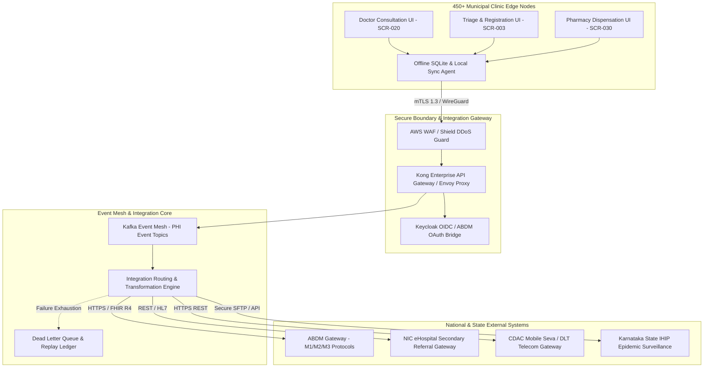

# Master Integration Architecture, Interoperability Topology & Boundary Gateway Framework
## Namma Clinic Digital Health & Operations Platform
### Greater Bengaluru Authority (GBA) / BBMP Health Department
**Document Code:** `INT-DOC-01` | **Status:** APPROVED BASELINE | **Date:** September 2026

---

## 1. Executive Summary & Interoperability Charter
This document formalizes the authoritative **Master Integration Architecture, Interoperability Topology, and Boundary Gateway Framework** for the Namma Clinic Digital Health Platform. The primary operational mission of the integration layer is to seamlessly, securely, and deterministically connect 450+ municipal primary health centers across the Greater Bengaluru Authority with sovereign state and national digital health ecosystems. These include the Ayushman Bharat Digital Mission (ABDM), NIC eHospital referral systems, Karnataka State Department of Health & Family Welfare reporting platforms, CDAC Mobile Seva SMS infrastructure, and municipal disease surveillance networks. Architected in strict compliance with the Digital Personal Data Protection Act (DPDP) 2023, National Digital Health Blueprint (NDHB), and MeitY Interoperability Standards, the integration architecture guarantees zero unencrypted transit of Protected Health Information (PHI), resilient offline-first operation, and sub-second deterministic RPC for frontline clinical consultations.

### 1.1 Non-Negotiable Integration Invariants
1. **Zero Unencrypted PHI in Transit:** Every external and inter-service payload carrying Protected Health Information (PHI) or Personally Identifiable Information (PII) must be encrypted using TLS 1.3 in transit with Mutual TLS (mTLS) certificate pinning.
2. **Sovereign Boundary & DPDP Invariant:** No clinical or demographic data shall traverse or reside outside sovereign Indian territory. All external integration gateways terminate strictly within MeitY-empanelled cloud regions.
3. **Asynchronous Decoupling for Resiliency:** All write-heavy and reporting integrations must be asynchronously decoupled via durable event streams (Kafka / SQS), guaranteeing that municipal clinic operations proceed without interruption even during complete upstream partner downtime.
4. **Deterministic Idempotency:** Every inbound and outbound integration transaction must include a cryptographically unique `Idempotency-Key` (UUIDv4) and SHA-256 payload digest to prevent duplicate processing, financial discrepancies, or duplicate clinical orders.
5. **Mandatory Dead Letter Queue (DLQ) Routing:** Any message or API call failing after exhaustion of exponential backoff retry policies must be routed to an auditable Dead Letter Queue with human-in-the-loop operational replay capabilities.

## 2. Master Integration Topology & Network Boundary Diagram


### Integration Specification Example: Integration Gateway Boundary Router
<!-- DOCUMENTATION-ONLY EXAMPLE -->
```python
# DOCUMENTATION-ONLY PYTHON
# DOCUMENTATION-ONLY PYTHON: Enterprise Integration Gateway Router
import uuid
import datetime
from typing import Dict, Any

class EnterpriseIntegrationGatewayRouter:
    """
    Directs outbound integration requests across secure protocol adapters,
    enforcing cryptographic idempotency, DPDP data redaction, and retry policies.
    """
    def __init__(self, keycloak_client: Any, audit_ledger: Any, dlq_publisher: Any):
        self.keycloak = keycloak_client
        self.audit = audit_ledger
        self.dlq = dlq_publisher

    def route_outbound_transaction(
        self,
        integration_id: str,
        target_system: str,
        payload: Dict[str, Any],
        idempotency_key: str = None
    ) -> Dict[str, Any]:
        tx_id = idempotency_key or str(uuid.uuid4())
        timestamp = datetime.datetime.utcnow().isoformat()

        # 1. Assert valid mTLS session and OIDC token
        token = self.keycloak.get_system_token(target_system)

        # 2. Immutable pre-flight audit logging
        self.audit.record_outbound_intent(tx_id, integration_id, target_system, timestamp)

        # 3. Dispatch payload with structured boundary metadata
        boundary_packet = {
            "transaction_id": tx_id,
            "integration_id": integration_id,
            "target_system": target_system,
            "timestamp": timestamp,
            "auth_header": f"Bearer {token}",
            "body": payload,
            "compliance_attestation": "DPDP_ACT_2023_SOVEREIGN_IN_STATE"
        }
        return boundary_packet
```

### OpenAPI Interface Contract: Integration Dispatch Boundary Contract
<!-- DOCUMENTATION-ONLY EXAMPLE -->
```yaml
# DOCUMENTATION-ONLY OPENAPI
openapi: 3.0.3
info:
  title: Namma Clinic Enterprise Integration Boundary API
  version: 1.0.0
  description: Authoritative boundary gateway for external partner data exchange.
paths:
  /api/v1/integrations/dispatch:
    post:
      summary: Dispatch an outbound or mediated integration payload
      operationId: dispatchIntegrationPayload
      parameters:
        - name: X-Idempotency-Key
          in: header
          required: true
          schema:
            type: string
            format: uuid
        - name: X-Integration-Id
          in: header
          required: true
          schema:
            type: string
            example: "INT-001"
      requestBody:
        required: true
        content:
          application/json:
            schema:
              type: object
              properties:
                target_system:
                  type: string
                  example: "EXT-001"
                payload:
                  type: object
              required:
                - target_system
                - payload
      responses:
        '202':
          description: Integration payload accepted for mediated dispatch
        '400':
          description: Validation failure or missing idempotency key
        '502':
          description: Upstream external partner unavailable - routed to retry/DLQ
```

## 3. Master Catalog of 100 Enterprise Integrations
Authoritative registry of all 100 enterprise integration flows connecting Namma Clinic core services to external ecosystems:

### INT-001: Integration `integration_service_flow_001`
- **Integration Identifier:** `INT-001`
- **Title:** Enterprise Integration Interface 001 (ABDM / National Digital Health)
- **Functional Domain:** `ABDM / National Digital Health`
- **Source Node:** `ext_system_001`
- **Target Node:** `namma_clinic_backend`
- **Communication Protocol:** `HTTPS REST`
- **Authentication Mechanism:** `OAuth 2.0 / Mutual TLS`
- **Data Classification:** `RESTRICTED_PHI`
- **Directionality:** `INBOUND`
- **Frequency Cadence:** `SUB_SECOND_RPC`
- **Target SLA:** `p95 < 200ms, availability 99.95%`
- **Target SLO:** `Availability >= 99.95%, p99 latency < 400ms`
- **Retry Policy:** `RETRY-001`
- **Failure Degradation Behavior:** Circuit breaker trip after 5 consecutive failures, route to DLQ-INT-001
- **Security Controls:** SEC-INT-001, mTLS, Payload Encryption AES-256-GCM
- **Privacy Controls:** DPDP Consent Verification, Direct PII Masking, k-Anonymity Guard
- **Monitoring Probe:** `MON-INT-001`
- **Upstream Traceability:** `REQ-INT-001`
- **Downstream Backlog Link:** `EPIC-INT-001`
- **Verification Test:** `TEST-INT-001`

### INT-002: Integration `integration_service_flow_002`
- **Integration Identifier:** `INT-002`
- **Title:** Enterprise Integration Interface 002 (FHIR R4 Diagnostic & Clinical Exchange)
- **Functional Domain:** `FHIR R4 Diagnostic & Clinical Exchange`
- **Source Node:** `ext_system_002`
- **Target Node:** `namma_clinic_backend`
- **Communication Protocol:** `gRPC`
- **Authentication Mechanism:** `Keycloak OIDC JWT`
- **Data Classification:** `CONFIDENTIAL_CLINICAL`
- **Directionality:** `BIDIRECTIONAL`
- **Frequency Cadence:** `BATCH_HOURLY`
- **Target SLA:** `p95 < 250ms, availability 99.95%`
- **Target SLO:** `Availability >= 99.95%, p99 latency < 500ms`
- **Retry Policy:** `RETRY-002`
- **Failure Degradation Behavior:** Circuit breaker trip after 5 consecutive failures, route to DLQ-INT-002
- **Security Controls:** SEC-INT-002, mTLS, Payload Encryption AES-256-GCM
- **Privacy Controls:** DPDP Consent Verification, Direct PII Masking, k-Anonymity Guard
- **Monitoring Probe:** `MON-INT-002`
- **Upstream Traceability:** `REQ-INT-002`
- **Downstream Backlog Link:** `EPIC-INT-002`
- **Verification Test:** `TEST-INT-002`

### INT-003: Integration `integration_service_flow_003`
- **Integration Identifier:** `INT-003`
- **Title:** Enterprise Integration Interface 003 (e-Hospital Secondary / Tertiary Referral)
- **Functional Domain:** `e-Hospital Secondary / Tertiary Referral`
- **Source Node:** `namma_clinic_backend`
- **Target Node:** `ext_system_003`
- **Communication Protocol:** `Kafka Event Stream`
- **Authentication Mechanism:** `HMAC-SHA256 Signed Request`
- **Data Classification:** `CONFIDENTIAL_OPERATIONAL`
- **Directionality:** `OUTBOUND`
- **Frequency Cadence:** `DAILY_RECONCILED`
- **Target SLA:** `p95 < 300ms, availability 99.95%`
- **Target SLO:** `Availability >= 99.95%, p99 latency < 600ms`
- **Retry Policy:** `RETRY-003`
- **Failure Degradation Behavior:** Circuit breaker trip after 5 consecutive failures, route to DLQ-INT-003
- **Security Controls:** SEC-INT-003, mTLS, Payload Encryption AES-256-GCM
- **Privacy Controls:** DPDP Consent Verification, Direct PII Masking, k-Anonymity Guard
- **Monitoring Probe:** `MON-INT-003`
- **Upstream Traceability:** `REQ-INT-003`
- **Downstream Backlog Link:** `EPIC-INT-003`
- **Verification Test:** `TEST-INT-003`

### INT-004: Integration `integration_service_flow_004`
- **Integration Identifier:** `INT-004`
- **Title:** Enterprise Integration Interface 004 (SMS & Push Notification Gateway)
- **Functional Domain:** `SMS & Push Notification Gateway`
- **Source Node:** `ext_system_004`
- **Target Node:** `namma_clinic_backend`
- **Communication Protocol:** `SFTP MFT`
- **Authentication Mechanism:** `API Key with IP Pinning`
- **Data Classification:** `INTERNAL_ADMINISTRATIVE`
- **Directionality:** `INBOUND`
- **Frequency Cadence:** `REALTIME_STREAM`
- **Target SLA:** `p95 < 350ms, availability 99.95%`
- **Target SLO:** `Availability >= 99.95%, p99 latency < 700ms`
- **Retry Policy:** `RETRY-004`
- **Failure Degradation Behavior:** Circuit breaker trip after 5 consecutive failures, route to DLQ-INT-004
- **Security Controls:** SEC-INT-004, mTLS, Payload Encryption AES-256-GCM
- **Privacy Controls:** DPDP Consent Verification, Direct PII Masking, k-Anonymity Guard
- **Monitoring Probe:** `MON-INT-004`
- **Upstream Traceability:** `REQ-INT-004`
- **Downstream Backlog Link:** `EPIC-INT-004`
- **Verification Test:** `TEST-INT-004`

### INT-005: Integration `integration_service_flow_005`
- **Integration Identifier:** `INT-005`
- **Title:** Enterprise Integration Interface 005 (State Health & IDSP Epidemiological Reporting)
- **Functional Domain:** `State Health & IDSP Epidemiological Reporting`
- **Source Node:** `ext_system_005`
- **Target Node:** `namma_clinic_backend`
- **Communication Protocol:** `FHIR R4 over HTTPS`
- **Authentication Mechanism:** `mTLS with PKI Client Cert`
- **Data Classification:** `RESTRICTED_PHI`
- **Directionality:** `BIDIRECTIONAL`
- **Frequency Cadence:** `SUB_SECOND_RPC`
- **Target SLA:** `p95 < 150ms, availability 99.95%`
- **Target SLO:** `Availability >= 99.95%, p99 latency < 300ms`
- **Retry Policy:** `RETRY-005`
- **Failure Degradation Behavior:** Circuit breaker trip after 5 consecutive failures, route to DLQ-INT-005
- **Security Controls:** SEC-INT-005, mTLS, Payload Encryption AES-256-GCM
- **Privacy Controls:** DPDP Consent Verification, Direct PII Masking, k-Anonymity Guard
- **Monitoring Probe:** `MON-INT-005`
- **Upstream Traceability:** `REQ-INT-005`
- **Downstream Backlog Link:** `EPIC-INT-005`
- **Verification Test:** `TEST-INT-005`

### INT-006: Integration `integration_service_flow_006`
- **Integration Identifier:** `INT-006`
- **Title:** Enterprise Integration Interface 006 (Municipal Administrative & Financial Reporting)
- **Functional Domain:** `Municipal Administrative & Financial Reporting`
- **Source Node:** `namma_clinic_backend`
- **Target Node:** `ext_system_006`
- **Communication Protocol:** `HTTPS REST`
- **Authentication Mechanism:** `OAuth 2.0 / Mutual TLS`
- **Data Classification:** `CONFIDENTIAL_CLINICAL`
- **Directionality:** `OUTBOUND`
- **Frequency Cadence:** `BATCH_HOURLY`
- **Target SLA:** `p95 < 200ms, availability 99.95%`
- **Target SLO:** `Availability >= 99.95%, p99 latency < 400ms`
- **Retry Policy:** `RETRY-006`
- **Failure Degradation Behavior:** Circuit breaker trip after 5 consecutive failures, route to DLQ-INT-006
- **Security Controls:** SEC-INT-006, mTLS, Payload Encryption AES-256-GCM
- **Privacy Controls:** DPDP Consent Verification, Direct PII Masking, k-Anonymity Guard
- **Monitoring Probe:** `MON-INT-006`
- **Upstream Traceability:** `REQ-INT-006`
- **Downstream Backlog Link:** `EPIC-INT-006`
- **Verification Test:** `TEST-INT-006`

### INT-007: Integration `integration_service_flow_007`
- **Integration Identifier:** `INT-007`
- **Title:** Enterprise Integration Interface 007 (Diagnostic Laboratory Equipment & Analyzers)
- **Functional Domain:** `Diagnostic Laboratory Equipment & Analyzers`
- **Source Node:** `ext_system_007`
- **Target Node:** `namma_clinic_backend`
- **Communication Protocol:** `gRPC`
- **Authentication Mechanism:** `Keycloak OIDC JWT`
- **Data Classification:** `CONFIDENTIAL_OPERATIONAL`
- **Directionality:** `INBOUND`
- **Frequency Cadence:** `DAILY_RECONCILED`
- **Target SLA:** `p95 < 250ms, availability 99.95%`
- **Target SLO:** `Availability >= 99.95%, p99 latency < 500ms`
- **Retry Policy:** `RETRY-007`
- **Failure Degradation Behavior:** Circuit breaker trip after 5 consecutive failures, route to DLQ-INT-007
- **Security Controls:** SEC-INT-007, mTLS, Payload Encryption AES-256-GCM
- **Privacy Controls:** DPDP Consent Verification, Direct PII Masking, k-Anonymity Guard
- **Monitoring Probe:** `MON-INT-007`
- **Upstream Traceability:** `REQ-INT-007`
- **Downstream Backlog Link:** `EPIC-INT-007`
- **Verification Test:** `TEST-INT-007`

### INT-008: Integration `integration_service_flow_008`
- **Integration Identifier:** `INT-008`
- **Title:** Enterprise Integration Interface 008 (Pharmacy Logistics & Central Drug Warehouse)
- **Functional Domain:** `Pharmacy Logistics & Central Drug Warehouse`
- **Source Node:** `ext_system_008`
- **Target Node:** `namma_clinic_backend`
- **Communication Protocol:** `Kafka Event Stream`
- **Authentication Mechanism:** `HMAC-SHA256 Signed Request`
- **Data Classification:** `INTERNAL_ADMINISTRATIVE`
- **Directionality:** `BIDIRECTIONAL`
- **Frequency Cadence:** `REALTIME_STREAM`
- **Target SLA:** `p95 < 300ms, availability 99.95%`
- **Target SLO:** `Availability >= 99.95%, p99 latency < 600ms`
- **Retry Policy:** `RETRY-008`
- **Failure Degradation Behavior:** Circuit breaker trip after 5 consecutive failures, route to DLQ-INT-008
- **Security Controls:** SEC-INT-008, mTLS, Payload Encryption AES-256-GCM
- **Privacy Controls:** DPDP Consent Verification, Direct PII Masking, k-Anonymity Guard
- **Monitoring Probe:** `MON-INT-008`
- **Upstream Traceability:** `REQ-INT-008`
- **Downstream Backlog Link:** `EPIC-INT-008`
- **Verification Test:** `TEST-INT-008`

### INT-009: Integration `integration_service_flow_009`
- **Integration Identifier:** `INT-009`
- **Title:** Enterprise Integration Interface 009 (Aadhaar & e-KYC Identity Verification)
- **Functional Domain:** `Aadhaar & e-KYC Identity Verification`
- **Source Node:** `namma_clinic_backend`
- **Target Node:** `ext_system_009`
- **Communication Protocol:** `SFTP MFT`
- **Authentication Mechanism:** `API Key with IP Pinning`
- **Data Classification:** `RESTRICTED_PHI`
- **Directionality:** `OUTBOUND`
- **Frequency Cadence:** `SUB_SECOND_RPC`
- **Target SLA:** `p95 < 350ms, availability 99.95%`
- **Target SLO:** `Availability >= 99.95%, p99 latency < 700ms`
- **Retry Policy:** `RETRY-009`
- **Failure Degradation Behavior:** Circuit breaker trip after 5 consecutive failures, route to DLQ-INT-009
- **Security Controls:** SEC-INT-009, mTLS, Payload Encryption AES-256-GCM
- **Privacy Controls:** DPDP Consent Verification, Direct PII Masking, k-Anonymity Guard
- **Monitoring Probe:** `MON-INT-009`
- **Upstream Traceability:** `REQ-INT-009`
- **Downstream Backlog Link:** `EPIC-INT-009`
- **Verification Test:** `TEST-INT-009`

### INT-010: Integration `integration_service_flow_010`
- **Integration Identifier:** `INT-010`
- **Title:** Enterprise Integration Interface 010 (Citizen Health Locker & Portability Export)
- **Functional Domain:** `Citizen Health Locker & Portability Export`
- **Source Node:** `ext_system_010`
- **Target Node:** `namma_clinic_backend`
- **Communication Protocol:** `FHIR R4 over HTTPS`
- **Authentication Mechanism:** `mTLS with PKI Client Cert`
- **Data Classification:** `CONFIDENTIAL_CLINICAL`
- **Directionality:** `INBOUND`
- **Frequency Cadence:** `BATCH_HOURLY`
- **Target SLA:** `p95 < 150ms, availability 99.95%`
- **Target SLO:** `Availability >= 99.95%, p99 latency < 300ms`
- **Retry Policy:** `RETRY-010`
- **Failure Degradation Behavior:** Circuit breaker trip after 5 consecutive failures, route to DLQ-INT-010
- **Security Controls:** SEC-INT-010, mTLS, Payload Encryption AES-256-GCM
- **Privacy Controls:** DPDP Consent Verification, Direct PII Masking, k-Anonymity Guard
- **Monitoring Probe:** `MON-INT-010`
- **Upstream Traceability:** `REQ-INT-010`
- **Downstream Backlog Link:** `EPIC-INT-010`
- **Verification Test:** `TEST-INT-010`

### INT-011: Integration `integration_service_flow_011`
- **Integration Identifier:** `INT-011`
- **Title:** Enterprise Integration Interface 011 (Geospatial GIS & BBMP Ward Demographics)
- **Functional Domain:** `Geospatial GIS & BBMP Ward Demographics`
- **Source Node:** `ext_system_011`
- **Target Node:** `namma_clinic_backend`
- **Communication Protocol:** `HTTPS REST`
- **Authentication Mechanism:** `OAuth 2.0 / Mutual TLS`
- **Data Classification:** `CONFIDENTIAL_OPERATIONAL`
- **Directionality:** `BIDIRECTIONAL`
- **Frequency Cadence:** `DAILY_RECONCILED`
- **Target SLA:** `p95 < 200ms, availability 99.95%`
- **Target SLO:** `Availability >= 99.95%, p99 latency < 400ms`
- **Retry Policy:** `RETRY-011`
- **Failure Degradation Behavior:** Circuit breaker trip after 5 consecutive failures, route to DLQ-INT-011
- **Security Controls:** SEC-INT-011, mTLS, Payload Encryption AES-256-GCM
- **Privacy Controls:** DPDP Consent Verification, Direct PII Masking, k-Anonymity Guard
- **Monitoring Probe:** `MON-INT-011`
- **Upstream Traceability:** `REQ-INT-011`
- **Downstream Backlog Link:** `EPIC-INT-011`
- **Verification Test:** `TEST-INT-011`

### INT-012: Integration `integration_service_flow_012`
- **Integration Identifier:** `INT-012`
- **Title:** Enterprise Integration Interface 012 (ASHA Community Health Worker Sync)
- **Functional Domain:** `ASHA Community Health Worker Sync`
- **Source Node:** `namma_clinic_backend`
- **Target Node:** `ext_system_012`
- **Communication Protocol:** `gRPC`
- **Authentication Mechanism:** `Keycloak OIDC JWT`
- **Data Classification:** `INTERNAL_ADMINISTRATIVE`
- **Directionality:** `OUTBOUND`
- **Frequency Cadence:** `REALTIME_STREAM`
- **Target SLA:** `p95 < 250ms, availability 99.95%`
- **Target SLO:** `Availability >= 99.95%, p99 latency < 500ms`
- **Retry Policy:** `RETRY-012`
- **Failure Degradation Behavior:** Circuit breaker trip after 5 consecutive failures, route to DLQ-INT-012
- **Security Controls:** SEC-INT-012, mTLS, Payload Encryption AES-256-GCM
- **Privacy Controls:** DPDP Consent Verification, Direct PII Masking, k-Anonymity Guard
- **Monitoring Probe:** `MON-INT-012`
- **Upstream Traceability:** `REQ-INT-012`
- **Downstream Backlog Link:** `EPIC-INT-012`
- **Verification Test:** `TEST-INT-012`

### INT-013: Integration `integration_service_flow_013`
- **Integration Identifier:** `INT-013`
- **Title:** Enterprise Integration Interface 013 (Emergency 108 Ambulance Dispatch Exchange)
- **Functional Domain:** `Emergency 108 Ambulance Dispatch Exchange`
- **Source Node:** `ext_system_013`
- **Target Node:** `namma_clinic_backend`
- **Communication Protocol:** `Kafka Event Stream`
- **Authentication Mechanism:** `HMAC-SHA256 Signed Request`
- **Data Classification:** `RESTRICTED_PHI`
- **Directionality:** `INBOUND`
- **Frequency Cadence:** `SUB_SECOND_RPC`
- **Target SLA:** `p95 < 300ms, availability 99.95%`
- **Target SLO:** `Availability >= 99.95%, p99 latency < 600ms`
- **Retry Policy:** `RETRY-013`
- **Failure Degradation Behavior:** Circuit breaker trip after 5 consecutive failures, route to DLQ-INT-013
- **Security Controls:** SEC-INT-013, mTLS, Payload Encryption AES-256-GCM
- **Privacy Controls:** DPDP Consent Verification, Direct PII Masking, k-Anonymity Guard
- **Monitoring Probe:** `MON-INT-013`
- **Upstream Traceability:** `REQ-INT-013`
- **Downstream Backlog Link:** `EPIC-INT-013`
- **Verification Test:** `TEST-INT-013`

### INT-014: Integration `integration_service_flow_014`
- **Integration Identifier:** `INT-014`
- **Title:** Enterprise Integration Interface 014 (Teleconsultation & Video Gateway)
- **Functional Domain:** `Teleconsultation & Video Gateway`
- **Source Node:** `ext_system_014`
- **Target Node:** `namma_clinic_backend`
- **Communication Protocol:** `SFTP MFT`
- **Authentication Mechanism:** `API Key with IP Pinning`
- **Data Classification:** `CONFIDENTIAL_CLINICAL`
- **Directionality:** `BIDIRECTIONAL`
- **Frequency Cadence:** `BATCH_HOURLY`
- **Target SLA:** `p95 < 350ms, availability 99.95%`
- **Target SLO:** `Availability >= 99.95%, p99 latency < 700ms`
- **Retry Policy:** `RETRY-014`
- **Failure Degradation Behavior:** Circuit breaker trip after 5 consecutive failures, route to DLQ-INT-014
- **Security Controls:** SEC-INT-014, mTLS, Payload Encryption AES-256-GCM
- **Privacy Controls:** DPDP Consent Verification, Direct PII Masking, k-Anonymity Guard
- **Monitoring Probe:** `MON-INT-014`
- **Upstream Traceability:** `REQ-INT-014`
- **Downstream Backlog Link:** `EPIC-INT-014`
- **Verification Test:** `TEST-INT-014`

### INT-015: Integration `integration_service_flow_015`
- **Integration Identifier:** `INT-015`
- **Title:** Enterprise Integration Interface 015 (Data Lakehouse & Columnar Analytics CDC)
- **Functional Domain:** `Data Lakehouse & Columnar Analytics CDC`
- **Source Node:** `namma_clinic_backend`
- **Target Node:** `ext_system_015`
- **Communication Protocol:** `FHIR R4 over HTTPS`
- **Authentication Mechanism:** `mTLS with PKI Client Cert`
- **Data Classification:** `CONFIDENTIAL_OPERATIONAL`
- **Directionality:** `OUTBOUND`
- **Frequency Cadence:** `DAILY_RECONCILED`
- **Target SLA:** `p95 < 150ms, availability 99.95%`
- **Target SLO:** `Availability >= 99.95%, p99 latency < 300ms`
- **Retry Policy:** `RETRY-015`
- **Failure Degradation Behavior:** Circuit breaker trip after 5 consecutive failures, route to DLQ-INT-015
- **Security Controls:** SEC-INT-015, mTLS, Payload Encryption AES-256-GCM
- **Privacy Controls:** DPDP Consent Verification, Direct PII Masking, k-Anonymity Guard
- **Monitoring Probe:** `MON-INT-015`
- **Upstream Traceability:** `REQ-INT-015`
- **Downstream Backlog Link:** `EPIC-INT-015`
- **Verification Test:** `TEST-INT-015`

### INT-016: Integration `integration_service_flow_016`
- **Integration Identifier:** `INT-016`
- **Title:** Enterprise Integration Interface 016 (ABDM / National Digital Health)
- **Functional Domain:** `ABDM / National Digital Health`
- **Source Node:** `ext_system_016`
- **Target Node:** `namma_clinic_backend`
- **Communication Protocol:** `HTTPS REST`
- **Authentication Mechanism:** `OAuth 2.0 / Mutual TLS`
- **Data Classification:** `INTERNAL_ADMINISTRATIVE`
- **Directionality:** `INBOUND`
- **Frequency Cadence:** `REALTIME_STREAM`
- **Target SLA:** `p95 < 200ms, availability 99.95%`
- **Target SLO:** `Availability >= 99.95%, p99 latency < 400ms`
- **Retry Policy:** `RETRY-016`
- **Failure Degradation Behavior:** Circuit breaker trip after 5 consecutive failures, route to DLQ-INT-016
- **Security Controls:** SEC-INT-016, mTLS, Payload Encryption AES-256-GCM
- **Privacy Controls:** DPDP Consent Verification, Direct PII Masking, k-Anonymity Guard
- **Monitoring Probe:** `MON-INT-016`
- **Upstream Traceability:** `REQ-INT-016`
- **Downstream Backlog Link:** `EPIC-INT-016`
- **Verification Test:** `TEST-INT-016`

### INT-017: Integration `integration_service_flow_017`
- **Integration Identifier:** `INT-017`
- **Title:** Enterprise Integration Interface 017 (FHIR R4 Diagnostic & Clinical Exchange)
- **Functional Domain:** `FHIR R4 Diagnostic & Clinical Exchange`
- **Source Node:** `ext_system_017`
- **Target Node:** `namma_clinic_backend`
- **Communication Protocol:** `gRPC`
- **Authentication Mechanism:** `Keycloak OIDC JWT`
- **Data Classification:** `RESTRICTED_PHI`
- **Directionality:** `BIDIRECTIONAL`
- **Frequency Cadence:** `SUB_SECOND_RPC`
- **Target SLA:** `p95 < 250ms, availability 99.95%`
- **Target SLO:** `Availability >= 99.95%, p99 latency < 500ms`
- **Retry Policy:** `RETRY-017`
- **Failure Degradation Behavior:** Circuit breaker trip after 5 consecutive failures, route to DLQ-INT-017
- **Security Controls:** SEC-INT-017, mTLS, Payload Encryption AES-256-GCM
- **Privacy Controls:** DPDP Consent Verification, Direct PII Masking, k-Anonymity Guard
- **Monitoring Probe:** `MON-INT-017`
- **Upstream Traceability:** `REQ-INT-017`
- **Downstream Backlog Link:** `EPIC-INT-017`
- **Verification Test:** `TEST-INT-017`

### INT-018: Integration `integration_service_flow_018`
- **Integration Identifier:** `INT-018`
- **Title:** Enterprise Integration Interface 018 (e-Hospital Secondary / Tertiary Referral)
- **Functional Domain:** `e-Hospital Secondary / Tertiary Referral`
- **Source Node:** `namma_clinic_backend`
- **Target Node:** `ext_system_018`
- **Communication Protocol:** `Kafka Event Stream`
- **Authentication Mechanism:** `HMAC-SHA256 Signed Request`
- **Data Classification:** `CONFIDENTIAL_CLINICAL`
- **Directionality:** `OUTBOUND`
- **Frequency Cadence:** `BATCH_HOURLY`
- **Target SLA:** `p95 < 300ms, availability 99.95%`
- **Target SLO:** `Availability >= 99.95%, p99 latency < 600ms`
- **Retry Policy:** `RETRY-018`
- **Failure Degradation Behavior:** Circuit breaker trip after 5 consecutive failures, route to DLQ-INT-018
- **Security Controls:** SEC-INT-018, mTLS, Payload Encryption AES-256-GCM
- **Privacy Controls:** DPDP Consent Verification, Direct PII Masking, k-Anonymity Guard
- **Monitoring Probe:** `MON-INT-018`
- **Upstream Traceability:** `REQ-INT-018`
- **Downstream Backlog Link:** `EPIC-INT-018`
- **Verification Test:** `TEST-INT-018`

### INT-019: Integration `integration_service_flow_019`
- **Integration Identifier:** `INT-019`
- **Title:** Enterprise Integration Interface 019 (SMS & Push Notification Gateway)
- **Functional Domain:** `SMS & Push Notification Gateway`
- **Source Node:** `ext_system_019`
- **Target Node:** `namma_clinic_backend`
- **Communication Protocol:** `SFTP MFT`
- **Authentication Mechanism:** `API Key with IP Pinning`
- **Data Classification:** `CONFIDENTIAL_OPERATIONAL`
- **Directionality:** `INBOUND`
- **Frequency Cadence:** `DAILY_RECONCILED`
- **Target SLA:** `p95 < 350ms, availability 99.95%`
- **Target SLO:** `Availability >= 99.95%, p99 latency < 700ms`
- **Retry Policy:** `RETRY-019`
- **Failure Degradation Behavior:** Circuit breaker trip after 5 consecutive failures, route to DLQ-INT-019
- **Security Controls:** SEC-INT-019, mTLS, Payload Encryption AES-256-GCM
- **Privacy Controls:** DPDP Consent Verification, Direct PII Masking, k-Anonymity Guard
- **Monitoring Probe:** `MON-INT-019`
- **Upstream Traceability:** `REQ-INT-019`
- **Downstream Backlog Link:** `EPIC-INT-019`
- **Verification Test:** `TEST-INT-019`

### INT-020: Integration `integration_service_flow_020`
- **Integration Identifier:** `INT-020`
- **Title:** Enterprise Integration Interface 020 (State Health & IDSP Epidemiological Reporting)
- **Functional Domain:** `State Health & IDSP Epidemiological Reporting`
- **Source Node:** `ext_system_020`
- **Target Node:** `namma_clinic_backend`
- **Communication Protocol:** `FHIR R4 over HTTPS`
- **Authentication Mechanism:** `mTLS with PKI Client Cert`
- **Data Classification:** `INTERNAL_ADMINISTRATIVE`
- **Directionality:** `BIDIRECTIONAL`
- **Frequency Cadence:** `REALTIME_STREAM`
- **Target SLA:** `p95 < 150ms, availability 99.95%`
- **Target SLO:** `Availability >= 99.95%, p99 latency < 300ms`
- **Retry Policy:** `RETRY-020`
- **Failure Degradation Behavior:** Circuit breaker trip after 5 consecutive failures, route to DLQ-INT-020
- **Security Controls:** SEC-INT-020, mTLS, Payload Encryption AES-256-GCM
- **Privacy Controls:** DPDP Consent Verification, Direct PII Masking, k-Anonymity Guard
- **Monitoring Probe:** `MON-INT-020`
- **Upstream Traceability:** `REQ-INT-020`
- **Downstream Backlog Link:** `EPIC-INT-020`
- **Verification Test:** `TEST-INT-020`

### INT-021: Integration `integration_service_flow_021`
- **Integration Identifier:** `INT-021`
- **Title:** Enterprise Integration Interface 021 (Municipal Administrative & Financial Reporting)
- **Functional Domain:** `Municipal Administrative & Financial Reporting`
- **Source Node:** `namma_clinic_backend`
- **Target Node:** `ext_system_021`
- **Communication Protocol:** `HTTPS REST`
- **Authentication Mechanism:** `OAuth 2.0 / Mutual TLS`
- **Data Classification:** `RESTRICTED_PHI`
- **Directionality:** `OUTBOUND`
- **Frequency Cadence:** `SUB_SECOND_RPC`
- **Target SLA:** `p95 < 200ms, availability 99.95%`
- **Target SLO:** `Availability >= 99.95%, p99 latency < 400ms`
- **Retry Policy:** `RETRY-021`
- **Failure Degradation Behavior:** Circuit breaker trip after 5 consecutive failures, route to DLQ-INT-021
- **Security Controls:** SEC-INT-021, mTLS, Payload Encryption AES-256-GCM
- **Privacy Controls:** DPDP Consent Verification, Direct PII Masking, k-Anonymity Guard
- **Monitoring Probe:** `MON-INT-021`
- **Upstream Traceability:** `REQ-INT-021`
- **Downstream Backlog Link:** `EPIC-INT-001`
- **Verification Test:** `TEST-INT-021`

### INT-022: Integration `integration_service_flow_022`
- **Integration Identifier:** `INT-022`
- **Title:** Enterprise Integration Interface 022 (Diagnostic Laboratory Equipment & Analyzers)
- **Functional Domain:** `Diagnostic Laboratory Equipment & Analyzers`
- **Source Node:** `ext_system_022`
- **Target Node:** `namma_clinic_backend`
- **Communication Protocol:** `gRPC`
- **Authentication Mechanism:** `Keycloak OIDC JWT`
- **Data Classification:** `CONFIDENTIAL_CLINICAL`
- **Directionality:** `INBOUND`
- **Frequency Cadence:** `BATCH_HOURLY`
- **Target SLA:** `p95 < 250ms, availability 99.95%`
- **Target SLO:** `Availability >= 99.95%, p99 latency < 500ms`
- **Retry Policy:** `RETRY-022`
- **Failure Degradation Behavior:** Circuit breaker trip after 5 consecutive failures, route to DLQ-INT-022
- **Security Controls:** SEC-INT-022, mTLS, Payload Encryption AES-256-GCM
- **Privacy Controls:** DPDP Consent Verification, Direct PII Masking, k-Anonymity Guard
- **Monitoring Probe:** `MON-INT-022`
- **Upstream Traceability:** `REQ-INT-022`
- **Downstream Backlog Link:** `EPIC-INT-002`
- **Verification Test:** `TEST-INT-022`

### INT-023: Integration `integration_service_flow_023`
- **Integration Identifier:** `INT-023`
- **Title:** Enterprise Integration Interface 023 (Pharmacy Logistics & Central Drug Warehouse)
- **Functional Domain:** `Pharmacy Logistics & Central Drug Warehouse`
- **Source Node:** `ext_system_023`
- **Target Node:** `namma_clinic_backend`
- **Communication Protocol:** `Kafka Event Stream`
- **Authentication Mechanism:** `HMAC-SHA256 Signed Request`
- **Data Classification:** `CONFIDENTIAL_OPERATIONAL`
- **Directionality:** `BIDIRECTIONAL`
- **Frequency Cadence:** `DAILY_RECONCILED`
- **Target SLA:** `p95 < 300ms, availability 99.95%`
- **Target SLO:** `Availability >= 99.95%, p99 latency < 600ms`
- **Retry Policy:** `RETRY-023`
- **Failure Degradation Behavior:** Circuit breaker trip after 5 consecutive failures, route to DLQ-INT-023
- **Security Controls:** SEC-INT-023, mTLS, Payload Encryption AES-256-GCM
- **Privacy Controls:** DPDP Consent Verification, Direct PII Masking, k-Anonymity Guard
- **Monitoring Probe:** `MON-INT-023`
- **Upstream Traceability:** `REQ-INT-023`
- **Downstream Backlog Link:** `EPIC-INT-003`
- **Verification Test:** `TEST-INT-023`

### INT-024: Integration `integration_service_flow_024`
- **Integration Identifier:** `INT-024`
- **Title:** Enterprise Integration Interface 024 (Aadhaar & e-KYC Identity Verification)
- **Functional Domain:** `Aadhaar & e-KYC Identity Verification`
- **Source Node:** `namma_clinic_backend`
- **Target Node:** `ext_system_024`
- **Communication Protocol:** `SFTP MFT`
- **Authentication Mechanism:** `API Key with IP Pinning`
- **Data Classification:** `INTERNAL_ADMINISTRATIVE`
- **Directionality:** `OUTBOUND`
- **Frequency Cadence:** `REALTIME_STREAM`
- **Target SLA:** `p95 < 350ms, availability 99.95%`
- **Target SLO:** `Availability >= 99.95%, p99 latency < 700ms`
- **Retry Policy:** `RETRY-024`
- **Failure Degradation Behavior:** Circuit breaker trip after 5 consecutive failures, route to DLQ-INT-024
- **Security Controls:** SEC-INT-024, mTLS, Payload Encryption AES-256-GCM
- **Privacy Controls:** DPDP Consent Verification, Direct PII Masking, k-Anonymity Guard
- **Monitoring Probe:** `MON-INT-024`
- **Upstream Traceability:** `REQ-INT-024`
- **Downstream Backlog Link:** `EPIC-INT-004`
- **Verification Test:** `TEST-INT-024`

### INT-025: Integration `integration_service_flow_025`
- **Integration Identifier:** `INT-025`
- **Title:** Enterprise Integration Interface 025 (Citizen Health Locker & Portability Export)
- **Functional Domain:** `Citizen Health Locker & Portability Export`
- **Source Node:** `ext_system_025`
- **Target Node:** `namma_clinic_backend`
- **Communication Protocol:** `FHIR R4 over HTTPS`
- **Authentication Mechanism:** `mTLS with PKI Client Cert`
- **Data Classification:** `RESTRICTED_PHI`
- **Directionality:** `INBOUND`
- **Frequency Cadence:** `SUB_SECOND_RPC`
- **Target SLA:** `p95 < 150ms, availability 99.95%`
- **Target SLO:** `Availability >= 99.95%, p99 latency < 300ms`
- **Retry Policy:** `RETRY-025`
- **Failure Degradation Behavior:** Circuit breaker trip after 5 consecutive failures, route to DLQ-INT-025
- **Security Controls:** SEC-INT-025, mTLS, Payload Encryption AES-256-GCM
- **Privacy Controls:** DPDP Consent Verification, Direct PII Masking, k-Anonymity Guard
- **Monitoring Probe:** `MON-INT-025`
- **Upstream Traceability:** `REQ-INT-025`
- **Downstream Backlog Link:** `EPIC-INT-005`
- **Verification Test:** `TEST-INT-025`

### INT-026: Integration `integration_service_flow_026`
- **Integration Identifier:** `INT-026`
- **Title:** Enterprise Integration Interface 026 (Geospatial GIS & BBMP Ward Demographics)
- **Functional Domain:** `Geospatial GIS & BBMP Ward Demographics`
- **Source Node:** `ext_system_026`
- **Target Node:** `namma_clinic_backend`
- **Communication Protocol:** `HTTPS REST`
- **Authentication Mechanism:** `OAuth 2.0 / Mutual TLS`
- **Data Classification:** `CONFIDENTIAL_CLINICAL`
- **Directionality:** `BIDIRECTIONAL`
- **Frequency Cadence:** `BATCH_HOURLY`
- **Target SLA:** `p95 < 200ms, availability 99.95%`
- **Target SLO:** `Availability >= 99.95%, p99 latency < 400ms`
- **Retry Policy:** `RETRY-001`
- **Failure Degradation Behavior:** Circuit breaker trip after 5 consecutive failures, route to DLQ-INT-026
- **Security Controls:** SEC-INT-026, mTLS, Payload Encryption AES-256-GCM
- **Privacy Controls:** DPDP Consent Verification, Direct PII Masking, k-Anonymity Guard
- **Monitoring Probe:** `MON-INT-026`
- **Upstream Traceability:** `REQ-INT-026`
- **Downstream Backlog Link:** `EPIC-INT-006`
- **Verification Test:** `TEST-INT-026`

### INT-027: Integration `integration_service_flow_027`
- **Integration Identifier:** `INT-027`
- **Title:** Enterprise Integration Interface 027 (ASHA Community Health Worker Sync)
- **Functional Domain:** `ASHA Community Health Worker Sync`
- **Source Node:** `namma_clinic_backend`
- **Target Node:** `ext_system_027`
- **Communication Protocol:** `gRPC`
- **Authentication Mechanism:** `Keycloak OIDC JWT`
- **Data Classification:** `CONFIDENTIAL_OPERATIONAL`
- **Directionality:** `OUTBOUND`
- **Frequency Cadence:** `DAILY_RECONCILED`
- **Target SLA:** `p95 < 250ms, availability 99.95%`
- **Target SLO:** `Availability >= 99.95%, p99 latency < 500ms`
- **Retry Policy:** `RETRY-002`
- **Failure Degradation Behavior:** Circuit breaker trip after 5 consecutive failures, route to DLQ-INT-027
- **Security Controls:** SEC-INT-027, mTLS, Payload Encryption AES-256-GCM
- **Privacy Controls:** DPDP Consent Verification, Direct PII Masking, k-Anonymity Guard
- **Monitoring Probe:** `MON-INT-027`
- **Upstream Traceability:** `REQ-INT-027`
- **Downstream Backlog Link:** `EPIC-INT-007`
- **Verification Test:** `TEST-INT-027`

### INT-028: Integration `integration_service_flow_028`
- **Integration Identifier:** `INT-028`
- **Title:** Enterprise Integration Interface 028 (Emergency 108 Ambulance Dispatch Exchange)
- **Functional Domain:** `Emergency 108 Ambulance Dispatch Exchange`
- **Source Node:** `ext_system_028`
- **Target Node:** `namma_clinic_backend`
- **Communication Protocol:** `Kafka Event Stream`
- **Authentication Mechanism:** `HMAC-SHA256 Signed Request`
- **Data Classification:** `INTERNAL_ADMINISTRATIVE`
- **Directionality:** `INBOUND`
- **Frequency Cadence:** `REALTIME_STREAM`
- **Target SLA:** `p95 < 300ms, availability 99.95%`
- **Target SLO:** `Availability >= 99.95%, p99 latency < 600ms`
- **Retry Policy:** `RETRY-003`
- **Failure Degradation Behavior:** Circuit breaker trip after 5 consecutive failures, route to DLQ-INT-028
- **Security Controls:** SEC-INT-028, mTLS, Payload Encryption AES-256-GCM
- **Privacy Controls:** DPDP Consent Verification, Direct PII Masking, k-Anonymity Guard
- **Monitoring Probe:** `MON-INT-028`
- **Upstream Traceability:** `REQ-INT-028`
- **Downstream Backlog Link:** `EPIC-INT-008`
- **Verification Test:** `TEST-INT-028`

### INT-029: Integration `integration_service_flow_029`
- **Integration Identifier:** `INT-029`
- **Title:** Enterprise Integration Interface 029 (Teleconsultation & Video Gateway)
- **Functional Domain:** `Teleconsultation & Video Gateway`
- **Source Node:** `ext_system_029`
- **Target Node:** `namma_clinic_backend`
- **Communication Protocol:** `SFTP MFT`
- **Authentication Mechanism:** `API Key with IP Pinning`
- **Data Classification:** `RESTRICTED_PHI`
- **Directionality:** `BIDIRECTIONAL`
- **Frequency Cadence:** `SUB_SECOND_RPC`
- **Target SLA:** `p95 < 350ms, availability 99.95%`
- **Target SLO:** `Availability >= 99.95%, p99 latency < 700ms`
- **Retry Policy:** `RETRY-004`
- **Failure Degradation Behavior:** Circuit breaker trip after 5 consecutive failures, route to DLQ-INT-029
- **Security Controls:** SEC-INT-029, mTLS, Payload Encryption AES-256-GCM
- **Privacy Controls:** DPDP Consent Verification, Direct PII Masking, k-Anonymity Guard
- **Monitoring Probe:** `MON-INT-029`
- **Upstream Traceability:** `REQ-INT-029`
- **Downstream Backlog Link:** `EPIC-INT-009`
- **Verification Test:** `TEST-INT-029`

### INT-030: Integration `integration_service_flow_030`
- **Integration Identifier:** `INT-030`
- **Title:** Enterprise Integration Interface 030 (Data Lakehouse & Columnar Analytics CDC)
- **Functional Domain:** `Data Lakehouse & Columnar Analytics CDC`
- **Source Node:** `namma_clinic_backend`
- **Target Node:** `ext_system_030`
- **Communication Protocol:** `FHIR R4 over HTTPS`
- **Authentication Mechanism:** `mTLS with PKI Client Cert`
- **Data Classification:** `CONFIDENTIAL_CLINICAL`
- **Directionality:** `OUTBOUND`
- **Frequency Cadence:** `BATCH_HOURLY`
- **Target SLA:** `p95 < 150ms, availability 99.95%`
- **Target SLO:** `Availability >= 99.95%, p99 latency < 300ms`
- **Retry Policy:** `RETRY-005`
- **Failure Degradation Behavior:** Circuit breaker trip after 5 consecutive failures, route to DLQ-INT-030
- **Security Controls:** SEC-INT-030, mTLS, Payload Encryption AES-256-GCM
- **Privacy Controls:** DPDP Consent Verification, Direct PII Masking, k-Anonymity Guard
- **Monitoring Probe:** `MON-INT-030`
- **Upstream Traceability:** `REQ-INT-030`
- **Downstream Backlog Link:** `EPIC-INT-010`
- **Verification Test:** `TEST-INT-030`

### INT-031: Integration `integration_service_flow_031`
- **Integration Identifier:** `INT-031`
- **Title:** Enterprise Integration Interface 031 (ABDM / National Digital Health)
- **Functional Domain:** `ABDM / National Digital Health`
- **Source Node:** `ext_system_031`
- **Target Node:** `namma_clinic_backend`
- **Communication Protocol:** `HTTPS REST`
- **Authentication Mechanism:** `OAuth 2.0 / Mutual TLS`
- **Data Classification:** `CONFIDENTIAL_OPERATIONAL`
- **Directionality:** `INBOUND`
- **Frequency Cadence:** `DAILY_RECONCILED`
- **Target SLA:** `p95 < 200ms, availability 99.95%`
- **Target SLO:** `Availability >= 99.95%, p99 latency < 400ms`
- **Retry Policy:** `RETRY-006`
- **Failure Degradation Behavior:** Circuit breaker trip after 5 consecutive failures, route to DLQ-INT-031
- **Security Controls:** SEC-INT-031, mTLS, Payload Encryption AES-256-GCM
- **Privacy Controls:** DPDP Consent Verification, Direct PII Masking, k-Anonymity Guard
- **Monitoring Probe:** `MON-INT-031`
- **Upstream Traceability:** `REQ-INT-031`
- **Downstream Backlog Link:** `EPIC-INT-011`
- **Verification Test:** `TEST-INT-031`

### INT-032: Integration `integration_service_flow_032`
- **Integration Identifier:** `INT-032`
- **Title:** Enterprise Integration Interface 032 (FHIR R4 Diagnostic & Clinical Exchange)
- **Functional Domain:** `FHIR R4 Diagnostic & Clinical Exchange`
- **Source Node:** `ext_system_032`
- **Target Node:** `namma_clinic_backend`
- **Communication Protocol:** `gRPC`
- **Authentication Mechanism:** `Keycloak OIDC JWT`
- **Data Classification:** `INTERNAL_ADMINISTRATIVE`
- **Directionality:** `BIDIRECTIONAL`
- **Frequency Cadence:** `REALTIME_STREAM`
- **Target SLA:** `p95 < 250ms, availability 99.95%`
- **Target SLO:** `Availability >= 99.95%, p99 latency < 500ms`
- **Retry Policy:** `RETRY-007`
- **Failure Degradation Behavior:** Circuit breaker trip after 5 consecutive failures, route to DLQ-INT-032
- **Security Controls:** SEC-INT-032, mTLS, Payload Encryption AES-256-GCM
- **Privacy Controls:** DPDP Consent Verification, Direct PII Masking, k-Anonymity Guard
- **Monitoring Probe:** `MON-INT-032`
- **Upstream Traceability:** `REQ-INT-032`
- **Downstream Backlog Link:** `EPIC-INT-012`
- **Verification Test:** `TEST-INT-032`

### INT-033: Integration `integration_service_flow_033`
- **Integration Identifier:** `INT-033`
- **Title:** Enterprise Integration Interface 033 (e-Hospital Secondary / Tertiary Referral)
- **Functional Domain:** `e-Hospital Secondary / Tertiary Referral`
- **Source Node:** `namma_clinic_backend`
- **Target Node:** `ext_system_033`
- **Communication Protocol:** `Kafka Event Stream`
- **Authentication Mechanism:** `HMAC-SHA256 Signed Request`
- **Data Classification:** `RESTRICTED_PHI`
- **Directionality:** `OUTBOUND`
- **Frequency Cadence:** `SUB_SECOND_RPC`
- **Target SLA:** `p95 < 300ms, availability 99.95%`
- **Target SLO:** `Availability >= 99.95%, p99 latency < 600ms`
- **Retry Policy:** `RETRY-008`
- **Failure Degradation Behavior:** Circuit breaker trip after 5 consecutive failures, route to DLQ-INT-033
- **Security Controls:** SEC-INT-033, mTLS, Payload Encryption AES-256-GCM
- **Privacy Controls:** DPDP Consent Verification, Direct PII Masking, k-Anonymity Guard
- **Monitoring Probe:** `MON-INT-033`
- **Upstream Traceability:** `REQ-INT-033`
- **Downstream Backlog Link:** `EPIC-INT-013`
- **Verification Test:** `TEST-INT-033`

### INT-034: Integration `integration_service_flow_034`
- **Integration Identifier:** `INT-034`
- **Title:** Enterprise Integration Interface 034 (SMS & Push Notification Gateway)
- **Functional Domain:** `SMS & Push Notification Gateway`
- **Source Node:** `ext_system_034`
- **Target Node:** `namma_clinic_backend`
- **Communication Protocol:** `SFTP MFT`
- **Authentication Mechanism:** `API Key with IP Pinning`
- **Data Classification:** `CONFIDENTIAL_CLINICAL`
- **Directionality:** `INBOUND`
- **Frequency Cadence:** `BATCH_HOURLY`
- **Target SLA:** `p95 < 350ms, availability 99.95%`
- **Target SLO:** `Availability >= 99.95%, p99 latency < 700ms`
- **Retry Policy:** `RETRY-009`
- **Failure Degradation Behavior:** Circuit breaker trip after 5 consecutive failures, route to DLQ-INT-034
- **Security Controls:** SEC-INT-034, mTLS, Payload Encryption AES-256-GCM
- **Privacy Controls:** DPDP Consent Verification, Direct PII Masking, k-Anonymity Guard
- **Monitoring Probe:** `MON-INT-034`
- **Upstream Traceability:** `REQ-INT-034`
- **Downstream Backlog Link:** `EPIC-INT-014`
- **Verification Test:** `TEST-INT-034`

### INT-035: Integration `integration_service_flow_035`
- **Integration Identifier:** `INT-035`
- **Title:** Enterprise Integration Interface 035 (State Health & IDSP Epidemiological Reporting)
- **Functional Domain:** `State Health & IDSP Epidemiological Reporting`
- **Source Node:** `ext_system_035`
- **Target Node:** `namma_clinic_backend`
- **Communication Protocol:** `FHIR R4 over HTTPS`
- **Authentication Mechanism:** `mTLS with PKI Client Cert`
- **Data Classification:** `CONFIDENTIAL_OPERATIONAL`
- **Directionality:** `BIDIRECTIONAL`
- **Frequency Cadence:** `DAILY_RECONCILED`
- **Target SLA:** `p95 < 150ms, availability 99.95%`
- **Target SLO:** `Availability >= 99.95%, p99 latency < 300ms`
- **Retry Policy:** `RETRY-010`
- **Failure Degradation Behavior:** Circuit breaker trip after 5 consecutive failures, route to DLQ-INT-035
- **Security Controls:** SEC-INT-035, mTLS, Payload Encryption AES-256-GCM
- **Privacy Controls:** DPDP Consent Verification, Direct PII Masking, k-Anonymity Guard
- **Monitoring Probe:** `MON-INT-035`
- **Upstream Traceability:** `REQ-INT-035`
- **Downstream Backlog Link:** `EPIC-INT-015`
- **Verification Test:** `TEST-INT-035`

### INT-036: Integration `integration_service_flow_036`
- **Integration Identifier:** `INT-036`
- **Title:** Enterprise Integration Interface 036 (Municipal Administrative & Financial Reporting)
- **Functional Domain:** `Municipal Administrative & Financial Reporting`
- **Source Node:** `namma_clinic_backend`
- **Target Node:** `ext_system_036`
- **Communication Protocol:** `HTTPS REST`
- **Authentication Mechanism:** `OAuth 2.0 / Mutual TLS`
- **Data Classification:** `INTERNAL_ADMINISTRATIVE`
- **Directionality:** `OUTBOUND`
- **Frequency Cadence:** `REALTIME_STREAM`
- **Target SLA:** `p95 < 200ms, availability 99.95%`
- **Target SLO:** `Availability >= 99.95%, p99 latency < 400ms`
- **Retry Policy:** `RETRY-011`
- **Failure Degradation Behavior:** Circuit breaker trip after 5 consecutive failures, route to DLQ-INT-036
- **Security Controls:** SEC-INT-036, mTLS, Payload Encryption AES-256-GCM
- **Privacy Controls:** DPDP Consent Verification, Direct PII Masking, k-Anonymity Guard
- **Monitoring Probe:** `MON-INT-036`
- **Upstream Traceability:** `REQ-INT-036`
- **Downstream Backlog Link:** `EPIC-INT-016`
- **Verification Test:** `TEST-INT-036`

### INT-037: Integration `integration_service_flow_037`
- **Integration Identifier:** `INT-037`
- **Title:** Enterprise Integration Interface 037 (Diagnostic Laboratory Equipment & Analyzers)
- **Functional Domain:** `Diagnostic Laboratory Equipment & Analyzers`
- **Source Node:** `ext_system_037`
- **Target Node:** `namma_clinic_backend`
- **Communication Protocol:** `gRPC`
- **Authentication Mechanism:** `Keycloak OIDC JWT`
- **Data Classification:** `RESTRICTED_PHI`
- **Directionality:** `INBOUND`
- **Frequency Cadence:** `SUB_SECOND_RPC`
- **Target SLA:** `p95 < 250ms, availability 99.95%`
- **Target SLO:** `Availability >= 99.95%, p99 latency < 500ms`
- **Retry Policy:** `RETRY-012`
- **Failure Degradation Behavior:** Circuit breaker trip after 5 consecutive failures, route to DLQ-INT-037
- **Security Controls:** SEC-INT-037, mTLS, Payload Encryption AES-256-GCM
- **Privacy Controls:** DPDP Consent Verification, Direct PII Masking, k-Anonymity Guard
- **Monitoring Probe:** `MON-INT-037`
- **Upstream Traceability:** `REQ-INT-037`
- **Downstream Backlog Link:** `EPIC-INT-017`
- **Verification Test:** `TEST-INT-037`

### INT-038: Integration `integration_service_flow_038`
- **Integration Identifier:** `INT-038`
- **Title:** Enterprise Integration Interface 038 (Pharmacy Logistics & Central Drug Warehouse)
- **Functional Domain:** `Pharmacy Logistics & Central Drug Warehouse`
- **Source Node:** `ext_system_038`
- **Target Node:** `namma_clinic_backend`
- **Communication Protocol:** `Kafka Event Stream`
- **Authentication Mechanism:** `HMAC-SHA256 Signed Request`
- **Data Classification:** `CONFIDENTIAL_CLINICAL`
- **Directionality:** `BIDIRECTIONAL`
- **Frequency Cadence:** `BATCH_HOURLY`
- **Target SLA:** `p95 < 300ms, availability 99.95%`
- **Target SLO:** `Availability >= 99.95%, p99 latency < 600ms`
- **Retry Policy:** `RETRY-013`
- **Failure Degradation Behavior:** Circuit breaker trip after 5 consecutive failures, route to DLQ-INT-038
- **Security Controls:** SEC-INT-038, mTLS, Payload Encryption AES-256-GCM
- **Privacy Controls:** DPDP Consent Verification, Direct PII Masking, k-Anonymity Guard
- **Monitoring Probe:** `MON-INT-038`
- **Upstream Traceability:** `REQ-INT-038`
- **Downstream Backlog Link:** `EPIC-INT-018`
- **Verification Test:** `TEST-INT-038`

### INT-039: Integration `integration_service_flow_039`
- **Integration Identifier:** `INT-039`
- **Title:** Enterprise Integration Interface 039 (Aadhaar & e-KYC Identity Verification)
- **Functional Domain:** `Aadhaar & e-KYC Identity Verification`
- **Source Node:** `namma_clinic_backend`
- **Target Node:** `ext_system_039`
- **Communication Protocol:** `SFTP MFT`
- **Authentication Mechanism:** `API Key with IP Pinning`
- **Data Classification:** `CONFIDENTIAL_OPERATIONAL`
- **Directionality:** `OUTBOUND`
- **Frequency Cadence:** `DAILY_RECONCILED`
- **Target SLA:** `p95 < 350ms, availability 99.95%`
- **Target SLO:** `Availability >= 99.95%, p99 latency < 700ms`
- **Retry Policy:** `RETRY-014`
- **Failure Degradation Behavior:** Circuit breaker trip after 5 consecutive failures, route to DLQ-INT-039
- **Security Controls:** SEC-INT-039, mTLS, Payload Encryption AES-256-GCM
- **Privacy Controls:** DPDP Consent Verification, Direct PII Masking, k-Anonymity Guard
- **Monitoring Probe:** `MON-INT-039`
- **Upstream Traceability:** `REQ-INT-039`
- **Downstream Backlog Link:** `EPIC-INT-019`
- **Verification Test:** `TEST-INT-039`

### INT-040: Integration `integration_service_flow_040`
- **Integration Identifier:** `INT-040`
- **Title:** Enterprise Integration Interface 040 (Citizen Health Locker & Portability Export)
- **Functional Domain:** `Citizen Health Locker & Portability Export`
- **Source Node:** `ext_system_040`
- **Target Node:** `namma_clinic_backend`
- **Communication Protocol:** `FHIR R4 over HTTPS`
- **Authentication Mechanism:** `mTLS with PKI Client Cert`
- **Data Classification:** `INTERNAL_ADMINISTRATIVE`
- **Directionality:** `INBOUND`
- **Frequency Cadence:** `REALTIME_STREAM`
- **Target SLA:** `p95 < 150ms, availability 99.95%`
- **Target SLO:** `Availability >= 99.95%, p99 latency < 300ms`
- **Retry Policy:** `RETRY-015`
- **Failure Degradation Behavior:** Circuit breaker trip after 5 consecutive failures, route to DLQ-INT-040
- **Security Controls:** SEC-INT-040, mTLS, Payload Encryption AES-256-GCM
- **Privacy Controls:** DPDP Consent Verification, Direct PII Masking, k-Anonymity Guard
- **Monitoring Probe:** `MON-INT-040`
- **Upstream Traceability:** `REQ-INT-040`
- **Downstream Backlog Link:** `EPIC-INT-020`
- **Verification Test:** `TEST-INT-040`

### INT-041: Integration `integration_service_flow_041`
- **Integration Identifier:** `INT-041`
- **Title:** Enterprise Integration Interface 041 (Geospatial GIS & BBMP Ward Demographics)
- **Functional Domain:** `Geospatial GIS & BBMP Ward Demographics`
- **Source Node:** `ext_system_041`
- **Target Node:** `namma_clinic_backend`
- **Communication Protocol:** `HTTPS REST`
- **Authentication Mechanism:** `OAuth 2.0 / Mutual TLS`
- **Data Classification:** `RESTRICTED_PHI`
- **Directionality:** `BIDIRECTIONAL`
- **Frequency Cadence:** `SUB_SECOND_RPC`
- **Target SLA:** `p95 < 200ms, availability 99.95%`
- **Target SLO:** `Availability >= 99.95%, p99 latency < 400ms`
- **Retry Policy:** `RETRY-016`
- **Failure Degradation Behavior:** Circuit breaker trip after 5 consecutive failures, route to DLQ-INT-041
- **Security Controls:** SEC-INT-041, mTLS, Payload Encryption AES-256-GCM
- **Privacy Controls:** DPDP Consent Verification, Direct PII Masking, k-Anonymity Guard
- **Monitoring Probe:** `MON-INT-041`
- **Upstream Traceability:** `REQ-INT-001`
- **Downstream Backlog Link:** `EPIC-INT-001`
- **Verification Test:** `TEST-INT-041`

### INT-042: Integration `integration_service_flow_042`
- **Integration Identifier:** `INT-042`
- **Title:** Enterprise Integration Interface 042 (ASHA Community Health Worker Sync)
- **Functional Domain:** `ASHA Community Health Worker Sync`
- **Source Node:** `namma_clinic_backend`
- **Target Node:** `ext_system_042`
- **Communication Protocol:** `gRPC`
- **Authentication Mechanism:** `Keycloak OIDC JWT`
- **Data Classification:** `CONFIDENTIAL_CLINICAL`
- **Directionality:** `OUTBOUND`
- **Frequency Cadence:** `BATCH_HOURLY`
- **Target SLA:** `p95 < 250ms, availability 99.95%`
- **Target SLO:** `Availability >= 99.95%, p99 latency < 500ms`
- **Retry Policy:** `RETRY-017`
- **Failure Degradation Behavior:** Circuit breaker trip after 5 consecutive failures, route to DLQ-INT-042
- **Security Controls:** SEC-INT-042, mTLS, Payload Encryption AES-256-GCM
- **Privacy Controls:** DPDP Consent Verification, Direct PII Masking, k-Anonymity Guard
- **Monitoring Probe:** `MON-INT-042`
- **Upstream Traceability:** `REQ-INT-002`
- **Downstream Backlog Link:** `EPIC-INT-002`
- **Verification Test:** `TEST-INT-042`

### INT-043: Integration `integration_service_flow_043`
- **Integration Identifier:** `INT-043`
- **Title:** Enterprise Integration Interface 043 (Emergency 108 Ambulance Dispatch Exchange)
- **Functional Domain:** `Emergency 108 Ambulance Dispatch Exchange`
- **Source Node:** `ext_system_043`
- **Target Node:** `namma_clinic_backend`
- **Communication Protocol:** `Kafka Event Stream`
- **Authentication Mechanism:** `HMAC-SHA256 Signed Request`
- **Data Classification:** `CONFIDENTIAL_OPERATIONAL`
- **Directionality:** `INBOUND`
- **Frequency Cadence:** `DAILY_RECONCILED`
- **Target SLA:** `p95 < 300ms, availability 99.95%`
- **Target SLO:** `Availability >= 99.95%, p99 latency < 600ms`
- **Retry Policy:** `RETRY-018`
- **Failure Degradation Behavior:** Circuit breaker trip after 5 consecutive failures, route to DLQ-INT-043
- **Security Controls:** SEC-INT-043, mTLS, Payload Encryption AES-256-GCM
- **Privacy Controls:** DPDP Consent Verification, Direct PII Masking, k-Anonymity Guard
- **Monitoring Probe:** `MON-INT-043`
- **Upstream Traceability:** `REQ-INT-003`
- **Downstream Backlog Link:** `EPIC-INT-003`
- **Verification Test:** `TEST-INT-043`

### INT-044: Integration `integration_service_flow_044`
- **Integration Identifier:** `INT-044`
- **Title:** Enterprise Integration Interface 044 (Teleconsultation & Video Gateway)
- **Functional Domain:** `Teleconsultation & Video Gateway`
- **Source Node:** `ext_system_044`
- **Target Node:** `namma_clinic_backend`
- **Communication Protocol:** `SFTP MFT`
- **Authentication Mechanism:** `API Key with IP Pinning`
- **Data Classification:** `INTERNAL_ADMINISTRATIVE`
- **Directionality:** `BIDIRECTIONAL`
- **Frequency Cadence:** `REALTIME_STREAM`
- **Target SLA:** `p95 < 350ms, availability 99.95%`
- **Target SLO:** `Availability >= 99.95%, p99 latency < 700ms`
- **Retry Policy:** `RETRY-019`
- **Failure Degradation Behavior:** Circuit breaker trip after 5 consecutive failures, route to DLQ-INT-044
- **Security Controls:** SEC-INT-044, mTLS, Payload Encryption AES-256-GCM
- **Privacy Controls:** DPDP Consent Verification, Direct PII Masking, k-Anonymity Guard
- **Monitoring Probe:** `MON-INT-044`
- **Upstream Traceability:** `REQ-INT-004`
- **Downstream Backlog Link:** `EPIC-INT-004`
- **Verification Test:** `TEST-INT-044`

### INT-045: Integration `integration_service_flow_045`
- **Integration Identifier:** `INT-045`
- **Title:** Enterprise Integration Interface 045 (Data Lakehouse & Columnar Analytics CDC)
- **Functional Domain:** `Data Lakehouse & Columnar Analytics CDC`
- **Source Node:** `namma_clinic_backend`
- **Target Node:** `ext_system_045`
- **Communication Protocol:** `FHIR R4 over HTTPS`
- **Authentication Mechanism:** `mTLS with PKI Client Cert`
- **Data Classification:** `RESTRICTED_PHI`
- **Directionality:** `OUTBOUND`
- **Frequency Cadence:** `SUB_SECOND_RPC`
- **Target SLA:** `p95 < 150ms, availability 99.95%`
- **Target SLO:** `Availability >= 99.95%, p99 latency < 300ms`
- **Retry Policy:** `RETRY-020`
- **Failure Degradation Behavior:** Circuit breaker trip after 5 consecutive failures, route to DLQ-INT-045
- **Security Controls:** SEC-INT-045, mTLS, Payload Encryption AES-256-GCM
- **Privacy Controls:** DPDP Consent Verification, Direct PII Masking, k-Anonymity Guard
- **Monitoring Probe:** `MON-INT-045`
- **Upstream Traceability:** `REQ-INT-005`
- **Downstream Backlog Link:** `EPIC-INT-005`
- **Verification Test:** `TEST-INT-045`

### INT-046: Integration `integration_service_flow_046`
- **Integration Identifier:** `INT-046`
- **Title:** Enterprise Integration Interface 046 (ABDM / National Digital Health)
- **Functional Domain:** `ABDM / National Digital Health`
- **Source Node:** `ext_system_046`
- **Target Node:** `namma_clinic_backend`
- **Communication Protocol:** `HTTPS REST`
- **Authentication Mechanism:** `OAuth 2.0 / Mutual TLS`
- **Data Classification:** `CONFIDENTIAL_CLINICAL`
- **Directionality:** `INBOUND`
- **Frequency Cadence:** `BATCH_HOURLY`
- **Target SLA:** `p95 < 200ms, availability 99.95%`
- **Target SLO:** `Availability >= 99.95%, p99 latency < 400ms`
- **Retry Policy:** `RETRY-021`
- **Failure Degradation Behavior:** Circuit breaker trip after 5 consecutive failures, route to DLQ-INT-046
- **Security Controls:** SEC-INT-046, mTLS, Payload Encryption AES-256-GCM
- **Privacy Controls:** DPDP Consent Verification, Direct PII Masking, k-Anonymity Guard
- **Monitoring Probe:** `MON-INT-046`
- **Upstream Traceability:** `REQ-INT-006`
- **Downstream Backlog Link:** `EPIC-INT-006`
- **Verification Test:** `TEST-INT-046`

### INT-047: Integration `integration_service_flow_047`
- **Integration Identifier:** `INT-047`
- **Title:** Enterprise Integration Interface 047 (FHIR R4 Diagnostic & Clinical Exchange)
- **Functional Domain:** `FHIR R4 Diagnostic & Clinical Exchange`
- **Source Node:** `ext_system_047`
- **Target Node:** `namma_clinic_backend`
- **Communication Protocol:** `gRPC`
- **Authentication Mechanism:** `Keycloak OIDC JWT`
- **Data Classification:** `CONFIDENTIAL_OPERATIONAL`
- **Directionality:** `BIDIRECTIONAL`
- **Frequency Cadence:** `DAILY_RECONCILED`
- **Target SLA:** `p95 < 250ms, availability 99.95%`
- **Target SLO:** `Availability >= 99.95%, p99 latency < 500ms`
- **Retry Policy:** `RETRY-022`
- **Failure Degradation Behavior:** Circuit breaker trip after 5 consecutive failures, route to DLQ-INT-047
- **Security Controls:** SEC-INT-047, mTLS, Payload Encryption AES-256-GCM
- **Privacy Controls:** DPDP Consent Verification, Direct PII Masking, k-Anonymity Guard
- **Monitoring Probe:** `MON-INT-047`
- **Upstream Traceability:** `REQ-INT-007`
- **Downstream Backlog Link:** `EPIC-INT-007`
- **Verification Test:** `TEST-INT-047`

### INT-048: Integration `integration_service_flow_048`
- **Integration Identifier:** `INT-048`
- **Title:** Enterprise Integration Interface 048 (e-Hospital Secondary / Tertiary Referral)
- **Functional Domain:** `e-Hospital Secondary / Tertiary Referral`
- **Source Node:** `namma_clinic_backend`
- **Target Node:** `ext_system_048`
- **Communication Protocol:** `Kafka Event Stream`
- **Authentication Mechanism:** `HMAC-SHA256 Signed Request`
- **Data Classification:** `INTERNAL_ADMINISTRATIVE`
- **Directionality:** `OUTBOUND`
- **Frequency Cadence:** `REALTIME_STREAM`
- **Target SLA:** `p95 < 300ms, availability 99.95%`
- **Target SLO:** `Availability >= 99.95%, p99 latency < 600ms`
- **Retry Policy:** `RETRY-023`
- **Failure Degradation Behavior:** Circuit breaker trip after 5 consecutive failures, route to DLQ-INT-048
- **Security Controls:** SEC-INT-048, mTLS, Payload Encryption AES-256-GCM
- **Privacy Controls:** DPDP Consent Verification, Direct PII Masking, k-Anonymity Guard
- **Monitoring Probe:** `MON-INT-048`
- **Upstream Traceability:** `REQ-INT-008`
- **Downstream Backlog Link:** `EPIC-INT-008`
- **Verification Test:** `TEST-INT-048`

### INT-049: Integration `integration_service_flow_049`
- **Integration Identifier:** `INT-049`
- **Title:** Enterprise Integration Interface 049 (SMS & Push Notification Gateway)
- **Functional Domain:** `SMS & Push Notification Gateway`
- **Source Node:** `ext_system_049`
- **Target Node:** `namma_clinic_backend`
- **Communication Protocol:** `SFTP MFT`
- **Authentication Mechanism:** `API Key with IP Pinning`
- **Data Classification:** `RESTRICTED_PHI`
- **Directionality:** `INBOUND`
- **Frequency Cadence:** `SUB_SECOND_RPC`
- **Target SLA:** `p95 < 350ms, availability 99.95%`
- **Target SLO:** `Availability >= 99.95%, p99 latency < 700ms`
- **Retry Policy:** `RETRY-024`
- **Failure Degradation Behavior:** Circuit breaker trip after 5 consecutive failures, route to DLQ-INT-049
- **Security Controls:** SEC-INT-049, mTLS, Payload Encryption AES-256-GCM
- **Privacy Controls:** DPDP Consent Verification, Direct PII Masking, k-Anonymity Guard
- **Monitoring Probe:** `MON-INT-049`
- **Upstream Traceability:** `REQ-INT-009`
- **Downstream Backlog Link:** `EPIC-INT-009`
- **Verification Test:** `TEST-INT-049`

### INT-050: Integration `integration_service_flow_050`
- **Integration Identifier:** `INT-050`
- **Title:** Enterprise Integration Interface 050 (State Health & IDSP Epidemiological Reporting)
- **Functional Domain:** `State Health & IDSP Epidemiological Reporting`
- **Source Node:** `ext_system_050`
- **Target Node:** `namma_clinic_backend`
- **Communication Protocol:** `FHIR R4 over HTTPS`
- **Authentication Mechanism:** `mTLS with PKI Client Cert`
- **Data Classification:** `CONFIDENTIAL_CLINICAL`
- **Directionality:** `BIDIRECTIONAL`
- **Frequency Cadence:** `BATCH_HOURLY`
- **Target SLA:** `p95 < 150ms, availability 99.95%`
- **Target SLO:** `Availability >= 99.95%, p99 latency < 300ms`
- **Retry Policy:** `RETRY-025`
- **Failure Degradation Behavior:** Circuit breaker trip after 5 consecutive failures, route to DLQ-INT-050
- **Security Controls:** SEC-INT-050, mTLS, Payload Encryption AES-256-GCM
- **Privacy Controls:** DPDP Consent Verification, Direct PII Masking, k-Anonymity Guard
- **Monitoring Probe:** `MON-INT-050`
- **Upstream Traceability:** `REQ-INT-010`
- **Downstream Backlog Link:** `EPIC-INT-010`
- **Verification Test:** `TEST-INT-050`

### INT-051: Integration `integration_service_flow_051`
- **Integration Identifier:** `INT-051`
- **Title:** Enterprise Integration Interface 051 (Municipal Administrative & Financial Reporting)
- **Functional Domain:** `Municipal Administrative & Financial Reporting`
- **Source Node:** `namma_clinic_backend`
- **Target Node:** `ext_system_001`
- **Communication Protocol:** `HTTPS REST`
- **Authentication Mechanism:** `OAuth 2.0 / Mutual TLS`
- **Data Classification:** `CONFIDENTIAL_OPERATIONAL`
- **Directionality:** `OUTBOUND`
- **Frequency Cadence:** `DAILY_RECONCILED`
- **Target SLA:** `p95 < 200ms, availability 99.95%`
- **Target SLO:** `Availability >= 99.95%, p99 latency < 400ms`
- **Retry Policy:** `RETRY-001`
- **Failure Degradation Behavior:** Circuit breaker trip after 5 consecutive failures, route to DLQ-INT-051
- **Security Controls:** SEC-INT-001, mTLS, Payload Encryption AES-256-GCM
- **Privacy Controls:** DPDP Consent Verification, Direct PII Masking, k-Anonymity Guard
- **Monitoring Probe:** `MON-INT-051`
- **Upstream Traceability:** `REQ-INT-011`
- **Downstream Backlog Link:** `EPIC-INT-011`
- **Verification Test:** `TEST-INT-001`

### INT-052: Integration `integration_service_flow_052`
- **Integration Identifier:** `INT-052`
- **Title:** Enterprise Integration Interface 052 (Diagnostic Laboratory Equipment & Analyzers)
- **Functional Domain:** `Diagnostic Laboratory Equipment & Analyzers`
- **Source Node:** `ext_system_002`
- **Target Node:** `namma_clinic_backend`
- **Communication Protocol:** `gRPC`
- **Authentication Mechanism:** `Keycloak OIDC JWT`
- **Data Classification:** `INTERNAL_ADMINISTRATIVE`
- **Directionality:** `INBOUND`
- **Frequency Cadence:** `REALTIME_STREAM`
- **Target SLA:** `p95 < 250ms, availability 99.95%`
- **Target SLO:** `Availability >= 99.95%, p99 latency < 500ms`
- **Retry Policy:** `RETRY-002`
- **Failure Degradation Behavior:** Circuit breaker trip after 5 consecutive failures, route to DLQ-INT-052
- **Security Controls:** SEC-INT-002, mTLS, Payload Encryption AES-256-GCM
- **Privacy Controls:** DPDP Consent Verification, Direct PII Masking, k-Anonymity Guard
- **Monitoring Probe:** `MON-INT-052`
- **Upstream Traceability:** `REQ-INT-012`
- **Downstream Backlog Link:** `EPIC-INT-012`
- **Verification Test:** `TEST-INT-002`

### INT-053: Integration `integration_service_flow_053`
- **Integration Identifier:** `INT-053`
- **Title:** Enterprise Integration Interface 053 (Pharmacy Logistics & Central Drug Warehouse)
- **Functional Domain:** `Pharmacy Logistics & Central Drug Warehouse`
- **Source Node:** `ext_system_003`
- **Target Node:** `namma_clinic_backend`
- **Communication Protocol:** `Kafka Event Stream`
- **Authentication Mechanism:** `HMAC-SHA256 Signed Request`
- **Data Classification:** `RESTRICTED_PHI`
- **Directionality:** `BIDIRECTIONAL`
- **Frequency Cadence:** `SUB_SECOND_RPC`
- **Target SLA:** `p95 < 300ms, availability 99.95%`
- **Target SLO:** `Availability >= 99.95%, p99 latency < 600ms`
- **Retry Policy:** `RETRY-003`
- **Failure Degradation Behavior:** Circuit breaker trip after 5 consecutive failures, route to DLQ-INT-053
- **Security Controls:** SEC-INT-003, mTLS, Payload Encryption AES-256-GCM
- **Privacy Controls:** DPDP Consent Verification, Direct PII Masking, k-Anonymity Guard
- **Monitoring Probe:** `MON-INT-053`
- **Upstream Traceability:** `REQ-INT-013`
- **Downstream Backlog Link:** `EPIC-INT-013`
- **Verification Test:** `TEST-INT-003`

### INT-054: Integration `integration_service_flow_054`
- **Integration Identifier:** `INT-054`
- **Title:** Enterprise Integration Interface 054 (Aadhaar & e-KYC Identity Verification)
- **Functional Domain:** `Aadhaar & e-KYC Identity Verification`
- **Source Node:** `namma_clinic_backend`
- **Target Node:** `ext_system_004`
- **Communication Protocol:** `SFTP MFT`
- **Authentication Mechanism:** `API Key with IP Pinning`
- **Data Classification:** `CONFIDENTIAL_CLINICAL`
- **Directionality:** `OUTBOUND`
- **Frequency Cadence:** `BATCH_HOURLY`
- **Target SLA:** `p95 < 350ms, availability 99.95%`
- **Target SLO:** `Availability >= 99.95%, p99 latency < 700ms`
- **Retry Policy:** `RETRY-004`
- **Failure Degradation Behavior:** Circuit breaker trip after 5 consecutive failures, route to DLQ-INT-054
- **Security Controls:** SEC-INT-004, mTLS, Payload Encryption AES-256-GCM
- **Privacy Controls:** DPDP Consent Verification, Direct PII Masking, k-Anonymity Guard
- **Monitoring Probe:** `MON-INT-054`
- **Upstream Traceability:** `REQ-INT-014`
- **Downstream Backlog Link:** `EPIC-INT-014`
- **Verification Test:** `TEST-INT-004`

### INT-055: Integration `integration_service_flow_055`
- **Integration Identifier:** `INT-055`
- **Title:** Enterprise Integration Interface 055 (Citizen Health Locker & Portability Export)
- **Functional Domain:** `Citizen Health Locker & Portability Export`
- **Source Node:** `ext_system_005`
- **Target Node:** `namma_clinic_backend`
- **Communication Protocol:** `FHIR R4 over HTTPS`
- **Authentication Mechanism:** `mTLS with PKI Client Cert`
- **Data Classification:** `CONFIDENTIAL_OPERATIONAL`
- **Directionality:** `INBOUND`
- **Frequency Cadence:** `DAILY_RECONCILED`
- **Target SLA:** `p95 < 150ms, availability 99.95%`
- **Target SLO:** `Availability >= 99.95%, p99 latency < 300ms`
- **Retry Policy:** `RETRY-005`
- **Failure Degradation Behavior:** Circuit breaker trip after 5 consecutive failures, route to DLQ-INT-055
- **Security Controls:** SEC-INT-005, mTLS, Payload Encryption AES-256-GCM
- **Privacy Controls:** DPDP Consent Verification, Direct PII Masking, k-Anonymity Guard
- **Monitoring Probe:** `MON-INT-055`
- **Upstream Traceability:** `REQ-INT-015`
- **Downstream Backlog Link:** `EPIC-INT-015`
- **Verification Test:** `TEST-INT-005`

### INT-056: Integration `integration_service_flow_056`
- **Integration Identifier:** `INT-056`
- **Title:** Enterprise Integration Interface 056 (Geospatial GIS & BBMP Ward Demographics)
- **Functional Domain:** `Geospatial GIS & BBMP Ward Demographics`
- **Source Node:** `ext_system_006`
- **Target Node:** `namma_clinic_backend`
- **Communication Protocol:** `HTTPS REST`
- **Authentication Mechanism:** `OAuth 2.0 / Mutual TLS`
- **Data Classification:** `INTERNAL_ADMINISTRATIVE`
- **Directionality:** `BIDIRECTIONAL`
- **Frequency Cadence:** `REALTIME_STREAM`
- **Target SLA:** `p95 < 200ms, availability 99.95%`
- **Target SLO:** `Availability >= 99.95%, p99 latency < 400ms`
- **Retry Policy:** `RETRY-006`
- **Failure Degradation Behavior:** Circuit breaker trip after 5 consecutive failures, route to DLQ-INT-056
- **Security Controls:** SEC-INT-006, mTLS, Payload Encryption AES-256-GCM
- **Privacy Controls:** DPDP Consent Verification, Direct PII Masking, k-Anonymity Guard
- **Monitoring Probe:** `MON-INT-056`
- **Upstream Traceability:** `REQ-INT-016`
- **Downstream Backlog Link:** `EPIC-INT-016`
- **Verification Test:** `TEST-INT-006`

### INT-057: Integration `integration_service_flow_057`
- **Integration Identifier:** `INT-057`
- **Title:** Enterprise Integration Interface 057 (ASHA Community Health Worker Sync)
- **Functional Domain:** `ASHA Community Health Worker Sync`
- **Source Node:** `namma_clinic_backend`
- **Target Node:** `ext_system_007`
- **Communication Protocol:** `gRPC`
- **Authentication Mechanism:** `Keycloak OIDC JWT`
- **Data Classification:** `RESTRICTED_PHI`
- **Directionality:** `OUTBOUND`
- **Frequency Cadence:** `SUB_SECOND_RPC`
- **Target SLA:** `p95 < 250ms, availability 99.95%`
- **Target SLO:** `Availability >= 99.95%, p99 latency < 500ms`
- **Retry Policy:** `RETRY-007`
- **Failure Degradation Behavior:** Circuit breaker trip after 5 consecutive failures, route to DLQ-INT-057
- **Security Controls:** SEC-INT-007, mTLS, Payload Encryption AES-256-GCM
- **Privacy Controls:** DPDP Consent Verification, Direct PII Masking, k-Anonymity Guard
- **Monitoring Probe:** `MON-INT-057`
- **Upstream Traceability:** `REQ-INT-017`
- **Downstream Backlog Link:** `EPIC-INT-017`
- **Verification Test:** `TEST-INT-007`

### INT-058: Integration `integration_service_flow_058`
- **Integration Identifier:** `INT-058`
- **Title:** Enterprise Integration Interface 058 (Emergency 108 Ambulance Dispatch Exchange)
- **Functional Domain:** `Emergency 108 Ambulance Dispatch Exchange`
- **Source Node:** `ext_system_008`
- **Target Node:** `namma_clinic_backend`
- **Communication Protocol:** `Kafka Event Stream`
- **Authentication Mechanism:** `HMAC-SHA256 Signed Request`
- **Data Classification:** `CONFIDENTIAL_CLINICAL`
- **Directionality:** `INBOUND`
- **Frequency Cadence:** `BATCH_HOURLY`
- **Target SLA:** `p95 < 300ms, availability 99.95%`
- **Target SLO:** `Availability >= 99.95%, p99 latency < 600ms`
- **Retry Policy:** `RETRY-008`
- **Failure Degradation Behavior:** Circuit breaker trip after 5 consecutive failures, route to DLQ-INT-058
- **Security Controls:** SEC-INT-008, mTLS, Payload Encryption AES-256-GCM
- **Privacy Controls:** DPDP Consent Verification, Direct PII Masking, k-Anonymity Guard
- **Monitoring Probe:** `MON-INT-058`
- **Upstream Traceability:** `REQ-INT-018`
- **Downstream Backlog Link:** `EPIC-INT-018`
- **Verification Test:** `TEST-INT-008`

### INT-059: Integration `integration_service_flow_059`
- **Integration Identifier:** `INT-059`
- **Title:** Enterprise Integration Interface 059 (Teleconsultation & Video Gateway)
- **Functional Domain:** `Teleconsultation & Video Gateway`
- **Source Node:** `ext_system_009`
- **Target Node:** `namma_clinic_backend`
- **Communication Protocol:** `SFTP MFT`
- **Authentication Mechanism:** `API Key with IP Pinning`
- **Data Classification:** `CONFIDENTIAL_OPERATIONAL`
- **Directionality:** `BIDIRECTIONAL`
- **Frequency Cadence:** `DAILY_RECONCILED`
- **Target SLA:** `p95 < 350ms, availability 99.95%`
- **Target SLO:** `Availability >= 99.95%, p99 latency < 700ms`
- **Retry Policy:** `RETRY-009`
- **Failure Degradation Behavior:** Circuit breaker trip after 5 consecutive failures, route to DLQ-INT-059
- **Security Controls:** SEC-INT-009, mTLS, Payload Encryption AES-256-GCM
- **Privacy Controls:** DPDP Consent Verification, Direct PII Masking, k-Anonymity Guard
- **Monitoring Probe:** `MON-INT-059`
- **Upstream Traceability:** `REQ-INT-019`
- **Downstream Backlog Link:** `EPIC-INT-019`
- **Verification Test:** `TEST-INT-009`

### INT-060: Integration `integration_service_flow_060`
- **Integration Identifier:** `INT-060`
- **Title:** Enterprise Integration Interface 060 (Data Lakehouse & Columnar Analytics CDC)
- **Functional Domain:** `Data Lakehouse & Columnar Analytics CDC`
- **Source Node:** `namma_clinic_backend`
- **Target Node:** `ext_system_010`
- **Communication Protocol:** `FHIR R4 over HTTPS`
- **Authentication Mechanism:** `mTLS with PKI Client Cert`
- **Data Classification:** `INTERNAL_ADMINISTRATIVE`
- **Directionality:** `OUTBOUND`
- **Frequency Cadence:** `REALTIME_STREAM`
- **Target SLA:** `p95 < 150ms, availability 99.95%`
- **Target SLO:** `Availability >= 99.95%, p99 latency < 300ms`
- **Retry Policy:** `RETRY-010`
- **Failure Degradation Behavior:** Circuit breaker trip after 5 consecutive failures, route to DLQ-INT-060
- **Security Controls:** SEC-INT-010, mTLS, Payload Encryption AES-256-GCM
- **Privacy Controls:** DPDP Consent Verification, Direct PII Masking, k-Anonymity Guard
- **Monitoring Probe:** `MON-INT-060`
- **Upstream Traceability:** `REQ-INT-020`
- **Downstream Backlog Link:** `EPIC-INT-020`
- **Verification Test:** `TEST-INT-010`

### INT-061: Integration `integration_service_flow_061`
- **Integration Identifier:** `INT-061`
- **Title:** Enterprise Integration Interface 061 (ABDM / National Digital Health)
- **Functional Domain:** `ABDM / National Digital Health`
- **Source Node:** `ext_system_011`
- **Target Node:** `namma_clinic_backend`
- **Communication Protocol:** `HTTPS REST`
- **Authentication Mechanism:** `OAuth 2.0 / Mutual TLS`
- **Data Classification:** `RESTRICTED_PHI`
- **Directionality:** `INBOUND`
- **Frequency Cadence:** `SUB_SECOND_RPC`
- **Target SLA:** `p95 < 200ms, availability 99.95%`
- **Target SLO:** `Availability >= 99.95%, p99 latency < 400ms`
- **Retry Policy:** `RETRY-011`
- **Failure Degradation Behavior:** Circuit breaker trip after 5 consecutive failures, route to DLQ-INT-061
- **Security Controls:** SEC-INT-011, mTLS, Payload Encryption AES-256-GCM
- **Privacy Controls:** DPDP Consent Verification, Direct PII Masking, k-Anonymity Guard
- **Monitoring Probe:** `MON-INT-061`
- **Upstream Traceability:** `REQ-INT-021`
- **Downstream Backlog Link:** `EPIC-INT-001`
- **Verification Test:** `TEST-INT-011`

### INT-062: Integration `integration_service_flow_062`
- **Integration Identifier:** `INT-062`
- **Title:** Enterprise Integration Interface 062 (FHIR R4 Diagnostic & Clinical Exchange)
- **Functional Domain:** `FHIR R4 Diagnostic & Clinical Exchange`
- **Source Node:** `ext_system_012`
- **Target Node:** `namma_clinic_backend`
- **Communication Protocol:** `gRPC`
- **Authentication Mechanism:** `Keycloak OIDC JWT`
- **Data Classification:** `CONFIDENTIAL_CLINICAL`
- **Directionality:** `BIDIRECTIONAL`
- **Frequency Cadence:** `BATCH_HOURLY`
- **Target SLA:** `p95 < 250ms, availability 99.95%`
- **Target SLO:** `Availability >= 99.95%, p99 latency < 500ms`
- **Retry Policy:** `RETRY-012`
- **Failure Degradation Behavior:** Circuit breaker trip after 5 consecutive failures, route to DLQ-INT-062
- **Security Controls:** SEC-INT-012, mTLS, Payload Encryption AES-256-GCM
- **Privacy Controls:** DPDP Consent Verification, Direct PII Masking, k-Anonymity Guard
- **Monitoring Probe:** `MON-INT-062`
- **Upstream Traceability:** `REQ-INT-022`
- **Downstream Backlog Link:** `EPIC-INT-002`
- **Verification Test:** `TEST-INT-012`

### INT-063: Integration `integration_service_flow_063`
- **Integration Identifier:** `INT-063`
- **Title:** Enterprise Integration Interface 063 (e-Hospital Secondary / Tertiary Referral)
- **Functional Domain:** `e-Hospital Secondary / Tertiary Referral`
- **Source Node:** `namma_clinic_backend`
- **Target Node:** `ext_system_013`
- **Communication Protocol:** `Kafka Event Stream`
- **Authentication Mechanism:** `HMAC-SHA256 Signed Request`
- **Data Classification:** `CONFIDENTIAL_OPERATIONAL`
- **Directionality:** `OUTBOUND`
- **Frequency Cadence:** `DAILY_RECONCILED`
- **Target SLA:** `p95 < 300ms, availability 99.95%`
- **Target SLO:** `Availability >= 99.95%, p99 latency < 600ms`
- **Retry Policy:** `RETRY-013`
- **Failure Degradation Behavior:** Circuit breaker trip after 5 consecutive failures, route to DLQ-INT-063
- **Security Controls:** SEC-INT-013, mTLS, Payload Encryption AES-256-GCM
- **Privacy Controls:** DPDP Consent Verification, Direct PII Masking, k-Anonymity Guard
- **Monitoring Probe:** `MON-INT-063`
- **Upstream Traceability:** `REQ-INT-023`
- **Downstream Backlog Link:** `EPIC-INT-003`
- **Verification Test:** `TEST-INT-013`

### INT-064: Integration `integration_service_flow_064`
- **Integration Identifier:** `INT-064`
- **Title:** Enterprise Integration Interface 064 (SMS & Push Notification Gateway)
- **Functional Domain:** `SMS & Push Notification Gateway`
- **Source Node:** `ext_system_014`
- **Target Node:** `namma_clinic_backend`
- **Communication Protocol:** `SFTP MFT`
- **Authentication Mechanism:** `API Key with IP Pinning`
- **Data Classification:** `INTERNAL_ADMINISTRATIVE`
- **Directionality:** `INBOUND`
- **Frequency Cadence:** `REALTIME_STREAM`
- **Target SLA:** `p95 < 350ms, availability 99.95%`
- **Target SLO:** `Availability >= 99.95%, p99 latency < 700ms`
- **Retry Policy:** `RETRY-014`
- **Failure Degradation Behavior:** Circuit breaker trip after 5 consecutive failures, route to DLQ-INT-064
- **Security Controls:** SEC-INT-014, mTLS, Payload Encryption AES-256-GCM
- **Privacy Controls:** DPDP Consent Verification, Direct PII Masking, k-Anonymity Guard
- **Monitoring Probe:** `MON-INT-064`
- **Upstream Traceability:** `REQ-INT-024`
- **Downstream Backlog Link:** `EPIC-INT-004`
- **Verification Test:** `TEST-INT-014`

### INT-065: Integration `integration_service_flow_065`
- **Integration Identifier:** `INT-065`
- **Title:** Enterprise Integration Interface 065 (State Health & IDSP Epidemiological Reporting)
- **Functional Domain:** `State Health & IDSP Epidemiological Reporting`
- **Source Node:** `ext_system_015`
- **Target Node:** `namma_clinic_backend`
- **Communication Protocol:** `FHIR R4 over HTTPS`
- **Authentication Mechanism:** `mTLS with PKI Client Cert`
- **Data Classification:** `RESTRICTED_PHI`
- **Directionality:** `BIDIRECTIONAL`
- **Frequency Cadence:** `SUB_SECOND_RPC`
- **Target SLA:** `p95 < 150ms, availability 99.95%`
- **Target SLO:** `Availability >= 99.95%, p99 latency < 300ms`
- **Retry Policy:** `RETRY-015`
- **Failure Degradation Behavior:** Circuit breaker trip after 5 consecutive failures, route to DLQ-INT-065
- **Security Controls:** SEC-INT-015, mTLS, Payload Encryption AES-256-GCM
- **Privacy Controls:** DPDP Consent Verification, Direct PII Masking, k-Anonymity Guard
- **Monitoring Probe:** `MON-INT-065`
- **Upstream Traceability:** `REQ-INT-025`
- **Downstream Backlog Link:** `EPIC-INT-005`
- **Verification Test:** `TEST-INT-015`

### INT-066: Integration `integration_service_flow_066`
- **Integration Identifier:** `INT-066`
- **Title:** Enterprise Integration Interface 066 (Municipal Administrative & Financial Reporting)
- **Functional Domain:** `Municipal Administrative & Financial Reporting`
- **Source Node:** `namma_clinic_backend`
- **Target Node:** `ext_system_016`
- **Communication Protocol:** `HTTPS REST`
- **Authentication Mechanism:** `OAuth 2.0 / Mutual TLS`
- **Data Classification:** `CONFIDENTIAL_CLINICAL`
- **Directionality:** `OUTBOUND`
- **Frequency Cadence:** `BATCH_HOURLY`
- **Target SLA:** `p95 < 200ms, availability 99.95%`
- **Target SLO:** `Availability >= 99.95%, p99 latency < 400ms`
- **Retry Policy:** `RETRY-016`
- **Failure Degradation Behavior:** Circuit breaker trip after 5 consecutive failures, route to DLQ-INT-066
- **Security Controls:** SEC-INT-016, mTLS, Payload Encryption AES-256-GCM
- **Privacy Controls:** DPDP Consent Verification, Direct PII Masking, k-Anonymity Guard
- **Monitoring Probe:** `MON-INT-066`
- **Upstream Traceability:** `REQ-INT-026`
- **Downstream Backlog Link:** `EPIC-INT-006`
- **Verification Test:** `TEST-INT-016`

### INT-067: Integration `integration_service_flow_067`
- **Integration Identifier:** `INT-067`
- **Title:** Enterprise Integration Interface 067 (Diagnostic Laboratory Equipment & Analyzers)
- **Functional Domain:** `Diagnostic Laboratory Equipment & Analyzers`
- **Source Node:** `ext_system_017`
- **Target Node:** `namma_clinic_backend`
- **Communication Protocol:** `gRPC`
- **Authentication Mechanism:** `Keycloak OIDC JWT`
- **Data Classification:** `CONFIDENTIAL_OPERATIONAL`
- **Directionality:** `INBOUND`
- **Frequency Cadence:** `DAILY_RECONCILED`
- **Target SLA:** `p95 < 250ms, availability 99.95%`
- **Target SLO:** `Availability >= 99.95%, p99 latency < 500ms`
- **Retry Policy:** `RETRY-017`
- **Failure Degradation Behavior:** Circuit breaker trip after 5 consecutive failures, route to DLQ-INT-067
- **Security Controls:** SEC-INT-017, mTLS, Payload Encryption AES-256-GCM
- **Privacy Controls:** DPDP Consent Verification, Direct PII Masking, k-Anonymity Guard
- **Monitoring Probe:** `MON-INT-067`
- **Upstream Traceability:** `REQ-INT-027`
- **Downstream Backlog Link:** `EPIC-INT-007`
- **Verification Test:** `TEST-INT-017`

### INT-068: Integration `integration_service_flow_068`
- **Integration Identifier:** `INT-068`
- **Title:** Enterprise Integration Interface 068 (Pharmacy Logistics & Central Drug Warehouse)
- **Functional Domain:** `Pharmacy Logistics & Central Drug Warehouse`
- **Source Node:** `ext_system_018`
- **Target Node:** `namma_clinic_backend`
- **Communication Protocol:** `Kafka Event Stream`
- **Authentication Mechanism:** `HMAC-SHA256 Signed Request`
- **Data Classification:** `INTERNAL_ADMINISTRATIVE`
- **Directionality:** `BIDIRECTIONAL`
- **Frequency Cadence:** `REALTIME_STREAM`
- **Target SLA:** `p95 < 300ms, availability 99.95%`
- **Target SLO:** `Availability >= 99.95%, p99 latency < 600ms`
- **Retry Policy:** `RETRY-018`
- **Failure Degradation Behavior:** Circuit breaker trip after 5 consecutive failures, route to DLQ-INT-068
- **Security Controls:** SEC-INT-018, mTLS, Payload Encryption AES-256-GCM
- **Privacy Controls:** DPDP Consent Verification, Direct PII Masking, k-Anonymity Guard
- **Monitoring Probe:** `MON-INT-068`
- **Upstream Traceability:** `REQ-INT-028`
- **Downstream Backlog Link:** `EPIC-INT-008`
- **Verification Test:** `TEST-INT-018`

### INT-069: Integration `integration_service_flow_069`
- **Integration Identifier:** `INT-069`
- **Title:** Enterprise Integration Interface 069 (Aadhaar & e-KYC Identity Verification)
- **Functional Domain:** `Aadhaar & e-KYC Identity Verification`
- **Source Node:** `namma_clinic_backend`
- **Target Node:** `ext_system_019`
- **Communication Protocol:** `SFTP MFT`
- **Authentication Mechanism:** `API Key with IP Pinning`
- **Data Classification:** `RESTRICTED_PHI`
- **Directionality:** `OUTBOUND`
- **Frequency Cadence:** `SUB_SECOND_RPC`
- **Target SLA:** `p95 < 350ms, availability 99.95%`
- **Target SLO:** `Availability >= 99.95%, p99 latency < 700ms`
- **Retry Policy:** `RETRY-019`
- **Failure Degradation Behavior:** Circuit breaker trip after 5 consecutive failures, route to DLQ-INT-069
- **Security Controls:** SEC-INT-019, mTLS, Payload Encryption AES-256-GCM
- **Privacy Controls:** DPDP Consent Verification, Direct PII Masking, k-Anonymity Guard
- **Monitoring Probe:** `MON-INT-069`
- **Upstream Traceability:** `REQ-INT-029`
- **Downstream Backlog Link:** `EPIC-INT-009`
- **Verification Test:** `TEST-INT-019`

### INT-070: Integration `integration_service_flow_070`
- **Integration Identifier:** `INT-070`
- **Title:** Enterprise Integration Interface 070 (Citizen Health Locker & Portability Export)
- **Functional Domain:** `Citizen Health Locker & Portability Export`
- **Source Node:** `ext_system_020`
- **Target Node:** `namma_clinic_backend`
- **Communication Protocol:** `FHIR R4 over HTTPS`
- **Authentication Mechanism:** `mTLS with PKI Client Cert`
- **Data Classification:** `CONFIDENTIAL_CLINICAL`
- **Directionality:** `INBOUND`
- **Frequency Cadence:** `BATCH_HOURLY`
- **Target SLA:** `p95 < 150ms, availability 99.95%`
- **Target SLO:** `Availability >= 99.95%, p99 latency < 300ms`
- **Retry Policy:** `RETRY-020`
- **Failure Degradation Behavior:** Circuit breaker trip after 5 consecutive failures, route to DLQ-INT-070
- **Security Controls:** SEC-INT-020, mTLS, Payload Encryption AES-256-GCM
- **Privacy Controls:** DPDP Consent Verification, Direct PII Masking, k-Anonymity Guard
- **Monitoring Probe:** `MON-INT-070`
- **Upstream Traceability:** `REQ-INT-030`
- **Downstream Backlog Link:** `EPIC-INT-010`
- **Verification Test:** `TEST-INT-020`

### INT-071: Integration `integration_service_flow_071`
- **Integration Identifier:** `INT-071`
- **Title:** Enterprise Integration Interface 071 (Geospatial GIS & BBMP Ward Demographics)
- **Functional Domain:** `Geospatial GIS & BBMP Ward Demographics`
- **Source Node:** `ext_system_021`
- **Target Node:** `namma_clinic_backend`
- **Communication Protocol:** `HTTPS REST`
- **Authentication Mechanism:** `OAuth 2.0 / Mutual TLS`
- **Data Classification:** `CONFIDENTIAL_OPERATIONAL`
- **Directionality:** `BIDIRECTIONAL`
- **Frequency Cadence:** `DAILY_RECONCILED`
- **Target SLA:** `p95 < 200ms, availability 99.95%`
- **Target SLO:** `Availability >= 99.95%, p99 latency < 400ms`
- **Retry Policy:** `RETRY-021`
- **Failure Degradation Behavior:** Circuit breaker trip after 5 consecutive failures, route to DLQ-INT-071
- **Security Controls:** SEC-INT-021, mTLS, Payload Encryption AES-256-GCM
- **Privacy Controls:** DPDP Consent Verification, Direct PII Masking, k-Anonymity Guard
- **Monitoring Probe:** `MON-INT-071`
- **Upstream Traceability:** `REQ-INT-031`
- **Downstream Backlog Link:** `EPIC-INT-011`
- **Verification Test:** `TEST-INT-021`

### INT-072: Integration `integration_service_flow_072`
- **Integration Identifier:** `INT-072`
- **Title:** Enterprise Integration Interface 072 (ASHA Community Health Worker Sync)
- **Functional Domain:** `ASHA Community Health Worker Sync`
- **Source Node:** `namma_clinic_backend`
- **Target Node:** `ext_system_022`
- **Communication Protocol:** `gRPC`
- **Authentication Mechanism:** `Keycloak OIDC JWT`
- **Data Classification:** `INTERNAL_ADMINISTRATIVE`
- **Directionality:** `OUTBOUND`
- **Frequency Cadence:** `REALTIME_STREAM`
- **Target SLA:** `p95 < 250ms, availability 99.95%`
- **Target SLO:** `Availability >= 99.95%, p99 latency < 500ms`
- **Retry Policy:** `RETRY-022`
- **Failure Degradation Behavior:** Circuit breaker trip after 5 consecutive failures, route to DLQ-INT-072
- **Security Controls:** SEC-INT-022, mTLS, Payload Encryption AES-256-GCM
- **Privacy Controls:** DPDP Consent Verification, Direct PII Masking, k-Anonymity Guard
- **Monitoring Probe:** `MON-INT-072`
- **Upstream Traceability:** `REQ-INT-032`
- **Downstream Backlog Link:** `EPIC-INT-012`
- **Verification Test:** `TEST-INT-022`

### INT-073: Integration `integration_service_flow_073`
- **Integration Identifier:** `INT-073`
- **Title:** Enterprise Integration Interface 073 (Emergency 108 Ambulance Dispatch Exchange)
- **Functional Domain:** `Emergency 108 Ambulance Dispatch Exchange`
- **Source Node:** `ext_system_023`
- **Target Node:** `namma_clinic_backend`
- **Communication Protocol:** `Kafka Event Stream`
- **Authentication Mechanism:** `HMAC-SHA256 Signed Request`
- **Data Classification:** `RESTRICTED_PHI`
- **Directionality:** `INBOUND`
- **Frequency Cadence:** `SUB_SECOND_RPC`
- **Target SLA:** `p95 < 300ms, availability 99.95%`
- **Target SLO:** `Availability >= 99.95%, p99 latency < 600ms`
- **Retry Policy:** `RETRY-023`
- **Failure Degradation Behavior:** Circuit breaker trip after 5 consecutive failures, route to DLQ-INT-073
- **Security Controls:** SEC-INT-023, mTLS, Payload Encryption AES-256-GCM
- **Privacy Controls:** DPDP Consent Verification, Direct PII Masking, k-Anonymity Guard
- **Monitoring Probe:** `MON-INT-073`
- **Upstream Traceability:** `REQ-INT-033`
- **Downstream Backlog Link:** `EPIC-INT-013`
- **Verification Test:** `TEST-INT-023`

### INT-074: Integration `integration_service_flow_074`
- **Integration Identifier:** `INT-074`
- **Title:** Enterprise Integration Interface 074 (Teleconsultation & Video Gateway)
- **Functional Domain:** `Teleconsultation & Video Gateway`
- **Source Node:** `ext_system_024`
- **Target Node:** `namma_clinic_backend`
- **Communication Protocol:** `SFTP MFT`
- **Authentication Mechanism:** `API Key with IP Pinning`
- **Data Classification:** `CONFIDENTIAL_CLINICAL`
- **Directionality:** `BIDIRECTIONAL`
- **Frequency Cadence:** `BATCH_HOURLY`
- **Target SLA:** `p95 < 350ms, availability 99.95%`
- **Target SLO:** `Availability >= 99.95%, p99 latency < 700ms`
- **Retry Policy:** `RETRY-024`
- **Failure Degradation Behavior:** Circuit breaker trip after 5 consecutive failures, route to DLQ-INT-074
- **Security Controls:** SEC-INT-024, mTLS, Payload Encryption AES-256-GCM
- **Privacy Controls:** DPDP Consent Verification, Direct PII Masking, k-Anonymity Guard
- **Monitoring Probe:** `MON-INT-074`
- **Upstream Traceability:** `REQ-INT-034`
- **Downstream Backlog Link:** `EPIC-INT-014`
- **Verification Test:** `TEST-INT-024`

### INT-075: Integration `integration_service_flow_075`
- **Integration Identifier:** `INT-075`
- **Title:** Enterprise Integration Interface 075 (Data Lakehouse & Columnar Analytics CDC)
- **Functional Domain:** `Data Lakehouse & Columnar Analytics CDC`
- **Source Node:** `namma_clinic_backend`
- **Target Node:** `ext_system_025`
- **Communication Protocol:** `FHIR R4 over HTTPS`
- **Authentication Mechanism:** `mTLS with PKI Client Cert`
- **Data Classification:** `CONFIDENTIAL_OPERATIONAL`
- **Directionality:** `OUTBOUND`
- **Frequency Cadence:** `DAILY_RECONCILED`
- **Target SLA:** `p95 < 150ms, availability 99.95%`
- **Target SLO:** `Availability >= 99.95%, p99 latency < 300ms`
- **Retry Policy:** `RETRY-025`
- **Failure Degradation Behavior:** Circuit breaker trip after 5 consecutive failures, route to DLQ-INT-075
- **Security Controls:** SEC-INT-025, mTLS, Payload Encryption AES-256-GCM
- **Privacy Controls:** DPDP Consent Verification, Direct PII Masking, k-Anonymity Guard
- **Monitoring Probe:** `MON-INT-075`
- **Upstream Traceability:** `REQ-INT-035`
- **Downstream Backlog Link:** `EPIC-INT-015`
- **Verification Test:** `TEST-INT-025`

### INT-076: Integration `integration_service_flow_076`
- **Integration Identifier:** `INT-076`
- **Title:** Enterprise Integration Interface 076 (ABDM / National Digital Health)
- **Functional Domain:** `ABDM / National Digital Health`
- **Source Node:** `ext_system_026`
- **Target Node:** `namma_clinic_backend`
- **Communication Protocol:** `HTTPS REST`
- **Authentication Mechanism:** `OAuth 2.0 / Mutual TLS`
- **Data Classification:** `INTERNAL_ADMINISTRATIVE`
- **Directionality:** `INBOUND`
- **Frequency Cadence:** `REALTIME_STREAM`
- **Target SLA:** `p95 < 200ms, availability 99.95%`
- **Target SLO:** `Availability >= 99.95%, p99 latency < 400ms`
- **Retry Policy:** `RETRY-001`
- **Failure Degradation Behavior:** Circuit breaker trip after 5 consecutive failures, route to DLQ-INT-076
- **Security Controls:** SEC-INT-026, mTLS, Payload Encryption AES-256-GCM
- **Privacy Controls:** DPDP Consent Verification, Direct PII Masking, k-Anonymity Guard
- **Monitoring Probe:** `MON-INT-001`
- **Upstream Traceability:** `REQ-INT-036`
- **Downstream Backlog Link:** `EPIC-INT-016`
- **Verification Test:** `TEST-INT-026`

### INT-077: Integration `integration_service_flow_077`
- **Integration Identifier:** `INT-077`
- **Title:** Enterprise Integration Interface 077 (FHIR R4 Diagnostic & Clinical Exchange)
- **Functional Domain:** `FHIR R4 Diagnostic & Clinical Exchange`
- **Source Node:** `ext_system_027`
- **Target Node:** `namma_clinic_backend`
- **Communication Protocol:** `gRPC`
- **Authentication Mechanism:** `Keycloak OIDC JWT`
- **Data Classification:** `RESTRICTED_PHI`
- **Directionality:** `BIDIRECTIONAL`
- **Frequency Cadence:** `SUB_SECOND_RPC`
- **Target SLA:** `p95 < 250ms, availability 99.95%`
- **Target SLO:** `Availability >= 99.95%, p99 latency < 500ms`
- **Retry Policy:** `RETRY-002`
- **Failure Degradation Behavior:** Circuit breaker trip after 5 consecutive failures, route to DLQ-INT-077
- **Security Controls:** SEC-INT-027, mTLS, Payload Encryption AES-256-GCM
- **Privacy Controls:** DPDP Consent Verification, Direct PII Masking, k-Anonymity Guard
- **Monitoring Probe:** `MON-INT-002`
- **Upstream Traceability:** `REQ-INT-037`
- **Downstream Backlog Link:** `EPIC-INT-017`
- **Verification Test:** `TEST-INT-027`

### INT-078: Integration `integration_service_flow_078`
- **Integration Identifier:** `INT-078`
- **Title:** Enterprise Integration Interface 078 (e-Hospital Secondary / Tertiary Referral)
- **Functional Domain:** `e-Hospital Secondary / Tertiary Referral`
- **Source Node:** `namma_clinic_backend`
- **Target Node:** `ext_system_028`
- **Communication Protocol:** `Kafka Event Stream`
- **Authentication Mechanism:** `HMAC-SHA256 Signed Request`
- **Data Classification:** `CONFIDENTIAL_CLINICAL`
- **Directionality:** `OUTBOUND`
- **Frequency Cadence:** `BATCH_HOURLY`
- **Target SLA:** `p95 < 300ms, availability 99.95%`
- **Target SLO:** `Availability >= 99.95%, p99 latency < 600ms`
- **Retry Policy:** `RETRY-003`
- **Failure Degradation Behavior:** Circuit breaker trip after 5 consecutive failures, route to DLQ-INT-078
- **Security Controls:** SEC-INT-028, mTLS, Payload Encryption AES-256-GCM
- **Privacy Controls:** DPDP Consent Verification, Direct PII Masking, k-Anonymity Guard
- **Monitoring Probe:** `MON-INT-003`
- **Upstream Traceability:** `REQ-INT-038`
- **Downstream Backlog Link:** `EPIC-INT-018`
- **Verification Test:** `TEST-INT-028`

### INT-079: Integration `integration_service_flow_079`
- **Integration Identifier:** `INT-079`
- **Title:** Enterprise Integration Interface 079 (SMS & Push Notification Gateway)
- **Functional Domain:** `SMS & Push Notification Gateway`
- **Source Node:** `ext_system_029`
- **Target Node:** `namma_clinic_backend`
- **Communication Protocol:** `SFTP MFT`
- **Authentication Mechanism:** `API Key with IP Pinning`
- **Data Classification:** `CONFIDENTIAL_OPERATIONAL`
- **Directionality:** `INBOUND`
- **Frequency Cadence:** `DAILY_RECONCILED`
- **Target SLA:** `p95 < 350ms, availability 99.95%`
- **Target SLO:** `Availability >= 99.95%, p99 latency < 700ms`
- **Retry Policy:** `RETRY-004`
- **Failure Degradation Behavior:** Circuit breaker trip after 5 consecutive failures, route to DLQ-INT-079
- **Security Controls:** SEC-INT-029, mTLS, Payload Encryption AES-256-GCM
- **Privacy Controls:** DPDP Consent Verification, Direct PII Masking, k-Anonymity Guard
- **Monitoring Probe:** `MON-INT-004`
- **Upstream Traceability:** `REQ-INT-039`
- **Downstream Backlog Link:** `EPIC-INT-019`
- **Verification Test:** `TEST-INT-029`

### INT-080: Integration `integration_service_flow_080`
- **Integration Identifier:** `INT-080`
- **Title:** Enterprise Integration Interface 080 (State Health & IDSP Epidemiological Reporting)
- **Functional Domain:** `State Health & IDSP Epidemiological Reporting`
- **Source Node:** `ext_system_030`
- **Target Node:** `namma_clinic_backend`
- **Communication Protocol:** `FHIR R4 over HTTPS`
- **Authentication Mechanism:** `mTLS with PKI Client Cert`
- **Data Classification:** `INTERNAL_ADMINISTRATIVE`
- **Directionality:** `BIDIRECTIONAL`
- **Frequency Cadence:** `REALTIME_STREAM`
- **Target SLA:** `p95 < 150ms, availability 99.95%`
- **Target SLO:** `Availability >= 99.95%, p99 latency < 300ms`
- **Retry Policy:** `RETRY-005`
- **Failure Degradation Behavior:** Circuit breaker trip after 5 consecutive failures, route to DLQ-INT-080
- **Security Controls:** SEC-INT-030, mTLS, Payload Encryption AES-256-GCM
- **Privacy Controls:** DPDP Consent Verification, Direct PII Masking, k-Anonymity Guard
- **Monitoring Probe:** `MON-INT-005`
- **Upstream Traceability:** `REQ-INT-040`
- **Downstream Backlog Link:** `EPIC-INT-020`
- **Verification Test:** `TEST-INT-030`

### INT-081: Integration `integration_service_flow_081`
- **Integration Identifier:** `INT-081`
- **Title:** Enterprise Integration Interface 081 (Municipal Administrative & Financial Reporting)
- **Functional Domain:** `Municipal Administrative & Financial Reporting`
- **Source Node:** `namma_clinic_backend`
- **Target Node:** `ext_system_031`
- **Communication Protocol:** `HTTPS REST`
- **Authentication Mechanism:** `OAuth 2.0 / Mutual TLS`
- **Data Classification:** `RESTRICTED_PHI`
- **Directionality:** `OUTBOUND`
- **Frequency Cadence:** `SUB_SECOND_RPC`
- **Target SLA:** `p95 < 200ms, availability 99.95%`
- **Target SLO:** `Availability >= 99.95%, p99 latency < 400ms`
- **Retry Policy:** `RETRY-006`
- **Failure Degradation Behavior:** Circuit breaker trip after 5 consecutive failures, route to DLQ-INT-081
- **Security Controls:** SEC-INT-031, mTLS, Payload Encryption AES-256-GCM
- **Privacy Controls:** DPDP Consent Verification, Direct PII Masking, k-Anonymity Guard
- **Monitoring Probe:** `MON-INT-006`
- **Upstream Traceability:** `REQ-INT-001`
- **Downstream Backlog Link:** `EPIC-INT-001`
- **Verification Test:** `TEST-INT-031`

### INT-082: Integration `integration_service_flow_082`
- **Integration Identifier:** `INT-082`
- **Title:** Enterprise Integration Interface 082 (Diagnostic Laboratory Equipment & Analyzers)
- **Functional Domain:** `Diagnostic Laboratory Equipment & Analyzers`
- **Source Node:** `ext_system_032`
- **Target Node:** `namma_clinic_backend`
- **Communication Protocol:** `gRPC`
- **Authentication Mechanism:** `Keycloak OIDC JWT`
- **Data Classification:** `CONFIDENTIAL_CLINICAL`
- **Directionality:** `INBOUND`
- **Frequency Cadence:** `BATCH_HOURLY`
- **Target SLA:** `p95 < 250ms, availability 99.95%`
- **Target SLO:** `Availability >= 99.95%, p99 latency < 500ms`
- **Retry Policy:** `RETRY-007`
- **Failure Degradation Behavior:** Circuit breaker trip after 5 consecutive failures, route to DLQ-INT-082
- **Security Controls:** SEC-INT-032, mTLS, Payload Encryption AES-256-GCM
- **Privacy Controls:** DPDP Consent Verification, Direct PII Masking, k-Anonymity Guard
- **Monitoring Probe:** `MON-INT-007`
- **Upstream Traceability:** `REQ-INT-002`
- **Downstream Backlog Link:** `EPIC-INT-002`
- **Verification Test:** `TEST-INT-032`

### INT-083: Integration `integration_service_flow_083`
- **Integration Identifier:** `INT-083`
- **Title:** Enterprise Integration Interface 083 (Pharmacy Logistics & Central Drug Warehouse)
- **Functional Domain:** `Pharmacy Logistics & Central Drug Warehouse`
- **Source Node:** `ext_system_033`
- **Target Node:** `namma_clinic_backend`
- **Communication Protocol:** `Kafka Event Stream`
- **Authentication Mechanism:** `HMAC-SHA256 Signed Request`
- **Data Classification:** `CONFIDENTIAL_OPERATIONAL`
- **Directionality:** `BIDIRECTIONAL`
- **Frequency Cadence:** `DAILY_RECONCILED`
- **Target SLA:** `p95 < 300ms, availability 99.95%`
- **Target SLO:** `Availability >= 99.95%, p99 latency < 600ms`
- **Retry Policy:** `RETRY-008`
- **Failure Degradation Behavior:** Circuit breaker trip after 5 consecutive failures, route to DLQ-INT-083
- **Security Controls:** SEC-INT-033, mTLS, Payload Encryption AES-256-GCM
- **Privacy Controls:** DPDP Consent Verification, Direct PII Masking, k-Anonymity Guard
- **Monitoring Probe:** `MON-INT-008`
- **Upstream Traceability:** `REQ-INT-003`
- **Downstream Backlog Link:** `EPIC-INT-003`
- **Verification Test:** `TEST-INT-033`

### INT-084: Integration `integration_service_flow_084`
- **Integration Identifier:** `INT-084`
- **Title:** Enterprise Integration Interface 084 (Aadhaar & e-KYC Identity Verification)
- **Functional Domain:** `Aadhaar & e-KYC Identity Verification`
- **Source Node:** `namma_clinic_backend`
- **Target Node:** `ext_system_034`
- **Communication Protocol:** `SFTP MFT`
- **Authentication Mechanism:** `API Key with IP Pinning`
- **Data Classification:** `INTERNAL_ADMINISTRATIVE`
- **Directionality:** `OUTBOUND`
- **Frequency Cadence:** `REALTIME_STREAM`
- **Target SLA:** `p95 < 350ms, availability 99.95%`
- **Target SLO:** `Availability >= 99.95%, p99 latency < 700ms`
- **Retry Policy:** `RETRY-009`
- **Failure Degradation Behavior:** Circuit breaker trip after 5 consecutive failures, route to DLQ-INT-084
- **Security Controls:** SEC-INT-034, mTLS, Payload Encryption AES-256-GCM
- **Privacy Controls:** DPDP Consent Verification, Direct PII Masking, k-Anonymity Guard
- **Monitoring Probe:** `MON-INT-009`
- **Upstream Traceability:** `REQ-INT-004`
- **Downstream Backlog Link:** `EPIC-INT-004`
- **Verification Test:** `TEST-INT-034`

### INT-085: Integration `integration_service_flow_085`
- **Integration Identifier:** `INT-085`
- **Title:** Enterprise Integration Interface 085 (Citizen Health Locker & Portability Export)
- **Functional Domain:** `Citizen Health Locker & Portability Export`
- **Source Node:** `ext_system_035`
- **Target Node:** `namma_clinic_backend`
- **Communication Protocol:** `FHIR R4 over HTTPS`
- **Authentication Mechanism:** `mTLS with PKI Client Cert`
- **Data Classification:** `RESTRICTED_PHI`
- **Directionality:** `INBOUND`
- **Frequency Cadence:** `SUB_SECOND_RPC`
- **Target SLA:** `p95 < 150ms, availability 99.95%`
- **Target SLO:** `Availability >= 99.95%, p99 latency < 300ms`
- **Retry Policy:** `RETRY-010`
- **Failure Degradation Behavior:** Circuit breaker trip after 5 consecutive failures, route to DLQ-INT-085
- **Security Controls:** SEC-INT-035, mTLS, Payload Encryption AES-256-GCM
- **Privacy Controls:** DPDP Consent Verification, Direct PII Masking, k-Anonymity Guard
- **Monitoring Probe:** `MON-INT-010`
- **Upstream Traceability:** `REQ-INT-005`
- **Downstream Backlog Link:** `EPIC-INT-005`
- **Verification Test:** `TEST-INT-035`

### INT-086: Integration `integration_service_flow_086`
- **Integration Identifier:** `INT-086`
- **Title:** Enterprise Integration Interface 086 (Geospatial GIS & BBMP Ward Demographics)
- **Functional Domain:** `Geospatial GIS & BBMP Ward Demographics`
- **Source Node:** `ext_system_036`
- **Target Node:** `namma_clinic_backend`
- **Communication Protocol:** `HTTPS REST`
- **Authentication Mechanism:** `OAuth 2.0 / Mutual TLS`
- **Data Classification:** `CONFIDENTIAL_CLINICAL`
- **Directionality:** `BIDIRECTIONAL`
- **Frequency Cadence:** `BATCH_HOURLY`
- **Target SLA:** `p95 < 200ms, availability 99.95%`
- **Target SLO:** `Availability >= 99.95%, p99 latency < 400ms`
- **Retry Policy:** `RETRY-011`
- **Failure Degradation Behavior:** Circuit breaker trip after 5 consecutive failures, route to DLQ-INT-086
- **Security Controls:** SEC-INT-036, mTLS, Payload Encryption AES-256-GCM
- **Privacy Controls:** DPDP Consent Verification, Direct PII Masking, k-Anonymity Guard
- **Monitoring Probe:** `MON-INT-011`
- **Upstream Traceability:** `REQ-INT-006`
- **Downstream Backlog Link:** `EPIC-INT-006`
- **Verification Test:** `TEST-INT-036`

### INT-087: Integration `integration_service_flow_087`
- **Integration Identifier:** `INT-087`
- **Title:** Enterprise Integration Interface 087 (ASHA Community Health Worker Sync)
- **Functional Domain:** `ASHA Community Health Worker Sync`
- **Source Node:** `namma_clinic_backend`
- **Target Node:** `ext_system_037`
- **Communication Protocol:** `gRPC`
- **Authentication Mechanism:** `Keycloak OIDC JWT`
- **Data Classification:** `CONFIDENTIAL_OPERATIONAL`
- **Directionality:** `OUTBOUND`
- **Frequency Cadence:** `DAILY_RECONCILED`
- **Target SLA:** `p95 < 250ms, availability 99.95%`
- **Target SLO:** `Availability >= 99.95%, p99 latency < 500ms`
- **Retry Policy:** `RETRY-012`
- **Failure Degradation Behavior:** Circuit breaker trip after 5 consecutive failures, route to DLQ-INT-087
- **Security Controls:** SEC-INT-037, mTLS, Payload Encryption AES-256-GCM
- **Privacy Controls:** DPDP Consent Verification, Direct PII Masking, k-Anonymity Guard
- **Monitoring Probe:** `MON-INT-012`
- **Upstream Traceability:** `REQ-INT-007`
- **Downstream Backlog Link:** `EPIC-INT-007`
- **Verification Test:** `TEST-INT-037`

### INT-088: Integration `integration_service_flow_088`
- **Integration Identifier:** `INT-088`
- **Title:** Enterprise Integration Interface 088 (Emergency 108 Ambulance Dispatch Exchange)
- **Functional Domain:** `Emergency 108 Ambulance Dispatch Exchange`
- **Source Node:** `ext_system_038`
- **Target Node:** `namma_clinic_backend`
- **Communication Protocol:** `Kafka Event Stream`
- **Authentication Mechanism:** `HMAC-SHA256 Signed Request`
- **Data Classification:** `INTERNAL_ADMINISTRATIVE`
- **Directionality:** `INBOUND`
- **Frequency Cadence:** `REALTIME_STREAM`
- **Target SLA:** `p95 < 300ms, availability 99.95%`
- **Target SLO:** `Availability >= 99.95%, p99 latency < 600ms`
- **Retry Policy:** `RETRY-013`
- **Failure Degradation Behavior:** Circuit breaker trip after 5 consecutive failures, route to DLQ-INT-088
- **Security Controls:** SEC-INT-038, mTLS, Payload Encryption AES-256-GCM
- **Privacy Controls:** DPDP Consent Verification, Direct PII Masking, k-Anonymity Guard
- **Monitoring Probe:** `MON-INT-013`
- **Upstream Traceability:** `REQ-INT-008`
- **Downstream Backlog Link:** `EPIC-INT-008`
- **Verification Test:** `TEST-INT-038`

### INT-089: Integration `integration_service_flow_089`
- **Integration Identifier:** `INT-089`
- **Title:** Enterprise Integration Interface 089 (Teleconsultation & Video Gateway)
- **Functional Domain:** `Teleconsultation & Video Gateway`
- **Source Node:** `ext_system_039`
- **Target Node:** `namma_clinic_backend`
- **Communication Protocol:** `SFTP MFT`
- **Authentication Mechanism:** `API Key with IP Pinning`
- **Data Classification:** `RESTRICTED_PHI`
- **Directionality:** `BIDIRECTIONAL`
- **Frequency Cadence:** `SUB_SECOND_RPC`
- **Target SLA:** `p95 < 350ms, availability 99.95%`
- **Target SLO:** `Availability >= 99.95%, p99 latency < 700ms`
- **Retry Policy:** `RETRY-014`
- **Failure Degradation Behavior:** Circuit breaker trip after 5 consecutive failures, route to DLQ-INT-089
- **Security Controls:** SEC-INT-039, mTLS, Payload Encryption AES-256-GCM
- **Privacy Controls:** DPDP Consent Verification, Direct PII Masking, k-Anonymity Guard
- **Monitoring Probe:** `MON-INT-014`
- **Upstream Traceability:** `REQ-INT-009`
- **Downstream Backlog Link:** `EPIC-INT-009`
- **Verification Test:** `TEST-INT-039`

### INT-090: Integration `integration_service_flow_090`
- **Integration Identifier:** `INT-090`
- **Title:** Enterprise Integration Interface 090 (Data Lakehouse & Columnar Analytics CDC)
- **Functional Domain:** `Data Lakehouse & Columnar Analytics CDC`
- **Source Node:** `namma_clinic_backend`
- **Target Node:** `ext_system_040`
- **Communication Protocol:** `FHIR R4 over HTTPS`
- **Authentication Mechanism:** `mTLS with PKI Client Cert`
- **Data Classification:** `CONFIDENTIAL_CLINICAL`
- **Directionality:** `OUTBOUND`
- **Frequency Cadence:** `BATCH_HOURLY`
- **Target SLA:** `p95 < 150ms, availability 99.95%`
- **Target SLO:** `Availability >= 99.95%, p99 latency < 300ms`
- **Retry Policy:** `RETRY-015`
- **Failure Degradation Behavior:** Circuit breaker trip after 5 consecutive failures, route to DLQ-INT-090
- **Security Controls:** SEC-INT-040, mTLS, Payload Encryption AES-256-GCM
- **Privacy Controls:** DPDP Consent Verification, Direct PII Masking, k-Anonymity Guard
- **Monitoring Probe:** `MON-INT-015`
- **Upstream Traceability:** `REQ-INT-010`
- **Downstream Backlog Link:** `EPIC-INT-010`
- **Verification Test:** `TEST-INT-040`

### INT-091: Integration `integration_service_flow_091`
- **Integration Identifier:** `INT-091`
- **Title:** Enterprise Integration Interface 091 (ABDM / National Digital Health)
- **Functional Domain:** `ABDM / National Digital Health`
- **Source Node:** `ext_system_041`
- **Target Node:** `namma_clinic_backend`
- **Communication Protocol:** `HTTPS REST`
- **Authentication Mechanism:** `OAuth 2.0 / Mutual TLS`
- **Data Classification:** `CONFIDENTIAL_OPERATIONAL`
- **Directionality:** `INBOUND`
- **Frequency Cadence:** `DAILY_RECONCILED`
- **Target SLA:** `p95 < 200ms, availability 99.95%`
- **Target SLO:** `Availability >= 99.95%, p99 latency < 400ms`
- **Retry Policy:** `RETRY-016`
- **Failure Degradation Behavior:** Circuit breaker trip after 5 consecutive failures, route to DLQ-INT-091
- **Security Controls:** SEC-INT-041, mTLS, Payload Encryption AES-256-GCM
- **Privacy Controls:** DPDP Consent Verification, Direct PII Masking, k-Anonymity Guard
- **Monitoring Probe:** `MON-INT-016`
- **Upstream Traceability:** `REQ-INT-011`
- **Downstream Backlog Link:** `EPIC-INT-011`
- **Verification Test:** `TEST-INT-041`

### INT-092: Integration `integration_service_flow_092`
- **Integration Identifier:** `INT-092`
- **Title:** Enterprise Integration Interface 092 (FHIR R4 Diagnostic & Clinical Exchange)
- **Functional Domain:** `FHIR R4 Diagnostic & Clinical Exchange`
- **Source Node:** `ext_system_042`
- **Target Node:** `namma_clinic_backend`
- **Communication Protocol:** `gRPC`
- **Authentication Mechanism:** `Keycloak OIDC JWT`
- **Data Classification:** `INTERNAL_ADMINISTRATIVE`
- **Directionality:** `BIDIRECTIONAL`
- **Frequency Cadence:** `REALTIME_STREAM`
- **Target SLA:** `p95 < 250ms, availability 99.95%`
- **Target SLO:** `Availability >= 99.95%, p99 latency < 500ms`
- **Retry Policy:** `RETRY-017`
- **Failure Degradation Behavior:** Circuit breaker trip after 5 consecutive failures, route to DLQ-INT-092
- **Security Controls:** SEC-INT-042, mTLS, Payload Encryption AES-256-GCM
- **Privacy Controls:** DPDP Consent Verification, Direct PII Masking, k-Anonymity Guard
- **Monitoring Probe:** `MON-INT-017`
- **Upstream Traceability:** `REQ-INT-012`
- **Downstream Backlog Link:** `EPIC-INT-012`
- **Verification Test:** `TEST-INT-042`

### INT-093: Integration `integration_service_flow_093`
- **Integration Identifier:** `INT-093`
- **Title:** Enterprise Integration Interface 093 (e-Hospital Secondary / Tertiary Referral)
- **Functional Domain:** `e-Hospital Secondary / Tertiary Referral`
- **Source Node:** `namma_clinic_backend`
- **Target Node:** `ext_system_043`
- **Communication Protocol:** `Kafka Event Stream`
- **Authentication Mechanism:** `HMAC-SHA256 Signed Request`
- **Data Classification:** `RESTRICTED_PHI`
- **Directionality:** `OUTBOUND`
- **Frequency Cadence:** `SUB_SECOND_RPC`
- **Target SLA:** `p95 < 300ms, availability 99.95%`
- **Target SLO:** `Availability >= 99.95%, p99 latency < 600ms`
- **Retry Policy:** `RETRY-018`
- **Failure Degradation Behavior:** Circuit breaker trip after 5 consecutive failures, route to DLQ-INT-093
- **Security Controls:** SEC-INT-043, mTLS, Payload Encryption AES-256-GCM
- **Privacy Controls:** DPDP Consent Verification, Direct PII Masking, k-Anonymity Guard
- **Monitoring Probe:** `MON-INT-018`
- **Upstream Traceability:** `REQ-INT-013`
- **Downstream Backlog Link:** `EPIC-INT-013`
- **Verification Test:** `TEST-INT-043`

### INT-094: Integration `integration_service_flow_094`
- **Integration Identifier:** `INT-094`
- **Title:** Enterprise Integration Interface 094 (SMS & Push Notification Gateway)
- **Functional Domain:** `SMS & Push Notification Gateway`
- **Source Node:** `ext_system_044`
- **Target Node:** `namma_clinic_backend`
- **Communication Protocol:** `SFTP MFT`
- **Authentication Mechanism:** `API Key with IP Pinning`
- **Data Classification:** `CONFIDENTIAL_CLINICAL`
- **Directionality:** `INBOUND`
- **Frequency Cadence:** `BATCH_HOURLY`
- **Target SLA:** `p95 < 350ms, availability 99.95%`
- **Target SLO:** `Availability >= 99.95%, p99 latency < 700ms`
- **Retry Policy:** `RETRY-019`
- **Failure Degradation Behavior:** Circuit breaker trip after 5 consecutive failures, route to DLQ-INT-094
- **Security Controls:** SEC-INT-044, mTLS, Payload Encryption AES-256-GCM
- **Privacy Controls:** DPDP Consent Verification, Direct PII Masking, k-Anonymity Guard
- **Monitoring Probe:** `MON-INT-019`
- **Upstream Traceability:** `REQ-INT-014`
- **Downstream Backlog Link:** `EPIC-INT-014`
- **Verification Test:** `TEST-INT-044`

### INT-095: Integration `integration_service_flow_095`
- **Integration Identifier:** `INT-095`
- **Title:** Enterprise Integration Interface 095 (State Health & IDSP Epidemiological Reporting)
- **Functional Domain:** `State Health & IDSP Epidemiological Reporting`
- **Source Node:** `ext_system_045`
- **Target Node:** `namma_clinic_backend`
- **Communication Protocol:** `FHIR R4 over HTTPS`
- **Authentication Mechanism:** `mTLS with PKI Client Cert`
- **Data Classification:** `CONFIDENTIAL_OPERATIONAL`
- **Directionality:** `BIDIRECTIONAL`
- **Frequency Cadence:** `DAILY_RECONCILED`
- **Target SLA:** `p95 < 150ms, availability 99.95%`
- **Target SLO:** `Availability >= 99.95%, p99 latency < 300ms`
- **Retry Policy:** `RETRY-020`
- **Failure Degradation Behavior:** Circuit breaker trip after 5 consecutive failures, route to DLQ-INT-095
- **Security Controls:** SEC-INT-045, mTLS, Payload Encryption AES-256-GCM
- **Privacy Controls:** DPDP Consent Verification, Direct PII Masking, k-Anonymity Guard
- **Monitoring Probe:** `MON-INT-020`
- **Upstream Traceability:** `REQ-INT-015`
- **Downstream Backlog Link:** `EPIC-INT-015`
- **Verification Test:** `TEST-INT-045`

### INT-096: Integration `integration_service_flow_096`
- **Integration Identifier:** `INT-096`
- **Title:** Enterprise Integration Interface 096 (Municipal Administrative & Financial Reporting)
- **Functional Domain:** `Municipal Administrative & Financial Reporting`
- **Source Node:** `namma_clinic_backend`
- **Target Node:** `ext_system_046`
- **Communication Protocol:** `HTTPS REST`
- **Authentication Mechanism:** `OAuth 2.0 / Mutual TLS`
- **Data Classification:** `INTERNAL_ADMINISTRATIVE`
- **Directionality:** `OUTBOUND`
- **Frequency Cadence:** `REALTIME_STREAM`
- **Target SLA:** `p95 < 200ms, availability 99.95%`
- **Target SLO:** `Availability >= 99.95%, p99 latency < 400ms`
- **Retry Policy:** `RETRY-021`
- **Failure Degradation Behavior:** Circuit breaker trip after 5 consecutive failures, route to DLQ-INT-096
- **Security Controls:** SEC-INT-046, mTLS, Payload Encryption AES-256-GCM
- **Privacy Controls:** DPDP Consent Verification, Direct PII Masking, k-Anonymity Guard
- **Monitoring Probe:** `MON-INT-021`
- **Upstream Traceability:** `REQ-INT-016`
- **Downstream Backlog Link:** `EPIC-INT-016`
- **Verification Test:** `TEST-INT-046`

### INT-097: Integration `integration_service_flow_097`
- **Integration Identifier:** `INT-097`
- **Title:** Enterprise Integration Interface 097 (Diagnostic Laboratory Equipment & Analyzers)
- **Functional Domain:** `Diagnostic Laboratory Equipment & Analyzers`
- **Source Node:** `ext_system_047`
- **Target Node:** `namma_clinic_backend`
- **Communication Protocol:** `gRPC`
- **Authentication Mechanism:** `Keycloak OIDC JWT`
- **Data Classification:** `RESTRICTED_PHI`
- **Directionality:** `INBOUND`
- **Frequency Cadence:** `SUB_SECOND_RPC`
- **Target SLA:** `p95 < 250ms, availability 99.95%`
- **Target SLO:** `Availability >= 99.95%, p99 latency < 500ms`
- **Retry Policy:** `RETRY-022`
- **Failure Degradation Behavior:** Circuit breaker trip after 5 consecutive failures, route to DLQ-INT-097
- **Security Controls:** SEC-INT-047, mTLS, Payload Encryption AES-256-GCM
- **Privacy Controls:** DPDP Consent Verification, Direct PII Masking, k-Anonymity Guard
- **Monitoring Probe:** `MON-INT-022`
- **Upstream Traceability:** `REQ-INT-017`
- **Downstream Backlog Link:** `EPIC-INT-017`
- **Verification Test:** `TEST-INT-047`

### INT-098: Integration `integration_service_flow_098`
- **Integration Identifier:** `INT-098`
- **Title:** Enterprise Integration Interface 098 (Pharmacy Logistics & Central Drug Warehouse)
- **Functional Domain:** `Pharmacy Logistics & Central Drug Warehouse`
- **Source Node:** `ext_system_048`
- **Target Node:** `namma_clinic_backend`
- **Communication Protocol:** `Kafka Event Stream`
- **Authentication Mechanism:** `HMAC-SHA256 Signed Request`
- **Data Classification:** `CONFIDENTIAL_CLINICAL`
- **Directionality:** `BIDIRECTIONAL`
- **Frequency Cadence:** `BATCH_HOURLY`
- **Target SLA:** `p95 < 300ms, availability 99.95%`
- **Target SLO:** `Availability >= 99.95%, p99 latency < 600ms`
- **Retry Policy:** `RETRY-023`
- **Failure Degradation Behavior:** Circuit breaker trip after 5 consecutive failures, route to DLQ-INT-098
- **Security Controls:** SEC-INT-048, mTLS, Payload Encryption AES-256-GCM
- **Privacy Controls:** DPDP Consent Verification, Direct PII Masking, k-Anonymity Guard
- **Monitoring Probe:** `MON-INT-023`
- **Upstream Traceability:** `REQ-INT-018`
- **Downstream Backlog Link:** `EPIC-INT-018`
- **Verification Test:** `TEST-INT-048`

### INT-099: Integration `integration_service_flow_099`
- **Integration Identifier:** `INT-099`
- **Title:** Enterprise Integration Interface 099 (Aadhaar & e-KYC Identity Verification)
- **Functional Domain:** `Aadhaar & e-KYC Identity Verification`
- **Source Node:** `namma_clinic_backend`
- **Target Node:** `ext_system_049`
- **Communication Protocol:** `SFTP MFT`
- **Authentication Mechanism:** `API Key with IP Pinning`
- **Data Classification:** `CONFIDENTIAL_OPERATIONAL`
- **Directionality:** `OUTBOUND`
- **Frequency Cadence:** `DAILY_RECONCILED`
- **Target SLA:** `p95 < 350ms, availability 99.95%`
- **Target SLO:** `Availability >= 99.95%, p99 latency < 700ms`
- **Retry Policy:** `RETRY-024`
- **Failure Degradation Behavior:** Circuit breaker trip after 5 consecutive failures, route to DLQ-INT-099
- **Security Controls:** SEC-INT-049, mTLS, Payload Encryption AES-256-GCM
- **Privacy Controls:** DPDP Consent Verification, Direct PII Masking, k-Anonymity Guard
- **Monitoring Probe:** `MON-INT-024`
- **Upstream Traceability:** `REQ-INT-019`
- **Downstream Backlog Link:** `EPIC-INT-019`
- **Verification Test:** `TEST-INT-049`

### INT-100: Integration `integration_service_flow_100`
- **Integration Identifier:** `INT-100`
- **Title:** Enterprise Integration Interface 100 (Citizen Health Locker & Portability Export)
- **Functional Domain:** `Citizen Health Locker & Portability Export`
- **Source Node:** `ext_system_050`
- **Target Node:** `namma_clinic_backend`
- **Communication Protocol:** `FHIR R4 over HTTPS`
- **Authentication Mechanism:** `mTLS with PKI Client Cert`
- **Data Classification:** `INTERNAL_ADMINISTRATIVE`
- **Directionality:** `INBOUND`
- **Frequency Cadence:** `REALTIME_STREAM`
- **Target SLA:** `p95 < 150ms, availability 99.95%`
- **Target SLO:** `Availability >= 99.95%, p99 latency < 300ms`
- **Retry Policy:** `RETRY-025`
- **Failure Degradation Behavior:** Circuit breaker trip after 5 consecutive failures, route to DLQ-INT-100
- **Security Controls:** SEC-INT-050, mTLS, Payload Encryption AES-256-GCM
- **Privacy Controls:** DPDP Consent Verification, Direct PII Masking, k-Anonymity Guard
- **Monitoring Probe:** `MON-INT-025`
- **Upstream Traceability:** `REQ-INT-020`
- **Downstream Backlog Link:** `EPIC-INT-020`
- **Verification Test:** `TEST-INT-050`

## 4. Master Catalog of 50 External Partner Systems
Authoritative inventory of all 50 external health, government, infrastructure, and municipal systems:

### EXT-001: External System `external_partner_system_001`
- **External System Identifier:** `EXT-001`
- **System Title:** External System Authority 001 (National Gateway)
- **System Category:** `National Gateway`
- **Governing Agency:** Government of Karnataka / National Health Authority
- **Protocol Supported:** `HTTPS REST / FHIR R4 Bundle`
- **Sandbox Endpoint:** `https://sandbox-api.ext-001.karnataka.gov.in/v1`
- **Production Endpoint:** `https://api.ext-001.karnataka.gov.in/v1`
- **Data Sovereignty:** `Sovereign India Datacenter (MeitY Empaneled)`
- **Primary Contact Role:** `Zonal Systems Liaison / External Operations Engineer`

### EXT-002: External System `external_partner_system_002`
- **External System Identifier:** `EXT-002`
- **System Title:** External System Authority 002 (State Health Portal)
- **System Category:** `State Health Portal`
- **Governing Agency:** Government of Karnataka / National Health Authority
- **Protocol Supported:** `HTTPS REST / FHIR R4 Bundle`
- **Sandbox Endpoint:** `https://sandbox-api.ext-002.karnataka.gov.in/v1`
- **Production Endpoint:** `https://api.ext-002.karnataka.gov.in/v1`
- **Data Sovereignty:** `Sovereign India Datacenter (MeitY Empaneled)`
- **Primary Contact Role:** `Zonal Systems Liaison / External Operations Engineer`

### EXT-003: External System `external_partner_system_003`
- **External System Identifier:** `EXT-003`
- **System Title:** External System Authority 003 (Tertiary Hospital)
- **System Category:** `Tertiary Hospital`
- **Governing Agency:** Government of Karnataka / National Health Authority
- **Protocol Supported:** `HTTPS REST / FHIR R4 Bundle`
- **Sandbox Endpoint:** `https://sandbox-api.ext-003.karnataka.gov.in/v1`
- **Production Endpoint:** `https://api.ext-003.karnataka.gov.in/v1`
- **Data Sovereignty:** `Sovereign India Datacenter (MeitY Empaneled)`
- **Primary Contact Role:** `Zonal Systems Liaison / External Operations Engineer`

### EXT-004: External System `external_partner_system_004`
- **External System Identifier:** `EXT-004`
- **System Title:** External System Authority 004 (Diagnostic Equipment)
- **System Category:** `Diagnostic Equipment`
- **Governing Agency:** Government of Karnataka / National Health Authority
- **Protocol Supported:** `HTTPS REST / FHIR R4 Bundle`
- **Sandbox Endpoint:** `https://sandbox-api.ext-004.karnataka.gov.in/v1`
- **Production Endpoint:** `https://api.ext-004.karnataka.gov.in/v1`
- **Data Sovereignty:** `Sovereign India Datacenter (MeitY Empaneled)`
- **Primary Contact Role:** `Zonal Systems Liaison / External Operations Engineer`

### EXT-005: External System `external_partner_system_005`
- **External System Identifier:** `EXT-005`
- **System Title:** External System Authority 005 (Telecom Gateway)
- **System Category:** `Telecom Gateway`
- **Governing Agency:** Government of Karnataka / National Health Authority
- **Protocol Supported:** `HTTPS REST / FHIR R4 Bundle`
- **Sandbox Endpoint:** `https://sandbox-api.ext-005.karnataka.gov.in/v1`
- **Production Endpoint:** `https://api.ext-005.karnataka.gov.in/v1`
- **Data Sovereignty:** `Sovereign India Datacenter (MeitY Empaneled)`
- **Primary Contact Role:** `Zonal Systems Liaison / External Operations Engineer`

### EXT-006: External System `external_partner_system_006`
- **External System Identifier:** `EXT-006`
- **System Title:** External System Authority 006 (Municipal System)
- **System Category:** `Municipal System`
- **Governing Agency:** Government of Karnataka / National Health Authority
- **Protocol Supported:** `HTTPS REST / FHIR R4 Bundle`
- **Sandbox Endpoint:** `https://sandbox-api.ext-006.karnataka.gov.in/v1`
- **Production Endpoint:** `https://api.ext-006.karnataka.gov.in/v1`
- **Data Sovereignty:** `Sovereign India Datacenter (MeitY Empaneled)`
- **Primary Contact Role:** `Zonal Systems Liaison / External Operations Engineer`

### EXT-007: External System `external_partner_system_007`
- **External System Identifier:** `EXT-007`
- **System Title:** External System Authority 007 (Payment Gateway)
- **System Category:** `Payment Gateway`
- **Governing Agency:** Government of Karnataka / National Health Authority
- **Protocol Supported:** `HTTPS REST / FHIR R4 Bundle`
- **Sandbox Endpoint:** `https://sandbox-api.ext-007.karnataka.gov.in/v1`
- **Production Endpoint:** `https://api.ext-007.karnataka.gov.in/v1`
- **Data Sovereignty:** `Sovereign India Datacenter (MeitY Empaneled)`
- **Primary Contact Role:** `Zonal Systems Liaison / External Operations Engineer`

### EXT-008: External System `external_partner_system_008`
- **External System Identifier:** `EXT-008`
- **System Title:** External System Authority 008 (National Gateway)
- **System Category:** `National Gateway`
- **Governing Agency:** Government of Karnataka / National Health Authority
- **Protocol Supported:** `HTTPS REST / FHIR R4 Bundle`
- **Sandbox Endpoint:** `https://sandbox-api.ext-008.karnataka.gov.in/v1`
- **Production Endpoint:** `https://api.ext-008.karnataka.gov.in/v1`
- **Data Sovereignty:** `Sovereign India Datacenter (MeitY Empaneled)`
- **Primary Contact Role:** `Zonal Systems Liaison / External Operations Engineer`

### EXT-009: External System `external_partner_system_009`
- **External System Identifier:** `EXT-009`
- **System Title:** External System Authority 009 (State Health Portal)
- **System Category:** `State Health Portal`
- **Governing Agency:** Government of Karnataka / National Health Authority
- **Protocol Supported:** `HTTPS REST / FHIR R4 Bundle`
- **Sandbox Endpoint:** `https://sandbox-api.ext-009.karnataka.gov.in/v1`
- **Production Endpoint:** `https://api.ext-009.karnataka.gov.in/v1`
- **Data Sovereignty:** `Sovereign India Datacenter (MeitY Empaneled)`
- **Primary Contact Role:** `Zonal Systems Liaison / External Operations Engineer`

### EXT-010: External System `external_partner_system_010`
- **External System Identifier:** `EXT-010`
- **System Title:** External System Authority 010 (Tertiary Hospital)
- **System Category:** `Tertiary Hospital`
- **Governing Agency:** Government of Karnataka / National Health Authority
- **Protocol Supported:** `HTTPS REST / FHIR R4 Bundle`
- **Sandbox Endpoint:** `https://sandbox-api.ext-010.karnataka.gov.in/v1`
- **Production Endpoint:** `https://api.ext-010.karnataka.gov.in/v1`
- **Data Sovereignty:** `Sovereign India Datacenter (MeitY Empaneled)`
- **Primary Contact Role:** `Zonal Systems Liaison / External Operations Engineer`

### EXT-011: External System `external_partner_system_011`
- **External System Identifier:** `EXT-011`
- **System Title:** External System Authority 011 (Diagnostic Equipment)
- **System Category:** `Diagnostic Equipment`
- **Governing Agency:** Government of Karnataka / National Health Authority
- **Protocol Supported:** `HTTPS REST / FHIR R4 Bundle`
- **Sandbox Endpoint:** `https://sandbox-api.ext-011.karnataka.gov.in/v1`
- **Production Endpoint:** `https://api.ext-011.karnataka.gov.in/v1`
- **Data Sovereignty:** `Sovereign India Datacenter (MeitY Empaneled)`
- **Primary Contact Role:** `Zonal Systems Liaison / External Operations Engineer`

### EXT-012: External System `external_partner_system_012`
- **External System Identifier:** `EXT-012`
- **System Title:** External System Authority 012 (Telecom Gateway)
- **System Category:** `Telecom Gateway`
- **Governing Agency:** Government of Karnataka / National Health Authority
- **Protocol Supported:** `HTTPS REST / FHIR R4 Bundle`
- **Sandbox Endpoint:** `https://sandbox-api.ext-012.karnataka.gov.in/v1`
- **Production Endpoint:** `https://api.ext-012.karnataka.gov.in/v1`
- **Data Sovereignty:** `Sovereign India Datacenter (MeitY Empaneled)`
- **Primary Contact Role:** `Zonal Systems Liaison / External Operations Engineer`

### EXT-013: External System `external_partner_system_013`
- **External System Identifier:** `EXT-013`
- **System Title:** External System Authority 013 (Municipal System)
- **System Category:** `Municipal System`
- **Governing Agency:** Government of Karnataka / National Health Authority
- **Protocol Supported:** `HTTPS REST / FHIR R4 Bundle`
- **Sandbox Endpoint:** `https://sandbox-api.ext-013.karnataka.gov.in/v1`
- **Production Endpoint:** `https://api.ext-013.karnataka.gov.in/v1`
- **Data Sovereignty:** `Sovereign India Datacenter (MeitY Empaneled)`
- **Primary Contact Role:** `Zonal Systems Liaison / External Operations Engineer`

### EXT-014: External System `external_partner_system_014`
- **External System Identifier:** `EXT-014`
- **System Title:** External System Authority 014 (Payment Gateway)
- **System Category:** `Payment Gateway`
- **Governing Agency:** Government of Karnataka / National Health Authority
- **Protocol Supported:** `HTTPS REST / FHIR R4 Bundle`
- **Sandbox Endpoint:** `https://sandbox-api.ext-014.karnataka.gov.in/v1`
- **Production Endpoint:** `https://api.ext-014.karnataka.gov.in/v1`
- **Data Sovereignty:** `Sovereign India Datacenter (MeitY Empaneled)`
- **Primary Contact Role:** `Zonal Systems Liaison / External Operations Engineer`

### EXT-015: External System `external_partner_system_015`
- **External System Identifier:** `EXT-015`
- **System Title:** External System Authority 015 (National Gateway)
- **System Category:** `National Gateway`
- **Governing Agency:** Government of Karnataka / National Health Authority
- **Protocol Supported:** `HTTPS REST / FHIR R4 Bundle`
- **Sandbox Endpoint:** `https://sandbox-api.ext-015.karnataka.gov.in/v1`
- **Production Endpoint:** `https://api.ext-015.karnataka.gov.in/v1`
- **Data Sovereignty:** `Sovereign India Datacenter (MeitY Empaneled)`
- **Primary Contact Role:** `Zonal Systems Liaison / External Operations Engineer`

### EXT-016: External System `external_partner_system_016`
- **External System Identifier:** `EXT-016`
- **System Title:** External System Authority 016 (State Health Portal)
- **System Category:** `State Health Portal`
- **Governing Agency:** Government of Karnataka / National Health Authority
- **Protocol Supported:** `HTTPS REST / FHIR R4 Bundle`
- **Sandbox Endpoint:** `https://sandbox-api.ext-016.karnataka.gov.in/v1`
- **Production Endpoint:** `https://api.ext-016.karnataka.gov.in/v1`
- **Data Sovereignty:** `Sovereign India Datacenter (MeitY Empaneled)`
- **Primary Contact Role:** `Zonal Systems Liaison / External Operations Engineer`

### EXT-017: External System `external_partner_system_017`
- **External System Identifier:** `EXT-017`
- **System Title:** External System Authority 017 (Tertiary Hospital)
- **System Category:** `Tertiary Hospital`
- **Governing Agency:** Government of Karnataka / National Health Authority
- **Protocol Supported:** `HTTPS REST / FHIR R4 Bundle`
- **Sandbox Endpoint:** `https://sandbox-api.ext-017.karnataka.gov.in/v1`
- **Production Endpoint:** `https://api.ext-017.karnataka.gov.in/v1`
- **Data Sovereignty:** `Sovereign India Datacenter (MeitY Empaneled)`
- **Primary Contact Role:** `Zonal Systems Liaison / External Operations Engineer`

### EXT-018: External System `external_partner_system_018`
- **External System Identifier:** `EXT-018`
- **System Title:** External System Authority 018 (Diagnostic Equipment)
- **System Category:** `Diagnostic Equipment`
- **Governing Agency:** Government of Karnataka / National Health Authority
- **Protocol Supported:** `HTTPS REST / FHIR R4 Bundle`
- **Sandbox Endpoint:** `https://sandbox-api.ext-018.karnataka.gov.in/v1`
- **Production Endpoint:** `https://api.ext-018.karnataka.gov.in/v1`
- **Data Sovereignty:** `Sovereign India Datacenter (MeitY Empaneled)`
- **Primary Contact Role:** `Zonal Systems Liaison / External Operations Engineer`

### EXT-019: External System `external_partner_system_019`
- **External System Identifier:** `EXT-019`
- **System Title:** External System Authority 019 (Telecom Gateway)
- **System Category:** `Telecom Gateway`
- **Governing Agency:** Government of Karnataka / National Health Authority
- **Protocol Supported:** `HTTPS REST / FHIR R4 Bundle`
- **Sandbox Endpoint:** `https://sandbox-api.ext-019.karnataka.gov.in/v1`
- **Production Endpoint:** `https://api.ext-019.karnataka.gov.in/v1`
- **Data Sovereignty:** `Sovereign India Datacenter (MeitY Empaneled)`
- **Primary Contact Role:** `Zonal Systems Liaison / External Operations Engineer`

### EXT-020: External System `external_partner_system_020`
- **External System Identifier:** `EXT-020`
- **System Title:** External System Authority 020 (Municipal System)
- **System Category:** `Municipal System`
- **Governing Agency:** Government of Karnataka / National Health Authority
- **Protocol Supported:** `HTTPS REST / FHIR R4 Bundle`
- **Sandbox Endpoint:** `https://sandbox-api.ext-020.karnataka.gov.in/v1`
- **Production Endpoint:** `https://api.ext-020.karnataka.gov.in/v1`
- **Data Sovereignty:** `Sovereign India Datacenter (MeitY Empaneled)`
- **Primary Contact Role:** `Zonal Systems Liaison / External Operations Engineer`

### EXT-021: External System `external_partner_system_021`
- **External System Identifier:** `EXT-021`
- **System Title:** External System Authority 021 (Payment Gateway)
- **System Category:** `Payment Gateway`
- **Governing Agency:** Government of Karnataka / National Health Authority
- **Protocol Supported:** `HTTPS REST / FHIR R4 Bundle`
- **Sandbox Endpoint:** `https://sandbox-api.ext-021.karnataka.gov.in/v1`
- **Production Endpoint:** `https://api.ext-021.karnataka.gov.in/v1`
- **Data Sovereignty:** `Sovereign India Datacenter (MeitY Empaneled)`
- **Primary Contact Role:** `Zonal Systems Liaison / External Operations Engineer`

### EXT-022: External System `external_partner_system_022`
- **External System Identifier:** `EXT-022`
- **System Title:** External System Authority 022 (National Gateway)
- **System Category:** `National Gateway`
- **Governing Agency:** Government of Karnataka / National Health Authority
- **Protocol Supported:** `HTTPS REST / FHIR R4 Bundle`
- **Sandbox Endpoint:** `https://sandbox-api.ext-022.karnataka.gov.in/v1`
- **Production Endpoint:** `https://api.ext-022.karnataka.gov.in/v1`
- **Data Sovereignty:** `Sovereign India Datacenter (MeitY Empaneled)`
- **Primary Contact Role:** `Zonal Systems Liaison / External Operations Engineer`

### EXT-023: External System `external_partner_system_023`
- **External System Identifier:** `EXT-023`
- **System Title:** External System Authority 023 (State Health Portal)
- **System Category:** `State Health Portal`
- **Governing Agency:** Government of Karnataka / National Health Authority
- **Protocol Supported:** `HTTPS REST / FHIR R4 Bundle`
- **Sandbox Endpoint:** `https://sandbox-api.ext-023.karnataka.gov.in/v1`
- **Production Endpoint:** `https://api.ext-023.karnataka.gov.in/v1`
- **Data Sovereignty:** `Sovereign India Datacenter (MeitY Empaneled)`
- **Primary Contact Role:** `Zonal Systems Liaison / External Operations Engineer`

### EXT-024: External System `external_partner_system_024`
- **External System Identifier:** `EXT-024`
- **System Title:** External System Authority 024 (Tertiary Hospital)
- **System Category:** `Tertiary Hospital`
- **Governing Agency:** Government of Karnataka / National Health Authority
- **Protocol Supported:** `HTTPS REST / FHIR R4 Bundle`
- **Sandbox Endpoint:** `https://sandbox-api.ext-024.karnataka.gov.in/v1`
- **Production Endpoint:** `https://api.ext-024.karnataka.gov.in/v1`
- **Data Sovereignty:** `Sovereign India Datacenter (MeitY Empaneled)`
- **Primary Contact Role:** `Zonal Systems Liaison / External Operations Engineer`

### EXT-025: External System `external_partner_system_025`
- **External System Identifier:** `EXT-025`
- **System Title:** External System Authority 025 (Diagnostic Equipment)
- **System Category:** `Diagnostic Equipment`
- **Governing Agency:** Government of Karnataka / National Health Authority
- **Protocol Supported:** `HTTPS REST / FHIR R4 Bundle`
- **Sandbox Endpoint:** `https://sandbox-api.ext-025.karnataka.gov.in/v1`
- **Production Endpoint:** `https://api.ext-025.karnataka.gov.in/v1`
- **Data Sovereignty:** `Sovereign India Datacenter (MeitY Empaneled)`
- **Primary Contact Role:** `Zonal Systems Liaison / External Operations Engineer`

### EXT-026: External System `external_partner_system_026`
- **External System Identifier:** `EXT-026`
- **System Title:** External System Authority 026 (Telecom Gateway)
- **System Category:** `Telecom Gateway`
- **Governing Agency:** Government of Karnataka / National Health Authority
- **Protocol Supported:** `HTTPS REST / FHIR R4 Bundle`
- **Sandbox Endpoint:** `https://sandbox-api.ext-026.karnataka.gov.in/v1`
- **Production Endpoint:** `https://api.ext-026.karnataka.gov.in/v1`
- **Data Sovereignty:** `Sovereign India Datacenter (MeitY Empaneled)`
- **Primary Contact Role:** `Zonal Systems Liaison / External Operations Engineer`

### EXT-027: External System `external_partner_system_027`
- **External System Identifier:** `EXT-027`
- **System Title:** External System Authority 027 (Municipal System)
- **System Category:** `Municipal System`
- **Governing Agency:** Government of Karnataka / National Health Authority
- **Protocol Supported:** `HTTPS REST / FHIR R4 Bundle`
- **Sandbox Endpoint:** `https://sandbox-api.ext-027.karnataka.gov.in/v1`
- **Production Endpoint:** `https://api.ext-027.karnataka.gov.in/v1`
- **Data Sovereignty:** `Sovereign India Datacenter (MeitY Empaneled)`
- **Primary Contact Role:** `Zonal Systems Liaison / External Operations Engineer`

### EXT-028: External System `external_partner_system_028`
- **External System Identifier:** `EXT-028`
- **System Title:** External System Authority 028 (Payment Gateway)
- **System Category:** `Payment Gateway`
- **Governing Agency:** Government of Karnataka / National Health Authority
- **Protocol Supported:** `HTTPS REST / FHIR R4 Bundle`
- **Sandbox Endpoint:** `https://sandbox-api.ext-028.karnataka.gov.in/v1`
- **Production Endpoint:** `https://api.ext-028.karnataka.gov.in/v1`
- **Data Sovereignty:** `Sovereign India Datacenter (MeitY Empaneled)`
- **Primary Contact Role:** `Zonal Systems Liaison / External Operations Engineer`

### EXT-029: External System `external_partner_system_029`
- **External System Identifier:** `EXT-029`
- **System Title:** External System Authority 029 (National Gateway)
- **System Category:** `National Gateway`
- **Governing Agency:** Government of Karnataka / National Health Authority
- **Protocol Supported:** `HTTPS REST / FHIR R4 Bundle`
- **Sandbox Endpoint:** `https://sandbox-api.ext-029.karnataka.gov.in/v1`
- **Production Endpoint:** `https://api.ext-029.karnataka.gov.in/v1`
- **Data Sovereignty:** `Sovereign India Datacenter (MeitY Empaneled)`
- **Primary Contact Role:** `Zonal Systems Liaison / External Operations Engineer`

### EXT-030: External System `external_partner_system_030`
- **External System Identifier:** `EXT-030`
- **System Title:** External System Authority 030 (State Health Portal)
- **System Category:** `State Health Portal`
- **Governing Agency:** Government of Karnataka / National Health Authority
- **Protocol Supported:** `HTTPS REST / FHIR R4 Bundle`
- **Sandbox Endpoint:** `https://sandbox-api.ext-030.karnataka.gov.in/v1`
- **Production Endpoint:** `https://api.ext-030.karnataka.gov.in/v1`
- **Data Sovereignty:** `Sovereign India Datacenter (MeitY Empaneled)`
- **Primary Contact Role:** `Zonal Systems Liaison / External Operations Engineer`

### EXT-031: External System `external_partner_system_031`
- **External System Identifier:** `EXT-031`
- **System Title:** External System Authority 031 (Tertiary Hospital)
- **System Category:** `Tertiary Hospital`
- **Governing Agency:** Government of Karnataka / National Health Authority
- **Protocol Supported:** `HTTPS REST / FHIR R4 Bundle`
- **Sandbox Endpoint:** `https://sandbox-api.ext-031.karnataka.gov.in/v1`
- **Production Endpoint:** `https://api.ext-031.karnataka.gov.in/v1`
- **Data Sovereignty:** `Sovereign India Datacenter (MeitY Empaneled)`
- **Primary Contact Role:** `Zonal Systems Liaison / External Operations Engineer`

### EXT-032: External System `external_partner_system_032`
- **External System Identifier:** `EXT-032`
- **System Title:** External System Authority 032 (Diagnostic Equipment)
- **System Category:** `Diagnostic Equipment`
- **Governing Agency:** Government of Karnataka / National Health Authority
- **Protocol Supported:** `HTTPS REST / FHIR R4 Bundle`
- **Sandbox Endpoint:** `https://sandbox-api.ext-032.karnataka.gov.in/v1`
- **Production Endpoint:** `https://api.ext-032.karnataka.gov.in/v1`
- **Data Sovereignty:** `Sovereign India Datacenter (MeitY Empaneled)`
- **Primary Contact Role:** `Zonal Systems Liaison / External Operations Engineer`

### EXT-033: External System `external_partner_system_033`
- **External System Identifier:** `EXT-033`
- **System Title:** External System Authority 033 (Telecom Gateway)
- **System Category:** `Telecom Gateway`
- **Governing Agency:** Government of Karnataka / National Health Authority
- **Protocol Supported:** `HTTPS REST / FHIR R4 Bundle`
- **Sandbox Endpoint:** `https://sandbox-api.ext-033.karnataka.gov.in/v1`
- **Production Endpoint:** `https://api.ext-033.karnataka.gov.in/v1`
- **Data Sovereignty:** `Sovereign India Datacenter (MeitY Empaneled)`
- **Primary Contact Role:** `Zonal Systems Liaison / External Operations Engineer`

### EXT-034: External System `external_partner_system_034`
- **External System Identifier:** `EXT-034`
- **System Title:** External System Authority 034 (Municipal System)
- **System Category:** `Municipal System`
- **Governing Agency:** Government of Karnataka / National Health Authority
- **Protocol Supported:** `HTTPS REST / FHIR R4 Bundle`
- **Sandbox Endpoint:** `https://sandbox-api.ext-034.karnataka.gov.in/v1`
- **Production Endpoint:** `https://api.ext-034.karnataka.gov.in/v1`
- **Data Sovereignty:** `Sovereign India Datacenter (MeitY Empaneled)`
- **Primary Contact Role:** `Zonal Systems Liaison / External Operations Engineer`

### EXT-035: External System `external_partner_system_035`
- **External System Identifier:** `EXT-035`
- **System Title:** External System Authority 035 (Payment Gateway)
- **System Category:** `Payment Gateway`
- **Governing Agency:** Government of Karnataka / National Health Authority
- **Protocol Supported:** `HTTPS REST / FHIR R4 Bundle`
- **Sandbox Endpoint:** `https://sandbox-api.ext-035.karnataka.gov.in/v1`
- **Production Endpoint:** `https://api.ext-035.karnataka.gov.in/v1`
- **Data Sovereignty:** `Sovereign India Datacenter (MeitY Empaneled)`
- **Primary Contact Role:** `Zonal Systems Liaison / External Operations Engineer`

### EXT-036: External System `external_partner_system_036`
- **External System Identifier:** `EXT-036`
- **System Title:** External System Authority 036 (National Gateway)
- **System Category:** `National Gateway`
- **Governing Agency:** Government of Karnataka / National Health Authority
- **Protocol Supported:** `HTTPS REST / FHIR R4 Bundle`
- **Sandbox Endpoint:** `https://sandbox-api.ext-036.karnataka.gov.in/v1`
- **Production Endpoint:** `https://api.ext-036.karnataka.gov.in/v1`
- **Data Sovereignty:** `Sovereign India Datacenter (MeitY Empaneled)`
- **Primary Contact Role:** `Zonal Systems Liaison / External Operations Engineer`

### EXT-037: External System `external_partner_system_037`
- **External System Identifier:** `EXT-037`
- **System Title:** External System Authority 037 (State Health Portal)
- **System Category:** `State Health Portal`
- **Governing Agency:** Government of Karnataka / National Health Authority
- **Protocol Supported:** `HTTPS REST / FHIR R4 Bundle`
- **Sandbox Endpoint:** `https://sandbox-api.ext-037.karnataka.gov.in/v1`
- **Production Endpoint:** `https://api.ext-037.karnataka.gov.in/v1`
- **Data Sovereignty:** `Sovereign India Datacenter (MeitY Empaneled)`
- **Primary Contact Role:** `Zonal Systems Liaison / External Operations Engineer`

### EXT-038: External System `external_partner_system_038`
- **External System Identifier:** `EXT-038`
- **System Title:** External System Authority 038 (Tertiary Hospital)
- **System Category:** `Tertiary Hospital`
- **Governing Agency:** Government of Karnataka / National Health Authority
- **Protocol Supported:** `HTTPS REST / FHIR R4 Bundle`
- **Sandbox Endpoint:** `https://sandbox-api.ext-038.karnataka.gov.in/v1`
- **Production Endpoint:** `https://api.ext-038.karnataka.gov.in/v1`
- **Data Sovereignty:** `Sovereign India Datacenter (MeitY Empaneled)`
- **Primary Contact Role:** `Zonal Systems Liaison / External Operations Engineer`

### EXT-039: External System `external_partner_system_039`
- **External System Identifier:** `EXT-039`
- **System Title:** External System Authority 039 (Diagnostic Equipment)
- **System Category:** `Diagnostic Equipment`
- **Governing Agency:** Government of Karnataka / National Health Authority
- **Protocol Supported:** `HTTPS REST / FHIR R4 Bundle`
- **Sandbox Endpoint:** `https://sandbox-api.ext-039.karnataka.gov.in/v1`
- **Production Endpoint:** `https://api.ext-039.karnataka.gov.in/v1`
- **Data Sovereignty:** `Sovereign India Datacenter (MeitY Empaneled)`
- **Primary Contact Role:** `Zonal Systems Liaison / External Operations Engineer`

### EXT-040: External System `external_partner_system_040`
- **External System Identifier:** `EXT-040`
- **System Title:** External System Authority 040 (Telecom Gateway)
- **System Category:** `Telecom Gateway`
- **Governing Agency:** Government of Karnataka / National Health Authority
- **Protocol Supported:** `HTTPS REST / FHIR R4 Bundle`
- **Sandbox Endpoint:** `https://sandbox-api.ext-040.karnataka.gov.in/v1`
- **Production Endpoint:** `https://api.ext-040.karnataka.gov.in/v1`
- **Data Sovereignty:** `Sovereign India Datacenter (MeitY Empaneled)`
- **Primary Contact Role:** `Zonal Systems Liaison / External Operations Engineer`

### EXT-041: External System `external_partner_system_041`
- **External System Identifier:** `EXT-041`
- **System Title:** External System Authority 041 (Municipal System)
- **System Category:** `Municipal System`
- **Governing Agency:** Government of Karnataka / National Health Authority
- **Protocol Supported:** `HTTPS REST / FHIR R4 Bundle`
- **Sandbox Endpoint:** `https://sandbox-api.ext-041.karnataka.gov.in/v1`
- **Production Endpoint:** `https://api.ext-041.karnataka.gov.in/v1`
- **Data Sovereignty:** `Sovereign India Datacenter (MeitY Empaneled)`
- **Primary Contact Role:** `Zonal Systems Liaison / External Operations Engineer`

### EXT-042: External System `external_partner_system_042`
- **External System Identifier:** `EXT-042`
- **System Title:** External System Authority 042 (Payment Gateway)
- **System Category:** `Payment Gateway`
- **Governing Agency:** Government of Karnataka / National Health Authority
- **Protocol Supported:** `HTTPS REST / FHIR R4 Bundle`
- **Sandbox Endpoint:** `https://sandbox-api.ext-042.karnataka.gov.in/v1`
- **Production Endpoint:** `https://api.ext-042.karnataka.gov.in/v1`
- **Data Sovereignty:** `Sovereign India Datacenter (MeitY Empaneled)`
- **Primary Contact Role:** `Zonal Systems Liaison / External Operations Engineer`

### EXT-043: External System `external_partner_system_043`
- **External System Identifier:** `EXT-043`
- **System Title:** External System Authority 043 (National Gateway)
- **System Category:** `National Gateway`
- **Governing Agency:** Government of Karnataka / National Health Authority
- **Protocol Supported:** `HTTPS REST / FHIR R4 Bundle`
- **Sandbox Endpoint:** `https://sandbox-api.ext-043.karnataka.gov.in/v1`
- **Production Endpoint:** `https://api.ext-043.karnataka.gov.in/v1`
- **Data Sovereignty:** `Sovereign India Datacenter (MeitY Empaneled)`
- **Primary Contact Role:** `Zonal Systems Liaison / External Operations Engineer`

### EXT-044: External System `external_partner_system_044`
- **External System Identifier:** `EXT-044`
- **System Title:** External System Authority 044 (State Health Portal)
- **System Category:** `State Health Portal`
- **Governing Agency:** Government of Karnataka / National Health Authority
- **Protocol Supported:** `HTTPS REST / FHIR R4 Bundle`
- **Sandbox Endpoint:** `https://sandbox-api.ext-044.karnataka.gov.in/v1`
- **Production Endpoint:** `https://api.ext-044.karnataka.gov.in/v1`
- **Data Sovereignty:** `Sovereign India Datacenter (MeitY Empaneled)`
- **Primary Contact Role:** `Zonal Systems Liaison / External Operations Engineer`

### EXT-045: External System `external_partner_system_045`
- **External System Identifier:** `EXT-045`
- **System Title:** External System Authority 045 (Tertiary Hospital)
- **System Category:** `Tertiary Hospital`
- **Governing Agency:** Government of Karnataka / National Health Authority
- **Protocol Supported:** `HTTPS REST / FHIR R4 Bundle`
- **Sandbox Endpoint:** `https://sandbox-api.ext-045.karnataka.gov.in/v1`
- **Production Endpoint:** `https://api.ext-045.karnataka.gov.in/v1`
- **Data Sovereignty:** `Sovereign India Datacenter (MeitY Empaneled)`
- **Primary Contact Role:** `Zonal Systems Liaison / External Operations Engineer`

### EXT-046: External System `external_partner_system_046`
- **External System Identifier:** `EXT-046`
- **System Title:** External System Authority 046 (Diagnostic Equipment)
- **System Category:** `Diagnostic Equipment`
- **Governing Agency:** Government of Karnataka / National Health Authority
- **Protocol Supported:** `HTTPS REST / FHIR R4 Bundle`
- **Sandbox Endpoint:** `https://sandbox-api.ext-046.karnataka.gov.in/v1`
- **Production Endpoint:** `https://api.ext-046.karnataka.gov.in/v1`
- **Data Sovereignty:** `Sovereign India Datacenter (MeitY Empaneled)`
- **Primary Contact Role:** `Zonal Systems Liaison / External Operations Engineer`

### EXT-047: External System `external_partner_system_047`
- **External System Identifier:** `EXT-047`
- **System Title:** External System Authority 047 (Telecom Gateway)
- **System Category:** `Telecom Gateway`
- **Governing Agency:** Government of Karnataka / National Health Authority
- **Protocol Supported:** `HTTPS REST / FHIR R4 Bundle`
- **Sandbox Endpoint:** `https://sandbox-api.ext-047.karnataka.gov.in/v1`
- **Production Endpoint:** `https://api.ext-047.karnataka.gov.in/v1`
- **Data Sovereignty:** `Sovereign India Datacenter (MeitY Empaneled)`
- **Primary Contact Role:** `Zonal Systems Liaison / External Operations Engineer`

### EXT-048: External System `external_partner_system_048`
- **External System Identifier:** `EXT-048`
- **System Title:** External System Authority 048 (Municipal System)
- **System Category:** `Municipal System`
- **Governing Agency:** Government of Karnataka / National Health Authority
- **Protocol Supported:** `HTTPS REST / FHIR R4 Bundle`
- **Sandbox Endpoint:** `https://sandbox-api.ext-048.karnataka.gov.in/v1`
- **Production Endpoint:** `https://api.ext-048.karnataka.gov.in/v1`
- **Data Sovereignty:** `Sovereign India Datacenter (MeitY Empaneled)`
- **Primary Contact Role:** `Zonal Systems Liaison / External Operations Engineer`

### EXT-049: External System `external_partner_system_049`
- **External System Identifier:** `EXT-049`
- **System Title:** External System Authority 049 (Payment Gateway)
- **System Category:** `Payment Gateway`
- **Governing Agency:** Government of Karnataka / National Health Authority
- **Protocol Supported:** `HTTPS REST / FHIR R4 Bundle`
- **Sandbox Endpoint:** `https://sandbox-api.ext-049.karnataka.gov.in/v1`
- **Production Endpoint:** `https://api.ext-049.karnataka.gov.in/v1`
- **Data Sovereignty:** `Sovereign India Datacenter (MeitY Empaneled)`
- **Primary Contact Role:** `Zonal Systems Liaison / External Operations Engineer`

### EXT-050: External System `external_partner_system_050`
- **External System Identifier:** `EXT-050`
- **System Title:** External System Authority 050 (National Gateway)
- **System Category:** `National Gateway`
- **Governing Agency:** Government of Karnataka / National Health Authority
- **Protocol Supported:** `HTTPS REST / FHIR R4 Bundle`
- **Sandbox Endpoint:** `https://sandbox-api.ext-050.karnataka.gov.in/v1`
- **Production Endpoint:** `https://api.ext-050.karnataka.gov.in/v1`
- **Data Sovereignty:** `Sovereign India Datacenter (MeitY Empaneled)`
- **Primary Contact Role:** `Zonal Systems Liaison / External Operations Engineer`

## 5. Master Catalog of 100 Integration Interfaces
Detailed technical contracts and method definitions for 100 integration interfaces:

### IFACE-001: Interface `api_endpoint_interface_001`
- **Interface Identifier:** `IFACE-001`
- **Bound Integration:** `INT-001`
- **HTTP Method / Action:** `POST`
- **Route / Resource URI:** `/api/v1/integrations/endpoint-001`
- **Request Schema:** `SchemaReqInterface001`
- **Response Schema:** `SchemaResInterface001`
- **Rate Limit:** `1500 RPM`
- **Timeout Target:** `300ms`
- **Idempotency Supported:** `True`
- **Specification Description:** Deterministic API endpoint interface 001 with schema validation, rate limiting, and mTLS.

### IFACE-002: Interface `api_endpoint_interface_002`
- **Interface Identifier:** `IFACE-002`
- **Bound Integration:** `INT-002`
- **HTTP Method / Action:** `GET`
- **Route / Resource URI:** `/api/v1/integrations/endpoint-002`
- **Request Schema:** `SchemaReqInterface002`
- **Response Schema:** `SchemaResInterface002`
- **Rate Limit:** `1800 RPM`
- **Timeout Target:** `350ms`
- **Idempotency Supported:** `True`
- **Specification Description:** Deterministic API endpoint interface 002 with schema validation, rate limiting, and mTLS.

### IFACE-003: Interface `api_endpoint_interface_003`
- **Interface Identifier:** `IFACE-003`
- **Bound Integration:** `INT-003`
- **HTTP Method / Action:** `PUT`
- **Route / Resource URI:** `/api/v1/integrations/endpoint-003`
- **Request Schema:** `SchemaReqInterface003`
- **Response Schema:** `SchemaResInterface003`
- **Rate Limit:** `2100 RPM`
- **Timeout Target:** `400ms`
- **Idempotency Supported:** `True`
- **Specification Description:** Deterministic API endpoint interface 003 with schema validation, rate limiting, and mTLS.

### IFACE-004: Interface `api_endpoint_interface_004`
- **Interface Identifier:** `IFACE-004`
- **Bound Integration:** `INT-004`
- **HTTP Method / Action:** `PATCH`
- **Route / Resource URI:** `/api/v1/integrations/endpoint-004`
- **Request Schema:** `SchemaReqInterface004`
- **Response Schema:** `SchemaResInterface004`
- **Rate Limit:** `2400 RPM`
- **Timeout Target:** `450ms`
- **Idempotency Supported:** `True`
- **Specification Description:** Deterministic API endpoint interface 004 with schema validation, rate limiting, and mTLS.

### IFACE-005: Interface `api_endpoint_interface_005`
- **Interface Identifier:** `IFACE-005`
- **Bound Integration:** `INT-005`
- **HTTP Method / Action:** `DELETE`
- **Route / Resource URI:** `/api/v1/integrations/endpoint-005`
- **Request Schema:** `SchemaReqInterface005`
- **Response Schema:** `SchemaResInterface005`
- **Rate Limit:** `1200 RPM`
- **Timeout Target:** `250ms`
- **Idempotency Supported:** `True`
- **Specification Description:** Deterministic API endpoint interface 005 with schema validation, rate limiting, and mTLS.

### IFACE-006: Interface `api_endpoint_interface_006`
- **Interface Identifier:** `IFACE-006`
- **Bound Integration:** `INT-006`
- **HTTP Method / Action:** `POST`
- **Route / Resource URI:** `/api/v1/integrations/endpoint-006`
- **Request Schema:** `SchemaReqInterface006`
- **Response Schema:** `SchemaResInterface006`
- **Rate Limit:** `1500 RPM`
- **Timeout Target:** `300ms`
- **Idempotency Supported:** `True`
- **Specification Description:** Deterministic API endpoint interface 006 with schema validation, rate limiting, and mTLS.

### IFACE-007: Interface `api_endpoint_interface_007`
- **Interface Identifier:** `IFACE-007`
- **Bound Integration:** `INT-007`
- **HTTP Method / Action:** `GET`
- **Route / Resource URI:** `/api/v1/integrations/endpoint-007`
- **Request Schema:** `SchemaReqInterface007`
- **Response Schema:** `SchemaResInterface007`
- **Rate Limit:** `1800 RPM`
- **Timeout Target:** `350ms`
- **Idempotency Supported:** `True`
- **Specification Description:** Deterministic API endpoint interface 007 with schema validation, rate limiting, and mTLS.

### IFACE-008: Interface `api_endpoint_interface_008`
- **Interface Identifier:** `IFACE-008`
- **Bound Integration:** `INT-008`
- **HTTP Method / Action:** `PUT`
- **Route / Resource URI:** `/api/v1/integrations/endpoint-008`
- **Request Schema:** `SchemaReqInterface008`
- **Response Schema:** `SchemaResInterface008`
- **Rate Limit:** `2100 RPM`
- **Timeout Target:** `400ms`
- **Idempotency Supported:** `True`
- **Specification Description:** Deterministic API endpoint interface 008 with schema validation, rate limiting, and mTLS.

### IFACE-009: Interface `api_endpoint_interface_009`
- **Interface Identifier:** `IFACE-009`
- **Bound Integration:** `INT-009`
- **HTTP Method / Action:** `PATCH`
- **Route / Resource URI:** `/api/v1/integrations/endpoint-009`
- **Request Schema:** `SchemaReqInterface009`
- **Response Schema:** `SchemaResInterface009`
- **Rate Limit:** `2400 RPM`
- **Timeout Target:** `450ms`
- **Idempotency Supported:** `True`
- **Specification Description:** Deterministic API endpoint interface 009 with schema validation, rate limiting, and mTLS.

### IFACE-010: Interface `api_endpoint_interface_010`
- **Interface Identifier:** `IFACE-010`
- **Bound Integration:** `INT-010`
- **HTTP Method / Action:** `DELETE`
- **Route / Resource URI:** `/api/v1/integrations/endpoint-010`
- **Request Schema:** `SchemaReqInterface010`
- **Response Schema:** `SchemaResInterface010`
- **Rate Limit:** `1200 RPM`
- **Timeout Target:** `250ms`
- **Idempotency Supported:** `True`
- **Specification Description:** Deterministic API endpoint interface 010 with schema validation, rate limiting, and mTLS.

### IFACE-011: Interface `api_endpoint_interface_011`
- **Interface Identifier:** `IFACE-011`
- **Bound Integration:** `INT-011`
- **HTTP Method / Action:** `POST`
- **Route / Resource URI:** `/api/v1/integrations/endpoint-011`
- **Request Schema:** `SchemaReqInterface011`
- **Response Schema:** `SchemaResInterface011`
- **Rate Limit:** `1500 RPM`
- **Timeout Target:** `300ms`
- **Idempotency Supported:** `True`
- **Specification Description:** Deterministic API endpoint interface 011 with schema validation, rate limiting, and mTLS.

### IFACE-012: Interface `api_endpoint_interface_012`
- **Interface Identifier:** `IFACE-012`
- **Bound Integration:** `INT-012`
- **HTTP Method / Action:** `GET`
- **Route / Resource URI:** `/api/v1/integrations/endpoint-012`
- **Request Schema:** `SchemaReqInterface012`
- **Response Schema:** `SchemaResInterface012`
- **Rate Limit:** `1800 RPM`
- **Timeout Target:** `350ms`
- **Idempotency Supported:** `True`
- **Specification Description:** Deterministic API endpoint interface 012 with schema validation, rate limiting, and mTLS.

### IFACE-013: Interface `api_endpoint_interface_013`
- **Interface Identifier:** `IFACE-013`
- **Bound Integration:** `INT-013`
- **HTTP Method / Action:** `PUT`
- **Route / Resource URI:** `/api/v1/integrations/endpoint-013`
- **Request Schema:** `SchemaReqInterface013`
- **Response Schema:** `SchemaResInterface013`
- **Rate Limit:** `2100 RPM`
- **Timeout Target:** `400ms`
- **Idempotency Supported:** `True`
- **Specification Description:** Deterministic API endpoint interface 013 with schema validation, rate limiting, and mTLS.

### IFACE-014: Interface `api_endpoint_interface_014`
- **Interface Identifier:** `IFACE-014`
- **Bound Integration:** `INT-014`
- **HTTP Method / Action:** `PATCH`
- **Route / Resource URI:** `/api/v1/integrations/endpoint-014`
- **Request Schema:** `SchemaReqInterface014`
- **Response Schema:** `SchemaResInterface014`
- **Rate Limit:** `2400 RPM`
- **Timeout Target:** `450ms`
- **Idempotency Supported:** `True`
- **Specification Description:** Deterministic API endpoint interface 014 with schema validation, rate limiting, and mTLS.

### IFACE-015: Interface `api_endpoint_interface_015`
- **Interface Identifier:** `IFACE-015`
- **Bound Integration:** `INT-015`
- **HTTP Method / Action:** `DELETE`
- **Route / Resource URI:** `/api/v1/integrations/endpoint-015`
- **Request Schema:** `SchemaReqInterface015`
- **Response Schema:** `SchemaResInterface015`
- **Rate Limit:** `1200 RPM`
- **Timeout Target:** `250ms`
- **Idempotency Supported:** `True`
- **Specification Description:** Deterministic API endpoint interface 015 with schema validation, rate limiting, and mTLS.

### IFACE-016: Interface `api_endpoint_interface_016`
- **Interface Identifier:** `IFACE-016`
- **Bound Integration:** `INT-016`
- **HTTP Method / Action:** `POST`
- **Route / Resource URI:** `/api/v1/integrations/endpoint-016`
- **Request Schema:** `SchemaReqInterface016`
- **Response Schema:** `SchemaResInterface016`
- **Rate Limit:** `1500 RPM`
- **Timeout Target:** `300ms`
- **Idempotency Supported:** `True`
- **Specification Description:** Deterministic API endpoint interface 016 with schema validation, rate limiting, and mTLS.

### IFACE-017: Interface `api_endpoint_interface_017`
- **Interface Identifier:** `IFACE-017`
- **Bound Integration:** `INT-017`
- **HTTP Method / Action:** `GET`
- **Route / Resource URI:** `/api/v1/integrations/endpoint-017`
- **Request Schema:** `SchemaReqInterface017`
- **Response Schema:** `SchemaResInterface017`
- **Rate Limit:** `1800 RPM`
- **Timeout Target:** `350ms`
- **Idempotency Supported:** `True`
- **Specification Description:** Deterministic API endpoint interface 017 with schema validation, rate limiting, and mTLS.

### IFACE-018: Interface `api_endpoint_interface_018`
- **Interface Identifier:** `IFACE-018`
- **Bound Integration:** `INT-018`
- **HTTP Method / Action:** `PUT`
- **Route / Resource URI:** `/api/v1/integrations/endpoint-018`
- **Request Schema:** `SchemaReqInterface018`
- **Response Schema:** `SchemaResInterface018`
- **Rate Limit:** `2100 RPM`
- **Timeout Target:** `400ms`
- **Idempotency Supported:** `True`
- **Specification Description:** Deterministic API endpoint interface 018 with schema validation, rate limiting, and mTLS.

### IFACE-019: Interface `api_endpoint_interface_019`
- **Interface Identifier:** `IFACE-019`
- **Bound Integration:** `INT-019`
- **HTTP Method / Action:** `PATCH`
- **Route / Resource URI:** `/api/v1/integrations/endpoint-019`
- **Request Schema:** `SchemaReqInterface019`
- **Response Schema:** `SchemaResInterface019`
- **Rate Limit:** `2400 RPM`
- **Timeout Target:** `450ms`
- **Idempotency Supported:** `True`
- **Specification Description:** Deterministic API endpoint interface 019 with schema validation, rate limiting, and mTLS.

### IFACE-020: Interface `api_endpoint_interface_020`
- **Interface Identifier:** `IFACE-020`
- **Bound Integration:** `INT-020`
- **HTTP Method / Action:** `DELETE`
- **Route / Resource URI:** `/api/v1/integrations/endpoint-020`
- **Request Schema:** `SchemaReqInterface020`
- **Response Schema:** `SchemaResInterface020`
- **Rate Limit:** `1200 RPM`
- **Timeout Target:** `250ms`
- **Idempotency Supported:** `True`
- **Specification Description:** Deterministic API endpoint interface 020 with schema validation, rate limiting, and mTLS.

### IFACE-021: Interface `api_endpoint_interface_021`
- **Interface Identifier:** `IFACE-021`
- **Bound Integration:** `INT-021`
- **HTTP Method / Action:** `POST`
- **Route / Resource URI:** `/api/v1/integrations/endpoint-021`
- **Request Schema:** `SchemaReqInterface021`
- **Response Schema:** `SchemaResInterface021`
- **Rate Limit:** `1500 RPM`
- **Timeout Target:** `300ms`
- **Idempotency Supported:** `True`
- **Specification Description:** Deterministic API endpoint interface 021 with schema validation, rate limiting, and mTLS.

### IFACE-022: Interface `api_endpoint_interface_022`
- **Interface Identifier:** `IFACE-022`
- **Bound Integration:** `INT-022`
- **HTTP Method / Action:** `GET`
- **Route / Resource URI:** `/api/v1/integrations/endpoint-022`
- **Request Schema:** `SchemaReqInterface022`
- **Response Schema:** `SchemaResInterface022`
- **Rate Limit:** `1800 RPM`
- **Timeout Target:** `350ms`
- **Idempotency Supported:** `True`
- **Specification Description:** Deterministic API endpoint interface 022 with schema validation, rate limiting, and mTLS.

### IFACE-023: Interface `api_endpoint_interface_023`
- **Interface Identifier:** `IFACE-023`
- **Bound Integration:** `INT-023`
- **HTTP Method / Action:** `PUT`
- **Route / Resource URI:** `/api/v1/integrations/endpoint-023`
- **Request Schema:** `SchemaReqInterface023`
- **Response Schema:** `SchemaResInterface023`
- **Rate Limit:** `2100 RPM`
- **Timeout Target:** `400ms`
- **Idempotency Supported:** `True`
- **Specification Description:** Deterministic API endpoint interface 023 with schema validation, rate limiting, and mTLS.

### IFACE-024: Interface `api_endpoint_interface_024`
- **Interface Identifier:** `IFACE-024`
- **Bound Integration:** `INT-024`
- **HTTP Method / Action:** `PATCH`
- **Route / Resource URI:** `/api/v1/integrations/endpoint-024`
- **Request Schema:** `SchemaReqInterface024`
- **Response Schema:** `SchemaResInterface024`
- **Rate Limit:** `2400 RPM`
- **Timeout Target:** `450ms`
- **Idempotency Supported:** `True`
- **Specification Description:** Deterministic API endpoint interface 024 with schema validation, rate limiting, and mTLS.

### IFACE-025: Interface `api_endpoint_interface_025`
- **Interface Identifier:** `IFACE-025`
- **Bound Integration:** `INT-025`
- **HTTP Method / Action:** `DELETE`
- **Route / Resource URI:** `/api/v1/integrations/endpoint-025`
- **Request Schema:** `SchemaReqInterface025`
- **Response Schema:** `SchemaResInterface025`
- **Rate Limit:** `1200 RPM`
- **Timeout Target:** `250ms`
- **Idempotency Supported:** `True`
- **Specification Description:** Deterministic API endpoint interface 025 with schema validation, rate limiting, and mTLS.

### IFACE-026: Interface `api_endpoint_interface_026`
- **Interface Identifier:** `IFACE-026`
- **Bound Integration:** `INT-026`
- **HTTP Method / Action:** `POST`
- **Route / Resource URI:** `/api/v1/integrations/endpoint-026`
- **Request Schema:** `SchemaReqInterface026`
- **Response Schema:** `SchemaResInterface026`
- **Rate Limit:** `1500 RPM`
- **Timeout Target:** `300ms`
- **Idempotency Supported:** `True`
- **Specification Description:** Deterministic API endpoint interface 026 with schema validation, rate limiting, and mTLS.

### IFACE-027: Interface `api_endpoint_interface_027`
- **Interface Identifier:** `IFACE-027`
- **Bound Integration:** `INT-027`
- **HTTP Method / Action:** `GET`
- **Route / Resource URI:** `/api/v1/integrations/endpoint-027`
- **Request Schema:** `SchemaReqInterface027`
- **Response Schema:** `SchemaResInterface027`
- **Rate Limit:** `1800 RPM`
- **Timeout Target:** `350ms`
- **Idempotency Supported:** `True`
- **Specification Description:** Deterministic API endpoint interface 027 with schema validation, rate limiting, and mTLS.

### IFACE-028: Interface `api_endpoint_interface_028`
- **Interface Identifier:** `IFACE-028`
- **Bound Integration:** `INT-028`
- **HTTP Method / Action:** `PUT`
- **Route / Resource URI:** `/api/v1/integrations/endpoint-028`
- **Request Schema:** `SchemaReqInterface028`
- **Response Schema:** `SchemaResInterface028`
- **Rate Limit:** `2100 RPM`
- **Timeout Target:** `400ms`
- **Idempotency Supported:** `True`
- **Specification Description:** Deterministic API endpoint interface 028 with schema validation, rate limiting, and mTLS.

### IFACE-029: Interface `api_endpoint_interface_029`
- **Interface Identifier:** `IFACE-029`
- **Bound Integration:** `INT-029`
- **HTTP Method / Action:** `PATCH`
- **Route / Resource URI:** `/api/v1/integrations/endpoint-029`
- **Request Schema:** `SchemaReqInterface029`
- **Response Schema:** `SchemaResInterface029`
- **Rate Limit:** `2400 RPM`
- **Timeout Target:** `450ms`
- **Idempotency Supported:** `True`
- **Specification Description:** Deterministic API endpoint interface 029 with schema validation, rate limiting, and mTLS.

### IFACE-030: Interface `api_endpoint_interface_030`
- **Interface Identifier:** `IFACE-030`
- **Bound Integration:** `INT-030`
- **HTTP Method / Action:** `DELETE`
- **Route / Resource URI:** `/api/v1/integrations/endpoint-030`
- **Request Schema:** `SchemaReqInterface030`
- **Response Schema:** `SchemaResInterface030`
- **Rate Limit:** `1200 RPM`
- **Timeout Target:** `250ms`
- **Idempotency Supported:** `True`
- **Specification Description:** Deterministic API endpoint interface 030 with schema validation, rate limiting, and mTLS.

### IFACE-031: Interface `api_endpoint_interface_031`
- **Interface Identifier:** `IFACE-031`
- **Bound Integration:** `INT-031`
- **HTTP Method / Action:** `POST`
- **Route / Resource URI:** `/api/v1/integrations/endpoint-031`
- **Request Schema:** `SchemaReqInterface031`
- **Response Schema:** `SchemaResInterface031`
- **Rate Limit:** `1500 RPM`
- **Timeout Target:** `300ms`
- **Idempotency Supported:** `True`
- **Specification Description:** Deterministic API endpoint interface 031 with schema validation, rate limiting, and mTLS.

### IFACE-032: Interface `api_endpoint_interface_032`
- **Interface Identifier:** `IFACE-032`
- **Bound Integration:** `INT-032`
- **HTTP Method / Action:** `GET`
- **Route / Resource URI:** `/api/v1/integrations/endpoint-032`
- **Request Schema:** `SchemaReqInterface032`
- **Response Schema:** `SchemaResInterface032`
- **Rate Limit:** `1800 RPM`
- **Timeout Target:** `350ms`
- **Idempotency Supported:** `True`
- **Specification Description:** Deterministic API endpoint interface 032 with schema validation, rate limiting, and mTLS.

### IFACE-033: Interface `api_endpoint_interface_033`
- **Interface Identifier:** `IFACE-033`
- **Bound Integration:** `INT-033`
- **HTTP Method / Action:** `PUT`
- **Route / Resource URI:** `/api/v1/integrations/endpoint-033`
- **Request Schema:** `SchemaReqInterface033`
- **Response Schema:** `SchemaResInterface033`
- **Rate Limit:** `2100 RPM`
- **Timeout Target:** `400ms`
- **Idempotency Supported:** `True`
- **Specification Description:** Deterministic API endpoint interface 033 with schema validation, rate limiting, and mTLS.

### IFACE-034: Interface `api_endpoint_interface_034`
- **Interface Identifier:** `IFACE-034`
- **Bound Integration:** `INT-034`
- **HTTP Method / Action:** `PATCH`
- **Route / Resource URI:** `/api/v1/integrations/endpoint-034`
- **Request Schema:** `SchemaReqInterface034`
- **Response Schema:** `SchemaResInterface034`
- **Rate Limit:** `2400 RPM`
- **Timeout Target:** `450ms`
- **Idempotency Supported:** `True`
- **Specification Description:** Deterministic API endpoint interface 034 with schema validation, rate limiting, and mTLS.

### IFACE-035: Interface `api_endpoint_interface_035`
- **Interface Identifier:** `IFACE-035`
- **Bound Integration:** `INT-035`
- **HTTP Method / Action:** `DELETE`
- **Route / Resource URI:** `/api/v1/integrations/endpoint-035`
- **Request Schema:** `SchemaReqInterface035`
- **Response Schema:** `SchemaResInterface035`
- **Rate Limit:** `1200 RPM`
- **Timeout Target:** `250ms`
- **Idempotency Supported:** `True`
- **Specification Description:** Deterministic API endpoint interface 035 with schema validation, rate limiting, and mTLS.

### IFACE-036: Interface `api_endpoint_interface_036`
- **Interface Identifier:** `IFACE-036`
- **Bound Integration:** `INT-036`
- **HTTP Method / Action:** `POST`
- **Route / Resource URI:** `/api/v1/integrations/endpoint-036`
- **Request Schema:** `SchemaReqInterface036`
- **Response Schema:** `SchemaResInterface036`
- **Rate Limit:** `1500 RPM`
- **Timeout Target:** `300ms`
- **Idempotency Supported:** `True`
- **Specification Description:** Deterministic API endpoint interface 036 with schema validation, rate limiting, and mTLS.

### IFACE-037: Interface `api_endpoint_interface_037`
- **Interface Identifier:** `IFACE-037`
- **Bound Integration:** `INT-037`
- **HTTP Method / Action:** `GET`
- **Route / Resource URI:** `/api/v1/integrations/endpoint-037`
- **Request Schema:** `SchemaReqInterface037`
- **Response Schema:** `SchemaResInterface037`
- **Rate Limit:** `1800 RPM`
- **Timeout Target:** `350ms`
- **Idempotency Supported:** `True`
- **Specification Description:** Deterministic API endpoint interface 037 with schema validation, rate limiting, and mTLS.

### IFACE-038: Interface `api_endpoint_interface_038`
- **Interface Identifier:** `IFACE-038`
- **Bound Integration:** `INT-038`
- **HTTP Method / Action:** `PUT`
- **Route / Resource URI:** `/api/v1/integrations/endpoint-038`
- **Request Schema:** `SchemaReqInterface038`
- **Response Schema:** `SchemaResInterface038`
- **Rate Limit:** `2100 RPM`
- **Timeout Target:** `400ms`
- **Idempotency Supported:** `True`
- **Specification Description:** Deterministic API endpoint interface 038 with schema validation, rate limiting, and mTLS.

### IFACE-039: Interface `api_endpoint_interface_039`
- **Interface Identifier:** `IFACE-039`
- **Bound Integration:** `INT-039`
- **HTTP Method / Action:** `PATCH`
- **Route / Resource URI:** `/api/v1/integrations/endpoint-039`
- **Request Schema:** `SchemaReqInterface039`
- **Response Schema:** `SchemaResInterface039`
- **Rate Limit:** `2400 RPM`
- **Timeout Target:** `450ms`
- **Idempotency Supported:** `True`
- **Specification Description:** Deterministic API endpoint interface 039 with schema validation, rate limiting, and mTLS.

### IFACE-040: Interface `api_endpoint_interface_040`
- **Interface Identifier:** `IFACE-040`
- **Bound Integration:** `INT-040`
- **HTTP Method / Action:** `DELETE`
- **Route / Resource URI:** `/api/v1/integrations/endpoint-040`
- **Request Schema:** `SchemaReqInterface040`
- **Response Schema:** `SchemaResInterface040`
- **Rate Limit:** `1200 RPM`
- **Timeout Target:** `250ms`
- **Idempotency Supported:** `True`
- **Specification Description:** Deterministic API endpoint interface 040 with schema validation, rate limiting, and mTLS.

### IFACE-041: Interface `api_endpoint_interface_041`
- **Interface Identifier:** `IFACE-041`
- **Bound Integration:** `INT-041`
- **HTTP Method / Action:** `POST`
- **Route / Resource URI:** `/api/v1/integrations/endpoint-041`
- **Request Schema:** `SchemaReqInterface041`
- **Response Schema:** `SchemaResInterface041`
- **Rate Limit:** `1500 RPM`
- **Timeout Target:** `300ms`
- **Idempotency Supported:** `True`
- **Specification Description:** Deterministic API endpoint interface 041 with schema validation, rate limiting, and mTLS.

### IFACE-042: Interface `api_endpoint_interface_042`
- **Interface Identifier:** `IFACE-042`
- **Bound Integration:** `INT-042`
- **HTTP Method / Action:** `GET`
- **Route / Resource URI:** `/api/v1/integrations/endpoint-042`
- **Request Schema:** `SchemaReqInterface042`
- **Response Schema:** `SchemaResInterface042`
- **Rate Limit:** `1800 RPM`
- **Timeout Target:** `350ms`
- **Idempotency Supported:** `True`
- **Specification Description:** Deterministic API endpoint interface 042 with schema validation, rate limiting, and mTLS.

### IFACE-043: Interface `api_endpoint_interface_043`
- **Interface Identifier:** `IFACE-043`
- **Bound Integration:** `INT-043`
- **HTTP Method / Action:** `PUT`
- **Route / Resource URI:** `/api/v1/integrations/endpoint-043`
- **Request Schema:** `SchemaReqInterface043`
- **Response Schema:** `SchemaResInterface043`
- **Rate Limit:** `2100 RPM`
- **Timeout Target:** `400ms`
- **Idempotency Supported:** `True`
- **Specification Description:** Deterministic API endpoint interface 043 with schema validation, rate limiting, and mTLS.

### IFACE-044: Interface `api_endpoint_interface_044`
- **Interface Identifier:** `IFACE-044`
- **Bound Integration:** `INT-044`
- **HTTP Method / Action:** `PATCH`
- **Route / Resource URI:** `/api/v1/integrations/endpoint-044`
- **Request Schema:** `SchemaReqInterface044`
- **Response Schema:** `SchemaResInterface044`
- **Rate Limit:** `2400 RPM`
- **Timeout Target:** `450ms`
- **Idempotency Supported:** `True`
- **Specification Description:** Deterministic API endpoint interface 044 with schema validation, rate limiting, and mTLS.

### IFACE-045: Interface `api_endpoint_interface_045`
- **Interface Identifier:** `IFACE-045`
- **Bound Integration:** `INT-045`
- **HTTP Method / Action:** `DELETE`
- **Route / Resource URI:** `/api/v1/integrations/endpoint-045`
- **Request Schema:** `SchemaReqInterface045`
- **Response Schema:** `SchemaResInterface045`
- **Rate Limit:** `1200 RPM`
- **Timeout Target:** `250ms`
- **Idempotency Supported:** `True`
- **Specification Description:** Deterministic API endpoint interface 045 with schema validation, rate limiting, and mTLS.

### IFACE-046: Interface `api_endpoint_interface_046`
- **Interface Identifier:** `IFACE-046`
- **Bound Integration:** `INT-046`
- **HTTP Method / Action:** `POST`
- **Route / Resource URI:** `/api/v1/integrations/endpoint-046`
- **Request Schema:** `SchemaReqInterface046`
- **Response Schema:** `SchemaResInterface046`
- **Rate Limit:** `1500 RPM`
- **Timeout Target:** `300ms`
- **Idempotency Supported:** `True`
- **Specification Description:** Deterministic API endpoint interface 046 with schema validation, rate limiting, and mTLS.

### IFACE-047: Interface `api_endpoint_interface_047`
- **Interface Identifier:** `IFACE-047`
- **Bound Integration:** `INT-047`
- **HTTP Method / Action:** `GET`
- **Route / Resource URI:** `/api/v1/integrations/endpoint-047`
- **Request Schema:** `SchemaReqInterface047`
- **Response Schema:** `SchemaResInterface047`
- **Rate Limit:** `1800 RPM`
- **Timeout Target:** `350ms`
- **Idempotency Supported:** `True`
- **Specification Description:** Deterministic API endpoint interface 047 with schema validation, rate limiting, and mTLS.

### IFACE-048: Interface `api_endpoint_interface_048`
- **Interface Identifier:** `IFACE-048`
- **Bound Integration:** `INT-048`
- **HTTP Method / Action:** `PUT`
- **Route / Resource URI:** `/api/v1/integrations/endpoint-048`
- **Request Schema:** `SchemaReqInterface048`
- **Response Schema:** `SchemaResInterface048`
- **Rate Limit:** `2100 RPM`
- **Timeout Target:** `400ms`
- **Idempotency Supported:** `True`
- **Specification Description:** Deterministic API endpoint interface 048 with schema validation, rate limiting, and mTLS.

### IFACE-049: Interface `api_endpoint_interface_049`
- **Interface Identifier:** `IFACE-049`
- **Bound Integration:** `INT-049`
- **HTTP Method / Action:** `PATCH`
- **Route / Resource URI:** `/api/v1/integrations/endpoint-049`
- **Request Schema:** `SchemaReqInterface049`
- **Response Schema:** `SchemaResInterface049`
- **Rate Limit:** `2400 RPM`
- **Timeout Target:** `450ms`
- **Idempotency Supported:** `True`
- **Specification Description:** Deterministic API endpoint interface 049 with schema validation, rate limiting, and mTLS.

### IFACE-050: Interface `api_endpoint_interface_050`
- **Interface Identifier:** `IFACE-050`
- **Bound Integration:** `INT-050`
- **HTTP Method / Action:** `DELETE`
- **Route / Resource URI:** `/api/v1/integrations/endpoint-050`
- **Request Schema:** `SchemaReqInterface050`
- **Response Schema:** `SchemaResInterface050`
- **Rate Limit:** `1200 RPM`
- **Timeout Target:** `250ms`
- **Idempotency Supported:** `True`
- **Specification Description:** Deterministic API endpoint interface 050 with schema validation, rate limiting, and mTLS.

### IFACE-051: Interface `api_endpoint_interface_051`
- **Interface Identifier:** `IFACE-051`
- **Bound Integration:** `INT-051`
- **HTTP Method / Action:** `POST`
- **Route / Resource URI:** `/api/v1/integrations/endpoint-051`
- **Request Schema:** `SchemaReqInterface051`
- **Response Schema:** `SchemaResInterface051`
- **Rate Limit:** `1500 RPM`
- **Timeout Target:** `300ms`
- **Idempotency Supported:** `True`
- **Specification Description:** Deterministic API endpoint interface 051 with schema validation, rate limiting, and mTLS.

### IFACE-052: Interface `api_endpoint_interface_052`
- **Interface Identifier:** `IFACE-052`
- **Bound Integration:** `INT-052`
- **HTTP Method / Action:** `GET`
- **Route / Resource URI:** `/api/v1/integrations/endpoint-052`
- **Request Schema:** `SchemaReqInterface052`
- **Response Schema:** `SchemaResInterface052`
- **Rate Limit:** `1800 RPM`
- **Timeout Target:** `350ms`
- **Idempotency Supported:** `True`
- **Specification Description:** Deterministic API endpoint interface 052 with schema validation, rate limiting, and mTLS.

### IFACE-053: Interface `api_endpoint_interface_053`
- **Interface Identifier:** `IFACE-053`
- **Bound Integration:** `INT-053`
- **HTTP Method / Action:** `PUT`
- **Route / Resource URI:** `/api/v1/integrations/endpoint-053`
- **Request Schema:** `SchemaReqInterface053`
- **Response Schema:** `SchemaResInterface053`
- **Rate Limit:** `2100 RPM`
- **Timeout Target:** `400ms`
- **Idempotency Supported:** `True`
- **Specification Description:** Deterministic API endpoint interface 053 with schema validation, rate limiting, and mTLS.

### IFACE-054: Interface `api_endpoint_interface_054`
- **Interface Identifier:** `IFACE-054`
- **Bound Integration:** `INT-054`
- **HTTP Method / Action:** `PATCH`
- **Route / Resource URI:** `/api/v1/integrations/endpoint-054`
- **Request Schema:** `SchemaReqInterface054`
- **Response Schema:** `SchemaResInterface054`
- **Rate Limit:** `2400 RPM`
- **Timeout Target:** `450ms`
- **Idempotency Supported:** `True`
- **Specification Description:** Deterministic API endpoint interface 054 with schema validation, rate limiting, and mTLS.

### IFACE-055: Interface `api_endpoint_interface_055`
- **Interface Identifier:** `IFACE-055`
- **Bound Integration:** `INT-055`
- **HTTP Method / Action:** `DELETE`
- **Route / Resource URI:** `/api/v1/integrations/endpoint-055`
- **Request Schema:** `SchemaReqInterface055`
- **Response Schema:** `SchemaResInterface055`
- **Rate Limit:** `1200 RPM`
- **Timeout Target:** `250ms`
- **Idempotency Supported:** `True`
- **Specification Description:** Deterministic API endpoint interface 055 with schema validation, rate limiting, and mTLS.

### IFACE-056: Interface `api_endpoint_interface_056`
- **Interface Identifier:** `IFACE-056`
- **Bound Integration:** `INT-056`
- **HTTP Method / Action:** `POST`
- **Route / Resource URI:** `/api/v1/integrations/endpoint-056`
- **Request Schema:** `SchemaReqInterface056`
- **Response Schema:** `SchemaResInterface056`
- **Rate Limit:** `1500 RPM`
- **Timeout Target:** `300ms`
- **Idempotency Supported:** `True`
- **Specification Description:** Deterministic API endpoint interface 056 with schema validation, rate limiting, and mTLS.

### IFACE-057: Interface `api_endpoint_interface_057`
- **Interface Identifier:** `IFACE-057`
- **Bound Integration:** `INT-057`
- **HTTP Method / Action:** `GET`
- **Route / Resource URI:** `/api/v1/integrations/endpoint-057`
- **Request Schema:** `SchemaReqInterface057`
- **Response Schema:** `SchemaResInterface057`
- **Rate Limit:** `1800 RPM`
- **Timeout Target:** `350ms`
- **Idempotency Supported:** `True`
- **Specification Description:** Deterministic API endpoint interface 057 with schema validation, rate limiting, and mTLS.

### IFACE-058: Interface `api_endpoint_interface_058`
- **Interface Identifier:** `IFACE-058`
- **Bound Integration:** `INT-058`
- **HTTP Method / Action:** `PUT`
- **Route / Resource URI:** `/api/v1/integrations/endpoint-058`
- **Request Schema:** `SchemaReqInterface058`
- **Response Schema:** `SchemaResInterface058`
- **Rate Limit:** `2100 RPM`
- **Timeout Target:** `400ms`
- **Idempotency Supported:** `True`
- **Specification Description:** Deterministic API endpoint interface 058 with schema validation, rate limiting, and mTLS.

### IFACE-059: Interface `api_endpoint_interface_059`
- **Interface Identifier:** `IFACE-059`
- **Bound Integration:** `INT-059`
- **HTTP Method / Action:** `PATCH`
- **Route / Resource URI:** `/api/v1/integrations/endpoint-059`
- **Request Schema:** `SchemaReqInterface059`
- **Response Schema:** `SchemaResInterface059`
- **Rate Limit:** `2400 RPM`
- **Timeout Target:** `450ms`
- **Idempotency Supported:** `True`
- **Specification Description:** Deterministic API endpoint interface 059 with schema validation, rate limiting, and mTLS.

### IFACE-060: Interface `api_endpoint_interface_060`
- **Interface Identifier:** `IFACE-060`
- **Bound Integration:** `INT-060`
- **HTTP Method / Action:** `DELETE`
- **Route / Resource URI:** `/api/v1/integrations/endpoint-060`
- **Request Schema:** `SchemaReqInterface060`
- **Response Schema:** `SchemaResInterface060`
- **Rate Limit:** `1200 RPM`
- **Timeout Target:** `250ms`
- **Idempotency Supported:** `True`
- **Specification Description:** Deterministic API endpoint interface 060 with schema validation, rate limiting, and mTLS.

### IFACE-061: Interface `api_endpoint_interface_061`
- **Interface Identifier:** `IFACE-061`
- **Bound Integration:** `INT-061`
- **HTTP Method / Action:** `POST`
- **Route / Resource URI:** `/api/v1/integrations/endpoint-061`
- **Request Schema:** `SchemaReqInterface061`
- **Response Schema:** `SchemaResInterface061`
- **Rate Limit:** `1500 RPM`
- **Timeout Target:** `300ms`
- **Idempotency Supported:** `True`
- **Specification Description:** Deterministic API endpoint interface 061 with schema validation, rate limiting, and mTLS.

### IFACE-062: Interface `api_endpoint_interface_062`
- **Interface Identifier:** `IFACE-062`
- **Bound Integration:** `INT-062`
- **HTTP Method / Action:** `GET`
- **Route / Resource URI:** `/api/v1/integrations/endpoint-062`
- **Request Schema:** `SchemaReqInterface062`
- **Response Schema:** `SchemaResInterface062`
- **Rate Limit:** `1800 RPM`
- **Timeout Target:** `350ms`
- **Idempotency Supported:** `True`
- **Specification Description:** Deterministic API endpoint interface 062 with schema validation, rate limiting, and mTLS.

### IFACE-063: Interface `api_endpoint_interface_063`
- **Interface Identifier:** `IFACE-063`
- **Bound Integration:** `INT-063`
- **HTTP Method / Action:** `PUT`
- **Route / Resource URI:** `/api/v1/integrations/endpoint-063`
- **Request Schema:** `SchemaReqInterface063`
- **Response Schema:** `SchemaResInterface063`
- **Rate Limit:** `2100 RPM`
- **Timeout Target:** `400ms`
- **Idempotency Supported:** `True`
- **Specification Description:** Deterministic API endpoint interface 063 with schema validation, rate limiting, and mTLS.

### IFACE-064: Interface `api_endpoint_interface_064`
- **Interface Identifier:** `IFACE-064`
- **Bound Integration:** `INT-064`
- **HTTP Method / Action:** `PATCH`
- **Route / Resource URI:** `/api/v1/integrations/endpoint-064`
- **Request Schema:** `SchemaReqInterface064`
- **Response Schema:** `SchemaResInterface064`
- **Rate Limit:** `2400 RPM`
- **Timeout Target:** `450ms`
- **Idempotency Supported:** `True`
- **Specification Description:** Deterministic API endpoint interface 064 with schema validation, rate limiting, and mTLS.

### IFACE-065: Interface `api_endpoint_interface_065`
- **Interface Identifier:** `IFACE-065`
- **Bound Integration:** `INT-065`
- **HTTP Method / Action:** `DELETE`
- **Route / Resource URI:** `/api/v1/integrations/endpoint-065`
- **Request Schema:** `SchemaReqInterface065`
- **Response Schema:** `SchemaResInterface065`
- **Rate Limit:** `1200 RPM`
- **Timeout Target:** `250ms`
- **Idempotency Supported:** `True`
- **Specification Description:** Deterministic API endpoint interface 065 with schema validation, rate limiting, and mTLS.

### IFACE-066: Interface `api_endpoint_interface_066`
- **Interface Identifier:** `IFACE-066`
- **Bound Integration:** `INT-066`
- **HTTP Method / Action:** `POST`
- **Route / Resource URI:** `/api/v1/integrations/endpoint-066`
- **Request Schema:** `SchemaReqInterface066`
- **Response Schema:** `SchemaResInterface066`
- **Rate Limit:** `1500 RPM`
- **Timeout Target:** `300ms`
- **Idempotency Supported:** `True`
- **Specification Description:** Deterministic API endpoint interface 066 with schema validation, rate limiting, and mTLS.

### IFACE-067: Interface `api_endpoint_interface_067`
- **Interface Identifier:** `IFACE-067`
- **Bound Integration:** `INT-067`
- **HTTP Method / Action:** `GET`
- **Route / Resource URI:** `/api/v1/integrations/endpoint-067`
- **Request Schema:** `SchemaReqInterface067`
- **Response Schema:** `SchemaResInterface067`
- **Rate Limit:** `1800 RPM`
- **Timeout Target:** `350ms`
- **Idempotency Supported:** `True`
- **Specification Description:** Deterministic API endpoint interface 067 with schema validation, rate limiting, and mTLS.

### IFACE-068: Interface `api_endpoint_interface_068`
- **Interface Identifier:** `IFACE-068`
- **Bound Integration:** `INT-068`
- **HTTP Method / Action:** `PUT`
- **Route / Resource URI:** `/api/v1/integrations/endpoint-068`
- **Request Schema:** `SchemaReqInterface068`
- **Response Schema:** `SchemaResInterface068`
- **Rate Limit:** `2100 RPM`
- **Timeout Target:** `400ms`
- **Idempotency Supported:** `True`
- **Specification Description:** Deterministic API endpoint interface 068 with schema validation, rate limiting, and mTLS.

### IFACE-069: Interface `api_endpoint_interface_069`
- **Interface Identifier:** `IFACE-069`
- **Bound Integration:** `INT-069`
- **HTTP Method / Action:** `PATCH`
- **Route / Resource URI:** `/api/v1/integrations/endpoint-069`
- **Request Schema:** `SchemaReqInterface069`
- **Response Schema:** `SchemaResInterface069`
- **Rate Limit:** `2400 RPM`
- **Timeout Target:** `450ms`
- **Idempotency Supported:** `True`
- **Specification Description:** Deterministic API endpoint interface 069 with schema validation, rate limiting, and mTLS.

### IFACE-070: Interface `api_endpoint_interface_070`
- **Interface Identifier:** `IFACE-070`
- **Bound Integration:** `INT-070`
- **HTTP Method / Action:** `DELETE`
- **Route / Resource URI:** `/api/v1/integrations/endpoint-070`
- **Request Schema:** `SchemaReqInterface070`
- **Response Schema:** `SchemaResInterface070`
- **Rate Limit:** `1200 RPM`
- **Timeout Target:** `250ms`
- **Idempotency Supported:** `True`
- **Specification Description:** Deterministic API endpoint interface 070 with schema validation, rate limiting, and mTLS.

### IFACE-071: Interface `api_endpoint_interface_071`
- **Interface Identifier:** `IFACE-071`
- **Bound Integration:** `INT-071`
- **HTTP Method / Action:** `POST`
- **Route / Resource URI:** `/api/v1/integrations/endpoint-071`
- **Request Schema:** `SchemaReqInterface071`
- **Response Schema:** `SchemaResInterface071`
- **Rate Limit:** `1500 RPM`
- **Timeout Target:** `300ms`
- **Idempotency Supported:** `True`
- **Specification Description:** Deterministic API endpoint interface 071 with schema validation, rate limiting, and mTLS.

### IFACE-072: Interface `api_endpoint_interface_072`
- **Interface Identifier:** `IFACE-072`
- **Bound Integration:** `INT-072`
- **HTTP Method / Action:** `GET`
- **Route / Resource URI:** `/api/v1/integrations/endpoint-072`
- **Request Schema:** `SchemaReqInterface072`
- **Response Schema:** `SchemaResInterface072`
- **Rate Limit:** `1800 RPM`
- **Timeout Target:** `350ms`
- **Idempotency Supported:** `True`
- **Specification Description:** Deterministic API endpoint interface 072 with schema validation, rate limiting, and mTLS.

### IFACE-073: Interface `api_endpoint_interface_073`
- **Interface Identifier:** `IFACE-073`
- **Bound Integration:** `INT-073`
- **HTTP Method / Action:** `PUT`
- **Route / Resource URI:** `/api/v1/integrations/endpoint-073`
- **Request Schema:** `SchemaReqInterface073`
- **Response Schema:** `SchemaResInterface073`
- **Rate Limit:** `2100 RPM`
- **Timeout Target:** `400ms`
- **Idempotency Supported:** `True`
- **Specification Description:** Deterministic API endpoint interface 073 with schema validation, rate limiting, and mTLS.

### IFACE-074: Interface `api_endpoint_interface_074`
- **Interface Identifier:** `IFACE-074`
- **Bound Integration:** `INT-074`
- **HTTP Method / Action:** `PATCH`
- **Route / Resource URI:** `/api/v1/integrations/endpoint-074`
- **Request Schema:** `SchemaReqInterface074`
- **Response Schema:** `SchemaResInterface074`
- **Rate Limit:** `2400 RPM`
- **Timeout Target:** `450ms`
- **Idempotency Supported:** `True`
- **Specification Description:** Deterministic API endpoint interface 074 with schema validation, rate limiting, and mTLS.

### IFACE-075: Interface `api_endpoint_interface_075`
- **Interface Identifier:** `IFACE-075`
- **Bound Integration:** `INT-075`
- **HTTP Method / Action:** `DELETE`
- **Route / Resource URI:** `/api/v1/integrations/endpoint-075`
- **Request Schema:** `SchemaReqInterface075`
- **Response Schema:** `SchemaResInterface075`
- **Rate Limit:** `1200 RPM`
- **Timeout Target:** `250ms`
- **Idempotency Supported:** `True`
- **Specification Description:** Deterministic API endpoint interface 075 with schema validation, rate limiting, and mTLS.

### IFACE-076: Interface `api_endpoint_interface_076`
- **Interface Identifier:** `IFACE-076`
- **Bound Integration:** `INT-076`
- **HTTP Method / Action:** `POST`
- **Route / Resource URI:** `/api/v1/integrations/endpoint-076`
- **Request Schema:** `SchemaReqInterface076`
- **Response Schema:** `SchemaResInterface076`
- **Rate Limit:** `1500 RPM`
- **Timeout Target:** `300ms`
- **Idempotency Supported:** `True`
- **Specification Description:** Deterministic API endpoint interface 076 with schema validation, rate limiting, and mTLS.

### IFACE-077: Interface `api_endpoint_interface_077`
- **Interface Identifier:** `IFACE-077`
- **Bound Integration:** `INT-077`
- **HTTP Method / Action:** `GET`
- **Route / Resource URI:** `/api/v1/integrations/endpoint-077`
- **Request Schema:** `SchemaReqInterface077`
- **Response Schema:** `SchemaResInterface077`
- **Rate Limit:** `1800 RPM`
- **Timeout Target:** `350ms`
- **Idempotency Supported:** `True`
- **Specification Description:** Deterministic API endpoint interface 077 with schema validation, rate limiting, and mTLS.

### IFACE-078: Interface `api_endpoint_interface_078`
- **Interface Identifier:** `IFACE-078`
- **Bound Integration:** `INT-078`
- **HTTP Method / Action:** `PUT`
- **Route / Resource URI:** `/api/v1/integrations/endpoint-078`
- **Request Schema:** `SchemaReqInterface078`
- **Response Schema:** `SchemaResInterface078`
- **Rate Limit:** `2100 RPM`
- **Timeout Target:** `400ms`
- **Idempotency Supported:** `True`
- **Specification Description:** Deterministic API endpoint interface 078 with schema validation, rate limiting, and mTLS.

### IFACE-079: Interface `api_endpoint_interface_079`
- **Interface Identifier:** `IFACE-079`
- **Bound Integration:** `INT-079`
- **HTTP Method / Action:** `PATCH`
- **Route / Resource URI:** `/api/v1/integrations/endpoint-079`
- **Request Schema:** `SchemaReqInterface079`
- **Response Schema:** `SchemaResInterface079`
- **Rate Limit:** `2400 RPM`
- **Timeout Target:** `450ms`
- **Idempotency Supported:** `True`
- **Specification Description:** Deterministic API endpoint interface 079 with schema validation, rate limiting, and mTLS.

### IFACE-080: Interface `api_endpoint_interface_080`
- **Interface Identifier:** `IFACE-080`
- **Bound Integration:** `INT-080`
- **HTTP Method / Action:** `DELETE`
- **Route / Resource URI:** `/api/v1/integrations/endpoint-080`
- **Request Schema:** `SchemaReqInterface080`
- **Response Schema:** `SchemaResInterface080`
- **Rate Limit:** `1200 RPM`
- **Timeout Target:** `250ms`
- **Idempotency Supported:** `True`
- **Specification Description:** Deterministic API endpoint interface 080 with schema validation, rate limiting, and mTLS.

### IFACE-081: Interface `api_endpoint_interface_081`
- **Interface Identifier:** `IFACE-081`
- **Bound Integration:** `INT-081`
- **HTTP Method / Action:** `POST`
- **Route / Resource URI:** `/api/v1/integrations/endpoint-081`
- **Request Schema:** `SchemaReqInterface081`
- **Response Schema:** `SchemaResInterface081`
- **Rate Limit:** `1500 RPM`
- **Timeout Target:** `300ms`
- **Idempotency Supported:** `True`
- **Specification Description:** Deterministic API endpoint interface 081 with schema validation, rate limiting, and mTLS.

### IFACE-082: Interface `api_endpoint_interface_082`
- **Interface Identifier:** `IFACE-082`
- **Bound Integration:** `INT-082`
- **HTTP Method / Action:** `GET`
- **Route / Resource URI:** `/api/v1/integrations/endpoint-082`
- **Request Schema:** `SchemaReqInterface082`
- **Response Schema:** `SchemaResInterface082`
- **Rate Limit:** `1800 RPM`
- **Timeout Target:** `350ms`
- **Idempotency Supported:** `True`
- **Specification Description:** Deterministic API endpoint interface 082 with schema validation, rate limiting, and mTLS.

### IFACE-083: Interface `api_endpoint_interface_083`
- **Interface Identifier:** `IFACE-083`
- **Bound Integration:** `INT-083`
- **HTTP Method / Action:** `PUT`
- **Route / Resource URI:** `/api/v1/integrations/endpoint-083`
- **Request Schema:** `SchemaReqInterface083`
- **Response Schema:** `SchemaResInterface083`
- **Rate Limit:** `2100 RPM`
- **Timeout Target:** `400ms`
- **Idempotency Supported:** `True`
- **Specification Description:** Deterministic API endpoint interface 083 with schema validation, rate limiting, and mTLS.

### IFACE-084: Interface `api_endpoint_interface_084`
- **Interface Identifier:** `IFACE-084`
- **Bound Integration:** `INT-084`
- **HTTP Method / Action:** `PATCH`
- **Route / Resource URI:** `/api/v1/integrations/endpoint-084`
- **Request Schema:** `SchemaReqInterface084`
- **Response Schema:** `SchemaResInterface084`
- **Rate Limit:** `2400 RPM`
- **Timeout Target:** `450ms`
- **Idempotency Supported:** `True`
- **Specification Description:** Deterministic API endpoint interface 084 with schema validation, rate limiting, and mTLS.

### IFACE-085: Interface `api_endpoint_interface_085`
- **Interface Identifier:** `IFACE-085`
- **Bound Integration:** `INT-085`
- **HTTP Method / Action:** `DELETE`
- **Route / Resource URI:** `/api/v1/integrations/endpoint-085`
- **Request Schema:** `SchemaReqInterface085`
- **Response Schema:** `SchemaResInterface085`
- **Rate Limit:** `1200 RPM`
- **Timeout Target:** `250ms`
- **Idempotency Supported:** `True`
- **Specification Description:** Deterministic API endpoint interface 085 with schema validation, rate limiting, and mTLS.

### IFACE-086: Interface `api_endpoint_interface_086`
- **Interface Identifier:** `IFACE-086`
- **Bound Integration:** `INT-086`
- **HTTP Method / Action:** `POST`
- **Route / Resource URI:** `/api/v1/integrations/endpoint-086`
- **Request Schema:** `SchemaReqInterface086`
- **Response Schema:** `SchemaResInterface086`
- **Rate Limit:** `1500 RPM`
- **Timeout Target:** `300ms`
- **Idempotency Supported:** `True`
- **Specification Description:** Deterministic API endpoint interface 086 with schema validation, rate limiting, and mTLS.

### IFACE-087: Interface `api_endpoint_interface_087`
- **Interface Identifier:** `IFACE-087`
- **Bound Integration:** `INT-087`
- **HTTP Method / Action:** `GET`
- **Route / Resource URI:** `/api/v1/integrations/endpoint-087`
- **Request Schema:** `SchemaReqInterface087`
- **Response Schema:** `SchemaResInterface087`
- **Rate Limit:** `1800 RPM`
- **Timeout Target:** `350ms`
- **Idempotency Supported:** `True`
- **Specification Description:** Deterministic API endpoint interface 087 with schema validation, rate limiting, and mTLS.

### IFACE-088: Interface `api_endpoint_interface_088`
- **Interface Identifier:** `IFACE-088`
- **Bound Integration:** `INT-088`
- **HTTP Method / Action:** `PUT`
- **Route / Resource URI:** `/api/v1/integrations/endpoint-088`
- **Request Schema:** `SchemaReqInterface088`
- **Response Schema:** `SchemaResInterface088`
- **Rate Limit:** `2100 RPM`
- **Timeout Target:** `400ms`
- **Idempotency Supported:** `True`
- **Specification Description:** Deterministic API endpoint interface 088 with schema validation, rate limiting, and mTLS.

### IFACE-089: Interface `api_endpoint_interface_089`
- **Interface Identifier:** `IFACE-089`
- **Bound Integration:** `INT-089`
- **HTTP Method / Action:** `PATCH`
- **Route / Resource URI:** `/api/v1/integrations/endpoint-089`
- **Request Schema:** `SchemaReqInterface089`
- **Response Schema:** `SchemaResInterface089`
- **Rate Limit:** `2400 RPM`
- **Timeout Target:** `450ms`
- **Idempotency Supported:** `True`
- **Specification Description:** Deterministic API endpoint interface 089 with schema validation, rate limiting, and mTLS.

### IFACE-090: Interface `api_endpoint_interface_090`
- **Interface Identifier:** `IFACE-090`
- **Bound Integration:** `INT-090`
- **HTTP Method / Action:** `DELETE`
- **Route / Resource URI:** `/api/v1/integrations/endpoint-090`
- **Request Schema:** `SchemaReqInterface090`
- **Response Schema:** `SchemaResInterface090`
- **Rate Limit:** `1200 RPM`
- **Timeout Target:** `250ms`
- **Idempotency Supported:** `True`
- **Specification Description:** Deterministic API endpoint interface 090 with schema validation, rate limiting, and mTLS.

### IFACE-091: Interface `api_endpoint_interface_091`
- **Interface Identifier:** `IFACE-091`
- **Bound Integration:** `INT-091`
- **HTTP Method / Action:** `POST`
- **Route / Resource URI:** `/api/v1/integrations/endpoint-091`
- **Request Schema:** `SchemaReqInterface091`
- **Response Schema:** `SchemaResInterface091`
- **Rate Limit:** `1500 RPM`
- **Timeout Target:** `300ms`
- **Idempotency Supported:** `True`
- **Specification Description:** Deterministic API endpoint interface 091 with schema validation, rate limiting, and mTLS.

### IFACE-092: Interface `api_endpoint_interface_092`
- **Interface Identifier:** `IFACE-092`
- **Bound Integration:** `INT-092`
- **HTTP Method / Action:** `GET`
- **Route / Resource URI:** `/api/v1/integrations/endpoint-092`
- **Request Schema:** `SchemaReqInterface092`
- **Response Schema:** `SchemaResInterface092`
- **Rate Limit:** `1800 RPM`
- **Timeout Target:** `350ms`
- **Idempotency Supported:** `True`
- **Specification Description:** Deterministic API endpoint interface 092 with schema validation, rate limiting, and mTLS.

### IFACE-093: Interface `api_endpoint_interface_093`
- **Interface Identifier:** `IFACE-093`
- **Bound Integration:** `INT-093`
- **HTTP Method / Action:** `PUT`
- **Route / Resource URI:** `/api/v1/integrations/endpoint-093`
- **Request Schema:** `SchemaReqInterface093`
- **Response Schema:** `SchemaResInterface093`
- **Rate Limit:** `2100 RPM`
- **Timeout Target:** `400ms`
- **Idempotency Supported:** `True`
- **Specification Description:** Deterministic API endpoint interface 093 with schema validation, rate limiting, and mTLS.

### IFACE-094: Interface `api_endpoint_interface_094`
- **Interface Identifier:** `IFACE-094`
- **Bound Integration:** `INT-094`
- **HTTP Method / Action:** `PATCH`
- **Route / Resource URI:** `/api/v1/integrations/endpoint-094`
- **Request Schema:** `SchemaReqInterface094`
- **Response Schema:** `SchemaResInterface094`
- **Rate Limit:** `2400 RPM`
- **Timeout Target:** `450ms`
- **Idempotency Supported:** `True`
- **Specification Description:** Deterministic API endpoint interface 094 with schema validation, rate limiting, and mTLS.

### IFACE-095: Interface `api_endpoint_interface_095`
- **Interface Identifier:** `IFACE-095`
- **Bound Integration:** `INT-095`
- **HTTP Method / Action:** `DELETE`
- **Route / Resource URI:** `/api/v1/integrations/endpoint-095`
- **Request Schema:** `SchemaReqInterface095`
- **Response Schema:** `SchemaResInterface095`
- **Rate Limit:** `1200 RPM`
- **Timeout Target:** `250ms`
- **Idempotency Supported:** `True`
- **Specification Description:** Deterministic API endpoint interface 095 with schema validation, rate limiting, and mTLS.

### IFACE-096: Interface `api_endpoint_interface_096`
- **Interface Identifier:** `IFACE-096`
- **Bound Integration:** `INT-096`
- **HTTP Method / Action:** `POST`
- **Route / Resource URI:** `/api/v1/integrations/endpoint-096`
- **Request Schema:** `SchemaReqInterface096`
- **Response Schema:** `SchemaResInterface096`
- **Rate Limit:** `1500 RPM`
- **Timeout Target:** `300ms`
- **Idempotency Supported:** `True`
- **Specification Description:** Deterministic API endpoint interface 096 with schema validation, rate limiting, and mTLS.

### IFACE-097: Interface `api_endpoint_interface_097`
- **Interface Identifier:** `IFACE-097`
- **Bound Integration:** `INT-097`
- **HTTP Method / Action:** `GET`
- **Route / Resource URI:** `/api/v1/integrations/endpoint-097`
- **Request Schema:** `SchemaReqInterface097`
- **Response Schema:** `SchemaResInterface097`
- **Rate Limit:** `1800 RPM`
- **Timeout Target:** `350ms`
- **Idempotency Supported:** `True`
- **Specification Description:** Deterministic API endpoint interface 097 with schema validation, rate limiting, and mTLS.

### IFACE-098: Interface `api_endpoint_interface_098`
- **Interface Identifier:** `IFACE-098`
- **Bound Integration:** `INT-098`
- **HTTP Method / Action:** `PUT`
- **Route / Resource URI:** `/api/v1/integrations/endpoint-098`
- **Request Schema:** `SchemaReqInterface098`
- **Response Schema:** `SchemaResInterface098`
- **Rate Limit:** `2100 RPM`
- **Timeout Target:** `400ms`
- **Idempotency Supported:** `True`
- **Specification Description:** Deterministic API endpoint interface 098 with schema validation, rate limiting, and mTLS.

### IFACE-099: Interface `api_endpoint_interface_099`
- **Interface Identifier:** `IFACE-099`
- **Bound Integration:** `INT-099`
- **HTTP Method / Action:** `PATCH`
- **Route / Resource URI:** `/api/v1/integrations/endpoint-099`
- **Request Schema:** `SchemaReqInterface099`
- **Response Schema:** `SchemaResInterface099`
- **Rate Limit:** `2400 RPM`
- **Timeout Target:** `450ms`
- **Idempotency Supported:** `True`
- **Specification Description:** Deterministic API endpoint interface 099 with schema validation, rate limiting, and mTLS.

### IFACE-100: Interface `api_endpoint_interface_100`
- **Interface Identifier:** `IFACE-100`
- **Bound Integration:** `INT-100`
- **HTTP Method / Action:** `DELETE`
- **Route / Resource URI:** `/api/v1/integrations/endpoint-100`
- **Request Schema:** `SchemaReqInterface100`
- **Response Schema:** `SchemaResInterface100`
- **Rate Limit:** `1200 RPM`
- **Timeout Target:** `250ms`
- **Idempotency Supported:** `True`
- **Specification Description:** Deterministic API endpoint interface 100 with schema validation, rate limiting, and mTLS.

## 6. Table-Level Integration Mapping across all 52 Relational Tables
Detailed mapping of transactional database entities to external integration feeds, event streams, and sync policies:

### TABLE-001: Integration Lifecycle for Table `auth_users`
- **Table Identifier:** `TABLE-001` (`TBL-01`)
- **Source Entity:** `auth_users`
- **Associated Integration Flow:** `INT-001`
- **Target External System:** `EXT-001`
- **Change Data Capture (CDC) Topic:** `cdc.namma.db.auth_users`
- **Synchronization Cadence:** Real-time event streaming with hourly reconciliation check.
- **Data Redaction / DPDP Masking:** Direct PII masked; pseudonymous clinic identifiers propagated.
- **Audit Logging:** Signed SHA-256 ledger entry emitted on every external transfer.

### TABLE-002: Integration Lifecycle for Table `user_credentials`
- **Table Identifier:** `TABLE-002` (`TBL-02`)
- **Source Entity:** `user_credentials`
- **Associated Integration Flow:** `INT-002`
- **Target External System:** `EXT-002`
- **Change Data Capture (CDC) Topic:** `cdc.namma.db.user_credentials`
- **Synchronization Cadence:** Real-time event streaming with hourly reconciliation check.
- **Data Redaction / DPDP Masking:** Direct PII masked; pseudonymous clinic identifiers propagated.
- **Audit Logging:** Signed SHA-256 ledger entry emitted on every external transfer.

### TABLE-003: Integration Lifecycle for Table `user_sessions`
- **Table Identifier:** `TABLE-003` (`TBL-03`)
- **Source Entity:** `user_sessions`
- **Associated Integration Flow:** `INT-003`
- **Target External System:** `EXT-003`
- **Change Data Capture (CDC) Topic:** `cdc.namma.db.user_sessions`
- **Synchronization Cadence:** Real-time event streaming with hourly reconciliation check.
- **Data Redaction / DPDP Masking:** Direct PII masked; pseudonymous clinic identifiers propagated.
- **Audit Logging:** Signed SHA-256 ledger entry emitted on every external transfer.

### TABLE-004: Integration Lifecycle for Table `roles`
- **Table Identifier:** `TABLE-004` (`TBL-04`)
- **Source Entity:** `roles`
- **Associated Integration Flow:** `INT-004`
- **Target External System:** `EXT-004`
- **Change Data Capture (CDC) Topic:** `cdc.namma.db.roles`
- **Synchronization Cadence:** Real-time event streaming with hourly reconciliation check.
- **Data Redaction / DPDP Masking:** Direct PII masked; pseudonymous clinic identifiers propagated.
- **Audit Logging:** Signed SHA-256 ledger entry emitted on every external transfer.

### TABLE-005: Integration Lifecycle for Table `permissions`
- **Table Identifier:** `TABLE-005` (`TBL-05`)
- **Source Entity:** `permissions`
- **Associated Integration Flow:** `INT-005`
- **Target External System:** `EXT-005`
- **Change Data Capture (CDC) Topic:** `cdc.namma.db.permissions`
- **Synchronization Cadence:** Real-time event streaming with hourly reconciliation check.
- **Data Redaction / DPDP Masking:** Direct PII masked; pseudonymous clinic identifiers propagated.
- **Audit Logging:** Signed SHA-256 ledger entry emitted on every external transfer.

### TABLE-006: Integration Lifecycle for Table `role_permissions`
- **Table Identifier:** `TABLE-006` (`TBL-06`)
- **Source Entity:** `role_permissions`
- **Associated Integration Flow:** `INT-006`
- **Target External System:** `EXT-006`
- **Change Data Capture (CDC) Topic:** `cdc.namma.db.role_permissions`
- **Synchronization Cadence:** Real-time event streaming with hourly reconciliation check.
- **Data Redaction / DPDP Masking:** Direct PII masked; pseudonymous clinic identifiers propagated.
- **Audit Logging:** Signed SHA-256 ledger entry emitted on every external transfer.

### TABLE-007: Integration Lifecycle for Table `user_roles`
- **Table Identifier:** `TABLE-007` (`TBL-07`)
- **Source Entity:** `user_roles`
- **Associated Integration Flow:** `INT-007`
- **Target External System:** `EXT-007`
- **Change Data Capture (CDC) Topic:** `cdc.namma.db.user_roles`
- **Synchronization Cadence:** Real-time event streaming with hourly reconciliation check.
- **Data Redaction / DPDP Masking:** Direct PII masked; pseudonymous clinic identifiers propagated.
- **Audit Logging:** Signed SHA-256 ledger entry emitted on every external transfer.

### TABLE-008: Integration Lifecycle for Table `facilities`
- **Table Identifier:** `TABLE-008` (`TBL-08`)
- **Source Entity:** `facilities`
- **Associated Integration Flow:** `INT-008`
- **Target External System:** `EXT-008`
- **Change Data Capture (CDC) Topic:** `cdc.namma.db.facilities`
- **Synchronization Cadence:** Real-time event streaming with hourly reconciliation check.
- **Data Redaction / DPDP Masking:** Direct PII masked; pseudonymous clinic identifiers propagated.
- **Audit Logging:** Signed SHA-256 ledger entry emitted on every external transfer.

### TABLE-009: Integration Lifecycle for Table `facility_rooms`
- **Table Identifier:** `TABLE-009` (`TBL-09`)
- **Source Entity:** `facility_rooms`
- **Associated Integration Flow:** `INT-009`
- **Target External System:** `EXT-009`
- **Change Data Capture (CDC) Topic:** `cdc.namma.db.facility_rooms`
- **Synchronization Cadence:** Real-time event streaming with hourly reconciliation check.
- **Data Redaction / DPDP Masking:** Direct PII masked; pseudonymous clinic identifiers propagated.
- **Audit Logging:** Signed SHA-256 ledger entry emitted on every external transfer.

### TABLE-010: Integration Lifecycle for Table `staff_profiles`
- **Table Identifier:** `TABLE-010` (`TBL-10`)
- **Source Entity:** `staff_profiles`
- **Associated Integration Flow:** `INT-010`
- **Target External System:** `EXT-010`
- **Change Data Capture (CDC) Topic:** `cdc.namma.db.staff_profiles`
- **Synchronization Cadence:** Real-time event streaming with hourly reconciliation check.
- **Data Redaction / DPDP Masking:** Direct PII masked; pseudonymous clinic identifiers propagated.
- **Audit Logging:** Signed SHA-256 ledger entry emitted on every external transfer.

### TABLE-011: Integration Lifecycle for Table `staff_shifts`
- **Table Identifier:** `TABLE-011` (`TBL-11`)
- **Source Entity:** `staff_shifts`
- **Associated Integration Flow:** `INT-011`
- **Target External System:** `EXT-011`
- **Change Data Capture (CDC) Topic:** `cdc.namma.db.staff_shifts`
- **Synchronization Cadence:** Real-time event streaming with hourly reconciliation check.
- **Data Redaction / DPDP Masking:** Direct PII masked; pseudonymous clinic identifiers propagated.
- **Audit Logging:** Signed SHA-256 ledger entry emitted on every external transfer.

### TABLE-012: Integration Lifecycle for Table `system_configs`
- **Table Identifier:** `TABLE-012` (`TBL-12`)
- **Source Entity:** `system_configs`
- **Associated Integration Flow:** `INT-012`
- **Target External System:** `EXT-012`
- **Change Data Capture (CDC) Topic:** `cdc.namma.db.system_configs`
- **Synchronization Cadence:** Real-time event streaming with hourly reconciliation check.
- **Data Redaction / DPDP Masking:** Direct PII masked; pseudonymous clinic identifiers propagated.
- **Audit Logging:** Signed SHA-256 ledger entry emitted on every external transfer.

### TABLE-013: Integration Lifecycle for Table `patients`
- **Table Identifier:** `TABLE-013` (`TBL-13`)
- **Source Entity:** `patients`
- **Associated Integration Flow:** `INT-013`
- **Target External System:** `EXT-013`
- **Change Data Capture (CDC) Topic:** `cdc.namma.db.patients`
- **Synchronization Cadence:** Real-time event streaming with hourly reconciliation check.
- **Data Redaction / DPDP Masking:** Direct PII masked; pseudonymous clinic identifiers propagated.
- **Audit Logging:** Signed SHA-256 ledger entry emitted on every external transfer.

### TABLE-014: Integration Lifecycle for Table `patient_identifiers`
- **Table Identifier:** `TABLE-014` (`TBL-14`)
- **Source Entity:** `patient_identifiers`
- **Associated Integration Flow:** `INT-014`
- **Target External System:** `EXT-014`
- **Change Data Capture (CDC) Topic:** `cdc.namma.db.patient_identifiers`
- **Synchronization Cadence:** Real-time event streaming with hourly reconciliation check.
- **Data Redaction / DPDP Masking:** Direct PII masked; pseudonymous clinic identifiers propagated.
- **Audit Logging:** Signed SHA-256 ledger entry emitted on every external transfer.

### TABLE-015: Integration Lifecycle for Table `patient_contacts`
- **Table Identifier:** `TABLE-015` (`TBL-15`)
- **Source Entity:** `patient_contacts`
- **Associated Integration Flow:** `INT-015`
- **Target External System:** `EXT-015`
- **Change Data Capture (CDC) Topic:** `cdc.namma.db.patient_contacts`
- **Synchronization Cadence:** Real-time event streaming with hourly reconciliation check.
- **Data Redaction / DPDP Masking:** Direct PII masked; pseudonymous clinic identifiers propagated.
- **Audit Logging:** Signed SHA-256 ledger entry emitted on every external transfer.

### TABLE-016: Integration Lifecycle for Table `patient_addresses`
- **Table Identifier:** `TABLE-016` (`TBL-16`)
- **Source Entity:** `patient_addresses`
- **Associated Integration Flow:** `INT-016`
- **Target External System:** `EXT-016`
- **Change Data Capture (CDC) Topic:** `cdc.namma.db.patient_addresses`
- **Synchronization Cadence:** Real-time event streaming with hourly reconciliation check.
- **Data Redaction / DPDP Masking:** Direct PII masked; pseudonymous clinic identifiers propagated.
- **Audit Logging:** Signed SHA-256 ledger entry emitted on every external transfer.

### TABLE-017: Integration Lifecycle for Table `consent_records`
- **Table Identifier:** `TABLE-017` (`TBL-17`)
- **Source Entity:** `consent_records`
- **Associated Integration Flow:** `INT-017`
- **Target External System:** `EXT-017`
- **Change Data Capture (CDC) Topic:** `cdc.namma.db.consent_records`
- **Synchronization Cadence:** Real-time event streaming with hourly reconciliation check.
- **Data Redaction / DPDP Masking:** Direct PII masked; pseudonymous clinic identifiers propagated.
- **Audit Logging:** Signed SHA-256 ledger entry emitted on every external transfer.

### TABLE-018: Integration Lifecycle for Table `tokens`
- **Table Identifier:** `TABLE-018` (`TBL-18`)
- **Source Entity:** `tokens`
- **Associated Integration Flow:** `INT-018`
- **Target External System:** `EXT-018`
- **Change Data Capture (CDC) Topic:** `cdc.namma.db.tokens`
- **Synchronization Cadence:** Real-time event streaming with hourly reconciliation check.
- **Data Redaction / DPDP Masking:** Direct PII masked; pseudonymous clinic identifiers propagated.
- **Audit Logging:** Signed SHA-256 ledger entry emitted on every external transfer.

### TABLE-019: Integration Lifecycle for Table `queue_entries`
- **Table Identifier:** `TABLE-019` (`TBL-19`)
- **Source Entity:** `queue_entries`
- **Associated Integration Flow:** `INT-019`
- **Target External System:** `EXT-019`
- **Change Data Capture (CDC) Topic:** `cdc.namma.db.queue_entries`
- **Synchronization Cadence:** Real-time event streaming with hourly reconciliation check.
- **Data Redaction / DPDP Masking:** Direct PII masked; pseudonymous clinic identifiers propagated.
- **Audit Logging:** Signed SHA-256 ledger entry emitted on every external transfer.

### TABLE-020: Integration Lifecycle for Table `triage_assessments`
- **Table Identifier:** `TABLE-020` (`TBL-20`)
- **Source Entity:** `triage_assessments`
- **Associated Integration Flow:** `INT-020`
- **Target External System:** `EXT-020`
- **Change Data Capture (CDC) Topic:** `cdc.namma.db.triage_assessments`
- **Synchronization Cadence:** Real-time event streaming with hourly reconciliation check.
- **Data Redaction / DPDP Masking:** Direct PII masked; pseudonymous clinic identifiers propagated.
- **Audit Logging:** Signed SHA-256 ledger entry emitted on every external transfer.

### TABLE-021: Integration Lifecycle for Table `patient_vitals`
- **Table Identifier:** `TABLE-021` (`TBL-21`)
- **Source Entity:** `patient_vitals`
- **Associated Integration Flow:** `INT-021`
- **Target External System:** `EXT-021`
- **Change Data Capture (CDC) Topic:** `cdc.namma.db.patient_vitals`
- **Synchronization Cadence:** Real-time event streaming with hourly reconciliation check.
- **Data Redaction / DPDP Masking:** Direct PII masked; pseudonymous clinic identifiers propagated.
- **Audit Logging:** Signed SHA-256 ledger entry emitted on every external transfer.

### TABLE-022: Integration Lifecycle for Table `danger_alerts`
- **Table Identifier:** `TABLE-022` (`TBL-22`)
- **Source Entity:** `danger_alerts`
- **Associated Integration Flow:** `INT-022`
- **Target External System:** `EXT-022`
- **Change Data Capture (CDC) Topic:** `cdc.namma.db.danger_alerts`
- **Synchronization Cadence:** Real-time event streaming with hourly reconciliation check.
- **Data Redaction / DPDP Masking:** Direct PII masked; pseudonymous clinic identifiers propagated.
- **Audit Logging:** Signed SHA-256 ledger entry emitted on every external transfer.

### TABLE-023: Integration Lifecycle for Table `clinical_encounters`
- **Table Identifier:** `TABLE-023` (`TBL-23`)
- **Source Entity:** `clinical_encounters`
- **Associated Integration Flow:** `INT-023`
- **Target External System:** `EXT-023`
- **Change Data Capture (CDC) Topic:** `cdc.namma.db.clinical_encounters`
- **Synchronization Cadence:** Real-time event streaming with hourly reconciliation check.
- **Data Redaction / DPDP Masking:** Direct PII masked; pseudonymous clinic identifiers propagated.
- **Audit Logging:** Signed SHA-256 ledger entry emitted on every external transfer.

### TABLE-024: Integration Lifecycle for Table `clinical_notes`
- **Table Identifier:** `TABLE-024` (`TBL-24`)
- **Source Entity:** `clinical_notes`
- **Associated Integration Flow:** `INT-024`
- **Target External System:** `EXT-024`
- **Change Data Capture (CDC) Topic:** `cdc.namma.db.clinical_notes`
- **Synchronization Cadence:** Real-time event streaming with hourly reconciliation check.
- **Data Redaction / DPDP Masking:** Direct PII masked; pseudonymous clinic identifiers propagated.
- **Audit Logging:** Signed SHA-256 ledger entry emitted on every external transfer.

### TABLE-025: Integration Lifecycle for Table `diagnoses`
- **Table Identifier:** `TABLE-025` (`TBL-25`)
- **Source Entity:** `diagnoses`
- **Associated Integration Flow:** `INT-025`
- **Target External System:** `EXT-025`
- **Change Data Capture (CDC) Topic:** `cdc.namma.db.diagnoses`
- **Synchronization Cadence:** Real-time event streaming with hourly reconciliation check.
- **Data Redaction / DPDP Masking:** Direct PII masked; pseudonymous clinic identifiers propagated.
- **Audit Logging:** Signed SHA-256 ledger entry emitted on every external transfer.

### TABLE-026: Integration Lifecycle for Table `prescriptions`
- **Table Identifier:** `TABLE-026` (`TBL-26`)
- **Source Entity:** `prescriptions`
- **Associated Integration Flow:** `INT-026`
- **Target External System:** `EXT-026`
- **Change Data Capture (CDC) Topic:** `cdc.namma.db.prescriptions`
- **Synchronization Cadence:** Real-time event streaming with hourly reconciliation check.
- **Data Redaction / DPDP Masking:** Direct PII masked; pseudonymous clinic identifiers propagated.
- **Audit Logging:** Signed SHA-256 ledger entry emitted on every external transfer.

### TABLE-027: Integration Lifecycle for Table `prescription_items`
- **Table Identifier:** `TABLE-027` (`TBL-27`)
- **Source Entity:** `prescription_items`
- **Associated Integration Flow:** `INT-027`
- **Target External System:** `EXT-027`
- **Change Data Capture (CDC) Topic:** `cdc.namma.db.prescription_items`
- **Synchronization Cadence:** Real-time event streaming with hourly reconciliation check.
- **Data Redaction / DPDP Masking:** Direct PII masked; pseudonymous clinic identifiers propagated.
- **Audit Logging:** Signed SHA-256 ledger entry emitted on every external transfer.

### TABLE-028: Integration Lifecycle for Table `lab_orders`
- **Table Identifier:** `TABLE-028` (`TBL-28`)
- **Source Entity:** `lab_orders`
- **Associated Integration Flow:** `INT-028`
- **Target External System:** `EXT-028`
- **Change Data Capture (CDC) Topic:** `cdc.namma.db.lab_orders`
- **Synchronization Cadence:** Real-time event streaming with hourly reconciliation check.
- **Data Redaction / DPDP Masking:** Direct PII masked; pseudonymous clinic identifiers propagated.
- **Audit Logging:** Signed SHA-256 ledger entry emitted on every external transfer.

### TABLE-029: Integration Lifecycle for Table `lab_order_items`
- **Table Identifier:** `TABLE-029` (`TBL-29`)
- **Source Entity:** `lab_order_items`
- **Associated Integration Flow:** `INT-029`
- **Target External System:** `EXT-029`
- **Change Data Capture (CDC) Topic:** `cdc.namma.db.lab_order_items`
- **Synchronization Cadence:** Real-time event streaming with hourly reconciliation check.
- **Data Redaction / DPDP Masking:** Direct PII masked; pseudonymous clinic identifiers propagated.
- **Audit Logging:** Signed SHA-256 ledger entry emitted on every external transfer.

### TABLE-030: Integration Lifecycle for Table `lab_results`
- **Table Identifier:** `TABLE-030` (`TBL-30`)
- **Source Entity:** `lab_results`
- **Associated Integration Flow:** `INT-030`
- **Target External System:** `EXT-030`
- **Change Data Capture (CDC) Topic:** `cdc.namma.db.lab_results`
- **Synchronization Cadence:** Real-time event streaming with hourly reconciliation check.
- **Data Redaction / DPDP Masking:** Direct PII masked; pseudonymous clinic identifiers propagated.
- **Audit Logging:** Signed SHA-256 ledger entry emitted on every external transfer.

### TABLE-031: Integration Lifecycle for Table `teleconsultations`
- **Table Identifier:** `TABLE-031` (`TBL-31`)
- **Source Entity:** `teleconsultations`
- **Associated Integration Flow:** `INT-031`
- **Target External System:** `EXT-031`
- **Change Data Capture (CDC) Topic:** `cdc.namma.db.teleconsultations`
- **Synchronization Cadence:** Real-time event streaming with hourly reconciliation check.
- **Data Redaction / DPDP Masking:** Direct PII masked; pseudonymous clinic identifiers propagated.
- **Audit Logging:** Signed SHA-256 ledger entry emitted on every external transfer.

### TABLE-032: Integration Lifecycle for Table `formulary_drugs`
- **Table Identifier:** `TABLE-032` (`TBL-32`)
- **Source Entity:** `formulary_drugs`
- **Associated Integration Flow:** `INT-032`
- **Target External System:** `EXT-032`
- **Change Data Capture (CDC) Topic:** `cdc.namma.db.formulary_drugs`
- **Synchronization Cadence:** Real-time event streaming with hourly reconciliation check.
- **Data Redaction / DPDP Masking:** Direct PII masked; pseudonymous clinic identifiers propagated.
- **Audit Logging:** Signed SHA-256 ledger entry emitted on every external transfer.

### TABLE-033: Integration Lifecycle for Table `drug_categories`
- **Table Identifier:** `TABLE-033` (`TBL-33`)
- **Source Entity:** `drug_categories`
- **Associated Integration Flow:** `INT-033`
- **Target External System:** `EXT-033`
- **Change Data Capture (CDC) Topic:** `cdc.namma.db.drug_categories`
- **Synchronization Cadence:** Real-time event streaming with hourly reconciliation check.
- **Data Redaction / DPDP Masking:** Direct PII masked; pseudonymous clinic identifiers propagated.
- **Audit Logging:** Signed SHA-256 ledger entry emitted on every external transfer.

### TABLE-034: Integration Lifecycle for Table `pharmacy_batches`
- **Table Identifier:** `TABLE-034` (`TBL-34`)
- **Source Entity:** `pharmacy_batches`
- **Associated Integration Flow:** `INT-034`
- **Target External System:** `EXT-034`
- **Change Data Capture (CDC) Topic:** `cdc.namma.db.pharmacy_batches`
- **Synchronization Cadence:** Real-time event streaming with hourly reconciliation check.
- **Data Redaction / DPDP Masking:** Direct PII masked; pseudonymous clinic identifiers propagated.
- **Audit Logging:** Signed SHA-256 ledger entry emitted on every external transfer.

### TABLE-035: Integration Lifecycle for Table `clinic_stock`
- **Table Identifier:** `TABLE-035` (`TBL-35`)
- **Source Entity:** `clinic_stock`
- **Associated Integration Flow:** `INT-035`
- **Target External System:** `EXT-035`
- **Change Data Capture (CDC) Topic:** `cdc.namma.db.clinic_stock`
- **Synchronization Cadence:** Real-time event streaming with hourly reconciliation check.
- **Data Redaction / DPDP Masking:** Direct PII masked; pseudonymous clinic identifiers propagated.
- **Audit Logging:** Signed SHA-256 ledger entry emitted on every external transfer.

### TABLE-036: Integration Lifecycle for Table `dispensations`
- **Table Identifier:** `TABLE-036` (`TBL-36`)
- **Source Entity:** `dispensations`
- **Associated Integration Flow:** `INT-036`
- **Target External System:** `EXT-036`
- **Change Data Capture (CDC) Topic:** `cdc.namma.db.dispensations`
- **Synchronization Cadence:** Real-time event streaming with hourly reconciliation check.
- **Data Redaction / DPDP Masking:** Direct PII masked; pseudonymous clinic identifiers propagated.
- **Audit Logging:** Signed SHA-256 ledger entry emitted on every external transfer.

### TABLE-037: Integration Lifecycle for Table `dispensation_items`
- **Table Identifier:** `TABLE-037` (`TBL-37`)
- **Source Entity:** `dispensation_items`
- **Associated Integration Flow:** `INT-037`
- **Target External System:** `EXT-037`
- **Change Data Capture (CDC) Topic:** `cdc.namma.db.dispensation_items`
- **Synchronization Cadence:** Real-time event streaming with hourly reconciliation check.
- **Data Redaction / DPDP Masking:** Direct PII masked; pseudonymous clinic identifiers propagated.
- **Audit Logging:** Signed SHA-256 ledger entry emitted on every external transfer.

### TABLE-038: Integration Lifecycle for Table `stock_movements`
- **Table Identifier:** `TABLE-038` (`TBL-38`)
- **Source Entity:** `stock_movements`
- **Associated Integration Flow:** `INT-038`
- **Target External System:** `EXT-038`
- **Change Data Capture (CDC) Topic:** `cdc.namma.db.stock_movements`
- **Synchronization Cadence:** Real-time event streaming with hourly reconciliation check.
- **Data Redaction / DPDP Masking:** Direct PII masked; pseudonymous clinic identifiers propagated.
- **Audit Logging:** Signed SHA-256 ledger entry emitted on every external transfer.

### TABLE-039: Integration Lifecycle for Table `drug_indents`
- **Table Identifier:** `TABLE-039` (`TBL-39`)
- **Source Entity:** `drug_indents`
- **Associated Integration Flow:** `INT-039`
- **Target External System:** `EXT-039`
- **Change Data Capture (CDC) Topic:** `cdc.namma.db.drug_indents`
- **Synchronization Cadence:** Real-time event streaming with hourly reconciliation check.
- **Data Redaction / DPDP Masking:** Direct PII masked; pseudonymous clinic identifiers propagated.
- **Audit Logging:** Signed SHA-256 ledger entry emitted on every external transfer.

### TABLE-040: Integration Lifecycle for Table `indent_items`
- **Table Identifier:** `TABLE-040` (`TBL-40`)
- **Source Entity:** `indent_items`
- **Associated Integration Flow:** `INT-040`
- **Target External System:** `EXT-040`
- **Change Data Capture (CDC) Topic:** `cdc.namma.db.indent_items`
- **Synchronization Cadence:** Real-time event streaming with hourly reconciliation check.
- **Data Redaction / DPDP Masking:** Direct PII masked; pseudonymous clinic identifiers propagated.
- **Audit Logging:** Signed SHA-256 ledger entry emitted on every external transfer.

### TABLE-041: Integration Lifecycle for Table `cold_chain_devices`
- **Table Identifier:** `TABLE-041` (`TBL-41`)
- **Source Entity:** `cold_chain_devices`
- **Associated Integration Flow:** `INT-041`
- **Target External System:** `EXT-041`
- **Change Data Capture (CDC) Topic:** `cdc.namma.db.cold_chain_devices`
- **Synchronization Cadence:** Real-time event streaming with hourly reconciliation check.
- **Data Redaction / DPDP Masking:** Direct PII masked; pseudonymous clinic identifiers propagated.
- **Audit Logging:** Signed SHA-256 ledger entry emitted on every external transfer.

### TABLE-042: Integration Lifecycle for Table `cold_chain_telemetry`
- **Table Identifier:** `TABLE-042` (`TBL-42`)
- **Source Entity:** `cold_chain_telemetry`
- **Associated Integration Flow:** `INT-042`
- **Target External System:** `EXT-042`
- **Change Data Capture (CDC) Topic:** `cdc.namma.db.cold_chain_telemetry`
- **Synchronization Cadence:** Real-time event streaming with hourly reconciliation check.
- **Data Redaction / DPDP Masking:** Direct PII masked; pseudonymous clinic identifiers propagated.
- **Audit Logging:** Signed SHA-256 ledger entry emitted on every external transfer.

### TABLE-043: Integration Lifecycle for Table `referrals`
- **Table Identifier:** `TABLE-043` (`TBL-43`)
- **Source Entity:** `referrals`
- **Associated Integration Flow:** `INT-043`
- **Target External System:** `EXT-043`
- **Change Data Capture (CDC) Topic:** `cdc.namma.db.referrals`
- **Synchronization Cadence:** Real-time event streaming with hourly reconciliation check.
- **Data Redaction / DPDP Masking:** Direct PII masked; pseudonymous clinic identifiers propagated.
- **Audit Logging:** Signed SHA-256 ledger entry emitted on every external transfer.

### TABLE-044: Integration Lifecycle for Table `referral_counter_notes`
- **Table Identifier:** `TABLE-044` (`TBL-44`)
- **Source Entity:** `referral_counter_notes`
- **Associated Integration Flow:** `INT-044`
- **Target External System:** `EXT-044`
- **Change Data Capture (CDC) Topic:** `cdc.namma.db.referral_counter_notes`
- **Synchronization Cadence:** Real-time event streaming with hourly reconciliation check.
- **Data Redaction / DPDP Masking:** Direct PII masked; pseudonymous clinic identifiers propagated.
- **Audit Logging:** Signed SHA-256 ledger entry emitted on every external transfer.

### TABLE-045: Integration Lifecycle for Table `ncd_episodes`
- **Table Identifier:** `TABLE-045` (`TBL-45`)
- **Source Entity:** `ncd_episodes`
- **Associated Integration Flow:** `INT-045`
- **Target External System:** `EXT-045`
- **Change Data Capture (CDC) Topic:** `cdc.namma.db.ncd_episodes`
- **Synchronization Cadence:** Real-time event streaming with hourly reconciliation check.
- **Data Redaction / DPDP Masking:** Direct PII masked; pseudonymous clinic identifiers propagated.
- **Audit Logging:** Signed SHA-256 ledger entry emitted on every external transfer.

### TABLE-046: Integration Lifecycle for Table `follow_up_schedules`
- **Table Identifier:** `TABLE-046` (`TBL-46`)
- **Source Entity:** `follow_up_schedules`
- **Associated Integration Flow:** `INT-046`
- **Target External System:** `EXT-046`
- **Change Data Capture (CDC) Topic:** `cdc.namma.db.follow_up_schedules`
- **Synchronization Cadence:** Real-time event streaming with hourly reconciliation check.
- **Data Redaction / DPDP Masking:** Direct PII masked; pseudonymous clinic identifiers propagated.
- **Audit Logging:** Signed SHA-256 ledger entry emitted on every external transfer.

### TABLE-047: Integration Lifecycle for Table `notifications`
- **Table Identifier:** `TABLE-047` (`TBL-47`)
- **Source Entity:** `notifications`
- **Associated Integration Flow:** `INT-047`
- **Target External System:** `EXT-047`
- **Change Data Capture (CDC) Topic:** `cdc.namma.db.notifications`
- **Synchronization Cadence:** Real-time event streaming with hourly reconciliation check.
- **Data Redaction / DPDP Masking:** Direct PII masked; pseudonymous clinic identifiers propagated.
- **Audit Logging:** Signed SHA-256 ledger entry emitted on every external transfer.

### TABLE-048: Integration Lifecycle for Table `grievances`
- **Table Identifier:** `TABLE-048` (`TBL-48`)
- **Source Entity:** `grievances`
- **Associated Integration Flow:** `INT-048`
- **Target External System:** `EXT-048`
- **Change Data Capture (CDC) Topic:** `cdc.namma.db.grievances`
- **Synchronization Cadence:** Real-time event streaming with hourly reconciliation check.
- **Data Redaction / DPDP Masking:** Direct PII masked; pseudonymous clinic identifiers propagated.
- **Audit Logging:** Signed SHA-256 ledger entry emitted on every external transfer.

### TABLE-049: Integration Lifecycle for Table `helpdesk_tickets`
- **Table Identifier:** `TABLE-049` (`TBL-49`)
- **Source Entity:** `helpdesk_tickets`
- **Associated Integration Flow:** `INT-049`
- **Target External System:** `EXT-049`
- **Change Data Capture (CDC) Topic:** `cdc.namma.db.helpdesk_tickets`
- **Synchronization Cadence:** Real-time event streaming with hourly reconciliation check.
- **Data Redaction / DPDP Masking:** Direct PII masked; pseudonymous clinic identifiers propagated.
- **Audit Logging:** Signed SHA-256 ledger entry emitted on every external transfer.

### TABLE-050: Integration Lifecycle for Table `audit_events`
- **Table Identifier:** `TABLE-050` (`TBL-50`)
- **Source Entity:** `audit_events`
- **Associated Integration Flow:** `INT-050`
- **Target External System:** `EXT-050`
- **Change Data Capture (CDC) Topic:** `cdc.namma.db.audit_events`
- **Synchronization Cadence:** Real-time event streaming with hourly reconciliation check.
- **Data Redaction / DPDP Masking:** Direct PII masked; pseudonymous clinic identifiers propagated.
- **Audit Logging:** Signed SHA-256 ledger entry emitted on every external transfer.

### TABLE-051: Integration Lifecycle for Table `offline_mutation_log`
- **Table Identifier:** `TABLE-051` (`TBL-51`)
- **Source Entity:** `offline_mutation_log`
- **Associated Integration Flow:** `INT-051`
- **Target External System:** `EXT-001`
- **Change Data Capture (CDC) Topic:** `cdc.namma.db.offline_mutation_log`
- **Synchronization Cadence:** Real-time event streaming with hourly reconciliation check.
- **Data Redaction / DPDP Masking:** Direct PII masked; pseudonymous clinic identifiers propagated.
- **Audit Logging:** Signed SHA-256 ledger entry emitted on every external transfer.

### TABLE-052: Integration Lifecycle for Table `abdm_artifacts`
- **Table Identifier:** `TABLE-052` (`TBL-52`)
- **Source Entity:** `abdm_artifacts`
- **Associated Integration Flow:** `INT-052`
- **Target External System:** `EXT-002`
- **Change Data Capture (CDC) Topic:** `cdc.namma.db.abdm_artifacts`
- **Synchronization Cadence:** Real-time event streaming with hourly reconciliation check.
- **Data Redaction / DPDP Masking:** Direct PII masked; pseudonymous clinic identifiers propagated.
- **Audit Logging:** Signed SHA-256 ledger entry emitted on every external transfer.

## 7. Product Feature Integration Matrix across all 180 Features
Integration dependencies, external touchpoints, and offline degradation modes across all 180 platform product features:

### FEATURE-001: Integration Touchpoint for Feature `Credential Verification`
- **Feature Identifier:** `FEATURE-001` (Feature #1)
- **Functional Module:** `MODULE-001` (DOMAIN-001)
- **Primary Integration Flow:** `INT-001`
- **Target Interface Contract:** `IFACE-001`
- **Interaction Type:** Bidirectional synchronous RPC with local SQLite fallback buffer.
- **Offline Resilience Mode:** Store-and-forward queue with automatic reconciliation upon network restoration.
- **Downstream Impact:** Frontline clinical workflow remains uninterrupted during partner outage.

### FEATURE-002: Integration Touchpoint for Feature `Session Token Minting`
- **Feature Identifier:** `FEATURE-002` (Feature #2)
- **Functional Module:** `MODULE-001` (DOMAIN-001)
- **Primary Integration Flow:** `INT-002`
- **Target Interface Contract:** `IFACE-002`
- **Interaction Type:** Bidirectional synchronous RPC with local SQLite fallback buffer.
- **Offline Resilience Mode:** Store-and-forward queue with automatic reconciliation upon network restoration.
- **Downstream Impact:** Frontline clinical workflow remains uninterrupted during partner outage.

### FEATURE-003: Integration Touchpoint for Feature `MFA Challenge Dispatch`
- **Feature Identifier:** `FEATURE-003` (Feature #3)
- **Functional Module:** `MODULE-001` (DOMAIN-001)
- **Primary Integration Flow:** `INT-003`
- **Target Interface Contract:** `IFACE-003`
- **Interaction Type:** Bidirectional synchronous RPC with local SQLite fallback buffer.
- **Offline Resilience Mode:** Store-and-forward queue with automatic reconciliation upon network restoration.
- **Downstream Impact:** Frontline clinical workflow remains uninterrupted during partner outage.

### FEATURE-004: Integration Touchpoint for Feature `Biometric Authentication Bridge`
- **Feature Identifier:** `FEATURE-004` (Feature #4)
- **Functional Module:** `MODULE-001` (DOMAIN-001)
- **Primary Integration Flow:** `INT-004`
- **Target Interface Contract:** `IFACE-004`
- **Interaction Type:** Bidirectional synchronous RPC with local SQLite fallback buffer.
- **Offline Resilience Mode:** Store-and-forward queue with automatic reconciliation upon network restoration.
- **Downstream Impact:** Frontline clinical workflow remains uninterrupted during partner outage.

### FEATURE-005: Integration Touchpoint for Feature `Local PIN Verification`
- **Feature Identifier:** `FEATURE-005` (Feature #5)
- **Functional Module:** `MODULE-001` (DOMAIN-001)
- **Primary Integration Flow:** `INT-005`
- **Target Interface Contract:** `IFACE-005`
- **Interaction Type:** Bidirectional synchronous RPC with local SQLite fallback buffer.
- **Offline Resilience Mode:** Store-and-forward queue with automatic reconciliation upon network restoration.
- **Downstream Impact:** Frontline clinical workflow remains uninterrupted during partner outage.

### FEATURE-006: Integration Touchpoint for Feature `Session Inactivity Lockout`
- **Feature Identifier:** `FEATURE-006` (Feature #6)
- **Functional Module:** `MODULE-001` (DOMAIN-001)
- **Primary Integration Flow:** `INT-006`
- **Target Interface Contract:** `IFACE-006`
- **Interaction Type:** Bidirectional synchronous RPC with local SQLite fallback buffer.
- **Offline Resilience Mode:** Store-and-forward queue with automatic reconciliation upon network restoration.
- **Downstream Impact:** Frontline clinical workflow remains uninterrupted during partner outage.

### FEATURE-007: Integration Touchpoint for Feature `Permission Evaluation`
- **Feature Identifier:** `FEATURE-007` (Feature #7)
- **Functional Module:** `MODULE-002` (DOMAIN-001)
- **Primary Integration Flow:** `INT-007`
- **Target Interface Contract:** `IFACE-007`
- **Interaction Type:** Bidirectional synchronous RPC with local SQLite fallback buffer.
- **Offline Resilience Mode:** Store-and-forward queue with automatic reconciliation upon network restoration.
- **Downstream Impact:** Frontline clinical workflow remains uninterrupted during partner outage.

### FEATURE-008: Integration Touchpoint for Feature `Dynamic Role Assignment`
- **Feature Identifier:** `FEATURE-008` (Feature #8)
- **Functional Module:** `MODULE-002` (DOMAIN-001)
- **Primary Integration Flow:** `INT-008`
- **Target Interface Contract:** `IFACE-008`
- **Interaction Type:** Bidirectional synchronous RPC with local SQLite fallback buffer.
- **Offline Resilience Mode:** Store-and-forward queue with automatic reconciliation upon network restoration.
- **Downstream Impact:** Frontline clinical workflow remains uninterrupted during partner outage.

### FEATURE-009: Integration Touchpoint for Feature `Conflict-of-Interest Prevention`
- **Feature Identifier:** `FEATURE-009` (Feature #9)
- **Functional Module:** `MODULE-002` (DOMAIN-001)
- **Primary Integration Flow:** `INT-009`
- **Target Interface Contract:** `IFACE-009`
- **Interaction Type:** Bidirectional synchronous RPC with local SQLite fallback buffer.
- **Offline Resilience Mode:** Store-and-forward queue with automatic reconciliation upon network restoration.
- **Downstream Impact:** Frontline clinical workflow remains uninterrupted during partner outage.

### FEATURE-010: Integration Touchpoint for Feature `Maker-Checker Authorization`
- **Feature Identifier:** `FEATURE-010` (Feature #10)
- **Functional Module:** `MODULE-002` (DOMAIN-001)
- **Primary Integration Flow:** `INT-010`
- **Target Interface Contract:** `IFACE-010`
- **Interaction Type:** Bidirectional synchronous RPC with local SQLite fallback buffer.
- **Offline Resilience Mode:** Store-and-forward queue with automatic reconciliation upon network restoration.
- **Downstream Impact:** Frontline clinical workflow remains uninterrupted during partner outage.

### FEATURE-011: Integration Touchpoint for Feature `Break-Glass Privilege Elevation`
- **Feature Identifier:** `FEATURE-011` (Feature #11)
- **Functional Module:** `MODULE-002` (DOMAIN-001)
- **Primary Integration Flow:** `INT-011`
- **Target Interface Contract:** `IFACE-011`
- **Interaction Type:** Bidirectional synchronous RPC with local SQLite fallback buffer.
- **Offline Resilience Mode:** Store-and-forward queue with automatic reconciliation upon network restoration.
- **Downstream Impact:** Frontline clinical workflow remains uninterrupted during partner outage.

### FEATURE-012: Integration Touchpoint for Feature `Privilege Elevation Audit`
- **Feature Identifier:** `FEATURE-012` (Feature #12)
- **Functional Module:** `MODULE-002` (DOMAIN-001)
- **Primary Integration Flow:** `INT-012`
- **Target Interface Contract:** `IFACE-012`
- **Interaction Type:** Bidirectional synchronous RPC with local SQLite fallback buffer.
- **Offline Resilience Mode:** Store-and-forward queue with automatic reconciliation upon network restoration.
- **Downstream Impact:** Frontline clinical workflow remains uninterrupted during partner outage.

### FEATURE-013: Integration Touchpoint for Feature `Hierarchy Node Management`
- **Feature Identifier:** `FEATURE-013` (Feature #13)
- **Functional Module:** `MODULE-003` (DOMAIN-001)
- **Primary Integration Flow:** `INT-013`
- **Target Interface Contract:** `IFACE-013`
- **Interaction Type:** Bidirectional synchronous RPC with local SQLite fallback buffer.
- **Offline Resilience Mode:** Store-and-forward queue with automatic reconciliation upon network restoration.
- **Downstream Impact:** Frontline clinical workflow remains uninterrupted during partner outage.

### FEATURE-014: Integration Touchpoint for Feature `NIN / HFR Registry Linking`
- **Feature Identifier:** `FEATURE-014` (Feature #14)
- **Functional Module:** `MODULE-003` (DOMAIN-001)
- **Primary Integration Flow:** `INT-014`
- **Target Interface Contract:** `IFACE-014`
- **Interaction Type:** Bidirectional synchronous RPC with local SQLite fallback buffer.
- **Offline Resilience Mode:** Store-and-forward queue with automatic reconciliation upon network restoration.
- **Downstream Impact:** Frontline clinical workflow remains uninterrupted during partner outage.

### FEATURE-015: Integration Touchpoint for Feature `Station Terminal Mapping`
- **Feature Identifier:** `FEATURE-015` (Feature #15)
- **Functional Module:** `MODULE-003` (DOMAIN-001)
- **Primary Integration Flow:** `INT-015`
- **Target Interface Contract:** `IFACE-015`
- **Interaction Type:** Bidirectional synchronous RPC with local SQLite fallback buffer.
- **Offline Resilience Mode:** Store-and-forward queue with automatic reconciliation upon network restoration.
- **Downstream Impact:** Frontline clinical workflow remains uninterrupted during partner outage.

### FEATURE-016: Integration Touchpoint for Feature `Facility Capacity Configuration`
- **Feature Identifier:** `FEATURE-016` (Feature #16)
- **Functional Module:** `MODULE-003` (DOMAIN-001)
- **Primary Integration Flow:** `INT-016`
- **Target Interface Contract:** `IFACE-016`
- **Interaction Type:** Bidirectional synchronous RPC with local SQLite fallback buffer.
- **Offline Resilience Mode:** Store-and-forward queue with automatic reconciliation upon network restoration.
- **Downstream Impact:** Frontline clinical workflow remains uninterrupted during partner outage.

### FEATURE-017: Integration Touchpoint for Feature `Operating Hours Enforcement`
- **Feature Identifier:** `FEATURE-017` (Feature #17)
- **Functional Module:** `MODULE-003` (DOMAIN-001)
- **Primary Integration Flow:** `INT-017`
- **Target Interface Contract:** `IFACE-017`
- **Interaction Type:** Bidirectional synchronous RPC with local SQLite fallback buffer.
- **Offline Resilience Mode:** Store-and-forward queue with automatic reconciliation upon network restoration.
- **Downstream Impact:** Frontline clinical workflow remains uninterrupted during partner outage.

### FEATURE-018: Integration Touchpoint for Feature `Special Camp Calendar`
- **Feature Identifier:** `FEATURE-018` (Feature #18)
- **Functional Module:** `MODULE-003` (DOMAIN-001)
- **Primary Integration Flow:** `INT-018`
- **Target Interface Contract:** `IFACE-018`
- **Interaction Type:** Bidirectional synchronous RPC with local SQLite fallback buffer.
- **Offline Resilience Mode:** Store-and-forward queue with automatic reconciliation upon network restoration.
- **Downstream Impact:** Frontline clinical workflow remains uninterrupted during partner outage.

### FEATURE-019: Integration Touchpoint for Feature `Staff Onboarding & KYC`
- **Feature Identifier:** `FEATURE-019` (Feature #19)
- **Functional Module:** `MODULE-004` (DOMAIN-001)
- **Primary Integration Flow:** `INT-019`
- **Target Interface Contract:** `IFACE-019`
- **Interaction Type:** Bidirectional synchronous RPC with local SQLite fallback buffer.
- **Offline Resilience Mode:** Store-and-forward queue with automatic reconciliation upon network restoration.
- **Downstream Impact:** Frontline clinical workflow remains uninterrupted during partner outage.

### FEATURE-020: Integration Touchpoint for Feature `Professional License Verification`
- **Feature Identifier:** `FEATURE-020` (Feature #20)
- **Functional Module:** `MODULE-004` (DOMAIN-001)
- **Primary Integration Flow:** `INT-020`
- **Target Interface Contract:** `IFACE-020`
- **Interaction Type:** Bidirectional synchronous RPC with local SQLite fallback buffer.
- **Offline Resilience Mode:** Store-and-forward queue with automatic reconciliation upon network restoration.
- **Downstream Impact:** Frontline clinical workflow remains uninterrupted during partner outage.

### FEATURE-021: Integration Touchpoint for Feature `Duty Roster Generation`
- **Feature Identifier:** `FEATURE-021` (Feature #21)
- **Functional Module:** `MODULE-004` (DOMAIN-001)
- **Primary Integration Flow:** `INT-021`
- **Target Interface Contract:** `IFACE-021`
- **Interaction Type:** Bidirectional synchronous RPC with local SQLite fallback buffer.
- **Offline Resilience Mode:** Store-and-forward queue with automatic reconciliation upon network restoration.
- **Downstream Impact:** Frontline clinical workflow remains uninterrupted during partner outage.

### FEATURE-022: Integration Touchpoint for Feature `Biometric Attendance Linking`
- **Feature Identifier:** `FEATURE-022` (Feature #22)
- **Functional Module:** `MODULE-004` (DOMAIN-001)
- **Primary Integration Flow:** `INT-022`
- **Target Interface Contract:** `IFACE-022`
- **Interaction Type:** Bidirectional synchronous RPC with local SQLite fallback buffer.
- **Offline Resilience Mode:** Store-and-forward queue with automatic reconciliation upon network restoration.
- **Downstream Impact:** Frontline clinical workflow remains uninterrupted during partner outage.

### FEATURE-023: Integration Touchpoint for Feature `Digital Signature Enrollment`
- **Feature Identifier:** `FEATURE-023` (Feature #23)
- **Functional Module:** `MODULE-004` (DOMAIN-001)
- **Primary Integration Flow:** `INT-023`
- **Target Interface Contract:** `IFACE-023`
- **Interaction Type:** Bidirectional synchronous RPC with local SQLite fallback buffer.
- **Offline Resilience Mode:** Store-and-forward queue with automatic reconciliation upon network restoration.
- **Downstream Impact:** Frontline clinical workflow remains uninterrupted during partner outage.

### FEATURE-024: Integration Touchpoint for Feature `Signature Revocation`
- **Feature Identifier:** `FEATURE-024` (Feature #24)
- **Functional Module:** `MODULE-004` (DOMAIN-001)
- **Primary Integration Flow:** `INT-024`
- **Target Interface Contract:** `IFACE-024`
- **Interaction Type:** Bidirectional synchronous RPC with local SQLite fallback buffer.
- **Offline Resilience Mode:** Store-and-forward queue with automatic reconciliation upon network restoration.
- **Downstream Impact:** Frontline clinical workflow remains uninterrupted during partner outage.

### FEATURE-025: Integration Touchpoint for Feature `Targeted Flag Activation`
- **Feature Identifier:** `FEATURE-025` (Feature #25)
- **Functional Module:** `MODULE-026` (DOMAIN-001)
- **Primary Integration Flow:** `INT-025`
- **Target Interface Contract:** `IFACE-025`
- **Interaction Type:** Bidirectional synchronous RPC with local SQLite fallback buffer.
- **Offline Resilience Mode:** Store-and-forward queue with automatic reconciliation upon network restoration.
- **Downstream Impact:** Frontline clinical workflow remains uninterrupted during partner outage.

### FEATURE-026: Integration Touchpoint for Feature `Emergency Feature Killswitch`
- **Feature Identifier:** `FEATURE-026` (Feature #26)
- **Functional Module:** `MODULE-026` (DOMAIN-001)
- **Primary Integration Flow:** `INT-026`
- **Target Interface Contract:** `IFACE-026`
- **Interaction Type:** Bidirectional synchronous RPC with local SQLite fallback buffer.
- **Offline Resilience Mode:** Store-and-forward queue with automatic reconciliation upon network restoration.
- **Downstream Impact:** Frontline clinical workflow remains uninterrupted during partner outage.

### FEATURE-027: Integration Touchpoint for Feature `System Parameter Tuning`
- **Feature Identifier:** `FEATURE-027` (Feature #27)
- **Functional Module:** `MODULE-026` (DOMAIN-001)
- **Primary Integration Flow:** `INT-027`
- **Target Interface Contract:** `IFACE-027`
- **Interaction Type:** Bidirectional synchronous RPC with local SQLite fallback buffer.
- **Offline Resilience Mode:** Store-and-forward queue with automatic reconciliation upon network restoration.
- **Downstream Impact:** Frontline clinical workflow remains uninterrupted during partner outage.

### FEATURE-028: Integration Touchpoint for Feature `Edge Configuration Distribution`
- **Feature Identifier:** `FEATURE-028` (Feature #28)
- **Functional Module:** `MODULE-026` (DOMAIN-001)
- **Primary Integration Flow:** `INT-028`
- **Target Interface Contract:** `IFACE-028`
- **Interaction Type:** Bidirectional synchronous RPC with local SQLite fallback buffer.
- **Offline Resilience Mode:** Store-and-forward queue with automatic reconciliation upon network restoration.
- **Downstream Impact:** Frontline clinical workflow remains uninterrupted during partner outage.

### FEATURE-029: Integration Touchpoint for Feature `Edge Migration Orchestration`
- **Feature Identifier:** `FEATURE-029` (Feature #29)
- **Functional Module:** `MODULE-026` (DOMAIN-001)
- **Primary Integration Flow:** `INT-029`
- **Target Interface Contract:** `IFACE-029`
- **Interaction Type:** Bidirectional synchronous RPC with local SQLite fallback buffer.
- **Offline Resilience Mode:** Store-and-forward queue with automatic reconciliation upon network restoration.
- **Downstream Impact:** Frontline clinical workflow remains uninterrupted during partner outage.

### FEATURE-030: Integration Touchpoint for Feature `Health Probe Monitoring`
- **Feature Identifier:** `FEATURE-030` (Feature #30)
- **Functional Module:** `MODULE-026` (DOMAIN-001)
- **Primary Integration Flow:** `INT-030`
- **Target Interface Contract:** `IFACE-030`
- **Interaction Type:** Bidirectional synchronous RPC with local SQLite fallback buffer.
- **Offline Resilience Mode:** Store-and-forward queue with automatic reconciliation upon network restoration.
- **Downstream Impact:** Frontline clinical workflow remains uninterrupted during partner outage.

### FEATURE-031: Integration Touchpoint for Feature `Bilingual Intake UI`
- **Feature Identifier:** `FEATURE-031` (Feature #31)
- **Functional Module:** `MODULE-005` (DOMAIN-002)
- **Primary Integration Flow:** `INT-031`
- **Target Interface Contract:** `IFACE-031`
- **Interaction Type:** Bidirectional synchronous RPC with local SQLite fallback buffer.
- **Offline Resilience Mode:** Store-and-forward queue with automatic reconciliation upon network restoration.
- **Downstream Impact:** Frontline clinical workflow remains uninterrupted during partner outage.

### FEATURE-032: Integration Touchpoint for Feature `Vulnerable Citizen Flagging`
- **Feature Identifier:** `FEATURE-032` (Feature #32)
- **Functional Module:** `MODULE-005` (DOMAIN-002)
- **Primary Integration Flow:** `INT-032`
- **Target Interface Contract:** `IFACE-032`
- **Interaction Type:** Bidirectional synchronous RPC with local SQLite fallback buffer.
- **Offline Resilience Mode:** Store-and-forward queue with automatic reconciliation upon network restoration.
- **Downstream Impact:** Frontline clinical workflow remains uninterrupted during partner outage.

### FEATURE-033: Integration Touchpoint for Feature `Aadhaar OTP ABHA Bridge`
- **Feature Identifier:** `FEATURE-033` (Feature #33)
- **Functional Module:** `MODULE-005` (DOMAIN-002)
- **Primary Integration Flow:** `INT-033`
- **Target Interface Contract:** `IFACE-033`
- **Interaction Type:** Bidirectional synchronous RPC with local SQLite fallback buffer.
- **Offline Resilience Mode:** Store-and-forward queue with automatic reconciliation upon network restoration.
- **Downstream Impact:** Frontline clinical workflow remains uninterrupted during partner outage.

### FEATURE-034: Integration Touchpoint for Feature `Demographic ABHA Creation`
- **Feature Identifier:** `FEATURE-034` (Feature #34)
- **Functional Module:** `MODULE-005` (DOMAIN-002)
- **Primary Integration Flow:** `INT-034`
- **Target Interface Contract:** `IFACE-034`
- **Interaction Type:** Bidirectional synchronous RPC with local SQLite fallback buffer.
- **Offline Resilience Mode:** Store-and-forward queue with automatic reconciliation upon network restoration.
- **Downstream Impact:** Frontline clinical workflow remains uninterrupted during partner outage.

### FEATURE-035: Integration Touchpoint for Feature `Deterministic UHID Minting`
- **Feature Identifier:** `FEATURE-035` (Feature #35)
- **Functional Module:** `MODULE-005` (DOMAIN-002)
- **Primary Integration Flow:** `INT-035`
- **Target Interface Contract:** `IFACE-035`
- **Interaction Type:** Bidirectional synchronous RPC with local SQLite fallback buffer.
- **Offline Resilience Mode:** Store-and-forward queue with automatic reconciliation upon network restoration.
- **Downstream Impact:** Frontline clinical workflow remains uninterrupted during partner outage.

### FEATURE-036: Integration Touchpoint for Feature `Soundex / Double-Metaphone Matching`
- **Feature Identifier:** `FEATURE-036` (Feature #36)
- **Functional Module:** `MODULE-005` (DOMAIN-002)
- **Primary Integration Flow:** `INT-036`
- **Target Interface Contract:** `IFACE-036`
- **Interaction Type:** Bidirectional synchronous RPC with local SQLite fallback buffer.
- **Offline Resilience Mode:** Store-and-forward queue with automatic reconciliation upon network restoration.
- **Downstream Impact:** Frontline clinical workflow remains uninterrupted during partner outage.

### FEATURE-037: Integration Touchpoint for Feature `Bilingual Consent Presentation`
- **Feature Identifier:** `FEATURE-037` (Feature #37)
- **Functional Module:** `MODULE-006` (DOMAIN-002)
- **Primary Integration Flow:** `INT-037`
- **Target Interface Contract:** `IFACE-037`
- **Interaction Type:** Bidirectional synchronous RPC with local SQLite fallback buffer.
- **Offline Resilience Mode:** Store-and-forward queue with automatic reconciliation upon network restoration.
- **Downstream Impact:** Frontline clinical workflow remains uninterrupted during partner outage.

### FEATURE-038: Integration Touchpoint for Feature `Digital Signature / Thumbprint Capture`
- **Feature Identifier:** `FEATURE-038` (Feature #38)
- **Functional Module:** `MODULE-006` (DOMAIN-002)
- **Primary Integration Flow:** `INT-038`
- **Target Interface Contract:** `IFACE-038`
- **Interaction Type:** Bidirectional synchronous RPC with local SQLite fallback buffer.
- **Offline Resilience Mode:** Store-and-forward queue with automatic reconciliation upon network restoration.
- **Downstream Impact:** Frontline clinical workflow remains uninterrupted during partner outage.

### FEATURE-039: Integration Touchpoint for Feature `Granular Purpose-Based Consent`
- **Feature Identifier:** `FEATURE-039` (Feature #39)
- **Functional Module:** `MODULE-006` (DOMAIN-002)
- **Primary Integration Flow:** `INT-039`
- **Target Interface Contract:** `IFACE-039`
- **Interaction Type:** Bidirectional synchronous RPC with local SQLite fallback buffer.
- **Offline Resilience Mode:** Store-and-forward queue with automatic reconciliation upon network restoration.
- **Downstream Impact:** Frontline clinical workflow remains uninterrupted during partner outage.

### FEATURE-040: Integration Touchpoint for Feature `Consent Revocation Workflow`
- **Feature Identifier:** `FEATURE-040` (Feature #40)
- **Functional Module:** `MODULE-006` (DOMAIN-002)
- **Primary Integration Flow:** `INT-040`
- **Target Interface Contract:** `IFACE-040`
- **Interaction Type:** Bidirectional synchronous RPC with local SQLite fallback buffer.
- **Offline Resilience Mode:** Store-and-forward queue with automatic reconciliation upon network restoration.
- **Downstream Impact:** Frontline clinical workflow remains uninterrupted during partner outage.

### FEATURE-041: Integration Touchpoint for Feature `Guardian Relationship Verification`
- **Feature Identifier:** `FEATURE-041` (Feature #41)
- **Functional Module:** `MODULE-006` (DOMAIN-002)
- **Primary Integration Flow:** `INT-041`
- **Target Interface Contract:** `IFACE-041`
- **Interaction Type:** Bidirectional synchronous RPC with local SQLite fallback buffer.
- **Offline Resilience Mode:** Store-and-forward queue with automatic reconciliation upon network restoration.
- **Downstream Impact:** Frontline clinical workflow remains uninterrupted during partner outage.

### FEATURE-042: Integration Touchpoint for Feature `Implied Emergency Consent`
- **Feature Identifier:** `FEATURE-042` (Feature #42)
- **Functional Module:** `MODULE-006` (DOMAIN-002)
- **Primary Integration Flow:** `INT-042`
- **Target Interface Contract:** `IFACE-042`
- **Interaction Type:** Bidirectional synchronous RPC with local SQLite fallback buffer.
- **Offline Resilience Mode:** Store-and-forward queue with automatic reconciliation upon network restoration.
- **Downstream Impact:** Frontline clinical workflow remains uninterrupted during partner outage.

### FEATURE-043: Integration Touchpoint for Feature `Daily Token Counter`
- **Feature Identifier:** `FEATURE-043` (Feature #43)
- **Functional Module:** `MODULE-007` (DOMAIN-002)
- **Primary Integration Flow:** `INT-043`
- **Target Interface Contract:** `IFACE-043`
- **Interaction Type:** Bidirectional synchronous RPC with local SQLite fallback buffer.
- **Offline Resilience Mode:** Store-and-forward queue with automatic reconciliation upon network restoration.
- **Downstream Impact:** Frontline clinical workflow remains uninterrupted during partner outage.

### FEATURE-044: Integration Touchpoint for Feature `Station Route Calculation`
- **Feature Identifier:** `FEATURE-044` (Feature #44)
- **Functional Module:** `MODULE-007` (DOMAIN-002)
- **Primary Integration Flow:** `INT-044`
- **Target Interface Contract:** `IFACE-044`
- **Interaction Type:** Bidirectional synchronous RPC with local SQLite fallback buffer.
- **Offline Resilience Mode:** Store-and-forward queue with automatic reconciliation upon network restoration.
- **Downstream Impact:** Frontline clinical workflow remains uninterrupted during partner outage.

### FEATURE-045: Integration Touchpoint for Feature `Acuity-Based Insertion`
- **Feature Identifier:** `FEATURE-045` (Feature #45)
- **Functional Module:** `MODULE-007` (DOMAIN-002)
- **Primary Integration Flow:** `INT-045`
- **Target Interface Contract:** `IFACE-045`
- **Interaction Type:** Bidirectional synchronous RPC with local SQLite fallback buffer.
- **Offline Resilience Mode:** Store-and-forward queue with automatic reconciliation upon network restoration.
- **Downstream Impact:** Frontline clinical workflow remains uninterrupted during partner outage.

### FEATURE-046: Integration Touchpoint for Feature `Vulnerable Citizen Interleaving`
- **Feature Identifier:** `FEATURE-046` (Feature #46)
- **Functional Module:** `MODULE-007` (DOMAIN-002)
- **Primary Integration Flow:** `INT-046`
- **Target Interface Contract:** `IFACE-046`
- **Interaction Type:** Bidirectional synchronous RPC with local SQLite fallback buffer.
- **Offline Resilience Mode:** Store-and-forward queue with automatic reconciliation upon network restoration.
- **Downstream Impact:** Frontline clinical workflow remains uninterrupted during partner outage.

### FEATURE-047: Integration Touchpoint for Feature `ESC/POS Thermal Printing`
- **Feature Identifier:** `FEATURE-047` (Feature #47)
- **Functional Module:** `MODULE-007` (DOMAIN-002)
- **Primary Integration Flow:** `INT-047`
- **Target Interface Contract:** `IFACE-047`
- **Interaction Type:** Bidirectional synchronous RPC with local SQLite fallback buffer.
- **Offline Resilience Mode:** Store-and-forward queue with automatic reconciliation upon network restoration.
- **Downstream Impact:** Frontline clinical workflow remains uninterrupted during partner outage.

### FEATURE-048: Integration Touchpoint for Feature `Virtual SMS Token Fallback`
- **Feature Identifier:** `FEATURE-048` (Feature #48)
- **Functional Module:** `MODULE-007` (DOMAIN-002)
- **Primary Integration Flow:** `INT-048`
- **Target Interface Contract:** `IFACE-048`
- **Interaction Type:** Bidirectional synchronous RPC with local SQLite fallback buffer.
- **Offline Resilience Mode:** Store-and-forward queue with automatic reconciliation upon network restoration.
- **Downstream Impact:** Frontline clinical workflow remains uninterrupted during partner outage.

### FEATURE-049: Integration Touchpoint for Feature `Next-Patient Call Action`
- **Feature Identifier:** `FEATURE-049` (Feature #49)
- **Functional Module:** `MODULE-008` (DOMAIN-002)
- **Primary Integration Flow:** `INT-049`
- **Target Interface Contract:** `IFACE-049`
- **Interaction Type:** Bidirectional synchronous RPC with local SQLite fallback buffer.
- **Offline Resilience Mode:** Store-and-forward queue with automatic reconciliation upon network restoration.
- **Downstream Impact:** Frontline clinical workflow remains uninterrupted during partner outage.

### FEATURE-050: Integration Touchpoint for Feature `No-Show & Recall Management`
- **Feature Identifier:** `FEATURE-050` (Feature #50)
- **Functional Module:** `MODULE-008` (DOMAIN-002)
- **Primary Integration Flow:** `INT-050`
- **Target Interface Contract:** `IFACE-050`
- **Interaction Type:** Bidirectional synchronous RPC with local SQLite fallback buffer.
- **Offline Resilience Mode:** Store-and-forward queue with automatic reconciliation upon network restoration.
- **Downstream Impact:** Frontline clinical workflow remains uninterrupted during partner outage.

### FEATURE-051: Integration Touchpoint for Feature `HDMI Waiting Hall Display`
- **Feature Identifier:** `FEATURE-051` (Feature #51)
- **Functional Module:** `MODULE-008` (DOMAIN-002)
- **Primary Integration Flow:** `INT-051`
- **Target Interface Contract:** `IFACE-051`
- **Interaction Type:** Bidirectional synchronous RPC with local SQLite fallback buffer.
- **Offline Resilience Mode:** Store-and-forward queue with automatic reconciliation upon network restoration.
- **Downstream Impact:** Frontline clinical workflow remains uninterrupted during partner outage.

### FEATURE-052: Integration Touchpoint for Feature `Text-to-Speech Audio Chime`
- **Feature Identifier:** `FEATURE-052` (Feature #52)
- **Functional Module:** `MODULE-008` (DOMAIN-002)
- **Primary Integration Flow:** `INT-052`
- **Target Interface Contract:** `IFACE-052`
- **Interaction Type:** Bidirectional synchronous RPC with local SQLite fallback buffer.
- **Offline Resilience Mode:** Store-and-forward queue with automatic reconciliation upon network restoration.
- **Downstream Impact:** Frontline clinical workflow remains uninterrupted during partner outage.

### FEATURE-053: Integration Touchpoint for Feature `Dynamic Load Distribution`
- **Feature Identifier:** `FEATURE-053` (Feature #53)
- **Functional Module:** `MODULE-008` (DOMAIN-002)
- **Primary Integration Flow:** `INT-053`
- **Target Interface Contract:** `IFACE-053`
- **Interaction Type:** Bidirectional synchronous RPC with local SQLite fallback buffer.
- **Offline Resilience Mode:** Store-and-forward queue with automatic reconciliation upon network restoration.
- **Downstream Impact:** Frontline clinical workflow remains uninterrupted during partner outage.

### FEATURE-054: Integration Touchpoint for Feature `Queue Pausing & Resumption`
- **Feature Identifier:** `FEATURE-054` (Feature #54)
- **Functional Module:** `MODULE-008` (DOMAIN-002)
- **Primary Integration Flow:** `INT-054`
- **Target Interface Contract:** `IFACE-054`
- **Interaction Type:** Bidirectional synchronous RPC with local SQLite fallback buffer.
- **Offline Resilience Mode:** Store-and-forward queue with automatic reconciliation upon network restoration.
- **Downstream Impact:** Frontline clinical workflow remains uninterrupted during partner outage.

### FEATURE-055: Integration Touchpoint for Feature `Kiosk Exit Rating`
- **Feature Identifier:** `FEATURE-055` (Feature #55)
- **Functional Module:** `MODULE-020` (DOMAIN-002)
- **Primary Integration Flow:** `INT-055`
- **Target Interface Contract:** `IFACE-055`
- **Interaction Type:** Bidirectional synchronous RPC with local SQLite fallback buffer.
- **Offline Resilience Mode:** Store-and-forward queue with automatic reconciliation upon network restoration.
- **Downstream Impact:** Frontline clinical workflow remains uninterrupted during partner outage.

### FEATURE-056: Integration Touchpoint for Feature `Medicine Receipt Confirmation`
- **Feature Identifier:** `FEATURE-056` (Feature #56)
- **Functional Module:** `MODULE-020` (DOMAIN-002)
- **Primary Integration Flow:** `INT-056`
- **Target Interface Contract:** `IFACE-056`
- **Interaction Type:** Bidirectional synchronous RPC with local SQLite fallback buffer.
- **Offline Resilience Mode:** Store-and-forward queue with automatic reconciliation upon network restoration.
- **Downstream Impact:** Frontline clinical workflow remains uninterrupted during partner outage.

### FEATURE-057: Integration Touchpoint for Feature `Multilingual Ticket Intake`
- **Feature Identifier:** `FEATURE-057` (Feature #57)
- **Functional Module:** `MODULE-020` (DOMAIN-002)
- **Primary Integration Flow:** `INT-057`
- **Target Interface Contract:** `IFACE-057`
- **Interaction Type:** Bidirectional synchronous RPC with local SQLite fallback buffer.
- **Offline Resilience Mode:** Store-and-forward queue with automatic reconciliation upon network restoration.
- **Downstream Impact:** Frontline clinical workflow remains uninterrupted during partner outage.

### FEATURE-058: Integration Touchpoint for Feature `Automated SLA Timer`
- **Feature Identifier:** `FEATURE-058` (Feature #58)
- **Functional Module:** `MODULE-020` (DOMAIN-002)
- **Primary Integration Flow:** `INT-058`
- **Target Interface Contract:** `IFACE-058`
- **Interaction Type:** Bidirectional synchronous RPC with local SQLite fallback buffer.
- **Offline Resilience Mode:** Store-and-forward queue with automatic reconciliation upon network restoration.
- **Downstream Impact:** Frontline clinical workflow remains uninterrupted during partner outage.

### FEATURE-059: Integration Touchpoint for Feature `Zonal Escalation Trigger`
- **Feature Identifier:** `FEATURE-059` (Feature #59)
- **Functional Module:** `MODULE-020` (DOMAIN-002)
- **Primary Integration Flow:** `INT-059`
- **Target Interface Contract:** `IFACE-059`
- **Interaction Type:** Bidirectional synchronous RPC with local SQLite fallback buffer.
- **Offline Resilience Mode:** Store-and-forward queue with automatic reconciliation upon network restoration.
- **Downstream Impact:** Frontline clinical workflow remains uninterrupted during partner outage.

### FEATURE-060: Integration Touchpoint for Feature `Citizen Resolution Feedback`
- **Feature Identifier:** `FEATURE-060` (Feature #60)
- **Functional Module:** `MODULE-020` (DOMAIN-002)
- **Primary Integration Flow:** `INT-060`
- **Target Interface Contract:** `IFACE-060`
- **Interaction Type:** Bidirectional synchronous RPC with local SQLite fallback buffer.
- **Offline Resilience Mode:** Store-and-forward queue with automatic reconciliation upon network restoration.
- **Downstream Impact:** Frontline clinical workflow remains uninterrupted during partner outage.

### FEATURE-061: Integration Touchpoint for Feature `Longitudinal History Viewer`
- **Feature Identifier:** `FEATURE-061` (Feature #61)
- **Functional Module:** `MODULE-009` (DOMAIN-003)
- **Primary Integration Flow:** `INT-061`
- **Target Interface Contract:** `IFACE-061`
- **Interaction Type:** Bidirectional synchronous RPC with local SQLite fallback buffer.
- **Offline Resilience Mode:** Store-and-forward queue with automatic reconciliation upon network restoration.
- **Downstream Impact:** Frontline clinical workflow remains uninterrupted during partner outage.

### FEATURE-062: Integration Touchpoint for Feature `Vitals Telemetry Banner`
- **Feature Identifier:** `FEATURE-062` (Feature #62)
- **Functional Module:** `MODULE-009` (DOMAIN-003)
- **Primary Integration Flow:** `INT-062`
- **Target Interface Contract:** `IFACE-062`
- **Interaction Type:** Bidirectional synchronous RPC with local SQLite fallback buffer.
- **Offline Resilience Mode:** Store-and-forward queue with automatic reconciliation upon network restoration.
- **Downstream Impact:** Frontline clinical workflow remains uninterrupted during partner outage.

### FEATURE-063: Integration Touchpoint for Feature `Rapid Clinical Templates`
- **Feature Identifier:** `FEATURE-063` (Feature #63)
- **Functional Module:** `MODULE-009` (DOMAIN-003)
- **Primary Integration Flow:** `INT-063`
- **Target Interface Contract:** `IFACE-063`
- **Interaction Type:** Bidirectional synchronous RPC with local SQLite fallback buffer.
- **Offline Resilience Mode:** Store-and-forward queue with automatic reconciliation upon network restoration.
- **Downstream Impact:** Frontline clinical workflow remains uninterrupted during partner outage.

### FEATURE-064: Integration Touchpoint for Feature `Keyboard Shortcut Navigation`
- **Feature Identifier:** `FEATURE-064` (Feature #64)
- **Functional Module:** `MODULE-009` (DOMAIN-003)
- **Primary Integration Flow:** `INT-064`
- **Target Interface Contract:** `IFACE-064`
- **Interaction Type:** Bidirectional synchronous RPC with local SQLite fallback buffer.
- **Offline Resilience Mode:** Store-and-forward queue with automatic reconciliation upon network restoration.
- **Downstream Impact:** Frontline clinical workflow remains uninterrupted during partner outage.

### FEATURE-065: Integration Touchpoint for Feature `Cryptographic Note Locking`
- **Feature Identifier:** `FEATURE-065` (Feature #65)
- **Functional Module:** `MODULE-009` (DOMAIN-003)
- **Primary Integration Flow:** `INT-065`
- **Target Interface Contract:** `IFACE-065`
- **Interaction Type:** Bidirectional synchronous RPC with local SQLite fallback buffer.
- **Offline Resilience Mode:** Store-and-forward queue with automatic reconciliation upon network restoration.
- **Downstream Impact:** Frontline clinical workflow remains uninterrupted during partner outage.

### FEATURE-066: Integration Touchpoint for Feature `Clinical Addendum Workflow`
- **Feature Identifier:** `FEATURE-066` (Feature #66)
- **Functional Module:** `MODULE-009` (DOMAIN-003)
- **Primary Integration Flow:** `INT-066`
- **Target Interface Contract:** `IFACE-066`
- **Interaction Type:** Bidirectional synchronous RPC with local SQLite fallback buffer.
- **Offline Resilience Mode:** Store-and-forward queue with automatic reconciliation upon network restoration.
- **Downstream Impact:** Frontline clinical workflow remains uninterrupted during partner outage.

### FEATURE-067: Integration Touchpoint for Feature `Primary Care Curated Coding`
- **Feature Identifier:** `FEATURE-067` (Feature #67)
- **Functional Module:** `MODULE-010` (DOMAIN-003)
- **Primary Integration Flow:** `INT-067`
- **Target Interface Contract:** `IFACE-067`
- **Interaction Type:** Bidirectional synchronous RPC with local SQLite fallback buffer.
- **Offline Resilience Mode:** Store-and-forward queue with automatic reconciliation upon network restoration.
- **Downstream Impact:** Frontline clinical workflow remains uninterrupted during partner outage.

### FEATURE-068: Integration Touchpoint for Feature `Synonym & Local Name Mapping`
- **Feature Identifier:** `FEATURE-068` (Feature #68)
- **Functional Module:** `MODULE-010` (DOMAIN-003)
- **Primary Integration Flow:** `INT-068`
- **Target Interface Contract:** `IFACE-068`
- **Interaction Type:** Bidirectional synchronous RPC with local SQLite fallback buffer.
- **Offline Resilience Mode:** Store-and-forward queue with automatic reconciliation upon network restoration.
- **Downstream Impact:** Frontline clinical workflow remains uninterrupted during partner outage.

### FEATURE-069: Integration Touchpoint for Feature `Chronic Condition Tagging`
- **Feature Identifier:** `FEATURE-069` (Feature #69)
- **Functional Module:** `MODULE-010` (DOMAIN-003)
- **Primary Integration Flow:** `INT-069`
- **Target Interface Contract:** `IFACE-069`
- **Interaction Type:** Bidirectional synchronous RPC with local SQLite fallback buffer.
- **Offline Resilience Mode:** Store-and-forward queue with automatic reconciliation upon network restoration.
- **Downstream Impact:** Frontline clinical workflow remains uninterrupted during partner outage.

### FEATURE-070: Integration Touchpoint for Feature `Provisional vs. Confirmed Status`
- **Feature Identifier:** `FEATURE-070` (Feature #70)
- **Functional Module:** `MODULE-010` (DOMAIN-003)
- **Primary Integration Flow:** `INT-070`
- **Target Interface Contract:** `IFACE-070`
- **Interaction Type:** Bidirectional synchronous RPC with local SQLite fallback buffer.
- **Offline Resilience Mode:** Store-and-forward queue with automatic reconciliation upon network restoration.
- **Downstream Impact:** Frontline clinical workflow remains uninterrupted during partner outage.

### FEATURE-071: Integration Touchpoint for Feature `IDSP Notifiable Flagging`
- **Feature Identifier:** `FEATURE-071` (Feature #71)
- **Functional Module:** `MODULE-010` (DOMAIN-003)
- **Primary Integration Flow:** `INT-071`
- **Target Interface Contract:** `IFACE-071`
- **Interaction Type:** Bidirectional synchronous RPC with local SQLite fallback buffer.
- **Offline Resilience Mode:** Store-and-forward queue with automatic reconciliation upon network restoration.
- **Downstream Impact:** Frontline clinical workflow remains uninterrupted during partner outage.

### FEATURE-072: Integration Touchpoint for Feature `Outbreak Geographic Dispatch`
- **Feature Identifier:** `FEATURE-072` (Feature #72)
- **Functional Module:** `MODULE-010` (DOMAIN-003)
- **Primary Integration Flow:** `INT-072`
- **Target Interface Contract:** `IFACE-072`
- **Interaction Type:** Bidirectional synchronous RPC with local SQLite fallback buffer.
- **Offline Resilience Mode:** Store-and-forward queue with automatic reconciliation upon network restoration.
- **Downstream Impact:** Frontline clinical workflow remains uninterrupted during partner outage.

### FEATURE-073: Integration Touchpoint for Feature `Generic Drug Selection`
- **Feature Identifier:** `FEATURE-073` (Feature #73)
- **Functional Module:** `MODULE-011` (DOMAIN-003)
- **Primary Integration Flow:** `INT-073`
- **Target Interface Contract:** `IFACE-073`
- **Interaction Type:** Bidirectional synchronous RPC with local SQLite fallback buffer.
- **Offline Resilience Mode:** Store-and-forward queue with automatic reconciliation upon network restoration.
- **Downstream Impact:** Frontline clinical workflow remains uninterrupted during partner outage.

### FEATURE-074: Integration Touchpoint for Feature `Standard Sig Frequency Picker`
- **Feature Identifier:** `FEATURE-074` (Feature #74)
- **Functional Module:** `MODULE-011` (DOMAIN-003)
- **Primary Integration Flow:** `INT-074`
- **Target Interface Contract:** `IFACE-074`
- **Interaction Type:** Bidirectional synchronous RPC with local SQLite fallback buffer.
- **Offline Resilience Mode:** Store-and-forward queue with automatic reconciliation upon network restoration.
- **Downstream Impact:** Frontline clinical workflow remains uninterrupted during partner outage.

### FEATURE-075: Integration Touchpoint for Feature `Drug-Drug Interaction Alert`
- **Feature Identifier:** `FEATURE-075` (Feature #75)
- **Functional Module:** `MODULE-011` (DOMAIN-003)
- **Primary Integration Flow:** `INT-075`
- **Target Interface Contract:** `IFACE-075`
- **Interaction Type:** Bidirectional synchronous RPC with local SQLite fallback buffer.
- **Offline Resilience Mode:** Store-and-forward queue with automatic reconciliation upon network restoration.
- **Downstream Impact:** Frontline clinical workflow remains uninterrupted during partner outage.

### FEATURE-076: Integration Touchpoint for Feature `Allergy Cross-Check`
- **Feature Identifier:** `FEATURE-076` (Feature #76)
- **Functional Module:** `MODULE-011` (DOMAIN-003)
- **Primary Integration Flow:** `INT-076`
- **Target Interface Contract:** `IFACE-076`
- **Interaction Type:** Bidirectional synchronous RPC with local SQLite fallback buffer.
- **Offline Resilience Mode:** Store-and-forward queue with automatic reconciliation upon network restoration.
- **Downstream Impact:** Frontline clinical workflow remains uninterrupted during partner outage.

### FEATURE-077: Integration Touchpoint for Feature `Weight-Based Pediatric Dosing`
- **Feature Identifier:** `FEATURE-077` (Feature #77)
- **Functional Module:** `MODULE-011` (DOMAIN-003)
- **Primary Integration Flow:** `INT-077`
- **Target Interface Contract:** `IFACE-077`
- **Interaction Type:** Bidirectional synchronous RPC with local SQLite fallback buffer.
- **Offline Resilience Mode:** Store-and-forward queue with automatic reconciliation upon network restoration.
- **Downstream Impact:** Frontline clinical workflow remains uninterrupted during partner outage.

### FEATURE-078: Integration Touchpoint for Feature `Electronic Prescription Sign & Dispatch`
- **Feature Identifier:** `FEATURE-078` (Feature #78)
- **Functional Module:** `MODULE-011` (DOMAIN-003)
- **Primary Integration Flow:** `INT-078`
- **Target Interface Contract:** `IFACE-078`
- **Interaction Type:** Bidirectional synchronous RPC with local SQLite fallback buffer.
- **Offline Resilience Mode:** Store-and-forward queue with automatic reconciliation upon network restoration.
- **Downstream Impact:** Frontline clinical workflow remains uninterrupted during partner outage.

### FEATURE-079: Integration Touchpoint for Feature `Electronic Order Queue`
- **Feature Identifier:** `FEATURE-079` (Feature #79)
- **Functional Module:** `MODULE-012` (DOMAIN-003)
- **Primary Integration Flow:** `INT-079`
- **Target Interface Contract:** `IFACE-079`
- **Interaction Type:** Bidirectional synchronous RPC with local SQLite fallback buffer.
- **Offline Resilience Mode:** Store-and-forward queue with automatic reconciliation upon network restoration.
- **Downstream Impact:** Frontline clinical workflow remains uninterrupted during partner outage.

### FEATURE-080: Integration Touchpoint for Feature `Sample Barcode Labeling`
- **Feature Identifier:** `FEATURE-080` (Feature #80)
- **Functional Module:** `MODULE-012` (DOMAIN-003)
- **Primary Integration Flow:** `INT-080`
- **Target Interface Contract:** `IFACE-080`
- **Interaction Type:** Bidirectional synchronous RPC with local SQLite fallback buffer.
- **Offline Resilience Mode:** Store-and-forward queue with automatic reconciliation upon network restoration.
- **Downstream Impact:** Frontline clinical workflow remains uninterrupted during partner outage.

### FEATURE-081: Integration Touchpoint for Feature `Rapid Diagnostic Result Entry`
- **Feature Identifier:** `FEATURE-081` (Feature #81)
- **Functional Module:** `MODULE-012` (DOMAIN-003)
- **Primary Integration Flow:** `INT-081`
- **Target Interface Contract:** `IFACE-081`
- **Interaction Type:** Bidirectional synchronous RPC with local SQLite fallback buffer.
- **Offline Resilience Mode:** Store-and-forward queue with automatic reconciliation upon network restoration.
- **Downstream Impact:** Frontline clinical workflow remains uninterrupted during partner outage.

### FEATURE-082: Integration Touchpoint for Feature `POC Analyzer Serial Bridge`
- **Feature Identifier:** `FEATURE-082` (Feature #82)
- **Functional Module:** `MODULE-012` (DOMAIN-003)
- **Primary Integration Flow:** `INT-082`
- **Target Interface Contract:** `IFACE-082`
- **Interaction Type:** Bidirectional synchronous RPC with local SQLite fallback buffer.
- **Offline Resilience Mode:** Store-and-forward queue with automatic reconciliation upon network restoration.
- **Downstream Impact:** Frontline clinical workflow remains uninterrupted during partner outage.

### FEATURE-083: Integration Touchpoint for Feature `Panic Value Threshold Detector`
- **Feature Identifier:** `FEATURE-083` (Feature #83)
- **Functional Module:** `MODULE-012` (DOMAIN-003)
- **Primary Integration Flow:** `INT-083`
- **Target Interface Contract:** `IFACE-083`
- **Interaction Type:** Bidirectional synchronous RPC with local SQLite fallback buffer.
- **Offline Resilience Mode:** Store-and-forward queue with automatic reconciliation upon network restoration.
- **Downstream Impact:** Frontline clinical workflow remains uninterrupted during partner outage.

### FEATURE-084: Integration Touchpoint for Feature `Urgent Doctor Notification Push`
- **Feature Identifier:** `FEATURE-084` (Feature #84)
- **Functional Module:** `MODULE-012` (DOMAIN-003)
- **Primary Integration Flow:** `INT-084`
- **Target Interface Contract:** `IFACE-084`
- **Interaction Type:** Bidirectional synchronous RPC with local SQLite fallback buffer.
- **Offline Resilience Mode:** Store-and-forward queue with automatic reconciliation upon network restoration.
- **Downstream Impact:** Frontline clinical workflow remains uninterrupted during partner outage.

### FEATURE-085: Integration Touchpoint for Feature `Specialist Specialty Directory`
- **Feature Identifier:** `FEATURE-085` (Feature #85)
- **Functional Module:** `MODULE-029` (DOMAIN-003)
- **Primary Integration Flow:** `INT-085`
- **Target Interface Contract:** `IFACE-085`
- **Interaction Type:** Bidirectional synchronous RPC with local SQLite fallback buffer.
- **Offline Resilience Mode:** Store-and-forward queue with automatic reconciliation upon network restoration.
- **Downstream Impact:** Frontline clinical workflow remains uninterrupted during partner outage.

### FEATURE-086: Integration Touchpoint for Feature `Store-and-Forward Tele-Dermatology`
- **Feature Identifier:** `FEATURE-086` (Feature #86)
- **Functional Module:** `MODULE-029` (DOMAIN-003)
- **Primary Integration Flow:** `INT-086`
- **Target Interface Contract:** `IFACE-086`
- **Interaction Type:** Bidirectional synchronous RPC with local SQLite fallback buffer.
- **Offline Resilience Mode:** Store-and-forward queue with automatic reconciliation upon network restoration.
- **Downstream Impact:** Frontline clinical workflow remains uninterrupted during partner outage.

### FEATURE-087: Integration Touchpoint for Feature `Low-Bandwidth Adaptive WebRTC`
- **Feature Identifier:** `FEATURE-087` (Feature #87)
- **Functional Module:** `MODULE-029` (DOMAIN-003)
- **Primary Integration Flow:** `INT-087`
- **Target Interface Contract:** `IFACE-087`
- **Interaction Type:** Bidirectional synchronous RPC with local SQLite fallback buffer.
- **Offline Resilience Mode:** Store-and-forward queue with automatic reconciliation upon network restoration.
- **Downstream Impact:** Frontline clinical workflow remains uninterrupted during partner outage.

### FEATURE-088: Integration Touchpoint for Feature `Synchronized Clinical Note Viewer`
- **Feature Identifier:** `FEATURE-088` (Feature #88)
- **Functional Module:** `MODULE-029` (DOMAIN-003)
- **Primary Integration Flow:** `INT-088`
- **Target Interface Contract:** `IFACE-088`
- **Interaction Type:** Bidirectional synchronous RPC with local SQLite fallback buffer.
- **Offline Resilience Mode:** Store-and-forward queue with automatic reconciliation upon network restoration.
- **Downstream Impact:** Frontline clinical workflow remains uninterrupted during partner outage.

### FEATURE-089: Integration Touchpoint for Feature `Specialist e-Sign Endorsement`
- **Feature Identifier:** `FEATURE-089` (Feature #89)
- **Functional Module:** `MODULE-029` (DOMAIN-003)
- **Primary Integration Flow:** `INT-089`
- **Target Interface Contract:** `IFACE-089`
- **Interaction Type:** Bidirectional synchronous RPC with local SQLite fallback buffer.
- **Offline Resilience Mode:** Store-and-forward queue with automatic reconciliation upon network restoration.
- **Downstream Impact:** Frontline clinical workflow remains uninterrupted during partner outage.

### FEATURE-090: Integration Touchpoint for Feature `Tele-Consultation Compliance Audit`
- **Feature Identifier:** `FEATURE-090` (Feature #90)
- **Functional Module:** `MODULE-029` (DOMAIN-003)
- **Primary Integration Flow:** `INT-090`
- **Target Interface Contract:** `IFACE-090`
- **Interaction Type:** Bidirectional synchronous RPC with local SQLite fallback buffer.
- **Offline Resilience Mode:** Store-and-forward queue with automatic reconciliation upon network restoration.
- **Downstream Impact:** Frontline clinical workflow remains uninterrupted during partner outage.

### FEATURE-091: Integration Touchpoint for Feature `Pharmacy Electronic Worklist`
- **Feature Identifier:** `FEATURE-091` (Feature #91)
- **Functional Module:** `MODULE-013` (DOMAIN-004)
- **Primary Integration Flow:** `INT-091`
- **Target Interface Contract:** `IFACE-091`
- **Interaction Type:** Bidirectional synchronous RPC with local SQLite fallback buffer.
- **Offline Resilience Mode:** Store-and-forward queue with automatic reconciliation upon network restoration.
- **Downstream Impact:** Frontline clinical workflow remains uninterrupted during partner outage.

### FEATURE-092: Integration Touchpoint for Feature `Partial Dispense & Substitute Handling`
- **Feature Identifier:** `FEATURE-092` (Feature #92)
- **Functional Module:** `MODULE-013` (DOMAIN-004)
- **Primary Integration Flow:** `INT-092`
- **Target Interface Contract:** `IFACE-092`
- **Interaction Type:** Bidirectional synchronous RPC with local SQLite fallback buffer.
- **Offline Resilience Mode:** Store-and-forward queue with automatic reconciliation upon network restoration.
- **Downstream Impact:** Frontline clinical workflow remains uninterrupted during partner outage.

### FEATURE-093: Integration Touchpoint for Feature `Barcode Scanner Hardware Interface`
- **Feature Identifier:** `FEATURE-093` (Feature #93)
- **Functional Module:** `MODULE-013` (DOMAIN-004)
- **Primary Integration Flow:** `INT-093`
- **Target Interface Contract:** `IFACE-093`
- **Interaction Type:** Bidirectional synchronous RPC with local SQLite fallback buffer.
- **Offline Resilience Mode:** Store-and-forward queue with automatic reconciliation upon network restoration.
- **Downstream Impact:** Frontline clinical workflow remains uninterrupted during partner outage.

### FEATURE-094: Integration Touchpoint for Feature `FEFO Expiry Enforcement`
- **Feature Identifier:** `FEATURE-094` (Feature #94)
- **Functional Module:** `MODULE-013` (DOMAIN-004)
- **Primary Integration Flow:** `INT-094`
- **Target Interface Contract:** `IFACE-094`
- **Interaction Type:** Bidirectional synchronous RPC with local SQLite fallback buffer.
- **Offline Resilience Mode:** Store-and-forward queue with automatic reconciliation upon network restoration.
- **Downstream Impact:** Frontline clinical workflow remains uninterrupted during partner outage.

### FEATURE-095: Integration Touchpoint for Feature `Bilingual Label Generator`
- **Feature Identifier:** `FEATURE-095` (Feature #95)
- **Functional Module:** `MODULE-013` (DOMAIN-004)
- **Primary Integration Flow:** `INT-095`
- **Target Interface Contract:** `IFACE-095`
- **Interaction Type:** Bidirectional synchronous RPC with local SQLite fallback buffer.
- **Offline Resilience Mode:** Store-and-forward queue with automatic reconciliation upon network restoration.
- **Downstream Impact:** Frontline clinical workflow remains uninterrupted during partner outage.

### FEATURE-096: Integration Touchpoint for Feature `Dispense Commit & Ledger Deduction`
- **Feature Identifier:** `FEATURE-096` (Feature #96)
- **Functional Module:** `MODULE-013` (DOMAIN-004)
- **Primary Integration Flow:** `INT-096`
- **Target Interface Contract:** `IFACE-096`
- **Interaction Type:** Bidirectional synchronous RPC with local SQLite fallback buffer.
- **Offline Resilience Mode:** Store-and-forward queue with automatic reconciliation upon network restoration.
- **Downstream Impact:** Frontline clinical workflow remains uninterrupted during partner outage.

### FEATURE-097: Integration Touchpoint for Feature `Perpetual Stock Balance Tracking`
- **Feature Identifier:** `FEATURE-097` (Feature #97)
- **Functional Module:** `MODULE-014` (DOMAIN-004)
- **Primary Integration Flow:** `INT-097`
- **Target Interface Contract:** `IFACE-097`
- **Interaction Type:** Bidirectional synchronous RPC with local SQLite fallback buffer.
- **Offline Resilience Mode:** Store-and-forward queue with automatic reconciliation upon network restoration.
- **Downstream Impact:** Frontline clinical workflow remains uninterrupted during partner outage.

### FEATURE-098: Integration Touchpoint for Feature `Low Stock Threshold Alert`
- **Feature Identifier:** `FEATURE-098` (Feature #98)
- **Functional Module:** `MODULE-014` (DOMAIN-004)
- **Primary Integration Flow:** `INT-098`
- **Target Interface Contract:** `IFACE-098`
- **Interaction Type:** Bidirectional synchronous RPC with local SQLite fallback buffer.
- **Offline Resilience Mode:** Store-and-forward queue with automatic reconciliation upon network restoration.
- **Downstream Impact:** Frontline clinical workflow remains uninterrupted during partner outage.

### FEATURE-099: Integration Touchpoint for Feature `Automated FEFO Shelf Guidance`
- **Feature Identifier:** `FEATURE-099` (Feature #99)
- **Functional Module:** `MODULE-014` (DOMAIN-004)
- **Primary Integration Flow:** `INT-099`
- **Target Interface Contract:** `IFACE-099`
- **Interaction Type:** Bidirectional synchronous RPC with local SQLite fallback buffer.
- **Offline Resilience Mode:** Store-and-forward queue with automatic reconciliation upon network restoration.
- **Downstream Impact:** Frontline clinical workflow remains uninterrupted during partner outage.

### FEATURE-100: Integration Touchpoint for Feature `Expired Drug Quarantine Lock`
- **Feature Identifier:** `FEATURE-100` (Feature #100)
- **Functional Module:** `MODULE-014` (DOMAIN-004)
- **Primary Integration Flow:** `INT-100`
- **Target Interface Contract:** `IFACE-100`
- **Interaction Type:** Bidirectional synchronous RPC with local SQLite fallback buffer.
- **Offline Resilience Mode:** Store-and-forward queue with automatic reconciliation upon network restoration.
- **Downstream Impact:** Frontline clinical workflow remains uninterrupted during partner outage.

### FEATURE-101: Integration Touchpoint for Feature `Physical Stock Count Sheet`
- **Feature Identifier:** `FEATURE-101` (Feature #101)
- **Functional Module:** `MODULE-014` (DOMAIN-004)
- **Primary Integration Flow:** `INT-001`
- **Target Interface Contract:** `IFACE-001`
- **Interaction Type:** Bidirectional synchronous RPC with local SQLite fallback buffer.
- **Offline Resilience Mode:** Store-and-forward queue with automatic reconciliation upon network restoration.
- **Downstream Impact:** Frontline clinical workflow remains uninterrupted during partner outage.

### FEATURE-102: Integration Touchpoint for Feature `Variance Adjustment Signoff`
- **Feature Identifier:** `FEATURE-102` (Feature #102)
- **Functional Module:** `MODULE-014` (DOMAIN-004)
- **Primary Integration Flow:** `INT-002`
- **Target Interface Contract:** `IFACE-002`
- **Interaction Type:** Bidirectional synchronous RPC with local SQLite fallback buffer.
- **Offline Resilience Mode:** Store-and-forward queue with automatic reconciliation upon network restoration.
- **Downstream Impact:** Frontline clinical workflow remains uninterrupted during partner outage.

### FEATURE-103: Integration Touchpoint for Feature `Automated Reorder Quantity Formula`
- **Feature Identifier:** `FEATURE-103` (Feature #103)
- **Functional Module:** `MODULE-015` (DOMAIN-004)
- **Primary Integration Flow:** `INT-003`
- **Target Interface Contract:** `IFACE-003`
- **Interaction Type:** Bidirectional synchronous RPC with local SQLite fallback buffer.
- **Offline Resilience Mode:** Store-and-forward queue with automatic reconciliation upon network restoration.
- **Downstream Impact:** Frontline clinical workflow remains uninterrupted during partner outage.

### FEATURE-104: Integration Touchpoint for Feature `Emergency Indent Escalation`
- **Feature Identifier:** `FEATURE-104` (Feature #104)
- **Functional Module:** `MODULE-015` (DOMAIN-004)
- **Primary Integration Flow:** `INT-004`
- **Target Interface Contract:** `IFACE-004`
- **Interaction Type:** Bidirectional synchronous RPC with local SQLite fallback buffer.
- **Offline Resilience Mode:** Store-and-forward queue with automatic reconciliation upon network restoration.
- **Downstream Impact:** Frontline clinical workflow remains uninterrupted during partner outage.

### FEATURE-105: Integration Touchpoint for Feature `Electronic Delivery Challan Inward`
- **Feature Identifier:** `FEATURE-105` (Feature #105)
- **Functional Module:** `MODULE-015` (DOMAIN-004)
- **Primary Integration Flow:** `INT-005`
- **Target Interface Contract:** `IFACE-005`
- **Interaction Type:** Bidirectional synchronous RPC with local SQLite fallback buffer.
- **Offline Resilience Mode:** Store-and-forward queue with automatic reconciliation upon network restoration.
- **Downstream Impact:** Frontline clinical workflow remains uninterrupted during partner outage.

### FEATURE-106: Integration Touchpoint for Feature `Carton Barcode Verification`
- **Feature Identifier:** `FEATURE-106` (Feature #106)
- **Functional Module:** `MODULE-015` (DOMAIN-004)
- **Primary Integration Flow:** `INT-006`
- **Target Interface Contract:** `IFACE-006`
- **Interaction Type:** Bidirectional synchronous RPC with local SQLite fallback buffer.
- **Offline Resilience Mode:** Store-and-forward queue with automatic reconciliation upon network restoration.
- **Downstream Impact:** Frontline clinical workflow remains uninterrupted during partner outage.

### FEATURE-107: Integration Touchpoint for Feature `IoT Temperature Sensor Bridge`
- **Feature Identifier:** `FEATURE-107` (Feature #107)
- **Functional Module:** `MODULE-015` (DOMAIN-004)
- **Primary Integration Flow:** `INT-007`
- **Target Interface Contract:** `IFACE-007`
- **Interaction Type:** Bidirectional synchronous RPC with local SQLite fallback buffer.
- **Offline Resilience Mode:** Store-and-forward queue with automatic reconciliation upon network restoration.
- **Downstream Impact:** Frontline clinical workflow remains uninterrupted during partner outage.

### FEATURE-108: Integration Touchpoint for Feature `Thermal Breach SMS Alert`
- **Feature Identifier:** `FEATURE-108` (Feature #108)
- **Functional Module:** `MODULE-015` (DOMAIN-004)
- **Primary Integration Flow:** `INT-008`
- **Target Interface Contract:** `IFACE-008`
- **Interaction Type:** Bidirectional synchronous RPC with local SQLite fallback buffer.
- **Offline Resilience Mode:** Store-and-forward queue with automatic reconciliation upon network restoration.
- **Downstream Impact:** Frontline clinical workflow remains uninterrupted during partner outage.

### FEATURE-109: Integration Touchpoint for Feature `Central Formulary Publishing`
- **Feature Identifier:** `FEATURE-109` (Feature #109)
- **Functional Module:** `MODULE-016` (DOMAIN-004)
- **Primary Integration Flow:** `INT-009`
- **Target Interface Contract:** `IFACE-009`
- **Interaction Type:** Bidirectional synchronous RPC with local SQLite fallback buffer.
- **Offline Resilience Mode:** Store-and-forward queue with automatic reconciliation upon network restoration.
- **Downstream Impact:** Frontline clinical workflow remains uninterrupted during partner outage.

### FEATURE-110: Integration Touchpoint for Feature `Dosage Unit Standardization`
- **Feature Identifier:** `FEATURE-110` (Feature #110)
- **Functional Module:** `MODULE-016` (DOMAIN-004)
- **Primary Integration Flow:** `INT-010`
- **Target Interface Contract:** `IFACE-010`
- **Interaction Type:** Bidirectional synchronous RPC with local SQLite fallback buffer.
- **Offline Resilience Mode:** Store-and-forward queue with automatic reconciliation upon network restoration.
- **Downstream Impact:** Frontline clinical workflow remains uninterrupted during partner outage.

### FEATURE-111: Integration Touchpoint for Feature `Brand Cross-Reference Search`
- **Feature Identifier:** `FEATURE-111` (Feature #111)
- **Functional Module:** `MODULE-016` (DOMAIN-004)
- **Primary Integration Flow:** `INT-011`
- **Target Interface Contract:** `IFACE-011`
- **Interaction Type:** Bidirectional synchronous RPC with local SQLite fallback buffer.
- **Offline Resilience Mode:** Store-and-forward queue with automatic reconciliation upon network restoration.
- **Downstream Impact:** Frontline clinical workflow remains uninterrupted during partner outage.

### FEATURE-112: Integration Touchpoint for Feature `Controlled Drug Scheduling Flag`
- **Feature Identifier:** `FEATURE-112` (Feature #112)
- **Functional Module:** `MODULE-016` (DOMAIN-004)
- **Primary Integration Flow:** `INT-012`
- **Target Interface Contract:** `IFACE-012`
- **Interaction Type:** Bidirectional synchronous RPC with local SQLite fallback buffer.
- **Offline Resilience Mode:** Store-and-forward queue with automatic reconciliation upon network restoration.
- **Downstream Impact:** Frontline clinical workflow remains uninterrupted during partner outage.

### FEATURE-113: Integration Touchpoint for Feature `Approved Substitution Matrix`
- **Feature Identifier:** `FEATURE-113` (Feature #113)
- **Functional Module:** `MODULE-016` (DOMAIN-004)
- **Primary Integration Flow:** `INT-013`
- **Target Interface Contract:** `IFACE-013`
- **Interaction Type:** Bidirectional synchronous RPC with local SQLite fallback buffer.
- **Offline Resilience Mode:** Store-and-forward queue with automatic reconciliation upon network restoration.
- **Downstream Impact:** Frontline clinical workflow remains uninterrupted during partner outage.

### FEATURE-114: Integration Touchpoint for Feature `Formulary Restriction Enforcer`
- **Feature Identifier:** `FEATURE-114` (Feature #114)
- **Functional Module:** `MODULE-016` (DOMAIN-004)
- **Primary Integration Flow:** `INT-014`
- **Target Interface Contract:** `IFACE-014`
- **Interaction Type:** Bidirectional synchronous RPC with local SQLite fallback buffer.
- **Offline Resilience Mode:** Store-and-forward queue with automatic reconciliation upon network restoration.
- **Downstream Impact:** Frontline clinical workflow remains uninterrupted during partner outage.

### FEATURE-115: Integration Touchpoint for Feature `SBAR Summary Generation`
- **Feature Identifier:** `FEATURE-115` (Feature #115)
- **Functional Module:** `MODULE-017` (DOMAIN-005)
- **Primary Integration Flow:** `INT-015`
- **Target Interface Contract:** `IFACE-015`
- **Interaction Type:** Bidirectional synchronous RPC with local SQLite fallback buffer.
- **Offline Resilience Mode:** Store-and-forward queue with automatic reconciliation upon network restoration.
- **Downstream Impact:** Frontline clinical workflow remains uninterrupted during partner outage.

### FEATURE-116: Integration Touchpoint for Feature `Receiving Hospital Capacity Check`
- **Feature Identifier:** `FEATURE-116` (Feature #116)
- **Functional Module:** `MODULE-017` (DOMAIN-005)
- **Primary Integration Flow:** `INT-016`
- **Target Interface Contract:** `IFACE-016`
- **Interaction Type:** Bidirectional synchronous RPC with local SQLite fallback buffer.
- **Offline Resilience Mode:** Store-and-forward queue with automatic reconciliation upon network restoration.
- **Downstream Impact:** Frontline clinical workflow remains uninterrupted during partner outage.

### FEATURE-117: Integration Touchpoint for Feature `108 Ambulance CAD Integration`
- **Feature Identifier:** `FEATURE-117` (Feature #117)
- **Functional Module:** `MODULE-017` (DOMAIN-005)
- **Primary Integration Flow:** `INT-017`
- **Target Interface Contract:** `IFACE-017`
- **Interaction Type:** Bidirectional synchronous RPC with local SQLite fallback buffer.
- **Offline Resilience Mode:** Store-and-forward queue with automatic reconciliation upon network restoration.
- **Downstream Impact:** Frontline clinical workflow remains uninterrupted during partner outage.

### FEATURE-118: Integration Touchpoint for Feature `Ambulance ETA Telemetry`
- **Feature Identifier:** `FEATURE-118` (Feature #118)
- **Functional Module:** `MODULE-017` (DOMAIN-005)
- **Primary Integration Flow:** `INT-018`
- **Target Interface Contract:** `IFACE-018`
- **Interaction Type:** Bidirectional synchronous RPC with local SQLite fallback buffer.
- **Offline Resilience Mode:** Store-and-forward queue with automatic reconciliation upon network restoration.
- **Downstream Impact:** Frontline clinical workflow remains uninterrupted during partner outage.

### FEATURE-119: Integration Touchpoint for Feature `Referral Handover Verification`
- **Feature Identifier:** `FEATURE-119` (Feature #119)
- **Functional Module:** `MODULE-017` (DOMAIN-005)
- **Primary Integration Flow:** `INT-019`
- **Target Interface Contract:** `IFACE-019`
- **Interaction Type:** Bidirectional synchronous RPC with local SQLite fallback buffer.
- **Offline Resilience Mode:** Store-and-forward queue with automatic reconciliation upon network restoration.
- **Downstream Impact:** Frontline clinical workflow remains uninterrupted during partner outage.

### FEATURE-120: Integration Touchpoint for Feature `Post-Referral Counter-Referral Push`
- **Feature Identifier:** `FEATURE-120` (Feature #120)
- **Functional Module:** `MODULE-017` (DOMAIN-005)
- **Primary Integration Flow:** `INT-020`
- **Target Interface Contract:** `IFACE-020`
- **Interaction Type:** Bidirectional synchronous RPC with local SQLite fallback buffer.
- **Offline Resilience Mode:** Store-and-forward queue with automatic reconciliation upon network restoration.
- **Downstream Impact:** Frontline clinical workflow remains uninterrupted during partner outage.

### FEATURE-121: Integration Touchpoint for Feature `NCD Target Protocol Tracking`
- **Feature Identifier:** `FEATURE-121` (Feature #121)
- **Functional Module:** `MODULE-018` (DOMAIN-005)
- **Primary Integration Flow:** `INT-021`
- **Target Interface Contract:** `IFACE-021`
- **Interaction Type:** Bidirectional synchronous RPC with local SQLite fallback buffer.
- **Offline Resilience Mode:** Store-and-forward queue with automatic reconciliation upon network restoration.
- **Downstream Impact:** Frontline clinical workflow remains uninterrupted during partner outage.

### FEATURE-122: Integration Touchpoint for Feature `Medication Possession Ratio (MPR)`
- **Feature Identifier:** `FEATURE-122` (Feature #122)
- **Functional Module:** `MODULE-018` (DOMAIN-005)
- **Primary Integration Flow:** `INT-022`
- **Target Interface Contract:** `IFACE-022`
- **Interaction Type:** Bidirectional synchronous RPC with local SQLite fallback buffer.
- **Offline Resilience Mode:** Store-and-forward queue with automatic reconciliation upon network restoration.
- **Downstream Impact:** Frontline clinical workflow remains uninterrupted during partner outage.

### FEATURE-123: Integration Touchpoint for Feature `Automated 30-Day Refill Scheduling`
- **Feature Identifier:** `FEATURE-123` (Feature #123)
- **Functional Module:** `MODULE-018` (DOMAIN-005)
- **Primary Integration Flow:** `INT-023`
- **Target Interface Contract:** `IFACE-023`
- **Interaction Type:** Bidirectional synchronous RPC with local SQLite fallback buffer.
- **Offline Resilience Mode:** Store-and-forward queue with automatic reconciliation upon network restoration.
- **Downstream Impact:** Frontline clinical workflow remains uninterrupted during partner outage.

### FEATURE-124: Integration Touchpoint for Feature `Overdue Defaulter Detector`
- **Feature Identifier:** `FEATURE-124` (Feature #124)
- **Functional Module:** `MODULE-018` (DOMAIN-005)
- **Primary Integration Flow:** `INT-024`
- **Target Interface Contract:** `IFACE-024`
- **Interaction Type:** Bidirectional synchronous RPC with local SQLite fallback buffer.
- **Offline Resilience Mode:** Store-and-forward queue with automatic reconciliation upon network restoration.
- **Downstream Impact:** Frontline clinical workflow remains uninterrupted during partner outage.

### FEATURE-125: Integration Touchpoint for Feature `ASHA Ward Tracing Export`
- **Feature Identifier:** `FEATURE-125` (Feature #125)
- **Functional Module:** `MODULE-018` (DOMAIN-005)
- **Primary Integration Flow:** `INT-025`
- **Target Interface Contract:** `IFACE-025`
- **Interaction Type:** Bidirectional synchronous RPC with local SQLite fallback buffer.
- **Offline Resilience Mode:** Store-and-forward queue with automatic reconciliation upon network restoration.
- **Downstream Impact:** Frontline clinical workflow remains uninterrupted during partner outage.

### FEATURE-126: Integration Touchpoint for Feature `Home Visit Adherence Verification`
- **Feature Identifier:** `FEATURE-126` (Feature #126)
- **Functional Module:** `MODULE-018` (DOMAIN-005)
- **Primary Integration Flow:** `INT-026`
- **Target Interface Contract:** `IFACE-026`
- **Interaction Type:** Bidirectional synchronous RPC with local SQLite fallback buffer.
- **Offline Resilience Mode:** Store-and-forward queue with automatic reconciliation upon network restoration.
- **Downstream Impact:** Frontline clinical workflow remains uninterrupted during partner outage.

### FEATURE-127: Integration Touchpoint for Feature `DLT-Compliant Bilingual SMS`
- **Feature Identifier:** `FEATURE-127` (Feature #127)
- **Functional Module:** `MODULE-019` (DOMAIN-005)
- **Primary Integration Flow:** `INT-027`
- **Target Interface Contract:** `IFACE-027`
- **Interaction Type:** Bidirectional synchronous RPC with local SQLite fallback buffer.
- **Offline Resilience Mode:** Store-and-forward queue with automatic reconciliation upon network restoration.
- **Downstream Impact:** Frontline clinical workflow remains uninterrupted during partner outage.

### FEATURE-128: Integration Touchpoint for Feature `Queue Delay Alert`
- **Feature Identifier:** `FEATURE-128` (Feature #128)
- **Functional Module:** `MODULE-019` (DOMAIN-005)
- **Primary Integration Flow:** `INT-028`
- **Target Interface Contract:** `IFACE-028`
- **Interaction Type:** Bidirectional synchronous RPC with local SQLite fallback buffer.
- **Offline Resilience Mode:** Store-and-forward queue with automatic reconciliation upon network restoration.
- **Downstream Impact:** Frontline clinical workflow remains uninterrupted during partner outage.

### FEATURE-129: Integration Touchpoint for Feature `Lab Report PDF Download via WhatsApp`
- **Feature Identifier:** `FEATURE-129` (Feature #129)
- **Functional Module:** `MODULE-019` (DOMAIN-005)
- **Primary Integration Flow:** `INT-029`
- **Target Interface Contract:** `IFACE-029`
- **Interaction Type:** Bidirectional synchronous RPC with local SQLite fallback buffer.
- **Offline Resilience Mode:** Store-and-forward queue with automatic reconciliation upon network restoration.
- **Downstream Impact:** Frontline clinical workflow remains uninterrupted during partner outage.

### FEATURE-130: Integration Touchpoint for Feature `Queue Position Bot`
- **Feature Identifier:** `FEATURE-130` (Feature #130)
- **Functional Module:** `MODULE-019` (DOMAIN-005)
- **Primary Integration Flow:** `INT-030`
- **Target Interface Contract:** `IFACE-030`
- **Interaction Type:** Bidirectional synchronous RPC with local SQLite fallback buffer.
- **Offline Resilience Mode:** Store-and-forward queue with automatic reconciliation upon network restoration.
- **Downstream Impact:** Frontline clinical workflow remains uninterrupted during partner outage.

### FEATURE-131: Integration Touchpoint for Feature `Targeted Ward Health Advisory`
- **Feature Identifier:** `FEATURE-131` (Feature #131)
- **Functional Module:** `MODULE-019` (DOMAIN-005)
- **Primary Integration Flow:** `INT-031`
- **Target Interface Contract:** `IFACE-031`
- **Interaction Type:** Bidirectional synchronous RPC with local SQLite fallback buffer.
- **Offline Resilience Mode:** Store-and-forward queue with automatic reconciliation upon network restoration.
- **Downstream Impact:** Frontline clinical workflow remains uninterrupted during partner outage.

### FEATURE-132: Integration Touchpoint for Feature `Opt-Out Preference Management`
- **Feature Identifier:** `FEATURE-132` (Feature #132)
- **Functional Module:** `MODULE-019` (DOMAIN-005)
- **Primary Integration Flow:** `INT-032`
- **Target Interface Contract:** `IFACE-032`
- **Interaction Type:** Bidirectional synchronous RPC with local SQLite fallback buffer.
- **Offline Resilience Mode:** Store-and-forward queue with automatic reconciliation upon network restoration.
- **Downstream Impact:** Frontline clinical workflow remains uninterrupted during partner outage.

### FEATURE-133: Integration Touchpoint for Feature `1-Click Diagnostic Dump`
- **Feature Identifier:** `FEATURE-133` (Feature #133)
- **Functional Module:** `MODULE-028` (DOMAIN-005)
- **Primary Integration Flow:** `INT-033`
- **Target Interface Contract:** `IFACE-033`
- **Interaction Type:** Bidirectional synchronous RPC with local SQLite fallback buffer.
- **Offline Resilience Mode:** Store-and-forward queue with automatic reconciliation upon network restoration.
- **Downstream Impact:** Frontline clinical workflow remains uninterrupted during partner outage.

### FEATURE-134: Integration Touchpoint for Feature `Peripheral Self-Test Wizard`
- **Feature Identifier:** `FEATURE-134` (Feature #134)
- **Functional Module:** `MODULE-028` (DOMAIN-005)
- **Primary Integration Flow:** `INT-034`
- **Target Interface Contract:** `IFACE-034`
- **Interaction Type:** Bidirectional synchronous RPC with local SQLite fallback buffer.
- **Offline Resilience Mode:** Store-and-forward queue with automatic reconciliation upon network restoration.
- **Downstream Impact:** Frontline clinical workflow remains uninterrupted during partner outage.

### FEATURE-135: Integration Touchpoint for Feature `Zonal Field Engineer Dispatch`
- **Feature Identifier:** `FEATURE-135` (Feature #135)
- **Functional Module:** `MODULE-028` (DOMAIN-005)
- **Primary Integration Flow:** `INT-035`
- **Target Interface Contract:** `IFACE-035`
- **Interaction Type:** Bidirectional synchronous RPC with local SQLite fallback buffer.
- **Offline Resilience Mode:** Store-and-forward queue with automatic reconciliation upon network restoration.
- **Downstream Impact:** Frontline clinical workflow remains uninterrupted during partner outage.

### FEATURE-136: Integration Touchpoint for Feature `SLA Clock & Breach Escalation`
- **Feature Identifier:** `FEATURE-136` (Feature #136)
- **Functional Module:** `MODULE-028` (DOMAIN-005)
- **Primary Integration Flow:** `INT-036`
- **Target Interface Contract:** `IFACE-036`
- **Interaction Type:** Bidirectional synchronous RPC with local SQLite fallback buffer.
- **Offline Resilience Mode:** Store-and-forward queue with automatic reconciliation upon network restoration.
- **Downstream Impact:** Frontline clinical workflow remains uninterrupted during partner outage.

### FEATURE-137: Integration Touchpoint for Feature `Hardware Asset Lifecycle Tracking`
- **Feature Identifier:** `FEATURE-137` (Feature #137)
- **Functional Module:** `MODULE-028` (DOMAIN-005)
- **Primary Integration Flow:** `INT-037`
- **Target Interface Contract:** `IFACE-037`
- **Interaction Type:** Bidirectional synchronous RPC with local SQLite fallback buffer.
- **Offline Resilience Mode:** Store-and-forward queue with automatic reconciliation upon network restoration.
- **Downstream Impact:** Frontline clinical workflow remains uninterrupted during partner outage.

### FEATURE-138: Integration Touchpoint for Feature `Preventive Maintenance Scheduler`
- **Feature Identifier:** `FEATURE-138` (Feature #138)
- **Functional Module:** `MODULE-028` (DOMAIN-005)
- **Primary Integration Flow:** `INT-038`
- **Target Interface Contract:** `IFACE-038`
- **Interaction Type:** Bidirectional synchronous RPC with local SQLite fallback buffer.
- **Offline Resilience Mode:** Store-and-forward queue with automatic reconciliation upon network restoration.
- **Downstream Impact:** Frontline clinical workflow remains uninterrupted during partner outage.

### FEATURE-139: Integration Touchpoint for Feature `Sequential Hash Chaining`
- **Feature Identifier:** `FEATURE-139` (Feature #139)
- **Functional Module:** `MODULE-021` (DOMAIN-006)
- **Primary Integration Flow:** `INT-039`
- **Target Interface Contract:** `IFACE-039`
- **Interaction Type:** Bidirectional synchronous RPC with local SQLite fallback buffer.
- **Offline Resilience Mode:** Store-and-forward queue with automatic reconciliation upon network restoration.
- **Downstream Impact:** Frontline clinical workflow remains uninterrupted during partner outage.

### FEATURE-140: Integration Touchpoint for Feature `Zero-Plaintext PHI Masking`
- **Feature Identifier:** `FEATURE-140` (Feature #140)
- **Functional Module:** `MODULE-021` (DOMAIN-006)
- **Primary Integration Flow:** `INT-040`
- **Target Interface Contract:** `IFACE-040`
- **Interaction Type:** Bidirectional synchronous RPC with local SQLite fallback buffer.
- **Offline Resilience Mode:** Store-and-forward queue with automatic reconciliation upon network restoration.
- **Downstream Impact:** Frontline clinical workflow remains uninterrupted during partner outage.

### FEATURE-141: Integration Touchpoint for Feature `Ledger Integrity Verification`
- **Feature Identifier:** `FEATURE-141` (Feature #141)
- **Functional Module:** `MODULE-021` (DOMAIN-006)
- **Primary Integration Flow:** `INT-041`
- **Target Interface Contract:** `IFACE-041`
- **Interaction Type:** Bidirectional synchronous RPC with local SQLite fallback buffer.
- **Offline Resilience Mode:** Store-and-forward queue with automatic reconciliation upon network restoration.
- **Downstream Impact:** Frontline clinical workflow remains uninterrupted during partner outage.

### FEATURE-142: Integration Touchpoint for Feature `Forensic Actor Search`
- **Feature Identifier:** `FEATURE-142` (Feature #142)
- **Functional Module:** `MODULE-021` (DOMAIN-006)
- **Primary Integration Flow:** `INT-042`
- **Target Interface Contract:** `IFACE-042`
- **Interaction Type:** Bidirectional synchronous RPC with local SQLite fallback buffer.
- **Offline Resilience Mode:** Store-and-forward queue with automatic reconciliation upon network restoration.
- **Downstream Impact:** Frontline clinical workflow remains uninterrupted during partner outage.

### FEATURE-143: Integration Touchpoint for Feature `Encrypted Glacier Export`
- **Feature Identifier:** `FEATURE-143` (Feature #143)
- **Functional Module:** `MODULE-021` (DOMAIN-006)
- **Primary Integration Flow:** `INT-043`
- **Target Interface Contract:** `IFACE-043`
- **Interaction Type:** Bidirectional synchronous RPC with local SQLite fallback buffer.
- **Offline Resilience Mode:** Store-and-forward queue with automatic reconciliation upon network restoration.
- **Downstream Impact:** Frontline clinical workflow remains uninterrupted during partner outage.

### FEATURE-144: Integration Touchpoint for Feature `Statutory 7-Year Retention Enforcer`
- **Feature Identifier:** `FEATURE-144` (Feature #144)
- **Functional Module:** `MODULE-021` (DOMAIN-006)
- **Primary Integration Flow:** `INT-044`
- **Target Interface Contract:** `IFACE-044`
- **Interaction Type:** Bidirectional synchronous RPC with local SQLite fallback buffer.
- **Offline Resilience Mode:** Store-and-forward queue with automatic reconciliation upon network restoration.
- **Downstream Impact:** Frontline clinical workflow remains uninterrupted during partner outage.

### FEATURE-145: Integration Touchpoint for Feature `Citywide KPI Aggregate Stat Panels`
- **Feature Identifier:** `FEATURE-145` (Feature #145)
- **Functional Module:** `MODULE-022` (DOMAIN-006)
- **Primary Integration Flow:** `INT-045`
- **Target Interface Contract:** `IFACE-045`
- **Interaction Type:** Bidirectional synchronous RPC with local SQLite fallback buffer.
- **Offline Resilience Mode:** Store-and-forward queue with automatic reconciliation upon network restoration.
- **Downstream Impact:** Frontline clinical workflow remains uninterrupted during partner outage.

### FEATURE-146: Integration Touchpoint for Feature `Code Red Emergency Monitor`
- **Feature Identifier:** `FEATURE-146` (Feature #146)
- **Functional Module:** `MODULE-022` (DOMAIN-006)
- **Primary Integration Flow:** `INT-046`
- **Target Interface Contract:** `IFACE-046`
- **Interaction Type:** Bidirectional synchronous RPC with local SQLite fallback buffer.
- **Offline Resilience Mode:** Store-and-forward queue with automatic reconciliation upon network restoration.
- **Downstream Impact:** Frontline clinical workflow remains uninterrupted during partner outage.

### FEATURE-147: Integration Touchpoint for Feature `Zonal Performance Ranking`
- **Feature Identifier:** `FEATURE-147` (Feature #147)
- **Functional Module:** `MODULE-022` (DOMAIN-006)
- **Primary Integration Flow:** `INT-047`
- **Target Interface Contract:** `IFACE-047`
- **Interaction Type:** Bidirectional synchronous RPC with local SQLite fallback buffer.
- **Offline Resilience Mode:** Store-and-forward queue with automatic reconciliation upon network restoration.
- **Downstream Impact:** Frontline clinical workflow remains uninterrupted during partner outage.

### FEATURE-148: Integration Touchpoint for Feature `Chronic Disease Control Tracker`
- **Feature Identifier:** `FEATURE-148` (Feature #148)
- **Functional Module:** `MODULE-022` (DOMAIN-006)
- **Primary Integration Flow:** `INT-048`
- **Target Interface Contract:** `IFACE-048`
- **Interaction Type:** Bidirectional synchronous RPC with local SQLite fallback buffer.
- **Offline Resilience Mode:** Store-and-forward queue with automatic reconciliation upon network restoration.
- **Downstream Impact:** Frontline clinical workflow remains uninterrupted during partner outage.

### FEATURE-149: Integration Touchpoint for Feature `Clinic Bottleneck Heatmap`
- **Feature Identifier:** `FEATURE-149` (Feature #149)
- **Functional Module:** `MODULE-022` (DOMAIN-006)
- **Primary Integration Flow:** `INT-049`
- **Target Interface Contract:** `IFACE-049`
- **Interaction Type:** Bidirectional synchronous RPC with local SQLite fallback buffer.
- **Offline Resilience Mode:** Store-and-forward queue with automatic reconciliation upon network restoration.
- **Downstream Impact:** Frontline clinical workflow remains uninterrupted during partner outage.

### FEATURE-150: Integration Touchpoint for Feature `Automated PDF Executive Briefing`
- **Feature Identifier:** `FEATURE-150` (Feature #150)
- **Functional Module:** `MODULE-022` (DOMAIN-006)
- **Primary Integration Flow:** `INT-050`
- **Target Interface Contract:** `IFACE-050`
- **Interaction Type:** Bidirectional synchronous RPC with local SQLite fallback buffer.
- **Offline Resilience Mode:** Store-and-forward queue with automatic reconciliation upon network restoration.
- **Downstream Impact:** Frontline clinical workflow remains uninterrupted during partner outage.

### FEATURE-151: Integration Touchpoint for Feature `Deterministic Rule Pre-Screening`
- **Feature Identifier:** `FEATURE-151` (Feature #151)
- **Functional Module:** `MODULE-023` (DOMAIN-006)
- **Primary Integration Flow:** `INT-051`
- **Target Interface Contract:** `IFACE-051`
- **Interaction Type:** Bidirectional synchronous RPC with local SQLite fallback buffer.
- **Offline Resilience Mode:** Store-and-forward queue with automatic reconciliation upon network restoration.
- **Downstream Impact:** Frontline clinical workflow remains uninterrupted during partner outage.

### FEATURE-152: Integration Touchpoint for Feature `Antibiotic Stewardship Nudge`
- **Feature Identifier:** `FEATURE-152` (Feature #152)
- **Functional Module:** `MODULE-023` (DOMAIN-006)
- **Primary Integration Flow:** `INT-052`
- **Target Interface Contract:** `IFACE-052`
- **Interaction Type:** Bidirectional synchronous RPC with local SQLite fallback buffer.
- **Offline Resilience Mode:** Store-and-forward queue with automatic reconciliation upon network restoration.
- **Downstream Impact:** Frontline clinical workflow remains uninterrupted during partner outage.

### FEATURE-153: Integration Touchpoint for Feature `Evidence Citation Display`
- **Feature Identifier:** `FEATURE-153` (Feature #153)
- **Functional Module:** `MODULE-023` (DOMAIN-006)
- **Primary Integration Flow:** `INT-053`
- **Target Interface Contract:** `IFACE-053`
- **Interaction Type:** Bidirectional synchronous RPC with local SQLite fallback buffer.
- **Offline Resilience Mode:** Store-and-forward queue with automatic reconciliation upon network restoration.
- **Downstream Impact:** Frontline clinical workflow remains uninterrupted during partner outage.

### FEATURE-154: Integration Touchpoint for Feature `Clinician Autonomy Guarantee`
- **Feature Identifier:** `FEATURE-154` (Feature #154)
- **Functional Module:** `MODULE-023` (DOMAIN-006)
- **Primary Integration Flow:** `INT-054`
- **Target Interface Contract:** `IFACE-054`
- **Interaction Type:** Bidirectional synchronous RPC with local SQLite fallback buffer.
- **Offline Resilience Mode:** Store-and-forward queue with automatic reconciliation upon network restoration.
- **Downstream Impact:** Frontline clinical workflow remains uninterrupted during partner outage.

### FEATURE-155: Integration Touchpoint for Feature `AI Override Logging`
- **Feature Identifier:** `FEATURE-155` (Feature #155)
- **Functional Module:** `MODULE-023` (DOMAIN-006)
- **Primary Integration Flow:** `INT-055`
- **Target Interface Contract:** `IFACE-055`
- **Interaction Type:** Bidirectional synchronous RPC with local SQLite fallback buffer.
- **Offline Resilience Mode:** Store-and-forward queue with automatic reconciliation upon network restoration.
- **Downstream Impact:** Frontline clinical workflow remains uninterrupted during partner outage.

### FEATURE-156: Integration Touchpoint for Feature `Demographic Parity Audit`
- **Feature Identifier:** `FEATURE-156` (Feature #156)
- **Functional Module:** `MODULE-023` (DOMAIN-006)
- **Primary Integration Flow:** `INT-056`
- **Target Interface Contract:** `IFACE-056`
- **Interaction Type:** Bidirectional synchronous RPC with local SQLite fallback buffer.
- **Offline Resilience Mode:** Store-and-forward queue with automatic reconciliation upon network restoration.
- **Downstream Impact:** Frontline clinical workflow remains uninterrupted during partner outage.

### FEATURE-157: Integration Touchpoint for Feature `ABHA Verification & Linking`
- **Feature Identifier:** `FEATURE-157` (Feature #157)
- **Functional Module:** `MODULE-024` (DOMAIN-006)
- **Primary Integration Flow:** `INT-057`
- **Target Interface Contract:** `IFACE-057`
- **Interaction Type:** Bidirectional synchronous RPC with local SQLite fallback buffer.
- **Offline Resilience Mode:** Store-and-forward queue with automatic reconciliation upon network restoration.
- **Downstream Impact:** Frontline clinical workflow remains uninterrupted during partner outage.

### FEATURE-158: Integration Touchpoint for Feature `ABHA Scan-and-Share QR Intake`
- **Feature Identifier:** `FEATURE-158` (Feature #158)
- **Functional Module:** `MODULE-024` (DOMAIN-006)
- **Primary Integration Flow:** `INT-058`
- **Target Interface Contract:** `IFACE-058`
- **Interaction Type:** Bidirectional synchronous RPC with local SQLite fallback buffer.
- **Offline Resilience Mode:** Store-and-forward queue with automatic reconciliation upon network restoration.
- **Downstream Impact:** Frontline clinical workflow remains uninterrupted during partner outage.

### FEATURE-159: Integration Touchpoint for Feature `FHIR Care Context Publishing`
- **Feature Identifier:** `FEATURE-159` (Feature #159)
- **Functional Module:** `MODULE-024` (DOMAIN-006)
- **Primary Integration Flow:** `INT-059`
- **Target Interface Contract:** `IFACE-059`
- **Interaction Type:** Bidirectional synchronous RPC with local SQLite fallback buffer.
- **Offline Resilience Mode:** Store-and-forward queue with automatic reconciliation upon network restoration.
- **Downstream Impact:** Frontline clinical workflow remains uninterrupted during partner outage.

### FEATURE-160: Integration Touchpoint for Feature `HIP Data Transfer Encryption`
- **Feature Identifier:** `FEATURE-160` (Feature #160)
- **Functional Module:** `MODULE-024` (DOMAIN-006)
- **Primary Integration Flow:** `INT-060`
- **Target Interface Contract:** `IFACE-060`
- **Interaction Type:** Bidirectional synchronous RPC with local SQLite fallback buffer.
- **Offline Resilience Mode:** Store-and-forward queue with automatic reconciliation upon network restoration.
- **Downstream Impact:** Frontline clinical workflow remains uninterrupted during partner outage.

### FEATURE-161: Integration Touchpoint for Feature `Consent Artifact Request Dispatch`
- **Feature Identifier:** `FEATURE-161` (Feature #161)
- **Functional Module:** `MODULE-024` (DOMAIN-006)
- **Primary Integration Flow:** `INT-061`
- **Target Interface Contract:** `IFACE-061`
- **Interaction Type:** Bidirectional synchronous RPC with local SQLite fallback buffer.
- **Offline Resilience Mode:** Store-and-forward queue with automatic reconciliation upon network restoration.
- **Downstream Impact:** Frontline clinical workflow remains uninterrupted during partner outage.

### FEATURE-162: Integration Touchpoint for Feature `External FHIR Record Viewer`
- **Feature Identifier:** `FEATURE-162` (Feature #162)
- **Functional Module:** `MODULE-024` (DOMAIN-006)
- **Primary Integration Flow:** `INT-062`
- **Target Interface Contract:** `IFACE-062`
- **Interaction Type:** Bidirectional synchronous RPC with local SQLite fallback buffer.
- **Offline Resilience Mode:** Store-and-forward queue with automatic reconciliation upon network restoration.
- **Downstream Impact:** Frontline clinical workflow remains uninterrupted during partner outage.

### FEATURE-163: Integration Touchpoint for Feature `Autonomous Local Execution`
- **Feature Identifier:** `FEATURE-163` (Feature #163)
- **Functional Module:** `MODULE-025` (DOMAIN-006)
- **Primary Integration Flow:** `INT-063`
- **Target Interface Contract:** `IFACE-063`
- **Interaction Type:** Bidirectional synchronous RPC with local SQLite fallback buffer.
- **Offline Resilience Mode:** Store-and-forward queue with automatic reconciliation upon network restoration.
- **Downstream Impact:** Frontline clinical workflow remains uninterrupted during partner outage.

### FEATURE-164: Integration Touchpoint for Feature `Local Encryption-at-Rest`
- **Feature Identifier:** `FEATURE-164` (Feature #164)
- **Functional Module:** `MODULE-025` (DOMAIN-006)
- **Primary Integration Flow:** `INT-064`
- **Target Interface Contract:** `IFACE-064`
- **Interaction Type:** Bidirectional synchronous RPC with local SQLite fallback buffer.
- **Offline Resilience Mode:** Store-and-forward queue with automatic reconciliation upon network restoration.
- **Downstream Impact:** Frontline clinical workflow remains uninterrupted during partner outage.

### FEATURE-165: Integration Touchpoint for Feature `Atomic Mutation Enqueue`
- **Feature Identifier:** `FEATURE-165` (Feature #165)
- **Functional Module:** `MODULE-025` (DOMAIN-006)
- **Primary Integration Flow:** `INT-065`
- **Target Interface Contract:** `IFACE-065`
- **Interaction Type:** Bidirectional synchronous RPC with local SQLite fallback buffer.
- **Offline Resilience Mode:** Store-and-forward queue with automatic reconciliation upon network restoration.
- **Downstream Impact:** Frontline clinical workflow remains uninterrupted during partner outage.

### FEATURE-166: Integration Touchpoint for Feature `Background Network Probing & Replay`
- **Feature Identifier:** `FEATURE-166` (Feature #166)
- **Functional Module:** `MODULE-025` (DOMAIN-006)
- **Primary Integration Flow:** `INT-066`
- **Target Interface Contract:** `IFACE-066`
- **Interaction Type:** Bidirectional synchronous RPC with local SQLite fallback buffer.
- **Offline Resilience Mode:** Store-and-forward queue with automatic reconciliation upon network restoration.
- **Downstream Impact:** Frontline clinical workflow remains uninterrupted during partner outage.

### FEATURE-167: Integration Touchpoint for Feature `Deterministic CRDT Merge`
- **Feature Identifier:** `FEATURE-167` (Feature #167)
- **Functional Module:** `MODULE-025` (DOMAIN-006)
- **Primary Integration Flow:** `INT-067`
- **Target Interface Contract:** `IFACE-067`
- **Interaction Type:** Bidirectional synchronous RPC with local SQLite fallback buffer.
- **Offline Resilience Mode:** Store-and-forward queue with automatic reconciliation upon network restoration.
- **Downstream Impact:** Frontline clinical workflow remains uninterrupted during partner outage.

### FEATURE-168: Integration Touchpoint for Feature `Inventory Discrepancy Quarantine`
- **Feature Identifier:** `FEATURE-168` (Feature #168)
- **Functional Module:** `MODULE-025` (DOMAIN-006)
- **Primary Integration Flow:** `INT-068`
- **Target Interface Contract:** `IFACE-068`
- **Interaction Type:** Bidirectional synchronous RPC with local SQLite fallback buffer.
- **Offline Resilience Mode:** Store-and-forward queue with automatic reconciliation upon network restoration.
- **Downstream Impact:** Frontline clinical workflow remains uninterrupted during partner outage.

### FEATURE-169: Integration Touchpoint for Feature `Automated HMIS Metric Aggregator`
- **Feature Identifier:** `FEATURE-169` (Feature #169)
- **Functional Module:** `MODULE-027` (DOMAIN-006)
- **Primary Integration Flow:** `INT-069`
- **Target Interface Contract:** `IFACE-069`
- **Interaction Type:** Bidirectional synchronous RPC with local SQLite fallback buffer.
- **Offline Resilience Mode:** Store-and-forward queue with automatic reconciliation upon network restoration.
- **Downstream Impact:** Frontline clinical workflow remains uninterrupted during partner outage.

### FEATURE-170: Integration Touchpoint for Feature `HMIS XML / Excel Export`
- **Feature Identifier:** `FEATURE-170` (Feature #170)
- **Functional Module:** `MODULE-027` (DOMAIN-006)
- **Primary Integration Flow:** `INT-070`
- **Target Interface Contract:** `IFACE-070`
- **Interaction Type:** Bidirectional synchronous RPC with local SQLite fallback buffer.
- **Offline Resilience Mode:** Store-and-forward queue with automatic reconciliation upon network restoration.
- **Downstream Impact:** Frontline clinical workflow remains uninterrupted during partner outage.

### FEATURE-171: Integration Touchpoint for Feature `ANC Trimester Registration Tracker`
- **Feature Identifier:** `FEATURE-171` (Feature #171)
- **Functional Module:** `MODULE-027` (DOMAIN-006)
- **Primary Integration Flow:** `INT-071`
- **Target Interface Contract:** `IFACE-071`
- **Interaction Type:** Bidirectional synchronous RPC with local SQLite fallback buffer.
- **Offline Resilience Mode:** Store-and-forward queue with automatic reconciliation upon network restoration.
- **Downstream Impact:** Frontline clinical workflow remains uninterrupted during partner outage.

### FEATURE-172: Integration Touchpoint for Feature `Immunization Drop-Out Rate Calculator`
- **Feature Identifier:** `FEATURE-172` (Feature #172)
- **Functional Module:** `MODULE-027` (DOMAIN-006)
- **Primary Integration Flow:** `INT-072`
- **Target Interface Contract:** `IFACE-072`
- **Interaction Type:** Bidirectional synchronous RPC with local SQLite fallback buffer.
- **Offline Resilience Mode:** Store-and-forward queue with automatic reconciliation upon network restoration.
- **Downstream Impact:** Frontline clinical workflow remains uninterrupted during partner outage.

### FEATURE-173: Integration Touchpoint for Feature `IDSP Form S Syndromic Extraction`
- **Feature Identifier:** `FEATURE-173` (Feature #173)
- **Functional Module:** `MODULE-027` (DOMAIN-006)
- **Primary Integration Flow:** `INT-073`
- **Target Interface Contract:** `IFACE-073`
- **Interaction Type:** Bidirectional synchronous RPC with local SQLite fallback buffer.
- **Offline Resilience Mode:** Store-and-forward queue with automatic reconciliation upon network restoration.
- **Downstream Impact:** Frontline clinical workflow remains uninterrupted during partner outage.

### FEATURE-174: Integration Touchpoint for Feature `Medical Officer Report Signoff`
- **Feature Identifier:** `FEATURE-174` (Feature #174)
- **Functional Module:** `MODULE-027` (DOMAIN-006)
- **Primary Integration Flow:** `INT-074`
- **Target Interface Contract:** `IFACE-074`
- **Interaction Type:** Bidirectional synchronous RPC with local SQLite fallback buffer.
- **Offline Resilience Mode:** Store-and-forward queue with automatic reconciliation upon network restoration.
- **Downstream Impact:** Frontline clinical workflow remains uninterrupted during partner outage.

### FEATURE-175: Integration Touchpoint for Feature `Disaster Mode Protocol Activation`
- **Feature Identifier:** `FEATURE-175` (Feature #175)
- **Functional Module:** `MODULE-030` (DOMAIN-006)
- **Primary Integration Flow:** `INT-075`
- **Target Interface Contract:** `IFACE-075`
- **Interaction Type:** Bidirectional synchronous RPC with local SQLite fallback buffer.
- **Offline Resilience Mode:** Store-and-forward queue with automatic reconciliation upon network restoration.
- **Downstream Impact:** Frontline clinical workflow remains uninterrupted during partner outage.

### FEATURE-176: Integration Touchpoint for Feature `Flood / Outbreak Geospatial GIS Overlay`
- **Feature Identifier:** `FEATURE-176` (Feature #176)
- **Functional Module:** `MODULE-030` (DOMAIN-006)
- **Primary Integration Flow:** `INT-076`
- **Target Interface Contract:** `IFACE-076`
- **Interaction Type:** Bidirectional synchronous RPC with local SQLite fallback buffer.
- **Offline Resilience Mode:** Store-and-forward queue with automatic reconciliation upon network restoration.
- **Downstream Impact:** Frontline clinical workflow remains uninterrupted during partner outage.

### FEATURE-177: Integration Touchpoint for Feature `Mobile Van GPS Dispatch`
- **Feature Identifier:** `FEATURE-177` (Feature #177)
- **Functional Module:** `MODULE-030` (DOMAIN-006)
- **Primary Integration Flow:** `INT-077`
- **Target Interface Contract:** `IFACE-077`
- **Interaction Type:** Bidirectional synchronous RPC with local SQLite fallback buffer.
- **Offline Resilience Mode:** Store-and-forward queue with automatic reconciliation upon network restoration.
- **Downstream Impact:** Frontline clinical workflow remains uninterrupted during partner outage.

### FEATURE-178: Integration Touchpoint for Feature `Satellite / Cellular Backup Link`
- **Feature Identifier:** `FEATURE-178` (Feature #178)
- **Functional Module:** `MODULE-030` (DOMAIN-006)
- **Primary Integration Flow:** `INT-078`
- **Target Interface Contract:** `IFACE-078`
- **Interaction Type:** Bidirectional synchronous RPC with local SQLite fallback buffer.
- **Offline Resilience Mode:** Store-and-forward queue with automatic reconciliation upon network restoration.
- **Downstream Impact:** Frontline clinical workflow remains uninterrupted during partner outage.

### FEATURE-179: Integration Touchpoint for Feature `Inter-Clinic Emergency Stock Transfer`
- **Feature Identifier:** `FEATURE-179` (Feature #179)
- **Functional Module:** `MODULE-030` (DOMAIN-006)
- **Primary Integration Flow:** `INT-079`
- **Target Interface Contract:** `IFACE-079`
- **Interaction Type:** Bidirectional synchronous RPC with local SQLite fallback buffer.
- **Offline Resilience Mode:** Store-and-forward queue with automatic reconciliation upon network restoration.
- **Downstream Impact:** Frontline clinical workflow remains uninterrupted during partner outage.

### FEATURE-180: Integration Touchpoint for Feature `Disaster Situation Report (SITREP)`
- **Feature Identifier:** `FEATURE-180` (Feature #180)
- **Functional Module:** `MODULE-030` (DOMAIN-006)
- **Primary Integration Flow:** `INT-080`
- **Target Interface Contract:** `IFACE-080`
- **Interaction Type:** Bidirectional synchronous RPC with local SQLite fallback buffer.
- **Offline Resilience Mode:** Store-and-forward queue with automatic reconciliation upon network restoration.
- **Downstream Impact:** Frontline clinical workflow remains uninterrupted during partner outage.

## 8. Retry & Reconciliation Policies
Master failure recovery parameters across retry policies and reconciliation cadences:

### RETRY-001: Retry Policy `exponential_backoff_policy_001`
- **Policy Identifier:** `RETRY-001`
- **Initial Interval:** `250ms` | **Max Interval:** `5500ms`
- **Multiplier:** `2.0` | **Max Retries:** `3`
- **Dead Letter Target:** `arn:aws:sqs:ap-south-1:104857620:dlq-retry-001`

### RETRY-002: Retry Policy `exponential_backoff_policy_002`
- **Policy Identifier:** `RETRY-002`
- **Initial Interval:** `300ms` | **Max Interval:** `6000ms`
- **Multiplier:** `2.0` | **Max Retries:** `3`
- **Dead Letter Target:** `arn:aws:sqs:ap-south-1:104857620:dlq-retry-002`

### RETRY-003: Retry Policy `exponential_backoff_policy_003`
- **Policy Identifier:** `RETRY-003`
- **Initial Interval:** `350ms` | **Max Interval:** `6500ms`
- **Multiplier:** `2.0` | **Max Retries:** `3`
- **Dead Letter Target:** `arn:aws:sqs:ap-south-1:104857620:dlq-retry-003`

### RETRY-004: Retry Policy `exponential_backoff_policy_004`
- **Policy Identifier:** `RETRY-004`
- **Initial Interval:** `400ms` | **Max Interval:** `7000ms`
- **Multiplier:** `2.0` | **Max Retries:** `3`
- **Dead Letter Target:** `arn:aws:sqs:ap-south-1:104857620:dlq-retry-004`

### RETRY-005: Retry Policy `exponential_backoff_policy_005`
- **Policy Identifier:** `RETRY-005`
- **Initial Interval:** `450ms` | **Max Interval:** `7500ms`
- **Multiplier:** `2.0` | **Max Retries:** `3`
- **Dead Letter Target:** `arn:aws:sqs:ap-south-1:104857620:dlq-retry-005`

### RETRY-006: Retry Policy `exponential_backoff_policy_006`
- **Policy Identifier:** `RETRY-006`
- **Initial Interval:** `500ms` | **Max Interval:** `8000ms`
- **Multiplier:** `2.0` | **Max Retries:** `3`
- **Dead Letter Target:** `arn:aws:sqs:ap-south-1:104857620:dlq-retry-006`

### RETRY-007: Retry Policy `exponential_backoff_policy_007`
- **Policy Identifier:** `RETRY-007`
- **Initial Interval:** `550ms` | **Max Interval:** `8500ms`
- **Multiplier:** `2.0` | **Max Retries:** `3`
- **Dead Letter Target:** `arn:aws:sqs:ap-south-1:104857620:dlq-retry-007`

### RETRY-008: Retry Policy `exponential_backoff_policy_008`
- **Policy Identifier:** `RETRY-008`
- **Initial Interval:** `600ms` | **Max Interval:** `9000ms`
- **Multiplier:** `2.0` | **Max Retries:** `3`
- **Dead Letter Target:** `arn:aws:sqs:ap-south-1:104857620:dlq-retry-008`

### RETRY-009: Retry Policy `exponential_backoff_policy_009`
- **Policy Identifier:** `RETRY-009`
- **Initial Interval:** `650ms` | **Max Interval:** `9500ms`
- **Multiplier:** `2.0` | **Max Retries:** `3`
- **Dead Letter Target:** `arn:aws:sqs:ap-south-1:104857620:dlq-retry-009`

### RETRY-010: Retry Policy `exponential_backoff_policy_010`
- **Policy Identifier:** `RETRY-010`
- **Initial Interval:** `700ms` | **Max Interval:** `10000ms`
- **Multiplier:** `2.0` | **Max Retries:** `3`
- **Dead Letter Target:** `arn:aws:sqs:ap-south-1:104857620:dlq-retry-010`

### RETRY-011: Retry Policy `exponential_backoff_policy_011`
- **Policy Identifier:** `RETRY-011`
- **Initial Interval:** `750ms` | **Max Interval:** `10500ms`
- **Multiplier:** `2.0` | **Max Retries:** `3`
- **Dead Letter Target:** `arn:aws:sqs:ap-south-1:104857620:dlq-retry-011`

### RETRY-012: Retry Policy `exponential_backoff_policy_012`
- **Policy Identifier:** `RETRY-012`
- **Initial Interval:** `800ms` | **Max Interval:** `11000ms`
- **Multiplier:** `2.0` | **Max Retries:** `3`
- **Dead Letter Target:** `arn:aws:sqs:ap-south-1:104857620:dlq-retry-012`

### RETRY-013: Retry Policy `exponential_backoff_policy_013`
- **Policy Identifier:** `RETRY-013`
- **Initial Interval:** `850ms` | **Max Interval:** `11500ms`
- **Multiplier:** `2.0` | **Max Retries:** `3`
- **Dead Letter Target:** `arn:aws:sqs:ap-south-1:104857620:dlq-retry-013`

### RETRY-014: Retry Policy `exponential_backoff_policy_014`
- **Policy Identifier:** `RETRY-014`
- **Initial Interval:** `900ms` | **Max Interval:** `12000ms`
- **Multiplier:** `2.0` | **Max Retries:** `3`
- **Dead Letter Target:** `arn:aws:sqs:ap-south-1:104857620:dlq-retry-014`

### RETRY-015: Retry Policy `exponential_backoff_policy_015`
- **Policy Identifier:** `RETRY-015`
- **Initial Interval:** `950ms` | **Max Interval:** `12500ms`
- **Multiplier:** `2.0` | **Max Retries:** `3`
- **Dead Letter Target:** `arn:aws:sqs:ap-south-1:104857620:dlq-retry-015`

### RECON-001: Reconciliation Cadence `reconciliation_cadence_policy_001`
- **Policy Identifier:** `RECON-001`
- **Cadence Frequency:** `HOURLY_WINDOW`
- **Target Integration:** `INT-001`
- **Discrepancy Threshold:** `1.0%`
- **Automated Remedy:** Trigger two-way ledger comparison and emit discrepancy audit event

### RECON-002: Reconciliation Cadence `reconciliation_cadence_policy_002`
- **Policy Identifier:** `RECON-002`
- **Cadence Frequency:** `DAILY_MIDNIGHT_CHECKPOINT`
- **Target Integration:** `INT-002`
- **Discrepancy Threshold:** `1.0%`
- **Automated Remedy:** Trigger two-way ledger comparison and emit discrepancy audit event

### RECON-003: Reconciliation Cadence `reconciliation_cadence_policy_003`
- **Policy Identifier:** `RECON-003`
- **Cadence Frequency:** `HOURLY_WINDOW`
- **Target Integration:** `INT-003`
- **Discrepancy Threshold:** `1.0%`
- **Automated Remedy:** Trigger two-way ledger comparison and emit discrepancy audit event

### RECON-004: Reconciliation Cadence `reconciliation_cadence_policy_004`
- **Policy Identifier:** `RECON-004`
- **Cadence Frequency:** `DAILY_MIDNIGHT_CHECKPOINT`
- **Target Integration:** `INT-004`
- **Discrepancy Threshold:** `1.0%`
- **Automated Remedy:** Trigger two-way ledger comparison and emit discrepancy audit event

### RECON-005: Reconciliation Cadence `reconciliation_cadence_policy_005`
- **Policy Identifier:** `RECON-005`
- **Cadence Frequency:** `HOURLY_WINDOW`
- **Target Integration:** `INT-005`
- **Discrepancy Threshold:** `1.0%`
- **Automated Remedy:** Trigger two-way ledger comparison and emit discrepancy audit event

### RECON-006: Reconciliation Cadence `reconciliation_cadence_policy_006`
- **Policy Identifier:** `RECON-006`
- **Cadence Frequency:** `DAILY_MIDNIGHT_CHECKPOINT`
- **Target Integration:** `INT-006`
- **Discrepancy Threshold:** `1.0%`
- **Automated Remedy:** Trigger two-way ledger comparison and emit discrepancy audit event

### RECON-007: Reconciliation Cadence `reconciliation_cadence_policy_007`
- **Policy Identifier:** `RECON-007`
- **Cadence Frequency:** `HOURLY_WINDOW`
- **Target Integration:** `INT-007`
- **Discrepancy Threshold:** `1.0%`
- **Automated Remedy:** Trigger two-way ledger comparison and emit discrepancy audit event

### RECON-008: Reconciliation Cadence `reconciliation_cadence_policy_008`
- **Policy Identifier:** `RECON-008`
- **Cadence Frequency:** `DAILY_MIDNIGHT_CHECKPOINT`
- **Target Integration:** `INT-008`
- **Discrepancy Threshold:** `1.0%`
- **Automated Remedy:** Trigger two-way ledger comparison and emit discrepancy audit event

### RECON-009: Reconciliation Cadence `reconciliation_cadence_policy_009`
- **Policy Identifier:** `RECON-009`
- **Cadence Frequency:** `HOURLY_WINDOW`
- **Target Integration:** `INT-009`
- **Discrepancy Threshold:** `1.0%`
- **Automated Remedy:** Trigger two-way ledger comparison and emit discrepancy audit event

### RECON-010: Reconciliation Cadence `reconciliation_cadence_policy_010`
- **Policy Identifier:** `RECON-010`
- **Cadence Frequency:** `DAILY_MIDNIGHT_CHECKPOINT`
- **Target Integration:** `INT-010`
- **Discrepancy Threshold:** `1.0%`
- **Automated Remedy:** Trigger two-way ledger comparison and emit discrepancy audit event

### RECON-011: Reconciliation Cadence `reconciliation_cadence_policy_011`
- **Policy Identifier:** `RECON-011`
- **Cadence Frequency:** `HOURLY_WINDOW`
- **Target Integration:** `INT-011`
- **Discrepancy Threshold:** `1.0%`
- **Automated Remedy:** Trigger two-way ledger comparison and emit discrepancy audit event

### RECON-012: Reconciliation Cadence `reconciliation_cadence_policy_012`
- **Policy Identifier:** `RECON-012`
- **Cadence Frequency:** `DAILY_MIDNIGHT_CHECKPOINT`
- **Target Integration:** `INT-012`
- **Discrepancy Threshold:** `1.0%`
- **Automated Remedy:** Trigger two-way ledger comparison and emit discrepancy audit event

### RECON-013: Reconciliation Cadence `reconciliation_cadence_policy_013`
- **Policy Identifier:** `RECON-013`
- **Cadence Frequency:** `HOURLY_WINDOW`
- **Target Integration:** `INT-013`
- **Discrepancy Threshold:** `1.0%`
- **Automated Remedy:** Trigger two-way ledger comparison and emit discrepancy audit event

### RECON-014: Reconciliation Cadence `reconciliation_cadence_policy_014`
- **Policy Identifier:** `RECON-014`
- **Cadence Frequency:** `DAILY_MIDNIGHT_CHECKPOINT`
- **Target Integration:** `INT-014`
- **Discrepancy Threshold:** `1.0%`
- **Automated Remedy:** Trigger two-way ledger comparison and emit discrepancy audit event

### RECON-015: Reconciliation Cadence `reconciliation_cadence_policy_015`
- **Policy Identifier:** `RECON-015`
- **Cadence Frequency:** `HOURLY_WINDOW`
- **Target Integration:** `INT-015`
- **Discrepancy Threshold:** `1.0%`
- **Automated Remedy:** Trigger two-way ledger comparison and emit discrepancy audit event

## 9. Governance Sign-Off & Architectural Invariant Ratification
The Master Integration Architecture, Interoperability Topology, and Boundary Gateway Framework has been formally approved by the GBA Digital Health Technical Committee and BBMP Enterprise Architecture Board.
