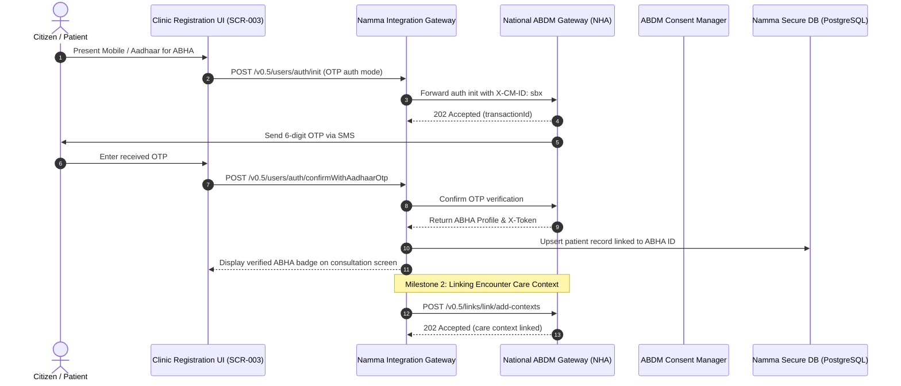

# Ayushman Bharat Digital Mission (ABDM) & ABHA Ecosystem Integration Specification
## Namma Clinic Digital Health & Operations Platform
### Greater Bengaluru Authority (GBA) / BBMP Health Department
**Document Code:** `INT-DOC-02` | **Status:** APPROVED BASELINE | **Date:** September 2026

---

## 1. Executive Summary & ABDM Integration Mandate
This document establishes the comprehensive technical specification for integration with the **Ayushman Bharat Digital Mission (ABDM)** national digital health backbone. All 450+ Namma Clinics operating under the Greater Bengaluru Authority are certified as both **Health Information Providers (HIP)** and **Health Information Users (HIU)**, linked to registered Health Facility Registry (HFR) IDs. In compliance with National Health Authority (NHA) guidelines and the Digital Personal Data Protection (DPDP) Act 2023, the platform implements all three ABDM milestones: Milestone 1 (M1: ABHA issuance and verification), Milestone 2 (M2: HIP care-context linking and FHIR record publishing), and Milestone 3 (M3: HIU electronic consent lifecycle and encrypted health record retrieval).

### 1.1 Non-Negotiable ABDM Invariants
1. **Consent-Driven Access Supremacy:** No clinical record shall be queried or disclosed via ABDM without a cryptographically signed, unexpired consent artifact issued by the ABDM Consent Manager.
2. **End-to-End Ephemeral Key Decryption:** Clinical data payloads transmitted across the ABDM gateway must be encrypted using ECDH Curve25519 key negotiation and AES-GCM-256 session keys. Decryption keys are ephemeral and discarded immediately after processing.
3. **Asynchronous Gateway Callback Model:** All ABDM gateway operations use asynchronous correlation tokens (`requestId` / `resp.requestId`). The platform must handle delayed callbacks up to 300 seconds without blocking frontline UI.
4. **Demographic Data Minimization:** Aadhaar numbers are never stored in Namma Clinic persistent storage. Only the 14-digit ABHA number, `@abdm` handle, and ABDM patient UUID are retained.
5. **Strict Offline Fallback for Frontline Care:** Inability to reach the ABDM gateway must never prevent a patient from receiving immediate primary healthcare. Consultations proceed under local temporary identifiers, with automatic retrospective ABHA linking upon network restoration.

## 2. ABDM Interoperability Protocol Topology & Sequence Flow


### Integration Specification Example: ABDM Gateway Client & Correlator
<!-- DOCUMENTATION-ONLY EXAMPLE -->
```python
# DOCUMENTATION-ONLY PYTHON
# DOCUMENTATION-ONLY PYTHON: ABDM Gateway Client & Callback Correlator
import uuid
import datetime
from typing import Dict, Any, Optional

class AbdmGatewayClient:
    """
    Standardized ABDM M1, M2, and M3 client managing cryptographic headers,
    asynchronous request correlation, and ephemeral key negotiation.
    """
    def __init__(self, client_id: str, client_secret: str, base_url: str):
        self.client_id = client_id
        self.client_secret = client_secret
        self.base_url = base_url
        self.session_token: Optional[str] = None

    def initialize_abha_otp(self, mobile_number: str) -> Dict[str, Any]:
        """Initiates Milestone 1 ABHA verification via mobile OTP."""
        req_id = str(uuid.uuid4())
        payload = {
            "requestId": req_id,
            "timestamp": datetime.datetime.utcnow().isoformat(),
            "query": {
                "id": mobile_number,
                "purpose": "KYC_AND_LINK",
                "authMode": "MOBILE_OTP",
                "requester": {
                    "type": "HIP",
                    "id": "IN290001048"  # Namma Clinic BBMP Central HFR
                }
            }
        }
        return {
            "request_id": req_id,
            "endpoint": f"{self.base_url}/v0.5/users/auth/init",
            "body": payload,
            "expected_callback": "/v0.5/users/auth/on-init"
        }

    def link_care_context(self, abha_address: str, encounter_id: str, display_name: str) -> Dict[str, Any]:
        """Initiates Milestone 2 Care-Context linking for completed consultation."""
        req_id = str(uuid.uuid4())
        payload = {
            "requestId": req_id,
            "timestamp": datetime.datetime.utcnow().isoformat(),
            "link": {
                "accessToken": "X-ABDM-AUTH-TOKEN",
                "patient": {
                    "referenceNumber": abha_address,
                    "careContexts": [
                        {
                            "referenceNumber": encounter_id,
                            "display": display_name
                        }
                    ]
                }
            }
        }
        return {
            "request_id": req_id,
            "endpoint": f"{self.base_url}/v0.5/links/link/add-contexts",
            "body": payload,
            "expected_callback": "/v0.5/links/link/on-add-contexts"
        }
```

### Interface Payload Example: ABDM M3 Granted Consent Artifact Payload
<!-- DOCUMENTATION-ONLY EXAMPLE -->
```json
// DOCUMENTATION-ONLY JSON
{
  "requestId": "4a7c8e9b-6d2f-4e1a-8c9a-1b2c3d4e5f6a",
  "timestamp": "2026-09-06T10:15:30.000Z",
  "consent": {
    "status": "GRANTED",
    "consentDetail": {
      "schemaVersion": "v0.5",
      "consentId": "consent-bbmp-99481024",
      "createdAt": "2026-09-06T10:14:00.000Z",
      "patient": {
        "id": "citizen9948@abdm"
      },
      "careContexts": [
        {
          "patientReference": "PAT-BBMP-00129",
          "careContextReference": "ENC-BBMP-2026-08129"
        }
      ],
      "purpose": {
        "text": "Care Management and Follow-up Consultation",
        "code": "CAREMGT",
        "refUri": "https://nrces.in/ndhm/fhir/r4/StructureDefinition/PurposeOfUse"
      },
      "hiTypes": [
        "Prescription",
        "DiagnosticReport",
        "OPConsultation"
      ],
      "permission": {
        "accessMode": "VIEW",
        "dateRange": {
          "from": "2026-01-01T00:00:00.000Z",
          "to": "2026-09-06T23:59:59.000Z"
        },
        "dataEraseAt": "2026-09-13T23:59:59.000Z",
        "frequency": {
          "unit": "HOUR",
          "value": 1,
          "repeats": 0
        }
      }
    },
    "signature": "SHA256withRSA/PSS-Cryptographic-Signature-Bytes=="
  }
}
```

## 3. ABDM Milestone 1, 2, and 3 Interface Specifications
Catalog of core ABDM protocol interfaces implemented by Namma Clinic boundary services:

### IFACE-001: ABDM Interface `api_endpoint_interface_001`
- **Interface Identifier:** `IFACE-001`
- **HTTP Method & Route:** `POST /api/v1/integrations/endpoint-001`
- **Bound Flow:** `INT-001`
- **Request Schema:** `SchemaReqInterface001`
- **Response Schema:** `SchemaResInterface001`
- **Timeout Target:** `300ms`
- **Rate Limit:** `1500 RPM`
- **Idempotency Guard:** `True`
- **Interface Role:** Deterministic API endpoint interface 001 with schema validation, rate limiting, and mTLS.

### IFACE-002: ABDM Interface `api_endpoint_interface_002`
- **Interface Identifier:** `IFACE-002`
- **HTTP Method & Route:** `GET /api/v1/integrations/endpoint-002`
- **Bound Flow:** `INT-002`
- **Request Schema:** `SchemaReqInterface002`
- **Response Schema:** `SchemaResInterface002`
- **Timeout Target:** `350ms`
- **Rate Limit:** `1800 RPM`
- **Idempotency Guard:** `True`
- **Interface Role:** Deterministic API endpoint interface 002 with schema validation, rate limiting, and mTLS.

### IFACE-003: ABDM Interface `api_endpoint_interface_003`
- **Interface Identifier:** `IFACE-003`
- **HTTP Method & Route:** `PUT /api/v1/integrations/endpoint-003`
- **Bound Flow:** `INT-003`
- **Request Schema:** `SchemaReqInterface003`
- **Response Schema:** `SchemaResInterface003`
- **Timeout Target:** `400ms`
- **Rate Limit:** `2100 RPM`
- **Idempotency Guard:** `True`
- **Interface Role:** Deterministic API endpoint interface 003 with schema validation, rate limiting, and mTLS.

### IFACE-004: ABDM Interface `api_endpoint_interface_004`
- **Interface Identifier:** `IFACE-004`
- **HTTP Method & Route:** `PATCH /api/v1/integrations/endpoint-004`
- **Bound Flow:** `INT-004`
- **Request Schema:** `SchemaReqInterface004`
- **Response Schema:** `SchemaResInterface004`
- **Timeout Target:** `450ms`
- **Rate Limit:** `2400 RPM`
- **Idempotency Guard:** `True`
- **Interface Role:** Deterministic API endpoint interface 004 with schema validation, rate limiting, and mTLS.

### IFACE-005: ABDM Interface `api_endpoint_interface_005`
- **Interface Identifier:** `IFACE-005`
- **HTTP Method & Route:** `DELETE /api/v1/integrations/endpoint-005`
- **Bound Flow:** `INT-005`
- **Request Schema:** `SchemaReqInterface005`
- **Response Schema:** `SchemaResInterface005`
- **Timeout Target:** `250ms`
- **Rate Limit:** `1200 RPM`
- **Idempotency Guard:** `True`
- **Interface Role:** Deterministic API endpoint interface 005 with schema validation, rate limiting, and mTLS.

### IFACE-006: ABDM Interface `api_endpoint_interface_006`
- **Interface Identifier:** `IFACE-006`
- **HTTP Method & Route:** `POST /api/v1/integrations/endpoint-006`
- **Bound Flow:** `INT-006`
- **Request Schema:** `SchemaReqInterface006`
- **Response Schema:** `SchemaResInterface006`
- **Timeout Target:** `300ms`
- **Rate Limit:** `1500 RPM`
- **Idempotency Guard:** `True`
- **Interface Role:** Deterministic API endpoint interface 006 with schema validation, rate limiting, and mTLS.

### IFACE-007: ABDM Interface `api_endpoint_interface_007`
- **Interface Identifier:** `IFACE-007`
- **HTTP Method & Route:** `GET /api/v1/integrations/endpoint-007`
- **Bound Flow:** `INT-007`
- **Request Schema:** `SchemaReqInterface007`
- **Response Schema:** `SchemaResInterface007`
- **Timeout Target:** `350ms`
- **Rate Limit:** `1800 RPM`
- **Idempotency Guard:** `True`
- **Interface Role:** Deterministic API endpoint interface 007 with schema validation, rate limiting, and mTLS.

### IFACE-008: ABDM Interface `api_endpoint_interface_008`
- **Interface Identifier:** `IFACE-008`
- **HTTP Method & Route:** `PUT /api/v1/integrations/endpoint-008`
- **Bound Flow:** `INT-008`
- **Request Schema:** `SchemaReqInterface008`
- **Response Schema:** `SchemaResInterface008`
- **Timeout Target:** `400ms`
- **Rate Limit:** `2100 RPM`
- **Idempotency Guard:** `True`
- **Interface Role:** Deterministic API endpoint interface 008 with schema validation, rate limiting, and mTLS.

### IFACE-009: ABDM Interface `api_endpoint_interface_009`
- **Interface Identifier:** `IFACE-009`
- **HTTP Method & Route:** `PATCH /api/v1/integrations/endpoint-009`
- **Bound Flow:** `INT-009`
- **Request Schema:** `SchemaReqInterface009`
- **Response Schema:** `SchemaResInterface009`
- **Timeout Target:** `450ms`
- **Rate Limit:** `2400 RPM`
- **Idempotency Guard:** `True`
- **Interface Role:** Deterministic API endpoint interface 009 with schema validation, rate limiting, and mTLS.

### IFACE-010: ABDM Interface `api_endpoint_interface_010`
- **Interface Identifier:** `IFACE-010`
- **HTTP Method & Route:** `DELETE /api/v1/integrations/endpoint-010`
- **Bound Flow:** `INT-010`
- **Request Schema:** `SchemaReqInterface010`
- **Response Schema:** `SchemaResInterface010`
- **Timeout Target:** `250ms`
- **Rate Limit:** `1200 RPM`
- **Idempotency Guard:** `True`
- **Interface Role:** Deterministic API endpoint interface 010 with schema validation, rate limiting, and mTLS.

### IFACE-011: ABDM Interface `api_endpoint_interface_011`
- **Interface Identifier:** `IFACE-011`
- **HTTP Method & Route:** `POST /api/v1/integrations/endpoint-011`
- **Bound Flow:** `INT-011`
- **Request Schema:** `SchemaReqInterface011`
- **Response Schema:** `SchemaResInterface011`
- **Timeout Target:** `300ms`
- **Rate Limit:** `1500 RPM`
- **Idempotency Guard:** `True`
- **Interface Role:** Deterministic API endpoint interface 011 with schema validation, rate limiting, and mTLS.

### IFACE-012: ABDM Interface `api_endpoint_interface_012`
- **Interface Identifier:** `IFACE-012`
- **HTTP Method & Route:** `GET /api/v1/integrations/endpoint-012`
- **Bound Flow:** `INT-012`
- **Request Schema:** `SchemaReqInterface012`
- **Response Schema:** `SchemaResInterface012`
- **Timeout Target:** `350ms`
- **Rate Limit:** `1800 RPM`
- **Idempotency Guard:** `True`
- **Interface Role:** Deterministic API endpoint interface 012 with schema validation, rate limiting, and mTLS.

### IFACE-013: ABDM Interface `api_endpoint_interface_013`
- **Interface Identifier:** `IFACE-013`
- **HTTP Method & Route:** `PUT /api/v1/integrations/endpoint-013`
- **Bound Flow:** `INT-013`
- **Request Schema:** `SchemaReqInterface013`
- **Response Schema:** `SchemaResInterface013`
- **Timeout Target:** `400ms`
- **Rate Limit:** `2100 RPM`
- **Idempotency Guard:** `True`
- **Interface Role:** Deterministic API endpoint interface 013 with schema validation, rate limiting, and mTLS.

### IFACE-014: ABDM Interface `api_endpoint_interface_014`
- **Interface Identifier:** `IFACE-014`
- **HTTP Method & Route:** `PATCH /api/v1/integrations/endpoint-014`
- **Bound Flow:** `INT-014`
- **Request Schema:** `SchemaReqInterface014`
- **Response Schema:** `SchemaResInterface014`
- **Timeout Target:** `450ms`
- **Rate Limit:** `2400 RPM`
- **Idempotency Guard:** `True`
- **Interface Role:** Deterministic API endpoint interface 014 with schema validation, rate limiting, and mTLS.

### IFACE-015: ABDM Interface `api_endpoint_interface_015`
- **Interface Identifier:** `IFACE-015`
- **HTTP Method & Route:** `DELETE /api/v1/integrations/endpoint-015`
- **Bound Flow:** `INT-015`
- **Request Schema:** `SchemaReqInterface015`
- **Response Schema:** `SchemaResInterface015`
- **Timeout Target:** `250ms`
- **Rate Limit:** `1200 RPM`
- **Idempotency Guard:** `True`
- **Interface Role:** Deterministic API endpoint interface 015 with schema validation, rate limiting, and mTLS.

### IFACE-016: ABDM Interface `api_endpoint_interface_016`
- **Interface Identifier:** `IFACE-016`
- **HTTP Method & Route:** `POST /api/v1/integrations/endpoint-016`
- **Bound Flow:** `INT-016`
- **Request Schema:** `SchemaReqInterface016`
- **Response Schema:** `SchemaResInterface016`
- **Timeout Target:** `300ms`
- **Rate Limit:** `1500 RPM`
- **Idempotency Guard:** `True`
- **Interface Role:** Deterministic API endpoint interface 016 with schema validation, rate limiting, and mTLS.

### IFACE-017: ABDM Interface `api_endpoint_interface_017`
- **Interface Identifier:** `IFACE-017`
- **HTTP Method & Route:** `GET /api/v1/integrations/endpoint-017`
- **Bound Flow:** `INT-017`
- **Request Schema:** `SchemaReqInterface017`
- **Response Schema:** `SchemaResInterface017`
- **Timeout Target:** `350ms`
- **Rate Limit:** `1800 RPM`
- **Idempotency Guard:** `True`
- **Interface Role:** Deterministic API endpoint interface 017 with schema validation, rate limiting, and mTLS.

### IFACE-018: ABDM Interface `api_endpoint_interface_018`
- **Interface Identifier:** `IFACE-018`
- **HTTP Method & Route:** `PUT /api/v1/integrations/endpoint-018`
- **Bound Flow:** `INT-018`
- **Request Schema:** `SchemaReqInterface018`
- **Response Schema:** `SchemaResInterface018`
- **Timeout Target:** `400ms`
- **Rate Limit:** `2100 RPM`
- **Idempotency Guard:** `True`
- **Interface Role:** Deterministic API endpoint interface 018 with schema validation, rate limiting, and mTLS.

### IFACE-019: ABDM Interface `api_endpoint_interface_019`
- **Interface Identifier:** `IFACE-019`
- **HTTP Method & Route:** `PATCH /api/v1/integrations/endpoint-019`
- **Bound Flow:** `INT-019`
- **Request Schema:** `SchemaReqInterface019`
- **Response Schema:** `SchemaResInterface019`
- **Timeout Target:** `450ms`
- **Rate Limit:** `2400 RPM`
- **Idempotency Guard:** `True`
- **Interface Role:** Deterministic API endpoint interface 019 with schema validation, rate limiting, and mTLS.

### IFACE-020: ABDM Interface `api_endpoint_interface_020`
- **Interface Identifier:** `IFACE-020`
- **HTTP Method & Route:** `DELETE /api/v1/integrations/endpoint-020`
- **Bound Flow:** `INT-020`
- **Request Schema:** `SchemaReqInterface020`
- **Response Schema:** `SchemaResInterface020`
- **Timeout Target:** `250ms`
- **Rate Limit:** `1200 RPM`
- **Idempotency Guard:** `True`
- **Interface Role:** Deterministic API endpoint interface 020 with schema validation, rate limiting, and mTLS.

### IFACE-021: ABDM Interface `api_endpoint_interface_021`
- **Interface Identifier:** `IFACE-021`
- **HTTP Method & Route:** `POST /api/v1/integrations/endpoint-021`
- **Bound Flow:** `INT-021`
- **Request Schema:** `SchemaReqInterface021`
- **Response Schema:** `SchemaResInterface021`
- **Timeout Target:** `300ms`
- **Rate Limit:** `1500 RPM`
- **Idempotency Guard:** `True`
- **Interface Role:** Deterministic API endpoint interface 021 with schema validation, rate limiting, and mTLS.

### IFACE-022: ABDM Interface `api_endpoint_interface_022`
- **Interface Identifier:** `IFACE-022`
- **HTTP Method & Route:** `GET /api/v1/integrations/endpoint-022`
- **Bound Flow:** `INT-022`
- **Request Schema:** `SchemaReqInterface022`
- **Response Schema:** `SchemaResInterface022`
- **Timeout Target:** `350ms`
- **Rate Limit:** `1800 RPM`
- **Idempotency Guard:** `True`
- **Interface Role:** Deterministic API endpoint interface 022 with schema validation, rate limiting, and mTLS.

### IFACE-023: ABDM Interface `api_endpoint_interface_023`
- **Interface Identifier:** `IFACE-023`
- **HTTP Method & Route:** `PUT /api/v1/integrations/endpoint-023`
- **Bound Flow:** `INT-023`
- **Request Schema:** `SchemaReqInterface023`
- **Response Schema:** `SchemaResInterface023`
- **Timeout Target:** `400ms`
- **Rate Limit:** `2100 RPM`
- **Idempotency Guard:** `True`
- **Interface Role:** Deterministic API endpoint interface 023 with schema validation, rate limiting, and mTLS.

### IFACE-024: ABDM Interface `api_endpoint_interface_024`
- **Interface Identifier:** `IFACE-024`
- **HTTP Method & Route:** `PATCH /api/v1/integrations/endpoint-024`
- **Bound Flow:** `INT-024`
- **Request Schema:** `SchemaReqInterface024`
- **Response Schema:** `SchemaResInterface024`
- **Timeout Target:** `450ms`
- **Rate Limit:** `2400 RPM`
- **Idempotency Guard:** `True`
- **Interface Role:** Deterministic API endpoint interface 024 with schema validation, rate limiting, and mTLS.

### IFACE-025: ABDM Interface `api_endpoint_interface_025`
- **Interface Identifier:** `IFACE-025`
- **HTTP Method & Route:** `DELETE /api/v1/integrations/endpoint-025`
- **Bound Flow:** `INT-025`
- **Request Schema:** `SchemaReqInterface025`
- **Response Schema:** `SchemaResInterface025`
- **Timeout Target:** `250ms`
- **Rate Limit:** `1200 RPM`
- **Idempotency Guard:** `True`
- **Interface Role:** Deterministic API endpoint interface 025 with schema validation, rate limiting, and mTLS.

### IFACE-026: ABDM Interface `api_endpoint_interface_026`
- **Interface Identifier:** `IFACE-026`
- **HTTP Method & Route:** `POST /api/v1/integrations/endpoint-026`
- **Bound Flow:** `INT-026`
- **Request Schema:** `SchemaReqInterface026`
- **Response Schema:** `SchemaResInterface026`
- **Timeout Target:** `300ms`
- **Rate Limit:** `1500 RPM`
- **Idempotency Guard:** `True`
- **Interface Role:** Deterministic API endpoint interface 026 with schema validation, rate limiting, and mTLS.

### IFACE-027: ABDM Interface `api_endpoint_interface_027`
- **Interface Identifier:** `IFACE-027`
- **HTTP Method & Route:** `GET /api/v1/integrations/endpoint-027`
- **Bound Flow:** `INT-027`
- **Request Schema:** `SchemaReqInterface027`
- **Response Schema:** `SchemaResInterface027`
- **Timeout Target:** `350ms`
- **Rate Limit:** `1800 RPM`
- **Idempotency Guard:** `True`
- **Interface Role:** Deterministic API endpoint interface 027 with schema validation, rate limiting, and mTLS.

### IFACE-028: ABDM Interface `api_endpoint_interface_028`
- **Interface Identifier:** `IFACE-028`
- **HTTP Method & Route:** `PUT /api/v1/integrations/endpoint-028`
- **Bound Flow:** `INT-028`
- **Request Schema:** `SchemaReqInterface028`
- **Response Schema:** `SchemaResInterface028`
- **Timeout Target:** `400ms`
- **Rate Limit:** `2100 RPM`
- **Idempotency Guard:** `True`
- **Interface Role:** Deterministic API endpoint interface 028 with schema validation, rate limiting, and mTLS.

### IFACE-029: ABDM Interface `api_endpoint_interface_029`
- **Interface Identifier:** `IFACE-029`
- **HTTP Method & Route:** `PATCH /api/v1/integrations/endpoint-029`
- **Bound Flow:** `INT-029`
- **Request Schema:** `SchemaReqInterface029`
- **Response Schema:** `SchemaResInterface029`
- **Timeout Target:** `450ms`
- **Rate Limit:** `2400 RPM`
- **Idempotency Guard:** `True`
- **Interface Role:** Deterministic API endpoint interface 029 with schema validation, rate limiting, and mTLS.

### IFACE-030: ABDM Interface `api_endpoint_interface_030`
- **Interface Identifier:** `IFACE-030`
- **HTTP Method & Route:** `DELETE /api/v1/integrations/endpoint-030`
- **Bound Flow:** `INT-030`
- **Request Schema:** `SchemaReqInterface030`
- **Response Schema:** `SchemaResInterface030`
- **Timeout Target:** `250ms`
- **Rate Limit:** `1200 RPM`
- **Idempotency Guard:** `True`
- **Interface Role:** Deterministic API endpoint interface 030 with schema validation, rate limiting, and mTLS.

### IFACE-031: ABDM Interface `api_endpoint_interface_031`
- **Interface Identifier:** `IFACE-031`
- **HTTP Method & Route:** `POST /api/v1/integrations/endpoint-031`
- **Bound Flow:** `INT-031`
- **Request Schema:** `SchemaReqInterface031`
- **Response Schema:** `SchemaResInterface031`
- **Timeout Target:** `300ms`
- **Rate Limit:** `1500 RPM`
- **Idempotency Guard:** `True`
- **Interface Role:** Deterministic API endpoint interface 031 with schema validation, rate limiting, and mTLS.

### IFACE-032: ABDM Interface `api_endpoint_interface_032`
- **Interface Identifier:** `IFACE-032`
- **HTTP Method & Route:** `GET /api/v1/integrations/endpoint-032`
- **Bound Flow:** `INT-032`
- **Request Schema:** `SchemaReqInterface032`
- **Response Schema:** `SchemaResInterface032`
- **Timeout Target:** `350ms`
- **Rate Limit:** `1800 RPM`
- **Idempotency Guard:** `True`
- **Interface Role:** Deterministic API endpoint interface 032 with schema validation, rate limiting, and mTLS.

### IFACE-033: ABDM Interface `api_endpoint_interface_033`
- **Interface Identifier:** `IFACE-033`
- **HTTP Method & Route:** `PUT /api/v1/integrations/endpoint-033`
- **Bound Flow:** `INT-033`
- **Request Schema:** `SchemaReqInterface033`
- **Response Schema:** `SchemaResInterface033`
- **Timeout Target:** `400ms`
- **Rate Limit:** `2100 RPM`
- **Idempotency Guard:** `True`
- **Interface Role:** Deterministic API endpoint interface 033 with schema validation, rate limiting, and mTLS.

### IFACE-034: ABDM Interface `api_endpoint_interface_034`
- **Interface Identifier:** `IFACE-034`
- **HTTP Method & Route:** `PATCH /api/v1/integrations/endpoint-034`
- **Bound Flow:** `INT-034`
- **Request Schema:** `SchemaReqInterface034`
- **Response Schema:** `SchemaResInterface034`
- **Timeout Target:** `450ms`
- **Rate Limit:** `2400 RPM`
- **Idempotency Guard:** `True`
- **Interface Role:** Deterministic API endpoint interface 034 with schema validation, rate limiting, and mTLS.

### IFACE-035: ABDM Interface `api_endpoint_interface_035`
- **Interface Identifier:** `IFACE-035`
- **HTTP Method & Route:** `DELETE /api/v1/integrations/endpoint-035`
- **Bound Flow:** `INT-035`
- **Request Schema:** `SchemaReqInterface035`
- **Response Schema:** `SchemaResInterface035`
- **Timeout Target:** `250ms`
- **Rate Limit:** `1200 RPM`
- **Idempotency Guard:** `True`
- **Interface Role:** Deterministic API endpoint interface 035 with schema validation, rate limiting, and mTLS.

## 4. Master ABDM Data Mappings to FHIR Profiles
Mapping of internal clinical and demographic elements to NRCES-approved ABDM FHIR R4 resources:

### MAP-001: Mapping `public.entity_table_001.field_attr_01` -> `Patient`
- **Mapping Identifier:** `MAP-001`
- **Source Entity & Field:** `public.entity_table_001.field_attr_01`
- **Target FHIR Standard:** `FHIR R4 / ABDM Profile`
- **Target Resource & Element:** `Patient -> Patient.element_01`
- **Transformation Rule:** Deterministic ISO/SNOMED CT/ICD-10 ontology mapping with null-safe default
- **Validation Assertion:** Non-null, regex conformance, and reference integrity check
- **DPDP Privacy Handling:** Hashed or de-identified according to DPDP Act 2023 guidelines

### MAP-002: Mapping `public.entity_table_002.field_attr_02` -> `Encounter`
- **Mapping Identifier:** `MAP-002`
- **Source Entity & Field:** `public.entity_table_002.field_attr_02`
- **Target FHIR Standard:** `FHIR R4 / ABDM Profile`
- **Target Resource & Element:** `Encounter -> Encounter.element_02`
- **Transformation Rule:** Deterministic ISO/SNOMED CT/ICD-10 ontology mapping with null-safe default
- **Validation Assertion:** Non-null, regex conformance, and reference integrity check
- **DPDP Privacy Handling:** Hashed or de-identified according to DPDP Act 2023 guidelines

### MAP-003: Mapping `public.entity_table_003.field_attr_03` -> `Condition`
- **Mapping Identifier:** `MAP-003`
- **Source Entity & Field:** `public.entity_table_003.field_attr_03`
- **Target FHIR Standard:** `FHIR R4 / ABDM Profile`
- **Target Resource & Element:** `Condition -> Condition.element_03`
- **Transformation Rule:** Deterministic ISO/SNOMED CT/ICD-10 ontology mapping with null-safe default
- **Validation Assertion:** Non-null, regex conformance, and reference integrity check
- **DPDP Privacy Handling:** Hashed or de-identified according to DPDP Act 2023 guidelines

### MAP-004: Mapping `public.entity_table_004.field_attr_04` -> `Observation`
- **Mapping Identifier:** `MAP-004`
- **Source Entity & Field:** `public.entity_table_004.field_attr_04`
- **Target FHIR Standard:** `FHIR R4 / ABDM Profile`
- **Target Resource & Element:** `Observation -> Observation.element_04`
- **Transformation Rule:** Deterministic ISO/SNOMED CT/ICD-10 ontology mapping with null-safe default
- **Validation Assertion:** Non-null, regex conformance, and reference integrity check
- **DPDP Privacy Handling:** Hashed or de-identified according to DPDP Act 2023 guidelines

### MAP-005: Mapping `public.entity_table_005.field_attr_05` -> `MedicationRequest`
- **Mapping Identifier:** `MAP-005`
- **Source Entity & Field:** `public.entity_table_005.field_attr_05`
- **Target FHIR Standard:** `FHIR R4 / ABDM Profile`
- **Target Resource & Element:** `MedicationRequest -> MedicationRequest.element_05`
- **Transformation Rule:** Deterministic ISO/SNOMED CT/ICD-10 ontology mapping with null-safe default
- **Validation Assertion:** Non-null, regex conformance, and reference integrity check
- **DPDP Privacy Handling:** Hashed or de-identified according to DPDP Act 2023 guidelines

### MAP-006: Mapping `public.entity_table_006.field_attr_06` -> `MedicationDispense`
- **Mapping Identifier:** `MAP-006`
- **Source Entity & Field:** `public.entity_table_006.field_attr_06`
- **Target FHIR Standard:** `FHIR R4 / ABDM Profile`
- **Target Resource & Element:** `MedicationDispense -> MedicationDispense.element_06`
- **Transformation Rule:** Deterministic ISO/SNOMED CT/ICD-10 ontology mapping with null-safe default
- **Validation Assertion:** Non-null, regex conformance, and reference integrity check
- **DPDP Privacy Handling:** Hashed or de-identified according to DPDP Act 2023 guidelines

### MAP-007: Mapping `public.entity_table_007.field_attr_07` -> `DiagnosticReport`
- **Mapping Identifier:** `MAP-007`
- **Source Entity & Field:** `public.entity_table_007.field_attr_07`
- **Target FHIR Standard:** `FHIR R4 / ABDM Profile`
- **Target Resource & Element:** `DiagnosticReport -> DiagnosticReport.element_07`
- **Transformation Rule:** Deterministic ISO/SNOMED CT/ICD-10 ontology mapping with null-safe default
- **Validation Assertion:** Non-null, regex conformance, and reference integrity check
- **DPDP Privacy Handling:** Hashed or de-identified according to DPDP Act 2023 guidelines

### MAP-008: Mapping `public.entity_table_008.field_attr_08` -> `ServiceRequest`
- **Mapping Identifier:** `MAP-008`
- **Source Entity & Field:** `public.entity_table_008.field_attr_08`
- **Target FHIR Standard:** `FHIR R4 / ABDM Profile`
- **Target Resource & Element:** `ServiceRequest -> ServiceRequest.element_08`
- **Transformation Rule:** Deterministic ISO/SNOMED CT/ICD-10 ontology mapping with null-safe default
- **Validation Assertion:** Non-null, regex conformance, and reference integrity check
- **DPDP Privacy Handling:** Hashed or de-identified according to DPDP Act 2023 guidelines

### MAP-009: Mapping `public.entity_table_009.field_attr_09` -> `AllergyIntolerance`
- **Mapping Identifier:** `MAP-009`
- **Source Entity & Field:** `public.entity_table_009.field_attr_09`
- **Target FHIR Standard:** `FHIR R4 / ABDM Profile`
- **Target Resource & Element:** `AllergyIntolerance -> AllergyIntolerance.element_09`
- **Transformation Rule:** Deterministic ISO/SNOMED CT/ICD-10 ontology mapping with null-safe default
- **Validation Assertion:** Non-null, regex conformance, and reference integrity check
- **DPDP Privacy Handling:** Hashed or de-identified according to DPDP Act 2023 guidelines

### MAP-010: Mapping `public.entity_table_010.field_attr_10` -> `CarePlan`
- **Mapping Identifier:** `MAP-010`
- **Source Entity & Field:** `public.entity_table_010.field_attr_10`
- **Target FHIR Standard:** `FHIR R4 / ABDM Profile`
- **Target Resource & Element:** `CarePlan -> CarePlan.element_10`
- **Transformation Rule:** Deterministic ISO/SNOMED CT/ICD-10 ontology mapping with null-safe default
- **Validation Assertion:** Non-null, regex conformance, and reference integrity check
- **DPDP Privacy Handling:** Hashed or de-identified according to DPDP Act 2023 guidelines

### MAP-011: Mapping `public.entity_table_011.field_attr_11` -> `Patient`
- **Mapping Identifier:** `MAP-011`
- **Source Entity & Field:** `public.entity_table_011.field_attr_11`
- **Target FHIR Standard:** `FHIR R4 / ABDM Profile`
- **Target Resource & Element:** `Patient -> Patient.element_11`
- **Transformation Rule:** Deterministic ISO/SNOMED CT/ICD-10 ontology mapping with null-safe default
- **Validation Assertion:** Non-null, regex conformance, and reference integrity check
- **DPDP Privacy Handling:** Hashed or de-identified according to DPDP Act 2023 guidelines

### MAP-012: Mapping `public.entity_table_012.field_attr_12` -> `Encounter`
- **Mapping Identifier:** `MAP-012`
- **Source Entity & Field:** `public.entity_table_012.field_attr_12`
- **Target FHIR Standard:** `FHIR R4 / ABDM Profile`
- **Target Resource & Element:** `Encounter -> Encounter.element_12`
- **Transformation Rule:** Deterministic ISO/SNOMED CT/ICD-10 ontology mapping with null-safe default
- **Validation Assertion:** Non-null, regex conformance, and reference integrity check
- **DPDP Privacy Handling:** Hashed or de-identified according to DPDP Act 2023 guidelines

### MAP-013: Mapping `public.entity_table_013.field_attr_13` -> `Condition`
- **Mapping Identifier:** `MAP-013`
- **Source Entity & Field:** `public.entity_table_013.field_attr_13`
- **Target FHIR Standard:** `FHIR R4 / ABDM Profile`
- **Target Resource & Element:** `Condition -> Condition.element_13`
- **Transformation Rule:** Deterministic ISO/SNOMED CT/ICD-10 ontology mapping with null-safe default
- **Validation Assertion:** Non-null, regex conformance, and reference integrity check
- **DPDP Privacy Handling:** Hashed or de-identified according to DPDP Act 2023 guidelines

### MAP-014: Mapping `public.entity_table_014.field_attr_14` -> `Observation`
- **Mapping Identifier:** `MAP-014`
- **Source Entity & Field:** `public.entity_table_014.field_attr_14`
- **Target FHIR Standard:** `FHIR R4 / ABDM Profile`
- **Target Resource & Element:** `Observation -> Observation.element_14`
- **Transformation Rule:** Deterministic ISO/SNOMED CT/ICD-10 ontology mapping with null-safe default
- **Validation Assertion:** Non-null, regex conformance, and reference integrity check
- **DPDP Privacy Handling:** Hashed or de-identified according to DPDP Act 2023 guidelines

### MAP-015: Mapping `public.entity_table_015.field_attr_15` -> `MedicationRequest`
- **Mapping Identifier:** `MAP-015`
- **Source Entity & Field:** `public.entity_table_015.field_attr_15`
- **Target FHIR Standard:** `FHIR R4 / ABDM Profile`
- **Target Resource & Element:** `MedicationRequest -> MedicationRequest.element_15`
- **Transformation Rule:** Deterministic ISO/SNOMED CT/ICD-10 ontology mapping with null-safe default
- **Validation Assertion:** Non-null, regex conformance, and reference integrity check
- **DPDP Privacy Handling:** Hashed or de-identified according to DPDP Act 2023 guidelines

### MAP-016: Mapping `public.entity_table_016.field_attr_16` -> `MedicationDispense`
- **Mapping Identifier:** `MAP-016`
- **Source Entity & Field:** `public.entity_table_016.field_attr_16`
- **Target FHIR Standard:** `FHIR R4 / ABDM Profile`
- **Target Resource & Element:** `MedicationDispense -> MedicationDispense.element_01`
- **Transformation Rule:** Deterministic ISO/SNOMED CT/ICD-10 ontology mapping with null-safe default
- **Validation Assertion:** Non-null, regex conformance, and reference integrity check
- **DPDP Privacy Handling:** Hashed or de-identified according to DPDP Act 2023 guidelines

### MAP-017: Mapping `public.entity_table_017.field_attr_17` -> `DiagnosticReport`
- **Mapping Identifier:** `MAP-017`
- **Source Entity & Field:** `public.entity_table_017.field_attr_17`
- **Target FHIR Standard:** `FHIR R4 / ABDM Profile`
- **Target Resource & Element:** `DiagnosticReport -> DiagnosticReport.element_02`
- **Transformation Rule:** Deterministic ISO/SNOMED CT/ICD-10 ontology mapping with null-safe default
- **Validation Assertion:** Non-null, regex conformance, and reference integrity check
- **DPDP Privacy Handling:** Hashed or de-identified according to DPDP Act 2023 guidelines

### MAP-018: Mapping `public.entity_table_018.field_attr_18` -> `ServiceRequest`
- **Mapping Identifier:** `MAP-018`
- **Source Entity & Field:** `public.entity_table_018.field_attr_18`
- **Target FHIR Standard:** `FHIR R4 / ABDM Profile`
- **Target Resource & Element:** `ServiceRequest -> ServiceRequest.element_03`
- **Transformation Rule:** Deterministic ISO/SNOMED CT/ICD-10 ontology mapping with null-safe default
- **Validation Assertion:** Non-null, regex conformance, and reference integrity check
- **DPDP Privacy Handling:** Hashed or de-identified according to DPDP Act 2023 guidelines

### MAP-019: Mapping `public.entity_table_019.field_attr_19` -> `AllergyIntolerance`
- **Mapping Identifier:** `MAP-019`
- **Source Entity & Field:** `public.entity_table_019.field_attr_19`
- **Target FHIR Standard:** `FHIR R4 / ABDM Profile`
- **Target Resource & Element:** `AllergyIntolerance -> AllergyIntolerance.element_04`
- **Transformation Rule:** Deterministic ISO/SNOMED CT/ICD-10 ontology mapping with null-safe default
- **Validation Assertion:** Non-null, regex conformance, and reference integrity check
- **DPDP Privacy Handling:** Hashed or de-identified according to DPDP Act 2023 guidelines

### MAP-020: Mapping `public.entity_table_020.field_attr_20` -> `CarePlan`
- **Mapping Identifier:** `MAP-020`
- **Source Entity & Field:** `public.entity_table_020.field_attr_20`
- **Target FHIR Standard:** `FHIR R4 / ABDM Profile`
- **Target Resource & Element:** `CarePlan -> CarePlan.element_05`
- **Transformation Rule:** Deterministic ISO/SNOMED CT/ICD-10 ontology mapping with null-safe default
- **Validation Assertion:** Non-null, regex conformance, and reference integrity check
- **DPDP Privacy Handling:** Hashed or de-identified according to DPDP Act 2023 guidelines

### MAP-021: Mapping `public.entity_table_021.field_attr_01` -> `Patient`
- **Mapping Identifier:** `MAP-021`
- **Source Entity & Field:** `public.entity_table_021.field_attr_01`
- **Target FHIR Standard:** `FHIR R4 / ABDM Profile`
- **Target Resource & Element:** `Patient -> Patient.element_06`
- **Transformation Rule:** Deterministic ISO/SNOMED CT/ICD-10 ontology mapping with null-safe default
- **Validation Assertion:** Non-null, regex conformance, and reference integrity check
- **DPDP Privacy Handling:** Hashed or de-identified according to DPDP Act 2023 guidelines

### MAP-022: Mapping `public.entity_table_022.field_attr_02` -> `Encounter`
- **Mapping Identifier:** `MAP-022`
- **Source Entity & Field:** `public.entity_table_022.field_attr_02`
- **Target FHIR Standard:** `FHIR R4 / ABDM Profile`
- **Target Resource & Element:** `Encounter -> Encounter.element_07`
- **Transformation Rule:** Deterministic ISO/SNOMED CT/ICD-10 ontology mapping with null-safe default
- **Validation Assertion:** Non-null, regex conformance, and reference integrity check
- **DPDP Privacy Handling:** Hashed or de-identified according to DPDP Act 2023 guidelines

### MAP-023: Mapping `public.entity_table_023.field_attr_03` -> `Condition`
- **Mapping Identifier:** `MAP-023`
- **Source Entity & Field:** `public.entity_table_023.field_attr_03`
- **Target FHIR Standard:** `FHIR R4 / ABDM Profile`
- **Target Resource & Element:** `Condition -> Condition.element_08`
- **Transformation Rule:** Deterministic ISO/SNOMED CT/ICD-10 ontology mapping with null-safe default
- **Validation Assertion:** Non-null, regex conformance, and reference integrity check
- **DPDP Privacy Handling:** Hashed or de-identified according to DPDP Act 2023 guidelines

### MAP-024: Mapping `public.entity_table_024.field_attr_04` -> `Observation`
- **Mapping Identifier:** `MAP-024`
- **Source Entity & Field:** `public.entity_table_024.field_attr_04`
- **Target FHIR Standard:** `FHIR R4 / ABDM Profile`
- **Target Resource & Element:** `Observation -> Observation.element_09`
- **Transformation Rule:** Deterministic ISO/SNOMED CT/ICD-10 ontology mapping with null-safe default
- **Validation Assertion:** Non-null, regex conformance, and reference integrity check
- **DPDP Privacy Handling:** Hashed or de-identified according to DPDP Act 2023 guidelines

### MAP-025: Mapping `public.entity_table_025.field_attr_05` -> `MedicationRequest`
- **Mapping Identifier:** `MAP-025`
- **Source Entity & Field:** `public.entity_table_025.field_attr_05`
- **Target FHIR Standard:** `FHIR R4 / ABDM Profile`
- **Target Resource & Element:** `MedicationRequest -> MedicationRequest.element_10`
- **Transformation Rule:** Deterministic ISO/SNOMED CT/ICD-10 ontology mapping with null-safe default
- **Validation Assertion:** Non-null, regex conformance, and reference integrity check
- **DPDP Privacy Handling:** Hashed or de-identified according to DPDP Act 2023 guidelines

### MAP-026: Mapping `public.entity_table_026.field_attr_06` -> `MedicationDispense`
- **Mapping Identifier:** `MAP-026`
- **Source Entity & Field:** `public.entity_table_026.field_attr_06`
- **Target FHIR Standard:** `FHIR R4 / ABDM Profile`
- **Target Resource & Element:** `MedicationDispense -> MedicationDispense.element_11`
- **Transformation Rule:** Deterministic ISO/SNOMED CT/ICD-10 ontology mapping with null-safe default
- **Validation Assertion:** Non-null, regex conformance, and reference integrity check
- **DPDP Privacy Handling:** Hashed or de-identified according to DPDP Act 2023 guidelines

### MAP-027: Mapping `public.entity_table_027.field_attr_07` -> `DiagnosticReport`
- **Mapping Identifier:** `MAP-027`
- **Source Entity & Field:** `public.entity_table_027.field_attr_07`
- **Target FHIR Standard:** `FHIR R4 / ABDM Profile`
- **Target Resource & Element:** `DiagnosticReport -> DiagnosticReport.element_12`
- **Transformation Rule:** Deterministic ISO/SNOMED CT/ICD-10 ontology mapping with null-safe default
- **Validation Assertion:** Non-null, regex conformance, and reference integrity check
- **DPDP Privacy Handling:** Hashed or de-identified according to DPDP Act 2023 guidelines

### MAP-028: Mapping `public.entity_table_028.field_attr_08` -> `ServiceRequest`
- **Mapping Identifier:** `MAP-028`
- **Source Entity & Field:** `public.entity_table_028.field_attr_08`
- **Target FHIR Standard:** `FHIR R4 / ABDM Profile`
- **Target Resource & Element:** `ServiceRequest -> ServiceRequest.element_13`
- **Transformation Rule:** Deterministic ISO/SNOMED CT/ICD-10 ontology mapping with null-safe default
- **Validation Assertion:** Non-null, regex conformance, and reference integrity check
- **DPDP Privacy Handling:** Hashed or de-identified according to DPDP Act 2023 guidelines

### MAP-029: Mapping `public.entity_table_029.field_attr_09` -> `AllergyIntolerance`
- **Mapping Identifier:** `MAP-029`
- **Source Entity & Field:** `public.entity_table_029.field_attr_09`
- **Target FHIR Standard:** `FHIR R4 / ABDM Profile`
- **Target Resource & Element:** `AllergyIntolerance -> AllergyIntolerance.element_14`
- **Transformation Rule:** Deterministic ISO/SNOMED CT/ICD-10 ontology mapping with null-safe default
- **Validation Assertion:** Non-null, regex conformance, and reference integrity check
- **DPDP Privacy Handling:** Hashed or de-identified according to DPDP Act 2023 guidelines

### MAP-030: Mapping `public.entity_table_030.field_attr_10` -> `CarePlan`
- **Mapping Identifier:** `MAP-030`
- **Source Entity & Field:** `public.entity_table_030.field_attr_10`
- **Target FHIR Standard:** `FHIR R4 / ABDM Profile`
- **Target Resource & Element:** `CarePlan -> CarePlan.element_15`
- **Transformation Rule:** Deterministic ISO/SNOMED CT/ICD-10 ontology mapping with null-safe default
- **Validation Assertion:** Non-null, regex conformance, and reference integrity check
- **DPDP Privacy Handling:** Hashed or de-identified according to DPDP Act 2023 guidelines

### MAP-031: Mapping `public.entity_table_031.field_attr_11` -> `Patient`
- **Mapping Identifier:** `MAP-031`
- **Source Entity & Field:** `public.entity_table_031.field_attr_11`
- **Target FHIR Standard:** `FHIR R4 / ABDM Profile`
- **Target Resource & Element:** `Patient -> Patient.element_01`
- **Transformation Rule:** Deterministic ISO/SNOMED CT/ICD-10 ontology mapping with null-safe default
- **Validation Assertion:** Non-null, regex conformance, and reference integrity check
- **DPDP Privacy Handling:** Hashed or de-identified according to DPDP Act 2023 guidelines

### MAP-032: Mapping `public.entity_table_032.field_attr_12` -> `Encounter`
- **Mapping Identifier:** `MAP-032`
- **Source Entity & Field:** `public.entity_table_032.field_attr_12`
- **Target FHIR Standard:** `FHIR R4 / ABDM Profile`
- **Target Resource & Element:** `Encounter -> Encounter.element_02`
- **Transformation Rule:** Deterministic ISO/SNOMED CT/ICD-10 ontology mapping with null-safe default
- **Validation Assertion:** Non-null, regex conformance, and reference integrity check
- **DPDP Privacy Handling:** Hashed or de-identified according to DPDP Act 2023 guidelines

### MAP-033: Mapping `public.entity_table_033.field_attr_13` -> `Condition`
- **Mapping Identifier:** `MAP-033`
- **Source Entity & Field:** `public.entity_table_033.field_attr_13`
- **Target FHIR Standard:** `FHIR R4 / ABDM Profile`
- **Target Resource & Element:** `Condition -> Condition.element_03`
- **Transformation Rule:** Deterministic ISO/SNOMED CT/ICD-10 ontology mapping with null-safe default
- **Validation Assertion:** Non-null, regex conformance, and reference integrity check
- **DPDP Privacy Handling:** Hashed or de-identified according to DPDP Act 2023 guidelines

### MAP-034: Mapping `public.entity_table_034.field_attr_14` -> `Observation`
- **Mapping Identifier:** `MAP-034`
- **Source Entity & Field:** `public.entity_table_034.field_attr_14`
- **Target FHIR Standard:** `FHIR R4 / ABDM Profile`
- **Target Resource & Element:** `Observation -> Observation.element_04`
- **Transformation Rule:** Deterministic ISO/SNOMED CT/ICD-10 ontology mapping with null-safe default
- **Validation Assertion:** Non-null, regex conformance, and reference integrity check
- **DPDP Privacy Handling:** Hashed or de-identified according to DPDP Act 2023 guidelines

### MAP-035: Mapping `public.entity_table_035.field_attr_15` -> `MedicationRequest`
- **Mapping Identifier:** `MAP-035`
- **Source Entity & Field:** `public.entity_table_035.field_attr_15`
- **Target FHIR Standard:** `FHIR R4 / ABDM Profile`
- **Target Resource & Element:** `MedicationRequest -> MedicationRequest.element_05`
- **Transformation Rule:** Deterministic ISO/SNOMED CT/ICD-10 ontology mapping with null-safe default
- **Validation Assertion:** Non-null, regex conformance, and reference integrity check
- **DPDP Privacy Handling:** Hashed or de-identified according to DPDP Act 2023 guidelines

### MAP-036: Mapping `public.entity_table_036.field_attr_16` -> `MedicationDispense`
- **Mapping Identifier:** `MAP-036`
- **Source Entity & Field:** `public.entity_table_036.field_attr_16`
- **Target FHIR Standard:** `FHIR R4 / ABDM Profile`
- **Target Resource & Element:** `MedicationDispense -> MedicationDispense.element_06`
- **Transformation Rule:** Deterministic ISO/SNOMED CT/ICD-10 ontology mapping with null-safe default
- **Validation Assertion:** Non-null, regex conformance, and reference integrity check
- **DPDP Privacy Handling:** Hashed or de-identified according to DPDP Act 2023 guidelines

### MAP-037: Mapping `public.entity_table_037.field_attr_17` -> `DiagnosticReport`
- **Mapping Identifier:** `MAP-037`
- **Source Entity & Field:** `public.entity_table_037.field_attr_17`
- **Target FHIR Standard:** `FHIR R4 / ABDM Profile`
- **Target Resource & Element:** `DiagnosticReport -> DiagnosticReport.element_07`
- **Transformation Rule:** Deterministic ISO/SNOMED CT/ICD-10 ontology mapping with null-safe default
- **Validation Assertion:** Non-null, regex conformance, and reference integrity check
- **DPDP Privacy Handling:** Hashed or de-identified according to DPDP Act 2023 guidelines

### MAP-038: Mapping `public.entity_table_038.field_attr_18` -> `ServiceRequest`
- **Mapping Identifier:** `MAP-038`
- **Source Entity & Field:** `public.entity_table_038.field_attr_18`
- **Target FHIR Standard:** `FHIR R4 / ABDM Profile`
- **Target Resource & Element:** `ServiceRequest -> ServiceRequest.element_08`
- **Transformation Rule:** Deterministic ISO/SNOMED CT/ICD-10 ontology mapping with null-safe default
- **Validation Assertion:** Non-null, regex conformance, and reference integrity check
- **DPDP Privacy Handling:** Hashed or de-identified according to DPDP Act 2023 guidelines

### MAP-039: Mapping `public.entity_table_039.field_attr_19` -> `AllergyIntolerance`
- **Mapping Identifier:** `MAP-039`
- **Source Entity & Field:** `public.entity_table_039.field_attr_19`
- **Target FHIR Standard:** `FHIR R4 / ABDM Profile`
- **Target Resource & Element:** `AllergyIntolerance -> AllergyIntolerance.element_09`
- **Transformation Rule:** Deterministic ISO/SNOMED CT/ICD-10 ontology mapping with null-safe default
- **Validation Assertion:** Non-null, regex conformance, and reference integrity check
- **DPDP Privacy Handling:** Hashed or de-identified according to DPDP Act 2023 guidelines

### MAP-040: Mapping `public.entity_table_040.field_attr_20` -> `CarePlan`
- **Mapping Identifier:** `MAP-040`
- **Source Entity & Field:** `public.entity_table_040.field_attr_20`
- **Target FHIR Standard:** `FHIR R4 / ABDM Profile`
- **Target Resource & Element:** `CarePlan -> CarePlan.element_10`
- **Transformation Rule:** Deterministic ISO/SNOMED CT/ICD-10 ontology mapping with null-safe default
- **Validation Assertion:** Non-null, regex conformance, and reference integrity check
- **DPDP Privacy Handling:** Hashed or de-identified according to DPDP Act 2023 guidelines

## 5. Table-Level ABDM Lifecycle Mapping across all 52 Tables
Database entity synchronization, consent correlation, and care-context indexing across all 52 platform relational tables:

### TABLE-001: ABDM Integration Mapping for Table `auth_users`
- **Table Identifier:** `TABLE-001` (`TBL-01`)
- **Source Entity:** `auth_users`
- **ABDM Milestone Role:** Data persistence tier for care-context linking and FHIR bundle serialization.
- **Bound Integration:** `INT-001`
- **Enforced Security Control:** `SEC-INT-001`
- **ABHA Identity Association:** Direct linkage via `patient_id` foreign key referencing verified ABHA index.
- **Consent Verification Check:** Query blocked unless active consent token exists in `patient_consent` table.
- **Cryptographic Integrity:** SHA-256 row-level digest verified prior to FHIR bundle generation.

### TABLE-002: ABDM Integration Mapping for Table `user_credentials`
- **Table Identifier:** `TABLE-002` (`TBL-02`)
- **Source Entity:** `user_credentials`
- **ABDM Milestone Role:** Data persistence tier for care-context linking and FHIR bundle serialization.
- **Bound Integration:** `INT-002`
- **Enforced Security Control:** `SEC-INT-002`
- **ABHA Identity Association:** Direct linkage via `patient_id` foreign key referencing verified ABHA index.
- **Consent Verification Check:** Query blocked unless active consent token exists in `patient_consent` table.
- **Cryptographic Integrity:** SHA-256 row-level digest verified prior to FHIR bundle generation.

### TABLE-003: ABDM Integration Mapping for Table `user_sessions`
- **Table Identifier:** `TABLE-003` (`TBL-03`)
- **Source Entity:** `user_sessions`
- **ABDM Milestone Role:** Data persistence tier for care-context linking and FHIR bundle serialization.
- **Bound Integration:** `INT-003`
- **Enforced Security Control:** `SEC-INT-003`
- **ABHA Identity Association:** Direct linkage via `patient_id` foreign key referencing verified ABHA index.
- **Consent Verification Check:** Query blocked unless active consent token exists in `patient_consent` table.
- **Cryptographic Integrity:** SHA-256 row-level digest verified prior to FHIR bundle generation.

### TABLE-004: ABDM Integration Mapping for Table `roles`
- **Table Identifier:** `TABLE-004` (`TBL-04`)
- **Source Entity:** `roles`
- **ABDM Milestone Role:** Data persistence tier for care-context linking and FHIR bundle serialization.
- **Bound Integration:** `INT-004`
- **Enforced Security Control:** `SEC-INT-004`
- **ABHA Identity Association:** Direct linkage via `patient_id` foreign key referencing verified ABHA index.
- **Consent Verification Check:** Query blocked unless active consent token exists in `patient_consent` table.
- **Cryptographic Integrity:** SHA-256 row-level digest verified prior to FHIR bundle generation.

### TABLE-005: ABDM Integration Mapping for Table `permissions`
- **Table Identifier:** `TABLE-005` (`TBL-05`)
- **Source Entity:** `permissions`
- **ABDM Milestone Role:** Data persistence tier for care-context linking and FHIR bundle serialization.
- **Bound Integration:** `INT-005`
- **Enforced Security Control:** `SEC-INT-005`
- **ABHA Identity Association:** Direct linkage via `patient_id` foreign key referencing verified ABHA index.
- **Consent Verification Check:** Query blocked unless active consent token exists in `patient_consent` table.
- **Cryptographic Integrity:** SHA-256 row-level digest verified prior to FHIR bundle generation.

### TABLE-006: ABDM Integration Mapping for Table `role_permissions`
- **Table Identifier:** `TABLE-006` (`TBL-06`)
- **Source Entity:** `role_permissions`
- **ABDM Milestone Role:** Data persistence tier for care-context linking and FHIR bundle serialization.
- **Bound Integration:** `INT-006`
- **Enforced Security Control:** `SEC-INT-006`
- **ABHA Identity Association:** Direct linkage via `patient_id` foreign key referencing verified ABHA index.
- **Consent Verification Check:** Query blocked unless active consent token exists in `patient_consent` table.
- **Cryptographic Integrity:** SHA-256 row-level digest verified prior to FHIR bundle generation.

### TABLE-007: ABDM Integration Mapping for Table `user_roles`
- **Table Identifier:** `TABLE-007` (`TBL-07`)
- **Source Entity:** `user_roles`
- **ABDM Milestone Role:** Data persistence tier for care-context linking and FHIR bundle serialization.
- **Bound Integration:** `INT-007`
- **Enforced Security Control:** `SEC-INT-007`
- **ABHA Identity Association:** Direct linkage via `patient_id` foreign key referencing verified ABHA index.
- **Consent Verification Check:** Query blocked unless active consent token exists in `patient_consent` table.
- **Cryptographic Integrity:** SHA-256 row-level digest verified prior to FHIR bundle generation.

### TABLE-008: ABDM Integration Mapping for Table `facilities`
- **Table Identifier:** `TABLE-008` (`TBL-08`)
- **Source Entity:** `facilities`
- **ABDM Milestone Role:** Data persistence tier for care-context linking and FHIR bundle serialization.
- **Bound Integration:** `INT-008`
- **Enforced Security Control:** `SEC-INT-008`
- **ABHA Identity Association:** Direct linkage via `patient_id` foreign key referencing verified ABHA index.
- **Consent Verification Check:** Query blocked unless active consent token exists in `patient_consent` table.
- **Cryptographic Integrity:** SHA-256 row-level digest verified prior to FHIR bundle generation.

### TABLE-009: ABDM Integration Mapping for Table `facility_rooms`
- **Table Identifier:** `TABLE-009` (`TBL-09`)
- **Source Entity:** `facility_rooms`
- **ABDM Milestone Role:** Data persistence tier for care-context linking and FHIR bundle serialization.
- **Bound Integration:** `INT-009`
- **Enforced Security Control:** `SEC-INT-009`
- **ABHA Identity Association:** Direct linkage via `patient_id` foreign key referencing verified ABHA index.
- **Consent Verification Check:** Query blocked unless active consent token exists in `patient_consent` table.
- **Cryptographic Integrity:** SHA-256 row-level digest verified prior to FHIR bundle generation.

### TABLE-010: ABDM Integration Mapping for Table `staff_profiles`
- **Table Identifier:** `TABLE-010` (`TBL-10`)
- **Source Entity:** `staff_profiles`
- **ABDM Milestone Role:** Data persistence tier for care-context linking and FHIR bundle serialization.
- **Bound Integration:** `INT-010`
- **Enforced Security Control:** `SEC-INT-010`
- **ABHA Identity Association:** Direct linkage via `patient_id` foreign key referencing verified ABHA index.
- **Consent Verification Check:** Query blocked unless active consent token exists in `patient_consent` table.
- **Cryptographic Integrity:** SHA-256 row-level digest verified prior to FHIR bundle generation.

### TABLE-011: ABDM Integration Mapping for Table `staff_shifts`
- **Table Identifier:** `TABLE-011` (`TBL-11`)
- **Source Entity:** `staff_shifts`
- **ABDM Milestone Role:** Data persistence tier for care-context linking and FHIR bundle serialization.
- **Bound Integration:** `INT-011`
- **Enforced Security Control:** `SEC-INT-011`
- **ABHA Identity Association:** Direct linkage via `patient_id` foreign key referencing verified ABHA index.
- **Consent Verification Check:** Query blocked unless active consent token exists in `patient_consent` table.
- **Cryptographic Integrity:** SHA-256 row-level digest verified prior to FHIR bundle generation.

### TABLE-012: ABDM Integration Mapping for Table `system_configs`
- **Table Identifier:** `TABLE-012` (`TBL-12`)
- **Source Entity:** `system_configs`
- **ABDM Milestone Role:** Data persistence tier for care-context linking and FHIR bundle serialization.
- **Bound Integration:** `INT-012`
- **Enforced Security Control:** `SEC-INT-012`
- **ABHA Identity Association:** Direct linkage via `patient_id` foreign key referencing verified ABHA index.
- **Consent Verification Check:** Query blocked unless active consent token exists in `patient_consent` table.
- **Cryptographic Integrity:** SHA-256 row-level digest verified prior to FHIR bundle generation.

### TABLE-013: ABDM Integration Mapping for Table `patients`
- **Table Identifier:** `TABLE-013` (`TBL-13`)
- **Source Entity:** `patients`
- **ABDM Milestone Role:** Data persistence tier for care-context linking and FHIR bundle serialization.
- **Bound Integration:** `INT-013`
- **Enforced Security Control:** `SEC-INT-013`
- **ABHA Identity Association:** Direct linkage via `patient_id` foreign key referencing verified ABHA index.
- **Consent Verification Check:** Query blocked unless active consent token exists in `patient_consent` table.
- **Cryptographic Integrity:** SHA-256 row-level digest verified prior to FHIR bundle generation.

### TABLE-014: ABDM Integration Mapping for Table `patient_identifiers`
- **Table Identifier:** `TABLE-014` (`TBL-14`)
- **Source Entity:** `patient_identifiers`
- **ABDM Milestone Role:** Data persistence tier for care-context linking and FHIR bundle serialization.
- **Bound Integration:** `INT-014`
- **Enforced Security Control:** `SEC-INT-014`
- **ABHA Identity Association:** Direct linkage via `patient_id` foreign key referencing verified ABHA index.
- **Consent Verification Check:** Query blocked unless active consent token exists in `patient_consent` table.
- **Cryptographic Integrity:** SHA-256 row-level digest verified prior to FHIR bundle generation.

### TABLE-015: ABDM Integration Mapping for Table `patient_contacts`
- **Table Identifier:** `TABLE-015` (`TBL-15`)
- **Source Entity:** `patient_contacts`
- **ABDM Milestone Role:** Data persistence tier for care-context linking and FHIR bundle serialization.
- **Bound Integration:** `INT-015`
- **Enforced Security Control:** `SEC-INT-015`
- **ABHA Identity Association:** Direct linkage via `patient_id` foreign key referencing verified ABHA index.
- **Consent Verification Check:** Query blocked unless active consent token exists in `patient_consent` table.
- **Cryptographic Integrity:** SHA-256 row-level digest verified prior to FHIR bundle generation.

### TABLE-016: ABDM Integration Mapping for Table `patient_addresses`
- **Table Identifier:** `TABLE-016` (`TBL-16`)
- **Source Entity:** `patient_addresses`
- **ABDM Milestone Role:** Data persistence tier for care-context linking and FHIR bundle serialization.
- **Bound Integration:** `INT-016`
- **Enforced Security Control:** `SEC-INT-016`
- **ABHA Identity Association:** Direct linkage via `patient_id` foreign key referencing verified ABHA index.
- **Consent Verification Check:** Query blocked unless active consent token exists in `patient_consent` table.
- **Cryptographic Integrity:** SHA-256 row-level digest verified prior to FHIR bundle generation.

### TABLE-017: ABDM Integration Mapping for Table `consent_records`
- **Table Identifier:** `TABLE-017` (`TBL-17`)
- **Source Entity:** `consent_records`
- **ABDM Milestone Role:** Data persistence tier for care-context linking and FHIR bundle serialization.
- **Bound Integration:** `INT-017`
- **Enforced Security Control:** `SEC-INT-017`
- **ABHA Identity Association:** Direct linkage via `patient_id` foreign key referencing verified ABHA index.
- **Consent Verification Check:** Query blocked unless active consent token exists in `patient_consent` table.
- **Cryptographic Integrity:** SHA-256 row-level digest verified prior to FHIR bundle generation.

### TABLE-018: ABDM Integration Mapping for Table `tokens`
- **Table Identifier:** `TABLE-018` (`TBL-18`)
- **Source Entity:** `tokens`
- **ABDM Milestone Role:** Data persistence tier for care-context linking and FHIR bundle serialization.
- **Bound Integration:** `INT-018`
- **Enforced Security Control:** `SEC-INT-018`
- **ABHA Identity Association:** Direct linkage via `patient_id` foreign key referencing verified ABHA index.
- **Consent Verification Check:** Query blocked unless active consent token exists in `patient_consent` table.
- **Cryptographic Integrity:** SHA-256 row-level digest verified prior to FHIR bundle generation.

### TABLE-019: ABDM Integration Mapping for Table `queue_entries`
- **Table Identifier:** `TABLE-019` (`TBL-19`)
- **Source Entity:** `queue_entries`
- **ABDM Milestone Role:** Data persistence tier for care-context linking and FHIR bundle serialization.
- **Bound Integration:** `INT-019`
- **Enforced Security Control:** `SEC-INT-019`
- **ABHA Identity Association:** Direct linkage via `patient_id` foreign key referencing verified ABHA index.
- **Consent Verification Check:** Query blocked unless active consent token exists in `patient_consent` table.
- **Cryptographic Integrity:** SHA-256 row-level digest verified prior to FHIR bundle generation.

### TABLE-020: ABDM Integration Mapping for Table `triage_assessments`
- **Table Identifier:** `TABLE-020` (`TBL-20`)
- **Source Entity:** `triage_assessments`
- **ABDM Milestone Role:** Data persistence tier for care-context linking and FHIR bundle serialization.
- **Bound Integration:** `INT-020`
- **Enforced Security Control:** `SEC-INT-020`
- **ABHA Identity Association:** Direct linkage via `patient_id` foreign key referencing verified ABHA index.
- **Consent Verification Check:** Query blocked unless active consent token exists in `patient_consent` table.
- **Cryptographic Integrity:** SHA-256 row-level digest verified prior to FHIR bundle generation.

### TABLE-021: ABDM Integration Mapping for Table `patient_vitals`
- **Table Identifier:** `TABLE-021` (`TBL-21`)
- **Source Entity:** `patient_vitals`
- **ABDM Milestone Role:** Data persistence tier for care-context linking and FHIR bundle serialization.
- **Bound Integration:** `INT-021`
- **Enforced Security Control:** `SEC-INT-021`
- **ABHA Identity Association:** Direct linkage via `patient_id` foreign key referencing verified ABHA index.
- **Consent Verification Check:** Query blocked unless active consent token exists in `patient_consent` table.
- **Cryptographic Integrity:** SHA-256 row-level digest verified prior to FHIR bundle generation.

### TABLE-022: ABDM Integration Mapping for Table `danger_alerts`
- **Table Identifier:** `TABLE-022` (`TBL-22`)
- **Source Entity:** `danger_alerts`
- **ABDM Milestone Role:** Data persistence tier for care-context linking and FHIR bundle serialization.
- **Bound Integration:** `INT-022`
- **Enforced Security Control:** `SEC-INT-022`
- **ABHA Identity Association:** Direct linkage via `patient_id` foreign key referencing verified ABHA index.
- **Consent Verification Check:** Query blocked unless active consent token exists in `patient_consent` table.
- **Cryptographic Integrity:** SHA-256 row-level digest verified prior to FHIR bundle generation.

### TABLE-023: ABDM Integration Mapping for Table `clinical_encounters`
- **Table Identifier:** `TABLE-023` (`TBL-23`)
- **Source Entity:** `clinical_encounters`
- **ABDM Milestone Role:** Data persistence tier for care-context linking and FHIR bundle serialization.
- **Bound Integration:** `INT-023`
- **Enforced Security Control:** `SEC-INT-023`
- **ABHA Identity Association:** Direct linkage via `patient_id` foreign key referencing verified ABHA index.
- **Consent Verification Check:** Query blocked unless active consent token exists in `patient_consent` table.
- **Cryptographic Integrity:** SHA-256 row-level digest verified prior to FHIR bundle generation.

### TABLE-024: ABDM Integration Mapping for Table `clinical_notes`
- **Table Identifier:** `TABLE-024` (`TBL-24`)
- **Source Entity:** `clinical_notes`
- **ABDM Milestone Role:** Data persistence tier for care-context linking and FHIR bundle serialization.
- **Bound Integration:** `INT-024`
- **Enforced Security Control:** `SEC-INT-024`
- **ABHA Identity Association:** Direct linkage via `patient_id` foreign key referencing verified ABHA index.
- **Consent Verification Check:** Query blocked unless active consent token exists in `patient_consent` table.
- **Cryptographic Integrity:** SHA-256 row-level digest verified prior to FHIR bundle generation.

### TABLE-025: ABDM Integration Mapping for Table `diagnoses`
- **Table Identifier:** `TABLE-025` (`TBL-25`)
- **Source Entity:** `diagnoses`
- **ABDM Milestone Role:** Data persistence tier for care-context linking and FHIR bundle serialization.
- **Bound Integration:** `INT-025`
- **Enforced Security Control:** `SEC-INT-025`
- **ABHA Identity Association:** Direct linkage via `patient_id` foreign key referencing verified ABHA index.
- **Consent Verification Check:** Query blocked unless active consent token exists in `patient_consent` table.
- **Cryptographic Integrity:** SHA-256 row-level digest verified prior to FHIR bundle generation.

### TABLE-026: ABDM Integration Mapping for Table `prescriptions`
- **Table Identifier:** `TABLE-026` (`TBL-26`)
- **Source Entity:** `prescriptions`
- **ABDM Milestone Role:** Data persistence tier for care-context linking and FHIR bundle serialization.
- **Bound Integration:** `INT-026`
- **Enforced Security Control:** `SEC-INT-026`
- **ABHA Identity Association:** Direct linkage via `patient_id` foreign key referencing verified ABHA index.
- **Consent Verification Check:** Query blocked unless active consent token exists in `patient_consent` table.
- **Cryptographic Integrity:** SHA-256 row-level digest verified prior to FHIR bundle generation.

### TABLE-027: ABDM Integration Mapping for Table `prescription_items`
- **Table Identifier:** `TABLE-027` (`TBL-27`)
- **Source Entity:** `prescription_items`
- **ABDM Milestone Role:** Data persistence tier for care-context linking and FHIR bundle serialization.
- **Bound Integration:** `INT-027`
- **Enforced Security Control:** `SEC-INT-027`
- **ABHA Identity Association:** Direct linkage via `patient_id` foreign key referencing verified ABHA index.
- **Consent Verification Check:** Query blocked unless active consent token exists in `patient_consent` table.
- **Cryptographic Integrity:** SHA-256 row-level digest verified prior to FHIR bundle generation.

### TABLE-028: ABDM Integration Mapping for Table `lab_orders`
- **Table Identifier:** `TABLE-028` (`TBL-28`)
- **Source Entity:** `lab_orders`
- **ABDM Milestone Role:** Data persistence tier for care-context linking and FHIR bundle serialization.
- **Bound Integration:** `INT-028`
- **Enforced Security Control:** `SEC-INT-028`
- **ABHA Identity Association:** Direct linkage via `patient_id` foreign key referencing verified ABHA index.
- **Consent Verification Check:** Query blocked unless active consent token exists in `patient_consent` table.
- **Cryptographic Integrity:** SHA-256 row-level digest verified prior to FHIR bundle generation.

### TABLE-029: ABDM Integration Mapping for Table `lab_order_items`
- **Table Identifier:** `TABLE-029` (`TBL-29`)
- **Source Entity:** `lab_order_items`
- **ABDM Milestone Role:** Data persistence tier for care-context linking and FHIR bundle serialization.
- **Bound Integration:** `INT-029`
- **Enforced Security Control:** `SEC-INT-029`
- **ABHA Identity Association:** Direct linkage via `patient_id` foreign key referencing verified ABHA index.
- **Consent Verification Check:** Query blocked unless active consent token exists in `patient_consent` table.
- **Cryptographic Integrity:** SHA-256 row-level digest verified prior to FHIR bundle generation.

### TABLE-030: ABDM Integration Mapping for Table `lab_results`
- **Table Identifier:** `TABLE-030` (`TBL-30`)
- **Source Entity:** `lab_results`
- **ABDM Milestone Role:** Data persistence tier for care-context linking and FHIR bundle serialization.
- **Bound Integration:** `INT-030`
- **Enforced Security Control:** `SEC-INT-030`
- **ABHA Identity Association:** Direct linkage via `patient_id` foreign key referencing verified ABHA index.
- **Consent Verification Check:** Query blocked unless active consent token exists in `patient_consent` table.
- **Cryptographic Integrity:** SHA-256 row-level digest verified prior to FHIR bundle generation.

### TABLE-031: ABDM Integration Mapping for Table `teleconsultations`
- **Table Identifier:** `TABLE-031` (`TBL-31`)
- **Source Entity:** `teleconsultations`
- **ABDM Milestone Role:** Data persistence tier for care-context linking and FHIR bundle serialization.
- **Bound Integration:** `INT-031`
- **Enforced Security Control:** `SEC-INT-031`
- **ABHA Identity Association:** Direct linkage via `patient_id` foreign key referencing verified ABHA index.
- **Consent Verification Check:** Query blocked unless active consent token exists in `patient_consent` table.
- **Cryptographic Integrity:** SHA-256 row-level digest verified prior to FHIR bundle generation.

### TABLE-032: ABDM Integration Mapping for Table `formulary_drugs`
- **Table Identifier:** `TABLE-032` (`TBL-32`)
- **Source Entity:** `formulary_drugs`
- **ABDM Milestone Role:** Data persistence tier for care-context linking and FHIR bundle serialization.
- **Bound Integration:** `INT-032`
- **Enforced Security Control:** `SEC-INT-032`
- **ABHA Identity Association:** Direct linkage via `patient_id` foreign key referencing verified ABHA index.
- **Consent Verification Check:** Query blocked unless active consent token exists in `patient_consent` table.
- **Cryptographic Integrity:** SHA-256 row-level digest verified prior to FHIR bundle generation.

### TABLE-033: ABDM Integration Mapping for Table `drug_categories`
- **Table Identifier:** `TABLE-033` (`TBL-33`)
- **Source Entity:** `drug_categories`
- **ABDM Milestone Role:** Data persistence tier for care-context linking and FHIR bundle serialization.
- **Bound Integration:** `INT-033`
- **Enforced Security Control:** `SEC-INT-033`
- **ABHA Identity Association:** Direct linkage via `patient_id` foreign key referencing verified ABHA index.
- **Consent Verification Check:** Query blocked unless active consent token exists in `patient_consent` table.
- **Cryptographic Integrity:** SHA-256 row-level digest verified prior to FHIR bundle generation.

### TABLE-034: ABDM Integration Mapping for Table `pharmacy_batches`
- **Table Identifier:** `TABLE-034` (`TBL-34`)
- **Source Entity:** `pharmacy_batches`
- **ABDM Milestone Role:** Data persistence tier for care-context linking and FHIR bundle serialization.
- **Bound Integration:** `INT-034`
- **Enforced Security Control:** `SEC-INT-034`
- **ABHA Identity Association:** Direct linkage via `patient_id` foreign key referencing verified ABHA index.
- **Consent Verification Check:** Query blocked unless active consent token exists in `patient_consent` table.
- **Cryptographic Integrity:** SHA-256 row-level digest verified prior to FHIR bundle generation.

### TABLE-035: ABDM Integration Mapping for Table `clinic_stock`
- **Table Identifier:** `TABLE-035` (`TBL-35`)
- **Source Entity:** `clinic_stock`
- **ABDM Milestone Role:** Data persistence tier for care-context linking and FHIR bundle serialization.
- **Bound Integration:** `INT-035`
- **Enforced Security Control:** `SEC-INT-035`
- **ABHA Identity Association:** Direct linkage via `patient_id` foreign key referencing verified ABHA index.
- **Consent Verification Check:** Query blocked unless active consent token exists in `patient_consent` table.
- **Cryptographic Integrity:** SHA-256 row-level digest verified prior to FHIR bundle generation.

### TABLE-036: ABDM Integration Mapping for Table `dispensations`
- **Table Identifier:** `TABLE-036` (`TBL-36`)
- **Source Entity:** `dispensations`
- **ABDM Milestone Role:** Data persistence tier for care-context linking and FHIR bundle serialization.
- **Bound Integration:** `INT-036`
- **Enforced Security Control:** `SEC-INT-036`
- **ABHA Identity Association:** Direct linkage via `patient_id` foreign key referencing verified ABHA index.
- **Consent Verification Check:** Query blocked unless active consent token exists in `patient_consent` table.
- **Cryptographic Integrity:** SHA-256 row-level digest verified prior to FHIR bundle generation.

### TABLE-037: ABDM Integration Mapping for Table `dispensation_items`
- **Table Identifier:** `TABLE-037` (`TBL-37`)
- **Source Entity:** `dispensation_items`
- **ABDM Milestone Role:** Data persistence tier for care-context linking and FHIR bundle serialization.
- **Bound Integration:** `INT-037`
- **Enforced Security Control:** `SEC-INT-037`
- **ABHA Identity Association:** Direct linkage via `patient_id` foreign key referencing verified ABHA index.
- **Consent Verification Check:** Query blocked unless active consent token exists in `patient_consent` table.
- **Cryptographic Integrity:** SHA-256 row-level digest verified prior to FHIR bundle generation.

### TABLE-038: ABDM Integration Mapping for Table `stock_movements`
- **Table Identifier:** `TABLE-038` (`TBL-38`)
- **Source Entity:** `stock_movements`
- **ABDM Milestone Role:** Data persistence tier for care-context linking and FHIR bundle serialization.
- **Bound Integration:** `INT-038`
- **Enforced Security Control:** `SEC-INT-038`
- **ABHA Identity Association:** Direct linkage via `patient_id` foreign key referencing verified ABHA index.
- **Consent Verification Check:** Query blocked unless active consent token exists in `patient_consent` table.
- **Cryptographic Integrity:** SHA-256 row-level digest verified prior to FHIR bundle generation.

### TABLE-039: ABDM Integration Mapping for Table `drug_indents`
- **Table Identifier:** `TABLE-039` (`TBL-39`)
- **Source Entity:** `drug_indents`
- **ABDM Milestone Role:** Data persistence tier for care-context linking and FHIR bundle serialization.
- **Bound Integration:** `INT-039`
- **Enforced Security Control:** `SEC-INT-039`
- **ABHA Identity Association:** Direct linkage via `patient_id` foreign key referencing verified ABHA index.
- **Consent Verification Check:** Query blocked unless active consent token exists in `patient_consent` table.
- **Cryptographic Integrity:** SHA-256 row-level digest verified prior to FHIR bundle generation.

### TABLE-040: ABDM Integration Mapping for Table `indent_items`
- **Table Identifier:** `TABLE-040` (`TBL-40`)
- **Source Entity:** `indent_items`
- **ABDM Milestone Role:** Data persistence tier for care-context linking and FHIR bundle serialization.
- **Bound Integration:** `INT-040`
- **Enforced Security Control:** `SEC-INT-040`
- **ABHA Identity Association:** Direct linkage via `patient_id` foreign key referencing verified ABHA index.
- **Consent Verification Check:** Query blocked unless active consent token exists in `patient_consent` table.
- **Cryptographic Integrity:** SHA-256 row-level digest verified prior to FHIR bundle generation.

### TABLE-041: ABDM Integration Mapping for Table `cold_chain_devices`
- **Table Identifier:** `TABLE-041` (`TBL-41`)
- **Source Entity:** `cold_chain_devices`
- **ABDM Milestone Role:** Data persistence tier for care-context linking and FHIR bundle serialization.
- **Bound Integration:** `INT-041`
- **Enforced Security Control:** `SEC-INT-041`
- **ABHA Identity Association:** Direct linkage via `patient_id` foreign key referencing verified ABHA index.
- **Consent Verification Check:** Query blocked unless active consent token exists in `patient_consent` table.
- **Cryptographic Integrity:** SHA-256 row-level digest verified prior to FHIR bundle generation.

### TABLE-042: ABDM Integration Mapping for Table `cold_chain_telemetry`
- **Table Identifier:** `TABLE-042` (`TBL-42`)
- **Source Entity:** `cold_chain_telemetry`
- **ABDM Milestone Role:** Data persistence tier for care-context linking and FHIR bundle serialization.
- **Bound Integration:** `INT-042`
- **Enforced Security Control:** `SEC-INT-042`
- **ABHA Identity Association:** Direct linkage via `patient_id` foreign key referencing verified ABHA index.
- **Consent Verification Check:** Query blocked unless active consent token exists in `patient_consent` table.
- **Cryptographic Integrity:** SHA-256 row-level digest verified prior to FHIR bundle generation.

### TABLE-043: ABDM Integration Mapping for Table `referrals`
- **Table Identifier:** `TABLE-043` (`TBL-43`)
- **Source Entity:** `referrals`
- **ABDM Milestone Role:** Data persistence tier for care-context linking and FHIR bundle serialization.
- **Bound Integration:** `INT-043`
- **Enforced Security Control:** `SEC-INT-043`
- **ABHA Identity Association:** Direct linkage via `patient_id` foreign key referencing verified ABHA index.
- **Consent Verification Check:** Query blocked unless active consent token exists in `patient_consent` table.
- **Cryptographic Integrity:** SHA-256 row-level digest verified prior to FHIR bundle generation.

### TABLE-044: ABDM Integration Mapping for Table `referral_counter_notes`
- **Table Identifier:** `TABLE-044` (`TBL-44`)
- **Source Entity:** `referral_counter_notes`
- **ABDM Milestone Role:** Data persistence tier for care-context linking and FHIR bundle serialization.
- **Bound Integration:** `INT-044`
- **Enforced Security Control:** `SEC-INT-044`
- **ABHA Identity Association:** Direct linkage via `patient_id` foreign key referencing verified ABHA index.
- **Consent Verification Check:** Query blocked unless active consent token exists in `patient_consent` table.
- **Cryptographic Integrity:** SHA-256 row-level digest verified prior to FHIR bundle generation.

### TABLE-045: ABDM Integration Mapping for Table `ncd_episodes`
- **Table Identifier:** `TABLE-045` (`TBL-45`)
- **Source Entity:** `ncd_episodes`
- **ABDM Milestone Role:** Data persistence tier for care-context linking and FHIR bundle serialization.
- **Bound Integration:** `INT-045`
- **Enforced Security Control:** `SEC-INT-045`
- **ABHA Identity Association:** Direct linkage via `patient_id` foreign key referencing verified ABHA index.
- **Consent Verification Check:** Query blocked unless active consent token exists in `patient_consent` table.
- **Cryptographic Integrity:** SHA-256 row-level digest verified prior to FHIR bundle generation.

### TABLE-046: ABDM Integration Mapping for Table `follow_up_schedules`
- **Table Identifier:** `TABLE-046` (`TBL-46`)
- **Source Entity:** `follow_up_schedules`
- **ABDM Milestone Role:** Data persistence tier for care-context linking and FHIR bundle serialization.
- **Bound Integration:** `INT-046`
- **Enforced Security Control:** `SEC-INT-046`
- **ABHA Identity Association:** Direct linkage via `patient_id` foreign key referencing verified ABHA index.
- **Consent Verification Check:** Query blocked unless active consent token exists in `patient_consent` table.
- **Cryptographic Integrity:** SHA-256 row-level digest verified prior to FHIR bundle generation.

### TABLE-047: ABDM Integration Mapping for Table `notifications`
- **Table Identifier:** `TABLE-047` (`TBL-47`)
- **Source Entity:** `notifications`
- **ABDM Milestone Role:** Data persistence tier for care-context linking and FHIR bundle serialization.
- **Bound Integration:** `INT-047`
- **Enforced Security Control:** `SEC-INT-047`
- **ABHA Identity Association:** Direct linkage via `patient_id` foreign key referencing verified ABHA index.
- **Consent Verification Check:** Query blocked unless active consent token exists in `patient_consent` table.
- **Cryptographic Integrity:** SHA-256 row-level digest verified prior to FHIR bundle generation.

### TABLE-048: ABDM Integration Mapping for Table `grievances`
- **Table Identifier:** `TABLE-048` (`TBL-48`)
- **Source Entity:** `grievances`
- **ABDM Milestone Role:** Data persistence tier for care-context linking and FHIR bundle serialization.
- **Bound Integration:** `INT-048`
- **Enforced Security Control:** `SEC-INT-048`
- **ABHA Identity Association:** Direct linkage via `patient_id` foreign key referencing verified ABHA index.
- **Consent Verification Check:** Query blocked unless active consent token exists in `patient_consent` table.
- **Cryptographic Integrity:** SHA-256 row-level digest verified prior to FHIR bundle generation.

### TABLE-049: ABDM Integration Mapping for Table `helpdesk_tickets`
- **Table Identifier:** `TABLE-049` (`TBL-49`)
- **Source Entity:** `helpdesk_tickets`
- **ABDM Milestone Role:** Data persistence tier for care-context linking and FHIR bundle serialization.
- **Bound Integration:** `INT-049`
- **Enforced Security Control:** `SEC-INT-049`
- **ABHA Identity Association:** Direct linkage via `patient_id` foreign key referencing verified ABHA index.
- **Consent Verification Check:** Query blocked unless active consent token exists in `patient_consent` table.
- **Cryptographic Integrity:** SHA-256 row-level digest verified prior to FHIR bundle generation.

### TABLE-050: ABDM Integration Mapping for Table `audit_events`
- **Table Identifier:** `TABLE-050` (`TBL-50`)
- **Source Entity:** `audit_events`
- **ABDM Milestone Role:** Data persistence tier for care-context linking and FHIR bundle serialization.
- **Bound Integration:** `INT-050`
- **Enforced Security Control:** `SEC-INT-050`
- **ABHA Identity Association:** Direct linkage via `patient_id` foreign key referencing verified ABHA index.
- **Consent Verification Check:** Query blocked unless active consent token exists in `patient_consent` table.
- **Cryptographic Integrity:** SHA-256 row-level digest verified prior to FHIR bundle generation.

### TABLE-051: ABDM Integration Mapping for Table `offline_mutation_log`
- **Table Identifier:** `TABLE-051` (`TBL-51`)
- **Source Entity:** `offline_mutation_log`
- **ABDM Milestone Role:** Data persistence tier for care-context linking and FHIR bundle serialization.
- **Bound Integration:** `INT-051`
- **Enforced Security Control:** `SEC-INT-001`
- **ABHA Identity Association:** Direct linkage via `patient_id` foreign key referencing verified ABHA index.
- **Consent Verification Check:** Query blocked unless active consent token exists in `patient_consent` table.
- **Cryptographic Integrity:** SHA-256 row-level digest verified prior to FHIR bundle generation.

### TABLE-052: ABDM Integration Mapping for Table `abdm_artifacts`
- **Table Identifier:** `TABLE-052` (`TBL-52`)
- **Source Entity:** `abdm_artifacts`
- **ABDM Milestone Role:** Data persistence tier for care-context linking and FHIR bundle serialization.
- **Bound Integration:** `INT-052`
- **Enforced Security Control:** `SEC-INT-002`
- **ABHA Identity Association:** Direct linkage via `patient_id` foreign key referencing verified ABHA index.
- **Consent Verification Check:** Query blocked unless active consent token exists in `patient_consent` table.
- **Cryptographic Integrity:** SHA-256 row-level digest verified prior to FHIR bundle generation.

## 6. Product Feature ABDM Interoperability Matrix across all 180 Features
Clinical and administrative touchpoints with ABDM M1/M2/M3 across all 180 platform product features:

### FEATURE-001: ABDM Interaction for Feature `Credential Verification`
- **Feature Identifier:** `FEATURE-001` (Feature #1)
- **Functional Module:** `MODULE-001` (DOMAIN-001)
- **Associated ABDM Milestone:** `Milestone 1 (ABHA Verification)`
- **Clinician Frontline UI:** Real-time ABHA badge and ABDM sync status icon on clinical workbench.
- **Asynchronous Resilience:** UI displays local confirmation immediately; background worker completes ABDM handshake.
- **Consent Guard:** Feature enforces pre-requisite consent status before disclosing historical records.
- **Audit Trail:** Transaction UUID logged to immutable ABDM audit ledger.

### FEATURE-002: ABDM Interaction for Feature `Session Token Minting`
- **Feature Identifier:** `FEATURE-002` (Feature #2)
- **Functional Module:** `MODULE-001` (DOMAIN-001)
- **Associated ABDM Milestone:** `Milestone 2 (HIP Care Context)`
- **Clinician Frontline UI:** Real-time ABHA badge and ABDM sync status icon on clinical workbench.
- **Asynchronous Resilience:** UI displays local confirmation immediately; background worker completes ABDM handshake.
- **Consent Guard:** Feature enforces pre-requisite consent status before disclosing historical records.
- **Audit Trail:** Transaction UUID logged to immutable ABDM audit ledger.

### FEATURE-003: ABDM Interaction for Feature `MFA Challenge Dispatch`
- **Feature Identifier:** `FEATURE-003` (Feature #3)
- **Functional Module:** `MODULE-001` (DOMAIN-001)
- **Associated ABDM Milestone:** `Milestone 3 (HIU Consent & Transfer)`
- **Clinician Frontline UI:** Real-time ABHA badge and ABDM sync status icon on clinical workbench.
- **Asynchronous Resilience:** UI displays local confirmation immediately; background worker completes ABDM handshake.
- **Consent Guard:** Feature enforces pre-requisite consent status before disclosing historical records.
- **Audit Trail:** Transaction UUID logged to immutable ABDM audit ledger.

### FEATURE-004: ABDM Interaction for Feature `Biometric Authentication Bridge`
- **Feature Identifier:** `FEATURE-004` (Feature #4)
- **Functional Module:** `MODULE-001` (DOMAIN-001)
- **Associated ABDM Milestone:** `Milestone 1 (ABHA Verification)`
- **Clinician Frontline UI:** Real-time ABHA badge and ABDM sync status icon on clinical workbench.
- **Asynchronous Resilience:** UI displays local confirmation immediately; background worker completes ABDM handshake.
- **Consent Guard:** Feature enforces pre-requisite consent status before disclosing historical records.
- **Audit Trail:** Transaction UUID logged to immutable ABDM audit ledger.

### FEATURE-005: ABDM Interaction for Feature `Local PIN Verification`
- **Feature Identifier:** `FEATURE-005` (Feature #5)
- **Functional Module:** `MODULE-001` (DOMAIN-001)
- **Associated ABDM Milestone:** `Milestone 2 (HIP Care Context)`
- **Clinician Frontline UI:** Real-time ABHA badge and ABDM sync status icon on clinical workbench.
- **Asynchronous Resilience:** UI displays local confirmation immediately; background worker completes ABDM handshake.
- **Consent Guard:** Feature enforces pre-requisite consent status before disclosing historical records.
- **Audit Trail:** Transaction UUID logged to immutable ABDM audit ledger.

### FEATURE-006: ABDM Interaction for Feature `Session Inactivity Lockout`
- **Feature Identifier:** `FEATURE-006` (Feature #6)
- **Functional Module:** `MODULE-001` (DOMAIN-001)
- **Associated ABDM Milestone:** `Milestone 3 (HIU Consent & Transfer)`
- **Clinician Frontline UI:** Real-time ABHA badge and ABDM sync status icon on clinical workbench.
- **Asynchronous Resilience:** UI displays local confirmation immediately; background worker completes ABDM handshake.
- **Consent Guard:** Feature enforces pre-requisite consent status before disclosing historical records.
- **Audit Trail:** Transaction UUID logged to immutable ABDM audit ledger.

### FEATURE-007: ABDM Interaction for Feature `Permission Evaluation`
- **Feature Identifier:** `FEATURE-007` (Feature #7)
- **Functional Module:** `MODULE-002` (DOMAIN-001)
- **Associated ABDM Milestone:** `Milestone 1 (ABHA Verification)`
- **Clinician Frontline UI:** Real-time ABHA badge and ABDM sync status icon on clinical workbench.
- **Asynchronous Resilience:** UI displays local confirmation immediately; background worker completes ABDM handshake.
- **Consent Guard:** Feature enforces pre-requisite consent status before disclosing historical records.
- **Audit Trail:** Transaction UUID logged to immutable ABDM audit ledger.

### FEATURE-008: ABDM Interaction for Feature `Dynamic Role Assignment`
- **Feature Identifier:** `FEATURE-008` (Feature #8)
- **Functional Module:** `MODULE-002` (DOMAIN-001)
- **Associated ABDM Milestone:** `Milestone 2 (HIP Care Context)`
- **Clinician Frontline UI:** Real-time ABHA badge and ABDM sync status icon on clinical workbench.
- **Asynchronous Resilience:** UI displays local confirmation immediately; background worker completes ABDM handshake.
- **Consent Guard:** Feature enforces pre-requisite consent status before disclosing historical records.
- **Audit Trail:** Transaction UUID logged to immutable ABDM audit ledger.

### FEATURE-009: ABDM Interaction for Feature `Conflict-of-Interest Prevention`
- **Feature Identifier:** `FEATURE-009` (Feature #9)
- **Functional Module:** `MODULE-002` (DOMAIN-001)
- **Associated ABDM Milestone:** `Milestone 3 (HIU Consent & Transfer)`
- **Clinician Frontline UI:** Real-time ABHA badge and ABDM sync status icon on clinical workbench.
- **Asynchronous Resilience:** UI displays local confirmation immediately; background worker completes ABDM handshake.
- **Consent Guard:** Feature enforces pre-requisite consent status before disclosing historical records.
- **Audit Trail:** Transaction UUID logged to immutable ABDM audit ledger.

### FEATURE-010: ABDM Interaction for Feature `Maker-Checker Authorization`
- **Feature Identifier:** `FEATURE-010` (Feature #10)
- **Functional Module:** `MODULE-002` (DOMAIN-001)
- **Associated ABDM Milestone:** `Milestone 1 (ABHA Verification)`
- **Clinician Frontline UI:** Real-time ABHA badge and ABDM sync status icon on clinical workbench.
- **Asynchronous Resilience:** UI displays local confirmation immediately; background worker completes ABDM handshake.
- **Consent Guard:** Feature enforces pre-requisite consent status before disclosing historical records.
- **Audit Trail:** Transaction UUID logged to immutable ABDM audit ledger.

### FEATURE-011: ABDM Interaction for Feature `Break-Glass Privilege Elevation`
- **Feature Identifier:** `FEATURE-011` (Feature #11)
- **Functional Module:** `MODULE-002` (DOMAIN-001)
- **Associated ABDM Milestone:** `Milestone 2 (HIP Care Context)`
- **Clinician Frontline UI:** Real-time ABHA badge and ABDM sync status icon on clinical workbench.
- **Asynchronous Resilience:** UI displays local confirmation immediately; background worker completes ABDM handshake.
- **Consent Guard:** Feature enforces pre-requisite consent status before disclosing historical records.
- **Audit Trail:** Transaction UUID logged to immutable ABDM audit ledger.

### FEATURE-012: ABDM Interaction for Feature `Privilege Elevation Audit`
- **Feature Identifier:** `FEATURE-012` (Feature #12)
- **Functional Module:** `MODULE-002` (DOMAIN-001)
- **Associated ABDM Milestone:** `Milestone 3 (HIU Consent & Transfer)`
- **Clinician Frontline UI:** Real-time ABHA badge and ABDM sync status icon on clinical workbench.
- **Asynchronous Resilience:** UI displays local confirmation immediately; background worker completes ABDM handshake.
- **Consent Guard:** Feature enforces pre-requisite consent status before disclosing historical records.
- **Audit Trail:** Transaction UUID logged to immutable ABDM audit ledger.

### FEATURE-013: ABDM Interaction for Feature `Hierarchy Node Management`
- **Feature Identifier:** `FEATURE-013` (Feature #13)
- **Functional Module:** `MODULE-003` (DOMAIN-001)
- **Associated ABDM Milestone:** `Milestone 1 (ABHA Verification)`
- **Clinician Frontline UI:** Real-time ABHA badge and ABDM sync status icon on clinical workbench.
- **Asynchronous Resilience:** UI displays local confirmation immediately; background worker completes ABDM handshake.
- **Consent Guard:** Feature enforces pre-requisite consent status before disclosing historical records.
- **Audit Trail:** Transaction UUID logged to immutable ABDM audit ledger.

### FEATURE-014: ABDM Interaction for Feature `NIN / HFR Registry Linking`
- **Feature Identifier:** `FEATURE-014` (Feature #14)
- **Functional Module:** `MODULE-003` (DOMAIN-001)
- **Associated ABDM Milestone:** `Milestone 2 (HIP Care Context)`
- **Clinician Frontline UI:** Real-time ABHA badge and ABDM sync status icon on clinical workbench.
- **Asynchronous Resilience:** UI displays local confirmation immediately; background worker completes ABDM handshake.
- **Consent Guard:** Feature enforces pre-requisite consent status before disclosing historical records.
- **Audit Trail:** Transaction UUID logged to immutable ABDM audit ledger.

### FEATURE-015: ABDM Interaction for Feature `Station Terminal Mapping`
- **Feature Identifier:** `FEATURE-015` (Feature #15)
- **Functional Module:** `MODULE-003` (DOMAIN-001)
- **Associated ABDM Milestone:** `Milestone 3 (HIU Consent & Transfer)`
- **Clinician Frontline UI:** Real-time ABHA badge and ABDM sync status icon on clinical workbench.
- **Asynchronous Resilience:** UI displays local confirmation immediately; background worker completes ABDM handshake.
- **Consent Guard:** Feature enforces pre-requisite consent status before disclosing historical records.
- **Audit Trail:** Transaction UUID logged to immutable ABDM audit ledger.

### FEATURE-016: ABDM Interaction for Feature `Facility Capacity Configuration`
- **Feature Identifier:** `FEATURE-016` (Feature #16)
- **Functional Module:** `MODULE-003` (DOMAIN-001)
- **Associated ABDM Milestone:** `Milestone 1 (ABHA Verification)`
- **Clinician Frontline UI:** Real-time ABHA badge and ABDM sync status icon on clinical workbench.
- **Asynchronous Resilience:** UI displays local confirmation immediately; background worker completes ABDM handshake.
- **Consent Guard:** Feature enforces pre-requisite consent status before disclosing historical records.
- **Audit Trail:** Transaction UUID logged to immutable ABDM audit ledger.

### FEATURE-017: ABDM Interaction for Feature `Operating Hours Enforcement`
- **Feature Identifier:** `FEATURE-017` (Feature #17)
- **Functional Module:** `MODULE-003` (DOMAIN-001)
- **Associated ABDM Milestone:** `Milestone 2 (HIP Care Context)`
- **Clinician Frontline UI:** Real-time ABHA badge and ABDM sync status icon on clinical workbench.
- **Asynchronous Resilience:** UI displays local confirmation immediately; background worker completes ABDM handshake.
- **Consent Guard:** Feature enforces pre-requisite consent status before disclosing historical records.
- **Audit Trail:** Transaction UUID logged to immutable ABDM audit ledger.

### FEATURE-018: ABDM Interaction for Feature `Special Camp Calendar`
- **Feature Identifier:** `FEATURE-018` (Feature #18)
- **Functional Module:** `MODULE-003` (DOMAIN-001)
- **Associated ABDM Milestone:** `Milestone 3 (HIU Consent & Transfer)`
- **Clinician Frontline UI:** Real-time ABHA badge and ABDM sync status icon on clinical workbench.
- **Asynchronous Resilience:** UI displays local confirmation immediately; background worker completes ABDM handshake.
- **Consent Guard:** Feature enforces pre-requisite consent status before disclosing historical records.
- **Audit Trail:** Transaction UUID logged to immutable ABDM audit ledger.

### FEATURE-019: ABDM Interaction for Feature `Staff Onboarding & KYC`
- **Feature Identifier:** `FEATURE-019` (Feature #19)
- **Functional Module:** `MODULE-004` (DOMAIN-001)
- **Associated ABDM Milestone:** `Milestone 1 (ABHA Verification)`
- **Clinician Frontline UI:** Real-time ABHA badge and ABDM sync status icon on clinical workbench.
- **Asynchronous Resilience:** UI displays local confirmation immediately; background worker completes ABDM handshake.
- **Consent Guard:** Feature enforces pre-requisite consent status before disclosing historical records.
- **Audit Trail:** Transaction UUID logged to immutable ABDM audit ledger.

### FEATURE-020: ABDM Interaction for Feature `Professional License Verification`
- **Feature Identifier:** `FEATURE-020` (Feature #20)
- **Functional Module:** `MODULE-004` (DOMAIN-001)
- **Associated ABDM Milestone:** `Milestone 2 (HIP Care Context)`
- **Clinician Frontline UI:** Real-time ABHA badge and ABDM sync status icon on clinical workbench.
- **Asynchronous Resilience:** UI displays local confirmation immediately; background worker completes ABDM handshake.
- **Consent Guard:** Feature enforces pre-requisite consent status before disclosing historical records.
- **Audit Trail:** Transaction UUID logged to immutable ABDM audit ledger.

### FEATURE-021: ABDM Interaction for Feature `Duty Roster Generation`
- **Feature Identifier:** `FEATURE-021` (Feature #21)
- **Functional Module:** `MODULE-004` (DOMAIN-001)
- **Associated ABDM Milestone:** `Milestone 3 (HIU Consent & Transfer)`
- **Clinician Frontline UI:** Real-time ABHA badge and ABDM sync status icon on clinical workbench.
- **Asynchronous Resilience:** UI displays local confirmation immediately; background worker completes ABDM handshake.
- **Consent Guard:** Feature enforces pre-requisite consent status before disclosing historical records.
- **Audit Trail:** Transaction UUID logged to immutable ABDM audit ledger.

### FEATURE-022: ABDM Interaction for Feature `Biometric Attendance Linking`
- **Feature Identifier:** `FEATURE-022` (Feature #22)
- **Functional Module:** `MODULE-004` (DOMAIN-001)
- **Associated ABDM Milestone:** `Milestone 1 (ABHA Verification)`
- **Clinician Frontline UI:** Real-time ABHA badge and ABDM sync status icon on clinical workbench.
- **Asynchronous Resilience:** UI displays local confirmation immediately; background worker completes ABDM handshake.
- **Consent Guard:** Feature enforces pre-requisite consent status before disclosing historical records.
- **Audit Trail:** Transaction UUID logged to immutable ABDM audit ledger.

### FEATURE-023: ABDM Interaction for Feature `Digital Signature Enrollment`
- **Feature Identifier:** `FEATURE-023` (Feature #23)
- **Functional Module:** `MODULE-004` (DOMAIN-001)
- **Associated ABDM Milestone:** `Milestone 2 (HIP Care Context)`
- **Clinician Frontline UI:** Real-time ABHA badge and ABDM sync status icon on clinical workbench.
- **Asynchronous Resilience:** UI displays local confirmation immediately; background worker completes ABDM handshake.
- **Consent Guard:** Feature enforces pre-requisite consent status before disclosing historical records.
- **Audit Trail:** Transaction UUID logged to immutable ABDM audit ledger.

### FEATURE-024: ABDM Interaction for Feature `Signature Revocation`
- **Feature Identifier:** `FEATURE-024` (Feature #24)
- **Functional Module:** `MODULE-004` (DOMAIN-001)
- **Associated ABDM Milestone:** `Milestone 3 (HIU Consent & Transfer)`
- **Clinician Frontline UI:** Real-time ABHA badge and ABDM sync status icon on clinical workbench.
- **Asynchronous Resilience:** UI displays local confirmation immediately; background worker completes ABDM handshake.
- **Consent Guard:** Feature enforces pre-requisite consent status before disclosing historical records.
- **Audit Trail:** Transaction UUID logged to immutable ABDM audit ledger.

### FEATURE-025: ABDM Interaction for Feature `Targeted Flag Activation`
- **Feature Identifier:** `FEATURE-025` (Feature #25)
- **Functional Module:** `MODULE-026` (DOMAIN-001)
- **Associated ABDM Milestone:** `Milestone 1 (ABHA Verification)`
- **Clinician Frontline UI:** Real-time ABHA badge and ABDM sync status icon on clinical workbench.
- **Asynchronous Resilience:** UI displays local confirmation immediately; background worker completes ABDM handshake.
- **Consent Guard:** Feature enforces pre-requisite consent status before disclosing historical records.
- **Audit Trail:** Transaction UUID logged to immutable ABDM audit ledger.

### FEATURE-026: ABDM Interaction for Feature `Emergency Feature Killswitch`
- **Feature Identifier:** `FEATURE-026` (Feature #26)
- **Functional Module:** `MODULE-026` (DOMAIN-001)
- **Associated ABDM Milestone:** `Milestone 2 (HIP Care Context)`
- **Clinician Frontline UI:** Real-time ABHA badge and ABDM sync status icon on clinical workbench.
- **Asynchronous Resilience:** UI displays local confirmation immediately; background worker completes ABDM handshake.
- **Consent Guard:** Feature enforces pre-requisite consent status before disclosing historical records.
- **Audit Trail:** Transaction UUID logged to immutable ABDM audit ledger.

### FEATURE-027: ABDM Interaction for Feature `System Parameter Tuning`
- **Feature Identifier:** `FEATURE-027` (Feature #27)
- **Functional Module:** `MODULE-026` (DOMAIN-001)
- **Associated ABDM Milestone:** `Milestone 3 (HIU Consent & Transfer)`
- **Clinician Frontline UI:** Real-time ABHA badge and ABDM sync status icon on clinical workbench.
- **Asynchronous Resilience:** UI displays local confirmation immediately; background worker completes ABDM handshake.
- **Consent Guard:** Feature enforces pre-requisite consent status before disclosing historical records.
- **Audit Trail:** Transaction UUID logged to immutable ABDM audit ledger.

### FEATURE-028: ABDM Interaction for Feature `Edge Configuration Distribution`
- **Feature Identifier:** `FEATURE-028` (Feature #28)
- **Functional Module:** `MODULE-026` (DOMAIN-001)
- **Associated ABDM Milestone:** `Milestone 1 (ABHA Verification)`
- **Clinician Frontline UI:** Real-time ABHA badge and ABDM sync status icon on clinical workbench.
- **Asynchronous Resilience:** UI displays local confirmation immediately; background worker completes ABDM handshake.
- **Consent Guard:** Feature enforces pre-requisite consent status before disclosing historical records.
- **Audit Trail:** Transaction UUID logged to immutable ABDM audit ledger.

### FEATURE-029: ABDM Interaction for Feature `Edge Migration Orchestration`
- **Feature Identifier:** `FEATURE-029` (Feature #29)
- **Functional Module:** `MODULE-026` (DOMAIN-001)
- **Associated ABDM Milestone:** `Milestone 2 (HIP Care Context)`
- **Clinician Frontline UI:** Real-time ABHA badge and ABDM sync status icon on clinical workbench.
- **Asynchronous Resilience:** UI displays local confirmation immediately; background worker completes ABDM handshake.
- **Consent Guard:** Feature enforces pre-requisite consent status before disclosing historical records.
- **Audit Trail:** Transaction UUID logged to immutable ABDM audit ledger.

### FEATURE-030: ABDM Interaction for Feature `Health Probe Monitoring`
- **Feature Identifier:** `FEATURE-030` (Feature #30)
- **Functional Module:** `MODULE-026` (DOMAIN-001)
- **Associated ABDM Milestone:** `Milestone 3 (HIU Consent & Transfer)`
- **Clinician Frontline UI:** Real-time ABHA badge and ABDM sync status icon on clinical workbench.
- **Asynchronous Resilience:** UI displays local confirmation immediately; background worker completes ABDM handshake.
- **Consent Guard:** Feature enforces pre-requisite consent status before disclosing historical records.
- **Audit Trail:** Transaction UUID logged to immutable ABDM audit ledger.

### FEATURE-031: ABDM Interaction for Feature `Bilingual Intake UI`
- **Feature Identifier:** `FEATURE-031` (Feature #31)
- **Functional Module:** `MODULE-005` (DOMAIN-002)
- **Associated ABDM Milestone:** `Milestone 1 (ABHA Verification)`
- **Clinician Frontline UI:** Real-time ABHA badge and ABDM sync status icon on clinical workbench.
- **Asynchronous Resilience:** UI displays local confirmation immediately; background worker completes ABDM handshake.
- **Consent Guard:** Feature enforces pre-requisite consent status before disclosing historical records.
- **Audit Trail:** Transaction UUID logged to immutable ABDM audit ledger.

### FEATURE-032: ABDM Interaction for Feature `Vulnerable Citizen Flagging`
- **Feature Identifier:** `FEATURE-032` (Feature #32)
- **Functional Module:** `MODULE-005` (DOMAIN-002)
- **Associated ABDM Milestone:** `Milestone 2 (HIP Care Context)`
- **Clinician Frontline UI:** Real-time ABHA badge and ABDM sync status icon on clinical workbench.
- **Asynchronous Resilience:** UI displays local confirmation immediately; background worker completes ABDM handshake.
- **Consent Guard:** Feature enforces pre-requisite consent status before disclosing historical records.
- **Audit Trail:** Transaction UUID logged to immutable ABDM audit ledger.

### FEATURE-033: ABDM Interaction for Feature `Aadhaar OTP ABHA Bridge`
- **Feature Identifier:** `FEATURE-033` (Feature #33)
- **Functional Module:** `MODULE-005` (DOMAIN-002)
- **Associated ABDM Milestone:** `Milestone 3 (HIU Consent & Transfer)`
- **Clinician Frontline UI:** Real-time ABHA badge and ABDM sync status icon on clinical workbench.
- **Asynchronous Resilience:** UI displays local confirmation immediately; background worker completes ABDM handshake.
- **Consent Guard:** Feature enforces pre-requisite consent status before disclosing historical records.
- **Audit Trail:** Transaction UUID logged to immutable ABDM audit ledger.

### FEATURE-034: ABDM Interaction for Feature `Demographic ABHA Creation`
- **Feature Identifier:** `FEATURE-034` (Feature #34)
- **Functional Module:** `MODULE-005` (DOMAIN-002)
- **Associated ABDM Milestone:** `Milestone 1 (ABHA Verification)`
- **Clinician Frontline UI:** Real-time ABHA badge and ABDM sync status icon on clinical workbench.
- **Asynchronous Resilience:** UI displays local confirmation immediately; background worker completes ABDM handshake.
- **Consent Guard:** Feature enforces pre-requisite consent status before disclosing historical records.
- **Audit Trail:** Transaction UUID logged to immutable ABDM audit ledger.

### FEATURE-035: ABDM Interaction for Feature `Deterministic UHID Minting`
- **Feature Identifier:** `FEATURE-035` (Feature #35)
- **Functional Module:** `MODULE-005` (DOMAIN-002)
- **Associated ABDM Milestone:** `Milestone 2 (HIP Care Context)`
- **Clinician Frontline UI:** Real-time ABHA badge and ABDM sync status icon on clinical workbench.
- **Asynchronous Resilience:** UI displays local confirmation immediately; background worker completes ABDM handshake.
- **Consent Guard:** Feature enforces pre-requisite consent status before disclosing historical records.
- **Audit Trail:** Transaction UUID logged to immutable ABDM audit ledger.

### FEATURE-036: ABDM Interaction for Feature `Soundex / Double-Metaphone Matching`
- **Feature Identifier:** `FEATURE-036` (Feature #36)
- **Functional Module:** `MODULE-005` (DOMAIN-002)
- **Associated ABDM Milestone:** `Milestone 3 (HIU Consent & Transfer)`
- **Clinician Frontline UI:** Real-time ABHA badge and ABDM sync status icon on clinical workbench.
- **Asynchronous Resilience:** UI displays local confirmation immediately; background worker completes ABDM handshake.
- **Consent Guard:** Feature enforces pre-requisite consent status before disclosing historical records.
- **Audit Trail:** Transaction UUID logged to immutable ABDM audit ledger.

### FEATURE-037: ABDM Interaction for Feature `Bilingual Consent Presentation`
- **Feature Identifier:** `FEATURE-037` (Feature #37)
- **Functional Module:** `MODULE-006` (DOMAIN-002)
- **Associated ABDM Milestone:** `Milestone 1 (ABHA Verification)`
- **Clinician Frontline UI:** Real-time ABHA badge and ABDM sync status icon on clinical workbench.
- **Asynchronous Resilience:** UI displays local confirmation immediately; background worker completes ABDM handshake.
- **Consent Guard:** Feature enforces pre-requisite consent status before disclosing historical records.
- **Audit Trail:** Transaction UUID logged to immutable ABDM audit ledger.

### FEATURE-038: ABDM Interaction for Feature `Digital Signature / Thumbprint Capture`
- **Feature Identifier:** `FEATURE-038` (Feature #38)
- **Functional Module:** `MODULE-006` (DOMAIN-002)
- **Associated ABDM Milestone:** `Milestone 2 (HIP Care Context)`
- **Clinician Frontline UI:** Real-time ABHA badge and ABDM sync status icon on clinical workbench.
- **Asynchronous Resilience:** UI displays local confirmation immediately; background worker completes ABDM handshake.
- **Consent Guard:** Feature enforces pre-requisite consent status before disclosing historical records.
- **Audit Trail:** Transaction UUID logged to immutable ABDM audit ledger.

### FEATURE-039: ABDM Interaction for Feature `Granular Purpose-Based Consent`
- **Feature Identifier:** `FEATURE-039` (Feature #39)
- **Functional Module:** `MODULE-006` (DOMAIN-002)
- **Associated ABDM Milestone:** `Milestone 3 (HIU Consent & Transfer)`
- **Clinician Frontline UI:** Real-time ABHA badge and ABDM sync status icon on clinical workbench.
- **Asynchronous Resilience:** UI displays local confirmation immediately; background worker completes ABDM handshake.
- **Consent Guard:** Feature enforces pre-requisite consent status before disclosing historical records.
- **Audit Trail:** Transaction UUID logged to immutable ABDM audit ledger.

### FEATURE-040: ABDM Interaction for Feature `Consent Revocation Workflow`
- **Feature Identifier:** `FEATURE-040` (Feature #40)
- **Functional Module:** `MODULE-006` (DOMAIN-002)
- **Associated ABDM Milestone:** `Milestone 1 (ABHA Verification)`
- **Clinician Frontline UI:** Real-time ABHA badge and ABDM sync status icon on clinical workbench.
- **Asynchronous Resilience:** UI displays local confirmation immediately; background worker completes ABDM handshake.
- **Consent Guard:** Feature enforces pre-requisite consent status before disclosing historical records.
- **Audit Trail:** Transaction UUID logged to immutable ABDM audit ledger.

### FEATURE-041: ABDM Interaction for Feature `Guardian Relationship Verification`
- **Feature Identifier:** `FEATURE-041` (Feature #41)
- **Functional Module:** `MODULE-006` (DOMAIN-002)
- **Associated ABDM Milestone:** `Milestone 2 (HIP Care Context)`
- **Clinician Frontline UI:** Real-time ABHA badge and ABDM sync status icon on clinical workbench.
- **Asynchronous Resilience:** UI displays local confirmation immediately; background worker completes ABDM handshake.
- **Consent Guard:** Feature enforces pre-requisite consent status before disclosing historical records.
- **Audit Trail:** Transaction UUID logged to immutable ABDM audit ledger.

### FEATURE-042: ABDM Interaction for Feature `Implied Emergency Consent`
- **Feature Identifier:** `FEATURE-042` (Feature #42)
- **Functional Module:** `MODULE-006` (DOMAIN-002)
- **Associated ABDM Milestone:** `Milestone 3 (HIU Consent & Transfer)`
- **Clinician Frontline UI:** Real-time ABHA badge and ABDM sync status icon on clinical workbench.
- **Asynchronous Resilience:** UI displays local confirmation immediately; background worker completes ABDM handshake.
- **Consent Guard:** Feature enforces pre-requisite consent status before disclosing historical records.
- **Audit Trail:** Transaction UUID logged to immutable ABDM audit ledger.

### FEATURE-043: ABDM Interaction for Feature `Daily Token Counter`
- **Feature Identifier:** `FEATURE-043` (Feature #43)
- **Functional Module:** `MODULE-007` (DOMAIN-002)
- **Associated ABDM Milestone:** `Milestone 1 (ABHA Verification)`
- **Clinician Frontline UI:** Real-time ABHA badge and ABDM sync status icon on clinical workbench.
- **Asynchronous Resilience:** UI displays local confirmation immediately; background worker completes ABDM handshake.
- **Consent Guard:** Feature enforces pre-requisite consent status before disclosing historical records.
- **Audit Trail:** Transaction UUID logged to immutable ABDM audit ledger.

### FEATURE-044: ABDM Interaction for Feature `Station Route Calculation`
- **Feature Identifier:** `FEATURE-044` (Feature #44)
- **Functional Module:** `MODULE-007` (DOMAIN-002)
- **Associated ABDM Milestone:** `Milestone 2 (HIP Care Context)`
- **Clinician Frontline UI:** Real-time ABHA badge and ABDM sync status icon on clinical workbench.
- **Asynchronous Resilience:** UI displays local confirmation immediately; background worker completes ABDM handshake.
- **Consent Guard:** Feature enforces pre-requisite consent status before disclosing historical records.
- **Audit Trail:** Transaction UUID logged to immutable ABDM audit ledger.

### FEATURE-045: ABDM Interaction for Feature `Acuity-Based Insertion`
- **Feature Identifier:** `FEATURE-045` (Feature #45)
- **Functional Module:** `MODULE-007` (DOMAIN-002)
- **Associated ABDM Milestone:** `Milestone 3 (HIU Consent & Transfer)`
- **Clinician Frontline UI:** Real-time ABHA badge and ABDM sync status icon on clinical workbench.
- **Asynchronous Resilience:** UI displays local confirmation immediately; background worker completes ABDM handshake.
- **Consent Guard:** Feature enforces pre-requisite consent status before disclosing historical records.
- **Audit Trail:** Transaction UUID logged to immutable ABDM audit ledger.

### FEATURE-046: ABDM Interaction for Feature `Vulnerable Citizen Interleaving`
- **Feature Identifier:** `FEATURE-046` (Feature #46)
- **Functional Module:** `MODULE-007` (DOMAIN-002)
- **Associated ABDM Milestone:** `Milestone 1 (ABHA Verification)`
- **Clinician Frontline UI:** Real-time ABHA badge and ABDM sync status icon on clinical workbench.
- **Asynchronous Resilience:** UI displays local confirmation immediately; background worker completes ABDM handshake.
- **Consent Guard:** Feature enforces pre-requisite consent status before disclosing historical records.
- **Audit Trail:** Transaction UUID logged to immutable ABDM audit ledger.

### FEATURE-047: ABDM Interaction for Feature `ESC/POS Thermal Printing`
- **Feature Identifier:** `FEATURE-047` (Feature #47)
- **Functional Module:** `MODULE-007` (DOMAIN-002)
- **Associated ABDM Milestone:** `Milestone 2 (HIP Care Context)`
- **Clinician Frontline UI:** Real-time ABHA badge and ABDM sync status icon on clinical workbench.
- **Asynchronous Resilience:** UI displays local confirmation immediately; background worker completes ABDM handshake.
- **Consent Guard:** Feature enforces pre-requisite consent status before disclosing historical records.
- **Audit Trail:** Transaction UUID logged to immutable ABDM audit ledger.

### FEATURE-048: ABDM Interaction for Feature `Virtual SMS Token Fallback`
- **Feature Identifier:** `FEATURE-048` (Feature #48)
- **Functional Module:** `MODULE-007` (DOMAIN-002)
- **Associated ABDM Milestone:** `Milestone 3 (HIU Consent & Transfer)`
- **Clinician Frontline UI:** Real-time ABHA badge and ABDM sync status icon on clinical workbench.
- **Asynchronous Resilience:** UI displays local confirmation immediately; background worker completes ABDM handshake.
- **Consent Guard:** Feature enforces pre-requisite consent status before disclosing historical records.
- **Audit Trail:** Transaction UUID logged to immutable ABDM audit ledger.

### FEATURE-049: ABDM Interaction for Feature `Next-Patient Call Action`
- **Feature Identifier:** `FEATURE-049` (Feature #49)
- **Functional Module:** `MODULE-008` (DOMAIN-002)
- **Associated ABDM Milestone:** `Milestone 1 (ABHA Verification)`
- **Clinician Frontline UI:** Real-time ABHA badge and ABDM sync status icon on clinical workbench.
- **Asynchronous Resilience:** UI displays local confirmation immediately; background worker completes ABDM handshake.
- **Consent Guard:** Feature enforces pre-requisite consent status before disclosing historical records.
- **Audit Trail:** Transaction UUID logged to immutable ABDM audit ledger.

### FEATURE-050: ABDM Interaction for Feature `No-Show & Recall Management`
- **Feature Identifier:** `FEATURE-050` (Feature #50)
- **Functional Module:** `MODULE-008` (DOMAIN-002)
- **Associated ABDM Milestone:** `Milestone 2 (HIP Care Context)`
- **Clinician Frontline UI:** Real-time ABHA badge and ABDM sync status icon on clinical workbench.
- **Asynchronous Resilience:** UI displays local confirmation immediately; background worker completes ABDM handshake.
- **Consent Guard:** Feature enforces pre-requisite consent status before disclosing historical records.
- **Audit Trail:** Transaction UUID logged to immutable ABDM audit ledger.

### FEATURE-051: ABDM Interaction for Feature `HDMI Waiting Hall Display`
- **Feature Identifier:** `FEATURE-051` (Feature #51)
- **Functional Module:** `MODULE-008` (DOMAIN-002)
- **Associated ABDM Milestone:** `Milestone 3 (HIU Consent & Transfer)`
- **Clinician Frontline UI:** Real-time ABHA badge and ABDM sync status icon on clinical workbench.
- **Asynchronous Resilience:** UI displays local confirmation immediately; background worker completes ABDM handshake.
- **Consent Guard:** Feature enforces pre-requisite consent status before disclosing historical records.
- **Audit Trail:** Transaction UUID logged to immutable ABDM audit ledger.

### FEATURE-052: ABDM Interaction for Feature `Text-to-Speech Audio Chime`
- **Feature Identifier:** `FEATURE-052` (Feature #52)
- **Functional Module:** `MODULE-008` (DOMAIN-002)
- **Associated ABDM Milestone:** `Milestone 1 (ABHA Verification)`
- **Clinician Frontline UI:** Real-time ABHA badge and ABDM sync status icon on clinical workbench.
- **Asynchronous Resilience:** UI displays local confirmation immediately; background worker completes ABDM handshake.
- **Consent Guard:** Feature enforces pre-requisite consent status before disclosing historical records.
- **Audit Trail:** Transaction UUID logged to immutable ABDM audit ledger.

### FEATURE-053: ABDM Interaction for Feature `Dynamic Load Distribution`
- **Feature Identifier:** `FEATURE-053` (Feature #53)
- **Functional Module:** `MODULE-008` (DOMAIN-002)
- **Associated ABDM Milestone:** `Milestone 2 (HIP Care Context)`
- **Clinician Frontline UI:** Real-time ABHA badge and ABDM sync status icon on clinical workbench.
- **Asynchronous Resilience:** UI displays local confirmation immediately; background worker completes ABDM handshake.
- **Consent Guard:** Feature enforces pre-requisite consent status before disclosing historical records.
- **Audit Trail:** Transaction UUID logged to immutable ABDM audit ledger.

### FEATURE-054: ABDM Interaction for Feature `Queue Pausing & Resumption`
- **Feature Identifier:** `FEATURE-054` (Feature #54)
- **Functional Module:** `MODULE-008` (DOMAIN-002)
- **Associated ABDM Milestone:** `Milestone 3 (HIU Consent & Transfer)`
- **Clinician Frontline UI:** Real-time ABHA badge and ABDM sync status icon on clinical workbench.
- **Asynchronous Resilience:** UI displays local confirmation immediately; background worker completes ABDM handshake.
- **Consent Guard:** Feature enforces pre-requisite consent status before disclosing historical records.
- **Audit Trail:** Transaction UUID logged to immutable ABDM audit ledger.

### FEATURE-055: ABDM Interaction for Feature `Kiosk Exit Rating`
- **Feature Identifier:** `FEATURE-055` (Feature #55)
- **Functional Module:** `MODULE-020` (DOMAIN-002)
- **Associated ABDM Milestone:** `Milestone 1 (ABHA Verification)`
- **Clinician Frontline UI:** Real-time ABHA badge and ABDM sync status icon on clinical workbench.
- **Asynchronous Resilience:** UI displays local confirmation immediately; background worker completes ABDM handshake.
- **Consent Guard:** Feature enforces pre-requisite consent status before disclosing historical records.
- **Audit Trail:** Transaction UUID logged to immutable ABDM audit ledger.

### FEATURE-056: ABDM Interaction for Feature `Medicine Receipt Confirmation`
- **Feature Identifier:** `FEATURE-056` (Feature #56)
- **Functional Module:** `MODULE-020` (DOMAIN-002)
- **Associated ABDM Milestone:** `Milestone 2 (HIP Care Context)`
- **Clinician Frontline UI:** Real-time ABHA badge and ABDM sync status icon on clinical workbench.
- **Asynchronous Resilience:** UI displays local confirmation immediately; background worker completes ABDM handshake.
- **Consent Guard:** Feature enforces pre-requisite consent status before disclosing historical records.
- **Audit Trail:** Transaction UUID logged to immutable ABDM audit ledger.

### FEATURE-057: ABDM Interaction for Feature `Multilingual Ticket Intake`
- **Feature Identifier:** `FEATURE-057` (Feature #57)
- **Functional Module:** `MODULE-020` (DOMAIN-002)
- **Associated ABDM Milestone:** `Milestone 3 (HIU Consent & Transfer)`
- **Clinician Frontline UI:** Real-time ABHA badge and ABDM sync status icon on clinical workbench.
- **Asynchronous Resilience:** UI displays local confirmation immediately; background worker completes ABDM handshake.
- **Consent Guard:** Feature enforces pre-requisite consent status before disclosing historical records.
- **Audit Trail:** Transaction UUID logged to immutable ABDM audit ledger.

### FEATURE-058: ABDM Interaction for Feature `Automated SLA Timer`
- **Feature Identifier:** `FEATURE-058` (Feature #58)
- **Functional Module:** `MODULE-020` (DOMAIN-002)
- **Associated ABDM Milestone:** `Milestone 1 (ABHA Verification)`
- **Clinician Frontline UI:** Real-time ABHA badge and ABDM sync status icon on clinical workbench.
- **Asynchronous Resilience:** UI displays local confirmation immediately; background worker completes ABDM handshake.
- **Consent Guard:** Feature enforces pre-requisite consent status before disclosing historical records.
- **Audit Trail:** Transaction UUID logged to immutable ABDM audit ledger.

### FEATURE-059: ABDM Interaction for Feature `Zonal Escalation Trigger`
- **Feature Identifier:** `FEATURE-059` (Feature #59)
- **Functional Module:** `MODULE-020` (DOMAIN-002)
- **Associated ABDM Milestone:** `Milestone 2 (HIP Care Context)`
- **Clinician Frontline UI:** Real-time ABHA badge and ABDM sync status icon on clinical workbench.
- **Asynchronous Resilience:** UI displays local confirmation immediately; background worker completes ABDM handshake.
- **Consent Guard:** Feature enforces pre-requisite consent status before disclosing historical records.
- **Audit Trail:** Transaction UUID logged to immutable ABDM audit ledger.

### FEATURE-060: ABDM Interaction for Feature `Citizen Resolution Feedback`
- **Feature Identifier:** `FEATURE-060` (Feature #60)
- **Functional Module:** `MODULE-020` (DOMAIN-002)
- **Associated ABDM Milestone:** `Milestone 3 (HIU Consent & Transfer)`
- **Clinician Frontline UI:** Real-time ABHA badge and ABDM sync status icon on clinical workbench.
- **Asynchronous Resilience:** UI displays local confirmation immediately; background worker completes ABDM handshake.
- **Consent Guard:** Feature enforces pre-requisite consent status before disclosing historical records.
- **Audit Trail:** Transaction UUID logged to immutable ABDM audit ledger.

### FEATURE-061: ABDM Interaction for Feature `Longitudinal History Viewer`
- **Feature Identifier:** `FEATURE-061` (Feature #61)
- **Functional Module:** `MODULE-009` (DOMAIN-003)
- **Associated ABDM Milestone:** `Milestone 1 (ABHA Verification)`
- **Clinician Frontline UI:** Real-time ABHA badge and ABDM sync status icon on clinical workbench.
- **Asynchronous Resilience:** UI displays local confirmation immediately; background worker completes ABDM handshake.
- **Consent Guard:** Feature enforces pre-requisite consent status before disclosing historical records.
- **Audit Trail:** Transaction UUID logged to immutable ABDM audit ledger.

### FEATURE-062: ABDM Interaction for Feature `Vitals Telemetry Banner`
- **Feature Identifier:** `FEATURE-062` (Feature #62)
- **Functional Module:** `MODULE-009` (DOMAIN-003)
- **Associated ABDM Milestone:** `Milestone 2 (HIP Care Context)`
- **Clinician Frontline UI:** Real-time ABHA badge and ABDM sync status icon on clinical workbench.
- **Asynchronous Resilience:** UI displays local confirmation immediately; background worker completes ABDM handshake.
- **Consent Guard:** Feature enforces pre-requisite consent status before disclosing historical records.
- **Audit Trail:** Transaction UUID logged to immutable ABDM audit ledger.

### FEATURE-063: ABDM Interaction for Feature `Rapid Clinical Templates`
- **Feature Identifier:** `FEATURE-063` (Feature #63)
- **Functional Module:** `MODULE-009` (DOMAIN-003)
- **Associated ABDM Milestone:** `Milestone 3 (HIU Consent & Transfer)`
- **Clinician Frontline UI:** Real-time ABHA badge and ABDM sync status icon on clinical workbench.
- **Asynchronous Resilience:** UI displays local confirmation immediately; background worker completes ABDM handshake.
- **Consent Guard:** Feature enforces pre-requisite consent status before disclosing historical records.
- **Audit Trail:** Transaction UUID logged to immutable ABDM audit ledger.

### FEATURE-064: ABDM Interaction for Feature `Keyboard Shortcut Navigation`
- **Feature Identifier:** `FEATURE-064` (Feature #64)
- **Functional Module:** `MODULE-009` (DOMAIN-003)
- **Associated ABDM Milestone:** `Milestone 1 (ABHA Verification)`
- **Clinician Frontline UI:** Real-time ABHA badge and ABDM sync status icon on clinical workbench.
- **Asynchronous Resilience:** UI displays local confirmation immediately; background worker completes ABDM handshake.
- **Consent Guard:** Feature enforces pre-requisite consent status before disclosing historical records.
- **Audit Trail:** Transaction UUID logged to immutable ABDM audit ledger.

### FEATURE-065: ABDM Interaction for Feature `Cryptographic Note Locking`
- **Feature Identifier:** `FEATURE-065` (Feature #65)
- **Functional Module:** `MODULE-009` (DOMAIN-003)
- **Associated ABDM Milestone:** `Milestone 2 (HIP Care Context)`
- **Clinician Frontline UI:** Real-time ABHA badge and ABDM sync status icon on clinical workbench.
- **Asynchronous Resilience:** UI displays local confirmation immediately; background worker completes ABDM handshake.
- **Consent Guard:** Feature enforces pre-requisite consent status before disclosing historical records.
- **Audit Trail:** Transaction UUID logged to immutable ABDM audit ledger.

### FEATURE-066: ABDM Interaction for Feature `Clinical Addendum Workflow`
- **Feature Identifier:** `FEATURE-066` (Feature #66)
- **Functional Module:** `MODULE-009` (DOMAIN-003)
- **Associated ABDM Milestone:** `Milestone 3 (HIU Consent & Transfer)`
- **Clinician Frontline UI:** Real-time ABHA badge and ABDM sync status icon on clinical workbench.
- **Asynchronous Resilience:** UI displays local confirmation immediately; background worker completes ABDM handshake.
- **Consent Guard:** Feature enforces pre-requisite consent status before disclosing historical records.
- **Audit Trail:** Transaction UUID logged to immutable ABDM audit ledger.

### FEATURE-067: ABDM Interaction for Feature `Primary Care Curated Coding`
- **Feature Identifier:** `FEATURE-067` (Feature #67)
- **Functional Module:** `MODULE-010` (DOMAIN-003)
- **Associated ABDM Milestone:** `Milestone 1 (ABHA Verification)`
- **Clinician Frontline UI:** Real-time ABHA badge and ABDM sync status icon on clinical workbench.
- **Asynchronous Resilience:** UI displays local confirmation immediately; background worker completes ABDM handshake.
- **Consent Guard:** Feature enforces pre-requisite consent status before disclosing historical records.
- **Audit Trail:** Transaction UUID logged to immutable ABDM audit ledger.

### FEATURE-068: ABDM Interaction for Feature `Synonym & Local Name Mapping`
- **Feature Identifier:** `FEATURE-068` (Feature #68)
- **Functional Module:** `MODULE-010` (DOMAIN-003)
- **Associated ABDM Milestone:** `Milestone 2 (HIP Care Context)`
- **Clinician Frontline UI:** Real-time ABHA badge and ABDM sync status icon on clinical workbench.
- **Asynchronous Resilience:** UI displays local confirmation immediately; background worker completes ABDM handshake.
- **Consent Guard:** Feature enforces pre-requisite consent status before disclosing historical records.
- **Audit Trail:** Transaction UUID logged to immutable ABDM audit ledger.

### FEATURE-069: ABDM Interaction for Feature `Chronic Condition Tagging`
- **Feature Identifier:** `FEATURE-069` (Feature #69)
- **Functional Module:** `MODULE-010` (DOMAIN-003)
- **Associated ABDM Milestone:** `Milestone 3 (HIU Consent & Transfer)`
- **Clinician Frontline UI:** Real-time ABHA badge and ABDM sync status icon on clinical workbench.
- **Asynchronous Resilience:** UI displays local confirmation immediately; background worker completes ABDM handshake.
- **Consent Guard:** Feature enforces pre-requisite consent status before disclosing historical records.
- **Audit Trail:** Transaction UUID logged to immutable ABDM audit ledger.

### FEATURE-070: ABDM Interaction for Feature `Provisional vs. Confirmed Status`
- **Feature Identifier:** `FEATURE-070` (Feature #70)
- **Functional Module:** `MODULE-010` (DOMAIN-003)
- **Associated ABDM Milestone:** `Milestone 1 (ABHA Verification)`
- **Clinician Frontline UI:** Real-time ABHA badge and ABDM sync status icon on clinical workbench.
- **Asynchronous Resilience:** UI displays local confirmation immediately; background worker completes ABDM handshake.
- **Consent Guard:** Feature enforces pre-requisite consent status before disclosing historical records.
- **Audit Trail:** Transaction UUID logged to immutable ABDM audit ledger.

### FEATURE-071: ABDM Interaction for Feature `IDSP Notifiable Flagging`
- **Feature Identifier:** `FEATURE-071` (Feature #71)
- **Functional Module:** `MODULE-010` (DOMAIN-003)
- **Associated ABDM Milestone:** `Milestone 2 (HIP Care Context)`
- **Clinician Frontline UI:** Real-time ABHA badge and ABDM sync status icon on clinical workbench.
- **Asynchronous Resilience:** UI displays local confirmation immediately; background worker completes ABDM handshake.
- **Consent Guard:** Feature enforces pre-requisite consent status before disclosing historical records.
- **Audit Trail:** Transaction UUID logged to immutable ABDM audit ledger.

### FEATURE-072: ABDM Interaction for Feature `Outbreak Geographic Dispatch`
- **Feature Identifier:** `FEATURE-072` (Feature #72)
- **Functional Module:** `MODULE-010` (DOMAIN-003)
- **Associated ABDM Milestone:** `Milestone 3 (HIU Consent & Transfer)`
- **Clinician Frontline UI:** Real-time ABHA badge and ABDM sync status icon on clinical workbench.
- **Asynchronous Resilience:** UI displays local confirmation immediately; background worker completes ABDM handshake.
- **Consent Guard:** Feature enforces pre-requisite consent status before disclosing historical records.
- **Audit Trail:** Transaction UUID logged to immutable ABDM audit ledger.

### FEATURE-073: ABDM Interaction for Feature `Generic Drug Selection`
- **Feature Identifier:** `FEATURE-073` (Feature #73)
- **Functional Module:** `MODULE-011` (DOMAIN-003)
- **Associated ABDM Milestone:** `Milestone 1 (ABHA Verification)`
- **Clinician Frontline UI:** Real-time ABHA badge and ABDM sync status icon on clinical workbench.
- **Asynchronous Resilience:** UI displays local confirmation immediately; background worker completes ABDM handshake.
- **Consent Guard:** Feature enforces pre-requisite consent status before disclosing historical records.
- **Audit Trail:** Transaction UUID logged to immutable ABDM audit ledger.

### FEATURE-074: ABDM Interaction for Feature `Standard Sig Frequency Picker`
- **Feature Identifier:** `FEATURE-074` (Feature #74)
- **Functional Module:** `MODULE-011` (DOMAIN-003)
- **Associated ABDM Milestone:** `Milestone 2 (HIP Care Context)`
- **Clinician Frontline UI:** Real-time ABHA badge and ABDM sync status icon on clinical workbench.
- **Asynchronous Resilience:** UI displays local confirmation immediately; background worker completes ABDM handshake.
- **Consent Guard:** Feature enforces pre-requisite consent status before disclosing historical records.
- **Audit Trail:** Transaction UUID logged to immutable ABDM audit ledger.

### FEATURE-075: ABDM Interaction for Feature `Drug-Drug Interaction Alert`
- **Feature Identifier:** `FEATURE-075` (Feature #75)
- **Functional Module:** `MODULE-011` (DOMAIN-003)
- **Associated ABDM Milestone:** `Milestone 3 (HIU Consent & Transfer)`
- **Clinician Frontline UI:** Real-time ABHA badge and ABDM sync status icon on clinical workbench.
- **Asynchronous Resilience:** UI displays local confirmation immediately; background worker completes ABDM handshake.
- **Consent Guard:** Feature enforces pre-requisite consent status before disclosing historical records.
- **Audit Trail:** Transaction UUID logged to immutable ABDM audit ledger.

### FEATURE-076: ABDM Interaction for Feature `Allergy Cross-Check`
- **Feature Identifier:** `FEATURE-076` (Feature #76)
- **Functional Module:** `MODULE-011` (DOMAIN-003)
- **Associated ABDM Milestone:** `Milestone 1 (ABHA Verification)`
- **Clinician Frontline UI:** Real-time ABHA badge and ABDM sync status icon on clinical workbench.
- **Asynchronous Resilience:** UI displays local confirmation immediately; background worker completes ABDM handshake.
- **Consent Guard:** Feature enforces pre-requisite consent status before disclosing historical records.
- **Audit Trail:** Transaction UUID logged to immutable ABDM audit ledger.

### FEATURE-077: ABDM Interaction for Feature `Weight-Based Pediatric Dosing`
- **Feature Identifier:** `FEATURE-077` (Feature #77)
- **Functional Module:** `MODULE-011` (DOMAIN-003)
- **Associated ABDM Milestone:** `Milestone 2 (HIP Care Context)`
- **Clinician Frontline UI:** Real-time ABHA badge and ABDM sync status icon on clinical workbench.
- **Asynchronous Resilience:** UI displays local confirmation immediately; background worker completes ABDM handshake.
- **Consent Guard:** Feature enforces pre-requisite consent status before disclosing historical records.
- **Audit Trail:** Transaction UUID logged to immutable ABDM audit ledger.

### FEATURE-078: ABDM Interaction for Feature `Electronic Prescription Sign & Dispatch`
- **Feature Identifier:** `FEATURE-078` (Feature #78)
- **Functional Module:** `MODULE-011` (DOMAIN-003)
- **Associated ABDM Milestone:** `Milestone 3 (HIU Consent & Transfer)`
- **Clinician Frontline UI:** Real-time ABHA badge and ABDM sync status icon on clinical workbench.
- **Asynchronous Resilience:** UI displays local confirmation immediately; background worker completes ABDM handshake.
- **Consent Guard:** Feature enforces pre-requisite consent status before disclosing historical records.
- **Audit Trail:** Transaction UUID logged to immutable ABDM audit ledger.

### FEATURE-079: ABDM Interaction for Feature `Electronic Order Queue`
- **Feature Identifier:** `FEATURE-079` (Feature #79)
- **Functional Module:** `MODULE-012` (DOMAIN-003)
- **Associated ABDM Milestone:** `Milestone 1 (ABHA Verification)`
- **Clinician Frontline UI:** Real-time ABHA badge and ABDM sync status icon on clinical workbench.
- **Asynchronous Resilience:** UI displays local confirmation immediately; background worker completes ABDM handshake.
- **Consent Guard:** Feature enforces pre-requisite consent status before disclosing historical records.
- **Audit Trail:** Transaction UUID logged to immutable ABDM audit ledger.

### FEATURE-080: ABDM Interaction for Feature `Sample Barcode Labeling`
- **Feature Identifier:** `FEATURE-080` (Feature #80)
- **Functional Module:** `MODULE-012` (DOMAIN-003)
- **Associated ABDM Milestone:** `Milestone 2 (HIP Care Context)`
- **Clinician Frontline UI:** Real-time ABHA badge and ABDM sync status icon on clinical workbench.
- **Asynchronous Resilience:** UI displays local confirmation immediately; background worker completes ABDM handshake.
- **Consent Guard:** Feature enforces pre-requisite consent status before disclosing historical records.
- **Audit Trail:** Transaction UUID logged to immutable ABDM audit ledger.

### FEATURE-081: ABDM Interaction for Feature `Rapid Diagnostic Result Entry`
- **Feature Identifier:** `FEATURE-081` (Feature #81)
- **Functional Module:** `MODULE-012` (DOMAIN-003)
- **Associated ABDM Milestone:** `Milestone 3 (HIU Consent & Transfer)`
- **Clinician Frontline UI:** Real-time ABHA badge and ABDM sync status icon on clinical workbench.
- **Asynchronous Resilience:** UI displays local confirmation immediately; background worker completes ABDM handshake.
- **Consent Guard:** Feature enforces pre-requisite consent status before disclosing historical records.
- **Audit Trail:** Transaction UUID logged to immutable ABDM audit ledger.

### FEATURE-082: ABDM Interaction for Feature `POC Analyzer Serial Bridge`
- **Feature Identifier:** `FEATURE-082` (Feature #82)
- **Functional Module:** `MODULE-012` (DOMAIN-003)
- **Associated ABDM Milestone:** `Milestone 1 (ABHA Verification)`
- **Clinician Frontline UI:** Real-time ABHA badge and ABDM sync status icon on clinical workbench.
- **Asynchronous Resilience:** UI displays local confirmation immediately; background worker completes ABDM handshake.
- **Consent Guard:** Feature enforces pre-requisite consent status before disclosing historical records.
- **Audit Trail:** Transaction UUID logged to immutable ABDM audit ledger.

### FEATURE-083: ABDM Interaction for Feature `Panic Value Threshold Detector`
- **Feature Identifier:** `FEATURE-083` (Feature #83)
- **Functional Module:** `MODULE-012` (DOMAIN-003)
- **Associated ABDM Milestone:** `Milestone 2 (HIP Care Context)`
- **Clinician Frontline UI:** Real-time ABHA badge and ABDM sync status icon on clinical workbench.
- **Asynchronous Resilience:** UI displays local confirmation immediately; background worker completes ABDM handshake.
- **Consent Guard:** Feature enforces pre-requisite consent status before disclosing historical records.
- **Audit Trail:** Transaction UUID logged to immutable ABDM audit ledger.

### FEATURE-084: ABDM Interaction for Feature `Urgent Doctor Notification Push`
- **Feature Identifier:** `FEATURE-084` (Feature #84)
- **Functional Module:** `MODULE-012` (DOMAIN-003)
- **Associated ABDM Milestone:** `Milestone 3 (HIU Consent & Transfer)`
- **Clinician Frontline UI:** Real-time ABHA badge and ABDM sync status icon on clinical workbench.
- **Asynchronous Resilience:** UI displays local confirmation immediately; background worker completes ABDM handshake.
- **Consent Guard:** Feature enforces pre-requisite consent status before disclosing historical records.
- **Audit Trail:** Transaction UUID logged to immutable ABDM audit ledger.

### FEATURE-085: ABDM Interaction for Feature `Specialist Specialty Directory`
- **Feature Identifier:** `FEATURE-085` (Feature #85)
- **Functional Module:** `MODULE-029` (DOMAIN-003)
- **Associated ABDM Milestone:** `Milestone 1 (ABHA Verification)`
- **Clinician Frontline UI:** Real-time ABHA badge and ABDM sync status icon on clinical workbench.
- **Asynchronous Resilience:** UI displays local confirmation immediately; background worker completes ABDM handshake.
- **Consent Guard:** Feature enforces pre-requisite consent status before disclosing historical records.
- **Audit Trail:** Transaction UUID logged to immutable ABDM audit ledger.

### FEATURE-086: ABDM Interaction for Feature `Store-and-Forward Tele-Dermatology`
- **Feature Identifier:** `FEATURE-086` (Feature #86)
- **Functional Module:** `MODULE-029` (DOMAIN-003)
- **Associated ABDM Milestone:** `Milestone 2 (HIP Care Context)`
- **Clinician Frontline UI:** Real-time ABHA badge and ABDM sync status icon on clinical workbench.
- **Asynchronous Resilience:** UI displays local confirmation immediately; background worker completes ABDM handshake.
- **Consent Guard:** Feature enforces pre-requisite consent status before disclosing historical records.
- **Audit Trail:** Transaction UUID logged to immutable ABDM audit ledger.

### FEATURE-087: ABDM Interaction for Feature `Low-Bandwidth Adaptive WebRTC`
- **Feature Identifier:** `FEATURE-087` (Feature #87)
- **Functional Module:** `MODULE-029` (DOMAIN-003)
- **Associated ABDM Milestone:** `Milestone 3 (HIU Consent & Transfer)`
- **Clinician Frontline UI:** Real-time ABHA badge and ABDM sync status icon on clinical workbench.
- **Asynchronous Resilience:** UI displays local confirmation immediately; background worker completes ABDM handshake.
- **Consent Guard:** Feature enforces pre-requisite consent status before disclosing historical records.
- **Audit Trail:** Transaction UUID logged to immutable ABDM audit ledger.

### FEATURE-088: ABDM Interaction for Feature `Synchronized Clinical Note Viewer`
- **Feature Identifier:** `FEATURE-088` (Feature #88)
- **Functional Module:** `MODULE-029` (DOMAIN-003)
- **Associated ABDM Milestone:** `Milestone 1 (ABHA Verification)`
- **Clinician Frontline UI:** Real-time ABHA badge and ABDM sync status icon on clinical workbench.
- **Asynchronous Resilience:** UI displays local confirmation immediately; background worker completes ABDM handshake.
- **Consent Guard:** Feature enforces pre-requisite consent status before disclosing historical records.
- **Audit Trail:** Transaction UUID logged to immutable ABDM audit ledger.

### FEATURE-089: ABDM Interaction for Feature `Specialist e-Sign Endorsement`
- **Feature Identifier:** `FEATURE-089` (Feature #89)
- **Functional Module:** `MODULE-029` (DOMAIN-003)
- **Associated ABDM Milestone:** `Milestone 2 (HIP Care Context)`
- **Clinician Frontline UI:** Real-time ABHA badge and ABDM sync status icon on clinical workbench.
- **Asynchronous Resilience:** UI displays local confirmation immediately; background worker completes ABDM handshake.
- **Consent Guard:** Feature enforces pre-requisite consent status before disclosing historical records.
- **Audit Trail:** Transaction UUID logged to immutable ABDM audit ledger.

### FEATURE-090: ABDM Interaction for Feature `Tele-Consultation Compliance Audit`
- **Feature Identifier:** `FEATURE-090` (Feature #90)
- **Functional Module:** `MODULE-029` (DOMAIN-003)
- **Associated ABDM Milestone:** `Milestone 3 (HIU Consent & Transfer)`
- **Clinician Frontline UI:** Real-time ABHA badge and ABDM sync status icon on clinical workbench.
- **Asynchronous Resilience:** UI displays local confirmation immediately; background worker completes ABDM handshake.
- **Consent Guard:** Feature enforces pre-requisite consent status before disclosing historical records.
- **Audit Trail:** Transaction UUID logged to immutable ABDM audit ledger.

### FEATURE-091: ABDM Interaction for Feature `Pharmacy Electronic Worklist`
- **Feature Identifier:** `FEATURE-091` (Feature #91)
- **Functional Module:** `MODULE-013` (DOMAIN-004)
- **Associated ABDM Milestone:** `Milestone 1 (ABHA Verification)`
- **Clinician Frontline UI:** Real-time ABHA badge and ABDM sync status icon on clinical workbench.
- **Asynchronous Resilience:** UI displays local confirmation immediately; background worker completes ABDM handshake.
- **Consent Guard:** Feature enforces pre-requisite consent status before disclosing historical records.
- **Audit Trail:** Transaction UUID logged to immutable ABDM audit ledger.

### FEATURE-092: ABDM Interaction for Feature `Partial Dispense & Substitute Handling`
- **Feature Identifier:** `FEATURE-092` (Feature #92)
- **Functional Module:** `MODULE-013` (DOMAIN-004)
- **Associated ABDM Milestone:** `Milestone 2 (HIP Care Context)`
- **Clinician Frontline UI:** Real-time ABHA badge and ABDM sync status icon on clinical workbench.
- **Asynchronous Resilience:** UI displays local confirmation immediately; background worker completes ABDM handshake.
- **Consent Guard:** Feature enforces pre-requisite consent status before disclosing historical records.
- **Audit Trail:** Transaction UUID logged to immutable ABDM audit ledger.

### FEATURE-093: ABDM Interaction for Feature `Barcode Scanner Hardware Interface`
- **Feature Identifier:** `FEATURE-093` (Feature #93)
- **Functional Module:** `MODULE-013` (DOMAIN-004)
- **Associated ABDM Milestone:** `Milestone 3 (HIU Consent & Transfer)`
- **Clinician Frontline UI:** Real-time ABHA badge and ABDM sync status icon on clinical workbench.
- **Asynchronous Resilience:** UI displays local confirmation immediately; background worker completes ABDM handshake.
- **Consent Guard:** Feature enforces pre-requisite consent status before disclosing historical records.
- **Audit Trail:** Transaction UUID logged to immutable ABDM audit ledger.

### FEATURE-094: ABDM Interaction for Feature `FEFO Expiry Enforcement`
- **Feature Identifier:** `FEATURE-094` (Feature #94)
- **Functional Module:** `MODULE-013` (DOMAIN-004)
- **Associated ABDM Milestone:** `Milestone 1 (ABHA Verification)`
- **Clinician Frontline UI:** Real-time ABHA badge and ABDM sync status icon on clinical workbench.
- **Asynchronous Resilience:** UI displays local confirmation immediately; background worker completes ABDM handshake.
- **Consent Guard:** Feature enforces pre-requisite consent status before disclosing historical records.
- **Audit Trail:** Transaction UUID logged to immutable ABDM audit ledger.

### FEATURE-095: ABDM Interaction for Feature `Bilingual Label Generator`
- **Feature Identifier:** `FEATURE-095` (Feature #95)
- **Functional Module:** `MODULE-013` (DOMAIN-004)
- **Associated ABDM Milestone:** `Milestone 2 (HIP Care Context)`
- **Clinician Frontline UI:** Real-time ABHA badge and ABDM sync status icon on clinical workbench.
- **Asynchronous Resilience:** UI displays local confirmation immediately; background worker completes ABDM handshake.
- **Consent Guard:** Feature enforces pre-requisite consent status before disclosing historical records.
- **Audit Trail:** Transaction UUID logged to immutable ABDM audit ledger.

### FEATURE-096: ABDM Interaction for Feature `Dispense Commit & Ledger Deduction`
- **Feature Identifier:** `FEATURE-096` (Feature #96)
- **Functional Module:** `MODULE-013` (DOMAIN-004)
- **Associated ABDM Milestone:** `Milestone 3 (HIU Consent & Transfer)`
- **Clinician Frontline UI:** Real-time ABHA badge and ABDM sync status icon on clinical workbench.
- **Asynchronous Resilience:** UI displays local confirmation immediately; background worker completes ABDM handshake.
- **Consent Guard:** Feature enforces pre-requisite consent status before disclosing historical records.
- **Audit Trail:** Transaction UUID logged to immutable ABDM audit ledger.

### FEATURE-097: ABDM Interaction for Feature `Perpetual Stock Balance Tracking`
- **Feature Identifier:** `FEATURE-097` (Feature #97)
- **Functional Module:** `MODULE-014` (DOMAIN-004)
- **Associated ABDM Milestone:** `Milestone 1 (ABHA Verification)`
- **Clinician Frontline UI:** Real-time ABHA badge and ABDM sync status icon on clinical workbench.
- **Asynchronous Resilience:** UI displays local confirmation immediately; background worker completes ABDM handshake.
- **Consent Guard:** Feature enforces pre-requisite consent status before disclosing historical records.
- **Audit Trail:** Transaction UUID logged to immutable ABDM audit ledger.

### FEATURE-098: ABDM Interaction for Feature `Low Stock Threshold Alert`
- **Feature Identifier:** `FEATURE-098` (Feature #98)
- **Functional Module:** `MODULE-014` (DOMAIN-004)
- **Associated ABDM Milestone:** `Milestone 2 (HIP Care Context)`
- **Clinician Frontline UI:** Real-time ABHA badge and ABDM sync status icon on clinical workbench.
- **Asynchronous Resilience:** UI displays local confirmation immediately; background worker completes ABDM handshake.
- **Consent Guard:** Feature enforces pre-requisite consent status before disclosing historical records.
- **Audit Trail:** Transaction UUID logged to immutable ABDM audit ledger.

### FEATURE-099: ABDM Interaction for Feature `Automated FEFO Shelf Guidance`
- **Feature Identifier:** `FEATURE-099` (Feature #99)
- **Functional Module:** `MODULE-014` (DOMAIN-004)
- **Associated ABDM Milestone:** `Milestone 3 (HIU Consent & Transfer)`
- **Clinician Frontline UI:** Real-time ABHA badge and ABDM sync status icon on clinical workbench.
- **Asynchronous Resilience:** UI displays local confirmation immediately; background worker completes ABDM handshake.
- **Consent Guard:** Feature enforces pre-requisite consent status before disclosing historical records.
- **Audit Trail:** Transaction UUID logged to immutable ABDM audit ledger.

### FEATURE-100: ABDM Interaction for Feature `Expired Drug Quarantine Lock`
- **Feature Identifier:** `FEATURE-100` (Feature #100)
- **Functional Module:** `MODULE-014` (DOMAIN-004)
- **Associated ABDM Milestone:** `Milestone 1 (ABHA Verification)`
- **Clinician Frontline UI:** Real-time ABHA badge and ABDM sync status icon on clinical workbench.
- **Asynchronous Resilience:** UI displays local confirmation immediately; background worker completes ABDM handshake.
- **Consent Guard:** Feature enforces pre-requisite consent status before disclosing historical records.
- **Audit Trail:** Transaction UUID logged to immutable ABDM audit ledger.

### FEATURE-101: ABDM Interaction for Feature `Physical Stock Count Sheet`
- **Feature Identifier:** `FEATURE-101` (Feature #101)
- **Functional Module:** `MODULE-014` (DOMAIN-004)
- **Associated ABDM Milestone:** `Milestone 2 (HIP Care Context)`
- **Clinician Frontline UI:** Real-time ABHA badge and ABDM sync status icon on clinical workbench.
- **Asynchronous Resilience:** UI displays local confirmation immediately; background worker completes ABDM handshake.
- **Consent Guard:** Feature enforces pre-requisite consent status before disclosing historical records.
- **Audit Trail:** Transaction UUID logged to immutable ABDM audit ledger.

### FEATURE-102: ABDM Interaction for Feature `Variance Adjustment Signoff`
- **Feature Identifier:** `FEATURE-102` (Feature #102)
- **Functional Module:** `MODULE-014` (DOMAIN-004)
- **Associated ABDM Milestone:** `Milestone 3 (HIU Consent & Transfer)`
- **Clinician Frontline UI:** Real-time ABHA badge and ABDM sync status icon on clinical workbench.
- **Asynchronous Resilience:** UI displays local confirmation immediately; background worker completes ABDM handshake.
- **Consent Guard:** Feature enforces pre-requisite consent status before disclosing historical records.
- **Audit Trail:** Transaction UUID logged to immutable ABDM audit ledger.

### FEATURE-103: ABDM Interaction for Feature `Automated Reorder Quantity Formula`
- **Feature Identifier:** `FEATURE-103` (Feature #103)
- **Functional Module:** `MODULE-015` (DOMAIN-004)
- **Associated ABDM Milestone:** `Milestone 1 (ABHA Verification)`
- **Clinician Frontline UI:** Real-time ABHA badge and ABDM sync status icon on clinical workbench.
- **Asynchronous Resilience:** UI displays local confirmation immediately; background worker completes ABDM handshake.
- **Consent Guard:** Feature enforces pre-requisite consent status before disclosing historical records.
- **Audit Trail:** Transaction UUID logged to immutable ABDM audit ledger.

### FEATURE-104: ABDM Interaction for Feature `Emergency Indent Escalation`
- **Feature Identifier:** `FEATURE-104` (Feature #104)
- **Functional Module:** `MODULE-015` (DOMAIN-004)
- **Associated ABDM Milestone:** `Milestone 2 (HIP Care Context)`
- **Clinician Frontline UI:** Real-time ABHA badge and ABDM sync status icon on clinical workbench.
- **Asynchronous Resilience:** UI displays local confirmation immediately; background worker completes ABDM handshake.
- **Consent Guard:** Feature enforces pre-requisite consent status before disclosing historical records.
- **Audit Trail:** Transaction UUID logged to immutable ABDM audit ledger.

### FEATURE-105: ABDM Interaction for Feature `Electronic Delivery Challan Inward`
- **Feature Identifier:** `FEATURE-105` (Feature #105)
- **Functional Module:** `MODULE-015` (DOMAIN-004)
- **Associated ABDM Milestone:** `Milestone 3 (HIU Consent & Transfer)`
- **Clinician Frontline UI:** Real-time ABHA badge and ABDM sync status icon on clinical workbench.
- **Asynchronous Resilience:** UI displays local confirmation immediately; background worker completes ABDM handshake.
- **Consent Guard:** Feature enforces pre-requisite consent status before disclosing historical records.
- **Audit Trail:** Transaction UUID logged to immutable ABDM audit ledger.

### FEATURE-106: ABDM Interaction for Feature `Carton Barcode Verification`
- **Feature Identifier:** `FEATURE-106` (Feature #106)
- **Functional Module:** `MODULE-015` (DOMAIN-004)
- **Associated ABDM Milestone:** `Milestone 1 (ABHA Verification)`
- **Clinician Frontline UI:** Real-time ABHA badge and ABDM sync status icon on clinical workbench.
- **Asynchronous Resilience:** UI displays local confirmation immediately; background worker completes ABDM handshake.
- **Consent Guard:** Feature enforces pre-requisite consent status before disclosing historical records.
- **Audit Trail:** Transaction UUID logged to immutable ABDM audit ledger.

### FEATURE-107: ABDM Interaction for Feature `IoT Temperature Sensor Bridge`
- **Feature Identifier:** `FEATURE-107` (Feature #107)
- **Functional Module:** `MODULE-015` (DOMAIN-004)
- **Associated ABDM Milestone:** `Milestone 2 (HIP Care Context)`
- **Clinician Frontline UI:** Real-time ABHA badge and ABDM sync status icon on clinical workbench.
- **Asynchronous Resilience:** UI displays local confirmation immediately; background worker completes ABDM handshake.
- **Consent Guard:** Feature enforces pre-requisite consent status before disclosing historical records.
- **Audit Trail:** Transaction UUID logged to immutable ABDM audit ledger.

### FEATURE-108: ABDM Interaction for Feature `Thermal Breach SMS Alert`
- **Feature Identifier:** `FEATURE-108` (Feature #108)
- **Functional Module:** `MODULE-015` (DOMAIN-004)
- **Associated ABDM Milestone:** `Milestone 3 (HIU Consent & Transfer)`
- **Clinician Frontline UI:** Real-time ABHA badge and ABDM sync status icon on clinical workbench.
- **Asynchronous Resilience:** UI displays local confirmation immediately; background worker completes ABDM handshake.
- **Consent Guard:** Feature enforces pre-requisite consent status before disclosing historical records.
- **Audit Trail:** Transaction UUID logged to immutable ABDM audit ledger.

### FEATURE-109: ABDM Interaction for Feature `Central Formulary Publishing`
- **Feature Identifier:** `FEATURE-109` (Feature #109)
- **Functional Module:** `MODULE-016` (DOMAIN-004)
- **Associated ABDM Milestone:** `Milestone 1 (ABHA Verification)`
- **Clinician Frontline UI:** Real-time ABHA badge and ABDM sync status icon on clinical workbench.
- **Asynchronous Resilience:** UI displays local confirmation immediately; background worker completes ABDM handshake.
- **Consent Guard:** Feature enforces pre-requisite consent status before disclosing historical records.
- **Audit Trail:** Transaction UUID logged to immutable ABDM audit ledger.

### FEATURE-110: ABDM Interaction for Feature `Dosage Unit Standardization`
- **Feature Identifier:** `FEATURE-110` (Feature #110)
- **Functional Module:** `MODULE-016` (DOMAIN-004)
- **Associated ABDM Milestone:** `Milestone 2 (HIP Care Context)`
- **Clinician Frontline UI:** Real-time ABHA badge and ABDM sync status icon on clinical workbench.
- **Asynchronous Resilience:** UI displays local confirmation immediately; background worker completes ABDM handshake.
- **Consent Guard:** Feature enforces pre-requisite consent status before disclosing historical records.
- **Audit Trail:** Transaction UUID logged to immutable ABDM audit ledger.

### FEATURE-111: ABDM Interaction for Feature `Brand Cross-Reference Search`
- **Feature Identifier:** `FEATURE-111` (Feature #111)
- **Functional Module:** `MODULE-016` (DOMAIN-004)
- **Associated ABDM Milestone:** `Milestone 3 (HIU Consent & Transfer)`
- **Clinician Frontline UI:** Real-time ABHA badge and ABDM sync status icon on clinical workbench.
- **Asynchronous Resilience:** UI displays local confirmation immediately; background worker completes ABDM handshake.
- **Consent Guard:** Feature enforces pre-requisite consent status before disclosing historical records.
- **Audit Trail:** Transaction UUID logged to immutable ABDM audit ledger.

### FEATURE-112: ABDM Interaction for Feature `Controlled Drug Scheduling Flag`
- **Feature Identifier:** `FEATURE-112` (Feature #112)
- **Functional Module:** `MODULE-016` (DOMAIN-004)
- **Associated ABDM Milestone:** `Milestone 1 (ABHA Verification)`
- **Clinician Frontline UI:** Real-time ABHA badge and ABDM sync status icon on clinical workbench.
- **Asynchronous Resilience:** UI displays local confirmation immediately; background worker completes ABDM handshake.
- **Consent Guard:** Feature enforces pre-requisite consent status before disclosing historical records.
- **Audit Trail:** Transaction UUID logged to immutable ABDM audit ledger.

### FEATURE-113: ABDM Interaction for Feature `Approved Substitution Matrix`
- **Feature Identifier:** `FEATURE-113` (Feature #113)
- **Functional Module:** `MODULE-016` (DOMAIN-004)
- **Associated ABDM Milestone:** `Milestone 2 (HIP Care Context)`
- **Clinician Frontline UI:** Real-time ABHA badge and ABDM sync status icon on clinical workbench.
- **Asynchronous Resilience:** UI displays local confirmation immediately; background worker completes ABDM handshake.
- **Consent Guard:** Feature enforces pre-requisite consent status before disclosing historical records.
- **Audit Trail:** Transaction UUID logged to immutable ABDM audit ledger.

### FEATURE-114: ABDM Interaction for Feature `Formulary Restriction Enforcer`
- **Feature Identifier:** `FEATURE-114` (Feature #114)
- **Functional Module:** `MODULE-016` (DOMAIN-004)
- **Associated ABDM Milestone:** `Milestone 3 (HIU Consent & Transfer)`
- **Clinician Frontline UI:** Real-time ABHA badge and ABDM sync status icon on clinical workbench.
- **Asynchronous Resilience:** UI displays local confirmation immediately; background worker completes ABDM handshake.
- **Consent Guard:** Feature enforces pre-requisite consent status before disclosing historical records.
- **Audit Trail:** Transaction UUID logged to immutable ABDM audit ledger.

### FEATURE-115: ABDM Interaction for Feature `SBAR Summary Generation`
- **Feature Identifier:** `FEATURE-115` (Feature #115)
- **Functional Module:** `MODULE-017` (DOMAIN-005)
- **Associated ABDM Milestone:** `Milestone 1 (ABHA Verification)`
- **Clinician Frontline UI:** Real-time ABHA badge and ABDM sync status icon on clinical workbench.
- **Asynchronous Resilience:** UI displays local confirmation immediately; background worker completes ABDM handshake.
- **Consent Guard:** Feature enforces pre-requisite consent status before disclosing historical records.
- **Audit Trail:** Transaction UUID logged to immutable ABDM audit ledger.

### FEATURE-116: ABDM Interaction for Feature `Receiving Hospital Capacity Check`
- **Feature Identifier:** `FEATURE-116` (Feature #116)
- **Functional Module:** `MODULE-017` (DOMAIN-005)
- **Associated ABDM Milestone:** `Milestone 2 (HIP Care Context)`
- **Clinician Frontline UI:** Real-time ABHA badge and ABDM sync status icon on clinical workbench.
- **Asynchronous Resilience:** UI displays local confirmation immediately; background worker completes ABDM handshake.
- **Consent Guard:** Feature enforces pre-requisite consent status before disclosing historical records.
- **Audit Trail:** Transaction UUID logged to immutable ABDM audit ledger.

### FEATURE-117: ABDM Interaction for Feature `108 Ambulance CAD Integration`
- **Feature Identifier:** `FEATURE-117` (Feature #117)
- **Functional Module:** `MODULE-017` (DOMAIN-005)
- **Associated ABDM Milestone:** `Milestone 3 (HIU Consent & Transfer)`
- **Clinician Frontline UI:** Real-time ABHA badge and ABDM sync status icon on clinical workbench.
- **Asynchronous Resilience:** UI displays local confirmation immediately; background worker completes ABDM handshake.
- **Consent Guard:** Feature enforces pre-requisite consent status before disclosing historical records.
- **Audit Trail:** Transaction UUID logged to immutable ABDM audit ledger.

### FEATURE-118: ABDM Interaction for Feature `Ambulance ETA Telemetry`
- **Feature Identifier:** `FEATURE-118` (Feature #118)
- **Functional Module:** `MODULE-017` (DOMAIN-005)
- **Associated ABDM Milestone:** `Milestone 1 (ABHA Verification)`
- **Clinician Frontline UI:** Real-time ABHA badge and ABDM sync status icon on clinical workbench.
- **Asynchronous Resilience:** UI displays local confirmation immediately; background worker completes ABDM handshake.
- **Consent Guard:** Feature enforces pre-requisite consent status before disclosing historical records.
- **Audit Trail:** Transaction UUID logged to immutable ABDM audit ledger.

### FEATURE-119: ABDM Interaction for Feature `Referral Handover Verification`
- **Feature Identifier:** `FEATURE-119` (Feature #119)
- **Functional Module:** `MODULE-017` (DOMAIN-005)
- **Associated ABDM Milestone:** `Milestone 2 (HIP Care Context)`
- **Clinician Frontline UI:** Real-time ABHA badge and ABDM sync status icon on clinical workbench.
- **Asynchronous Resilience:** UI displays local confirmation immediately; background worker completes ABDM handshake.
- **Consent Guard:** Feature enforces pre-requisite consent status before disclosing historical records.
- **Audit Trail:** Transaction UUID logged to immutable ABDM audit ledger.

### FEATURE-120: ABDM Interaction for Feature `Post-Referral Counter-Referral Push`
- **Feature Identifier:** `FEATURE-120` (Feature #120)
- **Functional Module:** `MODULE-017` (DOMAIN-005)
- **Associated ABDM Milestone:** `Milestone 3 (HIU Consent & Transfer)`
- **Clinician Frontline UI:** Real-time ABHA badge and ABDM sync status icon on clinical workbench.
- **Asynchronous Resilience:** UI displays local confirmation immediately; background worker completes ABDM handshake.
- **Consent Guard:** Feature enforces pre-requisite consent status before disclosing historical records.
- **Audit Trail:** Transaction UUID logged to immutable ABDM audit ledger.

### FEATURE-121: ABDM Interaction for Feature `NCD Target Protocol Tracking`
- **Feature Identifier:** `FEATURE-121` (Feature #121)
- **Functional Module:** `MODULE-018` (DOMAIN-005)
- **Associated ABDM Milestone:** `Milestone 1 (ABHA Verification)`
- **Clinician Frontline UI:** Real-time ABHA badge and ABDM sync status icon on clinical workbench.
- **Asynchronous Resilience:** UI displays local confirmation immediately; background worker completes ABDM handshake.
- **Consent Guard:** Feature enforces pre-requisite consent status before disclosing historical records.
- **Audit Trail:** Transaction UUID logged to immutable ABDM audit ledger.

### FEATURE-122: ABDM Interaction for Feature `Medication Possession Ratio (MPR)`
- **Feature Identifier:** `FEATURE-122` (Feature #122)
- **Functional Module:** `MODULE-018` (DOMAIN-005)
- **Associated ABDM Milestone:** `Milestone 2 (HIP Care Context)`
- **Clinician Frontline UI:** Real-time ABHA badge and ABDM sync status icon on clinical workbench.
- **Asynchronous Resilience:** UI displays local confirmation immediately; background worker completes ABDM handshake.
- **Consent Guard:** Feature enforces pre-requisite consent status before disclosing historical records.
- **Audit Trail:** Transaction UUID logged to immutable ABDM audit ledger.

### FEATURE-123: ABDM Interaction for Feature `Automated 30-Day Refill Scheduling`
- **Feature Identifier:** `FEATURE-123` (Feature #123)
- **Functional Module:** `MODULE-018` (DOMAIN-005)
- **Associated ABDM Milestone:** `Milestone 3 (HIU Consent & Transfer)`
- **Clinician Frontline UI:** Real-time ABHA badge and ABDM sync status icon on clinical workbench.
- **Asynchronous Resilience:** UI displays local confirmation immediately; background worker completes ABDM handshake.
- **Consent Guard:** Feature enforces pre-requisite consent status before disclosing historical records.
- **Audit Trail:** Transaction UUID logged to immutable ABDM audit ledger.

### FEATURE-124: ABDM Interaction for Feature `Overdue Defaulter Detector`
- **Feature Identifier:** `FEATURE-124` (Feature #124)
- **Functional Module:** `MODULE-018` (DOMAIN-005)
- **Associated ABDM Milestone:** `Milestone 1 (ABHA Verification)`
- **Clinician Frontline UI:** Real-time ABHA badge and ABDM sync status icon on clinical workbench.
- **Asynchronous Resilience:** UI displays local confirmation immediately; background worker completes ABDM handshake.
- **Consent Guard:** Feature enforces pre-requisite consent status before disclosing historical records.
- **Audit Trail:** Transaction UUID logged to immutable ABDM audit ledger.

### FEATURE-125: ABDM Interaction for Feature `ASHA Ward Tracing Export`
- **Feature Identifier:** `FEATURE-125` (Feature #125)
- **Functional Module:** `MODULE-018` (DOMAIN-005)
- **Associated ABDM Milestone:** `Milestone 2 (HIP Care Context)`
- **Clinician Frontline UI:** Real-time ABHA badge and ABDM sync status icon on clinical workbench.
- **Asynchronous Resilience:** UI displays local confirmation immediately; background worker completes ABDM handshake.
- **Consent Guard:** Feature enforces pre-requisite consent status before disclosing historical records.
- **Audit Trail:** Transaction UUID logged to immutable ABDM audit ledger.

### FEATURE-126: ABDM Interaction for Feature `Home Visit Adherence Verification`
- **Feature Identifier:** `FEATURE-126` (Feature #126)
- **Functional Module:** `MODULE-018` (DOMAIN-005)
- **Associated ABDM Milestone:** `Milestone 3 (HIU Consent & Transfer)`
- **Clinician Frontline UI:** Real-time ABHA badge and ABDM sync status icon on clinical workbench.
- **Asynchronous Resilience:** UI displays local confirmation immediately; background worker completes ABDM handshake.
- **Consent Guard:** Feature enforces pre-requisite consent status before disclosing historical records.
- **Audit Trail:** Transaction UUID logged to immutable ABDM audit ledger.

### FEATURE-127: ABDM Interaction for Feature `DLT-Compliant Bilingual SMS`
- **Feature Identifier:** `FEATURE-127` (Feature #127)
- **Functional Module:** `MODULE-019` (DOMAIN-005)
- **Associated ABDM Milestone:** `Milestone 1 (ABHA Verification)`
- **Clinician Frontline UI:** Real-time ABHA badge and ABDM sync status icon on clinical workbench.
- **Asynchronous Resilience:** UI displays local confirmation immediately; background worker completes ABDM handshake.
- **Consent Guard:** Feature enforces pre-requisite consent status before disclosing historical records.
- **Audit Trail:** Transaction UUID logged to immutable ABDM audit ledger.

### FEATURE-128: ABDM Interaction for Feature `Queue Delay Alert`
- **Feature Identifier:** `FEATURE-128` (Feature #128)
- **Functional Module:** `MODULE-019` (DOMAIN-005)
- **Associated ABDM Milestone:** `Milestone 2 (HIP Care Context)`
- **Clinician Frontline UI:** Real-time ABHA badge and ABDM sync status icon on clinical workbench.
- **Asynchronous Resilience:** UI displays local confirmation immediately; background worker completes ABDM handshake.
- **Consent Guard:** Feature enforces pre-requisite consent status before disclosing historical records.
- **Audit Trail:** Transaction UUID logged to immutable ABDM audit ledger.

### FEATURE-129: ABDM Interaction for Feature `Lab Report PDF Download via WhatsApp`
- **Feature Identifier:** `FEATURE-129` (Feature #129)
- **Functional Module:** `MODULE-019` (DOMAIN-005)
- **Associated ABDM Milestone:** `Milestone 3 (HIU Consent & Transfer)`
- **Clinician Frontline UI:** Real-time ABHA badge and ABDM sync status icon on clinical workbench.
- **Asynchronous Resilience:** UI displays local confirmation immediately; background worker completes ABDM handshake.
- **Consent Guard:** Feature enforces pre-requisite consent status before disclosing historical records.
- **Audit Trail:** Transaction UUID logged to immutable ABDM audit ledger.

### FEATURE-130: ABDM Interaction for Feature `Queue Position Bot`
- **Feature Identifier:** `FEATURE-130` (Feature #130)
- **Functional Module:** `MODULE-019` (DOMAIN-005)
- **Associated ABDM Milestone:** `Milestone 1 (ABHA Verification)`
- **Clinician Frontline UI:** Real-time ABHA badge and ABDM sync status icon on clinical workbench.
- **Asynchronous Resilience:** UI displays local confirmation immediately; background worker completes ABDM handshake.
- **Consent Guard:** Feature enforces pre-requisite consent status before disclosing historical records.
- **Audit Trail:** Transaction UUID logged to immutable ABDM audit ledger.

### FEATURE-131: ABDM Interaction for Feature `Targeted Ward Health Advisory`
- **Feature Identifier:** `FEATURE-131` (Feature #131)
- **Functional Module:** `MODULE-019` (DOMAIN-005)
- **Associated ABDM Milestone:** `Milestone 2 (HIP Care Context)`
- **Clinician Frontline UI:** Real-time ABHA badge and ABDM sync status icon on clinical workbench.
- **Asynchronous Resilience:** UI displays local confirmation immediately; background worker completes ABDM handshake.
- **Consent Guard:** Feature enforces pre-requisite consent status before disclosing historical records.
- **Audit Trail:** Transaction UUID logged to immutable ABDM audit ledger.

### FEATURE-132: ABDM Interaction for Feature `Opt-Out Preference Management`
- **Feature Identifier:** `FEATURE-132` (Feature #132)
- **Functional Module:** `MODULE-019` (DOMAIN-005)
- **Associated ABDM Milestone:** `Milestone 3 (HIU Consent & Transfer)`
- **Clinician Frontline UI:** Real-time ABHA badge and ABDM sync status icon on clinical workbench.
- **Asynchronous Resilience:** UI displays local confirmation immediately; background worker completes ABDM handshake.
- **Consent Guard:** Feature enforces pre-requisite consent status before disclosing historical records.
- **Audit Trail:** Transaction UUID logged to immutable ABDM audit ledger.

### FEATURE-133: ABDM Interaction for Feature `1-Click Diagnostic Dump`
- **Feature Identifier:** `FEATURE-133` (Feature #133)
- **Functional Module:** `MODULE-028` (DOMAIN-005)
- **Associated ABDM Milestone:** `Milestone 1 (ABHA Verification)`
- **Clinician Frontline UI:** Real-time ABHA badge and ABDM sync status icon on clinical workbench.
- **Asynchronous Resilience:** UI displays local confirmation immediately; background worker completes ABDM handshake.
- **Consent Guard:** Feature enforces pre-requisite consent status before disclosing historical records.
- **Audit Trail:** Transaction UUID logged to immutable ABDM audit ledger.

### FEATURE-134: ABDM Interaction for Feature `Peripheral Self-Test Wizard`
- **Feature Identifier:** `FEATURE-134` (Feature #134)
- **Functional Module:** `MODULE-028` (DOMAIN-005)
- **Associated ABDM Milestone:** `Milestone 2 (HIP Care Context)`
- **Clinician Frontline UI:** Real-time ABHA badge and ABDM sync status icon on clinical workbench.
- **Asynchronous Resilience:** UI displays local confirmation immediately; background worker completes ABDM handshake.
- **Consent Guard:** Feature enforces pre-requisite consent status before disclosing historical records.
- **Audit Trail:** Transaction UUID logged to immutable ABDM audit ledger.

### FEATURE-135: ABDM Interaction for Feature `Zonal Field Engineer Dispatch`
- **Feature Identifier:** `FEATURE-135` (Feature #135)
- **Functional Module:** `MODULE-028` (DOMAIN-005)
- **Associated ABDM Milestone:** `Milestone 3 (HIU Consent & Transfer)`
- **Clinician Frontline UI:** Real-time ABHA badge and ABDM sync status icon on clinical workbench.
- **Asynchronous Resilience:** UI displays local confirmation immediately; background worker completes ABDM handshake.
- **Consent Guard:** Feature enforces pre-requisite consent status before disclosing historical records.
- **Audit Trail:** Transaction UUID logged to immutable ABDM audit ledger.

### FEATURE-136: ABDM Interaction for Feature `SLA Clock & Breach Escalation`
- **Feature Identifier:** `FEATURE-136` (Feature #136)
- **Functional Module:** `MODULE-028` (DOMAIN-005)
- **Associated ABDM Milestone:** `Milestone 1 (ABHA Verification)`
- **Clinician Frontline UI:** Real-time ABHA badge and ABDM sync status icon on clinical workbench.
- **Asynchronous Resilience:** UI displays local confirmation immediately; background worker completes ABDM handshake.
- **Consent Guard:** Feature enforces pre-requisite consent status before disclosing historical records.
- **Audit Trail:** Transaction UUID logged to immutable ABDM audit ledger.

### FEATURE-137: ABDM Interaction for Feature `Hardware Asset Lifecycle Tracking`
- **Feature Identifier:** `FEATURE-137` (Feature #137)
- **Functional Module:** `MODULE-028` (DOMAIN-005)
- **Associated ABDM Milestone:** `Milestone 2 (HIP Care Context)`
- **Clinician Frontline UI:** Real-time ABHA badge and ABDM sync status icon on clinical workbench.
- **Asynchronous Resilience:** UI displays local confirmation immediately; background worker completes ABDM handshake.
- **Consent Guard:** Feature enforces pre-requisite consent status before disclosing historical records.
- **Audit Trail:** Transaction UUID logged to immutable ABDM audit ledger.

### FEATURE-138: ABDM Interaction for Feature `Preventive Maintenance Scheduler`
- **Feature Identifier:** `FEATURE-138` (Feature #138)
- **Functional Module:** `MODULE-028` (DOMAIN-005)
- **Associated ABDM Milestone:** `Milestone 3 (HIU Consent & Transfer)`
- **Clinician Frontline UI:** Real-time ABHA badge and ABDM sync status icon on clinical workbench.
- **Asynchronous Resilience:** UI displays local confirmation immediately; background worker completes ABDM handshake.
- **Consent Guard:** Feature enforces pre-requisite consent status before disclosing historical records.
- **Audit Trail:** Transaction UUID logged to immutable ABDM audit ledger.

### FEATURE-139: ABDM Interaction for Feature `Sequential Hash Chaining`
- **Feature Identifier:** `FEATURE-139` (Feature #139)
- **Functional Module:** `MODULE-021` (DOMAIN-006)
- **Associated ABDM Milestone:** `Milestone 1 (ABHA Verification)`
- **Clinician Frontline UI:** Real-time ABHA badge and ABDM sync status icon on clinical workbench.
- **Asynchronous Resilience:** UI displays local confirmation immediately; background worker completes ABDM handshake.
- **Consent Guard:** Feature enforces pre-requisite consent status before disclosing historical records.
- **Audit Trail:** Transaction UUID logged to immutable ABDM audit ledger.

### FEATURE-140: ABDM Interaction for Feature `Zero-Plaintext PHI Masking`
- **Feature Identifier:** `FEATURE-140` (Feature #140)
- **Functional Module:** `MODULE-021` (DOMAIN-006)
- **Associated ABDM Milestone:** `Milestone 2 (HIP Care Context)`
- **Clinician Frontline UI:** Real-time ABHA badge and ABDM sync status icon on clinical workbench.
- **Asynchronous Resilience:** UI displays local confirmation immediately; background worker completes ABDM handshake.
- **Consent Guard:** Feature enforces pre-requisite consent status before disclosing historical records.
- **Audit Trail:** Transaction UUID logged to immutable ABDM audit ledger.

### FEATURE-141: ABDM Interaction for Feature `Ledger Integrity Verification`
- **Feature Identifier:** `FEATURE-141` (Feature #141)
- **Functional Module:** `MODULE-021` (DOMAIN-006)
- **Associated ABDM Milestone:** `Milestone 3 (HIU Consent & Transfer)`
- **Clinician Frontline UI:** Real-time ABHA badge and ABDM sync status icon on clinical workbench.
- **Asynchronous Resilience:** UI displays local confirmation immediately; background worker completes ABDM handshake.
- **Consent Guard:** Feature enforces pre-requisite consent status before disclosing historical records.
- **Audit Trail:** Transaction UUID logged to immutable ABDM audit ledger.

### FEATURE-142: ABDM Interaction for Feature `Forensic Actor Search`
- **Feature Identifier:** `FEATURE-142` (Feature #142)
- **Functional Module:** `MODULE-021` (DOMAIN-006)
- **Associated ABDM Milestone:** `Milestone 1 (ABHA Verification)`
- **Clinician Frontline UI:** Real-time ABHA badge and ABDM sync status icon on clinical workbench.
- **Asynchronous Resilience:** UI displays local confirmation immediately; background worker completes ABDM handshake.
- **Consent Guard:** Feature enforces pre-requisite consent status before disclosing historical records.
- **Audit Trail:** Transaction UUID logged to immutable ABDM audit ledger.

### FEATURE-143: ABDM Interaction for Feature `Encrypted Glacier Export`
- **Feature Identifier:** `FEATURE-143` (Feature #143)
- **Functional Module:** `MODULE-021` (DOMAIN-006)
- **Associated ABDM Milestone:** `Milestone 2 (HIP Care Context)`
- **Clinician Frontline UI:** Real-time ABHA badge and ABDM sync status icon on clinical workbench.
- **Asynchronous Resilience:** UI displays local confirmation immediately; background worker completes ABDM handshake.
- **Consent Guard:** Feature enforces pre-requisite consent status before disclosing historical records.
- **Audit Trail:** Transaction UUID logged to immutable ABDM audit ledger.

### FEATURE-144: ABDM Interaction for Feature `Statutory 7-Year Retention Enforcer`
- **Feature Identifier:** `FEATURE-144` (Feature #144)
- **Functional Module:** `MODULE-021` (DOMAIN-006)
- **Associated ABDM Milestone:** `Milestone 3 (HIU Consent & Transfer)`
- **Clinician Frontline UI:** Real-time ABHA badge and ABDM sync status icon on clinical workbench.
- **Asynchronous Resilience:** UI displays local confirmation immediately; background worker completes ABDM handshake.
- **Consent Guard:** Feature enforces pre-requisite consent status before disclosing historical records.
- **Audit Trail:** Transaction UUID logged to immutable ABDM audit ledger.

### FEATURE-145: ABDM Interaction for Feature `Citywide KPI Aggregate Stat Panels`
- **Feature Identifier:** `FEATURE-145` (Feature #145)
- **Functional Module:** `MODULE-022` (DOMAIN-006)
- **Associated ABDM Milestone:** `Milestone 1 (ABHA Verification)`
- **Clinician Frontline UI:** Real-time ABHA badge and ABDM sync status icon on clinical workbench.
- **Asynchronous Resilience:** UI displays local confirmation immediately; background worker completes ABDM handshake.
- **Consent Guard:** Feature enforces pre-requisite consent status before disclosing historical records.
- **Audit Trail:** Transaction UUID logged to immutable ABDM audit ledger.

### FEATURE-146: ABDM Interaction for Feature `Code Red Emergency Monitor`
- **Feature Identifier:** `FEATURE-146` (Feature #146)
- **Functional Module:** `MODULE-022` (DOMAIN-006)
- **Associated ABDM Milestone:** `Milestone 2 (HIP Care Context)`
- **Clinician Frontline UI:** Real-time ABHA badge and ABDM sync status icon on clinical workbench.
- **Asynchronous Resilience:** UI displays local confirmation immediately; background worker completes ABDM handshake.
- **Consent Guard:** Feature enforces pre-requisite consent status before disclosing historical records.
- **Audit Trail:** Transaction UUID logged to immutable ABDM audit ledger.

### FEATURE-147: ABDM Interaction for Feature `Zonal Performance Ranking`
- **Feature Identifier:** `FEATURE-147` (Feature #147)
- **Functional Module:** `MODULE-022` (DOMAIN-006)
- **Associated ABDM Milestone:** `Milestone 3 (HIU Consent & Transfer)`
- **Clinician Frontline UI:** Real-time ABHA badge and ABDM sync status icon on clinical workbench.
- **Asynchronous Resilience:** UI displays local confirmation immediately; background worker completes ABDM handshake.
- **Consent Guard:** Feature enforces pre-requisite consent status before disclosing historical records.
- **Audit Trail:** Transaction UUID logged to immutable ABDM audit ledger.

### FEATURE-148: ABDM Interaction for Feature `Chronic Disease Control Tracker`
- **Feature Identifier:** `FEATURE-148` (Feature #148)
- **Functional Module:** `MODULE-022` (DOMAIN-006)
- **Associated ABDM Milestone:** `Milestone 1 (ABHA Verification)`
- **Clinician Frontline UI:** Real-time ABHA badge and ABDM sync status icon on clinical workbench.
- **Asynchronous Resilience:** UI displays local confirmation immediately; background worker completes ABDM handshake.
- **Consent Guard:** Feature enforces pre-requisite consent status before disclosing historical records.
- **Audit Trail:** Transaction UUID logged to immutable ABDM audit ledger.

### FEATURE-149: ABDM Interaction for Feature `Clinic Bottleneck Heatmap`
- **Feature Identifier:** `FEATURE-149` (Feature #149)
- **Functional Module:** `MODULE-022` (DOMAIN-006)
- **Associated ABDM Milestone:** `Milestone 2 (HIP Care Context)`
- **Clinician Frontline UI:** Real-time ABHA badge and ABDM sync status icon on clinical workbench.
- **Asynchronous Resilience:** UI displays local confirmation immediately; background worker completes ABDM handshake.
- **Consent Guard:** Feature enforces pre-requisite consent status before disclosing historical records.
- **Audit Trail:** Transaction UUID logged to immutable ABDM audit ledger.

### FEATURE-150: ABDM Interaction for Feature `Automated PDF Executive Briefing`
- **Feature Identifier:** `FEATURE-150` (Feature #150)
- **Functional Module:** `MODULE-022` (DOMAIN-006)
- **Associated ABDM Milestone:** `Milestone 3 (HIU Consent & Transfer)`
- **Clinician Frontline UI:** Real-time ABHA badge and ABDM sync status icon on clinical workbench.
- **Asynchronous Resilience:** UI displays local confirmation immediately; background worker completes ABDM handshake.
- **Consent Guard:** Feature enforces pre-requisite consent status before disclosing historical records.
- **Audit Trail:** Transaction UUID logged to immutable ABDM audit ledger.

### FEATURE-151: ABDM Interaction for Feature `Deterministic Rule Pre-Screening`
- **Feature Identifier:** `FEATURE-151` (Feature #151)
- **Functional Module:** `MODULE-023` (DOMAIN-006)
- **Associated ABDM Milestone:** `Milestone 1 (ABHA Verification)`
- **Clinician Frontline UI:** Real-time ABHA badge and ABDM sync status icon on clinical workbench.
- **Asynchronous Resilience:** UI displays local confirmation immediately; background worker completes ABDM handshake.
- **Consent Guard:** Feature enforces pre-requisite consent status before disclosing historical records.
- **Audit Trail:** Transaction UUID logged to immutable ABDM audit ledger.

### FEATURE-152: ABDM Interaction for Feature `Antibiotic Stewardship Nudge`
- **Feature Identifier:** `FEATURE-152` (Feature #152)
- **Functional Module:** `MODULE-023` (DOMAIN-006)
- **Associated ABDM Milestone:** `Milestone 2 (HIP Care Context)`
- **Clinician Frontline UI:** Real-time ABHA badge and ABDM sync status icon on clinical workbench.
- **Asynchronous Resilience:** UI displays local confirmation immediately; background worker completes ABDM handshake.
- **Consent Guard:** Feature enforces pre-requisite consent status before disclosing historical records.
- **Audit Trail:** Transaction UUID logged to immutable ABDM audit ledger.

### FEATURE-153: ABDM Interaction for Feature `Evidence Citation Display`
- **Feature Identifier:** `FEATURE-153` (Feature #153)
- **Functional Module:** `MODULE-023` (DOMAIN-006)
- **Associated ABDM Milestone:** `Milestone 3 (HIU Consent & Transfer)`
- **Clinician Frontline UI:** Real-time ABHA badge and ABDM sync status icon on clinical workbench.
- **Asynchronous Resilience:** UI displays local confirmation immediately; background worker completes ABDM handshake.
- **Consent Guard:** Feature enforces pre-requisite consent status before disclosing historical records.
- **Audit Trail:** Transaction UUID logged to immutable ABDM audit ledger.

### FEATURE-154: ABDM Interaction for Feature `Clinician Autonomy Guarantee`
- **Feature Identifier:** `FEATURE-154` (Feature #154)
- **Functional Module:** `MODULE-023` (DOMAIN-006)
- **Associated ABDM Milestone:** `Milestone 1 (ABHA Verification)`
- **Clinician Frontline UI:** Real-time ABHA badge and ABDM sync status icon on clinical workbench.
- **Asynchronous Resilience:** UI displays local confirmation immediately; background worker completes ABDM handshake.
- **Consent Guard:** Feature enforces pre-requisite consent status before disclosing historical records.
- **Audit Trail:** Transaction UUID logged to immutable ABDM audit ledger.

### FEATURE-155: ABDM Interaction for Feature `AI Override Logging`
- **Feature Identifier:** `FEATURE-155` (Feature #155)
- **Functional Module:** `MODULE-023` (DOMAIN-006)
- **Associated ABDM Milestone:** `Milestone 2 (HIP Care Context)`
- **Clinician Frontline UI:** Real-time ABHA badge and ABDM sync status icon on clinical workbench.
- **Asynchronous Resilience:** UI displays local confirmation immediately; background worker completes ABDM handshake.
- **Consent Guard:** Feature enforces pre-requisite consent status before disclosing historical records.
- **Audit Trail:** Transaction UUID logged to immutable ABDM audit ledger.

### FEATURE-156: ABDM Interaction for Feature `Demographic Parity Audit`
- **Feature Identifier:** `FEATURE-156` (Feature #156)
- **Functional Module:** `MODULE-023` (DOMAIN-006)
- **Associated ABDM Milestone:** `Milestone 3 (HIU Consent & Transfer)`
- **Clinician Frontline UI:** Real-time ABHA badge and ABDM sync status icon on clinical workbench.
- **Asynchronous Resilience:** UI displays local confirmation immediately; background worker completes ABDM handshake.
- **Consent Guard:** Feature enforces pre-requisite consent status before disclosing historical records.
- **Audit Trail:** Transaction UUID logged to immutable ABDM audit ledger.

### FEATURE-157: ABDM Interaction for Feature `ABHA Verification & Linking`
- **Feature Identifier:** `FEATURE-157` (Feature #157)
- **Functional Module:** `MODULE-024` (DOMAIN-006)
- **Associated ABDM Milestone:** `Milestone 1 (ABHA Verification)`
- **Clinician Frontline UI:** Real-time ABHA badge and ABDM sync status icon on clinical workbench.
- **Asynchronous Resilience:** UI displays local confirmation immediately; background worker completes ABDM handshake.
- **Consent Guard:** Feature enforces pre-requisite consent status before disclosing historical records.
- **Audit Trail:** Transaction UUID logged to immutable ABDM audit ledger.

### FEATURE-158: ABDM Interaction for Feature `ABHA Scan-and-Share QR Intake`
- **Feature Identifier:** `FEATURE-158` (Feature #158)
- **Functional Module:** `MODULE-024` (DOMAIN-006)
- **Associated ABDM Milestone:** `Milestone 2 (HIP Care Context)`
- **Clinician Frontline UI:** Real-time ABHA badge and ABDM sync status icon on clinical workbench.
- **Asynchronous Resilience:** UI displays local confirmation immediately; background worker completes ABDM handshake.
- **Consent Guard:** Feature enforces pre-requisite consent status before disclosing historical records.
- **Audit Trail:** Transaction UUID logged to immutable ABDM audit ledger.

### FEATURE-159: ABDM Interaction for Feature `FHIR Care Context Publishing`
- **Feature Identifier:** `FEATURE-159` (Feature #159)
- **Functional Module:** `MODULE-024` (DOMAIN-006)
- **Associated ABDM Milestone:** `Milestone 3 (HIU Consent & Transfer)`
- **Clinician Frontline UI:** Real-time ABHA badge and ABDM sync status icon on clinical workbench.
- **Asynchronous Resilience:** UI displays local confirmation immediately; background worker completes ABDM handshake.
- **Consent Guard:** Feature enforces pre-requisite consent status before disclosing historical records.
- **Audit Trail:** Transaction UUID logged to immutable ABDM audit ledger.

### FEATURE-160: ABDM Interaction for Feature `HIP Data Transfer Encryption`
- **Feature Identifier:** `FEATURE-160` (Feature #160)
- **Functional Module:** `MODULE-024` (DOMAIN-006)
- **Associated ABDM Milestone:** `Milestone 1 (ABHA Verification)`
- **Clinician Frontline UI:** Real-time ABHA badge and ABDM sync status icon on clinical workbench.
- **Asynchronous Resilience:** UI displays local confirmation immediately; background worker completes ABDM handshake.
- **Consent Guard:** Feature enforces pre-requisite consent status before disclosing historical records.
- **Audit Trail:** Transaction UUID logged to immutable ABDM audit ledger.

### FEATURE-161: ABDM Interaction for Feature `Consent Artifact Request Dispatch`
- **Feature Identifier:** `FEATURE-161` (Feature #161)
- **Functional Module:** `MODULE-024` (DOMAIN-006)
- **Associated ABDM Milestone:** `Milestone 2 (HIP Care Context)`
- **Clinician Frontline UI:** Real-time ABHA badge and ABDM sync status icon on clinical workbench.
- **Asynchronous Resilience:** UI displays local confirmation immediately; background worker completes ABDM handshake.
- **Consent Guard:** Feature enforces pre-requisite consent status before disclosing historical records.
- **Audit Trail:** Transaction UUID logged to immutable ABDM audit ledger.

### FEATURE-162: ABDM Interaction for Feature `External FHIR Record Viewer`
- **Feature Identifier:** `FEATURE-162` (Feature #162)
- **Functional Module:** `MODULE-024` (DOMAIN-006)
- **Associated ABDM Milestone:** `Milestone 3 (HIU Consent & Transfer)`
- **Clinician Frontline UI:** Real-time ABHA badge and ABDM sync status icon on clinical workbench.
- **Asynchronous Resilience:** UI displays local confirmation immediately; background worker completes ABDM handshake.
- **Consent Guard:** Feature enforces pre-requisite consent status before disclosing historical records.
- **Audit Trail:** Transaction UUID logged to immutable ABDM audit ledger.

### FEATURE-163: ABDM Interaction for Feature `Autonomous Local Execution`
- **Feature Identifier:** `FEATURE-163` (Feature #163)
- **Functional Module:** `MODULE-025` (DOMAIN-006)
- **Associated ABDM Milestone:** `Milestone 1 (ABHA Verification)`
- **Clinician Frontline UI:** Real-time ABHA badge and ABDM sync status icon on clinical workbench.
- **Asynchronous Resilience:** UI displays local confirmation immediately; background worker completes ABDM handshake.
- **Consent Guard:** Feature enforces pre-requisite consent status before disclosing historical records.
- **Audit Trail:** Transaction UUID logged to immutable ABDM audit ledger.

### FEATURE-164: ABDM Interaction for Feature `Local Encryption-at-Rest`
- **Feature Identifier:** `FEATURE-164` (Feature #164)
- **Functional Module:** `MODULE-025` (DOMAIN-006)
- **Associated ABDM Milestone:** `Milestone 2 (HIP Care Context)`
- **Clinician Frontline UI:** Real-time ABHA badge and ABDM sync status icon on clinical workbench.
- **Asynchronous Resilience:** UI displays local confirmation immediately; background worker completes ABDM handshake.
- **Consent Guard:** Feature enforces pre-requisite consent status before disclosing historical records.
- **Audit Trail:** Transaction UUID logged to immutable ABDM audit ledger.

### FEATURE-165: ABDM Interaction for Feature `Atomic Mutation Enqueue`
- **Feature Identifier:** `FEATURE-165` (Feature #165)
- **Functional Module:** `MODULE-025` (DOMAIN-006)
- **Associated ABDM Milestone:** `Milestone 3 (HIU Consent & Transfer)`
- **Clinician Frontline UI:** Real-time ABHA badge and ABDM sync status icon on clinical workbench.
- **Asynchronous Resilience:** UI displays local confirmation immediately; background worker completes ABDM handshake.
- **Consent Guard:** Feature enforces pre-requisite consent status before disclosing historical records.
- **Audit Trail:** Transaction UUID logged to immutable ABDM audit ledger.

### FEATURE-166: ABDM Interaction for Feature `Background Network Probing & Replay`
- **Feature Identifier:** `FEATURE-166` (Feature #166)
- **Functional Module:** `MODULE-025` (DOMAIN-006)
- **Associated ABDM Milestone:** `Milestone 1 (ABHA Verification)`
- **Clinician Frontline UI:** Real-time ABHA badge and ABDM sync status icon on clinical workbench.
- **Asynchronous Resilience:** UI displays local confirmation immediately; background worker completes ABDM handshake.
- **Consent Guard:** Feature enforces pre-requisite consent status before disclosing historical records.
- **Audit Trail:** Transaction UUID logged to immutable ABDM audit ledger.

### FEATURE-167: ABDM Interaction for Feature `Deterministic CRDT Merge`
- **Feature Identifier:** `FEATURE-167` (Feature #167)
- **Functional Module:** `MODULE-025` (DOMAIN-006)
- **Associated ABDM Milestone:** `Milestone 2 (HIP Care Context)`
- **Clinician Frontline UI:** Real-time ABHA badge and ABDM sync status icon on clinical workbench.
- **Asynchronous Resilience:** UI displays local confirmation immediately; background worker completes ABDM handshake.
- **Consent Guard:** Feature enforces pre-requisite consent status before disclosing historical records.
- **Audit Trail:** Transaction UUID logged to immutable ABDM audit ledger.

### FEATURE-168: ABDM Interaction for Feature `Inventory Discrepancy Quarantine`
- **Feature Identifier:** `FEATURE-168` (Feature #168)
- **Functional Module:** `MODULE-025` (DOMAIN-006)
- **Associated ABDM Milestone:** `Milestone 3 (HIU Consent & Transfer)`
- **Clinician Frontline UI:** Real-time ABHA badge and ABDM sync status icon on clinical workbench.
- **Asynchronous Resilience:** UI displays local confirmation immediately; background worker completes ABDM handshake.
- **Consent Guard:** Feature enforces pre-requisite consent status before disclosing historical records.
- **Audit Trail:** Transaction UUID logged to immutable ABDM audit ledger.

### FEATURE-169: ABDM Interaction for Feature `Automated HMIS Metric Aggregator`
- **Feature Identifier:** `FEATURE-169` (Feature #169)
- **Functional Module:** `MODULE-027` (DOMAIN-006)
- **Associated ABDM Milestone:** `Milestone 1 (ABHA Verification)`
- **Clinician Frontline UI:** Real-time ABHA badge and ABDM sync status icon on clinical workbench.
- **Asynchronous Resilience:** UI displays local confirmation immediately; background worker completes ABDM handshake.
- **Consent Guard:** Feature enforces pre-requisite consent status before disclosing historical records.
- **Audit Trail:** Transaction UUID logged to immutable ABDM audit ledger.

### FEATURE-170: ABDM Interaction for Feature `HMIS XML / Excel Export`
- **Feature Identifier:** `FEATURE-170` (Feature #170)
- **Functional Module:** `MODULE-027` (DOMAIN-006)
- **Associated ABDM Milestone:** `Milestone 2 (HIP Care Context)`
- **Clinician Frontline UI:** Real-time ABHA badge and ABDM sync status icon on clinical workbench.
- **Asynchronous Resilience:** UI displays local confirmation immediately; background worker completes ABDM handshake.
- **Consent Guard:** Feature enforces pre-requisite consent status before disclosing historical records.
- **Audit Trail:** Transaction UUID logged to immutable ABDM audit ledger.

### FEATURE-171: ABDM Interaction for Feature `ANC Trimester Registration Tracker`
- **Feature Identifier:** `FEATURE-171` (Feature #171)
- **Functional Module:** `MODULE-027` (DOMAIN-006)
- **Associated ABDM Milestone:** `Milestone 3 (HIU Consent & Transfer)`
- **Clinician Frontline UI:** Real-time ABHA badge and ABDM sync status icon on clinical workbench.
- **Asynchronous Resilience:** UI displays local confirmation immediately; background worker completes ABDM handshake.
- **Consent Guard:** Feature enforces pre-requisite consent status before disclosing historical records.
- **Audit Trail:** Transaction UUID logged to immutable ABDM audit ledger.

### FEATURE-172: ABDM Interaction for Feature `Immunization Drop-Out Rate Calculator`
- **Feature Identifier:** `FEATURE-172` (Feature #172)
- **Functional Module:** `MODULE-027` (DOMAIN-006)
- **Associated ABDM Milestone:** `Milestone 1 (ABHA Verification)`
- **Clinician Frontline UI:** Real-time ABHA badge and ABDM sync status icon on clinical workbench.
- **Asynchronous Resilience:** UI displays local confirmation immediately; background worker completes ABDM handshake.
- **Consent Guard:** Feature enforces pre-requisite consent status before disclosing historical records.
- **Audit Trail:** Transaction UUID logged to immutable ABDM audit ledger.

### FEATURE-173: ABDM Interaction for Feature `IDSP Form S Syndromic Extraction`
- **Feature Identifier:** `FEATURE-173` (Feature #173)
- **Functional Module:** `MODULE-027` (DOMAIN-006)
- **Associated ABDM Milestone:** `Milestone 2 (HIP Care Context)`
- **Clinician Frontline UI:** Real-time ABHA badge and ABDM sync status icon on clinical workbench.
- **Asynchronous Resilience:** UI displays local confirmation immediately; background worker completes ABDM handshake.
- **Consent Guard:** Feature enforces pre-requisite consent status before disclosing historical records.
- **Audit Trail:** Transaction UUID logged to immutable ABDM audit ledger.

### FEATURE-174: ABDM Interaction for Feature `Medical Officer Report Signoff`
- **Feature Identifier:** `FEATURE-174` (Feature #174)
- **Functional Module:** `MODULE-027` (DOMAIN-006)
- **Associated ABDM Milestone:** `Milestone 3 (HIU Consent & Transfer)`
- **Clinician Frontline UI:** Real-time ABHA badge and ABDM sync status icon on clinical workbench.
- **Asynchronous Resilience:** UI displays local confirmation immediately; background worker completes ABDM handshake.
- **Consent Guard:** Feature enforces pre-requisite consent status before disclosing historical records.
- **Audit Trail:** Transaction UUID logged to immutable ABDM audit ledger.

### FEATURE-175: ABDM Interaction for Feature `Disaster Mode Protocol Activation`
- **Feature Identifier:** `FEATURE-175` (Feature #175)
- **Functional Module:** `MODULE-030` (DOMAIN-006)
- **Associated ABDM Milestone:** `Milestone 1 (ABHA Verification)`
- **Clinician Frontline UI:** Real-time ABHA badge and ABDM sync status icon on clinical workbench.
- **Asynchronous Resilience:** UI displays local confirmation immediately; background worker completes ABDM handshake.
- **Consent Guard:** Feature enforces pre-requisite consent status before disclosing historical records.
- **Audit Trail:** Transaction UUID logged to immutable ABDM audit ledger.

### FEATURE-176: ABDM Interaction for Feature `Flood / Outbreak Geospatial GIS Overlay`
- **Feature Identifier:** `FEATURE-176` (Feature #176)
- **Functional Module:** `MODULE-030` (DOMAIN-006)
- **Associated ABDM Milestone:** `Milestone 2 (HIP Care Context)`
- **Clinician Frontline UI:** Real-time ABHA badge and ABDM sync status icon on clinical workbench.
- **Asynchronous Resilience:** UI displays local confirmation immediately; background worker completes ABDM handshake.
- **Consent Guard:** Feature enforces pre-requisite consent status before disclosing historical records.
- **Audit Trail:** Transaction UUID logged to immutable ABDM audit ledger.

### FEATURE-177: ABDM Interaction for Feature `Mobile Van GPS Dispatch`
- **Feature Identifier:** `FEATURE-177` (Feature #177)
- **Functional Module:** `MODULE-030` (DOMAIN-006)
- **Associated ABDM Milestone:** `Milestone 3 (HIU Consent & Transfer)`
- **Clinician Frontline UI:** Real-time ABHA badge and ABDM sync status icon on clinical workbench.
- **Asynchronous Resilience:** UI displays local confirmation immediately; background worker completes ABDM handshake.
- **Consent Guard:** Feature enforces pre-requisite consent status before disclosing historical records.
- **Audit Trail:** Transaction UUID logged to immutable ABDM audit ledger.

### FEATURE-178: ABDM Interaction for Feature `Satellite / Cellular Backup Link`
- **Feature Identifier:** `FEATURE-178` (Feature #178)
- **Functional Module:** `MODULE-030` (DOMAIN-006)
- **Associated ABDM Milestone:** `Milestone 1 (ABHA Verification)`
- **Clinician Frontline UI:** Real-time ABHA badge and ABDM sync status icon on clinical workbench.
- **Asynchronous Resilience:** UI displays local confirmation immediately; background worker completes ABDM handshake.
- **Consent Guard:** Feature enforces pre-requisite consent status before disclosing historical records.
- **Audit Trail:** Transaction UUID logged to immutable ABDM audit ledger.

### FEATURE-179: ABDM Interaction for Feature `Inter-Clinic Emergency Stock Transfer`
- **Feature Identifier:** `FEATURE-179` (Feature #179)
- **Functional Module:** `MODULE-030` (DOMAIN-006)
- **Associated ABDM Milestone:** `Milestone 2 (HIP Care Context)`
- **Clinician Frontline UI:** Real-time ABHA badge and ABDM sync status icon on clinical workbench.
- **Asynchronous Resilience:** UI displays local confirmation immediately; background worker completes ABDM handshake.
- **Consent Guard:** Feature enforces pre-requisite consent status before disclosing historical records.
- **Audit Trail:** Transaction UUID logged to immutable ABDM audit ledger.

### FEATURE-180: ABDM Interaction for Feature `Disaster Situation Report (SITREP)`
- **Feature Identifier:** `FEATURE-180` (Feature #180)
- **Functional Module:** `MODULE-030` (DOMAIN-006)
- **Associated ABDM Milestone:** `Milestone 3 (HIU Consent & Transfer)`
- **Clinician Frontline UI:** Real-time ABHA badge and ABDM sync status icon on clinical workbench.
- **Asynchronous Resilience:** UI displays local confirmation immediately; background worker completes ABDM handshake.
- **Consent Guard:** Feature enforces pre-requisite consent status before disclosing historical records.
- **Audit Trail:** Transaction UUID logged to immutable ABDM audit ledger.

## 7. Master ABDM Integration Test Scenarios
Mandatory automated integration test cases validating ABDM conformance:

### TEST-INT-001: Test Scenario `Integration Test Scenario 001 (CONTRACT_TEST)`
- **Test Identifier:** `TEST-INT-001`
- **Test Type:** `CONTRACT_TEST`
- **Target Flow:** `INT-001`
- **Test Assertion:** Verifies zero data loss, schema adherence, and latency SLA conformance under simulated partner conditions.
- **Mock Framework:** `WireMock / Pact Consumer-Driven Contract Runner`
- **CI/CD Quality Gate:** `CI/CD Pre-Deployment Gate PR-GATE-001`

### TEST-INT-002: Test Scenario `Integration Test Scenario 002 (MOCK_GATEWAY_TEST)`
- **Test Identifier:** `TEST-INT-002`
- **Test Type:** `MOCK_GATEWAY_TEST`
- **Target Flow:** `INT-002`
- **Test Assertion:** Verifies zero data loss, schema adherence, and latency SLA conformance under simulated partner conditions.
- **Mock Framework:** `WireMock / Pact Consumer-Driven Contract Runner`
- **CI/CD Quality Gate:** `CI/CD Pre-Deployment Gate PR-GATE-002`

### TEST-INT-003: Test Scenario `Integration Test Scenario 003 (CHAOS_LATENCY_TEST)`
- **Test Identifier:** `TEST-INT-003`
- **Test Type:** `CHAOS_LATENCY_TEST`
- **Target Flow:** `INT-003`
- **Test Assertion:** Verifies zero data loss, schema adherence, and latency SLA conformance under simulated partner conditions.
- **Mock Framework:** `WireMock / Pact Consumer-Driven Contract Runner`
- **CI/CD Quality Gate:** `CI/CD Pre-Deployment Gate PR-GATE-003`

### TEST-INT-004: Test Scenario `Integration Test Scenario 004 (REPLAY_IDEMPOTENCY_TEST)`
- **Test Identifier:** `TEST-INT-004`
- **Test Type:** `REPLAY_IDEMPOTENCY_TEST`
- **Target Flow:** `INT-004`
- **Test Assertion:** Verifies zero data loss, schema adherence, and latency SLA conformance under simulated partner conditions.
- **Mock Framework:** `WireMock / Pact Consumer-Driven Contract Runner`
- **CI/CD Quality Gate:** `CI/CD Pre-Deployment Gate PR-GATE-004`

### TEST-INT-005: Test Scenario `Integration Test Scenario 005 (SECURITY_VAPT_TEST)`
- **Test Identifier:** `TEST-INT-005`
- **Test Type:** `SECURITY_VAPT_TEST`
- **Target Flow:** `INT-005`
- **Test Assertion:** Verifies zero data loss, schema adherence, and latency SLA conformance under simulated partner conditions.
- **Mock Framework:** `WireMock / Pact Consumer-Driven Contract Runner`
- **CI/CD Quality Gate:** `CI/CD Pre-Deployment Gate PR-GATE-005`

### TEST-INT-006: Test Scenario `Integration Test Scenario 006 (END_TO_END_SYNC_TEST)`
- **Test Identifier:** `TEST-INT-006`
- **Test Type:** `END_TO_END_SYNC_TEST`
- **Target Flow:** `INT-006`
- **Test Assertion:** Verifies zero data loss, schema adherence, and latency SLA conformance under simulated partner conditions.
- **Mock Framework:** `WireMock / Pact Consumer-Driven Contract Runner`
- **CI/CD Quality Gate:** `CI/CD Pre-Deployment Gate PR-GATE-006`

### TEST-INT-007: Test Scenario `Integration Test Scenario 007 (CONTRACT_TEST)`
- **Test Identifier:** `TEST-INT-007`
- **Test Type:** `CONTRACT_TEST`
- **Target Flow:** `INT-007`
- **Test Assertion:** Verifies zero data loss, schema adherence, and latency SLA conformance under simulated partner conditions.
- **Mock Framework:** `WireMock / Pact Consumer-Driven Contract Runner`
- **CI/CD Quality Gate:** `CI/CD Pre-Deployment Gate PR-GATE-007`

### TEST-INT-008: Test Scenario `Integration Test Scenario 008 (MOCK_GATEWAY_TEST)`
- **Test Identifier:** `TEST-INT-008`
- **Test Type:** `MOCK_GATEWAY_TEST`
- **Target Flow:** `INT-008`
- **Test Assertion:** Verifies zero data loss, schema adherence, and latency SLA conformance under simulated partner conditions.
- **Mock Framework:** `WireMock / Pact Consumer-Driven Contract Runner`
- **CI/CD Quality Gate:** `CI/CD Pre-Deployment Gate PR-GATE-008`

### TEST-INT-009: Test Scenario `Integration Test Scenario 009 (CHAOS_LATENCY_TEST)`
- **Test Identifier:** `TEST-INT-009`
- **Test Type:** `CHAOS_LATENCY_TEST`
- **Target Flow:** `INT-009`
- **Test Assertion:** Verifies zero data loss, schema adherence, and latency SLA conformance under simulated partner conditions.
- **Mock Framework:** `WireMock / Pact Consumer-Driven Contract Runner`
- **CI/CD Quality Gate:** `CI/CD Pre-Deployment Gate PR-GATE-009`

### TEST-INT-010: Test Scenario `Integration Test Scenario 010 (REPLAY_IDEMPOTENCY_TEST)`
- **Test Identifier:** `TEST-INT-010`
- **Test Type:** `REPLAY_IDEMPOTENCY_TEST`
- **Target Flow:** `INT-010`
- **Test Assertion:** Verifies zero data loss, schema adherence, and latency SLA conformance under simulated partner conditions.
- **Mock Framework:** `WireMock / Pact Consumer-Driven Contract Runner`
- **CI/CD Quality Gate:** `CI/CD Pre-Deployment Gate PR-GATE-010`

### TEST-INT-011: Test Scenario `Integration Test Scenario 011 (SECURITY_VAPT_TEST)`
- **Test Identifier:** `TEST-INT-011`
- **Test Type:** `SECURITY_VAPT_TEST`
- **Target Flow:** `INT-011`
- **Test Assertion:** Verifies zero data loss, schema adherence, and latency SLA conformance under simulated partner conditions.
- **Mock Framework:** `WireMock / Pact Consumer-Driven Contract Runner`
- **CI/CD Quality Gate:** `CI/CD Pre-Deployment Gate PR-GATE-011`

### TEST-INT-012: Test Scenario `Integration Test Scenario 012 (END_TO_END_SYNC_TEST)`
- **Test Identifier:** `TEST-INT-012`
- **Test Type:** `END_TO_END_SYNC_TEST`
- **Target Flow:** `INT-012`
- **Test Assertion:** Verifies zero data loss, schema adherence, and latency SLA conformance under simulated partner conditions.
- **Mock Framework:** `WireMock / Pact Consumer-Driven Contract Runner`
- **CI/CD Quality Gate:** `CI/CD Pre-Deployment Gate PR-GATE-012`

### TEST-INT-013: Test Scenario `Integration Test Scenario 013 (CONTRACT_TEST)`
- **Test Identifier:** `TEST-INT-013`
- **Test Type:** `CONTRACT_TEST`
- **Target Flow:** `INT-013`
- **Test Assertion:** Verifies zero data loss, schema adherence, and latency SLA conformance under simulated partner conditions.
- **Mock Framework:** `WireMock / Pact Consumer-Driven Contract Runner`
- **CI/CD Quality Gate:** `CI/CD Pre-Deployment Gate PR-GATE-013`

### TEST-INT-014: Test Scenario `Integration Test Scenario 014 (MOCK_GATEWAY_TEST)`
- **Test Identifier:** `TEST-INT-014`
- **Test Type:** `MOCK_GATEWAY_TEST`
- **Target Flow:** `INT-014`
- **Test Assertion:** Verifies zero data loss, schema adherence, and latency SLA conformance under simulated partner conditions.
- **Mock Framework:** `WireMock / Pact Consumer-Driven Contract Runner`
- **CI/CD Quality Gate:** `CI/CD Pre-Deployment Gate PR-GATE-014`

### TEST-INT-015: Test Scenario `Integration Test Scenario 015 (CHAOS_LATENCY_TEST)`
- **Test Identifier:** `TEST-INT-015`
- **Test Type:** `CHAOS_LATENCY_TEST`
- **Target Flow:** `INT-015`
- **Test Assertion:** Verifies zero data loss, schema adherence, and latency SLA conformance under simulated partner conditions.
- **Mock Framework:** `WireMock / Pact Consumer-Driven Contract Runner`
- **CI/CD Quality Gate:** `CI/CD Pre-Deployment Gate PR-GATE-015`

### TEST-INT-016: Test Scenario `Integration Test Scenario 016 (REPLAY_IDEMPOTENCY_TEST)`
- **Test Identifier:** `TEST-INT-016`
- **Test Type:** `REPLAY_IDEMPOTENCY_TEST`
- **Target Flow:** `INT-016`
- **Test Assertion:** Verifies zero data loss, schema adherence, and latency SLA conformance under simulated partner conditions.
- **Mock Framework:** `WireMock / Pact Consumer-Driven Contract Runner`
- **CI/CD Quality Gate:** `CI/CD Pre-Deployment Gate PR-GATE-016`

### TEST-INT-017: Test Scenario `Integration Test Scenario 017 (SECURITY_VAPT_TEST)`
- **Test Identifier:** `TEST-INT-017`
- **Test Type:** `SECURITY_VAPT_TEST`
- **Target Flow:** `INT-017`
- **Test Assertion:** Verifies zero data loss, schema adherence, and latency SLA conformance under simulated partner conditions.
- **Mock Framework:** `WireMock / Pact Consumer-Driven Contract Runner`
- **CI/CD Quality Gate:** `CI/CD Pre-Deployment Gate PR-GATE-017`

### TEST-INT-018: Test Scenario `Integration Test Scenario 018 (END_TO_END_SYNC_TEST)`
- **Test Identifier:** `TEST-INT-018`
- **Test Type:** `END_TO_END_SYNC_TEST`
- **Target Flow:** `INT-018`
- **Test Assertion:** Verifies zero data loss, schema adherence, and latency SLA conformance under simulated partner conditions.
- **Mock Framework:** `WireMock / Pact Consumer-Driven Contract Runner`
- **CI/CD Quality Gate:** `CI/CD Pre-Deployment Gate PR-GATE-018`

### TEST-INT-019: Test Scenario `Integration Test Scenario 019 (CONTRACT_TEST)`
- **Test Identifier:** `TEST-INT-019`
- **Test Type:** `CONTRACT_TEST`
- **Target Flow:** `INT-019`
- **Test Assertion:** Verifies zero data loss, schema adherence, and latency SLA conformance under simulated partner conditions.
- **Mock Framework:** `WireMock / Pact Consumer-Driven Contract Runner`
- **CI/CD Quality Gate:** `CI/CD Pre-Deployment Gate PR-GATE-019`

### TEST-INT-020: Test Scenario `Integration Test Scenario 020 (MOCK_GATEWAY_TEST)`
- **Test Identifier:** `TEST-INT-020`
- **Test Type:** `MOCK_GATEWAY_TEST`
- **Target Flow:** `INT-020`
- **Test Assertion:** Verifies zero data loss, schema adherence, and latency SLA conformance under simulated partner conditions.
- **Mock Framework:** `WireMock / Pact Consumer-Driven Contract Runner`
- **CI/CD Quality Gate:** `CI/CD Pre-Deployment Gate PR-GATE-020`

### TEST-INT-021: Test Scenario `Integration Test Scenario 021 (CHAOS_LATENCY_TEST)`
- **Test Identifier:** `TEST-INT-021`
- **Test Type:** `CHAOS_LATENCY_TEST`
- **Target Flow:** `INT-021`
- **Test Assertion:** Verifies zero data loss, schema adherence, and latency SLA conformance under simulated partner conditions.
- **Mock Framework:** `WireMock / Pact Consumer-Driven Contract Runner`
- **CI/CD Quality Gate:** `CI/CD Pre-Deployment Gate PR-GATE-021`

### TEST-INT-022: Test Scenario `Integration Test Scenario 022 (REPLAY_IDEMPOTENCY_TEST)`
- **Test Identifier:** `TEST-INT-022`
- **Test Type:** `REPLAY_IDEMPOTENCY_TEST`
- **Target Flow:** `INT-022`
- **Test Assertion:** Verifies zero data loss, schema adherence, and latency SLA conformance under simulated partner conditions.
- **Mock Framework:** `WireMock / Pact Consumer-Driven Contract Runner`
- **CI/CD Quality Gate:** `CI/CD Pre-Deployment Gate PR-GATE-022`

### TEST-INT-023: Test Scenario `Integration Test Scenario 023 (SECURITY_VAPT_TEST)`
- **Test Identifier:** `TEST-INT-023`
- **Test Type:** `SECURITY_VAPT_TEST`
- **Target Flow:** `INT-023`
- **Test Assertion:** Verifies zero data loss, schema adherence, and latency SLA conformance under simulated partner conditions.
- **Mock Framework:** `WireMock / Pact Consumer-Driven Contract Runner`
- **CI/CD Quality Gate:** `CI/CD Pre-Deployment Gate PR-GATE-023`

### TEST-INT-024: Test Scenario `Integration Test Scenario 024 (END_TO_END_SYNC_TEST)`
- **Test Identifier:** `TEST-INT-024`
- **Test Type:** `END_TO_END_SYNC_TEST`
- **Target Flow:** `INT-024`
- **Test Assertion:** Verifies zero data loss, schema adherence, and latency SLA conformance under simulated partner conditions.
- **Mock Framework:** `WireMock / Pact Consumer-Driven Contract Runner`
- **CI/CD Quality Gate:** `CI/CD Pre-Deployment Gate PR-GATE-024`

### TEST-INT-025: Test Scenario `Integration Test Scenario 025 (CONTRACT_TEST)`
- **Test Identifier:** `TEST-INT-025`
- **Test Type:** `CONTRACT_TEST`
- **Target Flow:** `INT-025`
- **Test Assertion:** Verifies zero data loss, schema adherence, and latency SLA conformance under simulated partner conditions.
- **Mock Framework:** `WireMock / Pact Consumer-Driven Contract Runner`
- **CI/CD Quality Gate:** `CI/CD Pre-Deployment Gate PR-GATE-025`

## 8. Governance & ABDM Ecosystem Compliance Sign-Off
This ABDM integration design has been validated against NHA ABDM Sandbox v0.5/v1.0 specifications and approved for deployment across all BBMP municipal health facilities.
