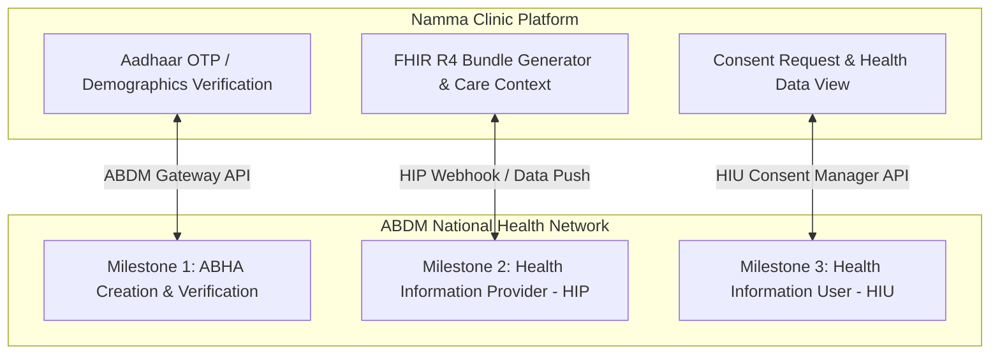

# 🇮🇳 Ayushman Bharat Digital Mission (ABDM) Integration
## Namma Clinic Digital Health & Operations Platform
**Document Code:** INT-ABD-02 | **Status:** Approved Baseline | **Date:** September 2026

---

### 1. ABDM Milestone Architecture & Compliance Scope

### 2. Supported FHIR R4 Resources
- `Patient`: Demographics, UHID identifier, ABHA number.
- `Encounter`: Clinic visit metadata, attending doctor, timestamp.
- `Condition`: ICD-10 / SNOMED CT diagnostic codes.
- `MedicationRequest`: Electronic prescription details.
- `Observation`: Vital signs (BP, Pulse, Glucose) and lab results.
