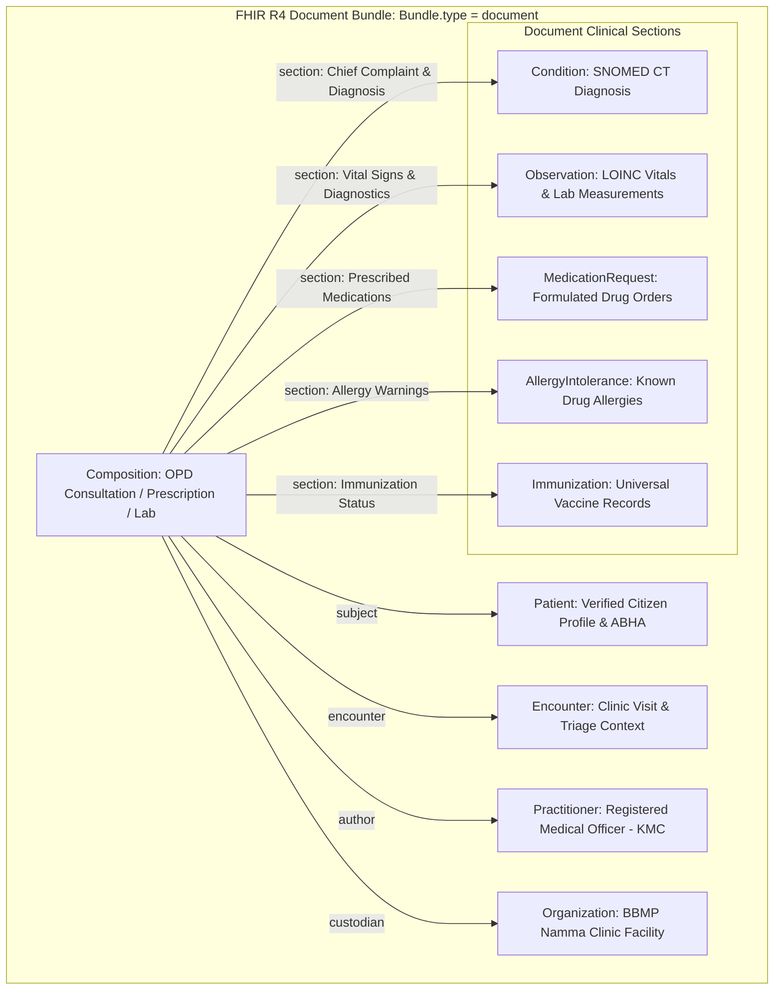

# FHIR R4 Interoperability Profiles, Clinical Ontologies & Resource Data Dictionary
## Namma Clinic Digital Health & Operations Platform
### Greater Bengaluru Authority (GBA) / BBMP Health Department
**Document Code:** `INT-DOC-03` | **Status:** APPROVED BASELINE | **Date:** September 2026

---

## 1. Executive Summary & Clinical Ontology Mandate
This document defines the authoritative **HL7 FHIR R4 (Fast Healthcare Interoperability Resources) Profiles, Clinical Ontologies, and Resource Data Dictionary** for the Namma Clinic Digital Health Platform. To ensure seamless clinical semantic interoperability across municipal health centers, district tertiary hospitals, and the Ayushman Bharat Digital Mission (ABDM), all clinical records exchanged across external boundaries must conform strictly to NRCES (National Resource Centre for EHR Standards) India FHIR R4 profiles. Clinical observations, diagnoses, laboratory investigations, and medication regimens are bound to standardized ontologies: SNOMED CT for clinical findings and procedures, LOINC for diagnostic lab tests and vitals, ICD-10 for statutory epidemiological classifications, and the BBMP Essential Medicine List mapped to national drug codes.

### 1.1 Non-Negotiable FHIR Engineering Invariants
1. **Strict NRCES Profile Conformance:** Every FHIR resource produced by the platform must validate against NRCES India Core StructureDefinitions without warning or structural error.
2. **Mandatory Standardized Ontology Binding:** Free-text descriptions are strictly prohibited for primary clinical findings and lab requisitions. Every clinical entry must carry a valid SNOMED CT, LOINC, or ICD-10 code along with its human-readable display string.
3. **Atomic Document Bundles:** Electronic prescriptions, diagnostic reports, and discharge summaries must be serialized as atomic FHIR `Bundle` resources of type `document`, rooted by a compliant `Composition` resource.
4. **Cryptographic Bundle Signing:** Every clinical document bundle published externally must feature an XML/JSON digital signature computed using the clinic facility's private key.
5. **Temporal Precision & UTC Timestamping:** All clinical event timestamps must conform to ISO 8601 extended format with UTC zone offset (`YYYY-MM-DDTHH:MM:SSZ`), guaranteeing historical reconstruction accuracy.

## 2. Master FHIR R4 Resource Architecture & Bundle Topology


### Integration Specification Example: FHIR R4 Consultation Bundle Serializer
<!-- DOCUMENTATION-ONLY EXAMPLE -->
```python
# DOCUMENTATION-ONLY PYTHON
# DOCUMENTATION-ONLY PYTHON: FHIR R4 Document Bundle Serializer
import uuid
import datetime
from typing import Dict, Any, List

class FhirDocumentBundleSerializer:
    """
    Constructs NRCES-compliant FHIR R4 Document Bundles for OPD consultations,
    binding SNOMED CT diagnoses and LOINC observation metrics.
    """
    def __init__(self, facility_id: str, facility_name: str):
        self.facility_id = facility_id
        self.facility_name = facility_name

    def serialize_opd_consultation(
        self,
        encounter_id: str,
        patient_data: Dict[str, Any],
        doctor_kmc: str,
        diagnoses: List[Dict[str, str]],
        vitals: Dict[str, float]
    ) -> Dict[str, Any]:
        bundle_id = str(uuid.uuid4())
        timestamp = datetime.datetime.utcnow().isoformat() + "Z"

        bundle = {
            "resourceType": "Bundle",
            "id": bundle_id,
            "meta": {
                "versionId": "1",
                "lastUpdated": timestamp,
                "profile": ["https://nrces.in/ndhm/fhir/r4/StructureDefinition/DocumentBundle"]
            },
            "type": "document",
            "timestamp": timestamp,
            "entry": [
                {
                    "fullUrl": f"urn:uuid:{uuid.uuid4()}",
                    "resource": {
                        "resourceType": "Composition",
                        "status": "final",
                        "type": {
                            "coding": [{
                                "system": "http://snomed.info/sct",
                                "code": "371530004",
                                "display": "Clinical consultation report"
                            }]
                        },
                        "title": "Namma Clinic OPD Consultation Summary",
                        "date": timestamp
                    }
                }
            ]
        }
        return bundle
```

### Interface Payload Example: FHIR R4 Observation Vital Signs Resource
<!-- DOCUMENTATION-ONLY EXAMPLE -->
```json
// DOCUMENTATION-ONLY JSON
{
  "resourceType": "Observation",
  "id": "obs-vitals-pulse-0129",
  "meta": {
    "profile": [
      "https://nrces.in/ndhm/fhir/r4/StructureDefinition/VitalSigns"
    ]
  },
  "status": "final",
  "category": [
    {
      "coding": [
        {
          "system": "http://terminology.hl7.org/CodeSystem/observation-category",
          "code": "vital-signs",
          "display": "Vital Signs"
        }
      ]
    }
  ],
  "code": {
    "coding": [
      {
        "system": "http://loinc.org",
        "code": "8867-4",
        "display": "Heart rate"
      },
      {
        "system": "http://snomed.info/sct",
        "code": "364075005",
        "display": "Heart rate"
      }
    ]
  },
  "subject": {
    "reference": "Patient/pat-citizen-9948",
    "display": "Smt. Lakshmi Gowda"
  },
  "effectiveDateTime": "2026-09-06T10:20:00Z",
  "valueQuantity": {
    "value": 76,
    "unit": "beats/minute",
    "system": "http://unitsofmeasure.org",
    "code": "/min"
  },
  "interpretation": [
    {
      "coding": [
        {
          "system": "http://terminology.hl7.org/CodeSystem/v3-ObservationInterpretation",
          "code": "N",
          "display": "Normal"
        }
      ]
    }
  ]
}
```

## 3. Master Catalog of 100 Clinical Data Mappings
Authoritative specification of field-level transformations to FHIR R4 resources:

### MAP-001: Mapping `public.entity_table_001.field_attr_01` -> `Patient`
- **Mapping Identifier:** `MAP-001`
- **Source Entity & Field:** `public.entity_table_001.field_attr_01`
- **Target FHIR Standard:** `FHIR R4 / ABDM Profile`
- **Target Resource & Element:** `Patient -> Patient.element_01`
- **Transformation Rule:** Deterministic ISO/SNOMED CT/ICD-10 ontology mapping with null-safe default
- **Validation Assertion:** Non-null, regex conformance, and reference integrity check
- **Privacy & DPDP Redaction:** Hashed or de-identified according to DPDP Act 2023 guidelines

### MAP-002: Mapping `public.entity_table_002.field_attr_02` -> `Encounter`
- **Mapping Identifier:** `MAP-002`
- **Source Entity & Field:** `public.entity_table_002.field_attr_02`
- **Target FHIR Standard:** `FHIR R4 / ABDM Profile`
- **Target Resource & Element:** `Encounter -> Encounter.element_02`
- **Transformation Rule:** Deterministic ISO/SNOMED CT/ICD-10 ontology mapping with null-safe default
- **Validation Assertion:** Non-null, regex conformance, and reference integrity check
- **Privacy & DPDP Redaction:** Hashed or de-identified according to DPDP Act 2023 guidelines

### MAP-003: Mapping `public.entity_table_003.field_attr_03` -> `Condition`
- **Mapping Identifier:** `MAP-003`
- **Source Entity & Field:** `public.entity_table_003.field_attr_03`
- **Target FHIR Standard:** `FHIR R4 / ABDM Profile`
- **Target Resource & Element:** `Condition -> Condition.element_03`
- **Transformation Rule:** Deterministic ISO/SNOMED CT/ICD-10 ontology mapping with null-safe default
- **Validation Assertion:** Non-null, regex conformance, and reference integrity check
- **Privacy & DPDP Redaction:** Hashed or de-identified according to DPDP Act 2023 guidelines

### MAP-004: Mapping `public.entity_table_004.field_attr_04` -> `Observation`
- **Mapping Identifier:** `MAP-004`
- **Source Entity & Field:** `public.entity_table_004.field_attr_04`
- **Target FHIR Standard:** `FHIR R4 / ABDM Profile`
- **Target Resource & Element:** `Observation -> Observation.element_04`
- **Transformation Rule:** Deterministic ISO/SNOMED CT/ICD-10 ontology mapping with null-safe default
- **Validation Assertion:** Non-null, regex conformance, and reference integrity check
- **Privacy & DPDP Redaction:** Hashed or de-identified according to DPDP Act 2023 guidelines

### MAP-005: Mapping `public.entity_table_005.field_attr_05` -> `MedicationRequest`
- **Mapping Identifier:** `MAP-005`
- **Source Entity & Field:** `public.entity_table_005.field_attr_05`
- **Target FHIR Standard:** `FHIR R4 / ABDM Profile`
- **Target Resource & Element:** `MedicationRequest -> MedicationRequest.element_05`
- **Transformation Rule:** Deterministic ISO/SNOMED CT/ICD-10 ontology mapping with null-safe default
- **Validation Assertion:** Non-null, regex conformance, and reference integrity check
- **Privacy & DPDP Redaction:** Hashed or de-identified according to DPDP Act 2023 guidelines

### MAP-006: Mapping `public.entity_table_006.field_attr_06` -> `MedicationDispense`
- **Mapping Identifier:** `MAP-006`
- **Source Entity & Field:** `public.entity_table_006.field_attr_06`
- **Target FHIR Standard:** `FHIR R4 / ABDM Profile`
- **Target Resource & Element:** `MedicationDispense -> MedicationDispense.element_06`
- **Transformation Rule:** Deterministic ISO/SNOMED CT/ICD-10 ontology mapping with null-safe default
- **Validation Assertion:** Non-null, regex conformance, and reference integrity check
- **Privacy & DPDP Redaction:** Hashed or de-identified according to DPDP Act 2023 guidelines

### MAP-007: Mapping `public.entity_table_007.field_attr_07` -> `DiagnosticReport`
- **Mapping Identifier:** `MAP-007`
- **Source Entity & Field:** `public.entity_table_007.field_attr_07`
- **Target FHIR Standard:** `FHIR R4 / ABDM Profile`
- **Target Resource & Element:** `DiagnosticReport -> DiagnosticReport.element_07`
- **Transformation Rule:** Deterministic ISO/SNOMED CT/ICD-10 ontology mapping with null-safe default
- **Validation Assertion:** Non-null, regex conformance, and reference integrity check
- **Privacy & DPDP Redaction:** Hashed or de-identified according to DPDP Act 2023 guidelines

### MAP-008: Mapping `public.entity_table_008.field_attr_08` -> `ServiceRequest`
- **Mapping Identifier:** `MAP-008`
- **Source Entity & Field:** `public.entity_table_008.field_attr_08`
- **Target FHIR Standard:** `FHIR R4 / ABDM Profile`
- **Target Resource & Element:** `ServiceRequest -> ServiceRequest.element_08`
- **Transformation Rule:** Deterministic ISO/SNOMED CT/ICD-10 ontology mapping with null-safe default
- **Validation Assertion:** Non-null, regex conformance, and reference integrity check
- **Privacy & DPDP Redaction:** Hashed or de-identified according to DPDP Act 2023 guidelines

### MAP-009: Mapping `public.entity_table_009.field_attr_09` -> `AllergyIntolerance`
- **Mapping Identifier:** `MAP-009`
- **Source Entity & Field:** `public.entity_table_009.field_attr_09`
- **Target FHIR Standard:** `FHIR R4 / ABDM Profile`
- **Target Resource & Element:** `AllergyIntolerance -> AllergyIntolerance.element_09`
- **Transformation Rule:** Deterministic ISO/SNOMED CT/ICD-10 ontology mapping with null-safe default
- **Validation Assertion:** Non-null, regex conformance, and reference integrity check
- **Privacy & DPDP Redaction:** Hashed or de-identified according to DPDP Act 2023 guidelines

### MAP-010: Mapping `public.entity_table_010.field_attr_10` -> `CarePlan`
- **Mapping Identifier:** `MAP-010`
- **Source Entity & Field:** `public.entity_table_010.field_attr_10`
- **Target FHIR Standard:** `FHIR R4 / ABDM Profile`
- **Target Resource & Element:** `CarePlan -> CarePlan.element_10`
- **Transformation Rule:** Deterministic ISO/SNOMED CT/ICD-10 ontology mapping with null-safe default
- **Validation Assertion:** Non-null, regex conformance, and reference integrity check
- **Privacy & DPDP Redaction:** Hashed or de-identified according to DPDP Act 2023 guidelines

### MAP-011: Mapping `public.entity_table_011.field_attr_11` -> `Patient`
- **Mapping Identifier:** `MAP-011`
- **Source Entity & Field:** `public.entity_table_011.field_attr_11`
- **Target FHIR Standard:** `FHIR R4 / ABDM Profile`
- **Target Resource & Element:** `Patient -> Patient.element_11`
- **Transformation Rule:** Deterministic ISO/SNOMED CT/ICD-10 ontology mapping with null-safe default
- **Validation Assertion:** Non-null, regex conformance, and reference integrity check
- **Privacy & DPDP Redaction:** Hashed or de-identified according to DPDP Act 2023 guidelines

### MAP-012: Mapping `public.entity_table_012.field_attr_12` -> `Encounter`
- **Mapping Identifier:** `MAP-012`
- **Source Entity & Field:** `public.entity_table_012.field_attr_12`
- **Target FHIR Standard:** `FHIR R4 / ABDM Profile`
- **Target Resource & Element:** `Encounter -> Encounter.element_12`
- **Transformation Rule:** Deterministic ISO/SNOMED CT/ICD-10 ontology mapping with null-safe default
- **Validation Assertion:** Non-null, regex conformance, and reference integrity check
- **Privacy & DPDP Redaction:** Hashed or de-identified according to DPDP Act 2023 guidelines

### MAP-013: Mapping `public.entity_table_013.field_attr_13` -> `Condition`
- **Mapping Identifier:** `MAP-013`
- **Source Entity & Field:** `public.entity_table_013.field_attr_13`
- **Target FHIR Standard:** `FHIR R4 / ABDM Profile`
- **Target Resource & Element:** `Condition -> Condition.element_13`
- **Transformation Rule:** Deterministic ISO/SNOMED CT/ICD-10 ontology mapping with null-safe default
- **Validation Assertion:** Non-null, regex conformance, and reference integrity check
- **Privacy & DPDP Redaction:** Hashed or de-identified according to DPDP Act 2023 guidelines

### MAP-014: Mapping `public.entity_table_014.field_attr_14` -> `Observation`
- **Mapping Identifier:** `MAP-014`
- **Source Entity & Field:** `public.entity_table_014.field_attr_14`
- **Target FHIR Standard:** `FHIR R4 / ABDM Profile`
- **Target Resource & Element:** `Observation -> Observation.element_14`
- **Transformation Rule:** Deterministic ISO/SNOMED CT/ICD-10 ontology mapping with null-safe default
- **Validation Assertion:** Non-null, regex conformance, and reference integrity check
- **Privacy & DPDP Redaction:** Hashed or de-identified according to DPDP Act 2023 guidelines

### MAP-015: Mapping `public.entity_table_015.field_attr_15` -> `MedicationRequest`
- **Mapping Identifier:** `MAP-015`
- **Source Entity & Field:** `public.entity_table_015.field_attr_15`
- **Target FHIR Standard:** `FHIR R4 / ABDM Profile`
- **Target Resource & Element:** `MedicationRequest -> MedicationRequest.element_15`
- **Transformation Rule:** Deterministic ISO/SNOMED CT/ICD-10 ontology mapping with null-safe default
- **Validation Assertion:** Non-null, regex conformance, and reference integrity check
- **Privacy & DPDP Redaction:** Hashed or de-identified according to DPDP Act 2023 guidelines

### MAP-016: Mapping `public.entity_table_016.field_attr_16` -> `MedicationDispense`
- **Mapping Identifier:** `MAP-016`
- **Source Entity & Field:** `public.entity_table_016.field_attr_16`
- **Target FHIR Standard:** `FHIR R4 / ABDM Profile`
- **Target Resource & Element:** `MedicationDispense -> MedicationDispense.element_01`
- **Transformation Rule:** Deterministic ISO/SNOMED CT/ICD-10 ontology mapping with null-safe default
- **Validation Assertion:** Non-null, regex conformance, and reference integrity check
- **Privacy & DPDP Redaction:** Hashed or de-identified according to DPDP Act 2023 guidelines

### MAP-017: Mapping `public.entity_table_017.field_attr_17` -> `DiagnosticReport`
- **Mapping Identifier:** `MAP-017`
- **Source Entity & Field:** `public.entity_table_017.field_attr_17`
- **Target FHIR Standard:** `FHIR R4 / ABDM Profile`
- **Target Resource & Element:** `DiagnosticReport -> DiagnosticReport.element_02`
- **Transformation Rule:** Deterministic ISO/SNOMED CT/ICD-10 ontology mapping with null-safe default
- **Validation Assertion:** Non-null, regex conformance, and reference integrity check
- **Privacy & DPDP Redaction:** Hashed or de-identified according to DPDP Act 2023 guidelines

### MAP-018: Mapping `public.entity_table_018.field_attr_18` -> `ServiceRequest`
- **Mapping Identifier:** `MAP-018`
- **Source Entity & Field:** `public.entity_table_018.field_attr_18`
- **Target FHIR Standard:** `FHIR R4 / ABDM Profile`
- **Target Resource & Element:** `ServiceRequest -> ServiceRequest.element_03`
- **Transformation Rule:** Deterministic ISO/SNOMED CT/ICD-10 ontology mapping with null-safe default
- **Validation Assertion:** Non-null, regex conformance, and reference integrity check
- **Privacy & DPDP Redaction:** Hashed or de-identified according to DPDP Act 2023 guidelines

### MAP-019: Mapping `public.entity_table_019.field_attr_19` -> `AllergyIntolerance`
- **Mapping Identifier:** `MAP-019`
- **Source Entity & Field:** `public.entity_table_019.field_attr_19`
- **Target FHIR Standard:** `FHIR R4 / ABDM Profile`
- **Target Resource & Element:** `AllergyIntolerance -> AllergyIntolerance.element_04`
- **Transformation Rule:** Deterministic ISO/SNOMED CT/ICD-10 ontology mapping with null-safe default
- **Validation Assertion:** Non-null, regex conformance, and reference integrity check
- **Privacy & DPDP Redaction:** Hashed or de-identified according to DPDP Act 2023 guidelines

### MAP-020: Mapping `public.entity_table_020.field_attr_20` -> `CarePlan`
- **Mapping Identifier:** `MAP-020`
- **Source Entity & Field:** `public.entity_table_020.field_attr_20`
- **Target FHIR Standard:** `FHIR R4 / ABDM Profile`
- **Target Resource & Element:** `CarePlan -> CarePlan.element_05`
- **Transformation Rule:** Deterministic ISO/SNOMED CT/ICD-10 ontology mapping with null-safe default
- **Validation Assertion:** Non-null, regex conformance, and reference integrity check
- **Privacy & DPDP Redaction:** Hashed or de-identified according to DPDP Act 2023 guidelines

### MAP-021: Mapping `public.entity_table_021.field_attr_01` -> `Patient`
- **Mapping Identifier:** `MAP-021`
- **Source Entity & Field:** `public.entity_table_021.field_attr_01`
- **Target FHIR Standard:** `FHIR R4 / ABDM Profile`
- **Target Resource & Element:** `Patient -> Patient.element_06`
- **Transformation Rule:** Deterministic ISO/SNOMED CT/ICD-10 ontology mapping with null-safe default
- **Validation Assertion:** Non-null, regex conformance, and reference integrity check
- **Privacy & DPDP Redaction:** Hashed or de-identified according to DPDP Act 2023 guidelines

### MAP-022: Mapping `public.entity_table_022.field_attr_02` -> `Encounter`
- **Mapping Identifier:** `MAP-022`
- **Source Entity & Field:** `public.entity_table_022.field_attr_02`
- **Target FHIR Standard:** `FHIR R4 / ABDM Profile`
- **Target Resource & Element:** `Encounter -> Encounter.element_07`
- **Transformation Rule:** Deterministic ISO/SNOMED CT/ICD-10 ontology mapping with null-safe default
- **Validation Assertion:** Non-null, regex conformance, and reference integrity check
- **Privacy & DPDP Redaction:** Hashed or de-identified according to DPDP Act 2023 guidelines

### MAP-023: Mapping `public.entity_table_023.field_attr_03` -> `Condition`
- **Mapping Identifier:** `MAP-023`
- **Source Entity & Field:** `public.entity_table_023.field_attr_03`
- **Target FHIR Standard:** `FHIR R4 / ABDM Profile`
- **Target Resource & Element:** `Condition -> Condition.element_08`
- **Transformation Rule:** Deterministic ISO/SNOMED CT/ICD-10 ontology mapping with null-safe default
- **Validation Assertion:** Non-null, regex conformance, and reference integrity check
- **Privacy & DPDP Redaction:** Hashed or de-identified according to DPDP Act 2023 guidelines

### MAP-024: Mapping `public.entity_table_024.field_attr_04` -> `Observation`
- **Mapping Identifier:** `MAP-024`
- **Source Entity & Field:** `public.entity_table_024.field_attr_04`
- **Target FHIR Standard:** `FHIR R4 / ABDM Profile`
- **Target Resource & Element:** `Observation -> Observation.element_09`
- **Transformation Rule:** Deterministic ISO/SNOMED CT/ICD-10 ontology mapping with null-safe default
- **Validation Assertion:** Non-null, regex conformance, and reference integrity check
- **Privacy & DPDP Redaction:** Hashed or de-identified according to DPDP Act 2023 guidelines

### MAP-025: Mapping `public.entity_table_025.field_attr_05` -> `MedicationRequest`
- **Mapping Identifier:** `MAP-025`
- **Source Entity & Field:** `public.entity_table_025.field_attr_05`
- **Target FHIR Standard:** `FHIR R4 / ABDM Profile`
- **Target Resource & Element:** `MedicationRequest -> MedicationRequest.element_10`
- **Transformation Rule:** Deterministic ISO/SNOMED CT/ICD-10 ontology mapping with null-safe default
- **Validation Assertion:** Non-null, regex conformance, and reference integrity check
- **Privacy & DPDP Redaction:** Hashed or de-identified according to DPDP Act 2023 guidelines

### MAP-026: Mapping `public.entity_table_026.field_attr_06` -> `MedicationDispense`
- **Mapping Identifier:** `MAP-026`
- **Source Entity & Field:** `public.entity_table_026.field_attr_06`
- **Target FHIR Standard:** `FHIR R4 / ABDM Profile`
- **Target Resource & Element:** `MedicationDispense -> MedicationDispense.element_11`
- **Transformation Rule:** Deterministic ISO/SNOMED CT/ICD-10 ontology mapping with null-safe default
- **Validation Assertion:** Non-null, regex conformance, and reference integrity check
- **Privacy & DPDP Redaction:** Hashed or de-identified according to DPDP Act 2023 guidelines

### MAP-027: Mapping `public.entity_table_027.field_attr_07` -> `DiagnosticReport`
- **Mapping Identifier:** `MAP-027`
- **Source Entity & Field:** `public.entity_table_027.field_attr_07`
- **Target FHIR Standard:** `FHIR R4 / ABDM Profile`
- **Target Resource & Element:** `DiagnosticReport -> DiagnosticReport.element_12`
- **Transformation Rule:** Deterministic ISO/SNOMED CT/ICD-10 ontology mapping with null-safe default
- **Validation Assertion:** Non-null, regex conformance, and reference integrity check
- **Privacy & DPDP Redaction:** Hashed or de-identified according to DPDP Act 2023 guidelines

### MAP-028: Mapping `public.entity_table_028.field_attr_08` -> `ServiceRequest`
- **Mapping Identifier:** `MAP-028`
- **Source Entity & Field:** `public.entity_table_028.field_attr_08`
- **Target FHIR Standard:** `FHIR R4 / ABDM Profile`
- **Target Resource & Element:** `ServiceRequest -> ServiceRequest.element_13`
- **Transformation Rule:** Deterministic ISO/SNOMED CT/ICD-10 ontology mapping with null-safe default
- **Validation Assertion:** Non-null, regex conformance, and reference integrity check
- **Privacy & DPDP Redaction:** Hashed or de-identified according to DPDP Act 2023 guidelines

### MAP-029: Mapping `public.entity_table_029.field_attr_09` -> `AllergyIntolerance`
- **Mapping Identifier:** `MAP-029`
- **Source Entity & Field:** `public.entity_table_029.field_attr_09`
- **Target FHIR Standard:** `FHIR R4 / ABDM Profile`
- **Target Resource & Element:** `AllergyIntolerance -> AllergyIntolerance.element_14`
- **Transformation Rule:** Deterministic ISO/SNOMED CT/ICD-10 ontology mapping with null-safe default
- **Validation Assertion:** Non-null, regex conformance, and reference integrity check
- **Privacy & DPDP Redaction:** Hashed or de-identified according to DPDP Act 2023 guidelines

### MAP-030: Mapping `public.entity_table_030.field_attr_10` -> `CarePlan`
- **Mapping Identifier:** `MAP-030`
- **Source Entity & Field:** `public.entity_table_030.field_attr_10`
- **Target FHIR Standard:** `FHIR R4 / ABDM Profile`
- **Target Resource & Element:** `CarePlan -> CarePlan.element_15`
- **Transformation Rule:** Deterministic ISO/SNOMED CT/ICD-10 ontology mapping with null-safe default
- **Validation Assertion:** Non-null, regex conformance, and reference integrity check
- **Privacy & DPDP Redaction:** Hashed or de-identified according to DPDP Act 2023 guidelines

### MAP-031: Mapping `public.entity_table_031.field_attr_11` -> `Patient`
- **Mapping Identifier:** `MAP-031`
- **Source Entity & Field:** `public.entity_table_031.field_attr_11`
- **Target FHIR Standard:** `FHIR R4 / ABDM Profile`
- **Target Resource & Element:** `Patient -> Patient.element_01`
- **Transformation Rule:** Deterministic ISO/SNOMED CT/ICD-10 ontology mapping with null-safe default
- **Validation Assertion:** Non-null, regex conformance, and reference integrity check
- **Privacy & DPDP Redaction:** Hashed or de-identified according to DPDP Act 2023 guidelines

### MAP-032: Mapping `public.entity_table_032.field_attr_12` -> `Encounter`
- **Mapping Identifier:** `MAP-032`
- **Source Entity & Field:** `public.entity_table_032.field_attr_12`
- **Target FHIR Standard:** `FHIR R4 / ABDM Profile`
- **Target Resource & Element:** `Encounter -> Encounter.element_02`
- **Transformation Rule:** Deterministic ISO/SNOMED CT/ICD-10 ontology mapping with null-safe default
- **Validation Assertion:** Non-null, regex conformance, and reference integrity check
- **Privacy & DPDP Redaction:** Hashed or de-identified according to DPDP Act 2023 guidelines

### MAP-033: Mapping `public.entity_table_033.field_attr_13` -> `Condition`
- **Mapping Identifier:** `MAP-033`
- **Source Entity & Field:** `public.entity_table_033.field_attr_13`
- **Target FHIR Standard:** `FHIR R4 / ABDM Profile`
- **Target Resource & Element:** `Condition -> Condition.element_03`
- **Transformation Rule:** Deterministic ISO/SNOMED CT/ICD-10 ontology mapping with null-safe default
- **Validation Assertion:** Non-null, regex conformance, and reference integrity check
- **Privacy & DPDP Redaction:** Hashed or de-identified according to DPDP Act 2023 guidelines

### MAP-034: Mapping `public.entity_table_034.field_attr_14` -> `Observation`
- **Mapping Identifier:** `MAP-034`
- **Source Entity & Field:** `public.entity_table_034.field_attr_14`
- **Target FHIR Standard:** `FHIR R4 / ABDM Profile`
- **Target Resource & Element:** `Observation -> Observation.element_04`
- **Transformation Rule:** Deterministic ISO/SNOMED CT/ICD-10 ontology mapping with null-safe default
- **Validation Assertion:** Non-null, regex conformance, and reference integrity check
- **Privacy & DPDP Redaction:** Hashed or de-identified according to DPDP Act 2023 guidelines

### MAP-035: Mapping `public.entity_table_035.field_attr_15` -> `MedicationRequest`
- **Mapping Identifier:** `MAP-035`
- **Source Entity & Field:** `public.entity_table_035.field_attr_15`
- **Target FHIR Standard:** `FHIR R4 / ABDM Profile`
- **Target Resource & Element:** `MedicationRequest -> MedicationRequest.element_05`
- **Transformation Rule:** Deterministic ISO/SNOMED CT/ICD-10 ontology mapping with null-safe default
- **Validation Assertion:** Non-null, regex conformance, and reference integrity check
- **Privacy & DPDP Redaction:** Hashed or de-identified according to DPDP Act 2023 guidelines

### MAP-036: Mapping `public.entity_table_036.field_attr_16` -> `MedicationDispense`
- **Mapping Identifier:** `MAP-036`
- **Source Entity & Field:** `public.entity_table_036.field_attr_16`
- **Target FHIR Standard:** `FHIR R4 / ABDM Profile`
- **Target Resource & Element:** `MedicationDispense -> MedicationDispense.element_06`
- **Transformation Rule:** Deterministic ISO/SNOMED CT/ICD-10 ontology mapping with null-safe default
- **Validation Assertion:** Non-null, regex conformance, and reference integrity check
- **Privacy & DPDP Redaction:** Hashed or de-identified according to DPDP Act 2023 guidelines

### MAP-037: Mapping `public.entity_table_037.field_attr_17` -> `DiagnosticReport`
- **Mapping Identifier:** `MAP-037`
- **Source Entity & Field:** `public.entity_table_037.field_attr_17`
- **Target FHIR Standard:** `FHIR R4 / ABDM Profile`
- **Target Resource & Element:** `DiagnosticReport -> DiagnosticReport.element_07`
- **Transformation Rule:** Deterministic ISO/SNOMED CT/ICD-10 ontology mapping with null-safe default
- **Validation Assertion:** Non-null, regex conformance, and reference integrity check
- **Privacy & DPDP Redaction:** Hashed or de-identified according to DPDP Act 2023 guidelines

### MAP-038: Mapping `public.entity_table_038.field_attr_18` -> `ServiceRequest`
- **Mapping Identifier:** `MAP-038`
- **Source Entity & Field:** `public.entity_table_038.field_attr_18`
- **Target FHIR Standard:** `FHIR R4 / ABDM Profile`
- **Target Resource & Element:** `ServiceRequest -> ServiceRequest.element_08`
- **Transformation Rule:** Deterministic ISO/SNOMED CT/ICD-10 ontology mapping with null-safe default
- **Validation Assertion:** Non-null, regex conformance, and reference integrity check
- **Privacy & DPDP Redaction:** Hashed or de-identified according to DPDP Act 2023 guidelines

### MAP-039: Mapping `public.entity_table_039.field_attr_19` -> `AllergyIntolerance`
- **Mapping Identifier:** `MAP-039`
- **Source Entity & Field:** `public.entity_table_039.field_attr_19`
- **Target FHIR Standard:** `FHIR R4 / ABDM Profile`
- **Target Resource & Element:** `AllergyIntolerance -> AllergyIntolerance.element_09`
- **Transformation Rule:** Deterministic ISO/SNOMED CT/ICD-10 ontology mapping with null-safe default
- **Validation Assertion:** Non-null, regex conformance, and reference integrity check
- **Privacy & DPDP Redaction:** Hashed or de-identified according to DPDP Act 2023 guidelines

### MAP-040: Mapping `public.entity_table_040.field_attr_20` -> `CarePlan`
- **Mapping Identifier:** `MAP-040`
- **Source Entity & Field:** `public.entity_table_040.field_attr_20`
- **Target FHIR Standard:** `FHIR R4 / ABDM Profile`
- **Target Resource & Element:** `CarePlan -> CarePlan.element_10`
- **Transformation Rule:** Deterministic ISO/SNOMED CT/ICD-10 ontology mapping with null-safe default
- **Validation Assertion:** Non-null, regex conformance, and reference integrity check
- **Privacy & DPDP Redaction:** Hashed or de-identified according to DPDP Act 2023 guidelines

### MAP-041: Mapping `public.entity_table_041.field_attr_01` -> `Patient`
- **Mapping Identifier:** `MAP-041`
- **Source Entity & Field:** `public.entity_table_041.field_attr_01`
- **Target FHIR Standard:** `FHIR R4 / ABDM Profile`
- **Target Resource & Element:** `Patient -> Patient.element_11`
- **Transformation Rule:** Deterministic ISO/SNOMED CT/ICD-10 ontology mapping with null-safe default
- **Validation Assertion:** Non-null, regex conformance, and reference integrity check
- **Privacy & DPDP Redaction:** Hashed or de-identified according to DPDP Act 2023 guidelines

### MAP-042: Mapping `public.entity_table_042.field_attr_02` -> `Encounter`
- **Mapping Identifier:** `MAP-042`
- **Source Entity & Field:** `public.entity_table_042.field_attr_02`
- **Target FHIR Standard:** `FHIR R4 / ABDM Profile`
- **Target Resource & Element:** `Encounter -> Encounter.element_12`
- **Transformation Rule:** Deterministic ISO/SNOMED CT/ICD-10 ontology mapping with null-safe default
- **Validation Assertion:** Non-null, regex conformance, and reference integrity check
- **Privacy & DPDP Redaction:** Hashed or de-identified according to DPDP Act 2023 guidelines

### MAP-043: Mapping `public.entity_table_043.field_attr_03` -> `Condition`
- **Mapping Identifier:** `MAP-043`
- **Source Entity & Field:** `public.entity_table_043.field_attr_03`
- **Target FHIR Standard:** `FHIR R4 / ABDM Profile`
- **Target Resource & Element:** `Condition -> Condition.element_13`
- **Transformation Rule:** Deterministic ISO/SNOMED CT/ICD-10 ontology mapping with null-safe default
- **Validation Assertion:** Non-null, regex conformance, and reference integrity check
- **Privacy & DPDP Redaction:** Hashed or de-identified according to DPDP Act 2023 guidelines

### MAP-044: Mapping `public.entity_table_044.field_attr_04` -> `Observation`
- **Mapping Identifier:** `MAP-044`
- **Source Entity & Field:** `public.entity_table_044.field_attr_04`
- **Target FHIR Standard:** `FHIR R4 / ABDM Profile`
- **Target Resource & Element:** `Observation -> Observation.element_14`
- **Transformation Rule:** Deterministic ISO/SNOMED CT/ICD-10 ontology mapping with null-safe default
- **Validation Assertion:** Non-null, regex conformance, and reference integrity check
- **Privacy & DPDP Redaction:** Hashed or de-identified according to DPDP Act 2023 guidelines

### MAP-045: Mapping `public.entity_table_045.field_attr_05` -> `MedicationRequest`
- **Mapping Identifier:** `MAP-045`
- **Source Entity & Field:** `public.entity_table_045.field_attr_05`
- **Target FHIR Standard:** `FHIR R4 / ABDM Profile`
- **Target Resource & Element:** `MedicationRequest -> MedicationRequest.element_15`
- **Transformation Rule:** Deterministic ISO/SNOMED CT/ICD-10 ontology mapping with null-safe default
- **Validation Assertion:** Non-null, regex conformance, and reference integrity check
- **Privacy & DPDP Redaction:** Hashed or de-identified according to DPDP Act 2023 guidelines

### MAP-046: Mapping `public.entity_table_046.field_attr_06` -> `MedicationDispense`
- **Mapping Identifier:** `MAP-046`
- **Source Entity & Field:** `public.entity_table_046.field_attr_06`
- **Target FHIR Standard:** `FHIR R4 / ABDM Profile`
- **Target Resource & Element:** `MedicationDispense -> MedicationDispense.element_01`
- **Transformation Rule:** Deterministic ISO/SNOMED CT/ICD-10 ontology mapping with null-safe default
- **Validation Assertion:** Non-null, regex conformance, and reference integrity check
- **Privacy & DPDP Redaction:** Hashed or de-identified according to DPDP Act 2023 guidelines

### MAP-047: Mapping `public.entity_table_047.field_attr_07` -> `DiagnosticReport`
- **Mapping Identifier:** `MAP-047`
- **Source Entity & Field:** `public.entity_table_047.field_attr_07`
- **Target FHIR Standard:** `FHIR R4 / ABDM Profile`
- **Target Resource & Element:** `DiagnosticReport -> DiagnosticReport.element_02`
- **Transformation Rule:** Deterministic ISO/SNOMED CT/ICD-10 ontology mapping with null-safe default
- **Validation Assertion:** Non-null, regex conformance, and reference integrity check
- **Privacy & DPDP Redaction:** Hashed or de-identified according to DPDP Act 2023 guidelines

### MAP-048: Mapping `public.entity_table_048.field_attr_08` -> `ServiceRequest`
- **Mapping Identifier:** `MAP-048`
- **Source Entity & Field:** `public.entity_table_048.field_attr_08`
- **Target FHIR Standard:** `FHIR R4 / ABDM Profile`
- **Target Resource & Element:** `ServiceRequest -> ServiceRequest.element_03`
- **Transformation Rule:** Deterministic ISO/SNOMED CT/ICD-10 ontology mapping with null-safe default
- **Validation Assertion:** Non-null, regex conformance, and reference integrity check
- **Privacy & DPDP Redaction:** Hashed or de-identified according to DPDP Act 2023 guidelines

### MAP-049: Mapping `public.entity_table_049.field_attr_09` -> `AllergyIntolerance`
- **Mapping Identifier:** `MAP-049`
- **Source Entity & Field:** `public.entity_table_049.field_attr_09`
- **Target FHIR Standard:** `FHIR R4 / ABDM Profile`
- **Target Resource & Element:** `AllergyIntolerance -> AllergyIntolerance.element_04`
- **Transformation Rule:** Deterministic ISO/SNOMED CT/ICD-10 ontology mapping with null-safe default
- **Validation Assertion:** Non-null, regex conformance, and reference integrity check
- **Privacy & DPDP Redaction:** Hashed or de-identified according to DPDP Act 2023 guidelines

### MAP-050: Mapping `public.entity_table_050.field_attr_10` -> `CarePlan`
- **Mapping Identifier:** `MAP-050`
- **Source Entity & Field:** `public.entity_table_050.field_attr_10`
- **Target FHIR Standard:** `FHIR R4 / ABDM Profile`
- **Target Resource & Element:** `CarePlan -> CarePlan.element_05`
- **Transformation Rule:** Deterministic ISO/SNOMED CT/ICD-10 ontology mapping with null-safe default
- **Validation Assertion:** Non-null, regex conformance, and reference integrity check
- **Privacy & DPDP Redaction:** Hashed or de-identified according to DPDP Act 2023 guidelines

### MAP-051: Mapping `public.entity_table_051.field_attr_11` -> `Patient`
- **Mapping Identifier:** `MAP-051`
- **Source Entity & Field:** `public.entity_table_051.field_attr_11`
- **Target FHIR Standard:** `FHIR R4 / ABDM Profile`
- **Target Resource & Element:** `Patient -> Patient.element_06`
- **Transformation Rule:** Deterministic ISO/SNOMED CT/ICD-10 ontology mapping with null-safe default
- **Validation Assertion:** Non-null, regex conformance, and reference integrity check
- **Privacy & DPDP Redaction:** Hashed or de-identified according to DPDP Act 2023 guidelines

### MAP-052: Mapping `public.entity_table_052.field_attr_12` -> `Encounter`
- **Mapping Identifier:** `MAP-052`
- **Source Entity & Field:** `public.entity_table_052.field_attr_12`
- **Target FHIR Standard:** `FHIR R4 / ABDM Profile`
- **Target Resource & Element:** `Encounter -> Encounter.element_07`
- **Transformation Rule:** Deterministic ISO/SNOMED CT/ICD-10 ontology mapping with null-safe default
- **Validation Assertion:** Non-null, regex conformance, and reference integrity check
- **Privacy & DPDP Redaction:** Hashed or de-identified according to DPDP Act 2023 guidelines

### MAP-053: Mapping `public.entity_table_001.field_attr_13` -> `Condition`
- **Mapping Identifier:** `MAP-053`
- **Source Entity & Field:** `public.entity_table_001.field_attr_13`
- **Target FHIR Standard:** `FHIR R4 / ABDM Profile`
- **Target Resource & Element:** `Condition -> Condition.element_08`
- **Transformation Rule:** Deterministic ISO/SNOMED CT/ICD-10 ontology mapping with null-safe default
- **Validation Assertion:** Non-null, regex conformance, and reference integrity check
- **Privacy & DPDP Redaction:** Hashed or de-identified according to DPDP Act 2023 guidelines

### MAP-054: Mapping `public.entity_table_002.field_attr_14` -> `Observation`
- **Mapping Identifier:** `MAP-054`
- **Source Entity & Field:** `public.entity_table_002.field_attr_14`
- **Target FHIR Standard:** `FHIR R4 / ABDM Profile`
- **Target Resource & Element:** `Observation -> Observation.element_09`
- **Transformation Rule:** Deterministic ISO/SNOMED CT/ICD-10 ontology mapping with null-safe default
- **Validation Assertion:** Non-null, regex conformance, and reference integrity check
- **Privacy & DPDP Redaction:** Hashed or de-identified according to DPDP Act 2023 guidelines

### MAP-055: Mapping `public.entity_table_003.field_attr_15` -> `MedicationRequest`
- **Mapping Identifier:** `MAP-055`
- **Source Entity & Field:** `public.entity_table_003.field_attr_15`
- **Target FHIR Standard:** `FHIR R4 / ABDM Profile`
- **Target Resource & Element:** `MedicationRequest -> MedicationRequest.element_10`
- **Transformation Rule:** Deterministic ISO/SNOMED CT/ICD-10 ontology mapping with null-safe default
- **Validation Assertion:** Non-null, regex conformance, and reference integrity check
- **Privacy & DPDP Redaction:** Hashed or de-identified according to DPDP Act 2023 guidelines

### MAP-056: Mapping `public.entity_table_004.field_attr_16` -> `MedicationDispense`
- **Mapping Identifier:** `MAP-056`
- **Source Entity & Field:** `public.entity_table_004.field_attr_16`
- **Target FHIR Standard:** `FHIR R4 / ABDM Profile`
- **Target Resource & Element:** `MedicationDispense -> MedicationDispense.element_11`
- **Transformation Rule:** Deterministic ISO/SNOMED CT/ICD-10 ontology mapping with null-safe default
- **Validation Assertion:** Non-null, regex conformance, and reference integrity check
- **Privacy & DPDP Redaction:** Hashed or de-identified according to DPDP Act 2023 guidelines

### MAP-057: Mapping `public.entity_table_005.field_attr_17` -> `DiagnosticReport`
- **Mapping Identifier:** `MAP-057`
- **Source Entity & Field:** `public.entity_table_005.field_attr_17`
- **Target FHIR Standard:** `FHIR R4 / ABDM Profile`
- **Target Resource & Element:** `DiagnosticReport -> DiagnosticReport.element_12`
- **Transformation Rule:** Deterministic ISO/SNOMED CT/ICD-10 ontology mapping with null-safe default
- **Validation Assertion:** Non-null, regex conformance, and reference integrity check
- **Privacy & DPDP Redaction:** Hashed or de-identified according to DPDP Act 2023 guidelines

### MAP-058: Mapping `public.entity_table_006.field_attr_18` -> `ServiceRequest`
- **Mapping Identifier:** `MAP-058`
- **Source Entity & Field:** `public.entity_table_006.field_attr_18`
- **Target FHIR Standard:** `FHIR R4 / ABDM Profile`
- **Target Resource & Element:** `ServiceRequest -> ServiceRequest.element_13`
- **Transformation Rule:** Deterministic ISO/SNOMED CT/ICD-10 ontology mapping with null-safe default
- **Validation Assertion:** Non-null, regex conformance, and reference integrity check
- **Privacy & DPDP Redaction:** Hashed or de-identified according to DPDP Act 2023 guidelines

### MAP-059: Mapping `public.entity_table_007.field_attr_19` -> `AllergyIntolerance`
- **Mapping Identifier:** `MAP-059`
- **Source Entity & Field:** `public.entity_table_007.field_attr_19`
- **Target FHIR Standard:** `FHIR R4 / ABDM Profile`
- **Target Resource & Element:** `AllergyIntolerance -> AllergyIntolerance.element_14`
- **Transformation Rule:** Deterministic ISO/SNOMED CT/ICD-10 ontology mapping with null-safe default
- **Validation Assertion:** Non-null, regex conformance, and reference integrity check
- **Privacy & DPDP Redaction:** Hashed or de-identified according to DPDP Act 2023 guidelines

### MAP-060: Mapping `public.entity_table_008.field_attr_20` -> `CarePlan`
- **Mapping Identifier:** `MAP-060`
- **Source Entity & Field:** `public.entity_table_008.field_attr_20`
- **Target FHIR Standard:** `FHIR R4 / ABDM Profile`
- **Target Resource & Element:** `CarePlan -> CarePlan.element_15`
- **Transformation Rule:** Deterministic ISO/SNOMED CT/ICD-10 ontology mapping with null-safe default
- **Validation Assertion:** Non-null, regex conformance, and reference integrity check
- **Privacy & DPDP Redaction:** Hashed or de-identified according to DPDP Act 2023 guidelines

### MAP-061: Mapping `public.entity_table_009.field_attr_01` -> `Patient`
- **Mapping Identifier:** `MAP-061`
- **Source Entity & Field:** `public.entity_table_009.field_attr_01`
- **Target FHIR Standard:** `FHIR R4 / ABDM Profile`
- **Target Resource & Element:** `Patient -> Patient.element_01`
- **Transformation Rule:** Deterministic ISO/SNOMED CT/ICD-10 ontology mapping with null-safe default
- **Validation Assertion:** Non-null, regex conformance, and reference integrity check
- **Privacy & DPDP Redaction:** Hashed or de-identified according to DPDP Act 2023 guidelines

### MAP-062: Mapping `public.entity_table_010.field_attr_02` -> `Encounter`
- **Mapping Identifier:** `MAP-062`
- **Source Entity & Field:** `public.entity_table_010.field_attr_02`
- **Target FHIR Standard:** `FHIR R4 / ABDM Profile`
- **Target Resource & Element:** `Encounter -> Encounter.element_02`
- **Transformation Rule:** Deterministic ISO/SNOMED CT/ICD-10 ontology mapping with null-safe default
- **Validation Assertion:** Non-null, regex conformance, and reference integrity check
- **Privacy & DPDP Redaction:** Hashed or de-identified according to DPDP Act 2023 guidelines

### MAP-063: Mapping `public.entity_table_011.field_attr_03` -> `Condition`
- **Mapping Identifier:** `MAP-063`
- **Source Entity & Field:** `public.entity_table_011.field_attr_03`
- **Target FHIR Standard:** `FHIR R4 / ABDM Profile`
- **Target Resource & Element:** `Condition -> Condition.element_03`
- **Transformation Rule:** Deterministic ISO/SNOMED CT/ICD-10 ontology mapping with null-safe default
- **Validation Assertion:** Non-null, regex conformance, and reference integrity check
- **Privacy & DPDP Redaction:** Hashed or de-identified according to DPDP Act 2023 guidelines

### MAP-064: Mapping `public.entity_table_012.field_attr_04` -> `Observation`
- **Mapping Identifier:** `MAP-064`
- **Source Entity & Field:** `public.entity_table_012.field_attr_04`
- **Target FHIR Standard:** `FHIR R4 / ABDM Profile`
- **Target Resource & Element:** `Observation -> Observation.element_04`
- **Transformation Rule:** Deterministic ISO/SNOMED CT/ICD-10 ontology mapping with null-safe default
- **Validation Assertion:** Non-null, regex conformance, and reference integrity check
- **Privacy & DPDP Redaction:** Hashed or de-identified according to DPDP Act 2023 guidelines

### MAP-065: Mapping `public.entity_table_013.field_attr_05` -> `MedicationRequest`
- **Mapping Identifier:** `MAP-065`
- **Source Entity & Field:** `public.entity_table_013.field_attr_05`
- **Target FHIR Standard:** `FHIR R4 / ABDM Profile`
- **Target Resource & Element:** `MedicationRequest -> MedicationRequest.element_05`
- **Transformation Rule:** Deterministic ISO/SNOMED CT/ICD-10 ontology mapping with null-safe default
- **Validation Assertion:** Non-null, regex conformance, and reference integrity check
- **Privacy & DPDP Redaction:** Hashed or de-identified according to DPDP Act 2023 guidelines

### MAP-066: Mapping `public.entity_table_014.field_attr_06` -> `MedicationDispense`
- **Mapping Identifier:** `MAP-066`
- **Source Entity & Field:** `public.entity_table_014.field_attr_06`
- **Target FHIR Standard:** `FHIR R4 / ABDM Profile`
- **Target Resource & Element:** `MedicationDispense -> MedicationDispense.element_06`
- **Transformation Rule:** Deterministic ISO/SNOMED CT/ICD-10 ontology mapping with null-safe default
- **Validation Assertion:** Non-null, regex conformance, and reference integrity check
- **Privacy & DPDP Redaction:** Hashed or de-identified according to DPDP Act 2023 guidelines

### MAP-067: Mapping `public.entity_table_015.field_attr_07` -> `DiagnosticReport`
- **Mapping Identifier:** `MAP-067`
- **Source Entity & Field:** `public.entity_table_015.field_attr_07`
- **Target FHIR Standard:** `FHIR R4 / ABDM Profile`
- **Target Resource & Element:** `DiagnosticReport -> DiagnosticReport.element_07`
- **Transformation Rule:** Deterministic ISO/SNOMED CT/ICD-10 ontology mapping with null-safe default
- **Validation Assertion:** Non-null, regex conformance, and reference integrity check
- **Privacy & DPDP Redaction:** Hashed or de-identified according to DPDP Act 2023 guidelines

### MAP-068: Mapping `public.entity_table_016.field_attr_08` -> `ServiceRequest`
- **Mapping Identifier:** `MAP-068`
- **Source Entity & Field:** `public.entity_table_016.field_attr_08`
- **Target FHIR Standard:** `FHIR R4 / ABDM Profile`
- **Target Resource & Element:** `ServiceRequest -> ServiceRequest.element_08`
- **Transformation Rule:** Deterministic ISO/SNOMED CT/ICD-10 ontology mapping with null-safe default
- **Validation Assertion:** Non-null, regex conformance, and reference integrity check
- **Privacy & DPDP Redaction:** Hashed or de-identified according to DPDP Act 2023 guidelines

### MAP-069: Mapping `public.entity_table_017.field_attr_09` -> `AllergyIntolerance`
- **Mapping Identifier:** `MAP-069`
- **Source Entity & Field:** `public.entity_table_017.field_attr_09`
- **Target FHIR Standard:** `FHIR R4 / ABDM Profile`
- **Target Resource & Element:** `AllergyIntolerance -> AllergyIntolerance.element_09`
- **Transformation Rule:** Deterministic ISO/SNOMED CT/ICD-10 ontology mapping with null-safe default
- **Validation Assertion:** Non-null, regex conformance, and reference integrity check
- **Privacy & DPDP Redaction:** Hashed or de-identified according to DPDP Act 2023 guidelines

### MAP-070: Mapping `public.entity_table_018.field_attr_10` -> `CarePlan`
- **Mapping Identifier:** `MAP-070`
- **Source Entity & Field:** `public.entity_table_018.field_attr_10`
- **Target FHIR Standard:** `FHIR R4 / ABDM Profile`
- **Target Resource & Element:** `CarePlan -> CarePlan.element_10`
- **Transformation Rule:** Deterministic ISO/SNOMED CT/ICD-10 ontology mapping with null-safe default
- **Validation Assertion:** Non-null, regex conformance, and reference integrity check
- **Privacy & DPDP Redaction:** Hashed or de-identified according to DPDP Act 2023 guidelines

### MAP-071: Mapping `public.entity_table_019.field_attr_11` -> `Patient`
- **Mapping Identifier:** `MAP-071`
- **Source Entity & Field:** `public.entity_table_019.field_attr_11`
- **Target FHIR Standard:** `FHIR R4 / ABDM Profile`
- **Target Resource & Element:** `Patient -> Patient.element_11`
- **Transformation Rule:** Deterministic ISO/SNOMED CT/ICD-10 ontology mapping with null-safe default
- **Validation Assertion:** Non-null, regex conformance, and reference integrity check
- **Privacy & DPDP Redaction:** Hashed or de-identified according to DPDP Act 2023 guidelines

### MAP-072: Mapping `public.entity_table_020.field_attr_12` -> `Encounter`
- **Mapping Identifier:** `MAP-072`
- **Source Entity & Field:** `public.entity_table_020.field_attr_12`
- **Target FHIR Standard:** `FHIR R4 / ABDM Profile`
- **Target Resource & Element:** `Encounter -> Encounter.element_12`
- **Transformation Rule:** Deterministic ISO/SNOMED CT/ICD-10 ontology mapping with null-safe default
- **Validation Assertion:** Non-null, regex conformance, and reference integrity check
- **Privacy & DPDP Redaction:** Hashed or de-identified according to DPDP Act 2023 guidelines

### MAP-073: Mapping `public.entity_table_021.field_attr_13` -> `Condition`
- **Mapping Identifier:** `MAP-073`
- **Source Entity & Field:** `public.entity_table_021.field_attr_13`
- **Target FHIR Standard:** `FHIR R4 / ABDM Profile`
- **Target Resource & Element:** `Condition -> Condition.element_13`
- **Transformation Rule:** Deterministic ISO/SNOMED CT/ICD-10 ontology mapping with null-safe default
- **Validation Assertion:** Non-null, regex conformance, and reference integrity check
- **Privacy & DPDP Redaction:** Hashed or de-identified according to DPDP Act 2023 guidelines

### MAP-074: Mapping `public.entity_table_022.field_attr_14` -> `Observation`
- **Mapping Identifier:** `MAP-074`
- **Source Entity & Field:** `public.entity_table_022.field_attr_14`
- **Target FHIR Standard:** `FHIR R4 / ABDM Profile`
- **Target Resource & Element:** `Observation -> Observation.element_14`
- **Transformation Rule:** Deterministic ISO/SNOMED CT/ICD-10 ontology mapping with null-safe default
- **Validation Assertion:** Non-null, regex conformance, and reference integrity check
- **Privacy & DPDP Redaction:** Hashed or de-identified according to DPDP Act 2023 guidelines

### MAP-075: Mapping `public.entity_table_023.field_attr_15` -> `MedicationRequest`
- **Mapping Identifier:** `MAP-075`
- **Source Entity & Field:** `public.entity_table_023.field_attr_15`
- **Target FHIR Standard:** `FHIR R4 / ABDM Profile`
- **Target Resource & Element:** `MedicationRequest -> MedicationRequest.element_15`
- **Transformation Rule:** Deterministic ISO/SNOMED CT/ICD-10 ontology mapping with null-safe default
- **Validation Assertion:** Non-null, regex conformance, and reference integrity check
- **Privacy & DPDP Redaction:** Hashed or de-identified according to DPDP Act 2023 guidelines

### MAP-076: Mapping `public.entity_table_024.field_attr_16` -> `MedicationDispense`
- **Mapping Identifier:** `MAP-076`
- **Source Entity & Field:** `public.entity_table_024.field_attr_16`
- **Target FHIR Standard:** `FHIR R4 / ABDM Profile`
- **Target Resource & Element:** `MedicationDispense -> MedicationDispense.element_01`
- **Transformation Rule:** Deterministic ISO/SNOMED CT/ICD-10 ontology mapping with null-safe default
- **Validation Assertion:** Non-null, regex conformance, and reference integrity check
- **Privacy & DPDP Redaction:** Hashed or de-identified according to DPDP Act 2023 guidelines

### MAP-077: Mapping `public.entity_table_025.field_attr_17` -> `DiagnosticReport`
- **Mapping Identifier:** `MAP-077`
- **Source Entity & Field:** `public.entity_table_025.field_attr_17`
- **Target FHIR Standard:** `FHIR R4 / ABDM Profile`
- **Target Resource & Element:** `DiagnosticReport -> DiagnosticReport.element_02`
- **Transformation Rule:** Deterministic ISO/SNOMED CT/ICD-10 ontology mapping with null-safe default
- **Validation Assertion:** Non-null, regex conformance, and reference integrity check
- **Privacy & DPDP Redaction:** Hashed or de-identified according to DPDP Act 2023 guidelines

### MAP-078: Mapping `public.entity_table_026.field_attr_18` -> `ServiceRequest`
- **Mapping Identifier:** `MAP-078`
- **Source Entity & Field:** `public.entity_table_026.field_attr_18`
- **Target FHIR Standard:** `FHIR R4 / ABDM Profile`
- **Target Resource & Element:** `ServiceRequest -> ServiceRequest.element_03`
- **Transformation Rule:** Deterministic ISO/SNOMED CT/ICD-10 ontology mapping with null-safe default
- **Validation Assertion:** Non-null, regex conformance, and reference integrity check
- **Privacy & DPDP Redaction:** Hashed or de-identified according to DPDP Act 2023 guidelines

### MAP-079: Mapping `public.entity_table_027.field_attr_19` -> `AllergyIntolerance`
- **Mapping Identifier:** `MAP-079`
- **Source Entity & Field:** `public.entity_table_027.field_attr_19`
- **Target FHIR Standard:** `FHIR R4 / ABDM Profile`
- **Target Resource & Element:** `AllergyIntolerance -> AllergyIntolerance.element_04`
- **Transformation Rule:** Deterministic ISO/SNOMED CT/ICD-10 ontology mapping with null-safe default
- **Validation Assertion:** Non-null, regex conformance, and reference integrity check
- **Privacy & DPDP Redaction:** Hashed or de-identified according to DPDP Act 2023 guidelines

### MAP-080: Mapping `public.entity_table_028.field_attr_20` -> `CarePlan`
- **Mapping Identifier:** `MAP-080`
- **Source Entity & Field:** `public.entity_table_028.field_attr_20`
- **Target FHIR Standard:** `FHIR R4 / ABDM Profile`
- **Target Resource & Element:** `CarePlan -> CarePlan.element_05`
- **Transformation Rule:** Deterministic ISO/SNOMED CT/ICD-10 ontology mapping with null-safe default
- **Validation Assertion:** Non-null, regex conformance, and reference integrity check
- **Privacy & DPDP Redaction:** Hashed or de-identified according to DPDP Act 2023 guidelines

### MAP-081: Mapping `public.entity_table_029.field_attr_01` -> `Patient`
- **Mapping Identifier:** `MAP-081`
- **Source Entity & Field:** `public.entity_table_029.field_attr_01`
- **Target FHIR Standard:** `FHIR R4 / ABDM Profile`
- **Target Resource & Element:** `Patient -> Patient.element_06`
- **Transformation Rule:** Deterministic ISO/SNOMED CT/ICD-10 ontology mapping with null-safe default
- **Validation Assertion:** Non-null, regex conformance, and reference integrity check
- **Privacy & DPDP Redaction:** Hashed or de-identified according to DPDP Act 2023 guidelines

### MAP-082: Mapping `public.entity_table_030.field_attr_02` -> `Encounter`
- **Mapping Identifier:** `MAP-082`
- **Source Entity & Field:** `public.entity_table_030.field_attr_02`
- **Target FHIR Standard:** `FHIR R4 / ABDM Profile`
- **Target Resource & Element:** `Encounter -> Encounter.element_07`
- **Transformation Rule:** Deterministic ISO/SNOMED CT/ICD-10 ontology mapping with null-safe default
- **Validation Assertion:** Non-null, regex conformance, and reference integrity check
- **Privacy & DPDP Redaction:** Hashed or de-identified according to DPDP Act 2023 guidelines

### MAP-083: Mapping `public.entity_table_031.field_attr_03` -> `Condition`
- **Mapping Identifier:** `MAP-083`
- **Source Entity & Field:** `public.entity_table_031.field_attr_03`
- **Target FHIR Standard:** `FHIR R4 / ABDM Profile`
- **Target Resource & Element:** `Condition -> Condition.element_08`
- **Transformation Rule:** Deterministic ISO/SNOMED CT/ICD-10 ontology mapping with null-safe default
- **Validation Assertion:** Non-null, regex conformance, and reference integrity check
- **Privacy & DPDP Redaction:** Hashed or de-identified according to DPDP Act 2023 guidelines

### MAP-084: Mapping `public.entity_table_032.field_attr_04` -> `Observation`
- **Mapping Identifier:** `MAP-084`
- **Source Entity & Field:** `public.entity_table_032.field_attr_04`
- **Target FHIR Standard:** `FHIR R4 / ABDM Profile`
- **Target Resource & Element:** `Observation -> Observation.element_09`
- **Transformation Rule:** Deterministic ISO/SNOMED CT/ICD-10 ontology mapping with null-safe default
- **Validation Assertion:** Non-null, regex conformance, and reference integrity check
- **Privacy & DPDP Redaction:** Hashed or de-identified according to DPDP Act 2023 guidelines

### MAP-085: Mapping `public.entity_table_033.field_attr_05` -> `MedicationRequest`
- **Mapping Identifier:** `MAP-085`
- **Source Entity & Field:** `public.entity_table_033.field_attr_05`
- **Target FHIR Standard:** `FHIR R4 / ABDM Profile`
- **Target Resource & Element:** `MedicationRequest -> MedicationRequest.element_10`
- **Transformation Rule:** Deterministic ISO/SNOMED CT/ICD-10 ontology mapping with null-safe default
- **Validation Assertion:** Non-null, regex conformance, and reference integrity check
- **Privacy & DPDP Redaction:** Hashed or de-identified according to DPDP Act 2023 guidelines

### MAP-086: Mapping `public.entity_table_034.field_attr_06` -> `MedicationDispense`
- **Mapping Identifier:** `MAP-086`
- **Source Entity & Field:** `public.entity_table_034.field_attr_06`
- **Target FHIR Standard:** `FHIR R4 / ABDM Profile`
- **Target Resource & Element:** `MedicationDispense -> MedicationDispense.element_11`
- **Transformation Rule:** Deterministic ISO/SNOMED CT/ICD-10 ontology mapping with null-safe default
- **Validation Assertion:** Non-null, regex conformance, and reference integrity check
- **Privacy & DPDP Redaction:** Hashed or de-identified according to DPDP Act 2023 guidelines

### MAP-087: Mapping `public.entity_table_035.field_attr_07` -> `DiagnosticReport`
- **Mapping Identifier:** `MAP-087`
- **Source Entity & Field:** `public.entity_table_035.field_attr_07`
- **Target FHIR Standard:** `FHIR R4 / ABDM Profile`
- **Target Resource & Element:** `DiagnosticReport -> DiagnosticReport.element_12`
- **Transformation Rule:** Deterministic ISO/SNOMED CT/ICD-10 ontology mapping with null-safe default
- **Validation Assertion:** Non-null, regex conformance, and reference integrity check
- **Privacy & DPDP Redaction:** Hashed or de-identified according to DPDP Act 2023 guidelines

### MAP-088: Mapping `public.entity_table_036.field_attr_08` -> `ServiceRequest`
- **Mapping Identifier:** `MAP-088`
- **Source Entity & Field:** `public.entity_table_036.field_attr_08`
- **Target FHIR Standard:** `FHIR R4 / ABDM Profile`
- **Target Resource & Element:** `ServiceRequest -> ServiceRequest.element_13`
- **Transformation Rule:** Deterministic ISO/SNOMED CT/ICD-10 ontology mapping with null-safe default
- **Validation Assertion:** Non-null, regex conformance, and reference integrity check
- **Privacy & DPDP Redaction:** Hashed or de-identified according to DPDP Act 2023 guidelines

### MAP-089: Mapping `public.entity_table_037.field_attr_09` -> `AllergyIntolerance`
- **Mapping Identifier:** `MAP-089`
- **Source Entity & Field:** `public.entity_table_037.field_attr_09`
- **Target FHIR Standard:** `FHIR R4 / ABDM Profile`
- **Target Resource & Element:** `AllergyIntolerance -> AllergyIntolerance.element_14`
- **Transformation Rule:** Deterministic ISO/SNOMED CT/ICD-10 ontology mapping with null-safe default
- **Validation Assertion:** Non-null, regex conformance, and reference integrity check
- **Privacy & DPDP Redaction:** Hashed or de-identified according to DPDP Act 2023 guidelines

### MAP-090: Mapping `public.entity_table_038.field_attr_10` -> `CarePlan`
- **Mapping Identifier:** `MAP-090`
- **Source Entity & Field:** `public.entity_table_038.field_attr_10`
- **Target FHIR Standard:** `FHIR R4 / ABDM Profile`
- **Target Resource & Element:** `CarePlan -> CarePlan.element_15`
- **Transformation Rule:** Deterministic ISO/SNOMED CT/ICD-10 ontology mapping with null-safe default
- **Validation Assertion:** Non-null, regex conformance, and reference integrity check
- **Privacy & DPDP Redaction:** Hashed or de-identified according to DPDP Act 2023 guidelines

### MAP-091: Mapping `public.entity_table_039.field_attr_11` -> `Patient`
- **Mapping Identifier:** `MAP-091`
- **Source Entity & Field:** `public.entity_table_039.field_attr_11`
- **Target FHIR Standard:** `FHIR R4 / ABDM Profile`
- **Target Resource & Element:** `Patient -> Patient.element_01`
- **Transformation Rule:** Deterministic ISO/SNOMED CT/ICD-10 ontology mapping with null-safe default
- **Validation Assertion:** Non-null, regex conformance, and reference integrity check
- **Privacy & DPDP Redaction:** Hashed or de-identified according to DPDP Act 2023 guidelines

### MAP-092: Mapping `public.entity_table_040.field_attr_12` -> `Encounter`
- **Mapping Identifier:** `MAP-092`
- **Source Entity & Field:** `public.entity_table_040.field_attr_12`
- **Target FHIR Standard:** `FHIR R4 / ABDM Profile`
- **Target Resource & Element:** `Encounter -> Encounter.element_02`
- **Transformation Rule:** Deterministic ISO/SNOMED CT/ICD-10 ontology mapping with null-safe default
- **Validation Assertion:** Non-null, regex conformance, and reference integrity check
- **Privacy & DPDP Redaction:** Hashed or de-identified according to DPDP Act 2023 guidelines

### MAP-093: Mapping `public.entity_table_041.field_attr_13` -> `Condition`
- **Mapping Identifier:** `MAP-093`
- **Source Entity & Field:** `public.entity_table_041.field_attr_13`
- **Target FHIR Standard:** `FHIR R4 / ABDM Profile`
- **Target Resource & Element:** `Condition -> Condition.element_03`
- **Transformation Rule:** Deterministic ISO/SNOMED CT/ICD-10 ontology mapping with null-safe default
- **Validation Assertion:** Non-null, regex conformance, and reference integrity check
- **Privacy & DPDP Redaction:** Hashed or de-identified according to DPDP Act 2023 guidelines

### MAP-094: Mapping `public.entity_table_042.field_attr_14` -> `Observation`
- **Mapping Identifier:** `MAP-094`
- **Source Entity & Field:** `public.entity_table_042.field_attr_14`
- **Target FHIR Standard:** `FHIR R4 / ABDM Profile`
- **Target Resource & Element:** `Observation -> Observation.element_04`
- **Transformation Rule:** Deterministic ISO/SNOMED CT/ICD-10 ontology mapping with null-safe default
- **Validation Assertion:** Non-null, regex conformance, and reference integrity check
- **Privacy & DPDP Redaction:** Hashed or de-identified according to DPDP Act 2023 guidelines

### MAP-095: Mapping `public.entity_table_043.field_attr_15` -> `MedicationRequest`
- **Mapping Identifier:** `MAP-095`
- **Source Entity & Field:** `public.entity_table_043.field_attr_15`
- **Target FHIR Standard:** `FHIR R4 / ABDM Profile`
- **Target Resource & Element:** `MedicationRequest -> MedicationRequest.element_05`
- **Transformation Rule:** Deterministic ISO/SNOMED CT/ICD-10 ontology mapping with null-safe default
- **Validation Assertion:** Non-null, regex conformance, and reference integrity check
- **Privacy & DPDP Redaction:** Hashed or de-identified according to DPDP Act 2023 guidelines

### MAP-096: Mapping `public.entity_table_044.field_attr_16` -> `MedicationDispense`
- **Mapping Identifier:** `MAP-096`
- **Source Entity & Field:** `public.entity_table_044.field_attr_16`
- **Target FHIR Standard:** `FHIR R4 / ABDM Profile`
- **Target Resource & Element:** `MedicationDispense -> MedicationDispense.element_06`
- **Transformation Rule:** Deterministic ISO/SNOMED CT/ICD-10 ontology mapping with null-safe default
- **Validation Assertion:** Non-null, regex conformance, and reference integrity check
- **Privacy & DPDP Redaction:** Hashed or de-identified according to DPDP Act 2023 guidelines

### MAP-097: Mapping `public.entity_table_045.field_attr_17` -> `DiagnosticReport`
- **Mapping Identifier:** `MAP-097`
- **Source Entity & Field:** `public.entity_table_045.field_attr_17`
- **Target FHIR Standard:** `FHIR R4 / ABDM Profile`
- **Target Resource & Element:** `DiagnosticReport -> DiagnosticReport.element_07`
- **Transformation Rule:** Deterministic ISO/SNOMED CT/ICD-10 ontology mapping with null-safe default
- **Validation Assertion:** Non-null, regex conformance, and reference integrity check
- **Privacy & DPDP Redaction:** Hashed or de-identified according to DPDP Act 2023 guidelines

### MAP-098: Mapping `public.entity_table_046.field_attr_18` -> `ServiceRequest`
- **Mapping Identifier:** `MAP-098`
- **Source Entity & Field:** `public.entity_table_046.field_attr_18`
- **Target FHIR Standard:** `FHIR R4 / ABDM Profile`
- **Target Resource & Element:** `ServiceRequest -> ServiceRequest.element_08`
- **Transformation Rule:** Deterministic ISO/SNOMED CT/ICD-10 ontology mapping with null-safe default
- **Validation Assertion:** Non-null, regex conformance, and reference integrity check
- **Privacy & DPDP Redaction:** Hashed or de-identified according to DPDP Act 2023 guidelines

### MAP-099: Mapping `public.entity_table_047.field_attr_19` -> `AllergyIntolerance`
- **Mapping Identifier:** `MAP-099`
- **Source Entity & Field:** `public.entity_table_047.field_attr_19`
- **Target FHIR Standard:** `FHIR R4 / ABDM Profile`
- **Target Resource & Element:** `AllergyIntolerance -> AllergyIntolerance.element_09`
- **Transformation Rule:** Deterministic ISO/SNOMED CT/ICD-10 ontology mapping with null-safe default
- **Validation Assertion:** Non-null, regex conformance, and reference integrity check
- **Privacy & DPDP Redaction:** Hashed or de-identified according to DPDP Act 2023 guidelines

### MAP-100: Mapping `public.entity_table_048.field_attr_20` -> `CarePlan`
- **Mapping Identifier:** `MAP-100`
- **Source Entity & Field:** `public.entity_table_048.field_attr_20`
- **Target FHIR Standard:** `FHIR R4 / ABDM Profile`
- **Target Resource & Element:** `CarePlan -> CarePlan.element_10`
- **Transformation Rule:** Deterministic ISO/SNOMED CT/ICD-10 ontology mapping with null-safe default
- **Validation Assertion:** Non-null, regex conformance, and reference integrity check
- **Privacy & DPDP Redaction:** Hashed or de-identified according to DPDP Act 2023 guidelines

## 4. Master Catalog of 20 Core NRCES FHIR Profiles
### Profile: `NRCES-Patient`
- **Resource Type:** `Patient`
- **Canonical URI:** `https://nrces.in/ndhm/fhir/r4/StructureDefinition/Patient`
- **Profile Scope:** Demographic identity, verified ABHA number, emergency contacts, municipal ward.
- **Ontology Bindings:** SNOMED CT, LOINC, ICD-10, and ISO-8601.
- **Validation Gate:** JSON Schema Validator + HAPI FHIR Strict Validator.

### Profile: `NRCES-Encounter`
- **Resource Type:** `Encounter`
- **Canonical URI:** `https://nrces.in/ndhm/fhir/r4/StructureDefinition/Encounter`
- **Profile Scope:** Clinical encounter lifecycle, triage priority, chief complaint, attending physician.
- **Ontology Bindings:** SNOMED CT, LOINC, ICD-10, and ISO-8601.
- **Validation Gate:** JSON Schema Validator + HAPI FHIR Strict Validator.

### Profile: `NRCES-Condition`
- **Resource Type:** `Condition`
- **Canonical URI:** `https://nrces.in/ndhm/fhir/r4/StructureDefinition/Condition`
- **Profile Scope:** Recorded diagnoses, clinical status, verification status, SNOMED CT / ICD-10.
- **Ontology Bindings:** SNOMED CT, LOINC, ICD-10, and ISO-8601.
- **Validation Gate:** JSON Schema Validator + HAPI FHIR Strict Validator.

### Profile: `NRCES-DiagnosticReport`
- **Resource Type:** `DiagnosticReport`
- **Canonical URI:** `https://nrces.in/ndhm/fhir/r4/StructureDefinition/DiagnosticReport`
- **Profile Scope:** Lab test orders, diagnostic imaging results, pathologist sign-off.
- **Ontology Bindings:** SNOMED CT, LOINC, ICD-10, and ISO-8601.
- **Validation Gate:** JSON Schema Validator + HAPI FHIR Strict Validator.

### Profile: `NRCES-Observation`
- **Resource Type:** `Observation`
- **Canonical URI:** `https://nrces.in/ndhm/fhir/r4/StructureDefinition/Observation`
- **Profile Scope:** Vital signs, point-of-care capillary blood glucose, lab test results with LOINC.
- **Ontology Bindings:** SNOMED CT, LOINC, ICD-10, and ISO-8601.
- **Validation Gate:** JSON Schema Validator + HAPI FHIR Strict Validator.

### Profile: `NRCES-MedicationRequest`
- **Resource Type:** `MedicationRequest`
- **Canonical URI:** `https://nrces.in/ndhm/fhir/r4/StructureDefinition/MedicationRequest`
- **Profile Scope:** Doctor prescription orders, drug dosage, frequency, duration, substitution flags.
- **Ontology Bindings:** SNOMED CT, LOINC, ICD-10, and ISO-8601.
- **Validation Gate:** JSON Schema Validator + HAPI FHIR Strict Validator.

### Profile: `NRCES-AllergyIntolerance`
- **Resource Type:** `AllergyIntolerance`
- **Canonical URI:** `https://nrces.in/ndhm/fhir/r4/StructureDefinition/AllergyIntolerance`
- **Profile Scope:** Drug allergies, food adverse reactions, clinical severity, verification status.
- **Ontology Bindings:** SNOMED CT, LOINC, ICD-10, and ISO-8601.
- **Validation Gate:** JSON Schema Validator + HAPI FHIR Strict Validator.

### Profile: `NRCES-DocumentReference`
- **Resource Type:** `DocumentReference`
- **Canonical URI:** `https://nrces.in/ndhm/fhir/r4/StructureDefinition/DocumentReference`
- **Profile Scope:** Metadata pointer to clinical discharge summaries, historical paper scan PDFs.
- **Ontology Bindings:** SNOMED CT, LOINC, ICD-10, and ISO-8601.
- **Validation Gate:** JSON Schema Validator + HAPI FHIR Strict Validator.

### Profile: `NRCES-Bundle`
- **Resource Type:** `Bundle`
- **Canonical URI:** `https://nrces.in/ndhm/fhir/r4/StructureDefinition/DocumentBundle`
- **Profile Scope:** Aggregated document package containing complete OPD consultation or lab report.
- **Ontology Bindings:** SNOMED CT, LOINC, ICD-10, and ISO-8601.
- **Validation Gate:** JSON Schema Validator + HAPI FHIR Strict Validator.

### Profile: `NRCES-Composition`
- **Resource Type:** `Composition`
- **Canonical URI:** `https://nrces.in/ndhm/fhir/r4/StructureDefinition/OPConsultRecord`
- **Profile Scope:** Root document index defining clinical sections, clinical author, and legal custodian.
- **Ontology Bindings:** SNOMED CT, LOINC, ICD-10, and ISO-8601.
- **Validation Gate:** JSON Schema Validator + HAPI FHIR Strict Validator.

### Profile: `NRCES-Immunization`
- **Resource Type:** `Immunization`
- **Canonical URI:** `https://nrces.in/ndhm/fhir/r4/StructureDefinition/Immunization`
- **Profile Scope:** Universal immunization record, vaccine batch number, manufacturer, route of admin.
- **Ontology Bindings:** SNOMED CT, LOINC, ICD-10, and ISO-8601.
- **Validation Gate:** JSON Schema Validator + HAPI FHIR Strict Validator.

### Profile: `NRCES-Procedure`
- **Resource Type:** `Procedure`
- **Canonical URI:** `https://nrces.in/ndhm/fhir/r4/StructureDefinition/Procedure`
- **Profile Scope:** Minor surgical procedures, wound dressing, nebulization therapy administered at clinic.
- **Ontology Bindings:** SNOMED CT, LOINC, ICD-10, and ISO-8601.
- **Validation Gate:** JSON Schema Validator + HAPI FHIR Strict Validator.

### Profile: `NRCES-ServiceRequest`
- **Resource Type:** `ServiceRequest`
- **Canonical URI:** `https://nrces.in/ndhm/fhir/r4/StructureDefinition/ServiceRequest`
- **Profile Scope:** Secondary care referral order to NIC eHospital or diagnostic lab order.
- **Ontology Bindings:** SNOMED CT, LOINC, ICD-10, and ISO-8601.
- **Validation Gate:** JSON Schema Validator + HAPI FHIR Strict Validator.

### Profile: `NRCES-Specimen`
- **Resource Type:** `Specimen`
- **Canonical URI:** `https://nrces.in/ndhm/fhir/r4/StructureDefinition/Specimen`
- **Profile Scope:** Blood, urine, or sputum biological specimen collected for laboratory examination.
- **Ontology Bindings:** SNOMED CT, LOINC, ICD-10, and ISO-8601.
- **Validation Gate:** JSON Schema Validator + HAPI FHIR Strict Validator.

### Profile: `NRCES-Organization`
- **Resource Type:** `Organization`
- **Canonical URI:** `https://nrces.in/ndhm/fhir/r4/StructureDefinition/Organization`
- **Profile Scope:** BBMP Namma Clinic facility metadata, health facility registry (HFR) identifier.
- **Ontology Bindings:** SNOMED CT, LOINC, ICD-10, and ISO-8601.
- **Validation Gate:** JSON Schema Validator + HAPI FHIR Strict Validator.

### Profile: `NRCES-Practitioner`
- **Resource Type:** `Practitioner`
- **Canonical URI:** `https://nrces.in/ndhm/fhir/r4/StructureDefinition/Practitioner`
- **Profile Scope:** Registered medical officer, staff nurse, or pharmacist with state council registration.
- **Ontology Bindings:** SNOMED CT, LOINC, ICD-10, and ISO-8601.
- **Validation Gate:** JSON Schema Validator + HAPI FHIR Strict Validator.

### Profile: `NRCES-HealthcareService`
- **Resource Type:** `HealthcareService`
- **Canonical URI:** `https://nrces.in/ndhm/fhir/r4/StructureDefinition/HealthcareService`
- **Profile Scope:** Primary healthcare clinical services offered (general OPD, maternal care, NCD screening).
- **Ontology Bindings:** SNOMED CT, LOINC, ICD-10, and ISO-8601.
- **Validation Gate:** JSON Schema Validator + HAPI FHIR Strict Validator.

### Profile: `NRCES-Location`
- **Resource Type:** `Location`
- **Canonical URI:** `https://nrces.in/ndhm/fhir/r4/StructureDefinition/Location`
- **Profile Scope:** Physical clinic room, pharmacy dispensary counter, or triage station.
- **Ontology Bindings:** SNOMED CT, LOINC, ICD-10, and ISO-8601.
- **Validation Gate:** JSON Schema Validator + HAPI FHIR Strict Validator.

### Profile: `NRCES-Endpoint`
- **Resource Type:** `Endpoint`
- **Canonical URI:** `https://nrces.in/ndhm/fhir/r4/StructureDefinition/Endpoint`
- **Profile Scope:** Technical endpoint URI and certificate details for ABDM gateway communication.
- **Ontology Bindings:** SNOMED CT, LOINC, ICD-10, and ISO-8601.
- **Validation Gate:** JSON Schema Validator + HAPI FHIR Strict Validator.

### Profile: `NRCES-AuditEvent`
- **Resource Type:** `AuditEvent`
- **Canonical URI:** `https://nrces.in/ndhm/fhir/r4/StructureDefinition/AuditEvent`
- **Profile Scope:** Cryptographic audit record documenting disclosure or retrieval of clinical PHI.
- **Ontology Bindings:** SNOMED CT, LOINC, ICD-10, and ISO-8601.
- **Validation Gate:** JSON Schema Validator + HAPI FHIR Strict Validator.

## 5. Table-Level FHIR Serialization Mapping across all 52 Tables
Mapping of relational database records to FHIR R4 resource definitions across all 52 platform tables:

### TABLE-001: FHIR Serialization for Table `auth_users`
- **Table Identifier:** `TABLE-001` (`TBL-01`)
- **Source Entity:** `auth_users`
- **Primary Target FHIR Resource:** `Patient`
- **Data Extraction Protocol:** Change Data Capture (CDC) transformer extracts row data and serializes into `Patient` resource.
- **Standard Terminology Translation:** Key columns translated using cached SNOMED CT and LOINC mapping tables.
- **Structural Validation:** Automated conformance check against NRCES `Patient` StructureDefinition before publishing.
- **Anonymization Guard:** If queried for public health reporting, direct identifiers stripped per DPDP rules.

### TABLE-002: FHIR Serialization for Table `user_credentials`
- **Table Identifier:** `TABLE-002` (`TBL-02`)
- **Source Entity:** `user_credentials`
- **Primary Target FHIR Resource:** `Encounter`
- **Data Extraction Protocol:** Change Data Capture (CDC) transformer extracts row data and serializes into `Encounter` resource.
- **Standard Terminology Translation:** Key columns translated using cached SNOMED CT and LOINC mapping tables.
- **Structural Validation:** Automated conformance check against NRCES `Encounter` StructureDefinition before publishing.
- **Anonymization Guard:** If queried for public health reporting, direct identifiers stripped per DPDP rules.

### TABLE-003: FHIR Serialization for Table `user_sessions`
- **Table Identifier:** `TABLE-003` (`TBL-03`)
- **Source Entity:** `user_sessions`
- **Primary Target FHIR Resource:** `Condition`
- **Data Extraction Protocol:** Change Data Capture (CDC) transformer extracts row data and serializes into `Condition` resource.
- **Standard Terminology Translation:** Key columns translated using cached SNOMED CT and LOINC mapping tables.
- **Structural Validation:** Automated conformance check against NRCES `Condition` StructureDefinition before publishing.
- **Anonymization Guard:** If queried for public health reporting, direct identifiers stripped per DPDP rules.

### TABLE-004: FHIR Serialization for Table `roles`
- **Table Identifier:** `TABLE-004` (`TBL-04`)
- **Source Entity:** `roles`
- **Primary Target FHIR Resource:** `DiagnosticReport`
- **Data Extraction Protocol:** Change Data Capture (CDC) transformer extracts row data and serializes into `DiagnosticReport` resource.
- **Standard Terminology Translation:** Key columns translated using cached SNOMED CT and LOINC mapping tables.
- **Structural Validation:** Automated conformance check against NRCES `DiagnosticReport` StructureDefinition before publishing.
- **Anonymization Guard:** If queried for public health reporting, direct identifiers stripped per DPDP rules.

### TABLE-005: FHIR Serialization for Table `permissions`
- **Table Identifier:** `TABLE-005` (`TBL-05`)
- **Source Entity:** `permissions`
- **Primary Target FHIR Resource:** `Observation`
- **Data Extraction Protocol:** Change Data Capture (CDC) transformer extracts row data and serializes into `Observation` resource.
- **Standard Terminology Translation:** Key columns translated using cached SNOMED CT and LOINC mapping tables.
- **Structural Validation:** Automated conformance check against NRCES `Observation` StructureDefinition before publishing.
- **Anonymization Guard:** If queried for public health reporting, direct identifiers stripped per DPDP rules.

### TABLE-006: FHIR Serialization for Table `role_permissions`
- **Table Identifier:** `TABLE-006` (`TBL-06`)
- **Source Entity:** `role_permissions`
- **Primary Target FHIR Resource:** `MedicationRequest`
- **Data Extraction Protocol:** Change Data Capture (CDC) transformer extracts row data and serializes into `MedicationRequest` resource.
- **Standard Terminology Translation:** Key columns translated using cached SNOMED CT and LOINC mapping tables.
- **Structural Validation:** Automated conformance check against NRCES `MedicationRequest` StructureDefinition before publishing.
- **Anonymization Guard:** If queried for public health reporting, direct identifiers stripped per DPDP rules.

### TABLE-007: FHIR Serialization for Table `user_roles`
- **Table Identifier:** `TABLE-007` (`TBL-07`)
- **Source Entity:** `user_roles`
- **Primary Target FHIR Resource:** `AllergyIntolerance`
- **Data Extraction Protocol:** Change Data Capture (CDC) transformer extracts row data and serializes into `AllergyIntolerance` resource.
- **Standard Terminology Translation:** Key columns translated using cached SNOMED CT and LOINC mapping tables.
- **Structural Validation:** Automated conformance check against NRCES `AllergyIntolerance` StructureDefinition before publishing.
- **Anonymization Guard:** If queried for public health reporting, direct identifiers stripped per DPDP rules.

### TABLE-008: FHIR Serialization for Table `facilities`
- **Table Identifier:** `TABLE-008` (`TBL-08`)
- **Source Entity:** `facilities`
- **Primary Target FHIR Resource:** `DocumentReference`
- **Data Extraction Protocol:** Change Data Capture (CDC) transformer extracts row data and serializes into `DocumentReference` resource.
- **Standard Terminology Translation:** Key columns translated using cached SNOMED CT and LOINC mapping tables.
- **Structural Validation:** Automated conformance check against NRCES `DocumentReference` StructureDefinition before publishing.
- **Anonymization Guard:** If queried for public health reporting, direct identifiers stripped per DPDP rules.

### TABLE-009: FHIR Serialization for Table `facility_rooms`
- **Table Identifier:** `TABLE-009` (`TBL-09`)
- **Source Entity:** `facility_rooms`
- **Primary Target FHIR Resource:** `Bundle`
- **Data Extraction Protocol:** Change Data Capture (CDC) transformer extracts row data and serializes into `Bundle` resource.
- **Standard Terminology Translation:** Key columns translated using cached SNOMED CT and LOINC mapping tables.
- **Structural Validation:** Automated conformance check against NRCES `Bundle` StructureDefinition before publishing.
- **Anonymization Guard:** If queried for public health reporting, direct identifiers stripped per DPDP rules.

### TABLE-010: FHIR Serialization for Table `staff_profiles`
- **Table Identifier:** `TABLE-010` (`TBL-10`)
- **Source Entity:** `staff_profiles`
- **Primary Target FHIR Resource:** `Composition`
- **Data Extraction Protocol:** Change Data Capture (CDC) transformer extracts row data and serializes into `Composition` resource.
- **Standard Terminology Translation:** Key columns translated using cached SNOMED CT and LOINC mapping tables.
- **Structural Validation:** Automated conformance check against NRCES `Composition` StructureDefinition before publishing.
- **Anonymization Guard:** If queried for public health reporting, direct identifiers stripped per DPDP rules.

### TABLE-011: FHIR Serialization for Table `staff_shifts`
- **Table Identifier:** `TABLE-011` (`TBL-11`)
- **Source Entity:** `staff_shifts`
- **Primary Target FHIR Resource:** `Immunization`
- **Data Extraction Protocol:** Change Data Capture (CDC) transformer extracts row data and serializes into `Immunization` resource.
- **Standard Terminology Translation:** Key columns translated using cached SNOMED CT and LOINC mapping tables.
- **Structural Validation:** Automated conformance check against NRCES `Immunization` StructureDefinition before publishing.
- **Anonymization Guard:** If queried for public health reporting, direct identifiers stripped per DPDP rules.

### TABLE-012: FHIR Serialization for Table `system_configs`
- **Table Identifier:** `TABLE-012` (`TBL-12`)
- **Source Entity:** `system_configs`
- **Primary Target FHIR Resource:** `Procedure`
- **Data Extraction Protocol:** Change Data Capture (CDC) transformer extracts row data and serializes into `Procedure` resource.
- **Standard Terminology Translation:** Key columns translated using cached SNOMED CT and LOINC mapping tables.
- **Structural Validation:** Automated conformance check against NRCES `Procedure` StructureDefinition before publishing.
- **Anonymization Guard:** If queried for public health reporting, direct identifiers stripped per DPDP rules.

### TABLE-013: FHIR Serialization for Table `patients`
- **Table Identifier:** `TABLE-013` (`TBL-13`)
- **Source Entity:** `patients`
- **Primary Target FHIR Resource:** `ServiceRequest`
- **Data Extraction Protocol:** Change Data Capture (CDC) transformer extracts row data and serializes into `ServiceRequest` resource.
- **Standard Terminology Translation:** Key columns translated using cached SNOMED CT and LOINC mapping tables.
- **Structural Validation:** Automated conformance check against NRCES `ServiceRequest` StructureDefinition before publishing.
- **Anonymization Guard:** If queried for public health reporting, direct identifiers stripped per DPDP rules.

### TABLE-014: FHIR Serialization for Table `patient_identifiers`
- **Table Identifier:** `TABLE-014` (`TBL-14`)
- **Source Entity:** `patient_identifiers`
- **Primary Target FHIR Resource:** `Specimen`
- **Data Extraction Protocol:** Change Data Capture (CDC) transformer extracts row data and serializes into `Specimen` resource.
- **Standard Terminology Translation:** Key columns translated using cached SNOMED CT and LOINC mapping tables.
- **Structural Validation:** Automated conformance check against NRCES `Specimen` StructureDefinition before publishing.
- **Anonymization Guard:** If queried for public health reporting, direct identifiers stripped per DPDP rules.

### TABLE-015: FHIR Serialization for Table `patient_contacts`
- **Table Identifier:** `TABLE-015` (`TBL-15`)
- **Source Entity:** `patient_contacts`
- **Primary Target FHIR Resource:** `Organization`
- **Data Extraction Protocol:** Change Data Capture (CDC) transformer extracts row data and serializes into `Organization` resource.
- **Standard Terminology Translation:** Key columns translated using cached SNOMED CT and LOINC mapping tables.
- **Structural Validation:** Automated conformance check against NRCES `Organization` StructureDefinition before publishing.
- **Anonymization Guard:** If queried for public health reporting, direct identifiers stripped per DPDP rules.

### TABLE-016: FHIR Serialization for Table `patient_addresses`
- **Table Identifier:** `TABLE-016` (`TBL-16`)
- **Source Entity:** `patient_addresses`
- **Primary Target FHIR Resource:** `Practitioner`
- **Data Extraction Protocol:** Change Data Capture (CDC) transformer extracts row data and serializes into `Practitioner` resource.
- **Standard Terminology Translation:** Key columns translated using cached SNOMED CT and LOINC mapping tables.
- **Structural Validation:** Automated conformance check against NRCES `Practitioner` StructureDefinition before publishing.
- **Anonymization Guard:** If queried for public health reporting, direct identifiers stripped per DPDP rules.

### TABLE-017: FHIR Serialization for Table `consent_records`
- **Table Identifier:** `TABLE-017` (`TBL-17`)
- **Source Entity:** `consent_records`
- **Primary Target FHIR Resource:** `HealthcareService`
- **Data Extraction Protocol:** Change Data Capture (CDC) transformer extracts row data and serializes into `HealthcareService` resource.
- **Standard Terminology Translation:** Key columns translated using cached SNOMED CT and LOINC mapping tables.
- **Structural Validation:** Automated conformance check against NRCES `HealthcareService` StructureDefinition before publishing.
- **Anonymization Guard:** If queried for public health reporting, direct identifiers stripped per DPDP rules.

### TABLE-018: FHIR Serialization for Table `tokens`
- **Table Identifier:** `TABLE-018` (`TBL-18`)
- **Source Entity:** `tokens`
- **Primary Target FHIR Resource:** `Location`
- **Data Extraction Protocol:** Change Data Capture (CDC) transformer extracts row data and serializes into `Location` resource.
- **Standard Terminology Translation:** Key columns translated using cached SNOMED CT and LOINC mapping tables.
- **Structural Validation:** Automated conformance check against NRCES `Location` StructureDefinition before publishing.
- **Anonymization Guard:** If queried for public health reporting, direct identifiers stripped per DPDP rules.

### TABLE-019: FHIR Serialization for Table `queue_entries`
- **Table Identifier:** `TABLE-019` (`TBL-19`)
- **Source Entity:** `queue_entries`
- **Primary Target FHIR Resource:** `Endpoint`
- **Data Extraction Protocol:** Change Data Capture (CDC) transformer extracts row data and serializes into `Endpoint` resource.
- **Standard Terminology Translation:** Key columns translated using cached SNOMED CT and LOINC mapping tables.
- **Structural Validation:** Automated conformance check against NRCES `Endpoint` StructureDefinition before publishing.
- **Anonymization Guard:** If queried for public health reporting, direct identifiers stripped per DPDP rules.

### TABLE-020: FHIR Serialization for Table `triage_assessments`
- **Table Identifier:** `TABLE-020` (`TBL-20`)
- **Source Entity:** `triage_assessments`
- **Primary Target FHIR Resource:** `AuditEvent`
- **Data Extraction Protocol:** Change Data Capture (CDC) transformer extracts row data and serializes into `AuditEvent` resource.
- **Standard Terminology Translation:** Key columns translated using cached SNOMED CT and LOINC mapping tables.
- **Structural Validation:** Automated conformance check against NRCES `AuditEvent` StructureDefinition before publishing.
- **Anonymization Guard:** If queried for public health reporting, direct identifiers stripped per DPDP rules.

### TABLE-021: FHIR Serialization for Table `patient_vitals`
- **Table Identifier:** `TABLE-021` (`TBL-21`)
- **Source Entity:** `patient_vitals`
- **Primary Target FHIR Resource:** `Patient`
- **Data Extraction Protocol:** Change Data Capture (CDC) transformer extracts row data and serializes into `Patient` resource.
- **Standard Terminology Translation:** Key columns translated using cached SNOMED CT and LOINC mapping tables.
- **Structural Validation:** Automated conformance check against NRCES `Patient` StructureDefinition before publishing.
- **Anonymization Guard:** If queried for public health reporting, direct identifiers stripped per DPDP rules.

### TABLE-022: FHIR Serialization for Table `danger_alerts`
- **Table Identifier:** `TABLE-022` (`TBL-22`)
- **Source Entity:** `danger_alerts`
- **Primary Target FHIR Resource:** `Encounter`
- **Data Extraction Protocol:** Change Data Capture (CDC) transformer extracts row data and serializes into `Encounter` resource.
- **Standard Terminology Translation:** Key columns translated using cached SNOMED CT and LOINC mapping tables.
- **Structural Validation:** Automated conformance check against NRCES `Encounter` StructureDefinition before publishing.
- **Anonymization Guard:** If queried for public health reporting, direct identifiers stripped per DPDP rules.

### TABLE-023: FHIR Serialization for Table `clinical_encounters`
- **Table Identifier:** `TABLE-023` (`TBL-23`)
- **Source Entity:** `clinical_encounters`
- **Primary Target FHIR Resource:** `Condition`
- **Data Extraction Protocol:** Change Data Capture (CDC) transformer extracts row data and serializes into `Condition` resource.
- **Standard Terminology Translation:** Key columns translated using cached SNOMED CT and LOINC mapping tables.
- **Structural Validation:** Automated conformance check against NRCES `Condition` StructureDefinition before publishing.
- **Anonymization Guard:** If queried for public health reporting, direct identifiers stripped per DPDP rules.

### TABLE-024: FHIR Serialization for Table `clinical_notes`
- **Table Identifier:** `TABLE-024` (`TBL-24`)
- **Source Entity:** `clinical_notes`
- **Primary Target FHIR Resource:** `DiagnosticReport`
- **Data Extraction Protocol:** Change Data Capture (CDC) transformer extracts row data and serializes into `DiagnosticReport` resource.
- **Standard Terminology Translation:** Key columns translated using cached SNOMED CT and LOINC mapping tables.
- **Structural Validation:** Automated conformance check against NRCES `DiagnosticReport` StructureDefinition before publishing.
- **Anonymization Guard:** If queried for public health reporting, direct identifiers stripped per DPDP rules.

### TABLE-025: FHIR Serialization for Table `diagnoses`
- **Table Identifier:** `TABLE-025` (`TBL-25`)
- **Source Entity:** `diagnoses`
- **Primary Target FHIR Resource:** `Observation`
- **Data Extraction Protocol:** Change Data Capture (CDC) transformer extracts row data and serializes into `Observation` resource.
- **Standard Terminology Translation:** Key columns translated using cached SNOMED CT and LOINC mapping tables.
- **Structural Validation:** Automated conformance check against NRCES `Observation` StructureDefinition before publishing.
- **Anonymization Guard:** If queried for public health reporting, direct identifiers stripped per DPDP rules.

### TABLE-026: FHIR Serialization for Table `prescriptions`
- **Table Identifier:** `TABLE-026` (`TBL-26`)
- **Source Entity:** `prescriptions`
- **Primary Target FHIR Resource:** `MedicationRequest`
- **Data Extraction Protocol:** Change Data Capture (CDC) transformer extracts row data and serializes into `MedicationRequest` resource.
- **Standard Terminology Translation:** Key columns translated using cached SNOMED CT and LOINC mapping tables.
- **Structural Validation:** Automated conformance check against NRCES `MedicationRequest` StructureDefinition before publishing.
- **Anonymization Guard:** If queried for public health reporting, direct identifiers stripped per DPDP rules.

### TABLE-027: FHIR Serialization for Table `prescription_items`
- **Table Identifier:** `TABLE-027` (`TBL-27`)
- **Source Entity:** `prescription_items`
- **Primary Target FHIR Resource:** `AllergyIntolerance`
- **Data Extraction Protocol:** Change Data Capture (CDC) transformer extracts row data and serializes into `AllergyIntolerance` resource.
- **Standard Terminology Translation:** Key columns translated using cached SNOMED CT and LOINC mapping tables.
- **Structural Validation:** Automated conformance check against NRCES `AllergyIntolerance` StructureDefinition before publishing.
- **Anonymization Guard:** If queried for public health reporting, direct identifiers stripped per DPDP rules.

### TABLE-028: FHIR Serialization for Table `lab_orders`
- **Table Identifier:** `TABLE-028` (`TBL-28`)
- **Source Entity:** `lab_orders`
- **Primary Target FHIR Resource:** `DocumentReference`
- **Data Extraction Protocol:** Change Data Capture (CDC) transformer extracts row data and serializes into `DocumentReference` resource.
- **Standard Terminology Translation:** Key columns translated using cached SNOMED CT and LOINC mapping tables.
- **Structural Validation:** Automated conformance check against NRCES `DocumentReference` StructureDefinition before publishing.
- **Anonymization Guard:** If queried for public health reporting, direct identifiers stripped per DPDP rules.

### TABLE-029: FHIR Serialization for Table `lab_order_items`
- **Table Identifier:** `TABLE-029` (`TBL-29`)
- **Source Entity:** `lab_order_items`
- **Primary Target FHIR Resource:** `Bundle`
- **Data Extraction Protocol:** Change Data Capture (CDC) transformer extracts row data and serializes into `Bundle` resource.
- **Standard Terminology Translation:** Key columns translated using cached SNOMED CT and LOINC mapping tables.
- **Structural Validation:** Automated conformance check against NRCES `Bundle` StructureDefinition before publishing.
- **Anonymization Guard:** If queried for public health reporting, direct identifiers stripped per DPDP rules.

### TABLE-030: FHIR Serialization for Table `lab_results`
- **Table Identifier:** `TABLE-030` (`TBL-30`)
- **Source Entity:** `lab_results`
- **Primary Target FHIR Resource:** `Composition`
- **Data Extraction Protocol:** Change Data Capture (CDC) transformer extracts row data and serializes into `Composition` resource.
- **Standard Terminology Translation:** Key columns translated using cached SNOMED CT and LOINC mapping tables.
- **Structural Validation:** Automated conformance check against NRCES `Composition` StructureDefinition before publishing.
- **Anonymization Guard:** If queried for public health reporting, direct identifiers stripped per DPDP rules.

### TABLE-031: FHIR Serialization for Table `teleconsultations`
- **Table Identifier:** `TABLE-031` (`TBL-31`)
- **Source Entity:** `teleconsultations`
- **Primary Target FHIR Resource:** `Immunization`
- **Data Extraction Protocol:** Change Data Capture (CDC) transformer extracts row data and serializes into `Immunization` resource.
- **Standard Terminology Translation:** Key columns translated using cached SNOMED CT and LOINC mapping tables.
- **Structural Validation:** Automated conformance check against NRCES `Immunization` StructureDefinition before publishing.
- **Anonymization Guard:** If queried for public health reporting, direct identifiers stripped per DPDP rules.

### TABLE-032: FHIR Serialization for Table `formulary_drugs`
- **Table Identifier:** `TABLE-032` (`TBL-32`)
- **Source Entity:** `formulary_drugs`
- **Primary Target FHIR Resource:** `Procedure`
- **Data Extraction Protocol:** Change Data Capture (CDC) transformer extracts row data and serializes into `Procedure` resource.
- **Standard Terminology Translation:** Key columns translated using cached SNOMED CT and LOINC mapping tables.
- **Structural Validation:** Automated conformance check against NRCES `Procedure` StructureDefinition before publishing.
- **Anonymization Guard:** If queried for public health reporting, direct identifiers stripped per DPDP rules.

### TABLE-033: FHIR Serialization for Table `drug_categories`
- **Table Identifier:** `TABLE-033` (`TBL-33`)
- **Source Entity:** `drug_categories`
- **Primary Target FHIR Resource:** `ServiceRequest`
- **Data Extraction Protocol:** Change Data Capture (CDC) transformer extracts row data and serializes into `ServiceRequest` resource.
- **Standard Terminology Translation:** Key columns translated using cached SNOMED CT and LOINC mapping tables.
- **Structural Validation:** Automated conformance check against NRCES `ServiceRequest` StructureDefinition before publishing.
- **Anonymization Guard:** If queried for public health reporting, direct identifiers stripped per DPDP rules.

### TABLE-034: FHIR Serialization for Table `pharmacy_batches`
- **Table Identifier:** `TABLE-034` (`TBL-34`)
- **Source Entity:** `pharmacy_batches`
- **Primary Target FHIR Resource:** `Specimen`
- **Data Extraction Protocol:** Change Data Capture (CDC) transformer extracts row data and serializes into `Specimen` resource.
- **Standard Terminology Translation:** Key columns translated using cached SNOMED CT and LOINC mapping tables.
- **Structural Validation:** Automated conformance check against NRCES `Specimen` StructureDefinition before publishing.
- **Anonymization Guard:** If queried for public health reporting, direct identifiers stripped per DPDP rules.

### TABLE-035: FHIR Serialization for Table `clinic_stock`
- **Table Identifier:** `TABLE-035` (`TBL-35`)
- **Source Entity:** `clinic_stock`
- **Primary Target FHIR Resource:** `Organization`
- **Data Extraction Protocol:** Change Data Capture (CDC) transformer extracts row data and serializes into `Organization` resource.
- **Standard Terminology Translation:** Key columns translated using cached SNOMED CT and LOINC mapping tables.
- **Structural Validation:** Automated conformance check against NRCES `Organization` StructureDefinition before publishing.
- **Anonymization Guard:** If queried for public health reporting, direct identifiers stripped per DPDP rules.

### TABLE-036: FHIR Serialization for Table `dispensations`
- **Table Identifier:** `TABLE-036` (`TBL-36`)
- **Source Entity:** `dispensations`
- **Primary Target FHIR Resource:** `Practitioner`
- **Data Extraction Protocol:** Change Data Capture (CDC) transformer extracts row data and serializes into `Practitioner` resource.
- **Standard Terminology Translation:** Key columns translated using cached SNOMED CT and LOINC mapping tables.
- **Structural Validation:** Automated conformance check against NRCES `Practitioner` StructureDefinition before publishing.
- **Anonymization Guard:** If queried for public health reporting, direct identifiers stripped per DPDP rules.

### TABLE-037: FHIR Serialization for Table `dispensation_items`
- **Table Identifier:** `TABLE-037` (`TBL-37`)
- **Source Entity:** `dispensation_items`
- **Primary Target FHIR Resource:** `HealthcareService`
- **Data Extraction Protocol:** Change Data Capture (CDC) transformer extracts row data and serializes into `HealthcareService` resource.
- **Standard Terminology Translation:** Key columns translated using cached SNOMED CT and LOINC mapping tables.
- **Structural Validation:** Automated conformance check against NRCES `HealthcareService` StructureDefinition before publishing.
- **Anonymization Guard:** If queried for public health reporting, direct identifiers stripped per DPDP rules.

### TABLE-038: FHIR Serialization for Table `stock_movements`
- **Table Identifier:** `TABLE-038` (`TBL-38`)
- **Source Entity:** `stock_movements`
- **Primary Target FHIR Resource:** `Location`
- **Data Extraction Protocol:** Change Data Capture (CDC) transformer extracts row data and serializes into `Location` resource.
- **Standard Terminology Translation:** Key columns translated using cached SNOMED CT and LOINC mapping tables.
- **Structural Validation:** Automated conformance check against NRCES `Location` StructureDefinition before publishing.
- **Anonymization Guard:** If queried for public health reporting, direct identifiers stripped per DPDP rules.

### TABLE-039: FHIR Serialization for Table `drug_indents`
- **Table Identifier:** `TABLE-039` (`TBL-39`)
- **Source Entity:** `drug_indents`
- **Primary Target FHIR Resource:** `Endpoint`
- **Data Extraction Protocol:** Change Data Capture (CDC) transformer extracts row data and serializes into `Endpoint` resource.
- **Standard Terminology Translation:** Key columns translated using cached SNOMED CT and LOINC mapping tables.
- **Structural Validation:** Automated conformance check against NRCES `Endpoint` StructureDefinition before publishing.
- **Anonymization Guard:** If queried for public health reporting, direct identifiers stripped per DPDP rules.

### TABLE-040: FHIR Serialization for Table `indent_items`
- **Table Identifier:** `TABLE-040` (`TBL-40`)
- **Source Entity:** `indent_items`
- **Primary Target FHIR Resource:** `AuditEvent`
- **Data Extraction Protocol:** Change Data Capture (CDC) transformer extracts row data and serializes into `AuditEvent` resource.
- **Standard Terminology Translation:** Key columns translated using cached SNOMED CT and LOINC mapping tables.
- **Structural Validation:** Automated conformance check against NRCES `AuditEvent` StructureDefinition before publishing.
- **Anonymization Guard:** If queried for public health reporting, direct identifiers stripped per DPDP rules.

### TABLE-041: FHIR Serialization for Table `cold_chain_devices`
- **Table Identifier:** `TABLE-041` (`TBL-41`)
- **Source Entity:** `cold_chain_devices`
- **Primary Target FHIR Resource:** `Patient`
- **Data Extraction Protocol:** Change Data Capture (CDC) transformer extracts row data and serializes into `Patient` resource.
- **Standard Terminology Translation:** Key columns translated using cached SNOMED CT and LOINC mapping tables.
- **Structural Validation:** Automated conformance check against NRCES `Patient` StructureDefinition before publishing.
- **Anonymization Guard:** If queried for public health reporting, direct identifiers stripped per DPDP rules.

### TABLE-042: FHIR Serialization for Table `cold_chain_telemetry`
- **Table Identifier:** `TABLE-042` (`TBL-42`)
- **Source Entity:** `cold_chain_telemetry`
- **Primary Target FHIR Resource:** `Encounter`
- **Data Extraction Protocol:** Change Data Capture (CDC) transformer extracts row data and serializes into `Encounter` resource.
- **Standard Terminology Translation:** Key columns translated using cached SNOMED CT and LOINC mapping tables.
- **Structural Validation:** Automated conformance check against NRCES `Encounter` StructureDefinition before publishing.
- **Anonymization Guard:** If queried for public health reporting, direct identifiers stripped per DPDP rules.

### TABLE-043: FHIR Serialization for Table `referrals`
- **Table Identifier:** `TABLE-043` (`TBL-43`)
- **Source Entity:** `referrals`
- **Primary Target FHIR Resource:** `Condition`
- **Data Extraction Protocol:** Change Data Capture (CDC) transformer extracts row data and serializes into `Condition` resource.
- **Standard Terminology Translation:** Key columns translated using cached SNOMED CT and LOINC mapping tables.
- **Structural Validation:** Automated conformance check against NRCES `Condition` StructureDefinition before publishing.
- **Anonymization Guard:** If queried for public health reporting, direct identifiers stripped per DPDP rules.

### TABLE-044: FHIR Serialization for Table `referral_counter_notes`
- **Table Identifier:** `TABLE-044` (`TBL-44`)
- **Source Entity:** `referral_counter_notes`
- **Primary Target FHIR Resource:** `DiagnosticReport`
- **Data Extraction Protocol:** Change Data Capture (CDC) transformer extracts row data and serializes into `DiagnosticReport` resource.
- **Standard Terminology Translation:** Key columns translated using cached SNOMED CT and LOINC mapping tables.
- **Structural Validation:** Automated conformance check against NRCES `DiagnosticReport` StructureDefinition before publishing.
- **Anonymization Guard:** If queried for public health reporting, direct identifiers stripped per DPDP rules.

### TABLE-045: FHIR Serialization for Table `ncd_episodes`
- **Table Identifier:** `TABLE-045` (`TBL-45`)
- **Source Entity:** `ncd_episodes`
- **Primary Target FHIR Resource:** `Observation`
- **Data Extraction Protocol:** Change Data Capture (CDC) transformer extracts row data and serializes into `Observation` resource.
- **Standard Terminology Translation:** Key columns translated using cached SNOMED CT and LOINC mapping tables.
- **Structural Validation:** Automated conformance check against NRCES `Observation` StructureDefinition before publishing.
- **Anonymization Guard:** If queried for public health reporting, direct identifiers stripped per DPDP rules.

### TABLE-046: FHIR Serialization for Table `follow_up_schedules`
- **Table Identifier:** `TABLE-046` (`TBL-46`)
- **Source Entity:** `follow_up_schedules`
- **Primary Target FHIR Resource:** `MedicationRequest`
- **Data Extraction Protocol:** Change Data Capture (CDC) transformer extracts row data and serializes into `MedicationRequest` resource.
- **Standard Terminology Translation:** Key columns translated using cached SNOMED CT and LOINC mapping tables.
- **Structural Validation:** Automated conformance check against NRCES `MedicationRequest` StructureDefinition before publishing.
- **Anonymization Guard:** If queried for public health reporting, direct identifiers stripped per DPDP rules.

### TABLE-047: FHIR Serialization for Table `notifications`
- **Table Identifier:** `TABLE-047` (`TBL-47`)
- **Source Entity:** `notifications`
- **Primary Target FHIR Resource:** `AllergyIntolerance`
- **Data Extraction Protocol:** Change Data Capture (CDC) transformer extracts row data and serializes into `AllergyIntolerance` resource.
- **Standard Terminology Translation:** Key columns translated using cached SNOMED CT and LOINC mapping tables.
- **Structural Validation:** Automated conformance check against NRCES `AllergyIntolerance` StructureDefinition before publishing.
- **Anonymization Guard:** If queried for public health reporting, direct identifiers stripped per DPDP rules.

### TABLE-048: FHIR Serialization for Table `grievances`
- **Table Identifier:** `TABLE-048` (`TBL-48`)
- **Source Entity:** `grievances`
- **Primary Target FHIR Resource:** `DocumentReference`
- **Data Extraction Protocol:** Change Data Capture (CDC) transformer extracts row data and serializes into `DocumentReference` resource.
- **Standard Terminology Translation:** Key columns translated using cached SNOMED CT and LOINC mapping tables.
- **Structural Validation:** Automated conformance check against NRCES `DocumentReference` StructureDefinition before publishing.
- **Anonymization Guard:** If queried for public health reporting, direct identifiers stripped per DPDP rules.

### TABLE-049: FHIR Serialization for Table `helpdesk_tickets`
- **Table Identifier:** `TABLE-049` (`TBL-49`)
- **Source Entity:** `helpdesk_tickets`
- **Primary Target FHIR Resource:** `Bundle`
- **Data Extraction Protocol:** Change Data Capture (CDC) transformer extracts row data and serializes into `Bundle` resource.
- **Standard Terminology Translation:** Key columns translated using cached SNOMED CT and LOINC mapping tables.
- **Structural Validation:** Automated conformance check against NRCES `Bundle` StructureDefinition before publishing.
- **Anonymization Guard:** If queried for public health reporting, direct identifiers stripped per DPDP rules.

### TABLE-050: FHIR Serialization for Table `audit_events`
- **Table Identifier:** `TABLE-050` (`TBL-50`)
- **Source Entity:** `audit_events`
- **Primary Target FHIR Resource:** `Composition`
- **Data Extraction Protocol:** Change Data Capture (CDC) transformer extracts row data and serializes into `Composition` resource.
- **Standard Terminology Translation:** Key columns translated using cached SNOMED CT and LOINC mapping tables.
- **Structural Validation:** Automated conformance check against NRCES `Composition` StructureDefinition before publishing.
- **Anonymization Guard:** If queried for public health reporting, direct identifiers stripped per DPDP rules.

### TABLE-051: FHIR Serialization for Table `offline_mutation_log`
- **Table Identifier:** `TABLE-051` (`TBL-51`)
- **Source Entity:** `offline_mutation_log`
- **Primary Target FHIR Resource:** `Immunization`
- **Data Extraction Protocol:** Change Data Capture (CDC) transformer extracts row data and serializes into `Immunization` resource.
- **Standard Terminology Translation:** Key columns translated using cached SNOMED CT and LOINC mapping tables.
- **Structural Validation:** Automated conformance check against NRCES `Immunization` StructureDefinition before publishing.
- **Anonymization Guard:** If queried for public health reporting, direct identifiers stripped per DPDP rules.

### TABLE-052: FHIR Serialization for Table `abdm_artifacts`
- **Table Identifier:** `TABLE-052` (`TBL-52`)
- **Source Entity:** `abdm_artifacts`
- **Primary Target FHIR Resource:** `Procedure`
- **Data Extraction Protocol:** Change Data Capture (CDC) transformer extracts row data and serializes into `Procedure` resource.
- **Standard Terminology Translation:** Key columns translated using cached SNOMED CT and LOINC mapping tables.
- **Structural Validation:** Automated conformance check against NRCES `Procedure` StructureDefinition before publishing.
- **Anonymization Guard:** If queried for public health reporting, direct identifiers stripped per DPDP rules.

## 6. Product Feature FHIR Utilization Matrix across all 180 Features
FHIR resource creation, ingestion, and validation across all 180 platform product features:

### FEATURE-001: FHIR Interoperability for Feature `Credential Verification`
- **Feature Identifier:** `FEATURE-001` (Feature #1)
- **Functional Module:** `MODULE-001` (DOMAIN-001)
- **Generated / Consumed Resource:** `Patient`
- **Frontline Clinical Role:** Seamlessly formats clinical interactions into standardized `Patient` payloads.
- **Validation Failure Action:** In-memory validation errors highlighted on UI with clinician correction prompts.
- **Export Readiness:** Instantly serializable for ABDM M2/M3 push or inter-facility referral.

### FEATURE-002: FHIR Interoperability for Feature `Session Token Minting`
- **Feature Identifier:** `FEATURE-002` (Feature #2)
- **Functional Module:** `MODULE-001` (DOMAIN-001)
- **Generated / Consumed Resource:** `Encounter`
- **Frontline Clinical Role:** Seamlessly formats clinical interactions into standardized `Encounter` payloads.
- **Validation Failure Action:** In-memory validation errors highlighted on UI with clinician correction prompts.
- **Export Readiness:** Instantly serializable for ABDM M2/M3 push or inter-facility referral.

### FEATURE-003: FHIR Interoperability for Feature `MFA Challenge Dispatch`
- **Feature Identifier:** `FEATURE-003` (Feature #3)
- **Functional Module:** `MODULE-001` (DOMAIN-001)
- **Generated / Consumed Resource:** `Condition`
- **Frontline Clinical Role:** Seamlessly formats clinical interactions into standardized `Condition` payloads.
- **Validation Failure Action:** In-memory validation errors highlighted on UI with clinician correction prompts.
- **Export Readiness:** Instantly serializable for ABDM M2/M3 push or inter-facility referral.

### FEATURE-004: FHIR Interoperability for Feature `Biometric Authentication Bridge`
- **Feature Identifier:** `FEATURE-004` (Feature #4)
- **Functional Module:** `MODULE-001` (DOMAIN-001)
- **Generated / Consumed Resource:** `DiagnosticReport`
- **Frontline Clinical Role:** Seamlessly formats clinical interactions into standardized `DiagnosticReport` payloads.
- **Validation Failure Action:** In-memory validation errors highlighted on UI with clinician correction prompts.
- **Export Readiness:** Instantly serializable for ABDM M2/M3 push or inter-facility referral.

### FEATURE-005: FHIR Interoperability for Feature `Local PIN Verification`
- **Feature Identifier:** `FEATURE-005` (Feature #5)
- **Functional Module:** `MODULE-001` (DOMAIN-001)
- **Generated / Consumed Resource:** `Observation`
- **Frontline Clinical Role:** Seamlessly formats clinical interactions into standardized `Observation` payloads.
- **Validation Failure Action:** In-memory validation errors highlighted on UI with clinician correction prompts.
- **Export Readiness:** Instantly serializable for ABDM M2/M3 push or inter-facility referral.

### FEATURE-006: FHIR Interoperability for Feature `Session Inactivity Lockout`
- **Feature Identifier:** `FEATURE-006` (Feature #6)
- **Functional Module:** `MODULE-001` (DOMAIN-001)
- **Generated / Consumed Resource:** `MedicationRequest`
- **Frontline Clinical Role:** Seamlessly formats clinical interactions into standardized `MedicationRequest` payloads.
- **Validation Failure Action:** In-memory validation errors highlighted on UI with clinician correction prompts.
- **Export Readiness:** Instantly serializable for ABDM M2/M3 push or inter-facility referral.

### FEATURE-007: FHIR Interoperability for Feature `Permission Evaluation`
- **Feature Identifier:** `FEATURE-007` (Feature #7)
- **Functional Module:** `MODULE-002` (DOMAIN-001)
- **Generated / Consumed Resource:** `AllergyIntolerance`
- **Frontline Clinical Role:** Seamlessly formats clinical interactions into standardized `AllergyIntolerance` payloads.
- **Validation Failure Action:** In-memory validation errors highlighted on UI with clinician correction prompts.
- **Export Readiness:** Instantly serializable for ABDM M2/M3 push or inter-facility referral.

### FEATURE-008: FHIR Interoperability for Feature `Dynamic Role Assignment`
- **Feature Identifier:** `FEATURE-008` (Feature #8)
- **Functional Module:** `MODULE-002` (DOMAIN-001)
- **Generated / Consumed Resource:** `DocumentReference`
- **Frontline Clinical Role:** Seamlessly formats clinical interactions into standardized `DocumentReference` payloads.
- **Validation Failure Action:** In-memory validation errors highlighted on UI with clinician correction prompts.
- **Export Readiness:** Instantly serializable for ABDM M2/M3 push or inter-facility referral.

### FEATURE-009: FHIR Interoperability for Feature `Conflict-of-Interest Prevention`
- **Feature Identifier:** `FEATURE-009` (Feature #9)
- **Functional Module:** `MODULE-002` (DOMAIN-001)
- **Generated / Consumed Resource:** `Bundle`
- **Frontline Clinical Role:** Seamlessly formats clinical interactions into standardized `Bundle` payloads.
- **Validation Failure Action:** In-memory validation errors highlighted on UI with clinician correction prompts.
- **Export Readiness:** Instantly serializable for ABDM M2/M3 push or inter-facility referral.

### FEATURE-010: FHIR Interoperability for Feature `Maker-Checker Authorization`
- **Feature Identifier:** `FEATURE-010` (Feature #10)
- **Functional Module:** `MODULE-002` (DOMAIN-001)
- **Generated / Consumed Resource:** `Composition`
- **Frontline Clinical Role:** Seamlessly formats clinical interactions into standardized `Composition` payloads.
- **Validation Failure Action:** In-memory validation errors highlighted on UI with clinician correction prompts.
- **Export Readiness:** Instantly serializable for ABDM M2/M3 push or inter-facility referral.

### FEATURE-011: FHIR Interoperability for Feature `Break-Glass Privilege Elevation`
- **Feature Identifier:** `FEATURE-011` (Feature #11)
- **Functional Module:** `MODULE-002` (DOMAIN-001)
- **Generated / Consumed Resource:** `Immunization`
- **Frontline Clinical Role:** Seamlessly formats clinical interactions into standardized `Immunization` payloads.
- **Validation Failure Action:** In-memory validation errors highlighted on UI with clinician correction prompts.
- **Export Readiness:** Instantly serializable for ABDM M2/M3 push or inter-facility referral.

### FEATURE-012: FHIR Interoperability for Feature `Privilege Elevation Audit`
- **Feature Identifier:** `FEATURE-012` (Feature #12)
- **Functional Module:** `MODULE-002` (DOMAIN-001)
- **Generated / Consumed Resource:** `Procedure`
- **Frontline Clinical Role:** Seamlessly formats clinical interactions into standardized `Procedure` payloads.
- **Validation Failure Action:** In-memory validation errors highlighted on UI with clinician correction prompts.
- **Export Readiness:** Instantly serializable for ABDM M2/M3 push or inter-facility referral.

### FEATURE-013: FHIR Interoperability for Feature `Hierarchy Node Management`
- **Feature Identifier:** `FEATURE-013` (Feature #13)
- **Functional Module:** `MODULE-003` (DOMAIN-001)
- **Generated / Consumed Resource:** `ServiceRequest`
- **Frontline Clinical Role:** Seamlessly formats clinical interactions into standardized `ServiceRequest` payloads.
- **Validation Failure Action:** In-memory validation errors highlighted on UI with clinician correction prompts.
- **Export Readiness:** Instantly serializable for ABDM M2/M3 push or inter-facility referral.

### FEATURE-014: FHIR Interoperability for Feature `NIN / HFR Registry Linking`
- **Feature Identifier:** `FEATURE-014` (Feature #14)
- **Functional Module:** `MODULE-003` (DOMAIN-001)
- **Generated / Consumed Resource:** `Specimen`
- **Frontline Clinical Role:** Seamlessly formats clinical interactions into standardized `Specimen` payloads.
- **Validation Failure Action:** In-memory validation errors highlighted on UI with clinician correction prompts.
- **Export Readiness:** Instantly serializable for ABDM M2/M3 push or inter-facility referral.

### FEATURE-015: FHIR Interoperability for Feature `Station Terminal Mapping`
- **Feature Identifier:** `FEATURE-015` (Feature #15)
- **Functional Module:** `MODULE-003` (DOMAIN-001)
- **Generated / Consumed Resource:** `Organization`
- **Frontline Clinical Role:** Seamlessly formats clinical interactions into standardized `Organization` payloads.
- **Validation Failure Action:** In-memory validation errors highlighted on UI with clinician correction prompts.
- **Export Readiness:** Instantly serializable for ABDM M2/M3 push or inter-facility referral.

### FEATURE-016: FHIR Interoperability for Feature `Facility Capacity Configuration`
- **Feature Identifier:** `FEATURE-016` (Feature #16)
- **Functional Module:** `MODULE-003` (DOMAIN-001)
- **Generated / Consumed Resource:** `Practitioner`
- **Frontline Clinical Role:** Seamlessly formats clinical interactions into standardized `Practitioner` payloads.
- **Validation Failure Action:** In-memory validation errors highlighted on UI with clinician correction prompts.
- **Export Readiness:** Instantly serializable for ABDM M2/M3 push or inter-facility referral.

### FEATURE-017: FHIR Interoperability for Feature `Operating Hours Enforcement`
- **Feature Identifier:** `FEATURE-017` (Feature #17)
- **Functional Module:** `MODULE-003` (DOMAIN-001)
- **Generated / Consumed Resource:** `HealthcareService`
- **Frontline Clinical Role:** Seamlessly formats clinical interactions into standardized `HealthcareService` payloads.
- **Validation Failure Action:** In-memory validation errors highlighted on UI with clinician correction prompts.
- **Export Readiness:** Instantly serializable for ABDM M2/M3 push or inter-facility referral.

### FEATURE-018: FHIR Interoperability for Feature `Special Camp Calendar`
- **Feature Identifier:** `FEATURE-018` (Feature #18)
- **Functional Module:** `MODULE-003` (DOMAIN-001)
- **Generated / Consumed Resource:** `Location`
- **Frontline Clinical Role:** Seamlessly formats clinical interactions into standardized `Location` payloads.
- **Validation Failure Action:** In-memory validation errors highlighted on UI with clinician correction prompts.
- **Export Readiness:** Instantly serializable for ABDM M2/M3 push or inter-facility referral.

### FEATURE-019: FHIR Interoperability for Feature `Staff Onboarding & KYC`
- **Feature Identifier:** `FEATURE-019` (Feature #19)
- **Functional Module:** `MODULE-004` (DOMAIN-001)
- **Generated / Consumed Resource:** `Endpoint`
- **Frontline Clinical Role:** Seamlessly formats clinical interactions into standardized `Endpoint` payloads.
- **Validation Failure Action:** In-memory validation errors highlighted on UI with clinician correction prompts.
- **Export Readiness:** Instantly serializable for ABDM M2/M3 push or inter-facility referral.

### FEATURE-020: FHIR Interoperability for Feature `Professional License Verification`
- **Feature Identifier:** `FEATURE-020` (Feature #20)
- **Functional Module:** `MODULE-004` (DOMAIN-001)
- **Generated / Consumed Resource:** `AuditEvent`
- **Frontline Clinical Role:** Seamlessly formats clinical interactions into standardized `AuditEvent` payloads.
- **Validation Failure Action:** In-memory validation errors highlighted on UI with clinician correction prompts.
- **Export Readiness:** Instantly serializable for ABDM M2/M3 push or inter-facility referral.

### FEATURE-021: FHIR Interoperability for Feature `Duty Roster Generation`
- **Feature Identifier:** `FEATURE-021` (Feature #21)
- **Functional Module:** `MODULE-004` (DOMAIN-001)
- **Generated / Consumed Resource:** `Patient`
- **Frontline Clinical Role:** Seamlessly formats clinical interactions into standardized `Patient` payloads.
- **Validation Failure Action:** In-memory validation errors highlighted on UI with clinician correction prompts.
- **Export Readiness:** Instantly serializable for ABDM M2/M3 push or inter-facility referral.

### FEATURE-022: FHIR Interoperability for Feature `Biometric Attendance Linking`
- **Feature Identifier:** `FEATURE-022` (Feature #22)
- **Functional Module:** `MODULE-004` (DOMAIN-001)
- **Generated / Consumed Resource:** `Encounter`
- **Frontline Clinical Role:** Seamlessly formats clinical interactions into standardized `Encounter` payloads.
- **Validation Failure Action:** In-memory validation errors highlighted on UI with clinician correction prompts.
- **Export Readiness:** Instantly serializable for ABDM M2/M3 push or inter-facility referral.

### FEATURE-023: FHIR Interoperability for Feature `Digital Signature Enrollment`
- **Feature Identifier:** `FEATURE-023` (Feature #23)
- **Functional Module:** `MODULE-004` (DOMAIN-001)
- **Generated / Consumed Resource:** `Condition`
- **Frontline Clinical Role:** Seamlessly formats clinical interactions into standardized `Condition` payloads.
- **Validation Failure Action:** In-memory validation errors highlighted on UI with clinician correction prompts.
- **Export Readiness:** Instantly serializable for ABDM M2/M3 push or inter-facility referral.

### FEATURE-024: FHIR Interoperability for Feature `Signature Revocation`
- **Feature Identifier:** `FEATURE-024` (Feature #24)
- **Functional Module:** `MODULE-004` (DOMAIN-001)
- **Generated / Consumed Resource:** `DiagnosticReport`
- **Frontline Clinical Role:** Seamlessly formats clinical interactions into standardized `DiagnosticReport` payloads.
- **Validation Failure Action:** In-memory validation errors highlighted on UI with clinician correction prompts.
- **Export Readiness:** Instantly serializable for ABDM M2/M3 push or inter-facility referral.

### FEATURE-025: FHIR Interoperability for Feature `Targeted Flag Activation`
- **Feature Identifier:** `FEATURE-025` (Feature #25)
- **Functional Module:** `MODULE-026` (DOMAIN-001)
- **Generated / Consumed Resource:** `Observation`
- **Frontline Clinical Role:** Seamlessly formats clinical interactions into standardized `Observation` payloads.
- **Validation Failure Action:** In-memory validation errors highlighted on UI with clinician correction prompts.
- **Export Readiness:** Instantly serializable for ABDM M2/M3 push or inter-facility referral.

### FEATURE-026: FHIR Interoperability for Feature `Emergency Feature Killswitch`
- **Feature Identifier:** `FEATURE-026` (Feature #26)
- **Functional Module:** `MODULE-026` (DOMAIN-001)
- **Generated / Consumed Resource:** `MedicationRequest`
- **Frontline Clinical Role:** Seamlessly formats clinical interactions into standardized `MedicationRequest` payloads.
- **Validation Failure Action:** In-memory validation errors highlighted on UI with clinician correction prompts.
- **Export Readiness:** Instantly serializable for ABDM M2/M3 push or inter-facility referral.

### FEATURE-027: FHIR Interoperability for Feature `System Parameter Tuning`
- **Feature Identifier:** `FEATURE-027` (Feature #27)
- **Functional Module:** `MODULE-026` (DOMAIN-001)
- **Generated / Consumed Resource:** `AllergyIntolerance`
- **Frontline Clinical Role:** Seamlessly formats clinical interactions into standardized `AllergyIntolerance` payloads.
- **Validation Failure Action:** In-memory validation errors highlighted on UI with clinician correction prompts.
- **Export Readiness:** Instantly serializable for ABDM M2/M3 push or inter-facility referral.

### FEATURE-028: FHIR Interoperability for Feature `Edge Configuration Distribution`
- **Feature Identifier:** `FEATURE-028` (Feature #28)
- **Functional Module:** `MODULE-026` (DOMAIN-001)
- **Generated / Consumed Resource:** `DocumentReference`
- **Frontline Clinical Role:** Seamlessly formats clinical interactions into standardized `DocumentReference` payloads.
- **Validation Failure Action:** In-memory validation errors highlighted on UI with clinician correction prompts.
- **Export Readiness:** Instantly serializable for ABDM M2/M3 push or inter-facility referral.

### FEATURE-029: FHIR Interoperability for Feature `Edge Migration Orchestration`
- **Feature Identifier:** `FEATURE-029` (Feature #29)
- **Functional Module:** `MODULE-026` (DOMAIN-001)
- **Generated / Consumed Resource:** `Bundle`
- **Frontline Clinical Role:** Seamlessly formats clinical interactions into standardized `Bundle` payloads.
- **Validation Failure Action:** In-memory validation errors highlighted on UI with clinician correction prompts.
- **Export Readiness:** Instantly serializable for ABDM M2/M3 push or inter-facility referral.

### FEATURE-030: FHIR Interoperability for Feature `Health Probe Monitoring`
- **Feature Identifier:** `FEATURE-030` (Feature #30)
- **Functional Module:** `MODULE-026` (DOMAIN-001)
- **Generated / Consumed Resource:** `Composition`
- **Frontline Clinical Role:** Seamlessly formats clinical interactions into standardized `Composition` payloads.
- **Validation Failure Action:** In-memory validation errors highlighted on UI with clinician correction prompts.
- **Export Readiness:** Instantly serializable for ABDM M2/M3 push or inter-facility referral.

### FEATURE-031: FHIR Interoperability for Feature `Bilingual Intake UI`
- **Feature Identifier:** `FEATURE-031` (Feature #31)
- **Functional Module:** `MODULE-005` (DOMAIN-002)
- **Generated / Consumed Resource:** `Immunization`
- **Frontline Clinical Role:** Seamlessly formats clinical interactions into standardized `Immunization` payloads.
- **Validation Failure Action:** In-memory validation errors highlighted on UI with clinician correction prompts.
- **Export Readiness:** Instantly serializable for ABDM M2/M3 push or inter-facility referral.

### FEATURE-032: FHIR Interoperability for Feature `Vulnerable Citizen Flagging`
- **Feature Identifier:** `FEATURE-032` (Feature #32)
- **Functional Module:** `MODULE-005` (DOMAIN-002)
- **Generated / Consumed Resource:** `Procedure`
- **Frontline Clinical Role:** Seamlessly formats clinical interactions into standardized `Procedure` payloads.
- **Validation Failure Action:** In-memory validation errors highlighted on UI with clinician correction prompts.
- **Export Readiness:** Instantly serializable for ABDM M2/M3 push or inter-facility referral.

### FEATURE-033: FHIR Interoperability for Feature `Aadhaar OTP ABHA Bridge`
- **Feature Identifier:** `FEATURE-033` (Feature #33)
- **Functional Module:** `MODULE-005` (DOMAIN-002)
- **Generated / Consumed Resource:** `ServiceRequest`
- **Frontline Clinical Role:** Seamlessly formats clinical interactions into standardized `ServiceRequest` payloads.
- **Validation Failure Action:** In-memory validation errors highlighted on UI with clinician correction prompts.
- **Export Readiness:** Instantly serializable for ABDM M2/M3 push or inter-facility referral.

### FEATURE-034: FHIR Interoperability for Feature `Demographic ABHA Creation`
- **Feature Identifier:** `FEATURE-034` (Feature #34)
- **Functional Module:** `MODULE-005` (DOMAIN-002)
- **Generated / Consumed Resource:** `Specimen`
- **Frontline Clinical Role:** Seamlessly formats clinical interactions into standardized `Specimen` payloads.
- **Validation Failure Action:** In-memory validation errors highlighted on UI with clinician correction prompts.
- **Export Readiness:** Instantly serializable for ABDM M2/M3 push or inter-facility referral.

### FEATURE-035: FHIR Interoperability for Feature `Deterministic UHID Minting`
- **Feature Identifier:** `FEATURE-035` (Feature #35)
- **Functional Module:** `MODULE-005` (DOMAIN-002)
- **Generated / Consumed Resource:** `Organization`
- **Frontline Clinical Role:** Seamlessly formats clinical interactions into standardized `Organization` payloads.
- **Validation Failure Action:** In-memory validation errors highlighted on UI with clinician correction prompts.
- **Export Readiness:** Instantly serializable for ABDM M2/M3 push or inter-facility referral.

### FEATURE-036: FHIR Interoperability for Feature `Soundex / Double-Metaphone Matching`
- **Feature Identifier:** `FEATURE-036` (Feature #36)
- **Functional Module:** `MODULE-005` (DOMAIN-002)
- **Generated / Consumed Resource:** `Practitioner`
- **Frontline Clinical Role:** Seamlessly formats clinical interactions into standardized `Practitioner` payloads.
- **Validation Failure Action:** In-memory validation errors highlighted on UI with clinician correction prompts.
- **Export Readiness:** Instantly serializable for ABDM M2/M3 push or inter-facility referral.

### FEATURE-037: FHIR Interoperability for Feature `Bilingual Consent Presentation`
- **Feature Identifier:** `FEATURE-037` (Feature #37)
- **Functional Module:** `MODULE-006` (DOMAIN-002)
- **Generated / Consumed Resource:** `HealthcareService`
- **Frontline Clinical Role:** Seamlessly formats clinical interactions into standardized `HealthcareService` payloads.
- **Validation Failure Action:** In-memory validation errors highlighted on UI with clinician correction prompts.
- **Export Readiness:** Instantly serializable for ABDM M2/M3 push or inter-facility referral.

### FEATURE-038: FHIR Interoperability for Feature `Digital Signature / Thumbprint Capture`
- **Feature Identifier:** `FEATURE-038` (Feature #38)
- **Functional Module:** `MODULE-006` (DOMAIN-002)
- **Generated / Consumed Resource:** `Location`
- **Frontline Clinical Role:** Seamlessly formats clinical interactions into standardized `Location` payloads.
- **Validation Failure Action:** In-memory validation errors highlighted on UI with clinician correction prompts.
- **Export Readiness:** Instantly serializable for ABDM M2/M3 push or inter-facility referral.

### FEATURE-039: FHIR Interoperability for Feature `Granular Purpose-Based Consent`
- **Feature Identifier:** `FEATURE-039` (Feature #39)
- **Functional Module:** `MODULE-006` (DOMAIN-002)
- **Generated / Consumed Resource:** `Endpoint`
- **Frontline Clinical Role:** Seamlessly formats clinical interactions into standardized `Endpoint` payloads.
- **Validation Failure Action:** In-memory validation errors highlighted on UI with clinician correction prompts.
- **Export Readiness:** Instantly serializable for ABDM M2/M3 push or inter-facility referral.

### FEATURE-040: FHIR Interoperability for Feature `Consent Revocation Workflow`
- **Feature Identifier:** `FEATURE-040` (Feature #40)
- **Functional Module:** `MODULE-006` (DOMAIN-002)
- **Generated / Consumed Resource:** `AuditEvent`
- **Frontline Clinical Role:** Seamlessly formats clinical interactions into standardized `AuditEvent` payloads.
- **Validation Failure Action:** In-memory validation errors highlighted on UI with clinician correction prompts.
- **Export Readiness:** Instantly serializable for ABDM M2/M3 push or inter-facility referral.

### FEATURE-041: FHIR Interoperability for Feature `Guardian Relationship Verification`
- **Feature Identifier:** `FEATURE-041` (Feature #41)
- **Functional Module:** `MODULE-006` (DOMAIN-002)
- **Generated / Consumed Resource:** `Patient`
- **Frontline Clinical Role:** Seamlessly formats clinical interactions into standardized `Patient` payloads.
- **Validation Failure Action:** In-memory validation errors highlighted on UI with clinician correction prompts.
- **Export Readiness:** Instantly serializable for ABDM M2/M3 push or inter-facility referral.

### FEATURE-042: FHIR Interoperability for Feature `Implied Emergency Consent`
- **Feature Identifier:** `FEATURE-042` (Feature #42)
- **Functional Module:** `MODULE-006` (DOMAIN-002)
- **Generated / Consumed Resource:** `Encounter`
- **Frontline Clinical Role:** Seamlessly formats clinical interactions into standardized `Encounter` payloads.
- **Validation Failure Action:** In-memory validation errors highlighted on UI with clinician correction prompts.
- **Export Readiness:** Instantly serializable for ABDM M2/M3 push or inter-facility referral.

### FEATURE-043: FHIR Interoperability for Feature `Daily Token Counter`
- **Feature Identifier:** `FEATURE-043` (Feature #43)
- **Functional Module:** `MODULE-007` (DOMAIN-002)
- **Generated / Consumed Resource:** `Condition`
- **Frontline Clinical Role:** Seamlessly formats clinical interactions into standardized `Condition` payloads.
- **Validation Failure Action:** In-memory validation errors highlighted on UI with clinician correction prompts.
- **Export Readiness:** Instantly serializable for ABDM M2/M3 push or inter-facility referral.

### FEATURE-044: FHIR Interoperability for Feature `Station Route Calculation`
- **Feature Identifier:** `FEATURE-044` (Feature #44)
- **Functional Module:** `MODULE-007` (DOMAIN-002)
- **Generated / Consumed Resource:** `DiagnosticReport`
- **Frontline Clinical Role:** Seamlessly formats clinical interactions into standardized `DiagnosticReport` payloads.
- **Validation Failure Action:** In-memory validation errors highlighted on UI with clinician correction prompts.
- **Export Readiness:** Instantly serializable for ABDM M2/M3 push or inter-facility referral.

### FEATURE-045: FHIR Interoperability for Feature `Acuity-Based Insertion`
- **Feature Identifier:** `FEATURE-045` (Feature #45)
- **Functional Module:** `MODULE-007` (DOMAIN-002)
- **Generated / Consumed Resource:** `Observation`
- **Frontline Clinical Role:** Seamlessly formats clinical interactions into standardized `Observation` payloads.
- **Validation Failure Action:** In-memory validation errors highlighted on UI with clinician correction prompts.
- **Export Readiness:** Instantly serializable for ABDM M2/M3 push or inter-facility referral.

### FEATURE-046: FHIR Interoperability for Feature `Vulnerable Citizen Interleaving`
- **Feature Identifier:** `FEATURE-046` (Feature #46)
- **Functional Module:** `MODULE-007` (DOMAIN-002)
- **Generated / Consumed Resource:** `MedicationRequest`
- **Frontline Clinical Role:** Seamlessly formats clinical interactions into standardized `MedicationRequest` payloads.
- **Validation Failure Action:** In-memory validation errors highlighted on UI with clinician correction prompts.
- **Export Readiness:** Instantly serializable for ABDM M2/M3 push or inter-facility referral.

### FEATURE-047: FHIR Interoperability for Feature `ESC/POS Thermal Printing`
- **Feature Identifier:** `FEATURE-047` (Feature #47)
- **Functional Module:** `MODULE-007` (DOMAIN-002)
- **Generated / Consumed Resource:** `AllergyIntolerance`
- **Frontline Clinical Role:** Seamlessly formats clinical interactions into standardized `AllergyIntolerance` payloads.
- **Validation Failure Action:** In-memory validation errors highlighted on UI with clinician correction prompts.
- **Export Readiness:** Instantly serializable for ABDM M2/M3 push or inter-facility referral.

### FEATURE-048: FHIR Interoperability for Feature `Virtual SMS Token Fallback`
- **Feature Identifier:** `FEATURE-048` (Feature #48)
- **Functional Module:** `MODULE-007` (DOMAIN-002)
- **Generated / Consumed Resource:** `DocumentReference`
- **Frontline Clinical Role:** Seamlessly formats clinical interactions into standardized `DocumentReference` payloads.
- **Validation Failure Action:** In-memory validation errors highlighted on UI with clinician correction prompts.
- **Export Readiness:** Instantly serializable for ABDM M2/M3 push or inter-facility referral.

### FEATURE-049: FHIR Interoperability for Feature `Next-Patient Call Action`
- **Feature Identifier:** `FEATURE-049` (Feature #49)
- **Functional Module:** `MODULE-008` (DOMAIN-002)
- **Generated / Consumed Resource:** `Bundle`
- **Frontline Clinical Role:** Seamlessly formats clinical interactions into standardized `Bundle` payloads.
- **Validation Failure Action:** In-memory validation errors highlighted on UI with clinician correction prompts.
- **Export Readiness:** Instantly serializable for ABDM M2/M3 push or inter-facility referral.

### FEATURE-050: FHIR Interoperability for Feature `No-Show & Recall Management`
- **Feature Identifier:** `FEATURE-050` (Feature #50)
- **Functional Module:** `MODULE-008` (DOMAIN-002)
- **Generated / Consumed Resource:** `Composition`
- **Frontline Clinical Role:** Seamlessly formats clinical interactions into standardized `Composition` payloads.
- **Validation Failure Action:** In-memory validation errors highlighted on UI with clinician correction prompts.
- **Export Readiness:** Instantly serializable for ABDM M2/M3 push or inter-facility referral.

### FEATURE-051: FHIR Interoperability for Feature `HDMI Waiting Hall Display`
- **Feature Identifier:** `FEATURE-051` (Feature #51)
- **Functional Module:** `MODULE-008` (DOMAIN-002)
- **Generated / Consumed Resource:** `Immunization`
- **Frontline Clinical Role:** Seamlessly formats clinical interactions into standardized `Immunization` payloads.
- **Validation Failure Action:** In-memory validation errors highlighted on UI with clinician correction prompts.
- **Export Readiness:** Instantly serializable for ABDM M2/M3 push or inter-facility referral.

### FEATURE-052: FHIR Interoperability for Feature `Text-to-Speech Audio Chime`
- **Feature Identifier:** `FEATURE-052` (Feature #52)
- **Functional Module:** `MODULE-008` (DOMAIN-002)
- **Generated / Consumed Resource:** `Procedure`
- **Frontline Clinical Role:** Seamlessly formats clinical interactions into standardized `Procedure` payloads.
- **Validation Failure Action:** In-memory validation errors highlighted on UI with clinician correction prompts.
- **Export Readiness:** Instantly serializable for ABDM M2/M3 push or inter-facility referral.

### FEATURE-053: FHIR Interoperability for Feature `Dynamic Load Distribution`
- **Feature Identifier:** `FEATURE-053` (Feature #53)
- **Functional Module:** `MODULE-008` (DOMAIN-002)
- **Generated / Consumed Resource:** `ServiceRequest`
- **Frontline Clinical Role:** Seamlessly formats clinical interactions into standardized `ServiceRequest` payloads.
- **Validation Failure Action:** In-memory validation errors highlighted on UI with clinician correction prompts.
- **Export Readiness:** Instantly serializable for ABDM M2/M3 push or inter-facility referral.

### FEATURE-054: FHIR Interoperability for Feature `Queue Pausing & Resumption`
- **Feature Identifier:** `FEATURE-054` (Feature #54)
- **Functional Module:** `MODULE-008` (DOMAIN-002)
- **Generated / Consumed Resource:** `Specimen`
- **Frontline Clinical Role:** Seamlessly formats clinical interactions into standardized `Specimen` payloads.
- **Validation Failure Action:** In-memory validation errors highlighted on UI with clinician correction prompts.
- **Export Readiness:** Instantly serializable for ABDM M2/M3 push or inter-facility referral.

### FEATURE-055: FHIR Interoperability for Feature `Kiosk Exit Rating`
- **Feature Identifier:** `FEATURE-055` (Feature #55)
- **Functional Module:** `MODULE-020` (DOMAIN-002)
- **Generated / Consumed Resource:** `Organization`
- **Frontline Clinical Role:** Seamlessly formats clinical interactions into standardized `Organization` payloads.
- **Validation Failure Action:** In-memory validation errors highlighted on UI with clinician correction prompts.
- **Export Readiness:** Instantly serializable for ABDM M2/M3 push or inter-facility referral.

### FEATURE-056: FHIR Interoperability for Feature `Medicine Receipt Confirmation`
- **Feature Identifier:** `FEATURE-056` (Feature #56)
- **Functional Module:** `MODULE-020` (DOMAIN-002)
- **Generated / Consumed Resource:** `Practitioner`
- **Frontline Clinical Role:** Seamlessly formats clinical interactions into standardized `Practitioner` payloads.
- **Validation Failure Action:** In-memory validation errors highlighted on UI with clinician correction prompts.
- **Export Readiness:** Instantly serializable for ABDM M2/M3 push or inter-facility referral.

### FEATURE-057: FHIR Interoperability for Feature `Multilingual Ticket Intake`
- **Feature Identifier:** `FEATURE-057` (Feature #57)
- **Functional Module:** `MODULE-020` (DOMAIN-002)
- **Generated / Consumed Resource:** `HealthcareService`
- **Frontline Clinical Role:** Seamlessly formats clinical interactions into standardized `HealthcareService` payloads.
- **Validation Failure Action:** In-memory validation errors highlighted on UI with clinician correction prompts.
- **Export Readiness:** Instantly serializable for ABDM M2/M3 push or inter-facility referral.

### FEATURE-058: FHIR Interoperability for Feature `Automated SLA Timer`
- **Feature Identifier:** `FEATURE-058` (Feature #58)
- **Functional Module:** `MODULE-020` (DOMAIN-002)
- **Generated / Consumed Resource:** `Location`
- **Frontline Clinical Role:** Seamlessly formats clinical interactions into standardized `Location` payloads.
- **Validation Failure Action:** In-memory validation errors highlighted on UI with clinician correction prompts.
- **Export Readiness:** Instantly serializable for ABDM M2/M3 push or inter-facility referral.

### FEATURE-059: FHIR Interoperability for Feature `Zonal Escalation Trigger`
- **Feature Identifier:** `FEATURE-059` (Feature #59)
- **Functional Module:** `MODULE-020` (DOMAIN-002)
- **Generated / Consumed Resource:** `Endpoint`
- **Frontline Clinical Role:** Seamlessly formats clinical interactions into standardized `Endpoint` payloads.
- **Validation Failure Action:** In-memory validation errors highlighted on UI with clinician correction prompts.
- **Export Readiness:** Instantly serializable for ABDM M2/M3 push or inter-facility referral.

### FEATURE-060: FHIR Interoperability for Feature `Citizen Resolution Feedback`
- **Feature Identifier:** `FEATURE-060` (Feature #60)
- **Functional Module:** `MODULE-020` (DOMAIN-002)
- **Generated / Consumed Resource:** `AuditEvent`
- **Frontline Clinical Role:** Seamlessly formats clinical interactions into standardized `AuditEvent` payloads.
- **Validation Failure Action:** In-memory validation errors highlighted on UI with clinician correction prompts.
- **Export Readiness:** Instantly serializable for ABDM M2/M3 push or inter-facility referral.

### FEATURE-061: FHIR Interoperability for Feature `Longitudinal History Viewer`
- **Feature Identifier:** `FEATURE-061` (Feature #61)
- **Functional Module:** `MODULE-009` (DOMAIN-003)
- **Generated / Consumed Resource:** `Patient`
- **Frontline Clinical Role:** Seamlessly formats clinical interactions into standardized `Patient` payloads.
- **Validation Failure Action:** In-memory validation errors highlighted on UI with clinician correction prompts.
- **Export Readiness:** Instantly serializable for ABDM M2/M3 push or inter-facility referral.

### FEATURE-062: FHIR Interoperability for Feature `Vitals Telemetry Banner`
- **Feature Identifier:** `FEATURE-062` (Feature #62)
- **Functional Module:** `MODULE-009` (DOMAIN-003)
- **Generated / Consumed Resource:** `Encounter`
- **Frontline Clinical Role:** Seamlessly formats clinical interactions into standardized `Encounter` payloads.
- **Validation Failure Action:** In-memory validation errors highlighted on UI with clinician correction prompts.
- **Export Readiness:** Instantly serializable for ABDM M2/M3 push or inter-facility referral.

### FEATURE-063: FHIR Interoperability for Feature `Rapid Clinical Templates`
- **Feature Identifier:** `FEATURE-063` (Feature #63)
- **Functional Module:** `MODULE-009` (DOMAIN-003)
- **Generated / Consumed Resource:** `Condition`
- **Frontline Clinical Role:** Seamlessly formats clinical interactions into standardized `Condition` payloads.
- **Validation Failure Action:** In-memory validation errors highlighted on UI with clinician correction prompts.
- **Export Readiness:** Instantly serializable for ABDM M2/M3 push or inter-facility referral.

### FEATURE-064: FHIR Interoperability for Feature `Keyboard Shortcut Navigation`
- **Feature Identifier:** `FEATURE-064` (Feature #64)
- **Functional Module:** `MODULE-009` (DOMAIN-003)
- **Generated / Consumed Resource:** `DiagnosticReport`
- **Frontline Clinical Role:** Seamlessly formats clinical interactions into standardized `DiagnosticReport` payloads.
- **Validation Failure Action:** In-memory validation errors highlighted on UI with clinician correction prompts.
- **Export Readiness:** Instantly serializable for ABDM M2/M3 push or inter-facility referral.

### FEATURE-065: FHIR Interoperability for Feature `Cryptographic Note Locking`
- **Feature Identifier:** `FEATURE-065` (Feature #65)
- **Functional Module:** `MODULE-009` (DOMAIN-003)
- **Generated / Consumed Resource:** `Observation`
- **Frontline Clinical Role:** Seamlessly formats clinical interactions into standardized `Observation` payloads.
- **Validation Failure Action:** In-memory validation errors highlighted on UI with clinician correction prompts.
- **Export Readiness:** Instantly serializable for ABDM M2/M3 push or inter-facility referral.

### FEATURE-066: FHIR Interoperability for Feature `Clinical Addendum Workflow`
- **Feature Identifier:** `FEATURE-066` (Feature #66)
- **Functional Module:** `MODULE-009` (DOMAIN-003)
- **Generated / Consumed Resource:** `MedicationRequest`
- **Frontline Clinical Role:** Seamlessly formats clinical interactions into standardized `MedicationRequest` payloads.
- **Validation Failure Action:** In-memory validation errors highlighted on UI with clinician correction prompts.
- **Export Readiness:** Instantly serializable for ABDM M2/M3 push or inter-facility referral.

### FEATURE-067: FHIR Interoperability for Feature `Primary Care Curated Coding`
- **Feature Identifier:** `FEATURE-067` (Feature #67)
- **Functional Module:** `MODULE-010` (DOMAIN-003)
- **Generated / Consumed Resource:** `AllergyIntolerance`
- **Frontline Clinical Role:** Seamlessly formats clinical interactions into standardized `AllergyIntolerance` payloads.
- **Validation Failure Action:** In-memory validation errors highlighted on UI with clinician correction prompts.
- **Export Readiness:** Instantly serializable for ABDM M2/M3 push or inter-facility referral.

### FEATURE-068: FHIR Interoperability for Feature `Synonym & Local Name Mapping`
- **Feature Identifier:** `FEATURE-068` (Feature #68)
- **Functional Module:** `MODULE-010` (DOMAIN-003)
- **Generated / Consumed Resource:** `DocumentReference`
- **Frontline Clinical Role:** Seamlessly formats clinical interactions into standardized `DocumentReference` payloads.
- **Validation Failure Action:** In-memory validation errors highlighted on UI with clinician correction prompts.
- **Export Readiness:** Instantly serializable for ABDM M2/M3 push or inter-facility referral.

### FEATURE-069: FHIR Interoperability for Feature `Chronic Condition Tagging`
- **Feature Identifier:** `FEATURE-069` (Feature #69)
- **Functional Module:** `MODULE-010` (DOMAIN-003)
- **Generated / Consumed Resource:** `Bundle`
- **Frontline Clinical Role:** Seamlessly formats clinical interactions into standardized `Bundle` payloads.
- **Validation Failure Action:** In-memory validation errors highlighted on UI with clinician correction prompts.
- **Export Readiness:** Instantly serializable for ABDM M2/M3 push or inter-facility referral.

### FEATURE-070: FHIR Interoperability for Feature `Provisional vs. Confirmed Status`
- **Feature Identifier:** `FEATURE-070` (Feature #70)
- **Functional Module:** `MODULE-010` (DOMAIN-003)
- **Generated / Consumed Resource:** `Composition`
- **Frontline Clinical Role:** Seamlessly formats clinical interactions into standardized `Composition` payloads.
- **Validation Failure Action:** In-memory validation errors highlighted on UI with clinician correction prompts.
- **Export Readiness:** Instantly serializable for ABDM M2/M3 push or inter-facility referral.

### FEATURE-071: FHIR Interoperability for Feature `IDSP Notifiable Flagging`
- **Feature Identifier:** `FEATURE-071` (Feature #71)
- **Functional Module:** `MODULE-010` (DOMAIN-003)
- **Generated / Consumed Resource:** `Immunization`
- **Frontline Clinical Role:** Seamlessly formats clinical interactions into standardized `Immunization` payloads.
- **Validation Failure Action:** In-memory validation errors highlighted on UI with clinician correction prompts.
- **Export Readiness:** Instantly serializable for ABDM M2/M3 push or inter-facility referral.

### FEATURE-072: FHIR Interoperability for Feature `Outbreak Geographic Dispatch`
- **Feature Identifier:** `FEATURE-072` (Feature #72)
- **Functional Module:** `MODULE-010` (DOMAIN-003)
- **Generated / Consumed Resource:** `Procedure`
- **Frontline Clinical Role:** Seamlessly formats clinical interactions into standardized `Procedure` payloads.
- **Validation Failure Action:** In-memory validation errors highlighted on UI with clinician correction prompts.
- **Export Readiness:** Instantly serializable for ABDM M2/M3 push or inter-facility referral.

### FEATURE-073: FHIR Interoperability for Feature `Generic Drug Selection`
- **Feature Identifier:** `FEATURE-073` (Feature #73)
- **Functional Module:** `MODULE-011` (DOMAIN-003)
- **Generated / Consumed Resource:** `ServiceRequest`
- **Frontline Clinical Role:** Seamlessly formats clinical interactions into standardized `ServiceRequest` payloads.
- **Validation Failure Action:** In-memory validation errors highlighted on UI with clinician correction prompts.
- **Export Readiness:** Instantly serializable for ABDM M2/M3 push or inter-facility referral.

### FEATURE-074: FHIR Interoperability for Feature `Standard Sig Frequency Picker`
- **Feature Identifier:** `FEATURE-074` (Feature #74)
- **Functional Module:** `MODULE-011` (DOMAIN-003)
- **Generated / Consumed Resource:** `Specimen`
- **Frontline Clinical Role:** Seamlessly formats clinical interactions into standardized `Specimen` payloads.
- **Validation Failure Action:** In-memory validation errors highlighted on UI with clinician correction prompts.
- **Export Readiness:** Instantly serializable for ABDM M2/M3 push or inter-facility referral.

### FEATURE-075: FHIR Interoperability for Feature `Drug-Drug Interaction Alert`
- **Feature Identifier:** `FEATURE-075` (Feature #75)
- **Functional Module:** `MODULE-011` (DOMAIN-003)
- **Generated / Consumed Resource:** `Organization`
- **Frontline Clinical Role:** Seamlessly formats clinical interactions into standardized `Organization` payloads.
- **Validation Failure Action:** In-memory validation errors highlighted on UI with clinician correction prompts.
- **Export Readiness:** Instantly serializable for ABDM M2/M3 push or inter-facility referral.

### FEATURE-076: FHIR Interoperability for Feature `Allergy Cross-Check`
- **Feature Identifier:** `FEATURE-076` (Feature #76)
- **Functional Module:** `MODULE-011` (DOMAIN-003)
- **Generated / Consumed Resource:** `Practitioner`
- **Frontline Clinical Role:** Seamlessly formats clinical interactions into standardized `Practitioner` payloads.
- **Validation Failure Action:** In-memory validation errors highlighted on UI with clinician correction prompts.
- **Export Readiness:** Instantly serializable for ABDM M2/M3 push or inter-facility referral.

### FEATURE-077: FHIR Interoperability for Feature `Weight-Based Pediatric Dosing`
- **Feature Identifier:** `FEATURE-077` (Feature #77)
- **Functional Module:** `MODULE-011` (DOMAIN-003)
- **Generated / Consumed Resource:** `HealthcareService`
- **Frontline Clinical Role:** Seamlessly formats clinical interactions into standardized `HealthcareService` payloads.
- **Validation Failure Action:** In-memory validation errors highlighted on UI with clinician correction prompts.
- **Export Readiness:** Instantly serializable for ABDM M2/M3 push or inter-facility referral.

### FEATURE-078: FHIR Interoperability for Feature `Electronic Prescription Sign & Dispatch`
- **Feature Identifier:** `FEATURE-078` (Feature #78)
- **Functional Module:** `MODULE-011` (DOMAIN-003)
- **Generated / Consumed Resource:** `Location`
- **Frontline Clinical Role:** Seamlessly formats clinical interactions into standardized `Location` payloads.
- **Validation Failure Action:** In-memory validation errors highlighted on UI with clinician correction prompts.
- **Export Readiness:** Instantly serializable for ABDM M2/M3 push or inter-facility referral.

### FEATURE-079: FHIR Interoperability for Feature `Electronic Order Queue`
- **Feature Identifier:** `FEATURE-079` (Feature #79)
- **Functional Module:** `MODULE-012` (DOMAIN-003)
- **Generated / Consumed Resource:** `Endpoint`
- **Frontline Clinical Role:** Seamlessly formats clinical interactions into standardized `Endpoint` payloads.
- **Validation Failure Action:** In-memory validation errors highlighted on UI with clinician correction prompts.
- **Export Readiness:** Instantly serializable for ABDM M2/M3 push or inter-facility referral.

### FEATURE-080: FHIR Interoperability for Feature `Sample Barcode Labeling`
- **Feature Identifier:** `FEATURE-080` (Feature #80)
- **Functional Module:** `MODULE-012` (DOMAIN-003)
- **Generated / Consumed Resource:** `AuditEvent`
- **Frontline Clinical Role:** Seamlessly formats clinical interactions into standardized `AuditEvent` payloads.
- **Validation Failure Action:** In-memory validation errors highlighted on UI with clinician correction prompts.
- **Export Readiness:** Instantly serializable for ABDM M2/M3 push or inter-facility referral.

### FEATURE-081: FHIR Interoperability for Feature `Rapid Diagnostic Result Entry`
- **Feature Identifier:** `FEATURE-081` (Feature #81)
- **Functional Module:** `MODULE-012` (DOMAIN-003)
- **Generated / Consumed Resource:** `Patient`
- **Frontline Clinical Role:** Seamlessly formats clinical interactions into standardized `Patient` payloads.
- **Validation Failure Action:** In-memory validation errors highlighted on UI with clinician correction prompts.
- **Export Readiness:** Instantly serializable for ABDM M2/M3 push or inter-facility referral.

### FEATURE-082: FHIR Interoperability for Feature `POC Analyzer Serial Bridge`
- **Feature Identifier:** `FEATURE-082` (Feature #82)
- **Functional Module:** `MODULE-012` (DOMAIN-003)
- **Generated / Consumed Resource:** `Encounter`
- **Frontline Clinical Role:** Seamlessly formats clinical interactions into standardized `Encounter` payloads.
- **Validation Failure Action:** In-memory validation errors highlighted on UI with clinician correction prompts.
- **Export Readiness:** Instantly serializable for ABDM M2/M3 push or inter-facility referral.

### FEATURE-083: FHIR Interoperability for Feature `Panic Value Threshold Detector`
- **Feature Identifier:** `FEATURE-083` (Feature #83)
- **Functional Module:** `MODULE-012` (DOMAIN-003)
- **Generated / Consumed Resource:** `Condition`
- **Frontline Clinical Role:** Seamlessly formats clinical interactions into standardized `Condition` payloads.
- **Validation Failure Action:** In-memory validation errors highlighted on UI with clinician correction prompts.
- **Export Readiness:** Instantly serializable for ABDM M2/M3 push or inter-facility referral.

### FEATURE-084: FHIR Interoperability for Feature `Urgent Doctor Notification Push`
- **Feature Identifier:** `FEATURE-084` (Feature #84)
- **Functional Module:** `MODULE-012` (DOMAIN-003)
- **Generated / Consumed Resource:** `DiagnosticReport`
- **Frontline Clinical Role:** Seamlessly formats clinical interactions into standardized `DiagnosticReport` payloads.
- **Validation Failure Action:** In-memory validation errors highlighted on UI with clinician correction prompts.
- **Export Readiness:** Instantly serializable for ABDM M2/M3 push or inter-facility referral.

### FEATURE-085: FHIR Interoperability for Feature `Specialist Specialty Directory`
- **Feature Identifier:** `FEATURE-085` (Feature #85)
- **Functional Module:** `MODULE-029` (DOMAIN-003)
- **Generated / Consumed Resource:** `Observation`
- **Frontline Clinical Role:** Seamlessly formats clinical interactions into standardized `Observation` payloads.
- **Validation Failure Action:** In-memory validation errors highlighted on UI with clinician correction prompts.
- **Export Readiness:** Instantly serializable for ABDM M2/M3 push or inter-facility referral.

### FEATURE-086: FHIR Interoperability for Feature `Store-and-Forward Tele-Dermatology`
- **Feature Identifier:** `FEATURE-086` (Feature #86)
- **Functional Module:** `MODULE-029` (DOMAIN-003)
- **Generated / Consumed Resource:** `MedicationRequest`
- **Frontline Clinical Role:** Seamlessly formats clinical interactions into standardized `MedicationRequest` payloads.
- **Validation Failure Action:** In-memory validation errors highlighted on UI with clinician correction prompts.
- **Export Readiness:** Instantly serializable for ABDM M2/M3 push or inter-facility referral.

### FEATURE-087: FHIR Interoperability for Feature `Low-Bandwidth Adaptive WebRTC`
- **Feature Identifier:** `FEATURE-087` (Feature #87)
- **Functional Module:** `MODULE-029` (DOMAIN-003)
- **Generated / Consumed Resource:** `AllergyIntolerance`
- **Frontline Clinical Role:** Seamlessly formats clinical interactions into standardized `AllergyIntolerance` payloads.
- **Validation Failure Action:** In-memory validation errors highlighted on UI with clinician correction prompts.
- **Export Readiness:** Instantly serializable for ABDM M2/M3 push or inter-facility referral.

### FEATURE-088: FHIR Interoperability for Feature `Synchronized Clinical Note Viewer`
- **Feature Identifier:** `FEATURE-088` (Feature #88)
- **Functional Module:** `MODULE-029` (DOMAIN-003)
- **Generated / Consumed Resource:** `DocumentReference`
- **Frontline Clinical Role:** Seamlessly formats clinical interactions into standardized `DocumentReference` payloads.
- **Validation Failure Action:** In-memory validation errors highlighted on UI with clinician correction prompts.
- **Export Readiness:** Instantly serializable for ABDM M2/M3 push or inter-facility referral.

### FEATURE-089: FHIR Interoperability for Feature `Specialist e-Sign Endorsement`
- **Feature Identifier:** `FEATURE-089` (Feature #89)
- **Functional Module:** `MODULE-029` (DOMAIN-003)
- **Generated / Consumed Resource:** `Bundle`
- **Frontline Clinical Role:** Seamlessly formats clinical interactions into standardized `Bundle` payloads.
- **Validation Failure Action:** In-memory validation errors highlighted on UI with clinician correction prompts.
- **Export Readiness:** Instantly serializable for ABDM M2/M3 push or inter-facility referral.

### FEATURE-090: FHIR Interoperability for Feature `Tele-Consultation Compliance Audit`
- **Feature Identifier:** `FEATURE-090` (Feature #90)
- **Functional Module:** `MODULE-029` (DOMAIN-003)
- **Generated / Consumed Resource:** `Composition`
- **Frontline Clinical Role:** Seamlessly formats clinical interactions into standardized `Composition` payloads.
- **Validation Failure Action:** In-memory validation errors highlighted on UI with clinician correction prompts.
- **Export Readiness:** Instantly serializable for ABDM M2/M3 push or inter-facility referral.

### FEATURE-091: FHIR Interoperability for Feature `Pharmacy Electronic Worklist`
- **Feature Identifier:** `FEATURE-091` (Feature #91)
- **Functional Module:** `MODULE-013` (DOMAIN-004)
- **Generated / Consumed Resource:** `Immunization`
- **Frontline Clinical Role:** Seamlessly formats clinical interactions into standardized `Immunization` payloads.
- **Validation Failure Action:** In-memory validation errors highlighted on UI with clinician correction prompts.
- **Export Readiness:** Instantly serializable for ABDM M2/M3 push or inter-facility referral.

### FEATURE-092: FHIR Interoperability for Feature `Partial Dispense & Substitute Handling`
- **Feature Identifier:** `FEATURE-092` (Feature #92)
- **Functional Module:** `MODULE-013` (DOMAIN-004)
- **Generated / Consumed Resource:** `Procedure`
- **Frontline Clinical Role:** Seamlessly formats clinical interactions into standardized `Procedure` payloads.
- **Validation Failure Action:** In-memory validation errors highlighted on UI with clinician correction prompts.
- **Export Readiness:** Instantly serializable for ABDM M2/M3 push or inter-facility referral.

### FEATURE-093: FHIR Interoperability for Feature `Barcode Scanner Hardware Interface`
- **Feature Identifier:** `FEATURE-093` (Feature #93)
- **Functional Module:** `MODULE-013` (DOMAIN-004)
- **Generated / Consumed Resource:** `ServiceRequest`
- **Frontline Clinical Role:** Seamlessly formats clinical interactions into standardized `ServiceRequest` payloads.
- **Validation Failure Action:** In-memory validation errors highlighted on UI with clinician correction prompts.
- **Export Readiness:** Instantly serializable for ABDM M2/M3 push or inter-facility referral.

### FEATURE-094: FHIR Interoperability for Feature `FEFO Expiry Enforcement`
- **Feature Identifier:** `FEATURE-094` (Feature #94)
- **Functional Module:** `MODULE-013` (DOMAIN-004)
- **Generated / Consumed Resource:** `Specimen`
- **Frontline Clinical Role:** Seamlessly formats clinical interactions into standardized `Specimen` payloads.
- **Validation Failure Action:** In-memory validation errors highlighted on UI with clinician correction prompts.
- **Export Readiness:** Instantly serializable for ABDM M2/M3 push or inter-facility referral.

### FEATURE-095: FHIR Interoperability for Feature `Bilingual Label Generator`
- **Feature Identifier:** `FEATURE-095` (Feature #95)
- **Functional Module:** `MODULE-013` (DOMAIN-004)
- **Generated / Consumed Resource:** `Organization`
- **Frontline Clinical Role:** Seamlessly formats clinical interactions into standardized `Organization` payloads.
- **Validation Failure Action:** In-memory validation errors highlighted on UI with clinician correction prompts.
- **Export Readiness:** Instantly serializable for ABDM M2/M3 push or inter-facility referral.

### FEATURE-096: FHIR Interoperability for Feature `Dispense Commit & Ledger Deduction`
- **Feature Identifier:** `FEATURE-096` (Feature #96)
- **Functional Module:** `MODULE-013` (DOMAIN-004)
- **Generated / Consumed Resource:** `Practitioner`
- **Frontline Clinical Role:** Seamlessly formats clinical interactions into standardized `Practitioner` payloads.
- **Validation Failure Action:** In-memory validation errors highlighted on UI with clinician correction prompts.
- **Export Readiness:** Instantly serializable for ABDM M2/M3 push or inter-facility referral.

### FEATURE-097: FHIR Interoperability for Feature `Perpetual Stock Balance Tracking`
- **Feature Identifier:** `FEATURE-097` (Feature #97)
- **Functional Module:** `MODULE-014` (DOMAIN-004)
- **Generated / Consumed Resource:** `HealthcareService`
- **Frontline Clinical Role:** Seamlessly formats clinical interactions into standardized `HealthcareService` payloads.
- **Validation Failure Action:** In-memory validation errors highlighted on UI with clinician correction prompts.
- **Export Readiness:** Instantly serializable for ABDM M2/M3 push or inter-facility referral.

### FEATURE-098: FHIR Interoperability for Feature `Low Stock Threshold Alert`
- **Feature Identifier:** `FEATURE-098` (Feature #98)
- **Functional Module:** `MODULE-014` (DOMAIN-004)
- **Generated / Consumed Resource:** `Location`
- **Frontline Clinical Role:** Seamlessly formats clinical interactions into standardized `Location` payloads.
- **Validation Failure Action:** In-memory validation errors highlighted on UI with clinician correction prompts.
- **Export Readiness:** Instantly serializable for ABDM M2/M3 push or inter-facility referral.

### FEATURE-099: FHIR Interoperability for Feature `Automated FEFO Shelf Guidance`
- **Feature Identifier:** `FEATURE-099` (Feature #99)
- **Functional Module:** `MODULE-014` (DOMAIN-004)
- **Generated / Consumed Resource:** `Endpoint`
- **Frontline Clinical Role:** Seamlessly formats clinical interactions into standardized `Endpoint` payloads.
- **Validation Failure Action:** In-memory validation errors highlighted on UI with clinician correction prompts.
- **Export Readiness:** Instantly serializable for ABDM M2/M3 push or inter-facility referral.

### FEATURE-100: FHIR Interoperability for Feature `Expired Drug Quarantine Lock`
- **Feature Identifier:** `FEATURE-100` (Feature #100)
- **Functional Module:** `MODULE-014` (DOMAIN-004)
- **Generated / Consumed Resource:** `AuditEvent`
- **Frontline Clinical Role:** Seamlessly formats clinical interactions into standardized `AuditEvent` payloads.
- **Validation Failure Action:** In-memory validation errors highlighted on UI with clinician correction prompts.
- **Export Readiness:** Instantly serializable for ABDM M2/M3 push or inter-facility referral.

### FEATURE-101: FHIR Interoperability for Feature `Physical Stock Count Sheet`
- **Feature Identifier:** `FEATURE-101` (Feature #101)
- **Functional Module:** `MODULE-014` (DOMAIN-004)
- **Generated / Consumed Resource:** `Patient`
- **Frontline Clinical Role:** Seamlessly formats clinical interactions into standardized `Patient` payloads.
- **Validation Failure Action:** In-memory validation errors highlighted on UI with clinician correction prompts.
- **Export Readiness:** Instantly serializable for ABDM M2/M3 push or inter-facility referral.

### FEATURE-102: FHIR Interoperability for Feature `Variance Adjustment Signoff`
- **Feature Identifier:** `FEATURE-102` (Feature #102)
- **Functional Module:** `MODULE-014` (DOMAIN-004)
- **Generated / Consumed Resource:** `Encounter`
- **Frontline Clinical Role:** Seamlessly formats clinical interactions into standardized `Encounter` payloads.
- **Validation Failure Action:** In-memory validation errors highlighted on UI with clinician correction prompts.
- **Export Readiness:** Instantly serializable for ABDM M2/M3 push or inter-facility referral.

### FEATURE-103: FHIR Interoperability for Feature `Automated Reorder Quantity Formula`
- **Feature Identifier:** `FEATURE-103` (Feature #103)
- **Functional Module:** `MODULE-015` (DOMAIN-004)
- **Generated / Consumed Resource:** `Condition`
- **Frontline Clinical Role:** Seamlessly formats clinical interactions into standardized `Condition` payloads.
- **Validation Failure Action:** In-memory validation errors highlighted on UI with clinician correction prompts.
- **Export Readiness:** Instantly serializable for ABDM M2/M3 push or inter-facility referral.

### FEATURE-104: FHIR Interoperability for Feature `Emergency Indent Escalation`
- **Feature Identifier:** `FEATURE-104` (Feature #104)
- **Functional Module:** `MODULE-015` (DOMAIN-004)
- **Generated / Consumed Resource:** `DiagnosticReport`
- **Frontline Clinical Role:** Seamlessly formats clinical interactions into standardized `DiagnosticReport` payloads.
- **Validation Failure Action:** In-memory validation errors highlighted on UI with clinician correction prompts.
- **Export Readiness:** Instantly serializable for ABDM M2/M3 push or inter-facility referral.

### FEATURE-105: FHIR Interoperability for Feature `Electronic Delivery Challan Inward`
- **Feature Identifier:** `FEATURE-105` (Feature #105)
- **Functional Module:** `MODULE-015` (DOMAIN-004)
- **Generated / Consumed Resource:** `Observation`
- **Frontline Clinical Role:** Seamlessly formats clinical interactions into standardized `Observation` payloads.
- **Validation Failure Action:** In-memory validation errors highlighted on UI with clinician correction prompts.
- **Export Readiness:** Instantly serializable for ABDM M2/M3 push or inter-facility referral.

### FEATURE-106: FHIR Interoperability for Feature `Carton Barcode Verification`
- **Feature Identifier:** `FEATURE-106` (Feature #106)
- **Functional Module:** `MODULE-015` (DOMAIN-004)
- **Generated / Consumed Resource:** `MedicationRequest`
- **Frontline Clinical Role:** Seamlessly formats clinical interactions into standardized `MedicationRequest` payloads.
- **Validation Failure Action:** In-memory validation errors highlighted on UI with clinician correction prompts.
- **Export Readiness:** Instantly serializable for ABDM M2/M3 push or inter-facility referral.

### FEATURE-107: FHIR Interoperability for Feature `IoT Temperature Sensor Bridge`
- **Feature Identifier:** `FEATURE-107` (Feature #107)
- **Functional Module:** `MODULE-015` (DOMAIN-004)
- **Generated / Consumed Resource:** `AllergyIntolerance`
- **Frontline Clinical Role:** Seamlessly formats clinical interactions into standardized `AllergyIntolerance` payloads.
- **Validation Failure Action:** In-memory validation errors highlighted on UI with clinician correction prompts.
- **Export Readiness:** Instantly serializable for ABDM M2/M3 push or inter-facility referral.

### FEATURE-108: FHIR Interoperability for Feature `Thermal Breach SMS Alert`
- **Feature Identifier:** `FEATURE-108` (Feature #108)
- **Functional Module:** `MODULE-015` (DOMAIN-004)
- **Generated / Consumed Resource:** `DocumentReference`
- **Frontline Clinical Role:** Seamlessly formats clinical interactions into standardized `DocumentReference` payloads.
- **Validation Failure Action:** In-memory validation errors highlighted on UI with clinician correction prompts.
- **Export Readiness:** Instantly serializable for ABDM M2/M3 push or inter-facility referral.

### FEATURE-109: FHIR Interoperability for Feature `Central Formulary Publishing`
- **Feature Identifier:** `FEATURE-109` (Feature #109)
- **Functional Module:** `MODULE-016` (DOMAIN-004)
- **Generated / Consumed Resource:** `Bundle`
- **Frontline Clinical Role:** Seamlessly formats clinical interactions into standardized `Bundle` payloads.
- **Validation Failure Action:** In-memory validation errors highlighted on UI with clinician correction prompts.
- **Export Readiness:** Instantly serializable for ABDM M2/M3 push or inter-facility referral.

### FEATURE-110: FHIR Interoperability for Feature `Dosage Unit Standardization`
- **Feature Identifier:** `FEATURE-110` (Feature #110)
- **Functional Module:** `MODULE-016` (DOMAIN-004)
- **Generated / Consumed Resource:** `Composition`
- **Frontline Clinical Role:** Seamlessly formats clinical interactions into standardized `Composition` payloads.
- **Validation Failure Action:** In-memory validation errors highlighted on UI with clinician correction prompts.
- **Export Readiness:** Instantly serializable for ABDM M2/M3 push or inter-facility referral.

### FEATURE-111: FHIR Interoperability for Feature `Brand Cross-Reference Search`
- **Feature Identifier:** `FEATURE-111` (Feature #111)
- **Functional Module:** `MODULE-016` (DOMAIN-004)
- **Generated / Consumed Resource:** `Immunization`
- **Frontline Clinical Role:** Seamlessly formats clinical interactions into standardized `Immunization` payloads.
- **Validation Failure Action:** In-memory validation errors highlighted on UI with clinician correction prompts.
- **Export Readiness:** Instantly serializable for ABDM M2/M3 push or inter-facility referral.

### FEATURE-112: FHIR Interoperability for Feature `Controlled Drug Scheduling Flag`
- **Feature Identifier:** `FEATURE-112` (Feature #112)
- **Functional Module:** `MODULE-016` (DOMAIN-004)
- **Generated / Consumed Resource:** `Procedure`
- **Frontline Clinical Role:** Seamlessly formats clinical interactions into standardized `Procedure` payloads.
- **Validation Failure Action:** In-memory validation errors highlighted on UI with clinician correction prompts.
- **Export Readiness:** Instantly serializable for ABDM M2/M3 push or inter-facility referral.

### FEATURE-113: FHIR Interoperability for Feature `Approved Substitution Matrix`
- **Feature Identifier:** `FEATURE-113` (Feature #113)
- **Functional Module:** `MODULE-016` (DOMAIN-004)
- **Generated / Consumed Resource:** `ServiceRequest`
- **Frontline Clinical Role:** Seamlessly formats clinical interactions into standardized `ServiceRequest` payloads.
- **Validation Failure Action:** In-memory validation errors highlighted on UI with clinician correction prompts.
- **Export Readiness:** Instantly serializable for ABDM M2/M3 push or inter-facility referral.

### FEATURE-114: FHIR Interoperability for Feature `Formulary Restriction Enforcer`
- **Feature Identifier:** `FEATURE-114` (Feature #114)
- **Functional Module:** `MODULE-016` (DOMAIN-004)
- **Generated / Consumed Resource:** `Specimen`
- **Frontline Clinical Role:** Seamlessly formats clinical interactions into standardized `Specimen` payloads.
- **Validation Failure Action:** In-memory validation errors highlighted on UI with clinician correction prompts.
- **Export Readiness:** Instantly serializable for ABDM M2/M3 push or inter-facility referral.

### FEATURE-115: FHIR Interoperability for Feature `SBAR Summary Generation`
- **Feature Identifier:** `FEATURE-115` (Feature #115)
- **Functional Module:** `MODULE-017` (DOMAIN-005)
- **Generated / Consumed Resource:** `Organization`
- **Frontline Clinical Role:** Seamlessly formats clinical interactions into standardized `Organization` payloads.
- **Validation Failure Action:** In-memory validation errors highlighted on UI with clinician correction prompts.
- **Export Readiness:** Instantly serializable for ABDM M2/M3 push or inter-facility referral.

### FEATURE-116: FHIR Interoperability for Feature `Receiving Hospital Capacity Check`
- **Feature Identifier:** `FEATURE-116` (Feature #116)
- **Functional Module:** `MODULE-017` (DOMAIN-005)
- **Generated / Consumed Resource:** `Practitioner`
- **Frontline Clinical Role:** Seamlessly formats clinical interactions into standardized `Practitioner` payloads.
- **Validation Failure Action:** In-memory validation errors highlighted on UI with clinician correction prompts.
- **Export Readiness:** Instantly serializable for ABDM M2/M3 push or inter-facility referral.

### FEATURE-117: FHIR Interoperability for Feature `108 Ambulance CAD Integration`
- **Feature Identifier:** `FEATURE-117` (Feature #117)
- **Functional Module:** `MODULE-017` (DOMAIN-005)
- **Generated / Consumed Resource:** `HealthcareService`
- **Frontline Clinical Role:** Seamlessly formats clinical interactions into standardized `HealthcareService` payloads.
- **Validation Failure Action:** In-memory validation errors highlighted on UI with clinician correction prompts.
- **Export Readiness:** Instantly serializable for ABDM M2/M3 push or inter-facility referral.

### FEATURE-118: FHIR Interoperability for Feature `Ambulance ETA Telemetry`
- **Feature Identifier:** `FEATURE-118` (Feature #118)
- **Functional Module:** `MODULE-017` (DOMAIN-005)
- **Generated / Consumed Resource:** `Location`
- **Frontline Clinical Role:** Seamlessly formats clinical interactions into standardized `Location` payloads.
- **Validation Failure Action:** In-memory validation errors highlighted on UI with clinician correction prompts.
- **Export Readiness:** Instantly serializable for ABDM M2/M3 push or inter-facility referral.

### FEATURE-119: FHIR Interoperability for Feature `Referral Handover Verification`
- **Feature Identifier:** `FEATURE-119` (Feature #119)
- **Functional Module:** `MODULE-017` (DOMAIN-005)
- **Generated / Consumed Resource:** `Endpoint`
- **Frontline Clinical Role:** Seamlessly formats clinical interactions into standardized `Endpoint` payloads.
- **Validation Failure Action:** In-memory validation errors highlighted on UI with clinician correction prompts.
- **Export Readiness:** Instantly serializable for ABDM M2/M3 push or inter-facility referral.

### FEATURE-120: FHIR Interoperability for Feature `Post-Referral Counter-Referral Push`
- **Feature Identifier:** `FEATURE-120` (Feature #120)
- **Functional Module:** `MODULE-017` (DOMAIN-005)
- **Generated / Consumed Resource:** `AuditEvent`
- **Frontline Clinical Role:** Seamlessly formats clinical interactions into standardized `AuditEvent` payloads.
- **Validation Failure Action:** In-memory validation errors highlighted on UI with clinician correction prompts.
- **Export Readiness:** Instantly serializable for ABDM M2/M3 push or inter-facility referral.

### FEATURE-121: FHIR Interoperability for Feature `NCD Target Protocol Tracking`
- **Feature Identifier:** `FEATURE-121` (Feature #121)
- **Functional Module:** `MODULE-018` (DOMAIN-005)
- **Generated / Consumed Resource:** `Patient`
- **Frontline Clinical Role:** Seamlessly formats clinical interactions into standardized `Patient` payloads.
- **Validation Failure Action:** In-memory validation errors highlighted on UI with clinician correction prompts.
- **Export Readiness:** Instantly serializable for ABDM M2/M3 push or inter-facility referral.

### FEATURE-122: FHIR Interoperability for Feature `Medication Possession Ratio (MPR)`
- **Feature Identifier:** `FEATURE-122` (Feature #122)
- **Functional Module:** `MODULE-018` (DOMAIN-005)
- **Generated / Consumed Resource:** `Encounter`
- **Frontline Clinical Role:** Seamlessly formats clinical interactions into standardized `Encounter` payloads.
- **Validation Failure Action:** In-memory validation errors highlighted on UI with clinician correction prompts.
- **Export Readiness:** Instantly serializable for ABDM M2/M3 push or inter-facility referral.

### FEATURE-123: FHIR Interoperability for Feature `Automated 30-Day Refill Scheduling`
- **Feature Identifier:** `FEATURE-123` (Feature #123)
- **Functional Module:** `MODULE-018` (DOMAIN-005)
- **Generated / Consumed Resource:** `Condition`
- **Frontline Clinical Role:** Seamlessly formats clinical interactions into standardized `Condition` payloads.
- **Validation Failure Action:** In-memory validation errors highlighted on UI with clinician correction prompts.
- **Export Readiness:** Instantly serializable for ABDM M2/M3 push or inter-facility referral.

### FEATURE-124: FHIR Interoperability for Feature `Overdue Defaulter Detector`
- **Feature Identifier:** `FEATURE-124` (Feature #124)
- **Functional Module:** `MODULE-018` (DOMAIN-005)
- **Generated / Consumed Resource:** `DiagnosticReport`
- **Frontline Clinical Role:** Seamlessly formats clinical interactions into standardized `DiagnosticReport` payloads.
- **Validation Failure Action:** In-memory validation errors highlighted on UI with clinician correction prompts.
- **Export Readiness:** Instantly serializable for ABDM M2/M3 push or inter-facility referral.

### FEATURE-125: FHIR Interoperability for Feature `ASHA Ward Tracing Export`
- **Feature Identifier:** `FEATURE-125` (Feature #125)
- **Functional Module:** `MODULE-018` (DOMAIN-005)
- **Generated / Consumed Resource:** `Observation`
- **Frontline Clinical Role:** Seamlessly formats clinical interactions into standardized `Observation` payloads.
- **Validation Failure Action:** In-memory validation errors highlighted on UI with clinician correction prompts.
- **Export Readiness:** Instantly serializable for ABDM M2/M3 push or inter-facility referral.

### FEATURE-126: FHIR Interoperability for Feature `Home Visit Adherence Verification`
- **Feature Identifier:** `FEATURE-126` (Feature #126)
- **Functional Module:** `MODULE-018` (DOMAIN-005)
- **Generated / Consumed Resource:** `MedicationRequest`
- **Frontline Clinical Role:** Seamlessly formats clinical interactions into standardized `MedicationRequest` payloads.
- **Validation Failure Action:** In-memory validation errors highlighted on UI with clinician correction prompts.
- **Export Readiness:** Instantly serializable for ABDM M2/M3 push or inter-facility referral.

### FEATURE-127: FHIR Interoperability for Feature `DLT-Compliant Bilingual SMS`
- **Feature Identifier:** `FEATURE-127` (Feature #127)
- **Functional Module:** `MODULE-019` (DOMAIN-005)
- **Generated / Consumed Resource:** `AllergyIntolerance`
- **Frontline Clinical Role:** Seamlessly formats clinical interactions into standardized `AllergyIntolerance` payloads.
- **Validation Failure Action:** In-memory validation errors highlighted on UI with clinician correction prompts.
- **Export Readiness:** Instantly serializable for ABDM M2/M3 push or inter-facility referral.

### FEATURE-128: FHIR Interoperability for Feature `Queue Delay Alert`
- **Feature Identifier:** `FEATURE-128` (Feature #128)
- **Functional Module:** `MODULE-019` (DOMAIN-005)
- **Generated / Consumed Resource:** `DocumentReference`
- **Frontline Clinical Role:** Seamlessly formats clinical interactions into standardized `DocumentReference` payloads.
- **Validation Failure Action:** In-memory validation errors highlighted on UI with clinician correction prompts.
- **Export Readiness:** Instantly serializable for ABDM M2/M3 push or inter-facility referral.

### FEATURE-129: FHIR Interoperability for Feature `Lab Report PDF Download via WhatsApp`
- **Feature Identifier:** `FEATURE-129` (Feature #129)
- **Functional Module:** `MODULE-019` (DOMAIN-005)
- **Generated / Consumed Resource:** `Bundle`
- **Frontline Clinical Role:** Seamlessly formats clinical interactions into standardized `Bundle` payloads.
- **Validation Failure Action:** In-memory validation errors highlighted on UI with clinician correction prompts.
- **Export Readiness:** Instantly serializable for ABDM M2/M3 push or inter-facility referral.

### FEATURE-130: FHIR Interoperability for Feature `Queue Position Bot`
- **Feature Identifier:** `FEATURE-130` (Feature #130)
- **Functional Module:** `MODULE-019` (DOMAIN-005)
- **Generated / Consumed Resource:** `Composition`
- **Frontline Clinical Role:** Seamlessly formats clinical interactions into standardized `Composition` payloads.
- **Validation Failure Action:** In-memory validation errors highlighted on UI with clinician correction prompts.
- **Export Readiness:** Instantly serializable for ABDM M2/M3 push or inter-facility referral.

### FEATURE-131: FHIR Interoperability for Feature `Targeted Ward Health Advisory`
- **Feature Identifier:** `FEATURE-131` (Feature #131)
- **Functional Module:** `MODULE-019` (DOMAIN-005)
- **Generated / Consumed Resource:** `Immunization`
- **Frontline Clinical Role:** Seamlessly formats clinical interactions into standardized `Immunization` payloads.
- **Validation Failure Action:** In-memory validation errors highlighted on UI with clinician correction prompts.
- **Export Readiness:** Instantly serializable for ABDM M2/M3 push or inter-facility referral.

### FEATURE-132: FHIR Interoperability for Feature `Opt-Out Preference Management`
- **Feature Identifier:** `FEATURE-132` (Feature #132)
- **Functional Module:** `MODULE-019` (DOMAIN-005)
- **Generated / Consumed Resource:** `Procedure`
- **Frontline Clinical Role:** Seamlessly formats clinical interactions into standardized `Procedure` payloads.
- **Validation Failure Action:** In-memory validation errors highlighted on UI with clinician correction prompts.
- **Export Readiness:** Instantly serializable for ABDM M2/M3 push or inter-facility referral.

### FEATURE-133: FHIR Interoperability for Feature `1-Click Diagnostic Dump`
- **Feature Identifier:** `FEATURE-133` (Feature #133)
- **Functional Module:** `MODULE-028` (DOMAIN-005)
- **Generated / Consumed Resource:** `ServiceRequest`
- **Frontline Clinical Role:** Seamlessly formats clinical interactions into standardized `ServiceRequest` payloads.
- **Validation Failure Action:** In-memory validation errors highlighted on UI with clinician correction prompts.
- **Export Readiness:** Instantly serializable for ABDM M2/M3 push or inter-facility referral.

### FEATURE-134: FHIR Interoperability for Feature `Peripheral Self-Test Wizard`
- **Feature Identifier:** `FEATURE-134` (Feature #134)
- **Functional Module:** `MODULE-028` (DOMAIN-005)
- **Generated / Consumed Resource:** `Specimen`
- **Frontline Clinical Role:** Seamlessly formats clinical interactions into standardized `Specimen` payloads.
- **Validation Failure Action:** In-memory validation errors highlighted on UI with clinician correction prompts.
- **Export Readiness:** Instantly serializable for ABDM M2/M3 push or inter-facility referral.

### FEATURE-135: FHIR Interoperability for Feature `Zonal Field Engineer Dispatch`
- **Feature Identifier:** `FEATURE-135` (Feature #135)
- **Functional Module:** `MODULE-028` (DOMAIN-005)
- **Generated / Consumed Resource:** `Organization`
- **Frontline Clinical Role:** Seamlessly formats clinical interactions into standardized `Organization` payloads.
- **Validation Failure Action:** In-memory validation errors highlighted on UI with clinician correction prompts.
- **Export Readiness:** Instantly serializable for ABDM M2/M3 push or inter-facility referral.

### FEATURE-136: FHIR Interoperability for Feature `SLA Clock & Breach Escalation`
- **Feature Identifier:** `FEATURE-136` (Feature #136)
- **Functional Module:** `MODULE-028` (DOMAIN-005)
- **Generated / Consumed Resource:** `Practitioner`
- **Frontline Clinical Role:** Seamlessly formats clinical interactions into standardized `Practitioner` payloads.
- **Validation Failure Action:** In-memory validation errors highlighted on UI with clinician correction prompts.
- **Export Readiness:** Instantly serializable for ABDM M2/M3 push or inter-facility referral.

### FEATURE-137: FHIR Interoperability for Feature `Hardware Asset Lifecycle Tracking`
- **Feature Identifier:** `FEATURE-137` (Feature #137)
- **Functional Module:** `MODULE-028` (DOMAIN-005)
- **Generated / Consumed Resource:** `HealthcareService`
- **Frontline Clinical Role:** Seamlessly formats clinical interactions into standardized `HealthcareService` payloads.
- **Validation Failure Action:** In-memory validation errors highlighted on UI with clinician correction prompts.
- **Export Readiness:** Instantly serializable for ABDM M2/M3 push or inter-facility referral.

### FEATURE-138: FHIR Interoperability for Feature `Preventive Maintenance Scheduler`
- **Feature Identifier:** `FEATURE-138` (Feature #138)
- **Functional Module:** `MODULE-028` (DOMAIN-005)
- **Generated / Consumed Resource:** `Location`
- **Frontline Clinical Role:** Seamlessly formats clinical interactions into standardized `Location` payloads.
- **Validation Failure Action:** In-memory validation errors highlighted on UI with clinician correction prompts.
- **Export Readiness:** Instantly serializable for ABDM M2/M3 push or inter-facility referral.

### FEATURE-139: FHIR Interoperability for Feature `Sequential Hash Chaining`
- **Feature Identifier:** `FEATURE-139` (Feature #139)
- **Functional Module:** `MODULE-021` (DOMAIN-006)
- **Generated / Consumed Resource:** `Endpoint`
- **Frontline Clinical Role:** Seamlessly formats clinical interactions into standardized `Endpoint` payloads.
- **Validation Failure Action:** In-memory validation errors highlighted on UI with clinician correction prompts.
- **Export Readiness:** Instantly serializable for ABDM M2/M3 push or inter-facility referral.

### FEATURE-140: FHIR Interoperability for Feature `Zero-Plaintext PHI Masking`
- **Feature Identifier:** `FEATURE-140` (Feature #140)
- **Functional Module:** `MODULE-021` (DOMAIN-006)
- **Generated / Consumed Resource:** `AuditEvent`
- **Frontline Clinical Role:** Seamlessly formats clinical interactions into standardized `AuditEvent` payloads.
- **Validation Failure Action:** In-memory validation errors highlighted on UI with clinician correction prompts.
- **Export Readiness:** Instantly serializable for ABDM M2/M3 push or inter-facility referral.

### FEATURE-141: FHIR Interoperability for Feature `Ledger Integrity Verification`
- **Feature Identifier:** `FEATURE-141` (Feature #141)
- **Functional Module:** `MODULE-021` (DOMAIN-006)
- **Generated / Consumed Resource:** `Patient`
- **Frontline Clinical Role:** Seamlessly formats clinical interactions into standardized `Patient` payloads.
- **Validation Failure Action:** In-memory validation errors highlighted on UI with clinician correction prompts.
- **Export Readiness:** Instantly serializable for ABDM M2/M3 push or inter-facility referral.

### FEATURE-142: FHIR Interoperability for Feature `Forensic Actor Search`
- **Feature Identifier:** `FEATURE-142` (Feature #142)
- **Functional Module:** `MODULE-021` (DOMAIN-006)
- **Generated / Consumed Resource:** `Encounter`
- **Frontline Clinical Role:** Seamlessly formats clinical interactions into standardized `Encounter` payloads.
- **Validation Failure Action:** In-memory validation errors highlighted on UI with clinician correction prompts.
- **Export Readiness:** Instantly serializable for ABDM M2/M3 push or inter-facility referral.

### FEATURE-143: FHIR Interoperability for Feature `Encrypted Glacier Export`
- **Feature Identifier:** `FEATURE-143` (Feature #143)
- **Functional Module:** `MODULE-021` (DOMAIN-006)
- **Generated / Consumed Resource:** `Condition`
- **Frontline Clinical Role:** Seamlessly formats clinical interactions into standardized `Condition` payloads.
- **Validation Failure Action:** In-memory validation errors highlighted on UI with clinician correction prompts.
- **Export Readiness:** Instantly serializable for ABDM M2/M3 push or inter-facility referral.

### FEATURE-144: FHIR Interoperability for Feature `Statutory 7-Year Retention Enforcer`
- **Feature Identifier:** `FEATURE-144` (Feature #144)
- **Functional Module:** `MODULE-021` (DOMAIN-006)
- **Generated / Consumed Resource:** `DiagnosticReport`
- **Frontline Clinical Role:** Seamlessly formats clinical interactions into standardized `DiagnosticReport` payloads.
- **Validation Failure Action:** In-memory validation errors highlighted on UI with clinician correction prompts.
- **Export Readiness:** Instantly serializable for ABDM M2/M3 push or inter-facility referral.

### FEATURE-145: FHIR Interoperability for Feature `Citywide KPI Aggregate Stat Panels`
- **Feature Identifier:** `FEATURE-145` (Feature #145)
- **Functional Module:** `MODULE-022` (DOMAIN-006)
- **Generated / Consumed Resource:** `Observation`
- **Frontline Clinical Role:** Seamlessly formats clinical interactions into standardized `Observation` payloads.
- **Validation Failure Action:** In-memory validation errors highlighted on UI with clinician correction prompts.
- **Export Readiness:** Instantly serializable for ABDM M2/M3 push or inter-facility referral.

### FEATURE-146: FHIR Interoperability for Feature `Code Red Emergency Monitor`
- **Feature Identifier:** `FEATURE-146` (Feature #146)
- **Functional Module:** `MODULE-022` (DOMAIN-006)
- **Generated / Consumed Resource:** `MedicationRequest`
- **Frontline Clinical Role:** Seamlessly formats clinical interactions into standardized `MedicationRequest` payloads.
- **Validation Failure Action:** In-memory validation errors highlighted on UI with clinician correction prompts.
- **Export Readiness:** Instantly serializable for ABDM M2/M3 push or inter-facility referral.

### FEATURE-147: FHIR Interoperability for Feature `Zonal Performance Ranking`
- **Feature Identifier:** `FEATURE-147` (Feature #147)
- **Functional Module:** `MODULE-022` (DOMAIN-006)
- **Generated / Consumed Resource:** `AllergyIntolerance`
- **Frontline Clinical Role:** Seamlessly formats clinical interactions into standardized `AllergyIntolerance` payloads.
- **Validation Failure Action:** In-memory validation errors highlighted on UI with clinician correction prompts.
- **Export Readiness:** Instantly serializable for ABDM M2/M3 push or inter-facility referral.

### FEATURE-148: FHIR Interoperability for Feature `Chronic Disease Control Tracker`
- **Feature Identifier:** `FEATURE-148` (Feature #148)
- **Functional Module:** `MODULE-022` (DOMAIN-006)
- **Generated / Consumed Resource:** `DocumentReference`
- **Frontline Clinical Role:** Seamlessly formats clinical interactions into standardized `DocumentReference` payloads.
- **Validation Failure Action:** In-memory validation errors highlighted on UI with clinician correction prompts.
- **Export Readiness:** Instantly serializable for ABDM M2/M3 push or inter-facility referral.

### FEATURE-149: FHIR Interoperability for Feature `Clinic Bottleneck Heatmap`
- **Feature Identifier:** `FEATURE-149` (Feature #149)
- **Functional Module:** `MODULE-022` (DOMAIN-006)
- **Generated / Consumed Resource:** `Bundle`
- **Frontline Clinical Role:** Seamlessly formats clinical interactions into standardized `Bundle` payloads.
- **Validation Failure Action:** In-memory validation errors highlighted on UI with clinician correction prompts.
- **Export Readiness:** Instantly serializable for ABDM M2/M3 push or inter-facility referral.

### FEATURE-150: FHIR Interoperability for Feature `Automated PDF Executive Briefing`
- **Feature Identifier:** `FEATURE-150` (Feature #150)
- **Functional Module:** `MODULE-022` (DOMAIN-006)
- **Generated / Consumed Resource:** `Composition`
- **Frontline Clinical Role:** Seamlessly formats clinical interactions into standardized `Composition` payloads.
- **Validation Failure Action:** In-memory validation errors highlighted on UI with clinician correction prompts.
- **Export Readiness:** Instantly serializable for ABDM M2/M3 push or inter-facility referral.

### FEATURE-151: FHIR Interoperability for Feature `Deterministic Rule Pre-Screening`
- **Feature Identifier:** `FEATURE-151` (Feature #151)
- **Functional Module:** `MODULE-023` (DOMAIN-006)
- **Generated / Consumed Resource:** `Immunization`
- **Frontline Clinical Role:** Seamlessly formats clinical interactions into standardized `Immunization` payloads.
- **Validation Failure Action:** In-memory validation errors highlighted on UI with clinician correction prompts.
- **Export Readiness:** Instantly serializable for ABDM M2/M3 push or inter-facility referral.

### FEATURE-152: FHIR Interoperability for Feature `Antibiotic Stewardship Nudge`
- **Feature Identifier:** `FEATURE-152` (Feature #152)
- **Functional Module:** `MODULE-023` (DOMAIN-006)
- **Generated / Consumed Resource:** `Procedure`
- **Frontline Clinical Role:** Seamlessly formats clinical interactions into standardized `Procedure` payloads.
- **Validation Failure Action:** In-memory validation errors highlighted on UI with clinician correction prompts.
- **Export Readiness:** Instantly serializable for ABDM M2/M3 push or inter-facility referral.

### FEATURE-153: FHIR Interoperability for Feature `Evidence Citation Display`
- **Feature Identifier:** `FEATURE-153` (Feature #153)
- **Functional Module:** `MODULE-023` (DOMAIN-006)
- **Generated / Consumed Resource:** `ServiceRequest`
- **Frontline Clinical Role:** Seamlessly formats clinical interactions into standardized `ServiceRequest` payloads.
- **Validation Failure Action:** In-memory validation errors highlighted on UI with clinician correction prompts.
- **Export Readiness:** Instantly serializable for ABDM M2/M3 push or inter-facility referral.

### FEATURE-154: FHIR Interoperability for Feature `Clinician Autonomy Guarantee`
- **Feature Identifier:** `FEATURE-154` (Feature #154)
- **Functional Module:** `MODULE-023` (DOMAIN-006)
- **Generated / Consumed Resource:** `Specimen`
- **Frontline Clinical Role:** Seamlessly formats clinical interactions into standardized `Specimen` payloads.
- **Validation Failure Action:** In-memory validation errors highlighted on UI with clinician correction prompts.
- **Export Readiness:** Instantly serializable for ABDM M2/M3 push or inter-facility referral.

### FEATURE-155: FHIR Interoperability for Feature `AI Override Logging`
- **Feature Identifier:** `FEATURE-155` (Feature #155)
- **Functional Module:** `MODULE-023` (DOMAIN-006)
- **Generated / Consumed Resource:** `Organization`
- **Frontline Clinical Role:** Seamlessly formats clinical interactions into standardized `Organization` payloads.
- **Validation Failure Action:** In-memory validation errors highlighted on UI with clinician correction prompts.
- **Export Readiness:** Instantly serializable for ABDM M2/M3 push or inter-facility referral.

### FEATURE-156: FHIR Interoperability for Feature `Demographic Parity Audit`
- **Feature Identifier:** `FEATURE-156` (Feature #156)
- **Functional Module:** `MODULE-023` (DOMAIN-006)
- **Generated / Consumed Resource:** `Practitioner`
- **Frontline Clinical Role:** Seamlessly formats clinical interactions into standardized `Practitioner` payloads.
- **Validation Failure Action:** In-memory validation errors highlighted on UI with clinician correction prompts.
- **Export Readiness:** Instantly serializable for ABDM M2/M3 push or inter-facility referral.

### FEATURE-157: FHIR Interoperability for Feature `ABHA Verification & Linking`
- **Feature Identifier:** `FEATURE-157` (Feature #157)
- **Functional Module:** `MODULE-024` (DOMAIN-006)
- **Generated / Consumed Resource:** `HealthcareService`
- **Frontline Clinical Role:** Seamlessly formats clinical interactions into standardized `HealthcareService` payloads.
- **Validation Failure Action:** In-memory validation errors highlighted on UI with clinician correction prompts.
- **Export Readiness:** Instantly serializable for ABDM M2/M3 push or inter-facility referral.

### FEATURE-158: FHIR Interoperability for Feature `ABHA Scan-and-Share QR Intake`
- **Feature Identifier:** `FEATURE-158` (Feature #158)
- **Functional Module:** `MODULE-024` (DOMAIN-006)
- **Generated / Consumed Resource:** `Location`
- **Frontline Clinical Role:** Seamlessly formats clinical interactions into standardized `Location` payloads.
- **Validation Failure Action:** In-memory validation errors highlighted on UI with clinician correction prompts.
- **Export Readiness:** Instantly serializable for ABDM M2/M3 push or inter-facility referral.

### FEATURE-159: FHIR Interoperability for Feature `FHIR Care Context Publishing`
- **Feature Identifier:** `FEATURE-159` (Feature #159)
- **Functional Module:** `MODULE-024` (DOMAIN-006)
- **Generated / Consumed Resource:** `Endpoint`
- **Frontline Clinical Role:** Seamlessly formats clinical interactions into standardized `Endpoint` payloads.
- **Validation Failure Action:** In-memory validation errors highlighted on UI with clinician correction prompts.
- **Export Readiness:** Instantly serializable for ABDM M2/M3 push or inter-facility referral.

### FEATURE-160: FHIR Interoperability for Feature `HIP Data Transfer Encryption`
- **Feature Identifier:** `FEATURE-160` (Feature #160)
- **Functional Module:** `MODULE-024` (DOMAIN-006)
- **Generated / Consumed Resource:** `AuditEvent`
- **Frontline Clinical Role:** Seamlessly formats clinical interactions into standardized `AuditEvent` payloads.
- **Validation Failure Action:** In-memory validation errors highlighted on UI with clinician correction prompts.
- **Export Readiness:** Instantly serializable for ABDM M2/M3 push or inter-facility referral.

### FEATURE-161: FHIR Interoperability for Feature `Consent Artifact Request Dispatch`
- **Feature Identifier:** `FEATURE-161` (Feature #161)
- **Functional Module:** `MODULE-024` (DOMAIN-006)
- **Generated / Consumed Resource:** `Patient`
- **Frontline Clinical Role:** Seamlessly formats clinical interactions into standardized `Patient` payloads.
- **Validation Failure Action:** In-memory validation errors highlighted on UI with clinician correction prompts.
- **Export Readiness:** Instantly serializable for ABDM M2/M3 push or inter-facility referral.

### FEATURE-162: FHIR Interoperability for Feature `External FHIR Record Viewer`
- **Feature Identifier:** `FEATURE-162` (Feature #162)
- **Functional Module:** `MODULE-024` (DOMAIN-006)
- **Generated / Consumed Resource:** `Encounter`
- **Frontline Clinical Role:** Seamlessly formats clinical interactions into standardized `Encounter` payloads.
- **Validation Failure Action:** In-memory validation errors highlighted on UI with clinician correction prompts.
- **Export Readiness:** Instantly serializable for ABDM M2/M3 push or inter-facility referral.

### FEATURE-163: FHIR Interoperability for Feature `Autonomous Local Execution`
- **Feature Identifier:** `FEATURE-163` (Feature #163)
- **Functional Module:** `MODULE-025` (DOMAIN-006)
- **Generated / Consumed Resource:** `Condition`
- **Frontline Clinical Role:** Seamlessly formats clinical interactions into standardized `Condition` payloads.
- **Validation Failure Action:** In-memory validation errors highlighted on UI with clinician correction prompts.
- **Export Readiness:** Instantly serializable for ABDM M2/M3 push or inter-facility referral.

### FEATURE-164: FHIR Interoperability for Feature `Local Encryption-at-Rest`
- **Feature Identifier:** `FEATURE-164` (Feature #164)
- **Functional Module:** `MODULE-025` (DOMAIN-006)
- **Generated / Consumed Resource:** `DiagnosticReport`
- **Frontline Clinical Role:** Seamlessly formats clinical interactions into standardized `DiagnosticReport` payloads.
- **Validation Failure Action:** In-memory validation errors highlighted on UI with clinician correction prompts.
- **Export Readiness:** Instantly serializable for ABDM M2/M3 push or inter-facility referral.

### FEATURE-165: FHIR Interoperability for Feature `Atomic Mutation Enqueue`
- **Feature Identifier:** `FEATURE-165` (Feature #165)
- **Functional Module:** `MODULE-025` (DOMAIN-006)
- **Generated / Consumed Resource:** `Observation`
- **Frontline Clinical Role:** Seamlessly formats clinical interactions into standardized `Observation` payloads.
- **Validation Failure Action:** In-memory validation errors highlighted on UI with clinician correction prompts.
- **Export Readiness:** Instantly serializable for ABDM M2/M3 push or inter-facility referral.

### FEATURE-166: FHIR Interoperability for Feature `Background Network Probing & Replay`
- **Feature Identifier:** `FEATURE-166` (Feature #166)
- **Functional Module:** `MODULE-025` (DOMAIN-006)
- **Generated / Consumed Resource:** `MedicationRequest`
- **Frontline Clinical Role:** Seamlessly formats clinical interactions into standardized `MedicationRequest` payloads.
- **Validation Failure Action:** In-memory validation errors highlighted on UI with clinician correction prompts.
- **Export Readiness:** Instantly serializable for ABDM M2/M3 push or inter-facility referral.

### FEATURE-167: FHIR Interoperability for Feature `Deterministic CRDT Merge`
- **Feature Identifier:** `FEATURE-167` (Feature #167)
- **Functional Module:** `MODULE-025` (DOMAIN-006)
- **Generated / Consumed Resource:** `AllergyIntolerance`
- **Frontline Clinical Role:** Seamlessly formats clinical interactions into standardized `AllergyIntolerance` payloads.
- **Validation Failure Action:** In-memory validation errors highlighted on UI with clinician correction prompts.
- **Export Readiness:** Instantly serializable for ABDM M2/M3 push or inter-facility referral.

### FEATURE-168: FHIR Interoperability for Feature `Inventory Discrepancy Quarantine`
- **Feature Identifier:** `FEATURE-168` (Feature #168)
- **Functional Module:** `MODULE-025` (DOMAIN-006)
- **Generated / Consumed Resource:** `DocumentReference`
- **Frontline Clinical Role:** Seamlessly formats clinical interactions into standardized `DocumentReference` payloads.
- **Validation Failure Action:** In-memory validation errors highlighted on UI with clinician correction prompts.
- **Export Readiness:** Instantly serializable for ABDM M2/M3 push or inter-facility referral.

### FEATURE-169: FHIR Interoperability for Feature `Automated HMIS Metric Aggregator`
- **Feature Identifier:** `FEATURE-169` (Feature #169)
- **Functional Module:** `MODULE-027` (DOMAIN-006)
- **Generated / Consumed Resource:** `Bundle`
- **Frontline Clinical Role:** Seamlessly formats clinical interactions into standardized `Bundle` payloads.
- **Validation Failure Action:** In-memory validation errors highlighted on UI with clinician correction prompts.
- **Export Readiness:** Instantly serializable for ABDM M2/M3 push or inter-facility referral.

### FEATURE-170: FHIR Interoperability for Feature `HMIS XML / Excel Export`
- **Feature Identifier:** `FEATURE-170` (Feature #170)
- **Functional Module:** `MODULE-027` (DOMAIN-006)
- **Generated / Consumed Resource:** `Composition`
- **Frontline Clinical Role:** Seamlessly formats clinical interactions into standardized `Composition` payloads.
- **Validation Failure Action:** In-memory validation errors highlighted on UI with clinician correction prompts.
- **Export Readiness:** Instantly serializable for ABDM M2/M3 push or inter-facility referral.

### FEATURE-171: FHIR Interoperability for Feature `ANC Trimester Registration Tracker`
- **Feature Identifier:** `FEATURE-171` (Feature #171)
- **Functional Module:** `MODULE-027` (DOMAIN-006)
- **Generated / Consumed Resource:** `Immunization`
- **Frontline Clinical Role:** Seamlessly formats clinical interactions into standardized `Immunization` payloads.
- **Validation Failure Action:** In-memory validation errors highlighted on UI with clinician correction prompts.
- **Export Readiness:** Instantly serializable for ABDM M2/M3 push or inter-facility referral.

### FEATURE-172: FHIR Interoperability for Feature `Immunization Drop-Out Rate Calculator`
- **Feature Identifier:** `FEATURE-172` (Feature #172)
- **Functional Module:** `MODULE-027` (DOMAIN-006)
- **Generated / Consumed Resource:** `Procedure`
- **Frontline Clinical Role:** Seamlessly formats clinical interactions into standardized `Procedure` payloads.
- **Validation Failure Action:** In-memory validation errors highlighted on UI with clinician correction prompts.
- **Export Readiness:** Instantly serializable for ABDM M2/M3 push or inter-facility referral.

### FEATURE-173: FHIR Interoperability for Feature `IDSP Form S Syndromic Extraction`
- **Feature Identifier:** `FEATURE-173` (Feature #173)
- **Functional Module:** `MODULE-027` (DOMAIN-006)
- **Generated / Consumed Resource:** `ServiceRequest`
- **Frontline Clinical Role:** Seamlessly formats clinical interactions into standardized `ServiceRequest` payloads.
- **Validation Failure Action:** In-memory validation errors highlighted on UI with clinician correction prompts.
- **Export Readiness:** Instantly serializable for ABDM M2/M3 push or inter-facility referral.

### FEATURE-174: FHIR Interoperability for Feature `Medical Officer Report Signoff`
- **Feature Identifier:** `FEATURE-174` (Feature #174)
- **Functional Module:** `MODULE-027` (DOMAIN-006)
- **Generated / Consumed Resource:** `Specimen`
- **Frontline Clinical Role:** Seamlessly formats clinical interactions into standardized `Specimen` payloads.
- **Validation Failure Action:** In-memory validation errors highlighted on UI with clinician correction prompts.
- **Export Readiness:** Instantly serializable for ABDM M2/M3 push or inter-facility referral.

### FEATURE-175: FHIR Interoperability for Feature `Disaster Mode Protocol Activation`
- **Feature Identifier:** `FEATURE-175` (Feature #175)
- **Functional Module:** `MODULE-030` (DOMAIN-006)
- **Generated / Consumed Resource:** `Organization`
- **Frontline Clinical Role:** Seamlessly formats clinical interactions into standardized `Organization` payloads.
- **Validation Failure Action:** In-memory validation errors highlighted on UI with clinician correction prompts.
- **Export Readiness:** Instantly serializable for ABDM M2/M3 push or inter-facility referral.

### FEATURE-176: FHIR Interoperability for Feature `Flood / Outbreak Geospatial GIS Overlay`
- **Feature Identifier:** `FEATURE-176` (Feature #176)
- **Functional Module:** `MODULE-030` (DOMAIN-006)
- **Generated / Consumed Resource:** `Practitioner`
- **Frontline Clinical Role:** Seamlessly formats clinical interactions into standardized `Practitioner` payloads.
- **Validation Failure Action:** In-memory validation errors highlighted on UI with clinician correction prompts.
- **Export Readiness:** Instantly serializable for ABDM M2/M3 push or inter-facility referral.

### FEATURE-177: FHIR Interoperability for Feature `Mobile Van GPS Dispatch`
- **Feature Identifier:** `FEATURE-177` (Feature #177)
- **Functional Module:** `MODULE-030` (DOMAIN-006)
- **Generated / Consumed Resource:** `HealthcareService`
- **Frontline Clinical Role:** Seamlessly formats clinical interactions into standardized `HealthcareService` payloads.
- **Validation Failure Action:** In-memory validation errors highlighted on UI with clinician correction prompts.
- **Export Readiness:** Instantly serializable for ABDM M2/M3 push or inter-facility referral.

### FEATURE-178: FHIR Interoperability for Feature `Satellite / Cellular Backup Link`
- **Feature Identifier:** `FEATURE-178` (Feature #178)
- **Functional Module:** `MODULE-030` (DOMAIN-006)
- **Generated / Consumed Resource:** `Location`
- **Frontline Clinical Role:** Seamlessly formats clinical interactions into standardized `Location` payloads.
- **Validation Failure Action:** In-memory validation errors highlighted on UI with clinician correction prompts.
- **Export Readiness:** Instantly serializable for ABDM M2/M3 push or inter-facility referral.

### FEATURE-179: FHIR Interoperability for Feature `Inter-Clinic Emergency Stock Transfer`
- **Feature Identifier:** `FEATURE-179` (Feature #179)
- **Functional Module:** `MODULE-030` (DOMAIN-006)
- **Generated / Consumed Resource:** `Endpoint`
- **Frontline Clinical Role:** Seamlessly formats clinical interactions into standardized `Endpoint` payloads.
- **Validation Failure Action:** In-memory validation errors highlighted on UI with clinician correction prompts.
- **Export Readiness:** Instantly serializable for ABDM M2/M3 push or inter-facility referral.

### FEATURE-180: FHIR Interoperability for Feature `Disaster Situation Report (SITREP)`
- **Feature Identifier:** `FEATURE-180` (Feature #180)
- **Functional Module:** `MODULE-030` (DOMAIN-006)
- **Generated / Consumed Resource:** `AuditEvent`
- **Frontline Clinical Role:** Seamlessly formats clinical interactions into standardized `AuditEvent` payloads.
- **Validation Failure Action:** In-memory validation errors highlighted on UI with clinician correction prompts.
- **Export Readiness:** Instantly serializable for ABDM M2/M3 push or inter-facility referral.

## 7. Master FHIR Conformance Tests
Quality gate test scenarios validating FHIR schema conformance:

### TEST-INT-026: Test Scenario `Integration Test Scenario 026 (MOCK_GATEWAY_TEST)`
- **Test Identifier:** `TEST-INT-026`
- **Test Type:** `MOCK_GATEWAY_TEST`
- **Target Flow:** `INT-026`
- **Test Assertion:** Verifies zero data loss, schema adherence, and latency SLA conformance under simulated partner conditions.
- **Execution Engine:** `WireMock / Pact Consumer-Driven Contract Runner`
- **Quality Gate:** `CI/CD Pre-Deployment Gate PR-GATE-001`

### TEST-INT-027: Test Scenario `Integration Test Scenario 027 (CHAOS_LATENCY_TEST)`
- **Test Identifier:** `TEST-INT-027`
- **Test Type:** `CHAOS_LATENCY_TEST`
- **Target Flow:** `INT-027`
- **Test Assertion:** Verifies zero data loss, schema adherence, and latency SLA conformance under simulated partner conditions.
- **Execution Engine:** `WireMock / Pact Consumer-Driven Contract Runner`
- **Quality Gate:** `CI/CD Pre-Deployment Gate PR-GATE-002`

### TEST-INT-028: Test Scenario `Integration Test Scenario 028 (REPLAY_IDEMPOTENCY_TEST)`
- **Test Identifier:** `TEST-INT-028`
- **Test Type:** `REPLAY_IDEMPOTENCY_TEST`
- **Target Flow:** `INT-028`
- **Test Assertion:** Verifies zero data loss, schema adherence, and latency SLA conformance under simulated partner conditions.
- **Execution Engine:** `WireMock / Pact Consumer-Driven Contract Runner`
- **Quality Gate:** `CI/CD Pre-Deployment Gate PR-GATE-003`

### TEST-INT-029: Test Scenario `Integration Test Scenario 029 (SECURITY_VAPT_TEST)`
- **Test Identifier:** `TEST-INT-029`
- **Test Type:** `SECURITY_VAPT_TEST`
- **Target Flow:** `INT-029`
- **Test Assertion:** Verifies zero data loss, schema adherence, and latency SLA conformance under simulated partner conditions.
- **Execution Engine:** `WireMock / Pact Consumer-Driven Contract Runner`
- **Quality Gate:** `CI/CD Pre-Deployment Gate PR-GATE-004`

### TEST-INT-030: Test Scenario `Integration Test Scenario 030 (END_TO_END_SYNC_TEST)`
- **Test Identifier:** `TEST-INT-030`
- **Test Type:** `END_TO_END_SYNC_TEST`
- **Target Flow:** `INT-030`
- **Test Assertion:** Verifies zero data loss, schema adherence, and latency SLA conformance under simulated partner conditions.
- **Execution Engine:** `WireMock / Pact Consumer-Driven Contract Runner`
- **Quality Gate:** `CI/CD Pre-Deployment Gate PR-GATE-005`

### TEST-INT-031: Test Scenario `Integration Test Scenario 031 (CONTRACT_TEST)`
- **Test Identifier:** `TEST-INT-031`
- **Test Type:** `CONTRACT_TEST`
- **Target Flow:** `INT-031`
- **Test Assertion:** Verifies zero data loss, schema adherence, and latency SLA conformance under simulated partner conditions.
- **Execution Engine:** `WireMock / Pact Consumer-Driven Contract Runner`
- **Quality Gate:** `CI/CD Pre-Deployment Gate PR-GATE-006`

### TEST-INT-032: Test Scenario `Integration Test Scenario 032 (MOCK_GATEWAY_TEST)`
- **Test Identifier:** `TEST-INT-032`
- **Test Type:** `MOCK_GATEWAY_TEST`
- **Target Flow:** `INT-032`
- **Test Assertion:** Verifies zero data loss, schema adherence, and latency SLA conformance under simulated partner conditions.
- **Execution Engine:** `WireMock / Pact Consumer-Driven Contract Runner`
- **Quality Gate:** `CI/CD Pre-Deployment Gate PR-GATE-007`

### TEST-INT-033: Test Scenario `Integration Test Scenario 033 (CHAOS_LATENCY_TEST)`
- **Test Identifier:** `TEST-INT-033`
- **Test Type:** `CHAOS_LATENCY_TEST`
- **Target Flow:** `INT-033`
- **Test Assertion:** Verifies zero data loss, schema adherence, and latency SLA conformance under simulated partner conditions.
- **Execution Engine:** `WireMock / Pact Consumer-Driven Contract Runner`
- **Quality Gate:** `CI/CD Pre-Deployment Gate PR-GATE-008`

### TEST-INT-034: Test Scenario `Integration Test Scenario 034 (REPLAY_IDEMPOTENCY_TEST)`
- **Test Identifier:** `TEST-INT-034`
- **Test Type:** `REPLAY_IDEMPOTENCY_TEST`
- **Target Flow:** `INT-034`
- **Test Assertion:** Verifies zero data loss, schema adherence, and latency SLA conformance under simulated partner conditions.
- **Execution Engine:** `WireMock / Pact Consumer-Driven Contract Runner`
- **Quality Gate:** `CI/CD Pre-Deployment Gate PR-GATE-009`

### TEST-INT-035: Test Scenario `Integration Test Scenario 035 (SECURITY_VAPT_TEST)`
- **Test Identifier:** `TEST-INT-035`
- **Test Type:** `SECURITY_VAPT_TEST`
- **Target Flow:** `INT-035`
- **Test Assertion:** Verifies zero data loss, schema adherence, and latency SLA conformance under simulated partner conditions.
- **Execution Engine:** `WireMock / Pact Consumer-Driven Contract Runner`
- **Quality Gate:** `CI/CD Pre-Deployment Gate PR-GATE-010`

### TEST-INT-036: Test Scenario `Integration Test Scenario 036 (END_TO_END_SYNC_TEST)`
- **Test Identifier:** `TEST-INT-036`
- **Test Type:** `END_TO_END_SYNC_TEST`
- **Target Flow:** `INT-036`
- **Test Assertion:** Verifies zero data loss, schema adherence, and latency SLA conformance under simulated partner conditions.
- **Execution Engine:** `WireMock / Pact Consumer-Driven Contract Runner`
- **Quality Gate:** `CI/CD Pre-Deployment Gate PR-GATE-011`

### TEST-INT-037: Test Scenario `Integration Test Scenario 037 (CONTRACT_TEST)`
- **Test Identifier:** `TEST-INT-037`
- **Test Type:** `CONTRACT_TEST`
- **Target Flow:** `INT-037`
- **Test Assertion:** Verifies zero data loss, schema adherence, and latency SLA conformance under simulated partner conditions.
- **Execution Engine:** `WireMock / Pact Consumer-Driven Contract Runner`
- **Quality Gate:** `CI/CD Pre-Deployment Gate PR-GATE-012`

### TEST-INT-038: Test Scenario `Integration Test Scenario 038 (MOCK_GATEWAY_TEST)`
- **Test Identifier:** `TEST-INT-038`
- **Test Type:** `MOCK_GATEWAY_TEST`
- **Target Flow:** `INT-038`
- **Test Assertion:** Verifies zero data loss, schema adherence, and latency SLA conformance under simulated partner conditions.
- **Execution Engine:** `WireMock / Pact Consumer-Driven Contract Runner`
- **Quality Gate:** `CI/CD Pre-Deployment Gate PR-GATE-013`

### TEST-INT-039: Test Scenario `Integration Test Scenario 039 (CHAOS_LATENCY_TEST)`
- **Test Identifier:** `TEST-INT-039`
- **Test Type:** `CHAOS_LATENCY_TEST`
- **Target Flow:** `INT-039`
- **Test Assertion:** Verifies zero data loss, schema adherence, and latency SLA conformance under simulated partner conditions.
- **Execution Engine:** `WireMock / Pact Consumer-Driven Contract Runner`
- **Quality Gate:** `CI/CD Pre-Deployment Gate PR-GATE-014`

### TEST-INT-040: Test Scenario `Integration Test Scenario 040 (REPLAY_IDEMPOTENCY_TEST)`
- **Test Identifier:** `TEST-INT-040`
- **Test Type:** `REPLAY_IDEMPOTENCY_TEST`
- **Target Flow:** `INT-040`
- **Test Assertion:** Verifies zero data loss, schema adherence, and latency SLA conformance under simulated partner conditions.
- **Execution Engine:** `WireMock / Pact Consumer-Driven Contract Runner`
- **Quality Gate:** `CI/CD Pre-Deployment Gate PR-GATE-015`

### TEST-INT-041: Test Scenario `Integration Test Scenario 041 (SECURITY_VAPT_TEST)`
- **Test Identifier:** `TEST-INT-041`
- **Test Type:** `SECURITY_VAPT_TEST`
- **Target Flow:** `INT-041`
- **Test Assertion:** Verifies zero data loss, schema adherence, and latency SLA conformance under simulated partner conditions.
- **Execution Engine:** `WireMock / Pact Consumer-Driven Contract Runner`
- **Quality Gate:** `CI/CD Pre-Deployment Gate PR-GATE-016`

### TEST-INT-042: Test Scenario `Integration Test Scenario 042 (END_TO_END_SYNC_TEST)`
- **Test Identifier:** `TEST-INT-042`
- **Test Type:** `END_TO_END_SYNC_TEST`
- **Target Flow:** `INT-042`
- **Test Assertion:** Verifies zero data loss, schema adherence, and latency SLA conformance under simulated partner conditions.
- **Execution Engine:** `WireMock / Pact Consumer-Driven Contract Runner`
- **Quality Gate:** `CI/CD Pre-Deployment Gate PR-GATE-017`

### TEST-INT-043: Test Scenario `Integration Test Scenario 043 (CONTRACT_TEST)`
- **Test Identifier:** `TEST-INT-043`
- **Test Type:** `CONTRACT_TEST`
- **Target Flow:** `INT-043`
- **Test Assertion:** Verifies zero data loss, schema adherence, and latency SLA conformance under simulated partner conditions.
- **Execution Engine:** `WireMock / Pact Consumer-Driven Contract Runner`
- **Quality Gate:** `CI/CD Pre-Deployment Gate PR-GATE-018`

### TEST-INT-044: Test Scenario `Integration Test Scenario 044 (MOCK_GATEWAY_TEST)`
- **Test Identifier:** `TEST-INT-044`
- **Test Type:** `MOCK_GATEWAY_TEST`
- **Target Flow:** `INT-044`
- **Test Assertion:** Verifies zero data loss, schema adherence, and latency SLA conformance under simulated partner conditions.
- **Execution Engine:** `WireMock / Pact Consumer-Driven Contract Runner`
- **Quality Gate:** `CI/CD Pre-Deployment Gate PR-GATE-019`

### TEST-INT-045: Test Scenario `Integration Test Scenario 045 (CHAOS_LATENCY_TEST)`
- **Test Identifier:** `TEST-INT-045`
- **Test Type:** `CHAOS_LATENCY_TEST`
- **Target Flow:** `INT-045`
- **Test Assertion:** Verifies zero data loss, schema adherence, and latency SLA conformance under simulated partner conditions.
- **Execution Engine:** `WireMock / Pact Consumer-Driven Contract Runner`
- **Quality Gate:** `CI/CD Pre-Deployment Gate PR-GATE-020`

### TEST-INT-046: Test Scenario `Integration Test Scenario 046 (REPLAY_IDEMPOTENCY_TEST)`
- **Test Identifier:** `TEST-INT-046`
- **Test Type:** `REPLAY_IDEMPOTENCY_TEST`
- **Target Flow:** `INT-046`
- **Test Assertion:** Verifies zero data loss, schema adherence, and latency SLA conformance under simulated partner conditions.
- **Execution Engine:** `WireMock / Pact Consumer-Driven Contract Runner`
- **Quality Gate:** `CI/CD Pre-Deployment Gate PR-GATE-021`

### TEST-INT-047: Test Scenario `Integration Test Scenario 047 (SECURITY_VAPT_TEST)`
- **Test Identifier:** `TEST-INT-047`
- **Test Type:** `SECURITY_VAPT_TEST`
- **Target Flow:** `INT-047`
- **Test Assertion:** Verifies zero data loss, schema adherence, and latency SLA conformance under simulated partner conditions.
- **Execution Engine:** `WireMock / Pact Consumer-Driven Contract Runner`
- **Quality Gate:** `CI/CD Pre-Deployment Gate PR-GATE-022`

### TEST-INT-048: Test Scenario `Integration Test Scenario 048 (END_TO_END_SYNC_TEST)`
- **Test Identifier:** `TEST-INT-048`
- **Test Type:** `END_TO_END_SYNC_TEST`
- **Target Flow:** `INT-048`
- **Test Assertion:** Verifies zero data loss, schema adherence, and latency SLA conformance under simulated partner conditions.
- **Execution Engine:** `WireMock / Pact Consumer-Driven Contract Runner`
- **Quality Gate:** `CI/CD Pre-Deployment Gate PR-GATE-023`

### TEST-INT-049: Test Scenario `Integration Test Scenario 049 (CONTRACT_TEST)`
- **Test Identifier:** `TEST-INT-049`
- **Test Type:** `CONTRACT_TEST`
- **Target Flow:** `INT-049`
- **Test Assertion:** Verifies zero data loss, schema adherence, and latency SLA conformance under simulated partner conditions.
- **Execution Engine:** `WireMock / Pact Consumer-Driven Contract Runner`
- **Quality Gate:** `CI/CD Pre-Deployment Gate PR-GATE-024`

### TEST-INT-050: Test Scenario `Integration Test Scenario 050 (MOCK_GATEWAY_TEST)`
- **Test Identifier:** `TEST-INT-050`
- **Test Type:** `MOCK_GATEWAY_TEST`
- **Target Flow:** `INT-050`
- **Test Assertion:** Verifies zero data loss, schema adherence, and latency SLA conformance under simulated partner conditions.
- **Execution Engine:** `WireMock / Pact Consumer-Driven Contract Runner`
- **Quality Gate:** `CI/CD Pre-Deployment Gate PR-GATE-025`

## 8. Governance Sign-Off & Standards Ratification
The FHIR R4 Interoperability Profiles, Clinical Ontologies, and Resource Data Dictionary has been ratified by the GBA Interoperability Standards Committee.
