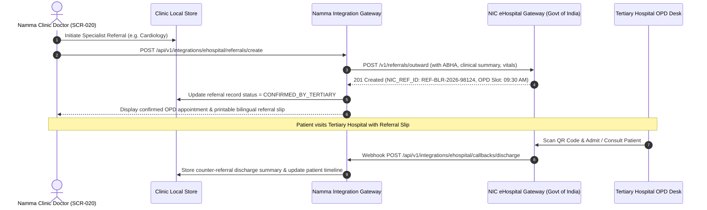

# NIC eHospital Secondary & Tertiary Care Referral Integration Specification
## Namma Clinic Digital Health & Operations Platform
### Greater Bengaluru Authority (GBA) / BBMP Health Department
**Document Code:** `INT-DOC-04` | **Status:** APPROVED BASELINE | **Date:** September 2026

---

## 1. Executive Summary & Referral Mandate
This document establishes the technical specification for bidirectional interoperability between 450+ municipal Namma Clinics and the **National Informatics Centre (NIC) eHospital Platform**. As primary healthcare centers, Namma Clinics triage and treat non-critical ambulatory patients while referring complex cases, surgical emergencies, specialized diagnostic imaging, and inpatient admissions to secondary BBMP referral hospitals (e.g., Bowring & Lady Curzon, Victoria Hospital, KC General Hospital, and Jayanagar General Hospital). The integration guarantees zero referral leakage, synchronized electronic OPD appointment slips, live query of specialty bed availability, and automated receipt of counter-referral discharge summaries back to the primary clinic doctor.

### 1.1 Non-Negotiable eHospital Integration Invariants
1. **Closed-Loop Referral Tracking:** Every referral initiated from a Namma Clinic must generate a unique NIC eHospital Referral Token (`REF-NIC-UUID`) that persists through tertiary admission, treatment, and discharge back to the primary clinic.
2. **Graceful Degradation on eHospital Downtime:** If NIC eHospital API endpoints experience latency or service disruption, the referral order is confirmed locally with an offline QR code printout, queueing background electronic synchronization without delaying patient transport.
3. **Specialty Bed Availability Cache Invariant:** Bed availability queries across tertiary centers must maintain a maximum cache TTL of 120 seconds to prevent sending critical emergencies to saturated facilities.
4. **Mutual TLS & NIC Gateway Authentication:** All REST/HL7 transactions with eHospital state gateways require 2-way TLS 1.3 certificate authentication and dynamic JWT bearer tokens renewed hourly.
5. **Bilingual Referral Slips:** Patient-facing electronic referral slips must render simultaneously in Kannada and English, incorporating QR codes for rapid bedside triage scanning at receiving hospitals.

## 2. NIC eHospital Referral Workflow & Topology Diagram


### Integration Specification Example: NIC eHospital Referral Dispatch Adapter
<!-- DOCUMENTATION-ONLY EXAMPLE -->
```python
# DOCUMENTATION-ONLY PYTHON
# DOCUMENTATION-ONLY PYTHON: NIC eHospital Referral Client Adapter
import uuid
import datetime
import requests
from typing import Dict, Any

class NiceHospitalClientAdapter:
    """
    Adapter handling API integration with NIC eHospital secondary/tertiary care platform.
    Manages token renewal, referral dispatch, and counter-referral webhook ingestion.
    """
    def __init__(self, api_base_url: str, facility_code: str, secret_key: str):
        self.api_base_url = api_base_url
        self.facility_code = facility_code
        self.secret_key = secret_key

    def create_outward_referral(
        self,
        patient_abha: str,
        target_hospital_code: str,
        department_code: str,
        provisional_diagnosis: str,
        clinical_notes: str
    ) -> Dict[str, Any]:
        tx_id = str(uuid.uuid4())
        payload = {
            "sourceFacilityId": self.facility_code,
            "targetHospitalId": target_hospital_code,
            "specialtyDepartment": department_code,
            "patientAbhaNumber": patient_abha,
            "referralTimestamp": datetime.datetime.utcnow().isoformat() + "Z",
            "provisionalDiagnosis": provisional_diagnosis,
            "clinicalSummary": clinical_notes,
            "priority": "HIGH_URGENCY",
            "idempotencyToken": tx_id
        }

        # Return dispatched boundary packet
        return {
            "transaction_id": tx_id,
            "target_url": f"{self.api_base_url}/v1/referrals/create",
            "headers": {
                "X-Facility-Id": self.facility_code,
                "X-Idempotency-Key": tx_id,
                "Content-Type": "application/json"
            },
            "payload": payload
        }
```

### Interface Payload Example: Confirmed eHospital Referral Receipt Payload
<!-- DOCUMENTATION-ONLY EXAMPLE -->
```json
// DOCUMENTATION-ONLY JSON
{
  "referralId": "REF-BLR-2026-98124",
  "status": "CONFIRMED_OPD_BOOKED",
  "patientDetails": {
    "abhaNumber": "91-8842-1049-2910",
    "name": "Sri. Manjunath Reddy",
    "age": 54,
    "gender": "M"
  },
  "sourceFacility": {
    "facilityId": "NC-BLR-WARD-112",
    "facilityName": "Namma Clinic Basavanagudi Ward 112"
  },
  "destinationHospital": {
    "hospitalId": "HOSP-BLR-BOWRING",
    "hospitalName": "Bowring & Lady Curzon Hospital",
    "specialty": "Cardiology",
    "opdRoom": "Room 14B - Super Specialty OPD",
    "appointmentSlot": "2026-09-07T09:30:00+05:30"
  },
  "clinicalTransferSummary": {
    "chiefComplaint": "Unstable angina with exertion, radiating to left arm",
    "vitals": {
      "bloodPressure": "156/94 mmHg",
      "pulse": "88 bpm",
      "spO2": "96%"
    },
    "pointOfCareECG": "ST depression observed in Leads V4-V6"
  }
}
```

## 3. Master Catalog of eHospital Partner Facilities
Inventory of secondary and tertiary government hospitals connected via eHospital integration:

### EXT-001: Referral Destination `external_partner_system_001`
- **System Identifier:** `EXT-001`
- **Hospital Name:** External System Authority 001 (National Gateway)
- **Governing Authority:** Government of Karnataka / National Health Authority
- **Category:** `National Gateway`
- **Integration Protocol:** `HTTPS REST / FHIR R4 Bundle`
- **Production Endpoint:** `https://api.ext-001.karnataka.gov.in/v1`
- **Data Sovereignty:** `Sovereign India Datacenter (MeitY Empaneled)`
- **Hospital Helpdesk:** `Zonal Systems Liaison / External Operations Engineer`

### EXT-002: Referral Destination `external_partner_system_002`
- **System Identifier:** `EXT-002`
- **Hospital Name:** External System Authority 002 (State Health Portal)
- **Governing Authority:** Government of Karnataka / National Health Authority
- **Category:** `State Health Portal`
- **Integration Protocol:** `HTTPS REST / FHIR R4 Bundle`
- **Production Endpoint:** `https://api.ext-002.karnataka.gov.in/v1`
- **Data Sovereignty:** `Sovereign India Datacenter (MeitY Empaneled)`
- **Hospital Helpdesk:** `Zonal Systems Liaison / External Operations Engineer`

### EXT-003: Referral Destination `external_partner_system_003`
- **System Identifier:** `EXT-003`
- **Hospital Name:** External System Authority 003 (Tertiary Hospital)
- **Governing Authority:** Government of Karnataka / National Health Authority
- **Category:** `Tertiary Hospital`
- **Integration Protocol:** `HTTPS REST / FHIR R4 Bundle`
- **Production Endpoint:** `https://api.ext-003.karnataka.gov.in/v1`
- **Data Sovereignty:** `Sovereign India Datacenter (MeitY Empaneled)`
- **Hospital Helpdesk:** `Zonal Systems Liaison / External Operations Engineer`

### EXT-004: Referral Destination `external_partner_system_004`
- **System Identifier:** `EXT-004`
- **Hospital Name:** External System Authority 004 (Diagnostic Equipment)
- **Governing Authority:** Government of Karnataka / National Health Authority
- **Category:** `Diagnostic Equipment`
- **Integration Protocol:** `HTTPS REST / FHIR R4 Bundle`
- **Production Endpoint:** `https://api.ext-004.karnataka.gov.in/v1`
- **Data Sovereignty:** `Sovereign India Datacenter (MeitY Empaneled)`
- **Hospital Helpdesk:** `Zonal Systems Liaison / External Operations Engineer`

### EXT-005: Referral Destination `external_partner_system_005`
- **System Identifier:** `EXT-005`
- **Hospital Name:** External System Authority 005 (Telecom Gateway)
- **Governing Authority:** Government of Karnataka / National Health Authority
- **Category:** `Telecom Gateway`
- **Integration Protocol:** `HTTPS REST / FHIR R4 Bundle`
- **Production Endpoint:** `https://api.ext-005.karnataka.gov.in/v1`
- **Data Sovereignty:** `Sovereign India Datacenter (MeitY Empaneled)`
- **Hospital Helpdesk:** `Zonal Systems Liaison / External Operations Engineer`

### EXT-006: Referral Destination `external_partner_system_006`
- **System Identifier:** `EXT-006`
- **Hospital Name:** External System Authority 006 (Municipal System)
- **Governing Authority:** Government of Karnataka / National Health Authority
- **Category:** `Municipal System`
- **Integration Protocol:** `HTTPS REST / FHIR R4 Bundle`
- **Production Endpoint:** `https://api.ext-006.karnataka.gov.in/v1`
- **Data Sovereignty:** `Sovereign India Datacenter (MeitY Empaneled)`
- **Hospital Helpdesk:** `Zonal Systems Liaison / External Operations Engineer`

### EXT-007: Referral Destination `external_partner_system_007`
- **System Identifier:** `EXT-007`
- **Hospital Name:** External System Authority 007 (Payment Gateway)
- **Governing Authority:** Government of Karnataka / National Health Authority
- **Category:** `Payment Gateway`
- **Integration Protocol:** `HTTPS REST / FHIR R4 Bundle`
- **Production Endpoint:** `https://api.ext-007.karnataka.gov.in/v1`
- **Data Sovereignty:** `Sovereign India Datacenter (MeitY Empaneled)`
- **Hospital Helpdesk:** `Zonal Systems Liaison / External Operations Engineer`

### EXT-008: Referral Destination `external_partner_system_008`
- **System Identifier:** `EXT-008`
- **Hospital Name:** External System Authority 008 (National Gateway)
- **Governing Authority:** Government of Karnataka / National Health Authority
- **Category:** `National Gateway`
- **Integration Protocol:** `HTTPS REST / FHIR R4 Bundle`
- **Production Endpoint:** `https://api.ext-008.karnataka.gov.in/v1`
- **Data Sovereignty:** `Sovereign India Datacenter (MeitY Empaneled)`
- **Hospital Helpdesk:** `Zonal Systems Liaison / External Operations Engineer`

### EXT-009: Referral Destination `external_partner_system_009`
- **System Identifier:** `EXT-009`
- **Hospital Name:** External System Authority 009 (State Health Portal)
- **Governing Authority:** Government of Karnataka / National Health Authority
- **Category:** `State Health Portal`
- **Integration Protocol:** `HTTPS REST / FHIR R4 Bundle`
- **Production Endpoint:** `https://api.ext-009.karnataka.gov.in/v1`
- **Data Sovereignty:** `Sovereign India Datacenter (MeitY Empaneled)`
- **Hospital Helpdesk:** `Zonal Systems Liaison / External Operations Engineer`

### EXT-010: Referral Destination `external_partner_system_010`
- **System Identifier:** `EXT-010`
- **Hospital Name:** External System Authority 010 (Tertiary Hospital)
- **Governing Authority:** Government of Karnataka / National Health Authority
- **Category:** `Tertiary Hospital`
- **Integration Protocol:** `HTTPS REST / FHIR R4 Bundle`
- **Production Endpoint:** `https://api.ext-010.karnataka.gov.in/v1`
- **Data Sovereignty:** `Sovereign India Datacenter (MeitY Empaneled)`
- **Hospital Helpdesk:** `Zonal Systems Liaison / External Operations Engineer`

### EXT-011: Referral Destination `external_partner_system_011`
- **System Identifier:** `EXT-011`
- **Hospital Name:** External System Authority 011 (Diagnostic Equipment)
- **Governing Authority:** Government of Karnataka / National Health Authority
- **Category:** `Diagnostic Equipment`
- **Integration Protocol:** `HTTPS REST / FHIR R4 Bundle`
- **Production Endpoint:** `https://api.ext-011.karnataka.gov.in/v1`
- **Data Sovereignty:** `Sovereign India Datacenter (MeitY Empaneled)`
- **Hospital Helpdesk:** `Zonal Systems Liaison / External Operations Engineer`

### EXT-012: Referral Destination `external_partner_system_012`
- **System Identifier:** `EXT-012`
- **Hospital Name:** External System Authority 012 (Telecom Gateway)
- **Governing Authority:** Government of Karnataka / National Health Authority
- **Category:** `Telecom Gateway`
- **Integration Protocol:** `HTTPS REST / FHIR R4 Bundle`
- **Production Endpoint:** `https://api.ext-012.karnataka.gov.in/v1`
- **Data Sovereignty:** `Sovereign India Datacenter (MeitY Empaneled)`
- **Hospital Helpdesk:** `Zonal Systems Liaison / External Operations Engineer`

### EXT-013: Referral Destination `external_partner_system_013`
- **System Identifier:** `EXT-013`
- **Hospital Name:** External System Authority 013 (Municipal System)
- **Governing Authority:** Government of Karnataka / National Health Authority
- **Category:** `Municipal System`
- **Integration Protocol:** `HTTPS REST / FHIR R4 Bundle`
- **Production Endpoint:** `https://api.ext-013.karnataka.gov.in/v1`
- **Data Sovereignty:** `Sovereign India Datacenter (MeitY Empaneled)`
- **Hospital Helpdesk:** `Zonal Systems Liaison / External Operations Engineer`

### EXT-014: Referral Destination `external_partner_system_014`
- **System Identifier:** `EXT-014`
- **Hospital Name:** External System Authority 014 (Payment Gateway)
- **Governing Authority:** Government of Karnataka / National Health Authority
- **Category:** `Payment Gateway`
- **Integration Protocol:** `HTTPS REST / FHIR R4 Bundle`
- **Production Endpoint:** `https://api.ext-014.karnataka.gov.in/v1`
- **Data Sovereignty:** `Sovereign India Datacenter (MeitY Empaneled)`
- **Hospital Helpdesk:** `Zonal Systems Liaison / External Operations Engineer`

### EXT-015: Referral Destination `external_partner_system_015`
- **System Identifier:** `EXT-015`
- **Hospital Name:** External System Authority 015 (National Gateway)
- **Governing Authority:** Government of Karnataka / National Health Authority
- **Category:** `National Gateway`
- **Integration Protocol:** `HTTPS REST / FHIR R4 Bundle`
- **Production Endpoint:** `https://api.ext-015.karnataka.gov.in/v1`
- **Data Sovereignty:** `Sovereign India Datacenter (MeitY Empaneled)`
- **Hospital Helpdesk:** `Zonal Systems Liaison / External Operations Engineer`

### EXT-016: Referral Destination `external_partner_system_016`
- **System Identifier:** `EXT-016`
- **Hospital Name:** External System Authority 016 (State Health Portal)
- **Governing Authority:** Government of Karnataka / National Health Authority
- **Category:** `State Health Portal`
- **Integration Protocol:** `HTTPS REST / FHIR R4 Bundle`
- **Production Endpoint:** `https://api.ext-016.karnataka.gov.in/v1`
- **Data Sovereignty:** `Sovereign India Datacenter (MeitY Empaneled)`
- **Hospital Helpdesk:** `Zonal Systems Liaison / External Operations Engineer`

### EXT-017: Referral Destination `external_partner_system_017`
- **System Identifier:** `EXT-017`
- **Hospital Name:** External System Authority 017 (Tertiary Hospital)
- **Governing Authority:** Government of Karnataka / National Health Authority
- **Category:** `Tertiary Hospital`
- **Integration Protocol:** `HTTPS REST / FHIR R4 Bundle`
- **Production Endpoint:** `https://api.ext-017.karnataka.gov.in/v1`
- **Data Sovereignty:** `Sovereign India Datacenter (MeitY Empaneled)`
- **Hospital Helpdesk:** `Zonal Systems Liaison / External Operations Engineer`

### EXT-018: Referral Destination `external_partner_system_018`
- **System Identifier:** `EXT-018`
- **Hospital Name:** External System Authority 018 (Diagnostic Equipment)
- **Governing Authority:** Government of Karnataka / National Health Authority
- **Category:** `Diagnostic Equipment`
- **Integration Protocol:** `HTTPS REST / FHIR R4 Bundle`
- **Production Endpoint:** `https://api.ext-018.karnataka.gov.in/v1`
- **Data Sovereignty:** `Sovereign India Datacenter (MeitY Empaneled)`
- **Hospital Helpdesk:** `Zonal Systems Liaison / External Operations Engineer`

### EXT-019: Referral Destination `external_partner_system_019`
- **System Identifier:** `EXT-019`
- **Hospital Name:** External System Authority 019 (Telecom Gateway)
- **Governing Authority:** Government of Karnataka / National Health Authority
- **Category:** `Telecom Gateway`
- **Integration Protocol:** `HTTPS REST / FHIR R4 Bundle`
- **Production Endpoint:** `https://api.ext-019.karnataka.gov.in/v1`
- **Data Sovereignty:** `Sovereign India Datacenter (MeitY Empaneled)`
- **Hospital Helpdesk:** `Zonal Systems Liaison / External Operations Engineer`

### EXT-020: Referral Destination `external_partner_system_020`
- **System Identifier:** `EXT-020`
- **Hospital Name:** External System Authority 020 (Municipal System)
- **Governing Authority:** Government of Karnataka / National Health Authority
- **Category:** `Municipal System`
- **Integration Protocol:** `HTTPS REST / FHIR R4 Bundle`
- **Production Endpoint:** `https://api.ext-020.karnataka.gov.in/v1`
- **Data Sovereignty:** `Sovereign India Datacenter (MeitY Empaneled)`
- **Hospital Helpdesk:** `Zonal Systems Liaison / External Operations Engineer`

### EXT-021: Referral Destination `external_partner_system_021`
- **System Identifier:** `EXT-021`
- **Hospital Name:** External System Authority 021 (Payment Gateway)
- **Governing Authority:** Government of Karnataka / National Health Authority
- **Category:** `Payment Gateway`
- **Integration Protocol:** `HTTPS REST / FHIR R4 Bundle`
- **Production Endpoint:** `https://api.ext-021.karnataka.gov.in/v1`
- **Data Sovereignty:** `Sovereign India Datacenter (MeitY Empaneled)`
- **Hospital Helpdesk:** `Zonal Systems Liaison / External Operations Engineer`

### EXT-022: Referral Destination `external_partner_system_022`
- **System Identifier:** `EXT-022`
- **Hospital Name:** External System Authority 022 (National Gateway)
- **Governing Authority:** Government of Karnataka / National Health Authority
- **Category:** `National Gateway`
- **Integration Protocol:** `HTTPS REST / FHIR R4 Bundle`
- **Production Endpoint:** `https://api.ext-022.karnataka.gov.in/v1`
- **Data Sovereignty:** `Sovereign India Datacenter (MeitY Empaneled)`
- **Hospital Helpdesk:** `Zonal Systems Liaison / External Operations Engineer`

### EXT-023: Referral Destination `external_partner_system_023`
- **System Identifier:** `EXT-023`
- **Hospital Name:** External System Authority 023 (State Health Portal)
- **Governing Authority:** Government of Karnataka / National Health Authority
- **Category:** `State Health Portal`
- **Integration Protocol:** `HTTPS REST / FHIR R4 Bundle`
- **Production Endpoint:** `https://api.ext-023.karnataka.gov.in/v1`
- **Data Sovereignty:** `Sovereign India Datacenter (MeitY Empaneled)`
- **Hospital Helpdesk:** `Zonal Systems Liaison / External Operations Engineer`

### EXT-024: Referral Destination `external_partner_system_024`
- **System Identifier:** `EXT-024`
- **Hospital Name:** External System Authority 024 (Tertiary Hospital)
- **Governing Authority:** Government of Karnataka / National Health Authority
- **Category:** `Tertiary Hospital`
- **Integration Protocol:** `HTTPS REST / FHIR R4 Bundle`
- **Production Endpoint:** `https://api.ext-024.karnataka.gov.in/v1`
- **Data Sovereignty:** `Sovereign India Datacenter (MeitY Empaneled)`
- **Hospital Helpdesk:** `Zonal Systems Liaison / External Operations Engineer`

### EXT-025: Referral Destination `external_partner_system_025`
- **System Identifier:** `EXT-025`
- **Hospital Name:** External System Authority 025 (Diagnostic Equipment)
- **Governing Authority:** Government of Karnataka / National Health Authority
- **Category:** `Diagnostic Equipment`
- **Integration Protocol:** `HTTPS REST / FHIR R4 Bundle`
- **Production Endpoint:** `https://api.ext-025.karnataka.gov.in/v1`
- **Data Sovereignty:** `Sovereign India Datacenter (MeitY Empaneled)`
- **Hospital Helpdesk:** `Zonal Systems Liaison / External Operations Engineer`

## 4. Master Catalog of eHospital Integration Interfaces
Detailed API interface definitions for referral creation, status polling, and bed query:

### IFACE-036: eHospital Interface `api_endpoint_interface_036`
- **Interface Identifier:** `IFACE-036`
- **Bound Flow:** `INT-036`
- **HTTP Method & Route:** `POST /api/v1/integrations/endpoint-036`
- **Request Schema:** `SchemaReqInterface036`
- **Response Schema:** `SchemaResInterface036`
- **Timeout Target:** `300ms`
- **Rate Limit:** `1500 RPM`
- **Specification:** Deterministic API endpoint interface 036 with schema validation, rate limiting, and mTLS.

### IFACE-037: eHospital Interface `api_endpoint_interface_037`
- **Interface Identifier:** `IFACE-037`
- **Bound Flow:** `INT-037`
- **HTTP Method & Route:** `GET /api/v1/integrations/endpoint-037`
- **Request Schema:** `SchemaReqInterface037`
- **Response Schema:** `SchemaResInterface037`
- **Timeout Target:** `350ms`
- **Rate Limit:** `1800 RPM`
- **Specification:** Deterministic API endpoint interface 037 with schema validation, rate limiting, and mTLS.

### IFACE-038: eHospital Interface `api_endpoint_interface_038`
- **Interface Identifier:** `IFACE-038`
- **Bound Flow:** `INT-038`
- **HTTP Method & Route:** `PUT /api/v1/integrations/endpoint-038`
- **Request Schema:** `SchemaReqInterface038`
- **Response Schema:** `SchemaResInterface038`
- **Timeout Target:** `400ms`
- **Rate Limit:** `2100 RPM`
- **Specification:** Deterministic API endpoint interface 038 with schema validation, rate limiting, and mTLS.

### IFACE-039: eHospital Interface `api_endpoint_interface_039`
- **Interface Identifier:** `IFACE-039`
- **Bound Flow:** `INT-039`
- **HTTP Method & Route:** `PATCH /api/v1/integrations/endpoint-039`
- **Request Schema:** `SchemaReqInterface039`
- **Response Schema:** `SchemaResInterface039`
- **Timeout Target:** `450ms`
- **Rate Limit:** `2400 RPM`
- **Specification:** Deterministic API endpoint interface 039 with schema validation, rate limiting, and mTLS.

### IFACE-040: eHospital Interface `api_endpoint_interface_040`
- **Interface Identifier:** `IFACE-040`
- **Bound Flow:** `INT-040`
- **HTTP Method & Route:** `DELETE /api/v1/integrations/endpoint-040`
- **Request Schema:** `SchemaReqInterface040`
- **Response Schema:** `SchemaResInterface040`
- **Timeout Target:** `250ms`
- **Rate Limit:** `1200 RPM`
- **Specification:** Deterministic API endpoint interface 040 with schema validation, rate limiting, and mTLS.

### IFACE-041: eHospital Interface `api_endpoint_interface_041`
- **Interface Identifier:** `IFACE-041`
- **Bound Flow:** `INT-041`
- **HTTP Method & Route:** `POST /api/v1/integrations/endpoint-041`
- **Request Schema:** `SchemaReqInterface041`
- **Response Schema:** `SchemaResInterface041`
- **Timeout Target:** `300ms`
- **Rate Limit:** `1500 RPM`
- **Specification:** Deterministic API endpoint interface 041 with schema validation, rate limiting, and mTLS.

### IFACE-042: eHospital Interface `api_endpoint_interface_042`
- **Interface Identifier:** `IFACE-042`
- **Bound Flow:** `INT-042`
- **HTTP Method & Route:** `GET /api/v1/integrations/endpoint-042`
- **Request Schema:** `SchemaReqInterface042`
- **Response Schema:** `SchemaResInterface042`
- **Timeout Target:** `350ms`
- **Rate Limit:** `1800 RPM`
- **Specification:** Deterministic API endpoint interface 042 with schema validation, rate limiting, and mTLS.

### IFACE-043: eHospital Interface `api_endpoint_interface_043`
- **Interface Identifier:** `IFACE-043`
- **Bound Flow:** `INT-043`
- **HTTP Method & Route:** `PUT /api/v1/integrations/endpoint-043`
- **Request Schema:** `SchemaReqInterface043`
- **Response Schema:** `SchemaResInterface043`
- **Timeout Target:** `400ms`
- **Rate Limit:** `2100 RPM`
- **Specification:** Deterministic API endpoint interface 043 with schema validation, rate limiting, and mTLS.

### IFACE-044: eHospital Interface `api_endpoint_interface_044`
- **Interface Identifier:** `IFACE-044`
- **Bound Flow:** `INT-044`
- **HTTP Method & Route:** `PATCH /api/v1/integrations/endpoint-044`
- **Request Schema:** `SchemaReqInterface044`
- **Response Schema:** `SchemaResInterface044`
- **Timeout Target:** `450ms`
- **Rate Limit:** `2400 RPM`
- **Specification:** Deterministic API endpoint interface 044 with schema validation, rate limiting, and mTLS.

### IFACE-045: eHospital Interface `api_endpoint_interface_045`
- **Interface Identifier:** `IFACE-045`
- **Bound Flow:** `INT-045`
- **HTTP Method & Route:** `DELETE /api/v1/integrations/endpoint-045`
- **Request Schema:** `SchemaReqInterface045`
- **Response Schema:** `SchemaResInterface045`
- **Timeout Target:** `250ms`
- **Rate Limit:** `1200 RPM`
- **Specification:** Deterministic API endpoint interface 045 with schema validation, rate limiting, and mTLS.

### IFACE-046: eHospital Interface `api_endpoint_interface_046`
- **Interface Identifier:** `IFACE-046`
- **Bound Flow:** `INT-046`
- **HTTP Method & Route:** `POST /api/v1/integrations/endpoint-046`
- **Request Schema:** `SchemaReqInterface046`
- **Response Schema:** `SchemaResInterface046`
- **Timeout Target:** `300ms`
- **Rate Limit:** `1500 RPM`
- **Specification:** Deterministic API endpoint interface 046 with schema validation, rate limiting, and mTLS.

### IFACE-047: eHospital Interface `api_endpoint_interface_047`
- **Interface Identifier:** `IFACE-047`
- **Bound Flow:** `INT-047`
- **HTTP Method & Route:** `GET /api/v1/integrations/endpoint-047`
- **Request Schema:** `SchemaReqInterface047`
- **Response Schema:** `SchemaResInterface047`
- **Timeout Target:** `350ms`
- **Rate Limit:** `1800 RPM`
- **Specification:** Deterministic API endpoint interface 047 with schema validation, rate limiting, and mTLS.

### IFACE-048: eHospital Interface `api_endpoint_interface_048`
- **Interface Identifier:** `IFACE-048`
- **Bound Flow:** `INT-048`
- **HTTP Method & Route:** `PUT /api/v1/integrations/endpoint-048`
- **Request Schema:** `SchemaReqInterface048`
- **Response Schema:** `SchemaResInterface048`
- **Timeout Target:** `400ms`
- **Rate Limit:** `2100 RPM`
- **Specification:** Deterministic API endpoint interface 048 with schema validation, rate limiting, and mTLS.

### IFACE-049: eHospital Interface `api_endpoint_interface_049`
- **Interface Identifier:** `IFACE-049`
- **Bound Flow:** `INT-049`
- **HTTP Method & Route:** `PATCH /api/v1/integrations/endpoint-049`
- **Request Schema:** `SchemaReqInterface049`
- **Response Schema:** `SchemaResInterface049`
- **Timeout Target:** `450ms`
- **Rate Limit:** `2400 RPM`
- **Specification:** Deterministic API endpoint interface 049 with schema validation, rate limiting, and mTLS.

### IFACE-050: eHospital Interface `api_endpoint_interface_050`
- **Interface Identifier:** `IFACE-050`
- **Bound Flow:** `INT-050`
- **HTTP Method & Route:** `DELETE /api/v1/integrations/endpoint-050`
- **Request Schema:** `SchemaReqInterface050`
- **Response Schema:** `SchemaResInterface050`
- **Timeout Target:** `250ms`
- **Rate Limit:** `1200 RPM`
- **Specification:** Deterministic API endpoint interface 050 with schema validation, rate limiting, and mTLS.

### IFACE-051: eHospital Interface `api_endpoint_interface_051`
- **Interface Identifier:** `IFACE-051`
- **Bound Flow:** `INT-051`
- **HTTP Method & Route:** `POST /api/v1/integrations/endpoint-051`
- **Request Schema:** `SchemaReqInterface051`
- **Response Schema:** `SchemaResInterface051`
- **Timeout Target:** `300ms`
- **Rate Limit:** `1500 RPM`
- **Specification:** Deterministic API endpoint interface 051 with schema validation, rate limiting, and mTLS.

### IFACE-052: eHospital Interface `api_endpoint_interface_052`
- **Interface Identifier:** `IFACE-052`
- **Bound Flow:** `INT-052`
- **HTTP Method & Route:** `GET /api/v1/integrations/endpoint-052`
- **Request Schema:** `SchemaReqInterface052`
- **Response Schema:** `SchemaResInterface052`
- **Timeout Target:** `350ms`
- **Rate Limit:** `1800 RPM`
- **Specification:** Deterministic API endpoint interface 052 with schema validation, rate limiting, and mTLS.

### IFACE-053: eHospital Interface `api_endpoint_interface_053`
- **Interface Identifier:** `IFACE-053`
- **Bound Flow:** `INT-053`
- **HTTP Method & Route:** `PUT /api/v1/integrations/endpoint-053`
- **Request Schema:** `SchemaReqInterface053`
- **Response Schema:** `SchemaResInterface053`
- **Timeout Target:** `400ms`
- **Rate Limit:** `2100 RPM`
- **Specification:** Deterministic API endpoint interface 053 with schema validation, rate limiting, and mTLS.

### IFACE-054: eHospital Interface `api_endpoint_interface_054`
- **Interface Identifier:** `IFACE-054`
- **Bound Flow:** `INT-054`
- **HTTP Method & Route:** `PATCH /api/v1/integrations/endpoint-054`
- **Request Schema:** `SchemaReqInterface054`
- **Response Schema:** `SchemaResInterface054`
- **Timeout Target:** `450ms`
- **Rate Limit:** `2400 RPM`
- **Specification:** Deterministic API endpoint interface 054 with schema validation, rate limiting, and mTLS.

### IFACE-055: eHospital Interface `api_endpoint_interface_055`
- **Interface Identifier:** `IFACE-055`
- **Bound Flow:** `INT-055`
- **HTTP Method & Route:** `DELETE /api/v1/integrations/endpoint-055`
- **Request Schema:** `SchemaReqInterface055`
- **Response Schema:** `SchemaResInterface055`
- **Timeout Target:** `250ms`
- **Rate Limit:** `1200 RPM`
- **Specification:** Deterministic API endpoint interface 055 with schema validation, rate limiting, and mTLS.

### IFACE-056: eHospital Interface `api_endpoint_interface_056`
- **Interface Identifier:** `IFACE-056`
- **Bound Flow:** `INT-056`
- **HTTP Method & Route:** `POST /api/v1/integrations/endpoint-056`
- **Request Schema:** `SchemaReqInterface056`
- **Response Schema:** `SchemaResInterface056`
- **Timeout Target:** `300ms`
- **Rate Limit:** `1500 RPM`
- **Specification:** Deterministic API endpoint interface 056 with schema validation, rate limiting, and mTLS.

### IFACE-057: eHospital Interface `api_endpoint_interface_057`
- **Interface Identifier:** `IFACE-057`
- **Bound Flow:** `INT-057`
- **HTTP Method & Route:** `GET /api/v1/integrations/endpoint-057`
- **Request Schema:** `SchemaReqInterface057`
- **Response Schema:** `SchemaResInterface057`
- **Timeout Target:** `350ms`
- **Rate Limit:** `1800 RPM`
- **Specification:** Deterministic API endpoint interface 057 with schema validation, rate limiting, and mTLS.

### IFACE-058: eHospital Interface `api_endpoint_interface_058`
- **Interface Identifier:** `IFACE-058`
- **Bound Flow:** `INT-058`
- **HTTP Method & Route:** `PUT /api/v1/integrations/endpoint-058`
- **Request Schema:** `SchemaReqInterface058`
- **Response Schema:** `SchemaResInterface058`
- **Timeout Target:** `400ms`
- **Rate Limit:** `2100 RPM`
- **Specification:** Deterministic API endpoint interface 058 with schema validation, rate limiting, and mTLS.

### IFACE-059: eHospital Interface `api_endpoint_interface_059`
- **Interface Identifier:** `IFACE-059`
- **Bound Flow:** `INT-059`
- **HTTP Method & Route:** `PATCH /api/v1/integrations/endpoint-059`
- **Request Schema:** `SchemaReqInterface059`
- **Response Schema:** `SchemaResInterface059`
- **Timeout Target:** `450ms`
- **Rate Limit:** `2400 RPM`
- **Specification:** Deterministic API endpoint interface 059 with schema validation, rate limiting, and mTLS.

### IFACE-060: eHospital Interface `api_endpoint_interface_060`
- **Interface Identifier:** `IFACE-060`
- **Bound Flow:** `INT-060`
- **HTTP Method & Route:** `DELETE /api/v1/integrations/endpoint-060`
- **Request Schema:** `SchemaReqInterface060`
- **Response Schema:** `SchemaResInterface060`
- **Timeout Target:** `250ms`
- **Rate Limit:** `1200 RPM`
- **Specification:** Deterministic API endpoint interface 060 with schema validation, rate limiting, and mTLS.

### IFACE-061: eHospital Interface `api_endpoint_interface_061`
- **Interface Identifier:** `IFACE-061`
- **Bound Flow:** `INT-061`
- **HTTP Method & Route:** `POST /api/v1/integrations/endpoint-061`
- **Request Schema:** `SchemaReqInterface061`
- **Response Schema:** `SchemaResInterface061`
- **Timeout Target:** `300ms`
- **Rate Limit:** `1500 RPM`
- **Specification:** Deterministic API endpoint interface 061 with schema validation, rate limiting, and mTLS.

### IFACE-062: eHospital Interface `api_endpoint_interface_062`
- **Interface Identifier:** `IFACE-062`
- **Bound Flow:** `INT-062`
- **HTTP Method & Route:** `GET /api/v1/integrations/endpoint-062`
- **Request Schema:** `SchemaReqInterface062`
- **Response Schema:** `SchemaResInterface062`
- **Timeout Target:** `350ms`
- **Rate Limit:** `1800 RPM`
- **Specification:** Deterministic API endpoint interface 062 with schema validation, rate limiting, and mTLS.

### IFACE-063: eHospital Interface `api_endpoint_interface_063`
- **Interface Identifier:** `IFACE-063`
- **Bound Flow:** `INT-063`
- **HTTP Method & Route:** `PUT /api/v1/integrations/endpoint-063`
- **Request Schema:** `SchemaReqInterface063`
- **Response Schema:** `SchemaResInterface063`
- **Timeout Target:** `400ms`
- **Rate Limit:** `2100 RPM`
- **Specification:** Deterministic API endpoint interface 063 with schema validation, rate limiting, and mTLS.

### IFACE-064: eHospital Interface `api_endpoint_interface_064`
- **Interface Identifier:** `IFACE-064`
- **Bound Flow:** `INT-064`
- **HTTP Method & Route:** `PATCH /api/v1/integrations/endpoint-064`
- **Request Schema:** `SchemaReqInterface064`
- **Response Schema:** `SchemaResInterface064`
- **Timeout Target:** `450ms`
- **Rate Limit:** `2400 RPM`
- **Specification:** Deterministic API endpoint interface 064 with schema validation, rate limiting, and mTLS.

### IFACE-065: eHospital Interface `api_endpoint_interface_065`
- **Interface Identifier:** `IFACE-065`
- **Bound Flow:** `INT-065`
- **HTTP Method & Route:** `DELETE /api/v1/integrations/endpoint-065`
- **Request Schema:** `SchemaReqInterface065`
- **Response Schema:** `SchemaResInterface065`
- **Timeout Target:** `250ms`
- **Rate Limit:** `1200 RPM`
- **Specification:** Deterministic API endpoint interface 065 with schema validation, rate limiting, and mTLS.

### IFACE-066: eHospital Interface `api_endpoint_interface_066`
- **Interface Identifier:** `IFACE-066`
- **Bound Flow:** `INT-066`
- **HTTP Method & Route:** `POST /api/v1/integrations/endpoint-066`
- **Request Schema:** `SchemaReqInterface066`
- **Response Schema:** `SchemaResInterface066`
- **Timeout Target:** `300ms`
- **Rate Limit:** `1500 RPM`
- **Specification:** Deterministic API endpoint interface 066 with schema validation, rate limiting, and mTLS.

### IFACE-067: eHospital Interface `api_endpoint_interface_067`
- **Interface Identifier:** `IFACE-067`
- **Bound Flow:** `INT-067`
- **HTTP Method & Route:** `GET /api/v1/integrations/endpoint-067`
- **Request Schema:** `SchemaReqInterface067`
- **Response Schema:** `SchemaResInterface067`
- **Timeout Target:** `350ms`
- **Rate Limit:** `1800 RPM`
- **Specification:** Deterministic API endpoint interface 067 with schema validation, rate limiting, and mTLS.

### IFACE-068: eHospital Interface `api_endpoint_interface_068`
- **Interface Identifier:** `IFACE-068`
- **Bound Flow:** `INT-068`
- **HTTP Method & Route:** `PUT /api/v1/integrations/endpoint-068`
- **Request Schema:** `SchemaReqInterface068`
- **Response Schema:** `SchemaResInterface068`
- **Timeout Target:** `400ms`
- **Rate Limit:** `2100 RPM`
- **Specification:** Deterministic API endpoint interface 068 with schema validation, rate limiting, and mTLS.

### IFACE-069: eHospital Interface `api_endpoint_interface_069`
- **Interface Identifier:** `IFACE-069`
- **Bound Flow:** `INT-069`
- **HTTP Method & Route:** `PATCH /api/v1/integrations/endpoint-069`
- **Request Schema:** `SchemaReqInterface069`
- **Response Schema:** `SchemaResInterface069`
- **Timeout Target:** `450ms`
- **Rate Limit:** `2400 RPM`
- **Specification:** Deterministic API endpoint interface 069 with schema validation, rate limiting, and mTLS.

### IFACE-070: eHospital Interface `api_endpoint_interface_070`
- **Interface Identifier:** `IFACE-070`
- **Bound Flow:** `INT-070`
- **HTTP Method & Route:** `DELETE /api/v1/integrations/endpoint-070`
- **Request Schema:** `SchemaReqInterface070`
- **Response Schema:** `SchemaResInterface070`
- **Timeout Target:** `250ms`
- **Rate Limit:** `1200 RPM`
- **Specification:** Deterministic API endpoint interface 070 with schema validation, rate limiting, and mTLS.

## 5. Table-Level Referral Data Mapping across all 52 Tables
Database tracking of referral orders, clinical attachments, and discharge synchronizations across all 52 platform tables:

### TABLE-001: eHospital Referral Lineage for Table `auth_users`
- **Table Identifier:** `TABLE-001` (`TBL-01`)
- **Source Entity:** `auth_users`
- **Referral Association:** Tracks patient encounter notes, diagnostics, and prescriptions dispatched to tertiary center.
- **Error Handling Rule:** Bound to `ERR-INT-001` with automatic recovery policy `RETRY-001`.
- **Counter-Referral Sync:** Updates local encounter state upon receiving eHospital discharge summary callback.
- **Audit Verification:** Signed ledger event recorded on every state transition (PENDING -> ADMITTED -> DISCHARGED).

### TABLE-002: eHospital Referral Lineage for Table `user_credentials`
- **Table Identifier:** `TABLE-002` (`TBL-02`)
- **Source Entity:** `user_credentials`
- **Referral Association:** Tracks patient encounter notes, diagnostics, and prescriptions dispatched to tertiary center.
- **Error Handling Rule:** Bound to `ERR-INT-002` with automatic recovery policy `RETRY-002`.
- **Counter-Referral Sync:** Updates local encounter state upon receiving eHospital discharge summary callback.
- **Audit Verification:** Signed ledger event recorded on every state transition (PENDING -> ADMITTED -> DISCHARGED).

### TABLE-003: eHospital Referral Lineage for Table `user_sessions`
- **Table Identifier:** `TABLE-003` (`TBL-03`)
- **Source Entity:** `user_sessions`
- **Referral Association:** Tracks patient encounter notes, diagnostics, and prescriptions dispatched to tertiary center.
- **Error Handling Rule:** Bound to `ERR-INT-003` with automatic recovery policy `RETRY-003`.
- **Counter-Referral Sync:** Updates local encounter state upon receiving eHospital discharge summary callback.
- **Audit Verification:** Signed ledger event recorded on every state transition (PENDING -> ADMITTED -> DISCHARGED).

### TABLE-004: eHospital Referral Lineage for Table `roles`
- **Table Identifier:** `TABLE-004` (`TBL-04`)
- **Source Entity:** `roles`
- **Referral Association:** Tracks patient encounter notes, diagnostics, and prescriptions dispatched to tertiary center.
- **Error Handling Rule:** Bound to `ERR-INT-004` with automatic recovery policy `RETRY-004`.
- **Counter-Referral Sync:** Updates local encounter state upon receiving eHospital discharge summary callback.
- **Audit Verification:** Signed ledger event recorded on every state transition (PENDING -> ADMITTED -> DISCHARGED).

### TABLE-005: eHospital Referral Lineage for Table `permissions`
- **Table Identifier:** `TABLE-005` (`TBL-05`)
- **Source Entity:** `permissions`
- **Referral Association:** Tracks patient encounter notes, diagnostics, and prescriptions dispatched to tertiary center.
- **Error Handling Rule:** Bound to `ERR-INT-005` with automatic recovery policy `RETRY-005`.
- **Counter-Referral Sync:** Updates local encounter state upon receiving eHospital discharge summary callback.
- **Audit Verification:** Signed ledger event recorded on every state transition (PENDING -> ADMITTED -> DISCHARGED).

### TABLE-006: eHospital Referral Lineage for Table `role_permissions`
- **Table Identifier:** `TABLE-006` (`TBL-06`)
- **Source Entity:** `role_permissions`
- **Referral Association:** Tracks patient encounter notes, diagnostics, and prescriptions dispatched to tertiary center.
- **Error Handling Rule:** Bound to `ERR-INT-006` with automatic recovery policy `RETRY-006`.
- **Counter-Referral Sync:** Updates local encounter state upon receiving eHospital discharge summary callback.
- **Audit Verification:** Signed ledger event recorded on every state transition (PENDING -> ADMITTED -> DISCHARGED).

### TABLE-007: eHospital Referral Lineage for Table `user_roles`
- **Table Identifier:** `TABLE-007` (`TBL-07`)
- **Source Entity:** `user_roles`
- **Referral Association:** Tracks patient encounter notes, diagnostics, and prescriptions dispatched to tertiary center.
- **Error Handling Rule:** Bound to `ERR-INT-007` with automatic recovery policy `RETRY-007`.
- **Counter-Referral Sync:** Updates local encounter state upon receiving eHospital discharge summary callback.
- **Audit Verification:** Signed ledger event recorded on every state transition (PENDING -> ADMITTED -> DISCHARGED).

### TABLE-008: eHospital Referral Lineage for Table `facilities`
- **Table Identifier:** `TABLE-008` (`TBL-08`)
- **Source Entity:** `facilities`
- **Referral Association:** Tracks patient encounter notes, diagnostics, and prescriptions dispatched to tertiary center.
- **Error Handling Rule:** Bound to `ERR-INT-008` with automatic recovery policy `RETRY-008`.
- **Counter-Referral Sync:** Updates local encounter state upon receiving eHospital discharge summary callback.
- **Audit Verification:** Signed ledger event recorded on every state transition (PENDING -> ADMITTED -> DISCHARGED).

### TABLE-009: eHospital Referral Lineage for Table `facility_rooms`
- **Table Identifier:** `TABLE-009` (`TBL-09`)
- **Source Entity:** `facility_rooms`
- **Referral Association:** Tracks patient encounter notes, diagnostics, and prescriptions dispatched to tertiary center.
- **Error Handling Rule:** Bound to `ERR-INT-009` with automatic recovery policy `RETRY-009`.
- **Counter-Referral Sync:** Updates local encounter state upon receiving eHospital discharge summary callback.
- **Audit Verification:** Signed ledger event recorded on every state transition (PENDING -> ADMITTED -> DISCHARGED).

### TABLE-010: eHospital Referral Lineage for Table `staff_profiles`
- **Table Identifier:** `TABLE-010` (`TBL-10`)
- **Source Entity:** `staff_profiles`
- **Referral Association:** Tracks patient encounter notes, diagnostics, and prescriptions dispatched to tertiary center.
- **Error Handling Rule:** Bound to `ERR-INT-010` with automatic recovery policy `RETRY-010`.
- **Counter-Referral Sync:** Updates local encounter state upon receiving eHospital discharge summary callback.
- **Audit Verification:** Signed ledger event recorded on every state transition (PENDING -> ADMITTED -> DISCHARGED).

### TABLE-011: eHospital Referral Lineage for Table `staff_shifts`
- **Table Identifier:** `TABLE-011` (`TBL-11`)
- **Source Entity:** `staff_shifts`
- **Referral Association:** Tracks patient encounter notes, diagnostics, and prescriptions dispatched to tertiary center.
- **Error Handling Rule:** Bound to `ERR-INT-011` with automatic recovery policy `RETRY-011`.
- **Counter-Referral Sync:** Updates local encounter state upon receiving eHospital discharge summary callback.
- **Audit Verification:** Signed ledger event recorded on every state transition (PENDING -> ADMITTED -> DISCHARGED).

### TABLE-012: eHospital Referral Lineage for Table `system_configs`
- **Table Identifier:** `TABLE-012` (`TBL-12`)
- **Source Entity:** `system_configs`
- **Referral Association:** Tracks patient encounter notes, diagnostics, and prescriptions dispatched to tertiary center.
- **Error Handling Rule:** Bound to `ERR-INT-012` with automatic recovery policy `RETRY-012`.
- **Counter-Referral Sync:** Updates local encounter state upon receiving eHospital discharge summary callback.
- **Audit Verification:** Signed ledger event recorded on every state transition (PENDING -> ADMITTED -> DISCHARGED).

### TABLE-013: eHospital Referral Lineage for Table `patients`
- **Table Identifier:** `TABLE-013` (`TBL-13`)
- **Source Entity:** `patients`
- **Referral Association:** Tracks patient encounter notes, diagnostics, and prescriptions dispatched to tertiary center.
- **Error Handling Rule:** Bound to `ERR-INT-013` with automatic recovery policy `RETRY-013`.
- **Counter-Referral Sync:** Updates local encounter state upon receiving eHospital discharge summary callback.
- **Audit Verification:** Signed ledger event recorded on every state transition (PENDING -> ADMITTED -> DISCHARGED).

### TABLE-014: eHospital Referral Lineage for Table `patient_identifiers`
- **Table Identifier:** `TABLE-014` (`TBL-14`)
- **Source Entity:** `patient_identifiers`
- **Referral Association:** Tracks patient encounter notes, diagnostics, and prescriptions dispatched to tertiary center.
- **Error Handling Rule:** Bound to `ERR-INT-014` with automatic recovery policy `RETRY-014`.
- **Counter-Referral Sync:** Updates local encounter state upon receiving eHospital discharge summary callback.
- **Audit Verification:** Signed ledger event recorded on every state transition (PENDING -> ADMITTED -> DISCHARGED).

### TABLE-015: eHospital Referral Lineage for Table `patient_contacts`
- **Table Identifier:** `TABLE-015` (`TBL-15`)
- **Source Entity:** `patient_contacts`
- **Referral Association:** Tracks patient encounter notes, diagnostics, and prescriptions dispatched to tertiary center.
- **Error Handling Rule:** Bound to `ERR-INT-015` with automatic recovery policy `RETRY-015`.
- **Counter-Referral Sync:** Updates local encounter state upon receiving eHospital discharge summary callback.
- **Audit Verification:** Signed ledger event recorded on every state transition (PENDING -> ADMITTED -> DISCHARGED).

### TABLE-016: eHospital Referral Lineage for Table `patient_addresses`
- **Table Identifier:** `TABLE-016` (`TBL-16`)
- **Source Entity:** `patient_addresses`
- **Referral Association:** Tracks patient encounter notes, diagnostics, and prescriptions dispatched to tertiary center.
- **Error Handling Rule:** Bound to `ERR-INT-016` with automatic recovery policy `RETRY-016`.
- **Counter-Referral Sync:** Updates local encounter state upon receiving eHospital discharge summary callback.
- **Audit Verification:** Signed ledger event recorded on every state transition (PENDING -> ADMITTED -> DISCHARGED).

### TABLE-017: eHospital Referral Lineage for Table `consent_records`
- **Table Identifier:** `TABLE-017` (`TBL-17`)
- **Source Entity:** `consent_records`
- **Referral Association:** Tracks patient encounter notes, diagnostics, and prescriptions dispatched to tertiary center.
- **Error Handling Rule:** Bound to `ERR-INT-017` with automatic recovery policy `RETRY-017`.
- **Counter-Referral Sync:** Updates local encounter state upon receiving eHospital discharge summary callback.
- **Audit Verification:** Signed ledger event recorded on every state transition (PENDING -> ADMITTED -> DISCHARGED).

### TABLE-018: eHospital Referral Lineage for Table `tokens`
- **Table Identifier:** `TABLE-018` (`TBL-18`)
- **Source Entity:** `tokens`
- **Referral Association:** Tracks patient encounter notes, diagnostics, and prescriptions dispatched to tertiary center.
- **Error Handling Rule:** Bound to `ERR-INT-018` with automatic recovery policy `RETRY-018`.
- **Counter-Referral Sync:** Updates local encounter state upon receiving eHospital discharge summary callback.
- **Audit Verification:** Signed ledger event recorded on every state transition (PENDING -> ADMITTED -> DISCHARGED).

### TABLE-019: eHospital Referral Lineage for Table `queue_entries`
- **Table Identifier:** `TABLE-019` (`TBL-19`)
- **Source Entity:** `queue_entries`
- **Referral Association:** Tracks patient encounter notes, diagnostics, and prescriptions dispatched to tertiary center.
- **Error Handling Rule:** Bound to `ERR-INT-019` with automatic recovery policy `RETRY-019`.
- **Counter-Referral Sync:** Updates local encounter state upon receiving eHospital discharge summary callback.
- **Audit Verification:** Signed ledger event recorded on every state transition (PENDING -> ADMITTED -> DISCHARGED).

### TABLE-020: eHospital Referral Lineage for Table `triage_assessments`
- **Table Identifier:** `TABLE-020` (`TBL-20`)
- **Source Entity:** `triage_assessments`
- **Referral Association:** Tracks patient encounter notes, diagnostics, and prescriptions dispatched to tertiary center.
- **Error Handling Rule:** Bound to `ERR-INT-020` with automatic recovery policy `RETRY-020`.
- **Counter-Referral Sync:** Updates local encounter state upon receiving eHospital discharge summary callback.
- **Audit Verification:** Signed ledger event recorded on every state transition (PENDING -> ADMITTED -> DISCHARGED).

### TABLE-021: eHospital Referral Lineage for Table `patient_vitals`
- **Table Identifier:** `TABLE-021` (`TBL-21`)
- **Source Entity:** `patient_vitals`
- **Referral Association:** Tracks patient encounter notes, diagnostics, and prescriptions dispatched to tertiary center.
- **Error Handling Rule:** Bound to `ERR-INT-021` with automatic recovery policy `RETRY-021`.
- **Counter-Referral Sync:** Updates local encounter state upon receiving eHospital discharge summary callback.
- **Audit Verification:** Signed ledger event recorded on every state transition (PENDING -> ADMITTED -> DISCHARGED).

### TABLE-022: eHospital Referral Lineage for Table `danger_alerts`
- **Table Identifier:** `TABLE-022` (`TBL-22`)
- **Source Entity:** `danger_alerts`
- **Referral Association:** Tracks patient encounter notes, diagnostics, and prescriptions dispatched to tertiary center.
- **Error Handling Rule:** Bound to `ERR-INT-022` with automatic recovery policy `RETRY-022`.
- **Counter-Referral Sync:** Updates local encounter state upon receiving eHospital discharge summary callback.
- **Audit Verification:** Signed ledger event recorded on every state transition (PENDING -> ADMITTED -> DISCHARGED).

### TABLE-023: eHospital Referral Lineage for Table `clinical_encounters`
- **Table Identifier:** `TABLE-023` (`TBL-23`)
- **Source Entity:** `clinical_encounters`
- **Referral Association:** Tracks patient encounter notes, diagnostics, and prescriptions dispatched to tertiary center.
- **Error Handling Rule:** Bound to `ERR-INT-023` with automatic recovery policy `RETRY-023`.
- **Counter-Referral Sync:** Updates local encounter state upon receiving eHospital discharge summary callback.
- **Audit Verification:** Signed ledger event recorded on every state transition (PENDING -> ADMITTED -> DISCHARGED).

### TABLE-024: eHospital Referral Lineage for Table `clinical_notes`
- **Table Identifier:** `TABLE-024` (`TBL-24`)
- **Source Entity:** `clinical_notes`
- **Referral Association:** Tracks patient encounter notes, diagnostics, and prescriptions dispatched to tertiary center.
- **Error Handling Rule:** Bound to `ERR-INT-024` with automatic recovery policy `RETRY-024`.
- **Counter-Referral Sync:** Updates local encounter state upon receiving eHospital discharge summary callback.
- **Audit Verification:** Signed ledger event recorded on every state transition (PENDING -> ADMITTED -> DISCHARGED).

### TABLE-025: eHospital Referral Lineage for Table `diagnoses`
- **Table Identifier:** `TABLE-025` (`TBL-25`)
- **Source Entity:** `diagnoses`
- **Referral Association:** Tracks patient encounter notes, diagnostics, and prescriptions dispatched to tertiary center.
- **Error Handling Rule:** Bound to `ERR-INT-025` with automatic recovery policy `RETRY-025`.
- **Counter-Referral Sync:** Updates local encounter state upon receiving eHospital discharge summary callback.
- **Audit Verification:** Signed ledger event recorded on every state transition (PENDING -> ADMITTED -> DISCHARGED).

### TABLE-026: eHospital Referral Lineage for Table `prescriptions`
- **Table Identifier:** `TABLE-026` (`TBL-26`)
- **Source Entity:** `prescriptions`
- **Referral Association:** Tracks patient encounter notes, diagnostics, and prescriptions dispatched to tertiary center.
- **Error Handling Rule:** Bound to `ERR-INT-026` with automatic recovery policy `RETRY-001`.
- **Counter-Referral Sync:** Updates local encounter state upon receiving eHospital discharge summary callback.
- **Audit Verification:** Signed ledger event recorded on every state transition (PENDING -> ADMITTED -> DISCHARGED).

### TABLE-027: eHospital Referral Lineage for Table `prescription_items`
- **Table Identifier:** `TABLE-027` (`TBL-27`)
- **Source Entity:** `prescription_items`
- **Referral Association:** Tracks patient encounter notes, diagnostics, and prescriptions dispatched to tertiary center.
- **Error Handling Rule:** Bound to `ERR-INT-027` with automatic recovery policy `RETRY-002`.
- **Counter-Referral Sync:** Updates local encounter state upon receiving eHospital discharge summary callback.
- **Audit Verification:** Signed ledger event recorded on every state transition (PENDING -> ADMITTED -> DISCHARGED).

### TABLE-028: eHospital Referral Lineage for Table `lab_orders`
- **Table Identifier:** `TABLE-028` (`TBL-28`)
- **Source Entity:** `lab_orders`
- **Referral Association:** Tracks patient encounter notes, diagnostics, and prescriptions dispatched to tertiary center.
- **Error Handling Rule:** Bound to `ERR-INT-028` with automatic recovery policy `RETRY-003`.
- **Counter-Referral Sync:** Updates local encounter state upon receiving eHospital discharge summary callback.
- **Audit Verification:** Signed ledger event recorded on every state transition (PENDING -> ADMITTED -> DISCHARGED).

### TABLE-029: eHospital Referral Lineage for Table `lab_order_items`
- **Table Identifier:** `TABLE-029` (`TBL-29`)
- **Source Entity:** `lab_order_items`
- **Referral Association:** Tracks patient encounter notes, diagnostics, and prescriptions dispatched to tertiary center.
- **Error Handling Rule:** Bound to `ERR-INT-029` with automatic recovery policy `RETRY-004`.
- **Counter-Referral Sync:** Updates local encounter state upon receiving eHospital discharge summary callback.
- **Audit Verification:** Signed ledger event recorded on every state transition (PENDING -> ADMITTED -> DISCHARGED).

### TABLE-030: eHospital Referral Lineage for Table `lab_results`
- **Table Identifier:** `TABLE-030` (`TBL-30`)
- **Source Entity:** `lab_results`
- **Referral Association:** Tracks patient encounter notes, diagnostics, and prescriptions dispatched to tertiary center.
- **Error Handling Rule:** Bound to `ERR-INT-030` with automatic recovery policy `RETRY-005`.
- **Counter-Referral Sync:** Updates local encounter state upon receiving eHospital discharge summary callback.
- **Audit Verification:** Signed ledger event recorded on every state transition (PENDING -> ADMITTED -> DISCHARGED).

### TABLE-031: eHospital Referral Lineage for Table `teleconsultations`
- **Table Identifier:** `TABLE-031` (`TBL-31`)
- **Source Entity:** `teleconsultations`
- **Referral Association:** Tracks patient encounter notes, diagnostics, and prescriptions dispatched to tertiary center.
- **Error Handling Rule:** Bound to `ERR-INT-031` with automatic recovery policy `RETRY-006`.
- **Counter-Referral Sync:** Updates local encounter state upon receiving eHospital discharge summary callback.
- **Audit Verification:** Signed ledger event recorded on every state transition (PENDING -> ADMITTED -> DISCHARGED).

### TABLE-032: eHospital Referral Lineage for Table `formulary_drugs`
- **Table Identifier:** `TABLE-032` (`TBL-32`)
- **Source Entity:** `formulary_drugs`
- **Referral Association:** Tracks patient encounter notes, diagnostics, and prescriptions dispatched to tertiary center.
- **Error Handling Rule:** Bound to `ERR-INT-032` with automatic recovery policy `RETRY-007`.
- **Counter-Referral Sync:** Updates local encounter state upon receiving eHospital discharge summary callback.
- **Audit Verification:** Signed ledger event recorded on every state transition (PENDING -> ADMITTED -> DISCHARGED).

### TABLE-033: eHospital Referral Lineage for Table `drug_categories`
- **Table Identifier:** `TABLE-033` (`TBL-33`)
- **Source Entity:** `drug_categories`
- **Referral Association:** Tracks patient encounter notes, diagnostics, and prescriptions dispatched to tertiary center.
- **Error Handling Rule:** Bound to `ERR-INT-033` with automatic recovery policy `RETRY-008`.
- **Counter-Referral Sync:** Updates local encounter state upon receiving eHospital discharge summary callback.
- **Audit Verification:** Signed ledger event recorded on every state transition (PENDING -> ADMITTED -> DISCHARGED).

### TABLE-034: eHospital Referral Lineage for Table `pharmacy_batches`
- **Table Identifier:** `TABLE-034` (`TBL-34`)
- **Source Entity:** `pharmacy_batches`
- **Referral Association:** Tracks patient encounter notes, diagnostics, and prescriptions dispatched to tertiary center.
- **Error Handling Rule:** Bound to `ERR-INT-034` with automatic recovery policy `RETRY-009`.
- **Counter-Referral Sync:** Updates local encounter state upon receiving eHospital discharge summary callback.
- **Audit Verification:** Signed ledger event recorded on every state transition (PENDING -> ADMITTED -> DISCHARGED).

### TABLE-035: eHospital Referral Lineage for Table `clinic_stock`
- **Table Identifier:** `TABLE-035` (`TBL-35`)
- **Source Entity:** `clinic_stock`
- **Referral Association:** Tracks patient encounter notes, diagnostics, and prescriptions dispatched to tertiary center.
- **Error Handling Rule:** Bound to `ERR-INT-035` with automatic recovery policy `RETRY-010`.
- **Counter-Referral Sync:** Updates local encounter state upon receiving eHospital discharge summary callback.
- **Audit Verification:** Signed ledger event recorded on every state transition (PENDING -> ADMITTED -> DISCHARGED).

### TABLE-036: eHospital Referral Lineage for Table `dispensations`
- **Table Identifier:** `TABLE-036` (`TBL-36`)
- **Source Entity:** `dispensations`
- **Referral Association:** Tracks patient encounter notes, diagnostics, and prescriptions dispatched to tertiary center.
- **Error Handling Rule:** Bound to `ERR-INT-036` with automatic recovery policy `RETRY-011`.
- **Counter-Referral Sync:** Updates local encounter state upon receiving eHospital discharge summary callback.
- **Audit Verification:** Signed ledger event recorded on every state transition (PENDING -> ADMITTED -> DISCHARGED).

### TABLE-037: eHospital Referral Lineage for Table `dispensation_items`
- **Table Identifier:** `TABLE-037` (`TBL-37`)
- **Source Entity:** `dispensation_items`
- **Referral Association:** Tracks patient encounter notes, diagnostics, and prescriptions dispatched to tertiary center.
- **Error Handling Rule:** Bound to `ERR-INT-037` with automatic recovery policy `RETRY-012`.
- **Counter-Referral Sync:** Updates local encounter state upon receiving eHospital discharge summary callback.
- **Audit Verification:** Signed ledger event recorded on every state transition (PENDING -> ADMITTED -> DISCHARGED).

### TABLE-038: eHospital Referral Lineage for Table `stock_movements`
- **Table Identifier:** `TABLE-038` (`TBL-38`)
- **Source Entity:** `stock_movements`
- **Referral Association:** Tracks patient encounter notes, diagnostics, and prescriptions dispatched to tertiary center.
- **Error Handling Rule:** Bound to `ERR-INT-038` with automatic recovery policy `RETRY-013`.
- **Counter-Referral Sync:** Updates local encounter state upon receiving eHospital discharge summary callback.
- **Audit Verification:** Signed ledger event recorded on every state transition (PENDING -> ADMITTED -> DISCHARGED).

### TABLE-039: eHospital Referral Lineage for Table `drug_indents`
- **Table Identifier:** `TABLE-039` (`TBL-39`)
- **Source Entity:** `drug_indents`
- **Referral Association:** Tracks patient encounter notes, diagnostics, and prescriptions dispatched to tertiary center.
- **Error Handling Rule:** Bound to `ERR-INT-039` with automatic recovery policy `RETRY-014`.
- **Counter-Referral Sync:** Updates local encounter state upon receiving eHospital discharge summary callback.
- **Audit Verification:** Signed ledger event recorded on every state transition (PENDING -> ADMITTED -> DISCHARGED).

### TABLE-040: eHospital Referral Lineage for Table `indent_items`
- **Table Identifier:** `TABLE-040` (`TBL-40`)
- **Source Entity:** `indent_items`
- **Referral Association:** Tracks patient encounter notes, diagnostics, and prescriptions dispatched to tertiary center.
- **Error Handling Rule:** Bound to `ERR-INT-040` with automatic recovery policy `RETRY-015`.
- **Counter-Referral Sync:** Updates local encounter state upon receiving eHospital discharge summary callback.
- **Audit Verification:** Signed ledger event recorded on every state transition (PENDING -> ADMITTED -> DISCHARGED).

### TABLE-041: eHospital Referral Lineage for Table `cold_chain_devices`
- **Table Identifier:** `TABLE-041` (`TBL-41`)
- **Source Entity:** `cold_chain_devices`
- **Referral Association:** Tracks patient encounter notes, diagnostics, and prescriptions dispatched to tertiary center.
- **Error Handling Rule:** Bound to `ERR-INT-041` with automatic recovery policy `RETRY-016`.
- **Counter-Referral Sync:** Updates local encounter state upon receiving eHospital discharge summary callback.
- **Audit Verification:** Signed ledger event recorded on every state transition (PENDING -> ADMITTED -> DISCHARGED).

### TABLE-042: eHospital Referral Lineage for Table `cold_chain_telemetry`
- **Table Identifier:** `TABLE-042` (`TBL-42`)
- **Source Entity:** `cold_chain_telemetry`
- **Referral Association:** Tracks patient encounter notes, diagnostics, and prescriptions dispatched to tertiary center.
- **Error Handling Rule:** Bound to `ERR-INT-042` with automatic recovery policy `RETRY-017`.
- **Counter-Referral Sync:** Updates local encounter state upon receiving eHospital discharge summary callback.
- **Audit Verification:** Signed ledger event recorded on every state transition (PENDING -> ADMITTED -> DISCHARGED).

### TABLE-043: eHospital Referral Lineage for Table `referrals`
- **Table Identifier:** `TABLE-043` (`TBL-43`)
- **Source Entity:** `referrals`
- **Referral Association:** Tracks patient encounter notes, diagnostics, and prescriptions dispatched to tertiary center.
- **Error Handling Rule:** Bound to `ERR-INT-043` with automatic recovery policy `RETRY-018`.
- **Counter-Referral Sync:** Updates local encounter state upon receiving eHospital discharge summary callback.
- **Audit Verification:** Signed ledger event recorded on every state transition (PENDING -> ADMITTED -> DISCHARGED).

### TABLE-044: eHospital Referral Lineage for Table `referral_counter_notes`
- **Table Identifier:** `TABLE-044` (`TBL-44`)
- **Source Entity:** `referral_counter_notes`
- **Referral Association:** Tracks patient encounter notes, diagnostics, and prescriptions dispatched to tertiary center.
- **Error Handling Rule:** Bound to `ERR-INT-044` with automatic recovery policy `RETRY-019`.
- **Counter-Referral Sync:** Updates local encounter state upon receiving eHospital discharge summary callback.
- **Audit Verification:** Signed ledger event recorded on every state transition (PENDING -> ADMITTED -> DISCHARGED).

### TABLE-045: eHospital Referral Lineage for Table `ncd_episodes`
- **Table Identifier:** `TABLE-045` (`TBL-45`)
- **Source Entity:** `ncd_episodes`
- **Referral Association:** Tracks patient encounter notes, diagnostics, and prescriptions dispatched to tertiary center.
- **Error Handling Rule:** Bound to `ERR-INT-045` with automatic recovery policy `RETRY-020`.
- **Counter-Referral Sync:** Updates local encounter state upon receiving eHospital discharge summary callback.
- **Audit Verification:** Signed ledger event recorded on every state transition (PENDING -> ADMITTED -> DISCHARGED).

### TABLE-046: eHospital Referral Lineage for Table `follow_up_schedules`
- **Table Identifier:** `TABLE-046` (`TBL-46`)
- **Source Entity:** `follow_up_schedules`
- **Referral Association:** Tracks patient encounter notes, diagnostics, and prescriptions dispatched to tertiary center.
- **Error Handling Rule:** Bound to `ERR-INT-046` with automatic recovery policy `RETRY-021`.
- **Counter-Referral Sync:** Updates local encounter state upon receiving eHospital discharge summary callback.
- **Audit Verification:** Signed ledger event recorded on every state transition (PENDING -> ADMITTED -> DISCHARGED).

### TABLE-047: eHospital Referral Lineage for Table `notifications`
- **Table Identifier:** `TABLE-047` (`TBL-47`)
- **Source Entity:** `notifications`
- **Referral Association:** Tracks patient encounter notes, diagnostics, and prescriptions dispatched to tertiary center.
- **Error Handling Rule:** Bound to `ERR-INT-047` with automatic recovery policy `RETRY-022`.
- **Counter-Referral Sync:** Updates local encounter state upon receiving eHospital discharge summary callback.
- **Audit Verification:** Signed ledger event recorded on every state transition (PENDING -> ADMITTED -> DISCHARGED).

### TABLE-048: eHospital Referral Lineage for Table `grievances`
- **Table Identifier:** `TABLE-048` (`TBL-48`)
- **Source Entity:** `grievances`
- **Referral Association:** Tracks patient encounter notes, diagnostics, and prescriptions dispatched to tertiary center.
- **Error Handling Rule:** Bound to `ERR-INT-048` with automatic recovery policy `RETRY-023`.
- **Counter-Referral Sync:** Updates local encounter state upon receiving eHospital discharge summary callback.
- **Audit Verification:** Signed ledger event recorded on every state transition (PENDING -> ADMITTED -> DISCHARGED).

### TABLE-049: eHospital Referral Lineage for Table `helpdesk_tickets`
- **Table Identifier:** `TABLE-049` (`TBL-49`)
- **Source Entity:** `helpdesk_tickets`
- **Referral Association:** Tracks patient encounter notes, diagnostics, and prescriptions dispatched to tertiary center.
- **Error Handling Rule:** Bound to `ERR-INT-049` with automatic recovery policy `RETRY-024`.
- **Counter-Referral Sync:** Updates local encounter state upon receiving eHospital discharge summary callback.
- **Audit Verification:** Signed ledger event recorded on every state transition (PENDING -> ADMITTED -> DISCHARGED).

### TABLE-050: eHospital Referral Lineage for Table `audit_events`
- **Table Identifier:** `TABLE-050` (`TBL-50`)
- **Source Entity:** `audit_events`
- **Referral Association:** Tracks patient encounter notes, diagnostics, and prescriptions dispatched to tertiary center.
- **Error Handling Rule:** Bound to `ERR-INT-050` with automatic recovery policy `RETRY-025`.
- **Counter-Referral Sync:** Updates local encounter state upon receiving eHospital discharge summary callback.
- **Audit Verification:** Signed ledger event recorded on every state transition (PENDING -> ADMITTED -> DISCHARGED).

### TABLE-051: eHospital Referral Lineage for Table `offline_mutation_log`
- **Table Identifier:** `TABLE-051` (`TBL-51`)
- **Source Entity:** `offline_mutation_log`
- **Referral Association:** Tracks patient encounter notes, diagnostics, and prescriptions dispatched to tertiary center.
- **Error Handling Rule:** Bound to `ERR-INT-051` with automatic recovery policy `RETRY-001`.
- **Counter-Referral Sync:** Updates local encounter state upon receiving eHospital discharge summary callback.
- **Audit Verification:** Signed ledger event recorded on every state transition (PENDING -> ADMITTED -> DISCHARGED).

### TABLE-052: eHospital Referral Lineage for Table `abdm_artifacts`
- **Table Identifier:** `TABLE-052` (`TBL-52`)
- **Source Entity:** `abdm_artifacts`
- **Referral Association:** Tracks patient encounter notes, diagnostics, and prescriptions dispatched to tertiary center.
- **Error Handling Rule:** Bound to `ERR-INT-052` with automatic recovery policy `RETRY-002`.
- **Counter-Referral Sync:** Updates local encounter state upon receiving eHospital discharge summary callback.
- **Audit Verification:** Signed ledger event recorded on every state transition (PENDING -> ADMITTED -> DISCHARGED).

## 6. Product Feature eHospital Matrix across all 180 Features
Clinical and administrative referral touchpoints across all 180 platform product features:

### FEATURE-001: eHospital Interaction for Feature `Credential Verification`
- **Feature Identifier:** `FEATURE-001` (Feature #1)
- **Functional Module:** `MODULE-001` (DOMAIN-001)
- **Referral Action:** Enables clinician to initiate secondary consultation or check tertiary investigation results.
- **Offline Capability:** Store-and-forward queue prints QR referral slip immediately; transmits in background.
- **Clinician Visibility:** Real-time referral status tracking pill on patient clinical record banner.

### FEATURE-002: eHospital Interaction for Feature `Session Token Minting`
- **Feature Identifier:** `FEATURE-002` (Feature #2)
- **Functional Module:** `MODULE-001` (DOMAIN-001)
- **Referral Action:** Enables clinician to initiate secondary consultation or check tertiary investigation results.
- **Offline Capability:** Store-and-forward queue prints QR referral slip immediately; transmits in background.
- **Clinician Visibility:** Real-time referral status tracking pill on patient clinical record banner.

### FEATURE-003: eHospital Interaction for Feature `MFA Challenge Dispatch`
- **Feature Identifier:** `FEATURE-003` (Feature #3)
- **Functional Module:** `MODULE-001` (DOMAIN-001)
- **Referral Action:** Enables clinician to initiate secondary consultation or check tertiary investigation results.
- **Offline Capability:** Store-and-forward queue prints QR referral slip immediately; transmits in background.
- **Clinician Visibility:** Real-time referral status tracking pill on patient clinical record banner.

### FEATURE-004: eHospital Interaction for Feature `Biometric Authentication Bridge`
- **Feature Identifier:** `FEATURE-004` (Feature #4)
- **Functional Module:** `MODULE-001` (DOMAIN-001)
- **Referral Action:** Enables clinician to initiate secondary consultation or check tertiary investigation results.
- **Offline Capability:** Store-and-forward queue prints QR referral slip immediately; transmits in background.
- **Clinician Visibility:** Real-time referral status tracking pill on patient clinical record banner.

### FEATURE-005: eHospital Interaction for Feature `Local PIN Verification`
- **Feature Identifier:** `FEATURE-005` (Feature #5)
- **Functional Module:** `MODULE-001` (DOMAIN-001)
- **Referral Action:** Enables clinician to initiate secondary consultation or check tertiary investigation results.
- **Offline Capability:** Store-and-forward queue prints QR referral slip immediately; transmits in background.
- **Clinician Visibility:** Real-time referral status tracking pill on patient clinical record banner.

### FEATURE-006: eHospital Interaction for Feature `Session Inactivity Lockout`
- **Feature Identifier:** `FEATURE-006` (Feature #6)
- **Functional Module:** `MODULE-001` (DOMAIN-001)
- **Referral Action:** Enables clinician to initiate secondary consultation or check tertiary investigation results.
- **Offline Capability:** Store-and-forward queue prints QR referral slip immediately; transmits in background.
- **Clinician Visibility:** Real-time referral status tracking pill on patient clinical record banner.

### FEATURE-007: eHospital Interaction for Feature `Permission Evaluation`
- **Feature Identifier:** `FEATURE-007` (Feature #7)
- **Functional Module:** `MODULE-002` (DOMAIN-001)
- **Referral Action:** Enables clinician to initiate secondary consultation or check tertiary investigation results.
- **Offline Capability:** Store-and-forward queue prints QR referral slip immediately; transmits in background.
- **Clinician Visibility:** Real-time referral status tracking pill on patient clinical record banner.

### FEATURE-008: eHospital Interaction for Feature `Dynamic Role Assignment`
- **Feature Identifier:** `FEATURE-008` (Feature #8)
- **Functional Module:** `MODULE-002` (DOMAIN-001)
- **Referral Action:** Enables clinician to initiate secondary consultation or check tertiary investigation results.
- **Offline Capability:** Store-and-forward queue prints QR referral slip immediately; transmits in background.
- **Clinician Visibility:** Real-time referral status tracking pill on patient clinical record banner.

### FEATURE-009: eHospital Interaction for Feature `Conflict-of-Interest Prevention`
- **Feature Identifier:** `FEATURE-009` (Feature #9)
- **Functional Module:** `MODULE-002` (DOMAIN-001)
- **Referral Action:** Enables clinician to initiate secondary consultation or check tertiary investigation results.
- **Offline Capability:** Store-and-forward queue prints QR referral slip immediately; transmits in background.
- **Clinician Visibility:** Real-time referral status tracking pill on patient clinical record banner.

### FEATURE-010: eHospital Interaction for Feature `Maker-Checker Authorization`
- **Feature Identifier:** `FEATURE-010` (Feature #10)
- **Functional Module:** `MODULE-002` (DOMAIN-001)
- **Referral Action:** Enables clinician to initiate secondary consultation or check tertiary investigation results.
- **Offline Capability:** Store-and-forward queue prints QR referral slip immediately; transmits in background.
- **Clinician Visibility:** Real-time referral status tracking pill on patient clinical record banner.

### FEATURE-011: eHospital Interaction for Feature `Break-Glass Privilege Elevation`
- **Feature Identifier:** `FEATURE-011` (Feature #11)
- **Functional Module:** `MODULE-002` (DOMAIN-001)
- **Referral Action:** Enables clinician to initiate secondary consultation or check tertiary investigation results.
- **Offline Capability:** Store-and-forward queue prints QR referral slip immediately; transmits in background.
- **Clinician Visibility:** Real-time referral status tracking pill on patient clinical record banner.

### FEATURE-012: eHospital Interaction for Feature `Privilege Elevation Audit`
- **Feature Identifier:** `FEATURE-012` (Feature #12)
- **Functional Module:** `MODULE-002` (DOMAIN-001)
- **Referral Action:** Enables clinician to initiate secondary consultation or check tertiary investigation results.
- **Offline Capability:** Store-and-forward queue prints QR referral slip immediately; transmits in background.
- **Clinician Visibility:** Real-time referral status tracking pill on patient clinical record banner.

### FEATURE-013: eHospital Interaction for Feature `Hierarchy Node Management`
- **Feature Identifier:** `FEATURE-013` (Feature #13)
- **Functional Module:** `MODULE-003` (DOMAIN-001)
- **Referral Action:** Enables clinician to initiate secondary consultation or check tertiary investigation results.
- **Offline Capability:** Store-and-forward queue prints QR referral slip immediately; transmits in background.
- **Clinician Visibility:** Real-time referral status tracking pill on patient clinical record banner.

### FEATURE-014: eHospital Interaction for Feature `NIN / HFR Registry Linking`
- **Feature Identifier:** `FEATURE-014` (Feature #14)
- **Functional Module:** `MODULE-003` (DOMAIN-001)
- **Referral Action:** Enables clinician to initiate secondary consultation or check tertiary investigation results.
- **Offline Capability:** Store-and-forward queue prints QR referral slip immediately; transmits in background.
- **Clinician Visibility:** Real-time referral status tracking pill on patient clinical record banner.

### FEATURE-015: eHospital Interaction for Feature `Station Terminal Mapping`
- **Feature Identifier:** `FEATURE-015` (Feature #15)
- **Functional Module:** `MODULE-003` (DOMAIN-001)
- **Referral Action:** Enables clinician to initiate secondary consultation or check tertiary investigation results.
- **Offline Capability:** Store-and-forward queue prints QR referral slip immediately; transmits in background.
- **Clinician Visibility:** Real-time referral status tracking pill on patient clinical record banner.

### FEATURE-016: eHospital Interaction for Feature `Facility Capacity Configuration`
- **Feature Identifier:** `FEATURE-016` (Feature #16)
- **Functional Module:** `MODULE-003` (DOMAIN-001)
- **Referral Action:** Enables clinician to initiate secondary consultation or check tertiary investigation results.
- **Offline Capability:** Store-and-forward queue prints QR referral slip immediately; transmits in background.
- **Clinician Visibility:** Real-time referral status tracking pill on patient clinical record banner.

### FEATURE-017: eHospital Interaction for Feature `Operating Hours Enforcement`
- **Feature Identifier:** `FEATURE-017` (Feature #17)
- **Functional Module:** `MODULE-003` (DOMAIN-001)
- **Referral Action:** Enables clinician to initiate secondary consultation or check tertiary investigation results.
- **Offline Capability:** Store-and-forward queue prints QR referral slip immediately; transmits in background.
- **Clinician Visibility:** Real-time referral status tracking pill on patient clinical record banner.

### FEATURE-018: eHospital Interaction for Feature `Special Camp Calendar`
- **Feature Identifier:** `FEATURE-018` (Feature #18)
- **Functional Module:** `MODULE-003` (DOMAIN-001)
- **Referral Action:** Enables clinician to initiate secondary consultation or check tertiary investigation results.
- **Offline Capability:** Store-and-forward queue prints QR referral slip immediately; transmits in background.
- **Clinician Visibility:** Real-time referral status tracking pill on patient clinical record banner.

### FEATURE-019: eHospital Interaction for Feature `Staff Onboarding & KYC`
- **Feature Identifier:** `FEATURE-019` (Feature #19)
- **Functional Module:** `MODULE-004` (DOMAIN-001)
- **Referral Action:** Enables clinician to initiate secondary consultation or check tertiary investigation results.
- **Offline Capability:** Store-and-forward queue prints QR referral slip immediately; transmits in background.
- **Clinician Visibility:** Real-time referral status tracking pill on patient clinical record banner.

### FEATURE-020: eHospital Interaction for Feature `Professional License Verification`
- **Feature Identifier:** `FEATURE-020` (Feature #20)
- **Functional Module:** `MODULE-004` (DOMAIN-001)
- **Referral Action:** Enables clinician to initiate secondary consultation or check tertiary investigation results.
- **Offline Capability:** Store-and-forward queue prints QR referral slip immediately; transmits in background.
- **Clinician Visibility:** Real-time referral status tracking pill on patient clinical record banner.

### FEATURE-021: eHospital Interaction for Feature `Duty Roster Generation`
- **Feature Identifier:** `FEATURE-021` (Feature #21)
- **Functional Module:** `MODULE-004` (DOMAIN-001)
- **Referral Action:** Enables clinician to initiate secondary consultation or check tertiary investigation results.
- **Offline Capability:** Store-and-forward queue prints QR referral slip immediately; transmits in background.
- **Clinician Visibility:** Real-time referral status tracking pill on patient clinical record banner.

### FEATURE-022: eHospital Interaction for Feature `Biometric Attendance Linking`
- **Feature Identifier:** `FEATURE-022` (Feature #22)
- **Functional Module:** `MODULE-004` (DOMAIN-001)
- **Referral Action:** Enables clinician to initiate secondary consultation or check tertiary investigation results.
- **Offline Capability:** Store-and-forward queue prints QR referral slip immediately; transmits in background.
- **Clinician Visibility:** Real-time referral status tracking pill on patient clinical record banner.

### FEATURE-023: eHospital Interaction for Feature `Digital Signature Enrollment`
- **Feature Identifier:** `FEATURE-023` (Feature #23)
- **Functional Module:** `MODULE-004` (DOMAIN-001)
- **Referral Action:** Enables clinician to initiate secondary consultation or check tertiary investigation results.
- **Offline Capability:** Store-and-forward queue prints QR referral slip immediately; transmits in background.
- **Clinician Visibility:** Real-time referral status tracking pill on patient clinical record banner.

### FEATURE-024: eHospital Interaction for Feature `Signature Revocation`
- **Feature Identifier:** `FEATURE-024` (Feature #24)
- **Functional Module:** `MODULE-004` (DOMAIN-001)
- **Referral Action:** Enables clinician to initiate secondary consultation or check tertiary investigation results.
- **Offline Capability:** Store-and-forward queue prints QR referral slip immediately; transmits in background.
- **Clinician Visibility:** Real-time referral status tracking pill on patient clinical record banner.

### FEATURE-025: eHospital Interaction for Feature `Targeted Flag Activation`
- **Feature Identifier:** `FEATURE-025` (Feature #25)
- **Functional Module:** `MODULE-026` (DOMAIN-001)
- **Referral Action:** Enables clinician to initiate secondary consultation or check tertiary investigation results.
- **Offline Capability:** Store-and-forward queue prints QR referral slip immediately; transmits in background.
- **Clinician Visibility:** Real-time referral status tracking pill on patient clinical record banner.

### FEATURE-026: eHospital Interaction for Feature `Emergency Feature Killswitch`
- **Feature Identifier:** `FEATURE-026` (Feature #26)
- **Functional Module:** `MODULE-026` (DOMAIN-001)
- **Referral Action:** Enables clinician to initiate secondary consultation or check tertiary investigation results.
- **Offline Capability:** Store-and-forward queue prints QR referral slip immediately; transmits in background.
- **Clinician Visibility:** Real-time referral status tracking pill on patient clinical record banner.

### FEATURE-027: eHospital Interaction for Feature `System Parameter Tuning`
- **Feature Identifier:** `FEATURE-027` (Feature #27)
- **Functional Module:** `MODULE-026` (DOMAIN-001)
- **Referral Action:** Enables clinician to initiate secondary consultation or check tertiary investigation results.
- **Offline Capability:** Store-and-forward queue prints QR referral slip immediately; transmits in background.
- **Clinician Visibility:** Real-time referral status tracking pill on patient clinical record banner.

### FEATURE-028: eHospital Interaction for Feature `Edge Configuration Distribution`
- **Feature Identifier:** `FEATURE-028` (Feature #28)
- **Functional Module:** `MODULE-026` (DOMAIN-001)
- **Referral Action:** Enables clinician to initiate secondary consultation or check tertiary investigation results.
- **Offline Capability:** Store-and-forward queue prints QR referral slip immediately; transmits in background.
- **Clinician Visibility:** Real-time referral status tracking pill on patient clinical record banner.

### FEATURE-029: eHospital Interaction for Feature `Edge Migration Orchestration`
- **Feature Identifier:** `FEATURE-029` (Feature #29)
- **Functional Module:** `MODULE-026` (DOMAIN-001)
- **Referral Action:** Enables clinician to initiate secondary consultation or check tertiary investigation results.
- **Offline Capability:** Store-and-forward queue prints QR referral slip immediately; transmits in background.
- **Clinician Visibility:** Real-time referral status tracking pill on patient clinical record banner.

### FEATURE-030: eHospital Interaction for Feature `Health Probe Monitoring`
- **Feature Identifier:** `FEATURE-030` (Feature #30)
- **Functional Module:** `MODULE-026` (DOMAIN-001)
- **Referral Action:** Enables clinician to initiate secondary consultation or check tertiary investigation results.
- **Offline Capability:** Store-and-forward queue prints QR referral slip immediately; transmits in background.
- **Clinician Visibility:** Real-time referral status tracking pill on patient clinical record banner.

### FEATURE-031: eHospital Interaction for Feature `Bilingual Intake UI`
- **Feature Identifier:** `FEATURE-031` (Feature #31)
- **Functional Module:** `MODULE-005` (DOMAIN-002)
- **Referral Action:** Enables clinician to initiate secondary consultation or check tertiary investigation results.
- **Offline Capability:** Store-and-forward queue prints QR referral slip immediately; transmits in background.
- **Clinician Visibility:** Real-time referral status tracking pill on patient clinical record banner.

### FEATURE-032: eHospital Interaction for Feature `Vulnerable Citizen Flagging`
- **Feature Identifier:** `FEATURE-032` (Feature #32)
- **Functional Module:** `MODULE-005` (DOMAIN-002)
- **Referral Action:** Enables clinician to initiate secondary consultation or check tertiary investigation results.
- **Offline Capability:** Store-and-forward queue prints QR referral slip immediately; transmits in background.
- **Clinician Visibility:** Real-time referral status tracking pill on patient clinical record banner.

### FEATURE-033: eHospital Interaction for Feature `Aadhaar OTP ABHA Bridge`
- **Feature Identifier:** `FEATURE-033` (Feature #33)
- **Functional Module:** `MODULE-005` (DOMAIN-002)
- **Referral Action:** Enables clinician to initiate secondary consultation or check tertiary investigation results.
- **Offline Capability:** Store-and-forward queue prints QR referral slip immediately; transmits in background.
- **Clinician Visibility:** Real-time referral status tracking pill on patient clinical record banner.

### FEATURE-034: eHospital Interaction for Feature `Demographic ABHA Creation`
- **Feature Identifier:** `FEATURE-034` (Feature #34)
- **Functional Module:** `MODULE-005` (DOMAIN-002)
- **Referral Action:** Enables clinician to initiate secondary consultation or check tertiary investigation results.
- **Offline Capability:** Store-and-forward queue prints QR referral slip immediately; transmits in background.
- **Clinician Visibility:** Real-time referral status tracking pill on patient clinical record banner.

### FEATURE-035: eHospital Interaction for Feature `Deterministic UHID Minting`
- **Feature Identifier:** `FEATURE-035` (Feature #35)
- **Functional Module:** `MODULE-005` (DOMAIN-002)
- **Referral Action:** Enables clinician to initiate secondary consultation or check tertiary investigation results.
- **Offline Capability:** Store-and-forward queue prints QR referral slip immediately; transmits in background.
- **Clinician Visibility:** Real-time referral status tracking pill on patient clinical record banner.

### FEATURE-036: eHospital Interaction for Feature `Soundex / Double-Metaphone Matching`
- **Feature Identifier:** `FEATURE-036` (Feature #36)
- **Functional Module:** `MODULE-005` (DOMAIN-002)
- **Referral Action:** Enables clinician to initiate secondary consultation or check tertiary investigation results.
- **Offline Capability:** Store-and-forward queue prints QR referral slip immediately; transmits in background.
- **Clinician Visibility:** Real-time referral status tracking pill on patient clinical record banner.

### FEATURE-037: eHospital Interaction for Feature `Bilingual Consent Presentation`
- **Feature Identifier:** `FEATURE-037` (Feature #37)
- **Functional Module:** `MODULE-006` (DOMAIN-002)
- **Referral Action:** Enables clinician to initiate secondary consultation or check tertiary investigation results.
- **Offline Capability:** Store-and-forward queue prints QR referral slip immediately; transmits in background.
- **Clinician Visibility:** Real-time referral status tracking pill on patient clinical record banner.

### FEATURE-038: eHospital Interaction for Feature `Digital Signature / Thumbprint Capture`
- **Feature Identifier:** `FEATURE-038` (Feature #38)
- **Functional Module:** `MODULE-006` (DOMAIN-002)
- **Referral Action:** Enables clinician to initiate secondary consultation or check tertiary investigation results.
- **Offline Capability:** Store-and-forward queue prints QR referral slip immediately; transmits in background.
- **Clinician Visibility:** Real-time referral status tracking pill on patient clinical record banner.

### FEATURE-039: eHospital Interaction for Feature `Granular Purpose-Based Consent`
- **Feature Identifier:** `FEATURE-039` (Feature #39)
- **Functional Module:** `MODULE-006` (DOMAIN-002)
- **Referral Action:** Enables clinician to initiate secondary consultation or check tertiary investigation results.
- **Offline Capability:** Store-and-forward queue prints QR referral slip immediately; transmits in background.
- **Clinician Visibility:** Real-time referral status tracking pill on patient clinical record banner.

### FEATURE-040: eHospital Interaction for Feature `Consent Revocation Workflow`
- **Feature Identifier:** `FEATURE-040` (Feature #40)
- **Functional Module:** `MODULE-006` (DOMAIN-002)
- **Referral Action:** Enables clinician to initiate secondary consultation or check tertiary investigation results.
- **Offline Capability:** Store-and-forward queue prints QR referral slip immediately; transmits in background.
- **Clinician Visibility:** Real-time referral status tracking pill on patient clinical record banner.

### FEATURE-041: eHospital Interaction for Feature `Guardian Relationship Verification`
- **Feature Identifier:** `FEATURE-041` (Feature #41)
- **Functional Module:** `MODULE-006` (DOMAIN-002)
- **Referral Action:** Enables clinician to initiate secondary consultation or check tertiary investigation results.
- **Offline Capability:** Store-and-forward queue prints QR referral slip immediately; transmits in background.
- **Clinician Visibility:** Real-time referral status tracking pill on patient clinical record banner.

### FEATURE-042: eHospital Interaction for Feature `Implied Emergency Consent`
- **Feature Identifier:** `FEATURE-042` (Feature #42)
- **Functional Module:** `MODULE-006` (DOMAIN-002)
- **Referral Action:** Enables clinician to initiate secondary consultation or check tertiary investigation results.
- **Offline Capability:** Store-and-forward queue prints QR referral slip immediately; transmits in background.
- **Clinician Visibility:** Real-time referral status tracking pill on patient clinical record banner.

### FEATURE-043: eHospital Interaction for Feature `Daily Token Counter`
- **Feature Identifier:** `FEATURE-043` (Feature #43)
- **Functional Module:** `MODULE-007` (DOMAIN-002)
- **Referral Action:** Enables clinician to initiate secondary consultation or check tertiary investigation results.
- **Offline Capability:** Store-and-forward queue prints QR referral slip immediately; transmits in background.
- **Clinician Visibility:** Real-time referral status tracking pill on patient clinical record banner.

### FEATURE-044: eHospital Interaction for Feature `Station Route Calculation`
- **Feature Identifier:** `FEATURE-044` (Feature #44)
- **Functional Module:** `MODULE-007` (DOMAIN-002)
- **Referral Action:** Enables clinician to initiate secondary consultation or check tertiary investigation results.
- **Offline Capability:** Store-and-forward queue prints QR referral slip immediately; transmits in background.
- **Clinician Visibility:** Real-time referral status tracking pill on patient clinical record banner.

### FEATURE-045: eHospital Interaction for Feature `Acuity-Based Insertion`
- **Feature Identifier:** `FEATURE-045` (Feature #45)
- **Functional Module:** `MODULE-007` (DOMAIN-002)
- **Referral Action:** Enables clinician to initiate secondary consultation or check tertiary investigation results.
- **Offline Capability:** Store-and-forward queue prints QR referral slip immediately; transmits in background.
- **Clinician Visibility:** Real-time referral status tracking pill on patient clinical record banner.

### FEATURE-046: eHospital Interaction for Feature `Vulnerable Citizen Interleaving`
- **Feature Identifier:** `FEATURE-046` (Feature #46)
- **Functional Module:** `MODULE-007` (DOMAIN-002)
- **Referral Action:** Enables clinician to initiate secondary consultation or check tertiary investigation results.
- **Offline Capability:** Store-and-forward queue prints QR referral slip immediately; transmits in background.
- **Clinician Visibility:** Real-time referral status tracking pill on patient clinical record banner.

### FEATURE-047: eHospital Interaction for Feature `ESC/POS Thermal Printing`
- **Feature Identifier:** `FEATURE-047` (Feature #47)
- **Functional Module:** `MODULE-007` (DOMAIN-002)
- **Referral Action:** Enables clinician to initiate secondary consultation or check tertiary investigation results.
- **Offline Capability:** Store-and-forward queue prints QR referral slip immediately; transmits in background.
- **Clinician Visibility:** Real-time referral status tracking pill on patient clinical record banner.

### FEATURE-048: eHospital Interaction for Feature `Virtual SMS Token Fallback`
- **Feature Identifier:** `FEATURE-048` (Feature #48)
- **Functional Module:** `MODULE-007` (DOMAIN-002)
- **Referral Action:** Enables clinician to initiate secondary consultation or check tertiary investigation results.
- **Offline Capability:** Store-and-forward queue prints QR referral slip immediately; transmits in background.
- **Clinician Visibility:** Real-time referral status tracking pill on patient clinical record banner.

### FEATURE-049: eHospital Interaction for Feature `Next-Patient Call Action`
- **Feature Identifier:** `FEATURE-049` (Feature #49)
- **Functional Module:** `MODULE-008` (DOMAIN-002)
- **Referral Action:** Enables clinician to initiate secondary consultation or check tertiary investigation results.
- **Offline Capability:** Store-and-forward queue prints QR referral slip immediately; transmits in background.
- **Clinician Visibility:** Real-time referral status tracking pill on patient clinical record banner.

### FEATURE-050: eHospital Interaction for Feature `No-Show & Recall Management`
- **Feature Identifier:** `FEATURE-050` (Feature #50)
- **Functional Module:** `MODULE-008` (DOMAIN-002)
- **Referral Action:** Enables clinician to initiate secondary consultation or check tertiary investigation results.
- **Offline Capability:** Store-and-forward queue prints QR referral slip immediately; transmits in background.
- **Clinician Visibility:** Real-time referral status tracking pill on patient clinical record banner.

### FEATURE-051: eHospital Interaction for Feature `HDMI Waiting Hall Display`
- **Feature Identifier:** `FEATURE-051` (Feature #51)
- **Functional Module:** `MODULE-008` (DOMAIN-002)
- **Referral Action:** Enables clinician to initiate secondary consultation or check tertiary investigation results.
- **Offline Capability:** Store-and-forward queue prints QR referral slip immediately; transmits in background.
- **Clinician Visibility:** Real-time referral status tracking pill on patient clinical record banner.

### FEATURE-052: eHospital Interaction for Feature `Text-to-Speech Audio Chime`
- **Feature Identifier:** `FEATURE-052` (Feature #52)
- **Functional Module:** `MODULE-008` (DOMAIN-002)
- **Referral Action:** Enables clinician to initiate secondary consultation or check tertiary investigation results.
- **Offline Capability:** Store-and-forward queue prints QR referral slip immediately; transmits in background.
- **Clinician Visibility:** Real-time referral status tracking pill on patient clinical record banner.

### FEATURE-053: eHospital Interaction for Feature `Dynamic Load Distribution`
- **Feature Identifier:** `FEATURE-053` (Feature #53)
- **Functional Module:** `MODULE-008` (DOMAIN-002)
- **Referral Action:** Enables clinician to initiate secondary consultation or check tertiary investigation results.
- **Offline Capability:** Store-and-forward queue prints QR referral slip immediately; transmits in background.
- **Clinician Visibility:** Real-time referral status tracking pill on patient clinical record banner.

### FEATURE-054: eHospital Interaction for Feature `Queue Pausing & Resumption`
- **Feature Identifier:** `FEATURE-054` (Feature #54)
- **Functional Module:** `MODULE-008` (DOMAIN-002)
- **Referral Action:** Enables clinician to initiate secondary consultation or check tertiary investigation results.
- **Offline Capability:** Store-and-forward queue prints QR referral slip immediately; transmits in background.
- **Clinician Visibility:** Real-time referral status tracking pill on patient clinical record banner.

### FEATURE-055: eHospital Interaction for Feature `Kiosk Exit Rating`
- **Feature Identifier:** `FEATURE-055` (Feature #55)
- **Functional Module:** `MODULE-020` (DOMAIN-002)
- **Referral Action:** Enables clinician to initiate secondary consultation or check tertiary investigation results.
- **Offline Capability:** Store-and-forward queue prints QR referral slip immediately; transmits in background.
- **Clinician Visibility:** Real-time referral status tracking pill on patient clinical record banner.

### FEATURE-056: eHospital Interaction for Feature `Medicine Receipt Confirmation`
- **Feature Identifier:** `FEATURE-056` (Feature #56)
- **Functional Module:** `MODULE-020` (DOMAIN-002)
- **Referral Action:** Enables clinician to initiate secondary consultation or check tertiary investigation results.
- **Offline Capability:** Store-and-forward queue prints QR referral slip immediately; transmits in background.
- **Clinician Visibility:** Real-time referral status tracking pill on patient clinical record banner.

### FEATURE-057: eHospital Interaction for Feature `Multilingual Ticket Intake`
- **Feature Identifier:** `FEATURE-057` (Feature #57)
- **Functional Module:** `MODULE-020` (DOMAIN-002)
- **Referral Action:** Enables clinician to initiate secondary consultation or check tertiary investigation results.
- **Offline Capability:** Store-and-forward queue prints QR referral slip immediately; transmits in background.
- **Clinician Visibility:** Real-time referral status tracking pill on patient clinical record banner.

### FEATURE-058: eHospital Interaction for Feature `Automated SLA Timer`
- **Feature Identifier:** `FEATURE-058` (Feature #58)
- **Functional Module:** `MODULE-020` (DOMAIN-002)
- **Referral Action:** Enables clinician to initiate secondary consultation or check tertiary investigation results.
- **Offline Capability:** Store-and-forward queue prints QR referral slip immediately; transmits in background.
- **Clinician Visibility:** Real-time referral status tracking pill on patient clinical record banner.

### FEATURE-059: eHospital Interaction for Feature `Zonal Escalation Trigger`
- **Feature Identifier:** `FEATURE-059` (Feature #59)
- **Functional Module:** `MODULE-020` (DOMAIN-002)
- **Referral Action:** Enables clinician to initiate secondary consultation or check tertiary investigation results.
- **Offline Capability:** Store-and-forward queue prints QR referral slip immediately; transmits in background.
- **Clinician Visibility:** Real-time referral status tracking pill on patient clinical record banner.

### FEATURE-060: eHospital Interaction for Feature `Citizen Resolution Feedback`
- **Feature Identifier:** `FEATURE-060` (Feature #60)
- **Functional Module:** `MODULE-020` (DOMAIN-002)
- **Referral Action:** Enables clinician to initiate secondary consultation or check tertiary investigation results.
- **Offline Capability:** Store-and-forward queue prints QR referral slip immediately; transmits in background.
- **Clinician Visibility:** Real-time referral status tracking pill on patient clinical record banner.

### FEATURE-061: eHospital Interaction for Feature `Longitudinal History Viewer`
- **Feature Identifier:** `FEATURE-061` (Feature #61)
- **Functional Module:** `MODULE-009` (DOMAIN-003)
- **Referral Action:** Enables clinician to initiate secondary consultation or check tertiary investigation results.
- **Offline Capability:** Store-and-forward queue prints QR referral slip immediately; transmits in background.
- **Clinician Visibility:** Real-time referral status tracking pill on patient clinical record banner.

### FEATURE-062: eHospital Interaction for Feature `Vitals Telemetry Banner`
- **Feature Identifier:** `FEATURE-062` (Feature #62)
- **Functional Module:** `MODULE-009` (DOMAIN-003)
- **Referral Action:** Enables clinician to initiate secondary consultation or check tertiary investigation results.
- **Offline Capability:** Store-and-forward queue prints QR referral slip immediately; transmits in background.
- **Clinician Visibility:** Real-time referral status tracking pill on patient clinical record banner.

### FEATURE-063: eHospital Interaction for Feature `Rapid Clinical Templates`
- **Feature Identifier:** `FEATURE-063` (Feature #63)
- **Functional Module:** `MODULE-009` (DOMAIN-003)
- **Referral Action:** Enables clinician to initiate secondary consultation or check tertiary investigation results.
- **Offline Capability:** Store-and-forward queue prints QR referral slip immediately; transmits in background.
- **Clinician Visibility:** Real-time referral status tracking pill on patient clinical record banner.

### FEATURE-064: eHospital Interaction for Feature `Keyboard Shortcut Navigation`
- **Feature Identifier:** `FEATURE-064` (Feature #64)
- **Functional Module:** `MODULE-009` (DOMAIN-003)
- **Referral Action:** Enables clinician to initiate secondary consultation or check tertiary investigation results.
- **Offline Capability:** Store-and-forward queue prints QR referral slip immediately; transmits in background.
- **Clinician Visibility:** Real-time referral status tracking pill on patient clinical record banner.

### FEATURE-065: eHospital Interaction for Feature `Cryptographic Note Locking`
- **Feature Identifier:** `FEATURE-065` (Feature #65)
- **Functional Module:** `MODULE-009` (DOMAIN-003)
- **Referral Action:** Enables clinician to initiate secondary consultation or check tertiary investigation results.
- **Offline Capability:** Store-and-forward queue prints QR referral slip immediately; transmits in background.
- **Clinician Visibility:** Real-time referral status tracking pill on patient clinical record banner.

### FEATURE-066: eHospital Interaction for Feature `Clinical Addendum Workflow`
- **Feature Identifier:** `FEATURE-066` (Feature #66)
- **Functional Module:** `MODULE-009` (DOMAIN-003)
- **Referral Action:** Enables clinician to initiate secondary consultation or check tertiary investigation results.
- **Offline Capability:** Store-and-forward queue prints QR referral slip immediately; transmits in background.
- **Clinician Visibility:** Real-time referral status tracking pill on patient clinical record banner.

### FEATURE-067: eHospital Interaction for Feature `Primary Care Curated Coding`
- **Feature Identifier:** `FEATURE-067` (Feature #67)
- **Functional Module:** `MODULE-010` (DOMAIN-003)
- **Referral Action:** Enables clinician to initiate secondary consultation or check tertiary investigation results.
- **Offline Capability:** Store-and-forward queue prints QR referral slip immediately; transmits in background.
- **Clinician Visibility:** Real-time referral status tracking pill on patient clinical record banner.

### FEATURE-068: eHospital Interaction for Feature `Synonym & Local Name Mapping`
- **Feature Identifier:** `FEATURE-068` (Feature #68)
- **Functional Module:** `MODULE-010` (DOMAIN-003)
- **Referral Action:** Enables clinician to initiate secondary consultation or check tertiary investigation results.
- **Offline Capability:** Store-and-forward queue prints QR referral slip immediately; transmits in background.
- **Clinician Visibility:** Real-time referral status tracking pill on patient clinical record banner.

### FEATURE-069: eHospital Interaction for Feature `Chronic Condition Tagging`
- **Feature Identifier:** `FEATURE-069` (Feature #69)
- **Functional Module:** `MODULE-010` (DOMAIN-003)
- **Referral Action:** Enables clinician to initiate secondary consultation or check tertiary investigation results.
- **Offline Capability:** Store-and-forward queue prints QR referral slip immediately; transmits in background.
- **Clinician Visibility:** Real-time referral status tracking pill on patient clinical record banner.

### FEATURE-070: eHospital Interaction for Feature `Provisional vs. Confirmed Status`
- **Feature Identifier:** `FEATURE-070` (Feature #70)
- **Functional Module:** `MODULE-010` (DOMAIN-003)
- **Referral Action:** Enables clinician to initiate secondary consultation or check tertiary investigation results.
- **Offline Capability:** Store-and-forward queue prints QR referral slip immediately; transmits in background.
- **Clinician Visibility:** Real-time referral status tracking pill on patient clinical record banner.

### FEATURE-071: eHospital Interaction for Feature `IDSP Notifiable Flagging`
- **Feature Identifier:** `FEATURE-071` (Feature #71)
- **Functional Module:** `MODULE-010` (DOMAIN-003)
- **Referral Action:** Enables clinician to initiate secondary consultation or check tertiary investigation results.
- **Offline Capability:** Store-and-forward queue prints QR referral slip immediately; transmits in background.
- **Clinician Visibility:** Real-time referral status tracking pill on patient clinical record banner.

### FEATURE-072: eHospital Interaction for Feature `Outbreak Geographic Dispatch`
- **Feature Identifier:** `FEATURE-072` (Feature #72)
- **Functional Module:** `MODULE-010` (DOMAIN-003)
- **Referral Action:** Enables clinician to initiate secondary consultation or check tertiary investigation results.
- **Offline Capability:** Store-and-forward queue prints QR referral slip immediately; transmits in background.
- **Clinician Visibility:** Real-time referral status tracking pill on patient clinical record banner.

### FEATURE-073: eHospital Interaction for Feature `Generic Drug Selection`
- **Feature Identifier:** `FEATURE-073` (Feature #73)
- **Functional Module:** `MODULE-011` (DOMAIN-003)
- **Referral Action:** Enables clinician to initiate secondary consultation or check tertiary investigation results.
- **Offline Capability:** Store-and-forward queue prints QR referral slip immediately; transmits in background.
- **Clinician Visibility:** Real-time referral status tracking pill on patient clinical record banner.

### FEATURE-074: eHospital Interaction for Feature `Standard Sig Frequency Picker`
- **Feature Identifier:** `FEATURE-074` (Feature #74)
- **Functional Module:** `MODULE-011` (DOMAIN-003)
- **Referral Action:** Enables clinician to initiate secondary consultation or check tertiary investigation results.
- **Offline Capability:** Store-and-forward queue prints QR referral slip immediately; transmits in background.
- **Clinician Visibility:** Real-time referral status tracking pill on patient clinical record banner.

### FEATURE-075: eHospital Interaction for Feature `Drug-Drug Interaction Alert`
- **Feature Identifier:** `FEATURE-075` (Feature #75)
- **Functional Module:** `MODULE-011` (DOMAIN-003)
- **Referral Action:** Enables clinician to initiate secondary consultation or check tertiary investigation results.
- **Offline Capability:** Store-and-forward queue prints QR referral slip immediately; transmits in background.
- **Clinician Visibility:** Real-time referral status tracking pill on patient clinical record banner.

### FEATURE-076: eHospital Interaction for Feature `Allergy Cross-Check`
- **Feature Identifier:** `FEATURE-076` (Feature #76)
- **Functional Module:** `MODULE-011` (DOMAIN-003)
- **Referral Action:** Enables clinician to initiate secondary consultation or check tertiary investigation results.
- **Offline Capability:** Store-and-forward queue prints QR referral slip immediately; transmits in background.
- **Clinician Visibility:** Real-time referral status tracking pill on patient clinical record banner.

### FEATURE-077: eHospital Interaction for Feature `Weight-Based Pediatric Dosing`
- **Feature Identifier:** `FEATURE-077` (Feature #77)
- **Functional Module:** `MODULE-011` (DOMAIN-003)
- **Referral Action:** Enables clinician to initiate secondary consultation or check tertiary investigation results.
- **Offline Capability:** Store-and-forward queue prints QR referral slip immediately; transmits in background.
- **Clinician Visibility:** Real-time referral status tracking pill on patient clinical record banner.

### FEATURE-078: eHospital Interaction for Feature `Electronic Prescription Sign & Dispatch`
- **Feature Identifier:** `FEATURE-078` (Feature #78)
- **Functional Module:** `MODULE-011` (DOMAIN-003)
- **Referral Action:** Enables clinician to initiate secondary consultation or check tertiary investigation results.
- **Offline Capability:** Store-and-forward queue prints QR referral slip immediately; transmits in background.
- **Clinician Visibility:** Real-time referral status tracking pill on patient clinical record banner.

### FEATURE-079: eHospital Interaction for Feature `Electronic Order Queue`
- **Feature Identifier:** `FEATURE-079` (Feature #79)
- **Functional Module:** `MODULE-012` (DOMAIN-003)
- **Referral Action:** Enables clinician to initiate secondary consultation or check tertiary investigation results.
- **Offline Capability:** Store-and-forward queue prints QR referral slip immediately; transmits in background.
- **Clinician Visibility:** Real-time referral status tracking pill on patient clinical record banner.

### FEATURE-080: eHospital Interaction for Feature `Sample Barcode Labeling`
- **Feature Identifier:** `FEATURE-080` (Feature #80)
- **Functional Module:** `MODULE-012` (DOMAIN-003)
- **Referral Action:** Enables clinician to initiate secondary consultation or check tertiary investigation results.
- **Offline Capability:** Store-and-forward queue prints QR referral slip immediately; transmits in background.
- **Clinician Visibility:** Real-time referral status tracking pill on patient clinical record banner.

### FEATURE-081: eHospital Interaction for Feature `Rapid Diagnostic Result Entry`
- **Feature Identifier:** `FEATURE-081` (Feature #81)
- **Functional Module:** `MODULE-012` (DOMAIN-003)
- **Referral Action:** Enables clinician to initiate secondary consultation or check tertiary investigation results.
- **Offline Capability:** Store-and-forward queue prints QR referral slip immediately; transmits in background.
- **Clinician Visibility:** Real-time referral status tracking pill on patient clinical record banner.

### FEATURE-082: eHospital Interaction for Feature `POC Analyzer Serial Bridge`
- **Feature Identifier:** `FEATURE-082` (Feature #82)
- **Functional Module:** `MODULE-012` (DOMAIN-003)
- **Referral Action:** Enables clinician to initiate secondary consultation or check tertiary investigation results.
- **Offline Capability:** Store-and-forward queue prints QR referral slip immediately; transmits in background.
- **Clinician Visibility:** Real-time referral status tracking pill on patient clinical record banner.

### FEATURE-083: eHospital Interaction for Feature `Panic Value Threshold Detector`
- **Feature Identifier:** `FEATURE-083` (Feature #83)
- **Functional Module:** `MODULE-012` (DOMAIN-003)
- **Referral Action:** Enables clinician to initiate secondary consultation or check tertiary investigation results.
- **Offline Capability:** Store-and-forward queue prints QR referral slip immediately; transmits in background.
- **Clinician Visibility:** Real-time referral status tracking pill on patient clinical record banner.

### FEATURE-084: eHospital Interaction for Feature `Urgent Doctor Notification Push`
- **Feature Identifier:** `FEATURE-084` (Feature #84)
- **Functional Module:** `MODULE-012` (DOMAIN-003)
- **Referral Action:** Enables clinician to initiate secondary consultation or check tertiary investigation results.
- **Offline Capability:** Store-and-forward queue prints QR referral slip immediately; transmits in background.
- **Clinician Visibility:** Real-time referral status tracking pill on patient clinical record banner.

### FEATURE-085: eHospital Interaction for Feature `Specialist Specialty Directory`
- **Feature Identifier:** `FEATURE-085` (Feature #85)
- **Functional Module:** `MODULE-029` (DOMAIN-003)
- **Referral Action:** Enables clinician to initiate secondary consultation or check tertiary investigation results.
- **Offline Capability:** Store-and-forward queue prints QR referral slip immediately; transmits in background.
- **Clinician Visibility:** Real-time referral status tracking pill on patient clinical record banner.

### FEATURE-086: eHospital Interaction for Feature `Store-and-Forward Tele-Dermatology`
- **Feature Identifier:** `FEATURE-086` (Feature #86)
- **Functional Module:** `MODULE-029` (DOMAIN-003)
- **Referral Action:** Enables clinician to initiate secondary consultation or check tertiary investigation results.
- **Offline Capability:** Store-and-forward queue prints QR referral slip immediately; transmits in background.
- **Clinician Visibility:** Real-time referral status tracking pill on patient clinical record banner.

### FEATURE-087: eHospital Interaction for Feature `Low-Bandwidth Adaptive WebRTC`
- **Feature Identifier:** `FEATURE-087` (Feature #87)
- **Functional Module:** `MODULE-029` (DOMAIN-003)
- **Referral Action:** Enables clinician to initiate secondary consultation or check tertiary investigation results.
- **Offline Capability:** Store-and-forward queue prints QR referral slip immediately; transmits in background.
- **Clinician Visibility:** Real-time referral status tracking pill on patient clinical record banner.

### FEATURE-088: eHospital Interaction for Feature `Synchronized Clinical Note Viewer`
- **Feature Identifier:** `FEATURE-088` (Feature #88)
- **Functional Module:** `MODULE-029` (DOMAIN-003)
- **Referral Action:** Enables clinician to initiate secondary consultation or check tertiary investigation results.
- **Offline Capability:** Store-and-forward queue prints QR referral slip immediately; transmits in background.
- **Clinician Visibility:** Real-time referral status tracking pill on patient clinical record banner.

### FEATURE-089: eHospital Interaction for Feature `Specialist e-Sign Endorsement`
- **Feature Identifier:** `FEATURE-089` (Feature #89)
- **Functional Module:** `MODULE-029` (DOMAIN-003)
- **Referral Action:** Enables clinician to initiate secondary consultation or check tertiary investigation results.
- **Offline Capability:** Store-and-forward queue prints QR referral slip immediately; transmits in background.
- **Clinician Visibility:** Real-time referral status tracking pill on patient clinical record banner.

### FEATURE-090: eHospital Interaction for Feature `Tele-Consultation Compliance Audit`
- **Feature Identifier:** `FEATURE-090` (Feature #90)
- **Functional Module:** `MODULE-029` (DOMAIN-003)
- **Referral Action:** Enables clinician to initiate secondary consultation or check tertiary investigation results.
- **Offline Capability:** Store-and-forward queue prints QR referral slip immediately; transmits in background.
- **Clinician Visibility:** Real-time referral status tracking pill on patient clinical record banner.

### FEATURE-091: eHospital Interaction for Feature `Pharmacy Electronic Worklist`
- **Feature Identifier:** `FEATURE-091` (Feature #91)
- **Functional Module:** `MODULE-013` (DOMAIN-004)
- **Referral Action:** Enables clinician to initiate secondary consultation or check tertiary investigation results.
- **Offline Capability:** Store-and-forward queue prints QR referral slip immediately; transmits in background.
- **Clinician Visibility:** Real-time referral status tracking pill on patient clinical record banner.

### FEATURE-092: eHospital Interaction for Feature `Partial Dispense & Substitute Handling`
- **Feature Identifier:** `FEATURE-092` (Feature #92)
- **Functional Module:** `MODULE-013` (DOMAIN-004)
- **Referral Action:** Enables clinician to initiate secondary consultation or check tertiary investigation results.
- **Offline Capability:** Store-and-forward queue prints QR referral slip immediately; transmits in background.
- **Clinician Visibility:** Real-time referral status tracking pill on patient clinical record banner.

### FEATURE-093: eHospital Interaction for Feature `Barcode Scanner Hardware Interface`
- **Feature Identifier:** `FEATURE-093` (Feature #93)
- **Functional Module:** `MODULE-013` (DOMAIN-004)
- **Referral Action:** Enables clinician to initiate secondary consultation or check tertiary investigation results.
- **Offline Capability:** Store-and-forward queue prints QR referral slip immediately; transmits in background.
- **Clinician Visibility:** Real-time referral status tracking pill on patient clinical record banner.

### FEATURE-094: eHospital Interaction for Feature `FEFO Expiry Enforcement`
- **Feature Identifier:** `FEATURE-094` (Feature #94)
- **Functional Module:** `MODULE-013` (DOMAIN-004)
- **Referral Action:** Enables clinician to initiate secondary consultation or check tertiary investigation results.
- **Offline Capability:** Store-and-forward queue prints QR referral slip immediately; transmits in background.
- **Clinician Visibility:** Real-time referral status tracking pill on patient clinical record banner.

### FEATURE-095: eHospital Interaction for Feature `Bilingual Label Generator`
- **Feature Identifier:** `FEATURE-095` (Feature #95)
- **Functional Module:** `MODULE-013` (DOMAIN-004)
- **Referral Action:** Enables clinician to initiate secondary consultation or check tertiary investigation results.
- **Offline Capability:** Store-and-forward queue prints QR referral slip immediately; transmits in background.
- **Clinician Visibility:** Real-time referral status tracking pill on patient clinical record banner.

### FEATURE-096: eHospital Interaction for Feature `Dispense Commit & Ledger Deduction`
- **Feature Identifier:** `FEATURE-096` (Feature #96)
- **Functional Module:** `MODULE-013` (DOMAIN-004)
- **Referral Action:** Enables clinician to initiate secondary consultation or check tertiary investigation results.
- **Offline Capability:** Store-and-forward queue prints QR referral slip immediately; transmits in background.
- **Clinician Visibility:** Real-time referral status tracking pill on patient clinical record banner.

### FEATURE-097: eHospital Interaction for Feature `Perpetual Stock Balance Tracking`
- **Feature Identifier:** `FEATURE-097` (Feature #97)
- **Functional Module:** `MODULE-014` (DOMAIN-004)
- **Referral Action:** Enables clinician to initiate secondary consultation or check tertiary investigation results.
- **Offline Capability:** Store-and-forward queue prints QR referral slip immediately; transmits in background.
- **Clinician Visibility:** Real-time referral status tracking pill on patient clinical record banner.

### FEATURE-098: eHospital Interaction for Feature `Low Stock Threshold Alert`
- **Feature Identifier:** `FEATURE-098` (Feature #98)
- **Functional Module:** `MODULE-014` (DOMAIN-004)
- **Referral Action:** Enables clinician to initiate secondary consultation or check tertiary investigation results.
- **Offline Capability:** Store-and-forward queue prints QR referral slip immediately; transmits in background.
- **Clinician Visibility:** Real-time referral status tracking pill on patient clinical record banner.

### FEATURE-099: eHospital Interaction for Feature `Automated FEFO Shelf Guidance`
- **Feature Identifier:** `FEATURE-099` (Feature #99)
- **Functional Module:** `MODULE-014` (DOMAIN-004)
- **Referral Action:** Enables clinician to initiate secondary consultation or check tertiary investigation results.
- **Offline Capability:** Store-and-forward queue prints QR referral slip immediately; transmits in background.
- **Clinician Visibility:** Real-time referral status tracking pill on patient clinical record banner.

### FEATURE-100: eHospital Interaction for Feature `Expired Drug Quarantine Lock`
- **Feature Identifier:** `FEATURE-100` (Feature #100)
- **Functional Module:** `MODULE-014` (DOMAIN-004)
- **Referral Action:** Enables clinician to initiate secondary consultation or check tertiary investigation results.
- **Offline Capability:** Store-and-forward queue prints QR referral slip immediately; transmits in background.
- **Clinician Visibility:** Real-time referral status tracking pill on patient clinical record banner.

### FEATURE-101: eHospital Interaction for Feature `Physical Stock Count Sheet`
- **Feature Identifier:** `FEATURE-101` (Feature #101)
- **Functional Module:** `MODULE-014` (DOMAIN-004)
- **Referral Action:** Enables clinician to initiate secondary consultation or check tertiary investigation results.
- **Offline Capability:** Store-and-forward queue prints QR referral slip immediately; transmits in background.
- **Clinician Visibility:** Real-time referral status tracking pill on patient clinical record banner.

### FEATURE-102: eHospital Interaction for Feature `Variance Adjustment Signoff`
- **Feature Identifier:** `FEATURE-102` (Feature #102)
- **Functional Module:** `MODULE-014` (DOMAIN-004)
- **Referral Action:** Enables clinician to initiate secondary consultation or check tertiary investigation results.
- **Offline Capability:** Store-and-forward queue prints QR referral slip immediately; transmits in background.
- **Clinician Visibility:** Real-time referral status tracking pill on patient clinical record banner.

### FEATURE-103: eHospital Interaction for Feature `Automated Reorder Quantity Formula`
- **Feature Identifier:** `FEATURE-103` (Feature #103)
- **Functional Module:** `MODULE-015` (DOMAIN-004)
- **Referral Action:** Enables clinician to initiate secondary consultation or check tertiary investigation results.
- **Offline Capability:** Store-and-forward queue prints QR referral slip immediately; transmits in background.
- **Clinician Visibility:** Real-time referral status tracking pill on patient clinical record banner.

### FEATURE-104: eHospital Interaction for Feature `Emergency Indent Escalation`
- **Feature Identifier:** `FEATURE-104` (Feature #104)
- **Functional Module:** `MODULE-015` (DOMAIN-004)
- **Referral Action:** Enables clinician to initiate secondary consultation or check tertiary investigation results.
- **Offline Capability:** Store-and-forward queue prints QR referral slip immediately; transmits in background.
- **Clinician Visibility:** Real-time referral status tracking pill on patient clinical record banner.

### FEATURE-105: eHospital Interaction for Feature `Electronic Delivery Challan Inward`
- **Feature Identifier:** `FEATURE-105` (Feature #105)
- **Functional Module:** `MODULE-015` (DOMAIN-004)
- **Referral Action:** Enables clinician to initiate secondary consultation or check tertiary investigation results.
- **Offline Capability:** Store-and-forward queue prints QR referral slip immediately; transmits in background.
- **Clinician Visibility:** Real-time referral status tracking pill on patient clinical record banner.

### FEATURE-106: eHospital Interaction for Feature `Carton Barcode Verification`
- **Feature Identifier:** `FEATURE-106` (Feature #106)
- **Functional Module:** `MODULE-015` (DOMAIN-004)
- **Referral Action:** Enables clinician to initiate secondary consultation or check tertiary investigation results.
- **Offline Capability:** Store-and-forward queue prints QR referral slip immediately; transmits in background.
- **Clinician Visibility:** Real-time referral status tracking pill on patient clinical record banner.

### FEATURE-107: eHospital Interaction for Feature `IoT Temperature Sensor Bridge`
- **Feature Identifier:** `FEATURE-107` (Feature #107)
- **Functional Module:** `MODULE-015` (DOMAIN-004)
- **Referral Action:** Enables clinician to initiate secondary consultation or check tertiary investigation results.
- **Offline Capability:** Store-and-forward queue prints QR referral slip immediately; transmits in background.
- **Clinician Visibility:** Real-time referral status tracking pill on patient clinical record banner.

### FEATURE-108: eHospital Interaction for Feature `Thermal Breach SMS Alert`
- **Feature Identifier:** `FEATURE-108` (Feature #108)
- **Functional Module:** `MODULE-015` (DOMAIN-004)
- **Referral Action:** Enables clinician to initiate secondary consultation or check tertiary investigation results.
- **Offline Capability:** Store-and-forward queue prints QR referral slip immediately; transmits in background.
- **Clinician Visibility:** Real-time referral status tracking pill on patient clinical record banner.

### FEATURE-109: eHospital Interaction for Feature `Central Formulary Publishing`
- **Feature Identifier:** `FEATURE-109` (Feature #109)
- **Functional Module:** `MODULE-016` (DOMAIN-004)
- **Referral Action:** Enables clinician to initiate secondary consultation or check tertiary investigation results.
- **Offline Capability:** Store-and-forward queue prints QR referral slip immediately; transmits in background.
- **Clinician Visibility:** Real-time referral status tracking pill on patient clinical record banner.

### FEATURE-110: eHospital Interaction for Feature `Dosage Unit Standardization`
- **Feature Identifier:** `FEATURE-110` (Feature #110)
- **Functional Module:** `MODULE-016` (DOMAIN-004)
- **Referral Action:** Enables clinician to initiate secondary consultation or check tertiary investigation results.
- **Offline Capability:** Store-and-forward queue prints QR referral slip immediately; transmits in background.
- **Clinician Visibility:** Real-time referral status tracking pill on patient clinical record banner.

### FEATURE-111: eHospital Interaction for Feature `Brand Cross-Reference Search`
- **Feature Identifier:** `FEATURE-111` (Feature #111)
- **Functional Module:** `MODULE-016` (DOMAIN-004)
- **Referral Action:** Enables clinician to initiate secondary consultation or check tertiary investigation results.
- **Offline Capability:** Store-and-forward queue prints QR referral slip immediately; transmits in background.
- **Clinician Visibility:** Real-time referral status tracking pill on patient clinical record banner.

### FEATURE-112: eHospital Interaction for Feature `Controlled Drug Scheduling Flag`
- **Feature Identifier:** `FEATURE-112` (Feature #112)
- **Functional Module:** `MODULE-016` (DOMAIN-004)
- **Referral Action:** Enables clinician to initiate secondary consultation or check tertiary investigation results.
- **Offline Capability:** Store-and-forward queue prints QR referral slip immediately; transmits in background.
- **Clinician Visibility:** Real-time referral status tracking pill on patient clinical record banner.

### FEATURE-113: eHospital Interaction for Feature `Approved Substitution Matrix`
- **Feature Identifier:** `FEATURE-113` (Feature #113)
- **Functional Module:** `MODULE-016` (DOMAIN-004)
- **Referral Action:** Enables clinician to initiate secondary consultation or check tertiary investigation results.
- **Offline Capability:** Store-and-forward queue prints QR referral slip immediately; transmits in background.
- **Clinician Visibility:** Real-time referral status tracking pill on patient clinical record banner.

### FEATURE-114: eHospital Interaction for Feature `Formulary Restriction Enforcer`
- **Feature Identifier:** `FEATURE-114` (Feature #114)
- **Functional Module:** `MODULE-016` (DOMAIN-004)
- **Referral Action:** Enables clinician to initiate secondary consultation or check tertiary investigation results.
- **Offline Capability:** Store-and-forward queue prints QR referral slip immediately; transmits in background.
- **Clinician Visibility:** Real-time referral status tracking pill on patient clinical record banner.

### FEATURE-115: eHospital Interaction for Feature `SBAR Summary Generation`
- **Feature Identifier:** `FEATURE-115` (Feature #115)
- **Functional Module:** `MODULE-017` (DOMAIN-005)
- **Referral Action:** Enables clinician to initiate secondary consultation or check tertiary investigation results.
- **Offline Capability:** Store-and-forward queue prints QR referral slip immediately; transmits in background.
- **Clinician Visibility:** Real-time referral status tracking pill on patient clinical record banner.

### FEATURE-116: eHospital Interaction for Feature `Receiving Hospital Capacity Check`
- **Feature Identifier:** `FEATURE-116` (Feature #116)
- **Functional Module:** `MODULE-017` (DOMAIN-005)
- **Referral Action:** Enables clinician to initiate secondary consultation or check tertiary investigation results.
- **Offline Capability:** Store-and-forward queue prints QR referral slip immediately; transmits in background.
- **Clinician Visibility:** Real-time referral status tracking pill on patient clinical record banner.

### FEATURE-117: eHospital Interaction for Feature `108 Ambulance CAD Integration`
- **Feature Identifier:** `FEATURE-117` (Feature #117)
- **Functional Module:** `MODULE-017` (DOMAIN-005)
- **Referral Action:** Enables clinician to initiate secondary consultation or check tertiary investigation results.
- **Offline Capability:** Store-and-forward queue prints QR referral slip immediately; transmits in background.
- **Clinician Visibility:** Real-time referral status tracking pill on patient clinical record banner.

### FEATURE-118: eHospital Interaction for Feature `Ambulance ETA Telemetry`
- **Feature Identifier:** `FEATURE-118` (Feature #118)
- **Functional Module:** `MODULE-017` (DOMAIN-005)
- **Referral Action:** Enables clinician to initiate secondary consultation or check tertiary investigation results.
- **Offline Capability:** Store-and-forward queue prints QR referral slip immediately; transmits in background.
- **Clinician Visibility:** Real-time referral status tracking pill on patient clinical record banner.

### FEATURE-119: eHospital Interaction for Feature `Referral Handover Verification`
- **Feature Identifier:** `FEATURE-119` (Feature #119)
- **Functional Module:** `MODULE-017` (DOMAIN-005)
- **Referral Action:** Enables clinician to initiate secondary consultation or check tertiary investigation results.
- **Offline Capability:** Store-and-forward queue prints QR referral slip immediately; transmits in background.
- **Clinician Visibility:** Real-time referral status tracking pill on patient clinical record banner.

### FEATURE-120: eHospital Interaction for Feature `Post-Referral Counter-Referral Push`
- **Feature Identifier:** `FEATURE-120` (Feature #120)
- **Functional Module:** `MODULE-017` (DOMAIN-005)
- **Referral Action:** Enables clinician to initiate secondary consultation or check tertiary investigation results.
- **Offline Capability:** Store-and-forward queue prints QR referral slip immediately; transmits in background.
- **Clinician Visibility:** Real-time referral status tracking pill on patient clinical record banner.

### FEATURE-121: eHospital Interaction for Feature `NCD Target Protocol Tracking`
- **Feature Identifier:** `FEATURE-121` (Feature #121)
- **Functional Module:** `MODULE-018` (DOMAIN-005)
- **Referral Action:** Enables clinician to initiate secondary consultation or check tertiary investigation results.
- **Offline Capability:** Store-and-forward queue prints QR referral slip immediately; transmits in background.
- **Clinician Visibility:** Real-time referral status tracking pill on patient clinical record banner.

### FEATURE-122: eHospital Interaction for Feature `Medication Possession Ratio (MPR)`
- **Feature Identifier:** `FEATURE-122` (Feature #122)
- **Functional Module:** `MODULE-018` (DOMAIN-005)
- **Referral Action:** Enables clinician to initiate secondary consultation or check tertiary investigation results.
- **Offline Capability:** Store-and-forward queue prints QR referral slip immediately; transmits in background.
- **Clinician Visibility:** Real-time referral status tracking pill on patient clinical record banner.

### FEATURE-123: eHospital Interaction for Feature `Automated 30-Day Refill Scheduling`
- **Feature Identifier:** `FEATURE-123` (Feature #123)
- **Functional Module:** `MODULE-018` (DOMAIN-005)
- **Referral Action:** Enables clinician to initiate secondary consultation or check tertiary investigation results.
- **Offline Capability:** Store-and-forward queue prints QR referral slip immediately; transmits in background.
- **Clinician Visibility:** Real-time referral status tracking pill on patient clinical record banner.

### FEATURE-124: eHospital Interaction for Feature `Overdue Defaulter Detector`
- **Feature Identifier:** `FEATURE-124` (Feature #124)
- **Functional Module:** `MODULE-018` (DOMAIN-005)
- **Referral Action:** Enables clinician to initiate secondary consultation or check tertiary investigation results.
- **Offline Capability:** Store-and-forward queue prints QR referral slip immediately; transmits in background.
- **Clinician Visibility:** Real-time referral status tracking pill on patient clinical record banner.

### FEATURE-125: eHospital Interaction for Feature `ASHA Ward Tracing Export`
- **Feature Identifier:** `FEATURE-125` (Feature #125)
- **Functional Module:** `MODULE-018` (DOMAIN-005)
- **Referral Action:** Enables clinician to initiate secondary consultation or check tertiary investigation results.
- **Offline Capability:** Store-and-forward queue prints QR referral slip immediately; transmits in background.
- **Clinician Visibility:** Real-time referral status tracking pill on patient clinical record banner.

### FEATURE-126: eHospital Interaction for Feature `Home Visit Adherence Verification`
- **Feature Identifier:** `FEATURE-126` (Feature #126)
- **Functional Module:** `MODULE-018` (DOMAIN-005)
- **Referral Action:** Enables clinician to initiate secondary consultation or check tertiary investigation results.
- **Offline Capability:** Store-and-forward queue prints QR referral slip immediately; transmits in background.
- **Clinician Visibility:** Real-time referral status tracking pill on patient clinical record banner.

### FEATURE-127: eHospital Interaction for Feature `DLT-Compliant Bilingual SMS`
- **Feature Identifier:** `FEATURE-127` (Feature #127)
- **Functional Module:** `MODULE-019` (DOMAIN-005)
- **Referral Action:** Enables clinician to initiate secondary consultation or check tertiary investigation results.
- **Offline Capability:** Store-and-forward queue prints QR referral slip immediately; transmits in background.
- **Clinician Visibility:** Real-time referral status tracking pill on patient clinical record banner.

### FEATURE-128: eHospital Interaction for Feature `Queue Delay Alert`
- **Feature Identifier:** `FEATURE-128` (Feature #128)
- **Functional Module:** `MODULE-019` (DOMAIN-005)
- **Referral Action:** Enables clinician to initiate secondary consultation or check tertiary investigation results.
- **Offline Capability:** Store-and-forward queue prints QR referral slip immediately; transmits in background.
- **Clinician Visibility:** Real-time referral status tracking pill on patient clinical record banner.

### FEATURE-129: eHospital Interaction for Feature `Lab Report PDF Download via WhatsApp`
- **Feature Identifier:** `FEATURE-129` (Feature #129)
- **Functional Module:** `MODULE-019` (DOMAIN-005)
- **Referral Action:** Enables clinician to initiate secondary consultation or check tertiary investigation results.
- **Offline Capability:** Store-and-forward queue prints QR referral slip immediately; transmits in background.
- **Clinician Visibility:** Real-time referral status tracking pill on patient clinical record banner.

### FEATURE-130: eHospital Interaction for Feature `Queue Position Bot`
- **Feature Identifier:** `FEATURE-130` (Feature #130)
- **Functional Module:** `MODULE-019` (DOMAIN-005)
- **Referral Action:** Enables clinician to initiate secondary consultation or check tertiary investigation results.
- **Offline Capability:** Store-and-forward queue prints QR referral slip immediately; transmits in background.
- **Clinician Visibility:** Real-time referral status tracking pill on patient clinical record banner.

### FEATURE-131: eHospital Interaction for Feature `Targeted Ward Health Advisory`
- **Feature Identifier:** `FEATURE-131` (Feature #131)
- **Functional Module:** `MODULE-019` (DOMAIN-005)
- **Referral Action:** Enables clinician to initiate secondary consultation or check tertiary investigation results.
- **Offline Capability:** Store-and-forward queue prints QR referral slip immediately; transmits in background.
- **Clinician Visibility:** Real-time referral status tracking pill on patient clinical record banner.

### FEATURE-132: eHospital Interaction for Feature `Opt-Out Preference Management`
- **Feature Identifier:** `FEATURE-132` (Feature #132)
- **Functional Module:** `MODULE-019` (DOMAIN-005)
- **Referral Action:** Enables clinician to initiate secondary consultation or check tertiary investigation results.
- **Offline Capability:** Store-and-forward queue prints QR referral slip immediately; transmits in background.
- **Clinician Visibility:** Real-time referral status tracking pill on patient clinical record banner.

### FEATURE-133: eHospital Interaction for Feature `1-Click Diagnostic Dump`
- **Feature Identifier:** `FEATURE-133` (Feature #133)
- **Functional Module:** `MODULE-028` (DOMAIN-005)
- **Referral Action:** Enables clinician to initiate secondary consultation or check tertiary investigation results.
- **Offline Capability:** Store-and-forward queue prints QR referral slip immediately; transmits in background.
- **Clinician Visibility:** Real-time referral status tracking pill on patient clinical record banner.

### FEATURE-134: eHospital Interaction for Feature `Peripheral Self-Test Wizard`
- **Feature Identifier:** `FEATURE-134` (Feature #134)
- **Functional Module:** `MODULE-028` (DOMAIN-005)
- **Referral Action:** Enables clinician to initiate secondary consultation or check tertiary investigation results.
- **Offline Capability:** Store-and-forward queue prints QR referral slip immediately; transmits in background.
- **Clinician Visibility:** Real-time referral status tracking pill on patient clinical record banner.

### FEATURE-135: eHospital Interaction for Feature `Zonal Field Engineer Dispatch`
- **Feature Identifier:** `FEATURE-135` (Feature #135)
- **Functional Module:** `MODULE-028` (DOMAIN-005)
- **Referral Action:** Enables clinician to initiate secondary consultation or check tertiary investigation results.
- **Offline Capability:** Store-and-forward queue prints QR referral slip immediately; transmits in background.
- **Clinician Visibility:** Real-time referral status tracking pill on patient clinical record banner.

### FEATURE-136: eHospital Interaction for Feature `SLA Clock & Breach Escalation`
- **Feature Identifier:** `FEATURE-136` (Feature #136)
- **Functional Module:** `MODULE-028` (DOMAIN-005)
- **Referral Action:** Enables clinician to initiate secondary consultation or check tertiary investigation results.
- **Offline Capability:** Store-and-forward queue prints QR referral slip immediately; transmits in background.
- **Clinician Visibility:** Real-time referral status tracking pill on patient clinical record banner.

### FEATURE-137: eHospital Interaction for Feature `Hardware Asset Lifecycle Tracking`
- **Feature Identifier:** `FEATURE-137` (Feature #137)
- **Functional Module:** `MODULE-028` (DOMAIN-005)
- **Referral Action:** Enables clinician to initiate secondary consultation or check tertiary investigation results.
- **Offline Capability:** Store-and-forward queue prints QR referral slip immediately; transmits in background.
- **Clinician Visibility:** Real-time referral status tracking pill on patient clinical record banner.

### FEATURE-138: eHospital Interaction for Feature `Preventive Maintenance Scheduler`
- **Feature Identifier:** `FEATURE-138` (Feature #138)
- **Functional Module:** `MODULE-028` (DOMAIN-005)
- **Referral Action:** Enables clinician to initiate secondary consultation or check tertiary investigation results.
- **Offline Capability:** Store-and-forward queue prints QR referral slip immediately; transmits in background.
- **Clinician Visibility:** Real-time referral status tracking pill on patient clinical record banner.

### FEATURE-139: eHospital Interaction for Feature `Sequential Hash Chaining`
- **Feature Identifier:** `FEATURE-139` (Feature #139)
- **Functional Module:** `MODULE-021` (DOMAIN-006)
- **Referral Action:** Enables clinician to initiate secondary consultation or check tertiary investigation results.
- **Offline Capability:** Store-and-forward queue prints QR referral slip immediately; transmits in background.
- **Clinician Visibility:** Real-time referral status tracking pill on patient clinical record banner.

### FEATURE-140: eHospital Interaction for Feature `Zero-Plaintext PHI Masking`
- **Feature Identifier:** `FEATURE-140` (Feature #140)
- **Functional Module:** `MODULE-021` (DOMAIN-006)
- **Referral Action:** Enables clinician to initiate secondary consultation or check tertiary investigation results.
- **Offline Capability:** Store-and-forward queue prints QR referral slip immediately; transmits in background.
- **Clinician Visibility:** Real-time referral status tracking pill on patient clinical record banner.

### FEATURE-141: eHospital Interaction for Feature `Ledger Integrity Verification`
- **Feature Identifier:** `FEATURE-141` (Feature #141)
- **Functional Module:** `MODULE-021` (DOMAIN-006)
- **Referral Action:** Enables clinician to initiate secondary consultation or check tertiary investigation results.
- **Offline Capability:** Store-and-forward queue prints QR referral slip immediately; transmits in background.
- **Clinician Visibility:** Real-time referral status tracking pill on patient clinical record banner.

### FEATURE-142: eHospital Interaction for Feature `Forensic Actor Search`
- **Feature Identifier:** `FEATURE-142` (Feature #142)
- **Functional Module:** `MODULE-021` (DOMAIN-006)
- **Referral Action:** Enables clinician to initiate secondary consultation or check tertiary investigation results.
- **Offline Capability:** Store-and-forward queue prints QR referral slip immediately; transmits in background.
- **Clinician Visibility:** Real-time referral status tracking pill on patient clinical record banner.

### FEATURE-143: eHospital Interaction for Feature `Encrypted Glacier Export`
- **Feature Identifier:** `FEATURE-143` (Feature #143)
- **Functional Module:** `MODULE-021` (DOMAIN-006)
- **Referral Action:** Enables clinician to initiate secondary consultation or check tertiary investigation results.
- **Offline Capability:** Store-and-forward queue prints QR referral slip immediately; transmits in background.
- **Clinician Visibility:** Real-time referral status tracking pill on patient clinical record banner.

### FEATURE-144: eHospital Interaction for Feature `Statutory 7-Year Retention Enforcer`
- **Feature Identifier:** `FEATURE-144` (Feature #144)
- **Functional Module:** `MODULE-021` (DOMAIN-006)
- **Referral Action:** Enables clinician to initiate secondary consultation or check tertiary investigation results.
- **Offline Capability:** Store-and-forward queue prints QR referral slip immediately; transmits in background.
- **Clinician Visibility:** Real-time referral status tracking pill on patient clinical record banner.

### FEATURE-145: eHospital Interaction for Feature `Citywide KPI Aggregate Stat Panels`
- **Feature Identifier:** `FEATURE-145` (Feature #145)
- **Functional Module:** `MODULE-022` (DOMAIN-006)
- **Referral Action:** Enables clinician to initiate secondary consultation or check tertiary investigation results.
- **Offline Capability:** Store-and-forward queue prints QR referral slip immediately; transmits in background.
- **Clinician Visibility:** Real-time referral status tracking pill on patient clinical record banner.

### FEATURE-146: eHospital Interaction for Feature `Code Red Emergency Monitor`
- **Feature Identifier:** `FEATURE-146` (Feature #146)
- **Functional Module:** `MODULE-022` (DOMAIN-006)
- **Referral Action:** Enables clinician to initiate secondary consultation or check tertiary investigation results.
- **Offline Capability:** Store-and-forward queue prints QR referral slip immediately; transmits in background.
- **Clinician Visibility:** Real-time referral status tracking pill on patient clinical record banner.

### FEATURE-147: eHospital Interaction for Feature `Zonal Performance Ranking`
- **Feature Identifier:** `FEATURE-147` (Feature #147)
- **Functional Module:** `MODULE-022` (DOMAIN-006)
- **Referral Action:** Enables clinician to initiate secondary consultation or check tertiary investigation results.
- **Offline Capability:** Store-and-forward queue prints QR referral slip immediately; transmits in background.
- **Clinician Visibility:** Real-time referral status tracking pill on patient clinical record banner.

### FEATURE-148: eHospital Interaction for Feature `Chronic Disease Control Tracker`
- **Feature Identifier:** `FEATURE-148` (Feature #148)
- **Functional Module:** `MODULE-022` (DOMAIN-006)
- **Referral Action:** Enables clinician to initiate secondary consultation or check tertiary investigation results.
- **Offline Capability:** Store-and-forward queue prints QR referral slip immediately; transmits in background.
- **Clinician Visibility:** Real-time referral status tracking pill on patient clinical record banner.

### FEATURE-149: eHospital Interaction for Feature `Clinic Bottleneck Heatmap`
- **Feature Identifier:** `FEATURE-149` (Feature #149)
- **Functional Module:** `MODULE-022` (DOMAIN-006)
- **Referral Action:** Enables clinician to initiate secondary consultation or check tertiary investigation results.
- **Offline Capability:** Store-and-forward queue prints QR referral slip immediately; transmits in background.
- **Clinician Visibility:** Real-time referral status tracking pill on patient clinical record banner.

### FEATURE-150: eHospital Interaction for Feature `Automated PDF Executive Briefing`
- **Feature Identifier:** `FEATURE-150` (Feature #150)
- **Functional Module:** `MODULE-022` (DOMAIN-006)
- **Referral Action:** Enables clinician to initiate secondary consultation or check tertiary investigation results.
- **Offline Capability:** Store-and-forward queue prints QR referral slip immediately; transmits in background.
- **Clinician Visibility:** Real-time referral status tracking pill on patient clinical record banner.

### FEATURE-151: eHospital Interaction for Feature `Deterministic Rule Pre-Screening`
- **Feature Identifier:** `FEATURE-151` (Feature #151)
- **Functional Module:** `MODULE-023` (DOMAIN-006)
- **Referral Action:** Enables clinician to initiate secondary consultation or check tertiary investigation results.
- **Offline Capability:** Store-and-forward queue prints QR referral slip immediately; transmits in background.
- **Clinician Visibility:** Real-time referral status tracking pill on patient clinical record banner.

### FEATURE-152: eHospital Interaction for Feature `Antibiotic Stewardship Nudge`
- **Feature Identifier:** `FEATURE-152` (Feature #152)
- **Functional Module:** `MODULE-023` (DOMAIN-006)
- **Referral Action:** Enables clinician to initiate secondary consultation or check tertiary investigation results.
- **Offline Capability:** Store-and-forward queue prints QR referral slip immediately; transmits in background.
- **Clinician Visibility:** Real-time referral status tracking pill on patient clinical record banner.

### FEATURE-153: eHospital Interaction for Feature `Evidence Citation Display`
- **Feature Identifier:** `FEATURE-153` (Feature #153)
- **Functional Module:** `MODULE-023` (DOMAIN-006)
- **Referral Action:** Enables clinician to initiate secondary consultation or check tertiary investigation results.
- **Offline Capability:** Store-and-forward queue prints QR referral slip immediately; transmits in background.
- **Clinician Visibility:** Real-time referral status tracking pill on patient clinical record banner.

### FEATURE-154: eHospital Interaction for Feature `Clinician Autonomy Guarantee`
- **Feature Identifier:** `FEATURE-154` (Feature #154)
- **Functional Module:** `MODULE-023` (DOMAIN-006)
- **Referral Action:** Enables clinician to initiate secondary consultation or check tertiary investigation results.
- **Offline Capability:** Store-and-forward queue prints QR referral slip immediately; transmits in background.
- **Clinician Visibility:** Real-time referral status tracking pill on patient clinical record banner.

### FEATURE-155: eHospital Interaction for Feature `AI Override Logging`
- **Feature Identifier:** `FEATURE-155` (Feature #155)
- **Functional Module:** `MODULE-023` (DOMAIN-006)
- **Referral Action:** Enables clinician to initiate secondary consultation or check tertiary investigation results.
- **Offline Capability:** Store-and-forward queue prints QR referral slip immediately; transmits in background.
- **Clinician Visibility:** Real-time referral status tracking pill on patient clinical record banner.

### FEATURE-156: eHospital Interaction for Feature `Demographic Parity Audit`
- **Feature Identifier:** `FEATURE-156` (Feature #156)
- **Functional Module:** `MODULE-023` (DOMAIN-006)
- **Referral Action:** Enables clinician to initiate secondary consultation or check tertiary investigation results.
- **Offline Capability:** Store-and-forward queue prints QR referral slip immediately; transmits in background.
- **Clinician Visibility:** Real-time referral status tracking pill on patient clinical record banner.

### FEATURE-157: eHospital Interaction for Feature `ABHA Verification & Linking`
- **Feature Identifier:** `FEATURE-157` (Feature #157)
- **Functional Module:** `MODULE-024` (DOMAIN-006)
- **Referral Action:** Enables clinician to initiate secondary consultation or check tertiary investigation results.
- **Offline Capability:** Store-and-forward queue prints QR referral slip immediately; transmits in background.
- **Clinician Visibility:** Real-time referral status tracking pill on patient clinical record banner.

### FEATURE-158: eHospital Interaction for Feature `ABHA Scan-and-Share QR Intake`
- **Feature Identifier:** `FEATURE-158` (Feature #158)
- **Functional Module:** `MODULE-024` (DOMAIN-006)
- **Referral Action:** Enables clinician to initiate secondary consultation or check tertiary investigation results.
- **Offline Capability:** Store-and-forward queue prints QR referral slip immediately; transmits in background.
- **Clinician Visibility:** Real-time referral status tracking pill on patient clinical record banner.

### FEATURE-159: eHospital Interaction for Feature `FHIR Care Context Publishing`
- **Feature Identifier:** `FEATURE-159` (Feature #159)
- **Functional Module:** `MODULE-024` (DOMAIN-006)
- **Referral Action:** Enables clinician to initiate secondary consultation or check tertiary investigation results.
- **Offline Capability:** Store-and-forward queue prints QR referral slip immediately; transmits in background.
- **Clinician Visibility:** Real-time referral status tracking pill on patient clinical record banner.

### FEATURE-160: eHospital Interaction for Feature `HIP Data Transfer Encryption`
- **Feature Identifier:** `FEATURE-160` (Feature #160)
- **Functional Module:** `MODULE-024` (DOMAIN-006)
- **Referral Action:** Enables clinician to initiate secondary consultation or check tertiary investigation results.
- **Offline Capability:** Store-and-forward queue prints QR referral slip immediately; transmits in background.
- **Clinician Visibility:** Real-time referral status tracking pill on patient clinical record banner.

### FEATURE-161: eHospital Interaction for Feature `Consent Artifact Request Dispatch`
- **Feature Identifier:** `FEATURE-161` (Feature #161)
- **Functional Module:** `MODULE-024` (DOMAIN-006)
- **Referral Action:** Enables clinician to initiate secondary consultation or check tertiary investigation results.
- **Offline Capability:** Store-and-forward queue prints QR referral slip immediately; transmits in background.
- **Clinician Visibility:** Real-time referral status tracking pill on patient clinical record banner.

### FEATURE-162: eHospital Interaction for Feature `External FHIR Record Viewer`
- **Feature Identifier:** `FEATURE-162` (Feature #162)
- **Functional Module:** `MODULE-024` (DOMAIN-006)
- **Referral Action:** Enables clinician to initiate secondary consultation or check tertiary investigation results.
- **Offline Capability:** Store-and-forward queue prints QR referral slip immediately; transmits in background.
- **Clinician Visibility:** Real-time referral status tracking pill on patient clinical record banner.

### FEATURE-163: eHospital Interaction for Feature `Autonomous Local Execution`
- **Feature Identifier:** `FEATURE-163` (Feature #163)
- **Functional Module:** `MODULE-025` (DOMAIN-006)
- **Referral Action:** Enables clinician to initiate secondary consultation or check tertiary investigation results.
- **Offline Capability:** Store-and-forward queue prints QR referral slip immediately; transmits in background.
- **Clinician Visibility:** Real-time referral status tracking pill on patient clinical record banner.

### FEATURE-164: eHospital Interaction for Feature `Local Encryption-at-Rest`
- **Feature Identifier:** `FEATURE-164` (Feature #164)
- **Functional Module:** `MODULE-025` (DOMAIN-006)
- **Referral Action:** Enables clinician to initiate secondary consultation or check tertiary investigation results.
- **Offline Capability:** Store-and-forward queue prints QR referral slip immediately; transmits in background.
- **Clinician Visibility:** Real-time referral status tracking pill on patient clinical record banner.

### FEATURE-165: eHospital Interaction for Feature `Atomic Mutation Enqueue`
- **Feature Identifier:** `FEATURE-165` (Feature #165)
- **Functional Module:** `MODULE-025` (DOMAIN-006)
- **Referral Action:** Enables clinician to initiate secondary consultation or check tertiary investigation results.
- **Offline Capability:** Store-and-forward queue prints QR referral slip immediately; transmits in background.
- **Clinician Visibility:** Real-time referral status tracking pill on patient clinical record banner.

### FEATURE-166: eHospital Interaction for Feature `Background Network Probing & Replay`
- **Feature Identifier:** `FEATURE-166` (Feature #166)
- **Functional Module:** `MODULE-025` (DOMAIN-006)
- **Referral Action:** Enables clinician to initiate secondary consultation or check tertiary investigation results.
- **Offline Capability:** Store-and-forward queue prints QR referral slip immediately; transmits in background.
- **Clinician Visibility:** Real-time referral status tracking pill on patient clinical record banner.

### FEATURE-167: eHospital Interaction for Feature `Deterministic CRDT Merge`
- **Feature Identifier:** `FEATURE-167` (Feature #167)
- **Functional Module:** `MODULE-025` (DOMAIN-006)
- **Referral Action:** Enables clinician to initiate secondary consultation or check tertiary investigation results.
- **Offline Capability:** Store-and-forward queue prints QR referral slip immediately; transmits in background.
- **Clinician Visibility:** Real-time referral status tracking pill on patient clinical record banner.

### FEATURE-168: eHospital Interaction for Feature `Inventory Discrepancy Quarantine`
- **Feature Identifier:** `FEATURE-168` (Feature #168)
- **Functional Module:** `MODULE-025` (DOMAIN-006)
- **Referral Action:** Enables clinician to initiate secondary consultation or check tertiary investigation results.
- **Offline Capability:** Store-and-forward queue prints QR referral slip immediately; transmits in background.
- **Clinician Visibility:** Real-time referral status tracking pill on patient clinical record banner.

### FEATURE-169: eHospital Interaction for Feature `Automated HMIS Metric Aggregator`
- **Feature Identifier:** `FEATURE-169` (Feature #169)
- **Functional Module:** `MODULE-027` (DOMAIN-006)
- **Referral Action:** Enables clinician to initiate secondary consultation or check tertiary investigation results.
- **Offline Capability:** Store-and-forward queue prints QR referral slip immediately; transmits in background.
- **Clinician Visibility:** Real-time referral status tracking pill on patient clinical record banner.

### FEATURE-170: eHospital Interaction for Feature `HMIS XML / Excel Export`
- **Feature Identifier:** `FEATURE-170` (Feature #170)
- **Functional Module:** `MODULE-027` (DOMAIN-006)
- **Referral Action:** Enables clinician to initiate secondary consultation or check tertiary investigation results.
- **Offline Capability:** Store-and-forward queue prints QR referral slip immediately; transmits in background.
- **Clinician Visibility:** Real-time referral status tracking pill on patient clinical record banner.

### FEATURE-171: eHospital Interaction for Feature `ANC Trimester Registration Tracker`
- **Feature Identifier:** `FEATURE-171` (Feature #171)
- **Functional Module:** `MODULE-027` (DOMAIN-006)
- **Referral Action:** Enables clinician to initiate secondary consultation or check tertiary investigation results.
- **Offline Capability:** Store-and-forward queue prints QR referral slip immediately; transmits in background.
- **Clinician Visibility:** Real-time referral status tracking pill on patient clinical record banner.

### FEATURE-172: eHospital Interaction for Feature `Immunization Drop-Out Rate Calculator`
- **Feature Identifier:** `FEATURE-172` (Feature #172)
- **Functional Module:** `MODULE-027` (DOMAIN-006)
- **Referral Action:** Enables clinician to initiate secondary consultation or check tertiary investigation results.
- **Offline Capability:** Store-and-forward queue prints QR referral slip immediately; transmits in background.
- **Clinician Visibility:** Real-time referral status tracking pill on patient clinical record banner.

### FEATURE-173: eHospital Interaction for Feature `IDSP Form S Syndromic Extraction`
- **Feature Identifier:** `FEATURE-173` (Feature #173)
- **Functional Module:** `MODULE-027` (DOMAIN-006)
- **Referral Action:** Enables clinician to initiate secondary consultation or check tertiary investigation results.
- **Offline Capability:** Store-and-forward queue prints QR referral slip immediately; transmits in background.
- **Clinician Visibility:** Real-time referral status tracking pill on patient clinical record banner.

### FEATURE-174: eHospital Interaction for Feature `Medical Officer Report Signoff`
- **Feature Identifier:** `FEATURE-174` (Feature #174)
- **Functional Module:** `MODULE-027` (DOMAIN-006)
- **Referral Action:** Enables clinician to initiate secondary consultation or check tertiary investigation results.
- **Offline Capability:** Store-and-forward queue prints QR referral slip immediately; transmits in background.
- **Clinician Visibility:** Real-time referral status tracking pill on patient clinical record banner.

### FEATURE-175: eHospital Interaction for Feature `Disaster Mode Protocol Activation`
- **Feature Identifier:** `FEATURE-175` (Feature #175)
- **Functional Module:** `MODULE-030` (DOMAIN-006)
- **Referral Action:** Enables clinician to initiate secondary consultation or check tertiary investigation results.
- **Offline Capability:** Store-and-forward queue prints QR referral slip immediately; transmits in background.
- **Clinician Visibility:** Real-time referral status tracking pill on patient clinical record banner.

### FEATURE-176: eHospital Interaction for Feature `Flood / Outbreak Geospatial GIS Overlay`
- **Feature Identifier:** `FEATURE-176` (Feature #176)
- **Functional Module:** `MODULE-030` (DOMAIN-006)
- **Referral Action:** Enables clinician to initiate secondary consultation or check tertiary investigation results.
- **Offline Capability:** Store-and-forward queue prints QR referral slip immediately; transmits in background.
- **Clinician Visibility:** Real-time referral status tracking pill on patient clinical record banner.

### FEATURE-177: eHospital Interaction for Feature `Mobile Van GPS Dispatch`
- **Feature Identifier:** `FEATURE-177` (Feature #177)
- **Functional Module:** `MODULE-030` (DOMAIN-006)
- **Referral Action:** Enables clinician to initiate secondary consultation or check tertiary investigation results.
- **Offline Capability:** Store-and-forward queue prints QR referral slip immediately; transmits in background.
- **Clinician Visibility:** Real-time referral status tracking pill on patient clinical record banner.

### FEATURE-178: eHospital Interaction for Feature `Satellite / Cellular Backup Link`
- **Feature Identifier:** `FEATURE-178` (Feature #178)
- **Functional Module:** `MODULE-030` (DOMAIN-006)
- **Referral Action:** Enables clinician to initiate secondary consultation or check tertiary investigation results.
- **Offline Capability:** Store-and-forward queue prints QR referral slip immediately; transmits in background.
- **Clinician Visibility:** Real-time referral status tracking pill on patient clinical record banner.

### FEATURE-179: eHospital Interaction for Feature `Inter-Clinic Emergency Stock Transfer`
- **Feature Identifier:** `FEATURE-179` (Feature #179)
- **Functional Module:** `MODULE-030` (DOMAIN-006)
- **Referral Action:** Enables clinician to initiate secondary consultation or check tertiary investigation results.
- **Offline Capability:** Store-and-forward queue prints QR referral slip immediately; transmits in background.
- **Clinician Visibility:** Real-time referral status tracking pill on patient clinical record banner.

### FEATURE-180: eHospital Interaction for Feature `Disaster Situation Report (SITREP)`
- **Feature Identifier:** `FEATURE-180` (Feature #180)
- **Functional Module:** `MODULE-030` (DOMAIN-006)
- **Referral Action:** Enables clinician to initiate secondary consultation or check tertiary investigation results.
- **Offline Capability:** Store-and-forward queue prints QR referral slip immediately; transmits in background.
- **Clinician Visibility:** Real-time referral status tracking pill on patient clinical record banner.

## 7. Master eHospital Integration Error Scenarios & Recovery
Failure scenarios and deterministic mitigation rules for eHospital integration:

### ERR-INT-001: Error Code `E_INT_TRANSPORT_FAILURE_001`
- **Error Identifier:** `ERR-INT-001`
- **Category:** `TRANSPORT_FAILURE`
- **Severity:** `HIGH`
- **Retryable:** `True`
- **Recovery Strategy:** Exponential backoff with jitter (initial 500ms, max 3 retries)
- **Dead Letter Target:** `arn:aws:sqs:ap-south-1:104857620:dlq-int-001`
- **Remediation Steps:** Check external endpoint liveness, verify TLS certificates, and validate request payload schema.

### ERR-INT-002: Error Code `E_INT_AUTHENTICATION_FAILED_002`
- **Error Identifier:** `ERR-INT-002`
- **Category:** `AUTHENTICATION_FAILED`
- **Severity:** `CRITICAL`
- **Retryable:** `False`
- **Recovery Strategy:** No retry; immediate Dead Letter Queue routing
- **Dead Letter Target:** `arn:aws:sqs:ap-south-1:104857620:dlq-int-002`
- **Remediation Steps:** Check external endpoint liveness, verify TLS certificates, and validate request payload schema.

### ERR-INT-003: Error Code `E_INT_AUTHORIZATION_DENIED_003`
- **Error Identifier:** `ERR-INT-003`
- **Category:** `AUTHORIZATION_DENIED`
- **Severity:** `CRITICAL`
- **Retryable:** `False`
- **Recovery Strategy:** No retry; immediate Dead Letter Queue routing
- **Dead Letter Target:** `arn:aws:sqs:ap-south-1:104857620:dlq-int-003`
- **Remediation Steps:** Check external endpoint liveness, verify TLS certificates, and validate request payload schema.

### ERR-INT-004: Error Code `E_INT_VALIDATION_ERROR_004`
- **Error Identifier:** `ERR-INT-004`
- **Category:** `VALIDATION_ERROR`
- **Severity:** `CRITICAL`
- **Retryable:** `False`
- **Recovery Strategy:** No retry; immediate Dead Letter Queue routing
- **Dead Letter Target:** `arn:aws:sqs:ap-south-1:104857620:dlq-int-004`
- **Remediation Steps:** Check external endpoint liveness, verify TLS certificates, and validate request payload schema.

### ERR-INT-005: Error Code `E_INT_TIMEOUT_BREACH_005`
- **Error Identifier:** `ERR-INT-005`
- **Category:** `TIMEOUT_BREACH`
- **Severity:** `HIGH`
- **Retryable:** `True`
- **Recovery Strategy:** Exponential backoff with jitter (initial 500ms, max 3 retries)
- **Dead Letter Target:** `arn:aws:sqs:ap-south-1:104857620:dlq-int-005`
- **Remediation Steps:** Check external endpoint liveness, verify TLS certificates, and validate request payload schema.

### ERR-INT-006: Error Code `E_INT_DEPENDENCY_UNAVAILABLE_006`
- **Error Identifier:** `ERR-INT-006`
- **Category:** `DEPENDENCY_UNAVAILABLE`
- **Severity:** `HIGH`
- **Retryable:** `True`
- **Recovery Strategy:** Exponential backoff with jitter (initial 500ms, max 3 retries)
- **Dead Letter Target:** `arn:aws:sqs:ap-south-1:104857620:dlq-int-006`
- **Remediation Steps:** Check external endpoint liveness, verify TLS certificates, and validate request payload schema.

### ERR-INT-007: Error Code `E_INT_SCHEMA_INCOMPATIBLE_007`
- **Error Identifier:** `ERR-INT-007`
- **Category:** `SCHEMA_INCOMPATIBLE`
- **Severity:** `CRITICAL`
- **Retryable:** `False`
- **Recovery Strategy:** No retry; immediate Dead Letter Queue routing
- **Dead Letter Target:** `arn:aws:sqs:ap-south-1:104857620:dlq-int-007`
- **Remediation Steps:** Check external endpoint liveness, verify TLS certificates, and validate request payload schema.

### ERR-INT-008: Error Code `E_INT_RATE_LIMIT_EXCEEDED_008`
- **Error Identifier:** `ERR-INT-008`
- **Category:** `RATE_LIMIT_EXCEEDED`
- **Severity:** `HIGH`
- **Retryable:** `True`
- **Recovery Strategy:** Exponential backoff with jitter (initial 500ms, max 3 retries)
- **Dead Letter Target:** `arn:aws:sqs:ap-south-1:104857620:dlq-int-008`
- **Remediation Steps:** Check external endpoint liveness, verify TLS certificates, and validate request payload schema.

### ERR-INT-009: Error Code `E_INT_TRANSPORT_FAILURE_009`
- **Error Identifier:** `ERR-INT-009`
- **Category:** `TRANSPORT_FAILURE`
- **Severity:** `HIGH`
- **Retryable:** `True`
- **Recovery Strategy:** Exponential backoff with jitter (initial 500ms, max 3 retries)
- **Dead Letter Target:** `arn:aws:sqs:ap-south-1:104857620:dlq-int-009`
- **Remediation Steps:** Check external endpoint liveness, verify TLS certificates, and validate request payload schema.

### ERR-INT-010: Error Code `E_INT_AUTHENTICATION_FAILED_010`
- **Error Identifier:** `ERR-INT-010`
- **Category:** `AUTHENTICATION_FAILED`
- **Severity:** `CRITICAL`
- **Retryable:** `False`
- **Recovery Strategy:** No retry; immediate Dead Letter Queue routing
- **Dead Letter Target:** `arn:aws:sqs:ap-south-1:104857620:dlq-int-010`
- **Remediation Steps:** Check external endpoint liveness, verify TLS certificates, and validate request payload schema.

### ERR-INT-011: Error Code `E_INT_AUTHORIZATION_DENIED_011`
- **Error Identifier:** `ERR-INT-011`
- **Category:** `AUTHORIZATION_DENIED`
- **Severity:** `CRITICAL`
- **Retryable:** `False`
- **Recovery Strategy:** No retry; immediate Dead Letter Queue routing
- **Dead Letter Target:** `arn:aws:sqs:ap-south-1:104857620:dlq-int-011`
- **Remediation Steps:** Check external endpoint liveness, verify TLS certificates, and validate request payload schema.

### ERR-INT-012: Error Code `E_INT_VALIDATION_ERROR_012`
- **Error Identifier:** `ERR-INT-012`
- **Category:** `VALIDATION_ERROR`
- **Severity:** `CRITICAL`
- **Retryable:** `False`
- **Recovery Strategy:** No retry; immediate Dead Letter Queue routing
- **Dead Letter Target:** `arn:aws:sqs:ap-south-1:104857620:dlq-int-012`
- **Remediation Steps:** Check external endpoint liveness, verify TLS certificates, and validate request payload schema.

### ERR-INT-013: Error Code `E_INT_TIMEOUT_BREACH_013`
- **Error Identifier:** `ERR-INT-013`
- **Category:** `TIMEOUT_BREACH`
- **Severity:** `HIGH`
- **Retryable:** `True`
- **Recovery Strategy:** Exponential backoff with jitter (initial 500ms, max 3 retries)
- **Dead Letter Target:** `arn:aws:sqs:ap-south-1:104857620:dlq-int-013`
- **Remediation Steps:** Check external endpoint liveness, verify TLS certificates, and validate request payload schema.

### ERR-INT-014: Error Code `E_INT_DEPENDENCY_UNAVAILABLE_014`
- **Error Identifier:** `ERR-INT-014`
- **Category:** `DEPENDENCY_UNAVAILABLE`
- **Severity:** `HIGH`
- **Retryable:** `True`
- **Recovery Strategy:** Exponential backoff with jitter (initial 500ms, max 3 retries)
- **Dead Letter Target:** `arn:aws:sqs:ap-south-1:104857620:dlq-int-014`
- **Remediation Steps:** Check external endpoint liveness, verify TLS certificates, and validate request payload schema.

### ERR-INT-015: Error Code `E_INT_SCHEMA_INCOMPATIBLE_015`
- **Error Identifier:** `ERR-INT-015`
- **Category:** `SCHEMA_INCOMPATIBLE`
- **Severity:** `CRITICAL`
- **Retryable:** `False`
- **Recovery Strategy:** No retry; immediate Dead Letter Queue routing
- **Dead Letter Target:** `arn:aws:sqs:ap-south-1:104857620:dlq-int-015`
- **Remediation Steps:** Check external endpoint liveness, verify TLS certificates, and validate request payload schema.

### ERR-INT-016: Error Code `E_INT_RATE_LIMIT_EXCEEDED_016`
- **Error Identifier:** `ERR-INT-016`
- **Category:** `RATE_LIMIT_EXCEEDED`
- **Severity:** `HIGH`
- **Retryable:** `True`
- **Recovery Strategy:** Exponential backoff with jitter (initial 500ms, max 3 retries)
- **Dead Letter Target:** `arn:aws:sqs:ap-south-1:104857620:dlq-int-016`
- **Remediation Steps:** Check external endpoint liveness, verify TLS certificates, and validate request payload schema.

### ERR-INT-017: Error Code `E_INT_TRANSPORT_FAILURE_017`
- **Error Identifier:** `ERR-INT-017`
- **Category:** `TRANSPORT_FAILURE`
- **Severity:** `HIGH`
- **Retryable:** `True`
- **Recovery Strategy:** Exponential backoff with jitter (initial 500ms, max 3 retries)
- **Dead Letter Target:** `arn:aws:sqs:ap-south-1:104857620:dlq-int-017`
- **Remediation Steps:** Check external endpoint liveness, verify TLS certificates, and validate request payload schema.

### ERR-INT-018: Error Code `E_INT_AUTHENTICATION_FAILED_018`
- **Error Identifier:** `ERR-INT-018`
- **Category:** `AUTHENTICATION_FAILED`
- **Severity:** `CRITICAL`
- **Retryable:** `False`
- **Recovery Strategy:** No retry; immediate Dead Letter Queue routing
- **Dead Letter Target:** `arn:aws:sqs:ap-south-1:104857620:dlq-int-018`
- **Remediation Steps:** Check external endpoint liveness, verify TLS certificates, and validate request payload schema.

### ERR-INT-019: Error Code `E_INT_AUTHORIZATION_DENIED_019`
- **Error Identifier:** `ERR-INT-019`
- **Category:** `AUTHORIZATION_DENIED`
- **Severity:** `CRITICAL`
- **Retryable:** `False`
- **Recovery Strategy:** No retry; immediate Dead Letter Queue routing
- **Dead Letter Target:** `arn:aws:sqs:ap-south-1:104857620:dlq-int-019`
- **Remediation Steps:** Check external endpoint liveness, verify TLS certificates, and validate request payload schema.

### ERR-INT-020: Error Code `E_INT_VALIDATION_ERROR_020`
- **Error Identifier:** `ERR-INT-020`
- **Category:** `VALIDATION_ERROR`
- **Severity:** `CRITICAL`
- **Retryable:** `False`
- **Recovery Strategy:** No retry; immediate Dead Letter Queue routing
- **Dead Letter Target:** `arn:aws:sqs:ap-south-1:104857620:dlq-int-020`
- **Remediation Steps:** Check external endpoint liveness, verify TLS certificates, and validate request payload schema.

### ERR-INT-021: Error Code `E_INT_TIMEOUT_BREACH_021`
- **Error Identifier:** `ERR-INT-021`
- **Category:** `TIMEOUT_BREACH`
- **Severity:** `HIGH`
- **Retryable:** `True`
- **Recovery Strategy:** Exponential backoff with jitter (initial 500ms, max 3 retries)
- **Dead Letter Target:** `arn:aws:sqs:ap-south-1:104857620:dlq-int-021`
- **Remediation Steps:** Check external endpoint liveness, verify TLS certificates, and validate request payload schema.

### ERR-INT-022: Error Code `E_INT_DEPENDENCY_UNAVAILABLE_022`
- **Error Identifier:** `ERR-INT-022`
- **Category:** `DEPENDENCY_UNAVAILABLE`
- **Severity:** `HIGH`
- **Retryable:** `True`
- **Recovery Strategy:** Exponential backoff with jitter (initial 500ms, max 3 retries)
- **Dead Letter Target:** `arn:aws:sqs:ap-south-1:104857620:dlq-int-022`
- **Remediation Steps:** Check external endpoint liveness, verify TLS certificates, and validate request payload schema.

### ERR-INT-023: Error Code `E_INT_SCHEMA_INCOMPATIBLE_023`
- **Error Identifier:** `ERR-INT-023`
- **Category:** `SCHEMA_INCOMPATIBLE`
- **Severity:** `CRITICAL`
- **Retryable:** `False`
- **Recovery Strategy:** No retry; immediate Dead Letter Queue routing
- **Dead Letter Target:** `arn:aws:sqs:ap-south-1:104857620:dlq-int-023`
- **Remediation Steps:** Check external endpoint liveness, verify TLS certificates, and validate request payload schema.

### ERR-INT-024: Error Code `E_INT_RATE_LIMIT_EXCEEDED_024`
- **Error Identifier:** `ERR-INT-024`
- **Category:** `RATE_LIMIT_EXCEEDED`
- **Severity:** `HIGH`
- **Retryable:** `True`
- **Recovery Strategy:** Exponential backoff with jitter (initial 500ms, max 3 retries)
- **Dead Letter Target:** `arn:aws:sqs:ap-south-1:104857620:dlq-int-024`
- **Remediation Steps:** Check external endpoint liveness, verify TLS certificates, and validate request payload schema.

### ERR-INT-025: Error Code `E_INT_TRANSPORT_FAILURE_025`
- **Error Identifier:** `ERR-INT-025`
- **Category:** `TRANSPORT_FAILURE`
- **Severity:** `HIGH`
- **Retryable:** `True`
- **Recovery Strategy:** Exponential backoff with jitter (initial 500ms, max 3 retries)
- **Dead Letter Target:** `arn:aws:sqs:ap-south-1:104857620:dlq-int-025`
- **Remediation Steps:** Check external endpoint liveness, verify TLS certificates, and validate request payload schema.

## 8. Governance Sign-Off & Tertiary Integration Ratification
The NIC eHospital Secondary & Tertiary Care Referral Integration Specification has been approved by the BBMP Chief Health Officer and NIC State Technical Directorate.
