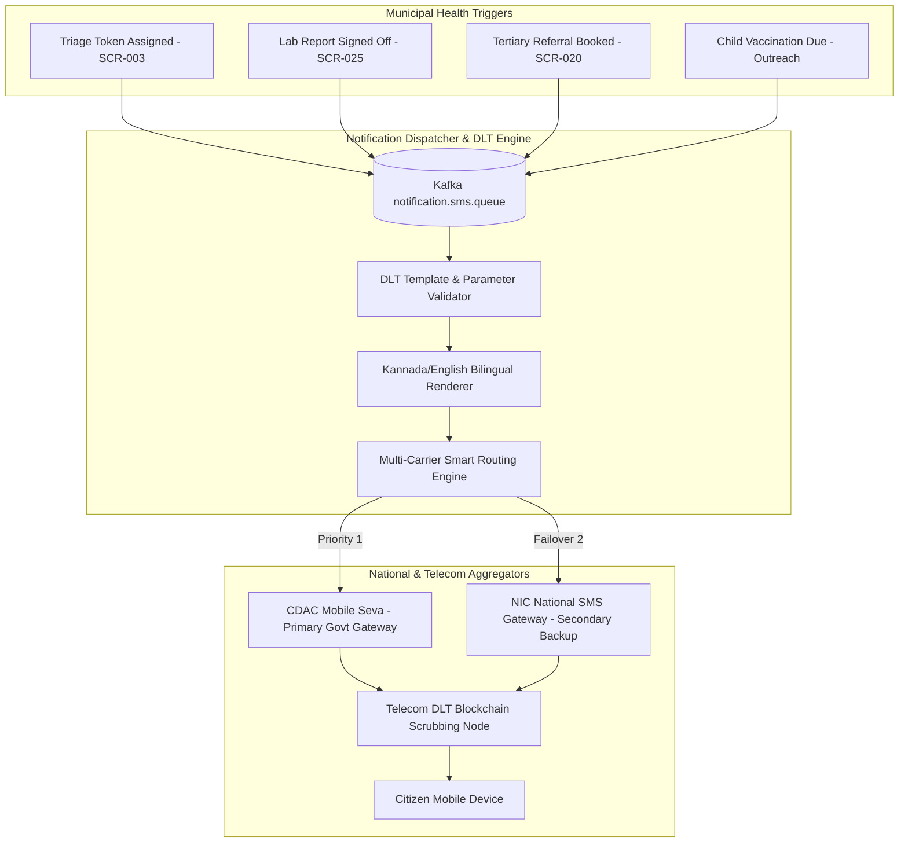

# Master SMS Gateway, Telecom DLT Compliance & Multilingual Citizen Notification Architecture
## Namma Clinic Digital Health & Operations Platform
### Greater Bengaluru Authority (GBA) / BBMP Health Department
**Document Code:** `INT-DOC-05` | **Status:** APPROVED BASELINE | **Date:** September 2026

---

## 1. Executive Summary & Citizen Communication Mandate
This document formalizes the technical specification for the **Master SMS Gateway, Telecom DLT Compliance, and Multilingual Citizen Notification Architecture** for the Namma Clinic Digital Health Platform. Serving a diverse urban population across Greater Bengaluru, the SMS messaging infrastructure delivers high-throughput, low-latency, transactional and service-implicit alerts. Integrated via CDAC Mobile Seva (National Mobile Governance Initiative) and backup commercial telecom aggregators, all outbound SMS communications comply strictly with the Telecom Regulatory Authority of India (TRAI) Telecom Commercial Communications Customer Preference Regulations (TCCCPR). Every template is pre-registered on the Telecom Distributed Ledger Technology (DLT) blockchain. Messages are dynamically rendered in both Kannada (Unicode UTF-8) and English, ensuring universal civic accessibility.

### 1.1 Non-Negotiable SMS Gateway Invariants
1. **Strict TRAI DLT Pre-Registration Invariant:** Every outbound SMS must match an approved DLT Template ID and Registered Sender Header (e.g. `GBAHLT`, `NAMMAC`). Untemplated or unregistered text strings are strictly prohibited and blocked by the integration gateway.
2. **Zero Unmasked PHI in SMS Payloads:** Protected Health Information (specific medical diagnoses, HIV/STI status, mental health details, biopsy results) must NEVER appear in plain-text SMS messages. Messages only convey service appointments, anonymized status alerts, and secure OTP tokens.
3. **Bilingual Parity (Kannada & English):** Patient appointment confirmations, OTPs, and child immunization reminders must be dispatched in the citizen's preferred official language, defaulting to Kannada with English secondary toggle.
4. **Delivery Receipt (DLR) Reconciled Auditing:** Every dispatched SMS message must track asynchronous carrier Delivery Receipts (DLR) up to 24 hours, recording final delivery state in an immutable analytics ledger.
5. **Strict Rate Limiting & Anti-Spam Throttling:** Outbound SMS to any single citizen mobile number is throttled to a maximum of 5 messages per hour, preventing message flooding during retry loops.

## 2. SMS Gateway Architecture & Multi-Carrier Failover Topology


### Integration Specification Example: DLT-Compliant SMS Dispatcher
<!-- DOCUMENTATION-ONLY EXAMPLE -->
```python
# DOCUMENTATION-ONLY PYTHON
# DOCUMENTATION-ONLY PYTHON: SMS Gateway Dispatcher with DLT Conformance
import uuid
import datetime
from typing import Dict, Any

class DltCompliantSmsDispatcher:
    """
    Dispatcher enforcing TRAI DLT template conformance, Kannada Unicode encoding,
    and automatic failover between CDAC Mobile Seva and NIC SMS gateways.
    """
    def __init__(self, primary_gateway_url: str, backup_gateway_url: str, sender_id: str = "GBAHLT"):
        self.primary_url = primary_gateway_url
        self.backup_url = backup_gateway_url
        self.sender_id = sender_id

    def dispatch_appointment_sms(
        self,
        mobile_number: str,
        patient_name: str,
        clinic_name: str,
        token_number: str,
        preferred_language: str = "KN"
    ) -> Dict[str, Any]:
        tx_id = str(uuid.uuid4())

        # Approved TRAI DLT Template ID: 14071689201948102
        if preferred_language == "KN":
            template_id = "14071689201948102"
            message_text = f"ನಮ್ಮ ಕ್ಲಿನಿಕ್: {patient_name}, ನಿಮ್ಮ ಟೋಕನ್ #{token_number} {clinic_name} ನಲ್ಲಿ ದಾಖಲಾಗಿದೆ. - ಬಿಬಿಎಂಪಿ"
        else:
            template_id = "14071689201948101"
            message_text = f"Namma Clinic: {patient_name}, your token #{token_number} is registered at {clinic_name}. - BBMP"

        payload = {
            "transaction_id": tx_id,
            "sender_id": self.sender_id,
            "dlt_template_id": template_id,
            "recipient_mobile": mobile_number,
            "message_content": message_text,
            "is_unicode": preferred_language == "KN",
            "dispatch_timestamp": datetime.datetime.utcnow().isoformat() + "Z"
        }
        return payload
```

### Interface Payload Example: Carrier SMS Delivery Receipt (DLR) Payload
<!-- DOCUMENTATION-ONLY EXAMPLE -->
```json
// DOCUMENTATION-ONLY JSON
{
  "messageId": "SMS-CDAC-20260906-99481",
  "carrierTransactionId": "AIRTEL-BLR-8812904-TX",
  "dltTemplateId": "14071689201948102",
  "senderHeader": "GBAHLT",
  "recipient": "+919845012345",
  "deliveryStatus": "DELIVERED_TO_HANDSET",
  "statusCode": "0",
  "statusDescription": "Message successfully delivered",
  "sentTimestamp": "2026-09-06T10:30:15.100Z",
  "deliveredTimestamp": "2026-09-06T10:30:17.340Z",
  "latencySeconds": 2.24,
  "telecomCircle": "KARNATAKA"
}
```

## 3. Master Catalog of Registered TRAI DLT Templates
### DLT Template: `14071689201948101` (OPD_TOKEN_ASSIGN_EN)
- **DLT Template Identifier:** `14071689201948101`
- **Template Name:** `OPD_TOKEN_ASSIGN_EN`
- **Registered Category:** `SERVICE_IMPLICIT`
- **Header Binding:** `GBAHLT` / `NAMMAC`
- **Approved Pattern:** `Namma Clinic: {#var#}, your token #{#var#} is registered at {#var#}. - BBMP`
- **Scrubbing Rule:** Strict regex matching against variable substitutions.

### DLT Template: `14071689201948102` (OPD_TOKEN_ASSIGN_KN)
- **DLT Template Identifier:** `14071689201948102`
- **Template Name:** `OPD_TOKEN_ASSIGN_KN`
- **Registered Category:** `SERVICE_IMPLICIT`
- **Header Binding:** `GBAHLT` / `NAMMAC`
- **Approved Pattern:** `ನಮ್ಮ ಕ್ಲಿನಿಕ್: {#var#}, ನಿಮ್ಮ ಟೋಕನ್ #{#var#} {#var#} ನಲ್ಲಿ ದಾಖಲಾಗಿದೆ. - ಬಿಬಿಎಂಪಿ`
- **Scrubbing Rule:** Strict regex matching against variable substitutions.

### DLT Template: `14071689201948201` (OTP_VERIFICATION_EN)
- **DLT Template Identifier:** `14071689201948201`
- **Template Name:** `OTP_VERIFICATION_EN`
- **Registered Category:** `SERVICE_IMPLICIT`
- **Header Binding:** `GBAHLT` / `NAMMAC`
- **Approved Pattern:** `{#var#} is your secret OTP for Namma Clinic health verification. Valid for 10 mins. Do not share. - BBMP`
- **Scrubbing Rule:** Strict regex matching against variable substitutions.

### DLT Template: `14071689201948202` (OTP_VERIFICATION_KN)
- **DLT Template Identifier:** `14071689201948202`
- **Template Name:** `OTP_VERIFICATION_KN`
- **Registered Category:** `SERVICE_IMPLICIT`
- **Header Binding:** `GBAHLT` / `NAMMAC`
- **Approved Pattern:** `ನಮ್ಮ ಕ್ಲಿನಿಕ್ ಪರಿಶೀಲನೆಗೆ ನಿಮ್ಮ ರಹಸ್ಯ ಒಟಿಪಿ {#var#}. 10 ನಿಮಿಷ ಮಾನ್ಯವಾಗಿದೆ. - ಬಿಬಿಎಂಪಿ`
- **Scrubbing Rule:** Strict regex matching against variable substitutions.

### DLT Template: `14071689201948301` (LAB_REPORT_READY_EN)
- **DLT Template Identifier:** `14071689201948301`
- **Template Name:** `LAB_REPORT_READY_EN`
- **Registered Category:** `SERVICE_IMPLICIT`
- **Header Binding:** `GBAHLT` / `NAMMAC`
- **Approved Pattern:** `Namma Clinic: Lab test results for {#var#} are ready. Collect from clinic or view online. - BBMP`
- **Scrubbing Rule:** Strict regex matching against variable substitutions.

### DLT Template: `14071689201948302` (LAB_REPORT_READY_KN)
- **DLT Template Identifier:** `14071689201948302`
- **Template Name:** `LAB_REPORT_READY_KN`
- **Registered Category:** `SERVICE_IMPLICIT`
- **Header Binding:** `GBAHLT` / `NAMMAC`
- **Approved Pattern:** `ನಮ್ಮ ಕ್ಲಿನಿಕ್: {#var#} ಅವರ ಪ್ರಯೋಗಾಲಯ ಪರೀಕ್ಷಾ ವರದಿ ಸಿದ್ಧವಾಗಿದೆ. ಕ್ಲಿನಿಕ್‌ನಲ್ಲಿ ಪಡೆಯಿರಿ. - ಬಿಬಿಎಂಪಿ`
- **Scrubbing Rule:** Strict regex matching against variable substitutions.

### DLT Template: `14071689201948401` (REFERRAL_CONFIRMED_EN)
- **DLT Template Identifier:** `14071689201948401`
- **Template Name:** `REFERRAL_CONFIRMED_EN`
- **Registered Category:** `SERVICE_IMPLICIT`
- **Header Binding:** `GBAHLT` / `NAMMAC`
- **Approved Pattern:** `Namma Clinic: Secondary referral confirmed for {#var#} at {#var#}, Slot: {#var#}. - BBMP`
- **Scrubbing Rule:** Strict regex matching against variable substitutions.

### DLT Template: `14071689201948402` (REFERRAL_CONFIRMED_KN)
- **DLT Template Identifier:** `14071689201948402`
- **Template Name:** `REFERRAL_CONFIRMED_KN`
- **Registered Category:** `SERVICE_IMPLICIT`
- **Header Binding:** `GBAHLT` / `NAMMAC`
- **Approved Pattern:** `ನಮ್ಮ ಕ್ಲಿನಿಕ್: {#var#} ಅವರ ಉನ್ನತ ಚಿಕಿತ್ಸಾ ಶಿಫಾರಸು {#var#} ನಲ್ಲಿ ದೃಢಪಟ್ಟಿದೆ, ಸಮಯ: {#var#}. - ಬಿಬಿಎಂಪಿ`
- **Scrubbing Rule:** Strict regex matching against variable substitutions.

### DLT Template: `14071689201948501` (IMMUNIZATION_DUE_EN)
- **DLT Template Identifier:** `14071689201948501`
- **Template Name:** `IMMUNIZATION_DUE_EN`
- **Registered Category:** `SERVICE_IMPLICIT`
- **Header Binding:** `GBAHLT` / `NAMMAC`
- **Approved Pattern:** `BBMP Health: Vaccination for {#var#} is due on {#var#}. Visit your nearest Namma Clinic. - GBA`
- **Scrubbing Rule:** Strict regex matching against variable substitutions.

### DLT Template: `14071689201948502` (IMMUNIZATION_DUE_KN)
- **DLT Template Identifier:** `14071689201948502`
- **Template Name:** `IMMUNIZATION_DUE_KN`
- **Registered Category:** `SERVICE_IMPLICIT`
- **Header Binding:** `GBAHLT` / `NAMMAC`
- **Approved Pattern:** `ಬಿಬಿಎಂಪಿ ಆರೋಗ್ಯ: {#var#} ಅವರಿಗೆ ಲಸಿಕೆ ದಿನಾಂಕ {#var#}. ಹತ್ತಿರದ ನಮ್ಮ ಕ್ಲಿನಿಕ್‌ಗೆ ಭೇಟಿ ನೀಡಿ. - ಜಿಬಿಎ`
- **Scrubbing Rule:** Strict regex matching against variable substitutions.

## 4. Master Catalog of SMS Integration Interfaces
Interface contracts for message queueing, dispatch, and delivery receipt webhooks:

### IFACE-071: SMS Interface `api_endpoint_interface_071`
- **Interface Identifier:** `IFACE-071`
- **Bound Flow:** `INT-071`
- **HTTP Route:** `POST /api/v1/integrations/endpoint-071`
- **Request Schema:** `SchemaReqInterface071`
- **Response Schema:** `SchemaResInterface071`
- **Timeout Target:** `300ms`
- **Rate Limit:** `1500 RPM`
- **Description:** Deterministic API endpoint interface 071 with schema validation, rate limiting, and mTLS.

### IFACE-072: SMS Interface `api_endpoint_interface_072`
- **Interface Identifier:** `IFACE-072`
- **Bound Flow:** `INT-072`
- **HTTP Route:** `GET /api/v1/integrations/endpoint-072`
- **Request Schema:** `SchemaReqInterface072`
- **Response Schema:** `SchemaResInterface072`
- **Timeout Target:** `350ms`
- **Rate Limit:** `1800 RPM`
- **Description:** Deterministic API endpoint interface 072 with schema validation, rate limiting, and mTLS.

### IFACE-073: SMS Interface `api_endpoint_interface_073`
- **Interface Identifier:** `IFACE-073`
- **Bound Flow:** `INT-073`
- **HTTP Route:** `PUT /api/v1/integrations/endpoint-073`
- **Request Schema:** `SchemaReqInterface073`
- **Response Schema:** `SchemaResInterface073`
- **Timeout Target:** `400ms`
- **Rate Limit:** `2100 RPM`
- **Description:** Deterministic API endpoint interface 073 with schema validation, rate limiting, and mTLS.

### IFACE-074: SMS Interface `api_endpoint_interface_074`
- **Interface Identifier:** `IFACE-074`
- **Bound Flow:** `INT-074`
- **HTTP Route:** `PATCH /api/v1/integrations/endpoint-074`
- **Request Schema:** `SchemaReqInterface074`
- **Response Schema:** `SchemaResInterface074`
- **Timeout Target:** `450ms`
- **Rate Limit:** `2400 RPM`
- **Description:** Deterministic API endpoint interface 074 with schema validation, rate limiting, and mTLS.

### IFACE-075: SMS Interface `api_endpoint_interface_075`
- **Interface Identifier:** `IFACE-075`
- **Bound Flow:** `INT-075`
- **HTTP Route:** `DELETE /api/v1/integrations/endpoint-075`
- **Request Schema:** `SchemaReqInterface075`
- **Response Schema:** `SchemaResInterface075`
- **Timeout Target:** `250ms`
- **Rate Limit:** `1200 RPM`
- **Description:** Deterministic API endpoint interface 075 with schema validation, rate limiting, and mTLS.

### IFACE-076: SMS Interface `api_endpoint_interface_076`
- **Interface Identifier:** `IFACE-076`
- **Bound Flow:** `INT-076`
- **HTTP Route:** `POST /api/v1/integrations/endpoint-076`
- **Request Schema:** `SchemaReqInterface076`
- **Response Schema:** `SchemaResInterface076`
- **Timeout Target:** `300ms`
- **Rate Limit:** `1500 RPM`
- **Description:** Deterministic API endpoint interface 076 with schema validation, rate limiting, and mTLS.

### IFACE-077: SMS Interface `api_endpoint_interface_077`
- **Interface Identifier:** `IFACE-077`
- **Bound Flow:** `INT-077`
- **HTTP Route:** `GET /api/v1/integrations/endpoint-077`
- **Request Schema:** `SchemaReqInterface077`
- **Response Schema:** `SchemaResInterface077`
- **Timeout Target:** `350ms`
- **Rate Limit:** `1800 RPM`
- **Description:** Deterministic API endpoint interface 077 with schema validation, rate limiting, and mTLS.

### IFACE-078: SMS Interface `api_endpoint_interface_078`
- **Interface Identifier:** `IFACE-078`
- **Bound Flow:** `INT-078`
- **HTTP Route:** `PUT /api/v1/integrations/endpoint-078`
- **Request Schema:** `SchemaReqInterface078`
- **Response Schema:** `SchemaResInterface078`
- **Timeout Target:** `400ms`
- **Rate Limit:** `2100 RPM`
- **Description:** Deterministic API endpoint interface 078 with schema validation, rate limiting, and mTLS.

### IFACE-079: SMS Interface `api_endpoint_interface_079`
- **Interface Identifier:** `IFACE-079`
- **Bound Flow:** `INT-079`
- **HTTP Route:** `PATCH /api/v1/integrations/endpoint-079`
- **Request Schema:** `SchemaReqInterface079`
- **Response Schema:** `SchemaResInterface079`
- **Timeout Target:** `450ms`
- **Rate Limit:** `2400 RPM`
- **Description:** Deterministic API endpoint interface 079 with schema validation, rate limiting, and mTLS.

### IFACE-080: SMS Interface `api_endpoint_interface_080`
- **Interface Identifier:** `IFACE-080`
- **Bound Flow:** `INT-080`
- **HTTP Route:** `DELETE /api/v1/integrations/endpoint-080`
- **Request Schema:** `SchemaReqInterface080`
- **Response Schema:** `SchemaResInterface080`
- **Timeout Target:** `250ms`
- **Rate Limit:** `1200 RPM`
- **Description:** Deterministic API endpoint interface 080 with schema validation, rate limiting, and mTLS.

### IFACE-081: SMS Interface `api_endpoint_interface_081`
- **Interface Identifier:** `IFACE-081`
- **Bound Flow:** `INT-081`
- **HTTP Route:** `POST /api/v1/integrations/endpoint-081`
- **Request Schema:** `SchemaReqInterface081`
- **Response Schema:** `SchemaResInterface081`
- **Timeout Target:** `300ms`
- **Rate Limit:** `1500 RPM`
- **Description:** Deterministic API endpoint interface 081 with schema validation, rate limiting, and mTLS.

### IFACE-082: SMS Interface `api_endpoint_interface_082`
- **Interface Identifier:** `IFACE-082`
- **Bound Flow:** `INT-082`
- **HTTP Route:** `GET /api/v1/integrations/endpoint-082`
- **Request Schema:** `SchemaReqInterface082`
- **Response Schema:** `SchemaResInterface082`
- **Timeout Target:** `350ms`
- **Rate Limit:** `1800 RPM`
- **Description:** Deterministic API endpoint interface 082 with schema validation, rate limiting, and mTLS.

### IFACE-083: SMS Interface `api_endpoint_interface_083`
- **Interface Identifier:** `IFACE-083`
- **Bound Flow:** `INT-083`
- **HTTP Route:** `PUT /api/v1/integrations/endpoint-083`
- **Request Schema:** `SchemaReqInterface083`
- **Response Schema:** `SchemaResInterface083`
- **Timeout Target:** `400ms`
- **Rate Limit:** `2100 RPM`
- **Description:** Deterministic API endpoint interface 083 with schema validation, rate limiting, and mTLS.

### IFACE-084: SMS Interface `api_endpoint_interface_084`
- **Interface Identifier:** `IFACE-084`
- **Bound Flow:** `INT-084`
- **HTTP Route:** `PATCH /api/v1/integrations/endpoint-084`
- **Request Schema:** `SchemaReqInterface084`
- **Response Schema:** `SchemaResInterface084`
- **Timeout Target:** `450ms`
- **Rate Limit:** `2400 RPM`
- **Description:** Deterministic API endpoint interface 084 with schema validation, rate limiting, and mTLS.

### IFACE-085: SMS Interface `api_endpoint_interface_085`
- **Interface Identifier:** `IFACE-085`
- **Bound Flow:** `INT-085`
- **HTTP Route:** `DELETE /api/v1/integrations/endpoint-085`
- **Request Schema:** `SchemaReqInterface085`
- **Response Schema:** `SchemaResInterface085`
- **Timeout Target:** `250ms`
- **Rate Limit:** `1200 RPM`
- **Description:** Deterministic API endpoint interface 085 with schema validation, rate limiting, and mTLS.

### IFACE-086: SMS Interface `api_endpoint_interface_086`
- **Interface Identifier:** `IFACE-086`
- **Bound Flow:** `INT-086`
- **HTTP Route:** `POST /api/v1/integrations/endpoint-086`
- **Request Schema:** `SchemaReqInterface086`
- **Response Schema:** `SchemaResInterface086`
- **Timeout Target:** `300ms`
- **Rate Limit:** `1500 RPM`
- **Description:** Deterministic API endpoint interface 086 with schema validation, rate limiting, and mTLS.

### IFACE-087: SMS Interface `api_endpoint_interface_087`
- **Interface Identifier:** `IFACE-087`
- **Bound Flow:** `INT-087`
- **HTTP Route:** `GET /api/v1/integrations/endpoint-087`
- **Request Schema:** `SchemaReqInterface087`
- **Response Schema:** `SchemaResInterface087`
- **Timeout Target:** `350ms`
- **Rate Limit:** `1800 RPM`
- **Description:** Deterministic API endpoint interface 087 with schema validation, rate limiting, and mTLS.

### IFACE-088: SMS Interface `api_endpoint_interface_088`
- **Interface Identifier:** `IFACE-088`
- **Bound Flow:** `INT-088`
- **HTTP Route:** `PUT /api/v1/integrations/endpoint-088`
- **Request Schema:** `SchemaReqInterface088`
- **Response Schema:** `SchemaResInterface088`
- **Timeout Target:** `400ms`
- **Rate Limit:** `2100 RPM`
- **Description:** Deterministic API endpoint interface 088 with schema validation, rate limiting, and mTLS.

### IFACE-089: SMS Interface `api_endpoint_interface_089`
- **Interface Identifier:** `IFACE-089`
- **Bound Flow:** `INT-089`
- **HTTP Route:** `PATCH /api/v1/integrations/endpoint-089`
- **Request Schema:** `SchemaReqInterface089`
- **Response Schema:** `SchemaResInterface089`
- **Timeout Target:** `450ms`
- **Rate Limit:** `2400 RPM`
- **Description:** Deterministic API endpoint interface 089 with schema validation, rate limiting, and mTLS.

### IFACE-090: SMS Interface `api_endpoint_interface_090`
- **Interface Identifier:** `IFACE-090`
- **Bound Flow:** `INT-090`
- **HTTP Route:** `DELETE /api/v1/integrations/endpoint-090`
- **Request Schema:** `SchemaReqInterface090`
- **Response Schema:** `SchemaResInterface090`
- **Timeout Target:** `250ms`
- **Rate Limit:** `1200 RPM`
- **Description:** Deterministic API endpoint interface 090 with schema validation, rate limiting, and mTLS.

### IFACE-091: SMS Interface `api_endpoint_interface_091`
- **Interface Identifier:** `IFACE-091`
- **Bound Flow:** `INT-091`
- **HTTP Route:** `POST /api/v1/integrations/endpoint-091`
- **Request Schema:** `SchemaReqInterface091`
- **Response Schema:** `SchemaResInterface091`
- **Timeout Target:** `300ms`
- **Rate Limit:** `1500 RPM`
- **Description:** Deterministic API endpoint interface 091 with schema validation, rate limiting, and mTLS.

### IFACE-092: SMS Interface `api_endpoint_interface_092`
- **Interface Identifier:** `IFACE-092`
- **Bound Flow:** `INT-092`
- **HTTP Route:** `GET /api/v1/integrations/endpoint-092`
- **Request Schema:** `SchemaReqInterface092`
- **Response Schema:** `SchemaResInterface092`
- **Timeout Target:** `350ms`
- **Rate Limit:** `1800 RPM`
- **Description:** Deterministic API endpoint interface 092 with schema validation, rate limiting, and mTLS.

### IFACE-093: SMS Interface `api_endpoint_interface_093`
- **Interface Identifier:** `IFACE-093`
- **Bound Flow:** `INT-093`
- **HTTP Route:** `PUT /api/v1/integrations/endpoint-093`
- **Request Schema:** `SchemaReqInterface093`
- **Response Schema:** `SchemaResInterface093`
- **Timeout Target:** `400ms`
- **Rate Limit:** `2100 RPM`
- **Description:** Deterministic API endpoint interface 093 with schema validation, rate limiting, and mTLS.

### IFACE-094: SMS Interface `api_endpoint_interface_094`
- **Interface Identifier:** `IFACE-094`
- **Bound Flow:** `INT-094`
- **HTTP Route:** `PATCH /api/v1/integrations/endpoint-094`
- **Request Schema:** `SchemaReqInterface094`
- **Response Schema:** `SchemaResInterface094`
- **Timeout Target:** `450ms`
- **Rate Limit:** `2400 RPM`
- **Description:** Deterministic API endpoint interface 094 with schema validation, rate limiting, and mTLS.

### IFACE-095: SMS Interface `api_endpoint_interface_095`
- **Interface Identifier:** `IFACE-095`
- **Bound Flow:** `INT-095`
- **HTTP Route:** `DELETE /api/v1/integrations/endpoint-095`
- **Request Schema:** `SchemaReqInterface095`
- **Response Schema:** `SchemaResInterface095`
- **Timeout Target:** `250ms`
- **Rate Limit:** `1200 RPM`
- **Description:** Deterministic API endpoint interface 095 with schema validation, rate limiting, and mTLS.

## 5. Table-Level SMS Notification Traceability across all 52 Tables
Event triggers and notification logs originating from relational database entities across all 52 tables:

### TABLE-001: SMS Trigger Mapping for Table `auth_users`
- **Table Identifier:** `TABLE-001` (`TBL-01`)
- **Source Entity:** `auth_users`
- **Notification Trigger:** Database mutation triggers CDC event published to `notification.sms.queue`.
- **DLT Template Selection:** Automatic template ID resolution based on business event type.
- **Privacy Guard:** Phone numbers retrieved from encrypted citizen table; no PHI included in payload.
- **Monitoring Sensor:** Bound to metric probe `MON-INT-001` to track delivery latencies.
- **Audit Logging:** Final DLR code recorded in immutable message delivery log.

### TABLE-002: SMS Trigger Mapping for Table `user_credentials`
- **Table Identifier:** `TABLE-002` (`TBL-02`)
- **Source Entity:** `user_credentials`
- **Notification Trigger:** Database mutation triggers CDC event published to `notification.sms.queue`.
- **DLT Template Selection:** Automatic template ID resolution based on business event type.
- **Privacy Guard:** Phone numbers retrieved from encrypted citizen table; no PHI included in payload.
- **Monitoring Sensor:** Bound to metric probe `MON-INT-002` to track delivery latencies.
- **Audit Logging:** Final DLR code recorded in immutable message delivery log.

### TABLE-003: SMS Trigger Mapping for Table `user_sessions`
- **Table Identifier:** `TABLE-003` (`TBL-03`)
- **Source Entity:** `user_sessions`
- **Notification Trigger:** Database mutation triggers CDC event published to `notification.sms.queue`.
- **DLT Template Selection:** Automatic template ID resolution based on business event type.
- **Privacy Guard:** Phone numbers retrieved from encrypted citizen table; no PHI included in payload.
- **Monitoring Sensor:** Bound to metric probe `MON-INT-003` to track delivery latencies.
- **Audit Logging:** Final DLR code recorded in immutable message delivery log.

### TABLE-004: SMS Trigger Mapping for Table `roles`
- **Table Identifier:** `TABLE-004` (`TBL-04`)
- **Source Entity:** `roles`
- **Notification Trigger:** Database mutation triggers CDC event published to `notification.sms.queue`.
- **DLT Template Selection:** Automatic template ID resolution based on business event type.
- **Privacy Guard:** Phone numbers retrieved from encrypted citizen table; no PHI included in payload.
- **Monitoring Sensor:** Bound to metric probe `MON-INT-004` to track delivery latencies.
- **Audit Logging:** Final DLR code recorded in immutable message delivery log.

### TABLE-005: SMS Trigger Mapping for Table `permissions`
- **Table Identifier:** `TABLE-005` (`TBL-05`)
- **Source Entity:** `permissions`
- **Notification Trigger:** Database mutation triggers CDC event published to `notification.sms.queue`.
- **DLT Template Selection:** Automatic template ID resolution based on business event type.
- **Privacy Guard:** Phone numbers retrieved from encrypted citizen table; no PHI included in payload.
- **Monitoring Sensor:** Bound to metric probe `MON-INT-005` to track delivery latencies.
- **Audit Logging:** Final DLR code recorded in immutable message delivery log.

### TABLE-006: SMS Trigger Mapping for Table `role_permissions`
- **Table Identifier:** `TABLE-006` (`TBL-06`)
- **Source Entity:** `role_permissions`
- **Notification Trigger:** Database mutation triggers CDC event published to `notification.sms.queue`.
- **DLT Template Selection:** Automatic template ID resolution based on business event type.
- **Privacy Guard:** Phone numbers retrieved from encrypted citizen table; no PHI included in payload.
- **Monitoring Sensor:** Bound to metric probe `MON-INT-006` to track delivery latencies.
- **Audit Logging:** Final DLR code recorded in immutable message delivery log.

### TABLE-007: SMS Trigger Mapping for Table `user_roles`
- **Table Identifier:** `TABLE-007` (`TBL-07`)
- **Source Entity:** `user_roles`
- **Notification Trigger:** Database mutation triggers CDC event published to `notification.sms.queue`.
- **DLT Template Selection:** Automatic template ID resolution based on business event type.
- **Privacy Guard:** Phone numbers retrieved from encrypted citizen table; no PHI included in payload.
- **Monitoring Sensor:** Bound to metric probe `MON-INT-007` to track delivery latencies.
- **Audit Logging:** Final DLR code recorded in immutable message delivery log.

### TABLE-008: SMS Trigger Mapping for Table `facilities`
- **Table Identifier:** `TABLE-008` (`TBL-08`)
- **Source Entity:** `facilities`
- **Notification Trigger:** Database mutation triggers CDC event published to `notification.sms.queue`.
- **DLT Template Selection:** Automatic template ID resolution based on business event type.
- **Privacy Guard:** Phone numbers retrieved from encrypted citizen table; no PHI included in payload.
- **Monitoring Sensor:** Bound to metric probe `MON-INT-008` to track delivery latencies.
- **Audit Logging:** Final DLR code recorded in immutable message delivery log.

### TABLE-009: SMS Trigger Mapping for Table `facility_rooms`
- **Table Identifier:** `TABLE-009` (`TBL-09`)
- **Source Entity:** `facility_rooms`
- **Notification Trigger:** Database mutation triggers CDC event published to `notification.sms.queue`.
- **DLT Template Selection:** Automatic template ID resolution based on business event type.
- **Privacy Guard:** Phone numbers retrieved from encrypted citizen table; no PHI included in payload.
- **Monitoring Sensor:** Bound to metric probe `MON-INT-009` to track delivery latencies.
- **Audit Logging:** Final DLR code recorded in immutable message delivery log.

### TABLE-010: SMS Trigger Mapping for Table `staff_profiles`
- **Table Identifier:** `TABLE-010` (`TBL-10`)
- **Source Entity:** `staff_profiles`
- **Notification Trigger:** Database mutation triggers CDC event published to `notification.sms.queue`.
- **DLT Template Selection:** Automatic template ID resolution based on business event type.
- **Privacy Guard:** Phone numbers retrieved from encrypted citizen table; no PHI included in payload.
- **Monitoring Sensor:** Bound to metric probe `MON-INT-010` to track delivery latencies.
- **Audit Logging:** Final DLR code recorded in immutable message delivery log.

### TABLE-011: SMS Trigger Mapping for Table `staff_shifts`
- **Table Identifier:** `TABLE-011` (`TBL-11`)
- **Source Entity:** `staff_shifts`
- **Notification Trigger:** Database mutation triggers CDC event published to `notification.sms.queue`.
- **DLT Template Selection:** Automatic template ID resolution based on business event type.
- **Privacy Guard:** Phone numbers retrieved from encrypted citizen table; no PHI included in payload.
- **Monitoring Sensor:** Bound to metric probe `MON-INT-011` to track delivery latencies.
- **Audit Logging:** Final DLR code recorded in immutable message delivery log.

### TABLE-012: SMS Trigger Mapping for Table `system_configs`
- **Table Identifier:** `TABLE-012` (`TBL-12`)
- **Source Entity:** `system_configs`
- **Notification Trigger:** Database mutation triggers CDC event published to `notification.sms.queue`.
- **DLT Template Selection:** Automatic template ID resolution based on business event type.
- **Privacy Guard:** Phone numbers retrieved from encrypted citizen table; no PHI included in payload.
- **Monitoring Sensor:** Bound to metric probe `MON-INT-012` to track delivery latencies.
- **Audit Logging:** Final DLR code recorded in immutable message delivery log.

### TABLE-013: SMS Trigger Mapping for Table `patients`
- **Table Identifier:** `TABLE-013` (`TBL-13`)
- **Source Entity:** `patients`
- **Notification Trigger:** Database mutation triggers CDC event published to `notification.sms.queue`.
- **DLT Template Selection:** Automatic template ID resolution based on business event type.
- **Privacy Guard:** Phone numbers retrieved from encrypted citizen table; no PHI included in payload.
- **Monitoring Sensor:** Bound to metric probe `MON-INT-013` to track delivery latencies.
- **Audit Logging:** Final DLR code recorded in immutable message delivery log.

### TABLE-014: SMS Trigger Mapping for Table `patient_identifiers`
- **Table Identifier:** `TABLE-014` (`TBL-14`)
- **Source Entity:** `patient_identifiers`
- **Notification Trigger:** Database mutation triggers CDC event published to `notification.sms.queue`.
- **DLT Template Selection:** Automatic template ID resolution based on business event type.
- **Privacy Guard:** Phone numbers retrieved from encrypted citizen table; no PHI included in payload.
- **Monitoring Sensor:** Bound to metric probe `MON-INT-014` to track delivery latencies.
- **Audit Logging:** Final DLR code recorded in immutable message delivery log.

### TABLE-015: SMS Trigger Mapping for Table `patient_contacts`
- **Table Identifier:** `TABLE-015` (`TBL-15`)
- **Source Entity:** `patient_contacts`
- **Notification Trigger:** Database mutation triggers CDC event published to `notification.sms.queue`.
- **DLT Template Selection:** Automatic template ID resolution based on business event type.
- **Privacy Guard:** Phone numbers retrieved from encrypted citizen table; no PHI included in payload.
- **Monitoring Sensor:** Bound to metric probe `MON-INT-015` to track delivery latencies.
- **Audit Logging:** Final DLR code recorded in immutable message delivery log.

### TABLE-016: SMS Trigger Mapping for Table `patient_addresses`
- **Table Identifier:** `TABLE-016` (`TBL-16`)
- **Source Entity:** `patient_addresses`
- **Notification Trigger:** Database mutation triggers CDC event published to `notification.sms.queue`.
- **DLT Template Selection:** Automatic template ID resolution based on business event type.
- **Privacy Guard:** Phone numbers retrieved from encrypted citizen table; no PHI included in payload.
- **Monitoring Sensor:** Bound to metric probe `MON-INT-016` to track delivery latencies.
- **Audit Logging:** Final DLR code recorded in immutable message delivery log.

### TABLE-017: SMS Trigger Mapping for Table `consent_records`
- **Table Identifier:** `TABLE-017` (`TBL-17`)
- **Source Entity:** `consent_records`
- **Notification Trigger:** Database mutation triggers CDC event published to `notification.sms.queue`.
- **DLT Template Selection:** Automatic template ID resolution based on business event type.
- **Privacy Guard:** Phone numbers retrieved from encrypted citizen table; no PHI included in payload.
- **Monitoring Sensor:** Bound to metric probe `MON-INT-017` to track delivery latencies.
- **Audit Logging:** Final DLR code recorded in immutable message delivery log.

### TABLE-018: SMS Trigger Mapping for Table `tokens`
- **Table Identifier:** `TABLE-018` (`TBL-18`)
- **Source Entity:** `tokens`
- **Notification Trigger:** Database mutation triggers CDC event published to `notification.sms.queue`.
- **DLT Template Selection:** Automatic template ID resolution based on business event type.
- **Privacy Guard:** Phone numbers retrieved from encrypted citizen table; no PHI included in payload.
- **Monitoring Sensor:** Bound to metric probe `MON-INT-018` to track delivery latencies.
- **Audit Logging:** Final DLR code recorded in immutable message delivery log.

### TABLE-019: SMS Trigger Mapping for Table `queue_entries`
- **Table Identifier:** `TABLE-019` (`TBL-19`)
- **Source Entity:** `queue_entries`
- **Notification Trigger:** Database mutation triggers CDC event published to `notification.sms.queue`.
- **DLT Template Selection:** Automatic template ID resolution based on business event type.
- **Privacy Guard:** Phone numbers retrieved from encrypted citizen table; no PHI included in payload.
- **Monitoring Sensor:** Bound to metric probe `MON-INT-019` to track delivery latencies.
- **Audit Logging:** Final DLR code recorded in immutable message delivery log.

### TABLE-020: SMS Trigger Mapping for Table `triage_assessments`
- **Table Identifier:** `TABLE-020` (`TBL-20`)
- **Source Entity:** `triage_assessments`
- **Notification Trigger:** Database mutation triggers CDC event published to `notification.sms.queue`.
- **DLT Template Selection:** Automatic template ID resolution based on business event type.
- **Privacy Guard:** Phone numbers retrieved from encrypted citizen table; no PHI included in payload.
- **Monitoring Sensor:** Bound to metric probe `MON-INT-020` to track delivery latencies.
- **Audit Logging:** Final DLR code recorded in immutable message delivery log.

### TABLE-021: SMS Trigger Mapping for Table `patient_vitals`
- **Table Identifier:** `TABLE-021` (`TBL-21`)
- **Source Entity:** `patient_vitals`
- **Notification Trigger:** Database mutation triggers CDC event published to `notification.sms.queue`.
- **DLT Template Selection:** Automatic template ID resolution based on business event type.
- **Privacy Guard:** Phone numbers retrieved from encrypted citizen table; no PHI included in payload.
- **Monitoring Sensor:** Bound to metric probe `MON-INT-021` to track delivery latencies.
- **Audit Logging:** Final DLR code recorded in immutable message delivery log.

### TABLE-022: SMS Trigger Mapping for Table `danger_alerts`
- **Table Identifier:** `TABLE-022` (`TBL-22`)
- **Source Entity:** `danger_alerts`
- **Notification Trigger:** Database mutation triggers CDC event published to `notification.sms.queue`.
- **DLT Template Selection:** Automatic template ID resolution based on business event type.
- **Privacy Guard:** Phone numbers retrieved from encrypted citizen table; no PHI included in payload.
- **Monitoring Sensor:** Bound to metric probe `MON-INT-022` to track delivery latencies.
- **Audit Logging:** Final DLR code recorded in immutable message delivery log.

### TABLE-023: SMS Trigger Mapping for Table `clinical_encounters`
- **Table Identifier:** `TABLE-023` (`TBL-23`)
- **Source Entity:** `clinical_encounters`
- **Notification Trigger:** Database mutation triggers CDC event published to `notification.sms.queue`.
- **DLT Template Selection:** Automatic template ID resolution based on business event type.
- **Privacy Guard:** Phone numbers retrieved from encrypted citizen table; no PHI included in payload.
- **Monitoring Sensor:** Bound to metric probe `MON-INT-023` to track delivery latencies.
- **Audit Logging:** Final DLR code recorded in immutable message delivery log.

### TABLE-024: SMS Trigger Mapping for Table `clinical_notes`
- **Table Identifier:** `TABLE-024` (`TBL-24`)
- **Source Entity:** `clinical_notes`
- **Notification Trigger:** Database mutation triggers CDC event published to `notification.sms.queue`.
- **DLT Template Selection:** Automatic template ID resolution based on business event type.
- **Privacy Guard:** Phone numbers retrieved from encrypted citizen table; no PHI included in payload.
- **Monitoring Sensor:** Bound to metric probe `MON-INT-024` to track delivery latencies.
- **Audit Logging:** Final DLR code recorded in immutable message delivery log.

### TABLE-025: SMS Trigger Mapping for Table `diagnoses`
- **Table Identifier:** `TABLE-025` (`TBL-25`)
- **Source Entity:** `diagnoses`
- **Notification Trigger:** Database mutation triggers CDC event published to `notification.sms.queue`.
- **DLT Template Selection:** Automatic template ID resolution based on business event type.
- **Privacy Guard:** Phone numbers retrieved from encrypted citizen table; no PHI included in payload.
- **Monitoring Sensor:** Bound to metric probe `MON-INT-025` to track delivery latencies.
- **Audit Logging:** Final DLR code recorded in immutable message delivery log.

### TABLE-026: SMS Trigger Mapping for Table `prescriptions`
- **Table Identifier:** `TABLE-026` (`TBL-26`)
- **Source Entity:** `prescriptions`
- **Notification Trigger:** Database mutation triggers CDC event published to `notification.sms.queue`.
- **DLT Template Selection:** Automatic template ID resolution based on business event type.
- **Privacy Guard:** Phone numbers retrieved from encrypted citizen table; no PHI included in payload.
- **Monitoring Sensor:** Bound to metric probe `MON-INT-026` to track delivery latencies.
- **Audit Logging:** Final DLR code recorded in immutable message delivery log.

### TABLE-027: SMS Trigger Mapping for Table `prescription_items`
- **Table Identifier:** `TABLE-027` (`TBL-27`)
- **Source Entity:** `prescription_items`
- **Notification Trigger:** Database mutation triggers CDC event published to `notification.sms.queue`.
- **DLT Template Selection:** Automatic template ID resolution based on business event type.
- **Privacy Guard:** Phone numbers retrieved from encrypted citizen table; no PHI included in payload.
- **Monitoring Sensor:** Bound to metric probe `MON-INT-027` to track delivery latencies.
- **Audit Logging:** Final DLR code recorded in immutable message delivery log.

### TABLE-028: SMS Trigger Mapping for Table `lab_orders`
- **Table Identifier:** `TABLE-028` (`TBL-28`)
- **Source Entity:** `lab_orders`
- **Notification Trigger:** Database mutation triggers CDC event published to `notification.sms.queue`.
- **DLT Template Selection:** Automatic template ID resolution based on business event type.
- **Privacy Guard:** Phone numbers retrieved from encrypted citizen table; no PHI included in payload.
- **Monitoring Sensor:** Bound to metric probe `MON-INT-028` to track delivery latencies.
- **Audit Logging:** Final DLR code recorded in immutable message delivery log.

### TABLE-029: SMS Trigger Mapping for Table `lab_order_items`
- **Table Identifier:** `TABLE-029` (`TBL-29`)
- **Source Entity:** `lab_order_items`
- **Notification Trigger:** Database mutation triggers CDC event published to `notification.sms.queue`.
- **DLT Template Selection:** Automatic template ID resolution based on business event type.
- **Privacy Guard:** Phone numbers retrieved from encrypted citizen table; no PHI included in payload.
- **Monitoring Sensor:** Bound to metric probe `MON-INT-029` to track delivery latencies.
- **Audit Logging:** Final DLR code recorded in immutable message delivery log.

### TABLE-030: SMS Trigger Mapping for Table `lab_results`
- **Table Identifier:** `TABLE-030` (`TBL-30`)
- **Source Entity:** `lab_results`
- **Notification Trigger:** Database mutation triggers CDC event published to `notification.sms.queue`.
- **DLT Template Selection:** Automatic template ID resolution based on business event type.
- **Privacy Guard:** Phone numbers retrieved from encrypted citizen table; no PHI included in payload.
- **Monitoring Sensor:** Bound to metric probe `MON-INT-030` to track delivery latencies.
- **Audit Logging:** Final DLR code recorded in immutable message delivery log.

### TABLE-031: SMS Trigger Mapping for Table `teleconsultations`
- **Table Identifier:** `TABLE-031` (`TBL-31`)
- **Source Entity:** `teleconsultations`
- **Notification Trigger:** Database mutation triggers CDC event published to `notification.sms.queue`.
- **DLT Template Selection:** Automatic template ID resolution based on business event type.
- **Privacy Guard:** Phone numbers retrieved from encrypted citizen table; no PHI included in payload.
- **Monitoring Sensor:** Bound to metric probe `MON-INT-031` to track delivery latencies.
- **Audit Logging:** Final DLR code recorded in immutable message delivery log.

### TABLE-032: SMS Trigger Mapping for Table `formulary_drugs`
- **Table Identifier:** `TABLE-032` (`TBL-32`)
- **Source Entity:** `formulary_drugs`
- **Notification Trigger:** Database mutation triggers CDC event published to `notification.sms.queue`.
- **DLT Template Selection:** Automatic template ID resolution based on business event type.
- **Privacy Guard:** Phone numbers retrieved from encrypted citizen table; no PHI included in payload.
- **Monitoring Sensor:** Bound to metric probe `MON-INT-032` to track delivery latencies.
- **Audit Logging:** Final DLR code recorded in immutable message delivery log.

### TABLE-033: SMS Trigger Mapping for Table `drug_categories`
- **Table Identifier:** `TABLE-033` (`TBL-33`)
- **Source Entity:** `drug_categories`
- **Notification Trigger:** Database mutation triggers CDC event published to `notification.sms.queue`.
- **DLT Template Selection:** Automatic template ID resolution based on business event type.
- **Privacy Guard:** Phone numbers retrieved from encrypted citizen table; no PHI included in payload.
- **Monitoring Sensor:** Bound to metric probe `MON-INT-033` to track delivery latencies.
- **Audit Logging:** Final DLR code recorded in immutable message delivery log.

### TABLE-034: SMS Trigger Mapping for Table `pharmacy_batches`
- **Table Identifier:** `TABLE-034` (`TBL-34`)
- **Source Entity:** `pharmacy_batches`
- **Notification Trigger:** Database mutation triggers CDC event published to `notification.sms.queue`.
- **DLT Template Selection:** Automatic template ID resolution based on business event type.
- **Privacy Guard:** Phone numbers retrieved from encrypted citizen table; no PHI included in payload.
- **Monitoring Sensor:** Bound to metric probe `MON-INT-034` to track delivery latencies.
- **Audit Logging:** Final DLR code recorded in immutable message delivery log.

### TABLE-035: SMS Trigger Mapping for Table `clinic_stock`
- **Table Identifier:** `TABLE-035` (`TBL-35`)
- **Source Entity:** `clinic_stock`
- **Notification Trigger:** Database mutation triggers CDC event published to `notification.sms.queue`.
- **DLT Template Selection:** Automatic template ID resolution based on business event type.
- **Privacy Guard:** Phone numbers retrieved from encrypted citizen table; no PHI included in payload.
- **Monitoring Sensor:** Bound to metric probe `MON-INT-035` to track delivery latencies.
- **Audit Logging:** Final DLR code recorded in immutable message delivery log.

### TABLE-036: SMS Trigger Mapping for Table `dispensations`
- **Table Identifier:** `TABLE-036` (`TBL-36`)
- **Source Entity:** `dispensations`
- **Notification Trigger:** Database mutation triggers CDC event published to `notification.sms.queue`.
- **DLT Template Selection:** Automatic template ID resolution based on business event type.
- **Privacy Guard:** Phone numbers retrieved from encrypted citizen table; no PHI included in payload.
- **Monitoring Sensor:** Bound to metric probe `MON-INT-036` to track delivery latencies.
- **Audit Logging:** Final DLR code recorded in immutable message delivery log.

### TABLE-037: SMS Trigger Mapping for Table `dispensation_items`
- **Table Identifier:** `TABLE-037` (`TBL-37`)
- **Source Entity:** `dispensation_items`
- **Notification Trigger:** Database mutation triggers CDC event published to `notification.sms.queue`.
- **DLT Template Selection:** Automatic template ID resolution based on business event type.
- **Privacy Guard:** Phone numbers retrieved from encrypted citizen table; no PHI included in payload.
- **Monitoring Sensor:** Bound to metric probe `MON-INT-037` to track delivery latencies.
- **Audit Logging:** Final DLR code recorded in immutable message delivery log.

### TABLE-038: SMS Trigger Mapping for Table `stock_movements`
- **Table Identifier:** `TABLE-038` (`TBL-38`)
- **Source Entity:** `stock_movements`
- **Notification Trigger:** Database mutation triggers CDC event published to `notification.sms.queue`.
- **DLT Template Selection:** Automatic template ID resolution based on business event type.
- **Privacy Guard:** Phone numbers retrieved from encrypted citizen table; no PHI included in payload.
- **Monitoring Sensor:** Bound to metric probe `MON-INT-038` to track delivery latencies.
- **Audit Logging:** Final DLR code recorded in immutable message delivery log.

### TABLE-039: SMS Trigger Mapping for Table `drug_indents`
- **Table Identifier:** `TABLE-039` (`TBL-39`)
- **Source Entity:** `drug_indents`
- **Notification Trigger:** Database mutation triggers CDC event published to `notification.sms.queue`.
- **DLT Template Selection:** Automatic template ID resolution based on business event type.
- **Privacy Guard:** Phone numbers retrieved from encrypted citizen table; no PHI included in payload.
- **Monitoring Sensor:** Bound to metric probe `MON-INT-039` to track delivery latencies.
- **Audit Logging:** Final DLR code recorded in immutable message delivery log.

### TABLE-040: SMS Trigger Mapping for Table `indent_items`
- **Table Identifier:** `TABLE-040` (`TBL-40`)
- **Source Entity:** `indent_items`
- **Notification Trigger:** Database mutation triggers CDC event published to `notification.sms.queue`.
- **DLT Template Selection:** Automatic template ID resolution based on business event type.
- **Privacy Guard:** Phone numbers retrieved from encrypted citizen table; no PHI included in payload.
- **Monitoring Sensor:** Bound to metric probe `MON-INT-040` to track delivery latencies.
- **Audit Logging:** Final DLR code recorded in immutable message delivery log.

### TABLE-041: SMS Trigger Mapping for Table `cold_chain_devices`
- **Table Identifier:** `TABLE-041` (`TBL-41`)
- **Source Entity:** `cold_chain_devices`
- **Notification Trigger:** Database mutation triggers CDC event published to `notification.sms.queue`.
- **DLT Template Selection:** Automatic template ID resolution based on business event type.
- **Privacy Guard:** Phone numbers retrieved from encrypted citizen table; no PHI included in payload.
- **Monitoring Sensor:** Bound to metric probe `MON-INT-041` to track delivery latencies.
- **Audit Logging:** Final DLR code recorded in immutable message delivery log.

### TABLE-042: SMS Trigger Mapping for Table `cold_chain_telemetry`
- **Table Identifier:** `TABLE-042` (`TBL-42`)
- **Source Entity:** `cold_chain_telemetry`
- **Notification Trigger:** Database mutation triggers CDC event published to `notification.sms.queue`.
- **DLT Template Selection:** Automatic template ID resolution based on business event type.
- **Privacy Guard:** Phone numbers retrieved from encrypted citizen table; no PHI included in payload.
- **Monitoring Sensor:** Bound to metric probe `MON-INT-042` to track delivery latencies.
- **Audit Logging:** Final DLR code recorded in immutable message delivery log.

### TABLE-043: SMS Trigger Mapping for Table `referrals`
- **Table Identifier:** `TABLE-043` (`TBL-43`)
- **Source Entity:** `referrals`
- **Notification Trigger:** Database mutation triggers CDC event published to `notification.sms.queue`.
- **DLT Template Selection:** Automatic template ID resolution based on business event type.
- **Privacy Guard:** Phone numbers retrieved from encrypted citizen table; no PHI included in payload.
- **Monitoring Sensor:** Bound to metric probe `MON-INT-043` to track delivery latencies.
- **Audit Logging:** Final DLR code recorded in immutable message delivery log.

### TABLE-044: SMS Trigger Mapping for Table `referral_counter_notes`
- **Table Identifier:** `TABLE-044` (`TBL-44`)
- **Source Entity:** `referral_counter_notes`
- **Notification Trigger:** Database mutation triggers CDC event published to `notification.sms.queue`.
- **DLT Template Selection:** Automatic template ID resolution based on business event type.
- **Privacy Guard:** Phone numbers retrieved from encrypted citizen table; no PHI included in payload.
- **Monitoring Sensor:** Bound to metric probe `MON-INT-044` to track delivery latencies.
- **Audit Logging:** Final DLR code recorded in immutable message delivery log.

### TABLE-045: SMS Trigger Mapping for Table `ncd_episodes`
- **Table Identifier:** `TABLE-045` (`TBL-45`)
- **Source Entity:** `ncd_episodes`
- **Notification Trigger:** Database mutation triggers CDC event published to `notification.sms.queue`.
- **DLT Template Selection:** Automatic template ID resolution based on business event type.
- **Privacy Guard:** Phone numbers retrieved from encrypted citizen table; no PHI included in payload.
- **Monitoring Sensor:** Bound to metric probe `MON-INT-045` to track delivery latencies.
- **Audit Logging:** Final DLR code recorded in immutable message delivery log.

### TABLE-046: SMS Trigger Mapping for Table `follow_up_schedules`
- **Table Identifier:** `TABLE-046` (`TBL-46`)
- **Source Entity:** `follow_up_schedules`
- **Notification Trigger:** Database mutation triggers CDC event published to `notification.sms.queue`.
- **DLT Template Selection:** Automatic template ID resolution based on business event type.
- **Privacy Guard:** Phone numbers retrieved from encrypted citizen table; no PHI included in payload.
- **Monitoring Sensor:** Bound to metric probe `MON-INT-046` to track delivery latencies.
- **Audit Logging:** Final DLR code recorded in immutable message delivery log.

### TABLE-047: SMS Trigger Mapping for Table `notifications`
- **Table Identifier:** `TABLE-047` (`TBL-47`)
- **Source Entity:** `notifications`
- **Notification Trigger:** Database mutation triggers CDC event published to `notification.sms.queue`.
- **DLT Template Selection:** Automatic template ID resolution based on business event type.
- **Privacy Guard:** Phone numbers retrieved from encrypted citizen table; no PHI included in payload.
- **Monitoring Sensor:** Bound to metric probe `MON-INT-047` to track delivery latencies.
- **Audit Logging:** Final DLR code recorded in immutable message delivery log.

### TABLE-048: SMS Trigger Mapping for Table `grievances`
- **Table Identifier:** `TABLE-048` (`TBL-48`)
- **Source Entity:** `grievances`
- **Notification Trigger:** Database mutation triggers CDC event published to `notification.sms.queue`.
- **DLT Template Selection:** Automatic template ID resolution based on business event type.
- **Privacy Guard:** Phone numbers retrieved from encrypted citizen table; no PHI included in payload.
- **Monitoring Sensor:** Bound to metric probe `MON-INT-048` to track delivery latencies.
- **Audit Logging:** Final DLR code recorded in immutable message delivery log.

### TABLE-049: SMS Trigger Mapping for Table `helpdesk_tickets`
- **Table Identifier:** `TABLE-049` (`TBL-49`)
- **Source Entity:** `helpdesk_tickets`
- **Notification Trigger:** Database mutation triggers CDC event published to `notification.sms.queue`.
- **DLT Template Selection:** Automatic template ID resolution based on business event type.
- **Privacy Guard:** Phone numbers retrieved from encrypted citizen table; no PHI included in payload.
- **Monitoring Sensor:** Bound to metric probe `MON-INT-049` to track delivery latencies.
- **Audit Logging:** Final DLR code recorded in immutable message delivery log.

### TABLE-050: SMS Trigger Mapping for Table `audit_events`
- **Table Identifier:** `TABLE-050` (`TBL-50`)
- **Source Entity:** `audit_events`
- **Notification Trigger:** Database mutation triggers CDC event published to `notification.sms.queue`.
- **DLT Template Selection:** Automatic template ID resolution based on business event type.
- **Privacy Guard:** Phone numbers retrieved from encrypted citizen table; no PHI included in payload.
- **Monitoring Sensor:** Bound to metric probe `MON-INT-050` to track delivery latencies.
- **Audit Logging:** Final DLR code recorded in immutable message delivery log.

### TABLE-051: SMS Trigger Mapping for Table `offline_mutation_log`
- **Table Identifier:** `TABLE-051` (`TBL-51`)
- **Source Entity:** `offline_mutation_log`
- **Notification Trigger:** Database mutation triggers CDC event published to `notification.sms.queue`.
- **DLT Template Selection:** Automatic template ID resolution based on business event type.
- **Privacy Guard:** Phone numbers retrieved from encrypted citizen table; no PHI included in payload.
- **Monitoring Sensor:** Bound to metric probe `MON-INT-051` to track delivery latencies.
- **Audit Logging:** Final DLR code recorded in immutable message delivery log.

### TABLE-052: SMS Trigger Mapping for Table `abdm_artifacts`
- **Table Identifier:** `TABLE-052` (`TBL-52`)
- **Source Entity:** `abdm_artifacts`
- **Notification Trigger:** Database mutation triggers CDC event published to `notification.sms.queue`.
- **DLT Template Selection:** Automatic template ID resolution based on business event type.
- **Privacy Guard:** Phone numbers retrieved from encrypted citizen table; no PHI included in payload.
- **Monitoring Sensor:** Bound to metric probe `MON-INT-052` to track delivery latencies.
- **Audit Logging:** Final DLR code recorded in immutable message delivery log.

## 6. Product Feature SMS Engagement Matrix across all 180 Features
Citizen notification touchpoints across all 180 platform product features:

### FEATURE-001: SMS Notification for Feature `Credential Verification`
- **Feature Identifier:** `FEATURE-001` (Feature #1)
- **Functional Module:** `MODULE-001` (DOMAIN-001)
- **Associated DLT Template:** `OPD_TOKEN_ASSIGN_EN`
- **Citizen Touchpoint:** Sends instant confirmation or reminder to patient upon feature completion.
- **Language Selection:** Defaults to citizen's registered profile language (Kannada / English).
- **Fallback Channel:** If SMS delivery fails after 3 retries, flag raised on clinic UI during next visit.

### FEATURE-002: SMS Notification for Feature `Session Token Minting`
- **Feature Identifier:** `FEATURE-002` (Feature #2)
- **Functional Module:** `MODULE-001` (DOMAIN-001)
- **Associated DLT Template:** `OPD_TOKEN_ASSIGN_KN`
- **Citizen Touchpoint:** Sends instant confirmation or reminder to patient upon feature completion.
- **Language Selection:** Defaults to citizen's registered profile language (Kannada / English).
- **Fallback Channel:** If SMS delivery fails after 3 retries, flag raised on clinic UI during next visit.

### FEATURE-003: SMS Notification for Feature `MFA Challenge Dispatch`
- **Feature Identifier:** `FEATURE-003` (Feature #3)
- **Functional Module:** `MODULE-001` (DOMAIN-001)
- **Associated DLT Template:** `OTP_VERIFICATION_EN`
- **Citizen Touchpoint:** Sends instant confirmation or reminder to patient upon feature completion.
- **Language Selection:** Defaults to citizen's registered profile language (Kannada / English).
- **Fallback Channel:** If SMS delivery fails after 3 retries, flag raised on clinic UI during next visit.

### FEATURE-004: SMS Notification for Feature `Biometric Authentication Bridge`
- **Feature Identifier:** `FEATURE-004` (Feature #4)
- **Functional Module:** `MODULE-001` (DOMAIN-001)
- **Associated DLT Template:** `OTP_VERIFICATION_KN`
- **Citizen Touchpoint:** Sends instant confirmation or reminder to patient upon feature completion.
- **Language Selection:** Defaults to citizen's registered profile language (Kannada / English).
- **Fallback Channel:** If SMS delivery fails after 3 retries, flag raised on clinic UI during next visit.

### FEATURE-005: SMS Notification for Feature `Local PIN Verification`
- **Feature Identifier:** `FEATURE-005` (Feature #5)
- **Functional Module:** `MODULE-001` (DOMAIN-001)
- **Associated DLT Template:** `LAB_REPORT_READY_EN`
- **Citizen Touchpoint:** Sends instant confirmation or reminder to patient upon feature completion.
- **Language Selection:** Defaults to citizen's registered profile language (Kannada / English).
- **Fallback Channel:** If SMS delivery fails after 3 retries, flag raised on clinic UI during next visit.

### FEATURE-006: SMS Notification for Feature `Session Inactivity Lockout`
- **Feature Identifier:** `FEATURE-006` (Feature #6)
- **Functional Module:** `MODULE-001` (DOMAIN-001)
- **Associated DLT Template:** `LAB_REPORT_READY_KN`
- **Citizen Touchpoint:** Sends instant confirmation or reminder to patient upon feature completion.
- **Language Selection:** Defaults to citizen's registered profile language (Kannada / English).
- **Fallback Channel:** If SMS delivery fails after 3 retries, flag raised on clinic UI during next visit.

### FEATURE-007: SMS Notification for Feature `Permission Evaluation`
- **Feature Identifier:** `FEATURE-007` (Feature #7)
- **Functional Module:** `MODULE-002` (DOMAIN-001)
- **Associated DLT Template:** `REFERRAL_CONFIRMED_EN`
- **Citizen Touchpoint:** Sends instant confirmation or reminder to patient upon feature completion.
- **Language Selection:** Defaults to citizen's registered profile language (Kannada / English).
- **Fallback Channel:** If SMS delivery fails after 3 retries, flag raised on clinic UI during next visit.

### FEATURE-008: SMS Notification for Feature `Dynamic Role Assignment`
- **Feature Identifier:** `FEATURE-008` (Feature #8)
- **Functional Module:** `MODULE-002` (DOMAIN-001)
- **Associated DLT Template:** `REFERRAL_CONFIRMED_KN`
- **Citizen Touchpoint:** Sends instant confirmation or reminder to patient upon feature completion.
- **Language Selection:** Defaults to citizen's registered profile language (Kannada / English).
- **Fallback Channel:** If SMS delivery fails after 3 retries, flag raised on clinic UI during next visit.

### FEATURE-009: SMS Notification for Feature `Conflict-of-Interest Prevention`
- **Feature Identifier:** `FEATURE-009` (Feature #9)
- **Functional Module:** `MODULE-002` (DOMAIN-001)
- **Associated DLT Template:** `IMMUNIZATION_DUE_EN`
- **Citizen Touchpoint:** Sends instant confirmation or reminder to patient upon feature completion.
- **Language Selection:** Defaults to citizen's registered profile language (Kannada / English).
- **Fallback Channel:** If SMS delivery fails after 3 retries, flag raised on clinic UI during next visit.

### FEATURE-010: SMS Notification for Feature `Maker-Checker Authorization`
- **Feature Identifier:** `FEATURE-010` (Feature #10)
- **Functional Module:** `MODULE-002` (DOMAIN-001)
- **Associated DLT Template:** `IMMUNIZATION_DUE_KN`
- **Citizen Touchpoint:** Sends instant confirmation or reminder to patient upon feature completion.
- **Language Selection:** Defaults to citizen's registered profile language (Kannada / English).
- **Fallback Channel:** If SMS delivery fails after 3 retries, flag raised on clinic UI during next visit.

### FEATURE-011: SMS Notification for Feature `Break-Glass Privilege Elevation`
- **Feature Identifier:** `FEATURE-011` (Feature #11)
- **Functional Module:** `MODULE-002` (DOMAIN-001)
- **Associated DLT Template:** `OPD_TOKEN_ASSIGN_EN`
- **Citizen Touchpoint:** Sends instant confirmation or reminder to patient upon feature completion.
- **Language Selection:** Defaults to citizen's registered profile language (Kannada / English).
- **Fallback Channel:** If SMS delivery fails after 3 retries, flag raised on clinic UI during next visit.

### FEATURE-012: SMS Notification for Feature `Privilege Elevation Audit`
- **Feature Identifier:** `FEATURE-012` (Feature #12)
- **Functional Module:** `MODULE-002` (DOMAIN-001)
- **Associated DLT Template:** `OPD_TOKEN_ASSIGN_KN`
- **Citizen Touchpoint:** Sends instant confirmation or reminder to patient upon feature completion.
- **Language Selection:** Defaults to citizen's registered profile language (Kannada / English).
- **Fallback Channel:** If SMS delivery fails after 3 retries, flag raised on clinic UI during next visit.

### FEATURE-013: SMS Notification for Feature `Hierarchy Node Management`
- **Feature Identifier:** `FEATURE-013` (Feature #13)
- **Functional Module:** `MODULE-003` (DOMAIN-001)
- **Associated DLT Template:** `OTP_VERIFICATION_EN`
- **Citizen Touchpoint:** Sends instant confirmation or reminder to patient upon feature completion.
- **Language Selection:** Defaults to citizen's registered profile language (Kannada / English).
- **Fallback Channel:** If SMS delivery fails after 3 retries, flag raised on clinic UI during next visit.

### FEATURE-014: SMS Notification for Feature `NIN / HFR Registry Linking`
- **Feature Identifier:** `FEATURE-014` (Feature #14)
- **Functional Module:** `MODULE-003` (DOMAIN-001)
- **Associated DLT Template:** `OTP_VERIFICATION_KN`
- **Citizen Touchpoint:** Sends instant confirmation or reminder to patient upon feature completion.
- **Language Selection:** Defaults to citizen's registered profile language (Kannada / English).
- **Fallback Channel:** If SMS delivery fails after 3 retries, flag raised on clinic UI during next visit.

### FEATURE-015: SMS Notification for Feature `Station Terminal Mapping`
- **Feature Identifier:** `FEATURE-015` (Feature #15)
- **Functional Module:** `MODULE-003` (DOMAIN-001)
- **Associated DLT Template:** `LAB_REPORT_READY_EN`
- **Citizen Touchpoint:** Sends instant confirmation or reminder to patient upon feature completion.
- **Language Selection:** Defaults to citizen's registered profile language (Kannada / English).
- **Fallback Channel:** If SMS delivery fails after 3 retries, flag raised on clinic UI during next visit.

### FEATURE-016: SMS Notification for Feature `Facility Capacity Configuration`
- **Feature Identifier:** `FEATURE-016` (Feature #16)
- **Functional Module:** `MODULE-003` (DOMAIN-001)
- **Associated DLT Template:** `LAB_REPORT_READY_KN`
- **Citizen Touchpoint:** Sends instant confirmation or reminder to patient upon feature completion.
- **Language Selection:** Defaults to citizen's registered profile language (Kannada / English).
- **Fallback Channel:** If SMS delivery fails after 3 retries, flag raised on clinic UI during next visit.

### FEATURE-017: SMS Notification for Feature `Operating Hours Enforcement`
- **Feature Identifier:** `FEATURE-017` (Feature #17)
- **Functional Module:** `MODULE-003` (DOMAIN-001)
- **Associated DLT Template:** `REFERRAL_CONFIRMED_EN`
- **Citizen Touchpoint:** Sends instant confirmation or reminder to patient upon feature completion.
- **Language Selection:** Defaults to citizen's registered profile language (Kannada / English).
- **Fallback Channel:** If SMS delivery fails after 3 retries, flag raised on clinic UI during next visit.

### FEATURE-018: SMS Notification for Feature `Special Camp Calendar`
- **Feature Identifier:** `FEATURE-018` (Feature #18)
- **Functional Module:** `MODULE-003` (DOMAIN-001)
- **Associated DLT Template:** `REFERRAL_CONFIRMED_KN`
- **Citizen Touchpoint:** Sends instant confirmation or reminder to patient upon feature completion.
- **Language Selection:** Defaults to citizen's registered profile language (Kannada / English).
- **Fallback Channel:** If SMS delivery fails after 3 retries, flag raised on clinic UI during next visit.

### FEATURE-019: SMS Notification for Feature `Staff Onboarding & KYC`
- **Feature Identifier:** `FEATURE-019` (Feature #19)
- **Functional Module:** `MODULE-004` (DOMAIN-001)
- **Associated DLT Template:** `IMMUNIZATION_DUE_EN`
- **Citizen Touchpoint:** Sends instant confirmation or reminder to patient upon feature completion.
- **Language Selection:** Defaults to citizen's registered profile language (Kannada / English).
- **Fallback Channel:** If SMS delivery fails after 3 retries, flag raised on clinic UI during next visit.

### FEATURE-020: SMS Notification for Feature `Professional License Verification`
- **Feature Identifier:** `FEATURE-020` (Feature #20)
- **Functional Module:** `MODULE-004` (DOMAIN-001)
- **Associated DLT Template:** `IMMUNIZATION_DUE_KN`
- **Citizen Touchpoint:** Sends instant confirmation or reminder to patient upon feature completion.
- **Language Selection:** Defaults to citizen's registered profile language (Kannada / English).
- **Fallback Channel:** If SMS delivery fails after 3 retries, flag raised on clinic UI during next visit.

### FEATURE-021: SMS Notification for Feature `Duty Roster Generation`
- **Feature Identifier:** `FEATURE-021` (Feature #21)
- **Functional Module:** `MODULE-004` (DOMAIN-001)
- **Associated DLT Template:** `OPD_TOKEN_ASSIGN_EN`
- **Citizen Touchpoint:** Sends instant confirmation or reminder to patient upon feature completion.
- **Language Selection:** Defaults to citizen's registered profile language (Kannada / English).
- **Fallback Channel:** If SMS delivery fails after 3 retries, flag raised on clinic UI during next visit.

### FEATURE-022: SMS Notification for Feature `Biometric Attendance Linking`
- **Feature Identifier:** `FEATURE-022` (Feature #22)
- **Functional Module:** `MODULE-004` (DOMAIN-001)
- **Associated DLT Template:** `OPD_TOKEN_ASSIGN_KN`
- **Citizen Touchpoint:** Sends instant confirmation or reminder to patient upon feature completion.
- **Language Selection:** Defaults to citizen's registered profile language (Kannada / English).
- **Fallback Channel:** If SMS delivery fails after 3 retries, flag raised on clinic UI during next visit.

### FEATURE-023: SMS Notification for Feature `Digital Signature Enrollment`
- **Feature Identifier:** `FEATURE-023` (Feature #23)
- **Functional Module:** `MODULE-004` (DOMAIN-001)
- **Associated DLT Template:** `OTP_VERIFICATION_EN`
- **Citizen Touchpoint:** Sends instant confirmation or reminder to patient upon feature completion.
- **Language Selection:** Defaults to citizen's registered profile language (Kannada / English).
- **Fallback Channel:** If SMS delivery fails after 3 retries, flag raised on clinic UI during next visit.

### FEATURE-024: SMS Notification for Feature `Signature Revocation`
- **Feature Identifier:** `FEATURE-024` (Feature #24)
- **Functional Module:** `MODULE-004` (DOMAIN-001)
- **Associated DLT Template:** `OTP_VERIFICATION_KN`
- **Citizen Touchpoint:** Sends instant confirmation or reminder to patient upon feature completion.
- **Language Selection:** Defaults to citizen's registered profile language (Kannada / English).
- **Fallback Channel:** If SMS delivery fails after 3 retries, flag raised on clinic UI during next visit.

### FEATURE-025: SMS Notification for Feature `Targeted Flag Activation`
- **Feature Identifier:** `FEATURE-025` (Feature #25)
- **Functional Module:** `MODULE-026` (DOMAIN-001)
- **Associated DLT Template:** `LAB_REPORT_READY_EN`
- **Citizen Touchpoint:** Sends instant confirmation or reminder to patient upon feature completion.
- **Language Selection:** Defaults to citizen's registered profile language (Kannada / English).
- **Fallback Channel:** If SMS delivery fails after 3 retries, flag raised on clinic UI during next visit.

### FEATURE-026: SMS Notification for Feature `Emergency Feature Killswitch`
- **Feature Identifier:** `FEATURE-026` (Feature #26)
- **Functional Module:** `MODULE-026` (DOMAIN-001)
- **Associated DLT Template:** `LAB_REPORT_READY_KN`
- **Citizen Touchpoint:** Sends instant confirmation or reminder to patient upon feature completion.
- **Language Selection:** Defaults to citizen's registered profile language (Kannada / English).
- **Fallback Channel:** If SMS delivery fails after 3 retries, flag raised on clinic UI during next visit.

### FEATURE-027: SMS Notification for Feature `System Parameter Tuning`
- **Feature Identifier:** `FEATURE-027` (Feature #27)
- **Functional Module:** `MODULE-026` (DOMAIN-001)
- **Associated DLT Template:** `REFERRAL_CONFIRMED_EN`
- **Citizen Touchpoint:** Sends instant confirmation or reminder to patient upon feature completion.
- **Language Selection:** Defaults to citizen's registered profile language (Kannada / English).
- **Fallback Channel:** If SMS delivery fails after 3 retries, flag raised on clinic UI during next visit.

### FEATURE-028: SMS Notification for Feature `Edge Configuration Distribution`
- **Feature Identifier:** `FEATURE-028` (Feature #28)
- **Functional Module:** `MODULE-026` (DOMAIN-001)
- **Associated DLT Template:** `REFERRAL_CONFIRMED_KN`
- **Citizen Touchpoint:** Sends instant confirmation or reminder to patient upon feature completion.
- **Language Selection:** Defaults to citizen's registered profile language (Kannada / English).
- **Fallback Channel:** If SMS delivery fails after 3 retries, flag raised on clinic UI during next visit.

### FEATURE-029: SMS Notification for Feature `Edge Migration Orchestration`
- **Feature Identifier:** `FEATURE-029` (Feature #29)
- **Functional Module:** `MODULE-026` (DOMAIN-001)
- **Associated DLT Template:** `IMMUNIZATION_DUE_EN`
- **Citizen Touchpoint:** Sends instant confirmation or reminder to patient upon feature completion.
- **Language Selection:** Defaults to citizen's registered profile language (Kannada / English).
- **Fallback Channel:** If SMS delivery fails after 3 retries, flag raised on clinic UI during next visit.

### FEATURE-030: SMS Notification for Feature `Health Probe Monitoring`
- **Feature Identifier:** `FEATURE-030` (Feature #30)
- **Functional Module:** `MODULE-026` (DOMAIN-001)
- **Associated DLT Template:** `IMMUNIZATION_DUE_KN`
- **Citizen Touchpoint:** Sends instant confirmation or reminder to patient upon feature completion.
- **Language Selection:** Defaults to citizen's registered profile language (Kannada / English).
- **Fallback Channel:** If SMS delivery fails after 3 retries, flag raised on clinic UI during next visit.

### FEATURE-031: SMS Notification for Feature `Bilingual Intake UI`
- **Feature Identifier:** `FEATURE-031` (Feature #31)
- **Functional Module:** `MODULE-005` (DOMAIN-002)
- **Associated DLT Template:** `OPD_TOKEN_ASSIGN_EN`
- **Citizen Touchpoint:** Sends instant confirmation or reminder to patient upon feature completion.
- **Language Selection:** Defaults to citizen's registered profile language (Kannada / English).
- **Fallback Channel:** If SMS delivery fails after 3 retries, flag raised on clinic UI during next visit.

### FEATURE-032: SMS Notification for Feature `Vulnerable Citizen Flagging`
- **Feature Identifier:** `FEATURE-032` (Feature #32)
- **Functional Module:** `MODULE-005` (DOMAIN-002)
- **Associated DLT Template:** `OPD_TOKEN_ASSIGN_KN`
- **Citizen Touchpoint:** Sends instant confirmation or reminder to patient upon feature completion.
- **Language Selection:** Defaults to citizen's registered profile language (Kannada / English).
- **Fallback Channel:** If SMS delivery fails after 3 retries, flag raised on clinic UI during next visit.

### FEATURE-033: SMS Notification for Feature `Aadhaar OTP ABHA Bridge`
- **Feature Identifier:** `FEATURE-033` (Feature #33)
- **Functional Module:** `MODULE-005` (DOMAIN-002)
- **Associated DLT Template:** `OTP_VERIFICATION_EN`
- **Citizen Touchpoint:** Sends instant confirmation or reminder to patient upon feature completion.
- **Language Selection:** Defaults to citizen's registered profile language (Kannada / English).
- **Fallback Channel:** If SMS delivery fails after 3 retries, flag raised on clinic UI during next visit.

### FEATURE-034: SMS Notification for Feature `Demographic ABHA Creation`
- **Feature Identifier:** `FEATURE-034` (Feature #34)
- **Functional Module:** `MODULE-005` (DOMAIN-002)
- **Associated DLT Template:** `OTP_VERIFICATION_KN`
- **Citizen Touchpoint:** Sends instant confirmation or reminder to patient upon feature completion.
- **Language Selection:** Defaults to citizen's registered profile language (Kannada / English).
- **Fallback Channel:** If SMS delivery fails after 3 retries, flag raised on clinic UI during next visit.

### FEATURE-035: SMS Notification for Feature `Deterministic UHID Minting`
- **Feature Identifier:** `FEATURE-035` (Feature #35)
- **Functional Module:** `MODULE-005` (DOMAIN-002)
- **Associated DLT Template:** `LAB_REPORT_READY_EN`
- **Citizen Touchpoint:** Sends instant confirmation or reminder to patient upon feature completion.
- **Language Selection:** Defaults to citizen's registered profile language (Kannada / English).
- **Fallback Channel:** If SMS delivery fails after 3 retries, flag raised on clinic UI during next visit.

### FEATURE-036: SMS Notification for Feature `Soundex / Double-Metaphone Matching`
- **Feature Identifier:** `FEATURE-036` (Feature #36)
- **Functional Module:** `MODULE-005` (DOMAIN-002)
- **Associated DLT Template:** `LAB_REPORT_READY_KN`
- **Citizen Touchpoint:** Sends instant confirmation or reminder to patient upon feature completion.
- **Language Selection:** Defaults to citizen's registered profile language (Kannada / English).
- **Fallback Channel:** If SMS delivery fails after 3 retries, flag raised on clinic UI during next visit.

### FEATURE-037: SMS Notification for Feature `Bilingual Consent Presentation`
- **Feature Identifier:** `FEATURE-037` (Feature #37)
- **Functional Module:** `MODULE-006` (DOMAIN-002)
- **Associated DLT Template:** `REFERRAL_CONFIRMED_EN`
- **Citizen Touchpoint:** Sends instant confirmation or reminder to patient upon feature completion.
- **Language Selection:** Defaults to citizen's registered profile language (Kannada / English).
- **Fallback Channel:** If SMS delivery fails after 3 retries, flag raised on clinic UI during next visit.

### FEATURE-038: SMS Notification for Feature `Digital Signature / Thumbprint Capture`
- **Feature Identifier:** `FEATURE-038` (Feature #38)
- **Functional Module:** `MODULE-006` (DOMAIN-002)
- **Associated DLT Template:** `REFERRAL_CONFIRMED_KN`
- **Citizen Touchpoint:** Sends instant confirmation or reminder to patient upon feature completion.
- **Language Selection:** Defaults to citizen's registered profile language (Kannada / English).
- **Fallback Channel:** If SMS delivery fails after 3 retries, flag raised on clinic UI during next visit.

### FEATURE-039: SMS Notification for Feature `Granular Purpose-Based Consent`
- **Feature Identifier:** `FEATURE-039` (Feature #39)
- **Functional Module:** `MODULE-006` (DOMAIN-002)
- **Associated DLT Template:** `IMMUNIZATION_DUE_EN`
- **Citizen Touchpoint:** Sends instant confirmation or reminder to patient upon feature completion.
- **Language Selection:** Defaults to citizen's registered profile language (Kannada / English).
- **Fallback Channel:** If SMS delivery fails after 3 retries, flag raised on clinic UI during next visit.

### FEATURE-040: SMS Notification for Feature `Consent Revocation Workflow`
- **Feature Identifier:** `FEATURE-040` (Feature #40)
- **Functional Module:** `MODULE-006` (DOMAIN-002)
- **Associated DLT Template:** `IMMUNIZATION_DUE_KN`
- **Citizen Touchpoint:** Sends instant confirmation or reminder to patient upon feature completion.
- **Language Selection:** Defaults to citizen's registered profile language (Kannada / English).
- **Fallback Channel:** If SMS delivery fails after 3 retries, flag raised on clinic UI during next visit.

### FEATURE-041: SMS Notification for Feature `Guardian Relationship Verification`
- **Feature Identifier:** `FEATURE-041` (Feature #41)
- **Functional Module:** `MODULE-006` (DOMAIN-002)
- **Associated DLT Template:** `OPD_TOKEN_ASSIGN_EN`
- **Citizen Touchpoint:** Sends instant confirmation or reminder to patient upon feature completion.
- **Language Selection:** Defaults to citizen's registered profile language (Kannada / English).
- **Fallback Channel:** If SMS delivery fails after 3 retries, flag raised on clinic UI during next visit.

### FEATURE-042: SMS Notification for Feature `Implied Emergency Consent`
- **Feature Identifier:** `FEATURE-042` (Feature #42)
- **Functional Module:** `MODULE-006` (DOMAIN-002)
- **Associated DLT Template:** `OPD_TOKEN_ASSIGN_KN`
- **Citizen Touchpoint:** Sends instant confirmation or reminder to patient upon feature completion.
- **Language Selection:** Defaults to citizen's registered profile language (Kannada / English).
- **Fallback Channel:** If SMS delivery fails after 3 retries, flag raised on clinic UI during next visit.

### FEATURE-043: SMS Notification for Feature `Daily Token Counter`
- **Feature Identifier:** `FEATURE-043` (Feature #43)
- **Functional Module:** `MODULE-007` (DOMAIN-002)
- **Associated DLT Template:** `OTP_VERIFICATION_EN`
- **Citizen Touchpoint:** Sends instant confirmation or reminder to patient upon feature completion.
- **Language Selection:** Defaults to citizen's registered profile language (Kannada / English).
- **Fallback Channel:** If SMS delivery fails after 3 retries, flag raised on clinic UI during next visit.

### FEATURE-044: SMS Notification for Feature `Station Route Calculation`
- **Feature Identifier:** `FEATURE-044` (Feature #44)
- **Functional Module:** `MODULE-007` (DOMAIN-002)
- **Associated DLT Template:** `OTP_VERIFICATION_KN`
- **Citizen Touchpoint:** Sends instant confirmation or reminder to patient upon feature completion.
- **Language Selection:** Defaults to citizen's registered profile language (Kannada / English).
- **Fallback Channel:** If SMS delivery fails after 3 retries, flag raised on clinic UI during next visit.

### FEATURE-045: SMS Notification for Feature `Acuity-Based Insertion`
- **Feature Identifier:** `FEATURE-045` (Feature #45)
- **Functional Module:** `MODULE-007` (DOMAIN-002)
- **Associated DLT Template:** `LAB_REPORT_READY_EN`
- **Citizen Touchpoint:** Sends instant confirmation or reminder to patient upon feature completion.
- **Language Selection:** Defaults to citizen's registered profile language (Kannada / English).
- **Fallback Channel:** If SMS delivery fails after 3 retries, flag raised on clinic UI during next visit.

### FEATURE-046: SMS Notification for Feature `Vulnerable Citizen Interleaving`
- **Feature Identifier:** `FEATURE-046` (Feature #46)
- **Functional Module:** `MODULE-007` (DOMAIN-002)
- **Associated DLT Template:** `LAB_REPORT_READY_KN`
- **Citizen Touchpoint:** Sends instant confirmation or reminder to patient upon feature completion.
- **Language Selection:** Defaults to citizen's registered profile language (Kannada / English).
- **Fallback Channel:** If SMS delivery fails after 3 retries, flag raised on clinic UI during next visit.

### FEATURE-047: SMS Notification for Feature `ESC/POS Thermal Printing`
- **Feature Identifier:** `FEATURE-047` (Feature #47)
- **Functional Module:** `MODULE-007` (DOMAIN-002)
- **Associated DLT Template:** `REFERRAL_CONFIRMED_EN`
- **Citizen Touchpoint:** Sends instant confirmation or reminder to patient upon feature completion.
- **Language Selection:** Defaults to citizen's registered profile language (Kannada / English).
- **Fallback Channel:** If SMS delivery fails after 3 retries, flag raised on clinic UI during next visit.

### FEATURE-048: SMS Notification for Feature `Virtual SMS Token Fallback`
- **Feature Identifier:** `FEATURE-048` (Feature #48)
- **Functional Module:** `MODULE-007` (DOMAIN-002)
- **Associated DLT Template:** `REFERRAL_CONFIRMED_KN`
- **Citizen Touchpoint:** Sends instant confirmation or reminder to patient upon feature completion.
- **Language Selection:** Defaults to citizen's registered profile language (Kannada / English).
- **Fallback Channel:** If SMS delivery fails after 3 retries, flag raised on clinic UI during next visit.

### FEATURE-049: SMS Notification for Feature `Next-Patient Call Action`
- **Feature Identifier:** `FEATURE-049` (Feature #49)
- **Functional Module:** `MODULE-008` (DOMAIN-002)
- **Associated DLT Template:** `IMMUNIZATION_DUE_EN`
- **Citizen Touchpoint:** Sends instant confirmation or reminder to patient upon feature completion.
- **Language Selection:** Defaults to citizen's registered profile language (Kannada / English).
- **Fallback Channel:** If SMS delivery fails after 3 retries, flag raised on clinic UI during next visit.

### FEATURE-050: SMS Notification for Feature `No-Show & Recall Management`
- **Feature Identifier:** `FEATURE-050` (Feature #50)
- **Functional Module:** `MODULE-008` (DOMAIN-002)
- **Associated DLT Template:** `IMMUNIZATION_DUE_KN`
- **Citizen Touchpoint:** Sends instant confirmation or reminder to patient upon feature completion.
- **Language Selection:** Defaults to citizen's registered profile language (Kannada / English).
- **Fallback Channel:** If SMS delivery fails after 3 retries, flag raised on clinic UI during next visit.

### FEATURE-051: SMS Notification for Feature `HDMI Waiting Hall Display`
- **Feature Identifier:** `FEATURE-051` (Feature #51)
- **Functional Module:** `MODULE-008` (DOMAIN-002)
- **Associated DLT Template:** `OPD_TOKEN_ASSIGN_EN`
- **Citizen Touchpoint:** Sends instant confirmation or reminder to patient upon feature completion.
- **Language Selection:** Defaults to citizen's registered profile language (Kannada / English).
- **Fallback Channel:** If SMS delivery fails after 3 retries, flag raised on clinic UI during next visit.

### FEATURE-052: SMS Notification for Feature `Text-to-Speech Audio Chime`
- **Feature Identifier:** `FEATURE-052` (Feature #52)
- **Functional Module:** `MODULE-008` (DOMAIN-002)
- **Associated DLT Template:** `OPD_TOKEN_ASSIGN_KN`
- **Citizen Touchpoint:** Sends instant confirmation or reminder to patient upon feature completion.
- **Language Selection:** Defaults to citizen's registered profile language (Kannada / English).
- **Fallback Channel:** If SMS delivery fails after 3 retries, flag raised on clinic UI during next visit.

### FEATURE-053: SMS Notification for Feature `Dynamic Load Distribution`
- **Feature Identifier:** `FEATURE-053` (Feature #53)
- **Functional Module:** `MODULE-008` (DOMAIN-002)
- **Associated DLT Template:** `OTP_VERIFICATION_EN`
- **Citizen Touchpoint:** Sends instant confirmation or reminder to patient upon feature completion.
- **Language Selection:** Defaults to citizen's registered profile language (Kannada / English).
- **Fallback Channel:** If SMS delivery fails after 3 retries, flag raised on clinic UI during next visit.

### FEATURE-054: SMS Notification for Feature `Queue Pausing & Resumption`
- **Feature Identifier:** `FEATURE-054` (Feature #54)
- **Functional Module:** `MODULE-008` (DOMAIN-002)
- **Associated DLT Template:** `OTP_VERIFICATION_KN`
- **Citizen Touchpoint:** Sends instant confirmation or reminder to patient upon feature completion.
- **Language Selection:** Defaults to citizen's registered profile language (Kannada / English).
- **Fallback Channel:** If SMS delivery fails after 3 retries, flag raised on clinic UI during next visit.

### FEATURE-055: SMS Notification for Feature `Kiosk Exit Rating`
- **Feature Identifier:** `FEATURE-055` (Feature #55)
- **Functional Module:** `MODULE-020` (DOMAIN-002)
- **Associated DLT Template:** `LAB_REPORT_READY_EN`
- **Citizen Touchpoint:** Sends instant confirmation or reminder to patient upon feature completion.
- **Language Selection:** Defaults to citizen's registered profile language (Kannada / English).
- **Fallback Channel:** If SMS delivery fails after 3 retries, flag raised on clinic UI during next visit.

### FEATURE-056: SMS Notification for Feature `Medicine Receipt Confirmation`
- **Feature Identifier:** `FEATURE-056` (Feature #56)
- **Functional Module:** `MODULE-020` (DOMAIN-002)
- **Associated DLT Template:** `LAB_REPORT_READY_KN`
- **Citizen Touchpoint:** Sends instant confirmation or reminder to patient upon feature completion.
- **Language Selection:** Defaults to citizen's registered profile language (Kannada / English).
- **Fallback Channel:** If SMS delivery fails after 3 retries, flag raised on clinic UI during next visit.

### FEATURE-057: SMS Notification for Feature `Multilingual Ticket Intake`
- **Feature Identifier:** `FEATURE-057` (Feature #57)
- **Functional Module:** `MODULE-020` (DOMAIN-002)
- **Associated DLT Template:** `REFERRAL_CONFIRMED_EN`
- **Citizen Touchpoint:** Sends instant confirmation or reminder to patient upon feature completion.
- **Language Selection:** Defaults to citizen's registered profile language (Kannada / English).
- **Fallback Channel:** If SMS delivery fails after 3 retries, flag raised on clinic UI during next visit.

### FEATURE-058: SMS Notification for Feature `Automated SLA Timer`
- **Feature Identifier:** `FEATURE-058` (Feature #58)
- **Functional Module:** `MODULE-020` (DOMAIN-002)
- **Associated DLT Template:** `REFERRAL_CONFIRMED_KN`
- **Citizen Touchpoint:** Sends instant confirmation or reminder to patient upon feature completion.
- **Language Selection:** Defaults to citizen's registered profile language (Kannada / English).
- **Fallback Channel:** If SMS delivery fails after 3 retries, flag raised on clinic UI during next visit.

### FEATURE-059: SMS Notification for Feature `Zonal Escalation Trigger`
- **Feature Identifier:** `FEATURE-059` (Feature #59)
- **Functional Module:** `MODULE-020` (DOMAIN-002)
- **Associated DLT Template:** `IMMUNIZATION_DUE_EN`
- **Citizen Touchpoint:** Sends instant confirmation or reminder to patient upon feature completion.
- **Language Selection:** Defaults to citizen's registered profile language (Kannada / English).
- **Fallback Channel:** If SMS delivery fails after 3 retries, flag raised on clinic UI during next visit.

### FEATURE-060: SMS Notification for Feature `Citizen Resolution Feedback`
- **Feature Identifier:** `FEATURE-060` (Feature #60)
- **Functional Module:** `MODULE-020` (DOMAIN-002)
- **Associated DLT Template:** `IMMUNIZATION_DUE_KN`
- **Citizen Touchpoint:** Sends instant confirmation or reminder to patient upon feature completion.
- **Language Selection:** Defaults to citizen's registered profile language (Kannada / English).
- **Fallback Channel:** If SMS delivery fails after 3 retries, flag raised on clinic UI during next visit.

### FEATURE-061: SMS Notification for Feature `Longitudinal History Viewer`
- **Feature Identifier:** `FEATURE-061` (Feature #61)
- **Functional Module:** `MODULE-009` (DOMAIN-003)
- **Associated DLT Template:** `OPD_TOKEN_ASSIGN_EN`
- **Citizen Touchpoint:** Sends instant confirmation or reminder to patient upon feature completion.
- **Language Selection:** Defaults to citizen's registered profile language (Kannada / English).
- **Fallback Channel:** If SMS delivery fails after 3 retries, flag raised on clinic UI during next visit.

### FEATURE-062: SMS Notification for Feature `Vitals Telemetry Banner`
- **Feature Identifier:** `FEATURE-062` (Feature #62)
- **Functional Module:** `MODULE-009` (DOMAIN-003)
- **Associated DLT Template:** `OPD_TOKEN_ASSIGN_KN`
- **Citizen Touchpoint:** Sends instant confirmation or reminder to patient upon feature completion.
- **Language Selection:** Defaults to citizen's registered profile language (Kannada / English).
- **Fallback Channel:** If SMS delivery fails after 3 retries, flag raised on clinic UI during next visit.

### FEATURE-063: SMS Notification for Feature `Rapid Clinical Templates`
- **Feature Identifier:** `FEATURE-063` (Feature #63)
- **Functional Module:** `MODULE-009` (DOMAIN-003)
- **Associated DLT Template:** `OTP_VERIFICATION_EN`
- **Citizen Touchpoint:** Sends instant confirmation or reminder to patient upon feature completion.
- **Language Selection:** Defaults to citizen's registered profile language (Kannada / English).
- **Fallback Channel:** If SMS delivery fails after 3 retries, flag raised on clinic UI during next visit.

### FEATURE-064: SMS Notification for Feature `Keyboard Shortcut Navigation`
- **Feature Identifier:** `FEATURE-064` (Feature #64)
- **Functional Module:** `MODULE-009` (DOMAIN-003)
- **Associated DLT Template:** `OTP_VERIFICATION_KN`
- **Citizen Touchpoint:** Sends instant confirmation or reminder to patient upon feature completion.
- **Language Selection:** Defaults to citizen's registered profile language (Kannada / English).
- **Fallback Channel:** If SMS delivery fails after 3 retries, flag raised on clinic UI during next visit.

### FEATURE-065: SMS Notification for Feature `Cryptographic Note Locking`
- **Feature Identifier:** `FEATURE-065` (Feature #65)
- **Functional Module:** `MODULE-009` (DOMAIN-003)
- **Associated DLT Template:** `LAB_REPORT_READY_EN`
- **Citizen Touchpoint:** Sends instant confirmation or reminder to patient upon feature completion.
- **Language Selection:** Defaults to citizen's registered profile language (Kannada / English).
- **Fallback Channel:** If SMS delivery fails after 3 retries, flag raised on clinic UI during next visit.

### FEATURE-066: SMS Notification for Feature `Clinical Addendum Workflow`
- **Feature Identifier:** `FEATURE-066` (Feature #66)
- **Functional Module:** `MODULE-009` (DOMAIN-003)
- **Associated DLT Template:** `LAB_REPORT_READY_KN`
- **Citizen Touchpoint:** Sends instant confirmation or reminder to patient upon feature completion.
- **Language Selection:** Defaults to citizen's registered profile language (Kannada / English).
- **Fallback Channel:** If SMS delivery fails after 3 retries, flag raised on clinic UI during next visit.

### FEATURE-067: SMS Notification for Feature `Primary Care Curated Coding`
- **Feature Identifier:** `FEATURE-067` (Feature #67)
- **Functional Module:** `MODULE-010` (DOMAIN-003)
- **Associated DLT Template:** `REFERRAL_CONFIRMED_EN`
- **Citizen Touchpoint:** Sends instant confirmation or reminder to patient upon feature completion.
- **Language Selection:** Defaults to citizen's registered profile language (Kannada / English).
- **Fallback Channel:** If SMS delivery fails after 3 retries, flag raised on clinic UI during next visit.

### FEATURE-068: SMS Notification for Feature `Synonym & Local Name Mapping`
- **Feature Identifier:** `FEATURE-068` (Feature #68)
- **Functional Module:** `MODULE-010` (DOMAIN-003)
- **Associated DLT Template:** `REFERRAL_CONFIRMED_KN`
- **Citizen Touchpoint:** Sends instant confirmation or reminder to patient upon feature completion.
- **Language Selection:** Defaults to citizen's registered profile language (Kannada / English).
- **Fallback Channel:** If SMS delivery fails after 3 retries, flag raised on clinic UI during next visit.

### FEATURE-069: SMS Notification for Feature `Chronic Condition Tagging`
- **Feature Identifier:** `FEATURE-069` (Feature #69)
- **Functional Module:** `MODULE-010` (DOMAIN-003)
- **Associated DLT Template:** `IMMUNIZATION_DUE_EN`
- **Citizen Touchpoint:** Sends instant confirmation or reminder to patient upon feature completion.
- **Language Selection:** Defaults to citizen's registered profile language (Kannada / English).
- **Fallback Channel:** If SMS delivery fails after 3 retries, flag raised on clinic UI during next visit.

### FEATURE-070: SMS Notification for Feature `Provisional vs. Confirmed Status`
- **Feature Identifier:** `FEATURE-070` (Feature #70)
- **Functional Module:** `MODULE-010` (DOMAIN-003)
- **Associated DLT Template:** `IMMUNIZATION_DUE_KN`
- **Citizen Touchpoint:** Sends instant confirmation or reminder to patient upon feature completion.
- **Language Selection:** Defaults to citizen's registered profile language (Kannada / English).
- **Fallback Channel:** If SMS delivery fails after 3 retries, flag raised on clinic UI during next visit.

### FEATURE-071: SMS Notification for Feature `IDSP Notifiable Flagging`
- **Feature Identifier:** `FEATURE-071` (Feature #71)
- **Functional Module:** `MODULE-010` (DOMAIN-003)
- **Associated DLT Template:** `OPD_TOKEN_ASSIGN_EN`
- **Citizen Touchpoint:** Sends instant confirmation or reminder to patient upon feature completion.
- **Language Selection:** Defaults to citizen's registered profile language (Kannada / English).
- **Fallback Channel:** If SMS delivery fails after 3 retries, flag raised on clinic UI during next visit.

### FEATURE-072: SMS Notification for Feature `Outbreak Geographic Dispatch`
- **Feature Identifier:** `FEATURE-072` (Feature #72)
- **Functional Module:** `MODULE-010` (DOMAIN-003)
- **Associated DLT Template:** `OPD_TOKEN_ASSIGN_KN`
- **Citizen Touchpoint:** Sends instant confirmation or reminder to patient upon feature completion.
- **Language Selection:** Defaults to citizen's registered profile language (Kannada / English).
- **Fallback Channel:** If SMS delivery fails after 3 retries, flag raised on clinic UI during next visit.

### FEATURE-073: SMS Notification for Feature `Generic Drug Selection`
- **Feature Identifier:** `FEATURE-073` (Feature #73)
- **Functional Module:** `MODULE-011` (DOMAIN-003)
- **Associated DLT Template:** `OTP_VERIFICATION_EN`
- **Citizen Touchpoint:** Sends instant confirmation or reminder to patient upon feature completion.
- **Language Selection:** Defaults to citizen's registered profile language (Kannada / English).
- **Fallback Channel:** If SMS delivery fails after 3 retries, flag raised on clinic UI during next visit.

### FEATURE-074: SMS Notification for Feature `Standard Sig Frequency Picker`
- **Feature Identifier:** `FEATURE-074` (Feature #74)
- **Functional Module:** `MODULE-011` (DOMAIN-003)
- **Associated DLT Template:** `OTP_VERIFICATION_KN`
- **Citizen Touchpoint:** Sends instant confirmation or reminder to patient upon feature completion.
- **Language Selection:** Defaults to citizen's registered profile language (Kannada / English).
- **Fallback Channel:** If SMS delivery fails after 3 retries, flag raised on clinic UI during next visit.

### FEATURE-075: SMS Notification for Feature `Drug-Drug Interaction Alert`
- **Feature Identifier:** `FEATURE-075` (Feature #75)
- **Functional Module:** `MODULE-011` (DOMAIN-003)
- **Associated DLT Template:** `LAB_REPORT_READY_EN`
- **Citizen Touchpoint:** Sends instant confirmation or reminder to patient upon feature completion.
- **Language Selection:** Defaults to citizen's registered profile language (Kannada / English).
- **Fallback Channel:** If SMS delivery fails after 3 retries, flag raised on clinic UI during next visit.

### FEATURE-076: SMS Notification for Feature `Allergy Cross-Check`
- **Feature Identifier:** `FEATURE-076` (Feature #76)
- **Functional Module:** `MODULE-011` (DOMAIN-003)
- **Associated DLT Template:** `LAB_REPORT_READY_KN`
- **Citizen Touchpoint:** Sends instant confirmation or reminder to patient upon feature completion.
- **Language Selection:** Defaults to citizen's registered profile language (Kannada / English).
- **Fallback Channel:** If SMS delivery fails after 3 retries, flag raised on clinic UI during next visit.

### FEATURE-077: SMS Notification for Feature `Weight-Based Pediatric Dosing`
- **Feature Identifier:** `FEATURE-077` (Feature #77)
- **Functional Module:** `MODULE-011` (DOMAIN-003)
- **Associated DLT Template:** `REFERRAL_CONFIRMED_EN`
- **Citizen Touchpoint:** Sends instant confirmation or reminder to patient upon feature completion.
- **Language Selection:** Defaults to citizen's registered profile language (Kannada / English).
- **Fallback Channel:** If SMS delivery fails after 3 retries, flag raised on clinic UI during next visit.

### FEATURE-078: SMS Notification for Feature `Electronic Prescription Sign & Dispatch`
- **Feature Identifier:** `FEATURE-078` (Feature #78)
- **Functional Module:** `MODULE-011` (DOMAIN-003)
- **Associated DLT Template:** `REFERRAL_CONFIRMED_KN`
- **Citizen Touchpoint:** Sends instant confirmation or reminder to patient upon feature completion.
- **Language Selection:** Defaults to citizen's registered profile language (Kannada / English).
- **Fallback Channel:** If SMS delivery fails after 3 retries, flag raised on clinic UI during next visit.

### FEATURE-079: SMS Notification for Feature `Electronic Order Queue`
- **Feature Identifier:** `FEATURE-079` (Feature #79)
- **Functional Module:** `MODULE-012` (DOMAIN-003)
- **Associated DLT Template:** `IMMUNIZATION_DUE_EN`
- **Citizen Touchpoint:** Sends instant confirmation or reminder to patient upon feature completion.
- **Language Selection:** Defaults to citizen's registered profile language (Kannada / English).
- **Fallback Channel:** If SMS delivery fails after 3 retries, flag raised on clinic UI during next visit.

### FEATURE-080: SMS Notification for Feature `Sample Barcode Labeling`
- **Feature Identifier:** `FEATURE-080` (Feature #80)
- **Functional Module:** `MODULE-012` (DOMAIN-003)
- **Associated DLT Template:** `IMMUNIZATION_DUE_KN`
- **Citizen Touchpoint:** Sends instant confirmation or reminder to patient upon feature completion.
- **Language Selection:** Defaults to citizen's registered profile language (Kannada / English).
- **Fallback Channel:** If SMS delivery fails after 3 retries, flag raised on clinic UI during next visit.

### FEATURE-081: SMS Notification for Feature `Rapid Diagnostic Result Entry`
- **Feature Identifier:** `FEATURE-081` (Feature #81)
- **Functional Module:** `MODULE-012` (DOMAIN-003)
- **Associated DLT Template:** `OPD_TOKEN_ASSIGN_EN`
- **Citizen Touchpoint:** Sends instant confirmation or reminder to patient upon feature completion.
- **Language Selection:** Defaults to citizen's registered profile language (Kannada / English).
- **Fallback Channel:** If SMS delivery fails after 3 retries, flag raised on clinic UI during next visit.

### FEATURE-082: SMS Notification for Feature `POC Analyzer Serial Bridge`
- **Feature Identifier:** `FEATURE-082` (Feature #82)
- **Functional Module:** `MODULE-012` (DOMAIN-003)
- **Associated DLT Template:** `OPD_TOKEN_ASSIGN_KN`
- **Citizen Touchpoint:** Sends instant confirmation or reminder to patient upon feature completion.
- **Language Selection:** Defaults to citizen's registered profile language (Kannada / English).
- **Fallback Channel:** If SMS delivery fails after 3 retries, flag raised on clinic UI during next visit.

### FEATURE-083: SMS Notification for Feature `Panic Value Threshold Detector`
- **Feature Identifier:** `FEATURE-083` (Feature #83)
- **Functional Module:** `MODULE-012` (DOMAIN-003)
- **Associated DLT Template:** `OTP_VERIFICATION_EN`
- **Citizen Touchpoint:** Sends instant confirmation or reminder to patient upon feature completion.
- **Language Selection:** Defaults to citizen's registered profile language (Kannada / English).
- **Fallback Channel:** If SMS delivery fails after 3 retries, flag raised on clinic UI during next visit.

### FEATURE-084: SMS Notification for Feature `Urgent Doctor Notification Push`
- **Feature Identifier:** `FEATURE-084` (Feature #84)
- **Functional Module:** `MODULE-012` (DOMAIN-003)
- **Associated DLT Template:** `OTP_VERIFICATION_KN`
- **Citizen Touchpoint:** Sends instant confirmation or reminder to patient upon feature completion.
- **Language Selection:** Defaults to citizen's registered profile language (Kannada / English).
- **Fallback Channel:** If SMS delivery fails after 3 retries, flag raised on clinic UI during next visit.

### FEATURE-085: SMS Notification for Feature `Specialist Specialty Directory`
- **Feature Identifier:** `FEATURE-085` (Feature #85)
- **Functional Module:** `MODULE-029` (DOMAIN-003)
- **Associated DLT Template:** `LAB_REPORT_READY_EN`
- **Citizen Touchpoint:** Sends instant confirmation or reminder to patient upon feature completion.
- **Language Selection:** Defaults to citizen's registered profile language (Kannada / English).
- **Fallback Channel:** If SMS delivery fails after 3 retries, flag raised on clinic UI during next visit.

### FEATURE-086: SMS Notification for Feature `Store-and-Forward Tele-Dermatology`
- **Feature Identifier:** `FEATURE-086` (Feature #86)
- **Functional Module:** `MODULE-029` (DOMAIN-003)
- **Associated DLT Template:** `LAB_REPORT_READY_KN`
- **Citizen Touchpoint:** Sends instant confirmation or reminder to patient upon feature completion.
- **Language Selection:** Defaults to citizen's registered profile language (Kannada / English).
- **Fallback Channel:** If SMS delivery fails after 3 retries, flag raised on clinic UI during next visit.

### FEATURE-087: SMS Notification for Feature `Low-Bandwidth Adaptive WebRTC`
- **Feature Identifier:** `FEATURE-087` (Feature #87)
- **Functional Module:** `MODULE-029` (DOMAIN-003)
- **Associated DLT Template:** `REFERRAL_CONFIRMED_EN`
- **Citizen Touchpoint:** Sends instant confirmation or reminder to patient upon feature completion.
- **Language Selection:** Defaults to citizen's registered profile language (Kannada / English).
- **Fallback Channel:** If SMS delivery fails after 3 retries, flag raised on clinic UI during next visit.

### FEATURE-088: SMS Notification for Feature `Synchronized Clinical Note Viewer`
- **Feature Identifier:** `FEATURE-088` (Feature #88)
- **Functional Module:** `MODULE-029` (DOMAIN-003)
- **Associated DLT Template:** `REFERRAL_CONFIRMED_KN`
- **Citizen Touchpoint:** Sends instant confirmation or reminder to patient upon feature completion.
- **Language Selection:** Defaults to citizen's registered profile language (Kannada / English).
- **Fallback Channel:** If SMS delivery fails after 3 retries, flag raised on clinic UI during next visit.

### FEATURE-089: SMS Notification for Feature `Specialist e-Sign Endorsement`
- **Feature Identifier:** `FEATURE-089` (Feature #89)
- **Functional Module:** `MODULE-029` (DOMAIN-003)
- **Associated DLT Template:** `IMMUNIZATION_DUE_EN`
- **Citizen Touchpoint:** Sends instant confirmation or reminder to patient upon feature completion.
- **Language Selection:** Defaults to citizen's registered profile language (Kannada / English).
- **Fallback Channel:** If SMS delivery fails after 3 retries, flag raised on clinic UI during next visit.

### FEATURE-090: SMS Notification for Feature `Tele-Consultation Compliance Audit`
- **Feature Identifier:** `FEATURE-090` (Feature #90)
- **Functional Module:** `MODULE-029` (DOMAIN-003)
- **Associated DLT Template:** `IMMUNIZATION_DUE_KN`
- **Citizen Touchpoint:** Sends instant confirmation or reminder to patient upon feature completion.
- **Language Selection:** Defaults to citizen's registered profile language (Kannada / English).
- **Fallback Channel:** If SMS delivery fails after 3 retries, flag raised on clinic UI during next visit.

### FEATURE-091: SMS Notification for Feature `Pharmacy Electronic Worklist`
- **Feature Identifier:** `FEATURE-091` (Feature #91)
- **Functional Module:** `MODULE-013` (DOMAIN-004)
- **Associated DLT Template:** `OPD_TOKEN_ASSIGN_EN`
- **Citizen Touchpoint:** Sends instant confirmation or reminder to patient upon feature completion.
- **Language Selection:** Defaults to citizen's registered profile language (Kannada / English).
- **Fallback Channel:** If SMS delivery fails after 3 retries, flag raised on clinic UI during next visit.

### FEATURE-092: SMS Notification for Feature `Partial Dispense & Substitute Handling`
- **Feature Identifier:** `FEATURE-092` (Feature #92)
- **Functional Module:** `MODULE-013` (DOMAIN-004)
- **Associated DLT Template:** `OPD_TOKEN_ASSIGN_KN`
- **Citizen Touchpoint:** Sends instant confirmation or reminder to patient upon feature completion.
- **Language Selection:** Defaults to citizen's registered profile language (Kannada / English).
- **Fallback Channel:** If SMS delivery fails after 3 retries, flag raised on clinic UI during next visit.

### FEATURE-093: SMS Notification for Feature `Barcode Scanner Hardware Interface`
- **Feature Identifier:** `FEATURE-093` (Feature #93)
- **Functional Module:** `MODULE-013` (DOMAIN-004)
- **Associated DLT Template:** `OTP_VERIFICATION_EN`
- **Citizen Touchpoint:** Sends instant confirmation or reminder to patient upon feature completion.
- **Language Selection:** Defaults to citizen's registered profile language (Kannada / English).
- **Fallback Channel:** If SMS delivery fails after 3 retries, flag raised on clinic UI during next visit.

### FEATURE-094: SMS Notification for Feature `FEFO Expiry Enforcement`
- **Feature Identifier:** `FEATURE-094` (Feature #94)
- **Functional Module:** `MODULE-013` (DOMAIN-004)
- **Associated DLT Template:** `OTP_VERIFICATION_KN`
- **Citizen Touchpoint:** Sends instant confirmation or reminder to patient upon feature completion.
- **Language Selection:** Defaults to citizen's registered profile language (Kannada / English).
- **Fallback Channel:** If SMS delivery fails after 3 retries, flag raised on clinic UI during next visit.

### FEATURE-095: SMS Notification for Feature `Bilingual Label Generator`
- **Feature Identifier:** `FEATURE-095` (Feature #95)
- **Functional Module:** `MODULE-013` (DOMAIN-004)
- **Associated DLT Template:** `LAB_REPORT_READY_EN`
- **Citizen Touchpoint:** Sends instant confirmation or reminder to patient upon feature completion.
- **Language Selection:** Defaults to citizen's registered profile language (Kannada / English).
- **Fallback Channel:** If SMS delivery fails after 3 retries, flag raised on clinic UI during next visit.

### FEATURE-096: SMS Notification for Feature `Dispense Commit & Ledger Deduction`
- **Feature Identifier:** `FEATURE-096` (Feature #96)
- **Functional Module:** `MODULE-013` (DOMAIN-004)
- **Associated DLT Template:** `LAB_REPORT_READY_KN`
- **Citizen Touchpoint:** Sends instant confirmation or reminder to patient upon feature completion.
- **Language Selection:** Defaults to citizen's registered profile language (Kannada / English).
- **Fallback Channel:** If SMS delivery fails after 3 retries, flag raised on clinic UI during next visit.

### FEATURE-097: SMS Notification for Feature `Perpetual Stock Balance Tracking`
- **Feature Identifier:** `FEATURE-097` (Feature #97)
- **Functional Module:** `MODULE-014` (DOMAIN-004)
- **Associated DLT Template:** `REFERRAL_CONFIRMED_EN`
- **Citizen Touchpoint:** Sends instant confirmation or reminder to patient upon feature completion.
- **Language Selection:** Defaults to citizen's registered profile language (Kannada / English).
- **Fallback Channel:** If SMS delivery fails after 3 retries, flag raised on clinic UI during next visit.

### FEATURE-098: SMS Notification for Feature `Low Stock Threshold Alert`
- **Feature Identifier:** `FEATURE-098` (Feature #98)
- **Functional Module:** `MODULE-014` (DOMAIN-004)
- **Associated DLT Template:** `REFERRAL_CONFIRMED_KN`
- **Citizen Touchpoint:** Sends instant confirmation or reminder to patient upon feature completion.
- **Language Selection:** Defaults to citizen's registered profile language (Kannada / English).
- **Fallback Channel:** If SMS delivery fails after 3 retries, flag raised on clinic UI during next visit.

### FEATURE-099: SMS Notification for Feature `Automated FEFO Shelf Guidance`
- **Feature Identifier:** `FEATURE-099` (Feature #99)
- **Functional Module:** `MODULE-014` (DOMAIN-004)
- **Associated DLT Template:** `IMMUNIZATION_DUE_EN`
- **Citizen Touchpoint:** Sends instant confirmation or reminder to patient upon feature completion.
- **Language Selection:** Defaults to citizen's registered profile language (Kannada / English).
- **Fallback Channel:** If SMS delivery fails after 3 retries, flag raised on clinic UI during next visit.

### FEATURE-100: SMS Notification for Feature `Expired Drug Quarantine Lock`
- **Feature Identifier:** `FEATURE-100` (Feature #100)
- **Functional Module:** `MODULE-014` (DOMAIN-004)
- **Associated DLT Template:** `IMMUNIZATION_DUE_KN`
- **Citizen Touchpoint:** Sends instant confirmation or reminder to patient upon feature completion.
- **Language Selection:** Defaults to citizen's registered profile language (Kannada / English).
- **Fallback Channel:** If SMS delivery fails after 3 retries, flag raised on clinic UI during next visit.

### FEATURE-101: SMS Notification for Feature `Physical Stock Count Sheet`
- **Feature Identifier:** `FEATURE-101` (Feature #101)
- **Functional Module:** `MODULE-014` (DOMAIN-004)
- **Associated DLT Template:** `OPD_TOKEN_ASSIGN_EN`
- **Citizen Touchpoint:** Sends instant confirmation or reminder to patient upon feature completion.
- **Language Selection:** Defaults to citizen's registered profile language (Kannada / English).
- **Fallback Channel:** If SMS delivery fails after 3 retries, flag raised on clinic UI during next visit.

### FEATURE-102: SMS Notification for Feature `Variance Adjustment Signoff`
- **Feature Identifier:** `FEATURE-102` (Feature #102)
- **Functional Module:** `MODULE-014` (DOMAIN-004)
- **Associated DLT Template:** `OPD_TOKEN_ASSIGN_KN`
- **Citizen Touchpoint:** Sends instant confirmation or reminder to patient upon feature completion.
- **Language Selection:** Defaults to citizen's registered profile language (Kannada / English).
- **Fallback Channel:** If SMS delivery fails after 3 retries, flag raised on clinic UI during next visit.

### FEATURE-103: SMS Notification for Feature `Automated Reorder Quantity Formula`
- **Feature Identifier:** `FEATURE-103` (Feature #103)
- **Functional Module:** `MODULE-015` (DOMAIN-004)
- **Associated DLT Template:** `OTP_VERIFICATION_EN`
- **Citizen Touchpoint:** Sends instant confirmation or reminder to patient upon feature completion.
- **Language Selection:** Defaults to citizen's registered profile language (Kannada / English).
- **Fallback Channel:** If SMS delivery fails after 3 retries, flag raised on clinic UI during next visit.

### FEATURE-104: SMS Notification for Feature `Emergency Indent Escalation`
- **Feature Identifier:** `FEATURE-104` (Feature #104)
- **Functional Module:** `MODULE-015` (DOMAIN-004)
- **Associated DLT Template:** `OTP_VERIFICATION_KN`
- **Citizen Touchpoint:** Sends instant confirmation or reminder to patient upon feature completion.
- **Language Selection:** Defaults to citizen's registered profile language (Kannada / English).
- **Fallback Channel:** If SMS delivery fails after 3 retries, flag raised on clinic UI during next visit.

### FEATURE-105: SMS Notification for Feature `Electronic Delivery Challan Inward`
- **Feature Identifier:** `FEATURE-105` (Feature #105)
- **Functional Module:** `MODULE-015` (DOMAIN-004)
- **Associated DLT Template:** `LAB_REPORT_READY_EN`
- **Citizen Touchpoint:** Sends instant confirmation or reminder to patient upon feature completion.
- **Language Selection:** Defaults to citizen's registered profile language (Kannada / English).
- **Fallback Channel:** If SMS delivery fails after 3 retries, flag raised on clinic UI during next visit.

### FEATURE-106: SMS Notification for Feature `Carton Barcode Verification`
- **Feature Identifier:** `FEATURE-106` (Feature #106)
- **Functional Module:** `MODULE-015` (DOMAIN-004)
- **Associated DLT Template:** `LAB_REPORT_READY_KN`
- **Citizen Touchpoint:** Sends instant confirmation or reminder to patient upon feature completion.
- **Language Selection:** Defaults to citizen's registered profile language (Kannada / English).
- **Fallback Channel:** If SMS delivery fails after 3 retries, flag raised on clinic UI during next visit.

### FEATURE-107: SMS Notification for Feature `IoT Temperature Sensor Bridge`
- **Feature Identifier:** `FEATURE-107` (Feature #107)
- **Functional Module:** `MODULE-015` (DOMAIN-004)
- **Associated DLT Template:** `REFERRAL_CONFIRMED_EN`
- **Citizen Touchpoint:** Sends instant confirmation or reminder to patient upon feature completion.
- **Language Selection:** Defaults to citizen's registered profile language (Kannada / English).
- **Fallback Channel:** If SMS delivery fails after 3 retries, flag raised on clinic UI during next visit.

### FEATURE-108: SMS Notification for Feature `Thermal Breach SMS Alert`
- **Feature Identifier:** `FEATURE-108` (Feature #108)
- **Functional Module:** `MODULE-015` (DOMAIN-004)
- **Associated DLT Template:** `REFERRAL_CONFIRMED_KN`
- **Citizen Touchpoint:** Sends instant confirmation or reminder to patient upon feature completion.
- **Language Selection:** Defaults to citizen's registered profile language (Kannada / English).
- **Fallback Channel:** If SMS delivery fails after 3 retries, flag raised on clinic UI during next visit.

### FEATURE-109: SMS Notification for Feature `Central Formulary Publishing`
- **Feature Identifier:** `FEATURE-109` (Feature #109)
- **Functional Module:** `MODULE-016` (DOMAIN-004)
- **Associated DLT Template:** `IMMUNIZATION_DUE_EN`
- **Citizen Touchpoint:** Sends instant confirmation or reminder to patient upon feature completion.
- **Language Selection:** Defaults to citizen's registered profile language (Kannada / English).
- **Fallback Channel:** If SMS delivery fails after 3 retries, flag raised on clinic UI during next visit.

### FEATURE-110: SMS Notification for Feature `Dosage Unit Standardization`
- **Feature Identifier:** `FEATURE-110` (Feature #110)
- **Functional Module:** `MODULE-016` (DOMAIN-004)
- **Associated DLT Template:** `IMMUNIZATION_DUE_KN`
- **Citizen Touchpoint:** Sends instant confirmation or reminder to patient upon feature completion.
- **Language Selection:** Defaults to citizen's registered profile language (Kannada / English).
- **Fallback Channel:** If SMS delivery fails after 3 retries, flag raised on clinic UI during next visit.

### FEATURE-111: SMS Notification for Feature `Brand Cross-Reference Search`
- **Feature Identifier:** `FEATURE-111` (Feature #111)
- **Functional Module:** `MODULE-016` (DOMAIN-004)
- **Associated DLT Template:** `OPD_TOKEN_ASSIGN_EN`
- **Citizen Touchpoint:** Sends instant confirmation or reminder to patient upon feature completion.
- **Language Selection:** Defaults to citizen's registered profile language (Kannada / English).
- **Fallback Channel:** If SMS delivery fails after 3 retries, flag raised on clinic UI during next visit.

### FEATURE-112: SMS Notification for Feature `Controlled Drug Scheduling Flag`
- **Feature Identifier:** `FEATURE-112` (Feature #112)
- **Functional Module:** `MODULE-016` (DOMAIN-004)
- **Associated DLT Template:** `OPD_TOKEN_ASSIGN_KN`
- **Citizen Touchpoint:** Sends instant confirmation or reminder to patient upon feature completion.
- **Language Selection:** Defaults to citizen's registered profile language (Kannada / English).
- **Fallback Channel:** If SMS delivery fails after 3 retries, flag raised on clinic UI during next visit.

### FEATURE-113: SMS Notification for Feature `Approved Substitution Matrix`
- **Feature Identifier:** `FEATURE-113` (Feature #113)
- **Functional Module:** `MODULE-016` (DOMAIN-004)
- **Associated DLT Template:** `OTP_VERIFICATION_EN`
- **Citizen Touchpoint:** Sends instant confirmation or reminder to patient upon feature completion.
- **Language Selection:** Defaults to citizen's registered profile language (Kannada / English).
- **Fallback Channel:** If SMS delivery fails after 3 retries, flag raised on clinic UI during next visit.

### FEATURE-114: SMS Notification for Feature `Formulary Restriction Enforcer`
- **Feature Identifier:** `FEATURE-114` (Feature #114)
- **Functional Module:** `MODULE-016` (DOMAIN-004)
- **Associated DLT Template:** `OTP_VERIFICATION_KN`
- **Citizen Touchpoint:** Sends instant confirmation or reminder to patient upon feature completion.
- **Language Selection:** Defaults to citizen's registered profile language (Kannada / English).
- **Fallback Channel:** If SMS delivery fails after 3 retries, flag raised on clinic UI during next visit.

### FEATURE-115: SMS Notification for Feature `SBAR Summary Generation`
- **Feature Identifier:** `FEATURE-115` (Feature #115)
- **Functional Module:** `MODULE-017` (DOMAIN-005)
- **Associated DLT Template:** `LAB_REPORT_READY_EN`
- **Citizen Touchpoint:** Sends instant confirmation or reminder to patient upon feature completion.
- **Language Selection:** Defaults to citizen's registered profile language (Kannada / English).
- **Fallback Channel:** If SMS delivery fails after 3 retries, flag raised on clinic UI during next visit.

### FEATURE-116: SMS Notification for Feature `Receiving Hospital Capacity Check`
- **Feature Identifier:** `FEATURE-116` (Feature #116)
- **Functional Module:** `MODULE-017` (DOMAIN-005)
- **Associated DLT Template:** `LAB_REPORT_READY_KN`
- **Citizen Touchpoint:** Sends instant confirmation or reminder to patient upon feature completion.
- **Language Selection:** Defaults to citizen's registered profile language (Kannada / English).
- **Fallback Channel:** If SMS delivery fails after 3 retries, flag raised on clinic UI during next visit.

### FEATURE-117: SMS Notification for Feature `108 Ambulance CAD Integration`
- **Feature Identifier:** `FEATURE-117` (Feature #117)
- **Functional Module:** `MODULE-017` (DOMAIN-005)
- **Associated DLT Template:** `REFERRAL_CONFIRMED_EN`
- **Citizen Touchpoint:** Sends instant confirmation or reminder to patient upon feature completion.
- **Language Selection:** Defaults to citizen's registered profile language (Kannada / English).
- **Fallback Channel:** If SMS delivery fails after 3 retries, flag raised on clinic UI during next visit.

### FEATURE-118: SMS Notification for Feature `Ambulance ETA Telemetry`
- **Feature Identifier:** `FEATURE-118` (Feature #118)
- **Functional Module:** `MODULE-017` (DOMAIN-005)
- **Associated DLT Template:** `REFERRAL_CONFIRMED_KN`
- **Citizen Touchpoint:** Sends instant confirmation or reminder to patient upon feature completion.
- **Language Selection:** Defaults to citizen's registered profile language (Kannada / English).
- **Fallback Channel:** If SMS delivery fails after 3 retries, flag raised on clinic UI during next visit.

### FEATURE-119: SMS Notification for Feature `Referral Handover Verification`
- **Feature Identifier:** `FEATURE-119` (Feature #119)
- **Functional Module:** `MODULE-017` (DOMAIN-005)
- **Associated DLT Template:** `IMMUNIZATION_DUE_EN`
- **Citizen Touchpoint:** Sends instant confirmation or reminder to patient upon feature completion.
- **Language Selection:** Defaults to citizen's registered profile language (Kannada / English).
- **Fallback Channel:** If SMS delivery fails after 3 retries, flag raised on clinic UI during next visit.

### FEATURE-120: SMS Notification for Feature `Post-Referral Counter-Referral Push`
- **Feature Identifier:** `FEATURE-120` (Feature #120)
- **Functional Module:** `MODULE-017` (DOMAIN-005)
- **Associated DLT Template:** `IMMUNIZATION_DUE_KN`
- **Citizen Touchpoint:** Sends instant confirmation or reminder to patient upon feature completion.
- **Language Selection:** Defaults to citizen's registered profile language (Kannada / English).
- **Fallback Channel:** If SMS delivery fails after 3 retries, flag raised on clinic UI during next visit.

### FEATURE-121: SMS Notification for Feature `NCD Target Protocol Tracking`
- **Feature Identifier:** `FEATURE-121` (Feature #121)
- **Functional Module:** `MODULE-018` (DOMAIN-005)
- **Associated DLT Template:** `OPD_TOKEN_ASSIGN_EN`
- **Citizen Touchpoint:** Sends instant confirmation or reminder to patient upon feature completion.
- **Language Selection:** Defaults to citizen's registered profile language (Kannada / English).
- **Fallback Channel:** If SMS delivery fails after 3 retries, flag raised on clinic UI during next visit.

### FEATURE-122: SMS Notification for Feature `Medication Possession Ratio (MPR)`
- **Feature Identifier:** `FEATURE-122` (Feature #122)
- **Functional Module:** `MODULE-018` (DOMAIN-005)
- **Associated DLT Template:** `OPD_TOKEN_ASSIGN_KN`
- **Citizen Touchpoint:** Sends instant confirmation or reminder to patient upon feature completion.
- **Language Selection:** Defaults to citizen's registered profile language (Kannada / English).
- **Fallback Channel:** If SMS delivery fails after 3 retries, flag raised on clinic UI during next visit.

### FEATURE-123: SMS Notification for Feature `Automated 30-Day Refill Scheduling`
- **Feature Identifier:** `FEATURE-123` (Feature #123)
- **Functional Module:** `MODULE-018` (DOMAIN-005)
- **Associated DLT Template:** `OTP_VERIFICATION_EN`
- **Citizen Touchpoint:** Sends instant confirmation or reminder to patient upon feature completion.
- **Language Selection:** Defaults to citizen's registered profile language (Kannada / English).
- **Fallback Channel:** If SMS delivery fails after 3 retries, flag raised on clinic UI during next visit.

### FEATURE-124: SMS Notification for Feature `Overdue Defaulter Detector`
- **Feature Identifier:** `FEATURE-124` (Feature #124)
- **Functional Module:** `MODULE-018` (DOMAIN-005)
- **Associated DLT Template:** `OTP_VERIFICATION_KN`
- **Citizen Touchpoint:** Sends instant confirmation or reminder to patient upon feature completion.
- **Language Selection:** Defaults to citizen's registered profile language (Kannada / English).
- **Fallback Channel:** If SMS delivery fails after 3 retries, flag raised on clinic UI during next visit.

### FEATURE-125: SMS Notification for Feature `ASHA Ward Tracing Export`
- **Feature Identifier:** `FEATURE-125` (Feature #125)
- **Functional Module:** `MODULE-018` (DOMAIN-005)
- **Associated DLT Template:** `LAB_REPORT_READY_EN`
- **Citizen Touchpoint:** Sends instant confirmation or reminder to patient upon feature completion.
- **Language Selection:** Defaults to citizen's registered profile language (Kannada / English).
- **Fallback Channel:** If SMS delivery fails after 3 retries, flag raised on clinic UI during next visit.

### FEATURE-126: SMS Notification for Feature `Home Visit Adherence Verification`
- **Feature Identifier:** `FEATURE-126` (Feature #126)
- **Functional Module:** `MODULE-018` (DOMAIN-005)
- **Associated DLT Template:** `LAB_REPORT_READY_KN`
- **Citizen Touchpoint:** Sends instant confirmation or reminder to patient upon feature completion.
- **Language Selection:** Defaults to citizen's registered profile language (Kannada / English).
- **Fallback Channel:** If SMS delivery fails after 3 retries, flag raised on clinic UI during next visit.

### FEATURE-127: SMS Notification for Feature `DLT-Compliant Bilingual SMS`
- **Feature Identifier:** `FEATURE-127` (Feature #127)
- **Functional Module:** `MODULE-019` (DOMAIN-005)
- **Associated DLT Template:** `REFERRAL_CONFIRMED_EN`
- **Citizen Touchpoint:** Sends instant confirmation or reminder to patient upon feature completion.
- **Language Selection:** Defaults to citizen's registered profile language (Kannada / English).
- **Fallback Channel:** If SMS delivery fails after 3 retries, flag raised on clinic UI during next visit.

### FEATURE-128: SMS Notification for Feature `Queue Delay Alert`
- **Feature Identifier:** `FEATURE-128` (Feature #128)
- **Functional Module:** `MODULE-019` (DOMAIN-005)
- **Associated DLT Template:** `REFERRAL_CONFIRMED_KN`
- **Citizen Touchpoint:** Sends instant confirmation or reminder to patient upon feature completion.
- **Language Selection:** Defaults to citizen's registered profile language (Kannada / English).
- **Fallback Channel:** If SMS delivery fails after 3 retries, flag raised on clinic UI during next visit.

### FEATURE-129: SMS Notification for Feature `Lab Report PDF Download via WhatsApp`
- **Feature Identifier:** `FEATURE-129` (Feature #129)
- **Functional Module:** `MODULE-019` (DOMAIN-005)
- **Associated DLT Template:** `IMMUNIZATION_DUE_EN`
- **Citizen Touchpoint:** Sends instant confirmation or reminder to patient upon feature completion.
- **Language Selection:** Defaults to citizen's registered profile language (Kannada / English).
- **Fallback Channel:** If SMS delivery fails after 3 retries, flag raised on clinic UI during next visit.

### FEATURE-130: SMS Notification for Feature `Queue Position Bot`
- **Feature Identifier:** `FEATURE-130` (Feature #130)
- **Functional Module:** `MODULE-019` (DOMAIN-005)
- **Associated DLT Template:** `IMMUNIZATION_DUE_KN`
- **Citizen Touchpoint:** Sends instant confirmation or reminder to patient upon feature completion.
- **Language Selection:** Defaults to citizen's registered profile language (Kannada / English).
- **Fallback Channel:** If SMS delivery fails after 3 retries, flag raised on clinic UI during next visit.

### FEATURE-131: SMS Notification for Feature `Targeted Ward Health Advisory`
- **Feature Identifier:** `FEATURE-131` (Feature #131)
- **Functional Module:** `MODULE-019` (DOMAIN-005)
- **Associated DLT Template:** `OPD_TOKEN_ASSIGN_EN`
- **Citizen Touchpoint:** Sends instant confirmation or reminder to patient upon feature completion.
- **Language Selection:** Defaults to citizen's registered profile language (Kannada / English).
- **Fallback Channel:** If SMS delivery fails after 3 retries, flag raised on clinic UI during next visit.

### FEATURE-132: SMS Notification for Feature `Opt-Out Preference Management`
- **Feature Identifier:** `FEATURE-132` (Feature #132)
- **Functional Module:** `MODULE-019` (DOMAIN-005)
- **Associated DLT Template:** `OPD_TOKEN_ASSIGN_KN`
- **Citizen Touchpoint:** Sends instant confirmation or reminder to patient upon feature completion.
- **Language Selection:** Defaults to citizen's registered profile language (Kannada / English).
- **Fallback Channel:** If SMS delivery fails after 3 retries, flag raised on clinic UI during next visit.

### FEATURE-133: SMS Notification for Feature `1-Click Diagnostic Dump`
- **Feature Identifier:** `FEATURE-133` (Feature #133)
- **Functional Module:** `MODULE-028` (DOMAIN-005)
- **Associated DLT Template:** `OTP_VERIFICATION_EN`
- **Citizen Touchpoint:** Sends instant confirmation or reminder to patient upon feature completion.
- **Language Selection:** Defaults to citizen's registered profile language (Kannada / English).
- **Fallback Channel:** If SMS delivery fails after 3 retries, flag raised on clinic UI during next visit.

### FEATURE-134: SMS Notification for Feature `Peripheral Self-Test Wizard`
- **Feature Identifier:** `FEATURE-134` (Feature #134)
- **Functional Module:** `MODULE-028` (DOMAIN-005)
- **Associated DLT Template:** `OTP_VERIFICATION_KN`
- **Citizen Touchpoint:** Sends instant confirmation or reminder to patient upon feature completion.
- **Language Selection:** Defaults to citizen's registered profile language (Kannada / English).
- **Fallback Channel:** If SMS delivery fails after 3 retries, flag raised on clinic UI during next visit.

### FEATURE-135: SMS Notification for Feature `Zonal Field Engineer Dispatch`
- **Feature Identifier:** `FEATURE-135` (Feature #135)
- **Functional Module:** `MODULE-028` (DOMAIN-005)
- **Associated DLT Template:** `LAB_REPORT_READY_EN`
- **Citizen Touchpoint:** Sends instant confirmation or reminder to patient upon feature completion.
- **Language Selection:** Defaults to citizen's registered profile language (Kannada / English).
- **Fallback Channel:** If SMS delivery fails after 3 retries, flag raised on clinic UI during next visit.

### FEATURE-136: SMS Notification for Feature `SLA Clock & Breach Escalation`
- **Feature Identifier:** `FEATURE-136` (Feature #136)
- **Functional Module:** `MODULE-028` (DOMAIN-005)
- **Associated DLT Template:** `LAB_REPORT_READY_KN`
- **Citizen Touchpoint:** Sends instant confirmation or reminder to patient upon feature completion.
- **Language Selection:** Defaults to citizen's registered profile language (Kannada / English).
- **Fallback Channel:** If SMS delivery fails after 3 retries, flag raised on clinic UI during next visit.

### FEATURE-137: SMS Notification for Feature `Hardware Asset Lifecycle Tracking`
- **Feature Identifier:** `FEATURE-137` (Feature #137)
- **Functional Module:** `MODULE-028` (DOMAIN-005)
- **Associated DLT Template:** `REFERRAL_CONFIRMED_EN`
- **Citizen Touchpoint:** Sends instant confirmation or reminder to patient upon feature completion.
- **Language Selection:** Defaults to citizen's registered profile language (Kannada / English).
- **Fallback Channel:** If SMS delivery fails after 3 retries, flag raised on clinic UI during next visit.

### FEATURE-138: SMS Notification for Feature `Preventive Maintenance Scheduler`
- **Feature Identifier:** `FEATURE-138` (Feature #138)
- **Functional Module:** `MODULE-028` (DOMAIN-005)
- **Associated DLT Template:** `REFERRAL_CONFIRMED_KN`
- **Citizen Touchpoint:** Sends instant confirmation or reminder to patient upon feature completion.
- **Language Selection:** Defaults to citizen's registered profile language (Kannada / English).
- **Fallback Channel:** If SMS delivery fails after 3 retries, flag raised on clinic UI during next visit.

### FEATURE-139: SMS Notification for Feature `Sequential Hash Chaining`
- **Feature Identifier:** `FEATURE-139` (Feature #139)
- **Functional Module:** `MODULE-021` (DOMAIN-006)
- **Associated DLT Template:** `IMMUNIZATION_DUE_EN`
- **Citizen Touchpoint:** Sends instant confirmation or reminder to patient upon feature completion.
- **Language Selection:** Defaults to citizen's registered profile language (Kannada / English).
- **Fallback Channel:** If SMS delivery fails after 3 retries, flag raised on clinic UI during next visit.

### FEATURE-140: SMS Notification for Feature `Zero-Plaintext PHI Masking`
- **Feature Identifier:** `FEATURE-140` (Feature #140)
- **Functional Module:** `MODULE-021` (DOMAIN-006)
- **Associated DLT Template:** `IMMUNIZATION_DUE_KN`
- **Citizen Touchpoint:** Sends instant confirmation or reminder to patient upon feature completion.
- **Language Selection:** Defaults to citizen's registered profile language (Kannada / English).
- **Fallback Channel:** If SMS delivery fails after 3 retries, flag raised on clinic UI during next visit.

### FEATURE-141: SMS Notification for Feature `Ledger Integrity Verification`
- **Feature Identifier:** `FEATURE-141` (Feature #141)
- **Functional Module:** `MODULE-021` (DOMAIN-006)
- **Associated DLT Template:** `OPD_TOKEN_ASSIGN_EN`
- **Citizen Touchpoint:** Sends instant confirmation or reminder to patient upon feature completion.
- **Language Selection:** Defaults to citizen's registered profile language (Kannada / English).
- **Fallback Channel:** If SMS delivery fails after 3 retries, flag raised on clinic UI during next visit.

### FEATURE-142: SMS Notification for Feature `Forensic Actor Search`
- **Feature Identifier:** `FEATURE-142` (Feature #142)
- **Functional Module:** `MODULE-021` (DOMAIN-006)
- **Associated DLT Template:** `OPD_TOKEN_ASSIGN_KN`
- **Citizen Touchpoint:** Sends instant confirmation or reminder to patient upon feature completion.
- **Language Selection:** Defaults to citizen's registered profile language (Kannada / English).
- **Fallback Channel:** If SMS delivery fails after 3 retries, flag raised on clinic UI during next visit.

### FEATURE-143: SMS Notification for Feature `Encrypted Glacier Export`
- **Feature Identifier:** `FEATURE-143` (Feature #143)
- **Functional Module:** `MODULE-021` (DOMAIN-006)
- **Associated DLT Template:** `OTP_VERIFICATION_EN`
- **Citizen Touchpoint:** Sends instant confirmation or reminder to patient upon feature completion.
- **Language Selection:** Defaults to citizen's registered profile language (Kannada / English).
- **Fallback Channel:** If SMS delivery fails after 3 retries, flag raised on clinic UI during next visit.

### FEATURE-144: SMS Notification for Feature `Statutory 7-Year Retention Enforcer`
- **Feature Identifier:** `FEATURE-144` (Feature #144)
- **Functional Module:** `MODULE-021` (DOMAIN-006)
- **Associated DLT Template:** `OTP_VERIFICATION_KN`
- **Citizen Touchpoint:** Sends instant confirmation or reminder to patient upon feature completion.
- **Language Selection:** Defaults to citizen's registered profile language (Kannada / English).
- **Fallback Channel:** If SMS delivery fails after 3 retries, flag raised on clinic UI during next visit.

### FEATURE-145: SMS Notification for Feature `Citywide KPI Aggregate Stat Panels`
- **Feature Identifier:** `FEATURE-145` (Feature #145)
- **Functional Module:** `MODULE-022` (DOMAIN-006)
- **Associated DLT Template:** `LAB_REPORT_READY_EN`
- **Citizen Touchpoint:** Sends instant confirmation or reminder to patient upon feature completion.
- **Language Selection:** Defaults to citizen's registered profile language (Kannada / English).
- **Fallback Channel:** If SMS delivery fails after 3 retries, flag raised on clinic UI during next visit.

### FEATURE-146: SMS Notification for Feature `Code Red Emergency Monitor`
- **Feature Identifier:** `FEATURE-146` (Feature #146)
- **Functional Module:** `MODULE-022` (DOMAIN-006)
- **Associated DLT Template:** `LAB_REPORT_READY_KN`
- **Citizen Touchpoint:** Sends instant confirmation or reminder to patient upon feature completion.
- **Language Selection:** Defaults to citizen's registered profile language (Kannada / English).
- **Fallback Channel:** If SMS delivery fails after 3 retries, flag raised on clinic UI during next visit.

### FEATURE-147: SMS Notification for Feature `Zonal Performance Ranking`
- **Feature Identifier:** `FEATURE-147` (Feature #147)
- **Functional Module:** `MODULE-022` (DOMAIN-006)
- **Associated DLT Template:** `REFERRAL_CONFIRMED_EN`
- **Citizen Touchpoint:** Sends instant confirmation or reminder to patient upon feature completion.
- **Language Selection:** Defaults to citizen's registered profile language (Kannada / English).
- **Fallback Channel:** If SMS delivery fails after 3 retries, flag raised on clinic UI during next visit.

### FEATURE-148: SMS Notification for Feature `Chronic Disease Control Tracker`
- **Feature Identifier:** `FEATURE-148` (Feature #148)
- **Functional Module:** `MODULE-022` (DOMAIN-006)
- **Associated DLT Template:** `REFERRAL_CONFIRMED_KN`
- **Citizen Touchpoint:** Sends instant confirmation or reminder to patient upon feature completion.
- **Language Selection:** Defaults to citizen's registered profile language (Kannada / English).
- **Fallback Channel:** If SMS delivery fails after 3 retries, flag raised on clinic UI during next visit.

### FEATURE-149: SMS Notification for Feature `Clinic Bottleneck Heatmap`
- **Feature Identifier:** `FEATURE-149` (Feature #149)
- **Functional Module:** `MODULE-022` (DOMAIN-006)
- **Associated DLT Template:** `IMMUNIZATION_DUE_EN`
- **Citizen Touchpoint:** Sends instant confirmation or reminder to patient upon feature completion.
- **Language Selection:** Defaults to citizen's registered profile language (Kannada / English).
- **Fallback Channel:** If SMS delivery fails after 3 retries, flag raised on clinic UI during next visit.

### FEATURE-150: SMS Notification for Feature `Automated PDF Executive Briefing`
- **Feature Identifier:** `FEATURE-150` (Feature #150)
- **Functional Module:** `MODULE-022` (DOMAIN-006)
- **Associated DLT Template:** `IMMUNIZATION_DUE_KN`
- **Citizen Touchpoint:** Sends instant confirmation or reminder to patient upon feature completion.
- **Language Selection:** Defaults to citizen's registered profile language (Kannada / English).
- **Fallback Channel:** If SMS delivery fails after 3 retries, flag raised on clinic UI during next visit.

### FEATURE-151: SMS Notification for Feature `Deterministic Rule Pre-Screening`
- **Feature Identifier:** `FEATURE-151` (Feature #151)
- **Functional Module:** `MODULE-023` (DOMAIN-006)
- **Associated DLT Template:** `OPD_TOKEN_ASSIGN_EN`
- **Citizen Touchpoint:** Sends instant confirmation or reminder to patient upon feature completion.
- **Language Selection:** Defaults to citizen's registered profile language (Kannada / English).
- **Fallback Channel:** If SMS delivery fails after 3 retries, flag raised on clinic UI during next visit.

### FEATURE-152: SMS Notification for Feature `Antibiotic Stewardship Nudge`
- **Feature Identifier:** `FEATURE-152` (Feature #152)
- **Functional Module:** `MODULE-023` (DOMAIN-006)
- **Associated DLT Template:** `OPD_TOKEN_ASSIGN_KN`
- **Citizen Touchpoint:** Sends instant confirmation or reminder to patient upon feature completion.
- **Language Selection:** Defaults to citizen's registered profile language (Kannada / English).
- **Fallback Channel:** If SMS delivery fails after 3 retries, flag raised on clinic UI during next visit.

### FEATURE-153: SMS Notification for Feature `Evidence Citation Display`
- **Feature Identifier:** `FEATURE-153` (Feature #153)
- **Functional Module:** `MODULE-023` (DOMAIN-006)
- **Associated DLT Template:** `OTP_VERIFICATION_EN`
- **Citizen Touchpoint:** Sends instant confirmation or reminder to patient upon feature completion.
- **Language Selection:** Defaults to citizen's registered profile language (Kannada / English).
- **Fallback Channel:** If SMS delivery fails after 3 retries, flag raised on clinic UI during next visit.

### FEATURE-154: SMS Notification for Feature `Clinician Autonomy Guarantee`
- **Feature Identifier:** `FEATURE-154` (Feature #154)
- **Functional Module:** `MODULE-023` (DOMAIN-006)
- **Associated DLT Template:** `OTP_VERIFICATION_KN`
- **Citizen Touchpoint:** Sends instant confirmation or reminder to patient upon feature completion.
- **Language Selection:** Defaults to citizen's registered profile language (Kannada / English).
- **Fallback Channel:** If SMS delivery fails after 3 retries, flag raised on clinic UI during next visit.

### FEATURE-155: SMS Notification for Feature `AI Override Logging`
- **Feature Identifier:** `FEATURE-155` (Feature #155)
- **Functional Module:** `MODULE-023` (DOMAIN-006)
- **Associated DLT Template:** `LAB_REPORT_READY_EN`
- **Citizen Touchpoint:** Sends instant confirmation or reminder to patient upon feature completion.
- **Language Selection:** Defaults to citizen's registered profile language (Kannada / English).
- **Fallback Channel:** If SMS delivery fails after 3 retries, flag raised on clinic UI during next visit.

### FEATURE-156: SMS Notification for Feature `Demographic Parity Audit`
- **Feature Identifier:** `FEATURE-156` (Feature #156)
- **Functional Module:** `MODULE-023` (DOMAIN-006)
- **Associated DLT Template:** `LAB_REPORT_READY_KN`
- **Citizen Touchpoint:** Sends instant confirmation or reminder to patient upon feature completion.
- **Language Selection:** Defaults to citizen's registered profile language (Kannada / English).
- **Fallback Channel:** If SMS delivery fails after 3 retries, flag raised on clinic UI during next visit.

### FEATURE-157: SMS Notification for Feature `ABHA Verification & Linking`
- **Feature Identifier:** `FEATURE-157` (Feature #157)
- **Functional Module:** `MODULE-024` (DOMAIN-006)
- **Associated DLT Template:** `REFERRAL_CONFIRMED_EN`
- **Citizen Touchpoint:** Sends instant confirmation or reminder to patient upon feature completion.
- **Language Selection:** Defaults to citizen's registered profile language (Kannada / English).
- **Fallback Channel:** If SMS delivery fails after 3 retries, flag raised on clinic UI during next visit.

### FEATURE-158: SMS Notification for Feature `ABHA Scan-and-Share QR Intake`
- **Feature Identifier:** `FEATURE-158` (Feature #158)
- **Functional Module:** `MODULE-024` (DOMAIN-006)
- **Associated DLT Template:** `REFERRAL_CONFIRMED_KN`
- **Citizen Touchpoint:** Sends instant confirmation or reminder to patient upon feature completion.
- **Language Selection:** Defaults to citizen's registered profile language (Kannada / English).
- **Fallback Channel:** If SMS delivery fails after 3 retries, flag raised on clinic UI during next visit.

### FEATURE-159: SMS Notification for Feature `FHIR Care Context Publishing`
- **Feature Identifier:** `FEATURE-159` (Feature #159)
- **Functional Module:** `MODULE-024` (DOMAIN-006)
- **Associated DLT Template:** `IMMUNIZATION_DUE_EN`
- **Citizen Touchpoint:** Sends instant confirmation or reminder to patient upon feature completion.
- **Language Selection:** Defaults to citizen's registered profile language (Kannada / English).
- **Fallback Channel:** If SMS delivery fails after 3 retries, flag raised on clinic UI during next visit.

### FEATURE-160: SMS Notification for Feature `HIP Data Transfer Encryption`
- **Feature Identifier:** `FEATURE-160` (Feature #160)
- **Functional Module:** `MODULE-024` (DOMAIN-006)
- **Associated DLT Template:** `IMMUNIZATION_DUE_KN`
- **Citizen Touchpoint:** Sends instant confirmation or reminder to patient upon feature completion.
- **Language Selection:** Defaults to citizen's registered profile language (Kannada / English).
- **Fallback Channel:** If SMS delivery fails after 3 retries, flag raised on clinic UI during next visit.

### FEATURE-161: SMS Notification for Feature `Consent Artifact Request Dispatch`
- **Feature Identifier:** `FEATURE-161` (Feature #161)
- **Functional Module:** `MODULE-024` (DOMAIN-006)
- **Associated DLT Template:** `OPD_TOKEN_ASSIGN_EN`
- **Citizen Touchpoint:** Sends instant confirmation or reminder to patient upon feature completion.
- **Language Selection:** Defaults to citizen's registered profile language (Kannada / English).
- **Fallback Channel:** If SMS delivery fails after 3 retries, flag raised on clinic UI during next visit.

### FEATURE-162: SMS Notification for Feature `External FHIR Record Viewer`
- **Feature Identifier:** `FEATURE-162` (Feature #162)
- **Functional Module:** `MODULE-024` (DOMAIN-006)
- **Associated DLT Template:** `OPD_TOKEN_ASSIGN_KN`
- **Citizen Touchpoint:** Sends instant confirmation or reminder to patient upon feature completion.
- **Language Selection:** Defaults to citizen's registered profile language (Kannada / English).
- **Fallback Channel:** If SMS delivery fails after 3 retries, flag raised on clinic UI during next visit.

### FEATURE-163: SMS Notification for Feature `Autonomous Local Execution`
- **Feature Identifier:** `FEATURE-163` (Feature #163)
- **Functional Module:** `MODULE-025` (DOMAIN-006)
- **Associated DLT Template:** `OTP_VERIFICATION_EN`
- **Citizen Touchpoint:** Sends instant confirmation or reminder to patient upon feature completion.
- **Language Selection:** Defaults to citizen's registered profile language (Kannada / English).
- **Fallback Channel:** If SMS delivery fails after 3 retries, flag raised on clinic UI during next visit.

### FEATURE-164: SMS Notification for Feature `Local Encryption-at-Rest`
- **Feature Identifier:** `FEATURE-164` (Feature #164)
- **Functional Module:** `MODULE-025` (DOMAIN-006)
- **Associated DLT Template:** `OTP_VERIFICATION_KN`
- **Citizen Touchpoint:** Sends instant confirmation or reminder to patient upon feature completion.
- **Language Selection:** Defaults to citizen's registered profile language (Kannada / English).
- **Fallback Channel:** If SMS delivery fails after 3 retries, flag raised on clinic UI during next visit.

### FEATURE-165: SMS Notification for Feature `Atomic Mutation Enqueue`
- **Feature Identifier:** `FEATURE-165` (Feature #165)
- **Functional Module:** `MODULE-025` (DOMAIN-006)
- **Associated DLT Template:** `LAB_REPORT_READY_EN`
- **Citizen Touchpoint:** Sends instant confirmation or reminder to patient upon feature completion.
- **Language Selection:** Defaults to citizen's registered profile language (Kannada / English).
- **Fallback Channel:** If SMS delivery fails after 3 retries, flag raised on clinic UI during next visit.

### FEATURE-166: SMS Notification for Feature `Background Network Probing & Replay`
- **Feature Identifier:** `FEATURE-166` (Feature #166)
- **Functional Module:** `MODULE-025` (DOMAIN-006)
- **Associated DLT Template:** `LAB_REPORT_READY_KN`
- **Citizen Touchpoint:** Sends instant confirmation or reminder to patient upon feature completion.
- **Language Selection:** Defaults to citizen's registered profile language (Kannada / English).
- **Fallback Channel:** If SMS delivery fails after 3 retries, flag raised on clinic UI during next visit.

### FEATURE-167: SMS Notification for Feature `Deterministic CRDT Merge`
- **Feature Identifier:** `FEATURE-167` (Feature #167)
- **Functional Module:** `MODULE-025` (DOMAIN-006)
- **Associated DLT Template:** `REFERRAL_CONFIRMED_EN`
- **Citizen Touchpoint:** Sends instant confirmation or reminder to patient upon feature completion.
- **Language Selection:** Defaults to citizen's registered profile language (Kannada / English).
- **Fallback Channel:** If SMS delivery fails after 3 retries, flag raised on clinic UI during next visit.

### FEATURE-168: SMS Notification for Feature `Inventory Discrepancy Quarantine`
- **Feature Identifier:** `FEATURE-168` (Feature #168)
- **Functional Module:** `MODULE-025` (DOMAIN-006)
- **Associated DLT Template:** `REFERRAL_CONFIRMED_KN`
- **Citizen Touchpoint:** Sends instant confirmation or reminder to patient upon feature completion.
- **Language Selection:** Defaults to citizen's registered profile language (Kannada / English).
- **Fallback Channel:** If SMS delivery fails after 3 retries, flag raised on clinic UI during next visit.

### FEATURE-169: SMS Notification for Feature `Automated HMIS Metric Aggregator`
- **Feature Identifier:** `FEATURE-169` (Feature #169)
- **Functional Module:** `MODULE-027` (DOMAIN-006)
- **Associated DLT Template:** `IMMUNIZATION_DUE_EN`
- **Citizen Touchpoint:** Sends instant confirmation or reminder to patient upon feature completion.
- **Language Selection:** Defaults to citizen's registered profile language (Kannada / English).
- **Fallback Channel:** If SMS delivery fails after 3 retries, flag raised on clinic UI during next visit.

### FEATURE-170: SMS Notification for Feature `HMIS XML / Excel Export`
- **Feature Identifier:** `FEATURE-170` (Feature #170)
- **Functional Module:** `MODULE-027` (DOMAIN-006)
- **Associated DLT Template:** `IMMUNIZATION_DUE_KN`
- **Citizen Touchpoint:** Sends instant confirmation or reminder to patient upon feature completion.
- **Language Selection:** Defaults to citizen's registered profile language (Kannada / English).
- **Fallback Channel:** If SMS delivery fails after 3 retries, flag raised on clinic UI during next visit.

### FEATURE-171: SMS Notification for Feature `ANC Trimester Registration Tracker`
- **Feature Identifier:** `FEATURE-171` (Feature #171)
- **Functional Module:** `MODULE-027` (DOMAIN-006)
- **Associated DLT Template:** `OPD_TOKEN_ASSIGN_EN`
- **Citizen Touchpoint:** Sends instant confirmation or reminder to patient upon feature completion.
- **Language Selection:** Defaults to citizen's registered profile language (Kannada / English).
- **Fallback Channel:** If SMS delivery fails after 3 retries, flag raised on clinic UI during next visit.

### FEATURE-172: SMS Notification for Feature `Immunization Drop-Out Rate Calculator`
- **Feature Identifier:** `FEATURE-172` (Feature #172)
- **Functional Module:** `MODULE-027` (DOMAIN-006)
- **Associated DLT Template:** `OPD_TOKEN_ASSIGN_KN`
- **Citizen Touchpoint:** Sends instant confirmation or reminder to patient upon feature completion.
- **Language Selection:** Defaults to citizen's registered profile language (Kannada / English).
- **Fallback Channel:** If SMS delivery fails after 3 retries, flag raised on clinic UI during next visit.

### FEATURE-173: SMS Notification for Feature `IDSP Form S Syndromic Extraction`
- **Feature Identifier:** `FEATURE-173` (Feature #173)
- **Functional Module:** `MODULE-027` (DOMAIN-006)
- **Associated DLT Template:** `OTP_VERIFICATION_EN`
- **Citizen Touchpoint:** Sends instant confirmation or reminder to patient upon feature completion.
- **Language Selection:** Defaults to citizen's registered profile language (Kannada / English).
- **Fallback Channel:** If SMS delivery fails after 3 retries, flag raised on clinic UI during next visit.

### FEATURE-174: SMS Notification for Feature `Medical Officer Report Signoff`
- **Feature Identifier:** `FEATURE-174` (Feature #174)
- **Functional Module:** `MODULE-027` (DOMAIN-006)
- **Associated DLT Template:** `OTP_VERIFICATION_KN`
- **Citizen Touchpoint:** Sends instant confirmation or reminder to patient upon feature completion.
- **Language Selection:** Defaults to citizen's registered profile language (Kannada / English).
- **Fallback Channel:** If SMS delivery fails after 3 retries, flag raised on clinic UI during next visit.

### FEATURE-175: SMS Notification for Feature `Disaster Mode Protocol Activation`
- **Feature Identifier:** `FEATURE-175` (Feature #175)
- **Functional Module:** `MODULE-030` (DOMAIN-006)
- **Associated DLT Template:** `LAB_REPORT_READY_EN`
- **Citizen Touchpoint:** Sends instant confirmation or reminder to patient upon feature completion.
- **Language Selection:** Defaults to citizen's registered profile language (Kannada / English).
- **Fallback Channel:** If SMS delivery fails after 3 retries, flag raised on clinic UI during next visit.

### FEATURE-176: SMS Notification for Feature `Flood / Outbreak Geospatial GIS Overlay`
- **Feature Identifier:** `FEATURE-176` (Feature #176)
- **Functional Module:** `MODULE-030` (DOMAIN-006)
- **Associated DLT Template:** `LAB_REPORT_READY_KN`
- **Citizen Touchpoint:** Sends instant confirmation or reminder to patient upon feature completion.
- **Language Selection:** Defaults to citizen's registered profile language (Kannada / English).
- **Fallback Channel:** If SMS delivery fails after 3 retries, flag raised on clinic UI during next visit.

### FEATURE-177: SMS Notification for Feature `Mobile Van GPS Dispatch`
- **Feature Identifier:** `FEATURE-177` (Feature #177)
- **Functional Module:** `MODULE-030` (DOMAIN-006)
- **Associated DLT Template:** `REFERRAL_CONFIRMED_EN`
- **Citizen Touchpoint:** Sends instant confirmation or reminder to patient upon feature completion.
- **Language Selection:** Defaults to citizen's registered profile language (Kannada / English).
- **Fallback Channel:** If SMS delivery fails after 3 retries, flag raised on clinic UI during next visit.

### FEATURE-178: SMS Notification for Feature `Satellite / Cellular Backup Link`
- **Feature Identifier:** `FEATURE-178` (Feature #178)
- **Functional Module:** `MODULE-030` (DOMAIN-006)
- **Associated DLT Template:** `REFERRAL_CONFIRMED_KN`
- **Citizen Touchpoint:** Sends instant confirmation or reminder to patient upon feature completion.
- **Language Selection:** Defaults to citizen's registered profile language (Kannada / English).
- **Fallback Channel:** If SMS delivery fails after 3 retries, flag raised on clinic UI during next visit.

### FEATURE-179: SMS Notification for Feature `Inter-Clinic Emergency Stock Transfer`
- **Feature Identifier:** `FEATURE-179` (Feature #179)
- **Functional Module:** `MODULE-030` (DOMAIN-006)
- **Associated DLT Template:** `IMMUNIZATION_DUE_EN`
- **Citizen Touchpoint:** Sends instant confirmation or reminder to patient upon feature completion.
- **Language Selection:** Defaults to citizen's registered profile language (Kannada / English).
- **Fallback Channel:** If SMS delivery fails after 3 retries, flag raised on clinic UI during next visit.

### FEATURE-180: SMS Notification for Feature `Disaster Situation Report (SITREP)`
- **Feature Identifier:** `FEATURE-180` (Feature #180)
- **Functional Module:** `MODULE-030` (DOMAIN-006)
- **Associated DLT Template:** `IMMUNIZATION_DUE_KN`
- **Citizen Touchpoint:** Sends instant confirmation or reminder to patient upon feature completion.
- **Language Selection:** Defaults to citizen's registered profile language (Kannada / English).
- **Fallback Channel:** If SMS delivery fails after 3 retries, flag raised on clinic UI during next visit.

## 7. Master SMS Integration Error Handling & Carrier Failover
Carrier error codes and automated failover rules:

### ERR-INT-026: SMS Failure Scenario `E_INT_AUTHENTICATION_FAILED_026`
- **Error Identifier:** `ERR-INT-026`
- **Category:** `AUTHENTICATION_FAILED`
- **Severity:** `CRITICAL`
- **Retry Strategy:** No retry; immediate Dead Letter Queue routing
- **Dead Letter Target:** `arn:aws:sqs:ap-south-1:104857620:dlq-int-026`
- **Remediation Action:** Check external endpoint liveness, verify TLS certificates, and validate request payload schema.

### ERR-INT-027: SMS Failure Scenario `E_INT_AUTHORIZATION_DENIED_027`
- **Error Identifier:** `ERR-INT-027`
- **Category:** `AUTHORIZATION_DENIED`
- **Severity:** `CRITICAL`
- **Retry Strategy:** No retry; immediate Dead Letter Queue routing
- **Dead Letter Target:** `arn:aws:sqs:ap-south-1:104857620:dlq-int-027`
- **Remediation Action:** Check external endpoint liveness, verify TLS certificates, and validate request payload schema.

### ERR-INT-028: SMS Failure Scenario `E_INT_VALIDATION_ERROR_028`
- **Error Identifier:** `ERR-INT-028`
- **Category:** `VALIDATION_ERROR`
- **Severity:** `CRITICAL`
- **Retry Strategy:** No retry; immediate Dead Letter Queue routing
- **Dead Letter Target:** `arn:aws:sqs:ap-south-1:104857620:dlq-int-028`
- **Remediation Action:** Check external endpoint liveness, verify TLS certificates, and validate request payload schema.

### ERR-INT-029: SMS Failure Scenario `E_INT_TIMEOUT_BREACH_029`
- **Error Identifier:** `ERR-INT-029`
- **Category:** `TIMEOUT_BREACH`
- **Severity:** `HIGH`
- **Retry Strategy:** Exponential backoff with jitter (initial 500ms, max 3 retries)
- **Dead Letter Target:** `arn:aws:sqs:ap-south-1:104857620:dlq-int-029`
- **Remediation Action:** Check external endpoint liveness, verify TLS certificates, and validate request payload schema.

### ERR-INT-030: SMS Failure Scenario `E_INT_DEPENDENCY_UNAVAILABLE_030`
- **Error Identifier:** `ERR-INT-030`
- **Category:** `DEPENDENCY_UNAVAILABLE`
- **Severity:** `HIGH`
- **Retry Strategy:** Exponential backoff with jitter (initial 500ms, max 3 retries)
- **Dead Letter Target:** `arn:aws:sqs:ap-south-1:104857620:dlq-int-030`
- **Remediation Action:** Check external endpoint liveness, verify TLS certificates, and validate request payload schema.

### ERR-INT-031: SMS Failure Scenario `E_INT_SCHEMA_INCOMPATIBLE_031`
- **Error Identifier:** `ERR-INT-031`
- **Category:** `SCHEMA_INCOMPATIBLE`
- **Severity:** `CRITICAL`
- **Retry Strategy:** No retry; immediate Dead Letter Queue routing
- **Dead Letter Target:** `arn:aws:sqs:ap-south-1:104857620:dlq-int-031`
- **Remediation Action:** Check external endpoint liveness, verify TLS certificates, and validate request payload schema.

### ERR-INT-032: SMS Failure Scenario `E_INT_RATE_LIMIT_EXCEEDED_032`
- **Error Identifier:** `ERR-INT-032`
- **Category:** `RATE_LIMIT_EXCEEDED`
- **Severity:** `HIGH`
- **Retry Strategy:** Exponential backoff with jitter (initial 500ms, max 3 retries)
- **Dead Letter Target:** `arn:aws:sqs:ap-south-1:104857620:dlq-int-032`
- **Remediation Action:** Check external endpoint liveness, verify TLS certificates, and validate request payload schema.

### ERR-INT-033: SMS Failure Scenario `E_INT_TRANSPORT_FAILURE_033`
- **Error Identifier:** `ERR-INT-033`
- **Category:** `TRANSPORT_FAILURE`
- **Severity:** `HIGH`
- **Retry Strategy:** Exponential backoff with jitter (initial 500ms, max 3 retries)
- **Dead Letter Target:** `arn:aws:sqs:ap-south-1:104857620:dlq-int-033`
- **Remediation Action:** Check external endpoint liveness, verify TLS certificates, and validate request payload schema.

### ERR-INT-034: SMS Failure Scenario `E_INT_AUTHENTICATION_FAILED_034`
- **Error Identifier:** `ERR-INT-034`
- **Category:** `AUTHENTICATION_FAILED`
- **Severity:** `CRITICAL`
- **Retry Strategy:** No retry; immediate Dead Letter Queue routing
- **Dead Letter Target:** `arn:aws:sqs:ap-south-1:104857620:dlq-int-034`
- **Remediation Action:** Check external endpoint liveness, verify TLS certificates, and validate request payload schema.

### ERR-INT-035: SMS Failure Scenario `E_INT_AUTHORIZATION_DENIED_035`
- **Error Identifier:** `ERR-INT-035`
- **Category:** `AUTHORIZATION_DENIED`
- **Severity:** `CRITICAL`
- **Retry Strategy:** No retry; immediate Dead Letter Queue routing
- **Dead Letter Target:** `arn:aws:sqs:ap-south-1:104857620:dlq-int-035`
- **Remediation Action:** Check external endpoint liveness, verify TLS certificates, and validate request payload schema.

### ERR-INT-036: SMS Failure Scenario `E_INT_VALIDATION_ERROR_036`
- **Error Identifier:** `ERR-INT-036`
- **Category:** `VALIDATION_ERROR`
- **Severity:** `CRITICAL`
- **Retry Strategy:** No retry; immediate Dead Letter Queue routing
- **Dead Letter Target:** `arn:aws:sqs:ap-south-1:104857620:dlq-int-036`
- **Remediation Action:** Check external endpoint liveness, verify TLS certificates, and validate request payload schema.

### ERR-INT-037: SMS Failure Scenario `E_INT_TIMEOUT_BREACH_037`
- **Error Identifier:** `ERR-INT-037`
- **Category:** `TIMEOUT_BREACH`
- **Severity:** `HIGH`
- **Retry Strategy:** Exponential backoff with jitter (initial 500ms, max 3 retries)
- **Dead Letter Target:** `arn:aws:sqs:ap-south-1:104857620:dlq-int-037`
- **Remediation Action:** Check external endpoint liveness, verify TLS certificates, and validate request payload schema.

### ERR-INT-038: SMS Failure Scenario `E_INT_DEPENDENCY_UNAVAILABLE_038`
- **Error Identifier:** `ERR-INT-038`
- **Category:** `DEPENDENCY_UNAVAILABLE`
- **Severity:** `HIGH`
- **Retry Strategy:** Exponential backoff with jitter (initial 500ms, max 3 retries)
- **Dead Letter Target:** `arn:aws:sqs:ap-south-1:104857620:dlq-int-038`
- **Remediation Action:** Check external endpoint liveness, verify TLS certificates, and validate request payload schema.

### ERR-INT-039: SMS Failure Scenario `E_INT_SCHEMA_INCOMPATIBLE_039`
- **Error Identifier:** `ERR-INT-039`
- **Category:** `SCHEMA_INCOMPATIBLE`
- **Severity:** `CRITICAL`
- **Retry Strategy:** No retry; immediate Dead Letter Queue routing
- **Dead Letter Target:** `arn:aws:sqs:ap-south-1:104857620:dlq-int-039`
- **Remediation Action:** Check external endpoint liveness, verify TLS certificates, and validate request payload schema.

### ERR-INT-040: SMS Failure Scenario `E_INT_RATE_LIMIT_EXCEEDED_040`
- **Error Identifier:** `ERR-INT-040`
- **Category:** `RATE_LIMIT_EXCEEDED`
- **Severity:** `HIGH`
- **Retry Strategy:** Exponential backoff with jitter (initial 500ms, max 3 retries)
- **Dead Letter Target:** `arn:aws:sqs:ap-south-1:104857620:dlq-int-040`
- **Remediation Action:** Check external endpoint liveness, verify TLS certificates, and validate request payload schema.

### ERR-INT-041: SMS Failure Scenario `E_INT_TRANSPORT_FAILURE_041`
- **Error Identifier:** `ERR-INT-041`
- **Category:** `TRANSPORT_FAILURE`
- **Severity:** `HIGH`
- **Retry Strategy:** Exponential backoff with jitter (initial 500ms, max 3 retries)
- **Dead Letter Target:** `arn:aws:sqs:ap-south-1:104857620:dlq-int-041`
- **Remediation Action:** Check external endpoint liveness, verify TLS certificates, and validate request payload schema.

### ERR-INT-042: SMS Failure Scenario `E_INT_AUTHENTICATION_FAILED_042`
- **Error Identifier:** `ERR-INT-042`
- **Category:** `AUTHENTICATION_FAILED`
- **Severity:** `CRITICAL`
- **Retry Strategy:** No retry; immediate Dead Letter Queue routing
- **Dead Letter Target:** `arn:aws:sqs:ap-south-1:104857620:dlq-int-042`
- **Remediation Action:** Check external endpoint liveness, verify TLS certificates, and validate request payload schema.

### ERR-INT-043: SMS Failure Scenario `E_INT_AUTHORIZATION_DENIED_043`
- **Error Identifier:** `ERR-INT-043`
- **Category:** `AUTHORIZATION_DENIED`
- **Severity:** `CRITICAL`
- **Retry Strategy:** No retry; immediate Dead Letter Queue routing
- **Dead Letter Target:** `arn:aws:sqs:ap-south-1:104857620:dlq-int-043`
- **Remediation Action:** Check external endpoint liveness, verify TLS certificates, and validate request payload schema.

### ERR-INT-044: SMS Failure Scenario `E_INT_VALIDATION_ERROR_044`
- **Error Identifier:** `ERR-INT-044`
- **Category:** `VALIDATION_ERROR`
- **Severity:** `CRITICAL`
- **Retry Strategy:** No retry; immediate Dead Letter Queue routing
- **Dead Letter Target:** `arn:aws:sqs:ap-south-1:104857620:dlq-int-044`
- **Remediation Action:** Check external endpoint liveness, verify TLS certificates, and validate request payload schema.

### ERR-INT-045: SMS Failure Scenario `E_INT_TIMEOUT_BREACH_045`
- **Error Identifier:** `ERR-INT-045`
- **Category:** `TIMEOUT_BREACH`
- **Severity:** `HIGH`
- **Retry Strategy:** Exponential backoff with jitter (initial 500ms, max 3 retries)
- **Dead Letter Target:** `arn:aws:sqs:ap-south-1:104857620:dlq-int-045`
- **Remediation Action:** Check external endpoint liveness, verify TLS certificates, and validate request payload schema.

### ERR-INT-046: SMS Failure Scenario `E_INT_DEPENDENCY_UNAVAILABLE_046`
- **Error Identifier:** `ERR-INT-046`
- **Category:** `DEPENDENCY_UNAVAILABLE`
- **Severity:** `HIGH`
- **Retry Strategy:** Exponential backoff with jitter (initial 500ms, max 3 retries)
- **Dead Letter Target:** `arn:aws:sqs:ap-south-1:104857620:dlq-int-046`
- **Remediation Action:** Check external endpoint liveness, verify TLS certificates, and validate request payload schema.

### ERR-INT-047: SMS Failure Scenario `E_INT_SCHEMA_INCOMPATIBLE_047`
- **Error Identifier:** `ERR-INT-047`
- **Category:** `SCHEMA_INCOMPATIBLE`
- **Severity:** `CRITICAL`
- **Retry Strategy:** No retry; immediate Dead Letter Queue routing
- **Dead Letter Target:** `arn:aws:sqs:ap-south-1:104857620:dlq-int-047`
- **Remediation Action:** Check external endpoint liveness, verify TLS certificates, and validate request payload schema.

### ERR-INT-048: SMS Failure Scenario `E_INT_RATE_LIMIT_EXCEEDED_048`
- **Error Identifier:** `ERR-INT-048`
- **Category:** `RATE_LIMIT_EXCEEDED`
- **Severity:** `HIGH`
- **Retry Strategy:** Exponential backoff with jitter (initial 500ms, max 3 retries)
- **Dead Letter Target:** `arn:aws:sqs:ap-south-1:104857620:dlq-int-048`
- **Remediation Action:** Check external endpoint liveness, verify TLS certificates, and validate request payload schema.

### ERR-INT-049: SMS Failure Scenario `E_INT_TRANSPORT_FAILURE_049`
- **Error Identifier:** `ERR-INT-049`
- **Category:** `TRANSPORT_FAILURE`
- **Severity:** `HIGH`
- **Retry Strategy:** Exponential backoff with jitter (initial 500ms, max 3 retries)
- **Dead Letter Target:** `arn:aws:sqs:ap-south-1:104857620:dlq-int-049`
- **Remediation Action:** Check external endpoint liveness, verify TLS certificates, and validate request payload schema.

### ERR-INT-050: SMS Failure Scenario `E_INT_AUTHENTICATION_FAILED_050`
- **Error Identifier:** `ERR-INT-050`
- **Category:** `AUTHENTICATION_FAILED`
- **Severity:** `CRITICAL`
- **Retry Strategy:** No retry; immediate Dead Letter Queue routing
- **Dead Letter Target:** `arn:aws:sqs:ap-south-1:104857620:dlq-int-050`
- **Remediation Action:** Check external endpoint liveness, verify TLS certificates, and validate request payload schema.

## 8. Governance Sign-Off & Telecom Compliance Ratification
The Master SMS Gateway, Telecom DLT Compliance & Multilingual Citizen Notification Architecture has been formally certified compliant with TRAI TCCCPR standards by the GBA Communications Directorate.
