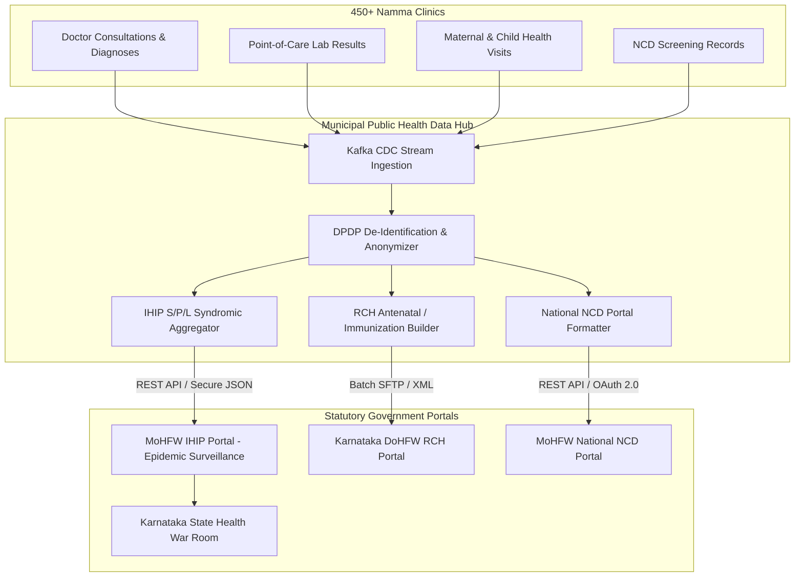

# Karnataka State Health Department, IHIP Epidemic Surveillance & Statutory Public Health Reporting
## Namma Clinic Digital Health & Operations Platform
### Greater Bengaluru Authority (GBA) / BBMP Health Department
**Document Code:** `INT-DOC-06` | **Status:** APPROVED BASELINE | **Date:** September 2026

---

## 1. Executive Summary & Statutory Reporting Mandate
This document establishes the technical architecture and interface specifications for automated, statutory public health reporting from 450+ Namma Clinics to the **Karnataka State Department of Health & Family Welfare (DoHFW)** and the **Ministry of Health and Family Welfare (MoHFW)**. Primary health centers serve as the first line of municipal disease surveillance and maternal-child health delivery. The integration guarantees real-time and scheduled synchronization with major state and national portals: the **Integrated Health Information Platform (IHIP)** for syndromic, presumptive, and laboratory-confirmed epidemic surveillance (Forms S, P, and L); the **Reproductive and Child Health (RCH)** portal for antenatal care (ANC) and immunization tracking; and the **National NCD Portal** for hypertension, diabetes, and common cancer screenings.

### 1.1 Non-Negotiable State Reporting Invariants
1. **Daily Midnight Checkpoint Invariant:** All daily aggregate public health reports (IHIP Form S, OPD morbidity summaries, maternal immunizations) must be generated, signed, and transmitted to state servers before 23:59:59 IST daily.
2. **Immediate Syndromic Outbreak Alerting:** Any syndromic fever cluster, cholera outbreak indicator, or dengue spike exceeding municipal threshold values must trigger an immediate real-time IHIP push within 15 minutes of clinical entry.
3. **DPDP Sovereign Aggregation & De-Identification:** Public health reporting datasets transmitted to state aggregators must undergo automated k-anonymization and differential privacy perturbation. Direct citizen PII (Aadhaar, citizen name, phone number) is stripped at the municipal boundary.
4. **Cryptographic Non-Repudiation:** Every statutory report submission carries an X.509 digital signature generated by the municipal health officer's official token, ensuring non-repudiation under the Information Technology Act.
5. **Two-Way Reconciliation Ledger:** State portal receipt acknowledgments and tracking IDs must be reconciled against municipal transaction ledgers with zero tolerance for lost reports.

## 2. State Public Health Reporting Flow & Architecture Diagram


### Integration Specification Example: IHIP Form S Syndromic Aggregator
<!-- DOCUMENTATION-ONLY EXAMPLE -->
```python
# DOCUMENTATION-ONLY PYTHON
# DOCUMENTATION-ONLY PYTHON: IHIP Epidemic Surveillance Aggregator
import uuid
import datetime
from typing import Dict, Any, List

class IhipEpidemicSurveillanceSync:
    """
    Constructs and dispatches IHIP Form S (Syndromic) daily aggregate reports,
    verifying municipal ward boundaries and applying DPDP anonymization guards.
    """
    def __init__(self, facility_hfr: str, ward_code: str, api_endpoint: str):
        self.facility_hfr = facility_hfr
        self.ward_code = ward_code
        self.api_endpoint = api_endpoint

    def generate_form_s_daily_summary(
        self,
        reporting_date: str,
        fever_cases: int,
        cough_cold_cases: int,
        diarrhea_cases: int,
        jaundice_cases: int,
        dog_bite_cases: int
    ) -> Dict[str, Any]:
        tx_id = str(uuid.uuid4())
        timestamp = datetime.datetime.utcnow().isoformat() + "Z"

        report_payload = {
            "transaction_id": tx_id,
            "reporting_facility_hfr": self.facility_hfr,
            "bbmp_ward_code": self.ward_code,
            "reporting_date": reporting_date,
            "generated_timestamp": timestamp,
            "form_type": "FORM_S_SYNDROMIC",
            "syndromes": [
                {"syndrome_code": "SYN_01", "name": "Acute Febrile Illness (AFI)", "count": fever_cases},
                {"syndrome_code": "SYN_02", "name": "Cough with/without Fever (ARI)", "count": cough_cold_cases},
                {"syndrome_code": "SYN_03", "name": "Acute Diarrheal Disease (ADD)", "count": diarrhea_cases},
                {"syndrome_code": "SYN_04", "name": "Jaundice", "count": jaundice_cases},
                {"syndrome_code": "SYN_05", "name": "Animal Bite (Rabies Surveillance)", "count": dog_bite_cases}
            ],
            "total_opd_attendance": fever_cases + cough_cold_cases + diarrhea_cases + jaundice_cases + dog_bite_cases + 45,
            "officer_digital_signature": "SIG-SHA256-MHO-CENTRAL-BLR"
        }
        return report_payload
```

### Interface Payload Example: IHIP State Surveillance Submission Acknowledgment
<!-- DOCUMENTATION-ONLY EXAMPLE -->
```json
// DOCUMENTATION-ONLY JSON
{
  "submissionId": "IHIP-KA-BLR-20260906-08129",
  "status": "ACCEPTED_BY_STATE_GATEWAY",
  "stateTrackingNumber": "KA-SURV-2026-994810",
  "reportingUnit": {
    "hfrCode": "IN290001048",
    "facilityName": "Namma Clinic Malleshwaram Ward 45",
    "district": "BENGALURU URBAN",
    "zone": "WEST_ZONE"
  },
  "reportingPeriod": "2026-09-06",
  "syndromicData": {
    "acuteFebrileIllness": 14,
    "acuteRespiratoryInfection": 28,
    "acuteDiarrhealDisease": 4,
    "feverWithRash": 1,
    "animalBite": 2
  },
  "alertThresholdTriggered": false,
  "transmissionTimestamp": "2026-09-06T18:00:05.120Z",
  "gatewayAcknowledgmentSignature": "ACK-KA-DOHFW-SHA256-OK"
}
```

## 3. Master Catalog of State Reporting Destinations
Inventory of Karnataka State and national reporting platforms:

### EXT-026: Reporting Authority `external_partner_system_026`
- **System Identifier:** `EXT-026`
- **Portal Title:** External System Authority 026 (Telecom Gateway)
- **Governing Department:** Government of Karnataka / National Health Authority
- **Category:** `Telecom Gateway`
- **Transmission Protocol:** `HTTPS REST / FHIR R4 Bundle`
- **Production Endpoint:** `https://api.ext-026.karnataka.gov.in/v1`
- **Jurisdiction:** `Sovereign India Datacenter (MeitY Empaneled)`
- **Contact Liaison:** `Zonal Systems Liaison / External Operations Engineer`

### EXT-027: Reporting Authority `external_partner_system_027`
- **System Identifier:** `EXT-027`
- **Portal Title:** External System Authority 027 (Municipal System)
- **Governing Department:** Government of Karnataka / National Health Authority
- **Category:** `Municipal System`
- **Transmission Protocol:** `HTTPS REST / FHIR R4 Bundle`
- **Production Endpoint:** `https://api.ext-027.karnataka.gov.in/v1`
- **Jurisdiction:** `Sovereign India Datacenter (MeitY Empaneled)`
- **Contact Liaison:** `Zonal Systems Liaison / External Operations Engineer`

### EXT-028: Reporting Authority `external_partner_system_028`
- **System Identifier:** `EXT-028`
- **Portal Title:** External System Authority 028 (Payment Gateway)
- **Governing Department:** Government of Karnataka / National Health Authority
- **Category:** `Payment Gateway`
- **Transmission Protocol:** `HTTPS REST / FHIR R4 Bundle`
- **Production Endpoint:** `https://api.ext-028.karnataka.gov.in/v1`
- **Jurisdiction:** `Sovereign India Datacenter (MeitY Empaneled)`
- **Contact Liaison:** `Zonal Systems Liaison / External Operations Engineer`

### EXT-029: Reporting Authority `external_partner_system_029`
- **System Identifier:** `EXT-029`
- **Portal Title:** External System Authority 029 (National Gateway)
- **Governing Department:** Government of Karnataka / National Health Authority
- **Category:** `National Gateway`
- **Transmission Protocol:** `HTTPS REST / FHIR R4 Bundle`
- **Production Endpoint:** `https://api.ext-029.karnataka.gov.in/v1`
- **Jurisdiction:** `Sovereign India Datacenter (MeitY Empaneled)`
- **Contact Liaison:** `Zonal Systems Liaison / External Operations Engineer`

### EXT-030: Reporting Authority `external_partner_system_030`
- **System Identifier:** `EXT-030`
- **Portal Title:** External System Authority 030 (State Health Portal)
- **Governing Department:** Government of Karnataka / National Health Authority
- **Category:** `State Health Portal`
- **Transmission Protocol:** `HTTPS REST / FHIR R4 Bundle`
- **Production Endpoint:** `https://api.ext-030.karnataka.gov.in/v1`
- **Jurisdiction:** `Sovereign India Datacenter (MeitY Empaneled)`
- **Contact Liaison:** `Zonal Systems Liaison / External Operations Engineer`

### EXT-031: Reporting Authority `external_partner_system_031`
- **System Identifier:** `EXT-031`
- **Portal Title:** External System Authority 031 (Tertiary Hospital)
- **Governing Department:** Government of Karnataka / National Health Authority
- **Category:** `Tertiary Hospital`
- **Transmission Protocol:** `HTTPS REST / FHIR R4 Bundle`
- **Production Endpoint:** `https://api.ext-031.karnataka.gov.in/v1`
- **Jurisdiction:** `Sovereign India Datacenter (MeitY Empaneled)`
- **Contact Liaison:** `Zonal Systems Liaison / External Operations Engineer`

### EXT-032: Reporting Authority `external_partner_system_032`
- **System Identifier:** `EXT-032`
- **Portal Title:** External System Authority 032 (Diagnostic Equipment)
- **Governing Department:** Government of Karnataka / National Health Authority
- **Category:** `Diagnostic Equipment`
- **Transmission Protocol:** `HTTPS REST / FHIR R4 Bundle`
- **Production Endpoint:** `https://api.ext-032.karnataka.gov.in/v1`
- **Jurisdiction:** `Sovereign India Datacenter (MeitY Empaneled)`
- **Contact Liaison:** `Zonal Systems Liaison / External Operations Engineer`

### EXT-033: Reporting Authority `external_partner_system_033`
- **System Identifier:** `EXT-033`
- **Portal Title:** External System Authority 033 (Telecom Gateway)
- **Governing Department:** Government of Karnataka / National Health Authority
- **Category:** `Telecom Gateway`
- **Transmission Protocol:** `HTTPS REST / FHIR R4 Bundle`
- **Production Endpoint:** `https://api.ext-033.karnataka.gov.in/v1`
- **Jurisdiction:** `Sovereign India Datacenter (MeitY Empaneled)`
- **Contact Liaison:** `Zonal Systems Liaison / External Operations Engineer`

### EXT-034: Reporting Authority `external_partner_system_034`
- **System Identifier:** `EXT-034`
- **Portal Title:** External System Authority 034 (Municipal System)
- **Governing Department:** Government of Karnataka / National Health Authority
- **Category:** `Municipal System`
- **Transmission Protocol:** `HTTPS REST / FHIR R4 Bundle`
- **Production Endpoint:** `https://api.ext-034.karnataka.gov.in/v1`
- **Jurisdiction:** `Sovereign India Datacenter (MeitY Empaneled)`
- **Contact Liaison:** `Zonal Systems Liaison / External Operations Engineer`

### EXT-035: Reporting Authority `external_partner_system_035`
- **System Identifier:** `EXT-035`
- **Portal Title:** External System Authority 035 (Payment Gateway)
- **Governing Department:** Government of Karnataka / National Health Authority
- **Category:** `Payment Gateway`
- **Transmission Protocol:** `HTTPS REST / FHIR R4 Bundle`
- **Production Endpoint:** `https://api.ext-035.karnataka.gov.in/v1`
- **Jurisdiction:** `Sovereign India Datacenter (MeitY Empaneled)`
- **Contact Liaison:** `Zonal Systems Liaison / External Operations Engineer`

### EXT-036: Reporting Authority `external_partner_system_036`
- **System Identifier:** `EXT-036`
- **Portal Title:** External System Authority 036 (National Gateway)
- **Governing Department:** Government of Karnataka / National Health Authority
- **Category:** `National Gateway`
- **Transmission Protocol:** `HTTPS REST / FHIR R4 Bundle`
- **Production Endpoint:** `https://api.ext-036.karnataka.gov.in/v1`
- **Jurisdiction:** `Sovereign India Datacenter (MeitY Empaneled)`
- **Contact Liaison:** `Zonal Systems Liaison / External Operations Engineer`

### EXT-037: Reporting Authority `external_partner_system_037`
- **System Identifier:** `EXT-037`
- **Portal Title:** External System Authority 037 (State Health Portal)
- **Governing Department:** Government of Karnataka / National Health Authority
- **Category:** `State Health Portal`
- **Transmission Protocol:** `HTTPS REST / FHIR R4 Bundle`
- **Production Endpoint:** `https://api.ext-037.karnataka.gov.in/v1`
- **Jurisdiction:** `Sovereign India Datacenter (MeitY Empaneled)`
- **Contact Liaison:** `Zonal Systems Liaison / External Operations Engineer`

### EXT-038: Reporting Authority `external_partner_system_038`
- **System Identifier:** `EXT-038`
- **Portal Title:** External System Authority 038 (Tertiary Hospital)
- **Governing Department:** Government of Karnataka / National Health Authority
- **Category:** `Tertiary Hospital`
- **Transmission Protocol:** `HTTPS REST / FHIR R4 Bundle`
- **Production Endpoint:** `https://api.ext-038.karnataka.gov.in/v1`
- **Jurisdiction:** `Sovereign India Datacenter (MeitY Empaneled)`
- **Contact Liaison:** `Zonal Systems Liaison / External Operations Engineer`

### EXT-039: Reporting Authority `external_partner_system_039`
- **System Identifier:** `EXT-039`
- **Portal Title:** External System Authority 039 (Diagnostic Equipment)
- **Governing Department:** Government of Karnataka / National Health Authority
- **Category:** `Diagnostic Equipment`
- **Transmission Protocol:** `HTTPS REST / FHIR R4 Bundle`
- **Production Endpoint:** `https://api.ext-039.karnataka.gov.in/v1`
- **Jurisdiction:** `Sovereign India Datacenter (MeitY Empaneled)`
- **Contact Liaison:** `Zonal Systems Liaison / External Operations Engineer`

### EXT-040: Reporting Authority `external_partner_system_040`
- **System Identifier:** `EXT-040`
- **Portal Title:** External System Authority 040 (Telecom Gateway)
- **Governing Department:** Government of Karnataka / National Health Authority
- **Category:** `Telecom Gateway`
- **Transmission Protocol:** `HTTPS REST / FHIR R4 Bundle`
- **Production Endpoint:** `https://api.ext-040.karnataka.gov.in/v1`
- **Jurisdiction:** `Sovereign India Datacenter (MeitY Empaneled)`
- **Contact Liaison:** `Zonal Systems Liaison / External Operations Engineer`

### EXT-041: Reporting Authority `external_partner_system_041`
- **System Identifier:** `EXT-041`
- **Portal Title:** External System Authority 041 (Municipal System)
- **Governing Department:** Government of Karnataka / National Health Authority
- **Category:** `Municipal System`
- **Transmission Protocol:** `HTTPS REST / FHIR R4 Bundle`
- **Production Endpoint:** `https://api.ext-041.karnataka.gov.in/v1`
- **Jurisdiction:** `Sovereign India Datacenter (MeitY Empaneled)`
- **Contact Liaison:** `Zonal Systems Liaison / External Operations Engineer`

### EXT-042: Reporting Authority `external_partner_system_042`
- **System Identifier:** `EXT-042`
- **Portal Title:** External System Authority 042 (Payment Gateway)
- **Governing Department:** Government of Karnataka / National Health Authority
- **Category:** `Payment Gateway`
- **Transmission Protocol:** `HTTPS REST / FHIR R4 Bundle`
- **Production Endpoint:** `https://api.ext-042.karnataka.gov.in/v1`
- **Jurisdiction:** `Sovereign India Datacenter (MeitY Empaneled)`
- **Contact Liaison:** `Zonal Systems Liaison / External Operations Engineer`

### EXT-043: Reporting Authority `external_partner_system_043`
- **System Identifier:** `EXT-043`
- **Portal Title:** External System Authority 043 (National Gateway)
- **Governing Department:** Government of Karnataka / National Health Authority
- **Category:** `National Gateway`
- **Transmission Protocol:** `HTTPS REST / FHIR R4 Bundle`
- **Production Endpoint:** `https://api.ext-043.karnataka.gov.in/v1`
- **Jurisdiction:** `Sovereign India Datacenter (MeitY Empaneled)`
- **Contact Liaison:** `Zonal Systems Liaison / External Operations Engineer`

### EXT-044: Reporting Authority `external_partner_system_044`
- **System Identifier:** `EXT-044`
- **Portal Title:** External System Authority 044 (State Health Portal)
- **Governing Department:** Government of Karnataka / National Health Authority
- **Category:** `State Health Portal`
- **Transmission Protocol:** `HTTPS REST / FHIR R4 Bundle`
- **Production Endpoint:** `https://api.ext-044.karnataka.gov.in/v1`
- **Jurisdiction:** `Sovereign India Datacenter (MeitY Empaneled)`
- **Contact Liaison:** `Zonal Systems Liaison / External Operations Engineer`

### EXT-045: Reporting Authority `external_partner_system_045`
- **System Identifier:** `EXT-045`
- **Portal Title:** External System Authority 045 (Tertiary Hospital)
- **Governing Department:** Government of Karnataka / National Health Authority
- **Category:** `Tertiary Hospital`
- **Transmission Protocol:** `HTTPS REST / FHIR R4 Bundle`
- **Production Endpoint:** `https://api.ext-045.karnataka.gov.in/v1`
- **Jurisdiction:** `Sovereign India Datacenter (MeitY Empaneled)`
- **Contact Liaison:** `Zonal Systems Liaison / External Operations Engineer`

### EXT-046: Reporting Authority `external_partner_system_046`
- **System Identifier:** `EXT-046`
- **Portal Title:** External System Authority 046 (Diagnostic Equipment)
- **Governing Department:** Government of Karnataka / National Health Authority
- **Category:** `Diagnostic Equipment`
- **Transmission Protocol:** `HTTPS REST / FHIR R4 Bundle`
- **Production Endpoint:** `https://api.ext-046.karnataka.gov.in/v1`
- **Jurisdiction:** `Sovereign India Datacenter (MeitY Empaneled)`
- **Contact Liaison:** `Zonal Systems Liaison / External Operations Engineer`

### EXT-047: Reporting Authority `external_partner_system_047`
- **System Identifier:** `EXT-047`
- **Portal Title:** External System Authority 047 (Telecom Gateway)
- **Governing Department:** Government of Karnataka / National Health Authority
- **Category:** `Telecom Gateway`
- **Transmission Protocol:** `HTTPS REST / FHIR R4 Bundle`
- **Production Endpoint:** `https://api.ext-047.karnataka.gov.in/v1`
- **Jurisdiction:** `Sovereign India Datacenter (MeitY Empaneled)`
- **Contact Liaison:** `Zonal Systems Liaison / External Operations Engineer`

### EXT-048: Reporting Authority `external_partner_system_048`
- **System Identifier:** `EXT-048`
- **Portal Title:** External System Authority 048 (Municipal System)
- **Governing Department:** Government of Karnataka / National Health Authority
- **Category:** `Municipal System`
- **Transmission Protocol:** `HTTPS REST / FHIR R4 Bundle`
- **Production Endpoint:** `https://api.ext-048.karnataka.gov.in/v1`
- **Jurisdiction:** `Sovereign India Datacenter (MeitY Empaneled)`
- **Contact Liaison:** `Zonal Systems Liaison / External Operations Engineer`

### EXT-049: Reporting Authority `external_partner_system_049`
- **System Identifier:** `EXT-049`
- **Portal Title:** External System Authority 049 (Payment Gateway)
- **Governing Department:** Government of Karnataka / National Health Authority
- **Category:** `Payment Gateway`
- **Transmission Protocol:** `HTTPS REST / FHIR R4 Bundle`
- **Production Endpoint:** `https://api.ext-049.karnataka.gov.in/v1`
- **Jurisdiction:** `Sovereign India Datacenter (MeitY Empaneled)`
- **Contact Liaison:** `Zonal Systems Liaison / External Operations Engineer`

### EXT-050: Reporting Authority `external_partner_system_050`
- **System Identifier:** `EXT-050`
- **Portal Title:** External System Authority 050 (National Gateway)
- **Governing Department:** Government of Karnataka / National Health Authority
- **Category:** `National Gateway`
- **Transmission Protocol:** `HTTPS REST / FHIR R4 Bundle`
- **Production Endpoint:** `https://api.ext-050.karnataka.gov.in/v1`
- **Jurisdiction:** `Sovereign India Datacenter (MeitY Empaneled)`
- **Contact Liaison:** `Zonal Systems Liaison / External Operations Engineer`

## 4. Master Catalog of Public Health Data Mappings
Data mappings linking internal clinic entities to statutory state schemas:

### MAP-041: Statutory Mapping `public.entity_table_041.field_attr_01`
- **Mapping Identifier:** `MAP-041`
- **Source Entity & Field:** `public.entity_table_041.field_attr_01`
- **Statutory Standard:** `FHIR R4 / ABDM Profile`
- **Target Element:** `Patient -> Patient.element_11`
- **Transformation Rule:** Deterministic ISO/SNOMED CT/ICD-10 ontology mapping with null-safe default
- **Validation Rule:** Non-null, regex conformance, and reference integrity check
- **DPDP De-Identification:** Hashed or de-identified according to DPDP Act 2023 guidelines

### MAP-042: Statutory Mapping `public.entity_table_042.field_attr_02`
- **Mapping Identifier:** `MAP-042`
- **Source Entity & Field:** `public.entity_table_042.field_attr_02`
- **Statutory Standard:** `FHIR R4 / ABDM Profile`
- **Target Element:** `Encounter -> Encounter.element_12`
- **Transformation Rule:** Deterministic ISO/SNOMED CT/ICD-10 ontology mapping with null-safe default
- **Validation Rule:** Non-null, regex conformance, and reference integrity check
- **DPDP De-Identification:** Hashed or de-identified according to DPDP Act 2023 guidelines

### MAP-043: Statutory Mapping `public.entity_table_043.field_attr_03`
- **Mapping Identifier:** `MAP-043`
- **Source Entity & Field:** `public.entity_table_043.field_attr_03`
- **Statutory Standard:** `FHIR R4 / ABDM Profile`
- **Target Element:** `Condition -> Condition.element_13`
- **Transformation Rule:** Deterministic ISO/SNOMED CT/ICD-10 ontology mapping with null-safe default
- **Validation Rule:** Non-null, regex conformance, and reference integrity check
- **DPDP De-Identification:** Hashed or de-identified according to DPDP Act 2023 guidelines

### MAP-044: Statutory Mapping `public.entity_table_044.field_attr_04`
- **Mapping Identifier:** `MAP-044`
- **Source Entity & Field:** `public.entity_table_044.field_attr_04`
- **Statutory Standard:** `FHIR R4 / ABDM Profile`
- **Target Element:** `Observation -> Observation.element_14`
- **Transformation Rule:** Deterministic ISO/SNOMED CT/ICD-10 ontology mapping with null-safe default
- **Validation Rule:** Non-null, regex conformance, and reference integrity check
- **DPDP De-Identification:** Hashed or de-identified according to DPDP Act 2023 guidelines

### MAP-045: Statutory Mapping `public.entity_table_045.field_attr_05`
- **Mapping Identifier:** `MAP-045`
- **Source Entity & Field:** `public.entity_table_045.field_attr_05`
- **Statutory Standard:** `FHIR R4 / ABDM Profile`
- **Target Element:** `MedicationRequest -> MedicationRequest.element_15`
- **Transformation Rule:** Deterministic ISO/SNOMED CT/ICD-10 ontology mapping with null-safe default
- **Validation Rule:** Non-null, regex conformance, and reference integrity check
- **DPDP De-Identification:** Hashed or de-identified according to DPDP Act 2023 guidelines

### MAP-046: Statutory Mapping `public.entity_table_046.field_attr_06`
- **Mapping Identifier:** `MAP-046`
- **Source Entity & Field:** `public.entity_table_046.field_attr_06`
- **Statutory Standard:** `FHIR R4 / ABDM Profile`
- **Target Element:** `MedicationDispense -> MedicationDispense.element_01`
- **Transformation Rule:** Deterministic ISO/SNOMED CT/ICD-10 ontology mapping with null-safe default
- **Validation Rule:** Non-null, regex conformance, and reference integrity check
- **DPDP De-Identification:** Hashed or de-identified according to DPDP Act 2023 guidelines

### MAP-047: Statutory Mapping `public.entity_table_047.field_attr_07`
- **Mapping Identifier:** `MAP-047`
- **Source Entity & Field:** `public.entity_table_047.field_attr_07`
- **Statutory Standard:** `FHIR R4 / ABDM Profile`
- **Target Element:** `DiagnosticReport -> DiagnosticReport.element_02`
- **Transformation Rule:** Deterministic ISO/SNOMED CT/ICD-10 ontology mapping with null-safe default
- **Validation Rule:** Non-null, regex conformance, and reference integrity check
- **DPDP De-Identification:** Hashed or de-identified according to DPDP Act 2023 guidelines

### MAP-048: Statutory Mapping `public.entity_table_048.field_attr_08`
- **Mapping Identifier:** `MAP-048`
- **Source Entity & Field:** `public.entity_table_048.field_attr_08`
- **Statutory Standard:** `FHIR R4 / ABDM Profile`
- **Target Element:** `ServiceRequest -> ServiceRequest.element_03`
- **Transformation Rule:** Deterministic ISO/SNOMED CT/ICD-10 ontology mapping with null-safe default
- **Validation Rule:** Non-null, regex conformance, and reference integrity check
- **DPDP De-Identification:** Hashed or de-identified according to DPDP Act 2023 guidelines

### MAP-049: Statutory Mapping `public.entity_table_049.field_attr_09`
- **Mapping Identifier:** `MAP-049`
- **Source Entity & Field:** `public.entity_table_049.field_attr_09`
- **Statutory Standard:** `FHIR R4 / ABDM Profile`
- **Target Element:** `AllergyIntolerance -> AllergyIntolerance.element_04`
- **Transformation Rule:** Deterministic ISO/SNOMED CT/ICD-10 ontology mapping with null-safe default
- **Validation Rule:** Non-null, regex conformance, and reference integrity check
- **DPDP De-Identification:** Hashed or de-identified according to DPDP Act 2023 guidelines

### MAP-050: Statutory Mapping `public.entity_table_050.field_attr_10`
- **Mapping Identifier:** `MAP-050`
- **Source Entity & Field:** `public.entity_table_050.field_attr_10`
- **Statutory Standard:** `FHIR R4 / ABDM Profile`
- **Target Element:** `CarePlan -> CarePlan.element_05`
- **Transformation Rule:** Deterministic ISO/SNOMED CT/ICD-10 ontology mapping with null-safe default
- **Validation Rule:** Non-null, regex conformance, and reference integrity check
- **DPDP De-Identification:** Hashed or de-identified according to DPDP Act 2023 guidelines

### MAP-051: Statutory Mapping `public.entity_table_051.field_attr_11`
- **Mapping Identifier:** `MAP-051`
- **Source Entity & Field:** `public.entity_table_051.field_attr_11`
- **Statutory Standard:** `FHIR R4 / ABDM Profile`
- **Target Element:** `Patient -> Patient.element_06`
- **Transformation Rule:** Deterministic ISO/SNOMED CT/ICD-10 ontology mapping with null-safe default
- **Validation Rule:** Non-null, regex conformance, and reference integrity check
- **DPDP De-Identification:** Hashed or de-identified according to DPDP Act 2023 guidelines

### MAP-052: Statutory Mapping `public.entity_table_052.field_attr_12`
- **Mapping Identifier:** `MAP-052`
- **Source Entity & Field:** `public.entity_table_052.field_attr_12`
- **Statutory Standard:** `FHIR R4 / ABDM Profile`
- **Target Element:** `Encounter -> Encounter.element_07`
- **Transformation Rule:** Deterministic ISO/SNOMED CT/ICD-10 ontology mapping with null-safe default
- **Validation Rule:** Non-null, regex conformance, and reference integrity check
- **DPDP De-Identification:** Hashed or de-identified according to DPDP Act 2023 guidelines

### MAP-053: Statutory Mapping `public.entity_table_001.field_attr_13`
- **Mapping Identifier:** `MAP-053`
- **Source Entity & Field:** `public.entity_table_001.field_attr_13`
- **Statutory Standard:** `FHIR R4 / ABDM Profile`
- **Target Element:** `Condition -> Condition.element_08`
- **Transformation Rule:** Deterministic ISO/SNOMED CT/ICD-10 ontology mapping with null-safe default
- **Validation Rule:** Non-null, regex conformance, and reference integrity check
- **DPDP De-Identification:** Hashed or de-identified according to DPDP Act 2023 guidelines

### MAP-054: Statutory Mapping `public.entity_table_002.field_attr_14`
- **Mapping Identifier:** `MAP-054`
- **Source Entity & Field:** `public.entity_table_002.field_attr_14`
- **Statutory Standard:** `FHIR R4 / ABDM Profile`
- **Target Element:** `Observation -> Observation.element_09`
- **Transformation Rule:** Deterministic ISO/SNOMED CT/ICD-10 ontology mapping with null-safe default
- **Validation Rule:** Non-null, regex conformance, and reference integrity check
- **DPDP De-Identification:** Hashed or de-identified according to DPDP Act 2023 guidelines

### MAP-055: Statutory Mapping `public.entity_table_003.field_attr_15`
- **Mapping Identifier:** `MAP-055`
- **Source Entity & Field:** `public.entity_table_003.field_attr_15`
- **Statutory Standard:** `FHIR R4 / ABDM Profile`
- **Target Element:** `MedicationRequest -> MedicationRequest.element_10`
- **Transformation Rule:** Deterministic ISO/SNOMED CT/ICD-10 ontology mapping with null-safe default
- **Validation Rule:** Non-null, regex conformance, and reference integrity check
- **DPDP De-Identification:** Hashed or de-identified according to DPDP Act 2023 guidelines

### MAP-056: Statutory Mapping `public.entity_table_004.field_attr_16`
- **Mapping Identifier:** `MAP-056`
- **Source Entity & Field:** `public.entity_table_004.field_attr_16`
- **Statutory Standard:** `FHIR R4 / ABDM Profile`
- **Target Element:** `MedicationDispense -> MedicationDispense.element_11`
- **Transformation Rule:** Deterministic ISO/SNOMED CT/ICD-10 ontology mapping with null-safe default
- **Validation Rule:** Non-null, regex conformance, and reference integrity check
- **DPDP De-Identification:** Hashed or de-identified according to DPDP Act 2023 guidelines

### MAP-057: Statutory Mapping `public.entity_table_005.field_attr_17`
- **Mapping Identifier:** `MAP-057`
- **Source Entity & Field:** `public.entity_table_005.field_attr_17`
- **Statutory Standard:** `FHIR R4 / ABDM Profile`
- **Target Element:** `DiagnosticReport -> DiagnosticReport.element_12`
- **Transformation Rule:** Deterministic ISO/SNOMED CT/ICD-10 ontology mapping with null-safe default
- **Validation Rule:** Non-null, regex conformance, and reference integrity check
- **DPDP De-Identification:** Hashed or de-identified according to DPDP Act 2023 guidelines

### MAP-058: Statutory Mapping `public.entity_table_006.field_attr_18`
- **Mapping Identifier:** `MAP-058`
- **Source Entity & Field:** `public.entity_table_006.field_attr_18`
- **Statutory Standard:** `FHIR R4 / ABDM Profile`
- **Target Element:** `ServiceRequest -> ServiceRequest.element_13`
- **Transformation Rule:** Deterministic ISO/SNOMED CT/ICD-10 ontology mapping with null-safe default
- **Validation Rule:** Non-null, regex conformance, and reference integrity check
- **DPDP De-Identification:** Hashed or de-identified according to DPDP Act 2023 guidelines

### MAP-059: Statutory Mapping `public.entity_table_007.field_attr_19`
- **Mapping Identifier:** `MAP-059`
- **Source Entity & Field:** `public.entity_table_007.field_attr_19`
- **Statutory Standard:** `FHIR R4 / ABDM Profile`
- **Target Element:** `AllergyIntolerance -> AllergyIntolerance.element_14`
- **Transformation Rule:** Deterministic ISO/SNOMED CT/ICD-10 ontology mapping with null-safe default
- **Validation Rule:** Non-null, regex conformance, and reference integrity check
- **DPDP De-Identification:** Hashed or de-identified according to DPDP Act 2023 guidelines

### MAP-060: Statutory Mapping `public.entity_table_008.field_attr_20`
- **Mapping Identifier:** `MAP-060`
- **Source Entity & Field:** `public.entity_table_008.field_attr_20`
- **Statutory Standard:** `FHIR R4 / ABDM Profile`
- **Target Element:** `CarePlan -> CarePlan.element_15`
- **Transformation Rule:** Deterministic ISO/SNOMED CT/ICD-10 ontology mapping with null-safe default
- **Validation Rule:** Non-null, regex conformance, and reference integrity check
- **DPDP De-Identification:** Hashed or de-identified according to DPDP Act 2023 guidelines

### MAP-061: Statutory Mapping `public.entity_table_009.field_attr_01`
- **Mapping Identifier:** `MAP-061`
- **Source Entity & Field:** `public.entity_table_009.field_attr_01`
- **Statutory Standard:** `FHIR R4 / ABDM Profile`
- **Target Element:** `Patient -> Patient.element_01`
- **Transformation Rule:** Deterministic ISO/SNOMED CT/ICD-10 ontology mapping with null-safe default
- **Validation Rule:** Non-null, regex conformance, and reference integrity check
- **DPDP De-Identification:** Hashed or de-identified according to DPDP Act 2023 guidelines

### MAP-062: Statutory Mapping `public.entity_table_010.field_attr_02`
- **Mapping Identifier:** `MAP-062`
- **Source Entity & Field:** `public.entity_table_010.field_attr_02`
- **Statutory Standard:** `FHIR R4 / ABDM Profile`
- **Target Element:** `Encounter -> Encounter.element_02`
- **Transformation Rule:** Deterministic ISO/SNOMED CT/ICD-10 ontology mapping with null-safe default
- **Validation Rule:** Non-null, regex conformance, and reference integrity check
- **DPDP De-Identification:** Hashed or de-identified according to DPDP Act 2023 guidelines

### MAP-063: Statutory Mapping `public.entity_table_011.field_attr_03`
- **Mapping Identifier:** `MAP-063`
- **Source Entity & Field:** `public.entity_table_011.field_attr_03`
- **Statutory Standard:** `FHIR R4 / ABDM Profile`
- **Target Element:** `Condition -> Condition.element_03`
- **Transformation Rule:** Deterministic ISO/SNOMED CT/ICD-10 ontology mapping with null-safe default
- **Validation Rule:** Non-null, regex conformance, and reference integrity check
- **DPDP De-Identification:** Hashed or de-identified according to DPDP Act 2023 guidelines

### MAP-064: Statutory Mapping `public.entity_table_012.field_attr_04`
- **Mapping Identifier:** `MAP-064`
- **Source Entity & Field:** `public.entity_table_012.field_attr_04`
- **Statutory Standard:** `FHIR R4 / ABDM Profile`
- **Target Element:** `Observation -> Observation.element_04`
- **Transformation Rule:** Deterministic ISO/SNOMED CT/ICD-10 ontology mapping with null-safe default
- **Validation Rule:** Non-null, regex conformance, and reference integrity check
- **DPDP De-Identification:** Hashed or de-identified according to DPDP Act 2023 guidelines

### MAP-065: Statutory Mapping `public.entity_table_013.field_attr_05`
- **Mapping Identifier:** `MAP-065`
- **Source Entity & Field:** `public.entity_table_013.field_attr_05`
- **Statutory Standard:** `FHIR R4 / ABDM Profile`
- **Target Element:** `MedicationRequest -> MedicationRequest.element_05`
- **Transformation Rule:** Deterministic ISO/SNOMED CT/ICD-10 ontology mapping with null-safe default
- **Validation Rule:** Non-null, regex conformance, and reference integrity check
- **DPDP De-Identification:** Hashed or de-identified according to DPDP Act 2023 guidelines

### MAP-066: Statutory Mapping `public.entity_table_014.field_attr_06`
- **Mapping Identifier:** `MAP-066`
- **Source Entity & Field:** `public.entity_table_014.field_attr_06`
- **Statutory Standard:** `FHIR R4 / ABDM Profile`
- **Target Element:** `MedicationDispense -> MedicationDispense.element_06`
- **Transformation Rule:** Deterministic ISO/SNOMED CT/ICD-10 ontology mapping with null-safe default
- **Validation Rule:** Non-null, regex conformance, and reference integrity check
- **DPDP De-Identification:** Hashed or de-identified according to DPDP Act 2023 guidelines

### MAP-067: Statutory Mapping `public.entity_table_015.field_attr_07`
- **Mapping Identifier:** `MAP-067`
- **Source Entity & Field:** `public.entity_table_015.field_attr_07`
- **Statutory Standard:** `FHIR R4 / ABDM Profile`
- **Target Element:** `DiagnosticReport -> DiagnosticReport.element_07`
- **Transformation Rule:** Deterministic ISO/SNOMED CT/ICD-10 ontology mapping with null-safe default
- **Validation Rule:** Non-null, regex conformance, and reference integrity check
- **DPDP De-Identification:** Hashed or de-identified according to DPDP Act 2023 guidelines

### MAP-068: Statutory Mapping `public.entity_table_016.field_attr_08`
- **Mapping Identifier:** `MAP-068`
- **Source Entity & Field:** `public.entity_table_016.field_attr_08`
- **Statutory Standard:** `FHIR R4 / ABDM Profile`
- **Target Element:** `ServiceRequest -> ServiceRequest.element_08`
- **Transformation Rule:** Deterministic ISO/SNOMED CT/ICD-10 ontology mapping with null-safe default
- **Validation Rule:** Non-null, regex conformance, and reference integrity check
- **DPDP De-Identification:** Hashed or de-identified according to DPDP Act 2023 guidelines

### MAP-069: Statutory Mapping `public.entity_table_017.field_attr_09`
- **Mapping Identifier:** `MAP-069`
- **Source Entity & Field:** `public.entity_table_017.field_attr_09`
- **Statutory Standard:** `FHIR R4 / ABDM Profile`
- **Target Element:** `AllergyIntolerance -> AllergyIntolerance.element_09`
- **Transformation Rule:** Deterministic ISO/SNOMED CT/ICD-10 ontology mapping with null-safe default
- **Validation Rule:** Non-null, regex conformance, and reference integrity check
- **DPDP De-Identification:** Hashed or de-identified according to DPDP Act 2023 guidelines

### MAP-070: Statutory Mapping `public.entity_table_018.field_attr_10`
- **Mapping Identifier:** `MAP-070`
- **Source Entity & Field:** `public.entity_table_018.field_attr_10`
- **Statutory Standard:** `FHIR R4 / ABDM Profile`
- **Target Element:** `CarePlan -> CarePlan.element_10`
- **Transformation Rule:** Deterministic ISO/SNOMED CT/ICD-10 ontology mapping with null-safe default
- **Validation Rule:** Non-null, regex conformance, and reference integrity check
- **DPDP De-Identification:** Hashed or de-identified according to DPDP Act 2023 guidelines

### MAP-071: Statutory Mapping `public.entity_table_019.field_attr_11`
- **Mapping Identifier:** `MAP-071`
- **Source Entity & Field:** `public.entity_table_019.field_attr_11`
- **Statutory Standard:** `FHIR R4 / ABDM Profile`
- **Target Element:** `Patient -> Patient.element_11`
- **Transformation Rule:** Deterministic ISO/SNOMED CT/ICD-10 ontology mapping with null-safe default
- **Validation Rule:** Non-null, regex conformance, and reference integrity check
- **DPDP De-Identification:** Hashed or de-identified according to DPDP Act 2023 guidelines

### MAP-072: Statutory Mapping `public.entity_table_020.field_attr_12`
- **Mapping Identifier:** `MAP-072`
- **Source Entity & Field:** `public.entity_table_020.field_attr_12`
- **Statutory Standard:** `FHIR R4 / ABDM Profile`
- **Target Element:** `Encounter -> Encounter.element_12`
- **Transformation Rule:** Deterministic ISO/SNOMED CT/ICD-10 ontology mapping with null-safe default
- **Validation Rule:** Non-null, regex conformance, and reference integrity check
- **DPDP De-Identification:** Hashed or de-identified according to DPDP Act 2023 guidelines

### MAP-073: Statutory Mapping `public.entity_table_021.field_attr_13`
- **Mapping Identifier:** `MAP-073`
- **Source Entity & Field:** `public.entity_table_021.field_attr_13`
- **Statutory Standard:** `FHIR R4 / ABDM Profile`
- **Target Element:** `Condition -> Condition.element_13`
- **Transformation Rule:** Deterministic ISO/SNOMED CT/ICD-10 ontology mapping with null-safe default
- **Validation Rule:** Non-null, regex conformance, and reference integrity check
- **DPDP De-Identification:** Hashed or de-identified according to DPDP Act 2023 guidelines

### MAP-074: Statutory Mapping `public.entity_table_022.field_attr_14`
- **Mapping Identifier:** `MAP-074`
- **Source Entity & Field:** `public.entity_table_022.field_attr_14`
- **Statutory Standard:** `FHIR R4 / ABDM Profile`
- **Target Element:** `Observation -> Observation.element_14`
- **Transformation Rule:** Deterministic ISO/SNOMED CT/ICD-10 ontology mapping with null-safe default
- **Validation Rule:** Non-null, regex conformance, and reference integrity check
- **DPDP De-Identification:** Hashed or de-identified according to DPDP Act 2023 guidelines

### MAP-075: Statutory Mapping `public.entity_table_023.field_attr_15`
- **Mapping Identifier:** `MAP-075`
- **Source Entity & Field:** `public.entity_table_023.field_attr_15`
- **Statutory Standard:** `FHIR R4 / ABDM Profile`
- **Target Element:** `MedicationRequest -> MedicationRequest.element_15`
- **Transformation Rule:** Deterministic ISO/SNOMED CT/ICD-10 ontology mapping with null-safe default
- **Validation Rule:** Non-null, regex conformance, and reference integrity check
- **DPDP De-Identification:** Hashed or de-identified according to DPDP Act 2023 guidelines

## 5. Table-Level Statutory Reporting Traceability across all 52 Tables
Aggregation and lineage from relational database tables to public health reports across all 52 tables:

### TABLE-001: Statutory Extraction for Table `auth_users`
- **Table Identifier:** `TABLE-001` (`TBL-01`)
- **Source Entity:** `auth_users`
- **Public Health Role:** Feeds aggregate morbidity counters, epidemiological flags, and demographic aggregates.
- **Reconciliation Cadence:** Synchronized and audited under policy `RECON-001`.
- **DPDP Compliance:** Direct patient identifiers excluded; data aggregated by ward and age cohort.
- **Audit Verification:** Hash of daily aggregated dataset logged to statutory compliance ledger.

### TABLE-002: Statutory Extraction for Table `user_credentials`
- **Table Identifier:** `TABLE-002` (`TBL-02`)
- **Source Entity:** `user_credentials`
- **Public Health Role:** Feeds aggregate morbidity counters, epidemiological flags, and demographic aggregates.
- **Reconciliation Cadence:** Synchronized and audited under policy `RECON-002`.
- **DPDP Compliance:** Direct patient identifiers excluded; data aggregated by ward and age cohort.
- **Audit Verification:** Hash of daily aggregated dataset logged to statutory compliance ledger.

### TABLE-003: Statutory Extraction for Table `user_sessions`
- **Table Identifier:** `TABLE-003` (`TBL-03`)
- **Source Entity:** `user_sessions`
- **Public Health Role:** Feeds aggregate morbidity counters, epidemiological flags, and demographic aggregates.
- **Reconciliation Cadence:** Synchronized and audited under policy `RECON-003`.
- **DPDP Compliance:** Direct patient identifiers excluded; data aggregated by ward and age cohort.
- **Audit Verification:** Hash of daily aggregated dataset logged to statutory compliance ledger.

### TABLE-004: Statutory Extraction for Table `roles`
- **Table Identifier:** `TABLE-004` (`TBL-04`)
- **Source Entity:** `roles`
- **Public Health Role:** Feeds aggregate morbidity counters, epidemiological flags, and demographic aggregates.
- **Reconciliation Cadence:** Synchronized and audited under policy `RECON-004`.
- **DPDP Compliance:** Direct patient identifiers excluded; data aggregated by ward and age cohort.
- **Audit Verification:** Hash of daily aggregated dataset logged to statutory compliance ledger.

### TABLE-005: Statutory Extraction for Table `permissions`
- **Table Identifier:** `TABLE-005` (`TBL-05`)
- **Source Entity:** `permissions`
- **Public Health Role:** Feeds aggregate morbidity counters, epidemiological flags, and demographic aggregates.
- **Reconciliation Cadence:** Synchronized and audited under policy `RECON-005`.
- **DPDP Compliance:** Direct patient identifiers excluded; data aggregated by ward and age cohort.
- **Audit Verification:** Hash of daily aggregated dataset logged to statutory compliance ledger.

### TABLE-006: Statutory Extraction for Table `role_permissions`
- **Table Identifier:** `TABLE-006` (`TBL-06`)
- **Source Entity:** `role_permissions`
- **Public Health Role:** Feeds aggregate morbidity counters, epidemiological flags, and demographic aggregates.
- **Reconciliation Cadence:** Synchronized and audited under policy `RECON-006`.
- **DPDP Compliance:** Direct patient identifiers excluded; data aggregated by ward and age cohort.
- **Audit Verification:** Hash of daily aggregated dataset logged to statutory compliance ledger.

### TABLE-007: Statutory Extraction for Table `user_roles`
- **Table Identifier:** `TABLE-007` (`TBL-07`)
- **Source Entity:** `user_roles`
- **Public Health Role:** Feeds aggregate morbidity counters, epidemiological flags, and demographic aggregates.
- **Reconciliation Cadence:** Synchronized and audited under policy `RECON-007`.
- **DPDP Compliance:** Direct patient identifiers excluded; data aggregated by ward and age cohort.
- **Audit Verification:** Hash of daily aggregated dataset logged to statutory compliance ledger.

### TABLE-008: Statutory Extraction for Table `facilities`
- **Table Identifier:** `TABLE-008` (`TBL-08`)
- **Source Entity:** `facilities`
- **Public Health Role:** Feeds aggregate morbidity counters, epidemiological flags, and demographic aggregates.
- **Reconciliation Cadence:** Synchronized and audited under policy `RECON-008`.
- **DPDP Compliance:** Direct patient identifiers excluded; data aggregated by ward and age cohort.
- **Audit Verification:** Hash of daily aggregated dataset logged to statutory compliance ledger.

### TABLE-009: Statutory Extraction for Table `facility_rooms`
- **Table Identifier:** `TABLE-009` (`TBL-09`)
- **Source Entity:** `facility_rooms`
- **Public Health Role:** Feeds aggregate morbidity counters, epidemiological flags, and demographic aggregates.
- **Reconciliation Cadence:** Synchronized and audited under policy `RECON-009`.
- **DPDP Compliance:** Direct patient identifiers excluded; data aggregated by ward and age cohort.
- **Audit Verification:** Hash of daily aggregated dataset logged to statutory compliance ledger.

### TABLE-010: Statutory Extraction for Table `staff_profiles`
- **Table Identifier:** `TABLE-010` (`TBL-10`)
- **Source Entity:** `staff_profiles`
- **Public Health Role:** Feeds aggregate morbidity counters, epidemiological flags, and demographic aggregates.
- **Reconciliation Cadence:** Synchronized and audited under policy `RECON-010`.
- **DPDP Compliance:** Direct patient identifiers excluded; data aggregated by ward and age cohort.
- **Audit Verification:** Hash of daily aggregated dataset logged to statutory compliance ledger.

### TABLE-011: Statutory Extraction for Table `staff_shifts`
- **Table Identifier:** `TABLE-011` (`TBL-11`)
- **Source Entity:** `staff_shifts`
- **Public Health Role:** Feeds aggregate morbidity counters, epidemiological flags, and demographic aggregates.
- **Reconciliation Cadence:** Synchronized and audited under policy `RECON-011`.
- **DPDP Compliance:** Direct patient identifiers excluded; data aggregated by ward and age cohort.
- **Audit Verification:** Hash of daily aggregated dataset logged to statutory compliance ledger.

### TABLE-012: Statutory Extraction for Table `system_configs`
- **Table Identifier:** `TABLE-012` (`TBL-12`)
- **Source Entity:** `system_configs`
- **Public Health Role:** Feeds aggregate morbidity counters, epidemiological flags, and demographic aggregates.
- **Reconciliation Cadence:** Synchronized and audited under policy `RECON-012`.
- **DPDP Compliance:** Direct patient identifiers excluded; data aggregated by ward and age cohort.
- **Audit Verification:** Hash of daily aggregated dataset logged to statutory compliance ledger.

### TABLE-013: Statutory Extraction for Table `patients`
- **Table Identifier:** `TABLE-013` (`TBL-13`)
- **Source Entity:** `patients`
- **Public Health Role:** Feeds aggregate morbidity counters, epidemiological flags, and demographic aggregates.
- **Reconciliation Cadence:** Synchronized and audited under policy `RECON-013`.
- **DPDP Compliance:** Direct patient identifiers excluded; data aggregated by ward and age cohort.
- **Audit Verification:** Hash of daily aggregated dataset logged to statutory compliance ledger.

### TABLE-014: Statutory Extraction for Table `patient_identifiers`
- **Table Identifier:** `TABLE-014` (`TBL-14`)
- **Source Entity:** `patient_identifiers`
- **Public Health Role:** Feeds aggregate morbidity counters, epidemiological flags, and demographic aggregates.
- **Reconciliation Cadence:** Synchronized and audited under policy `RECON-014`.
- **DPDP Compliance:** Direct patient identifiers excluded; data aggregated by ward and age cohort.
- **Audit Verification:** Hash of daily aggregated dataset logged to statutory compliance ledger.

### TABLE-015: Statutory Extraction for Table `patient_contacts`
- **Table Identifier:** `TABLE-015` (`TBL-15`)
- **Source Entity:** `patient_contacts`
- **Public Health Role:** Feeds aggregate morbidity counters, epidemiological flags, and demographic aggregates.
- **Reconciliation Cadence:** Synchronized and audited under policy `RECON-015`.
- **DPDP Compliance:** Direct patient identifiers excluded; data aggregated by ward and age cohort.
- **Audit Verification:** Hash of daily aggregated dataset logged to statutory compliance ledger.

### TABLE-016: Statutory Extraction for Table `patient_addresses`
- **Table Identifier:** `TABLE-016` (`TBL-16`)
- **Source Entity:** `patient_addresses`
- **Public Health Role:** Feeds aggregate morbidity counters, epidemiological flags, and demographic aggregates.
- **Reconciliation Cadence:** Synchronized and audited under policy `RECON-016`.
- **DPDP Compliance:** Direct patient identifiers excluded; data aggregated by ward and age cohort.
- **Audit Verification:** Hash of daily aggregated dataset logged to statutory compliance ledger.

### TABLE-017: Statutory Extraction for Table `consent_records`
- **Table Identifier:** `TABLE-017` (`TBL-17`)
- **Source Entity:** `consent_records`
- **Public Health Role:** Feeds aggregate morbidity counters, epidemiological flags, and demographic aggregates.
- **Reconciliation Cadence:** Synchronized and audited under policy `RECON-017`.
- **DPDP Compliance:** Direct patient identifiers excluded; data aggregated by ward and age cohort.
- **Audit Verification:** Hash of daily aggregated dataset logged to statutory compliance ledger.

### TABLE-018: Statutory Extraction for Table `tokens`
- **Table Identifier:** `TABLE-018` (`TBL-18`)
- **Source Entity:** `tokens`
- **Public Health Role:** Feeds aggregate morbidity counters, epidemiological flags, and demographic aggregates.
- **Reconciliation Cadence:** Synchronized and audited under policy `RECON-018`.
- **DPDP Compliance:** Direct patient identifiers excluded; data aggregated by ward and age cohort.
- **Audit Verification:** Hash of daily aggregated dataset logged to statutory compliance ledger.

### TABLE-019: Statutory Extraction for Table `queue_entries`
- **Table Identifier:** `TABLE-019` (`TBL-19`)
- **Source Entity:** `queue_entries`
- **Public Health Role:** Feeds aggregate morbidity counters, epidemiological flags, and demographic aggregates.
- **Reconciliation Cadence:** Synchronized and audited under policy `RECON-019`.
- **DPDP Compliance:** Direct patient identifiers excluded; data aggregated by ward and age cohort.
- **Audit Verification:** Hash of daily aggregated dataset logged to statutory compliance ledger.

### TABLE-020: Statutory Extraction for Table `triage_assessments`
- **Table Identifier:** `TABLE-020` (`TBL-20`)
- **Source Entity:** `triage_assessments`
- **Public Health Role:** Feeds aggregate morbidity counters, epidemiological flags, and demographic aggregates.
- **Reconciliation Cadence:** Synchronized and audited under policy `RECON-020`.
- **DPDP Compliance:** Direct patient identifiers excluded; data aggregated by ward and age cohort.
- **Audit Verification:** Hash of daily aggregated dataset logged to statutory compliance ledger.

### TABLE-021: Statutory Extraction for Table `patient_vitals`
- **Table Identifier:** `TABLE-021` (`TBL-21`)
- **Source Entity:** `patient_vitals`
- **Public Health Role:** Feeds aggregate morbidity counters, epidemiological flags, and demographic aggregates.
- **Reconciliation Cadence:** Synchronized and audited under policy `RECON-021`.
- **DPDP Compliance:** Direct patient identifiers excluded; data aggregated by ward and age cohort.
- **Audit Verification:** Hash of daily aggregated dataset logged to statutory compliance ledger.

### TABLE-022: Statutory Extraction for Table `danger_alerts`
- **Table Identifier:** `TABLE-022` (`TBL-22`)
- **Source Entity:** `danger_alerts`
- **Public Health Role:** Feeds aggregate morbidity counters, epidemiological flags, and demographic aggregates.
- **Reconciliation Cadence:** Synchronized and audited under policy `RECON-022`.
- **DPDP Compliance:** Direct patient identifiers excluded; data aggregated by ward and age cohort.
- **Audit Verification:** Hash of daily aggregated dataset logged to statutory compliance ledger.

### TABLE-023: Statutory Extraction for Table `clinical_encounters`
- **Table Identifier:** `TABLE-023` (`TBL-23`)
- **Source Entity:** `clinical_encounters`
- **Public Health Role:** Feeds aggregate morbidity counters, epidemiological flags, and demographic aggregates.
- **Reconciliation Cadence:** Synchronized and audited under policy `RECON-023`.
- **DPDP Compliance:** Direct patient identifiers excluded; data aggregated by ward and age cohort.
- **Audit Verification:** Hash of daily aggregated dataset logged to statutory compliance ledger.

### TABLE-024: Statutory Extraction for Table `clinical_notes`
- **Table Identifier:** `TABLE-024` (`TBL-24`)
- **Source Entity:** `clinical_notes`
- **Public Health Role:** Feeds aggregate morbidity counters, epidemiological flags, and demographic aggregates.
- **Reconciliation Cadence:** Synchronized and audited under policy `RECON-024`.
- **DPDP Compliance:** Direct patient identifiers excluded; data aggregated by ward and age cohort.
- **Audit Verification:** Hash of daily aggregated dataset logged to statutory compliance ledger.

### TABLE-025: Statutory Extraction for Table `diagnoses`
- **Table Identifier:** `TABLE-025` (`TBL-25`)
- **Source Entity:** `diagnoses`
- **Public Health Role:** Feeds aggregate morbidity counters, epidemiological flags, and demographic aggregates.
- **Reconciliation Cadence:** Synchronized and audited under policy `RECON-025`.
- **DPDP Compliance:** Direct patient identifiers excluded; data aggregated by ward and age cohort.
- **Audit Verification:** Hash of daily aggregated dataset logged to statutory compliance ledger.

### TABLE-026: Statutory Extraction for Table `prescriptions`
- **Table Identifier:** `TABLE-026` (`TBL-26`)
- **Source Entity:** `prescriptions`
- **Public Health Role:** Feeds aggregate morbidity counters, epidemiological flags, and demographic aggregates.
- **Reconciliation Cadence:** Synchronized and audited under policy `RECON-001`.
- **DPDP Compliance:** Direct patient identifiers excluded; data aggregated by ward and age cohort.
- **Audit Verification:** Hash of daily aggregated dataset logged to statutory compliance ledger.

### TABLE-027: Statutory Extraction for Table `prescription_items`
- **Table Identifier:** `TABLE-027` (`TBL-27`)
- **Source Entity:** `prescription_items`
- **Public Health Role:** Feeds aggregate morbidity counters, epidemiological flags, and demographic aggregates.
- **Reconciliation Cadence:** Synchronized and audited under policy `RECON-002`.
- **DPDP Compliance:** Direct patient identifiers excluded; data aggregated by ward and age cohort.
- **Audit Verification:** Hash of daily aggregated dataset logged to statutory compliance ledger.

### TABLE-028: Statutory Extraction for Table `lab_orders`
- **Table Identifier:** `TABLE-028` (`TBL-28`)
- **Source Entity:** `lab_orders`
- **Public Health Role:** Feeds aggregate morbidity counters, epidemiological flags, and demographic aggregates.
- **Reconciliation Cadence:** Synchronized and audited under policy `RECON-003`.
- **DPDP Compliance:** Direct patient identifiers excluded; data aggregated by ward and age cohort.
- **Audit Verification:** Hash of daily aggregated dataset logged to statutory compliance ledger.

### TABLE-029: Statutory Extraction for Table `lab_order_items`
- **Table Identifier:** `TABLE-029` (`TBL-29`)
- **Source Entity:** `lab_order_items`
- **Public Health Role:** Feeds aggregate morbidity counters, epidemiological flags, and demographic aggregates.
- **Reconciliation Cadence:** Synchronized and audited under policy `RECON-004`.
- **DPDP Compliance:** Direct patient identifiers excluded; data aggregated by ward and age cohort.
- **Audit Verification:** Hash of daily aggregated dataset logged to statutory compliance ledger.

### TABLE-030: Statutory Extraction for Table `lab_results`
- **Table Identifier:** `TABLE-030` (`TBL-30`)
- **Source Entity:** `lab_results`
- **Public Health Role:** Feeds aggregate morbidity counters, epidemiological flags, and demographic aggregates.
- **Reconciliation Cadence:** Synchronized and audited under policy `RECON-005`.
- **DPDP Compliance:** Direct patient identifiers excluded; data aggregated by ward and age cohort.
- **Audit Verification:** Hash of daily aggregated dataset logged to statutory compliance ledger.

### TABLE-031: Statutory Extraction for Table `teleconsultations`
- **Table Identifier:** `TABLE-031` (`TBL-31`)
- **Source Entity:** `teleconsultations`
- **Public Health Role:** Feeds aggregate morbidity counters, epidemiological flags, and demographic aggregates.
- **Reconciliation Cadence:** Synchronized and audited under policy `RECON-006`.
- **DPDP Compliance:** Direct patient identifiers excluded; data aggregated by ward and age cohort.
- **Audit Verification:** Hash of daily aggregated dataset logged to statutory compliance ledger.

### TABLE-032: Statutory Extraction for Table `formulary_drugs`
- **Table Identifier:** `TABLE-032` (`TBL-32`)
- **Source Entity:** `formulary_drugs`
- **Public Health Role:** Feeds aggregate morbidity counters, epidemiological flags, and demographic aggregates.
- **Reconciliation Cadence:** Synchronized and audited under policy `RECON-007`.
- **DPDP Compliance:** Direct patient identifiers excluded; data aggregated by ward and age cohort.
- **Audit Verification:** Hash of daily aggregated dataset logged to statutory compliance ledger.

### TABLE-033: Statutory Extraction for Table `drug_categories`
- **Table Identifier:** `TABLE-033` (`TBL-33`)
- **Source Entity:** `drug_categories`
- **Public Health Role:** Feeds aggregate morbidity counters, epidemiological flags, and demographic aggregates.
- **Reconciliation Cadence:** Synchronized and audited under policy `RECON-008`.
- **DPDP Compliance:** Direct patient identifiers excluded; data aggregated by ward and age cohort.
- **Audit Verification:** Hash of daily aggregated dataset logged to statutory compliance ledger.

### TABLE-034: Statutory Extraction for Table `pharmacy_batches`
- **Table Identifier:** `TABLE-034` (`TBL-34`)
- **Source Entity:** `pharmacy_batches`
- **Public Health Role:** Feeds aggregate morbidity counters, epidemiological flags, and demographic aggregates.
- **Reconciliation Cadence:** Synchronized and audited under policy `RECON-009`.
- **DPDP Compliance:** Direct patient identifiers excluded; data aggregated by ward and age cohort.
- **Audit Verification:** Hash of daily aggregated dataset logged to statutory compliance ledger.

### TABLE-035: Statutory Extraction for Table `clinic_stock`
- **Table Identifier:** `TABLE-035` (`TBL-35`)
- **Source Entity:** `clinic_stock`
- **Public Health Role:** Feeds aggregate morbidity counters, epidemiological flags, and demographic aggregates.
- **Reconciliation Cadence:** Synchronized and audited under policy `RECON-010`.
- **DPDP Compliance:** Direct patient identifiers excluded; data aggregated by ward and age cohort.
- **Audit Verification:** Hash of daily aggregated dataset logged to statutory compliance ledger.

### TABLE-036: Statutory Extraction for Table `dispensations`
- **Table Identifier:** `TABLE-036` (`TBL-36`)
- **Source Entity:** `dispensations`
- **Public Health Role:** Feeds aggregate morbidity counters, epidemiological flags, and demographic aggregates.
- **Reconciliation Cadence:** Synchronized and audited under policy `RECON-011`.
- **DPDP Compliance:** Direct patient identifiers excluded; data aggregated by ward and age cohort.
- **Audit Verification:** Hash of daily aggregated dataset logged to statutory compliance ledger.

### TABLE-037: Statutory Extraction for Table `dispensation_items`
- **Table Identifier:** `TABLE-037` (`TBL-37`)
- **Source Entity:** `dispensation_items`
- **Public Health Role:** Feeds aggregate morbidity counters, epidemiological flags, and demographic aggregates.
- **Reconciliation Cadence:** Synchronized and audited under policy `RECON-012`.
- **DPDP Compliance:** Direct patient identifiers excluded; data aggregated by ward and age cohort.
- **Audit Verification:** Hash of daily aggregated dataset logged to statutory compliance ledger.

### TABLE-038: Statutory Extraction for Table `stock_movements`
- **Table Identifier:** `TABLE-038` (`TBL-38`)
- **Source Entity:** `stock_movements`
- **Public Health Role:** Feeds aggregate morbidity counters, epidemiological flags, and demographic aggregates.
- **Reconciliation Cadence:** Synchronized and audited under policy `RECON-013`.
- **DPDP Compliance:** Direct patient identifiers excluded; data aggregated by ward and age cohort.
- **Audit Verification:** Hash of daily aggregated dataset logged to statutory compliance ledger.

### TABLE-039: Statutory Extraction for Table `drug_indents`
- **Table Identifier:** `TABLE-039` (`TBL-39`)
- **Source Entity:** `drug_indents`
- **Public Health Role:** Feeds aggregate morbidity counters, epidemiological flags, and demographic aggregates.
- **Reconciliation Cadence:** Synchronized and audited under policy `RECON-014`.
- **DPDP Compliance:** Direct patient identifiers excluded; data aggregated by ward and age cohort.
- **Audit Verification:** Hash of daily aggregated dataset logged to statutory compliance ledger.

### TABLE-040: Statutory Extraction for Table `indent_items`
- **Table Identifier:** `TABLE-040` (`TBL-40`)
- **Source Entity:** `indent_items`
- **Public Health Role:** Feeds aggregate morbidity counters, epidemiological flags, and demographic aggregates.
- **Reconciliation Cadence:** Synchronized and audited under policy `RECON-015`.
- **DPDP Compliance:** Direct patient identifiers excluded; data aggregated by ward and age cohort.
- **Audit Verification:** Hash of daily aggregated dataset logged to statutory compliance ledger.

### TABLE-041: Statutory Extraction for Table `cold_chain_devices`
- **Table Identifier:** `TABLE-041` (`TBL-41`)
- **Source Entity:** `cold_chain_devices`
- **Public Health Role:** Feeds aggregate morbidity counters, epidemiological flags, and demographic aggregates.
- **Reconciliation Cadence:** Synchronized and audited under policy `RECON-016`.
- **DPDP Compliance:** Direct patient identifiers excluded; data aggregated by ward and age cohort.
- **Audit Verification:** Hash of daily aggregated dataset logged to statutory compliance ledger.

### TABLE-042: Statutory Extraction for Table `cold_chain_telemetry`
- **Table Identifier:** `TABLE-042` (`TBL-42`)
- **Source Entity:** `cold_chain_telemetry`
- **Public Health Role:** Feeds aggregate morbidity counters, epidemiological flags, and demographic aggregates.
- **Reconciliation Cadence:** Synchronized and audited under policy `RECON-017`.
- **DPDP Compliance:** Direct patient identifiers excluded; data aggregated by ward and age cohort.
- **Audit Verification:** Hash of daily aggregated dataset logged to statutory compliance ledger.

### TABLE-043: Statutory Extraction for Table `referrals`
- **Table Identifier:** `TABLE-043` (`TBL-43`)
- **Source Entity:** `referrals`
- **Public Health Role:** Feeds aggregate morbidity counters, epidemiological flags, and demographic aggregates.
- **Reconciliation Cadence:** Synchronized and audited under policy `RECON-018`.
- **DPDP Compliance:** Direct patient identifiers excluded; data aggregated by ward and age cohort.
- **Audit Verification:** Hash of daily aggregated dataset logged to statutory compliance ledger.

### TABLE-044: Statutory Extraction for Table `referral_counter_notes`
- **Table Identifier:** `TABLE-044` (`TBL-44`)
- **Source Entity:** `referral_counter_notes`
- **Public Health Role:** Feeds aggregate morbidity counters, epidemiological flags, and demographic aggregates.
- **Reconciliation Cadence:** Synchronized and audited under policy `RECON-019`.
- **DPDP Compliance:** Direct patient identifiers excluded; data aggregated by ward and age cohort.
- **Audit Verification:** Hash of daily aggregated dataset logged to statutory compliance ledger.

### TABLE-045: Statutory Extraction for Table `ncd_episodes`
- **Table Identifier:** `TABLE-045` (`TBL-45`)
- **Source Entity:** `ncd_episodes`
- **Public Health Role:** Feeds aggregate morbidity counters, epidemiological flags, and demographic aggregates.
- **Reconciliation Cadence:** Synchronized and audited under policy `RECON-020`.
- **DPDP Compliance:** Direct patient identifiers excluded; data aggregated by ward and age cohort.
- **Audit Verification:** Hash of daily aggregated dataset logged to statutory compliance ledger.

### TABLE-046: Statutory Extraction for Table `follow_up_schedules`
- **Table Identifier:** `TABLE-046` (`TBL-46`)
- **Source Entity:** `follow_up_schedules`
- **Public Health Role:** Feeds aggregate morbidity counters, epidemiological flags, and demographic aggregates.
- **Reconciliation Cadence:** Synchronized and audited under policy `RECON-021`.
- **DPDP Compliance:** Direct patient identifiers excluded; data aggregated by ward and age cohort.
- **Audit Verification:** Hash of daily aggregated dataset logged to statutory compliance ledger.

### TABLE-047: Statutory Extraction for Table `notifications`
- **Table Identifier:** `TABLE-047` (`TBL-47`)
- **Source Entity:** `notifications`
- **Public Health Role:** Feeds aggregate morbidity counters, epidemiological flags, and demographic aggregates.
- **Reconciliation Cadence:** Synchronized and audited under policy `RECON-022`.
- **DPDP Compliance:** Direct patient identifiers excluded; data aggregated by ward and age cohort.
- **Audit Verification:** Hash of daily aggregated dataset logged to statutory compliance ledger.

### TABLE-048: Statutory Extraction for Table `grievances`
- **Table Identifier:** `TABLE-048` (`TBL-48`)
- **Source Entity:** `grievances`
- **Public Health Role:** Feeds aggregate morbidity counters, epidemiological flags, and demographic aggregates.
- **Reconciliation Cadence:** Synchronized and audited under policy `RECON-023`.
- **DPDP Compliance:** Direct patient identifiers excluded; data aggregated by ward and age cohort.
- **Audit Verification:** Hash of daily aggregated dataset logged to statutory compliance ledger.

### TABLE-049: Statutory Extraction for Table `helpdesk_tickets`
- **Table Identifier:** `TABLE-049` (`TBL-49`)
- **Source Entity:** `helpdesk_tickets`
- **Public Health Role:** Feeds aggregate morbidity counters, epidemiological flags, and demographic aggregates.
- **Reconciliation Cadence:** Synchronized and audited under policy `RECON-024`.
- **DPDP Compliance:** Direct patient identifiers excluded; data aggregated by ward and age cohort.
- **Audit Verification:** Hash of daily aggregated dataset logged to statutory compliance ledger.

### TABLE-050: Statutory Extraction for Table `audit_events`
- **Table Identifier:** `TABLE-050` (`TBL-50`)
- **Source Entity:** `audit_events`
- **Public Health Role:** Feeds aggregate morbidity counters, epidemiological flags, and demographic aggregates.
- **Reconciliation Cadence:** Synchronized and audited under policy `RECON-025`.
- **DPDP Compliance:** Direct patient identifiers excluded; data aggregated by ward and age cohort.
- **Audit Verification:** Hash of daily aggregated dataset logged to statutory compliance ledger.

### TABLE-051: Statutory Extraction for Table `offline_mutation_log`
- **Table Identifier:** `TABLE-051` (`TBL-51`)
- **Source Entity:** `offline_mutation_log`
- **Public Health Role:** Feeds aggregate morbidity counters, epidemiological flags, and demographic aggregates.
- **Reconciliation Cadence:** Synchronized and audited under policy `RECON-001`.
- **DPDP Compliance:** Direct patient identifiers excluded; data aggregated by ward and age cohort.
- **Audit Verification:** Hash of daily aggregated dataset logged to statutory compliance ledger.

### TABLE-052: Statutory Extraction for Table `abdm_artifacts`
- **Table Identifier:** `TABLE-052` (`TBL-52`)
- **Source Entity:** `abdm_artifacts`
- **Public Health Role:** Feeds aggregate morbidity counters, epidemiological flags, and demographic aggregates.
- **Reconciliation Cadence:** Synchronized and audited under policy `RECON-002`.
- **DPDP Compliance:** Direct patient identifiers excluded; data aggregated by ward and age cohort.
- **Audit Verification:** Hash of daily aggregated dataset logged to statutory compliance ledger.

## 6. Product Feature State Reporting Matrix across all 180 Features
Public health reporting implications and triggers across all 180 platform product features:

### FEATURE-001: Statutory Touchpoint for Feature `Credential Verification`
- **Feature Identifier:** `FEATURE-001` (Feature #1)
- **Functional Module:** `MODULE-001` (DOMAIN-001)
- **Reporting Channel:** `IHIP Syndromic Surveillance`
- **Operational Trigger:** Clinician record entry emits event to background public health aggregator.
- **Immediate vs Batch:** Real-time for syndromic outbreaks; midnight batch for routine statistics.
- **Verification Indicator:** Checkmark icon on administrative dashboard confirming state sync.

### FEATURE-002: Statutory Touchpoint for Feature `Session Token Minting`
- **Feature Identifier:** `FEATURE-002` (Feature #2)
- **Functional Module:** `MODULE-001` (DOMAIN-001)
- **Reporting Channel:** `RCH Maternal-Child Portal`
- **Operational Trigger:** Clinician record entry emits event to background public health aggregator.
- **Immediate vs Batch:** Real-time for syndromic outbreaks; midnight batch for routine statistics.
- **Verification Indicator:** Checkmark icon on administrative dashboard confirming state sync.

### FEATURE-003: Statutory Touchpoint for Feature `MFA Challenge Dispatch`
- **Feature Identifier:** `FEATURE-003` (Feature #3)
- **Functional Module:** `MODULE-001` (DOMAIN-001)
- **Reporting Channel:** `National NCD Portal`
- **Operational Trigger:** Clinician record entry emits event to background public health aggregator.
- **Immediate vs Batch:** Real-time for syndromic outbreaks; midnight batch for routine statistics.
- **Verification Indicator:** Checkmark icon on administrative dashboard confirming state sync.

### FEATURE-004: Statutory Touchpoint for Feature `Biometric Authentication Bridge`
- **Feature Identifier:** `FEATURE-004` (Feature #4)
- **Functional Module:** `MODULE-001` (DOMAIN-001)
- **Reporting Channel:** `IHIP Syndromic Surveillance`
- **Operational Trigger:** Clinician record entry emits event to background public health aggregator.
- **Immediate vs Batch:** Real-time for syndromic outbreaks; midnight batch for routine statistics.
- **Verification Indicator:** Checkmark icon on administrative dashboard confirming state sync.

### FEATURE-005: Statutory Touchpoint for Feature `Local PIN Verification`
- **Feature Identifier:** `FEATURE-005` (Feature #5)
- **Functional Module:** `MODULE-001` (DOMAIN-001)
- **Reporting Channel:** `RCH Maternal-Child Portal`
- **Operational Trigger:** Clinician record entry emits event to background public health aggregator.
- **Immediate vs Batch:** Real-time for syndromic outbreaks; midnight batch for routine statistics.
- **Verification Indicator:** Checkmark icon on administrative dashboard confirming state sync.

### FEATURE-006: Statutory Touchpoint for Feature `Session Inactivity Lockout`
- **Feature Identifier:** `FEATURE-006` (Feature #6)
- **Functional Module:** `MODULE-001` (DOMAIN-001)
- **Reporting Channel:** `National NCD Portal`
- **Operational Trigger:** Clinician record entry emits event to background public health aggregator.
- **Immediate vs Batch:** Real-time for syndromic outbreaks; midnight batch for routine statistics.
- **Verification Indicator:** Checkmark icon on administrative dashboard confirming state sync.

### FEATURE-007: Statutory Touchpoint for Feature `Permission Evaluation`
- **Feature Identifier:** `FEATURE-007` (Feature #7)
- **Functional Module:** `MODULE-002` (DOMAIN-001)
- **Reporting Channel:** `IHIP Syndromic Surveillance`
- **Operational Trigger:** Clinician record entry emits event to background public health aggregator.
- **Immediate vs Batch:** Real-time for syndromic outbreaks; midnight batch for routine statistics.
- **Verification Indicator:** Checkmark icon on administrative dashboard confirming state sync.

### FEATURE-008: Statutory Touchpoint for Feature `Dynamic Role Assignment`
- **Feature Identifier:** `FEATURE-008` (Feature #8)
- **Functional Module:** `MODULE-002` (DOMAIN-001)
- **Reporting Channel:** `RCH Maternal-Child Portal`
- **Operational Trigger:** Clinician record entry emits event to background public health aggregator.
- **Immediate vs Batch:** Real-time for syndromic outbreaks; midnight batch for routine statistics.
- **Verification Indicator:** Checkmark icon on administrative dashboard confirming state sync.

### FEATURE-009: Statutory Touchpoint for Feature `Conflict-of-Interest Prevention`
- **Feature Identifier:** `FEATURE-009` (Feature #9)
- **Functional Module:** `MODULE-002` (DOMAIN-001)
- **Reporting Channel:** `National NCD Portal`
- **Operational Trigger:** Clinician record entry emits event to background public health aggregator.
- **Immediate vs Batch:** Real-time for syndromic outbreaks; midnight batch for routine statistics.
- **Verification Indicator:** Checkmark icon on administrative dashboard confirming state sync.

### FEATURE-010: Statutory Touchpoint for Feature `Maker-Checker Authorization`
- **Feature Identifier:** `FEATURE-010` (Feature #10)
- **Functional Module:** `MODULE-002` (DOMAIN-001)
- **Reporting Channel:** `IHIP Syndromic Surveillance`
- **Operational Trigger:** Clinician record entry emits event to background public health aggregator.
- **Immediate vs Batch:** Real-time for syndromic outbreaks; midnight batch for routine statistics.
- **Verification Indicator:** Checkmark icon on administrative dashboard confirming state sync.

### FEATURE-011: Statutory Touchpoint for Feature `Break-Glass Privilege Elevation`
- **Feature Identifier:** `FEATURE-011` (Feature #11)
- **Functional Module:** `MODULE-002` (DOMAIN-001)
- **Reporting Channel:** `RCH Maternal-Child Portal`
- **Operational Trigger:** Clinician record entry emits event to background public health aggregator.
- **Immediate vs Batch:** Real-time for syndromic outbreaks; midnight batch for routine statistics.
- **Verification Indicator:** Checkmark icon on administrative dashboard confirming state sync.

### FEATURE-012: Statutory Touchpoint for Feature `Privilege Elevation Audit`
- **Feature Identifier:** `FEATURE-012` (Feature #12)
- **Functional Module:** `MODULE-002` (DOMAIN-001)
- **Reporting Channel:** `National NCD Portal`
- **Operational Trigger:** Clinician record entry emits event to background public health aggregator.
- **Immediate vs Batch:** Real-time for syndromic outbreaks; midnight batch for routine statistics.
- **Verification Indicator:** Checkmark icon on administrative dashboard confirming state sync.

### FEATURE-013: Statutory Touchpoint for Feature `Hierarchy Node Management`
- **Feature Identifier:** `FEATURE-013` (Feature #13)
- **Functional Module:** `MODULE-003` (DOMAIN-001)
- **Reporting Channel:** `IHIP Syndromic Surveillance`
- **Operational Trigger:** Clinician record entry emits event to background public health aggregator.
- **Immediate vs Batch:** Real-time for syndromic outbreaks; midnight batch for routine statistics.
- **Verification Indicator:** Checkmark icon on administrative dashboard confirming state sync.

### FEATURE-014: Statutory Touchpoint for Feature `NIN / HFR Registry Linking`
- **Feature Identifier:** `FEATURE-014` (Feature #14)
- **Functional Module:** `MODULE-003` (DOMAIN-001)
- **Reporting Channel:** `RCH Maternal-Child Portal`
- **Operational Trigger:** Clinician record entry emits event to background public health aggregator.
- **Immediate vs Batch:** Real-time for syndromic outbreaks; midnight batch for routine statistics.
- **Verification Indicator:** Checkmark icon on administrative dashboard confirming state sync.

### FEATURE-015: Statutory Touchpoint for Feature `Station Terminal Mapping`
- **Feature Identifier:** `FEATURE-015` (Feature #15)
- **Functional Module:** `MODULE-003` (DOMAIN-001)
- **Reporting Channel:** `National NCD Portal`
- **Operational Trigger:** Clinician record entry emits event to background public health aggregator.
- **Immediate vs Batch:** Real-time for syndromic outbreaks; midnight batch for routine statistics.
- **Verification Indicator:** Checkmark icon on administrative dashboard confirming state sync.

### FEATURE-016: Statutory Touchpoint for Feature `Facility Capacity Configuration`
- **Feature Identifier:** `FEATURE-016` (Feature #16)
- **Functional Module:** `MODULE-003` (DOMAIN-001)
- **Reporting Channel:** `IHIP Syndromic Surveillance`
- **Operational Trigger:** Clinician record entry emits event to background public health aggregator.
- **Immediate vs Batch:** Real-time for syndromic outbreaks; midnight batch for routine statistics.
- **Verification Indicator:** Checkmark icon on administrative dashboard confirming state sync.

### FEATURE-017: Statutory Touchpoint for Feature `Operating Hours Enforcement`
- **Feature Identifier:** `FEATURE-017` (Feature #17)
- **Functional Module:** `MODULE-003` (DOMAIN-001)
- **Reporting Channel:** `RCH Maternal-Child Portal`
- **Operational Trigger:** Clinician record entry emits event to background public health aggregator.
- **Immediate vs Batch:** Real-time for syndromic outbreaks; midnight batch for routine statistics.
- **Verification Indicator:** Checkmark icon on administrative dashboard confirming state sync.

### FEATURE-018: Statutory Touchpoint for Feature `Special Camp Calendar`
- **Feature Identifier:** `FEATURE-018` (Feature #18)
- **Functional Module:** `MODULE-003` (DOMAIN-001)
- **Reporting Channel:** `National NCD Portal`
- **Operational Trigger:** Clinician record entry emits event to background public health aggregator.
- **Immediate vs Batch:** Real-time for syndromic outbreaks; midnight batch for routine statistics.
- **Verification Indicator:** Checkmark icon on administrative dashboard confirming state sync.

### FEATURE-019: Statutory Touchpoint for Feature `Staff Onboarding & KYC`
- **Feature Identifier:** `FEATURE-019` (Feature #19)
- **Functional Module:** `MODULE-004` (DOMAIN-001)
- **Reporting Channel:** `IHIP Syndromic Surveillance`
- **Operational Trigger:** Clinician record entry emits event to background public health aggregator.
- **Immediate vs Batch:** Real-time for syndromic outbreaks; midnight batch for routine statistics.
- **Verification Indicator:** Checkmark icon on administrative dashboard confirming state sync.

### FEATURE-020: Statutory Touchpoint for Feature `Professional License Verification`
- **Feature Identifier:** `FEATURE-020` (Feature #20)
- **Functional Module:** `MODULE-004` (DOMAIN-001)
- **Reporting Channel:** `RCH Maternal-Child Portal`
- **Operational Trigger:** Clinician record entry emits event to background public health aggregator.
- **Immediate vs Batch:** Real-time for syndromic outbreaks; midnight batch for routine statistics.
- **Verification Indicator:** Checkmark icon on administrative dashboard confirming state sync.

### FEATURE-021: Statutory Touchpoint for Feature `Duty Roster Generation`
- **Feature Identifier:** `FEATURE-021` (Feature #21)
- **Functional Module:** `MODULE-004` (DOMAIN-001)
- **Reporting Channel:** `National NCD Portal`
- **Operational Trigger:** Clinician record entry emits event to background public health aggregator.
- **Immediate vs Batch:** Real-time for syndromic outbreaks; midnight batch for routine statistics.
- **Verification Indicator:** Checkmark icon on administrative dashboard confirming state sync.

### FEATURE-022: Statutory Touchpoint for Feature `Biometric Attendance Linking`
- **Feature Identifier:** `FEATURE-022` (Feature #22)
- **Functional Module:** `MODULE-004` (DOMAIN-001)
- **Reporting Channel:** `IHIP Syndromic Surveillance`
- **Operational Trigger:** Clinician record entry emits event to background public health aggregator.
- **Immediate vs Batch:** Real-time for syndromic outbreaks; midnight batch for routine statistics.
- **Verification Indicator:** Checkmark icon on administrative dashboard confirming state sync.

### FEATURE-023: Statutory Touchpoint for Feature `Digital Signature Enrollment`
- **Feature Identifier:** `FEATURE-023` (Feature #23)
- **Functional Module:** `MODULE-004` (DOMAIN-001)
- **Reporting Channel:** `RCH Maternal-Child Portal`
- **Operational Trigger:** Clinician record entry emits event to background public health aggregator.
- **Immediate vs Batch:** Real-time for syndromic outbreaks; midnight batch for routine statistics.
- **Verification Indicator:** Checkmark icon on administrative dashboard confirming state sync.

### FEATURE-024: Statutory Touchpoint for Feature `Signature Revocation`
- **Feature Identifier:** `FEATURE-024` (Feature #24)
- **Functional Module:** `MODULE-004` (DOMAIN-001)
- **Reporting Channel:** `National NCD Portal`
- **Operational Trigger:** Clinician record entry emits event to background public health aggregator.
- **Immediate vs Batch:** Real-time for syndromic outbreaks; midnight batch for routine statistics.
- **Verification Indicator:** Checkmark icon on administrative dashboard confirming state sync.

### FEATURE-025: Statutory Touchpoint for Feature `Targeted Flag Activation`
- **Feature Identifier:** `FEATURE-025` (Feature #25)
- **Functional Module:** `MODULE-026` (DOMAIN-001)
- **Reporting Channel:** `IHIP Syndromic Surveillance`
- **Operational Trigger:** Clinician record entry emits event to background public health aggregator.
- **Immediate vs Batch:** Real-time for syndromic outbreaks; midnight batch for routine statistics.
- **Verification Indicator:** Checkmark icon on administrative dashboard confirming state sync.

### FEATURE-026: Statutory Touchpoint for Feature `Emergency Feature Killswitch`
- **Feature Identifier:** `FEATURE-026` (Feature #26)
- **Functional Module:** `MODULE-026` (DOMAIN-001)
- **Reporting Channel:** `RCH Maternal-Child Portal`
- **Operational Trigger:** Clinician record entry emits event to background public health aggregator.
- **Immediate vs Batch:** Real-time for syndromic outbreaks; midnight batch for routine statistics.
- **Verification Indicator:** Checkmark icon on administrative dashboard confirming state sync.

### FEATURE-027: Statutory Touchpoint for Feature `System Parameter Tuning`
- **Feature Identifier:** `FEATURE-027` (Feature #27)
- **Functional Module:** `MODULE-026` (DOMAIN-001)
- **Reporting Channel:** `National NCD Portal`
- **Operational Trigger:** Clinician record entry emits event to background public health aggregator.
- **Immediate vs Batch:** Real-time for syndromic outbreaks; midnight batch for routine statistics.
- **Verification Indicator:** Checkmark icon on administrative dashboard confirming state sync.

### FEATURE-028: Statutory Touchpoint for Feature `Edge Configuration Distribution`
- **Feature Identifier:** `FEATURE-028` (Feature #28)
- **Functional Module:** `MODULE-026` (DOMAIN-001)
- **Reporting Channel:** `IHIP Syndromic Surveillance`
- **Operational Trigger:** Clinician record entry emits event to background public health aggregator.
- **Immediate vs Batch:** Real-time for syndromic outbreaks; midnight batch for routine statistics.
- **Verification Indicator:** Checkmark icon on administrative dashboard confirming state sync.

### FEATURE-029: Statutory Touchpoint for Feature `Edge Migration Orchestration`
- **Feature Identifier:** `FEATURE-029` (Feature #29)
- **Functional Module:** `MODULE-026` (DOMAIN-001)
- **Reporting Channel:** `RCH Maternal-Child Portal`
- **Operational Trigger:** Clinician record entry emits event to background public health aggregator.
- **Immediate vs Batch:** Real-time for syndromic outbreaks; midnight batch for routine statistics.
- **Verification Indicator:** Checkmark icon on administrative dashboard confirming state sync.

### FEATURE-030: Statutory Touchpoint for Feature `Health Probe Monitoring`
- **Feature Identifier:** `FEATURE-030` (Feature #30)
- **Functional Module:** `MODULE-026` (DOMAIN-001)
- **Reporting Channel:** `National NCD Portal`
- **Operational Trigger:** Clinician record entry emits event to background public health aggregator.
- **Immediate vs Batch:** Real-time for syndromic outbreaks; midnight batch for routine statistics.
- **Verification Indicator:** Checkmark icon on administrative dashboard confirming state sync.

### FEATURE-031: Statutory Touchpoint for Feature `Bilingual Intake UI`
- **Feature Identifier:** `FEATURE-031` (Feature #31)
- **Functional Module:** `MODULE-005` (DOMAIN-002)
- **Reporting Channel:** `IHIP Syndromic Surveillance`
- **Operational Trigger:** Clinician record entry emits event to background public health aggregator.
- **Immediate vs Batch:** Real-time for syndromic outbreaks; midnight batch for routine statistics.
- **Verification Indicator:** Checkmark icon on administrative dashboard confirming state sync.

### FEATURE-032: Statutory Touchpoint for Feature `Vulnerable Citizen Flagging`
- **Feature Identifier:** `FEATURE-032` (Feature #32)
- **Functional Module:** `MODULE-005` (DOMAIN-002)
- **Reporting Channel:** `RCH Maternal-Child Portal`
- **Operational Trigger:** Clinician record entry emits event to background public health aggregator.
- **Immediate vs Batch:** Real-time for syndromic outbreaks; midnight batch for routine statistics.
- **Verification Indicator:** Checkmark icon on administrative dashboard confirming state sync.

### FEATURE-033: Statutory Touchpoint for Feature `Aadhaar OTP ABHA Bridge`
- **Feature Identifier:** `FEATURE-033` (Feature #33)
- **Functional Module:** `MODULE-005` (DOMAIN-002)
- **Reporting Channel:** `National NCD Portal`
- **Operational Trigger:** Clinician record entry emits event to background public health aggregator.
- **Immediate vs Batch:** Real-time for syndromic outbreaks; midnight batch for routine statistics.
- **Verification Indicator:** Checkmark icon on administrative dashboard confirming state sync.

### FEATURE-034: Statutory Touchpoint for Feature `Demographic ABHA Creation`
- **Feature Identifier:** `FEATURE-034` (Feature #34)
- **Functional Module:** `MODULE-005` (DOMAIN-002)
- **Reporting Channel:** `IHIP Syndromic Surveillance`
- **Operational Trigger:** Clinician record entry emits event to background public health aggregator.
- **Immediate vs Batch:** Real-time for syndromic outbreaks; midnight batch for routine statistics.
- **Verification Indicator:** Checkmark icon on administrative dashboard confirming state sync.

### FEATURE-035: Statutory Touchpoint for Feature `Deterministic UHID Minting`
- **Feature Identifier:** `FEATURE-035` (Feature #35)
- **Functional Module:** `MODULE-005` (DOMAIN-002)
- **Reporting Channel:** `RCH Maternal-Child Portal`
- **Operational Trigger:** Clinician record entry emits event to background public health aggregator.
- **Immediate vs Batch:** Real-time for syndromic outbreaks; midnight batch for routine statistics.
- **Verification Indicator:** Checkmark icon on administrative dashboard confirming state sync.

### FEATURE-036: Statutory Touchpoint for Feature `Soundex / Double-Metaphone Matching`
- **Feature Identifier:** `FEATURE-036` (Feature #36)
- **Functional Module:** `MODULE-005` (DOMAIN-002)
- **Reporting Channel:** `National NCD Portal`
- **Operational Trigger:** Clinician record entry emits event to background public health aggregator.
- **Immediate vs Batch:** Real-time for syndromic outbreaks; midnight batch for routine statistics.
- **Verification Indicator:** Checkmark icon on administrative dashboard confirming state sync.

### FEATURE-037: Statutory Touchpoint for Feature `Bilingual Consent Presentation`
- **Feature Identifier:** `FEATURE-037` (Feature #37)
- **Functional Module:** `MODULE-006` (DOMAIN-002)
- **Reporting Channel:** `IHIP Syndromic Surveillance`
- **Operational Trigger:** Clinician record entry emits event to background public health aggregator.
- **Immediate vs Batch:** Real-time for syndromic outbreaks; midnight batch for routine statistics.
- **Verification Indicator:** Checkmark icon on administrative dashboard confirming state sync.

### FEATURE-038: Statutory Touchpoint for Feature `Digital Signature / Thumbprint Capture`
- **Feature Identifier:** `FEATURE-038` (Feature #38)
- **Functional Module:** `MODULE-006` (DOMAIN-002)
- **Reporting Channel:** `RCH Maternal-Child Portal`
- **Operational Trigger:** Clinician record entry emits event to background public health aggregator.
- **Immediate vs Batch:** Real-time for syndromic outbreaks; midnight batch for routine statistics.
- **Verification Indicator:** Checkmark icon on administrative dashboard confirming state sync.

### FEATURE-039: Statutory Touchpoint for Feature `Granular Purpose-Based Consent`
- **Feature Identifier:** `FEATURE-039` (Feature #39)
- **Functional Module:** `MODULE-006` (DOMAIN-002)
- **Reporting Channel:** `National NCD Portal`
- **Operational Trigger:** Clinician record entry emits event to background public health aggregator.
- **Immediate vs Batch:** Real-time for syndromic outbreaks; midnight batch for routine statistics.
- **Verification Indicator:** Checkmark icon on administrative dashboard confirming state sync.

### FEATURE-040: Statutory Touchpoint for Feature `Consent Revocation Workflow`
- **Feature Identifier:** `FEATURE-040` (Feature #40)
- **Functional Module:** `MODULE-006` (DOMAIN-002)
- **Reporting Channel:** `IHIP Syndromic Surveillance`
- **Operational Trigger:** Clinician record entry emits event to background public health aggregator.
- **Immediate vs Batch:** Real-time for syndromic outbreaks; midnight batch for routine statistics.
- **Verification Indicator:** Checkmark icon on administrative dashboard confirming state sync.

### FEATURE-041: Statutory Touchpoint for Feature `Guardian Relationship Verification`
- **Feature Identifier:** `FEATURE-041` (Feature #41)
- **Functional Module:** `MODULE-006` (DOMAIN-002)
- **Reporting Channel:** `RCH Maternal-Child Portal`
- **Operational Trigger:** Clinician record entry emits event to background public health aggregator.
- **Immediate vs Batch:** Real-time for syndromic outbreaks; midnight batch for routine statistics.
- **Verification Indicator:** Checkmark icon on administrative dashboard confirming state sync.

### FEATURE-042: Statutory Touchpoint for Feature `Implied Emergency Consent`
- **Feature Identifier:** `FEATURE-042` (Feature #42)
- **Functional Module:** `MODULE-006` (DOMAIN-002)
- **Reporting Channel:** `National NCD Portal`
- **Operational Trigger:** Clinician record entry emits event to background public health aggregator.
- **Immediate vs Batch:** Real-time for syndromic outbreaks; midnight batch for routine statistics.
- **Verification Indicator:** Checkmark icon on administrative dashboard confirming state sync.

### FEATURE-043: Statutory Touchpoint for Feature `Daily Token Counter`
- **Feature Identifier:** `FEATURE-043` (Feature #43)
- **Functional Module:** `MODULE-007` (DOMAIN-002)
- **Reporting Channel:** `IHIP Syndromic Surveillance`
- **Operational Trigger:** Clinician record entry emits event to background public health aggregator.
- **Immediate vs Batch:** Real-time for syndromic outbreaks; midnight batch for routine statistics.
- **Verification Indicator:** Checkmark icon on administrative dashboard confirming state sync.

### FEATURE-044: Statutory Touchpoint for Feature `Station Route Calculation`
- **Feature Identifier:** `FEATURE-044` (Feature #44)
- **Functional Module:** `MODULE-007` (DOMAIN-002)
- **Reporting Channel:** `RCH Maternal-Child Portal`
- **Operational Trigger:** Clinician record entry emits event to background public health aggregator.
- **Immediate vs Batch:** Real-time for syndromic outbreaks; midnight batch for routine statistics.
- **Verification Indicator:** Checkmark icon on administrative dashboard confirming state sync.

### FEATURE-045: Statutory Touchpoint for Feature `Acuity-Based Insertion`
- **Feature Identifier:** `FEATURE-045` (Feature #45)
- **Functional Module:** `MODULE-007` (DOMAIN-002)
- **Reporting Channel:** `National NCD Portal`
- **Operational Trigger:** Clinician record entry emits event to background public health aggregator.
- **Immediate vs Batch:** Real-time for syndromic outbreaks; midnight batch for routine statistics.
- **Verification Indicator:** Checkmark icon on administrative dashboard confirming state sync.

### FEATURE-046: Statutory Touchpoint for Feature `Vulnerable Citizen Interleaving`
- **Feature Identifier:** `FEATURE-046` (Feature #46)
- **Functional Module:** `MODULE-007` (DOMAIN-002)
- **Reporting Channel:** `IHIP Syndromic Surveillance`
- **Operational Trigger:** Clinician record entry emits event to background public health aggregator.
- **Immediate vs Batch:** Real-time for syndromic outbreaks; midnight batch for routine statistics.
- **Verification Indicator:** Checkmark icon on administrative dashboard confirming state sync.

### FEATURE-047: Statutory Touchpoint for Feature `ESC/POS Thermal Printing`
- **Feature Identifier:** `FEATURE-047` (Feature #47)
- **Functional Module:** `MODULE-007` (DOMAIN-002)
- **Reporting Channel:** `RCH Maternal-Child Portal`
- **Operational Trigger:** Clinician record entry emits event to background public health aggregator.
- **Immediate vs Batch:** Real-time for syndromic outbreaks; midnight batch for routine statistics.
- **Verification Indicator:** Checkmark icon on administrative dashboard confirming state sync.

### FEATURE-048: Statutory Touchpoint for Feature `Virtual SMS Token Fallback`
- **Feature Identifier:** `FEATURE-048` (Feature #48)
- **Functional Module:** `MODULE-007` (DOMAIN-002)
- **Reporting Channel:** `National NCD Portal`
- **Operational Trigger:** Clinician record entry emits event to background public health aggregator.
- **Immediate vs Batch:** Real-time for syndromic outbreaks; midnight batch for routine statistics.
- **Verification Indicator:** Checkmark icon on administrative dashboard confirming state sync.

### FEATURE-049: Statutory Touchpoint for Feature `Next-Patient Call Action`
- **Feature Identifier:** `FEATURE-049` (Feature #49)
- **Functional Module:** `MODULE-008` (DOMAIN-002)
- **Reporting Channel:** `IHIP Syndromic Surveillance`
- **Operational Trigger:** Clinician record entry emits event to background public health aggregator.
- **Immediate vs Batch:** Real-time for syndromic outbreaks; midnight batch for routine statistics.
- **Verification Indicator:** Checkmark icon on administrative dashboard confirming state sync.

### FEATURE-050: Statutory Touchpoint for Feature `No-Show & Recall Management`
- **Feature Identifier:** `FEATURE-050` (Feature #50)
- **Functional Module:** `MODULE-008` (DOMAIN-002)
- **Reporting Channel:** `RCH Maternal-Child Portal`
- **Operational Trigger:** Clinician record entry emits event to background public health aggregator.
- **Immediate vs Batch:** Real-time for syndromic outbreaks; midnight batch for routine statistics.
- **Verification Indicator:** Checkmark icon on administrative dashboard confirming state sync.

### FEATURE-051: Statutory Touchpoint for Feature `HDMI Waiting Hall Display`
- **Feature Identifier:** `FEATURE-051` (Feature #51)
- **Functional Module:** `MODULE-008` (DOMAIN-002)
- **Reporting Channel:** `National NCD Portal`
- **Operational Trigger:** Clinician record entry emits event to background public health aggregator.
- **Immediate vs Batch:** Real-time for syndromic outbreaks; midnight batch for routine statistics.
- **Verification Indicator:** Checkmark icon on administrative dashboard confirming state sync.

### FEATURE-052: Statutory Touchpoint for Feature `Text-to-Speech Audio Chime`
- **Feature Identifier:** `FEATURE-052` (Feature #52)
- **Functional Module:** `MODULE-008` (DOMAIN-002)
- **Reporting Channel:** `IHIP Syndromic Surveillance`
- **Operational Trigger:** Clinician record entry emits event to background public health aggregator.
- **Immediate vs Batch:** Real-time for syndromic outbreaks; midnight batch for routine statistics.
- **Verification Indicator:** Checkmark icon on administrative dashboard confirming state sync.

### FEATURE-053: Statutory Touchpoint for Feature `Dynamic Load Distribution`
- **Feature Identifier:** `FEATURE-053` (Feature #53)
- **Functional Module:** `MODULE-008` (DOMAIN-002)
- **Reporting Channel:** `RCH Maternal-Child Portal`
- **Operational Trigger:** Clinician record entry emits event to background public health aggregator.
- **Immediate vs Batch:** Real-time for syndromic outbreaks; midnight batch for routine statistics.
- **Verification Indicator:** Checkmark icon on administrative dashboard confirming state sync.

### FEATURE-054: Statutory Touchpoint for Feature `Queue Pausing & Resumption`
- **Feature Identifier:** `FEATURE-054` (Feature #54)
- **Functional Module:** `MODULE-008` (DOMAIN-002)
- **Reporting Channel:** `National NCD Portal`
- **Operational Trigger:** Clinician record entry emits event to background public health aggregator.
- **Immediate vs Batch:** Real-time for syndromic outbreaks; midnight batch for routine statistics.
- **Verification Indicator:** Checkmark icon on administrative dashboard confirming state sync.

### FEATURE-055: Statutory Touchpoint for Feature `Kiosk Exit Rating`
- **Feature Identifier:** `FEATURE-055` (Feature #55)
- **Functional Module:** `MODULE-020` (DOMAIN-002)
- **Reporting Channel:** `IHIP Syndromic Surveillance`
- **Operational Trigger:** Clinician record entry emits event to background public health aggregator.
- **Immediate vs Batch:** Real-time for syndromic outbreaks; midnight batch for routine statistics.
- **Verification Indicator:** Checkmark icon on administrative dashboard confirming state sync.

### FEATURE-056: Statutory Touchpoint for Feature `Medicine Receipt Confirmation`
- **Feature Identifier:** `FEATURE-056` (Feature #56)
- **Functional Module:** `MODULE-020` (DOMAIN-002)
- **Reporting Channel:** `RCH Maternal-Child Portal`
- **Operational Trigger:** Clinician record entry emits event to background public health aggregator.
- **Immediate vs Batch:** Real-time for syndromic outbreaks; midnight batch for routine statistics.
- **Verification Indicator:** Checkmark icon on administrative dashboard confirming state sync.

### FEATURE-057: Statutory Touchpoint for Feature `Multilingual Ticket Intake`
- **Feature Identifier:** `FEATURE-057` (Feature #57)
- **Functional Module:** `MODULE-020` (DOMAIN-002)
- **Reporting Channel:** `National NCD Portal`
- **Operational Trigger:** Clinician record entry emits event to background public health aggregator.
- **Immediate vs Batch:** Real-time for syndromic outbreaks; midnight batch for routine statistics.
- **Verification Indicator:** Checkmark icon on administrative dashboard confirming state sync.

### FEATURE-058: Statutory Touchpoint for Feature `Automated SLA Timer`
- **Feature Identifier:** `FEATURE-058` (Feature #58)
- **Functional Module:** `MODULE-020` (DOMAIN-002)
- **Reporting Channel:** `IHIP Syndromic Surveillance`
- **Operational Trigger:** Clinician record entry emits event to background public health aggregator.
- **Immediate vs Batch:** Real-time for syndromic outbreaks; midnight batch for routine statistics.
- **Verification Indicator:** Checkmark icon on administrative dashboard confirming state sync.

### FEATURE-059: Statutory Touchpoint for Feature `Zonal Escalation Trigger`
- **Feature Identifier:** `FEATURE-059` (Feature #59)
- **Functional Module:** `MODULE-020` (DOMAIN-002)
- **Reporting Channel:** `RCH Maternal-Child Portal`
- **Operational Trigger:** Clinician record entry emits event to background public health aggregator.
- **Immediate vs Batch:** Real-time for syndromic outbreaks; midnight batch for routine statistics.
- **Verification Indicator:** Checkmark icon on administrative dashboard confirming state sync.

### FEATURE-060: Statutory Touchpoint for Feature `Citizen Resolution Feedback`
- **Feature Identifier:** `FEATURE-060` (Feature #60)
- **Functional Module:** `MODULE-020` (DOMAIN-002)
- **Reporting Channel:** `National NCD Portal`
- **Operational Trigger:** Clinician record entry emits event to background public health aggregator.
- **Immediate vs Batch:** Real-time for syndromic outbreaks; midnight batch for routine statistics.
- **Verification Indicator:** Checkmark icon on administrative dashboard confirming state sync.

### FEATURE-061: Statutory Touchpoint for Feature `Longitudinal History Viewer`
- **Feature Identifier:** `FEATURE-061` (Feature #61)
- **Functional Module:** `MODULE-009` (DOMAIN-003)
- **Reporting Channel:** `IHIP Syndromic Surveillance`
- **Operational Trigger:** Clinician record entry emits event to background public health aggregator.
- **Immediate vs Batch:** Real-time for syndromic outbreaks; midnight batch for routine statistics.
- **Verification Indicator:** Checkmark icon on administrative dashboard confirming state sync.

### FEATURE-062: Statutory Touchpoint for Feature `Vitals Telemetry Banner`
- **Feature Identifier:** `FEATURE-062` (Feature #62)
- **Functional Module:** `MODULE-009` (DOMAIN-003)
- **Reporting Channel:** `RCH Maternal-Child Portal`
- **Operational Trigger:** Clinician record entry emits event to background public health aggregator.
- **Immediate vs Batch:** Real-time for syndromic outbreaks; midnight batch for routine statistics.
- **Verification Indicator:** Checkmark icon on administrative dashboard confirming state sync.

### FEATURE-063: Statutory Touchpoint for Feature `Rapid Clinical Templates`
- **Feature Identifier:** `FEATURE-063` (Feature #63)
- **Functional Module:** `MODULE-009` (DOMAIN-003)
- **Reporting Channel:** `National NCD Portal`
- **Operational Trigger:** Clinician record entry emits event to background public health aggregator.
- **Immediate vs Batch:** Real-time for syndromic outbreaks; midnight batch for routine statistics.
- **Verification Indicator:** Checkmark icon on administrative dashboard confirming state sync.

### FEATURE-064: Statutory Touchpoint for Feature `Keyboard Shortcut Navigation`
- **Feature Identifier:** `FEATURE-064` (Feature #64)
- **Functional Module:** `MODULE-009` (DOMAIN-003)
- **Reporting Channel:** `IHIP Syndromic Surveillance`
- **Operational Trigger:** Clinician record entry emits event to background public health aggregator.
- **Immediate vs Batch:** Real-time for syndromic outbreaks; midnight batch for routine statistics.
- **Verification Indicator:** Checkmark icon on administrative dashboard confirming state sync.

### FEATURE-065: Statutory Touchpoint for Feature `Cryptographic Note Locking`
- **Feature Identifier:** `FEATURE-065` (Feature #65)
- **Functional Module:** `MODULE-009` (DOMAIN-003)
- **Reporting Channel:** `RCH Maternal-Child Portal`
- **Operational Trigger:** Clinician record entry emits event to background public health aggregator.
- **Immediate vs Batch:** Real-time for syndromic outbreaks; midnight batch for routine statistics.
- **Verification Indicator:** Checkmark icon on administrative dashboard confirming state sync.

### FEATURE-066: Statutory Touchpoint for Feature `Clinical Addendum Workflow`
- **Feature Identifier:** `FEATURE-066` (Feature #66)
- **Functional Module:** `MODULE-009` (DOMAIN-003)
- **Reporting Channel:** `National NCD Portal`
- **Operational Trigger:** Clinician record entry emits event to background public health aggregator.
- **Immediate vs Batch:** Real-time for syndromic outbreaks; midnight batch for routine statistics.
- **Verification Indicator:** Checkmark icon on administrative dashboard confirming state sync.

### FEATURE-067: Statutory Touchpoint for Feature `Primary Care Curated Coding`
- **Feature Identifier:** `FEATURE-067` (Feature #67)
- **Functional Module:** `MODULE-010` (DOMAIN-003)
- **Reporting Channel:** `IHIP Syndromic Surveillance`
- **Operational Trigger:** Clinician record entry emits event to background public health aggregator.
- **Immediate vs Batch:** Real-time for syndromic outbreaks; midnight batch for routine statistics.
- **Verification Indicator:** Checkmark icon on administrative dashboard confirming state sync.

### FEATURE-068: Statutory Touchpoint for Feature `Synonym & Local Name Mapping`
- **Feature Identifier:** `FEATURE-068` (Feature #68)
- **Functional Module:** `MODULE-010` (DOMAIN-003)
- **Reporting Channel:** `RCH Maternal-Child Portal`
- **Operational Trigger:** Clinician record entry emits event to background public health aggregator.
- **Immediate vs Batch:** Real-time for syndromic outbreaks; midnight batch for routine statistics.
- **Verification Indicator:** Checkmark icon on administrative dashboard confirming state sync.

### FEATURE-069: Statutory Touchpoint for Feature `Chronic Condition Tagging`
- **Feature Identifier:** `FEATURE-069` (Feature #69)
- **Functional Module:** `MODULE-010` (DOMAIN-003)
- **Reporting Channel:** `National NCD Portal`
- **Operational Trigger:** Clinician record entry emits event to background public health aggregator.
- **Immediate vs Batch:** Real-time for syndromic outbreaks; midnight batch for routine statistics.
- **Verification Indicator:** Checkmark icon on administrative dashboard confirming state sync.

### FEATURE-070: Statutory Touchpoint for Feature `Provisional vs. Confirmed Status`
- **Feature Identifier:** `FEATURE-070` (Feature #70)
- **Functional Module:** `MODULE-010` (DOMAIN-003)
- **Reporting Channel:** `IHIP Syndromic Surveillance`
- **Operational Trigger:** Clinician record entry emits event to background public health aggregator.
- **Immediate vs Batch:** Real-time for syndromic outbreaks; midnight batch for routine statistics.
- **Verification Indicator:** Checkmark icon on administrative dashboard confirming state sync.

### FEATURE-071: Statutory Touchpoint for Feature `IDSP Notifiable Flagging`
- **Feature Identifier:** `FEATURE-071` (Feature #71)
- **Functional Module:** `MODULE-010` (DOMAIN-003)
- **Reporting Channel:** `RCH Maternal-Child Portal`
- **Operational Trigger:** Clinician record entry emits event to background public health aggregator.
- **Immediate vs Batch:** Real-time for syndromic outbreaks; midnight batch for routine statistics.
- **Verification Indicator:** Checkmark icon on administrative dashboard confirming state sync.

### FEATURE-072: Statutory Touchpoint for Feature `Outbreak Geographic Dispatch`
- **Feature Identifier:** `FEATURE-072` (Feature #72)
- **Functional Module:** `MODULE-010` (DOMAIN-003)
- **Reporting Channel:** `National NCD Portal`
- **Operational Trigger:** Clinician record entry emits event to background public health aggregator.
- **Immediate vs Batch:** Real-time for syndromic outbreaks; midnight batch for routine statistics.
- **Verification Indicator:** Checkmark icon on administrative dashboard confirming state sync.

### FEATURE-073: Statutory Touchpoint for Feature `Generic Drug Selection`
- **Feature Identifier:** `FEATURE-073` (Feature #73)
- **Functional Module:** `MODULE-011` (DOMAIN-003)
- **Reporting Channel:** `IHIP Syndromic Surveillance`
- **Operational Trigger:** Clinician record entry emits event to background public health aggregator.
- **Immediate vs Batch:** Real-time for syndromic outbreaks; midnight batch for routine statistics.
- **Verification Indicator:** Checkmark icon on administrative dashboard confirming state sync.

### FEATURE-074: Statutory Touchpoint for Feature `Standard Sig Frequency Picker`
- **Feature Identifier:** `FEATURE-074` (Feature #74)
- **Functional Module:** `MODULE-011` (DOMAIN-003)
- **Reporting Channel:** `RCH Maternal-Child Portal`
- **Operational Trigger:** Clinician record entry emits event to background public health aggregator.
- **Immediate vs Batch:** Real-time for syndromic outbreaks; midnight batch for routine statistics.
- **Verification Indicator:** Checkmark icon on administrative dashboard confirming state sync.

### FEATURE-075: Statutory Touchpoint for Feature `Drug-Drug Interaction Alert`
- **Feature Identifier:** `FEATURE-075` (Feature #75)
- **Functional Module:** `MODULE-011` (DOMAIN-003)
- **Reporting Channel:** `National NCD Portal`
- **Operational Trigger:** Clinician record entry emits event to background public health aggregator.
- **Immediate vs Batch:** Real-time for syndromic outbreaks; midnight batch for routine statistics.
- **Verification Indicator:** Checkmark icon on administrative dashboard confirming state sync.

### FEATURE-076: Statutory Touchpoint for Feature `Allergy Cross-Check`
- **Feature Identifier:** `FEATURE-076` (Feature #76)
- **Functional Module:** `MODULE-011` (DOMAIN-003)
- **Reporting Channel:** `IHIP Syndromic Surveillance`
- **Operational Trigger:** Clinician record entry emits event to background public health aggregator.
- **Immediate vs Batch:** Real-time for syndromic outbreaks; midnight batch for routine statistics.
- **Verification Indicator:** Checkmark icon on administrative dashboard confirming state sync.

### FEATURE-077: Statutory Touchpoint for Feature `Weight-Based Pediatric Dosing`
- **Feature Identifier:** `FEATURE-077` (Feature #77)
- **Functional Module:** `MODULE-011` (DOMAIN-003)
- **Reporting Channel:** `RCH Maternal-Child Portal`
- **Operational Trigger:** Clinician record entry emits event to background public health aggregator.
- **Immediate vs Batch:** Real-time for syndromic outbreaks; midnight batch for routine statistics.
- **Verification Indicator:** Checkmark icon on administrative dashboard confirming state sync.

### FEATURE-078: Statutory Touchpoint for Feature `Electronic Prescription Sign & Dispatch`
- **Feature Identifier:** `FEATURE-078` (Feature #78)
- **Functional Module:** `MODULE-011` (DOMAIN-003)
- **Reporting Channel:** `National NCD Portal`
- **Operational Trigger:** Clinician record entry emits event to background public health aggregator.
- **Immediate vs Batch:** Real-time for syndromic outbreaks; midnight batch for routine statistics.
- **Verification Indicator:** Checkmark icon on administrative dashboard confirming state sync.

### FEATURE-079: Statutory Touchpoint for Feature `Electronic Order Queue`
- **Feature Identifier:** `FEATURE-079` (Feature #79)
- **Functional Module:** `MODULE-012` (DOMAIN-003)
- **Reporting Channel:** `IHIP Syndromic Surveillance`
- **Operational Trigger:** Clinician record entry emits event to background public health aggregator.
- **Immediate vs Batch:** Real-time for syndromic outbreaks; midnight batch for routine statistics.
- **Verification Indicator:** Checkmark icon on administrative dashboard confirming state sync.

### FEATURE-080: Statutory Touchpoint for Feature `Sample Barcode Labeling`
- **Feature Identifier:** `FEATURE-080` (Feature #80)
- **Functional Module:** `MODULE-012` (DOMAIN-003)
- **Reporting Channel:** `RCH Maternal-Child Portal`
- **Operational Trigger:** Clinician record entry emits event to background public health aggregator.
- **Immediate vs Batch:** Real-time for syndromic outbreaks; midnight batch for routine statistics.
- **Verification Indicator:** Checkmark icon on administrative dashboard confirming state sync.

### FEATURE-081: Statutory Touchpoint for Feature `Rapid Diagnostic Result Entry`
- **Feature Identifier:** `FEATURE-081` (Feature #81)
- **Functional Module:** `MODULE-012` (DOMAIN-003)
- **Reporting Channel:** `National NCD Portal`
- **Operational Trigger:** Clinician record entry emits event to background public health aggregator.
- **Immediate vs Batch:** Real-time for syndromic outbreaks; midnight batch for routine statistics.
- **Verification Indicator:** Checkmark icon on administrative dashboard confirming state sync.

### FEATURE-082: Statutory Touchpoint for Feature `POC Analyzer Serial Bridge`
- **Feature Identifier:** `FEATURE-082` (Feature #82)
- **Functional Module:** `MODULE-012` (DOMAIN-003)
- **Reporting Channel:** `IHIP Syndromic Surveillance`
- **Operational Trigger:** Clinician record entry emits event to background public health aggregator.
- **Immediate vs Batch:** Real-time for syndromic outbreaks; midnight batch for routine statistics.
- **Verification Indicator:** Checkmark icon on administrative dashboard confirming state sync.

### FEATURE-083: Statutory Touchpoint for Feature `Panic Value Threshold Detector`
- **Feature Identifier:** `FEATURE-083` (Feature #83)
- **Functional Module:** `MODULE-012` (DOMAIN-003)
- **Reporting Channel:** `RCH Maternal-Child Portal`
- **Operational Trigger:** Clinician record entry emits event to background public health aggregator.
- **Immediate vs Batch:** Real-time for syndromic outbreaks; midnight batch for routine statistics.
- **Verification Indicator:** Checkmark icon on administrative dashboard confirming state sync.

### FEATURE-084: Statutory Touchpoint for Feature `Urgent Doctor Notification Push`
- **Feature Identifier:** `FEATURE-084` (Feature #84)
- **Functional Module:** `MODULE-012` (DOMAIN-003)
- **Reporting Channel:** `National NCD Portal`
- **Operational Trigger:** Clinician record entry emits event to background public health aggregator.
- **Immediate vs Batch:** Real-time for syndromic outbreaks; midnight batch for routine statistics.
- **Verification Indicator:** Checkmark icon on administrative dashboard confirming state sync.

### FEATURE-085: Statutory Touchpoint for Feature `Specialist Specialty Directory`
- **Feature Identifier:** `FEATURE-085` (Feature #85)
- **Functional Module:** `MODULE-029` (DOMAIN-003)
- **Reporting Channel:** `IHIP Syndromic Surveillance`
- **Operational Trigger:** Clinician record entry emits event to background public health aggregator.
- **Immediate vs Batch:** Real-time for syndromic outbreaks; midnight batch for routine statistics.
- **Verification Indicator:** Checkmark icon on administrative dashboard confirming state sync.

### FEATURE-086: Statutory Touchpoint for Feature `Store-and-Forward Tele-Dermatology`
- **Feature Identifier:** `FEATURE-086` (Feature #86)
- **Functional Module:** `MODULE-029` (DOMAIN-003)
- **Reporting Channel:** `RCH Maternal-Child Portal`
- **Operational Trigger:** Clinician record entry emits event to background public health aggregator.
- **Immediate vs Batch:** Real-time for syndromic outbreaks; midnight batch for routine statistics.
- **Verification Indicator:** Checkmark icon on administrative dashboard confirming state sync.

### FEATURE-087: Statutory Touchpoint for Feature `Low-Bandwidth Adaptive WebRTC`
- **Feature Identifier:** `FEATURE-087` (Feature #87)
- **Functional Module:** `MODULE-029` (DOMAIN-003)
- **Reporting Channel:** `National NCD Portal`
- **Operational Trigger:** Clinician record entry emits event to background public health aggregator.
- **Immediate vs Batch:** Real-time for syndromic outbreaks; midnight batch for routine statistics.
- **Verification Indicator:** Checkmark icon on administrative dashboard confirming state sync.

### FEATURE-088: Statutory Touchpoint for Feature `Synchronized Clinical Note Viewer`
- **Feature Identifier:** `FEATURE-088` (Feature #88)
- **Functional Module:** `MODULE-029` (DOMAIN-003)
- **Reporting Channel:** `IHIP Syndromic Surveillance`
- **Operational Trigger:** Clinician record entry emits event to background public health aggregator.
- **Immediate vs Batch:** Real-time for syndromic outbreaks; midnight batch for routine statistics.
- **Verification Indicator:** Checkmark icon on administrative dashboard confirming state sync.

### FEATURE-089: Statutory Touchpoint for Feature `Specialist e-Sign Endorsement`
- **Feature Identifier:** `FEATURE-089` (Feature #89)
- **Functional Module:** `MODULE-029` (DOMAIN-003)
- **Reporting Channel:** `RCH Maternal-Child Portal`
- **Operational Trigger:** Clinician record entry emits event to background public health aggregator.
- **Immediate vs Batch:** Real-time for syndromic outbreaks; midnight batch for routine statistics.
- **Verification Indicator:** Checkmark icon on administrative dashboard confirming state sync.

### FEATURE-090: Statutory Touchpoint for Feature `Tele-Consultation Compliance Audit`
- **Feature Identifier:** `FEATURE-090` (Feature #90)
- **Functional Module:** `MODULE-029` (DOMAIN-003)
- **Reporting Channel:** `National NCD Portal`
- **Operational Trigger:** Clinician record entry emits event to background public health aggregator.
- **Immediate vs Batch:** Real-time for syndromic outbreaks; midnight batch for routine statistics.
- **Verification Indicator:** Checkmark icon on administrative dashboard confirming state sync.

### FEATURE-091: Statutory Touchpoint for Feature `Pharmacy Electronic Worklist`
- **Feature Identifier:** `FEATURE-091` (Feature #91)
- **Functional Module:** `MODULE-013` (DOMAIN-004)
- **Reporting Channel:** `IHIP Syndromic Surveillance`
- **Operational Trigger:** Clinician record entry emits event to background public health aggregator.
- **Immediate vs Batch:** Real-time for syndromic outbreaks; midnight batch for routine statistics.
- **Verification Indicator:** Checkmark icon on administrative dashboard confirming state sync.

### FEATURE-092: Statutory Touchpoint for Feature `Partial Dispense & Substitute Handling`
- **Feature Identifier:** `FEATURE-092` (Feature #92)
- **Functional Module:** `MODULE-013` (DOMAIN-004)
- **Reporting Channel:** `RCH Maternal-Child Portal`
- **Operational Trigger:** Clinician record entry emits event to background public health aggregator.
- **Immediate vs Batch:** Real-time for syndromic outbreaks; midnight batch for routine statistics.
- **Verification Indicator:** Checkmark icon on administrative dashboard confirming state sync.

### FEATURE-093: Statutory Touchpoint for Feature `Barcode Scanner Hardware Interface`
- **Feature Identifier:** `FEATURE-093` (Feature #93)
- **Functional Module:** `MODULE-013` (DOMAIN-004)
- **Reporting Channel:** `National NCD Portal`
- **Operational Trigger:** Clinician record entry emits event to background public health aggregator.
- **Immediate vs Batch:** Real-time for syndromic outbreaks; midnight batch for routine statistics.
- **Verification Indicator:** Checkmark icon on administrative dashboard confirming state sync.

### FEATURE-094: Statutory Touchpoint for Feature `FEFO Expiry Enforcement`
- **Feature Identifier:** `FEATURE-094` (Feature #94)
- **Functional Module:** `MODULE-013` (DOMAIN-004)
- **Reporting Channel:** `IHIP Syndromic Surveillance`
- **Operational Trigger:** Clinician record entry emits event to background public health aggregator.
- **Immediate vs Batch:** Real-time for syndromic outbreaks; midnight batch for routine statistics.
- **Verification Indicator:** Checkmark icon on administrative dashboard confirming state sync.

### FEATURE-095: Statutory Touchpoint for Feature `Bilingual Label Generator`
- **Feature Identifier:** `FEATURE-095` (Feature #95)
- **Functional Module:** `MODULE-013` (DOMAIN-004)
- **Reporting Channel:** `RCH Maternal-Child Portal`
- **Operational Trigger:** Clinician record entry emits event to background public health aggregator.
- **Immediate vs Batch:** Real-time for syndromic outbreaks; midnight batch for routine statistics.
- **Verification Indicator:** Checkmark icon on administrative dashboard confirming state sync.

### FEATURE-096: Statutory Touchpoint for Feature `Dispense Commit & Ledger Deduction`
- **Feature Identifier:** `FEATURE-096` (Feature #96)
- **Functional Module:** `MODULE-013` (DOMAIN-004)
- **Reporting Channel:** `National NCD Portal`
- **Operational Trigger:** Clinician record entry emits event to background public health aggregator.
- **Immediate vs Batch:** Real-time for syndromic outbreaks; midnight batch for routine statistics.
- **Verification Indicator:** Checkmark icon on administrative dashboard confirming state sync.

### FEATURE-097: Statutory Touchpoint for Feature `Perpetual Stock Balance Tracking`
- **Feature Identifier:** `FEATURE-097` (Feature #97)
- **Functional Module:** `MODULE-014` (DOMAIN-004)
- **Reporting Channel:** `IHIP Syndromic Surveillance`
- **Operational Trigger:** Clinician record entry emits event to background public health aggregator.
- **Immediate vs Batch:** Real-time for syndromic outbreaks; midnight batch for routine statistics.
- **Verification Indicator:** Checkmark icon on administrative dashboard confirming state sync.

### FEATURE-098: Statutory Touchpoint for Feature `Low Stock Threshold Alert`
- **Feature Identifier:** `FEATURE-098` (Feature #98)
- **Functional Module:** `MODULE-014` (DOMAIN-004)
- **Reporting Channel:** `RCH Maternal-Child Portal`
- **Operational Trigger:** Clinician record entry emits event to background public health aggregator.
- **Immediate vs Batch:** Real-time for syndromic outbreaks; midnight batch for routine statistics.
- **Verification Indicator:** Checkmark icon on administrative dashboard confirming state sync.

### FEATURE-099: Statutory Touchpoint for Feature `Automated FEFO Shelf Guidance`
- **Feature Identifier:** `FEATURE-099` (Feature #99)
- **Functional Module:** `MODULE-014` (DOMAIN-004)
- **Reporting Channel:** `National NCD Portal`
- **Operational Trigger:** Clinician record entry emits event to background public health aggregator.
- **Immediate vs Batch:** Real-time for syndromic outbreaks; midnight batch for routine statistics.
- **Verification Indicator:** Checkmark icon on administrative dashboard confirming state sync.

### FEATURE-100: Statutory Touchpoint for Feature `Expired Drug Quarantine Lock`
- **Feature Identifier:** `FEATURE-100` (Feature #100)
- **Functional Module:** `MODULE-014` (DOMAIN-004)
- **Reporting Channel:** `IHIP Syndromic Surveillance`
- **Operational Trigger:** Clinician record entry emits event to background public health aggregator.
- **Immediate vs Batch:** Real-time for syndromic outbreaks; midnight batch for routine statistics.
- **Verification Indicator:** Checkmark icon on administrative dashboard confirming state sync.

### FEATURE-101: Statutory Touchpoint for Feature `Physical Stock Count Sheet`
- **Feature Identifier:** `FEATURE-101` (Feature #101)
- **Functional Module:** `MODULE-014` (DOMAIN-004)
- **Reporting Channel:** `RCH Maternal-Child Portal`
- **Operational Trigger:** Clinician record entry emits event to background public health aggregator.
- **Immediate vs Batch:** Real-time for syndromic outbreaks; midnight batch for routine statistics.
- **Verification Indicator:** Checkmark icon on administrative dashboard confirming state sync.

### FEATURE-102: Statutory Touchpoint for Feature `Variance Adjustment Signoff`
- **Feature Identifier:** `FEATURE-102` (Feature #102)
- **Functional Module:** `MODULE-014` (DOMAIN-004)
- **Reporting Channel:** `National NCD Portal`
- **Operational Trigger:** Clinician record entry emits event to background public health aggregator.
- **Immediate vs Batch:** Real-time for syndromic outbreaks; midnight batch for routine statistics.
- **Verification Indicator:** Checkmark icon on administrative dashboard confirming state sync.

### FEATURE-103: Statutory Touchpoint for Feature `Automated Reorder Quantity Formula`
- **Feature Identifier:** `FEATURE-103` (Feature #103)
- **Functional Module:** `MODULE-015` (DOMAIN-004)
- **Reporting Channel:** `IHIP Syndromic Surveillance`
- **Operational Trigger:** Clinician record entry emits event to background public health aggregator.
- **Immediate vs Batch:** Real-time for syndromic outbreaks; midnight batch for routine statistics.
- **Verification Indicator:** Checkmark icon on administrative dashboard confirming state sync.

### FEATURE-104: Statutory Touchpoint for Feature `Emergency Indent Escalation`
- **Feature Identifier:** `FEATURE-104` (Feature #104)
- **Functional Module:** `MODULE-015` (DOMAIN-004)
- **Reporting Channel:** `RCH Maternal-Child Portal`
- **Operational Trigger:** Clinician record entry emits event to background public health aggregator.
- **Immediate vs Batch:** Real-time for syndromic outbreaks; midnight batch for routine statistics.
- **Verification Indicator:** Checkmark icon on administrative dashboard confirming state sync.

### FEATURE-105: Statutory Touchpoint for Feature `Electronic Delivery Challan Inward`
- **Feature Identifier:** `FEATURE-105` (Feature #105)
- **Functional Module:** `MODULE-015` (DOMAIN-004)
- **Reporting Channel:** `National NCD Portal`
- **Operational Trigger:** Clinician record entry emits event to background public health aggregator.
- **Immediate vs Batch:** Real-time for syndromic outbreaks; midnight batch for routine statistics.
- **Verification Indicator:** Checkmark icon on administrative dashboard confirming state sync.

### FEATURE-106: Statutory Touchpoint for Feature `Carton Barcode Verification`
- **Feature Identifier:** `FEATURE-106` (Feature #106)
- **Functional Module:** `MODULE-015` (DOMAIN-004)
- **Reporting Channel:** `IHIP Syndromic Surveillance`
- **Operational Trigger:** Clinician record entry emits event to background public health aggregator.
- **Immediate vs Batch:** Real-time for syndromic outbreaks; midnight batch for routine statistics.
- **Verification Indicator:** Checkmark icon on administrative dashboard confirming state sync.

### FEATURE-107: Statutory Touchpoint for Feature `IoT Temperature Sensor Bridge`
- **Feature Identifier:** `FEATURE-107` (Feature #107)
- **Functional Module:** `MODULE-015` (DOMAIN-004)
- **Reporting Channel:** `RCH Maternal-Child Portal`
- **Operational Trigger:** Clinician record entry emits event to background public health aggregator.
- **Immediate vs Batch:** Real-time for syndromic outbreaks; midnight batch for routine statistics.
- **Verification Indicator:** Checkmark icon on administrative dashboard confirming state sync.

### FEATURE-108: Statutory Touchpoint for Feature `Thermal Breach SMS Alert`
- **Feature Identifier:** `FEATURE-108` (Feature #108)
- **Functional Module:** `MODULE-015` (DOMAIN-004)
- **Reporting Channel:** `National NCD Portal`
- **Operational Trigger:** Clinician record entry emits event to background public health aggregator.
- **Immediate vs Batch:** Real-time for syndromic outbreaks; midnight batch for routine statistics.
- **Verification Indicator:** Checkmark icon on administrative dashboard confirming state sync.

### FEATURE-109: Statutory Touchpoint for Feature `Central Formulary Publishing`
- **Feature Identifier:** `FEATURE-109` (Feature #109)
- **Functional Module:** `MODULE-016` (DOMAIN-004)
- **Reporting Channel:** `IHIP Syndromic Surveillance`
- **Operational Trigger:** Clinician record entry emits event to background public health aggregator.
- **Immediate vs Batch:** Real-time for syndromic outbreaks; midnight batch for routine statistics.
- **Verification Indicator:** Checkmark icon on administrative dashboard confirming state sync.

### FEATURE-110: Statutory Touchpoint for Feature `Dosage Unit Standardization`
- **Feature Identifier:** `FEATURE-110` (Feature #110)
- **Functional Module:** `MODULE-016` (DOMAIN-004)
- **Reporting Channel:** `RCH Maternal-Child Portal`
- **Operational Trigger:** Clinician record entry emits event to background public health aggregator.
- **Immediate vs Batch:** Real-time for syndromic outbreaks; midnight batch for routine statistics.
- **Verification Indicator:** Checkmark icon on administrative dashboard confirming state sync.

### FEATURE-111: Statutory Touchpoint for Feature `Brand Cross-Reference Search`
- **Feature Identifier:** `FEATURE-111` (Feature #111)
- **Functional Module:** `MODULE-016` (DOMAIN-004)
- **Reporting Channel:** `National NCD Portal`
- **Operational Trigger:** Clinician record entry emits event to background public health aggregator.
- **Immediate vs Batch:** Real-time for syndromic outbreaks; midnight batch for routine statistics.
- **Verification Indicator:** Checkmark icon on administrative dashboard confirming state sync.

### FEATURE-112: Statutory Touchpoint for Feature `Controlled Drug Scheduling Flag`
- **Feature Identifier:** `FEATURE-112` (Feature #112)
- **Functional Module:** `MODULE-016` (DOMAIN-004)
- **Reporting Channel:** `IHIP Syndromic Surveillance`
- **Operational Trigger:** Clinician record entry emits event to background public health aggregator.
- **Immediate vs Batch:** Real-time for syndromic outbreaks; midnight batch for routine statistics.
- **Verification Indicator:** Checkmark icon on administrative dashboard confirming state sync.

### FEATURE-113: Statutory Touchpoint for Feature `Approved Substitution Matrix`
- **Feature Identifier:** `FEATURE-113` (Feature #113)
- **Functional Module:** `MODULE-016` (DOMAIN-004)
- **Reporting Channel:** `RCH Maternal-Child Portal`
- **Operational Trigger:** Clinician record entry emits event to background public health aggregator.
- **Immediate vs Batch:** Real-time for syndromic outbreaks; midnight batch for routine statistics.
- **Verification Indicator:** Checkmark icon on administrative dashboard confirming state sync.

### FEATURE-114: Statutory Touchpoint for Feature `Formulary Restriction Enforcer`
- **Feature Identifier:** `FEATURE-114` (Feature #114)
- **Functional Module:** `MODULE-016` (DOMAIN-004)
- **Reporting Channel:** `National NCD Portal`
- **Operational Trigger:** Clinician record entry emits event to background public health aggregator.
- **Immediate vs Batch:** Real-time for syndromic outbreaks; midnight batch for routine statistics.
- **Verification Indicator:** Checkmark icon on administrative dashboard confirming state sync.

### FEATURE-115: Statutory Touchpoint for Feature `SBAR Summary Generation`
- **Feature Identifier:** `FEATURE-115` (Feature #115)
- **Functional Module:** `MODULE-017` (DOMAIN-005)
- **Reporting Channel:** `IHIP Syndromic Surveillance`
- **Operational Trigger:** Clinician record entry emits event to background public health aggregator.
- **Immediate vs Batch:** Real-time for syndromic outbreaks; midnight batch for routine statistics.
- **Verification Indicator:** Checkmark icon on administrative dashboard confirming state sync.

### FEATURE-116: Statutory Touchpoint for Feature `Receiving Hospital Capacity Check`
- **Feature Identifier:** `FEATURE-116` (Feature #116)
- **Functional Module:** `MODULE-017` (DOMAIN-005)
- **Reporting Channel:** `RCH Maternal-Child Portal`
- **Operational Trigger:** Clinician record entry emits event to background public health aggregator.
- **Immediate vs Batch:** Real-time for syndromic outbreaks; midnight batch for routine statistics.
- **Verification Indicator:** Checkmark icon on administrative dashboard confirming state sync.

### FEATURE-117: Statutory Touchpoint for Feature `108 Ambulance CAD Integration`
- **Feature Identifier:** `FEATURE-117` (Feature #117)
- **Functional Module:** `MODULE-017` (DOMAIN-005)
- **Reporting Channel:** `National NCD Portal`
- **Operational Trigger:** Clinician record entry emits event to background public health aggregator.
- **Immediate vs Batch:** Real-time for syndromic outbreaks; midnight batch for routine statistics.
- **Verification Indicator:** Checkmark icon on administrative dashboard confirming state sync.

### FEATURE-118: Statutory Touchpoint for Feature `Ambulance ETA Telemetry`
- **Feature Identifier:** `FEATURE-118` (Feature #118)
- **Functional Module:** `MODULE-017` (DOMAIN-005)
- **Reporting Channel:** `IHIP Syndromic Surveillance`
- **Operational Trigger:** Clinician record entry emits event to background public health aggregator.
- **Immediate vs Batch:** Real-time for syndromic outbreaks; midnight batch for routine statistics.
- **Verification Indicator:** Checkmark icon on administrative dashboard confirming state sync.

### FEATURE-119: Statutory Touchpoint for Feature `Referral Handover Verification`
- **Feature Identifier:** `FEATURE-119` (Feature #119)
- **Functional Module:** `MODULE-017` (DOMAIN-005)
- **Reporting Channel:** `RCH Maternal-Child Portal`
- **Operational Trigger:** Clinician record entry emits event to background public health aggregator.
- **Immediate vs Batch:** Real-time for syndromic outbreaks; midnight batch for routine statistics.
- **Verification Indicator:** Checkmark icon on administrative dashboard confirming state sync.

### FEATURE-120: Statutory Touchpoint for Feature `Post-Referral Counter-Referral Push`
- **Feature Identifier:** `FEATURE-120` (Feature #120)
- **Functional Module:** `MODULE-017` (DOMAIN-005)
- **Reporting Channel:** `National NCD Portal`
- **Operational Trigger:** Clinician record entry emits event to background public health aggregator.
- **Immediate vs Batch:** Real-time for syndromic outbreaks; midnight batch for routine statistics.
- **Verification Indicator:** Checkmark icon on administrative dashboard confirming state sync.

### FEATURE-121: Statutory Touchpoint for Feature `NCD Target Protocol Tracking`
- **Feature Identifier:** `FEATURE-121` (Feature #121)
- **Functional Module:** `MODULE-018` (DOMAIN-005)
- **Reporting Channel:** `IHIP Syndromic Surveillance`
- **Operational Trigger:** Clinician record entry emits event to background public health aggregator.
- **Immediate vs Batch:** Real-time for syndromic outbreaks; midnight batch for routine statistics.
- **Verification Indicator:** Checkmark icon on administrative dashboard confirming state sync.

### FEATURE-122: Statutory Touchpoint for Feature `Medication Possession Ratio (MPR)`
- **Feature Identifier:** `FEATURE-122` (Feature #122)
- **Functional Module:** `MODULE-018` (DOMAIN-005)
- **Reporting Channel:** `RCH Maternal-Child Portal`
- **Operational Trigger:** Clinician record entry emits event to background public health aggregator.
- **Immediate vs Batch:** Real-time for syndromic outbreaks; midnight batch for routine statistics.
- **Verification Indicator:** Checkmark icon on administrative dashboard confirming state sync.

### FEATURE-123: Statutory Touchpoint for Feature `Automated 30-Day Refill Scheduling`
- **Feature Identifier:** `FEATURE-123` (Feature #123)
- **Functional Module:** `MODULE-018` (DOMAIN-005)
- **Reporting Channel:** `National NCD Portal`
- **Operational Trigger:** Clinician record entry emits event to background public health aggregator.
- **Immediate vs Batch:** Real-time for syndromic outbreaks; midnight batch for routine statistics.
- **Verification Indicator:** Checkmark icon on administrative dashboard confirming state sync.

### FEATURE-124: Statutory Touchpoint for Feature `Overdue Defaulter Detector`
- **Feature Identifier:** `FEATURE-124` (Feature #124)
- **Functional Module:** `MODULE-018` (DOMAIN-005)
- **Reporting Channel:** `IHIP Syndromic Surveillance`
- **Operational Trigger:** Clinician record entry emits event to background public health aggregator.
- **Immediate vs Batch:** Real-time for syndromic outbreaks; midnight batch for routine statistics.
- **Verification Indicator:** Checkmark icon on administrative dashboard confirming state sync.

### FEATURE-125: Statutory Touchpoint for Feature `ASHA Ward Tracing Export`
- **Feature Identifier:** `FEATURE-125` (Feature #125)
- **Functional Module:** `MODULE-018` (DOMAIN-005)
- **Reporting Channel:** `RCH Maternal-Child Portal`
- **Operational Trigger:** Clinician record entry emits event to background public health aggregator.
- **Immediate vs Batch:** Real-time for syndromic outbreaks; midnight batch for routine statistics.
- **Verification Indicator:** Checkmark icon on administrative dashboard confirming state sync.

### FEATURE-126: Statutory Touchpoint for Feature `Home Visit Adherence Verification`
- **Feature Identifier:** `FEATURE-126` (Feature #126)
- **Functional Module:** `MODULE-018` (DOMAIN-005)
- **Reporting Channel:** `National NCD Portal`
- **Operational Trigger:** Clinician record entry emits event to background public health aggregator.
- **Immediate vs Batch:** Real-time for syndromic outbreaks; midnight batch for routine statistics.
- **Verification Indicator:** Checkmark icon on administrative dashboard confirming state sync.

### FEATURE-127: Statutory Touchpoint for Feature `DLT-Compliant Bilingual SMS`
- **Feature Identifier:** `FEATURE-127` (Feature #127)
- **Functional Module:** `MODULE-019` (DOMAIN-005)
- **Reporting Channel:** `IHIP Syndromic Surveillance`
- **Operational Trigger:** Clinician record entry emits event to background public health aggregator.
- **Immediate vs Batch:** Real-time for syndromic outbreaks; midnight batch for routine statistics.
- **Verification Indicator:** Checkmark icon on administrative dashboard confirming state sync.

### FEATURE-128: Statutory Touchpoint for Feature `Queue Delay Alert`
- **Feature Identifier:** `FEATURE-128` (Feature #128)
- **Functional Module:** `MODULE-019` (DOMAIN-005)
- **Reporting Channel:** `RCH Maternal-Child Portal`
- **Operational Trigger:** Clinician record entry emits event to background public health aggregator.
- **Immediate vs Batch:** Real-time for syndromic outbreaks; midnight batch for routine statistics.
- **Verification Indicator:** Checkmark icon on administrative dashboard confirming state sync.

### FEATURE-129: Statutory Touchpoint for Feature `Lab Report PDF Download via WhatsApp`
- **Feature Identifier:** `FEATURE-129` (Feature #129)
- **Functional Module:** `MODULE-019` (DOMAIN-005)
- **Reporting Channel:** `National NCD Portal`
- **Operational Trigger:** Clinician record entry emits event to background public health aggregator.
- **Immediate vs Batch:** Real-time for syndromic outbreaks; midnight batch for routine statistics.
- **Verification Indicator:** Checkmark icon on administrative dashboard confirming state sync.

### FEATURE-130: Statutory Touchpoint for Feature `Queue Position Bot`
- **Feature Identifier:** `FEATURE-130` (Feature #130)
- **Functional Module:** `MODULE-019` (DOMAIN-005)
- **Reporting Channel:** `IHIP Syndromic Surveillance`
- **Operational Trigger:** Clinician record entry emits event to background public health aggregator.
- **Immediate vs Batch:** Real-time for syndromic outbreaks; midnight batch for routine statistics.
- **Verification Indicator:** Checkmark icon on administrative dashboard confirming state sync.

### FEATURE-131: Statutory Touchpoint for Feature `Targeted Ward Health Advisory`
- **Feature Identifier:** `FEATURE-131` (Feature #131)
- **Functional Module:** `MODULE-019` (DOMAIN-005)
- **Reporting Channel:** `RCH Maternal-Child Portal`
- **Operational Trigger:** Clinician record entry emits event to background public health aggregator.
- **Immediate vs Batch:** Real-time for syndromic outbreaks; midnight batch for routine statistics.
- **Verification Indicator:** Checkmark icon on administrative dashboard confirming state sync.

### FEATURE-132: Statutory Touchpoint for Feature `Opt-Out Preference Management`
- **Feature Identifier:** `FEATURE-132` (Feature #132)
- **Functional Module:** `MODULE-019` (DOMAIN-005)
- **Reporting Channel:** `National NCD Portal`
- **Operational Trigger:** Clinician record entry emits event to background public health aggregator.
- **Immediate vs Batch:** Real-time for syndromic outbreaks; midnight batch for routine statistics.
- **Verification Indicator:** Checkmark icon on administrative dashboard confirming state sync.

### FEATURE-133: Statutory Touchpoint for Feature `1-Click Diagnostic Dump`
- **Feature Identifier:** `FEATURE-133` (Feature #133)
- **Functional Module:** `MODULE-028` (DOMAIN-005)
- **Reporting Channel:** `IHIP Syndromic Surveillance`
- **Operational Trigger:** Clinician record entry emits event to background public health aggregator.
- **Immediate vs Batch:** Real-time for syndromic outbreaks; midnight batch for routine statistics.
- **Verification Indicator:** Checkmark icon on administrative dashboard confirming state sync.

### FEATURE-134: Statutory Touchpoint for Feature `Peripheral Self-Test Wizard`
- **Feature Identifier:** `FEATURE-134` (Feature #134)
- **Functional Module:** `MODULE-028` (DOMAIN-005)
- **Reporting Channel:** `RCH Maternal-Child Portal`
- **Operational Trigger:** Clinician record entry emits event to background public health aggregator.
- **Immediate vs Batch:** Real-time for syndromic outbreaks; midnight batch for routine statistics.
- **Verification Indicator:** Checkmark icon on administrative dashboard confirming state sync.

### FEATURE-135: Statutory Touchpoint for Feature `Zonal Field Engineer Dispatch`
- **Feature Identifier:** `FEATURE-135` (Feature #135)
- **Functional Module:** `MODULE-028` (DOMAIN-005)
- **Reporting Channel:** `National NCD Portal`
- **Operational Trigger:** Clinician record entry emits event to background public health aggregator.
- **Immediate vs Batch:** Real-time for syndromic outbreaks; midnight batch for routine statistics.
- **Verification Indicator:** Checkmark icon on administrative dashboard confirming state sync.

### FEATURE-136: Statutory Touchpoint for Feature `SLA Clock & Breach Escalation`
- **Feature Identifier:** `FEATURE-136` (Feature #136)
- **Functional Module:** `MODULE-028` (DOMAIN-005)
- **Reporting Channel:** `IHIP Syndromic Surveillance`
- **Operational Trigger:** Clinician record entry emits event to background public health aggregator.
- **Immediate vs Batch:** Real-time for syndromic outbreaks; midnight batch for routine statistics.
- **Verification Indicator:** Checkmark icon on administrative dashboard confirming state sync.

### FEATURE-137: Statutory Touchpoint for Feature `Hardware Asset Lifecycle Tracking`
- **Feature Identifier:** `FEATURE-137` (Feature #137)
- **Functional Module:** `MODULE-028` (DOMAIN-005)
- **Reporting Channel:** `RCH Maternal-Child Portal`
- **Operational Trigger:** Clinician record entry emits event to background public health aggregator.
- **Immediate vs Batch:** Real-time for syndromic outbreaks; midnight batch for routine statistics.
- **Verification Indicator:** Checkmark icon on administrative dashboard confirming state sync.

### FEATURE-138: Statutory Touchpoint for Feature `Preventive Maintenance Scheduler`
- **Feature Identifier:** `FEATURE-138` (Feature #138)
- **Functional Module:** `MODULE-028` (DOMAIN-005)
- **Reporting Channel:** `National NCD Portal`
- **Operational Trigger:** Clinician record entry emits event to background public health aggregator.
- **Immediate vs Batch:** Real-time for syndromic outbreaks; midnight batch for routine statistics.
- **Verification Indicator:** Checkmark icon on administrative dashboard confirming state sync.

### FEATURE-139: Statutory Touchpoint for Feature `Sequential Hash Chaining`
- **Feature Identifier:** `FEATURE-139` (Feature #139)
- **Functional Module:** `MODULE-021` (DOMAIN-006)
- **Reporting Channel:** `IHIP Syndromic Surveillance`
- **Operational Trigger:** Clinician record entry emits event to background public health aggregator.
- **Immediate vs Batch:** Real-time for syndromic outbreaks; midnight batch for routine statistics.
- **Verification Indicator:** Checkmark icon on administrative dashboard confirming state sync.

### FEATURE-140: Statutory Touchpoint for Feature `Zero-Plaintext PHI Masking`
- **Feature Identifier:** `FEATURE-140` (Feature #140)
- **Functional Module:** `MODULE-021` (DOMAIN-006)
- **Reporting Channel:** `RCH Maternal-Child Portal`
- **Operational Trigger:** Clinician record entry emits event to background public health aggregator.
- **Immediate vs Batch:** Real-time for syndromic outbreaks; midnight batch for routine statistics.
- **Verification Indicator:** Checkmark icon on administrative dashboard confirming state sync.

### FEATURE-141: Statutory Touchpoint for Feature `Ledger Integrity Verification`
- **Feature Identifier:** `FEATURE-141` (Feature #141)
- **Functional Module:** `MODULE-021` (DOMAIN-006)
- **Reporting Channel:** `National NCD Portal`
- **Operational Trigger:** Clinician record entry emits event to background public health aggregator.
- **Immediate vs Batch:** Real-time for syndromic outbreaks; midnight batch for routine statistics.
- **Verification Indicator:** Checkmark icon on administrative dashboard confirming state sync.

### FEATURE-142: Statutory Touchpoint for Feature `Forensic Actor Search`
- **Feature Identifier:** `FEATURE-142` (Feature #142)
- **Functional Module:** `MODULE-021` (DOMAIN-006)
- **Reporting Channel:** `IHIP Syndromic Surveillance`
- **Operational Trigger:** Clinician record entry emits event to background public health aggregator.
- **Immediate vs Batch:** Real-time for syndromic outbreaks; midnight batch for routine statistics.
- **Verification Indicator:** Checkmark icon on administrative dashboard confirming state sync.

### FEATURE-143: Statutory Touchpoint for Feature `Encrypted Glacier Export`
- **Feature Identifier:** `FEATURE-143` (Feature #143)
- **Functional Module:** `MODULE-021` (DOMAIN-006)
- **Reporting Channel:** `RCH Maternal-Child Portal`
- **Operational Trigger:** Clinician record entry emits event to background public health aggregator.
- **Immediate vs Batch:** Real-time for syndromic outbreaks; midnight batch for routine statistics.
- **Verification Indicator:** Checkmark icon on administrative dashboard confirming state sync.

### FEATURE-144: Statutory Touchpoint for Feature `Statutory 7-Year Retention Enforcer`
- **Feature Identifier:** `FEATURE-144` (Feature #144)
- **Functional Module:** `MODULE-021` (DOMAIN-006)
- **Reporting Channel:** `National NCD Portal`
- **Operational Trigger:** Clinician record entry emits event to background public health aggregator.
- **Immediate vs Batch:** Real-time for syndromic outbreaks; midnight batch for routine statistics.
- **Verification Indicator:** Checkmark icon on administrative dashboard confirming state sync.

### FEATURE-145: Statutory Touchpoint for Feature `Citywide KPI Aggregate Stat Panels`
- **Feature Identifier:** `FEATURE-145` (Feature #145)
- **Functional Module:** `MODULE-022` (DOMAIN-006)
- **Reporting Channel:** `IHIP Syndromic Surveillance`
- **Operational Trigger:** Clinician record entry emits event to background public health aggregator.
- **Immediate vs Batch:** Real-time for syndromic outbreaks; midnight batch for routine statistics.
- **Verification Indicator:** Checkmark icon on administrative dashboard confirming state sync.

### FEATURE-146: Statutory Touchpoint for Feature `Code Red Emergency Monitor`
- **Feature Identifier:** `FEATURE-146` (Feature #146)
- **Functional Module:** `MODULE-022` (DOMAIN-006)
- **Reporting Channel:** `RCH Maternal-Child Portal`
- **Operational Trigger:** Clinician record entry emits event to background public health aggregator.
- **Immediate vs Batch:** Real-time for syndromic outbreaks; midnight batch for routine statistics.
- **Verification Indicator:** Checkmark icon on administrative dashboard confirming state sync.

### FEATURE-147: Statutory Touchpoint for Feature `Zonal Performance Ranking`
- **Feature Identifier:** `FEATURE-147` (Feature #147)
- **Functional Module:** `MODULE-022` (DOMAIN-006)
- **Reporting Channel:** `National NCD Portal`
- **Operational Trigger:** Clinician record entry emits event to background public health aggregator.
- **Immediate vs Batch:** Real-time for syndromic outbreaks; midnight batch for routine statistics.
- **Verification Indicator:** Checkmark icon on administrative dashboard confirming state sync.

### FEATURE-148: Statutory Touchpoint for Feature `Chronic Disease Control Tracker`
- **Feature Identifier:** `FEATURE-148` (Feature #148)
- **Functional Module:** `MODULE-022` (DOMAIN-006)
- **Reporting Channel:** `IHIP Syndromic Surveillance`
- **Operational Trigger:** Clinician record entry emits event to background public health aggregator.
- **Immediate vs Batch:** Real-time for syndromic outbreaks; midnight batch for routine statistics.
- **Verification Indicator:** Checkmark icon on administrative dashboard confirming state sync.

### FEATURE-149: Statutory Touchpoint for Feature `Clinic Bottleneck Heatmap`
- **Feature Identifier:** `FEATURE-149` (Feature #149)
- **Functional Module:** `MODULE-022` (DOMAIN-006)
- **Reporting Channel:** `RCH Maternal-Child Portal`
- **Operational Trigger:** Clinician record entry emits event to background public health aggregator.
- **Immediate vs Batch:** Real-time for syndromic outbreaks; midnight batch for routine statistics.
- **Verification Indicator:** Checkmark icon on administrative dashboard confirming state sync.

### FEATURE-150: Statutory Touchpoint for Feature `Automated PDF Executive Briefing`
- **Feature Identifier:** `FEATURE-150` (Feature #150)
- **Functional Module:** `MODULE-022` (DOMAIN-006)
- **Reporting Channel:** `National NCD Portal`
- **Operational Trigger:** Clinician record entry emits event to background public health aggregator.
- **Immediate vs Batch:** Real-time for syndromic outbreaks; midnight batch for routine statistics.
- **Verification Indicator:** Checkmark icon on administrative dashboard confirming state sync.

### FEATURE-151: Statutory Touchpoint for Feature `Deterministic Rule Pre-Screening`
- **Feature Identifier:** `FEATURE-151` (Feature #151)
- **Functional Module:** `MODULE-023` (DOMAIN-006)
- **Reporting Channel:** `IHIP Syndromic Surveillance`
- **Operational Trigger:** Clinician record entry emits event to background public health aggregator.
- **Immediate vs Batch:** Real-time for syndromic outbreaks; midnight batch for routine statistics.
- **Verification Indicator:** Checkmark icon on administrative dashboard confirming state sync.

### FEATURE-152: Statutory Touchpoint for Feature `Antibiotic Stewardship Nudge`
- **Feature Identifier:** `FEATURE-152` (Feature #152)
- **Functional Module:** `MODULE-023` (DOMAIN-006)
- **Reporting Channel:** `RCH Maternal-Child Portal`
- **Operational Trigger:** Clinician record entry emits event to background public health aggregator.
- **Immediate vs Batch:** Real-time for syndromic outbreaks; midnight batch for routine statistics.
- **Verification Indicator:** Checkmark icon on administrative dashboard confirming state sync.

### FEATURE-153: Statutory Touchpoint for Feature `Evidence Citation Display`
- **Feature Identifier:** `FEATURE-153` (Feature #153)
- **Functional Module:** `MODULE-023` (DOMAIN-006)
- **Reporting Channel:** `National NCD Portal`
- **Operational Trigger:** Clinician record entry emits event to background public health aggregator.
- **Immediate vs Batch:** Real-time for syndromic outbreaks; midnight batch for routine statistics.
- **Verification Indicator:** Checkmark icon on administrative dashboard confirming state sync.

### FEATURE-154: Statutory Touchpoint for Feature `Clinician Autonomy Guarantee`
- **Feature Identifier:** `FEATURE-154` (Feature #154)
- **Functional Module:** `MODULE-023` (DOMAIN-006)
- **Reporting Channel:** `IHIP Syndromic Surveillance`
- **Operational Trigger:** Clinician record entry emits event to background public health aggregator.
- **Immediate vs Batch:** Real-time for syndromic outbreaks; midnight batch for routine statistics.
- **Verification Indicator:** Checkmark icon on administrative dashboard confirming state sync.

### FEATURE-155: Statutory Touchpoint for Feature `AI Override Logging`
- **Feature Identifier:** `FEATURE-155` (Feature #155)
- **Functional Module:** `MODULE-023` (DOMAIN-006)
- **Reporting Channel:** `RCH Maternal-Child Portal`
- **Operational Trigger:** Clinician record entry emits event to background public health aggregator.
- **Immediate vs Batch:** Real-time for syndromic outbreaks; midnight batch for routine statistics.
- **Verification Indicator:** Checkmark icon on administrative dashboard confirming state sync.

### FEATURE-156: Statutory Touchpoint for Feature `Demographic Parity Audit`
- **Feature Identifier:** `FEATURE-156` (Feature #156)
- **Functional Module:** `MODULE-023` (DOMAIN-006)
- **Reporting Channel:** `National NCD Portal`
- **Operational Trigger:** Clinician record entry emits event to background public health aggregator.
- **Immediate vs Batch:** Real-time for syndromic outbreaks; midnight batch for routine statistics.
- **Verification Indicator:** Checkmark icon on administrative dashboard confirming state sync.

### FEATURE-157: Statutory Touchpoint for Feature `ABHA Verification & Linking`
- **Feature Identifier:** `FEATURE-157` (Feature #157)
- **Functional Module:** `MODULE-024` (DOMAIN-006)
- **Reporting Channel:** `IHIP Syndromic Surveillance`
- **Operational Trigger:** Clinician record entry emits event to background public health aggregator.
- **Immediate vs Batch:** Real-time for syndromic outbreaks; midnight batch for routine statistics.
- **Verification Indicator:** Checkmark icon on administrative dashboard confirming state sync.

### FEATURE-158: Statutory Touchpoint for Feature `ABHA Scan-and-Share QR Intake`
- **Feature Identifier:** `FEATURE-158` (Feature #158)
- **Functional Module:** `MODULE-024` (DOMAIN-006)
- **Reporting Channel:** `RCH Maternal-Child Portal`
- **Operational Trigger:** Clinician record entry emits event to background public health aggregator.
- **Immediate vs Batch:** Real-time for syndromic outbreaks; midnight batch for routine statistics.
- **Verification Indicator:** Checkmark icon on administrative dashboard confirming state sync.

### FEATURE-159: Statutory Touchpoint for Feature `FHIR Care Context Publishing`
- **Feature Identifier:** `FEATURE-159` (Feature #159)
- **Functional Module:** `MODULE-024` (DOMAIN-006)
- **Reporting Channel:** `National NCD Portal`
- **Operational Trigger:** Clinician record entry emits event to background public health aggregator.
- **Immediate vs Batch:** Real-time for syndromic outbreaks; midnight batch for routine statistics.
- **Verification Indicator:** Checkmark icon on administrative dashboard confirming state sync.

### FEATURE-160: Statutory Touchpoint for Feature `HIP Data Transfer Encryption`
- **Feature Identifier:** `FEATURE-160` (Feature #160)
- **Functional Module:** `MODULE-024` (DOMAIN-006)
- **Reporting Channel:** `IHIP Syndromic Surveillance`
- **Operational Trigger:** Clinician record entry emits event to background public health aggregator.
- **Immediate vs Batch:** Real-time for syndromic outbreaks; midnight batch for routine statistics.
- **Verification Indicator:** Checkmark icon on administrative dashboard confirming state sync.

### FEATURE-161: Statutory Touchpoint for Feature `Consent Artifact Request Dispatch`
- **Feature Identifier:** `FEATURE-161` (Feature #161)
- **Functional Module:** `MODULE-024` (DOMAIN-006)
- **Reporting Channel:** `RCH Maternal-Child Portal`
- **Operational Trigger:** Clinician record entry emits event to background public health aggregator.
- **Immediate vs Batch:** Real-time for syndromic outbreaks; midnight batch for routine statistics.
- **Verification Indicator:** Checkmark icon on administrative dashboard confirming state sync.

### FEATURE-162: Statutory Touchpoint for Feature `External FHIR Record Viewer`
- **Feature Identifier:** `FEATURE-162` (Feature #162)
- **Functional Module:** `MODULE-024` (DOMAIN-006)
- **Reporting Channel:** `National NCD Portal`
- **Operational Trigger:** Clinician record entry emits event to background public health aggregator.
- **Immediate vs Batch:** Real-time for syndromic outbreaks; midnight batch for routine statistics.
- **Verification Indicator:** Checkmark icon on administrative dashboard confirming state sync.

### FEATURE-163: Statutory Touchpoint for Feature `Autonomous Local Execution`
- **Feature Identifier:** `FEATURE-163` (Feature #163)
- **Functional Module:** `MODULE-025` (DOMAIN-006)
- **Reporting Channel:** `IHIP Syndromic Surveillance`
- **Operational Trigger:** Clinician record entry emits event to background public health aggregator.
- **Immediate vs Batch:** Real-time for syndromic outbreaks; midnight batch for routine statistics.
- **Verification Indicator:** Checkmark icon on administrative dashboard confirming state sync.

### FEATURE-164: Statutory Touchpoint for Feature `Local Encryption-at-Rest`
- **Feature Identifier:** `FEATURE-164` (Feature #164)
- **Functional Module:** `MODULE-025` (DOMAIN-006)
- **Reporting Channel:** `RCH Maternal-Child Portal`
- **Operational Trigger:** Clinician record entry emits event to background public health aggregator.
- **Immediate vs Batch:** Real-time for syndromic outbreaks; midnight batch for routine statistics.
- **Verification Indicator:** Checkmark icon on administrative dashboard confirming state sync.

### FEATURE-165: Statutory Touchpoint for Feature `Atomic Mutation Enqueue`
- **Feature Identifier:** `FEATURE-165` (Feature #165)
- **Functional Module:** `MODULE-025` (DOMAIN-006)
- **Reporting Channel:** `National NCD Portal`
- **Operational Trigger:** Clinician record entry emits event to background public health aggregator.
- **Immediate vs Batch:** Real-time for syndromic outbreaks; midnight batch for routine statistics.
- **Verification Indicator:** Checkmark icon on administrative dashboard confirming state sync.

### FEATURE-166: Statutory Touchpoint for Feature `Background Network Probing & Replay`
- **Feature Identifier:** `FEATURE-166` (Feature #166)
- **Functional Module:** `MODULE-025` (DOMAIN-006)
- **Reporting Channel:** `IHIP Syndromic Surveillance`
- **Operational Trigger:** Clinician record entry emits event to background public health aggregator.
- **Immediate vs Batch:** Real-time for syndromic outbreaks; midnight batch for routine statistics.
- **Verification Indicator:** Checkmark icon on administrative dashboard confirming state sync.

### FEATURE-167: Statutory Touchpoint for Feature `Deterministic CRDT Merge`
- **Feature Identifier:** `FEATURE-167` (Feature #167)
- **Functional Module:** `MODULE-025` (DOMAIN-006)
- **Reporting Channel:** `RCH Maternal-Child Portal`
- **Operational Trigger:** Clinician record entry emits event to background public health aggregator.
- **Immediate vs Batch:** Real-time for syndromic outbreaks; midnight batch for routine statistics.
- **Verification Indicator:** Checkmark icon on administrative dashboard confirming state sync.

### FEATURE-168: Statutory Touchpoint for Feature `Inventory Discrepancy Quarantine`
- **Feature Identifier:** `FEATURE-168` (Feature #168)
- **Functional Module:** `MODULE-025` (DOMAIN-006)
- **Reporting Channel:** `National NCD Portal`
- **Operational Trigger:** Clinician record entry emits event to background public health aggregator.
- **Immediate vs Batch:** Real-time for syndromic outbreaks; midnight batch for routine statistics.
- **Verification Indicator:** Checkmark icon on administrative dashboard confirming state sync.

### FEATURE-169: Statutory Touchpoint for Feature `Automated HMIS Metric Aggregator`
- **Feature Identifier:** `FEATURE-169` (Feature #169)
- **Functional Module:** `MODULE-027` (DOMAIN-006)
- **Reporting Channel:** `IHIP Syndromic Surveillance`
- **Operational Trigger:** Clinician record entry emits event to background public health aggregator.
- **Immediate vs Batch:** Real-time for syndromic outbreaks; midnight batch for routine statistics.
- **Verification Indicator:** Checkmark icon on administrative dashboard confirming state sync.

### FEATURE-170: Statutory Touchpoint for Feature `HMIS XML / Excel Export`
- **Feature Identifier:** `FEATURE-170` (Feature #170)
- **Functional Module:** `MODULE-027` (DOMAIN-006)
- **Reporting Channel:** `RCH Maternal-Child Portal`
- **Operational Trigger:** Clinician record entry emits event to background public health aggregator.
- **Immediate vs Batch:** Real-time for syndromic outbreaks; midnight batch for routine statistics.
- **Verification Indicator:** Checkmark icon on administrative dashboard confirming state sync.

### FEATURE-171: Statutory Touchpoint for Feature `ANC Trimester Registration Tracker`
- **Feature Identifier:** `FEATURE-171` (Feature #171)
- **Functional Module:** `MODULE-027` (DOMAIN-006)
- **Reporting Channel:** `National NCD Portal`
- **Operational Trigger:** Clinician record entry emits event to background public health aggregator.
- **Immediate vs Batch:** Real-time for syndromic outbreaks; midnight batch for routine statistics.
- **Verification Indicator:** Checkmark icon on administrative dashboard confirming state sync.

### FEATURE-172: Statutory Touchpoint for Feature `Immunization Drop-Out Rate Calculator`
- **Feature Identifier:** `FEATURE-172` (Feature #172)
- **Functional Module:** `MODULE-027` (DOMAIN-006)
- **Reporting Channel:** `IHIP Syndromic Surveillance`
- **Operational Trigger:** Clinician record entry emits event to background public health aggregator.
- **Immediate vs Batch:** Real-time for syndromic outbreaks; midnight batch for routine statistics.
- **Verification Indicator:** Checkmark icon on administrative dashboard confirming state sync.

### FEATURE-173: Statutory Touchpoint for Feature `IDSP Form S Syndromic Extraction`
- **Feature Identifier:** `FEATURE-173` (Feature #173)
- **Functional Module:** `MODULE-027` (DOMAIN-006)
- **Reporting Channel:** `RCH Maternal-Child Portal`
- **Operational Trigger:** Clinician record entry emits event to background public health aggregator.
- **Immediate vs Batch:** Real-time for syndromic outbreaks; midnight batch for routine statistics.
- **Verification Indicator:** Checkmark icon on administrative dashboard confirming state sync.

### FEATURE-174: Statutory Touchpoint for Feature `Medical Officer Report Signoff`
- **Feature Identifier:** `FEATURE-174` (Feature #174)
- **Functional Module:** `MODULE-027` (DOMAIN-006)
- **Reporting Channel:** `National NCD Portal`
- **Operational Trigger:** Clinician record entry emits event to background public health aggregator.
- **Immediate vs Batch:** Real-time for syndromic outbreaks; midnight batch for routine statistics.
- **Verification Indicator:** Checkmark icon on administrative dashboard confirming state sync.

### FEATURE-175: Statutory Touchpoint for Feature `Disaster Mode Protocol Activation`
- **Feature Identifier:** `FEATURE-175` (Feature #175)
- **Functional Module:** `MODULE-030` (DOMAIN-006)
- **Reporting Channel:** `IHIP Syndromic Surveillance`
- **Operational Trigger:** Clinician record entry emits event to background public health aggregator.
- **Immediate vs Batch:** Real-time for syndromic outbreaks; midnight batch for routine statistics.
- **Verification Indicator:** Checkmark icon on administrative dashboard confirming state sync.

### FEATURE-176: Statutory Touchpoint for Feature `Flood / Outbreak Geospatial GIS Overlay`
- **Feature Identifier:** `FEATURE-176` (Feature #176)
- **Functional Module:** `MODULE-030` (DOMAIN-006)
- **Reporting Channel:** `RCH Maternal-Child Portal`
- **Operational Trigger:** Clinician record entry emits event to background public health aggregator.
- **Immediate vs Batch:** Real-time for syndromic outbreaks; midnight batch for routine statistics.
- **Verification Indicator:** Checkmark icon on administrative dashboard confirming state sync.

### FEATURE-177: Statutory Touchpoint for Feature `Mobile Van GPS Dispatch`
- **Feature Identifier:** `FEATURE-177` (Feature #177)
- **Functional Module:** `MODULE-030` (DOMAIN-006)
- **Reporting Channel:** `National NCD Portal`
- **Operational Trigger:** Clinician record entry emits event to background public health aggregator.
- **Immediate vs Batch:** Real-time for syndromic outbreaks; midnight batch for routine statistics.
- **Verification Indicator:** Checkmark icon on administrative dashboard confirming state sync.

### FEATURE-178: Statutory Touchpoint for Feature `Satellite / Cellular Backup Link`
- **Feature Identifier:** `FEATURE-178` (Feature #178)
- **Functional Module:** `MODULE-030` (DOMAIN-006)
- **Reporting Channel:** `IHIP Syndromic Surveillance`
- **Operational Trigger:** Clinician record entry emits event to background public health aggregator.
- **Immediate vs Batch:** Real-time for syndromic outbreaks; midnight batch for routine statistics.
- **Verification Indicator:** Checkmark icon on administrative dashboard confirming state sync.

### FEATURE-179: Statutory Touchpoint for Feature `Inter-Clinic Emergency Stock Transfer`
- **Feature Identifier:** `FEATURE-179` (Feature #179)
- **Functional Module:** `MODULE-030` (DOMAIN-006)
- **Reporting Channel:** `RCH Maternal-Child Portal`
- **Operational Trigger:** Clinician record entry emits event to background public health aggregator.
- **Immediate vs Batch:** Real-time for syndromic outbreaks; midnight batch for routine statistics.
- **Verification Indicator:** Checkmark icon on administrative dashboard confirming state sync.

### FEATURE-180: Statutory Touchpoint for Feature `Disaster Situation Report (SITREP)`
- **Feature Identifier:** `FEATURE-180` (Feature #180)
- **Functional Module:** `MODULE-030` (DOMAIN-006)
- **Reporting Channel:** `National NCD Portal`
- **Operational Trigger:** Clinician record entry emits event to background public health aggregator.
- **Immediate vs Batch:** Real-time for syndromic outbreaks; midnight batch for routine statistics.
- **Verification Indicator:** Checkmark icon on administrative dashboard confirming state sync.

## 7. Master State Reporting Reconciliation & Monitoring
Continuous monitoring rules ensuring statutory reporting compliance:

### MON-INT-001: Monitoring Rule `Integration Monitoring Rule 001 (LATENCY_P95)`
- **Sensor Identifier:** `MON-INT-001`
- **Metric Name:** `namma_integration_latency_p95_001`
- **Evaluation Window:** `5 minutes sliding window`
- **Warning Threshold:** `105ms / count > 2`
- **Critical Threshold:** `210ms / count > 5`
- **Alert Route:** `PagerDuty P1 & Slack #integration-ops-alerts`
- **Runbook:** `RUNBOOK-INT-001`

### MON-INT-002: Monitoring Rule `Integration Monitoring Rule 002 (ERROR_RATE)`
- **Sensor Identifier:** `MON-INT-002`
- **Metric Name:** `namma_integration_error_rate_002`
- **Evaluation Window:** `5 minutes sliding window`
- **Warning Threshold:** `110ms / count > 4`
- **Critical Threshold:** `220ms / count > 10`
- **Alert Route:** `PagerDuty P1 & Slack #integration-ops-alerts`
- **Runbook:** `RUNBOOK-INT-002`

### MON-INT-003: Monitoring Rule `Integration Monitoring Rule 003 (THROUGHPUT_RPS)`
- **Sensor Identifier:** `MON-INT-003`
- **Metric Name:** `namma_integration_throughput_rps_003`
- **Evaluation Window:** `5 minutes sliding window`
- **Warning Threshold:** `115ms / count > 6`
- **Critical Threshold:** `230ms / count > 15`
- **Alert Route:** `PagerDuty P1 & Slack #integration-ops-alerts`
- **Runbook:** `RUNBOOK-INT-003`

### MON-INT-004: Monitoring Rule `Integration Monitoring Rule 004 (QUEUE_DEPTH)`
- **Sensor Identifier:** `MON-INT-004`
- **Metric Name:** `namma_integration_queue_depth_004`
- **Evaluation Window:** `5 minutes sliding window`
- **Warning Threshold:** `120ms / count > 8`
- **Critical Threshold:** `240ms / count > 20`
- **Alert Route:** `PagerDuty P1 & Slack #integration-ops-alerts`
- **Runbook:** `RUNBOOK-INT-004`

### MON-INT-005: Monitoring Rule `Integration Monitoring Rule 005 (DEAD_LETTER_COUNT)`
- **Sensor Identifier:** `MON-INT-005`
- **Metric Name:** `namma_integration_dead_letter_count_005`
- **Evaluation Window:** `5 minutes sliding window`
- **Warning Threshold:** `125ms / count > 10`
- **Critical Threshold:** `250ms / count > 25`
- **Alert Route:** `PagerDuty P1 & Slack #integration-ops-alerts`
- **Runbook:** `RUNBOOK-INT-005`

### MON-INT-006: Monitoring Rule `Integration Monitoring Rule 006 (CERT_EXPIRY_DAYS)`
- **Sensor Identifier:** `MON-INT-006`
- **Metric Name:** `namma_integration_cert_expiry_days_006`
- **Evaluation Window:** `5 minutes sliding window`
- **Warning Threshold:** `130ms / count > 12`
- **Critical Threshold:** `260ms / count > 30`
- **Alert Route:** `PagerDuty P1 & Slack #integration-ops-alerts`
- **Runbook:** `RUNBOOK-INT-006`

### MON-INT-007: Monitoring Rule `Integration Monitoring Rule 007 (SYNC_LAG_SECONDS)`
- **Sensor Identifier:** `MON-INT-007`
- **Metric Name:** `namma_integration_sync_lag_seconds_007`
- **Evaluation Window:** `5 minutes sliding window`
- **Warning Threshold:** `135ms / count > 14`
- **Critical Threshold:** `270ms / count > 35`
- **Alert Route:** `PagerDuty P1 & Slack #integration-ops-alerts`
- **Runbook:** `RUNBOOK-INT-007`

### MON-INT-008: Monitoring Rule `Integration Monitoring Rule 008 (LATENCY_P95)`
- **Sensor Identifier:** `MON-INT-008`
- **Metric Name:** `namma_integration_latency_p95_008`
- **Evaluation Window:** `5 minutes sliding window`
- **Warning Threshold:** `140ms / count > 16`
- **Critical Threshold:** `280ms / count > 40`
- **Alert Route:** `PagerDuty P1 & Slack #integration-ops-alerts`
- **Runbook:** `RUNBOOK-INT-008`

### MON-INT-009: Monitoring Rule `Integration Monitoring Rule 009 (ERROR_RATE)`
- **Sensor Identifier:** `MON-INT-009`
- **Metric Name:** `namma_integration_error_rate_009`
- **Evaluation Window:** `5 minutes sliding window`
- **Warning Threshold:** `145ms / count > 18`
- **Critical Threshold:** `290ms / count > 45`
- **Alert Route:** `PagerDuty P1 & Slack #integration-ops-alerts`
- **Runbook:** `RUNBOOK-INT-009`

### MON-INT-010: Monitoring Rule `Integration Monitoring Rule 010 (THROUGHPUT_RPS)`
- **Sensor Identifier:** `MON-INT-010`
- **Metric Name:** `namma_integration_throughput_rps_010`
- **Evaluation Window:** `5 minutes sliding window`
- **Warning Threshold:** `150ms / count > 20`
- **Critical Threshold:** `300ms / count > 50`
- **Alert Route:** `PagerDuty P1 & Slack #integration-ops-alerts`
- **Runbook:** `RUNBOOK-INT-010`

### MON-INT-011: Monitoring Rule `Integration Monitoring Rule 011 (QUEUE_DEPTH)`
- **Sensor Identifier:** `MON-INT-011`
- **Metric Name:** `namma_integration_queue_depth_011`
- **Evaluation Window:** `5 minutes sliding window`
- **Warning Threshold:** `155ms / count > 22`
- **Critical Threshold:** `310ms / count > 55`
- **Alert Route:** `PagerDuty P1 & Slack #integration-ops-alerts`
- **Runbook:** `RUNBOOK-INT-011`

### MON-INT-012: Monitoring Rule `Integration Monitoring Rule 012 (DEAD_LETTER_COUNT)`
- **Sensor Identifier:** `MON-INT-012`
- **Metric Name:** `namma_integration_dead_letter_count_012`
- **Evaluation Window:** `5 minutes sliding window`
- **Warning Threshold:** `160ms / count > 24`
- **Critical Threshold:** `320ms / count > 60`
- **Alert Route:** `PagerDuty P1 & Slack #integration-ops-alerts`
- **Runbook:** `RUNBOOK-INT-012`

### MON-INT-013: Monitoring Rule `Integration Monitoring Rule 013 (CERT_EXPIRY_DAYS)`
- **Sensor Identifier:** `MON-INT-013`
- **Metric Name:** `namma_integration_cert_expiry_days_013`
- **Evaluation Window:** `5 minutes sliding window`
- **Warning Threshold:** `165ms / count > 26`
- **Critical Threshold:** `330ms / count > 65`
- **Alert Route:** `PagerDuty P1 & Slack #integration-ops-alerts`
- **Runbook:** `RUNBOOK-INT-013`

### MON-INT-014: Monitoring Rule `Integration Monitoring Rule 014 (SYNC_LAG_SECONDS)`
- **Sensor Identifier:** `MON-INT-014`
- **Metric Name:** `namma_integration_sync_lag_seconds_014`
- **Evaluation Window:** `5 minutes sliding window`
- **Warning Threshold:** `170ms / count > 28`
- **Critical Threshold:** `340ms / count > 70`
- **Alert Route:** `PagerDuty P1 & Slack #integration-ops-alerts`
- **Runbook:** `RUNBOOK-INT-014`

### MON-INT-015: Monitoring Rule `Integration Monitoring Rule 015 (LATENCY_P95)`
- **Sensor Identifier:** `MON-INT-015`
- **Metric Name:** `namma_integration_latency_p95_015`
- **Evaluation Window:** `5 minutes sliding window`
- **Warning Threshold:** `175ms / count > 30`
- **Critical Threshold:** `350ms / count > 75`
- **Alert Route:** `PagerDuty P1 & Slack #integration-ops-alerts`
- **Runbook:** `RUNBOOK-INT-015`

### MON-INT-016: Monitoring Rule `Integration Monitoring Rule 016 (ERROR_RATE)`
- **Sensor Identifier:** `MON-INT-016`
- **Metric Name:** `namma_integration_error_rate_016`
- **Evaluation Window:** `5 minutes sliding window`
- **Warning Threshold:** `180ms / count > 32`
- **Critical Threshold:** `360ms / count > 80`
- **Alert Route:** `PagerDuty P1 & Slack #integration-ops-alerts`
- **Runbook:** `RUNBOOK-INT-016`

### MON-INT-017: Monitoring Rule `Integration Monitoring Rule 017 (THROUGHPUT_RPS)`
- **Sensor Identifier:** `MON-INT-017`
- **Metric Name:** `namma_integration_throughput_rps_017`
- **Evaluation Window:** `5 minutes sliding window`
- **Warning Threshold:** `185ms / count > 34`
- **Critical Threshold:** `370ms / count > 85`
- **Alert Route:** `PagerDuty P1 & Slack #integration-ops-alerts`
- **Runbook:** `RUNBOOK-INT-017`

### MON-INT-018: Monitoring Rule `Integration Monitoring Rule 018 (QUEUE_DEPTH)`
- **Sensor Identifier:** `MON-INT-018`
- **Metric Name:** `namma_integration_queue_depth_018`
- **Evaluation Window:** `5 minutes sliding window`
- **Warning Threshold:** `190ms / count > 36`
- **Critical Threshold:** `380ms / count > 90`
- **Alert Route:** `PagerDuty P1 & Slack #integration-ops-alerts`
- **Runbook:** `RUNBOOK-INT-018`

### MON-INT-019: Monitoring Rule `Integration Monitoring Rule 019 (DEAD_LETTER_COUNT)`
- **Sensor Identifier:** `MON-INT-019`
- **Metric Name:** `namma_integration_dead_letter_count_019`
- **Evaluation Window:** `5 minutes sliding window`
- **Warning Threshold:** `195ms / count > 38`
- **Critical Threshold:** `390ms / count > 95`
- **Alert Route:** `PagerDuty P1 & Slack #integration-ops-alerts`
- **Runbook:** `RUNBOOK-INT-019`

### MON-INT-020: Monitoring Rule `Integration Monitoring Rule 020 (CERT_EXPIRY_DAYS)`
- **Sensor Identifier:** `MON-INT-020`
- **Metric Name:** `namma_integration_cert_expiry_days_020`
- **Evaluation Window:** `5 minutes sliding window`
- **Warning Threshold:** `200ms / count > 40`
- **Critical Threshold:** `400ms / count > 100`
- **Alert Route:** `PagerDuty P1 & Slack #integration-ops-alerts`
- **Runbook:** `RUNBOOK-INT-020`

### MON-INT-021: Monitoring Rule `Integration Monitoring Rule 021 (SYNC_LAG_SECONDS)`
- **Sensor Identifier:** `MON-INT-021`
- **Metric Name:** `namma_integration_sync_lag_seconds_021`
- **Evaluation Window:** `5 minutes sliding window`
- **Warning Threshold:** `205ms / count > 42`
- **Critical Threshold:** `410ms / count > 105`
- **Alert Route:** `PagerDuty P1 & Slack #integration-ops-alerts`
- **Runbook:** `RUNBOOK-INT-001`

### MON-INT-022: Monitoring Rule `Integration Monitoring Rule 022 (LATENCY_P95)`
- **Sensor Identifier:** `MON-INT-022`
- **Metric Name:** `namma_integration_latency_p95_022`
- **Evaluation Window:** `5 minutes sliding window`
- **Warning Threshold:** `210ms / count > 44`
- **Critical Threshold:** `420ms / count > 110`
- **Alert Route:** `PagerDuty P1 & Slack #integration-ops-alerts`
- **Runbook:** `RUNBOOK-INT-002`

### MON-INT-023: Monitoring Rule `Integration Monitoring Rule 023 (ERROR_RATE)`
- **Sensor Identifier:** `MON-INT-023`
- **Metric Name:** `namma_integration_error_rate_023`
- **Evaluation Window:** `5 minutes sliding window`
- **Warning Threshold:** `215ms / count > 46`
- **Critical Threshold:** `430ms / count > 115`
- **Alert Route:** `PagerDuty P1 & Slack #integration-ops-alerts`
- **Runbook:** `RUNBOOK-INT-003`

### MON-INT-024: Monitoring Rule `Integration Monitoring Rule 024 (THROUGHPUT_RPS)`
- **Sensor Identifier:** `MON-INT-024`
- **Metric Name:** `namma_integration_throughput_rps_024`
- **Evaluation Window:** `5 minutes sliding window`
- **Warning Threshold:** `220ms / count > 48`
- **Critical Threshold:** `440ms / count > 120`
- **Alert Route:** `PagerDuty P1 & Slack #integration-ops-alerts`
- **Runbook:** `RUNBOOK-INT-004`

### MON-INT-025: Monitoring Rule `Integration Monitoring Rule 025 (QUEUE_DEPTH)`
- **Sensor Identifier:** `MON-INT-025`
- **Metric Name:** `namma_integration_queue_depth_025`
- **Evaluation Window:** `5 minutes sliding window`
- **Warning Threshold:** `225ms / count > 50`
- **Critical Threshold:** `450ms / count > 125`
- **Alert Route:** `PagerDuty P1 & Slack #integration-ops-alerts`
- **Runbook:** `RUNBOOK-INT-005`

## 8. Governance Sign-Off & Statutory Alignment
The Karnataka State Health Department, IHIP Epidemic Surveillance & Statutory Public Health Reporting baseline has been verified against NHM and DoHFW guidelines.
