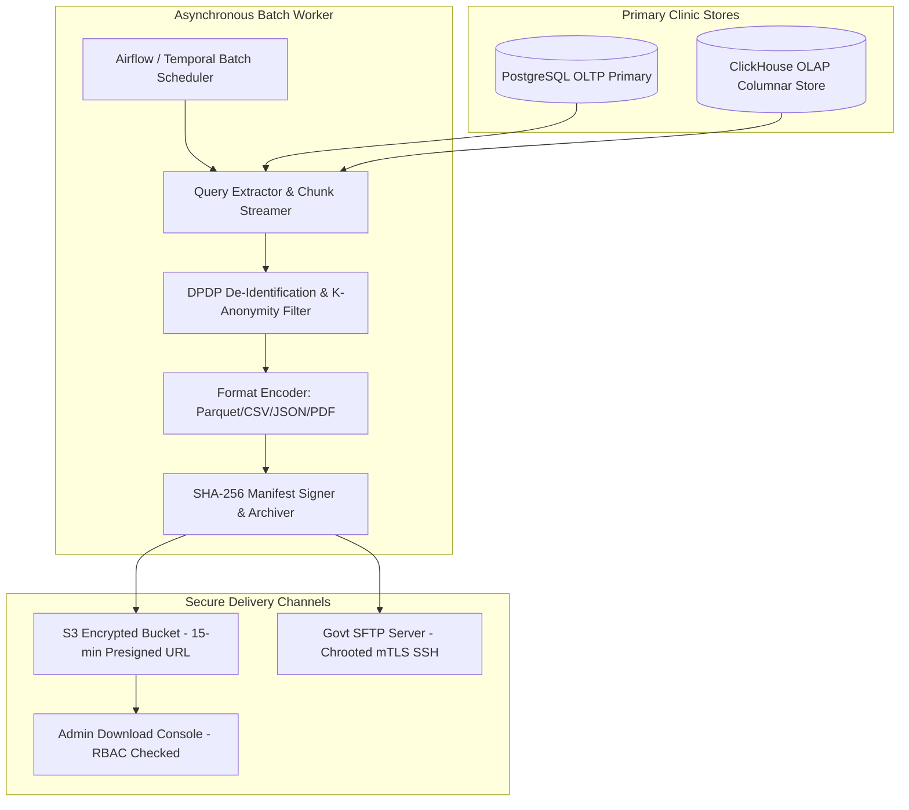

# Master File Export Specifications, Batch Data Feeds & DPDP De-Identification Framework
## Namma Clinic Digital Health & Operations Platform
### Greater Bengaluru Authority (GBA) / BBMP Health Department
**Document Code:** `INT-DOC-07` | **Status:** APPROVED BASELINE | **Date:** September 2026

---

## 1. Executive Summary & File Export Mandate
This document formalizes the architectural specifications for **Master File Exports, Batch Data Feeds, and the DPDP De-Identification Framework** within the Namma Clinic Digital Health Platform. Operating across municipal boundaries, the platform provides robust, auditable mechanisms for extracting structured data feeds for epidemiological research, clinical quality audits, municipal inventory replenishment, and statutory reporting. Supported export formats include **CSV, JSON, NDJSON (Newline Delimited JSON), Apache Parquet, Excel (.xlsx), and signed PDF**. To guarantee total compliance with the Digital Personal Data Protection (DPDP) Act 2023, all analytical exports are processed through an automated privacy pipeline that enforces k-anonymity ($k \ge 5$), l-diversity, and direct PII suppression before data leaves the sovereign primary transactional store.

### 1.1 Non-Negotiable File Export Invariants
1. **Mandatory De-Identification Pipeline:** No file export intended for analytical or inter-departmental use shall contain plain-text Aadhaar numbers, citizen names, phone numbers, or exact residential addresses. All direct identifiers must be suppressed or irreversibly hashed.
2. **Presigned URL Expiration Invariant:** Cloud-based file exports (S3 / object store) must be delivered via presigned URLs with a maximum lifespan of 900 seconds (15 minutes). Public read permissions are strictly prohibited.
3. **Cryptographic Payload Checksums:** Every exported file must be accompanied by a SHA-256 checksum manifest and metadata envelope to ensure data integrity during downstream ingestion.
4. **Immutable Export Audit Logging:** Every export invocation—whether manual via the admin console or automated via cron scheduler—records the requesting user ID, purpose of export, exact SQL/OLAP query, record count, and file hash in an immutable audit ledger.
5. **At-Rest Archive Encryption:** Exported archives generated for SFTP transmission must be encrypted using AES-256-GCM prior to staging on the transfer file system.

## 2. Batch Export Architecture & De-Identification Topology


### Integration Specification Example: DPDP De-Identified File Export Worker
<!-- DOCUMENTATION-ONLY EXAMPLE -->
```python
# DOCUMENTATION-ONLY PYTHON
# DOCUMENTATION-ONLY PYTHON: Batch File Export Worker with DPDP De-Identification
import hashlib
import json
import datetime
from typing import Dict, Any, List

class BatchExportProcessor:
    """
    Asynchronous export processor streaming database query results,
    enforcing DPDP redaction, and generating cryptographically signed manifests.
    """
    def __init__(self, export_id: str, requesting_officer: str, purpose: str):
        self.export_id = export_id
        self.requesting_officer = requesting_officer
        self.purpose = purpose
        self.sha256_hasher = hashlib.sha256()

    def deidentify_record(self, raw_row: Dict[str, Any]) -> Dict[str, Any]:
        """Suppresses direct PII and hashes quasi-identifiers."""
        clean_row = raw_row.copy()

        # Direct PII suppression
        clean_row.pop("aadhaar_number", None)
        clean_row.pop("full_name", None)
        clean_row.pop("phone_number", None)
        clean_row.pop("street_address", None)

        # Salted pseudonymous patient token
        if "patient_id" in clean_row:
            salt = "BBMP_DPDP_SALT_2026"
            token = hashlib.sha256(f"{clean_row['patient_id']}_{salt}".encode()).hexdigest()[:16]
            clean_row["patient_pseudonym"] = f"ANON-{token}"
            del clean_row["patient_id"]

        return clean_row

    def finalize_manifest(self, total_rows: int, file_path: str) -> Dict[str, Any]:
        """Generates cryptographically signed export manifest."""
        return {
            "export_id": self.export_id,
            "generated_at": datetime.datetime.utcnow().isoformat() + "Z",
            "requested_by": self.requesting_officer,
            "purpose_code": self.purpose,
            "record_count": total_rows,
            "file_sha256_checksum": self.sha256_hasher.hexdigest(),
            "compliance_attestation": "DPDP_ACT_2023_DE_IDENTIFIED_K_ANON_5"
        }
```

### Interface Payload Example: File Export Signed Manifest Envelope
<!-- DOCUMENTATION-ONLY EXAMPLE -->
```json
// DOCUMENTATION-ONLY JSON
{
  "exportManifestId": "EXP-MAN-BLR-20260906-00412",
  "exportCategory": "MONTHLY_EPIDEMIOLOGICAL_RESEARCH_EXTRACT",
  "generatedTimestamp": "2026-09-06T04:00:00.000Z",
  "requestingOfficer": {
    "officerId": "USR-BBMP-CHIEF-EPI-01",
    "role": "Chief Epidemiologist / Zonal Data Steward",
    "authorizationOrder": "GBA-HLT-ORD-2026-8812"
  },
  "datasetParameters": {
    "dateRange": {
      "from": "2026-08-01T00:00:00Z",
      "to": "2026-08-31T23:59:59Z"
    },
    "zonesIncluded": ["ALL_8_BBMP_ZONES"],
    "totalRecords": 482190
  },
  "fileDelivery": {
    "format": "APACHE_PARQUET",
    "compression": "SNAPPY",
    "fileName": "bbmp_namma_clinic_opd_morbidity_2026_08.parquet",
    "fileSizeBytes": 184912048,
    "sha256Digest": "e3b0c44298fc1c149afbf4c8996fb92427ae41e4649b934ca495991b7852b855",
    "presignedDownloadUrl": "https://exports.namma.internal.bbmp.gov.in/v1/download/exp-00412?token=EXP_TMP_9948",
    "expiresAt": "2026-09-06T04:15:00.000Z"
  }
}
```

## 3. Master Catalog of Supported Export Formats & Specifications
### Format: `CSV` - Comma-Separated Values (RFC 4180)
- **Format Identifier:** `CSV`
- **Standard Conformance:** Comma-Separated Values (RFC 4180)
- **Description:** UTF-8 with BOM, standard header row, escaped quotes. Ideal for spreadsheet review and tabular reporting.
- **Default Compression:** GZIP / SNAPPY for Parquet; Deflate for Zip.
- **Checksum Verification:** Mandatory SHA-256 companion file.

### Format: `JSON` - Standard JSON Object Array (RFC 8259)
- **Format Identifier:** `JSON`
- **Standard Conformance:** Standard JSON Object Array (RFC 8259)
- **Description:** Formatted UTF-8 array of clinical/operational entities with nested object structures.
- **Default Compression:** GZIP / SNAPPY for Parquet; Deflate for Zip.
- **Checksum Verification:** Mandatory SHA-256 companion file.

### Format: `NDJSON` - Newline Delimited JSON
- **Format Identifier:** `NDJSON`
- **Standard Conformance:** Newline Delimited JSON
- **Description:** Streaming-optimized, one JSON record per line. High-throughput ingestion into big data pipelines and Elasticsearch.
- **Default Compression:** GZIP / SNAPPY for Parquet; Deflate for Zip.
- **Checksum Verification:** Mandatory SHA-256 companion file.

### Format: `PARQUET` - Apache Parquet Columnar
- **Format Identifier:** `PARQUET`
- **Standard Conformance:** Apache Parquet Columnar
- **Description:** Binary columnar storage with Snappy compression, embedded dictionary encoding, and partition by year/month/zone.
- **Default Compression:** GZIP / SNAPPY for Parquet; Deflate for Zip.
- **Checksum Verification:** Mandatory SHA-256 companion file.

### Format: `XLSX` - Microsoft Excel OpenXML
- **Format Identifier:** `XLSX`
- **Standard Conformance:** Microsoft Excel OpenXML
- **Description:** Formatted multi-tab workbook with autofit columns, styling, and data summary charts for executive leadership.
- **Default Compression:** GZIP / SNAPPY for Parquet; Deflate for Zip.
- **Checksum Verification:** Mandatory SHA-256 companion file.

### Format: `PDF` - ISO 32000-1 Digitally Signed PDF
- **Format Identifier:** `PDF`
- **Standard Conformance:** ISO 32000-1 Digitally Signed PDF
- **Description:** Formal, printable municipal health bulletins and clinical summaries with embedded QR verification code.
- **Default Compression:** GZIP / SNAPPY for Parquet; Deflate for Zip.
- **Checksum Verification:** Mandatory SHA-256 companion file.

## 4. Master Catalog of File Export Data Mappings
Field-level transformation rules applied during data extraction to strip PII:

### MAP-076: Export Transformation `public.entity_table_024.field_attr_16`
- **Mapping Identifier:** `MAP-076`
- **Source Entity & Field:** `public.entity_table_024.field_attr_16`
- **Export Representation:** `MedicationDispense.element_01`
- **Anonymization Rule:** Deterministic ISO/SNOMED CT/ICD-10 ontology mapping with null-safe default
- **Integrity Assertion:** Non-null, regex conformance, and reference integrity check
- **Privacy Handling:** Hashed or de-identified according to DPDP Act 2023 guidelines

### MAP-077: Export Transformation `public.entity_table_025.field_attr_17`
- **Mapping Identifier:** `MAP-077`
- **Source Entity & Field:** `public.entity_table_025.field_attr_17`
- **Export Representation:** `DiagnosticReport.element_02`
- **Anonymization Rule:** Deterministic ISO/SNOMED CT/ICD-10 ontology mapping with null-safe default
- **Integrity Assertion:** Non-null, regex conformance, and reference integrity check
- **Privacy Handling:** Hashed or de-identified according to DPDP Act 2023 guidelines

### MAP-078: Export Transformation `public.entity_table_026.field_attr_18`
- **Mapping Identifier:** `MAP-078`
- **Source Entity & Field:** `public.entity_table_026.field_attr_18`
- **Export Representation:** `ServiceRequest.element_03`
- **Anonymization Rule:** Deterministic ISO/SNOMED CT/ICD-10 ontology mapping with null-safe default
- **Integrity Assertion:** Non-null, regex conformance, and reference integrity check
- **Privacy Handling:** Hashed or de-identified according to DPDP Act 2023 guidelines

### MAP-079: Export Transformation `public.entity_table_027.field_attr_19`
- **Mapping Identifier:** `MAP-079`
- **Source Entity & Field:** `public.entity_table_027.field_attr_19`
- **Export Representation:** `AllergyIntolerance.element_04`
- **Anonymization Rule:** Deterministic ISO/SNOMED CT/ICD-10 ontology mapping with null-safe default
- **Integrity Assertion:** Non-null, regex conformance, and reference integrity check
- **Privacy Handling:** Hashed or de-identified according to DPDP Act 2023 guidelines

### MAP-080: Export Transformation `public.entity_table_028.field_attr_20`
- **Mapping Identifier:** `MAP-080`
- **Source Entity & Field:** `public.entity_table_028.field_attr_20`
- **Export Representation:** `CarePlan.element_05`
- **Anonymization Rule:** Deterministic ISO/SNOMED CT/ICD-10 ontology mapping with null-safe default
- **Integrity Assertion:** Non-null, regex conformance, and reference integrity check
- **Privacy Handling:** Hashed or de-identified according to DPDP Act 2023 guidelines

### MAP-081: Export Transformation `public.entity_table_029.field_attr_01`
- **Mapping Identifier:** `MAP-081`
- **Source Entity & Field:** `public.entity_table_029.field_attr_01`
- **Export Representation:** `Patient.element_06`
- **Anonymization Rule:** Deterministic ISO/SNOMED CT/ICD-10 ontology mapping with null-safe default
- **Integrity Assertion:** Non-null, regex conformance, and reference integrity check
- **Privacy Handling:** Hashed or de-identified according to DPDP Act 2023 guidelines

### MAP-082: Export Transformation `public.entity_table_030.field_attr_02`
- **Mapping Identifier:** `MAP-082`
- **Source Entity & Field:** `public.entity_table_030.field_attr_02`
- **Export Representation:** `Encounter.element_07`
- **Anonymization Rule:** Deterministic ISO/SNOMED CT/ICD-10 ontology mapping with null-safe default
- **Integrity Assertion:** Non-null, regex conformance, and reference integrity check
- **Privacy Handling:** Hashed or de-identified according to DPDP Act 2023 guidelines

### MAP-083: Export Transformation `public.entity_table_031.field_attr_03`
- **Mapping Identifier:** `MAP-083`
- **Source Entity & Field:** `public.entity_table_031.field_attr_03`
- **Export Representation:** `Condition.element_08`
- **Anonymization Rule:** Deterministic ISO/SNOMED CT/ICD-10 ontology mapping with null-safe default
- **Integrity Assertion:** Non-null, regex conformance, and reference integrity check
- **Privacy Handling:** Hashed or de-identified according to DPDP Act 2023 guidelines

### MAP-084: Export Transformation `public.entity_table_032.field_attr_04`
- **Mapping Identifier:** `MAP-084`
- **Source Entity & Field:** `public.entity_table_032.field_attr_04`
- **Export Representation:** `Observation.element_09`
- **Anonymization Rule:** Deterministic ISO/SNOMED CT/ICD-10 ontology mapping with null-safe default
- **Integrity Assertion:** Non-null, regex conformance, and reference integrity check
- **Privacy Handling:** Hashed or de-identified according to DPDP Act 2023 guidelines

### MAP-085: Export Transformation `public.entity_table_033.field_attr_05`
- **Mapping Identifier:** `MAP-085`
- **Source Entity & Field:** `public.entity_table_033.field_attr_05`
- **Export Representation:** `MedicationRequest.element_10`
- **Anonymization Rule:** Deterministic ISO/SNOMED CT/ICD-10 ontology mapping with null-safe default
- **Integrity Assertion:** Non-null, regex conformance, and reference integrity check
- **Privacy Handling:** Hashed or de-identified according to DPDP Act 2023 guidelines

### MAP-086: Export Transformation `public.entity_table_034.field_attr_06`
- **Mapping Identifier:** `MAP-086`
- **Source Entity & Field:** `public.entity_table_034.field_attr_06`
- **Export Representation:** `MedicationDispense.element_11`
- **Anonymization Rule:** Deterministic ISO/SNOMED CT/ICD-10 ontology mapping with null-safe default
- **Integrity Assertion:** Non-null, regex conformance, and reference integrity check
- **Privacy Handling:** Hashed or de-identified according to DPDP Act 2023 guidelines

### MAP-087: Export Transformation `public.entity_table_035.field_attr_07`
- **Mapping Identifier:** `MAP-087`
- **Source Entity & Field:** `public.entity_table_035.field_attr_07`
- **Export Representation:** `DiagnosticReport.element_12`
- **Anonymization Rule:** Deterministic ISO/SNOMED CT/ICD-10 ontology mapping with null-safe default
- **Integrity Assertion:** Non-null, regex conformance, and reference integrity check
- **Privacy Handling:** Hashed or de-identified according to DPDP Act 2023 guidelines

### MAP-088: Export Transformation `public.entity_table_036.field_attr_08`
- **Mapping Identifier:** `MAP-088`
- **Source Entity & Field:** `public.entity_table_036.field_attr_08`
- **Export Representation:** `ServiceRequest.element_13`
- **Anonymization Rule:** Deterministic ISO/SNOMED CT/ICD-10 ontology mapping with null-safe default
- **Integrity Assertion:** Non-null, regex conformance, and reference integrity check
- **Privacy Handling:** Hashed or de-identified according to DPDP Act 2023 guidelines

### MAP-089: Export Transformation `public.entity_table_037.field_attr_09`
- **Mapping Identifier:** `MAP-089`
- **Source Entity & Field:** `public.entity_table_037.field_attr_09`
- **Export Representation:** `AllergyIntolerance.element_14`
- **Anonymization Rule:** Deterministic ISO/SNOMED CT/ICD-10 ontology mapping with null-safe default
- **Integrity Assertion:** Non-null, regex conformance, and reference integrity check
- **Privacy Handling:** Hashed or de-identified according to DPDP Act 2023 guidelines

### MAP-090: Export Transformation `public.entity_table_038.field_attr_10`
- **Mapping Identifier:** `MAP-090`
- **Source Entity & Field:** `public.entity_table_038.field_attr_10`
- **Export Representation:** `CarePlan.element_15`
- **Anonymization Rule:** Deterministic ISO/SNOMED CT/ICD-10 ontology mapping with null-safe default
- **Integrity Assertion:** Non-null, regex conformance, and reference integrity check
- **Privacy Handling:** Hashed or de-identified according to DPDP Act 2023 guidelines

### MAP-091: Export Transformation `public.entity_table_039.field_attr_11`
- **Mapping Identifier:** `MAP-091`
- **Source Entity & Field:** `public.entity_table_039.field_attr_11`
- **Export Representation:** `Patient.element_01`
- **Anonymization Rule:** Deterministic ISO/SNOMED CT/ICD-10 ontology mapping with null-safe default
- **Integrity Assertion:** Non-null, regex conformance, and reference integrity check
- **Privacy Handling:** Hashed or de-identified according to DPDP Act 2023 guidelines

### MAP-092: Export Transformation `public.entity_table_040.field_attr_12`
- **Mapping Identifier:** `MAP-092`
- **Source Entity & Field:** `public.entity_table_040.field_attr_12`
- **Export Representation:** `Encounter.element_02`
- **Anonymization Rule:** Deterministic ISO/SNOMED CT/ICD-10 ontology mapping with null-safe default
- **Integrity Assertion:** Non-null, regex conformance, and reference integrity check
- **Privacy Handling:** Hashed or de-identified according to DPDP Act 2023 guidelines

### MAP-093: Export Transformation `public.entity_table_041.field_attr_13`
- **Mapping Identifier:** `MAP-093`
- **Source Entity & Field:** `public.entity_table_041.field_attr_13`
- **Export Representation:** `Condition.element_03`
- **Anonymization Rule:** Deterministic ISO/SNOMED CT/ICD-10 ontology mapping with null-safe default
- **Integrity Assertion:** Non-null, regex conformance, and reference integrity check
- **Privacy Handling:** Hashed or de-identified according to DPDP Act 2023 guidelines

### MAP-094: Export Transformation `public.entity_table_042.field_attr_14`
- **Mapping Identifier:** `MAP-094`
- **Source Entity & Field:** `public.entity_table_042.field_attr_14`
- **Export Representation:** `Observation.element_04`
- **Anonymization Rule:** Deterministic ISO/SNOMED CT/ICD-10 ontology mapping with null-safe default
- **Integrity Assertion:** Non-null, regex conformance, and reference integrity check
- **Privacy Handling:** Hashed or de-identified according to DPDP Act 2023 guidelines

### MAP-095: Export Transformation `public.entity_table_043.field_attr_15`
- **Mapping Identifier:** `MAP-095`
- **Source Entity & Field:** `public.entity_table_043.field_attr_15`
- **Export Representation:** `MedicationRequest.element_05`
- **Anonymization Rule:** Deterministic ISO/SNOMED CT/ICD-10 ontology mapping with null-safe default
- **Integrity Assertion:** Non-null, regex conformance, and reference integrity check
- **Privacy Handling:** Hashed or de-identified according to DPDP Act 2023 guidelines

### MAP-096: Export Transformation `public.entity_table_044.field_attr_16`
- **Mapping Identifier:** `MAP-096`
- **Source Entity & Field:** `public.entity_table_044.field_attr_16`
- **Export Representation:** `MedicationDispense.element_06`
- **Anonymization Rule:** Deterministic ISO/SNOMED CT/ICD-10 ontology mapping with null-safe default
- **Integrity Assertion:** Non-null, regex conformance, and reference integrity check
- **Privacy Handling:** Hashed or de-identified according to DPDP Act 2023 guidelines

### MAP-097: Export Transformation `public.entity_table_045.field_attr_17`
- **Mapping Identifier:** `MAP-097`
- **Source Entity & Field:** `public.entity_table_045.field_attr_17`
- **Export Representation:** `DiagnosticReport.element_07`
- **Anonymization Rule:** Deterministic ISO/SNOMED CT/ICD-10 ontology mapping with null-safe default
- **Integrity Assertion:** Non-null, regex conformance, and reference integrity check
- **Privacy Handling:** Hashed or de-identified according to DPDP Act 2023 guidelines

### MAP-098: Export Transformation `public.entity_table_046.field_attr_18`
- **Mapping Identifier:** `MAP-098`
- **Source Entity & Field:** `public.entity_table_046.field_attr_18`
- **Export Representation:** `ServiceRequest.element_08`
- **Anonymization Rule:** Deterministic ISO/SNOMED CT/ICD-10 ontology mapping with null-safe default
- **Integrity Assertion:** Non-null, regex conformance, and reference integrity check
- **Privacy Handling:** Hashed or de-identified according to DPDP Act 2023 guidelines

### MAP-099: Export Transformation `public.entity_table_047.field_attr_19`
- **Mapping Identifier:** `MAP-099`
- **Source Entity & Field:** `public.entity_table_047.field_attr_19`
- **Export Representation:** `AllergyIntolerance.element_09`
- **Anonymization Rule:** Deterministic ISO/SNOMED CT/ICD-10 ontology mapping with null-safe default
- **Integrity Assertion:** Non-null, regex conformance, and reference integrity check
- **Privacy Handling:** Hashed or de-identified according to DPDP Act 2023 guidelines

### MAP-100: Export Transformation `public.entity_table_048.field_attr_20`
- **Mapping Identifier:** `MAP-100`
- **Source Entity & Field:** `public.entity_table_048.field_attr_20`
- **Export Representation:** `CarePlan.element_10`
- **Anonymization Rule:** Deterministic ISO/SNOMED CT/ICD-10 ontology mapping with null-safe default
- **Integrity Assertion:** Non-null, regex conformance, and reference integrity check
- **Privacy Handling:** Hashed or de-identified according to DPDP Act 2023 guidelines

## 5. Table-Level Export Lineage across all 52 Relational Tables
Export eligibility, data masking, and retention rules across all 52 platform tables:

### TABLE-001: Export Configuration for Table `auth_users`
- **Table Identifier:** `TABLE-001` (`TBL-01`)
- **Source Entity:** `auth_users`
- **Default Export Format:** `CSV`
- **Security Control:** Enforced under `SEC-INT-001`.
- **PII Masking Protocol:** Sensitive columns redacted or pseudonymized per DPDP rules.
- **Export Retention:** Staged export files purged automatically after 24 hours.
- **Audit Logging:** Every table extraction logged to immutable audit ledger.

### TABLE-002: Export Configuration for Table `user_credentials`
- **Table Identifier:** `TABLE-002` (`TBL-02`)
- **Source Entity:** `user_credentials`
- **Default Export Format:** `JSON`
- **Security Control:** Enforced under `SEC-INT-002`.
- **PII Masking Protocol:** Sensitive columns redacted or pseudonymized per DPDP rules.
- **Export Retention:** Staged export files purged automatically after 24 hours.
- **Audit Logging:** Every table extraction logged to immutable audit ledger.

### TABLE-003: Export Configuration for Table `user_sessions`
- **Table Identifier:** `TABLE-003` (`TBL-03`)
- **Source Entity:** `user_sessions`
- **Default Export Format:** `NDJSON`
- **Security Control:** Enforced under `SEC-INT-003`.
- **PII Masking Protocol:** Sensitive columns redacted or pseudonymized per DPDP rules.
- **Export Retention:** Staged export files purged automatically after 24 hours.
- **Audit Logging:** Every table extraction logged to immutable audit ledger.

### TABLE-004: Export Configuration for Table `roles`
- **Table Identifier:** `TABLE-004` (`TBL-04`)
- **Source Entity:** `roles`
- **Default Export Format:** `PARQUET`
- **Security Control:** Enforced under `SEC-INT-004`.
- **PII Masking Protocol:** Sensitive columns redacted or pseudonymized per DPDP rules.
- **Export Retention:** Staged export files purged automatically after 24 hours.
- **Audit Logging:** Every table extraction logged to immutable audit ledger.

### TABLE-005: Export Configuration for Table `permissions`
- **Table Identifier:** `TABLE-005` (`TBL-05`)
- **Source Entity:** `permissions`
- **Default Export Format:** `XLSX`
- **Security Control:** Enforced under `SEC-INT-005`.
- **PII Masking Protocol:** Sensitive columns redacted or pseudonymized per DPDP rules.
- **Export Retention:** Staged export files purged automatically after 24 hours.
- **Audit Logging:** Every table extraction logged to immutable audit ledger.

### TABLE-006: Export Configuration for Table `role_permissions`
- **Table Identifier:** `TABLE-006` (`TBL-06`)
- **Source Entity:** `role_permissions`
- **Default Export Format:** `PDF`
- **Security Control:** Enforced under `SEC-INT-006`.
- **PII Masking Protocol:** Sensitive columns redacted or pseudonymized per DPDP rules.
- **Export Retention:** Staged export files purged automatically after 24 hours.
- **Audit Logging:** Every table extraction logged to immutable audit ledger.

### TABLE-007: Export Configuration for Table `user_roles`
- **Table Identifier:** `TABLE-007` (`TBL-07`)
- **Source Entity:** `user_roles`
- **Default Export Format:** `CSV`
- **Security Control:** Enforced under `SEC-INT-007`.
- **PII Masking Protocol:** Sensitive columns redacted or pseudonymized per DPDP rules.
- **Export Retention:** Staged export files purged automatically after 24 hours.
- **Audit Logging:** Every table extraction logged to immutable audit ledger.

### TABLE-008: Export Configuration for Table `facilities`
- **Table Identifier:** `TABLE-008` (`TBL-08`)
- **Source Entity:** `facilities`
- **Default Export Format:** `JSON`
- **Security Control:** Enforced under `SEC-INT-008`.
- **PII Masking Protocol:** Sensitive columns redacted or pseudonymized per DPDP rules.
- **Export Retention:** Staged export files purged automatically after 24 hours.
- **Audit Logging:** Every table extraction logged to immutable audit ledger.

### TABLE-009: Export Configuration for Table `facility_rooms`
- **Table Identifier:** `TABLE-009` (`TBL-09`)
- **Source Entity:** `facility_rooms`
- **Default Export Format:** `NDJSON`
- **Security Control:** Enforced under `SEC-INT-009`.
- **PII Masking Protocol:** Sensitive columns redacted or pseudonymized per DPDP rules.
- **Export Retention:** Staged export files purged automatically after 24 hours.
- **Audit Logging:** Every table extraction logged to immutable audit ledger.

### TABLE-010: Export Configuration for Table `staff_profiles`
- **Table Identifier:** `TABLE-010` (`TBL-10`)
- **Source Entity:** `staff_profiles`
- **Default Export Format:** `PARQUET`
- **Security Control:** Enforced under `SEC-INT-010`.
- **PII Masking Protocol:** Sensitive columns redacted or pseudonymized per DPDP rules.
- **Export Retention:** Staged export files purged automatically after 24 hours.
- **Audit Logging:** Every table extraction logged to immutable audit ledger.

### TABLE-011: Export Configuration for Table `staff_shifts`
- **Table Identifier:** `TABLE-011` (`TBL-11`)
- **Source Entity:** `staff_shifts`
- **Default Export Format:** `XLSX`
- **Security Control:** Enforced under `SEC-INT-011`.
- **PII Masking Protocol:** Sensitive columns redacted or pseudonymized per DPDP rules.
- **Export Retention:** Staged export files purged automatically after 24 hours.
- **Audit Logging:** Every table extraction logged to immutable audit ledger.

### TABLE-012: Export Configuration for Table `system_configs`
- **Table Identifier:** `TABLE-012` (`TBL-12`)
- **Source Entity:** `system_configs`
- **Default Export Format:** `PDF`
- **Security Control:** Enforced under `SEC-INT-012`.
- **PII Masking Protocol:** Sensitive columns redacted or pseudonymized per DPDP rules.
- **Export Retention:** Staged export files purged automatically after 24 hours.
- **Audit Logging:** Every table extraction logged to immutable audit ledger.

### TABLE-013: Export Configuration for Table `patients`
- **Table Identifier:** `TABLE-013` (`TBL-13`)
- **Source Entity:** `patients`
- **Default Export Format:** `CSV`
- **Security Control:** Enforced under `SEC-INT-013`.
- **PII Masking Protocol:** Sensitive columns redacted or pseudonymized per DPDP rules.
- **Export Retention:** Staged export files purged automatically after 24 hours.
- **Audit Logging:** Every table extraction logged to immutable audit ledger.

### TABLE-014: Export Configuration for Table `patient_identifiers`
- **Table Identifier:** `TABLE-014` (`TBL-14`)
- **Source Entity:** `patient_identifiers`
- **Default Export Format:** `JSON`
- **Security Control:** Enforced under `SEC-INT-014`.
- **PII Masking Protocol:** Sensitive columns redacted or pseudonymized per DPDP rules.
- **Export Retention:** Staged export files purged automatically after 24 hours.
- **Audit Logging:** Every table extraction logged to immutable audit ledger.

### TABLE-015: Export Configuration for Table `patient_contacts`
- **Table Identifier:** `TABLE-015` (`TBL-15`)
- **Source Entity:** `patient_contacts`
- **Default Export Format:** `NDJSON`
- **Security Control:** Enforced under `SEC-INT-015`.
- **PII Masking Protocol:** Sensitive columns redacted or pseudonymized per DPDP rules.
- **Export Retention:** Staged export files purged automatically after 24 hours.
- **Audit Logging:** Every table extraction logged to immutable audit ledger.

### TABLE-016: Export Configuration for Table `patient_addresses`
- **Table Identifier:** `TABLE-016` (`TBL-16`)
- **Source Entity:** `patient_addresses`
- **Default Export Format:** `PARQUET`
- **Security Control:** Enforced under `SEC-INT-016`.
- **PII Masking Protocol:** Sensitive columns redacted or pseudonymized per DPDP rules.
- **Export Retention:** Staged export files purged automatically after 24 hours.
- **Audit Logging:** Every table extraction logged to immutable audit ledger.

### TABLE-017: Export Configuration for Table `consent_records`
- **Table Identifier:** `TABLE-017` (`TBL-17`)
- **Source Entity:** `consent_records`
- **Default Export Format:** `XLSX`
- **Security Control:** Enforced under `SEC-INT-017`.
- **PII Masking Protocol:** Sensitive columns redacted or pseudonymized per DPDP rules.
- **Export Retention:** Staged export files purged automatically after 24 hours.
- **Audit Logging:** Every table extraction logged to immutable audit ledger.

### TABLE-018: Export Configuration for Table `tokens`
- **Table Identifier:** `TABLE-018` (`TBL-18`)
- **Source Entity:** `tokens`
- **Default Export Format:** `PDF`
- **Security Control:** Enforced under `SEC-INT-018`.
- **PII Masking Protocol:** Sensitive columns redacted or pseudonymized per DPDP rules.
- **Export Retention:** Staged export files purged automatically after 24 hours.
- **Audit Logging:** Every table extraction logged to immutable audit ledger.

### TABLE-019: Export Configuration for Table `queue_entries`
- **Table Identifier:** `TABLE-019` (`TBL-19`)
- **Source Entity:** `queue_entries`
- **Default Export Format:** `CSV`
- **Security Control:** Enforced under `SEC-INT-019`.
- **PII Masking Protocol:** Sensitive columns redacted or pseudonymized per DPDP rules.
- **Export Retention:** Staged export files purged automatically after 24 hours.
- **Audit Logging:** Every table extraction logged to immutable audit ledger.

### TABLE-020: Export Configuration for Table `triage_assessments`
- **Table Identifier:** `TABLE-020` (`TBL-20`)
- **Source Entity:** `triage_assessments`
- **Default Export Format:** `JSON`
- **Security Control:** Enforced under `SEC-INT-020`.
- **PII Masking Protocol:** Sensitive columns redacted or pseudonymized per DPDP rules.
- **Export Retention:** Staged export files purged automatically after 24 hours.
- **Audit Logging:** Every table extraction logged to immutable audit ledger.

### TABLE-021: Export Configuration for Table `patient_vitals`
- **Table Identifier:** `TABLE-021` (`TBL-21`)
- **Source Entity:** `patient_vitals`
- **Default Export Format:** `NDJSON`
- **Security Control:** Enforced under `SEC-INT-021`.
- **PII Masking Protocol:** Sensitive columns redacted or pseudonymized per DPDP rules.
- **Export Retention:** Staged export files purged automatically after 24 hours.
- **Audit Logging:** Every table extraction logged to immutable audit ledger.

### TABLE-022: Export Configuration for Table `danger_alerts`
- **Table Identifier:** `TABLE-022` (`TBL-22`)
- **Source Entity:** `danger_alerts`
- **Default Export Format:** `PARQUET`
- **Security Control:** Enforced under `SEC-INT-022`.
- **PII Masking Protocol:** Sensitive columns redacted or pseudonymized per DPDP rules.
- **Export Retention:** Staged export files purged automatically after 24 hours.
- **Audit Logging:** Every table extraction logged to immutable audit ledger.

### TABLE-023: Export Configuration for Table `clinical_encounters`
- **Table Identifier:** `TABLE-023` (`TBL-23`)
- **Source Entity:** `clinical_encounters`
- **Default Export Format:** `XLSX`
- **Security Control:** Enforced under `SEC-INT-023`.
- **PII Masking Protocol:** Sensitive columns redacted or pseudonymized per DPDP rules.
- **Export Retention:** Staged export files purged automatically after 24 hours.
- **Audit Logging:** Every table extraction logged to immutable audit ledger.

### TABLE-024: Export Configuration for Table `clinical_notes`
- **Table Identifier:** `TABLE-024` (`TBL-24`)
- **Source Entity:** `clinical_notes`
- **Default Export Format:** `PDF`
- **Security Control:** Enforced under `SEC-INT-024`.
- **PII Masking Protocol:** Sensitive columns redacted or pseudonymized per DPDP rules.
- **Export Retention:** Staged export files purged automatically after 24 hours.
- **Audit Logging:** Every table extraction logged to immutable audit ledger.

### TABLE-025: Export Configuration for Table `diagnoses`
- **Table Identifier:** `TABLE-025` (`TBL-25`)
- **Source Entity:** `diagnoses`
- **Default Export Format:** `CSV`
- **Security Control:** Enforced under `SEC-INT-025`.
- **PII Masking Protocol:** Sensitive columns redacted or pseudonymized per DPDP rules.
- **Export Retention:** Staged export files purged automatically after 24 hours.
- **Audit Logging:** Every table extraction logged to immutable audit ledger.

### TABLE-026: Export Configuration for Table `prescriptions`
- **Table Identifier:** `TABLE-026` (`TBL-26`)
- **Source Entity:** `prescriptions`
- **Default Export Format:** `JSON`
- **Security Control:** Enforced under `SEC-INT-026`.
- **PII Masking Protocol:** Sensitive columns redacted or pseudonymized per DPDP rules.
- **Export Retention:** Staged export files purged automatically after 24 hours.
- **Audit Logging:** Every table extraction logged to immutable audit ledger.

### TABLE-027: Export Configuration for Table `prescription_items`
- **Table Identifier:** `TABLE-027` (`TBL-27`)
- **Source Entity:** `prescription_items`
- **Default Export Format:** `NDJSON`
- **Security Control:** Enforced under `SEC-INT-027`.
- **PII Masking Protocol:** Sensitive columns redacted or pseudonymized per DPDP rules.
- **Export Retention:** Staged export files purged automatically after 24 hours.
- **Audit Logging:** Every table extraction logged to immutable audit ledger.

### TABLE-028: Export Configuration for Table `lab_orders`
- **Table Identifier:** `TABLE-028` (`TBL-28`)
- **Source Entity:** `lab_orders`
- **Default Export Format:** `PARQUET`
- **Security Control:** Enforced under `SEC-INT-028`.
- **PII Masking Protocol:** Sensitive columns redacted or pseudonymized per DPDP rules.
- **Export Retention:** Staged export files purged automatically after 24 hours.
- **Audit Logging:** Every table extraction logged to immutable audit ledger.

### TABLE-029: Export Configuration for Table `lab_order_items`
- **Table Identifier:** `TABLE-029` (`TBL-29`)
- **Source Entity:** `lab_order_items`
- **Default Export Format:** `XLSX`
- **Security Control:** Enforced under `SEC-INT-029`.
- **PII Masking Protocol:** Sensitive columns redacted or pseudonymized per DPDP rules.
- **Export Retention:** Staged export files purged automatically after 24 hours.
- **Audit Logging:** Every table extraction logged to immutable audit ledger.

### TABLE-030: Export Configuration for Table `lab_results`
- **Table Identifier:** `TABLE-030` (`TBL-30`)
- **Source Entity:** `lab_results`
- **Default Export Format:** `PDF`
- **Security Control:** Enforced under `SEC-INT-030`.
- **PII Masking Protocol:** Sensitive columns redacted or pseudonymized per DPDP rules.
- **Export Retention:** Staged export files purged automatically after 24 hours.
- **Audit Logging:** Every table extraction logged to immutable audit ledger.

### TABLE-031: Export Configuration for Table `teleconsultations`
- **Table Identifier:** `TABLE-031` (`TBL-31`)
- **Source Entity:** `teleconsultations`
- **Default Export Format:** `CSV`
- **Security Control:** Enforced under `SEC-INT-031`.
- **PII Masking Protocol:** Sensitive columns redacted or pseudonymized per DPDP rules.
- **Export Retention:** Staged export files purged automatically after 24 hours.
- **Audit Logging:** Every table extraction logged to immutable audit ledger.

### TABLE-032: Export Configuration for Table `formulary_drugs`
- **Table Identifier:** `TABLE-032` (`TBL-32`)
- **Source Entity:** `formulary_drugs`
- **Default Export Format:** `JSON`
- **Security Control:** Enforced under `SEC-INT-032`.
- **PII Masking Protocol:** Sensitive columns redacted or pseudonymized per DPDP rules.
- **Export Retention:** Staged export files purged automatically after 24 hours.
- **Audit Logging:** Every table extraction logged to immutable audit ledger.

### TABLE-033: Export Configuration for Table `drug_categories`
- **Table Identifier:** `TABLE-033` (`TBL-33`)
- **Source Entity:** `drug_categories`
- **Default Export Format:** `NDJSON`
- **Security Control:** Enforced under `SEC-INT-033`.
- **PII Masking Protocol:** Sensitive columns redacted or pseudonymized per DPDP rules.
- **Export Retention:** Staged export files purged automatically after 24 hours.
- **Audit Logging:** Every table extraction logged to immutable audit ledger.

### TABLE-034: Export Configuration for Table `pharmacy_batches`
- **Table Identifier:** `TABLE-034` (`TBL-34`)
- **Source Entity:** `pharmacy_batches`
- **Default Export Format:** `PARQUET`
- **Security Control:** Enforced under `SEC-INT-034`.
- **PII Masking Protocol:** Sensitive columns redacted or pseudonymized per DPDP rules.
- **Export Retention:** Staged export files purged automatically after 24 hours.
- **Audit Logging:** Every table extraction logged to immutable audit ledger.

### TABLE-035: Export Configuration for Table `clinic_stock`
- **Table Identifier:** `TABLE-035` (`TBL-35`)
- **Source Entity:** `clinic_stock`
- **Default Export Format:** `XLSX`
- **Security Control:** Enforced under `SEC-INT-035`.
- **PII Masking Protocol:** Sensitive columns redacted or pseudonymized per DPDP rules.
- **Export Retention:** Staged export files purged automatically after 24 hours.
- **Audit Logging:** Every table extraction logged to immutable audit ledger.

### TABLE-036: Export Configuration for Table `dispensations`
- **Table Identifier:** `TABLE-036` (`TBL-36`)
- **Source Entity:** `dispensations`
- **Default Export Format:** `PDF`
- **Security Control:** Enforced under `SEC-INT-036`.
- **PII Masking Protocol:** Sensitive columns redacted or pseudonymized per DPDP rules.
- **Export Retention:** Staged export files purged automatically after 24 hours.
- **Audit Logging:** Every table extraction logged to immutable audit ledger.

### TABLE-037: Export Configuration for Table `dispensation_items`
- **Table Identifier:** `TABLE-037` (`TBL-37`)
- **Source Entity:** `dispensation_items`
- **Default Export Format:** `CSV`
- **Security Control:** Enforced under `SEC-INT-037`.
- **PII Masking Protocol:** Sensitive columns redacted or pseudonymized per DPDP rules.
- **Export Retention:** Staged export files purged automatically after 24 hours.
- **Audit Logging:** Every table extraction logged to immutable audit ledger.

### TABLE-038: Export Configuration for Table `stock_movements`
- **Table Identifier:** `TABLE-038` (`TBL-38`)
- **Source Entity:** `stock_movements`
- **Default Export Format:** `JSON`
- **Security Control:** Enforced under `SEC-INT-038`.
- **PII Masking Protocol:** Sensitive columns redacted or pseudonymized per DPDP rules.
- **Export Retention:** Staged export files purged automatically after 24 hours.
- **Audit Logging:** Every table extraction logged to immutable audit ledger.

### TABLE-039: Export Configuration for Table `drug_indents`
- **Table Identifier:** `TABLE-039` (`TBL-39`)
- **Source Entity:** `drug_indents`
- **Default Export Format:** `NDJSON`
- **Security Control:** Enforced under `SEC-INT-039`.
- **PII Masking Protocol:** Sensitive columns redacted or pseudonymized per DPDP rules.
- **Export Retention:** Staged export files purged automatically after 24 hours.
- **Audit Logging:** Every table extraction logged to immutable audit ledger.

### TABLE-040: Export Configuration for Table `indent_items`
- **Table Identifier:** `TABLE-040` (`TBL-40`)
- **Source Entity:** `indent_items`
- **Default Export Format:** `PARQUET`
- **Security Control:** Enforced under `SEC-INT-040`.
- **PII Masking Protocol:** Sensitive columns redacted or pseudonymized per DPDP rules.
- **Export Retention:** Staged export files purged automatically after 24 hours.
- **Audit Logging:** Every table extraction logged to immutable audit ledger.

### TABLE-041: Export Configuration for Table `cold_chain_devices`
- **Table Identifier:** `TABLE-041` (`TBL-41`)
- **Source Entity:** `cold_chain_devices`
- **Default Export Format:** `XLSX`
- **Security Control:** Enforced under `SEC-INT-041`.
- **PII Masking Protocol:** Sensitive columns redacted or pseudonymized per DPDP rules.
- **Export Retention:** Staged export files purged automatically after 24 hours.
- **Audit Logging:** Every table extraction logged to immutable audit ledger.

### TABLE-042: Export Configuration for Table `cold_chain_telemetry`
- **Table Identifier:** `TABLE-042` (`TBL-42`)
- **Source Entity:** `cold_chain_telemetry`
- **Default Export Format:** `PDF`
- **Security Control:** Enforced under `SEC-INT-042`.
- **PII Masking Protocol:** Sensitive columns redacted or pseudonymized per DPDP rules.
- **Export Retention:** Staged export files purged automatically after 24 hours.
- **Audit Logging:** Every table extraction logged to immutable audit ledger.

### TABLE-043: Export Configuration for Table `referrals`
- **Table Identifier:** `TABLE-043` (`TBL-43`)
- **Source Entity:** `referrals`
- **Default Export Format:** `CSV`
- **Security Control:** Enforced under `SEC-INT-043`.
- **PII Masking Protocol:** Sensitive columns redacted or pseudonymized per DPDP rules.
- **Export Retention:** Staged export files purged automatically after 24 hours.
- **Audit Logging:** Every table extraction logged to immutable audit ledger.

### TABLE-044: Export Configuration for Table `referral_counter_notes`
- **Table Identifier:** `TABLE-044` (`TBL-44`)
- **Source Entity:** `referral_counter_notes`
- **Default Export Format:** `JSON`
- **Security Control:** Enforced under `SEC-INT-044`.
- **PII Masking Protocol:** Sensitive columns redacted or pseudonymized per DPDP rules.
- **Export Retention:** Staged export files purged automatically after 24 hours.
- **Audit Logging:** Every table extraction logged to immutable audit ledger.

### TABLE-045: Export Configuration for Table `ncd_episodes`
- **Table Identifier:** `TABLE-045` (`TBL-45`)
- **Source Entity:** `ncd_episodes`
- **Default Export Format:** `NDJSON`
- **Security Control:** Enforced under `SEC-INT-045`.
- **PII Masking Protocol:** Sensitive columns redacted or pseudonymized per DPDP rules.
- **Export Retention:** Staged export files purged automatically after 24 hours.
- **Audit Logging:** Every table extraction logged to immutable audit ledger.

### TABLE-046: Export Configuration for Table `follow_up_schedules`
- **Table Identifier:** `TABLE-046` (`TBL-46`)
- **Source Entity:** `follow_up_schedules`
- **Default Export Format:** `PARQUET`
- **Security Control:** Enforced under `SEC-INT-046`.
- **PII Masking Protocol:** Sensitive columns redacted or pseudonymized per DPDP rules.
- **Export Retention:** Staged export files purged automatically after 24 hours.
- **Audit Logging:** Every table extraction logged to immutable audit ledger.

### TABLE-047: Export Configuration for Table `notifications`
- **Table Identifier:** `TABLE-047` (`TBL-47`)
- **Source Entity:** `notifications`
- **Default Export Format:** `XLSX`
- **Security Control:** Enforced under `SEC-INT-047`.
- **PII Masking Protocol:** Sensitive columns redacted or pseudonymized per DPDP rules.
- **Export Retention:** Staged export files purged automatically after 24 hours.
- **Audit Logging:** Every table extraction logged to immutable audit ledger.

### TABLE-048: Export Configuration for Table `grievances`
- **Table Identifier:** `TABLE-048` (`TBL-48`)
- **Source Entity:** `grievances`
- **Default Export Format:** `PDF`
- **Security Control:** Enforced under `SEC-INT-048`.
- **PII Masking Protocol:** Sensitive columns redacted or pseudonymized per DPDP rules.
- **Export Retention:** Staged export files purged automatically after 24 hours.
- **Audit Logging:** Every table extraction logged to immutable audit ledger.

### TABLE-049: Export Configuration for Table `helpdesk_tickets`
- **Table Identifier:** `TABLE-049` (`TBL-49`)
- **Source Entity:** `helpdesk_tickets`
- **Default Export Format:** `CSV`
- **Security Control:** Enforced under `SEC-INT-049`.
- **PII Masking Protocol:** Sensitive columns redacted or pseudonymized per DPDP rules.
- **Export Retention:** Staged export files purged automatically after 24 hours.
- **Audit Logging:** Every table extraction logged to immutable audit ledger.

### TABLE-050: Export Configuration for Table `audit_events`
- **Table Identifier:** `TABLE-050` (`TBL-50`)
- **Source Entity:** `audit_events`
- **Default Export Format:** `JSON`
- **Security Control:** Enforced under `SEC-INT-050`.
- **PII Masking Protocol:** Sensitive columns redacted or pseudonymized per DPDP rules.
- **Export Retention:** Staged export files purged automatically after 24 hours.
- **Audit Logging:** Every table extraction logged to immutable audit ledger.

### TABLE-051: Export Configuration for Table `offline_mutation_log`
- **Table Identifier:** `TABLE-051` (`TBL-51`)
- **Source Entity:** `offline_mutation_log`
- **Default Export Format:** `NDJSON`
- **Security Control:** Enforced under `SEC-INT-001`.
- **PII Masking Protocol:** Sensitive columns redacted or pseudonymized per DPDP rules.
- **Export Retention:** Staged export files purged automatically after 24 hours.
- **Audit Logging:** Every table extraction logged to immutable audit ledger.

### TABLE-052: Export Configuration for Table `abdm_artifacts`
- **Table Identifier:** `TABLE-052` (`TBL-52`)
- **Source Entity:** `abdm_artifacts`
- **Default Export Format:** `PARQUET`
- **Security Control:** Enforced under `SEC-INT-002`.
- **PII Masking Protocol:** Sensitive columns redacted or pseudonymized per DPDP rules.
- **Export Retention:** Staged export files purged automatically after 24 hours.
- **Audit Logging:** Every table extraction logged to immutable audit ledger.

## 6. Product Feature File Export Touchpoints across all 180 Features
User-facing download and administrative export capabilities across all 180 platform product features:

### FEATURE-001: File Export Capability for Feature `Credential Verification`
- **Feature Identifier:** `FEATURE-001` (Feature #1)
- **Functional Module:** `MODULE-001` (DOMAIN-001)
- **Supported Export Format:** `CSV`
- **User Persona:** Frontline doctor, pharmacist, or zonal health administrator.
- **Security Authorization:** Requires RBAC permission `OPERATION_EXPORT_DATA`.
- **Watermarking:** Watermarked with requesting user ID and timestamp to prevent unauthorized leaks.

### FEATURE-002: File Export Capability for Feature `Session Token Minting`
- **Feature Identifier:** `FEATURE-002` (Feature #2)
- **Functional Module:** `MODULE-001` (DOMAIN-001)
- **Supported Export Format:** `JSON`
- **User Persona:** Frontline doctor, pharmacist, or zonal health administrator.
- **Security Authorization:** Requires RBAC permission `OPERATION_EXPORT_DATA`.
- **Watermarking:** Watermarked with requesting user ID and timestamp to prevent unauthorized leaks.

### FEATURE-003: File Export Capability for Feature `MFA Challenge Dispatch`
- **Feature Identifier:** `FEATURE-003` (Feature #3)
- **Functional Module:** `MODULE-001` (DOMAIN-001)
- **Supported Export Format:** `NDJSON`
- **User Persona:** Frontline doctor, pharmacist, or zonal health administrator.
- **Security Authorization:** Requires RBAC permission `OPERATION_EXPORT_DATA`.
- **Watermarking:** Watermarked with requesting user ID and timestamp to prevent unauthorized leaks.

### FEATURE-004: File Export Capability for Feature `Biometric Authentication Bridge`
- **Feature Identifier:** `FEATURE-004` (Feature #4)
- **Functional Module:** `MODULE-001` (DOMAIN-001)
- **Supported Export Format:** `PARQUET`
- **User Persona:** Frontline doctor, pharmacist, or zonal health administrator.
- **Security Authorization:** Requires RBAC permission `OPERATION_EXPORT_DATA`.
- **Watermarking:** Watermarked with requesting user ID and timestamp to prevent unauthorized leaks.

### FEATURE-005: File Export Capability for Feature `Local PIN Verification`
- **Feature Identifier:** `FEATURE-005` (Feature #5)
- **Functional Module:** `MODULE-001` (DOMAIN-001)
- **Supported Export Format:** `XLSX`
- **User Persona:** Frontline doctor, pharmacist, or zonal health administrator.
- **Security Authorization:** Requires RBAC permission `OPERATION_EXPORT_DATA`.
- **Watermarking:** Watermarked with requesting user ID and timestamp to prevent unauthorized leaks.

### FEATURE-006: File Export Capability for Feature `Session Inactivity Lockout`
- **Feature Identifier:** `FEATURE-006` (Feature #6)
- **Functional Module:** `MODULE-001` (DOMAIN-001)
- **Supported Export Format:** `PDF`
- **User Persona:** Frontline doctor, pharmacist, or zonal health administrator.
- **Security Authorization:** Requires RBAC permission `OPERATION_EXPORT_DATA`.
- **Watermarking:** Watermarked with requesting user ID and timestamp to prevent unauthorized leaks.

### FEATURE-007: File Export Capability for Feature `Permission Evaluation`
- **Feature Identifier:** `FEATURE-007` (Feature #7)
- **Functional Module:** `MODULE-002` (DOMAIN-001)
- **Supported Export Format:** `CSV`
- **User Persona:** Frontline doctor, pharmacist, or zonal health administrator.
- **Security Authorization:** Requires RBAC permission `OPERATION_EXPORT_DATA`.
- **Watermarking:** Watermarked with requesting user ID and timestamp to prevent unauthorized leaks.

### FEATURE-008: File Export Capability for Feature `Dynamic Role Assignment`
- **Feature Identifier:** `FEATURE-008` (Feature #8)
- **Functional Module:** `MODULE-002` (DOMAIN-001)
- **Supported Export Format:** `JSON`
- **User Persona:** Frontline doctor, pharmacist, or zonal health administrator.
- **Security Authorization:** Requires RBAC permission `OPERATION_EXPORT_DATA`.
- **Watermarking:** Watermarked with requesting user ID and timestamp to prevent unauthorized leaks.

### FEATURE-009: File Export Capability for Feature `Conflict-of-Interest Prevention`
- **Feature Identifier:** `FEATURE-009` (Feature #9)
- **Functional Module:** `MODULE-002` (DOMAIN-001)
- **Supported Export Format:** `NDJSON`
- **User Persona:** Frontline doctor, pharmacist, or zonal health administrator.
- **Security Authorization:** Requires RBAC permission `OPERATION_EXPORT_DATA`.
- **Watermarking:** Watermarked with requesting user ID and timestamp to prevent unauthorized leaks.

### FEATURE-010: File Export Capability for Feature `Maker-Checker Authorization`
- **Feature Identifier:** `FEATURE-010` (Feature #10)
- **Functional Module:** `MODULE-002` (DOMAIN-001)
- **Supported Export Format:** `PARQUET`
- **User Persona:** Frontline doctor, pharmacist, or zonal health administrator.
- **Security Authorization:** Requires RBAC permission `OPERATION_EXPORT_DATA`.
- **Watermarking:** Watermarked with requesting user ID and timestamp to prevent unauthorized leaks.

### FEATURE-011: File Export Capability for Feature `Break-Glass Privilege Elevation`
- **Feature Identifier:** `FEATURE-011` (Feature #11)
- **Functional Module:** `MODULE-002` (DOMAIN-001)
- **Supported Export Format:** `XLSX`
- **User Persona:** Frontline doctor, pharmacist, or zonal health administrator.
- **Security Authorization:** Requires RBAC permission `OPERATION_EXPORT_DATA`.
- **Watermarking:** Watermarked with requesting user ID and timestamp to prevent unauthorized leaks.

### FEATURE-012: File Export Capability for Feature `Privilege Elevation Audit`
- **Feature Identifier:** `FEATURE-012` (Feature #12)
- **Functional Module:** `MODULE-002` (DOMAIN-001)
- **Supported Export Format:** `PDF`
- **User Persona:** Frontline doctor, pharmacist, or zonal health administrator.
- **Security Authorization:** Requires RBAC permission `OPERATION_EXPORT_DATA`.
- **Watermarking:** Watermarked with requesting user ID and timestamp to prevent unauthorized leaks.

### FEATURE-013: File Export Capability for Feature `Hierarchy Node Management`
- **Feature Identifier:** `FEATURE-013` (Feature #13)
- **Functional Module:** `MODULE-003` (DOMAIN-001)
- **Supported Export Format:** `CSV`
- **User Persona:** Frontline doctor, pharmacist, or zonal health administrator.
- **Security Authorization:** Requires RBAC permission `OPERATION_EXPORT_DATA`.
- **Watermarking:** Watermarked with requesting user ID and timestamp to prevent unauthorized leaks.

### FEATURE-014: File Export Capability for Feature `NIN / HFR Registry Linking`
- **Feature Identifier:** `FEATURE-014` (Feature #14)
- **Functional Module:** `MODULE-003` (DOMAIN-001)
- **Supported Export Format:** `JSON`
- **User Persona:** Frontline doctor, pharmacist, or zonal health administrator.
- **Security Authorization:** Requires RBAC permission `OPERATION_EXPORT_DATA`.
- **Watermarking:** Watermarked with requesting user ID and timestamp to prevent unauthorized leaks.

### FEATURE-015: File Export Capability for Feature `Station Terminal Mapping`
- **Feature Identifier:** `FEATURE-015` (Feature #15)
- **Functional Module:** `MODULE-003` (DOMAIN-001)
- **Supported Export Format:** `NDJSON`
- **User Persona:** Frontline doctor, pharmacist, or zonal health administrator.
- **Security Authorization:** Requires RBAC permission `OPERATION_EXPORT_DATA`.
- **Watermarking:** Watermarked with requesting user ID and timestamp to prevent unauthorized leaks.

### FEATURE-016: File Export Capability for Feature `Facility Capacity Configuration`
- **Feature Identifier:** `FEATURE-016` (Feature #16)
- **Functional Module:** `MODULE-003` (DOMAIN-001)
- **Supported Export Format:** `PARQUET`
- **User Persona:** Frontline doctor, pharmacist, or zonal health administrator.
- **Security Authorization:** Requires RBAC permission `OPERATION_EXPORT_DATA`.
- **Watermarking:** Watermarked with requesting user ID and timestamp to prevent unauthorized leaks.

### FEATURE-017: File Export Capability for Feature `Operating Hours Enforcement`
- **Feature Identifier:** `FEATURE-017` (Feature #17)
- **Functional Module:** `MODULE-003` (DOMAIN-001)
- **Supported Export Format:** `XLSX`
- **User Persona:** Frontline doctor, pharmacist, or zonal health administrator.
- **Security Authorization:** Requires RBAC permission `OPERATION_EXPORT_DATA`.
- **Watermarking:** Watermarked with requesting user ID and timestamp to prevent unauthorized leaks.

### FEATURE-018: File Export Capability for Feature `Special Camp Calendar`
- **Feature Identifier:** `FEATURE-018` (Feature #18)
- **Functional Module:** `MODULE-003` (DOMAIN-001)
- **Supported Export Format:** `PDF`
- **User Persona:** Frontline doctor, pharmacist, or zonal health administrator.
- **Security Authorization:** Requires RBAC permission `OPERATION_EXPORT_DATA`.
- **Watermarking:** Watermarked with requesting user ID and timestamp to prevent unauthorized leaks.

### FEATURE-019: File Export Capability for Feature `Staff Onboarding & KYC`
- **Feature Identifier:** `FEATURE-019` (Feature #19)
- **Functional Module:** `MODULE-004` (DOMAIN-001)
- **Supported Export Format:** `CSV`
- **User Persona:** Frontline doctor, pharmacist, or zonal health administrator.
- **Security Authorization:** Requires RBAC permission `OPERATION_EXPORT_DATA`.
- **Watermarking:** Watermarked with requesting user ID and timestamp to prevent unauthorized leaks.

### FEATURE-020: File Export Capability for Feature `Professional License Verification`
- **Feature Identifier:** `FEATURE-020` (Feature #20)
- **Functional Module:** `MODULE-004` (DOMAIN-001)
- **Supported Export Format:** `JSON`
- **User Persona:** Frontline doctor, pharmacist, or zonal health administrator.
- **Security Authorization:** Requires RBAC permission `OPERATION_EXPORT_DATA`.
- **Watermarking:** Watermarked with requesting user ID and timestamp to prevent unauthorized leaks.

### FEATURE-021: File Export Capability for Feature `Duty Roster Generation`
- **Feature Identifier:** `FEATURE-021` (Feature #21)
- **Functional Module:** `MODULE-004` (DOMAIN-001)
- **Supported Export Format:** `NDJSON`
- **User Persona:** Frontline doctor, pharmacist, or zonal health administrator.
- **Security Authorization:** Requires RBAC permission `OPERATION_EXPORT_DATA`.
- **Watermarking:** Watermarked with requesting user ID and timestamp to prevent unauthorized leaks.

### FEATURE-022: File Export Capability for Feature `Biometric Attendance Linking`
- **Feature Identifier:** `FEATURE-022` (Feature #22)
- **Functional Module:** `MODULE-004` (DOMAIN-001)
- **Supported Export Format:** `PARQUET`
- **User Persona:** Frontline doctor, pharmacist, or zonal health administrator.
- **Security Authorization:** Requires RBAC permission `OPERATION_EXPORT_DATA`.
- **Watermarking:** Watermarked with requesting user ID and timestamp to prevent unauthorized leaks.

### FEATURE-023: File Export Capability for Feature `Digital Signature Enrollment`
- **Feature Identifier:** `FEATURE-023` (Feature #23)
- **Functional Module:** `MODULE-004` (DOMAIN-001)
- **Supported Export Format:** `XLSX`
- **User Persona:** Frontline doctor, pharmacist, or zonal health administrator.
- **Security Authorization:** Requires RBAC permission `OPERATION_EXPORT_DATA`.
- **Watermarking:** Watermarked with requesting user ID and timestamp to prevent unauthorized leaks.

### FEATURE-024: File Export Capability for Feature `Signature Revocation`
- **Feature Identifier:** `FEATURE-024` (Feature #24)
- **Functional Module:** `MODULE-004` (DOMAIN-001)
- **Supported Export Format:** `PDF`
- **User Persona:** Frontline doctor, pharmacist, or zonal health administrator.
- **Security Authorization:** Requires RBAC permission `OPERATION_EXPORT_DATA`.
- **Watermarking:** Watermarked with requesting user ID and timestamp to prevent unauthorized leaks.

### FEATURE-025: File Export Capability for Feature `Targeted Flag Activation`
- **Feature Identifier:** `FEATURE-025` (Feature #25)
- **Functional Module:** `MODULE-026` (DOMAIN-001)
- **Supported Export Format:** `CSV`
- **User Persona:** Frontline doctor, pharmacist, or zonal health administrator.
- **Security Authorization:** Requires RBAC permission `OPERATION_EXPORT_DATA`.
- **Watermarking:** Watermarked with requesting user ID and timestamp to prevent unauthorized leaks.

### FEATURE-026: File Export Capability for Feature `Emergency Feature Killswitch`
- **Feature Identifier:** `FEATURE-026` (Feature #26)
- **Functional Module:** `MODULE-026` (DOMAIN-001)
- **Supported Export Format:** `JSON`
- **User Persona:** Frontline doctor, pharmacist, or zonal health administrator.
- **Security Authorization:** Requires RBAC permission `OPERATION_EXPORT_DATA`.
- **Watermarking:** Watermarked with requesting user ID and timestamp to prevent unauthorized leaks.

### FEATURE-027: File Export Capability for Feature `System Parameter Tuning`
- **Feature Identifier:** `FEATURE-027` (Feature #27)
- **Functional Module:** `MODULE-026` (DOMAIN-001)
- **Supported Export Format:** `NDJSON`
- **User Persona:** Frontline doctor, pharmacist, or zonal health administrator.
- **Security Authorization:** Requires RBAC permission `OPERATION_EXPORT_DATA`.
- **Watermarking:** Watermarked with requesting user ID and timestamp to prevent unauthorized leaks.

### FEATURE-028: File Export Capability for Feature `Edge Configuration Distribution`
- **Feature Identifier:** `FEATURE-028` (Feature #28)
- **Functional Module:** `MODULE-026` (DOMAIN-001)
- **Supported Export Format:** `PARQUET`
- **User Persona:** Frontline doctor, pharmacist, or zonal health administrator.
- **Security Authorization:** Requires RBAC permission `OPERATION_EXPORT_DATA`.
- **Watermarking:** Watermarked with requesting user ID and timestamp to prevent unauthorized leaks.

### FEATURE-029: File Export Capability for Feature `Edge Migration Orchestration`
- **Feature Identifier:** `FEATURE-029` (Feature #29)
- **Functional Module:** `MODULE-026` (DOMAIN-001)
- **Supported Export Format:** `XLSX`
- **User Persona:** Frontline doctor, pharmacist, or zonal health administrator.
- **Security Authorization:** Requires RBAC permission `OPERATION_EXPORT_DATA`.
- **Watermarking:** Watermarked with requesting user ID and timestamp to prevent unauthorized leaks.

### FEATURE-030: File Export Capability for Feature `Health Probe Monitoring`
- **Feature Identifier:** `FEATURE-030` (Feature #30)
- **Functional Module:** `MODULE-026` (DOMAIN-001)
- **Supported Export Format:** `PDF`
- **User Persona:** Frontline doctor, pharmacist, or zonal health administrator.
- **Security Authorization:** Requires RBAC permission `OPERATION_EXPORT_DATA`.
- **Watermarking:** Watermarked with requesting user ID and timestamp to prevent unauthorized leaks.

### FEATURE-031: File Export Capability for Feature `Bilingual Intake UI`
- **Feature Identifier:** `FEATURE-031` (Feature #31)
- **Functional Module:** `MODULE-005` (DOMAIN-002)
- **Supported Export Format:** `CSV`
- **User Persona:** Frontline doctor, pharmacist, or zonal health administrator.
- **Security Authorization:** Requires RBAC permission `OPERATION_EXPORT_DATA`.
- **Watermarking:** Watermarked with requesting user ID and timestamp to prevent unauthorized leaks.

### FEATURE-032: File Export Capability for Feature `Vulnerable Citizen Flagging`
- **Feature Identifier:** `FEATURE-032` (Feature #32)
- **Functional Module:** `MODULE-005` (DOMAIN-002)
- **Supported Export Format:** `JSON`
- **User Persona:** Frontline doctor, pharmacist, or zonal health administrator.
- **Security Authorization:** Requires RBAC permission `OPERATION_EXPORT_DATA`.
- **Watermarking:** Watermarked with requesting user ID and timestamp to prevent unauthorized leaks.

### FEATURE-033: File Export Capability for Feature `Aadhaar OTP ABHA Bridge`
- **Feature Identifier:** `FEATURE-033` (Feature #33)
- **Functional Module:** `MODULE-005` (DOMAIN-002)
- **Supported Export Format:** `NDJSON`
- **User Persona:** Frontline doctor, pharmacist, or zonal health administrator.
- **Security Authorization:** Requires RBAC permission `OPERATION_EXPORT_DATA`.
- **Watermarking:** Watermarked with requesting user ID and timestamp to prevent unauthorized leaks.

### FEATURE-034: File Export Capability for Feature `Demographic ABHA Creation`
- **Feature Identifier:** `FEATURE-034` (Feature #34)
- **Functional Module:** `MODULE-005` (DOMAIN-002)
- **Supported Export Format:** `PARQUET`
- **User Persona:** Frontline doctor, pharmacist, or zonal health administrator.
- **Security Authorization:** Requires RBAC permission `OPERATION_EXPORT_DATA`.
- **Watermarking:** Watermarked with requesting user ID and timestamp to prevent unauthorized leaks.

### FEATURE-035: File Export Capability for Feature `Deterministic UHID Minting`
- **Feature Identifier:** `FEATURE-035` (Feature #35)
- **Functional Module:** `MODULE-005` (DOMAIN-002)
- **Supported Export Format:** `XLSX`
- **User Persona:** Frontline doctor, pharmacist, or zonal health administrator.
- **Security Authorization:** Requires RBAC permission `OPERATION_EXPORT_DATA`.
- **Watermarking:** Watermarked with requesting user ID and timestamp to prevent unauthorized leaks.

### FEATURE-036: File Export Capability for Feature `Soundex / Double-Metaphone Matching`
- **Feature Identifier:** `FEATURE-036` (Feature #36)
- **Functional Module:** `MODULE-005` (DOMAIN-002)
- **Supported Export Format:** `PDF`
- **User Persona:** Frontline doctor, pharmacist, or zonal health administrator.
- **Security Authorization:** Requires RBAC permission `OPERATION_EXPORT_DATA`.
- **Watermarking:** Watermarked with requesting user ID and timestamp to prevent unauthorized leaks.

### FEATURE-037: File Export Capability for Feature `Bilingual Consent Presentation`
- **Feature Identifier:** `FEATURE-037` (Feature #37)
- **Functional Module:** `MODULE-006` (DOMAIN-002)
- **Supported Export Format:** `CSV`
- **User Persona:** Frontline doctor, pharmacist, or zonal health administrator.
- **Security Authorization:** Requires RBAC permission `OPERATION_EXPORT_DATA`.
- **Watermarking:** Watermarked with requesting user ID and timestamp to prevent unauthorized leaks.

### FEATURE-038: File Export Capability for Feature `Digital Signature / Thumbprint Capture`
- **Feature Identifier:** `FEATURE-038` (Feature #38)
- **Functional Module:** `MODULE-006` (DOMAIN-002)
- **Supported Export Format:** `JSON`
- **User Persona:** Frontline doctor, pharmacist, or zonal health administrator.
- **Security Authorization:** Requires RBAC permission `OPERATION_EXPORT_DATA`.
- **Watermarking:** Watermarked with requesting user ID and timestamp to prevent unauthorized leaks.

### FEATURE-039: File Export Capability for Feature `Granular Purpose-Based Consent`
- **Feature Identifier:** `FEATURE-039` (Feature #39)
- **Functional Module:** `MODULE-006` (DOMAIN-002)
- **Supported Export Format:** `NDJSON`
- **User Persona:** Frontline doctor, pharmacist, or zonal health administrator.
- **Security Authorization:** Requires RBAC permission `OPERATION_EXPORT_DATA`.
- **Watermarking:** Watermarked with requesting user ID and timestamp to prevent unauthorized leaks.

### FEATURE-040: File Export Capability for Feature `Consent Revocation Workflow`
- **Feature Identifier:** `FEATURE-040` (Feature #40)
- **Functional Module:** `MODULE-006` (DOMAIN-002)
- **Supported Export Format:** `PARQUET`
- **User Persona:** Frontline doctor, pharmacist, or zonal health administrator.
- **Security Authorization:** Requires RBAC permission `OPERATION_EXPORT_DATA`.
- **Watermarking:** Watermarked with requesting user ID and timestamp to prevent unauthorized leaks.

### FEATURE-041: File Export Capability for Feature `Guardian Relationship Verification`
- **Feature Identifier:** `FEATURE-041` (Feature #41)
- **Functional Module:** `MODULE-006` (DOMAIN-002)
- **Supported Export Format:** `XLSX`
- **User Persona:** Frontline doctor, pharmacist, or zonal health administrator.
- **Security Authorization:** Requires RBAC permission `OPERATION_EXPORT_DATA`.
- **Watermarking:** Watermarked with requesting user ID and timestamp to prevent unauthorized leaks.

### FEATURE-042: File Export Capability for Feature `Implied Emergency Consent`
- **Feature Identifier:** `FEATURE-042` (Feature #42)
- **Functional Module:** `MODULE-006` (DOMAIN-002)
- **Supported Export Format:** `PDF`
- **User Persona:** Frontline doctor, pharmacist, or zonal health administrator.
- **Security Authorization:** Requires RBAC permission `OPERATION_EXPORT_DATA`.
- **Watermarking:** Watermarked with requesting user ID and timestamp to prevent unauthorized leaks.

### FEATURE-043: File Export Capability for Feature `Daily Token Counter`
- **Feature Identifier:** `FEATURE-043` (Feature #43)
- **Functional Module:** `MODULE-007` (DOMAIN-002)
- **Supported Export Format:** `CSV`
- **User Persona:** Frontline doctor, pharmacist, or zonal health administrator.
- **Security Authorization:** Requires RBAC permission `OPERATION_EXPORT_DATA`.
- **Watermarking:** Watermarked with requesting user ID and timestamp to prevent unauthorized leaks.

### FEATURE-044: File Export Capability for Feature `Station Route Calculation`
- **Feature Identifier:** `FEATURE-044` (Feature #44)
- **Functional Module:** `MODULE-007` (DOMAIN-002)
- **Supported Export Format:** `JSON`
- **User Persona:** Frontline doctor, pharmacist, or zonal health administrator.
- **Security Authorization:** Requires RBAC permission `OPERATION_EXPORT_DATA`.
- **Watermarking:** Watermarked with requesting user ID and timestamp to prevent unauthorized leaks.

### FEATURE-045: File Export Capability for Feature `Acuity-Based Insertion`
- **Feature Identifier:** `FEATURE-045` (Feature #45)
- **Functional Module:** `MODULE-007` (DOMAIN-002)
- **Supported Export Format:** `NDJSON`
- **User Persona:** Frontline doctor, pharmacist, or zonal health administrator.
- **Security Authorization:** Requires RBAC permission `OPERATION_EXPORT_DATA`.
- **Watermarking:** Watermarked with requesting user ID and timestamp to prevent unauthorized leaks.

### FEATURE-046: File Export Capability for Feature `Vulnerable Citizen Interleaving`
- **Feature Identifier:** `FEATURE-046` (Feature #46)
- **Functional Module:** `MODULE-007` (DOMAIN-002)
- **Supported Export Format:** `PARQUET`
- **User Persona:** Frontline doctor, pharmacist, or zonal health administrator.
- **Security Authorization:** Requires RBAC permission `OPERATION_EXPORT_DATA`.
- **Watermarking:** Watermarked with requesting user ID and timestamp to prevent unauthorized leaks.

### FEATURE-047: File Export Capability for Feature `ESC/POS Thermal Printing`
- **Feature Identifier:** `FEATURE-047` (Feature #47)
- **Functional Module:** `MODULE-007` (DOMAIN-002)
- **Supported Export Format:** `XLSX`
- **User Persona:** Frontline doctor, pharmacist, or zonal health administrator.
- **Security Authorization:** Requires RBAC permission `OPERATION_EXPORT_DATA`.
- **Watermarking:** Watermarked with requesting user ID and timestamp to prevent unauthorized leaks.

### FEATURE-048: File Export Capability for Feature `Virtual SMS Token Fallback`
- **Feature Identifier:** `FEATURE-048` (Feature #48)
- **Functional Module:** `MODULE-007` (DOMAIN-002)
- **Supported Export Format:** `PDF`
- **User Persona:** Frontline doctor, pharmacist, or zonal health administrator.
- **Security Authorization:** Requires RBAC permission `OPERATION_EXPORT_DATA`.
- **Watermarking:** Watermarked with requesting user ID and timestamp to prevent unauthorized leaks.

### FEATURE-049: File Export Capability for Feature `Next-Patient Call Action`
- **Feature Identifier:** `FEATURE-049` (Feature #49)
- **Functional Module:** `MODULE-008` (DOMAIN-002)
- **Supported Export Format:** `CSV`
- **User Persona:** Frontline doctor, pharmacist, or zonal health administrator.
- **Security Authorization:** Requires RBAC permission `OPERATION_EXPORT_DATA`.
- **Watermarking:** Watermarked with requesting user ID and timestamp to prevent unauthorized leaks.

### FEATURE-050: File Export Capability for Feature `No-Show & Recall Management`
- **Feature Identifier:** `FEATURE-050` (Feature #50)
- **Functional Module:** `MODULE-008` (DOMAIN-002)
- **Supported Export Format:** `JSON`
- **User Persona:** Frontline doctor, pharmacist, or zonal health administrator.
- **Security Authorization:** Requires RBAC permission `OPERATION_EXPORT_DATA`.
- **Watermarking:** Watermarked with requesting user ID and timestamp to prevent unauthorized leaks.

### FEATURE-051: File Export Capability for Feature `HDMI Waiting Hall Display`
- **Feature Identifier:** `FEATURE-051` (Feature #51)
- **Functional Module:** `MODULE-008` (DOMAIN-002)
- **Supported Export Format:** `NDJSON`
- **User Persona:** Frontline doctor, pharmacist, or zonal health administrator.
- **Security Authorization:** Requires RBAC permission `OPERATION_EXPORT_DATA`.
- **Watermarking:** Watermarked with requesting user ID and timestamp to prevent unauthorized leaks.

### FEATURE-052: File Export Capability for Feature `Text-to-Speech Audio Chime`
- **Feature Identifier:** `FEATURE-052` (Feature #52)
- **Functional Module:** `MODULE-008` (DOMAIN-002)
- **Supported Export Format:** `PARQUET`
- **User Persona:** Frontline doctor, pharmacist, or zonal health administrator.
- **Security Authorization:** Requires RBAC permission `OPERATION_EXPORT_DATA`.
- **Watermarking:** Watermarked with requesting user ID and timestamp to prevent unauthorized leaks.

### FEATURE-053: File Export Capability for Feature `Dynamic Load Distribution`
- **Feature Identifier:** `FEATURE-053` (Feature #53)
- **Functional Module:** `MODULE-008` (DOMAIN-002)
- **Supported Export Format:** `XLSX`
- **User Persona:** Frontline doctor, pharmacist, or zonal health administrator.
- **Security Authorization:** Requires RBAC permission `OPERATION_EXPORT_DATA`.
- **Watermarking:** Watermarked with requesting user ID and timestamp to prevent unauthorized leaks.

### FEATURE-054: File Export Capability for Feature `Queue Pausing & Resumption`
- **Feature Identifier:** `FEATURE-054` (Feature #54)
- **Functional Module:** `MODULE-008` (DOMAIN-002)
- **Supported Export Format:** `PDF`
- **User Persona:** Frontline doctor, pharmacist, or zonal health administrator.
- **Security Authorization:** Requires RBAC permission `OPERATION_EXPORT_DATA`.
- **Watermarking:** Watermarked with requesting user ID and timestamp to prevent unauthorized leaks.

### FEATURE-055: File Export Capability for Feature `Kiosk Exit Rating`
- **Feature Identifier:** `FEATURE-055` (Feature #55)
- **Functional Module:** `MODULE-020` (DOMAIN-002)
- **Supported Export Format:** `CSV`
- **User Persona:** Frontline doctor, pharmacist, or zonal health administrator.
- **Security Authorization:** Requires RBAC permission `OPERATION_EXPORT_DATA`.
- **Watermarking:** Watermarked with requesting user ID and timestamp to prevent unauthorized leaks.

### FEATURE-056: File Export Capability for Feature `Medicine Receipt Confirmation`
- **Feature Identifier:** `FEATURE-056` (Feature #56)
- **Functional Module:** `MODULE-020` (DOMAIN-002)
- **Supported Export Format:** `JSON`
- **User Persona:** Frontline doctor, pharmacist, or zonal health administrator.
- **Security Authorization:** Requires RBAC permission `OPERATION_EXPORT_DATA`.
- **Watermarking:** Watermarked with requesting user ID and timestamp to prevent unauthorized leaks.

### FEATURE-057: File Export Capability for Feature `Multilingual Ticket Intake`
- **Feature Identifier:** `FEATURE-057` (Feature #57)
- **Functional Module:** `MODULE-020` (DOMAIN-002)
- **Supported Export Format:** `NDJSON`
- **User Persona:** Frontline doctor, pharmacist, or zonal health administrator.
- **Security Authorization:** Requires RBAC permission `OPERATION_EXPORT_DATA`.
- **Watermarking:** Watermarked with requesting user ID and timestamp to prevent unauthorized leaks.

### FEATURE-058: File Export Capability for Feature `Automated SLA Timer`
- **Feature Identifier:** `FEATURE-058` (Feature #58)
- **Functional Module:** `MODULE-020` (DOMAIN-002)
- **Supported Export Format:** `PARQUET`
- **User Persona:** Frontline doctor, pharmacist, or zonal health administrator.
- **Security Authorization:** Requires RBAC permission `OPERATION_EXPORT_DATA`.
- **Watermarking:** Watermarked with requesting user ID and timestamp to prevent unauthorized leaks.

### FEATURE-059: File Export Capability for Feature `Zonal Escalation Trigger`
- **Feature Identifier:** `FEATURE-059` (Feature #59)
- **Functional Module:** `MODULE-020` (DOMAIN-002)
- **Supported Export Format:** `XLSX`
- **User Persona:** Frontline doctor, pharmacist, or zonal health administrator.
- **Security Authorization:** Requires RBAC permission `OPERATION_EXPORT_DATA`.
- **Watermarking:** Watermarked with requesting user ID and timestamp to prevent unauthorized leaks.

### FEATURE-060: File Export Capability for Feature `Citizen Resolution Feedback`
- **Feature Identifier:** `FEATURE-060` (Feature #60)
- **Functional Module:** `MODULE-020` (DOMAIN-002)
- **Supported Export Format:** `PDF`
- **User Persona:** Frontline doctor, pharmacist, or zonal health administrator.
- **Security Authorization:** Requires RBAC permission `OPERATION_EXPORT_DATA`.
- **Watermarking:** Watermarked with requesting user ID and timestamp to prevent unauthorized leaks.

### FEATURE-061: File Export Capability for Feature `Longitudinal History Viewer`
- **Feature Identifier:** `FEATURE-061` (Feature #61)
- **Functional Module:** `MODULE-009` (DOMAIN-003)
- **Supported Export Format:** `CSV`
- **User Persona:** Frontline doctor, pharmacist, or zonal health administrator.
- **Security Authorization:** Requires RBAC permission `OPERATION_EXPORT_DATA`.
- **Watermarking:** Watermarked with requesting user ID and timestamp to prevent unauthorized leaks.

### FEATURE-062: File Export Capability for Feature `Vitals Telemetry Banner`
- **Feature Identifier:** `FEATURE-062` (Feature #62)
- **Functional Module:** `MODULE-009` (DOMAIN-003)
- **Supported Export Format:** `JSON`
- **User Persona:** Frontline doctor, pharmacist, or zonal health administrator.
- **Security Authorization:** Requires RBAC permission `OPERATION_EXPORT_DATA`.
- **Watermarking:** Watermarked with requesting user ID and timestamp to prevent unauthorized leaks.

### FEATURE-063: File Export Capability for Feature `Rapid Clinical Templates`
- **Feature Identifier:** `FEATURE-063` (Feature #63)
- **Functional Module:** `MODULE-009` (DOMAIN-003)
- **Supported Export Format:** `NDJSON`
- **User Persona:** Frontline doctor, pharmacist, or zonal health administrator.
- **Security Authorization:** Requires RBAC permission `OPERATION_EXPORT_DATA`.
- **Watermarking:** Watermarked with requesting user ID and timestamp to prevent unauthorized leaks.

### FEATURE-064: File Export Capability for Feature `Keyboard Shortcut Navigation`
- **Feature Identifier:** `FEATURE-064` (Feature #64)
- **Functional Module:** `MODULE-009` (DOMAIN-003)
- **Supported Export Format:** `PARQUET`
- **User Persona:** Frontline doctor, pharmacist, or zonal health administrator.
- **Security Authorization:** Requires RBAC permission `OPERATION_EXPORT_DATA`.
- **Watermarking:** Watermarked with requesting user ID and timestamp to prevent unauthorized leaks.

### FEATURE-065: File Export Capability for Feature `Cryptographic Note Locking`
- **Feature Identifier:** `FEATURE-065` (Feature #65)
- **Functional Module:** `MODULE-009` (DOMAIN-003)
- **Supported Export Format:** `XLSX`
- **User Persona:** Frontline doctor, pharmacist, or zonal health administrator.
- **Security Authorization:** Requires RBAC permission `OPERATION_EXPORT_DATA`.
- **Watermarking:** Watermarked with requesting user ID and timestamp to prevent unauthorized leaks.

### FEATURE-066: File Export Capability for Feature `Clinical Addendum Workflow`
- **Feature Identifier:** `FEATURE-066` (Feature #66)
- **Functional Module:** `MODULE-009` (DOMAIN-003)
- **Supported Export Format:** `PDF`
- **User Persona:** Frontline doctor, pharmacist, or zonal health administrator.
- **Security Authorization:** Requires RBAC permission `OPERATION_EXPORT_DATA`.
- **Watermarking:** Watermarked with requesting user ID and timestamp to prevent unauthorized leaks.

### FEATURE-067: File Export Capability for Feature `Primary Care Curated Coding`
- **Feature Identifier:** `FEATURE-067` (Feature #67)
- **Functional Module:** `MODULE-010` (DOMAIN-003)
- **Supported Export Format:** `CSV`
- **User Persona:** Frontline doctor, pharmacist, or zonal health administrator.
- **Security Authorization:** Requires RBAC permission `OPERATION_EXPORT_DATA`.
- **Watermarking:** Watermarked with requesting user ID and timestamp to prevent unauthorized leaks.

### FEATURE-068: File Export Capability for Feature `Synonym & Local Name Mapping`
- **Feature Identifier:** `FEATURE-068` (Feature #68)
- **Functional Module:** `MODULE-010` (DOMAIN-003)
- **Supported Export Format:** `JSON`
- **User Persona:** Frontline doctor, pharmacist, or zonal health administrator.
- **Security Authorization:** Requires RBAC permission `OPERATION_EXPORT_DATA`.
- **Watermarking:** Watermarked with requesting user ID and timestamp to prevent unauthorized leaks.

### FEATURE-069: File Export Capability for Feature `Chronic Condition Tagging`
- **Feature Identifier:** `FEATURE-069` (Feature #69)
- **Functional Module:** `MODULE-010` (DOMAIN-003)
- **Supported Export Format:** `NDJSON`
- **User Persona:** Frontline doctor, pharmacist, or zonal health administrator.
- **Security Authorization:** Requires RBAC permission `OPERATION_EXPORT_DATA`.
- **Watermarking:** Watermarked with requesting user ID and timestamp to prevent unauthorized leaks.

### FEATURE-070: File Export Capability for Feature `Provisional vs. Confirmed Status`
- **Feature Identifier:** `FEATURE-070` (Feature #70)
- **Functional Module:** `MODULE-010` (DOMAIN-003)
- **Supported Export Format:** `PARQUET`
- **User Persona:** Frontline doctor, pharmacist, or zonal health administrator.
- **Security Authorization:** Requires RBAC permission `OPERATION_EXPORT_DATA`.
- **Watermarking:** Watermarked with requesting user ID and timestamp to prevent unauthorized leaks.

### FEATURE-071: File Export Capability for Feature `IDSP Notifiable Flagging`
- **Feature Identifier:** `FEATURE-071` (Feature #71)
- **Functional Module:** `MODULE-010` (DOMAIN-003)
- **Supported Export Format:** `XLSX`
- **User Persona:** Frontline doctor, pharmacist, or zonal health administrator.
- **Security Authorization:** Requires RBAC permission `OPERATION_EXPORT_DATA`.
- **Watermarking:** Watermarked with requesting user ID and timestamp to prevent unauthorized leaks.

### FEATURE-072: File Export Capability for Feature `Outbreak Geographic Dispatch`
- **Feature Identifier:** `FEATURE-072` (Feature #72)
- **Functional Module:** `MODULE-010` (DOMAIN-003)
- **Supported Export Format:** `PDF`
- **User Persona:** Frontline doctor, pharmacist, or zonal health administrator.
- **Security Authorization:** Requires RBAC permission `OPERATION_EXPORT_DATA`.
- **Watermarking:** Watermarked with requesting user ID and timestamp to prevent unauthorized leaks.

### FEATURE-073: File Export Capability for Feature `Generic Drug Selection`
- **Feature Identifier:** `FEATURE-073` (Feature #73)
- **Functional Module:** `MODULE-011` (DOMAIN-003)
- **Supported Export Format:** `CSV`
- **User Persona:** Frontline doctor, pharmacist, or zonal health administrator.
- **Security Authorization:** Requires RBAC permission `OPERATION_EXPORT_DATA`.
- **Watermarking:** Watermarked with requesting user ID and timestamp to prevent unauthorized leaks.

### FEATURE-074: File Export Capability for Feature `Standard Sig Frequency Picker`
- **Feature Identifier:** `FEATURE-074` (Feature #74)
- **Functional Module:** `MODULE-011` (DOMAIN-003)
- **Supported Export Format:** `JSON`
- **User Persona:** Frontline doctor, pharmacist, or zonal health administrator.
- **Security Authorization:** Requires RBAC permission `OPERATION_EXPORT_DATA`.
- **Watermarking:** Watermarked with requesting user ID and timestamp to prevent unauthorized leaks.

### FEATURE-075: File Export Capability for Feature `Drug-Drug Interaction Alert`
- **Feature Identifier:** `FEATURE-075` (Feature #75)
- **Functional Module:** `MODULE-011` (DOMAIN-003)
- **Supported Export Format:** `NDJSON`
- **User Persona:** Frontline doctor, pharmacist, or zonal health administrator.
- **Security Authorization:** Requires RBAC permission `OPERATION_EXPORT_DATA`.
- **Watermarking:** Watermarked with requesting user ID and timestamp to prevent unauthorized leaks.

### FEATURE-076: File Export Capability for Feature `Allergy Cross-Check`
- **Feature Identifier:** `FEATURE-076` (Feature #76)
- **Functional Module:** `MODULE-011` (DOMAIN-003)
- **Supported Export Format:** `PARQUET`
- **User Persona:** Frontline doctor, pharmacist, or zonal health administrator.
- **Security Authorization:** Requires RBAC permission `OPERATION_EXPORT_DATA`.
- **Watermarking:** Watermarked with requesting user ID and timestamp to prevent unauthorized leaks.

### FEATURE-077: File Export Capability for Feature `Weight-Based Pediatric Dosing`
- **Feature Identifier:** `FEATURE-077` (Feature #77)
- **Functional Module:** `MODULE-011` (DOMAIN-003)
- **Supported Export Format:** `XLSX`
- **User Persona:** Frontline doctor, pharmacist, or zonal health administrator.
- **Security Authorization:** Requires RBAC permission `OPERATION_EXPORT_DATA`.
- **Watermarking:** Watermarked with requesting user ID and timestamp to prevent unauthorized leaks.

### FEATURE-078: File Export Capability for Feature `Electronic Prescription Sign & Dispatch`
- **Feature Identifier:** `FEATURE-078` (Feature #78)
- **Functional Module:** `MODULE-011` (DOMAIN-003)
- **Supported Export Format:** `PDF`
- **User Persona:** Frontline doctor, pharmacist, or zonal health administrator.
- **Security Authorization:** Requires RBAC permission `OPERATION_EXPORT_DATA`.
- **Watermarking:** Watermarked with requesting user ID and timestamp to prevent unauthorized leaks.

### FEATURE-079: File Export Capability for Feature `Electronic Order Queue`
- **Feature Identifier:** `FEATURE-079` (Feature #79)
- **Functional Module:** `MODULE-012` (DOMAIN-003)
- **Supported Export Format:** `CSV`
- **User Persona:** Frontline doctor, pharmacist, or zonal health administrator.
- **Security Authorization:** Requires RBAC permission `OPERATION_EXPORT_DATA`.
- **Watermarking:** Watermarked with requesting user ID and timestamp to prevent unauthorized leaks.

### FEATURE-080: File Export Capability for Feature `Sample Barcode Labeling`
- **Feature Identifier:** `FEATURE-080` (Feature #80)
- **Functional Module:** `MODULE-012` (DOMAIN-003)
- **Supported Export Format:** `JSON`
- **User Persona:** Frontline doctor, pharmacist, or zonal health administrator.
- **Security Authorization:** Requires RBAC permission `OPERATION_EXPORT_DATA`.
- **Watermarking:** Watermarked with requesting user ID and timestamp to prevent unauthorized leaks.

### FEATURE-081: File Export Capability for Feature `Rapid Diagnostic Result Entry`
- **Feature Identifier:** `FEATURE-081` (Feature #81)
- **Functional Module:** `MODULE-012` (DOMAIN-003)
- **Supported Export Format:** `NDJSON`
- **User Persona:** Frontline doctor, pharmacist, or zonal health administrator.
- **Security Authorization:** Requires RBAC permission `OPERATION_EXPORT_DATA`.
- **Watermarking:** Watermarked with requesting user ID and timestamp to prevent unauthorized leaks.

### FEATURE-082: File Export Capability for Feature `POC Analyzer Serial Bridge`
- **Feature Identifier:** `FEATURE-082` (Feature #82)
- **Functional Module:** `MODULE-012` (DOMAIN-003)
- **Supported Export Format:** `PARQUET`
- **User Persona:** Frontline doctor, pharmacist, or zonal health administrator.
- **Security Authorization:** Requires RBAC permission `OPERATION_EXPORT_DATA`.
- **Watermarking:** Watermarked with requesting user ID and timestamp to prevent unauthorized leaks.

### FEATURE-083: File Export Capability for Feature `Panic Value Threshold Detector`
- **Feature Identifier:** `FEATURE-083` (Feature #83)
- **Functional Module:** `MODULE-012` (DOMAIN-003)
- **Supported Export Format:** `XLSX`
- **User Persona:** Frontline doctor, pharmacist, or zonal health administrator.
- **Security Authorization:** Requires RBAC permission `OPERATION_EXPORT_DATA`.
- **Watermarking:** Watermarked with requesting user ID and timestamp to prevent unauthorized leaks.

### FEATURE-084: File Export Capability for Feature `Urgent Doctor Notification Push`
- **Feature Identifier:** `FEATURE-084` (Feature #84)
- **Functional Module:** `MODULE-012` (DOMAIN-003)
- **Supported Export Format:** `PDF`
- **User Persona:** Frontline doctor, pharmacist, or zonal health administrator.
- **Security Authorization:** Requires RBAC permission `OPERATION_EXPORT_DATA`.
- **Watermarking:** Watermarked with requesting user ID and timestamp to prevent unauthorized leaks.

### FEATURE-085: File Export Capability for Feature `Specialist Specialty Directory`
- **Feature Identifier:** `FEATURE-085` (Feature #85)
- **Functional Module:** `MODULE-029` (DOMAIN-003)
- **Supported Export Format:** `CSV`
- **User Persona:** Frontline doctor, pharmacist, or zonal health administrator.
- **Security Authorization:** Requires RBAC permission `OPERATION_EXPORT_DATA`.
- **Watermarking:** Watermarked with requesting user ID and timestamp to prevent unauthorized leaks.

### FEATURE-086: File Export Capability for Feature `Store-and-Forward Tele-Dermatology`
- **Feature Identifier:** `FEATURE-086` (Feature #86)
- **Functional Module:** `MODULE-029` (DOMAIN-003)
- **Supported Export Format:** `JSON`
- **User Persona:** Frontline doctor, pharmacist, or zonal health administrator.
- **Security Authorization:** Requires RBAC permission `OPERATION_EXPORT_DATA`.
- **Watermarking:** Watermarked with requesting user ID and timestamp to prevent unauthorized leaks.

### FEATURE-087: File Export Capability for Feature `Low-Bandwidth Adaptive WebRTC`
- **Feature Identifier:** `FEATURE-087` (Feature #87)
- **Functional Module:** `MODULE-029` (DOMAIN-003)
- **Supported Export Format:** `NDJSON`
- **User Persona:** Frontline doctor, pharmacist, or zonal health administrator.
- **Security Authorization:** Requires RBAC permission `OPERATION_EXPORT_DATA`.
- **Watermarking:** Watermarked with requesting user ID and timestamp to prevent unauthorized leaks.

### FEATURE-088: File Export Capability for Feature `Synchronized Clinical Note Viewer`
- **Feature Identifier:** `FEATURE-088` (Feature #88)
- **Functional Module:** `MODULE-029` (DOMAIN-003)
- **Supported Export Format:** `PARQUET`
- **User Persona:** Frontline doctor, pharmacist, or zonal health administrator.
- **Security Authorization:** Requires RBAC permission `OPERATION_EXPORT_DATA`.
- **Watermarking:** Watermarked with requesting user ID and timestamp to prevent unauthorized leaks.

### FEATURE-089: File Export Capability for Feature `Specialist e-Sign Endorsement`
- **Feature Identifier:** `FEATURE-089` (Feature #89)
- **Functional Module:** `MODULE-029` (DOMAIN-003)
- **Supported Export Format:** `XLSX`
- **User Persona:** Frontline doctor, pharmacist, or zonal health administrator.
- **Security Authorization:** Requires RBAC permission `OPERATION_EXPORT_DATA`.
- **Watermarking:** Watermarked with requesting user ID and timestamp to prevent unauthorized leaks.

### FEATURE-090: File Export Capability for Feature `Tele-Consultation Compliance Audit`
- **Feature Identifier:** `FEATURE-090` (Feature #90)
- **Functional Module:** `MODULE-029` (DOMAIN-003)
- **Supported Export Format:** `PDF`
- **User Persona:** Frontline doctor, pharmacist, or zonal health administrator.
- **Security Authorization:** Requires RBAC permission `OPERATION_EXPORT_DATA`.
- **Watermarking:** Watermarked with requesting user ID and timestamp to prevent unauthorized leaks.

### FEATURE-091: File Export Capability for Feature `Pharmacy Electronic Worklist`
- **Feature Identifier:** `FEATURE-091` (Feature #91)
- **Functional Module:** `MODULE-013` (DOMAIN-004)
- **Supported Export Format:** `CSV`
- **User Persona:** Frontline doctor, pharmacist, or zonal health administrator.
- **Security Authorization:** Requires RBAC permission `OPERATION_EXPORT_DATA`.
- **Watermarking:** Watermarked with requesting user ID and timestamp to prevent unauthorized leaks.

### FEATURE-092: File Export Capability for Feature `Partial Dispense & Substitute Handling`
- **Feature Identifier:** `FEATURE-092` (Feature #92)
- **Functional Module:** `MODULE-013` (DOMAIN-004)
- **Supported Export Format:** `JSON`
- **User Persona:** Frontline doctor, pharmacist, or zonal health administrator.
- **Security Authorization:** Requires RBAC permission `OPERATION_EXPORT_DATA`.
- **Watermarking:** Watermarked with requesting user ID and timestamp to prevent unauthorized leaks.

### FEATURE-093: File Export Capability for Feature `Barcode Scanner Hardware Interface`
- **Feature Identifier:** `FEATURE-093` (Feature #93)
- **Functional Module:** `MODULE-013` (DOMAIN-004)
- **Supported Export Format:** `NDJSON`
- **User Persona:** Frontline doctor, pharmacist, or zonal health administrator.
- **Security Authorization:** Requires RBAC permission `OPERATION_EXPORT_DATA`.
- **Watermarking:** Watermarked with requesting user ID and timestamp to prevent unauthorized leaks.

### FEATURE-094: File Export Capability for Feature `FEFO Expiry Enforcement`
- **Feature Identifier:** `FEATURE-094` (Feature #94)
- **Functional Module:** `MODULE-013` (DOMAIN-004)
- **Supported Export Format:** `PARQUET`
- **User Persona:** Frontline doctor, pharmacist, or zonal health administrator.
- **Security Authorization:** Requires RBAC permission `OPERATION_EXPORT_DATA`.
- **Watermarking:** Watermarked with requesting user ID and timestamp to prevent unauthorized leaks.

### FEATURE-095: File Export Capability for Feature `Bilingual Label Generator`
- **Feature Identifier:** `FEATURE-095` (Feature #95)
- **Functional Module:** `MODULE-013` (DOMAIN-004)
- **Supported Export Format:** `XLSX`
- **User Persona:** Frontline doctor, pharmacist, or zonal health administrator.
- **Security Authorization:** Requires RBAC permission `OPERATION_EXPORT_DATA`.
- **Watermarking:** Watermarked with requesting user ID and timestamp to prevent unauthorized leaks.

### FEATURE-096: File Export Capability for Feature `Dispense Commit & Ledger Deduction`
- **Feature Identifier:** `FEATURE-096` (Feature #96)
- **Functional Module:** `MODULE-013` (DOMAIN-004)
- **Supported Export Format:** `PDF`
- **User Persona:** Frontline doctor, pharmacist, or zonal health administrator.
- **Security Authorization:** Requires RBAC permission `OPERATION_EXPORT_DATA`.
- **Watermarking:** Watermarked with requesting user ID and timestamp to prevent unauthorized leaks.

### FEATURE-097: File Export Capability for Feature `Perpetual Stock Balance Tracking`
- **Feature Identifier:** `FEATURE-097` (Feature #97)
- **Functional Module:** `MODULE-014` (DOMAIN-004)
- **Supported Export Format:** `CSV`
- **User Persona:** Frontline doctor, pharmacist, or zonal health administrator.
- **Security Authorization:** Requires RBAC permission `OPERATION_EXPORT_DATA`.
- **Watermarking:** Watermarked with requesting user ID and timestamp to prevent unauthorized leaks.

### FEATURE-098: File Export Capability for Feature `Low Stock Threshold Alert`
- **Feature Identifier:** `FEATURE-098` (Feature #98)
- **Functional Module:** `MODULE-014` (DOMAIN-004)
- **Supported Export Format:** `JSON`
- **User Persona:** Frontline doctor, pharmacist, or zonal health administrator.
- **Security Authorization:** Requires RBAC permission `OPERATION_EXPORT_DATA`.
- **Watermarking:** Watermarked with requesting user ID and timestamp to prevent unauthorized leaks.

### FEATURE-099: File Export Capability for Feature `Automated FEFO Shelf Guidance`
- **Feature Identifier:** `FEATURE-099` (Feature #99)
- **Functional Module:** `MODULE-014` (DOMAIN-004)
- **Supported Export Format:** `NDJSON`
- **User Persona:** Frontline doctor, pharmacist, or zonal health administrator.
- **Security Authorization:** Requires RBAC permission `OPERATION_EXPORT_DATA`.
- **Watermarking:** Watermarked with requesting user ID and timestamp to prevent unauthorized leaks.

### FEATURE-100: File Export Capability for Feature `Expired Drug Quarantine Lock`
- **Feature Identifier:** `FEATURE-100` (Feature #100)
- **Functional Module:** `MODULE-014` (DOMAIN-004)
- **Supported Export Format:** `PARQUET`
- **User Persona:** Frontline doctor, pharmacist, or zonal health administrator.
- **Security Authorization:** Requires RBAC permission `OPERATION_EXPORT_DATA`.
- **Watermarking:** Watermarked with requesting user ID and timestamp to prevent unauthorized leaks.

### FEATURE-101: File Export Capability for Feature `Physical Stock Count Sheet`
- **Feature Identifier:** `FEATURE-101` (Feature #101)
- **Functional Module:** `MODULE-014` (DOMAIN-004)
- **Supported Export Format:** `XLSX`
- **User Persona:** Frontline doctor, pharmacist, or zonal health administrator.
- **Security Authorization:** Requires RBAC permission `OPERATION_EXPORT_DATA`.
- **Watermarking:** Watermarked with requesting user ID and timestamp to prevent unauthorized leaks.

### FEATURE-102: File Export Capability for Feature `Variance Adjustment Signoff`
- **Feature Identifier:** `FEATURE-102` (Feature #102)
- **Functional Module:** `MODULE-014` (DOMAIN-004)
- **Supported Export Format:** `PDF`
- **User Persona:** Frontline doctor, pharmacist, or zonal health administrator.
- **Security Authorization:** Requires RBAC permission `OPERATION_EXPORT_DATA`.
- **Watermarking:** Watermarked with requesting user ID and timestamp to prevent unauthorized leaks.

### FEATURE-103: File Export Capability for Feature `Automated Reorder Quantity Formula`
- **Feature Identifier:** `FEATURE-103` (Feature #103)
- **Functional Module:** `MODULE-015` (DOMAIN-004)
- **Supported Export Format:** `CSV`
- **User Persona:** Frontline doctor, pharmacist, or zonal health administrator.
- **Security Authorization:** Requires RBAC permission `OPERATION_EXPORT_DATA`.
- **Watermarking:** Watermarked with requesting user ID and timestamp to prevent unauthorized leaks.

### FEATURE-104: File Export Capability for Feature `Emergency Indent Escalation`
- **Feature Identifier:** `FEATURE-104` (Feature #104)
- **Functional Module:** `MODULE-015` (DOMAIN-004)
- **Supported Export Format:** `JSON`
- **User Persona:** Frontline doctor, pharmacist, or zonal health administrator.
- **Security Authorization:** Requires RBAC permission `OPERATION_EXPORT_DATA`.
- **Watermarking:** Watermarked with requesting user ID and timestamp to prevent unauthorized leaks.

### FEATURE-105: File Export Capability for Feature `Electronic Delivery Challan Inward`
- **Feature Identifier:** `FEATURE-105` (Feature #105)
- **Functional Module:** `MODULE-015` (DOMAIN-004)
- **Supported Export Format:** `NDJSON`
- **User Persona:** Frontline doctor, pharmacist, or zonal health administrator.
- **Security Authorization:** Requires RBAC permission `OPERATION_EXPORT_DATA`.
- **Watermarking:** Watermarked with requesting user ID and timestamp to prevent unauthorized leaks.

### FEATURE-106: File Export Capability for Feature `Carton Barcode Verification`
- **Feature Identifier:** `FEATURE-106` (Feature #106)
- **Functional Module:** `MODULE-015` (DOMAIN-004)
- **Supported Export Format:** `PARQUET`
- **User Persona:** Frontline doctor, pharmacist, or zonal health administrator.
- **Security Authorization:** Requires RBAC permission `OPERATION_EXPORT_DATA`.
- **Watermarking:** Watermarked with requesting user ID and timestamp to prevent unauthorized leaks.

### FEATURE-107: File Export Capability for Feature `IoT Temperature Sensor Bridge`
- **Feature Identifier:** `FEATURE-107` (Feature #107)
- **Functional Module:** `MODULE-015` (DOMAIN-004)
- **Supported Export Format:** `XLSX`
- **User Persona:** Frontline doctor, pharmacist, or zonal health administrator.
- **Security Authorization:** Requires RBAC permission `OPERATION_EXPORT_DATA`.
- **Watermarking:** Watermarked with requesting user ID and timestamp to prevent unauthorized leaks.

### FEATURE-108: File Export Capability for Feature `Thermal Breach SMS Alert`
- **Feature Identifier:** `FEATURE-108` (Feature #108)
- **Functional Module:** `MODULE-015` (DOMAIN-004)
- **Supported Export Format:** `PDF`
- **User Persona:** Frontline doctor, pharmacist, or zonal health administrator.
- **Security Authorization:** Requires RBAC permission `OPERATION_EXPORT_DATA`.
- **Watermarking:** Watermarked with requesting user ID and timestamp to prevent unauthorized leaks.

### FEATURE-109: File Export Capability for Feature `Central Formulary Publishing`
- **Feature Identifier:** `FEATURE-109` (Feature #109)
- **Functional Module:** `MODULE-016` (DOMAIN-004)
- **Supported Export Format:** `CSV`
- **User Persona:** Frontline doctor, pharmacist, or zonal health administrator.
- **Security Authorization:** Requires RBAC permission `OPERATION_EXPORT_DATA`.
- **Watermarking:** Watermarked with requesting user ID and timestamp to prevent unauthorized leaks.

### FEATURE-110: File Export Capability for Feature `Dosage Unit Standardization`
- **Feature Identifier:** `FEATURE-110` (Feature #110)
- **Functional Module:** `MODULE-016` (DOMAIN-004)
- **Supported Export Format:** `JSON`
- **User Persona:** Frontline doctor, pharmacist, or zonal health administrator.
- **Security Authorization:** Requires RBAC permission `OPERATION_EXPORT_DATA`.
- **Watermarking:** Watermarked with requesting user ID and timestamp to prevent unauthorized leaks.

### FEATURE-111: File Export Capability for Feature `Brand Cross-Reference Search`
- **Feature Identifier:** `FEATURE-111` (Feature #111)
- **Functional Module:** `MODULE-016` (DOMAIN-004)
- **Supported Export Format:** `NDJSON`
- **User Persona:** Frontline doctor, pharmacist, or zonal health administrator.
- **Security Authorization:** Requires RBAC permission `OPERATION_EXPORT_DATA`.
- **Watermarking:** Watermarked with requesting user ID and timestamp to prevent unauthorized leaks.

### FEATURE-112: File Export Capability for Feature `Controlled Drug Scheduling Flag`
- **Feature Identifier:** `FEATURE-112` (Feature #112)
- **Functional Module:** `MODULE-016` (DOMAIN-004)
- **Supported Export Format:** `PARQUET`
- **User Persona:** Frontline doctor, pharmacist, or zonal health administrator.
- **Security Authorization:** Requires RBAC permission `OPERATION_EXPORT_DATA`.
- **Watermarking:** Watermarked with requesting user ID and timestamp to prevent unauthorized leaks.

### FEATURE-113: File Export Capability for Feature `Approved Substitution Matrix`
- **Feature Identifier:** `FEATURE-113` (Feature #113)
- **Functional Module:** `MODULE-016` (DOMAIN-004)
- **Supported Export Format:** `XLSX`
- **User Persona:** Frontline doctor, pharmacist, or zonal health administrator.
- **Security Authorization:** Requires RBAC permission `OPERATION_EXPORT_DATA`.
- **Watermarking:** Watermarked with requesting user ID and timestamp to prevent unauthorized leaks.

### FEATURE-114: File Export Capability for Feature `Formulary Restriction Enforcer`
- **Feature Identifier:** `FEATURE-114` (Feature #114)
- **Functional Module:** `MODULE-016` (DOMAIN-004)
- **Supported Export Format:** `PDF`
- **User Persona:** Frontline doctor, pharmacist, or zonal health administrator.
- **Security Authorization:** Requires RBAC permission `OPERATION_EXPORT_DATA`.
- **Watermarking:** Watermarked with requesting user ID and timestamp to prevent unauthorized leaks.

### FEATURE-115: File Export Capability for Feature `SBAR Summary Generation`
- **Feature Identifier:** `FEATURE-115` (Feature #115)
- **Functional Module:** `MODULE-017` (DOMAIN-005)
- **Supported Export Format:** `CSV`
- **User Persona:** Frontline doctor, pharmacist, or zonal health administrator.
- **Security Authorization:** Requires RBAC permission `OPERATION_EXPORT_DATA`.
- **Watermarking:** Watermarked with requesting user ID and timestamp to prevent unauthorized leaks.

### FEATURE-116: File Export Capability for Feature `Receiving Hospital Capacity Check`
- **Feature Identifier:** `FEATURE-116` (Feature #116)
- **Functional Module:** `MODULE-017` (DOMAIN-005)
- **Supported Export Format:** `JSON`
- **User Persona:** Frontline doctor, pharmacist, or zonal health administrator.
- **Security Authorization:** Requires RBAC permission `OPERATION_EXPORT_DATA`.
- **Watermarking:** Watermarked with requesting user ID and timestamp to prevent unauthorized leaks.

### FEATURE-117: File Export Capability for Feature `108 Ambulance CAD Integration`
- **Feature Identifier:** `FEATURE-117` (Feature #117)
- **Functional Module:** `MODULE-017` (DOMAIN-005)
- **Supported Export Format:** `NDJSON`
- **User Persona:** Frontline doctor, pharmacist, or zonal health administrator.
- **Security Authorization:** Requires RBAC permission `OPERATION_EXPORT_DATA`.
- **Watermarking:** Watermarked with requesting user ID and timestamp to prevent unauthorized leaks.

### FEATURE-118: File Export Capability for Feature `Ambulance ETA Telemetry`
- **Feature Identifier:** `FEATURE-118` (Feature #118)
- **Functional Module:** `MODULE-017` (DOMAIN-005)
- **Supported Export Format:** `PARQUET`
- **User Persona:** Frontline doctor, pharmacist, or zonal health administrator.
- **Security Authorization:** Requires RBAC permission `OPERATION_EXPORT_DATA`.
- **Watermarking:** Watermarked with requesting user ID and timestamp to prevent unauthorized leaks.

### FEATURE-119: File Export Capability for Feature `Referral Handover Verification`
- **Feature Identifier:** `FEATURE-119` (Feature #119)
- **Functional Module:** `MODULE-017` (DOMAIN-005)
- **Supported Export Format:** `XLSX`
- **User Persona:** Frontline doctor, pharmacist, or zonal health administrator.
- **Security Authorization:** Requires RBAC permission `OPERATION_EXPORT_DATA`.
- **Watermarking:** Watermarked with requesting user ID and timestamp to prevent unauthorized leaks.

### FEATURE-120: File Export Capability for Feature `Post-Referral Counter-Referral Push`
- **Feature Identifier:** `FEATURE-120` (Feature #120)
- **Functional Module:** `MODULE-017` (DOMAIN-005)
- **Supported Export Format:** `PDF`
- **User Persona:** Frontline doctor, pharmacist, or zonal health administrator.
- **Security Authorization:** Requires RBAC permission `OPERATION_EXPORT_DATA`.
- **Watermarking:** Watermarked with requesting user ID and timestamp to prevent unauthorized leaks.

### FEATURE-121: File Export Capability for Feature `NCD Target Protocol Tracking`
- **Feature Identifier:** `FEATURE-121` (Feature #121)
- **Functional Module:** `MODULE-018` (DOMAIN-005)
- **Supported Export Format:** `CSV`
- **User Persona:** Frontline doctor, pharmacist, or zonal health administrator.
- **Security Authorization:** Requires RBAC permission `OPERATION_EXPORT_DATA`.
- **Watermarking:** Watermarked with requesting user ID and timestamp to prevent unauthorized leaks.

### FEATURE-122: File Export Capability for Feature `Medication Possession Ratio (MPR)`
- **Feature Identifier:** `FEATURE-122` (Feature #122)
- **Functional Module:** `MODULE-018` (DOMAIN-005)
- **Supported Export Format:** `JSON`
- **User Persona:** Frontline doctor, pharmacist, or zonal health administrator.
- **Security Authorization:** Requires RBAC permission `OPERATION_EXPORT_DATA`.
- **Watermarking:** Watermarked with requesting user ID and timestamp to prevent unauthorized leaks.

### FEATURE-123: File Export Capability for Feature `Automated 30-Day Refill Scheduling`
- **Feature Identifier:** `FEATURE-123` (Feature #123)
- **Functional Module:** `MODULE-018` (DOMAIN-005)
- **Supported Export Format:** `NDJSON`
- **User Persona:** Frontline doctor, pharmacist, or zonal health administrator.
- **Security Authorization:** Requires RBAC permission `OPERATION_EXPORT_DATA`.
- **Watermarking:** Watermarked with requesting user ID and timestamp to prevent unauthorized leaks.

### FEATURE-124: File Export Capability for Feature `Overdue Defaulter Detector`
- **Feature Identifier:** `FEATURE-124` (Feature #124)
- **Functional Module:** `MODULE-018` (DOMAIN-005)
- **Supported Export Format:** `PARQUET`
- **User Persona:** Frontline doctor, pharmacist, or zonal health administrator.
- **Security Authorization:** Requires RBAC permission `OPERATION_EXPORT_DATA`.
- **Watermarking:** Watermarked with requesting user ID and timestamp to prevent unauthorized leaks.

### FEATURE-125: File Export Capability for Feature `ASHA Ward Tracing Export`
- **Feature Identifier:** `FEATURE-125` (Feature #125)
- **Functional Module:** `MODULE-018` (DOMAIN-005)
- **Supported Export Format:** `XLSX`
- **User Persona:** Frontline doctor, pharmacist, or zonal health administrator.
- **Security Authorization:** Requires RBAC permission `OPERATION_EXPORT_DATA`.
- **Watermarking:** Watermarked with requesting user ID and timestamp to prevent unauthorized leaks.

### FEATURE-126: File Export Capability for Feature `Home Visit Adherence Verification`
- **Feature Identifier:** `FEATURE-126` (Feature #126)
- **Functional Module:** `MODULE-018` (DOMAIN-005)
- **Supported Export Format:** `PDF`
- **User Persona:** Frontline doctor, pharmacist, or zonal health administrator.
- **Security Authorization:** Requires RBAC permission `OPERATION_EXPORT_DATA`.
- **Watermarking:** Watermarked with requesting user ID and timestamp to prevent unauthorized leaks.

### FEATURE-127: File Export Capability for Feature `DLT-Compliant Bilingual SMS`
- **Feature Identifier:** `FEATURE-127` (Feature #127)
- **Functional Module:** `MODULE-019` (DOMAIN-005)
- **Supported Export Format:** `CSV`
- **User Persona:** Frontline doctor, pharmacist, or zonal health administrator.
- **Security Authorization:** Requires RBAC permission `OPERATION_EXPORT_DATA`.
- **Watermarking:** Watermarked with requesting user ID and timestamp to prevent unauthorized leaks.

### FEATURE-128: File Export Capability for Feature `Queue Delay Alert`
- **Feature Identifier:** `FEATURE-128` (Feature #128)
- **Functional Module:** `MODULE-019` (DOMAIN-005)
- **Supported Export Format:** `JSON`
- **User Persona:** Frontline doctor, pharmacist, or zonal health administrator.
- **Security Authorization:** Requires RBAC permission `OPERATION_EXPORT_DATA`.
- **Watermarking:** Watermarked with requesting user ID and timestamp to prevent unauthorized leaks.

### FEATURE-129: File Export Capability for Feature `Lab Report PDF Download via WhatsApp`
- **Feature Identifier:** `FEATURE-129` (Feature #129)
- **Functional Module:** `MODULE-019` (DOMAIN-005)
- **Supported Export Format:** `NDJSON`
- **User Persona:** Frontline doctor, pharmacist, or zonal health administrator.
- **Security Authorization:** Requires RBAC permission `OPERATION_EXPORT_DATA`.
- **Watermarking:** Watermarked with requesting user ID and timestamp to prevent unauthorized leaks.

### FEATURE-130: File Export Capability for Feature `Queue Position Bot`
- **Feature Identifier:** `FEATURE-130` (Feature #130)
- **Functional Module:** `MODULE-019` (DOMAIN-005)
- **Supported Export Format:** `PARQUET`
- **User Persona:** Frontline doctor, pharmacist, or zonal health administrator.
- **Security Authorization:** Requires RBAC permission `OPERATION_EXPORT_DATA`.
- **Watermarking:** Watermarked with requesting user ID and timestamp to prevent unauthorized leaks.

### FEATURE-131: File Export Capability for Feature `Targeted Ward Health Advisory`
- **Feature Identifier:** `FEATURE-131` (Feature #131)
- **Functional Module:** `MODULE-019` (DOMAIN-005)
- **Supported Export Format:** `XLSX`
- **User Persona:** Frontline doctor, pharmacist, or zonal health administrator.
- **Security Authorization:** Requires RBAC permission `OPERATION_EXPORT_DATA`.
- **Watermarking:** Watermarked with requesting user ID and timestamp to prevent unauthorized leaks.

### FEATURE-132: File Export Capability for Feature `Opt-Out Preference Management`
- **Feature Identifier:** `FEATURE-132` (Feature #132)
- **Functional Module:** `MODULE-019` (DOMAIN-005)
- **Supported Export Format:** `PDF`
- **User Persona:** Frontline doctor, pharmacist, or zonal health administrator.
- **Security Authorization:** Requires RBAC permission `OPERATION_EXPORT_DATA`.
- **Watermarking:** Watermarked with requesting user ID and timestamp to prevent unauthorized leaks.

### FEATURE-133: File Export Capability for Feature `1-Click Diagnostic Dump`
- **Feature Identifier:** `FEATURE-133` (Feature #133)
- **Functional Module:** `MODULE-028` (DOMAIN-005)
- **Supported Export Format:** `CSV`
- **User Persona:** Frontline doctor, pharmacist, or zonal health administrator.
- **Security Authorization:** Requires RBAC permission `OPERATION_EXPORT_DATA`.
- **Watermarking:** Watermarked with requesting user ID and timestamp to prevent unauthorized leaks.

### FEATURE-134: File Export Capability for Feature `Peripheral Self-Test Wizard`
- **Feature Identifier:** `FEATURE-134` (Feature #134)
- **Functional Module:** `MODULE-028` (DOMAIN-005)
- **Supported Export Format:** `JSON`
- **User Persona:** Frontline doctor, pharmacist, or zonal health administrator.
- **Security Authorization:** Requires RBAC permission `OPERATION_EXPORT_DATA`.
- **Watermarking:** Watermarked with requesting user ID and timestamp to prevent unauthorized leaks.

### FEATURE-135: File Export Capability for Feature `Zonal Field Engineer Dispatch`
- **Feature Identifier:** `FEATURE-135` (Feature #135)
- **Functional Module:** `MODULE-028` (DOMAIN-005)
- **Supported Export Format:** `NDJSON`
- **User Persona:** Frontline doctor, pharmacist, or zonal health administrator.
- **Security Authorization:** Requires RBAC permission `OPERATION_EXPORT_DATA`.
- **Watermarking:** Watermarked with requesting user ID and timestamp to prevent unauthorized leaks.

### FEATURE-136: File Export Capability for Feature `SLA Clock & Breach Escalation`
- **Feature Identifier:** `FEATURE-136` (Feature #136)
- **Functional Module:** `MODULE-028` (DOMAIN-005)
- **Supported Export Format:** `PARQUET`
- **User Persona:** Frontline doctor, pharmacist, or zonal health administrator.
- **Security Authorization:** Requires RBAC permission `OPERATION_EXPORT_DATA`.
- **Watermarking:** Watermarked with requesting user ID and timestamp to prevent unauthorized leaks.

### FEATURE-137: File Export Capability for Feature `Hardware Asset Lifecycle Tracking`
- **Feature Identifier:** `FEATURE-137` (Feature #137)
- **Functional Module:** `MODULE-028` (DOMAIN-005)
- **Supported Export Format:** `XLSX`
- **User Persona:** Frontline doctor, pharmacist, or zonal health administrator.
- **Security Authorization:** Requires RBAC permission `OPERATION_EXPORT_DATA`.
- **Watermarking:** Watermarked with requesting user ID and timestamp to prevent unauthorized leaks.

### FEATURE-138: File Export Capability for Feature `Preventive Maintenance Scheduler`
- **Feature Identifier:** `FEATURE-138` (Feature #138)
- **Functional Module:** `MODULE-028` (DOMAIN-005)
- **Supported Export Format:** `PDF`
- **User Persona:** Frontline doctor, pharmacist, or zonal health administrator.
- **Security Authorization:** Requires RBAC permission `OPERATION_EXPORT_DATA`.
- **Watermarking:** Watermarked with requesting user ID and timestamp to prevent unauthorized leaks.

### FEATURE-139: File Export Capability for Feature `Sequential Hash Chaining`
- **Feature Identifier:** `FEATURE-139` (Feature #139)
- **Functional Module:** `MODULE-021` (DOMAIN-006)
- **Supported Export Format:** `CSV`
- **User Persona:** Frontline doctor, pharmacist, or zonal health administrator.
- **Security Authorization:** Requires RBAC permission `OPERATION_EXPORT_DATA`.
- **Watermarking:** Watermarked with requesting user ID and timestamp to prevent unauthorized leaks.

### FEATURE-140: File Export Capability for Feature `Zero-Plaintext PHI Masking`
- **Feature Identifier:** `FEATURE-140` (Feature #140)
- **Functional Module:** `MODULE-021` (DOMAIN-006)
- **Supported Export Format:** `JSON`
- **User Persona:** Frontline doctor, pharmacist, or zonal health administrator.
- **Security Authorization:** Requires RBAC permission `OPERATION_EXPORT_DATA`.
- **Watermarking:** Watermarked with requesting user ID and timestamp to prevent unauthorized leaks.

### FEATURE-141: File Export Capability for Feature `Ledger Integrity Verification`
- **Feature Identifier:** `FEATURE-141` (Feature #141)
- **Functional Module:** `MODULE-021` (DOMAIN-006)
- **Supported Export Format:** `NDJSON`
- **User Persona:** Frontline doctor, pharmacist, or zonal health administrator.
- **Security Authorization:** Requires RBAC permission `OPERATION_EXPORT_DATA`.
- **Watermarking:** Watermarked with requesting user ID and timestamp to prevent unauthorized leaks.

### FEATURE-142: File Export Capability for Feature `Forensic Actor Search`
- **Feature Identifier:** `FEATURE-142` (Feature #142)
- **Functional Module:** `MODULE-021` (DOMAIN-006)
- **Supported Export Format:** `PARQUET`
- **User Persona:** Frontline doctor, pharmacist, or zonal health administrator.
- **Security Authorization:** Requires RBAC permission `OPERATION_EXPORT_DATA`.
- **Watermarking:** Watermarked with requesting user ID and timestamp to prevent unauthorized leaks.

### FEATURE-143: File Export Capability for Feature `Encrypted Glacier Export`
- **Feature Identifier:** `FEATURE-143` (Feature #143)
- **Functional Module:** `MODULE-021` (DOMAIN-006)
- **Supported Export Format:** `XLSX`
- **User Persona:** Frontline doctor, pharmacist, or zonal health administrator.
- **Security Authorization:** Requires RBAC permission `OPERATION_EXPORT_DATA`.
- **Watermarking:** Watermarked with requesting user ID and timestamp to prevent unauthorized leaks.

### FEATURE-144: File Export Capability for Feature `Statutory 7-Year Retention Enforcer`
- **Feature Identifier:** `FEATURE-144` (Feature #144)
- **Functional Module:** `MODULE-021` (DOMAIN-006)
- **Supported Export Format:** `PDF`
- **User Persona:** Frontline doctor, pharmacist, or zonal health administrator.
- **Security Authorization:** Requires RBAC permission `OPERATION_EXPORT_DATA`.
- **Watermarking:** Watermarked with requesting user ID and timestamp to prevent unauthorized leaks.

### FEATURE-145: File Export Capability for Feature `Citywide KPI Aggregate Stat Panels`
- **Feature Identifier:** `FEATURE-145` (Feature #145)
- **Functional Module:** `MODULE-022` (DOMAIN-006)
- **Supported Export Format:** `CSV`
- **User Persona:** Frontline doctor, pharmacist, or zonal health administrator.
- **Security Authorization:** Requires RBAC permission `OPERATION_EXPORT_DATA`.
- **Watermarking:** Watermarked with requesting user ID and timestamp to prevent unauthorized leaks.

### FEATURE-146: File Export Capability for Feature `Code Red Emergency Monitor`
- **Feature Identifier:** `FEATURE-146` (Feature #146)
- **Functional Module:** `MODULE-022` (DOMAIN-006)
- **Supported Export Format:** `JSON`
- **User Persona:** Frontline doctor, pharmacist, or zonal health administrator.
- **Security Authorization:** Requires RBAC permission `OPERATION_EXPORT_DATA`.
- **Watermarking:** Watermarked with requesting user ID and timestamp to prevent unauthorized leaks.

### FEATURE-147: File Export Capability for Feature `Zonal Performance Ranking`
- **Feature Identifier:** `FEATURE-147` (Feature #147)
- **Functional Module:** `MODULE-022` (DOMAIN-006)
- **Supported Export Format:** `NDJSON`
- **User Persona:** Frontline doctor, pharmacist, or zonal health administrator.
- **Security Authorization:** Requires RBAC permission `OPERATION_EXPORT_DATA`.
- **Watermarking:** Watermarked with requesting user ID and timestamp to prevent unauthorized leaks.

### FEATURE-148: File Export Capability for Feature `Chronic Disease Control Tracker`
- **Feature Identifier:** `FEATURE-148` (Feature #148)
- **Functional Module:** `MODULE-022` (DOMAIN-006)
- **Supported Export Format:** `PARQUET`
- **User Persona:** Frontline doctor, pharmacist, or zonal health administrator.
- **Security Authorization:** Requires RBAC permission `OPERATION_EXPORT_DATA`.
- **Watermarking:** Watermarked with requesting user ID and timestamp to prevent unauthorized leaks.

### FEATURE-149: File Export Capability for Feature `Clinic Bottleneck Heatmap`
- **Feature Identifier:** `FEATURE-149` (Feature #149)
- **Functional Module:** `MODULE-022` (DOMAIN-006)
- **Supported Export Format:** `XLSX`
- **User Persona:** Frontline doctor, pharmacist, or zonal health administrator.
- **Security Authorization:** Requires RBAC permission `OPERATION_EXPORT_DATA`.
- **Watermarking:** Watermarked with requesting user ID and timestamp to prevent unauthorized leaks.

### FEATURE-150: File Export Capability for Feature `Automated PDF Executive Briefing`
- **Feature Identifier:** `FEATURE-150` (Feature #150)
- **Functional Module:** `MODULE-022` (DOMAIN-006)
- **Supported Export Format:** `PDF`
- **User Persona:** Frontline doctor, pharmacist, or zonal health administrator.
- **Security Authorization:** Requires RBAC permission `OPERATION_EXPORT_DATA`.
- **Watermarking:** Watermarked with requesting user ID and timestamp to prevent unauthorized leaks.

### FEATURE-151: File Export Capability for Feature `Deterministic Rule Pre-Screening`
- **Feature Identifier:** `FEATURE-151` (Feature #151)
- **Functional Module:** `MODULE-023` (DOMAIN-006)
- **Supported Export Format:** `CSV`
- **User Persona:** Frontline doctor, pharmacist, or zonal health administrator.
- **Security Authorization:** Requires RBAC permission `OPERATION_EXPORT_DATA`.
- **Watermarking:** Watermarked with requesting user ID and timestamp to prevent unauthorized leaks.

### FEATURE-152: File Export Capability for Feature `Antibiotic Stewardship Nudge`
- **Feature Identifier:** `FEATURE-152` (Feature #152)
- **Functional Module:** `MODULE-023` (DOMAIN-006)
- **Supported Export Format:** `JSON`
- **User Persona:** Frontline doctor, pharmacist, or zonal health administrator.
- **Security Authorization:** Requires RBAC permission `OPERATION_EXPORT_DATA`.
- **Watermarking:** Watermarked with requesting user ID and timestamp to prevent unauthorized leaks.

### FEATURE-153: File Export Capability for Feature `Evidence Citation Display`
- **Feature Identifier:** `FEATURE-153` (Feature #153)
- **Functional Module:** `MODULE-023` (DOMAIN-006)
- **Supported Export Format:** `NDJSON`
- **User Persona:** Frontline doctor, pharmacist, or zonal health administrator.
- **Security Authorization:** Requires RBAC permission `OPERATION_EXPORT_DATA`.
- **Watermarking:** Watermarked with requesting user ID and timestamp to prevent unauthorized leaks.

### FEATURE-154: File Export Capability for Feature `Clinician Autonomy Guarantee`
- **Feature Identifier:** `FEATURE-154` (Feature #154)
- **Functional Module:** `MODULE-023` (DOMAIN-006)
- **Supported Export Format:** `PARQUET`
- **User Persona:** Frontline doctor, pharmacist, or zonal health administrator.
- **Security Authorization:** Requires RBAC permission `OPERATION_EXPORT_DATA`.
- **Watermarking:** Watermarked with requesting user ID and timestamp to prevent unauthorized leaks.

### FEATURE-155: File Export Capability for Feature `AI Override Logging`
- **Feature Identifier:** `FEATURE-155` (Feature #155)
- **Functional Module:** `MODULE-023` (DOMAIN-006)
- **Supported Export Format:** `XLSX`
- **User Persona:** Frontline doctor, pharmacist, or zonal health administrator.
- **Security Authorization:** Requires RBAC permission `OPERATION_EXPORT_DATA`.
- **Watermarking:** Watermarked with requesting user ID and timestamp to prevent unauthorized leaks.

### FEATURE-156: File Export Capability for Feature `Demographic Parity Audit`
- **Feature Identifier:** `FEATURE-156` (Feature #156)
- **Functional Module:** `MODULE-023` (DOMAIN-006)
- **Supported Export Format:** `PDF`
- **User Persona:** Frontline doctor, pharmacist, or zonal health administrator.
- **Security Authorization:** Requires RBAC permission `OPERATION_EXPORT_DATA`.
- **Watermarking:** Watermarked with requesting user ID and timestamp to prevent unauthorized leaks.

### FEATURE-157: File Export Capability for Feature `ABHA Verification & Linking`
- **Feature Identifier:** `FEATURE-157` (Feature #157)
- **Functional Module:** `MODULE-024` (DOMAIN-006)
- **Supported Export Format:** `CSV`
- **User Persona:** Frontline doctor, pharmacist, or zonal health administrator.
- **Security Authorization:** Requires RBAC permission `OPERATION_EXPORT_DATA`.
- **Watermarking:** Watermarked with requesting user ID and timestamp to prevent unauthorized leaks.

### FEATURE-158: File Export Capability for Feature `ABHA Scan-and-Share QR Intake`
- **Feature Identifier:** `FEATURE-158` (Feature #158)
- **Functional Module:** `MODULE-024` (DOMAIN-006)
- **Supported Export Format:** `JSON`
- **User Persona:** Frontline doctor, pharmacist, or zonal health administrator.
- **Security Authorization:** Requires RBAC permission `OPERATION_EXPORT_DATA`.
- **Watermarking:** Watermarked with requesting user ID and timestamp to prevent unauthorized leaks.

### FEATURE-159: File Export Capability for Feature `FHIR Care Context Publishing`
- **Feature Identifier:** `FEATURE-159` (Feature #159)
- **Functional Module:** `MODULE-024` (DOMAIN-006)
- **Supported Export Format:** `NDJSON`
- **User Persona:** Frontline doctor, pharmacist, or zonal health administrator.
- **Security Authorization:** Requires RBAC permission `OPERATION_EXPORT_DATA`.
- **Watermarking:** Watermarked with requesting user ID and timestamp to prevent unauthorized leaks.

### FEATURE-160: File Export Capability for Feature `HIP Data Transfer Encryption`
- **Feature Identifier:** `FEATURE-160` (Feature #160)
- **Functional Module:** `MODULE-024` (DOMAIN-006)
- **Supported Export Format:** `PARQUET`
- **User Persona:** Frontline doctor, pharmacist, or zonal health administrator.
- **Security Authorization:** Requires RBAC permission `OPERATION_EXPORT_DATA`.
- **Watermarking:** Watermarked with requesting user ID and timestamp to prevent unauthorized leaks.

### FEATURE-161: File Export Capability for Feature `Consent Artifact Request Dispatch`
- **Feature Identifier:** `FEATURE-161` (Feature #161)
- **Functional Module:** `MODULE-024` (DOMAIN-006)
- **Supported Export Format:** `XLSX`
- **User Persona:** Frontline doctor, pharmacist, or zonal health administrator.
- **Security Authorization:** Requires RBAC permission `OPERATION_EXPORT_DATA`.
- **Watermarking:** Watermarked with requesting user ID and timestamp to prevent unauthorized leaks.

### FEATURE-162: File Export Capability for Feature `External FHIR Record Viewer`
- **Feature Identifier:** `FEATURE-162` (Feature #162)
- **Functional Module:** `MODULE-024` (DOMAIN-006)
- **Supported Export Format:** `PDF`
- **User Persona:** Frontline doctor, pharmacist, or zonal health administrator.
- **Security Authorization:** Requires RBAC permission `OPERATION_EXPORT_DATA`.
- **Watermarking:** Watermarked with requesting user ID and timestamp to prevent unauthorized leaks.

### FEATURE-163: File Export Capability for Feature `Autonomous Local Execution`
- **Feature Identifier:** `FEATURE-163` (Feature #163)
- **Functional Module:** `MODULE-025` (DOMAIN-006)
- **Supported Export Format:** `CSV`
- **User Persona:** Frontline doctor, pharmacist, or zonal health administrator.
- **Security Authorization:** Requires RBAC permission `OPERATION_EXPORT_DATA`.
- **Watermarking:** Watermarked with requesting user ID and timestamp to prevent unauthorized leaks.

### FEATURE-164: File Export Capability for Feature `Local Encryption-at-Rest`
- **Feature Identifier:** `FEATURE-164` (Feature #164)
- **Functional Module:** `MODULE-025` (DOMAIN-006)
- **Supported Export Format:** `JSON`
- **User Persona:** Frontline doctor, pharmacist, or zonal health administrator.
- **Security Authorization:** Requires RBAC permission `OPERATION_EXPORT_DATA`.
- **Watermarking:** Watermarked with requesting user ID and timestamp to prevent unauthorized leaks.

### FEATURE-165: File Export Capability for Feature `Atomic Mutation Enqueue`
- **Feature Identifier:** `FEATURE-165` (Feature #165)
- **Functional Module:** `MODULE-025` (DOMAIN-006)
- **Supported Export Format:** `NDJSON`
- **User Persona:** Frontline doctor, pharmacist, or zonal health administrator.
- **Security Authorization:** Requires RBAC permission `OPERATION_EXPORT_DATA`.
- **Watermarking:** Watermarked with requesting user ID and timestamp to prevent unauthorized leaks.

### FEATURE-166: File Export Capability for Feature `Background Network Probing & Replay`
- **Feature Identifier:** `FEATURE-166` (Feature #166)
- **Functional Module:** `MODULE-025` (DOMAIN-006)
- **Supported Export Format:** `PARQUET`
- **User Persona:** Frontline doctor, pharmacist, or zonal health administrator.
- **Security Authorization:** Requires RBAC permission `OPERATION_EXPORT_DATA`.
- **Watermarking:** Watermarked with requesting user ID and timestamp to prevent unauthorized leaks.

### FEATURE-167: File Export Capability for Feature `Deterministic CRDT Merge`
- **Feature Identifier:** `FEATURE-167` (Feature #167)
- **Functional Module:** `MODULE-025` (DOMAIN-006)
- **Supported Export Format:** `XLSX`
- **User Persona:** Frontline doctor, pharmacist, or zonal health administrator.
- **Security Authorization:** Requires RBAC permission `OPERATION_EXPORT_DATA`.
- **Watermarking:** Watermarked with requesting user ID and timestamp to prevent unauthorized leaks.

### FEATURE-168: File Export Capability for Feature `Inventory Discrepancy Quarantine`
- **Feature Identifier:** `FEATURE-168` (Feature #168)
- **Functional Module:** `MODULE-025` (DOMAIN-006)
- **Supported Export Format:** `PDF`
- **User Persona:** Frontline doctor, pharmacist, or zonal health administrator.
- **Security Authorization:** Requires RBAC permission `OPERATION_EXPORT_DATA`.
- **Watermarking:** Watermarked with requesting user ID and timestamp to prevent unauthorized leaks.

### FEATURE-169: File Export Capability for Feature `Automated HMIS Metric Aggregator`
- **Feature Identifier:** `FEATURE-169` (Feature #169)
- **Functional Module:** `MODULE-027` (DOMAIN-006)
- **Supported Export Format:** `CSV`
- **User Persona:** Frontline doctor, pharmacist, or zonal health administrator.
- **Security Authorization:** Requires RBAC permission `OPERATION_EXPORT_DATA`.
- **Watermarking:** Watermarked with requesting user ID and timestamp to prevent unauthorized leaks.

### FEATURE-170: File Export Capability for Feature `HMIS XML / Excel Export`
- **Feature Identifier:** `FEATURE-170` (Feature #170)
- **Functional Module:** `MODULE-027` (DOMAIN-006)
- **Supported Export Format:** `JSON`
- **User Persona:** Frontline doctor, pharmacist, or zonal health administrator.
- **Security Authorization:** Requires RBAC permission `OPERATION_EXPORT_DATA`.
- **Watermarking:** Watermarked with requesting user ID and timestamp to prevent unauthorized leaks.

### FEATURE-171: File Export Capability for Feature `ANC Trimester Registration Tracker`
- **Feature Identifier:** `FEATURE-171` (Feature #171)
- **Functional Module:** `MODULE-027` (DOMAIN-006)
- **Supported Export Format:** `NDJSON`
- **User Persona:** Frontline doctor, pharmacist, or zonal health administrator.
- **Security Authorization:** Requires RBAC permission `OPERATION_EXPORT_DATA`.
- **Watermarking:** Watermarked with requesting user ID and timestamp to prevent unauthorized leaks.

### FEATURE-172: File Export Capability for Feature `Immunization Drop-Out Rate Calculator`
- **Feature Identifier:** `FEATURE-172` (Feature #172)
- **Functional Module:** `MODULE-027` (DOMAIN-006)
- **Supported Export Format:** `PARQUET`
- **User Persona:** Frontline doctor, pharmacist, or zonal health administrator.
- **Security Authorization:** Requires RBAC permission `OPERATION_EXPORT_DATA`.
- **Watermarking:** Watermarked with requesting user ID and timestamp to prevent unauthorized leaks.

### FEATURE-173: File Export Capability for Feature `IDSP Form S Syndromic Extraction`
- **Feature Identifier:** `FEATURE-173` (Feature #173)
- **Functional Module:** `MODULE-027` (DOMAIN-006)
- **Supported Export Format:** `XLSX`
- **User Persona:** Frontline doctor, pharmacist, or zonal health administrator.
- **Security Authorization:** Requires RBAC permission `OPERATION_EXPORT_DATA`.
- **Watermarking:** Watermarked with requesting user ID and timestamp to prevent unauthorized leaks.

### FEATURE-174: File Export Capability for Feature `Medical Officer Report Signoff`
- **Feature Identifier:** `FEATURE-174` (Feature #174)
- **Functional Module:** `MODULE-027` (DOMAIN-006)
- **Supported Export Format:** `PDF`
- **User Persona:** Frontline doctor, pharmacist, or zonal health administrator.
- **Security Authorization:** Requires RBAC permission `OPERATION_EXPORT_DATA`.
- **Watermarking:** Watermarked with requesting user ID and timestamp to prevent unauthorized leaks.

### FEATURE-175: File Export Capability for Feature `Disaster Mode Protocol Activation`
- **Feature Identifier:** `FEATURE-175` (Feature #175)
- **Functional Module:** `MODULE-030` (DOMAIN-006)
- **Supported Export Format:** `CSV`
- **User Persona:** Frontline doctor, pharmacist, or zonal health administrator.
- **Security Authorization:** Requires RBAC permission `OPERATION_EXPORT_DATA`.
- **Watermarking:** Watermarked with requesting user ID and timestamp to prevent unauthorized leaks.

### FEATURE-176: File Export Capability for Feature `Flood / Outbreak Geospatial GIS Overlay`
- **Feature Identifier:** `FEATURE-176` (Feature #176)
- **Functional Module:** `MODULE-030` (DOMAIN-006)
- **Supported Export Format:** `JSON`
- **User Persona:** Frontline doctor, pharmacist, or zonal health administrator.
- **Security Authorization:** Requires RBAC permission `OPERATION_EXPORT_DATA`.
- **Watermarking:** Watermarked with requesting user ID and timestamp to prevent unauthorized leaks.

### FEATURE-177: File Export Capability for Feature `Mobile Van GPS Dispatch`
- **Feature Identifier:** `FEATURE-177` (Feature #177)
- **Functional Module:** `MODULE-030` (DOMAIN-006)
- **Supported Export Format:** `NDJSON`
- **User Persona:** Frontline doctor, pharmacist, or zonal health administrator.
- **Security Authorization:** Requires RBAC permission `OPERATION_EXPORT_DATA`.
- **Watermarking:** Watermarked with requesting user ID and timestamp to prevent unauthorized leaks.

### FEATURE-178: File Export Capability for Feature `Satellite / Cellular Backup Link`
- **Feature Identifier:** `FEATURE-178` (Feature #178)
- **Functional Module:** `MODULE-030` (DOMAIN-006)
- **Supported Export Format:** `PARQUET`
- **User Persona:** Frontline doctor, pharmacist, or zonal health administrator.
- **Security Authorization:** Requires RBAC permission `OPERATION_EXPORT_DATA`.
- **Watermarking:** Watermarked with requesting user ID and timestamp to prevent unauthorized leaks.

### FEATURE-179: File Export Capability for Feature `Inter-Clinic Emergency Stock Transfer`
- **Feature Identifier:** `FEATURE-179` (Feature #179)
- **Functional Module:** `MODULE-030` (DOMAIN-006)
- **Supported Export Format:** `XLSX`
- **User Persona:** Frontline doctor, pharmacist, or zonal health administrator.
- **Security Authorization:** Requires RBAC permission `OPERATION_EXPORT_DATA`.
- **Watermarking:** Watermarked with requesting user ID and timestamp to prevent unauthorized leaks.

### FEATURE-180: File Export Capability for Feature `Disaster Situation Report (SITREP)`
- **Feature Identifier:** `FEATURE-180` (Feature #180)
- **Functional Module:** `MODULE-030` (DOMAIN-006)
- **Supported Export Format:** `PDF`
- **User Persona:** Frontline doctor, pharmacist, or zonal health administrator.
- **Security Authorization:** Requires RBAC permission `OPERATION_EXPORT_DATA`.
- **Watermarking:** Watermarked with requesting user ID and timestamp to prevent unauthorized leaks.

## 7. Master File Export Security & Monitoring Controls
Operational monitoring rules tracking export latency, file sizes, and security breaches:

### MON-INT-026: Export Monitor `Integration Monitoring Rule 026 (DEAD_LETTER_COUNT)`
- **Sensor Identifier:** `MON-INT-026`
- **Metric Name:** `namma_integration_dead_letter_count_026`
- **Warning Threshold:** `230ms / count > 52`
- **Critical Threshold:** `460ms / count > 130`
- **Alert Route:** `PagerDuty P1 & Slack #integration-ops-alerts`
- **Remediation Runbook:** `RUNBOOK-INT-006`

### MON-INT-027: Export Monitor `Integration Monitoring Rule 027 (CERT_EXPIRY_DAYS)`
- **Sensor Identifier:** `MON-INT-027`
- **Metric Name:** `namma_integration_cert_expiry_days_027`
- **Warning Threshold:** `235ms / count > 54`
- **Critical Threshold:** `470ms / count > 135`
- **Alert Route:** `PagerDuty P1 & Slack #integration-ops-alerts`
- **Remediation Runbook:** `RUNBOOK-INT-007`

### MON-INT-028: Export Monitor `Integration Monitoring Rule 028 (SYNC_LAG_SECONDS)`
- **Sensor Identifier:** `MON-INT-028`
- **Metric Name:** `namma_integration_sync_lag_seconds_028`
- **Warning Threshold:** `240ms / count > 56`
- **Critical Threshold:** `480ms / count > 140`
- **Alert Route:** `PagerDuty P1 & Slack #integration-ops-alerts`
- **Remediation Runbook:** `RUNBOOK-INT-008`

### MON-INT-029: Export Monitor `Integration Monitoring Rule 029 (LATENCY_P95)`
- **Sensor Identifier:** `MON-INT-029`
- **Metric Name:** `namma_integration_latency_p95_029`
- **Warning Threshold:** `245ms / count > 58`
- **Critical Threshold:** `490ms / count > 145`
- **Alert Route:** `PagerDuty P1 & Slack #integration-ops-alerts`
- **Remediation Runbook:** `RUNBOOK-INT-009`

### MON-INT-030: Export Monitor `Integration Monitoring Rule 030 (ERROR_RATE)`
- **Sensor Identifier:** `MON-INT-030`
- **Metric Name:** `namma_integration_error_rate_030`
- **Warning Threshold:** `250ms / count > 60`
- **Critical Threshold:** `500ms / count > 150`
- **Alert Route:** `PagerDuty P1 & Slack #integration-ops-alerts`
- **Remediation Runbook:** `RUNBOOK-INT-010`

### MON-INT-031: Export Monitor `Integration Monitoring Rule 031 (THROUGHPUT_RPS)`
- **Sensor Identifier:** `MON-INT-031`
- **Metric Name:** `namma_integration_throughput_rps_031`
- **Warning Threshold:** `255ms / count > 62`
- **Critical Threshold:** `510ms / count > 155`
- **Alert Route:** `PagerDuty P1 & Slack #integration-ops-alerts`
- **Remediation Runbook:** `RUNBOOK-INT-011`

### MON-INT-032: Export Monitor `Integration Monitoring Rule 032 (QUEUE_DEPTH)`
- **Sensor Identifier:** `MON-INT-032`
- **Metric Name:** `namma_integration_queue_depth_032`
- **Warning Threshold:** `260ms / count > 64`
- **Critical Threshold:** `520ms / count > 160`
- **Alert Route:** `PagerDuty P1 & Slack #integration-ops-alerts`
- **Remediation Runbook:** `RUNBOOK-INT-012`

### MON-INT-033: Export Monitor `Integration Monitoring Rule 033 (DEAD_LETTER_COUNT)`
- **Sensor Identifier:** `MON-INT-033`
- **Metric Name:** `namma_integration_dead_letter_count_033`
- **Warning Threshold:** `265ms / count > 66`
- **Critical Threshold:** `530ms / count > 165`
- **Alert Route:** `PagerDuty P1 & Slack #integration-ops-alerts`
- **Remediation Runbook:** `RUNBOOK-INT-013`

### MON-INT-034: Export Monitor `Integration Monitoring Rule 034 (CERT_EXPIRY_DAYS)`
- **Sensor Identifier:** `MON-INT-034`
- **Metric Name:** `namma_integration_cert_expiry_days_034`
- **Warning Threshold:** `270ms / count > 68`
- **Critical Threshold:** `540ms / count > 170`
- **Alert Route:** `PagerDuty P1 & Slack #integration-ops-alerts`
- **Remediation Runbook:** `RUNBOOK-INT-014`

### MON-INT-035: Export Monitor `Integration Monitoring Rule 035 (SYNC_LAG_SECONDS)`
- **Sensor Identifier:** `MON-INT-035`
- **Metric Name:** `namma_integration_sync_lag_seconds_035`
- **Warning Threshold:** `275ms / count > 70`
- **Critical Threshold:** `550ms / count > 175`
- **Alert Route:** `PagerDuty P1 & Slack #integration-ops-alerts`
- **Remediation Runbook:** `RUNBOOK-INT-015`

### MON-INT-036: Export Monitor `Integration Monitoring Rule 036 (LATENCY_P95)`
- **Sensor Identifier:** `MON-INT-036`
- **Metric Name:** `namma_integration_latency_p95_036`
- **Warning Threshold:** `280ms / count > 72`
- **Critical Threshold:** `560ms / count > 180`
- **Alert Route:** `PagerDuty P1 & Slack #integration-ops-alerts`
- **Remediation Runbook:** `RUNBOOK-INT-016`

### MON-INT-037: Export Monitor `Integration Monitoring Rule 037 (ERROR_RATE)`
- **Sensor Identifier:** `MON-INT-037`
- **Metric Name:** `namma_integration_error_rate_037`
- **Warning Threshold:** `285ms / count > 74`
- **Critical Threshold:** `570ms / count > 185`
- **Alert Route:** `PagerDuty P1 & Slack #integration-ops-alerts`
- **Remediation Runbook:** `RUNBOOK-INT-017`

### MON-INT-038: Export Monitor `Integration Monitoring Rule 038 (THROUGHPUT_RPS)`
- **Sensor Identifier:** `MON-INT-038`
- **Metric Name:** `namma_integration_throughput_rps_038`
- **Warning Threshold:** `290ms / count > 76`
- **Critical Threshold:** `580ms / count > 190`
- **Alert Route:** `PagerDuty P1 & Slack #integration-ops-alerts`
- **Remediation Runbook:** `RUNBOOK-INT-018`

### MON-INT-039: Export Monitor `Integration Monitoring Rule 039 (QUEUE_DEPTH)`
- **Sensor Identifier:** `MON-INT-039`
- **Metric Name:** `namma_integration_queue_depth_039`
- **Warning Threshold:** `295ms / count > 78`
- **Critical Threshold:** `590ms / count > 195`
- **Alert Route:** `PagerDuty P1 & Slack #integration-ops-alerts`
- **Remediation Runbook:** `RUNBOOK-INT-019`

### MON-INT-040: Export Monitor `Integration Monitoring Rule 040 (DEAD_LETTER_COUNT)`
- **Sensor Identifier:** `MON-INT-040`
- **Metric Name:** `namma_integration_dead_letter_count_040`
- **Warning Threshold:** `300ms / count > 80`
- **Critical Threshold:** `600ms / count > 200`
- **Alert Route:** `PagerDuty P1 & Slack #integration-ops-alerts`
- **Remediation Runbook:** `RUNBOOK-INT-020`

### MON-INT-041: Export Monitor `Integration Monitoring Rule 041 (CERT_EXPIRY_DAYS)`
- **Sensor Identifier:** `MON-INT-041`
- **Metric Name:** `namma_integration_cert_expiry_days_041`
- **Warning Threshold:** `305ms / count > 82`
- **Critical Threshold:** `610ms / count > 205`
- **Alert Route:** `PagerDuty P1 & Slack #integration-ops-alerts`
- **Remediation Runbook:** `RUNBOOK-INT-001`

### MON-INT-042: Export Monitor `Integration Monitoring Rule 042 (SYNC_LAG_SECONDS)`
- **Sensor Identifier:** `MON-INT-042`
- **Metric Name:** `namma_integration_sync_lag_seconds_042`
- **Warning Threshold:** `310ms / count > 84`
- **Critical Threshold:** `620ms / count > 210`
- **Alert Route:** `PagerDuty P1 & Slack #integration-ops-alerts`
- **Remediation Runbook:** `RUNBOOK-INT-002`

### MON-INT-043: Export Monitor `Integration Monitoring Rule 043 (LATENCY_P95)`
- **Sensor Identifier:** `MON-INT-043`
- **Metric Name:** `namma_integration_latency_p95_043`
- **Warning Threshold:** `315ms / count > 86`
- **Critical Threshold:** `630ms / count > 215`
- **Alert Route:** `PagerDuty P1 & Slack #integration-ops-alerts`
- **Remediation Runbook:** `RUNBOOK-INT-003`

### MON-INT-044: Export Monitor `Integration Monitoring Rule 044 (ERROR_RATE)`
- **Sensor Identifier:** `MON-INT-044`
- **Metric Name:** `namma_integration_error_rate_044`
- **Warning Threshold:** `320ms / count > 88`
- **Critical Threshold:** `640ms / count > 220`
- **Alert Route:** `PagerDuty P1 & Slack #integration-ops-alerts`
- **Remediation Runbook:** `RUNBOOK-INT-004`

### MON-INT-045: Export Monitor `Integration Monitoring Rule 045 (THROUGHPUT_RPS)`
- **Sensor Identifier:** `MON-INT-045`
- **Metric Name:** `namma_integration_throughput_rps_045`
- **Warning Threshold:** `325ms / count > 90`
- **Critical Threshold:** `650ms / count > 225`
- **Alert Route:** `PagerDuty P1 & Slack #integration-ops-alerts`
- **Remediation Runbook:** `RUNBOOK-INT-005`

### MON-INT-046: Export Monitor `Integration Monitoring Rule 046 (QUEUE_DEPTH)`
- **Sensor Identifier:** `MON-INT-046`
- **Metric Name:** `namma_integration_queue_depth_046`
- **Warning Threshold:** `330ms / count > 92`
- **Critical Threshold:** `660ms / count > 230`
- **Alert Route:** `PagerDuty P1 & Slack #integration-ops-alerts`
- **Remediation Runbook:** `RUNBOOK-INT-006`

### MON-INT-047: Export Monitor `Integration Monitoring Rule 047 (DEAD_LETTER_COUNT)`
- **Sensor Identifier:** `MON-INT-047`
- **Metric Name:** `namma_integration_dead_letter_count_047`
- **Warning Threshold:** `335ms / count > 94`
- **Critical Threshold:** `670ms / count > 235`
- **Alert Route:** `PagerDuty P1 & Slack #integration-ops-alerts`
- **Remediation Runbook:** `RUNBOOK-INT-007`

### MON-INT-048: Export Monitor `Integration Monitoring Rule 048 (CERT_EXPIRY_DAYS)`
- **Sensor Identifier:** `MON-INT-048`
- **Metric Name:** `namma_integration_cert_expiry_days_048`
- **Warning Threshold:** `340ms / count > 96`
- **Critical Threshold:** `680ms / count > 240`
- **Alert Route:** `PagerDuty P1 & Slack #integration-ops-alerts`
- **Remediation Runbook:** `RUNBOOK-INT-008`

### MON-INT-049: Export Monitor `Integration Monitoring Rule 049 (SYNC_LAG_SECONDS)`
- **Sensor Identifier:** `MON-INT-049`
- **Metric Name:** `namma_integration_sync_lag_seconds_049`
- **Warning Threshold:** `345ms / count > 98`
- **Critical Threshold:** `690ms / count > 245`
- **Alert Route:** `PagerDuty P1 & Slack #integration-ops-alerts`
- **Remediation Runbook:** `RUNBOOK-INT-009`

### MON-INT-050: Export Monitor `Integration Monitoring Rule 050 (LATENCY_P95)`
- **Sensor Identifier:** `MON-INT-050`
- **Metric Name:** `namma_integration_latency_p95_050`
- **Warning Threshold:** `350ms / count > 100`
- **Critical Threshold:** `700ms / count > 250`
- **Alert Route:** `PagerDuty P1 & Slack #integration-ops-alerts`
- **Remediation Runbook:** `RUNBOOK-INT-010`

## 8. Governance Sign-Off & DPDP Compliance Ratification
The Master File Export Specifications, Batch Data Feeds & DPDP De-Identification Framework has been ratified by the BBMP Data Protection Officer (DPO) and Chief Information Security Officer (CISO).
