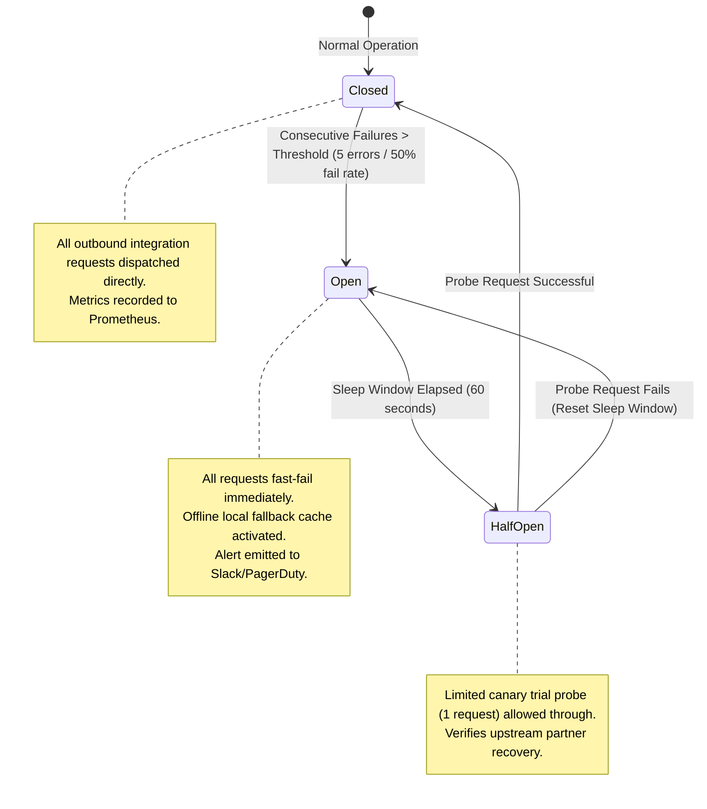

# Master Integration Error Handling, Resilience & Failure Recovery Architecture
## Namma Clinic Digital Health & Operations Platform
### Greater Bengaluru Authority (GBA) / BBMP Health Department
**Document Code:** `INT-DOC-09` | **Status:** APPROVED BASELINE | **Date:** September 2026

---

## 1. Executive Summary & Resilience Charter
This document formalizes the authoritative **Master Integration Error Handling, Resilience, and Failure Recovery Architecture** for the Namma Clinic Digital Health Platform. Because the platform interfaces with external government and telecom partner endpoints subject to unpredictable network latency, maintenance windows, and intermittent outages, the integration framework is designed for **deterministic fault tolerance and zero data loss**. The resilience model categorizes all integration faults across an 8-tier taxonomy, distinguishing transient retryable glitches from permanent semantic rejections. Implementing the full suite of cloud-native resilience patterns—**exponential backoff with randomized jitter, three-state circuit breakers, compartmentalized bulkheads, and durable Dead Letter Queues (DLQ)**—the system guarantees that municipal clinic doctors, nurses, and pharmacists can continue delivering uninterrupted patient care regardless of external network disruptions.

### 1.1 Non-Negotiable Resilience & Recovery Invariants
1. **Zero Silent Dropping of Failed Transactions:** Every integration request that fails permanently after exhausting retry policies must be preserved in a durable Dead Letter Queue (DLQ) with full request context, headers, and error trace.
2. **Exponential Backoff with Full Jitter:** All automated retries for transient errors must employ exponential backoff with full randomized jitter ($T_{wait} = \text{rand}(0, \min(M, B \cdot 2^k))$) to prevent thundering herd crashes against recovering upstream partner systems.
3. **Circuit Breaker Fast-Fail Protection:** Any outbound integration experiencing a failure rate exceeding 50% over a 60-second sliding window must trip its circuit breaker into the `OPEN` state, immediately fast-failing outbound requests and activating local offline caches without waiting for timeouts.
4. **Human-in-the-Loop Replay Auditability:** Replaying or discarding messages staged in Dead Letter Queues requires authorized admin role approval (`OPERATION_REPLAY_INTEGRATION_DLQ`), with every manual action recorded in an immutable audit log.
5. **Autonomous Daily Reconciliation:** All financial, pharmaceutical, and referral transactions exchanged with external systems undergo automated midnight two-way ledger comparison, flagging discrepancies exceeding 0.01% for immediate operational remediation.

## 2. Integration Resilience & Circuit Breaker State Machine Topology


### Integration Specification Example: Integration Circuit Breaker & Backoff Engine
<!-- DOCUMENTATION-ONLY EXAMPLE -->
```python
# DOCUMENTATION-ONLY PYTHON
# DOCUMENTATION-ONLY PYTHON: Resilience Circuit Breaker & Exponential Backoff Engine
import time
import random
import datetime
from typing import Callable, Any, Dict

class CircuitBreakerOpenException(Exception):
    """Raised when circuit breaker is in OPEN state."""
    pass

class IntegrationResilienceEngine:
    """
    Executes external integration calls protected by a 3-state circuit breaker
    and exponential backoff with randomized jitter.
    """
    def __init__(self, service_name: str, max_retries: int = 3, initial_backoff_ms: int = 500):
        self.service_name = service_name
        self.max_retries = max_retries
        self.initial_backoff_ms = initial_backoff_ms
        self.state = "CLOSED"  # CLOSED, OPEN, HALF_OPEN
        self.failure_count = 0
        self.last_failure_time = 0.0
        self.cool_down_seconds = 60.0

    def execute_with_resilience(self, call_fn: Callable[[], Any], fallback_fn: Callable[[], Any]) -> Any:
        now = time.time()

        # Check if OPEN breaker can transition to HALF_OPEN
        if self.state == "OPEN":
            if now - self.last_failure_time > self.cool_down_seconds:
                self.state = "HALF_OPEN"
            else:
                return fallback_fn()

        # Attempt execution with retries
        for attempt in range(1, self.max_retries + 1):
            try:
                result = call_fn()
                # On success, reset circuit breaker
                self.state = "CLOSED"
                self.failure_count = 0
                return result
            except Exception as ex:
                self.failure_count += 1
                if attempt == self.max_retries:
                    self.state = "OPEN"
                    self.last_failure_time = now
                    return fallback_fn()

                # Calculate exponential backoff with full jitter
                backoff_ms = (self.initial_backoff_ms * (2 ** (attempt - 1)))
                jitter_sleep = random.uniform(0, backoff_ms / 1000.0)
                time.sleep(jitter_sleep)
```

### Interface Payload Example: Dead Letter Queue Transaction Envelope
<!-- DOCUMENTATION-ONLY EXAMPLE -->
```json
// DOCUMENTATION-ONLY JSON
{
  "deadLetterId": "DLQ-INT-BLR-20260906-00129",
  "originalTransactionId": "4a7c8e9b-6d2f-4e1a-8c9a-1b2c3d4e5f6a",
  "sourceIntegration": "INT-001",
  "targetPartner": "EXT-001",
  "failureCategory": "TIMEOUT_BREACH",
  "errorCode": "E_INT_TIMEOUT_BREACH_005",
  "totalRetriesAttempted": 3,
  "firstAttemptTimestamp": "2026-09-06T11:00:10.000Z",
  "finalExhaustionTimestamp": "2026-09-06T11:00:18.420Z",
  "requestEnvelope": {
    "endpoint": "https://api.abdm.gov.in/v0.5/links/link/add-contexts",
    "method": "POST",
    "headers": {
      "X-CM-ID": "sbx",
      "X-HIP-ID": "IN290001048",
      "Content-Type": "application/json"
    },
    "bodyPayload": {
      "careContexts": [{"referenceNumber": "ENC-2026-001", "display": "OPD Visit"}]
    }
  },
  "diagnostics": {
    "httpStatusCode": 504,
    "rootCause": "Gateway Timeout: Upstream ABDM server did not respond within 5000ms"
  },
  "operationalState": "AWAITING_MANUAL_REPLAY_OR_DISCARD",
  "assignedRunbook": "RUNBOOK-INT-001"
}
```

## 3. Master Catalog of 75 Integration Error Scenarios
Authoritative catalog of all 75 integration failure scenarios and automated remediation procedures:

### ERR-INT-001: Error `E_INT_TRANSPORT_FAILURE_001` (TRANSPORT_FAILURE)
- **Error Identifier:** `ERR-INT-001`
- **Error Code:** `E_INT_TRANSPORT_FAILURE_001`
- **Classification Category:** `TRANSPORT_FAILURE`
- **Severity Level:** `HIGH`
- **Is Retryable:** `True`
- **Recovery Strategy:** Exponential backoff with jitter (initial 500ms, max 3 retries)
- **Dead Letter Target:** `arn:aws:sqs:ap-south-1:104857620:dlq-int-001`
- **Frontline User Impact:** Graceful fallback UI display with automated offline synchronization flag
- **Remediation Runbook:** Check external endpoint liveness, verify TLS certificates, and validate request payload schema.

### ERR-INT-002: Error `E_INT_AUTHENTICATION_FAILED_002` (AUTHENTICATION_FAILED)
- **Error Identifier:** `ERR-INT-002`
- **Error Code:** `E_INT_AUTHENTICATION_FAILED_002`
- **Classification Category:** `AUTHENTICATION_FAILED`
- **Severity Level:** `CRITICAL`
- **Is Retryable:** `False`
- **Recovery Strategy:** No retry; immediate Dead Letter Queue routing
- **Dead Letter Target:** `arn:aws:sqs:ap-south-1:104857620:dlq-int-002`
- **Frontline User Impact:** Graceful fallback UI display with automated offline synchronization flag
- **Remediation Runbook:** Check external endpoint liveness, verify TLS certificates, and validate request payload schema.

### ERR-INT-003: Error `E_INT_AUTHORIZATION_DENIED_003` (AUTHORIZATION_DENIED)
- **Error Identifier:** `ERR-INT-003`
- **Error Code:** `E_INT_AUTHORIZATION_DENIED_003`
- **Classification Category:** `AUTHORIZATION_DENIED`
- **Severity Level:** `CRITICAL`
- **Is Retryable:** `False`
- **Recovery Strategy:** No retry; immediate Dead Letter Queue routing
- **Dead Letter Target:** `arn:aws:sqs:ap-south-1:104857620:dlq-int-003`
- **Frontline User Impact:** Graceful fallback UI display with automated offline synchronization flag
- **Remediation Runbook:** Check external endpoint liveness, verify TLS certificates, and validate request payload schema.

### ERR-INT-004: Error `E_INT_VALIDATION_ERROR_004` (VALIDATION_ERROR)
- **Error Identifier:** `ERR-INT-004`
- **Error Code:** `E_INT_VALIDATION_ERROR_004`
- **Classification Category:** `VALIDATION_ERROR`
- **Severity Level:** `CRITICAL`
- **Is Retryable:** `False`
- **Recovery Strategy:** No retry; immediate Dead Letter Queue routing
- **Dead Letter Target:** `arn:aws:sqs:ap-south-1:104857620:dlq-int-004`
- **Frontline User Impact:** Graceful fallback UI display with automated offline synchronization flag
- **Remediation Runbook:** Check external endpoint liveness, verify TLS certificates, and validate request payload schema.

### ERR-INT-005: Error `E_INT_TIMEOUT_BREACH_005` (TIMEOUT_BREACH)
- **Error Identifier:** `ERR-INT-005`
- **Error Code:** `E_INT_TIMEOUT_BREACH_005`
- **Classification Category:** `TIMEOUT_BREACH`
- **Severity Level:** `HIGH`
- **Is Retryable:** `True`
- **Recovery Strategy:** Exponential backoff with jitter (initial 500ms, max 3 retries)
- **Dead Letter Target:** `arn:aws:sqs:ap-south-1:104857620:dlq-int-005`
- **Frontline User Impact:** Graceful fallback UI display with automated offline synchronization flag
- **Remediation Runbook:** Check external endpoint liveness, verify TLS certificates, and validate request payload schema.

### ERR-INT-006: Error `E_INT_DEPENDENCY_UNAVAILABLE_006` (DEPENDENCY_UNAVAILABLE)
- **Error Identifier:** `ERR-INT-006`
- **Error Code:** `E_INT_DEPENDENCY_UNAVAILABLE_006`
- **Classification Category:** `DEPENDENCY_UNAVAILABLE`
- **Severity Level:** `HIGH`
- **Is Retryable:** `True`
- **Recovery Strategy:** Exponential backoff with jitter (initial 500ms, max 3 retries)
- **Dead Letter Target:** `arn:aws:sqs:ap-south-1:104857620:dlq-int-006`
- **Frontline User Impact:** Graceful fallback UI display with automated offline synchronization flag
- **Remediation Runbook:** Check external endpoint liveness, verify TLS certificates, and validate request payload schema.

### ERR-INT-007: Error `E_INT_SCHEMA_INCOMPATIBLE_007` (SCHEMA_INCOMPATIBLE)
- **Error Identifier:** `ERR-INT-007`
- **Error Code:** `E_INT_SCHEMA_INCOMPATIBLE_007`
- **Classification Category:** `SCHEMA_INCOMPATIBLE`
- **Severity Level:** `CRITICAL`
- **Is Retryable:** `False`
- **Recovery Strategy:** No retry; immediate Dead Letter Queue routing
- **Dead Letter Target:** `arn:aws:sqs:ap-south-1:104857620:dlq-int-007`
- **Frontline User Impact:** Graceful fallback UI display with automated offline synchronization flag
- **Remediation Runbook:** Check external endpoint liveness, verify TLS certificates, and validate request payload schema.

### ERR-INT-008: Error `E_INT_RATE_LIMIT_EXCEEDED_008` (RATE_LIMIT_EXCEEDED)
- **Error Identifier:** `ERR-INT-008`
- **Error Code:** `E_INT_RATE_LIMIT_EXCEEDED_008`
- **Classification Category:** `RATE_LIMIT_EXCEEDED`
- **Severity Level:** `HIGH`
- **Is Retryable:** `True`
- **Recovery Strategy:** Exponential backoff with jitter (initial 500ms, max 3 retries)
- **Dead Letter Target:** `arn:aws:sqs:ap-south-1:104857620:dlq-int-008`
- **Frontline User Impact:** Graceful fallback UI display with automated offline synchronization flag
- **Remediation Runbook:** Check external endpoint liveness, verify TLS certificates, and validate request payload schema.

### ERR-INT-009: Error `E_INT_TRANSPORT_FAILURE_009` (TRANSPORT_FAILURE)
- **Error Identifier:** `ERR-INT-009`
- **Error Code:** `E_INT_TRANSPORT_FAILURE_009`
- **Classification Category:** `TRANSPORT_FAILURE`
- **Severity Level:** `HIGH`
- **Is Retryable:** `True`
- **Recovery Strategy:** Exponential backoff with jitter (initial 500ms, max 3 retries)
- **Dead Letter Target:** `arn:aws:sqs:ap-south-1:104857620:dlq-int-009`
- **Frontline User Impact:** Graceful fallback UI display with automated offline synchronization flag
- **Remediation Runbook:** Check external endpoint liveness, verify TLS certificates, and validate request payload schema.

### ERR-INT-010: Error `E_INT_AUTHENTICATION_FAILED_010` (AUTHENTICATION_FAILED)
- **Error Identifier:** `ERR-INT-010`
- **Error Code:** `E_INT_AUTHENTICATION_FAILED_010`
- **Classification Category:** `AUTHENTICATION_FAILED`
- **Severity Level:** `CRITICAL`
- **Is Retryable:** `False`
- **Recovery Strategy:** No retry; immediate Dead Letter Queue routing
- **Dead Letter Target:** `arn:aws:sqs:ap-south-1:104857620:dlq-int-010`
- **Frontline User Impact:** Graceful fallback UI display with automated offline synchronization flag
- **Remediation Runbook:** Check external endpoint liveness, verify TLS certificates, and validate request payload schema.

### ERR-INT-011: Error `E_INT_AUTHORIZATION_DENIED_011` (AUTHORIZATION_DENIED)
- **Error Identifier:** `ERR-INT-011`
- **Error Code:** `E_INT_AUTHORIZATION_DENIED_011`
- **Classification Category:** `AUTHORIZATION_DENIED`
- **Severity Level:** `CRITICAL`
- **Is Retryable:** `False`
- **Recovery Strategy:** No retry; immediate Dead Letter Queue routing
- **Dead Letter Target:** `arn:aws:sqs:ap-south-1:104857620:dlq-int-011`
- **Frontline User Impact:** Graceful fallback UI display with automated offline synchronization flag
- **Remediation Runbook:** Check external endpoint liveness, verify TLS certificates, and validate request payload schema.

### ERR-INT-012: Error `E_INT_VALIDATION_ERROR_012` (VALIDATION_ERROR)
- **Error Identifier:** `ERR-INT-012`
- **Error Code:** `E_INT_VALIDATION_ERROR_012`
- **Classification Category:** `VALIDATION_ERROR`
- **Severity Level:** `CRITICAL`
- **Is Retryable:** `False`
- **Recovery Strategy:** No retry; immediate Dead Letter Queue routing
- **Dead Letter Target:** `arn:aws:sqs:ap-south-1:104857620:dlq-int-012`
- **Frontline User Impact:** Graceful fallback UI display with automated offline synchronization flag
- **Remediation Runbook:** Check external endpoint liveness, verify TLS certificates, and validate request payload schema.

### ERR-INT-013: Error `E_INT_TIMEOUT_BREACH_013` (TIMEOUT_BREACH)
- **Error Identifier:** `ERR-INT-013`
- **Error Code:** `E_INT_TIMEOUT_BREACH_013`
- **Classification Category:** `TIMEOUT_BREACH`
- **Severity Level:** `HIGH`
- **Is Retryable:** `True`
- **Recovery Strategy:** Exponential backoff with jitter (initial 500ms, max 3 retries)
- **Dead Letter Target:** `arn:aws:sqs:ap-south-1:104857620:dlq-int-013`
- **Frontline User Impact:** Graceful fallback UI display with automated offline synchronization flag
- **Remediation Runbook:** Check external endpoint liveness, verify TLS certificates, and validate request payload schema.

### ERR-INT-014: Error `E_INT_DEPENDENCY_UNAVAILABLE_014` (DEPENDENCY_UNAVAILABLE)
- **Error Identifier:** `ERR-INT-014`
- **Error Code:** `E_INT_DEPENDENCY_UNAVAILABLE_014`
- **Classification Category:** `DEPENDENCY_UNAVAILABLE`
- **Severity Level:** `HIGH`
- **Is Retryable:** `True`
- **Recovery Strategy:** Exponential backoff with jitter (initial 500ms, max 3 retries)
- **Dead Letter Target:** `arn:aws:sqs:ap-south-1:104857620:dlq-int-014`
- **Frontline User Impact:** Graceful fallback UI display with automated offline synchronization flag
- **Remediation Runbook:** Check external endpoint liveness, verify TLS certificates, and validate request payload schema.

### ERR-INT-015: Error `E_INT_SCHEMA_INCOMPATIBLE_015` (SCHEMA_INCOMPATIBLE)
- **Error Identifier:** `ERR-INT-015`
- **Error Code:** `E_INT_SCHEMA_INCOMPATIBLE_015`
- **Classification Category:** `SCHEMA_INCOMPATIBLE`
- **Severity Level:** `CRITICAL`
- **Is Retryable:** `False`
- **Recovery Strategy:** No retry; immediate Dead Letter Queue routing
- **Dead Letter Target:** `arn:aws:sqs:ap-south-1:104857620:dlq-int-015`
- **Frontline User Impact:** Graceful fallback UI display with automated offline synchronization flag
- **Remediation Runbook:** Check external endpoint liveness, verify TLS certificates, and validate request payload schema.

### ERR-INT-016: Error `E_INT_RATE_LIMIT_EXCEEDED_016` (RATE_LIMIT_EXCEEDED)
- **Error Identifier:** `ERR-INT-016`
- **Error Code:** `E_INT_RATE_LIMIT_EXCEEDED_016`
- **Classification Category:** `RATE_LIMIT_EXCEEDED`
- **Severity Level:** `HIGH`
- **Is Retryable:** `True`
- **Recovery Strategy:** Exponential backoff with jitter (initial 500ms, max 3 retries)
- **Dead Letter Target:** `arn:aws:sqs:ap-south-1:104857620:dlq-int-016`
- **Frontline User Impact:** Graceful fallback UI display with automated offline synchronization flag
- **Remediation Runbook:** Check external endpoint liveness, verify TLS certificates, and validate request payload schema.

### ERR-INT-017: Error `E_INT_TRANSPORT_FAILURE_017` (TRANSPORT_FAILURE)
- **Error Identifier:** `ERR-INT-017`
- **Error Code:** `E_INT_TRANSPORT_FAILURE_017`
- **Classification Category:** `TRANSPORT_FAILURE`
- **Severity Level:** `HIGH`
- **Is Retryable:** `True`
- **Recovery Strategy:** Exponential backoff with jitter (initial 500ms, max 3 retries)
- **Dead Letter Target:** `arn:aws:sqs:ap-south-1:104857620:dlq-int-017`
- **Frontline User Impact:** Graceful fallback UI display with automated offline synchronization flag
- **Remediation Runbook:** Check external endpoint liveness, verify TLS certificates, and validate request payload schema.

### ERR-INT-018: Error `E_INT_AUTHENTICATION_FAILED_018` (AUTHENTICATION_FAILED)
- **Error Identifier:** `ERR-INT-018`
- **Error Code:** `E_INT_AUTHENTICATION_FAILED_018`
- **Classification Category:** `AUTHENTICATION_FAILED`
- **Severity Level:** `CRITICAL`
- **Is Retryable:** `False`
- **Recovery Strategy:** No retry; immediate Dead Letter Queue routing
- **Dead Letter Target:** `arn:aws:sqs:ap-south-1:104857620:dlq-int-018`
- **Frontline User Impact:** Graceful fallback UI display with automated offline synchronization flag
- **Remediation Runbook:** Check external endpoint liveness, verify TLS certificates, and validate request payload schema.

### ERR-INT-019: Error `E_INT_AUTHORIZATION_DENIED_019` (AUTHORIZATION_DENIED)
- **Error Identifier:** `ERR-INT-019`
- **Error Code:** `E_INT_AUTHORIZATION_DENIED_019`
- **Classification Category:** `AUTHORIZATION_DENIED`
- **Severity Level:** `CRITICAL`
- **Is Retryable:** `False`
- **Recovery Strategy:** No retry; immediate Dead Letter Queue routing
- **Dead Letter Target:** `arn:aws:sqs:ap-south-1:104857620:dlq-int-019`
- **Frontline User Impact:** Graceful fallback UI display with automated offline synchronization flag
- **Remediation Runbook:** Check external endpoint liveness, verify TLS certificates, and validate request payload schema.

### ERR-INT-020: Error `E_INT_VALIDATION_ERROR_020` (VALIDATION_ERROR)
- **Error Identifier:** `ERR-INT-020`
- **Error Code:** `E_INT_VALIDATION_ERROR_020`
- **Classification Category:** `VALIDATION_ERROR`
- **Severity Level:** `CRITICAL`
- **Is Retryable:** `False`
- **Recovery Strategy:** No retry; immediate Dead Letter Queue routing
- **Dead Letter Target:** `arn:aws:sqs:ap-south-1:104857620:dlq-int-020`
- **Frontline User Impact:** Graceful fallback UI display with automated offline synchronization flag
- **Remediation Runbook:** Check external endpoint liveness, verify TLS certificates, and validate request payload schema.

### ERR-INT-021: Error `E_INT_TIMEOUT_BREACH_021` (TIMEOUT_BREACH)
- **Error Identifier:** `ERR-INT-021`
- **Error Code:** `E_INT_TIMEOUT_BREACH_021`
- **Classification Category:** `TIMEOUT_BREACH`
- **Severity Level:** `HIGH`
- **Is Retryable:** `True`
- **Recovery Strategy:** Exponential backoff with jitter (initial 500ms, max 3 retries)
- **Dead Letter Target:** `arn:aws:sqs:ap-south-1:104857620:dlq-int-021`
- **Frontline User Impact:** Graceful fallback UI display with automated offline synchronization flag
- **Remediation Runbook:** Check external endpoint liveness, verify TLS certificates, and validate request payload schema.

### ERR-INT-022: Error `E_INT_DEPENDENCY_UNAVAILABLE_022` (DEPENDENCY_UNAVAILABLE)
- **Error Identifier:** `ERR-INT-022`
- **Error Code:** `E_INT_DEPENDENCY_UNAVAILABLE_022`
- **Classification Category:** `DEPENDENCY_UNAVAILABLE`
- **Severity Level:** `HIGH`
- **Is Retryable:** `True`
- **Recovery Strategy:** Exponential backoff with jitter (initial 500ms, max 3 retries)
- **Dead Letter Target:** `arn:aws:sqs:ap-south-1:104857620:dlq-int-022`
- **Frontline User Impact:** Graceful fallback UI display with automated offline synchronization flag
- **Remediation Runbook:** Check external endpoint liveness, verify TLS certificates, and validate request payload schema.

### ERR-INT-023: Error `E_INT_SCHEMA_INCOMPATIBLE_023` (SCHEMA_INCOMPATIBLE)
- **Error Identifier:** `ERR-INT-023`
- **Error Code:** `E_INT_SCHEMA_INCOMPATIBLE_023`
- **Classification Category:** `SCHEMA_INCOMPATIBLE`
- **Severity Level:** `CRITICAL`
- **Is Retryable:** `False`
- **Recovery Strategy:** No retry; immediate Dead Letter Queue routing
- **Dead Letter Target:** `arn:aws:sqs:ap-south-1:104857620:dlq-int-023`
- **Frontline User Impact:** Graceful fallback UI display with automated offline synchronization flag
- **Remediation Runbook:** Check external endpoint liveness, verify TLS certificates, and validate request payload schema.

### ERR-INT-024: Error `E_INT_RATE_LIMIT_EXCEEDED_024` (RATE_LIMIT_EXCEEDED)
- **Error Identifier:** `ERR-INT-024`
- **Error Code:** `E_INT_RATE_LIMIT_EXCEEDED_024`
- **Classification Category:** `RATE_LIMIT_EXCEEDED`
- **Severity Level:** `HIGH`
- **Is Retryable:** `True`
- **Recovery Strategy:** Exponential backoff with jitter (initial 500ms, max 3 retries)
- **Dead Letter Target:** `arn:aws:sqs:ap-south-1:104857620:dlq-int-024`
- **Frontline User Impact:** Graceful fallback UI display with automated offline synchronization flag
- **Remediation Runbook:** Check external endpoint liveness, verify TLS certificates, and validate request payload schema.

### ERR-INT-025: Error `E_INT_TRANSPORT_FAILURE_025` (TRANSPORT_FAILURE)
- **Error Identifier:** `ERR-INT-025`
- **Error Code:** `E_INT_TRANSPORT_FAILURE_025`
- **Classification Category:** `TRANSPORT_FAILURE`
- **Severity Level:** `HIGH`
- **Is Retryable:** `True`
- **Recovery Strategy:** Exponential backoff with jitter (initial 500ms, max 3 retries)
- **Dead Letter Target:** `arn:aws:sqs:ap-south-1:104857620:dlq-int-025`
- **Frontline User Impact:** Graceful fallback UI display with automated offline synchronization flag
- **Remediation Runbook:** Check external endpoint liveness, verify TLS certificates, and validate request payload schema.

### ERR-INT-026: Error `E_INT_AUTHENTICATION_FAILED_026` (AUTHENTICATION_FAILED)
- **Error Identifier:** `ERR-INT-026`
- **Error Code:** `E_INT_AUTHENTICATION_FAILED_026`
- **Classification Category:** `AUTHENTICATION_FAILED`
- **Severity Level:** `CRITICAL`
- **Is Retryable:** `False`
- **Recovery Strategy:** No retry; immediate Dead Letter Queue routing
- **Dead Letter Target:** `arn:aws:sqs:ap-south-1:104857620:dlq-int-026`
- **Frontline User Impact:** Graceful fallback UI display with automated offline synchronization flag
- **Remediation Runbook:** Check external endpoint liveness, verify TLS certificates, and validate request payload schema.

### ERR-INT-027: Error `E_INT_AUTHORIZATION_DENIED_027` (AUTHORIZATION_DENIED)
- **Error Identifier:** `ERR-INT-027`
- **Error Code:** `E_INT_AUTHORIZATION_DENIED_027`
- **Classification Category:** `AUTHORIZATION_DENIED`
- **Severity Level:** `CRITICAL`
- **Is Retryable:** `False`
- **Recovery Strategy:** No retry; immediate Dead Letter Queue routing
- **Dead Letter Target:** `arn:aws:sqs:ap-south-1:104857620:dlq-int-027`
- **Frontline User Impact:** Graceful fallback UI display with automated offline synchronization flag
- **Remediation Runbook:** Check external endpoint liveness, verify TLS certificates, and validate request payload schema.

### ERR-INT-028: Error `E_INT_VALIDATION_ERROR_028` (VALIDATION_ERROR)
- **Error Identifier:** `ERR-INT-028`
- **Error Code:** `E_INT_VALIDATION_ERROR_028`
- **Classification Category:** `VALIDATION_ERROR`
- **Severity Level:** `CRITICAL`
- **Is Retryable:** `False`
- **Recovery Strategy:** No retry; immediate Dead Letter Queue routing
- **Dead Letter Target:** `arn:aws:sqs:ap-south-1:104857620:dlq-int-028`
- **Frontline User Impact:** Graceful fallback UI display with automated offline synchronization flag
- **Remediation Runbook:** Check external endpoint liveness, verify TLS certificates, and validate request payload schema.

### ERR-INT-029: Error `E_INT_TIMEOUT_BREACH_029` (TIMEOUT_BREACH)
- **Error Identifier:** `ERR-INT-029`
- **Error Code:** `E_INT_TIMEOUT_BREACH_029`
- **Classification Category:** `TIMEOUT_BREACH`
- **Severity Level:** `HIGH`
- **Is Retryable:** `True`
- **Recovery Strategy:** Exponential backoff with jitter (initial 500ms, max 3 retries)
- **Dead Letter Target:** `arn:aws:sqs:ap-south-1:104857620:dlq-int-029`
- **Frontline User Impact:** Graceful fallback UI display with automated offline synchronization flag
- **Remediation Runbook:** Check external endpoint liveness, verify TLS certificates, and validate request payload schema.

### ERR-INT-030: Error `E_INT_DEPENDENCY_UNAVAILABLE_030` (DEPENDENCY_UNAVAILABLE)
- **Error Identifier:** `ERR-INT-030`
- **Error Code:** `E_INT_DEPENDENCY_UNAVAILABLE_030`
- **Classification Category:** `DEPENDENCY_UNAVAILABLE`
- **Severity Level:** `HIGH`
- **Is Retryable:** `True`
- **Recovery Strategy:** Exponential backoff with jitter (initial 500ms, max 3 retries)
- **Dead Letter Target:** `arn:aws:sqs:ap-south-1:104857620:dlq-int-030`
- **Frontline User Impact:** Graceful fallback UI display with automated offline synchronization flag
- **Remediation Runbook:** Check external endpoint liveness, verify TLS certificates, and validate request payload schema.

### ERR-INT-031: Error `E_INT_SCHEMA_INCOMPATIBLE_031` (SCHEMA_INCOMPATIBLE)
- **Error Identifier:** `ERR-INT-031`
- **Error Code:** `E_INT_SCHEMA_INCOMPATIBLE_031`
- **Classification Category:** `SCHEMA_INCOMPATIBLE`
- **Severity Level:** `CRITICAL`
- **Is Retryable:** `False`
- **Recovery Strategy:** No retry; immediate Dead Letter Queue routing
- **Dead Letter Target:** `arn:aws:sqs:ap-south-1:104857620:dlq-int-031`
- **Frontline User Impact:** Graceful fallback UI display with automated offline synchronization flag
- **Remediation Runbook:** Check external endpoint liveness, verify TLS certificates, and validate request payload schema.

### ERR-INT-032: Error `E_INT_RATE_LIMIT_EXCEEDED_032` (RATE_LIMIT_EXCEEDED)
- **Error Identifier:** `ERR-INT-032`
- **Error Code:** `E_INT_RATE_LIMIT_EXCEEDED_032`
- **Classification Category:** `RATE_LIMIT_EXCEEDED`
- **Severity Level:** `HIGH`
- **Is Retryable:** `True`
- **Recovery Strategy:** Exponential backoff with jitter (initial 500ms, max 3 retries)
- **Dead Letter Target:** `arn:aws:sqs:ap-south-1:104857620:dlq-int-032`
- **Frontline User Impact:** Graceful fallback UI display with automated offline synchronization flag
- **Remediation Runbook:** Check external endpoint liveness, verify TLS certificates, and validate request payload schema.

### ERR-INT-033: Error `E_INT_TRANSPORT_FAILURE_033` (TRANSPORT_FAILURE)
- **Error Identifier:** `ERR-INT-033`
- **Error Code:** `E_INT_TRANSPORT_FAILURE_033`
- **Classification Category:** `TRANSPORT_FAILURE`
- **Severity Level:** `HIGH`
- **Is Retryable:** `True`
- **Recovery Strategy:** Exponential backoff with jitter (initial 500ms, max 3 retries)
- **Dead Letter Target:** `arn:aws:sqs:ap-south-1:104857620:dlq-int-033`
- **Frontline User Impact:** Graceful fallback UI display with automated offline synchronization flag
- **Remediation Runbook:** Check external endpoint liveness, verify TLS certificates, and validate request payload schema.

### ERR-INT-034: Error `E_INT_AUTHENTICATION_FAILED_034` (AUTHENTICATION_FAILED)
- **Error Identifier:** `ERR-INT-034`
- **Error Code:** `E_INT_AUTHENTICATION_FAILED_034`
- **Classification Category:** `AUTHENTICATION_FAILED`
- **Severity Level:** `CRITICAL`
- **Is Retryable:** `False`
- **Recovery Strategy:** No retry; immediate Dead Letter Queue routing
- **Dead Letter Target:** `arn:aws:sqs:ap-south-1:104857620:dlq-int-034`
- **Frontline User Impact:** Graceful fallback UI display with automated offline synchronization flag
- **Remediation Runbook:** Check external endpoint liveness, verify TLS certificates, and validate request payload schema.

### ERR-INT-035: Error `E_INT_AUTHORIZATION_DENIED_035` (AUTHORIZATION_DENIED)
- **Error Identifier:** `ERR-INT-035`
- **Error Code:** `E_INT_AUTHORIZATION_DENIED_035`
- **Classification Category:** `AUTHORIZATION_DENIED`
- **Severity Level:** `CRITICAL`
- **Is Retryable:** `False`
- **Recovery Strategy:** No retry; immediate Dead Letter Queue routing
- **Dead Letter Target:** `arn:aws:sqs:ap-south-1:104857620:dlq-int-035`
- **Frontline User Impact:** Graceful fallback UI display with automated offline synchronization flag
- **Remediation Runbook:** Check external endpoint liveness, verify TLS certificates, and validate request payload schema.

### ERR-INT-036: Error `E_INT_VALIDATION_ERROR_036` (VALIDATION_ERROR)
- **Error Identifier:** `ERR-INT-036`
- **Error Code:** `E_INT_VALIDATION_ERROR_036`
- **Classification Category:** `VALIDATION_ERROR`
- **Severity Level:** `CRITICAL`
- **Is Retryable:** `False`
- **Recovery Strategy:** No retry; immediate Dead Letter Queue routing
- **Dead Letter Target:** `arn:aws:sqs:ap-south-1:104857620:dlq-int-036`
- **Frontline User Impact:** Graceful fallback UI display with automated offline synchronization flag
- **Remediation Runbook:** Check external endpoint liveness, verify TLS certificates, and validate request payload schema.

### ERR-INT-037: Error `E_INT_TIMEOUT_BREACH_037` (TIMEOUT_BREACH)
- **Error Identifier:** `ERR-INT-037`
- **Error Code:** `E_INT_TIMEOUT_BREACH_037`
- **Classification Category:** `TIMEOUT_BREACH`
- **Severity Level:** `HIGH`
- **Is Retryable:** `True`
- **Recovery Strategy:** Exponential backoff with jitter (initial 500ms, max 3 retries)
- **Dead Letter Target:** `arn:aws:sqs:ap-south-1:104857620:dlq-int-037`
- **Frontline User Impact:** Graceful fallback UI display with automated offline synchronization flag
- **Remediation Runbook:** Check external endpoint liveness, verify TLS certificates, and validate request payload schema.

### ERR-INT-038: Error `E_INT_DEPENDENCY_UNAVAILABLE_038` (DEPENDENCY_UNAVAILABLE)
- **Error Identifier:** `ERR-INT-038`
- **Error Code:** `E_INT_DEPENDENCY_UNAVAILABLE_038`
- **Classification Category:** `DEPENDENCY_UNAVAILABLE`
- **Severity Level:** `HIGH`
- **Is Retryable:** `True`
- **Recovery Strategy:** Exponential backoff with jitter (initial 500ms, max 3 retries)
- **Dead Letter Target:** `arn:aws:sqs:ap-south-1:104857620:dlq-int-038`
- **Frontline User Impact:** Graceful fallback UI display with automated offline synchronization flag
- **Remediation Runbook:** Check external endpoint liveness, verify TLS certificates, and validate request payload schema.

### ERR-INT-039: Error `E_INT_SCHEMA_INCOMPATIBLE_039` (SCHEMA_INCOMPATIBLE)
- **Error Identifier:** `ERR-INT-039`
- **Error Code:** `E_INT_SCHEMA_INCOMPATIBLE_039`
- **Classification Category:** `SCHEMA_INCOMPATIBLE`
- **Severity Level:** `CRITICAL`
- **Is Retryable:** `False`
- **Recovery Strategy:** No retry; immediate Dead Letter Queue routing
- **Dead Letter Target:** `arn:aws:sqs:ap-south-1:104857620:dlq-int-039`
- **Frontline User Impact:** Graceful fallback UI display with automated offline synchronization flag
- **Remediation Runbook:** Check external endpoint liveness, verify TLS certificates, and validate request payload schema.

### ERR-INT-040: Error `E_INT_RATE_LIMIT_EXCEEDED_040` (RATE_LIMIT_EXCEEDED)
- **Error Identifier:** `ERR-INT-040`
- **Error Code:** `E_INT_RATE_LIMIT_EXCEEDED_040`
- **Classification Category:** `RATE_LIMIT_EXCEEDED`
- **Severity Level:** `HIGH`
- **Is Retryable:** `True`
- **Recovery Strategy:** Exponential backoff with jitter (initial 500ms, max 3 retries)
- **Dead Letter Target:** `arn:aws:sqs:ap-south-1:104857620:dlq-int-040`
- **Frontline User Impact:** Graceful fallback UI display with automated offline synchronization flag
- **Remediation Runbook:** Check external endpoint liveness, verify TLS certificates, and validate request payload schema.

### ERR-INT-041: Error `E_INT_TRANSPORT_FAILURE_041` (TRANSPORT_FAILURE)
- **Error Identifier:** `ERR-INT-041`
- **Error Code:** `E_INT_TRANSPORT_FAILURE_041`
- **Classification Category:** `TRANSPORT_FAILURE`
- **Severity Level:** `HIGH`
- **Is Retryable:** `True`
- **Recovery Strategy:** Exponential backoff with jitter (initial 500ms, max 3 retries)
- **Dead Letter Target:** `arn:aws:sqs:ap-south-1:104857620:dlq-int-041`
- **Frontline User Impact:** Graceful fallback UI display with automated offline synchronization flag
- **Remediation Runbook:** Check external endpoint liveness, verify TLS certificates, and validate request payload schema.

### ERR-INT-042: Error `E_INT_AUTHENTICATION_FAILED_042` (AUTHENTICATION_FAILED)
- **Error Identifier:** `ERR-INT-042`
- **Error Code:** `E_INT_AUTHENTICATION_FAILED_042`
- **Classification Category:** `AUTHENTICATION_FAILED`
- **Severity Level:** `CRITICAL`
- **Is Retryable:** `False`
- **Recovery Strategy:** No retry; immediate Dead Letter Queue routing
- **Dead Letter Target:** `arn:aws:sqs:ap-south-1:104857620:dlq-int-042`
- **Frontline User Impact:** Graceful fallback UI display with automated offline synchronization flag
- **Remediation Runbook:** Check external endpoint liveness, verify TLS certificates, and validate request payload schema.

### ERR-INT-043: Error `E_INT_AUTHORIZATION_DENIED_043` (AUTHORIZATION_DENIED)
- **Error Identifier:** `ERR-INT-043`
- **Error Code:** `E_INT_AUTHORIZATION_DENIED_043`
- **Classification Category:** `AUTHORIZATION_DENIED`
- **Severity Level:** `CRITICAL`
- **Is Retryable:** `False`
- **Recovery Strategy:** No retry; immediate Dead Letter Queue routing
- **Dead Letter Target:** `arn:aws:sqs:ap-south-1:104857620:dlq-int-043`
- **Frontline User Impact:** Graceful fallback UI display with automated offline synchronization flag
- **Remediation Runbook:** Check external endpoint liveness, verify TLS certificates, and validate request payload schema.

### ERR-INT-044: Error `E_INT_VALIDATION_ERROR_044` (VALIDATION_ERROR)
- **Error Identifier:** `ERR-INT-044`
- **Error Code:** `E_INT_VALIDATION_ERROR_044`
- **Classification Category:** `VALIDATION_ERROR`
- **Severity Level:** `CRITICAL`
- **Is Retryable:** `False`
- **Recovery Strategy:** No retry; immediate Dead Letter Queue routing
- **Dead Letter Target:** `arn:aws:sqs:ap-south-1:104857620:dlq-int-044`
- **Frontline User Impact:** Graceful fallback UI display with automated offline synchronization flag
- **Remediation Runbook:** Check external endpoint liveness, verify TLS certificates, and validate request payload schema.

### ERR-INT-045: Error `E_INT_TIMEOUT_BREACH_045` (TIMEOUT_BREACH)
- **Error Identifier:** `ERR-INT-045`
- **Error Code:** `E_INT_TIMEOUT_BREACH_045`
- **Classification Category:** `TIMEOUT_BREACH`
- **Severity Level:** `HIGH`
- **Is Retryable:** `True`
- **Recovery Strategy:** Exponential backoff with jitter (initial 500ms, max 3 retries)
- **Dead Letter Target:** `arn:aws:sqs:ap-south-1:104857620:dlq-int-045`
- **Frontline User Impact:** Graceful fallback UI display with automated offline synchronization flag
- **Remediation Runbook:** Check external endpoint liveness, verify TLS certificates, and validate request payload schema.

### ERR-INT-046: Error `E_INT_DEPENDENCY_UNAVAILABLE_046` (DEPENDENCY_UNAVAILABLE)
- **Error Identifier:** `ERR-INT-046`
- **Error Code:** `E_INT_DEPENDENCY_UNAVAILABLE_046`
- **Classification Category:** `DEPENDENCY_UNAVAILABLE`
- **Severity Level:** `HIGH`
- **Is Retryable:** `True`
- **Recovery Strategy:** Exponential backoff with jitter (initial 500ms, max 3 retries)
- **Dead Letter Target:** `arn:aws:sqs:ap-south-1:104857620:dlq-int-046`
- **Frontline User Impact:** Graceful fallback UI display with automated offline synchronization flag
- **Remediation Runbook:** Check external endpoint liveness, verify TLS certificates, and validate request payload schema.

### ERR-INT-047: Error `E_INT_SCHEMA_INCOMPATIBLE_047` (SCHEMA_INCOMPATIBLE)
- **Error Identifier:** `ERR-INT-047`
- **Error Code:** `E_INT_SCHEMA_INCOMPATIBLE_047`
- **Classification Category:** `SCHEMA_INCOMPATIBLE`
- **Severity Level:** `CRITICAL`
- **Is Retryable:** `False`
- **Recovery Strategy:** No retry; immediate Dead Letter Queue routing
- **Dead Letter Target:** `arn:aws:sqs:ap-south-1:104857620:dlq-int-047`
- **Frontline User Impact:** Graceful fallback UI display with automated offline synchronization flag
- **Remediation Runbook:** Check external endpoint liveness, verify TLS certificates, and validate request payload schema.

### ERR-INT-048: Error `E_INT_RATE_LIMIT_EXCEEDED_048` (RATE_LIMIT_EXCEEDED)
- **Error Identifier:** `ERR-INT-048`
- **Error Code:** `E_INT_RATE_LIMIT_EXCEEDED_048`
- **Classification Category:** `RATE_LIMIT_EXCEEDED`
- **Severity Level:** `HIGH`
- **Is Retryable:** `True`
- **Recovery Strategy:** Exponential backoff with jitter (initial 500ms, max 3 retries)
- **Dead Letter Target:** `arn:aws:sqs:ap-south-1:104857620:dlq-int-048`
- **Frontline User Impact:** Graceful fallback UI display with automated offline synchronization flag
- **Remediation Runbook:** Check external endpoint liveness, verify TLS certificates, and validate request payload schema.

### ERR-INT-049: Error `E_INT_TRANSPORT_FAILURE_049` (TRANSPORT_FAILURE)
- **Error Identifier:** `ERR-INT-049`
- **Error Code:** `E_INT_TRANSPORT_FAILURE_049`
- **Classification Category:** `TRANSPORT_FAILURE`
- **Severity Level:** `HIGH`
- **Is Retryable:** `True`
- **Recovery Strategy:** Exponential backoff with jitter (initial 500ms, max 3 retries)
- **Dead Letter Target:** `arn:aws:sqs:ap-south-1:104857620:dlq-int-049`
- **Frontline User Impact:** Graceful fallback UI display with automated offline synchronization flag
- **Remediation Runbook:** Check external endpoint liveness, verify TLS certificates, and validate request payload schema.

### ERR-INT-050: Error `E_INT_AUTHENTICATION_FAILED_050` (AUTHENTICATION_FAILED)
- **Error Identifier:** `ERR-INT-050`
- **Error Code:** `E_INT_AUTHENTICATION_FAILED_050`
- **Classification Category:** `AUTHENTICATION_FAILED`
- **Severity Level:** `CRITICAL`
- **Is Retryable:** `False`
- **Recovery Strategy:** No retry; immediate Dead Letter Queue routing
- **Dead Letter Target:** `arn:aws:sqs:ap-south-1:104857620:dlq-int-050`
- **Frontline User Impact:** Graceful fallback UI display with automated offline synchronization flag
- **Remediation Runbook:** Check external endpoint liveness, verify TLS certificates, and validate request payload schema.

### ERR-INT-051: Error `E_INT_AUTHORIZATION_DENIED_051` (AUTHORIZATION_DENIED)
- **Error Identifier:** `ERR-INT-051`
- **Error Code:** `E_INT_AUTHORIZATION_DENIED_051`
- **Classification Category:** `AUTHORIZATION_DENIED`
- **Severity Level:** `CRITICAL`
- **Is Retryable:** `False`
- **Recovery Strategy:** No retry; immediate Dead Letter Queue routing
- **Dead Letter Target:** `arn:aws:sqs:ap-south-1:104857620:dlq-int-051`
- **Frontline User Impact:** Graceful fallback UI display with automated offline synchronization flag
- **Remediation Runbook:** Check external endpoint liveness, verify TLS certificates, and validate request payload schema.

### ERR-INT-052: Error `E_INT_VALIDATION_ERROR_052` (VALIDATION_ERROR)
- **Error Identifier:** `ERR-INT-052`
- **Error Code:** `E_INT_VALIDATION_ERROR_052`
- **Classification Category:** `VALIDATION_ERROR`
- **Severity Level:** `CRITICAL`
- **Is Retryable:** `False`
- **Recovery Strategy:** No retry; immediate Dead Letter Queue routing
- **Dead Letter Target:** `arn:aws:sqs:ap-south-1:104857620:dlq-int-052`
- **Frontline User Impact:** Graceful fallback UI display with automated offline synchronization flag
- **Remediation Runbook:** Check external endpoint liveness, verify TLS certificates, and validate request payload schema.

### ERR-INT-053: Error `E_INT_TIMEOUT_BREACH_053` (TIMEOUT_BREACH)
- **Error Identifier:** `ERR-INT-053`
- **Error Code:** `E_INT_TIMEOUT_BREACH_053`
- **Classification Category:** `TIMEOUT_BREACH`
- **Severity Level:** `HIGH`
- **Is Retryable:** `True`
- **Recovery Strategy:** Exponential backoff with jitter (initial 500ms, max 3 retries)
- **Dead Letter Target:** `arn:aws:sqs:ap-south-1:104857620:dlq-int-053`
- **Frontline User Impact:** Graceful fallback UI display with automated offline synchronization flag
- **Remediation Runbook:** Check external endpoint liveness, verify TLS certificates, and validate request payload schema.

### ERR-INT-054: Error `E_INT_DEPENDENCY_UNAVAILABLE_054` (DEPENDENCY_UNAVAILABLE)
- **Error Identifier:** `ERR-INT-054`
- **Error Code:** `E_INT_DEPENDENCY_UNAVAILABLE_054`
- **Classification Category:** `DEPENDENCY_UNAVAILABLE`
- **Severity Level:** `HIGH`
- **Is Retryable:** `True`
- **Recovery Strategy:** Exponential backoff with jitter (initial 500ms, max 3 retries)
- **Dead Letter Target:** `arn:aws:sqs:ap-south-1:104857620:dlq-int-054`
- **Frontline User Impact:** Graceful fallback UI display with automated offline synchronization flag
- **Remediation Runbook:** Check external endpoint liveness, verify TLS certificates, and validate request payload schema.

### ERR-INT-055: Error `E_INT_SCHEMA_INCOMPATIBLE_055` (SCHEMA_INCOMPATIBLE)
- **Error Identifier:** `ERR-INT-055`
- **Error Code:** `E_INT_SCHEMA_INCOMPATIBLE_055`
- **Classification Category:** `SCHEMA_INCOMPATIBLE`
- **Severity Level:** `CRITICAL`
- **Is Retryable:** `False`
- **Recovery Strategy:** No retry; immediate Dead Letter Queue routing
- **Dead Letter Target:** `arn:aws:sqs:ap-south-1:104857620:dlq-int-055`
- **Frontline User Impact:** Graceful fallback UI display with automated offline synchronization flag
- **Remediation Runbook:** Check external endpoint liveness, verify TLS certificates, and validate request payload schema.

### ERR-INT-056: Error `E_INT_RATE_LIMIT_EXCEEDED_056` (RATE_LIMIT_EXCEEDED)
- **Error Identifier:** `ERR-INT-056`
- **Error Code:** `E_INT_RATE_LIMIT_EXCEEDED_056`
- **Classification Category:** `RATE_LIMIT_EXCEEDED`
- **Severity Level:** `HIGH`
- **Is Retryable:** `True`
- **Recovery Strategy:** Exponential backoff with jitter (initial 500ms, max 3 retries)
- **Dead Letter Target:** `arn:aws:sqs:ap-south-1:104857620:dlq-int-056`
- **Frontline User Impact:** Graceful fallback UI display with automated offline synchronization flag
- **Remediation Runbook:** Check external endpoint liveness, verify TLS certificates, and validate request payload schema.

### ERR-INT-057: Error `E_INT_TRANSPORT_FAILURE_057` (TRANSPORT_FAILURE)
- **Error Identifier:** `ERR-INT-057`
- **Error Code:** `E_INT_TRANSPORT_FAILURE_057`
- **Classification Category:** `TRANSPORT_FAILURE`
- **Severity Level:** `HIGH`
- **Is Retryable:** `True`
- **Recovery Strategy:** Exponential backoff with jitter (initial 500ms, max 3 retries)
- **Dead Letter Target:** `arn:aws:sqs:ap-south-1:104857620:dlq-int-057`
- **Frontline User Impact:** Graceful fallback UI display with automated offline synchronization flag
- **Remediation Runbook:** Check external endpoint liveness, verify TLS certificates, and validate request payload schema.

### ERR-INT-058: Error `E_INT_AUTHENTICATION_FAILED_058` (AUTHENTICATION_FAILED)
- **Error Identifier:** `ERR-INT-058`
- **Error Code:** `E_INT_AUTHENTICATION_FAILED_058`
- **Classification Category:** `AUTHENTICATION_FAILED`
- **Severity Level:** `CRITICAL`
- **Is Retryable:** `False`
- **Recovery Strategy:** No retry; immediate Dead Letter Queue routing
- **Dead Letter Target:** `arn:aws:sqs:ap-south-1:104857620:dlq-int-058`
- **Frontline User Impact:** Graceful fallback UI display with automated offline synchronization flag
- **Remediation Runbook:** Check external endpoint liveness, verify TLS certificates, and validate request payload schema.

### ERR-INT-059: Error `E_INT_AUTHORIZATION_DENIED_059` (AUTHORIZATION_DENIED)
- **Error Identifier:** `ERR-INT-059`
- **Error Code:** `E_INT_AUTHORIZATION_DENIED_059`
- **Classification Category:** `AUTHORIZATION_DENIED`
- **Severity Level:** `CRITICAL`
- **Is Retryable:** `False`
- **Recovery Strategy:** No retry; immediate Dead Letter Queue routing
- **Dead Letter Target:** `arn:aws:sqs:ap-south-1:104857620:dlq-int-059`
- **Frontline User Impact:** Graceful fallback UI display with automated offline synchronization flag
- **Remediation Runbook:** Check external endpoint liveness, verify TLS certificates, and validate request payload schema.

### ERR-INT-060: Error `E_INT_VALIDATION_ERROR_060` (VALIDATION_ERROR)
- **Error Identifier:** `ERR-INT-060`
- **Error Code:** `E_INT_VALIDATION_ERROR_060`
- **Classification Category:** `VALIDATION_ERROR`
- **Severity Level:** `CRITICAL`
- **Is Retryable:** `False`
- **Recovery Strategy:** No retry; immediate Dead Letter Queue routing
- **Dead Letter Target:** `arn:aws:sqs:ap-south-1:104857620:dlq-int-060`
- **Frontline User Impact:** Graceful fallback UI display with automated offline synchronization flag
- **Remediation Runbook:** Check external endpoint liveness, verify TLS certificates, and validate request payload schema.

### ERR-INT-061: Error `E_INT_TIMEOUT_BREACH_061` (TIMEOUT_BREACH)
- **Error Identifier:** `ERR-INT-061`
- **Error Code:** `E_INT_TIMEOUT_BREACH_061`
- **Classification Category:** `TIMEOUT_BREACH`
- **Severity Level:** `HIGH`
- **Is Retryable:** `True`
- **Recovery Strategy:** Exponential backoff with jitter (initial 500ms, max 3 retries)
- **Dead Letter Target:** `arn:aws:sqs:ap-south-1:104857620:dlq-int-061`
- **Frontline User Impact:** Graceful fallback UI display with automated offline synchronization flag
- **Remediation Runbook:** Check external endpoint liveness, verify TLS certificates, and validate request payload schema.

### ERR-INT-062: Error `E_INT_DEPENDENCY_UNAVAILABLE_062` (DEPENDENCY_UNAVAILABLE)
- **Error Identifier:** `ERR-INT-062`
- **Error Code:** `E_INT_DEPENDENCY_UNAVAILABLE_062`
- **Classification Category:** `DEPENDENCY_UNAVAILABLE`
- **Severity Level:** `HIGH`
- **Is Retryable:** `True`
- **Recovery Strategy:** Exponential backoff with jitter (initial 500ms, max 3 retries)
- **Dead Letter Target:** `arn:aws:sqs:ap-south-1:104857620:dlq-int-062`
- **Frontline User Impact:** Graceful fallback UI display with automated offline synchronization flag
- **Remediation Runbook:** Check external endpoint liveness, verify TLS certificates, and validate request payload schema.

### ERR-INT-063: Error `E_INT_SCHEMA_INCOMPATIBLE_063` (SCHEMA_INCOMPATIBLE)
- **Error Identifier:** `ERR-INT-063`
- **Error Code:** `E_INT_SCHEMA_INCOMPATIBLE_063`
- **Classification Category:** `SCHEMA_INCOMPATIBLE`
- **Severity Level:** `CRITICAL`
- **Is Retryable:** `False`
- **Recovery Strategy:** No retry; immediate Dead Letter Queue routing
- **Dead Letter Target:** `arn:aws:sqs:ap-south-1:104857620:dlq-int-063`
- **Frontline User Impact:** Graceful fallback UI display with automated offline synchronization flag
- **Remediation Runbook:** Check external endpoint liveness, verify TLS certificates, and validate request payload schema.

### ERR-INT-064: Error `E_INT_RATE_LIMIT_EXCEEDED_064` (RATE_LIMIT_EXCEEDED)
- **Error Identifier:** `ERR-INT-064`
- **Error Code:** `E_INT_RATE_LIMIT_EXCEEDED_064`
- **Classification Category:** `RATE_LIMIT_EXCEEDED`
- **Severity Level:** `HIGH`
- **Is Retryable:** `True`
- **Recovery Strategy:** Exponential backoff with jitter (initial 500ms, max 3 retries)
- **Dead Letter Target:** `arn:aws:sqs:ap-south-1:104857620:dlq-int-064`
- **Frontline User Impact:** Graceful fallback UI display with automated offline synchronization flag
- **Remediation Runbook:** Check external endpoint liveness, verify TLS certificates, and validate request payload schema.

### ERR-INT-065: Error `E_INT_TRANSPORT_FAILURE_065` (TRANSPORT_FAILURE)
- **Error Identifier:** `ERR-INT-065`
- **Error Code:** `E_INT_TRANSPORT_FAILURE_065`
- **Classification Category:** `TRANSPORT_FAILURE`
- **Severity Level:** `HIGH`
- **Is Retryable:** `True`
- **Recovery Strategy:** Exponential backoff with jitter (initial 500ms, max 3 retries)
- **Dead Letter Target:** `arn:aws:sqs:ap-south-1:104857620:dlq-int-065`
- **Frontline User Impact:** Graceful fallback UI display with automated offline synchronization flag
- **Remediation Runbook:** Check external endpoint liveness, verify TLS certificates, and validate request payload schema.

### ERR-INT-066: Error `E_INT_AUTHENTICATION_FAILED_066` (AUTHENTICATION_FAILED)
- **Error Identifier:** `ERR-INT-066`
- **Error Code:** `E_INT_AUTHENTICATION_FAILED_066`
- **Classification Category:** `AUTHENTICATION_FAILED`
- **Severity Level:** `CRITICAL`
- **Is Retryable:** `False`
- **Recovery Strategy:** No retry; immediate Dead Letter Queue routing
- **Dead Letter Target:** `arn:aws:sqs:ap-south-1:104857620:dlq-int-066`
- **Frontline User Impact:** Graceful fallback UI display with automated offline synchronization flag
- **Remediation Runbook:** Check external endpoint liveness, verify TLS certificates, and validate request payload schema.

### ERR-INT-067: Error `E_INT_AUTHORIZATION_DENIED_067` (AUTHORIZATION_DENIED)
- **Error Identifier:** `ERR-INT-067`
- **Error Code:** `E_INT_AUTHORIZATION_DENIED_067`
- **Classification Category:** `AUTHORIZATION_DENIED`
- **Severity Level:** `CRITICAL`
- **Is Retryable:** `False`
- **Recovery Strategy:** No retry; immediate Dead Letter Queue routing
- **Dead Letter Target:** `arn:aws:sqs:ap-south-1:104857620:dlq-int-067`
- **Frontline User Impact:** Graceful fallback UI display with automated offline synchronization flag
- **Remediation Runbook:** Check external endpoint liveness, verify TLS certificates, and validate request payload schema.

### ERR-INT-068: Error `E_INT_VALIDATION_ERROR_068` (VALIDATION_ERROR)
- **Error Identifier:** `ERR-INT-068`
- **Error Code:** `E_INT_VALIDATION_ERROR_068`
- **Classification Category:** `VALIDATION_ERROR`
- **Severity Level:** `CRITICAL`
- **Is Retryable:** `False`
- **Recovery Strategy:** No retry; immediate Dead Letter Queue routing
- **Dead Letter Target:** `arn:aws:sqs:ap-south-1:104857620:dlq-int-068`
- **Frontline User Impact:** Graceful fallback UI display with automated offline synchronization flag
- **Remediation Runbook:** Check external endpoint liveness, verify TLS certificates, and validate request payload schema.

### ERR-INT-069: Error `E_INT_TIMEOUT_BREACH_069` (TIMEOUT_BREACH)
- **Error Identifier:** `ERR-INT-069`
- **Error Code:** `E_INT_TIMEOUT_BREACH_069`
- **Classification Category:** `TIMEOUT_BREACH`
- **Severity Level:** `HIGH`
- **Is Retryable:** `True`
- **Recovery Strategy:** Exponential backoff with jitter (initial 500ms, max 3 retries)
- **Dead Letter Target:** `arn:aws:sqs:ap-south-1:104857620:dlq-int-069`
- **Frontline User Impact:** Graceful fallback UI display with automated offline synchronization flag
- **Remediation Runbook:** Check external endpoint liveness, verify TLS certificates, and validate request payload schema.

### ERR-INT-070: Error `E_INT_DEPENDENCY_UNAVAILABLE_070` (DEPENDENCY_UNAVAILABLE)
- **Error Identifier:** `ERR-INT-070`
- **Error Code:** `E_INT_DEPENDENCY_UNAVAILABLE_070`
- **Classification Category:** `DEPENDENCY_UNAVAILABLE`
- **Severity Level:** `HIGH`
- **Is Retryable:** `True`
- **Recovery Strategy:** Exponential backoff with jitter (initial 500ms, max 3 retries)
- **Dead Letter Target:** `arn:aws:sqs:ap-south-1:104857620:dlq-int-070`
- **Frontline User Impact:** Graceful fallback UI display with automated offline synchronization flag
- **Remediation Runbook:** Check external endpoint liveness, verify TLS certificates, and validate request payload schema.

### ERR-INT-071: Error `E_INT_SCHEMA_INCOMPATIBLE_071` (SCHEMA_INCOMPATIBLE)
- **Error Identifier:** `ERR-INT-071`
- **Error Code:** `E_INT_SCHEMA_INCOMPATIBLE_071`
- **Classification Category:** `SCHEMA_INCOMPATIBLE`
- **Severity Level:** `CRITICAL`
- **Is Retryable:** `False`
- **Recovery Strategy:** No retry; immediate Dead Letter Queue routing
- **Dead Letter Target:** `arn:aws:sqs:ap-south-1:104857620:dlq-int-071`
- **Frontline User Impact:** Graceful fallback UI display with automated offline synchronization flag
- **Remediation Runbook:** Check external endpoint liveness, verify TLS certificates, and validate request payload schema.

### ERR-INT-072: Error `E_INT_RATE_LIMIT_EXCEEDED_072` (RATE_LIMIT_EXCEEDED)
- **Error Identifier:** `ERR-INT-072`
- **Error Code:** `E_INT_RATE_LIMIT_EXCEEDED_072`
- **Classification Category:** `RATE_LIMIT_EXCEEDED`
- **Severity Level:** `HIGH`
- **Is Retryable:** `True`
- **Recovery Strategy:** Exponential backoff with jitter (initial 500ms, max 3 retries)
- **Dead Letter Target:** `arn:aws:sqs:ap-south-1:104857620:dlq-int-072`
- **Frontline User Impact:** Graceful fallback UI display with automated offline synchronization flag
- **Remediation Runbook:** Check external endpoint liveness, verify TLS certificates, and validate request payload schema.

### ERR-INT-073: Error `E_INT_TRANSPORT_FAILURE_073` (TRANSPORT_FAILURE)
- **Error Identifier:** `ERR-INT-073`
- **Error Code:** `E_INT_TRANSPORT_FAILURE_073`
- **Classification Category:** `TRANSPORT_FAILURE`
- **Severity Level:** `HIGH`
- **Is Retryable:** `True`
- **Recovery Strategy:** Exponential backoff with jitter (initial 500ms, max 3 retries)
- **Dead Letter Target:** `arn:aws:sqs:ap-south-1:104857620:dlq-int-073`
- **Frontline User Impact:** Graceful fallback UI display with automated offline synchronization flag
- **Remediation Runbook:** Check external endpoint liveness, verify TLS certificates, and validate request payload schema.

### ERR-INT-074: Error `E_INT_AUTHENTICATION_FAILED_074` (AUTHENTICATION_FAILED)
- **Error Identifier:** `ERR-INT-074`
- **Error Code:** `E_INT_AUTHENTICATION_FAILED_074`
- **Classification Category:** `AUTHENTICATION_FAILED`
- **Severity Level:** `CRITICAL`
- **Is Retryable:** `False`
- **Recovery Strategy:** No retry; immediate Dead Letter Queue routing
- **Dead Letter Target:** `arn:aws:sqs:ap-south-1:104857620:dlq-int-074`
- **Frontline User Impact:** Graceful fallback UI display with automated offline synchronization flag
- **Remediation Runbook:** Check external endpoint liveness, verify TLS certificates, and validate request payload schema.

### ERR-INT-075: Error `E_INT_AUTHORIZATION_DENIED_075` (AUTHORIZATION_DENIED)
- **Error Identifier:** `ERR-INT-075`
- **Error Code:** `E_INT_AUTHORIZATION_DENIED_075`
- **Classification Category:** `AUTHORIZATION_DENIED`
- **Severity Level:** `CRITICAL`
- **Is Retryable:** `False`
- **Recovery Strategy:** No retry; immediate Dead Letter Queue routing
- **Dead Letter Target:** `arn:aws:sqs:ap-south-1:104857620:dlq-int-075`
- **Frontline User Impact:** Graceful fallback UI display with automated offline synchronization flag
- **Remediation Runbook:** Check external endpoint liveness, verify TLS certificates, and validate request payload schema.

## 4. Master Catalog of 25 Retry Policies
Algorithmic backoff and jitter configuration across all 25 retry policies:

### RETRY-001: Retry Policy `exponential_backoff_policy_001`
- **Policy Identifier:** `RETRY-001`
- **Policy Name:** `exponential_backoff_policy_001`
- **Initial Interval:** `250ms`
- **Maximum Interval:** `5500ms`
- **Multiplier Factor:** `2.0`
- **Max Retry Attempts:** `3`
- **Jitter Percentage:** `20%`
- **Circuit Breaker Threshold:** `5 consecutive errors`
- **Dead Letter Target Queue:** `arn:aws:sqs:ap-south-1:104857620:dlq-retry-001`

### RETRY-002: Retry Policy `exponential_backoff_policy_002`
- **Policy Identifier:** `RETRY-002`
- **Policy Name:** `exponential_backoff_policy_002`
- **Initial Interval:** `300ms`
- **Maximum Interval:** `6000ms`
- **Multiplier Factor:** `2.0`
- **Max Retry Attempts:** `3`
- **Jitter Percentage:** `20%`
- **Circuit Breaker Threshold:** `5 consecutive errors`
- **Dead Letter Target Queue:** `arn:aws:sqs:ap-south-1:104857620:dlq-retry-002`

### RETRY-003: Retry Policy `exponential_backoff_policy_003`
- **Policy Identifier:** `RETRY-003`
- **Policy Name:** `exponential_backoff_policy_003`
- **Initial Interval:** `350ms`
- **Maximum Interval:** `6500ms`
- **Multiplier Factor:** `2.0`
- **Max Retry Attempts:** `3`
- **Jitter Percentage:** `20%`
- **Circuit Breaker Threshold:** `5 consecutive errors`
- **Dead Letter Target Queue:** `arn:aws:sqs:ap-south-1:104857620:dlq-retry-003`

### RETRY-004: Retry Policy `exponential_backoff_policy_004`
- **Policy Identifier:** `RETRY-004`
- **Policy Name:** `exponential_backoff_policy_004`
- **Initial Interval:** `400ms`
- **Maximum Interval:** `7000ms`
- **Multiplier Factor:** `2.0`
- **Max Retry Attempts:** `3`
- **Jitter Percentage:** `20%`
- **Circuit Breaker Threshold:** `5 consecutive errors`
- **Dead Letter Target Queue:** `arn:aws:sqs:ap-south-1:104857620:dlq-retry-004`

### RETRY-005: Retry Policy `exponential_backoff_policy_005`
- **Policy Identifier:** `RETRY-005`
- **Policy Name:** `exponential_backoff_policy_005`
- **Initial Interval:** `450ms`
- **Maximum Interval:** `7500ms`
- **Multiplier Factor:** `2.0`
- **Max Retry Attempts:** `3`
- **Jitter Percentage:** `20%`
- **Circuit Breaker Threshold:** `5 consecutive errors`
- **Dead Letter Target Queue:** `arn:aws:sqs:ap-south-1:104857620:dlq-retry-005`

### RETRY-006: Retry Policy `exponential_backoff_policy_006`
- **Policy Identifier:** `RETRY-006`
- **Policy Name:** `exponential_backoff_policy_006`
- **Initial Interval:** `500ms`
- **Maximum Interval:** `8000ms`
- **Multiplier Factor:** `2.0`
- **Max Retry Attempts:** `3`
- **Jitter Percentage:** `20%`
- **Circuit Breaker Threshold:** `5 consecutive errors`
- **Dead Letter Target Queue:** `arn:aws:sqs:ap-south-1:104857620:dlq-retry-006`

### RETRY-007: Retry Policy `exponential_backoff_policy_007`
- **Policy Identifier:** `RETRY-007`
- **Policy Name:** `exponential_backoff_policy_007`
- **Initial Interval:** `550ms`
- **Maximum Interval:** `8500ms`
- **Multiplier Factor:** `2.0`
- **Max Retry Attempts:** `3`
- **Jitter Percentage:** `20%`
- **Circuit Breaker Threshold:** `5 consecutive errors`
- **Dead Letter Target Queue:** `arn:aws:sqs:ap-south-1:104857620:dlq-retry-007`

### RETRY-008: Retry Policy `exponential_backoff_policy_008`
- **Policy Identifier:** `RETRY-008`
- **Policy Name:** `exponential_backoff_policy_008`
- **Initial Interval:** `600ms`
- **Maximum Interval:** `9000ms`
- **Multiplier Factor:** `2.0`
- **Max Retry Attempts:** `3`
- **Jitter Percentage:** `20%`
- **Circuit Breaker Threshold:** `5 consecutive errors`
- **Dead Letter Target Queue:** `arn:aws:sqs:ap-south-1:104857620:dlq-retry-008`

### RETRY-009: Retry Policy `exponential_backoff_policy_009`
- **Policy Identifier:** `RETRY-009`
- **Policy Name:** `exponential_backoff_policy_009`
- **Initial Interval:** `650ms`
- **Maximum Interval:** `9500ms`
- **Multiplier Factor:** `2.0`
- **Max Retry Attempts:** `3`
- **Jitter Percentage:** `20%`
- **Circuit Breaker Threshold:** `5 consecutive errors`
- **Dead Letter Target Queue:** `arn:aws:sqs:ap-south-1:104857620:dlq-retry-009`

### RETRY-010: Retry Policy `exponential_backoff_policy_010`
- **Policy Identifier:** `RETRY-010`
- **Policy Name:** `exponential_backoff_policy_010`
- **Initial Interval:** `700ms`
- **Maximum Interval:** `10000ms`
- **Multiplier Factor:** `2.0`
- **Max Retry Attempts:** `3`
- **Jitter Percentage:** `20%`
- **Circuit Breaker Threshold:** `5 consecutive errors`
- **Dead Letter Target Queue:** `arn:aws:sqs:ap-south-1:104857620:dlq-retry-010`

### RETRY-011: Retry Policy `exponential_backoff_policy_011`
- **Policy Identifier:** `RETRY-011`
- **Policy Name:** `exponential_backoff_policy_011`
- **Initial Interval:** `750ms`
- **Maximum Interval:** `10500ms`
- **Multiplier Factor:** `2.0`
- **Max Retry Attempts:** `3`
- **Jitter Percentage:** `20%`
- **Circuit Breaker Threshold:** `5 consecutive errors`
- **Dead Letter Target Queue:** `arn:aws:sqs:ap-south-1:104857620:dlq-retry-011`

### RETRY-012: Retry Policy `exponential_backoff_policy_012`
- **Policy Identifier:** `RETRY-012`
- **Policy Name:** `exponential_backoff_policy_012`
- **Initial Interval:** `800ms`
- **Maximum Interval:** `11000ms`
- **Multiplier Factor:** `2.0`
- **Max Retry Attempts:** `3`
- **Jitter Percentage:** `20%`
- **Circuit Breaker Threshold:** `5 consecutive errors`
- **Dead Letter Target Queue:** `arn:aws:sqs:ap-south-1:104857620:dlq-retry-012`

### RETRY-013: Retry Policy `exponential_backoff_policy_013`
- **Policy Identifier:** `RETRY-013`
- **Policy Name:** `exponential_backoff_policy_013`
- **Initial Interval:** `850ms`
- **Maximum Interval:** `11500ms`
- **Multiplier Factor:** `2.0`
- **Max Retry Attempts:** `3`
- **Jitter Percentage:** `20%`
- **Circuit Breaker Threshold:** `5 consecutive errors`
- **Dead Letter Target Queue:** `arn:aws:sqs:ap-south-1:104857620:dlq-retry-013`

### RETRY-014: Retry Policy `exponential_backoff_policy_014`
- **Policy Identifier:** `RETRY-014`
- **Policy Name:** `exponential_backoff_policy_014`
- **Initial Interval:** `900ms`
- **Maximum Interval:** `12000ms`
- **Multiplier Factor:** `2.0`
- **Max Retry Attempts:** `3`
- **Jitter Percentage:** `20%`
- **Circuit Breaker Threshold:** `5 consecutive errors`
- **Dead Letter Target Queue:** `arn:aws:sqs:ap-south-1:104857620:dlq-retry-014`

### RETRY-015: Retry Policy `exponential_backoff_policy_015`
- **Policy Identifier:** `RETRY-015`
- **Policy Name:** `exponential_backoff_policy_015`
- **Initial Interval:** `950ms`
- **Maximum Interval:** `12500ms`
- **Multiplier Factor:** `2.0`
- **Max Retry Attempts:** `3`
- **Jitter Percentage:** `20%`
- **Circuit Breaker Threshold:** `5 consecutive errors`
- **Dead Letter Target Queue:** `arn:aws:sqs:ap-south-1:104857620:dlq-retry-015`

### RETRY-016: Retry Policy `exponential_backoff_policy_016`
- **Policy Identifier:** `RETRY-016`
- **Policy Name:** `exponential_backoff_policy_016`
- **Initial Interval:** `1000ms`
- **Maximum Interval:** `13000ms`
- **Multiplier Factor:** `2.0`
- **Max Retry Attempts:** `3`
- **Jitter Percentage:** `20%`
- **Circuit Breaker Threshold:** `5 consecutive errors`
- **Dead Letter Target Queue:** `arn:aws:sqs:ap-south-1:104857620:dlq-retry-016`

### RETRY-017: Retry Policy `exponential_backoff_policy_017`
- **Policy Identifier:** `RETRY-017`
- **Policy Name:** `exponential_backoff_policy_017`
- **Initial Interval:** `1050ms`
- **Maximum Interval:** `13500ms`
- **Multiplier Factor:** `2.0`
- **Max Retry Attempts:** `3`
- **Jitter Percentage:** `20%`
- **Circuit Breaker Threshold:** `5 consecutive errors`
- **Dead Letter Target Queue:** `arn:aws:sqs:ap-south-1:104857620:dlq-retry-017`

### RETRY-018: Retry Policy `exponential_backoff_policy_018`
- **Policy Identifier:** `RETRY-018`
- **Policy Name:** `exponential_backoff_policy_018`
- **Initial Interval:** `1100ms`
- **Maximum Interval:** `14000ms`
- **Multiplier Factor:** `2.0`
- **Max Retry Attempts:** `3`
- **Jitter Percentage:** `20%`
- **Circuit Breaker Threshold:** `5 consecutive errors`
- **Dead Letter Target Queue:** `arn:aws:sqs:ap-south-1:104857620:dlq-retry-018`

### RETRY-019: Retry Policy `exponential_backoff_policy_019`
- **Policy Identifier:** `RETRY-019`
- **Policy Name:** `exponential_backoff_policy_019`
- **Initial Interval:** `1150ms`
- **Maximum Interval:** `14500ms`
- **Multiplier Factor:** `2.0`
- **Max Retry Attempts:** `3`
- **Jitter Percentage:** `20%`
- **Circuit Breaker Threshold:** `5 consecutive errors`
- **Dead Letter Target Queue:** `arn:aws:sqs:ap-south-1:104857620:dlq-retry-019`

### RETRY-020: Retry Policy `exponential_backoff_policy_020`
- **Policy Identifier:** `RETRY-020`
- **Policy Name:** `exponential_backoff_policy_020`
- **Initial Interval:** `1200ms`
- **Maximum Interval:** `15000ms`
- **Multiplier Factor:** `2.0`
- **Max Retry Attempts:** `3`
- **Jitter Percentage:** `20%`
- **Circuit Breaker Threshold:** `5 consecutive errors`
- **Dead Letter Target Queue:** `arn:aws:sqs:ap-south-1:104857620:dlq-retry-020`

### RETRY-021: Retry Policy `exponential_backoff_policy_021`
- **Policy Identifier:** `RETRY-021`
- **Policy Name:** `exponential_backoff_policy_021`
- **Initial Interval:** `1250ms`
- **Maximum Interval:** `15500ms`
- **Multiplier Factor:** `2.0`
- **Max Retry Attempts:** `3`
- **Jitter Percentage:** `20%`
- **Circuit Breaker Threshold:** `5 consecutive errors`
- **Dead Letter Target Queue:** `arn:aws:sqs:ap-south-1:104857620:dlq-retry-021`

### RETRY-022: Retry Policy `exponential_backoff_policy_022`
- **Policy Identifier:** `RETRY-022`
- **Policy Name:** `exponential_backoff_policy_022`
- **Initial Interval:** `1300ms`
- **Maximum Interval:** `16000ms`
- **Multiplier Factor:** `2.0`
- **Max Retry Attempts:** `3`
- **Jitter Percentage:** `20%`
- **Circuit Breaker Threshold:** `5 consecutive errors`
- **Dead Letter Target Queue:** `arn:aws:sqs:ap-south-1:104857620:dlq-retry-022`

### RETRY-023: Retry Policy `exponential_backoff_policy_023`
- **Policy Identifier:** `RETRY-023`
- **Policy Name:** `exponential_backoff_policy_023`
- **Initial Interval:** `1350ms`
- **Maximum Interval:** `16500ms`
- **Multiplier Factor:** `2.0`
- **Max Retry Attempts:** `3`
- **Jitter Percentage:** `20%`
- **Circuit Breaker Threshold:** `5 consecutive errors`
- **Dead Letter Target Queue:** `arn:aws:sqs:ap-south-1:104857620:dlq-retry-023`

### RETRY-024: Retry Policy `exponential_backoff_policy_024`
- **Policy Identifier:** `RETRY-024`
- **Policy Name:** `exponential_backoff_policy_024`
- **Initial Interval:** `1400ms`
- **Maximum Interval:** `17000ms`
- **Multiplier Factor:** `2.0`
- **Max Retry Attempts:** `3`
- **Jitter Percentage:** `20%`
- **Circuit Breaker Threshold:** `5 consecutive errors`
- **Dead Letter Target Queue:** `arn:aws:sqs:ap-south-1:104857620:dlq-retry-024`

### RETRY-025: Retry Policy `exponential_backoff_policy_025`
- **Policy Identifier:** `RETRY-025`
- **Policy Name:** `exponential_backoff_policy_025`
- **Initial Interval:** `1450ms`
- **Maximum Interval:** `17500ms`
- **Multiplier Factor:** `2.0`
- **Max Retry Attempts:** `3`
- **Jitter Percentage:** `20%`
- **Circuit Breaker Threshold:** `5 consecutive errors`
- **Dead Letter Target Queue:** `arn:aws:sqs:ap-south-1:104857620:dlq-retry-025`

## 5. Master Catalog of 25 Reconciliation Policies
Automated two-way ledger comparison schedules across all 25 reconciliation policies:

### RECON-001: Reconciliation Cadence `reconciliation_cadence_policy_001`
- **Policy Identifier:** `RECON-001`
- **Policy Name:** `reconciliation_cadence_policy_001`
- **Cadence Cadence:** `HOURLY_WINDOW`
- **Target Integration Flow:** `INT-001`
- **Discrepancy Alarm Threshold:** `1.0%`
- **Automated Remediation:** Trigger two-way ledger comparison and emit discrepancy audit event
- **Escalation Persona:** `Zonal Data Steward & Integration Lead`

### RECON-002: Reconciliation Cadence `reconciliation_cadence_policy_002`
- **Policy Identifier:** `RECON-002`
- **Policy Name:** `reconciliation_cadence_policy_002`
- **Cadence Cadence:** `DAILY_MIDNIGHT_CHECKPOINT`
- **Target Integration Flow:** `INT-002`
- **Discrepancy Alarm Threshold:** `1.0%`
- **Automated Remediation:** Trigger two-way ledger comparison and emit discrepancy audit event
- **Escalation Persona:** `Zonal Data Steward & Integration Lead`

### RECON-003: Reconciliation Cadence `reconciliation_cadence_policy_003`
- **Policy Identifier:** `RECON-003`
- **Policy Name:** `reconciliation_cadence_policy_003`
- **Cadence Cadence:** `HOURLY_WINDOW`
- **Target Integration Flow:** `INT-003`
- **Discrepancy Alarm Threshold:** `1.0%`
- **Automated Remediation:** Trigger two-way ledger comparison and emit discrepancy audit event
- **Escalation Persona:** `Zonal Data Steward & Integration Lead`

### RECON-004: Reconciliation Cadence `reconciliation_cadence_policy_004`
- **Policy Identifier:** `RECON-004`
- **Policy Name:** `reconciliation_cadence_policy_004`
- **Cadence Cadence:** `DAILY_MIDNIGHT_CHECKPOINT`
- **Target Integration Flow:** `INT-004`
- **Discrepancy Alarm Threshold:** `1.0%`
- **Automated Remediation:** Trigger two-way ledger comparison and emit discrepancy audit event
- **Escalation Persona:** `Zonal Data Steward & Integration Lead`

### RECON-005: Reconciliation Cadence `reconciliation_cadence_policy_005`
- **Policy Identifier:** `RECON-005`
- **Policy Name:** `reconciliation_cadence_policy_005`
- **Cadence Cadence:** `HOURLY_WINDOW`
- **Target Integration Flow:** `INT-005`
- **Discrepancy Alarm Threshold:** `1.0%`
- **Automated Remediation:** Trigger two-way ledger comparison and emit discrepancy audit event
- **Escalation Persona:** `Zonal Data Steward & Integration Lead`

### RECON-006: Reconciliation Cadence `reconciliation_cadence_policy_006`
- **Policy Identifier:** `RECON-006`
- **Policy Name:** `reconciliation_cadence_policy_006`
- **Cadence Cadence:** `DAILY_MIDNIGHT_CHECKPOINT`
- **Target Integration Flow:** `INT-006`
- **Discrepancy Alarm Threshold:** `1.0%`
- **Automated Remediation:** Trigger two-way ledger comparison and emit discrepancy audit event
- **Escalation Persona:** `Zonal Data Steward & Integration Lead`

### RECON-007: Reconciliation Cadence `reconciliation_cadence_policy_007`
- **Policy Identifier:** `RECON-007`
- **Policy Name:** `reconciliation_cadence_policy_007`
- **Cadence Cadence:** `HOURLY_WINDOW`
- **Target Integration Flow:** `INT-007`
- **Discrepancy Alarm Threshold:** `1.0%`
- **Automated Remediation:** Trigger two-way ledger comparison and emit discrepancy audit event
- **Escalation Persona:** `Zonal Data Steward & Integration Lead`

### RECON-008: Reconciliation Cadence `reconciliation_cadence_policy_008`
- **Policy Identifier:** `RECON-008`
- **Policy Name:** `reconciliation_cadence_policy_008`
- **Cadence Cadence:** `DAILY_MIDNIGHT_CHECKPOINT`
- **Target Integration Flow:** `INT-008`
- **Discrepancy Alarm Threshold:** `1.0%`
- **Automated Remediation:** Trigger two-way ledger comparison and emit discrepancy audit event
- **Escalation Persona:** `Zonal Data Steward & Integration Lead`

### RECON-009: Reconciliation Cadence `reconciliation_cadence_policy_009`
- **Policy Identifier:** `RECON-009`
- **Policy Name:** `reconciliation_cadence_policy_009`
- **Cadence Cadence:** `HOURLY_WINDOW`
- **Target Integration Flow:** `INT-009`
- **Discrepancy Alarm Threshold:** `1.0%`
- **Automated Remediation:** Trigger two-way ledger comparison and emit discrepancy audit event
- **Escalation Persona:** `Zonal Data Steward & Integration Lead`

### RECON-010: Reconciliation Cadence `reconciliation_cadence_policy_010`
- **Policy Identifier:** `RECON-010`
- **Policy Name:** `reconciliation_cadence_policy_010`
- **Cadence Cadence:** `DAILY_MIDNIGHT_CHECKPOINT`
- **Target Integration Flow:** `INT-010`
- **Discrepancy Alarm Threshold:** `1.0%`
- **Automated Remediation:** Trigger two-way ledger comparison and emit discrepancy audit event
- **Escalation Persona:** `Zonal Data Steward & Integration Lead`

### RECON-011: Reconciliation Cadence `reconciliation_cadence_policy_011`
- **Policy Identifier:** `RECON-011`
- **Policy Name:** `reconciliation_cadence_policy_011`
- **Cadence Cadence:** `HOURLY_WINDOW`
- **Target Integration Flow:** `INT-011`
- **Discrepancy Alarm Threshold:** `1.0%`
- **Automated Remediation:** Trigger two-way ledger comparison and emit discrepancy audit event
- **Escalation Persona:** `Zonal Data Steward & Integration Lead`

### RECON-012: Reconciliation Cadence `reconciliation_cadence_policy_012`
- **Policy Identifier:** `RECON-012`
- **Policy Name:** `reconciliation_cadence_policy_012`
- **Cadence Cadence:** `DAILY_MIDNIGHT_CHECKPOINT`
- **Target Integration Flow:** `INT-012`
- **Discrepancy Alarm Threshold:** `1.0%`
- **Automated Remediation:** Trigger two-way ledger comparison and emit discrepancy audit event
- **Escalation Persona:** `Zonal Data Steward & Integration Lead`

### RECON-013: Reconciliation Cadence `reconciliation_cadence_policy_013`
- **Policy Identifier:** `RECON-013`
- **Policy Name:** `reconciliation_cadence_policy_013`
- **Cadence Cadence:** `HOURLY_WINDOW`
- **Target Integration Flow:** `INT-013`
- **Discrepancy Alarm Threshold:** `1.0%`
- **Automated Remediation:** Trigger two-way ledger comparison and emit discrepancy audit event
- **Escalation Persona:** `Zonal Data Steward & Integration Lead`

### RECON-014: Reconciliation Cadence `reconciliation_cadence_policy_014`
- **Policy Identifier:** `RECON-014`
- **Policy Name:** `reconciliation_cadence_policy_014`
- **Cadence Cadence:** `DAILY_MIDNIGHT_CHECKPOINT`
- **Target Integration Flow:** `INT-014`
- **Discrepancy Alarm Threshold:** `1.0%`
- **Automated Remediation:** Trigger two-way ledger comparison and emit discrepancy audit event
- **Escalation Persona:** `Zonal Data Steward & Integration Lead`

### RECON-015: Reconciliation Cadence `reconciliation_cadence_policy_015`
- **Policy Identifier:** `RECON-015`
- **Policy Name:** `reconciliation_cadence_policy_015`
- **Cadence Cadence:** `HOURLY_WINDOW`
- **Target Integration Flow:** `INT-015`
- **Discrepancy Alarm Threshold:** `1.0%`
- **Automated Remediation:** Trigger two-way ledger comparison and emit discrepancy audit event
- **Escalation Persona:** `Zonal Data Steward & Integration Lead`

### RECON-016: Reconciliation Cadence `reconciliation_cadence_policy_016`
- **Policy Identifier:** `RECON-016`
- **Policy Name:** `reconciliation_cadence_policy_016`
- **Cadence Cadence:** `DAILY_MIDNIGHT_CHECKPOINT`
- **Target Integration Flow:** `INT-016`
- **Discrepancy Alarm Threshold:** `1.0%`
- **Automated Remediation:** Trigger two-way ledger comparison and emit discrepancy audit event
- **Escalation Persona:** `Zonal Data Steward & Integration Lead`

### RECON-017: Reconciliation Cadence `reconciliation_cadence_policy_017`
- **Policy Identifier:** `RECON-017`
- **Policy Name:** `reconciliation_cadence_policy_017`
- **Cadence Cadence:** `HOURLY_WINDOW`
- **Target Integration Flow:** `INT-017`
- **Discrepancy Alarm Threshold:** `1.0%`
- **Automated Remediation:** Trigger two-way ledger comparison and emit discrepancy audit event
- **Escalation Persona:** `Zonal Data Steward & Integration Lead`

### RECON-018: Reconciliation Cadence `reconciliation_cadence_policy_018`
- **Policy Identifier:** `RECON-018`
- **Policy Name:** `reconciliation_cadence_policy_018`
- **Cadence Cadence:** `DAILY_MIDNIGHT_CHECKPOINT`
- **Target Integration Flow:** `INT-018`
- **Discrepancy Alarm Threshold:** `1.0%`
- **Automated Remediation:** Trigger two-way ledger comparison and emit discrepancy audit event
- **Escalation Persona:** `Zonal Data Steward & Integration Lead`

### RECON-019: Reconciliation Cadence `reconciliation_cadence_policy_019`
- **Policy Identifier:** `RECON-019`
- **Policy Name:** `reconciliation_cadence_policy_019`
- **Cadence Cadence:** `HOURLY_WINDOW`
- **Target Integration Flow:** `INT-019`
- **Discrepancy Alarm Threshold:** `1.0%`
- **Automated Remediation:** Trigger two-way ledger comparison and emit discrepancy audit event
- **Escalation Persona:** `Zonal Data Steward & Integration Lead`

### RECON-020: Reconciliation Cadence `reconciliation_cadence_policy_020`
- **Policy Identifier:** `RECON-020`
- **Policy Name:** `reconciliation_cadence_policy_020`
- **Cadence Cadence:** `DAILY_MIDNIGHT_CHECKPOINT`
- **Target Integration Flow:** `INT-020`
- **Discrepancy Alarm Threshold:** `1.0%`
- **Automated Remediation:** Trigger two-way ledger comparison and emit discrepancy audit event
- **Escalation Persona:** `Zonal Data Steward & Integration Lead`

### RECON-021: Reconciliation Cadence `reconciliation_cadence_policy_021`
- **Policy Identifier:** `RECON-021`
- **Policy Name:** `reconciliation_cadence_policy_021`
- **Cadence Cadence:** `HOURLY_WINDOW`
- **Target Integration Flow:** `INT-021`
- **Discrepancy Alarm Threshold:** `1.0%`
- **Automated Remediation:** Trigger two-way ledger comparison and emit discrepancy audit event
- **Escalation Persona:** `Zonal Data Steward & Integration Lead`

### RECON-022: Reconciliation Cadence `reconciliation_cadence_policy_022`
- **Policy Identifier:** `RECON-022`
- **Policy Name:** `reconciliation_cadence_policy_022`
- **Cadence Cadence:** `DAILY_MIDNIGHT_CHECKPOINT`
- **Target Integration Flow:** `INT-022`
- **Discrepancy Alarm Threshold:** `1.0%`
- **Automated Remediation:** Trigger two-way ledger comparison and emit discrepancy audit event
- **Escalation Persona:** `Zonal Data Steward & Integration Lead`

### RECON-023: Reconciliation Cadence `reconciliation_cadence_policy_023`
- **Policy Identifier:** `RECON-023`
- **Policy Name:** `reconciliation_cadence_policy_023`
- **Cadence Cadence:** `HOURLY_WINDOW`
- **Target Integration Flow:** `INT-023`
- **Discrepancy Alarm Threshold:** `1.0%`
- **Automated Remediation:** Trigger two-way ledger comparison and emit discrepancy audit event
- **Escalation Persona:** `Zonal Data Steward & Integration Lead`

### RECON-024: Reconciliation Cadence `reconciliation_cadence_policy_024`
- **Policy Identifier:** `RECON-024`
- **Policy Name:** `reconciliation_cadence_policy_024`
- **Cadence Cadence:** `DAILY_MIDNIGHT_CHECKPOINT`
- **Target Integration Flow:** `INT-024`
- **Discrepancy Alarm Threshold:** `1.0%`
- **Automated Remediation:** Trigger two-way ledger comparison and emit discrepancy audit event
- **Escalation Persona:** `Zonal Data Steward & Integration Lead`

### RECON-025: Reconciliation Cadence `reconciliation_cadence_policy_025`
- **Policy Identifier:** `RECON-025`
- **Policy Name:** `reconciliation_cadence_policy_025`
- **Cadence Cadence:** `HOURLY_WINDOW`
- **Target Integration Flow:** `INT-025`
- **Discrepancy Alarm Threshold:** `1.0%`
- **Automated Remediation:** Trigger two-way ledger comparison and emit discrepancy audit event
- **Escalation Persona:** `Zonal Data Steward & Integration Lead`

## 6. Table-Level Resilience Mapping across all 52 Relational Tables
Failure recovery, fallback cache, and dead-letter routing across all 52 platform tables:

### TABLE-001: Error Resilience for Table `auth_users`
- **Table Identifier:** `TABLE-001` (`TBL-01`)
- **Source Entity:** `auth_users`
- **Bound Error Scenario:** Protected against `ERR-INT-001`.
- **Assigned Retry Policy:** Recovered via `RETRY-001`.
- **Local Fallback Storage:** Write operations buffered into encrypted local SQLite queue upon network failure.
- **Reconciliation Check:** Table state matched against external partner ledger during daily reconciliation run.

### TABLE-002: Error Resilience for Table `user_credentials`
- **Table Identifier:** `TABLE-002` (`TBL-02`)
- **Source Entity:** `user_credentials`
- **Bound Error Scenario:** Protected against `ERR-INT-002`.
- **Assigned Retry Policy:** Recovered via `RETRY-002`.
- **Local Fallback Storage:** Write operations buffered into encrypted local SQLite queue upon network failure.
- **Reconciliation Check:** Table state matched against external partner ledger during daily reconciliation run.

### TABLE-003: Error Resilience for Table `user_sessions`
- **Table Identifier:** `TABLE-003` (`TBL-03`)
- **Source Entity:** `user_sessions`
- **Bound Error Scenario:** Protected against `ERR-INT-003`.
- **Assigned Retry Policy:** Recovered via `RETRY-003`.
- **Local Fallback Storage:** Write operations buffered into encrypted local SQLite queue upon network failure.
- **Reconciliation Check:** Table state matched against external partner ledger during daily reconciliation run.

### TABLE-004: Error Resilience for Table `roles`
- **Table Identifier:** `TABLE-004` (`TBL-04`)
- **Source Entity:** `roles`
- **Bound Error Scenario:** Protected against `ERR-INT-004`.
- **Assigned Retry Policy:** Recovered via `RETRY-004`.
- **Local Fallback Storage:** Write operations buffered into encrypted local SQLite queue upon network failure.
- **Reconciliation Check:** Table state matched against external partner ledger during daily reconciliation run.

### TABLE-005: Error Resilience for Table `permissions`
- **Table Identifier:** `TABLE-005` (`TBL-05`)
- **Source Entity:** `permissions`
- **Bound Error Scenario:** Protected against `ERR-INT-005`.
- **Assigned Retry Policy:** Recovered via `RETRY-005`.
- **Local Fallback Storage:** Write operations buffered into encrypted local SQLite queue upon network failure.
- **Reconciliation Check:** Table state matched against external partner ledger during daily reconciliation run.

### TABLE-006: Error Resilience for Table `role_permissions`
- **Table Identifier:** `TABLE-006` (`TBL-06`)
- **Source Entity:** `role_permissions`
- **Bound Error Scenario:** Protected against `ERR-INT-006`.
- **Assigned Retry Policy:** Recovered via `RETRY-006`.
- **Local Fallback Storage:** Write operations buffered into encrypted local SQLite queue upon network failure.
- **Reconciliation Check:** Table state matched against external partner ledger during daily reconciliation run.

### TABLE-007: Error Resilience for Table `user_roles`
- **Table Identifier:** `TABLE-007` (`TBL-07`)
- **Source Entity:** `user_roles`
- **Bound Error Scenario:** Protected against `ERR-INT-007`.
- **Assigned Retry Policy:** Recovered via `RETRY-007`.
- **Local Fallback Storage:** Write operations buffered into encrypted local SQLite queue upon network failure.
- **Reconciliation Check:** Table state matched against external partner ledger during daily reconciliation run.

### TABLE-008: Error Resilience for Table `facilities`
- **Table Identifier:** `TABLE-008` (`TBL-08`)
- **Source Entity:** `facilities`
- **Bound Error Scenario:** Protected against `ERR-INT-008`.
- **Assigned Retry Policy:** Recovered via `RETRY-008`.
- **Local Fallback Storage:** Write operations buffered into encrypted local SQLite queue upon network failure.
- **Reconciliation Check:** Table state matched against external partner ledger during daily reconciliation run.

### TABLE-009: Error Resilience for Table `facility_rooms`
- **Table Identifier:** `TABLE-009` (`TBL-09`)
- **Source Entity:** `facility_rooms`
- **Bound Error Scenario:** Protected against `ERR-INT-009`.
- **Assigned Retry Policy:** Recovered via `RETRY-009`.
- **Local Fallback Storage:** Write operations buffered into encrypted local SQLite queue upon network failure.
- **Reconciliation Check:** Table state matched against external partner ledger during daily reconciliation run.

### TABLE-010: Error Resilience for Table `staff_profiles`
- **Table Identifier:** `TABLE-010` (`TBL-10`)
- **Source Entity:** `staff_profiles`
- **Bound Error Scenario:** Protected against `ERR-INT-010`.
- **Assigned Retry Policy:** Recovered via `RETRY-010`.
- **Local Fallback Storage:** Write operations buffered into encrypted local SQLite queue upon network failure.
- **Reconciliation Check:** Table state matched against external partner ledger during daily reconciliation run.

### TABLE-011: Error Resilience for Table `staff_shifts`
- **Table Identifier:** `TABLE-011` (`TBL-11`)
- **Source Entity:** `staff_shifts`
- **Bound Error Scenario:** Protected against `ERR-INT-011`.
- **Assigned Retry Policy:** Recovered via `RETRY-011`.
- **Local Fallback Storage:** Write operations buffered into encrypted local SQLite queue upon network failure.
- **Reconciliation Check:** Table state matched against external partner ledger during daily reconciliation run.

### TABLE-012: Error Resilience for Table `system_configs`
- **Table Identifier:** `TABLE-012` (`TBL-12`)
- **Source Entity:** `system_configs`
- **Bound Error Scenario:** Protected against `ERR-INT-012`.
- **Assigned Retry Policy:** Recovered via `RETRY-012`.
- **Local Fallback Storage:** Write operations buffered into encrypted local SQLite queue upon network failure.
- **Reconciliation Check:** Table state matched against external partner ledger during daily reconciliation run.

### TABLE-013: Error Resilience for Table `patients`
- **Table Identifier:** `TABLE-013` (`TBL-13`)
- **Source Entity:** `patients`
- **Bound Error Scenario:** Protected against `ERR-INT-013`.
- **Assigned Retry Policy:** Recovered via `RETRY-013`.
- **Local Fallback Storage:** Write operations buffered into encrypted local SQLite queue upon network failure.
- **Reconciliation Check:** Table state matched against external partner ledger during daily reconciliation run.

### TABLE-014: Error Resilience for Table `patient_identifiers`
- **Table Identifier:** `TABLE-014` (`TBL-14`)
- **Source Entity:** `patient_identifiers`
- **Bound Error Scenario:** Protected against `ERR-INT-014`.
- **Assigned Retry Policy:** Recovered via `RETRY-014`.
- **Local Fallback Storage:** Write operations buffered into encrypted local SQLite queue upon network failure.
- **Reconciliation Check:** Table state matched against external partner ledger during daily reconciliation run.

### TABLE-015: Error Resilience for Table `patient_contacts`
- **Table Identifier:** `TABLE-015` (`TBL-15`)
- **Source Entity:** `patient_contacts`
- **Bound Error Scenario:** Protected against `ERR-INT-015`.
- **Assigned Retry Policy:** Recovered via `RETRY-015`.
- **Local Fallback Storage:** Write operations buffered into encrypted local SQLite queue upon network failure.
- **Reconciliation Check:** Table state matched against external partner ledger during daily reconciliation run.

### TABLE-016: Error Resilience for Table `patient_addresses`
- **Table Identifier:** `TABLE-016` (`TBL-16`)
- **Source Entity:** `patient_addresses`
- **Bound Error Scenario:** Protected against `ERR-INT-016`.
- **Assigned Retry Policy:** Recovered via `RETRY-016`.
- **Local Fallback Storage:** Write operations buffered into encrypted local SQLite queue upon network failure.
- **Reconciliation Check:** Table state matched against external partner ledger during daily reconciliation run.

### TABLE-017: Error Resilience for Table `consent_records`
- **Table Identifier:** `TABLE-017` (`TBL-17`)
- **Source Entity:** `consent_records`
- **Bound Error Scenario:** Protected against `ERR-INT-017`.
- **Assigned Retry Policy:** Recovered via `RETRY-017`.
- **Local Fallback Storage:** Write operations buffered into encrypted local SQLite queue upon network failure.
- **Reconciliation Check:** Table state matched against external partner ledger during daily reconciliation run.

### TABLE-018: Error Resilience for Table `tokens`
- **Table Identifier:** `TABLE-018` (`TBL-18`)
- **Source Entity:** `tokens`
- **Bound Error Scenario:** Protected against `ERR-INT-018`.
- **Assigned Retry Policy:** Recovered via `RETRY-018`.
- **Local Fallback Storage:** Write operations buffered into encrypted local SQLite queue upon network failure.
- **Reconciliation Check:** Table state matched against external partner ledger during daily reconciliation run.

### TABLE-019: Error Resilience for Table `queue_entries`
- **Table Identifier:** `TABLE-019` (`TBL-19`)
- **Source Entity:** `queue_entries`
- **Bound Error Scenario:** Protected against `ERR-INT-019`.
- **Assigned Retry Policy:** Recovered via `RETRY-019`.
- **Local Fallback Storage:** Write operations buffered into encrypted local SQLite queue upon network failure.
- **Reconciliation Check:** Table state matched against external partner ledger during daily reconciliation run.

### TABLE-020: Error Resilience for Table `triage_assessments`
- **Table Identifier:** `TABLE-020` (`TBL-20`)
- **Source Entity:** `triage_assessments`
- **Bound Error Scenario:** Protected against `ERR-INT-020`.
- **Assigned Retry Policy:** Recovered via `RETRY-020`.
- **Local Fallback Storage:** Write operations buffered into encrypted local SQLite queue upon network failure.
- **Reconciliation Check:** Table state matched against external partner ledger during daily reconciliation run.

### TABLE-021: Error Resilience for Table `patient_vitals`
- **Table Identifier:** `TABLE-021` (`TBL-21`)
- **Source Entity:** `patient_vitals`
- **Bound Error Scenario:** Protected against `ERR-INT-021`.
- **Assigned Retry Policy:** Recovered via `RETRY-021`.
- **Local Fallback Storage:** Write operations buffered into encrypted local SQLite queue upon network failure.
- **Reconciliation Check:** Table state matched against external partner ledger during daily reconciliation run.

### TABLE-022: Error Resilience for Table `danger_alerts`
- **Table Identifier:** `TABLE-022` (`TBL-22`)
- **Source Entity:** `danger_alerts`
- **Bound Error Scenario:** Protected against `ERR-INT-022`.
- **Assigned Retry Policy:** Recovered via `RETRY-022`.
- **Local Fallback Storage:** Write operations buffered into encrypted local SQLite queue upon network failure.
- **Reconciliation Check:** Table state matched against external partner ledger during daily reconciliation run.

### TABLE-023: Error Resilience for Table `clinical_encounters`
- **Table Identifier:** `TABLE-023` (`TBL-23`)
- **Source Entity:** `clinical_encounters`
- **Bound Error Scenario:** Protected against `ERR-INT-023`.
- **Assigned Retry Policy:** Recovered via `RETRY-023`.
- **Local Fallback Storage:** Write operations buffered into encrypted local SQLite queue upon network failure.
- **Reconciliation Check:** Table state matched against external partner ledger during daily reconciliation run.

### TABLE-024: Error Resilience for Table `clinical_notes`
- **Table Identifier:** `TABLE-024` (`TBL-24`)
- **Source Entity:** `clinical_notes`
- **Bound Error Scenario:** Protected against `ERR-INT-024`.
- **Assigned Retry Policy:** Recovered via `RETRY-024`.
- **Local Fallback Storage:** Write operations buffered into encrypted local SQLite queue upon network failure.
- **Reconciliation Check:** Table state matched against external partner ledger during daily reconciliation run.

### TABLE-025: Error Resilience for Table `diagnoses`
- **Table Identifier:** `TABLE-025` (`TBL-25`)
- **Source Entity:** `diagnoses`
- **Bound Error Scenario:** Protected against `ERR-INT-025`.
- **Assigned Retry Policy:** Recovered via `RETRY-025`.
- **Local Fallback Storage:** Write operations buffered into encrypted local SQLite queue upon network failure.
- **Reconciliation Check:** Table state matched against external partner ledger during daily reconciliation run.

### TABLE-026: Error Resilience for Table `prescriptions`
- **Table Identifier:** `TABLE-026` (`TBL-26`)
- **Source Entity:** `prescriptions`
- **Bound Error Scenario:** Protected against `ERR-INT-026`.
- **Assigned Retry Policy:** Recovered via `RETRY-001`.
- **Local Fallback Storage:** Write operations buffered into encrypted local SQLite queue upon network failure.
- **Reconciliation Check:** Table state matched against external partner ledger during daily reconciliation run.

### TABLE-027: Error Resilience for Table `prescription_items`
- **Table Identifier:** `TABLE-027` (`TBL-27`)
- **Source Entity:** `prescription_items`
- **Bound Error Scenario:** Protected against `ERR-INT-027`.
- **Assigned Retry Policy:** Recovered via `RETRY-002`.
- **Local Fallback Storage:** Write operations buffered into encrypted local SQLite queue upon network failure.
- **Reconciliation Check:** Table state matched against external partner ledger during daily reconciliation run.

### TABLE-028: Error Resilience for Table `lab_orders`
- **Table Identifier:** `TABLE-028` (`TBL-28`)
- **Source Entity:** `lab_orders`
- **Bound Error Scenario:** Protected against `ERR-INT-028`.
- **Assigned Retry Policy:** Recovered via `RETRY-003`.
- **Local Fallback Storage:** Write operations buffered into encrypted local SQLite queue upon network failure.
- **Reconciliation Check:** Table state matched against external partner ledger during daily reconciliation run.

### TABLE-029: Error Resilience for Table `lab_order_items`
- **Table Identifier:** `TABLE-029` (`TBL-29`)
- **Source Entity:** `lab_order_items`
- **Bound Error Scenario:** Protected against `ERR-INT-029`.
- **Assigned Retry Policy:** Recovered via `RETRY-004`.
- **Local Fallback Storage:** Write operations buffered into encrypted local SQLite queue upon network failure.
- **Reconciliation Check:** Table state matched against external partner ledger during daily reconciliation run.

### TABLE-030: Error Resilience for Table `lab_results`
- **Table Identifier:** `TABLE-030` (`TBL-30`)
- **Source Entity:** `lab_results`
- **Bound Error Scenario:** Protected against `ERR-INT-030`.
- **Assigned Retry Policy:** Recovered via `RETRY-005`.
- **Local Fallback Storage:** Write operations buffered into encrypted local SQLite queue upon network failure.
- **Reconciliation Check:** Table state matched against external partner ledger during daily reconciliation run.

### TABLE-031: Error Resilience for Table `teleconsultations`
- **Table Identifier:** `TABLE-031` (`TBL-31`)
- **Source Entity:** `teleconsultations`
- **Bound Error Scenario:** Protected against `ERR-INT-031`.
- **Assigned Retry Policy:** Recovered via `RETRY-006`.
- **Local Fallback Storage:** Write operations buffered into encrypted local SQLite queue upon network failure.
- **Reconciliation Check:** Table state matched against external partner ledger during daily reconciliation run.

### TABLE-032: Error Resilience for Table `formulary_drugs`
- **Table Identifier:** `TABLE-032` (`TBL-32`)
- **Source Entity:** `formulary_drugs`
- **Bound Error Scenario:** Protected against `ERR-INT-032`.
- **Assigned Retry Policy:** Recovered via `RETRY-007`.
- **Local Fallback Storage:** Write operations buffered into encrypted local SQLite queue upon network failure.
- **Reconciliation Check:** Table state matched against external partner ledger during daily reconciliation run.

### TABLE-033: Error Resilience for Table `drug_categories`
- **Table Identifier:** `TABLE-033` (`TBL-33`)
- **Source Entity:** `drug_categories`
- **Bound Error Scenario:** Protected against `ERR-INT-033`.
- **Assigned Retry Policy:** Recovered via `RETRY-008`.
- **Local Fallback Storage:** Write operations buffered into encrypted local SQLite queue upon network failure.
- **Reconciliation Check:** Table state matched against external partner ledger during daily reconciliation run.

### TABLE-034: Error Resilience for Table `pharmacy_batches`
- **Table Identifier:** `TABLE-034` (`TBL-34`)
- **Source Entity:** `pharmacy_batches`
- **Bound Error Scenario:** Protected against `ERR-INT-034`.
- **Assigned Retry Policy:** Recovered via `RETRY-009`.
- **Local Fallback Storage:** Write operations buffered into encrypted local SQLite queue upon network failure.
- **Reconciliation Check:** Table state matched against external partner ledger during daily reconciliation run.

### TABLE-035: Error Resilience for Table `clinic_stock`
- **Table Identifier:** `TABLE-035` (`TBL-35`)
- **Source Entity:** `clinic_stock`
- **Bound Error Scenario:** Protected against `ERR-INT-035`.
- **Assigned Retry Policy:** Recovered via `RETRY-010`.
- **Local Fallback Storage:** Write operations buffered into encrypted local SQLite queue upon network failure.
- **Reconciliation Check:** Table state matched against external partner ledger during daily reconciliation run.

### TABLE-036: Error Resilience for Table `dispensations`
- **Table Identifier:** `TABLE-036` (`TBL-36`)
- **Source Entity:** `dispensations`
- **Bound Error Scenario:** Protected against `ERR-INT-036`.
- **Assigned Retry Policy:** Recovered via `RETRY-011`.
- **Local Fallback Storage:** Write operations buffered into encrypted local SQLite queue upon network failure.
- **Reconciliation Check:** Table state matched against external partner ledger during daily reconciliation run.

### TABLE-037: Error Resilience for Table `dispensation_items`
- **Table Identifier:** `TABLE-037` (`TBL-37`)
- **Source Entity:** `dispensation_items`
- **Bound Error Scenario:** Protected against `ERR-INT-037`.
- **Assigned Retry Policy:** Recovered via `RETRY-012`.
- **Local Fallback Storage:** Write operations buffered into encrypted local SQLite queue upon network failure.
- **Reconciliation Check:** Table state matched against external partner ledger during daily reconciliation run.

### TABLE-038: Error Resilience for Table `stock_movements`
- **Table Identifier:** `TABLE-038` (`TBL-38`)
- **Source Entity:** `stock_movements`
- **Bound Error Scenario:** Protected against `ERR-INT-038`.
- **Assigned Retry Policy:** Recovered via `RETRY-013`.
- **Local Fallback Storage:** Write operations buffered into encrypted local SQLite queue upon network failure.
- **Reconciliation Check:** Table state matched against external partner ledger during daily reconciliation run.

### TABLE-039: Error Resilience for Table `drug_indents`
- **Table Identifier:** `TABLE-039` (`TBL-39`)
- **Source Entity:** `drug_indents`
- **Bound Error Scenario:** Protected against `ERR-INT-039`.
- **Assigned Retry Policy:** Recovered via `RETRY-014`.
- **Local Fallback Storage:** Write operations buffered into encrypted local SQLite queue upon network failure.
- **Reconciliation Check:** Table state matched against external partner ledger during daily reconciliation run.

### TABLE-040: Error Resilience for Table `indent_items`
- **Table Identifier:** `TABLE-040` (`TBL-40`)
- **Source Entity:** `indent_items`
- **Bound Error Scenario:** Protected against `ERR-INT-040`.
- **Assigned Retry Policy:** Recovered via `RETRY-015`.
- **Local Fallback Storage:** Write operations buffered into encrypted local SQLite queue upon network failure.
- **Reconciliation Check:** Table state matched against external partner ledger during daily reconciliation run.

### TABLE-041: Error Resilience for Table `cold_chain_devices`
- **Table Identifier:** `TABLE-041` (`TBL-41`)
- **Source Entity:** `cold_chain_devices`
- **Bound Error Scenario:** Protected against `ERR-INT-041`.
- **Assigned Retry Policy:** Recovered via `RETRY-016`.
- **Local Fallback Storage:** Write operations buffered into encrypted local SQLite queue upon network failure.
- **Reconciliation Check:** Table state matched against external partner ledger during daily reconciliation run.

### TABLE-042: Error Resilience for Table `cold_chain_telemetry`
- **Table Identifier:** `TABLE-042` (`TBL-42`)
- **Source Entity:** `cold_chain_telemetry`
- **Bound Error Scenario:** Protected against `ERR-INT-042`.
- **Assigned Retry Policy:** Recovered via `RETRY-017`.
- **Local Fallback Storage:** Write operations buffered into encrypted local SQLite queue upon network failure.
- **Reconciliation Check:** Table state matched against external partner ledger during daily reconciliation run.

### TABLE-043: Error Resilience for Table `referrals`
- **Table Identifier:** `TABLE-043` (`TBL-43`)
- **Source Entity:** `referrals`
- **Bound Error Scenario:** Protected against `ERR-INT-043`.
- **Assigned Retry Policy:** Recovered via `RETRY-018`.
- **Local Fallback Storage:** Write operations buffered into encrypted local SQLite queue upon network failure.
- **Reconciliation Check:** Table state matched against external partner ledger during daily reconciliation run.

### TABLE-044: Error Resilience for Table `referral_counter_notes`
- **Table Identifier:** `TABLE-044` (`TBL-44`)
- **Source Entity:** `referral_counter_notes`
- **Bound Error Scenario:** Protected against `ERR-INT-044`.
- **Assigned Retry Policy:** Recovered via `RETRY-019`.
- **Local Fallback Storage:** Write operations buffered into encrypted local SQLite queue upon network failure.
- **Reconciliation Check:** Table state matched against external partner ledger during daily reconciliation run.

### TABLE-045: Error Resilience for Table `ncd_episodes`
- **Table Identifier:** `TABLE-045` (`TBL-45`)
- **Source Entity:** `ncd_episodes`
- **Bound Error Scenario:** Protected against `ERR-INT-045`.
- **Assigned Retry Policy:** Recovered via `RETRY-020`.
- **Local Fallback Storage:** Write operations buffered into encrypted local SQLite queue upon network failure.
- **Reconciliation Check:** Table state matched against external partner ledger during daily reconciliation run.

### TABLE-046: Error Resilience for Table `follow_up_schedules`
- **Table Identifier:** `TABLE-046` (`TBL-46`)
- **Source Entity:** `follow_up_schedules`
- **Bound Error Scenario:** Protected against `ERR-INT-046`.
- **Assigned Retry Policy:** Recovered via `RETRY-021`.
- **Local Fallback Storage:** Write operations buffered into encrypted local SQLite queue upon network failure.
- **Reconciliation Check:** Table state matched against external partner ledger during daily reconciliation run.

### TABLE-047: Error Resilience for Table `notifications`
- **Table Identifier:** `TABLE-047` (`TBL-47`)
- **Source Entity:** `notifications`
- **Bound Error Scenario:** Protected against `ERR-INT-047`.
- **Assigned Retry Policy:** Recovered via `RETRY-022`.
- **Local Fallback Storage:** Write operations buffered into encrypted local SQLite queue upon network failure.
- **Reconciliation Check:** Table state matched against external partner ledger during daily reconciliation run.

### TABLE-048: Error Resilience for Table `grievances`
- **Table Identifier:** `TABLE-048` (`TBL-48`)
- **Source Entity:** `grievances`
- **Bound Error Scenario:** Protected against `ERR-INT-048`.
- **Assigned Retry Policy:** Recovered via `RETRY-023`.
- **Local Fallback Storage:** Write operations buffered into encrypted local SQLite queue upon network failure.
- **Reconciliation Check:** Table state matched against external partner ledger during daily reconciliation run.

### TABLE-049: Error Resilience for Table `helpdesk_tickets`
- **Table Identifier:** `TABLE-049` (`TBL-49`)
- **Source Entity:** `helpdesk_tickets`
- **Bound Error Scenario:** Protected against `ERR-INT-049`.
- **Assigned Retry Policy:** Recovered via `RETRY-024`.
- **Local Fallback Storage:** Write operations buffered into encrypted local SQLite queue upon network failure.
- **Reconciliation Check:** Table state matched against external partner ledger during daily reconciliation run.

### TABLE-050: Error Resilience for Table `audit_events`
- **Table Identifier:** `TABLE-050` (`TBL-50`)
- **Source Entity:** `audit_events`
- **Bound Error Scenario:** Protected against `ERR-INT-050`.
- **Assigned Retry Policy:** Recovered via `RETRY-025`.
- **Local Fallback Storage:** Write operations buffered into encrypted local SQLite queue upon network failure.
- **Reconciliation Check:** Table state matched against external partner ledger during daily reconciliation run.

### TABLE-051: Error Resilience for Table `offline_mutation_log`
- **Table Identifier:** `TABLE-051` (`TBL-51`)
- **Source Entity:** `offline_mutation_log`
- **Bound Error Scenario:** Protected against `ERR-INT-051`.
- **Assigned Retry Policy:** Recovered via `RETRY-001`.
- **Local Fallback Storage:** Write operations buffered into encrypted local SQLite queue upon network failure.
- **Reconciliation Check:** Table state matched against external partner ledger during daily reconciliation run.

### TABLE-052: Error Resilience for Table `abdm_artifacts`
- **Table Identifier:** `TABLE-052` (`TBL-52`)
- **Source Entity:** `abdm_artifacts`
- **Bound Error Scenario:** Protected against `ERR-INT-052`.
- **Assigned Retry Policy:** Recovered via `RETRY-002`.
- **Local Fallback Storage:** Write operations buffered into encrypted local SQLite queue upon network failure.
- **Reconciliation Check:** Table state matched against external partner ledger during daily reconciliation run.

## 7. Product Feature Resilience Augmentation Matrix across all 180 Features
Graceful degradation, offline operation, and user feedback across all 180 platform product features:

### FEATURE-001: Resilience Augmentation for Feature `Credential Verification`
- **Feature Identifier:** `FEATURE-001` (Feature #1)
- **Functional Module:** `MODULE-001` (DOMAIN-001)
- **Mitigated Failure Scenario:** Bound to `ERR-INT-001`.
- **Frontline UI Experience:** Displays amber offline-sync badge; clinical action proceeds without blocking.
- **Retry Behavior:** Background service worker attempts reconnection silently using exponential backoff.
- **Clinician Reassurance:** Explicit confirmation shown: 'Record saved locally. Will sync automatically.'

### FEATURE-002: Resilience Augmentation for Feature `Session Token Minting`
- **Feature Identifier:** `FEATURE-002` (Feature #2)
- **Functional Module:** `MODULE-001` (DOMAIN-001)
- **Mitigated Failure Scenario:** Bound to `ERR-INT-002`.
- **Frontline UI Experience:** Displays amber offline-sync badge; clinical action proceeds without blocking.
- **Retry Behavior:** Background service worker attempts reconnection silently using exponential backoff.
- **Clinician Reassurance:** Explicit confirmation shown: 'Record saved locally. Will sync automatically.'

### FEATURE-003: Resilience Augmentation for Feature `MFA Challenge Dispatch`
- **Feature Identifier:** `FEATURE-003` (Feature #3)
- **Functional Module:** `MODULE-001` (DOMAIN-001)
- **Mitigated Failure Scenario:** Bound to `ERR-INT-003`.
- **Frontline UI Experience:** Displays amber offline-sync badge; clinical action proceeds without blocking.
- **Retry Behavior:** Background service worker attempts reconnection silently using exponential backoff.
- **Clinician Reassurance:** Explicit confirmation shown: 'Record saved locally. Will sync automatically.'

### FEATURE-004: Resilience Augmentation for Feature `Biometric Authentication Bridge`
- **Feature Identifier:** `FEATURE-004` (Feature #4)
- **Functional Module:** `MODULE-001` (DOMAIN-001)
- **Mitigated Failure Scenario:** Bound to `ERR-INT-004`.
- **Frontline UI Experience:** Displays amber offline-sync badge; clinical action proceeds without blocking.
- **Retry Behavior:** Background service worker attempts reconnection silently using exponential backoff.
- **Clinician Reassurance:** Explicit confirmation shown: 'Record saved locally. Will sync automatically.'

### FEATURE-005: Resilience Augmentation for Feature `Local PIN Verification`
- **Feature Identifier:** `FEATURE-005` (Feature #5)
- **Functional Module:** `MODULE-001` (DOMAIN-001)
- **Mitigated Failure Scenario:** Bound to `ERR-INT-005`.
- **Frontline UI Experience:** Displays amber offline-sync badge; clinical action proceeds without blocking.
- **Retry Behavior:** Background service worker attempts reconnection silently using exponential backoff.
- **Clinician Reassurance:** Explicit confirmation shown: 'Record saved locally. Will sync automatically.'

### FEATURE-006: Resilience Augmentation for Feature `Session Inactivity Lockout`
- **Feature Identifier:** `FEATURE-006` (Feature #6)
- **Functional Module:** `MODULE-001` (DOMAIN-001)
- **Mitigated Failure Scenario:** Bound to `ERR-INT-006`.
- **Frontline UI Experience:** Displays amber offline-sync badge; clinical action proceeds without blocking.
- **Retry Behavior:** Background service worker attempts reconnection silently using exponential backoff.
- **Clinician Reassurance:** Explicit confirmation shown: 'Record saved locally. Will sync automatically.'

### FEATURE-007: Resilience Augmentation for Feature `Permission Evaluation`
- **Feature Identifier:** `FEATURE-007` (Feature #7)
- **Functional Module:** `MODULE-002` (DOMAIN-001)
- **Mitigated Failure Scenario:** Bound to `ERR-INT-007`.
- **Frontline UI Experience:** Displays amber offline-sync badge; clinical action proceeds without blocking.
- **Retry Behavior:** Background service worker attempts reconnection silently using exponential backoff.
- **Clinician Reassurance:** Explicit confirmation shown: 'Record saved locally. Will sync automatically.'

### FEATURE-008: Resilience Augmentation for Feature `Dynamic Role Assignment`
- **Feature Identifier:** `FEATURE-008` (Feature #8)
- **Functional Module:** `MODULE-002` (DOMAIN-001)
- **Mitigated Failure Scenario:** Bound to `ERR-INT-008`.
- **Frontline UI Experience:** Displays amber offline-sync badge; clinical action proceeds without blocking.
- **Retry Behavior:** Background service worker attempts reconnection silently using exponential backoff.
- **Clinician Reassurance:** Explicit confirmation shown: 'Record saved locally. Will sync automatically.'

### FEATURE-009: Resilience Augmentation for Feature `Conflict-of-Interest Prevention`
- **Feature Identifier:** `FEATURE-009` (Feature #9)
- **Functional Module:** `MODULE-002` (DOMAIN-001)
- **Mitigated Failure Scenario:** Bound to `ERR-INT-009`.
- **Frontline UI Experience:** Displays amber offline-sync badge; clinical action proceeds without blocking.
- **Retry Behavior:** Background service worker attempts reconnection silently using exponential backoff.
- **Clinician Reassurance:** Explicit confirmation shown: 'Record saved locally. Will sync automatically.'

### FEATURE-010: Resilience Augmentation for Feature `Maker-Checker Authorization`
- **Feature Identifier:** `FEATURE-010` (Feature #10)
- **Functional Module:** `MODULE-002` (DOMAIN-001)
- **Mitigated Failure Scenario:** Bound to `ERR-INT-010`.
- **Frontline UI Experience:** Displays amber offline-sync badge; clinical action proceeds without blocking.
- **Retry Behavior:** Background service worker attempts reconnection silently using exponential backoff.
- **Clinician Reassurance:** Explicit confirmation shown: 'Record saved locally. Will sync automatically.'

### FEATURE-011: Resilience Augmentation for Feature `Break-Glass Privilege Elevation`
- **Feature Identifier:** `FEATURE-011` (Feature #11)
- **Functional Module:** `MODULE-002` (DOMAIN-001)
- **Mitigated Failure Scenario:** Bound to `ERR-INT-011`.
- **Frontline UI Experience:** Displays amber offline-sync badge; clinical action proceeds without blocking.
- **Retry Behavior:** Background service worker attempts reconnection silently using exponential backoff.
- **Clinician Reassurance:** Explicit confirmation shown: 'Record saved locally. Will sync automatically.'

### FEATURE-012: Resilience Augmentation for Feature `Privilege Elevation Audit`
- **Feature Identifier:** `FEATURE-012` (Feature #12)
- **Functional Module:** `MODULE-002` (DOMAIN-001)
- **Mitigated Failure Scenario:** Bound to `ERR-INT-012`.
- **Frontline UI Experience:** Displays amber offline-sync badge; clinical action proceeds without blocking.
- **Retry Behavior:** Background service worker attempts reconnection silently using exponential backoff.
- **Clinician Reassurance:** Explicit confirmation shown: 'Record saved locally. Will sync automatically.'

### FEATURE-013: Resilience Augmentation for Feature `Hierarchy Node Management`
- **Feature Identifier:** `FEATURE-013` (Feature #13)
- **Functional Module:** `MODULE-003` (DOMAIN-001)
- **Mitigated Failure Scenario:** Bound to `ERR-INT-013`.
- **Frontline UI Experience:** Displays amber offline-sync badge; clinical action proceeds without blocking.
- **Retry Behavior:** Background service worker attempts reconnection silently using exponential backoff.
- **Clinician Reassurance:** Explicit confirmation shown: 'Record saved locally. Will sync automatically.'

### FEATURE-014: Resilience Augmentation for Feature `NIN / HFR Registry Linking`
- **Feature Identifier:** `FEATURE-014` (Feature #14)
- **Functional Module:** `MODULE-003` (DOMAIN-001)
- **Mitigated Failure Scenario:** Bound to `ERR-INT-014`.
- **Frontline UI Experience:** Displays amber offline-sync badge; clinical action proceeds without blocking.
- **Retry Behavior:** Background service worker attempts reconnection silently using exponential backoff.
- **Clinician Reassurance:** Explicit confirmation shown: 'Record saved locally. Will sync automatically.'

### FEATURE-015: Resilience Augmentation for Feature `Station Terminal Mapping`
- **Feature Identifier:** `FEATURE-015` (Feature #15)
- **Functional Module:** `MODULE-003` (DOMAIN-001)
- **Mitigated Failure Scenario:** Bound to `ERR-INT-015`.
- **Frontline UI Experience:** Displays amber offline-sync badge; clinical action proceeds without blocking.
- **Retry Behavior:** Background service worker attempts reconnection silently using exponential backoff.
- **Clinician Reassurance:** Explicit confirmation shown: 'Record saved locally. Will sync automatically.'

### FEATURE-016: Resilience Augmentation for Feature `Facility Capacity Configuration`
- **Feature Identifier:** `FEATURE-016` (Feature #16)
- **Functional Module:** `MODULE-003` (DOMAIN-001)
- **Mitigated Failure Scenario:** Bound to `ERR-INT-016`.
- **Frontline UI Experience:** Displays amber offline-sync badge; clinical action proceeds without blocking.
- **Retry Behavior:** Background service worker attempts reconnection silently using exponential backoff.
- **Clinician Reassurance:** Explicit confirmation shown: 'Record saved locally. Will sync automatically.'

### FEATURE-017: Resilience Augmentation for Feature `Operating Hours Enforcement`
- **Feature Identifier:** `FEATURE-017` (Feature #17)
- **Functional Module:** `MODULE-003` (DOMAIN-001)
- **Mitigated Failure Scenario:** Bound to `ERR-INT-017`.
- **Frontline UI Experience:** Displays amber offline-sync badge; clinical action proceeds without blocking.
- **Retry Behavior:** Background service worker attempts reconnection silently using exponential backoff.
- **Clinician Reassurance:** Explicit confirmation shown: 'Record saved locally. Will sync automatically.'

### FEATURE-018: Resilience Augmentation for Feature `Special Camp Calendar`
- **Feature Identifier:** `FEATURE-018` (Feature #18)
- **Functional Module:** `MODULE-003` (DOMAIN-001)
- **Mitigated Failure Scenario:** Bound to `ERR-INT-018`.
- **Frontline UI Experience:** Displays amber offline-sync badge; clinical action proceeds without blocking.
- **Retry Behavior:** Background service worker attempts reconnection silently using exponential backoff.
- **Clinician Reassurance:** Explicit confirmation shown: 'Record saved locally. Will sync automatically.'

### FEATURE-019: Resilience Augmentation for Feature `Staff Onboarding & KYC`
- **Feature Identifier:** `FEATURE-019` (Feature #19)
- **Functional Module:** `MODULE-004` (DOMAIN-001)
- **Mitigated Failure Scenario:** Bound to `ERR-INT-019`.
- **Frontline UI Experience:** Displays amber offline-sync badge; clinical action proceeds without blocking.
- **Retry Behavior:** Background service worker attempts reconnection silently using exponential backoff.
- **Clinician Reassurance:** Explicit confirmation shown: 'Record saved locally. Will sync automatically.'

### FEATURE-020: Resilience Augmentation for Feature `Professional License Verification`
- **Feature Identifier:** `FEATURE-020` (Feature #20)
- **Functional Module:** `MODULE-004` (DOMAIN-001)
- **Mitigated Failure Scenario:** Bound to `ERR-INT-020`.
- **Frontline UI Experience:** Displays amber offline-sync badge; clinical action proceeds without blocking.
- **Retry Behavior:** Background service worker attempts reconnection silently using exponential backoff.
- **Clinician Reassurance:** Explicit confirmation shown: 'Record saved locally. Will sync automatically.'

### FEATURE-021: Resilience Augmentation for Feature `Duty Roster Generation`
- **Feature Identifier:** `FEATURE-021` (Feature #21)
- **Functional Module:** `MODULE-004` (DOMAIN-001)
- **Mitigated Failure Scenario:** Bound to `ERR-INT-021`.
- **Frontline UI Experience:** Displays amber offline-sync badge; clinical action proceeds without blocking.
- **Retry Behavior:** Background service worker attempts reconnection silently using exponential backoff.
- **Clinician Reassurance:** Explicit confirmation shown: 'Record saved locally. Will sync automatically.'

### FEATURE-022: Resilience Augmentation for Feature `Biometric Attendance Linking`
- **Feature Identifier:** `FEATURE-022` (Feature #22)
- **Functional Module:** `MODULE-004` (DOMAIN-001)
- **Mitigated Failure Scenario:** Bound to `ERR-INT-022`.
- **Frontline UI Experience:** Displays amber offline-sync badge; clinical action proceeds without blocking.
- **Retry Behavior:** Background service worker attempts reconnection silently using exponential backoff.
- **Clinician Reassurance:** Explicit confirmation shown: 'Record saved locally. Will sync automatically.'

### FEATURE-023: Resilience Augmentation for Feature `Digital Signature Enrollment`
- **Feature Identifier:** `FEATURE-023` (Feature #23)
- **Functional Module:** `MODULE-004` (DOMAIN-001)
- **Mitigated Failure Scenario:** Bound to `ERR-INT-023`.
- **Frontline UI Experience:** Displays amber offline-sync badge; clinical action proceeds without blocking.
- **Retry Behavior:** Background service worker attempts reconnection silently using exponential backoff.
- **Clinician Reassurance:** Explicit confirmation shown: 'Record saved locally. Will sync automatically.'

### FEATURE-024: Resilience Augmentation for Feature `Signature Revocation`
- **Feature Identifier:** `FEATURE-024` (Feature #24)
- **Functional Module:** `MODULE-004` (DOMAIN-001)
- **Mitigated Failure Scenario:** Bound to `ERR-INT-024`.
- **Frontline UI Experience:** Displays amber offline-sync badge; clinical action proceeds without blocking.
- **Retry Behavior:** Background service worker attempts reconnection silently using exponential backoff.
- **Clinician Reassurance:** Explicit confirmation shown: 'Record saved locally. Will sync automatically.'

### FEATURE-025: Resilience Augmentation for Feature `Targeted Flag Activation`
- **Feature Identifier:** `FEATURE-025` (Feature #25)
- **Functional Module:** `MODULE-026` (DOMAIN-001)
- **Mitigated Failure Scenario:** Bound to `ERR-INT-025`.
- **Frontline UI Experience:** Displays amber offline-sync badge; clinical action proceeds without blocking.
- **Retry Behavior:** Background service worker attempts reconnection silently using exponential backoff.
- **Clinician Reassurance:** Explicit confirmation shown: 'Record saved locally. Will sync automatically.'

### FEATURE-026: Resilience Augmentation for Feature `Emergency Feature Killswitch`
- **Feature Identifier:** `FEATURE-026` (Feature #26)
- **Functional Module:** `MODULE-026` (DOMAIN-001)
- **Mitigated Failure Scenario:** Bound to `ERR-INT-026`.
- **Frontline UI Experience:** Displays amber offline-sync badge; clinical action proceeds without blocking.
- **Retry Behavior:** Background service worker attempts reconnection silently using exponential backoff.
- **Clinician Reassurance:** Explicit confirmation shown: 'Record saved locally. Will sync automatically.'

### FEATURE-027: Resilience Augmentation for Feature `System Parameter Tuning`
- **Feature Identifier:** `FEATURE-027` (Feature #27)
- **Functional Module:** `MODULE-026` (DOMAIN-001)
- **Mitigated Failure Scenario:** Bound to `ERR-INT-027`.
- **Frontline UI Experience:** Displays amber offline-sync badge; clinical action proceeds without blocking.
- **Retry Behavior:** Background service worker attempts reconnection silently using exponential backoff.
- **Clinician Reassurance:** Explicit confirmation shown: 'Record saved locally. Will sync automatically.'

### FEATURE-028: Resilience Augmentation for Feature `Edge Configuration Distribution`
- **Feature Identifier:** `FEATURE-028` (Feature #28)
- **Functional Module:** `MODULE-026` (DOMAIN-001)
- **Mitigated Failure Scenario:** Bound to `ERR-INT-028`.
- **Frontline UI Experience:** Displays amber offline-sync badge; clinical action proceeds without blocking.
- **Retry Behavior:** Background service worker attempts reconnection silently using exponential backoff.
- **Clinician Reassurance:** Explicit confirmation shown: 'Record saved locally. Will sync automatically.'

### FEATURE-029: Resilience Augmentation for Feature `Edge Migration Orchestration`
- **Feature Identifier:** `FEATURE-029` (Feature #29)
- **Functional Module:** `MODULE-026` (DOMAIN-001)
- **Mitigated Failure Scenario:** Bound to `ERR-INT-029`.
- **Frontline UI Experience:** Displays amber offline-sync badge; clinical action proceeds without blocking.
- **Retry Behavior:** Background service worker attempts reconnection silently using exponential backoff.
- **Clinician Reassurance:** Explicit confirmation shown: 'Record saved locally. Will sync automatically.'

### FEATURE-030: Resilience Augmentation for Feature `Health Probe Monitoring`
- **Feature Identifier:** `FEATURE-030` (Feature #30)
- **Functional Module:** `MODULE-026` (DOMAIN-001)
- **Mitigated Failure Scenario:** Bound to `ERR-INT-030`.
- **Frontline UI Experience:** Displays amber offline-sync badge; clinical action proceeds without blocking.
- **Retry Behavior:** Background service worker attempts reconnection silently using exponential backoff.
- **Clinician Reassurance:** Explicit confirmation shown: 'Record saved locally. Will sync automatically.'

### FEATURE-031: Resilience Augmentation for Feature `Bilingual Intake UI`
- **Feature Identifier:** `FEATURE-031` (Feature #31)
- **Functional Module:** `MODULE-005` (DOMAIN-002)
- **Mitigated Failure Scenario:** Bound to `ERR-INT-031`.
- **Frontline UI Experience:** Displays amber offline-sync badge; clinical action proceeds without blocking.
- **Retry Behavior:** Background service worker attempts reconnection silently using exponential backoff.
- **Clinician Reassurance:** Explicit confirmation shown: 'Record saved locally. Will sync automatically.'

### FEATURE-032: Resilience Augmentation for Feature `Vulnerable Citizen Flagging`
- **Feature Identifier:** `FEATURE-032` (Feature #32)
- **Functional Module:** `MODULE-005` (DOMAIN-002)
- **Mitigated Failure Scenario:** Bound to `ERR-INT-032`.
- **Frontline UI Experience:** Displays amber offline-sync badge; clinical action proceeds without blocking.
- **Retry Behavior:** Background service worker attempts reconnection silently using exponential backoff.
- **Clinician Reassurance:** Explicit confirmation shown: 'Record saved locally. Will sync automatically.'

### FEATURE-033: Resilience Augmentation for Feature `Aadhaar OTP ABHA Bridge`
- **Feature Identifier:** `FEATURE-033` (Feature #33)
- **Functional Module:** `MODULE-005` (DOMAIN-002)
- **Mitigated Failure Scenario:** Bound to `ERR-INT-033`.
- **Frontline UI Experience:** Displays amber offline-sync badge; clinical action proceeds without blocking.
- **Retry Behavior:** Background service worker attempts reconnection silently using exponential backoff.
- **Clinician Reassurance:** Explicit confirmation shown: 'Record saved locally. Will sync automatically.'

### FEATURE-034: Resilience Augmentation for Feature `Demographic ABHA Creation`
- **Feature Identifier:** `FEATURE-034` (Feature #34)
- **Functional Module:** `MODULE-005` (DOMAIN-002)
- **Mitigated Failure Scenario:** Bound to `ERR-INT-034`.
- **Frontline UI Experience:** Displays amber offline-sync badge; clinical action proceeds without blocking.
- **Retry Behavior:** Background service worker attempts reconnection silently using exponential backoff.
- **Clinician Reassurance:** Explicit confirmation shown: 'Record saved locally. Will sync automatically.'

### FEATURE-035: Resilience Augmentation for Feature `Deterministic UHID Minting`
- **Feature Identifier:** `FEATURE-035` (Feature #35)
- **Functional Module:** `MODULE-005` (DOMAIN-002)
- **Mitigated Failure Scenario:** Bound to `ERR-INT-035`.
- **Frontline UI Experience:** Displays amber offline-sync badge; clinical action proceeds without blocking.
- **Retry Behavior:** Background service worker attempts reconnection silently using exponential backoff.
- **Clinician Reassurance:** Explicit confirmation shown: 'Record saved locally. Will sync automatically.'

### FEATURE-036: Resilience Augmentation for Feature `Soundex / Double-Metaphone Matching`
- **Feature Identifier:** `FEATURE-036` (Feature #36)
- **Functional Module:** `MODULE-005` (DOMAIN-002)
- **Mitigated Failure Scenario:** Bound to `ERR-INT-036`.
- **Frontline UI Experience:** Displays amber offline-sync badge; clinical action proceeds without blocking.
- **Retry Behavior:** Background service worker attempts reconnection silently using exponential backoff.
- **Clinician Reassurance:** Explicit confirmation shown: 'Record saved locally. Will sync automatically.'

### FEATURE-037: Resilience Augmentation for Feature `Bilingual Consent Presentation`
- **Feature Identifier:** `FEATURE-037` (Feature #37)
- **Functional Module:** `MODULE-006` (DOMAIN-002)
- **Mitigated Failure Scenario:** Bound to `ERR-INT-037`.
- **Frontline UI Experience:** Displays amber offline-sync badge; clinical action proceeds without blocking.
- **Retry Behavior:** Background service worker attempts reconnection silently using exponential backoff.
- **Clinician Reassurance:** Explicit confirmation shown: 'Record saved locally. Will sync automatically.'

### FEATURE-038: Resilience Augmentation for Feature `Digital Signature / Thumbprint Capture`
- **Feature Identifier:** `FEATURE-038` (Feature #38)
- **Functional Module:** `MODULE-006` (DOMAIN-002)
- **Mitigated Failure Scenario:** Bound to `ERR-INT-038`.
- **Frontline UI Experience:** Displays amber offline-sync badge; clinical action proceeds without blocking.
- **Retry Behavior:** Background service worker attempts reconnection silently using exponential backoff.
- **Clinician Reassurance:** Explicit confirmation shown: 'Record saved locally. Will sync automatically.'

### FEATURE-039: Resilience Augmentation for Feature `Granular Purpose-Based Consent`
- **Feature Identifier:** `FEATURE-039` (Feature #39)
- **Functional Module:** `MODULE-006` (DOMAIN-002)
- **Mitigated Failure Scenario:** Bound to `ERR-INT-039`.
- **Frontline UI Experience:** Displays amber offline-sync badge; clinical action proceeds without blocking.
- **Retry Behavior:** Background service worker attempts reconnection silently using exponential backoff.
- **Clinician Reassurance:** Explicit confirmation shown: 'Record saved locally. Will sync automatically.'

### FEATURE-040: Resilience Augmentation for Feature `Consent Revocation Workflow`
- **Feature Identifier:** `FEATURE-040` (Feature #40)
- **Functional Module:** `MODULE-006` (DOMAIN-002)
- **Mitigated Failure Scenario:** Bound to `ERR-INT-040`.
- **Frontline UI Experience:** Displays amber offline-sync badge; clinical action proceeds without blocking.
- **Retry Behavior:** Background service worker attempts reconnection silently using exponential backoff.
- **Clinician Reassurance:** Explicit confirmation shown: 'Record saved locally. Will sync automatically.'

### FEATURE-041: Resilience Augmentation for Feature `Guardian Relationship Verification`
- **Feature Identifier:** `FEATURE-041` (Feature #41)
- **Functional Module:** `MODULE-006` (DOMAIN-002)
- **Mitigated Failure Scenario:** Bound to `ERR-INT-041`.
- **Frontline UI Experience:** Displays amber offline-sync badge; clinical action proceeds without blocking.
- **Retry Behavior:** Background service worker attempts reconnection silently using exponential backoff.
- **Clinician Reassurance:** Explicit confirmation shown: 'Record saved locally. Will sync automatically.'

### FEATURE-042: Resilience Augmentation for Feature `Implied Emergency Consent`
- **Feature Identifier:** `FEATURE-042` (Feature #42)
- **Functional Module:** `MODULE-006` (DOMAIN-002)
- **Mitigated Failure Scenario:** Bound to `ERR-INT-042`.
- **Frontline UI Experience:** Displays amber offline-sync badge; clinical action proceeds without blocking.
- **Retry Behavior:** Background service worker attempts reconnection silently using exponential backoff.
- **Clinician Reassurance:** Explicit confirmation shown: 'Record saved locally. Will sync automatically.'

### FEATURE-043: Resilience Augmentation for Feature `Daily Token Counter`
- **Feature Identifier:** `FEATURE-043` (Feature #43)
- **Functional Module:** `MODULE-007` (DOMAIN-002)
- **Mitigated Failure Scenario:** Bound to `ERR-INT-043`.
- **Frontline UI Experience:** Displays amber offline-sync badge; clinical action proceeds without blocking.
- **Retry Behavior:** Background service worker attempts reconnection silently using exponential backoff.
- **Clinician Reassurance:** Explicit confirmation shown: 'Record saved locally. Will sync automatically.'

### FEATURE-044: Resilience Augmentation for Feature `Station Route Calculation`
- **Feature Identifier:** `FEATURE-044` (Feature #44)
- **Functional Module:** `MODULE-007` (DOMAIN-002)
- **Mitigated Failure Scenario:** Bound to `ERR-INT-044`.
- **Frontline UI Experience:** Displays amber offline-sync badge; clinical action proceeds without blocking.
- **Retry Behavior:** Background service worker attempts reconnection silently using exponential backoff.
- **Clinician Reassurance:** Explicit confirmation shown: 'Record saved locally. Will sync automatically.'

### FEATURE-045: Resilience Augmentation for Feature `Acuity-Based Insertion`
- **Feature Identifier:** `FEATURE-045` (Feature #45)
- **Functional Module:** `MODULE-007` (DOMAIN-002)
- **Mitigated Failure Scenario:** Bound to `ERR-INT-045`.
- **Frontline UI Experience:** Displays amber offline-sync badge; clinical action proceeds without blocking.
- **Retry Behavior:** Background service worker attempts reconnection silently using exponential backoff.
- **Clinician Reassurance:** Explicit confirmation shown: 'Record saved locally. Will sync automatically.'

### FEATURE-046: Resilience Augmentation for Feature `Vulnerable Citizen Interleaving`
- **Feature Identifier:** `FEATURE-046` (Feature #46)
- **Functional Module:** `MODULE-007` (DOMAIN-002)
- **Mitigated Failure Scenario:** Bound to `ERR-INT-046`.
- **Frontline UI Experience:** Displays amber offline-sync badge; clinical action proceeds without blocking.
- **Retry Behavior:** Background service worker attempts reconnection silently using exponential backoff.
- **Clinician Reassurance:** Explicit confirmation shown: 'Record saved locally. Will sync automatically.'

### FEATURE-047: Resilience Augmentation for Feature `ESC/POS Thermal Printing`
- **Feature Identifier:** `FEATURE-047` (Feature #47)
- **Functional Module:** `MODULE-007` (DOMAIN-002)
- **Mitigated Failure Scenario:** Bound to `ERR-INT-047`.
- **Frontline UI Experience:** Displays amber offline-sync badge; clinical action proceeds without blocking.
- **Retry Behavior:** Background service worker attempts reconnection silently using exponential backoff.
- **Clinician Reassurance:** Explicit confirmation shown: 'Record saved locally. Will sync automatically.'

### FEATURE-048: Resilience Augmentation for Feature `Virtual SMS Token Fallback`
- **Feature Identifier:** `FEATURE-048` (Feature #48)
- **Functional Module:** `MODULE-007` (DOMAIN-002)
- **Mitigated Failure Scenario:** Bound to `ERR-INT-048`.
- **Frontline UI Experience:** Displays amber offline-sync badge; clinical action proceeds without blocking.
- **Retry Behavior:** Background service worker attempts reconnection silently using exponential backoff.
- **Clinician Reassurance:** Explicit confirmation shown: 'Record saved locally. Will sync automatically.'

### FEATURE-049: Resilience Augmentation for Feature `Next-Patient Call Action`
- **Feature Identifier:** `FEATURE-049` (Feature #49)
- **Functional Module:** `MODULE-008` (DOMAIN-002)
- **Mitigated Failure Scenario:** Bound to `ERR-INT-049`.
- **Frontline UI Experience:** Displays amber offline-sync badge; clinical action proceeds without blocking.
- **Retry Behavior:** Background service worker attempts reconnection silently using exponential backoff.
- **Clinician Reassurance:** Explicit confirmation shown: 'Record saved locally. Will sync automatically.'

### FEATURE-050: Resilience Augmentation for Feature `No-Show & Recall Management`
- **Feature Identifier:** `FEATURE-050` (Feature #50)
- **Functional Module:** `MODULE-008` (DOMAIN-002)
- **Mitigated Failure Scenario:** Bound to `ERR-INT-050`.
- **Frontline UI Experience:** Displays amber offline-sync badge; clinical action proceeds without blocking.
- **Retry Behavior:** Background service worker attempts reconnection silently using exponential backoff.
- **Clinician Reassurance:** Explicit confirmation shown: 'Record saved locally. Will sync automatically.'

### FEATURE-051: Resilience Augmentation for Feature `HDMI Waiting Hall Display`
- **Feature Identifier:** `FEATURE-051` (Feature #51)
- **Functional Module:** `MODULE-008` (DOMAIN-002)
- **Mitigated Failure Scenario:** Bound to `ERR-INT-051`.
- **Frontline UI Experience:** Displays amber offline-sync badge; clinical action proceeds without blocking.
- **Retry Behavior:** Background service worker attempts reconnection silently using exponential backoff.
- **Clinician Reassurance:** Explicit confirmation shown: 'Record saved locally. Will sync automatically.'

### FEATURE-052: Resilience Augmentation for Feature `Text-to-Speech Audio Chime`
- **Feature Identifier:** `FEATURE-052` (Feature #52)
- **Functional Module:** `MODULE-008` (DOMAIN-002)
- **Mitigated Failure Scenario:** Bound to `ERR-INT-052`.
- **Frontline UI Experience:** Displays amber offline-sync badge; clinical action proceeds without blocking.
- **Retry Behavior:** Background service worker attempts reconnection silently using exponential backoff.
- **Clinician Reassurance:** Explicit confirmation shown: 'Record saved locally. Will sync automatically.'

### FEATURE-053: Resilience Augmentation for Feature `Dynamic Load Distribution`
- **Feature Identifier:** `FEATURE-053` (Feature #53)
- **Functional Module:** `MODULE-008` (DOMAIN-002)
- **Mitigated Failure Scenario:** Bound to `ERR-INT-053`.
- **Frontline UI Experience:** Displays amber offline-sync badge; clinical action proceeds without blocking.
- **Retry Behavior:** Background service worker attempts reconnection silently using exponential backoff.
- **Clinician Reassurance:** Explicit confirmation shown: 'Record saved locally. Will sync automatically.'

### FEATURE-054: Resilience Augmentation for Feature `Queue Pausing & Resumption`
- **Feature Identifier:** `FEATURE-054` (Feature #54)
- **Functional Module:** `MODULE-008` (DOMAIN-002)
- **Mitigated Failure Scenario:** Bound to `ERR-INT-054`.
- **Frontline UI Experience:** Displays amber offline-sync badge; clinical action proceeds without blocking.
- **Retry Behavior:** Background service worker attempts reconnection silently using exponential backoff.
- **Clinician Reassurance:** Explicit confirmation shown: 'Record saved locally. Will sync automatically.'

### FEATURE-055: Resilience Augmentation for Feature `Kiosk Exit Rating`
- **Feature Identifier:** `FEATURE-055` (Feature #55)
- **Functional Module:** `MODULE-020` (DOMAIN-002)
- **Mitigated Failure Scenario:** Bound to `ERR-INT-055`.
- **Frontline UI Experience:** Displays amber offline-sync badge; clinical action proceeds without blocking.
- **Retry Behavior:** Background service worker attempts reconnection silently using exponential backoff.
- **Clinician Reassurance:** Explicit confirmation shown: 'Record saved locally. Will sync automatically.'

### FEATURE-056: Resilience Augmentation for Feature `Medicine Receipt Confirmation`
- **Feature Identifier:** `FEATURE-056` (Feature #56)
- **Functional Module:** `MODULE-020` (DOMAIN-002)
- **Mitigated Failure Scenario:** Bound to `ERR-INT-056`.
- **Frontline UI Experience:** Displays amber offline-sync badge; clinical action proceeds without blocking.
- **Retry Behavior:** Background service worker attempts reconnection silently using exponential backoff.
- **Clinician Reassurance:** Explicit confirmation shown: 'Record saved locally. Will sync automatically.'

### FEATURE-057: Resilience Augmentation for Feature `Multilingual Ticket Intake`
- **Feature Identifier:** `FEATURE-057` (Feature #57)
- **Functional Module:** `MODULE-020` (DOMAIN-002)
- **Mitigated Failure Scenario:** Bound to `ERR-INT-057`.
- **Frontline UI Experience:** Displays amber offline-sync badge; clinical action proceeds without blocking.
- **Retry Behavior:** Background service worker attempts reconnection silently using exponential backoff.
- **Clinician Reassurance:** Explicit confirmation shown: 'Record saved locally. Will sync automatically.'

### FEATURE-058: Resilience Augmentation for Feature `Automated SLA Timer`
- **Feature Identifier:** `FEATURE-058` (Feature #58)
- **Functional Module:** `MODULE-020` (DOMAIN-002)
- **Mitigated Failure Scenario:** Bound to `ERR-INT-058`.
- **Frontline UI Experience:** Displays amber offline-sync badge; clinical action proceeds without blocking.
- **Retry Behavior:** Background service worker attempts reconnection silently using exponential backoff.
- **Clinician Reassurance:** Explicit confirmation shown: 'Record saved locally. Will sync automatically.'

### FEATURE-059: Resilience Augmentation for Feature `Zonal Escalation Trigger`
- **Feature Identifier:** `FEATURE-059` (Feature #59)
- **Functional Module:** `MODULE-020` (DOMAIN-002)
- **Mitigated Failure Scenario:** Bound to `ERR-INT-059`.
- **Frontline UI Experience:** Displays amber offline-sync badge; clinical action proceeds without blocking.
- **Retry Behavior:** Background service worker attempts reconnection silently using exponential backoff.
- **Clinician Reassurance:** Explicit confirmation shown: 'Record saved locally. Will sync automatically.'

### FEATURE-060: Resilience Augmentation for Feature `Citizen Resolution Feedback`
- **Feature Identifier:** `FEATURE-060` (Feature #60)
- **Functional Module:** `MODULE-020` (DOMAIN-002)
- **Mitigated Failure Scenario:** Bound to `ERR-INT-060`.
- **Frontline UI Experience:** Displays amber offline-sync badge; clinical action proceeds without blocking.
- **Retry Behavior:** Background service worker attempts reconnection silently using exponential backoff.
- **Clinician Reassurance:** Explicit confirmation shown: 'Record saved locally. Will sync automatically.'

### FEATURE-061: Resilience Augmentation for Feature `Longitudinal History Viewer`
- **Feature Identifier:** `FEATURE-061` (Feature #61)
- **Functional Module:** `MODULE-009` (DOMAIN-003)
- **Mitigated Failure Scenario:** Bound to `ERR-INT-061`.
- **Frontline UI Experience:** Displays amber offline-sync badge; clinical action proceeds without blocking.
- **Retry Behavior:** Background service worker attempts reconnection silently using exponential backoff.
- **Clinician Reassurance:** Explicit confirmation shown: 'Record saved locally. Will sync automatically.'

### FEATURE-062: Resilience Augmentation for Feature `Vitals Telemetry Banner`
- **Feature Identifier:** `FEATURE-062` (Feature #62)
- **Functional Module:** `MODULE-009` (DOMAIN-003)
- **Mitigated Failure Scenario:** Bound to `ERR-INT-062`.
- **Frontline UI Experience:** Displays amber offline-sync badge; clinical action proceeds without blocking.
- **Retry Behavior:** Background service worker attempts reconnection silently using exponential backoff.
- **Clinician Reassurance:** Explicit confirmation shown: 'Record saved locally. Will sync automatically.'

### FEATURE-063: Resilience Augmentation for Feature `Rapid Clinical Templates`
- **Feature Identifier:** `FEATURE-063` (Feature #63)
- **Functional Module:** `MODULE-009` (DOMAIN-003)
- **Mitigated Failure Scenario:** Bound to `ERR-INT-063`.
- **Frontline UI Experience:** Displays amber offline-sync badge; clinical action proceeds without blocking.
- **Retry Behavior:** Background service worker attempts reconnection silently using exponential backoff.
- **Clinician Reassurance:** Explicit confirmation shown: 'Record saved locally. Will sync automatically.'

### FEATURE-064: Resilience Augmentation for Feature `Keyboard Shortcut Navigation`
- **Feature Identifier:** `FEATURE-064` (Feature #64)
- **Functional Module:** `MODULE-009` (DOMAIN-003)
- **Mitigated Failure Scenario:** Bound to `ERR-INT-064`.
- **Frontline UI Experience:** Displays amber offline-sync badge; clinical action proceeds without blocking.
- **Retry Behavior:** Background service worker attempts reconnection silently using exponential backoff.
- **Clinician Reassurance:** Explicit confirmation shown: 'Record saved locally. Will sync automatically.'

### FEATURE-065: Resilience Augmentation for Feature `Cryptographic Note Locking`
- **Feature Identifier:** `FEATURE-065` (Feature #65)
- **Functional Module:** `MODULE-009` (DOMAIN-003)
- **Mitigated Failure Scenario:** Bound to `ERR-INT-065`.
- **Frontline UI Experience:** Displays amber offline-sync badge; clinical action proceeds without blocking.
- **Retry Behavior:** Background service worker attempts reconnection silently using exponential backoff.
- **Clinician Reassurance:** Explicit confirmation shown: 'Record saved locally. Will sync automatically.'

### FEATURE-066: Resilience Augmentation for Feature `Clinical Addendum Workflow`
- **Feature Identifier:** `FEATURE-066` (Feature #66)
- **Functional Module:** `MODULE-009` (DOMAIN-003)
- **Mitigated Failure Scenario:** Bound to `ERR-INT-066`.
- **Frontline UI Experience:** Displays amber offline-sync badge; clinical action proceeds without blocking.
- **Retry Behavior:** Background service worker attempts reconnection silently using exponential backoff.
- **Clinician Reassurance:** Explicit confirmation shown: 'Record saved locally. Will sync automatically.'

### FEATURE-067: Resilience Augmentation for Feature `Primary Care Curated Coding`
- **Feature Identifier:** `FEATURE-067` (Feature #67)
- **Functional Module:** `MODULE-010` (DOMAIN-003)
- **Mitigated Failure Scenario:** Bound to `ERR-INT-067`.
- **Frontline UI Experience:** Displays amber offline-sync badge; clinical action proceeds without blocking.
- **Retry Behavior:** Background service worker attempts reconnection silently using exponential backoff.
- **Clinician Reassurance:** Explicit confirmation shown: 'Record saved locally. Will sync automatically.'

### FEATURE-068: Resilience Augmentation for Feature `Synonym & Local Name Mapping`
- **Feature Identifier:** `FEATURE-068` (Feature #68)
- **Functional Module:** `MODULE-010` (DOMAIN-003)
- **Mitigated Failure Scenario:** Bound to `ERR-INT-068`.
- **Frontline UI Experience:** Displays amber offline-sync badge; clinical action proceeds without blocking.
- **Retry Behavior:** Background service worker attempts reconnection silently using exponential backoff.
- **Clinician Reassurance:** Explicit confirmation shown: 'Record saved locally. Will sync automatically.'

### FEATURE-069: Resilience Augmentation for Feature `Chronic Condition Tagging`
- **Feature Identifier:** `FEATURE-069` (Feature #69)
- **Functional Module:** `MODULE-010` (DOMAIN-003)
- **Mitigated Failure Scenario:** Bound to `ERR-INT-069`.
- **Frontline UI Experience:** Displays amber offline-sync badge; clinical action proceeds without blocking.
- **Retry Behavior:** Background service worker attempts reconnection silently using exponential backoff.
- **Clinician Reassurance:** Explicit confirmation shown: 'Record saved locally. Will sync automatically.'

### FEATURE-070: Resilience Augmentation for Feature `Provisional vs. Confirmed Status`
- **Feature Identifier:** `FEATURE-070` (Feature #70)
- **Functional Module:** `MODULE-010` (DOMAIN-003)
- **Mitigated Failure Scenario:** Bound to `ERR-INT-070`.
- **Frontline UI Experience:** Displays amber offline-sync badge; clinical action proceeds without blocking.
- **Retry Behavior:** Background service worker attempts reconnection silently using exponential backoff.
- **Clinician Reassurance:** Explicit confirmation shown: 'Record saved locally. Will sync automatically.'

### FEATURE-071: Resilience Augmentation for Feature `IDSP Notifiable Flagging`
- **Feature Identifier:** `FEATURE-071` (Feature #71)
- **Functional Module:** `MODULE-010` (DOMAIN-003)
- **Mitigated Failure Scenario:** Bound to `ERR-INT-071`.
- **Frontline UI Experience:** Displays amber offline-sync badge; clinical action proceeds without blocking.
- **Retry Behavior:** Background service worker attempts reconnection silently using exponential backoff.
- **Clinician Reassurance:** Explicit confirmation shown: 'Record saved locally. Will sync automatically.'

### FEATURE-072: Resilience Augmentation for Feature `Outbreak Geographic Dispatch`
- **Feature Identifier:** `FEATURE-072` (Feature #72)
- **Functional Module:** `MODULE-010` (DOMAIN-003)
- **Mitigated Failure Scenario:** Bound to `ERR-INT-072`.
- **Frontline UI Experience:** Displays amber offline-sync badge; clinical action proceeds without blocking.
- **Retry Behavior:** Background service worker attempts reconnection silently using exponential backoff.
- **Clinician Reassurance:** Explicit confirmation shown: 'Record saved locally. Will sync automatically.'

### FEATURE-073: Resilience Augmentation for Feature `Generic Drug Selection`
- **Feature Identifier:** `FEATURE-073` (Feature #73)
- **Functional Module:** `MODULE-011` (DOMAIN-003)
- **Mitigated Failure Scenario:** Bound to `ERR-INT-073`.
- **Frontline UI Experience:** Displays amber offline-sync badge; clinical action proceeds without blocking.
- **Retry Behavior:** Background service worker attempts reconnection silently using exponential backoff.
- **Clinician Reassurance:** Explicit confirmation shown: 'Record saved locally. Will sync automatically.'

### FEATURE-074: Resilience Augmentation for Feature `Standard Sig Frequency Picker`
- **Feature Identifier:** `FEATURE-074` (Feature #74)
- **Functional Module:** `MODULE-011` (DOMAIN-003)
- **Mitigated Failure Scenario:** Bound to `ERR-INT-074`.
- **Frontline UI Experience:** Displays amber offline-sync badge; clinical action proceeds without blocking.
- **Retry Behavior:** Background service worker attempts reconnection silently using exponential backoff.
- **Clinician Reassurance:** Explicit confirmation shown: 'Record saved locally. Will sync automatically.'

### FEATURE-075: Resilience Augmentation for Feature `Drug-Drug Interaction Alert`
- **Feature Identifier:** `FEATURE-075` (Feature #75)
- **Functional Module:** `MODULE-011` (DOMAIN-003)
- **Mitigated Failure Scenario:** Bound to `ERR-INT-075`.
- **Frontline UI Experience:** Displays amber offline-sync badge; clinical action proceeds without blocking.
- **Retry Behavior:** Background service worker attempts reconnection silently using exponential backoff.
- **Clinician Reassurance:** Explicit confirmation shown: 'Record saved locally. Will sync automatically.'

### FEATURE-076: Resilience Augmentation for Feature `Allergy Cross-Check`
- **Feature Identifier:** `FEATURE-076` (Feature #76)
- **Functional Module:** `MODULE-011` (DOMAIN-003)
- **Mitigated Failure Scenario:** Bound to `ERR-INT-001`.
- **Frontline UI Experience:** Displays amber offline-sync badge; clinical action proceeds without blocking.
- **Retry Behavior:** Background service worker attempts reconnection silently using exponential backoff.
- **Clinician Reassurance:** Explicit confirmation shown: 'Record saved locally. Will sync automatically.'

### FEATURE-077: Resilience Augmentation for Feature `Weight-Based Pediatric Dosing`
- **Feature Identifier:** `FEATURE-077` (Feature #77)
- **Functional Module:** `MODULE-011` (DOMAIN-003)
- **Mitigated Failure Scenario:** Bound to `ERR-INT-002`.
- **Frontline UI Experience:** Displays amber offline-sync badge; clinical action proceeds without blocking.
- **Retry Behavior:** Background service worker attempts reconnection silently using exponential backoff.
- **Clinician Reassurance:** Explicit confirmation shown: 'Record saved locally. Will sync automatically.'

### FEATURE-078: Resilience Augmentation for Feature `Electronic Prescription Sign & Dispatch`
- **Feature Identifier:** `FEATURE-078` (Feature #78)
- **Functional Module:** `MODULE-011` (DOMAIN-003)
- **Mitigated Failure Scenario:** Bound to `ERR-INT-003`.
- **Frontline UI Experience:** Displays amber offline-sync badge; clinical action proceeds without blocking.
- **Retry Behavior:** Background service worker attempts reconnection silently using exponential backoff.
- **Clinician Reassurance:** Explicit confirmation shown: 'Record saved locally. Will sync automatically.'

### FEATURE-079: Resilience Augmentation for Feature `Electronic Order Queue`
- **Feature Identifier:** `FEATURE-079` (Feature #79)
- **Functional Module:** `MODULE-012` (DOMAIN-003)
- **Mitigated Failure Scenario:** Bound to `ERR-INT-004`.
- **Frontline UI Experience:** Displays amber offline-sync badge; clinical action proceeds without blocking.
- **Retry Behavior:** Background service worker attempts reconnection silently using exponential backoff.
- **Clinician Reassurance:** Explicit confirmation shown: 'Record saved locally. Will sync automatically.'

### FEATURE-080: Resilience Augmentation for Feature `Sample Barcode Labeling`
- **Feature Identifier:** `FEATURE-080` (Feature #80)
- **Functional Module:** `MODULE-012` (DOMAIN-003)
- **Mitigated Failure Scenario:** Bound to `ERR-INT-005`.
- **Frontline UI Experience:** Displays amber offline-sync badge; clinical action proceeds without blocking.
- **Retry Behavior:** Background service worker attempts reconnection silently using exponential backoff.
- **Clinician Reassurance:** Explicit confirmation shown: 'Record saved locally. Will sync automatically.'

### FEATURE-081: Resilience Augmentation for Feature `Rapid Diagnostic Result Entry`
- **Feature Identifier:** `FEATURE-081` (Feature #81)
- **Functional Module:** `MODULE-012` (DOMAIN-003)
- **Mitigated Failure Scenario:** Bound to `ERR-INT-006`.
- **Frontline UI Experience:** Displays amber offline-sync badge; clinical action proceeds without blocking.
- **Retry Behavior:** Background service worker attempts reconnection silently using exponential backoff.
- **Clinician Reassurance:** Explicit confirmation shown: 'Record saved locally. Will sync automatically.'

### FEATURE-082: Resilience Augmentation for Feature `POC Analyzer Serial Bridge`
- **Feature Identifier:** `FEATURE-082` (Feature #82)
- **Functional Module:** `MODULE-012` (DOMAIN-003)
- **Mitigated Failure Scenario:** Bound to `ERR-INT-007`.
- **Frontline UI Experience:** Displays amber offline-sync badge; clinical action proceeds without blocking.
- **Retry Behavior:** Background service worker attempts reconnection silently using exponential backoff.
- **Clinician Reassurance:** Explicit confirmation shown: 'Record saved locally. Will sync automatically.'

### FEATURE-083: Resilience Augmentation for Feature `Panic Value Threshold Detector`
- **Feature Identifier:** `FEATURE-083` (Feature #83)
- **Functional Module:** `MODULE-012` (DOMAIN-003)
- **Mitigated Failure Scenario:** Bound to `ERR-INT-008`.
- **Frontline UI Experience:** Displays amber offline-sync badge; clinical action proceeds without blocking.
- **Retry Behavior:** Background service worker attempts reconnection silently using exponential backoff.
- **Clinician Reassurance:** Explicit confirmation shown: 'Record saved locally. Will sync automatically.'

### FEATURE-084: Resilience Augmentation for Feature `Urgent Doctor Notification Push`
- **Feature Identifier:** `FEATURE-084` (Feature #84)
- **Functional Module:** `MODULE-012` (DOMAIN-003)
- **Mitigated Failure Scenario:** Bound to `ERR-INT-009`.
- **Frontline UI Experience:** Displays amber offline-sync badge; clinical action proceeds without blocking.
- **Retry Behavior:** Background service worker attempts reconnection silently using exponential backoff.
- **Clinician Reassurance:** Explicit confirmation shown: 'Record saved locally. Will sync automatically.'

### FEATURE-085: Resilience Augmentation for Feature `Specialist Specialty Directory`
- **Feature Identifier:** `FEATURE-085` (Feature #85)
- **Functional Module:** `MODULE-029` (DOMAIN-003)
- **Mitigated Failure Scenario:** Bound to `ERR-INT-010`.
- **Frontline UI Experience:** Displays amber offline-sync badge; clinical action proceeds without blocking.
- **Retry Behavior:** Background service worker attempts reconnection silently using exponential backoff.
- **Clinician Reassurance:** Explicit confirmation shown: 'Record saved locally. Will sync automatically.'

### FEATURE-086: Resilience Augmentation for Feature `Store-and-Forward Tele-Dermatology`
- **Feature Identifier:** `FEATURE-086` (Feature #86)
- **Functional Module:** `MODULE-029` (DOMAIN-003)
- **Mitigated Failure Scenario:** Bound to `ERR-INT-011`.
- **Frontline UI Experience:** Displays amber offline-sync badge; clinical action proceeds without blocking.
- **Retry Behavior:** Background service worker attempts reconnection silently using exponential backoff.
- **Clinician Reassurance:** Explicit confirmation shown: 'Record saved locally. Will sync automatically.'

### FEATURE-087: Resilience Augmentation for Feature `Low-Bandwidth Adaptive WebRTC`
- **Feature Identifier:** `FEATURE-087` (Feature #87)
- **Functional Module:** `MODULE-029` (DOMAIN-003)
- **Mitigated Failure Scenario:** Bound to `ERR-INT-012`.
- **Frontline UI Experience:** Displays amber offline-sync badge; clinical action proceeds without blocking.
- **Retry Behavior:** Background service worker attempts reconnection silently using exponential backoff.
- **Clinician Reassurance:** Explicit confirmation shown: 'Record saved locally. Will sync automatically.'

### FEATURE-088: Resilience Augmentation for Feature `Synchronized Clinical Note Viewer`
- **Feature Identifier:** `FEATURE-088` (Feature #88)
- **Functional Module:** `MODULE-029` (DOMAIN-003)
- **Mitigated Failure Scenario:** Bound to `ERR-INT-013`.
- **Frontline UI Experience:** Displays amber offline-sync badge; clinical action proceeds without blocking.
- **Retry Behavior:** Background service worker attempts reconnection silently using exponential backoff.
- **Clinician Reassurance:** Explicit confirmation shown: 'Record saved locally. Will sync automatically.'

### FEATURE-089: Resilience Augmentation for Feature `Specialist e-Sign Endorsement`
- **Feature Identifier:** `FEATURE-089` (Feature #89)
- **Functional Module:** `MODULE-029` (DOMAIN-003)
- **Mitigated Failure Scenario:** Bound to `ERR-INT-014`.
- **Frontline UI Experience:** Displays amber offline-sync badge; clinical action proceeds without blocking.
- **Retry Behavior:** Background service worker attempts reconnection silently using exponential backoff.
- **Clinician Reassurance:** Explicit confirmation shown: 'Record saved locally. Will sync automatically.'

### FEATURE-090: Resilience Augmentation for Feature `Tele-Consultation Compliance Audit`
- **Feature Identifier:** `FEATURE-090` (Feature #90)
- **Functional Module:** `MODULE-029` (DOMAIN-003)
- **Mitigated Failure Scenario:** Bound to `ERR-INT-015`.
- **Frontline UI Experience:** Displays amber offline-sync badge; clinical action proceeds without blocking.
- **Retry Behavior:** Background service worker attempts reconnection silently using exponential backoff.
- **Clinician Reassurance:** Explicit confirmation shown: 'Record saved locally. Will sync automatically.'

### FEATURE-091: Resilience Augmentation for Feature `Pharmacy Electronic Worklist`
- **Feature Identifier:** `FEATURE-091` (Feature #91)
- **Functional Module:** `MODULE-013` (DOMAIN-004)
- **Mitigated Failure Scenario:** Bound to `ERR-INT-016`.
- **Frontline UI Experience:** Displays amber offline-sync badge; clinical action proceeds without blocking.
- **Retry Behavior:** Background service worker attempts reconnection silently using exponential backoff.
- **Clinician Reassurance:** Explicit confirmation shown: 'Record saved locally. Will sync automatically.'

### FEATURE-092: Resilience Augmentation for Feature `Partial Dispense & Substitute Handling`
- **Feature Identifier:** `FEATURE-092` (Feature #92)
- **Functional Module:** `MODULE-013` (DOMAIN-004)
- **Mitigated Failure Scenario:** Bound to `ERR-INT-017`.
- **Frontline UI Experience:** Displays amber offline-sync badge; clinical action proceeds without blocking.
- **Retry Behavior:** Background service worker attempts reconnection silently using exponential backoff.
- **Clinician Reassurance:** Explicit confirmation shown: 'Record saved locally. Will sync automatically.'

### FEATURE-093: Resilience Augmentation for Feature `Barcode Scanner Hardware Interface`
- **Feature Identifier:** `FEATURE-093` (Feature #93)
- **Functional Module:** `MODULE-013` (DOMAIN-004)
- **Mitigated Failure Scenario:** Bound to `ERR-INT-018`.
- **Frontline UI Experience:** Displays amber offline-sync badge; clinical action proceeds without blocking.
- **Retry Behavior:** Background service worker attempts reconnection silently using exponential backoff.
- **Clinician Reassurance:** Explicit confirmation shown: 'Record saved locally. Will sync automatically.'

### FEATURE-094: Resilience Augmentation for Feature `FEFO Expiry Enforcement`
- **Feature Identifier:** `FEATURE-094` (Feature #94)
- **Functional Module:** `MODULE-013` (DOMAIN-004)
- **Mitigated Failure Scenario:** Bound to `ERR-INT-019`.
- **Frontline UI Experience:** Displays amber offline-sync badge; clinical action proceeds without blocking.
- **Retry Behavior:** Background service worker attempts reconnection silently using exponential backoff.
- **Clinician Reassurance:** Explicit confirmation shown: 'Record saved locally. Will sync automatically.'

### FEATURE-095: Resilience Augmentation for Feature `Bilingual Label Generator`
- **Feature Identifier:** `FEATURE-095` (Feature #95)
- **Functional Module:** `MODULE-013` (DOMAIN-004)
- **Mitigated Failure Scenario:** Bound to `ERR-INT-020`.
- **Frontline UI Experience:** Displays amber offline-sync badge; clinical action proceeds without blocking.
- **Retry Behavior:** Background service worker attempts reconnection silently using exponential backoff.
- **Clinician Reassurance:** Explicit confirmation shown: 'Record saved locally. Will sync automatically.'

### FEATURE-096: Resilience Augmentation for Feature `Dispense Commit & Ledger Deduction`
- **Feature Identifier:** `FEATURE-096` (Feature #96)
- **Functional Module:** `MODULE-013` (DOMAIN-004)
- **Mitigated Failure Scenario:** Bound to `ERR-INT-021`.
- **Frontline UI Experience:** Displays amber offline-sync badge; clinical action proceeds without blocking.
- **Retry Behavior:** Background service worker attempts reconnection silently using exponential backoff.
- **Clinician Reassurance:** Explicit confirmation shown: 'Record saved locally. Will sync automatically.'

### FEATURE-097: Resilience Augmentation for Feature `Perpetual Stock Balance Tracking`
- **Feature Identifier:** `FEATURE-097` (Feature #97)
- **Functional Module:** `MODULE-014` (DOMAIN-004)
- **Mitigated Failure Scenario:** Bound to `ERR-INT-022`.
- **Frontline UI Experience:** Displays amber offline-sync badge; clinical action proceeds without blocking.
- **Retry Behavior:** Background service worker attempts reconnection silently using exponential backoff.
- **Clinician Reassurance:** Explicit confirmation shown: 'Record saved locally. Will sync automatically.'

### FEATURE-098: Resilience Augmentation for Feature `Low Stock Threshold Alert`
- **Feature Identifier:** `FEATURE-098` (Feature #98)
- **Functional Module:** `MODULE-014` (DOMAIN-004)
- **Mitigated Failure Scenario:** Bound to `ERR-INT-023`.
- **Frontline UI Experience:** Displays amber offline-sync badge; clinical action proceeds without blocking.
- **Retry Behavior:** Background service worker attempts reconnection silently using exponential backoff.
- **Clinician Reassurance:** Explicit confirmation shown: 'Record saved locally. Will sync automatically.'

### FEATURE-099: Resilience Augmentation for Feature `Automated FEFO Shelf Guidance`
- **Feature Identifier:** `FEATURE-099` (Feature #99)
- **Functional Module:** `MODULE-014` (DOMAIN-004)
- **Mitigated Failure Scenario:** Bound to `ERR-INT-024`.
- **Frontline UI Experience:** Displays amber offline-sync badge; clinical action proceeds without blocking.
- **Retry Behavior:** Background service worker attempts reconnection silently using exponential backoff.
- **Clinician Reassurance:** Explicit confirmation shown: 'Record saved locally. Will sync automatically.'

### FEATURE-100: Resilience Augmentation for Feature `Expired Drug Quarantine Lock`
- **Feature Identifier:** `FEATURE-100` (Feature #100)
- **Functional Module:** `MODULE-014` (DOMAIN-004)
- **Mitigated Failure Scenario:** Bound to `ERR-INT-025`.
- **Frontline UI Experience:** Displays amber offline-sync badge; clinical action proceeds without blocking.
- **Retry Behavior:** Background service worker attempts reconnection silently using exponential backoff.
- **Clinician Reassurance:** Explicit confirmation shown: 'Record saved locally. Will sync automatically.'

### FEATURE-101: Resilience Augmentation for Feature `Physical Stock Count Sheet`
- **Feature Identifier:** `FEATURE-101` (Feature #101)
- **Functional Module:** `MODULE-014` (DOMAIN-004)
- **Mitigated Failure Scenario:** Bound to `ERR-INT-026`.
- **Frontline UI Experience:** Displays amber offline-sync badge; clinical action proceeds without blocking.
- **Retry Behavior:** Background service worker attempts reconnection silently using exponential backoff.
- **Clinician Reassurance:** Explicit confirmation shown: 'Record saved locally. Will sync automatically.'

### FEATURE-102: Resilience Augmentation for Feature `Variance Adjustment Signoff`
- **Feature Identifier:** `FEATURE-102` (Feature #102)
- **Functional Module:** `MODULE-014` (DOMAIN-004)
- **Mitigated Failure Scenario:** Bound to `ERR-INT-027`.
- **Frontline UI Experience:** Displays amber offline-sync badge; clinical action proceeds without blocking.
- **Retry Behavior:** Background service worker attempts reconnection silently using exponential backoff.
- **Clinician Reassurance:** Explicit confirmation shown: 'Record saved locally. Will sync automatically.'

### FEATURE-103: Resilience Augmentation for Feature `Automated Reorder Quantity Formula`
- **Feature Identifier:** `FEATURE-103` (Feature #103)
- **Functional Module:** `MODULE-015` (DOMAIN-004)
- **Mitigated Failure Scenario:** Bound to `ERR-INT-028`.
- **Frontline UI Experience:** Displays amber offline-sync badge; clinical action proceeds without blocking.
- **Retry Behavior:** Background service worker attempts reconnection silently using exponential backoff.
- **Clinician Reassurance:** Explicit confirmation shown: 'Record saved locally. Will sync automatically.'

### FEATURE-104: Resilience Augmentation for Feature `Emergency Indent Escalation`
- **Feature Identifier:** `FEATURE-104` (Feature #104)
- **Functional Module:** `MODULE-015` (DOMAIN-004)
- **Mitigated Failure Scenario:** Bound to `ERR-INT-029`.
- **Frontline UI Experience:** Displays amber offline-sync badge; clinical action proceeds without blocking.
- **Retry Behavior:** Background service worker attempts reconnection silently using exponential backoff.
- **Clinician Reassurance:** Explicit confirmation shown: 'Record saved locally. Will sync automatically.'

### FEATURE-105: Resilience Augmentation for Feature `Electronic Delivery Challan Inward`
- **Feature Identifier:** `FEATURE-105` (Feature #105)
- **Functional Module:** `MODULE-015` (DOMAIN-004)
- **Mitigated Failure Scenario:** Bound to `ERR-INT-030`.
- **Frontline UI Experience:** Displays amber offline-sync badge; clinical action proceeds without blocking.
- **Retry Behavior:** Background service worker attempts reconnection silently using exponential backoff.
- **Clinician Reassurance:** Explicit confirmation shown: 'Record saved locally. Will sync automatically.'

### FEATURE-106: Resilience Augmentation for Feature `Carton Barcode Verification`
- **Feature Identifier:** `FEATURE-106` (Feature #106)
- **Functional Module:** `MODULE-015` (DOMAIN-004)
- **Mitigated Failure Scenario:** Bound to `ERR-INT-031`.
- **Frontline UI Experience:** Displays amber offline-sync badge; clinical action proceeds without blocking.
- **Retry Behavior:** Background service worker attempts reconnection silently using exponential backoff.
- **Clinician Reassurance:** Explicit confirmation shown: 'Record saved locally. Will sync automatically.'

### FEATURE-107: Resilience Augmentation for Feature `IoT Temperature Sensor Bridge`
- **Feature Identifier:** `FEATURE-107` (Feature #107)
- **Functional Module:** `MODULE-015` (DOMAIN-004)
- **Mitigated Failure Scenario:** Bound to `ERR-INT-032`.
- **Frontline UI Experience:** Displays amber offline-sync badge; clinical action proceeds without blocking.
- **Retry Behavior:** Background service worker attempts reconnection silently using exponential backoff.
- **Clinician Reassurance:** Explicit confirmation shown: 'Record saved locally. Will sync automatically.'

### FEATURE-108: Resilience Augmentation for Feature `Thermal Breach SMS Alert`
- **Feature Identifier:** `FEATURE-108` (Feature #108)
- **Functional Module:** `MODULE-015` (DOMAIN-004)
- **Mitigated Failure Scenario:** Bound to `ERR-INT-033`.
- **Frontline UI Experience:** Displays amber offline-sync badge; clinical action proceeds without blocking.
- **Retry Behavior:** Background service worker attempts reconnection silently using exponential backoff.
- **Clinician Reassurance:** Explicit confirmation shown: 'Record saved locally. Will sync automatically.'

### FEATURE-109: Resilience Augmentation for Feature `Central Formulary Publishing`
- **Feature Identifier:** `FEATURE-109` (Feature #109)
- **Functional Module:** `MODULE-016` (DOMAIN-004)
- **Mitigated Failure Scenario:** Bound to `ERR-INT-034`.
- **Frontline UI Experience:** Displays amber offline-sync badge; clinical action proceeds without blocking.
- **Retry Behavior:** Background service worker attempts reconnection silently using exponential backoff.
- **Clinician Reassurance:** Explicit confirmation shown: 'Record saved locally. Will sync automatically.'

### FEATURE-110: Resilience Augmentation for Feature `Dosage Unit Standardization`
- **Feature Identifier:** `FEATURE-110` (Feature #110)
- **Functional Module:** `MODULE-016` (DOMAIN-004)
- **Mitigated Failure Scenario:** Bound to `ERR-INT-035`.
- **Frontline UI Experience:** Displays amber offline-sync badge; clinical action proceeds without blocking.
- **Retry Behavior:** Background service worker attempts reconnection silently using exponential backoff.
- **Clinician Reassurance:** Explicit confirmation shown: 'Record saved locally. Will sync automatically.'

### FEATURE-111: Resilience Augmentation for Feature `Brand Cross-Reference Search`
- **Feature Identifier:** `FEATURE-111` (Feature #111)
- **Functional Module:** `MODULE-016` (DOMAIN-004)
- **Mitigated Failure Scenario:** Bound to `ERR-INT-036`.
- **Frontline UI Experience:** Displays amber offline-sync badge; clinical action proceeds without blocking.
- **Retry Behavior:** Background service worker attempts reconnection silently using exponential backoff.
- **Clinician Reassurance:** Explicit confirmation shown: 'Record saved locally. Will sync automatically.'

### FEATURE-112: Resilience Augmentation for Feature `Controlled Drug Scheduling Flag`
- **Feature Identifier:** `FEATURE-112` (Feature #112)
- **Functional Module:** `MODULE-016` (DOMAIN-004)
- **Mitigated Failure Scenario:** Bound to `ERR-INT-037`.
- **Frontline UI Experience:** Displays amber offline-sync badge; clinical action proceeds without blocking.
- **Retry Behavior:** Background service worker attempts reconnection silently using exponential backoff.
- **Clinician Reassurance:** Explicit confirmation shown: 'Record saved locally. Will sync automatically.'

### FEATURE-113: Resilience Augmentation for Feature `Approved Substitution Matrix`
- **Feature Identifier:** `FEATURE-113` (Feature #113)
- **Functional Module:** `MODULE-016` (DOMAIN-004)
- **Mitigated Failure Scenario:** Bound to `ERR-INT-038`.
- **Frontline UI Experience:** Displays amber offline-sync badge; clinical action proceeds without blocking.
- **Retry Behavior:** Background service worker attempts reconnection silently using exponential backoff.
- **Clinician Reassurance:** Explicit confirmation shown: 'Record saved locally. Will sync automatically.'

### FEATURE-114: Resilience Augmentation for Feature `Formulary Restriction Enforcer`
- **Feature Identifier:** `FEATURE-114` (Feature #114)
- **Functional Module:** `MODULE-016` (DOMAIN-004)
- **Mitigated Failure Scenario:** Bound to `ERR-INT-039`.
- **Frontline UI Experience:** Displays amber offline-sync badge; clinical action proceeds without blocking.
- **Retry Behavior:** Background service worker attempts reconnection silently using exponential backoff.
- **Clinician Reassurance:** Explicit confirmation shown: 'Record saved locally. Will sync automatically.'

### FEATURE-115: Resilience Augmentation for Feature `SBAR Summary Generation`
- **Feature Identifier:** `FEATURE-115` (Feature #115)
- **Functional Module:** `MODULE-017` (DOMAIN-005)
- **Mitigated Failure Scenario:** Bound to `ERR-INT-040`.
- **Frontline UI Experience:** Displays amber offline-sync badge; clinical action proceeds without blocking.
- **Retry Behavior:** Background service worker attempts reconnection silently using exponential backoff.
- **Clinician Reassurance:** Explicit confirmation shown: 'Record saved locally. Will sync automatically.'

### FEATURE-116: Resilience Augmentation for Feature `Receiving Hospital Capacity Check`
- **Feature Identifier:** `FEATURE-116` (Feature #116)
- **Functional Module:** `MODULE-017` (DOMAIN-005)
- **Mitigated Failure Scenario:** Bound to `ERR-INT-041`.
- **Frontline UI Experience:** Displays amber offline-sync badge; clinical action proceeds without blocking.
- **Retry Behavior:** Background service worker attempts reconnection silently using exponential backoff.
- **Clinician Reassurance:** Explicit confirmation shown: 'Record saved locally. Will sync automatically.'

### FEATURE-117: Resilience Augmentation for Feature `108 Ambulance CAD Integration`
- **Feature Identifier:** `FEATURE-117` (Feature #117)
- **Functional Module:** `MODULE-017` (DOMAIN-005)
- **Mitigated Failure Scenario:** Bound to `ERR-INT-042`.
- **Frontline UI Experience:** Displays amber offline-sync badge; clinical action proceeds without blocking.
- **Retry Behavior:** Background service worker attempts reconnection silently using exponential backoff.
- **Clinician Reassurance:** Explicit confirmation shown: 'Record saved locally. Will sync automatically.'

### FEATURE-118: Resilience Augmentation for Feature `Ambulance ETA Telemetry`
- **Feature Identifier:** `FEATURE-118` (Feature #118)
- **Functional Module:** `MODULE-017` (DOMAIN-005)
- **Mitigated Failure Scenario:** Bound to `ERR-INT-043`.
- **Frontline UI Experience:** Displays amber offline-sync badge; clinical action proceeds without blocking.
- **Retry Behavior:** Background service worker attempts reconnection silently using exponential backoff.
- **Clinician Reassurance:** Explicit confirmation shown: 'Record saved locally. Will sync automatically.'

### FEATURE-119: Resilience Augmentation for Feature `Referral Handover Verification`
- **Feature Identifier:** `FEATURE-119` (Feature #119)
- **Functional Module:** `MODULE-017` (DOMAIN-005)
- **Mitigated Failure Scenario:** Bound to `ERR-INT-044`.
- **Frontline UI Experience:** Displays amber offline-sync badge; clinical action proceeds without blocking.
- **Retry Behavior:** Background service worker attempts reconnection silently using exponential backoff.
- **Clinician Reassurance:** Explicit confirmation shown: 'Record saved locally. Will sync automatically.'

### FEATURE-120: Resilience Augmentation for Feature `Post-Referral Counter-Referral Push`
- **Feature Identifier:** `FEATURE-120` (Feature #120)
- **Functional Module:** `MODULE-017` (DOMAIN-005)
- **Mitigated Failure Scenario:** Bound to `ERR-INT-045`.
- **Frontline UI Experience:** Displays amber offline-sync badge; clinical action proceeds without blocking.
- **Retry Behavior:** Background service worker attempts reconnection silently using exponential backoff.
- **Clinician Reassurance:** Explicit confirmation shown: 'Record saved locally. Will sync automatically.'

### FEATURE-121: Resilience Augmentation for Feature `NCD Target Protocol Tracking`
- **Feature Identifier:** `FEATURE-121` (Feature #121)
- **Functional Module:** `MODULE-018` (DOMAIN-005)
- **Mitigated Failure Scenario:** Bound to `ERR-INT-046`.
- **Frontline UI Experience:** Displays amber offline-sync badge; clinical action proceeds without blocking.
- **Retry Behavior:** Background service worker attempts reconnection silently using exponential backoff.
- **Clinician Reassurance:** Explicit confirmation shown: 'Record saved locally. Will sync automatically.'

### FEATURE-122: Resilience Augmentation for Feature `Medication Possession Ratio (MPR)`
- **Feature Identifier:** `FEATURE-122` (Feature #122)
- **Functional Module:** `MODULE-018` (DOMAIN-005)
- **Mitigated Failure Scenario:** Bound to `ERR-INT-047`.
- **Frontline UI Experience:** Displays amber offline-sync badge; clinical action proceeds without blocking.
- **Retry Behavior:** Background service worker attempts reconnection silently using exponential backoff.
- **Clinician Reassurance:** Explicit confirmation shown: 'Record saved locally. Will sync automatically.'

### FEATURE-123: Resilience Augmentation for Feature `Automated 30-Day Refill Scheduling`
- **Feature Identifier:** `FEATURE-123` (Feature #123)
- **Functional Module:** `MODULE-018` (DOMAIN-005)
- **Mitigated Failure Scenario:** Bound to `ERR-INT-048`.
- **Frontline UI Experience:** Displays amber offline-sync badge; clinical action proceeds without blocking.
- **Retry Behavior:** Background service worker attempts reconnection silently using exponential backoff.
- **Clinician Reassurance:** Explicit confirmation shown: 'Record saved locally. Will sync automatically.'

### FEATURE-124: Resilience Augmentation for Feature `Overdue Defaulter Detector`
- **Feature Identifier:** `FEATURE-124` (Feature #124)
- **Functional Module:** `MODULE-018` (DOMAIN-005)
- **Mitigated Failure Scenario:** Bound to `ERR-INT-049`.
- **Frontline UI Experience:** Displays amber offline-sync badge; clinical action proceeds without blocking.
- **Retry Behavior:** Background service worker attempts reconnection silently using exponential backoff.
- **Clinician Reassurance:** Explicit confirmation shown: 'Record saved locally. Will sync automatically.'

### FEATURE-125: Resilience Augmentation for Feature `ASHA Ward Tracing Export`
- **Feature Identifier:** `FEATURE-125` (Feature #125)
- **Functional Module:** `MODULE-018` (DOMAIN-005)
- **Mitigated Failure Scenario:** Bound to `ERR-INT-050`.
- **Frontline UI Experience:** Displays amber offline-sync badge; clinical action proceeds without blocking.
- **Retry Behavior:** Background service worker attempts reconnection silently using exponential backoff.
- **Clinician Reassurance:** Explicit confirmation shown: 'Record saved locally. Will sync automatically.'

### FEATURE-126: Resilience Augmentation for Feature `Home Visit Adherence Verification`
- **Feature Identifier:** `FEATURE-126` (Feature #126)
- **Functional Module:** `MODULE-018` (DOMAIN-005)
- **Mitigated Failure Scenario:** Bound to `ERR-INT-051`.
- **Frontline UI Experience:** Displays amber offline-sync badge; clinical action proceeds without blocking.
- **Retry Behavior:** Background service worker attempts reconnection silently using exponential backoff.
- **Clinician Reassurance:** Explicit confirmation shown: 'Record saved locally. Will sync automatically.'

### FEATURE-127: Resilience Augmentation for Feature `DLT-Compliant Bilingual SMS`
- **Feature Identifier:** `FEATURE-127` (Feature #127)
- **Functional Module:** `MODULE-019` (DOMAIN-005)
- **Mitigated Failure Scenario:** Bound to `ERR-INT-052`.
- **Frontline UI Experience:** Displays amber offline-sync badge; clinical action proceeds without blocking.
- **Retry Behavior:** Background service worker attempts reconnection silently using exponential backoff.
- **Clinician Reassurance:** Explicit confirmation shown: 'Record saved locally. Will sync automatically.'

### FEATURE-128: Resilience Augmentation for Feature `Queue Delay Alert`
- **Feature Identifier:** `FEATURE-128` (Feature #128)
- **Functional Module:** `MODULE-019` (DOMAIN-005)
- **Mitigated Failure Scenario:** Bound to `ERR-INT-053`.
- **Frontline UI Experience:** Displays amber offline-sync badge; clinical action proceeds without blocking.
- **Retry Behavior:** Background service worker attempts reconnection silently using exponential backoff.
- **Clinician Reassurance:** Explicit confirmation shown: 'Record saved locally. Will sync automatically.'

### FEATURE-129: Resilience Augmentation for Feature `Lab Report PDF Download via WhatsApp`
- **Feature Identifier:** `FEATURE-129` (Feature #129)
- **Functional Module:** `MODULE-019` (DOMAIN-005)
- **Mitigated Failure Scenario:** Bound to `ERR-INT-054`.
- **Frontline UI Experience:** Displays amber offline-sync badge; clinical action proceeds without blocking.
- **Retry Behavior:** Background service worker attempts reconnection silently using exponential backoff.
- **Clinician Reassurance:** Explicit confirmation shown: 'Record saved locally. Will sync automatically.'

### FEATURE-130: Resilience Augmentation for Feature `Queue Position Bot`
- **Feature Identifier:** `FEATURE-130` (Feature #130)
- **Functional Module:** `MODULE-019` (DOMAIN-005)
- **Mitigated Failure Scenario:** Bound to `ERR-INT-055`.
- **Frontline UI Experience:** Displays amber offline-sync badge; clinical action proceeds without blocking.
- **Retry Behavior:** Background service worker attempts reconnection silently using exponential backoff.
- **Clinician Reassurance:** Explicit confirmation shown: 'Record saved locally. Will sync automatically.'

### FEATURE-131: Resilience Augmentation for Feature `Targeted Ward Health Advisory`
- **Feature Identifier:** `FEATURE-131` (Feature #131)
- **Functional Module:** `MODULE-019` (DOMAIN-005)
- **Mitigated Failure Scenario:** Bound to `ERR-INT-056`.
- **Frontline UI Experience:** Displays amber offline-sync badge; clinical action proceeds without blocking.
- **Retry Behavior:** Background service worker attempts reconnection silently using exponential backoff.
- **Clinician Reassurance:** Explicit confirmation shown: 'Record saved locally. Will sync automatically.'

### FEATURE-132: Resilience Augmentation for Feature `Opt-Out Preference Management`
- **Feature Identifier:** `FEATURE-132` (Feature #132)
- **Functional Module:** `MODULE-019` (DOMAIN-005)
- **Mitigated Failure Scenario:** Bound to `ERR-INT-057`.
- **Frontline UI Experience:** Displays amber offline-sync badge; clinical action proceeds without blocking.
- **Retry Behavior:** Background service worker attempts reconnection silently using exponential backoff.
- **Clinician Reassurance:** Explicit confirmation shown: 'Record saved locally. Will sync automatically.'

### FEATURE-133: Resilience Augmentation for Feature `1-Click Diagnostic Dump`
- **Feature Identifier:** `FEATURE-133` (Feature #133)
- **Functional Module:** `MODULE-028` (DOMAIN-005)
- **Mitigated Failure Scenario:** Bound to `ERR-INT-058`.
- **Frontline UI Experience:** Displays amber offline-sync badge; clinical action proceeds without blocking.
- **Retry Behavior:** Background service worker attempts reconnection silently using exponential backoff.
- **Clinician Reassurance:** Explicit confirmation shown: 'Record saved locally. Will sync automatically.'

### FEATURE-134: Resilience Augmentation for Feature `Peripheral Self-Test Wizard`
- **Feature Identifier:** `FEATURE-134` (Feature #134)
- **Functional Module:** `MODULE-028` (DOMAIN-005)
- **Mitigated Failure Scenario:** Bound to `ERR-INT-059`.
- **Frontline UI Experience:** Displays amber offline-sync badge; clinical action proceeds without blocking.
- **Retry Behavior:** Background service worker attempts reconnection silently using exponential backoff.
- **Clinician Reassurance:** Explicit confirmation shown: 'Record saved locally. Will sync automatically.'

### FEATURE-135: Resilience Augmentation for Feature `Zonal Field Engineer Dispatch`
- **Feature Identifier:** `FEATURE-135` (Feature #135)
- **Functional Module:** `MODULE-028` (DOMAIN-005)
- **Mitigated Failure Scenario:** Bound to `ERR-INT-060`.
- **Frontline UI Experience:** Displays amber offline-sync badge; clinical action proceeds without blocking.
- **Retry Behavior:** Background service worker attempts reconnection silently using exponential backoff.
- **Clinician Reassurance:** Explicit confirmation shown: 'Record saved locally. Will sync automatically.'

### FEATURE-136: Resilience Augmentation for Feature `SLA Clock & Breach Escalation`
- **Feature Identifier:** `FEATURE-136` (Feature #136)
- **Functional Module:** `MODULE-028` (DOMAIN-005)
- **Mitigated Failure Scenario:** Bound to `ERR-INT-061`.
- **Frontline UI Experience:** Displays amber offline-sync badge; clinical action proceeds without blocking.
- **Retry Behavior:** Background service worker attempts reconnection silently using exponential backoff.
- **Clinician Reassurance:** Explicit confirmation shown: 'Record saved locally. Will sync automatically.'

### FEATURE-137: Resilience Augmentation for Feature `Hardware Asset Lifecycle Tracking`
- **Feature Identifier:** `FEATURE-137` (Feature #137)
- **Functional Module:** `MODULE-028` (DOMAIN-005)
- **Mitigated Failure Scenario:** Bound to `ERR-INT-062`.
- **Frontline UI Experience:** Displays amber offline-sync badge; clinical action proceeds without blocking.
- **Retry Behavior:** Background service worker attempts reconnection silently using exponential backoff.
- **Clinician Reassurance:** Explicit confirmation shown: 'Record saved locally. Will sync automatically.'

### FEATURE-138: Resilience Augmentation for Feature `Preventive Maintenance Scheduler`
- **Feature Identifier:** `FEATURE-138` (Feature #138)
- **Functional Module:** `MODULE-028` (DOMAIN-005)
- **Mitigated Failure Scenario:** Bound to `ERR-INT-063`.
- **Frontline UI Experience:** Displays amber offline-sync badge; clinical action proceeds without blocking.
- **Retry Behavior:** Background service worker attempts reconnection silently using exponential backoff.
- **Clinician Reassurance:** Explicit confirmation shown: 'Record saved locally. Will sync automatically.'

### FEATURE-139: Resilience Augmentation for Feature `Sequential Hash Chaining`
- **Feature Identifier:** `FEATURE-139` (Feature #139)
- **Functional Module:** `MODULE-021` (DOMAIN-006)
- **Mitigated Failure Scenario:** Bound to `ERR-INT-064`.
- **Frontline UI Experience:** Displays amber offline-sync badge; clinical action proceeds without blocking.
- **Retry Behavior:** Background service worker attempts reconnection silently using exponential backoff.
- **Clinician Reassurance:** Explicit confirmation shown: 'Record saved locally. Will sync automatically.'

### FEATURE-140: Resilience Augmentation for Feature `Zero-Plaintext PHI Masking`
- **Feature Identifier:** `FEATURE-140` (Feature #140)
- **Functional Module:** `MODULE-021` (DOMAIN-006)
- **Mitigated Failure Scenario:** Bound to `ERR-INT-065`.
- **Frontline UI Experience:** Displays amber offline-sync badge; clinical action proceeds without blocking.
- **Retry Behavior:** Background service worker attempts reconnection silently using exponential backoff.
- **Clinician Reassurance:** Explicit confirmation shown: 'Record saved locally. Will sync automatically.'

### FEATURE-141: Resilience Augmentation for Feature `Ledger Integrity Verification`
- **Feature Identifier:** `FEATURE-141` (Feature #141)
- **Functional Module:** `MODULE-021` (DOMAIN-006)
- **Mitigated Failure Scenario:** Bound to `ERR-INT-066`.
- **Frontline UI Experience:** Displays amber offline-sync badge; clinical action proceeds without blocking.
- **Retry Behavior:** Background service worker attempts reconnection silently using exponential backoff.
- **Clinician Reassurance:** Explicit confirmation shown: 'Record saved locally. Will sync automatically.'

### FEATURE-142: Resilience Augmentation for Feature `Forensic Actor Search`
- **Feature Identifier:** `FEATURE-142` (Feature #142)
- **Functional Module:** `MODULE-021` (DOMAIN-006)
- **Mitigated Failure Scenario:** Bound to `ERR-INT-067`.
- **Frontline UI Experience:** Displays amber offline-sync badge; clinical action proceeds without blocking.
- **Retry Behavior:** Background service worker attempts reconnection silently using exponential backoff.
- **Clinician Reassurance:** Explicit confirmation shown: 'Record saved locally. Will sync automatically.'

### FEATURE-143: Resilience Augmentation for Feature `Encrypted Glacier Export`
- **Feature Identifier:** `FEATURE-143` (Feature #143)
- **Functional Module:** `MODULE-021` (DOMAIN-006)
- **Mitigated Failure Scenario:** Bound to `ERR-INT-068`.
- **Frontline UI Experience:** Displays amber offline-sync badge; clinical action proceeds without blocking.
- **Retry Behavior:** Background service worker attempts reconnection silently using exponential backoff.
- **Clinician Reassurance:** Explicit confirmation shown: 'Record saved locally. Will sync automatically.'

### FEATURE-144: Resilience Augmentation for Feature `Statutory 7-Year Retention Enforcer`
- **Feature Identifier:** `FEATURE-144` (Feature #144)
- **Functional Module:** `MODULE-021` (DOMAIN-006)
- **Mitigated Failure Scenario:** Bound to `ERR-INT-069`.
- **Frontline UI Experience:** Displays amber offline-sync badge; clinical action proceeds without blocking.
- **Retry Behavior:** Background service worker attempts reconnection silently using exponential backoff.
- **Clinician Reassurance:** Explicit confirmation shown: 'Record saved locally. Will sync automatically.'

### FEATURE-145: Resilience Augmentation for Feature `Citywide KPI Aggregate Stat Panels`
- **Feature Identifier:** `FEATURE-145` (Feature #145)
- **Functional Module:** `MODULE-022` (DOMAIN-006)
- **Mitigated Failure Scenario:** Bound to `ERR-INT-070`.
- **Frontline UI Experience:** Displays amber offline-sync badge; clinical action proceeds without blocking.
- **Retry Behavior:** Background service worker attempts reconnection silently using exponential backoff.
- **Clinician Reassurance:** Explicit confirmation shown: 'Record saved locally. Will sync automatically.'

### FEATURE-146: Resilience Augmentation for Feature `Code Red Emergency Monitor`
- **Feature Identifier:** `FEATURE-146` (Feature #146)
- **Functional Module:** `MODULE-022` (DOMAIN-006)
- **Mitigated Failure Scenario:** Bound to `ERR-INT-071`.
- **Frontline UI Experience:** Displays amber offline-sync badge; clinical action proceeds without blocking.
- **Retry Behavior:** Background service worker attempts reconnection silently using exponential backoff.
- **Clinician Reassurance:** Explicit confirmation shown: 'Record saved locally. Will sync automatically.'

### FEATURE-147: Resilience Augmentation for Feature `Zonal Performance Ranking`
- **Feature Identifier:** `FEATURE-147` (Feature #147)
- **Functional Module:** `MODULE-022` (DOMAIN-006)
- **Mitigated Failure Scenario:** Bound to `ERR-INT-072`.
- **Frontline UI Experience:** Displays amber offline-sync badge; clinical action proceeds without blocking.
- **Retry Behavior:** Background service worker attempts reconnection silently using exponential backoff.
- **Clinician Reassurance:** Explicit confirmation shown: 'Record saved locally. Will sync automatically.'

### FEATURE-148: Resilience Augmentation for Feature `Chronic Disease Control Tracker`
- **Feature Identifier:** `FEATURE-148` (Feature #148)
- **Functional Module:** `MODULE-022` (DOMAIN-006)
- **Mitigated Failure Scenario:** Bound to `ERR-INT-073`.
- **Frontline UI Experience:** Displays amber offline-sync badge; clinical action proceeds without blocking.
- **Retry Behavior:** Background service worker attempts reconnection silently using exponential backoff.
- **Clinician Reassurance:** Explicit confirmation shown: 'Record saved locally. Will sync automatically.'

### FEATURE-149: Resilience Augmentation for Feature `Clinic Bottleneck Heatmap`
- **Feature Identifier:** `FEATURE-149` (Feature #149)
- **Functional Module:** `MODULE-022` (DOMAIN-006)
- **Mitigated Failure Scenario:** Bound to `ERR-INT-074`.
- **Frontline UI Experience:** Displays amber offline-sync badge; clinical action proceeds without blocking.
- **Retry Behavior:** Background service worker attempts reconnection silently using exponential backoff.
- **Clinician Reassurance:** Explicit confirmation shown: 'Record saved locally. Will sync automatically.'

### FEATURE-150: Resilience Augmentation for Feature `Automated PDF Executive Briefing`
- **Feature Identifier:** `FEATURE-150` (Feature #150)
- **Functional Module:** `MODULE-022` (DOMAIN-006)
- **Mitigated Failure Scenario:** Bound to `ERR-INT-075`.
- **Frontline UI Experience:** Displays amber offline-sync badge; clinical action proceeds without blocking.
- **Retry Behavior:** Background service worker attempts reconnection silently using exponential backoff.
- **Clinician Reassurance:** Explicit confirmation shown: 'Record saved locally. Will sync automatically.'

### FEATURE-151: Resilience Augmentation for Feature `Deterministic Rule Pre-Screening`
- **Feature Identifier:** `FEATURE-151` (Feature #151)
- **Functional Module:** `MODULE-023` (DOMAIN-006)
- **Mitigated Failure Scenario:** Bound to `ERR-INT-001`.
- **Frontline UI Experience:** Displays amber offline-sync badge; clinical action proceeds without blocking.
- **Retry Behavior:** Background service worker attempts reconnection silently using exponential backoff.
- **Clinician Reassurance:** Explicit confirmation shown: 'Record saved locally. Will sync automatically.'

### FEATURE-152: Resilience Augmentation for Feature `Antibiotic Stewardship Nudge`
- **Feature Identifier:** `FEATURE-152` (Feature #152)
- **Functional Module:** `MODULE-023` (DOMAIN-006)
- **Mitigated Failure Scenario:** Bound to `ERR-INT-002`.
- **Frontline UI Experience:** Displays amber offline-sync badge; clinical action proceeds without blocking.
- **Retry Behavior:** Background service worker attempts reconnection silently using exponential backoff.
- **Clinician Reassurance:** Explicit confirmation shown: 'Record saved locally. Will sync automatically.'

### FEATURE-153: Resilience Augmentation for Feature `Evidence Citation Display`
- **Feature Identifier:** `FEATURE-153` (Feature #153)
- **Functional Module:** `MODULE-023` (DOMAIN-006)
- **Mitigated Failure Scenario:** Bound to `ERR-INT-003`.
- **Frontline UI Experience:** Displays amber offline-sync badge; clinical action proceeds without blocking.
- **Retry Behavior:** Background service worker attempts reconnection silently using exponential backoff.
- **Clinician Reassurance:** Explicit confirmation shown: 'Record saved locally. Will sync automatically.'

### FEATURE-154: Resilience Augmentation for Feature `Clinician Autonomy Guarantee`
- **Feature Identifier:** `FEATURE-154` (Feature #154)
- **Functional Module:** `MODULE-023` (DOMAIN-006)
- **Mitigated Failure Scenario:** Bound to `ERR-INT-004`.
- **Frontline UI Experience:** Displays amber offline-sync badge; clinical action proceeds without blocking.
- **Retry Behavior:** Background service worker attempts reconnection silently using exponential backoff.
- **Clinician Reassurance:** Explicit confirmation shown: 'Record saved locally. Will sync automatically.'

### FEATURE-155: Resilience Augmentation for Feature `AI Override Logging`
- **Feature Identifier:** `FEATURE-155` (Feature #155)
- **Functional Module:** `MODULE-023` (DOMAIN-006)
- **Mitigated Failure Scenario:** Bound to `ERR-INT-005`.
- **Frontline UI Experience:** Displays amber offline-sync badge; clinical action proceeds without blocking.
- **Retry Behavior:** Background service worker attempts reconnection silently using exponential backoff.
- **Clinician Reassurance:** Explicit confirmation shown: 'Record saved locally. Will sync automatically.'

### FEATURE-156: Resilience Augmentation for Feature `Demographic Parity Audit`
- **Feature Identifier:** `FEATURE-156` (Feature #156)
- **Functional Module:** `MODULE-023` (DOMAIN-006)
- **Mitigated Failure Scenario:** Bound to `ERR-INT-006`.
- **Frontline UI Experience:** Displays amber offline-sync badge; clinical action proceeds without blocking.
- **Retry Behavior:** Background service worker attempts reconnection silently using exponential backoff.
- **Clinician Reassurance:** Explicit confirmation shown: 'Record saved locally. Will sync automatically.'

### FEATURE-157: Resilience Augmentation for Feature `ABHA Verification & Linking`
- **Feature Identifier:** `FEATURE-157` (Feature #157)
- **Functional Module:** `MODULE-024` (DOMAIN-006)
- **Mitigated Failure Scenario:** Bound to `ERR-INT-007`.
- **Frontline UI Experience:** Displays amber offline-sync badge; clinical action proceeds without blocking.
- **Retry Behavior:** Background service worker attempts reconnection silently using exponential backoff.
- **Clinician Reassurance:** Explicit confirmation shown: 'Record saved locally. Will sync automatically.'

### FEATURE-158: Resilience Augmentation for Feature `ABHA Scan-and-Share QR Intake`
- **Feature Identifier:** `FEATURE-158` (Feature #158)
- **Functional Module:** `MODULE-024` (DOMAIN-006)
- **Mitigated Failure Scenario:** Bound to `ERR-INT-008`.
- **Frontline UI Experience:** Displays amber offline-sync badge; clinical action proceeds without blocking.
- **Retry Behavior:** Background service worker attempts reconnection silently using exponential backoff.
- **Clinician Reassurance:** Explicit confirmation shown: 'Record saved locally. Will sync automatically.'

### FEATURE-159: Resilience Augmentation for Feature `FHIR Care Context Publishing`
- **Feature Identifier:** `FEATURE-159` (Feature #159)
- **Functional Module:** `MODULE-024` (DOMAIN-006)
- **Mitigated Failure Scenario:** Bound to `ERR-INT-009`.
- **Frontline UI Experience:** Displays amber offline-sync badge; clinical action proceeds without blocking.
- **Retry Behavior:** Background service worker attempts reconnection silently using exponential backoff.
- **Clinician Reassurance:** Explicit confirmation shown: 'Record saved locally. Will sync automatically.'

### FEATURE-160: Resilience Augmentation for Feature `HIP Data Transfer Encryption`
- **Feature Identifier:** `FEATURE-160` (Feature #160)
- **Functional Module:** `MODULE-024` (DOMAIN-006)
- **Mitigated Failure Scenario:** Bound to `ERR-INT-010`.
- **Frontline UI Experience:** Displays amber offline-sync badge; clinical action proceeds without blocking.
- **Retry Behavior:** Background service worker attempts reconnection silently using exponential backoff.
- **Clinician Reassurance:** Explicit confirmation shown: 'Record saved locally. Will sync automatically.'

### FEATURE-161: Resilience Augmentation for Feature `Consent Artifact Request Dispatch`
- **Feature Identifier:** `FEATURE-161` (Feature #161)
- **Functional Module:** `MODULE-024` (DOMAIN-006)
- **Mitigated Failure Scenario:** Bound to `ERR-INT-011`.
- **Frontline UI Experience:** Displays amber offline-sync badge; clinical action proceeds without blocking.
- **Retry Behavior:** Background service worker attempts reconnection silently using exponential backoff.
- **Clinician Reassurance:** Explicit confirmation shown: 'Record saved locally. Will sync automatically.'

### FEATURE-162: Resilience Augmentation for Feature `External FHIR Record Viewer`
- **Feature Identifier:** `FEATURE-162` (Feature #162)
- **Functional Module:** `MODULE-024` (DOMAIN-006)
- **Mitigated Failure Scenario:** Bound to `ERR-INT-012`.
- **Frontline UI Experience:** Displays amber offline-sync badge; clinical action proceeds without blocking.
- **Retry Behavior:** Background service worker attempts reconnection silently using exponential backoff.
- **Clinician Reassurance:** Explicit confirmation shown: 'Record saved locally. Will sync automatically.'

### FEATURE-163: Resilience Augmentation for Feature `Autonomous Local Execution`
- **Feature Identifier:** `FEATURE-163` (Feature #163)
- **Functional Module:** `MODULE-025` (DOMAIN-006)
- **Mitigated Failure Scenario:** Bound to `ERR-INT-013`.
- **Frontline UI Experience:** Displays amber offline-sync badge; clinical action proceeds without blocking.
- **Retry Behavior:** Background service worker attempts reconnection silently using exponential backoff.
- **Clinician Reassurance:** Explicit confirmation shown: 'Record saved locally. Will sync automatically.'

### FEATURE-164: Resilience Augmentation for Feature `Local Encryption-at-Rest`
- **Feature Identifier:** `FEATURE-164` (Feature #164)
- **Functional Module:** `MODULE-025` (DOMAIN-006)
- **Mitigated Failure Scenario:** Bound to `ERR-INT-014`.
- **Frontline UI Experience:** Displays amber offline-sync badge; clinical action proceeds without blocking.
- **Retry Behavior:** Background service worker attempts reconnection silently using exponential backoff.
- **Clinician Reassurance:** Explicit confirmation shown: 'Record saved locally. Will sync automatically.'

### FEATURE-165: Resilience Augmentation for Feature `Atomic Mutation Enqueue`
- **Feature Identifier:** `FEATURE-165` (Feature #165)
- **Functional Module:** `MODULE-025` (DOMAIN-006)
- **Mitigated Failure Scenario:** Bound to `ERR-INT-015`.
- **Frontline UI Experience:** Displays amber offline-sync badge; clinical action proceeds without blocking.
- **Retry Behavior:** Background service worker attempts reconnection silently using exponential backoff.
- **Clinician Reassurance:** Explicit confirmation shown: 'Record saved locally. Will sync automatically.'

### FEATURE-166: Resilience Augmentation for Feature `Background Network Probing & Replay`
- **Feature Identifier:** `FEATURE-166` (Feature #166)
- **Functional Module:** `MODULE-025` (DOMAIN-006)
- **Mitigated Failure Scenario:** Bound to `ERR-INT-016`.
- **Frontline UI Experience:** Displays amber offline-sync badge; clinical action proceeds without blocking.
- **Retry Behavior:** Background service worker attempts reconnection silently using exponential backoff.
- **Clinician Reassurance:** Explicit confirmation shown: 'Record saved locally. Will sync automatically.'

### FEATURE-167: Resilience Augmentation for Feature `Deterministic CRDT Merge`
- **Feature Identifier:** `FEATURE-167` (Feature #167)
- **Functional Module:** `MODULE-025` (DOMAIN-006)
- **Mitigated Failure Scenario:** Bound to `ERR-INT-017`.
- **Frontline UI Experience:** Displays amber offline-sync badge; clinical action proceeds without blocking.
- **Retry Behavior:** Background service worker attempts reconnection silently using exponential backoff.
- **Clinician Reassurance:** Explicit confirmation shown: 'Record saved locally. Will sync automatically.'

### FEATURE-168: Resilience Augmentation for Feature `Inventory Discrepancy Quarantine`
- **Feature Identifier:** `FEATURE-168` (Feature #168)
- **Functional Module:** `MODULE-025` (DOMAIN-006)
- **Mitigated Failure Scenario:** Bound to `ERR-INT-018`.
- **Frontline UI Experience:** Displays amber offline-sync badge; clinical action proceeds without blocking.
- **Retry Behavior:** Background service worker attempts reconnection silently using exponential backoff.
- **Clinician Reassurance:** Explicit confirmation shown: 'Record saved locally. Will sync automatically.'

### FEATURE-169: Resilience Augmentation for Feature `Automated HMIS Metric Aggregator`
- **Feature Identifier:** `FEATURE-169` (Feature #169)
- **Functional Module:** `MODULE-027` (DOMAIN-006)
- **Mitigated Failure Scenario:** Bound to `ERR-INT-019`.
- **Frontline UI Experience:** Displays amber offline-sync badge; clinical action proceeds without blocking.
- **Retry Behavior:** Background service worker attempts reconnection silently using exponential backoff.
- **Clinician Reassurance:** Explicit confirmation shown: 'Record saved locally. Will sync automatically.'

### FEATURE-170: Resilience Augmentation for Feature `HMIS XML / Excel Export`
- **Feature Identifier:** `FEATURE-170` (Feature #170)
- **Functional Module:** `MODULE-027` (DOMAIN-006)
- **Mitigated Failure Scenario:** Bound to `ERR-INT-020`.
- **Frontline UI Experience:** Displays amber offline-sync badge; clinical action proceeds without blocking.
- **Retry Behavior:** Background service worker attempts reconnection silently using exponential backoff.
- **Clinician Reassurance:** Explicit confirmation shown: 'Record saved locally. Will sync automatically.'

### FEATURE-171: Resilience Augmentation for Feature `ANC Trimester Registration Tracker`
- **Feature Identifier:** `FEATURE-171` (Feature #171)
- **Functional Module:** `MODULE-027` (DOMAIN-006)
- **Mitigated Failure Scenario:** Bound to `ERR-INT-021`.
- **Frontline UI Experience:** Displays amber offline-sync badge; clinical action proceeds without blocking.
- **Retry Behavior:** Background service worker attempts reconnection silently using exponential backoff.
- **Clinician Reassurance:** Explicit confirmation shown: 'Record saved locally. Will sync automatically.'

### FEATURE-172: Resilience Augmentation for Feature `Immunization Drop-Out Rate Calculator`
- **Feature Identifier:** `FEATURE-172` (Feature #172)
- **Functional Module:** `MODULE-027` (DOMAIN-006)
- **Mitigated Failure Scenario:** Bound to `ERR-INT-022`.
- **Frontline UI Experience:** Displays amber offline-sync badge; clinical action proceeds without blocking.
- **Retry Behavior:** Background service worker attempts reconnection silently using exponential backoff.
- **Clinician Reassurance:** Explicit confirmation shown: 'Record saved locally. Will sync automatically.'

### FEATURE-173: Resilience Augmentation for Feature `IDSP Form S Syndromic Extraction`
- **Feature Identifier:** `FEATURE-173` (Feature #173)
- **Functional Module:** `MODULE-027` (DOMAIN-006)
- **Mitigated Failure Scenario:** Bound to `ERR-INT-023`.
- **Frontline UI Experience:** Displays amber offline-sync badge; clinical action proceeds without blocking.
- **Retry Behavior:** Background service worker attempts reconnection silently using exponential backoff.
- **Clinician Reassurance:** Explicit confirmation shown: 'Record saved locally. Will sync automatically.'

### FEATURE-174: Resilience Augmentation for Feature `Medical Officer Report Signoff`
- **Feature Identifier:** `FEATURE-174` (Feature #174)
- **Functional Module:** `MODULE-027` (DOMAIN-006)
- **Mitigated Failure Scenario:** Bound to `ERR-INT-024`.
- **Frontline UI Experience:** Displays amber offline-sync badge; clinical action proceeds without blocking.
- **Retry Behavior:** Background service worker attempts reconnection silently using exponential backoff.
- **Clinician Reassurance:** Explicit confirmation shown: 'Record saved locally. Will sync automatically.'

### FEATURE-175: Resilience Augmentation for Feature `Disaster Mode Protocol Activation`
- **Feature Identifier:** `FEATURE-175` (Feature #175)
- **Functional Module:** `MODULE-030` (DOMAIN-006)
- **Mitigated Failure Scenario:** Bound to `ERR-INT-025`.
- **Frontline UI Experience:** Displays amber offline-sync badge; clinical action proceeds without blocking.
- **Retry Behavior:** Background service worker attempts reconnection silently using exponential backoff.
- **Clinician Reassurance:** Explicit confirmation shown: 'Record saved locally. Will sync automatically.'

### FEATURE-176: Resilience Augmentation for Feature `Flood / Outbreak Geospatial GIS Overlay`
- **Feature Identifier:** `FEATURE-176` (Feature #176)
- **Functional Module:** `MODULE-030` (DOMAIN-006)
- **Mitigated Failure Scenario:** Bound to `ERR-INT-026`.
- **Frontline UI Experience:** Displays amber offline-sync badge; clinical action proceeds without blocking.
- **Retry Behavior:** Background service worker attempts reconnection silently using exponential backoff.
- **Clinician Reassurance:** Explicit confirmation shown: 'Record saved locally. Will sync automatically.'

### FEATURE-177: Resilience Augmentation for Feature `Mobile Van GPS Dispatch`
- **Feature Identifier:** `FEATURE-177` (Feature #177)
- **Functional Module:** `MODULE-030` (DOMAIN-006)
- **Mitigated Failure Scenario:** Bound to `ERR-INT-027`.
- **Frontline UI Experience:** Displays amber offline-sync badge; clinical action proceeds without blocking.
- **Retry Behavior:** Background service worker attempts reconnection silently using exponential backoff.
- **Clinician Reassurance:** Explicit confirmation shown: 'Record saved locally. Will sync automatically.'

### FEATURE-178: Resilience Augmentation for Feature `Satellite / Cellular Backup Link`
- **Feature Identifier:** `FEATURE-178` (Feature #178)
- **Functional Module:** `MODULE-030` (DOMAIN-006)
- **Mitigated Failure Scenario:** Bound to `ERR-INT-028`.
- **Frontline UI Experience:** Displays amber offline-sync badge; clinical action proceeds without blocking.
- **Retry Behavior:** Background service worker attempts reconnection silently using exponential backoff.
- **Clinician Reassurance:** Explicit confirmation shown: 'Record saved locally. Will sync automatically.'

### FEATURE-179: Resilience Augmentation for Feature `Inter-Clinic Emergency Stock Transfer`
- **Feature Identifier:** `FEATURE-179` (Feature #179)
- **Functional Module:** `MODULE-030` (DOMAIN-006)
- **Mitigated Failure Scenario:** Bound to `ERR-INT-029`.
- **Frontline UI Experience:** Displays amber offline-sync badge; clinical action proceeds without blocking.
- **Retry Behavior:** Background service worker attempts reconnection silently using exponential backoff.
- **Clinician Reassurance:** Explicit confirmation shown: 'Record saved locally. Will sync automatically.'

### FEATURE-180: Resilience Augmentation for Feature `Disaster Situation Report (SITREP)`
- **Feature Identifier:** `FEATURE-180` (Feature #180)
- **Functional Module:** `MODULE-030` (DOMAIN-006)
- **Mitigated Failure Scenario:** Bound to `ERR-INT-030`.
- **Frontline UI Experience:** Displays amber offline-sync badge; clinical action proceeds without blocking.
- **Retry Behavior:** Background service worker attempts reconnection silently using exponential backoff.
- **Clinician Reassurance:** Explicit confirmation shown: 'Record saved locally. Will sync automatically.'

## 8. Governance Sign-Off & Platform Resilience Ratification
The Master Integration Error Handling, Resilience & Failure Recovery Architecture has been reviewed and approved by the BBMP SRE Directorate and Chief Architect.
