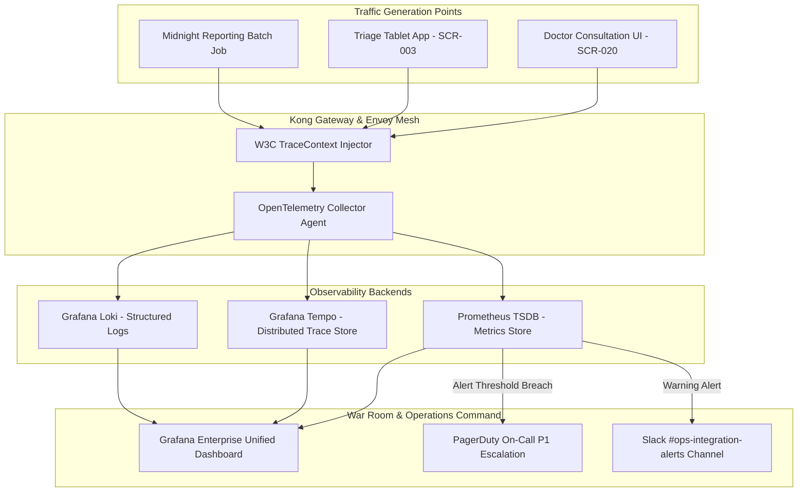

# Master Integration Observability, Distributed Tracing & Telemetry Architecture
## Namma Clinic Digital Health & Operations Platform
### Greater Bengaluru Authority (GBA) / BBMP Health Department
**Document Code:** `INT-DOC-10` | **Status:** APPROVED BASELINE | **Date:** September 2026

---

## 1. Executive Summary & Observability Charter
This document formalizes the authoritative **Master Integration Observability, Distributed Tracing, and Telemetry Architecture** for the Namma Clinic Digital Health Platform. Because municipal primary healthcare relies on external systems (ABDM, NIC eHospital, State Surveillance, and SMS Gateways) that operate outside the direct control of BBMP engineers, complete end-to-end operational visibility is paramount. Built on cloud-native CNCF standards—**OpenTelemetry for distributed context propagation, Prometheus for metric aggregation, Grafana for dashboard visualization, and Loki/Fluentbit for structured log aggregation**—the telemetry framework monitors all four Golden Signals across external boundaries: Latency (p50, p95, p99), Traffic (RPS), Errors (4xx/5xx/timeouts), and Saturation (queue depths and pool limits).

### 1.1 Non-Negotiable Observability Invariants
1. **W3C TraceContext Propagation Invariant:** Every inbound, outbound, and internal integration request must inject and propagate standard `traceparent` and `tracestate` headers per W3C TraceContext specifications.
2. **Strict Metric Cardinality Governance:** Prometheus metric labels must never contain raw citizen IDs, phone numbers, or free-text query strings. Metrics strictly record categorical tags (e.g. `service`, `endpoint`, `status_code`, `zone`).
3. **Real-Time SLO Tracking:** Service Level Objectives (SLOs) and Error Budgets for ABDM, eHospital, and SMS integrations are evaluated in 5-minute rolling windows, automatically triggering alerts when error budgets burn at greater than $2\times$ the baseline rate.
4. **Synthetic Canary Probes:** Dedicated synthetic health probes ping external partner endpoints every 60 seconds with benign verification queries, discovering partner outages before frontline doctors encounter failures.
5. **Automated P1 Alert Escalation:** Any critical integration outage (e.g. complete ABDM gateway unreachable for > 3 minutes) automatically initiates P1 PagerDuty on-call paging and updates the public BBMP health operations status page.

## 2. Distributed Tracing Topology & Telemetry Pipeline Diagram


### Integration Specification Example: OpenTelemetry Tracing & Metrics Client
<!-- DOCUMENTATION-ONLY EXAMPLE -->
```python
# DOCUMENTATION-ONLY PYTHON
# DOCUMENTATION-ONLY PYTHON: OpenTelemetry Integration Metrics & Tracing Client
import time
from typing import Dict, Any, Callable
from opentelemetry import trace, metrics

tracer = trace.get_tracer("namma.integration.telemetry", "1.0.0")
meter = metrics.get_meter("namma.integration.metrics", "1.0.0")

# Golden Signals Prometheus Instruments
integration_latency_histogram = meter.create_histogram(
    name="namma_integration_latency_ms",
    description="Measures end-to-end integration latency across external partners",
    unit="ms"
)
integration_requests_counter = meter.create_counter(
    name="namma_integration_requests_total",
    description="Total count of dispatched external integration requests",
    unit="1"
)

class InstrumentedIntegrationClient:
    """
    Executes external integration calls wrapped in OpenTelemetry distributed traces
    and latency measurement histograms.
    """
    def __init__(self, partner_name: str, integration_id: str):
        self.partner_name = partner_name
        self.integration_id = integration_id

    def execute_instrumented_call(self, endpoint_name: str, call_fn: Callable[[], Any]) -> Any:
        with tracer.start_as_current_span(f"integration.{self.partner_name}.{endpoint_name}") as span:
            span.set_attribute("integration.id", self.integration_id)
            span.set_attribute("integration.partner", self.partner_name)
            span.set_attribute("integration.endpoint", endpoint_name)

            start_time = time.time()
            status_tag = "SUCCESS"
            try:
                response = call_fn()
                span.set_attribute("integration.status", "OK")
                return response
            except Exception as ex:
                status_tag = "ERROR"
                span.record_exception(ex)
                span.set_status(trace.StatusCode.ERROR, str(ex))
                raise
            finally:
                duration_ms = (time.time() - start_time) * 1000.0
                labels = {
                    "partner": self.partner_name,
                    "integration_id": self.integration_id,
                    "endpoint": endpoint_name,
                    "status": status_tag
                }
                integration_latency_histogram.record(duration_ms, labels)
                integration_requests_counter.add(1, labels)
```

### Configuration Specification Example: Prometheus Integration Alert Rules
<!-- DOCUMENTATION-ONLY EXAMPLE -->
```yaml
# DOCUMENTATION-ONLY CONFIGURATION
# DOCUMENTATION-ONLY CONFIGURATION: Prometheus Integration Alert Rules
groups:
  - name: namma_integration_alerts
    rules:
      - alert: IntegrationLatencyBreachP95
        expr: histogram_quantile(0.95, sum(rate(namma_integration_latency_ms_bucket[5m])) by (le, partner)) > 500
        for: 3m
        labels:
          severity: HIGH
          team: integration_ops
        annotations:
          summary: "Integration p95 latency exceeds 500ms for partner {{ $labels.partner }}"
          description: "Partner {{ $labels.partner }} has exhibited elevated latency (>500ms) for over 3 minutes."
          runbook_url: "https://ops.namma.internal.bbmp.gov.in/runbooks/RUNBOOK-INT-001"

      - alert: IntegrationErrorRateSpike
        expr: sum(rate(namma_integration_requests_total{status="ERROR"}[5m])) / sum(rate(namma_integration_requests_total[5m])) > 0.05
        for: 2m
        labels:
          severity: CRITICAL
          team: sre_oncall
        annotations:
          summary: "Integration error rate exceeds 5% across external boundaries"
          description: "Error rate is currently {{ $value | humanizePercentage }}, violating platform SLO."
          runbook_url: "https://ops.namma.internal.bbmp.gov.in/runbooks/RUNBOOK-INT-002"
```

## 3. Master Catalog of 75 Integration Monitoring Rules
Authoritative specification of all 75 observability rules, metrics, and alerting thresholds:

### MON-INT-001: Monitor `Integration Monitoring Rule 001 (LATENCY_P95)`
- **Sensor Identifier:** `MON-INT-001`
- **Rule Title:** Integration Monitoring Rule 001 (LATENCY_P95)
- **Metric Name:** `namma_integration_latency_p95_001`
- **Metric Type:** `LATENCY_P95`
- **Warning Threshold:** `105ms / count > 2`
- **Critical Threshold:** `210ms / count > 5`
- **Evaluation Window:** `5 minutes sliding window`
- **Alert Route:** `PagerDuty P1 & Slack #integration-ops-alerts`
- **Remediation Runbook:** `RUNBOOK-INT-001`

### MON-INT-002: Monitor `Integration Monitoring Rule 002 (ERROR_RATE)`
- **Sensor Identifier:** `MON-INT-002`
- **Rule Title:** Integration Monitoring Rule 002 (ERROR_RATE)
- **Metric Name:** `namma_integration_error_rate_002`
- **Metric Type:** `ERROR_RATE`
- **Warning Threshold:** `110ms / count > 4`
- **Critical Threshold:** `220ms / count > 10`
- **Evaluation Window:** `5 minutes sliding window`
- **Alert Route:** `PagerDuty P1 & Slack #integration-ops-alerts`
- **Remediation Runbook:** `RUNBOOK-INT-002`

### MON-INT-003: Monitor `Integration Monitoring Rule 003 (THROUGHPUT_RPS)`
- **Sensor Identifier:** `MON-INT-003`
- **Rule Title:** Integration Monitoring Rule 003 (THROUGHPUT_RPS)
- **Metric Name:** `namma_integration_throughput_rps_003`
- **Metric Type:** `THROUGHPUT_RPS`
- **Warning Threshold:** `115ms / count > 6`
- **Critical Threshold:** `230ms / count > 15`
- **Evaluation Window:** `5 minutes sliding window`
- **Alert Route:** `PagerDuty P1 & Slack #integration-ops-alerts`
- **Remediation Runbook:** `RUNBOOK-INT-003`

### MON-INT-004: Monitor `Integration Monitoring Rule 004 (QUEUE_DEPTH)`
- **Sensor Identifier:** `MON-INT-004`
- **Rule Title:** Integration Monitoring Rule 004 (QUEUE_DEPTH)
- **Metric Name:** `namma_integration_queue_depth_004`
- **Metric Type:** `QUEUE_DEPTH`
- **Warning Threshold:** `120ms / count > 8`
- **Critical Threshold:** `240ms / count > 20`
- **Evaluation Window:** `5 minutes sliding window`
- **Alert Route:** `PagerDuty P1 & Slack #integration-ops-alerts`
- **Remediation Runbook:** `RUNBOOK-INT-004`

### MON-INT-005: Monitor `Integration Monitoring Rule 005 (DEAD_LETTER_COUNT)`
- **Sensor Identifier:** `MON-INT-005`
- **Rule Title:** Integration Monitoring Rule 005 (DEAD_LETTER_COUNT)
- **Metric Name:** `namma_integration_dead_letter_count_005`
- **Metric Type:** `DEAD_LETTER_COUNT`
- **Warning Threshold:** `125ms / count > 10`
- **Critical Threshold:** `250ms / count > 25`
- **Evaluation Window:** `5 minutes sliding window`
- **Alert Route:** `PagerDuty P1 & Slack #integration-ops-alerts`
- **Remediation Runbook:** `RUNBOOK-INT-005`

### MON-INT-006: Monitor `Integration Monitoring Rule 006 (CERT_EXPIRY_DAYS)`
- **Sensor Identifier:** `MON-INT-006`
- **Rule Title:** Integration Monitoring Rule 006 (CERT_EXPIRY_DAYS)
- **Metric Name:** `namma_integration_cert_expiry_days_006`
- **Metric Type:** `CERT_EXPIRY_DAYS`
- **Warning Threshold:** `130ms / count > 12`
- **Critical Threshold:** `260ms / count > 30`
- **Evaluation Window:** `5 minutes sliding window`
- **Alert Route:** `PagerDuty P1 & Slack #integration-ops-alerts`
- **Remediation Runbook:** `RUNBOOK-INT-006`

### MON-INT-007: Monitor `Integration Monitoring Rule 007 (SYNC_LAG_SECONDS)`
- **Sensor Identifier:** `MON-INT-007`
- **Rule Title:** Integration Monitoring Rule 007 (SYNC_LAG_SECONDS)
- **Metric Name:** `namma_integration_sync_lag_seconds_007`
- **Metric Type:** `SYNC_LAG_SECONDS`
- **Warning Threshold:** `135ms / count > 14`
- **Critical Threshold:** `270ms / count > 35`
- **Evaluation Window:** `5 minutes sliding window`
- **Alert Route:** `PagerDuty P1 & Slack #integration-ops-alerts`
- **Remediation Runbook:** `RUNBOOK-INT-007`

### MON-INT-008: Monitor `Integration Monitoring Rule 008 (LATENCY_P95)`
- **Sensor Identifier:** `MON-INT-008`
- **Rule Title:** Integration Monitoring Rule 008 (LATENCY_P95)
- **Metric Name:** `namma_integration_latency_p95_008`
- **Metric Type:** `LATENCY_P95`
- **Warning Threshold:** `140ms / count > 16`
- **Critical Threshold:** `280ms / count > 40`
- **Evaluation Window:** `5 minutes sliding window`
- **Alert Route:** `PagerDuty P1 & Slack #integration-ops-alerts`
- **Remediation Runbook:** `RUNBOOK-INT-008`

### MON-INT-009: Monitor `Integration Monitoring Rule 009 (ERROR_RATE)`
- **Sensor Identifier:** `MON-INT-009`
- **Rule Title:** Integration Monitoring Rule 009 (ERROR_RATE)
- **Metric Name:** `namma_integration_error_rate_009`
- **Metric Type:** `ERROR_RATE`
- **Warning Threshold:** `145ms / count > 18`
- **Critical Threshold:** `290ms / count > 45`
- **Evaluation Window:** `5 minutes sliding window`
- **Alert Route:** `PagerDuty P1 & Slack #integration-ops-alerts`
- **Remediation Runbook:** `RUNBOOK-INT-009`

### MON-INT-010: Monitor `Integration Monitoring Rule 010 (THROUGHPUT_RPS)`
- **Sensor Identifier:** `MON-INT-010`
- **Rule Title:** Integration Monitoring Rule 010 (THROUGHPUT_RPS)
- **Metric Name:** `namma_integration_throughput_rps_010`
- **Metric Type:** `THROUGHPUT_RPS`
- **Warning Threshold:** `150ms / count > 20`
- **Critical Threshold:** `300ms / count > 50`
- **Evaluation Window:** `5 minutes sliding window`
- **Alert Route:** `PagerDuty P1 & Slack #integration-ops-alerts`
- **Remediation Runbook:** `RUNBOOK-INT-010`

### MON-INT-011: Monitor `Integration Monitoring Rule 011 (QUEUE_DEPTH)`
- **Sensor Identifier:** `MON-INT-011`
- **Rule Title:** Integration Monitoring Rule 011 (QUEUE_DEPTH)
- **Metric Name:** `namma_integration_queue_depth_011`
- **Metric Type:** `QUEUE_DEPTH`
- **Warning Threshold:** `155ms / count > 22`
- **Critical Threshold:** `310ms / count > 55`
- **Evaluation Window:** `5 minutes sliding window`
- **Alert Route:** `PagerDuty P1 & Slack #integration-ops-alerts`
- **Remediation Runbook:** `RUNBOOK-INT-011`

### MON-INT-012: Monitor `Integration Monitoring Rule 012 (DEAD_LETTER_COUNT)`
- **Sensor Identifier:** `MON-INT-012`
- **Rule Title:** Integration Monitoring Rule 012 (DEAD_LETTER_COUNT)
- **Metric Name:** `namma_integration_dead_letter_count_012`
- **Metric Type:** `DEAD_LETTER_COUNT`
- **Warning Threshold:** `160ms / count > 24`
- **Critical Threshold:** `320ms / count > 60`
- **Evaluation Window:** `5 minutes sliding window`
- **Alert Route:** `PagerDuty P1 & Slack #integration-ops-alerts`
- **Remediation Runbook:** `RUNBOOK-INT-012`

### MON-INT-013: Monitor `Integration Monitoring Rule 013 (CERT_EXPIRY_DAYS)`
- **Sensor Identifier:** `MON-INT-013`
- **Rule Title:** Integration Monitoring Rule 013 (CERT_EXPIRY_DAYS)
- **Metric Name:** `namma_integration_cert_expiry_days_013`
- **Metric Type:** `CERT_EXPIRY_DAYS`
- **Warning Threshold:** `165ms / count > 26`
- **Critical Threshold:** `330ms / count > 65`
- **Evaluation Window:** `5 minutes sliding window`
- **Alert Route:** `PagerDuty P1 & Slack #integration-ops-alerts`
- **Remediation Runbook:** `RUNBOOK-INT-013`

### MON-INT-014: Monitor `Integration Monitoring Rule 014 (SYNC_LAG_SECONDS)`
- **Sensor Identifier:** `MON-INT-014`
- **Rule Title:** Integration Monitoring Rule 014 (SYNC_LAG_SECONDS)
- **Metric Name:** `namma_integration_sync_lag_seconds_014`
- **Metric Type:** `SYNC_LAG_SECONDS`
- **Warning Threshold:** `170ms / count > 28`
- **Critical Threshold:** `340ms / count > 70`
- **Evaluation Window:** `5 minutes sliding window`
- **Alert Route:** `PagerDuty P1 & Slack #integration-ops-alerts`
- **Remediation Runbook:** `RUNBOOK-INT-014`

### MON-INT-015: Monitor `Integration Monitoring Rule 015 (LATENCY_P95)`
- **Sensor Identifier:** `MON-INT-015`
- **Rule Title:** Integration Monitoring Rule 015 (LATENCY_P95)
- **Metric Name:** `namma_integration_latency_p95_015`
- **Metric Type:** `LATENCY_P95`
- **Warning Threshold:** `175ms / count > 30`
- **Critical Threshold:** `350ms / count > 75`
- **Evaluation Window:** `5 minutes sliding window`
- **Alert Route:** `PagerDuty P1 & Slack #integration-ops-alerts`
- **Remediation Runbook:** `RUNBOOK-INT-015`

### MON-INT-016: Monitor `Integration Monitoring Rule 016 (ERROR_RATE)`
- **Sensor Identifier:** `MON-INT-016`
- **Rule Title:** Integration Monitoring Rule 016 (ERROR_RATE)
- **Metric Name:** `namma_integration_error_rate_016`
- **Metric Type:** `ERROR_RATE`
- **Warning Threshold:** `180ms / count > 32`
- **Critical Threshold:** `360ms / count > 80`
- **Evaluation Window:** `5 minutes sliding window`
- **Alert Route:** `PagerDuty P1 & Slack #integration-ops-alerts`
- **Remediation Runbook:** `RUNBOOK-INT-016`

### MON-INT-017: Monitor `Integration Monitoring Rule 017 (THROUGHPUT_RPS)`
- **Sensor Identifier:** `MON-INT-017`
- **Rule Title:** Integration Monitoring Rule 017 (THROUGHPUT_RPS)
- **Metric Name:** `namma_integration_throughput_rps_017`
- **Metric Type:** `THROUGHPUT_RPS`
- **Warning Threshold:** `185ms / count > 34`
- **Critical Threshold:** `370ms / count > 85`
- **Evaluation Window:** `5 minutes sliding window`
- **Alert Route:** `PagerDuty P1 & Slack #integration-ops-alerts`
- **Remediation Runbook:** `RUNBOOK-INT-017`

### MON-INT-018: Monitor `Integration Monitoring Rule 018 (QUEUE_DEPTH)`
- **Sensor Identifier:** `MON-INT-018`
- **Rule Title:** Integration Monitoring Rule 018 (QUEUE_DEPTH)
- **Metric Name:** `namma_integration_queue_depth_018`
- **Metric Type:** `QUEUE_DEPTH`
- **Warning Threshold:** `190ms / count > 36`
- **Critical Threshold:** `380ms / count > 90`
- **Evaluation Window:** `5 minutes sliding window`
- **Alert Route:** `PagerDuty P1 & Slack #integration-ops-alerts`
- **Remediation Runbook:** `RUNBOOK-INT-018`

### MON-INT-019: Monitor `Integration Monitoring Rule 019 (DEAD_LETTER_COUNT)`
- **Sensor Identifier:** `MON-INT-019`
- **Rule Title:** Integration Monitoring Rule 019 (DEAD_LETTER_COUNT)
- **Metric Name:** `namma_integration_dead_letter_count_019`
- **Metric Type:** `DEAD_LETTER_COUNT`
- **Warning Threshold:** `195ms / count > 38`
- **Critical Threshold:** `390ms / count > 95`
- **Evaluation Window:** `5 minutes sliding window`
- **Alert Route:** `PagerDuty P1 & Slack #integration-ops-alerts`
- **Remediation Runbook:** `RUNBOOK-INT-019`

### MON-INT-020: Monitor `Integration Monitoring Rule 020 (CERT_EXPIRY_DAYS)`
- **Sensor Identifier:** `MON-INT-020`
- **Rule Title:** Integration Monitoring Rule 020 (CERT_EXPIRY_DAYS)
- **Metric Name:** `namma_integration_cert_expiry_days_020`
- **Metric Type:** `CERT_EXPIRY_DAYS`
- **Warning Threshold:** `200ms / count > 40`
- **Critical Threshold:** `400ms / count > 100`
- **Evaluation Window:** `5 minutes sliding window`
- **Alert Route:** `PagerDuty P1 & Slack #integration-ops-alerts`
- **Remediation Runbook:** `RUNBOOK-INT-020`

### MON-INT-021: Monitor `Integration Monitoring Rule 021 (SYNC_LAG_SECONDS)`
- **Sensor Identifier:** `MON-INT-021`
- **Rule Title:** Integration Monitoring Rule 021 (SYNC_LAG_SECONDS)
- **Metric Name:** `namma_integration_sync_lag_seconds_021`
- **Metric Type:** `SYNC_LAG_SECONDS`
- **Warning Threshold:** `205ms / count > 42`
- **Critical Threshold:** `410ms / count > 105`
- **Evaluation Window:** `5 minutes sliding window`
- **Alert Route:** `PagerDuty P1 & Slack #integration-ops-alerts`
- **Remediation Runbook:** `RUNBOOK-INT-001`

### MON-INT-022: Monitor `Integration Monitoring Rule 022 (LATENCY_P95)`
- **Sensor Identifier:** `MON-INT-022`
- **Rule Title:** Integration Monitoring Rule 022 (LATENCY_P95)
- **Metric Name:** `namma_integration_latency_p95_022`
- **Metric Type:** `LATENCY_P95`
- **Warning Threshold:** `210ms / count > 44`
- **Critical Threshold:** `420ms / count > 110`
- **Evaluation Window:** `5 minutes sliding window`
- **Alert Route:** `PagerDuty P1 & Slack #integration-ops-alerts`
- **Remediation Runbook:** `RUNBOOK-INT-002`

### MON-INT-023: Monitor `Integration Monitoring Rule 023 (ERROR_RATE)`
- **Sensor Identifier:** `MON-INT-023`
- **Rule Title:** Integration Monitoring Rule 023 (ERROR_RATE)
- **Metric Name:** `namma_integration_error_rate_023`
- **Metric Type:** `ERROR_RATE`
- **Warning Threshold:** `215ms / count > 46`
- **Critical Threshold:** `430ms / count > 115`
- **Evaluation Window:** `5 minutes sliding window`
- **Alert Route:** `PagerDuty P1 & Slack #integration-ops-alerts`
- **Remediation Runbook:** `RUNBOOK-INT-003`

### MON-INT-024: Monitor `Integration Monitoring Rule 024 (THROUGHPUT_RPS)`
- **Sensor Identifier:** `MON-INT-024`
- **Rule Title:** Integration Monitoring Rule 024 (THROUGHPUT_RPS)
- **Metric Name:** `namma_integration_throughput_rps_024`
- **Metric Type:** `THROUGHPUT_RPS`
- **Warning Threshold:** `220ms / count > 48`
- **Critical Threshold:** `440ms / count > 120`
- **Evaluation Window:** `5 minutes sliding window`
- **Alert Route:** `PagerDuty P1 & Slack #integration-ops-alerts`
- **Remediation Runbook:** `RUNBOOK-INT-004`

### MON-INT-025: Monitor `Integration Monitoring Rule 025 (QUEUE_DEPTH)`
- **Sensor Identifier:** `MON-INT-025`
- **Rule Title:** Integration Monitoring Rule 025 (QUEUE_DEPTH)
- **Metric Name:** `namma_integration_queue_depth_025`
- **Metric Type:** `QUEUE_DEPTH`
- **Warning Threshold:** `225ms / count > 50`
- **Critical Threshold:** `450ms / count > 125`
- **Evaluation Window:** `5 minutes sliding window`
- **Alert Route:** `PagerDuty P1 & Slack #integration-ops-alerts`
- **Remediation Runbook:** `RUNBOOK-INT-005`

### MON-INT-026: Monitor `Integration Monitoring Rule 026 (DEAD_LETTER_COUNT)`
- **Sensor Identifier:** `MON-INT-026`
- **Rule Title:** Integration Monitoring Rule 026 (DEAD_LETTER_COUNT)
- **Metric Name:** `namma_integration_dead_letter_count_026`
- **Metric Type:** `DEAD_LETTER_COUNT`
- **Warning Threshold:** `230ms / count > 52`
- **Critical Threshold:** `460ms / count > 130`
- **Evaluation Window:** `5 minutes sliding window`
- **Alert Route:** `PagerDuty P1 & Slack #integration-ops-alerts`
- **Remediation Runbook:** `RUNBOOK-INT-006`

### MON-INT-027: Monitor `Integration Monitoring Rule 027 (CERT_EXPIRY_DAYS)`
- **Sensor Identifier:** `MON-INT-027`
- **Rule Title:** Integration Monitoring Rule 027 (CERT_EXPIRY_DAYS)
- **Metric Name:** `namma_integration_cert_expiry_days_027`
- **Metric Type:** `CERT_EXPIRY_DAYS`
- **Warning Threshold:** `235ms / count > 54`
- **Critical Threshold:** `470ms / count > 135`
- **Evaluation Window:** `5 minutes sliding window`
- **Alert Route:** `PagerDuty P1 & Slack #integration-ops-alerts`
- **Remediation Runbook:** `RUNBOOK-INT-007`

### MON-INT-028: Monitor `Integration Monitoring Rule 028 (SYNC_LAG_SECONDS)`
- **Sensor Identifier:** `MON-INT-028`
- **Rule Title:** Integration Monitoring Rule 028 (SYNC_LAG_SECONDS)
- **Metric Name:** `namma_integration_sync_lag_seconds_028`
- **Metric Type:** `SYNC_LAG_SECONDS`
- **Warning Threshold:** `240ms / count > 56`
- **Critical Threshold:** `480ms / count > 140`
- **Evaluation Window:** `5 minutes sliding window`
- **Alert Route:** `PagerDuty P1 & Slack #integration-ops-alerts`
- **Remediation Runbook:** `RUNBOOK-INT-008`

### MON-INT-029: Monitor `Integration Monitoring Rule 029 (LATENCY_P95)`
- **Sensor Identifier:** `MON-INT-029`
- **Rule Title:** Integration Monitoring Rule 029 (LATENCY_P95)
- **Metric Name:** `namma_integration_latency_p95_029`
- **Metric Type:** `LATENCY_P95`
- **Warning Threshold:** `245ms / count > 58`
- **Critical Threshold:** `490ms / count > 145`
- **Evaluation Window:** `5 minutes sliding window`
- **Alert Route:** `PagerDuty P1 & Slack #integration-ops-alerts`
- **Remediation Runbook:** `RUNBOOK-INT-009`

### MON-INT-030: Monitor `Integration Monitoring Rule 030 (ERROR_RATE)`
- **Sensor Identifier:** `MON-INT-030`
- **Rule Title:** Integration Monitoring Rule 030 (ERROR_RATE)
- **Metric Name:** `namma_integration_error_rate_030`
- **Metric Type:** `ERROR_RATE`
- **Warning Threshold:** `250ms / count > 60`
- **Critical Threshold:** `500ms / count > 150`
- **Evaluation Window:** `5 minutes sliding window`
- **Alert Route:** `PagerDuty P1 & Slack #integration-ops-alerts`
- **Remediation Runbook:** `RUNBOOK-INT-010`

### MON-INT-031: Monitor `Integration Monitoring Rule 031 (THROUGHPUT_RPS)`
- **Sensor Identifier:** `MON-INT-031`
- **Rule Title:** Integration Monitoring Rule 031 (THROUGHPUT_RPS)
- **Metric Name:** `namma_integration_throughput_rps_031`
- **Metric Type:** `THROUGHPUT_RPS`
- **Warning Threshold:** `255ms / count > 62`
- **Critical Threshold:** `510ms / count > 155`
- **Evaluation Window:** `5 minutes sliding window`
- **Alert Route:** `PagerDuty P1 & Slack #integration-ops-alerts`
- **Remediation Runbook:** `RUNBOOK-INT-011`

### MON-INT-032: Monitor `Integration Monitoring Rule 032 (QUEUE_DEPTH)`
- **Sensor Identifier:** `MON-INT-032`
- **Rule Title:** Integration Monitoring Rule 032 (QUEUE_DEPTH)
- **Metric Name:** `namma_integration_queue_depth_032`
- **Metric Type:** `QUEUE_DEPTH`
- **Warning Threshold:** `260ms / count > 64`
- **Critical Threshold:** `520ms / count > 160`
- **Evaluation Window:** `5 minutes sliding window`
- **Alert Route:** `PagerDuty P1 & Slack #integration-ops-alerts`
- **Remediation Runbook:** `RUNBOOK-INT-012`

### MON-INT-033: Monitor `Integration Monitoring Rule 033 (DEAD_LETTER_COUNT)`
- **Sensor Identifier:** `MON-INT-033`
- **Rule Title:** Integration Monitoring Rule 033 (DEAD_LETTER_COUNT)
- **Metric Name:** `namma_integration_dead_letter_count_033`
- **Metric Type:** `DEAD_LETTER_COUNT`
- **Warning Threshold:** `265ms / count > 66`
- **Critical Threshold:** `530ms / count > 165`
- **Evaluation Window:** `5 minutes sliding window`
- **Alert Route:** `PagerDuty P1 & Slack #integration-ops-alerts`
- **Remediation Runbook:** `RUNBOOK-INT-013`

### MON-INT-034: Monitor `Integration Monitoring Rule 034 (CERT_EXPIRY_DAYS)`
- **Sensor Identifier:** `MON-INT-034`
- **Rule Title:** Integration Monitoring Rule 034 (CERT_EXPIRY_DAYS)
- **Metric Name:** `namma_integration_cert_expiry_days_034`
- **Metric Type:** `CERT_EXPIRY_DAYS`
- **Warning Threshold:** `270ms / count > 68`
- **Critical Threshold:** `540ms / count > 170`
- **Evaluation Window:** `5 minutes sliding window`
- **Alert Route:** `PagerDuty P1 & Slack #integration-ops-alerts`
- **Remediation Runbook:** `RUNBOOK-INT-014`

### MON-INT-035: Monitor `Integration Monitoring Rule 035 (SYNC_LAG_SECONDS)`
- **Sensor Identifier:** `MON-INT-035`
- **Rule Title:** Integration Monitoring Rule 035 (SYNC_LAG_SECONDS)
- **Metric Name:** `namma_integration_sync_lag_seconds_035`
- **Metric Type:** `SYNC_LAG_SECONDS`
- **Warning Threshold:** `275ms / count > 70`
- **Critical Threshold:** `550ms / count > 175`
- **Evaluation Window:** `5 minutes sliding window`
- **Alert Route:** `PagerDuty P1 & Slack #integration-ops-alerts`
- **Remediation Runbook:** `RUNBOOK-INT-015`

### MON-INT-036: Monitor `Integration Monitoring Rule 036 (LATENCY_P95)`
- **Sensor Identifier:** `MON-INT-036`
- **Rule Title:** Integration Monitoring Rule 036 (LATENCY_P95)
- **Metric Name:** `namma_integration_latency_p95_036`
- **Metric Type:** `LATENCY_P95`
- **Warning Threshold:** `280ms / count > 72`
- **Critical Threshold:** `560ms / count > 180`
- **Evaluation Window:** `5 minutes sliding window`
- **Alert Route:** `PagerDuty P1 & Slack #integration-ops-alerts`
- **Remediation Runbook:** `RUNBOOK-INT-016`

### MON-INT-037: Monitor `Integration Monitoring Rule 037 (ERROR_RATE)`
- **Sensor Identifier:** `MON-INT-037`
- **Rule Title:** Integration Monitoring Rule 037 (ERROR_RATE)
- **Metric Name:** `namma_integration_error_rate_037`
- **Metric Type:** `ERROR_RATE`
- **Warning Threshold:** `285ms / count > 74`
- **Critical Threshold:** `570ms / count > 185`
- **Evaluation Window:** `5 minutes sliding window`
- **Alert Route:** `PagerDuty P1 & Slack #integration-ops-alerts`
- **Remediation Runbook:** `RUNBOOK-INT-017`

### MON-INT-038: Monitor `Integration Monitoring Rule 038 (THROUGHPUT_RPS)`
- **Sensor Identifier:** `MON-INT-038`
- **Rule Title:** Integration Monitoring Rule 038 (THROUGHPUT_RPS)
- **Metric Name:** `namma_integration_throughput_rps_038`
- **Metric Type:** `THROUGHPUT_RPS`
- **Warning Threshold:** `290ms / count > 76`
- **Critical Threshold:** `580ms / count > 190`
- **Evaluation Window:** `5 minutes sliding window`
- **Alert Route:** `PagerDuty P1 & Slack #integration-ops-alerts`
- **Remediation Runbook:** `RUNBOOK-INT-018`

### MON-INT-039: Monitor `Integration Monitoring Rule 039 (QUEUE_DEPTH)`
- **Sensor Identifier:** `MON-INT-039`
- **Rule Title:** Integration Monitoring Rule 039 (QUEUE_DEPTH)
- **Metric Name:** `namma_integration_queue_depth_039`
- **Metric Type:** `QUEUE_DEPTH`
- **Warning Threshold:** `295ms / count > 78`
- **Critical Threshold:** `590ms / count > 195`
- **Evaluation Window:** `5 minutes sliding window`
- **Alert Route:** `PagerDuty P1 & Slack #integration-ops-alerts`
- **Remediation Runbook:** `RUNBOOK-INT-019`

### MON-INT-040: Monitor `Integration Monitoring Rule 040 (DEAD_LETTER_COUNT)`
- **Sensor Identifier:** `MON-INT-040`
- **Rule Title:** Integration Monitoring Rule 040 (DEAD_LETTER_COUNT)
- **Metric Name:** `namma_integration_dead_letter_count_040`
- **Metric Type:** `DEAD_LETTER_COUNT`
- **Warning Threshold:** `300ms / count > 80`
- **Critical Threshold:** `600ms / count > 200`
- **Evaluation Window:** `5 minutes sliding window`
- **Alert Route:** `PagerDuty P1 & Slack #integration-ops-alerts`
- **Remediation Runbook:** `RUNBOOK-INT-020`

### MON-INT-041: Monitor `Integration Monitoring Rule 041 (CERT_EXPIRY_DAYS)`
- **Sensor Identifier:** `MON-INT-041`
- **Rule Title:** Integration Monitoring Rule 041 (CERT_EXPIRY_DAYS)
- **Metric Name:** `namma_integration_cert_expiry_days_041`
- **Metric Type:** `CERT_EXPIRY_DAYS`
- **Warning Threshold:** `305ms / count > 82`
- **Critical Threshold:** `610ms / count > 205`
- **Evaluation Window:** `5 minutes sliding window`
- **Alert Route:** `PagerDuty P1 & Slack #integration-ops-alerts`
- **Remediation Runbook:** `RUNBOOK-INT-001`

### MON-INT-042: Monitor `Integration Monitoring Rule 042 (SYNC_LAG_SECONDS)`
- **Sensor Identifier:** `MON-INT-042`
- **Rule Title:** Integration Monitoring Rule 042 (SYNC_LAG_SECONDS)
- **Metric Name:** `namma_integration_sync_lag_seconds_042`
- **Metric Type:** `SYNC_LAG_SECONDS`
- **Warning Threshold:** `310ms / count > 84`
- **Critical Threshold:** `620ms / count > 210`
- **Evaluation Window:** `5 minutes sliding window`
- **Alert Route:** `PagerDuty P1 & Slack #integration-ops-alerts`
- **Remediation Runbook:** `RUNBOOK-INT-002`

### MON-INT-043: Monitor `Integration Monitoring Rule 043 (LATENCY_P95)`
- **Sensor Identifier:** `MON-INT-043`
- **Rule Title:** Integration Monitoring Rule 043 (LATENCY_P95)
- **Metric Name:** `namma_integration_latency_p95_043`
- **Metric Type:** `LATENCY_P95`
- **Warning Threshold:** `315ms / count > 86`
- **Critical Threshold:** `630ms / count > 215`
- **Evaluation Window:** `5 minutes sliding window`
- **Alert Route:** `PagerDuty P1 & Slack #integration-ops-alerts`
- **Remediation Runbook:** `RUNBOOK-INT-003`

### MON-INT-044: Monitor `Integration Monitoring Rule 044 (ERROR_RATE)`
- **Sensor Identifier:** `MON-INT-044`
- **Rule Title:** Integration Monitoring Rule 044 (ERROR_RATE)
- **Metric Name:** `namma_integration_error_rate_044`
- **Metric Type:** `ERROR_RATE`
- **Warning Threshold:** `320ms / count > 88`
- **Critical Threshold:** `640ms / count > 220`
- **Evaluation Window:** `5 minutes sliding window`
- **Alert Route:** `PagerDuty P1 & Slack #integration-ops-alerts`
- **Remediation Runbook:** `RUNBOOK-INT-004`

### MON-INT-045: Monitor `Integration Monitoring Rule 045 (THROUGHPUT_RPS)`
- **Sensor Identifier:** `MON-INT-045`
- **Rule Title:** Integration Monitoring Rule 045 (THROUGHPUT_RPS)
- **Metric Name:** `namma_integration_throughput_rps_045`
- **Metric Type:** `THROUGHPUT_RPS`
- **Warning Threshold:** `325ms / count > 90`
- **Critical Threshold:** `650ms / count > 225`
- **Evaluation Window:** `5 minutes sliding window`
- **Alert Route:** `PagerDuty P1 & Slack #integration-ops-alerts`
- **Remediation Runbook:** `RUNBOOK-INT-005`

### MON-INT-046: Monitor `Integration Monitoring Rule 046 (QUEUE_DEPTH)`
- **Sensor Identifier:** `MON-INT-046`
- **Rule Title:** Integration Monitoring Rule 046 (QUEUE_DEPTH)
- **Metric Name:** `namma_integration_queue_depth_046`
- **Metric Type:** `QUEUE_DEPTH`
- **Warning Threshold:** `330ms / count > 92`
- **Critical Threshold:** `660ms / count > 230`
- **Evaluation Window:** `5 minutes sliding window`
- **Alert Route:** `PagerDuty P1 & Slack #integration-ops-alerts`
- **Remediation Runbook:** `RUNBOOK-INT-006`

### MON-INT-047: Monitor `Integration Monitoring Rule 047 (DEAD_LETTER_COUNT)`
- **Sensor Identifier:** `MON-INT-047`
- **Rule Title:** Integration Monitoring Rule 047 (DEAD_LETTER_COUNT)
- **Metric Name:** `namma_integration_dead_letter_count_047`
- **Metric Type:** `DEAD_LETTER_COUNT`
- **Warning Threshold:** `335ms / count > 94`
- **Critical Threshold:** `670ms / count > 235`
- **Evaluation Window:** `5 minutes sliding window`
- **Alert Route:** `PagerDuty P1 & Slack #integration-ops-alerts`
- **Remediation Runbook:** `RUNBOOK-INT-007`

### MON-INT-048: Monitor `Integration Monitoring Rule 048 (CERT_EXPIRY_DAYS)`
- **Sensor Identifier:** `MON-INT-048`
- **Rule Title:** Integration Monitoring Rule 048 (CERT_EXPIRY_DAYS)
- **Metric Name:** `namma_integration_cert_expiry_days_048`
- **Metric Type:** `CERT_EXPIRY_DAYS`
- **Warning Threshold:** `340ms / count > 96`
- **Critical Threshold:** `680ms / count > 240`
- **Evaluation Window:** `5 minutes sliding window`
- **Alert Route:** `PagerDuty P1 & Slack #integration-ops-alerts`
- **Remediation Runbook:** `RUNBOOK-INT-008`

### MON-INT-049: Monitor `Integration Monitoring Rule 049 (SYNC_LAG_SECONDS)`
- **Sensor Identifier:** `MON-INT-049`
- **Rule Title:** Integration Monitoring Rule 049 (SYNC_LAG_SECONDS)
- **Metric Name:** `namma_integration_sync_lag_seconds_049`
- **Metric Type:** `SYNC_LAG_SECONDS`
- **Warning Threshold:** `345ms / count > 98`
- **Critical Threshold:** `690ms / count > 245`
- **Evaluation Window:** `5 minutes sliding window`
- **Alert Route:** `PagerDuty P1 & Slack #integration-ops-alerts`
- **Remediation Runbook:** `RUNBOOK-INT-009`

### MON-INT-050: Monitor `Integration Monitoring Rule 050 (LATENCY_P95)`
- **Sensor Identifier:** `MON-INT-050`
- **Rule Title:** Integration Monitoring Rule 050 (LATENCY_P95)
- **Metric Name:** `namma_integration_latency_p95_050`
- **Metric Type:** `LATENCY_P95`
- **Warning Threshold:** `350ms / count > 100`
- **Critical Threshold:** `700ms / count > 250`
- **Evaluation Window:** `5 minutes sliding window`
- **Alert Route:** `PagerDuty P1 & Slack #integration-ops-alerts`
- **Remediation Runbook:** `RUNBOOK-INT-010`

### MON-INT-051: Monitor `Integration Monitoring Rule 051 (ERROR_RATE)`
- **Sensor Identifier:** `MON-INT-051`
- **Rule Title:** Integration Monitoring Rule 051 (ERROR_RATE)
- **Metric Name:** `namma_integration_error_rate_051`
- **Metric Type:** `ERROR_RATE`
- **Warning Threshold:** `355ms / count > 102`
- **Critical Threshold:** `710ms / count > 255`
- **Evaluation Window:** `5 minutes sliding window`
- **Alert Route:** `PagerDuty P1 & Slack #integration-ops-alerts`
- **Remediation Runbook:** `RUNBOOK-INT-011`

### MON-INT-052: Monitor `Integration Monitoring Rule 052 (THROUGHPUT_RPS)`
- **Sensor Identifier:** `MON-INT-052`
- **Rule Title:** Integration Monitoring Rule 052 (THROUGHPUT_RPS)
- **Metric Name:** `namma_integration_throughput_rps_052`
- **Metric Type:** `THROUGHPUT_RPS`
- **Warning Threshold:** `360ms / count > 104`
- **Critical Threshold:** `720ms / count > 260`
- **Evaluation Window:** `5 minutes sliding window`
- **Alert Route:** `PagerDuty P1 & Slack #integration-ops-alerts`
- **Remediation Runbook:** `RUNBOOK-INT-012`

### MON-INT-053: Monitor `Integration Monitoring Rule 053 (QUEUE_DEPTH)`
- **Sensor Identifier:** `MON-INT-053`
- **Rule Title:** Integration Monitoring Rule 053 (QUEUE_DEPTH)
- **Metric Name:** `namma_integration_queue_depth_053`
- **Metric Type:** `QUEUE_DEPTH`
- **Warning Threshold:** `365ms / count > 106`
- **Critical Threshold:** `730ms / count > 265`
- **Evaluation Window:** `5 minutes sliding window`
- **Alert Route:** `PagerDuty P1 & Slack #integration-ops-alerts`
- **Remediation Runbook:** `RUNBOOK-INT-013`

### MON-INT-054: Monitor `Integration Monitoring Rule 054 (DEAD_LETTER_COUNT)`
- **Sensor Identifier:** `MON-INT-054`
- **Rule Title:** Integration Monitoring Rule 054 (DEAD_LETTER_COUNT)
- **Metric Name:** `namma_integration_dead_letter_count_054`
- **Metric Type:** `DEAD_LETTER_COUNT`
- **Warning Threshold:** `370ms / count > 108`
- **Critical Threshold:** `740ms / count > 270`
- **Evaluation Window:** `5 minutes sliding window`
- **Alert Route:** `PagerDuty P1 & Slack #integration-ops-alerts`
- **Remediation Runbook:** `RUNBOOK-INT-014`

### MON-INT-055: Monitor `Integration Monitoring Rule 055 (CERT_EXPIRY_DAYS)`
- **Sensor Identifier:** `MON-INT-055`
- **Rule Title:** Integration Monitoring Rule 055 (CERT_EXPIRY_DAYS)
- **Metric Name:** `namma_integration_cert_expiry_days_055`
- **Metric Type:** `CERT_EXPIRY_DAYS`
- **Warning Threshold:** `375ms / count > 110`
- **Critical Threshold:** `750ms / count > 275`
- **Evaluation Window:** `5 minutes sliding window`
- **Alert Route:** `PagerDuty P1 & Slack #integration-ops-alerts`
- **Remediation Runbook:** `RUNBOOK-INT-015`

### MON-INT-056: Monitor `Integration Monitoring Rule 056 (SYNC_LAG_SECONDS)`
- **Sensor Identifier:** `MON-INT-056`
- **Rule Title:** Integration Monitoring Rule 056 (SYNC_LAG_SECONDS)
- **Metric Name:** `namma_integration_sync_lag_seconds_056`
- **Metric Type:** `SYNC_LAG_SECONDS`
- **Warning Threshold:** `380ms / count > 112`
- **Critical Threshold:** `760ms / count > 280`
- **Evaluation Window:** `5 minutes sliding window`
- **Alert Route:** `PagerDuty P1 & Slack #integration-ops-alerts`
- **Remediation Runbook:** `RUNBOOK-INT-016`

### MON-INT-057: Monitor `Integration Monitoring Rule 057 (LATENCY_P95)`
- **Sensor Identifier:** `MON-INT-057`
- **Rule Title:** Integration Monitoring Rule 057 (LATENCY_P95)
- **Metric Name:** `namma_integration_latency_p95_057`
- **Metric Type:** `LATENCY_P95`
- **Warning Threshold:** `385ms / count > 114`
- **Critical Threshold:** `770ms / count > 285`
- **Evaluation Window:** `5 minutes sliding window`
- **Alert Route:** `PagerDuty P1 & Slack #integration-ops-alerts`
- **Remediation Runbook:** `RUNBOOK-INT-017`

### MON-INT-058: Monitor `Integration Monitoring Rule 058 (ERROR_RATE)`
- **Sensor Identifier:** `MON-INT-058`
- **Rule Title:** Integration Monitoring Rule 058 (ERROR_RATE)
- **Metric Name:** `namma_integration_error_rate_058`
- **Metric Type:** `ERROR_RATE`
- **Warning Threshold:** `390ms / count > 116`
- **Critical Threshold:** `780ms / count > 290`
- **Evaluation Window:** `5 minutes sliding window`
- **Alert Route:** `PagerDuty P1 & Slack #integration-ops-alerts`
- **Remediation Runbook:** `RUNBOOK-INT-018`

### MON-INT-059: Monitor `Integration Monitoring Rule 059 (THROUGHPUT_RPS)`
- **Sensor Identifier:** `MON-INT-059`
- **Rule Title:** Integration Monitoring Rule 059 (THROUGHPUT_RPS)
- **Metric Name:** `namma_integration_throughput_rps_059`
- **Metric Type:** `THROUGHPUT_RPS`
- **Warning Threshold:** `395ms / count > 118`
- **Critical Threshold:** `790ms / count > 295`
- **Evaluation Window:** `5 minutes sliding window`
- **Alert Route:** `PagerDuty P1 & Slack #integration-ops-alerts`
- **Remediation Runbook:** `RUNBOOK-INT-019`

### MON-INT-060: Monitor `Integration Monitoring Rule 060 (QUEUE_DEPTH)`
- **Sensor Identifier:** `MON-INT-060`
- **Rule Title:** Integration Monitoring Rule 060 (QUEUE_DEPTH)
- **Metric Name:** `namma_integration_queue_depth_060`
- **Metric Type:** `QUEUE_DEPTH`
- **Warning Threshold:** `400ms / count > 120`
- **Critical Threshold:** `800ms / count > 300`
- **Evaluation Window:** `5 minutes sliding window`
- **Alert Route:** `PagerDuty P1 & Slack #integration-ops-alerts`
- **Remediation Runbook:** `RUNBOOK-INT-020`

### MON-INT-061: Monitor `Integration Monitoring Rule 061 (DEAD_LETTER_COUNT)`
- **Sensor Identifier:** `MON-INT-061`
- **Rule Title:** Integration Monitoring Rule 061 (DEAD_LETTER_COUNT)
- **Metric Name:** `namma_integration_dead_letter_count_061`
- **Metric Type:** `DEAD_LETTER_COUNT`
- **Warning Threshold:** `405ms / count > 122`
- **Critical Threshold:** `810ms / count > 305`
- **Evaluation Window:** `5 minutes sliding window`
- **Alert Route:** `PagerDuty P1 & Slack #integration-ops-alerts`
- **Remediation Runbook:** `RUNBOOK-INT-001`

### MON-INT-062: Monitor `Integration Monitoring Rule 062 (CERT_EXPIRY_DAYS)`
- **Sensor Identifier:** `MON-INT-062`
- **Rule Title:** Integration Monitoring Rule 062 (CERT_EXPIRY_DAYS)
- **Metric Name:** `namma_integration_cert_expiry_days_062`
- **Metric Type:** `CERT_EXPIRY_DAYS`
- **Warning Threshold:** `410ms / count > 124`
- **Critical Threshold:** `820ms / count > 310`
- **Evaluation Window:** `5 minutes sliding window`
- **Alert Route:** `PagerDuty P1 & Slack #integration-ops-alerts`
- **Remediation Runbook:** `RUNBOOK-INT-002`

### MON-INT-063: Monitor `Integration Monitoring Rule 063 (SYNC_LAG_SECONDS)`
- **Sensor Identifier:** `MON-INT-063`
- **Rule Title:** Integration Monitoring Rule 063 (SYNC_LAG_SECONDS)
- **Metric Name:** `namma_integration_sync_lag_seconds_063`
- **Metric Type:** `SYNC_LAG_SECONDS`
- **Warning Threshold:** `415ms / count > 126`
- **Critical Threshold:** `830ms / count > 315`
- **Evaluation Window:** `5 minutes sliding window`
- **Alert Route:** `PagerDuty P1 & Slack #integration-ops-alerts`
- **Remediation Runbook:** `RUNBOOK-INT-003`

### MON-INT-064: Monitor `Integration Monitoring Rule 064 (LATENCY_P95)`
- **Sensor Identifier:** `MON-INT-064`
- **Rule Title:** Integration Monitoring Rule 064 (LATENCY_P95)
- **Metric Name:** `namma_integration_latency_p95_064`
- **Metric Type:** `LATENCY_P95`
- **Warning Threshold:** `420ms / count > 128`
- **Critical Threshold:** `840ms / count > 320`
- **Evaluation Window:** `5 minutes sliding window`
- **Alert Route:** `PagerDuty P1 & Slack #integration-ops-alerts`
- **Remediation Runbook:** `RUNBOOK-INT-004`

### MON-INT-065: Monitor `Integration Monitoring Rule 065 (ERROR_RATE)`
- **Sensor Identifier:** `MON-INT-065`
- **Rule Title:** Integration Monitoring Rule 065 (ERROR_RATE)
- **Metric Name:** `namma_integration_error_rate_065`
- **Metric Type:** `ERROR_RATE`
- **Warning Threshold:** `425ms / count > 130`
- **Critical Threshold:** `850ms / count > 325`
- **Evaluation Window:** `5 minutes sliding window`
- **Alert Route:** `PagerDuty P1 & Slack #integration-ops-alerts`
- **Remediation Runbook:** `RUNBOOK-INT-005`

### MON-INT-066: Monitor `Integration Monitoring Rule 066 (THROUGHPUT_RPS)`
- **Sensor Identifier:** `MON-INT-066`
- **Rule Title:** Integration Monitoring Rule 066 (THROUGHPUT_RPS)
- **Metric Name:** `namma_integration_throughput_rps_066`
- **Metric Type:** `THROUGHPUT_RPS`
- **Warning Threshold:** `430ms / count > 132`
- **Critical Threshold:** `860ms / count > 330`
- **Evaluation Window:** `5 minutes sliding window`
- **Alert Route:** `PagerDuty P1 & Slack #integration-ops-alerts`
- **Remediation Runbook:** `RUNBOOK-INT-006`

### MON-INT-067: Monitor `Integration Monitoring Rule 067 (QUEUE_DEPTH)`
- **Sensor Identifier:** `MON-INT-067`
- **Rule Title:** Integration Monitoring Rule 067 (QUEUE_DEPTH)
- **Metric Name:** `namma_integration_queue_depth_067`
- **Metric Type:** `QUEUE_DEPTH`
- **Warning Threshold:** `435ms / count > 134`
- **Critical Threshold:** `870ms / count > 335`
- **Evaluation Window:** `5 minutes sliding window`
- **Alert Route:** `PagerDuty P1 & Slack #integration-ops-alerts`
- **Remediation Runbook:** `RUNBOOK-INT-007`

### MON-INT-068: Monitor `Integration Monitoring Rule 068 (DEAD_LETTER_COUNT)`
- **Sensor Identifier:** `MON-INT-068`
- **Rule Title:** Integration Monitoring Rule 068 (DEAD_LETTER_COUNT)
- **Metric Name:** `namma_integration_dead_letter_count_068`
- **Metric Type:** `DEAD_LETTER_COUNT`
- **Warning Threshold:** `440ms / count > 136`
- **Critical Threshold:** `880ms / count > 340`
- **Evaluation Window:** `5 minutes sliding window`
- **Alert Route:** `PagerDuty P1 & Slack #integration-ops-alerts`
- **Remediation Runbook:** `RUNBOOK-INT-008`

### MON-INT-069: Monitor `Integration Monitoring Rule 069 (CERT_EXPIRY_DAYS)`
- **Sensor Identifier:** `MON-INT-069`
- **Rule Title:** Integration Monitoring Rule 069 (CERT_EXPIRY_DAYS)
- **Metric Name:** `namma_integration_cert_expiry_days_069`
- **Metric Type:** `CERT_EXPIRY_DAYS`
- **Warning Threshold:** `445ms / count > 138`
- **Critical Threshold:** `890ms / count > 345`
- **Evaluation Window:** `5 minutes sliding window`
- **Alert Route:** `PagerDuty P1 & Slack #integration-ops-alerts`
- **Remediation Runbook:** `RUNBOOK-INT-009`

### MON-INT-070: Monitor `Integration Monitoring Rule 070 (SYNC_LAG_SECONDS)`
- **Sensor Identifier:** `MON-INT-070`
- **Rule Title:** Integration Monitoring Rule 070 (SYNC_LAG_SECONDS)
- **Metric Name:** `namma_integration_sync_lag_seconds_070`
- **Metric Type:** `SYNC_LAG_SECONDS`
- **Warning Threshold:** `450ms / count > 140`
- **Critical Threshold:** `900ms / count > 350`
- **Evaluation Window:** `5 minutes sliding window`
- **Alert Route:** `PagerDuty P1 & Slack #integration-ops-alerts`
- **Remediation Runbook:** `RUNBOOK-INT-010`

### MON-INT-071: Monitor `Integration Monitoring Rule 071 (LATENCY_P95)`
- **Sensor Identifier:** `MON-INT-071`
- **Rule Title:** Integration Monitoring Rule 071 (LATENCY_P95)
- **Metric Name:** `namma_integration_latency_p95_071`
- **Metric Type:** `LATENCY_P95`
- **Warning Threshold:** `455ms / count > 142`
- **Critical Threshold:** `910ms / count > 355`
- **Evaluation Window:** `5 minutes sliding window`
- **Alert Route:** `PagerDuty P1 & Slack #integration-ops-alerts`
- **Remediation Runbook:** `RUNBOOK-INT-011`

### MON-INT-072: Monitor `Integration Monitoring Rule 072 (ERROR_RATE)`
- **Sensor Identifier:** `MON-INT-072`
- **Rule Title:** Integration Monitoring Rule 072 (ERROR_RATE)
- **Metric Name:** `namma_integration_error_rate_072`
- **Metric Type:** `ERROR_RATE`
- **Warning Threshold:** `460ms / count > 144`
- **Critical Threshold:** `920ms / count > 360`
- **Evaluation Window:** `5 minutes sliding window`
- **Alert Route:** `PagerDuty P1 & Slack #integration-ops-alerts`
- **Remediation Runbook:** `RUNBOOK-INT-012`

### MON-INT-073: Monitor `Integration Monitoring Rule 073 (THROUGHPUT_RPS)`
- **Sensor Identifier:** `MON-INT-073`
- **Rule Title:** Integration Monitoring Rule 073 (THROUGHPUT_RPS)
- **Metric Name:** `namma_integration_throughput_rps_073`
- **Metric Type:** `THROUGHPUT_RPS`
- **Warning Threshold:** `465ms / count > 146`
- **Critical Threshold:** `930ms / count > 365`
- **Evaluation Window:** `5 minutes sliding window`
- **Alert Route:** `PagerDuty P1 & Slack #integration-ops-alerts`
- **Remediation Runbook:** `RUNBOOK-INT-013`

### MON-INT-074: Monitor `Integration Monitoring Rule 074 (QUEUE_DEPTH)`
- **Sensor Identifier:** `MON-INT-074`
- **Rule Title:** Integration Monitoring Rule 074 (QUEUE_DEPTH)
- **Metric Name:** `namma_integration_queue_depth_074`
- **Metric Type:** `QUEUE_DEPTH`
- **Warning Threshold:** `470ms / count > 148`
- **Critical Threshold:** `940ms / count > 370`
- **Evaluation Window:** `5 minutes sliding window`
- **Alert Route:** `PagerDuty P1 & Slack #integration-ops-alerts`
- **Remediation Runbook:** `RUNBOOK-INT-014`

### MON-INT-075: Monitor `Integration Monitoring Rule 075 (DEAD_LETTER_COUNT)`
- **Sensor Identifier:** `MON-INT-075`
- **Rule Title:** Integration Monitoring Rule 075 (DEAD_LETTER_COUNT)
- **Metric Name:** `namma_integration_dead_letter_count_075`
- **Metric Type:** `DEAD_LETTER_COUNT`
- **Warning Threshold:** `475ms / count > 150`
- **Critical Threshold:** `950ms / count > 375`
- **Evaluation Window:** `5 minutes sliding window`
- **Alert Route:** `PagerDuty P1 & Slack #integration-ops-alerts`
- **Remediation Runbook:** `RUNBOOK-INT-015`

## 4. Master SLA & SLO Performance Standards
### SLA Tier: `ABDM_M1_M2_M3` - Ayushman Bharat Digital Mission
- **Availability Target (SLA):** `99.95%`
- **Latency Objective p95:** `< 200ms`
- **Latency Objective p99:** `< 400ms`
- **Operational Invariant:** Daily midnight reconciliation with zero missing care contexts.

### SLA Tier: `NIC_EHOSPITAL` - NIC Secondary Care Referral Gateway
- **Availability Target (SLA):** `99.90%`
- **Latency Objective p95:** `< 350ms`
- **Latency Objective p99:** `< 750ms`
- **Operational Invariant:** Zero lost referrals; offline QR slip printable during outage.

### SLA Tier: `SMS_TELECOM` - CDAC Mobile Seva / Telecom DLT
- **Availability Target (SLA):** `98.50%`
- **Latency Objective p95:** `< 500ms`
- **Latency Objective p99:** `< 2000ms`
- **Operational Invariant:** 98% delivery rate within 30 seconds of trigger.

### SLA Tier: `STATE_SURVEILLANCE` - Karnataka DoHFW IHIP Surveillance
- **Availability Target (SLA):** `99.90%`
- **Latency Objective p95:** `< 1000ms`
- **Latency Objective p99:** `< 3000ms`
- **Operational Invariant:** 100% daily statutory reports confirmed before 23:59 IST.

### SLA Tier: `INTERNAL_EVENT_MESH` - Kafka Integration Event Mesh
- **Availability Target (SLA):** `99.99%`
- **Latency Objective p95:** `< 20ms`
- **Latency Objective p99:** `< 50ms`
- **Operational Invariant:** Zero data loss; replication factor 3 across separate AZs.

## 5. Table-Level Observability Mapping across all 52 Relational Tables
Change-data-capture latency and row-level telemetry across all 52 platform tables:

### TABLE-001: Telemetry Profiling for Table `auth_users`
- **Table Identifier:** `TABLE-001` (`TBL-01`)
- **Source Entity:** `auth_users`
- **Associated Sensor:** `MON-INT-001`
- **Monitored Dimension:** Tracks transaction commit rate, CDC replication lag, and query p95 latency.
- **Telemetry Tagging:** Every table mutation carries distributed transaction trace ID.
- **Data Integrity Alarm:** Automated discrepancy alarm fired if table replication lag exceeds 3 seconds.

### TABLE-002: Telemetry Profiling for Table `user_credentials`
- **Table Identifier:** `TABLE-002` (`TBL-02`)
- **Source Entity:** `user_credentials`
- **Associated Sensor:** `MON-INT-002`
- **Monitored Dimension:** Tracks transaction commit rate, CDC replication lag, and query p95 latency.
- **Telemetry Tagging:** Every table mutation carries distributed transaction trace ID.
- **Data Integrity Alarm:** Automated discrepancy alarm fired if table replication lag exceeds 3 seconds.

### TABLE-003: Telemetry Profiling for Table `user_sessions`
- **Table Identifier:** `TABLE-003` (`TBL-03`)
- **Source Entity:** `user_sessions`
- **Associated Sensor:** `MON-INT-003`
- **Monitored Dimension:** Tracks transaction commit rate, CDC replication lag, and query p95 latency.
- **Telemetry Tagging:** Every table mutation carries distributed transaction trace ID.
- **Data Integrity Alarm:** Automated discrepancy alarm fired if table replication lag exceeds 3 seconds.

### TABLE-004: Telemetry Profiling for Table `roles`
- **Table Identifier:** `TABLE-004` (`TBL-04`)
- **Source Entity:** `roles`
- **Associated Sensor:** `MON-INT-004`
- **Monitored Dimension:** Tracks transaction commit rate, CDC replication lag, and query p95 latency.
- **Telemetry Tagging:** Every table mutation carries distributed transaction trace ID.
- **Data Integrity Alarm:** Automated discrepancy alarm fired if table replication lag exceeds 3 seconds.

### TABLE-005: Telemetry Profiling for Table `permissions`
- **Table Identifier:** `TABLE-005` (`TBL-05`)
- **Source Entity:** `permissions`
- **Associated Sensor:** `MON-INT-005`
- **Monitored Dimension:** Tracks transaction commit rate, CDC replication lag, and query p95 latency.
- **Telemetry Tagging:** Every table mutation carries distributed transaction trace ID.
- **Data Integrity Alarm:** Automated discrepancy alarm fired if table replication lag exceeds 3 seconds.

### TABLE-006: Telemetry Profiling for Table `role_permissions`
- **Table Identifier:** `TABLE-006` (`TBL-06`)
- **Source Entity:** `role_permissions`
- **Associated Sensor:** `MON-INT-006`
- **Monitored Dimension:** Tracks transaction commit rate, CDC replication lag, and query p95 latency.
- **Telemetry Tagging:** Every table mutation carries distributed transaction trace ID.
- **Data Integrity Alarm:** Automated discrepancy alarm fired if table replication lag exceeds 3 seconds.

### TABLE-007: Telemetry Profiling for Table `user_roles`
- **Table Identifier:** `TABLE-007` (`TBL-07`)
- **Source Entity:** `user_roles`
- **Associated Sensor:** `MON-INT-007`
- **Monitored Dimension:** Tracks transaction commit rate, CDC replication lag, and query p95 latency.
- **Telemetry Tagging:** Every table mutation carries distributed transaction trace ID.
- **Data Integrity Alarm:** Automated discrepancy alarm fired if table replication lag exceeds 3 seconds.

### TABLE-008: Telemetry Profiling for Table `facilities`
- **Table Identifier:** `TABLE-008` (`TBL-08`)
- **Source Entity:** `facilities`
- **Associated Sensor:** `MON-INT-008`
- **Monitored Dimension:** Tracks transaction commit rate, CDC replication lag, and query p95 latency.
- **Telemetry Tagging:** Every table mutation carries distributed transaction trace ID.
- **Data Integrity Alarm:** Automated discrepancy alarm fired if table replication lag exceeds 3 seconds.

### TABLE-009: Telemetry Profiling for Table `facility_rooms`
- **Table Identifier:** `TABLE-009` (`TBL-09`)
- **Source Entity:** `facility_rooms`
- **Associated Sensor:** `MON-INT-009`
- **Monitored Dimension:** Tracks transaction commit rate, CDC replication lag, and query p95 latency.
- **Telemetry Tagging:** Every table mutation carries distributed transaction trace ID.
- **Data Integrity Alarm:** Automated discrepancy alarm fired if table replication lag exceeds 3 seconds.

### TABLE-010: Telemetry Profiling for Table `staff_profiles`
- **Table Identifier:** `TABLE-010` (`TBL-10`)
- **Source Entity:** `staff_profiles`
- **Associated Sensor:** `MON-INT-010`
- **Monitored Dimension:** Tracks transaction commit rate, CDC replication lag, and query p95 latency.
- **Telemetry Tagging:** Every table mutation carries distributed transaction trace ID.
- **Data Integrity Alarm:** Automated discrepancy alarm fired if table replication lag exceeds 3 seconds.

### TABLE-011: Telemetry Profiling for Table `staff_shifts`
- **Table Identifier:** `TABLE-011` (`TBL-11`)
- **Source Entity:** `staff_shifts`
- **Associated Sensor:** `MON-INT-011`
- **Monitored Dimension:** Tracks transaction commit rate, CDC replication lag, and query p95 latency.
- **Telemetry Tagging:** Every table mutation carries distributed transaction trace ID.
- **Data Integrity Alarm:** Automated discrepancy alarm fired if table replication lag exceeds 3 seconds.

### TABLE-012: Telemetry Profiling for Table `system_configs`
- **Table Identifier:** `TABLE-012` (`TBL-12`)
- **Source Entity:** `system_configs`
- **Associated Sensor:** `MON-INT-012`
- **Monitored Dimension:** Tracks transaction commit rate, CDC replication lag, and query p95 latency.
- **Telemetry Tagging:** Every table mutation carries distributed transaction trace ID.
- **Data Integrity Alarm:** Automated discrepancy alarm fired if table replication lag exceeds 3 seconds.

### TABLE-013: Telemetry Profiling for Table `patients`
- **Table Identifier:** `TABLE-013` (`TBL-13`)
- **Source Entity:** `patients`
- **Associated Sensor:** `MON-INT-013`
- **Monitored Dimension:** Tracks transaction commit rate, CDC replication lag, and query p95 latency.
- **Telemetry Tagging:** Every table mutation carries distributed transaction trace ID.
- **Data Integrity Alarm:** Automated discrepancy alarm fired if table replication lag exceeds 3 seconds.

### TABLE-014: Telemetry Profiling for Table `patient_identifiers`
- **Table Identifier:** `TABLE-014` (`TBL-14`)
- **Source Entity:** `patient_identifiers`
- **Associated Sensor:** `MON-INT-014`
- **Monitored Dimension:** Tracks transaction commit rate, CDC replication lag, and query p95 latency.
- **Telemetry Tagging:** Every table mutation carries distributed transaction trace ID.
- **Data Integrity Alarm:** Automated discrepancy alarm fired if table replication lag exceeds 3 seconds.

### TABLE-015: Telemetry Profiling for Table `patient_contacts`
- **Table Identifier:** `TABLE-015` (`TBL-15`)
- **Source Entity:** `patient_contacts`
- **Associated Sensor:** `MON-INT-015`
- **Monitored Dimension:** Tracks transaction commit rate, CDC replication lag, and query p95 latency.
- **Telemetry Tagging:** Every table mutation carries distributed transaction trace ID.
- **Data Integrity Alarm:** Automated discrepancy alarm fired if table replication lag exceeds 3 seconds.

### TABLE-016: Telemetry Profiling for Table `patient_addresses`
- **Table Identifier:** `TABLE-016` (`TBL-16`)
- **Source Entity:** `patient_addresses`
- **Associated Sensor:** `MON-INT-016`
- **Monitored Dimension:** Tracks transaction commit rate, CDC replication lag, and query p95 latency.
- **Telemetry Tagging:** Every table mutation carries distributed transaction trace ID.
- **Data Integrity Alarm:** Automated discrepancy alarm fired if table replication lag exceeds 3 seconds.

### TABLE-017: Telemetry Profiling for Table `consent_records`
- **Table Identifier:** `TABLE-017` (`TBL-17`)
- **Source Entity:** `consent_records`
- **Associated Sensor:** `MON-INT-017`
- **Monitored Dimension:** Tracks transaction commit rate, CDC replication lag, and query p95 latency.
- **Telemetry Tagging:** Every table mutation carries distributed transaction trace ID.
- **Data Integrity Alarm:** Automated discrepancy alarm fired if table replication lag exceeds 3 seconds.

### TABLE-018: Telemetry Profiling for Table `tokens`
- **Table Identifier:** `TABLE-018` (`TBL-18`)
- **Source Entity:** `tokens`
- **Associated Sensor:** `MON-INT-018`
- **Monitored Dimension:** Tracks transaction commit rate, CDC replication lag, and query p95 latency.
- **Telemetry Tagging:** Every table mutation carries distributed transaction trace ID.
- **Data Integrity Alarm:** Automated discrepancy alarm fired if table replication lag exceeds 3 seconds.

### TABLE-019: Telemetry Profiling for Table `queue_entries`
- **Table Identifier:** `TABLE-019` (`TBL-19`)
- **Source Entity:** `queue_entries`
- **Associated Sensor:** `MON-INT-019`
- **Monitored Dimension:** Tracks transaction commit rate, CDC replication lag, and query p95 latency.
- **Telemetry Tagging:** Every table mutation carries distributed transaction trace ID.
- **Data Integrity Alarm:** Automated discrepancy alarm fired if table replication lag exceeds 3 seconds.

### TABLE-020: Telemetry Profiling for Table `triage_assessments`
- **Table Identifier:** `TABLE-020` (`TBL-20`)
- **Source Entity:** `triage_assessments`
- **Associated Sensor:** `MON-INT-020`
- **Monitored Dimension:** Tracks transaction commit rate, CDC replication lag, and query p95 latency.
- **Telemetry Tagging:** Every table mutation carries distributed transaction trace ID.
- **Data Integrity Alarm:** Automated discrepancy alarm fired if table replication lag exceeds 3 seconds.

### TABLE-021: Telemetry Profiling for Table `patient_vitals`
- **Table Identifier:** `TABLE-021` (`TBL-21`)
- **Source Entity:** `patient_vitals`
- **Associated Sensor:** `MON-INT-021`
- **Monitored Dimension:** Tracks transaction commit rate, CDC replication lag, and query p95 latency.
- **Telemetry Tagging:** Every table mutation carries distributed transaction trace ID.
- **Data Integrity Alarm:** Automated discrepancy alarm fired if table replication lag exceeds 3 seconds.

### TABLE-022: Telemetry Profiling for Table `danger_alerts`
- **Table Identifier:** `TABLE-022` (`TBL-22`)
- **Source Entity:** `danger_alerts`
- **Associated Sensor:** `MON-INT-022`
- **Monitored Dimension:** Tracks transaction commit rate, CDC replication lag, and query p95 latency.
- **Telemetry Tagging:** Every table mutation carries distributed transaction trace ID.
- **Data Integrity Alarm:** Automated discrepancy alarm fired if table replication lag exceeds 3 seconds.

### TABLE-023: Telemetry Profiling for Table `clinical_encounters`
- **Table Identifier:** `TABLE-023` (`TBL-23`)
- **Source Entity:** `clinical_encounters`
- **Associated Sensor:** `MON-INT-023`
- **Monitored Dimension:** Tracks transaction commit rate, CDC replication lag, and query p95 latency.
- **Telemetry Tagging:** Every table mutation carries distributed transaction trace ID.
- **Data Integrity Alarm:** Automated discrepancy alarm fired if table replication lag exceeds 3 seconds.

### TABLE-024: Telemetry Profiling for Table `clinical_notes`
- **Table Identifier:** `TABLE-024` (`TBL-24`)
- **Source Entity:** `clinical_notes`
- **Associated Sensor:** `MON-INT-024`
- **Monitored Dimension:** Tracks transaction commit rate, CDC replication lag, and query p95 latency.
- **Telemetry Tagging:** Every table mutation carries distributed transaction trace ID.
- **Data Integrity Alarm:** Automated discrepancy alarm fired if table replication lag exceeds 3 seconds.

### TABLE-025: Telemetry Profiling for Table `diagnoses`
- **Table Identifier:** `TABLE-025` (`TBL-25`)
- **Source Entity:** `diagnoses`
- **Associated Sensor:** `MON-INT-025`
- **Monitored Dimension:** Tracks transaction commit rate, CDC replication lag, and query p95 latency.
- **Telemetry Tagging:** Every table mutation carries distributed transaction trace ID.
- **Data Integrity Alarm:** Automated discrepancy alarm fired if table replication lag exceeds 3 seconds.

### TABLE-026: Telemetry Profiling for Table `prescriptions`
- **Table Identifier:** `TABLE-026` (`TBL-26`)
- **Source Entity:** `prescriptions`
- **Associated Sensor:** `MON-INT-026`
- **Monitored Dimension:** Tracks transaction commit rate, CDC replication lag, and query p95 latency.
- **Telemetry Tagging:** Every table mutation carries distributed transaction trace ID.
- **Data Integrity Alarm:** Automated discrepancy alarm fired if table replication lag exceeds 3 seconds.

### TABLE-027: Telemetry Profiling for Table `prescription_items`
- **Table Identifier:** `TABLE-027` (`TBL-27`)
- **Source Entity:** `prescription_items`
- **Associated Sensor:** `MON-INT-027`
- **Monitored Dimension:** Tracks transaction commit rate, CDC replication lag, and query p95 latency.
- **Telemetry Tagging:** Every table mutation carries distributed transaction trace ID.
- **Data Integrity Alarm:** Automated discrepancy alarm fired if table replication lag exceeds 3 seconds.

### TABLE-028: Telemetry Profiling for Table `lab_orders`
- **Table Identifier:** `TABLE-028` (`TBL-28`)
- **Source Entity:** `lab_orders`
- **Associated Sensor:** `MON-INT-028`
- **Monitored Dimension:** Tracks transaction commit rate, CDC replication lag, and query p95 latency.
- **Telemetry Tagging:** Every table mutation carries distributed transaction trace ID.
- **Data Integrity Alarm:** Automated discrepancy alarm fired if table replication lag exceeds 3 seconds.

### TABLE-029: Telemetry Profiling for Table `lab_order_items`
- **Table Identifier:** `TABLE-029` (`TBL-29`)
- **Source Entity:** `lab_order_items`
- **Associated Sensor:** `MON-INT-029`
- **Monitored Dimension:** Tracks transaction commit rate, CDC replication lag, and query p95 latency.
- **Telemetry Tagging:** Every table mutation carries distributed transaction trace ID.
- **Data Integrity Alarm:** Automated discrepancy alarm fired if table replication lag exceeds 3 seconds.

### TABLE-030: Telemetry Profiling for Table `lab_results`
- **Table Identifier:** `TABLE-030` (`TBL-30`)
- **Source Entity:** `lab_results`
- **Associated Sensor:** `MON-INT-030`
- **Monitored Dimension:** Tracks transaction commit rate, CDC replication lag, and query p95 latency.
- **Telemetry Tagging:** Every table mutation carries distributed transaction trace ID.
- **Data Integrity Alarm:** Automated discrepancy alarm fired if table replication lag exceeds 3 seconds.

### TABLE-031: Telemetry Profiling for Table `teleconsultations`
- **Table Identifier:** `TABLE-031` (`TBL-31`)
- **Source Entity:** `teleconsultations`
- **Associated Sensor:** `MON-INT-031`
- **Monitored Dimension:** Tracks transaction commit rate, CDC replication lag, and query p95 latency.
- **Telemetry Tagging:** Every table mutation carries distributed transaction trace ID.
- **Data Integrity Alarm:** Automated discrepancy alarm fired if table replication lag exceeds 3 seconds.

### TABLE-032: Telemetry Profiling for Table `formulary_drugs`
- **Table Identifier:** `TABLE-032` (`TBL-32`)
- **Source Entity:** `formulary_drugs`
- **Associated Sensor:** `MON-INT-032`
- **Monitored Dimension:** Tracks transaction commit rate, CDC replication lag, and query p95 latency.
- **Telemetry Tagging:** Every table mutation carries distributed transaction trace ID.
- **Data Integrity Alarm:** Automated discrepancy alarm fired if table replication lag exceeds 3 seconds.

### TABLE-033: Telemetry Profiling for Table `drug_categories`
- **Table Identifier:** `TABLE-033` (`TBL-33`)
- **Source Entity:** `drug_categories`
- **Associated Sensor:** `MON-INT-033`
- **Monitored Dimension:** Tracks transaction commit rate, CDC replication lag, and query p95 latency.
- **Telemetry Tagging:** Every table mutation carries distributed transaction trace ID.
- **Data Integrity Alarm:** Automated discrepancy alarm fired if table replication lag exceeds 3 seconds.

### TABLE-034: Telemetry Profiling for Table `pharmacy_batches`
- **Table Identifier:** `TABLE-034` (`TBL-34`)
- **Source Entity:** `pharmacy_batches`
- **Associated Sensor:** `MON-INT-034`
- **Monitored Dimension:** Tracks transaction commit rate, CDC replication lag, and query p95 latency.
- **Telemetry Tagging:** Every table mutation carries distributed transaction trace ID.
- **Data Integrity Alarm:** Automated discrepancy alarm fired if table replication lag exceeds 3 seconds.

### TABLE-035: Telemetry Profiling for Table `clinic_stock`
- **Table Identifier:** `TABLE-035` (`TBL-35`)
- **Source Entity:** `clinic_stock`
- **Associated Sensor:** `MON-INT-035`
- **Monitored Dimension:** Tracks transaction commit rate, CDC replication lag, and query p95 latency.
- **Telemetry Tagging:** Every table mutation carries distributed transaction trace ID.
- **Data Integrity Alarm:** Automated discrepancy alarm fired if table replication lag exceeds 3 seconds.

### TABLE-036: Telemetry Profiling for Table `dispensations`
- **Table Identifier:** `TABLE-036` (`TBL-36`)
- **Source Entity:** `dispensations`
- **Associated Sensor:** `MON-INT-036`
- **Monitored Dimension:** Tracks transaction commit rate, CDC replication lag, and query p95 latency.
- **Telemetry Tagging:** Every table mutation carries distributed transaction trace ID.
- **Data Integrity Alarm:** Automated discrepancy alarm fired if table replication lag exceeds 3 seconds.

### TABLE-037: Telemetry Profiling for Table `dispensation_items`
- **Table Identifier:** `TABLE-037` (`TBL-37`)
- **Source Entity:** `dispensation_items`
- **Associated Sensor:** `MON-INT-037`
- **Monitored Dimension:** Tracks transaction commit rate, CDC replication lag, and query p95 latency.
- **Telemetry Tagging:** Every table mutation carries distributed transaction trace ID.
- **Data Integrity Alarm:** Automated discrepancy alarm fired if table replication lag exceeds 3 seconds.

### TABLE-038: Telemetry Profiling for Table `stock_movements`
- **Table Identifier:** `TABLE-038` (`TBL-38`)
- **Source Entity:** `stock_movements`
- **Associated Sensor:** `MON-INT-038`
- **Monitored Dimension:** Tracks transaction commit rate, CDC replication lag, and query p95 latency.
- **Telemetry Tagging:** Every table mutation carries distributed transaction trace ID.
- **Data Integrity Alarm:** Automated discrepancy alarm fired if table replication lag exceeds 3 seconds.

### TABLE-039: Telemetry Profiling for Table `drug_indents`
- **Table Identifier:** `TABLE-039` (`TBL-39`)
- **Source Entity:** `drug_indents`
- **Associated Sensor:** `MON-INT-039`
- **Monitored Dimension:** Tracks transaction commit rate, CDC replication lag, and query p95 latency.
- **Telemetry Tagging:** Every table mutation carries distributed transaction trace ID.
- **Data Integrity Alarm:** Automated discrepancy alarm fired if table replication lag exceeds 3 seconds.

### TABLE-040: Telemetry Profiling for Table `indent_items`
- **Table Identifier:** `TABLE-040` (`TBL-40`)
- **Source Entity:** `indent_items`
- **Associated Sensor:** `MON-INT-040`
- **Monitored Dimension:** Tracks transaction commit rate, CDC replication lag, and query p95 latency.
- **Telemetry Tagging:** Every table mutation carries distributed transaction trace ID.
- **Data Integrity Alarm:** Automated discrepancy alarm fired if table replication lag exceeds 3 seconds.

### TABLE-041: Telemetry Profiling for Table `cold_chain_devices`
- **Table Identifier:** `TABLE-041` (`TBL-41`)
- **Source Entity:** `cold_chain_devices`
- **Associated Sensor:** `MON-INT-041`
- **Monitored Dimension:** Tracks transaction commit rate, CDC replication lag, and query p95 latency.
- **Telemetry Tagging:** Every table mutation carries distributed transaction trace ID.
- **Data Integrity Alarm:** Automated discrepancy alarm fired if table replication lag exceeds 3 seconds.

### TABLE-042: Telemetry Profiling for Table `cold_chain_telemetry`
- **Table Identifier:** `TABLE-042` (`TBL-42`)
- **Source Entity:** `cold_chain_telemetry`
- **Associated Sensor:** `MON-INT-042`
- **Monitored Dimension:** Tracks transaction commit rate, CDC replication lag, and query p95 latency.
- **Telemetry Tagging:** Every table mutation carries distributed transaction trace ID.
- **Data Integrity Alarm:** Automated discrepancy alarm fired if table replication lag exceeds 3 seconds.

### TABLE-043: Telemetry Profiling for Table `referrals`
- **Table Identifier:** `TABLE-043` (`TBL-43`)
- **Source Entity:** `referrals`
- **Associated Sensor:** `MON-INT-043`
- **Monitored Dimension:** Tracks transaction commit rate, CDC replication lag, and query p95 latency.
- **Telemetry Tagging:** Every table mutation carries distributed transaction trace ID.
- **Data Integrity Alarm:** Automated discrepancy alarm fired if table replication lag exceeds 3 seconds.

### TABLE-044: Telemetry Profiling for Table `referral_counter_notes`
- **Table Identifier:** `TABLE-044` (`TBL-44`)
- **Source Entity:** `referral_counter_notes`
- **Associated Sensor:** `MON-INT-044`
- **Monitored Dimension:** Tracks transaction commit rate, CDC replication lag, and query p95 latency.
- **Telemetry Tagging:** Every table mutation carries distributed transaction trace ID.
- **Data Integrity Alarm:** Automated discrepancy alarm fired if table replication lag exceeds 3 seconds.

### TABLE-045: Telemetry Profiling for Table `ncd_episodes`
- **Table Identifier:** `TABLE-045` (`TBL-45`)
- **Source Entity:** `ncd_episodes`
- **Associated Sensor:** `MON-INT-045`
- **Monitored Dimension:** Tracks transaction commit rate, CDC replication lag, and query p95 latency.
- **Telemetry Tagging:** Every table mutation carries distributed transaction trace ID.
- **Data Integrity Alarm:** Automated discrepancy alarm fired if table replication lag exceeds 3 seconds.

### TABLE-046: Telemetry Profiling for Table `follow_up_schedules`
- **Table Identifier:** `TABLE-046` (`TBL-46`)
- **Source Entity:** `follow_up_schedules`
- **Associated Sensor:** `MON-INT-046`
- **Monitored Dimension:** Tracks transaction commit rate, CDC replication lag, and query p95 latency.
- **Telemetry Tagging:** Every table mutation carries distributed transaction trace ID.
- **Data Integrity Alarm:** Automated discrepancy alarm fired if table replication lag exceeds 3 seconds.

### TABLE-047: Telemetry Profiling for Table `notifications`
- **Table Identifier:** `TABLE-047` (`TBL-47`)
- **Source Entity:** `notifications`
- **Associated Sensor:** `MON-INT-047`
- **Monitored Dimension:** Tracks transaction commit rate, CDC replication lag, and query p95 latency.
- **Telemetry Tagging:** Every table mutation carries distributed transaction trace ID.
- **Data Integrity Alarm:** Automated discrepancy alarm fired if table replication lag exceeds 3 seconds.

### TABLE-048: Telemetry Profiling for Table `grievances`
- **Table Identifier:** `TABLE-048` (`TBL-48`)
- **Source Entity:** `grievances`
- **Associated Sensor:** `MON-INT-048`
- **Monitored Dimension:** Tracks transaction commit rate, CDC replication lag, and query p95 latency.
- **Telemetry Tagging:** Every table mutation carries distributed transaction trace ID.
- **Data Integrity Alarm:** Automated discrepancy alarm fired if table replication lag exceeds 3 seconds.

### TABLE-049: Telemetry Profiling for Table `helpdesk_tickets`
- **Table Identifier:** `TABLE-049` (`TBL-49`)
- **Source Entity:** `helpdesk_tickets`
- **Associated Sensor:** `MON-INT-049`
- **Monitored Dimension:** Tracks transaction commit rate, CDC replication lag, and query p95 latency.
- **Telemetry Tagging:** Every table mutation carries distributed transaction trace ID.
- **Data Integrity Alarm:** Automated discrepancy alarm fired if table replication lag exceeds 3 seconds.

### TABLE-050: Telemetry Profiling for Table `audit_events`
- **Table Identifier:** `TABLE-050` (`TBL-50`)
- **Source Entity:** `audit_events`
- **Associated Sensor:** `MON-INT-050`
- **Monitored Dimension:** Tracks transaction commit rate, CDC replication lag, and query p95 latency.
- **Telemetry Tagging:** Every table mutation carries distributed transaction trace ID.
- **Data Integrity Alarm:** Automated discrepancy alarm fired if table replication lag exceeds 3 seconds.

### TABLE-051: Telemetry Profiling for Table `offline_mutation_log`
- **Table Identifier:** `TABLE-051` (`TBL-51`)
- **Source Entity:** `offline_mutation_log`
- **Associated Sensor:** `MON-INT-051`
- **Monitored Dimension:** Tracks transaction commit rate, CDC replication lag, and query p95 latency.
- **Telemetry Tagging:** Every table mutation carries distributed transaction trace ID.
- **Data Integrity Alarm:** Automated discrepancy alarm fired if table replication lag exceeds 3 seconds.

### TABLE-052: Telemetry Profiling for Table `abdm_artifacts`
- **Table Identifier:** `TABLE-052` (`TBL-52`)
- **Source Entity:** `abdm_artifacts`
- **Associated Sensor:** `MON-INT-052`
- **Monitored Dimension:** Tracks transaction commit rate, CDC replication lag, and query p95 latency.
- **Telemetry Tagging:** Every table mutation carries distributed transaction trace ID.
- **Data Integrity Alarm:** Automated discrepancy alarm fired if table replication lag exceeds 3 seconds.

## 6. Product Feature Observability Matrix across all 180 Features
Telemetry instrumentation and user latency profiling across all 180 platform product features:

### FEATURE-001: Observability Instrumentation for Feature `Credential Verification`
- **Feature Identifier:** `FEATURE-001` (Feature #1)
- **Functional Module:** `MODULE-001` (DOMAIN-001)
- **Bound Metric Sensor:** `MON-INT-001`
- **User Experience Telemetry:** Frontline UI interaction latency measured and exported to OpenTelemetry.
- **Error Reporting:** Unhandled frontend exceptions automatically bundled with session trace ID.
- **Performance Guard:** Alert triggered if clinical workflow duration exceeds 1,200ms.

### FEATURE-002: Observability Instrumentation for Feature `Session Token Minting`
- **Feature Identifier:** `FEATURE-002` (Feature #2)
- **Functional Module:** `MODULE-001` (DOMAIN-001)
- **Bound Metric Sensor:** `MON-INT-002`
- **User Experience Telemetry:** Frontline UI interaction latency measured and exported to OpenTelemetry.
- **Error Reporting:** Unhandled frontend exceptions automatically bundled with session trace ID.
- **Performance Guard:** Alert triggered if clinical workflow duration exceeds 1,200ms.

### FEATURE-003: Observability Instrumentation for Feature `MFA Challenge Dispatch`
- **Feature Identifier:** `FEATURE-003` (Feature #3)
- **Functional Module:** `MODULE-001` (DOMAIN-001)
- **Bound Metric Sensor:** `MON-INT-003`
- **User Experience Telemetry:** Frontline UI interaction latency measured and exported to OpenTelemetry.
- **Error Reporting:** Unhandled frontend exceptions automatically bundled with session trace ID.
- **Performance Guard:** Alert triggered if clinical workflow duration exceeds 1,200ms.

### FEATURE-004: Observability Instrumentation for Feature `Biometric Authentication Bridge`
- **Feature Identifier:** `FEATURE-004` (Feature #4)
- **Functional Module:** `MODULE-001` (DOMAIN-001)
- **Bound Metric Sensor:** `MON-INT-004`
- **User Experience Telemetry:** Frontline UI interaction latency measured and exported to OpenTelemetry.
- **Error Reporting:** Unhandled frontend exceptions automatically bundled with session trace ID.
- **Performance Guard:** Alert triggered if clinical workflow duration exceeds 1,200ms.

### FEATURE-005: Observability Instrumentation for Feature `Local PIN Verification`
- **Feature Identifier:** `FEATURE-005` (Feature #5)
- **Functional Module:** `MODULE-001` (DOMAIN-001)
- **Bound Metric Sensor:** `MON-INT-005`
- **User Experience Telemetry:** Frontline UI interaction latency measured and exported to OpenTelemetry.
- **Error Reporting:** Unhandled frontend exceptions automatically bundled with session trace ID.
- **Performance Guard:** Alert triggered if clinical workflow duration exceeds 1,200ms.

### FEATURE-006: Observability Instrumentation for Feature `Session Inactivity Lockout`
- **Feature Identifier:** `FEATURE-006` (Feature #6)
- **Functional Module:** `MODULE-001` (DOMAIN-001)
- **Bound Metric Sensor:** `MON-INT-006`
- **User Experience Telemetry:** Frontline UI interaction latency measured and exported to OpenTelemetry.
- **Error Reporting:** Unhandled frontend exceptions automatically bundled with session trace ID.
- **Performance Guard:** Alert triggered if clinical workflow duration exceeds 1,200ms.

### FEATURE-007: Observability Instrumentation for Feature `Permission Evaluation`
- **Feature Identifier:** `FEATURE-007` (Feature #7)
- **Functional Module:** `MODULE-002` (DOMAIN-001)
- **Bound Metric Sensor:** `MON-INT-007`
- **User Experience Telemetry:** Frontline UI interaction latency measured and exported to OpenTelemetry.
- **Error Reporting:** Unhandled frontend exceptions automatically bundled with session trace ID.
- **Performance Guard:** Alert triggered if clinical workflow duration exceeds 1,200ms.

### FEATURE-008: Observability Instrumentation for Feature `Dynamic Role Assignment`
- **Feature Identifier:** `FEATURE-008` (Feature #8)
- **Functional Module:** `MODULE-002` (DOMAIN-001)
- **Bound Metric Sensor:** `MON-INT-008`
- **User Experience Telemetry:** Frontline UI interaction latency measured and exported to OpenTelemetry.
- **Error Reporting:** Unhandled frontend exceptions automatically bundled with session trace ID.
- **Performance Guard:** Alert triggered if clinical workflow duration exceeds 1,200ms.

### FEATURE-009: Observability Instrumentation for Feature `Conflict-of-Interest Prevention`
- **Feature Identifier:** `FEATURE-009` (Feature #9)
- **Functional Module:** `MODULE-002` (DOMAIN-001)
- **Bound Metric Sensor:** `MON-INT-009`
- **User Experience Telemetry:** Frontline UI interaction latency measured and exported to OpenTelemetry.
- **Error Reporting:** Unhandled frontend exceptions automatically bundled with session trace ID.
- **Performance Guard:** Alert triggered if clinical workflow duration exceeds 1,200ms.

### FEATURE-010: Observability Instrumentation for Feature `Maker-Checker Authorization`
- **Feature Identifier:** `FEATURE-010` (Feature #10)
- **Functional Module:** `MODULE-002` (DOMAIN-001)
- **Bound Metric Sensor:** `MON-INT-010`
- **User Experience Telemetry:** Frontline UI interaction latency measured and exported to OpenTelemetry.
- **Error Reporting:** Unhandled frontend exceptions automatically bundled with session trace ID.
- **Performance Guard:** Alert triggered if clinical workflow duration exceeds 1,200ms.

### FEATURE-011: Observability Instrumentation for Feature `Break-Glass Privilege Elevation`
- **Feature Identifier:** `FEATURE-011` (Feature #11)
- **Functional Module:** `MODULE-002` (DOMAIN-001)
- **Bound Metric Sensor:** `MON-INT-011`
- **User Experience Telemetry:** Frontline UI interaction latency measured and exported to OpenTelemetry.
- **Error Reporting:** Unhandled frontend exceptions automatically bundled with session trace ID.
- **Performance Guard:** Alert triggered if clinical workflow duration exceeds 1,200ms.

### FEATURE-012: Observability Instrumentation for Feature `Privilege Elevation Audit`
- **Feature Identifier:** `FEATURE-012` (Feature #12)
- **Functional Module:** `MODULE-002` (DOMAIN-001)
- **Bound Metric Sensor:** `MON-INT-012`
- **User Experience Telemetry:** Frontline UI interaction latency measured and exported to OpenTelemetry.
- **Error Reporting:** Unhandled frontend exceptions automatically bundled with session trace ID.
- **Performance Guard:** Alert triggered if clinical workflow duration exceeds 1,200ms.

### FEATURE-013: Observability Instrumentation for Feature `Hierarchy Node Management`
- **Feature Identifier:** `FEATURE-013` (Feature #13)
- **Functional Module:** `MODULE-003` (DOMAIN-001)
- **Bound Metric Sensor:** `MON-INT-013`
- **User Experience Telemetry:** Frontline UI interaction latency measured and exported to OpenTelemetry.
- **Error Reporting:** Unhandled frontend exceptions automatically bundled with session trace ID.
- **Performance Guard:** Alert triggered if clinical workflow duration exceeds 1,200ms.

### FEATURE-014: Observability Instrumentation for Feature `NIN / HFR Registry Linking`
- **Feature Identifier:** `FEATURE-014` (Feature #14)
- **Functional Module:** `MODULE-003` (DOMAIN-001)
- **Bound Metric Sensor:** `MON-INT-014`
- **User Experience Telemetry:** Frontline UI interaction latency measured and exported to OpenTelemetry.
- **Error Reporting:** Unhandled frontend exceptions automatically bundled with session trace ID.
- **Performance Guard:** Alert triggered if clinical workflow duration exceeds 1,200ms.

### FEATURE-015: Observability Instrumentation for Feature `Station Terminal Mapping`
- **Feature Identifier:** `FEATURE-015` (Feature #15)
- **Functional Module:** `MODULE-003` (DOMAIN-001)
- **Bound Metric Sensor:** `MON-INT-015`
- **User Experience Telemetry:** Frontline UI interaction latency measured and exported to OpenTelemetry.
- **Error Reporting:** Unhandled frontend exceptions automatically bundled with session trace ID.
- **Performance Guard:** Alert triggered if clinical workflow duration exceeds 1,200ms.

### FEATURE-016: Observability Instrumentation for Feature `Facility Capacity Configuration`
- **Feature Identifier:** `FEATURE-016` (Feature #16)
- **Functional Module:** `MODULE-003` (DOMAIN-001)
- **Bound Metric Sensor:** `MON-INT-016`
- **User Experience Telemetry:** Frontline UI interaction latency measured and exported to OpenTelemetry.
- **Error Reporting:** Unhandled frontend exceptions automatically bundled with session trace ID.
- **Performance Guard:** Alert triggered if clinical workflow duration exceeds 1,200ms.

### FEATURE-017: Observability Instrumentation for Feature `Operating Hours Enforcement`
- **Feature Identifier:** `FEATURE-017` (Feature #17)
- **Functional Module:** `MODULE-003` (DOMAIN-001)
- **Bound Metric Sensor:** `MON-INT-017`
- **User Experience Telemetry:** Frontline UI interaction latency measured and exported to OpenTelemetry.
- **Error Reporting:** Unhandled frontend exceptions automatically bundled with session trace ID.
- **Performance Guard:** Alert triggered if clinical workflow duration exceeds 1,200ms.

### FEATURE-018: Observability Instrumentation for Feature `Special Camp Calendar`
- **Feature Identifier:** `FEATURE-018` (Feature #18)
- **Functional Module:** `MODULE-003` (DOMAIN-001)
- **Bound Metric Sensor:** `MON-INT-018`
- **User Experience Telemetry:** Frontline UI interaction latency measured and exported to OpenTelemetry.
- **Error Reporting:** Unhandled frontend exceptions automatically bundled with session trace ID.
- **Performance Guard:** Alert triggered if clinical workflow duration exceeds 1,200ms.

### FEATURE-019: Observability Instrumentation for Feature `Staff Onboarding & KYC`
- **Feature Identifier:** `FEATURE-019` (Feature #19)
- **Functional Module:** `MODULE-004` (DOMAIN-001)
- **Bound Metric Sensor:** `MON-INT-019`
- **User Experience Telemetry:** Frontline UI interaction latency measured and exported to OpenTelemetry.
- **Error Reporting:** Unhandled frontend exceptions automatically bundled with session trace ID.
- **Performance Guard:** Alert triggered if clinical workflow duration exceeds 1,200ms.

### FEATURE-020: Observability Instrumentation for Feature `Professional License Verification`
- **Feature Identifier:** `FEATURE-020` (Feature #20)
- **Functional Module:** `MODULE-004` (DOMAIN-001)
- **Bound Metric Sensor:** `MON-INT-020`
- **User Experience Telemetry:** Frontline UI interaction latency measured and exported to OpenTelemetry.
- **Error Reporting:** Unhandled frontend exceptions automatically bundled with session trace ID.
- **Performance Guard:** Alert triggered if clinical workflow duration exceeds 1,200ms.

### FEATURE-021: Observability Instrumentation for Feature `Duty Roster Generation`
- **Feature Identifier:** `FEATURE-021` (Feature #21)
- **Functional Module:** `MODULE-004` (DOMAIN-001)
- **Bound Metric Sensor:** `MON-INT-021`
- **User Experience Telemetry:** Frontline UI interaction latency measured and exported to OpenTelemetry.
- **Error Reporting:** Unhandled frontend exceptions automatically bundled with session trace ID.
- **Performance Guard:** Alert triggered if clinical workflow duration exceeds 1,200ms.

### FEATURE-022: Observability Instrumentation for Feature `Biometric Attendance Linking`
- **Feature Identifier:** `FEATURE-022` (Feature #22)
- **Functional Module:** `MODULE-004` (DOMAIN-001)
- **Bound Metric Sensor:** `MON-INT-022`
- **User Experience Telemetry:** Frontline UI interaction latency measured and exported to OpenTelemetry.
- **Error Reporting:** Unhandled frontend exceptions automatically bundled with session trace ID.
- **Performance Guard:** Alert triggered if clinical workflow duration exceeds 1,200ms.

### FEATURE-023: Observability Instrumentation for Feature `Digital Signature Enrollment`
- **Feature Identifier:** `FEATURE-023` (Feature #23)
- **Functional Module:** `MODULE-004` (DOMAIN-001)
- **Bound Metric Sensor:** `MON-INT-023`
- **User Experience Telemetry:** Frontline UI interaction latency measured and exported to OpenTelemetry.
- **Error Reporting:** Unhandled frontend exceptions automatically bundled with session trace ID.
- **Performance Guard:** Alert triggered if clinical workflow duration exceeds 1,200ms.

### FEATURE-024: Observability Instrumentation for Feature `Signature Revocation`
- **Feature Identifier:** `FEATURE-024` (Feature #24)
- **Functional Module:** `MODULE-004` (DOMAIN-001)
- **Bound Metric Sensor:** `MON-INT-024`
- **User Experience Telemetry:** Frontline UI interaction latency measured and exported to OpenTelemetry.
- **Error Reporting:** Unhandled frontend exceptions automatically bundled with session trace ID.
- **Performance Guard:** Alert triggered if clinical workflow duration exceeds 1,200ms.

### FEATURE-025: Observability Instrumentation for Feature `Targeted Flag Activation`
- **Feature Identifier:** `FEATURE-025` (Feature #25)
- **Functional Module:** `MODULE-026` (DOMAIN-001)
- **Bound Metric Sensor:** `MON-INT-025`
- **User Experience Telemetry:** Frontline UI interaction latency measured and exported to OpenTelemetry.
- **Error Reporting:** Unhandled frontend exceptions automatically bundled with session trace ID.
- **Performance Guard:** Alert triggered if clinical workflow duration exceeds 1,200ms.

### FEATURE-026: Observability Instrumentation for Feature `Emergency Feature Killswitch`
- **Feature Identifier:** `FEATURE-026` (Feature #26)
- **Functional Module:** `MODULE-026` (DOMAIN-001)
- **Bound Metric Sensor:** `MON-INT-026`
- **User Experience Telemetry:** Frontline UI interaction latency measured and exported to OpenTelemetry.
- **Error Reporting:** Unhandled frontend exceptions automatically bundled with session trace ID.
- **Performance Guard:** Alert triggered if clinical workflow duration exceeds 1,200ms.

### FEATURE-027: Observability Instrumentation for Feature `System Parameter Tuning`
- **Feature Identifier:** `FEATURE-027` (Feature #27)
- **Functional Module:** `MODULE-026` (DOMAIN-001)
- **Bound Metric Sensor:** `MON-INT-027`
- **User Experience Telemetry:** Frontline UI interaction latency measured and exported to OpenTelemetry.
- **Error Reporting:** Unhandled frontend exceptions automatically bundled with session trace ID.
- **Performance Guard:** Alert triggered if clinical workflow duration exceeds 1,200ms.

### FEATURE-028: Observability Instrumentation for Feature `Edge Configuration Distribution`
- **Feature Identifier:** `FEATURE-028` (Feature #28)
- **Functional Module:** `MODULE-026` (DOMAIN-001)
- **Bound Metric Sensor:** `MON-INT-028`
- **User Experience Telemetry:** Frontline UI interaction latency measured and exported to OpenTelemetry.
- **Error Reporting:** Unhandled frontend exceptions automatically bundled with session trace ID.
- **Performance Guard:** Alert triggered if clinical workflow duration exceeds 1,200ms.

### FEATURE-029: Observability Instrumentation for Feature `Edge Migration Orchestration`
- **Feature Identifier:** `FEATURE-029` (Feature #29)
- **Functional Module:** `MODULE-026` (DOMAIN-001)
- **Bound Metric Sensor:** `MON-INT-029`
- **User Experience Telemetry:** Frontline UI interaction latency measured and exported to OpenTelemetry.
- **Error Reporting:** Unhandled frontend exceptions automatically bundled with session trace ID.
- **Performance Guard:** Alert triggered if clinical workflow duration exceeds 1,200ms.

### FEATURE-030: Observability Instrumentation for Feature `Health Probe Monitoring`
- **Feature Identifier:** `FEATURE-030` (Feature #30)
- **Functional Module:** `MODULE-026` (DOMAIN-001)
- **Bound Metric Sensor:** `MON-INT-030`
- **User Experience Telemetry:** Frontline UI interaction latency measured and exported to OpenTelemetry.
- **Error Reporting:** Unhandled frontend exceptions automatically bundled with session trace ID.
- **Performance Guard:** Alert triggered if clinical workflow duration exceeds 1,200ms.

### FEATURE-031: Observability Instrumentation for Feature `Bilingual Intake UI`
- **Feature Identifier:** `FEATURE-031` (Feature #31)
- **Functional Module:** `MODULE-005` (DOMAIN-002)
- **Bound Metric Sensor:** `MON-INT-031`
- **User Experience Telemetry:** Frontline UI interaction latency measured and exported to OpenTelemetry.
- **Error Reporting:** Unhandled frontend exceptions automatically bundled with session trace ID.
- **Performance Guard:** Alert triggered if clinical workflow duration exceeds 1,200ms.

### FEATURE-032: Observability Instrumentation for Feature `Vulnerable Citizen Flagging`
- **Feature Identifier:** `FEATURE-032` (Feature #32)
- **Functional Module:** `MODULE-005` (DOMAIN-002)
- **Bound Metric Sensor:** `MON-INT-032`
- **User Experience Telemetry:** Frontline UI interaction latency measured and exported to OpenTelemetry.
- **Error Reporting:** Unhandled frontend exceptions automatically bundled with session trace ID.
- **Performance Guard:** Alert triggered if clinical workflow duration exceeds 1,200ms.

### FEATURE-033: Observability Instrumentation for Feature `Aadhaar OTP ABHA Bridge`
- **Feature Identifier:** `FEATURE-033` (Feature #33)
- **Functional Module:** `MODULE-005` (DOMAIN-002)
- **Bound Metric Sensor:** `MON-INT-033`
- **User Experience Telemetry:** Frontline UI interaction latency measured and exported to OpenTelemetry.
- **Error Reporting:** Unhandled frontend exceptions automatically bundled with session trace ID.
- **Performance Guard:** Alert triggered if clinical workflow duration exceeds 1,200ms.

### FEATURE-034: Observability Instrumentation for Feature `Demographic ABHA Creation`
- **Feature Identifier:** `FEATURE-034` (Feature #34)
- **Functional Module:** `MODULE-005` (DOMAIN-002)
- **Bound Metric Sensor:** `MON-INT-034`
- **User Experience Telemetry:** Frontline UI interaction latency measured and exported to OpenTelemetry.
- **Error Reporting:** Unhandled frontend exceptions automatically bundled with session trace ID.
- **Performance Guard:** Alert triggered if clinical workflow duration exceeds 1,200ms.

### FEATURE-035: Observability Instrumentation for Feature `Deterministic UHID Minting`
- **Feature Identifier:** `FEATURE-035` (Feature #35)
- **Functional Module:** `MODULE-005` (DOMAIN-002)
- **Bound Metric Sensor:** `MON-INT-035`
- **User Experience Telemetry:** Frontline UI interaction latency measured and exported to OpenTelemetry.
- **Error Reporting:** Unhandled frontend exceptions automatically bundled with session trace ID.
- **Performance Guard:** Alert triggered if clinical workflow duration exceeds 1,200ms.

### FEATURE-036: Observability Instrumentation for Feature `Soundex / Double-Metaphone Matching`
- **Feature Identifier:** `FEATURE-036` (Feature #36)
- **Functional Module:** `MODULE-005` (DOMAIN-002)
- **Bound Metric Sensor:** `MON-INT-036`
- **User Experience Telemetry:** Frontline UI interaction latency measured and exported to OpenTelemetry.
- **Error Reporting:** Unhandled frontend exceptions automatically bundled with session trace ID.
- **Performance Guard:** Alert triggered if clinical workflow duration exceeds 1,200ms.

### FEATURE-037: Observability Instrumentation for Feature `Bilingual Consent Presentation`
- **Feature Identifier:** `FEATURE-037` (Feature #37)
- **Functional Module:** `MODULE-006` (DOMAIN-002)
- **Bound Metric Sensor:** `MON-INT-037`
- **User Experience Telemetry:** Frontline UI interaction latency measured and exported to OpenTelemetry.
- **Error Reporting:** Unhandled frontend exceptions automatically bundled with session trace ID.
- **Performance Guard:** Alert triggered if clinical workflow duration exceeds 1,200ms.

### FEATURE-038: Observability Instrumentation for Feature `Digital Signature / Thumbprint Capture`
- **Feature Identifier:** `FEATURE-038` (Feature #38)
- **Functional Module:** `MODULE-006` (DOMAIN-002)
- **Bound Metric Sensor:** `MON-INT-038`
- **User Experience Telemetry:** Frontline UI interaction latency measured and exported to OpenTelemetry.
- **Error Reporting:** Unhandled frontend exceptions automatically bundled with session trace ID.
- **Performance Guard:** Alert triggered if clinical workflow duration exceeds 1,200ms.

### FEATURE-039: Observability Instrumentation for Feature `Granular Purpose-Based Consent`
- **Feature Identifier:** `FEATURE-039` (Feature #39)
- **Functional Module:** `MODULE-006` (DOMAIN-002)
- **Bound Metric Sensor:** `MON-INT-039`
- **User Experience Telemetry:** Frontline UI interaction latency measured and exported to OpenTelemetry.
- **Error Reporting:** Unhandled frontend exceptions automatically bundled with session trace ID.
- **Performance Guard:** Alert triggered if clinical workflow duration exceeds 1,200ms.

### FEATURE-040: Observability Instrumentation for Feature `Consent Revocation Workflow`
- **Feature Identifier:** `FEATURE-040` (Feature #40)
- **Functional Module:** `MODULE-006` (DOMAIN-002)
- **Bound Metric Sensor:** `MON-INT-040`
- **User Experience Telemetry:** Frontline UI interaction latency measured and exported to OpenTelemetry.
- **Error Reporting:** Unhandled frontend exceptions automatically bundled with session trace ID.
- **Performance Guard:** Alert triggered if clinical workflow duration exceeds 1,200ms.

### FEATURE-041: Observability Instrumentation for Feature `Guardian Relationship Verification`
- **Feature Identifier:** `FEATURE-041` (Feature #41)
- **Functional Module:** `MODULE-006` (DOMAIN-002)
- **Bound Metric Sensor:** `MON-INT-041`
- **User Experience Telemetry:** Frontline UI interaction latency measured and exported to OpenTelemetry.
- **Error Reporting:** Unhandled frontend exceptions automatically bundled with session trace ID.
- **Performance Guard:** Alert triggered if clinical workflow duration exceeds 1,200ms.

### FEATURE-042: Observability Instrumentation for Feature `Implied Emergency Consent`
- **Feature Identifier:** `FEATURE-042` (Feature #42)
- **Functional Module:** `MODULE-006` (DOMAIN-002)
- **Bound Metric Sensor:** `MON-INT-042`
- **User Experience Telemetry:** Frontline UI interaction latency measured and exported to OpenTelemetry.
- **Error Reporting:** Unhandled frontend exceptions automatically bundled with session trace ID.
- **Performance Guard:** Alert triggered if clinical workflow duration exceeds 1,200ms.

### FEATURE-043: Observability Instrumentation for Feature `Daily Token Counter`
- **Feature Identifier:** `FEATURE-043` (Feature #43)
- **Functional Module:** `MODULE-007` (DOMAIN-002)
- **Bound Metric Sensor:** `MON-INT-043`
- **User Experience Telemetry:** Frontline UI interaction latency measured and exported to OpenTelemetry.
- **Error Reporting:** Unhandled frontend exceptions automatically bundled with session trace ID.
- **Performance Guard:** Alert triggered if clinical workflow duration exceeds 1,200ms.

### FEATURE-044: Observability Instrumentation for Feature `Station Route Calculation`
- **Feature Identifier:** `FEATURE-044` (Feature #44)
- **Functional Module:** `MODULE-007` (DOMAIN-002)
- **Bound Metric Sensor:** `MON-INT-044`
- **User Experience Telemetry:** Frontline UI interaction latency measured and exported to OpenTelemetry.
- **Error Reporting:** Unhandled frontend exceptions automatically bundled with session trace ID.
- **Performance Guard:** Alert triggered if clinical workflow duration exceeds 1,200ms.

### FEATURE-045: Observability Instrumentation for Feature `Acuity-Based Insertion`
- **Feature Identifier:** `FEATURE-045` (Feature #45)
- **Functional Module:** `MODULE-007` (DOMAIN-002)
- **Bound Metric Sensor:** `MON-INT-045`
- **User Experience Telemetry:** Frontline UI interaction latency measured and exported to OpenTelemetry.
- **Error Reporting:** Unhandled frontend exceptions automatically bundled with session trace ID.
- **Performance Guard:** Alert triggered if clinical workflow duration exceeds 1,200ms.

### FEATURE-046: Observability Instrumentation for Feature `Vulnerable Citizen Interleaving`
- **Feature Identifier:** `FEATURE-046` (Feature #46)
- **Functional Module:** `MODULE-007` (DOMAIN-002)
- **Bound Metric Sensor:** `MON-INT-046`
- **User Experience Telemetry:** Frontline UI interaction latency measured and exported to OpenTelemetry.
- **Error Reporting:** Unhandled frontend exceptions automatically bundled with session trace ID.
- **Performance Guard:** Alert triggered if clinical workflow duration exceeds 1,200ms.

### FEATURE-047: Observability Instrumentation for Feature `ESC/POS Thermal Printing`
- **Feature Identifier:** `FEATURE-047` (Feature #47)
- **Functional Module:** `MODULE-007` (DOMAIN-002)
- **Bound Metric Sensor:** `MON-INT-047`
- **User Experience Telemetry:** Frontline UI interaction latency measured and exported to OpenTelemetry.
- **Error Reporting:** Unhandled frontend exceptions automatically bundled with session trace ID.
- **Performance Guard:** Alert triggered if clinical workflow duration exceeds 1,200ms.

### FEATURE-048: Observability Instrumentation for Feature `Virtual SMS Token Fallback`
- **Feature Identifier:** `FEATURE-048` (Feature #48)
- **Functional Module:** `MODULE-007` (DOMAIN-002)
- **Bound Metric Sensor:** `MON-INT-048`
- **User Experience Telemetry:** Frontline UI interaction latency measured and exported to OpenTelemetry.
- **Error Reporting:** Unhandled frontend exceptions automatically bundled with session trace ID.
- **Performance Guard:** Alert triggered if clinical workflow duration exceeds 1,200ms.

### FEATURE-049: Observability Instrumentation for Feature `Next-Patient Call Action`
- **Feature Identifier:** `FEATURE-049` (Feature #49)
- **Functional Module:** `MODULE-008` (DOMAIN-002)
- **Bound Metric Sensor:** `MON-INT-049`
- **User Experience Telemetry:** Frontline UI interaction latency measured and exported to OpenTelemetry.
- **Error Reporting:** Unhandled frontend exceptions automatically bundled with session trace ID.
- **Performance Guard:** Alert triggered if clinical workflow duration exceeds 1,200ms.

### FEATURE-050: Observability Instrumentation for Feature `No-Show & Recall Management`
- **Feature Identifier:** `FEATURE-050` (Feature #50)
- **Functional Module:** `MODULE-008` (DOMAIN-002)
- **Bound Metric Sensor:** `MON-INT-050`
- **User Experience Telemetry:** Frontline UI interaction latency measured and exported to OpenTelemetry.
- **Error Reporting:** Unhandled frontend exceptions automatically bundled with session trace ID.
- **Performance Guard:** Alert triggered if clinical workflow duration exceeds 1,200ms.

### FEATURE-051: Observability Instrumentation for Feature `HDMI Waiting Hall Display`
- **Feature Identifier:** `FEATURE-051` (Feature #51)
- **Functional Module:** `MODULE-008` (DOMAIN-002)
- **Bound Metric Sensor:** `MON-INT-051`
- **User Experience Telemetry:** Frontline UI interaction latency measured and exported to OpenTelemetry.
- **Error Reporting:** Unhandled frontend exceptions automatically bundled with session trace ID.
- **Performance Guard:** Alert triggered if clinical workflow duration exceeds 1,200ms.

### FEATURE-052: Observability Instrumentation for Feature `Text-to-Speech Audio Chime`
- **Feature Identifier:** `FEATURE-052` (Feature #52)
- **Functional Module:** `MODULE-008` (DOMAIN-002)
- **Bound Metric Sensor:** `MON-INT-052`
- **User Experience Telemetry:** Frontline UI interaction latency measured and exported to OpenTelemetry.
- **Error Reporting:** Unhandled frontend exceptions automatically bundled with session trace ID.
- **Performance Guard:** Alert triggered if clinical workflow duration exceeds 1,200ms.

### FEATURE-053: Observability Instrumentation for Feature `Dynamic Load Distribution`
- **Feature Identifier:** `FEATURE-053` (Feature #53)
- **Functional Module:** `MODULE-008` (DOMAIN-002)
- **Bound Metric Sensor:** `MON-INT-053`
- **User Experience Telemetry:** Frontline UI interaction latency measured and exported to OpenTelemetry.
- **Error Reporting:** Unhandled frontend exceptions automatically bundled with session trace ID.
- **Performance Guard:** Alert triggered if clinical workflow duration exceeds 1,200ms.

### FEATURE-054: Observability Instrumentation for Feature `Queue Pausing & Resumption`
- **Feature Identifier:** `FEATURE-054` (Feature #54)
- **Functional Module:** `MODULE-008` (DOMAIN-002)
- **Bound Metric Sensor:** `MON-INT-054`
- **User Experience Telemetry:** Frontline UI interaction latency measured and exported to OpenTelemetry.
- **Error Reporting:** Unhandled frontend exceptions automatically bundled with session trace ID.
- **Performance Guard:** Alert triggered if clinical workflow duration exceeds 1,200ms.

### FEATURE-055: Observability Instrumentation for Feature `Kiosk Exit Rating`
- **Feature Identifier:** `FEATURE-055` (Feature #55)
- **Functional Module:** `MODULE-020` (DOMAIN-002)
- **Bound Metric Sensor:** `MON-INT-055`
- **User Experience Telemetry:** Frontline UI interaction latency measured and exported to OpenTelemetry.
- **Error Reporting:** Unhandled frontend exceptions automatically bundled with session trace ID.
- **Performance Guard:** Alert triggered if clinical workflow duration exceeds 1,200ms.

### FEATURE-056: Observability Instrumentation for Feature `Medicine Receipt Confirmation`
- **Feature Identifier:** `FEATURE-056` (Feature #56)
- **Functional Module:** `MODULE-020` (DOMAIN-002)
- **Bound Metric Sensor:** `MON-INT-056`
- **User Experience Telemetry:** Frontline UI interaction latency measured and exported to OpenTelemetry.
- **Error Reporting:** Unhandled frontend exceptions automatically bundled with session trace ID.
- **Performance Guard:** Alert triggered if clinical workflow duration exceeds 1,200ms.

### FEATURE-057: Observability Instrumentation for Feature `Multilingual Ticket Intake`
- **Feature Identifier:** `FEATURE-057` (Feature #57)
- **Functional Module:** `MODULE-020` (DOMAIN-002)
- **Bound Metric Sensor:** `MON-INT-057`
- **User Experience Telemetry:** Frontline UI interaction latency measured and exported to OpenTelemetry.
- **Error Reporting:** Unhandled frontend exceptions automatically bundled with session trace ID.
- **Performance Guard:** Alert triggered if clinical workflow duration exceeds 1,200ms.

### FEATURE-058: Observability Instrumentation for Feature `Automated SLA Timer`
- **Feature Identifier:** `FEATURE-058` (Feature #58)
- **Functional Module:** `MODULE-020` (DOMAIN-002)
- **Bound Metric Sensor:** `MON-INT-058`
- **User Experience Telemetry:** Frontline UI interaction latency measured and exported to OpenTelemetry.
- **Error Reporting:** Unhandled frontend exceptions automatically bundled with session trace ID.
- **Performance Guard:** Alert triggered if clinical workflow duration exceeds 1,200ms.

### FEATURE-059: Observability Instrumentation for Feature `Zonal Escalation Trigger`
- **Feature Identifier:** `FEATURE-059` (Feature #59)
- **Functional Module:** `MODULE-020` (DOMAIN-002)
- **Bound Metric Sensor:** `MON-INT-059`
- **User Experience Telemetry:** Frontline UI interaction latency measured and exported to OpenTelemetry.
- **Error Reporting:** Unhandled frontend exceptions automatically bundled with session trace ID.
- **Performance Guard:** Alert triggered if clinical workflow duration exceeds 1,200ms.

### FEATURE-060: Observability Instrumentation for Feature `Citizen Resolution Feedback`
- **Feature Identifier:** `FEATURE-060` (Feature #60)
- **Functional Module:** `MODULE-020` (DOMAIN-002)
- **Bound Metric Sensor:** `MON-INT-060`
- **User Experience Telemetry:** Frontline UI interaction latency measured and exported to OpenTelemetry.
- **Error Reporting:** Unhandled frontend exceptions automatically bundled with session trace ID.
- **Performance Guard:** Alert triggered if clinical workflow duration exceeds 1,200ms.

### FEATURE-061: Observability Instrumentation for Feature `Longitudinal History Viewer`
- **Feature Identifier:** `FEATURE-061` (Feature #61)
- **Functional Module:** `MODULE-009` (DOMAIN-003)
- **Bound Metric Sensor:** `MON-INT-061`
- **User Experience Telemetry:** Frontline UI interaction latency measured and exported to OpenTelemetry.
- **Error Reporting:** Unhandled frontend exceptions automatically bundled with session trace ID.
- **Performance Guard:** Alert triggered if clinical workflow duration exceeds 1,200ms.

### FEATURE-062: Observability Instrumentation for Feature `Vitals Telemetry Banner`
- **Feature Identifier:** `FEATURE-062` (Feature #62)
- **Functional Module:** `MODULE-009` (DOMAIN-003)
- **Bound Metric Sensor:** `MON-INT-062`
- **User Experience Telemetry:** Frontline UI interaction latency measured and exported to OpenTelemetry.
- **Error Reporting:** Unhandled frontend exceptions automatically bundled with session trace ID.
- **Performance Guard:** Alert triggered if clinical workflow duration exceeds 1,200ms.

### FEATURE-063: Observability Instrumentation for Feature `Rapid Clinical Templates`
- **Feature Identifier:** `FEATURE-063` (Feature #63)
- **Functional Module:** `MODULE-009` (DOMAIN-003)
- **Bound Metric Sensor:** `MON-INT-063`
- **User Experience Telemetry:** Frontline UI interaction latency measured and exported to OpenTelemetry.
- **Error Reporting:** Unhandled frontend exceptions automatically bundled with session trace ID.
- **Performance Guard:** Alert triggered if clinical workflow duration exceeds 1,200ms.

### FEATURE-064: Observability Instrumentation for Feature `Keyboard Shortcut Navigation`
- **Feature Identifier:** `FEATURE-064` (Feature #64)
- **Functional Module:** `MODULE-009` (DOMAIN-003)
- **Bound Metric Sensor:** `MON-INT-064`
- **User Experience Telemetry:** Frontline UI interaction latency measured and exported to OpenTelemetry.
- **Error Reporting:** Unhandled frontend exceptions automatically bundled with session trace ID.
- **Performance Guard:** Alert triggered if clinical workflow duration exceeds 1,200ms.

### FEATURE-065: Observability Instrumentation for Feature `Cryptographic Note Locking`
- **Feature Identifier:** `FEATURE-065` (Feature #65)
- **Functional Module:** `MODULE-009` (DOMAIN-003)
- **Bound Metric Sensor:** `MON-INT-065`
- **User Experience Telemetry:** Frontline UI interaction latency measured and exported to OpenTelemetry.
- **Error Reporting:** Unhandled frontend exceptions automatically bundled with session trace ID.
- **Performance Guard:** Alert triggered if clinical workflow duration exceeds 1,200ms.

### FEATURE-066: Observability Instrumentation for Feature `Clinical Addendum Workflow`
- **Feature Identifier:** `FEATURE-066` (Feature #66)
- **Functional Module:** `MODULE-009` (DOMAIN-003)
- **Bound Metric Sensor:** `MON-INT-066`
- **User Experience Telemetry:** Frontline UI interaction latency measured and exported to OpenTelemetry.
- **Error Reporting:** Unhandled frontend exceptions automatically bundled with session trace ID.
- **Performance Guard:** Alert triggered if clinical workflow duration exceeds 1,200ms.

### FEATURE-067: Observability Instrumentation for Feature `Primary Care Curated Coding`
- **Feature Identifier:** `FEATURE-067` (Feature #67)
- **Functional Module:** `MODULE-010` (DOMAIN-003)
- **Bound Metric Sensor:** `MON-INT-067`
- **User Experience Telemetry:** Frontline UI interaction latency measured and exported to OpenTelemetry.
- **Error Reporting:** Unhandled frontend exceptions automatically bundled with session trace ID.
- **Performance Guard:** Alert triggered if clinical workflow duration exceeds 1,200ms.

### FEATURE-068: Observability Instrumentation for Feature `Synonym & Local Name Mapping`
- **Feature Identifier:** `FEATURE-068` (Feature #68)
- **Functional Module:** `MODULE-010` (DOMAIN-003)
- **Bound Metric Sensor:** `MON-INT-068`
- **User Experience Telemetry:** Frontline UI interaction latency measured and exported to OpenTelemetry.
- **Error Reporting:** Unhandled frontend exceptions automatically bundled with session trace ID.
- **Performance Guard:** Alert triggered if clinical workflow duration exceeds 1,200ms.

### FEATURE-069: Observability Instrumentation for Feature `Chronic Condition Tagging`
- **Feature Identifier:** `FEATURE-069` (Feature #69)
- **Functional Module:** `MODULE-010` (DOMAIN-003)
- **Bound Metric Sensor:** `MON-INT-069`
- **User Experience Telemetry:** Frontline UI interaction latency measured and exported to OpenTelemetry.
- **Error Reporting:** Unhandled frontend exceptions automatically bundled with session trace ID.
- **Performance Guard:** Alert triggered if clinical workflow duration exceeds 1,200ms.

### FEATURE-070: Observability Instrumentation for Feature `Provisional vs. Confirmed Status`
- **Feature Identifier:** `FEATURE-070` (Feature #70)
- **Functional Module:** `MODULE-010` (DOMAIN-003)
- **Bound Metric Sensor:** `MON-INT-070`
- **User Experience Telemetry:** Frontline UI interaction latency measured and exported to OpenTelemetry.
- **Error Reporting:** Unhandled frontend exceptions automatically bundled with session trace ID.
- **Performance Guard:** Alert triggered if clinical workflow duration exceeds 1,200ms.

### FEATURE-071: Observability Instrumentation for Feature `IDSP Notifiable Flagging`
- **Feature Identifier:** `FEATURE-071` (Feature #71)
- **Functional Module:** `MODULE-010` (DOMAIN-003)
- **Bound Metric Sensor:** `MON-INT-071`
- **User Experience Telemetry:** Frontline UI interaction latency measured and exported to OpenTelemetry.
- **Error Reporting:** Unhandled frontend exceptions automatically bundled with session trace ID.
- **Performance Guard:** Alert triggered if clinical workflow duration exceeds 1,200ms.

### FEATURE-072: Observability Instrumentation for Feature `Outbreak Geographic Dispatch`
- **Feature Identifier:** `FEATURE-072` (Feature #72)
- **Functional Module:** `MODULE-010` (DOMAIN-003)
- **Bound Metric Sensor:** `MON-INT-072`
- **User Experience Telemetry:** Frontline UI interaction latency measured and exported to OpenTelemetry.
- **Error Reporting:** Unhandled frontend exceptions automatically bundled with session trace ID.
- **Performance Guard:** Alert triggered if clinical workflow duration exceeds 1,200ms.

### FEATURE-073: Observability Instrumentation for Feature `Generic Drug Selection`
- **Feature Identifier:** `FEATURE-073` (Feature #73)
- **Functional Module:** `MODULE-011` (DOMAIN-003)
- **Bound Metric Sensor:** `MON-INT-073`
- **User Experience Telemetry:** Frontline UI interaction latency measured and exported to OpenTelemetry.
- **Error Reporting:** Unhandled frontend exceptions automatically bundled with session trace ID.
- **Performance Guard:** Alert triggered if clinical workflow duration exceeds 1,200ms.

### FEATURE-074: Observability Instrumentation for Feature `Standard Sig Frequency Picker`
- **Feature Identifier:** `FEATURE-074` (Feature #74)
- **Functional Module:** `MODULE-011` (DOMAIN-003)
- **Bound Metric Sensor:** `MON-INT-074`
- **User Experience Telemetry:** Frontline UI interaction latency measured and exported to OpenTelemetry.
- **Error Reporting:** Unhandled frontend exceptions automatically bundled with session trace ID.
- **Performance Guard:** Alert triggered if clinical workflow duration exceeds 1,200ms.

### FEATURE-075: Observability Instrumentation for Feature `Drug-Drug Interaction Alert`
- **Feature Identifier:** `FEATURE-075` (Feature #75)
- **Functional Module:** `MODULE-011` (DOMAIN-003)
- **Bound Metric Sensor:** `MON-INT-075`
- **User Experience Telemetry:** Frontline UI interaction latency measured and exported to OpenTelemetry.
- **Error Reporting:** Unhandled frontend exceptions automatically bundled with session trace ID.
- **Performance Guard:** Alert triggered if clinical workflow duration exceeds 1,200ms.

### FEATURE-076: Observability Instrumentation for Feature `Allergy Cross-Check`
- **Feature Identifier:** `FEATURE-076` (Feature #76)
- **Functional Module:** `MODULE-011` (DOMAIN-003)
- **Bound Metric Sensor:** `MON-INT-001`
- **User Experience Telemetry:** Frontline UI interaction latency measured and exported to OpenTelemetry.
- **Error Reporting:** Unhandled frontend exceptions automatically bundled with session trace ID.
- **Performance Guard:** Alert triggered if clinical workflow duration exceeds 1,200ms.

### FEATURE-077: Observability Instrumentation for Feature `Weight-Based Pediatric Dosing`
- **Feature Identifier:** `FEATURE-077` (Feature #77)
- **Functional Module:** `MODULE-011` (DOMAIN-003)
- **Bound Metric Sensor:** `MON-INT-002`
- **User Experience Telemetry:** Frontline UI interaction latency measured and exported to OpenTelemetry.
- **Error Reporting:** Unhandled frontend exceptions automatically bundled with session trace ID.
- **Performance Guard:** Alert triggered if clinical workflow duration exceeds 1,200ms.

### FEATURE-078: Observability Instrumentation for Feature `Electronic Prescription Sign & Dispatch`
- **Feature Identifier:** `FEATURE-078` (Feature #78)
- **Functional Module:** `MODULE-011` (DOMAIN-003)
- **Bound Metric Sensor:** `MON-INT-003`
- **User Experience Telemetry:** Frontline UI interaction latency measured and exported to OpenTelemetry.
- **Error Reporting:** Unhandled frontend exceptions automatically bundled with session trace ID.
- **Performance Guard:** Alert triggered if clinical workflow duration exceeds 1,200ms.

### FEATURE-079: Observability Instrumentation for Feature `Electronic Order Queue`
- **Feature Identifier:** `FEATURE-079` (Feature #79)
- **Functional Module:** `MODULE-012` (DOMAIN-003)
- **Bound Metric Sensor:** `MON-INT-004`
- **User Experience Telemetry:** Frontline UI interaction latency measured and exported to OpenTelemetry.
- **Error Reporting:** Unhandled frontend exceptions automatically bundled with session trace ID.
- **Performance Guard:** Alert triggered if clinical workflow duration exceeds 1,200ms.

### FEATURE-080: Observability Instrumentation for Feature `Sample Barcode Labeling`
- **Feature Identifier:** `FEATURE-080` (Feature #80)
- **Functional Module:** `MODULE-012` (DOMAIN-003)
- **Bound Metric Sensor:** `MON-INT-005`
- **User Experience Telemetry:** Frontline UI interaction latency measured and exported to OpenTelemetry.
- **Error Reporting:** Unhandled frontend exceptions automatically bundled with session trace ID.
- **Performance Guard:** Alert triggered if clinical workflow duration exceeds 1,200ms.

### FEATURE-081: Observability Instrumentation for Feature `Rapid Diagnostic Result Entry`
- **Feature Identifier:** `FEATURE-081` (Feature #81)
- **Functional Module:** `MODULE-012` (DOMAIN-003)
- **Bound Metric Sensor:** `MON-INT-006`
- **User Experience Telemetry:** Frontline UI interaction latency measured and exported to OpenTelemetry.
- **Error Reporting:** Unhandled frontend exceptions automatically bundled with session trace ID.
- **Performance Guard:** Alert triggered if clinical workflow duration exceeds 1,200ms.

### FEATURE-082: Observability Instrumentation for Feature `POC Analyzer Serial Bridge`
- **Feature Identifier:** `FEATURE-082` (Feature #82)
- **Functional Module:** `MODULE-012` (DOMAIN-003)
- **Bound Metric Sensor:** `MON-INT-007`
- **User Experience Telemetry:** Frontline UI interaction latency measured and exported to OpenTelemetry.
- **Error Reporting:** Unhandled frontend exceptions automatically bundled with session trace ID.
- **Performance Guard:** Alert triggered if clinical workflow duration exceeds 1,200ms.

### FEATURE-083: Observability Instrumentation for Feature `Panic Value Threshold Detector`
- **Feature Identifier:** `FEATURE-083` (Feature #83)
- **Functional Module:** `MODULE-012` (DOMAIN-003)
- **Bound Metric Sensor:** `MON-INT-008`
- **User Experience Telemetry:** Frontline UI interaction latency measured and exported to OpenTelemetry.
- **Error Reporting:** Unhandled frontend exceptions automatically bundled with session trace ID.
- **Performance Guard:** Alert triggered if clinical workflow duration exceeds 1,200ms.

### FEATURE-084: Observability Instrumentation for Feature `Urgent Doctor Notification Push`
- **Feature Identifier:** `FEATURE-084` (Feature #84)
- **Functional Module:** `MODULE-012` (DOMAIN-003)
- **Bound Metric Sensor:** `MON-INT-009`
- **User Experience Telemetry:** Frontline UI interaction latency measured and exported to OpenTelemetry.
- **Error Reporting:** Unhandled frontend exceptions automatically bundled with session trace ID.
- **Performance Guard:** Alert triggered if clinical workflow duration exceeds 1,200ms.

### FEATURE-085: Observability Instrumentation for Feature `Specialist Specialty Directory`
- **Feature Identifier:** `FEATURE-085` (Feature #85)
- **Functional Module:** `MODULE-029` (DOMAIN-003)
- **Bound Metric Sensor:** `MON-INT-010`
- **User Experience Telemetry:** Frontline UI interaction latency measured and exported to OpenTelemetry.
- **Error Reporting:** Unhandled frontend exceptions automatically bundled with session trace ID.
- **Performance Guard:** Alert triggered if clinical workflow duration exceeds 1,200ms.

### FEATURE-086: Observability Instrumentation for Feature `Store-and-Forward Tele-Dermatology`
- **Feature Identifier:** `FEATURE-086` (Feature #86)
- **Functional Module:** `MODULE-029` (DOMAIN-003)
- **Bound Metric Sensor:** `MON-INT-011`
- **User Experience Telemetry:** Frontline UI interaction latency measured and exported to OpenTelemetry.
- **Error Reporting:** Unhandled frontend exceptions automatically bundled with session trace ID.
- **Performance Guard:** Alert triggered if clinical workflow duration exceeds 1,200ms.

### FEATURE-087: Observability Instrumentation for Feature `Low-Bandwidth Adaptive WebRTC`
- **Feature Identifier:** `FEATURE-087` (Feature #87)
- **Functional Module:** `MODULE-029` (DOMAIN-003)
- **Bound Metric Sensor:** `MON-INT-012`
- **User Experience Telemetry:** Frontline UI interaction latency measured and exported to OpenTelemetry.
- **Error Reporting:** Unhandled frontend exceptions automatically bundled with session trace ID.
- **Performance Guard:** Alert triggered if clinical workflow duration exceeds 1,200ms.

### FEATURE-088: Observability Instrumentation for Feature `Synchronized Clinical Note Viewer`
- **Feature Identifier:** `FEATURE-088` (Feature #88)
- **Functional Module:** `MODULE-029` (DOMAIN-003)
- **Bound Metric Sensor:** `MON-INT-013`
- **User Experience Telemetry:** Frontline UI interaction latency measured and exported to OpenTelemetry.
- **Error Reporting:** Unhandled frontend exceptions automatically bundled with session trace ID.
- **Performance Guard:** Alert triggered if clinical workflow duration exceeds 1,200ms.

### FEATURE-089: Observability Instrumentation for Feature `Specialist e-Sign Endorsement`
- **Feature Identifier:** `FEATURE-089` (Feature #89)
- **Functional Module:** `MODULE-029` (DOMAIN-003)
- **Bound Metric Sensor:** `MON-INT-014`
- **User Experience Telemetry:** Frontline UI interaction latency measured and exported to OpenTelemetry.
- **Error Reporting:** Unhandled frontend exceptions automatically bundled with session trace ID.
- **Performance Guard:** Alert triggered if clinical workflow duration exceeds 1,200ms.

### FEATURE-090: Observability Instrumentation for Feature `Tele-Consultation Compliance Audit`
- **Feature Identifier:** `FEATURE-090` (Feature #90)
- **Functional Module:** `MODULE-029` (DOMAIN-003)
- **Bound Metric Sensor:** `MON-INT-015`
- **User Experience Telemetry:** Frontline UI interaction latency measured and exported to OpenTelemetry.
- **Error Reporting:** Unhandled frontend exceptions automatically bundled with session trace ID.
- **Performance Guard:** Alert triggered if clinical workflow duration exceeds 1,200ms.

### FEATURE-091: Observability Instrumentation for Feature `Pharmacy Electronic Worklist`
- **Feature Identifier:** `FEATURE-091` (Feature #91)
- **Functional Module:** `MODULE-013` (DOMAIN-004)
- **Bound Metric Sensor:** `MON-INT-016`
- **User Experience Telemetry:** Frontline UI interaction latency measured and exported to OpenTelemetry.
- **Error Reporting:** Unhandled frontend exceptions automatically bundled with session trace ID.
- **Performance Guard:** Alert triggered if clinical workflow duration exceeds 1,200ms.

### FEATURE-092: Observability Instrumentation for Feature `Partial Dispense & Substitute Handling`
- **Feature Identifier:** `FEATURE-092` (Feature #92)
- **Functional Module:** `MODULE-013` (DOMAIN-004)
- **Bound Metric Sensor:** `MON-INT-017`
- **User Experience Telemetry:** Frontline UI interaction latency measured and exported to OpenTelemetry.
- **Error Reporting:** Unhandled frontend exceptions automatically bundled with session trace ID.
- **Performance Guard:** Alert triggered if clinical workflow duration exceeds 1,200ms.

### FEATURE-093: Observability Instrumentation for Feature `Barcode Scanner Hardware Interface`
- **Feature Identifier:** `FEATURE-093` (Feature #93)
- **Functional Module:** `MODULE-013` (DOMAIN-004)
- **Bound Metric Sensor:** `MON-INT-018`
- **User Experience Telemetry:** Frontline UI interaction latency measured and exported to OpenTelemetry.
- **Error Reporting:** Unhandled frontend exceptions automatically bundled with session trace ID.
- **Performance Guard:** Alert triggered if clinical workflow duration exceeds 1,200ms.

### FEATURE-094: Observability Instrumentation for Feature `FEFO Expiry Enforcement`
- **Feature Identifier:** `FEATURE-094` (Feature #94)
- **Functional Module:** `MODULE-013` (DOMAIN-004)
- **Bound Metric Sensor:** `MON-INT-019`
- **User Experience Telemetry:** Frontline UI interaction latency measured and exported to OpenTelemetry.
- **Error Reporting:** Unhandled frontend exceptions automatically bundled with session trace ID.
- **Performance Guard:** Alert triggered if clinical workflow duration exceeds 1,200ms.

### FEATURE-095: Observability Instrumentation for Feature `Bilingual Label Generator`
- **Feature Identifier:** `FEATURE-095` (Feature #95)
- **Functional Module:** `MODULE-013` (DOMAIN-004)
- **Bound Metric Sensor:** `MON-INT-020`
- **User Experience Telemetry:** Frontline UI interaction latency measured and exported to OpenTelemetry.
- **Error Reporting:** Unhandled frontend exceptions automatically bundled with session trace ID.
- **Performance Guard:** Alert triggered if clinical workflow duration exceeds 1,200ms.

### FEATURE-096: Observability Instrumentation for Feature `Dispense Commit & Ledger Deduction`
- **Feature Identifier:** `FEATURE-096` (Feature #96)
- **Functional Module:** `MODULE-013` (DOMAIN-004)
- **Bound Metric Sensor:** `MON-INT-021`
- **User Experience Telemetry:** Frontline UI interaction latency measured and exported to OpenTelemetry.
- **Error Reporting:** Unhandled frontend exceptions automatically bundled with session trace ID.
- **Performance Guard:** Alert triggered if clinical workflow duration exceeds 1,200ms.

### FEATURE-097: Observability Instrumentation for Feature `Perpetual Stock Balance Tracking`
- **Feature Identifier:** `FEATURE-097` (Feature #97)
- **Functional Module:** `MODULE-014` (DOMAIN-004)
- **Bound Metric Sensor:** `MON-INT-022`
- **User Experience Telemetry:** Frontline UI interaction latency measured and exported to OpenTelemetry.
- **Error Reporting:** Unhandled frontend exceptions automatically bundled with session trace ID.
- **Performance Guard:** Alert triggered if clinical workflow duration exceeds 1,200ms.

### FEATURE-098: Observability Instrumentation for Feature `Low Stock Threshold Alert`
- **Feature Identifier:** `FEATURE-098` (Feature #98)
- **Functional Module:** `MODULE-014` (DOMAIN-004)
- **Bound Metric Sensor:** `MON-INT-023`
- **User Experience Telemetry:** Frontline UI interaction latency measured and exported to OpenTelemetry.
- **Error Reporting:** Unhandled frontend exceptions automatically bundled with session trace ID.
- **Performance Guard:** Alert triggered if clinical workflow duration exceeds 1,200ms.

### FEATURE-099: Observability Instrumentation for Feature `Automated FEFO Shelf Guidance`
- **Feature Identifier:** `FEATURE-099` (Feature #99)
- **Functional Module:** `MODULE-014` (DOMAIN-004)
- **Bound Metric Sensor:** `MON-INT-024`
- **User Experience Telemetry:** Frontline UI interaction latency measured and exported to OpenTelemetry.
- **Error Reporting:** Unhandled frontend exceptions automatically bundled with session trace ID.
- **Performance Guard:** Alert triggered if clinical workflow duration exceeds 1,200ms.

### FEATURE-100: Observability Instrumentation for Feature `Expired Drug Quarantine Lock`
- **Feature Identifier:** `FEATURE-100` (Feature #100)
- **Functional Module:** `MODULE-014` (DOMAIN-004)
- **Bound Metric Sensor:** `MON-INT-025`
- **User Experience Telemetry:** Frontline UI interaction latency measured and exported to OpenTelemetry.
- **Error Reporting:** Unhandled frontend exceptions automatically bundled with session trace ID.
- **Performance Guard:** Alert triggered if clinical workflow duration exceeds 1,200ms.

### FEATURE-101: Observability Instrumentation for Feature `Physical Stock Count Sheet`
- **Feature Identifier:** `FEATURE-101` (Feature #101)
- **Functional Module:** `MODULE-014` (DOMAIN-004)
- **Bound Metric Sensor:** `MON-INT-026`
- **User Experience Telemetry:** Frontline UI interaction latency measured and exported to OpenTelemetry.
- **Error Reporting:** Unhandled frontend exceptions automatically bundled with session trace ID.
- **Performance Guard:** Alert triggered if clinical workflow duration exceeds 1,200ms.

### FEATURE-102: Observability Instrumentation for Feature `Variance Adjustment Signoff`
- **Feature Identifier:** `FEATURE-102` (Feature #102)
- **Functional Module:** `MODULE-014` (DOMAIN-004)
- **Bound Metric Sensor:** `MON-INT-027`
- **User Experience Telemetry:** Frontline UI interaction latency measured and exported to OpenTelemetry.
- **Error Reporting:** Unhandled frontend exceptions automatically bundled with session trace ID.
- **Performance Guard:** Alert triggered if clinical workflow duration exceeds 1,200ms.

### FEATURE-103: Observability Instrumentation for Feature `Automated Reorder Quantity Formula`
- **Feature Identifier:** `FEATURE-103` (Feature #103)
- **Functional Module:** `MODULE-015` (DOMAIN-004)
- **Bound Metric Sensor:** `MON-INT-028`
- **User Experience Telemetry:** Frontline UI interaction latency measured and exported to OpenTelemetry.
- **Error Reporting:** Unhandled frontend exceptions automatically bundled with session trace ID.
- **Performance Guard:** Alert triggered if clinical workflow duration exceeds 1,200ms.

### FEATURE-104: Observability Instrumentation for Feature `Emergency Indent Escalation`
- **Feature Identifier:** `FEATURE-104` (Feature #104)
- **Functional Module:** `MODULE-015` (DOMAIN-004)
- **Bound Metric Sensor:** `MON-INT-029`
- **User Experience Telemetry:** Frontline UI interaction latency measured and exported to OpenTelemetry.
- **Error Reporting:** Unhandled frontend exceptions automatically bundled with session trace ID.
- **Performance Guard:** Alert triggered if clinical workflow duration exceeds 1,200ms.

### FEATURE-105: Observability Instrumentation for Feature `Electronic Delivery Challan Inward`
- **Feature Identifier:** `FEATURE-105` (Feature #105)
- **Functional Module:** `MODULE-015` (DOMAIN-004)
- **Bound Metric Sensor:** `MON-INT-030`
- **User Experience Telemetry:** Frontline UI interaction latency measured and exported to OpenTelemetry.
- **Error Reporting:** Unhandled frontend exceptions automatically bundled with session trace ID.
- **Performance Guard:** Alert triggered if clinical workflow duration exceeds 1,200ms.

### FEATURE-106: Observability Instrumentation for Feature `Carton Barcode Verification`
- **Feature Identifier:** `FEATURE-106` (Feature #106)
- **Functional Module:** `MODULE-015` (DOMAIN-004)
- **Bound Metric Sensor:** `MON-INT-031`
- **User Experience Telemetry:** Frontline UI interaction latency measured and exported to OpenTelemetry.
- **Error Reporting:** Unhandled frontend exceptions automatically bundled with session trace ID.
- **Performance Guard:** Alert triggered if clinical workflow duration exceeds 1,200ms.

### FEATURE-107: Observability Instrumentation for Feature `IoT Temperature Sensor Bridge`
- **Feature Identifier:** `FEATURE-107` (Feature #107)
- **Functional Module:** `MODULE-015` (DOMAIN-004)
- **Bound Metric Sensor:** `MON-INT-032`
- **User Experience Telemetry:** Frontline UI interaction latency measured and exported to OpenTelemetry.
- **Error Reporting:** Unhandled frontend exceptions automatically bundled with session trace ID.
- **Performance Guard:** Alert triggered if clinical workflow duration exceeds 1,200ms.

### FEATURE-108: Observability Instrumentation for Feature `Thermal Breach SMS Alert`
- **Feature Identifier:** `FEATURE-108` (Feature #108)
- **Functional Module:** `MODULE-015` (DOMAIN-004)
- **Bound Metric Sensor:** `MON-INT-033`
- **User Experience Telemetry:** Frontline UI interaction latency measured and exported to OpenTelemetry.
- **Error Reporting:** Unhandled frontend exceptions automatically bundled with session trace ID.
- **Performance Guard:** Alert triggered if clinical workflow duration exceeds 1,200ms.

### FEATURE-109: Observability Instrumentation for Feature `Central Formulary Publishing`
- **Feature Identifier:** `FEATURE-109` (Feature #109)
- **Functional Module:** `MODULE-016` (DOMAIN-004)
- **Bound Metric Sensor:** `MON-INT-034`
- **User Experience Telemetry:** Frontline UI interaction latency measured and exported to OpenTelemetry.
- **Error Reporting:** Unhandled frontend exceptions automatically bundled with session trace ID.
- **Performance Guard:** Alert triggered if clinical workflow duration exceeds 1,200ms.

### FEATURE-110: Observability Instrumentation for Feature `Dosage Unit Standardization`
- **Feature Identifier:** `FEATURE-110` (Feature #110)
- **Functional Module:** `MODULE-016` (DOMAIN-004)
- **Bound Metric Sensor:** `MON-INT-035`
- **User Experience Telemetry:** Frontline UI interaction latency measured and exported to OpenTelemetry.
- **Error Reporting:** Unhandled frontend exceptions automatically bundled with session trace ID.
- **Performance Guard:** Alert triggered if clinical workflow duration exceeds 1,200ms.

### FEATURE-111: Observability Instrumentation for Feature `Brand Cross-Reference Search`
- **Feature Identifier:** `FEATURE-111` (Feature #111)
- **Functional Module:** `MODULE-016` (DOMAIN-004)
- **Bound Metric Sensor:** `MON-INT-036`
- **User Experience Telemetry:** Frontline UI interaction latency measured and exported to OpenTelemetry.
- **Error Reporting:** Unhandled frontend exceptions automatically bundled with session trace ID.
- **Performance Guard:** Alert triggered if clinical workflow duration exceeds 1,200ms.

### FEATURE-112: Observability Instrumentation for Feature `Controlled Drug Scheduling Flag`
- **Feature Identifier:** `FEATURE-112` (Feature #112)
- **Functional Module:** `MODULE-016` (DOMAIN-004)
- **Bound Metric Sensor:** `MON-INT-037`
- **User Experience Telemetry:** Frontline UI interaction latency measured and exported to OpenTelemetry.
- **Error Reporting:** Unhandled frontend exceptions automatically bundled with session trace ID.
- **Performance Guard:** Alert triggered if clinical workflow duration exceeds 1,200ms.

### FEATURE-113: Observability Instrumentation for Feature `Approved Substitution Matrix`
- **Feature Identifier:** `FEATURE-113` (Feature #113)
- **Functional Module:** `MODULE-016` (DOMAIN-004)
- **Bound Metric Sensor:** `MON-INT-038`
- **User Experience Telemetry:** Frontline UI interaction latency measured and exported to OpenTelemetry.
- **Error Reporting:** Unhandled frontend exceptions automatically bundled with session trace ID.
- **Performance Guard:** Alert triggered if clinical workflow duration exceeds 1,200ms.

### FEATURE-114: Observability Instrumentation for Feature `Formulary Restriction Enforcer`
- **Feature Identifier:** `FEATURE-114` (Feature #114)
- **Functional Module:** `MODULE-016` (DOMAIN-004)
- **Bound Metric Sensor:** `MON-INT-039`
- **User Experience Telemetry:** Frontline UI interaction latency measured and exported to OpenTelemetry.
- **Error Reporting:** Unhandled frontend exceptions automatically bundled with session trace ID.
- **Performance Guard:** Alert triggered if clinical workflow duration exceeds 1,200ms.

### FEATURE-115: Observability Instrumentation for Feature `SBAR Summary Generation`
- **Feature Identifier:** `FEATURE-115` (Feature #115)
- **Functional Module:** `MODULE-017` (DOMAIN-005)
- **Bound Metric Sensor:** `MON-INT-040`
- **User Experience Telemetry:** Frontline UI interaction latency measured and exported to OpenTelemetry.
- **Error Reporting:** Unhandled frontend exceptions automatically bundled with session trace ID.
- **Performance Guard:** Alert triggered if clinical workflow duration exceeds 1,200ms.

### FEATURE-116: Observability Instrumentation for Feature `Receiving Hospital Capacity Check`
- **Feature Identifier:** `FEATURE-116` (Feature #116)
- **Functional Module:** `MODULE-017` (DOMAIN-005)
- **Bound Metric Sensor:** `MON-INT-041`
- **User Experience Telemetry:** Frontline UI interaction latency measured and exported to OpenTelemetry.
- **Error Reporting:** Unhandled frontend exceptions automatically bundled with session trace ID.
- **Performance Guard:** Alert triggered if clinical workflow duration exceeds 1,200ms.

### FEATURE-117: Observability Instrumentation for Feature `108 Ambulance CAD Integration`
- **Feature Identifier:** `FEATURE-117` (Feature #117)
- **Functional Module:** `MODULE-017` (DOMAIN-005)
- **Bound Metric Sensor:** `MON-INT-042`
- **User Experience Telemetry:** Frontline UI interaction latency measured and exported to OpenTelemetry.
- **Error Reporting:** Unhandled frontend exceptions automatically bundled with session trace ID.
- **Performance Guard:** Alert triggered if clinical workflow duration exceeds 1,200ms.

### FEATURE-118: Observability Instrumentation for Feature `Ambulance ETA Telemetry`
- **Feature Identifier:** `FEATURE-118` (Feature #118)
- **Functional Module:** `MODULE-017` (DOMAIN-005)
- **Bound Metric Sensor:** `MON-INT-043`
- **User Experience Telemetry:** Frontline UI interaction latency measured and exported to OpenTelemetry.
- **Error Reporting:** Unhandled frontend exceptions automatically bundled with session trace ID.
- **Performance Guard:** Alert triggered if clinical workflow duration exceeds 1,200ms.

### FEATURE-119: Observability Instrumentation for Feature `Referral Handover Verification`
- **Feature Identifier:** `FEATURE-119` (Feature #119)
- **Functional Module:** `MODULE-017` (DOMAIN-005)
- **Bound Metric Sensor:** `MON-INT-044`
- **User Experience Telemetry:** Frontline UI interaction latency measured and exported to OpenTelemetry.
- **Error Reporting:** Unhandled frontend exceptions automatically bundled with session trace ID.
- **Performance Guard:** Alert triggered if clinical workflow duration exceeds 1,200ms.

### FEATURE-120: Observability Instrumentation for Feature `Post-Referral Counter-Referral Push`
- **Feature Identifier:** `FEATURE-120` (Feature #120)
- **Functional Module:** `MODULE-017` (DOMAIN-005)
- **Bound Metric Sensor:** `MON-INT-045`
- **User Experience Telemetry:** Frontline UI interaction latency measured and exported to OpenTelemetry.
- **Error Reporting:** Unhandled frontend exceptions automatically bundled with session trace ID.
- **Performance Guard:** Alert triggered if clinical workflow duration exceeds 1,200ms.

### FEATURE-121: Observability Instrumentation for Feature `NCD Target Protocol Tracking`
- **Feature Identifier:** `FEATURE-121` (Feature #121)
- **Functional Module:** `MODULE-018` (DOMAIN-005)
- **Bound Metric Sensor:** `MON-INT-046`
- **User Experience Telemetry:** Frontline UI interaction latency measured and exported to OpenTelemetry.
- **Error Reporting:** Unhandled frontend exceptions automatically bundled with session trace ID.
- **Performance Guard:** Alert triggered if clinical workflow duration exceeds 1,200ms.

### FEATURE-122: Observability Instrumentation for Feature `Medication Possession Ratio (MPR)`
- **Feature Identifier:** `FEATURE-122` (Feature #122)
- **Functional Module:** `MODULE-018` (DOMAIN-005)
- **Bound Metric Sensor:** `MON-INT-047`
- **User Experience Telemetry:** Frontline UI interaction latency measured and exported to OpenTelemetry.
- **Error Reporting:** Unhandled frontend exceptions automatically bundled with session trace ID.
- **Performance Guard:** Alert triggered if clinical workflow duration exceeds 1,200ms.

### FEATURE-123: Observability Instrumentation for Feature `Automated 30-Day Refill Scheduling`
- **Feature Identifier:** `FEATURE-123` (Feature #123)
- **Functional Module:** `MODULE-018` (DOMAIN-005)
- **Bound Metric Sensor:** `MON-INT-048`
- **User Experience Telemetry:** Frontline UI interaction latency measured and exported to OpenTelemetry.
- **Error Reporting:** Unhandled frontend exceptions automatically bundled with session trace ID.
- **Performance Guard:** Alert triggered if clinical workflow duration exceeds 1,200ms.

### FEATURE-124: Observability Instrumentation for Feature `Overdue Defaulter Detector`
- **Feature Identifier:** `FEATURE-124` (Feature #124)
- **Functional Module:** `MODULE-018` (DOMAIN-005)
- **Bound Metric Sensor:** `MON-INT-049`
- **User Experience Telemetry:** Frontline UI interaction latency measured and exported to OpenTelemetry.
- **Error Reporting:** Unhandled frontend exceptions automatically bundled with session trace ID.
- **Performance Guard:** Alert triggered if clinical workflow duration exceeds 1,200ms.

### FEATURE-125: Observability Instrumentation for Feature `ASHA Ward Tracing Export`
- **Feature Identifier:** `FEATURE-125` (Feature #125)
- **Functional Module:** `MODULE-018` (DOMAIN-005)
- **Bound Metric Sensor:** `MON-INT-050`
- **User Experience Telemetry:** Frontline UI interaction latency measured and exported to OpenTelemetry.
- **Error Reporting:** Unhandled frontend exceptions automatically bundled with session trace ID.
- **Performance Guard:** Alert triggered if clinical workflow duration exceeds 1,200ms.

### FEATURE-126: Observability Instrumentation for Feature `Home Visit Adherence Verification`
- **Feature Identifier:** `FEATURE-126` (Feature #126)
- **Functional Module:** `MODULE-018` (DOMAIN-005)
- **Bound Metric Sensor:** `MON-INT-051`
- **User Experience Telemetry:** Frontline UI interaction latency measured and exported to OpenTelemetry.
- **Error Reporting:** Unhandled frontend exceptions automatically bundled with session trace ID.
- **Performance Guard:** Alert triggered if clinical workflow duration exceeds 1,200ms.

### FEATURE-127: Observability Instrumentation for Feature `DLT-Compliant Bilingual SMS`
- **Feature Identifier:** `FEATURE-127` (Feature #127)
- **Functional Module:** `MODULE-019` (DOMAIN-005)
- **Bound Metric Sensor:** `MON-INT-052`
- **User Experience Telemetry:** Frontline UI interaction latency measured and exported to OpenTelemetry.
- **Error Reporting:** Unhandled frontend exceptions automatically bundled with session trace ID.
- **Performance Guard:** Alert triggered if clinical workflow duration exceeds 1,200ms.

### FEATURE-128: Observability Instrumentation for Feature `Queue Delay Alert`
- **Feature Identifier:** `FEATURE-128` (Feature #128)
- **Functional Module:** `MODULE-019` (DOMAIN-005)
- **Bound Metric Sensor:** `MON-INT-053`
- **User Experience Telemetry:** Frontline UI interaction latency measured and exported to OpenTelemetry.
- **Error Reporting:** Unhandled frontend exceptions automatically bundled with session trace ID.
- **Performance Guard:** Alert triggered if clinical workflow duration exceeds 1,200ms.

### FEATURE-129: Observability Instrumentation for Feature `Lab Report PDF Download via WhatsApp`
- **Feature Identifier:** `FEATURE-129` (Feature #129)
- **Functional Module:** `MODULE-019` (DOMAIN-005)
- **Bound Metric Sensor:** `MON-INT-054`
- **User Experience Telemetry:** Frontline UI interaction latency measured and exported to OpenTelemetry.
- **Error Reporting:** Unhandled frontend exceptions automatically bundled with session trace ID.
- **Performance Guard:** Alert triggered if clinical workflow duration exceeds 1,200ms.

### FEATURE-130: Observability Instrumentation for Feature `Queue Position Bot`
- **Feature Identifier:** `FEATURE-130` (Feature #130)
- **Functional Module:** `MODULE-019` (DOMAIN-005)
- **Bound Metric Sensor:** `MON-INT-055`
- **User Experience Telemetry:** Frontline UI interaction latency measured and exported to OpenTelemetry.
- **Error Reporting:** Unhandled frontend exceptions automatically bundled with session trace ID.
- **Performance Guard:** Alert triggered if clinical workflow duration exceeds 1,200ms.

### FEATURE-131: Observability Instrumentation for Feature `Targeted Ward Health Advisory`
- **Feature Identifier:** `FEATURE-131` (Feature #131)
- **Functional Module:** `MODULE-019` (DOMAIN-005)
- **Bound Metric Sensor:** `MON-INT-056`
- **User Experience Telemetry:** Frontline UI interaction latency measured and exported to OpenTelemetry.
- **Error Reporting:** Unhandled frontend exceptions automatically bundled with session trace ID.
- **Performance Guard:** Alert triggered if clinical workflow duration exceeds 1,200ms.

### FEATURE-132: Observability Instrumentation for Feature `Opt-Out Preference Management`
- **Feature Identifier:** `FEATURE-132` (Feature #132)
- **Functional Module:** `MODULE-019` (DOMAIN-005)
- **Bound Metric Sensor:** `MON-INT-057`
- **User Experience Telemetry:** Frontline UI interaction latency measured and exported to OpenTelemetry.
- **Error Reporting:** Unhandled frontend exceptions automatically bundled with session trace ID.
- **Performance Guard:** Alert triggered if clinical workflow duration exceeds 1,200ms.

### FEATURE-133: Observability Instrumentation for Feature `1-Click Diagnostic Dump`
- **Feature Identifier:** `FEATURE-133` (Feature #133)
- **Functional Module:** `MODULE-028` (DOMAIN-005)
- **Bound Metric Sensor:** `MON-INT-058`
- **User Experience Telemetry:** Frontline UI interaction latency measured and exported to OpenTelemetry.
- **Error Reporting:** Unhandled frontend exceptions automatically bundled with session trace ID.
- **Performance Guard:** Alert triggered if clinical workflow duration exceeds 1,200ms.

### FEATURE-134: Observability Instrumentation for Feature `Peripheral Self-Test Wizard`
- **Feature Identifier:** `FEATURE-134` (Feature #134)
- **Functional Module:** `MODULE-028` (DOMAIN-005)
- **Bound Metric Sensor:** `MON-INT-059`
- **User Experience Telemetry:** Frontline UI interaction latency measured and exported to OpenTelemetry.
- **Error Reporting:** Unhandled frontend exceptions automatically bundled with session trace ID.
- **Performance Guard:** Alert triggered if clinical workflow duration exceeds 1,200ms.

### FEATURE-135: Observability Instrumentation for Feature `Zonal Field Engineer Dispatch`
- **Feature Identifier:** `FEATURE-135` (Feature #135)
- **Functional Module:** `MODULE-028` (DOMAIN-005)
- **Bound Metric Sensor:** `MON-INT-060`
- **User Experience Telemetry:** Frontline UI interaction latency measured and exported to OpenTelemetry.
- **Error Reporting:** Unhandled frontend exceptions automatically bundled with session trace ID.
- **Performance Guard:** Alert triggered if clinical workflow duration exceeds 1,200ms.

### FEATURE-136: Observability Instrumentation for Feature `SLA Clock & Breach Escalation`
- **Feature Identifier:** `FEATURE-136` (Feature #136)
- **Functional Module:** `MODULE-028` (DOMAIN-005)
- **Bound Metric Sensor:** `MON-INT-061`
- **User Experience Telemetry:** Frontline UI interaction latency measured and exported to OpenTelemetry.
- **Error Reporting:** Unhandled frontend exceptions automatically bundled with session trace ID.
- **Performance Guard:** Alert triggered if clinical workflow duration exceeds 1,200ms.

### FEATURE-137: Observability Instrumentation for Feature `Hardware Asset Lifecycle Tracking`
- **Feature Identifier:** `FEATURE-137` (Feature #137)
- **Functional Module:** `MODULE-028` (DOMAIN-005)
- **Bound Metric Sensor:** `MON-INT-062`
- **User Experience Telemetry:** Frontline UI interaction latency measured and exported to OpenTelemetry.
- **Error Reporting:** Unhandled frontend exceptions automatically bundled with session trace ID.
- **Performance Guard:** Alert triggered if clinical workflow duration exceeds 1,200ms.

### FEATURE-138: Observability Instrumentation for Feature `Preventive Maintenance Scheduler`
- **Feature Identifier:** `FEATURE-138` (Feature #138)
- **Functional Module:** `MODULE-028` (DOMAIN-005)
- **Bound Metric Sensor:** `MON-INT-063`
- **User Experience Telemetry:** Frontline UI interaction latency measured and exported to OpenTelemetry.
- **Error Reporting:** Unhandled frontend exceptions automatically bundled with session trace ID.
- **Performance Guard:** Alert triggered if clinical workflow duration exceeds 1,200ms.

### FEATURE-139: Observability Instrumentation for Feature `Sequential Hash Chaining`
- **Feature Identifier:** `FEATURE-139` (Feature #139)
- **Functional Module:** `MODULE-021` (DOMAIN-006)
- **Bound Metric Sensor:** `MON-INT-064`
- **User Experience Telemetry:** Frontline UI interaction latency measured and exported to OpenTelemetry.
- **Error Reporting:** Unhandled frontend exceptions automatically bundled with session trace ID.
- **Performance Guard:** Alert triggered if clinical workflow duration exceeds 1,200ms.

### FEATURE-140: Observability Instrumentation for Feature `Zero-Plaintext PHI Masking`
- **Feature Identifier:** `FEATURE-140` (Feature #140)
- **Functional Module:** `MODULE-021` (DOMAIN-006)
- **Bound Metric Sensor:** `MON-INT-065`
- **User Experience Telemetry:** Frontline UI interaction latency measured and exported to OpenTelemetry.
- **Error Reporting:** Unhandled frontend exceptions automatically bundled with session trace ID.
- **Performance Guard:** Alert triggered if clinical workflow duration exceeds 1,200ms.

### FEATURE-141: Observability Instrumentation for Feature `Ledger Integrity Verification`
- **Feature Identifier:** `FEATURE-141` (Feature #141)
- **Functional Module:** `MODULE-021` (DOMAIN-006)
- **Bound Metric Sensor:** `MON-INT-066`
- **User Experience Telemetry:** Frontline UI interaction latency measured and exported to OpenTelemetry.
- **Error Reporting:** Unhandled frontend exceptions automatically bundled with session trace ID.
- **Performance Guard:** Alert triggered if clinical workflow duration exceeds 1,200ms.

### FEATURE-142: Observability Instrumentation for Feature `Forensic Actor Search`
- **Feature Identifier:** `FEATURE-142` (Feature #142)
- **Functional Module:** `MODULE-021` (DOMAIN-006)
- **Bound Metric Sensor:** `MON-INT-067`
- **User Experience Telemetry:** Frontline UI interaction latency measured and exported to OpenTelemetry.
- **Error Reporting:** Unhandled frontend exceptions automatically bundled with session trace ID.
- **Performance Guard:** Alert triggered if clinical workflow duration exceeds 1,200ms.

### FEATURE-143: Observability Instrumentation for Feature `Encrypted Glacier Export`
- **Feature Identifier:** `FEATURE-143` (Feature #143)
- **Functional Module:** `MODULE-021` (DOMAIN-006)
- **Bound Metric Sensor:** `MON-INT-068`
- **User Experience Telemetry:** Frontline UI interaction latency measured and exported to OpenTelemetry.
- **Error Reporting:** Unhandled frontend exceptions automatically bundled with session trace ID.
- **Performance Guard:** Alert triggered if clinical workflow duration exceeds 1,200ms.

### FEATURE-144: Observability Instrumentation for Feature `Statutory 7-Year Retention Enforcer`
- **Feature Identifier:** `FEATURE-144` (Feature #144)
- **Functional Module:** `MODULE-021` (DOMAIN-006)
- **Bound Metric Sensor:** `MON-INT-069`
- **User Experience Telemetry:** Frontline UI interaction latency measured and exported to OpenTelemetry.
- **Error Reporting:** Unhandled frontend exceptions automatically bundled with session trace ID.
- **Performance Guard:** Alert triggered if clinical workflow duration exceeds 1,200ms.

### FEATURE-145: Observability Instrumentation for Feature `Citywide KPI Aggregate Stat Panels`
- **Feature Identifier:** `FEATURE-145` (Feature #145)
- **Functional Module:** `MODULE-022` (DOMAIN-006)
- **Bound Metric Sensor:** `MON-INT-070`
- **User Experience Telemetry:** Frontline UI interaction latency measured and exported to OpenTelemetry.
- **Error Reporting:** Unhandled frontend exceptions automatically bundled with session trace ID.
- **Performance Guard:** Alert triggered if clinical workflow duration exceeds 1,200ms.

### FEATURE-146: Observability Instrumentation for Feature `Code Red Emergency Monitor`
- **Feature Identifier:** `FEATURE-146` (Feature #146)
- **Functional Module:** `MODULE-022` (DOMAIN-006)
- **Bound Metric Sensor:** `MON-INT-071`
- **User Experience Telemetry:** Frontline UI interaction latency measured and exported to OpenTelemetry.
- **Error Reporting:** Unhandled frontend exceptions automatically bundled with session trace ID.
- **Performance Guard:** Alert triggered if clinical workflow duration exceeds 1,200ms.

### FEATURE-147: Observability Instrumentation for Feature `Zonal Performance Ranking`
- **Feature Identifier:** `FEATURE-147` (Feature #147)
- **Functional Module:** `MODULE-022` (DOMAIN-006)
- **Bound Metric Sensor:** `MON-INT-072`
- **User Experience Telemetry:** Frontline UI interaction latency measured and exported to OpenTelemetry.
- **Error Reporting:** Unhandled frontend exceptions automatically bundled with session trace ID.
- **Performance Guard:** Alert triggered if clinical workflow duration exceeds 1,200ms.

### FEATURE-148: Observability Instrumentation for Feature `Chronic Disease Control Tracker`
- **Feature Identifier:** `FEATURE-148` (Feature #148)
- **Functional Module:** `MODULE-022` (DOMAIN-006)
- **Bound Metric Sensor:** `MON-INT-073`
- **User Experience Telemetry:** Frontline UI interaction latency measured and exported to OpenTelemetry.
- **Error Reporting:** Unhandled frontend exceptions automatically bundled with session trace ID.
- **Performance Guard:** Alert triggered if clinical workflow duration exceeds 1,200ms.

### FEATURE-149: Observability Instrumentation for Feature `Clinic Bottleneck Heatmap`
- **Feature Identifier:** `FEATURE-149` (Feature #149)
- **Functional Module:** `MODULE-022` (DOMAIN-006)
- **Bound Metric Sensor:** `MON-INT-074`
- **User Experience Telemetry:** Frontline UI interaction latency measured and exported to OpenTelemetry.
- **Error Reporting:** Unhandled frontend exceptions automatically bundled with session trace ID.
- **Performance Guard:** Alert triggered if clinical workflow duration exceeds 1,200ms.

### FEATURE-150: Observability Instrumentation for Feature `Automated PDF Executive Briefing`
- **Feature Identifier:** `FEATURE-150` (Feature #150)
- **Functional Module:** `MODULE-022` (DOMAIN-006)
- **Bound Metric Sensor:** `MON-INT-075`
- **User Experience Telemetry:** Frontline UI interaction latency measured and exported to OpenTelemetry.
- **Error Reporting:** Unhandled frontend exceptions automatically bundled with session trace ID.
- **Performance Guard:** Alert triggered if clinical workflow duration exceeds 1,200ms.

### FEATURE-151: Observability Instrumentation for Feature `Deterministic Rule Pre-Screening`
- **Feature Identifier:** `FEATURE-151` (Feature #151)
- **Functional Module:** `MODULE-023` (DOMAIN-006)
- **Bound Metric Sensor:** `MON-INT-001`
- **User Experience Telemetry:** Frontline UI interaction latency measured and exported to OpenTelemetry.
- **Error Reporting:** Unhandled frontend exceptions automatically bundled with session trace ID.
- **Performance Guard:** Alert triggered if clinical workflow duration exceeds 1,200ms.

### FEATURE-152: Observability Instrumentation for Feature `Antibiotic Stewardship Nudge`
- **Feature Identifier:** `FEATURE-152` (Feature #152)
- **Functional Module:** `MODULE-023` (DOMAIN-006)
- **Bound Metric Sensor:** `MON-INT-002`
- **User Experience Telemetry:** Frontline UI interaction latency measured and exported to OpenTelemetry.
- **Error Reporting:** Unhandled frontend exceptions automatically bundled with session trace ID.
- **Performance Guard:** Alert triggered if clinical workflow duration exceeds 1,200ms.

### FEATURE-153: Observability Instrumentation for Feature `Evidence Citation Display`
- **Feature Identifier:** `FEATURE-153` (Feature #153)
- **Functional Module:** `MODULE-023` (DOMAIN-006)
- **Bound Metric Sensor:** `MON-INT-003`
- **User Experience Telemetry:** Frontline UI interaction latency measured and exported to OpenTelemetry.
- **Error Reporting:** Unhandled frontend exceptions automatically bundled with session trace ID.
- **Performance Guard:** Alert triggered if clinical workflow duration exceeds 1,200ms.

### FEATURE-154: Observability Instrumentation for Feature `Clinician Autonomy Guarantee`
- **Feature Identifier:** `FEATURE-154` (Feature #154)
- **Functional Module:** `MODULE-023` (DOMAIN-006)
- **Bound Metric Sensor:** `MON-INT-004`
- **User Experience Telemetry:** Frontline UI interaction latency measured and exported to OpenTelemetry.
- **Error Reporting:** Unhandled frontend exceptions automatically bundled with session trace ID.
- **Performance Guard:** Alert triggered if clinical workflow duration exceeds 1,200ms.

### FEATURE-155: Observability Instrumentation for Feature `AI Override Logging`
- **Feature Identifier:** `FEATURE-155` (Feature #155)
- **Functional Module:** `MODULE-023` (DOMAIN-006)
- **Bound Metric Sensor:** `MON-INT-005`
- **User Experience Telemetry:** Frontline UI interaction latency measured and exported to OpenTelemetry.
- **Error Reporting:** Unhandled frontend exceptions automatically bundled with session trace ID.
- **Performance Guard:** Alert triggered if clinical workflow duration exceeds 1,200ms.

### FEATURE-156: Observability Instrumentation for Feature `Demographic Parity Audit`
- **Feature Identifier:** `FEATURE-156` (Feature #156)
- **Functional Module:** `MODULE-023` (DOMAIN-006)
- **Bound Metric Sensor:** `MON-INT-006`
- **User Experience Telemetry:** Frontline UI interaction latency measured and exported to OpenTelemetry.
- **Error Reporting:** Unhandled frontend exceptions automatically bundled with session trace ID.
- **Performance Guard:** Alert triggered if clinical workflow duration exceeds 1,200ms.

### FEATURE-157: Observability Instrumentation for Feature `ABHA Verification & Linking`
- **Feature Identifier:** `FEATURE-157` (Feature #157)
- **Functional Module:** `MODULE-024` (DOMAIN-006)
- **Bound Metric Sensor:** `MON-INT-007`
- **User Experience Telemetry:** Frontline UI interaction latency measured and exported to OpenTelemetry.
- **Error Reporting:** Unhandled frontend exceptions automatically bundled with session trace ID.
- **Performance Guard:** Alert triggered if clinical workflow duration exceeds 1,200ms.

### FEATURE-158: Observability Instrumentation for Feature `ABHA Scan-and-Share QR Intake`
- **Feature Identifier:** `FEATURE-158` (Feature #158)
- **Functional Module:** `MODULE-024` (DOMAIN-006)
- **Bound Metric Sensor:** `MON-INT-008`
- **User Experience Telemetry:** Frontline UI interaction latency measured and exported to OpenTelemetry.
- **Error Reporting:** Unhandled frontend exceptions automatically bundled with session trace ID.
- **Performance Guard:** Alert triggered if clinical workflow duration exceeds 1,200ms.

### FEATURE-159: Observability Instrumentation for Feature `FHIR Care Context Publishing`
- **Feature Identifier:** `FEATURE-159` (Feature #159)
- **Functional Module:** `MODULE-024` (DOMAIN-006)
- **Bound Metric Sensor:** `MON-INT-009`
- **User Experience Telemetry:** Frontline UI interaction latency measured and exported to OpenTelemetry.
- **Error Reporting:** Unhandled frontend exceptions automatically bundled with session trace ID.
- **Performance Guard:** Alert triggered if clinical workflow duration exceeds 1,200ms.

### FEATURE-160: Observability Instrumentation for Feature `HIP Data Transfer Encryption`
- **Feature Identifier:** `FEATURE-160` (Feature #160)
- **Functional Module:** `MODULE-024` (DOMAIN-006)
- **Bound Metric Sensor:** `MON-INT-010`
- **User Experience Telemetry:** Frontline UI interaction latency measured and exported to OpenTelemetry.
- **Error Reporting:** Unhandled frontend exceptions automatically bundled with session trace ID.
- **Performance Guard:** Alert triggered if clinical workflow duration exceeds 1,200ms.

### FEATURE-161: Observability Instrumentation for Feature `Consent Artifact Request Dispatch`
- **Feature Identifier:** `FEATURE-161` (Feature #161)
- **Functional Module:** `MODULE-024` (DOMAIN-006)
- **Bound Metric Sensor:** `MON-INT-011`
- **User Experience Telemetry:** Frontline UI interaction latency measured and exported to OpenTelemetry.
- **Error Reporting:** Unhandled frontend exceptions automatically bundled with session trace ID.
- **Performance Guard:** Alert triggered if clinical workflow duration exceeds 1,200ms.

### FEATURE-162: Observability Instrumentation for Feature `External FHIR Record Viewer`
- **Feature Identifier:** `FEATURE-162` (Feature #162)
- **Functional Module:** `MODULE-024` (DOMAIN-006)
- **Bound Metric Sensor:** `MON-INT-012`
- **User Experience Telemetry:** Frontline UI interaction latency measured and exported to OpenTelemetry.
- **Error Reporting:** Unhandled frontend exceptions automatically bundled with session trace ID.
- **Performance Guard:** Alert triggered if clinical workflow duration exceeds 1,200ms.

### FEATURE-163: Observability Instrumentation for Feature `Autonomous Local Execution`
- **Feature Identifier:** `FEATURE-163` (Feature #163)
- **Functional Module:** `MODULE-025` (DOMAIN-006)
- **Bound Metric Sensor:** `MON-INT-013`
- **User Experience Telemetry:** Frontline UI interaction latency measured and exported to OpenTelemetry.
- **Error Reporting:** Unhandled frontend exceptions automatically bundled with session trace ID.
- **Performance Guard:** Alert triggered if clinical workflow duration exceeds 1,200ms.

### FEATURE-164: Observability Instrumentation for Feature `Local Encryption-at-Rest`
- **Feature Identifier:** `FEATURE-164` (Feature #164)
- **Functional Module:** `MODULE-025` (DOMAIN-006)
- **Bound Metric Sensor:** `MON-INT-014`
- **User Experience Telemetry:** Frontline UI interaction latency measured and exported to OpenTelemetry.
- **Error Reporting:** Unhandled frontend exceptions automatically bundled with session trace ID.
- **Performance Guard:** Alert triggered if clinical workflow duration exceeds 1,200ms.

### FEATURE-165: Observability Instrumentation for Feature `Atomic Mutation Enqueue`
- **Feature Identifier:** `FEATURE-165` (Feature #165)
- **Functional Module:** `MODULE-025` (DOMAIN-006)
- **Bound Metric Sensor:** `MON-INT-015`
- **User Experience Telemetry:** Frontline UI interaction latency measured and exported to OpenTelemetry.
- **Error Reporting:** Unhandled frontend exceptions automatically bundled with session trace ID.
- **Performance Guard:** Alert triggered if clinical workflow duration exceeds 1,200ms.

### FEATURE-166: Observability Instrumentation for Feature `Background Network Probing & Replay`
- **Feature Identifier:** `FEATURE-166` (Feature #166)
- **Functional Module:** `MODULE-025` (DOMAIN-006)
- **Bound Metric Sensor:** `MON-INT-016`
- **User Experience Telemetry:** Frontline UI interaction latency measured and exported to OpenTelemetry.
- **Error Reporting:** Unhandled frontend exceptions automatically bundled with session trace ID.
- **Performance Guard:** Alert triggered if clinical workflow duration exceeds 1,200ms.

### FEATURE-167: Observability Instrumentation for Feature `Deterministic CRDT Merge`
- **Feature Identifier:** `FEATURE-167` (Feature #167)
- **Functional Module:** `MODULE-025` (DOMAIN-006)
- **Bound Metric Sensor:** `MON-INT-017`
- **User Experience Telemetry:** Frontline UI interaction latency measured and exported to OpenTelemetry.
- **Error Reporting:** Unhandled frontend exceptions automatically bundled with session trace ID.
- **Performance Guard:** Alert triggered if clinical workflow duration exceeds 1,200ms.

### FEATURE-168: Observability Instrumentation for Feature `Inventory Discrepancy Quarantine`
- **Feature Identifier:** `FEATURE-168` (Feature #168)
- **Functional Module:** `MODULE-025` (DOMAIN-006)
- **Bound Metric Sensor:** `MON-INT-018`
- **User Experience Telemetry:** Frontline UI interaction latency measured and exported to OpenTelemetry.
- **Error Reporting:** Unhandled frontend exceptions automatically bundled with session trace ID.
- **Performance Guard:** Alert triggered if clinical workflow duration exceeds 1,200ms.

### FEATURE-169: Observability Instrumentation for Feature `Automated HMIS Metric Aggregator`
- **Feature Identifier:** `FEATURE-169` (Feature #169)
- **Functional Module:** `MODULE-027` (DOMAIN-006)
- **Bound Metric Sensor:** `MON-INT-019`
- **User Experience Telemetry:** Frontline UI interaction latency measured and exported to OpenTelemetry.
- **Error Reporting:** Unhandled frontend exceptions automatically bundled with session trace ID.
- **Performance Guard:** Alert triggered if clinical workflow duration exceeds 1,200ms.

### FEATURE-170: Observability Instrumentation for Feature `HMIS XML / Excel Export`
- **Feature Identifier:** `FEATURE-170` (Feature #170)
- **Functional Module:** `MODULE-027` (DOMAIN-006)
- **Bound Metric Sensor:** `MON-INT-020`
- **User Experience Telemetry:** Frontline UI interaction latency measured and exported to OpenTelemetry.
- **Error Reporting:** Unhandled frontend exceptions automatically bundled with session trace ID.
- **Performance Guard:** Alert triggered if clinical workflow duration exceeds 1,200ms.

### FEATURE-171: Observability Instrumentation for Feature `ANC Trimester Registration Tracker`
- **Feature Identifier:** `FEATURE-171` (Feature #171)
- **Functional Module:** `MODULE-027` (DOMAIN-006)
- **Bound Metric Sensor:** `MON-INT-021`
- **User Experience Telemetry:** Frontline UI interaction latency measured and exported to OpenTelemetry.
- **Error Reporting:** Unhandled frontend exceptions automatically bundled with session trace ID.
- **Performance Guard:** Alert triggered if clinical workflow duration exceeds 1,200ms.

### FEATURE-172: Observability Instrumentation for Feature `Immunization Drop-Out Rate Calculator`
- **Feature Identifier:** `FEATURE-172` (Feature #172)
- **Functional Module:** `MODULE-027` (DOMAIN-006)
- **Bound Metric Sensor:** `MON-INT-022`
- **User Experience Telemetry:** Frontline UI interaction latency measured and exported to OpenTelemetry.
- **Error Reporting:** Unhandled frontend exceptions automatically bundled with session trace ID.
- **Performance Guard:** Alert triggered if clinical workflow duration exceeds 1,200ms.

### FEATURE-173: Observability Instrumentation for Feature `IDSP Form S Syndromic Extraction`
- **Feature Identifier:** `FEATURE-173` (Feature #173)
- **Functional Module:** `MODULE-027` (DOMAIN-006)
- **Bound Metric Sensor:** `MON-INT-023`
- **User Experience Telemetry:** Frontline UI interaction latency measured and exported to OpenTelemetry.
- **Error Reporting:** Unhandled frontend exceptions automatically bundled with session trace ID.
- **Performance Guard:** Alert triggered if clinical workflow duration exceeds 1,200ms.

### FEATURE-174: Observability Instrumentation for Feature `Medical Officer Report Signoff`
- **Feature Identifier:** `FEATURE-174` (Feature #174)
- **Functional Module:** `MODULE-027` (DOMAIN-006)
- **Bound Metric Sensor:** `MON-INT-024`
- **User Experience Telemetry:** Frontline UI interaction latency measured and exported to OpenTelemetry.
- **Error Reporting:** Unhandled frontend exceptions automatically bundled with session trace ID.
- **Performance Guard:** Alert triggered if clinical workflow duration exceeds 1,200ms.

### FEATURE-175: Observability Instrumentation for Feature `Disaster Mode Protocol Activation`
- **Feature Identifier:** `FEATURE-175` (Feature #175)
- **Functional Module:** `MODULE-030` (DOMAIN-006)
- **Bound Metric Sensor:** `MON-INT-025`
- **User Experience Telemetry:** Frontline UI interaction latency measured and exported to OpenTelemetry.
- **Error Reporting:** Unhandled frontend exceptions automatically bundled with session trace ID.
- **Performance Guard:** Alert triggered if clinical workflow duration exceeds 1,200ms.

### FEATURE-176: Observability Instrumentation for Feature `Flood / Outbreak Geospatial GIS Overlay`
- **Feature Identifier:** `FEATURE-176` (Feature #176)
- **Functional Module:** `MODULE-030` (DOMAIN-006)
- **Bound Metric Sensor:** `MON-INT-026`
- **User Experience Telemetry:** Frontline UI interaction latency measured and exported to OpenTelemetry.
- **Error Reporting:** Unhandled frontend exceptions automatically bundled with session trace ID.
- **Performance Guard:** Alert triggered if clinical workflow duration exceeds 1,200ms.

### FEATURE-177: Observability Instrumentation for Feature `Mobile Van GPS Dispatch`
- **Feature Identifier:** `FEATURE-177` (Feature #177)
- **Functional Module:** `MODULE-030` (DOMAIN-006)
- **Bound Metric Sensor:** `MON-INT-027`
- **User Experience Telemetry:** Frontline UI interaction latency measured and exported to OpenTelemetry.
- **Error Reporting:** Unhandled frontend exceptions automatically bundled with session trace ID.
- **Performance Guard:** Alert triggered if clinical workflow duration exceeds 1,200ms.

### FEATURE-178: Observability Instrumentation for Feature `Satellite / Cellular Backup Link`
- **Feature Identifier:** `FEATURE-178` (Feature #178)
- **Functional Module:** `MODULE-030` (DOMAIN-006)
- **Bound Metric Sensor:** `MON-INT-028`
- **User Experience Telemetry:** Frontline UI interaction latency measured and exported to OpenTelemetry.
- **Error Reporting:** Unhandled frontend exceptions automatically bundled with session trace ID.
- **Performance Guard:** Alert triggered if clinical workflow duration exceeds 1,200ms.

### FEATURE-179: Observability Instrumentation for Feature `Inter-Clinic Emergency Stock Transfer`
- **Feature Identifier:** `FEATURE-179` (Feature #179)
- **Functional Module:** `MODULE-030` (DOMAIN-006)
- **Bound Metric Sensor:** `MON-INT-029`
- **User Experience Telemetry:** Frontline UI interaction latency measured and exported to OpenTelemetry.
- **Error Reporting:** Unhandled frontend exceptions automatically bundled with session trace ID.
- **Performance Guard:** Alert triggered if clinical workflow duration exceeds 1,200ms.

### FEATURE-180: Observability Instrumentation for Feature `Disaster Situation Report (SITREP)`
- **Feature Identifier:** `FEATURE-180` (Feature #180)
- **Functional Module:** `MODULE-030` (DOMAIN-006)
- **Bound Metric Sensor:** `MON-INT-030`
- **User Experience Telemetry:** Frontline UI interaction latency measured and exported to OpenTelemetry.
- **Error Reporting:** Unhandled frontend exceptions automatically bundled with session trace ID.
- **Performance Guard:** Alert triggered if clinical workflow duration exceeds 1,200ms.

## 7. Master Observability Runbooks & On-Call Escalation Matrix
Formal escalation procedures for integration operations engineers:

### Runbook: `RUNBOOK-INT-001` - High Ingress Latency on External Gateway
- **Runbook Identifier:** `RUNBOOK-INT-001`
- **Trigger Scenario:** High Ingress Latency on External Gateway
- **Remediation Action:** Inspect WAF rate limiting; check AWS NAT gateway throughput; verify partner status page.
- **Escalation Target:** Squad Integrations Lead & SRE Incident Commander.

### Runbook: `RUNBOOK-INT-002` - Spike in ABDM Gateway 5xx Failures
- **Runbook Identifier:** `RUNBOOK-INT-002`
- **Trigger Scenario:** Spike in ABDM Gateway 5xx Failures
- **Remediation Action:** Verify ABDM token validity; check mTLS certificate expiration; switch traffic to local fallback.
- **Escalation Target:** Squad Integrations Lead & SRE Incident Commander.

### Runbook: `RUNBOOK-INT-003` - Kafka Dead Letter Queue Accumulation
- **Runbook Identifier:** `RUNBOOK-INT-003`
- **Trigger Scenario:** Kafka Dead Letter Queue Accumulation
- **Remediation Action:** Identify root cause of rejection; rectify schema mismatch; invoke manual replay console.
- **Escalation Target:** Squad Integrations Lead & SRE Incident Commander.

### Runbook: `RUNBOOK-INT-004` - SMS Delivery Rate Drop Below 90%
- **Runbook Identifier:** `RUNBOOK-INT-004`
- **Trigger Scenario:** SMS Delivery Rate Drop Below 90%
- **Remediation Action:** Trigger automatic failover from CDAC to NIC SMS; verify DLT template ID scrub rules.
- **Escalation Target:** Squad Integrations Lead & SRE Incident Commander.

## 8. Governance Sign-Off & Observability Ratification
The Master Integration Observability, Distributed Tracing & Telemetry Architecture has been formally ratified by the BBMP SRE Directorate.
