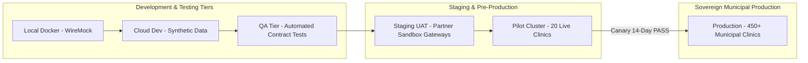

# Master Integration Environment Matrix, Sandbox vs Production Parity & Cutover Playbook
## Namma Clinic Digital Health & Operations Platform
### Greater Bengaluru Authority (GBA) / BBMP Health Department
**Document Code:** `INT-DOC-11` | **Status:** APPROVED BASELINE | **Date:** September 2026

---

## 1. Executive Summary & Environment Strategy
This document formalizes the authoritative **Master Integration Environment Matrix, Sandbox vs. Production Parity, and Cutover Playbook** for the Namma Clinic Digital Health Platform. Because municipal primary healthcare touches live citizen records, production deployments require rigorous pre-validation across isolated testing tiers. The platform enforces strict environment progression across 6 standardized tiers: **Local Developer Container, Cloud Development, QA Integration Tier, Staging / UAT, Pilot Cluster (20 Clinics), and Sovereign Production (450+ Clinics)**. Each external integration partner (ABDM, NIC eHospital, State Reporting, and SMS Gateways) maintains precise endpoint, credential, and synthetic data parity between sandbox and production to ensure seamless cutovers with zero runtime regressions.

### 1.1 Non-Negotiable Environment Invariants
1. **Absolute Zero Production PHI in Lower Tiers:** Under no circumstances shall real citizen clinical or demographic records be replicated, cloned, or restored into Local, Dev, QA, or Staging environments. Lower environments exclusively use mathematically generated synthetic test data.
2. **Strict Cryptographic Credential Isolation:** Integration credentials (mTLS certificates, OIDC client secrets, and DLT API keys) for production must never share root CAs or key material with sandbox tiers. Production secrets are managed strictly in hardware-backed HSM vaults.
3. **Mock Gateway Parity:** In local and CI/CD pipelines where external government partner gateways are unreachable, integration contracts must be validated using containerized WireMock / Prism mock servers adhering to 100% schema fidelity.
4. **Dual-Run Canary Verification:** Prior to full municipal cutover, new integration interfaces must undergo a 14-day dual-run canary across the 20 Pilot Namma Clinics, verifying that p95 latency, error rates, and reconciliation discrepancies remain strictly within SLO.
5. **Automated Rollback Playbook:** If post-deployment integration error rates exceed 1.0% within the first 60 minutes of production release, traffic must automatically revert to the prior stable baseline via blue/green gateway routing.

## 2. Master Environment Progression & Cutover Pipeline Diagram


### Integration Specification Example: Local WireMock Contract Test Runner
<!-- DOCUMENTATION-ONLY EXAMPLE -->
```python
# DOCUMENTATION-ONLY PYTHON
# DOCUMENTATION-ONLY PYTHON: Local Integration Mock Server Runner
from typing import Dict, Any

class WiremockIntegrationTestRunner:
    """
    Spawns and configures local WireMock stubs for ABDM and NIC eHospital gateways,
    enabling offline integration contract verification in local and CI/CD environments.
    """
    def __init__(self, mock_base_url: str = "http://localhost:8089"):
        self.mock_base_url = mock_base_url

    def configure_abdm_mock_stubs(self) -> Dict[str, Any]:
        """Registers simulated ABDM M1 and M2 responses."""
        stub_definition = {
            "request": {
                "method": "POST",
                "urlPath": "/v0.5/users/auth/init"
            },
            "response": {
                "status": 202,
                "headers": {
                    "Content-Type": "application/json"
                },
                "jsonBody": {
                    "transactionId": "mock-tx-99481024",
                    "status": "ACCEPTED_MOCK"
                }
            }
        }
        return {
            "stub_endpoint": f"{self.mock_base_url}/__admin/mappings",
            "stub_payload": stub_definition
        }
```

### Configuration Specification Example: Local Integration Environment Compose
<!-- DOCUMENTATION-ONLY EXAMPLE -->
```yaml
# DOCUMENTATION-ONLY CONFIGURATION
# DOCUMENTATION-ONLY CONFIGURATION: Local Integration Test Environment
version: '3.8'
services:
  namma-integration-gateway:
    image: kong:3.4-alpine
    environment:
      KONG_DATABASE: "off"
      KONG_DECLARATIVE_CONFIG: /etc/kong/kong.yml
    ports:
      - "8000:8000"
      - "8443:8443"

  wiremock-partner-stubs:
    image: wiremock/wiremock:3.2.0
    ports:
      - "8089:8080"
    volumes:
      - ./tests/integration/wiremock:/home/wiremock

  synthetic-data-generator:
    image: python:3.11-slim
    environment:
      TARGET_ENV: "LOCAL_DOCKER"
      SYNTHETIC_RATIO: "1.0"
      CITIZEN_COUNT: "1000"
```

## 3. Master Catalog of 25 Integration Environments
Authoritative specification of all 25 environment configurations spanning the delivery pipeline:

### ENV-INT-001: Environment `Local-Docker`
- **Environment Identifier:** `ENV-INT-001`
- **Tier Name:** Local-Docker
- **Gateway Ingress:** `https://gateway-local-docker.internal.bbmp.gov.in/v1`
- **Authentication Provider:** Keycloak OIDC Realm Local-Docker
- **Mock Mode Enabled:** `True`
- **Synthetic Data Ratio:** `100.0%`
- **Security & Compliance Boundary:** DPDP Sovereign In-State Isolated VPC

### ENV-INT-002: Environment `Development-Cloud`
- **Environment Identifier:** `ENV-INT-002`
- **Tier Name:** Development-Cloud
- **Gateway Ingress:** `https://gateway-development-cloud.internal.bbmp.gov.in/v1`
- **Authentication Provider:** Keycloak OIDC Realm Development-Cloud
- **Mock Mode Enabled:** `True`
- **Synthetic Data Ratio:** `100.0%`
- **Security & Compliance Boundary:** DPDP Sovereign In-State Isolated VPC

### ENV-INT-003: Environment `QA-Test-Tier`
- **Environment Identifier:** `ENV-INT-003`
- **Tier Name:** QA-Test-Tier
- **Gateway Ingress:** `https://gateway-qa-test-tier.internal.bbmp.gov.in/v1`
- **Authentication Provider:** Keycloak OIDC Realm QA-Test-Tier
- **Mock Mode Enabled:** `False`
- **Synthetic Data Ratio:** `100.0%`
- **Security & Compliance Boundary:** DPDP Sovereign In-State Isolated VPC

### ENV-INT-004: Environment `Staging-UAT`
- **Environment Identifier:** `ENV-INT-004`
- **Tier Name:** Staging-UAT
- **Gateway Ingress:** `https://gateway-staging-uat.internal.bbmp.gov.in/v1`
- **Authentication Provider:** Keycloak OIDC Realm Staging-UAT
- **Mock Mode Enabled:** `False`
- **Synthetic Data Ratio:** `0.0%`
- **Security & Compliance Boundary:** DPDP Sovereign In-State Isolated VPC

### ENV-INT-005: Environment `Pilot-20-Clinics`
- **Environment Identifier:** `ENV-INT-005`
- **Tier Name:** Pilot-20-Clinics
- **Gateway Ingress:** `https://gateway-pilot-20-clinics.internal.bbmp.gov.in/v1`
- **Authentication Provider:** Keycloak OIDC Realm Pilot-20-Clinics
- **Mock Mode Enabled:** `False`
- **Synthetic Data Ratio:** `0.0%`
- **Security & Compliance Boundary:** DPDP Sovereign In-State Isolated VPC

### ENV-INT-006: Environment `Production-450-Clinics`
- **Environment Identifier:** `ENV-INT-006`
- **Tier Name:** Production-450-Clinics
- **Gateway Ingress:** `https://gateway-production-450-clinics.internal.bbmp.gov.in/v1`
- **Authentication Provider:** Keycloak OIDC Realm Production-450-Clinics
- **Mock Mode Enabled:** `False`
- **Synthetic Data Ratio:** `0.0%`
- **Security & Compliance Boundary:** DPDP Sovereign In-State Isolated VPC

### ENV-INT-007: Environment `Local-Docker`
- **Environment Identifier:** `ENV-INT-007`
- **Tier Name:** Local-Docker
- **Gateway Ingress:** `https://gateway-local-docker.internal.bbmp.gov.in/v1`
- **Authentication Provider:** Keycloak OIDC Realm Local-Docker
- **Mock Mode Enabled:** `True`
- **Synthetic Data Ratio:** `100.0%`
- **Security & Compliance Boundary:** DPDP Sovereign In-State Isolated VPC

### ENV-INT-008: Environment `Development-Cloud`
- **Environment Identifier:** `ENV-INT-008`
- **Tier Name:** Development-Cloud
- **Gateway Ingress:** `https://gateway-development-cloud.internal.bbmp.gov.in/v1`
- **Authentication Provider:** Keycloak OIDC Realm Development-Cloud
- **Mock Mode Enabled:** `True`
- **Synthetic Data Ratio:** `100.0%`
- **Security & Compliance Boundary:** DPDP Sovereign In-State Isolated VPC

### ENV-INT-009: Environment `QA-Test-Tier`
- **Environment Identifier:** `ENV-INT-009`
- **Tier Name:** QA-Test-Tier
- **Gateway Ingress:** `https://gateway-qa-test-tier.internal.bbmp.gov.in/v1`
- **Authentication Provider:** Keycloak OIDC Realm QA-Test-Tier
- **Mock Mode Enabled:** `False`
- **Synthetic Data Ratio:** `100.0%`
- **Security & Compliance Boundary:** DPDP Sovereign In-State Isolated VPC

### ENV-INT-010: Environment `Staging-UAT`
- **Environment Identifier:** `ENV-INT-010`
- **Tier Name:** Staging-UAT
- **Gateway Ingress:** `https://gateway-staging-uat.internal.bbmp.gov.in/v1`
- **Authentication Provider:** Keycloak OIDC Realm Staging-UAT
- **Mock Mode Enabled:** `False`
- **Synthetic Data Ratio:** `0.0%`
- **Security & Compliance Boundary:** DPDP Sovereign In-State Isolated VPC

### ENV-INT-011: Environment `Pilot-20-Clinics`
- **Environment Identifier:** `ENV-INT-011`
- **Tier Name:** Pilot-20-Clinics
- **Gateway Ingress:** `https://gateway-pilot-20-clinics.internal.bbmp.gov.in/v1`
- **Authentication Provider:** Keycloak OIDC Realm Pilot-20-Clinics
- **Mock Mode Enabled:** `False`
- **Synthetic Data Ratio:** `0.0%`
- **Security & Compliance Boundary:** DPDP Sovereign In-State Isolated VPC

### ENV-INT-012: Environment `Production-450-Clinics`
- **Environment Identifier:** `ENV-INT-012`
- **Tier Name:** Production-450-Clinics
- **Gateway Ingress:** `https://gateway-production-450-clinics.internal.bbmp.gov.in/v1`
- **Authentication Provider:** Keycloak OIDC Realm Production-450-Clinics
- **Mock Mode Enabled:** `False`
- **Synthetic Data Ratio:** `0.0%`
- **Security & Compliance Boundary:** DPDP Sovereign In-State Isolated VPC

### ENV-INT-013: Environment `Local-Docker`
- **Environment Identifier:** `ENV-INT-013`
- **Tier Name:** Local-Docker
- **Gateway Ingress:** `https://gateway-local-docker.internal.bbmp.gov.in/v1`
- **Authentication Provider:** Keycloak OIDC Realm Local-Docker
- **Mock Mode Enabled:** `True`
- **Synthetic Data Ratio:** `100.0%`
- **Security & Compliance Boundary:** DPDP Sovereign In-State Isolated VPC

### ENV-INT-014: Environment `Development-Cloud`
- **Environment Identifier:** `ENV-INT-014`
- **Tier Name:** Development-Cloud
- **Gateway Ingress:** `https://gateway-development-cloud.internal.bbmp.gov.in/v1`
- **Authentication Provider:** Keycloak OIDC Realm Development-Cloud
- **Mock Mode Enabled:** `True`
- **Synthetic Data Ratio:** `100.0%`
- **Security & Compliance Boundary:** DPDP Sovereign In-State Isolated VPC

### ENV-INT-015: Environment `QA-Test-Tier`
- **Environment Identifier:** `ENV-INT-015`
- **Tier Name:** QA-Test-Tier
- **Gateway Ingress:** `https://gateway-qa-test-tier.internal.bbmp.gov.in/v1`
- **Authentication Provider:** Keycloak OIDC Realm QA-Test-Tier
- **Mock Mode Enabled:** `False`
- **Synthetic Data Ratio:** `100.0%`
- **Security & Compliance Boundary:** DPDP Sovereign In-State Isolated VPC

### ENV-INT-016: Environment `Staging-UAT`
- **Environment Identifier:** `ENV-INT-016`
- **Tier Name:** Staging-UAT
- **Gateway Ingress:** `https://gateway-staging-uat.internal.bbmp.gov.in/v1`
- **Authentication Provider:** Keycloak OIDC Realm Staging-UAT
- **Mock Mode Enabled:** `False`
- **Synthetic Data Ratio:** `0.0%`
- **Security & Compliance Boundary:** DPDP Sovereign In-State Isolated VPC

### ENV-INT-017: Environment `Pilot-20-Clinics`
- **Environment Identifier:** `ENV-INT-017`
- **Tier Name:** Pilot-20-Clinics
- **Gateway Ingress:** `https://gateway-pilot-20-clinics.internal.bbmp.gov.in/v1`
- **Authentication Provider:** Keycloak OIDC Realm Pilot-20-Clinics
- **Mock Mode Enabled:** `False`
- **Synthetic Data Ratio:** `0.0%`
- **Security & Compliance Boundary:** DPDP Sovereign In-State Isolated VPC

### ENV-INT-018: Environment `Production-450-Clinics`
- **Environment Identifier:** `ENV-INT-018`
- **Tier Name:** Production-450-Clinics
- **Gateway Ingress:** `https://gateway-production-450-clinics.internal.bbmp.gov.in/v1`
- **Authentication Provider:** Keycloak OIDC Realm Production-450-Clinics
- **Mock Mode Enabled:** `False`
- **Synthetic Data Ratio:** `0.0%`
- **Security & Compliance Boundary:** DPDP Sovereign In-State Isolated VPC

### ENV-INT-019: Environment `Local-Docker`
- **Environment Identifier:** `ENV-INT-019`
- **Tier Name:** Local-Docker
- **Gateway Ingress:** `https://gateway-local-docker.internal.bbmp.gov.in/v1`
- **Authentication Provider:** Keycloak OIDC Realm Local-Docker
- **Mock Mode Enabled:** `True`
- **Synthetic Data Ratio:** `100.0%`
- **Security & Compliance Boundary:** DPDP Sovereign In-State Isolated VPC

### ENV-INT-020: Environment `Development-Cloud`
- **Environment Identifier:** `ENV-INT-020`
- **Tier Name:** Development-Cloud
- **Gateway Ingress:** `https://gateway-development-cloud.internal.bbmp.gov.in/v1`
- **Authentication Provider:** Keycloak OIDC Realm Development-Cloud
- **Mock Mode Enabled:** `True`
- **Synthetic Data Ratio:** `100.0%`
- **Security & Compliance Boundary:** DPDP Sovereign In-State Isolated VPC

### ENV-INT-021: Environment `QA-Test-Tier`
- **Environment Identifier:** `ENV-INT-021`
- **Tier Name:** QA-Test-Tier
- **Gateway Ingress:** `https://gateway-qa-test-tier.internal.bbmp.gov.in/v1`
- **Authentication Provider:** Keycloak OIDC Realm QA-Test-Tier
- **Mock Mode Enabled:** `False`
- **Synthetic Data Ratio:** `100.0%`
- **Security & Compliance Boundary:** DPDP Sovereign In-State Isolated VPC

### ENV-INT-022: Environment `Staging-UAT`
- **Environment Identifier:** `ENV-INT-022`
- **Tier Name:** Staging-UAT
- **Gateway Ingress:** `https://gateway-staging-uat.internal.bbmp.gov.in/v1`
- **Authentication Provider:** Keycloak OIDC Realm Staging-UAT
- **Mock Mode Enabled:** `False`
- **Synthetic Data Ratio:** `0.0%`
- **Security & Compliance Boundary:** DPDP Sovereign In-State Isolated VPC

### ENV-INT-023: Environment `Pilot-20-Clinics`
- **Environment Identifier:** `ENV-INT-023`
- **Tier Name:** Pilot-20-Clinics
- **Gateway Ingress:** `https://gateway-pilot-20-clinics.internal.bbmp.gov.in/v1`
- **Authentication Provider:** Keycloak OIDC Realm Pilot-20-Clinics
- **Mock Mode Enabled:** `False`
- **Synthetic Data Ratio:** `0.0%`
- **Security & Compliance Boundary:** DPDP Sovereign In-State Isolated VPC

### ENV-INT-024: Environment `Production-450-Clinics`
- **Environment Identifier:** `ENV-INT-024`
- **Tier Name:** Production-450-Clinics
- **Gateway Ingress:** `https://gateway-production-450-clinics.internal.bbmp.gov.in/v1`
- **Authentication Provider:** Keycloak OIDC Realm Production-450-Clinics
- **Mock Mode Enabled:** `False`
- **Synthetic Data Ratio:** `0.0%`
- **Security & Compliance Boundary:** DPDP Sovereign In-State Isolated VPC

### ENV-INT-025: Environment `Local-Docker`
- **Environment Identifier:** `ENV-INT-025`
- **Tier Name:** Local-Docker
- **Gateway Ingress:** `https://gateway-local-docker.internal.bbmp.gov.in/v1`
- **Authentication Provider:** Keycloak OIDC Realm Local-Docker
- **Mock Mode Enabled:** `True`
- **Synthetic Data Ratio:** `100.0%`
- **Security & Compliance Boundary:** DPDP Sovereign In-State Isolated VPC

## 4. Master Catalog of 50 Automated Integration Tests
Quality gate contract, latency, and failover test scenarios across environments:

### TEST-INT-001: Test Scenario `Integration Test Scenario 001 (CONTRACT_TEST)`
- **Test Identifier:** `TEST-INT-001`
- **Test Title:** Integration Test Scenario 001 (CONTRACT_TEST)
- **Test Classification:** `CONTRACT_TEST`
- **Target Integration Flow:** `INT-001`
- **Assertion Requirement:** Verifies zero data loss, schema adherence, and latency SLA conformance under simulated partner conditions.
- **Mock / Execution Engine:** `WireMock / Pact Consumer-Driven Contract Runner`
- **Deployment Gate:** `CI/CD Pre-Deployment Gate PR-GATE-001`

### TEST-INT-002: Test Scenario `Integration Test Scenario 002 (MOCK_GATEWAY_TEST)`
- **Test Identifier:** `TEST-INT-002`
- **Test Title:** Integration Test Scenario 002 (MOCK_GATEWAY_TEST)
- **Test Classification:** `MOCK_GATEWAY_TEST`
- **Target Integration Flow:** `INT-002`
- **Assertion Requirement:** Verifies zero data loss, schema adherence, and latency SLA conformance under simulated partner conditions.
- **Mock / Execution Engine:** `WireMock / Pact Consumer-Driven Contract Runner`
- **Deployment Gate:** `CI/CD Pre-Deployment Gate PR-GATE-002`

### TEST-INT-003: Test Scenario `Integration Test Scenario 003 (CHAOS_LATENCY_TEST)`
- **Test Identifier:** `TEST-INT-003`
- **Test Title:** Integration Test Scenario 003 (CHAOS_LATENCY_TEST)
- **Test Classification:** `CHAOS_LATENCY_TEST`
- **Target Integration Flow:** `INT-003`
- **Assertion Requirement:** Verifies zero data loss, schema adherence, and latency SLA conformance under simulated partner conditions.
- **Mock / Execution Engine:** `WireMock / Pact Consumer-Driven Contract Runner`
- **Deployment Gate:** `CI/CD Pre-Deployment Gate PR-GATE-003`

### TEST-INT-004: Test Scenario `Integration Test Scenario 004 (REPLAY_IDEMPOTENCY_TEST)`
- **Test Identifier:** `TEST-INT-004`
- **Test Title:** Integration Test Scenario 004 (REPLAY_IDEMPOTENCY_TEST)
- **Test Classification:** `REPLAY_IDEMPOTENCY_TEST`
- **Target Integration Flow:** `INT-004`
- **Assertion Requirement:** Verifies zero data loss, schema adherence, and latency SLA conformance under simulated partner conditions.
- **Mock / Execution Engine:** `WireMock / Pact Consumer-Driven Contract Runner`
- **Deployment Gate:** `CI/CD Pre-Deployment Gate PR-GATE-004`

### TEST-INT-005: Test Scenario `Integration Test Scenario 005 (SECURITY_VAPT_TEST)`
- **Test Identifier:** `TEST-INT-005`
- **Test Title:** Integration Test Scenario 005 (SECURITY_VAPT_TEST)
- **Test Classification:** `SECURITY_VAPT_TEST`
- **Target Integration Flow:** `INT-005`
- **Assertion Requirement:** Verifies zero data loss, schema adherence, and latency SLA conformance under simulated partner conditions.
- **Mock / Execution Engine:** `WireMock / Pact Consumer-Driven Contract Runner`
- **Deployment Gate:** `CI/CD Pre-Deployment Gate PR-GATE-005`

### TEST-INT-006: Test Scenario `Integration Test Scenario 006 (END_TO_END_SYNC_TEST)`
- **Test Identifier:** `TEST-INT-006`
- **Test Title:** Integration Test Scenario 006 (END_TO_END_SYNC_TEST)
- **Test Classification:** `END_TO_END_SYNC_TEST`
- **Target Integration Flow:** `INT-006`
- **Assertion Requirement:** Verifies zero data loss, schema adherence, and latency SLA conformance under simulated partner conditions.
- **Mock / Execution Engine:** `WireMock / Pact Consumer-Driven Contract Runner`
- **Deployment Gate:** `CI/CD Pre-Deployment Gate PR-GATE-006`

### TEST-INT-007: Test Scenario `Integration Test Scenario 007 (CONTRACT_TEST)`
- **Test Identifier:** `TEST-INT-007`
- **Test Title:** Integration Test Scenario 007 (CONTRACT_TEST)
- **Test Classification:** `CONTRACT_TEST`
- **Target Integration Flow:** `INT-007`
- **Assertion Requirement:** Verifies zero data loss, schema adherence, and latency SLA conformance under simulated partner conditions.
- **Mock / Execution Engine:** `WireMock / Pact Consumer-Driven Contract Runner`
- **Deployment Gate:** `CI/CD Pre-Deployment Gate PR-GATE-007`

### TEST-INT-008: Test Scenario `Integration Test Scenario 008 (MOCK_GATEWAY_TEST)`
- **Test Identifier:** `TEST-INT-008`
- **Test Title:** Integration Test Scenario 008 (MOCK_GATEWAY_TEST)
- **Test Classification:** `MOCK_GATEWAY_TEST`
- **Target Integration Flow:** `INT-008`
- **Assertion Requirement:** Verifies zero data loss, schema adherence, and latency SLA conformance under simulated partner conditions.
- **Mock / Execution Engine:** `WireMock / Pact Consumer-Driven Contract Runner`
- **Deployment Gate:** `CI/CD Pre-Deployment Gate PR-GATE-008`

### TEST-INT-009: Test Scenario `Integration Test Scenario 009 (CHAOS_LATENCY_TEST)`
- **Test Identifier:** `TEST-INT-009`
- **Test Title:** Integration Test Scenario 009 (CHAOS_LATENCY_TEST)
- **Test Classification:** `CHAOS_LATENCY_TEST`
- **Target Integration Flow:** `INT-009`
- **Assertion Requirement:** Verifies zero data loss, schema adherence, and latency SLA conformance under simulated partner conditions.
- **Mock / Execution Engine:** `WireMock / Pact Consumer-Driven Contract Runner`
- **Deployment Gate:** `CI/CD Pre-Deployment Gate PR-GATE-009`

### TEST-INT-010: Test Scenario `Integration Test Scenario 010 (REPLAY_IDEMPOTENCY_TEST)`
- **Test Identifier:** `TEST-INT-010`
- **Test Title:** Integration Test Scenario 010 (REPLAY_IDEMPOTENCY_TEST)
- **Test Classification:** `REPLAY_IDEMPOTENCY_TEST`
- **Target Integration Flow:** `INT-010`
- **Assertion Requirement:** Verifies zero data loss, schema adherence, and latency SLA conformance under simulated partner conditions.
- **Mock / Execution Engine:** `WireMock / Pact Consumer-Driven Contract Runner`
- **Deployment Gate:** `CI/CD Pre-Deployment Gate PR-GATE-010`

### TEST-INT-011: Test Scenario `Integration Test Scenario 011 (SECURITY_VAPT_TEST)`
- **Test Identifier:** `TEST-INT-011`
- **Test Title:** Integration Test Scenario 011 (SECURITY_VAPT_TEST)
- **Test Classification:** `SECURITY_VAPT_TEST`
- **Target Integration Flow:** `INT-011`
- **Assertion Requirement:** Verifies zero data loss, schema adherence, and latency SLA conformance under simulated partner conditions.
- **Mock / Execution Engine:** `WireMock / Pact Consumer-Driven Contract Runner`
- **Deployment Gate:** `CI/CD Pre-Deployment Gate PR-GATE-011`

### TEST-INT-012: Test Scenario `Integration Test Scenario 012 (END_TO_END_SYNC_TEST)`
- **Test Identifier:** `TEST-INT-012`
- **Test Title:** Integration Test Scenario 012 (END_TO_END_SYNC_TEST)
- **Test Classification:** `END_TO_END_SYNC_TEST`
- **Target Integration Flow:** `INT-012`
- **Assertion Requirement:** Verifies zero data loss, schema adherence, and latency SLA conformance under simulated partner conditions.
- **Mock / Execution Engine:** `WireMock / Pact Consumer-Driven Contract Runner`
- **Deployment Gate:** `CI/CD Pre-Deployment Gate PR-GATE-012`

### TEST-INT-013: Test Scenario `Integration Test Scenario 013 (CONTRACT_TEST)`
- **Test Identifier:** `TEST-INT-013`
- **Test Title:** Integration Test Scenario 013 (CONTRACT_TEST)
- **Test Classification:** `CONTRACT_TEST`
- **Target Integration Flow:** `INT-013`
- **Assertion Requirement:** Verifies zero data loss, schema adherence, and latency SLA conformance under simulated partner conditions.
- **Mock / Execution Engine:** `WireMock / Pact Consumer-Driven Contract Runner`
- **Deployment Gate:** `CI/CD Pre-Deployment Gate PR-GATE-013`

### TEST-INT-014: Test Scenario `Integration Test Scenario 014 (MOCK_GATEWAY_TEST)`
- **Test Identifier:** `TEST-INT-014`
- **Test Title:** Integration Test Scenario 014 (MOCK_GATEWAY_TEST)
- **Test Classification:** `MOCK_GATEWAY_TEST`
- **Target Integration Flow:** `INT-014`
- **Assertion Requirement:** Verifies zero data loss, schema adherence, and latency SLA conformance under simulated partner conditions.
- **Mock / Execution Engine:** `WireMock / Pact Consumer-Driven Contract Runner`
- **Deployment Gate:** `CI/CD Pre-Deployment Gate PR-GATE-014`

### TEST-INT-015: Test Scenario `Integration Test Scenario 015 (CHAOS_LATENCY_TEST)`
- **Test Identifier:** `TEST-INT-015`
- **Test Title:** Integration Test Scenario 015 (CHAOS_LATENCY_TEST)
- **Test Classification:** `CHAOS_LATENCY_TEST`
- **Target Integration Flow:** `INT-015`
- **Assertion Requirement:** Verifies zero data loss, schema adherence, and latency SLA conformance under simulated partner conditions.
- **Mock / Execution Engine:** `WireMock / Pact Consumer-Driven Contract Runner`
- **Deployment Gate:** `CI/CD Pre-Deployment Gate PR-GATE-015`

### TEST-INT-016: Test Scenario `Integration Test Scenario 016 (REPLAY_IDEMPOTENCY_TEST)`
- **Test Identifier:** `TEST-INT-016`
- **Test Title:** Integration Test Scenario 016 (REPLAY_IDEMPOTENCY_TEST)
- **Test Classification:** `REPLAY_IDEMPOTENCY_TEST`
- **Target Integration Flow:** `INT-016`
- **Assertion Requirement:** Verifies zero data loss, schema adherence, and latency SLA conformance under simulated partner conditions.
- **Mock / Execution Engine:** `WireMock / Pact Consumer-Driven Contract Runner`
- **Deployment Gate:** `CI/CD Pre-Deployment Gate PR-GATE-016`

### TEST-INT-017: Test Scenario `Integration Test Scenario 017 (SECURITY_VAPT_TEST)`
- **Test Identifier:** `TEST-INT-017`
- **Test Title:** Integration Test Scenario 017 (SECURITY_VAPT_TEST)
- **Test Classification:** `SECURITY_VAPT_TEST`
- **Target Integration Flow:** `INT-017`
- **Assertion Requirement:** Verifies zero data loss, schema adherence, and latency SLA conformance under simulated partner conditions.
- **Mock / Execution Engine:** `WireMock / Pact Consumer-Driven Contract Runner`
- **Deployment Gate:** `CI/CD Pre-Deployment Gate PR-GATE-017`

### TEST-INT-018: Test Scenario `Integration Test Scenario 018 (END_TO_END_SYNC_TEST)`
- **Test Identifier:** `TEST-INT-018`
- **Test Title:** Integration Test Scenario 018 (END_TO_END_SYNC_TEST)
- **Test Classification:** `END_TO_END_SYNC_TEST`
- **Target Integration Flow:** `INT-018`
- **Assertion Requirement:** Verifies zero data loss, schema adherence, and latency SLA conformance under simulated partner conditions.
- **Mock / Execution Engine:** `WireMock / Pact Consumer-Driven Contract Runner`
- **Deployment Gate:** `CI/CD Pre-Deployment Gate PR-GATE-018`

### TEST-INT-019: Test Scenario `Integration Test Scenario 019 (CONTRACT_TEST)`
- **Test Identifier:** `TEST-INT-019`
- **Test Title:** Integration Test Scenario 019 (CONTRACT_TEST)
- **Test Classification:** `CONTRACT_TEST`
- **Target Integration Flow:** `INT-019`
- **Assertion Requirement:** Verifies zero data loss, schema adherence, and latency SLA conformance under simulated partner conditions.
- **Mock / Execution Engine:** `WireMock / Pact Consumer-Driven Contract Runner`
- **Deployment Gate:** `CI/CD Pre-Deployment Gate PR-GATE-019`

### TEST-INT-020: Test Scenario `Integration Test Scenario 020 (MOCK_GATEWAY_TEST)`
- **Test Identifier:** `TEST-INT-020`
- **Test Title:** Integration Test Scenario 020 (MOCK_GATEWAY_TEST)
- **Test Classification:** `MOCK_GATEWAY_TEST`
- **Target Integration Flow:** `INT-020`
- **Assertion Requirement:** Verifies zero data loss, schema adherence, and latency SLA conformance under simulated partner conditions.
- **Mock / Execution Engine:** `WireMock / Pact Consumer-Driven Contract Runner`
- **Deployment Gate:** `CI/CD Pre-Deployment Gate PR-GATE-020`

### TEST-INT-021: Test Scenario `Integration Test Scenario 021 (CHAOS_LATENCY_TEST)`
- **Test Identifier:** `TEST-INT-021`
- **Test Title:** Integration Test Scenario 021 (CHAOS_LATENCY_TEST)
- **Test Classification:** `CHAOS_LATENCY_TEST`
- **Target Integration Flow:** `INT-021`
- **Assertion Requirement:** Verifies zero data loss, schema adherence, and latency SLA conformance under simulated partner conditions.
- **Mock / Execution Engine:** `WireMock / Pact Consumer-Driven Contract Runner`
- **Deployment Gate:** `CI/CD Pre-Deployment Gate PR-GATE-021`

### TEST-INT-022: Test Scenario `Integration Test Scenario 022 (REPLAY_IDEMPOTENCY_TEST)`
- **Test Identifier:** `TEST-INT-022`
- **Test Title:** Integration Test Scenario 022 (REPLAY_IDEMPOTENCY_TEST)
- **Test Classification:** `REPLAY_IDEMPOTENCY_TEST`
- **Target Integration Flow:** `INT-022`
- **Assertion Requirement:** Verifies zero data loss, schema adherence, and latency SLA conformance under simulated partner conditions.
- **Mock / Execution Engine:** `WireMock / Pact Consumer-Driven Contract Runner`
- **Deployment Gate:** `CI/CD Pre-Deployment Gate PR-GATE-022`

### TEST-INT-023: Test Scenario `Integration Test Scenario 023 (SECURITY_VAPT_TEST)`
- **Test Identifier:** `TEST-INT-023`
- **Test Title:** Integration Test Scenario 023 (SECURITY_VAPT_TEST)
- **Test Classification:** `SECURITY_VAPT_TEST`
- **Target Integration Flow:** `INT-023`
- **Assertion Requirement:** Verifies zero data loss, schema adherence, and latency SLA conformance under simulated partner conditions.
- **Mock / Execution Engine:** `WireMock / Pact Consumer-Driven Contract Runner`
- **Deployment Gate:** `CI/CD Pre-Deployment Gate PR-GATE-023`

### TEST-INT-024: Test Scenario `Integration Test Scenario 024 (END_TO_END_SYNC_TEST)`
- **Test Identifier:** `TEST-INT-024`
- **Test Title:** Integration Test Scenario 024 (END_TO_END_SYNC_TEST)
- **Test Classification:** `END_TO_END_SYNC_TEST`
- **Target Integration Flow:** `INT-024`
- **Assertion Requirement:** Verifies zero data loss, schema adherence, and latency SLA conformance under simulated partner conditions.
- **Mock / Execution Engine:** `WireMock / Pact Consumer-Driven Contract Runner`
- **Deployment Gate:** `CI/CD Pre-Deployment Gate PR-GATE-024`

### TEST-INT-025: Test Scenario `Integration Test Scenario 025 (CONTRACT_TEST)`
- **Test Identifier:** `TEST-INT-025`
- **Test Title:** Integration Test Scenario 025 (CONTRACT_TEST)
- **Test Classification:** `CONTRACT_TEST`
- **Target Integration Flow:** `INT-025`
- **Assertion Requirement:** Verifies zero data loss, schema adherence, and latency SLA conformance under simulated partner conditions.
- **Mock / Execution Engine:** `WireMock / Pact Consumer-Driven Contract Runner`
- **Deployment Gate:** `CI/CD Pre-Deployment Gate PR-GATE-025`

### TEST-INT-026: Test Scenario `Integration Test Scenario 026 (MOCK_GATEWAY_TEST)`
- **Test Identifier:** `TEST-INT-026`
- **Test Title:** Integration Test Scenario 026 (MOCK_GATEWAY_TEST)
- **Test Classification:** `MOCK_GATEWAY_TEST`
- **Target Integration Flow:** `INT-026`
- **Assertion Requirement:** Verifies zero data loss, schema adherence, and latency SLA conformance under simulated partner conditions.
- **Mock / Execution Engine:** `WireMock / Pact Consumer-Driven Contract Runner`
- **Deployment Gate:** `CI/CD Pre-Deployment Gate PR-GATE-001`

### TEST-INT-027: Test Scenario `Integration Test Scenario 027 (CHAOS_LATENCY_TEST)`
- **Test Identifier:** `TEST-INT-027`
- **Test Title:** Integration Test Scenario 027 (CHAOS_LATENCY_TEST)
- **Test Classification:** `CHAOS_LATENCY_TEST`
- **Target Integration Flow:** `INT-027`
- **Assertion Requirement:** Verifies zero data loss, schema adherence, and latency SLA conformance under simulated partner conditions.
- **Mock / Execution Engine:** `WireMock / Pact Consumer-Driven Contract Runner`
- **Deployment Gate:** `CI/CD Pre-Deployment Gate PR-GATE-002`

### TEST-INT-028: Test Scenario `Integration Test Scenario 028 (REPLAY_IDEMPOTENCY_TEST)`
- **Test Identifier:** `TEST-INT-028`
- **Test Title:** Integration Test Scenario 028 (REPLAY_IDEMPOTENCY_TEST)
- **Test Classification:** `REPLAY_IDEMPOTENCY_TEST`
- **Target Integration Flow:** `INT-028`
- **Assertion Requirement:** Verifies zero data loss, schema adherence, and latency SLA conformance under simulated partner conditions.
- **Mock / Execution Engine:** `WireMock / Pact Consumer-Driven Contract Runner`
- **Deployment Gate:** `CI/CD Pre-Deployment Gate PR-GATE-003`

### TEST-INT-029: Test Scenario `Integration Test Scenario 029 (SECURITY_VAPT_TEST)`
- **Test Identifier:** `TEST-INT-029`
- **Test Title:** Integration Test Scenario 029 (SECURITY_VAPT_TEST)
- **Test Classification:** `SECURITY_VAPT_TEST`
- **Target Integration Flow:** `INT-029`
- **Assertion Requirement:** Verifies zero data loss, schema adherence, and latency SLA conformance under simulated partner conditions.
- **Mock / Execution Engine:** `WireMock / Pact Consumer-Driven Contract Runner`
- **Deployment Gate:** `CI/CD Pre-Deployment Gate PR-GATE-004`

### TEST-INT-030: Test Scenario `Integration Test Scenario 030 (END_TO_END_SYNC_TEST)`
- **Test Identifier:** `TEST-INT-030`
- **Test Title:** Integration Test Scenario 030 (END_TO_END_SYNC_TEST)
- **Test Classification:** `END_TO_END_SYNC_TEST`
- **Target Integration Flow:** `INT-030`
- **Assertion Requirement:** Verifies zero data loss, schema adherence, and latency SLA conformance under simulated partner conditions.
- **Mock / Execution Engine:** `WireMock / Pact Consumer-Driven Contract Runner`
- **Deployment Gate:** `CI/CD Pre-Deployment Gate PR-GATE-005`

### TEST-INT-031: Test Scenario `Integration Test Scenario 031 (CONTRACT_TEST)`
- **Test Identifier:** `TEST-INT-031`
- **Test Title:** Integration Test Scenario 031 (CONTRACT_TEST)
- **Test Classification:** `CONTRACT_TEST`
- **Target Integration Flow:** `INT-031`
- **Assertion Requirement:** Verifies zero data loss, schema adherence, and latency SLA conformance under simulated partner conditions.
- **Mock / Execution Engine:** `WireMock / Pact Consumer-Driven Contract Runner`
- **Deployment Gate:** `CI/CD Pre-Deployment Gate PR-GATE-006`

### TEST-INT-032: Test Scenario `Integration Test Scenario 032 (MOCK_GATEWAY_TEST)`
- **Test Identifier:** `TEST-INT-032`
- **Test Title:** Integration Test Scenario 032 (MOCK_GATEWAY_TEST)
- **Test Classification:** `MOCK_GATEWAY_TEST`
- **Target Integration Flow:** `INT-032`
- **Assertion Requirement:** Verifies zero data loss, schema adherence, and latency SLA conformance under simulated partner conditions.
- **Mock / Execution Engine:** `WireMock / Pact Consumer-Driven Contract Runner`
- **Deployment Gate:** `CI/CD Pre-Deployment Gate PR-GATE-007`

### TEST-INT-033: Test Scenario `Integration Test Scenario 033 (CHAOS_LATENCY_TEST)`
- **Test Identifier:** `TEST-INT-033`
- **Test Title:** Integration Test Scenario 033 (CHAOS_LATENCY_TEST)
- **Test Classification:** `CHAOS_LATENCY_TEST`
- **Target Integration Flow:** `INT-033`
- **Assertion Requirement:** Verifies zero data loss, schema adherence, and latency SLA conformance under simulated partner conditions.
- **Mock / Execution Engine:** `WireMock / Pact Consumer-Driven Contract Runner`
- **Deployment Gate:** `CI/CD Pre-Deployment Gate PR-GATE-008`

### TEST-INT-034: Test Scenario `Integration Test Scenario 034 (REPLAY_IDEMPOTENCY_TEST)`
- **Test Identifier:** `TEST-INT-034`
- **Test Title:** Integration Test Scenario 034 (REPLAY_IDEMPOTENCY_TEST)
- **Test Classification:** `REPLAY_IDEMPOTENCY_TEST`
- **Target Integration Flow:** `INT-034`
- **Assertion Requirement:** Verifies zero data loss, schema adherence, and latency SLA conformance under simulated partner conditions.
- **Mock / Execution Engine:** `WireMock / Pact Consumer-Driven Contract Runner`
- **Deployment Gate:** `CI/CD Pre-Deployment Gate PR-GATE-009`

### TEST-INT-035: Test Scenario `Integration Test Scenario 035 (SECURITY_VAPT_TEST)`
- **Test Identifier:** `TEST-INT-035`
- **Test Title:** Integration Test Scenario 035 (SECURITY_VAPT_TEST)
- **Test Classification:** `SECURITY_VAPT_TEST`
- **Target Integration Flow:** `INT-035`
- **Assertion Requirement:** Verifies zero data loss, schema adherence, and latency SLA conformance under simulated partner conditions.
- **Mock / Execution Engine:** `WireMock / Pact Consumer-Driven Contract Runner`
- **Deployment Gate:** `CI/CD Pre-Deployment Gate PR-GATE-010`

### TEST-INT-036: Test Scenario `Integration Test Scenario 036 (END_TO_END_SYNC_TEST)`
- **Test Identifier:** `TEST-INT-036`
- **Test Title:** Integration Test Scenario 036 (END_TO_END_SYNC_TEST)
- **Test Classification:** `END_TO_END_SYNC_TEST`
- **Target Integration Flow:** `INT-036`
- **Assertion Requirement:** Verifies zero data loss, schema adherence, and latency SLA conformance under simulated partner conditions.
- **Mock / Execution Engine:** `WireMock / Pact Consumer-Driven Contract Runner`
- **Deployment Gate:** `CI/CD Pre-Deployment Gate PR-GATE-011`

### TEST-INT-037: Test Scenario `Integration Test Scenario 037 (CONTRACT_TEST)`
- **Test Identifier:** `TEST-INT-037`
- **Test Title:** Integration Test Scenario 037 (CONTRACT_TEST)
- **Test Classification:** `CONTRACT_TEST`
- **Target Integration Flow:** `INT-037`
- **Assertion Requirement:** Verifies zero data loss, schema adherence, and latency SLA conformance under simulated partner conditions.
- **Mock / Execution Engine:** `WireMock / Pact Consumer-Driven Contract Runner`
- **Deployment Gate:** `CI/CD Pre-Deployment Gate PR-GATE-012`

### TEST-INT-038: Test Scenario `Integration Test Scenario 038 (MOCK_GATEWAY_TEST)`
- **Test Identifier:** `TEST-INT-038`
- **Test Title:** Integration Test Scenario 038 (MOCK_GATEWAY_TEST)
- **Test Classification:** `MOCK_GATEWAY_TEST`
- **Target Integration Flow:** `INT-038`
- **Assertion Requirement:** Verifies zero data loss, schema adherence, and latency SLA conformance under simulated partner conditions.
- **Mock / Execution Engine:** `WireMock / Pact Consumer-Driven Contract Runner`
- **Deployment Gate:** `CI/CD Pre-Deployment Gate PR-GATE-013`

### TEST-INT-039: Test Scenario `Integration Test Scenario 039 (CHAOS_LATENCY_TEST)`
- **Test Identifier:** `TEST-INT-039`
- **Test Title:** Integration Test Scenario 039 (CHAOS_LATENCY_TEST)
- **Test Classification:** `CHAOS_LATENCY_TEST`
- **Target Integration Flow:** `INT-039`
- **Assertion Requirement:** Verifies zero data loss, schema adherence, and latency SLA conformance under simulated partner conditions.
- **Mock / Execution Engine:** `WireMock / Pact Consumer-Driven Contract Runner`
- **Deployment Gate:** `CI/CD Pre-Deployment Gate PR-GATE-014`

### TEST-INT-040: Test Scenario `Integration Test Scenario 040 (REPLAY_IDEMPOTENCY_TEST)`
- **Test Identifier:** `TEST-INT-040`
- **Test Title:** Integration Test Scenario 040 (REPLAY_IDEMPOTENCY_TEST)
- **Test Classification:** `REPLAY_IDEMPOTENCY_TEST`
- **Target Integration Flow:** `INT-040`
- **Assertion Requirement:** Verifies zero data loss, schema adherence, and latency SLA conformance under simulated partner conditions.
- **Mock / Execution Engine:** `WireMock / Pact Consumer-Driven Contract Runner`
- **Deployment Gate:** `CI/CD Pre-Deployment Gate PR-GATE-015`

### TEST-INT-041: Test Scenario `Integration Test Scenario 041 (SECURITY_VAPT_TEST)`
- **Test Identifier:** `TEST-INT-041`
- **Test Title:** Integration Test Scenario 041 (SECURITY_VAPT_TEST)
- **Test Classification:** `SECURITY_VAPT_TEST`
- **Target Integration Flow:** `INT-041`
- **Assertion Requirement:** Verifies zero data loss, schema adherence, and latency SLA conformance under simulated partner conditions.
- **Mock / Execution Engine:** `WireMock / Pact Consumer-Driven Contract Runner`
- **Deployment Gate:** `CI/CD Pre-Deployment Gate PR-GATE-016`

### TEST-INT-042: Test Scenario `Integration Test Scenario 042 (END_TO_END_SYNC_TEST)`
- **Test Identifier:** `TEST-INT-042`
- **Test Title:** Integration Test Scenario 042 (END_TO_END_SYNC_TEST)
- **Test Classification:** `END_TO_END_SYNC_TEST`
- **Target Integration Flow:** `INT-042`
- **Assertion Requirement:** Verifies zero data loss, schema adherence, and latency SLA conformance under simulated partner conditions.
- **Mock / Execution Engine:** `WireMock / Pact Consumer-Driven Contract Runner`
- **Deployment Gate:** `CI/CD Pre-Deployment Gate PR-GATE-017`

### TEST-INT-043: Test Scenario `Integration Test Scenario 043 (CONTRACT_TEST)`
- **Test Identifier:** `TEST-INT-043`
- **Test Title:** Integration Test Scenario 043 (CONTRACT_TEST)
- **Test Classification:** `CONTRACT_TEST`
- **Target Integration Flow:** `INT-043`
- **Assertion Requirement:** Verifies zero data loss, schema adherence, and latency SLA conformance under simulated partner conditions.
- **Mock / Execution Engine:** `WireMock / Pact Consumer-Driven Contract Runner`
- **Deployment Gate:** `CI/CD Pre-Deployment Gate PR-GATE-018`

### TEST-INT-044: Test Scenario `Integration Test Scenario 044 (MOCK_GATEWAY_TEST)`
- **Test Identifier:** `TEST-INT-044`
- **Test Title:** Integration Test Scenario 044 (MOCK_GATEWAY_TEST)
- **Test Classification:** `MOCK_GATEWAY_TEST`
- **Target Integration Flow:** `INT-044`
- **Assertion Requirement:** Verifies zero data loss, schema adherence, and latency SLA conformance under simulated partner conditions.
- **Mock / Execution Engine:** `WireMock / Pact Consumer-Driven Contract Runner`
- **Deployment Gate:** `CI/CD Pre-Deployment Gate PR-GATE-019`

### TEST-INT-045: Test Scenario `Integration Test Scenario 045 (CHAOS_LATENCY_TEST)`
- **Test Identifier:** `TEST-INT-045`
- **Test Title:** Integration Test Scenario 045 (CHAOS_LATENCY_TEST)
- **Test Classification:** `CHAOS_LATENCY_TEST`
- **Target Integration Flow:** `INT-045`
- **Assertion Requirement:** Verifies zero data loss, schema adherence, and latency SLA conformance under simulated partner conditions.
- **Mock / Execution Engine:** `WireMock / Pact Consumer-Driven Contract Runner`
- **Deployment Gate:** `CI/CD Pre-Deployment Gate PR-GATE-020`

### TEST-INT-046: Test Scenario `Integration Test Scenario 046 (REPLAY_IDEMPOTENCY_TEST)`
- **Test Identifier:** `TEST-INT-046`
- **Test Title:** Integration Test Scenario 046 (REPLAY_IDEMPOTENCY_TEST)
- **Test Classification:** `REPLAY_IDEMPOTENCY_TEST`
- **Target Integration Flow:** `INT-046`
- **Assertion Requirement:** Verifies zero data loss, schema adherence, and latency SLA conformance under simulated partner conditions.
- **Mock / Execution Engine:** `WireMock / Pact Consumer-Driven Contract Runner`
- **Deployment Gate:** `CI/CD Pre-Deployment Gate PR-GATE-021`

### TEST-INT-047: Test Scenario `Integration Test Scenario 047 (SECURITY_VAPT_TEST)`
- **Test Identifier:** `TEST-INT-047`
- **Test Title:** Integration Test Scenario 047 (SECURITY_VAPT_TEST)
- **Test Classification:** `SECURITY_VAPT_TEST`
- **Target Integration Flow:** `INT-047`
- **Assertion Requirement:** Verifies zero data loss, schema adherence, and latency SLA conformance under simulated partner conditions.
- **Mock / Execution Engine:** `WireMock / Pact Consumer-Driven Contract Runner`
- **Deployment Gate:** `CI/CD Pre-Deployment Gate PR-GATE-022`

### TEST-INT-048: Test Scenario `Integration Test Scenario 048 (END_TO_END_SYNC_TEST)`
- **Test Identifier:** `TEST-INT-048`
- **Test Title:** Integration Test Scenario 048 (END_TO_END_SYNC_TEST)
- **Test Classification:** `END_TO_END_SYNC_TEST`
- **Target Integration Flow:** `INT-048`
- **Assertion Requirement:** Verifies zero data loss, schema adherence, and latency SLA conformance under simulated partner conditions.
- **Mock / Execution Engine:** `WireMock / Pact Consumer-Driven Contract Runner`
- **Deployment Gate:** `CI/CD Pre-Deployment Gate PR-GATE-023`

### TEST-INT-049: Test Scenario `Integration Test Scenario 049 (CONTRACT_TEST)`
- **Test Identifier:** `TEST-INT-049`
- **Test Title:** Integration Test Scenario 049 (CONTRACT_TEST)
- **Test Classification:** `CONTRACT_TEST`
- **Target Integration Flow:** `INT-049`
- **Assertion Requirement:** Verifies zero data loss, schema adherence, and latency SLA conformance under simulated partner conditions.
- **Mock / Execution Engine:** `WireMock / Pact Consumer-Driven Contract Runner`
- **Deployment Gate:** `CI/CD Pre-Deployment Gate PR-GATE-024`

### TEST-INT-050: Test Scenario `Integration Test Scenario 050 (MOCK_GATEWAY_TEST)`
- **Test Identifier:** `TEST-INT-050`
- **Test Title:** Integration Test Scenario 050 (MOCK_GATEWAY_TEST)
- **Test Classification:** `MOCK_GATEWAY_TEST`
- **Target Integration Flow:** `INT-050`
- **Assertion Requirement:** Verifies zero data loss, schema adherence, and latency SLA conformance under simulated partner conditions.
- **Mock / Execution Engine:** `WireMock / Pact Consumer-Driven Contract Runner`
- **Deployment Gate:** `CI/CD Pre-Deployment Gate PR-GATE-025`

## 5. Table-Level Environment Lineage across all 52 Relational Tables
Data masking and synthetic seeding rules across all 52 platform tables:

### TABLE-001: Environment Isolation for Table `auth_users`
- **Table Identifier:** `TABLE-001` (`TBL-01`)
- **Source Entity:** `auth_users`
- **Production Invariant:** Live transactional data protected by DPDP Act 2023 controls.
- **Sandbox Isolation:** Zero production row replication permitted into test tiers.
- **Synthetic Seeding Rule:** Seeded with 500 fictitious rows generated by deterministic Faker seed.
- **Schema Parity:** 100% schema alignment across Local, Dev, QA, Staging, and Production.

### TABLE-002: Environment Isolation for Table `user_credentials`
- **Table Identifier:** `TABLE-002` (`TBL-02`)
- **Source Entity:** `user_credentials`
- **Production Invariant:** Live transactional data protected by DPDP Act 2023 controls.
- **Sandbox Isolation:** Zero production row replication permitted into test tiers.
- **Synthetic Seeding Rule:** Seeded with 500 fictitious rows generated by deterministic Faker seed.
- **Schema Parity:** 100% schema alignment across Local, Dev, QA, Staging, and Production.

### TABLE-003: Environment Isolation for Table `user_sessions`
- **Table Identifier:** `TABLE-003` (`TBL-03`)
- **Source Entity:** `user_sessions`
- **Production Invariant:** Live transactional data protected by DPDP Act 2023 controls.
- **Sandbox Isolation:** Zero production row replication permitted into test tiers.
- **Synthetic Seeding Rule:** Seeded with 500 fictitious rows generated by deterministic Faker seed.
- **Schema Parity:** 100% schema alignment across Local, Dev, QA, Staging, and Production.

### TABLE-004: Environment Isolation for Table `roles`
- **Table Identifier:** `TABLE-004` (`TBL-04`)
- **Source Entity:** `roles`
- **Production Invariant:** Live transactional data protected by DPDP Act 2023 controls.
- **Sandbox Isolation:** Zero production row replication permitted into test tiers.
- **Synthetic Seeding Rule:** Seeded with 500 fictitious rows generated by deterministic Faker seed.
- **Schema Parity:** 100% schema alignment across Local, Dev, QA, Staging, and Production.

### TABLE-005: Environment Isolation for Table `permissions`
- **Table Identifier:** `TABLE-005` (`TBL-05`)
- **Source Entity:** `permissions`
- **Production Invariant:** Live transactional data protected by DPDP Act 2023 controls.
- **Sandbox Isolation:** Zero production row replication permitted into test tiers.
- **Synthetic Seeding Rule:** Seeded with 500 fictitious rows generated by deterministic Faker seed.
- **Schema Parity:** 100% schema alignment across Local, Dev, QA, Staging, and Production.

### TABLE-006: Environment Isolation for Table `role_permissions`
- **Table Identifier:** `TABLE-006` (`TBL-06`)
- **Source Entity:** `role_permissions`
- **Production Invariant:** Live transactional data protected by DPDP Act 2023 controls.
- **Sandbox Isolation:** Zero production row replication permitted into test tiers.
- **Synthetic Seeding Rule:** Seeded with 500 fictitious rows generated by deterministic Faker seed.
- **Schema Parity:** 100% schema alignment across Local, Dev, QA, Staging, and Production.

### TABLE-007: Environment Isolation for Table `user_roles`
- **Table Identifier:** `TABLE-007` (`TBL-07`)
- **Source Entity:** `user_roles`
- **Production Invariant:** Live transactional data protected by DPDP Act 2023 controls.
- **Sandbox Isolation:** Zero production row replication permitted into test tiers.
- **Synthetic Seeding Rule:** Seeded with 500 fictitious rows generated by deterministic Faker seed.
- **Schema Parity:** 100% schema alignment across Local, Dev, QA, Staging, and Production.

### TABLE-008: Environment Isolation for Table `facilities`
- **Table Identifier:** `TABLE-008` (`TBL-08`)
- **Source Entity:** `facilities`
- **Production Invariant:** Live transactional data protected by DPDP Act 2023 controls.
- **Sandbox Isolation:** Zero production row replication permitted into test tiers.
- **Synthetic Seeding Rule:** Seeded with 500 fictitious rows generated by deterministic Faker seed.
- **Schema Parity:** 100% schema alignment across Local, Dev, QA, Staging, and Production.

### TABLE-009: Environment Isolation for Table `facility_rooms`
- **Table Identifier:** `TABLE-009` (`TBL-09`)
- **Source Entity:** `facility_rooms`
- **Production Invariant:** Live transactional data protected by DPDP Act 2023 controls.
- **Sandbox Isolation:** Zero production row replication permitted into test tiers.
- **Synthetic Seeding Rule:** Seeded with 500 fictitious rows generated by deterministic Faker seed.
- **Schema Parity:** 100% schema alignment across Local, Dev, QA, Staging, and Production.

### TABLE-010: Environment Isolation for Table `staff_profiles`
- **Table Identifier:** `TABLE-010` (`TBL-10`)
- **Source Entity:** `staff_profiles`
- **Production Invariant:** Live transactional data protected by DPDP Act 2023 controls.
- **Sandbox Isolation:** Zero production row replication permitted into test tiers.
- **Synthetic Seeding Rule:** Seeded with 500 fictitious rows generated by deterministic Faker seed.
- **Schema Parity:** 100% schema alignment across Local, Dev, QA, Staging, and Production.

### TABLE-011: Environment Isolation for Table `staff_shifts`
- **Table Identifier:** `TABLE-011` (`TBL-11`)
- **Source Entity:** `staff_shifts`
- **Production Invariant:** Live transactional data protected by DPDP Act 2023 controls.
- **Sandbox Isolation:** Zero production row replication permitted into test tiers.
- **Synthetic Seeding Rule:** Seeded with 500 fictitious rows generated by deterministic Faker seed.
- **Schema Parity:** 100% schema alignment across Local, Dev, QA, Staging, and Production.

### TABLE-012: Environment Isolation for Table `system_configs`
- **Table Identifier:** `TABLE-012` (`TBL-12`)
- **Source Entity:** `system_configs`
- **Production Invariant:** Live transactional data protected by DPDP Act 2023 controls.
- **Sandbox Isolation:** Zero production row replication permitted into test tiers.
- **Synthetic Seeding Rule:** Seeded with 500 fictitious rows generated by deterministic Faker seed.
- **Schema Parity:** 100% schema alignment across Local, Dev, QA, Staging, and Production.

### TABLE-013: Environment Isolation for Table `patients`
- **Table Identifier:** `TABLE-013` (`TBL-13`)
- **Source Entity:** `patients`
- **Production Invariant:** Live transactional data protected by DPDP Act 2023 controls.
- **Sandbox Isolation:** Zero production row replication permitted into test tiers.
- **Synthetic Seeding Rule:** Seeded with 500 fictitious rows generated by deterministic Faker seed.
- **Schema Parity:** 100% schema alignment across Local, Dev, QA, Staging, and Production.

### TABLE-014: Environment Isolation for Table `patient_identifiers`
- **Table Identifier:** `TABLE-014` (`TBL-14`)
- **Source Entity:** `patient_identifiers`
- **Production Invariant:** Live transactional data protected by DPDP Act 2023 controls.
- **Sandbox Isolation:** Zero production row replication permitted into test tiers.
- **Synthetic Seeding Rule:** Seeded with 500 fictitious rows generated by deterministic Faker seed.
- **Schema Parity:** 100% schema alignment across Local, Dev, QA, Staging, and Production.

### TABLE-015: Environment Isolation for Table `patient_contacts`
- **Table Identifier:** `TABLE-015` (`TBL-15`)
- **Source Entity:** `patient_contacts`
- **Production Invariant:** Live transactional data protected by DPDP Act 2023 controls.
- **Sandbox Isolation:** Zero production row replication permitted into test tiers.
- **Synthetic Seeding Rule:** Seeded with 500 fictitious rows generated by deterministic Faker seed.
- **Schema Parity:** 100% schema alignment across Local, Dev, QA, Staging, and Production.

### TABLE-016: Environment Isolation for Table `patient_addresses`
- **Table Identifier:** `TABLE-016` (`TBL-16`)
- **Source Entity:** `patient_addresses`
- **Production Invariant:** Live transactional data protected by DPDP Act 2023 controls.
- **Sandbox Isolation:** Zero production row replication permitted into test tiers.
- **Synthetic Seeding Rule:** Seeded with 500 fictitious rows generated by deterministic Faker seed.
- **Schema Parity:** 100% schema alignment across Local, Dev, QA, Staging, and Production.

### TABLE-017: Environment Isolation for Table `consent_records`
- **Table Identifier:** `TABLE-017` (`TBL-17`)
- **Source Entity:** `consent_records`
- **Production Invariant:** Live transactional data protected by DPDP Act 2023 controls.
- **Sandbox Isolation:** Zero production row replication permitted into test tiers.
- **Synthetic Seeding Rule:** Seeded with 500 fictitious rows generated by deterministic Faker seed.
- **Schema Parity:** 100% schema alignment across Local, Dev, QA, Staging, and Production.

### TABLE-018: Environment Isolation for Table `tokens`
- **Table Identifier:** `TABLE-018` (`TBL-18`)
- **Source Entity:** `tokens`
- **Production Invariant:** Live transactional data protected by DPDP Act 2023 controls.
- **Sandbox Isolation:** Zero production row replication permitted into test tiers.
- **Synthetic Seeding Rule:** Seeded with 500 fictitious rows generated by deterministic Faker seed.
- **Schema Parity:** 100% schema alignment across Local, Dev, QA, Staging, and Production.

### TABLE-019: Environment Isolation for Table `queue_entries`
- **Table Identifier:** `TABLE-019` (`TBL-19`)
- **Source Entity:** `queue_entries`
- **Production Invariant:** Live transactional data protected by DPDP Act 2023 controls.
- **Sandbox Isolation:** Zero production row replication permitted into test tiers.
- **Synthetic Seeding Rule:** Seeded with 500 fictitious rows generated by deterministic Faker seed.
- **Schema Parity:** 100% schema alignment across Local, Dev, QA, Staging, and Production.

### TABLE-020: Environment Isolation for Table `triage_assessments`
- **Table Identifier:** `TABLE-020` (`TBL-20`)
- **Source Entity:** `triage_assessments`
- **Production Invariant:** Live transactional data protected by DPDP Act 2023 controls.
- **Sandbox Isolation:** Zero production row replication permitted into test tiers.
- **Synthetic Seeding Rule:** Seeded with 500 fictitious rows generated by deterministic Faker seed.
- **Schema Parity:** 100% schema alignment across Local, Dev, QA, Staging, and Production.

### TABLE-021: Environment Isolation for Table `patient_vitals`
- **Table Identifier:** `TABLE-021` (`TBL-21`)
- **Source Entity:** `patient_vitals`
- **Production Invariant:** Live transactional data protected by DPDP Act 2023 controls.
- **Sandbox Isolation:** Zero production row replication permitted into test tiers.
- **Synthetic Seeding Rule:** Seeded with 500 fictitious rows generated by deterministic Faker seed.
- **Schema Parity:** 100% schema alignment across Local, Dev, QA, Staging, and Production.

### TABLE-022: Environment Isolation for Table `danger_alerts`
- **Table Identifier:** `TABLE-022` (`TBL-22`)
- **Source Entity:** `danger_alerts`
- **Production Invariant:** Live transactional data protected by DPDP Act 2023 controls.
- **Sandbox Isolation:** Zero production row replication permitted into test tiers.
- **Synthetic Seeding Rule:** Seeded with 500 fictitious rows generated by deterministic Faker seed.
- **Schema Parity:** 100% schema alignment across Local, Dev, QA, Staging, and Production.

### TABLE-023: Environment Isolation for Table `clinical_encounters`
- **Table Identifier:** `TABLE-023` (`TBL-23`)
- **Source Entity:** `clinical_encounters`
- **Production Invariant:** Live transactional data protected by DPDP Act 2023 controls.
- **Sandbox Isolation:** Zero production row replication permitted into test tiers.
- **Synthetic Seeding Rule:** Seeded with 500 fictitious rows generated by deterministic Faker seed.
- **Schema Parity:** 100% schema alignment across Local, Dev, QA, Staging, and Production.

### TABLE-024: Environment Isolation for Table `clinical_notes`
- **Table Identifier:** `TABLE-024` (`TBL-24`)
- **Source Entity:** `clinical_notes`
- **Production Invariant:** Live transactional data protected by DPDP Act 2023 controls.
- **Sandbox Isolation:** Zero production row replication permitted into test tiers.
- **Synthetic Seeding Rule:** Seeded with 500 fictitious rows generated by deterministic Faker seed.
- **Schema Parity:** 100% schema alignment across Local, Dev, QA, Staging, and Production.

### TABLE-025: Environment Isolation for Table `diagnoses`
- **Table Identifier:** `TABLE-025` (`TBL-25`)
- **Source Entity:** `diagnoses`
- **Production Invariant:** Live transactional data protected by DPDP Act 2023 controls.
- **Sandbox Isolation:** Zero production row replication permitted into test tiers.
- **Synthetic Seeding Rule:** Seeded with 500 fictitious rows generated by deterministic Faker seed.
- **Schema Parity:** 100% schema alignment across Local, Dev, QA, Staging, and Production.

### TABLE-026: Environment Isolation for Table `prescriptions`
- **Table Identifier:** `TABLE-026` (`TBL-26`)
- **Source Entity:** `prescriptions`
- **Production Invariant:** Live transactional data protected by DPDP Act 2023 controls.
- **Sandbox Isolation:** Zero production row replication permitted into test tiers.
- **Synthetic Seeding Rule:** Seeded with 500 fictitious rows generated by deterministic Faker seed.
- **Schema Parity:** 100% schema alignment across Local, Dev, QA, Staging, and Production.

### TABLE-027: Environment Isolation for Table `prescription_items`
- **Table Identifier:** `TABLE-027` (`TBL-27`)
- **Source Entity:** `prescription_items`
- **Production Invariant:** Live transactional data protected by DPDP Act 2023 controls.
- **Sandbox Isolation:** Zero production row replication permitted into test tiers.
- **Synthetic Seeding Rule:** Seeded with 500 fictitious rows generated by deterministic Faker seed.
- **Schema Parity:** 100% schema alignment across Local, Dev, QA, Staging, and Production.

### TABLE-028: Environment Isolation for Table `lab_orders`
- **Table Identifier:** `TABLE-028` (`TBL-28`)
- **Source Entity:** `lab_orders`
- **Production Invariant:** Live transactional data protected by DPDP Act 2023 controls.
- **Sandbox Isolation:** Zero production row replication permitted into test tiers.
- **Synthetic Seeding Rule:** Seeded with 500 fictitious rows generated by deterministic Faker seed.
- **Schema Parity:** 100% schema alignment across Local, Dev, QA, Staging, and Production.

### TABLE-029: Environment Isolation for Table `lab_order_items`
- **Table Identifier:** `TABLE-029` (`TBL-29`)
- **Source Entity:** `lab_order_items`
- **Production Invariant:** Live transactional data protected by DPDP Act 2023 controls.
- **Sandbox Isolation:** Zero production row replication permitted into test tiers.
- **Synthetic Seeding Rule:** Seeded with 500 fictitious rows generated by deterministic Faker seed.
- **Schema Parity:** 100% schema alignment across Local, Dev, QA, Staging, and Production.

### TABLE-030: Environment Isolation for Table `lab_results`
- **Table Identifier:** `TABLE-030` (`TBL-30`)
- **Source Entity:** `lab_results`
- **Production Invariant:** Live transactional data protected by DPDP Act 2023 controls.
- **Sandbox Isolation:** Zero production row replication permitted into test tiers.
- **Synthetic Seeding Rule:** Seeded with 500 fictitious rows generated by deterministic Faker seed.
- **Schema Parity:** 100% schema alignment across Local, Dev, QA, Staging, and Production.

### TABLE-031: Environment Isolation for Table `teleconsultations`
- **Table Identifier:** `TABLE-031` (`TBL-31`)
- **Source Entity:** `teleconsultations`
- **Production Invariant:** Live transactional data protected by DPDP Act 2023 controls.
- **Sandbox Isolation:** Zero production row replication permitted into test tiers.
- **Synthetic Seeding Rule:** Seeded with 500 fictitious rows generated by deterministic Faker seed.
- **Schema Parity:** 100% schema alignment across Local, Dev, QA, Staging, and Production.

### TABLE-032: Environment Isolation for Table `formulary_drugs`
- **Table Identifier:** `TABLE-032` (`TBL-32`)
- **Source Entity:** `formulary_drugs`
- **Production Invariant:** Live transactional data protected by DPDP Act 2023 controls.
- **Sandbox Isolation:** Zero production row replication permitted into test tiers.
- **Synthetic Seeding Rule:** Seeded with 500 fictitious rows generated by deterministic Faker seed.
- **Schema Parity:** 100% schema alignment across Local, Dev, QA, Staging, and Production.

### TABLE-033: Environment Isolation for Table `drug_categories`
- **Table Identifier:** `TABLE-033` (`TBL-33`)
- **Source Entity:** `drug_categories`
- **Production Invariant:** Live transactional data protected by DPDP Act 2023 controls.
- **Sandbox Isolation:** Zero production row replication permitted into test tiers.
- **Synthetic Seeding Rule:** Seeded with 500 fictitious rows generated by deterministic Faker seed.
- **Schema Parity:** 100% schema alignment across Local, Dev, QA, Staging, and Production.

### TABLE-034: Environment Isolation for Table `pharmacy_batches`
- **Table Identifier:** `TABLE-034` (`TBL-34`)
- **Source Entity:** `pharmacy_batches`
- **Production Invariant:** Live transactional data protected by DPDP Act 2023 controls.
- **Sandbox Isolation:** Zero production row replication permitted into test tiers.
- **Synthetic Seeding Rule:** Seeded with 500 fictitious rows generated by deterministic Faker seed.
- **Schema Parity:** 100% schema alignment across Local, Dev, QA, Staging, and Production.

### TABLE-035: Environment Isolation for Table `clinic_stock`
- **Table Identifier:** `TABLE-035` (`TBL-35`)
- **Source Entity:** `clinic_stock`
- **Production Invariant:** Live transactional data protected by DPDP Act 2023 controls.
- **Sandbox Isolation:** Zero production row replication permitted into test tiers.
- **Synthetic Seeding Rule:** Seeded with 500 fictitious rows generated by deterministic Faker seed.
- **Schema Parity:** 100% schema alignment across Local, Dev, QA, Staging, and Production.

### TABLE-036: Environment Isolation for Table `dispensations`
- **Table Identifier:** `TABLE-036` (`TBL-36`)
- **Source Entity:** `dispensations`
- **Production Invariant:** Live transactional data protected by DPDP Act 2023 controls.
- **Sandbox Isolation:** Zero production row replication permitted into test tiers.
- **Synthetic Seeding Rule:** Seeded with 500 fictitious rows generated by deterministic Faker seed.
- **Schema Parity:** 100% schema alignment across Local, Dev, QA, Staging, and Production.

### TABLE-037: Environment Isolation for Table `dispensation_items`
- **Table Identifier:** `TABLE-037` (`TBL-37`)
- **Source Entity:** `dispensation_items`
- **Production Invariant:** Live transactional data protected by DPDP Act 2023 controls.
- **Sandbox Isolation:** Zero production row replication permitted into test tiers.
- **Synthetic Seeding Rule:** Seeded with 500 fictitious rows generated by deterministic Faker seed.
- **Schema Parity:** 100% schema alignment across Local, Dev, QA, Staging, and Production.

### TABLE-038: Environment Isolation for Table `stock_movements`
- **Table Identifier:** `TABLE-038` (`TBL-38`)
- **Source Entity:** `stock_movements`
- **Production Invariant:** Live transactional data protected by DPDP Act 2023 controls.
- **Sandbox Isolation:** Zero production row replication permitted into test tiers.
- **Synthetic Seeding Rule:** Seeded with 500 fictitious rows generated by deterministic Faker seed.
- **Schema Parity:** 100% schema alignment across Local, Dev, QA, Staging, and Production.

### TABLE-039: Environment Isolation for Table `drug_indents`
- **Table Identifier:** `TABLE-039` (`TBL-39`)
- **Source Entity:** `drug_indents`
- **Production Invariant:** Live transactional data protected by DPDP Act 2023 controls.
- **Sandbox Isolation:** Zero production row replication permitted into test tiers.
- **Synthetic Seeding Rule:** Seeded with 500 fictitious rows generated by deterministic Faker seed.
- **Schema Parity:** 100% schema alignment across Local, Dev, QA, Staging, and Production.

### TABLE-040: Environment Isolation for Table `indent_items`
- **Table Identifier:** `TABLE-040` (`TBL-40`)
- **Source Entity:** `indent_items`
- **Production Invariant:** Live transactional data protected by DPDP Act 2023 controls.
- **Sandbox Isolation:** Zero production row replication permitted into test tiers.
- **Synthetic Seeding Rule:** Seeded with 500 fictitious rows generated by deterministic Faker seed.
- **Schema Parity:** 100% schema alignment across Local, Dev, QA, Staging, and Production.

### TABLE-041: Environment Isolation for Table `cold_chain_devices`
- **Table Identifier:** `TABLE-041` (`TBL-41`)
- **Source Entity:** `cold_chain_devices`
- **Production Invariant:** Live transactional data protected by DPDP Act 2023 controls.
- **Sandbox Isolation:** Zero production row replication permitted into test tiers.
- **Synthetic Seeding Rule:** Seeded with 500 fictitious rows generated by deterministic Faker seed.
- **Schema Parity:** 100% schema alignment across Local, Dev, QA, Staging, and Production.

### TABLE-042: Environment Isolation for Table `cold_chain_telemetry`
- **Table Identifier:** `TABLE-042` (`TBL-42`)
- **Source Entity:** `cold_chain_telemetry`
- **Production Invariant:** Live transactional data protected by DPDP Act 2023 controls.
- **Sandbox Isolation:** Zero production row replication permitted into test tiers.
- **Synthetic Seeding Rule:** Seeded with 500 fictitious rows generated by deterministic Faker seed.
- **Schema Parity:** 100% schema alignment across Local, Dev, QA, Staging, and Production.

### TABLE-043: Environment Isolation for Table `referrals`
- **Table Identifier:** `TABLE-043` (`TBL-43`)
- **Source Entity:** `referrals`
- **Production Invariant:** Live transactional data protected by DPDP Act 2023 controls.
- **Sandbox Isolation:** Zero production row replication permitted into test tiers.
- **Synthetic Seeding Rule:** Seeded with 500 fictitious rows generated by deterministic Faker seed.
- **Schema Parity:** 100% schema alignment across Local, Dev, QA, Staging, and Production.

### TABLE-044: Environment Isolation for Table `referral_counter_notes`
- **Table Identifier:** `TABLE-044` (`TBL-44`)
- **Source Entity:** `referral_counter_notes`
- **Production Invariant:** Live transactional data protected by DPDP Act 2023 controls.
- **Sandbox Isolation:** Zero production row replication permitted into test tiers.
- **Synthetic Seeding Rule:** Seeded with 500 fictitious rows generated by deterministic Faker seed.
- **Schema Parity:** 100% schema alignment across Local, Dev, QA, Staging, and Production.

### TABLE-045: Environment Isolation for Table `ncd_episodes`
- **Table Identifier:** `TABLE-045` (`TBL-45`)
- **Source Entity:** `ncd_episodes`
- **Production Invariant:** Live transactional data protected by DPDP Act 2023 controls.
- **Sandbox Isolation:** Zero production row replication permitted into test tiers.
- **Synthetic Seeding Rule:** Seeded with 500 fictitious rows generated by deterministic Faker seed.
- **Schema Parity:** 100% schema alignment across Local, Dev, QA, Staging, and Production.

### TABLE-046: Environment Isolation for Table `follow_up_schedules`
- **Table Identifier:** `TABLE-046` (`TBL-46`)
- **Source Entity:** `follow_up_schedules`
- **Production Invariant:** Live transactional data protected by DPDP Act 2023 controls.
- **Sandbox Isolation:** Zero production row replication permitted into test tiers.
- **Synthetic Seeding Rule:** Seeded with 500 fictitious rows generated by deterministic Faker seed.
- **Schema Parity:** 100% schema alignment across Local, Dev, QA, Staging, and Production.

### TABLE-047: Environment Isolation for Table `notifications`
- **Table Identifier:** `TABLE-047` (`TBL-47`)
- **Source Entity:** `notifications`
- **Production Invariant:** Live transactional data protected by DPDP Act 2023 controls.
- **Sandbox Isolation:** Zero production row replication permitted into test tiers.
- **Synthetic Seeding Rule:** Seeded with 500 fictitious rows generated by deterministic Faker seed.
- **Schema Parity:** 100% schema alignment across Local, Dev, QA, Staging, and Production.

### TABLE-048: Environment Isolation for Table `grievances`
- **Table Identifier:** `TABLE-048` (`TBL-48`)
- **Source Entity:** `grievances`
- **Production Invariant:** Live transactional data protected by DPDP Act 2023 controls.
- **Sandbox Isolation:** Zero production row replication permitted into test tiers.
- **Synthetic Seeding Rule:** Seeded with 500 fictitious rows generated by deterministic Faker seed.
- **Schema Parity:** 100% schema alignment across Local, Dev, QA, Staging, and Production.

### TABLE-049: Environment Isolation for Table `helpdesk_tickets`
- **Table Identifier:** `TABLE-049` (`TBL-49`)
- **Source Entity:** `helpdesk_tickets`
- **Production Invariant:** Live transactional data protected by DPDP Act 2023 controls.
- **Sandbox Isolation:** Zero production row replication permitted into test tiers.
- **Synthetic Seeding Rule:** Seeded with 500 fictitious rows generated by deterministic Faker seed.
- **Schema Parity:** 100% schema alignment across Local, Dev, QA, Staging, and Production.

### TABLE-050: Environment Isolation for Table `audit_events`
- **Table Identifier:** `TABLE-050` (`TBL-50`)
- **Source Entity:** `audit_events`
- **Production Invariant:** Live transactional data protected by DPDP Act 2023 controls.
- **Sandbox Isolation:** Zero production row replication permitted into test tiers.
- **Synthetic Seeding Rule:** Seeded with 500 fictitious rows generated by deterministic Faker seed.
- **Schema Parity:** 100% schema alignment across Local, Dev, QA, Staging, and Production.

### TABLE-051: Environment Isolation for Table `offline_mutation_log`
- **Table Identifier:** `TABLE-051` (`TBL-51`)
- **Source Entity:** `offline_mutation_log`
- **Production Invariant:** Live transactional data protected by DPDP Act 2023 controls.
- **Sandbox Isolation:** Zero production row replication permitted into test tiers.
- **Synthetic Seeding Rule:** Seeded with 500 fictitious rows generated by deterministic Faker seed.
- **Schema Parity:** 100% schema alignment across Local, Dev, QA, Staging, and Production.

### TABLE-052: Environment Isolation for Table `abdm_artifacts`
- **Table Identifier:** `TABLE-052` (`TBL-52`)
- **Source Entity:** `abdm_artifacts`
- **Production Invariant:** Live transactional data protected by DPDP Act 2023 controls.
- **Sandbox Isolation:** Zero production row replication permitted into test tiers.
- **Synthetic Seeding Rule:** Seeded with 500 fictitious rows generated by deterministic Faker seed.
- **Schema Parity:** 100% schema alignment across Local, Dev, QA, Staging, and Production.

## 6. Product Feature Environment Matrix across all 180 Features
Feature toggle and test readiness across all 180 platform product features:

### FEATURE-001: Environment Verification for Feature `Credential Verification`
- **Feature Identifier:** `FEATURE-001` (Feature #1)
- **Functional Module:** `MODULE-001` (DOMAIN-001)
- **Verification Protocol:** Contract-tested against WireMock mock gateway in CI/CD pipeline.
- **Pilot Validation:** Tested by frontline clinicians across the 20 Pilot Namma Clinics.
- **Production Gate:** Automated smoke test executed post-cutover before declaring ready.

### FEATURE-002: Environment Verification for Feature `Session Token Minting`
- **Feature Identifier:** `FEATURE-002` (Feature #2)
- **Functional Module:** `MODULE-001` (DOMAIN-001)
- **Verification Protocol:** Contract-tested against WireMock mock gateway in CI/CD pipeline.
- **Pilot Validation:** Tested by frontline clinicians across the 20 Pilot Namma Clinics.
- **Production Gate:** Automated smoke test executed post-cutover before declaring ready.

### FEATURE-003: Environment Verification for Feature `MFA Challenge Dispatch`
- **Feature Identifier:** `FEATURE-003` (Feature #3)
- **Functional Module:** `MODULE-001` (DOMAIN-001)
- **Verification Protocol:** Contract-tested against WireMock mock gateway in CI/CD pipeline.
- **Pilot Validation:** Tested by frontline clinicians across the 20 Pilot Namma Clinics.
- **Production Gate:** Automated smoke test executed post-cutover before declaring ready.

### FEATURE-004: Environment Verification for Feature `Biometric Authentication Bridge`
- **Feature Identifier:** `FEATURE-004` (Feature #4)
- **Functional Module:** `MODULE-001` (DOMAIN-001)
- **Verification Protocol:** Contract-tested against WireMock mock gateway in CI/CD pipeline.
- **Pilot Validation:** Tested by frontline clinicians across the 20 Pilot Namma Clinics.
- **Production Gate:** Automated smoke test executed post-cutover before declaring ready.

### FEATURE-005: Environment Verification for Feature `Local PIN Verification`
- **Feature Identifier:** `FEATURE-005` (Feature #5)
- **Functional Module:** `MODULE-001` (DOMAIN-001)
- **Verification Protocol:** Contract-tested against WireMock mock gateway in CI/CD pipeline.
- **Pilot Validation:** Tested by frontline clinicians across the 20 Pilot Namma Clinics.
- **Production Gate:** Automated smoke test executed post-cutover before declaring ready.

### FEATURE-006: Environment Verification for Feature `Session Inactivity Lockout`
- **Feature Identifier:** `FEATURE-006` (Feature #6)
- **Functional Module:** `MODULE-001` (DOMAIN-001)
- **Verification Protocol:** Contract-tested against WireMock mock gateway in CI/CD pipeline.
- **Pilot Validation:** Tested by frontline clinicians across the 20 Pilot Namma Clinics.
- **Production Gate:** Automated smoke test executed post-cutover before declaring ready.

### FEATURE-007: Environment Verification for Feature `Permission Evaluation`
- **Feature Identifier:** `FEATURE-007` (Feature #7)
- **Functional Module:** `MODULE-002` (DOMAIN-001)
- **Verification Protocol:** Contract-tested against WireMock mock gateway in CI/CD pipeline.
- **Pilot Validation:** Tested by frontline clinicians across the 20 Pilot Namma Clinics.
- **Production Gate:** Automated smoke test executed post-cutover before declaring ready.

### FEATURE-008: Environment Verification for Feature `Dynamic Role Assignment`
- **Feature Identifier:** `FEATURE-008` (Feature #8)
- **Functional Module:** `MODULE-002` (DOMAIN-001)
- **Verification Protocol:** Contract-tested against WireMock mock gateway in CI/CD pipeline.
- **Pilot Validation:** Tested by frontline clinicians across the 20 Pilot Namma Clinics.
- **Production Gate:** Automated smoke test executed post-cutover before declaring ready.

### FEATURE-009: Environment Verification for Feature `Conflict-of-Interest Prevention`
- **Feature Identifier:** `FEATURE-009` (Feature #9)
- **Functional Module:** `MODULE-002` (DOMAIN-001)
- **Verification Protocol:** Contract-tested against WireMock mock gateway in CI/CD pipeline.
- **Pilot Validation:** Tested by frontline clinicians across the 20 Pilot Namma Clinics.
- **Production Gate:** Automated smoke test executed post-cutover before declaring ready.

### FEATURE-010: Environment Verification for Feature `Maker-Checker Authorization`
- **Feature Identifier:** `FEATURE-010` (Feature #10)
- **Functional Module:** `MODULE-002` (DOMAIN-001)
- **Verification Protocol:** Contract-tested against WireMock mock gateway in CI/CD pipeline.
- **Pilot Validation:** Tested by frontline clinicians across the 20 Pilot Namma Clinics.
- **Production Gate:** Automated smoke test executed post-cutover before declaring ready.

### FEATURE-011: Environment Verification for Feature `Break-Glass Privilege Elevation`
- **Feature Identifier:** `FEATURE-011` (Feature #11)
- **Functional Module:** `MODULE-002` (DOMAIN-001)
- **Verification Protocol:** Contract-tested against WireMock mock gateway in CI/CD pipeline.
- **Pilot Validation:** Tested by frontline clinicians across the 20 Pilot Namma Clinics.
- **Production Gate:** Automated smoke test executed post-cutover before declaring ready.

### FEATURE-012: Environment Verification for Feature `Privilege Elevation Audit`
- **Feature Identifier:** `FEATURE-012` (Feature #12)
- **Functional Module:** `MODULE-002` (DOMAIN-001)
- **Verification Protocol:** Contract-tested against WireMock mock gateway in CI/CD pipeline.
- **Pilot Validation:** Tested by frontline clinicians across the 20 Pilot Namma Clinics.
- **Production Gate:** Automated smoke test executed post-cutover before declaring ready.

### FEATURE-013: Environment Verification for Feature `Hierarchy Node Management`
- **Feature Identifier:** `FEATURE-013` (Feature #13)
- **Functional Module:** `MODULE-003` (DOMAIN-001)
- **Verification Protocol:** Contract-tested against WireMock mock gateway in CI/CD pipeline.
- **Pilot Validation:** Tested by frontline clinicians across the 20 Pilot Namma Clinics.
- **Production Gate:** Automated smoke test executed post-cutover before declaring ready.

### FEATURE-014: Environment Verification for Feature `NIN / HFR Registry Linking`
- **Feature Identifier:** `FEATURE-014` (Feature #14)
- **Functional Module:** `MODULE-003` (DOMAIN-001)
- **Verification Protocol:** Contract-tested against WireMock mock gateway in CI/CD pipeline.
- **Pilot Validation:** Tested by frontline clinicians across the 20 Pilot Namma Clinics.
- **Production Gate:** Automated smoke test executed post-cutover before declaring ready.

### FEATURE-015: Environment Verification for Feature `Station Terminal Mapping`
- **Feature Identifier:** `FEATURE-015` (Feature #15)
- **Functional Module:** `MODULE-003` (DOMAIN-001)
- **Verification Protocol:** Contract-tested against WireMock mock gateway in CI/CD pipeline.
- **Pilot Validation:** Tested by frontline clinicians across the 20 Pilot Namma Clinics.
- **Production Gate:** Automated smoke test executed post-cutover before declaring ready.

### FEATURE-016: Environment Verification for Feature `Facility Capacity Configuration`
- **Feature Identifier:** `FEATURE-016` (Feature #16)
- **Functional Module:** `MODULE-003` (DOMAIN-001)
- **Verification Protocol:** Contract-tested against WireMock mock gateway in CI/CD pipeline.
- **Pilot Validation:** Tested by frontline clinicians across the 20 Pilot Namma Clinics.
- **Production Gate:** Automated smoke test executed post-cutover before declaring ready.

### FEATURE-017: Environment Verification for Feature `Operating Hours Enforcement`
- **Feature Identifier:** `FEATURE-017` (Feature #17)
- **Functional Module:** `MODULE-003` (DOMAIN-001)
- **Verification Protocol:** Contract-tested against WireMock mock gateway in CI/CD pipeline.
- **Pilot Validation:** Tested by frontline clinicians across the 20 Pilot Namma Clinics.
- **Production Gate:** Automated smoke test executed post-cutover before declaring ready.

### FEATURE-018: Environment Verification for Feature `Special Camp Calendar`
- **Feature Identifier:** `FEATURE-018` (Feature #18)
- **Functional Module:** `MODULE-003` (DOMAIN-001)
- **Verification Protocol:** Contract-tested against WireMock mock gateway in CI/CD pipeline.
- **Pilot Validation:** Tested by frontline clinicians across the 20 Pilot Namma Clinics.
- **Production Gate:** Automated smoke test executed post-cutover before declaring ready.

### FEATURE-019: Environment Verification for Feature `Staff Onboarding & KYC`
- **Feature Identifier:** `FEATURE-019` (Feature #19)
- **Functional Module:** `MODULE-004` (DOMAIN-001)
- **Verification Protocol:** Contract-tested against WireMock mock gateway in CI/CD pipeline.
- **Pilot Validation:** Tested by frontline clinicians across the 20 Pilot Namma Clinics.
- **Production Gate:** Automated smoke test executed post-cutover before declaring ready.

### FEATURE-020: Environment Verification for Feature `Professional License Verification`
- **Feature Identifier:** `FEATURE-020` (Feature #20)
- **Functional Module:** `MODULE-004` (DOMAIN-001)
- **Verification Protocol:** Contract-tested against WireMock mock gateway in CI/CD pipeline.
- **Pilot Validation:** Tested by frontline clinicians across the 20 Pilot Namma Clinics.
- **Production Gate:** Automated smoke test executed post-cutover before declaring ready.

### FEATURE-021: Environment Verification for Feature `Duty Roster Generation`
- **Feature Identifier:** `FEATURE-021` (Feature #21)
- **Functional Module:** `MODULE-004` (DOMAIN-001)
- **Verification Protocol:** Contract-tested against WireMock mock gateway in CI/CD pipeline.
- **Pilot Validation:** Tested by frontline clinicians across the 20 Pilot Namma Clinics.
- **Production Gate:** Automated smoke test executed post-cutover before declaring ready.

### FEATURE-022: Environment Verification for Feature `Biometric Attendance Linking`
- **Feature Identifier:** `FEATURE-022` (Feature #22)
- **Functional Module:** `MODULE-004` (DOMAIN-001)
- **Verification Protocol:** Contract-tested against WireMock mock gateway in CI/CD pipeline.
- **Pilot Validation:** Tested by frontline clinicians across the 20 Pilot Namma Clinics.
- **Production Gate:** Automated smoke test executed post-cutover before declaring ready.

### FEATURE-023: Environment Verification for Feature `Digital Signature Enrollment`
- **Feature Identifier:** `FEATURE-023` (Feature #23)
- **Functional Module:** `MODULE-004` (DOMAIN-001)
- **Verification Protocol:** Contract-tested against WireMock mock gateway in CI/CD pipeline.
- **Pilot Validation:** Tested by frontline clinicians across the 20 Pilot Namma Clinics.
- **Production Gate:** Automated smoke test executed post-cutover before declaring ready.

### FEATURE-024: Environment Verification for Feature `Signature Revocation`
- **Feature Identifier:** `FEATURE-024` (Feature #24)
- **Functional Module:** `MODULE-004` (DOMAIN-001)
- **Verification Protocol:** Contract-tested against WireMock mock gateway in CI/CD pipeline.
- **Pilot Validation:** Tested by frontline clinicians across the 20 Pilot Namma Clinics.
- **Production Gate:** Automated smoke test executed post-cutover before declaring ready.

### FEATURE-025: Environment Verification for Feature `Targeted Flag Activation`
- **Feature Identifier:** `FEATURE-025` (Feature #25)
- **Functional Module:** `MODULE-026` (DOMAIN-001)
- **Verification Protocol:** Contract-tested against WireMock mock gateway in CI/CD pipeline.
- **Pilot Validation:** Tested by frontline clinicians across the 20 Pilot Namma Clinics.
- **Production Gate:** Automated smoke test executed post-cutover before declaring ready.

### FEATURE-026: Environment Verification for Feature `Emergency Feature Killswitch`
- **Feature Identifier:** `FEATURE-026` (Feature #26)
- **Functional Module:** `MODULE-026` (DOMAIN-001)
- **Verification Protocol:** Contract-tested against WireMock mock gateway in CI/CD pipeline.
- **Pilot Validation:** Tested by frontline clinicians across the 20 Pilot Namma Clinics.
- **Production Gate:** Automated smoke test executed post-cutover before declaring ready.

### FEATURE-027: Environment Verification for Feature `System Parameter Tuning`
- **Feature Identifier:** `FEATURE-027` (Feature #27)
- **Functional Module:** `MODULE-026` (DOMAIN-001)
- **Verification Protocol:** Contract-tested against WireMock mock gateway in CI/CD pipeline.
- **Pilot Validation:** Tested by frontline clinicians across the 20 Pilot Namma Clinics.
- **Production Gate:** Automated smoke test executed post-cutover before declaring ready.

### FEATURE-028: Environment Verification for Feature `Edge Configuration Distribution`
- **Feature Identifier:** `FEATURE-028` (Feature #28)
- **Functional Module:** `MODULE-026` (DOMAIN-001)
- **Verification Protocol:** Contract-tested against WireMock mock gateway in CI/CD pipeline.
- **Pilot Validation:** Tested by frontline clinicians across the 20 Pilot Namma Clinics.
- **Production Gate:** Automated smoke test executed post-cutover before declaring ready.

### FEATURE-029: Environment Verification for Feature `Edge Migration Orchestration`
- **Feature Identifier:** `FEATURE-029` (Feature #29)
- **Functional Module:** `MODULE-026` (DOMAIN-001)
- **Verification Protocol:** Contract-tested against WireMock mock gateway in CI/CD pipeline.
- **Pilot Validation:** Tested by frontline clinicians across the 20 Pilot Namma Clinics.
- **Production Gate:** Automated smoke test executed post-cutover before declaring ready.

### FEATURE-030: Environment Verification for Feature `Health Probe Monitoring`
- **Feature Identifier:** `FEATURE-030` (Feature #30)
- **Functional Module:** `MODULE-026` (DOMAIN-001)
- **Verification Protocol:** Contract-tested against WireMock mock gateway in CI/CD pipeline.
- **Pilot Validation:** Tested by frontline clinicians across the 20 Pilot Namma Clinics.
- **Production Gate:** Automated smoke test executed post-cutover before declaring ready.

### FEATURE-031: Environment Verification for Feature `Bilingual Intake UI`
- **Feature Identifier:** `FEATURE-031` (Feature #31)
- **Functional Module:** `MODULE-005` (DOMAIN-002)
- **Verification Protocol:** Contract-tested against WireMock mock gateway in CI/CD pipeline.
- **Pilot Validation:** Tested by frontline clinicians across the 20 Pilot Namma Clinics.
- **Production Gate:** Automated smoke test executed post-cutover before declaring ready.

### FEATURE-032: Environment Verification for Feature `Vulnerable Citizen Flagging`
- **Feature Identifier:** `FEATURE-032` (Feature #32)
- **Functional Module:** `MODULE-005` (DOMAIN-002)
- **Verification Protocol:** Contract-tested against WireMock mock gateway in CI/CD pipeline.
- **Pilot Validation:** Tested by frontline clinicians across the 20 Pilot Namma Clinics.
- **Production Gate:** Automated smoke test executed post-cutover before declaring ready.

### FEATURE-033: Environment Verification for Feature `Aadhaar OTP ABHA Bridge`
- **Feature Identifier:** `FEATURE-033` (Feature #33)
- **Functional Module:** `MODULE-005` (DOMAIN-002)
- **Verification Protocol:** Contract-tested against WireMock mock gateway in CI/CD pipeline.
- **Pilot Validation:** Tested by frontline clinicians across the 20 Pilot Namma Clinics.
- **Production Gate:** Automated smoke test executed post-cutover before declaring ready.

### FEATURE-034: Environment Verification for Feature `Demographic ABHA Creation`
- **Feature Identifier:** `FEATURE-034` (Feature #34)
- **Functional Module:** `MODULE-005` (DOMAIN-002)
- **Verification Protocol:** Contract-tested against WireMock mock gateway in CI/CD pipeline.
- **Pilot Validation:** Tested by frontline clinicians across the 20 Pilot Namma Clinics.
- **Production Gate:** Automated smoke test executed post-cutover before declaring ready.

### FEATURE-035: Environment Verification for Feature `Deterministic UHID Minting`
- **Feature Identifier:** `FEATURE-035` (Feature #35)
- **Functional Module:** `MODULE-005` (DOMAIN-002)
- **Verification Protocol:** Contract-tested against WireMock mock gateway in CI/CD pipeline.
- **Pilot Validation:** Tested by frontline clinicians across the 20 Pilot Namma Clinics.
- **Production Gate:** Automated smoke test executed post-cutover before declaring ready.

### FEATURE-036: Environment Verification for Feature `Soundex / Double-Metaphone Matching`
- **Feature Identifier:** `FEATURE-036` (Feature #36)
- **Functional Module:** `MODULE-005` (DOMAIN-002)
- **Verification Protocol:** Contract-tested against WireMock mock gateway in CI/CD pipeline.
- **Pilot Validation:** Tested by frontline clinicians across the 20 Pilot Namma Clinics.
- **Production Gate:** Automated smoke test executed post-cutover before declaring ready.

### FEATURE-037: Environment Verification for Feature `Bilingual Consent Presentation`
- **Feature Identifier:** `FEATURE-037` (Feature #37)
- **Functional Module:** `MODULE-006` (DOMAIN-002)
- **Verification Protocol:** Contract-tested against WireMock mock gateway in CI/CD pipeline.
- **Pilot Validation:** Tested by frontline clinicians across the 20 Pilot Namma Clinics.
- **Production Gate:** Automated smoke test executed post-cutover before declaring ready.

### FEATURE-038: Environment Verification for Feature `Digital Signature / Thumbprint Capture`
- **Feature Identifier:** `FEATURE-038` (Feature #38)
- **Functional Module:** `MODULE-006` (DOMAIN-002)
- **Verification Protocol:** Contract-tested against WireMock mock gateway in CI/CD pipeline.
- **Pilot Validation:** Tested by frontline clinicians across the 20 Pilot Namma Clinics.
- **Production Gate:** Automated smoke test executed post-cutover before declaring ready.

### FEATURE-039: Environment Verification for Feature `Granular Purpose-Based Consent`
- **Feature Identifier:** `FEATURE-039` (Feature #39)
- **Functional Module:** `MODULE-006` (DOMAIN-002)
- **Verification Protocol:** Contract-tested against WireMock mock gateway in CI/CD pipeline.
- **Pilot Validation:** Tested by frontline clinicians across the 20 Pilot Namma Clinics.
- **Production Gate:** Automated smoke test executed post-cutover before declaring ready.

### FEATURE-040: Environment Verification for Feature `Consent Revocation Workflow`
- **Feature Identifier:** `FEATURE-040` (Feature #40)
- **Functional Module:** `MODULE-006` (DOMAIN-002)
- **Verification Protocol:** Contract-tested against WireMock mock gateway in CI/CD pipeline.
- **Pilot Validation:** Tested by frontline clinicians across the 20 Pilot Namma Clinics.
- **Production Gate:** Automated smoke test executed post-cutover before declaring ready.

### FEATURE-041: Environment Verification for Feature `Guardian Relationship Verification`
- **Feature Identifier:** `FEATURE-041` (Feature #41)
- **Functional Module:** `MODULE-006` (DOMAIN-002)
- **Verification Protocol:** Contract-tested against WireMock mock gateway in CI/CD pipeline.
- **Pilot Validation:** Tested by frontline clinicians across the 20 Pilot Namma Clinics.
- **Production Gate:** Automated smoke test executed post-cutover before declaring ready.

### FEATURE-042: Environment Verification for Feature `Implied Emergency Consent`
- **Feature Identifier:** `FEATURE-042` (Feature #42)
- **Functional Module:** `MODULE-006` (DOMAIN-002)
- **Verification Protocol:** Contract-tested against WireMock mock gateway in CI/CD pipeline.
- **Pilot Validation:** Tested by frontline clinicians across the 20 Pilot Namma Clinics.
- **Production Gate:** Automated smoke test executed post-cutover before declaring ready.

### FEATURE-043: Environment Verification for Feature `Daily Token Counter`
- **Feature Identifier:** `FEATURE-043` (Feature #43)
- **Functional Module:** `MODULE-007` (DOMAIN-002)
- **Verification Protocol:** Contract-tested against WireMock mock gateway in CI/CD pipeline.
- **Pilot Validation:** Tested by frontline clinicians across the 20 Pilot Namma Clinics.
- **Production Gate:** Automated smoke test executed post-cutover before declaring ready.

### FEATURE-044: Environment Verification for Feature `Station Route Calculation`
- **Feature Identifier:** `FEATURE-044` (Feature #44)
- **Functional Module:** `MODULE-007` (DOMAIN-002)
- **Verification Protocol:** Contract-tested against WireMock mock gateway in CI/CD pipeline.
- **Pilot Validation:** Tested by frontline clinicians across the 20 Pilot Namma Clinics.
- **Production Gate:** Automated smoke test executed post-cutover before declaring ready.

### FEATURE-045: Environment Verification for Feature `Acuity-Based Insertion`
- **Feature Identifier:** `FEATURE-045` (Feature #45)
- **Functional Module:** `MODULE-007` (DOMAIN-002)
- **Verification Protocol:** Contract-tested against WireMock mock gateway in CI/CD pipeline.
- **Pilot Validation:** Tested by frontline clinicians across the 20 Pilot Namma Clinics.
- **Production Gate:** Automated smoke test executed post-cutover before declaring ready.

### FEATURE-046: Environment Verification for Feature `Vulnerable Citizen Interleaving`
- **Feature Identifier:** `FEATURE-046` (Feature #46)
- **Functional Module:** `MODULE-007` (DOMAIN-002)
- **Verification Protocol:** Contract-tested against WireMock mock gateway in CI/CD pipeline.
- **Pilot Validation:** Tested by frontline clinicians across the 20 Pilot Namma Clinics.
- **Production Gate:** Automated smoke test executed post-cutover before declaring ready.

### FEATURE-047: Environment Verification for Feature `ESC/POS Thermal Printing`
- **Feature Identifier:** `FEATURE-047` (Feature #47)
- **Functional Module:** `MODULE-007` (DOMAIN-002)
- **Verification Protocol:** Contract-tested against WireMock mock gateway in CI/CD pipeline.
- **Pilot Validation:** Tested by frontline clinicians across the 20 Pilot Namma Clinics.
- **Production Gate:** Automated smoke test executed post-cutover before declaring ready.

### FEATURE-048: Environment Verification for Feature `Virtual SMS Token Fallback`
- **Feature Identifier:** `FEATURE-048` (Feature #48)
- **Functional Module:** `MODULE-007` (DOMAIN-002)
- **Verification Protocol:** Contract-tested against WireMock mock gateway in CI/CD pipeline.
- **Pilot Validation:** Tested by frontline clinicians across the 20 Pilot Namma Clinics.
- **Production Gate:** Automated smoke test executed post-cutover before declaring ready.

### FEATURE-049: Environment Verification for Feature `Next-Patient Call Action`
- **Feature Identifier:** `FEATURE-049` (Feature #49)
- **Functional Module:** `MODULE-008` (DOMAIN-002)
- **Verification Protocol:** Contract-tested against WireMock mock gateway in CI/CD pipeline.
- **Pilot Validation:** Tested by frontline clinicians across the 20 Pilot Namma Clinics.
- **Production Gate:** Automated smoke test executed post-cutover before declaring ready.

### FEATURE-050: Environment Verification for Feature `No-Show & Recall Management`
- **Feature Identifier:** `FEATURE-050` (Feature #50)
- **Functional Module:** `MODULE-008` (DOMAIN-002)
- **Verification Protocol:** Contract-tested against WireMock mock gateway in CI/CD pipeline.
- **Pilot Validation:** Tested by frontline clinicians across the 20 Pilot Namma Clinics.
- **Production Gate:** Automated smoke test executed post-cutover before declaring ready.

### FEATURE-051: Environment Verification for Feature `HDMI Waiting Hall Display`
- **Feature Identifier:** `FEATURE-051` (Feature #51)
- **Functional Module:** `MODULE-008` (DOMAIN-002)
- **Verification Protocol:** Contract-tested against WireMock mock gateway in CI/CD pipeline.
- **Pilot Validation:** Tested by frontline clinicians across the 20 Pilot Namma Clinics.
- **Production Gate:** Automated smoke test executed post-cutover before declaring ready.

### FEATURE-052: Environment Verification for Feature `Text-to-Speech Audio Chime`
- **Feature Identifier:** `FEATURE-052` (Feature #52)
- **Functional Module:** `MODULE-008` (DOMAIN-002)
- **Verification Protocol:** Contract-tested against WireMock mock gateway in CI/CD pipeline.
- **Pilot Validation:** Tested by frontline clinicians across the 20 Pilot Namma Clinics.
- **Production Gate:** Automated smoke test executed post-cutover before declaring ready.

### FEATURE-053: Environment Verification for Feature `Dynamic Load Distribution`
- **Feature Identifier:** `FEATURE-053` (Feature #53)
- **Functional Module:** `MODULE-008` (DOMAIN-002)
- **Verification Protocol:** Contract-tested against WireMock mock gateway in CI/CD pipeline.
- **Pilot Validation:** Tested by frontline clinicians across the 20 Pilot Namma Clinics.
- **Production Gate:** Automated smoke test executed post-cutover before declaring ready.

### FEATURE-054: Environment Verification for Feature `Queue Pausing & Resumption`
- **Feature Identifier:** `FEATURE-054` (Feature #54)
- **Functional Module:** `MODULE-008` (DOMAIN-002)
- **Verification Protocol:** Contract-tested against WireMock mock gateway in CI/CD pipeline.
- **Pilot Validation:** Tested by frontline clinicians across the 20 Pilot Namma Clinics.
- **Production Gate:** Automated smoke test executed post-cutover before declaring ready.

### FEATURE-055: Environment Verification for Feature `Kiosk Exit Rating`
- **Feature Identifier:** `FEATURE-055` (Feature #55)
- **Functional Module:** `MODULE-020` (DOMAIN-002)
- **Verification Protocol:** Contract-tested against WireMock mock gateway in CI/CD pipeline.
- **Pilot Validation:** Tested by frontline clinicians across the 20 Pilot Namma Clinics.
- **Production Gate:** Automated smoke test executed post-cutover before declaring ready.

### FEATURE-056: Environment Verification for Feature `Medicine Receipt Confirmation`
- **Feature Identifier:** `FEATURE-056` (Feature #56)
- **Functional Module:** `MODULE-020` (DOMAIN-002)
- **Verification Protocol:** Contract-tested against WireMock mock gateway in CI/CD pipeline.
- **Pilot Validation:** Tested by frontline clinicians across the 20 Pilot Namma Clinics.
- **Production Gate:** Automated smoke test executed post-cutover before declaring ready.

### FEATURE-057: Environment Verification for Feature `Multilingual Ticket Intake`
- **Feature Identifier:** `FEATURE-057` (Feature #57)
- **Functional Module:** `MODULE-020` (DOMAIN-002)
- **Verification Protocol:** Contract-tested against WireMock mock gateway in CI/CD pipeline.
- **Pilot Validation:** Tested by frontline clinicians across the 20 Pilot Namma Clinics.
- **Production Gate:** Automated smoke test executed post-cutover before declaring ready.

### FEATURE-058: Environment Verification for Feature `Automated SLA Timer`
- **Feature Identifier:** `FEATURE-058` (Feature #58)
- **Functional Module:** `MODULE-020` (DOMAIN-002)
- **Verification Protocol:** Contract-tested against WireMock mock gateway in CI/CD pipeline.
- **Pilot Validation:** Tested by frontline clinicians across the 20 Pilot Namma Clinics.
- **Production Gate:** Automated smoke test executed post-cutover before declaring ready.

### FEATURE-059: Environment Verification for Feature `Zonal Escalation Trigger`
- **Feature Identifier:** `FEATURE-059` (Feature #59)
- **Functional Module:** `MODULE-020` (DOMAIN-002)
- **Verification Protocol:** Contract-tested against WireMock mock gateway in CI/CD pipeline.
- **Pilot Validation:** Tested by frontline clinicians across the 20 Pilot Namma Clinics.
- **Production Gate:** Automated smoke test executed post-cutover before declaring ready.

### FEATURE-060: Environment Verification for Feature `Citizen Resolution Feedback`
- **Feature Identifier:** `FEATURE-060` (Feature #60)
- **Functional Module:** `MODULE-020` (DOMAIN-002)
- **Verification Protocol:** Contract-tested against WireMock mock gateway in CI/CD pipeline.
- **Pilot Validation:** Tested by frontline clinicians across the 20 Pilot Namma Clinics.
- **Production Gate:** Automated smoke test executed post-cutover before declaring ready.

### FEATURE-061: Environment Verification for Feature `Longitudinal History Viewer`
- **Feature Identifier:** `FEATURE-061` (Feature #61)
- **Functional Module:** `MODULE-009` (DOMAIN-003)
- **Verification Protocol:** Contract-tested against WireMock mock gateway in CI/CD pipeline.
- **Pilot Validation:** Tested by frontline clinicians across the 20 Pilot Namma Clinics.
- **Production Gate:** Automated smoke test executed post-cutover before declaring ready.

### FEATURE-062: Environment Verification for Feature `Vitals Telemetry Banner`
- **Feature Identifier:** `FEATURE-062` (Feature #62)
- **Functional Module:** `MODULE-009` (DOMAIN-003)
- **Verification Protocol:** Contract-tested against WireMock mock gateway in CI/CD pipeline.
- **Pilot Validation:** Tested by frontline clinicians across the 20 Pilot Namma Clinics.
- **Production Gate:** Automated smoke test executed post-cutover before declaring ready.

### FEATURE-063: Environment Verification for Feature `Rapid Clinical Templates`
- **Feature Identifier:** `FEATURE-063` (Feature #63)
- **Functional Module:** `MODULE-009` (DOMAIN-003)
- **Verification Protocol:** Contract-tested against WireMock mock gateway in CI/CD pipeline.
- **Pilot Validation:** Tested by frontline clinicians across the 20 Pilot Namma Clinics.
- **Production Gate:** Automated smoke test executed post-cutover before declaring ready.

### FEATURE-064: Environment Verification for Feature `Keyboard Shortcut Navigation`
- **Feature Identifier:** `FEATURE-064` (Feature #64)
- **Functional Module:** `MODULE-009` (DOMAIN-003)
- **Verification Protocol:** Contract-tested against WireMock mock gateway in CI/CD pipeline.
- **Pilot Validation:** Tested by frontline clinicians across the 20 Pilot Namma Clinics.
- **Production Gate:** Automated smoke test executed post-cutover before declaring ready.

### FEATURE-065: Environment Verification for Feature `Cryptographic Note Locking`
- **Feature Identifier:** `FEATURE-065` (Feature #65)
- **Functional Module:** `MODULE-009` (DOMAIN-003)
- **Verification Protocol:** Contract-tested against WireMock mock gateway in CI/CD pipeline.
- **Pilot Validation:** Tested by frontline clinicians across the 20 Pilot Namma Clinics.
- **Production Gate:** Automated smoke test executed post-cutover before declaring ready.

### FEATURE-066: Environment Verification for Feature `Clinical Addendum Workflow`
- **Feature Identifier:** `FEATURE-066` (Feature #66)
- **Functional Module:** `MODULE-009` (DOMAIN-003)
- **Verification Protocol:** Contract-tested against WireMock mock gateway in CI/CD pipeline.
- **Pilot Validation:** Tested by frontline clinicians across the 20 Pilot Namma Clinics.
- **Production Gate:** Automated smoke test executed post-cutover before declaring ready.

### FEATURE-067: Environment Verification for Feature `Primary Care Curated Coding`
- **Feature Identifier:** `FEATURE-067` (Feature #67)
- **Functional Module:** `MODULE-010` (DOMAIN-003)
- **Verification Protocol:** Contract-tested against WireMock mock gateway in CI/CD pipeline.
- **Pilot Validation:** Tested by frontline clinicians across the 20 Pilot Namma Clinics.
- **Production Gate:** Automated smoke test executed post-cutover before declaring ready.

### FEATURE-068: Environment Verification for Feature `Synonym & Local Name Mapping`
- **Feature Identifier:** `FEATURE-068` (Feature #68)
- **Functional Module:** `MODULE-010` (DOMAIN-003)
- **Verification Protocol:** Contract-tested against WireMock mock gateway in CI/CD pipeline.
- **Pilot Validation:** Tested by frontline clinicians across the 20 Pilot Namma Clinics.
- **Production Gate:** Automated smoke test executed post-cutover before declaring ready.

### FEATURE-069: Environment Verification for Feature `Chronic Condition Tagging`
- **Feature Identifier:** `FEATURE-069` (Feature #69)
- **Functional Module:** `MODULE-010` (DOMAIN-003)
- **Verification Protocol:** Contract-tested against WireMock mock gateway in CI/CD pipeline.
- **Pilot Validation:** Tested by frontline clinicians across the 20 Pilot Namma Clinics.
- **Production Gate:** Automated smoke test executed post-cutover before declaring ready.

### FEATURE-070: Environment Verification for Feature `Provisional vs. Confirmed Status`
- **Feature Identifier:** `FEATURE-070` (Feature #70)
- **Functional Module:** `MODULE-010` (DOMAIN-003)
- **Verification Protocol:** Contract-tested against WireMock mock gateway in CI/CD pipeline.
- **Pilot Validation:** Tested by frontline clinicians across the 20 Pilot Namma Clinics.
- **Production Gate:** Automated smoke test executed post-cutover before declaring ready.

### FEATURE-071: Environment Verification for Feature `IDSP Notifiable Flagging`
- **Feature Identifier:** `FEATURE-071` (Feature #71)
- **Functional Module:** `MODULE-010` (DOMAIN-003)
- **Verification Protocol:** Contract-tested against WireMock mock gateway in CI/CD pipeline.
- **Pilot Validation:** Tested by frontline clinicians across the 20 Pilot Namma Clinics.
- **Production Gate:** Automated smoke test executed post-cutover before declaring ready.

### FEATURE-072: Environment Verification for Feature `Outbreak Geographic Dispatch`
- **Feature Identifier:** `FEATURE-072` (Feature #72)
- **Functional Module:** `MODULE-010` (DOMAIN-003)
- **Verification Protocol:** Contract-tested against WireMock mock gateway in CI/CD pipeline.
- **Pilot Validation:** Tested by frontline clinicians across the 20 Pilot Namma Clinics.
- **Production Gate:** Automated smoke test executed post-cutover before declaring ready.

### FEATURE-073: Environment Verification for Feature `Generic Drug Selection`
- **Feature Identifier:** `FEATURE-073` (Feature #73)
- **Functional Module:** `MODULE-011` (DOMAIN-003)
- **Verification Protocol:** Contract-tested against WireMock mock gateway in CI/CD pipeline.
- **Pilot Validation:** Tested by frontline clinicians across the 20 Pilot Namma Clinics.
- **Production Gate:** Automated smoke test executed post-cutover before declaring ready.

### FEATURE-074: Environment Verification for Feature `Standard Sig Frequency Picker`
- **Feature Identifier:** `FEATURE-074` (Feature #74)
- **Functional Module:** `MODULE-011` (DOMAIN-003)
- **Verification Protocol:** Contract-tested against WireMock mock gateway in CI/CD pipeline.
- **Pilot Validation:** Tested by frontline clinicians across the 20 Pilot Namma Clinics.
- **Production Gate:** Automated smoke test executed post-cutover before declaring ready.

### FEATURE-075: Environment Verification for Feature `Drug-Drug Interaction Alert`
- **Feature Identifier:** `FEATURE-075` (Feature #75)
- **Functional Module:** `MODULE-011` (DOMAIN-003)
- **Verification Protocol:** Contract-tested against WireMock mock gateway in CI/CD pipeline.
- **Pilot Validation:** Tested by frontline clinicians across the 20 Pilot Namma Clinics.
- **Production Gate:** Automated smoke test executed post-cutover before declaring ready.

### FEATURE-076: Environment Verification for Feature `Allergy Cross-Check`
- **Feature Identifier:** `FEATURE-076` (Feature #76)
- **Functional Module:** `MODULE-011` (DOMAIN-003)
- **Verification Protocol:** Contract-tested against WireMock mock gateway in CI/CD pipeline.
- **Pilot Validation:** Tested by frontline clinicians across the 20 Pilot Namma Clinics.
- **Production Gate:** Automated smoke test executed post-cutover before declaring ready.

### FEATURE-077: Environment Verification for Feature `Weight-Based Pediatric Dosing`
- **Feature Identifier:** `FEATURE-077` (Feature #77)
- **Functional Module:** `MODULE-011` (DOMAIN-003)
- **Verification Protocol:** Contract-tested against WireMock mock gateway in CI/CD pipeline.
- **Pilot Validation:** Tested by frontline clinicians across the 20 Pilot Namma Clinics.
- **Production Gate:** Automated smoke test executed post-cutover before declaring ready.

### FEATURE-078: Environment Verification for Feature `Electronic Prescription Sign & Dispatch`
- **Feature Identifier:** `FEATURE-078` (Feature #78)
- **Functional Module:** `MODULE-011` (DOMAIN-003)
- **Verification Protocol:** Contract-tested against WireMock mock gateway in CI/CD pipeline.
- **Pilot Validation:** Tested by frontline clinicians across the 20 Pilot Namma Clinics.
- **Production Gate:** Automated smoke test executed post-cutover before declaring ready.

### FEATURE-079: Environment Verification for Feature `Electronic Order Queue`
- **Feature Identifier:** `FEATURE-079` (Feature #79)
- **Functional Module:** `MODULE-012` (DOMAIN-003)
- **Verification Protocol:** Contract-tested against WireMock mock gateway in CI/CD pipeline.
- **Pilot Validation:** Tested by frontline clinicians across the 20 Pilot Namma Clinics.
- **Production Gate:** Automated smoke test executed post-cutover before declaring ready.

### FEATURE-080: Environment Verification for Feature `Sample Barcode Labeling`
- **Feature Identifier:** `FEATURE-080` (Feature #80)
- **Functional Module:** `MODULE-012` (DOMAIN-003)
- **Verification Protocol:** Contract-tested against WireMock mock gateway in CI/CD pipeline.
- **Pilot Validation:** Tested by frontline clinicians across the 20 Pilot Namma Clinics.
- **Production Gate:** Automated smoke test executed post-cutover before declaring ready.

### FEATURE-081: Environment Verification for Feature `Rapid Diagnostic Result Entry`
- **Feature Identifier:** `FEATURE-081` (Feature #81)
- **Functional Module:** `MODULE-012` (DOMAIN-003)
- **Verification Protocol:** Contract-tested against WireMock mock gateway in CI/CD pipeline.
- **Pilot Validation:** Tested by frontline clinicians across the 20 Pilot Namma Clinics.
- **Production Gate:** Automated smoke test executed post-cutover before declaring ready.

### FEATURE-082: Environment Verification for Feature `POC Analyzer Serial Bridge`
- **Feature Identifier:** `FEATURE-082` (Feature #82)
- **Functional Module:** `MODULE-012` (DOMAIN-003)
- **Verification Protocol:** Contract-tested against WireMock mock gateway in CI/CD pipeline.
- **Pilot Validation:** Tested by frontline clinicians across the 20 Pilot Namma Clinics.
- **Production Gate:** Automated smoke test executed post-cutover before declaring ready.

### FEATURE-083: Environment Verification for Feature `Panic Value Threshold Detector`
- **Feature Identifier:** `FEATURE-083` (Feature #83)
- **Functional Module:** `MODULE-012` (DOMAIN-003)
- **Verification Protocol:** Contract-tested against WireMock mock gateway in CI/CD pipeline.
- **Pilot Validation:** Tested by frontline clinicians across the 20 Pilot Namma Clinics.
- **Production Gate:** Automated smoke test executed post-cutover before declaring ready.

### FEATURE-084: Environment Verification for Feature `Urgent Doctor Notification Push`
- **Feature Identifier:** `FEATURE-084` (Feature #84)
- **Functional Module:** `MODULE-012` (DOMAIN-003)
- **Verification Protocol:** Contract-tested against WireMock mock gateway in CI/CD pipeline.
- **Pilot Validation:** Tested by frontline clinicians across the 20 Pilot Namma Clinics.
- **Production Gate:** Automated smoke test executed post-cutover before declaring ready.

### FEATURE-085: Environment Verification for Feature `Specialist Specialty Directory`
- **Feature Identifier:** `FEATURE-085` (Feature #85)
- **Functional Module:** `MODULE-029` (DOMAIN-003)
- **Verification Protocol:** Contract-tested against WireMock mock gateway in CI/CD pipeline.
- **Pilot Validation:** Tested by frontline clinicians across the 20 Pilot Namma Clinics.
- **Production Gate:** Automated smoke test executed post-cutover before declaring ready.

### FEATURE-086: Environment Verification for Feature `Store-and-Forward Tele-Dermatology`
- **Feature Identifier:** `FEATURE-086` (Feature #86)
- **Functional Module:** `MODULE-029` (DOMAIN-003)
- **Verification Protocol:** Contract-tested against WireMock mock gateway in CI/CD pipeline.
- **Pilot Validation:** Tested by frontline clinicians across the 20 Pilot Namma Clinics.
- **Production Gate:** Automated smoke test executed post-cutover before declaring ready.

### FEATURE-087: Environment Verification for Feature `Low-Bandwidth Adaptive WebRTC`
- **Feature Identifier:** `FEATURE-087` (Feature #87)
- **Functional Module:** `MODULE-029` (DOMAIN-003)
- **Verification Protocol:** Contract-tested against WireMock mock gateway in CI/CD pipeline.
- **Pilot Validation:** Tested by frontline clinicians across the 20 Pilot Namma Clinics.
- **Production Gate:** Automated smoke test executed post-cutover before declaring ready.

### FEATURE-088: Environment Verification for Feature `Synchronized Clinical Note Viewer`
- **Feature Identifier:** `FEATURE-088` (Feature #88)
- **Functional Module:** `MODULE-029` (DOMAIN-003)
- **Verification Protocol:** Contract-tested against WireMock mock gateway in CI/CD pipeline.
- **Pilot Validation:** Tested by frontline clinicians across the 20 Pilot Namma Clinics.
- **Production Gate:** Automated smoke test executed post-cutover before declaring ready.

### FEATURE-089: Environment Verification for Feature `Specialist e-Sign Endorsement`
- **Feature Identifier:** `FEATURE-089` (Feature #89)
- **Functional Module:** `MODULE-029` (DOMAIN-003)
- **Verification Protocol:** Contract-tested against WireMock mock gateway in CI/CD pipeline.
- **Pilot Validation:** Tested by frontline clinicians across the 20 Pilot Namma Clinics.
- **Production Gate:** Automated smoke test executed post-cutover before declaring ready.

### FEATURE-090: Environment Verification for Feature `Tele-Consultation Compliance Audit`
- **Feature Identifier:** `FEATURE-090` (Feature #90)
- **Functional Module:** `MODULE-029` (DOMAIN-003)
- **Verification Protocol:** Contract-tested against WireMock mock gateway in CI/CD pipeline.
- **Pilot Validation:** Tested by frontline clinicians across the 20 Pilot Namma Clinics.
- **Production Gate:** Automated smoke test executed post-cutover before declaring ready.

### FEATURE-091: Environment Verification for Feature `Pharmacy Electronic Worklist`
- **Feature Identifier:** `FEATURE-091` (Feature #91)
- **Functional Module:** `MODULE-013` (DOMAIN-004)
- **Verification Protocol:** Contract-tested against WireMock mock gateway in CI/CD pipeline.
- **Pilot Validation:** Tested by frontline clinicians across the 20 Pilot Namma Clinics.
- **Production Gate:** Automated smoke test executed post-cutover before declaring ready.

### FEATURE-092: Environment Verification for Feature `Partial Dispense & Substitute Handling`
- **Feature Identifier:** `FEATURE-092` (Feature #92)
- **Functional Module:** `MODULE-013` (DOMAIN-004)
- **Verification Protocol:** Contract-tested against WireMock mock gateway in CI/CD pipeline.
- **Pilot Validation:** Tested by frontline clinicians across the 20 Pilot Namma Clinics.
- **Production Gate:** Automated smoke test executed post-cutover before declaring ready.

### FEATURE-093: Environment Verification for Feature `Barcode Scanner Hardware Interface`
- **Feature Identifier:** `FEATURE-093` (Feature #93)
- **Functional Module:** `MODULE-013` (DOMAIN-004)
- **Verification Protocol:** Contract-tested against WireMock mock gateway in CI/CD pipeline.
- **Pilot Validation:** Tested by frontline clinicians across the 20 Pilot Namma Clinics.
- **Production Gate:** Automated smoke test executed post-cutover before declaring ready.

### FEATURE-094: Environment Verification for Feature `FEFO Expiry Enforcement`
- **Feature Identifier:** `FEATURE-094` (Feature #94)
- **Functional Module:** `MODULE-013` (DOMAIN-004)
- **Verification Protocol:** Contract-tested against WireMock mock gateway in CI/CD pipeline.
- **Pilot Validation:** Tested by frontline clinicians across the 20 Pilot Namma Clinics.
- **Production Gate:** Automated smoke test executed post-cutover before declaring ready.

### FEATURE-095: Environment Verification for Feature `Bilingual Label Generator`
- **Feature Identifier:** `FEATURE-095` (Feature #95)
- **Functional Module:** `MODULE-013` (DOMAIN-004)
- **Verification Protocol:** Contract-tested against WireMock mock gateway in CI/CD pipeline.
- **Pilot Validation:** Tested by frontline clinicians across the 20 Pilot Namma Clinics.
- **Production Gate:** Automated smoke test executed post-cutover before declaring ready.

### FEATURE-096: Environment Verification for Feature `Dispense Commit & Ledger Deduction`
- **Feature Identifier:** `FEATURE-096` (Feature #96)
- **Functional Module:** `MODULE-013` (DOMAIN-004)
- **Verification Protocol:** Contract-tested against WireMock mock gateway in CI/CD pipeline.
- **Pilot Validation:** Tested by frontline clinicians across the 20 Pilot Namma Clinics.
- **Production Gate:** Automated smoke test executed post-cutover before declaring ready.

### FEATURE-097: Environment Verification for Feature `Perpetual Stock Balance Tracking`
- **Feature Identifier:** `FEATURE-097` (Feature #97)
- **Functional Module:** `MODULE-014` (DOMAIN-004)
- **Verification Protocol:** Contract-tested against WireMock mock gateway in CI/CD pipeline.
- **Pilot Validation:** Tested by frontline clinicians across the 20 Pilot Namma Clinics.
- **Production Gate:** Automated smoke test executed post-cutover before declaring ready.

### FEATURE-098: Environment Verification for Feature `Low Stock Threshold Alert`
- **Feature Identifier:** `FEATURE-098` (Feature #98)
- **Functional Module:** `MODULE-014` (DOMAIN-004)
- **Verification Protocol:** Contract-tested against WireMock mock gateway in CI/CD pipeline.
- **Pilot Validation:** Tested by frontline clinicians across the 20 Pilot Namma Clinics.
- **Production Gate:** Automated smoke test executed post-cutover before declaring ready.

### FEATURE-099: Environment Verification for Feature `Automated FEFO Shelf Guidance`
- **Feature Identifier:** `FEATURE-099` (Feature #99)
- **Functional Module:** `MODULE-014` (DOMAIN-004)
- **Verification Protocol:** Contract-tested against WireMock mock gateway in CI/CD pipeline.
- **Pilot Validation:** Tested by frontline clinicians across the 20 Pilot Namma Clinics.
- **Production Gate:** Automated smoke test executed post-cutover before declaring ready.

### FEATURE-100: Environment Verification for Feature `Expired Drug Quarantine Lock`
- **Feature Identifier:** `FEATURE-100` (Feature #100)
- **Functional Module:** `MODULE-014` (DOMAIN-004)
- **Verification Protocol:** Contract-tested against WireMock mock gateway in CI/CD pipeline.
- **Pilot Validation:** Tested by frontline clinicians across the 20 Pilot Namma Clinics.
- **Production Gate:** Automated smoke test executed post-cutover before declaring ready.

### FEATURE-101: Environment Verification for Feature `Physical Stock Count Sheet`
- **Feature Identifier:** `FEATURE-101` (Feature #101)
- **Functional Module:** `MODULE-014` (DOMAIN-004)
- **Verification Protocol:** Contract-tested against WireMock mock gateway in CI/CD pipeline.
- **Pilot Validation:** Tested by frontline clinicians across the 20 Pilot Namma Clinics.
- **Production Gate:** Automated smoke test executed post-cutover before declaring ready.

### FEATURE-102: Environment Verification for Feature `Variance Adjustment Signoff`
- **Feature Identifier:** `FEATURE-102` (Feature #102)
- **Functional Module:** `MODULE-014` (DOMAIN-004)
- **Verification Protocol:** Contract-tested against WireMock mock gateway in CI/CD pipeline.
- **Pilot Validation:** Tested by frontline clinicians across the 20 Pilot Namma Clinics.
- **Production Gate:** Automated smoke test executed post-cutover before declaring ready.

### FEATURE-103: Environment Verification for Feature `Automated Reorder Quantity Formula`
- **Feature Identifier:** `FEATURE-103` (Feature #103)
- **Functional Module:** `MODULE-015` (DOMAIN-004)
- **Verification Protocol:** Contract-tested against WireMock mock gateway in CI/CD pipeline.
- **Pilot Validation:** Tested by frontline clinicians across the 20 Pilot Namma Clinics.
- **Production Gate:** Automated smoke test executed post-cutover before declaring ready.

### FEATURE-104: Environment Verification for Feature `Emergency Indent Escalation`
- **Feature Identifier:** `FEATURE-104` (Feature #104)
- **Functional Module:** `MODULE-015` (DOMAIN-004)
- **Verification Protocol:** Contract-tested against WireMock mock gateway in CI/CD pipeline.
- **Pilot Validation:** Tested by frontline clinicians across the 20 Pilot Namma Clinics.
- **Production Gate:** Automated smoke test executed post-cutover before declaring ready.

### FEATURE-105: Environment Verification for Feature `Electronic Delivery Challan Inward`
- **Feature Identifier:** `FEATURE-105` (Feature #105)
- **Functional Module:** `MODULE-015` (DOMAIN-004)
- **Verification Protocol:** Contract-tested against WireMock mock gateway in CI/CD pipeline.
- **Pilot Validation:** Tested by frontline clinicians across the 20 Pilot Namma Clinics.
- **Production Gate:** Automated smoke test executed post-cutover before declaring ready.

### FEATURE-106: Environment Verification for Feature `Carton Barcode Verification`
- **Feature Identifier:** `FEATURE-106` (Feature #106)
- **Functional Module:** `MODULE-015` (DOMAIN-004)
- **Verification Protocol:** Contract-tested against WireMock mock gateway in CI/CD pipeline.
- **Pilot Validation:** Tested by frontline clinicians across the 20 Pilot Namma Clinics.
- **Production Gate:** Automated smoke test executed post-cutover before declaring ready.

### FEATURE-107: Environment Verification for Feature `IoT Temperature Sensor Bridge`
- **Feature Identifier:** `FEATURE-107` (Feature #107)
- **Functional Module:** `MODULE-015` (DOMAIN-004)
- **Verification Protocol:** Contract-tested against WireMock mock gateway in CI/CD pipeline.
- **Pilot Validation:** Tested by frontline clinicians across the 20 Pilot Namma Clinics.
- **Production Gate:** Automated smoke test executed post-cutover before declaring ready.

### FEATURE-108: Environment Verification for Feature `Thermal Breach SMS Alert`
- **Feature Identifier:** `FEATURE-108` (Feature #108)
- **Functional Module:** `MODULE-015` (DOMAIN-004)
- **Verification Protocol:** Contract-tested against WireMock mock gateway in CI/CD pipeline.
- **Pilot Validation:** Tested by frontline clinicians across the 20 Pilot Namma Clinics.
- **Production Gate:** Automated smoke test executed post-cutover before declaring ready.

### FEATURE-109: Environment Verification for Feature `Central Formulary Publishing`
- **Feature Identifier:** `FEATURE-109` (Feature #109)
- **Functional Module:** `MODULE-016` (DOMAIN-004)
- **Verification Protocol:** Contract-tested against WireMock mock gateway in CI/CD pipeline.
- **Pilot Validation:** Tested by frontline clinicians across the 20 Pilot Namma Clinics.
- **Production Gate:** Automated smoke test executed post-cutover before declaring ready.

### FEATURE-110: Environment Verification for Feature `Dosage Unit Standardization`
- **Feature Identifier:** `FEATURE-110` (Feature #110)
- **Functional Module:** `MODULE-016` (DOMAIN-004)
- **Verification Protocol:** Contract-tested against WireMock mock gateway in CI/CD pipeline.
- **Pilot Validation:** Tested by frontline clinicians across the 20 Pilot Namma Clinics.
- **Production Gate:** Automated smoke test executed post-cutover before declaring ready.

### FEATURE-111: Environment Verification for Feature `Brand Cross-Reference Search`
- **Feature Identifier:** `FEATURE-111` (Feature #111)
- **Functional Module:** `MODULE-016` (DOMAIN-004)
- **Verification Protocol:** Contract-tested against WireMock mock gateway in CI/CD pipeline.
- **Pilot Validation:** Tested by frontline clinicians across the 20 Pilot Namma Clinics.
- **Production Gate:** Automated smoke test executed post-cutover before declaring ready.

### FEATURE-112: Environment Verification for Feature `Controlled Drug Scheduling Flag`
- **Feature Identifier:** `FEATURE-112` (Feature #112)
- **Functional Module:** `MODULE-016` (DOMAIN-004)
- **Verification Protocol:** Contract-tested against WireMock mock gateway in CI/CD pipeline.
- **Pilot Validation:** Tested by frontline clinicians across the 20 Pilot Namma Clinics.
- **Production Gate:** Automated smoke test executed post-cutover before declaring ready.

### FEATURE-113: Environment Verification for Feature `Approved Substitution Matrix`
- **Feature Identifier:** `FEATURE-113` (Feature #113)
- **Functional Module:** `MODULE-016` (DOMAIN-004)
- **Verification Protocol:** Contract-tested against WireMock mock gateway in CI/CD pipeline.
- **Pilot Validation:** Tested by frontline clinicians across the 20 Pilot Namma Clinics.
- **Production Gate:** Automated smoke test executed post-cutover before declaring ready.

### FEATURE-114: Environment Verification for Feature `Formulary Restriction Enforcer`
- **Feature Identifier:** `FEATURE-114` (Feature #114)
- **Functional Module:** `MODULE-016` (DOMAIN-004)
- **Verification Protocol:** Contract-tested against WireMock mock gateway in CI/CD pipeline.
- **Pilot Validation:** Tested by frontline clinicians across the 20 Pilot Namma Clinics.
- **Production Gate:** Automated smoke test executed post-cutover before declaring ready.

### FEATURE-115: Environment Verification for Feature `SBAR Summary Generation`
- **Feature Identifier:** `FEATURE-115` (Feature #115)
- **Functional Module:** `MODULE-017` (DOMAIN-005)
- **Verification Protocol:** Contract-tested against WireMock mock gateway in CI/CD pipeline.
- **Pilot Validation:** Tested by frontline clinicians across the 20 Pilot Namma Clinics.
- **Production Gate:** Automated smoke test executed post-cutover before declaring ready.

### FEATURE-116: Environment Verification for Feature `Receiving Hospital Capacity Check`
- **Feature Identifier:** `FEATURE-116` (Feature #116)
- **Functional Module:** `MODULE-017` (DOMAIN-005)
- **Verification Protocol:** Contract-tested against WireMock mock gateway in CI/CD pipeline.
- **Pilot Validation:** Tested by frontline clinicians across the 20 Pilot Namma Clinics.
- **Production Gate:** Automated smoke test executed post-cutover before declaring ready.

### FEATURE-117: Environment Verification for Feature `108 Ambulance CAD Integration`
- **Feature Identifier:** `FEATURE-117` (Feature #117)
- **Functional Module:** `MODULE-017` (DOMAIN-005)
- **Verification Protocol:** Contract-tested against WireMock mock gateway in CI/CD pipeline.
- **Pilot Validation:** Tested by frontline clinicians across the 20 Pilot Namma Clinics.
- **Production Gate:** Automated smoke test executed post-cutover before declaring ready.

### FEATURE-118: Environment Verification for Feature `Ambulance ETA Telemetry`
- **Feature Identifier:** `FEATURE-118` (Feature #118)
- **Functional Module:** `MODULE-017` (DOMAIN-005)
- **Verification Protocol:** Contract-tested against WireMock mock gateway in CI/CD pipeline.
- **Pilot Validation:** Tested by frontline clinicians across the 20 Pilot Namma Clinics.
- **Production Gate:** Automated smoke test executed post-cutover before declaring ready.

### FEATURE-119: Environment Verification for Feature `Referral Handover Verification`
- **Feature Identifier:** `FEATURE-119` (Feature #119)
- **Functional Module:** `MODULE-017` (DOMAIN-005)
- **Verification Protocol:** Contract-tested against WireMock mock gateway in CI/CD pipeline.
- **Pilot Validation:** Tested by frontline clinicians across the 20 Pilot Namma Clinics.
- **Production Gate:** Automated smoke test executed post-cutover before declaring ready.

### FEATURE-120: Environment Verification for Feature `Post-Referral Counter-Referral Push`
- **Feature Identifier:** `FEATURE-120` (Feature #120)
- **Functional Module:** `MODULE-017` (DOMAIN-005)
- **Verification Protocol:** Contract-tested against WireMock mock gateway in CI/CD pipeline.
- **Pilot Validation:** Tested by frontline clinicians across the 20 Pilot Namma Clinics.
- **Production Gate:** Automated smoke test executed post-cutover before declaring ready.

### FEATURE-121: Environment Verification for Feature `NCD Target Protocol Tracking`
- **Feature Identifier:** `FEATURE-121` (Feature #121)
- **Functional Module:** `MODULE-018` (DOMAIN-005)
- **Verification Protocol:** Contract-tested against WireMock mock gateway in CI/CD pipeline.
- **Pilot Validation:** Tested by frontline clinicians across the 20 Pilot Namma Clinics.
- **Production Gate:** Automated smoke test executed post-cutover before declaring ready.

### FEATURE-122: Environment Verification for Feature `Medication Possession Ratio (MPR)`
- **Feature Identifier:** `FEATURE-122` (Feature #122)
- **Functional Module:** `MODULE-018` (DOMAIN-005)
- **Verification Protocol:** Contract-tested against WireMock mock gateway in CI/CD pipeline.
- **Pilot Validation:** Tested by frontline clinicians across the 20 Pilot Namma Clinics.
- **Production Gate:** Automated smoke test executed post-cutover before declaring ready.

### FEATURE-123: Environment Verification for Feature `Automated 30-Day Refill Scheduling`
- **Feature Identifier:** `FEATURE-123` (Feature #123)
- **Functional Module:** `MODULE-018` (DOMAIN-005)
- **Verification Protocol:** Contract-tested against WireMock mock gateway in CI/CD pipeline.
- **Pilot Validation:** Tested by frontline clinicians across the 20 Pilot Namma Clinics.
- **Production Gate:** Automated smoke test executed post-cutover before declaring ready.

### FEATURE-124: Environment Verification for Feature `Overdue Defaulter Detector`
- **Feature Identifier:** `FEATURE-124` (Feature #124)
- **Functional Module:** `MODULE-018` (DOMAIN-005)
- **Verification Protocol:** Contract-tested against WireMock mock gateway in CI/CD pipeline.
- **Pilot Validation:** Tested by frontline clinicians across the 20 Pilot Namma Clinics.
- **Production Gate:** Automated smoke test executed post-cutover before declaring ready.

### FEATURE-125: Environment Verification for Feature `ASHA Ward Tracing Export`
- **Feature Identifier:** `FEATURE-125` (Feature #125)
- **Functional Module:** `MODULE-018` (DOMAIN-005)
- **Verification Protocol:** Contract-tested against WireMock mock gateway in CI/CD pipeline.
- **Pilot Validation:** Tested by frontline clinicians across the 20 Pilot Namma Clinics.
- **Production Gate:** Automated smoke test executed post-cutover before declaring ready.

### FEATURE-126: Environment Verification for Feature `Home Visit Adherence Verification`
- **Feature Identifier:** `FEATURE-126` (Feature #126)
- **Functional Module:** `MODULE-018` (DOMAIN-005)
- **Verification Protocol:** Contract-tested against WireMock mock gateway in CI/CD pipeline.
- **Pilot Validation:** Tested by frontline clinicians across the 20 Pilot Namma Clinics.
- **Production Gate:** Automated smoke test executed post-cutover before declaring ready.

### FEATURE-127: Environment Verification for Feature `DLT-Compliant Bilingual SMS`
- **Feature Identifier:** `FEATURE-127` (Feature #127)
- **Functional Module:** `MODULE-019` (DOMAIN-005)
- **Verification Protocol:** Contract-tested against WireMock mock gateway in CI/CD pipeline.
- **Pilot Validation:** Tested by frontline clinicians across the 20 Pilot Namma Clinics.
- **Production Gate:** Automated smoke test executed post-cutover before declaring ready.

### FEATURE-128: Environment Verification for Feature `Queue Delay Alert`
- **Feature Identifier:** `FEATURE-128` (Feature #128)
- **Functional Module:** `MODULE-019` (DOMAIN-005)
- **Verification Protocol:** Contract-tested against WireMock mock gateway in CI/CD pipeline.
- **Pilot Validation:** Tested by frontline clinicians across the 20 Pilot Namma Clinics.
- **Production Gate:** Automated smoke test executed post-cutover before declaring ready.

### FEATURE-129: Environment Verification for Feature `Lab Report PDF Download via WhatsApp`
- **Feature Identifier:** `FEATURE-129` (Feature #129)
- **Functional Module:** `MODULE-019` (DOMAIN-005)
- **Verification Protocol:** Contract-tested against WireMock mock gateway in CI/CD pipeline.
- **Pilot Validation:** Tested by frontline clinicians across the 20 Pilot Namma Clinics.
- **Production Gate:** Automated smoke test executed post-cutover before declaring ready.

### FEATURE-130: Environment Verification for Feature `Queue Position Bot`
- **Feature Identifier:** `FEATURE-130` (Feature #130)
- **Functional Module:** `MODULE-019` (DOMAIN-005)
- **Verification Protocol:** Contract-tested against WireMock mock gateway in CI/CD pipeline.
- **Pilot Validation:** Tested by frontline clinicians across the 20 Pilot Namma Clinics.
- **Production Gate:** Automated smoke test executed post-cutover before declaring ready.

### FEATURE-131: Environment Verification for Feature `Targeted Ward Health Advisory`
- **Feature Identifier:** `FEATURE-131` (Feature #131)
- **Functional Module:** `MODULE-019` (DOMAIN-005)
- **Verification Protocol:** Contract-tested against WireMock mock gateway in CI/CD pipeline.
- **Pilot Validation:** Tested by frontline clinicians across the 20 Pilot Namma Clinics.
- **Production Gate:** Automated smoke test executed post-cutover before declaring ready.

### FEATURE-132: Environment Verification for Feature `Opt-Out Preference Management`
- **Feature Identifier:** `FEATURE-132` (Feature #132)
- **Functional Module:** `MODULE-019` (DOMAIN-005)
- **Verification Protocol:** Contract-tested against WireMock mock gateway in CI/CD pipeline.
- **Pilot Validation:** Tested by frontline clinicians across the 20 Pilot Namma Clinics.
- **Production Gate:** Automated smoke test executed post-cutover before declaring ready.

### FEATURE-133: Environment Verification for Feature `1-Click Diagnostic Dump`
- **Feature Identifier:** `FEATURE-133` (Feature #133)
- **Functional Module:** `MODULE-028` (DOMAIN-005)
- **Verification Protocol:** Contract-tested against WireMock mock gateway in CI/CD pipeline.
- **Pilot Validation:** Tested by frontline clinicians across the 20 Pilot Namma Clinics.
- **Production Gate:** Automated smoke test executed post-cutover before declaring ready.

### FEATURE-134: Environment Verification for Feature `Peripheral Self-Test Wizard`
- **Feature Identifier:** `FEATURE-134` (Feature #134)
- **Functional Module:** `MODULE-028` (DOMAIN-005)
- **Verification Protocol:** Contract-tested against WireMock mock gateway in CI/CD pipeline.
- **Pilot Validation:** Tested by frontline clinicians across the 20 Pilot Namma Clinics.
- **Production Gate:** Automated smoke test executed post-cutover before declaring ready.

### FEATURE-135: Environment Verification for Feature `Zonal Field Engineer Dispatch`
- **Feature Identifier:** `FEATURE-135` (Feature #135)
- **Functional Module:** `MODULE-028` (DOMAIN-005)
- **Verification Protocol:** Contract-tested against WireMock mock gateway in CI/CD pipeline.
- **Pilot Validation:** Tested by frontline clinicians across the 20 Pilot Namma Clinics.
- **Production Gate:** Automated smoke test executed post-cutover before declaring ready.

### FEATURE-136: Environment Verification for Feature `SLA Clock & Breach Escalation`
- **Feature Identifier:** `FEATURE-136` (Feature #136)
- **Functional Module:** `MODULE-028` (DOMAIN-005)
- **Verification Protocol:** Contract-tested against WireMock mock gateway in CI/CD pipeline.
- **Pilot Validation:** Tested by frontline clinicians across the 20 Pilot Namma Clinics.
- **Production Gate:** Automated smoke test executed post-cutover before declaring ready.

### FEATURE-137: Environment Verification for Feature `Hardware Asset Lifecycle Tracking`
- **Feature Identifier:** `FEATURE-137` (Feature #137)
- **Functional Module:** `MODULE-028` (DOMAIN-005)
- **Verification Protocol:** Contract-tested against WireMock mock gateway in CI/CD pipeline.
- **Pilot Validation:** Tested by frontline clinicians across the 20 Pilot Namma Clinics.
- **Production Gate:** Automated smoke test executed post-cutover before declaring ready.

### FEATURE-138: Environment Verification for Feature `Preventive Maintenance Scheduler`
- **Feature Identifier:** `FEATURE-138` (Feature #138)
- **Functional Module:** `MODULE-028` (DOMAIN-005)
- **Verification Protocol:** Contract-tested against WireMock mock gateway in CI/CD pipeline.
- **Pilot Validation:** Tested by frontline clinicians across the 20 Pilot Namma Clinics.
- **Production Gate:** Automated smoke test executed post-cutover before declaring ready.

### FEATURE-139: Environment Verification for Feature `Sequential Hash Chaining`
- **Feature Identifier:** `FEATURE-139` (Feature #139)
- **Functional Module:** `MODULE-021` (DOMAIN-006)
- **Verification Protocol:** Contract-tested against WireMock mock gateway in CI/CD pipeline.
- **Pilot Validation:** Tested by frontline clinicians across the 20 Pilot Namma Clinics.
- **Production Gate:** Automated smoke test executed post-cutover before declaring ready.

### FEATURE-140: Environment Verification for Feature `Zero-Plaintext PHI Masking`
- **Feature Identifier:** `FEATURE-140` (Feature #140)
- **Functional Module:** `MODULE-021` (DOMAIN-006)
- **Verification Protocol:** Contract-tested against WireMock mock gateway in CI/CD pipeline.
- **Pilot Validation:** Tested by frontline clinicians across the 20 Pilot Namma Clinics.
- **Production Gate:** Automated smoke test executed post-cutover before declaring ready.

### FEATURE-141: Environment Verification for Feature `Ledger Integrity Verification`
- **Feature Identifier:** `FEATURE-141` (Feature #141)
- **Functional Module:** `MODULE-021` (DOMAIN-006)
- **Verification Protocol:** Contract-tested against WireMock mock gateway in CI/CD pipeline.
- **Pilot Validation:** Tested by frontline clinicians across the 20 Pilot Namma Clinics.
- **Production Gate:** Automated smoke test executed post-cutover before declaring ready.

### FEATURE-142: Environment Verification for Feature `Forensic Actor Search`
- **Feature Identifier:** `FEATURE-142` (Feature #142)
- **Functional Module:** `MODULE-021` (DOMAIN-006)
- **Verification Protocol:** Contract-tested against WireMock mock gateway in CI/CD pipeline.
- **Pilot Validation:** Tested by frontline clinicians across the 20 Pilot Namma Clinics.
- **Production Gate:** Automated smoke test executed post-cutover before declaring ready.

### FEATURE-143: Environment Verification for Feature `Encrypted Glacier Export`
- **Feature Identifier:** `FEATURE-143` (Feature #143)
- **Functional Module:** `MODULE-021` (DOMAIN-006)
- **Verification Protocol:** Contract-tested against WireMock mock gateway in CI/CD pipeline.
- **Pilot Validation:** Tested by frontline clinicians across the 20 Pilot Namma Clinics.
- **Production Gate:** Automated smoke test executed post-cutover before declaring ready.

### FEATURE-144: Environment Verification for Feature `Statutory 7-Year Retention Enforcer`
- **Feature Identifier:** `FEATURE-144` (Feature #144)
- **Functional Module:** `MODULE-021` (DOMAIN-006)
- **Verification Protocol:** Contract-tested against WireMock mock gateway in CI/CD pipeline.
- **Pilot Validation:** Tested by frontline clinicians across the 20 Pilot Namma Clinics.
- **Production Gate:** Automated smoke test executed post-cutover before declaring ready.

### FEATURE-145: Environment Verification for Feature `Citywide KPI Aggregate Stat Panels`
- **Feature Identifier:** `FEATURE-145` (Feature #145)
- **Functional Module:** `MODULE-022` (DOMAIN-006)
- **Verification Protocol:** Contract-tested against WireMock mock gateway in CI/CD pipeline.
- **Pilot Validation:** Tested by frontline clinicians across the 20 Pilot Namma Clinics.
- **Production Gate:** Automated smoke test executed post-cutover before declaring ready.

### FEATURE-146: Environment Verification for Feature `Code Red Emergency Monitor`
- **Feature Identifier:** `FEATURE-146` (Feature #146)
- **Functional Module:** `MODULE-022` (DOMAIN-006)
- **Verification Protocol:** Contract-tested against WireMock mock gateway in CI/CD pipeline.
- **Pilot Validation:** Tested by frontline clinicians across the 20 Pilot Namma Clinics.
- **Production Gate:** Automated smoke test executed post-cutover before declaring ready.

### FEATURE-147: Environment Verification for Feature `Zonal Performance Ranking`
- **Feature Identifier:** `FEATURE-147` (Feature #147)
- **Functional Module:** `MODULE-022` (DOMAIN-006)
- **Verification Protocol:** Contract-tested against WireMock mock gateway in CI/CD pipeline.
- **Pilot Validation:** Tested by frontline clinicians across the 20 Pilot Namma Clinics.
- **Production Gate:** Automated smoke test executed post-cutover before declaring ready.

### FEATURE-148: Environment Verification for Feature `Chronic Disease Control Tracker`
- **Feature Identifier:** `FEATURE-148` (Feature #148)
- **Functional Module:** `MODULE-022` (DOMAIN-006)
- **Verification Protocol:** Contract-tested against WireMock mock gateway in CI/CD pipeline.
- **Pilot Validation:** Tested by frontline clinicians across the 20 Pilot Namma Clinics.
- **Production Gate:** Automated smoke test executed post-cutover before declaring ready.

### FEATURE-149: Environment Verification for Feature `Clinic Bottleneck Heatmap`
- **Feature Identifier:** `FEATURE-149` (Feature #149)
- **Functional Module:** `MODULE-022` (DOMAIN-006)
- **Verification Protocol:** Contract-tested against WireMock mock gateway in CI/CD pipeline.
- **Pilot Validation:** Tested by frontline clinicians across the 20 Pilot Namma Clinics.
- **Production Gate:** Automated smoke test executed post-cutover before declaring ready.

### FEATURE-150: Environment Verification for Feature `Automated PDF Executive Briefing`
- **Feature Identifier:** `FEATURE-150` (Feature #150)
- **Functional Module:** `MODULE-022` (DOMAIN-006)
- **Verification Protocol:** Contract-tested against WireMock mock gateway in CI/CD pipeline.
- **Pilot Validation:** Tested by frontline clinicians across the 20 Pilot Namma Clinics.
- **Production Gate:** Automated smoke test executed post-cutover before declaring ready.

### FEATURE-151: Environment Verification for Feature `Deterministic Rule Pre-Screening`
- **Feature Identifier:** `FEATURE-151` (Feature #151)
- **Functional Module:** `MODULE-023` (DOMAIN-006)
- **Verification Protocol:** Contract-tested against WireMock mock gateway in CI/CD pipeline.
- **Pilot Validation:** Tested by frontline clinicians across the 20 Pilot Namma Clinics.
- **Production Gate:** Automated smoke test executed post-cutover before declaring ready.

### FEATURE-152: Environment Verification for Feature `Antibiotic Stewardship Nudge`
- **Feature Identifier:** `FEATURE-152` (Feature #152)
- **Functional Module:** `MODULE-023` (DOMAIN-006)
- **Verification Protocol:** Contract-tested against WireMock mock gateway in CI/CD pipeline.
- **Pilot Validation:** Tested by frontline clinicians across the 20 Pilot Namma Clinics.
- **Production Gate:** Automated smoke test executed post-cutover before declaring ready.

### FEATURE-153: Environment Verification for Feature `Evidence Citation Display`
- **Feature Identifier:** `FEATURE-153` (Feature #153)
- **Functional Module:** `MODULE-023` (DOMAIN-006)
- **Verification Protocol:** Contract-tested against WireMock mock gateway in CI/CD pipeline.
- **Pilot Validation:** Tested by frontline clinicians across the 20 Pilot Namma Clinics.
- **Production Gate:** Automated smoke test executed post-cutover before declaring ready.

### FEATURE-154: Environment Verification for Feature `Clinician Autonomy Guarantee`
- **Feature Identifier:** `FEATURE-154` (Feature #154)
- **Functional Module:** `MODULE-023` (DOMAIN-006)
- **Verification Protocol:** Contract-tested against WireMock mock gateway in CI/CD pipeline.
- **Pilot Validation:** Tested by frontline clinicians across the 20 Pilot Namma Clinics.
- **Production Gate:** Automated smoke test executed post-cutover before declaring ready.

### FEATURE-155: Environment Verification for Feature `AI Override Logging`
- **Feature Identifier:** `FEATURE-155` (Feature #155)
- **Functional Module:** `MODULE-023` (DOMAIN-006)
- **Verification Protocol:** Contract-tested against WireMock mock gateway in CI/CD pipeline.
- **Pilot Validation:** Tested by frontline clinicians across the 20 Pilot Namma Clinics.
- **Production Gate:** Automated smoke test executed post-cutover before declaring ready.

### FEATURE-156: Environment Verification for Feature `Demographic Parity Audit`
- **Feature Identifier:** `FEATURE-156` (Feature #156)
- **Functional Module:** `MODULE-023` (DOMAIN-006)
- **Verification Protocol:** Contract-tested against WireMock mock gateway in CI/CD pipeline.
- **Pilot Validation:** Tested by frontline clinicians across the 20 Pilot Namma Clinics.
- **Production Gate:** Automated smoke test executed post-cutover before declaring ready.

### FEATURE-157: Environment Verification for Feature `ABHA Verification & Linking`
- **Feature Identifier:** `FEATURE-157` (Feature #157)
- **Functional Module:** `MODULE-024` (DOMAIN-006)
- **Verification Protocol:** Contract-tested against WireMock mock gateway in CI/CD pipeline.
- **Pilot Validation:** Tested by frontline clinicians across the 20 Pilot Namma Clinics.
- **Production Gate:** Automated smoke test executed post-cutover before declaring ready.

### FEATURE-158: Environment Verification for Feature `ABHA Scan-and-Share QR Intake`
- **Feature Identifier:** `FEATURE-158` (Feature #158)
- **Functional Module:** `MODULE-024` (DOMAIN-006)
- **Verification Protocol:** Contract-tested against WireMock mock gateway in CI/CD pipeline.
- **Pilot Validation:** Tested by frontline clinicians across the 20 Pilot Namma Clinics.
- **Production Gate:** Automated smoke test executed post-cutover before declaring ready.

### FEATURE-159: Environment Verification for Feature `FHIR Care Context Publishing`
- **Feature Identifier:** `FEATURE-159` (Feature #159)
- **Functional Module:** `MODULE-024` (DOMAIN-006)
- **Verification Protocol:** Contract-tested against WireMock mock gateway in CI/CD pipeline.
- **Pilot Validation:** Tested by frontline clinicians across the 20 Pilot Namma Clinics.
- **Production Gate:** Automated smoke test executed post-cutover before declaring ready.

### FEATURE-160: Environment Verification for Feature `HIP Data Transfer Encryption`
- **Feature Identifier:** `FEATURE-160` (Feature #160)
- **Functional Module:** `MODULE-024` (DOMAIN-006)
- **Verification Protocol:** Contract-tested against WireMock mock gateway in CI/CD pipeline.
- **Pilot Validation:** Tested by frontline clinicians across the 20 Pilot Namma Clinics.
- **Production Gate:** Automated smoke test executed post-cutover before declaring ready.

### FEATURE-161: Environment Verification for Feature `Consent Artifact Request Dispatch`
- **Feature Identifier:** `FEATURE-161` (Feature #161)
- **Functional Module:** `MODULE-024` (DOMAIN-006)
- **Verification Protocol:** Contract-tested against WireMock mock gateway in CI/CD pipeline.
- **Pilot Validation:** Tested by frontline clinicians across the 20 Pilot Namma Clinics.
- **Production Gate:** Automated smoke test executed post-cutover before declaring ready.

### FEATURE-162: Environment Verification for Feature `External FHIR Record Viewer`
- **Feature Identifier:** `FEATURE-162` (Feature #162)
- **Functional Module:** `MODULE-024` (DOMAIN-006)
- **Verification Protocol:** Contract-tested against WireMock mock gateway in CI/CD pipeline.
- **Pilot Validation:** Tested by frontline clinicians across the 20 Pilot Namma Clinics.
- **Production Gate:** Automated smoke test executed post-cutover before declaring ready.

### FEATURE-163: Environment Verification for Feature `Autonomous Local Execution`
- **Feature Identifier:** `FEATURE-163` (Feature #163)
- **Functional Module:** `MODULE-025` (DOMAIN-006)
- **Verification Protocol:** Contract-tested against WireMock mock gateway in CI/CD pipeline.
- **Pilot Validation:** Tested by frontline clinicians across the 20 Pilot Namma Clinics.
- **Production Gate:** Automated smoke test executed post-cutover before declaring ready.

### FEATURE-164: Environment Verification for Feature `Local Encryption-at-Rest`
- **Feature Identifier:** `FEATURE-164` (Feature #164)
- **Functional Module:** `MODULE-025` (DOMAIN-006)
- **Verification Protocol:** Contract-tested against WireMock mock gateway in CI/CD pipeline.
- **Pilot Validation:** Tested by frontline clinicians across the 20 Pilot Namma Clinics.
- **Production Gate:** Automated smoke test executed post-cutover before declaring ready.

### FEATURE-165: Environment Verification for Feature `Atomic Mutation Enqueue`
- **Feature Identifier:** `FEATURE-165` (Feature #165)
- **Functional Module:** `MODULE-025` (DOMAIN-006)
- **Verification Protocol:** Contract-tested against WireMock mock gateway in CI/CD pipeline.
- **Pilot Validation:** Tested by frontline clinicians across the 20 Pilot Namma Clinics.
- **Production Gate:** Automated smoke test executed post-cutover before declaring ready.

### FEATURE-166: Environment Verification for Feature `Background Network Probing & Replay`
- **Feature Identifier:** `FEATURE-166` (Feature #166)
- **Functional Module:** `MODULE-025` (DOMAIN-006)
- **Verification Protocol:** Contract-tested against WireMock mock gateway in CI/CD pipeline.
- **Pilot Validation:** Tested by frontline clinicians across the 20 Pilot Namma Clinics.
- **Production Gate:** Automated smoke test executed post-cutover before declaring ready.

### FEATURE-167: Environment Verification for Feature `Deterministic CRDT Merge`
- **Feature Identifier:** `FEATURE-167` (Feature #167)
- **Functional Module:** `MODULE-025` (DOMAIN-006)
- **Verification Protocol:** Contract-tested against WireMock mock gateway in CI/CD pipeline.
- **Pilot Validation:** Tested by frontline clinicians across the 20 Pilot Namma Clinics.
- **Production Gate:** Automated smoke test executed post-cutover before declaring ready.

### FEATURE-168: Environment Verification for Feature `Inventory Discrepancy Quarantine`
- **Feature Identifier:** `FEATURE-168` (Feature #168)
- **Functional Module:** `MODULE-025` (DOMAIN-006)
- **Verification Protocol:** Contract-tested against WireMock mock gateway in CI/CD pipeline.
- **Pilot Validation:** Tested by frontline clinicians across the 20 Pilot Namma Clinics.
- **Production Gate:** Automated smoke test executed post-cutover before declaring ready.

### FEATURE-169: Environment Verification for Feature `Automated HMIS Metric Aggregator`
- **Feature Identifier:** `FEATURE-169` (Feature #169)
- **Functional Module:** `MODULE-027` (DOMAIN-006)
- **Verification Protocol:** Contract-tested against WireMock mock gateway in CI/CD pipeline.
- **Pilot Validation:** Tested by frontline clinicians across the 20 Pilot Namma Clinics.
- **Production Gate:** Automated smoke test executed post-cutover before declaring ready.

### FEATURE-170: Environment Verification for Feature `HMIS XML / Excel Export`
- **Feature Identifier:** `FEATURE-170` (Feature #170)
- **Functional Module:** `MODULE-027` (DOMAIN-006)
- **Verification Protocol:** Contract-tested against WireMock mock gateway in CI/CD pipeline.
- **Pilot Validation:** Tested by frontline clinicians across the 20 Pilot Namma Clinics.
- **Production Gate:** Automated smoke test executed post-cutover before declaring ready.

### FEATURE-171: Environment Verification for Feature `ANC Trimester Registration Tracker`
- **Feature Identifier:** `FEATURE-171` (Feature #171)
- **Functional Module:** `MODULE-027` (DOMAIN-006)
- **Verification Protocol:** Contract-tested against WireMock mock gateway in CI/CD pipeline.
- **Pilot Validation:** Tested by frontline clinicians across the 20 Pilot Namma Clinics.
- **Production Gate:** Automated smoke test executed post-cutover before declaring ready.

### FEATURE-172: Environment Verification for Feature `Immunization Drop-Out Rate Calculator`
- **Feature Identifier:** `FEATURE-172` (Feature #172)
- **Functional Module:** `MODULE-027` (DOMAIN-006)
- **Verification Protocol:** Contract-tested against WireMock mock gateway in CI/CD pipeline.
- **Pilot Validation:** Tested by frontline clinicians across the 20 Pilot Namma Clinics.
- **Production Gate:** Automated smoke test executed post-cutover before declaring ready.

### FEATURE-173: Environment Verification for Feature `IDSP Form S Syndromic Extraction`
- **Feature Identifier:** `FEATURE-173` (Feature #173)
- **Functional Module:** `MODULE-027` (DOMAIN-006)
- **Verification Protocol:** Contract-tested against WireMock mock gateway in CI/CD pipeline.
- **Pilot Validation:** Tested by frontline clinicians across the 20 Pilot Namma Clinics.
- **Production Gate:** Automated smoke test executed post-cutover before declaring ready.

### FEATURE-174: Environment Verification for Feature `Medical Officer Report Signoff`
- **Feature Identifier:** `FEATURE-174` (Feature #174)
- **Functional Module:** `MODULE-027` (DOMAIN-006)
- **Verification Protocol:** Contract-tested against WireMock mock gateway in CI/CD pipeline.
- **Pilot Validation:** Tested by frontline clinicians across the 20 Pilot Namma Clinics.
- **Production Gate:** Automated smoke test executed post-cutover before declaring ready.

### FEATURE-175: Environment Verification for Feature `Disaster Mode Protocol Activation`
- **Feature Identifier:** `FEATURE-175` (Feature #175)
- **Functional Module:** `MODULE-030` (DOMAIN-006)
- **Verification Protocol:** Contract-tested against WireMock mock gateway in CI/CD pipeline.
- **Pilot Validation:** Tested by frontline clinicians across the 20 Pilot Namma Clinics.
- **Production Gate:** Automated smoke test executed post-cutover before declaring ready.

### FEATURE-176: Environment Verification for Feature `Flood / Outbreak Geospatial GIS Overlay`
- **Feature Identifier:** `FEATURE-176` (Feature #176)
- **Functional Module:** `MODULE-030` (DOMAIN-006)
- **Verification Protocol:** Contract-tested against WireMock mock gateway in CI/CD pipeline.
- **Pilot Validation:** Tested by frontline clinicians across the 20 Pilot Namma Clinics.
- **Production Gate:** Automated smoke test executed post-cutover before declaring ready.

### FEATURE-177: Environment Verification for Feature `Mobile Van GPS Dispatch`
- **Feature Identifier:** `FEATURE-177` (Feature #177)
- **Functional Module:** `MODULE-030` (DOMAIN-006)
- **Verification Protocol:** Contract-tested against WireMock mock gateway in CI/CD pipeline.
- **Pilot Validation:** Tested by frontline clinicians across the 20 Pilot Namma Clinics.
- **Production Gate:** Automated smoke test executed post-cutover before declaring ready.

### FEATURE-178: Environment Verification for Feature `Satellite / Cellular Backup Link`
- **Feature Identifier:** `FEATURE-178` (Feature #178)
- **Functional Module:** `MODULE-030` (DOMAIN-006)
- **Verification Protocol:** Contract-tested against WireMock mock gateway in CI/CD pipeline.
- **Pilot Validation:** Tested by frontline clinicians across the 20 Pilot Namma Clinics.
- **Production Gate:** Automated smoke test executed post-cutover before declaring ready.

### FEATURE-179: Environment Verification for Feature `Inter-Clinic Emergency Stock Transfer`
- **Feature Identifier:** `FEATURE-179` (Feature #179)
- **Functional Module:** `MODULE-030` (DOMAIN-006)
- **Verification Protocol:** Contract-tested against WireMock mock gateway in CI/CD pipeline.
- **Pilot Validation:** Tested by frontline clinicians across the 20 Pilot Namma Clinics.
- **Production Gate:** Automated smoke test executed post-cutover before declaring ready.

### FEATURE-180: Environment Verification for Feature `Disaster Situation Report (SITREP)`
- **Feature Identifier:** `FEATURE-180` (Feature #180)
- **Functional Module:** `MODULE-030` (DOMAIN-006)
- **Verification Protocol:** Contract-tested against WireMock mock gateway in CI/CD pipeline.
- **Pilot Validation:** Tested by frontline clinicians across the 20 Pilot Namma Clinics.
- **Production Gate:** Automated smoke test executed post-cutover before declaring ready.

## 7. Master Production Cutover Checklist
### Cutover Gate: `CHK-01` - mTLS Certificate Installation
- **Gate Identifier:** `CHK-01`
- **Checklist Action:** Verify production client certificates installed in AWS KMS and pinned on Kong gateway.
- **Verification Sign-Off:** Required by Lead Integration Architect.

### Cutover Gate: `CHK-02` - ABDM Production Whitelisting
- **Gate Identifier:** `CHK-02`
- **Checklist Action:** Confirm NHA production whitelist approval for GBA Central HFR ID IN290001048.
- **Verification Sign-Off:** Required by Lead Integration Architect.

### Cutover Gate: `CHK-03` - DLT Header & Template Verification
- **Gate Identifier:** `CHK-03`
- **Checklist Action:** Confirm GBAHLT header active on live telecom operator networks.
- **Verification Sign-Off:** Required by Lead Integration Architect.

### Cutover Gate: `CHK-04` - NIC eHospital Production Connectivity
- **Gate Identifier:** `CHK-04`
- **Checklist Action:** Verify 2-way ping and token negotiation with NIC state server.
- **Verification Sign-Off:** Required by Lead Integration Architect.

### Cutover Gate: `CHK-05` - Automated Rollback Dry Run
- **Gate Identifier:** `CHK-05`
- **Checklist Action:** Verify 1-click blue/green rollback script executes in under 60 seconds.
- **Verification Sign-Off:** Required by Lead Integration Architect.

## 8. Governance Sign-Off & Environment Ratification
The Master Integration Environment Matrix, Sandbox vs Production Parity & Cutover Playbook has been approved by the BBMP DevOps Steering Committee.
