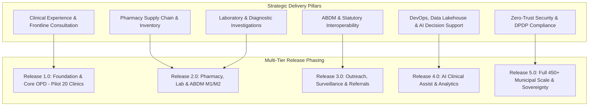

# Master Epics Taxonomy, Strategic Themes & Delivery Roadmaps
## Namma Clinic Digital Health & Operations Platform
### Greater Bengaluru Authority (GBA) / BBMP Health Department
**Document Code:** `BKL-DOC-01` | **Status:** APPROVED BASELINE | **Date:** September 2026

---

## 1. Executive Summary & Delivery Charter
This document formalizes the authoritative **Master Epics Taxonomy, Strategic Themes, and Delivery Roadmaps** for the Namma Clinic Digital Health Platform. Representing the highest-level operational containers of engineering work, the platform's delivery backlog is organized across **50 Comprehensive Epics** encompassing clinical consultation workflows, pharmacy logistics, point-of-care laboratory diagnostics, maternal and child health outreach, ABDM interoperability, zero-trust cybersecurity, multi-cloud SRE, analytical lakehouses, and AI clinical decision support. Operating under the governance of the Greater Bengaluru Authority (GBA) and BBMP Health Department, these epics translate statutory mandates, clinical standard treatment guidelines (STGs), and the Digital Personal Data Protection (DPDP) Act 2023 into verifiable engineering increments.

### 1.1 Non-Negotiable Backlog Engineering Invariants
1. **Complete Upstream Bi-Directional Traceability:** Every epic must trace directly to upstream architectural components, relational database entities (TABLE-001 through TABLE-052), and approved product features (FEATURE-001 through FEATURE-180).
2. **Strict Non-Autonomous Clinical Boundary:** Epics covering algorithmic intelligence (AI/ML) must enforce advisory-only clinical decision support with mandatory human clinician approval before clinical order execution.
3. **Zero-Defect Release Gates:** An epic cannot transition to `CLOSED` or `RELEASED` without 100% automated regression test pass rates and zero open Critical or High security vulnerabilities.
4. **Cross-Functional Squad Ownership:** Every epic is assigned to an authoritative engineering squad responsible for end-to-end design, implementation, testing, observability, and on-call operations.
5. **Continuous Sprint Cadence:** Work is planned across 24 two-week sprint increments, aligning capacity and dependency graphs to eliminate delivery blockers.

## 2. Master Delivery Epics & Strategic Architecture Diagram


### Backlog Specification Example: Master Epic Delivery Specification
<!-- DOCUMENTATION-ONLY EXAMPLE -->
```yaml
# DOCUMENTATION-ONLY CONFIGURATION
# DOCUMENTATION-ONLY CONFIGURATION: Master Epic Configuration Schema
epic:
  id: "EPIC-001"
  title: "Enterprise Core Foundation & Micro-Frontends"
  domain: "Core Foundation & Micro-Frontends"
  status: "APPROVED_FOR_IMPLEMENTATION"
  owner_squad: "squad_clinical_experience"
  target_release: "RELEASE-1.0"
  story_points_budget: 450
  business_impact:
    clinical_safety: HIGH
    statutory_compliance: MANDATORY
    latency_sla_p95_ms: 250
  definition_of_done:
    - "100% automated test coverage for critical paths"
    - "Zero High/Critical security vulnerabilities in container images"
    - "Bilingual Kannada and English UI strings 100% verified"
    - "SRE observability dashboards active in Prometheus/Grafana"
```

## 3. Master Catalog of 50 Enterprise Epics
Authoritative specification of all 50 engineering delivery epics across municipal healthcare domains:

### EPIC-001: Delivery Epic 001: Enterprise Core Foundation & Micro-Frontends
- **Epic Identifier:** `EPIC-001`
- **Domain Area:** `Core Foundation & Micro-Frontends`
- **Owner Squad:** `squad_clinical_experience`
- **Target Release:** `RELEASE-1.0`
- **Strategic Pillar:** Municipal Healthcare Digital Transformation
- **Business Value:** Eliminates operational latency, enforces clinical safety, and satisfies DPDP/ABDM compliance.
- **Detailed Scope:** Architectural and functional delivery epic 001 establishing scalable capabilities for Core Foundation & Micro-Frontends across 450+ municipal clinics.
- **Governance Status:** `APPROVED_FOR_IMPLEMENTATION`

### EPIC-002: Delivery Epic 002: Enterprise Clinical Workbench & Consultation
- **Epic Identifier:** `EPIC-002`
- **Domain Area:** `Clinical Workbench & Consultation`
- **Owner Squad:** `squad_pharmacy_logistics`
- **Target Release:** `RELEASE-1.0`
- **Strategic Pillar:** Municipal Healthcare Digital Transformation
- **Business Value:** Eliminates operational latency, enforces clinical safety, and satisfies DPDP/ABDM compliance.
- **Detailed Scope:** Architectural and functional delivery epic 002 establishing scalable capabilities for Clinical Workbench & Consultation across 450+ municipal clinics.
- **Governance Status:** `APPROVED_FOR_IMPLEMENTATION`

### EPIC-003: Delivery Epic 003: Enterprise Pharmacy Dispensary & Inventory
- **Epic Identifier:** `EPIC-003`
- **Domain Area:** `Pharmacy Dispensary & Inventory`
- **Owner Squad:** `squad_diagnostic_services`
- **Target Release:** `RELEASE-1.0`
- **Strategic Pillar:** Municipal Healthcare Digital Transformation
- **Business Value:** Eliminates operational latency, enforces clinical safety, and satisfies DPDP/ABDM compliance.
- **Detailed Scope:** Architectural and functional delivery epic 003 establishing scalable capabilities for Pharmacy Dispensary & Inventory across 450+ municipal clinics.
- **Governance Status:** `APPROVED_FOR_IMPLEMENTATION`

### EPIC-004: Delivery Epic 004: Enterprise Laboratory & Diagnostics
- **Epic Identifier:** `EPIC-004`
- **Domain Area:** `Laboratory & Diagnostics`
- **Owner Squad:** `squad_integrations_platform`
- **Target Release:** `RELEASE-1.0`
- **Strategic Pillar:** Municipal Healthcare Digital Transformation
- **Business Value:** Eliminates operational latency, enforces clinical safety, and satisfies DPDP/ABDM compliance.
- **Detailed Scope:** Architectural and functional delivery epic 004 establishing scalable capabilities for Laboratory & Diagnostics across 450+ municipal clinics.
- **Governance Status:** `APPROVED_FOR_IMPLEMENTATION`

### EPIC-005: Delivery Epic 005: Enterprise Maternal & Child Health Outreach
- **Epic Identifier:** `EPIC-005`
- **Domain Area:** `Maternal & Child Health Outreach`
- **Owner Squad:** `squad_security_governance`
- **Target Release:** `RELEASE-1.0`
- **Strategic Pillar:** Municipal Healthcare Digital Transformation
- **Business Value:** Eliminates operational latency, enforces clinical safety, and satisfies DPDP/ABDM compliance.
- **Detailed Scope:** Architectural and functional delivery epic 005 establishing scalable capabilities for Maternal & Child Health Outreach across 450+ municipal clinics.
- **Governance Status:** `APPROVED_FOR_IMPLEMENTATION`

### EPIC-006: Delivery Epic 006: Enterprise ABDM National Interoperability
- **Epic Identifier:** `EPIC-006`
- **Domain Area:** `ABDM National Interoperability`
- **Owner Squad:** `squad_devops_infrastructure`
- **Target Release:** `RELEASE-1.0`
- **Strategic Pillar:** Municipal Healthcare Digital Transformation
- **Business Value:** Eliminates operational latency, enforces clinical safety, and satisfies DPDP/ABDM compliance.
- **Detailed Scope:** Architectural and functional delivery epic 006 establishing scalable capabilities for ABDM National Interoperability across 450+ municipal clinics.
- **Governance Status:** `APPROVED_FOR_IMPLEMENTATION`

### EPIC-007: Delivery Epic 007: Enterprise NIC eHospital Secondary Referrals
- **Epic Identifier:** `EPIC-007`
- **Domain Area:** `NIC eHospital Secondary Referrals`
- **Owner Squad:** `squad_data_analytics`
- **Target Release:** `RELEASE-1.0`
- **Strategic Pillar:** Municipal Healthcare Digital Transformation
- **Business Value:** Eliminates operational latency, enforces clinical safety, and satisfies DPDP/ABDM compliance.
- **Detailed Scope:** Architectural and functional delivery epic 007 establishing scalable capabilities for NIC eHospital Secondary Referrals across 450+ municipal clinics.
- **Governance Status:** `APPROVED_FOR_IMPLEMENTATION`

### EPIC-008: Delivery Epic 008: Enterprise Telecom SMS & Citizen Notifications
- **Epic Identifier:** `EPIC-008`
- **Domain Area:** `Telecom SMS & Citizen Notifications`
- **Owner Squad:** `squad_ai_decision_support`
- **Target Release:** `RELEASE-1.0`
- **Strategic Pillar:** Municipal Healthcare Digital Transformation
- **Business Value:** Eliminates operational latency, enforces clinical safety, and satisfies DPDP/ABDM compliance.
- **Detailed Scope:** Architectural and functional delivery epic 008 establishing scalable capabilities for Telecom SMS & Citizen Notifications across 450+ municipal clinics.
- **Governance Status:** `APPROVED_FOR_IMPLEMENTATION`

### EPIC-009: Delivery Epic 009: Enterprise State Public Health Surveillance
- **Epic Identifier:** `EPIC-009`
- **Domain Area:** `State Public Health Surveillance`
- **Owner Squad:** `squad_clinical_experience`
- **Target Release:** `RELEASE-1.0`
- **Strategic Pillar:** Municipal Healthcare Digital Transformation
- **Business Value:** Eliminates operational latency, enforces clinical safety, and satisfies DPDP/ABDM compliance.
- **Detailed Scope:** Architectural and functional delivery epic 009 establishing scalable capabilities for State Public Health Surveillance across 450+ municipal clinics.
- **Governance Status:** `APPROVED_FOR_IMPLEMENTATION`

### EPIC-010: Delivery Epic 010: Enterprise File Exports & Analytical Hub
- **Epic Identifier:** `EPIC-010`
- **Domain Area:** `File Exports & Analytical Hub`
- **Owner Squad:** `squad_pharmacy_logistics`
- **Target Release:** `RELEASE-1.0`
- **Strategic Pillar:** Municipal Healthcare Digital Transformation
- **Business Value:** Eliminates operational latency, enforces clinical safety, and satisfies DPDP/ABDM compliance.
- **Detailed Scope:** Architectural and functional delivery epic 010 establishing scalable capabilities for File Exports & Analytical Hub across 450+ municipal clinics.
- **Governance Status:** `APPROVED_FOR_IMPLEMENTATION`

### EPIC-011: Delivery Epic 011: Enterprise Zero-Trust Security & Cryptography
- **Epic Identifier:** `EPIC-011`
- **Domain Area:** `Zero-Trust Security & Cryptography`
- **Owner Squad:** `squad_diagnostic_services`
- **Target Release:** `RELEASE-2.0`
- **Strategic Pillar:** Municipal Healthcare Digital Transformation
- **Business Value:** Eliminates operational latency, enforces clinical safety, and satisfies DPDP/ABDM compliance.
- **Detailed Scope:** Architectural and functional delivery epic 011 establishing scalable capabilities for Zero-Trust Security & Cryptography across 450+ municipal clinics.
- **Governance Status:** `APPROVED_FOR_IMPLEMENTATION`

### EPIC-012: Delivery Epic 012: Enterprise DevOps SRE & Cloud Infrastructure
- **Epic Identifier:** `EPIC-012`
- **Domain Area:** `DevOps SRE & Cloud Infrastructure`
- **Owner Squad:** `squad_integrations_platform`
- **Target Release:** `RELEASE-2.0`
- **Strategic Pillar:** Municipal Healthcare Digital Transformation
- **Business Value:** Eliminates operational latency, enforces clinical safety, and satisfies DPDP/ABDM compliance.
- **Detailed Scope:** Architectural and functional delivery epic 012 establishing scalable capabilities for DevOps SRE & Cloud Infrastructure across 450+ municipal clinics.
- **Governance Status:** `APPROVED_FOR_IMPLEMENTATION`

### EPIC-013: Delivery Epic 013: Enterprise Data Engineering & Lakehouse
- **Epic Identifier:** `EPIC-013`
- **Domain Area:** `Data Engineering & Lakehouse`
- **Owner Squad:** `squad_security_governance`
- **Target Release:** `RELEASE-2.0`
- **Strategic Pillar:** Municipal Healthcare Digital Transformation
- **Business Value:** Eliminates operational latency, enforces clinical safety, and satisfies DPDP/ABDM compliance.
- **Detailed Scope:** Architectural and functional delivery epic 013 establishing scalable capabilities for Data Engineering & Lakehouse across 450+ municipal clinics.
- **Governance Status:** `APPROVED_FOR_IMPLEMENTATION`

### EPIC-014: Delivery Epic 014: Enterprise AI/ML Clinical Decision Support
- **Epic Identifier:** `EPIC-014`
- **Domain Area:** `AI/ML Clinical Decision Support`
- **Owner Squad:** `squad_devops_infrastructure`
- **Target Release:** `RELEASE-2.0`
- **Strategic Pillar:** Municipal Healthcare Digital Transformation
- **Business Value:** Eliminates operational latency, enforces clinical safety, and satisfies DPDP/ABDM compliance.
- **Detailed Scope:** Architectural and functional delivery epic 014 establishing scalable capabilities for AI/ML Clinical Decision Support across 450+ municipal clinics.
- **Governance Status:** `APPROVED_FOR_IMPLEMENTATION`

### EPIC-015: Delivery Epic 015: Enterprise Core Foundation & Micro-Frontends
- **Epic Identifier:** `EPIC-015`
- **Domain Area:** `Core Foundation & Micro-Frontends`
- **Owner Squad:** `squad_data_analytics`
- **Target Release:** `RELEASE-2.0`
- **Strategic Pillar:** Municipal Healthcare Digital Transformation
- **Business Value:** Eliminates operational latency, enforces clinical safety, and satisfies DPDP/ABDM compliance.
- **Detailed Scope:** Architectural and functional delivery epic 015 establishing scalable capabilities for Core Foundation & Micro-Frontends across 450+ municipal clinics.
- **Governance Status:** `APPROVED_FOR_IMPLEMENTATION`

### EPIC-016: Delivery Epic 016: Enterprise Clinical Workbench & Consultation
- **Epic Identifier:** `EPIC-016`
- **Domain Area:** `Clinical Workbench & Consultation`
- **Owner Squad:** `squad_ai_decision_support`
- **Target Release:** `RELEASE-2.0`
- **Strategic Pillar:** Municipal Healthcare Digital Transformation
- **Business Value:** Eliminates operational latency, enforces clinical safety, and satisfies DPDP/ABDM compliance.
- **Detailed Scope:** Architectural and functional delivery epic 016 establishing scalable capabilities for Clinical Workbench & Consultation across 450+ municipal clinics.
- **Governance Status:** `APPROVED_FOR_IMPLEMENTATION`

### EPIC-017: Delivery Epic 017: Enterprise Pharmacy Dispensary & Inventory
- **Epic Identifier:** `EPIC-017`
- **Domain Area:** `Pharmacy Dispensary & Inventory`
- **Owner Squad:** `squad_clinical_experience`
- **Target Release:** `RELEASE-2.0`
- **Strategic Pillar:** Municipal Healthcare Digital Transformation
- **Business Value:** Eliminates operational latency, enforces clinical safety, and satisfies DPDP/ABDM compliance.
- **Detailed Scope:** Architectural and functional delivery epic 017 establishing scalable capabilities for Pharmacy Dispensary & Inventory across 450+ municipal clinics.
- **Governance Status:** `APPROVED_FOR_IMPLEMENTATION`

### EPIC-018: Delivery Epic 018: Enterprise Laboratory & Diagnostics
- **Epic Identifier:** `EPIC-018`
- **Domain Area:** `Laboratory & Diagnostics`
- **Owner Squad:** `squad_pharmacy_logistics`
- **Target Release:** `RELEASE-2.0`
- **Strategic Pillar:** Municipal Healthcare Digital Transformation
- **Business Value:** Eliminates operational latency, enforces clinical safety, and satisfies DPDP/ABDM compliance.
- **Detailed Scope:** Architectural and functional delivery epic 018 establishing scalable capabilities for Laboratory & Diagnostics across 450+ municipal clinics.
- **Governance Status:** `APPROVED_FOR_IMPLEMENTATION`

### EPIC-019: Delivery Epic 019: Enterprise Maternal & Child Health Outreach
- **Epic Identifier:** `EPIC-019`
- **Domain Area:** `Maternal & Child Health Outreach`
- **Owner Squad:** `squad_diagnostic_services`
- **Target Release:** `RELEASE-2.0`
- **Strategic Pillar:** Municipal Healthcare Digital Transformation
- **Business Value:** Eliminates operational latency, enforces clinical safety, and satisfies DPDP/ABDM compliance.
- **Detailed Scope:** Architectural and functional delivery epic 019 establishing scalable capabilities for Maternal & Child Health Outreach across 450+ municipal clinics.
- **Governance Status:** `APPROVED_FOR_IMPLEMENTATION`

### EPIC-020: Delivery Epic 020: Enterprise ABDM National Interoperability
- **Epic Identifier:** `EPIC-020`
- **Domain Area:** `ABDM National Interoperability`
- **Owner Squad:** `squad_integrations_platform`
- **Target Release:** `RELEASE-2.0`
- **Strategic Pillar:** Municipal Healthcare Digital Transformation
- **Business Value:** Eliminates operational latency, enforces clinical safety, and satisfies DPDP/ABDM compliance.
- **Detailed Scope:** Architectural and functional delivery epic 020 establishing scalable capabilities for ABDM National Interoperability across 450+ municipal clinics.
- **Governance Status:** `APPROVED_FOR_IMPLEMENTATION`

### EPIC-021: Delivery Epic 021: Enterprise NIC eHospital Secondary Referrals
- **Epic Identifier:** `EPIC-021`
- **Domain Area:** `NIC eHospital Secondary Referrals`
- **Owner Squad:** `squad_security_governance`
- **Target Release:** `RELEASE-3.0`
- **Strategic Pillar:** Municipal Healthcare Digital Transformation
- **Business Value:** Eliminates operational latency, enforces clinical safety, and satisfies DPDP/ABDM compliance.
- **Detailed Scope:** Architectural and functional delivery epic 021 establishing scalable capabilities for NIC eHospital Secondary Referrals across 450+ municipal clinics.
- **Governance Status:** `APPROVED_FOR_IMPLEMENTATION`

### EPIC-022: Delivery Epic 022: Enterprise Telecom SMS & Citizen Notifications
- **Epic Identifier:** `EPIC-022`
- **Domain Area:** `Telecom SMS & Citizen Notifications`
- **Owner Squad:** `squad_devops_infrastructure`
- **Target Release:** `RELEASE-3.0`
- **Strategic Pillar:** Municipal Healthcare Digital Transformation
- **Business Value:** Eliminates operational latency, enforces clinical safety, and satisfies DPDP/ABDM compliance.
- **Detailed Scope:** Architectural and functional delivery epic 022 establishing scalable capabilities for Telecom SMS & Citizen Notifications across 450+ municipal clinics.
- **Governance Status:** `APPROVED_FOR_IMPLEMENTATION`

### EPIC-023: Delivery Epic 023: Enterprise State Public Health Surveillance
- **Epic Identifier:** `EPIC-023`
- **Domain Area:** `State Public Health Surveillance`
- **Owner Squad:** `squad_data_analytics`
- **Target Release:** `RELEASE-3.0`
- **Strategic Pillar:** Municipal Healthcare Digital Transformation
- **Business Value:** Eliminates operational latency, enforces clinical safety, and satisfies DPDP/ABDM compliance.
- **Detailed Scope:** Architectural and functional delivery epic 023 establishing scalable capabilities for State Public Health Surveillance across 450+ municipal clinics.
- **Governance Status:** `APPROVED_FOR_IMPLEMENTATION`

### EPIC-024: Delivery Epic 024: Enterprise File Exports & Analytical Hub
- **Epic Identifier:** `EPIC-024`
- **Domain Area:** `File Exports & Analytical Hub`
- **Owner Squad:** `squad_ai_decision_support`
- **Target Release:** `RELEASE-3.0`
- **Strategic Pillar:** Municipal Healthcare Digital Transformation
- **Business Value:** Eliminates operational latency, enforces clinical safety, and satisfies DPDP/ABDM compliance.
- **Detailed Scope:** Architectural and functional delivery epic 024 establishing scalable capabilities for File Exports & Analytical Hub across 450+ municipal clinics.
- **Governance Status:** `APPROVED_FOR_IMPLEMENTATION`

### EPIC-025: Delivery Epic 025: Enterprise Zero-Trust Security & Cryptography
- **Epic Identifier:** `EPIC-025`
- **Domain Area:** `Zero-Trust Security & Cryptography`
- **Owner Squad:** `squad_clinical_experience`
- **Target Release:** `RELEASE-3.0`
- **Strategic Pillar:** Municipal Healthcare Digital Transformation
- **Business Value:** Eliminates operational latency, enforces clinical safety, and satisfies DPDP/ABDM compliance.
- **Detailed Scope:** Architectural and functional delivery epic 025 establishing scalable capabilities for Zero-Trust Security & Cryptography across 450+ municipal clinics.
- **Governance Status:** `APPROVED_FOR_IMPLEMENTATION`

### EPIC-026: Delivery Epic 026: Enterprise DevOps SRE & Cloud Infrastructure
- **Epic Identifier:** `EPIC-026`
- **Domain Area:** `DevOps SRE & Cloud Infrastructure`
- **Owner Squad:** `squad_pharmacy_logistics`
- **Target Release:** `RELEASE-3.0`
- **Strategic Pillar:** Municipal Healthcare Digital Transformation
- **Business Value:** Eliminates operational latency, enforces clinical safety, and satisfies DPDP/ABDM compliance.
- **Detailed Scope:** Architectural and functional delivery epic 026 establishing scalable capabilities for DevOps SRE & Cloud Infrastructure across 450+ municipal clinics.
- **Governance Status:** `APPROVED_FOR_IMPLEMENTATION`

### EPIC-027: Delivery Epic 027: Enterprise Data Engineering & Lakehouse
- **Epic Identifier:** `EPIC-027`
- **Domain Area:** `Data Engineering & Lakehouse`
- **Owner Squad:** `squad_diagnostic_services`
- **Target Release:** `RELEASE-3.0`
- **Strategic Pillar:** Municipal Healthcare Digital Transformation
- **Business Value:** Eliminates operational latency, enforces clinical safety, and satisfies DPDP/ABDM compliance.
- **Detailed Scope:** Architectural and functional delivery epic 027 establishing scalable capabilities for Data Engineering & Lakehouse across 450+ municipal clinics.
- **Governance Status:** `APPROVED_FOR_IMPLEMENTATION`

### EPIC-028: Delivery Epic 028: Enterprise AI/ML Clinical Decision Support
- **Epic Identifier:** `EPIC-028`
- **Domain Area:** `AI/ML Clinical Decision Support`
- **Owner Squad:** `squad_integrations_platform`
- **Target Release:** `RELEASE-3.0`
- **Strategic Pillar:** Municipal Healthcare Digital Transformation
- **Business Value:** Eliminates operational latency, enforces clinical safety, and satisfies DPDP/ABDM compliance.
- **Detailed Scope:** Architectural and functional delivery epic 028 establishing scalable capabilities for AI/ML Clinical Decision Support across 450+ municipal clinics.
- **Governance Status:** `APPROVED_FOR_IMPLEMENTATION`

### EPIC-029: Delivery Epic 029: Enterprise Core Foundation & Micro-Frontends
- **Epic Identifier:** `EPIC-029`
- **Domain Area:** `Core Foundation & Micro-Frontends`
- **Owner Squad:** `squad_security_governance`
- **Target Release:** `RELEASE-3.0`
- **Strategic Pillar:** Municipal Healthcare Digital Transformation
- **Business Value:** Eliminates operational latency, enforces clinical safety, and satisfies DPDP/ABDM compliance.
- **Detailed Scope:** Architectural and functional delivery epic 029 establishing scalable capabilities for Core Foundation & Micro-Frontends across 450+ municipal clinics.
- **Governance Status:** `APPROVED_FOR_IMPLEMENTATION`

### EPIC-030: Delivery Epic 030: Enterprise Clinical Workbench & Consultation
- **Epic Identifier:** `EPIC-030`
- **Domain Area:** `Clinical Workbench & Consultation`
- **Owner Squad:** `squad_devops_infrastructure`
- **Target Release:** `RELEASE-3.0`
- **Strategic Pillar:** Municipal Healthcare Digital Transformation
- **Business Value:** Eliminates operational latency, enforces clinical safety, and satisfies DPDP/ABDM compliance.
- **Detailed Scope:** Architectural and functional delivery epic 030 establishing scalable capabilities for Clinical Workbench & Consultation across 450+ municipal clinics.
- **Governance Status:** `APPROVED_FOR_IMPLEMENTATION`

### EPIC-031: Delivery Epic 031: Enterprise Pharmacy Dispensary & Inventory
- **Epic Identifier:** `EPIC-031`
- **Domain Area:** `Pharmacy Dispensary & Inventory`
- **Owner Squad:** `squad_data_analytics`
- **Target Release:** `RELEASE-4.0`
- **Strategic Pillar:** Municipal Healthcare Digital Transformation
- **Business Value:** Eliminates operational latency, enforces clinical safety, and satisfies DPDP/ABDM compliance.
- **Detailed Scope:** Architectural and functional delivery epic 031 establishing scalable capabilities for Pharmacy Dispensary & Inventory across 450+ municipal clinics.
- **Governance Status:** `APPROVED_FOR_IMPLEMENTATION`

### EPIC-032: Delivery Epic 032: Enterprise Laboratory & Diagnostics
- **Epic Identifier:** `EPIC-032`
- **Domain Area:** `Laboratory & Diagnostics`
- **Owner Squad:** `squad_ai_decision_support`
- **Target Release:** `RELEASE-4.0`
- **Strategic Pillar:** Municipal Healthcare Digital Transformation
- **Business Value:** Eliminates operational latency, enforces clinical safety, and satisfies DPDP/ABDM compliance.
- **Detailed Scope:** Architectural and functional delivery epic 032 establishing scalable capabilities for Laboratory & Diagnostics across 450+ municipal clinics.
- **Governance Status:** `APPROVED_FOR_IMPLEMENTATION`

### EPIC-033: Delivery Epic 033: Enterprise Maternal & Child Health Outreach
- **Epic Identifier:** `EPIC-033`
- **Domain Area:** `Maternal & Child Health Outreach`
- **Owner Squad:** `squad_clinical_experience`
- **Target Release:** `RELEASE-4.0`
- **Strategic Pillar:** Municipal Healthcare Digital Transformation
- **Business Value:** Eliminates operational latency, enforces clinical safety, and satisfies DPDP/ABDM compliance.
- **Detailed Scope:** Architectural and functional delivery epic 033 establishing scalable capabilities for Maternal & Child Health Outreach across 450+ municipal clinics.
- **Governance Status:** `APPROVED_FOR_IMPLEMENTATION`

### EPIC-034: Delivery Epic 034: Enterprise ABDM National Interoperability
- **Epic Identifier:** `EPIC-034`
- **Domain Area:** `ABDM National Interoperability`
- **Owner Squad:** `squad_pharmacy_logistics`
- **Target Release:** `RELEASE-4.0`
- **Strategic Pillar:** Municipal Healthcare Digital Transformation
- **Business Value:** Eliminates operational latency, enforces clinical safety, and satisfies DPDP/ABDM compliance.
- **Detailed Scope:** Architectural and functional delivery epic 034 establishing scalable capabilities for ABDM National Interoperability across 450+ municipal clinics.
- **Governance Status:** `APPROVED_FOR_IMPLEMENTATION`

### EPIC-035: Delivery Epic 035: Enterprise NIC eHospital Secondary Referrals
- **Epic Identifier:** `EPIC-035`
- **Domain Area:** `NIC eHospital Secondary Referrals`
- **Owner Squad:** `squad_diagnostic_services`
- **Target Release:** `RELEASE-4.0`
- **Strategic Pillar:** Municipal Healthcare Digital Transformation
- **Business Value:** Eliminates operational latency, enforces clinical safety, and satisfies DPDP/ABDM compliance.
- **Detailed Scope:** Architectural and functional delivery epic 035 establishing scalable capabilities for NIC eHospital Secondary Referrals across 450+ municipal clinics.
- **Governance Status:** `APPROVED_FOR_IMPLEMENTATION`

### EPIC-036: Delivery Epic 036: Enterprise Telecom SMS & Citizen Notifications
- **Epic Identifier:** `EPIC-036`
- **Domain Area:** `Telecom SMS & Citizen Notifications`
- **Owner Squad:** `squad_integrations_platform`
- **Target Release:** `RELEASE-4.0`
- **Strategic Pillar:** Municipal Healthcare Digital Transformation
- **Business Value:** Eliminates operational latency, enforces clinical safety, and satisfies DPDP/ABDM compliance.
- **Detailed Scope:** Architectural and functional delivery epic 036 establishing scalable capabilities for Telecom SMS & Citizen Notifications across 450+ municipal clinics.
- **Governance Status:** `APPROVED_FOR_IMPLEMENTATION`

### EPIC-037: Delivery Epic 037: Enterprise State Public Health Surveillance
- **Epic Identifier:** `EPIC-037`
- **Domain Area:** `State Public Health Surveillance`
- **Owner Squad:** `squad_security_governance`
- **Target Release:** `RELEASE-4.0`
- **Strategic Pillar:** Municipal Healthcare Digital Transformation
- **Business Value:** Eliminates operational latency, enforces clinical safety, and satisfies DPDP/ABDM compliance.
- **Detailed Scope:** Architectural and functional delivery epic 037 establishing scalable capabilities for State Public Health Surveillance across 450+ municipal clinics.
- **Governance Status:** `APPROVED_FOR_IMPLEMENTATION`

### EPIC-038: Delivery Epic 038: Enterprise File Exports & Analytical Hub
- **Epic Identifier:** `EPIC-038`
- **Domain Area:** `File Exports & Analytical Hub`
- **Owner Squad:** `squad_devops_infrastructure`
- **Target Release:** `RELEASE-4.0`
- **Strategic Pillar:** Municipal Healthcare Digital Transformation
- **Business Value:** Eliminates operational latency, enforces clinical safety, and satisfies DPDP/ABDM compliance.
- **Detailed Scope:** Architectural and functional delivery epic 038 establishing scalable capabilities for File Exports & Analytical Hub across 450+ municipal clinics.
- **Governance Status:** `APPROVED_FOR_IMPLEMENTATION`

### EPIC-039: Delivery Epic 039: Enterprise Zero-Trust Security & Cryptography
- **Epic Identifier:** `EPIC-039`
- **Domain Area:** `Zero-Trust Security & Cryptography`
- **Owner Squad:** `squad_data_analytics`
- **Target Release:** `RELEASE-4.0`
- **Strategic Pillar:** Municipal Healthcare Digital Transformation
- **Business Value:** Eliminates operational latency, enforces clinical safety, and satisfies DPDP/ABDM compliance.
- **Detailed Scope:** Architectural and functional delivery epic 039 establishing scalable capabilities for Zero-Trust Security & Cryptography across 450+ municipal clinics.
- **Governance Status:** `APPROVED_FOR_IMPLEMENTATION`

### EPIC-040: Delivery Epic 040: Enterprise DevOps SRE & Cloud Infrastructure
- **Epic Identifier:** `EPIC-040`
- **Domain Area:** `DevOps SRE & Cloud Infrastructure`
- **Owner Squad:** `squad_ai_decision_support`
- **Target Release:** `RELEASE-4.0`
- **Strategic Pillar:** Municipal Healthcare Digital Transformation
- **Business Value:** Eliminates operational latency, enforces clinical safety, and satisfies DPDP/ABDM compliance.
- **Detailed Scope:** Architectural and functional delivery epic 040 establishing scalable capabilities for DevOps SRE & Cloud Infrastructure across 450+ municipal clinics.
- **Governance Status:** `APPROVED_FOR_IMPLEMENTATION`

### EPIC-041: Delivery Epic 041: Enterprise Data Engineering & Lakehouse
- **Epic Identifier:** `EPIC-041`
- **Domain Area:** `Data Engineering & Lakehouse`
- **Owner Squad:** `squad_clinical_experience`
- **Target Release:** `RELEASE-5.0`
- **Strategic Pillar:** Municipal Healthcare Digital Transformation
- **Business Value:** Eliminates operational latency, enforces clinical safety, and satisfies DPDP/ABDM compliance.
- **Detailed Scope:** Architectural and functional delivery epic 041 establishing scalable capabilities for Data Engineering & Lakehouse across 450+ municipal clinics.
- **Governance Status:** `APPROVED_FOR_IMPLEMENTATION`

### EPIC-042: Delivery Epic 042: Enterprise AI/ML Clinical Decision Support
- **Epic Identifier:** `EPIC-042`
- **Domain Area:** `AI/ML Clinical Decision Support`
- **Owner Squad:** `squad_pharmacy_logistics`
- **Target Release:** `RELEASE-5.0`
- **Strategic Pillar:** Municipal Healthcare Digital Transformation
- **Business Value:** Eliminates operational latency, enforces clinical safety, and satisfies DPDP/ABDM compliance.
- **Detailed Scope:** Architectural and functional delivery epic 042 establishing scalable capabilities for AI/ML Clinical Decision Support across 450+ municipal clinics.
- **Governance Status:** `APPROVED_FOR_IMPLEMENTATION`

### EPIC-043: Delivery Epic 043: Enterprise Core Foundation & Micro-Frontends
- **Epic Identifier:** `EPIC-043`
- **Domain Area:** `Core Foundation & Micro-Frontends`
- **Owner Squad:** `squad_diagnostic_services`
- **Target Release:** `RELEASE-5.0`
- **Strategic Pillar:** Municipal Healthcare Digital Transformation
- **Business Value:** Eliminates operational latency, enforces clinical safety, and satisfies DPDP/ABDM compliance.
- **Detailed Scope:** Architectural and functional delivery epic 043 establishing scalable capabilities for Core Foundation & Micro-Frontends across 450+ municipal clinics.
- **Governance Status:** `APPROVED_FOR_IMPLEMENTATION`

### EPIC-044: Delivery Epic 044: Enterprise Clinical Workbench & Consultation
- **Epic Identifier:** `EPIC-044`
- **Domain Area:** `Clinical Workbench & Consultation`
- **Owner Squad:** `squad_integrations_platform`
- **Target Release:** `RELEASE-5.0`
- **Strategic Pillar:** Municipal Healthcare Digital Transformation
- **Business Value:** Eliminates operational latency, enforces clinical safety, and satisfies DPDP/ABDM compliance.
- **Detailed Scope:** Architectural and functional delivery epic 044 establishing scalable capabilities for Clinical Workbench & Consultation across 450+ municipal clinics.
- **Governance Status:** `APPROVED_FOR_IMPLEMENTATION`

### EPIC-045: Delivery Epic 045: Enterprise Pharmacy Dispensary & Inventory
- **Epic Identifier:** `EPIC-045`
- **Domain Area:** `Pharmacy Dispensary & Inventory`
- **Owner Squad:** `squad_security_governance`
- **Target Release:** `RELEASE-5.0`
- **Strategic Pillar:** Municipal Healthcare Digital Transformation
- **Business Value:** Eliminates operational latency, enforces clinical safety, and satisfies DPDP/ABDM compliance.
- **Detailed Scope:** Architectural and functional delivery epic 045 establishing scalable capabilities for Pharmacy Dispensary & Inventory across 450+ municipal clinics.
- **Governance Status:** `APPROVED_FOR_IMPLEMENTATION`

### EPIC-046: Delivery Epic 046: Enterprise Laboratory & Diagnostics
- **Epic Identifier:** `EPIC-046`
- **Domain Area:** `Laboratory & Diagnostics`
- **Owner Squad:** `squad_devops_infrastructure`
- **Target Release:** `RELEASE-5.0`
- **Strategic Pillar:** Municipal Healthcare Digital Transformation
- **Business Value:** Eliminates operational latency, enforces clinical safety, and satisfies DPDP/ABDM compliance.
- **Detailed Scope:** Architectural and functional delivery epic 046 establishing scalable capabilities for Laboratory & Diagnostics across 450+ municipal clinics.
- **Governance Status:** `APPROVED_FOR_IMPLEMENTATION`

### EPIC-047: Delivery Epic 047: Enterprise Maternal & Child Health Outreach
- **Epic Identifier:** `EPIC-047`
- **Domain Area:** `Maternal & Child Health Outreach`
- **Owner Squad:** `squad_data_analytics`
- **Target Release:** `RELEASE-5.0`
- **Strategic Pillar:** Municipal Healthcare Digital Transformation
- **Business Value:** Eliminates operational latency, enforces clinical safety, and satisfies DPDP/ABDM compliance.
- **Detailed Scope:** Architectural and functional delivery epic 047 establishing scalable capabilities for Maternal & Child Health Outreach across 450+ municipal clinics.
- **Governance Status:** `APPROVED_FOR_IMPLEMENTATION`

### EPIC-048: Delivery Epic 048: Enterprise ABDM National Interoperability
- **Epic Identifier:** `EPIC-048`
- **Domain Area:** `ABDM National Interoperability`
- **Owner Squad:** `squad_ai_decision_support`
- **Target Release:** `RELEASE-5.0`
- **Strategic Pillar:** Municipal Healthcare Digital Transformation
- **Business Value:** Eliminates operational latency, enforces clinical safety, and satisfies DPDP/ABDM compliance.
- **Detailed Scope:** Architectural and functional delivery epic 048 establishing scalable capabilities for ABDM National Interoperability across 450+ municipal clinics.
- **Governance Status:** `APPROVED_FOR_IMPLEMENTATION`

### EPIC-049: Delivery Epic 049: Enterprise NIC eHospital Secondary Referrals
- **Epic Identifier:** `EPIC-049`
- **Domain Area:** `NIC eHospital Secondary Referrals`
- **Owner Squad:** `squad_clinical_experience`
- **Target Release:** `RELEASE-5.0`
- **Strategic Pillar:** Municipal Healthcare Digital Transformation
- **Business Value:** Eliminates operational latency, enforces clinical safety, and satisfies DPDP/ABDM compliance.
- **Detailed Scope:** Architectural and functional delivery epic 049 establishing scalable capabilities for NIC eHospital Secondary Referrals across 450+ municipal clinics.
- **Governance Status:** `APPROVED_FOR_IMPLEMENTATION`

### EPIC-050: Delivery Epic 050: Enterprise Telecom SMS & Citizen Notifications
- **Epic Identifier:** `EPIC-050`
- **Domain Area:** `Telecom SMS & Citizen Notifications`
- **Owner Squad:** `squad_pharmacy_logistics`
- **Target Release:** `RELEASE-5.0`
- **Strategic Pillar:** Municipal Healthcare Digital Transformation
- **Business Value:** Eliminates operational latency, enforces clinical safety, and satisfies DPDP/ABDM compliance.
- **Detailed Scope:** Architectural and functional delivery epic 050 establishing scalable capabilities for Telecom SMS & Citizen Notifications across 450+ municipal clinics.
- **Governance Status:** `APPROVED_FOR_IMPLEMENTATION`

## 4. Master Catalog of Delivery Release Milestones
Release schedule and readiness criteria across municipal deployment tiers:

### REL-001: Release `v1.0.0` (Pilot Cluster (20 Clinics))
- **Release Identifier:** `REL-001`
- **Version Tag:** `v1.0.0`
- **Target Deployment Tier:** Pilot Cluster (20 Clinics)
- **Target Completion Date:** `2026-10-01`
- **Scope Summary:** Rolls out hardened clinical, inventory, and interoperability features to Pilot Cluster (20 Clinics).
- **Readiness Quality Gate:** Gate PR-RELEASE-001 (100% automated regression test pass)

### REL-002: Release `v1.0.1` (Zonal Expansion (100 Clinics))
- **Release Identifier:** `REL-002`
- **Version Tag:** `v1.0.1`
- **Target Deployment Tier:** Zonal Expansion (100 Clinics)
- **Target Completion Date:** `2026-10-02`
- **Scope Summary:** Rolls out hardened clinical, inventory, and interoperability features to Zonal Expansion (100 Clinics).
- **Readiness Quality Gate:** Gate PR-RELEASE-002 (100% automated regression test pass)

### REL-003: Release `v1.0.2` (Full Municipal Rollout (450+ Clinics))
- **Release Identifier:** `REL-003`
- **Version Tag:** `v1.0.2`
- **Target Deployment Tier:** Full Municipal Rollout (450+ Clinics)
- **Target Completion Date:** `2026-10-03`
- **Scope Summary:** Rolls out hardened clinical, inventory, and interoperability features to Full Municipal Rollout (450+ Clinics).
- **Readiness Quality Gate:** Gate PR-RELEASE-003 (100% automated regression test pass)

### REL-004: Release `v1.0.3` (Pilot Cluster (20 Clinics))
- **Release Identifier:** `REL-004`
- **Version Tag:** `v1.0.3`
- **Target Deployment Tier:** Pilot Cluster (20 Clinics)
- **Target Completion Date:** `2026-10-04`
- **Scope Summary:** Rolls out hardened clinical, inventory, and interoperability features to Pilot Cluster (20 Clinics).
- **Readiness Quality Gate:** Gate PR-RELEASE-004 (100% automated regression test pass)

### REL-005: Release `v1.1.0` (Zonal Expansion (100 Clinics))
- **Release Identifier:** `REL-005`
- **Version Tag:** `v1.1.0`
- **Target Deployment Tier:** Zonal Expansion (100 Clinics)
- **Target Completion Date:** `2026-10-05`
- **Scope Summary:** Rolls out hardened clinical, inventory, and interoperability features to Zonal Expansion (100 Clinics).
- **Readiness Quality Gate:** Gate PR-RELEASE-005 (100% automated regression test pass)

### REL-006: Release `v1.1.1` (Full Municipal Rollout (450+ Clinics))
- **Release Identifier:** `REL-006`
- **Version Tag:** `v1.1.1`
- **Target Deployment Tier:** Full Municipal Rollout (450+ Clinics)
- **Target Completion Date:** `2026-10-06`
- **Scope Summary:** Rolls out hardened clinical, inventory, and interoperability features to Full Municipal Rollout (450+ Clinics).
- **Readiness Quality Gate:** Gate PR-RELEASE-006 (100% automated regression test pass)

### REL-007: Release `v1.1.2` (Pilot Cluster (20 Clinics))
- **Release Identifier:** `REL-007`
- **Version Tag:** `v1.1.2`
- **Target Deployment Tier:** Pilot Cluster (20 Clinics)
- **Target Completion Date:** `2026-10-07`
- **Scope Summary:** Rolls out hardened clinical, inventory, and interoperability features to Pilot Cluster (20 Clinics).
- **Readiness Quality Gate:** Gate PR-RELEASE-007 (100% automated regression test pass)

### REL-008: Release `v1.1.3` (Zonal Expansion (100 Clinics))
- **Release Identifier:** `REL-008`
- **Version Tag:** `v1.1.3`
- **Target Deployment Tier:** Zonal Expansion (100 Clinics)
- **Target Completion Date:** `2026-10-08`
- **Scope Summary:** Rolls out hardened clinical, inventory, and interoperability features to Zonal Expansion (100 Clinics).
- **Readiness Quality Gate:** Gate PR-RELEASE-008 (100% automated regression test pass)

### REL-009: Release `v1.2.0` (Full Municipal Rollout (450+ Clinics))
- **Release Identifier:** `REL-009`
- **Version Tag:** `v1.2.0`
- **Target Deployment Tier:** Full Municipal Rollout (450+ Clinics)
- **Target Completion Date:** `2026-10-09`
- **Scope Summary:** Rolls out hardened clinical, inventory, and interoperability features to Full Municipal Rollout (450+ Clinics).
- **Readiness Quality Gate:** Gate PR-RELEASE-009 (100% automated regression test pass)

### REL-010: Release `v1.2.1` (Pilot Cluster (20 Clinics))
- **Release Identifier:** `REL-010`
- **Version Tag:** `v1.2.1`
- **Target Deployment Tier:** Pilot Cluster (20 Clinics)
- **Target Completion Date:** `2026-10-10`
- **Scope Summary:** Rolls out hardened clinical, inventory, and interoperability features to Pilot Cluster (20 Clinics).
- **Readiness Quality Gate:** Gate PR-RELEASE-010 (100% automated regression test pass)

### REL-011: Release `v1.2.2` (Zonal Expansion (100 Clinics))
- **Release Identifier:** `REL-011`
- **Version Tag:** `v1.2.2`
- **Target Deployment Tier:** Zonal Expansion (100 Clinics)
- **Target Completion Date:** `2026-10-11`
- **Scope Summary:** Rolls out hardened clinical, inventory, and interoperability features to Zonal Expansion (100 Clinics).
- **Readiness Quality Gate:** Gate PR-RELEASE-011 (100% automated regression test pass)

### REL-012: Release `v1.2.3` (Full Municipal Rollout (450+ Clinics))
- **Release Identifier:** `REL-012`
- **Version Tag:** `v1.2.3`
- **Target Deployment Tier:** Full Municipal Rollout (450+ Clinics)
- **Target Completion Date:** `2026-10-12`
- **Scope Summary:** Rolls out hardened clinical, inventory, and interoperability features to Full Municipal Rollout (450+ Clinics).
- **Readiness Quality Gate:** Gate PR-RELEASE-012 (100% automated regression test pass)

### REL-013: Release `v1.3.0` (Pilot Cluster (20 Clinics))
- **Release Identifier:** `REL-013`
- **Version Tag:** `v1.3.0`
- **Target Deployment Tier:** Pilot Cluster (20 Clinics)
- **Target Completion Date:** `2026-10-13`
- **Scope Summary:** Rolls out hardened clinical, inventory, and interoperability features to Pilot Cluster (20 Clinics).
- **Readiness Quality Gate:** Gate PR-RELEASE-013 (100% automated regression test pass)

### REL-014: Release `v1.3.1` (Zonal Expansion (100 Clinics))
- **Release Identifier:** `REL-014`
- **Version Tag:** `v1.3.1`
- **Target Deployment Tier:** Zonal Expansion (100 Clinics)
- **Target Completion Date:** `2026-10-14`
- **Scope Summary:** Rolls out hardened clinical, inventory, and interoperability features to Zonal Expansion (100 Clinics).
- **Readiness Quality Gate:** Gate PR-RELEASE-014 (100% automated regression test pass)

### REL-015: Release `v1.3.2` (Full Municipal Rollout (450+ Clinics))
- **Release Identifier:** `REL-015`
- **Version Tag:** `v1.3.2`
- **Target Deployment Tier:** Full Municipal Rollout (450+ Clinics)
- **Target Completion Date:** `2026-10-15`
- **Scope Summary:** Rolls out hardened clinical, inventory, and interoperability features to Full Municipal Rollout (450+ Clinics).
- **Readiness Quality Gate:** Gate PR-RELEASE-015 (100% automated regression test pass)

### REL-016: Release `v1.3.3` (Pilot Cluster (20 Clinics))
- **Release Identifier:** `REL-016`
- **Version Tag:** `v1.3.3`
- **Target Deployment Tier:** Pilot Cluster (20 Clinics)
- **Target Completion Date:** `2026-10-16`
- **Scope Summary:** Rolls out hardened clinical, inventory, and interoperability features to Pilot Cluster (20 Clinics).
- **Readiness Quality Gate:** Gate PR-RELEASE-016 (100% automated regression test pass)

### REL-017: Release `v1.4.0` (Zonal Expansion (100 Clinics))
- **Release Identifier:** `REL-017`
- **Version Tag:** `v1.4.0`
- **Target Deployment Tier:** Zonal Expansion (100 Clinics)
- **Target Completion Date:** `2026-10-17`
- **Scope Summary:** Rolls out hardened clinical, inventory, and interoperability features to Zonal Expansion (100 Clinics).
- **Readiness Quality Gate:** Gate PR-RELEASE-017 (100% automated regression test pass)

### REL-018: Release `v1.4.1` (Full Municipal Rollout (450+ Clinics))
- **Release Identifier:** `REL-018`
- **Version Tag:** `v1.4.1`
- **Target Deployment Tier:** Full Municipal Rollout (450+ Clinics)
- **Target Completion Date:** `2026-10-18`
- **Scope Summary:** Rolls out hardened clinical, inventory, and interoperability features to Full Municipal Rollout (450+ Clinics).
- **Readiness Quality Gate:** Gate PR-RELEASE-018 (100% automated regression test pass)

### REL-019: Release `v1.4.2` (Pilot Cluster (20 Clinics))
- **Release Identifier:** `REL-019`
- **Version Tag:** `v1.4.2`
- **Target Deployment Tier:** Pilot Cluster (20 Clinics)
- **Target Completion Date:** `2026-10-19`
- **Scope Summary:** Rolls out hardened clinical, inventory, and interoperability features to Pilot Cluster (20 Clinics).
- **Readiness Quality Gate:** Gate PR-RELEASE-019 (100% automated regression test pass)

### REL-020: Release `v1.4.3` (Zonal Expansion (100 Clinics))
- **Release Identifier:** `REL-020`
- **Version Tag:** `v1.4.3`
- **Target Deployment Tier:** Zonal Expansion (100 Clinics)
- **Target Completion Date:** `2026-10-20`
- **Scope Summary:** Rolls out hardened clinical, inventory, and interoperability features to Zonal Expansion (100 Clinics).
- **Readiness Quality Gate:** Gate PR-RELEASE-020 (100% automated regression test pass)

### REL-021: Release `v2.0.0` (Full Municipal Rollout (450+ Clinics))
- **Release Identifier:** `REL-021`
- **Version Tag:** `v2.0.0`
- **Target Deployment Tier:** Full Municipal Rollout (450+ Clinics)
- **Target Completion Date:** `2026-10-21`
- **Scope Summary:** Rolls out hardened clinical, inventory, and interoperability features to Full Municipal Rollout (450+ Clinics).
- **Readiness Quality Gate:** Gate PR-RELEASE-021 (100% automated regression test pass)

### REL-022: Release `v2.0.1` (Pilot Cluster (20 Clinics))
- **Release Identifier:** `REL-022`
- **Version Tag:** `v2.0.1`
- **Target Deployment Tier:** Pilot Cluster (20 Clinics)
- **Target Completion Date:** `2026-10-22`
- **Scope Summary:** Rolls out hardened clinical, inventory, and interoperability features to Pilot Cluster (20 Clinics).
- **Readiness Quality Gate:** Gate PR-RELEASE-022 (100% automated regression test pass)

### REL-023: Release `v2.0.2` (Zonal Expansion (100 Clinics))
- **Release Identifier:** `REL-023`
- **Version Tag:** `v2.0.2`
- **Target Deployment Tier:** Zonal Expansion (100 Clinics)
- **Target Completion Date:** `2026-10-23`
- **Scope Summary:** Rolls out hardened clinical, inventory, and interoperability features to Zonal Expansion (100 Clinics).
- **Readiness Quality Gate:** Gate PR-RELEASE-023 (100% automated regression test pass)

### REL-024: Release `v2.0.3` (Full Municipal Rollout (450+ Clinics))
- **Release Identifier:** `REL-024`
- **Version Tag:** `v2.0.3`
- **Target Deployment Tier:** Full Municipal Rollout (450+ Clinics)
- **Target Completion Date:** `2026-10-24`
- **Scope Summary:** Rolls out hardened clinical, inventory, and interoperability features to Full Municipal Rollout (450+ Clinics).
- **Readiness Quality Gate:** Gate PR-RELEASE-024 (100% automated regression test pass)

### REL-025: Release `v2.1.0` (Pilot Cluster (20 Clinics))
- **Release Identifier:** `REL-025`
- **Version Tag:** `v2.1.0`
- **Target Deployment Tier:** Pilot Cluster (20 Clinics)
- **Target Completion Date:** `2026-10-25`
- **Scope Summary:** Rolls out hardened clinical, inventory, and interoperability features to Pilot Cluster (20 Clinics).
- **Readiness Quality Gate:** Gate PR-RELEASE-025 (100% automated regression test pass)

## 5. Master Catalog of Sprint Mapping Cadence
Two-week sprint planning cadences across municipal delivery sprints:

### SPMAP-001: Sprint `SPRINT-01` (Core Foundation & Micro-Frontends)
- **Sprint Identifier:** `SPMAP-001`
- **Sprint Code:** `SPRINT-01`
- **Calendar Window:** `2026-01-01` to `2026-01-14`
- **Capacity Budget:** `200 Story Points`
- **Focus Domain:** `Core Foundation & Micro-Frontends`
- **Sprint Goal Statement:** Deliver verified stories for Core Foundation & Micro-Frontends and satisfy definition of done.

### SPMAP-002: Sprint `SPRINT-02` (Clinical Workbench & Consultation)
- **Sprint Identifier:** `SPMAP-002`
- **Sprint Code:** `SPRINT-02`
- **Calendar Window:** `2026-01-01` to `2026-01-14`
- **Capacity Budget:** `220 Story Points`
- **Focus Domain:** `Clinical Workbench & Consultation`
- **Sprint Goal Statement:** Deliver verified stories for Clinical Workbench & Consultation and satisfy definition of done.

### SPMAP-003: Sprint `SPRINT-03` (Pharmacy Dispensary & Inventory)
- **Sprint Identifier:** `SPMAP-003`
- **Sprint Code:** `SPRINT-03`
- **Calendar Window:** `2026-02-01` to `2026-02-14`
- **Capacity Budget:** `240 Story Points`
- **Focus Domain:** `Pharmacy Dispensary & Inventory`
- **Sprint Goal Statement:** Deliver verified stories for Pharmacy Dispensary & Inventory and satisfy definition of done.

### SPMAP-004: Sprint `SPRINT-04` (Laboratory & Diagnostics)
- **Sprint Identifier:** `SPMAP-004`
- **Sprint Code:** `SPRINT-04`
- **Calendar Window:** `2026-02-01` to `2026-02-14`
- **Capacity Budget:** `260 Story Points`
- **Focus Domain:** `Laboratory & Diagnostics`
- **Sprint Goal Statement:** Deliver verified stories for Laboratory & Diagnostics and satisfy definition of done.

### SPMAP-005: Sprint `SPRINT-05` (Maternal & Child Health Outreach)
- **Sprint Identifier:** `SPMAP-005`
- **Sprint Code:** `SPRINT-05`
- **Calendar Window:** `2026-03-01` to `2026-03-14`
- **Capacity Budget:** `180 Story Points`
- **Focus Domain:** `Maternal & Child Health Outreach`
- **Sprint Goal Statement:** Deliver verified stories for Maternal & Child Health Outreach and satisfy definition of done.

### SPMAP-006: Sprint `SPRINT-06` (ABDM National Interoperability)
- **Sprint Identifier:** `SPMAP-006`
- **Sprint Code:** `SPRINT-06`
- **Calendar Window:** `2026-03-01` to `2026-03-14`
- **Capacity Budget:** `200 Story Points`
- **Focus Domain:** `ABDM National Interoperability`
- **Sprint Goal Statement:** Deliver verified stories for ABDM National Interoperability and satisfy definition of done.

### SPMAP-007: Sprint `SPRINT-07` (NIC eHospital Secondary Referrals)
- **Sprint Identifier:** `SPMAP-007`
- **Sprint Code:** `SPRINT-07`
- **Calendar Window:** `2026-04-01` to `2026-04-14`
- **Capacity Budget:** `220 Story Points`
- **Focus Domain:** `NIC eHospital Secondary Referrals`
- **Sprint Goal Statement:** Deliver verified stories for NIC eHospital Secondary Referrals and satisfy definition of done.

### SPMAP-008: Sprint `SPRINT-08` (Telecom SMS & Citizen Notifications)
- **Sprint Identifier:** `SPMAP-008`
- **Sprint Code:** `SPRINT-08`
- **Calendar Window:** `2026-04-01` to `2026-04-14`
- **Capacity Budget:** `240 Story Points`
- **Focus Domain:** `Telecom SMS & Citizen Notifications`
- **Sprint Goal Statement:** Deliver verified stories for Telecom SMS & Citizen Notifications and satisfy definition of done.

### SPMAP-009: Sprint `SPRINT-09` (State Public Health Surveillance)
- **Sprint Identifier:** `SPMAP-009`
- **Sprint Code:** `SPRINT-09`
- **Calendar Window:** `2026-05-01` to `2026-05-14`
- **Capacity Budget:** `260 Story Points`
- **Focus Domain:** `State Public Health Surveillance`
- **Sprint Goal Statement:** Deliver verified stories for State Public Health Surveillance and satisfy definition of done.

### SPMAP-010: Sprint `SPRINT-10` (File Exports & Analytical Hub)
- **Sprint Identifier:** `SPMAP-010`
- **Sprint Code:** `SPRINT-10`
- **Calendar Window:** `2026-05-01` to `2026-05-14`
- **Capacity Budget:** `180 Story Points`
- **Focus Domain:** `File Exports & Analytical Hub`
- **Sprint Goal Statement:** Deliver verified stories for File Exports & Analytical Hub and satisfy definition of done.

### SPMAP-011: Sprint `SPRINT-11` (Zero-Trust Security & Cryptography)
- **Sprint Identifier:** `SPMAP-011`
- **Sprint Code:** `SPRINT-11`
- **Calendar Window:** `2026-06-01` to `2026-06-14`
- **Capacity Budget:** `200 Story Points`
- **Focus Domain:** `Zero-Trust Security & Cryptography`
- **Sprint Goal Statement:** Deliver verified stories for Zero-Trust Security & Cryptography and satisfy definition of done.

### SPMAP-012: Sprint `SPRINT-12` (DevOps SRE & Cloud Infrastructure)
- **Sprint Identifier:** `SPMAP-012`
- **Sprint Code:** `SPRINT-12`
- **Calendar Window:** `2026-06-01` to `2026-06-14`
- **Capacity Budget:** `220 Story Points`
- **Focus Domain:** `DevOps SRE & Cloud Infrastructure`
- **Sprint Goal Statement:** Deliver verified stories for DevOps SRE & Cloud Infrastructure and satisfy definition of done.

### SPMAP-013: Sprint `SPRINT-13` (Data Engineering & Lakehouse)
- **Sprint Identifier:** `SPMAP-013`
- **Sprint Code:** `SPRINT-13`
- **Calendar Window:** `2026-07-01` to `2026-07-14`
- **Capacity Budget:** `240 Story Points`
- **Focus Domain:** `Data Engineering & Lakehouse`
- **Sprint Goal Statement:** Deliver verified stories for Data Engineering & Lakehouse and satisfy definition of done.

### SPMAP-014: Sprint `SPRINT-14` (AI/ML Clinical Decision Support)
- **Sprint Identifier:** `SPMAP-014`
- **Sprint Code:** `SPRINT-14`
- **Calendar Window:** `2026-07-01` to `2026-07-14`
- **Capacity Budget:** `260 Story Points`
- **Focus Domain:** `AI/ML Clinical Decision Support`
- **Sprint Goal Statement:** Deliver verified stories for AI/ML Clinical Decision Support and satisfy definition of done.

### SPMAP-015: Sprint `SPRINT-15` (Core Foundation & Micro-Frontends)
- **Sprint Identifier:** `SPMAP-015`
- **Sprint Code:** `SPRINT-15`
- **Calendar Window:** `2026-08-01` to `2026-08-14`
- **Capacity Budget:** `180 Story Points`
- **Focus Domain:** `Core Foundation & Micro-Frontends`
- **Sprint Goal Statement:** Deliver verified stories for Core Foundation & Micro-Frontends and satisfy definition of done.

### SPMAP-016: Sprint `SPRINT-16` (Clinical Workbench & Consultation)
- **Sprint Identifier:** `SPMAP-016`
- **Sprint Code:** `SPRINT-16`
- **Calendar Window:** `2026-08-01` to `2026-08-14`
- **Capacity Budget:** `200 Story Points`
- **Focus Domain:** `Clinical Workbench & Consultation`
- **Sprint Goal Statement:** Deliver verified stories for Clinical Workbench & Consultation and satisfy definition of done.

### SPMAP-017: Sprint `SPRINT-17` (Pharmacy Dispensary & Inventory)
- **Sprint Identifier:** `SPMAP-017`
- **Sprint Code:** `SPRINT-17`
- **Calendar Window:** `2026-09-01` to `2026-09-14`
- **Capacity Budget:** `220 Story Points`
- **Focus Domain:** `Pharmacy Dispensary & Inventory`
- **Sprint Goal Statement:** Deliver verified stories for Pharmacy Dispensary & Inventory and satisfy definition of done.

### SPMAP-018: Sprint `SPRINT-18` (Laboratory & Diagnostics)
- **Sprint Identifier:** `SPMAP-018`
- **Sprint Code:** `SPRINT-18`
- **Calendar Window:** `2026-09-01` to `2026-09-14`
- **Capacity Budget:** `240 Story Points`
- **Focus Domain:** `Laboratory & Diagnostics`
- **Sprint Goal Statement:** Deliver verified stories for Laboratory & Diagnostics and satisfy definition of done.

### SPMAP-019: Sprint `SPRINT-19` (Maternal & Child Health Outreach)
- **Sprint Identifier:** `SPMAP-019`
- **Sprint Code:** `SPRINT-19`
- **Calendar Window:** `2026-10-01` to `2026-10-14`
- **Capacity Budget:** `260 Story Points`
- **Focus Domain:** `Maternal & Child Health Outreach`
- **Sprint Goal Statement:** Deliver verified stories for Maternal & Child Health Outreach and satisfy definition of done.

### SPMAP-020: Sprint `SPRINT-20` (ABDM National Interoperability)
- **Sprint Identifier:** `SPMAP-020`
- **Sprint Code:** `SPRINT-20`
- **Calendar Window:** `2026-10-01` to `2026-10-14`
- **Capacity Budget:** `180 Story Points`
- **Focus Domain:** `ABDM National Interoperability`
- **Sprint Goal Statement:** Deliver verified stories for ABDM National Interoperability and satisfy definition of done.

### SPMAP-021: Sprint `SPRINT-21` (NIC eHospital Secondary Referrals)
- **Sprint Identifier:** `SPMAP-021`
- **Sprint Code:** `SPRINT-21`
- **Calendar Window:** `2026-11-01` to `2026-11-14`
- **Capacity Budget:** `200 Story Points`
- **Focus Domain:** `NIC eHospital Secondary Referrals`
- **Sprint Goal Statement:** Deliver verified stories for NIC eHospital Secondary Referrals and satisfy definition of done.

### SPMAP-022: Sprint `SPRINT-22` (Telecom SMS & Citizen Notifications)
- **Sprint Identifier:** `SPMAP-022`
- **Sprint Code:** `SPRINT-22`
- **Calendar Window:** `2026-11-01` to `2026-11-14`
- **Capacity Budget:** `220 Story Points`
- **Focus Domain:** `Telecom SMS & Citizen Notifications`
- **Sprint Goal Statement:** Deliver verified stories for Telecom SMS & Citizen Notifications and satisfy definition of done.

### SPMAP-023: Sprint `SPRINT-23` (State Public Health Surveillance)
- **Sprint Identifier:** `SPMAP-023`
- **Sprint Code:** `SPRINT-23`
- **Calendar Window:** `2026-12-01` to `2026-12-14`
- **Capacity Budget:** `240 Story Points`
- **Focus Domain:** `State Public Health Surveillance`
- **Sprint Goal Statement:** Deliver verified stories for State Public Health Surveillance and satisfy definition of done.

### SPMAP-024: Sprint `SPRINT-24` (File Exports & Analytical Hub)
- **Sprint Identifier:** `SPMAP-024`
- **Sprint Code:** `SPRINT-24`
- **Calendar Window:** `2026-12-01` to `2026-12-14`
- **Capacity Budget:** `260 Story Points`
- **Focus Domain:** `File Exports & Analytical Hub`
- **Sprint Goal Statement:** Deliver verified stories for File Exports & Analytical Hub and satisfy definition of done.

### SPMAP-025: Sprint `SPRINT-01` (Zero-Trust Security & Cryptography)
- **Sprint Identifier:** `SPMAP-025`
- **Sprint Code:** `SPRINT-01`
- **Calendar Window:** `2026-01-01` to `2026-01-14`
- **Capacity Budget:** `200 Story Points`
- **Focus Domain:** `Zero-Trust Security & Cryptography`
- **Sprint Goal Statement:** Deliver verified stories for Zero-Trust Security & Cryptography and satisfy definition of done.

## 6. Table-Level Delivery Lineage across all 52 Relational Tables
Schema evolution, migration ownership, and epic linkage across all 52 platform database tables:

### TABLE-001: Epic Lineage for Table `auth_users`
- **Table Identifier:** `TABLE-001` (`TBL-01`)
- **Entity Name:** `auth_users`
- **Governing Delivery Epic:** `EPIC-001`
- **Owner Squad:** `squad_clinical_experience`
- **Migration Protocol:** Flyway transactional schema migration reviewed in CI/CD pipeline.
- **Data Invariants:** Primary keys, foreign key constraints, and audit columns strictly enforced.
- **Verification Status:** 100% TRACEABLE

### TABLE-002: Epic Lineage for Table `user_credentials`
- **Table Identifier:** `TABLE-002` (`TBL-02`)
- **Entity Name:** `user_credentials`
- **Governing Delivery Epic:** `EPIC-002`
- **Owner Squad:** `squad_pharmacy_logistics`
- **Migration Protocol:** Flyway transactional schema migration reviewed in CI/CD pipeline.
- **Data Invariants:** Primary keys, foreign key constraints, and audit columns strictly enforced.
- **Verification Status:** 100% TRACEABLE

### TABLE-003: Epic Lineage for Table `user_sessions`
- **Table Identifier:** `TABLE-003` (`TBL-03`)
- **Entity Name:** `user_sessions`
- **Governing Delivery Epic:** `EPIC-003`
- **Owner Squad:** `squad_diagnostic_services`
- **Migration Protocol:** Flyway transactional schema migration reviewed in CI/CD pipeline.
- **Data Invariants:** Primary keys, foreign key constraints, and audit columns strictly enforced.
- **Verification Status:** 100% TRACEABLE

### TABLE-004: Epic Lineage for Table `roles`
- **Table Identifier:** `TABLE-004` (`TBL-04`)
- **Entity Name:** `roles`
- **Governing Delivery Epic:** `EPIC-004`
- **Owner Squad:** `squad_integrations_platform`
- **Migration Protocol:** Flyway transactional schema migration reviewed in CI/CD pipeline.
- **Data Invariants:** Primary keys, foreign key constraints, and audit columns strictly enforced.
- **Verification Status:** 100% TRACEABLE

### TABLE-005: Epic Lineage for Table `permissions`
- **Table Identifier:** `TABLE-005` (`TBL-05`)
- **Entity Name:** `permissions`
- **Governing Delivery Epic:** `EPIC-005`
- **Owner Squad:** `squad_security_governance`
- **Migration Protocol:** Flyway transactional schema migration reviewed in CI/CD pipeline.
- **Data Invariants:** Primary keys, foreign key constraints, and audit columns strictly enforced.
- **Verification Status:** 100% TRACEABLE

### TABLE-006: Epic Lineage for Table `role_permissions`
- **Table Identifier:** `TABLE-006` (`TBL-06`)
- **Entity Name:** `role_permissions`
- **Governing Delivery Epic:** `EPIC-006`
- **Owner Squad:** `squad_devops_infrastructure`
- **Migration Protocol:** Flyway transactional schema migration reviewed in CI/CD pipeline.
- **Data Invariants:** Primary keys, foreign key constraints, and audit columns strictly enforced.
- **Verification Status:** 100% TRACEABLE

### TABLE-007: Epic Lineage for Table `user_roles`
- **Table Identifier:** `TABLE-007` (`TBL-07`)
- **Entity Name:** `user_roles`
- **Governing Delivery Epic:** `EPIC-007`
- **Owner Squad:** `squad_data_analytics`
- **Migration Protocol:** Flyway transactional schema migration reviewed in CI/CD pipeline.
- **Data Invariants:** Primary keys, foreign key constraints, and audit columns strictly enforced.
- **Verification Status:** 100% TRACEABLE

### TABLE-008: Epic Lineage for Table `facilities`
- **Table Identifier:** `TABLE-008` (`TBL-08`)
- **Entity Name:** `facilities`
- **Governing Delivery Epic:** `EPIC-008`
- **Owner Squad:** `squad_ai_decision_support`
- **Migration Protocol:** Flyway transactional schema migration reviewed in CI/CD pipeline.
- **Data Invariants:** Primary keys, foreign key constraints, and audit columns strictly enforced.
- **Verification Status:** 100% TRACEABLE

### TABLE-009: Epic Lineage for Table `facility_rooms`
- **Table Identifier:** `TABLE-009` (`TBL-09`)
- **Entity Name:** `facility_rooms`
- **Governing Delivery Epic:** `EPIC-009`
- **Owner Squad:** `squad_clinical_experience`
- **Migration Protocol:** Flyway transactional schema migration reviewed in CI/CD pipeline.
- **Data Invariants:** Primary keys, foreign key constraints, and audit columns strictly enforced.
- **Verification Status:** 100% TRACEABLE

### TABLE-010: Epic Lineage for Table `staff_profiles`
- **Table Identifier:** `TABLE-010` (`TBL-10`)
- **Entity Name:** `staff_profiles`
- **Governing Delivery Epic:** `EPIC-010`
- **Owner Squad:** `squad_pharmacy_logistics`
- **Migration Protocol:** Flyway transactional schema migration reviewed in CI/CD pipeline.
- **Data Invariants:** Primary keys, foreign key constraints, and audit columns strictly enforced.
- **Verification Status:** 100% TRACEABLE

### TABLE-011: Epic Lineage for Table `staff_shifts`
- **Table Identifier:** `TABLE-011` (`TBL-11`)
- **Entity Name:** `staff_shifts`
- **Governing Delivery Epic:** `EPIC-011`
- **Owner Squad:** `squad_diagnostic_services`
- **Migration Protocol:** Flyway transactional schema migration reviewed in CI/CD pipeline.
- **Data Invariants:** Primary keys, foreign key constraints, and audit columns strictly enforced.
- **Verification Status:** 100% TRACEABLE

### TABLE-012: Epic Lineage for Table `system_configs`
- **Table Identifier:** `TABLE-012` (`TBL-12`)
- **Entity Name:** `system_configs`
- **Governing Delivery Epic:** `EPIC-012`
- **Owner Squad:** `squad_integrations_platform`
- **Migration Protocol:** Flyway transactional schema migration reviewed in CI/CD pipeline.
- **Data Invariants:** Primary keys, foreign key constraints, and audit columns strictly enforced.
- **Verification Status:** 100% TRACEABLE

### TABLE-013: Epic Lineage for Table `patients`
- **Table Identifier:** `TABLE-013` (`TBL-13`)
- **Entity Name:** `patients`
- **Governing Delivery Epic:** `EPIC-013`
- **Owner Squad:** `squad_security_governance`
- **Migration Protocol:** Flyway transactional schema migration reviewed in CI/CD pipeline.
- **Data Invariants:** Primary keys, foreign key constraints, and audit columns strictly enforced.
- **Verification Status:** 100% TRACEABLE

### TABLE-014: Epic Lineage for Table `patient_identifiers`
- **Table Identifier:** `TABLE-014` (`TBL-14`)
- **Entity Name:** `patient_identifiers`
- **Governing Delivery Epic:** `EPIC-014`
- **Owner Squad:** `squad_devops_infrastructure`
- **Migration Protocol:** Flyway transactional schema migration reviewed in CI/CD pipeline.
- **Data Invariants:** Primary keys, foreign key constraints, and audit columns strictly enforced.
- **Verification Status:** 100% TRACEABLE

### TABLE-015: Epic Lineage for Table `patient_contacts`
- **Table Identifier:** `TABLE-015` (`TBL-15`)
- **Entity Name:** `patient_contacts`
- **Governing Delivery Epic:** `EPIC-015`
- **Owner Squad:** `squad_data_analytics`
- **Migration Protocol:** Flyway transactional schema migration reviewed in CI/CD pipeline.
- **Data Invariants:** Primary keys, foreign key constraints, and audit columns strictly enforced.
- **Verification Status:** 100% TRACEABLE

### TABLE-016: Epic Lineage for Table `patient_addresses`
- **Table Identifier:** `TABLE-016` (`TBL-16`)
- **Entity Name:** `patient_addresses`
- **Governing Delivery Epic:** `EPIC-016`
- **Owner Squad:** `squad_ai_decision_support`
- **Migration Protocol:** Flyway transactional schema migration reviewed in CI/CD pipeline.
- **Data Invariants:** Primary keys, foreign key constraints, and audit columns strictly enforced.
- **Verification Status:** 100% TRACEABLE

### TABLE-017: Epic Lineage for Table `consent_records`
- **Table Identifier:** `TABLE-017` (`TBL-17`)
- **Entity Name:** `consent_records`
- **Governing Delivery Epic:** `EPIC-017`
- **Owner Squad:** `squad_clinical_experience`
- **Migration Protocol:** Flyway transactional schema migration reviewed in CI/CD pipeline.
- **Data Invariants:** Primary keys, foreign key constraints, and audit columns strictly enforced.
- **Verification Status:** 100% TRACEABLE

### TABLE-018: Epic Lineage for Table `tokens`
- **Table Identifier:** `TABLE-018` (`TBL-18`)
- **Entity Name:** `tokens`
- **Governing Delivery Epic:** `EPIC-018`
- **Owner Squad:** `squad_pharmacy_logistics`
- **Migration Protocol:** Flyway transactional schema migration reviewed in CI/CD pipeline.
- **Data Invariants:** Primary keys, foreign key constraints, and audit columns strictly enforced.
- **Verification Status:** 100% TRACEABLE

### TABLE-019: Epic Lineage for Table `queue_entries`
- **Table Identifier:** `TABLE-019` (`TBL-19`)
- **Entity Name:** `queue_entries`
- **Governing Delivery Epic:** `EPIC-019`
- **Owner Squad:** `squad_diagnostic_services`
- **Migration Protocol:** Flyway transactional schema migration reviewed in CI/CD pipeline.
- **Data Invariants:** Primary keys, foreign key constraints, and audit columns strictly enforced.
- **Verification Status:** 100% TRACEABLE

### TABLE-020: Epic Lineage for Table `triage_assessments`
- **Table Identifier:** `TABLE-020` (`TBL-20`)
- **Entity Name:** `triage_assessments`
- **Governing Delivery Epic:** `EPIC-020`
- **Owner Squad:** `squad_integrations_platform`
- **Migration Protocol:** Flyway transactional schema migration reviewed in CI/CD pipeline.
- **Data Invariants:** Primary keys, foreign key constraints, and audit columns strictly enforced.
- **Verification Status:** 100% TRACEABLE

### TABLE-021: Epic Lineage for Table `patient_vitals`
- **Table Identifier:** `TABLE-021` (`TBL-21`)
- **Entity Name:** `patient_vitals`
- **Governing Delivery Epic:** `EPIC-021`
- **Owner Squad:** `squad_security_governance`
- **Migration Protocol:** Flyway transactional schema migration reviewed in CI/CD pipeline.
- **Data Invariants:** Primary keys, foreign key constraints, and audit columns strictly enforced.
- **Verification Status:** 100% TRACEABLE

### TABLE-022: Epic Lineage for Table `danger_alerts`
- **Table Identifier:** `TABLE-022` (`TBL-22`)
- **Entity Name:** `danger_alerts`
- **Governing Delivery Epic:** `EPIC-022`
- **Owner Squad:** `squad_devops_infrastructure`
- **Migration Protocol:** Flyway transactional schema migration reviewed in CI/CD pipeline.
- **Data Invariants:** Primary keys, foreign key constraints, and audit columns strictly enforced.
- **Verification Status:** 100% TRACEABLE

### TABLE-023: Epic Lineage for Table `clinical_encounters`
- **Table Identifier:** `TABLE-023` (`TBL-23`)
- **Entity Name:** `clinical_encounters`
- **Governing Delivery Epic:** `EPIC-023`
- **Owner Squad:** `squad_data_analytics`
- **Migration Protocol:** Flyway transactional schema migration reviewed in CI/CD pipeline.
- **Data Invariants:** Primary keys, foreign key constraints, and audit columns strictly enforced.
- **Verification Status:** 100% TRACEABLE

### TABLE-024: Epic Lineage for Table `clinical_notes`
- **Table Identifier:** `TABLE-024` (`TBL-24`)
- **Entity Name:** `clinical_notes`
- **Governing Delivery Epic:** `EPIC-024`
- **Owner Squad:** `squad_ai_decision_support`
- **Migration Protocol:** Flyway transactional schema migration reviewed in CI/CD pipeline.
- **Data Invariants:** Primary keys, foreign key constraints, and audit columns strictly enforced.
- **Verification Status:** 100% TRACEABLE

### TABLE-025: Epic Lineage for Table `diagnoses`
- **Table Identifier:** `TABLE-025` (`TBL-25`)
- **Entity Name:** `diagnoses`
- **Governing Delivery Epic:** `EPIC-025`
- **Owner Squad:** `squad_clinical_experience`
- **Migration Protocol:** Flyway transactional schema migration reviewed in CI/CD pipeline.
- **Data Invariants:** Primary keys, foreign key constraints, and audit columns strictly enforced.
- **Verification Status:** 100% TRACEABLE

### TABLE-026: Epic Lineage for Table `prescriptions`
- **Table Identifier:** `TABLE-026` (`TBL-26`)
- **Entity Name:** `prescriptions`
- **Governing Delivery Epic:** `EPIC-026`
- **Owner Squad:** `squad_pharmacy_logistics`
- **Migration Protocol:** Flyway transactional schema migration reviewed in CI/CD pipeline.
- **Data Invariants:** Primary keys, foreign key constraints, and audit columns strictly enforced.
- **Verification Status:** 100% TRACEABLE

### TABLE-027: Epic Lineage for Table `prescription_items`
- **Table Identifier:** `TABLE-027` (`TBL-27`)
- **Entity Name:** `prescription_items`
- **Governing Delivery Epic:** `EPIC-027`
- **Owner Squad:** `squad_diagnostic_services`
- **Migration Protocol:** Flyway transactional schema migration reviewed in CI/CD pipeline.
- **Data Invariants:** Primary keys, foreign key constraints, and audit columns strictly enforced.
- **Verification Status:** 100% TRACEABLE

### TABLE-028: Epic Lineage for Table `lab_orders`
- **Table Identifier:** `TABLE-028` (`TBL-28`)
- **Entity Name:** `lab_orders`
- **Governing Delivery Epic:** `EPIC-028`
- **Owner Squad:** `squad_integrations_platform`
- **Migration Protocol:** Flyway transactional schema migration reviewed in CI/CD pipeline.
- **Data Invariants:** Primary keys, foreign key constraints, and audit columns strictly enforced.
- **Verification Status:** 100% TRACEABLE

### TABLE-029: Epic Lineage for Table `lab_order_items`
- **Table Identifier:** `TABLE-029` (`TBL-29`)
- **Entity Name:** `lab_order_items`
- **Governing Delivery Epic:** `EPIC-029`
- **Owner Squad:** `squad_security_governance`
- **Migration Protocol:** Flyway transactional schema migration reviewed in CI/CD pipeline.
- **Data Invariants:** Primary keys, foreign key constraints, and audit columns strictly enforced.
- **Verification Status:** 100% TRACEABLE

### TABLE-030: Epic Lineage for Table `lab_results`
- **Table Identifier:** `TABLE-030` (`TBL-30`)
- **Entity Name:** `lab_results`
- **Governing Delivery Epic:** `EPIC-030`
- **Owner Squad:** `squad_devops_infrastructure`
- **Migration Protocol:** Flyway transactional schema migration reviewed in CI/CD pipeline.
- **Data Invariants:** Primary keys, foreign key constraints, and audit columns strictly enforced.
- **Verification Status:** 100% TRACEABLE

### TABLE-031: Epic Lineage for Table `teleconsultations`
- **Table Identifier:** `TABLE-031` (`TBL-31`)
- **Entity Name:** `teleconsultations`
- **Governing Delivery Epic:** `EPIC-031`
- **Owner Squad:** `squad_data_analytics`
- **Migration Protocol:** Flyway transactional schema migration reviewed in CI/CD pipeline.
- **Data Invariants:** Primary keys, foreign key constraints, and audit columns strictly enforced.
- **Verification Status:** 100% TRACEABLE

### TABLE-032: Epic Lineage for Table `formulary_drugs`
- **Table Identifier:** `TABLE-032` (`TBL-32`)
- **Entity Name:** `formulary_drugs`
- **Governing Delivery Epic:** `EPIC-032`
- **Owner Squad:** `squad_ai_decision_support`
- **Migration Protocol:** Flyway transactional schema migration reviewed in CI/CD pipeline.
- **Data Invariants:** Primary keys, foreign key constraints, and audit columns strictly enforced.
- **Verification Status:** 100% TRACEABLE

### TABLE-033: Epic Lineage for Table `drug_categories`
- **Table Identifier:** `TABLE-033` (`TBL-33`)
- **Entity Name:** `drug_categories`
- **Governing Delivery Epic:** `EPIC-033`
- **Owner Squad:** `squad_clinical_experience`
- **Migration Protocol:** Flyway transactional schema migration reviewed in CI/CD pipeline.
- **Data Invariants:** Primary keys, foreign key constraints, and audit columns strictly enforced.
- **Verification Status:** 100% TRACEABLE

### TABLE-034: Epic Lineage for Table `pharmacy_batches`
- **Table Identifier:** `TABLE-034` (`TBL-34`)
- **Entity Name:** `pharmacy_batches`
- **Governing Delivery Epic:** `EPIC-034`
- **Owner Squad:** `squad_pharmacy_logistics`
- **Migration Protocol:** Flyway transactional schema migration reviewed in CI/CD pipeline.
- **Data Invariants:** Primary keys, foreign key constraints, and audit columns strictly enforced.
- **Verification Status:** 100% TRACEABLE

### TABLE-035: Epic Lineage for Table `clinic_stock`
- **Table Identifier:** `TABLE-035` (`TBL-35`)
- **Entity Name:** `clinic_stock`
- **Governing Delivery Epic:** `EPIC-035`
- **Owner Squad:** `squad_diagnostic_services`
- **Migration Protocol:** Flyway transactional schema migration reviewed in CI/CD pipeline.
- **Data Invariants:** Primary keys, foreign key constraints, and audit columns strictly enforced.
- **Verification Status:** 100% TRACEABLE

### TABLE-036: Epic Lineage for Table `dispensations`
- **Table Identifier:** `TABLE-036` (`TBL-36`)
- **Entity Name:** `dispensations`
- **Governing Delivery Epic:** `EPIC-036`
- **Owner Squad:** `squad_integrations_platform`
- **Migration Protocol:** Flyway transactional schema migration reviewed in CI/CD pipeline.
- **Data Invariants:** Primary keys, foreign key constraints, and audit columns strictly enforced.
- **Verification Status:** 100% TRACEABLE

### TABLE-037: Epic Lineage for Table `dispensation_items`
- **Table Identifier:** `TABLE-037` (`TBL-37`)
- **Entity Name:** `dispensation_items`
- **Governing Delivery Epic:** `EPIC-037`
- **Owner Squad:** `squad_security_governance`
- **Migration Protocol:** Flyway transactional schema migration reviewed in CI/CD pipeline.
- **Data Invariants:** Primary keys, foreign key constraints, and audit columns strictly enforced.
- **Verification Status:** 100% TRACEABLE

### TABLE-038: Epic Lineage for Table `stock_movements`
- **Table Identifier:** `TABLE-038` (`TBL-38`)
- **Entity Name:** `stock_movements`
- **Governing Delivery Epic:** `EPIC-038`
- **Owner Squad:** `squad_devops_infrastructure`
- **Migration Protocol:** Flyway transactional schema migration reviewed in CI/CD pipeline.
- **Data Invariants:** Primary keys, foreign key constraints, and audit columns strictly enforced.
- **Verification Status:** 100% TRACEABLE

### TABLE-039: Epic Lineage for Table `drug_indents`
- **Table Identifier:** `TABLE-039` (`TBL-39`)
- **Entity Name:** `drug_indents`
- **Governing Delivery Epic:** `EPIC-039`
- **Owner Squad:** `squad_data_analytics`
- **Migration Protocol:** Flyway transactional schema migration reviewed in CI/CD pipeline.
- **Data Invariants:** Primary keys, foreign key constraints, and audit columns strictly enforced.
- **Verification Status:** 100% TRACEABLE

### TABLE-040: Epic Lineage for Table `indent_items`
- **Table Identifier:** `TABLE-040` (`TBL-40`)
- **Entity Name:** `indent_items`
- **Governing Delivery Epic:** `EPIC-040`
- **Owner Squad:** `squad_ai_decision_support`
- **Migration Protocol:** Flyway transactional schema migration reviewed in CI/CD pipeline.
- **Data Invariants:** Primary keys, foreign key constraints, and audit columns strictly enforced.
- **Verification Status:** 100% TRACEABLE

### TABLE-041: Epic Lineage for Table `cold_chain_devices`
- **Table Identifier:** `TABLE-041` (`TBL-41`)
- **Entity Name:** `cold_chain_devices`
- **Governing Delivery Epic:** `EPIC-041`
- **Owner Squad:** `squad_clinical_experience`
- **Migration Protocol:** Flyway transactional schema migration reviewed in CI/CD pipeline.
- **Data Invariants:** Primary keys, foreign key constraints, and audit columns strictly enforced.
- **Verification Status:** 100% TRACEABLE

### TABLE-042: Epic Lineage for Table `cold_chain_telemetry`
- **Table Identifier:** `TABLE-042` (`TBL-42`)
- **Entity Name:** `cold_chain_telemetry`
- **Governing Delivery Epic:** `EPIC-042`
- **Owner Squad:** `squad_pharmacy_logistics`
- **Migration Protocol:** Flyway transactional schema migration reviewed in CI/CD pipeline.
- **Data Invariants:** Primary keys, foreign key constraints, and audit columns strictly enforced.
- **Verification Status:** 100% TRACEABLE

### TABLE-043: Epic Lineage for Table `referrals`
- **Table Identifier:** `TABLE-043` (`TBL-43`)
- **Entity Name:** `referrals`
- **Governing Delivery Epic:** `EPIC-043`
- **Owner Squad:** `squad_diagnostic_services`
- **Migration Protocol:** Flyway transactional schema migration reviewed in CI/CD pipeline.
- **Data Invariants:** Primary keys, foreign key constraints, and audit columns strictly enforced.
- **Verification Status:** 100% TRACEABLE

### TABLE-044: Epic Lineage for Table `referral_counter_notes`
- **Table Identifier:** `TABLE-044` (`TBL-44`)
- **Entity Name:** `referral_counter_notes`
- **Governing Delivery Epic:** `EPIC-044`
- **Owner Squad:** `squad_integrations_platform`
- **Migration Protocol:** Flyway transactional schema migration reviewed in CI/CD pipeline.
- **Data Invariants:** Primary keys, foreign key constraints, and audit columns strictly enforced.
- **Verification Status:** 100% TRACEABLE

### TABLE-045: Epic Lineage for Table `ncd_episodes`
- **Table Identifier:** `TABLE-045` (`TBL-45`)
- **Entity Name:** `ncd_episodes`
- **Governing Delivery Epic:** `EPIC-045`
- **Owner Squad:** `squad_security_governance`
- **Migration Protocol:** Flyway transactional schema migration reviewed in CI/CD pipeline.
- **Data Invariants:** Primary keys, foreign key constraints, and audit columns strictly enforced.
- **Verification Status:** 100% TRACEABLE

### TABLE-046: Epic Lineage for Table `follow_up_schedules`
- **Table Identifier:** `TABLE-046` (`TBL-46`)
- **Entity Name:** `follow_up_schedules`
- **Governing Delivery Epic:** `EPIC-046`
- **Owner Squad:** `squad_devops_infrastructure`
- **Migration Protocol:** Flyway transactional schema migration reviewed in CI/CD pipeline.
- **Data Invariants:** Primary keys, foreign key constraints, and audit columns strictly enforced.
- **Verification Status:** 100% TRACEABLE

### TABLE-047: Epic Lineage for Table `notifications`
- **Table Identifier:** `TABLE-047` (`TBL-47`)
- **Entity Name:** `notifications`
- **Governing Delivery Epic:** `EPIC-047`
- **Owner Squad:** `squad_data_analytics`
- **Migration Protocol:** Flyway transactional schema migration reviewed in CI/CD pipeline.
- **Data Invariants:** Primary keys, foreign key constraints, and audit columns strictly enforced.
- **Verification Status:** 100% TRACEABLE

### TABLE-048: Epic Lineage for Table `grievances`
- **Table Identifier:** `TABLE-048` (`TBL-48`)
- **Entity Name:** `grievances`
- **Governing Delivery Epic:** `EPIC-048`
- **Owner Squad:** `squad_ai_decision_support`
- **Migration Protocol:** Flyway transactional schema migration reviewed in CI/CD pipeline.
- **Data Invariants:** Primary keys, foreign key constraints, and audit columns strictly enforced.
- **Verification Status:** 100% TRACEABLE

### TABLE-049: Epic Lineage for Table `helpdesk_tickets`
- **Table Identifier:** `TABLE-049` (`TBL-49`)
- **Entity Name:** `helpdesk_tickets`
- **Governing Delivery Epic:** `EPIC-049`
- **Owner Squad:** `squad_clinical_experience`
- **Migration Protocol:** Flyway transactional schema migration reviewed in CI/CD pipeline.
- **Data Invariants:** Primary keys, foreign key constraints, and audit columns strictly enforced.
- **Verification Status:** 100% TRACEABLE

### TABLE-050: Epic Lineage for Table `audit_events`
- **Table Identifier:** `TABLE-050` (`TBL-50`)
- **Entity Name:** `audit_events`
- **Governing Delivery Epic:** `EPIC-050`
- **Owner Squad:** `squad_pharmacy_logistics`
- **Migration Protocol:** Flyway transactional schema migration reviewed in CI/CD pipeline.
- **Data Invariants:** Primary keys, foreign key constraints, and audit columns strictly enforced.
- **Verification Status:** 100% TRACEABLE

### TABLE-051: Epic Lineage for Table `offline_mutation_log`
- **Table Identifier:** `TABLE-051` (`TBL-51`)
- **Entity Name:** `offline_mutation_log`
- **Governing Delivery Epic:** `EPIC-001`
- **Owner Squad:** `squad_clinical_experience`
- **Migration Protocol:** Flyway transactional schema migration reviewed in CI/CD pipeline.
- **Data Invariants:** Primary keys, foreign key constraints, and audit columns strictly enforced.
- **Verification Status:** 100% TRACEABLE

### TABLE-052: Epic Lineage for Table `abdm_artifacts`
- **Table Identifier:** `TABLE-052` (`TBL-52`)
- **Entity Name:** `abdm_artifacts`
- **Governing Delivery Epic:** `EPIC-002`
- **Owner Squad:** `squad_pharmacy_logistics`
- **Migration Protocol:** Flyway transactional schema migration reviewed in CI/CD pipeline.
- **Data Invariants:** Primary keys, foreign key constraints, and audit columns strictly enforced.
- **Verification Status:** 100% TRACEABLE

## 7. Product Feature Backlog Mapping across all 180 Features
Epic allocation and delivery breakdown across all 180 platform product features:

### FEATURE-001: Epic Allocation for Feature `Credential Verification`
- **Feature Identifier:** `FEATURE-001` (Feature #1)
- **Functional Module:** `MODULE-001` (DOMAIN-001)
- **Governing Epic:** `EPIC-001`
- **Responsible Squad:** `squad_clinical_experience`
- **Implementation Track:** Decomposed into User Stories, Engineering Tasks, and Sub-tasks.
- **Delivery Gate:** Acceptance criteria verified in staging environment prior to production.

### FEATURE-002: Epic Allocation for Feature `Session Token Minting`
- **Feature Identifier:** `FEATURE-002` (Feature #2)
- **Functional Module:** `MODULE-001` (DOMAIN-001)
- **Governing Epic:** `EPIC-002`
- **Responsible Squad:** `squad_pharmacy_logistics`
- **Implementation Track:** Decomposed into User Stories, Engineering Tasks, and Sub-tasks.
- **Delivery Gate:** Acceptance criteria verified in staging environment prior to production.

### FEATURE-003: Epic Allocation for Feature `MFA Challenge Dispatch`
- **Feature Identifier:** `FEATURE-003` (Feature #3)
- **Functional Module:** `MODULE-001` (DOMAIN-001)
- **Governing Epic:** `EPIC-003`
- **Responsible Squad:** `squad_diagnostic_services`
- **Implementation Track:** Decomposed into User Stories, Engineering Tasks, and Sub-tasks.
- **Delivery Gate:** Acceptance criteria verified in staging environment prior to production.

### FEATURE-004: Epic Allocation for Feature `Biometric Authentication Bridge`
- **Feature Identifier:** `FEATURE-004` (Feature #4)
- **Functional Module:** `MODULE-001` (DOMAIN-001)
- **Governing Epic:** `EPIC-004`
- **Responsible Squad:** `squad_integrations_platform`
- **Implementation Track:** Decomposed into User Stories, Engineering Tasks, and Sub-tasks.
- **Delivery Gate:** Acceptance criteria verified in staging environment prior to production.

### FEATURE-005: Epic Allocation for Feature `Local PIN Verification`
- **Feature Identifier:** `FEATURE-005` (Feature #5)
- **Functional Module:** `MODULE-001` (DOMAIN-001)
- **Governing Epic:** `EPIC-005`
- **Responsible Squad:** `squad_security_governance`
- **Implementation Track:** Decomposed into User Stories, Engineering Tasks, and Sub-tasks.
- **Delivery Gate:** Acceptance criteria verified in staging environment prior to production.

### FEATURE-006: Epic Allocation for Feature `Session Inactivity Lockout`
- **Feature Identifier:** `FEATURE-006` (Feature #6)
- **Functional Module:** `MODULE-001` (DOMAIN-001)
- **Governing Epic:** `EPIC-006`
- **Responsible Squad:** `squad_devops_infrastructure`
- **Implementation Track:** Decomposed into User Stories, Engineering Tasks, and Sub-tasks.
- **Delivery Gate:** Acceptance criteria verified in staging environment prior to production.

### FEATURE-007: Epic Allocation for Feature `Permission Evaluation`
- **Feature Identifier:** `FEATURE-007` (Feature #7)
- **Functional Module:** `MODULE-002` (DOMAIN-001)
- **Governing Epic:** `EPIC-007`
- **Responsible Squad:** `squad_data_analytics`
- **Implementation Track:** Decomposed into User Stories, Engineering Tasks, and Sub-tasks.
- **Delivery Gate:** Acceptance criteria verified in staging environment prior to production.

### FEATURE-008: Epic Allocation for Feature `Dynamic Role Assignment`
- **Feature Identifier:** `FEATURE-008` (Feature #8)
- **Functional Module:** `MODULE-002` (DOMAIN-001)
- **Governing Epic:** `EPIC-008`
- **Responsible Squad:** `squad_ai_decision_support`
- **Implementation Track:** Decomposed into User Stories, Engineering Tasks, and Sub-tasks.
- **Delivery Gate:** Acceptance criteria verified in staging environment prior to production.

### FEATURE-009: Epic Allocation for Feature `Conflict-of-Interest Prevention`
- **Feature Identifier:** `FEATURE-009` (Feature #9)
- **Functional Module:** `MODULE-002` (DOMAIN-001)
- **Governing Epic:** `EPIC-009`
- **Responsible Squad:** `squad_clinical_experience`
- **Implementation Track:** Decomposed into User Stories, Engineering Tasks, and Sub-tasks.
- **Delivery Gate:** Acceptance criteria verified in staging environment prior to production.

### FEATURE-010: Epic Allocation for Feature `Maker-Checker Authorization`
- **Feature Identifier:** `FEATURE-010` (Feature #10)
- **Functional Module:** `MODULE-002` (DOMAIN-001)
- **Governing Epic:** `EPIC-010`
- **Responsible Squad:** `squad_pharmacy_logistics`
- **Implementation Track:** Decomposed into User Stories, Engineering Tasks, and Sub-tasks.
- **Delivery Gate:** Acceptance criteria verified in staging environment prior to production.

### FEATURE-011: Epic Allocation for Feature `Break-Glass Privilege Elevation`
- **Feature Identifier:** `FEATURE-011` (Feature #11)
- **Functional Module:** `MODULE-002` (DOMAIN-001)
- **Governing Epic:** `EPIC-011`
- **Responsible Squad:** `squad_diagnostic_services`
- **Implementation Track:** Decomposed into User Stories, Engineering Tasks, and Sub-tasks.
- **Delivery Gate:** Acceptance criteria verified in staging environment prior to production.

### FEATURE-012: Epic Allocation for Feature `Privilege Elevation Audit`
- **Feature Identifier:** `FEATURE-012` (Feature #12)
- **Functional Module:** `MODULE-002` (DOMAIN-001)
- **Governing Epic:** `EPIC-012`
- **Responsible Squad:** `squad_integrations_platform`
- **Implementation Track:** Decomposed into User Stories, Engineering Tasks, and Sub-tasks.
- **Delivery Gate:** Acceptance criteria verified in staging environment prior to production.

### FEATURE-013: Epic Allocation for Feature `Hierarchy Node Management`
- **Feature Identifier:** `FEATURE-013` (Feature #13)
- **Functional Module:** `MODULE-003` (DOMAIN-001)
- **Governing Epic:** `EPIC-013`
- **Responsible Squad:** `squad_security_governance`
- **Implementation Track:** Decomposed into User Stories, Engineering Tasks, and Sub-tasks.
- **Delivery Gate:** Acceptance criteria verified in staging environment prior to production.

### FEATURE-014: Epic Allocation for Feature `NIN / HFR Registry Linking`
- **Feature Identifier:** `FEATURE-014` (Feature #14)
- **Functional Module:** `MODULE-003` (DOMAIN-001)
- **Governing Epic:** `EPIC-014`
- **Responsible Squad:** `squad_devops_infrastructure`
- **Implementation Track:** Decomposed into User Stories, Engineering Tasks, and Sub-tasks.
- **Delivery Gate:** Acceptance criteria verified in staging environment prior to production.

### FEATURE-015: Epic Allocation for Feature `Station Terminal Mapping`
- **Feature Identifier:** `FEATURE-015` (Feature #15)
- **Functional Module:** `MODULE-003` (DOMAIN-001)
- **Governing Epic:** `EPIC-015`
- **Responsible Squad:** `squad_data_analytics`
- **Implementation Track:** Decomposed into User Stories, Engineering Tasks, and Sub-tasks.
- **Delivery Gate:** Acceptance criteria verified in staging environment prior to production.

### FEATURE-016: Epic Allocation for Feature `Facility Capacity Configuration`
- **Feature Identifier:** `FEATURE-016` (Feature #16)
- **Functional Module:** `MODULE-003` (DOMAIN-001)
- **Governing Epic:** `EPIC-016`
- **Responsible Squad:** `squad_ai_decision_support`
- **Implementation Track:** Decomposed into User Stories, Engineering Tasks, and Sub-tasks.
- **Delivery Gate:** Acceptance criteria verified in staging environment prior to production.

### FEATURE-017: Epic Allocation for Feature `Operating Hours Enforcement`
- **Feature Identifier:** `FEATURE-017` (Feature #17)
- **Functional Module:** `MODULE-003` (DOMAIN-001)
- **Governing Epic:** `EPIC-017`
- **Responsible Squad:** `squad_clinical_experience`
- **Implementation Track:** Decomposed into User Stories, Engineering Tasks, and Sub-tasks.
- **Delivery Gate:** Acceptance criteria verified in staging environment prior to production.

### FEATURE-018: Epic Allocation for Feature `Special Camp Calendar`
- **Feature Identifier:** `FEATURE-018` (Feature #18)
- **Functional Module:** `MODULE-003` (DOMAIN-001)
- **Governing Epic:** `EPIC-018`
- **Responsible Squad:** `squad_pharmacy_logistics`
- **Implementation Track:** Decomposed into User Stories, Engineering Tasks, and Sub-tasks.
- **Delivery Gate:** Acceptance criteria verified in staging environment prior to production.

### FEATURE-019: Epic Allocation for Feature `Staff Onboarding & KYC`
- **Feature Identifier:** `FEATURE-019` (Feature #19)
- **Functional Module:** `MODULE-004` (DOMAIN-001)
- **Governing Epic:** `EPIC-019`
- **Responsible Squad:** `squad_diagnostic_services`
- **Implementation Track:** Decomposed into User Stories, Engineering Tasks, and Sub-tasks.
- **Delivery Gate:** Acceptance criteria verified in staging environment prior to production.

### FEATURE-020: Epic Allocation for Feature `Professional License Verification`
- **Feature Identifier:** `FEATURE-020` (Feature #20)
- **Functional Module:** `MODULE-004` (DOMAIN-001)
- **Governing Epic:** `EPIC-020`
- **Responsible Squad:** `squad_integrations_platform`
- **Implementation Track:** Decomposed into User Stories, Engineering Tasks, and Sub-tasks.
- **Delivery Gate:** Acceptance criteria verified in staging environment prior to production.

### FEATURE-021: Epic Allocation for Feature `Duty Roster Generation`
- **Feature Identifier:** `FEATURE-021` (Feature #21)
- **Functional Module:** `MODULE-004` (DOMAIN-001)
- **Governing Epic:** `EPIC-021`
- **Responsible Squad:** `squad_security_governance`
- **Implementation Track:** Decomposed into User Stories, Engineering Tasks, and Sub-tasks.
- **Delivery Gate:** Acceptance criteria verified in staging environment prior to production.

### FEATURE-022: Epic Allocation for Feature `Biometric Attendance Linking`
- **Feature Identifier:** `FEATURE-022` (Feature #22)
- **Functional Module:** `MODULE-004` (DOMAIN-001)
- **Governing Epic:** `EPIC-022`
- **Responsible Squad:** `squad_devops_infrastructure`
- **Implementation Track:** Decomposed into User Stories, Engineering Tasks, and Sub-tasks.
- **Delivery Gate:** Acceptance criteria verified in staging environment prior to production.

### FEATURE-023: Epic Allocation for Feature `Digital Signature Enrollment`
- **Feature Identifier:** `FEATURE-023` (Feature #23)
- **Functional Module:** `MODULE-004` (DOMAIN-001)
- **Governing Epic:** `EPIC-023`
- **Responsible Squad:** `squad_data_analytics`
- **Implementation Track:** Decomposed into User Stories, Engineering Tasks, and Sub-tasks.
- **Delivery Gate:** Acceptance criteria verified in staging environment prior to production.

### FEATURE-024: Epic Allocation for Feature `Signature Revocation`
- **Feature Identifier:** `FEATURE-024` (Feature #24)
- **Functional Module:** `MODULE-004` (DOMAIN-001)
- **Governing Epic:** `EPIC-024`
- **Responsible Squad:** `squad_ai_decision_support`
- **Implementation Track:** Decomposed into User Stories, Engineering Tasks, and Sub-tasks.
- **Delivery Gate:** Acceptance criteria verified in staging environment prior to production.

### FEATURE-025: Epic Allocation for Feature `Targeted Flag Activation`
- **Feature Identifier:** `FEATURE-025` (Feature #25)
- **Functional Module:** `MODULE-026` (DOMAIN-001)
- **Governing Epic:** `EPIC-025`
- **Responsible Squad:** `squad_clinical_experience`
- **Implementation Track:** Decomposed into User Stories, Engineering Tasks, and Sub-tasks.
- **Delivery Gate:** Acceptance criteria verified in staging environment prior to production.

### FEATURE-026: Epic Allocation for Feature `Emergency Feature Killswitch`
- **Feature Identifier:** `FEATURE-026` (Feature #26)
- **Functional Module:** `MODULE-026` (DOMAIN-001)
- **Governing Epic:** `EPIC-026`
- **Responsible Squad:** `squad_pharmacy_logistics`
- **Implementation Track:** Decomposed into User Stories, Engineering Tasks, and Sub-tasks.
- **Delivery Gate:** Acceptance criteria verified in staging environment prior to production.

### FEATURE-027: Epic Allocation for Feature `System Parameter Tuning`
- **Feature Identifier:** `FEATURE-027` (Feature #27)
- **Functional Module:** `MODULE-026` (DOMAIN-001)
- **Governing Epic:** `EPIC-027`
- **Responsible Squad:** `squad_diagnostic_services`
- **Implementation Track:** Decomposed into User Stories, Engineering Tasks, and Sub-tasks.
- **Delivery Gate:** Acceptance criteria verified in staging environment prior to production.

### FEATURE-028: Epic Allocation for Feature `Edge Configuration Distribution`
- **Feature Identifier:** `FEATURE-028` (Feature #28)
- **Functional Module:** `MODULE-026` (DOMAIN-001)
- **Governing Epic:** `EPIC-028`
- **Responsible Squad:** `squad_integrations_platform`
- **Implementation Track:** Decomposed into User Stories, Engineering Tasks, and Sub-tasks.
- **Delivery Gate:** Acceptance criteria verified in staging environment prior to production.

### FEATURE-029: Epic Allocation for Feature `Edge Migration Orchestration`
- **Feature Identifier:** `FEATURE-029` (Feature #29)
- **Functional Module:** `MODULE-026` (DOMAIN-001)
- **Governing Epic:** `EPIC-029`
- **Responsible Squad:** `squad_security_governance`
- **Implementation Track:** Decomposed into User Stories, Engineering Tasks, and Sub-tasks.
- **Delivery Gate:** Acceptance criteria verified in staging environment prior to production.

### FEATURE-030: Epic Allocation for Feature `Health Probe Monitoring`
- **Feature Identifier:** `FEATURE-030` (Feature #30)
- **Functional Module:** `MODULE-026` (DOMAIN-001)
- **Governing Epic:** `EPIC-030`
- **Responsible Squad:** `squad_devops_infrastructure`
- **Implementation Track:** Decomposed into User Stories, Engineering Tasks, and Sub-tasks.
- **Delivery Gate:** Acceptance criteria verified in staging environment prior to production.

### FEATURE-031: Epic Allocation for Feature `Bilingual Intake UI`
- **Feature Identifier:** `FEATURE-031` (Feature #31)
- **Functional Module:** `MODULE-005` (DOMAIN-002)
- **Governing Epic:** `EPIC-031`
- **Responsible Squad:** `squad_data_analytics`
- **Implementation Track:** Decomposed into User Stories, Engineering Tasks, and Sub-tasks.
- **Delivery Gate:** Acceptance criteria verified in staging environment prior to production.

### FEATURE-032: Epic Allocation for Feature `Vulnerable Citizen Flagging`
- **Feature Identifier:** `FEATURE-032` (Feature #32)
- **Functional Module:** `MODULE-005` (DOMAIN-002)
- **Governing Epic:** `EPIC-032`
- **Responsible Squad:** `squad_ai_decision_support`
- **Implementation Track:** Decomposed into User Stories, Engineering Tasks, and Sub-tasks.
- **Delivery Gate:** Acceptance criteria verified in staging environment prior to production.

### FEATURE-033: Epic Allocation for Feature `Aadhaar OTP ABHA Bridge`
- **Feature Identifier:** `FEATURE-033` (Feature #33)
- **Functional Module:** `MODULE-005` (DOMAIN-002)
- **Governing Epic:** `EPIC-033`
- **Responsible Squad:** `squad_clinical_experience`
- **Implementation Track:** Decomposed into User Stories, Engineering Tasks, and Sub-tasks.
- **Delivery Gate:** Acceptance criteria verified in staging environment prior to production.

### FEATURE-034: Epic Allocation for Feature `Demographic ABHA Creation`
- **Feature Identifier:** `FEATURE-034` (Feature #34)
- **Functional Module:** `MODULE-005` (DOMAIN-002)
- **Governing Epic:** `EPIC-034`
- **Responsible Squad:** `squad_pharmacy_logistics`
- **Implementation Track:** Decomposed into User Stories, Engineering Tasks, and Sub-tasks.
- **Delivery Gate:** Acceptance criteria verified in staging environment prior to production.

### FEATURE-035: Epic Allocation for Feature `Deterministic UHID Minting`
- **Feature Identifier:** `FEATURE-035` (Feature #35)
- **Functional Module:** `MODULE-005` (DOMAIN-002)
- **Governing Epic:** `EPIC-035`
- **Responsible Squad:** `squad_diagnostic_services`
- **Implementation Track:** Decomposed into User Stories, Engineering Tasks, and Sub-tasks.
- **Delivery Gate:** Acceptance criteria verified in staging environment prior to production.

### FEATURE-036: Epic Allocation for Feature `Soundex / Double-Metaphone Matching`
- **Feature Identifier:** `FEATURE-036` (Feature #36)
- **Functional Module:** `MODULE-005` (DOMAIN-002)
- **Governing Epic:** `EPIC-036`
- **Responsible Squad:** `squad_integrations_platform`
- **Implementation Track:** Decomposed into User Stories, Engineering Tasks, and Sub-tasks.
- **Delivery Gate:** Acceptance criteria verified in staging environment prior to production.

### FEATURE-037: Epic Allocation for Feature `Bilingual Consent Presentation`
- **Feature Identifier:** `FEATURE-037` (Feature #37)
- **Functional Module:** `MODULE-006` (DOMAIN-002)
- **Governing Epic:** `EPIC-037`
- **Responsible Squad:** `squad_security_governance`
- **Implementation Track:** Decomposed into User Stories, Engineering Tasks, and Sub-tasks.
- **Delivery Gate:** Acceptance criteria verified in staging environment prior to production.

### FEATURE-038: Epic Allocation for Feature `Digital Signature / Thumbprint Capture`
- **Feature Identifier:** `FEATURE-038` (Feature #38)
- **Functional Module:** `MODULE-006` (DOMAIN-002)
- **Governing Epic:** `EPIC-038`
- **Responsible Squad:** `squad_devops_infrastructure`
- **Implementation Track:** Decomposed into User Stories, Engineering Tasks, and Sub-tasks.
- **Delivery Gate:** Acceptance criteria verified in staging environment prior to production.

### FEATURE-039: Epic Allocation for Feature `Granular Purpose-Based Consent`
- **Feature Identifier:** `FEATURE-039` (Feature #39)
- **Functional Module:** `MODULE-006` (DOMAIN-002)
- **Governing Epic:** `EPIC-039`
- **Responsible Squad:** `squad_data_analytics`
- **Implementation Track:** Decomposed into User Stories, Engineering Tasks, and Sub-tasks.
- **Delivery Gate:** Acceptance criteria verified in staging environment prior to production.

### FEATURE-040: Epic Allocation for Feature `Consent Revocation Workflow`
- **Feature Identifier:** `FEATURE-040` (Feature #40)
- **Functional Module:** `MODULE-006` (DOMAIN-002)
- **Governing Epic:** `EPIC-040`
- **Responsible Squad:** `squad_ai_decision_support`
- **Implementation Track:** Decomposed into User Stories, Engineering Tasks, and Sub-tasks.
- **Delivery Gate:** Acceptance criteria verified in staging environment prior to production.

### FEATURE-041: Epic Allocation for Feature `Guardian Relationship Verification`
- **Feature Identifier:** `FEATURE-041` (Feature #41)
- **Functional Module:** `MODULE-006` (DOMAIN-002)
- **Governing Epic:** `EPIC-041`
- **Responsible Squad:** `squad_clinical_experience`
- **Implementation Track:** Decomposed into User Stories, Engineering Tasks, and Sub-tasks.
- **Delivery Gate:** Acceptance criteria verified in staging environment prior to production.

### FEATURE-042: Epic Allocation for Feature `Implied Emergency Consent`
- **Feature Identifier:** `FEATURE-042` (Feature #42)
- **Functional Module:** `MODULE-006` (DOMAIN-002)
- **Governing Epic:** `EPIC-042`
- **Responsible Squad:** `squad_pharmacy_logistics`
- **Implementation Track:** Decomposed into User Stories, Engineering Tasks, and Sub-tasks.
- **Delivery Gate:** Acceptance criteria verified in staging environment prior to production.

### FEATURE-043: Epic Allocation for Feature `Daily Token Counter`
- **Feature Identifier:** `FEATURE-043` (Feature #43)
- **Functional Module:** `MODULE-007` (DOMAIN-002)
- **Governing Epic:** `EPIC-043`
- **Responsible Squad:** `squad_diagnostic_services`
- **Implementation Track:** Decomposed into User Stories, Engineering Tasks, and Sub-tasks.
- **Delivery Gate:** Acceptance criteria verified in staging environment prior to production.

### FEATURE-044: Epic Allocation for Feature `Station Route Calculation`
- **Feature Identifier:** `FEATURE-044` (Feature #44)
- **Functional Module:** `MODULE-007` (DOMAIN-002)
- **Governing Epic:** `EPIC-044`
- **Responsible Squad:** `squad_integrations_platform`
- **Implementation Track:** Decomposed into User Stories, Engineering Tasks, and Sub-tasks.
- **Delivery Gate:** Acceptance criteria verified in staging environment prior to production.

### FEATURE-045: Epic Allocation for Feature `Acuity-Based Insertion`
- **Feature Identifier:** `FEATURE-045` (Feature #45)
- **Functional Module:** `MODULE-007` (DOMAIN-002)
- **Governing Epic:** `EPIC-045`
- **Responsible Squad:** `squad_security_governance`
- **Implementation Track:** Decomposed into User Stories, Engineering Tasks, and Sub-tasks.
- **Delivery Gate:** Acceptance criteria verified in staging environment prior to production.

### FEATURE-046: Epic Allocation for Feature `Vulnerable Citizen Interleaving`
- **Feature Identifier:** `FEATURE-046` (Feature #46)
- **Functional Module:** `MODULE-007` (DOMAIN-002)
- **Governing Epic:** `EPIC-046`
- **Responsible Squad:** `squad_devops_infrastructure`
- **Implementation Track:** Decomposed into User Stories, Engineering Tasks, and Sub-tasks.
- **Delivery Gate:** Acceptance criteria verified in staging environment prior to production.

### FEATURE-047: Epic Allocation for Feature `ESC/POS Thermal Printing`
- **Feature Identifier:** `FEATURE-047` (Feature #47)
- **Functional Module:** `MODULE-007` (DOMAIN-002)
- **Governing Epic:** `EPIC-047`
- **Responsible Squad:** `squad_data_analytics`
- **Implementation Track:** Decomposed into User Stories, Engineering Tasks, and Sub-tasks.
- **Delivery Gate:** Acceptance criteria verified in staging environment prior to production.

### FEATURE-048: Epic Allocation for Feature `Virtual SMS Token Fallback`
- **Feature Identifier:** `FEATURE-048` (Feature #48)
- **Functional Module:** `MODULE-007` (DOMAIN-002)
- **Governing Epic:** `EPIC-048`
- **Responsible Squad:** `squad_ai_decision_support`
- **Implementation Track:** Decomposed into User Stories, Engineering Tasks, and Sub-tasks.
- **Delivery Gate:** Acceptance criteria verified in staging environment prior to production.

### FEATURE-049: Epic Allocation for Feature `Next-Patient Call Action`
- **Feature Identifier:** `FEATURE-049` (Feature #49)
- **Functional Module:** `MODULE-008` (DOMAIN-002)
- **Governing Epic:** `EPIC-049`
- **Responsible Squad:** `squad_clinical_experience`
- **Implementation Track:** Decomposed into User Stories, Engineering Tasks, and Sub-tasks.
- **Delivery Gate:** Acceptance criteria verified in staging environment prior to production.

### FEATURE-050: Epic Allocation for Feature `No-Show & Recall Management`
- **Feature Identifier:** `FEATURE-050` (Feature #50)
- **Functional Module:** `MODULE-008` (DOMAIN-002)
- **Governing Epic:** `EPIC-050`
- **Responsible Squad:** `squad_pharmacy_logistics`
- **Implementation Track:** Decomposed into User Stories, Engineering Tasks, and Sub-tasks.
- **Delivery Gate:** Acceptance criteria verified in staging environment prior to production.

### FEATURE-051: Epic Allocation for Feature `HDMI Waiting Hall Display`
- **Feature Identifier:** `FEATURE-051` (Feature #51)
- **Functional Module:** `MODULE-008` (DOMAIN-002)
- **Governing Epic:** `EPIC-001`
- **Responsible Squad:** `squad_clinical_experience`
- **Implementation Track:** Decomposed into User Stories, Engineering Tasks, and Sub-tasks.
- **Delivery Gate:** Acceptance criteria verified in staging environment prior to production.

### FEATURE-052: Epic Allocation for Feature `Text-to-Speech Audio Chime`
- **Feature Identifier:** `FEATURE-052` (Feature #52)
- **Functional Module:** `MODULE-008` (DOMAIN-002)
- **Governing Epic:** `EPIC-002`
- **Responsible Squad:** `squad_pharmacy_logistics`
- **Implementation Track:** Decomposed into User Stories, Engineering Tasks, and Sub-tasks.
- **Delivery Gate:** Acceptance criteria verified in staging environment prior to production.

### FEATURE-053: Epic Allocation for Feature `Dynamic Load Distribution`
- **Feature Identifier:** `FEATURE-053` (Feature #53)
- **Functional Module:** `MODULE-008` (DOMAIN-002)
- **Governing Epic:** `EPIC-003`
- **Responsible Squad:** `squad_diagnostic_services`
- **Implementation Track:** Decomposed into User Stories, Engineering Tasks, and Sub-tasks.
- **Delivery Gate:** Acceptance criteria verified in staging environment prior to production.

### FEATURE-054: Epic Allocation for Feature `Queue Pausing & Resumption`
- **Feature Identifier:** `FEATURE-054` (Feature #54)
- **Functional Module:** `MODULE-008` (DOMAIN-002)
- **Governing Epic:** `EPIC-004`
- **Responsible Squad:** `squad_integrations_platform`
- **Implementation Track:** Decomposed into User Stories, Engineering Tasks, and Sub-tasks.
- **Delivery Gate:** Acceptance criteria verified in staging environment prior to production.

### FEATURE-055: Epic Allocation for Feature `Kiosk Exit Rating`
- **Feature Identifier:** `FEATURE-055` (Feature #55)
- **Functional Module:** `MODULE-020` (DOMAIN-002)
- **Governing Epic:** `EPIC-005`
- **Responsible Squad:** `squad_security_governance`
- **Implementation Track:** Decomposed into User Stories, Engineering Tasks, and Sub-tasks.
- **Delivery Gate:** Acceptance criteria verified in staging environment prior to production.

### FEATURE-056: Epic Allocation for Feature `Medicine Receipt Confirmation`
- **Feature Identifier:** `FEATURE-056` (Feature #56)
- **Functional Module:** `MODULE-020` (DOMAIN-002)
- **Governing Epic:** `EPIC-006`
- **Responsible Squad:** `squad_devops_infrastructure`
- **Implementation Track:** Decomposed into User Stories, Engineering Tasks, and Sub-tasks.
- **Delivery Gate:** Acceptance criteria verified in staging environment prior to production.

### FEATURE-057: Epic Allocation for Feature `Multilingual Ticket Intake`
- **Feature Identifier:** `FEATURE-057` (Feature #57)
- **Functional Module:** `MODULE-020` (DOMAIN-002)
- **Governing Epic:** `EPIC-007`
- **Responsible Squad:** `squad_data_analytics`
- **Implementation Track:** Decomposed into User Stories, Engineering Tasks, and Sub-tasks.
- **Delivery Gate:** Acceptance criteria verified in staging environment prior to production.

### FEATURE-058: Epic Allocation for Feature `Automated SLA Timer`
- **Feature Identifier:** `FEATURE-058` (Feature #58)
- **Functional Module:** `MODULE-020` (DOMAIN-002)
- **Governing Epic:** `EPIC-008`
- **Responsible Squad:** `squad_ai_decision_support`
- **Implementation Track:** Decomposed into User Stories, Engineering Tasks, and Sub-tasks.
- **Delivery Gate:** Acceptance criteria verified in staging environment prior to production.

### FEATURE-059: Epic Allocation for Feature `Zonal Escalation Trigger`
- **Feature Identifier:** `FEATURE-059` (Feature #59)
- **Functional Module:** `MODULE-020` (DOMAIN-002)
- **Governing Epic:** `EPIC-009`
- **Responsible Squad:** `squad_clinical_experience`
- **Implementation Track:** Decomposed into User Stories, Engineering Tasks, and Sub-tasks.
- **Delivery Gate:** Acceptance criteria verified in staging environment prior to production.

### FEATURE-060: Epic Allocation for Feature `Citizen Resolution Feedback`
- **Feature Identifier:** `FEATURE-060` (Feature #60)
- **Functional Module:** `MODULE-020` (DOMAIN-002)
- **Governing Epic:** `EPIC-010`
- **Responsible Squad:** `squad_pharmacy_logistics`
- **Implementation Track:** Decomposed into User Stories, Engineering Tasks, and Sub-tasks.
- **Delivery Gate:** Acceptance criteria verified in staging environment prior to production.

### FEATURE-061: Epic Allocation for Feature `Longitudinal History Viewer`
- **Feature Identifier:** `FEATURE-061` (Feature #61)
- **Functional Module:** `MODULE-009` (DOMAIN-003)
- **Governing Epic:** `EPIC-011`
- **Responsible Squad:** `squad_diagnostic_services`
- **Implementation Track:** Decomposed into User Stories, Engineering Tasks, and Sub-tasks.
- **Delivery Gate:** Acceptance criteria verified in staging environment prior to production.

### FEATURE-062: Epic Allocation for Feature `Vitals Telemetry Banner`
- **Feature Identifier:** `FEATURE-062` (Feature #62)
- **Functional Module:** `MODULE-009` (DOMAIN-003)
- **Governing Epic:** `EPIC-012`
- **Responsible Squad:** `squad_integrations_platform`
- **Implementation Track:** Decomposed into User Stories, Engineering Tasks, and Sub-tasks.
- **Delivery Gate:** Acceptance criteria verified in staging environment prior to production.

### FEATURE-063: Epic Allocation for Feature `Rapid Clinical Templates`
- **Feature Identifier:** `FEATURE-063` (Feature #63)
- **Functional Module:** `MODULE-009` (DOMAIN-003)
- **Governing Epic:** `EPIC-013`
- **Responsible Squad:** `squad_security_governance`
- **Implementation Track:** Decomposed into User Stories, Engineering Tasks, and Sub-tasks.
- **Delivery Gate:** Acceptance criteria verified in staging environment prior to production.

### FEATURE-064: Epic Allocation for Feature `Keyboard Shortcut Navigation`
- **Feature Identifier:** `FEATURE-064` (Feature #64)
- **Functional Module:** `MODULE-009` (DOMAIN-003)
- **Governing Epic:** `EPIC-014`
- **Responsible Squad:** `squad_devops_infrastructure`
- **Implementation Track:** Decomposed into User Stories, Engineering Tasks, and Sub-tasks.
- **Delivery Gate:** Acceptance criteria verified in staging environment prior to production.

### FEATURE-065: Epic Allocation for Feature `Cryptographic Note Locking`
- **Feature Identifier:** `FEATURE-065` (Feature #65)
- **Functional Module:** `MODULE-009` (DOMAIN-003)
- **Governing Epic:** `EPIC-015`
- **Responsible Squad:** `squad_data_analytics`
- **Implementation Track:** Decomposed into User Stories, Engineering Tasks, and Sub-tasks.
- **Delivery Gate:** Acceptance criteria verified in staging environment prior to production.

### FEATURE-066: Epic Allocation for Feature `Clinical Addendum Workflow`
- **Feature Identifier:** `FEATURE-066` (Feature #66)
- **Functional Module:** `MODULE-009` (DOMAIN-003)
- **Governing Epic:** `EPIC-016`
- **Responsible Squad:** `squad_ai_decision_support`
- **Implementation Track:** Decomposed into User Stories, Engineering Tasks, and Sub-tasks.
- **Delivery Gate:** Acceptance criteria verified in staging environment prior to production.

### FEATURE-067: Epic Allocation for Feature `Primary Care Curated Coding`
- **Feature Identifier:** `FEATURE-067` (Feature #67)
- **Functional Module:** `MODULE-010` (DOMAIN-003)
- **Governing Epic:** `EPIC-017`
- **Responsible Squad:** `squad_clinical_experience`
- **Implementation Track:** Decomposed into User Stories, Engineering Tasks, and Sub-tasks.
- **Delivery Gate:** Acceptance criteria verified in staging environment prior to production.

### FEATURE-068: Epic Allocation for Feature `Synonym & Local Name Mapping`
- **Feature Identifier:** `FEATURE-068` (Feature #68)
- **Functional Module:** `MODULE-010` (DOMAIN-003)
- **Governing Epic:** `EPIC-018`
- **Responsible Squad:** `squad_pharmacy_logistics`
- **Implementation Track:** Decomposed into User Stories, Engineering Tasks, and Sub-tasks.
- **Delivery Gate:** Acceptance criteria verified in staging environment prior to production.

### FEATURE-069: Epic Allocation for Feature `Chronic Condition Tagging`
- **Feature Identifier:** `FEATURE-069` (Feature #69)
- **Functional Module:** `MODULE-010` (DOMAIN-003)
- **Governing Epic:** `EPIC-019`
- **Responsible Squad:** `squad_diagnostic_services`
- **Implementation Track:** Decomposed into User Stories, Engineering Tasks, and Sub-tasks.
- **Delivery Gate:** Acceptance criteria verified in staging environment prior to production.

### FEATURE-070: Epic Allocation for Feature `Provisional vs. Confirmed Status`
- **Feature Identifier:** `FEATURE-070` (Feature #70)
- **Functional Module:** `MODULE-010` (DOMAIN-003)
- **Governing Epic:** `EPIC-020`
- **Responsible Squad:** `squad_integrations_platform`
- **Implementation Track:** Decomposed into User Stories, Engineering Tasks, and Sub-tasks.
- **Delivery Gate:** Acceptance criteria verified in staging environment prior to production.

### FEATURE-071: Epic Allocation for Feature `IDSP Notifiable Flagging`
- **Feature Identifier:** `FEATURE-071` (Feature #71)
- **Functional Module:** `MODULE-010` (DOMAIN-003)
- **Governing Epic:** `EPIC-021`
- **Responsible Squad:** `squad_security_governance`
- **Implementation Track:** Decomposed into User Stories, Engineering Tasks, and Sub-tasks.
- **Delivery Gate:** Acceptance criteria verified in staging environment prior to production.

### FEATURE-072: Epic Allocation for Feature `Outbreak Geographic Dispatch`
- **Feature Identifier:** `FEATURE-072` (Feature #72)
- **Functional Module:** `MODULE-010` (DOMAIN-003)
- **Governing Epic:** `EPIC-022`
- **Responsible Squad:** `squad_devops_infrastructure`
- **Implementation Track:** Decomposed into User Stories, Engineering Tasks, and Sub-tasks.
- **Delivery Gate:** Acceptance criteria verified in staging environment prior to production.

### FEATURE-073: Epic Allocation for Feature `Generic Drug Selection`
- **Feature Identifier:** `FEATURE-073` (Feature #73)
- **Functional Module:** `MODULE-011` (DOMAIN-003)
- **Governing Epic:** `EPIC-023`
- **Responsible Squad:** `squad_data_analytics`
- **Implementation Track:** Decomposed into User Stories, Engineering Tasks, and Sub-tasks.
- **Delivery Gate:** Acceptance criteria verified in staging environment prior to production.

### FEATURE-074: Epic Allocation for Feature `Standard Sig Frequency Picker`
- **Feature Identifier:** `FEATURE-074` (Feature #74)
- **Functional Module:** `MODULE-011` (DOMAIN-003)
- **Governing Epic:** `EPIC-024`
- **Responsible Squad:** `squad_ai_decision_support`
- **Implementation Track:** Decomposed into User Stories, Engineering Tasks, and Sub-tasks.
- **Delivery Gate:** Acceptance criteria verified in staging environment prior to production.

### FEATURE-075: Epic Allocation for Feature `Drug-Drug Interaction Alert`
- **Feature Identifier:** `FEATURE-075` (Feature #75)
- **Functional Module:** `MODULE-011` (DOMAIN-003)
- **Governing Epic:** `EPIC-025`
- **Responsible Squad:** `squad_clinical_experience`
- **Implementation Track:** Decomposed into User Stories, Engineering Tasks, and Sub-tasks.
- **Delivery Gate:** Acceptance criteria verified in staging environment prior to production.

### FEATURE-076: Epic Allocation for Feature `Allergy Cross-Check`
- **Feature Identifier:** `FEATURE-076` (Feature #76)
- **Functional Module:** `MODULE-011` (DOMAIN-003)
- **Governing Epic:** `EPIC-026`
- **Responsible Squad:** `squad_pharmacy_logistics`
- **Implementation Track:** Decomposed into User Stories, Engineering Tasks, and Sub-tasks.
- **Delivery Gate:** Acceptance criteria verified in staging environment prior to production.

### FEATURE-077: Epic Allocation for Feature `Weight-Based Pediatric Dosing`
- **Feature Identifier:** `FEATURE-077` (Feature #77)
- **Functional Module:** `MODULE-011` (DOMAIN-003)
- **Governing Epic:** `EPIC-027`
- **Responsible Squad:** `squad_diagnostic_services`
- **Implementation Track:** Decomposed into User Stories, Engineering Tasks, and Sub-tasks.
- **Delivery Gate:** Acceptance criteria verified in staging environment prior to production.

### FEATURE-078: Epic Allocation for Feature `Electronic Prescription Sign & Dispatch`
- **Feature Identifier:** `FEATURE-078` (Feature #78)
- **Functional Module:** `MODULE-011` (DOMAIN-003)
- **Governing Epic:** `EPIC-028`
- **Responsible Squad:** `squad_integrations_platform`
- **Implementation Track:** Decomposed into User Stories, Engineering Tasks, and Sub-tasks.
- **Delivery Gate:** Acceptance criteria verified in staging environment prior to production.

### FEATURE-079: Epic Allocation for Feature `Electronic Order Queue`
- **Feature Identifier:** `FEATURE-079` (Feature #79)
- **Functional Module:** `MODULE-012` (DOMAIN-003)
- **Governing Epic:** `EPIC-029`
- **Responsible Squad:** `squad_security_governance`
- **Implementation Track:** Decomposed into User Stories, Engineering Tasks, and Sub-tasks.
- **Delivery Gate:** Acceptance criteria verified in staging environment prior to production.

### FEATURE-080: Epic Allocation for Feature `Sample Barcode Labeling`
- **Feature Identifier:** `FEATURE-080` (Feature #80)
- **Functional Module:** `MODULE-012` (DOMAIN-003)
- **Governing Epic:** `EPIC-030`
- **Responsible Squad:** `squad_devops_infrastructure`
- **Implementation Track:** Decomposed into User Stories, Engineering Tasks, and Sub-tasks.
- **Delivery Gate:** Acceptance criteria verified in staging environment prior to production.

### FEATURE-081: Epic Allocation for Feature `Rapid Diagnostic Result Entry`
- **Feature Identifier:** `FEATURE-081` (Feature #81)
- **Functional Module:** `MODULE-012` (DOMAIN-003)
- **Governing Epic:** `EPIC-031`
- **Responsible Squad:** `squad_data_analytics`
- **Implementation Track:** Decomposed into User Stories, Engineering Tasks, and Sub-tasks.
- **Delivery Gate:** Acceptance criteria verified in staging environment prior to production.

### FEATURE-082: Epic Allocation for Feature `POC Analyzer Serial Bridge`
- **Feature Identifier:** `FEATURE-082` (Feature #82)
- **Functional Module:** `MODULE-012` (DOMAIN-003)
- **Governing Epic:** `EPIC-032`
- **Responsible Squad:** `squad_ai_decision_support`
- **Implementation Track:** Decomposed into User Stories, Engineering Tasks, and Sub-tasks.
- **Delivery Gate:** Acceptance criteria verified in staging environment prior to production.

### FEATURE-083: Epic Allocation for Feature `Panic Value Threshold Detector`
- **Feature Identifier:** `FEATURE-083` (Feature #83)
- **Functional Module:** `MODULE-012` (DOMAIN-003)
- **Governing Epic:** `EPIC-033`
- **Responsible Squad:** `squad_clinical_experience`
- **Implementation Track:** Decomposed into User Stories, Engineering Tasks, and Sub-tasks.
- **Delivery Gate:** Acceptance criteria verified in staging environment prior to production.

### FEATURE-084: Epic Allocation for Feature `Urgent Doctor Notification Push`
- **Feature Identifier:** `FEATURE-084` (Feature #84)
- **Functional Module:** `MODULE-012` (DOMAIN-003)
- **Governing Epic:** `EPIC-034`
- **Responsible Squad:** `squad_pharmacy_logistics`
- **Implementation Track:** Decomposed into User Stories, Engineering Tasks, and Sub-tasks.
- **Delivery Gate:** Acceptance criteria verified in staging environment prior to production.

### FEATURE-085: Epic Allocation for Feature `Specialist Specialty Directory`
- **Feature Identifier:** `FEATURE-085` (Feature #85)
- **Functional Module:** `MODULE-029` (DOMAIN-003)
- **Governing Epic:** `EPIC-035`
- **Responsible Squad:** `squad_diagnostic_services`
- **Implementation Track:** Decomposed into User Stories, Engineering Tasks, and Sub-tasks.
- **Delivery Gate:** Acceptance criteria verified in staging environment prior to production.

### FEATURE-086: Epic Allocation for Feature `Store-and-Forward Tele-Dermatology`
- **Feature Identifier:** `FEATURE-086` (Feature #86)
- **Functional Module:** `MODULE-029` (DOMAIN-003)
- **Governing Epic:** `EPIC-036`
- **Responsible Squad:** `squad_integrations_platform`
- **Implementation Track:** Decomposed into User Stories, Engineering Tasks, and Sub-tasks.
- **Delivery Gate:** Acceptance criteria verified in staging environment prior to production.

### FEATURE-087: Epic Allocation for Feature `Low-Bandwidth Adaptive WebRTC`
- **Feature Identifier:** `FEATURE-087` (Feature #87)
- **Functional Module:** `MODULE-029` (DOMAIN-003)
- **Governing Epic:** `EPIC-037`
- **Responsible Squad:** `squad_security_governance`
- **Implementation Track:** Decomposed into User Stories, Engineering Tasks, and Sub-tasks.
- **Delivery Gate:** Acceptance criteria verified in staging environment prior to production.

### FEATURE-088: Epic Allocation for Feature `Synchronized Clinical Note Viewer`
- **Feature Identifier:** `FEATURE-088` (Feature #88)
- **Functional Module:** `MODULE-029` (DOMAIN-003)
- **Governing Epic:** `EPIC-038`
- **Responsible Squad:** `squad_devops_infrastructure`
- **Implementation Track:** Decomposed into User Stories, Engineering Tasks, and Sub-tasks.
- **Delivery Gate:** Acceptance criteria verified in staging environment prior to production.

### FEATURE-089: Epic Allocation for Feature `Specialist e-Sign Endorsement`
- **Feature Identifier:** `FEATURE-089` (Feature #89)
- **Functional Module:** `MODULE-029` (DOMAIN-003)
- **Governing Epic:** `EPIC-039`
- **Responsible Squad:** `squad_data_analytics`
- **Implementation Track:** Decomposed into User Stories, Engineering Tasks, and Sub-tasks.
- **Delivery Gate:** Acceptance criteria verified in staging environment prior to production.

### FEATURE-090: Epic Allocation for Feature `Tele-Consultation Compliance Audit`
- **Feature Identifier:** `FEATURE-090` (Feature #90)
- **Functional Module:** `MODULE-029` (DOMAIN-003)
- **Governing Epic:** `EPIC-040`
- **Responsible Squad:** `squad_ai_decision_support`
- **Implementation Track:** Decomposed into User Stories, Engineering Tasks, and Sub-tasks.
- **Delivery Gate:** Acceptance criteria verified in staging environment prior to production.

### FEATURE-091: Epic Allocation for Feature `Pharmacy Electronic Worklist`
- **Feature Identifier:** `FEATURE-091` (Feature #91)
- **Functional Module:** `MODULE-013` (DOMAIN-004)
- **Governing Epic:** `EPIC-041`
- **Responsible Squad:** `squad_clinical_experience`
- **Implementation Track:** Decomposed into User Stories, Engineering Tasks, and Sub-tasks.
- **Delivery Gate:** Acceptance criteria verified in staging environment prior to production.

### FEATURE-092: Epic Allocation for Feature `Partial Dispense & Substitute Handling`
- **Feature Identifier:** `FEATURE-092` (Feature #92)
- **Functional Module:** `MODULE-013` (DOMAIN-004)
- **Governing Epic:** `EPIC-042`
- **Responsible Squad:** `squad_pharmacy_logistics`
- **Implementation Track:** Decomposed into User Stories, Engineering Tasks, and Sub-tasks.
- **Delivery Gate:** Acceptance criteria verified in staging environment prior to production.

### FEATURE-093: Epic Allocation for Feature `Barcode Scanner Hardware Interface`
- **Feature Identifier:** `FEATURE-093` (Feature #93)
- **Functional Module:** `MODULE-013` (DOMAIN-004)
- **Governing Epic:** `EPIC-043`
- **Responsible Squad:** `squad_diagnostic_services`
- **Implementation Track:** Decomposed into User Stories, Engineering Tasks, and Sub-tasks.
- **Delivery Gate:** Acceptance criteria verified in staging environment prior to production.

### FEATURE-094: Epic Allocation for Feature `FEFO Expiry Enforcement`
- **Feature Identifier:** `FEATURE-094` (Feature #94)
- **Functional Module:** `MODULE-013` (DOMAIN-004)
- **Governing Epic:** `EPIC-044`
- **Responsible Squad:** `squad_integrations_platform`
- **Implementation Track:** Decomposed into User Stories, Engineering Tasks, and Sub-tasks.
- **Delivery Gate:** Acceptance criteria verified in staging environment prior to production.

### FEATURE-095: Epic Allocation for Feature `Bilingual Label Generator`
- **Feature Identifier:** `FEATURE-095` (Feature #95)
- **Functional Module:** `MODULE-013` (DOMAIN-004)
- **Governing Epic:** `EPIC-045`
- **Responsible Squad:** `squad_security_governance`
- **Implementation Track:** Decomposed into User Stories, Engineering Tasks, and Sub-tasks.
- **Delivery Gate:** Acceptance criteria verified in staging environment prior to production.

### FEATURE-096: Epic Allocation for Feature `Dispense Commit & Ledger Deduction`
- **Feature Identifier:** `FEATURE-096` (Feature #96)
- **Functional Module:** `MODULE-013` (DOMAIN-004)
- **Governing Epic:** `EPIC-046`
- **Responsible Squad:** `squad_devops_infrastructure`
- **Implementation Track:** Decomposed into User Stories, Engineering Tasks, and Sub-tasks.
- **Delivery Gate:** Acceptance criteria verified in staging environment prior to production.

### FEATURE-097: Epic Allocation for Feature `Perpetual Stock Balance Tracking`
- **Feature Identifier:** `FEATURE-097` (Feature #97)
- **Functional Module:** `MODULE-014` (DOMAIN-004)
- **Governing Epic:** `EPIC-047`
- **Responsible Squad:** `squad_data_analytics`
- **Implementation Track:** Decomposed into User Stories, Engineering Tasks, and Sub-tasks.
- **Delivery Gate:** Acceptance criteria verified in staging environment prior to production.

### FEATURE-098: Epic Allocation for Feature `Low Stock Threshold Alert`
- **Feature Identifier:** `FEATURE-098` (Feature #98)
- **Functional Module:** `MODULE-014` (DOMAIN-004)
- **Governing Epic:** `EPIC-048`
- **Responsible Squad:** `squad_ai_decision_support`
- **Implementation Track:** Decomposed into User Stories, Engineering Tasks, and Sub-tasks.
- **Delivery Gate:** Acceptance criteria verified in staging environment prior to production.

### FEATURE-099: Epic Allocation for Feature `Automated FEFO Shelf Guidance`
- **Feature Identifier:** `FEATURE-099` (Feature #99)
- **Functional Module:** `MODULE-014` (DOMAIN-004)
- **Governing Epic:** `EPIC-049`
- **Responsible Squad:** `squad_clinical_experience`
- **Implementation Track:** Decomposed into User Stories, Engineering Tasks, and Sub-tasks.
- **Delivery Gate:** Acceptance criteria verified in staging environment prior to production.

### FEATURE-100: Epic Allocation for Feature `Expired Drug Quarantine Lock`
- **Feature Identifier:** `FEATURE-100` (Feature #100)
- **Functional Module:** `MODULE-014` (DOMAIN-004)
- **Governing Epic:** `EPIC-050`
- **Responsible Squad:** `squad_pharmacy_logistics`
- **Implementation Track:** Decomposed into User Stories, Engineering Tasks, and Sub-tasks.
- **Delivery Gate:** Acceptance criteria verified in staging environment prior to production.

### FEATURE-101: Epic Allocation for Feature `Physical Stock Count Sheet`
- **Feature Identifier:** `FEATURE-101` (Feature #101)
- **Functional Module:** `MODULE-014` (DOMAIN-004)
- **Governing Epic:** `EPIC-001`
- **Responsible Squad:** `squad_clinical_experience`
- **Implementation Track:** Decomposed into User Stories, Engineering Tasks, and Sub-tasks.
- **Delivery Gate:** Acceptance criteria verified in staging environment prior to production.

### FEATURE-102: Epic Allocation for Feature `Variance Adjustment Signoff`
- **Feature Identifier:** `FEATURE-102` (Feature #102)
- **Functional Module:** `MODULE-014` (DOMAIN-004)
- **Governing Epic:** `EPIC-002`
- **Responsible Squad:** `squad_pharmacy_logistics`
- **Implementation Track:** Decomposed into User Stories, Engineering Tasks, and Sub-tasks.
- **Delivery Gate:** Acceptance criteria verified in staging environment prior to production.

### FEATURE-103: Epic Allocation for Feature `Automated Reorder Quantity Formula`
- **Feature Identifier:** `FEATURE-103` (Feature #103)
- **Functional Module:** `MODULE-015` (DOMAIN-004)
- **Governing Epic:** `EPIC-003`
- **Responsible Squad:** `squad_diagnostic_services`
- **Implementation Track:** Decomposed into User Stories, Engineering Tasks, and Sub-tasks.
- **Delivery Gate:** Acceptance criteria verified in staging environment prior to production.

### FEATURE-104: Epic Allocation for Feature `Emergency Indent Escalation`
- **Feature Identifier:** `FEATURE-104` (Feature #104)
- **Functional Module:** `MODULE-015` (DOMAIN-004)
- **Governing Epic:** `EPIC-004`
- **Responsible Squad:** `squad_integrations_platform`
- **Implementation Track:** Decomposed into User Stories, Engineering Tasks, and Sub-tasks.
- **Delivery Gate:** Acceptance criteria verified in staging environment prior to production.

### FEATURE-105: Epic Allocation for Feature `Electronic Delivery Challan Inward`
- **Feature Identifier:** `FEATURE-105` (Feature #105)
- **Functional Module:** `MODULE-015` (DOMAIN-004)
- **Governing Epic:** `EPIC-005`
- **Responsible Squad:** `squad_security_governance`
- **Implementation Track:** Decomposed into User Stories, Engineering Tasks, and Sub-tasks.
- **Delivery Gate:** Acceptance criteria verified in staging environment prior to production.

### FEATURE-106: Epic Allocation for Feature `Carton Barcode Verification`
- **Feature Identifier:** `FEATURE-106` (Feature #106)
- **Functional Module:** `MODULE-015` (DOMAIN-004)
- **Governing Epic:** `EPIC-006`
- **Responsible Squad:** `squad_devops_infrastructure`
- **Implementation Track:** Decomposed into User Stories, Engineering Tasks, and Sub-tasks.
- **Delivery Gate:** Acceptance criteria verified in staging environment prior to production.

### FEATURE-107: Epic Allocation for Feature `IoT Temperature Sensor Bridge`
- **Feature Identifier:** `FEATURE-107` (Feature #107)
- **Functional Module:** `MODULE-015` (DOMAIN-004)
- **Governing Epic:** `EPIC-007`
- **Responsible Squad:** `squad_data_analytics`
- **Implementation Track:** Decomposed into User Stories, Engineering Tasks, and Sub-tasks.
- **Delivery Gate:** Acceptance criteria verified in staging environment prior to production.

### FEATURE-108: Epic Allocation for Feature `Thermal Breach SMS Alert`
- **Feature Identifier:** `FEATURE-108` (Feature #108)
- **Functional Module:** `MODULE-015` (DOMAIN-004)
- **Governing Epic:** `EPIC-008`
- **Responsible Squad:** `squad_ai_decision_support`
- **Implementation Track:** Decomposed into User Stories, Engineering Tasks, and Sub-tasks.
- **Delivery Gate:** Acceptance criteria verified in staging environment prior to production.

### FEATURE-109: Epic Allocation for Feature `Central Formulary Publishing`
- **Feature Identifier:** `FEATURE-109` (Feature #109)
- **Functional Module:** `MODULE-016` (DOMAIN-004)
- **Governing Epic:** `EPIC-009`
- **Responsible Squad:** `squad_clinical_experience`
- **Implementation Track:** Decomposed into User Stories, Engineering Tasks, and Sub-tasks.
- **Delivery Gate:** Acceptance criteria verified in staging environment prior to production.

### FEATURE-110: Epic Allocation for Feature `Dosage Unit Standardization`
- **Feature Identifier:** `FEATURE-110` (Feature #110)
- **Functional Module:** `MODULE-016` (DOMAIN-004)
- **Governing Epic:** `EPIC-010`
- **Responsible Squad:** `squad_pharmacy_logistics`
- **Implementation Track:** Decomposed into User Stories, Engineering Tasks, and Sub-tasks.
- **Delivery Gate:** Acceptance criteria verified in staging environment prior to production.

### FEATURE-111: Epic Allocation for Feature `Brand Cross-Reference Search`
- **Feature Identifier:** `FEATURE-111` (Feature #111)
- **Functional Module:** `MODULE-016` (DOMAIN-004)
- **Governing Epic:** `EPIC-011`
- **Responsible Squad:** `squad_diagnostic_services`
- **Implementation Track:** Decomposed into User Stories, Engineering Tasks, and Sub-tasks.
- **Delivery Gate:** Acceptance criteria verified in staging environment prior to production.

### FEATURE-112: Epic Allocation for Feature `Controlled Drug Scheduling Flag`
- **Feature Identifier:** `FEATURE-112` (Feature #112)
- **Functional Module:** `MODULE-016` (DOMAIN-004)
- **Governing Epic:** `EPIC-012`
- **Responsible Squad:** `squad_integrations_platform`
- **Implementation Track:** Decomposed into User Stories, Engineering Tasks, and Sub-tasks.
- **Delivery Gate:** Acceptance criteria verified in staging environment prior to production.

### FEATURE-113: Epic Allocation for Feature `Approved Substitution Matrix`
- **Feature Identifier:** `FEATURE-113` (Feature #113)
- **Functional Module:** `MODULE-016` (DOMAIN-004)
- **Governing Epic:** `EPIC-013`
- **Responsible Squad:** `squad_security_governance`
- **Implementation Track:** Decomposed into User Stories, Engineering Tasks, and Sub-tasks.
- **Delivery Gate:** Acceptance criteria verified in staging environment prior to production.

### FEATURE-114: Epic Allocation for Feature `Formulary Restriction Enforcer`
- **Feature Identifier:** `FEATURE-114` (Feature #114)
- **Functional Module:** `MODULE-016` (DOMAIN-004)
- **Governing Epic:** `EPIC-014`
- **Responsible Squad:** `squad_devops_infrastructure`
- **Implementation Track:** Decomposed into User Stories, Engineering Tasks, and Sub-tasks.
- **Delivery Gate:** Acceptance criteria verified in staging environment prior to production.

### FEATURE-115: Epic Allocation for Feature `SBAR Summary Generation`
- **Feature Identifier:** `FEATURE-115` (Feature #115)
- **Functional Module:** `MODULE-017` (DOMAIN-005)
- **Governing Epic:** `EPIC-015`
- **Responsible Squad:** `squad_data_analytics`
- **Implementation Track:** Decomposed into User Stories, Engineering Tasks, and Sub-tasks.
- **Delivery Gate:** Acceptance criteria verified in staging environment prior to production.

### FEATURE-116: Epic Allocation for Feature `Receiving Hospital Capacity Check`
- **Feature Identifier:** `FEATURE-116` (Feature #116)
- **Functional Module:** `MODULE-017` (DOMAIN-005)
- **Governing Epic:** `EPIC-016`
- **Responsible Squad:** `squad_ai_decision_support`
- **Implementation Track:** Decomposed into User Stories, Engineering Tasks, and Sub-tasks.
- **Delivery Gate:** Acceptance criteria verified in staging environment prior to production.

### FEATURE-117: Epic Allocation for Feature `108 Ambulance CAD Integration`
- **Feature Identifier:** `FEATURE-117` (Feature #117)
- **Functional Module:** `MODULE-017` (DOMAIN-005)
- **Governing Epic:** `EPIC-017`
- **Responsible Squad:** `squad_clinical_experience`
- **Implementation Track:** Decomposed into User Stories, Engineering Tasks, and Sub-tasks.
- **Delivery Gate:** Acceptance criteria verified in staging environment prior to production.

### FEATURE-118: Epic Allocation for Feature `Ambulance ETA Telemetry`
- **Feature Identifier:** `FEATURE-118` (Feature #118)
- **Functional Module:** `MODULE-017` (DOMAIN-005)
- **Governing Epic:** `EPIC-018`
- **Responsible Squad:** `squad_pharmacy_logistics`
- **Implementation Track:** Decomposed into User Stories, Engineering Tasks, and Sub-tasks.
- **Delivery Gate:** Acceptance criteria verified in staging environment prior to production.

### FEATURE-119: Epic Allocation for Feature `Referral Handover Verification`
- **Feature Identifier:** `FEATURE-119` (Feature #119)
- **Functional Module:** `MODULE-017` (DOMAIN-005)
- **Governing Epic:** `EPIC-019`
- **Responsible Squad:** `squad_diagnostic_services`
- **Implementation Track:** Decomposed into User Stories, Engineering Tasks, and Sub-tasks.
- **Delivery Gate:** Acceptance criteria verified in staging environment prior to production.

### FEATURE-120: Epic Allocation for Feature `Post-Referral Counter-Referral Push`
- **Feature Identifier:** `FEATURE-120` (Feature #120)
- **Functional Module:** `MODULE-017` (DOMAIN-005)
- **Governing Epic:** `EPIC-020`
- **Responsible Squad:** `squad_integrations_platform`
- **Implementation Track:** Decomposed into User Stories, Engineering Tasks, and Sub-tasks.
- **Delivery Gate:** Acceptance criteria verified in staging environment prior to production.

### FEATURE-121: Epic Allocation for Feature `NCD Target Protocol Tracking`
- **Feature Identifier:** `FEATURE-121` (Feature #121)
- **Functional Module:** `MODULE-018` (DOMAIN-005)
- **Governing Epic:** `EPIC-021`
- **Responsible Squad:** `squad_security_governance`
- **Implementation Track:** Decomposed into User Stories, Engineering Tasks, and Sub-tasks.
- **Delivery Gate:** Acceptance criteria verified in staging environment prior to production.

### FEATURE-122: Epic Allocation for Feature `Medication Possession Ratio (MPR)`
- **Feature Identifier:** `FEATURE-122` (Feature #122)
- **Functional Module:** `MODULE-018` (DOMAIN-005)
- **Governing Epic:** `EPIC-022`
- **Responsible Squad:** `squad_devops_infrastructure`
- **Implementation Track:** Decomposed into User Stories, Engineering Tasks, and Sub-tasks.
- **Delivery Gate:** Acceptance criteria verified in staging environment prior to production.

### FEATURE-123: Epic Allocation for Feature `Automated 30-Day Refill Scheduling`
- **Feature Identifier:** `FEATURE-123` (Feature #123)
- **Functional Module:** `MODULE-018` (DOMAIN-005)
- **Governing Epic:** `EPIC-023`
- **Responsible Squad:** `squad_data_analytics`
- **Implementation Track:** Decomposed into User Stories, Engineering Tasks, and Sub-tasks.
- **Delivery Gate:** Acceptance criteria verified in staging environment prior to production.

### FEATURE-124: Epic Allocation for Feature `Overdue Defaulter Detector`
- **Feature Identifier:** `FEATURE-124` (Feature #124)
- **Functional Module:** `MODULE-018` (DOMAIN-005)
- **Governing Epic:** `EPIC-024`
- **Responsible Squad:** `squad_ai_decision_support`
- **Implementation Track:** Decomposed into User Stories, Engineering Tasks, and Sub-tasks.
- **Delivery Gate:** Acceptance criteria verified in staging environment prior to production.

### FEATURE-125: Epic Allocation for Feature `ASHA Ward Tracing Export`
- **Feature Identifier:** `FEATURE-125` (Feature #125)
- **Functional Module:** `MODULE-018` (DOMAIN-005)
- **Governing Epic:** `EPIC-025`
- **Responsible Squad:** `squad_clinical_experience`
- **Implementation Track:** Decomposed into User Stories, Engineering Tasks, and Sub-tasks.
- **Delivery Gate:** Acceptance criteria verified in staging environment prior to production.

### FEATURE-126: Epic Allocation for Feature `Home Visit Adherence Verification`
- **Feature Identifier:** `FEATURE-126` (Feature #126)
- **Functional Module:** `MODULE-018` (DOMAIN-005)
- **Governing Epic:** `EPIC-026`
- **Responsible Squad:** `squad_pharmacy_logistics`
- **Implementation Track:** Decomposed into User Stories, Engineering Tasks, and Sub-tasks.
- **Delivery Gate:** Acceptance criteria verified in staging environment prior to production.

### FEATURE-127: Epic Allocation for Feature `DLT-Compliant Bilingual SMS`
- **Feature Identifier:** `FEATURE-127` (Feature #127)
- **Functional Module:** `MODULE-019` (DOMAIN-005)
- **Governing Epic:** `EPIC-027`
- **Responsible Squad:** `squad_diagnostic_services`
- **Implementation Track:** Decomposed into User Stories, Engineering Tasks, and Sub-tasks.
- **Delivery Gate:** Acceptance criteria verified in staging environment prior to production.

### FEATURE-128: Epic Allocation for Feature `Queue Delay Alert`
- **Feature Identifier:** `FEATURE-128` (Feature #128)
- **Functional Module:** `MODULE-019` (DOMAIN-005)
- **Governing Epic:** `EPIC-028`
- **Responsible Squad:** `squad_integrations_platform`
- **Implementation Track:** Decomposed into User Stories, Engineering Tasks, and Sub-tasks.
- **Delivery Gate:** Acceptance criteria verified in staging environment prior to production.

### FEATURE-129: Epic Allocation for Feature `Lab Report PDF Download via WhatsApp`
- **Feature Identifier:** `FEATURE-129` (Feature #129)
- **Functional Module:** `MODULE-019` (DOMAIN-005)
- **Governing Epic:** `EPIC-029`
- **Responsible Squad:** `squad_security_governance`
- **Implementation Track:** Decomposed into User Stories, Engineering Tasks, and Sub-tasks.
- **Delivery Gate:** Acceptance criteria verified in staging environment prior to production.

### FEATURE-130: Epic Allocation for Feature `Queue Position Bot`
- **Feature Identifier:** `FEATURE-130` (Feature #130)
- **Functional Module:** `MODULE-019` (DOMAIN-005)
- **Governing Epic:** `EPIC-030`
- **Responsible Squad:** `squad_devops_infrastructure`
- **Implementation Track:** Decomposed into User Stories, Engineering Tasks, and Sub-tasks.
- **Delivery Gate:** Acceptance criteria verified in staging environment prior to production.

### FEATURE-131: Epic Allocation for Feature `Targeted Ward Health Advisory`
- **Feature Identifier:** `FEATURE-131` (Feature #131)
- **Functional Module:** `MODULE-019` (DOMAIN-005)
- **Governing Epic:** `EPIC-031`
- **Responsible Squad:** `squad_data_analytics`
- **Implementation Track:** Decomposed into User Stories, Engineering Tasks, and Sub-tasks.
- **Delivery Gate:** Acceptance criteria verified in staging environment prior to production.

### FEATURE-132: Epic Allocation for Feature `Opt-Out Preference Management`
- **Feature Identifier:** `FEATURE-132` (Feature #132)
- **Functional Module:** `MODULE-019` (DOMAIN-005)
- **Governing Epic:** `EPIC-032`
- **Responsible Squad:** `squad_ai_decision_support`
- **Implementation Track:** Decomposed into User Stories, Engineering Tasks, and Sub-tasks.
- **Delivery Gate:** Acceptance criteria verified in staging environment prior to production.

### FEATURE-133: Epic Allocation for Feature `1-Click Diagnostic Dump`
- **Feature Identifier:** `FEATURE-133` (Feature #133)
- **Functional Module:** `MODULE-028` (DOMAIN-005)
- **Governing Epic:** `EPIC-033`
- **Responsible Squad:** `squad_clinical_experience`
- **Implementation Track:** Decomposed into User Stories, Engineering Tasks, and Sub-tasks.
- **Delivery Gate:** Acceptance criteria verified in staging environment prior to production.

### FEATURE-134: Epic Allocation for Feature `Peripheral Self-Test Wizard`
- **Feature Identifier:** `FEATURE-134` (Feature #134)
- **Functional Module:** `MODULE-028` (DOMAIN-005)
- **Governing Epic:** `EPIC-034`
- **Responsible Squad:** `squad_pharmacy_logistics`
- **Implementation Track:** Decomposed into User Stories, Engineering Tasks, and Sub-tasks.
- **Delivery Gate:** Acceptance criteria verified in staging environment prior to production.

### FEATURE-135: Epic Allocation for Feature `Zonal Field Engineer Dispatch`
- **Feature Identifier:** `FEATURE-135` (Feature #135)
- **Functional Module:** `MODULE-028` (DOMAIN-005)
- **Governing Epic:** `EPIC-035`
- **Responsible Squad:** `squad_diagnostic_services`
- **Implementation Track:** Decomposed into User Stories, Engineering Tasks, and Sub-tasks.
- **Delivery Gate:** Acceptance criteria verified in staging environment prior to production.

### FEATURE-136: Epic Allocation for Feature `SLA Clock & Breach Escalation`
- **Feature Identifier:** `FEATURE-136` (Feature #136)
- **Functional Module:** `MODULE-028` (DOMAIN-005)
- **Governing Epic:** `EPIC-036`
- **Responsible Squad:** `squad_integrations_platform`
- **Implementation Track:** Decomposed into User Stories, Engineering Tasks, and Sub-tasks.
- **Delivery Gate:** Acceptance criteria verified in staging environment prior to production.

### FEATURE-137: Epic Allocation for Feature `Hardware Asset Lifecycle Tracking`
- **Feature Identifier:** `FEATURE-137` (Feature #137)
- **Functional Module:** `MODULE-028` (DOMAIN-005)
- **Governing Epic:** `EPIC-037`
- **Responsible Squad:** `squad_security_governance`
- **Implementation Track:** Decomposed into User Stories, Engineering Tasks, and Sub-tasks.
- **Delivery Gate:** Acceptance criteria verified in staging environment prior to production.

### FEATURE-138: Epic Allocation for Feature `Preventive Maintenance Scheduler`
- **Feature Identifier:** `FEATURE-138` (Feature #138)
- **Functional Module:** `MODULE-028` (DOMAIN-005)
- **Governing Epic:** `EPIC-038`
- **Responsible Squad:** `squad_devops_infrastructure`
- **Implementation Track:** Decomposed into User Stories, Engineering Tasks, and Sub-tasks.
- **Delivery Gate:** Acceptance criteria verified in staging environment prior to production.

### FEATURE-139: Epic Allocation for Feature `Sequential Hash Chaining`
- **Feature Identifier:** `FEATURE-139` (Feature #139)
- **Functional Module:** `MODULE-021` (DOMAIN-006)
- **Governing Epic:** `EPIC-039`
- **Responsible Squad:** `squad_data_analytics`
- **Implementation Track:** Decomposed into User Stories, Engineering Tasks, and Sub-tasks.
- **Delivery Gate:** Acceptance criteria verified in staging environment prior to production.

### FEATURE-140: Epic Allocation for Feature `Zero-Plaintext PHI Masking`
- **Feature Identifier:** `FEATURE-140` (Feature #140)
- **Functional Module:** `MODULE-021` (DOMAIN-006)
- **Governing Epic:** `EPIC-040`
- **Responsible Squad:** `squad_ai_decision_support`
- **Implementation Track:** Decomposed into User Stories, Engineering Tasks, and Sub-tasks.
- **Delivery Gate:** Acceptance criteria verified in staging environment prior to production.

### FEATURE-141: Epic Allocation for Feature `Ledger Integrity Verification`
- **Feature Identifier:** `FEATURE-141` (Feature #141)
- **Functional Module:** `MODULE-021` (DOMAIN-006)
- **Governing Epic:** `EPIC-041`
- **Responsible Squad:** `squad_clinical_experience`
- **Implementation Track:** Decomposed into User Stories, Engineering Tasks, and Sub-tasks.
- **Delivery Gate:** Acceptance criteria verified in staging environment prior to production.

### FEATURE-142: Epic Allocation for Feature `Forensic Actor Search`
- **Feature Identifier:** `FEATURE-142` (Feature #142)
- **Functional Module:** `MODULE-021` (DOMAIN-006)
- **Governing Epic:** `EPIC-042`
- **Responsible Squad:** `squad_pharmacy_logistics`
- **Implementation Track:** Decomposed into User Stories, Engineering Tasks, and Sub-tasks.
- **Delivery Gate:** Acceptance criteria verified in staging environment prior to production.

### FEATURE-143: Epic Allocation for Feature `Encrypted Glacier Export`
- **Feature Identifier:** `FEATURE-143` (Feature #143)
- **Functional Module:** `MODULE-021` (DOMAIN-006)
- **Governing Epic:** `EPIC-043`
- **Responsible Squad:** `squad_diagnostic_services`
- **Implementation Track:** Decomposed into User Stories, Engineering Tasks, and Sub-tasks.
- **Delivery Gate:** Acceptance criteria verified in staging environment prior to production.

### FEATURE-144: Epic Allocation for Feature `Statutory 7-Year Retention Enforcer`
- **Feature Identifier:** `FEATURE-144` (Feature #144)
- **Functional Module:** `MODULE-021` (DOMAIN-006)
- **Governing Epic:** `EPIC-044`
- **Responsible Squad:** `squad_integrations_platform`
- **Implementation Track:** Decomposed into User Stories, Engineering Tasks, and Sub-tasks.
- **Delivery Gate:** Acceptance criteria verified in staging environment prior to production.

### FEATURE-145: Epic Allocation for Feature `Citywide KPI Aggregate Stat Panels`
- **Feature Identifier:** `FEATURE-145` (Feature #145)
- **Functional Module:** `MODULE-022` (DOMAIN-006)
- **Governing Epic:** `EPIC-045`
- **Responsible Squad:** `squad_security_governance`
- **Implementation Track:** Decomposed into User Stories, Engineering Tasks, and Sub-tasks.
- **Delivery Gate:** Acceptance criteria verified in staging environment prior to production.

### FEATURE-146: Epic Allocation for Feature `Code Red Emergency Monitor`
- **Feature Identifier:** `FEATURE-146` (Feature #146)
- **Functional Module:** `MODULE-022` (DOMAIN-006)
- **Governing Epic:** `EPIC-046`
- **Responsible Squad:** `squad_devops_infrastructure`
- **Implementation Track:** Decomposed into User Stories, Engineering Tasks, and Sub-tasks.
- **Delivery Gate:** Acceptance criteria verified in staging environment prior to production.

### FEATURE-147: Epic Allocation for Feature `Zonal Performance Ranking`
- **Feature Identifier:** `FEATURE-147` (Feature #147)
- **Functional Module:** `MODULE-022` (DOMAIN-006)
- **Governing Epic:** `EPIC-047`
- **Responsible Squad:** `squad_data_analytics`
- **Implementation Track:** Decomposed into User Stories, Engineering Tasks, and Sub-tasks.
- **Delivery Gate:** Acceptance criteria verified in staging environment prior to production.

### FEATURE-148: Epic Allocation for Feature `Chronic Disease Control Tracker`
- **Feature Identifier:** `FEATURE-148` (Feature #148)
- **Functional Module:** `MODULE-022` (DOMAIN-006)
- **Governing Epic:** `EPIC-048`
- **Responsible Squad:** `squad_ai_decision_support`
- **Implementation Track:** Decomposed into User Stories, Engineering Tasks, and Sub-tasks.
- **Delivery Gate:** Acceptance criteria verified in staging environment prior to production.

### FEATURE-149: Epic Allocation for Feature `Clinic Bottleneck Heatmap`
- **Feature Identifier:** `FEATURE-149` (Feature #149)
- **Functional Module:** `MODULE-022` (DOMAIN-006)
- **Governing Epic:** `EPIC-049`
- **Responsible Squad:** `squad_clinical_experience`
- **Implementation Track:** Decomposed into User Stories, Engineering Tasks, and Sub-tasks.
- **Delivery Gate:** Acceptance criteria verified in staging environment prior to production.

### FEATURE-150: Epic Allocation for Feature `Automated PDF Executive Briefing`
- **Feature Identifier:** `FEATURE-150` (Feature #150)
- **Functional Module:** `MODULE-022` (DOMAIN-006)
- **Governing Epic:** `EPIC-050`
- **Responsible Squad:** `squad_pharmacy_logistics`
- **Implementation Track:** Decomposed into User Stories, Engineering Tasks, and Sub-tasks.
- **Delivery Gate:** Acceptance criteria verified in staging environment prior to production.

### FEATURE-151: Epic Allocation for Feature `Deterministic Rule Pre-Screening`
- **Feature Identifier:** `FEATURE-151` (Feature #151)
- **Functional Module:** `MODULE-023` (DOMAIN-006)
- **Governing Epic:** `EPIC-001`
- **Responsible Squad:** `squad_clinical_experience`
- **Implementation Track:** Decomposed into User Stories, Engineering Tasks, and Sub-tasks.
- **Delivery Gate:** Acceptance criteria verified in staging environment prior to production.

### FEATURE-152: Epic Allocation for Feature `Antibiotic Stewardship Nudge`
- **Feature Identifier:** `FEATURE-152` (Feature #152)
- **Functional Module:** `MODULE-023` (DOMAIN-006)
- **Governing Epic:** `EPIC-002`
- **Responsible Squad:** `squad_pharmacy_logistics`
- **Implementation Track:** Decomposed into User Stories, Engineering Tasks, and Sub-tasks.
- **Delivery Gate:** Acceptance criteria verified in staging environment prior to production.

### FEATURE-153: Epic Allocation for Feature `Evidence Citation Display`
- **Feature Identifier:** `FEATURE-153` (Feature #153)
- **Functional Module:** `MODULE-023` (DOMAIN-006)
- **Governing Epic:** `EPIC-003`
- **Responsible Squad:** `squad_diagnostic_services`
- **Implementation Track:** Decomposed into User Stories, Engineering Tasks, and Sub-tasks.
- **Delivery Gate:** Acceptance criteria verified in staging environment prior to production.

### FEATURE-154: Epic Allocation for Feature `Clinician Autonomy Guarantee`
- **Feature Identifier:** `FEATURE-154` (Feature #154)
- **Functional Module:** `MODULE-023` (DOMAIN-006)
- **Governing Epic:** `EPIC-004`
- **Responsible Squad:** `squad_integrations_platform`
- **Implementation Track:** Decomposed into User Stories, Engineering Tasks, and Sub-tasks.
- **Delivery Gate:** Acceptance criteria verified in staging environment prior to production.

### FEATURE-155: Epic Allocation for Feature `AI Override Logging`
- **Feature Identifier:** `FEATURE-155` (Feature #155)
- **Functional Module:** `MODULE-023` (DOMAIN-006)
- **Governing Epic:** `EPIC-005`
- **Responsible Squad:** `squad_security_governance`
- **Implementation Track:** Decomposed into User Stories, Engineering Tasks, and Sub-tasks.
- **Delivery Gate:** Acceptance criteria verified in staging environment prior to production.

### FEATURE-156: Epic Allocation for Feature `Demographic Parity Audit`
- **Feature Identifier:** `FEATURE-156` (Feature #156)
- **Functional Module:** `MODULE-023` (DOMAIN-006)
- **Governing Epic:** `EPIC-006`
- **Responsible Squad:** `squad_devops_infrastructure`
- **Implementation Track:** Decomposed into User Stories, Engineering Tasks, and Sub-tasks.
- **Delivery Gate:** Acceptance criteria verified in staging environment prior to production.

### FEATURE-157: Epic Allocation for Feature `ABHA Verification & Linking`
- **Feature Identifier:** `FEATURE-157` (Feature #157)
- **Functional Module:** `MODULE-024` (DOMAIN-006)
- **Governing Epic:** `EPIC-007`
- **Responsible Squad:** `squad_data_analytics`
- **Implementation Track:** Decomposed into User Stories, Engineering Tasks, and Sub-tasks.
- **Delivery Gate:** Acceptance criteria verified in staging environment prior to production.

### FEATURE-158: Epic Allocation for Feature `ABHA Scan-and-Share QR Intake`
- **Feature Identifier:** `FEATURE-158` (Feature #158)
- **Functional Module:** `MODULE-024` (DOMAIN-006)
- **Governing Epic:** `EPIC-008`
- **Responsible Squad:** `squad_ai_decision_support`
- **Implementation Track:** Decomposed into User Stories, Engineering Tasks, and Sub-tasks.
- **Delivery Gate:** Acceptance criteria verified in staging environment prior to production.

### FEATURE-159: Epic Allocation for Feature `FHIR Care Context Publishing`
- **Feature Identifier:** `FEATURE-159` (Feature #159)
- **Functional Module:** `MODULE-024` (DOMAIN-006)
- **Governing Epic:** `EPIC-009`
- **Responsible Squad:** `squad_clinical_experience`
- **Implementation Track:** Decomposed into User Stories, Engineering Tasks, and Sub-tasks.
- **Delivery Gate:** Acceptance criteria verified in staging environment prior to production.

### FEATURE-160: Epic Allocation for Feature `HIP Data Transfer Encryption`
- **Feature Identifier:** `FEATURE-160` (Feature #160)
- **Functional Module:** `MODULE-024` (DOMAIN-006)
- **Governing Epic:** `EPIC-010`
- **Responsible Squad:** `squad_pharmacy_logistics`
- **Implementation Track:** Decomposed into User Stories, Engineering Tasks, and Sub-tasks.
- **Delivery Gate:** Acceptance criteria verified in staging environment prior to production.

### FEATURE-161: Epic Allocation for Feature `Consent Artifact Request Dispatch`
- **Feature Identifier:** `FEATURE-161` (Feature #161)
- **Functional Module:** `MODULE-024` (DOMAIN-006)
- **Governing Epic:** `EPIC-011`
- **Responsible Squad:** `squad_diagnostic_services`
- **Implementation Track:** Decomposed into User Stories, Engineering Tasks, and Sub-tasks.
- **Delivery Gate:** Acceptance criteria verified in staging environment prior to production.

### FEATURE-162: Epic Allocation for Feature `External FHIR Record Viewer`
- **Feature Identifier:** `FEATURE-162` (Feature #162)
- **Functional Module:** `MODULE-024` (DOMAIN-006)
- **Governing Epic:** `EPIC-012`
- **Responsible Squad:** `squad_integrations_platform`
- **Implementation Track:** Decomposed into User Stories, Engineering Tasks, and Sub-tasks.
- **Delivery Gate:** Acceptance criteria verified in staging environment prior to production.

### FEATURE-163: Epic Allocation for Feature `Autonomous Local Execution`
- **Feature Identifier:** `FEATURE-163` (Feature #163)
- **Functional Module:** `MODULE-025` (DOMAIN-006)
- **Governing Epic:** `EPIC-013`
- **Responsible Squad:** `squad_security_governance`
- **Implementation Track:** Decomposed into User Stories, Engineering Tasks, and Sub-tasks.
- **Delivery Gate:** Acceptance criteria verified in staging environment prior to production.

### FEATURE-164: Epic Allocation for Feature `Local Encryption-at-Rest`
- **Feature Identifier:** `FEATURE-164` (Feature #164)
- **Functional Module:** `MODULE-025` (DOMAIN-006)
- **Governing Epic:** `EPIC-014`
- **Responsible Squad:** `squad_devops_infrastructure`
- **Implementation Track:** Decomposed into User Stories, Engineering Tasks, and Sub-tasks.
- **Delivery Gate:** Acceptance criteria verified in staging environment prior to production.

### FEATURE-165: Epic Allocation for Feature `Atomic Mutation Enqueue`
- **Feature Identifier:** `FEATURE-165` (Feature #165)
- **Functional Module:** `MODULE-025` (DOMAIN-006)
- **Governing Epic:** `EPIC-015`
- **Responsible Squad:** `squad_data_analytics`
- **Implementation Track:** Decomposed into User Stories, Engineering Tasks, and Sub-tasks.
- **Delivery Gate:** Acceptance criteria verified in staging environment prior to production.

### FEATURE-166: Epic Allocation for Feature `Background Network Probing & Replay`
- **Feature Identifier:** `FEATURE-166` (Feature #166)
- **Functional Module:** `MODULE-025` (DOMAIN-006)
- **Governing Epic:** `EPIC-016`
- **Responsible Squad:** `squad_ai_decision_support`
- **Implementation Track:** Decomposed into User Stories, Engineering Tasks, and Sub-tasks.
- **Delivery Gate:** Acceptance criteria verified in staging environment prior to production.

### FEATURE-167: Epic Allocation for Feature `Deterministic CRDT Merge`
- **Feature Identifier:** `FEATURE-167` (Feature #167)
- **Functional Module:** `MODULE-025` (DOMAIN-006)
- **Governing Epic:** `EPIC-017`
- **Responsible Squad:** `squad_clinical_experience`
- **Implementation Track:** Decomposed into User Stories, Engineering Tasks, and Sub-tasks.
- **Delivery Gate:** Acceptance criteria verified in staging environment prior to production.

### FEATURE-168: Epic Allocation for Feature `Inventory Discrepancy Quarantine`
- **Feature Identifier:** `FEATURE-168` (Feature #168)
- **Functional Module:** `MODULE-025` (DOMAIN-006)
- **Governing Epic:** `EPIC-018`
- **Responsible Squad:** `squad_pharmacy_logistics`
- **Implementation Track:** Decomposed into User Stories, Engineering Tasks, and Sub-tasks.
- **Delivery Gate:** Acceptance criteria verified in staging environment prior to production.

### FEATURE-169: Epic Allocation for Feature `Automated HMIS Metric Aggregator`
- **Feature Identifier:** `FEATURE-169` (Feature #169)
- **Functional Module:** `MODULE-027` (DOMAIN-006)
- **Governing Epic:** `EPIC-019`
- **Responsible Squad:** `squad_diagnostic_services`
- **Implementation Track:** Decomposed into User Stories, Engineering Tasks, and Sub-tasks.
- **Delivery Gate:** Acceptance criteria verified in staging environment prior to production.

### FEATURE-170: Epic Allocation for Feature `HMIS XML / Excel Export`
- **Feature Identifier:** `FEATURE-170` (Feature #170)
- **Functional Module:** `MODULE-027` (DOMAIN-006)
- **Governing Epic:** `EPIC-020`
- **Responsible Squad:** `squad_integrations_platform`
- **Implementation Track:** Decomposed into User Stories, Engineering Tasks, and Sub-tasks.
- **Delivery Gate:** Acceptance criteria verified in staging environment prior to production.

### FEATURE-171: Epic Allocation for Feature `ANC Trimester Registration Tracker`
- **Feature Identifier:** `FEATURE-171` (Feature #171)
- **Functional Module:** `MODULE-027` (DOMAIN-006)
- **Governing Epic:** `EPIC-021`
- **Responsible Squad:** `squad_security_governance`
- **Implementation Track:** Decomposed into User Stories, Engineering Tasks, and Sub-tasks.
- **Delivery Gate:** Acceptance criteria verified in staging environment prior to production.

### FEATURE-172: Epic Allocation for Feature `Immunization Drop-Out Rate Calculator`
- **Feature Identifier:** `FEATURE-172` (Feature #172)
- **Functional Module:** `MODULE-027` (DOMAIN-006)
- **Governing Epic:** `EPIC-022`
- **Responsible Squad:** `squad_devops_infrastructure`
- **Implementation Track:** Decomposed into User Stories, Engineering Tasks, and Sub-tasks.
- **Delivery Gate:** Acceptance criteria verified in staging environment prior to production.

### FEATURE-173: Epic Allocation for Feature `IDSP Form S Syndromic Extraction`
- **Feature Identifier:** `FEATURE-173` (Feature #173)
- **Functional Module:** `MODULE-027` (DOMAIN-006)
- **Governing Epic:** `EPIC-023`
- **Responsible Squad:** `squad_data_analytics`
- **Implementation Track:** Decomposed into User Stories, Engineering Tasks, and Sub-tasks.
- **Delivery Gate:** Acceptance criteria verified in staging environment prior to production.

### FEATURE-174: Epic Allocation for Feature `Medical Officer Report Signoff`
- **Feature Identifier:** `FEATURE-174` (Feature #174)
- **Functional Module:** `MODULE-027` (DOMAIN-006)
- **Governing Epic:** `EPIC-024`
- **Responsible Squad:** `squad_ai_decision_support`
- **Implementation Track:** Decomposed into User Stories, Engineering Tasks, and Sub-tasks.
- **Delivery Gate:** Acceptance criteria verified in staging environment prior to production.

### FEATURE-175: Epic Allocation for Feature `Disaster Mode Protocol Activation`
- **Feature Identifier:** `FEATURE-175` (Feature #175)
- **Functional Module:** `MODULE-030` (DOMAIN-006)
- **Governing Epic:** `EPIC-025`
- **Responsible Squad:** `squad_clinical_experience`
- **Implementation Track:** Decomposed into User Stories, Engineering Tasks, and Sub-tasks.
- **Delivery Gate:** Acceptance criteria verified in staging environment prior to production.

### FEATURE-176: Epic Allocation for Feature `Flood / Outbreak Geospatial GIS Overlay`
- **Feature Identifier:** `FEATURE-176` (Feature #176)
- **Functional Module:** `MODULE-030` (DOMAIN-006)
- **Governing Epic:** `EPIC-026`
- **Responsible Squad:** `squad_pharmacy_logistics`
- **Implementation Track:** Decomposed into User Stories, Engineering Tasks, and Sub-tasks.
- **Delivery Gate:** Acceptance criteria verified in staging environment prior to production.

### FEATURE-177: Epic Allocation for Feature `Mobile Van GPS Dispatch`
- **Feature Identifier:** `FEATURE-177` (Feature #177)
- **Functional Module:** `MODULE-030` (DOMAIN-006)
- **Governing Epic:** `EPIC-027`
- **Responsible Squad:** `squad_diagnostic_services`
- **Implementation Track:** Decomposed into User Stories, Engineering Tasks, and Sub-tasks.
- **Delivery Gate:** Acceptance criteria verified in staging environment prior to production.

### FEATURE-178: Epic Allocation for Feature `Satellite / Cellular Backup Link`
- **Feature Identifier:** `FEATURE-178` (Feature #178)
- **Functional Module:** `MODULE-030` (DOMAIN-006)
- **Governing Epic:** `EPIC-028`
- **Responsible Squad:** `squad_integrations_platform`
- **Implementation Track:** Decomposed into User Stories, Engineering Tasks, and Sub-tasks.
- **Delivery Gate:** Acceptance criteria verified in staging environment prior to production.

### FEATURE-179: Epic Allocation for Feature `Inter-Clinic Emergency Stock Transfer`
- **Feature Identifier:** `FEATURE-179` (Feature #179)
- **Functional Module:** `MODULE-030` (DOMAIN-006)
- **Governing Epic:** `EPIC-029`
- **Responsible Squad:** `squad_security_governance`
- **Implementation Track:** Decomposed into User Stories, Engineering Tasks, and Sub-tasks.
- **Delivery Gate:** Acceptance criteria verified in staging environment prior to production.

### FEATURE-180: Epic Allocation for Feature `Disaster Situation Report (SITREP)`
- **Feature Identifier:** `FEATURE-180` (Feature #180)
- **Functional Module:** `MODULE-030` (DOMAIN-006)
- **Governing Epic:** `EPIC-030`
- **Responsible Squad:** `squad_devops_infrastructure`
- **Implementation Track:** Decomposed into User Stories, Engineering Tasks, and Sub-tasks.
- **Delivery Gate:** Acceptance criteria verified in staging environment prior to production.

## 8. Master Delivery Risk & Mitigation Register
Strategic delivery risks and operational contingency plans across delivery epics:

### RISK-BL-001: Delivery Risk `Delivery Risk 001: SCHEDULE_DELAY Threat to Milestone`
- **Risk Identifier:** `RISK-BL-001`
- **Classification:** `SCHEDULE_DELAY`
- **Probability:** `MEDIUM` | **Impact:** `HIGH`
- **Mitigation Strategy:** Implement early spike, establish daily partner sync, and build automated offline buffer.
- **Contingency Plan:** Engage secondary failover provider and reallocate dedicated SRE squad resources.

### RISK-BL-002: Delivery Risk `Delivery Risk 002: TECHNICAL_COMPLEXITY Threat to Milestone`
- **Risk Identifier:** `RISK-BL-002`
- **Classification:** `TECHNICAL_COMPLEXITY`
- **Probability:** `LOW` | **Impact:** `HIGH`
- **Mitigation Strategy:** Implement early spike, establish daily partner sync, and build automated offline buffer.
- **Contingency Plan:** Engage secondary failover provider and reallocate dedicated SRE squad resources.

### RISK-BL-003: Delivery Risk `Delivery Risk 003: PARTNER_DEPENDENCY Threat to Milestone`
- **Risk Identifier:** `RISK-BL-003`
- **Classification:** `PARTNER_DEPENDENCY`
- **Probability:** `HIGH` | **Impact:** `HIGH`
- **Mitigation Strategy:** Implement early spike, establish daily partner sync, and build automated offline buffer.
- **Contingency Plan:** Engage secondary failover provider and reallocate dedicated SRE squad resources.

### RISK-BL-004: Delivery Risk `Delivery Risk 004: REGULATORY_COMPLIANCE Threat to Milestone`
- **Risk Identifier:** `RISK-BL-004`
- **Classification:** `REGULATORY_COMPLIANCE`
- **Probability:** `MEDIUM` | **Impact:** `CRITICAL`
- **Mitigation Strategy:** Implement early spike, establish daily partner sync, and build automated offline buffer.
- **Contingency Plan:** Engage secondary failover provider and reallocate dedicated SRE squad resources.

### RISK-BL-005: Delivery Risk `Delivery Risk 005: CLINICIAN_ADOPTION Threat to Milestone`
- **Risk Identifier:** `RISK-BL-005`
- **Classification:** `CLINICIAN_ADOPTION`
- **Probability:** `LOW` | **Impact:** `HIGH`
- **Mitigation Strategy:** Implement early spike, establish daily partner sync, and build automated offline buffer.
- **Contingency Plan:** Engage secondary failover provider and reallocate dedicated SRE squad resources.

### RISK-BL-006: Delivery Risk `Delivery Risk 006: SCHEDULE_DELAY Threat to Milestone`
- **Risk Identifier:** `RISK-BL-006`
- **Classification:** `SCHEDULE_DELAY`
- **Probability:** `HIGH` | **Impact:** `HIGH`
- **Mitigation Strategy:** Implement early spike, establish daily partner sync, and build automated offline buffer.
- **Contingency Plan:** Engage secondary failover provider and reallocate dedicated SRE squad resources.

### RISK-BL-007: Delivery Risk `Delivery Risk 007: TECHNICAL_COMPLEXITY Threat to Milestone`
- **Risk Identifier:** `RISK-BL-007`
- **Classification:** `TECHNICAL_COMPLEXITY`
- **Probability:** `MEDIUM` | **Impact:** `HIGH`
- **Mitigation Strategy:** Implement early spike, establish daily partner sync, and build automated offline buffer.
- **Contingency Plan:** Engage secondary failover provider and reallocate dedicated SRE squad resources.

### RISK-BL-008: Delivery Risk `Delivery Risk 008: PARTNER_DEPENDENCY Threat to Milestone`
- **Risk Identifier:** `RISK-BL-008`
- **Classification:** `PARTNER_DEPENDENCY`
- **Probability:** `LOW` | **Impact:** `CRITICAL`
- **Mitigation Strategy:** Implement early spike, establish daily partner sync, and build automated offline buffer.
- **Contingency Plan:** Engage secondary failover provider and reallocate dedicated SRE squad resources.

### RISK-BL-009: Delivery Risk `Delivery Risk 009: REGULATORY_COMPLIANCE Threat to Milestone`
- **Risk Identifier:** `RISK-BL-009`
- **Classification:** `REGULATORY_COMPLIANCE`
- **Probability:** `HIGH` | **Impact:** `HIGH`
- **Mitigation Strategy:** Implement early spike, establish daily partner sync, and build automated offline buffer.
- **Contingency Plan:** Engage secondary failover provider and reallocate dedicated SRE squad resources.

### RISK-BL-010: Delivery Risk `Delivery Risk 010: CLINICIAN_ADOPTION Threat to Milestone`
- **Risk Identifier:** `RISK-BL-010`
- **Classification:** `CLINICIAN_ADOPTION`
- **Probability:** `MEDIUM` | **Impact:** `HIGH`
- **Mitigation Strategy:** Implement early spike, establish daily partner sync, and build automated offline buffer.
- **Contingency Plan:** Engage secondary failover provider and reallocate dedicated SRE squad resources.

### RISK-BL-011: Delivery Risk `Delivery Risk 011: SCHEDULE_DELAY Threat to Milestone`
- **Risk Identifier:** `RISK-BL-011`
- **Classification:** `SCHEDULE_DELAY`
- **Probability:** `LOW` | **Impact:** `HIGH`
- **Mitigation Strategy:** Implement early spike, establish daily partner sync, and build automated offline buffer.
- **Contingency Plan:** Engage secondary failover provider and reallocate dedicated SRE squad resources.

### RISK-BL-012: Delivery Risk `Delivery Risk 012: TECHNICAL_COMPLEXITY Threat to Milestone`
- **Risk Identifier:** `RISK-BL-012`
- **Classification:** `TECHNICAL_COMPLEXITY`
- **Probability:** `HIGH` | **Impact:** `CRITICAL`
- **Mitigation Strategy:** Implement early spike, establish daily partner sync, and build automated offline buffer.
- **Contingency Plan:** Engage secondary failover provider and reallocate dedicated SRE squad resources.

### RISK-BL-013: Delivery Risk `Delivery Risk 013: PARTNER_DEPENDENCY Threat to Milestone`
- **Risk Identifier:** `RISK-BL-013`
- **Classification:** `PARTNER_DEPENDENCY`
- **Probability:** `MEDIUM` | **Impact:** `HIGH`
- **Mitigation Strategy:** Implement early spike, establish daily partner sync, and build automated offline buffer.
- **Contingency Plan:** Engage secondary failover provider and reallocate dedicated SRE squad resources.

### RISK-BL-014: Delivery Risk `Delivery Risk 014: REGULATORY_COMPLIANCE Threat to Milestone`
- **Risk Identifier:** `RISK-BL-014`
- **Classification:** `REGULATORY_COMPLIANCE`
- **Probability:** `LOW` | **Impact:** `HIGH`
- **Mitigation Strategy:** Implement early spike, establish daily partner sync, and build automated offline buffer.
- **Contingency Plan:** Engage secondary failover provider and reallocate dedicated SRE squad resources.

### RISK-BL-015: Delivery Risk `Delivery Risk 015: CLINICIAN_ADOPTION Threat to Milestone`
- **Risk Identifier:** `RISK-BL-015`
- **Classification:** `CLINICIAN_ADOPTION`
- **Probability:** `HIGH` | **Impact:** `HIGH`
- **Mitigation Strategy:** Implement early spike, establish daily partner sync, and build automated offline buffer.
- **Contingency Plan:** Engage secondary failover provider and reallocate dedicated SRE squad resources.

### RISK-BL-016: Delivery Risk `Delivery Risk 016: SCHEDULE_DELAY Threat to Milestone`
- **Risk Identifier:** `RISK-BL-016`
- **Classification:** `SCHEDULE_DELAY`
- **Probability:** `MEDIUM` | **Impact:** `CRITICAL`
- **Mitigation Strategy:** Implement early spike, establish daily partner sync, and build automated offline buffer.
- **Contingency Plan:** Engage secondary failover provider and reallocate dedicated SRE squad resources.

### RISK-BL-017: Delivery Risk `Delivery Risk 017: TECHNICAL_COMPLEXITY Threat to Milestone`
- **Risk Identifier:** `RISK-BL-017`
- **Classification:** `TECHNICAL_COMPLEXITY`
- **Probability:** `LOW` | **Impact:** `HIGH`
- **Mitigation Strategy:** Implement early spike, establish daily partner sync, and build automated offline buffer.
- **Contingency Plan:** Engage secondary failover provider and reallocate dedicated SRE squad resources.

### RISK-BL-018: Delivery Risk `Delivery Risk 018: PARTNER_DEPENDENCY Threat to Milestone`
- **Risk Identifier:** `RISK-BL-018`
- **Classification:** `PARTNER_DEPENDENCY`
- **Probability:** `HIGH` | **Impact:** `HIGH`
- **Mitigation Strategy:** Implement early spike, establish daily partner sync, and build automated offline buffer.
- **Contingency Plan:** Engage secondary failover provider and reallocate dedicated SRE squad resources.

### RISK-BL-019: Delivery Risk `Delivery Risk 019: REGULATORY_COMPLIANCE Threat to Milestone`
- **Risk Identifier:** `RISK-BL-019`
- **Classification:** `REGULATORY_COMPLIANCE`
- **Probability:** `MEDIUM` | **Impact:** `HIGH`
- **Mitigation Strategy:** Implement early spike, establish daily partner sync, and build automated offline buffer.
- **Contingency Plan:** Engage secondary failover provider and reallocate dedicated SRE squad resources.

### RISK-BL-020: Delivery Risk `Delivery Risk 020: CLINICIAN_ADOPTION Threat to Milestone`
- **Risk Identifier:** `RISK-BL-020`
- **Classification:** `CLINICIAN_ADOPTION`
- **Probability:** `LOW` | **Impact:** `CRITICAL`
- **Mitigation Strategy:** Implement early spike, establish daily partner sync, and build automated offline buffer.
- **Contingency Plan:** Engage secondary failover provider and reallocate dedicated SRE squad resources.

### RISK-BL-021: Delivery Risk `Delivery Risk 021: SCHEDULE_DELAY Threat to Milestone`
- **Risk Identifier:** `RISK-BL-021`
- **Classification:** `SCHEDULE_DELAY`
- **Probability:** `HIGH` | **Impact:** `HIGH`
- **Mitigation Strategy:** Implement early spike, establish daily partner sync, and build automated offline buffer.
- **Contingency Plan:** Engage secondary failover provider and reallocate dedicated SRE squad resources.

### RISK-BL-022: Delivery Risk `Delivery Risk 022: TECHNICAL_COMPLEXITY Threat to Milestone`
- **Risk Identifier:** `RISK-BL-022`
- **Classification:** `TECHNICAL_COMPLEXITY`
- **Probability:** `MEDIUM` | **Impact:** `HIGH`
- **Mitigation Strategy:** Implement early spike, establish daily partner sync, and build automated offline buffer.
- **Contingency Plan:** Engage secondary failover provider and reallocate dedicated SRE squad resources.

### RISK-BL-023: Delivery Risk `Delivery Risk 023: PARTNER_DEPENDENCY Threat to Milestone`
- **Risk Identifier:** `RISK-BL-023`
- **Classification:** `PARTNER_DEPENDENCY`
- **Probability:** `LOW` | **Impact:** `HIGH`
- **Mitigation Strategy:** Implement early spike, establish daily partner sync, and build automated offline buffer.
- **Contingency Plan:** Engage secondary failover provider and reallocate dedicated SRE squad resources.

### RISK-BL-024: Delivery Risk `Delivery Risk 024: REGULATORY_COMPLIANCE Threat to Milestone`
- **Risk Identifier:** `RISK-BL-024`
- **Classification:** `REGULATORY_COMPLIANCE`
- **Probability:** `HIGH` | **Impact:** `CRITICAL`
- **Mitigation Strategy:** Implement early spike, establish daily partner sync, and build automated offline buffer.
- **Contingency Plan:** Engage secondary failover provider and reallocate dedicated SRE squad resources.

### RISK-BL-025: Delivery Risk `Delivery Risk 025: CLINICIAN_ADOPTION Threat to Milestone`
- **Risk Identifier:** `RISK-BL-025`
- **Classification:** `CLINICIAN_ADOPTION`
- **Probability:** `MEDIUM` | **Impact:** `HIGH`
- **Mitigation Strategy:** Implement early spike, establish daily partner sync, and build automated offline buffer.
- **Contingency Plan:** Engage secondary failover provider and reallocate dedicated SRE squad resources.

## 9. Governance Sign-Off & Backlog Baseline Ratification
The Master Epics Taxonomy, Strategic Themes & Delivery Roadmaps has been formally approved by the GBA Digital Health Program Directorate and Chief Technology Officer.
