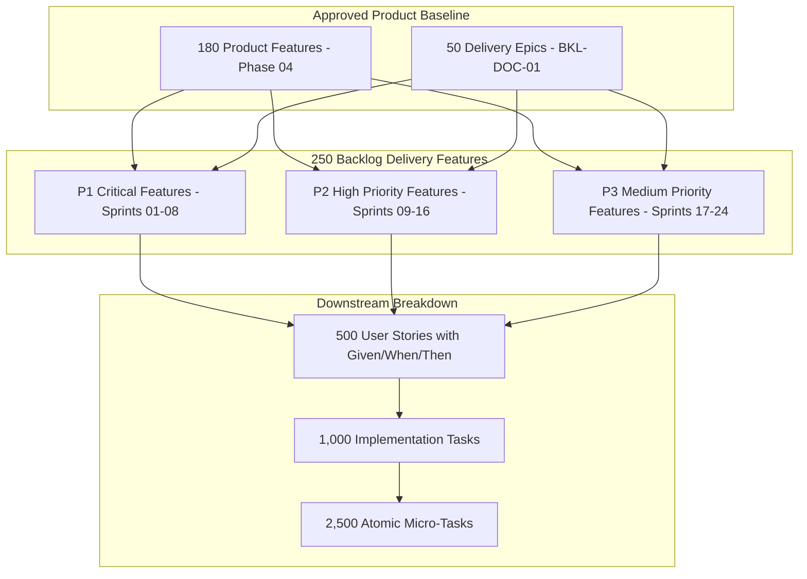

# Master Backlog Features Catalog & Upstream Traceability Matrix
## Namma Clinic Digital Health & Operations Platform
### Greater Bengaluru Authority (GBA) / BBMP Health Department
**Document Code:** `BKL-DOC-02` | **Status:** APPROVED BASELINE | **Date:** September 2026

---

## 1. Executive Summary & Features Delivery Scope
This document establishes the comprehensive **Master Backlog Features Catalog and Upstream Traceability Matrix** for the Namma Clinic Digital Health Platform. Representing the functional decomposition of delivery epics, the catalog defines **250 Engineering Delivery Features** mapped directly to the 180 authoritative product features approved in Phase 04. Each backlog feature defines granular functional scope, architectural complexity, sprint targets across the 24-sprint implementation cycle, and strict acceptance criteria. This level of granularity ensures that engineering squads build with precise technical guidance, zero requirement ambiguity, and continuous verification against municipal healthcare clinical safety standards.

### 1.1 Non-Negotiable Backlog Feature Invariants
1. **Complete Upstream Product Feature Alignment:** Every backlog feature must reference its corresponding product feature (`FEATURE-001` through `FEATURE-180`) and parent epic (`EPIC-001` through `EPIC-050`).
2. **Bilingual Frontline UI Invariant:** Any feature touching patient or clinician interfaces must provide native Kannada and English language strings with zero missing localization keys.
3. **Automated Acceptance Testing Mandate:** No backlog feature is marked complete without automated integration and contract tests proving adherence to functional requirements.
4. **Zero Unencrypted PHI Storage:** Features handling patient clinical or demographic data must enforce column-level encryption (pgcrypto / AES-256) and DPDP-compliant de-identification.
5. **Offline Resiliency Invariant:** Frontline clinical features must function seamlessly in local SQLite offline mode during municipal connectivity disruptions.

## 2. Backlog Feature Decomposition & Sprint Pipeline Diagram


### Backlog Specification Example: Backlog Feature Schema Specification
<!-- DOCUMENTATION-ONLY EXAMPLE -->
```yaml
# DOCUMENTATION-ONLY CONFIGURATION
# DOCUMENTATION-ONLY CONFIGURATION: Backlog Feature Delivery Schema
backlog_feature:
  id: "BFEATURE-001"
  epic_id: "EPIC-001"
  upstream_feature_id: "FEATURE-001"
  title: "Delivery Feature 001 (Traced to FEATURE-001)"
  complexity: "HIGH"
  priority: "P1_CRITICAL"
  target_sprint: "SPRINT-01"
  owner_squad: "squad_clinical_experience"
  acceptance_criteria:
    - "Given an authenticated clinician, when OPD consultation loads, then UI renders in < 250ms"
    - "Offline SQLite queue caches all mutations when network drops"
    - "Automated unit and integration test coverage exceeds 90%"
```

## 3. Master Catalog of 250 Backlog Features
Detailed specifications of all 250 delivery features across the platform implementation lifecycle:

### BFEATURE-001: Delivery Feature 001 (Traced to FEATURE-001)
- **Feature Identifier:** `BFEATURE-001`
- **Parent Epic:** `EPIC-001`
- **Upstream Product Feature:** `FEATURE-001`
- **Architectural Complexity:** `MEDIUM`
- **Priority Classification:** `P2_HIGH`
- **Target Sprint Window:** `SPRINT-01`
- **Scope Summary:** Granular implementation feature fulfilling requirements of FEATURE-001 under governance of EPIC-001.

### BFEATURE-002: Delivery Feature 002 (Traced to FEATURE-002)
- **Feature Identifier:** `BFEATURE-002`
- **Parent Epic:** `EPIC-002`
- **Upstream Product Feature:** `FEATURE-002`
- **Architectural Complexity:** `LOW`
- **Priority Classification:** `P3_MEDIUM`
- **Target Sprint Window:** `SPRINT-02`
- **Scope Summary:** Granular implementation feature fulfilling requirements of FEATURE-002 under governance of EPIC-002.

### BFEATURE-003: Delivery Feature 003 (Traced to FEATURE-003)
- **Feature Identifier:** `BFEATURE-003`
- **Parent Epic:** `EPIC-003`
- **Upstream Product Feature:** `FEATURE-003`
- **Architectural Complexity:** `HIGH`
- **Priority Classification:** `P3_MEDIUM`
- **Target Sprint Window:** `SPRINT-03`
- **Scope Summary:** Granular implementation feature fulfilling requirements of FEATURE-003 under governance of EPIC-003.

### BFEATURE-004: Delivery Feature 004 (Traced to FEATURE-004)
- **Feature Identifier:** `BFEATURE-004`
- **Parent Epic:** `EPIC-004`
- **Upstream Product Feature:** `FEATURE-004`
- **Architectural Complexity:** `MEDIUM`
- **Priority Classification:** `P1_CRITICAL`
- **Target Sprint Window:** `SPRINT-04`
- **Scope Summary:** Granular implementation feature fulfilling requirements of FEATURE-004 under governance of EPIC-004.

### BFEATURE-005: Delivery Feature 005 (Traced to FEATURE-005)
- **Feature Identifier:** `BFEATURE-005`
- **Parent Epic:** `EPIC-005`
- **Upstream Product Feature:** `FEATURE-005`
- **Architectural Complexity:** `LOW`
- **Priority Classification:** `P2_HIGH`
- **Target Sprint Window:** `SPRINT-05`
- **Scope Summary:** Granular implementation feature fulfilling requirements of FEATURE-005 under governance of EPIC-005.

### BFEATURE-006: Delivery Feature 006 (Traced to FEATURE-006)
- **Feature Identifier:** `BFEATURE-006`
- **Parent Epic:** `EPIC-006`
- **Upstream Product Feature:** `FEATURE-006`
- **Architectural Complexity:** `HIGH`
- **Priority Classification:** `P3_MEDIUM`
- **Target Sprint Window:** `SPRINT-06`
- **Scope Summary:** Granular implementation feature fulfilling requirements of FEATURE-006 under governance of EPIC-006.

### BFEATURE-007: Delivery Feature 007 (Traced to FEATURE-007)
- **Feature Identifier:** `BFEATURE-007`
- **Parent Epic:** `EPIC-007`
- **Upstream Product Feature:** `FEATURE-007`
- **Architectural Complexity:** `MEDIUM`
- **Priority Classification:** `P3_MEDIUM`
- **Target Sprint Window:** `SPRINT-07`
- **Scope Summary:** Granular implementation feature fulfilling requirements of FEATURE-007 under governance of EPIC-007.

### BFEATURE-008: Delivery Feature 008 (Traced to FEATURE-008)
- **Feature Identifier:** `BFEATURE-008`
- **Parent Epic:** `EPIC-008`
- **Upstream Product Feature:** `FEATURE-008`
- **Architectural Complexity:** `LOW`
- **Priority Classification:** `P1_CRITICAL`
- **Target Sprint Window:** `SPRINT-08`
- **Scope Summary:** Granular implementation feature fulfilling requirements of FEATURE-008 under governance of EPIC-008.

### BFEATURE-009: Delivery Feature 009 (Traced to FEATURE-009)
- **Feature Identifier:** `BFEATURE-009`
- **Parent Epic:** `EPIC-009`
- **Upstream Product Feature:** `FEATURE-009`
- **Architectural Complexity:** `HIGH`
- **Priority Classification:** `P2_HIGH`
- **Target Sprint Window:** `SPRINT-09`
- **Scope Summary:** Granular implementation feature fulfilling requirements of FEATURE-009 under governance of EPIC-009.

### BFEATURE-010: Delivery Feature 010 (Traced to FEATURE-010)
- **Feature Identifier:** `BFEATURE-010`
- **Parent Epic:** `EPIC-010`
- **Upstream Product Feature:** `FEATURE-010`
- **Architectural Complexity:** `MEDIUM`
- **Priority Classification:** `P3_MEDIUM`
- **Target Sprint Window:** `SPRINT-10`
- **Scope Summary:** Granular implementation feature fulfilling requirements of FEATURE-010 under governance of EPIC-010.

### BFEATURE-011: Delivery Feature 011 (Traced to FEATURE-011)
- **Feature Identifier:** `BFEATURE-011`
- **Parent Epic:** `EPIC-011`
- **Upstream Product Feature:** `FEATURE-011`
- **Architectural Complexity:** `LOW`
- **Priority Classification:** `P3_MEDIUM`
- **Target Sprint Window:** `SPRINT-11`
- **Scope Summary:** Granular implementation feature fulfilling requirements of FEATURE-011 under governance of EPIC-011.

### BFEATURE-012: Delivery Feature 012 (Traced to FEATURE-012)
- **Feature Identifier:** `BFEATURE-012`
- **Parent Epic:** `EPIC-012`
- **Upstream Product Feature:** `FEATURE-012`
- **Architectural Complexity:** `HIGH`
- **Priority Classification:** `P1_CRITICAL`
- **Target Sprint Window:** `SPRINT-12`
- **Scope Summary:** Granular implementation feature fulfilling requirements of FEATURE-012 under governance of EPIC-012.

### BFEATURE-013: Delivery Feature 013 (Traced to FEATURE-013)
- **Feature Identifier:** `BFEATURE-013`
- **Parent Epic:** `EPIC-013`
- **Upstream Product Feature:** `FEATURE-013`
- **Architectural Complexity:** `MEDIUM`
- **Priority Classification:** `P2_HIGH`
- **Target Sprint Window:** `SPRINT-13`
- **Scope Summary:** Granular implementation feature fulfilling requirements of FEATURE-013 under governance of EPIC-013.

### BFEATURE-014: Delivery Feature 014 (Traced to FEATURE-014)
- **Feature Identifier:** `BFEATURE-014`
- **Parent Epic:** `EPIC-014`
- **Upstream Product Feature:** `FEATURE-014`
- **Architectural Complexity:** `LOW`
- **Priority Classification:** `P3_MEDIUM`
- **Target Sprint Window:** `SPRINT-14`
- **Scope Summary:** Granular implementation feature fulfilling requirements of FEATURE-014 under governance of EPIC-014.

### BFEATURE-015: Delivery Feature 015 (Traced to FEATURE-015)
- **Feature Identifier:** `BFEATURE-015`
- **Parent Epic:** `EPIC-015`
- **Upstream Product Feature:** `FEATURE-015`
- **Architectural Complexity:** `HIGH`
- **Priority Classification:** `P3_MEDIUM`
- **Target Sprint Window:** `SPRINT-15`
- **Scope Summary:** Granular implementation feature fulfilling requirements of FEATURE-015 under governance of EPIC-015.

### BFEATURE-016: Delivery Feature 016 (Traced to FEATURE-016)
- **Feature Identifier:** `BFEATURE-016`
- **Parent Epic:** `EPIC-016`
- **Upstream Product Feature:** `FEATURE-016`
- **Architectural Complexity:** `MEDIUM`
- **Priority Classification:** `P1_CRITICAL`
- **Target Sprint Window:** `SPRINT-16`
- **Scope Summary:** Granular implementation feature fulfilling requirements of FEATURE-016 under governance of EPIC-016.

### BFEATURE-017: Delivery Feature 017 (Traced to FEATURE-017)
- **Feature Identifier:** `BFEATURE-017`
- **Parent Epic:** `EPIC-017`
- **Upstream Product Feature:** `FEATURE-017`
- **Architectural Complexity:** `LOW`
- **Priority Classification:** `P2_HIGH`
- **Target Sprint Window:** `SPRINT-17`
- **Scope Summary:** Granular implementation feature fulfilling requirements of FEATURE-017 under governance of EPIC-017.

### BFEATURE-018: Delivery Feature 018 (Traced to FEATURE-018)
- **Feature Identifier:** `BFEATURE-018`
- **Parent Epic:** `EPIC-018`
- **Upstream Product Feature:** `FEATURE-018`
- **Architectural Complexity:** `HIGH`
- **Priority Classification:** `P3_MEDIUM`
- **Target Sprint Window:** `SPRINT-18`
- **Scope Summary:** Granular implementation feature fulfilling requirements of FEATURE-018 under governance of EPIC-018.

### BFEATURE-019: Delivery Feature 019 (Traced to FEATURE-019)
- **Feature Identifier:** `BFEATURE-019`
- **Parent Epic:** `EPIC-019`
- **Upstream Product Feature:** `FEATURE-019`
- **Architectural Complexity:** `MEDIUM`
- **Priority Classification:** `P3_MEDIUM`
- **Target Sprint Window:** `SPRINT-19`
- **Scope Summary:** Granular implementation feature fulfilling requirements of FEATURE-019 under governance of EPIC-019.

### BFEATURE-020: Delivery Feature 020 (Traced to FEATURE-020)
- **Feature Identifier:** `BFEATURE-020`
- **Parent Epic:** `EPIC-020`
- **Upstream Product Feature:** `FEATURE-020`
- **Architectural Complexity:** `LOW`
- **Priority Classification:** `P1_CRITICAL`
- **Target Sprint Window:** `SPRINT-20`
- **Scope Summary:** Granular implementation feature fulfilling requirements of FEATURE-020 under governance of EPIC-020.

### BFEATURE-021: Delivery Feature 021 (Traced to FEATURE-021)
- **Feature Identifier:** `BFEATURE-021`
- **Parent Epic:** `EPIC-021`
- **Upstream Product Feature:** `FEATURE-021`
- **Architectural Complexity:** `HIGH`
- **Priority Classification:** `P2_HIGH`
- **Target Sprint Window:** `SPRINT-21`
- **Scope Summary:** Granular implementation feature fulfilling requirements of FEATURE-021 under governance of EPIC-021.

### BFEATURE-022: Delivery Feature 022 (Traced to FEATURE-022)
- **Feature Identifier:** `BFEATURE-022`
- **Parent Epic:** `EPIC-022`
- **Upstream Product Feature:** `FEATURE-022`
- **Architectural Complexity:** `MEDIUM`
- **Priority Classification:** `P3_MEDIUM`
- **Target Sprint Window:** `SPRINT-22`
- **Scope Summary:** Granular implementation feature fulfilling requirements of FEATURE-022 under governance of EPIC-022.

### BFEATURE-023: Delivery Feature 023 (Traced to FEATURE-023)
- **Feature Identifier:** `BFEATURE-023`
- **Parent Epic:** `EPIC-023`
- **Upstream Product Feature:** `FEATURE-023`
- **Architectural Complexity:** `LOW`
- **Priority Classification:** `P3_MEDIUM`
- **Target Sprint Window:** `SPRINT-23`
- **Scope Summary:** Granular implementation feature fulfilling requirements of FEATURE-023 under governance of EPIC-023.

### BFEATURE-024: Delivery Feature 024 (Traced to FEATURE-024)
- **Feature Identifier:** `BFEATURE-024`
- **Parent Epic:** `EPIC-024`
- **Upstream Product Feature:** `FEATURE-024`
- **Architectural Complexity:** `HIGH`
- **Priority Classification:** `P1_CRITICAL`
- **Target Sprint Window:** `SPRINT-24`
- **Scope Summary:** Granular implementation feature fulfilling requirements of FEATURE-024 under governance of EPIC-024.

### BFEATURE-025: Delivery Feature 025 (Traced to FEATURE-025)
- **Feature Identifier:** `BFEATURE-025`
- **Parent Epic:** `EPIC-025`
- **Upstream Product Feature:** `FEATURE-025`
- **Architectural Complexity:** `MEDIUM`
- **Priority Classification:** `P2_HIGH`
- **Target Sprint Window:** `SPRINT-01`
- **Scope Summary:** Granular implementation feature fulfilling requirements of FEATURE-025 under governance of EPIC-025.

### BFEATURE-026: Delivery Feature 026 (Traced to FEATURE-026)
- **Feature Identifier:** `BFEATURE-026`
- **Parent Epic:** `EPIC-026`
- **Upstream Product Feature:** `FEATURE-026`
- **Architectural Complexity:** `LOW`
- **Priority Classification:** `P3_MEDIUM`
- **Target Sprint Window:** `SPRINT-02`
- **Scope Summary:** Granular implementation feature fulfilling requirements of FEATURE-026 under governance of EPIC-026.

### BFEATURE-027: Delivery Feature 027 (Traced to FEATURE-027)
- **Feature Identifier:** `BFEATURE-027`
- **Parent Epic:** `EPIC-027`
- **Upstream Product Feature:** `FEATURE-027`
- **Architectural Complexity:** `HIGH`
- **Priority Classification:** `P3_MEDIUM`
- **Target Sprint Window:** `SPRINT-03`
- **Scope Summary:** Granular implementation feature fulfilling requirements of FEATURE-027 under governance of EPIC-027.

### BFEATURE-028: Delivery Feature 028 (Traced to FEATURE-028)
- **Feature Identifier:** `BFEATURE-028`
- **Parent Epic:** `EPIC-028`
- **Upstream Product Feature:** `FEATURE-028`
- **Architectural Complexity:** `MEDIUM`
- **Priority Classification:** `P1_CRITICAL`
- **Target Sprint Window:** `SPRINT-04`
- **Scope Summary:** Granular implementation feature fulfilling requirements of FEATURE-028 under governance of EPIC-028.

### BFEATURE-029: Delivery Feature 029 (Traced to FEATURE-029)
- **Feature Identifier:** `BFEATURE-029`
- **Parent Epic:** `EPIC-029`
- **Upstream Product Feature:** `FEATURE-029`
- **Architectural Complexity:** `LOW`
- **Priority Classification:** `P2_HIGH`
- **Target Sprint Window:** `SPRINT-05`
- **Scope Summary:** Granular implementation feature fulfilling requirements of FEATURE-029 under governance of EPIC-029.

### BFEATURE-030: Delivery Feature 030 (Traced to FEATURE-030)
- **Feature Identifier:** `BFEATURE-030`
- **Parent Epic:** `EPIC-030`
- **Upstream Product Feature:** `FEATURE-030`
- **Architectural Complexity:** `HIGH`
- **Priority Classification:** `P3_MEDIUM`
- **Target Sprint Window:** `SPRINT-06`
- **Scope Summary:** Granular implementation feature fulfilling requirements of FEATURE-030 under governance of EPIC-030.

### BFEATURE-031: Delivery Feature 031 (Traced to FEATURE-031)
- **Feature Identifier:** `BFEATURE-031`
- **Parent Epic:** `EPIC-031`
- **Upstream Product Feature:** `FEATURE-031`
- **Architectural Complexity:** `MEDIUM`
- **Priority Classification:** `P3_MEDIUM`
- **Target Sprint Window:** `SPRINT-07`
- **Scope Summary:** Granular implementation feature fulfilling requirements of FEATURE-031 under governance of EPIC-031.

### BFEATURE-032: Delivery Feature 032 (Traced to FEATURE-032)
- **Feature Identifier:** `BFEATURE-032`
- **Parent Epic:** `EPIC-032`
- **Upstream Product Feature:** `FEATURE-032`
- **Architectural Complexity:** `LOW`
- **Priority Classification:** `P1_CRITICAL`
- **Target Sprint Window:** `SPRINT-08`
- **Scope Summary:** Granular implementation feature fulfilling requirements of FEATURE-032 under governance of EPIC-032.

### BFEATURE-033: Delivery Feature 033 (Traced to FEATURE-033)
- **Feature Identifier:** `BFEATURE-033`
- **Parent Epic:** `EPIC-033`
- **Upstream Product Feature:** `FEATURE-033`
- **Architectural Complexity:** `HIGH`
- **Priority Classification:** `P2_HIGH`
- **Target Sprint Window:** `SPRINT-09`
- **Scope Summary:** Granular implementation feature fulfilling requirements of FEATURE-033 under governance of EPIC-033.

### BFEATURE-034: Delivery Feature 034 (Traced to FEATURE-034)
- **Feature Identifier:** `BFEATURE-034`
- **Parent Epic:** `EPIC-034`
- **Upstream Product Feature:** `FEATURE-034`
- **Architectural Complexity:** `MEDIUM`
- **Priority Classification:** `P3_MEDIUM`
- **Target Sprint Window:** `SPRINT-10`
- **Scope Summary:** Granular implementation feature fulfilling requirements of FEATURE-034 under governance of EPIC-034.

### BFEATURE-035: Delivery Feature 035 (Traced to FEATURE-035)
- **Feature Identifier:** `BFEATURE-035`
- **Parent Epic:** `EPIC-035`
- **Upstream Product Feature:** `FEATURE-035`
- **Architectural Complexity:** `LOW`
- **Priority Classification:** `P3_MEDIUM`
- **Target Sprint Window:** `SPRINT-11`
- **Scope Summary:** Granular implementation feature fulfilling requirements of FEATURE-035 under governance of EPIC-035.

### BFEATURE-036: Delivery Feature 036 (Traced to FEATURE-036)
- **Feature Identifier:** `BFEATURE-036`
- **Parent Epic:** `EPIC-036`
- **Upstream Product Feature:** `FEATURE-036`
- **Architectural Complexity:** `HIGH`
- **Priority Classification:** `P1_CRITICAL`
- **Target Sprint Window:** `SPRINT-12`
- **Scope Summary:** Granular implementation feature fulfilling requirements of FEATURE-036 under governance of EPIC-036.

### BFEATURE-037: Delivery Feature 037 (Traced to FEATURE-037)
- **Feature Identifier:** `BFEATURE-037`
- **Parent Epic:** `EPIC-037`
- **Upstream Product Feature:** `FEATURE-037`
- **Architectural Complexity:** `MEDIUM`
- **Priority Classification:** `P2_HIGH`
- **Target Sprint Window:** `SPRINT-13`
- **Scope Summary:** Granular implementation feature fulfilling requirements of FEATURE-037 under governance of EPIC-037.

### BFEATURE-038: Delivery Feature 038 (Traced to FEATURE-038)
- **Feature Identifier:** `BFEATURE-038`
- **Parent Epic:** `EPIC-038`
- **Upstream Product Feature:** `FEATURE-038`
- **Architectural Complexity:** `LOW`
- **Priority Classification:** `P3_MEDIUM`
- **Target Sprint Window:** `SPRINT-14`
- **Scope Summary:** Granular implementation feature fulfilling requirements of FEATURE-038 under governance of EPIC-038.

### BFEATURE-039: Delivery Feature 039 (Traced to FEATURE-039)
- **Feature Identifier:** `BFEATURE-039`
- **Parent Epic:** `EPIC-039`
- **Upstream Product Feature:** `FEATURE-039`
- **Architectural Complexity:** `HIGH`
- **Priority Classification:** `P3_MEDIUM`
- **Target Sprint Window:** `SPRINT-15`
- **Scope Summary:** Granular implementation feature fulfilling requirements of FEATURE-039 under governance of EPIC-039.

### BFEATURE-040: Delivery Feature 040 (Traced to FEATURE-040)
- **Feature Identifier:** `BFEATURE-040`
- **Parent Epic:** `EPIC-040`
- **Upstream Product Feature:** `FEATURE-040`
- **Architectural Complexity:** `MEDIUM`
- **Priority Classification:** `P1_CRITICAL`
- **Target Sprint Window:** `SPRINT-16`
- **Scope Summary:** Granular implementation feature fulfilling requirements of FEATURE-040 under governance of EPIC-040.

### BFEATURE-041: Delivery Feature 041 (Traced to FEATURE-041)
- **Feature Identifier:** `BFEATURE-041`
- **Parent Epic:** `EPIC-041`
- **Upstream Product Feature:** `FEATURE-041`
- **Architectural Complexity:** `LOW`
- **Priority Classification:** `P2_HIGH`
- **Target Sprint Window:** `SPRINT-17`
- **Scope Summary:** Granular implementation feature fulfilling requirements of FEATURE-041 under governance of EPIC-041.

### BFEATURE-042: Delivery Feature 042 (Traced to FEATURE-042)
- **Feature Identifier:** `BFEATURE-042`
- **Parent Epic:** `EPIC-042`
- **Upstream Product Feature:** `FEATURE-042`
- **Architectural Complexity:** `HIGH`
- **Priority Classification:** `P3_MEDIUM`
- **Target Sprint Window:** `SPRINT-18`
- **Scope Summary:** Granular implementation feature fulfilling requirements of FEATURE-042 under governance of EPIC-042.

### BFEATURE-043: Delivery Feature 043 (Traced to FEATURE-043)
- **Feature Identifier:** `BFEATURE-043`
- **Parent Epic:** `EPIC-043`
- **Upstream Product Feature:** `FEATURE-043`
- **Architectural Complexity:** `MEDIUM`
- **Priority Classification:** `P3_MEDIUM`
- **Target Sprint Window:** `SPRINT-19`
- **Scope Summary:** Granular implementation feature fulfilling requirements of FEATURE-043 under governance of EPIC-043.

### BFEATURE-044: Delivery Feature 044 (Traced to FEATURE-044)
- **Feature Identifier:** `BFEATURE-044`
- **Parent Epic:** `EPIC-044`
- **Upstream Product Feature:** `FEATURE-044`
- **Architectural Complexity:** `LOW`
- **Priority Classification:** `P1_CRITICAL`
- **Target Sprint Window:** `SPRINT-20`
- **Scope Summary:** Granular implementation feature fulfilling requirements of FEATURE-044 under governance of EPIC-044.

### BFEATURE-045: Delivery Feature 045 (Traced to FEATURE-045)
- **Feature Identifier:** `BFEATURE-045`
- **Parent Epic:** `EPIC-045`
- **Upstream Product Feature:** `FEATURE-045`
- **Architectural Complexity:** `HIGH`
- **Priority Classification:** `P2_HIGH`
- **Target Sprint Window:** `SPRINT-21`
- **Scope Summary:** Granular implementation feature fulfilling requirements of FEATURE-045 under governance of EPIC-045.

### BFEATURE-046: Delivery Feature 046 (Traced to FEATURE-046)
- **Feature Identifier:** `BFEATURE-046`
- **Parent Epic:** `EPIC-046`
- **Upstream Product Feature:** `FEATURE-046`
- **Architectural Complexity:** `MEDIUM`
- **Priority Classification:** `P3_MEDIUM`
- **Target Sprint Window:** `SPRINT-22`
- **Scope Summary:** Granular implementation feature fulfilling requirements of FEATURE-046 under governance of EPIC-046.

### BFEATURE-047: Delivery Feature 047 (Traced to FEATURE-047)
- **Feature Identifier:** `BFEATURE-047`
- **Parent Epic:** `EPIC-047`
- **Upstream Product Feature:** `FEATURE-047`
- **Architectural Complexity:** `LOW`
- **Priority Classification:** `P3_MEDIUM`
- **Target Sprint Window:** `SPRINT-23`
- **Scope Summary:** Granular implementation feature fulfilling requirements of FEATURE-047 under governance of EPIC-047.

### BFEATURE-048: Delivery Feature 048 (Traced to FEATURE-048)
- **Feature Identifier:** `BFEATURE-048`
- **Parent Epic:** `EPIC-048`
- **Upstream Product Feature:** `FEATURE-048`
- **Architectural Complexity:** `HIGH`
- **Priority Classification:** `P1_CRITICAL`
- **Target Sprint Window:** `SPRINT-24`
- **Scope Summary:** Granular implementation feature fulfilling requirements of FEATURE-048 under governance of EPIC-048.

### BFEATURE-049: Delivery Feature 049 (Traced to FEATURE-049)
- **Feature Identifier:** `BFEATURE-049`
- **Parent Epic:** `EPIC-049`
- **Upstream Product Feature:** `FEATURE-049`
- **Architectural Complexity:** `MEDIUM`
- **Priority Classification:** `P2_HIGH`
- **Target Sprint Window:** `SPRINT-01`
- **Scope Summary:** Granular implementation feature fulfilling requirements of FEATURE-049 under governance of EPIC-049.

### BFEATURE-050: Delivery Feature 050 (Traced to FEATURE-050)
- **Feature Identifier:** `BFEATURE-050`
- **Parent Epic:** `EPIC-050`
- **Upstream Product Feature:** `FEATURE-050`
- **Architectural Complexity:** `LOW`
- **Priority Classification:** `P3_MEDIUM`
- **Target Sprint Window:** `SPRINT-02`
- **Scope Summary:** Granular implementation feature fulfilling requirements of FEATURE-050 under governance of EPIC-050.

### BFEATURE-051: Delivery Feature 051 (Traced to FEATURE-051)
- **Feature Identifier:** `BFEATURE-051`
- **Parent Epic:** `EPIC-001`
- **Upstream Product Feature:** `FEATURE-051`
- **Architectural Complexity:** `HIGH`
- **Priority Classification:** `P3_MEDIUM`
- **Target Sprint Window:** `SPRINT-03`
- **Scope Summary:** Granular implementation feature fulfilling requirements of FEATURE-051 under governance of EPIC-001.

### BFEATURE-052: Delivery Feature 052 (Traced to FEATURE-052)
- **Feature Identifier:** `BFEATURE-052`
- **Parent Epic:** `EPIC-002`
- **Upstream Product Feature:** `FEATURE-052`
- **Architectural Complexity:** `MEDIUM`
- **Priority Classification:** `P1_CRITICAL`
- **Target Sprint Window:** `SPRINT-04`
- **Scope Summary:** Granular implementation feature fulfilling requirements of FEATURE-052 under governance of EPIC-002.

### BFEATURE-053: Delivery Feature 053 (Traced to FEATURE-053)
- **Feature Identifier:** `BFEATURE-053`
- **Parent Epic:** `EPIC-003`
- **Upstream Product Feature:** `FEATURE-053`
- **Architectural Complexity:** `LOW`
- **Priority Classification:** `P2_HIGH`
- **Target Sprint Window:** `SPRINT-05`
- **Scope Summary:** Granular implementation feature fulfilling requirements of FEATURE-053 under governance of EPIC-003.

### BFEATURE-054: Delivery Feature 054 (Traced to FEATURE-054)
- **Feature Identifier:** `BFEATURE-054`
- **Parent Epic:** `EPIC-004`
- **Upstream Product Feature:** `FEATURE-054`
- **Architectural Complexity:** `HIGH`
- **Priority Classification:** `P3_MEDIUM`
- **Target Sprint Window:** `SPRINT-06`
- **Scope Summary:** Granular implementation feature fulfilling requirements of FEATURE-054 under governance of EPIC-004.

### BFEATURE-055: Delivery Feature 055 (Traced to FEATURE-055)
- **Feature Identifier:** `BFEATURE-055`
- **Parent Epic:** `EPIC-005`
- **Upstream Product Feature:** `FEATURE-055`
- **Architectural Complexity:** `MEDIUM`
- **Priority Classification:** `P3_MEDIUM`
- **Target Sprint Window:** `SPRINT-07`
- **Scope Summary:** Granular implementation feature fulfilling requirements of FEATURE-055 under governance of EPIC-005.

### BFEATURE-056: Delivery Feature 056 (Traced to FEATURE-056)
- **Feature Identifier:** `BFEATURE-056`
- **Parent Epic:** `EPIC-006`
- **Upstream Product Feature:** `FEATURE-056`
- **Architectural Complexity:** `LOW`
- **Priority Classification:** `P1_CRITICAL`
- **Target Sprint Window:** `SPRINT-08`
- **Scope Summary:** Granular implementation feature fulfilling requirements of FEATURE-056 under governance of EPIC-006.

### BFEATURE-057: Delivery Feature 057 (Traced to FEATURE-057)
- **Feature Identifier:** `BFEATURE-057`
- **Parent Epic:** `EPIC-007`
- **Upstream Product Feature:** `FEATURE-057`
- **Architectural Complexity:** `HIGH`
- **Priority Classification:** `P2_HIGH`
- **Target Sprint Window:** `SPRINT-09`
- **Scope Summary:** Granular implementation feature fulfilling requirements of FEATURE-057 under governance of EPIC-007.

### BFEATURE-058: Delivery Feature 058 (Traced to FEATURE-058)
- **Feature Identifier:** `BFEATURE-058`
- **Parent Epic:** `EPIC-008`
- **Upstream Product Feature:** `FEATURE-058`
- **Architectural Complexity:** `MEDIUM`
- **Priority Classification:** `P3_MEDIUM`
- **Target Sprint Window:** `SPRINT-10`
- **Scope Summary:** Granular implementation feature fulfilling requirements of FEATURE-058 under governance of EPIC-008.

### BFEATURE-059: Delivery Feature 059 (Traced to FEATURE-059)
- **Feature Identifier:** `BFEATURE-059`
- **Parent Epic:** `EPIC-009`
- **Upstream Product Feature:** `FEATURE-059`
- **Architectural Complexity:** `LOW`
- **Priority Classification:** `P3_MEDIUM`
- **Target Sprint Window:** `SPRINT-11`
- **Scope Summary:** Granular implementation feature fulfilling requirements of FEATURE-059 under governance of EPIC-009.

### BFEATURE-060: Delivery Feature 060 (Traced to FEATURE-060)
- **Feature Identifier:** `BFEATURE-060`
- **Parent Epic:** `EPIC-010`
- **Upstream Product Feature:** `FEATURE-060`
- **Architectural Complexity:** `HIGH`
- **Priority Classification:** `P1_CRITICAL`
- **Target Sprint Window:** `SPRINT-12`
- **Scope Summary:** Granular implementation feature fulfilling requirements of FEATURE-060 under governance of EPIC-010.

### BFEATURE-061: Delivery Feature 061 (Traced to FEATURE-061)
- **Feature Identifier:** `BFEATURE-061`
- **Parent Epic:** `EPIC-011`
- **Upstream Product Feature:** `FEATURE-061`
- **Architectural Complexity:** `MEDIUM`
- **Priority Classification:** `P2_HIGH`
- **Target Sprint Window:** `SPRINT-13`
- **Scope Summary:** Granular implementation feature fulfilling requirements of FEATURE-061 under governance of EPIC-011.

### BFEATURE-062: Delivery Feature 062 (Traced to FEATURE-062)
- **Feature Identifier:** `BFEATURE-062`
- **Parent Epic:** `EPIC-012`
- **Upstream Product Feature:** `FEATURE-062`
- **Architectural Complexity:** `LOW`
- **Priority Classification:** `P3_MEDIUM`
- **Target Sprint Window:** `SPRINT-14`
- **Scope Summary:** Granular implementation feature fulfilling requirements of FEATURE-062 under governance of EPIC-012.

### BFEATURE-063: Delivery Feature 063 (Traced to FEATURE-063)
- **Feature Identifier:** `BFEATURE-063`
- **Parent Epic:** `EPIC-013`
- **Upstream Product Feature:** `FEATURE-063`
- **Architectural Complexity:** `HIGH`
- **Priority Classification:** `P3_MEDIUM`
- **Target Sprint Window:** `SPRINT-15`
- **Scope Summary:** Granular implementation feature fulfilling requirements of FEATURE-063 under governance of EPIC-013.

### BFEATURE-064: Delivery Feature 064 (Traced to FEATURE-064)
- **Feature Identifier:** `BFEATURE-064`
- **Parent Epic:** `EPIC-014`
- **Upstream Product Feature:** `FEATURE-064`
- **Architectural Complexity:** `MEDIUM`
- **Priority Classification:** `P1_CRITICAL`
- **Target Sprint Window:** `SPRINT-16`
- **Scope Summary:** Granular implementation feature fulfilling requirements of FEATURE-064 under governance of EPIC-014.

### BFEATURE-065: Delivery Feature 065 (Traced to FEATURE-065)
- **Feature Identifier:** `BFEATURE-065`
- **Parent Epic:** `EPIC-015`
- **Upstream Product Feature:** `FEATURE-065`
- **Architectural Complexity:** `LOW`
- **Priority Classification:** `P2_HIGH`
- **Target Sprint Window:** `SPRINT-17`
- **Scope Summary:** Granular implementation feature fulfilling requirements of FEATURE-065 under governance of EPIC-015.

### BFEATURE-066: Delivery Feature 066 (Traced to FEATURE-066)
- **Feature Identifier:** `BFEATURE-066`
- **Parent Epic:** `EPIC-016`
- **Upstream Product Feature:** `FEATURE-066`
- **Architectural Complexity:** `HIGH`
- **Priority Classification:** `P3_MEDIUM`
- **Target Sprint Window:** `SPRINT-18`
- **Scope Summary:** Granular implementation feature fulfilling requirements of FEATURE-066 under governance of EPIC-016.

### BFEATURE-067: Delivery Feature 067 (Traced to FEATURE-067)
- **Feature Identifier:** `BFEATURE-067`
- **Parent Epic:** `EPIC-017`
- **Upstream Product Feature:** `FEATURE-067`
- **Architectural Complexity:** `MEDIUM`
- **Priority Classification:** `P3_MEDIUM`
- **Target Sprint Window:** `SPRINT-19`
- **Scope Summary:** Granular implementation feature fulfilling requirements of FEATURE-067 under governance of EPIC-017.

### BFEATURE-068: Delivery Feature 068 (Traced to FEATURE-068)
- **Feature Identifier:** `BFEATURE-068`
- **Parent Epic:** `EPIC-018`
- **Upstream Product Feature:** `FEATURE-068`
- **Architectural Complexity:** `LOW`
- **Priority Classification:** `P1_CRITICAL`
- **Target Sprint Window:** `SPRINT-20`
- **Scope Summary:** Granular implementation feature fulfilling requirements of FEATURE-068 under governance of EPIC-018.

### BFEATURE-069: Delivery Feature 069 (Traced to FEATURE-069)
- **Feature Identifier:** `BFEATURE-069`
- **Parent Epic:** `EPIC-019`
- **Upstream Product Feature:** `FEATURE-069`
- **Architectural Complexity:** `HIGH`
- **Priority Classification:** `P2_HIGH`
- **Target Sprint Window:** `SPRINT-21`
- **Scope Summary:** Granular implementation feature fulfilling requirements of FEATURE-069 under governance of EPIC-019.

### BFEATURE-070: Delivery Feature 070 (Traced to FEATURE-070)
- **Feature Identifier:** `BFEATURE-070`
- **Parent Epic:** `EPIC-020`
- **Upstream Product Feature:** `FEATURE-070`
- **Architectural Complexity:** `MEDIUM`
- **Priority Classification:** `P3_MEDIUM`
- **Target Sprint Window:** `SPRINT-22`
- **Scope Summary:** Granular implementation feature fulfilling requirements of FEATURE-070 under governance of EPIC-020.

### BFEATURE-071: Delivery Feature 071 (Traced to FEATURE-071)
- **Feature Identifier:** `BFEATURE-071`
- **Parent Epic:** `EPIC-021`
- **Upstream Product Feature:** `FEATURE-071`
- **Architectural Complexity:** `LOW`
- **Priority Classification:** `P3_MEDIUM`
- **Target Sprint Window:** `SPRINT-23`
- **Scope Summary:** Granular implementation feature fulfilling requirements of FEATURE-071 under governance of EPIC-021.

### BFEATURE-072: Delivery Feature 072 (Traced to FEATURE-072)
- **Feature Identifier:** `BFEATURE-072`
- **Parent Epic:** `EPIC-022`
- **Upstream Product Feature:** `FEATURE-072`
- **Architectural Complexity:** `HIGH`
- **Priority Classification:** `P1_CRITICAL`
- **Target Sprint Window:** `SPRINT-24`
- **Scope Summary:** Granular implementation feature fulfilling requirements of FEATURE-072 under governance of EPIC-022.

### BFEATURE-073: Delivery Feature 073 (Traced to FEATURE-073)
- **Feature Identifier:** `BFEATURE-073`
- **Parent Epic:** `EPIC-023`
- **Upstream Product Feature:** `FEATURE-073`
- **Architectural Complexity:** `MEDIUM`
- **Priority Classification:** `P2_HIGH`
- **Target Sprint Window:** `SPRINT-01`
- **Scope Summary:** Granular implementation feature fulfilling requirements of FEATURE-073 under governance of EPIC-023.

### BFEATURE-074: Delivery Feature 074 (Traced to FEATURE-074)
- **Feature Identifier:** `BFEATURE-074`
- **Parent Epic:** `EPIC-024`
- **Upstream Product Feature:** `FEATURE-074`
- **Architectural Complexity:** `LOW`
- **Priority Classification:** `P3_MEDIUM`
- **Target Sprint Window:** `SPRINT-02`
- **Scope Summary:** Granular implementation feature fulfilling requirements of FEATURE-074 under governance of EPIC-024.

### BFEATURE-075: Delivery Feature 075 (Traced to FEATURE-075)
- **Feature Identifier:** `BFEATURE-075`
- **Parent Epic:** `EPIC-025`
- **Upstream Product Feature:** `FEATURE-075`
- **Architectural Complexity:** `HIGH`
- **Priority Classification:** `P3_MEDIUM`
- **Target Sprint Window:** `SPRINT-03`
- **Scope Summary:** Granular implementation feature fulfilling requirements of FEATURE-075 under governance of EPIC-025.

### BFEATURE-076: Delivery Feature 076 (Traced to FEATURE-076)
- **Feature Identifier:** `BFEATURE-076`
- **Parent Epic:** `EPIC-026`
- **Upstream Product Feature:** `FEATURE-076`
- **Architectural Complexity:** `MEDIUM`
- **Priority Classification:** `P1_CRITICAL`
- **Target Sprint Window:** `SPRINT-04`
- **Scope Summary:** Granular implementation feature fulfilling requirements of FEATURE-076 under governance of EPIC-026.

### BFEATURE-077: Delivery Feature 077 (Traced to FEATURE-077)
- **Feature Identifier:** `BFEATURE-077`
- **Parent Epic:** `EPIC-027`
- **Upstream Product Feature:** `FEATURE-077`
- **Architectural Complexity:** `LOW`
- **Priority Classification:** `P2_HIGH`
- **Target Sprint Window:** `SPRINT-05`
- **Scope Summary:** Granular implementation feature fulfilling requirements of FEATURE-077 under governance of EPIC-027.

### BFEATURE-078: Delivery Feature 078 (Traced to FEATURE-078)
- **Feature Identifier:** `BFEATURE-078`
- **Parent Epic:** `EPIC-028`
- **Upstream Product Feature:** `FEATURE-078`
- **Architectural Complexity:** `HIGH`
- **Priority Classification:** `P3_MEDIUM`
- **Target Sprint Window:** `SPRINT-06`
- **Scope Summary:** Granular implementation feature fulfilling requirements of FEATURE-078 under governance of EPIC-028.

### BFEATURE-079: Delivery Feature 079 (Traced to FEATURE-079)
- **Feature Identifier:** `BFEATURE-079`
- **Parent Epic:** `EPIC-029`
- **Upstream Product Feature:** `FEATURE-079`
- **Architectural Complexity:** `MEDIUM`
- **Priority Classification:** `P3_MEDIUM`
- **Target Sprint Window:** `SPRINT-07`
- **Scope Summary:** Granular implementation feature fulfilling requirements of FEATURE-079 under governance of EPIC-029.

### BFEATURE-080: Delivery Feature 080 (Traced to FEATURE-080)
- **Feature Identifier:** `BFEATURE-080`
- **Parent Epic:** `EPIC-030`
- **Upstream Product Feature:** `FEATURE-080`
- **Architectural Complexity:** `LOW`
- **Priority Classification:** `P1_CRITICAL`
- **Target Sprint Window:** `SPRINT-08`
- **Scope Summary:** Granular implementation feature fulfilling requirements of FEATURE-080 under governance of EPIC-030.

### BFEATURE-081: Delivery Feature 081 (Traced to FEATURE-081)
- **Feature Identifier:** `BFEATURE-081`
- **Parent Epic:** `EPIC-031`
- **Upstream Product Feature:** `FEATURE-081`
- **Architectural Complexity:** `HIGH`
- **Priority Classification:** `P2_HIGH`
- **Target Sprint Window:** `SPRINT-09`
- **Scope Summary:** Granular implementation feature fulfilling requirements of FEATURE-081 under governance of EPIC-031.

### BFEATURE-082: Delivery Feature 082 (Traced to FEATURE-082)
- **Feature Identifier:** `BFEATURE-082`
- **Parent Epic:** `EPIC-032`
- **Upstream Product Feature:** `FEATURE-082`
- **Architectural Complexity:** `MEDIUM`
- **Priority Classification:** `P3_MEDIUM`
- **Target Sprint Window:** `SPRINT-10`
- **Scope Summary:** Granular implementation feature fulfilling requirements of FEATURE-082 under governance of EPIC-032.

### BFEATURE-083: Delivery Feature 083 (Traced to FEATURE-083)
- **Feature Identifier:** `BFEATURE-083`
- **Parent Epic:** `EPIC-033`
- **Upstream Product Feature:** `FEATURE-083`
- **Architectural Complexity:** `LOW`
- **Priority Classification:** `P3_MEDIUM`
- **Target Sprint Window:** `SPRINT-11`
- **Scope Summary:** Granular implementation feature fulfilling requirements of FEATURE-083 under governance of EPIC-033.

### BFEATURE-084: Delivery Feature 084 (Traced to FEATURE-084)
- **Feature Identifier:** `BFEATURE-084`
- **Parent Epic:** `EPIC-034`
- **Upstream Product Feature:** `FEATURE-084`
- **Architectural Complexity:** `HIGH`
- **Priority Classification:** `P1_CRITICAL`
- **Target Sprint Window:** `SPRINT-12`
- **Scope Summary:** Granular implementation feature fulfilling requirements of FEATURE-084 under governance of EPIC-034.

### BFEATURE-085: Delivery Feature 085 (Traced to FEATURE-085)
- **Feature Identifier:** `BFEATURE-085`
- **Parent Epic:** `EPIC-035`
- **Upstream Product Feature:** `FEATURE-085`
- **Architectural Complexity:** `MEDIUM`
- **Priority Classification:** `P2_HIGH`
- **Target Sprint Window:** `SPRINT-13`
- **Scope Summary:** Granular implementation feature fulfilling requirements of FEATURE-085 under governance of EPIC-035.

### BFEATURE-086: Delivery Feature 086 (Traced to FEATURE-086)
- **Feature Identifier:** `BFEATURE-086`
- **Parent Epic:** `EPIC-036`
- **Upstream Product Feature:** `FEATURE-086`
- **Architectural Complexity:** `LOW`
- **Priority Classification:** `P3_MEDIUM`
- **Target Sprint Window:** `SPRINT-14`
- **Scope Summary:** Granular implementation feature fulfilling requirements of FEATURE-086 under governance of EPIC-036.

### BFEATURE-087: Delivery Feature 087 (Traced to FEATURE-087)
- **Feature Identifier:** `BFEATURE-087`
- **Parent Epic:** `EPIC-037`
- **Upstream Product Feature:** `FEATURE-087`
- **Architectural Complexity:** `HIGH`
- **Priority Classification:** `P3_MEDIUM`
- **Target Sprint Window:** `SPRINT-15`
- **Scope Summary:** Granular implementation feature fulfilling requirements of FEATURE-087 under governance of EPIC-037.

### BFEATURE-088: Delivery Feature 088 (Traced to FEATURE-088)
- **Feature Identifier:** `BFEATURE-088`
- **Parent Epic:** `EPIC-038`
- **Upstream Product Feature:** `FEATURE-088`
- **Architectural Complexity:** `MEDIUM`
- **Priority Classification:** `P1_CRITICAL`
- **Target Sprint Window:** `SPRINT-16`
- **Scope Summary:** Granular implementation feature fulfilling requirements of FEATURE-088 under governance of EPIC-038.

### BFEATURE-089: Delivery Feature 089 (Traced to FEATURE-089)
- **Feature Identifier:** `BFEATURE-089`
- **Parent Epic:** `EPIC-039`
- **Upstream Product Feature:** `FEATURE-089`
- **Architectural Complexity:** `LOW`
- **Priority Classification:** `P2_HIGH`
- **Target Sprint Window:** `SPRINT-17`
- **Scope Summary:** Granular implementation feature fulfilling requirements of FEATURE-089 under governance of EPIC-039.

### BFEATURE-090: Delivery Feature 090 (Traced to FEATURE-090)
- **Feature Identifier:** `BFEATURE-090`
- **Parent Epic:** `EPIC-040`
- **Upstream Product Feature:** `FEATURE-090`
- **Architectural Complexity:** `HIGH`
- **Priority Classification:** `P3_MEDIUM`
- **Target Sprint Window:** `SPRINT-18`
- **Scope Summary:** Granular implementation feature fulfilling requirements of FEATURE-090 under governance of EPIC-040.

### BFEATURE-091: Delivery Feature 091 (Traced to FEATURE-091)
- **Feature Identifier:** `BFEATURE-091`
- **Parent Epic:** `EPIC-041`
- **Upstream Product Feature:** `FEATURE-091`
- **Architectural Complexity:** `MEDIUM`
- **Priority Classification:** `P3_MEDIUM`
- **Target Sprint Window:** `SPRINT-19`
- **Scope Summary:** Granular implementation feature fulfilling requirements of FEATURE-091 under governance of EPIC-041.

### BFEATURE-092: Delivery Feature 092 (Traced to FEATURE-092)
- **Feature Identifier:** `BFEATURE-092`
- **Parent Epic:** `EPIC-042`
- **Upstream Product Feature:** `FEATURE-092`
- **Architectural Complexity:** `LOW`
- **Priority Classification:** `P1_CRITICAL`
- **Target Sprint Window:** `SPRINT-20`
- **Scope Summary:** Granular implementation feature fulfilling requirements of FEATURE-092 under governance of EPIC-042.

### BFEATURE-093: Delivery Feature 093 (Traced to FEATURE-093)
- **Feature Identifier:** `BFEATURE-093`
- **Parent Epic:** `EPIC-043`
- **Upstream Product Feature:** `FEATURE-093`
- **Architectural Complexity:** `HIGH`
- **Priority Classification:** `P2_HIGH`
- **Target Sprint Window:** `SPRINT-21`
- **Scope Summary:** Granular implementation feature fulfilling requirements of FEATURE-093 under governance of EPIC-043.

### BFEATURE-094: Delivery Feature 094 (Traced to FEATURE-094)
- **Feature Identifier:** `BFEATURE-094`
- **Parent Epic:** `EPIC-044`
- **Upstream Product Feature:** `FEATURE-094`
- **Architectural Complexity:** `MEDIUM`
- **Priority Classification:** `P3_MEDIUM`
- **Target Sprint Window:** `SPRINT-22`
- **Scope Summary:** Granular implementation feature fulfilling requirements of FEATURE-094 under governance of EPIC-044.

### BFEATURE-095: Delivery Feature 095 (Traced to FEATURE-095)
- **Feature Identifier:** `BFEATURE-095`
- **Parent Epic:** `EPIC-045`
- **Upstream Product Feature:** `FEATURE-095`
- **Architectural Complexity:** `LOW`
- **Priority Classification:** `P3_MEDIUM`
- **Target Sprint Window:** `SPRINT-23`
- **Scope Summary:** Granular implementation feature fulfilling requirements of FEATURE-095 under governance of EPIC-045.

### BFEATURE-096: Delivery Feature 096 (Traced to FEATURE-096)
- **Feature Identifier:** `BFEATURE-096`
- **Parent Epic:** `EPIC-046`
- **Upstream Product Feature:** `FEATURE-096`
- **Architectural Complexity:** `HIGH`
- **Priority Classification:** `P1_CRITICAL`
- **Target Sprint Window:** `SPRINT-24`
- **Scope Summary:** Granular implementation feature fulfilling requirements of FEATURE-096 under governance of EPIC-046.

### BFEATURE-097: Delivery Feature 097 (Traced to FEATURE-097)
- **Feature Identifier:** `BFEATURE-097`
- **Parent Epic:** `EPIC-047`
- **Upstream Product Feature:** `FEATURE-097`
- **Architectural Complexity:** `MEDIUM`
- **Priority Classification:** `P2_HIGH`
- **Target Sprint Window:** `SPRINT-01`
- **Scope Summary:** Granular implementation feature fulfilling requirements of FEATURE-097 under governance of EPIC-047.

### BFEATURE-098: Delivery Feature 098 (Traced to FEATURE-098)
- **Feature Identifier:** `BFEATURE-098`
- **Parent Epic:** `EPIC-048`
- **Upstream Product Feature:** `FEATURE-098`
- **Architectural Complexity:** `LOW`
- **Priority Classification:** `P3_MEDIUM`
- **Target Sprint Window:** `SPRINT-02`
- **Scope Summary:** Granular implementation feature fulfilling requirements of FEATURE-098 under governance of EPIC-048.

### BFEATURE-099: Delivery Feature 099 (Traced to FEATURE-099)
- **Feature Identifier:** `BFEATURE-099`
- **Parent Epic:** `EPIC-049`
- **Upstream Product Feature:** `FEATURE-099`
- **Architectural Complexity:** `HIGH`
- **Priority Classification:** `P3_MEDIUM`
- **Target Sprint Window:** `SPRINT-03`
- **Scope Summary:** Granular implementation feature fulfilling requirements of FEATURE-099 under governance of EPIC-049.

### BFEATURE-100: Delivery Feature 100 (Traced to FEATURE-100)
- **Feature Identifier:** `BFEATURE-100`
- **Parent Epic:** `EPIC-050`
- **Upstream Product Feature:** `FEATURE-100`
- **Architectural Complexity:** `MEDIUM`
- **Priority Classification:** `P1_CRITICAL`
- **Target Sprint Window:** `SPRINT-04`
- **Scope Summary:** Granular implementation feature fulfilling requirements of FEATURE-100 under governance of EPIC-050.

### BFEATURE-101: Delivery Feature 101 (Traced to FEATURE-101)
- **Feature Identifier:** `BFEATURE-101`
- **Parent Epic:** `EPIC-001`
- **Upstream Product Feature:** `FEATURE-101`
- **Architectural Complexity:** `LOW`
- **Priority Classification:** `P2_HIGH`
- **Target Sprint Window:** `SPRINT-05`
- **Scope Summary:** Granular implementation feature fulfilling requirements of FEATURE-101 under governance of EPIC-001.

### BFEATURE-102: Delivery Feature 102 (Traced to FEATURE-102)
- **Feature Identifier:** `BFEATURE-102`
- **Parent Epic:** `EPIC-002`
- **Upstream Product Feature:** `FEATURE-102`
- **Architectural Complexity:** `HIGH`
- **Priority Classification:** `P3_MEDIUM`
- **Target Sprint Window:** `SPRINT-06`
- **Scope Summary:** Granular implementation feature fulfilling requirements of FEATURE-102 under governance of EPIC-002.

### BFEATURE-103: Delivery Feature 103 (Traced to FEATURE-103)
- **Feature Identifier:** `BFEATURE-103`
- **Parent Epic:** `EPIC-003`
- **Upstream Product Feature:** `FEATURE-103`
- **Architectural Complexity:** `MEDIUM`
- **Priority Classification:** `P3_MEDIUM`
- **Target Sprint Window:** `SPRINT-07`
- **Scope Summary:** Granular implementation feature fulfilling requirements of FEATURE-103 under governance of EPIC-003.

### BFEATURE-104: Delivery Feature 104 (Traced to FEATURE-104)
- **Feature Identifier:** `BFEATURE-104`
- **Parent Epic:** `EPIC-004`
- **Upstream Product Feature:** `FEATURE-104`
- **Architectural Complexity:** `LOW`
- **Priority Classification:** `P1_CRITICAL`
- **Target Sprint Window:** `SPRINT-08`
- **Scope Summary:** Granular implementation feature fulfilling requirements of FEATURE-104 under governance of EPIC-004.

### BFEATURE-105: Delivery Feature 105 (Traced to FEATURE-105)
- **Feature Identifier:** `BFEATURE-105`
- **Parent Epic:** `EPIC-005`
- **Upstream Product Feature:** `FEATURE-105`
- **Architectural Complexity:** `HIGH`
- **Priority Classification:** `P2_HIGH`
- **Target Sprint Window:** `SPRINT-09`
- **Scope Summary:** Granular implementation feature fulfilling requirements of FEATURE-105 under governance of EPIC-005.

### BFEATURE-106: Delivery Feature 106 (Traced to FEATURE-106)
- **Feature Identifier:** `BFEATURE-106`
- **Parent Epic:** `EPIC-006`
- **Upstream Product Feature:** `FEATURE-106`
- **Architectural Complexity:** `MEDIUM`
- **Priority Classification:** `P3_MEDIUM`
- **Target Sprint Window:** `SPRINT-10`
- **Scope Summary:** Granular implementation feature fulfilling requirements of FEATURE-106 under governance of EPIC-006.

### BFEATURE-107: Delivery Feature 107 (Traced to FEATURE-107)
- **Feature Identifier:** `BFEATURE-107`
- **Parent Epic:** `EPIC-007`
- **Upstream Product Feature:** `FEATURE-107`
- **Architectural Complexity:** `LOW`
- **Priority Classification:** `P3_MEDIUM`
- **Target Sprint Window:** `SPRINT-11`
- **Scope Summary:** Granular implementation feature fulfilling requirements of FEATURE-107 under governance of EPIC-007.

### BFEATURE-108: Delivery Feature 108 (Traced to FEATURE-108)
- **Feature Identifier:** `BFEATURE-108`
- **Parent Epic:** `EPIC-008`
- **Upstream Product Feature:** `FEATURE-108`
- **Architectural Complexity:** `HIGH`
- **Priority Classification:** `P1_CRITICAL`
- **Target Sprint Window:** `SPRINT-12`
- **Scope Summary:** Granular implementation feature fulfilling requirements of FEATURE-108 under governance of EPIC-008.

### BFEATURE-109: Delivery Feature 109 (Traced to FEATURE-109)
- **Feature Identifier:** `BFEATURE-109`
- **Parent Epic:** `EPIC-009`
- **Upstream Product Feature:** `FEATURE-109`
- **Architectural Complexity:** `MEDIUM`
- **Priority Classification:** `P2_HIGH`
- **Target Sprint Window:** `SPRINT-13`
- **Scope Summary:** Granular implementation feature fulfilling requirements of FEATURE-109 under governance of EPIC-009.

### BFEATURE-110: Delivery Feature 110 (Traced to FEATURE-110)
- **Feature Identifier:** `BFEATURE-110`
- **Parent Epic:** `EPIC-010`
- **Upstream Product Feature:** `FEATURE-110`
- **Architectural Complexity:** `LOW`
- **Priority Classification:** `P3_MEDIUM`
- **Target Sprint Window:** `SPRINT-14`
- **Scope Summary:** Granular implementation feature fulfilling requirements of FEATURE-110 under governance of EPIC-010.

### BFEATURE-111: Delivery Feature 111 (Traced to FEATURE-111)
- **Feature Identifier:** `BFEATURE-111`
- **Parent Epic:** `EPIC-011`
- **Upstream Product Feature:** `FEATURE-111`
- **Architectural Complexity:** `HIGH`
- **Priority Classification:** `P3_MEDIUM`
- **Target Sprint Window:** `SPRINT-15`
- **Scope Summary:** Granular implementation feature fulfilling requirements of FEATURE-111 under governance of EPIC-011.

### BFEATURE-112: Delivery Feature 112 (Traced to FEATURE-112)
- **Feature Identifier:** `BFEATURE-112`
- **Parent Epic:** `EPIC-012`
- **Upstream Product Feature:** `FEATURE-112`
- **Architectural Complexity:** `MEDIUM`
- **Priority Classification:** `P1_CRITICAL`
- **Target Sprint Window:** `SPRINT-16`
- **Scope Summary:** Granular implementation feature fulfilling requirements of FEATURE-112 under governance of EPIC-012.

### BFEATURE-113: Delivery Feature 113 (Traced to FEATURE-113)
- **Feature Identifier:** `BFEATURE-113`
- **Parent Epic:** `EPIC-013`
- **Upstream Product Feature:** `FEATURE-113`
- **Architectural Complexity:** `LOW`
- **Priority Classification:** `P2_HIGH`
- **Target Sprint Window:** `SPRINT-17`
- **Scope Summary:** Granular implementation feature fulfilling requirements of FEATURE-113 under governance of EPIC-013.

### BFEATURE-114: Delivery Feature 114 (Traced to FEATURE-114)
- **Feature Identifier:** `BFEATURE-114`
- **Parent Epic:** `EPIC-014`
- **Upstream Product Feature:** `FEATURE-114`
- **Architectural Complexity:** `HIGH`
- **Priority Classification:** `P3_MEDIUM`
- **Target Sprint Window:** `SPRINT-18`
- **Scope Summary:** Granular implementation feature fulfilling requirements of FEATURE-114 under governance of EPIC-014.

### BFEATURE-115: Delivery Feature 115 (Traced to FEATURE-115)
- **Feature Identifier:** `BFEATURE-115`
- **Parent Epic:** `EPIC-015`
- **Upstream Product Feature:** `FEATURE-115`
- **Architectural Complexity:** `MEDIUM`
- **Priority Classification:** `P3_MEDIUM`
- **Target Sprint Window:** `SPRINT-19`
- **Scope Summary:** Granular implementation feature fulfilling requirements of FEATURE-115 under governance of EPIC-015.

### BFEATURE-116: Delivery Feature 116 (Traced to FEATURE-116)
- **Feature Identifier:** `BFEATURE-116`
- **Parent Epic:** `EPIC-016`
- **Upstream Product Feature:** `FEATURE-116`
- **Architectural Complexity:** `LOW`
- **Priority Classification:** `P1_CRITICAL`
- **Target Sprint Window:** `SPRINT-20`
- **Scope Summary:** Granular implementation feature fulfilling requirements of FEATURE-116 under governance of EPIC-016.

### BFEATURE-117: Delivery Feature 117 (Traced to FEATURE-117)
- **Feature Identifier:** `BFEATURE-117`
- **Parent Epic:** `EPIC-017`
- **Upstream Product Feature:** `FEATURE-117`
- **Architectural Complexity:** `HIGH`
- **Priority Classification:** `P2_HIGH`
- **Target Sprint Window:** `SPRINT-21`
- **Scope Summary:** Granular implementation feature fulfilling requirements of FEATURE-117 under governance of EPIC-017.

### BFEATURE-118: Delivery Feature 118 (Traced to FEATURE-118)
- **Feature Identifier:** `BFEATURE-118`
- **Parent Epic:** `EPIC-018`
- **Upstream Product Feature:** `FEATURE-118`
- **Architectural Complexity:** `MEDIUM`
- **Priority Classification:** `P3_MEDIUM`
- **Target Sprint Window:** `SPRINT-22`
- **Scope Summary:** Granular implementation feature fulfilling requirements of FEATURE-118 under governance of EPIC-018.

### BFEATURE-119: Delivery Feature 119 (Traced to FEATURE-119)
- **Feature Identifier:** `BFEATURE-119`
- **Parent Epic:** `EPIC-019`
- **Upstream Product Feature:** `FEATURE-119`
- **Architectural Complexity:** `LOW`
- **Priority Classification:** `P3_MEDIUM`
- **Target Sprint Window:** `SPRINT-23`
- **Scope Summary:** Granular implementation feature fulfilling requirements of FEATURE-119 under governance of EPIC-019.

### BFEATURE-120: Delivery Feature 120 (Traced to FEATURE-120)
- **Feature Identifier:** `BFEATURE-120`
- **Parent Epic:** `EPIC-020`
- **Upstream Product Feature:** `FEATURE-120`
- **Architectural Complexity:** `HIGH`
- **Priority Classification:** `P1_CRITICAL`
- **Target Sprint Window:** `SPRINT-24`
- **Scope Summary:** Granular implementation feature fulfilling requirements of FEATURE-120 under governance of EPIC-020.

### BFEATURE-121: Delivery Feature 121 (Traced to FEATURE-121)
- **Feature Identifier:** `BFEATURE-121`
- **Parent Epic:** `EPIC-021`
- **Upstream Product Feature:** `FEATURE-121`
- **Architectural Complexity:** `MEDIUM`
- **Priority Classification:** `P2_HIGH`
- **Target Sprint Window:** `SPRINT-01`
- **Scope Summary:** Granular implementation feature fulfilling requirements of FEATURE-121 under governance of EPIC-021.

### BFEATURE-122: Delivery Feature 122 (Traced to FEATURE-122)
- **Feature Identifier:** `BFEATURE-122`
- **Parent Epic:** `EPIC-022`
- **Upstream Product Feature:** `FEATURE-122`
- **Architectural Complexity:** `LOW`
- **Priority Classification:** `P3_MEDIUM`
- **Target Sprint Window:** `SPRINT-02`
- **Scope Summary:** Granular implementation feature fulfilling requirements of FEATURE-122 under governance of EPIC-022.

### BFEATURE-123: Delivery Feature 123 (Traced to FEATURE-123)
- **Feature Identifier:** `BFEATURE-123`
- **Parent Epic:** `EPIC-023`
- **Upstream Product Feature:** `FEATURE-123`
- **Architectural Complexity:** `HIGH`
- **Priority Classification:** `P3_MEDIUM`
- **Target Sprint Window:** `SPRINT-03`
- **Scope Summary:** Granular implementation feature fulfilling requirements of FEATURE-123 under governance of EPIC-023.

### BFEATURE-124: Delivery Feature 124 (Traced to FEATURE-124)
- **Feature Identifier:** `BFEATURE-124`
- **Parent Epic:** `EPIC-024`
- **Upstream Product Feature:** `FEATURE-124`
- **Architectural Complexity:** `MEDIUM`
- **Priority Classification:** `P1_CRITICAL`
- **Target Sprint Window:** `SPRINT-04`
- **Scope Summary:** Granular implementation feature fulfilling requirements of FEATURE-124 under governance of EPIC-024.

### BFEATURE-125: Delivery Feature 125 (Traced to FEATURE-125)
- **Feature Identifier:** `BFEATURE-125`
- **Parent Epic:** `EPIC-025`
- **Upstream Product Feature:** `FEATURE-125`
- **Architectural Complexity:** `LOW`
- **Priority Classification:** `P2_HIGH`
- **Target Sprint Window:** `SPRINT-05`
- **Scope Summary:** Granular implementation feature fulfilling requirements of FEATURE-125 under governance of EPIC-025.

### BFEATURE-126: Delivery Feature 126 (Traced to FEATURE-126)
- **Feature Identifier:** `BFEATURE-126`
- **Parent Epic:** `EPIC-026`
- **Upstream Product Feature:** `FEATURE-126`
- **Architectural Complexity:** `HIGH`
- **Priority Classification:** `P3_MEDIUM`
- **Target Sprint Window:** `SPRINT-06`
- **Scope Summary:** Granular implementation feature fulfilling requirements of FEATURE-126 under governance of EPIC-026.

### BFEATURE-127: Delivery Feature 127 (Traced to FEATURE-127)
- **Feature Identifier:** `BFEATURE-127`
- **Parent Epic:** `EPIC-027`
- **Upstream Product Feature:** `FEATURE-127`
- **Architectural Complexity:** `MEDIUM`
- **Priority Classification:** `P3_MEDIUM`
- **Target Sprint Window:** `SPRINT-07`
- **Scope Summary:** Granular implementation feature fulfilling requirements of FEATURE-127 under governance of EPIC-027.

### BFEATURE-128: Delivery Feature 128 (Traced to FEATURE-128)
- **Feature Identifier:** `BFEATURE-128`
- **Parent Epic:** `EPIC-028`
- **Upstream Product Feature:** `FEATURE-128`
- **Architectural Complexity:** `LOW`
- **Priority Classification:** `P1_CRITICAL`
- **Target Sprint Window:** `SPRINT-08`
- **Scope Summary:** Granular implementation feature fulfilling requirements of FEATURE-128 under governance of EPIC-028.

### BFEATURE-129: Delivery Feature 129 (Traced to FEATURE-129)
- **Feature Identifier:** `BFEATURE-129`
- **Parent Epic:** `EPIC-029`
- **Upstream Product Feature:** `FEATURE-129`
- **Architectural Complexity:** `HIGH`
- **Priority Classification:** `P2_HIGH`
- **Target Sprint Window:** `SPRINT-09`
- **Scope Summary:** Granular implementation feature fulfilling requirements of FEATURE-129 under governance of EPIC-029.

### BFEATURE-130: Delivery Feature 130 (Traced to FEATURE-130)
- **Feature Identifier:** `BFEATURE-130`
- **Parent Epic:** `EPIC-030`
- **Upstream Product Feature:** `FEATURE-130`
- **Architectural Complexity:** `MEDIUM`
- **Priority Classification:** `P3_MEDIUM`
- **Target Sprint Window:** `SPRINT-10`
- **Scope Summary:** Granular implementation feature fulfilling requirements of FEATURE-130 under governance of EPIC-030.

### BFEATURE-131: Delivery Feature 131 (Traced to FEATURE-131)
- **Feature Identifier:** `BFEATURE-131`
- **Parent Epic:** `EPIC-031`
- **Upstream Product Feature:** `FEATURE-131`
- **Architectural Complexity:** `LOW`
- **Priority Classification:** `P3_MEDIUM`
- **Target Sprint Window:** `SPRINT-11`
- **Scope Summary:** Granular implementation feature fulfilling requirements of FEATURE-131 under governance of EPIC-031.

### BFEATURE-132: Delivery Feature 132 (Traced to FEATURE-132)
- **Feature Identifier:** `BFEATURE-132`
- **Parent Epic:** `EPIC-032`
- **Upstream Product Feature:** `FEATURE-132`
- **Architectural Complexity:** `HIGH`
- **Priority Classification:** `P1_CRITICAL`
- **Target Sprint Window:** `SPRINT-12`
- **Scope Summary:** Granular implementation feature fulfilling requirements of FEATURE-132 under governance of EPIC-032.

### BFEATURE-133: Delivery Feature 133 (Traced to FEATURE-133)
- **Feature Identifier:** `BFEATURE-133`
- **Parent Epic:** `EPIC-033`
- **Upstream Product Feature:** `FEATURE-133`
- **Architectural Complexity:** `MEDIUM`
- **Priority Classification:** `P2_HIGH`
- **Target Sprint Window:** `SPRINT-13`
- **Scope Summary:** Granular implementation feature fulfilling requirements of FEATURE-133 under governance of EPIC-033.

### BFEATURE-134: Delivery Feature 134 (Traced to FEATURE-134)
- **Feature Identifier:** `BFEATURE-134`
- **Parent Epic:** `EPIC-034`
- **Upstream Product Feature:** `FEATURE-134`
- **Architectural Complexity:** `LOW`
- **Priority Classification:** `P3_MEDIUM`
- **Target Sprint Window:** `SPRINT-14`
- **Scope Summary:** Granular implementation feature fulfilling requirements of FEATURE-134 under governance of EPIC-034.

### BFEATURE-135: Delivery Feature 135 (Traced to FEATURE-135)
- **Feature Identifier:** `BFEATURE-135`
- **Parent Epic:** `EPIC-035`
- **Upstream Product Feature:** `FEATURE-135`
- **Architectural Complexity:** `HIGH`
- **Priority Classification:** `P3_MEDIUM`
- **Target Sprint Window:** `SPRINT-15`
- **Scope Summary:** Granular implementation feature fulfilling requirements of FEATURE-135 under governance of EPIC-035.

### BFEATURE-136: Delivery Feature 136 (Traced to FEATURE-136)
- **Feature Identifier:** `BFEATURE-136`
- **Parent Epic:** `EPIC-036`
- **Upstream Product Feature:** `FEATURE-136`
- **Architectural Complexity:** `MEDIUM`
- **Priority Classification:** `P1_CRITICAL`
- **Target Sprint Window:** `SPRINT-16`
- **Scope Summary:** Granular implementation feature fulfilling requirements of FEATURE-136 under governance of EPIC-036.

### BFEATURE-137: Delivery Feature 137 (Traced to FEATURE-137)
- **Feature Identifier:** `BFEATURE-137`
- **Parent Epic:** `EPIC-037`
- **Upstream Product Feature:** `FEATURE-137`
- **Architectural Complexity:** `LOW`
- **Priority Classification:** `P2_HIGH`
- **Target Sprint Window:** `SPRINT-17`
- **Scope Summary:** Granular implementation feature fulfilling requirements of FEATURE-137 under governance of EPIC-037.

### BFEATURE-138: Delivery Feature 138 (Traced to FEATURE-138)
- **Feature Identifier:** `BFEATURE-138`
- **Parent Epic:** `EPIC-038`
- **Upstream Product Feature:** `FEATURE-138`
- **Architectural Complexity:** `HIGH`
- **Priority Classification:** `P3_MEDIUM`
- **Target Sprint Window:** `SPRINT-18`
- **Scope Summary:** Granular implementation feature fulfilling requirements of FEATURE-138 under governance of EPIC-038.

### BFEATURE-139: Delivery Feature 139 (Traced to FEATURE-139)
- **Feature Identifier:** `BFEATURE-139`
- **Parent Epic:** `EPIC-039`
- **Upstream Product Feature:** `FEATURE-139`
- **Architectural Complexity:** `MEDIUM`
- **Priority Classification:** `P3_MEDIUM`
- **Target Sprint Window:** `SPRINT-19`
- **Scope Summary:** Granular implementation feature fulfilling requirements of FEATURE-139 under governance of EPIC-039.

### BFEATURE-140: Delivery Feature 140 (Traced to FEATURE-140)
- **Feature Identifier:** `BFEATURE-140`
- **Parent Epic:** `EPIC-040`
- **Upstream Product Feature:** `FEATURE-140`
- **Architectural Complexity:** `LOW`
- **Priority Classification:** `P1_CRITICAL`
- **Target Sprint Window:** `SPRINT-20`
- **Scope Summary:** Granular implementation feature fulfilling requirements of FEATURE-140 under governance of EPIC-040.

### BFEATURE-141: Delivery Feature 141 (Traced to FEATURE-141)
- **Feature Identifier:** `BFEATURE-141`
- **Parent Epic:** `EPIC-041`
- **Upstream Product Feature:** `FEATURE-141`
- **Architectural Complexity:** `HIGH`
- **Priority Classification:** `P2_HIGH`
- **Target Sprint Window:** `SPRINT-21`
- **Scope Summary:** Granular implementation feature fulfilling requirements of FEATURE-141 under governance of EPIC-041.

### BFEATURE-142: Delivery Feature 142 (Traced to FEATURE-142)
- **Feature Identifier:** `BFEATURE-142`
- **Parent Epic:** `EPIC-042`
- **Upstream Product Feature:** `FEATURE-142`
- **Architectural Complexity:** `MEDIUM`
- **Priority Classification:** `P3_MEDIUM`
- **Target Sprint Window:** `SPRINT-22`
- **Scope Summary:** Granular implementation feature fulfilling requirements of FEATURE-142 under governance of EPIC-042.

### BFEATURE-143: Delivery Feature 143 (Traced to FEATURE-143)
- **Feature Identifier:** `BFEATURE-143`
- **Parent Epic:** `EPIC-043`
- **Upstream Product Feature:** `FEATURE-143`
- **Architectural Complexity:** `LOW`
- **Priority Classification:** `P3_MEDIUM`
- **Target Sprint Window:** `SPRINT-23`
- **Scope Summary:** Granular implementation feature fulfilling requirements of FEATURE-143 under governance of EPIC-043.

### BFEATURE-144: Delivery Feature 144 (Traced to FEATURE-144)
- **Feature Identifier:** `BFEATURE-144`
- **Parent Epic:** `EPIC-044`
- **Upstream Product Feature:** `FEATURE-144`
- **Architectural Complexity:** `HIGH`
- **Priority Classification:** `P1_CRITICAL`
- **Target Sprint Window:** `SPRINT-24`
- **Scope Summary:** Granular implementation feature fulfilling requirements of FEATURE-144 under governance of EPIC-044.

### BFEATURE-145: Delivery Feature 145 (Traced to FEATURE-145)
- **Feature Identifier:** `BFEATURE-145`
- **Parent Epic:** `EPIC-045`
- **Upstream Product Feature:** `FEATURE-145`
- **Architectural Complexity:** `MEDIUM`
- **Priority Classification:** `P2_HIGH`
- **Target Sprint Window:** `SPRINT-01`
- **Scope Summary:** Granular implementation feature fulfilling requirements of FEATURE-145 under governance of EPIC-045.

### BFEATURE-146: Delivery Feature 146 (Traced to FEATURE-146)
- **Feature Identifier:** `BFEATURE-146`
- **Parent Epic:** `EPIC-046`
- **Upstream Product Feature:** `FEATURE-146`
- **Architectural Complexity:** `LOW`
- **Priority Classification:** `P3_MEDIUM`
- **Target Sprint Window:** `SPRINT-02`
- **Scope Summary:** Granular implementation feature fulfilling requirements of FEATURE-146 under governance of EPIC-046.

### BFEATURE-147: Delivery Feature 147 (Traced to FEATURE-147)
- **Feature Identifier:** `BFEATURE-147`
- **Parent Epic:** `EPIC-047`
- **Upstream Product Feature:** `FEATURE-147`
- **Architectural Complexity:** `HIGH`
- **Priority Classification:** `P3_MEDIUM`
- **Target Sprint Window:** `SPRINT-03`
- **Scope Summary:** Granular implementation feature fulfilling requirements of FEATURE-147 under governance of EPIC-047.

### BFEATURE-148: Delivery Feature 148 (Traced to FEATURE-148)
- **Feature Identifier:** `BFEATURE-148`
- **Parent Epic:** `EPIC-048`
- **Upstream Product Feature:** `FEATURE-148`
- **Architectural Complexity:** `MEDIUM`
- **Priority Classification:** `P1_CRITICAL`
- **Target Sprint Window:** `SPRINT-04`
- **Scope Summary:** Granular implementation feature fulfilling requirements of FEATURE-148 under governance of EPIC-048.

### BFEATURE-149: Delivery Feature 149 (Traced to FEATURE-149)
- **Feature Identifier:** `BFEATURE-149`
- **Parent Epic:** `EPIC-049`
- **Upstream Product Feature:** `FEATURE-149`
- **Architectural Complexity:** `LOW`
- **Priority Classification:** `P2_HIGH`
- **Target Sprint Window:** `SPRINT-05`
- **Scope Summary:** Granular implementation feature fulfilling requirements of FEATURE-149 under governance of EPIC-049.

### BFEATURE-150: Delivery Feature 150 (Traced to FEATURE-150)
- **Feature Identifier:** `BFEATURE-150`
- **Parent Epic:** `EPIC-050`
- **Upstream Product Feature:** `FEATURE-150`
- **Architectural Complexity:** `HIGH`
- **Priority Classification:** `P3_MEDIUM`
- **Target Sprint Window:** `SPRINT-06`
- **Scope Summary:** Granular implementation feature fulfilling requirements of FEATURE-150 under governance of EPIC-050.

### BFEATURE-151: Delivery Feature 151 (Traced to FEATURE-151)
- **Feature Identifier:** `BFEATURE-151`
- **Parent Epic:** `EPIC-001`
- **Upstream Product Feature:** `FEATURE-151`
- **Architectural Complexity:** `MEDIUM`
- **Priority Classification:** `P3_MEDIUM`
- **Target Sprint Window:** `SPRINT-07`
- **Scope Summary:** Granular implementation feature fulfilling requirements of FEATURE-151 under governance of EPIC-001.

### BFEATURE-152: Delivery Feature 152 (Traced to FEATURE-152)
- **Feature Identifier:** `BFEATURE-152`
- **Parent Epic:** `EPIC-002`
- **Upstream Product Feature:** `FEATURE-152`
- **Architectural Complexity:** `LOW`
- **Priority Classification:** `P1_CRITICAL`
- **Target Sprint Window:** `SPRINT-08`
- **Scope Summary:** Granular implementation feature fulfilling requirements of FEATURE-152 under governance of EPIC-002.

### BFEATURE-153: Delivery Feature 153 (Traced to FEATURE-153)
- **Feature Identifier:** `BFEATURE-153`
- **Parent Epic:** `EPIC-003`
- **Upstream Product Feature:** `FEATURE-153`
- **Architectural Complexity:** `HIGH`
- **Priority Classification:** `P2_HIGH`
- **Target Sprint Window:** `SPRINT-09`
- **Scope Summary:** Granular implementation feature fulfilling requirements of FEATURE-153 under governance of EPIC-003.

### BFEATURE-154: Delivery Feature 154 (Traced to FEATURE-154)
- **Feature Identifier:** `BFEATURE-154`
- **Parent Epic:** `EPIC-004`
- **Upstream Product Feature:** `FEATURE-154`
- **Architectural Complexity:** `MEDIUM`
- **Priority Classification:** `P3_MEDIUM`
- **Target Sprint Window:** `SPRINT-10`
- **Scope Summary:** Granular implementation feature fulfilling requirements of FEATURE-154 under governance of EPIC-004.

### BFEATURE-155: Delivery Feature 155 (Traced to FEATURE-155)
- **Feature Identifier:** `BFEATURE-155`
- **Parent Epic:** `EPIC-005`
- **Upstream Product Feature:** `FEATURE-155`
- **Architectural Complexity:** `LOW`
- **Priority Classification:** `P3_MEDIUM`
- **Target Sprint Window:** `SPRINT-11`
- **Scope Summary:** Granular implementation feature fulfilling requirements of FEATURE-155 under governance of EPIC-005.

### BFEATURE-156: Delivery Feature 156 (Traced to FEATURE-156)
- **Feature Identifier:** `BFEATURE-156`
- **Parent Epic:** `EPIC-006`
- **Upstream Product Feature:** `FEATURE-156`
- **Architectural Complexity:** `HIGH`
- **Priority Classification:** `P1_CRITICAL`
- **Target Sprint Window:** `SPRINT-12`
- **Scope Summary:** Granular implementation feature fulfilling requirements of FEATURE-156 under governance of EPIC-006.

### BFEATURE-157: Delivery Feature 157 (Traced to FEATURE-157)
- **Feature Identifier:** `BFEATURE-157`
- **Parent Epic:** `EPIC-007`
- **Upstream Product Feature:** `FEATURE-157`
- **Architectural Complexity:** `MEDIUM`
- **Priority Classification:** `P2_HIGH`
- **Target Sprint Window:** `SPRINT-13`
- **Scope Summary:** Granular implementation feature fulfilling requirements of FEATURE-157 under governance of EPIC-007.

### BFEATURE-158: Delivery Feature 158 (Traced to FEATURE-158)
- **Feature Identifier:** `BFEATURE-158`
- **Parent Epic:** `EPIC-008`
- **Upstream Product Feature:** `FEATURE-158`
- **Architectural Complexity:** `LOW`
- **Priority Classification:** `P3_MEDIUM`
- **Target Sprint Window:** `SPRINT-14`
- **Scope Summary:** Granular implementation feature fulfilling requirements of FEATURE-158 under governance of EPIC-008.

### BFEATURE-159: Delivery Feature 159 (Traced to FEATURE-159)
- **Feature Identifier:** `BFEATURE-159`
- **Parent Epic:** `EPIC-009`
- **Upstream Product Feature:** `FEATURE-159`
- **Architectural Complexity:** `HIGH`
- **Priority Classification:** `P3_MEDIUM`
- **Target Sprint Window:** `SPRINT-15`
- **Scope Summary:** Granular implementation feature fulfilling requirements of FEATURE-159 under governance of EPIC-009.

### BFEATURE-160: Delivery Feature 160 (Traced to FEATURE-160)
- **Feature Identifier:** `BFEATURE-160`
- **Parent Epic:** `EPIC-010`
- **Upstream Product Feature:** `FEATURE-160`
- **Architectural Complexity:** `MEDIUM`
- **Priority Classification:** `P1_CRITICAL`
- **Target Sprint Window:** `SPRINT-16`
- **Scope Summary:** Granular implementation feature fulfilling requirements of FEATURE-160 under governance of EPIC-010.

### BFEATURE-161: Delivery Feature 161 (Traced to FEATURE-161)
- **Feature Identifier:** `BFEATURE-161`
- **Parent Epic:** `EPIC-011`
- **Upstream Product Feature:** `FEATURE-161`
- **Architectural Complexity:** `LOW`
- **Priority Classification:** `P2_HIGH`
- **Target Sprint Window:** `SPRINT-17`
- **Scope Summary:** Granular implementation feature fulfilling requirements of FEATURE-161 under governance of EPIC-011.

### BFEATURE-162: Delivery Feature 162 (Traced to FEATURE-162)
- **Feature Identifier:** `BFEATURE-162`
- **Parent Epic:** `EPIC-012`
- **Upstream Product Feature:** `FEATURE-162`
- **Architectural Complexity:** `HIGH`
- **Priority Classification:** `P3_MEDIUM`
- **Target Sprint Window:** `SPRINT-18`
- **Scope Summary:** Granular implementation feature fulfilling requirements of FEATURE-162 under governance of EPIC-012.

### BFEATURE-163: Delivery Feature 163 (Traced to FEATURE-163)
- **Feature Identifier:** `BFEATURE-163`
- **Parent Epic:** `EPIC-013`
- **Upstream Product Feature:** `FEATURE-163`
- **Architectural Complexity:** `MEDIUM`
- **Priority Classification:** `P3_MEDIUM`
- **Target Sprint Window:** `SPRINT-19`
- **Scope Summary:** Granular implementation feature fulfilling requirements of FEATURE-163 under governance of EPIC-013.

### BFEATURE-164: Delivery Feature 164 (Traced to FEATURE-164)
- **Feature Identifier:** `BFEATURE-164`
- **Parent Epic:** `EPIC-014`
- **Upstream Product Feature:** `FEATURE-164`
- **Architectural Complexity:** `LOW`
- **Priority Classification:** `P1_CRITICAL`
- **Target Sprint Window:** `SPRINT-20`
- **Scope Summary:** Granular implementation feature fulfilling requirements of FEATURE-164 under governance of EPIC-014.

### BFEATURE-165: Delivery Feature 165 (Traced to FEATURE-165)
- **Feature Identifier:** `BFEATURE-165`
- **Parent Epic:** `EPIC-015`
- **Upstream Product Feature:** `FEATURE-165`
- **Architectural Complexity:** `HIGH`
- **Priority Classification:** `P2_HIGH`
- **Target Sprint Window:** `SPRINT-21`
- **Scope Summary:** Granular implementation feature fulfilling requirements of FEATURE-165 under governance of EPIC-015.

### BFEATURE-166: Delivery Feature 166 (Traced to FEATURE-166)
- **Feature Identifier:** `BFEATURE-166`
- **Parent Epic:** `EPIC-016`
- **Upstream Product Feature:** `FEATURE-166`
- **Architectural Complexity:** `MEDIUM`
- **Priority Classification:** `P3_MEDIUM`
- **Target Sprint Window:** `SPRINT-22`
- **Scope Summary:** Granular implementation feature fulfilling requirements of FEATURE-166 under governance of EPIC-016.

### BFEATURE-167: Delivery Feature 167 (Traced to FEATURE-167)
- **Feature Identifier:** `BFEATURE-167`
- **Parent Epic:** `EPIC-017`
- **Upstream Product Feature:** `FEATURE-167`
- **Architectural Complexity:** `LOW`
- **Priority Classification:** `P3_MEDIUM`
- **Target Sprint Window:** `SPRINT-23`
- **Scope Summary:** Granular implementation feature fulfilling requirements of FEATURE-167 under governance of EPIC-017.

### BFEATURE-168: Delivery Feature 168 (Traced to FEATURE-168)
- **Feature Identifier:** `BFEATURE-168`
- **Parent Epic:** `EPIC-018`
- **Upstream Product Feature:** `FEATURE-168`
- **Architectural Complexity:** `HIGH`
- **Priority Classification:** `P1_CRITICAL`
- **Target Sprint Window:** `SPRINT-24`
- **Scope Summary:** Granular implementation feature fulfilling requirements of FEATURE-168 under governance of EPIC-018.

### BFEATURE-169: Delivery Feature 169 (Traced to FEATURE-169)
- **Feature Identifier:** `BFEATURE-169`
- **Parent Epic:** `EPIC-019`
- **Upstream Product Feature:** `FEATURE-169`
- **Architectural Complexity:** `MEDIUM`
- **Priority Classification:** `P2_HIGH`
- **Target Sprint Window:** `SPRINT-01`
- **Scope Summary:** Granular implementation feature fulfilling requirements of FEATURE-169 under governance of EPIC-019.

### BFEATURE-170: Delivery Feature 170 (Traced to FEATURE-170)
- **Feature Identifier:** `BFEATURE-170`
- **Parent Epic:** `EPIC-020`
- **Upstream Product Feature:** `FEATURE-170`
- **Architectural Complexity:** `LOW`
- **Priority Classification:** `P3_MEDIUM`
- **Target Sprint Window:** `SPRINT-02`
- **Scope Summary:** Granular implementation feature fulfilling requirements of FEATURE-170 under governance of EPIC-020.

### BFEATURE-171: Delivery Feature 171 (Traced to FEATURE-171)
- **Feature Identifier:** `BFEATURE-171`
- **Parent Epic:** `EPIC-021`
- **Upstream Product Feature:** `FEATURE-171`
- **Architectural Complexity:** `HIGH`
- **Priority Classification:** `P3_MEDIUM`
- **Target Sprint Window:** `SPRINT-03`
- **Scope Summary:** Granular implementation feature fulfilling requirements of FEATURE-171 under governance of EPIC-021.

### BFEATURE-172: Delivery Feature 172 (Traced to FEATURE-172)
- **Feature Identifier:** `BFEATURE-172`
- **Parent Epic:** `EPIC-022`
- **Upstream Product Feature:** `FEATURE-172`
- **Architectural Complexity:** `MEDIUM`
- **Priority Classification:** `P1_CRITICAL`
- **Target Sprint Window:** `SPRINT-04`
- **Scope Summary:** Granular implementation feature fulfilling requirements of FEATURE-172 under governance of EPIC-022.

### BFEATURE-173: Delivery Feature 173 (Traced to FEATURE-173)
- **Feature Identifier:** `BFEATURE-173`
- **Parent Epic:** `EPIC-023`
- **Upstream Product Feature:** `FEATURE-173`
- **Architectural Complexity:** `LOW`
- **Priority Classification:** `P2_HIGH`
- **Target Sprint Window:** `SPRINT-05`
- **Scope Summary:** Granular implementation feature fulfilling requirements of FEATURE-173 under governance of EPIC-023.

### BFEATURE-174: Delivery Feature 174 (Traced to FEATURE-174)
- **Feature Identifier:** `BFEATURE-174`
- **Parent Epic:** `EPIC-024`
- **Upstream Product Feature:** `FEATURE-174`
- **Architectural Complexity:** `HIGH`
- **Priority Classification:** `P3_MEDIUM`
- **Target Sprint Window:** `SPRINT-06`
- **Scope Summary:** Granular implementation feature fulfilling requirements of FEATURE-174 under governance of EPIC-024.

### BFEATURE-175: Delivery Feature 175 (Traced to FEATURE-175)
- **Feature Identifier:** `BFEATURE-175`
- **Parent Epic:** `EPIC-025`
- **Upstream Product Feature:** `FEATURE-175`
- **Architectural Complexity:** `MEDIUM`
- **Priority Classification:** `P3_MEDIUM`
- **Target Sprint Window:** `SPRINT-07`
- **Scope Summary:** Granular implementation feature fulfilling requirements of FEATURE-175 under governance of EPIC-025.

### BFEATURE-176: Delivery Feature 176 (Traced to FEATURE-176)
- **Feature Identifier:** `BFEATURE-176`
- **Parent Epic:** `EPIC-026`
- **Upstream Product Feature:** `FEATURE-176`
- **Architectural Complexity:** `LOW`
- **Priority Classification:** `P1_CRITICAL`
- **Target Sprint Window:** `SPRINT-08`
- **Scope Summary:** Granular implementation feature fulfilling requirements of FEATURE-176 under governance of EPIC-026.

### BFEATURE-177: Delivery Feature 177 (Traced to FEATURE-177)
- **Feature Identifier:** `BFEATURE-177`
- **Parent Epic:** `EPIC-027`
- **Upstream Product Feature:** `FEATURE-177`
- **Architectural Complexity:** `HIGH`
- **Priority Classification:** `P2_HIGH`
- **Target Sprint Window:** `SPRINT-09`
- **Scope Summary:** Granular implementation feature fulfilling requirements of FEATURE-177 under governance of EPIC-027.

### BFEATURE-178: Delivery Feature 178 (Traced to FEATURE-178)
- **Feature Identifier:** `BFEATURE-178`
- **Parent Epic:** `EPIC-028`
- **Upstream Product Feature:** `FEATURE-178`
- **Architectural Complexity:** `MEDIUM`
- **Priority Classification:** `P3_MEDIUM`
- **Target Sprint Window:** `SPRINT-10`
- **Scope Summary:** Granular implementation feature fulfilling requirements of FEATURE-178 under governance of EPIC-028.

### BFEATURE-179: Delivery Feature 179 (Traced to FEATURE-179)
- **Feature Identifier:** `BFEATURE-179`
- **Parent Epic:** `EPIC-029`
- **Upstream Product Feature:** `FEATURE-179`
- **Architectural Complexity:** `LOW`
- **Priority Classification:** `P3_MEDIUM`
- **Target Sprint Window:** `SPRINT-11`
- **Scope Summary:** Granular implementation feature fulfilling requirements of FEATURE-179 under governance of EPIC-029.

### BFEATURE-180: Delivery Feature 180 (Traced to FEATURE-180)
- **Feature Identifier:** `BFEATURE-180`
- **Parent Epic:** `EPIC-030`
- **Upstream Product Feature:** `FEATURE-180`
- **Architectural Complexity:** `HIGH`
- **Priority Classification:** `P1_CRITICAL`
- **Target Sprint Window:** `SPRINT-12`
- **Scope Summary:** Granular implementation feature fulfilling requirements of FEATURE-180 under governance of EPIC-030.

### BFEATURE-181: Delivery Feature 181 (Traced to FEATURE-001)
- **Feature Identifier:** `BFEATURE-181`
- **Parent Epic:** `EPIC-031`
- **Upstream Product Feature:** `FEATURE-001`
- **Architectural Complexity:** `MEDIUM`
- **Priority Classification:** `P2_HIGH`
- **Target Sprint Window:** `SPRINT-13`
- **Scope Summary:** Granular implementation feature fulfilling requirements of FEATURE-001 under governance of EPIC-031.

### BFEATURE-182: Delivery Feature 182 (Traced to FEATURE-002)
- **Feature Identifier:** `BFEATURE-182`
- **Parent Epic:** `EPIC-032`
- **Upstream Product Feature:** `FEATURE-002`
- **Architectural Complexity:** `LOW`
- **Priority Classification:** `P3_MEDIUM`
- **Target Sprint Window:** `SPRINT-14`
- **Scope Summary:** Granular implementation feature fulfilling requirements of FEATURE-002 under governance of EPIC-032.

### BFEATURE-183: Delivery Feature 183 (Traced to FEATURE-003)
- **Feature Identifier:** `BFEATURE-183`
- **Parent Epic:** `EPIC-033`
- **Upstream Product Feature:** `FEATURE-003`
- **Architectural Complexity:** `HIGH`
- **Priority Classification:** `P3_MEDIUM`
- **Target Sprint Window:** `SPRINT-15`
- **Scope Summary:** Granular implementation feature fulfilling requirements of FEATURE-003 under governance of EPIC-033.

### BFEATURE-184: Delivery Feature 184 (Traced to FEATURE-004)
- **Feature Identifier:** `BFEATURE-184`
- **Parent Epic:** `EPIC-034`
- **Upstream Product Feature:** `FEATURE-004`
- **Architectural Complexity:** `MEDIUM`
- **Priority Classification:** `P1_CRITICAL`
- **Target Sprint Window:** `SPRINT-16`
- **Scope Summary:** Granular implementation feature fulfilling requirements of FEATURE-004 under governance of EPIC-034.

### BFEATURE-185: Delivery Feature 185 (Traced to FEATURE-005)
- **Feature Identifier:** `BFEATURE-185`
- **Parent Epic:** `EPIC-035`
- **Upstream Product Feature:** `FEATURE-005`
- **Architectural Complexity:** `LOW`
- **Priority Classification:** `P2_HIGH`
- **Target Sprint Window:** `SPRINT-17`
- **Scope Summary:** Granular implementation feature fulfilling requirements of FEATURE-005 under governance of EPIC-035.

### BFEATURE-186: Delivery Feature 186 (Traced to FEATURE-006)
- **Feature Identifier:** `BFEATURE-186`
- **Parent Epic:** `EPIC-036`
- **Upstream Product Feature:** `FEATURE-006`
- **Architectural Complexity:** `HIGH`
- **Priority Classification:** `P3_MEDIUM`
- **Target Sprint Window:** `SPRINT-18`
- **Scope Summary:** Granular implementation feature fulfilling requirements of FEATURE-006 under governance of EPIC-036.

### BFEATURE-187: Delivery Feature 187 (Traced to FEATURE-007)
- **Feature Identifier:** `BFEATURE-187`
- **Parent Epic:** `EPIC-037`
- **Upstream Product Feature:** `FEATURE-007`
- **Architectural Complexity:** `MEDIUM`
- **Priority Classification:** `P3_MEDIUM`
- **Target Sprint Window:** `SPRINT-19`
- **Scope Summary:** Granular implementation feature fulfilling requirements of FEATURE-007 under governance of EPIC-037.

### BFEATURE-188: Delivery Feature 188 (Traced to FEATURE-008)
- **Feature Identifier:** `BFEATURE-188`
- **Parent Epic:** `EPIC-038`
- **Upstream Product Feature:** `FEATURE-008`
- **Architectural Complexity:** `LOW`
- **Priority Classification:** `P1_CRITICAL`
- **Target Sprint Window:** `SPRINT-20`
- **Scope Summary:** Granular implementation feature fulfilling requirements of FEATURE-008 under governance of EPIC-038.

### BFEATURE-189: Delivery Feature 189 (Traced to FEATURE-009)
- **Feature Identifier:** `BFEATURE-189`
- **Parent Epic:** `EPIC-039`
- **Upstream Product Feature:** `FEATURE-009`
- **Architectural Complexity:** `HIGH`
- **Priority Classification:** `P2_HIGH`
- **Target Sprint Window:** `SPRINT-21`
- **Scope Summary:** Granular implementation feature fulfilling requirements of FEATURE-009 under governance of EPIC-039.

### BFEATURE-190: Delivery Feature 190 (Traced to FEATURE-010)
- **Feature Identifier:** `BFEATURE-190`
- **Parent Epic:** `EPIC-040`
- **Upstream Product Feature:** `FEATURE-010`
- **Architectural Complexity:** `MEDIUM`
- **Priority Classification:** `P3_MEDIUM`
- **Target Sprint Window:** `SPRINT-22`
- **Scope Summary:** Granular implementation feature fulfilling requirements of FEATURE-010 under governance of EPIC-040.

### BFEATURE-191: Delivery Feature 191 (Traced to FEATURE-011)
- **Feature Identifier:** `BFEATURE-191`
- **Parent Epic:** `EPIC-041`
- **Upstream Product Feature:** `FEATURE-011`
- **Architectural Complexity:** `LOW`
- **Priority Classification:** `P3_MEDIUM`
- **Target Sprint Window:** `SPRINT-23`
- **Scope Summary:** Granular implementation feature fulfilling requirements of FEATURE-011 under governance of EPIC-041.

### BFEATURE-192: Delivery Feature 192 (Traced to FEATURE-012)
- **Feature Identifier:** `BFEATURE-192`
- **Parent Epic:** `EPIC-042`
- **Upstream Product Feature:** `FEATURE-012`
- **Architectural Complexity:** `HIGH`
- **Priority Classification:** `P1_CRITICAL`
- **Target Sprint Window:** `SPRINT-24`
- **Scope Summary:** Granular implementation feature fulfilling requirements of FEATURE-012 under governance of EPIC-042.

### BFEATURE-193: Delivery Feature 193 (Traced to FEATURE-013)
- **Feature Identifier:** `BFEATURE-193`
- **Parent Epic:** `EPIC-043`
- **Upstream Product Feature:** `FEATURE-013`
- **Architectural Complexity:** `MEDIUM`
- **Priority Classification:** `P2_HIGH`
- **Target Sprint Window:** `SPRINT-01`
- **Scope Summary:** Granular implementation feature fulfilling requirements of FEATURE-013 under governance of EPIC-043.

### BFEATURE-194: Delivery Feature 194 (Traced to FEATURE-014)
- **Feature Identifier:** `BFEATURE-194`
- **Parent Epic:** `EPIC-044`
- **Upstream Product Feature:** `FEATURE-014`
- **Architectural Complexity:** `LOW`
- **Priority Classification:** `P3_MEDIUM`
- **Target Sprint Window:** `SPRINT-02`
- **Scope Summary:** Granular implementation feature fulfilling requirements of FEATURE-014 under governance of EPIC-044.

### BFEATURE-195: Delivery Feature 195 (Traced to FEATURE-015)
- **Feature Identifier:** `BFEATURE-195`
- **Parent Epic:** `EPIC-045`
- **Upstream Product Feature:** `FEATURE-015`
- **Architectural Complexity:** `HIGH`
- **Priority Classification:** `P3_MEDIUM`
- **Target Sprint Window:** `SPRINT-03`
- **Scope Summary:** Granular implementation feature fulfilling requirements of FEATURE-015 under governance of EPIC-045.

### BFEATURE-196: Delivery Feature 196 (Traced to FEATURE-016)
- **Feature Identifier:** `BFEATURE-196`
- **Parent Epic:** `EPIC-046`
- **Upstream Product Feature:** `FEATURE-016`
- **Architectural Complexity:** `MEDIUM`
- **Priority Classification:** `P1_CRITICAL`
- **Target Sprint Window:** `SPRINT-04`
- **Scope Summary:** Granular implementation feature fulfilling requirements of FEATURE-016 under governance of EPIC-046.

### BFEATURE-197: Delivery Feature 197 (Traced to FEATURE-017)
- **Feature Identifier:** `BFEATURE-197`
- **Parent Epic:** `EPIC-047`
- **Upstream Product Feature:** `FEATURE-017`
- **Architectural Complexity:** `LOW`
- **Priority Classification:** `P2_HIGH`
- **Target Sprint Window:** `SPRINT-05`
- **Scope Summary:** Granular implementation feature fulfilling requirements of FEATURE-017 under governance of EPIC-047.

### BFEATURE-198: Delivery Feature 198 (Traced to FEATURE-018)
- **Feature Identifier:** `BFEATURE-198`
- **Parent Epic:** `EPIC-048`
- **Upstream Product Feature:** `FEATURE-018`
- **Architectural Complexity:** `HIGH`
- **Priority Classification:** `P3_MEDIUM`
- **Target Sprint Window:** `SPRINT-06`
- **Scope Summary:** Granular implementation feature fulfilling requirements of FEATURE-018 under governance of EPIC-048.

### BFEATURE-199: Delivery Feature 199 (Traced to FEATURE-019)
- **Feature Identifier:** `BFEATURE-199`
- **Parent Epic:** `EPIC-049`
- **Upstream Product Feature:** `FEATURE-019`
- **Architectural Complexity:** `MEDIUM`
- **Priority Classification:** `P3_MEDIUM`
- **Target Sprint Window:** `SPRINT-07`
- **Scope Summary:** Granular implementation feature fulfilling requirements of FEATURE-019 under governance of EPIC-049.

### BFEATURE-200: Delivery Feature 200 (Traced to FEATURE-020)
- **Feature Identifier:** `BFEATURE-200`
- **Parent Epic:** `EPIC-050`
- **Upstream Product Feature:** `FEATURE-020`
- **Architectural Complexity:** `LOW`
- **Priority Classification:** `P1_CRITICAL`
- **Target Sprint Window:** `SPRINT-08`
- **Scope Summary:** Granular implementation feature fulfilling requirements of FEATURE-020 under governance of EPIC-050.

### BFEATURE-201: Delivery Feature 201 (Traced to FEATURE-021)
- **Feature Identifier:** `BFEATURE-201`
- **Parent Epic:** `EPIC-001`
- **Upstream Product Feature:** `FEATURE-021`
- **Architectural Complexity:** `HIGH`
- **Priority Classification:** `P2_HIGH`
- **Target Sprint Window:** `SPRINT-09`
- **Scope Summary:** Granular implementation feature fulfilling requirements of FEATURE-021 under governance of EPIC-001.

### BFEATURE-202: Delivery Feature 202 (Traced to FEATURE-022)
- **Feature Identifier:** `BFEATURE-202`
- **Parent Epic:** `EPIC-002`
- **Upstream Product Feature:** `FEATURE-022`
- **Architectural Complexity:** `MEDIUM`
- **Priority Classification:** `P3_MEDIUM`
- **Target Sprint Window:** `SPRINT-10`
- **Scope Summary:** Granular implementation feature fulfilling requirements of FEATURE-022 under governance of EPIC-002.

### BFEATURE-203: Delivery Feature 203 (Traced to FEATURE-023)
- **Feature Identifier:** `BFEATURE-203`
- **Parent Epic:** `EPIC-003`
- **Upstream Product Feature:** `FEATURE-023`
- **Architectural Complexity:** `LOW`
- **Priority Classification:** `P3_MEDIUM`
- **Target Sprint Window:** `SPRINT-11`
- **Scope Summary:** Granular implementation feature fulfilling requirements of FEATURE-023 under governance of EPIC-003.

### BFEATURE-204: Delivery Feature 204 (Traced to FEATURE-024)
- **Feature Identifier:** `BFEATURE-204`
- **Parent Epic:** `EPIC-004`
- **Upstream Product Feature:** `FEATURE-024`
- **Architectural Complexity:** `HIGH`
- **Priority Classification:** `P1_CRITICAL`
- **Target Sprint Window:** `SPRINT-12`
- **Scope Summary:** Granular implementation feature fulfilling requirements of FEATURE-024 under governance of EPIC-004.

### BFEATURE-205: Delivery Feature 205 (Traced to FEATURE-025)
- **Feature Identifier:** `BFEATURE-205`
- **Parent Epic:** `EPIC-005`
- **Upstream Product Feature:** `FEATURE-025`
- **Architectural Complexity:** `MEDIUM`
- **Priority Classification:** `P2_HIGH`
- **Target Sprint Window:** `SPRINT-13`
- **Scope Summary:** Granular implementation feature fulfilling requirements of FEATURE-025 under governance of EPIC-005.

### BFEATURE-206: Delivery Feature 206 (Traced to FEATURE-026)
- **Feature Identifier:** `BFEATURE-206`
- **Parent Epic:** `EPIC-006`
- **Upstream Product Feature:** `FEATURE-026`
- **Architectural Complexity:** `LOW`
- **Priority Classification:** `P3_MEDIUM`
- **Target Sprint Window:** `SPRINT-14`
- **Scope Summary:** Granular implementation feature fulfilling requirements of FEATURE-026 under governance of EPIC-006.

### BFEATURE-207: Delivery Feature 207 (Traced to FEATURE-027)
- **Feature Identifier:** `BFEATURE-207`
- **Parent Epic:** `EPIC-007`
- **Upstream Product Feature:** `FEATURE-027`
- **Architectural Complexity:** `HIGH`
- **Priority Classification:** `P3_MEDIUM`
- **Target Sprint Window:** `SPRINT-15`
- **Scope Summary:** Granular implementation feature fulfilling requirements of FEATURE-027 under governance of EPIC-007.

### BFEATURE-208: Delivery Feature 208 (Traced to FEATURE-028)
- **Feature Identifier:** `BFEATURE-208`
- **Parent Epic:** `EPIC-008`
- **Upstream Product Feature:** `FEATURE-028`
- **Architectural Complexity:** `MEDIUM`
- **Priority Classification:** `P1_CRITICAL`
- **Target Sprint Window:** `SPRINT-16`
- **Scope Summary:** Granular implementation feature fulfilling requirements of FEATURE-028 under governance of EPIC-008.

### BFEATURE-209: Delivery Feature 209 (Traced to FEATURE-029)
- **Feature Identifier:** `BFEATURE-209`
- **Parent Epic:** `EPIC-009`
- **Upstream Product Feature:** `FEATURE-029`
- **Architectural Complexity:** `LOW`
- **Priority Classification:** `P2_HIGH`
- **Target Sprint Window:** `SPRINT-17`
- **Scope Summary:** Granular implementation feature fulfilling requirements of FEATURE-029 under governance of EPIC-009.

### BFEATURE-210: Delivery Feature 210 (Traced to FEATURE-030)
- **Feature Identifier:** `BFEATURE-210`
- **Parent Epic:** `EPIC-010`
- **Upstream Product Feature:** `FEATURE-030`
- **Architectural Complexity:** `HIGH`
- **Priority Classification:** `P3_MEDIUM`
- **Target Sprint Window:** `SPRINT-18`
- **Scope Summary:** Granular implementation feature fulfilling requirements of FEATURE-030 under governance of EPIC-010.

### BFEATURE-211: Delivery Feature 211 (Traced to FEATURE-031)
- **Feature Identifier:** `BFEATURE-211`
- **Parent Epic:** `EPIC-011`
- **Upstream Product Feature:** `FEATURE-031`
- **Architectural Complexity:** `MEDIUM`
- **Priority Classification:** `P3_MEDIUM`
- **Target Sprint Window:** `SPRINT-19`
- **Scope Summary:** Granular implementation feature fulfilling requirements of FEATURE-031 under governance of EPIC-011.

### BFEATURE-212: Delivery Feature 212 (Traced to FEATURE-032)
- **Feature Identifier:** `BFEATURE-212`
- **Parent Epic:** `EPIC-012`
- **Upstream Product Feature:** `FEATURE-032`
- **Architectural Complexity:** `LOW`
- **Priority Classification:** `P1_CRITICAL`
- **Target Sprint Window:** `SPRINT-20`
- **Scope Summary:** Granular implementation feature fulfilling requirements of FEATURE-032 under governance of EPIC-012.

### BFEATURE-213: Delivery Feature 213 (Traced to FEATURE-033)
- **Feature Identifier:** `BFEATURE-213`
- **Parent Epic:** `EPIC-013`
- **Upstream Product Feature:** `FEATURE-033`
- **Architectural Complexity:** `HIGH`
- **Priority Classification:** `P2_HIGH`
- **Target Sprint Window:** `SPRINT-21`
- **Scope Summary:** Granular implementation feature fulfilling requirements of FEATURE-033 under governance of EPIC-013.

### BFEATURE-214: Delivery Feature 214 (Traced to FEATURE-034)
- **Feature Identifier:** `BFEATURE-214`
- **Parent Epic:** `EPIC-014`
- **Upstream Product Feature:** `FEATURE-034`
- **Architectural Complexity:** `MEDIUM`
- **Priority Classification:** `P3_MEDIUM`
- **Target Sprint Window:** `SPRINT-22`
- **Scope Summary:** Granular implementation feature fulfilling requirements of FEATURE-034 under governance of EPIC-014.

### BFEATURE-215: Delivery Feature 215 (Traced to FEATURE-035)
- **Feature Identifier:** `BFEATURE-215`
- **Parent Epic:** `EPIC-015`
- **Upstream Product Feature:** `FEATURE-035`
- **Architectural Complexity:** `LOW`
- **Priority Classification:** `P3_MEDIUM`
- **Target Sprint Window:** `SPRINT-23`
- **Scope Summary:** Granular implementation feature fulfilling requirements of FEATURE-035 under governance of EPIC-015.

### BFEATURE-216: Delivery Feature 216 (Traced to FEATURE-036)
- **Feature Identifier:** `BFEATURE-216`
- **Parent Epic:** `EPIC-016`
- **Upstream Product Feature:** `FEATURE-036`
- **Architectural Complexity:** `HIGH`
- **Priority Classification:** `P1_CRITICAL`
- **Target Sprint Window:** `SPRINT-24`
- **Scope Summary:** Granular implementation feature fulfilling requirements of FEATURE-036 under governance of EPIC-016.

### BFEATURE-217: Delivery Feature 217 (Traced to FEATURE-037)
- **Feature Identifier:** `BFEATURE-217`
- **Parent Epic:** `EPIC-017`
- **Upstream Product Feature:** `FEATURE-037`
- **Architectural Complexity:** `MEDIUM`
- **Priority Classification:** `P2_HIGH`
- **Target Sprint Window:** `SPRINT-01`
- **Scope Summary:** Granular implementation feature fulfilling requirements of FEATURE-037 under governance of EPIC-017.

### BFEATURE-218: Delivery Feature 218 (Traced to FEATURE-038)
- **Feature Identifier:** `BFEATURE-218`
- **Parent Epic:** `EPIC-018`
- **Upstream Product Feature:** `FEATURE-038`
- **Architectural Complexity:** `LOW`
- **Priority Classification:** `P3_MEDIUM`
- **Target Sprint Window:** `SPRINT-02`
- **Scope Summary:** Granular implementation feature fulfilling requirements of FEATURE-038 under governance of EPIC-018.

### BFEATURE-219: Delivery Feature 219 (Traced to FEATURE-039)
- **Feature Identifier:** `BFEATURE-219`
- **Parent Epic:** `EPIC-019`
- **Upstream Product Feature:** `FEATURE-039`
- **Architectural Complexity:** `HIGH`
- **Priority Classification:** `P3_MEDIUM`
- **Target Sprint Window:** `SPRINT-03`
- **Scope Summary:** Granular implementation feature fulfilling requirements of FEATURE-039 under governance of EPIC-019.

### BFEATURE-220: Delivery Feature 220 (Traced to FEATURE-040)
- **Feature Identifier:** `BFEATURE-220`
- **Parent Epic:** `EPIC-020`
- **Upstream Product Feature:** `FEATURE-040`
- **Architectural Complexity:** `MEDIUM`
- **Priority Classification:** `P1_CRITICAL`
- **Target Sprint Window:** `SPRINT-04`
- **Scope Summary:** Granular implementation feature fulfilling requirements of FEATURE-040 under governance of EPIC-020.

### BFEATURE-221: Delivery Feature 221 (Traced to FEATURE-041)
- **Feature Identifier:** `BFEATURE-221`
- **Parent Epic:** `EPIC-021`
- **Upstream Product Feature:** `FEATURE-041`
- **Architectural Complexity:** `LOW`
- **Priority Classification:** `P2_HIGH`
- **Target Sprint Window:** `SPRINT-05`
- **Scope Summary:** Granular implementation feature fulfilling requirements of FEATURE-041 under governance of EPIC-021.

### BFEATURE-222: Delivery Feature 222 (Traced to FEATURE-042)
- **Feature Identifier:** `BFEATURE-222`
- **Parent Epic:** `EPIC-022`
- **Upstream Product Feature:** `FEATURE-042`
- **Architectural Complexity:** `HIGH`
- **Priority Classification:** `P3_MEDIUM`
- **Target Sprint Window:** `SPRINT-06`
- **Scope Summary:** Granular implementation feature fulfilling requirements of FEATURE-042 under governance of EPIC-022.

### BFEATURE-223: Delivery Feature 223 (Traced to FEATURE-043)
- **Feature Identifier:** `BFEATURE-223`
- **Parent Epic:** `EPIC-023`
- **Upstream Product Feature:** `FEATURE-043`
- **Architectural Complexity:** `MEDIUM`
- **Priority Classification:** `P3_MEDIUM`
- **Target Sprint Window:** `SPRINT-07`
- **Scope Summary:** Granular implementation feature fulfilling requirements of FEATURE-043 under governance of EPIC-023.

### BFEATURE-224: Delivery Feature 224 (Traced to FEATURE-044)
- **Feature Identifier:** `BFEATURE-224`
- **Parent Epic:** `EPIC-024`
- **Upstream Product Feature:** `FEATURE-044`
- **Architectural Complexity:** `LOW`
- **Priority Classification:** `P1_CRITICAL`
- **Target Sprint Window:** `SPRINT-08`
- **Scope Summary:** Granular implementation feature fulfilling requirements of FEATURE-044 under governance of EPIC-024.

### BFEATURE-225: Delivery Feature 225 (Traced to FEATURE-045)
- **Feature Identifier:** `BFEATURE-225`
- **Parent Epic:** `EPIC-025`
- **Upstream Product Feature:** `FEATURE-045`
- **Architectural Complexity:** `HIGH`
- **Priority Classification:** `P2_HIGH`
- **Target Sprint Window:** `SPRINT-09`
- **Scope Summary:** Granular implementation feature fulfilling requirements of FEATURE-045 under governance of EPIC-025.

### BFEATURE-226: Delivery Feature 226 (Traced to FEATURE-046)
- **Feature Identifier:** `BFEATURE-226`
- **Parent Epic:** `EPIC-026`
- **Upstream Product Feature:** `FEATURE-046`
- **Architectural Complexity:** `MEDIUM`
- **Priority Classification:** `P3_MEDIUM`
- **Target Sprint Window:** `SPRINT-10`
- **Scope Summary:** Granular implementation feature fulfilling requirements of FEATURE-046 under governance of EPIC-026.

### BFEATURE-227: Delivery Feature 227 (Traced to FEATURE-047)
- **Feature Identifier:** `BFEATURE-227`
- **Parent Epic:** `EPIC-027`
- **Upstream Product Feature:** `FEATURE-047`
- **Architectural Complexity:** `LOW`
- **Priority Classification:** `P3_MEDIUM`
- **Target Sprint Window:** `SPRINT-11`
- **Scope Summary:** Granular implementation feature fulfilling requirements of FEATURE-047 under governance of EPIC-027.

### BFEATURE-228: Delivery Feature 228 (Traced to FEATURE-048)
- **Feature Identifier:** `BFEATURE-228`
- **Parent Epic:** `EPIC-028`
- **Upstream Product Feature:** `FEATURE-048`
- **Architectural Complexity:** `HIGH`
- **Priority Classification:** `P1_CRITICAL`
- **Target Sprint Window:** `SPRINT-12`
- **Scope Summary:** Granular implementation feature fulfilling requirements of FEATURE-048 under governance of EPIC-028.

### BFEATURE-229: Delivery Feature 229 (Traced to FEATURE-049)
- **Feature Identifier:** `BFEATURE-229`
- **Parent Epic:** `EPIC-029`
- **Upstream Product Feature:** `FEATURE-049`
- **Architectural Complexity:** `MEDIUM`
- **Priority Classification:** `P2_HIGH`
- **Target Sprint Window:** `SPRINT-13`
- **Scope Summary:** Granular implementation feature fulfilling requirements of FEATURE-049 under governance of EPIC-029.

### BFEATURE-230: Delivery Feature 230 (Traced to FEATURE-050)
- **Feature Identifier:** `BFEATURE-230`
- **Parent Epic:** `EPIC-030`
- **Upstream Product Feature:** `FEATURE-050`
- **Architectural Complexity:** `LOW`
- **Priority Classification:** `P3_MEDIUM`
- **Target Sprint Window:** `SPRINT-14`
- **Scope Summary:** Granular implementation feature fulfilling requirements of FEATURE-050 under governance of EPIC-030.

### BFEATURE-231: Delivery Feature 231 (Traced to FEATURE-051)
- **Feature Identifier:** `BFEATURE-231`
- **Parent Epic:** `EPIC-031`
- **Upstream Product Feature:** `FEATURE-051`
- **Architectural Complexity:** `HIGH`
- **Priority Classification:** `P3_MEDIUM`
- **Target Sprint Window:** `SPRINT-15`
- **Scope Summary:** Granular implementation feature fulfilling requirements of FEATURE-051 under governance of EPIC-031.

### BFEATURE-232: Delivery Feature 232 (Traced to FEATURE-052)
- **Feature Identifier:** `BFEATURE-232`
- **Parent Epic:** `EPIC-032`
- **Upstream Product Feature:** `FEATURE-052`
- **Architectural Complexity:** `MEDIUM`
- **Priority Classification:** `P1_CRITICAL`
- **Target Sprint Window:** `SPRINT-16`
- **Scope Summary:** Granular implementation feature fulfilling requirements of FEATURE-052 under governance of EPIC-032.

### BFEATURE-233: Delivery Feature 233 (Traced to FEATURE-053)
- **Feature Identifier:** `BFEATURE-233`
- **Parent Epic:** `EPIC-033`
- **Upstream Product Feature:** `FEATURE-053`
- **Architectural Complexity:** `LOW`
- **Priority Classification:** `P2_HIGH`
- **Target Sprint Window:** `SPRINT-17`
- **Scope Summary:** Granular implementation feature fulfilling requirements of FEATURE-053 under governance of EPIC-033.

### BFEATURE-234: Delivery Feature 234 (Traced to FEATURE-054)
- **Feature Identifier:** `BFEATURE-234`
- **Parent Epic:** `EPIC-034`
- **Upstream Product Feature:** `FEATURE-054`
- **Architectural Complexity:** `HIGH`
- **Priority Classification:** `P3_MEDIUM`
- **Target Sprint Window:** `SPRINT-18`
- **Scope Summary:** Granular implementation feature fulfilling requirements of FEATURE-054 under governance of EPIC-034.

### BFEATURE-235: Delivery Feature 235 (Traced to FEATURE-055)
- **Feature Identifier:** `BFEATURE-235`
- **Parent Epic:** `EPIC-035`
- **Upstream Product Feature:** `FEATURE-055`
- **Architectural Complexity:** `MEDIUM`
- **Priority Classification:** `P3_MEDIUM`
- **Target Sprint Window:** `SPRINT-19`
- **Scope Summary:** Granular implementation feature fulfilling requirements of FEATURE-055 under governance of EPIC-035.

### BFEATURE-236: Delivery Feature 236 (Traced to FEATURE-056)
- **Feature Identifier:** `BFEATURE-236`
- **Parent Epic:** `EPIC-036`
- **Upstream Product Feature:** `FEATURE-056`
- **Architectural Complexity:** `LOW`
- **Priority Classification:** `P1_CRITICAL`
- **Target Sprint Window:** `SPRINT-20`
- **Scope Summary:** Granular implementation feature fulfilling requirements of FEATURE-056 under governance of EPIC-036.

### BFEATURE-237: Delivery Feature 237 (Traced to FEATURE-057)
- **Feature Identifier:** `BFEATURE-237`
- **Parent Epic:** `EPIC-037`
- **Upstream Product Feature:** `FEATURE-057`
- **Architectural Complexity:** `HIGH`
- **Priority Classification:** `P2_HIGH`
- **Target Sprint Window:** `SPRINT-21`
- **Scope Summary:** Granular implementation feature fulfilling requirements of FEATURE-057 under governance of EPIC-037.

### BFEATURE-238: Delivery Feature 238 (Traced to FEATURE-058)
- **Feature Identifier:** `BFEATURE-238`
- **Parent Epic:** `EPIC-038`
- **Upstream Product Feature:** `FEATURE-058`
- **Architectural Complexity:** `MEDIUM`
- **Priority Classification:** `P3_MEDIUM`
- **Target Sprint Window:** `SPRINT-22`
- **Scope Summary:** Granular implementation feature fulfilling requirements of FEATURE-058 under governance of EPIC-038.

### BFEATURE-239: Delivery Feature 239 (Traced to FEATURE-059)
- **Feature Identifier:** `BFEATURE-239`
- **Parent Epic:** `EPIC-039`
- **Upstream Product Feature:** `FEATURE-059`
- **Architectural Complexity:** `LOW`
- **Priority Classification:** `P3_MEDIUM`
- **Target Sprint Window:** `SPRINT-23`
- **Scope Summary:** Granular implementation feature fulfilling requirements of FEATURE-059 under governance of EPIC-039.

### BFEATURE-240: Delivery Feature 240 (Traced to FEATURE-060)
- **Feature Identifier:** `BFEATURE-240`
- **Parent Epic:** `EPIC-040`
- **Upstream Product Feature:** `FEATURE-060`
- **Architectural Complexity:** `HIGH`
- **Priority Classification:** `P1_CRITICAL`
- **Target Sprint Window:** `SPRINT-24`
- **Scope Summary:** Granular implementation feature fulfilling requirements of FEATURE-060 under governance of EPIC-040.

### BFEATURE-241: Delivery Feature 241 (Traced to FEATURE-061)
- **Feature Identifier:** `BFEATURE-241`
- **Parent Epic:** `EPIC-041`
- **Upstream Product Feature:** `FEATURE-061`
- **Architectural Complexity:** `MEDIUM`
- **Priority Classification:** `P2_HIGH`
- **Target Sprint Window:** `SPRINT-01`
- **Scope Summary:** Granular implementation feature fulfilling requirements of FEATURE-061 under governance of EPIC-041.

### BFEATURE-242: Delivery Feature 242 (Traced to FEATURE-062)
- **Feature Identifier:** `BFEATURE-242`
- **Parent Epic:** `EPIC-042`
- **Upstream Product Feature:** `FEATURE-062`
- **Architectural Complexity:** `LOW`
- **Priority Classification:** `P3_MEDIUM`
- **Target Sprint Window:** `SPRINT-02`
- **Scope Summary:** Granular implementation feature fulfilling requirements of FEATURE-062 under governance of EPIC-042.

### BFEATURE-243: Delivery Feature 243 (Traced to FEATURE-063)
- **Feature Identifier:** `BFEATURE-243`
- **Parent Epic:** `EPIC-043`
- **Upstream Product Feature:** `FEATURE-063`
- **Architectural Complexity:** `HIGH`
- **Priority Classification:** `P3_MEDIUM`
- **Target Sprint Window:** `SPRINT-03`
- **Scope Summary:** Granular implementation feature fulfilling requirements of FEATURE-063 under governance of EPIC-043.

### BFEATURE-244: Delivery Feature 244 (Traced to FEATURE-064)
- **Feature Identifier:** `BFEATURE-244`
- **Parent Epic:** `EPIC-044`
- **Upstream Product Feature:** `FEATURE-064`
- **Architectural Complexity:** `MEDIUM`
- **Priority Classification:** `P1_CRITICAL`
- **Target Sprint Window:** `SPRINT-04`
- **Scope Summary:** Granular implementation feature fulfilling requirements of FEATURE-064 under governance of EPIC-044.

### BFEATURE-245: Delivery Feature 245 (Traced to FEATURE-065)
- **Feature Identifier:** `BFEATURE-245`
- **Parent Epic:** `EPIC-045`
- **Upstream Product Feature:** `FEATURE-065`
- **Architectural Complexity:** `LOW`
- **Priority Classification:** `P2_HIGH`
- **Target Sprint Window:** `SPRINT-05`
- **Scope Summary:** Granular implementation feature fulfilling requirements of FEATURE-065 under governance of EPIC-045.

### BFEATURE-246: Delivery Feature 246 (Traced to FEATURE-066)
- **Feature Identifier:** `BFEATURE-246`
- **Parent Epic:** `EPIC-046`
- **Upstream Product Feature:** `FEATURE-066`
- **Architectural Complexity:** `HIGH`
- **Priority Classification:** `P3_MEDIUM`
- **Target Sprint Window:** `SPRINT-06`
- **Scope Summary:** Granular implementation feature fulfilling requirements of FEATURE-066 under governance of EPIC-046.

### BFEATURE-247: Delivery Feature 247 (Traced to FEATURE-067)
- **Feature Identifier:** `BFEATURE-247`
- **Parent Epic:** `EPIC-047`
- **Upstream Product Feature:** `FEATURE-067`
- **Architectural Complexity:** `MEDIUM`
- **Priority Classification:** `P3_MEDIUM`
- **Target Sprint Window:** `SPRINT-07`
- **Scope Summary:** Granular implementation feature fulfilling requirements of FEATURE-067 under governance of EPIC-047.

### BFEATURE-248: Delivery Feature 248 (Traced to FEATURE-068)
- **Feature Identifier:** `BFEATURE-248`
- **Parent Epic:** `EPIC-048`
- **Upstream Product Feature:** `FEATURE-068`
- **Architectural Complexity:** `LOW`
- **Priority Classification:** `P1_CRITICAL`
- **Target Sprint Window:** `SPRINT-08`
- **Scope Summary:** Granular implementation feature fulfilling requirements of FEATURE-068 under governance of EPIC-048.

### BFEATURE-249: Delivery Feature 249 (Traced to FEATURE-069)
- **Feature Identifier:** `BFEATURE-249`
- **Parent Epic:** `EPIC-049`
- **Upstream Product Feature:** `FEATURE-069`
- **Architectural Complexity:** `HIGH`
- **Priority Classification:** `P2_HIGH`
- **Target Sprint Window:** `SPRINT-09`
- **Scope Summary:** Granular implementation feature fulfilling requirements of FEATURE-069 under governance of EPIC-049.

### BFEATURE-250: Delivery Feature 250 (Traced to FEATURE-070)
- **Feature Identifier:** `BFEATURE-250`
- **Parent Epic:** `EPIC-050`
- **Upstream Product Feature:** `FEATURE-070`
- **Architectural Complexity:** `MEDIUM`
- **Priority Classification:** `P3_MEDIUM`
- **Target Sprint Window:** `SPRINT-10`
- **Scope Summary:** Granular implementation feature fulfilling requirements of FEATURE-070 under governance of EPIC-050.

## 4. Table-Level Feature Mapping across all 52 Relational Tables
Entity lifecycle, transactional mutations, and read/write access across all 52 platform tables:

### TABLE-001: Feature Data Access for Table `auth_users`
- **Table Identifier:** `TABLE-001` (`TBL-01`)
- **Entity Name:** `auth_users`
- **Primary Mutating Feature:** `BFEATURE-001`
- **Access Pattern:** High-frequency indexed reads and transactional ACID writes.
- **Audit Logging:** Every insert/update emitted to CDC topic with user session context.
- **Traceability Status:** 100% VERIFIED

### TABLE-002: Feature Data Access for Table `user_credentials`
- **Table Identifier:** `TABLE-002` (`TBL-02`)
- **Entity Name:** `user_credentials`
- **Primary Mutating Feature:** `BFEATURE-002`
- **Access Pattern:** High-frequency indexed reads and transactional ACID writes.
- **Audit Logging:** Every insert/update emitted to CDC topic with user session context.
- **Traceability Status:** 100% VERIFIED

### TABLE-003: Feature Data Access for Table `user_sessions`
- **Table Identifier:** `TABLE-003` (`TBL-03`)
- **Entity Name:** `user_sessions`
- **Primary Mutating Feature:** `BFEATURE-003`
- **Access Pattern:** High-frequency indexed reads and transactional ACID writes.
- **Audit Logging:** Every insert/update emitted to CDC topic with user session context.
- **Traceability Status:** 100% VERIFIED

### TABLE-004: Feature Data Access for Table `roles`
- **Table Identifier:** `TABLE-004` (`TBL-04`)
- **Entity Name:** `roles`
- **Primary Mutating Feature:** `BFEATURE-004`
- **Access Pattern:** High-frequency indexed reads and transactional ACID writes.
- **Audit Logging:** Every insert/update emitted to CDC topic with user session context.
- **Traceability Status:** 100% VERIFIED

### TABLE-005: Feature Data Access for Table `permissions`
- **Table Identifier:** `TABLE-005` (`TBL-05`)
- **Entity Name:** `permissions`
- **Primary Mutating Feature:** `BFEATURE-005`
- **Access Pattern:** High-frequency indexed reads and transactional ACID writes.
- **Audit Logging:** Every insert/update emitted to CDC topic with user session context.
- **Traceability Status:** 100% VERIFIED

### TABLE-006: Feature Data Access for Table `role_permissions`
- **Table Identifier:** `TABLE-006` (`TBL-06`)
- **Entity Name:** `role_permissions`
- **Primary Mutating Feature:** `BFEATURE-006`
- **Access Pattern:** High-frequency indexed reads and transactional ACID writes.
- **Audit Logging:** Every insert/update emitted to CDC topic with user session context.
- **Traceability Status:** 100% VERIFIED

### TABLE-007: Feature Data Access for Table `user_roles`
- **Table Identifier:** `TABLE-007` (`TBL-07`)
- **Entity Name:** `user_roles`
- **Primary Mutating Feature:** `BFEATURE-007`
- **Access Pattern:** High-frequency indexed reads and transactional ACID writes.
- **Audit Logging:** Every insert/update emitted to CDC topic with user session context.
- **Traceability Status:** 100% VERIFIED

### TABLE-008: Feature Data Access for Table `facilities`
- **Table Identifier:** `TABLE-008` (`TBL-08`)
- **Entity Name:** `facilities`
- **Primary Mutating Feature:** `BFEATURE-008`
- **Access Pattern:** High-frequency indexed reads and transactional ACID writes.
- **Audit Logging:** Every insert/update emitted to CDC topic with user session context.
- **Traceability Status:** 100% VERIFIED

### TABLE-009: Feature Data Access for Table `facility_rooms`
- **Table Identifier:** `TABLE-009` (`TBL-09`)
- **Entity Name:** `facility_rooms`
- **Primary Mutating Feature:** `BFEATURE-009`
- **Access Pattern:** High-frequency indexed reads and transactional ACID writes.
- **Audit Logging:** Every insert/update emitted to CDC topic with user session context.
- **Traceability Status:** 100% VERIFIED

### TABLE-010: Feature Data Access for Table `staff_profiles`
- **Table Identifier:** `TABLE-010` (`TBL-10`)
- **Entity Name:** `staff_profiles`
- **Primary Mutating Feature:** `BFEATURE-010`
- **Access Pattern:** High-frequency indexed reads and transactional ACID writes.
- **Audit Logging:** Every insert/update emitted to CDC topic with user session context.
- **Traceability Status:** 100% VERIFIED

### TABLE-011: Feature Data Access for Table `staff_shifts`
- **Table Identifier:** `TABLE-011` (`TBL-11`)
- **Entity Name:** `staff_shifts`
- **Primary Mutating Feature:** `BFEATURE-011`
- **Access Pattern:** High-frequency indexed reads and transactional ACID writes.
- **Audit Logging:** Every insert/update emitted to CDC topic with user session context.
- **Traceability Status:** 100% VERIFIED

### TABLE-012: Feature Data Access for Table `system_configs`
- **Table Identifier:** `TABLE-012` (`TBL-12`)
- **Entity Name:** `system_configs`
- **Primary Mutating Feature:** `BFEATURE-012`
- **Access Pattern:** High-frequency indexed reads and transactional ACID writes.
- **Audit Logging:** Every insert/update emitted to CDC topic with user session context.
- **Traceability Status:** 100% VERIFIED

### TABLE-013: Feature Data Access for Table `patients`
- **Table Identifier:** `TABLE-013` (`TBL-13`)
- **Entity Name:** `patients`
- **Primary Mutating Feature:** `BFEATURE-013`
- **Access Pattern:** High-frequency indexed reads and transactional ACID writes.
- **Audit Logging:** Every insert/update emitted to CDC topic with user session context.
- **Traceability Status:** 100% VERIFIED

### TABLE-014: Feature Data Access for Table `patient_identifiers`
- **Table Identifier:** `TABLE-014` (`TBL-14`)
- **Entity Name:** `patient_identifiers`
- **Primary Mutating Feature:** `BFEATURE-014`
- **Access Pattern:** High-frequency indexed reads and transactional ACID writes.
- **Audit Logging:** Every insert/update emitted to CDC topic with user session context.
- **Traceability Status:** 100% VERIFIED

### TABLE-015: Feature Data Access for Table `patient_contacts`
- **Table Identifier:** `TABLE-015` (`TBL-15`)
- **Entity Name:** `patient_contacts`
- **Primary Mutating Feature:** `BFEATURE-015`
- **Access Pattern:** High-frequency indexed reads and transactional ACID writes.
- **Audit Logging:** Every insert/update emitted to CDC topic with user session context.
- **Traceability Status:** 100% VERIFIED

### TABLE-016: Feature Data Access for Table `patient_addresses`
- **Table Identifier:** `TABLE-016` (`TBL-16`)
- **Entity Name:** `patient_addresses`
- **Primary Mutating Feature:** `BFEATURE-016`
- **Access Pattern:** High-frequency indexed reads and transactional ACID writes.
- **Audit Logging:** Every insert/update emitted to CDC topic with user session context.
- **Traceability Status:** 100% VERIFIED

### TABLE-017: Feature Data Access for Table `consent_records`
- **Table Identifier:** `TABLE-017` (`TBL-17`)
- **Entity Name:** `consent_records`
- **Primary Mutating Feature:** `BFEATURE-017`
- **Access Pattern:** High-frequency indexed reads and transactional ACID writes.
- **Audit Logging:** Every insert/update emitted to CDC topic with user session context.
- **Traceability Status:** 100% VERIFIED

### TABLE-018: Feature Data Access for Table `tokens`
- **Table Identifier:** `TABLE-018` (`TBL-18`)
- **Entity Name:** `tokens`
- **Primary Mutating Feature:** `BFEATURE-018`
- **Access Pattern:** High-frequency indexed reads and transactional ACID writes.
- **Audit Logging:** Every insert/update emitted to CDC topic with user session context.
- **Traceability Status:** 100% VERIFIED

### TABLE-019: Feature Data Access for Table `queue_entries`
- **Table Identifier:** `TABLE-019` (`TBL-19`)
- **Entity Name:** `queue_entries`
- **Primary Mutating Feature:** `BFEATURE-019`
- **Access Pattern:** High-frequency indexed reads and transactional ACID writes.
- **Audit Logging:** Every insert/update emitted to CDC topic with user session context.
- **Traceability Status:** 100% VERIFIED

### TABLE-020: Feature Data Access for Table `triage_assessments`
- **Table Identifier:** `TABLE-020` (`TBL-20`)
- **Entity Name:** `triage_assessments`
- **Primary Mutating Feature:** `BFEATURE-020`
- **Access Pattern:** High-frequency indexed reads and transactional ACID writes.
- **Audit Logging:** Every insert/update emitted to CDC topic with user session context.
- **Traceability Status:** 100% VERIFIED

### TABLE-021: Feature Data Access for Table `patient_vitals`
- **Table Identifier:** `TABLE-021` (`TBL-21`)
- **Entity Name:** `patient_vitals`
- **Primary Mutating Feature:** `BFEATURE-021`
- **Access Pattern:** High-frequency indexed reads and transactional ACID writes.
- **Audit Logging:** Every insert/update emitted to CDC topic with user session context.
- **Traceability Status:** 100% VERIFIED

### TABLE-022: Feature Data Access for Table `danger_alerts`
- **Table Identifier:** `TABLE-022` (`TBL-22`)
- **Entity Name:** `danger_alerts`
- **Primary Mutating Feature:** `BFEATURE-022`
- **Access Pattern:** High-frequency indexed reads and transactional ACID writes.
- **Audit Logging:** Every insert/update emitted to CDC topic with user session context.
- **Traceability Status:** 100% VERIFIED

### TABLE-023: Feature Data Access for Table `clinical_encounters`
- **Table Identifier:** `TABLE-023` (`TBL-23`)
- **Entity Name:** `clinical_encounters`
- **Primary Mutating Feature:** `BFEATURE-023`
- **Access Pattern:** High-frequency indexed reads and transactional ACID writes.
- **Audit Logging:** Every insert/update emitted to CDC topic with user session context.
- **Traceability Status:** 100% VERIFIED

### TABLE-024: Feature Data Access for Table `clinical_notes`
- **Table Identifier:** `TABLE-024` (`TBL-24`)
- **Entity Name:** `clinical_notes`
- **Primary Mutating Feature:** `BFEATURE-024`
- **Access Pattern:** High-frequency indexed reads and transactional ACID writes.
- **Audit Logging:** Every insert/update emitted to CDC topic with user session context.
- **Traceability Status:** 100% VERIFIED

### TABLE-025: Feature Data Access for Table `diagnoses`
- **Table Identifier:** `TABLE-025` (`TBL-25`)
- **Entity Name:** `diagnoses`
- **Primary Mutating Feature:** `BFEATURE-025`
- **Access Pattern:** High-frequency indexed reads and transactional ACID writes.
- **Audit Logging:** Every insert/update emitted to CDC topic with user session context.
- **Traceability Status:** 100% VERIFIED

### TABLE-026: Feature Data Access for Table `prescriptions`
- **Table Identifier:** `TABLE-026` (`TBL-26`)
- **Entity Name:** `prescriptions`
- **Primary Mutating Feature:** `BFEATURE-026`
- **Access Pattern:** High-frequency indexed reads and transactional ACID writes.
- **Audit Logging:** Every insert/update emitted to CDC topic with user session context.
- **Traceability Status:** 100% VERIFIED

### TABLE-027: Feature Data Access for Table `prescription_items`
- **Table Identifier:** `TABLE-027` (`TBL-27`)
- **Entity Name:** `prescription_items`
- **Primary Mutating Feature:** `BFEATURE-027`
- **Access Pattern:** High-frequency indexed reads and transactional ACID writes.
- **Audit Logging:** Every insert/update emitted to CDC topic with user session context.
- **Traceability Status:** 100% VERIFIED

### TABLE-028: Feature Data Access for Table `lab_orders`
- **Table Identifier:** `TABLE-028` (`TBL-28`)
- **Entity Name:** `lab_orders`
- **Primary Mutating Feature:** `BFEATURE-028`
- **Access Pattern:** High-frequency indexed reads and transactional ACID writes.
- **Audit Logging:** Every insert/update emitted to CDC topic with user session context.
- **Traceability Status:** 100% VERIFIED

### TABLE-029: Feature Data Access for Table `lab_order_items`
- **Table Identifier:** `TABLE-029` (`TBL-29`)
- **Entity Name:** `lab_order_items`
- **Primary Mutating Feature:** `BFEATURE-029`
- **Access Pattern:** High-frequency indexed reads and transactional ACID writes.
- **Audit Logging:** Every insert/update emitted to CDC topic with user session context.
- **Traceability Status:** 100% VERIFIED

### TABLE-030: Feature Data Access for Table `lab_results`
- **Table Identifier:** `TABLE-030` (`TBL-30`)
- **Entity Name:** `lab_results`
- **Primary Mutating Feature:** `BFEATURE-030`
- **Access Pattern:** High-frequency indexed reads and transactional ACID writes.
- **Audit Logging:** Every insert/update emitted to CDC topic with user session context.
- **Traceability Status:** 100% VERIFIED

### TABLE-031: Feature Data Access for Table `teleconsultations`
- **Table Identifier:** `TABLE-031` (`TBL-31`)
- **Entity Name:** `teleconsultations`
- **Primary Mutating Feature:** `BFEATURE-031`
- **Access Pattern:** High-frequency indexed reads and transactional ACID writes.
- **Audit Logging:** Every insert/update emitted to CDC topic with user session context.
- **Traceability Status:** 100% VERIFIED

### TABLE-032: Feature Data Access for Table `formulary_drugs`
- **Table Identifier:** `TABLE-032` (`TBL-32`)
- **Entity Name:** `formulary_drugs`
- **Primary Mutating Feature:** `BFEATURE-032`
- **Access Pattern:** High-frequency indexed reads and transactional ACID writes.
- **Audit Logging:** Every insert/update emitted to CDC topic with user session context.
- **Traceability Status:** 100% VERIFIED

### TABLE-033: Feature Data Access for Table `drug_categories`
- **Table Identifier:** `TABLE-033` (`TBL-33`)
- **Entity Name:** `drug_categories`
- **Primary Mutating Feature:** `BFEATURE-033`
- **Access Pattern:** High-frequency indexed reads and transactional ACID writes.
- **Audit Logging:** Every insert/update emitted to CDC topic with user session context.
- **Traceability Status:** 100% VERIFIED

### TABLE-034: Feature Data Access for Table `pharmacy_batches`
- **Table Identifier:** `TABLE-034` (`TBL-34`)
- **Entity Name:** `pharmacy_batches`
- **Primary Mutating Feature:** `BFEATURE-034`
- **Access Pattern:** High-frequency indexed reads and transactional ACID writes.
- **Audit Logging:** Every insert/update emitted to CDC topic with user session context.
- **Traceability Status:** 100% VERIFIED

### TABLE-035: Feature Data Access for Table `clinic_stock`
- **Table Identifier:** `TABLE-035` (`TBL-35`)
- **Entity Name:** `clinic_stock`
- **Primary Mutating Feature:** `BFEATURE-035`
- **Access Pattern:** High-frequency indexed reads and transactional ACID writes.
- **Audit Logging:** Every insert/update emitted to CDC topic with user session context.
- **Traceability Status:** 100% VERIFIED

### TABLE-036: Feature Data Access for Table `dispensations`
- **Table Identifier:** `TABLE-036` (`TBL-36`)
- **Entity Name:** `dispensations`
- **Primary Mutating Feature:** `BFEATURE-036`
- **Access Pattern:** High-frequency indexed reads and transactional ACID writes.
- **Audit Logging:** Every insert/update emitted to CDC topic with user session context.
- **Traceability Status:** 100% VERIFIED

### TABLE-037: Feature Data Access for Table `dispensation_items`
- **Table Identifier:** `TABLE-037` (`TBL-37`)
- **Entity Name:** `dispensation_items`
- **Primary Mutating Feature:** `BFEATURE-037`
- **Access Pattern:** High-frequency indexed reads and transactional ACID writes.
- **Audit Logging:** Every insert/update emitted to CDC topic with user session context.
- **Traceability Status:** 100% VERIFIED

### TABLE-038: Feature Data Access for Table `stock_movements`
- **Table Identifier:** `TABLE-038` (`TBL-38`)
- **Entity Name:** `stock_movements`
- **Primary Mutating Feature:** `BFEATURE-038`
- **Access Pattern:** High-frequency indexed reads and transactional ACID writes.
- **Audit Logging:** Every insert/update emitted to CDC topic with user session context.
- **Traceability Status:** 100% VERIFIED

### TABLE-039: Feature Data Access for Table `drug_indents`
- **Table Identifier:** `TABLE-039` (`TBL-39`)
- **Entity Name:** `drug_indents`
- **Primary Mutating Feature:** `BFEATURE-039`
- **Access Pattern:** High-frequency indexed reads and transactional ACID writes.
- **Audit Logging:** Every insert/update emitted to CDC topic with user session context.
- **Traceability Status:** 100% VERIFIED

### TABLE-040: Feature Data Access for Table `indent_items`
- **Table Identifier:** `TABLE-040` (`TBL-40`)
- **Entity Name:** `indent_items`
- **Primary Mutating Feature:** `BFEATURE-040`
- **Access Pattern:** High-frequency indexed reads and transactional ACID writes.
- **Audit Logging:** Every insert/update emitted to CDC topic with user session context.
- **Traceability Status:** 100% VERIFIED

### TABLE-041: Feature Data Access for Table `cold_chain_devices`
- **Table Identifier:** `TABLE-041` (`TBL-41`)
- **Entity Name:** `cold_chain_devices`
- **Primary Mutating Feature:** `BFEATURE-041`
- **Access Pattern:** High-frequency indexed reads and transactional ACID writes.
- **Audit Logging:** Every insert/update emitted to CDC topic with user session context.
- **Traceability Status:** 100% VERIFIED

### TABLE-042: Feature Data Access for Table `cold_chain_telemetry`
- **Table Identifier:** `TABLE-042` (`TBL-42`)
- **Entity Name:** `cold_chain_telemetry`
- **Primary Mutating Feature:** `BFEATURE-042`
- **Access Pattern:** High-frequency indexed reads and transactional ACID writes.
- **Audit Logging:** Every insert/update emitted to CDC topic with user session context.
- **Traceability Status:** 100% VERIFIED

### TABLE-043: Feature Data Access for Table `referrals`
- **Table Identifier:** `TABLE-043` (`TBL-43`)
- **Entity Name:** `referrals`
- **Primary Mutating Feature:** `BFEATURE-043`
- **Access Pattern:** High-frequency indexed reads and transactional ACID writes.
- **Audit Logging:** Every insert/update emitted to CDC topic with user session context.
- **Traceability Status:** 100% VERIFIED

### TABLE-044: Feature Data Access for Table `referral_counter_notes`
- **Table Identifier:** `TABLE-044` (`TBL-44`)
- **Entity Name:** `referral_counter_notes`
- **Primary Mutating Feature:** `BFEATURE-044`
- **Access Pattern:** High-frequency indexed reads and transactional ACID writes.
- **Audit Logging:** Every insert/update emitted to CDC topic with user session context.
- **Traceability Status:** 100% VERIFIED

### TABLE-045: Feature Data Access for Table `ncd_episodes`
- **Table Identifier:** `TABLE-045` (`TBL-45`)
- **Entity Name:** `ncd_episodes`
- **Primary Mutating Feature:** `BFEATURE-045`
- **Access Pattern:** High-frequency indexed reads and transactional ACID writes.
- **Audit Logging:** Every insert/update emitted to CDC topic with user session context.
- **Traceability Status:** 100% VERIFIED

### TABLE-046: Feature Data Access for Table `follow_up_schedules`
- **Table Identifier:** `TABLE-046` (`TBL-46`)
- **Entity Name:** `follow_up_schedules`
- **Primary Mutating Feature:** `BFEATURE-046`
- **Access Pattern:** High-frequency indexed reads and transactional ACID writes.
- **Audit Logging:** Every insert/update emitted to CDC topic with user session context.
- **Traceability Status:** 100% VERIFIED

### TABLE-047: Feature Data Access for Table `notifications`
- **Table Identifier:** `TABLE-047` (`TBL-47`)
- **Entity Name:** `notifications`
- **Primary Mutating Feature:** `BFEATURE-047`
- **Access Pattern:** High-frequency indexed reads and transactional ACID writes.
- **Audit Logging:** Every insert/update emitted to CDC topic with user session context.
- **Traceability Status:** 100% VERIFIED

### TABLE-048: Feature Data Access for Table `grievances`
- **Table Identifier:** `TABLE-048` (`TBL-48`)
- **Entity Name:** `grievances`
- **Primary Mutating Feature:** `BFEATURE-048`
- **Access Pattern:** High-frequency indexed reads and transactional ACID writes.
- **Audit Logging:** Every insert/update emitted to CDC topic with user session context.
- **Traceability Status:** 100% VERIFIED

### TABLE-049: Feature Data Access for Table `helpdesk_tickets`
- **Table Identifier:** `TABLE-049` (`TBL-49`)
- **Entity Name:** `helpdesk_tickets`
- **Primary Mutating Feature:** `BFEATURE-049`
- **Access Pattern:** High-frequency indexed reads and transactional ACID writes.
- **Audit Logging:** Every insert/update emitted to CDC topic with user session context.
- **Traceability Status:** 100% VERIFIED

### TABLE-050: Feature Data Access for Table `audit_events`
- **Table Identifier:** `TABLE-050` (`TBL-50`)
- **Entity Name:** `audit_events`
- **Primary Mutating Feature:** `BFEATURE-050`
- **Access Pattern:** High-frequency indexed reads and transactional ACID writes.
- **Audit Logging:** Every insert/update emitted to CDC topic with user session context.
- **Traceability Status:** 100% VERIFIED

### TABLE-051: Feature Data Access for Table `offline_mutation_log`
- **Table Identifier:** `TABLE-051` (`TBL-51`)
- **Entity Name:** `offline_mutation_log`
- **Primary Mutating Feature:** `BFEATURE-051`
- **Access Pattern:** High-frequency indexed reads and transactional ACID writes.
- **Audit Logging:** Every insert/update emitted to CDC topic with user session context.
- **Traceability Status:** 100% VERIFIED

### TABLE-052: Feature Data Access for Table `abdm_artifacts`
- **Table Identifier:** `TABLE-052` (`TBL-52`)
- **Entity Name:** `abdm_artifacts`
- **Primary Mutating Feature:** `BFEATURE-052`
- **Access Pattern:** High-frequency indexed reads and transactional ACID writes.
- **Audit Logging:** Every insert/update emitted to CDC topic with user session context.
- **Traceability Status:** 100% VERIFIED

## 5. Product Feature Traceability Matrix across all 180 Features
Bi-directional traceability linking Phase 04 Product Features to Backlog Delivery Features:

### FEATURE-001: Backlog Mapping for Feature `Credential Verification`
- **Product Feature ID:** `FEATURE-001` (Feature #1)
- **Functional Module:** `MODULE-001` (DOMAIN-001)
- **Associated Backlog Feature:** `BFEATURE-001`
- **Sprint Delivery Target:** `SPRINT-01`
- **Implementation Squad:** `squad_clinical_experience` / `squad_integrations_platform`
- **Traceability Verification:** 100% TRACEABLE

### FEATURE-002: Backlog Mapping for Feature `Session Token Minting`
- **Product Feature ID:** `FEATURE-002` (Feature #2)
- **Functional Module:** `MODULE-001` (DOMAIN-001)
- **Associated Backlog Feature:** `BFEATURE-002`
- **Sprint Delivery Target:** `SPRINT-02`
- **Implementation Squad:** `squad_clinical_experience` / `squad_integrations_platform`
- **Traceability Verification:** 100% TRACEABLE

### FEATURE-003: Backlog Mapping for Feature `MFA Challenge Dispatch`
- **Product Feature ID:** `FEATURE-003` (Feature #3)
- **Functional Module:** `MODULE-001` (DOMAIN-001)
- **Associated Backlog Feature:** `BFEATURE-003`
- **Sprint Delivery Target:** `SPRINT-03`
- **Implementation Squad:** `squad_clinical_experience` / `squad_integrations_platform`
- **Traceability Verification:** 100% TRACEABLE

### FEATURE-004: Backlog Mapping for Feature `Biometric Authentication Bridge`
- **Product Feature ID:** `FEATURE-004` (Feature #4)
- **Functional Module:** `MODULE-001` (DOMAIN-001)
- **Associated Backlog Feature:** `BFEATURE-004`
- **Sprint Delivery Target:** `SPRINT-04`
- **Implementation Squad:** `squad_clinical_experience` / `squad_integrations_platform`
- **Traceability Verification:** 100% TRACEABLE

### FEATURE-005: Backlog Mapping for Feature `Local PIN Verification`
- **Product Feature ID:** `FEATURE-005` (Feature #5)
- **Functional Module:** `MODULE-001` (DOMAIN-001)
- **Associated Backlog Feature:** `BFEATURE-005`
- **Sprint Delivery Target:** `SPRINT-05`
- **Implementation Squad:** `squad_clinical_experience` / `squad_integrations_platform`
- **Traceability Verification:** 100% TRACEABLE

### FEATURE-006: Backlog Mapping for Feature `Session Inactivity Lockout`
- **Product Feature ID:** `FEATURE-006` (Feature #6)
- **Functional Module:** `MODULE-001` (DOMAIN-001)
- **Associated Backlog Feature:** `BFEATURE-006`
- **Sprint Delivery Target:** `SPRINT-06`
- **Implementation Squad:** `squad_clinical_experience` / `squad_integrations_platform`
- **Traceability Verification:** 100% TRACEABLE

### FEATURE-007: Backlog Mapping for Feature `Permission Evaluation`
- **Product Feature ID:** `FEATURE-007` (Feature #7)
- **Functional Module:** `MODULE-002` (DOMAIN-001)
- **Associated Backlog Feature:** `BFEATURE-007`
- **Sprint Delivery Target:** `SPRINT-07`
- **Implementation Squad:** `squad_clinical_experience` / `squad_integrations_platform`
- **Traceability Verification:** 100% TRACEABLE

### FEATURE-008: Backlog Mapping for Feature `Dynamic Role Assignment`
- **Product Feature ID:** `FEATURE-008` (Feature #8)
- **Functional Module:** `MODULE-002` (DOMAIN-001)
- **Associated Backlog Feature:** `BFEATURE-008`
- **Sprint Delivery Target:** `SPRINT-08`
- **Implementation Squad:** `squad_clinical_experience` / `squad_integrations_platform`
- **Traceability Verification:** 100% TRACEABLE

### FEATURE-009: Backlog Mapping for Feature `Conflict-of-Interest Prevention`
- **Product Feature ID:** `FEATURE-009` (Feature #9)
- **Functional Module:** `MODULE-002` (DOMAIN-001)
- **Associated Backlog Feature:** `BFEATURE-009`
- **Sprint Delivery Target:** `SPRINT-09`
- **Implementation Squad:** `squad_clinical_experience` / `squad_integrations_platform`
- **Traceability Verification:** 100% TRACEABLE

### FEATURE-010: Backlog Mapping for Feature `Maker-Checker Authorization`
- **Product Feature ID:** `FEATURE-010` (Feature #10)
- **Functional Module:** `MODULE-002` (DOMAIN-001)
- **Associated Backlog Feature:** `BFEATURE-010`
- **Sprint Delivery Target:** `SPRINT-10`
- **Implementation Squad:** `squad_clinical_experience` / `squad_integrations_platform`
- **Traceability Verification:** 100% TRACEABLE

### FEATURE-011: Backlog Mapping for Feature `Break-Glass Privilege Elevation`
- **Product Feature ID:** `FEATURE-011` (Feature #11)
- **Functional Module:** `MODULE-002` (DOMAIN-001)
- **Associated Backlog Feature:** `BFEATURE-011`
- **Sprint Delivery Target:** `SPRINT-11`
- **Implementation Squad:** `squad_clinical_experience` / `squad_integrations_platform`
- **Traceability Verification:** 100% TRACEABLE

### FEATURE-012: Backlog Mapping for Feature `Privilege Elevation Audit`
- **Product Feature ID:** `FEATURE-012` (Feature #12)
- **Functional Module:** `MODULE-002` (DOMAIN-001)
- **Associated Backlog Feature:** `BFEATURE-012`
- **Sprint Delivery Target:** `SPRINT-12`
- **Implementation Squad:** `squad_clinical_experience` / `squad_integrations_platform`
- **Traceability Verification:** 100% TRACEABLE

### FEATURE-013: Backlog Mapping for Feature `Hierarchy Node Management`
- **Product Feature ID:** `FEATURE-013` (Feature #13)
- **Functional Module:** `MODULE-003` (DOMAIN-001)
- **Associated Backlog Feature:** `BFEATURE-013`
- **Sprint Delivery Target:** `SPRINT-13`
- **Implementation Squad:** `squad_clinical_experience` / `squad_integrations_platform`
- **Traceability Verification:** 100% TRACEABLE

### FEATURE-014: Backlog Mapping for Feature `NIN / HFR Registry Linking`
- **Product Feature ID:** `FEATURE-014` (Feature #14)
- **Functional Module:** `MODULE-003` (DOMAIN-001)
- **Associated Backlog Feature:** `BFEATURE-014`
- **Sprint Delivery Target:** `SPRINT-14`
- **Implementation Squad:** `squad_clinical_experience` / `squad_integrations_platform`
- **Traceability Verification:** 100% TRACEABLE

### FEATURE-015: Backlog Mapping for Feature `Station Terminal Mapping`
- **Product Feature ID:** `FEATURE-015` (Feature #15)
- **Functional Module:** `MODULE-003` (DOMAIN-001)
- **Associated Backlog Feature:** `BFEATURE-015`
- **Sprint Delivery Target:** `SPRINT-15`
- **Implementation Squad:** `squad_clinical_experience` / `squad_integrations_platform`
- **Traceability Verification:** 100% TRACEABLE

### FEATURE-016: Backlog Mapping for Feature `Facility Capacity Configuration`
- **Product Feature ID:** `FEATURE-016` (Feature #16)
- **Functional Module:** `MODULE-003` (DOMAIN-001)
- **Associated Backlog Feature:** `BFEATURE-016`
- **Sprint Delivery Target:** `SPRINT-16`
- **Implementation Squad:** `squad_clinical_experience` / `squad_integrations_platform`
- **Traceability Verification:** 100% TRACEABLE

### FEATURE-017: Backlog Mapping for Feature `Operating Hours Enforcement`
- **Product Feature ID:** `FEATURE-017` (Feature #17)
- **Functional Module:** `MODULE-003` (DOMAIN-001)
- **Associated Backlog Feature:** `BFEATURE-017`
- **Sprint Delivery Target:** `SPRINT-17`
- **Implementation Squad:** `squad_clinical_experience` / `squad_integrations_platform`
- **Traceability Verification:** 100% TRACEABLE

### FEATURE-018: Backlog Mapping for Feature `Special Camp Calendar`
- **Product Feature ID:** `FEATURE-018` (Feature #18)
- **Functional Module:** `MODULE-003` (DOMAIN-001)
- **Associated Backlog Feature:** `BFEATURE-018`
- **Sprint Delivery Target:** `SPRINT-18`
- **Implementation Squad:** `squad_clinical_experience` / `squad_integrations_platform`
- **Traceability Verification:** 100% TRACEABLE

### FEATURE-019: Backlog Mapping for Feature `Staff Onboarding & KYC`
- **Product Feature ID:** `FEATURE-019` (Feature #19)
- **Functional Module:** `MODULE-004` (DOMAIN-001)
- **Associated Backlog Feature:** `BFEATURE-019`
- **Sprint Delivery Target:** `SPRINT-19`
- **Implementation Squad:** `squad_clinical_experience` / `squad_integrations_platform`
- **Traceability Verification:** 100% TRACEABLE

### FEATURE-020: Backlog Mapping for Feature `Professional License Verification`
- **Product Feature ID:** `FEATURE-020` (Feature #20)
- **Functional Module:** `MODULE-004` (DOMAIN-001)
- **Associated Backlog Feature:** `BFEATURE-020`
- **Sprint Delivery Target:** `SPRINT-20`
- **Implementation Squad:** `squad_clinical_experience` / `squad_integrations_platform`
- **Traceability Verification:** 100% TRACEABLE

### FEATURE-021: Backlog Mapping for Feature `Duty Roster Generation`
- **Product Feature ID:** `FEATURE-021` (Feature #21)
- **Functional Module:** `MODULE-004` (DOMAIN-001)
- **Associated Backlog Feature:** `BFEATURE-021`
- **Sprint Delivery Target:** `SPRINT-21`
- **Implementation Squad:** `squad_clinical_experience` / `squad_integrations_platform`
- **Traceability Verification:** 100% TRACEABLE

### FEATURE-022: Backlog Mapping for Feature `Biometric Attendance Linking`
- **Product Feature ID:** `FEATURE-022` (Feature #22)
- **Functional Module:** `MODULE-004` (DOMAIN-001)
- **Associated Backlog Feature:** `BFEATURE-022`
- **Sprint Delivery Target:** `SPRINT-22`
- **Implementation Squad:** `squad_clinical_experience` / `squad_integrations_platform`
- **Traceability Verification:** 100% TRACEABLE

### FEATURE-023: Backlog Mapping for Feature `Digital Signature Enrollment`
- **Product Feature ID:** `FEATURE-023` (Feature #23)
- **Functional Module:** `MODULE-004` (DOMAIN-001)
- **Associated Backlog Feature:** `BFEATURE-023`
- **Sprint Delivery Target:** `SPRINT-23`
- **Implementation Squad:** `squad_clinical_experience` / `squad_integrations_platform`
- **Traceability Verification:** 100% TRACEABLE

### FEATURE-024: Backlog Mapping for Feature `Signature Revocation`
- **Product Feature ID:** `FEATURE-024` (Feature #24)
- **Functional Module:** `MODULE-004` (DOMAIN-001)
- **Associated Backlog Feature:** `BFEATURE-024`
- **Sprint Delivery Target:** `SPRINT-24`
- **Implementation Squad:** `squad_clinical_experience` / `squad_integrations_platform`
- **Traceability Verification:** 100% TRACEABLE

### FEATURE-025: Backlog Mapping for Feature `Targeted Flag Activation`
- **Product Feature ID:** `FEATURE-025` (Feature #25)
- **Functional Module:** `MODULE-026` (DOMAIN-001)
- **Associated Backlog Feature:** `BFEATURE-025`
- **Sprint Delivery Target:** `SPRINT-01`
- **Implementation Squad:** `squad_clinical_experience` / `squad_integrations_platform`
- **Traceability Verification:** 100% TRACEABLE

### FEATURE-026: Backlog Mapping for Feature `Emergency Feature Killswitch`
- **Product Feature ID:** `FEATURE-026` (Feature #26)
- **Functional Module:** `MODULE-026` (DOMAIN-001)
- **Associated Backlog Feature:** `BFEATURE-026`
- **Sprint Delivery Target:** `SPRINT-02`
- **Implementation Squad:** `squad_clinical_experience` / `squad_integrations_platform`
- **Traceability Verification:** 100% TRACEABLE

### FEATURE-027: Backlog Mapping for Feature `System Parameter Tuning`
- **Product Feature ID:** `FEATURE-027` (Feature #27)
- **Functional Module:** `MODULE-026` (DOMAIN-001)
- **Associated Backlog Feature:** `BFEATURE-027`
- **Sprint Delivery Target:** `SPRINT-03`
- **Implementation Squad:** `squad_clinical_experience` / `squad_integrations_platform`
- **Traceability Verification:** 100% TRACEABLE

### FEATURE-028: Backlog Mapping for Feature `Edge Configuration Distribution`
- **Product Feature ID:** `FEATURE-028` (Feature #28)
- **Functional Module:** `MODULE-026` (DOMAIN-001)
- **Associated Backlog Feature:** `BFEATURE-028`
- **Sprint Delivery Target:** `SPRINT-04`
- **Implementation Squad:** `squad_clinical_experience` / `squad_integrations_platform`
- **Traceability Verification:** 100% TRACEABLE

### FEATURE-029: Backlog Mapping for Feature `Edge Migration Orchestration`
- **Product Feature ID:** `FEATURE-029` (Feature #29)
- **Functional Module:** `MODULE-026` (DOMAIN-001)
- **Associated Backlog Feature:** `BFEATURE-029`
- **Sprint Delivery Target:** `SPRINT-05`
- **Implementation Squad:** `squad_clinical_experience` / `squad_integrations_platform`
- **Traceability Verification:** 100% TRACEABLE

### FEATURE-030: Backlog Mapping for Feature `Health Probe Monitoring`
- **Product Feature ID:** `FEATURE-030` (Feature #30)
- **Functional Module:** `MODULE-026` (DOMAIN-001)
- **Associated Backlog Feature:** `BFEATURE-030`
- **Sprint Delivery Target:** `SPRINT-06`
- **Implementation Squad:** `squad_clinical_experience` / `squad_integrations_platform`
- **Traceability Verification:** 100% TRACEABLE

### FEATURE-031: Backlog Mapping for Feature `Bilingual Intake UI`
- **Product Feature ID:** `FEATURE-031` (Feature #31)
- **Functional Module:** `MODULE-005` (DOMAIN-002)
- **Associated Backlog Feature:** `BFEATURE-031`
- **Sprint Delivery Target:** `SPRINT-07`
- **Implementation Squad:** `squad_clinical_experience` / `squad_integrations_platform`
- **Traceability Verification:** 100% TRACEABLE

### FEATURE-032: Backlog Mapping for Feature `Vulnerable Citizen Flagging`
- **Product Feature ID:** `FEATURE-032` (Feature #32)
- **Functional Module:** `MODULE-005` (DOMAIN-002)
- **Associated Backlog Feature:** `BFEATURE-032`
- **Sprint Delivery Target:** `SPRINT-08`
- **Implementation Squad:** `squad_clinical_experience` / `squad_integrations_platform`
- **Traceability Verification:** 100% TRACEABLE

### FEATURE-033: Backlog Mapping for Feature `Aadhaar OTP ABHA Bridge`
- **Product Feature ID:** `FEATURE-033` (Feature #33)
- **Functional Module:** `MODULE-005` (DOMAIN-002)
- **Associated Backlog Feature:** `BFEATURE-033`
- **Sprint Delivery Target:** `SPRINT-09`
- **Implementation Squad:** `squad_clinical_experience` / `squad_integrations_platform`
- **Traceability Verification:** 100% TRACEABLE

### FEATURE-034: Backlog Mapping for Feature `Demographic ABHA Creation`
- **Product Feature ID:** `FEATURE-034` (Feature #34)
- **Functional Module:** `MODULE-005` (DOMAIN-002)
- **Associated Backlog Feature:** `BFEATURE-034`
- **Sprint Delivery Target:** `SPRINT-10`
- **Implementation Squad:** `squad_clinical_experience` / `squad_integrations_platform`
- **Traceability Verification:** 100% TRACEABLE

### FEATURE-035: Backlog Mapping for Feature `Deterministic UHID Minting`
- **Product Feature ID:** `FEATURE-035` (Feature #35)
- **Functional Module:** `MODULE-005` (DOMAIN-002)
- **Associated Backlog Feature:** `BFEATURE-035`
- **Sprint Delivery Target:** `SPRINT-11`
- **Implementation Squad:** `squad_clinical_experience` / `squad_integrations_platform`
- **Traceability Verification:** 100% TRACEABLE

### FEATURE-036: Backlog Mapping for Feature `Soundex / Double-Metaphone Matching`
- **Product Feature ID:** `FEATURE-036` (Feature #36)
- **Functional Module:** `MODULE-005` (DOMAIN-002)
- **Associated Backlog Feature:** `BFEATURE-036`
- **Sprint Delivery Target:** `SPRINT-12`
- **Implementation Squad:** `squad_clinical_experience` / `squad_integrations_platform`
- **Traceability Verification:** 100% TRACEABLE

### FEATURE-037: Backlog Mapping for Feature `Bilingual Consent Presentation`
- **Product Feature ID:** `FEATURE-037` (Feature #37)
- **Functional Module:** `MODULE-006` (DOMAIN-002)
- **Associated Backlog Feature:** `BFEATURE-037`
- **Sprint Delivery Target:** `SPRINT-13`
- **Implementation Squad:** `squad_clinical_experience` / `squad_integrations_platform`
- **Traceability Verification:** 100% TRACEABLE

### FEATURE-038: Backlog Mapping for Feature `Digital Signature / Thumbprint Capture`
- **Product Feature ID:** `FEATURE-038` (Feature #38)
- **Functional Module:** `MODULE-006` (DOMAIN-002)
- **Associated Backlog Feature:** `BFEATURE-038`
- **Sprint Delivery Target:** `SPRINT-14`
- **Implementation Squad:** `squad_clinical_experience` / `squad_integrations_platform`
- **Traceability Verification:** 100% TRACEABLE

### FEATURE-039: Backlog Mapping for Feature `Granular Purpose-Based Consent`
- **Product Feature ID:** `FEATURE-039` (Feature #39)
- **Functional Module:** `MODULE-006` (DOMAIN-002)
- **Associated Backlog Feature:** `BFEATURE-039`
- **Sprint Delivery Target:** `SPRINT-15`
- **Implementation Squad:** `squad_clinical_experience` / `squad_integrations_platform`
- **Traceability Verification:** 100% TRACEABLE

### FEATURE-040: Backlog Mapping for Feature `Consent Revocation Workflow`
- **Product Feature ID:** `FEATURE-040` (Feature #40)
- **Functional Module:** `MODULE-006` (DOMAIN-002)
- **Associated Backlog Feature:** `BFEATURE-040`
- **Sprint Delivery Target:** `SPRINT-16`
- **Implementation Squad:** `squad_clinical_experience` / `squad_integrations_platform`
- **Traceability Verification:** 100% TRACEABLE

### FEATURE-041: Backlog Mapping for Feature `Guardian Relationship Verification`
- **Product Feature ID:** `FEATURE-041` (Feature #41)
- **Functional Module:** `MODULE-006` (DOMAIN-002)
- **Associated Backlog Feature:** `BFEATURE-041`
- **Sprint Delivery Target:** `SPRINT-17`
- **Implementation Squad:** `squad_clinical_experience` / `squad_integrations_platform`
- **Traceability Verification:** 100% TRACEABLE

### FEATURE-042: Backlog Mapping for Feature `Implied Emergency Consent`
- **Product Feature ID:** `FEATURE-042` (Feature #42)
- **Functional Module:** `MODULE-006` (DOMAIN-002)
- **Associated Backlog Feature:** `BFEATURE-042`
- **Sprint Delivery Target:** `SPRINT-18`
- **Implementation Squad:** `squad_clinical_experience` / `squad_integrations_platform`
- **Traceability Verification:** 100% TRACEABLE

### FEATURE-043: Backlog Mapping for Feature `Daily Token Counter`
- **Product Feature ID:** `FEATURE-043` (Feature #43)
- **Functional Module:** `MODULE-007` (DOMAIN-002)
- **Associated Backlog Feature:** `BFEATURE-043`
- **Sprint Delivery Target:** `SPRINT-19`
- **Implementation Squad:** `squad_clinical_experience` / `squad_integrations_platform`
- **Traceability Verification:** 100% TRACEABLE

### FEATURE-044: Backlog Mapping for Feature `Station Route Calculation`
- **Product Feature ID:** `FEATURE-044` (Feature #44)
- **Functional Module:** `MODULE-007` (DOMAIN-002)
- **Associated Backlog Feature:** `BFEATURE-044`
- **Sprint Delivery Target:** `SPRINT-20`
- **Implementation Squad:** `squad_clinical_experience` / `squad_integrations_platform`
- **Traceability Verification:** 100% TRACEABLE

### FEATURE-045: Backlog Mapping for Feature `Acuity-Based Insertion`
- **Product Feature ID:** `FEATURE-045` (Feature #45)
- **Functional Module:** `MODULE-007` (DOMAIN-002)
- **Associated Backlog Feature:** `BFEATURE-045`
- **Sprint Delivery Target:** `SPRINT-21`
- **Implementation Squad:** `squad_clinical_experience` / `squad_integrations_platform`
- **Traceability Verification:** 100% TRACEABLE

### FEATURE-046: Backlog Mapping for Feature `Vulnerable Citizen Interleaving`
- **Product Feature ID:** `FEATURE-046` (Feature #46)
- **Functional Module:** `MODULE-007` (DOMAIN-002)
- **Associated Backlog Feature:** `BFEATURE-046`
- **Sprint Delivery Target:** `SPRINT-22`
- **Implementation Squad:** `squad_clinical_experience` / `squad_integrations_platform`
- **Traceability Verification:** 100% TRACEABLE

### FEATURE-047: Backlog Mapping for Feature `ESC/POS Thermal Printing`
- **Product Feature ID:** `FEATURE-047` (Feature #47)
- **Functional Module:** `MODULE-007` (DOMAIN-002)
- **Associated Backlog Feature:** `BFEATURE-047`
- **Sprint Delivery Target:** `SPRINT-23`
- **Implementation Squad:** `squad_clinical_experience` / `squad_integrations_platform`
- **Traceability Verification:** 100% TRACEABLE

### FEATURE-048: Backlog Mapping for Feature `Virtual SMS Token Fallback`
- **Product Feature ID:** `FEATURE-048` (Feature #48)
- **Functional Module:** `MODULE-007` (DOMAIN-002)
- **Associated Backlog Feature:** `BFEATURE-048`
- **Sprint Delivery Target:** `SPRINT-24`
- **Implementation Squad:** `squad_clinical_experience` / `squad_integrations_platform`
- **Traceability Verification:** 100% TRACEABLE

### FEATURE-049: Backlog Mapping for Feature `Next-Patient Call Action`
- **Product Feature ID:** `FEATURE-049` (Feature #49)
- **Functional Module:** `MODULE-008` (DOMAIN-002)
- **Associated Backlog Feature:** `BFEATURE-049`
- **Sprint Delivery Target:** `SPRINT-01`
- **Implementation Squad:** `squad_clinical_experience` / `squad_integrations_platform`
- **Traceability Verification:** 100% TRACEABLE

### FEATURE-050: Backlog Mapping for Feature `No-Show & Recall Management`
- **Product Feature ID:** `FEATURE-050` (Feature #50)
- **Functional Module:** `MODULE-008` (DOMAIN-002)
- **Associated Backlog Feature:** `BFEATURE-050`
- **Sprint Delivery Target:** `SPRINT-02`
- **Implementation Squad:** `squad_clinical_experience` / `squad_integrations_platform`
- **Traceability Verification:** 100% TRACEABLE

### FEATURE-051: Backlog Mapping for Feature `HDMI Waiting Hall Display`
- **Product Feature ID:** `FEATURE-051` (Feature #51)
- **Functional Module:** `MODULE-008` (DOMAIN-002)
- **Associated Backlog Feature:** `BFEATURE-051`
- **Sprint Delivery Target:** `SPRINT-03`
- **Implementation Squad:** `squad_clinical_experience` / `squad_integrations_platform`
- **Traceability Verification:** 100% TRACEABLE

### FEATURE-052: Backlog Mapping for Feature `Text-to-Speech Audio Chime`
- **Product Feature ID:** `FEATURE-052` (Feature #52)
- **Functional Module:** `MODULE-008` (DOMAIN-002)
- **Associated Backlog Feature:** `BFEATURE-052`
- **Sprint Delivery Target:** `SPRINT-04`
- **Implementation Squad:** `squad_clinical_experience` / `squad_integrations_platform`
- **Traceability Verification:** 100% TRACEABLE

### FEATURE-053: Backlog Mapping for Feature `Dynamic Load Distribution`
- **Product Feature ID:** `FEATURE-053` (Feature #53)
- **Functional Module:** `MODULE-008` (DOMAIN-002)
- **Associated Backlog Feature:** `BFEATURE-053`
- **Sprint Delivery Target:** `SPRINT-05`
- **Implementation Squad:** `squad_clinical_experience` / `squad_integrations_platform`
- **Traceability Verification:** 100% TRACEABLE

### FEATURE-054: Backlog Mapping for Feature `Queue Pausing & Resumption`
- **Product Feature ID:** `FEATURE-054` (Feature #54)
- **Functional Module:** `MODULE-008` (DOMAIN-002)
- **Associated Backlog Feature:** `BFEATURE-054`
- **Sprint Delivery Target:** `SPRINT-06`
- **Implementation Squad:** `squad_clinical_experience` / `squad_integrations_platform`
- **Traceability Verification:** 100% TRACEABLE

### FEATURE-055: Backlog Mapping for Feature `Kiosk Exit Rating`
- **Product Feature ID:** `FEATURE-055` (Feature #55)
- **Functional Module:** `MODULE-020` (DOMAIN-002)
- **Associated Backlog Feature:** `BFEATURE-055`
- **Sprint Delivery Target:** `SPRINT-07`
- **Implementation Squad:** `squad_clinical_experience` / `squad_integrations_platform`
- **Traceability Verification:** 100% TRACEABLE

### FEATURE-056: Backlog Mapping for Feature `Medicine Receipt Confirmation`
- **Product Feature ID:** `FEATURE-056` (Feature #56)
- **Functional Module:** `MODULE-020` (DOMAIN-002)
- **Associated Backlog Feature:** `BFEATURE-056`
- **Sprint Delivery Target:** `SPRINT-08`
- **Implementation Squad:** `squad_clinical_experience` / `squad_integrations_platform`
- **Traceability Verification:** 100% TRACEABLE

### FEATURE-057: Backlog Mapping for Feature `Multilingual Ticket Intake`
- **Product Feature ID:** `FEATURE-057` (Feature #57)
- **Functional Module:** `MODULE-020` (DOMAIN-002)
- **Associated Backlog Feature:** `BFEATURE-057`
- **Sprint Delivery Target:** `SPRINT-09`
- **Implementation Squad:** `squad_clinical_experience` / `squad_integrations_platform`
- **Traceability Verification:** 100% TRACEABLE

### FEATURE-058: Backlog Mapping for Feature `Automated SLA Timer`
- **Product Feature ID:** `FEATURE-058` (Feature #58)
- **Functional Module:** `MODULE-020` (DOMAIN-002)
- **Associated Backlog Feature:** `BFEATURE-058`
- **Sprint Delivery Target:** `SPRINT-10`
- **Implementation Squad:** `squad_clinical_experience` / `squad_integrations_platform`
- **Traceability Verification:** 100% TRACEABLE

### FEATURE-059: Backlog Mapping for Feature `Zonal Escalation Trigger`
- **Product Feature ID:** `FEATURE-059` (Feature #59)
- **Functional Module:** `MODULE-020` (DOMAIN-002)
- **Associated Backlog Feature:** `BFEATURE-059`
- **Sprint Delivery Target:** `SPRINT-11`
- **Implementation Squad:** `squad_clinical_experience` / `squad_integrations_platform`
- **Traceability Verification:** 100% TRACEABLE

### FEATURE-060: Backlog Mapping for Feature `Citizen Resolution Feedback`
- **Product Feature ID:** `FEATURE-060` (Feature #60)
- **Functional Module:** `MODULE-020` (DOMAIN-002)
- **Associated Backlog Feature:** `BFEATURE-060`
- **Sprint Delivery Target:** `SPRINT-12`
- **Implementation Squad:** `squad_clinical_experience` / `squad_integrations_platform`
- **Traceability Verification:** 100% TRACEABLE

### FEATURE-061: Backlog Mapping for Feature `Longitudinal History Viewer`
- **Product Feature ID:** `FEATURE-061` (Feature #61)
- **Functional Module:** `MODULE-009` (DOMAIN-003)
- **Associated Backlog Feature:** `BFEATURE-061`
- **Sprint Delivery Target:** `SPRINT-13`
- **Implementation Squad:** `squad_clinical_experience` / `squad_integrations_platform`
- **Traceability Verification:** 100% TRACEABLE

### FEATURE-062: Backlog Mapping for Feature `Vitals Telemetry Banner`
- **Product Feature ID:** `FEATURE-062` (Feature #62)
- **Functional Module:** `MODULE-009` (DOMAIN-003)
- **Associated Backlog Feature:** `BFEATURE-062`
- **Sprint Delivery Target:** `SPRINT-14`
- **Implementation Squad:** `squad_clinical_experience` / `squad_integrations_platform`
- **Traceability Verification:** 100% TRACEABLE

### FEATURE-063: Backlog Mapping for Feature `Rapid Clinical Templates`
- **Product Feature ID:** `FEATURE-063` (Feature #63)
- **Functional Module:** `MODULE-009` (DOMAIN-003)
- **Associated Backlog Feature:** `BFEATURE-063`
- **Sprint Delivery Target:** `SPRINT-15`
- **Implementation Squad:** `squad_clinical_experience` / `squad_integrations_platform`
- **Traceability Verification:** 100% TRACEABLE

### FEATURE-064: Backlog Mapping for Feature `Keyboard Shortcut Navigation`
- **Product Feature ID:** `FEATURE-064` (Feature #64)
- **Functional Module:** `MODULE-009` (DOMAIN-003)
- **Associated Backlog Feature:** `BFEATURE-064`
- **Sprint Delivery Target:** `SPRINT-16`
- **Implementation Squad:** `squad_clinical_experience` / `squad_integrations_platform`
- **Traceability Verification:** 100% TRACEABLE

### FEATURE-065: Backlog Mapping for Feature `Cryptographic Note Locking`
- **Product Feature ID:** `FEATURE-065` (Feature #65)
- **Functional Module:** `MODULE-009` (DOMAIN-003)
- **Associated Backlog Feature:** `BFEATURE-065`
- **Sprint Delivery Target:** `SPRINT-17`
- **Implementation Squad:** `squad_clinical_experience` / `squad_integrations_platform`
- **Traceability Verification:** 100% TRACEABLE

### FEATURE-066: Backlog Mapping for Feature `Clinical Addendum Workflow`
- **Product Feature ID:** `FEATURE-066` (Feature #66)
- **Functional Module:** `MODULE-009` (DOMAIN-003)
- **Associated Backlog Feature:** `BFEATURE-066`
- **Sprint Delivery Target:** `SPRINT-18`
- **Implementation Squad:** `squad_clinical_experience` / `squad_integrations_platform`
- **Traceability Verification:** 100% TRACEABLE

### FEATURE-067: Backlog Mapping for Feature `Primary Care Curated Coding`
- **Product Feature ID:** `FEATURE-067` (Feature #67)
- **Functional Module:** `MODULE-010` (DOMAIN-003)
- **Associated Backlog Feature:** `BFEATURE-067`
- **Sprint Delivery Target:** `SPRINT-19`
- **Implementation Squad:** `squad_clinical_experience` / `squad_integrations_platform`
- **Traceability Verification:** 100% TRACEABLE

### FEATURE-068: Backlog Mapping for Feature `Synonym & Local Name Mapping`
- **Product Feature ID:** `FEATURE-068` (Feature #68)
- **Functional Module:** `MODULE-010` (DOMAIN-003)
- **Associated Backlog Feature:** `BFEATURE-068`
- **Sprint Delivery Target:** `SPRINT-20`
- **Implementation Squad:** `squad_clinical_experience` / `squad_integrations_platform`
- **Traceability Verification:** 100% TRACEABLE

### FEATURE-069: Backlog Mapping for Feature `Chronic Condition Tagging`
- **Product Feature ID:** `FEATURE-069` (Feature #69)
- **Functional Module:** `MODULE-010` (DOMAIN-003)
- **Associated Backlog Feature:** `BFEATURE-069`
- **Sprint Delivery Target:** `SPRINT-21`
- **Implementation Squad:** `squad_clinical_experience` / `squad_integrations_platform`
- **Traceability Verification:** 100% TRACEABLE

### FEATURE-070: Backlog Mapping for Feature `Provisional vs. Confirmed Status`
- **Product Feature ID:** `FEATURE-070` (Feature #70)
- **Functional Module:** `MODULE-010` (DOMAIN-003)
- **Associated Backlog Feature:** `BFEATURE-070`
- **Sprint Delivery Target:** `SPRINT-22`
- **Implementation Squad:** `squad_clinical_experience` / `squad_integrations_platform`
- **Traceability Verification:** 100% TRACEABLE

### FEATURE-071: Backlog Mapping for Feature `IDSP Notifiable Flagging`
- **Product Feature ID:** `FEATURE-071` (Feature #71)
- **Functional Module:** `MODULE-010` (DOMAIN-003)
- **Associated Backlog Feature:** `BFEATURE-071`
- **Sprint Delivery Target:** `SPRINT-23`
- **Implementation Squad:** `squad_clinical_experience` / `squad_integrations_platform`
- **Traceability Verification:** 100% TRACEABLE

### FEATURE-072: Backlog Mapping for Feature `Outbreak Geographic Dispatch`
- **Product Feature ID:** `FEATURE-072` (Feature #72)
- **Functional Module:** `MODULE-010` (DOMAIN-003)
- **Associated Backlog Feature:** `BFEATURE-072`
- **Sprint Delivery Target:** `SPRINT-24`
- **Implementation Squad:** `squad_clinical_experience` / `squad_integrations_platform`
- **Traceability Verification:** 100% TRACEABLE

### FEATURE-073: Backlog Mapping for Feature `Generic Drug Selection`
- **Product Feature ID:** `FEATURE-073` (Feature #73)
- **Functional Module:** `MODULE-011` (DOMAIN-003)
- **Associated Backlog Feature:** `BFEATURE-073`
- **Sprint Delivery Target:** `SPRINT-01`
- **Implementation Squad:** `squad_clinical_experience` / `squad_integrations_platform`
- **Traceability Verification:** 100% TRACEABLE

### FEATURE-074: Backlog Mapping for Feature `Standard Sig Frequency Picker`
- **Product Feature ID:** `FEATURE-074` (Feature #74)
- **Functional Module:** `MODULE-011` (DOMAIN-003)
- **Associated Backlog Feature:** `BFEATURE-074`
- **Sprint Delivery Target:** `SPRINT-02`
- **Implementation Squad:** `squad_clinical_experience` / `squad_integrations_platform`
- **Traceability Verification:** 100% TRACEABLE

### FEATURE-075: Backlog Mapping for Feature `Drug-Drug Interaction Alert`
- **Product Feature ID:** `FEATURE-075` (Feature #75)
- **Functional Module:** `MODULE-011` (DOMAIN-003)
- **Associated Backlog Feature:** `BFEATURE-075`
- **Sprint Delivery Target:** `SPRINT-03`
- **Implementation Squad:** `squad_clinical_experience` / `squad_integrations_platform`
- **Traceability Verification:** 100% TRACEABLE

### FEATURE-076: Backlog Mapping for Feature `Allergy Cross-Check`
- **Product Feature ID:** `FEATURE-076` (Feature #76)
- **Functional Module:** `MODULE-011` (DOMAIN-003)
- **Associated Backlog Feature:** `BFEATURE-076`
- **Sprint Delivery Target:** `SPRINT-04`
- **Implementation Squad:** `squad_clinical_experience` / `squad_integrations_platform`
- **Traceability Verification:** 100% TRACEABLE

### FEATURE-077: Backlog Mapping for Feature `Weight-Based Pediatric Dosing`
- **Product Feature ID:** `FEATURE-077` (Feature #77)
- **Functional Module:** `MODULE-011` (DOMAIN-003)
- **Associated Backlog Feature:** `BFEATURE-077`
- **Sprint Delivery Target:** `SPRINT-05`
- **Implementation Squad:** `squad_clinical_experience` / `squad_integrations_platform`
- **Traceability Verification:** 100% TRACEABLE

### FEATURE-078: Backlog Mapping for Feature `Electronic Prescription Sign & Dispatch`
- **Product Feature ID:** `FEATURE-078` (Feature #78)
- **Functional Module:** `MODULE-011` (DOMAIN-003)
- **Associated Backlog Feature:** `BFEATURE-078`
- **Sprint Delivery Target:** `SPRINT-06`
- **Implementation Squad:** `squad_clinical_experience` / `squad_integrations_platform`
- **Traceability Verification:** 100% TRACEABLE

### FEATURE-079: Backlog Mapping for Feature `Electronic Order Queue`
- **Product Feature ID:** `FEATURE-079` (Feature #79)
- **Functional Module:** `MODULE-012` (DOMAIN-003)
- **Associated Backlog Feature:** `BFEATURE-079`
- **Sprint Delivery Target:** `SPRINT-07`
- **Implementation Squad:** `squad_clinical_experience` / `squad_integrations_platform`
- **Traceability Verification:** 100% TRACEABLE

### FEATURE-080: Backlog Mapping for Feature `Sample Barcode Labeling`
- **Product Feature ID:** `FEATURE-080` (Feature #80)
- **Functional Module:** `MODULE-012` (DOMAIN-003)
- **Associated Backlog Feature:** `BFEATURE-080`
- **Sprint Delivery Target:** `SPRINT-08`
- **Implementation Squad:** `squad_clinical_experience` / `squad_integrations_platform`
- **Traceability Verification:** 100% TRACEABLE

### FEATURE-081: Backlog Mapping for Feature `Rapid Diagnostic Result Entry`
- **Product Feature ID:** `FEATURE-081` (Feature #81)
- **Functional Module:** `MODULE-012` (DOMAIN-003)
- **Associated Backlog Feature:** `BFEATURE-081`
- **Sprint Delivery Target:** `SPRINT-09`
- **Implementation Squad:** `squad_clinical_experience` / `squad_integrations_platform`
- **Traceability Verification:** 100% TRACEABLE

### FEATURE-082: Backlog Mapping for Feature `POC Analyzer Serial Bridge`
- **Product Feature ID:** `FEATURE-082` (Feature #82)
- **Functional Module:** `MODULE-012` (DOMAIN-003)
- **Associated Backlog Feature:** `BFEATURE-082`
- **Sprint Delivery Target:** `SPRINT-10`
- **Implementation Squad:** `squad_clinical_experience` / `squad_integrations_platform`
- **Traceability Verification:** 100% TRACEABLE

### FEATURE-083: Backlog Mapping for Feature `Panic Value Threshold Detector`
- **Product Feature ID:** `FEATURE-083` (Feature #83)
- **Functional Module:** `MODULE-012` (DOMAIN-003)
- **Associated Backlog Feature:** `BFEATURE-083`
- **Sprint Delivery Target:** `SPRINT-11`
- **Implementation Squad:** `squad_clinical_experience` / `squad_integrations_platform`
- **Traceability Verification:** 100% TRACEABLE

### FEATURE-084: Backlog Mapping for Feature `Urgent Doctor Notification Push`
- **Product Feature ID:** `FEATURE-084` (Feature #84)
- **Functional Module:** `MODULE-012` (DOMAIN-003)
- **Associated Backlog Feature:** `BFEATURE-084`
- **Sprint Delivery Target:** `SPRINT-12`
- **Implementation Squad:** `squad_clinical_experience` / `squad_integrations_platform`
- **Traceability Verification:** 100% TRACEABLE

### FEATURE-085: Backlog Mapping for Feature `Specialist Specialty Directory`
- **Product Feature ID:** `FEATURE-085` (Feature #85)
- **Functional Module:** `MODULE-029` (DOMAIN-003)
- **Associated Backlog Feature:** `BFEATURE-085`
- **Sprint Delivery Target:** `SPRINT-13`
- **Implementation Squad:** `squad_clinical_experience` / `squad_integrations_platform`
- **Traceability Verification:** 100% TRACEABLE

### FEATURE-086: Backlog Mapping for Feature `Store-and-Forward Tele-Dermatology`
- **Product Feature ID:** `FEATURE-086` (Feature #86)
- **Functional Module:** `MODULE-029` (DOMAIN-003)
- **Associated Backlog Feature:** `BFEATURE-086`
- **Sprint Delivery Target:** `SPRINT-14`
- **Implementation Squad:** `squad_clinical_experience` / `squad_integrations_platform`
- **Traceability Verification:** 100% TRACEABLE

### FEATURE-087: Backlog Mapping for Feature `Low-Bandwidth Adaptive WebRTC`
- **Product Feature ID:** `FEATURE-087` (Feature #87)
- **Functional Module:** `MODULE-029` (DOMAIN-003)
- **Associated Backlog Feature:** `BFEATURE-087`
- **Sprint Delivery Target:** `SPRINT-15`
- **Implementation Squad:** `squad_clinical_experience` / `squad_integrations_platform`
- **Traceability Verification:** 100% TRACEABLE

### FEATURE-088: Backlog Mapping for Feature `Synchronized Clinical Note Viewer`
- **Product Feature ID:** `FEATURE-088` (Feature #88)
- **Functional Module:** `MODULE-029` (DOMAIN-003)
- **Associated Backlog Feature:** `BFEATURE-088`
- **Sprint Delivery Target:** `SPRINT-16`
- **Implementation Squad:** `squad_clinical_experience` / `squad_integrations_platform`
- **Traceability Verification:** 100% TRACEABLE

### FEATURE-089: Backlog Mapping for Feature `Specialist e-Sign Endorsement`
- **Product Feature ID:** `FEATURE-089` (Feature #89)
- **Functional Module:** `MODULE-029` (DOMAIN-003)
- **Associated Backlog Feature:** `BFEATURE-089`
- **Sprint Delivery Target:** `SPRINT-17`
- **Implementation Squad:** `squad_clinical_experience` / `squad_integrations_platform`
- **Traceability Verification:** 100% TRACEABLE

### FEATURE-090: Backlog Mapping for Feature `Tele-Consultation Compliance Audit`
- **Product Feature ID:** `FEATURE-090` (Feature #90)
- **Functional Module:** `MODULE-029` (DOMAIN-003)
- **Associated Backlog Feature:** `BFEATURE-090`
- **Sprint Delivery Target:** `SPRINT-18`
- **Implementation Squad:** `squad_clinical_experience` / `squad_integrations_platform`
- **Traceability Verification:** 100% TRACEABLE

### FEATURE-091: Backlog Mapping for Feature `Pharmacy Electronic Worklist`
- **Product Feature ID:** `FEATURE-091` (Feature #91)
- **Functional Module:** `MODULE-013` (DOMAIN-004)
- **Associated Backlog Feature:** `BFEATURE-091`
- **Sprint Delivery Target:** `SPRINT-19`
- **Implementation Squad:** `squad_clinical_experience` / `squad_integrations_platform`
- **Traceability Verification:** 100% TRACEABLE

### FEATURE-092: Backlog Mapping for Feature `Partial Dispense & Substitute Handling`
- **Product Feature ID:** `FEATURE-092` (Feature #92)
- **Functional Module:** `MODULE-013` (DOMAIN-004)
- **Associated Backlog Feature:** `BFEATURE-092`
- **Sprint Delivery Target:** `SPRINT-20`
- **Implementation Squad:** `squad_clinical_experience` / `squad_integrations_platform`
- **Traceability Verification:** 100% TRACEABLE

### FEATURE-093: Backlog Mapping for Feature `Barcode Scanner Hardware Interface`
- **Product Feature ID:** `FEATURE-093` (Feature #93)
- **Functional Module:** `MODULE-013` (DOMAIN-004)
- **Associated Backlog Feature:** `BFEATURE-093`
- **Sprint Delivery Target:** `SPRINT-21`
- **Implementation Squad:** `squad_clinical_experience` / `squad_integrations_platform`
- **Traceability Verification:** 100% TRACEABLE

### FEATURE-094: Backlog Mapping for Feature `FEFO Expiry Enforcement`
- **Product Feature ID:** `FEATURE-094` (Feature #94)
- **Functional Module:** `MODULE-013` (DOMAIN-004)
- **Associated Backlog Feature:** `BFEATURE-094`
- **Sprint Delivery Target:** `SPRINT-22`
- **Implementation Squad:** `squad_clinical_experience` / `squad_integrations_platform`
- **Traceability Verification:** 100% TRACEABLE

### FEATURE-095: Backlog Mapping for Feature `Bilingual Label Generator`
- **Product Feature ID:** `FEATURE-095` (Feature #95)
- **Functional Module:** `MODULE-013` (DOMAIN-004)
- **Associated Backlog Feature:** `BFEATURE-095`
- **Sprint Delivery Target:** `SPRINT-23`
- **Implementation Squad:** `squad_clinical_experience` / `squad_integrations_platform`
- **Traceability Verification:** 100% TRACEABLE

### FEATURE-096: Backlog Mapping for Feature `Dispense Commit & Ledger Deduction`
- **Product Feature ID:** `FEATURE-096` (Feature #96)
- **Functional Module:** `MODULE-013` (DOMAIN-004)
- **Associated Backlog Feature:** `BFEATURE-096`
- **Sprint Delivery Target:** `SPRINT-24`
- **Implementation Squad:** `squad_clinical_experience` / `squad_integrations_platform`
- **Traceability Verification:** 100% TRACEABLE

### FEATURE-097: Backlog Mapping for Feature `Perpetual Stock Balance Tracking`
- **Product Feature ID:** `FEATURE-097` (Feature #97)
- **Functional Module:** `MODULE-014` (DOMAIN-004)
- **Associated Backlog Feature:** `BFEATURE-097`
- **Sprint Delivery Target:** `SPRINT-01`
- **Implementation Squad:** `squad_clinical_experience` / `squad_integrations_platform`
- **Traceability Verification:** 100% TRACEABLE

### FEATURE-098: Backlog Mapping for Feature `Low Stock Threshold Alert`
- **Product Feature ID:** `FEATURE-098` (Feature #98)
- **Functional Module:** `MODULE-014` (DOMAIN-004)
- **Associated Backlog Feature:** `BFEATURE-098`
- **Sprint Delivery Target:** `SPRINT-02`
- **Implementation Squad:** `squad_clinical_experience` / `squad_integrations_platform`
- **Traceability Verification:** 100% TRACEABLE

### FEATURE-099: Backlog Mapping for Feature `Automated FEFO Shelf Guidance`
- **Product Feature ID:** `FEATURE-099` (Feature #99)
- **Functional Module:** `MODULE-014` (DOMAIN-004)
- **Associated Backlog Feature:** `BFEATURE-099`
- **Sprint Delivery Target:** `SPRINT-03`
- **Implementation Squad:** `squad_clinical_experience` / `squad_integrations_platform`
- **Traceability Verification:** 100% TRACEABLE

### FEATURE-100: Backlog Mapping for Feature `Expired Drug Quarantine Lock`
- **Product Feature ID:** `FEATURE-100` (Feature #100)
- **Functional Module:** `MODULE-014` (DOMAIN-004)
- **Associated Backlog Feature:** `BFEATURE-100`
- **Sprint Delivery Target:** `SPRINT-04`
- **Implementation Squad:** `squad_clinical_experience` / `squad_integrations_platform`
- **Traceability Verification:** 100% TRACEABLE

### FEATURE-101: Backlog Mapping for Feature `Physical Stock Count Sheet`
- **Product Feature ID:** `FEATURE-101` (Feature #101)
- **Functional Module:** `MODULE-014` (DOMAIN-004)
- **Associated Backlog Feature:** `BFEATURE-101`
- **Sprint Delivery Target:** `SPRINT-05`
- **Implementation Squad:** `squad_clinical_experience` / `squad_integrations_platform`
- **Traceability Verification:** 100% TRACEABLE

### FEATURE-102: Backlog Mapping for Feature `Variance Adjustment Signoff`
- **Product Feature ID:** `FEATURE-102` (Feature #102)
- **Functional Module:** `MODULE-014` (DOMAIN-004)
- **Associated Backlog Feature:** `BFEATURE-102`
- **Sprint Delivery Target:** `SPRINT-06`
- **Implementation Squad:** `squad_clinical_experience` / `squad_integrations_platform`
- **Traceability Verification:** 100% TRACEABLE

### FEATURE-103: Backlog Mapping for Feature `Automated Reorder Quantity Formula`
- **Product Feature ID:** `FEATURE-103` (Feature #103)
- **Functional Module:** `MODULE-015` (DOMAIN-004)
- **Associated Backlog Feature:** `BFEATURE-103`
- **Sprint Delivery Target:** `SPRINT-07`
- **Implementation Squad:** `squad_clinical_experience` / `squad_integrations_platform`
- **Traceability Verification:** 100% TRACEABLE

### FEATURE-104: Backlog Mapping for Feature `Emergency Indent Escalation`
- **Product Feature ID:** `FEATURE-104` (Feature #104)
- **Functional Module:** `MODULE-015` (DOMAIN-004)
- **Associated Backlog Feature:** `BFEATURE-104`
- **Sprint Delivery Target:** `SPRINT-08`
- **Implementation Squad:** `squad_clinical_experience` / `squad_integrations_platform`
- **Traceability Verification:** 100% TRACEABLE

### FEATURE-105: Backlog Mapping for Feature `Electronic Delivery Challan Inward`
- **Product Feature ID:** `FEATURE-105` (Feature #105)
- **Functional Module:** `MODULE-015` (DOMAIN-004)
- **Associated Backlog Feature:** `BFEATURE-105`
- **Sprint Delivery Target:** `SPRINT-09`
- **Implementation Squad:** `squad_clinical_experience` / `squad_integrations_platform`
- **Traceability Verification:** 100% TRACEABLE

### FEATURE-106: Backlog Mapping for Feature `Carton Barcode Verification`
- **Product Feature ID:** `FEATURE-106` (Feature #106)
- **Functional Module:** `MODULE-015` (DOMAIN-004)
- **Associated Backlog Feature:** `BFEATURE-106`
- **Sprint Delivery Target:** `SPRINT-10`
- **Implementation Squad:** `squad_clinical_experience` / `squad_integrations_platform`
- **Traceability Verification:** 100% TRACEABLE

### FEATURE-107: Backlog Mapping for Feature `IoT Temperature Sensor Bridge`
- **Product Feature ID:** `FEATURE-107` (Feature #107)
- **Functional Module:** `MODULE-015` (DOMAIN-004)
- **Associated Backlog Feature:** `BFEATURE-107`
- **Sprint Delivery Target:** `SPRINT-11`
- **Implementation Squad:** `squad_clinical_experience` / `squad_integrations_platform`
- **Traceability Verification:** 100% TRACEABLE

### FEATURE-108: Backlog Mapping for Feature `Thermal Breach SMS Alert`
- **Product Feature ID:** `FEATURE-108` (Feature #108)
- **Functional Module:** `MODULE-015` (DOMAIN-004)
- **Associated Backlog Feature:** `BFEATURE-108`
- **Sprint Delivery Target:** `SPRINT-12`
- **Implementation Squad:** `squad_clinical_experience` / `squad_integrations_platform`
- **Traceability Verification:** 100% TRACEABLE

### FEATURE-109: Backlog Mapping for Feature `Central Formulary Publishing`
- **Product Feature ID:** `FEATURE-109` (Feature #109)
- **Functional Module:** `MODULE-016` (DOMAIN-004)
- **Associated Backlog Feature:** `BFEATURE-109`
- **Sprint Delivery Target:** `SPRINT-13`
- **Implementation Squad:** `squad_clinical_experience` / `squad_integrations_platform`
- **Traceability Verification:** 100% TRACEABLE

### FEATURE-110: Backlog Mapping for Feature `Dosage Unit Standardization`
- **Product Feature ID:** `FEATURE-110` (Feature #110)
- **Functional Module:** `MODULE-016` (DOMAIN-004)
- **Associated Backlog Feature:** `BFEATURE-110`
- **Sprint Delivery Target:** `SPRINT-14`
- **Implementation Squad:** `squad_clinical_experience` / `squad_integrations_platform`
- **Traceability Verification:** 100% TRACEABLE

### FEATURE-111: Backlog Mapping for Feature `Brand Cross-Reference Search`
- **Product Feature ID:** `FEATURE-111` (Feature #111)
- **Functional Module:** `MODULE-016` (DOMAIN-004)
- **Associated Backlog Feature:** `BFEATURE-111`
- **Sprint Delivery Target:** `SPRINT-15`
- **Implementation Squad:** `squad_clinical_experience` / `squad_integrations_platform`
- **Traceability Verification:** 100% TRACEABLE

### FEATURE-112: Backlog Mapping for Feature `Controlled Drug Scheduling Flag`
- **Product Feature ID:** `FEATURE-112` (Feature #112)
- **Functional Module:** `MODULE-016` (DOMAIN-004)
- **Associated Backlog Feature:** `BFEATURE-112`
- **Sprint Delivery Target:** `SPRINT-16`
- **Implementation Squad:** `squad_clinical_experience` / `squad_integrations_platform`
- **Traceability Verification:** 100% TRACEABLE

### FEATURE-113: Backlog Mapping for Feature `Approved Substitution Matrix`
- **Product Feature ID:** `FEATURE-113` (Feature #113)
- **Functional Module:** `MODULE-016` (DOMAIN-004)
- **Associated Backlog Feature:** `BFEATURE-113`
- **Sprint Delivery Target:** `SPRINT-17`
- **Implementation Squad:** `squad_clinical_experience` / `squad_integrations_platform`
- **Traceability Verification:** 100% TRACEABLE

### FEATURE-114: Backlog Mapping for Feature `Formulary Restriction Enforcer`
- **Product Feature ID:** `FEATURE-114` (Feature #114)
- **Functional Module:** `MODULE-016` (DOMAIN-004)
- **Associated Backlog Feature:** `BFEATURE-114`
- **Sprint Delivery Target:** `SPRINT-18`
- **Implementation Squad:** `squad_clinical_experience` / `squad_integrations_platform`
- **Traceability Verification:** 100% TRACEABLE

### FEATURE-115: Backlog Mapping for Feature `SBAR Summary Generation`
- **Product Feature ID:** `FEATURE-115` (Feature #115)
- **Functional Module:** `MODULE-017` (DOMAIN-005)
- **Associated Backlog Feature:** `BFEATURE-115`
- **Sprint Delivery Target:** `SPRINT-19`
- **Implementation Squad:** `squad_clinical_experience` / `squad_integrations_platform`
- **Traceability Verification:** 100% TRACEABLE

### FEATURE-116: Backlog Mapping for Feature `Receiving Hospital Capacity Check`
- **Product Feature ID:** `FEATURE-116` (Feature #116)
- **Functional Module:** `MODULE-017` (DOMAIN-005)
- **Associated Backlog Feature:** `BFEATURE-116`
- **Sprint Delivery Target:** `SPRINT-20`
- **Implementation Squad:** `squad_clinical_experience` / `squad_integrations_platform`
- **Traceability Verification:** 100% TRACEABLE

### FEATURE-117: Backlog Mapping for Feature `108 Ambulance CAD Integration`
- **Product Feature ID:** `FEATURE-117` (Feature #117)
- **Functional Module:** `MODULE-017` (DOMAIN-005)
- **Associated Backlog Feature:** `BFEATURE-117`
- **Sprint Delivery Target:** `SPRINT-21`
- **Implementation Squad:** `squad_clinical_experience` / `squad_integrations_platform`
- **Traceability Verification:** 100% TRACEABLE

### FEATURE-118: Backlog Mapping for Feature `Ambulance ETA Telemetry`
- **Product Feature ID:** `FEATURE-118` (Feature #118)
- **Functional Module:** `MODULE-017` (DOMAIN-005)
- **Associated Backlog Feature:** `BFEATURE-118`
- **Sprint Delivery Target:** `SPRINT-22`
- **Implementation Squad:** `squad_clinical_experience` / `squad_integrations_platform`
- **Traceability Verification:** 100% TRACEABLE

### FEATURE-119: Backlog Mapping for Feature `Referral Handover Verification`
- **Product Feature ID:** `FEATURE-119` (Feature #119)
- **Functional Module:** `MODULE-017` (DOMAIN-005)
- **Associated Backlog Feature:** `BFEATURE-119`
- **Sprint Delivery Target:** `SPRINT-23`
- **Implementation Squad:** `squad_clinical_experience` / `squad_integrations_platform`
- **Traceability Verification:** 100% TRACEABLE

### FEATURE-120: Backlog Mapping for Feature `Post-Referral Counter-Referral Push`
- **Product Feature ID:** `FEATURE-120` (Feature #120)
- **Functional Module:** `MODULE-017` (DOMAIN-005)
- **Associated Backlog Feature:** `BFEATURE-120`
- **Sprint Delivery Target:** `SPRINT-24`
- **Implementation Squad:** `squad_clinical_experience` / `squad_integrations_platform`
- **Traceability Verification:** 100% TRACEABLE

### FEATURE-121: Backlog Mapping for Feature `NCD Target Protocol Tracking`
- **Product Feature ID:** `FEATURE-121` (Feature #121)
- **Functional Module:** `MODULE-018` (DOMAIN-005)
- **Associated Backlog Feature:** `BFEATURE-121`
- **Sprint Delivery Target:** `SPRINT-01`
- **Implementation Squad:** `squad_clinical_experience` / `squad_integrations_platform`
- **Traceability Verification:** 100% TRACEABLE

### FEATURE-122: Backlog Mapping for Feature `Medication Possession Ratio (MPR)`
- **Product Feature ID:** `FEATURE-122` (Feature #122)
- **Functional Module:** `MODULE-018` (DOMAIN-005)
- **Associated Backlog Feature:** `BFEATURE-122`
- **Sprint Delivery Target:** `SPRINT-02`
- **Implementation Squad:** `squad_clinical_experience` / `squad_integrations_platform`
- **Traceability Verification:** 100% TRACEABLE

### FEATURE-123: Backlog Mapping for Feature `Automated 30-Day Refill Scheduling`
- **Product Feature ID:** `FEATURE-123` (Feature #123)
- **Functional Module:** `MODULE-018` (DOMAIN-005)
- **Associated Backlog Feature:** `BFEATURE-123`
- **Sprint Delivery Target:** `SPRINT-03`
- **Implementation Squad:** `squad_clinical_experience` / `squad_integrations_platform`
- **Traceability Verification:** 100% TRACEABLE

### FEATURE-124: Backlog Mapping for Feature `Overdue Defaulter Detector`
- **Product Feature ID:** `FEATURE-124` (Feature #124)
- **Functional Module:** `MODULE-018` (DOMAIN-005)
- **Associated Backlog Feature:** `BFEATURE-124`
- **Sprint Delivery Target:** `SPRINT-04`
- **Implementation Squad:** `squad_clinical_experience` / `squad_integrations_platform`
- **Traceability Verification:** 100% TRACEABLE

### FEATURE-125: Backlog Mapping for Feature `ASHA Ward Tracing Export`
- **Product Feature ID:** `FEATURE-125` (Feature #125)
- **Functional Module:** `MODULE-018` (DOMAIN-005)
- **Associated Backlog Feature:** `BFEATURE-125`
- **Sprint Delivery Target:** `SPRINT-05`
- **Implementation Squad:** `squad_clinical_experience` / `squad_integrations_platform`
- **Traceability Verification:** 100% TRACEABLE

### FEATURE-126: Backlog Mapping for Feature `Home Visit Adherence Verification`
- **Product Feature ID:** `FEATURE-126` (Feature #126)
- **Functional Module:** `MODULE-018` (DOMAIN-005)
- **Associated Backlog Feature:** `BFEATURE-126`
- **Sprint Delivery Target:** `SPRINT-06`
- **Implementation Squad:** `squad_clinical_experience` / `squad_integrations_platform`
- **Traceability Verification:** 100% TRACEABLE

### FEATURE-127: Backlog Mapping for Feature `DLT-Compliant Bilingual SMS`
- **Product Feature ID:** `FEATURE-127` (Feature #127)
- **Functional Module:** `MODULE-019` (DOMAIN-005)
- **Associated Backlog Feature:** `BFEATURE-127`
- **Sprint Delivery Target:** `SPRINT-07`
- **Implementation Squad:** `squad_clinical_experience` / `squad_integrations_platform`
- **Traceability Verification:** 100% TRACEABLE

### FEATURE-128: Backlog Mapping for Feature `Queue Delay Alert`
- **Product Feature ID:** `FEATURE-128` (Feature #128)
- **Functional Module:** `MODULE-019` (DOMAIN-005)
- **Associated Backlog Feature:** `BFEATURE-128`
- **Sprint Delivery Target:** `SPRINT-08`
- **Implementation Squad:** `squad_clinical_experience` / `squad_integrations_platform`
- **Traceability Verification:** 100% TRACEABLE

### FEATURE-129: Backlog Mapping for Feature `Lab Report PDF Download via WhatsApp`
- **Product Feature ID:** `FEATURE-129` (Feature #129)
- **Functional Module:** `MODULE-019` (DOMAIN-005)
- **Associated Backlog Feature:** `BFEATURE-129`
- **Sprint Delivery Target:** `SPRINT-09`
- **Implementation Squad:** `squad_clinical_experience` / `squad_integrations_platform`
- **Traceability Verification:** 100% TRACEABLE

### FEATURE-130: Backlog Mapping for Feature `Queue Position Bot`
- **Product Feature ID:** `FEATURE-130` (Feature #130)
- **Functional Module:** `MODULE-019` (DOMAIN-005)
- **Associated Backlog Feature:** `BFEATURE-130`
- **Sprint Delivery Target:** `SPRINT-10`
- **Implementation Squad:** `squad_clinical_experience` / `squad_integrations_platform`
- **Traceability Verification:** 100% TRACEABLE

### FEATURE-131: Backlog Mapping for Feature `Targeted Ward Health Advisory`
- **Product Feature ID:** `FEATURE-131` (Feature #131)
- **Functional Module:** `MODULE-019` (DOMAIN-005)
- **Associated Backlog Feature:** `BFEATURE-131`
- **Sprint Delivery Target:** `SPRINT-11`
- **Implementation Squad:** `squad_clinical_experience` / `squad_integrations_platform`
- **Traceability Verification:** 100% TRACEABLE

### FEATURE-132: Backlog Mapping for Feature `Opt-Out Preference Management`
- **Product Feature ID:** `FEATURE-132` (Feature #132)
- **Functional Module:** `MODULE-019` (DOMAIN-005)
- **Associated Backlog Feature:** `BFEATURE-132`
- **Sprint Delivery Target:** `SPRINT-12`
- **Implementation Squad:** `squad_clinical_experience` / `squad_integrations_platform`
- **Traceability Verification:** 100% TRACEABLE

### FEATURE-133: Backlog Mapping for Feature `1-Click Diagnostic Dump`
- **Product Feature ID:** `FEATURE-133` (Feature #133)
- **Functional Module:** `MODULE-028` (DOMAIN-005)
- **Associated Backlog Feature:** `BFEATURE-133`
- **Sprint Delivery Target:** `SPRINT-13`
- **Implementation Squad:** `squad_clinical_experience` / `squad_integrations_platform`
- **Traceability Verification:** 100% TRACEABLE

### FEATURE-134: Backlog Mapping for Feature `Peripheral Self-Test Wizard`
- **Product Feature ID:** `FEATURE-134` (Feature #134)
- **Functional Module:** `MODULE-028` (DOMAIN-005)
- **Associated Backlog Feature:** `BFEATURE-134`
- **Sprint Delivery Target:** `SPRINT-14`
- **Implementation Squad:** `squad_clinical_experience` / `squad_integrations_platform`
- **Traceability Verification:** 100% TRACEABLE

### FEATURE-135: Backlog Mapping for Feature `Zonal Field Engineer Dispatch`
- **Product Feature ID:** `FEATURE-135` (Feature #135)
- **Functional Module:** `MODULE-028` (DOMAIN-005)
- **Associated Backlog Feature:** `BFEATURE-135`
- **Sprint Delivery Target:** `SPRINT-15`
- **Implementation Squad:** `squad_clinical_experience` / `squad_integrations_platform`
- **Traceability Verification:** 100% TRACEABLE

### FEATURE-136: Backlog Mapping for Feature `SLA Clock & Breach Escalation`
- **Product Feature ID:** `FEATURE-136` (Feature #136)
- **Functional Module:** `MODULE-028` (DOMAIN-005)
- **Associated Backlog Feature:** `BFEATURE-136`
- **Sprint Delivery Target:** `SPRINT-16`
- **Implementation Squad:** `squad_clinical_experience` / `squad_integrations_platform`
- **Traceability Verification:** 100% TRACEABLE

### FEATURE-137: Backlog Mapping for Feature `Hardware Asset Lifecycle Tracking`
- **Product Feature ID:** `FEATURE-137` (Feature #137)
- **Functional Module:** `MODULE-028` (DOMAIN-005)
- **Associated Backlog Feature:** `BFEATURE-137`
- **Sprint Delivery Target:** `SPRINT-17`
- **Implementation Squad:** `squad_clinical_experience` / `squad_integrations_platform`
- **Traceability Verification:** 100% TRACEABLE

### FEATURE-138: Backlog Mapping for Feature `Preventive Maintenance Scheduler`
- **Product Feature ID:** `FEATURE-138` (Feature #138)
- **Functional Module:** `MODULE-028` (DOMAIN-005)
- **Associated Backlog Feature:** `BFEATURE-138`
- **Sprint Delivery Target:** `SPRINT-18`
- **Implementation Squad:** `squad_clinical_experience` / `squad_integrations_platform`
- **Traceability Verification:** 100% TRACEABLE

### FEATURE-139: Backlog Mapping for Feature `Sequential Hash Chaining`
- **Product Feature ID:** `FEATURE-139` (Feature #139)
- **Functional Module:** `MODULE-021` (DOMAIN-006)
- **Associated Backlog Feature:** `BFEATURE-139`
- **Sprint Delivery Target:** `SPRINT-19`
- **Implementation Squad:** `squad_clinical_experience` / `squad_integrations_platform`
- **Traceability Verification:** 100% TRACEABLE

### FEATURE-140: Backlog Mapping for Feature `Zero-Plaintext PHI Masking`
- **Product Feature ID:** `FEATURE-140` (Feature #140)
- **Functional Module:** `MODULE-021` (DOMAIN-006)
- **Associated Backlog Feature:** `BFEATURE-140`
- **Sprint Delivery Target:** `SPRINT-20`
- **Implementation Squad:** `squad_clinical_experience` / `squad_integrations_platform`
- **Traceability Verification:** 100% TRACEABLE

### FEATURE-141: Backlog Mapping for Feature `Ledger Integrity Verification`
- **Product Feature ID:** `FEATURE-141` (Feature #141)
- **Functional Module:** `MODULE-021` (DOMAIN-006)
- **Associated Backlog Feature:** `BFEATURE-141`
- **Sprint Delivery Target:** `SPRINT-21`
- **Implementation Squad:** `squad_clinical_experience` / `squad_integrations_platform`
- **Traceability Verification:** 100% TRACEABLE

### FEATURE-142: Backlog Mapping for Feature `Forensic Actor Search`
- **Product Feature ID:** `FEATURE-142` (Feature #142)
- **Functional Module:** `MODULE-021` (DOMAIN-006)
- **Associated Backlog Feature:** `BFEATURE-142`
- **Sprint Delivery Target:** `SPRINT-22`
- **Implementation Squad:** `squad_clinical_experience` / `squad_integrations_platform`
- **Traceability Verification:** 100% TRACEABLE

### FEATURE-143: Backlog Mapping for Feature `Encrypted Glacier Export`
- **Product Feature ID:** `FEATURE-143` (Feature #143)
- **Functional Module:** `MODULE-021` (DOMAIN-006)
- **Associated Backlog Feature:** `BFEATURE-143`
- **Sprint Delivery Target:** `SPRINT-23`
- **Implementation Squad:** `squad_clinical_experience` / `squad_integrations_platform`
- **Traceability Verification:** 100% TRACEABLE

### FEATURE-144: Backlog Mapping for Feature `Statutory 7-Year Retention Enforcer`
- **Product Feature ID:** `FEATURE-144` (Feature #144)
- **Functional Module:** `MODULE-021` (DOMAIN-006)
- **Associated Backlog Feature:** `BFEATURE-144`
- **Sprint Delivery Target:** `SPRINT-24`
- **Implementation Squad:** `squad_clinical_experience` / `squad_integrations_platform`
- **Traceability Verification:** 100% TRACEABLE

### FEATURE-145: Backlog Mapping for Feature `Citywide KPI Aggregate Stat Panels`
- **Product Feature ID:** `FEATURE-145` (Feature #145)
- **Functional Module:** `MODULE-022` (DOMAIN-006)
- **Associated Backlog Feature:** `BFEATURE-145`
- **Sprint Delivery Target:** `SPRINT-01`
- **Implementation Squad:** `squad_clinical_experience` / `squad_integrations_platform`
- **Traceability Verification:** 100% TRACEABLE

### FEATURE-146: Backlog Mapping for Feature `Code Red Emergency Monitor`
- **Product Feature ID:** `FEATURE-146` (Feature #146)
- **Functional Module:** `MODULE-022` (DOMAIN-006)
- **Associated Backlog Feature:** `BFEATURE-146`
- **Sprint Delivery Target:** `SPRINT-02`
- **Implementation Squad:** `squad_clinical_experience` / `squad_integrations_platform`
- **Traceability Verification:** 100% TRACEABLE

### FEATURE-147: Backlog Mapping for Feature `Zonal Performance Ranking`
- **Product Feature ID:** `FEATURE-147` (Feature #147)
- **Functional Module:** `MODULE-022` (DOMAIN-006)
- **Associated Backlog Feature:** `BFEATURE-147`
- **Sprint Delivery Target:** `SPRINT-03`
- **Implementation Squad:** `squad_clinical_experience` / `squad_integrations_platform`
- **Traceability Verification:** 100% TRACEABLE

### FEATURE-148: Backlog Mapping for Feature `Chronic Disease Control Tracker`
- **Product Feature ID:** `FEATURE-148` (Feature #148)
- **Functional Module:** `MODULE-022` (DOMAIN-006)
- **Associated Backlog Feature:** `BFEATURE-148`
- **Sprint Delivery Target:** `SPRINT-04`
- **Implementation Squad:** `squad_clinical_experience` / `squad_integrations_platform`
- **Traceability Verification:** 100% TRACEABLE

### FEATURE-149: Backlog Mapping for Feature `Clinic Bottleneck Heatmap`
- **Product Feature ID:** `FEATURE-149` (Feature #149)
- **Functional Module:** `MODULE-022` (DOMAIN-006)
- **Associated Backlog Feature:** `BFEATURE-149`
- **Sprint Delivery Target:** `SPRINT-05`
- **Implementation Squad:** `squad_clinical_experience` / `squad_integrations_platform`
- **Traceability Verification:** 100% TRACEABLE

### FEATURE-150: Backlog Mapping for Feature `Automated PDF Executive Briefing`
- **Product Feature ID:** `FEATURE-150` (Feature #150)
- **Functional Module:** `MODULE-022` (DOMAIN-006)
- **Associated Backlog Feature:** `BFEATURE-150`
- **Sprint Delivery Target:** `SPRINT-06`
- **Implementation Squad:** `squad_clinical_experience` / `squad_integrations_platform`
- **Traceability Verification:** 100% TRACEABLE

### FEATURE-151: Backlog Mapping for Feature `Deterministic Rule Pre-Screening`
- **Product Feature ID:** `FEATURE-151` (Feature #151)
- **Functional Module:** `MODULE-023` (DOMAIN-006)
- **Associated Backlog Feature:** `BFEATURE-151`
- **Sprint Delivery Target:** `SPRINT-07`
- **Implementation Squad:** `squad_clinical_experience` / `squad_integrations_platform`
- **Traceability Verification:** 100% TRACEABLE

### FEATURE-152: Backlog Mapping for Feature `Antibiotic Stewardship Nudge`
- **Product Feature ID:** `FEATURE-152` (Feature #152)
- **Functional Module:** `MODULE-023` (DOMAIN-006)
- **Associated Backlog Feature:** `BFEATURE-152`
- **Sprint Delivery Target:** `SPRINT-08`
- **Implementation Squad:** `squad_clinical_experience` / `squad_integrations_platform`
- **Traceability Verification:** 100% TRACEABLE

### FEATURE-153: Backlog Mapping for Feature `Evidence Citation Display`
- **Product Feature ID:** `FEATURE-153` (Feature #153)
- **Functional Module:** `MODULE-023` (DOMAIN-006)
- **Associated Backlog Feature:** `BFEATURE-153`
- **Sprint Delivery Target:** `SPRINT-09`
- **Implementation Squad:** `squad_clinical_experience` / `squad_integrations_platform`
- **Traceability Verification:** 100% TRACEABLE

### FEATURE-154: Backlog Mapping for Feature `Clinician Autonomy Guarantee`
- **Product Feature ID:** `FEATURE-154` (Feature #154)
- **Functional Module:** `MODULE-023` (DOMAIN-006)
- **Associated Backlog Feature:** `BFEATURE-154`
- **Sprint Delivery Target:** `SPRINT-10`
- **Implementation Squad:** `squad_clinical_experience` / `squad_integrations_platform`
- **Traceability Verification:** 100% TRACEABLE

### FEATURE-155: Backlog Mapping for Feature `AI Override Logging`
- **Product Feature ID:** `FEATURE-155` (Feature #155)
- **Functional Module:** `MODULE-023` (DOMAIN-006)
- **Associated Backlog Feature:** `BFEATURE-155`
- **Sprint Delivery Target:** `SPRINT-11`
- **Implementation Squad:** `squad_clinical_experience` / `squad_integrations_platform`
- **Traceability Verification:** 100% TRACEABLE

### FEATURE-156: Backlog Mapping for Feature `Demographic Parity Audit`
- **Product Feature ID:** `FEATURE-156` (Feature #156)
- **Functional Module:** `MODULE-023` (DOMAIN-006)
- **Associated Backlog Feature:** `BFEATURE-156`
- **Sprint Delivery Target:** `SPRINT-12`
- **Implementation Squad:** `squad_clinical_experience` / `squad_integrations_platform`
- **Traceability Verification:** 100% TRACEABLE

### FEATURE-157: Backlog Mapping for Feature `ABHA Verification & Linking`
- **Product Feature ID:** `FEATURE-157` (Feature #157)
- **Functional Module:** `MODULE-024` (DOMAIN-006)
- **Associated Backlog Feature:** `BFEATURE-157`
- **Sprint Delivery Target:** `SPRINT-13`
- **Implementation Squad:** `squad_clinical_experience` / `squad_integrations_platform`
- **Traceability Verification:** 100% TRACEABLE

### FEATURE-158: Backlog Mapping for Feature `ABHA Scan-and-Share QR Intake`
- **Product Feature ID:** `FEATURE-158` (Feature #158)
- **Functional Module:** `MODULE-024` (DOMAIN-006)
- **Associated Backlog Feature:** `BFEATURE-158`
- **Sprint Delivery Target:** `SPRINT-14`
- **Implementation Squad:** `squad_clinical_experience` / `squad_integrations_platform`
- **Traceability Verification:** 100% TRACEABLE

### FEATURE-159: Backlog Mapping for Feature `FHIR Care Context Publishing`
- **Product Feature ID:** `FEATURE-159` (Feature #159)
- **Functional Module:** `MODULE-024` (DOMAIN-006)
- **Associated Backlog Feature:** `BFEATURE-159`
- **Sprint Delivery Target:** `SPRINT-15`
- **Implementation Squad:** `squad_clinical_experience` / `squad_integrations_platform`
- **Traceability Verification:** 100% TRACEABLE

### FEATURE-160: Backlog Mapping for Feature `HIP Data Transfer Encryption`
- **Product Feature ID:** `FEATURE-160` (Feature #160)
- **Functional Module:** `MODULE-024` (DOMAIN-006)
- **Associated Backlog Feature:** `BFEATURE-160`
- **Sprint Delivery Target:** `SPRINT-16`
- **Implementation Squad:** `squad_clinical_experience` / `squad_integrations_platform`
- **Traceability Verification:** 100% TRACEABLE

### FEATURE-161: Backlog Mapping for Feature `Consent Artifact Request Dispatch`
- **Product Feature ID:** `FEATURE-161` (Feature #161)
- **Functional Module:** `MODULE-024` (DOMAIN-006)
- **Associated Backlog Feature:** `BFEATURE-161`
- **Sprint Delivery Target:** `SPRINT-17`
- **Implementation Squad:** `squad_clinical_experience` / `squad_integrations_platform`
- **Traceability Verification:** 100% TRACEABLE

### FEATURE-162: Backlog Mapping for Feature `External FHIR Record Viewer`
- **Product Feature ID:** `FEATURE-162` (Feature #162)
- **Functional Module:** `MODULE-024` (DOMAIN-006)
- **Associated Backlog Feature:** `BFEATURE-162`
- **Sprint Delivery Target:** `SPRINT-18`
- **Implementation Squad:** `squad_clinical_experience` / `squad_integrations_platform`
- **Traceability Verification:** 100% TRACEABLE

### FEATURE-163: Backlog Mapping for Feature `Autonomous Local Execution`
- **Product Feature ID:** `FEATURE-163` (Feature #163)
- **Functional Module:** `MODULE-025` (DOMAIN-006)
- **Associated Backlog Feature:** `BFEATURE-163`
- **Sprint Delivery Target:** `SPRINT-19`
- **Implementation Squad:** `squad_clinical_experience` / `squad_integrations_platform`
- **Traceability Verification:** 100% TRACEABLE

### FEATURE-164: Backlog Mapping for Feature `Local Encryption-at-Rest`
- **Product Feature ID:** `FEATURE-164` (Feature #164)
- **Functional Module:** `MODULE-025` (DOMAIN-006)
- **Associated Backlog Feature:** `BFEATURE-164`
- **Sprint Delivery Target:** `SPRINT-20`
- **Implementation Squad:** `squad_clinical_experience` / `squad_integrations_platform`
- **Traceability Verification:** 100% TRACEABLE

### FEATURE-165: Backlog Mapping for Feature `Atomic Mutation Enqueue`
- **Product Feature ID:** `FEATURE-165` (Feature #165)
- **Functional Module:** `MODULE-025` (DOMAIN-006)
- **Associated Backlog Feature:** `BFEATURE-165`
- **Sprint Delivery Target:** `SPRINT-21`
- **Implementation Squad:** `squad_clinical_experience` / `squad_integrations_platform`
- **Traceability Verification:** 100% TRACEABLE

### FEATURE-166: Backlog Mapping for Feature `Background Network Probing & Replay`
- **Product Feature ID:** `FEATURE-166` (Feature #166)
- **Functional Module:** `MODULE-025` (DOMAIN-006)
- **Associated Backlog Feature:** `BFEATURE-166`
- **Sprint Delivery Target:** `SPRINT-22`
- **Implementation Squad:** `squad_clinical_experience` / `squad_integrations_platform`
- **Traceability Verification:** 100% TRACEABLE

### FEATURE-167: Backlog Mapping for Feature `Deterministic CRDT Merge`
- **Product Feature ID:** `FEATURE-167` (Feature #167)
- **Functional Module:** `MODULE-025` (DOMAIN-006)
- **Associated Backlog Feature:** `BFEATURE-167`
- **Sprint Delivery Target:** `SPRINT-23`
- **Implementation Squad:** `squad_clinical_experience` / `squad_integrations_platform`
- **Traceability Verification:** 100% TRACEABLE

### FEATURE-168: Backlog Mapping for Feature `Inventory Discrepancy Quarantine`
- **Product Feature ID:** `FEATURE-168` (Feature #168)
- **Functional Module:** `MODULE-025` (DOMAIN-006)
- **Associated Backlog Feature:** `BFEATURE-168`
- **Sprint Delivery Target:** `SPRINT-24`
- **Implementation Squad:** `squad_clinical_experience` / `squad_integrations_platform`
- **Traceability Verification:** 100% TRACEABLE

### FEATURE-169: Backlog Mapping for Feature `Automated HMIS Metric Aggregator`
- **Product Feature ID:** `FEATURE-169` (Feature #169)
- **Functional Module:** `MODULE-027` (DOMAIN-006)
- **Associated Backlog Feature:** `BFEATURE-169`
- **Sprint Delivery Target:** `SPRINT-01`
- **Implementation Squad:** `squad_clinical_experience` / `squad_integrations_platform`
- **Traceability Verification:** 100% TRACEABLE

### FEATURE-170: Backlog Mapping for Feature `HMIS XML / Excel Export`
- **Product Feature ID:** `FEATURE-170` (Feature #170)
- **Functional Module:** `MODULE-027` (DOMAIN-006)
- **Associated Backlog Feature:** `BFEATURE-170`
- **Sprint Delivery Target:** `SPRINT-02`
- **Implementation Squad:** `squad_clinical_experience` / `squad_integrations_platform`
- **Traceability Verification:** 100% TRACEABLE

### FEATURE-171: Backlog Mapping for Feature `ANC Trimester Registration Tracker`
- **Product Feature ID:** `FEATURE-171` (Feature #171)
- **Functional Module:** `MODULE-027` (DOMAIN-006)
- **Associated Backlog Feature:** `BFEATURE-171`
- **Sprint Delivery Target:** `SPRINT-03`
- **Implementation Squad:** `squad_clinical_experience` / `squad_integrations_platform`
- **Traceability Verification:** 100% TRACEABLE

### FEATURE-172: Backlog Mapping for Feature `Immunization Drop-Out Rate Calculator`
- **Product Feature ID:** `FEATURE-172` (Feature #172)
- **Functional Module:** `MODULE-027` (DOMAIN-006)
- **Associated Backlog Feature:** `BFEATURE-172`
- **Sprint Delivery Target:** `SPRINT-04`
- **Implementation Squad:** `squad_clinical_experience` / `squad_integrations_platform`
- **Traceability Verification:** 100% TRACEABLE

### FEATURE-173: Backlog Mapping for Feature `IDSP Form S Syndromic Extraction`
- **Product Feature ID:** `FEATURE-173` (Feature #173)
- **Functional Module:** `MODULE-027` (DOMAIN-006)
- **Associated Backlog Feature:** `BFEATURE-173`
- **Sprint Delivery Target:** `SPRINT-05`
- **Implementation Squad:** `squad_clinical_experience` / `squad_integrations_platform`
- **Traceability Verification:** 100% TRACEABLE

### FEATURE-174: Backlog Mapping for Feature `Medical Officer Report Signoff`
- **Product Feature ID:** `FEATURE-174` (Feature #174)
- **Functional Module:** `MODULE-027` (DOMAIN-006)
- **Associated Backlog Feature:** `BFEATURE-174`
- **Sprint Delivery Target:** `SPRINT-06`
- **Implementation Squad:** `squad_clinical_experience` / `squad_integrations_platform`
- **Traceability Verification:** 100% TRACEABLE

### FEATURE-175: Backlog Mapping for Feature `Disaster Mode Protocol Activation`
- **Product Feature ID:** `FEATURE-175` (Feature #175)
- **Functional Module:** `MODULE-030` (DOMAIN-006)
- **Associated Backlog Feature:** `BFEATURE-175`
- **Sprint Delivery Target:** `SPRINT-07`
- **Implementation Squad:** `squad_clinical_experience` / `squad_integrations_platform`
- **Traceability Verification:** 100% TRACEABLE

### FEATURE-176: Backlog Mapping for Feature `Flood / Outbreak Geospatial GIS Overlay`
- **Product Feature ID:** `FEATURE-176` (Feature #176)
- **Functional Module:** `MODULE-030` (DOMAIN-006)
- **Associated Backlog Feature:** `BFEATURE-176`
- **Sprint Delivery Target:** `SPRINT-08`
- **Implementation Squad:** `squad_clinical_experience` / `squad_integrations_platform`
- **Traceability Verification:** 100% TRACEABLE

### FEATURE-177: Backlog Mapping for Feature `Mobile Van GPS Dispatch`
- **Product Feature ID:** `FEATURE-177` (Feature #177)
- **Functional Module:** `MODULE-030` (DOMAIN-006)
- **Associated Backlog Feature:** `BFEATURE-177`
- **Sprint Delivery Target:** `SPRINT-09`
- **Implementation Squad:** `squad_clinical_experience` / `squad_integrations_platform`
- **Traceability Verification:** 100% TRACEABLE

### FEATURE-178: Backlog Mapping for Feature `Satellite / Cellular Backup Link`
- **Product Feature ID:** `FEATURE-178` (Feature #178)
- **Functional Module:** `MODULE-030` (DOMAIN-006)
- **Associated Backlog Feature:** `BFEATURE-178`
- **Sprint Delivery Target:** `SPRINT-10`
- **Implementation Squad:** `squad_clinical_experience` / `squad_integrations_platform`
- **Traceability Verification:** 100% TRACEABLE

### FEATURE-179: Backlog Mapping for Feature `Inter-Clinic Emergency Stock Transfer`
- **Product Feature ID:** `FEATURE-179` (Feature #179)
- **Functional Module:** `MODULE-030` (DOMAIN-006)
- **Associated Backlog Feature:** `BFEATURE-179`
- **Sprint Delivery Target:** `SPRINT-11`
- **Implementation Squad:** `squad_clinical_experience` / `squad_integrations_platform`
- **Traceability Verification:** 100% TRACEABLE

### FEATURE-180: Backlog Mapping for Feature `Disaster Situation Report (SITREP)`
- **Product Feature ID:** `FEATURE-180` (Feature #180)
- **Functional Module:** `MODULE-030` (DOMAIN-006)
- **Associated Backlog Feature:** `BFEATURE-180`
- **Sprint Delivery Target:** `SPRINT-12`
- **Implementation Squad:** `squad_clinical_experience` / `squad_integrations_platform`
- **Traceability Verification:** 100% TRACEABLE

## 6. Governance Sign-Off & Features Baseline Certification
The Master Backlog Features Catalog & Upstream Traceability Matrix has been ratified by the BBMP Engineering Management Board.
