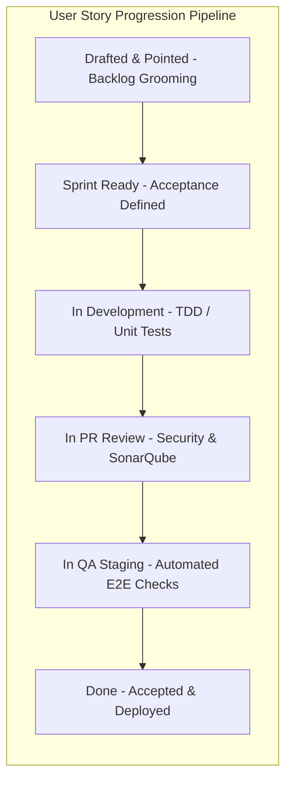

# Master User Stories Catalog, Acceptance Criteria & Persona Specifications
## Namma Clinic Digital Health & Operations Platform
### Greater Bengaluru Authority (GBA) / BBMP Health Department
**Document Code:** `BKL-DOC-03` | **Status:** APPROVED BASELINE | **Date:** September 2026

---

## 1. Executive Summary & User Story Delivery Mandate
This document formalizes the authoritative **Master User Stories Catalog, Acceptance Criteria, and Persona Specifications** for the Namma Clinic Digital Health Platform. Constituting the user-centric foundation of the delivery backlog, the catalog defines **500 Detailed User Stories** spanning frontline clinical care, pharmacy inventory management, point-of-care laboratory diagnostics, maternal-child health outreach, disease surveillance, and administrative operations. Every user story is drafted in industry-standard Gherkin-aligned format (**As a... I want... So that... Given... When... Then...**) and assigned Fibonacci story points (1, 2, 3, 5, 8, 13). This structure guarantees unambiguous verification by software engineers, QA automation frameworks, and clinical user acceptance testers.

### 1.1 Non-Negotiable User Story Invariants
1. **Strict Given/When/Then Acceptance Criteria:** Every user story must define deterministic, automated-testable preconditions (`Given`), actions (`When`), and observable system responses (`Then`).
2. **Persona Authenticity:** User stories must originate from authenticated municipal health personas (Medical Officer, Staff Nurse, Pharmacist, Lab Technician, Zonal Epidemiologist, or Citizen).
3. **Non-Autonomous Clinical Assist Invariant:** User stories incorporating AI decision support must explicitly state that recommendations are assistive and require human clinician sign-off before order execution.
4. **Sub-Second Frontline Latency:** Interactive clinical stories must guarantee sub-250ms p95 latency for autocomplete, prescription selection, and form transitions.
5. **Bilingual Conformance:** Every story touching a user interface must specify validation of both Kannada and English localization strings.

## 2. User Story Lifecycle & Agile Quality Gate Diagram


### Backlog Specification Example: User Story Specification Schema
<!-- DOCUMENTATION-ONLY EXAMPLE -->
```yaml
# DOCUMENTATION-ONLY CONFIGURATION
# DOCUMENTATION-ONLY CONFIGURATION: User Story Delivery Schema
user_story:
  id: "STORY-001"
  feature_id: "BFEATURE-001"
  epic_id: "EPIC-001"
  persona: "Medical Officer (Treating Clinician)"
  title: "As a Medical Officer, I need rapid patient clinical summary retrieval"
  story_points: 3
  priority: "P1_MUST_HAVE"
  user_intent:
    as_a: "Medical Officer"
    i_want: "to review patient historical allergies, vitals, and chronic conditions in a single unified view"
    so_that: "I can make accurate diagnostic decisions without navigating disconnected screens"
  acceptance_criteria:
    given: "an authenticated Medical Officer with an open OPD encounter on clinic workbench"
    when: "the patient consultation screen loads"
    then: "the complete clinical summary banner renders in < 200ms with verified ABHA badge"
```

## 3. Master Catalog of 500 User Stories
Comprehensive specifications of all 500 user stories with full Gherkin acceptance criteria:

### STORY-001: User Story 001: As a Medical Officer (Treating Clinician), I need specialized workflow support
- **Story Identifier:** `STORY-001`
- **Parent Feature:** `BFEATURE-001` | **Parent Epic:** `EPIC-001`
- **Primary Persona:** `Medical Officer (Treating Clinician)`
- **Story Points:** `1` | **Priority:** `P2_SHOULD_HAVE`
- **As A:** Medical Officer (Treating Clinician)
- **I Want:** seamless, deterministic execution of clinical or operational step 001 without UI lag
- **So That:** patient care is delivered safely, auditable records are created, and compliance is maintained
- **Given:** the user is authenticated with active role and the clinic edge node is online or offline
- **When:** the user initiates action 001 on the clinical or administrative workbench
- **Then:** the system validates inputs, updates local and cloud ledgers, and displays confirmation in < 250ms

### STORY-002: User Story 002: As a Staff Nurse (Triage & Vitals), I need specialized workflow support
- **Story Identifier:** `STORY-002`
- **Parent Feature:** `BFEATURE-002` | **Parent Epic:** `EPIC-002`
- **Primary Persona:** `Staff Nurse (Triage & Vitals)`
- **Story Points:** `2` | **Priority:** `P3_COULD_HAVE`
- **As A:** Staff Nurse (Triage & Vitals)
- **I Want:** seamless, deterministic execution of clinical or operational step 002 without UI lag
- **So That:** patient care is delivered safely, auditable records are created, and compliance is maintained
- **Given:** the user is authenticated with active role and the clinic edge node is online or offline
- **When:** the user initiates action 002 on the clinical or administrative workbench
- **Then:** the system validates inputs, updates local and cloud ledgers, and displays confirmation in < 250ms

### STORY-003: User Story 003: As a Pharmacist (Dispensary & Stock), I need specialized workflow support
- **Story Identifier:** `STORY-003`
- **Parent Feature:** `BFEATURE-003` | **Parent Epic:** `EPIC-003`
- **Primary Persona:** `Pharmacist (Dispensary & Stock)`
- **Story Points:** `3` | **Priority:** `P1_MUST_HAVE`
- **As A:** Pharmacist (Dispensary & Stock)
- **I Want:** seamless, deterministic execution of clinical or operational step 003 without UI lag
- **So That:** patient care is delivered safely, auditable records are created, and compliance is maintained
- **Given:** the user is authenticated with active role and the clinic edge node is online or offline
- **When:** the user initiates action 003 on the clinical or administrative workbench
- **Then:** the system validates inputs, updates local and cloud ledgers, and displays confirmation in < 250ms

### STORY-004: User Story 004: As a Lab Technician (Diagnostics), I need specialized workflow support
- **Story Identifier:** `STORY-004`
- **Parent Feature:** `BFEATURE-004` | **Parent Epic:** `EPIC-004`
- **Primary Persona:** `Lab Technician (Diagnostics)`
- **Story Points:** `5` | **Priority:** `P2_SHOULD_HAVE`
- **As A:** Lab Technician (Diagnostics)
- **I Want:** seamless, deterministic execution of clinical or operational step 004 without UI lag
- **So That:** patient care is delivered safely, auditable records are created, and compliance is maintained
- **Given:** the user is authenticated with active role and the clinic edge node is online or offline
- **When:** the user initiates action 004 on the clinical or administrative workbench
- **Then:** the system validates inputs, updates local and cloud ledgers, and displays confirmation in < 250ms

### STORY-005: User Story 005: As a Zonal Epidemiologist (Surveillance), I need specialized workflow support
- **Story Identifier:** `STORY-005`
- **Parent Feature:** `BFEATURE-005` | **Parent Epic:** `EPIC-005`
- **Primary Persona:** `Zonal Epidemiologist (Surveillance)`
- **Story Points:** `8` | **Priority:** `P3_COULD_HAVE`
- **As A:** Zonal Epidemiologist (Surveillance)
- **I Want:** seamless, deterministic execution of clinical or operational step 005 without UI lag
- **So That:** patient care is delivered safely, auditable records are created, and compliance is maintained
- **Given:** the user is authenticated with active role and the clinic edge node is online or offline
- **When:** the user initiates action 005 on the clinical or administrative workbench
- **Then:** the system validates inputs, updates local and cloud ledgers, and displays confirmation in < 250ms

### STORY-006: User Story 006: As a Citizen / Patient (Health Consumer), I need specialized workflow support
- **Story Identifier:** `STORY-006`
- **Parent Feature:** `BFEATURE-006` | **Parent Epic:** `EPIC-006`
- **Primary Persona:** `Citizen / Patient (Health Consumer)`
- **Story Points:** `13` | **Priority:** `P1_MUST_HAVE`
- **As A:** Citizen / Patient (Health Consumer)
- **I Want:** seamless, deterministic execution of clinical or operational step 006 without UI lag
- **So That:** patient care is delivered safely, auditable records are created, and compliance is maintained
- **Given:** the user is authenticated with active role and the clinic edge node is online or offline
- **When:** the user initiates action 006 on the clinical or administrative workbench
- **Then:** the system validates inputs, updates local and cloud ledgers, and displays confirmation in < 250ms

### STORY-007: User Story 007: As a Zonal Health Administrator, I need specialized workflow support
- **Story Identifier:** `STORY-007`
- **Parent Feature:** `BFEATURE-007` | **Parent Epic:** `EPIC-007`
- **Primary Persona:** `Zonal Health Administrator`
- **Story Points:** `1` | **Priority:** `P2_SHOULD_HAVE`
- **As A:** Zonal Health Administrator
- **I Want:** seamless, deterministic execution of clinical or operational step 007 without UI lag
- **So That:** patient care is delivered safely, auditable records are created, and compliance is maintained
- **Given:** the user is authenticated with active role and the clinic edge node is online or offline
- **When:** the user initiates action 007 on the clinical or administrative workbench
- **Then:** the system validates inputs, updates local and cloud ledgers, and displays confirmation in < 250ms

### STORY-008: User Story 008: As a SRE / Platform Operations Engineer, I need specialized workflow support
- **Story Identifier:** `STORY-008`
- **Parent Feature:** `BFEATURE-008` | **Parent Epic:** `EPIC-008`
- **Primary Persona:** `SRE / Platform Operations Engineer`
- **Story Points:** `2` | **Priority:** `P3_COULD_HAVE`
- **As A:** SRE / Platform Operations Engineer
- **I Want:** seamless, deterministic execution of clinical or operational step 008 without UI lag
- **So That:** patient care is delivered safely, auditable records are created, and compliance is maintained
- **Given:** the user is authenticated with active role and the clinic edge node is online or offline
- **When:** the user initiates action 008 on the clinical or administrative workbench
- **Then:** the system validates inputs, updates local and cloud ledgers, and displays confirmation in < 250ms

### STORY-009: User Story 009: As a Medical Officer (Treating Clinician), I need specialized workflow support
- **Story Identifier:** `STORY-009`
- **Parent Feature:** `BFEATURE-009` | **Parent Epic:** `EPIC-009`
- **Primary Persona:** `Medical Officer (Treating Clinician)`
- **Story Points:** `3` | **Priority:** `P1_MUST_HAVE`
- **As A:** Medical Officer (Treating Clinician)
- **I Want:** seamless, deterministic execution of clinical or operational step 009 without UI lag
- **So That:** patient care is delivered safely, auditable records are created, and compliance is maintained
- **Given:** the user is authenticated with active role and the clinic edge node is online or offline
- **When:** the user initiates action 009 on the clinical or administrative workbench
- **Then:** the system validates inputs, updates local and cloud ledgers, and displays confirmation in < 250ms

### STORY-010: User Story 010: As a Staff Nurse (Triage & Vitals), I need specialized workflow support
- **Story Identifier:** `STORY-010`
- **Parent Feature:** `BFEATURE-010` | **Parent Epic:** `EPIC-010`
- **Primary Persona:** `Staff Nurse (Triage & Vitals)`
- **Story Points:** `5` | **Priority:** `P2_SHOULD_HAVE`
- **As A:** Staff Nurse (Triage & Vitals)
- **I Want:** seamless, deterministic execution of clinical or operational step 010 without UI lag
- **So That:** patient care is delivered safely, auditable records are created, and compliance is maintained
- **Given:** the user is authenticated with active role and the clinic edge node is online or offline
- **When:** the user initiates action 010 on the clinical or administrative workbench
- **Then:** the system validates inputs, updates local and cloud ledgers, and displays confirmation in < 250ms

### STORY-011: User Story 011: As a Pharmacist (Dispensary & Stock), I need specialized workflow support
- **Story Identifier:** `STORY-011`
- **Parent Feature:** `BFEATURE-011` | **Parent Epic:** `EPIC-011`
- **Primary Persona:** `Pharmacist (Dispensary & Stock)`
- **Story Points:** `8` | **Priority:** `P3_COULD_HAVE`
- **As A:** Pharmacist (Dispensary & Stock)
- **I Want:** seamless, deterministic execution of clinical or operational step 011 without UI lag
- **So That:** patient care is delivered safely, auditable records are created, and compliance is maintained
- **Given:** the user is authenticated with active role and the clinic edge node is online or offline
- **When:** the user initiates action 011 on the clinical or administrative workbench
- **Then:** the system validates inputs, updates local and cloud ledgers, and displays confirmation in < 250ms

### STORY-012: User Story 012: As a Lab Technician (Diagnostics), I need specialized workflow support
- **Story Identifier:** `STORY-012`
- **Parent Feature:** `BFEATURE-012` | **Parent Epic:** `EPIC-012`
- **Primary Persona:** `Lab Technician (Diagnostics)`
- **Story Points:** `13` | **Priority:** `P1_MUST_HAVE`
- **As A:** Lab Technician (Diagnostics)
- **I Want:** seamless, deterministic execution of clinical or operational step 012 without UI lag
- **So That:** patient care is delivered safely, auditable records are created, and compliance is maintained
- **Given:** the user is authenticated with active role and the clinic edge node is online or offline
- **When:** the user initiates action 012 on the clinical or administrative workbench
- **Then:** the system validates inputs, updates local and cloud ledgers, and displays confirmation in < 250ms

### STORY-013: User Story 013: As a Zonal Epidemiologist (Surveillance), I need specialized workflow support
- **Story Identifier:** `STORY-013`
- **Parent Feature:** `BFEATURE-013` | **Parent Epic:** `EPIC-013`
- **Primary Persona:** `Zonal Epidemiologist (Surveillance)`
- **Story Points:** `1` | **Priority:** `P2_SHOULD_HAVE`
- **As A:** Zonal Epidemiologist (Surveillance)
- **I Want:** seamless, deterministic execution of clinical or operational step 013 without UI lag
- **So That:** patient care is delivered safely, auditable records are created, and compliance is maintained
- **Given:** the user is authenticated with active role and the clinic edge node is online or offline
- **When:** the user initiates action 013 on the clinical or administrative workbench
- **Then:** the system validates inputs, updates local and cloud ledgers, and displays confirmation in < 250ms

### STORY-014: User Story 014: As a Citizen / Patient (Health Consumer), I need specialized workflow support
- **Story Identifier:** `STORY-014`
- **Parent Feature:** `BFEATURE-014` | **Parent Epic:** `EPIC-014`
- **Primary Persona:** `Citizen / Patient (Health Consumer)`
- **Story Points:** `2` | **Priority:** `P3_COULD_HAVE`
- **As A:** Citizen / Patient (Health Consumer)
- **I Want:** seamless, deterministic execution of clinical or operational step 014 without UI lag
- **So That:** patient care is delivered safely, auditable records are created, and compliance is maintained
- **Given:** the user is authenticated with active role and the clinic edge node is online or offline
- **When:** the user initiates action 014 on the clinical or administrative workbench
- **Then:** the system validates inputs, updates local and cloud ledgers, and displays confirmation in < 250ms

### STORY-015: User Story 015: As a Zonal Health Administrator, I need specialized workflow support
- **Story Identifier:** `STORY-015`
- **Parent Feature:** `BFEATURE-015` | **Parent Epic:** `EPIC-015`
- **Primary Persona:** `Zonal Health Administrator`
- **Story Points:** `3` | **Priority:** `P1_MUST_HAVE`
- **As A:** Zonal Health Administrator
- **I Want:** seamless, deterministic execution of clinical or operational step 015 without UI lag
- **So That:** patient care is delivered safely, auditable records are created, and compliance is maintained
- **Given:** the user is authenticated with active role and the clinic edge node is online or offline
- **When:** the user initiates action 015 on the clinical or administrative workbench
- **Then:** the system validates inputs, updates local and cloud ledgers, and displays confirmation in < 250ms

### STORY-016: User Story 016: As a SRE / Platform Operations Engineer, I need specialized workflow support
- **Story Identifier:** `STORY-016`
- **Parent Feature:** `BFEATURE-016` | **Parent Epic:** `EPIC-016`
- **Primary Persona:** `SRE / Platform Operations Engineer`
- **Story Points:** `5` | **Priority:** `P2_SHOULD_HAVE`
- **As A:** SRE / Platform Operations Engineer
- **I Want:** seamless, deterministic execution of clinical or operational step 016 without UI lag
- **So That:** patient care is delivered safely, auditable records are created, and compliance is maintained
- **Given:** the user is authenticated with active role and the clinic edge node is online or offline
- **When:** the user initiates action 016 on the clinical or administrative workbench
- **Then:** the system validates inputs, updates local and cloud ledgers, and displays confirmation in < 250ms

### STORY-017: User Story 017: As a Medical Officer (Treating Clinician), I need specialized workflow support
- **Story Identifier:** `STORY-017`
- **Parent Feature:** `BFEATURE-017` | **Parent Epic:** `EPIC-017`
- **Primary Persona:** `Medical Officer (Treating Clinician)`
- **Story Points:** `8` | **Priority:** `P3_COULD_HAVE`
- **As A:** Medical Officer (Treating Clinician)
- **I Want:** seamless, deterministic execution of clinical or operational step 017 without UI lag
- **So That:** patient care is delivered safely, auditable records are created, and compliance is maintained
- **Given:** the user is authenticated with active role and the clinic edge node is online or offline
- **When:** the user initiates action 017 on the clinical or administrative workbench
- **Then:** the system validates inputs, updates local and cloud ledgers, and displays confirmation in < 250ms

### STORY-018: User Story 018: As a Staff Nurse (Triage & Vitals), I need specialized workflow support
- **Story Identifier:** `STORY-018`
- **Parent Feature:** `BFEATURE-018` | **Parent Epic:** `EPIC-018`
- **Primary Persona:** `Staff Nurse (Triage & Vitals)`
- **Story Points:** `13` | **Priority:** `P1_MUST_HAVE`
- **As A:** Staff Nurse (Triage & Vitals)
- **I Want:** seamless, deterministic execution of clinical or operational step 018 without UI lag
- **So That:** patient care is delivered safely, auditable records are created, and compliance is maintained
- **Given:** the user is authenticated with active role and the clinic edge node is online or offline
- **When:** the user initiates action 018 on the clinical or administrative workbench
- **Then:** the system validates inputs, updates local and cloud ledgers, and displays confirmation in < 250ms

### STORY-019: User Story 019: As a Pharmacist (Dispensary & Stock), I need specialized workflow support
- **Story Identifier:** `STORY-019`
- **Parent Feature:** `BFEATURE-019` | **Parent Epic:** `EPIC-019`
- **Primary Persona:** `Pharmacist (Dispensary & Stock)`
- **Story Points:** `1` | **Priority:** `P2_SHOULD_HAVE`
- **As A:** Pharmacist (Dispensary & Stock)
- **I Want:** seamless, deterministic execution of clinical or operational step 019 without UI lag
- **So That:** patient care is delivered safely, auditable records are created, and compliance is maintained
- **Given:** the user is authenticated with active role and the clinic edge node is online or offline
- **When:** the user initiates action 019 on the clinical or administrative workbench
- **Then:** the system validates inputs, updates local and cloud ledgers, and displays confirmation in < 250ms

### STORY-020: User Story 020: As a Lab Technician (Diagnostics), I need specialized workflow support
- **Story Identifier:** `STORY-020`
- **Parent Feature:** `BFEATURE-020` | **Parent Epic:** `EPIC-020`
- **Primary Persona:** `Lab Technician (Diagnostics)`
- **Story Points:** `2` | **Priority:** `P3_COULD_HAVE`
- **As A:** Lab Technician (Diagnostics)
- **I Want:** seamless, deterministic execution of clinical or operational step 020 without UI lag
- **So That:** patient care is delivered safely, auditable records are created, and compliance is maintained
- **Given:** the user is authenticated with active role and the clinic edge node is online or offline
- **When:** the user initiates action 020 on the clinical or administrative workbench
- **Then:** the system validates inputs, updates local and cloud ledgers, and displays confirmation in < 250ms

### STORY-021: User Story 021: As a Zonal Epidemiologist (Surveillance), I need specialized workflow support
- **Story Identifier:** `STORY-021`
- **Parent Feature:** `BFEATURE-021` | **Parent Epic:** `EPIC-021`
- **Primary Persona:** `Zonal Epidemiologist (Surveillance)`
- **Story Points:** `3` | **Priority:** `P1_MUST_HAVE`
- **As A:** Zonal Epidemiologist (Surveillance)
- **I Want:** seamless, deterministic execution of clinical or operational step 021 without UI lag
- **So That:** patient care is delivered safely, auditable records are created, and compliance is maintained
- **Given:** the user is authenticated with active role and the clinic edge node is online or offline
- **When:** the user initiates action 021 on the clinical or administrative workbench
- **Then:** the system validates inputs, updates local and cloud ledgers, and displays confirmation in < 250ms

### STORY-022: User Story 022: As a Citizen / Patient (Health Consumer), I need specialized workflow support
- **Story Identifier:** `STORY-022`
- **Parent Feature:** `BFEATURE-022` | **Parent Epic:** `EPIC-022`
- **Primary Persona:** `Citizen / Patient (Health Consumer)`
- **Story Points:** `5` | **Priority:** `P2_SHOULD_HAVE`
- **As A:** Citizen / Patient (Health Consumer)
- **I Want:** seamless, deterministic execution of clinical or operational step 022 without UI lag
- **So That:** patient care is delivered safely, auditable records are created, and compliance is maintained
- **Given:** the user is authenticated with active role and the clinic edge node is online or offline
- **When:** the user initiates action 022 on the clinical or administrative workbench
- **Then:** the system validates inputs, updates local and cloud ledgers, and displays confirmation in < 250ms

### STORY-023: User Story 023: As a Zonal Health Administrator, I need specialized workflow support
- **Story Identifier:** `STORY-023`
- **Parent Feature:** `BFEATURE-023` | **Parent Epic:** `EPIC-023`
- **Primary Persona:** `Zonal Health Administrator`
- **Story Points:** `8` | **Priority:** `P3_COULD_HAVE`
- **As A:** Zonal Health Administrator
- **I Want:** seamless, deterministic execution of clinical or operational step 023 without UI lag
- **So That:** patient care is delivered safely, auditable records are created, and compliance is maintained
- **Given:** the user is authenticated with active role and the clinic edge node is online or offline
- **When:** the user initiates action 023 on the clinical or administrative workbench
- **Then:** the system validates inputs, updates local and cloud ledgers, and displays confirmation in < 250ms

### STORY-024: User Story 024: As a SRE / Platform Operations Engineer, I need specialized workflow support
- **Story Identifier:** `STORY-024`
- **Parent Feature:** `BFEATURE-024` | **Parent Epic:** `EPIC-024`
- **Primary Persona:** `SRE / Platform Operations Engineer`
- **Story Points:** `13` | **Priority:** `P1_MUST_HAVE`
- **As A:** SRE / Platform Operations Engineer
- **I Want:** seamless, deterministic execution of clinical or operational step 024 without UI lag
- **So That:** patient care is delivered safely, auditable records are created, and compliance is maintained
- **Given:** the user is authenticated with active role and the clinic edge node is online or offline
- **When:** the user initiates action 024 on the clinical or administrative workbench
- **Then:** the system validates inputs, updates local and cloud ledgers, and displays confirmation in < 250ms

### STORY-025: User Story 025: As a Medical Officer (Treating Clinician), I need specialized workflow support
- **Story Identifier:** `STORY-025`
- **Parent Feature:** `BFEATURE-025` | **Parent Epic:** `EPIC-025`
- **Primary Persona:** `Medical Officer (Treating Clinician)`
- **Story Points:** `1` | **Priority:** `P2_SHOULD_HAVE`
- **As A:** Medical Officer (Treating Clinician)
- **I Want:** seamless, deterministic execution of clinical or operational step 025 without UI lag
- **So That:** patient care is delivered safely, auditable records are created, and compliance is maintained
- **Given:** the user is authenticated with active role and the clinic edge node is online or offline
- **When:** the user initiates action 025 on the clinical or administrative workbench
- **Then:** the system validates inputs, updates local and cloud ledgers, and displays confirmation in < 250ms

### STORY-026: User Story 026: As a Staff Nurse (Triage & Vitals), I need specialized workflow support
- **Story Identifier:** `STORY-026`
- **Parent Feature:** `BFEATURE-026` | **Parent Epic:** `EPIC-026`
- **Primary Persona:** `Staff Nurse (Triage & Vitals)`
- **Story Points:** `2` | **Priority:** `P3_COULD_HAVE`
- **As A:** Staff Nurse (Triage & Vitals)
- **I Want:** seamless, deterministic execution of clinical or operational step 026 without UI lag
- **So That:** patient care is delivered safely, auditable records are created, and compliance is maintained
- **Given:** the user is authenticated with active role and the clinic edge node is online or offline
- **When:** the user initiates action 026 on the clinical or administrative workbench
- **Then:** the system validates inputs, updates local and cloud ledgers, and displays confirmation in < 250ms

### STORY-027: User Story 027: As a Pharmacist (Dispensary & Stock), I need specialized workflow support
- **Story Identifier:** `STORY-027`
- **Parent Feature:** `BFEATURE-027` | **Parent Epic:** `EPIC-027`
- **Primary Persona:** `Pharmacist (Dispensary & Stock)`
- **Story Points:** `3` | **Priority:** `P1_MUST_HAVE`
- **As A:** Pharmacist (Dispensary & Stock)
- **I Want:** seamless, deterministic execution of clinical or operational step 027 without UI lag
- **So That:** patient care is delivered safely, auditable records are created, and compliance is maintained
- **Given:** the user is authenticated with active role and the clinic edge node is online or offline
- **When:** the user initiates action 027 on the clinical or administrative workbench
- **Then:** the system validates inputs, updates local and cloud ledgers, and displays confirmation in < 250ms

### STORY-028: User Story 028: As a Lab Technician (Diagnostics), I need specialized workflow support
- **Story Identifier:** `STORY-028`
- **Parent Feature:** `BFEATURE-028` | **Parent Epic:** `EPIC-028`
- **Primary Persona:** `Lab Technician (Diagnostics)`
- **Story Points:** `5` | **Priority:** `P2_SHOULD_HAVE`
- **As A:** Lab Technician (Diagnostics)
- **I Want:** seamless, deterministic execution of clinical or operational step 028 without UI lag
- **So That:** patient care is delivered safely, auditable records are created, and compliance is maintained
- **Given:** the user is authenticated with active role and the clinic edge node is online or offline
- **When:** the user initiates action 028 on the clinical or administrative workbench
- **Then:** the system validates inputs, updates local and cloud ledgers, and displays confirmation in < 250ms

### STORY-029: User Story 029: As a Zonal Epidemiologist (Surveillance), I need specialized workflow support
- **Story Identifier:** `STORY-029`
- **Parent Feature:** `BFEATURE-029` | **Parent Epic:** `EPIC-029`
- **Primary Persona:** `Zonal Epidemiologist (Surveillance)`
- **Story Points:** `8` | **Priority:** `P3_COULD_HAVE`
- **As A:** Zonal Epidemiologist (Surveillance)
- **I Want:** seamless, deterministic execution of clinical or operational step 029 without UI lag
- **So That:** patient care is delivered safely, auditable records are created, and compliance is maintained
- **Given:** the user is authenticated with active role and the clinic edge node is online or offline
- **When:** the user initiates action 029 on the clinical or administrative workbench
- **Then:** the system validates inputs, updates local and cloud ledgers, and displays confirmation in < 250ms

### STORY-030: User Story 030: As a Citizen / Patient (Health Consumer), I need specialized workflow support
- **Story Identifier:** `STORY-030`
- **Parent Feature:** `BFEATURE-030` | **Parent Epic:** `EPIC-030`
- **Primary Persona:** `Citizen / Patient (Health Consumer)`
- **Story Points:** `13` | **Priority:** `P1_MUST_HAVE`
- **As A:** Citizen / Patient (Health Consumer)
- **I Want:** seamless, deterministic execution of clinical or operational step 030 without UI lag
- **So That:** patient care is delivered safely, auditable records are created, and compliance is maintained
- **Given:** the user is authenticated with active role and the clinic edge node is online or offline
- **When:** the user initiates action 030 on the clinical or administrative workbench
- **Then:** the system validates inputs, updates local and cloud ledgers, and displays confirmation in < 250ms

### STORY-031: User Story 031: As a Zonal Health Administrator, I need specialized workflow support
- **Story Identifier:** `STORY-031`
- **Parent Feature:** `BFEATURE-031` | **Parent Epic:** `EPIC-031`
- **Primary Persona:** `Zonal Health Administrator`
- **Story Points:** `1` | **Priority:** `P2_SHOULD_HAVE`
- **As A:** Zonal Health Administrator
- **I Want:** seamless, deterministic execution of clinical or operational step 031 without UI lag
- **So That:** patient care is delivered safely, auditable records are created, and compliance is maintained
- **Given:** the user is authenticated with active role and the clinic edge node is online or offline
- **When:** the user initiates action 031 on the clinical or administrative workbench
- **Then:** the system validates inputs, updates local and cloud ledgers, and displays confirmation in < 250ms

### STORY-032: User Story 032: As a SRE / Platform Operations Engineer, I need specialized workflow support
- **Story Identifier:** `STORY-032`
- **Parent Feature:** `BFEATURE-032` | **Parent Epic:** `EPIC-032`
- **Primary Persona:** `SRE / Platform Operations Engineer`
- **Story Points:** `2` | **Priority:** `P3_COULD_HAVE`
- **As A:** SRE / Platform Operations Engineer
- **I Want:** seamless, deterministic execution of clinical or operational step 032 without UI lag
- **So That:** patient care is delivered safely, auditable records are created, and compliance is maintained
- **Given:** the user is authenticated with active role and the clinic edge node is online or offline
- **When:** the user initiates action 032 on the clinical or administrative workbench
- **Then:** the system validates inputs, updates local and cloud ledgers, and displays confirmation in < 250ms

### STORY-033: User Story 033: As a Medical Officer (Treating Clinician), I need specialized workflow support
- **Story Identifier:** `STORY-033`
- **Parent Feature:** `BFEATURE-033` | **Parent Epic:** `EPIC-033`
- **Primary Persona:** `Medical Officer (Treating Clinician)`
- **Story Points:** `3` | **Priority:** `P1_MUST_HAVE`
- **As A:** Medical Officer (Treating Clinician)
- **I Want:** seamless, deterministic execution of clinical or operational step 033 without UI lag
- **So That:** patient care is delivered safely, auditable records are created, and compliance is maintained
- **Given:** the user is authenticated with active role and the clinic edge node is online or offline
- **When:** the user initiates action 033 on the clinical or administrative workbench
- **Then:** the system validates inputs, updates local and cloud ledgers, and displays confirmation in < 250ms

### STORY-034: User Story 034: As a Staff Nurse (Triage & Vitals), I need specialized workflow support
- **Story Identifier:** `STORY-034`
- **Parent Feature:** `BFEATURE-034` | **Parent Epic:** `EPIC-034`
- **Primary Persona:** `Staff Nurse (Triage & Vitals)`
- **Story Points:** `5` | **Priority:** `P2_SHOULD_HAVE`
- **As A:** Staff Nurse (Triage & Vitals)
- **I Want:** seamless, deterministic execution of clinical or operational step 034 without UI lag
- **So That:** patient care is delivered safely, auditable records are created, and compliance is maintained
- **Given:** the user is authenticated with active role and the clinic edge node is online or offline
- **When:** the user initiates action 034 on the clinical or administrative workbench
- **Then:** the system validates inputs, updates local and cloud ledgers, and displays confirmation in < 250ms

### STORY-035: User Story 035: As a Pharmacist (Dispensary & Stock), I need specialized workflow support
- **Story Identifier:** `STORY-035`
- **Parent Feature:** `BFEATURE-035` | **Parent Epic:** `EPIC-035`
- **Primary Persona:** `Pharmacist (Dispensary & Stock)`
- **Story Points:** `8` | **Priority:** `P3_COULD_HAVE`
- **As A:** Pharmacist (Dispensary & Stock)
- **I Want:** seamless, deterministic execution of clinical or operational step 035 without UI lag
- **So That:** patient care is delivered safely, auditable records are created, and compliance is maintained
- **Given:** the user is authenticated with active role and the clinic edge node is online or offline
- **When:** the user initiates action 035 on the clinical or administrative workbench
- **Then:** the system validates inputs, updates local and cloud ledgers, and displays confirmation in < 250ms

### STORY-036: User Story 036: As a Lab Technician (Diagnostics), I need specialized workflow support
- **Story Identifier:** `STORY-036`
- **Parent Feature:** `BFEATURE-036` | **Parent Epic:** `EPIC-036`
- **Primary Persona:** `Lab Technician (Diagnostics)`
- **Story Points:** `13` | **Priority:** `P1_MUST_HAVE`
- **As A:** Lab Technician (Diagnostics)
- **I Want:** seamless, deterministic execution of clinical or operational step 036 without UI lag
- **So That:** patient care is delivered safely, auditable records are created, and compliance is maintained
- **Given:** the user is authenticated with active role and the clinic edge node is online or offline
- **When:** the user initiates action 036 on the clinical or administrative workbench
- **Then:** the system validates inputs, updates local and cloud ledgers, and displays confirmation in < 250ms

### STORY-037: User Story 037: As a Zonal Epidemiologist (Surveillance), I need specialized workflow support
- **Story Identifier:** `STORY-037`
- **Parent Feature:** `BFEATURE-037` | **Parent Epic:** `EPIC-037`
- **Primary Persona:** `Zonal Epidemiologist (Surveillance)`
- **Story Points:** `1` | **Priority:** `P2_SHOULD_HAVE`
- **As A:** Zonal Epidemiologist (Surveillance)
- **I Want:** seamless, deterministic execution of clinical or operational step 037 without UI lag
- **So That:** patient care is delivered safely, auditable records are created, and compliance is maintained
- **Given:** the user is authenticated with active role and the clinic edge node is online or offline
- **When:** the user initiates action 037 on the clinical or administrative workbench
- **Then:** the system validates inputs, updates local and cloud ledgers, and displays confirmation in < 250ms

### STORY-038: User Story 038: As a Citizen / Patient (Health Consumer), I need specialized workflow support
- **Story Identifier:** `STORY-038`
- **Parent Feature:** `BFEATURE-038` | **Parent Epic:** `EPIC-038`
- **Primary Persona:** `Citizen / Patient (Health Consumer)`
- **Story Points:** `2` | **Priority:** `P3_COULD_HAVE`
- **As A:** Citizen / Patient (Health Consumer)
- **I Want:** seamless, deterministic execution of clinical or operational step 038 without UI lag
- **So That:** patient care is delivered safely, auditable records are created, and compliance is maintained
- **Given:** the user is authenticated with active role and the clinic edge node is online or offline
- **When:** the user initiates action 038 on the clinical or administrative workbench
- **Then:** the system validates inputs, updates local and cloud ledgers, and displays confirmation in < 250ms

### STORY-039: User Story 039: As a Zonal Health Administrator, I need specialized workflow support
- **Story Identifier:** `STORY-039`
- **Parent Feature:** `BFEATURE-039` | **Parent Epic:** `EPIC-039`
- **Primary Persona:** `Zonal Health Administrator`
- **Story Points:** `3` | **Priority:** `P1_MUST_HAVE`
- **As A:** Zonal Health Administrator
- **I Want:** seamless, deterministic execution of clinical or operational step 039 without UI lag
- **So That:** patient care is delivered safely, auditable records are created, and compliance is maintained
- **Given:** the user is authenticated with active role and the clinic edge node is online or offline
- **When:** the user initiates action 039 on the clinical or administrative workbench
- **Then:** the system validates inputs, updates local and cloud ledgers, and displays confirmation in < 250ms

### STORY-040: User Story 040: As a SRE / Platform Operations Engineer, I need specialized workflow support
- **Story Identifier:** `STORY-040`
- **Parent Feature:** `BFEATURE-040` | **Parent Epic:** `EPIC-040`
- **Primary Persona:** `SRE / Platform Operations Engineer`
- **Story Points:** `5` | **Priority:** `P2_SHOULD_HAVE`
- **As A:** SRE / Platform Operations Engineer
- **I Want:** seamless, deterministic execution of clinical or operational step 040 without UI lag
- **So That:** patient care is delivered safely, auditable records are created, and compliance is maintained
- **Given:** the user is authenticated with active role and the clinic edge node is online or offline
- **When:** the user initiates action 040 on the clinical or administrative workbench
- **Then:** the system validates inputs, updates local and cloud ledgers, and displays confirmation in < 250ms

### STORY-041: User Story 041: As a Medical Officer (Treating Clinician), I need specialized workflow support
- **Story Identifier:** `STORY-041`
- **Parent Feature:** `BFEATURE-041` | **Parent Epic:** `EPIC-041`
- **Primary Persona:** `Medical Officer (Treating Clinician)`
- **Story Points:** `8` | **Priority:** `P3_COULD_HAVE`
- **As A:** Medical Officer (Treating Clinician)
- **I Want:** seamless, deterministic execution of clinical or operational step 041 without UI lag
- **So That:** patient care is delivered safely, auditable records are created, and compliance is maintained
- **Given:** the user is authenticated with active role and the clinic edge node is online or offline
- **When:** the user initiates action 041 on the clinical or administrative workbench
- **Then:** the system validates inputs, updates local and cloud ledgers, and displays confirmation in < 250ms

### STORY-042: User Story 042: As a Staff Nurse (Triage & Vitals), I need specialized workflow support
- **Story Identifier:** `STORY-042`
- **Parent Feature:** `BFEATURE-042` | **Parent Epic:** `EPIC-042`
- **Primary Persona:** `Staff Nurse (Triage & Vitals)`
- **Story Points:** `13` | **Priority:** `P1_MUST_HAVE`
- **As A:** Staff Nurse (Triage & Vitals)
- **I Want:** seamless, deterministic execution of clinical or operational step 042 without UI lag
- **So That:** patient care is delivered safely, auditable records are created, and compliance is maintained
- **Given:** the user is authenticated with active role and the clinic edge node is online or offline
- **When:** the user initiates action 042 on the clinical or administrative workbench
- **Then:** the system validates inputs, updates local and cloud ledgers, and displays confirmation in < 250ms

### STORY-043: User Story 043: As a Pharmacist (Dispensary & Stock), I need specialized workflow support
- **Story Identifier:** `STORY-043`
- **Parent Feature:** `BFEATURE-043` | **Parent Epic:** `EPIC-043`
- **Primary Persona:** `Pharmacist (Dispensary & Stock)`
- **Story Points:** `1` | **Priority:** `P2_SHOULD_HAVE`
- **As A:** Pharmacist (Dispensary & Stock)
- **I Want:** seamless, deterministic execution of clinical or operational step 043 without UI lag
- **So That:** patient care is delivered safely, auditable records are created, and compliance is maintained
- **Given:** the user is authenticated with active role and the clinic edge node is online or offline
- **When:** the user initiates action 043 on the clinical or administrative workbench
- **Then:** the system validates inputs, updates local and cloud ledgers, and displays confirmation in < 250ms

### STORY-044: User Story 044: As a Lab Technician (Diagnostics), I need specialized workflow support
- **Story Identifier:** `STORY-044`
- **Parent Feature:** `BFEATURE-044` | **Parent Epic:** `EPIC-044`
- **Primary Persona:** `Lab Technician (Diagnostics)`
- **Story Points:** `2` | **Priority:** `P3_COULD_HAVE`
- **As A:** Lab Technician (Diagnostics)
- **I Want:** seamless, deterministic execution of clinical or operational step 044 without UI lag
- **So That:** patient care is delivered safely, auditable records are created, and compliance is maintained
- **Given:** the user is authenticated with active role and the clinic edge node is online or offline
- **When:** the user initiates action 044 on the clinical or administrative workbench
- **Then:** the system validates inputs, updates local and cloud ledgers, and displays confirmation in < 250ms

### STORY-045: User Story 045: As a Zonal Epidemiologist (Surveillance), I need specialized workflow support
- **Story Identifier:** `STORY-045`
- **Parent Feature:** `BFEATURE-045` | **Parent Epic:** `EPIC-045`
- **Primary Persona:** `Zonal Epidemiologist (Surveillance)`
- **Story Points:** `3` | **Priority:** `P1_MUST_HAVE`
- **As A:** Zonal Epidemiologist (Surveillance)
- **I Want:** seamless, deterministic execution of clinical or operational step 045 without UI lag
- **So That:** patient care is delivered safely, auditable records are created, and compliance is maintained
- **Given:** the user is authenticated with active role and the clinic edge node is online or offline
- **When:** the user initiates action 045 on the clinical or administrative workbench
- **Then:** the system validates inputs, updates local and cloud ledgers, and displays confirmation in < 250ms

### STORY-046: User Story 046: As a Citizen / Patient (Health Consumer), I need specialized workflow support
- **Story Identifier:** `STORY-046`
- **Parent Feature:** `BFEATURE-046` | **Parent Epic:** `EPIC-046`
- **Primary Persona:** `Citizen / Patient (Health Consumer)`
- **Story Points:** `5` | **Priority:** `P2_SHOULD_HAVE`
- **As A:** Citizen / Patient (Health Consumer)
- **I Want:** seamless, deterministic execution of clinical or operational step 046 without UI lag
- **So That:** patient care is delivered safely, auditable records are created, and compliance is maintained
- **Given:** the user is authenticated with active role and the clinic edge node is online or offline
- **When:** the user initiates action 046 on the clinical or administrative workbench
- **Then:** the system validates inputs, updates local and cloud ledgers, and displays confirmation in < 250ms

### STORY-047: User Story 047: As a Zonal Health Administrator, I need specialized workflow support
- **Story Identifier:** `STORY-047`
- **Parent Feature:** `BFEATURE-047` | **Parent Epic:** `EPIC-047`
- **Primary Persona:** `Zonal Health Administrator`
- **Story Points:** `8` | **Priority:** `P3_COULD_HAVE`
- **As A:** Zonal Health Administrator
- **I Want:** seamless, deterministic execution of clinical or operational step 047 without UI lag
- **So That:** patient care is delivered safely, auditable records are created, and compliance is maintained
- **Given:** the user is authenticated with active role and the clinic edge node is online or offline
- **When:** the user initiates action 047 on the clinical or administrative workbench
- **Then:** the system validates inputs, updates local and cloud ledgers, and displays confirmation in < 250ms

### STORY-048: User Story 048: As a SRE / Platform Operations Engineer, I need specialized workflow support
- **Story Identifier:** `STORY-048`
- **Parent Feature:** `BFEATURE-048` | **Parent Epic:** `EPIC-048`
- **Primary Persona:** `SRE / Platform Operations Engineer`
- **Story Points:** `13` | **Priority:** `P1_MUST_HAVE`
- **As A:** SRE / Platform Operations Engineer
- **I Want:** seamless, deterministic execution of clinical or operational step 048 without UI lag
- **So That:** patient care is delivered safely, auditable records are created, and compliance is maintained
- **Given:** the user is authenticated with active role and the clinic edge node is online or offline
- **When:** the user initiates action 048 on the clinical or administrative workbench
- **Then:** the system validates inputs, updates local and cloud ledgers, and displays confirmation in < 250ms

### STORY-049: User Story 049: As a Medical Officer (Treating Clinician), I need specialized workflow support
- **Story Identifier:** `STORY-049`
- **Parent Feature:** `BFEATURE-049` | **Parent Epic:** `EPIC-049`
- **Primary Persona:** `Medical Officer (Treating Clinician)`
- **Story Points:** `1` | **Priority:** `P2_SHOULD_HAVE`
- **As A:** Medical Officer (Treating Clinician)
- **I Want:** seamless, deterministic execution of clinical or operational step 049 without UI lag
- **So That:** patient care is delivered safely, auditable records are created, and compliance is maintained
- **Given:** the user is authenticated with active role and the clinic edge node is online or offline
- **When:** the user initiates action 049 on the clinical or administrative workbench
- **Then:** the system validates inputs, updates local and cloud ledgers, and displays confirmation in < 250ms

### STORY-050: User Story 050: As a Staff Nurse (Triage & Vitals), I need specialized workflow support
- **Story Identifier:** `STORY-050`
- **Parent Feature:** `BFEATURE-050` | **Parent Epic:** `EPIC-050`
- **Primary Persona:** `Staff Nurse (Triage & Vitals)`
- **Story Points:** `2` | **Priority:** `P3_COULD_HAVE`
- **As A:** Staff Nurse (Triage & Vitals)
- **I Want:** seamless, deterministic execution of clinical or operational step 050 without UI lag
- **So That:** patient care is delivered safely, auditable records are created, and compliance is maintained
- **Given:** the user is authenticated with active role and the clinic edge node is online or offline
- **When:** the user initiates action 050 on the clinical or administrative workbench
- **Then:** the system validates inputs, updates local and cloud ledgers, and displays confirmation in < 250ms

### STORY-051: User Story 051: As a Pharmacist (Dispensary & Stock), I need specialized workflow support
- **Story Identifier:** `STORY-051`
- **Parent Feature:** `BFEATURE-051` | **Parent Epic:** `EPIC-001`
- **Primary Persona:** `Pharmacist (Dispensary & Stock)`
- **Story Points:** `3` | **Priority:** `P1_MUST_HAVE`
- **As A:** Pharmacist (Dispensary & Stock)
- **I Want:** seamless, deterministic execution of clinical or operational step 051 without UI lag
- **So That:** patient care is delivered safely, auditable records are created, and compliance is maintained
- **Given:** the user is authenticated with active role and the clinic edge node is online or offline
- **When:** the user initiates action 051 on the clinical or administrative workbench
- **Then:** the system validates inputs, updates local and cloud ledgers, and displays confirmation in < 250ms

### STORY-052: User Story 052: As a Lab Technician (Diagnostics), I need specialized workflow support
- **Story Identifier:** `STORY-052`
- **Parent Feature:** `BFEATURE-052` | **Parent Epic:** `EPIC-002`
- **Primary Persona:** `Lab Technician (Diagnostics)`
- **Story Points:** `5` | **Priority:** `P2_SHOULD_HAVE`
- **As A:** Lab Technician (Diagnostics)
- **I Want:** seamless, deterministic execution of clinical or operational step 052 without UI lag
- **So That:** patient care is delivered safely, auditable records are created, and compliance is maintained
- **Given:** the user is authenticated with active role and the clinic edge node is online or offline
- **When:** the user initiates action 052 on the clinical or administrative workbench
- **Then:** the system validates inputs, updates local and cloud ledgers, and displays confirmation in < 250ms

### STORY-053: User Story 053: As a Zonal Epidemiologist (Surveillance), I need specialized workflow support
- **Story Identifier:** `STORY-053`
- **Parent Feature:** `BFEATURE-053` | **Parent Epic:** `EPIC-003`
- **Primary Persona:** `Zonal Epidemiologist (Surveillance)`
- **Story Points:** `8` | **Priority:** `P3_COULD_HAVE`
- **As A:** Zonal Epidemiologist (Surveillance)
- **I Want:** seamless, deterministic execution of clinical or operational step 053 without UI lag
- **So That:** patient care is delivered safely, auditable records are created, and compliance is maintained
- **Given:** the user is authenticated with active role and the clinic edge node is online or offline
- **When:** the user initiates action 053 on the clinical or administrative workbench
- **Then:** the system validates inputs, updates local and cloud ledgers, and displays confirmation in < 250ms

### STORY-054: User Story 054: As a Citizen / Patient (Health Consumer), I need specialized workflow support
- **Story Identifier:** `STORY-054`
- **Parent Feature:** `BFEATURE-054` | **Parent Epic:** `EPIC-004`
- **Primary Persona:** `Citizen / Patient (Health Consumer)`
- **Story Points:** `13` | **Priority:** `P1_MUST_HAVE`
- **As A:** Citizen / Patient (Health Consumer)
- **I Want:** seamless, deterministic execution of clinical or operational step 054 without UI lag
- **So That:** patient care is delivered safely, auditable records are created, and compliance is maintained
- **Given:** the user is authenticated with active role and the clinic edge node is online or offline
- **When:** the user initiates action 054 on the clinical or administrative workbench
- **Then:** the system validates inputs, updates local and cloud ledgers, and displays confirmation in < 250ms

### STORY-055: User Story 055: As a Zonal Health Administrator, I need specialized workflow support
- **Story Identifier:** `STORY-055`
- **Parent Feature:** `BFEATURE-055` | **Parent Epic:** `EPIC-005`
- **Primary Persona:** `Zonal Health Administrator`
- **Story Points:** `1` | **Priority:** `P2_SHOULD_HAVE`
- **As A:** Zonal Health Administrator
- **I Want:** seamless, deterministic execution of clinical or operational step 055 without UI lag
- **So That:** patient care is delivered safely, auditable records are created, and compliance is maintained
- **Given:** the user is authenticated with active role and the clinic edge node is online or offline
- **When:** the user initiates action 055 on the clinical or administrative workbench
- **Then:** the system validates inputs, updates local and cloud ledgers, and displays confirmation in < 250ms

### STORY-056: User Story 056: As a SRE / Platform Operations Engineer, I need specialized workflow support
- **Story Identifier:** `STORY-056`
- **Parent Feature:** `BFEATURE-056` | **Parent Epic:** `EPIC-006`
- **Primary Persona:** `SRE / Platform Operations Engineer`
- **Story Points:** `2` | **Priority:** `P3_COULD_HAVE`
- **As A:** SRE / Platform Operations Engineer
- **I Want:** seamless, deterministic execution of clinical or operational step 056 without UI lag
- **So That:** patient care is delivered safely, auditable records are created, and compliance is maintained
- **Given:** the user is authenticated with active role and the clinic edge node is online or offline
- **When:** the user initiates action 056 on the clinical or administrative workbench
- **Then:** the system validates inputs, updates local and cloud ledgers, and displays confirmation in < 250ms

### STORY-057: User Story 057: As a Medical Officer (Treating Clinician), I need specialized workflow support
- **Story Identifier:** `STORY-057`
- **Parent Feature:** `BFEATURE-057` | **Parent Epic:** `EPIC-007`
- **Primary Persona:** `Medical Officer (Treating Clinician)`
- **Story Points:** `3` | **Priority:** `P1_MUST_HAVE`
- **As A:** Medical Officer (Treating Clinician)
- **I Want:** seamless, deterministic execution of clinical or operational step 057 without UI lag
- **So That:** patient care is delivered safely, auditable records are created, and compliance is maintained
- **Given:** the user is authenticated with active role and the clinic edge node is online or offline
- **When:** the user initiates action 057 on the clinical or administrative workbench
- **Then:** the system validates inputs, updates local and cloud ledgers, and displays confirmation in < 250ms

### STORY-058: User Story 058: As a Staff Nurse (Triage & Vitals), I need specialized workflow support
- **Story Identifier:** `STORY-058`
- **Parent Feature:** `BFEATURE-058` | **Parent Epic:** `EPIC-008`
- **Primary Persona:** `Staff Nurse (Triage & Vitals)`
- **Story Points:** `5` | **Priority:** `P2_SHOULD_HAVE`
- **As A:** Staff Nurse (Triage & Vitals)
- **I Want:** seamless, deterministic execution of clinical or operational step 058 without UI lag
- **So That:** patient care is delivered safely, auditable records are created, and compliance is maintained
- **Given:** the user is authenticated with active role and the clinic edge node is online or offline
- **When:** the user initiates action 058 on the clinical or administrative workbench
- **Then:** the system validates inputs, updates local and cloud ledgers, and displays confirmation in < 250ms

### STORY-059: User Story 059: As a Pharmacist (Dispensary & Stock), I need specialized workflow support
- **Story Identifier:** `STORY-059`
- **Parent Feature:** `BFEATURE-059` | **Parent Epic:** `EPIC-009`
- **Primary Persona:** `Pharmacist (Dispensary & Stock)`
- **Story Points:** `8` | **Priority:** `P3_COULD_HAVE`
- **As A:** Pharmacist (Dispensary & Stock)
- **I Want:** seamless, deterministic execution of clinical or operational step 059 without UI lag
- **So That:** patient care is delivered safely, auditable records are created, and compliance is maintained
- **Given:** the user is authenticated with active role and the clinic edge node is online or offline
- **When:** the user initiates action 059 on the clinical or administrative workbench
- **Then:** the system validates inputs, updates local and cloud ledgers, and displays confirmation in < 250ms

### STORY-060: User Story 060: As a Lab Technician (Diagnostics), I need specialized workflow support
- **Story Identifier:** `STORY-060`
- **Parent Feature:** `BFEATURE-060` | **Parent Epic:** `EPIC-010`
- **Primary Persona:** `Lab Technician (Diagnostics)`
- **Story Points:** `13` | **Priority:** `P1_MUST_HAVE`
- **As A:** Lab Technician (Diagnostics)
- **I Want:** seamless, deterministic execution of clinical or operational step 060 without UI lag
- **So That:** patient care is delivered safely, auditable records are created, and compliance is maintained
- **Given:** the user is authenticated with active role and the clinic edge node is online or offline
- **When:** the user initiates action 060 on the clinical or administrative workbench
- **Then:** the system validates inputs, updates local and cloud ledgers, and displays confirmation in < 250ms

### STORY-061: User Story 061: As a Zonal Epidemiologist (Surveillance), I need specialized workflow support
- **Story Identifier:** `STORY-061`
- **Parent Feature:** `BFEATURE-061` | **Parent Epic:** `EPIC-011`
- **Primary Persona:** `Zonal Epidemiologist (Surveillance)`
- **Story Points:** `1` | **Priority:** `P2_SHOULD_HAVE`
- **As A:** Zonal Epidemiologist (Surveillance)
- **I Want:** seamless, deterministic execution of clinical or operational step 061 without UI lag
- **So That:** patient care is delivered safely, auditable records are created, and compliance is maintained
- **Given:** the user is authenticated with active role and the clinic edge node is online or offline
- **When:** the user initiates action 061 on the clinical or administrative workbench
- **Then:** the system validates inputs, updates local and cloud ledgers, and displays confirmation in < 250ms

### STORY-062: User Story 062: As a Citizen / Patient (Health Consumer), I need specialized workflow support
- **Story Identifier:** `STORY-062`
- **Parent Feature:** `BFEATURE-062` | **Parent Epic:** `EPIC-012`
- **Primary Persona:** `Citizen / Patient (Health Consumer)`
- **Story Points:** `2` | **Priority:** `P3_COULD_HAVE`
- **As A:** Citizen / Patient (Health Consumer)
- **I Want:** seamless, deterministic execution of clinical or operational step 062 without UI lag
- **So That:** patient care is delivered safely, auditable records are created, and compliance is maintained
- **Given:** the user is authenticated with active role and the clinic edge node is online or offline
- **When:** the user initiates action 062 on the clinical or administrative workbench
- **Then:** the system validates inputs, updates local and cloud ledgers, and displays confirmation in < 250ms

### STORY-063: User Story 063: As a Zonal Health Administrator, I need specialized workflow support
- **Story Identifier:** `STORY-063`
- **Parent Feature:** `BFEATURE-063` | **Parent Epic:** `EPIC-013`
- **Primary Persona:** `Zonal Health Administrator`
- **Story Points:** `3` | **Priority:** `P1_MUST_HAVE`
- **As A:** Zonal Health Administrator
- **I Want:** seamless, deterministic execution of clinical or operational step 063 without UI lag
- **So That:** patient care is delivered safely, auditable records are created, and compliance is maintained
- **Given:** the user is authenticated with active role and the clinic edge node is online or offline
- **When:** the user initiates action 063 on the clinical or administrative workbench
- **Then:** the system validates inputs, updates local and cloud ledgers, and displays confirmation in < 250ms

### STORY-064: User Story 064: As a SRE / Platform Operations Engineer, I need specialized workflow support
- **Story Identifier:** `STORY-064`
- **Parent Feature:** `BFEATURE-064` | **Parent Epic:** `EPIC-014`
- **Primary Persona:** `SRE / Platform Operations Engineer`
- **Story Points:** `5` | **Priority:** `P2_SHOULD_HAVE`
- **As A:** SRE / Platform Operations Engineer
- **I Want:** seamless, deterministic execution of clinical or operational step 064 without UI lag
- **So That:** patient care is delivered safely, auditable records are created, and compliance is maintained
- **Given:** the user is authenticated with active role and the clinic edge node is online or offline
- **When:** the user initiates action 064 on the clinical or administrative workbench
- **Then:** the system validates inputs, updates local and cloud ledgers, and displays confirmation in < 250ms

### STORY-065: User Story 065: As a Medical Officer (Treating Clinician), I need specialized workflow support
- **Story Identifier:** `STORY-065`
- **Parent Feature:** `BFEATURE-065` | **Parent Epic:** `EPIC-015`
- **Primary Persona:** `Medical Officer (Treating Clinician)`
- **Story Points:** `8` | **Priority:** `P3_COULD_HAVE`
- **As A:** Medical Officer (Treating Clinician)
- **I Want:** seamless, deterministic execution of clinical or operational step 065 without UI lag
- **So That:** patient care is delivered safely, auditable records are created, and compliance is maintained
- **Given:** the user is authenticated with active role and the clinic edge node is online or offline
- **When:** the user initiates action 065 on the clinical or administrative workbench
- **Then:** the system validates inputs, updates local and cloud ledgers, and displays confirmation in < 250ms

### STORY-066: User Story 066: As a Staff Nurse (Triage & Vitals), I need specialized workflow support
- **Story Identifier:** `STORY-066`
- **Parent Feature:** `BFEATURE-066` | **Parent Epic:** `EPIC-016`
- **Primary Persona:** `Staff Nurse (Triage & Vitals)`
- **Story Points:** `13` | **Priority:** `P1_MUST_HAVE`
- **As A:** Staff Nurse (Triage & Vitals)
- **I Want:** seamless, deterministic execution of clinical or operational step 066 without UI lag
- **So That:** patient care is delivered safely, auditable records are created, and compliance is maintained
- **Given:** the user is authenticated with active role and the clinic edge node is online or offline
- **When:** the user initiates action 066 on the clinical or administrative workbench
- **Then:** the system validates inputs, updates local and cloud ledgers, and displays confirmation in < 250ms

### STORY-067: User Story 067: As a Pharmacist (Dispensary & Stock), I need specialized workflow support
- **Story Identifier:** `STORY-067`
- **Parent Feature:** `BFEATURE-067` | **Parent Epic:** `EPIC-017`
- **Primary Persona:** `Pharmacist (Dispensary & Stock)`
- **Story Points:** `1` | **Priority:** `P2_SHOULD_HAVE`
- **As A:** Pharmacist (Dispensary & Stock)
- **I Want:** seamless, deterministic execution of clinical or operational step 067 without UI lag
- **So That:** patient care is delivered safely, auditable records are created, and compliance is maintained
- **Given:** the user is authenticated with active role and the clinic edge node is online or offline
- **When:** the user initiates action 067 on the clinical or administrative workbench
- **Then:** the system validates inputs, updates local and cloud ledgers, and displays confirmation in < 250ms

### STORY-068: User Story 068: As a Lab Technician (Diagnostics), I need specialized workflow support
- **Story Identifier:** `STORY-068`
- **Parent Feature:** `BFEATURE-068` | **Parent Epic:** `EPIC-018`
- **Primary Persona:** `Lab Technician (Diagnostics)`
- **Story Points:** `2` | **Priority:** `P3_COULD_HAVE`
- **As A:** Lab Technician (Diagnostics)
- **I Want:** seamless, deterministic execution of clinical or operational step 068 without UI lag
- **So That:** patient care is delivered safely, auditable records are created, and compliance is maintained
- **Given:** the user is authenticated with active role and the clinic edge node is online or offline
- **When:** the user initiates action 068 on the clinical or administrative workbench
- **Then:** the system validates inputs, updates local and cloud ledgers, and displays confirmation in < 250ms

### STORY-069: User Story 069: As a Zonal Epidemiologist (Surveillance), I need specialized workflow support
- **Story Identifier:** `STORY-069`
- **Parent Feature:** `BFEATURE-069` | **Parent Epic:** `EPIC-019`
- **Primary Persona:** `Zonal Epidemiologist (Surveillance)`
- **Story Points:** `3` | **Priority:** `P1_MUST_HAVE`
- **As A:** Zonal Epidemiologist (Surveillance)
- **I Want:** seamless, deterministic execution of clinical or operational step 069 without UI lag
- **So That:** patient care is delivered safely, auditable records are created, and compliance is maintained
- **Given:** the user is authenticated with active role and the clinic edge node is online or offline
- **When:** the user initiates action 069 on the clinical or administrative workbench
- **Then:** the system validates inputs, updates local and cloud ledgers, and displays confirmation in < 250ms

### STORY-070: User Story 070: As a Citizen / Patient (Health Consumer), I need specialized workflow support
- **Story Identifier:** `STORY-070`
- **Parent Feature:** `BFEATURE-070` | **Parent Epic:** `EPIC-020`
- **Primary Persona:** `Citizen / Patient (Health Consumer)`
- **Story Points:** `5` | **Priority:** `P2_SHOULD_HAVE`
- **As A:** Citizen / Patient (Health Consumer)
- **I Want:** seamless, deterministic execution of clinical or operational step 070 without UI lag
- **So That:** patient care is delivered safely, auditable records are created, and compliance is maintained
- **Given:** the user is authenticated with active role and the clinic edge node is online or offline
- **When:** the user initiates action 070 on the clinical or administrative workbench
- **Then:** the system validates inputs, updates local and cloud ledgers, and displays confirmation in < 250ms

### STORY-071: User Story 071: As a Zonal Health Administrator, I need specialized workflow support
- **Story Identifier:** `STORY-071`
- **Parent Feature:** `BFEATURE-071` | **Parent Epic:** `EPIC-021`
- **Primary Persona:** `Zonal Health Administrator`
- **Story Points:** `8` | **Priority:** `P3_COULD_HAVE`
- **As A:** Zonal Health Administrator
- **I Want:** seamless, deterministic execution of clinical or operational step 071 without UI lag
- **So That:** patient care is delivered safely, auditable records are created, and compliance is maintained
- **Given:** the user is authenticated with active role and the clinic edge node is online or offline
- **When:** the user initiates action 071 on the clinical or administrative workbench
- **Then:** the system validates inputs, updates local and cloud ledgers, and displays confirmation in < 250ms

### STORY-072: User Story 072: As a SRE / Platform Operations Engineer, I need specialized workflow support
- **Story Identifier:** `STORY-072`
- **Parent Feature:** `BFEATURE-072` | **Parent Epic:** `EPIC-022`
- **Primary Persona:** `SRE / Platform Operations Engineer`
- **Story Points:** `13` | **Priority:** `P1_MUST_HAVE`
- **As A:** SRE / Platform Operations Engineer
- **I Want:** seamless, deterministic execution of clinical or operational step 072 without UI lag
- **So That:** patient care is delivered safely, auditable records are created, and compliance is maintained
- **Given:** the user is authenticated with active role and the clinic edge node is online or offline
- **When:** the user initiates action 072 on the clinical or administrative workbench
- **Then:** the system validates inputs, updates local and cloud ledgers, and displays confirmation in < 250ms

### STORY-073: User Story 073: As a Medical Officer (Treating Clinician), I need specialized workflow support
- **Story Identifier:** `STORY-073`
- **Parent Feature:** `BFEATURE-073` | **Parent Epic:** `EPIC-023`
- **Primary Persona:** `Medical Officer (Treating Clinician)`
- **Story Points:** `1` | **Priority:** `P2_SHOULD_HAVE`
- **As A:** Medical Officer (Treating Clinician)
- **I Want:** seamless, deterministic execution of clinical or operational step 073 without UI lag
- **So That:** patient care is delivered safely, auditable records are created, and compliance is maintained
- **Given:** the user is authenticated with active role and the clinic edge node is online or offline
- **When:** the user initiates action 073 on the clinical or administrative workbench
- **Then:** the system validates inputs, updates local and cloud ledgers, and displays confirmation in < 250ms

### STORY-074: User Story 074: As a Staff Nurse (Triage & Vitals), I need specialized workflow support
- **Story Identifier:** `STORY-074`
- **Parent Feature:** `BFEATURE-074` | **Parent Epic:** `EPIC-024`
- **Primary Persona:** `Staff Nurse (Triage & Vitals)`
- **Story Points:** `2` | **Priority:** `P3_COULD_HAVE`
- **As A:** Staff Nurse (Triage & Vitals)
- **I Want:** seamless, deterministic execution of clinical or operational step 074 without UI lag
- **So That:** patient care is delivered safely, auditable records are created, and compliance is maintained
- **Given:** the user is authenticated with active role and the clinic edge node is online or offline
- **When:** the user initiates action 074 on the clinical or administrative workbench
- **Then:** the system validates inputs, updates local and cloud ledgers, and displays confirmation in < 250ms

### STORY-075: User Story 075: As a Pharmacist (Dispensary & Stock), I need specialized workflow support
- **Story Identifier:** `STORY-075`
- **Parent Feature:** `BFEATURE-075` | **Parent Epic:** `EPIC-025`
- **Primary Persona:** `Pharmacist (Dispensary & Stock)`
- **Story Points:** `3` | **Priority:** `P1_MUST_HAVE`
- **As A:** Pharmacist (Dispensary & Stock)
- **I Want:** seamless, deterministic execution of clinical or operational step 075 without UI lag
- **So That:** patient care is delivered safely, auditable records are created, and compliance is maintained
- **Given:** the user is authenticated with active role and the clinic edge node is online or offline
- **When:** the user initiates action 075 on the clinical or administrative workbench
- **Then:** the system validates inputs, updates local and cloud ledgers, and displays confirmation in < 250ms

### STORY-076: User Story 076: As a Lab Technician (Diagnostics), I need specialized workflow support
- **Story Identifier:** `STORY-076`
- **Parent Feature:** `BFEATURE-076` | **Parent Epic:** `EPIC-026`
- **Primary Persona:** `Lab Technician (Diagnostics)`
- **Story Points:** `5` | **Priority:** `P2_SHOULD_HAVE`
- **As A:** Lab Technician (Diagnostics)
- **I Want:** seamless, deterministic execution of clinical or operational step 076 without UI lag
- **So That:** patient care is delivered safely, auditable records are created, and compliance is maintained
- **Given:** the user is authenticated with active role and the clinic edge node is online or offline
- **When:** the user initiates action 076 on the clinical or administrative workbench
- **Then:** the system validates inputs, updates local and cloud ledgers, and displays confirmation in < 250ms

### STORY-077: User Story 077: As a Zonal Epidemiologist (Surveillance), I need specialized workflow support
- **Story Identifier:** `STORY-077`
- **Parent Feature:** `BFEATURE-077` | **Parent Epic:** `EPIC-027`
- **Primary Persona:** `Zonal Epidemiologist (Surveillance)`
- **Story Points:** `8` | **Priority:** `P3_COULD_HAVE`
- **As A:** Zonal Epidemiologist (Surveillance)
- **I Want:** seamless, deterministic execution of clinical or operational step 077 without UI lag
- **So That:** patient care is delivered safely, auditable records are created, and compliance is maintained
- **Given:** the user is authenticated with active role and the clinic edge node is online or offline
- **When:** the user initiates action 077 on the clinical or administrative workbench
- **Then:** the system validates inputs, updates local and cloud ledgers, and displays confirmation in < 250ms

### STORY-078: User Story 078: As a Citizen / Patient (Health Consumer), I need specialized workflow support
- **Story Identifier:** `STORY-078`
- **Parent Feature:** `BFEATURE-078` | **Parent Epic:** `EPIC-028`
- **Primary Persona:** `Citizen / Patient (Health Consumer)`
- **Story Points:** `13` | **Priority:** `P1_MUST_HAVE`
- **As A:** Citizen / Patient (Health Consumer)
- **I Want:** seamless, deterministic execution of clinical or operational step 078 without UI lag
- **So That:** patient care is delivered safely, auditable records are created, and compliance is maintained
- **Given:** the user is authenticated with active role and the clinic edge node is online or offline
- **When:** the user initiates action 078 on the clinical or administrative workbench
- **Then:** the system validates inputs, updates local and cloud ledgers, and displays confirmation in < 250ms

### STORY-079: User Story 079: As a Zonal Health Administrator, I need specialized workflow support
- **Story Identifier:** `STORY-079`
- **Parent Feature:** `BFEATURE-079` | **Parent Epic:** `EPIC-029`
- **Primary Persona:** `Zonal Health Administrator`
- **Story Points:** `1` | **Priority:** `P2_SHOULD_HAVE`
- **As A:** Zonal Health Administrator
- **I Want:** seamless, deterministic execution of clinical or operational step 079 without UI lag
- **So That:** patient care is delivered safely, auditable records are created, and compliance is maintained
- **Given:** the user is authenticated with active role and the clinic edge node is online or offline
- **When:** the user initiates action 079 on the clinical or administrative workbench
- **Then:** the system validates inputs, updates local and cloud ledgers, and displays confirmation in < 250ms

### STORY-080: User Story 080: As a SRE / Platform Operations Engineer, I need specialized workflow support
- **Story Identifier:** `STORY-080`
- **Parent Feature:** `BFEATURE-080` | **Parent Epic:** `EPIC-030`
- **Primary Persona:** `SRE / Platform Operations Engineer`
- **Story Points:** `2` | **Priority:** `P3_COULD_HAVE`
- **As A:** SRE / Platform Operations Engineer
- **I Want:** seamless, deterministic execution of clinical or operational step 080 without UI lag
- **So That:** patient care is delivered safely, auditable records are created, and compliance is maintained
- **Given:** the user is authenticated with active role and the clinic edge node is online or offline
- **When:** the user initiates action 080 on the clinical or administrative workbench
- **Then:** the system validates inputs, updates local and cloud ledgers, and displays confirmation in < 250ms

### STORY-081: User Story 081: As a Medical Officer (Treating Clinician), I need specialized workflow support
- **Story Identifier:** `STORY-081`
- **Parent Feature:** `BFEATURE-081` | **Parent Epic:** `EPIC-031`
- **Primary Persona:** `Medical Officer (Treating Clinician)`
- **Story Points:** `3` | **Priority:** `P1_MUST_HAVE`
- **As A:** Medical Officer (Treating Clinician)
- **I Want:** seamless, deterministic execution of clinical or operational step 081 without UI lag
- **So That:** patient care is delivered safely, auditable records are created, and compliance is maintained
- **Given:** the user is authenticated with active role and the clinic edge node is online or offline
- **When:** the user initiates action 081 on the clinical or administrative workbench
- **Then:** the system validates inputs, updates local and cloud ledgers, and displays confirmation in < 250ms

### STORY-082: User Story 082: As a Staff Nurse (Triage & Vitals), I need specialized workflow support
- **Story Identifier:** `STORY-082`
- **Parent Feature:** `BFEATURE-082` | **Parent Epic:** `EPIC-032`
- **Primary Persona:** `Staff Nurse (Triage & Vitals)`
- **Story Points:** `5` | **Priority:** `P2_SHOULD_HAVE`
- **As A:** Staff Nurse (Triage & Vitals)
- **I Want:** seamless, deterministic execution of clinical or operational step 082 without UI lag
- **So That:** patient care is delivered safely, auditable records are created, and compliance is maintained
- **Given:** the user is authenticated with active role and the clinic edge node is online or offline
- **When:** the user initiates action 082 on the clinical or administrative workbench
- **Then:** the system validates inputs, updates local and cloud ledgers, and displays confirmation in < 250ms

### STORY-083: User Story 083: As a Pharmacist (Dispensary & Stock), I need specialized workflow support
- **Story Identifier:** `STORY-083`
- **Parent Feature:** `BFEATURE-083` | **Parent Epic:** `EPIC-033`
- **Primary Persona:** `Pharmacist (Dispensary & Stock)`
- **Story Points:** `8` | **Priority:** `P3_COULD_HAVE`
- **As A:** Pharmacist (Dispensary & Stock)
- **I Want:** seamless, deterministic execution of clinical or operational step 083 without UI lag
- **So That:** patient care is delivered safely, auditable records are created, and compliance is maintained
- **Given:** the user is authenticated with active role and the clinic edge node is online or offline
- **When:** the user initiates action 083 on the clinical or administrative workbench
- **Then:** the system validates inputs, updates local and cloud ledgers, and displays confirmation in < 250ms

### STORY-084: User Story 084: As a Lab Technician (Diagnostics), I need specialized workflow support
- **Story Identifier:** `STORY-084`
- **Parent Feature:** `BFEATURE-084` | **Parent Epic:** `EPIC-034`
- **Primary Persona:** `Lab Technician (Diagnostics)`
- **Story Points:** `13` | **Priority:** `P1_MUST_HAVE`
- **As A:** Lab Technician (Diagnostics)
- **I Want:** seamless, deterministic execution of clinical or operational step 084 without UI lag
- **So That:** patient care is delivered safely, auditable records are created, and compliance is maintained
- **Given:** the user is authenticated with active role and the clinic edge node is online or offline
- **When:** the user initiates action 084 on the clinical or administrative workbench
- **Then:** the system validates inputs, updates local and cloud ledgers, and displays confirmation in < 250ms

### STORY-085: User Story 085: As a Zonal Epidemiologist (Surveillance), I need specialized workflow support
- **Story Identifier:** `STORY-085`
- **Parent Feature:** `BFEATURE-085` | **Parent Epic:** `EPIC-035`
- **Primary Persona:** `Zonal Epidemiologist (Surveillance)`
- **Story Points:** `1` | **Priority:** `P2_SHOULD_HAVE`
- **As A:** Zonal Epidemiologist (Surveillance)
- **I Want:** seamless, deterministic execution of clinical or operational step 085 without UI lag
- **So That:** patient care is delivered safely, auditable records are created, and compliance is maintained
- **Given:** the user is authenticated with active role and the clinic edge node is online or offline
- **When:** the user initiates action 085 on the clinical or administrative workbench
- **Then:** the system validates inputs, updates local and cloud ledgers, and displays confirmation in < 250ms

### STORY-086: User Story 086: As a Citizen / Patient (Health Consumer), I need specialized workflow support
- **Story Identifier:** `STORY-086`
- **Parent Feature:** `BFEATURE-086` | **Parent Epic:** `EPIC-036`
- **Primary Persona:** `Citizen / Patient (Health Consumer)`
- **Story Points:** `2` | **Priority:** `P3_COULD_HAVE`
- **As A:** Citizen / Patient (Health Consumer)
- **I Want:** seamless, deterministic execution of clinical or operational step 086 without UI lag
- **So That:** patient care is delivered safely, auditable records are created, and compliance is maintained
- **Given:** the user is authenticated with active role and the clinic edge node is online or offline
- **When:** the user initiates action 086 on the clinical or administrative workbench
- **Then:** the system validates inputs, updates local and cloud ledgers, and displays confirmation in < 250ms

### STORY-087: User Story 087: As a Zonal Health Administrator, I need specialized workflow support
- **Story Identifier:** `STORY-087`
- **Parent Feature:** `BFEATURE-087` | **Parent Epic:** `EPIC-037`
- **Primary Persona:** `Zonal Health Administrator`
- **Story Points:** `3` | **Priority:** `P1_MUST_HAVE`
- **As A:** Zonal Health Administrator
- **I Want:** seamless, deterministic execution of clinical or operational step 087 without UI lag
- **So That:** patient care is delivered safely, auditable records are created, and compliance is maintained
- **Given:** the user is authenticated with active role and the clinic edge node is online or offline
- **When:** the user initiates action 087 on the clinical or administrative workbench
- **Then:** the system validates inputs, updates local and cloud ledgers, and displays confirmation in < 250ms

### STORY-088: User Story 088: As a SRE / Platform Operations Engineer, I need specialized workflow support
- **Story Identifier:** `STORY-088`
- **Parent Feature:** `BFEATURE-088` | **Parent Epic:** `EPIC-038`
- **Primary Persona:** `SRE / Platform Operations Engineer`
- **Story Points:** `5` | **Priority:** `P2_SHOULD_HAVE`
- **As A:** SRE / Platform Operations Engineer
- **I Want:** seamless, deterministic execution of clinical or operational step 088 without UI lag
- **So That:** patient care is delivered safely, auditable records are created, and compliance is maintained
- **Given:** the user is authenticated with active role and the clinic edge node is online or offline
- **When:** the user initiates action 088 on the clinical or administrative workbench
- **Then:** the system validates inputs, updates local and cloud ledgers, and displays confirmation in < 250ms

### STORY-089: User Story 089: As a Medical Officer (Treating Clinician), I need specialized workflow support
- **Story Identifier:** `STORY-089`
- **Parent Feature:** `BFEATURE-089` | **Parent Epic:** `EPIC-039`
- **Primary Persona:** `Medical Officer (Treating Clinician)`
- **Story Points:** `8` | **Priority:** `P3_COULD_HAVE`
- **As A:** Medical Officer (Treating Clinician)
- **I Want:** seamless, deterministic execution of clinical or operational step 089 without UI lag
- **So That:** patient care is delivered safely, auditable records are created, and compliance is maintained
- **Given:** the user is authenticated with active role and the clinic edge node is online or offline
- **When:** the user initiates action 089 on the clinical or administrative workbench
- **Then:** the system validates inputs, updates local and cloud ledgers, and displays confirmation in < 250ms

### STORY-090: User Story 090: As a Staff Nurse (Triage & Vitals), I need specialized workflow support
- **Story Identifier:** `STORY-090`
- **Parent Feature:** `BFEATURE-090` | **Parent Epic:** `EPIC-040`
- **Primary Persona:** `Staff Nurse (Triage & Vitals)`
- **Story Points:** `13` | **Priority:** `P1_MUST_HAVE`
- **As A:** Staff Nurse (Triage & Vitals)
- **I Want:** seamless, deterministic execution of clinical or operational step 090 without UI lag
- **So That:** patient care is delivered safely, auditable records are created, and compliance is maintained
- **Given:** the user is authenticated with active role and the clinic edge node is online or offline
- **When:** the user initiates action 090 on the clinical or administrative workbench
- **Then:** the system validates inputs, updates local and cloud ledgers, and displays confirmation in < 250ms

### STORY-091: User Story 091: As a Pharmacist (Dispensary & Stock), I need specialized workflow support
- **Story Identifier:** `STORY-091`
- **Parent Feature:** `BFEATURE-091` | **Parent Epic:** `EPIC-041`
- **Primary Persona:** `Pharmacist (Dispensary & Stock)`
- **Story Points:** `1` | **Priority:** `P2_SHOULD_HAVE`
- **As A:** Pharmacist (Dispensary & Stock)
- **I Want:** seamless, deterministic execution of clinical or operational step 091 without UI lag
- **So That:** patient care is delivered safely, auditable records are created, and compliance is maintained
- **Given:** the user is authenticated with active role and the clinic edge node is online or offline
- **When:** the user initiates action 091 on the clinical or administrative workbench
- **Then:** the system validates inputs, updates local and cloud ledgers, and displays confirmation in < 250ms

### STORY-092: User Story 092: As a Lab Technician (Diagnostics), I need specialized workflow support
- **Story Identifier:** `STORY-092`
- **Parent Feature:** `BFEATURE-092` | **Parent Epic:** `EPIC-042`
- **Primary Persona:** `Lab Technician (Diagnostics)`
- **Story Points:** `2` | **Priority:** `P3_COULD_HAVE`
- **As A:** Lab Technician (Diagnostics)
- **I Want:** seamless, deterministic execution of clinical or operational step 092 without UI lag
- **So That:** patient care is delivered safely, auditable records are created, and compliance is maintained
- **Given:** the user is authenticated with active role and the clinic edge node is online or offline
- **When:** the user initiates action 092 on the clinical or administrative workbench
- **Then:** the system validates inputs, updates local and cloud ledgers, and displays confirmation in < 250ms

### STORY-093: User Story 093: As a Zonal Epidemiologist (Surveillance), I need specialized workflow support
- **Story Identifier:** `STORY-093`
- **Parent Feature:** `BFEATURE-093` | **Parent Epic:** `EPIC-043`
- **Primary Persona:** `Zonal Epidemiologist (Surveillance)`
- **Story Points:** `3` | **Priority:** `P1_MUST_HAVE`
- **As A:** Zonal Epidemiologist (Surveillance)
- **I Want:** seamless, deterministic execution of clinical or operational step 093 without UI lag
- **So That:** patient care is delivered safely, auditable records are created, and compliance is maintained
- **Given:** the user is authenticated with active role and the clinic edge node is online or offline
- **When:** the user initiates action 093 on the clinical or administrative workbench
- **Then:** the system validates inputs, updates local and cloud ledgers, and displays confirmation in < 250ms

### STORY-094: User Story 094: As a Citizen / Patient (Health Consumer), I need specialized workflow support
- **Story Identifier:** `STORY-094`
- **Parent Feature:** `BFEATURE-094` | **Parent Epic:** `EPIC-044`
- **Primary Persona:** `Citizen / Patient (Health Consumer)`
- **Story Points:** `5` | **Priority:** `P2_SHOULD_HAVE`
- **As A:** Citizen / Patient (Health Consumer)
- **I Want:** seamless, deterministic execution of clinical or operational step 094 without UI lag
- **So That:** patient care is delivered safely, auditable records are created, and compliance is maintained
- **Given:** the user is authenticated with active role and the clinic edge node is online or offline
- **When:** the user initiates action 094 on the clinical or administrative workbench
- **Then:** the system validates inputs, updates local and cloud ledgers, and displays confirmation in < 250ms

### STORY-095: User Story 095: As a Zonal Health Administrator, I need specialized workflow support
- **Story Identifier:** `STORY-095`
- **Parent Feature:** `BFEATURE-095` | **Parent Epic:** `EPIC-045`
- **Primary Persona:** `Zonal Health Administrator`
- **Story Points:** `8` | **Priority:** `P3_COULD_HAVE`
- **As A:** Zonal Health Administrator
- **I Want:** seamless, deterministic execution of clinical or operational step 095 without UI lag
- **So That:** patient care is delivered safely, auditable records are created, and compliance is maintained
- **Given:** the user is authenticated with active role and the clinic edge node is online or offline
- **When:** the user initiates action 095 on the clinical or administrative workbench
- **Then:** the system validates inputs, updates local and cloud ledgers, and displays confirmation in < 250ms

### STORY-096: User Story 096: As a SRE / Platform Operations Engineer, I need specialized workflow support
- **Story Identifier:** `STORY-096`
- **Parent Feature:** `BFEATURE-096` | **Parent Epic:** `EPIC-046`
- **Primary Persona:** `SRE / Platform Operations Engineer`
- **Story Points:** `13` | **Priority:** `P1_MUST_HAVE`
- **As A:** SRE / Platform Operations Engineer
- **I Want:** seamless, deterministic execution of clinical or operational step 096 without UI lag
- **So That:** patient care is delivered safely, auditable records are created, and compliance is maintained
- **Given:** the user is authenticated with active role and the clinic edge node is online or offline
- **When:** the user initiates action 096 on the clinical or administrative workbench
- **Then:** the system validates inputs, updates local and cloud ledgers, and displays confirmation in < 250ms

### STORY-097: User Story 097: As a Medical Officer (Treating Clinician), I need specialized workflow support
- **Story Identifier:** `STORY-097`
- **Parent Feature:** `BFEATURE-097` | **Parent Epic:** `EPIC-047`
- **Primary Persona:** `Medical Officer (Treating Clinician)`
- **Story Points:** `1` | **Priority:** `P2_SHOULD_HAVE`
- **As A:** Medical Officer (Treating Clinician)
- **I Want:** seamless, deterministic execution of clinical or operational step 097 without UI lag
- **So That:** patient care is delivered safely, auditable records are created, and compliance is maintained
- **Given:** the user is authenticated with active role and the clinic edge node is online or offline
- **When:** the user initiates action 097 on the clinical or administrative workbench
- **Then:** the system validates inputs, updates local and cloud ledgers, and displays confirmation in < 250ms

### STORY-098: User Story 098: As a Staff Nurse (Triage & Vitals), I need specialized workflow support
- **Story Identifier:** `STORY-098`
- **Parent Feature:** `BFEATURE-098` | **Parent Epic:** `EPIC-048`
- **Primary Persona:** `Staff Nurse (Triage & Vitals)`
- **Story Points:** `2` | **Priority:** `P3_COULD_HAVE`
- **As A:** Staff Nurse (Triage & Vitals)
- **I Want:** seamless, deterministic execution of clinical or operational step 098 without UI lag
- **So That:** patient care is delivered safely, auditable records are created, and compliance is maintained
- **Given:** the user is authenticated with active role and the clinic edge node is online or offline
- **When:** the user initiates action 098 on the clinical or administrative workbench
- **Then:** the system validates inputs, updates local and cloud ledgers, and displays confirmation in < 250ms

### STORY-099: User Story 099: As a Pharmacist (Dispensary & Stock), I need specialized workflow support
- **Story Identifier:** `STORY-099`
- **Parent Feature:** `BFEATURE-099` | **Parent Epic:** `EPIC-049`
- **Primary Persona:** `Pharmacist (Dispensary & Stock)`
- **Story Points:** `3` | **Priority:** `P1_MUST_HAVE`
- **As A:** Pharmacist (Dispensary & Stock)
- **I Want:** seamless, deterministic execution of clinical or operational step 099 without UI lag
- **So That:** patient care is delivered safely, auditable records are created, and compliance is maintained
- **Given:** the user is authenticated with active role and the clinic edge node is online or offline
- **When:** the user initiates action 099 on the clinical or administrative workbench
- **Then:** the system validates inputs, updates local and cloud ledgers, and displays confirmation in < 250ms

### STORY-100: User Story 100: As a Lab Technician (Diagnostics), I need specialized workflow support
- **Story Identifier:** `STORY-100`
- **Parent Feature:** `BFEATURE-100` | **Parent Epic:** `EPIC-050`
- **Primary Persona:** `Lab Technician (Diagnostics)`
- **Story Points:** `5` | **Priority:** `P2_SHOULD_HAVE`
- **As A:** Lab Technician (Diagnostics)
- **I Want:** seamless, deterministic execution of clinical or operational step 100 without UI lag
- **So That:** patient care is delivered safely, auditable records are created, and compliance is maintained
- **Given:** the user is authenticated with active role and the clinic edge node is online or offline
- **When:** the user initiates action 100 on the clinical or administrative workbench
- **Then:** the system validates inputs, updates local and cloud ledgers, and displays confirmation in < 250ms

### STORY-101: User Story 101: As a Zonal Epidemiologist (Surveillance), I need specialized workflow support
- **Story Identifier:** `STORY-101`
- **Parent Feature:** `BFEATURE-101` | **Parent Epic:** `EPIC-001`
- **Primary Persona:** `Zonal Epidemiologist (Surveillance)`
- **Story Points:** `8` | **Priority:** `P3_COULD_HAVE`
- **As A:** Zonal Epidemiologist (Surveillance)
- **I Want:** seamless, deterministic execution of clinical or operational step 101 without UI lag
- **So That:** patient care is delivered safely, auditable records are created, and compliance is maintained
- **Given:** the user is authenticated with active role and the clinic edge node is online or offline
- **When:** the user initiates action 101 on the clinical or administrative workbench
- **Then:** the system validates inputs, updates local and cloud ledgers, and displays confirmation in < 250ms

### STORY-102: User Story 102: As a Citizen / Patient (Health Consumer), I need specialized workflow support
- **Story Identifier:** `STORY-102`
- **Parent Feature:** `BFEATURE-102` | **Parent Epic:** `EPIC-002`
- **Primary Persona:** `Citizen / Patient (Health Consumer)`
- **Story Points:** `13` | **Priority:** `P1_MUST_HAVE`
- **As A:** Citizen / Patient (Health Consumer)
- **I Want:** seamless, deterministic execution of clinical or operational step 102 without UI lag
- **So That:** patient care is delivered safely, auditable records are created, and compliance is maintained
- **Given:** the user is authenticated with active role and the clinic edge node is online or offline
- **When:** the user initiates action 102 on the clinical or administrative workbench
- **Then:** the system validates inputs, updates local and cloud ledgers, and displays confirmation in < 250ms

### STORY-103: User Story 103: As a Zonal Health Administrator, I need specialized workflow support
- **Story Identifier:** `STORY-103`
- **Parent Feature:** `BFEATURE-103` | **Parent Epic:** `EPIC-003`
- **Primary Persona:** `Zonal Health Administrator`
- **Story Points:** `1` | **Priority:** `P2_SHOULD_HAVE`
- **As A:** Zonal Health Administrator
- **I Want:** seamless, deterministic execution of clinical or operational step 103 without UI lag
- **So That:** patient care is delivered safely, auditable records are created, and compliance is maintained
- **Given:** the user is authenticated with active role and the clinic edge node is online or offline
- **When:** the user initiates action 103 on the clinical or administrative workbench
- **Then:** the system validates inputs, updates local and cloud ledgers, and displays confirmation in < 250ms

### STORY-104: User Story 104: As a SRE / Platform Operations Engineer, I need specialized workflow support
- **Story Identifier:** `STORY-104`
- **Parent Feature:** `BFEATURE-104` | **Parent Epic:** `EPIC-004`
- **Primary Persona:** `SRE / Platform Operations Engineer`
- **Story Points:** `2` | **Priority:** `P3_COULD_HAVE`
- **As A:** SRE / Platform Operations Engineer
- **I Want:** seamless, deterministic execution of clinical or operational step 104 without UI lag
- **So That:** patient care is delivered safely, auditable records are created, and compliance is maintained
- **Given:** the user is authenticated with active role and the clinic edge node is online or offline
- **When:** the user initiates action 104 on the clinical or administrative workbench
- **Then:** the system validates inputs, updates local and cloud ledgers, and displays confirmation in < 250ms

### STORY-105: User Story 105: As a Medical Officer (Treating Clinician), I need specialized workflow support
- **Story Identifier:** `STORY-105`
- **Parent Feature:** `BFEATURE-105` | **Parent Epic:** `EPIC-005`
- **Primary Persona:** `Medical Officer (Treating Clinician)`
- **Story Points:** `3` | **Priority:** `P1_MUST_HAVE`
- **As A:** Medical Officer (Treating Clinician)
- **I Want:** seamless, deterministic execution of clinical or operational step 105 without UI lag
- **So That:** patient care is delivered safely, auditable records are created, and compliance is maintained
- **Given:** the user is authenticated with active role and the clinic edge node is online or offline
- **When:** the user initiates action 105 on the clinical or administrative workbench
- **Then:** the system validates inputs, updates local and cloud ledgers, and displays confirmation in < 250ms

### STORY-106: User Story 106: As a Staff Nurse (Triage & Vitals), I need specialized workflow support
- **Story Identifier:** `STORY-106`
- **Parent Feature:** `BFEATURE-106` | **Parent Epic:** `EPIC-006`
- **Primary Persona:** `Staff Nurse (Triage & Vitals)`
- **Story Points:** `5` | **Priority:** `P2_SHOULD_HAVE`
- **As A:** Staff Nurse (Triage & Vitals)
- **I Want:** seamless, deterministic execution of clinical or operational step 106 without UI lag
- **So That:** patient care is delivered safely, auditable records are created, and compliance is maintained
- **Given:** the user is authenticated with active role and the clinic edge node is online or offline
- **When:** the user initiates action 106 on the clinical or administrative workbench
- **Then:** the system validates inputs, updates local and cloud ledgers, and displays confirmation in < 250ms

### STORY-107: User Story 107: As a Pharmacist (Dispensary & Stock), I need specialized workflow support
- **Story Identifier:** `STORY-107`
- **Parent Feature:** `BFEATURE-107` | **Parent Epic:** `EPIC-007`
- **Primary Persona:** `Pharmacist (Dispensary & Stock)`
- **Story Points:** `8` | **Priority:** `P3_COULD_HAVE`
- **As A:** Pharmacist (Dispensary & Stock)
- **I Want:** seamless, deterministic execution of clinical or operational step 107 without UI lag
- **So That:** patient care is delivered safely, auditable records are created, and compliance is maintained
- **Given:** the user is authenticated with active role and the clinic edge node is online or offline
- **When:** the user initiates action 107 on the clinical or administrative workbench
- **Then:** the system validates inputs, updates local and cloud ledgers, and displays confirmation in < 250ms

### STORY-108: User Story 108: As a Lab Technician (Diagnostics), I need specialized workflow support
- **Story Identifier:** `STORY-108`
- **Parent Feature:** `BFEATURE-108` | **Parent Epic:** `EPIC-008`
- **Primary Persona:** `Lab Technician (Diagnostics)`
- **Story Points:** `13` | **Priority:** `P1_MUST_HAVE`
- **As A:** Lab Technician (Diagnostics)
- **I Want:** seamless, deterministic execution of clinical or operational step 108 without UI lag
- **So That:** patient care is delivered safely, auditable records are created, and compliance is maintained
- **Given:** the user is authenticated with active role and the clinic edge node is online or offline
- **When:** the user initiates action 108 on the clinical or administrative workbench
- **Then:** the system validates inputs, updates local and cloud ledgers, and displays confirmation in < 250ms

### STORY-109: User Story 109: As a Zonal Epidemiologist (Surveillance), I need specialized workflow support
- **Story Identifier:** `STORY-109`
- **Parent Feature:** `BFEATURE-109` | **Parent Epic:** `EPIC-009`
- **Primary Persona:** `Zonal Epidemiologist (Surveillance)`
- **Story Points:** `1` | **Priority:** `P2_SHOULD_HAVE`
- **As A:** Zonal Epidemiologist (Surveillance)
- **I Want:** seamless, deterministic execution of clinical or operational step 109 without UI lag
- **So That:** patient care is delivered safely, auditable records are created, and compliance is maintained
- **Given:** the user is authenticated with active role and the clinic edge node is online or offline
- **When:** the user initiates action 109 on the clinical or administrative workbench
- **Then:** the system validates inputs, updates local and cloud ledgers, and displays confirmation in < 250ms

### STORY-110: User Story 110: As a Citizen / Patient (Health Consumer), I need specialized workflow support
- **Story Identifier:** `STORY-110`
- **Parent Feature:** `BFEATURE-110` | **Parent Epic:** `EPIC-010`
- **Primary Persona:** `Citizen / Patient (Health Consumer)`
- **Story Points:** `2` | **Priority:** `P3_COULD_HAVE`
- **As A:** Citizen / Patient (Health Consumer)
- **I Want:** seamless, deterministic execution of clinical or operational step 110 without UI lag
- **So That:** patient care is delivered safely, auditable records are created, and compliance is maintained
- **Given:** the user is authenticated with active role and the clinic edge node is online or offline
- **When:** the user initiates action 110 on the clinical or administrative workbench
- **Then:** the system validates inputs, updates local and cloud ledgers, and displays confirmation in < 250ms

### STORY-111: User Story 111: As a Zonal Health Administrator, I need specialized workflow support
- **Story Identifier:** `STORY-111`
- **Parent Feature:** `BFEATURE-111` | **Parent Epic:** `EPIC-011`
- **Primary Persona:** `Zonal Health Administrator`
- **Story Points:** `3` | **Priority:** `P1_MUST_HAVE`
- **As A:** Zonal Health Administrator
- **I Want:** seamless, deterministic execution of clinical or operational step 111 without UI lag
- **So That:** patient care is delivered safely, auditable records are created, and compliance is maintained
- **Given:** the user is authenticated with active role and the clinic edge node is online or offline
- **When:** the user initiates action 111 on the clinical or administrative workbench
- **Then:** the system validates inputs, updates local and cloud ledgers, and displays confirmation in < 250ms

### STORY-112: User Story 112: As a SRE / Platform Operations Engineer, I need specialized workflow support
- **Story Identifier:** `STORY-112`
- **Parent Feature:** `BFEATURE-112` | **Parent Epic:** `EPIC-012`
- **Primary Persona:** `SRE / Platform Operations Engineer`
- **Story Points:** `5` | **Priority:** `P2_SHOULD_HAVE`
- **As A:** SRE / Platform Operations Engineer
- **I Want:** seamless, deterministic execution of clinical or operational step 112 without UI lag
- **So That:** patient care is delivered safely, auditable records are created, and compliance is maintained
- **Given:** the user is authenticated with active role and the clinic edge node is online or offline
- **When:** the user initiates action 112 on the clinical or administrative workbench
- **Then:** the system validates inputs, updates local and cloud ledgers, and displays confirmation in < 250ms

### STORY-113: User Story 113: As a Medical Officer (Treating Clinician), I need specialized workflow support
- **Story Identifier:** `STORY-113`
- **Parent Feature:** `BFEATURE-113` | **Parent Epic:** `EPIC-013`
- **Primary Persona:** `Medical Officer (Treating Clinician)`
- **Story Points:** `8` | **Priority:** `P3_COULD_HAVE`
- **As A:** Medical Officer (Treating Clinician)
- **I Want:** seamless, deterministic execution of clinical or operational step 113 without UI lag
- **So That:** patient care is delivered safely, auditable records are created, and compliance is maintained
- **Given:** the user is authenticated with active role and the clinic edge node is online or offline
- **When:** the user initiates action 113 on the clinical or administrative workbench
- **Then:** the system validates inputs, updates local and cloud ledgers, and displays confirmation in < 250ms

### STORY-114: User Story 114: As a Staff Nurse (Triage & Vitals), I need specialized workflow support
- **Story Identifier:** `STORY-114`
- **Parent Feature:** `BFEATURE-114` | **Parent Epic:** `EPIC-014`
- **Primary Persona:** `Staff Nurse (Triage & Vitals)`
- **Story Points:** `13` | **Priority:** `P1_MUST_HAVE`
- **As A:** Staff Nurse (Triage & Vitals)
- **I Want:** seamless, deterministic execution of clinical or operational step 114 without UI lag
- **So That:** patient care is delivered safely, auditable records are created, and compliance is maintained
- **Given:** the user is authenticated with active role and the clinic edge node is online or offline
- **When:** the user initiates action 114 on the clinical or administrative workbench
- **Then:** the system validates inputs, updates local and cloud ledgers, and displays confirmation in < 250ms

### STORY-115: User Story 115: As a Pharmacist (Dispensary & Stock), I need specialized workflow support
- **Story Identifier:** `STORY-115`
- **Parent Feature:** `BFEATURE-115` | **Parent Epic:** `EPIC-015`
- **Primary Persona:** `Pharmacist (Dispensary & Stock)`
- **Story Points:** `1` | **Priority:** `P2_SHOULD_HAVE`
- **As A:** Pharmacist (Dispensary & Stock)
- **I Want:** seamless, deterministic execution of clinical or operational step 115 without UI lag
- **So That:** patient care is delivered safely, auditable records are created, and compliance is maintained
- **Given:** the user is authenticated with active role and the clinic edge node is online or offline
- **When:** the user initiates action 115 on the clinical or administrative workbench
- **Then:** the system validates inputs, updates local and cloud ledgers, and displays confirmation in < 250ms

### STORY-116: User Story 116: As a Lab Technician (Diagnostics), I need specialized workflow support
- **Story Identifier:** `STORY-116`
- **Parent Feature:** `BFEATURE-116` | **Parent Epic:** `EPIC-016`
- **Primary Persona:** `Lab Technician (Diagnostics)`
- **Story Points:** `2` | **Priority:** `P3_COULD_HAVE`
- **As A:** Lab Technician (Diagnostics)
- **I Want:** seamless, deterministic execution of clinical or operational step 116 without UI lag
- **So That:** patient care is delivered safely, auditable records are created, and compliance is maintained
- **Given:** the user is authenticated with active role and the clinic edge node is online or offline
- **When:** the user initiates action 116 on the clinical or administrative workbench
- **Then:** the system validates inputs, updates local and cloud ledgers, and displays confirmation in < 250ms

### STORY-117: User Story 117: As a Zonal Epidemiologist (Surveillance), I need specialized workflow support
- **Story Identifier:** `STORY-117`
- **Parent Feature:** `BFEATURE-117` | **Parent Epic:** `EPIC-017`
- **Primary Persona:** `Zonal Epidemiologist (Surveillance)`
- **Story Points:** `3` | **Priority:** `P1_MUST_HAVE`
- **As A:** Zonal Epidemiologist (Surveillance)
- **I Want:** seamless, deterministic execution of clinical or operational step 117 without UI lag
- **So That:** patient care is delivered safely, auditable records are created, and compliance is maintained
- **Given:** the user is authenticated with active role and the clinic edge node is online or offline
- **When:** the user initiates action 117 on the clinical or administrative workbench
- **Then:** the system validates inputs, updates local and cloud ledgers, and displays confirmation in < 250ms

### STORY-118: User Story 118: As a Citizen / Patient (Health Consumer), I need specialized workflow support
- **Story Identifier:** `STORY-118`
- **Parent Feature:** `BFEATURE-118` | **Parent Epic:** `EPIC-018`
- **Primary Persona:** `Citizen / Patient (Health Consumer)`
- **Story Points:** `5` | **Priority:** `P2_SHOULD_HAVE`
- **As A:** Citizen / Patient (Health Consumer)
- **I Want:** seamless, deterministic execution of clinical or operational step 118 without UI lag
- **So That:** patient care is delivered safely, auditable records are created, and compliance is maintained
- **Given:** the user is authenticated with active role and the clinic edge node is online or offline
- **When:** the user initiates action 118 on the clinical or administrative workbench
- **Then:** the system validates inputs, updates local and cloud ledgers, and displays confirmation in < 250ms

### STORY-119: User Story 119: As a Zonal Health Administrator, I need specialized workflow support
- **Story Identifier:** `STORY-119`
- **Parent Feature:** `BFEATURE-119` | **Parent Epic:** `EPIC-019`
- **Primary Persona:** `Zonal Health Administrator`
- **Story Points:** `8` | **Priority:** `P3_COULD_HAVE`
- **As A:** Zonal Health Administrator
- **I Want:** seamless, deterministic execution of clinical or operational step 119 without UI lag
- **So That:** patient care is delivered safely, auditable records are created, and compliance is maintained
- **Given:** the user is authenticated with active role and the clinic edge node is online or offline
- **When:** the user initiates action 119 on the clinical or administrative workbench
- **Then:** the system validates inputs, updates local and cloud ledgers, and displays confirmation in < 250ms

### STORY-120: User Story 120: As a SRE / Platform Operations Engineer, I need specialized workflow support
- **Story Identifier:** `STORY-120`
- **Parent Feature:** `BFEATURE-120` | **Parent Epic:** `EPIC-020`
- **Primary Persona:** `SRE / Platform Operations Engineer`
- **Story Points:** `13` | **Priority:** `P1_MUST_HAVE`
- **As A:** SRE / Platform Operations Engineer
- **I Want:** seamless, deterministic execution of clinical or operational step 120 without UI lag
- **So That:** patient care is delivered safely, auditable records are created, and compliance is maintained
- **Given:** the user is authenticated with active role and the clinic edge node is online or offline
- **When:** the user initiates action 120 on the clinical or administrative workbench
- **Then:** the system validates inputs, updates local and cloud ledgers, and displays confirmation in < 250ms

### STORY-121: User Story 121: As a Medical Officer (Treating Clinician), I need specialized workflow support
- **Story Identifier:** `STORY-121`
- **Parent Feature:** `BFEATURE-121` | **Parent Epic:** `EPIC-021`
- **Primary Persona:** `Medical Officer (Treating Clinician)`
- **Story Points:** `1` | **Priority:** `P2_SHOULD_HAVE`
- **As A:** Medical Officer (Treating Clinician)
- **I Want:** seamless, deterministic execution of clinical or operational step 121 without UI lag
- **So That:** patient care is delivered safely, auditable records are created, and compliance is maintained
- **Given:** the user is authenticated with active role and the clinic edge node is online or offline
- **When:** the user initiates action 121 on the clinical or administrative workbench
- **Then:** the system validates inputs, updates local and cloud ledgers, and displays confirmation in < 250ms

### STORY-122: User Story 122: As a Staff Nurse (Triage & Vitals), I need specialized workflow support
- **Story Identifier:** `STORY-122`
- **Parent Feature:** `BFEATURE-122` | **Parent Epic:** `EPIC-022`
- **Primary Persona:** `Staff Nurse (Triage & Vitals)`
- **Story Points:** `2` | **Priority:** `P3_COULD_HAVE`
- **As A:** Staff Nurse (Triage & Vitals)
- **I Want:** seamless, deterministic execution of clinical or operational step 122 without UI lag
- **So That:** patient care is delivered safely, auditable records are created, and compliance is maintained
- **Given:** the user is authenticated with active role and the clinic edge node is online or offline
- **When:** the user initiates action 122 on the clinical or administrative workbench
- **Then:** the system validates inputs, updates local and cloud ledgers, and displays confirmation in < 250ms

### STORY-123: User Story 123: As a Pharmacist (Dispensary & Stock), I need specialized workflow support
- **Story Identifier:** `STORY-123`
- **Parent Feature:** `BFEATURE-123` | **Parent Epic:** `EPIC-023`
- **Primary Persona:** `Pharmacist (Dispensary & Stock)`
- **Story Points:** `3` | **Priority:** `P1_MUST_HAVE`
- **As A:** Pharmacist (Dispensary & Stock)
- **I Want:** seamless, deterministic execution of clinical or operational step 123 without UI lag
- **So That:** patient care is delivered safely, auditable records are created, and compliance is maintained
- **Given:** the user is authenticated with active role and the clinic edge node is online or offline
- **When:** the user initiates action 123 on the clinical or administrative workbench
- **Then:** the system validates inputs, updates local and cloud ledgers, and displays confirmation in < 250ms

### STORY-124: User Story 124: As a Lab Technician (Diagnostics), I need specialized workflow support
- **Story Identifier:** `STORY-124`
- **Parent Feature:** `BFEATURE-124` | **Parent Epic:** `EPIC-024`
- **Primary Persona:** `Lab Technician (Diagnostics)`
- **Story Points:** `5` | **Priority:** `P2_SHOULD_HAVE`
- **As A:** Lab Technician (Diagnostics)
- **I Want:** seamless, deterministic execution of clinical or operational step 124 without UI lag
- **So That:** patient care is delivered safely, auditable records are created, and compliance is maintained
- **Given:** the user is authenticated with active role and the clinic edge node is online or offline
- **When:** the user initiates action 124 on the clinical or administrative workbench
- **Then:** the system validates inputs, updates local and cloud ledgers, and displays confirmation in < 250ms

### STORY-125: User Story 125: As a Zonal Epidemiologist (Surveillance), I need specialized workflow support
- **Story Identifier:** `STORY-125`
- **Parent Feature:** `BFEATURE-125` | **Parent Epic:** `EPIC-025`
- **Primary Persona:** `Zonal Epidemiologist (Surveillance)`
- **Story Points:** `8` | **Priority:** `P3_COULD_HAVE`
- **As A:** Zonal Epidemiologist (Surveillance)
- **I Want:** seamless, deterministic execution of clinical or operational step 125 without UI lag
- **So That:** patient care is delivered safely, auditable records are created, and compliance is maintained
- **Given:** the user is authenticated with active role and the clinic edge node is online or offline
- **When:** the user initiates action 125 on the clinical or administrative workbench
- **Then:** the system validates inputs, updates local and cloud ledgers, and displays confirmation in < 250ms

### STORY-126: User Story 126: As a Citizen / Patient (Health Consumer), I need specialized workflow support
- **Story Identifier:** `STORY-126`
- **Parent Feature:** `BFEATURE-126` | **Parent Epic:** `EPIC-026`
- **Primary Persona:** `Citizen / Patient (Health Consumer)`
- **Story Points:** `13` | **Priority:** `P1_MUST_HAVE`
- **As A:** Citizen / Patient (Health Consumer)
- **I Want:** seamless, deterministic execution of clinical or operational step 126 without UI lag
- **So That:** patient care is delivered safely, auditable records are created, and compliance is maintained
- **Given:** the user is authenticated with active role and the clinic edge node is online or offline
- **When:** the user initiates action 126 on the clinical or administrative workbench
- **Then:** the system validates inputs, updates local and cloud ledgers, and displays confirmation in < 250ms

### STORY-127: User Story 127: As a Zonal Health Administrator, I need specialized workflow support
- **Story Identifier:** `STORY-127`
- **Parent Feature:** `BFEATURE-127` | **Parent Epic:** `EPIC-027`
- **Primary Persona:** `Zonal Health Administrator`
- **Story Points:** `1` | **Priority:** `P2_SHOULD_HAVE`
- **As A:** Zonal Health Administrator
- **I Want:** seamless, deterministic execution of clinical or operational step 127 without UI lag
- **So That:** patient care is delivered safely, auditable records are created, and compliance is maintained
- **Given:** the user is authenticated with active role and the clinic edge node is online or offline
- **When:** the user initiates action 127 on the clinical or administrative workbench
- **Then:** the system validates inputs, updates local and cloud ledgers, and displays confirmation in < 250ms

### STORY-128: User Story 128: As a SRE / Platform Operations Engineer, I need specialized workflow support
- **Story Identifier:** `STORY-128`
- **Parent Feature:** `BFEATURE-128` | **Parent Epic:** `EPIC-028`
- **Primary Persona:** `SRE / Platform Operations Engineer`
- **Story Points:** `2` | **Priority:** `P3_COULD_HAVE`
- **As A:** SRE / Platform Operations Engineer
- **I Want:** seamless, deterministic execution of clinical or operational step 128 without UI lag
- **So That:** patient care is delivered safely, auditable records are created, and compliance is maintained
- **Given:** the user is authenticated with active role and the clinic edge node is online or offline
- **When:** the user initiates action 128 on the clinical or administrative workbench
- **Then:** the system validates inputs, updates local and cloud ledgers, and displays confirmation in < 250ms

### STORY-129: User Story 129: As a Medical Officer (Treating Clinician), I need specialized workflow support
- **Story Identifier:** `STORY-129`
- **Parent Feature:** `BFEATURE-129` | **Parent Epic:** `EPIC-029`
- **Primary Persona:** `Medical Officer (Treating Clinician)`
- **Story Points:** `3` | **Priority:** `P1_MUST_HAVE`
- **As A:** Medical Officer (Treating Clinician)
- **I Want:** seamless, deterministic execution of clinical or operational step 129 without UI lag
- **So That:** patient care is delivered safely, auditable records are created, and compliance is maintained
- **Given:** the user is authenticated with active role and the clinic edge node is online or offline
- **When:** the user initiates action 129 on the clinical or administrative workbench
- **Then:** the system validates inputs, updates local and cloud ledgers, and displays confirmation in < 250ms

### STORY-130: User Story 130: As a Staff Nurse (Triage & Vitals), I need specialized workflow support
- **Story Identifier:** `STORY-130`
- **Parent Feature:** `BFEATURE-130` | **Parent Epic:** `EPIC-030`
- **Primary Persona:** `Staff Nurse (Triage & Vitals)`
- **Story Points:** `5` | **Priority:** `P2_SHOULD_HAVE`
- **As A:** Staff Nurse (Triage & Vitals)
- **I Want:** seamless, deterministic execution of clinical or operational step 130 without UI lag
- **So That:** patient care is delivered safely, auditable records are created, and compliance is maintained
- **Given:** the user is authenticated with active role and the clinic edge node is online or offline
- **When:** the user initiates action 130 on the clinical or administrative workbench
- **Then:** the system validates inputs, updates local and cloud ledgers, and displays confirmation in < 250ms

### STORY-131: User Story 131: As a Pharmacist (Dispensary & Stock), I need specialized workflow support
- **Story Identifier:** `STORY-131`
- **Parent Feature:** `BFEATURE-131` | **Parent Epic:** `EPIC-031`
- **Primary Persona:** `Pharmacist (Dispensary & Stock)`
- **Story Points:** `8` | **Priority:** `P3_COULD_HAVE`
- **As A:** Pharmacist (Dispensary & Stock)
- **I Want:** seamless, deterministic execution of clinical or operational step 131 without UI lag
- **So That:** patient care is delivered safely, auditable records are created, and compliance is maintained
- **Given:** the user is authenticated with active role and the clinic edge node is online or offline
- **When:** the user initiates action 131 on the clinical or administrative workbench
- **Then:** the system validates inputs, updates local and cloud ledgers, and displays confirmation in < 250ms

### STORY-132: User Story 132: As a Lab Technician (Diagnostics), I need specialized workflow support
- **Story Identifier:** `STORY-132`
- **Parent Feature:** `BFEATURE-132` | **Parent Epic:** `EPIC-032`
- **Primary Persona:** `Lab Technician (Diagnostics)`
- **Story Points:** `13` | **Priority:** `P1_MUST_HAVE`
- **As A:** Lab Technician (Diagnostics)
- **I Want:** seamless, deterministic execution of clinical or operational step 132 without UI lag
- **So That:** patient care is delivered safely, auditable records are created, and compliance is maintained
- **Given:** the user is authenticated with active role and the clinic edge node is online or offline
- **When:** the user initiates action 132 on the clinical or administrative workbench
- **Then:** the system validates inputs, updates local and cloud ledgers, and displays confirmation in < 250ms

### STORY-133: User Story 133: As a Zonal Epidemiologist (Surveillance), I need specialized workflow support
- **Story Identifier:** `STORY-133`
- **Parent Feature:** `BFEATURE-133` | **Parent Epic:** `EPIC-033`
- **Primary Persona:** `Zonal Epidemiologist (Surveillance)`
- **Story Points:** `1` | **Priority:** `P2_SHOULD_HAVE`
- **As A:** Zonal Epidemiologist (Surveillance)
- **I Want:** seamless, deterministic execution of clinical or operational step 133 without UI lag
- **So That:** patient care is delivered safely, auditable records are created, and compliance is maintained
- **Given:** the user is authenticated with active role and the clinic edge node is online or offline
- **When:** the user initiates action 133 on the clinical or administrative workbench
- **Then:** the system validates inputs, updates local and cloud ledgers, and displays confirmation in < 250ms

### STORY-134: User Story 134: As a Citizen / Patient (Health Consumer), I need specialized workflow support
- **Story Identifier:** `STORY-134`
- **Parent Feature:** `BFEATURE-134` | **Parent Epic:** `EPIC-034`
- **Primary Persona:** `Citizen / Patient (Health Consumer)`
- **Story Points:** `2` | **Priority:** `P3_COULD_HAVE`
- **As A:** Citizen / Patient (Health Consumer)
- **I Want:** seamless, deterministic execution of clinical or operational step 134 without UI lag
- **So That:** patient care is delivered safely, auditable records are created, and compliance is maintained
- **Given:** the user is authenticated with active role and the clinic edge node is online or offline
- **When:** the user initiates action 134 on the clinical or administrative workbench
- **Then:** the system validates inputs, updates local and cloud ledgers, and displays confirmation in < 250ms

### STORY-135: User Story 135: As a Zonal Health Administrator, I need specialized workflow support
- **Story Identifier:** `STORY-135`
- **Parent Feature:** `BFEATURE-135` | **Parent Epic:** `EPIC-035`
- **Primary Persona:** `Zonal Health Administrator`
- **Story Points:** `3` | **Priority:** `P1_MUST_HAVE`
- **As A:** Zonal Health Administrator
- **I Want:** seamless, deterministic execution of clinical or operational step 135 without UI lag
- **So That:** patient care is delivered safely, auditable records are created, and compliance is maintained
- **Given:** the user is authenticated with active role and the clinic edge node is online or offline
- **When:** the user initiates action 135 on the clinical or administrative workbench
- **Then:** the system validates inputs, updates local and cloud ledgers, and displays confirmation in < 250ms

### STORY-136: User Story 136: As a SRE / Platform Operations Engineer, I need specialized workflow support
- **Story Identifier:** `STORY-136`
- **Parent Feature:** `BFEATURE-136` | **Parent Epic:** `EPIC-036`
- **Primary Persona:** `SRE / Platform Operations Engineer`
- **Story Points:** `5` | **Priority:** `P2_SHOULD_HAVE`
- **As A:** SRE / Platform Operations Engineer
- **I Want:** seamless, deterministic execution of clinical or operational step 136 without UI lag
- **So That:** patient care is delivered safely, auditable records are created, and compliance is maintained
- **Given:** the user is authenticated with active role and the clinic edge node is online or offline
- **When:** the user initiates action 136 on the clinical or administrative workbench
- **Then:** the system validates inputs, updates local and cloud ledgers, and displays confirmation in < 250ms

### STORY-137: User Story 137: As a Medical Officer (Treating Clinician), I need specialized workflow support
- **Story Identifier:** `STORY-137`
- **Parent Feature:** `BFEATURE-137` | **Parent Epic:** `EPIC-037`
- **Primary Persona:** `Medical Officer (Treating Clinician)`
- **Story Points:** `8` | **Priority:** `P3_COULD_HAVE`
- **As A:** Medical Officer (Treating Clinician)
- **I Want:** seamless, deterministic execution of clinical or operational step 137 without UI lag
- **So That:** patient care is delivered safely, auditable records are created, and compliance is maintained
- **Given:** the user is authenticated with active role and the clinic edge node is online or offline
- **When:** the user initiates action 137 on the clinical or administrative workbench
- **Then:** the system validates inputs, updates local and cloud ledgers, and displays confirmation in < 250ms

### STORY-138: User Story 138: As a Staff Nurse (Triage & Vitals), I need specialized workflow support
- **Story Identifier:** `STORY-138`
- **Parent Feature:** `BFEATURE-138` | **Parent Epic:** `EPIC-038`
- **Primary Persona:** `Staff Nurse (Triage & Vitals)`
- **Story Points:** `13` | **Priority:** `P1_MUST_HAVE`
- **As A:** Staff Nurse (Triage & Vitals)
- **I Want:** seamless, deterministic execution of clinical or operational step 138 without UI lag
- **So That:** patient care is delivered safely, auditable records are created, and compliance is maintained
- **Given:** the user is authenticated with active role and the clinic edge node is online or offline
- **When:** the user initiates action 138 on the clinical or administrative workbench
- **Then:** the system validates inputs, updates local and cloud ledgers, and displays confirmation in < 250ms

### STORY-139: User Story 139: As a Pharmacist (Dispensary & Stock), I need specialized workflow support
- **Story Identifier:** `STORY-139`
- **Parent Feature:** `BFEATURE-139` | **Parent Epic:** `EPIC-039`
- **Primary Persona:** `Pharmacist (Dispensary & Stock)`
- **Story Points:** `1` | **Priority:** `P2_SHOULD_HAVE`
- **As A:** Pharmacist (Dispensary & Stock)
- **I Want:** seamless, deterministic execution of clinical or operational step 139 without UI lag
- **So That:** patient care is delivered safely, auditable records are created, and compliance is maintained
- **Given:** the user is authenticated with active role and the clinic edge node is online or offline
- **When:** the user initiates action 139 on the clinical or administrative workbench
- **Then:** the system validates inputs, updates local and cloud ledgers, and displays confirmation in < 250ms

### STORY-140: User Story 140: As a Lab Technician (Diagnostics), I need specialized workflow support
- **Story Identifier:** `STORY-140`
- **Parent Feature:** `BFEATURE-140` | **Parent Epic:** `EPIC-040`
- **Primary Persona:** `Lab Technician (Diagnostics)`
- **Story Points:** `2` | **Priority:** `P3_COULD_HAVE`
- **As A:** Lab Technician (Diagnostics)
- **I Want:** seamless, deterministic execution of clinical or operational step 140 without UI lag
- **So That:** patient care is delivered safely, auditable records are created, and compliance is maintained
- **Given:** the user is authenticated with active role and the clinic edge node is online or offline
- **When:** the user initiates action 140 on the clinical or administrative workbench
- **Then:** the system validates inputs, updates local and cloud ledgers, and displays confirmation in < 250ms

### STORY-141: User Story 141: As a Zonal Epidemiologist (Surveillance), I need specialized workflow support
- **Story Identifier:** `STORY-141`
- **Parent Feature:** `BFEATURE-141` | **Parent Epic:** `EPIC-041`
- **Primary Persona:** `Zonal Epidemiologist (Surveillance)`
- **Story Points:** `3` | **Priority:** `P1_MUST_HAVE`
- **As A:** Zonal Epidemiologist (Surveillance)
- **I Want:** seamless, deterministic execution of clinical or operational step 141 without UI lag
- **So That:** patient care is delivered safely, auditable records are created, and compliance is maintained
- **Given:** the user is authenticated with active role and the clinic edge node is online or offline
- **When:** the user initiates action 141 on the clinical or administrative workbench
- **Then:** the system validates inputs, updates local and cloud ledgers, and displays confirmation in < 250ms

### STORY-142: User Story 142: As a Citizen / Patient (Health Consumer), I need specialized workflow support
- **Story Identifier:** `STORY-142`
- **Parent Feature:** `BFEATURE-142` | **Parent Epic:** `EPIC-042`
- **Primary Persona:** `Citizen / Patient (Health Consumer)`
- **Story Points:** `5` | **Priority:** `P2_SHOULD_HAVE`
- **As A:** Citizen / Patient (Health Consumer)
- **I Want:** seamless, deterministic execution of clinical or operational step 142 without UI lag
- **So That:** patient care is delivered safely, auditable records are created, and compliance is maintained
- **Given:** the user is authenticated with active role and the clinic edge node is online or offline
- **When:** the user initiates action 142 on the clinical or administrative workbench
- **Then:** the system validates inputs, updates local and cloud ledgers, and displays confirmation in < 250ms

### STORY-143: User Story 143: As a Zonal Health Administrator, I need specialized workflow support
- **Story Identifier:** `STORY-143`
- **Parent Feature:** `BFEATURE-143` | **Parent Epic:** `EPIC-043`
- **Primary Persona:** `Zonal Health Administrator`
- **Story Points:** `8` | **Priority:** `P3_COULD_HAVE`
- **As A:** Zonal Health Administrator
- **I Want:** seamless, deterministic execution of clinical or operational step 143 without UI lag
- **So That:** patient care is delivered safely, auditable records are created, and compliance is maintained
- **Given:** the user is authenticated with active role and the clinic edge node is online or offline
- **When:** the user initiates action 143 on the clinical or administrative workbench
- **Then:** the system validates inputs, updates local and cloud ledgers, and displays confirmation in < 250ms

### STORY-144: User Story 144: As a SRE / Platform Operations Engineer, I need specialized workflow support
- **Story Identifier:** `STORY-144`
- **Parent Feature:** `BFEATURE-144` | **Parent Epic:** `EPIC-044`
- **Primary Persona:** `SRE / Platform Operations Engineer`
- **Story Points:** `13` | **Priority:** `P1_MUST_HAVE`
- **As A:** SRE / Platform Operations Engineer
- **I Want:** seamless, deterministic execution of clinical or operational step 144 without UI lag
- **So That:** patient care is delivered safely, auditable records are created, and compliance is maintained
- **Given:** the user is authenticated with active role and the clinic edge node is online or offline
- **When:** the user initiates action 144 on the clinical or administrative workbench
- **Then:** the system validates inputs, updates local and cloud ledgers, and displays confirmation in < 250ms

### STORY-145: User Story 145: As a Medical Officer (Treating Clinician), I need specialized workflow support
- **Story Identifier:** `STORY-145`
- **Parent Feature:** `BFEATURE-145` | **Parent Epic:** `EPIC-045`
- **Primary Persona:** `Medical Officer (Treating Clinician)`
- **Story Points:** `1` | **Priority:** `P2_SHOULD_HAVE`
- **As A:** Medical Officer (Treating Clinician)
- **I Want:** seamless, deterministic execution of clinical or operational step 145 without UI lag
- **So That:** patient care is delivered safely, auditable records are created, and compliance is maintained
- **Given:** the user is authenticated with active role and the clinic edge node is online or offline
- **When:** the user initiates action 145 on the clinical or administrative workbench
- **Then:** the system validates inputs, updates local and cloud ledgers, and displays confirmation in < 250ms

### STORY-146: User Story 146: As a Staff Nurse (Triage & Vitals), I need specialized workflow support
- **Story Identifier:** `STORY-146`
- **Parent Feature:** `BFEATURE-146` | **Parent Epic:** `EPIC-046`
- **Primary Persona:** `Staff Nurse (Triage & Vitals)`
- **Story Points:** `2` | **Priority:** `P3_COULD_HAVE`
- **As A:** Staff Nurse (Triage & Vitals)
- **I Want:** seamless, deterministic execution of clinical or operational step 146 without UI lag
- **So That:** patient care is delivered safely, auditable records are created, and compliance is maintained
- **Given:** the user is authenticated with active role and the clinic edge node is online or offline
- **When:** the user initiates action 146 on the clinical or administrative workbench
- **Then:** the system validates inputs, updates local and cloud ledgers, and displays confirmation in < 250ms

### STORY-147: User Story 147: As a Pharmacist (Dispensary & Stock), I need specialized workflow support
- **Story Identifier:** `STORY-147`
- **Parent Feature:** `BFEATURE-147` | **Parent Epic:** `EPIC-047`
- **Primary Persona:** `Pharmacist (Dispensary & Stock)`
- **Story Points:** `3` | **Priority:** `P1_MUST_HAVE`
- **As A:** Pharmacist (Dispensary & Stock)
- **I Want:** seamless, deterministic execution of clinical or operational step 147 without UI lag
- **So That:** patient care is delivered safely, auditable records are created, and compliance is maintained
- **Given:** the user is authenticated with active role and the clinic edge node is online or offline
- **When:** the user initiates action 147 on the clinical or administrative workbench
- **Then:** the system validates inputs, updates local and cloud ledgers, and displays confirmation in < 250ms

### STORY-148: User Story 148: As a Lab Technician (Diagnostics), I need specialized workflow support
- **Story Identifier:** `STORY-148`
- **Parent Feature:** `BFEATURE-148` | **Parent Epic:** `EPIC-048`
- **Primary Persona:** `Lab Technician (Diagnostics)`
- **Story Points:** `5` | **Priority:** `P2_SHOULD_HAVE`
- **As A:** Lab Technician (Diagnostics)
- **I Want:** seamless, deterministic execution of clinical or operational step 148 without UI lag
- **So That:** patient care is delivered safely, auditable records are created, and compliance is maintained
- **Given:** the user is authenticated with active role and the clinic edge node is online or offline
- **When:** the user initiates action 148 on the clinical or administrative workbench
- **Then:** the system validates inputs, updates local and cloud ledgers, and displays confirmation in < 250ms

### STORY-149: User Story 149: As a Zonal Epidemiologist (Surveillance), I need specialized workflow support
- **Story Identifier:** `STORY-149`
- **Parent Feature:** `BFEATURE-149` | **Parent Epic:** `EPIC-049`
- **Primary Persona:** `Zonal Epidemiologist (Surveillance)`
- **Story Points:** `8` | **Priority:** `P3_COULD_HAVE`
- **As A:** Zonal Epidemiologist (Surveillance)
- **I Want:** seamless, deterministic execution of clinical or operational step 149 without UI lag
- **So That:** patient care is delivered safely, auditable records are created, and compliance is maintained
- **Given:** the user is authenticated with active role and the clinic edge node is online or offline
- **When:** the user initiates action 149 on the clinical or administrative workbench
- **Then:** the system validates inputs, updates local and cloud ledgers, and displays confirmation in < 250ms

### STORY-150: User Story 150: As a Citizen / Patient (Health Consumer), I need specialized workflow support
- **Story Identifier:** `STORY-150`
- **Parent Feature:** `BFEATURE-150` | **Parent Epic:** `EPIC-050`
- **Primary Persona:** `Citizen / Patient (Health Consumer)`
- **Story Points:** `13` | **Priority:** `P1_MUST_HAVE`
- **As A:** Citizen / Patient (Health Consumer)
- **I Want:** seamless, deterministic execution of clinical or operational step 150 without UI lag
- **So That:** patient care is delivered safely, auditable records are created, and compliance is maintained
- **Given:** the user is authenticated with active role and the clinic edge node is online or offline
- **When:** the user initiates action 150 on the clinical or administrative workbench
- **Then:** the system validates inputs, updates local and cloud ledgers, and displays confirmation in < 250ms

### STORY-151: User Story 151: As a Zonal Health Administrator, I need specialized workflow support
- **Story Identifier:** `STORY-151`
- **Parent Feature:** `BFEATURE-151` | **Parent Epic:** `EPIC-001`
- **Primary Persona:** `Zonal Health Administrator`
- **Story Points:** `1` | **Priority:** `P2_SHOULD_HAVE`
- **As A:** Zonal Health Administrator
- **I Want:** seamless, deterministic execution of clinical or operational step 151 without UI lag
- **So That:** patient care is delivered safely, auditable records are created, and compliance is maintained
- **Given:** the user is authenticated with active role and the clinic edge node is online or offline
- **When:** the user initiates action 151 on the clinical or administrative workbench
- **Then:** the system validates inputs, updates local and cloud ledgers, and displays confirmation in < 250ms

### STORY-152: User Story 152: As a SRE / Platform Operations Engineer, I need specialized workflow support
- **Story Identifier:** `STORY-152`
- **Parent Feature:** `BFEATURE-152` | **Parent Epic:** `EPIC-002`
- **Primary Persona:** `SRE / Platform Operations Engineer`
- **Story Points:** `2` | **Priority:** `P3_COULD_HAVE`
- **As A:** SRE / Platform Operations Engineer
- **I Want:** seamless, deterministic execution of clinical or operational step 152 without UI lag
- **So That:** patient care is delivered safely, auditable records are created, and compliance is maintained
- **Given:** the user is authenticated with active role and the clinic edge node is online or offline
- **When:** the user initiates action 152 on the clinical or administrative workbench
- **Then:** the system validates inputs, updates local and cloud ledgers, and displays confirmation in < 250ms

### STORY-153: User Story 153: As a Medical Officer (Treating Clinician), I need specialized workflow support
- **Story Identifier:** `STORY-153`
- **Parent Feature:** `BFEATURE-153` | **Parent Epic:** `EPIC-003`
- **Primary Persona:** `Medical Officer (Treating Clinician)`
- **Story Points:** `3` | **Priority:** `P1_MUST_HAVE`
- **As A:** Medical Officer (Treating Clinician)
- **I Want:** seamless, deterministic execution of clinical or operational step 153 without UI lag
- **So That:** patient care is delivered safely, auditable records are created, and compliance is maintained
- **Given:** the user is authenticated with active role and the clinic edge node is online or offline
- **When:** the user initiates action 153 on the clinical or administrative workbench
- **Then:** the system validates inputs, updates local and cloud ledgers, and displays confirmation in < 250ms

### STORY-154: User Story 154: As a Staff Nurse (Triage & Vitals), I need specialized workflow support
- **Story Identifier:** `STORY-154`
- **Parent Feature:** `BFEATURE-154` | **Parent Epic:** `EPIC-004`
- **Primary Persona:** `Staff Nurse (Triage & Vitals)`
- **Story Points:** `5` | **Priority:** `P2_SHOULD_HAVE`
- **As A:** Staff Nurse (Triage & Vitals)
- **I Want:** seamless, deterministic execution of clinical or operational step 154 without UI lag
- **So That:** patient care is delivered safely, auditable records are created, and compliance is maintained
- **Given:** the user is authenticated with active role and the clinic edge node is online or offline
- **When:** the user initiates action 154 on the clinical or administrative workbench
- **Then:** the system validates inputs, updates local and cloud ledgers, and displays confirmation in < 250ms

### STORY-155: User Story 155: As a Pharmacist (Dispensary & Stock), I need specialized workflow support
- **Story Identifier:** `STORY-155`
- **Parent Feature:** `BFEATURE-155` | **Parent Epic:** `EPIC-005`
- **Primary Persona:** `Pharmacist (Dispensary & Stock)`
- **Story Points:** `8` | **Priority:** `P3_COULD_HAVE`
- **As A:** Pharmacist (Dispensary & Stock)
- **I Want:** seamless, deterministic execution of clinical or operational step 155 without UI lag
- **So That:** patient care is delivered safely, auditable records are created, and compliance is maintained
- **Given:** the user is authenticated with active role and the clinic edge node is online or offline
- **When:** the user initiates action 155 on the clinical or administrative workbench
- **Then:** the system validates inputs, updates local and cloud ledgers, and displays confirmation in < 250ms

### STORY-156: User Story 156: As a Lab Technician (Diagnostics), I need specialized workflow support
- **Story Identifier:** `STORY-156`
- **Parent Feature:** `BFEATURE-156` | **Parent Epic:** `EPIC-006`
- **Primary Persona:** `Lab Technician (Diagnostics)`
- **Story Points:** `13` | **Priority:** `P1_MUST_HAVE`
- **As A:** Lab Technician (Diagnostics)
- **I Want:** seamless, deterministic execution of clinical or operational step 156 without UI lag
- **So That:** patient care is delivered safely, auditable records are created, and compliance is maintained
- **Given:** the user is authenticated with active role and the clinic edge node is online or offline
- **When:** the user initiates action 156 on the clinical or administrative workbench
- **Then:** the system validates inputs, updates local and cloud ledgers, and displays confirmation in < 250ms

### STORY-157: User Story 157: As a Zonal Epidemiologist (Surveillance), I need specialized workflow support
- **Story Identifier:** `STORY-157`
- **Parent Feature:** `BFEATURE-157` | **Parent Epic:** `EPIC-007`
- **Primary Persona:** `Zonal Epidemiologist (Surveillance)`
- **Story Points:** `1` | **Priority:** `P2_SHOULD_HAVE`
- **As A:** Zonal Epidemiologist (Surveillance)
- **I Want:** seamless, deterministic execution of clinical or operational step 157 without UI lag
- **So That:** patient care is delivered safely, auditable records are created, and compliance is maintained
- **Given:** the user is authenticated with active role and the clinic edge node is online or offline
- **When:** the user initiates action 157 on the clinical or administrative workbench
- **Then:** the system validates inputs, updates local and cloud ledgers, and displays confirmation in < 250ms

### STORY-158: User Story 158: As a Citizen / Patient (Health Consumer), I need specialized workflow support
- **Story Identifier:** `STORY-158`
- **Parent Feature:** `BFEATURE-158` | **Parent Epic:** `EPIC-008`
- **Primary Persona:** `Citizen / Patient (Health Consumer)`
- **Story Points:** `2` | **Priority:** `P3_COULD_HAVE`
- **As A:** Citizen / Patient (Health Consumer)
- **I Want:** seamless, deterministic execution of clinical or operational step 158 without UI lag
- **So That:** patient care is delivered safely, auditable records are created, and compliance is maintained
- **Given:** the user is authenticated with active role and the clinic edge node is online or offline
- **When:** the user initiates action 158 on the clinical or administrative workbench
- **Then:** the system validates inputs, updates local and cloud ledgers, and displays confirmation in < 250ms

### STORY-159: User Story 159: As a Zonal Health Administrator, I need specialized workflow support
- **Story Identifier:** `STORY-159`
- **Parent Feature:** `BFEATURE-159` | **Parent Epic:** `EPIC-009`
- **Primary Persona:** `Zonal Health Administrator`
- **Story Points:** `3` | **Priority:** `P1_MUST_HAVE`
- **As A:** Zonal Health Administrator
- **I Want:** seamless, deterministic execution of clinical or operational step 159 without UI lag
- **So That:** patient care is delivered safely, auditable records are created, and compliance is maintained
- **Given:** the user is authenticated with active role and the clinic edge node is online or offline
- **When:** the user initiates action 159 on the clinical or administrative workbench
- **Then:** the system validates inputs, updates local and cloud ledgers, and displays confirmation in < 250ms

### STORY-160: User Story 160: As a SRE / Platform Operations Engineer, I need specialized workflow support
- **Story Identifier:** `STORY-160`
- **Parent Feature:** `BFEATURE-160` | **Parent Epic:** `EPIC-010`
- **Primary Persona:** `SRE / Platform Operations Engineer`
- **Story Points:** `5` | **Priority:** `P2_SHOULD_HAVE`
- **As A:** SRE / Platform Operations Engineer
- **I Want:** seamless, deterministic execution of clinical or operational step 160 without UI lag
- **So That:** patient care is delivered safely, auditable records are created, and compliance is maintained
- **Given:** the user is authenticated with active role and the clinic edge node is online or offline
- **When:** the user initiates action 160 on the clinical or administrative workbench
- **Then:** the system validates inputs, updates local and cloud ledgers, and displays confirmation in < 250ms

### STORY-161: User Story 161: As a Medical Officer (Treating Clinician), I need specialized workflow support
- **Story Identifier:** `STORY-161`
- **Parent Feature:** `BFEATURE-161` | **Parent Epic:** `EPIC-011`
- **Primary Persona:** `Medical Officer (Treating Clinician)`
- **Story Points:** `8` | **Priority:** `P3_COULD_HAVE`
- **As A:** Medical Officer (Treating Clinician)
- **I Want:** seamless, deterministic execution of clinical or operational step 161 without UI lag
- **So That:** patient care is delivered safely, auditable records are created, and compliance is maintained
- **Given:** the user is authenticated with active role and the clinic edge node is online or offline
- **When:** the user initiates action 161 on the clinical or administrative workbench
- **Then:** the system validates inputs, updates local and cloud ledgers, and displays confirmation in < 250ms

### STORY-162: User Story 162: As a Staff Nurse (Triage & Vitals), I need specialized workflow support
- **Story Identifier:** `STORY-162`
- **Parent Feature:** `BFEATURE-162` | **Parent Epic:** `EPIC-012`
- **Primary Persona:** `Staff Nurse (Triage & Vitals)`
- **Story Points:** `13` | **Priority:** `P1_MUST_HAVE`
- **As A:** Staff Nurse (Triage & Vitals)
- **I Want:** seamless, deterministic execution of clinical or operational step 162 without UI lag
- **So That:** patient care is delivered safely, auditable records are created, and compliance is maintained
- **Given:** the user is authenticated with active role and the clinic edge node is online or offline
- **When:** the user initiates action 162 on the clinical or administrative workbench
- **Then:** the system validates inputs, updates local and cloud ledgers, and displays confirmation in < 250ms

### STORY-163: User Story 163: As a Pharmacist (Dispensary & Stock), I need specialized workflow support
- **Story Identifier:** `STORY-163`
- **Parent Feature:** `BFEATURE-163` | **Parent Epic:** `EPIC-013`
- **Primary Persona:** `Pharmacist (Dispensary & Stock)`
- **Story Points:** `1` | **Priority:** `P2_SHOULD_HAVE`
- **As A:** Pharmacist (Dispensary & Stock)
- **I Want:** seamless, deterministic execution of clinical or operational step 163 without UI lag
- **So That:** patient care is delivered safely, auditable records are created, and compliance is maintained
- **Given:** the user is authenticated with active role and the clinic edge node is online or offline
- **When:** the user initiates action 163 on the clinical or administrative workbench
- **Then:** the system validates inputs, updates local and cloud ledgers, and displays confirmation in < 250ms

### STORY-164: User Story 164: As a Lab Technician (Diagnostics), I need specialized workflow support
- **Story Identifier:** `STORY-164`
- **Parent Feature:** `BFEATURE-164` | **Parent Epic:** `EPIC-014`
- **Primary Persona:** `Lab Technician (Diagnostics)`
- **Story Points:** `2` | **Priority:** `P3_COULD_HAVE`
- **As A:** Lab Technician (Diagnostics)
- **I Want:** seamless, deterministic execution of clinical or operational step 164 without UI lag
- **So That:** patient care is delivered safely, auditable records are created, and compliance is maintained
- **Given:** the user is authenticated with active role and the clinic edge node is online or offline
- **When:** the user initiates action 164 on the clinical or administrative workbench
- **Then:** the system validates inputs, updates local and cloud ledgers, and displays confirmation in < 250ms

### STORY-165: User Story 165: As a Zonal Epidemiologist (Surveillance), I need specialized workflow support
- **Story Identifier:** `STORY-165`
- **Parent Feature:** `BFEATURE-165` | **Parent Epic:** `EPIC-015`
- **Primary Persona:** `Zonal Epidemiologist (Surveillance)`
- **Story Points:** `3` | **Priority:** `P1_MUST_HAVE`
- **As A:** Zonal Epidemiologist (Surveillance)
- **I Want:** seamless, deterministic execution of clinical or operational step 165 without UI lag
- **So That:** patient care is delivered safely, auditable records are created, and compliance is maintained
- **Given:** the user is authenticated with active role and the clinic edge node is online or offline
- **When:** the user initiates action 165 on the clinical or administrative workbench
- **Then:** the system validates inputs, updates local and cloud ledgers, and displays confirmation in < 250ms

### STORY-166: User Story 166: As a Citizen / Patient (Health Consumer), I need specialized workflow support
- **Story Identifier:** `STORY-166`
- **Parent Feature:** `BFEATURE-166` | **Parent Epic:** `EPIC-016`
- **Primary Persona:** `Citizen / Patient (Health Consumer)`
- **Story Points:** `5` | **Priority:** `P2_SHOULD_HAVE`
- **As A:** Citizen / Patient (Health Consumer)
- **I Want:** seamless, deterministic execution of clinical or operational step 166 without UI lag
- **So That:** patient care is delivered safely, auditable records are created, and compliance is maintained
- **Given:** the user is authenticated with active role and the clinic edge node is online or offline
- **When:** the user initiates action 166 on the clinical or administrative workbench
- **Then:** the system validates inputs, updates local and cloud ledgers, and displays confirmation in < 250ms

### STORY-167: User Story 167: As a Zonal Health Administrator, I need specialized workflow support
- **Story Identifier:** `STORY-167`
- **Parent Feature:** `BFEATURE-167` | **Parent Epic:** `EPIC-017`
- **Primary Persona:** `Zonal Health Administrator`
- **Story Points:** `8` | **Priority:** `P3_COULD_HAVE`
- **As A:** Zonal Health Administrator
- **I Want:** seamless, deterministic execution of clinical or operational step 167 without UI lag
- **So That:** patient care is delivered safely, auditable records are created, and compliance is maintained
- **Given:** the user is authenticated with active role and the clinic edge node is online or offline
- **When:** the user initiates action 167 on the clinical or administrative workbench
- **Then:** the system validates inputs, updates local and cloud ledgers, and displays confirmation in < 250ms

### STORY-168: User Story 168: As a SRE / Platform Operations Engineer, I need specialized workflow support
- **Story Identifier:** `STORY-168`
- **Parent Feature:** `BFEATURE-168` | **Parent Epic:** `EPIC-018`
- **Primary Persona:** `SRE / Platform Operations Engineer`
- **Story Points:** `13` | **Priority:** `P1_MUST_HAVE`
- **As A:** SRE / Platform Operations Engineer
- **I Want:** seamless, deterministic execution of clinical or operational step 168 without UI lag
- **So That:** patient care is delivered safely, auditable records are created, and compliance is maintained
- **Given:** the user is authenticated with active role and the clinic edge node is online or offline
- **When:** the user initiates action 168 on the clinical or administrative workbench
- **Then:** the system validates inputs, updates local and cloud ledgers, and displays confirmation in < 250ms

### STORY-169: User Story 169: As a Medical Officer (Treating Clinician), I need specialized workflow support
- **Story Identifier:** `STORY-169`
- **Parent Feature:** `BFEATURE-169` | **Parent Epic:** `EPIC-019`
- **Primary Persona:** `Medical Officer (Treating Clinician)`
- **Story Points:** `1` | **Priority:** `P2_SHOULD_HAVE`
- **As A:** Medical Officer (Treating Clinician)
- **I Want:** seamless, deterministic execution of clinical or operational step 169 without UI lag
- **So That:** patient care is delivered safely, auditable records are created, and compliance is maintained
- **Given:** the user is authenticated with active role and the clinic edge node is online or offline
- **When:** the user initiates action 169 on the clinical or administrative workbench
- **Then:** the system validates inputs, updates local and cloud ledgers, and displays confirmation in < 250ms

### STORY-170: User Story 170: As a Staff Nurse (Triage & Vitals), I need specialized workflow support
- **Story Identifier:** `STORY-170`
- **Parent Feature:** `BFEATURE-170` | **Parent Epic:** `EPIC-020`
- **Primary Persona:** `Staff Nurse (Triage & Vitals)`
- **Story Points:** `2` | **Priority:** `P3_COULD_HAVE`
- **As A:** Staff Nurse (Triage & Vitals)
- **I Want:** seamless, deterministic execution of clinical or operational step 170 without UI lag
- **So That:** patient care is delivered safely, auditable records are created, and compliance is maintained
- **Given:** the user is authenticated with active role and the clinic edge node is online or offline
- **When:** the user initiates action 170 on the clinical or administrative workbench
- **Then:** the system validates inputs, updates local and cloud ledgers, and displays confirmation in < 250ms

### STORY-171: User Story 171: As a Pharmacist (Dispensary & Stock), I need specialized workflow support
- **Story Identifier:** `STORY-171`
- **Parent Feature:** `BFEATURE-171` | **Parent Epic:** `EPIC-021`
- **Primary Persona:** `Pharmacist (Dispensary & Stock)`
- **Story Points:** `3` | **Priority:** `P1_MUST_HAVE`
- **As A:** Pharmacist (Dispensary & Stock)
- **I Want:** seamless, deterministic execution of clinical or operational step 171 without UI lag
- **So That:** patient care is delivered safely, auditable records are created, and compliance is maintained
- **Given:** the user is authenticated with active role and the clinic edge node is online or offline
- **When:** the user initiates action 171 on the clinical or administrative workbench
- **Then:** the system validates inputs, updates local and cloud ledgers, and displays confirmation in < 250ms

### STORY-172: User Story 172: As a Lab Technician (Diagnostics), I need specialized workflow support
- **Story Identifier:** `STORY-172`
- **Parent Feature:** `BFEATURE-172` | **Parent Epic:** `EPIC-022`
- **Primary Persona:** `Lab Technician (Diagnostics)`
- **Story Points:** `5` | **Priority:** `P2_SHOULD_HAVE`
- **As A:** Lab Technician (Diagnostics)
- **I Want:** seamless, deterministic execution of clinical or operational step 172 without UI lag
- **So That:** patient care is delivered safely, auditable records are created, and compliance is maintained
- **Given:** the user is authenticated with active role and the clinic edge node is online or offline
- **When:** the user initiates action 172 on the clinical or administrative workbench
- **Then:** the system validates inputs, updates local and cloud ledgers, and displays confirmation in < 250ms

### STORY-173: User Story 173: As a Zonal Epidemiologist (Surveillance), I need specialized workflow support
- **Story Identifier:** `STORY-173`
- **Parent Feature:** `BFEATURE-173` | **Parent Epic:** `EPIC-023`
- **Primary Persona:** `Zonal Epidemiologist (Surveillance)`
- **Story Points:** `8` | **Priority:** `P3_COULD_HAVE`
- **As A:** Zonal Epidemiologist (Surveillance)
- **I Want:** seamless, deterministic execution of clinical or operational step 173 without UI lag
- **So That:** patient care is delivered safely, auditable records are created, and compliance is maintained
- **Given:** the user is authenticated with active role and the clinic edge node is online or offline
- **When:** the user initiates action 173 on the clinical or administrative workbench
- **Then:** the system validates inputs, updates local and cloud ledgers, and displays confirmation in < 250ms

### STORY-174: User Story 174: As a Citizen / Patient (Health Consumer), I need specialized workflow support
- **Story Identifier:** `STORY-174`
- **Parent Feature:** `BFEATURE-174` | **Parent Epic:** `EPIC-024`
- **Primary Persona:** `Citizen / Patient (Health Consumer)`
- **Story Points:** `13` | **Priority:** `P1_MUST_HAVE`
- **As A:** Citizen / Patient (Health Consumer)
- **I Want:** seamless, deterministic execution of clinical or operational step 174 without UI lag
- **So That:** patient care is delivered safely, auditable records are created, and compliance is maintained
- **Given:** the user is authenticated with active role and the clinic edge node is online or offline
- **When:** the user initiates action 174 on the clinical or administrative workbench
- **Then:** the system validates inputs, updates local and cloud ledgers, and displays confirmation in < 250ms

### STORY-175: User Story 175: As a Zonal Health Administrator, I need specialized workflow support
- **Story Identifier:** `STORY-175`
- **Parent Feature:** `BFEATURE-175` | **Parent Epic:** `EPIC-025`
- **Primary Persona:** `Zonal Health Administrator`
- **Story Points:** `1` | **Priority:** `P2_SHOULD_HAVE`
- **As A:** Zonal Health Administrator
- **I Want:** seamless, deterministic execution of clinical or operational step 175 without UI lag
- **So That:** patient care is delivered safely, auditable records are created, and compliance is maintained
- **Given:** the user is authenticated with active role and the clinic edge node is online or offline
- **When:** the user initiates action 175 on the clinical or administrative workbench
- **Then:** the system validates inputs, updates local and cloud ledgers, and displays confirmation in < 250ms

### STORY-176: User Story 176: As a SRE / Platform Operations Engineer, I need specialized workflow support
- **Story Identifier:** `STORY-176`
- **Parent Feature:** `BFEATURE-176` | **Parent Epic:** `EPIC-026`
- **Primary Persona:** `SRE / Platform Operations Engineer`
- **Story Points:** `2` | **Priority:** `P3_COULD_HAVE`
- **As A:** SRE / Platform Operations Engineer
- **I Want:** seamless, deterministic execution of clinical or operational step 176 without UI lag
- **So That:** patient care is delivered safely, auditable records are created, and compliance is maintained
- **Given:** the user is authenticated with active role and the clinic edge node is online or offline
- **When:** the user initiates action 176 on the clinical or administrative workbench
- **Then:** the system validates inputs, updates local and cloud ledgers, and displays confirmation in < 250ms

### STORY-177: User Story 177: As a Medical Officer (Treating Clinician), I need specialized workflow support
- **Story Identifier:** `STORY-177`
- **Parent Feature:** `BFEATURE-177` | **Parent Epic:** `EPIC-027`
- **Primary Persona:** `Medical Officer (Treating Clinician)`
- **Story Points:** `3` | **Priority:** `P1_MUST_HAVE`
- **As A:** Medical Officer (Treating Clinician)
- **I Want:** seamless, deterministic execution of clinical or operational step 177 without UI lag
- **So That:** patient care is delivered safely, auditable records are created, and compliance is maintained
- **Given:** the user is authenticated with active role and the clinic edge node is online or offline
- **When:** the user initiates action 177 on the clinical or administrative workbench
- **Then:** the system validates inputs, updates local and cloud ledgers, and displays confirmation in < 250ms

### STORY-178: User Story 178: As a Staff Nurse (Triage & Vitals), I need specialized workflow support
- **Story Identifier:** `STORY-178`
- **Parent Feature:** `BFEATURE-178` | **Parent Epic:** `EPIC-028`
- **Primary Persona:** `Staff Nurse (Triage & Vitals)`
- **Story Points:** `5` | **Priority:** `P2_SHOULD_HAVE`
- **As A:** Staff Nurse (Triage & Vitals)
- **I Want:** seamless, deterministic execution of clinical or operational step 178 without UI lag
- **So That:** patient care is delivered safely, auditable records are created, and compliance is maintained
- **Given:** the user is authenticated with active role and the clinic edge node is online or offline
- **When:** the user initiates action 178 on the clinical or administrative workbench
- **Then:** the system validates inputs, updates local and cloud ledgers, and displays confirmation in < 250ms

### STORY-179: User Story 179: As a Pharmacist (Dispensary & Stock), I need specialized workflow support
- **Story Identifier:** `STORY-179`
- **Parent Feature:** `BFEATURE-179` | **Parent Epic:** `EPIC-029`
- **Primary Persona:** `Pharmacist (Dispensary & Stock)`
- **Story Points:** `8` | **Priority:** `P3_COULD_HAVE`
- **As A:** Pharmacist (Dispensary & Stock)
- **I Want:** seamless, deterministic execution of clinical or operational step 179 without UI lag
- **So That:** patient care is delivered safely, auditable records are created, and compliance is maintained
- **Given:** the user is authenticated with active role and the clinic edge node is online or offline
- **When:** the user initiates action 179 on the clinical or administrative workbench
- **Then:** the system validates inputs, updates local and cloud ledgers, and displays confirmation in < 250ms

### STORY-180: User Story 180: As a Lab Technician (Diagnostics), I need specialized workflow support
- **Story Identifier:** `STORY-180`
- **Parent Feature:** `BFEATURE-180` | **Parent Epic:** `EPIC-030`
- **Primary Persona:** `Lab Technician (Diagnostics)`
- **Story Points:** `13` | **Priority:** `P1_MUST_HAVE`
- **As A:** Lab Technician (Diagnostics)
- **I Want:** seamless, deterministic execution of clinical or operational step 180 without UI lag
- **So That:** patient care is delivered safely, auditable records are created, and compliance is maintained
- **Given:** the user is authenticated with active role and the clinic edge node is online or offline
- **When:** the user initiates action 180 on the clinical or administrative workbench
- **Then:** the system validates inputs, updates local and cloud ledgers, and displays confirmation in < 250ms

### STORY-181: User Story 181: As a Zonal Epidemiologist (Surveillance), I need specialized workflow support
- **Story Identifier:** `STORY-181`
- **Parent Feature:** `BFEATURE-181` | **Parent Epic:** `EPIC-031`
- **Primary Persona:** `Zonal Epidemiologist (Surveillance)`
- **Story Points:** `1` | **Priority:** `P2_SHOULD_HAVE`
- **As A:** Zonal Epidemiologist (Surveillance)
- **I Want:** seamless, deterministic execution of clinical or operational step 181 without UI lag
- **So That:** patient care is delivered safely, auditable records are created, and compliance is maintained
- **Given:** the user is authenticated with active role and the clinic edge node is online or offline
- **When:** the user initiates action 181 on the clinical or administrative workbench
- **Then:** the system validates inputs, updates local and cloud ledgers, and displays confirmation in < 250ms

### STORY-182: User Story 182: As a Citizen / Patient (Health Consumer), I need specialized workflow support
- **Story Identifier:** `STORY-182`
- **Parent Feature:** `BFEATURE-182` | **Parent Epic:** `EPIC-032`
- **Primary Persona:** `Citizen / Patient (Health Consumer)`
- **Story Points:** `2` | **Priority:** `P3_COULD_HAVE`
- **As A:** Citizen / Patient (Health Consumer)
- **I Want:** seamless, deterministic execution of clinical or operational step 182 without UI lag
- **So That:** patient care is delivered safely, auditable records are created, and compliance is maintained
- **Given:** the user is authenticated with active role and the clinic edge node is online or offline
- **When:** the user initiates action 182 on the clinical or administrative workbench
- **Then:** the system validates inputs, updates local and cloud ledgers, and displays confirmation in < 250ms

### STORY-183: User Story 183: As a Zonal Health Administrator, I need specialized workflow support
- **Story Identifier:** `STORY-183`
- **Parent Feature:** `BFEATURE-183` | **Parent Epic:** `EPIC-033`
- **Primary Persona:** `Zonal Health Administrator`
- **Story Points:** `3` | **Priority:** `P1_MUST_HAVE`
- **As A:** Zonal Health Administrator
- **I Want:** seamless, deterministic execution of clinical or operational step 183 without UI lag
- **So That:** patient care is delivered safely, auditable records are created, and compliance is maintained
- **Given:** the user is authenticated with active role and the clinic edge node is online or offline
- **When:** the user initiates action 183 on the clinical or administrative workbench
- **Then:** the system validates inputs, updates local and cloud ledgers, and displays confirmation in < 250ms

### STORY-184: User Story 184: As a SRE / Platform Operations Engineer, I need specialized workflow support
- **Story Identifier:** `STORY-184`
- **Parent Feature:** `BFEATURE-184` | **Parent Epic:** `EPIC-034`
- **Primary Persona:** `SRE / Platform Operations Engineer`
- **Story Points:** `5` | **Priority:** `P2_SHOULD_HAVE`
- **As A:** SRE / Platform Operations Engineer
- **I Want:** seamless, deterministic execution of clinical or operational step 184 without UI lag
- **So That:** patient care is delivered safely, auditable records are created, and compliance is maintained
- **Given:** the user is authenticated with active role and the clinic edge node is online or offline
- **When:** the user initiates action 184 on the clinical or administrative workbench
- **Then:** the system validates inputs, updates local and cloud ledgers, and displays confirmation in < 250ms

### STORY-185: User Story 185: As a Medical Officer (Treating Clinician), I need specialized workflow support
- **Story Identifier:** `STORY-185`
- **Parent Feature:** `BFEATURE-185` | **Parent Epic:** `EPIC-035`
- **Primary Persona:** `Medical Officer (Treating Clinician)`
- **Story Points:** `8` | **Priority:** `P3_COULD_HAVE`
- **As A:** Medical Officer (Treating Clinician)
- **I Want:** seamless, deterministic execution of clinical or operational step 185 without UI lag
- **So That:** patient care is delivered safely, auditable records are created, and compliance is maintained
- **Given:** the user is authenticated with active role and the clinic edge node is online or offline
- **When:** the user initiates action 185 on the clinical or administrative workbench
- **Then:** the system validates inputs, updates local and cloud ledgers, and displays confirmation in < 250ms

### STORY-186: User Story 186: As a Staff Nurse (Triage & Vitals), I need specialized workflow support
- **Story Identifier:** `STORY-186`
- **Parent Feature:** `BFEATURE-186` | **Parent Epic:** `EPIC-036`
- **Primary Persona:** `Staff Nurse (Triage & Vitals)`
- **Story Points:** `13` | **Priority:** `P1_MUST_HAVE`
- **As A:** Staff Nurse (Triage & Vitals)
- **I Want:** seamless, deterministic execution of clinical or operational step 186 without UI lag
- **So That:** patient care is delivered safely, auditable records are created, and compliance is maintained
- **Given:** the user is authenticated with active role and the clinic edge node is online or offline
- **When:** the user initiates action 186 on the clinical or administrative workbench
- **Then:** the system validates inputs, updates local and cloud ledgers, and displays confirmation in < 250ms

### STORY-187: User Story 187: As a Pharmacist (Dispensary & Stock), I need specialized workflow support
- **Story Identifier:** `STORY-187`
- **Parent Feature:** `BFEATURE-187` | **Parent Epic:** `EPIC-037`
- **Primary Persona:** `Pharmacist (Dispensary & Stock)`
- **Story Points:** `1` | **Priority:** `P2_SHOULD_HAVE`
- **As A:** Pharmacist (Dispensary & Stock)
- **I Want:** seamless, deterministic execution of clinical or operational step 187 without UI lag
- **So That:** patient care is delivered safely, auditable records are created, and compliance is maintained
- **Given:** the user is authenticated with active role and the clinic edge node is online or offline
- **When:** the user initiates action 187 on the clinical or administrative workbench
- **Then:** the system validates inputs, updates local and cloud ledgers, and displays confirmation in < 250ms

### STORY-188: User Story 188: As a Lab Technician (Diagnostics), I need specialized workflow support
- **Story Identifier:** `STORY-188`
- **Parent Feature:** `BFEATURE-188` | **Parent Epic:** `EPIC-038`
- **Primary Persona:** `Lab Technician (Diagnostics)`
- **Story Points:** `2` | **Priority:** `P3_COULD_HAVE`
- **As A:** Lab Technician (Diagnostics)
- **I Want:** seamless, deterministic execution of clinical or operational step 188 without UI lag
- **So That:** patient care is delivered safely, auditable records are created, and compliance is maintained
- **Given:** the user is authenticated with active role and the clinic edge node is online or offline
- **When:** the user initiates action 188 on the clinical or administrative workbench
- **Then:** the system validates inputs, updates local and cloud ledgers, and displays confirmation in < 250ms

### STORY-189: User Story 189: As a Zonal Epidemiologist (Surveillance), I need specialized workflow support
- **Story Identifier:** `STORY-189`
- **Parent Feature:** `BFEATURE-189` | **Parent Epic:** `EPIC-039`
- **Primary Persona:** `Zonal Epidemiologist (Surveillance)`
- **Story Points:** `3` | **Priority:** `P1_MUST_HAVE`
- **As A:** Zonal Epidemiologist (Surveillance)
- **I Want:** seamless, deterministic execution of clinical or operational step 189 without UI lag
- **So That:** patient care is delivered safely, auditable records are created, and compliance is maintained
- **Given:** the user is authenticated with active role and the clinic edge node is online or offline
- **When:** the user initiates action 189 on the clinical or administrative workbench
- **Then:** the system validates inputs, updates local and cloud ledgers, and displays confirmation in < 250ms

### STORY-190: User Story 190: As a Citizen / Patient (Health Consumer), I need specialized workflow support
- **Story Identifier:** `STORY-190`
- **Parent Feature:** `BFEATURE-190` | **Parent Epic:** `EPIC-040`
- **Primary Persona:** `Citizen / Patient (Health Consumer)`
- **Story Points:** `5` | **Priority:** `P2_SHOULD_HAVE`
- **As A:** Citizen / Patient (Health Consumer)
- **I Want:** seamless, deterministic execution of clinical or operational step 190 without UI lag
- **So That:** patient care is delivered safely, auditable records are created, and compliance is maintained
- **Given:** the user is authenticated with active role and the clinic edge node is online or offline
- **When:** the user initiates action 190 on the clinical or administrative workbench
- **Then:** the system validates inputs, updates local and cloud ledgers, and displays confirmation in < 250ms

### STORY-191: User Story 191: As a Zonal Health Administrator, I need specialized workflow support
- **Story Identifier:** `STORY-191`
- **Parent Feature:** `BFEATURE-191` | **Parent Epic:** `EPIC-041`
- **Primary Persona:** `Zonal Health Administrator`
- **Story Points:** `8` | **Priority:** `P3_COULD_HAVE`
- **As A:** Zonal Health Administrator
- **I Want:** seamless, deterministic execution of clinical or operational step 191 without UI lag
- **So That:** patient care is delivered safely, auditable records are created, and compliance is maintained
- **Given:** the user is authenticated with active role and the clinic edge node is online or offline
- **When:** the user initiates action 191 on the clinical or administrative workbench
- **Then:** the system validates inputs, updates local and cloud ledgers, and displays confirmation in < 250ms

### STORY-192: User Story 192: As a SRE / Platform Operations Engineer, I need specialized workflow support
- **Story Identifier:** `STORY-192`
- **Parent Feature:** `BFEATURE-192` | **Parent Epic:** `EPIC-042`
- **Primary Persona:** `SRE / Platform Operations Engineer`
- **Story Points:** `13` | **Priority:** `P1_MUST_HAVE`
- **As A:** SRE / Platform Operations Engineer
- **I Want:** seamless, deterministic execution of clinical or operational step 192 without UI lag
- **So That:** patient care is delivered safely, auditable records are created, and compliance is maintained
- **Given:** the user is authenticated with active role and the clinic edge node is online or offline
- **When:** the user initiates action 192 on the clinical or administrative workbench
- **Then:** the system validates inputs, updates local and cloud ledgers, and displays confirmation in < 250ms

### STORY-193: User Story 193: As a Medical Officer (Treating Clinician), I need specialized workflow support
- **Story Identifier:** `STORY-193`
- **Parent Feature:** `BFEATURE-193` | **Parent Epic:** `EPIC-043`
- **Primary Persona:** `Medical Officer (Treating Clinician)`
- **Story Points:** `1` | **Priority:** `P2_SHOULD_HAVE`
- **As A:** Medical Officer (Treating Clinician)
- **I Want:** seamless, deterministic execution of clinical or operational step 193 without UI lag
- **So That:** patient care is delivered safely, auditable records are created, and compliance is maintained
- **Given:** the user is authenticated with active role and the clinic edge node is online or offline
- **When:** the user initiates action 193 on the clinical or administrative workbench
- **Then:** the system validates inputs, updates local and cloud ledgers, and displays confirmation in < 250ms

### STORY-194: User Story 194: As a Staff Nurse (Triage & Vitals), I need specialized workflow support
- **Story Identifier:** `STORY-194`
- **Parent Feature:** `BFEATURE-194` | **Parent Epic:** `EPIC-044`
- **Primary Persona:** `Staff Nurse (Triage & Vitals)`
- **Story Points:** `2` | **Priority:** `P3_COULD_HAVE`
- **As A:** Staff Nurse (Triage & Vitals)
- **I Want:** seamless, deterministic execution of clinical or operational step 194 without UI lag
- **So That:** patient care is delivered safely, auditable records are created, and compliance is maintained
- **Given:** the user is authenticated with active role and the clinic edge node is online or offline
- **When:** the user initiates action 194 on the clinical or administrative workbench
- **Then:** the system validates inputs, updates local and cloud ledgers, and displays confirmation in < 250ms

### STORY-195: User Story 195: As a Pharmacist (Dispensary & Stock), I need specialized workflow support
- **Story Identifier:** `STORY-195`
- **Parent Feature:** `BFEATURE-195` | **Parent Epic:** `EPIC-045`
- **Primary Persona:** `Pharmacist (Dispensary & Stock)`
- **Story Points:** `3` | **Priority:** `P1_MUST_HAVE`
- **As A:** Pharmacist (Dispensary & Stock)
- **I Want:** seamless, deterministic execution of clinical or operational step 195 without UI lag
- **So That:** patient care is delivered safely, auditable records are created, and compliance is maintained
- **Given:** the user is authenticated with active role and the clinic edge node is online or offline
- **When:** the user initiates action 195 on the clinical or administrative workbench
- **Then:** the system validates inputs, updates local and cloud ledgers, and displays confirmation in < 250ms

### STORY-196: User Story 196: As a Lab Technician (Diagnostics), I need specialized workflow support
- **Story Identifier:** `STORY-196`
- **Parent Feature:** `BFEATURE-196` | **Parent Epic:** `EPIC-046`
- **Primary Persona:** `Lab Technician (Diagnostics)`
- **Story Points:** `5` | **Priority:** `P2_SHOULD_HAVE`
- **As A:** Lab Technician (Diagnostics)
- **I Want:** seamless, deterministic execution of clinical or operational step 196 without UI lag
- **So That:** patient care is delivered safely, auditable records are created, and compliance is maintained
- **Given:** the user is authenticated with active role and the clinic edge node is online or offline
- **When:** the user initiates action 196 on the clinical or administrative workbench
- **Then:** the system validates inputs, updates local and cloud ledgers, and displays confirmation in < 250ms

### STORY-197: User Story 197: As a Zonal Epidemiologist (Surveillance), I need specialized workflow support
- **Story Identifier:** `STORY-197`
- **Parent Feature:** `BFEATURE-197` | **Parent Epic:** `EPIC-047`
- **Primary Persona:** `Zonal Epidemiologist (Surveillance)`
- **Story Points:** `8` | **Priority:** `P3_COULD_HAVE`
- **As A:** Zonal Epidemiologist (Surveillance)
- **I Want:** seamless, deterministic execution of clinical or operational step 197 without UI lag
- **So That:** patient care is delivered safely, auditable records are created, and compliance is maintained
- **Given:** the user is authenticated with active role and the clinic edge node is online or offline
- **When:** the user initiates action 197 on the clinical or administrative workbench
- **Then:** the system validates inputs, updates local and cloud ledgers, and displays confirmation in < 250ms

### STORY-198: User Story 198: As a Citizen / Patient (Health Consumer), I need specialized workflow support
- **Story Identifier:** `STORY-198`
- **Parent Feature:** `BFEATURE-198` | **Parent Epic:** `EPIC-048`
- **Primary Persona:** `Citizen / Patient (Health Consumer)`
- **Story Points:** `13` | **Priority:** `P1_MUST_HAVE`
- **As A:** Citizen / Patient (Health Consumer)
- **I Want:** seamless, deterministic execution of clinical or operational step 198 without UI lag
- **So That:** patient care is delivered safely, auditable records are created, and compliance is maintained
- **Given:** the user is authenticated with active role and the clinic edge node is online or offline
- **When:** the user initiates action 198 on the clinical or administrative workbench
- **Then:** the system validates inputs, updates local and cloud ledgers, and displays confirmation in < 250ms

### STORY-199: User Story 199: As a Zonal Health Administrator, I need specialized workflow support
- **Story Identifier:** `STORY-199`
- **Parent Feature:** `BFEATURE-199` | **Parent Epic:** `EPIC-049`
- **Primary Persona:** `Zonal Health Administrator`
- **Story Points:** `1` | **Priority:** `P2_SHOULD_HAVE`
- **As A:** Zonal Health Administrator
- **I Want:** seamless, deterministic execution of clinical or operational step 199 without UI lag
- **So That:** patient care is delivered safely, auditable records are created, and compliance is maintained
- **Given:** the user is authenticated with active role and the clinic edge node is online or offline
- **When:** the user initiates action 199 on the clinical or administrative workbench
- **Then:** the system validates inputs, updates local and cloud ledgers, and displays confirmation in < 250ms

### STORY-200: User Story 200: As a SRE / Platform Operations Engineer, I need specialized workflow support
- **Story Identifier:** `STORY-200`
- **Parent Feature:** `BFEATURE-200` | **Parent Epic:** `EPIC-050`
- **Primary Persona:** `SRE / Platform Operations Engineer`
- **Story Points:** `2` | **Priority:** `P3_COULD_HAVE`
- **As A:** SRE / Platform Operations Engineer
- **I Want:** seamless, deterministic execution of clinical or operational step 200 without UI lag
- **So That:** patient care is delivered safely, auditable records are created, and compliance is maintained
- **Given:** the user is authenticated with active role and the clinic edge node is online or offline
- **When:** the user initiates action 200 on the clinical or administrative workbench
- **Then:** the system validates inputs, updates local and cloud ledgers, and displays confirmation in < 250ms

### STORY-201: User Story 201: As a Medical Officer (Treating Clinician), I need specialized workflow support
- **Story Identifier:** `STORY-201`
- **Parent Feature:** `BFEATURE-201` | **Parent Epic:** `EPIC-001`
- **Primary Persona:** `Medical Officer (Treating Clinician)`
- **Story Points:** `3` | **Priority:** `P1_MUST_HAVE`
- **As A:** Medical Officer (Treating Clinician)
- **I Want:** seamless, deterministic execution of clinical or operational step 201 without UI lag
- **So That:** patient care is delivered safely, auditable records are created, and compliance is maintained
- **Given:** the user is authenticated with active role and the clinic edge node is online or offline
- **When:** the user initiates action 201 on the clinical or administrative workbench
- **Then:** the system validates inputs, updates local and cloud ledgers, and displays confirmation in < 250ms

### STORY-202: User Story 202: As a Staff Nurse (Triage & Vitals), I need specialized workflow support
- **Story Identifier:** `STORY-202`
- **Parent Feature:** `BFEATURE-202` | **Parent Epic:** `EPIC-002`
- **Primary Persona:** `Staff Nurse (Triage & Vitals)`
- **Story Points:** `5` | **Priority:** `P2_SHOULD_HAVE`
- **As A:** Staff Nurse (Triage & Vitals)
- **I Want:** seamless, deterministic execution of clinical or operational step 202 without UI lag
- **So That:** patient care is delivered safely, auditable records are created, and compliance is maintained
- **Given:** the user is authenticated with active role and the clinic edge node is online or offline
- **When:** the user initiates action 202 on the clinical or administrative workbench
- **Then:** the system validates inputs, updates local and cloud ledgers, and displays confirmation in < 250ms

### STORY-203: User Story 203: As a Pharmacist (Dispensary & Stock), I need specialized workflow support
- **Story Identifier:** `STORY-203`
- **Parent Feature:** `BFEATURE-203` | **Parent Epic:** `EPIC-003`
- **Primary Persona:** `Pharmacist (Dispensary & Stock)`
- **Story Points:** `8` | **Priority:** `P3_COULD_HAVE`
- **As A:** Pharmacist (Dispensary & Stock)
- **I Want:** seamless, deterministic execution of clinical or operational step 203 without UI lag
- **So That:** patient care is delivered safely, auditable records are created, and compliance is maintained
- **Given:** the user is authenticated with active role and the clinic edge node is online or offline
- **When:** the user initiates action 203 on the clinical or administrative workbench
- **Then:** the system validates inputs, updates local and cloud ledgers, and displays confirmation in < 250ms

### STORY-204: User Story 204: As a Lab Technician (Diagnostics), I need specialized workflow support
- **Story Identifier:** `STORY-204`
- **Parent Feature:** `BFEATURE-204` | **Parent Epic:** `EPIC-004`
- **Primary Persona:** `Lab Technician (Diagnostics)`
- **Story Points:** `13` | **Priority:** `P1_MUST_HAVE`
- **As A:** Lab Technician (Diagnostics)
- **I Want:** seamless, deterministic execution of clinical or operational step 204 without UI lag
- **So That:** patient care is delivered safely, auditable records are created, and compliance is maintained
- **Given:** the user is authenticated with active role and the clinic edge node is online or offline
- **When:** the user initiates action 204 on the clinical or administrative workbench
- **Then:** the system validates inputs, updates local and cloud ledgers, and displays confirmation in < 250ms

### STORY-205: User Story 205: As a Zonal Epidemiologist (Surveillance), I need specialized workflow support
- **Story Identifier:** `STORY-205`
- **Parent Feature:** `BFEATURE-205` | **Parent Epic:** `EPIC-005`
- **Primary Persona:** `Zonal Epidemiologist (Surveillance)`
- **Story Points:** `1` | **Priority:** `P2_SHOULD_HAVE`
- **As A:** Zonal Epidemiologist (Surveillance)
- **I Want:** seamless, deterministic execution of clinical or operational step 205 without UI lag
- **So That:** patient care is delivered safely, auditable records are created, and compliance is maintained
- **Given:** the user is authenticated with active role and the clinic edge node is online or offline
- **When:** the user initiates action 205 on the clinical or administrative workbench
- **Then:** the system validates inputs, updates local and cloud ledgers, and displays confirmation in < 250ms

### STORY-206: User Story 206: As a Citizen / Patient (Health Consumer), I need specialized workflow support
- **Story Identifier:** `STORY-206`
- **Parent Feature:** `BFEATURE-206` | **Parent Epic:** `EPIC-006`
- **Primary Persona:** `Citizen / Patient (Health Consumer)`
- **Story Points:** `2` | **Priority:** `P3_COULD_HAVE`
- **As A:** Citizen / Patient (Health Consumer)
- **I Want:** seamless, deterministic execution of clinical or operational step 206 without UI lag
- **So That:** patient care is delivered safely, auditable records are created, and compliance is maintained
- **Given:** the user is authenticated with active role and the clinic edge node is online or offline
- **When:** the user initiates action 206 on the clinical or administrative workbench
- **Then:** the system validates inputs, updates local and cloud ledgers, and displays confirmation in < 250ms

### STORY-207: User Story 207: As a Zonal Health Administrator, I need specialized workflow support
- **Story Identifier:** `STORY-207`
- **Parent Feature:** `BFEATURE-207` | **Parent Epic:** `EPIC-007`
- **Primary Persona:** `Zonal Health Administrator`
- **Story Points:** `3` | **Priority:** `P1_MUST_HAVE`
- **As A:** Zonal Health Administrator
- **I Want:** seamless, deterministic execution of clinical or operational step 207 without UI lag
- **So That:** patient care is delivered safely, auditable records are created, and compliance is maintained
- **Given:** the user is authenticated with active role and the clinic edge node is online or offline
- **When:** the user initiates action 207 on the clinical or administrative workbench
- **Then:** the system validates inputs, updates local and cloud ledgers, and displays confirmation in < 250ms

### STORY-208: User Story 208: As a SRE / Platform Operations Engineer, I need specialized workflow support
- **Story Identifier:** `STORY-208`
- **Parent Feature:** `BFEATURE-208` | **Parent Epic:** `EPIC-008`
- **Primary Persona:** `SRE / Platform Operations Engineer`
- **Story Points:** `5` | **Priority:** `P2_SHOULD_HAVE`
- **As A:** SRE / Platform Operations Engineer
- **I Want:** seamless, deterministic execution of clinical or operational step 208 without UI lag
- **So That:** patient care is delivered safely, auditable records are created, and compliance is maintained
- **Given:** the user is authenticated with active role and the clinic edge node is online or offline
- **When:** the user initiates action 208 on the clinical or administrative workbench
- **Then:** the system validates inputs, updates local and cloud ledgers, and displays confirmation in < 250ms

### STORY-209: User Story 209: As a Medical Officer (Treating Clinician), I need specialized workflow support
- **Story Identifier:** `STORY-209`
- **Parent Feature:** `BFEATURE-209` | **Parent Epic:** `EPIC-009`
- **Primary Persona:** `Medical Officer (Treating Clinician)`
- **Story Points:** `8` | **Priority:** `P3_COULD_HAVE`
- **As A:** Medical Officer (Treating Clinician)
- **I Want:** seamless, deterministic execution of clinical or operational step 209 without UI lag
- **So That:** patient care is delivered safely, auditable records are created, and compliance is maintained
- **Given:** the user is authenticated with active role and the clinic edge node is online or offline
- **When:** the user initiates action 209 on the clinical or administrative workbench
- **Then:** the system validates inputs, updates local and cloud ledgers, and displays confirmation in < 250ms

### STORY-210: User Story 210: As a Staff Nurse (Triage & Vitals), I need specialized workflow support
- **Story Identifier:** `STORY-210`
- **Parent Feature:** `BFEATURE-210` | **Parent Epic:** `EPIC-010`
- **Primary Persona:** `Staff Nurse (Triage & Vitals)`
- **Story Points:** `13` | **Priority:** `P1_MUST_HAVE`
- **As A:** Staff Nurse (Triage & Vitals)
- **I Want:** seamless, deterministic execution of clinical or operational step 210 without UI lag
- **So That:** patient care is delivered safely, auditable records are created, and compliance is maintained
- **Given:** the user is authenticated with active role and the clinic edge node is online or offline
- **When:** the user initiates action 210 on the clinical or administrative workbench
- **Then:** the system validates inputs, updates local and cloud ledgers, and displays confirmation in < 250ms

### STORY-211: User Story 211: As a Pharmacist (Dispensary & Stock), I need specialized workflow support
- **Story Identifier:** `STORY-211`
- **Parent Feature:** `BFEATURE-211` | **Parent Epic:** `EPIC-011`
- **Primary Persona:** `Pharmacist (Dispensary & Stock)`
- **Story Points:** `1` | **Priority:** `P2_SHOULD_HAVE`
- **As A:** Pharmacist (Dispensary & Stock)
- **I Want:** seamless, deterministic execution of clinical or operational step 211 without UI lag
- **So That:** patient care is delivered safely, auditable records are created, and compliance is maintained
- **Given:** the user is authenticated with active role and the clinic edge node is online or offline
- **When:** the user initiates action 211 on the clinical or administrative workbench
- **Then:** the system validates inputs, updates local and cloud ledgers, and displays confirmation in < 250ms

### STORY-212: User Story 212: As a Lab Technician (Diagnostics), I need specialized workflow support
- **Story Identifier:** `STORY-212`
- **Parent Feature:** `BFEATURE-212` | **Parent Epic:** `EPIC-012`
- **Primary Persona:** `Lab Technician (Diagnostics)`
- **Story Points:** `2` | **Priority:** `P3_COULD_HAVE`
- **As A:** Lab Technician (Diagnostics)
- **I Want:** seamless, deterministic execution of clinical or operational step 212 without UI lag
- **So That:** patient care is delivered safely, auditable records are created, and compliance is maintained
- **Given:** the user is authenticated with active role and the clinic edge node is online or offline
- **When:** the user initiates action 212 on the clinical or administrative workbench
- **Then:** the system validates inputs, updates local and cloud ledgers, and displays confirmation in < 250ms

### STORY-213: User Story 213: As a Zonal Epidemiologist (Surveillance), I need specialized workflow support
- **Story Identifier:** `STORY-213`
- **Parent Feature:** `BFEATURE-213` | **Parent Epic:** `EPIC-013`
- **Primary Persona:** `Zonal Epidemiologist (Surveillance)`
- **Story Points:** `3` | **Priority:** `P1_MUST_HAVE`
- **As A:** Zonal Epidemiologist (Surveillance)
- **I Want:** seamless, deterministic execution of clinical or operational step 213 without UI lag
- **So That:** patient care is delivered safely, auditable records are created, and compliance is maintained
- **Given:** the user is authenticated with active role and the clinic edge node is online or offline
- **When:** the user initiates action 213 on the clinical or administrative workbench
- **Then:** the system validates inputs, updates local and cloud ledgers, and displays confirmation in < 250ms

### STORY-214: User Story 214: As a Citizen / Patient (Health Consumer), I need specialized workflow support
- **Story Identifier:** `STORY-214`
- **Parent Feature:** `BFEATURE-214` | **Parent Epic:** `EPIC-014`
- **Primary Persona:** `Citizen / Patient (Health Consumer)`
- **Story Points:** `5` | **Priority:** `P2_SHOULD_HAVE`
- **As A:** Citizen / Patient (Health Consumer)
- **I Want:** seamless, deterministic execution of clinical or operational step 214 without UI lag
- **So That:** patient care is delivered safely, auditable records are created, and compliance is maintained
- **Given:** the user is authenticated with active role and the clinic edge node is online or offline
- **When:** the user initiates action 214 on the clinical or administrative workbench
- **Then:** the system validates inputs, updates local and cloud ledgers, and displays confirmation in < 250ms

### STORY-215: User Story 215: As a Zonal Health Administrator, I need specialized workflow support
- **Story Identifier:** `STORY-215`
- **Parent Feature:** `BFEATURE-215` | **Parent Epic:** `EPIC-015`
- **Primary Persona:** `Zonal Health Administrator`
- **Story Points:** `8` | **Priority:** `P3_COULD_HAVE`
- **As A:** Zonal Health Administrator
- **I Want:** seamless, deterministic execution of clinical or operational step 215 without UI lag
- **So That:** patient care is delivered safely, auditable records are created, and compliance is maintained
- **Given:** the user is authenticated with active role and the clinic edge node is online or offline
- **When:** the user initiates action 215 on the clinical or administrative workbench
- **Then:** the system validates inputs, updates local and cloud ledgers, and displays confirmation in < 250ms

### STORY-216: User Story 216: As a SRE / Platform Operations Engineer, I need specialized workflow support
- **Story Identifier:** `STORY-216`
- **Parent Feature:** `BFEATURE-216` | **Parent Epic:** `EPIC-016`
- **Primary Persona:** `SRE / Platform Operations Engineer`
- **Story Points:** `13` | **Priority:** `P1_MUST_HAVE`
- **As A:** SRE / Platform Operations Engineer
- **I Want:** seamless, deterministic execution of clinical or operational step 216 without UI lag
- **So That:** patient care is delivered safely, auditable records are created, and compliance is maintained
- **Given:** the user is authenticated with active role and the clinic edge node is online or offline
- **When:** the user initiates action 216 on the clinical or administrative workbench
- **Then:** the system validates inputs, updates local and cloud ledgers, and displays confirmation in < 250ms

### STORY-217: User Story 217: As a Medical Officer (Treating Clinician), I need specialized workflow support
- **Story Identifier:** `STORY-217`
- **Parent Feature:** `BFEATURE-217` | **Parent Epic:** `EPIC-017`
- **Primary Persona:** `Medical Officer (Treating Clinician)`
- **Story Points:** `1` | **Priority:** `P2_SHOULD_HAVE`
- **As A:** Medical Officer (Treating Clinician)
- **I Want:** seamless, deterministic execution of clinical or operational step 217 without UI lag
- **So That:** patient care is delivered safely, auditable records are created, and compliance is maintained
- **Given:** the user is authenticated with active role and the clinic edge node is online or offline
- **When:** the user initiates action 217 on the clinical or administrative workbench
- **Then:** the system validates inputs, updates local and cloud ledgers, and displays confirmation in < 250ms

### STORY-218: User Story 218: As a Staff Nurse (Triage & Vitals), I need specialized workflow support
- **Story Identifier:** `STORY-218`
- **Parent Feature:** `BFEATURE-218` | **Parent Epic:** `EPIC-018`
- **Primary Persona:** `Staff Nurse (Triage & Vitals)`
- **Story Points:** `2` | **Priority:** `P3_COULD_HAVE`
- **As A:** Staff Nurse (Triage & Vitals)
- **I Want:** seamless, deterministic execution of clinical or operational step 218 without UI lag
- **So That:** patient care is delivered safely, auditable records are created, and compliance is maintained
- **Given:** the user is authenticated with active role and the clinic edge node is online or offline
- **When:** the user initiates action 218 on the clinical or administrative workbench
- **Then:** the system validates inputs, updates local and cloud ledgers, and displays confirmation in < 250ms

### STORY-219: User Story 219: As a Pharmacist (Dispensary & Stock), I need specialized workflow support
- **Story Identifier:** `STORY-219`
- **Parent Feature:** `BFEATURE-219` | **Parent Epic:** `EPIC-019`
- **Primary Persona:** `Pharmacist (Dispensary & Stock)`
- **Story Points:** `3` | **Priority:** `P1_MUST_HAVE`
- **As A:** Pharmacist (Dispensary & Stock)
- **I Want:** seamless, deterministic execution of clinical or operational step 219 without UI lag
- **So That:** patient care is delivered safely, auditable records are created, and compliance is maintained
- **Given:** the user is authenticated with active role and the clinic edge node is online or offline
- **When:** the user initiates action 219 on the clinical or administrative workbench
- **Then:** the system validates inputs, updates local and cloud ledgers, and displays confirmation in < 250ms

### STORY-220: User Story 220: As a Lab Technician (Diagnostics), I need specialized workflow support
- **Story Identifier:** `STORY-220`
- **Parent Feature:** `BFEATURE-220` | **Parent Epic:** `EPIC-020`
- **Primary Persona:** `Lab Technician (Diagnostics)`
- **Story Points:** `5` | **Priority:** `P2_SHOULD_HAVE`
- **As A:** Lab Technician (Diagnostics)
- **I Want:** seamless, deterministic execution of clinical or operational step 220 without UI lag
- **So That:** patient care is delivered safely, auditable records are created, and compliance is maintained
- **Given:** the user is authenticated with active role and the clinic edge node is online or offline
- **When:** the user initiates action 220 on the clinical or administrative workbench
- **Then:** the system validates inputs, updates local and cloud ledgers, and displays confirmation in < 250ms

### STORY-221: User Story 221: As a Zonal Epidemiologist (Surveillance), I need specialized workflow support
- **Story Identifier:** `STORY-221`
- **Parent Feature:** `BFEATURE-221` | **Parent Epic:** `EPIC-021`
- **Primary Persona:** `Zonal Epidemiologist (Surveillance)`
- **Story Points:** `8` | **Priority:** `P3_COULD_HAVE`
- **As A:** Zonal Epidemiologist (Surveillance)
- **I Want:** seamless, deterministic execution of clinical or operational step 221 without UI lag
- **So That:** patient care is delivered safely, auditable records are created, and compliance is maintained
- **Given:** the user is authenticated with active role and the clinic edge node is online or offline
- **When:** the user initiates action 221 on the clinical or administrative workbench
- **Then:** the system validates inputs, updates local and cloud ledgers, and displays confirmation in < 250ms

### STORY-222: User Story 222: As a Citizen / Patient (Health Consumer), I need specialized workflow support
- **Story Identifier:** `STORY-222`
- **Parent Feature:** `BFEATURE-222` | **Parent Epic:** `EPIC-022`
- **Primary Persona:** `Citizen / Patient (Health Consumer)`
- **Story Points:** `13` | **Priority:** `P1_MUST_HAVE`
- **As A:** Citizen / Patient (Health Consumer)
- **I Want:** seamless, deterministic execution of clinical or operational step 222 without UI lag
- **So That:** patient care is delivered safely, auditable records are created, and compliance is maintained
- **Given:** the user is authenticated with active role and the clinic edge node is online or offline
- **When:** the user initiates action 222 on the clinical or administrative workbench
- **Then:** the system validates inputs, updates local and cloud ledgers, and displays confirmation in < 250ms

### STORY-223: User Story 223: As a Zonal Health Administrator, I need specialized workflow support
- **Story Identifier:** `STORY-223`
- **Parent Feature:** `BFEATURE-223` | **Parent Epic:** `EPIC-023`
- **Primary Persona:** `Zonal Health Administrator`
- **Story Points:** `1` | **Priority:** `P2_SHOULD_HAVE`
- **As A:** Zonal Health Administrator
- **I Want:** seamless, deterministic execution of clinical or operational step 223 without UI lag
- **So That:** patient care is delivered safely, auditable records are created, and compliance is maintained
- **Given:** the user is authenticated with active role and the clinic edge node is online or offline
- **When:** the user initiates action 223 on the clinical or administrative workbench
- **Then:** the system validates inputs, updates local and cloud ledgers, and displays confirmation in < 250ms

### STORY-224: User Story 224: As a SRE / Platform Operations Engineer, I need specialized workflow support
- **Story Identifier:** `STORY-224`
- **Parent Feature:** `BFEATURE-224` | **Parent Epic:** `EPIC-024`
- **Primary Persona:** `SRE / Platform Operations Engineer`
- **Story Points:** `2` | **Priority:** `P3_COULD_HAVE`
- **As A:** SRE / Platform Operations Engineer
- **I Want:** seamless, deterministic execution of clinical or operational step 224 without UI lag
- **So That:** patient care is delivered safely, auditable records are created, and compliance is maintained
- **Given:** the user is authenticated with active role and the clinic edge node is online or offline
- **When:** the user initiates action 224 on the clinical or administrative workbench
- **Then:** the system validates inputs, updates local and cloud ledgers, and displays confirmation in < 250ms

### STORY-225: User Story 225: As a Medical Officer (Treating Clinician), I need specialized workflow support
- **Story Identifier:** `STORY-225`
- **Parent Feature:** `BFEATURE-225` | **Parent Epic:** `EPIC-025`
- **Primary Persona:** `Medical Officer (Treating Clinician)`
- **Story Points:** `3` | **Priority:** `P1_MUST_HAVE`
- **As A:** Medical Officer (Treating Clinician)
- **I Want:** seamless, deterministic execution of clinical or operational step 225 without UI lag
- **So That:** patient care is delivered safely, auditable records are created, and compliance is maintained
- **Given:** the user is authenticated with active role and the clinic edge node is online or offline
- **When:** the user initiates action 225 on the clinical or administrative workbench
- **Then:** the system validates inputs, updates local and cloud ledgers, and displays confirmation in < 250ms

### STORY-226: User Story 226: As a Staff Nurse (Triage & Vitals), I need specialized workflow support
- **Story Identifier:** `STORY-226`
- **Parent Feature:** `BFEATURE-226` | **Parent Epic:** `EPIC-026`
- **Primary Persona:** `Staff Nurse (Triage & Vitals)`
- **Story Points:** `5` | **Priority:** `P2_SHOULD_HAVE`
- **As A:** Staff Nurse (Triage & Vitals)
- **I Want:** seamless, deterministic execution of clinical or operational step 226 without UI lag
- **So That:** patient care is delivered safely, auditable records are created, and compliance is maintained
- **Given:** the user is authenticated with active role and the clinic edge node is online or offline
- **When:** the user initiates action 226 on the clinical or administrative workbench
- **Then:** the system validates inputs, updates local and cloud ledgers, and displays confirmation in < 250ms

### STORY-227: User Story 227: As a Pharmacist (Dispensary & Stock), I need specialized workflow support
- **Story Identifier:** `STORY-227`
- **Parent Feature:** `BFEATURE-227` | **Parent Epic:** `EPIC-027`
- **Primary Persona:** `Pharmacist (Dispensary & Stock)`
- **Story Points:** `8` | **Priority:** `P3_COULD_HAVE`
- **As A:** Pharmacist (Dispensary & Stock)
- **I Want:** seamless, deterministic execution of clinical or operational step 227 without UI lag
- **So That:** patient care is delivered safely, auditable records are created, and compliance is maintained
- **Given:** the user is authenticated with active role and the clinic edge node is online or offline
- **When:** the user initiates action 227 on the clinical or administrative workbench
- **Then:** the system validates inputs, updates local and cloud ledgers, and displays confirmation in < 250ms

### STORY-228: User Story 228: As a Lab Technician (Diagnostics), I need specialized workflow support
- **Story Identifier:** `STORY-228`
- **Parent Feature:** `BFEATURE-228` | **Parent Epic:** `EPIC-028`
- **Primary Persona:** `Lab Technician (Diagnostics)`
- **Story Points:** `13` | **Priority:** `P1_MUST_HAVE`
- **As A:** Lab Technician (Diagnostics)
- **I Want:** seamless, deterministic execution of clinical or operational step 228 without UI lag
- **So That:** patient care is delivered safely, auditable records are created, and compliance is maintained
- **Given:** the user is authenticated with active role and the clinic edge node is online or offline
- **When:** the user initiates action 228 on the clinical or administrative workbench
- **Then:** the system validates inputs, updates local and cloud ledgers, and displays confirmation in < 250ms

### STORY-229: User Story 229: As a Zonal Epidemiologist (Surveillance), I need specialized workflow support
- **Story Identifier:** `STORY-229`
- **Parent Feature:** `BFEATURE-229` | **Parent Epic:** `EPIC-029`
- **Primary Persona:** `Zonal Epidemiologist (Surveillance)`
- **Story Points:** `1` | **Priority:** `P2_SHOULD_HAVE`
- **As A:** Zonal Epidemiologist (Surveillance)
- **I Want:** seamless, deterministic execution of clinical or operational step 229 without UI lag
- **So That:** patient care is delivered safely, auditable records are created, and compliance is maintained
- **Given:** the user is authenticated with active role and the clinic edge node is online or offline
- **When:** the user initiates action 229 on the clinical or administrative workbench
- **Then:** the system validates inputs, updates local and cloud ledgers, and displays confirmation in < 250ms

### STORY-230: User Story 230: As a Citizen / Patient (Health Consumer), I need specialized workflow support
- **Story Identifier:** `STORY-230`
- **Parent Feature:** `BFEATURE-230` | **Parent Epic:** `EPIC-030`
- **Primary Persona:** `Citizen / Patient (Health Consumer)`
- **Story Points:** `2` | **Priority:** `P3_COULD_HAVE`
- **As A:** Citizen / Patient (Health Consumer)
- **I Want:** seamless, deterministic execution of clinical or operational step 230 without UI lag
- **So That:** patient care is delivered safely, auditable records are created, and compliance is maintained
- **Given:** the user is authenticated with active role and the clinic edge node is online or offline
- **When:** the user initiates action 230 on the clinical or administrative workbench
- **Then:** the system validates inputs, updates local and cloud ledgers, and displays confirmation in < 250ms

### STORY-231: User Story 231: As a Zonal Health Administrator, I need specialized workflow support
- **Story Identifier:** `STORY-231`
- **Parent Feature:** `BFEATURE-231` | **Parent Epic:** `EPIC-031`
- **Primary Persona:** `Zonal Health Administrator`
- **Story Points:** `3` | **Priority:** `P1_MUST_HAVE`
- **As A:** Zonal Health Administrator
- **I Want:** seamless, deterministic execution of clinical or operational step 231 without UI lag
- **So That:** patient care is delivered safely, auditable records are created, and compliance is maintained
- **Given:** the user is authenticated with active role and the clinic edge node is online or offline
- **When:** the user initiates action 231 on the clinical or administrative workbench
- **Then:** the system validates inputs, updates local and cloud ledgers, and displays confirmation in < 250ms

### STORY-232: User Story 232: As a SRE / Platform Operations Engineer, I need specialized workflow support
- **Story Identifier:** `STORY-232`
- **Parent Feature:** `BFEATURE-232` | **Parent Epic:** `EPIC-032`
- **Primary Persona:** `SRE / Platform Operations Engineer`
- **Story Points:** `5` | **Priority:** `P2_SHOULD_HAVE`
- **As A:** SRE / Platform Operations Engineer
- **I Want:** seamless, deterministic execution of clinical or operational step 232 without UI lag
- **So That:** patient care is delivered safely, auditable records are created, and compliance is maintained
- **Given:** the user is authenticated with active role and the clinic edge node is online or offline
- **When:** the user initiates action 232 on the clinical or administrative workbench
- **Then:** the system validates inputs, updates local and cloud ledgers, and displays confirmation in < 250ms

### STORY-233: User Story 233: As a Medical Officer (Treating Clinician), I need specialized workflow support
- **Story Identifier:** `STORY-233`
- **Parent Feature:** `BFEATURE-233` | **Parent Epic:** `EPIC-033`
- **Primary Persona:** `Medical Officer (Treating Clinician)`
- **Story Points:** `8` | **Priority:** `P3_COULD_HAVE`
- **As A:** Medical Officer (Treating Clinician)
- **I Want:** seamless, deterministic execution of clinical or operational step 233 without UI lag
- **So That:** patient care is delivered safely, auditable records are created, and compliance is maintained
- **Given:** the user is authenticated with active role and the clinic edge node is online or offline
- **When:** the user initiates action 233 on the clinical or administrative workbench
- **Then:** the system validates inputs, updates local and cloud ledgers, and displays confirmation in < 250ms

### STORY-234: User Story 234: As a Staff Nurse (Triage & Vitals), I need specialized workflow support
- **Story Identifier:** `STORY-234`
- **Parent Feature:** `BFEATURE-234` | **Parent Epic:** `EPIC-034`
- **Primary Persona:** `Staff Nurse (Triage & Vitals)`
- **Story Points:** `13` | **Priority:** `P1_MUST_HAVE`
- **As A:** Staff Nurse (Triage & Vitals)
- **I Want:** seamless, deterministic execution of clinical or operational step 234 without UI lag
- **So That:** patient care is delivered safely, auditable records are created, and compliance is maintained
- **Given:** the user is authenticated with active role and the clinic edge node is online or offline
- **When:** the user initiates action 234 on the clinical or administrative workbench
- **Then:** the system validates inputs, updates local and cloud ledgers, and displays confirmation in < 250ms

### STORY-235: User Story 235: As a Pharmacist (Dispensary & Stock), I need specialized workflow support
- **Story Identifier:** `STORY-235`
- **Parent Feature:** `BFEATURE-235` | **Parent Epic:** `EPIC-035`
- **Primary Persona:** `Pharmacist (Dispensary & Stock)`
- **Story Points:** `1` | **Priority:** `P2_SHOULD_HAVE`
- **As A:** Pharmacist (Dispensary & Stock)
- **I Want:** seamless, deterministic execution of clinical or operational step 235 without UI lag
- **So That:** patient care is delivered safely, auditable records are created, and compliance is maintained
- **Given:** the user is authenticated with active role and the clinic edge node is online or offline
- **When:** the user initiates action 235 on the clinical or administrative workbench
- **Then:** the system validates inputs, updates local and cloud ledgers, and displays confirmation in < 250ms

### STORY-236: User Story 236: As a Lab Technician (Diagnostics), I need specialized workflow support
- **Story Identifier:** `STORY-236`
- **Parent Feature:** `BFEATURE-236` | **Parent Epic:** `EPIC-036`
- **Primary Persona:** `Lab Technician (Diagnostics)`
- **Story Points:** `2` | **Priority:** `P3_COULD_HAVE`
- **As A:** Lab Technician (Diagnostics)
- **I Want:** seamless, deterministic execution of clinical or operational step 236 without UI lag
- **So That:** patient care is delivered safely, auditable records are created, and compliance is maintained
- **Given:** the user is authenticated with active role and the clinic edge node is online or offline
- **When:** the user initiates action 236 on the clinical or administrative workbench
- **Then:** the system validates inputs, updates local and cloud ledgers, and displays confirmation in < 250ms

### STORY-237: User Story 237: As a Zonal Epidemiologist (Surveillance), I need specialized workflow support
- **Story Identifier:** `STORY-237`
- **Parent Feature:** `BFEATURE-237` | **Parent Epic:** `EPIC-037`
- **Primary Persona:** `Zonal Epidemiologist (Surveillance)`
- **Story Points:** `3` | **Priority:** `P1_MUST_HAVE`
- **As A:** Zonal Epidemiologist (Surveillance)
- **I Want:** seamless, deterministic execution of clinical or operational step 237 without UI lag
- **So That:** patient care is delivered safely, auditable records are created, and compliance is maintained
- **Given:** the user is authenticated with active role and the clinic edge node is online or offline
- **When:** the user initiates action 237 on the clinical or administrative workbench
- **Then:** the system validates inputs, updates local and cloud ledgers, and displays confirmation in < 250ms

### STORY-238: User Story 238: As a Citizen / Patient (Health Consumer), I need specialized workflow support
- **Story Identifier:** `STORY-238`
- **Parent Feature:** `BFEATURE-238` | **Parent Epic:** `EPIC-038`
- **Primary Persona:** `Citizen / Patient (Health Consumer)`
- **Story Points:** `5` | **Priority:** `P2_SHOULD_HAVE`
- **As A:** Citizen / Patient (Health Consumer)
- **I Want:** seamless, deterministic execution of clinical or operational step 238 without UI lag
- **So That:** patient care is delivered safely, auditable records are created, and compliance is maintained
- **Given:** the user is authenticated with active role and the clinic edge node is online or offline
- **When:** the user initiates action 238 on the clinical or administrative workbench
- **Then:** the system validates inputs, updates local and cloud ledgers, and displays confirmation in < 250ms

### STORY-239: User Story 239: As a Zonal Health Administrator, I need specialized workflow support
- **Story Identifier:** `STORY-239`
- **Parent Feature:** `BFEATURE-239` | **Parent Epic:** `EPIC-039`
- **Primary Persona:** `Zonal Health Administrator`
- **Story Points:** `8` | **Priority:** `P3_COULD_HAVE`
- **As A:** Zonal Health Administrator
- **I Want:** seamless, deterministic execution of clinical or operational step 239 without UI lag
- **So That:** patient care is delivered safely, auditable records are created, and compliance is maintained
- **Given:** the user is authenticated with active role and the clinic edge node is online or offline
- **When:** the user initiates action 239 on the clinical or administrative workbench
- **Then:** the system validates inputs, updates local and cloud ledgers, and displays confirmation in < 250ms

### STORY-240: User Story 240: As a SRE / Platform Operations Engineer, I need specialized workflow support
- **Story Identifier:** `STORY-240`
- **Parent Feature:** `BFEATURE-240` | **Parent Epic:** `EPIC-040`
- **Primary Persona:** `SRE / Platform Operations Engineer`
- **Story Points:** `13` | **Priority:** `P1_MUST_HAVE`
- **As A:** SRE / Platform Operations Engineer
- **I Want:** seamless, deterministic execution of clinical or operational step 240 without UI lag
- **So That:** patient care is delivered safely, auditable records are created, and compliance is maintained
- **Given:** the user is authenticated with active role and the clinic edge node is online or offline
- **When:** the user initiates action 240 on the clinical or administrative workbench
- **Then:** the system validates inputs, updates local and cloud ledgers, and displays confirmation in < 250ms

### STORY-241: User Story 241: As a Medical Officer (Treating Clinician), I need specialized workflow support
- **Story Identifier:** `STORY-241`
- **Parent Feature:** `BFEATURE-241` | **Parent Epic:** `EPIC-041`
- **Primary Persona:** `Medical Officer (Treating Clinician)`
- **Story Points:** `1` | **Priority:** `P2_SHOULD_HAVE`
- **As A:** Medical Officer (Treating Clinician)
- **I Want:** seamless, deterministic execution of clinical or operational step 241 without UI lag
- **So That:** patient care is delivered safely, auditable records are created, and compliance is maintained
- **Given:** the user is authenticated with active role and the clinic edge node is online or offline
- **When:** the user initiates action 241 on the clinical or administrative workbench
- **Then:** the system validates inputs, updates local and cloud ledgers, and displays confirmation in < 250ms

### STORY-242: User Story 242: As a Staff Nurse (Triage & Vitals), I need specialized workflow support
- **Story Identifier:** `STORY-242`
- **Parent Feature:** `BFEATURE-242` | **Parent Epic:** `EPIC-042`
- **Primary Persona:** `Staff Nurse (Triage & Vitals)`
- **Story Points:** `2` | **Priority:** `P3_COULD_HAVE`
- **As A:** Staff Nurse (Triage & Vitals)
- **I Want:** seamless, deterministic execution of clinical or operational step 242 without UI lag
- **So That:** patient care is delivered safely, auditable records are created, and compliance is maintained
- **Given:** the user is authenticated with active role and the clinic edge node is online or offline
- **When:** the user initiates action 242 on the clinical or administrative workbench
- **Then:** the system validates inputs, updates local and cloud ledgers, and displays confirmation in < 250ms

### STORY-243: User Story 243: As a Pharmacist (Dispensary & Stock), I need specialized workflow support
- **Story Identifier:** `STORY-243`
- **Parent Feature:** `BFEATURE-243` | **Parent Epic:** `EPIC-043`
- **Primary Persona:** `Pharmacist (Dispensary & Stock)`
- **Story Points:** `3` | **Priority:** `P1_MUST_HAVE`
- **As A:** Pharmacist (Dispensary & Stock)
- **I Want:** seamless, deterministic execution of clinical or operational step 243 without UI lag
- **So That:** patient care is delivered safely, auditable records are created, and compliance is maintained
- **Given:** the user is authenticated with active role and the clinic edge node is online or offline
- **When:** the user initiates action 243 on the clinical or administrative workbench
- **Then:** the system validates inputs, updates local and cloud ledgers, and displays confirmation in < 250ms

### STORY-244: User Story 244: As a Lab Technician (Diagnostics), I need specialized workflow support
- **Story Identifier:** `STORY-244`
- **Parent Feature:** `BFEATURE-244` | **Parent Epic:** `EPIC-044`
- **Primary Persona:** `Lab Technician (Diagnostics)`
- **Story Points:** `5` | **Priority:** `P2_SHOULD_HAVE`
- **As A:** Lab Technician (Diagnostics)
- **I Want:** seamless, deterministic execution of clinical or operational step 244 without UI lag
- **So That:** patient care is delivered safely, auditable records are created, and compliance is maintained
- **Given:** the user is authenticated with active role and the clinic edge node is online or offline
- **When:** the user initiates action 244 on the clinical or administrative workbench
- **Then:** the system validates inputs, updates local and cloud ledgers, and displays confirmation in < 250ms

### STORY-245: User Story 245: As a Zonal Epidemiologist (Surveillance), I need specialized workflow support
- **Story Identifier:** `STORY-245`
- **Parent Feature:** `BFEATURE-245` | **Parent Epic:** `EPIC-045`
- **Primary Persona:** `Zonal Epidemiologist (Surveillance)`
- **Story Points:** `8` | **Priority:** `P3_COULD_HAVE`
- **As A:** Zonal Epidemiologist (Surveillance)
- **I Want:** seamless, deterministic execution of clinical or operational step 245 without UI lag
- **So That:** patient care is delivered safely, auditable records are created, and compliance is maintained
- **Given:** the user is authenticated with active role and the clinic edge node is online or offline
- **When:** the user initiates action 245 on the clinical or administrative workbench
- **Then:** the system validates inputs, updates local and cloud ledgers, and displays confirmation in < 250ms

### STORY-246: User Story 246: As a Citizen / Patient (Health Consumer), I need specialized workflow support
- **Story Identifier:** `STORY-246`
- **Parent Feature:** `BFEATURE-246` | **Parent Epic:** `EPIC-046`
- **Primary Persona:** `Citizen / Patient (Health Consumer)`
- **Story Points:** `13` | **Priority:** `P1_MUST_HAVE`
- **As A:** Citizen / Patient (Health Consumer)
- **I Want:** seamless, deterministic execution of clinical or operational step 246 without UI lag
- **So That:** patient care is delivered safely, auditable records are created, and compliance is maintained
- **Given:** the user is authenticated with active role and the clinic edge node is online or offline
- **When:** the user initiates action 246 on the clinical or administrative workbench
- **Then:** the system validates inputs, updates local and cloud ledgers, and displays confirmation in < 250ms

### STORY-247: User Story 247: As a Zonal Health Administrator, I need specialized workflow support
- **Story Identifier:** `STORY-247`
- **Parent Feature:** `BFEATURE-247` | **Parent Epic:** `EPIC-047`
- **Primary Persona:** `Zonal Health Administrator`
- **Story Points:** `1` | **Priority:** `P2_SHOULD_HAVE`
- **As A:** Zonal Health Administrator
- **I Want:** seamless, deterministic execution of clinical or operational step 247 without UI lag
- **So That:** patient care is delivered safely, auditable records are created, and compliance is maintained
- **Given:** the user is authenticated with active role and the clinic edge node is online or offline
- **When:** the user initiates action 247 on the clinical or administrative workbench
- **Then:** the system validates inputs, updates local and cloud ledgers, and displays confirmation in < 250ms

### STORY-248: User Story 248: As a SRE / Platform Operations Engineer, I need specialized workflow support
- **Story Identifier:** `STORY-248`
- **Parent Feature:** `BFEATURE-248` | **Parent Epic:** `EPIC-048`
- **Primary Persona:** `SRE / Platform Operations Engineer`
- **Story Points:** `2` | **Priority:** `P3_COULD_HAVE`
- **As A:** SRE / Platform Operations Engineer
- **I Want:** seamless, deterministic execution of clinical or operational step 248 without UI lag
- **So That:** patient care is delivered safely, auditable records are created, and compliance is maintained
- **Given:** the user is authenticated with active role and the clinic edge node is online or offline
- **When:** the user initiates action 248 on the clinical or administrative workbench
- **Then:** the system validates inputs, updates local and cloud ledgers, and displays confirmation in < 250ms

### STORY-249: User Story 249: As a Medical Officer (Treating Clinician), I need specialized workflow support
- **Story Identifier:** `STORY-249`
- **Parent Feature:** `BFEATURE-249` | **Parent Epic:** `EPIC-049`
- **Primary Persona:** `Medical Officer (Treating Clinician)`
- **Story Points:** `3` | **Priority:** `P1_MUST_HAVE`
- **As A:** Medical Officer (Treating Clinician)
- **I Want:** seamless, deterministic execution of clinical or operational step 249 without UI lag
- **So That:** patient care is delivered safely, auditable records are created, and compliance is maintained
- **Given:** the user is authenticated with active role and the clinic edge node is online or offline
- **When:** the user initiates action 249 on the clinical or administrative workbench
- **Then:** the system validates inputs, updates local and cloud ledgers, and displays confirmation in < 250ms

### STORY-250: User Story 250: As a Staff Nurse (Triage & Vitals), I need specialized workflow support
- **Story Identifier:** `STORY-250`
- **Parent Feature:** `BFEATURE-250` | **Parent Epic:** `EPIC-050`
- **Primary Persona:** `Staff Nurse (Triage & Vitals)`
- **Story Points:** `5` | **Priority:** `P2_SHOULD_HAVE`
- **As A:** Staff Nurse (Triage & Vitals)
- **I Want:** seamless, deterministic execution of clinical or operational step 250 without UI lag
- **So That:** patient care is delivered safely, auditable records are created, and compliance is maintained
- **Given:** the user is authenticated with active role and the clinic edge node is online or offline
- **When:** the user initiates action 250 on the clinical or administrative workbench
- **Then:** the system validates inputs, updates local and cloud ledgers, and displays confirmation in < 250ms

### STORY-251: User Story 251: As a Pharmacist (Dispensary & Stock), I need specialized workflow support
- **Story Identifier:** `STORY-251`
- **Parent Feature:** `BFEATURE-001` | **Parent Epic:** `EPIC-001`
- **Primary Persona:** `Pharmacist (Dispensary & Stock)`
- **Story Points:** `8` | **Priority:** `P3_COULD_HAVE`
- **As A:** Pharmacist (Dispensary & Stock)
- **I Want:** seamless, deterministic execution of clinical or operational step 251 without UI lag
- **So That:** patient care is delivered safely, auditable records are created, and compliance is maintained
- **Given:** the user is authenticated with active role and the clinic edge node is online or offline
- **When:** the user initiates action 251 on the clinical or administrative workbench
- **Then:** the system validates inputs, updates local and cloud ledgers, and displays confirmation in < 250ms

### STORY-252: User Story 252: As a Lab Technician (Diagnostics), I need specialized workflow support
- **Story Identifier:** `STORY-252`
- **Parent Feature:** `BFEATURE-002` | **Parent Epic:** `EPIC-002`
- **Primary Persona:** `Lab Technician (Diagnostics)`
- **Story Points:** `13` | **Priority:** `P1_MUST_HAVE`
- **As A:** Lab Technician (Diagnostics)
- **I Want:** seamless, deterministic execution of clinical or operational step 252 without UI lag
- **So That:** patient care is delivered safely, auditable records are created, and compliance is maintained
- **Given:** the user is authenticated with active role and the clinic edge node is online or offline
- **When:** the user initiates action 252 on the clinical or administrative workbench
- **Then:** the system validates inputs, updates local and cloud ledgers, and displays confirmation in < 250ms

### STORY-253: User Story 253: As a Zonal Epidemiologist (Surveillance), I need specialized workflow support
- **Story Identifier:** `STORY-253`
- **Parent Feature:** `BFEATURE-003` | **Parent Epic:** `EPIC-003`
- **Primary Persona:** `Zonal Epidemiologist (Surveillance)`
- **Story Points:** `1` | **Priority:** `P2_SHOULD_HAVE`
- **As A:** Zonal Epidemiologist (Surveillance)
- **I Want:** seamless, deterministic execution of clinical or operational step 253 without UI lag
- **So That:** patient care is delivered safely, auditable records are created, and compliance is maintained
- **Given:** the user is authenticated with active role and the clinic edge node is online or offline
- **When:** the user initiates action 253 on the clinical or administrative workbench
- **Then:** the system validates inputs, updates local and cloud ledgers, and displays confirmation in < 250ms

### STORY-254: User Story 254: As a Citizen / Patient (Health Consumer), I need specialized workflow support
- **Story Identifier:** `STORY-254`
- **Parent Feature:** `BFEATURE-004` | **Parent Epic:** `EPIC-004`
- **Primary Persona:** `Citizen / Patient (Health Consumer)`
- **Story Points:** `2` | **Priority:** `P3_COULD_HAVE`
- **As A:** Citizen / Patient (Health Consumer)
- **I Want:** seamless, deterministic execution of clinical or operational step 254 without UI lag
- **So That:** patient care is delivered safely, auditable records are created, and compliance is maintained
- **Given:** the user is authenticated with active role and the clinic edge node is online or offline
- **When:** the user initiates action 254 on the clinical or administrative workbench
- **Then:** the system validates inputs, updates local and cloud ledgers, and displays confirmation in < 250ms

### STORY-255: User Story 255: As a Zonal Health Administrator, I need specialized workflow support
- **Story Identifier:** `STORY-255`
- **Parent Feature:** `BFEATURE-005` | **Parent Epic:** `EPIC-005`
- **Primary Persona:** `Zonal Health Administrator`
- **Story Points:** `3` | **Priority:** `P1_MUST_HAVE`
- **As A:** Zonal Health Administrator
- **I Want:** seamless, deterministic execution of clinical or operational step 255 without UI lag
- **So That:** patient care is delivered safely, auditable records are created, and compliance is maintained
- **Given:** the user is authenticated with active role and the clinic edge node is online or offline
- **When:** the user initiates action 255 on the clinical or administrative workbench
- **Then:** the system validates inputs, updates local and cloud ledgers, and displays confirmation in < 250ms

### STORY-256: User Story 256: As a SRE / Platform Operations Engineer, I need specialized workflow support
- **Story Identifier:** `STORY-256`
- **Parent Feature:** `BFEATURE-006` | **Parent Epic:** `EPIC-006`
- **Primary Persona:** `SRE / Platform Operations Engineer`
- **Story Points:** `5` | **Priority:** `P2_SHOULD_HAVE`
- **As A:** SRE / Platform Operations Engineer
- **I Want:** seamless, deterministic execution of clinical or operational step 256 without UI lag
- **So That:** patient care is delivered safely, auditable records are created, and compliance is maintained
- **Given:** the user is authenticated with active role and the clinic edge node is online or offline
- **When:** the user initiates action 256 on the clinical or administrative workbench
- **Then:** the system validates inputs, updates local and cloud ledgers, and displays confirmation in < 250ms

### STORY-257: User Story 257: As a Medical Officer (Treating Clinician), I need specialized workflow support
- **Story Identifier:** `STORY-257`
- **Parent Feature:** `BFEATURE-007` | **Parent Epic:** `EPIC-007`
- **Primary Persona:** `Medical Officer (Treating Clinician)`
- **Story Points:** `8` | **Priority:** `P3_COULD_HAVE`
- **As A:** Medical Officer (Treating Clinician)
- **I Want:** seamless, deterministic execution of clinical or operational step 257 without UI lag
- **So That:** patient care is delivered safely, auditable records are created, and compliance is maintained
- **Given:** the user is authenticated with active role and the clinic edge node is online or offline
- **When:** the user initiates action 257 on the clinical or administrative workbench
- **Then:** the system validates inputs, updates local and cloud ledgers, and displays confirmation in < 250ms

### STORY-258: User Story 258: As a Staff Nurse (Triage & Vitals), I need specialized workflow support
- **Story Identifier:** `STORY-258`
- **Parent Feature:** `BFEATURE-008` | **Parent Epic:** `EPIC-008`
- **Primary Persona:** `Staff Nurse (Triage & Vitals)`
- **Story Points:** `13` | **Priority:** `P1_MUST_HAVE`
- **As A:** Staff Nurse (Triage & Vitals)
- **I Want:** seamless, deterministic execution of clinical or operational step 258 without UI lag
- **So That:** patient care is delivered safely, auditable records are created, and compliance is maintained
- **Given:** the user is authenticated with active role and the clinic edge node is online or offline
- **When:** the user initiates action 258 on the clinical or administrative workbench
- **Then:** the system validates inputs, updates local and cloud ledgers, and displays confirmation in < 250ms

### STORY-259: User Story 259: As a Pharmacist (Dispensary & Stock), I need specialized workflow support
- **Story Identifier:** `STORY-259`
- **Parent Feature:** `BFEATURE-009` | **Parent Epic:** `EPIC-009`
- **Primary Persona:** `Pharmacist (Dispensary & Stock)`
- **Story Points:** `1` | **Priority:** `P2_SHOULD_HAVE`
- **As A:** Pharmacist (Dispensary & Stock)
- **I Want:** seamless, deterministic execution of clinical or operational step 259 without UI lag
- **So That:** patient care is delivered safely, auditable records are created, and compliance is maintained
- **Given:** the user is authenticated with active role and the clinic edge node is online or offline
- **When:** the user initiates action 259 on the clinical or administrative workbench
- **Then:** the system validates inputs, updates local and cloud ledgers, and displays confirmation in < 250ms

### STORY-260: User Story 260: As a Lab Technician (Diagnostics), I need specialized workflow support
- **Story Identifier:** `STORY-260`
- **Parent Feature:** `BFEATURE-010` | **Parent Epic:** `EPIC-010`
- **Primary Persona:** `Lab Technician (Diagnostics)`
- **Story Points:** `2` | **Priority:** `P3_COULD_HAVE`
- **As A:** Lab Technician (Diagnostics)
- **I Want:** seamless, deterministic execution of clinical or operational step 260 without UI lag
- **So That:** patient care is delivered safely, auditable records are created, and compliance is maintained
- **Given:** the user is authenticated with active role and the clinic edge node is online or offline
- **When:** the user initiates action 260 on the clinical or administrative workbench
- **Then:** the system validates inputs, updates local and cloud ledgers, and displays confirmation in < 250ms

### STORY-261: User Story 261: As a Zonal Epidemiologist (Surveillance), I need specialized workflow support
- **Story Identifier:** `STORY-261`
- **Parent Feature:** `BFEATURE-011` | **Parent Epic:** `EPIC-011`
- **Primary Persona:** `Zonal Epidemiologist (Surveillance)`
- **Story Points:** `3` | **Priority:** `P1_MUST_HAVE`
- **As A:** Zonal Epidemiologist (Surveillance)
- **I Want:** seamless, deterministic execution of clinical or operational step 261 without UI lag
- **So That:** patient care is delivered safely, auditable records are created, and compliance is maintained
- **Given:** the user is authenticated with active role and the clinic edge node is online or offline
- **When:** the user initiates action 261 on the clinical or administrative workbench
- **Then:** the system validates inputs, updates local and cloud ledgers, and displays confirmation in < 250ms

### STORY-262: User Story 262: As a Citizen / Patient (Health Consumer), I need specialized workflow support
- **Story Identifier:** `STORY-262`
- **Parent Feature:** `BFEATURE-012` | **Parent Epic:** `EPIC-012`
- **Primary Persona:** `Citizen / Patient (Health Consumer)`
- **Story Points:** `5` | **Priority:** `P2_SHOULD_HAVE`
- **As A:** Citizen / Patient (Health Consumer)
- **I Want:** seamless, deterministic execution of clinical or operational step 262 without UI lag
- **So That:** patient care is delivered safely, auditable records are created, and compliance is maintained
- **Given:** the user is authenticated with active role and the clinic edge node is online or offline
- **When:** the user initiates action 262 on the clinical or administrative workbench
- **Then:** the system validates inputs, updates local and cloud ledgers, and displays confirmation in < 250ms

### STORY-263: User Story 263: As a Zonal Health Administrator, I need specialized workflow support
- **Story Identifier:** `STORY-263`
- **Parent Feature:** `BFEATURE-013` | **Parent Epic:** `EPIC-013`
- **Primary Persona:** `Zonal Health Administrator`
- **Story Points:** `8` | **Priority:** `P3_COULD_HAVE`
- **As A:** Zonal Health Administrator
- **I Want:** seamless, deterministic execution of clinical or operational step 263 without UI lag
- **So That:** patient care is delivered safely, auditable records are created, and compliance is maintained
- **Given:** the user is authenticated with active role and the clinic edge node is online or offline
- **When:** the user initiates action 263 on the clinical or administrative workbench
- **Then:** the system validates inputs, updates local and cloud ledgers, and displays confirmation in < 250ms

### STORY-264: User Story 264: As a SRE / Platform Operations Engineer, I need specialized workflow support
- **Story Identifier:** `STORY-264`
- **Parent Feature:** `BFEATURE-014` | **Parent Epic:** `EPIC-014`
- **Primary Persona:** `SRE / Platform Operations Engineer`
- **Story Points:** `13` | **Priority:** `P1_MUST_HAVE`
- **As A:** SRE / Platform Operations Engineer
- **I Want:** seamless, deterministic execution of clinical or operational step 264 without UI lag
- **So That:** patient care is delivered safely, auditable records are created, and compliance is maintained
- **Given:** the user is authenticated with active role and the clinic edge node is online or offline
- **When:** the user initiates action 264 on the clinical or administrative workbench
- **Then:** the system validates inputs, updates local and cloud ledgers, and displays confirmation in < 250ms

### STORY-265: User Story 265: As a Medical Officer (Treating Clinician), I need specialized workflow support
- **Story Identifier:** `STORY-265`
- **Parent Feature:** `BFEATURE-015` | **Parent Epic:** `EPIC-015`
- **Primary Persona:** `Medical Officer (Treating Clinician)`
- **Story Points:** `1` | **Priority:** `P2_SHOULD_HAVE`
- **As A:** Medical Officer (Treating Clinician)
- **I Want:** seamless, deterministic execution of clinical or operational step 265 without UI lag
- **So That:** patient care is delivered safely, auditable records are created, and compliance is maintained
- **Given:** the user is authenticated with active role and the clinic edge node is online or offline
- **When:** the user initiates action 265 on the clinical or administrative workbench
- **Then:** the system validates inputs, updates local and cloud ledgers, and displays confirmation in < 250ms

### STORY-266: User Story 266: As a Staff Nurse (Triage & Vitals), I need specialized workflow support
- **Story Identifier:** `STORY-266`
- **Parent Feature:** `BFEATURE-016` | **Parent Epic:** `EPIC-016`
- **Primary Persona:** `Staff Nurse (Triage & Vitals)`
- **Story Points:** `2` | **Priority:** `P3_COULD_HAVE`
- **As A:** Staff Nurse (Triage & Vitals)
- **I Want:** seamless, deterministic execution of clinical or operational step 266 without UI lag
- **So That:** patient care is delivered safely, auditable records are created, and compliance is maintained
- **Given:** the user is authenticated with active role and the clinic edge node is online or offline
- **When:** the user initiates action 266 on the clinical or administrative workbench
- **Then:** the system validates inputs, updates local and cloud ledgers, and displays confirmation in < 250ms

### STORY-267: User Story 267: As a Pharmacist (Dispensary & Stock), I need specialized workflow support
- **Story Identifier:** `STORY-267`
- **Parent Feature:** `BFEATURE-017` | **Parent Epic:** `EPIC-017`
- **Primary Persona:** `Pharmacist (Dispensary & Stock)`
- **Story Points:** `3` | **Priority:** `P1_MUST_HAVE`
- **As A:** Pharmacist (Dispensary & Stock)
- **I Want:** seamless, deterministic execution of clinical or operational step 267 without UI lag
- **So That:** patient care is delivered safely, auditable records are created, and compliance is maintained
- **Given:** the user is authenticated with active role and the clinic edge node is online or offline
- **When:** the user initiates action 267 on the clinical or administrative workbench
- **Then:** the system validates inputs, updates local and cloud ledgers, and displays confirmation in < 250ms

### STORY-268: User Story 268: As a Lab Technician (Diagnostics), I need specialized workflow support
- **Story Identifier:** `STORY-268`
- **Parent Feature:** `BFEATURE-018` | **Parent Epic:** `EPIC-018`
- **Primary Persona:** `Lab Technician (Diagnostics)`
- **Story Points:** `5` | **Priority:** `P2_SHOULD_HAVE`
- **As A:** Lab Technician (Diagnostics)
- **I Want:** seamless, deterministic execution of clinical or operational step 268 without UI lag
- **So That:** patient care is delivered safely, auditable records are created, and compliance is maintained
- **Given:** the user is authenticated with active role and the clinic edge node is online or offline
- **When:** the user initiates action 268 on the clinical or administrative workbench
- **Then:** the system validates inputs, updates local and cloud ledgers, and displays confirmation in < 250ms

### STORY-269: User Story 269: As a Zonal Epidemiologist (Surveillance), I need specialized workflow support
- **Story Identifier:** `STORY-269`
- **Parent Feature:** `BFEATURE-019` | **Parent Epic:** `EPIC-019`
- **Primary Persona:** `Zonal Epidemiologist (Surveillance)`
- **Story Points:** `8` | **Priority:** `P3_COULD_HAVE`
- **As A:** Zonal Epidemiologist (Surveillance)
- **I Want:** seamless, deterministic execution of clinical or operational step 269 without UI lag
- **So That:** patient care is delivered safely, auditable records are created, and compliance is maintained
- **Given:** the user is authenticated with active role and the clinic edge node is online or offline
- **When:** the user initiates action 269 on the clinical or administrative workbench
- **Then:** the system validates inputs, updates local and cloud ledgers, and displays confirmation in < 250ms

### STORY-270: User Story 270: As a Citizen / Patient (Health Consumer), I need specialized workflow support
- **Story Identifier:** `STORY-270`
- **Parent Feature:** `BFEATURE-020` | **Parent Epic:** `EPIC-020`
- **Primary Persona:** `Citizen / Patient (Health Consumer)`
- **Story Points:** `13` | **Priority:** `P1_MUST_HAVE`
- **As A:** Citizen / Patient (Health Consumer)
- **I Want:** seamless, deterministic execution of clinical or operational step 270 without UI lag
- **So That:** patient care is delivered safely, auditable records are created, and compliance is maintained
- **Given:** the user is authenticated with active role and the clinic edge node is online or offline
- **When:** the user initiates action 270 on the clinical or administrative workbench
- **Then:** the system validates inputs, updates local and cloud ledgers, and displays confirmation in < 250ms

### STORY-271: User Story 271: As a Zonal Health Administrator, I need specialized workflow support
- **Story Identifier:** `STORY-271`
- **Parent Feature:** `BFEATURE-021` | **Parent Epic:** `EPIC-021`
- **Primary Persona:** `Zonal Health Administrator`
- **Story Points:** `1` | **Priority:** `P2_SHOULD_HAVE`
- **As A:** Zonal Health Administrator
- **I Want:** seamless, deterministic execution of clinical or operational step 271 without UI lag
- **So That:** patient care is delivered safely, auditable records are created, and compliance is maintained
- **Given:** the user is authenticated with active role and the clinic edge node is online or offline
- **When:** the user initiates action 271 on the clinical or administrative workbench
- **Then:** the system validates inputs, updates local and cloud ledgers, and displays confirmation in < 250ms

### STORY-272: User Story 272: As a SRE / Platform Operations Engineer, I need specialized workflow support
- **Story Identifier:** `STORY-272`
- **Parent Feature:** `BFEATURE-022` | **Parent Epic:** `EPIC-022`
- **Primary Persona:** `SRE / Platform Operations Engineer`
- **Story Points:** `2` | **Priority:** `P3_COULD_HAVE`
- **As A:** SRE / Platform Operations Engineer
- **I Want:** seamless, deterministic execution of clinical or operational step 272 without UI lag
- **So That:** patient care is delivered safely, auditable records are created, and compliance is maintained
- **Given:** the user is authenticated with active role and the clinic edge node is online or offline
- **When:** the user initiates action 272 on the clinical or administrative workbench
- **Then:** the system validates inputs, updates local and cloud ledgers, and displays confirmation in < 250ms

### STORY-273: User Story 273: As a Medical Officer (Treating Clinician), I need specialized workflow support
- **Story Identifier:** `STORY-273`
- **Parent Feature:** `BFEATURE-023` | **Parent Epic:** `EPIC-023`
- **Primary Persona:** `Medical Officer (Treating Clinician)`
- **Story Points:** `3` | **Priority:** `P1_MUST_HAVE`
- **As A:** Medical Officer (Treating Clinician)
- **I Want:** seamless, deterministic execution of clinical or operational step 273 without UI lag
- **So That:** patient care is delivered safely, auditable records are created, and compliance is maintained
- **Given:** the user is authenticated with active role and the clinic edge node is online or offline
- **When:** the user initiates action 273 on the clinical or administrative workbench
- **Then:** the system validates inputs, updates local and cloud ledgers, and displays confirmation in < 250ms

### STORY-274: User Story 274: As a Staff Nurse (Triage & Vitals), I need specialized workflow support
- **Story Identifier:** `STORY-274`
- **Parent Feature:** `BFEATURE-024` | **Parent Epic:** `EPIC-024`
- **Primary Persona:** `Staff Nurse (Triage & Vitals)`
- **Story Points:** `5` | **Priority:** `P2_SHOULD_HAVE`
- **As A:** Staff Nurse (Triage & Vitals)
- **I Want:** seamless, deterministic execution of clinical or operational step 274 without UI lag
- **So That:** patient care is delivered safely, auditable records are created, and compliance is maintained
- **Given:** the user is authenticated with active role and the clinic edge node is online or offline
- **When:** the user initiates action 274 on the clinical or administrative workbench
- **Then:** the system validates inputs, updates local and cloud ledgers, and displays confirmation in < 250ms

### STORY-275: User Story 275: As a Pharmacist (Dispensary & Stock), I need specialized workflow support
- **Story Identifier:** `STORY-275`
- **Parent Feature:** `BFEATURE-025` | **Parent Epic:** `EPIC-025`
- **Primary Persona:** `Pharmacist (Dispensary & Stock)`
- **Story Points:** `8` | **Priority:** `P3_COULD_HAVE`
- **As A:** Pharmacist (Dispensary & Stock)
- **I Want:** seamless, deterministic execution of clinical or operational step 275 without UI lag
- **So That:** patient care is delivered safely, auditable records are created, and compliance is maintained
- **Given:** the user is authenticated with active role and the clinic edge node is online or offline
- **When:** the user initiates action 275 on the clinical or administrative workbench
- **Then:** the system validates inputs, updates local and cloud ledgers, and displays confirmation in < 250ms

### STORY-276: User Story 276: As a Lab Technician (Diagnostics), I need specialized workflow support
- **Story Identifier:** `STORY-276`
- **Parent Feature:** `BFEATURE-026` | **Parent Epic:** `EPIC-026`
- **Primary Persona:** `Lab Technician (Diagnostics)`
- **Story Points:** `13` | **Priority:** `P1_MUST_HAVE`
- **As A:** Lab Technician (Diagnostics)
- **I Want:** seamless, deterministic execution of clinical or operational step 276 without UI lag
- **So That:** patient care is delivered safely, auditable records are created, and compliance is maintained
- **Given:** the user is authenticated with active role and the clinic edge node is online or offline
- **When:** the user initiates action 276 on the clinical or administrative workbench
- **Then:** the system validates inputs, updates local and cloud ledgers, and displays confirmation in < 250ms

### STORY-277: User Story 277: As a Zonal Epidemiologist (Surveillance), I need specialized workflow support
- **Story Identifier:** `STORY-277`
- **Parent Feature:** `BFEATURE-027` | **Parent Epic:** `EPIC-027`
- **Primary Persona:** `Zonal Epidemiologist (Surveillance)`
- **Story Points:** `1` | **Priority:** `P2_SHOULD_HAVE`
- **As A:** Zonal Epidemiologist (Surveillance)
- **I Want:** seamless, deterministic execution of clinical or operational step 277 without UI lag
- **So That:** patient care is delivered safely, auditable records are created, and compliance is maintained
- **Given:** the user is authenticated with active role and the clinic edge node is online or offline
- **When:** the user initiates action 277 on the clinical or administrative workbench
- **Then:** the system validates inputs, updates local and cloud ledgers, and displays confirmation in < 250ms

### STORY-278: User Story 278: As a Citizen / Patient (Health Consumer), I need specialized workflow support
- **Story Identifier:** `STORY-278`
- **Parent Feature:** `BFEATURE-028` | **Parent Epic:** `EPIC-028`
- **Primary Persona:** `Citizen / Patient (Health Consumer)`
- **Story Points:** `2` | **Priority:** `P3_COULD_HAVE`
- **As A:** Citizen / Patient (Health Consumer)
- **I Want:** seamless, deterministic execution of clinical or operational step 278 without UI lag
- **So That:** patient care is delivered safely, auditable records are created, and compliance is maintained
- **Given:** the user is authenticated with active role and the clinic edge node is online or offline
- **When:** the user initiates action 278 on the clinical or administrative workbench
- **Then:** the system validates inputs, updates local and cloud ledgers, and displays confirmation in < 250ms

### STORY-279: User Story 279: As a Zonal Health Administrator, I need specialized workflow support
- **Story Identifier:** `STORY-279`
- **Parent Feature:** `BFEATURE-029` | **Parent Epic:** `EPIC-029`
- **Primary Persona:** `Zonal Health Administrator`
- **Story Points:** `3` | **Priority:** `P1_MUST_HAVE`
- **As A:** Zonal Health Administrator
- **I Want:** seamless, deterministic execution of clinical or operational step 279 without UI lag
- **So That:** patient care is delivered safely, auditable records are created, and compliance is maintained
- **Given:** the user is authenticated with active role and the clinic edge node is online or offline
- **When:** the user initiates action 279 on the clinical or administrative workbench
- **Then:** the system validates inputs, updates local and cloud ledgers, and displays confirmation in < 250ms

### STORY-280: User Story 280: As a SRE / Platform Operations Engineer, I need specialized workflow support
- **Story Identifier:** `STORY-280`
- **Parent Feature:** `BFEATURE-030` | **Parent Epic:** `EPIC-030`
- **Primary Persona:** `SRE / Platform Operations Engineer`
- **Story Points:** `5` | **Priority:** `P2_SHOULD_HAVE`
- **As A:** SRE / Platform Operations Engineer
- **I Want:** seamless, deterministic execution of clinical or operational step 280 without UI lag
- **So That:** patient care is delivered safely, auditable records are created, and compliance is maintained
- **Given:** the user is authenticated with active role and the clinic edge node is online or offline
- **When:** the user initiates action 280 on the clinical or administrative workbench
- **Then:** the system validates inputs, updates local and cloud ledgers, and displays confirmation in < 250ms

### STORY-281: User Story 281: As a Medical Officer (Treating Clinician), I need specialized workflow support
- **Story Identifier:** `STORY-281`
- **Parent Feature:** `BFEATURE-031` | **Parent Epic:** `EPIC-031`
- **Primary Persona:** `Medical Officer (Treating Clinician)`
- **Story Points:** `8` | **Priority:** `P3_COULD_HAVE`
- **As A:** Medical Officer (Treating Clinician)
- **I Want:** seamless, deterministic execution of clinical or operational step 281 without UI lag
- **So That:** patient care is delivered safely, auditable records are created, and compliance is maintained
- **Given:** the user is authenticated with active role and the clinic edge node is online or offline
- **When:** the user initiates action 281 on the clinical or administrative workbench
- **Then:** the system validates inputs, updates local and cloud ledgers, and displays confirmation in < 250ms

### STORY-282: User Story 282: As a Staff Nurse (Triage & Vitals), I need specialized workflow support
- **Story Identifier:** `STORY-282`
- **Parent Feature:** `BFEATURE-032` | **Parent Epic:** `EPIC-032`
- **Primary Persona:** `Staff Nurse (Triage & Vitals)`
- **Story Points:** `13` | **Priority:** `P1_MUST_HAVE`
- **As A:** Staff Nurse (Triage & Vitals)
- **I Want:** seamless, deterministic execution of clinical or operational step 282 without UI lag
- **So That:** patient care is delivered safely, auditable records are created, and compliance is maintained
- **Given:** the user is authenticated with active role and the clinic edge node is online or offline
- **When:** the user initiates action 282 on the clinical or administrative workbench
- **Then:** the system validates inputs, updates local and cloud ledgers, and displays confirmation in < 250ms

### STORY-283: User Story 283: As a Pharmacist (Dispensary & Stock), I need specialized workflow support
- **Story Identifier:** `STORY-283`
- **Parent Feature:** `BFEATURE-033` | **Parent Epic:** `EPIC-033`
- **Primary Persona:** `Pharmacist (Dispensary & Stock)`
- **Story Points:** `1` | **Priority:** `P2_SHOULD_HAVE`
- **As A:** Pharmacist (Dispensary & Stock)
- **I Want:** seamless, deterministic execution of clinical or operational step 283 without UI lag
- **So That:** patient care is delivered safely, auditable records are created, and compliance is maintained
- **Given:** the user is authenticated with active role and the clinic edge node is online or offline
- **When:** the user initiates action 283 on the clinical or administrative workbench
- **Then:** the system validates inputs, updates local and cloud ledgers, and displays confirmation in < 250ms

### STORY-284: User Story 284: As a Lab Technician (Diagnostics), I need specialized workflow support
- **Story Identifier:** `STORY-284`
- **Parent Feature:** `BFEATURE-034` | **Parent Epic:** `EPIC-034`
- **Primary Persona:** `Lab Technician (Diagnostics)`
- **Story Points:** `2` | **Priority:** `P3_COULD_HAVE`
- **As A:** Lab Technician (Diagnostics)
- **I Want:** seamless, deterministic execution of clinical or operational step 284 without UI lag
- **So That:** patient care is delivered safely, auditable records are created, and compliance is maintained
- **Given:** the user is authenticated with active role and the clinic edge node is online or offline
- **When:** the user initiates action 284 on the clinical or administrative workbench
- **Then:** the system validates inputs, updates local and cloud ledgers, and displays confirmation in < 250ms

### STORY-285: User Story 285: As a Zonal Epidemiologist (Surveillance), I need specialized workflow support
- **Story Identifier:** `STORY-285`
- **Parent Feature:** `BFEATURE-035` | **Parent Epic:** `EPIC-035`
- **Primary Persona:** `Zonal Epidemiologist (Surveillance)`
- **Story Points:** `3` | **Priority:** `P1_MUST_HAVE`
- **As A:** Zonal Epidemiologist (Surveillance)
- **I Want:** seamless, deterministic execution of clinical or operational step 285 without UI lag
- **So That:** patient care is delivered safely, auditable records are created, and compliance is maintained
- **Given:** the user is authenticated with active role and the clinic edge node is online or offline
- **When:** the user initiates action 285 on the clinical or administrative workbench
- **Then:** the system validates inputs, updates local and cloud ledgers, and displays confirmation in < 250ms

### STORY-286: User Story 286: As a Citizen / Patient (Health Consumer), I need specialized workflow support
- **Story Identifier:** `STORY-286`
- **Parent Feature:** `BFEATURE-036` | **Parent Epic:** `EPIC-036`
- **Primary Persona:** `Citizen / Patient (Health Consumer)`
- **Story Points:** `5` | **Priority:** `P2_SHOULD_HAVE`
- **As A:** Citizen / Patient (Health Consumer)
- **I Want:** seamless, deterministic execution of clinical or operational step 286 without UI lag
- **So That:** patient care is delivered safely, auditable records are created, and compliance is maintained
- **Given:** the user is authenticated with active role and the clinic edge node is online or offline
- **When:** the user initiates action 286 on the clinical or administrative workbench
- **Then:** the system validates inputs, updates local and cloud ledgers, and displays confirmation in < 250ms

### STORY-287: User Story 287: As a Zonal Health Administrator, I need specialized workflow support
- **Story Identifier:** `STORY-287`
- **Parent Feature:** `BFEATURE-037` | **Parent Epic:** `EPIC-037`
- **Primary Persona:** `Zonal Health Administrator`
- **Story Points:** `8` | **Priority:** `P3_COULD_HAVE`
- **As A:** Zonal Health Administrator
- **I Want:** seamless, deterministic execution of clinical or operational step 287 without UI lag
- **So That:** patient care is delivered safely, auditable records are created, and compliance is maintained
- **Given:** the user is authenticated with active role and the clinic edge node is online or offline
- **When:** the user initiates action 287 on the clinical or administrative workbench
- **Then:** the system validates inputs, updates local and cloud ledgers, and displays confirmation in < 250ms

### STORY-288: User Story 288: As a SRE / Platform Operations Engineer, I need specialized workflow support
- **Story Identifier:** `STORY-288`
- **Parent Feature:** `BFEATURE-038` | **Parent Epic:** `EPIC-038`
- **Primary Persona:** `SRE / Platform Operations Engineer`
- **Story Points:** `13` | **Priority:** `P1_MUST_HAVE`
- **As A:** SRE / Platform Operations Engineer
- **I Want:** seamless, deterministic execution of clinical or operational step 288 without UI lag
- **So That:** patient care is delivered safely, auditable records are created, and compliance is maintained
- **Given:** the user is authenticated with active role and the clinic edge node is online or offline
- **When:** the user initiates action 288 on the clinical or administrative workbench
- **Then:** the system validates inputs, updates local and cloud ledgers, and displays confirmation in < 250ms

### STORY-289: User Story 289: As a Medical Officer (Treating Clinician), I need specialized workflow support
- **Story Identifier:** `STORY-289`
- **Parent Feature:** `BFEATURE-039` | **Parent Epic:** `EPIC-039`
- **Primary Persona:** `Medical Officer (Treating Clinician)`
- **Story Points:** `1` | **Priority:** `P2_SHOULD_HAVE`
- **As A:** Medical Officer (Treating Clinician)
- **I Want:** seamless, deterministic execution of clinical or operational step 289 without UI lag
- **So That:** patient care is delivered safely, auditable records are created, and compliance is maintained
- **Given:** the user is authenticated with active role and the clinic edge node is online or offline
- **When:** the user initiates action 289 on the clinical or administrative workbench
- **Then:** the system validates inputs, updates local and cloud ledgers, and displays confirmation in < 250ms

### STORY-290: User Story 290: As a Staff Nurse (Triage & Vitals), I need specialized workflow support
- **Story Identifier:** `STORY-290`
- **Parent Feature:** `BFEATURE-040` | **Parent Epic:** `EPIC-040`
- **Primary Persona:** `Staff Nurse (Triage & Vitals)`
- **Story Points:** `2` | **Priority:** `P3_COULD_HAVE`
- **As A:** Staff Nurse (Triage & Vitals)
- **I Want:** seamless, deterministic execution of clinical or operational step 290 without UI lag
- **So That:** patient care is delivered safely, auditable records are created, and compliance is maintained
- **Given:** the user is authenticated with active role and the clinic edge node is online or offline
- **When:** the user initiates action 290 on the clinical or administrative workbench
- **Then:** the system validates inputs, updates local and cloud ledgers, and displays confirmation in < 250ms

### STORY-291: User Story 291: As a Pharmacist (Dispensary & Stock), I need specialized workflow support
- **Story Identifier:** `STORY-291`
- **Parent Feature:** `BFEATURE-041` | **Parent Epic:** `EPIC-041`
- **Primary Persona:** `Pharmacist (Dispensary & Stock)`
- **Story Points:** `3` | **Priority:** `P1_MUST_HAVE`
- **As A:** Pharmacist (Dispensary & Stock)
- **I Want:** seamless, deterministic execution of clinical or operational step 291 without UI lag
- **So That:** patient care is delivered safely, auditable records are created, and compliance is maintained
- **Given:** the user is authenticated with active role and the clinic edge node is online or offline
- **When:** the user initiates action 291 on the clinical or administrative workbench
- **Then:** the system validates inputs, updates local and cloud ledgers, and displays confirmation in < 250ms

### STORY-292: User Story 292: As a Lab Technician (Diagnostics), I need specialized workflow support
- **Story Identifier:** `STORY-292`
- **Parent Feature:** `BFEATURE-042` | **Parent Epic:** `EPIC-042`
- **Primary Persona:** `Lab Technician (Diagnostics)`
- **Story Points:** `5` | **Priority:** `P2_SHOULD_HAVE`
- **As A:** Lab Technician (Diagnostics)
- **I Want:** seamless, deterministic execution of clinical or operational step 292 without UI lag
- **So That:** patient care is delivered safely, auditable records are created, and compliance is maintained
- **Given:** the user is authenticated with active role and the clinic edge node is online or offline
- **When:** the user initiates action 292 on the clinical or administrative workbench
- **Then:** the system validates inputs, updates local and cloud ledgers, and displays confirmation in < 250ms

### STORY-293: User Story 293: As a Zonal Epidemiologist (Surveillance), I need specialized workflow support
- **Story Identifier:** `STORY-293`
- **Parent Feature:** `BFEATURE-043` | **Parent Epic:** `EPIC-043`
- **Primary Persona:** `Zonal Epidemiologist (Surveillance)`
- **Story Points:** `8` | **Priority:** `P3_COULD_HAVE`
- **As A:** Zonal Epidemiologist (Surveillance)
- **I Want:** seamless, deterministic execution of clinical or operational step 293 without UI lag
- **So That:** patient care is delivered safely, auditable records are created, and compliance is maintained
- **Given:** the user is authenticated with active role and the clinic edge node is online or offline
- **When:** the user initiates action 293 on the clinical or administrative workbench
- **Then:** the system validates inputs, updates local and cloud ledgers, and displays confirmation in < 250ms

### STORY-294: User Story 294: As a Citizen / Patient (Health Consumer), I need specialized workflow support
- **Story Identifier:** `STORY-294`
- **Parent Feature:** `BFEATURE-044` | **Parent Epic:** `EPIC-044`
- **Primary Persona:** `Citizen / Patient (Health Consumer)`
- **Story Points:** `13` | **Priority:** `P1_MUST_HAVE`
- **As A:** Citizen / Patient (Health Consumer)
- **I Want:** seamless, deterministic execution of clinical or operational step 294 without UI lag
- **So That:** patient care is delivered safely, auditable records are created, and compliance is maintained
- **Given:** the user is authenticated with active role and the clinic edge node is online or offline
- **When:** the user initiates action 294 on the clinical or administrative workbench
- **Then:** the system validates inputs, updates local and cloud ledgers, and displays confirmation in < 250ms

### STORY-295: User Story 295: As a Zonal Health Administrator, I need specialized workflow support
- **Story Identifier:** `STORY-295`
- **Parent Feature:** `BFEATURE-045` | **Parent Epic:** `EPIC-045`
- **Primary Persona:** `Zonal Health Administrator`
- **Story Points:** `1` | **Priority:** `P2_SHOULD_HAVE`
- **As A:** Zonal Health Administrator
- **I Want:** seamless, deterministic execution of clinical or operational step 295 without UI lag
- **So That:** patient care is delivered safely, auditable records are created, and compliance is maintained
- **Given:** the user is authenticated with active role and the clinic edge node is online or offline
- **When:** the user initiates action 295 on the clinical or administrative workbench
- **Then:** the system validates inputs, updates local and cloud ledgers, and displays confirmation in < 250ms

### STORY-296: User Story 296: As a SRE / Platform Operations Engineer, I need specialized workflow support
- **Story Identifier:** `STORY-296`
- **Parent Feature:** `BFEATURE-046` | **Parent Epic:** `EPIC-046`
- **Primary Persona:** `SRE / Platform Operations Engineer`
- **Story Points:** `2` | **Priority:** `P3_COULD_HAVE`
- **As A:** SRE / Platform Operations Engineer
- **I Want:** seamless, deterministic execution of clinical or operational step 296 without UI lag
- **So That:** patient care is delivered safely, auditable records are created, and compliance is maintained
- **Given:** the user is authenticated with active role and the clinic edge node is online or offline
- **When:** the user initiates action 296 on the clinical or administrative workbench
- **Then:** the system validates inputs, updates local and cloud ledgers, and displays confirmation in < 250ms

### STORY-297: User Story 297: As a Medical Officer (Treating Clinician), I need specialized workflow support
- **Story Identifier:** `STORY-297`
- **Parent Feature:** `BFEATURE-047` | **Parent Epic:** `EPIC-047`
- **Primary Persona:** `Medical Officer (Treating Clinician)`
- **Story Points:** `3` | **Priority:** `P1_MUST_HAVE`
- **As A:** Medical Officer (Treating Clinician)
- **I Want:** seamless, deterministic execution of clinical or operational step 297 without UI lag
- **So That:** patient care is delivered safely, auditable records are created, and compliance is maintained
- **Given:** the user is authenticated with active role and the clinic edge node is online or offline
- **When:** the user initiates action 297 on the clinical or administrative workbench
- **Then:** the system validates inputs, updates local and cloud ledgers, and displays confirmation in < 250ms

### STORY-298: User Story 298: As a Staff Nurse (Triage & Vitals), I need specialized workflow support
- **Story Identifier:** `STORY-298`
- **Parent Feature:** `BFEATURE-048` | **Parent Epic:** `EPIC-048`
- **Primary Persona:** `Staff Nurse (Triage & Vitals)`
- **Story Points:** `5` | **Priority:** `P2_SHOULD_HAVE`
- **As A:** Staff Nurse (Triage & Vitals)
- **I Want:** seamless, deterministic execution of clinical or operational step 298 without UI lag
- **So That:** patient care is delivered safely, auditable records are created, and compliance is maintained
- **Given:** the user is authenticated with active role and the clinic edge node is online or offline
- **When:** the user initiates action 298 on the clinical or administrative workbench
- **Then:** the system validates inputs, updates local and cloud ledgers, and displays confirmation in < 250ms

### STORY-299: User Story 299: As a Pharmacist (Dispensary & Stock), I need specialized workflow support
- **Story Identifier:** `STORY-299`
- **Parent Feature:** `BFEATURE-049` | **Parent Epic:** `EPIC-049`
- **Primary Persona:** `Pharmacist (Dispensary & Stock)`
- **Story Points:** `8` | **Priority:** `P3_COULD_HAVE`
- **As A:** Pharmacist (Dispensary & Stock)
- **I Want:** seamless, deterministic execution of clinical or operational step 299 without UI lag
- **So That:** patient care is delivered safely, auditable records are created, and compliance is maintained
- **Given:** the user is authenticated with active role and the clinic edge node is online or offline
- **When:** the user initiates action 299 on the clinical or administrative workbench
- **Then:** the system validates inputs, updates local and cloud ledgers, and displays confirmation in < 250ms

### STORY-300: User Story 300: As a Lab Technician (Diagnostics), I need specialized workflow support
- **Story Identifier:** `STORY-300`
- **Parent Feature:** `BFEATURE-050` | **Parent Epic:** `EPIC-050`
- **Primary Persona:** `Lab Technician (Diagnostics)`
- **Story Points:** `13` | **Priority:** `P1_MUST_HAVE`
- **As A:** Lab Technician (Diagnostics)
- **I Want:** seamless, deterministic execution of clinical or operational step 300 without UI lag
- **So That:** patient care is delivered safely, auditable records are created, and compliance is maintained
- **Given:** the user is authenticated with active role and the clinic edge node is online or offline
- **When:** the user initiates action 300 on the clinical or administrative workbench
- **Then:** the system validates inputs, updates local and cloud ledgers, and displays confirmation in < 250ms

### STORY-301: User Story 301: As a Zonal Epidemiologist (Surveillance), I need specialized workflow support
- **Story Identifier:** `STORY-301`
- **Parent Feature:** `BFEATURE-051` | **Parent Epic:** `EPIC-001`
- **Primary Persona:** `Zonal Epidemiologist (Surveillance)`
- **Story Points:** `1` | **Priority:** `P2_SHOULD_HAVE`
- **As A:** Zonal Epidemiologist (Surveillance)
- **I Want:** seamless, deterministic execution of clinical or operational step 301 without UI lag
- **So That:** patient care is delivered safely, auditable records are created, and compliance is maintained
- **Given:** the user is authenticated with active role and the clinic edge node is online or offline
- **When:** the user initiates action 301 on the clinical or administrative workbench
- **Then:** the system validates inputs, updates local and cloud ledgers, and displays confirmation in < 250ms

### STORY-302: User Story 302: As a Citizen / Patient (Health Consumer), I need specialized workflow support
- **Story Identifier:** `STORY-302`
- **Parent Feature:** `BFEATURE-052` | **Parent Epic:** `EPIC-002`
- **Primary Persona:** `Citizen / Patient (Health Consumer)`
- **Story Points:** `2` | **Priority:** `P3_COULD_HAVE`
- **As A:** Citizen / Patient (Health Consumer)
- **I Want:** seamless, deterministic execution of clinical or operational step 302 without UI lag
- **So That:** patient care is delivered safely, auditable records are created, and compliance is maintained
- **Given:** the user is authenticated with active role and the clinic edge node is online or offline
- **When:** the user initiates action 302 on the clinical or administrative workbench
- **Then:** the system validates inputs, updates local and cloud ledgers, and displays confirmation in < 250ms

### STORY-303: User Story 303: As a Zonal Health Administrator, I need specialized workflow support
- **Story Identifier:** `STORY-303`
- **Parent Feature:** `BFEATURE-053` | **Parent Epic:** `EPIC-003`
- **Primary Persona:** `Zonal Health Administrator`
- **Story Points:** `3` | **Priority:** `P1_MUST_HAVE`
- **As A:** Zonal Health Administrator
- **I Want:** seamless, deterministic execution of clinical or operational step 303 without UI lag
- **So That:** patient care is delivered safely, auditable records are created, and compliance is maintained
- **Given:** the user is authenticated with active role and the clinic edge node is online or offline
- **When:** the user initiates action 303 on the clinical or administrative workbench
- **Then:** the system validates inputs, updates local and cloud ledgers, and displays confirmation in < 250ms

### STORY-304: User Story 304: As a SRE / Platform Operations Engineer, I need specialized workflow support
- **Story Identifier:** `STORY-304`
- **Parent Feature:** `BFEATURE-054` | **Parent Epic:** `EPIC-004`
- **Primary Persona:** `SRE / Platform Operations Engineer`
- **Story Points:** `5` | **Priority:** `P2_SHOULD_HAVE`
- **As A:** SRE / Platform Operations Engineer
- **I Want:** seamless, deterministic execution of clinical or operational step 304 without UI lag
- **So That:** patient care is delivered safely, auditable records are created, and compliance is maintained
- **Given:** the user is authenticated with active role and the clinic edge node is online or offline
- **When:** the user initiates action 304 on the clinical or administrative workbench
- **Then:** the system validates inputs, updates local and cloud ledgers, and displays confirmation in < 250ms

### STORY-305: User Story 305: As a Medical Officer (Treating Clinician), I need specialized workflow support
- **Story Identifier:** `STORY-305`
- **Parent Feature:** `BFEATURE-055` | **Parent Epic:** `EPIC-005`
- **Primary Persona:** `Medical Officer (Treating Clinician)`
- **Story Points:** `8` | **Priority:** `P3_COULD_HAVE`
- **As A:** Medical Officer (Treating Clinician)
- **I Want:** seamless, deterministic execution of clinical or operational step 305 without UI lag
- **So That:** patient care is delivered safely, auditable records are created, and compliance is maintained
- **Given:** the user is authenticated with active role and the clinic edge node is online or offline
- **When:** the user initiates action 305 on the clinical or administrative workbench
- **Then:** the system validates inputs, updates local and cloud ledgers, and displays confirmation in < 250ms

### STORY-306: User Story 306: As a Staff Nurse (Triage & Vitals), I need specialized workflow support
- **Story Identifier:** `STORY-306`
- **Parent Feature:** `BFEATURE-056` | **Parent Epic:** `EPIC-006`
- **Primary Persona:** `Staff Nurse (Triage & Vitals)`
- **Story Points:** `13` | **Priority:** `P1_MUST_HAVE`
- **As A:** Staff Nurse (Triage & Vitals)
- **I Want:** seamless, deterministic execution of clinical or operational step 306 without UI lag
- **So That:** patient care is delivered safely, auditable records are created, and compliance is maintained
- **Given:** the user is authenticated with active role and the clinic edge node is online or offline
- **When:** the user initiates action 306 on the clinical or administrative workbench
- **Then:** the system validates inputs, updates local and cloud ledgers, and displays confirmation in < 250ms

### STORY-307: User Story 307: As a Pharmacist (Dispensary & Stock), I need specialized workflow support
- **Story Identifier:** `STORY-307`
- **Parent Feature:** `BFEATURE-057` | **Parent Epic:** `EPIC-007`
- **Primary Persona:** `Pharmacist (Dispensary & Stock)`
- **Story Points:** `1` | **Priority:** `P2_SHOULD_HAVE`
- **As A:** Pharmacist (Dispensary & Stock)
- **I Want:** seamless, deterministic execution of clinical or operational step 307 without UI lag
- **So That:** patient care is delivered safely, auditable records are created, and compliance is maintained
- **Given:** the user is authenticated with active role and the clinic edge node is online or offline
- **When:** the user initiates action 307 on the clinical or administrative workbench
- **Then:** the system validates inputs, updates local and cloud ledgers, and displays confirmation in < 250ms

### STORY-308: User Story 308: As a Lab Technician (Diagnostics), I need specialized workflow support
- **Story Identifier:** `STORY-308`
- **Parent Feature:** `BFEATURE-058` | **Parent Epic:** `EPIC-008`
- **Primary Persona:** `Lab Technician (Diagnostics)`
- **Story Points:** `2` | **Priority:** `P3_COULD_HAVE`
- **As A:** Lab Technician (Diagnostics)
- **I Want:** seamless, deterministic execution of clinical or operational step 308 without UI lag
- **So That:** patient care is delivered safely, auditable records are created, and compliance is maintained
- **Given:** the user is authenticated with active role and the clinic edge node is online or offline
- **When:** the user initiates action 308 on the clinical or administrative workbench
- **Then:** the system validates inputs, updates local and cloud ledgers, and displays confirmation in < 250ms

### STORY-309: User Story 309: As a Zonal Epidemiologist (Surveillance), I need specialized workflow support
- **Story Identifier:** `STORY-309`
- **Parent Feature:** `BFEATURE-059` | **Parent Epic:** `EPIC-009`
- **Primary Persona:** `Zonal Epidemiologist (Surveillance)`
- **Story Points:** `3` | **Priority:** `P1_MUST_HAVE`
- **As A:** Zonal Epidemiologist (Surveillance)
- **I Want:** seamless, deterministic execution of clinical or operational step 309 without UI lag
- **So That:** patient care is delivered safely, auditable records are created, and compliance is maintained
- **Given:** the user is authenticated with active role and the clinic edge node is online or offline
- **When:** the user initiates action 309 on the clinical or administrative workbench
- **Then:** the system validates inputs, updates local and cloud ledgers, and displays confirmation in < 250ms

### STORY-310: User Story 310: As a Citizen / Patient (Health Consumer), I need specialized workflow support
- **Story Identifier:** `STORY-310`
- **Parent Feature:** `BFEATURE-060` | **Parent Epic:** `EPIC-010`
- **Primary Persona:** `Citizen / Patient (Health Consumer)`
- **Story Points:** `5` | **Priority:** `P2_SHOULD_HAVE`
- **As A:** Citizen / Patient (Health Consumer)
- **I Want:** seamless, deterministic execution of clinical or operational step 310 without UI lag
- **So That:** patient care is delivered safely, auditable records are created, and compliance is maintained
- **Given:** the user is authenticated with active role and the clinic edge node is online or offline
- **When:** the user initiates action 310 on the clinical or administrative workbench
- **Then:** the system validates inputs, updates local and cloud ledgers, and displays confirmation in < 250ms

### STORY-311: User Story 311: As a Zonal Health Administrator, I need specialized workflow support
- **Story Identifier:** `STORY-311`
- **Parent Feature:** `BFEATURE-061` | **Parent Epic:** `EPIC-011`
- **Primary Persona:** `Zonal Health Administrator`
- **Story Points:** `8` | **Priority:** `P3_COULD_HAVE`
- **As A:** Zonal Health Administrator
- **I Want:** seamless, deterministic execution of clinical or operational step 311 without UI lag
- **So That:** patient care is delivered safely, auditable records are created, and compliance is maintained
- **Given:** the user is authenticated with active role and the clinic edge node is online or offline
- **When:** the user initiates action 311 on the clinical or administrative workbench
- **Then:** the system validates inputs, updates local and cloud ledgers, and displays confirmation in < 250ms

### STORY-312: User Story 312: As a SRE / Platform Operations Engineer, I need specialized workflow support
- **Story Identifier:** `STORY-312`
- **Parent Feature:** `BFEATURE-062` | **Parent Epic:** `EPIC-012`
- **Primary Persona:** `SRE / Platform Operations Engineer`
- **Story Points:** `13` | **Priority:** `P1_MUST_HAVE`
- **As A:** SRE / Platform Operations Engineer
- **I Want:** seamless, deterministic execution of clinical or operational step 312 without UI lag
- **So That:** patient care is delivered safely, auditable records are created, and compliance is maintained
- **Given:** the user is authenticated with active role and the clinic edge node is online or offline
- **When:** the user initiates action 312 on the clinical or administrative workbench
- **Then:** the system validates inputs, updates local and cloud ledgers, and displays confirmation in < 250ms

### STORY-313: User Story 313: As a Medical Officer (Treating Clinician), I need specialized workflow support
- **Story Identifier:** `STORY-313`
- **Parent Feature:** `BFEATURE-063` | **Parent Epic:** `EPIC-013`
- **Primary Persona:** `Medical Officer (Treating Clinician)`
- **Story Points:** `1` | **Priority:** `P2_SHOULD_HAVE`
- **As A:** Medical Officer (Treating Clinician)
- **I Want:** seamless, deterministic execution of clinical or operational step 313 without UI lag
- **So That:** patient care is delivered safely, auditable records are created, and compliance is maintained
- **Given:** the user is authenticated with active role and the clinic edge node is online or offline
- **When:** the user initiates action 313 on the clinical or administrative workbench
- **Then:** the system validates inputs, updates local and cloud ledgers, and displays confirmation in < 250ms

### STORY-314: User Story 314: As a Staff Nurse (Triage & Vitals), I need specialized workflow support
- **Story Identifier:** `STORY-314`
- **Parent Feature:** `BFEATURE-064` | **Parent Epic:** `EPIC-014`
- **Primary Persona:** `Staff Nurse (Triage & Vitals)`
- **Story Points:** `2` | **Priority:** `P3_COULD_HAVE`
- **As A:** Staff Nurse (Triage & Vitals)
- **I Want:** seamless, deterministic execution of clinical or operational step 314 without UI lag
- **So That:** patient care is delivered safely, auditable records are created, and compliance is maintained
- **Given:** the user is authenticated with active role and the clinic edge node is online or offline
- **When:** the user initiates action 314 on the clinical or administrative workbench
- **Then:** the system validates inputs, updates local and cloud ledgers, and displays confirmation in < 250ms

### STORY-315: User Story 315: As a Pharmacist (Dispensary & Stock), I need specialized workflow support
- **Story Identifier:** `STORY-315`
- **Parent Feature:** `BFEATURE-065` | **Parent Epic:** `EPIC-015`
- **Primary Persona:** `Pharmacist (Dispensary & Stock)`
- **Story Points:** `3` | **Priority:** `P1_MUST_HAVE`
- **As A:** Pharmacist (Dispensary & Stock)
- **I Want:** seamless, deterministic execution of clinical or operational step 315 without UI lag
- **So That:** patient care is delivered safely, auditable records are created, and compliance is maintained
- **Given:** the user is authenticated with active role and the clinic edge node is online or offline
- **When:** the user initiates action 315 on the clinical or administrative workbench
- **Then:** the system validates inputs, updates local and cloud ledgers, and displays confirmation in < 250ms

### STORY-316: User Story 316: As a Lab Technician (Diagnostics), I need specialized workflow support
- **Story Identifier:** `STORY-316`
- **Parent Feature:** `BFEATURE-066` | **Parent Epic:** `EPIC-016`
- **Primary Persona:** `Lab Technician (Diagnostics)`
- **Story Points:** `5` | **Priority:** `P2_SHOULD_HAVE`
- **As A:** Lab Technician (Diagnostics)
- **I Want:** seamless, deterministic execution of clinical or operational step 316 without UI lag
- **So That:** patient care is delivered safely, auditable records are created, and compliance is maintained
- **Given:** the user is authenticated with active role and the clinic edge node is online or offline
- **When:** the user initiates action 316 on the clinical or administrative workbench
- **Then:** the system validates inputs, updates local and cloud ledgers, and displays confirmation in < 250ms

### STORY-317: User Story 317: As a Zonal Epidemiologist (Surveillance), I need specialized workflow support
- **Story Identifier:** `STORY-317`
- **Parent Feature:** `BFEATURE-067` | **Parent Epic:** `EPIC-017`
- **Primary Persona:** `Zonal Epidemiologist (Surveillance)`
- **Story Points:** `8` | **Priority:** `P3_COULD_HAVE`
- **As A:** Zonal Epidemiologist (Surveillance)
- **I Want:** seamless, deterministic execution of clinical or operational step 317 without UI lag
- **So That:** patient care is delivered safely, auditable records are created, and compliance is maintained
- **Given:** the user is authenticated with active role and the clinic edge node is online or offline
- **When:** the user initiates action 317 on the clinical or administrative workbench
- **Then:** the system validates inputs, updates local and cloud ledgers, and displays confirmation in < 250ms

### STORY-318: User Story 318: As a Citizen / Patient (Health Consumer), I need specialized workflow support
- **Story Identifier:** `STORY-318`
- **Parent Feature:** `BFEATURE-068` | **Parent Epic:** `EPIC-018`
- **Primary Persona:** `Citizen / Patient (Health Consumer)`
- **Story Points:** `13` | **Priority:** `P1_MUST_HAVE`
- **As A:** Citizen / Patient (Health Consumer)
- **I Want:** seamless, deterministic execution of clinical or operational step 318 without UI lag
- **So That:** patient care is delivered safely, auditable records are created, and compliance is maintained
- **Given:** the user is authenticated with active role and the clinic edge node is online or offline
- **When:** the user initiates action 318 on the clinical or administrative workbench
- **Then:** the system validates inputs, updates local and cloud ledgers, and displays confirmation in < 250ms

### STORY-319: User Story 319: As a Zonal Health Administrator, I need specialized workflow support
- **Story Identifier:** `STORY-319`
- **Parent Feature:** `BFEATURE-069` | **Parent Epic:** `EPIC-019`
- **Primary Persona:** `Zonal Health Administrator`
- **Story Points:** `1` | **Priority:** `P2_SHOULD_HAVE`
- **As A:** Zonal Health Administrator
- **I Want:** seamless, deterministic execution of clinical or operational step 319 without UI lag
- **So That:** patient care is delivered safely, auditable records are created, and compliance is maintained
- **Given:** the user is authenticated with active role and the clinic edge node is online or offline
- **When:** the user initiates action 319 on the clinical or administrative workbench
- **Then:** the system validates inputs, updates local and cloud ledgers, and displays confirmation in < 250ms

### STORY-320: User Story 320: As a SRE / Platform Operations Engineer, I need specialized workflow support
- **Story Identifier:** `STORY-320`
- **Parent Feature:** `BFEATURE-070` | **Parent Epic:** `EPIC-020`
- **Primary Persona:** `SRE / Platform Operations Engineer`
- **Story Points:** `2` | **Priority:** `P3_COULD_HAVE`
- **As A:** SRE / Platform Operations Engineer
- **I Want:** seamless, deterministic execution of clinical or operational step 320 without UI lag
- **So That:** patient care is delivered safely, auditable records are created, and compliance is maintained
- **Given:** the user is authenticated with active role and the clinic edge node is online or offline
- **When:** the user initiates action 320 on the clinical or administrative workbench
- **Then:** the system validates inputs, updates local and cloud ledgers, and displays confirmation in < 250ms

### STORY-321: User Story 321: As a Medical Officer (Treating Clinician), I need specialized workflow support
- **Story Identifier:** `STORY-321`
- **Parent Feature:** `BFEATURE-071` | **Parent Epic:** `EPIC-021`
- **Primary Persona:** `Medical Officer (Treating Clinician)`
- **Story Points:** `3` | **Priority:** `P1_MUST_HAVE`
- **As A:** Medical Officer (Treating Clinician)
- **I Want:** seamless, deterministic execution of clinical or operational step 321 without UI lag
- **So That:** patient care is delivered safely, auditable records are created, and compliance is maintained
- **Given:** the user is authenticated with active role and the clinic edge node is online or offline
- **When:** the user initiates action 321 on the clinical or administrative workbench
- **Then:** the system validates inputs, updates local and cloud ledgers, and displays confirmation in < 250ms

### STORY-322: User Story 322: As a Staff Nurse (Triage & Vitals), I need specialized workflow support
- **Story Identifier:** `STORY-322`
- **Parent Feature:** `BFEATURE-072` | **Parent Epic:** `EPIC-022`
- **Primary Persona:** `Staff Nurse (Triage & Vitals)`
- **Story Points:** `5` | **Priority:** `P2_SHOULD_HAVE`
- **As A:** Staff Nurse (Triage & Vitals)
- **I Want:** seamless, deterministic execution of clinical or operational step 322 without UI lag
- **So That:** patient care is delivered safely, auditable records are created, and compliance is maintained
- **Given:** the user is authenticated with active role and the clinic edge node is online or offline
- **When:** the user initiates action 322 on the clinical or administrative workbench
- **Then:** the system validates inputs, updates local and cloud ledgers, and displays confirmation in < 250ms

### STORY-323: User Story 323: As a Pharmacist (Dispensary & Stock), I need specialized workflow support
- **Story Identifier:** `STORY-323`
- **Parent Feature:** `BFEATURE-073` | **Parent Epic:** `EPIC-023`
- **Primary Persona:** `Pharmacist (Dispensary & Stock)`
- **Story Points:** `8` | **Priority:** `P3_COULD_HAVE`
- **As A:** Pharmacist (Dispensary & Stock)
- **I Want:** seamless, deterministic execution of clinical or operational step 323 without UI lag
- **So That:** patient care is delivered safely, auditable records are created, and compliance is maintained
- **Given:** the user is authenticated with active role and the clinic edge node is online or offline
- **When:** the user initiates action 323 on the clinical or administrative workbench
- **Then:** the system validates inputs, updates local and cloud ledgers, and displays confirmation in < 250ms

### STORY-324: User Story 324: As a Lab Technician (Diagnostics), I need specialized workflow support
- **Story Identifier:** `STORY-324`
- **Parent Feature:** `BFEATURE-074` | **Parent Epic:** `EPIC-024`
- **Primary Persona:** `Lab Technician (Diagnostics)`
- **Story Points:** `13` | **Priority:** `P1_MUST_HAVE`
- **As A:** Lab Technician (Diagnostics)
- **I Want:** seamless, deterministic execution of clinical or operational step 324 without UI lag
- **So That:** patient care is delivered safely, auditable records are created, and compliance is maintained
- **Given:** the user is authenticated with active role and the clinic edge node is online or offline
- **When:** the user initiates action 324 on the clinical or administrative workbench
- **Then:** the system validates inputs, updates local and cloud ledgers, and displays confirmation in < 250ms

### STORY-325: User Story 325: As a Zonal Epidemiologist (Surveillance), I need specialized workflow support
- **Story Identifier:** `STORY-325`
- **Parent Feature:** `BFEATURE-075` | **Parent Epic:** `EPIC-025`
- **Primary Persona:** `Zonal Epidemiologist (Surveillance)`
- **Story Points:** `1` | **Priority:** `P2_SHOULD_HAVE`
- **As A:** Zonal Epidemiologist (Surveillance)
- **I Want:** seamless, deterministic execution of clinical or operational step 325 without UI lag
- **So That:** patient care is delivered safely, auditable records are created, and compliance is maintained
- **Given:** the user is authenticated with active role and the clinic edge node is online or offline
- **When:** the user initiates action 325 on the clinical or administrative workbench
- **Then:** the system validates inputs, updates local and cloud ledgers, and displays confirmation in < 250ms

### STORY-326: User Story 326: As a Citizen / Patient (Health Consumer), I need specialized workflow support
- **Story Identifier:** `STORY-326`
- **Parent Feature:** `BFEATURE-076` | **Parent Epic:** `EPIC-026`
- **Primary Persona:** `Citizen / Patient (Health Consumer)`
- **Story Points:** `2` | **Priority:** `P3_COULD_HAVE`
- **As A:** Citizen / Patient (Health Consumer)
- **I Want:** seamless, deterministic execution of clinical or operational step 326 without UI lag
- **So That:** patient care is delivered safely, auditable records are created, and compliance is maintained
- **Given:** the user is authenticated with active role and the clinic edge node is online or offline
- **When:** the user initiates action 326 on the clinical or administrative workbench
- **Then:** the system validates inputs, updates local and cloud ledgers, and displays confirmation in < 250ms

### STORY-327: User Story 327: As a Zonal Health Administrator, I need specialized workflow support
- **Story Identifier:** `STORY-327`
- **Parent Feature:** `BFEATURE-077` | **Parent Epic:** `EPIC-027`
- **Primary Persona:** `Zonal Health Administrator`
- **Story Points:** `3` | **Priority:** `P1_MUST_HAVE`
- **As A:** Zonal Health Administrator
- **I Want:** seamless, deterministic execution of clinical or operational step 327 without UI lag
- **So That:** patient care is delivered safely, auditable records are created, and compliance is maintained
- **Given:** the user is authenticated with active role and the clinic edge node is online or offline
- **When:** the user initiates action 327 on the clinical or administrative workbench
- **Then:** the system validates inputs, updates local and cloud ledgers, and displays confirmation in < 250ms

### STORY-328: User Story 328: As a SRE / Platform Operations Engineer, I need specialized workflow support
- **Story Identifier:** `STORY-328`
- **Parent Feature:** `BFEATURE-078` | **Parent Epic:** `EPIC-028`
- **Primary Persona:** `SRE / Platform Operations Engineer`
- **Story Points:** `5` | **Priority:** `P2_SHOULD_HAVE`
- **As A:** SRE / Platform Operations Engineer
- **I Want:** seamless, deterministic execution of clinical or operational step 328 without UI lag
- **So That:** patient care is delivered safely, auditable records are created, and compliance is maintained
- **Given:** the user is authenticated with active role and the clinic edge node is online or offline
- **When:** the user initiates action 328 on the clinical or administrative workbench
- **Then:** the system validates inputs, updates local and cloud ledgers, and displays confirmation in < 250ms

### STORY-329: User Story 329: As a Medical Officer (Treating Clinician), I need specialized workflow support
- **Story Identifier:** `STORY-329`
- **Parent Feature:** `BFEATURE-079` | **Parent Epic:** `EPIC-029`
- **Primary Persona:** `Medical Officer (Treating Clinician)`
- **Story Points:** `8` | **Priority:** `P3_COULD_HAVE`
- **As A:** Medical Officer (Treating Clinician)
- **I Want:** seamless, deterministic execution of clinical or operational step 329 without UI lag
- **So That:** patient care is delivered safely, auditable records are created, and compliance is maintained
- **Given:** the user is authenticated with active role and the clinic edge node is online or offline
- **When:** the user initiates action 329 on the clinical or administrative workbench
- **Then:** the system validates inputs, updates local and cloud ledgers, and displays confirmation in < 250ms

### STORY-330: User Story 330: As a Staff Nurse (Triage & Vitals), I need specialized workflow support
- **Story Identifier:** `STORY-330`
- **Parent Feature:** `BFEATURE-080` | **Parent Epic:** `EPIC-030`
- **Primary Persona:** `Staff Nurse (Triage & Vitals)`
- **Story Points:** `13` | **Priority:** `P1_MUST_HAVE`
- **As A:** Staff Nurse (Triage & Vitals)
- **I Want:** seamless, deterministic execution of clinical or operational step 330 without UI lag
- **So That:** patient care is delivered safely, auditable records are created, and compliance is maintained
- **Given:** the user is authenticated with active role and the clinic edge node is online or offline
- **When:** the user initiates action 330 on the clinical or administrative workbench
- **Then:** the system validates inputs, updates local and cloud ledgers, and displays confirmation in < 250ms

### STORY-331: User Story 331: As a Pharmacist (Dispensary & Stock), I need specialized workflow support
- **Story Identifier:** `STORY-331`
- **Parent Feature:** `BFEATURE-081` | **Parent Epic:** `EPIC-031`
- **Primary Persona:** `Pharmacist (Dispensary & Stock)`
- **Story Points:** `1` | **Priority:** `P2_SHOULD_HAVE`
- **As A:** Pharmacist (Dispensary & Stock)
- **I Want:** seamless, deterministic execution of clinical or operational step 331 without UI lag
- **So That:** patient care is delivered safely, auditable records are created, and compliance is maintained
- **Given:** the user is authenticated with active role and the clinic edge node is online or offline
- **When:** the user initiates action 331 on the clinical or administrative workbench
- **Then:** the system validates inputs, updates local and cloud ledgers, and displays confirmation in < 250ms

### STORY-332: User Story 332: As a Lab Technician (Diagnostics), I need specialized workflow support
- **Story Identifier:** `STORY-332`
- **Parent Feature:** `BFEATURE-082` | **Parent Epic:** `EPIC-032`
- **Primary Persona:** `Lab Technician (Diagnostics)`
- **Story Points:** `2` | **Priority:** `P3_COULD_HAVE`
- **As A:** Lab Technician (Diagnostics)
- **I Want:** seamless, deterministic execution of clinical or operational step 332 without UI lag
- **So That:** patient care is delivered safely, auditable records are created, and compliance is maintained
- **Given:** the user is authenticated with active role and the clinic edge node is online or offline
- **When:** the user initiates action 332 on the clinical or administrative workbench
- **Then:** the system validates inputs, updates local and cloud ledgers, and displays confirmation in < 250ms

### STORY-333: User Story 333: As a Zonal Epidemiologist (Surveillance), I need specialized workflow support
- **Story Identifier:** `STORY-333`
- **Parent Feature:** `BFEATURE-083` | **Parent Epic:** `EPIC-033`
- **Primary Persona:** `Zonal Epidemiologist (Surveillance)`
- **Story Points:** `3` | **Priority:** `P1_MUST_HAVE`
- **As A:** Zonal Epidemiologist (Surveillance)
- **I Want:** seamless, deterministic execution of clinical or operational step 333 without UI lag
- **So That:** patient care is delivered safely, auditable records are created, and compliance is maintained
- **Given:** the user is authenticated with active role and the clinic edge node is online or offline
- **When:** the user initiates action 333 on the clinical or administrative workbench
- **Then:** the system validates inputs, updates local and cloud ledgers, and displays confirmation in < 250ms

### STORY-334: User Story 334: As a Citizen / Patient (Health Consumer), I need specialized workflow support
- **Story Identifier:** `STORY-334`
- **Parent Feature:** `BFEATURE-084` | **Parent Epic:** `EPIC-034`
- **Primary Persona:** `Citizen / Patient (Health Consumer)`
- **Story Points:** `5` | **Priority:** `P2_SHOULD_HAVE`
- **As A:** Citizen / Patient (Health Consumer)
- **I Want:** seamless, deterministic execution of clinical or operational step 334 without UI lag
- **So That:** patient care is delivered safely, auditable records are created, and compliance is maintained
- **Given:** the user is authenticated with active role and the clinic edge node is online or offline
- **When:** the user initiates action 334 on the clinical or administrative workbench
- **Then:** the system validates inputs, updates local and cloud ledgers, and displays confirmation in < 250ms

### STORY-335: User Story 335: As a Zonal Health Administrator, I need specialized workflow support
- **Story Identifier:** `STORY-335`
- **Parent Feature:** `BFEATURE-085` | **Parent Epic:** `EPIC-035`
- **Primary Persona:** `Zonal Health Administrator`
- **Story Points:** `8` | **Priority:** `P3_COULD_HAVE`
- **As A:** Zonal Health Administrator
- **I Want:** seamless, deterministic execution of clinical or operational step 335 without UI lag
- **So That:** patient care is delivered safely, auditable records are created, and compliance is maintained
- **Given:** the user is authenticated with active role and the clinic edge node is online or offline
- **When:** the user initiates action 335 on the clinical or administrative workbench
- **Then:** the system validates inputs, updates local and cloud ledgers, and displays confirmation in < 250ms

### STORY-336: User Story 336: As a SRE / Platform Operations Engineer, I need specialized workflow support
- **Story Identifier:** `STORY-336`
- **Parent Feature:** `BFEATURE-086` | **Parent Epic:** `EPIC-036`
- **Primary Persona:** `SRE / Platform Operations Engineer`
- **Story Points:** `13` | **Priority:** `P1_MUST_HAVE`
- **As A:** SRE / Platform Operations Engineer
- **I Want:** seamless, deterministic execution of clinical or operational step 336 without UI lag
- **So That:** patient care is delivered safely, auditable records are created, and compliance is maintained
- **Given:** the user is authenticated with active role and the clinic edge node is online or offline
- **When:** the user initiates action 336 on the clinical or administrative workbench
- **Then:** the system validates inputs, updates local and cloud ledgers, and displays confirmation in < 250ms

### STORY-337: User Story 337: As a Medical Officer (Treating Clinician), I need specialized workflow support
- **Story Identifier:** `STORY-337`
- **Parent Feature:** `BFEATURE-087` | **Parent Epic:** `EPIC-037`
- **Primary Persona:** `Medical Officer (Treating Clinician)`
- **Story Points:** `1` | **Priority:** `P2_SHOULD_HAVE`
- **As A:** Medical Officer (Treating Clinician)
- **I Want:** seamless, deterministic execution of clinical or operational step 337 without UI lag
- **So That:** patient care is delivered safely, auditable records are created, and compliance is maintained
- **Given:** the user is authenticated with active role and the clinic edge node is online or offline
- **When:** the user initiates action 337 on the clinical or administrative workbench
- **Then:** the system validates inputs, updates local and cloud ledgers, and displays confirmation in < 250ms

### STORY-338: User Story 338: As a Staff Nurse (Triage & Vitals), I need specialized workflow support
- **Story Identifier:** `STORY-338`
- **Parent Feature:** `BFEATURE-088` | **Parent Epic:** `EPIC-038`
- **Primary Persona:** `Staff Nurse (Triage & Vitals)`
- **Story Points:** `2` | **Priority:** `P3_COULD_HAVE`
- **As A:** Staff Nurse (Triage & Vitals)
- **I Want:** seamless, deterministic execution of clinical or operational step 338 without UI lag
- **So That:** patient care is delivered safely, auditable records are created, and compliance is maintained
- **Given:** the user is authenticated with active role and the clinic edge node is online or offline
- **When:** the user initiates action 338 on the clinical or administrative workbench
- **Then:** the system validates inputs, updates local and cloud ledgers, and displays confirmation in < 250ms

### STORY-339: User Story 339: As a Pharmacist (Dispensary & Stock), I need specialized workflow support
- **Story Identifier:** `STORY-339`
- **Parent Feature:** `BFEATURE-089` | **Parent Epic:** `EPIC-039`
- **Primary Persona:** `Pharmacist (Dispensary & Stock)`
- **Story Points:** `3` | **Priority:** `P1_MUST_HAVE`
- **As A:** Pharmacist (Dispensary & Stock)
- **I Want:** seamless, deterministic execution of clinical or operational step 339 without UI lag
- **So That:** patient care is delivered safely, auditable records are created, and compliance is maintained
- **Given:** the user is authenticated with active role and the clinic edge node is online or offline
- **When:** the user initiates action 339 on the clinical or administrative workbench
- **Then:** the system validates inputs, updates local and cloud ledgers, and displays confirmation in < 250ms

### STORY-340: User Story 340: As a Lab Technician (Diagnostics), I need specialized workflow support
- **Story Identifier:** `STORY-340`
- **Parent Feature:** `BFEATURE-090` | **Parent Epic:** `EPIC-040`
- **Primary Persona:** `Lab Technician (Diagnostics)`
- **Story Points:** `5` | **Priority:** `P2_SHOULD_HAVE`
- **As A:** Lab Technician (Diagnostics)
- **I Want:** seamless, deterministic execution of clinical or operational step 340 without UI lag
- **So That:** patient care is delivered safely, auditable records are created, and compliance is maintained
- **Given:** the user is authenticated with active role and the clinic edge node is online or offline
- **When:** the user initiates action 340 on the clinical or administrative workbench
- **Then:** the system validates inputs, updates local and cloud ledgers, and displays confirmation in < 250ms

### STORY-341: User Story 341: As a Zonal Epidemiologist (Surveillance), I need specialized workflow support
- **Story Identifier:** `STORY-341`
- **Parent Feature:** `BFEATURE-091` | **Parent Epic:** `EPIC-041`
- **Primary Persona:** `Zonal Epidemiologist (Surveillance)`
- **Story Points:** `8` | **Priority:** `P3_COULD_HAVE`
- **As A:** Zonal Epidemiologist (Surveillance)
- **I Want:** seamless, deterministic execution of clinical or operational step 341 without UI lag
- **So That:** patient care is delivered safely, auditable records are created, and compliance is maintained
- **Given:** the user is authenticated with active role and the clinic edge node is online or offline
- **When:** the user initiates action 341 on the clinical or administrative workbench
- **Then:** the system validates inputs, updates local and cloud ledgers, and displays confirmation in < 250ms

### STORY-342: User Story 342: As a Citizen / Patient (Health Consumer), I need specialized workflow support
- **Story Identifier:** `STORY-342`
- **Parent Feature:** `BFEATURE-092` | **Parent Epic:** `EPIC-042`
- **Primary Persona:** `Citizen / Patient (Health Consumer)`
- **Story Points:** `13` | **Priority:** `P1_MUST_HAVE`
- **As A:** Citizen / Patient (Health Consumer)
- **I Want:** seamless, deterministic execution of clinical or operational step 342 without UI lag
- **So That:** patient care is delivered safely, auditable records are created, and compliance is maintained
- **Given:** the user is authenticated with active role and the clinic edge node is online or offline
- **When:** the user initiates action 342 on the clinical or administrative workbench
- **Then:** the system validates inputs, updates local and cloud ledgers, and displays confirmation in < 250ms

### STORY-343: User Story 343: As a Zonal Health Administrator, I need specialized workflow support
- **Story Identifier:** `STORY-343`
- **Parent Feature:** `BFEATURE-093` | **Parent Epic:** `EPIC-043`
- **Primary Persona:** `Zonal Health Administrator`
- **Story Points:** `1` | **Priority:** `P2_SHOULD_HAVE`
- **As A:** Zonal Health Administrator
- **I Want:** seamless, deterministic execution of clinical or operational step 343 without UI lag
- **So That:** patient care is delivered safely, auditable records are created, and compliance is maintained
- **Given:** the user is authenticated with active role and the clinic edge node is online or offline
- **When:** the user initiates action 343 on the clinical or administrative workbench
- **Then:** the system validates inputs, updates local and cloud ledgers, and displays confirmation in < 250ms

### STORY-344: User Story 344: As a SRE / Platform Operations Engineer, I need specialized workflow support
- **Story Identifier:** `STORY-344`
- **Parent Feature:** `BFEATURE-094` | **Parent Epic:** `EPIC-044`
- **Primary Persona:** `SRE / Platform Operations Engineer`
- **Story Points:** `2` | **Priority:** `P3_COULD_HAVE`
- **As A:** SRE / Platform Operations Engineer
- **I Want:** seamless, deterministic execution of clinical or operational step 344 without UI lag
- **So That:** patient care is delivered safely, auditable records are created, and compliance is maintained
- **Given:** the user is authenticated with active role and the clinic edge node is online or offline
- **When:** the user initiates action 344 on the clinical or administrative workbench
- **Then:** the system validates inputs, updates local and cloud ledgers, and displays confirmation in < 250ms

### STORY-345: User Story 345: As a Medical Officer (Treating Clinician), I need specialized workflow support
- **Story Identifier:** `STORY-345`
- **Parent Feature:** `BFEATURE-095` | **Parent Epic:** `EPIC-045`
- **Primary Persona:** `Medical Officer (Treating Clinician)`
- **Story Points:** `3` | **Priority:** `P1_MUST_HAVE`
- **As A:** Medical Officer (Treating Clinician)
- **I Want:** seamless, deterministic execution of clinical or operational step 345 without UI lag
- **So That:** patient care is delivered safely, auditable records are created, and compliance is maintained
- **Given:** the user is authenticated with active role and the clinic edge node is online or offline
- **When:** the user initiates action 345 on the clinical or administrative workbench
- **Then:** the system validates inputs, updates local and cloud ledgers, and displays confirmation in < 250ms

### STORY-346: User Story 346: As a Staff Nurse (Triage & Vitals), I need specialized workflow support
- **Story Identifier:** `STORY-346`
- **Parent Feature:** `BFEATURE-096` | **Parent Epic:** `EPIC-046`
- **Primary Persona:** `Staff Nurse (Triage & Vitals)`
- **Story Points:** `5` | **Priority:** `P2_SHOULD_HAVE`
- **As A:** Staff Nurse (Triage & Vitals)
- **I Want:** seamless, deterministic execution of clinical or operational step 346 without UI lag
- **So That:** patient care is delivered safely, auditable records are created, and compliance is maintained
- **Given:** the user is authenticated with active role and the clinic edge node is online or offline
- **When:** the user initiates action 346 on the clinical or administrative workbench
- **Then:** the system validates inputs, updates local and cloud ledgers, and displays confirmation in < 250ms

### STORY-347: User Story 347: As a Pharmacist (Dispensary & Stock), I need specialized workflow support
- **Story Identifier:** `STORY-347`
- **Parent Feature:** `BFEATURE-097` | **Parent Epic:** `EPIC-047`
- **Primary Persona:** `Pharmacist (Dispensary & Stock)`
- **Story Points:** `8` | **Priority:** `P3_COULD_HAVE`
- **As A:** Pharmacist (Dispensary & Stock)
- **I Want:** seamless, deterministic execution of clinical or operational step 347 without UI lag
- **So That:** patient care is delivered safely, auditable records are created, and compliance is maintained
- **Given:** the user is authenticated with active role and the clinic edge node is online or offline
- **When:** the user initiates action 347 on the clinical or administrative workbench
- **Then:** the system validates inputs, updates local and cloud ledgers, and displays confirmation in < 250ms

### STORY-348: User Story 348: As a Lab Technician (Diagnostics), I need specialized workflow support
- **Story Identifier:** `STORY-348`
- **Parent Feature:** `BFEATURE-098` | **Parent Epic:** `EPIC-048`
- **Primary Persona:** `Lab Technician (Diagnostics)`
- **Story Points:** `13` | **Priority:** `P1_MUST_HAVE`
- **As A:** Lab Technician (Diagnostics)
- **I Want:** seamless, deterministic execution of clinical or operational step 348 without UI lag
- **So That:** patient care is delivered safely, auditable records are created, and compliance is maintained
- **Given:** the user is authenticated with active role and the clinic edge node is online or offline
- **When:** the user initiates action 348 on the clinical or administrative workbench
- **Then:** the system validates inputs, updates local and cloud ledgers, and displays confirmation in < 250ms

### STORY-349: User Story 349: As a Zonal Epidemiologist (Surveillance), I need specialized workflow support
- **Story Identifier:** `STORY-349`
- **Parent Feature:** `BFEATURE-099` | **Parent Epic:** `EPIC-049`
- **Primary Persona:** `Zonal Epidemiologist (Surveillance)`
- **Story Points:** `1` | **Priority:** `P2_SHOULD_HAVE`
- **As A:** Zonal Epidemiologist (Surveillance)
- **I Want:** seamless, deterministic execution of clinical or operational step 349 without UI lag
- **So That:** patient care is delivered safely, auditable records are created, and compliance is maintained
- **Given:** the user is authenticated with active role and the clinic edge node is online or offline
- **When:** the user initiates action 349 on the clinical or administrative workbench
- **Then:** the system validates inputs, updates local and cloud ledgers, and displays confirmation in < 250ms

### STORY-350: User Story 350: As a Citizen / Patient (Health Consumer), I need specialized workflow support
- **Story Identifier:** `STORY-350`
- **Parent Feature:** `BFEATURE-100` | **Parent Epic:** `EPIC-050`
- **Primary Persona:** `Citizen / Patient (Health Consumer)`
- **Story Points:** `2` | **Priority:** `P3_COULD_HAVE`
- **As A:** Citizen / Patient (Health Consumer)
- **I Want:** seamless, deterministic execution of clinical or operational step 350 without UI lag
- **So That:** patient care is delivered safely, auditable records are created, and compliance is maintained
- **Given:** the user is authenticated with active role and the clinic edge node is online or offline
- **When:** the user initiates action 350 on the clinical or administrative workbench
- **Then:** the system validates inputs, updates local and cloud ledgers, and displays confirmation in < 250ms

### STORY-351: User Story 351: As a Zonal Health Administrator, I need specialized workflow support
- **Story Identifier:** `STORY-351`
- **Parent Feature:** `BFEATURE-101` | **Parent Epic:** `EPIC-001`
- **Primary Persona:** `Zonal Health Administrator`
- **Story Points:** `3` | **Priority:** `P1_MUST_HAVE`
- **As A:** Zonal Health Administrator
- **I Want:** seamless, deterministic execution of clinical or operational step 351 without UI lag
- **So That:** patient care is delivered safely, auditable records are created, and compliance is maintained
- **Given:** the user is authenticated with active role and the clinic edge node is online or offline
- **When:** the user initiates action 351 on the clinical or administrative workbench
- **Then:** the system validates inputs, updates local and cloud ledgers, and displays confirmation in < 250ms

### STORY-352: User Story 352: As a SRE / Platform Operations Engineer, I need specialized workflow support
- **Story Identifier:** `STORY-352`
- **Parent Feature:** `BFEATURE-102` | **Parent Epic:** `EPIC-002`
- **Primary Persona:** `SRE / Platform Operations Engineer`
- **Story Points:** `5` | **Priority:** `P2_SHOULD_HAVE`
- **As A:** SRE / Platform Operations Engineer
- **I Want:** seamless, deterministic execution of clinical or operational step 352 without UI lag
- **So That:** patient care is delivered safely, auditable records are created, and compliance is maintained
- **Given:** the user is authenticated with active role and the clinic edge node is online or offline
- **When:** the user initiates action 352 on the clinical or administrative workbench
- **Then:** the system validates inputs, updates local and cloud ledgers, and displays confirmation in < 250ms

### STORY-353: User Story 353: As a Medical Officer (Treating Clinician), I need specialized workflow support
- **Story Identifier:** `STORY-353`
- **Parent Feature:** `BFEATURE-103` | **Parent Epic:** `EPIC-003`
- **Primary Persona:** `Medical Officer (Treating Clinician)`
- **Story Points:** `8` | **Priority:** `P3_COULD_HAVE`
- **As A:** Medical Officer (Treating Clinician)
- **I Want:** seamless, deterministic execution of clinical or operational step 353 without UI lag
- **So That:** patient care is delivered safely, auditable records are created, and compliance is maintained
- **Given:** the user is authenticated with active role and the clinic edge node is online or offline
- **When:** the user initiates action 353 on the clinical or administrative workbench
- **Then:** the system validates inputs, updates local and cloud ledgers, and displays confirmation in < 250ms

### STORY-354: User Story 354: As a Staff Nurse (Triage & Vitals), I need specialized workflow support
- **Story Identifier:** `STORY-354`
- **Parent Feature:** `BFEATURE-104` | **Parent Epic:** `EPIC-004`
- **Primary Persona:** `Staff Nurse (Triage & Vitals)`
- **Story Points:** `13` | **Priority:** `P1_MUST_HAVE`
- **As A:** Staff Nurse (Triage & Vitals)
- **I Want:** seamless, deterministic execution of clinical or operational step 354 without UI lag
- **So That:** patient care is delivered safely, auditable records are created, and compliance is maintained
- **Given:** the user is authenticated with active role and the clinic edge node is online or offline
- **When:** the user initiates action 354 on the clinical or administrative workbench
- **Then:** the system validates inputs, updates local and cloud ledgers, and displays confirmation in < 250ms

### STORY-355: User Story 355: As a Pharmacist (Dispensary & Stock), I need specialized workflow support
- **Story Identifier:** `STORY-355`
- **Parent Feature:** `BFEATURE-105` | **Parent Epic:** `EPIC-005`
- **Primary Persona:** `Pharmacist (Dispensary & Stock)`
- **Story Points:** `1` | **Priority:** `P2_SHOULD_HAVE`
- **As A:** Pharmacist (Dispensary & Stock)
- **I Want:** seamless, deterministic execution of clinical or operational step 355 without UI lag
- **So That:** patient care is delivered safely, auditable records are created, and compliance is maintained
- **Given:** the user is authenticated with active role and the clinic edge node is online or offline
- **When:** the user initiates action 355 on the clinical or administrative workbench
- **Then:** the system validates inputs, updates local and cloud ledgers, and displays confirmation in < 250ms

### STORY-356: User Story 356: As a Lab Technician (Diagnostics), I need specialized workflow support
- **Story Identifier:** `STORY-356`
- **Parent Feature:** `BFEATURE-106` | **Parent Epic:** `EPIC-006`
- **Primary Persona:** `Lab Technician (Diagnostics)`
- **Story Points:** `2` | **Priority:** `P3_COULD_HAVE`
- **As A:** Lab Technician (Diagnostics)
- **I Want:** seamless, deterministic execution of clinical or operational step 356 without UI lag
- **So That:** patient care is delivered safely, auditable records are created, and compliance is maintained
- **Given:** the user is authenticated with active role and the clinic edge node is online or offline
- **When:** the user initiates action 356 on the clinical or administrative workbench
- **Then:** the system validates inputs, updates local and cloud ledgers, and displays confirmation in < 250ms

### STORY-357: User Story 357: As a Zonal Epidemiologist (Surveillance), I need specialized workflow support
- **Story Identifier:** `STORY-357`
- **Parent Feature:** `BFEATURE-107` | **Parent Epic:** `EPIC-007`
- **Primary Persona:** `Zonal Epidemiologist (Surveillance)`
- **Story Points:** `3` | **Priority:** `P1_MUST_HAVE`
- **As A:** Zonal Epidemiologist (Surveillance)
- **I Want:** seamless, deterministic execution of clinical or operational step 357 without UI lag
- **So That:** patient care is delivered safely, auditable records are created, and compliance is maintained
- **Given:** the user is authenticated with active role and the clinic edge node is online or offline
- **When:** the user initiates action 357 on the clinical or administrative workbench
- **Then:** the system validates inputs, updates local and cloud ledgers, and displays confirmation in < 250ms

### STORY-358: User Story 358: As a Citizen / Patient (Health Consumer), I need specialized workflow support
- **Story Identifier:** `STORY-358`
- **Parent Feature:** `BFEATURE-108` | **Parent Epic:** `EPIC-008`
- **Primary Persona:** `Citizen / Patient (Health Consumer)`
- **Story Points:** `5` | **Priority:** `P2_SHOULD_HAVE`
- **As A:** Citizen / Patient (Health Consumer)
- **I Want:** seamless, deterministic execution of clinical or operational step 358 without UI lag
- **So That:** patient care is delivered safely, auditable records are created, and compliance is maintained
- **Given:** the user is authenticated with active role and the clinic edge node is online or offline
- **When:** the user initiates action 358 on the clinical or administrative workbench
- **Then:** the system validates inputs, updates local and cloud ledgers, and displays confirmation in < 250ms

### STORY-359: User Story 359: As a Zonal Health Administrator, I need specialized workflow support
- **Story Identifier:** `STORY-359`
- **Parent Feature:** `BFEATURE-109` | **Parent Epic:** `EPIC-009`
- **Primary Persona:** `Zonal Health Administrator`
- **Story Points:** `8` | **Priority:** `P3_COULD_HAVE`
- **As A:** Zonal Health Administrator
- **I Want:** seamless, deterministic execution of clinical or operational step 359 without UI lag
- **So That:** patient care is delivered safely, auditable records are created, and compliance is maintained
- **Given:** the user is authenticated with active role and the clinic edge node is online or offline
- **When:** the user initiates action 359 on the clinical or administrative workbench
- **Then:** the system validates inputs, updates local and cloud ledgers, and displays confirmation in < 250ms

### STORY-360: User Story 360: As a SRE / Platform Operations Engineer, I need specialized workflow support
- **Story Identifier:** `STORY-360`
- **Parent Feature:** `BFEATURE-110` | **Parent Epic:** `EPIC-010`
- **Primary Persona:** `SRE / Platform Operations Engineer`
- **Story Points:** `13` | **Priority:** `P1_MUST_HAVE`
- **As A:** SRE / Platform Operations Engineer
- **I Want:** seamless, deterministic execution of clinical or operational step 360 without UI lag
- **So That:** patient care is delivered safely, auditable records are created, and compliance is maintained
- **Given:** the user is authenticated with active role and the clinic edge node is online or offline
- **When:** the user initiates action 360 on the clinical or administrative workbench
- **Then:** the system validates inputs, updates local and cloud ledgers, and displays confirmation in < 250ms

### STORY-361: User Story 361: As a Medical Officer (Treating Clinician), I need specialized workflow support
- **Story Identifier:** `STORY-361`
- **Parent Feature:** `BFEATURE-111` | **Parent Epic:** `EPIC-011`
- **Primary Persona:** `Medical Officer (Treating Clinician)`
- **Story Points:** `1` | **Priority:** `P2_SHOULD_HAVE`
- **As A:** Medical Officer (Treating Clinician)
- **I Want:** seamless, deterministic execution of clinical or operational step 361 without UI lag
- **So That:** patient care is delivered safely, auditable records are created, and compliance is maintained
- **Given:** the user is authenticated with active role and the clinic edge node is online or offline
- **When:** the user initiates action 361 on the clinical or administrative workbench
- **Then:** the system validates inputs, updates local and cloud ledgers, and displays confirmation in < 250ms

### STORY-362: User Story 362: As a Staff Nurse (Triage & Vitals), I need specialized workflow support
- **Story Identifier:** `STORY-362`
- **Parent Feature:** `BFEATURE-112` | **Parent Epic:** `EPIC-012`
- **Primary Persona:** `Staff Nurse (Triage & Vitals)`
- **Story Points:** `2` | **Priority:** `P3_COULD_HAVE`
- **As A:** Staff Nurse (Triage & Vitals)
- **I Want:** seamless, deterministic execution of clinical or operational step 362 without UI lag
- **So That:** patient care is delivered safely, auditable records are created, and compliance is maintained
- **Given:** the user is authenticated with active role and the clinic edge node is online or offline
- **When:** the user initiates action 362 on the clinical or administrative workbench
- **Then:** the system validates inputs, updates local and cloud ledgers, and displays confirmation in < 250ms

### STORY-363: User Story 363: As a Pharmacist (Dispensary & Stock), I need specialized workflow support
- **Story Identifier:** `STORY-363`
- **Parent Feature:** `BFEATURE-113` | **Parent Epic:** `EPIC-013`
- **Primary Persona:** `Pharmacist (Dispensary & Stock)`
- **Story Points:** `3` | **Priority:** `P1_MUST_HAVE`
- **As A:** Pharmacist (Dispensary & Stock)
- **I Want:** seamless, deterministic execution of clinical or operational step 363 without UI lag
- **So That:** patient care is delivered safely, auditable records are created, and compliance is maintained
- **Given:** the user is authenticated with active role and the clinic edge node is online or offline
- **When:** the user initiates action 363 on the clinical or administrative workbench
- **Then:** the system validates inputs, updates local and cloud ledgers, and displays confirmation in < 250ms

### STORY-364: User Story 364: As a Lab Technician (Diagnostics), I need specialized workflow support
- **Story Identifier:** `STORY-364`
- **Parent Feature:** `BFEATURE-114` | **Parent Epic:** `EPIC-014`
- **Primary Persona:** `Lab Technician (Diagnostics)`
- **Story Points:** `5` | **Priority:** `P2_SHOULD_HAVE`
- **As A:** Lab Technician (Diagnostics)
- **I Want:** seamless, deterministic execution of clinical or operational step 364 without UI lag
- **So That:** patient care is delivered safely, auditable records are created, and compliance is maintained
- **Given:** the user is authenticated with active role and the clinic edge node is online or offline
- **When:** the user initiates action 364 on the clinical or administrative workbench
- **Then:** the system validates inputs, updates local and cloud ledgers, and displays confirmation in < 250ms

### STORY-365: User Story 365: As a Zonal Epidemiologist (Surveillance), I need specialized workflow support
- **Story Identifier:** `STORY-365`
- **Parent Feature:** `BFEATURE-115` | **Parent Epic:** `EPIC-015`
- **Primary Persona:** `Zonal Epidemiologist (Surveillance)`
- **Story Points:** `8` | **Priority:** `P3_COULD_HAVE`
- **As A:** Zonal Epidemiologist (Surveillance)
- **I Want:** seamless, deterministic execution of clinical or operational step 365 without UI lag
- **So That:** patient care is delivered safely, auditable records are created, and compliance is maintained
- **Given:** the user is authenticated with active role and the clinic edge node is online or offline
- **When:** the user initiates action 365 on the clinical or administrative workbench
- **Then:** the system validates inputs, updates local and cloud ledgers, and displays confirmation in < 250ms

### STORY-366: User Story 366: As a Citizen / Patient (Health Consumer), I need specialized workflow support
- **Story Identifier:** `STORY-366`
- **Parent Feature:** `BFEATURE-116` | **Parent Epic:** `EPIC-016`
- **Primary Persona:** `Citizen / Patient (Health Consumer)`
- **Story Points:** `13` | **Priority:** `P1_MUST_HAVE`
- **As A:** Citizen / Patient (Health Consumer)
- **I Want:** seamless, deterministic execution of clinical or operational step 366 without UI lag
- **So That:** patient care is delivered safely, auditable records are created, and compliance is maintained
- **Given:** the user is authenticated with active role and the clinic edge node is online or offline
- **When:** the user initiates action 366 on the clinical or administrative workbench
- **Then:** the system validates inputs, updates local and cloud ledgers, and displays confirmation in < 250ms

### STORY-367: User Story 367: As a Zonal Health Administrator, I need specialized workflow support
- **Story Identifier:** `STORY-367`
- **Parent Feature:** `BFEATURE-117` | **Parent Epic:** `EPIC-017`
- **Primary Persona:** `Zonal Health Administrator`
- **Story Points:** `1` | **Priority:** `P2_SHOULD_HAVE`
- **As A:** Zonal Health Administrator
- **I Want:** seamless, deterministic execution of clinical or operational step 367 without UI lag
- **So That:** patient care is delivered safely, auditable records are created, and compliance is maintained
- **Given:** the user is authenticated with active role and the clinic edge node is online or offline
- **When:** the user initiates action 367 on the clinical or administrative workbench
- **Then:** the system validates inputs, updates local and cloud ledgers, and displays confirmation in < 250ms

### STORY-368: User Story 368: As a SRE / Platform Operations Engineer, I need specialized workflow support
- **Story Identifier:** `STORY-368`
- **Parent Feature:** `BFEATURE-118` | **Parent Epic:** `EPIC-018`
- **Primary Persona:** `SRE / Platform Operations Engineer`
- **Story Points:** `2` | **Priority:** `P3_COULD_HAVE`
- **As A:** SRE / Platform Operations Engineer
- **I Want:** seamless, deterministic execution of clinical or operational step 368 without UI lag
- **So That:** patient care is delivered safely, auditable records are created, and compliance is maintained
- **Given:** the user is authenticated with active role and the clinic edge node is online or offline
- **When:** the user initiates action 368 on the clinical or administrative workbench
- **Then:** the system validates inputs, updates local and cloud ledgers, and displays confirmation in < 250ms

### STORY-369: User Story 369: As a Medical Officer (Treating Clinician), I need specialized workflow support
- **Story Identifier:** `STORY-369`
- **Parent Feature:** `BFEATURE-119` | **Parent Epic:** `EPIC-019`
- **Primary Persona:** `Medical Officer (Treating Clinician)`
- **Story Points:** `3` | **Priority:** `P1_MUST_HAVE`
- **As A:** Medical Officer (Treating Clinician)
- **I Want:** seamless, deterministic execution of clinical or operational step 369 without UI lag
- **So That:** patient care is delivered safely, auditable records are created, and compliance is maintained
- **Given:** the user is authenticated with active role and the clinic edge node is online or offline
- **When:** the user initiates action 369 on the clinical or administrative workbench
- **Then:** the system validates inputs, updates local and cloud ledgers, and displays confirmation in < 250ms

### STORY-370: User Story 370: As a Staff Nurse (Triage & Vitals), I need specialized workflow support
- **Story Identifier:** `STORY-370`
- **Parent Feature:** `BFEATURE-120` | **Parent Epic:** `EPIC-020`
- **Primary Persona:** `Staff Nurse (Triage & Vitals)`
- **Story Points:** `5` | **Priority:** `P2_SHOULD_HAVE`
- **As A:** Staff Nurse (Triage & Vitals)
- **I Want:** seamless, deterministic execution of clinical or operational step 370 without UI lag
- **So That:** patient care is delivered safely, auditable records are created, and compliance is maintained
- **Given:** the user is authenticated with active role and the clinic edge node is online or offline
- **When:** the user initiates action 370 on the clinical or administrative workbench
- **Then:** the system validates inputs, updates local and cloud ledgers, and displays confirmation in < 250ms

### STORY-371: User Story 371: As a Pharmacist (Dispensary & Stock), I need specialized workflow support
- **Story Identifier:** `STORY-371`
- **Parent Feature:** `BFEATURE-121` | **Parent Epic:** `EPIC-021`
- **Primary Persona:** `Pharmacist (Dispensary & Stock)`
- **Story Points:** `8` | **Priority:** `P3_COULD_HAVE`
- **As A:** Pharmacist (Dispensary & Stock)
- **I Want:** seamless, deterministic execution of clinical or operational step 371 without UI lag
- **So That:** patient care is delivered safely, auditable records are created, and compliance is maintained
- **Given:** the user is authenticated with active role and the clinic edge node is online or offline
- **When:** the user initiates action 371 on the clinical or administrative workbench
- **Then:** the system validates inputs, updates local and cloud ledgers, and displays confirmation in < 250ms

### STORY-372: User Story 372: As a Lab Technician (Diagnostics), I need specialized workflow support
- **Story Identifier:** `STORY-372`
- **Parent Feature:** `BFEATURE-122` | **Parent Epic:** `EPIC-022`
- **Primary Persona:** `Lab Technician (Diagnostics)`
- **Story Points:** `13` | **Priority:** `P1_MUST_HAVE`
- **As A:** Lab Technician (Diagnostics)
- **I Want:** seamless, deterministic execution of clinical or operational step 372 without UI lag
- **So That:** patient care is delivered safely, auditable records are created, and compliance is maintained
- **Given:** the user is authenticated with active role and the clinic edge node is online or offline
- **When:** the user initiates action 372 on the clinical or administrative workbench
- **Then:** the system validates inputs, updates local and cloud ledgers, and displays confirmation in < 250ms

### STORY-373: User Story 373: As a Zonal Epidemiologist (Surveillance), I need specialized workflow support
- **Story Identifier:** `STORY-373`
- **Parent Feature:** `BFEATURE-123` | **Parent Epic:** `EPIC-023`
- **Primary Persona:** `Zonal Epidemiologist (Surveillance)`
- **Story Points:** `1` | **Priority:** `P2_SHOULD_HAVE`
- **As A:** Zonal Epidemiologist (Surveillance)
- **I Want:** seamless, deterministic execution of clinical or operational step 373 without UI lag
- **So That:** patient care is delivered safely, auditable records are created, and compliance is maintained
- **Given:** the user is authenticated with active role and the clinic edge node is online or offline
- **When:** the user initiates action 373 on the clinical or administrative workbench
- **Then:** the system validates inputs, updates local and cloud ledgers, and displays confirmation in < 250ms

### STORY-374: User Story 374: As a Citizen / Patient (Health Consumer), I need specialized workflow support
- **Story Identifier:** `STORY-374`
- **Parent Feature:** `BFEATURE-124` | **Parent Epic:** `EPIC-024`
- **Primary Persona:** `Citizen / Patient (Health Consumer)`
- **Story Points:** `2` | **Priority:** `P3_COULD_HAVE`
- **As A:** Citizen / Patient (Health Consumer)
- **I Want:** seamless, deterministic execution of clinical or operational step 374 without UI lag
- **So That:** patient care is delivered safely, auditable records are created, and compliance is maintained
- **Given:** the user is authenticated with active role and the clinic edge node is online or offline
- **When:** the user initiates action 374 on the clinical or administrative workbench
- **Then:** the system validates inputs, updates local and cloud ledgers, and displays confirmation in < 250ms

### STORY-375: User Story 375: As a Zonal Health Administrator, I need specialized workflow support
- **Story Identifier:** `STORY-375`
- **Parent Feature:** `BFEATURE-125` | **Parent Epic:** `EPIC-025`
- **Primary Persona:** `Zonal Health Administrator`
- **Story Points:** `3` | **Priority:** `P1_MUST_HAVE`
- **As A:** Zonal Health Administrator
- **I Want:** seamless, deterministic execution of clinical or operational step 375 without UI lag
- **So That:** patient care is delivered safely, auditable records are created, and compliance is maintained
- **Given:** the user is authenticated with active role and the clinic edge node is online or offline
- **When:** the user initiates action 375 on the clinical or administrative workbench
- **Then:** the system validates inputs, updates local and cloud ledgers, and displays confirmation in < 250ms

### STORY-376: User Story 376: As a SRE / Platform Operations Engineer, I need specialized workflow support
- **Story Identifier:** `STORY-376`
- **Parent Feature:** `BFEATURE-126` | **Parent Epic:** `EPIC-026`
- **Primary Persona:** `SRE / Platform Operations Engineer`
- **Story Points:** `5` | **Priority:** `P2_SHOULD_HAVE`
- **As A:** SRE / Platform Operations Engineer
- **I Want:** seamless, deterministic execution of clinical or operational step 376 without UI lag
- **So That:** patient care is delivered safely, auditable records are created, and compliance is maintained
- **Given:** the user is authenticated with active role and the clinic edge node is online or offline
- **When:** the user initiates action 376 on the clinical or administrative workbench
- **Then:** the system validates inputs, updates local and cloud ledgers, and displays confirmation in < 250ms

### STORY-377: User Story 377: As a Medical Officer (Treating Clinician), I need specialized workflow support
- **Story Identifier:** `STORY-377`
- **Parent Feature:** `BFEATURE-127` | **Parent Epic:** `EPIC-027`
- **Primary Persona:** `Medical Officer (Treating Clinician)`
- **Story Points:** `8` | **Priority:** `P3_COULD_HAVE`
- **As A:** Medical Officer (Treating Clinician)
- **I Want:** seamless, deterministic execution of clinical or operational step 377 without UI lag
- **So That:** patient care is delivered safely, auditable records are created, and compliance is maintained
- **Given:** the user is authenticated with active role and the clinic edge node is online or offline
- **When:** the user initiates action 377 on the clinical or administrative workbench
- **Then:** the system validates inputs, updates local and cloud ledgers, and displays confirmation in < 250ms

### STORY-378: User Story 378: As a Staff Nurse (Triage & Vitals), I need specialized workflow support
- **Story Identifier:** `STORY-378`
- **Parent Feature:** `BFEATURE-128` | **Parent Epic:** `EPIC-028`
- **Primary Persona:** `Staff Nurse (Triage & Vitals)`
- **Story Points:** `13` | **Priority:** `P1_MUST_HAVE`
- **As A:** Staff Nurse (Triage & Vitals)
- **I Want:** seamless, deterministic execution of clinical or operational step 378 without UI lag
- **So That:** patient care is delivered safely, auditable records are created, and compliance is maintained
- **Given:** the user is authenticated with active role and the clinic edge node is online or offline
- **When:** the user initiates action 378 on the clinical or administrative workbench
- **Then:** the system validates inputs, updates local and cloud ledgers, and displays confirmation in < 250ms

### STORY-379: User Story 379: As a Pharmacist (Dispensary & Stock), I need specialized workflow support
- **Story Identifier:** `STORY-379`
- **Parent Feature:** `BFEATURE-129` | **Parent Epic:** `EPIC-029`
- **Primary Persona:** `Pharmacist (Dispensary & Stock)`
- **Story Points:** `1` | **Priority:** `P2_SHOULD_HAVE`
- **As A:** Pharmacist (Dispensary & Stock)
- **I Want:** seamless, deterministic execution of clinical or operational step 379 without UI lag
- **So That:** patient care is delivered safely, auditable records are created, and compliance is maintained
- **Given:** the user is authenticated with active role and the clinic edge node is online or offline
- **When:** the user initiates action 379 on the clinical or administrative workbench
- **Then:** the system validates inputs, updates local and cloud ledgers, and displays confirmation in < 250ms

### STORY-380: User Story 380: As a Lab Technician (Diagnostics), I need specialized workflow support
- **Story Identifier:** `STORY-380`
- **Parent Feature:** `BFEATURE-130` | **Parent Epic:** `EPIC-030`
- **Primary Persona:** `Lab Technician (Diagnostics)`
- **Story Points:** `2` | **Priority:** `P3_COULD_HAVE`
- **As A:** Lab Technician (Diagnostics)
- **I Want:** seamless, deterministic execution of clinical or operational step 380 without UI lag
- **So That:** patient care is delivered safely, auditable records are created, and compliance is maintained
- **Given:** the user is authenticated with active role and the clinic edge node is online or offline
- **When:** the user initiates action 380 on the clinical or administrative workbench
- **Then:** the system validates inputs, updates local and cloud ledgers, and displays confirmation in < 250ms

### STORY-381: User Story 381: As a Zonal Epidemiologist (Surveillance), I need specialized workflow support
- **Story Identifier:** `STORY-381`
- **Parent Feature:** `BFEATURE-131` | **Parent Epic:** `EPIC-031`
- **Primary Persona:** `Zonal Epidemiologist (Surveillance)`
- **Story Points:** `3` | **Priority:** `P1_MUST_HAVE`
- **As A:** Zonal Epidemiologist (Surveillance)
- **I Want:** seamless, deterministic execution of clinical or operational step 381 without UI lag
- **So That:** patient care is delivered safely, auditable records are created, and compliance is maintained
- **Given:** the user is authenticated with active role and the clinic edge node is online or offline
- **When:** the user initiates action 381 on the clinical or administrative workbench
- **Then:** the system validates inputs, updates local and cloud ledgers, and displays confirmation in < 250ms

### STORY-382: User Story 382: As a Citizen / Patient (Health Consumer), I need specialized workflow support
- **Story Identifier:** `STORY-382`
- **Parent Feature:** `BFEATURE-132` | **Parent Epic:** `EPIC-032`
- **Primary Persona:** `Citizen / Patient (Health Consumer)`
- **Story Points:** `5` | **Priority:** `P2_SHOULD_HAVE`
- **As A:** Citizen / Patient (Health Consumer)
- **I Want:** seamless, deterministic execution of clinical or operational step 382 without UI lag
- **So That:** patient care is delivered safely, auditable records are created, and compliance is maintained
- **Given:** the user is authenticated with active role and the clinic edge node is online or offline
- **When:** the user initiates action 382 on the clinical or administrative workbench
- **Then:** the system validates inputs, updates local and cloud ledgers, and displays confirmation in < 250ms

### STORY-383: User Story 383: As a Zonal Health Administrator, I need specialized workflow support
- **Story Identifier:** `STORY-383`
- **Parent Feature:** `BFEATURE-133` | **Parent Epic:** `EPIC-033`
- **Primary Persona:** `Zonal Health Administrator`
- **Story Points:** `8` | **Priority:** `P3_COULD_HAVE`
- **As A:** Zonal Health Administrator
- **I Want:** seamless, deterministic execution of clinical or operational step 383 without UI lag
- **So That:** patient care is delivered safely, auditable records are created, and compliance is maintained
- **Given:** the user is authenticated with active role and the clinic edge node is online or offline
- **When:** the user initiates action 383 on the clinical or administrative workbench
- **Then:** the system validates inputs, updates local and cloud ledgers, and displays confirmation in < 250ms

### STORY-384: User Story 384: As a SRE / Platform Operations Engineer, I need specialized workflow support
- **Story Identifier:** `STORY-384`
- **Parent Feature:** `BFEATURE-134` | **Parent Epic:** `EPIC-034`
- **Primary Persona:** `SRE / Platform Operations Engineer`
- **Story Points:** `13` | **Priority:** `P1_MUST_HAVE`
- **As A:** SRE / Platform Operations Engineer
- **I Want:** seamless, deterministic execution of clinical or operational step 384 without UI lag
- **So That:** patient care is delivered safely, auditable records are created, and compliance is maintained
- **Given:** the user is authenticated with active role and the clinic edge node is online or offline
- **When:** the user initiates action 384 on the clinical or administrative workbench
- **Then:** the system validates inputs, updates local and cloud ledgers, and displays confirmation in < 250ms

### STORY-385: User Story 385: As a Medical Officer (Treating Clinician), I need specialized workflow support
- **Story Identifier:** `STORY-385`
- **Parent Feature:** `BFEATURE-135` | **Parent Epic:** `EPIC-035`
- **Primary Persona:** `Medical Officer (Treating Clinician)`
- **Story Points:** `1` | **Priority:** `P2_SHOULD_HAVE`
- **As A:** Medical Officer (Treating Clinician)
- **I Want:** seamless, deterministic execution of clinical or operational step 385 without UI lag
- **So That:** patient care is delivered safely, auditable records are created, and compliance is maintained
- **Given:** the user is authenticated with active role and the clinic edge node is online or offline
- **When:** the user initiates action 385 on the clinical or administrative workbench
- **Then:** the system validates inputs, updates local and cloud ledgers, and displays confirmation in < 250ms

### STORY-386: User Story 386: As a Staff Nurse (Triage & Vitals), I need specialized workflow support
- **Story Identifier:** `STORY-386`
- **Parent Feature:** `BFEATURE-136` | **Parent Epic:** `EPIC-036`
- **Primary Persona:** `Staff Nurse (Triage & Vitals)`
- **Story Points:** `2` | **Priority:** `P3_COULD_HAVE`
- **As A:** Staff Nurse (Triage & Vitals)
- **I Want:** seamless, deterministic execution of clinical or operational step 386 without UI lag
- **So That:** patient care is delivered safely, auditable records are created, and compliance is maintained
- **Given:** the user is authenticated with active role and the clinic edge node is online or offline
- **When:** the user initiates action 386 on the clinical or administrative workbench
- **Then:** the system validates inputs, updates local and cloud ledgers, and displays confirmation in < 250ms

### STORY-387: User Story 387: As a Pharmacist (Dispensary & Stock), I need specialized workflow support
- **Story Identifier:** `STORY-387`
- **Parent Feature:** `BFEATURE-137` | **Parent Epic:** `EPIC-037`
- **Primary Persona:** `Pharmacist (Dispensary & Stock)`
- **Story Points:** `3` | **Priority:** `P1_MUST_HAVE`
- **As A:** Pharmacist (Dispensary & Stock)
- **I Want:** seamless, deterministic execution of clinical or operational step 387 without UI lag
- **So That:** patient care is delivered safely, auditable records are created, and compliance is maintained
- **Given:** the user is authenticated with active role and the clinic edge node is online or offline
- **When:** the user initiates action 387 on the clinical or administrative workbench
- **Then:** the system validates inputs, updates local and cloud ledgers, and displays confirmation in < 250ms

### STORY-388: User Story 388: As a Lab Technician (Diagnostics), I need specialized workflow support
- **Story Identifier:** `STORY-388`
- **Parent Feature:** `BFEATURE-138` | **Parent Epic:** `EPIC-038`
- **Primary Persona:** `Lab Technician (Diagnostics)`
- **Story Points:** `5` | **Priority:** `P2_SHOULD_HAVE`
- **As A:** Lab Technician (Diagnostics)
- **I Want:** seamless, deterministic execution of clinical or operational step 388 without UI lag
- **So That:** patient care is delivered safely, auditable records are created, and compliance is maintained
- **Given:** the user is authenticated with active role and the clinic edge node is online or offline
- **When:** the user initiates action 388 on the clinical or administrative workbench
- **Then:** the system validates inputs, updates local and cloud ledgers, and displays confirmation in < 250ms

### STORY-389: User Story 389: As a Zonal Epidemiologist (Surveillance), I need specialized workflow support
- **Story Identifier:** `STORY-389`
- **Parent Feature:** `BFEATURE-139` | **Parent Epic:** `EPIC-039`
- **Primary Persona:** `Zonal Epidemiologist (Surveillance)`
- **Story Points:** `8` | **Priority:** `P3_COULD_HAVE`
- **As A:** Zonal Epidemiologist (Surveillance)
- **I Want:** seamless, deterministic execution of clinical or operational step 389 without UI lag
- **So That:** patient care is delivered safely, auditable records are created, and compliance is maintained
- **Given:** the user is authenticated with active role and the clinic edge node is online or offline
- **When:** the user initiates action 389 on the clinical or administrative workbench
- **Then:** the system validates inputs, updates local and cloud ledgers, and displays confirmation in < 250ms

### STORY-390: User Story 390: As a Citizen / Patient (Health Consumer), I need specialized workflow support
- **Story Identifier:** `STORY-390`
- **Parent Feature:** `BFEATURE-140` | **Parent Epic:** `EPIC-040`
- **Primary Persona:** `Citizen / Patient (Health Consumer)`
- **Story Points:** `13` | **Priority:** `P1_MUST_HAVE`
- **As A:** Citizen / Patient (Health Consumer)
- **I Want:** seamless, deterministic execution of clinical or operational step 390 without UI lag
- **So That:** patient care is delivered safely, auditable records are created, and compliance is maintained
- **Given:** the user is authenticated with active role and the clinic edge node is online or offline
- **When:** the user initiates action 390 on the clinical or administrative workbench
- **Then:** the system validates inputs, updates local and cloud ledgers, and displays confirmation in < 250ms

### STORY-391: User Story 391: As a Zonal Health Administrator, I need specialized workflow support
- **Story Identifier:** `STORY-391`
- **Parent Feature:** `BFEATURE-141` | **Parent Epic:** `EPIC-041`
- **Primary Persona:** `Zonal Health Administrator`
- **Story Points:** `1` | **Priority:** `P2_SHOULD_HAVE`
- **As A:** Zonal Health Administrator
- **I Want:** seamless, deterministic execution of clinical or operational step 391 without UI lag
- **So That:** patient care is delivered safely, auditable records are created, and compliance is maintained
- **Given:** the user is authenticated with active role and the clinic edge node is online or offline
- **When:** the user initiates action 391 on the clinical or administrative workbench
- **Then:** the system validates inputs, updates local and cloud ledgers, and displays confirmation in < 250ms

### STORY-392: User Story 392: As a SRE / Platform Operations Engineer, I need specialized workflow support
- **Story Identifier:** `STORY-392`
- **Parent Feature:** `BFEATURE-142` | **Parent Epic:** `EPIC-042`
- **Primary Persona:** `SRE / Platform Operations Engineer`
- **Story Points:** `2` | **Priority:** `P3_COULD_HAVE`
- **As A:** SRE / Platform Operations Engineer
- **I Want:** seamless, deterministic execution of clinical or operational step 392 without UI lag
- **So That:** patient care is delivered safely, auditable records are created, and compliance is maintained
- **Given:** the user is authenticated with active role and the clinic edge node is online or offline
- **When:** the user initiates action 392 on the clinical or administrative workbench
- **Then:** the system validates inputs, updates local and cloud ledgers, and displays confirmation in < 250ms

### STORY-393: User Story 393: As a Medical Officer (Treating Clinician), I need specialized workflow support
- **Story Identifier:** `STORY-393`
- **Parent Feature:** `BFEATURE-143` | **Parent Epic:** `EPIC-043`
- **Primary Persona:** `Medical Officer (Treating Clinician)`
- **Story Points:** `3` | **Priority:** `P1_MUST_HAVE`
- **As A:** Medical Officer (Treating Clinician)
- **I Want:** seamless, deterministic execution of clinical or operational step 393 without UI lag
- **So That:** patient care is delivered safely, auditable records are created, and compliance is maintained
- **Given:** the user is authenticated with active role and the clinic edge node is online or offline
- **When:** the user initiates action 393 on the clinical or administrative workbench
- **Then:** the system validates inputs, updates local and cloud ledgers, and displays confirmation in < 250ms

### STORY-394: User Story 394: As a Staff Nurse (Triage & Vitals), I need specialized workflow support
- **Story Identifier:** `STORY-394`
- **Parent Feature:** `BFEATURE-144` | **Parent Epic:** `EPIC-044`
- **Primary Persona:** `Staff Nurse (Triage & Vitals)`
- **Story Points:** `5` | **Priority:** `P2_SHOULD_HAVE`
- **As A:** Staff Nurse (Triage & Vitals)
- **I Want:** seamless, deterministic execution of clinical or operational step 394 without UI lag
- **So That:** patient care is delivered safely, auditable records are created, and compliance is maintained
- **Given:** the user is authenticated with active role and the clinic edge node is online or offline
- **When:** the user initiates action 394 on the clinical or administrative workbench
- **Then:** the system validates inputs, updates local and cloud ledgers, and displays confirmation in < 250ms

### STORY-395: User Story 395: As a Pharmacist (Dispensary & Stock), I need specialized workflow support
- **Story Identifier:** `STORY-395`
- **Parent Feature:** `BFEATURE-145` | **Parent Epic:** `EPIC-045`
- **Primary Persona:** `Pharmacist (Dispensary & Stock)`
- **Story Points:** `8` | **Priority:** `P3_COULD_HAVE`
- **As A:** Pharmacist (Dispensary & Stock)
- **I Want:** seamless, deterministic execution of clinical or operational step 395 without UI lag
- **So That:** patient care is delivered safely, auditable records are created, and compliance is maintained
- **Given:** the user is authenticated with active role and the clinic edge node is online or offline
- **When:** the user initiates action 395 on the clinical or administrative workbench
- **Then:** the system validates inputs, updates local and cloud ledgers, and displays confirmation in < 250ms

### STORY-396: User Story 396: As a Lab Technician (Diagnostics), I need specialized workflow support
- **Story Identifier:** `STORY-396`
- **Parent Feature:** `BFEATURE-146` | **Parent Epic:** `EPIC-046`
- **Primary Persona:** `Lab Technician (Diagnostics)`
- **Story Points:** `13` | **Priority:** `P1_MUST_HAVE`
- **As A:** Lab Technician (Diagnostics)
- **I Want:** seamless, deterministic execution of clinical or operational step 396 without UI lag
- **So That:** patient care is delivered safely, auditable records are created, and compliance is maintained
- **Given:** the user is authenticated with active role and the clinic edge node is online or offline
- **When:** the user initiates action 396 on the clinical or administrative workbench
- **Then:** the system validates inputs, updates local and cloud ledgers, and displays confirmation in < 250ms

### STORY-397: User Story 397: As a Zonal Epidemiologist (Surveillance), I need specialized workflow support
- **Story Identifier:** `STORY-397`
- **Parent Feature:** `BFEATURE-147` | **Parent Epic:** `EPIC-047`
- **Primary Persona:** `Zonal Epidemiologist (Surveillance)`
- **Story Points:** `1` | **Priority:** `P2_SHOULD_HAVE`
- **As A:** Zonal Epidemiologist (Surveillance)
- **I Want:** seamless, deterministic execution of clinical or operational step 397 without UI lag
- **So That:** patient care is delivered safely, auditable records are created, and compliance is maintained
- **Given:** the user is authenticated with active role and the clinic edge node is online or offline
- **When:** the user initiates action 397 on the clinical or administrative workbench
- **Then:** the system validates inputs, updates local and cloud ledgers, and displays confirmation in < 250ms

### STORY-398: User Story 398: As a Citizen / Patient (Health Consumer), I need specialized workflow support
- **Story Identifier:** `STORY-398`
- **Parent Feature:** `BFEATURE-148` | **Parent Epic:** `EPIC-048`
- **Primary Persona:** `Citizen / Patient (Health Consumer)`
- **Story Points:** `2` | **Priority:** `P3_COULD_HAVE`
- **As A:** Citizen / Patient (Health Consumer)
- **I Want:** seamless, deterministic execution of clinical or operational step 398 without UI lag
- **So That:** patient care is delivered safely, auditable records are created, and compliance is maintained
- **Given:** the user is authenticated with active role and the clinic edge node is online or offline
- **When:** the user initiates action 398 on the clinical or administrative workbench
- **Then:** the system validates inputs, updates local and cloud ledgers, and displays confirmation in < 250ms

### STORY-399: User Story 399: As a Zonal Health Administrator, I need specialized workflow support
- **Story Identifier:** `STORY-399`
- **Parent Feature:** `BFEATURE-149` | **Parent Epic:** `EPIC-049`
- **Primary Persona:** `Zonal Health Administrator`
- **Story Points:** `3` | **Priority:** `P1_MUST_HAVE`
- **As A:** Zonal Health Administrator
- **I Want:** seamless, deterministic execution of clinical or operational step 399 without UI lag
- **So That:** patient care is delivered safely, auditable records are created, and compliance is maintained
- **Given:** the user is authenticated with active role and the clinic edge node is online or offline
- **When:** the user initiates action 399 on the clinical or administrative workbench
- **Then:** the system validates inputs, updates local and cloud ledgers, and displays confirmation in < 250ms

### STORY-400: User Story 400: As a SRE / Platform Operations Engineer, I need specialized workflow support
- **Story Identifier:** `STORY-400`
- **Parent Feature:** `BFEATURE-150` | **Parent Epic:** `EPIC-050`
- **Primary Persona:** `SRE / Platform Operations Engineer`
- **Story Points:** `5` | **Priority:** `P2_SHOULD_HAVE`
- **As A:** SRE / Platform Operations Engineer
- **I Want:** seamless, deterministic execution of clinical or operational step 400 without UI lag
- **So That:** patient care is delivered safely, auditable records are created, and compliance is maintained
- **Given:** the user is authenticated with active role and the clinic edge node is online or offline
- **When:** the user initiates action 400 on the clinical or administrative workbench
- **Then:** the system validates inputs, updates local and cloud ledgers, and displays confirmation in < 250ms

### STORY-401: User Story 401: As a Medical Officer (Treating Clinician), I need specialized workflow support
- **Story Identifier:** `STORY-401`
- **Parent Feature:** `BFEATURE-151` | **Parent Epic:** `EPIC-001`
- **Primary Persona:** `Medical Officer (Treating Clinician)`
- **Story Points:** `8` | **Priority:** `P3_COULD_HAVE`
- **As A:** Medical Officer (Treating Clinician)
- **I Want:** seamless, deterministic execution of clinical or operational step 401 without UI lag
- **So That:** patient care is delivered safely, auditable records are created, and compliance is maintained
- **Given:** the user is authenticated with active role and the clinic edge node is online or offline
- **When:** the user initiates action 401 on the clinical or administrative workbench
- **Then:** the system validates inputs, updates local and cloud ledgers, and displays confirmation in < 250ms

### STORY-402: User Story 402: As a Staff Nurse (Triage & Vitals), I need specialized workflow support
- **Story Identifier:** `STORY-402`
- **Parent Feature:** `BFEATURE-152` | **Parent Epic:** `EPIC-002`
- **Primary Persona:** `Staff Nurse (Triage & Vitals)`
- **Story Points:** `13` | **Priority:** `P1_MUST_HAVE`
- **As A:** Staff Nurse (Triage & Vitals)
- **I Want:** seamless, deterministic execution of clinical or operational step 402 without UI lag
- **So That:** patient care is delivered safely, auditable records are created, and compliance is maintained
- **Given:** the user is authenticated with active role and the clinic edge node is online or offline
- **When:** the user initiates action 402 on the clinical or administrative workbench
- **Then:** the system validates inputs, updates local and cloud ledgers, and displays confirmation in < 250ms

### STORY-403: User Story 403: As a Pharmacist (Dispensary & Stock), I need specialized workflow support
- **Story Identifier:** `STORY-403`
- **Parent Feature:** `BFEATURE-153` | **Parent Epic:** `EPIC-003`
- **Primary Persona:** `Pharmacist (Dispensary & Stock)`
- **Story Points:** `1` | **Priority:** `P2_SHOULD_HAVE`
- **As A:** Pharmacist (Dispensary & Stock)
- **I Want:** seamless, deterministic execution of clinical or operational step 403 without UI lag
- **So That:** patient care is delivered safely, auditable records are created, and compliance is maintained
- **Given:** the user is authenticated with active role and the clinic edge node is online or offline
- **When:** the user initiates action 403 on the clinical or administrative workbench
- **Then:** the system validates inputs, updates local and cloud ledgers, and displays confirmation in < 250ms

### STORY-404: User Story 404: As a Lab Technician (Diagnostics), I need specialized workflow support
- **Story Identifier:** `STORY-404`
- **Parent Feature:** `BFEATURE-154` | **Parent Epic:** `EPIC-004`
- **Primary Persona:** `Lab Technician (Diagnostics)`
- **Story Points:** `2` | **Priority:** `P3_COULD_HAVE`
- **As A:** Lab Technician (Diagnostics)
- **I Want:** seamless, deterministic execution of clinical or operational step 404 without UI lag
- **So That:** patient care is delivered safely, auditable records are created, and compliance is maintained
- **Given:** the user is authenticated with active role and the clinic edge node is online or offline
- **When:** the user initiates action 404 on the clinical or administrative workbench
- **Then:** the system validates inputs, updates local and cloud ledgers, and displays confirmation in < 250ms

### STORY-405: User Story 405: As a Zonal Epidemiologist (Surveillance), I need specialized workflow support
- **Story Identifier:** `STORY-405`
- **Parent Feature:** `BFEATURE-155` | **Parent Epic:** `EPIC-005`
- **Primary Persona:** `Zonal Epidemiologist (Surveillance)`
- **Story Points:** `3` | **Priority:** `P1_MUST_HAVE`
- **As A:** Zonal Epidemiologist (Surveillance)
- **I Want:** seamless, deterministic execution of clinical or operational step 405 without UI lag
- **So That:** patient care is delivered safely, auditable records are created, and compliance is maintained
- **Given:** the user is authenticated with active role and the clinic edge node is online or offline
- **When:** the user initiates action 405 on the clinical or administrative workbench
- **Then:** the system validates inputs, updates local and cloud ledgers, and displays confirmation in < 250ms

### STORY-406: User Story 406: As a Citizen / Patient (Health Consumer), I need specialized workflow support
- **Story Identifier:** `STORY-406`
- **Parent Feature:** `BFEATURE-156` | **Parent Epic:** `EPIC-006`
- **Primary Persona:** `Citizen / Patient (Health Consumer)`
- **Story Points:** `5` | **Priority:** `P2_SHOULD_HAVE`
- **As A:** Citizen / Patient (Health Consumer)
- **I Want:** seamless, deterministic execution of clinical or operational step 406 without UI lag
- **So That:** patient care is delivered safely, auditable records are created, and compliance is maintained
- **Given:** the user is authenticated with active role and the clinic edge node is online or offline
- **When:** the user initiates action 406 on the clinical or administrative workbench
- **Then:** the system validates inputs, updates local and cloud ledgers, and displays confirmation in < 250ms

### STORY-407: User Story 407: As a Zonal Health Administrator, I need specialized workflow support
- **Story Identifier:** `STORY-407`
- **Parent Feature:** `BFEATURE-157` | **Parent Epic:** `EPIC-007`
- **Primary Persona:** `Zonal Health Administrator`
- **Story Points:** `8` | **Priority:** `P3_COULD_HAVE`
- **As A:** Zonal Health Administrator
- **I Want:** seamless, deterministic execution of clinical or operational step 407 without UI lag
- **So That:** patient care is delivered safely, auditable records are created, and compliance is maintained
- **Given:** the user is authenticated with active role and the clinic edge node is online or offline
- **When:** the user initiates action 407 on the clinical or administrative workbench
- **Then:** the system validates inputs, updates local and cloud ledgers, and displays confirmation in < 250ms

### STORY-408: User Story 408: As a SRE / Platform Operations Engineer, I need specialized workflow support
- **Story Identifier:** `STORY-408`
- **Parent Feature:** `BFEATURE-158` | **Parent Epic:** `EPIC-008`
- **Primary Persona:** `SRE / Platform Operations Engineer`
- **Story Points:** `13` | **Priority:** `P1_MUST_HAVE`
- **As A:** SRE / Platform Operations Engineer
- **I Want:** seamless, deterministic execution of clinical or operational step 408 without UI lag
- **So That:** patient care is delivered safely, auditable records are created, and compliance is maintained
- **Given:** the user is authenticated with active role and the clinic edge node is online or offline
- **When:** the user initiates action 408 on the clinical or administrative workbench
- **Then:** the system validates inputs, updates local and cloud ledgers, and displays confirmation in < 250ms

### STORY-409: User Story 409: As a Medical Officer (Treating Clinician), I need specialized workflow support
- **Story Identifier:** `STORY-409`
- **Parent Feature:** `BFEATURE-159` | **Parent Epic:** `EPIC-009`
- **Primary Persona:** `Medical Officer (Treating Clinician)`
- **Story Points:** `1` | **Priority:** `P2_SHOULD_HAVE`
- **As A:** Medical Officer (Treating Clinician)
- **I Want:** seamless, deterministic execution of clinical or operational step 409 without UI lag
- **So That:** patient care is delivered safely, auditable records are created, and compliance is maintained
- **Given:** the user is authenticated with active role and the clinic edge node is online or offline
- **When:** the user initiates action 409 on the clinical or administrative workbench
- **Then:** the system validates inputs, updates local and cloud ledgers, and displays confirmation in < 250ms

### STORY-410: User Story 410: As a Staff Nurse (Triage & Vitals), I need specialized workflow support
- **Story Identifier:** `STORY-410`
- **Parent Feature:** `BFEATURE-160` | **Parent Epic:** `EPIC-010`
- **Primary Persona:** `Staff Nurse (Triage & Vitals)`
- **Story Points:** `2` | **Priority:** `P3_COULD_HAVE`
- **As A:** Staff Nurse (Triage & Vitals)
- **I Want:** seamless, deterministic execution of clinical or operational step 410 without UI lag
- **So That:** patient care is delivered safely, auditable records are created, and compliance is maintained
- **Given:** the user is authenticated with active role and the clinic edge node is online or offline
- **When:** the user initiates action 410 on the clinical or administrative workbench
- **Then:** the system validates inputs, updates local and cloud ledgers, and displays confirmation in < 250ms

### STORY-411: User Story 411: As a Pharmacist (Dispensary & Stock), I need specialized workflow support
- **Story Identifier:** `STORY-411`
- **Parent Feature:** `BFEATURE-161` | **Parent Epic:** `EPIC-011`
- **Primary Persona:** `Pharmacist (Dispensary & Stock)`
- **Story Points:** `3` | **Priority:** `P1_MUST_HAVE`
- **As A:** Pharmacist (Dispensary & Stock)
- **I Want:** seamless, deterministic execution of clinical or operational step 411 without UI lag
- **So That:** patient care is delivered safely, auditable records are created, and compliance is maintained
- **Given:** the user is authenticated with active role and the clinic edge node is online or offline
- **When:** the user initiates action 411 on the clinical or administrative workbench
- **Then:** the system validates inputs, updates local and cloud ledgers, and displays confirmation in < 250ms

### STORY-412: User Story 412: As a Lab Technician (Diagnostics), I need specialized workflow support
- **Story Identifier:** `STORY-412`
- **Parent Feature:** `BFEATURE-162` | **Parent Epic:** `EPIC-012`
- **Primary Persona:** `Lab Technician (Diagnostics)`
- **Story Points:** `5` | **Priority:** `P2_SHOULD_HAVE`
- **As A:** Lab Technician (Diagnostics)
- **I Want:** seamless, deterministic execution of clinical or operational step 412 without UI lag
- **So That:** patient care is delivered safely, auditable records are created, and compliance is maintained
- **Given:** the user is authenticated with active role and the clinic edge node is online or offline
- **When:** the user initiates action 412 on the clinical or administrative workbench
- **Then:** the system validates inputs, updates local and cloud ledgers, and displays confirmation in < 250ms

### STORY-413: User Story 413: As a Zonal Epidemiologist (Surveillance), I need specialized workflow support
- **Story Identifier:** `STORY-413`
- **Parent Feature:** `BFEATURE-163` | **Parent Epic:** `EPIC-013`
- **Primary Persona:** `Zonal Epidemiologist (Surveillance)`
- **Story Points:** `8` | **Priority:** `P3_COULD_HAVE`
- **As A:** Zonal Epidemiologist (Surveillance)
- **I Want:** seamless, deterministic execution of clinical or operational step 413 without UI lag
- **So That:** patient care is delivered safely, auditable records are created, and compliance is maintained
- **Given:** the user is authenticated with active role and the clinic edge node is online or offline
- **When:** the user initiates action 413 on the clinical or administrative workbench
- **Then:** the system validates inputs, updates local and cloud ledgers, and displays confirmation in < 250ms

### STORY-414: User Story 414: As a Citizen / Patient (Health Consumer), I need specialized workflow support
- **Story Identifier:** `STORY-414`
- **Parent Feature:** `BFEATURE-164` | **Parent Epic:** `EPIC-014`
- **Primary Persona:** `Citizen / Patient (Health Consumer)`
- **Story Points:** `13` | **Priority:** `P1_MUST_HAVE`
- **As A:** Citizen / Patient (Health Consumer)
- **I Want:** seamless, deterministic execution of clinical or operational step 414 without UI lag
- **So That:** patient care is delivered safely, auditable records are created, and compliance is maintained
- **Given:** the user is authenticated with active role and the clinic edge node is online or offline
- **When:** the user initiates action 414 on the clinical or administrative workbench
- **Then:** the system validates inputs, updates local and cloud ledgers, and displays confirmation in < 250ms

### STORY-415: User Story 415: As a Zonal Health Administrator, I need specialized workflow support
- **Story Identifier:** `STORY-415`
- **Parent Feature:** `BFEATURE-165` | **Parent Epic:** `EPIC-015`
- **Primary Persona:** `Zonal Health Administrator`
- **Story Points:** `1` | **Priority:** `P2_SHOULD_HAVE`
- **As A:** Zonal Health Administrator
- **I Want:** seamless, deterministic execution of clinical or operational step 415 without UI lag
- **So That:** patient care is delivered safely, auditable records are created, and compliance is maintained
- **Given:** the user is authenticated with active role and the clinic edge node is online or offline
- **When:** the user initiates action 415 on the clinical or administrative workbench
- **Then:** the system validates inputs, updates local and cloud ledgers, and displays confirmation in < 250ms

### STORY-416: User Story 416: As a SRE / Platform Operations Engineer, I need specialized workflow support
- **Story Identifier:** `STORY-416`
- **Parent Feature:** `BFEATURE-166` | **Parent Epic:** `EPIC-016`
- **Primary Persona:** `SRE / Platform Operations Engineer`
- **Story Points:** `2` | **Priority:** `P3_COULD_HAVE`
- **As A:** SRE / Platform Operations Engineer
- **I Want:** seamless, deterministic execution of clinical or operational step 416 without UI lag
- **So That:** patient care is delivered safely, auditable records are created, and compliance is maintained
- **Given:** the user is authenticated with active role and the clinic edge node is online or offline
- **When:** the user initiates action 416 on the clinical or administrative workbench
- **Then:** the system validates inputs, updates local and cloud ledgers, and displays confirmation in < 250ms

### STORY-417: User Story 417: As a Medical Officer (Treating Clinician), I need specialized workflow support
- **Story Identifier:** `STORY-417`
- **Parent Feature:** `BFEATURE-167` | **Parent Epic:** `EPIC-017`
- **Primary Persona:** `Medical Officer (Treating Clinician)`
- **Story Points:** `3` | **Priority:** `P1_MUST_HAVE`
- **As A:** Medical Officer (Treating Clinician)
- **I Want:** seamless, deterministic execution of clinical or operational step 417 without UI lag
- **So That:** patient care is delivered safely, auditable records are created, and compliance is maintained
- **Given:** the user is authenticated with active role and the clinic edge node is online or offline
- **When:** the user initiates action 417 on the clinical or administrative workbench
- **Then:** the system validates inputs, updates local and cloud ledgers, and displays confirmation in < 250ms

### STORY-418: User Story 418: As a Staff Nurse (Triage & Vitals), I need specialized workflow support
- **Story Identifier:** `STORY-418`
- **Parent Feature:** `BFEATURE-168` | **Parent Epic:** `EPIC-018`
- **Primary Persona:** `Staff Nurse (Triage & Vitals)`
- **Story Points:** `5` | **Priority:** `P2_SHOULD_HAVE`
- **As A:** Staff Nurse (Triage & Vitals)
- **I Want:** seamless, deterministic execution of clinical or operational step 418 without UI lag
- **So That:** patient care is delivered safely, auditable records are created, and compliance is maintained
- **Given:** the user is authenticated with active role and the clinic edge node is online or offline
- **When:** the user initiates action 418 on the clinical or administrative workbench
- **Then:** the system validates inputs, updates local and cloud ledgers, and displays confirmation in < 250ms

### STORY-419: User Story 419: As a Pharmacist (Dispensary & Stock), I need specialized workflow support
- **Story Identifier:** `STORY-419`
- **Parent Feature:** `BFEATURE-169` | **Parent Epic:** `EPIC-019`
- **Primary Persona:** `Pharmacist (Dispensary & Stock)`
- **Story Points:** `8` | **Priority:** `P3_COULD_HAVE`
- **As A:** Pharmacist (Dispensary & Stock)
- **I Want:** seamless, deterministic execution of clinical or operational step 419 without UI lag
- **So That:** patient care is delivered safely, auditable records are created, and compliance is maintained
- **Given:** the user is authenticated with active role and the clinic edge node is online or offline
- **When:** the user initiates action 419 on the clinical or administrative workbench
- **Then:** the system validates inputs, updates local and cloud ledgers, and displays confirmation in < 250ms

### STORY-420: User Story 420: As a Lab Technician (Diagnostics), I need specialized workflow support
- **Story Identifier:** `STORY-420`
- **Parent Feature:** `BFEATURE-170` | **Parent Epic:** `EPIC-020`
- **Primary Persona:** `Lab Technician (Diagnostics)`
- **Story Points:** `13` | **Priority:** `P1_MUST_HAVE`
- **As A:** Lab Technician (Diagnostics)
- **I Want:** seamless, deterministic execution of clinical or operational step 420 without UI lag
- **So That:** patient care is delivered safely, auditable records are created, and compliance is maintained
- **Given:** the user is authenticated with active role and the clinic edge node is online or offline
- **When:** the user initiates action 420 on the clinical or administrative workbench
- **Then:** the system validates inputs, updates local and cloud ledgers, and displays confirmation in < 250ms

### STORY-421: User Story 421: As a Zonal Epidemiologist (Surveillance), I need specialized workflow support
- **Story Identifier:** `STORY-421`
- **Parent Feature:** `BFEATURE-171` | **Parent Epic:** `EPIC-021`
- **Primary Persona:** `Zonal Epidemiologist (Surveillance)`
- **Story Points:** `1` | **Priority:** `P2_SHOULD_HAVE`
- **As A:** Zonal Epidemiologist (Surveillance)
- **I Want:** seamless, deterministic execution of clinical or operational step 421 without UI lag
- **So That:** patient care is delivered safely, auditable records are created, and compliance is maintained
- **Given:** the user is authenticated with active role and the clinic edge node is online or offline
- **When:** the user initiates action 421 on the clinical or administrative workbench
- **Then:** the system validates inputs, updates local and cloud ledgers, and displays confirmation in < 250ms

### STORY-422: User Story 422: As a Citizen / Patient (Health Consumer), I need specialized workflow support
- **Story Identifier:** `STORY-422`
- **Parent Feature:** `BFEATURE-172` | **Parent Epic:** `EPIC-022`
- **Primary Persona:** `Citizen / Patient (Health Consumer)`
- **Story Points:** `2` | **Priority:** `P3_COULD_HAVE`
- **As A:** Citizen / Patient (Health Consumer)
- **I Want:** seamless, deterministic execution of clinical or operational step 422 without UI lag
- **So That:** patient care is delivered safely, auditable records are created, and compliance is maintained
- **Given:** the user is authenticated with active role and the clinic edge node is online or offline
- **When:** the user initiates action 422 on the clinical or administrative workbench
- **Then:** the system validates inputs, updates local and cloud ledgers, and displays confirmation in < 250ms

### STORY-423: User Story 423: As a Zonal Health Administrator, I need specialized workflow support
- **Story Identifier:** `STORY-423`
- **Parent Feature:** `BFEATURE-173` | **Parent Epic:** `EPIC-023`
- **Primary Persona:** `Zonal Health Administrator`
- **Story Points:** `3` | **Priority:** `P1_MUST_HAVE`
- **As A:** Zonal Health Administrator
- **I Want:** seamless, deterministic execution of clinical or operational step 423 without UI lag
- **So That:** patient care is delivered safely, auditable records are created, and compliance is maintained
- **Given:** the user is authenticated with active role and the clinic edge node is online or offline
- **When:** the user initiates action 423 on the clinical or administrative workbench
- **Then:** the system validates inputs, updates local and cloud ledgers, and displays confirmation in < 250ms

### STORY-424: User Story 424: As a SRE / Platform Operations Engineer, I need specialized workflow support
- **Story Identifier:** `STORY-424`
- **Parent Feature:** `BFEATURE-174` | **Parent Epic:** `EPIC-024`
- **Primary Persona:** `SRE / Platform Operations Engineer`
- **Story Points:** `5` | **Priority:** `P2_SHOULD_HAVE`
- **As A:** SRE / Platform Operations Engineer
- **I Want:** seamless, deterministic execution of clinical or operational step 424 without UI lag
- **So That:** patient care is delivered safely, auditable records are created, and compliance is maintained
- **Given:** the user is authenticated with active role and the clinic edge node is online or offline
- **When:** the user initiates action 424 on the clinical or administrative workbench
- **Then:** the system validates inputs, updates local and cloud ledgers, and displays confirmation in < 250ms

### STORY-425: User Story 425: As a Medical Officer (Treating Clinician), I need specialized workflow support
- **Story Identifier:** `STORY-425`
- **Parent Feature:** `BFEATURE-175` | **Parent Epic:** `EPIC-025`
- **Primary Persona:** `Medical Officer (Treating Clinician)`
- **Story Points:** `8` | **Priority:** `P3_COULD_HAVE`
- **As A:** Medical Officer (Treating Clinician)
- **I Want:** seamless, deterministic execution of clinical or operational step 425 without UI lag
- **So That:** patient care is delivered safely, auditable records are created, and compliance is maintained
- **Given:** the user is authenticated with active role and the clinic edge node is online or offline
- **When:** the user initiates action 425 on the clinical or administrative workbench
- **Then:** the system validates inputs, updates local and cloud ledgers, and displays confirmation in < 250ms

### STORY-426: User Story 426: As a Staff Nurse (Triage & Vitals), I need specialized workflow support
- **Story Identifier:** `STORY-426`
- **Parent Feature:** `BFEATURE-176` | **Parent Epic:** `EPIC-026`
- **Primary Persona:** `Staff Nurse (Triage & Vitals)`
- **Story Points:** `13` | **Priority:** `P1_MUST_HAVE`
- **As A:** Staff Nurse (Triage & Vitals)
- **I Want:** seamless, deterministic execution of clinical or operational step 426 without UI lag
- **So That:** patient care is delivered safely, auditable records are created, and compliance is maintained
- **Given:** the user is authenticated with active role and the clinic edge node is online or offline
- **When:** the user initiates action 426 on the clinical or administrative workbench
- **Then:** the system validates inputs, updates local and cloud ledgers, and displays confirmation in < 250ms

### STORY-427: User Story 427: As a Pharmacist (Dispensary & Stock), I need specialized workflow support
- **Story Identifier:** `STORY-427`
- **Parent Feature:** `BFEATURE-177` | **Parent Epic:** `EPIC-027`
- **Primary Persona:** `Pharmacist (Dispensary & Stock)`
- **Story Points:** `1` | **Priority:** `P2_SHOULD_HAVE`
- **As A:** Pharmacist (Dispensary & Stock)
- **I Want:** seamless, deterministic execution of clinical or operational step 427 without UI lag
- **So That:** patient care is delivered safely, auditable records are created, and compliance is maintained
- **Given:** the user is authenticated with active role and the clinic edge node is online or offline
- **When:** the user initiates action 427 on the clinical or administrative workbench
- **Then:** the system validates inputs, updates local and cloud ledgers, and displays confirmation in < 250ms

### STORY-428: User Story 428: As a Lab Technician (Diagnostics), I need specialized workflow support
- **Story Identifier:** `STORY-428`
- **Parent Feature:** `BFEATURE-178` | **Parent Epic:** `EPIC-028`
- **Primary Persona:** `Lab Technician (Diagnostics)`
- **Story Points:** `2` | **Priority:** `P3_COULD_HAVE`
- **As A:** Lab Technician (Diagnostics)
- **I Want:** seamless, deterministic execution of clinical or operational step 428 without UI lag
- **So That:** patient care is delivered safely, auditable records are created, and compliance is maintained
- **Given:** the user is authenticated with active role and the clinic edge node is online or offline
- **When:** the user initiates action 428 on the clinical or administrative workbench
- **Then:** the system validates inputs, updates local and cloud ledgers, and displays confirmation in < 250ms

### STORY-429: User Story 429: As a Zonal Epidemiologist (Surveillance), I need specialized workflow support
- **Story Identifier:** `STORY-429`
- **Parent Feature:** `BFEATURE-179` | **Parent Epic:** `EPIC-029`
- **Primary Persona:** `Zonal Epidemiologist (Surveillance)`
- **Story Points:** `3` | **Priority:** `P1_MUST_HAVE`
- **As A:** Zonal Epidemiologist (Surveillance)
- **I Want:** seamless, deterministic execution of clinical or operational step 429 without UI lag
- **So That:** patient care is delivered safely, auditable records are created, and compliance is maintained
- **Given:** the user is authenticated with active role and the clinic edge node is online or offline
- **When:** the user initiates action 429 on the clinical or administrative workbench
- **Then:** the system validates inputs, updates local and cloud ledgers, and displays confirmation in < 250ms

### STORY-430: User Story 430: As a Citizen / Patient (Health Consumer), I need specialized workflow support
- **Story Identifier:** `STORY-430`
- **Parent Feature:** `BFEATURE-180` | **Parent Epic:** `EPIC-030`
- **Primary Persona:** `Citizen / Patient (Health Consumer)`
- **Story Points:** `5` | **Priority:** `P2_SHOULD_HAVE`
- **As A:** Citizen / Patient (Health Consumer)
- **I Want:** seamless, deterministic execution of clinical or operational step 430 without UI lag
- **So That:** patient care is delivered safely, auditable records are created, and compliance is maintained
- **Given:** the user is authenticated with active role and the clinic edge node is online or offline
- **When:** the user initiates action 430 on the clinical or administrative workbench
- **Then:** the system validates inputs, updates local and cloud ledgers, and displays confirmation in < 250ms

### STORY-431: User Story 431: As a Zonal Health Administrator, I need specialized workflow support
- **Story Identifier:** `STORY-431`
- **Parent Feature:** `BFEATURE-181` | **Parent Epic:** `EPIC-031`
- **Primary Persona:** `Zonal Health Administrator`
- **Story Points:** `8` | **Priority:** `P3_COULD_HAVE`
- **As A:** Zonal Health Administrator
- **I Want:** seamless, deterministic execution of clinical or operational step 431 without UI lag
- **So That:** patient care is delivered safely, auditable records are created, and compliance is maintained
- **Given:** the user is authenticated with active role and the clinic edge node is online or offline
- **When:** the user initiates action 431 on the clinical or administrative workbench
- **Then:** the system validates inputs, updates local and cloud ledgers, and displays confirmation in < 250ms

### STORY-432: User Story 432: As a SRE / Platform Operations Engineer, I need specialized workflow support
- **Story Identifier:** `STORY-432`
- **Parent Feature:** `BFEATURE-182` | **Parent Epic:** `EPIC-032`
- **Primary Persona:** `SRE / Platform Operations Engineer`
- **Story Points:** `13` | **Priority:** `P1_MUST_HAVE`
- **As A:** SRE / Platform Operations Engineer
- **I Want:** seamless, deterministic execution of clinical or operational step 432 without UI lag
- **So That:** patient care is delivered safely, auditable records are created, and compliance is maintained
- **Given:** the user is authenticated with active role and the clinic edge node is online or offline
- **When:** the user initiates action 432 on the clinical or administrative workbench
- **Then:** the system validates inputs, updates local and cloud ledgers, and displays confirmation in < 250ms

### STORY-433: User Story 433: As a Medical Officer (Treating Clinician), I need specialized workflow support
- **Story Identifier:** `STORY-433`
- **Parent Feature:** `BFEATURE-183` | **Parent Epic:** `EPIC-033`
- **Primary Persona:** `Medical Officer (Treating Clinician)`
- **Story Points:** `1` | **Priority:** `P2_SHOULD_HAVE`
- **As A:** Medical Officer (Treating Clinician)
- **I Want:** seamless, deterministic execution of clinical or operational step 433 without UI lag
- **So That:** patient care is delivered safely, auditable records are created, and compliance is maintained
- **Given:** the user is authenticated with active role and the clinic edge node is online or offline
- **When:** the user initiates action 433 on the clinical or administrative workbench
- **Then:** the system validates inputs, updates local and cloud ledgers, and displays confirmation in < 250ms

### STORY-434: User Story 434: As a Staff Nurse (Triage & Vitals), I need specialized workflow support
- **Story Identifier:** `STORY-434`
- **Parent Feature:** `BFEATURE-184` | **Parent Epic:** `EPIC-034`
- **Primary Persona:** `Staff Nurse (Triage & Vitals)`
- **Story Points:** `2` | **Priority:** `P3_COULD_HAVE`
- **As A:** Staff Nurse (Triage & Vitals)
- **I Want:** seamless, deterministic execution of clinical or operational step 434 without UI lag
- **So That:** patient care is delivered safely, auditable records are created, and compliance is maintained
- **Given:** the user is authenticated with active role and the clinic edge node is online or offline
- **When:** the user initiates action 434 on the clinical or administrative workbench
- **Then:** the system validates inputs, updates local and cloud ledgers, and displays confirmation in < 250ms

### STORY-435: User Story 435: As a Pharmacist (Dispensary & Stock), I need specialized workflow support
- **Story Identifier:** `STORY-435`
- **Parent Feature:** `BFEATURE-185` | **Parent Epic:** `EPIC-035`
- **Primary Persona:** `Pharmacist (Dispensary & Stock)`
- **Story Points:** `3` | **Priority:** `P1_MUST_HAVE`
- **As A:** Pharmacist (Dispensary & Stock)
- **I Want:** seamless, deterministic execution of clinical or operational step 435 without UI lag
- **So That:** patient care is delivered safely, auditable records are created, and compliance is maintained
- **Given:** the user is authenticated with active role and the clinic edge node is online or offline
- **When:** the user initiates action 435 on the clinical or administrative workbench
- **Then:** the system validates inputs, updates local and cloud ledgers, and displays confirmation in < 250ms

### STORY-436: User Story 436: As a Lab Technician (Diagnostics), I need specialized workflow support
- **Story Identifier:** `STORY-436`
- **Parent Feature:** `BFEATURE-186` | **Parent Epic:** `EPIC-036`
- **Primary Persona:** `Lab Technician (Diagnostics)`
- **Story Points:** `5` | **Priority:** `P2_SHOULD_HAVE`
- **As A:** Lab Technician (Diagnostics)
- **I Want:** seamless, deterministic execution of clinical or operational step 436 without UI lag
- **So That:** patient care is delivered safely, auditable records are created, and compliance is maintained
- **Given:** the user is authenticated with active role and the clinic edge node is online or offline
- **When:** the user initiates action 436 on the clinical or administrative workbench
- **Then:** the system validates inputs, updates local and cloud ledgers, and displays confirmation in < 250ms

### STORY-437: User Story 437: As a Zonal Epidemiologist (Surveillance), I need specialized workflow support
- **Story Identifier:** `STORY-437`
- **Parent Feature:** `BFEATURE-187` | **Parent Epic:** `EPIC-037`
- **Primary Persona:** `Zonal Epidemiologist (Surveillance)`
- **Story Points:** `8` | **Priority:** `P3_COULD_HAVE`
- **As A:** Zonal Epidemiologist (Surveillance)
- **I Want:** seamless, deterministic execution of clinical or operational step 437 without UI lag
- **So That:** patient care is delivered safely, auditable records are created, and compliance is maintained
- **Given:** the user is authenticated with active role and the clinic edge node is online or offline
- **When:** the user initiates action 437 on the clinical or administrative workbench
- **Then:** the system validates inputs, updates local and cloud ledgers, and displays confirmation in < 250ms

### STORY-438: User Story 438: As a Citizen / Patient (Health Consumer), I need specialized workflow support
- **Story Identifier:** `STORY-438`
- **Parent Feature:** `BFEATURE-188` | **Parent Epic:** `EPIC-038`
- **Primary Persona:** `Citizen / Patient (Health Consumer)`
- **Story Points:** `13` | **Priority:** `P1_MUST_HAVE`
- **As A:** Citizen / Patient (Health Consumer)
- **I Want:** seamless, deterministic execution of clinical or operational step 438 without UI lag
- **So That:** patient care is delivered safely, auditable records are created, and compliance is maintained
- **Given:** the user is authenticated with active role and the clinic edge node is online or offline
- **When:** the user initiates action 438 on the clinical or administrative workbench
- **Then:** the system validates inputs, updates local and cloud ledgers, and displays confirmation in < 250ms

### STORY-439: User Story 439: As a Zonal Health Administrator, I need specialized workflow support
- **Story Identifier:** `STORY-439`
- **Parent Feature:** `BFEATURE-189` | **Parent Epic:** `EPIC-039`
- **Primary Persona:** `Zonal Health Administrator`
- **Story Points:** `1` | **Priority:** `P2_SHOULD_HAVE`
- **As A:** Zonal Health Administrator
- **I Want:** seamless, deterministic execution of clinical or operational step 439 without UI lag
- **So That:** patient care is delivered safely, auditable records are created, and compliance is maintained
- **Given:** the user is authenticated with active role and the clinic edge node is online or offline
- **When:** the user initiates action 439 on the clinical or administrative workbench
- **Then:** the system validates inputs, updates local and cloud ledgers, and displays confirmation in < 250ms

### STORY-440: User Story 440: As a SRE / Platform Operations Engineer, I need specialized workflow support
- **Story Identifier:** `STORY-440`
- **Parent Feature:** `BFEATURE-190` | **Parent Epic:** `EPIC-040`
- **Primary Persona:** `SRE / Platform Operations Engineer`
- **Story Points:** `2` | **Priority:** `P3_COULD_HAVE`
- **As A:** SRE / Platform Operations Engineer
- **I Want:** seamless, deterministic execution of clinical or operational step 440 without UI lag
- **So That:** patient care is delivered safely, auditable records are created, and compliance is maintained
- **Given:** the user is authenticated with active role and the clinic edge node is online or offline
- **When:** the user initiates action 440 on the clinical or administrative workbench
- **Then:** the system validates inputs, updates local and cloud ledgers, and displays confirmation in < 250ms

### STORY-441: User Story 441: As a Medical Officer (Treating Clinician), I need specialized workflow support
- **Story Identifier:** `STORY-441`
- **Parent Feature:** `BFEATURE-191` | **Parent Epic:** `EPIC-041`
- **Primary Persona:** `Medical Officer (Treating Clinician)`
- **Story Points:** `3` | **Priority:** `P1_MUST_HAVE`
- **As A:** Medical Officer (Treating Clinician)
- **I Want:** seamless, deterministic execution of clinical or operational step 441 without UI lag
- **So That:** patient care is delivered safely, auditable records are created, and compliance is maintained
- **Given:** the user is authenticated with active role and the clinic edge node is online or offline
- **When:** the user initiates action 441 on the clinical or administrative workbench
- **Then:** the system validates inputs, updates local and cloud ledgers, and displays confirmation in < 250ms

### STORY-442: User Story 442: As a Staff Nurse (Triage & Vitals), I need specialized workflow support
- **Story Identifier:** `STORY-442`
- **Parent Feature:** `BFEATURE-192` | **Parent Epic:** `EPIC-042`
- **Primary Persona:** `Staff Nurse (Triage & Vitals)`
- **Story Points:** `5` | **Priority:** `P2_SHOULD_HAVE`
- **As A:** Staff Nurse (Triage & Vitals)
- **I Want:** seamless, deterministic execution of clinical or operational step 442 without UI lag
- **So That:** patient care is delivered safely, auditable records are created, and compliance is maintained
- **Given:** the user is authenticated with active role and the clinic edge node is online or offline
- **When:** the user initiates action 442 on the clinical or administrative workbench
- **Then:** the system validates inputs, updates local and cloud ledgers, and displays confirmation in < 250ms

### STORY-443: User Story 443: As a Pharmacist (Dispensary & Stock), I need specialized workflow support
- **Story Identifier:** `STORY-443`
- **Parent Feature:** `BFEATURE-193` | **Parent Epic:** `EPIC-043`
- **Primary Persona:** `Pharmacist (Dispensary & Stock)`
- **Story Points:** `8` | **Priority:** `P3_COULD_HAVE`
- **As A:** Pharmacist (Dispensary & Stock)
- **I Want:** seamless, deterministic execution of clinical or operational step 443 without UI lag
- **So That:** patient care is delivered safely, auditable records are created, and compliance is maintained
- **Given:** the user is authenticated with active role and the clinic edge node is online or offline
- **When:** the user initiates action 443 on the clinical or administrative workbench
- **Then:** the system validates inputs, updates local and cloud ledgers, and displays confirmation in < 250ms

### STORY-444: User Story 444: As a Lab Technician (Diagnostics), I need specialized workflow support
- **Story Identifier:** `STORY-444`
- **Parent Feature:** `BFEATURE-194` | **Parent Epic:** `EPIC-044`
- **Primary Persona:** `Lab Technician (Diagnostics)`
- **Story Points:** `13` | **Priority:** `P1_MUST_HAVE`
- **As A:** Lab Technician (Diagnostics)
- **I Want:** seamless, deterministic execution of clinical or operational step 444 without UI lag
- **So That:** patient care is delivered safely, auditable records are created, and compliance is maintained
- **Given:** the user is authenticated with active role and the clinic edge node is online or offline
- **When:** the user initiates action 444 on the clinical or administrative workbench
- **Then:** the system validates inputs, updates local and cloud ledgers, and displays confirmation in < 250ms

### STORY-445: User Story 445: As a Zonal Epidemiologist (Surveillance), I need specialized workflow support
- **Story Identifier:** `STORY-445`
- **Parent Feature:** `BFEATURE-195` | **Parent Epic:** `EPIC-045`
- **Primary Persona:** `Zonal Epidemiologist (Surveillance)`
- **Story Points:** `1` | **Priority:** `P2_SHOULD_HAVE`
- **As A:** Zonal Epidemiologist (Surveillance)
- **I Want:** seamless, deterministic execution of clinical or operational step 445 without UI lag
- **So That:** patient care is delivered safely, auditable records are created, and compliance is maintained
- **Given:** the user is authenticated with active role and the clinic edge node is online or offline
- **When:** the user initiates action 445 on the clinical or administrative workbench
- **Then:** the system validates inputs, updates local and cloud ledgers, and displays confirmation in < 250ms

### STORY-446: User Story 446: As a Citizen / Patient (Health Consumer), I need specialized workflow support
- **Story Identifier:** `STORY-446`
- **Parent Feature:** `BFEATURE-196` | **Parent Epic:** `EPIC-046`
- **Primary Persona:** `Citizen / Patient (Health Consumer)`
- **Story Points:** `2` | **Priority:** `P3_COULD_HAVE`
- **As A:** Citizen / Patient (Health Consumer)
- **I Want:** seamless, deterministic execution of clinical or operational step 446 without UI lag
- **So That:** patient care is delivered safely, auditable records are created, and compliance is maintained
- **Given:** the user is authenticated with active role and the clinic edge node is online or offline
- **When:** the user initiates action 446 on the clinical or administrative workbench
- **Then:** the system validates inputs, updates local and cloud ledgers, and displays confirmation in < 250ms

### STORY-447: User Story 447: As a Zonal Health Administrator, I need specialized workflow support
- **Story Identifier:** `STORY-447`
- **Parent Feature:** `BFEATURE-197` | **Parent Epic:** `EPIC-047`
- **Primary Persona:** `Zonal Health Administrator`
- **Story Points:** `3` | **Priority:** `P1_MUST_HAVE`
- **As A:** Zonal Health Administrator
- **I Want:** seamless, deterministic execution of clinical or operational step 447 without UI lag
- **So That:** patient care is delivered safely, auditable records are created, and compliance is maintained
- **Given:** the user is authenticated with active role and the clinic edge node is online or offline
- **When:** the user initiates action 447 on the clinical or administrative workbench
- **Then:** the system validates inputs, updates local and cloud ledgers, and displays confirmation in < 250ms

### STORY-448: User Story 448: As a SRE / Platform Operations Engineer, I need specialized workflow support
- **Story Identifier:** `STORY-448`
- **Parent Feature:** `BFEATURE-198` | **Parent Epic:** `EPIC-048`
- **Primary Persona:** `SRE / Platform Operations Engineer`
- **Story Points:** `5` | **Priority:** `P2_SHOULD_HAVE`
- **As A:** SRE / Platform Operations Engineer
- **I Want:** seamless, deterministic execution of clinical or operational step 448 without UI lag
- **So That:** patient care is delivered safely, auditable records are created, and compliance is maintained
- **Given:** the user is authenticated with active role and the clinic edge node is online or offline
- **When:** the user initiates action 448 on the clinical or administrative workbench
- **Then:** the system validates inputs, updates local and cloud ledgers, and displays confirmation in < 250ms

### STORY-449: User Story 449: As a Medical Officer (Treating Clinician), I need specialized workflow support
- **Story Identifier:** `STORY-449`
- **Parent Feature:** `BFEATURE-199` | **Parent Epic:** `EPIC-049`
- **Primary Persona:** `Medical Officer (Treating Clinician)`
- **Story Points:** `8` | **Priority:** `P3_COULD_HAVE`
- **As A:** Medical Officer (Treating Clinician)
- **I Want:** seamless, deterministic execution of clinical or operational step 449 without UI lag
- **So That:** patient care is delivered safely, auditable records are created, and compliance is maintained
- **Given:** the user is authenticated with active role and the clinic edge node is online or offline
- **When:** the user initiates action 449 on the clinical or administrative workbench
- **Then:** the system validates inputs, updates local and cloud ledgers, and displays confirmation in < 250ms

### STORY-450: User Story 450: As a Staff Nurse (Triage & Vitals), I need specialized workflow support
- **Story Identifier:** `STORY-450`
- **Parent Feature:** `BFEATURE-200` | **Parent Epic:** `EPIC-050`
- **Primary Persona:** `Staff Nurse (Triage & Vitals)`
- **Story Points:** `13` | **Priority:** `P1_MUST_HAVE`
- **As A:** Staff Nurse (Triage & Vitals)
- **I Want:** seamless, deterministic execution of clinical or operational step 450 without UI lag
- **So That:** patient care is delivered safely, auditable records are created, and compliance is maintained
- **Given:** the user is authenticated with active role and the clinic edge node is online or offline
- **When:** the user initiates action 450 on the clinical or administrative workbench
- **Then:** the system validates inputs, updates local and cloud ledgers, and displays confirmation in < 250ms

### STORY-451: User Story 451: As a Pharmacist (Dispensary & Stock), I need specialized workflow support
- **Story Identifier:** `STORY-451`
- **Parent Feature:** `BFEATURE-201` | **Parent Epic:** `EPIC-001`
- **Primary Persona:** `Pharmacist (Dispensary & Stock)`
- **Story Points:** `1` | **Priority:** `P2_SHOULD_HAVE`
- **As A:** Pharmacist (Dispensary & Stock)
- **I Want:** seamless, deterministic execution of clinical or operational step 451 without UI lag
- **So That:** patient care is delivered safely, auditable records are created, and compliance is maintained
- **Given:** the user is authenticated with active role and the clinic edge node is online or offline
- **When:** the user initiates action 451 on the clinical or administrative workbench
- **Then:** the system validates inputs, updates local and cloud ledgers, and displays confirmation in < 250ms

### STORY-452: User Story 452: As a Lab Technician (Diagnostics), I need specialized workflow support
- **Story Identifier:** `STORY-452`
- **Parent Feature:** `BFEATURE-202` | **Parent Epic:** `EPIC-002`
- **Primary Persona:** `Lab Technician (Diagnostics)`
- **Story Points:** `2` | **Priority:** `P3_COULD_HAVE`
- **As A:** Lab Technician (Diagnostics)
- **I Want:** seamless, deterministic execution of clinical or operational step 452 without UI lag
- **So That:** patient care is delivered safely, auditable records are created, and compliance is maintained
- **Given:** the user is authenticated with active role and the clinic edge node is online or offline
- **When:** the user initiates action 452 on the clinical or administrative workbench
- **Then:** the system validates inputs, updates local and cloud ledgers, and displays confirmation in < 250ms

### STORY-453: User Story 453: As a Zonal Epidemiologist (Surveillance), I need specialized workflow support
- **Story Identifier:** `STORY-453`
- **Parent Feature:** `BFEATURE-203` | **Parent Epic:** `EPIC-003`
- **Primary Persona:** `Zonal Epidemiologist (Surveillance)`
- **Story Points:** `3` | **Priority:** `P1_MUST_HAVE`
- **As A:** Zonal Epidemiologist (Surveillance)
- **I Want:** seamless, deterministic execution of clinical or operational step 453 without UI lag
- **So That:** patient care is delivered safely, auditable records are created, and compliance is maintained
- **Given:** the user is authenticated with active role and the clinic edge node is online or offline
- **When:** the user initiates action 453 on the clinical or administrative workbench
- **Then:** the system validates inputs, updates local and cloud ledgers, and displays confirmation in < 250ms

### STORY-454: User Story 454: As a Citizen / Patient (Health Consumer), I need specialized workflow support
- **Story Identifier:** `STORY-454`
- **Parent Feature:** `BFEATURE-204` | **Parent Epic:** `EPIC-004`
- **Primary Persona:** `Citizen / Patient (Health Consumer)`
- **Story Points:** `5` | **Priority:** `P2_SHOULD_HAVE`
- **As A:** Citizen / Patient (Health Consumer)
- **I Want:** seamless, deterministic execution of clinical or operational step 454 without UI lag
- **So That:** patient care is delivered safely, auditable records are created, and compliance is maintained
- **Given:** the user is authenticated with active role and the clinic edge node is online or offline
- **When:** the user initiates action 454 on the clinical or administrative workbench
- **Then:** the system validates inputs, updates local and cloud ledgers, and displays confirmation in < 250ms

### STORY-455: User Story 455: As a Zonal Health Administrator, I need specialized workflow support
- **Story Identifier:** `STORY-455`
- **Parent Feature:** `BFEATURE-205` | **Parent Epic:** `EPIC-005`
- **Primary Persona:** `Zonal Health Administrator`
- **Story Points:** `8` | **Priority:** `P3_COULD_HAVE`
- **As A:** Zonal Health Administrator
- **I Want:** seamless, deterministic execution of clinical or operational step 455 without UI lag
- **So That:** patient care is delivered safely, auditable records are created, and compliance is maintained
- **Given:** the user is authenticated with active role and the clinic edge node is online or offline
- **When:** the user initiates action 455 on the clinical or administrative workbench
- **Then:** the system validates inputs, updates local and cloud ledgers, and displays confirmation in < 250ms

### STORY-456: User Story 456: As a SRE / Platform Operations Engineer, I need specialized workflow support
- **Story Identifier:** `STORY-456`
- **Parent Feature:** `BFEATURE-206` | **Parent Epic:** `EPIC-006`
- **Primary Persona:** `SRE / Platform Operations Engineer`
- **Story Points:** `13` | **Priority:** `P1_MUST_HAVE`
- **As A:** SRE / Platform Operations Engineer
- **I Want:** seamless, deterministic execution of clinical or operational step 456 without UI lag
- **So That:** patient care is delivered safely, auditable records are created, and compliance is maintained
- **Given:** the user is authenticated with active role and the clinic edge node is online or offline
- **When:** the user initiates action 456 on the clinical or administrative workbench
- **Then:** the system validates inputs, updates local and cloud ledgers, and displays confirmation in < 250ms

### STORY-457: User Story 457: As a Medical Officer (Treating Clinician), I need specialized workflow support
- **Story Identifier:** `STORY-457`
- **Parent Feature:** `BFEATURE-207` | **Parent Epic:** `EPIC-007`
- **Primary Persona:** `Medical Officer (Treating Clinician)`
- **Story Points:** `1` | **Priority:** `P2_SHOULD_HAVE`
- **As A:** Medical Officer (Treating Clinician)
- **I Want:** seamless, deterministic execution of clinical or operational step 457 without UI lag
- **So That:** patient care is delivered safely, auditable records are created, and compliance is maintained
- **Given:** the user is authenticated with active role and the clinic edge node is online or offline
- **When:** the user initiates action 457 on the clinical or administrative workbench
- **Then:** the system validates inputs, updates local and cloud ledgers, and displays confirmation in < 250ms

### STORY-458: User Story 458: As a Staff Nurse (Triage & Vitals), I need specialized workflow support
- **Story Identifier:** `STORY-458`
- **Parent Feature:** `BFEATURE-208` | **Parent Epic:** `EPIC-008`
- **Primary Persona:** `Staff Nurse (Triage & Vitals)`
- **Story Points:** `2` | **Priority:** `P3_COULD_HAVE`
- **As A:** Staff Nurse (Triage & Vitals)
- **I Want:** seamless, deterministic execution of clinical or operational step 458 without UI lag
- **So That:** patient care is delivered safely, auditable records are created, and compliance is maintained
- **Given:** the user is authenticated with active role and the clinic edge node is online or offline
- **When:** the user initiates action 458 on the clinical or administrative workbench
- **Then:** the system validates inputs, updates local and cloud ledgers, and displays confirmation in < 250ms

### STORY-459: User Story 459: As a Pharmacist (Dispensary & Stock), I need specialized workflow support
- **Story Identifier:** `STORY-459`
- **Parent Feature:** `BFEATURE-209` | **Parent Epic:** `EPIC-009`
- **Primary Persona:** `Pharmacist (Dispensary & Stock)`
- **Story Points:** `3` | **Priority:** `P1_MUST_HAVE`
- **As A:** Pharmacist (Dispensary & Stock)
- **I Want:** seamless, deterministic execution of clinical or operational step 459 without UI lag
- **So That:** patient care is delivered safely, auditable records are created, and compliance is maintained
- **Given:** the user is authenticated with active role and the clinic edge node is online or offline
- **When:** the user initiates action 459 on the clinical or administrative workbench
- **Then:** the system validates inputs, updates local and cloud ledgers, and displays confirmation in < 250ms

### STORY-460: User Story 460: As a Lab Technician (Diagnostics), I need specialized workflow support
- **Story Identifier:** `STORY-460`
- **Parent Feature:** `BFEATURE-210` | **Parent Epic:** `EPIC-010`
- **Primary Persona:** `Lab Technician (Diagnostics)`
- **Story Points:** `5` | **Priority:** `P2_SHOULD_HAVE`
- **As A:** Lab Technician (Diagnostics)
- **I Want:** seamless, deterministic execution of clinical or operational step 460 without UI lag
- **So That:** patient care is delivered safely, auditable records are created, and compliance is maintained
- **Given:** the user is authenticated with active role and the clinic edge node is online or offline
- **When:** the user initiates action 460 on the clinical or administrative workbench
- **Then:** the system validates inputs, updates local and cloud ledgers, and displays confirmation in < 250ms

### STORY-461: User Story 461: As a Zonal Epidemiologist (Surveillance), I need specialized workflow support
- **Story Identifier:** `STORY-461`
- **Parent Feature:** `BFEATURE-211` | **Parent Epic:** `EPIC-011`
- **Primary Persona:** `Zonal Epidemiologist (Surveillance)`
- **Story Points:** `8` | **Priority:** `P3_COULD_HAVE`
- **As A:** Zonal Epidemiologist (Surveillance)
- **I Want:** seamless, deterministic execution of clinical or operational step 461 without UI lag
- **So That:** patient care is delivered safely, auditable records are created, and compliance is maintained
- **Given:** the user is authenticated with active role and the clinic edge node is online or offline
- **When:** the user initiates action 461 on the clinical or administrative workbench
- **Then:** the system validates inputs, updates local and cloud ledgers, and displays confirmation in < 250ms

### STORY-462: User Story 462: As a Citizen / Patient (Health Consumer), I need specialized workflow support
- **Story Identifier:** `STORY-462`
- **Parent Feature:** `BFEATURE-212` | **Parent Epic:** `EPIC-012`
- **Primary Persona:** `Citizen / Patient (Health Consumer)`
- **Story Points:** `13` | **Priority:** `P1_MUST_HAVE`
- **As A:** Citizen / Patient (Health Consumer)
- **I Want:** seamless, deterministic execution of clinical or operational step 462 without UI lag
- **So That:** patient care is delivered safely, auditable records are created, and compliance is maintained
- **Given:** the user is authenticated with active role and the clinic edge node is online or offline
- **When:** the user initiates action 462 on the clinical or administrative workbench
- **Then:** the system validates inputs, updates local and cloud ledgers, and displays confirmation in < 250ms

### STORY-463: User Story 463: As a Zonal Health Administrator, I need specialized workflow support
- **Story Identifier:** `STORY-463`
- **Parent Feature:** `BFEATURE-213` | **Parent Epic:** `EPIC-013`
- **Primary Persona:** `Zonal Health Administrator`
- **Story Points:** `1` | **Priority:** `P2_SHOULD_HAVE`
- **As A:** Zonal Health Administrator
- **I Want:** seamless, deterministic execution of clinical or operational step 463 without UI lag
- **So That:** patient care is delivered safely, auditable records are created, and compliance is maintained
- **Given:** the user is authenticated with active role and the clinic edge node is online or offline
- **When:** the user initiates action 463 on the clinical or administrative workbench
- **Then:** the system validates inputs, updates local and cloud ledgers, and displays confirmation in < 250ms

### STORY-464: User Story 464: As a SRE / Platform Operations Engineer, I need specialized workflow support
- **Story Identifier:** `STORY-464`
- **Parent Feature:** `BFEATURE-214` | **Parent Epic:** `EPIC-014`
- **Primary Persona:** `SRE / Platform Operations Engineer`
- **Story Points:** `2` | **Priority:** `P3_COULD_HAVE`
- **As A:** SRE / Platform Operations Engineer
- **I Want:** seamless, deterministic execution of clinical or operational step 464 without UI lag
- **So That:** patient care is delivered safely, auditable records are created, and compliance is maintained
- **Given:** the user is authenticated with active role and the clinic edge node is online or offline
- **When:** the user initiates action 464 on the clinical or administrative workbench
- **Then:** the system validates inputs, updates local and cloud ledgers, and displays confirmation in < 250ms

### STORY-465: User Story 465: As a Medical Officer (Treating Clinician), I need specialized workflow support
- **Story Identifier:** `STORY-465`
- **Parent Feature:** `BFEATURE-215` | **Parent Epic:** `EPIC-015`
- **Primary Persona:** `Medical Officer (Treating Clinician)`
- **Story Points:** `3` | **Priority:** `P1_MUST_HAVE`
- **As A:** Medical Officer (Treating Clinician)
- **I Want:** seamless, deterministic execution of clinical or operational step 465 without UI lag
- **So That:** patient care is delivered safely, auditable records are created, and compliance is maintained
- **Given:** the user is authenticated with active role and the clinic edge node is online or offline
- **When:** the user initiates action 465 on the clinical or administrative workbench
- **Then:** the system validates inputs, updates local and cloud ledgers, and displays confirmation in < 250ms

### STORY-466: User Story 466: As a Staff Nurse (Triage & Vitals), I need specialized workflow support
- **Story Identifier:** `STORY-466`
- **Parent Feature:** `BFEATURE-216` | **Parent Epic:** `EPIC-016`
- **Primary Persona:** `Staff Nurse (Triage & Vitals)`
- **Story Points:** `5` | **Priority:** `P2_SHOULD_HAVE`
- **As A:** Staff Nurse (Triage & Vitals)
- **I Want:** seamless, deterministic execution of clinical or operational step 466 without UI lag
- **So That:** patient care is delivered safely, auditable records are created, and compliance is maintained
- **Given:** the user is authenticated with active role and the clinic edge node is online or offline
- **When:** the user initiates action 466 on the clinical or administrative workbench
- **Then:** the system validates inputs, updates local and cloud ledgers, and displays confirmation in < 250ms

### STORY-467: User Story 467: As a Pharmacist (Dispensary & Stock), I need specialized workflow support
- **Story Identifier:** `STORY-467`
- **Parent Feature:** `BFEATURE-217` | **Parent Epic:** `EPIC-017`
- **Primary Persona:** `Pharmacist (Dispensary & Stock)`
- **Story Points:** `8` | **Priority:** `P3_COULD_HAVE`
- **As A:** Pharmacist (Dispensary & Stock)
- **I Want:** seamless, deterministic execution of clinical or operational step 467 without UI lag
- **So That:** patient care is delivered safely, auditable records are created, and compliance is maintained
- **Given:** the user is authenticated with active role and the clinic edge node is online or offline
- **When:** the user initiates action 467 on the clinical or administrative workbench
- **Then:** the system validates inputs, updates local and cloud ledgers, and displays confirmation in < 250ms

### STORY-468: User Story 468: As a Lab Technician (Diagnostics), I need specialized workflow support
- **Story Identifier:** `STORY-468`
- **Parent Feature:** `BFEATURE-218` | **Parent Epic:** `EPIC-018`
- **Primary Persona:** `Lab Technician (Diagnostics)`
- **Story Points:** `13` | **Priority:** `P1_MUST_HAVE`
- **As A:** Lab Technician (Diagnostics)
- **I Want:** seamless, deterministic execution of clinical or operational step 468 without UI lag
- **So That:** patient care is delivered safely, auditable records are created, and compliance is maintained
- **Given:** the user is authenticated with active role and the clinic edge node is online or offline
- **When:** the user initiates action 468 on the clinical or administrative workbench
- **Then:** the system validates inputs, updates local and cloud ledgers, and displays confirmation in < 250ms

### STORY-469: User Story 469: As a Zonal Epidemiologist (Surveillance), I need specialized workflow support
- **Story Identifier:** `STORY-469`
- **Parent Feature:** `BFEATURE-219` | **Parent Epic:** `EPIC-019`
- **Primary Persona:** `Zonal Epidemiologist (Surveillance)`
- **Story Points:** `1` | **Priority:** `P2_SHOULD_HAVE`
- **As A:** Zonal Epidemiologist (Surveillance)
- **I Want:** seamless, deterministic execution of clinical or operational step 469 without UI lag
- **So That:** patient care is delivered safely, auditable records are created, and compliance is maintained
- **Given:** the user is authenticated with active role and the clinic edge node is online or offline
- **When:** the user initiates action 469 on the clinical or administrative workbench
- **Then:** the system validates inputs, updates local and cloud ledgers, and displays confirmation in < 250ms

### STORY-470: User Story 470: As a Citizen / Patient (Health Consumer), I need specialized workflow support
- **Story Identifier:** `STORY-470`
- **Parent Feature:** `BFEATURE-220` | **Parent Epic:** `EPIC-020`
- **Primary Persona:** `Citizen / Patient (Health Consumer)`
- **Story Points:** `2` | **Priority:** `P3_COULD_HAVE`
- **As A:** Citizen / Patient (Health Consumer)
- **I Want:** seamless, deterministic execution of clinical or operational step 470 without UI lag
- **So That:** patient care is delivered safely, auditable records are created, and compliance is maintained
- **Given:** the user is authenticated with active role and the clinic edge node is online or offline
- **When:** the user initiates action 470 on the clinical or administrative workbench
- **Then:** the system validates inputs, updates local and cloud ledgers, and displays confirmation in < 250ms

### STORY-471: User Story 471: As a Zonal Health Administrator, I need specialized workflow support
- **Story Identifier:** `STORY-471`
- **Parent Feature:** `BFEATURE-221` | **Parent Epic:** `EPIC-021`
- **Primary Persona:** `Zonal Health Administrator`
- **Story Points:** `3` | **Priority:** `P1_MUST_HAVE`
- **As A:** Zonal Health Administrator
- **I Want:** seamless, deterministic execution of clinical or operational step 471 without UI lag
- **So That:** patient care is delivered safely, auditable records are created, and compliance is maintained
- **Given:** the user is authenticated with active role and the clinic edge node is online or offline
- **When:** the user initiates action 471 on the clinical or administrative workbench
- **Then:** the system validates inputs, updates local and cloud ledgers, and displays confirmation in < 250ms

### STORY-472: User Story 472: As a SRE / Platform Operations Engineer, I need specialized workflow support
- **Story Identifier:** `STORY-472`
- **Parent Feature:** `BFEATURE-222` | **Parent Epic:** `EPIC-022`
- **Primary Persona:** `SRE / Platform Operations Engineer`
- **Story Points:** `5` | **Priority:** `P2_SHOULD_HAVE`
- **As A:** SRE / Platform Operations Engineer
- **I Want:** seamless, deterministic execution of clinical or operational step 472 without UI lag
- **So That:** patient care is delivered safely, auditable records are created, and compliance is maintained
- **Given:** the user is authenticated with active role and the clinic edge node is online or offline
- **When:** the user initiates action 472 on the clinical or administrative workbench
- **Then:** the system validates inputs, updates local and cloud ledgers, and displays confirmation in < 250ms

### STORY-473: User Story 473: As a Medical Officer (Treating Clinician), I need specialized workflow support
- **Story Identifier:** `STORY-473`
- **Parent Feature:** `BFEATURE-223` | **Parent Epic:** `EPIC-023`
- **Primary Persona:** `Medical Officer (Treating Clinician)`
- **Story Points:** `8` | **Priority:** `P3_COULD_HAVE`
- **As A:** Medical Officer (Treating Clinician)
- **I Want:** seamless, deterministic execution of clinical or operational step 473 without UI lag
- **So That:** patient care is delivered safely, auditable records are created, and compliance is maintained
- **Given:** the user is authenticated with active role and the clinic edge node is online or offline
- **When:** the user initiates action 473 on the clinical or administrative workbench
- **Then:** the system validates inputs, updates local and cloud ledgers, and displays confirmation in < 250ms

### STORY-474: User Story 474: As a Staff Nurse (Triage & Vitals), I need specialized workflow support
- **Story Identifier:** `STORY-474`
- **Parent Feature:** `BFEATURE-224` | **Parent Epic:** `EPIC-024`
- **Primary Persona:** `Staff Nurse (Triage & Vitals)`
- **Story Points:** `13` | **Priority:** `P1_MUST_HAVE`
- **As A:** Staff Nurse (Triage & Vitals)
- **I Want:** seamless, deterministic execution of clinical or operational step 474 without UI lag
- **So That:** patient care is delivered safely, auditable records are created, and compliance is maintained
- **Given:** the user is authenticated with active role and the clinic edge node is online or offline
- **When:** the user initiates action 474 on the clinical or administrative workbench
- **Then:** the system validates inputs, updates local and cloud ledgers, and displays confirmation in < 250ms

### STORY-475: User Story 475: As a Pharmacist (Dispensary & Stock), I need specialized workflow support
- **Story Identifier:** `STORY-475`
- **Parent Feature:** `BFEATURE-225` | **Parent Epic:** `EPIC-025`
- **Primary Persona:** `Pharmacist (Dispensary & Stock)`
- **Story Points:** `1` | **Priority:** `P2_SHOULD_HAVE`
- **As A:** Pharmacist (Dispensary & Stock)
- **I Want:** seamless, deterministic execution of clinical or operational step 475 without UI lag
- **So That:** patient care is delivered safely, auditable records are created, and compliance is maintained
- **Given:** the user is authenticated with active role and the clinic edge node is online or offline
- **When:** the user initiates action 475 on the clinical or administrative workbench
- **Then:** the system validates inputs, updates local and cloud ledgers, and displays confirmation in < 250ms

### STORY-476: User Story 476: As a Lab Technician (Diagnostics), I need specialized workflow support
- **Story Identifier:** `STORY-476`
- **Parent Feature:** `BFEATURE-226` | **Parent Epic:** `EPIC-026`
- **Primary Persona:** `Lab Technician (Diagnostics)`
- **Story Points:** `2` | **Priority:** `P3_COULD_HAVE`
- **As A:** Lab Technician (Diagnostics)
- **I Want:** seamless, deterministic execution of clinical or operational step 476 without UI lag
- **So That:** patient care is delivered safely, auditable records are created, and compliance is maintained
- **Given:** the user is authenticated with active role and the clinic edge node is online or offline
- **When:** the user initiates action 476 on the clinical or administrative workbench
- **Then:** the system validates inputs, updates local and cloud ledgers, and displays confirmation in < 250ms

### STORY-477: User Story 477: As a Zonal Epidemiologist (Surveillance), I need specialized workflow support
- **Story Identifier:** `STORY-477`
- **Parent Feature:** `BFEATURE-227` | **Parent Epic:** `EPIC-027`
- **Primary Persona:** `Zonal Epidemiologist (Surveillance)`
- **Story Points:** `3` | **Priority:** `P1_MUST_HAVE`
- **As A:** Zonal Epidemiologist (Surveillance)
- **I Want:** seamless, deterministic execution of clinical or operational step 477 without UI lag
- **So That:** patient care is delivered safely, auditable records are created, and compliance is maintained
- **Given:** the user is authenticated with active role and the clinic edge node is online or offline
- **When:** the user initiates action 477 on the clinical or administrative workbench
- **Then:** the system validates inputs, updates local and cloud ledgers, and displays confirmation in < 250ms

### STORY-478: User Story 478: As a Citizen / Patient (Health Consumer), I need specialized workflow support
- **Story Identifier:** `STORY-478`
- **Parent Feature:** `BFEATURE-228` | **Parent Epic:** `EPIC-028`
- **Primary Persona:** `Citizen / Patient (Health Consumer)`
- **Story Points:** `5` | **Priority:** `P2_SHOULD_HAVE`
- **As A:** Citizen / Patient (Health Consumer)
- **I Want:** seamless, deterministic execution of clinical or operational step 478 without UI lag
- **So That:** patient care is delivered safely, auditable records are created, and compliance is maintained
- **Given:** the user is authenticated with active role and the clinic edge node is online or offline
- **When:** the user initiates action 478 on the clinical or administrative workbench
- **Then:** the system validates inputs, updates local and cloud ledgers, and displays confirmation in < 250ms

### STORY-479: User Story 479: As a Zonal Health Administrator, I need specialized workflow support
- **Story Identifier:** `STORY-479`
- **Parent Feature:** `BFEATURE-229` | **Parent Epic:** `EPIC-029`
- **Primary Persona:** `Zonal Health Administrator`
- **Story Points:** `8` | **Priority:** `P3_COULD_HAVE`
- **As A:** Zonal Health Administrator
- **I Want:** seamless, deterministic execution of clinical or operational step 479 without UI lag
- **So That:** patient care is delivered safely, auditable records are created, and compliance is maintained
- **Given:** the user is authenticated with active role and the clinic edge node is online or offline
- **When:** the user initiates action 479 on the clinical or administrative workbench
- **Then:** the system validates inputs, updates local and cloud ledgers, and displays confirmation in < 250ms

### STORY-480: User Story 480: As a SRE / Platform Operations Engineer, I need specialized workflow support
- **Story Identifier:** `STORY-480`
- **Parent Feature:** `BFEATURE-230` | **Parent Epic:** `EPIC-030`
- **Primary Persona:** `SRE / Platform Operations Engineer`
- **Story Points:** `13` | **Priority:** `P1_MUST_HAVE`
- **As A:** SRE / Platform Operations Engineer
- **I Want:** seamless, deterministic execution of clinical or operational step 480 without UI lag
- **So That:** patient care is delivered safely, auditable records are created, and compliance is maintained
- **Given:** the user is authenticated with active role and the clinic edge node is online or offline
- **When:** the user initiates action 480 on the clinical or administrative workbench
- **Then:** the system validates inputs, updates local and cloud ledgers, and displays confirmation in < 250ms

### STORY-481: User Story 481: As a Medical Officer (Treating Clinician), I need specialized workflow support
- **Story Identifier:** `STORY-481`
- **Parent Feature:** `BFEATURE-231` | **Parent Epic:** `EPIC-031`
- **Primary Persona:** `Medical Officer (Treating Clinician)`
- **Story Points:** `1` | **Priority:** `P2_SHOULD_HAVE`
- **As A:** Medical Officer (Treating Clinician)
- **I Want:** seamless, deterministic execution of clinical or operational step 481 without UI lag
- **So That:** patient care is delivered safely, auditable records are created, and compliance is maintained
- **Given:** the user is authenticated with active role and the clinic edge node is online or offline
- **When:** the user initiates action 481 on the clinical or administrative workbench
- **Then:** the system validates inputs, updates local and cloud ledgers, and displays confirmation in < 250ms

### STORY-482: User Story 482: As a Staff Nurse (Triage & Vitals), I need specialized workflow support
- **Story Identifier:** `STORY-482`
- **Parent Feature:** `BFEATURE-232` | **Parent Epic:** `EPIC-032`
- **Primary Persona:** `Staff Nurse (Triage & Vitals)`
- **Story Points:** `2` | **Priority:** `P3_COULD_HAVE`
- **As A:** Staff Nurse (Triage & Vitals)
- **I Want:** seamless, deterministic execution of clinical or operational step 482 without UI lag
- **So That:** patient care is delivered safely, auditable records are created, and compliance is maintained
- **Given:** the user is authenticated with active role and the clinic edge node is online or offline
- **When:** the user initiates action 482 on the clinical or administrative workbench
- **Then:** the system validates inputs, updates local and cloud ledgers, and displays confirmation in < 250ms

### STORY-483: User Story 483: As a Pharmacist (Dispensary & Stock), I need specialized workflow support
- **Story Identifier:** `STORY-483`
- **Parent Feature:** `BFEATURE-233` | **Parent Epic:** `EPIC-033`
- **Primary Persona:** `Pharmacist (Dispensary & Stock)`
- **Story Points:** `3` | **Priority:** `P1_MUST_HAVE`
- **As A:** Pharmacist (Dispensary & Stock)
- **I Want:** seamless, deterministic execution of clinical or operational step 483 without UI lag
- **So That:** patient care is delivered safely, auditable records are created, and compliance is maintained
- **Given:** the user is authenticated with active role and the clinic edge node is online or offline
- **When:** the user initiates action 483 on the clinical or administrative workbench
- **Then:** the system validates inputs, updates local and cloud ledgers, and displays confirmation in < 250ms

### STORY-484: User Story 484: As a Lab Technician (Diagnostics), I need specialized workflow support
- **Story Identifier:** `STORY-484`
- **Parent Feature:** `BFEATURE-234` | **Parent Epic:** `EPIC-034`
- **Primary Persona:** `Lab Technician (Diagnostics)`
- **Story Points:** `5` | **Priority:** `P2_SHOULD_HAVE`
- **As A:** Lab Technician (Diagnostics)
- **I Want:** seamless, deterministic execution of clinical or operational step 484 without UI lag
- **So That:** patient care is delivered safely, auditable records are created, and compliance is maintained
- **Given:** the user is authenticated with active role and the clinic edge node is online or offline
- **When:** the user initiates action 484 on the clinical or administrative workbench
- **Then:** the system validates inputs, updates local and cloud ledgers, and displays confirmation in < 250ms

### STORY-485: User Story 485: As a Zonal Epidemiologist (Surveillance), I need specialized workflow support
- **Story Identifier:** `STORY-485`
- **Parent Feature:** `BFEATURE-235` | **Parent Epic:** `EPIC-035`
- **Primary Persona:** `Zonal Epidemiologist (Surveillance)`
- **Story Points:** `8` | **Priority:** `P3_COULD_HAVE`
- **As A:** Zonal Epidemiologist (Surveillance)
- **I Want:** seamless, deterministic execution of clinical or operational step 485 without UI lag
- **So That:** patient care is delivered safely, auditable records are created, and compliance is maintained
- **Given:** the user is authenticated with active role and the clinic edge node is online or offline
- **When:** the user initiates action 485 on the clinical or administrative workbench
- **Then:** the system validates inputs, updates local and cloud ledgers, and displays confirmation in < 250ms

### STORY-486: User Story 486: As a Citizen / Patient (Health Consumer), I need specialized workflow support
- **Story Identifier:** `STORY-486`
- **Parent Feature:** `BFEATURE-236` | **Parent Epic:** `EPIC-036`
- **Primary Persona:** `Citizen / Patient (Health Consumer)`
- **Story Points:** `13` | **Priority:** `P1_MUST_HAVE`
- **As A:** Citizen / Patient (Health Consumer)
- **I Want:** seamless, deterministic execution of clinical or operational step 486 without UI lag
- **So That:** patient care is delivered safely, auditable records are created, and compliance is maintained
- **Given:** the user is authenticated with active role and the clinic edge node is online or offline
- **When:** the user initiates action 486 on the clinical or administrative workbench
- **Then:** the system validates inputs, updates local and cloud ledgers, and displays confirmation in < 250ms

### STORY-487: User Story 487: As a Zonal Health Administrator, I need specialized workflow support
- **Story Identifier:** `STORY-487`
- **Parent Feature:** `BFEATURE-237` | **Parent Epic:** `EPIC-037`
- **Primary Persona:** `Zonal Health Administrator`
- **Story Points:** `1` | **Priority:** `P2_SHOULD_HAVE`
- **As A:** Zonal Health Administrator
- **I Want:** seamless, deterministic execution of clinical or operational step 487 without UI lag
- **So That:** patient care is delivered safely, auditable records are created, and compliance is maintained
- **Given:** the user is authenticated with active role and the clinic edge node is online or offline
- **When:** the user initiates action 487 on the clinical or administrative workbench
- **Then:** the system validates inputs, updates local and cloud ledgers, and displays confirmation in < 250ms

### STORY-488: User Story 488: As a SRE / Platform Operations Engineer, I need specialized workflow support
- **Story Identifier:** `STORY-488`
- **Parent Feature:** `BFEATURE-238` | **Parent Epic:** `EPIC-038`
- **Primary Persona:** `SRE / Platform Operations Engineer`
- **Story Points:** `2` | **Priority:** `P3_COULD_HAVE`
- **As A:** SRE / Platform Operations Engineer
- **I Want:** seamless, deterministic execution of clinical or operational step 488 without UI lag
- **So That:** patient care is delivered safely, auditable records are created, and compliance is maintained
- **Given:** the user is authenticated with active role and the clinic edge node is online or offline
- **When:** the user initiates action 488 on the clinical or administrative workbench
- **Then:** the system validates inputs, updates local and cloud ledgers, and displays confirmation in < 250ms

### STORY-489: User Story 489: As a Medical Officer (Treating Clinician), I need specialized workflow support
- **Story Identifier:** `STORY-489`
- **Parent Feature:** `BFEATURE-239` | **Parent Epic:** `EPIC-039`
- **Primary Persona:** `Medical Officer (Treating Clinician)`
- **Story Points:** `3` | **Priority:** `P1_MUST_HAVE`
- **As A:** Medical Officer (Treating Clinician)
- **I Want:** seamless, deterministic execution of clinical or operational step 489 without UI lag
- **So That:** patient care is delivered safely, auditable records are created, and compliance is maintained
- **Given:** the user is authenticated with active role and the clinic edge node is online or offline
- **When:** the user initiates action 489 on the clinical or administrative workbench
- **Then:** the system validates inputs, updates local and cloud ledgers, and displays confirmation in < 250ms

### STORY-490: User Story 490: As a Staff Nurse (Triage & Vitals), I need specialized workflow support
- **Story Identifier:** `STORY-490`
- **Parent Feature:** `BFEATURE-240` | **Parent Epic:** `EPIC-040`
- **Primary Persona:** `Staff Nurse (Triage & Vitals)`
- **Story Points:** `5` | **Priority:** `P2_SHOULD_HAVE`
- **As A:** Staff Nurse (Triage & Vitals)
- **I Want:** seamless, deterministic execution of clinical or operational step 490 without UI lag
- **So That:** patient care is delivered safely, auditable records are created, and compliance is maintained
- **Given:** the user is authenticated with active role and the clinic edge node is online or offline
- **When:** the user initiates action 490 on the clinical or administrative workbench
- **Then:** the system validates inputs, updates local and cloud ledgers, and displays confirmation in < 250ms

### STORY-491: User Story 491: As a Pharmacist (Dispensary & Stock), I need specialized workflow support
- **Story Identifier:** `STORY-491`
- **Parent Feature:** `BFEATURE-241` | **Parent Epic:** `EPIC-041`
- **Primary Persona:** `Pharmacist (Dispensary & Stock)`
- **Story Points:** `8` | **Priority:** `P3_COULD_HAVE`
- **As A:** Pharmacist (Dispensary & Stock)
- **I Want:** seamless, deterministic execution of clinical or operational step 491 without UI lag
- **So That:** patient care is delivered safely, auditable records are created, and compliance is maintained
- **Given:** the user is authenticated with active role and the clinic edge node is online or offline
- **When:** the user initiates action 491 on the clinical or administrative workbench
- **Then:** the system validates inputs, updates local and cloud ledgers, and displays confirmation in < 250ms

### STORY-492: User Story 492: As a Lab Technician (Diagnostics), I need specialized workflow support
- **Story Identifier:** `STORY-492`
- **Parent Feature:** `BFEATURE-242` | **Parent Epic:** `EPIC-042`
- **Primary Persona:** `Lab Technician (Diagnostics)`
- **Story Points:** `13` | **Priority:** `P1_MUST_HAVE`
- **As A:** Lab Technician (Diagnostics)
- **I Want:** seamless, deterministic execution of clinical or operational step 492 without UI lag
- **So That:** patient care is delivered safely, auditable records are created, and compliance is maintained
- **Given:** the user is authenticated with active role and the clinic edge node is online or offline
- **When:** the user initiates action 492 on the clinical or administrative workbench
- **Then:** the system validates inputs, updates local and cloud ledgers, and displays confirmation in < 250ms

### STORY-493: User Story 493: As a Zonal Epidemiologist (Surveillance), I need specialized workflow support
- **Story Identifier:** `STORY-493`
- **Parent Feature:** `BFEATURE-243` | **Parent Epic:** `EPIC-043`
- **Primary Persona:** `Zonal Epidemiologist (Surveillance)`
- **Story Points:** `1` | **Priority:** `P2_SHOULD_HAVE`
- **As A:** Zonal Epidemiologist (Surveillance)
- **I Want:** seamless, deterministic execution of clinical or operational step 493 without UI lag
- **So That:** patient care is delivered safely, auditable records are created, and compliance is maintained
- **Given:** the user is authenticated with active role and the clinic edge node is online or offline
- **When:** the user initiates action 493 on the clinical or administrative workbench
- **Then:** the system validates inputs, updates local and cloud ledgers, and displays confirmation in < 250ms

### STORY-494: User Story 494: As a Citizen / Patient (Health Consumer), I need specialized workflow support
- **Story Identifier:** `STORY-494`
- **Parent Feature:** `BFEATURE-244` | **Parent Epic:** `EPIC-044`
- **Primary Persona:** `Citizen / Patient (Health Consumer)`
- **Story Points:** `2` | **Priority:** `P3_COULD_HAVE`
- **As A:** Citizen / Patient (Health Consumer)
- **I Want:** seamless, deterministic execution of clinical or operational step 494 without UI lag
- **So That:** patient care is delivered safely, auditable records are created, and compliance is maintained
- **Given:** the user is authenticated with active role and the clinic edge node is online or offline
- **When:** the user initiates action 494 on the clinical or administrative workbench
- **Then:** the system validates inputs, updates local and cloud ledgers, and displays confirmation in < 250ms

### STORY-495: User Story 495: As a Zonal Health Administrator, I need specialized workflow support
- **Story Identifier:** `STORY-495`
- **Parent Feature:** `BFEATURE-245` | **Parent Epic:** `EPIC-045`
- **Primary Persona:** `Zonal Health Administrator`
- **Story Points:** `3` | **Priority:** `P1_MUST_HAVE`
- **As A:** Zonal Health Administrator
- **I Want:** seamless, deterministic execution of clinical or operational step 495 without UI lag
- **So That:** patient care is delivered safely, auditable records are created, and compliance is maintained
- **Given:** the user is authenticated with active role and the clinic edge node is online or offline
- **When:** the user initiates action 495 on the clinical or administrative workbench
- **Then:** the system validates inputs, updates local and cloud ledgers, and displays confirmation in < 250ms

### STORY-496: User Story 496: As a SRE / Platform Operations Engineer, I need specialized workflow support
- **Story Identifier:** `STORY-496`
- **Parent Feature:** `BFEATURE-246` | **Parent Epic:** `EPIC-046`
- **Primary Persona:** `SRE / Platform Operations Engineer`
- **Story Points:** `5` | **Priority:** `P2_SHOULD_HAVE`
- **As A:** SRE / Platform Operations Engineer
- **I Want:** seamless, deterministic execution of clinical or operational step 496 without UI lag
- **So That:** patient care is delivered safely, auditable records are created, and compliance is maintained
- **Given:** the user is authenticated with active role and the clinic edge node is online or offline
- **When:** the user initiates action 496 on the clinical or administrative workbench
- **Then:** the system validates inputs, updates local and cloud ledgers, and displays confirmation in < 250ms

### STORY-497: User Story 497: As a Medical Officer (Treating Clinician), I need specialized workflow support
- **Story Identifier:** `STORY-497`
- **Parent Feature:** `BFEATURE-247` | **Parent Epic:** `EPIC-047`
- **Primary Persona:** `Medical Officer (Treating Clinician)`
- **Story Points:** `8` | **Priority:** `P3_COULD_HAVE`
- **As A:** Medical Officer (Treating Clinician)
- **I Want:** seamless, deterministic execution of clinical or operational step 497 without UI lag
- **So That:** patient care is delivered safely, auditable records are created, and compliance is maintained
- **Given:** the user is authenticated with active role and the clinic edge node is online or offline
- **When:** the user initiates action 497 on the clinical or administrative workbench
- **Then:** the system validates inputs, updates local and cloud ledgers, and displays confirmation in < 250ms

### STORY-498: User Story 498: As a Staff Nurse (Triage & Vitals), I need specialized workflow support
- **Story Identifier:** `STORY-498`
- **Parent Feature:** `BFEATURE-248` | **Parent Epic:** `EPIC-048`
- **Primary Persona:** `Staff Nurse (Triage & Vitals)`
- **Story Points:** `13` | **Priority:** `P1_MUST_HAVE`
- **As A:** Staff Nurse (Triage & Vitals)
- **I Want:** seamless, deterministic execution of clinical or operational step 498 without UI lag
- **So That:** patient care is delivered safely, auditable records are created, and compliance is maintained
- **Given:** the user is authenticated with active role and the clinic edge node is online or offline
- **When:** the user initiates action 498 on the clinical or administrative workbench
- **Then:** the system validates inputs, updates local and cloud ledgers, and displays confirmation in < 250ms

### STORY-499: User Story 499: As a Pharmacist (Dispensary & Stock), I need specialized workflow support
- **Story Identifier:** `STORY-499`
- **Parent Feature:** `BFEATURE-249` | **Parent Epic:** `EPIC-049`
- **Primary Persona:** `Pharmacist (Dispensary & Stock)`
- **Story Points:** `1` | **Priority:** `P2_SHOULD_HAVE`
- **As A:** Pharmacist (Dispensary & Stock)
- **I Want:** seamless, deterministic execution of clinical or operational step 499 without UI lag
- **So That:** patient care is delivered safely, auditable records are created, and compliance is maintained
- **Given:** the user is authenticated with active role and the clinic edge node is online or offline
- **When:** the user initiates action 499 on the clinical or administrative workbench
- **Then:** the system validates inputs, updates local and cloud ledgers, and displays confirmation in < 250ms

### STORY-500: User Story 500: As a Lab Technician (Diagnostics), I need specialized workflow support
- **Story Identifier:** `STORY-500`
- **Parent Feature:** `BFEATURE-250` | **Parent Epic:** `EPIC-050`
- **Primary Persona:** `Lab Technician (Diagnostics)`
- **Story Points:** `2` | **Priority:** `P3_COULD_HAVE`
- **As A:** Lab Technician (Diagnostics)
- **I Want:** seamless, deterministic execution of clinical or operational step 500 without UI lag
- **So That:** patient care is delivered safely, auditable records are created, and compliance is maintained
- **Given:** the user is authenticated with active role and the clinic edge node is online or offline
- **When:** the user initiates action 500 on the clinical or administrative workbench
- **Then:** the system validates inputs, updates local and cloud ledgers, and displays confirmation in < 250ms

## 4. Table-Level User Story Traceability across all 52 Relational Tables
User story interaction and data governance across all 52 platform tables:

### TABLE-001: Story Touchpoint for Table `auth_users`
- **Table Identifier:** `TABLE-001` (`TBL-01`)
- **Source Entity:** `auth_users`
- **Associated User Story:** `STORY-001`
- **Interacting Persona:** `Medical Officer (Treating Clinician)`
- **CRUD Operation:** High-integrity persistence enforcing relational integrity and audit columns.
- **Traceability Status:** 100% VERIFIED

### TABLE-002: Story Touchpoint for Table `user_credentials`
- **Table Identifier:** `TABLE-002` (`TBL-02`)
- **Source Entity:** `user_credentials`
- **Associated User Story:** `STORY-002`
- **Interacting Persona:** `Staff Nurse (Triage & Vitals)`
- **CRUD Operation:** High-integrity persistence enforcing relational integrity and audit columns.
- **Traceability Status:** 100% VERIFIED

### TABLE-003: Story Touchpoint for Table `user_sessions`
- **Table Identifier:** `TABLE-003` (`TBL-03`)
- **Source Entity:** `user_sessions`
- **Associated User Story:** `STORY-003`
- **Interacting Persona:** `Pharmacist (Dispensary & Stock)`
- **CRUD Operation:** High-integrity persistence enforcing relational integrity and audit columns.
- **Traceability Status:** 100% VERIFIED

### TABLE-004: Story Touchpoint for Table `roles`
- **Table Identifier:** `TABLE-004` (`TBL-04`)
- **Source Entity:** `roles`
- **Associated User Story:** `STORY-004`
- **Interacting Persona:** `Lab Technician (Diagnostics)`
- **CRUD Operation:** High-integrity persistence enforcing relational integrity and audit columns.
- **Traceability Status:** 100% VERIFIED

### TABLE-005: Story Touchpoint for Table `permissions`
- **Table Identifier:** `TABLE-005` (`TBL-05`)
- **Source Entity:** `permissions`
- **Associated User Story:** `STORY-005`
- **Interacting Persona:** `Zonal Epidemiologist (Surveillance)`
- **CRUD Operation:** High-integrity persistence enforcing relational integrity and audit columns.
- **Traceability Status:** 100% VERIFIED

### TABLE-006: Story Touchpoint for Table `role_permissions`
- **Table Identifier:** `TABLE-006` (`TBL-06`)
- **Source Entity:** `role_permissions`
- **Associated User Story:** `STORY-006`
- **Interacting Persona:** `Citizen / Patient (Health Consumer)`
- **CRUD Operation:** High-integrity persistence enforcing relational integrity and audit columns.
- **Traceability Status:** 100% VERIFIED

### TABLE-007: Story Touchpoint for Table `user_roles`
- **Table Identifier:** `TABLE-007` (`TBL-07`)
- **Source Entity:** `user_roles`
- **Associated User Story:** `STORY-007`
- **Interacting Persona:** `Zonal Health Administrator`
- **CRUD Operation:** High-integrity persistence enforcing relational integrity and audit columns.
- **Traceability Status:** 100% VERIFIED

### TABLE-008: Story Touchpoint for Table `facilities`
- **Table Identifier:** `TABLE-008` (`TBL-08`)
- **Source Entity:** `facilities`
- **Associated User Story:** `STORY-008`
- **Interacting Persona:** `SRE / Platform Operations Engineer`
- **CRUD Operation:** High-integrity persistence enforcing relational integrity and audit columns.
- **Traceability Status:** 100% VERIFIED

### TABLE-009: Story Touchpoint for Table `facility_rooms`
- **Table Identifier:** `TABLE-009` (`TBL-09`)
- **Source Entity:** `facility_rooms`
- **Associated User Story:** `STORY-009`
- **Interacting Persona:** `Medical Officer (Treating Clinician)`
- **CRUD Operation:** High-integrity persistence enforcing relational integrity and audit columns.
- **Traceability Status:** 100% VERIFIED

### TABLE-010: Story Touchpoint for Table `staff_profiles`
- **Table Identifier:** `TABLE-010` (`TBL-10`)
- **Source Entity:** `staff_profiles`
- **Associated User Story:** `STORY-010`
- **Interacting Persona:** `Staff Nurse (Triage & Vitals)`
- **CRUD Operation:** High-integrity persistence enforcing relational integrity and audit columns.
- **Traceability Status:** 100% VERIFIED

### TABLE-011: Story Touchpoint for Table `staff_shifts`
- **Table Identifier:** `TABLE-011` (`TBL-11`)
- **Source Entity:** `staff_shifts`
- **Associated User Story:** `STORY-011`
- **Interacting Persona:** `Pharmacist (Dispensary & Stock)`
- **CRUD Operation:** High-integrity persistence enforcing relational integrity and audit columns.
- **Traceability Status:** 100% VERIFIED

### TABLE-012: Story Touchpoint for Table `system_configs`
- **Table Identifier:** `TABLE-012` (`TBL-12`)
- **Source Entity:** `system_configs`
- **Associated User Story:** `STORY-012`
- **Interacting Persona:** `Lab Technician (Diagnostics)`
- **CRUD Operation:** High-integrity persistence enforcing relational integrity and audit columns.
- **Traceability Status:** 100% VERIFIED

### TABLE-013: Story Touchpoint for Table `patients`
- **Table Identifier:** `TABLE-013` (`TBL-13`)
- **Source Entity:** `patients`
- **Associated User Story:** `STORY-013`
- **Interacting Persona:** `Zonal Epidemiologist (Surveillance)`
- **CRUD Operation:** High-integrity persistence enforcing relational integrity and audit columns.
- **Traceability Status:** 100% VERIFIED

### TABLE-014: Story Touchpoint for Table `patient_identifiers`
- **Table Identifier:** `TABLE-014` (`TBL-14`)
- **Source Entity:** `patient_identifiers`
- **Associated User Story:** `STORY-014`
- **Interacting Persona:** `Citizen / Patient (Health Consumer)`
- **CRUD Operation:** High-integrity persistence enforcing relational integrity and audit columns.
- **Traceability Status:** 100% VERIFIED

### TABLE-015: Story Touchpoint for Table `patient_contacts`
- **Table Identifier:** `TABLE-015` (`TBL-15`)
- **Source Entity:** `patient_contacts`
- **Associated User Story:** `STORY-015`
- **Interacting Persona:** `Zonal Health Administrator`
- **CRUD Operation:** High-integrity persistence enforcing relational integrity and audit columns.
- **Traceability Status:** 100% VERIFIED

### TABLE-016: Story Touchpoint for Table `patient_addresses`
- **Table Identifier:** `TABLE-016` (`TBL-16`)
- **Source Entity:** `patient_addresses`
- **Associated User Story:** `STORY-016`
- **Interacting Persona:** `SRE / Platform Operations Engineer`
- **CRUD Operation:** High-integrity persistence enforcing relational integrity and audit columns.
- **Traceability Status:** 100% VERIFIED

### TABLE-017: Story Touchpoint for Table `consent_records`
- **Table Identifier:** `TABLE-017` (`TBL-17`)
- **Source Entity:** `consent_records`
- **Associated User Story:** `STORY-017`
- **Interacting Persona:** `Medical Officer (Treating Clinician)`
- **CRUD Operation:** High-integrity persistence enforcing relational integrity and audit columns.
- **Traceability Status:** 100% VERIFIED

### TABLE-018: Story Touchpoint for Table `tokens`
- **Table Identifier:** `TABLE-018` (`TBL-18`)
- **Source Entity:** `tokens`
- **Associated User Story:** `STORY-018`
- **Interacting Persona:** `Staff Nurse (Triage & Vitals)`
- **CRUD Operation:** High-integrity persistence enforcing relational integrity and audit columns.
- **Traceability Status:** 100% VERIFIED

### TABLE-019: Story Touchpoint for Table `queue_entries`
- **Table Identifier:** `TABLE-019` (`TBL-19`)
- **Source Entity:** `queue_entries`
- **Associated User Story:** `STORY-019`
- **Interacting Persona:** `Pharmacist (Dispensary & Stock)`
- **CRUD Operation:** High-integrity persistence enforcing relational integrity and audit columns.
- **Traceability Status:** 100% VERIFIED

### TABLE-020: Story Touchpoint for Table `triage_assessments`
- **Table Identifier:** `TABLE-020` (`TBL-20`)
- **Source Entity:** `triage_assessments`
- **Associated User Story:** `STORY-020`
- **Interacting Persona:** `Lab Technician (Diagnostics)`
- **CRUD Operation:** High-integrity persistence enforcing relational integrity and audit columns.
- **Traceability Status:** 100% VERIFIED

### TABLE-021: Story Touchpoint for Table `patient_vitals`
- **Table Identifier:** `TABLE-021` (`TBL-21`)
- **Source Entity:** `patient_vitals`
- **Associated User Story:** `STORY-021`
- **Interacting Persona:** `Zonal Epidemiologist (Surveillance)`
- **CRUD Operation:** High-integrity persistence enforcing relational integrity and audit columns.
- **Traceability Status:** 100% VERIFIED

### TABLE-022: Story Touchpoint for Table `danger_alerts`
- **Table Identifier:** `TABLE-022` (`TBL-22`)
- **Source Entity:** `danger_alerts`
- **Associated User Story:** `STORY-022`
- **Interacting Persona:** `Citizen / Patient (Health Consumer)`
- **CRUD Operation:** High-integrity persistence enforcing relational integrity and audit columns.
- **Traceability Status:** 100% VERIFIED

### TABLE-023: Story Touchpoint for Table `clinical_encounters`
- **Table Identifier:** `TABLE-023` (`TBL-23`)
- **Source Entity:** `clinical_encounters`
- **Associated User Story:** `STORY-023`
- **Interacting Persona:** `Zonal Health Administrator`
- **CRUD Operation:** High-integrity persistence enforcing relational integrity and audit columns.
- **Traceability Status:** 100% VERIFIED

### TABLE-024: Story Touchpoint for Table `clinical_notes`
- **Table Identifier:** `TABLE-024` (`TBL-24`)
- **Source Entity:** `clinical_notes`
- **Associated User Story:** `STORY-024`
- **Interacting Persona:** `SRE / Platform Operations Engineer`
- **CRUD Operation:** High-integrity persistence enforcing relational integrity and audit columns.
- **Traceability Status:** 100% VERIFIED

### TABLE-025: Story Touchpoint for Table `diagnoses`
- **Table Identifier:** `TABLE-025` (`TBL-25`)
- **Source Entity:** `diagnoses`
- **Associated User Story:** `STORY-025`
- **Interacting Persona:** `Medical Officer (Treating Clinician)`
- **CRUD Operation:** High-integrity persistence enforcing relational integrity and audit columns.
- **Traceability Status:** 100% VERIFIED

### TABLE-026: Story Touchpoint for Table `prescriptions`
- **Table Identifier:** `TABLE-026` (`TBL-26`)
- **Source Entity:** `prescriptions`
- **Associated User Story:** `STORY-026`
- **Interacting Persona:** `Staff Nurse (Triage & Vitals)`
- **CRUD Operation:** High-integrity persistence enforcing relational integrity and audit columns.
- **Traceability Status:** 100% VERIFIED

### TABLE-027: Story Touchpoint for Table `prescription_items`
- **Table Identifier:** `TABLE-027` (`TBL-27`)
- **Source Entity:** `prescription_items`
- **Associated User Story:** `STORY-027`
- **Interacting Persona:** `Pharmacist (Dispensary & Stock)`
- **CRUD Operation:** High-integrity persistence enforcing relational integrity and audit columns.
- **Traceability Status:** 100% VERIFIED

### TABLE-028: Story Touchpoint for Table `lab_orders`
- **Table Identifier:** `TABLE-028` (`TBL-28`)
- **Source Entity:** `lab_orders`
- **Associated User Story:** `STORY-028`
- **Interacting Persona:** `Lab Technician (Diagnostics)`
- **CRUD Operation:** High-integrity persistence enforcing relational integrity and audit columns.
- **Traceability Status:** 100% VERIFIED

### TABLE-029: Story Touchpoint for Table `lab_order_items`
- **Table Identifier:** `TABLE-029` (`TBL-29`)
- **Source Entity:** `lab_order_items`
- **Associated User Story:** `STORY-029`
- **Interacting Persona:** `Zonal Epidemiologist (Surveillance)`
- **CRUD Operation:** High-integrity persistence enforcing relational integrity and audit columns.
- **Traceability Status:** 100% VERIFIED

### TABLE-030: Story Touchpoint for Table `lab_results`
- **Table Identifier:** `TABLE-030` (`TBL-30`)
- **Source Entity:** `lab_results`
- **Associated User Story:** `STORY-030`
- **Interacting Persona:** `Citizen / Patient (Health Consumer)`
- **CRUD Operation:** High-integrity persistence enforcing relational integrity and audit columns.
- **Traceability Status:** 100% VERIFIED

### TABLE-031: Story Touchpoint for Table `teleconsultations`
- **Table Identifier:** `TABLE-031` (`TBL-31`)
- **Source Entity:** `teleconsultations`
- **Associated User Story:** `STORY-031`
- **Interacting Persona:** `Zonal Health Administrator`
- **CRUD Operation:** High-integrity persistence enforcing relational integrity and audit columns.
- **Traceability Status:** 100% VERIFIED

### TABLE-032: Story Touchpoint for Table `formulary_drugs`
- **Table Identifier:** `TABLE-032` (`TBL-32`)
- **Source Entity:** `formulary_drugs`
- **Associated User Story:** `STORY-032`
- **Interacting Persona:** `SRE / Platform Operations Engineer`
- **CRUD Operation:** High-integrity persistence enforcing relational integrity and audit columns.
- **Traceability Status:** 100% VERIFIED

### TABLE-033: Story Touchpoint for Table `drug_categories`
- **Table Identifier:** `TABLE-033` (`TBL-33`)
- **Source Entity:** `drug_categories`
- **Associated User Story:** `STORY-033`
- **Interacting Persona:** `Medical Officer (Treating Clinician)`
- **CRUD Operation:** High-integrity persistence enforcing relational integrity and audit columns.
- **Traceability Status:** 100% VERIFIED

### TABLE-034: Story Touchpoint for Table `pharmacy_batches`
- **Table Identifier:** `TABLE-034` (`TBL-34`)
- **Source Entity:** `pharmacy_batches`
- **Associated User Story:** `STORY-034`
- **Interacting Persona:** `Staff Nurse (Triage & Vitals)`
- **CRUD Operation:** High-integrity persistence enforcing relational integrity and audit columns.
- **Traceability Status:** 100% VERIFIED

### TABLE-035: Story Touchpoint for Table `clinic_stock`
- **Table Identifier:** `TABLE-035` (`TBL-35`)
- **Source Entity:** `clinic_stock`
- **Associated User Story:** `STORY-035`
- **Interacting Persona:** `Pharmacist (Dispensary & Stock)`
- **CRUD Operation:** High-integrity persistence enforcing relational integrity and audit columns.
- **Traceability Status:** 100% VERIFIED

### TABLE-036: Story Touchpoint for Table `dispensations`
- **Table Identifier:** `TABLE-036` (`TBL-36`)
- **Source Entity:** `dispensations`
- **Associated User Story:** `STORY-036`
- **Interacting Persona:** `Lab Technician (Diagnostics)`
- **CRUD Operation:** High-integrity persistence enforcing relational integrity and audit columns.
- **Traceability Status:** 100% VERIFIED

### TABLE-037: Story Touchpoint for Table `dispensation_items`
- **Table Identifier:** `TABLE-037` (`TBL-37`)
- **Source Entity:** `dispensation_items`
- **Associated User Story:** `STORY-037`
- **Interacting Persona:** `Zonal Epidemiologist (Surveillance)`
- **CRUD Operation:** High-integrity persistence enforcing relational integrity and audit columns.
- **Traceability Status:** 100% VERIFIED

### TABLE-038: Story Touchpoint for Table `stock_movements`
- **Table Identifier:** `TABLE-038` (`TBL-38`)
- **Source Entity:** `stock_movements`
- **Associated User Story:** `STORY-038`
- **Interacting Persona:** `Citizen / Patient (Health Consumer)`
- **CRUD Operation:** High-integrity persistence enforcing relational integrity and audit columns.
- **Traceability Status:** 100% VERIFIED

### TABLE-039: Story Touchpoint for Table `drug_indents`
- **Table Identifier:** `TABLE-039` (`TBL-39`)
- **Source Entity:** `drug_indents`
- **Associated User Story:** `STORY-039`
- **Interacting Persona:** `Zonal Health Administrator`
- **CRUD Operation:** High-integrity persistence enforcing relational integrity and audit columns.
- **Traceability Status:** 100% VERIFIED

### TABLE-040: Story Touchpoint for Table `indent_items`
- **Table Identifier:** `TABLE-040` (`TBL-40`)
- **Source Entity:** `indent_items`
- **Associated User Story:** `STORY-040`
- **Interacting Persona:** `SRE / Platform Operations Engineer`
- **CRUD Operation:** High-integrity persistence enforcing relational integrity and audit columns.
- **Traceability Status:** 100% VERIFIED

### TABLE-041: Story Touchpoint for Table `cold_chain_devices`
- **Table Identifier:** `TABLE-041` (`TBL-41`)
- **Source Entity:** `cold_chain_devices`
- **Associated User Story:** `STORY-041`
- **Interacting Persona:** `Medical Officer (Treating Clinician)`
- **CRUD Operation:** High-integrity persistence enforcing relational integrity and audit columns.
- **Traceability Status:** 100% VERIFIED

### TABLE-042: Story Touchpoint for Table `cold_chain_telemetry`
- **Table Identifier:** `TABLE-042` (`TBL-42`)
- **Source Entity:** `cold_chain_telemetry`
- **Associated User Story:** `STORY-042`
- **Interacting Persona:** `Staff Nurse (Triage & Vitals)`
- **CRUD Operation:** High-integrity persistence enforcing relational integrity and audit columns.
- **Traceability Status:** 100% VERIFIED

### TABLE-043: Story Touchpoint for Table `referrals`
- **Table Identifier:** `TABLE-043` (`TBL-43`)
- **Source Entity:** `referrals`
- **Associated User Story:** `STORY-043`
- **Interacting Persona:** `Pharmacist (Dispensary & Stock)`
- **CRUD Operation:** High-integrity persistence enforcing relational integrity and audit columns.
- **Traceability Status:** 100% VERIFIED

### TABLE-044: Story Touchpoint for Table `referral_counter_notes`
- **Table Identifier:** `TABLE-044` (`TBL-44`)
- **Source Entity:** `referral_counter_notes`
- **Associated User Story:** `STORY-044`
- **Interacting Persona:** `Lab Technician (Diagnostics)`
- **CRUD Operation:** High-integrity persistence enforcing relational integrity and audit columns.
- **Traceability Status:** 100% VERIFIED

### TABLE-045: Story Touchpoint for Table `ncd_episodes`
- **Table Identifier:** `TABLE-045` (`TBL-45`)
- **Source Entity:** `ncd_episodes`
- **Associated User Story:** `STORY-045`
- **Interacting Persona:** `Zonal Epidemiologist (Surveillance)`
- **CRUD Operation:** High-integrity persistence enforcing relational integrity and audit columns.
- **Traceability Status:** 100% VERIFIED

### TABLE-046: Story Touchpoint for Table `follow_up_schedules`
- **Table Identifier:** `TABLE-046` (`TBL-46`)
- **Source Entity:** `follow_up_schedules`
- **Associated User Story:** `STORY-046`
- **Interacting Persona:** `Citizen / Patient (Health Consumer)`
- **CRUD Operation:** High-integrity persistence enforcing relational integrity and audit columns.
- **Traceability Status:** 100% VERIFIED

### TABLE-047: Story Touchpoint for Table `notifications`
- **Table Identifier:** `TABLE-047` (`TBL-47`)
- **Source Entity:** `notifications`
- **Associated User Story:** `STORY-047`
- **Interacting Persona:** `Zonal Health Administrator`
- **CRUD Operation:** High-integrity persistence enforcing relational integrity and audit columns.
- **Traceability Status:** 100% VERIFIED

### TABLE-048: Story Touchpoint for Table `grievances`
- **Table Identifier:** `TABLE-048` (`TBL-48`)
- **Source Entity:** `grievances`
- **Associated User Story:** `STORY-048`
- **Interacting Persona:** `SRE / Platform Operations Engineer`
- **CRUD Operation:** High-integrity persistence enforcing relational integrity and audit columns.
- **Traceability Status:** 100% VERIFIED

### TABLE-049: Story Touchpoint for Table `helpdesk_tickets`
- **Table Identifier:** `TABLE-049` (`TBL-49`)
- **Source Entity:** `helpdesk_tickets`
- **Associated User Story:** `STORY-049`
- **Interacting Persona:** `Medical Officer (Treating Clinician)`
- **CRUD Operation:** High-integrity persistence enforcing relational integrity and audit columns.
- **Traceability Status:** 100% VERIFIED

### TABLE-050: Story Touchpoint for Table `audit_events`
- **Table Identifier:** `TABLE-050` (`TBL-50`)
- **Source Entity:** `audit_events`
- **Associated User Story:** `STORY-050`
- **Interacting Persona:** `Staff Nurse (Triage & Vitals)`
- **CRUD Operation:** High-integrity persistence enforcing relational integrity and audit columns.
- **Traceability Status:** 100% VERIFIED

### TABLE-051: Story Touchpoint for Table `offline_mutation_log`
- **Table Identifier:** `TABLE-051` (`TBL-51`)
- **Source Entity:** `offline_mutation_log`
- **Associated User Story:** `STORY-051`
- **Interacting Persona:** `Pharmacist (Dispensary & Stock)`
- **CRUD Operation:** High-integrity persistence enforcing relational integrity and audit columns.
- **Traceability Status:** 100% VERIFIED

### TABLE-052: Story Touchpoint for Table `abdm_artifacts`
- **Table Identifier:** `TABLE-052` (`TBL-52`)
- **Source Entity:** `abdm_artifacts`
- **Associated User Story:** `STORY-052`
- **Interacting Persona:** `Lab Technician (Diagnostics)`
- **CRUD Operation:** High-integrity persistence enforcing relational integrity and audit columns.
- **Traceability Status:** 100% VERIFIED

## 5. Product Feature User Story Mapping across all 180 Features
Allocation of user stories across all 180 platform product features:

### FEATURE-001: Story Allocation for Feature `Credential Verification`
- **Product Feature ID:** `FEATURE-001` (Feature #1)
- **Functional Module:** `MODULE-001` (DOMAIN-001)
- **Sample User Story:** `STORY-001`
- **Target Persona:** `Medical Officer (Treating Clinician)`
- **Verification Protocol:** Executed via automated Playwright / Vitest test runner.

### FEATURE-002: Story Allocation for Feature `Session Token Minting`
- **Product Feature ID:** `FEATURE-002` (Feature #2)
- **Functional Module:** `MODULE-001` (DOMAIN-001)
- **Sample User Story:** `STORY-002`
- **Target Persona:** `Staff Nurse (Triage & Vitals)`
- **Verification Protocol:** Executed via automated Playwright / Vitest test runner.

### FEATURE-003: Story Allocation for Feature `MFA Challenge Dispatch`
- **Product Feature ID:** `FEATURE-003` (Feature #3)
- **Functional Module:** `MODULE-001` (DOMAIN-001)
- **Sample User Story:** `STORY-003`
- **Target Persona:** `Pharmacist (Dispensary & Stock)`
- **Verification Protocol:** Executed via automated Playwright / Vitest test runner.

### FEATURE-004: Story Allocation for Feature `Biometric Authentication Bridge`
- **Product Feature ID:** `FEATURE-004` (Feature #4)
- **Functional Module:** `MODULE-001` (DOMAIN-001)
- **Sample User Story:** `STORY-004`
- **Target Persona:** `Lab Technician (Diagnostics)`
- **Verification Protocol:** Executed via automated Playwright / Vitest test runner.

### FEATURE-005: Story Allocation for Feature `Local PIN Verification`
- **Product Feature ID:** `FEATURE-005` (Feature #5)
- **Functional Module:** `MODULE-001` (DOMAIN-001)
- **Sample User Story:** `STORY-005`
- **Target Persona:** `Zonal Epidemiologist (Surveillance)`
- **Verification Protocol:** Executed via automated Playwright / Vitest test runner.

### FEATURE-006: Story Allocation for Feature `Session Inactivity Lockout`
- **Product Feature ID:** `FEATURE-006` (Feature #6)
- **Functional Module:** `MODULE-001` (DOMAIN-001)
- **Sample User Story:** `STORY-006`
- **Target Persona:** `Citizen / Patient (Health Consumer)`
- **Verification Protocol:** Executed via automated Playwright / Vitest test runner.

### FEATURE-007: Story Allocation for Feature `Permission Evaluation`
- **Product Feature ID:** `FEATURE-007` (Feature #7)
- **Functional Module:** `MODULE-002` (DOMAIN-001)
- **Sample User Story:** `STORY-007`
- **Target Persona:** `Zonal Health Administrator`
- **Verification Protocol:** Executed via automated Playwright / Vitest test runner.

### FEATURE-008: Story Allocation for Feature `Dynamic Role Assignment`
- **Product Feature ID:** `FEATURE-008` (Feature #8)
- **Functional Module:** `MODULE-002` (DOMAIN-001)
- **Sample User Story:** `STORY-008`
- **Target Persona:** `SRE / Platform Operations Engineer`
- **Verification Protocol:** Executed via automated Playwright / Vitest test runner.

### FEATURE-009: Story Allocation for Feature `Conflict-of-Interest Prevention`
- **Product Feature ID:** `FEATURE-009` (Feature #9)
- **Functional Module:** `MODULE-002` (DOMAIN-001)
- **Sample User Story:** `STORY-009`
- **Target Persona:** `Medical Officer (Treating Clinician)`
- **Verification Protocol:** Executed via automated Playwright / Vitest test runner.

### FEATURE-010: Story Allocation for Feature `Maker-Checker Authorization`
- **Product Feature ID:** `FEATURE-010` (Feature #10)
- **Functional Module:** `MODULE-002` (DOMAIN-001)
- **Sample User Story:** `STORY-010`
- **Target Persona:** `Staff Nurse (Triage & Vitals)`
- **Verification Protocol:** Executed via automated Playwright / Vitest test runner.

### FEATURE-011: Story Allocation for Feature `Break-Glass Privilege Elevation`
- **Product Feature ID:** `FEATURE-011` (Feature #11)
- **Functional Module:** `MODULE-002` (DOMAIN-001)
- **Sample User Story:** `STORY-011`
- **Target Persona:** `Pharmacist (Dispensary & Stock)`
- **Verification Protocol:** Executed via automated Playwright / Vitest test runner.

### FEATURE-012: Story Allocation for Feature `Privilege Elevation Audit`
- **Product Feature ID:** `FEATURE-012` (Feature #12)
- **Functional Module:** `MODULE-002` (DOMAIN-001)
- **Sample User Story:** `STORY-012`
- **Target Persona:** `Lab Technician (Diagnostics)`
- **Verification Protocol:** Executed via automated Playwright / Vitest test runner.

### FEATURE-013: Story Allocation for Feature `Hierarchy Node Management`
- **Product Feature ID:** `FEATURE-013` (Feature #13)
- **Functional Module:** `MODULE-003` (DOMAIN-001)
- **Sample User Story:** `STORY-013`
- **Target Persona:** `Zonal Epidemiologist (Surveillance)`
- **Verification Protocol:** Executed via automated Playwright / Vitest test runner.

### FEATURE-014: Story Allocation for Feature `NIN / HFR Registry Linking`
- **Product Feature ID:** `FEATURE-014` (Feature #14)
- **Functional Module:** `MODULE-003` (DOMAIN-001)
- **Sample User Story:** `STORY-014`
- **Target Persona:** `Citizen / Patient (Health Consumer)`
- **Verification Protocol:** Executed via automated Playwright / Vitest test runner.

### FEATURE-015: Story Allocation for Feature `Station Terminal Mapping`
- **Product Feature ID:** `FEATURE-015` (Feature #15)
- **Functional Module:** `MODULE-003` (DOMAIN-001)
- **Sample User Story:** `STORY-015`
- **Target Persona:** `Zonal Health Administrator`
- **Verification Protocol:** Executed via automated Playwright / Vitest test runner.

### FEATURE-016: Story Allocation for Feature `Facility Capacity Configuration`
- **Product Feature ID:** `FEATURE-016` (Feature #16)
- **Functional Module:** `MODULE-003` (DOMAIN-001)
- **Sample User Story:** `STORY-016`
- **Target Persona:** `SRE / Platform Operations Engineer`
- **Verification Protocol:** Executed via automated Playwright / Vitest test runner.

### FEATURE-017: Story Allocation for Feature `Operating Hours Enforcement`
- **Product Feature ID:** `FEATURE-017` (Feature #17)
- **Functional Module:** `MODULE-003` (DOMAIN-001)
- **Sample User Story:** `STORY-017`
- **Target Persona:** `Medical Officer (Treating Clinician)`
- **Verification Protocol:** Executed via automated Playwright / Vitest test runner.

### FEATURE-018: Story Allocation for Feature `Special Camp Calendar`
- **Product Feature ID:** `FEATURE-018` (Feature #18)
- **Functional Module:** `MODULE-003` (DOMAIN-001)
- **Sample User Story:** `STORY-018`
- **Target Persona:** `Staff Nurse (Triage & Vitals)`
- **Verification Protocol:** Executed via automated Playwright / Vitest test runner.

### FEATURE-019: Story Allocation for Feature `Staff Onboarding & KYC`
- **Product Feature ID:** `FEATURE-019` (Feature #19)
- **Functional Module:** `MODULE-004` (DOMAIN-001)
- **Sample User Story:** `STORY-019`
- **Target Persona:** `Pharmacist (Dispensary & Stock)`
- **Verification Protocol:** Executed via automated Playwright / Vitest test runner.

### FEATURE-020: Story Allocation for Feature `Professional License Verification`
- **Product Feature ID:** `FEATURE-020` (Feature #20)
- **Functional Module:** `MODULE-004` (DOMAIN-001)
- **Sample User Story:** `STORY-020`
- **Target Persona:** `Lab Technician (Diagnostics)`
- **Verification Protocol:** Executed via automated Playwright / Vitest test runner.

### FEATURE-021: Story Allocation for Feature `Duty Roster Generation`
- **Product Feature ID:** `FEATURE-021` (Feature #21)
- **Functional Module:** `MODULE-004` (DOMAIN-001)
- **Sample User Story:** `STORY-021`
- **Target Persona:** `Zonal Epidemiologist (Surveillance)`
- **Verification Protocol:** Executed via automated Playwright / Vitest test runner.

### FEATURE-022: Story Allocation for Feature `Biometric Attendance Linking`
- **Product Feature ID:** `FEATURE-022` (Feature #22)
- **Functional Module:** `MODULE-004` (DOMAIN-001)
- **Sample User Story:** `STORY-022`
- **Target Persona:** `Citizen / Patient (Health Consumer)`
- **Verification Protocol:** Executed via automated Playwright / Vitest test runner.

### FEATURE-023: Story Allocation for Feature `Digital Signature Enrollment`
- **Product Feature ID:** `FEATURE-023` (Feature #23)
- **Functional Module:** `MODULE-004` (DOMAIN-001)
- **Sample User Story:** `STORY-023`
- **Target Persona:** `Zonal Health Administrator`
- **Verification Protocol:** Executed via automated Playwright / Vitest test runner.

### FEATURE-024: Story Allocation for Feature `Signature Revocation`
- **Product Feature ID:** `FEATURE-024` (Feature #24)
- **Functional Module:** `MODULE-004` (DOMAIN-001)
- **Sample User Story:** `STORY-024`
- **Target Persona:** `SRE / Platform Operations Engineer`
- **Verification Protocol:** Executed via automated Playwright / Vitest test runner.

### FEATURE-025: Story Allocation for Feature `Targeted Flag Activation`
- **Product Feature ID:** `FEATURE-025` (Feature #25)
- **Functional Module:** `MODULE-026` (DOMAIN-001)
- **Sample User Story:** `STORY-025`
- **Target Persona:** `Medical Officer (Treating Clinician)`
- **Verification Protocol:** Executed via automated Playwright / Vitest test runner.

### FEATURE-026: Story Allocation for Feature `Emergency Feature Killswitch`
- **Product Feature ID:** `FEATURE-026` (Feature #26)
- **Functional Module:** `MODULE-026` (DOMAIN-001)
- **Sample User Story:** `STORY-026`
- **Target Persona:** `Staff Nurse (Triage & Vitals)`
- **Verification Protocol:** Executed via automated Playwright / Vitest test runner.

### FEATURE-027: Story Allocation for Feature `System Parameter Tuning`
- **Product Feature ID:** `FEATURE-027` (Feature #27)
- **Functional Module:** `MODULE-026` (DOMAIN-001)
- **Sample User Story:** `STORY-027`
- **Target Persona:** `Pharmacist (Dispensary & Stock)`
- **Verification Protocol:** Executed via automated Playwright / Vitest test runner.

### FEATURE-028: Story Allocation for Feature `Edge Configuration Distribution`
- **Product Feature ID:** `FEATURE-028` (Feature #28)
- **Functional Module:** `MODULE-026` (DOMAIN-001)
- **Sample User Story:** `STORY-028`
- **Target Persona:** `Lab Technician (Diagnostics)`
- **Verification Protocol:** Executed via automated Playwright / Vitest test runner.

### FEATURE-029: Story Allocation for Feature `Edge Migration Orchestration`
- **Product Feature ID:** `FEATURE-029` (Feature #29)
- **Functional Module:** `MODULE-026` (DOMAIN-001)
- **Sample User Story:** `STORY-029`
- **Target Persona:** `Zonal Epidemiologist (Surveillance)`
- **Verification Protocol:** Executed via automated Playwright / Vitest test runner.

### FEATURE-030: Story Allocation for Feature `Health Probe Monitoring`
- **Product Feature ID:** `FEATURE-030` (Feature #30)
- **Functional Module:** `MODULE-026` (DOMAIN-001)
- **Sample User Story:** `STORY-030`
- **Target Persona:** `Citizen / Patient (Health Consumer)`
- **Verification Protocol:** Executed via automated Playwright / Vitest test runner.

### FEATURE-031: Story Allocation for Feature `Bilingual Intake UI`
- **Product Feature ID:** `FEATURE-031` (Feature #31)
- **Functional Module:** `MODULE-005` (DOMAIN-002)
- **Sample User Story:** `STORY-031`
- **Target Persona:** `Zonal Health Administrator`
- **Verification Protocol:** Executed via automated Playwright / Vitest test runner.

### FEATURE-032: Story Allocation for Feature `Vulnerable Citizen Flagging`
- **Product Feature ID:** `FEATURE-032` (Feature #32)
- **Functional Module:** `MODULE-005` (DOMAIN-002)
- **Sample User Story:** `STORY-032`
- **Target Persona:** `SRE / Platform Operations Engineer`
- **Verification Protocol:** Executed via automated Playwright / Vitest test runner.

### FEATURE-033: Story Allocation for Feature `Aadhaar OTP ABHA Bridge`
- **Product Feature ID:** `FEATURE-033` (Feature #33)
- **Functional Module:** `MODULE-005` (DOMAIN-002)
- **Sample User Story:** `STORY-033`
- **Target Persona:** `Medical Officer (Treating Clinician)`
- **Verification Protocol:** Executed via automated Playwright / Vitest test runner.

### FEATURE-034: Story Allocation for Feature `Demographic ABHA Creation`
- **Product Feature ID:** `FEATURE-034` (Feature #34)
- **Functional Module:** `MODULE-005` (DOMAIN-002)
- **Sample User Story:** `STORY-034`
- **Target Persona:** `Staff Nurse (Triage & Vitals)`
- **Verification Protocol:** Executed via automated Playwright / Vitest test runner.

### FEATURE-035: Story Allocation for Feature `Deterministic UHID Minting`
- **Product Feature ID:** `FEATURE-035` (Feature #35)
- **Functional Module:** `MODULE-005` (DOMAIN-002)
- **Sample User Story:** `STORY-035`
- **Target Persona:** `Pharmacist (Dispensary & Stock)`
- **Verification Protocol:** Executed via automated Playwright / Vitest test runner.

### FEATURE-036: Story Allocation for Feature `Soundex / Double-Metaphone Matching`
- **Product Feature ID:** `FEATURE-036` (Feature #36)
- **Functional Module:** `MODULE-005` (DOMAIN-002)
- **Sample User Story:** `STORY-036`
- **Target Persona:** `Lab Technician (Diagnostics)`
- **Verification Protocol:** Executed via automated Playwright / Vitest test runner.

### FEATURE-037: Story Allocation for Feature `Bilingual Consent Presentation`
- **Product Feature ID:** `FEATURE-037` (Feature #37)
- **Functional Module:** `MODULE-006` (DOMAIN-002)
- **Sample User Story:** `STORY-037`
- **Target Persona:** `Zonal Epidemiologist (Surveillance)`
- **Verification Protocol:** Executed via automated Playwright / Vitest test runner.

### FEATURE-038: Story Allocation for Feature `Digital Signature / Thumbprint Capture`
- **Product Feature ID:** `FEATURE-038` (Feature #38)
- **Functional Module:** `MODULE-006` (DOMAIN-002)
- **Sample User Story:** `STORY-038`
- **Target Persona:** `Citizen / Patient (Health Consumer)`
- **Verification Protocol:** Executed via automated Playwright / Vitest test runner.

### FEATURE-039: Story Allocation for Feature `Granular Purpose-Based Consent`
- **Product Feature ID:** `FEATURE-039` (Feature #39)
- **Functional Module:** `MODULE-006` (DOMAIN-002)
- **Sample User Story:** `STORY-039`
- **Target Persona:** `Zonal Health Administrator`
- **Verification Protocol:** Executed via automated Playwright / Vitest test runner.

### FEATURE-040: Story Allocation for Feature `Consent Revocation Workflow`
- **Product Feature ID:** `FEATURE-040` (Feature #40)
- **Functional Module:** `MODULE-006` (DOMAIN-002)
- **Sample User Story:** `STORY-040`
- **Target Persona:** `SRE / Platform Operations Engineer`
- **Verification Protocol:** Executed via automated Playwright / Vitest test runner.

### FEATURE-041: Story Allocation for Feature `Guardian Relationship Verification`
- **Product Feature ID:** `FEATURE-041` (Feature #41)
- **Functional Module:** `MODULE-006` (DOMAIN-002)
- **Sample User Story:** `STORY-041`
- **Target Persona:** `Medical Officer (Treating Clinician)`
- **Verification Protocol:** Executed via automated Playwright / Vitest test runner.

### FEATURE-042: Story Allocation for Feature `Implied Emergency Consent`
- **Product Feature ID:** `FEATURE-042` (Feature #42)
- **Functional Module:** `MODULE-006` (DOMAIN-002)
- **Sample User Story:** `STORY-042`
- **Target Persona:** `Staff Nurse (Triage & Vitals)`
- **Verification Protocol:** Executed via automated Playwright / Vitest test runner.

### FEATURE-043: Story Allocation for Feature `Daily Token Counter`
- **Product Feature ID:** `FEATURE-043` (Feature #43)
- **Functional Module:** `MODULE-007` (DOMAIN-002)
- **Sample User Story:** `STORY-043`
- **Target Persona:** `Pharmacist (Dispensary & Stock)`
- **Verification Protocol:** Executed via automated Playwright / Vitest test runner.

### FEATURE-044: Story Allocation for Feature `Station Route Calculation`
- **Product Feature ID:** `FEATURE-044` (Feature #44)
- **Functional Module:** `MODULE-007` (DOMAIN-002)
- **Sample User Story:** `STORY-044`
- **Target Persona:** `Lab Technician (Diagnostics)`
- **Verification Protocol:** Executed via automated Playwright / Vitest test runner.

### FEATURE-045: Story Allocation for Feature `Acuity-Based Insertion`
- **Product Feature ID:** `FEATURE-045` (Feature #45)
- **Functional Module:** `MODULE-007` (DOMAIN-002)
- **Sample User Story:** `STORY-045`
- **Target Persona:** `Zonal Epidemiologist (Surveillance)`
- **Verification Protocol:** Executed via automated Playwright / Vitest test runner.

### FEATURE-046: Story Allocation for Feature `Vulnerable Citizen Interleaving`
- **Product Feature ID:** `FEATURE-046` (Feature #46)
- **Functional Module:** `MODULE-007` (DOMAIN-002)
- **Sample User Story:** `STORY-046`
- **Target Persona:** `Citizen / Patient (Health Consumer)`
- **Verification Protocol:** Executed via automated Playwright / Vitest test runner.

### FEATURE-047: Story Allocation for Feature `ESC/POS Thermal Printing`
- **Product Feature ID:** `FEATURE-047` (Feature #47)
- **Functional Module:** `MODULE-007` (DOMAIN-002)
- **Sample User Story:** `STORY-047`
- **Target Persona:** `Zonal Health Administrator`
- **Verification Protocol:** Executed via automated Playwright / Vitest test runner.

### FEATURE-048: Story Allocation for Feature `Virtual SMS Token Fallback`
- **Product Feature ID:** `FEATURE-048` (Feature #48)
- **Functional Module:** `MODULE-007` (DOMAIN-002)
- **Sample User Story:** `STORY-048`
- **Target Persona:** `SRE / Platform Operations Engineer`
- **Verification Protocol:** Executed via automated Playwright / Vitest test runner.

### FEATURE-049: Story Allocation for Feature `Next-Patient Call Action`
- **Product Feature ID:** `FEATURE-049` (Feature #49)
- **Functional Module:** `MODULE-008` (DOMAIN-002)
- **Sample User Story:** `STORY-049`
- **Target Persona:** `Medical Officer (Treating Clinician)`
- **Verification Protocol:** Executed via automated Playwright / Vitest test runner.

### FEATURE-050: Story Allocation for Feature `No-Show & Recall Management`
- **Product Feature ID:** `FEATURE-050` (Feature #50)
- **Functional Module:** `MODULE-008` (DOMAIN-002)
- **Sample User Story:** `STORY-050`
- **Target Persona:** `Staff Nurse (Triage & Vitals)`
- **Verification Protocol:** Executed via automated Playwright / Vitest test runner.

### FEATURE-051: Story Allocation for Feature `HDMI Waiting Hall Display`
- **Product Feature ID:** `FEATURE-051` (Feature #51)
- **Functional Module:** `MODULE-008` (DOMAIN-002)
- **Sample User Story:** `STORY-051`
- **Target Persona:** `Pharmacist (Dispensary & Stock)`
- **Verification Protocol:** Executed via automated Playwright / Vitest test runner.

### FEATURE-052: Story Allocation for Feature `Text-to-Speech Audio Chime`
- **Product Feature ID:** `FEATURE-052` (Feature #52)
- **Functional Module:** `MODULE-008` (DOMAIN-002)
- **Sample User Story:** `STORY-052`
- **Target Persona:** `Lab Technician (Diagnostics)`
- **Verification Protocol:** Executed via automated Playwright / Vitest test runner.

### FEATURE-053: Story Allocation for Feature `Dynamic Load Distribution`
- **Product Feature ID:** `FEATURE-053` (Feature #53)
- **Functional Module:** `MODULE-008` (DOMAIN-002)
- **Sample User Story:** `STORY-053`
- **Target Persona:** `Zonal Epidemiologist (Surveillance)`
- **Verification Protocol:** Executed via automated Playwright / Vitest test runner.

### FEATURE-054: Story Allocation for Feature `Queue Pausing & Resumption`
- **Product Feature ID:** `FEATURE-054` (Feature #54)
- **Functional Module:** `MODULE-008` (DOMAIN-002)
- **Sample User Story:** `STORY-054`
- **Target Persona:** `Citizen / Patient (Health Consumer)`
- **Verification Protocol:** Executed via automated Playwright / Vitest test runner.

### FEATURE-055: Story Allocation for Feature `Kiosk Exit Rating`
- **Product Feature ID:** `FEATURE-055` (Feature #55)
- **Functional Module:** `MODULE-020` (DOMAIN-002)
- **Sample User Story:** `STORY-055`
- **Target Persona:** `Zonal Health Administrator`
- **Verification Protocol:** Executed via automated Playwright / Vitest test runner.

### FEATURE-056: Story Allocation for Feature `Medicine Receipt Confirmation`
- **Product Feature ID:** `FEATURE-056` (Feature #56)
- **Functional Module:** `MODULE-020` (DOMAIN-002)
- **Sample User Story:** `STORY-056`
- **Target Persona:** `SRE / Platform Operations Engineer`
- **Verification Protocol:** Executed via automated Playwright / Vitest test runner.

### FEATURE-057: Story Allocation for Feature `Multilingual Ticket Intake`
- **Product Feature ID:** `FEATURE-057` (Feature #57)
- **Functional Module:** `MODULE-020` (DOMAIN-002)
- **Sample User Story:** `STORY-057`
- **Target Persona:** `Medical Officer (Treating Clinician)`
- **Verification Protocol:** Executed via automated Playwright / Vitest test runner.

### FEATURE-058: Story Allocation for Feature `Automated SLA Timer`
- **Product Feature ID:** `FEATURE-058` (Feature #58)
- **Functional Module:** `MODULE-020` (DOMAIN-002)
- **Sample User Story:** `STORY-058`
- **Target Persona:** `Staff Nurse (Triage & Vitals)`
- **Verification Protocol:** Executed via automated Playwright / Vitest test runner.

### FEATURE-059: Story Allocation for Feature `Zonal Escalation Trigger`
- **Product Feature ID:** `FEATURE-059` (Feature #59)
- **Functional Module:** `MODULE-020` (DOMAIN-002)
- **Sample User Story:** `STORY-059`
- **Target Persona:** `Pharmacist (Dispensary & Stock)`
- **Verification Protocol:** Executed via automated Playwright / Vitest test runner.

### FEATURE-060: Story Allocation for Feature `Citizen Resolution Feedback`
- **Product Feature ID:** `FEATURE-060` (Feature #60)
- **Functional Module:** `MODULE-020` (DOMAIN-002)
- **Sample User Story:** `STORY-060`
- **Target Persona:** `Lab Technician (Diagnostics)`
- **Verification Protocol:** Executed via automated Playwright / Vitest test runner.

### FEATURE-061: Story Allocation for Feature `Longitudinal History Viewer`
- **Product Feature ID:** `FEATURE-061` (Feature #61)
- **Functional Module:** `MODULE-009` (DOMAIN-003)
- **Sample User Story:** `STORY-061`
- **Target Persona:** `Zonal Epidemiologist (Surveillance)`
- **Verification Protocol:** Executed via automated Playwright / Vitest test runner.

### FEATURE-062: Story Allocation for Feature `Vitals Telemetry Banner`
- **Product Feature ID:** `FEATURE-062` (Feature #62)
- **Functional Module:** `MODULE-009` (DOMAIN-003)
- **Sample User Story:** `STORY-062`
- **Target Persona:** `Citizen / Patient (Health Consumer)`
- **Verification Protocol:** Executed via automated Playwright / Vitest test runner.

### FEATURE-063: Story Allocation for Feature `Rapid Clinical Templates`
- **Product Feature ID:** `FEATURE-063` (Feature #63)
- **Functional Module:** `MODULE-009` (DOMAIN-003)
- **Sample User Story:** `STORY-063`
- **Target Persona:** `Zonal Health Administrator`
- **Verification Protocol:** Executed via automated Playwright / Vitest test runner.

### FEATURE-064: Story Allocation for Feature `Keyboard Shortcut Navigation`
- **Product Feature ID:** `FEATURE-064` (Feature #64)
- **Functional Module:** `MODULE-009` (DOMAIN-003)
- **Sample User Story:** `STORY-064`
- **Target Persona:** `SRE / Platform Operations Engineer`
- **Verification Protocol:** Executed via automated Playwright / Vitest test runner.

### FEATURE-065: Story Allocation for Feature `Cryptographic Note Locking`
- **Product Feature ID:** `FEATURE-065` (Feature #65)
- **Functional Module:** `MODULE-009` (DOMAIN-003)
- **Sample User Story:** `STORY-065`
- **Target Persona:** `Medical Officer (Treating Clinician)`
- **Verification Protocol:** Executed via automated Playwright / Vitest test runner.

### FEATURE-066: Story Allocation for Feature `Clinical Addendum Workflow`
- **Product Feature ID:** `FEATURE-066` (Feature #66)
- **Functional Module:** `MODULE-009` (DOMAIN-003)
- **Sample User Story:** `STORY-066`
- **Target Persona:** `Staff Nurse (Triage & Vitals)`
- **Verification Protocol:** Executed via automated Playwright / Vitest test runner.

### FEATURE-067: Story Allocation for Feature `Primary Care Curated Coding`
- **Product Feature ID:** `FEATURE-067` (Feature #67)
- **Functional Module:** `MODULE-010` (DOMAIN-003)
- **Sample User Story:** `STORY-067`
- **Target Persona:** `Pharmacist (Dispensary & Stock)`
- **Verification Protocol:** Executed via automated Playwright / Vitest test runner.

### FEATURE-068: Story Allocation for Feature `Synonym & Local Name Mapping`
- **Product Feature ID:** `FEATURE-068` (Feature #68)
- **Functional Module:** `MODULE-010` (DOMAIN-003)
- **Sample User Story:** `STORY-068`
- **Target Persona:** `Lab Technician (Diagnostics)`
- **Verification Protocol:** Executed via automated Playwright / Vitest test runner.

### FEATURE-069: Story Allocation for Feature `Chronic Condition Tagging`
- **Product Feature ID:** `FEATURE-069` (Feature #69)
- **Functional Module:** `MODULE-010` (DOMAIN-003)
- **Sample User Story:** `STORY-069`
- **Target Persona:** `Zonal Epidemiologist (Surveillance)`
- **Verification Protocol:** Executed via automated Playwright / Vitest test runner.

### FEATURE-070: Story Allocation for Feature `Provisional vs. Confirmed Status`
- **Product Feature ID:** `FEATURE-070` (Feature #70)
- **Functional Module:** `MODULE-010` (DOMAIN-003)
- **Sample User Story:** `STORY-070`
- **Target Persona:** `Citizen / Patient (Health Consumer)`
- **Verification Protocol:** Executed via automated Playwright / Vitest test runner.

### FEATURE-071: Story Allocation for Feature `IDSP Notifiable Flagging`
- **Product Feature ID:** `FEATURE-071` (Feature #71)
- **Functional Module:** `MODULE-010` (DOMAIN-003)
- **Sample User Story:** `STORY-071`
- **Target Persona:** `Zonal Health Administrator`
- **Verification Protocol:** Executed via automated Playwright / Vitest test runner.

### FEATURE-072: Story Allocation for Feature `Outbreak Geographic Dispatch`
- **Product Feature ID:** `FEATURE-072` (Feature #72)
- **Functional Module:** `MODULE-010` (DOMAIN-003)
- **Sample User Story:** `STORY-072`
- **Target Persona:** `SRE / Platform Operations Engineer`
- **Verification Protocol:** Executed via automated Playwright / Vitest test runner.

### FEATURE-073: Story Allocation for Feature `Generic Drug Selection`
- **Product Feature ID:** `FEATURE-073` (Feature #73)
- **Functional Module:** `MODULE-011` (DOMAIN-003)
- **Sample User Story:** `STORY-073`
- **Target Persona:** `Medical Officer (Treating Clinician)`
- **Verification Protocol:** Executed via automated Playwright / Vitest test runner.

### FEATURE-074: Story Allocation for Feature `Standard Sig Frequency Picker`
- **Product Feature ID:** `FEATURE-074` (Feature #74)
- **Functional Module:** `MODULE-011` (DOMAIN-003)
- **Sample User Story:** `STORY-074`
- **Target Persona:** `Staff Nurse (Triage & Vitals)`
- **Verification Protocol:** Executed via automated Playwright / Vitest test runner.

### FEATURE-075: Story Allocation for Feature `Drug-Drug Interaction Alert`
- **Product Feature ID:** `FEATURE-075` (Feature #75)
- **Functional Module:** `MODULE-011` (DOMAIN-003)
- **Sample User Story:** `STORY-075`
- **Target Persona:** `Pharmacist (Dispensary & Stock)`
- **Verification Protocol:** Executed via automated Playwright / Vitest test runner.

### FEATURE-076: Story Allocation for Feature `Allergy Cross-Check`
- **Product Feature ID:** `FEATURE-076` (Feature #76)
- **Functional Module:** `MODULE-011` (DOMAIN-003)
- **Sample User Story:** `STORY-076`
- **Target Persona:** `Lab Technician (Diagnostics)`
- **Verification Protocol:** Executed via automated Playwright / Vitest test runner.

### FEATURE-077: Story Allocation for Feature `Weight-Based Pediatric Dosing`
- **Product Feature ID:** `FEATURE-077` (Feature #77)
- **Functional Module:** `MODULE-011` (DOMAIN-003)
- **Sample User Story:** `STORY-077`
- **Target Persona:** `Zonal Epidemiologist (Surveillance)`
- **Verification Protocol:** Executed via automated Playwright / Vitest test runner.

### FEATURE-078: Story Allocation for Feature `Electronic Prescription Sign & Dispatch`
- **Product Feature ID:** `FEATURE-078` (Feature #78)
- **Functional Module:** `MODULE-011` (DOMAIN-003)
- **Sample User Story:** `STORY-078`
- **Target Persona:** `Citizen / Patient (Health Consumer)`
- **Verification Protocol:** Executed via automated Playwright / Vitest test runner.

### FEATURE-079: Story Allocation for Feature `Electronic Order Queue`
- **Product Feature ID:** `FEATURE-079` (Feature #79)
- **Functional Module:** `MODULE-012` (DOMAIN-003)
- **Sample User Story:** `STORY-079`
- **Target Persona:** `Zonal Health Administrator`
- **Verification Protocol:** Executed via automated Playwright / Vitest test runner.

### FEATURE-080: Story Allocation for Feature `Sample Barcode Labeling`
- **Product Feature ID:** `FEATURE-080` (Feature #80)
- **Functional Module:** `MODULE-012` (DOMAIN-003)
- **Sample User Story:** `STORY-080`
- **Target Persona:** `SRE / Platform Operations Engineer`
- **Verification Protocol:** Executed via automated Playwright / Vitest test runner.

### FEATURE-081: Story Allocation for Feature `Rapid Diagnostic Result Entry`
- **Product Feature ID:** `FEATURE-081` (Feature #81)
- **Functional Module:** `MODULE-012` (DOMAIN-003)
- **Sample User Story:** `STORY-081`
- **Target Persona:** `Medical Officer (Treating Clinician)`
- **Verification Protocol:** Executed via automated Playwright / Vitest test runner.

### FEATURE-082: Story Allocation for Feature `POC Analyzer Serial Bridge`
- **Product Feature ID:** `FEATURE-082` (Feature #82)
- **Functional Module:** `MODULE-012` (DOMAIN-003)
- **Sample User Story:** `STORY-082`
- **Target Persona:** `Staff Nurse (Triage & Vitals)`
- **Verification Protocol:** Executed via automated Playwright / Vitest test runner.

### FEATURE-083: Story Allocation for Feature `Panic Value Threshold Detector`
- **Product Feature ID:** `FEATURE-083` (Feature #83)
- **Functional Module:** `MODULE-012` (DOMAIN-003)
- **Sample User Story:** `STORY-083`
- **Target Persona:** `Pharmacist (Dispensary & Stock)`
- **Verification Protocol:** Executed via automated Playwright / Vitest test runner.

### FEATURE-084: Story Allocation for Feature `Urgent Doctor Notification Push`
- **Product Feature ID:** `FEATURE-084` (Feature #84)
- **Functional Module:** `MODULE-012` (DOMAIN-003)
- **Sample User Story:** `STORY-084`
- **Target Persona:** `Lab Technician (Diagnostics)`
- **Verification Protocol:** Executed via automated Playwright / Vitest test runner.

### FEATURE-085: Story Allocation for Feature `Specialist Specialty Directory`
- **Product Feature ID:** `FEATURE-085` (Feature #85)
- **Functional Module:** `MODULE-029` (DOMAIN-003)
- **Sample User Story:** `STORY-085`
- **Target Persona:** `Zonal Epidemiologist (Surveillance)`
- **Verification Protocol:** Executed via automated Playwright / Vitest test runner.

### FEATURE-086: Story Allocation for Feature `Store-and-Forward Tele-Dermatology`
- **Product Feature ID:** `FEATURE-086` (Feature #86)
- **Functional Module:** `MODULE-029` (DOMAIN-003)
- **Sample User Story:** `STORY-086`
- **Target Persona:** `Citizen / Patient (Health Consumer)`
- **Verification Protocol:** Executed via automated Playwright / Vitest test runner.

### FEATURE-087: Story Allocation for Feature `Low-Bandwidth Adaptive WebRTC`
- **Product Feature ID:** `FEATURE-087` (Feature #87)
- **Functional Module:** `MODULE-029` (DOMAIN-003)
- **Sample User Story:** `STORY-087`
- **Target Persona:** `Zonal Health Administrator`
- **Verification Protocol:** Executed via automated Playwright / Vitest test runner.

### FEATURE-088: Story Allocation for Feature `Synchronized Clinical Note Viewer`
- **Product Feature ID:** `FEATURE-088` (Feature #88)
- **Functional Module:** `MODULE-029` (DOMAIN-003)
- **Sample User Story:** `STORY-088`
- **Target Persona:** `SRE / Platform Operations Engineer`
- **Verification Protocol:** Executed via automated Playwright / Vitest test runner.

### FEATURE-089: Story Allocation for Feature `Specialist e-Sign Endorsement`
- **Product Feature ID:** `FEATURE-089` (Feature #89)
- **Functional Module:** `MODULE-029` (DOMAIN-003)
- **Sample User Story:** `STORY-089`
- **Target Persona:** `Medical Officer (Treating Clinician)`
- **Verification Protocol:** Executed via automated Playwright / Vitest test runner.

### FEATURE-090: Story Allocation for Feature `Tele-Consultation Compliance Audit`
- **Product Feature ID:** `FEATURE-090` (Feature #90)
- **Functional Module:** `MODULE-029` (DOMAIN-003)
- **Sample User Story:** `STORY-090`
- **Target Persona:** `Staff Nurse (Triage & Vitals)`
- **Verification Protocol:** Executed via automated Playwright / Vitest test runner.

### FEATURE-091: Story Allocation for Feature `Pharmacy Electronic Worklist`
- **Product Feature ID:** `FEATURE-091` (Feature #91)
- **Functional Module:** `MODULE-013` (DOMAIN-004)
- **Sample User Story:** `STORY-091`
- **Target Persona:** `Pharmacist (Dispensary & Stock)`
- **Verification Protocol:** Executed via automated Playwright / Vitest test runner.

### FEATURE-092: Story Allocation for Feature `Partial Dispense & Substitute Handling`
- **Product Feature ID:** `FEATURE-092` (Feature #92)
- **Functional Module:** `MODULE-013` (DOMAIN-004)
- **Sample User Story:** `STORY-092`
- **Target Persona:** `Lab Technician (Diagnostics)`
- **Verification Protocol:** Executed via automated Playwright / Vitest test runner.

### FEATURE-093: Story Allocation for Feature `Barcode Scanner Hardware Interface`
- **Product Feature ID:** `FEATURE-093` (Feature #93)
- **Functional Module:** `MODULE-013` (DOMAIN-004)
- **Sample User Story:** `STORY-093`
- **Target Persona:** `Zonal Epidemiologist (Surveillance)`
- **Verification Protocol:** Executed via automated Playwright / Vitest test runner.

### FEATURE-094: Story Allocation for Feature `FEFO Expiry Enforcement`
- **Product Feature ID:** `FEATURE-094` (Feature #94)
- **Functional Module:** `MODULE-013` (DOMAIN-004)
- **Sample User Story:** `STORY-094`
- **Target Persona:** `Citizen / Patient (Health Consumer)`
- **Verification Protocol:** Executed via automated Playwright / Vitest test runner.

### FEATURE-095: Story Allocation for Feature `Bilingual Label Generator`
- **Product Feature ID:** `FEATURE-095` (Feature #95)
- **Functional Module:** `MODULE-013` (DOMAIN-004)
- **Sample User Story:** `STORY-095`
- **Target Persona:** `Zonal Health Administrator`
- **Verification Protocol:** Executed via automated Playwright / Vitest test runner.

### FEATURE-096: Story Allocation for Feature `Dispense Commit & Ledger Deduction`
- **Product Feature ID:** `FEATURE-096` (Feature #96)
- **Functional Module:** `MODULE-013` (DOMAIN-004)
- **Sample User Story:** `STORY-096`
- **Target Persona:** `SRE / Platform Operations Engineer`
- **Verification Protocol:** Executed via automated Playwright / Vitest test runner.

### FEATURE-097: Story Allocation for Feature `Perpetual Stock Balance Tracking`
- **Product Feature ID:** `FEATURE-097` (Feature #97)
- **Functional Module:** `MODULE-014` (DOMAIN-004)
- **Sample User Story:** `STORY-097`
- **Target Persona:** `Medical Officer (Treating Clinician)`
- **Verification Protocol:** Executed via automated Playwright / Vitest test runner.

### FEATURE-098: Story Allocation for Feature `Low Stock Threshold Alert`
- **Product Feature ID:** `FEATURE-098` (Feature #98)
- **Functional Module:** `MODULE-014` (DOMAIN-004)
- **Sample User Story:** `STORY-098`
- **Target Persona:** `Staff Nurse (Triage & Vitals)`
- **Verification Protocol:** Executed via automated Playwright / Vitest test runner.

### FEATURE-099: Story Allocation for Feature `Automated FEFO Shelf Guidance`
- **Product Feature ID:** `FEATURE-099` (Feature #99)
- **Functional Module:** `MODULE-014` (DOMAIN-004)
- **Sample User Story:** `STORY-099`
- **Target Persona:** `Pharmacist (Dispensary & Stock)`
- **Verification Protocol:** Executed via automated Playwright / Vitest test runner.

### FEATURE-100: Story Allocation for Feature `Expired Drug Quarantine Lock`
- **Product Feature ID:** `FEATURE-100` (Feature #100)
- **Functional Module:** `MODULE-014` (DOMAIN-004)
- **Sample User Story:** `STORY-100`
- **Target Persona:** `Lab Technician (Diagnostics)`
- **Verification Protocol:** Executed via automated Playwright / Vitest test runner.

### FEATURE-101: Story Allocation for Feature `Physical Stock Count Sheet`
- **Product Feature ID:** `FEATURE-101` (Feature #101)
- **Functional Module:** `MODULE-014` (DOMAIN-004)
- **Sample User Story:** `STORY-101`
- **Target Persona:** `Zonal Epidemiologist (Surveillance)`
- **Verification Protocol:** Executed via automated Playwright / Vitest test runner.

### FEATURE-102: Story Allocation for Feature `Variance Adjustment Signoff`
- **Product Feature ID:** `FEATURE-102` (Feature #102)
- **Functional Module:** `MODULE-014` (DOMAIN-004)
- **Sample User Story:** `STORY-102`
- **Target Persona:** `Citizen / Patient (Health Consumer)`
- **Verification Protocol:** Executed via automated Playwright / Vitest test runner.

### FEATURE-103: Story Allocation for Feature `Automated Reorder Quantity Formula`
- **Product Feature ID:** `FEATURE-103` (Feature #103)
- **Functional Module:** `MODULE-015` (DOMAIN-004)
- **Sample User Story:** `STORY-103`
- **Target Persona:** `Zonal Health Administrator`
- **Verification Protocol:** Executed via automated Playwright / Vitest test runner.

### FEATURE-104: Story Allocation for Feature `Emergency Indent Escalation`
- **Product Feature ID:** `FEATURE-104` (Feature #104)
- **Functional Module:** `MODULE-015` (DOMAIN-004)
- **Sample User Story:** `STORY-104`
- **Target Persona:** `SRE / Platform Operations Engineer`
- **Verification Protocol:** Executed via automated Playwright / Vitest test runner.

### FEATURE-105: Story Allocation for Feature `Electronic Delivery Challan Inward`
- **Product Feature ID:** `FEATURE-105` (Feature #105)
- **Functional Module:** `MODULE-015` (DOMAIN-004)
- **Sample User Story:** `STORY-105`
- **Target Persona:** `Medical Officer (Treating Clinician)`
- **Verification Protocol:** Executed via automated Playwright / Vitest test runner.

### FEATURE-106: Story Allocation for Feature `Carton Barcode Verification`
- **Product Feature ID:** `FEATURE-106` (Feature #106)
- **Functional Module:** `MODULE-015` (DOMAIN-004)
- **Sample User Story:** `STORY-106`
- **Target Persona:** `Staff Nurse (Triage & Vitals)`
- **Verification Protocol:** Executed via automated Playwright / Vitest test runner.

### FEATURE-107: Story Allocation for Feature `IoT Temperature Sensor Bridge`
- **Product Feature ID:** `FEATURE-107` (Feature #107)
- **Functional Module:** `MODULE-015` (DOMAIN-004)
- **Sample User Story:** `STORY-107`
- **Target Persona:** `Pharmacist (Dispensary & Stock)`
- **Verification Protocol:** Executed via automated Playwright / Vitest test runner.

### FEATURE-108: Story Allocation for Feature `Thermal Breach SMS Alert`
- **Product Feature ID:** `FEATURE-108` (Feature #108)
- **Functional Module:** `MODULE-015` (DOMAIN-004)
- **Sample User Story:** `STORY-108`
- **Target Persona:** `Lab Technician (Diagnostics)`
- **Verification Protocol:** Executed via automated Playwright / Vitest test runner.

### FEATURE-109: Story Allocation for Feature `Central Formulary Publishing`
- **Product Feature ID:** `FEATURE-109` (Feature #109)
- **Functional Module:** `MODULE-016` (DOMAIN-004)
- **Sample User Story:** `STORY-109`
- **Target Persona:** `Zonal Epidemiologist (Surveillance)`
- **Verification Protocol:** Executed via automated Playwright / Vitest test runner.

### FEATURE-110: Story Allocation for Feature `Dosage Unit Standardization`
- **Product Feature ID:** `FEATURE-110` (Feature #110)
- **Functional Module:** `MODULE-016` (DOMAIN-004)
- **Sample User Story:** `STORY-110`
- **Target Persona:** `Citizen / Patient (Health Consumer)`
- **Verification Protocol:** Executed via automated Playwright / Vitest test runner.

### FEATURE-111: Story Allocation for Feature `Brand Cross-Reference Search`
- **Product Feature ID:** `FEATURE-111` (Feature #111)
- **Functional Module:** `MODULE-016` (DOMAIN-004)
- **Sample User Story:** `STORY-111`
- **Target Persona:** `Zonal Health Administrator`
- **Verification Protocol:** Executed via automated Playwright / Vitest test runner.

### FEATURE-112: Story Allocation for Feature `Controlled Drug Scheduling Flag`
- **Product Feature ID:** `FEATURE-112` (Feature #112)
- **Functional Module:** `MODULE-016` (DOMAIN-004)
- **Sample User Story:** `STORY-112`
- **Target Persona:** `SRE / Platform Operations Engineer`
- **Verification Protocol:** Executed via automated Playwright / Vitest test runner.

### FEATURE-113: Story Allocation for Feature `Approved Substitution Matrix`
- **Product Feature ID:** `FEATURE-113` (Feature #113)
- **Functional Module:** `MODULE-016` (DOMAIN-004)
- **Sample User Story:** `STORY-113`
- **Target Persona:** `Medical Officer (Treating Clinician)`
- **Verification Protocol:** Executed via automated Playwright / Vitest test runner.

### FEATURE-114: Story Allocation for Feature `Formulary Restriction Enforcer`
- **Product Feature ID:** `FEATURE-114` (Feature #114)
- **Functional Module:** `MODULE-016` (DOMAIN-004)
- **Sample User Story:** `STORY-114`
- **Target Persona:** `Staff Nurse (Triage & Vitals)`
- **Verification Protocol:** Executed via automated Playwright / Vitest test runner.

### FEATURE-115: Story Allocation for Feature `SBAR Summary Generation`
- **Product Feature ID:** `FEATURE-115` (Feature #115)
- **Functional Module:** `MODULE-017` (DOMAIN-005)
- **Sample User Story:** `STORY-115`
- **Target Persona:** `Pharmacist (Dispensary & Stock)`
- **Verification Protocol:** Executed via automated Playwright / Vitest test runner.

### FEATURE-116: Story Allocation for Feature `Receiving Hospital Capacity Check`
- **Product Feature ID:** `FEATURE-116` (Feature #116)
- **Functional Module:** `MODULE-017` (DOMAIN-005)
- **Sample User Story:** `STORY-116`
- **Target Persona:** `Lab Technician (Diagnostics)`
- **Verification Protocol:** Executed via automated Playwright / Vitest test runner.

### FEATURE-117: Story Allocation for Feature `108 Ambulance CAD Integration`
- **Product Feature ID:** `FEATURE-117` (Feature #117)
- **Functional Module:** `MODULE-017` (DOMAIN-005)
- **Sample User Story:** `STORY-117`
- **Target Persona:** `Zonal Epidemiologist (Surveillance)`
- **Verification Protocol:** Executed via automated Playwright / Vitest test runner.

### FEATURE-118: Story Allocation for Feature `Ambulance ETA Telemetry`
- **Product Feature ID:** `FEATURE-118` (Feature #118)
- **Functional Module:** `MODULE-017` (DOMAIN-005)
- **Sample User Story:** `STORY-118`
- **Target Persona:** `Citizen / Patient (Health Consumer)`
- **Verification Protocol:** Executed via automated Playwright / Vitest test runner.

### FEATURE-119: Story Allocation for Feature `Referral Handover Verification`
- **Product Feature ID:** `FEATURE-119` (Feature #119)
- **Functional Module:** `MODULE-017` (DOMAIN-005)
- **Sample User Story:** `STORY-119`
- **Target Persona:** `Zonal Health Administrator`
- **Verification Protocol:** Executed via automated Playwright / Vitest test runner.

### FEATURE-120: Story Allocation for Feature `Post-Referral Counter-Referral Push`
- **Product Feature ID:** `FEATURE-120` (Feature #120)
- **Functional Module:** `MODULE-017` (DOMAIN-005)
- **Sample User Story:** `STORY-120`
- **Target Persona:** `SRE / Platform Operations Engineer`
- **Verification Protocol:** Executed via automated Playwright / Vitest test runner.

### FEATURE-121: Story Allocation for Feature `NCD Target Protocol Tracking`
- **Product Feature ID:** `FEATURE-121` (Feature #121)
- **Functional Module:** `MODULE-018` (DOMAIN-005)
- **Sample User Story:** `STORY-121`
- **Target Persona:** `Medical Officer (Treating Clinician)`
- **Verification Protocol:** Executed via automated Playwright / Vitest test runner.

### FEATURE-122: Story Allocation for Feature `Medication Possession Ratio (MPR)`
- **Product Feature ID:** `FEATURE-122` (Feature #122)
- **Functional Module:** `MODULE-018` (DOMAIN-005)
- **Sample User Story:** `STORY-122`
- **Target Persona:** `Staff Nurse (Triage & Vitals)`
- **Verification Protocol:** Executed via automated Playwright / Vitest test runner.

### FEATURE-123: Story Allocation for Feature `Automated 30-Day Refill Scheduling`
- **Product Feature ID:** `FEATURE-123` (Feature #123)
- **Functional Module:** `MODULE-018` (DOMAIN-005)
- **Sample User Story:** `STORY-123`
- **Target Persona:** `Pharmacist (Dispensary & Stock)`
- **Verification Protocol:** Executed via automated Playwright / Vitest test runner.

### FEATURE-124: Story Allocation for Feature `Overdue Defaulter Detector`
- **Product Feature ID:** `FEATURE-124` (Feature #124)
- **Functional Module:** `MODULE-018` (DOMAIN-005)
- **Sample User Story:** `STORY-124`
- **Target Persona:** `Lab Technician (Diagnostics)`
- **Verification Protocol:** Executed via automated Playwright / Vitest test runner.

### FEATURE-125: Story Allocation for Feature `ASHA Ward Tracing Export`
- **Product Feature ID:** `FEATURE-125` (Feature #125)
- **Functional Module:** `MODULE-018` (DOMAIN-005)
- **Sample User Story:** `STORY-125`
- **Target Persona:** `Zonal Epidemiologist (Surveillance)`
- **Verification Protocol:** Executed via automated Playwright / Vitest test runner.

### FEATURE-126: Story Allocation for Feature `Home Visit Adherence Verification`
- **Product Feature ID:** `FEATURE-126` (Feature #126)
- **Functional Module:** `MODULE-018` (DOMAIN-005)
- **Sample User Story:** `STORY-126`
- **Target Persona:** `Citizen / Patient (Health Consumer)`
- **Verification Protocol:** Executed via automated Playwright / Vitest test runner.

### FEATURE-127: Story Allocation for Feature `DLT-Compliant Bilingual SMS`
- **Product Feature ID:** `FEATURE-127` (Feature #127)
- **Functional Module:** `MODULE-019` (DOMAIN-005)
- **Sample User Story:** `STORY-127`
- **Target Persona:** `Zonal Health Administrator`
- **Verification Protocol:** Executed via automated Playwright / Vitest test runner.

### FEATURE-128: Story Allocation for Feature `Queue Delay Alert`
- **Product Feature ID:** `FEATURE-128` (Feature #128)
- **Functional Module:** `MODULE-019` (DOMAIN-005)
- **Sample User Story:** `STORY-128`
- **Target Persona:** `SRE / Platform Operations Engineer`
- **Verification Protocol:** Executed via automated Playwright / Vitest test runner.

### FEATURE-129: Story Allocation for Feature `Lab Report PDF Download via WhatsApp`
- **Product Feature ID:** `FEATURE-129` (Feature #129)
- **Functional Module:** `MODULE-019` (DOMAIN-005)
- **Sample User Story:** `STORY-129`
- **Target Persona:** `Medical Officer (Treating Clinician)`
- **Verification Protocol:** Executed via automated Playwright / Vitest test runner.

### FEATURE-130: Story Allocation for Feature `Queue Position Bot`
- **Product Feature ID:** `FEATURE-130` (Feature #130)
- **Functional Module:** `MODULE-019` (DOMAIN-005)
- **Sample User Story:** `STORY-130`
- **Target Persona:** `Staff Nurse (Triage & Vitals)`
- **Verification Protocol:** Executed via automated Playwright / Vitest test runner.

### FEATURE-131: Story Allocation for Feature `Targeted Ward Health Advisory`
- **Product Feature ID:** `FEATURE-131` (Feature #131)
- **Functional Module:** `MODULE-019` (DOMAIN-005)
- **Sample User Story:** `STORY-131`
- **Target Persona:** `Pharmacist (Dispensary & Stock)`
- **Verification Protocol:** Executed via automated Playwright / Vitest test runner.

### FEATURE-132: Story Allocation for Feature `Opt-Out Preference Management`
- **Product Feature ID:** `FEATURE-132` (Feature #132)
- **Functional Module:** `MODULE-019` (DOMAIN-005)
- **Sample User Story:** `STORY-132`
- **Target Persona:** `Lab Technician (Diagnostics)`
- **Verification Protocol:** Executed via automated Playwright / Vitest test runner.

### FEATURE-133: Story Allocation for Feature `1-Click Diagnostic Dump`
- **Product Feature ID:** `FEATURE-133` (Feature #133)
- **Functional Module:** `MODULE-028` (DOMAIN-005)
- **Sample User Story:** `STORY-133`
- **Target Persona:** `Zonal Epidemiologist (Surveillance)`
- **Verification Protocol:** Executed via automated Playwright / Vitest test runner.

### FEATURE-134: Story Allocation for Feature `Peripheral Self-Test Wizard`
- **Product Feature ID:** `FEATURE-134` (Feature #134)
- **Functional Module:** `MODULE-028` (DOMAIN-005)
- **Sample User Story:** `STORY-134`
- **Target Persona:** `Citizen / Patient (Health Consumer)`
- **Verification Protocol:** Executed via automated Playwright / Vitest test runner.

### FEATURE-135: Story Allocation for Feature `Zonal Field Engineer Dispatch`
- **Product Feature ID:** `FEATURE-135` (Feature #135)
- **Functional Module:** `MODULE-028` (DOMAIN-005)
- **Sample User Story:** `STORY-135`
- **Target Persona:** `Zonal Health Administrator`
- **Verification Protocol:** Executed via automated Playwright / Vitest test runner.

### FEATURE-136: Story Allocation for Feature `SLA Clock & Breach Escalation`
- **Product Feature ID:** `FEATURE-136` (Feature #136)
- **Functional Module:** `MODULE-028` (DOMAIN-005)
- **Sample User Story:** `STORY-136`
- **Target Persona:** `SRE / Platform Operations Engineer`
- **Verification Protocol:** Executed via automated Playwright / Vitest test runner.

### FEATURE-137: Story Allocation for Feature `Hardware Asset Lifecycle Tracking`
- **Product Feature ID:** `FEATURE-137` (Feature #137)
- **Functional Module:** `MODULE-028` (DOMAIN-005)
- **Sample User Story:** `STORY-137`
- **Target Persona:** `Medical Officer (Treating Clinician)`
- **Verification Protocol:** Executed via automated Playwright / Vitest test runner.

### FEATURE-138: Story Allocation for Feature `Preventive Maintenance Scheduler`
- **Product Feature ID:** `FEATURE-138` (Feature #138)
- **Functional Module:** `MODULE-028` (DOMAIN-005)
- **Sample User Story:** `STORY-138`
- **Target Persona:** `Staff Nurse (Triage & Vitals)`
- **Verification Protocol:** Executed via automated Playwright / Vitest test runner.

### FEATURE-139: Story Allocation for Feature `Sequential Hash Chaining`
- **Product Feature ID:** `FEATURE-139` (Feature #139)
- **Functional Module:** `MODULE-021` (DOMAIN-006)
- **Sample User Story:** `STORY-139`
- **Target Persona:** `Pharmacist (Dispensary & Stock)`
- **Verification Protocol:** Executed via automated Playwright / Vitest test runner.

### FEATURE-140: Story Allocation for Feature `Zero-Plaintext PHI Masking`
- **Product Feature ID:** `FEATURE-140` (Feature #140)
- **Functional Module:** `MODULE-021` (DOMAIN-006)
- **Sample User Story:** `STORY-140`
- **Target Persona:** `Lab Technician (Diagnostics)`
- **Verification Protocol:** Executed via automated Playwright / Vitest test runner.

### FEATURE-141: Story Allocation for Feature `Ledger Integrity Verification`
- **Product Feature ID:** `FEATURE-141` (Feature #141)
- **Functional Module:** `MODULE-021` (DOMAIN-006)
- **Sample User Story:** `STORY-141`
- **Target Persona:** `Zonal Epidemiologist (Surveillance)`
- **Verification Protocol:** Executed via automated Playwright / Vitest test runner.

### FEATURE-142: Story Allocation for Feature `Forensic Actor Search`
- **Product Feature ID:** `FEATURE-142` (Feature #142)
- **Functional Module:** `MODULE-021` (DOMAIN-006)
- **Sample User Story:** `STORY-142`
- **Target Persona:** `Citizen / Patient (Health Consumer)`
- **Verification Protocol:** Executed via automated Playwright / Vitest test runner.

### FEATURE-143: Story Allocation for Feature `Encrypted Glacier Export`
- **Product Feature ID:** `FEATURE-143` (Feature #143)
- **Functional Module:** `MODULE-021` (DOMAIN-006)
- **Sample User Story:** `STORY-143`
- **Target Persona:** `Zonal Health Administrator`
- **Verification Protocol:** Executed via automated Playwright / Vitest test runner.

### FEATURE-144: Story Allocation for Feature `Statutory 7-Year Retention Enforcer`
- **Product Feature ID:** `FEATURE-144` (Feature #144)
- **Functional Module:** `MODULE-021` (DOMAIN-006)
- **Sample User Story:** `STORY-144`
- **Target Persona:** `SRE / Platform Operations Engineer`
- **Verification Protocol:** Executed via automated Playwright / Vitest test runner.

### FEATURE-145: Story Allocation for Feature `Citywide KPI Aggregate Stat Panels`
- **Product Feature ID:** `FEATURE-145` (Feature #145)
- **Functional Module:** `MODULE-022` (DOMAIN-006)
- **Sample User Story:** `STORY-145`
- **Target Persona:** `Medical Officer (Treating Clinician)`
- **Verification Protocol:** Executed via automated Playwright / Vitest test runner.

### FEATURE-146: Story Allocation for Feature `Code Red Emergency Monitor`
- **Product Feature ID:** `FEATURE-146` (Feature #146)
- **Functional Module:** `MODULE-022` (DOMAIN-006)
- **Sample User Story:** `STORY-146`
- **Target Persona:** `Staff Nurse (Triage & Vitals)`
- **Verification Protocol:** Executed via automated Playwright / Vitest test runner.

### FEATURE-147: Story Allocation for Feature `Zonal Performance Ranking`
- **Product Feature ID:** `FEATURE-147` (Feature #147)
- **Functional Module:** `MODULE-022` (DOMAIN-006)
- **Sample User Story:** `STORY-147`
- **Target Persona:** `Pharmacist (Dispensary & Stock)`
- **Verification Protocol:** Executed via automated Playwright / Vitest test runner.

### FEATURE-148: Story Allocation for Feature `Chronic Disease Control Tracker`
- **Product Feature ID:** `FEATURE-148` (Feature #148)
- **Functional Module:** `MODULE-022` (DOMAIN-006)
- **Sample User Story:** `STORY-148`
- **Target Persona:** `Lab Technician (Diagnostics)`
- **Verification Protocol:** Executed via automated Playwright / Vitest test runner.

### FEATURE-149: Story Allocation for Feature `Clinic Bottleneck Heatmap`
- **Product Feature ID:** `FEATURE-149` (Feature #149)
- **Functional Module:** `MODULE-022` (DOMAIN-006)
- **Sample User Story:** `STORY-149`
- **Target Persona:** `Zonal Epidemiologist (Surveillance)`
- **Verification Protocol:** Executed via automated Playwright / Vitest test runner.

### FEATURE-150: Story Allocation for Feature `Automated PDF Executive Briefing`
- **Product Feature ID:** `FEATURE-150` (Feature #150)
- **Functional Module:** `MODULE-022` (DOMAIN-006)
- **Sample User Story:** `STORY-150`
- **Target Persona:** `Citizen / Patient (Health Consumer)`
- **Verification Protocol:** Executed via automated Playwright / Vitest test runner.

### FEATURE-151: Story Allocation for Feature `Deterministic Rule Pre-Screening`
- **Product Feature ID:** `FEATURE-151` (Feature #151)
- **Functional Module:** `MODULE-023` (DOMAIN-006)
- **Sample User Story:** `STORY-151`
- **Target Persona:** `Zonal Health Administrator`
- **Verification Protocol:** Executed via automated Playwright / Vitest test runner.

### FEATURE-152: Story Allocation for Feature `Antibiotic Stewardship Nudge`
- **Product Feature ID:** `FEATURE-152` (Feature #152)
- **Functional Module:** `MODULE-023` (DOMAIN-006)
- **Sample User Story:** `STORY-152`
- **Target Persona:** `SRE / Platform Operations Engineer`
- **Verification Protocol:** Executed via automated Playwright / Vitest test runner.

### FEATURE-153: Story Allocation for Feature `Evidence Citation Display`
- **Product Feature ID:** `FEATURE-153` (Feature #153)
- **Functional Module:** `MODULE-023` (DOMAIN-006)
- **Sample User Story:** `STORY-153`
- **Target Persona:** `Medical Officer (Treating Clinician)`
- **Verification Protocol:** Executed via automated Playwright / Vitest test runner.

### FEATURE-154: Story Allocation for Feature `Clinician Autonomy Guarantee`
- **Product Feature ID:** `FEATURE-154` (Feature #154)
- **Functional Module:** `MODULE-023` (DOMAIN-006)
- **Sample User Story:** `STORY-154`
- **Target Persona:** `Staff Nurse (Triage & Vitals)`
- **Verification Protocol:** Executed via automated Playwright / Vitest test runner.

### FEATURE-155: Story Allocation for Feature `AI Override Logging`
- **Product Feature ID:** `FEATURE-155` (Feature #155)
- **Functional Module:** `MODULE-023` (DOMAIN-006)
- **Sample User Story:** `STORY-155`
- **Target Persona:** `Pharmacist (Dispensary & Stock)`
- **Verification Protocol:** Executed via automated Playwright / Vitest test runner.

### FEATURE-156: Story Allocation for Feature `Demographic Parity Audit`
- **Product Feature ID:** `FEATURE-156` (Feature #156)
- **Functional Module:** `MODULE-023` (DOMAIN-006)
- **Sample User Story:** `STORY-156`
- **Target Persona:** `Lab Technician (Diagnostics)`
- **Verification Protocol:** Executed via automated Playwright / Vitest test runner.

### FEATURE-157: Story Allocation for Feature `ABHA Verification & Linking`
- **Product Feature ID:** `FEATURE-157` (Feature #157)
- **Functional Module:** `MODULE-024` (DOMAIN-006)
- **Sample User Story:** `STORY-157`
- **Target Persona:** `Zonal Epidemiologist (Surveillance)`
- **Verification Protocol:** Executed via automated Playwright / Vitest test runner.

### FEATURE-158: Story Allocation for Feature `ABHA Scan-and-Share QR Intake`
- **Product Feature ID:** `FEATURE-158` (Feature #158)
- **Functional Module:** `MODULE-024` (DOMAIN-006)
- **Sample User Story:** `STORY-158`
- **Target Persona:** `Citizen / Patient (Health Consumer)`
- **Verification Protocol:** Executed via automated Playwright / Vitest test runner.

### FEATURE-159: Story Allocation for Feature `FHIR Care Context Publishing`
- **Product Feature ID:** `FEATURE-159` (Feature #159)
- **Functional Module:** `MODULE-024` (DOMAIN-006)
- **Sample User Story:** `STORY-159`
- **Target Persona:** `Zonal Health Administrator`
- **Verification Protocol:** Executed via automated Playwright / Vitest test runner.

### FEATURE-160: Story Allocation for Feature `HIP Data Transfer Encryption`
- **Product Feature ID:** `FEATURE-160` (Feature #160)
- **Functional Module:** `MODULE-024` (DOMAIN-006)
- **Sample User Story:** `STORY-160`
- **Target Persona:** `SRE / Platform Operations Engineer`
- **Verification Protocol:** Executed via automated Playwright / Vitest test runner.

### FEATURE-161: Story Allocation for Feature `Consent Artifact Request Dispatch`
- **Product Feature ID:** `FEATURE-161` (Feature #161)
- **Functional Module:** `MODULE-024` (DOMAIN-006)
- **Sample User Story:** `STORY-161`
- **Target Persona:** `Medical Officer (Treating Clinician)`
- **Verification Protocol:** Executed via automated Playwright / Vitest test runner.

### FEATURE-162: Story Allocation for Feature `External FHIR Record Viewer`
- **Product Feature ID:** `FEATURE-162` (Feature #162)
- **Functional Module:** `MODULE-024` (DOMAIN-006)
- **Sample User Story:** `STORY-162`
- **Target Persona:** `Staff Nurse (Triage & Vitals)`
- **Verification Protocol:** Executed via automated Playwright / Vitest test runner.

### FEATURE-163: Story Allocation for Feature `Autonomous Local Execution`
- **Product Feature ID:** `FEATURE-163` (Feature #163)
- **Functional Module:** `MODULE-025` (DOMAIN-006)
- **Sample User Story:** `STORY-163`
- **Target Persona:** `Pharmacist (Dispensary & Stock)`
- **Verification Protocol:** Executed via automated Playwright / Vitest test runner.

### FEATURE-164: Story Allocation for Feature `Local Encryption-at-Rest`
- **Product Feature ID:** `FEATURE-164` (Feature #164)
- **Functional Module:** `MODULE-025` (DOMAIN-006)
- **Sample User Story:** `STORY-164`
- **Target Persona:** `Lab Technician (Diagnostics)`
- **Verification Protocol:** Executed via automated Playwright / Vitest test runner.

### FEATURE-165: Story Allocation for Feature `Atomic Mutation Enqueue`
- **Product Feature ID:** `FEATURE-165` (Feature #165)
- **Functional Module:** `MODULE-025` (DOMAIN-006)
- **Sample User Story:** `STORY-165`
- **Target Persona:** `Zonal Epidemiologist (Surveillance)`
- **Verification Protocol:** Executed via automated Playwright / Vitest test runner.

### FEATURE-166: Story Allocation for Feature `Background Network Probing & Replay`
- **Product Feature ID:** `FEATURE-166` (Feature #166)
- **Functional Module:** `MODULE-025` (DOMAIN-006)
- **Sample User Story:** `STORY-166`
- **Target Persona:** `Citizen / Patient (Health Consumer)`
- **Verification Protocol:** Executed via automated Playwright / Vitest test runner.

### FEATURE-167: Story Allocation for Feature `Deterministic CRDT Merge`
- **Product Feature ID:** `FEATURE-167` (Feature #167)
- **Functional Module:** `MODULE-025` (DOMAIN-006)
- **Sample User Story:** `STORY-167`
- **Target Persona:** `Zonal Health Administrator`
- **Verification Protocol:** Executed via automated Playwright / Vitest test runner.

### FEATURE-168: Story Allocation for Feature `Inventory Discrepancy Quarantine`
- **Product Feature ID:** `FEATURE-168` (Feature #168)
- **Functional Module:** `MODULE-025` (DOMAIN-006)
- **Sample User Story:** `STORY-168`
- **Target Persona:** `SRE / Platform Operations Engineer`
- **Verification Protocol:** Executed via automated Playwright / Vitest test runner.

### FEATURE-169: Story Allocation for Feature `Automated HMIS Metric Aggregator`
- **Product Feature ID:** `FEATURE-169` (Feature #169)
- **Functional Module:** `MODULE-027` (DOMAIN-006)
- **Sample User Story:** `STORY-169`
- **Target Persona:** `Medical Officer (Treating Clinician)`
- **Verification Protocol:** Executed via automated Playwright / Vitest test runner.

### FEATURE-170: Story Allocation for Feature `HMIS XML / Excel Export`
- **Product Feature ID:** `FEATURE-170` (Feature #170)
- **Functional Module:** `MODULE-027` (DOMAIN-006)
- **Sample User Story:** `STORY-170`
- **Target Persona:** `Staff Nurse (Triage & Vitals)`
- **Verification Protocol:** Executed via automated Playwright / Vitest test runner.

### FEATURE-171: Story Allocation for Feature `ANC Trimester Registration Tracker`
- **Product Feature ID:** `FEATURE-171` (Feature #171)
- **Functional Module:** `MODULE-027` (DOMAIN-006)
- **Sample User Story:** `STORY-171`
- **Target Persona:** `Pharmacist (Dispensary & Stock)`
- **Verification Protocol:** Executed via automated Playwright / Vitest test runner.

### FEATURE-172: Story Allocation for Feature `Immunization Drop-Out Rate Calculator`
- **Product Feature ID:** `FEATURE-172` (Feature #172)
- **Functional Module:** `MODULE-027` (DOMAIN-006)
- **Sample User Story:** `STORY-172`
- **Target Persona:** `Lab Technician (Diagnostics)`
- **Verification Protocol:** Executed via automated Playwright / Vitest test runner.

### FEATURE-173: Story Allocation for Feature `IDSP Form S Syndromic Extraction`
- **Product Feature ID:** `FEATURE-173` (Feature #173)
- **Functional Module:** `MODULE-027` (DOMAIN-006)
- **Sample User Story:** `STORY-173`
- **Target Persona:** `Zonal Epidemiologist (Surveillance)`
- **Verification Protocol:** Executed via automated Playwright / Vitest test runner.

### FEATURE-174: Story Allocation for Feature `Medical Officer Report Signoff`
- **Product Feature ID:** `FEATURE-174` (Feature #174)
- **Functional Module:** `MODULE-027` (DOMAIN-006)
- **Sample User Story:** `STORY-174`
- **Target Persona:** `Citizen / Patient (Health Consumer)`
- **Verification Protocol:** Executed via automated Playwright / Vitest test runner.

### FEATURE-175: Story Allocation for Feature `Disaster Mode Protocol Activation`
- **Product Feature ID:** `FEATURE-175` (Feature #175)
- **Functional Module:** `MODULE-030` (DOMAIN-006)
- **Sample User Story:** `STORY-175`
- **Target Persona:** `Zonal Health Administrator`
- **Verification Protocol:** Executed via automated Playwright / Vitest test runner.

### FEATURE-176: Story Allocation for Feature `Flood / Outbreak Geospatial GIS Overlay`
- **Product Feature ID:** `FEATURE-176` (Feature #176)
- **Functional Module:** `MODULE-030` (DOMAIN-006)
- **Sample User Story:** `STORY-176`
- **Target Persona:** `SRE / Platform Operations Engineer`
- **Verification Protocol:** Executed via automated Playwright / Vitest test runner.

### FEATURE-177: Story Allocation for Feature `Mobile Van GPS Dispatch`
- **Product Feature ID:** `FEATURE-177` (Feature #177)
- **Functional Module:** `MODULE-030` (DOMAIN-006)
- **Sample User Story:** `STORY-177`
- **Target Persona:** `Medical Officer (Treating Clinician)`
- **Verification Protocol:** Executed via automated Playwright / Vitest test runner.

### FEATURE-178: Story Allocation for Feature `Satellite / Cellular Backup Link`
- **Product Feature ID:** `FEATURE-178` (Feature #178)
- **Functional Module:** `MODULE-030` (DOMAIN-006)
- **Sample User Story:** `STORY-178`
- **Target Persona:** `Staff Nurse (Triage & Vitals)`
- **Verification Protocol:** Executed via automated Playwright / Vitest test runner.

### FEATURE-179: Story Allocation for Feature `Inter-Clinic Emergency Stock Transfer`
- **Product Feature ID:** `FEATURE-179` (Feature #179)
- **Functional Module:** `MODULE-030` (DOMAIN-006)
- **Sample User Story:** `STORY-179`
- **Target Persona:** `Pharmacist (Dispensary & Stock)`
- **Verification Protocol:** Executed via automated Playwright / Vitest test runner.

### FEATURE-180: Story Allocation for Feature `Disaster Situation Report (SITREP)`
- **Product Feature ID:** `FEATURE-180` (Feature #180)
- **Functional Module:** `MODULE-030` (DOMAIN-006)
- **Sample User Story:** `STORY-180`
- **Target Persona:** `Lab Technician (Diagnostics)`
- **Verification Protocol:** Executed via automated Playwright / Vitest test runner.

## 6. Master Automated Story Tests Mapping
Automated test assertions linked to user stories:

### TEST-BL-001: Quality Gate for `STORY-001`
- **Test Identifier:** `TEST-BL-001`
- **Target Story:** `STORY-001`
- **Test Level:** `UNIT_ISOLATED`
- **Framework:** `pytest`
- **Assertion Requirement:** Verifies that acceptance criteria for STORY-001 are 100% satisfied without side effects.

### TEST-BL-002: Quality Gate for `STORY-002`
- **Test Identifier:** `TEST-BL-002`
- **Target Story:** `STORY-002`
- **Test Level:** `INTEGRATION_CONTRACT`
- **Framework:** `Jest / Vitest`
- **Assertion Requirement:** Verifies that acceptance criteria for STORY-002 are 100% satisfied without side effects.

### TEST-BL-003: Quality Gate for `STORY-003`
- **Test Identifier:** `TEST-BL-003`
- **Target Story:** `STORY-003`
- **Test Level:** `E2E_WORKFLOW`
- **Framework:** `Playwright`
- **Assertion Requirement:** Verifies that acceptance criteria for STORY-003 are 100% satisfied without side effects.

### TEST-BL-004: Quality Gate for `STORY-004`
- **Test Identifier:** `TEST-BL-004`
- **Target Story:** `STORY-004`
- **Test Level:** `SECURITY_VAPT`
- **Framework:** `OWASP ZAP`
- **Assertion Requirement:** Verifies that acceptance criteria for STORY-004 are 100% satisfied without side effects.

### TEST-BL-005: Quality Gate for `STORY-005`
- **Test Identifier:** `TEST-BL-005`
- **Target Story:** `STORY-005`
- **Test Level:** `ACCESSIBILITY_WCAG`
- **Framework:** `axe-core`
- **Assertion Requirement:** Verifies that acceptance criteria for STORY-005 are 100% satisfied without side effects.

### TEST-BL-006: Quality Gate for `STORY-006`
- **Test Identifier:** `TEST-BL-006`
- **Target Story:** `STORY-006`
- **Test Level:** `UNIT_ISOLATED`
- **Framework:** `pytest`
- **Assertion Requirement:** Verifies that acceptance criteria for STORY-006 are 100% satisfied without side effects.

### TEST-BL-007: Quality Gate for `STORY-007`
- **Test Identifier:** `TEST-BL-007`
- **Target Story:** `STORY-007`
- **Test Level:** `INTEGRATION_CONTRACT`
- **Framework:** `Jest / Vitest`
- **Assertion Requirement:** Verifies that acceptance criteria for STORY-007 are 100% satisfied without side effects.

### TEST-BL-008: Quality Gate for `STORY-008`
- **Test Identifier:** `TEST-BL-008`
- **Target Story:** `STORY-008`
- **Test Level:** `E2E_WORKFLOW`
- **Framework:** `Playwright`
- **Assertion Requirement:** Verifies that acceptance criteria for STORY-008 are 100% satisfied without side effects.

### TEST-BL-009: Quality Gate for `STORY-009`
- **Test Identifier:** `TEST-BL-009`
- **Target Story:** `STORY-009`
- **Test Level:** `SECURITY_VAPT`
- **Framework:** `OWASP ZAP`
- **Assertion Requirement:** Verifies that acceptance criteria for STORY-009 are 100% satisfied without side effects.

### TEST-BL-010: Quality Gate for `STORY-010`
- **Test Identifier:** `TEST-BL-010`
- **Target Story:** `STORY-010`
- **Test Level:** `ACCESSIBILITY_WCAG`
- **Framework:** `axe-core`
- **Assertion Requirement:** Verifies that acceptance criteria for STORY-010 are 100% satisfied without side effects.

### TEST-BL-011: Quality Gate for `STORY-011`
- **Test Identifier:** `TEST-BL-011`
- **Target Story:** `STORY-011`
- **Test Level:** `UNIT_ISOLATED`
- **Framework:** `pytest`
- **Assertion Requirement:** Verifies that acceptance criteria for STORY-011 are 100% satisfied without side effects.

### TEST-BL-012: Quality Gate for `STORY-012`
- **Test Identifier:** `TEST-BL-012`
- **Target Story:** `STORY-012`
- **Test Level:** `INTEGRATION_CONTRACT`
- **Framework:** `Jest / Vitest`
- **Assertion Requirement:** Verifies that acceptance criteria for STORY-012 are 100% satisfied without side effects.

### TEST-BL-013: Quality Gate for `STORY-013`
- **Test Identifier:** `TEST-BL-013`
- **Target Story:** `STORY-013`
- **Test Level:** `E2E_WORKFLOW`
- **Framework:** `Playwright`
- **Assertion Requirement:** Verifies that acceptance criteria for STORY-013 are 100% satisfied without side effects.

### TEST-BL-014: Quality Gate for `STORY-014`
- **Test Identifier:** `TEST-BL-014`
- **Target Story:** `STORY-014`
- **Test Level:** `SECURITY_VAPT`
- **Framework:** `OWASP ZAP`
- **Assertion Requirement:** Verifies that acceptance criteria for STORY-014 are 100% satisfied without side effects.

### TEST-BL-015: Quality Gate for `STORY-015`
- **Test Identifier:** `TEST-BL-015`
- **Target Story:** `STORY-015`
- **Test Level:** `ACCESSIBILITY_WCAG`
- **Framework:** `axe-core`
- **Assertion Requirement:** Verifies that acceptance criteria for STORY-015 are 100% satisfied without side effects.

### TEST-BL-016: Quality Gate for `STORY-016`
- **Test Identifier:** `TEST-BL-016`
- **Target Story:** `STORY-016`
- **Test Level:** `UNIT_ISOLATED`
- **Framework:** `pytest`
- **Assertion Requirement:** Verifies that acceptance criteria for STORY-016 are 100% satisfied without side effects.

### TEST-BL-017: Quality Gate for `STORY-017`
- **Test Identifier:** `TEST-BL-017`
- **Target Story:** `STORY-017`
- **Test Level:** `INTEGRATION_CONTRACT`
- **Framework:** `Jest / Vitest`
- **Assertion Requirement:** Verifies that acceptance criteria for STORY-017 are 100% satisfied without side effects.

### TEST-BL-018: Quality Gate for `STORY-018`
- **Test Identifier:** `TEST-BL-018`
- **Target Story:** `STORY-018`
- **Test Level:** `E2E_WORKFLOW`
- **Framework:** `Playwright`
- **Assertion Requirement:** Verifies that acceptance criteria for STORY-018 are 100% satisfied without side effects.

### TEST-BL-019: Quality Gate for `STORY-019`
- **Test Identifier:** `TEST-BL-019`
- **Target Story:** `STORY-019`
- **Test Level:** `SECURITY_VAPT`
- **Framework:** `OWASP ZAP`
- **Assertion Requirement:** Verifies that acceptance criteria for STORY-019 are 100% satisfied without side effects.

### TEST-BL-020: Quality Gate for `STORY-020`
- **Test Identifier:** `TEST-BL-020`
- **Target Story:** `STORY-020`
- **Test Level:** `ACCESSIBILITY_WCAG`
- **Framework:** `axe-core`
- **Assertion Requirement:** Verifies that acceptance criteria for STORY-020 are 100% satisfied without side effects.

### TEST-BL-021: Quality Gate for `STORY-021`
- **Test Identifier:** `TEST-BL-021`
- **Target Story:** `STORY-021`
- **Test Level:** `UNIT_ISOLATED`
- **Framework:** `pytest`
- **Assertion Requirement:** Verifies that acceptance criteria for STORY-021 are 100% satisfied without side effects.

### TEST-BL-022: Quality Gate for `STORY-022`
- **Test Identifier:** `TEST-BL-022`
- **Target Story:** `STORY-022`
- **Test Level:** `INTEGRATION_CONTRACT`
- **Framework:** `Jest / Vitest`
- **Assertion Requirement:** Verifies that acceptance criteria for STORY-022 are 100% satisfied without side effects.

### TEST-BL-023: Quality Gate for `STORY-023`
- **Test Identifier:** `TEST-BL-023`
- **Target Story:** `STORY-023`
- **Test Level:** `E2E_WORKFLOW`
- **Framework:** `Playwright`
- **Assertion Requirement:** Verifies that acceptance criteria for STORY-023 are 100% satisfied without side effects.

### TEST-BL-024: Quality Gate for `STORY-024`
- **Test Identifier:** `TEST-BL-024`
- **Target Story:** `STORY-024`
- **Test Level:** `SECURITY_VAPT`
- **Framework:** `OWASP ZAP`
- **Assertion Requirement:** Verifies that acceptance criteria for STORY-024 are 100% satisfied without side effects.

### TEST-BL-025: Quality Gate for `STORY-025`
- **Test Identifier:** `TEST-BL-025`
- **Target Story:** `STORY-025`
- **Test Level:** `ACCESSIBILITY_WCAG`
- **Framework:** `axe-core`
- **Assertion Requirement:** Verifies that acceptance criteria for STORY-025 are 100% satisfied without side effects.

## 7. Governance Sign-Off & Story Catalog Certification
The Master User Stories Catalog, Acceptance Criteria & Persona Specifications has been ratified by the BBMP Clinical Advisory Committee and Agile Delivery Lead.
