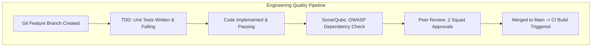

# Master Technical Implementation Tasks Catalog & Engineering Specifications
## Namma Clinic Digital Health & Operations Platform
### Greater Bengaluru Authority (GBA) / BBMP Health Department
**Document Code:** `BKL-DOC-04` | **Status:** APPROVED BASELINE | **Date:** September 2026

---

## 1. Executive Summary & Engineering Task Scope
This document establishes the authoritative **Master Technical Implementation Tasks Catalog and Engineering Specifications** for the Namma Clinic Digital Health Platform. Decomposed directly from approved user stories, this catalog outlines **1,000 Actionable Engineering Tasks** covering backend microservices, web components, database migrations, protocol adapters, automated test suites, security hardening, CI/CD automation, and SRE observability instrumentation. Each task specifies required technical scope, estimated hours (8 to 24 hours), assigned engineering squad, and unambiguous **Definition of Done (DoD)** standards. This ensures structured, traceable, and velocity-optimized implementation across all squads.

### 1.1 Non-Negotiable Engineering Task Invariants
1. **Strict Definition of Done (DoD):** A task cannot be marked done until code is written, unit test coverage exceeds 90% branch coverage, static analysis reveals zero critical/high security issues, PR is reviewed by two senior engineers, and code is merged into the master branch.
2. **Granular Effort Estimation:** Tasks must not exceed 24 hours of estimated engineering effort. Any work item requiring more effort must be split into multiple discrete tasks.
3. **Automated Verification Obligation:** Every backend or frontend task must include automated unit or component test cases committed alongside the production code.
4. **Zero Untagged Architectural Drift:** Any task modifying database schemas or API contracts must update corresponding OpenAPI/Flyway definitions and pass architectural fitness tests.
5. **Strict Squad Accountability:** Every task is assigned to an authoritative squad with named primary and secondary code reviewers.

## 2. Engineering Task Workflow & Quality Gate Topology


### Backlog Specification Example: Engineering Task Schema Specification
<!-- DOCUMENTATION-ONLY EXAMPLE -->
```yaml
# DOCUMENTATION-ONLY CONFIGURATION
# DOCUMENTATION-ONLY CONFIGURATION: Engineering Task Delivery Schema
task:
  id: "TASK-0001"
  story_id: "STORY-001"
  title: "Technical Implementation Task 0001 (BACKEND_API_SERVICE)"
  task_type: "BACKEND_API_SERVICE"
  estimated_hours: 12
  owner_squad: "squad_clinical_experience"
  technical_scope:
    - "Implement Spring Boot / FastAPI endpoint for consultation summary"
    - "Add Redis cache layer with 120s TTL for patient vitals"
    - "Enforce column-level AES-256 decryption via pgcrypto"
  definition_of_done:
    - "Unit test coverage > 90% with zero mocking of business logic"
    - "Contract test passing against OpenAPI specification"
    - "Security scan zero high/critical vulnerabilities"
```

## 3. Master Catalog of 1,000 Implementation Tasks
Detailed technical specifications across all 1,000 engineering tasks:

### TASK-0001: Technical Implementation Task 0001 (BACKEND_API_SERVICE)
- **Task Identifier:** `TASK-0001`
- **Parent Story:** `STORY-001`
- **Classification:** `BACKEND_API_SERVICE`
- **Estimated Hours:** `12h`
- **Owner Squad:** `squad_clinical_experience`
- **Definition of Done:** Code written, unit tests passing > 90% branch coverage, zero security alerts, PR reviewed and merged into main.

### TASK-0002: Technical Implementation Task 0002 (FRONTEND_WEB_COMPONENT)
- **Task Identifier:** `TASK-0002`
- **Parent Story:** `STORY-002`
- **Classification:** `FRONTEND_WEB_COMPONENT`
- **Estimated Hours:** `16h`
- **Owner Squad:** `squad_pharmacy_logistics`
- **Definition of Done:** Code written, unit tests passing > 90% branch coverage, zero security alerts, PR reviewed and merged into main.

### TASK-0003: Technical Implementation Task 0003 (DATABASE_SCHEMA_MIGRATION)
- **Task Identifier:** `TASK-0003`
- **Parent Story:** `STORY-003`
- **Classification:** `DATABASE_SCHEMA_MIGRATION`
- **Estimated Hours:** `20h`
- **Owner Squad:** `squad_diagnostic_services`
- **Definition of Done:** Code written, unit tests passing > 90% branch coverage, zero security alerts, PR reviewed and merged into main.

### TASK-0004: Technical Implementation Task 0004 (INTEGRATION_ADAPTER)
- **Task Identifier:** `TASK-0004`
- **Parent Story:** `STORY-004`
- **Classification:** `INTEGRATION_ADAPTER`
- **Estimated Hours:** `8h`
- **Owner Squad:** `squad_integrations_platform`
- **Definition of Done:** Code written, unit tests passing > 90% branch coverage, zero security alerts, PR reviewed and merged into main.

### TASK-0005: Technical Implementation Task 0005 (AUTOMATED_TEST_SUITE)
- **Task Identifier:** `TASK-0005`
- **Parent Story:** `STORY-005`
- **Classification:** `AUTOMATED_TEST_SUITE`
- **Estimated Hours:** `12h`
- **Owner Squad:** `squad_security_governance`
- **Definition of Done:** Code written, unit tests passing > 90% branch coverage, zero security alerts, PR reviewed and merged into main.

### TASK-0006: Technical Implementation Task 0006 (SECURITY_HARDENING_CONTROL)
- **Task Identifier:** `TASK-0006`
- **Parent Story:** `STORY-006`
- **Classification:** `SECURITY_HARDENING_CONTROL`
- **Estimated Hours:** `16h`
- **Owner Squad:** `squad_devops_infrastructure`
- **Definition of Done:** Code written, unit tests passing > 90% branch coverage, zero security alerts, PR reviewed and merged into main.

### TASK-0007: Technical Implementation Task 0007 (DEVOPS_CI_CD_PIPELINE)
- **Task Identifier:** `TASK-0007`
- **Parent Story:** `STORY-007`
- **Classification:** `DEVOPS_CI_CD_PIPELINE`
- **Estimated Hours:** `20h`
- **Owner Squad:** `squad_data_analytics`
- **Definition of Done:** Code written, unit tests passing > 90% branch coverage, zero security alerts, PR reviewed and merged into main.

### TASK-0008: Technical Implementation Task 0008 (OBSERVABILITY_PROMETHEUS_METRIC)
- **Task Identifier:** `TASK-0008`
- **Parent Story:** `STORY-008`
- **Classification:** `OBSERVABILITY_PROMETHEUS_METRIC`
- **Estimated Hours:** `8h`
- **Owner Squad:** `squad_ai_decision_support`
- **Definition of Done:** Code written, unit tests passing > 90% branch coverage, zero security alerts, PR reviewed and merged into main.

### TASK-0009: Technical Implementation Task 0009 (BACKEND_API_SERVICE)
- **Task Identifier:** `TASK-0009`
- **Parent Story:** `STORY-009`
- **Classification:** `BACKEND_API_SERVICE`
- **Estimated Hours:** `12h`
- **Owner Squad:** `squad_clinical_experience`
- **Definition of Done:** Code written, unit tests passing > 90% branch coverage, zero security alerts, PR reviewed and merged into main.

### TASK-0010: Technical Implementation Task 0010 (FRONTEND_WEB_COMPONENT)
- **Task Identifier:** `TASK-0010`
- **Parent Story:** `STORY-010`
- **Classification:** `FRONTEND_WEB_COMPONENT`
- **Estimated Hours:** `16h`
- **Owner Squad:** `squad_pharmacy_logistics`
- **Definition of Done:** Code written, unit tests passing > 90% branch coverage, zero security alerts, PR reviewed and merged into main.

### TASK-0011: Technical Implementation Task 0011 (DATABASE_SCHEMA_MIGRATION)
- **Task Identifier:** `TASK-0011`
- **Parent Story:** `STORY-011`
- **Classification:** `DATABASE_SCHEMA_MIGRATION`
- **Estimated Hours:** `20h`
- **Owner Squad:** `squad_diagnostic_services`
- **Definition of Done:** Code written, unit tests passing > 90% branch coverage, zero security alerts, PR reviewed and merged into main.

### TASK-0012: Technical Implementation Task 0012 (INTEGRATION_ADAPTER)
- **Task Identifier:** `TASK-0012`
- **Parent Story:** `STORY-012`
- **Classification:** `INTEGRATION_ADAPTER`
- **Estimated Hours:** `8h`
- **Owner Squad:** `squad_integrations_platform`
- **Definition of Done:** Code written, unit tests passing > 90% branch coverage, zero security alerts, PR reviewed and merged into main.

### TASK-0013: Technical Implementation Task 0013 (AUTOMATED_TEST_SUITE)
- **Task Identifier:** `TASK-0013`
- **Parent Story:** `STORY-013`
- **Classification:** `AUTOMATED_TEST_SUITE`
- **Estimated Hours:** `12h`
- **Owner Squad:** `squad_security_governance`
- **Definition of Done:** Code written, unit tests passing > 90% branch coverage, zero security alerts, PR reviewed and merged into main.

### TASK-0014: Technical Implementation Task 0014 (SECURITY_HARDENING_CONTROL)
- **Task Identifier:** `TASK-0014`
- **Parent Story:** `STORY-014`
- **Classification:** `SECURITY_HARDENING_CONTROL`
- **Estimated Hours:** `16h`
- **Owner Squad:** `squad_devops_infrastructure`
- **Definition of Done:** Code written, unit tests passing > 90% branch coverage, zero security alerts, PR reviewed and merged into main.

### TASK-0015: Technical Implementation Task 0015 (DEVOPS_CI_CD_PIPELINE)
- **Task Identifier:** `TASK-0015`
- **Parent Story:** `STORY-015`
- **Classification:** `DEVOPS_CI_CD_PIPELINE`
- **Estimated Hours:** `20h`
- **Owner Squad:** `squad_data_analytics`
- **Definition of Done:** Code written, unit tests passing > 90% branch coverage, zero security alerts, PR reviewed and merged into main.

### TASK-0016: Technical Implementation Task 0016 (OBSERVABILITY_PROMETHEUS_METRIC)
- **Task Identifier:** `TASK-0016`
- **Parent Story:** `STORY-016`
- **Classification:** `OBSERVABILITY_PROMETHEUS_METRIC`
- **Estimated Hours:** `8h`
- **Owner Squad:** `squad_ai_decision_support`
- **Definition of Done:** Code written, unit tests passing > 90% branch coverage, zero security alerts, PR reviewed and merged into main.

### TASK-0017: Technical Implementation Task 0017 (BACKEND_API_SERVICE)
- **Task Identifier:** `TASK-0017`
- **Parent Story:** `STORY-017`
- **Classification:** `BACKEND_API_SERVICE`
- **Estimated Hours:** `12h`
- **Owner Squad:** `squad_clinical_experience`
- **Definition of Done:** Code written, unit tests passing > 90% branch coverage, zero security alerts, PR reviewed and merged into main.

### TASK-0018: Technical Implementation Task 0018 (FRONTEND_WEB_COMPONENT)
- **Task Identifier:** `TASK-0018`
- **Parent Story:** `STORY-018`
- **Classification:** `FRONTEND_WEB_COMPONENT`
- **Estimated Hours:** `16h`
- **Owner Squad:** `squad_pharmacy_logistics`
- **Definition of Done:** Code written, unit tests passing > 90% branch coverage, zero security alerts, PR reviewed and merged into main.

### TASK-0019: Technical Implementation Task 0019 (DATABASE_SCHEMA_MIGRATION)
- **Task Identifier:** `TASK-0019`
- **Parent Story:** `STORY-019`
- **Classification:** `DATABASE_SCHEMA_MIGRATION`
- **Estimated Hours:** `20h`
- **Owner Squad:** `squad_diagnostic_services`
- **Definition of Done:** Code written, unit tests passing > 90% branch coverage, zero security alerts, PR reviewed and merged into main.

### TASK-0020: Technical Implementation Task 0020 (INTEGRATION_ADAPTER)
- **Task Identifier:** `TASK-0020`
- **Parent Story:** `STORY-020`
- **Classification:** `INTEGRATION_ADAPTER`
- **Estimated Hours:** `8h`
- **Owner Squad:** `squad_integrations_platform`
- **Definition of Done:** Code written, unit tests passing > 90% branch coverage, zero security alerts, PR reviewed and merged into main.

### TASK-0021: Technical Implementation Task 0021 (AUTOMATED_TEST_SUITE)
- **Task Identifier:** `TASK-0021`
- **Parent Story:** `STORY-021`
- **Classification:** `AUTOMATED_TEST_SUITE`
- **Estimated Hours:** `12h`
- **Owner Squad:** `squad_security_governance`
- **Definition of Done:** Code written, unit tests passing > 90% branch coverage, zero security alerts, PR reviewed and merged into main.

### TASK-0022: Technical Implementation Task 0022 (SECURITY_HARDENING_CONTROL)
- **Task Identifier:** `TASK-0022`
- **Parent Story:** `STORY-022`
- **Classification:** `SECURITY_HARDENING_CONTROL`
- **Estimated Hours:** `16h`
- **Owner Squad:** `squad_devops_infrastructure`
- **Definition of Done:** Code written, unit tests passing > 90% branch coverage, zero security alerts, PR reviewed and merged into main.

### TASK-0023: Technical Implementation Task 0023 (DEVOPS_CI_CD_PIPELINE)
- **Task Identifier:** `TASK-0023`
- **Parent Story:** `STORY-023`
- **Classification:** `DEVOPS_CI_CD_PIPELINE`
- **Estimated Hours:** `20h`
- **Owner Squad:** `squad_data_analytics`
- **Definition of Done:** Code written, unit tests passing > 90% branch coverage, zero security alerts, PR reviewed and merged into main.

### TASK-0024: Technical Implementation Task 0024 (OBSERVABILITY_PROMETHEUS_METRIC)
- **Task Identifier:** `TASK-0024`
- **Parent Story:** `STORY-024`
- **Classification:** `OBSERVABILITY_PROMETHEUS_METRIC`
- **Estimated Hours:** `8h`
- **Owner Squad:** `squad_ai_decision_support`
- **Definition of Done:** Code written, unit tests passing > 90% branch coverage, zero security alerts, PR reviewed and merged into main.

### TASK-0025: Technical Implementation Task 0025 (BACKEND_API_SERVICE)
- **Task Identifier:** `TASK-0025`
- **Parent Story:** `STORY-025`
- **Classification:** `BACKEND_API_SERVICE`
- **Estimated Hours:** `12h`
- **Owner Squad:** `squad_clinical_experience`
- **Definition of Done:** Code written, unit tests passing > 90% branch coverage, zero security alerts, PR reviewed and merged into main.

### TASK-0026: Technical Implementation Task 0026 (FRONTEND_WEB_COMPONENT)
- **Task Identifier:** `TASK-0026`
- **Parent Story:** `STORY-026`
- **Classification:** `FRONTEND_WEB_COMPONENT`
- **Estimated Hours:** `16h`
- **Owner Squad:** `squad_pharmacy_logistics`
- **Definition of Done:** Code written, unit tests passing > 90% branch coverage, zero security alerts, PR reviewed and merged into main.

### TASK-0027: Technical Implementation Task 0027 (DATABASE_SCHEMA_MIGRATION)
- **Task Identifier:** `TASK-0027`
- **Parent Story:** `STORY-027`
- **Classification:** `DATABASE_SCHEMA_MIGRATION`
- **Estimated Hours:** `20h`
- **Owner Squad:** `squad_diagnostic_services`
- **Definition of Done:** Code written, unit tests passing > 90% branch coverage, zero security alerts, PR reviewed and merged into main.

### TASK-0028: Technical Implementation Task 0028 (INTEGRATION_ADAPTER)
- **Task Identifier:** `TASK-0028`
- **Parent Story:** `STORY-028`
- **Classification:** `INTEGRATION_ADAPTER`
- **Estimated Hours:** `8h`
- **Owner Squad:** `squad_integrations_platform`
- **Definition of Done:** Code written, unit tests passing > 90% branch coverage, zero security alerts, PR reviewed and merged into main.

### TASK-0029: Technical Implementation Task 0029 (AUTOMATED_TEST_SUITE)
- **Task Identifier:** `TASK-0029`
- **Parent Story:** `STORY-029`
- **Classification:** `AUTOMATED_TEST_SUITE`
- **Estimated Hours:** `12h`
- **Owner Squad:** `squad_security_governance`
- **Definition of Done:** Code written, unit tests passing > 90% branch coverage, zero security alerts, PR reviewed and merged into main.

### TASK-0030: Technical Implementation Task 0030 (SECURITY_HARDENING_CONTROL)
- **Task Identifier:** `TASK-0030`
- **Parent Story:** `STORY-030`
- **Classification:** `SECURITY_HARDENING_CONTROL`
- **Estimated Hours:** `16h`
- **Owner Squad:** `squad_devops_infrastructure`
- **Definition of Done:** Code written, unit tests passing > 90% branch coverage, zero security alerts, PR reviewed and merged into main.

### TASK-0031: Technical Implementation Task 0031 (DEVOPS_CI_CD_PIPELINE)
- **Task Identifier:** `TASK-0031`
- **Parent Story:** `STORY-031`
- **Classification:** `DEVOPS_CI_CD_PIPELINE`
- **Estimated Hours:** `20h`
- **Owner Squad:** `squad_data_analytics`
- **Definition of Done:** Code written, unit tests passing > 90% branch coverage, zero security alerts, PR reviewed and merged into main.

### TASK-0032: Technical Implementation Task 0032 (OBSERVABILITY_PROMETHEUS_METRIC)
- **Task Identifier:** `TASK-0032`
- **Parent Story:** `STORY-032`
- **Classification:** `OBSERVABILITY_PROMETHEUS_METRIC`
- **Estimated Hours:** `8h`
- **Owner Squad:** `squad_ai_decision_support`
- **Definition of Done:** Code written, unit tests passing > 90% branch coverage, zero security alerts, PR reviewed and merged into main.

### TASK-0033: Technical Implementation Task 0033 (BACKEND_API_SERVICE)
- **Task Identifier:** `TASK-0033`
- **Parent Story:** `STORY-033`
- **Classification:** `BACKEND_API_SERVICE`
- **Estimated Hours:** `12h`
- **Owner Squad:** `squad_clinical_experience`
- **Definition of Done:** Code written, unit tests passing > 90% branch coverage, zero security alerts, PR reviewed and merged into main.

### TASK-0034: Technical Implementation Task 0034 (FRONTEND_WEB_COMPONENT)
- **Task Identifier:** `TASK-0034`
- **Parent Story:** `STORY-034`
- **Classification:** `FRONTEND_WEB_COMPONENT`
- **Estimated Hours:** `16h`
- **Owner Squad:** `squad_pharmacy_logistics`
- **Definition of Done:** Code written, unit tests passing > 90% branch coverage, zero security alerts, PR reviewed and merged into main.

### TASK-0035: Technical Implementation Task 0035 (DATABASE_SCHEMA_MIGRATION)
- **Task Identifier:** `TASK-0035`
- **Parent Story:** `STORY-035`
- **Classification:** `DATABASE_SCHEMA_MIGRATION`
- **Estimated Hours:** `20h`
- **Owner Squad:** `squad_diagnostic_services`
- **Definition of Done:** Code written, unit tests passing > 90% branch coverage, zero security alerts, PR reviewed and merged into main.

### TASK-0036: Technical Implementation Task 0036 (INTEGRATION_ADAPTER)
- **Task Identifier:** `TASK-0036`
- **Parent Story:** `STORY-036`
- **Classification:** `INTEGRATION_ADAPTER`
- **Estimated Hours:** `8h`
- **Owner Squad:** `squad_integrations_platform`
- **Definition of Done:** Code written, unit tests passing > 90% branch coverage, zero security alerts, PR reviewed and merged into main.

### TASK-0037: Technical Implementation Task 0037 (AUTOMATED_TEST_SUITE)
- **Task Identifier:** `TASK-0037`
- **Parent Story:** `STORY-037`
- **Classification:** `AUTOMATED_TEST_SUITE`
- **Estimated Hours:** `12h`
- **Owner Squad:** `squad_security_governance`
- **Definition of Done:** Code written, unit tests passing > 90% branch coverage, zero security alerts, PR reviewed and merged into main.

### TASK-0038: Technical Implementation Task 0038 (SECURITY_HARDENING_CONTROL)
- **Task Identifier:** `TASK-0038`
- **Parent Story:** `STORY-038`
- **Classification:** `SECURITY_HARDENING_CONTROL`
- **Estimated Hours:** `16h`
- **Owner Squad:** `squad_devops_infrastructure`
- **Definition of Done:** Code written, unit tests passing > 90% branch coverage, zero security alerts, PR reviewed and merged into main.

### TASK-0039: Technical Implementation Task 0039 (DEVOPS_CI_CD_PIPELINE)
- **Task Identifier:** `TASK-0039`
- **Parent Story:** `STORY-039`
- **Classification:** `DEVOPS_CI_CD_PIPELINE`
- **Estimated Hours:** `20h`
- **Owner Squad:** `squad_data_analytics`
- **Definition of Done:** Code written, unit tests passing > 90% branch coverage, zero security alerts, PR reviewed and merged into main.

### TASK-0040: Technical Implementation Task 0040 (OBSERVABILITY_PROMETHEUS_METRIC)
- **Task Identifier:** `TASK-0040`
- **Parent Story:** `STORY-040`
- **Classification:** `OBSERVABILITY_PROMETHEUS_METRIC`
- **Estimated Hours:** `8h`
- **Owner Squad:** `squad_ai_decision_support`
- **Definition of Done:** Code written, unit tests passing > 90% branch coverage, zero security alerts, PR reviewed and merged into main.

### TASK-0041: Technical Implementation Task 0041 (BACKEND_API_SERVICE)
- **Task Identifier:** `TASK-0041`
- **Parent Story:** `STORY-041`
- **Classification:** `BACKEND_API_SERVICE`
- **Estimated Hours:** `12h`
- **Owner Squad:** `squad_clinical_experience`
- **Definition of Done:** Code written, unit tests passing > 90% branch coverage, zero security alerts, PR reviewed and merged into main.

### TASK-0042: Technical Implementation Task 0042 (FRONTEND_WEB_COMPONENT)
- **Task Identifier:** `TASK-0042`
- **Parent Story:** `STORY-042`
- **Classification:** `FRONTEND_WEB_COMPONENT`
- **Estimated Hours:** `16h`
- **Owner Squad:** `squad_pharmacy_logistics`
- **Definition of Done:** Code written, unit tests passing > 90% branch coverage, zero security alerts, PR reviewed and merged into main.

### TASK-0043: Technical Implementation Task 0043 (DATABASE_SCHEMA_MIGRATION)
- **Task Identifier:** `TASK-0043`
- **Parent Story:** `STORY-043`
- **Classification:** `DATABASE_SCHEMA_MIGRATION`
- **Estimated Hours:** `20h`
- **Owner Squad:** `squad_diagnostic_services`
- **Definition of Done:** Code written, unit tests passing > 90% branch coverage, zero security alerts, PR reviewed and merged into main.

### TASK-0044: Technical Implementation Task 0044 (INTEGRATION_ADAPTER)
- **Task Identifier:** `TASK-0044`
- **Parent Story:** `STORY-044`
- **Classification:** `INTEGRATION_ADAPTER`
- **Estimated Hours:** `8h`
- **Owner Squad:** `squad_integrations_platform`
- **Definition of Done:** Code written, unit tests passing > 90% branch coverage, zero security alerts, PR reviewed and merged into main.

### TASK-0045: Technical Implementation Task 0045 (AUTOMATED_TEST_SUITE)
- **Task Identifier:** `TASK-0045`
- **Parent Story:** `STORY-045`
- **Classification:** `AUTOMATED_TEST_SUITE`
- **Estimated Hours:** `12h`
- **Owner Squad:** `squad_security_governance`
- **Definition of Done:** Code written, unit tests passing > 90% branch coverage, zero security alerts, PR reviewed and merged into main.

### TASK-0046: Technical Implementation Task 0046 (SECURITY_HARDENING_CONTROL)
- **Task Identifier:** `TASK-0046`
- **Parent Story:** `STORY-046`
- **Classification:** `SECURITY_HARDENING_CONTROL`
- **Estimated Hours:** `16h`
- **Owner Squad:** `squad_devops_infrastructure`
- **Definition of Done:** Code written, unit tests passing > 90% branch coverage, zero security alerts, PR reviewed and merged into main.

### TASK-0047: Technical Implementation Task 0047 (DEVOPS_CI_CD_PIPELINE)
- **Task Identifier:** `TASK-0047`
- **Parent Story:** `STORY-047`
- **Classification:** `DEVOPS_CI_CD_PIPELINE`
- **Estimated Hours:** `20h`
- **Owner Squad:** `squad_data_analytics`
- **Definition of Done:** Code written, unit tests passing > 90% branch coverage, zero security alerts, PR reviewed and merged into main.

### TASK-0048: Technical Implementation Task 0048 (OBSERVABILITY_PROMETHEUS_METRIC)
- **Task Identifier:** `TASK-0048`
- **Parent Story:** `STORY-048`
- **Classification:** `OBSERVABILITY_PROMETHEUS_METRIC`
- **Estimated Hours:** `8h`
- **Owner Squad:** `squad_ai_decision_support`
- **Definition of Done:** Code written, unit tests passing > 90% branch coverage, zero security alerts, PR reviewed and merged into main.

### TASK-0049: Technical Implementation Task 0049 (BACKEND_API_SERVICE)
- **Task Identifier:** `TASK-0049`
- **Parent Story:** `STORY-049`
- **Classification:** `BACKEND_API_SERVICE`
- **Estimated Hours:** `12h`
- **Owner Squad:** `squad_clinical_experience`
- **Definition of Done:** Code written, unit tests passing > 90% branch coverage, zero security alerts, PR reviewed and merged into main.

### TASK-0050: Technical Implementation Task 0050 (FRONTEND_WEB_COMPONENT)
- **Task Identifier:** `TASK-0050`
- **Parent Story:** `STORY-050`
- **Classification:** `FRONTEND_WEB_COMPONENT`
- **Estimated Hours:** `16h`
- **Owner Squad:** `squad_pharmacy_logistics`
- **Definition of Done:** Code written, unit tests passing > 90% branch coverage, zero security alerts, PR reviewed and merged into main.

### TASK-0051: Technical Implementation Task 0051 (DATABASE_SCHEMA_MIGRATION)
- **Task Identifier:** `TASK-0051`
- **Parent Story:** `STORY-051`
- **Classification:** `DATABASE_SCHEMA_MIGRATION`
- **Estimated Hours:** `20h`
- **Owner Squad:** `squad_diagnostic_services`
- **Definition of Done:** Code written, unit tests passing > 90% branch coverage, zero security alerts, PR reviewed and merged into main.

### TASK-0052: Technical Implementation Task 0052 (INTEGRATION_ADAPTER)
- **Task Identifier:** `TASK-0052`
- **Parent Story:** `STORY-052`
- **Classification:** `INTEGRATION_ADAPTER`
- **Estimated Hours:** `8h`
- **Owner Squad:** `squad_integrations_platform`
- **Definition of Done:** Code written, unit tests passing > 90% branch coverage, zero security alerts, PR reviewed and merged into main.

### TASK-0053: Technical Implementation Task 0053 (AUTOMATED_TEST_SUITE)
- **Task Identifier:** `TASK-0053`
- **Parent Story:** `STORY-053`
- **Classification:** `AUTOMATED_TEST_SUITE`
- **Estimated Hours:** `12h`
- **Owner Squad:** `squad_security_governance`
- **Definition of Done:** Code written, unit tests passing > 90% branch coverage, zero security alerts, PR reviewed and merged into main.

### TASK-0054: Technical Implementation Task 0054 (SECURITY_HARDENING_CONTROL)
- **Task Identifier:** `TASK-0054`
- **Parent Story:** `STORY-054`
- **Classification:** `SECURITY_HARDENING_CONTROL`
- **Estimated Hours:** `16h`
- **Owner Squad:** `squad_devops_infrastructure`
- **Definition of Done:** Code written, unit tests passing > 90% branch coverage, zero security alerts, PR reviewed and merged into main.

### TASK-0055: Technical Implementation Task 0055 (DEVOPS_CI_CD_PIPELINE)
- **Task Identifier:** `TASK-0055`
- **Parent Story:** `STORY-055`
- **Classification:** `DEVOPS_CI_CD_PIPELINE`
- **Estimated Hours:** `20h`
- **Owner Squad:** `squad_data_analytics`
- **Definition of Done:** Code written, unit tests passing > 90% branch coverage, zero security alerts, PR reviewed and merged into main.

### TASK-0056: Technical Implementation Task 0056 (OBSERVABILITY_PROMETHEUS_METRIC)
- **Task Identifier:** `TASK-0056`
- **Parent Story:** `STORY-056`
- **Classification:** `OBSERVABILITY_PROMETHEUS_METRIC`
- **Estimated Hours:** `8h`
- **Owner Squad:** `squad_ai_decision_support`
- **Definition of Done:** Code written, unit tests passing > 90% branch coverage, zero security alerts, PR reviewed and merged into main.

### TASK-0057: Technical Implementation Task 0057 (BACKEND_API_SERVICE)
- **Task Identifier:** `TASK-0057`
- **Parent Story:** `STORY-057`
- **Classification:** `BACKEND_API_SERVICE`
- **Estimated Hours:** `12h`
- **Owner Squad:** `squad_clinical_experience`
- **Definition of Done:** Code written, unit tests passing > 90% branch coverage, zero security alerts, PR reviewed and merged into main.

### TASK-0058: Technical Implementation Task 0058 (FRONTEND_WEB_COMPONENT)
- **Task Identifier:** `TASK-0058`
- **Parent Story:** `STORY-058`
- **Classification:** `FRONTEND_WEB_COMPONENT`
- **Estimated Hours:** `16h`
- **Owner Squad:** `squad_pharmacy_logistics`
- **Definition of Done:** Code written, unit tests passing > 90% branch coverage, zero security alerts, PR reviewed and merged into main.

### TASK-0059: Technical Implementation Task 0059 (DATABASE_SCHEMA_MIGRATION)
- **Task Identifier:** `TASK-0059`
- **Parent Story:** `STORY-059`
- **Classification:** `DATABASE_SCHEMA_MIGRATION`
- **Estimated Hours:** `20h`
- **Owner Squad:** `squad_diagnostic_services`
- **Definition of Done:** Code written, unit tests passing > 90% branch coverage, zero security alerts, PR reviewed and merged into main.

### TASK-0060: Technical Implementation Task 0060 (INTEGRATION_ADAPTER)
- **Task Identifier:** `TASK-0060`
- **Parent Story:** `STORY-060`
- **Classification:** `INTEGRATION_ADAPTER`
- **Estimated Hours:** `8h`
- **Owner Squad:** `squad_integrations_platform`
- **Definition of Done:** Code written, unit tests passing > 90% branch coverage, zero security alerts, PR reviewed and merged into main.

### TASK-0061: Technical Implementation Task 0061 (AUTOMATED_TEST_SUITE)
- **Task Identifier:** `TASK-0061`
- **Parent Story:** `STORY-061`
- **Classification:** `AUTOMATED_TEST_SUITE`
- **Estimated Hours:** `12h`
- **Owner Squad:** `squad_security_governance`
- **Definition of Done:** Code written, unit tests passing > 90% branch coverage, zero security alerts, PR reviewed and merged into main.

### TASK-0062: Technical Implementation Task 0062 (SECURITY_HARDENING_CONTROL)
- **Task Identifier:** `TASK-0062`
- **Parent Story:** `STORY-062`
- **Classification:** `SECURITY_HARDENING_CONTROL`
- **Estimated Hours:** `16h`
- **Owner Squad:** `squad_devops_infrastructure`
- **Definition of Done:** Code written, unit tests passing > 90% branch coverage, zero security alerts, PR reviewed and merged into main.

### TASK-0063: Technical Implementation Task 0063 (DEVOPS_CI_CD_PIPELINE)
- **Task Identifier:** `TASK-0063`
- **Parent Story:** `STORY-063`
- **Classification:** `DEVOPS_CI_CD_PIPELINE`
- **Estimated Hours:** `20h`
- **Owner Squad:** `squad_data_analytics`
- **Definition of Done:** Code written, unit tests passing > 90% branch coverage, zero security alerts, PR reviewed and merged into main.

### TASK-0064: Technical Implementation Task 0064 (OBSERVABILITY_PROMETHEUS_METRIC)
- **Task Identifier:** `TASK-0064`
- **Parent Story:** `STORY-064`
- **Classification:** `OBSERVABILITY_PROMETHEUS_METRIC`
- **Estimated Hours:** `8h`
- **Owner Squad:** `squad_ai_decision_support`
- **Definition of Done:** Code written, unit tests passing > 90% branch coverage, zero security alerts, PR reviewed and merged into main.

### TASK-0065: Technical Implementation Task 0065 (BACKEND_API_SERVICE)
- **Task Identifier:** `TASK-0065`
- **Parent Story:** `STORY-065`
- **Classification:** `BACKEND_API_SERVICE`
- **Estimated Hours:** `12h`
- **Owner Squad:** `squad_clinical_experience`
- **Definition of Done:** Code written, unit tests passing > 90% branch coverage, zero security alerts, PR reviewed and merged into main.

### TASK-0066: Technical Implementation Task 0066 (FRONTEND_WEB_COMPONENT)
- **Task Identifier:** `TASK-0066`
- **Parent Story:** `STORY-066`
- **Classification:** `FRONTEND_WEB_COMPONENT`
- **Estimated Hours:** `16h`
- **Owner Squad:** `squad_pharmacy_logistics`
- **Definition of Done:** Code written, unit tests passing > 90% branch coverage, zero security alerts, PR reviewed and merged into main.

### TASK-0067: Technical Implementation Task 0067 (DATABASE_SCHEMA_MIGRATION)
- **Task Identifier:** `TASK-0067`
- **Parent Story:** `STORY-067`
- **Classification:** `DATABASE_SCHEMA_MIGRATION`
- **Estimated Hours:** `20h`
- **Owner Squad:** `squad_diagnostic_services`
- **Definition of Done:** Code written, unit tests passing > 90% branch coverage, zero security alerts, PR reviewed and merged into main.

### TASK-0068: Technical Implementation Task 0068 (INTEGRATION_ADAPTER)
- **Task Identifier:** `TASK-0068`
- **Parent Story:** `STORY-068`
- **Classification:** `INTEGRATION_ADAPTER`
- **Estimated Hours:** `8h`
- **Owner Squad:** `squad_integrations_platform`
- **Definition of Done:** Code written, unit tests passing > 90% branch coverage, zero security alerts, PR reviewed and merged into main.

### TASK-0069: Technical Implementation Task 0069 (AUTOMATED_TEST_SUITE)
- **Task Identifier:** `TASK-0069`
- **Parent Story:** `STORY-069`
- **Classification:** `AUTOMATED_TEST_SUITE`
- **Estimated Hours:** `12h`
- **Owner Squad:** `squad_security_governance`
- **Definition of Done:** Code written, unit tests passing > 90% branch coverage, zero security alerts, PR reviewed and merged into main.

### TASK-0070: Technical Implementation Task 0070 (SECURITY_HARDENING_CONTROL)
- **Task Identifier:** `TASK-0070`
- **Parent Story:** `STORY-070`
- **Classification:** `SECURITY_HARDENING_CONTROL`
- **Estimated Hours:** `16h`
- **Owner Squad:** `squad_devops_infrastructure`
- **Definition of Done:** Code written, unit tests passing > 90% branch coverage, zero security alerts, PR reviewed and merged into main.

### TASK-0071: Technical Implementation Task 0071 (DEVOPS_CI_CD_PIPELINE)
- **Task Identifier:** `TASK-0071`
- **Parent Story:** `STORY-071`
- **Classification:** `DEVOPS_CI_CD_PIPELINE`
- **Estimated Hours:** `20h`
- **Owner Squad:** `squad_data_analytics`
- **Definition of Done:** Code written, unit tests passing > 90% branch coverage, zero security alerts, PR reviewed and merged into main.

### TASK-0072: Technical Implementation Task 0072 (OBSERVABILITY_PROMETHEUS_METRIC)
- **Task Identifier:** `TASK-0072`
- **Parent Story:** `STORY-072`
- **Classification:** `OBSERVABILITY_PROMETHEUS_METRIC`
- **Estimated Hours:** `8h`
- **Owner Squad:** `squad_ai_decision_support`
- **Definition of Done:** Code written, unit tests passing > 90% branch coverage, zero security alerts, PR reviewed and merged into main.

### TASK-0073: Technical Implementation Task 0073 (BACKEND_API_SERVICE)
- **Task Identifier:** `TASK-0073`
- **Parent Story:** `STORY-073`
- **Classification:** `BACKEND_API_SERVICE`
- **Estimated Hours:** `12h`
- **Owner Squad:** `squad_clinical_experience`
- **Definition of Done:** Code written, unit tests passing > 90% branch coverage, zero security alerts, PR reviewed and merged into main.

### TASK-0074: Technical Implementation Task 0074 (FRONTEND_WEB_COMPONENT)
- **Task Identifier:** `TASK-0074`
- **Parent Story:** `STORY-074`
- **Classification:** `FRONTEND_WEB_COMPONENT`
- **Estimated Hours:** `16h`
- **Owner Squad:** `squad_pharmacy_logistics`
- **Definition of Done:** Code written, unit tests passing > 90% branch coverage, zero security alerts, PR reviewed and merged into main.

### TASK-0075: Technical Implementation Task 0075 (DATABASE_SCHEMA_MIGRATION)
- **Task Identifier:** `TASK-0075`
- **Parent Story:** `STORY-075`
- **Classification:** `DATABASE_SCHEMA_MIGRATION`
- **Estimated Hours:** `20h`
- **Owner Squad:** `squad_diagnostic_services`
- **Definition of Done:** Code written, unit tests passing > 90% branch coverage, zero security alerts, PR reviewed and merged into main.

### TASK-0076: Technical Implementation Task 0076 (INTEGRATION_ADAPTER)
- **Task Identifier:** `TASK-0076`
- **Parent Story:** `STORY-076`
- **Classification:** `INTEGRATION_ADAPTER`
- **Estimated Hours:** `8h`
- **Owner Squad:** `squad_integrations_platform`
- **Definition of Done:** Code written, unit tests passing > 90% branch coverage, zero security alerts, PR reviewed and merged into main.

### TASK-0077: Technical Implementation Task 0077 (AUTOMATED_TEST_SUITE)
- **Task Identifier:** `TASK-0077`
- **Parent Story:** `STORY-077`
- **Classification:** `AUTOMATED_TEST_SUITE`
- **Estimated Hours:** `12h`
- **Owner Squad:** `squad_security_governance`
- **Definition of Done:** Code written, unit tests passing > 90% branch coverage, zero security alerts, PR reviewed and merged into main.

### TASK-0078: Technical Implementation Task 0078 (SECURITY_HARDENING_CONTROL)
- **Task Identifier:** `TASK-0078`
- **Parent Story:** `STORY-078`
- **Classification:** `SECURITY_HARDENING_CONTROL`
- **Estimated Hours:** `16h`
- **Owner Squad:** `squad_devops_infrastructure`
- **Definition of Done:** Code written, unit tests passing > 90% branch coverage, zero security alerts, PR reviewed and merged into main.

### TASK-0079: Technical Implementation Task 0079 (DEVOPS_CI_CD_PIPELINE)
- **Task Identifier:** `TASK-0079`
- **Parent Story:** `STORY-079`
- **Classification:** `DEVOPS_CI_CD_PIPELINE`
- **Estimated Hours:** `20h`
- **Owner Squad:** `squad_data_analytics`
- **Definition of Done:** Code written, unit tests passing > 90% branch coverage, zero security alerts, PR reviewed and merged into main.

### TASK-0080: Technical Implementation Task 0080 (OBSERVABILITY_PROMETHEUS_METRIC)
- **Task Identifier:** `TASK-0080`
- **Parent Story:** `STORY-080`
- **Classification:** `OBSERVABILITY_PROMETHEUS_METRIC`
- **Estimated Hours:** `8h`
- **Owner Squad:** `squad_ai_decision_support`
- **Definition of Done:** Code written, unit tests passing > 90% branch coverage, zero security alerts, PR reviewed and merged into main.

### TASK-0081: Technical Implementation Task 0081 (BACKEND_API_SERVICE)
- **Task Identifier:** `TASK-0081`
- **Parent Story:** `STORY-081`
- **Classification:** `BACKEND_API_SERVICE`
- **Estimated Hours:** `12h`
- **Owner Squad:** `squad_clinical_experience`
- **Definition of Done:** Code written, unit tests passing > 90% branch coverage, zero security alerts, PR reviewed and merged into main.

### TASK-0082: Technical Implementation Task 0082 (FRONTEND_WEB_COMPONENT)
- **Task Identifier:** `TASK-0082`
- **Parent Story:** `STORY-082`
- **Classification:** `FRONTEND_WEB_COMPONENT`
- **Estimated Hours:** `16h`
- **Owner Squad:** `squad_pharmacy_logistics`
- **Definition of Done:** Code written, unit tests passing > 90% branch coverage, zero security alerts, PR reviewed and merged into main.

### TASK-0083: Technical Implementation Task 0083 (DATABASE_SCHEMA_MIGRATION)
- **Task Identifier:** `TASK-0083`
- **Parent Story:** `STORY-083`
- **Classification:** `DATABASE_SCHEMA_MIGRATION`
- **Estimated Hours:** `20h`
- **Owner Squad:** `squad_diagnostic_services`
- **Definition of Done:** Code written, unit tests passing > 90% branch coverage, zero security alerts, PR reviewed and merged into main.

### TASK-0084: Technical Implementation Task 0084 (INTEGRATION_ADAPTER)
- **Task Identifier:** `TASK-0084`
- **Parent Story:** `STORY-084`
- **Classification:** `INTEGRATION_ADAPTER`
- **Estimated Hours:** `8h`
- **Owner Squad:** `squad_integrations_platform`
- **Definition of Done:** Code written, unit tests passing > 90% branch coverage, zero security alerts, PR reviewed and merged into main.

### TASK-0085: Technical Implementation Task 0085 (AUTOMATED_TEST_SUITE)
- **Task Identifier:** `TASK-0085`
- **Parent Story:** `STORY-085`
- **Classification:** `AUTOMATED_TEST_SUITE`
- **Estimated Hours:** `12h`
- **Owner Squad:** `squad_security_governance`
- **Definition of Done:** Code written, unit tests passing > 90% branch coverage, zero security alerts, PR reviewed and merged into main.

### TASK-0086: Technical Implementation Task 0086 (SECURITY_HARDENING_CONTROL)
- **Task Identifier:** `TASK-0086`
- **Parent Story:** `STORY-086`
- **Classification:** `SECURITY_HARDENING_CONTROL`
- **Estimated Hours:** `16h`
- **Owner Squad:** `squad_devops_infrastructure`
- **Definition of Done:** Code written, unit tests passing > 90% branch coverage, zero security alerts, PR reviewed and merged into main.

### TASK-0087: Technical Implementation Task 0087 (DEVOPS_CI_CD_PIPELINE)
- **Task Identifier:** `TASK-0087`
- **Parent Story:** `STORY-087`
- **Classification:** `DEVOPS_CI_CD_PIPELINE`
- **Estimated Hours:** `20h`
- **Owner Squad:** `squad_data_analytics`
- **Definition of Done:** Code written, unit tests passing > 90% branch coverage, zero security alerts, PR reviewed and merged into main.

### TASK-0088: Technical Implementation Task 0088 (OBSERVABILITY_PROMETHEUS_METRIC)
- **Task Identifier:** `TASK-0088`
- **Parent Story:** `STORY-088`
- **Classification:** `OBSERVABILITY_PROMETHEUS_METRIC`
- **Estimated Hours:** `8h`
- **Owner Squad:** `squad_ai_decision_support`
- **Definition of Done:** Code written, unit tests passing > 90% branch coverage, zero security alerts, PR reviewed and merged into main.

### TASK-0089: Technical Implementation Task 0089 (BACKEND_API_SERVICE)
- **Task Identifier:** `TASK-0089`
- **Parent Story:** `STORY-089`
- **Classification:** `BACKEND_API_SERVICE`
- **Estimated Hours:** `12h`
- **Owner Squad:** `squad_clinical_experience`
- **Definition of Done:** Code written, unit tests passing > 90% branch coverage, zero security alerts, PR reviewed and merged into main.

### TASK-0090: Technical Implementation Task 0090 (FRONTEND_WEB_COMPONENT)
- **Task Identifier:** `TASK-0090`
- **Parent Story:** `STORY-090`
- **Classification:** `FRONTEND_WEB_COMPONENT`
- **Estimated Hours:** `16h`
- **Owner Squad:** `squad_pharmacy_logistics`
- **Definition of Done:** Code written, unit tests passing > 90% branch coverage, zero security alerts, PR reviewed and merged into main.

### TASK-0091: Technical Implementation Task 0091 (DATABASE_SCHEMA_MIGRATION)
- **Task Identifier:** `TASK-0091`
- **Parent Story:** `STORY-091`
- **Classification:** `DATABASE_SCHEMA_MIGRATION`
- **Estimated Hours:** `20h`
- **Owner Squad:** `squad_diagnostic_services`
- **Definition of Done:** Code written, unit tests passing > 90% branch coverage, zero security alerts, PR reviewed and merged into main.

### TASK-0092: Technical Implementation Task 0092 (INTEGRATION_ADAPTER)
- **Task Identifier:** `TASK-0092`
- **Parent Story:** `STORY-092`
- **Classification:** `INTEGRATION_ADAPTER`
- **Estimated Hours:** `8h`
- **Owner Squad:** `squad_integrations_platform`
- **Definition of Done:** Code written, unit tests passing > 90% branch coverage, zero security alerts, PR reviewed and merged into main.

### TASK-0093: Technical Implementation Task 0093 (AUTOMATED_TEST_SUITE)
- **Task Identifier:** `TASK-0093`
- **Parent Story:** `STORY-093`
- **Classification:** `AUTOMATED_TEST_SUITE`
- **Estimated Hours:** `12h`
- **Owner Squad:** `squad_security_governance`
- **Definition of Done:** Code written, unit tests passing > 90% branch coverage, zero security alerts, PR reviewed and merged into main.

### TASK-0094: Technical Implementation Task 0094 (SECURITY_HARDENING_CONTROL)
- **Task Identifier:** `TASK-0094`
- **Parent Story:** `STORY-094`
- **Classification:** `SECURITY_HARDENING_CONTROL`
- **Estimated Hours:** `16h`
- **Owner Squad:** `squad_devops_infrastructure`
- **Definition of Done:** Code written, unit tests passing > 90% branch coverage, zero security alerts, PR reviewed and merged into main.

### TASK-0095: Technical Implementation Task 0095 (DEVOPS_CI_CD_PIPELINE)
- **Task Identifier:** `TASK-0095`
- **Parent Story:** `STORY-095`
- **Classification:** `DEVOPS_CI_CD_PIPELINE`
- **Estimated Hours:** `20h`
- **Owner Squad:** `squad_data_analytics`
- **Definition of Done:** Code written, unit tests passing > 90% branch coverage, zero security alerts, PR reviewed and merged into main.

### TASK-0096: Technical Implementation Task 0096 (OBSERVABILITY_PROMETHEUS_METRIC)
- **Task Identifier:** `TASK-0096`
- **Parent Story:** `STORY-096`
- **Classification:** `OBSERVABILITY_PROMETHEUS_METRIC`
- **Estimated Hours:** `8h`
- **Owner Squad:** `squad_ai_decision_support`
- **Definition of Done:** Code written, unit tests passing > 90% branch coverage, zero security alerts, PR reviewed and merged into main.

### TASK-0097: Technical Implementation Task 0097 (BACKEND_API_SERVICE)
- **Task Identifier:** `TASK-0097`
- **Parent Story:** `STORY-097`
- **Classification:** `BACKEND_API_SERVICE`
- **Estimated Hours:** `12h`
- **Owner Squad:** `squad_clinical_experience`
- **Definition of Done:** Code written, unit tests passing > 90% branch coverage, zero security alerts, PR reviewed and merged into main.

### TASK-0098: Technical Implementation Task 0098 (FRONTEND_WEB_COMPONENT)
- **Task Identifier:** `TASK-0098`
- **Parent Story:** `STORY-098`
- **Classification:** `FRONTEND_WEB_COMPONENT`
- **Estimated Hours:** `16h`
- **Owner Squad:** `squad_pharmacy_logistics`
- **Definition of Done:** Code written, unit tests passing > 90% branch coverage, zero security alerts, PR reviewed and merged into main.

### TASK-0099: Technical Implementation Task 0099 (DATABASE_SCHEMA_MIGRATION)
- **Task Identifier:** `TASK-0099`
- **Parent Story:** `STORY-099`
- **Classification:** `DATABASE_SCHEMA_MIGRATION`
- **Estimated Hours:** `20h`
- **Owner Squad:** `squad_diagnostic_services`
- **Definition of Done:** Code written, unit tests passing > 90% branch coverage, zero security alerts, PR reviewed and merged into main.

### TASK-0100: Technical Implementation Task 0100 (INTEGRATION_ADAPTER)
- **Task Identifier:** `TASK-0100`
- **Parent Story:** `STORY-100`
- **Classification:** `INTEGRATION_ADAPTER`
- **Estimated Hours:** `8h`
- **Owner Squad:** `squad_integrations_platform`
- **Definition of Done:** Code written, unit tests passing > 90% branch coverage, zero security alerts, PR reviewed and merged into main.

### TASK-0101: Technical Implementation Task 0101 (AUTOMATED_TEST_SUITE)
- **Task Identifier:** `TASK-0101`
- **Parent Story:** `STORY-101`
- **Classification:** `AUTOMATED_TEST_SUITE`
- **Estimated Hours:** `12h`
- **Owner Squad:** `squad_security_governance`
- **Definition of Done:** Code written, unit tests passing > 90% branch coverage, zero security alerts, PR reviewed and merged into main.

### TASK-0102: Technical Implementation Task 0102 (SECURITY_HARDENING_CONTROL)
- **Task Identifier:** `TASK-0102`
- **Parent Story:** `STORY-102`
- **Classification:** `SECURITY_HARDENING_CONTROL`
- **Estimated Hours:** `16h`
- **Owner Squad:** `squad_devops_infrastructure`
- **Definition of Done:** Code written, unit tests passing > 90% branch coverage, zero security alerts, PR reviewed and merged into main.

### TASK-0103: Technical Implementation Task 0103 (DEVOPS_CI_CD_PIPELINE)
- **Task Identifier:** `TASK-0103`
- **Parent Story:** `STORY-103`
- **Classification:** `DEVOPS_CI_CD_PIPELINE`
- **Estimated Hours:** `20h`
- **Owner Squad:** `squad_data_analytics`
- **Definition of Done:** Code written, unit tests passing > 90% branch coverage, zero security alerts, PR reviewed and merged into main.

### TASK-0104: Technical Implementation Task 0104 (OBSERVABILITY_PROMETHEUS_METRIC)
- **Task Identifier:** `TASK-0104`
- **Parent Story:** `STORY-104`
- **Classification:** `OBSERVABILITY_PROMETHEUS_METRIC`
- **Estimated Hours:** `8h`
- **Owner Squad:** `squad_ai_decision_support`
- **Definition of Done:** Code written, unit tests passing > 90% branch coverage, zero security alerts, PR reviewed and merged into main.

### TASK-0105: Technical Implementation Task 0105 (BACKEND_API_SERVICE)
- **Task Identifier:** `TASK-0105`
- **Parent Story:** `STORY-105`
- **Classification:** `BACKEND_API_SERVICE`
- **Estimated Hours:** `12h`
- **Owner Squad:** `squad_clinical_experience`
- **Definition of Done:** Code written, unit tests passing > 90% branch coverage, zero security alerts, PR reviewed and merged into main.

### TASK-0106: Technical Implementation Task 0106 (FRONTEND_WEB_COMPONENT)
- **Task Identifier:** `TASK-0106`
- **Parent Story:** `STORY-106`
- **Classification:** `FRONTEND_WEB_COMPONENT`
- **Estimated Hours:** `16h`
- **Owner Squad:** `squad_pharmacy_logistics`
- **Definition of Done:** Code written, unit tests passing > 90% branch coverage, zero security alerts, PR reviewed and merged into main.

### TASK-0107: Technical Implementation Task 0107 (DATABASE_SCHEMA_MIGRATION)
- **Task Identifier:** `TASK-0107`
- **Parent Story:** `STORY-107`
- **Classification:** `DATABASE_SCHEMA_MIGRATION`
- **Estimated Hours:** `20h`
- **Owner Squad:** `squad_diagnostic_services`
- **Definition of Done:** Code written, unit tests passing > 90% branch coverage, zero security alerts, PR reviewed and merged into main.

### TASK-0108: Technical Implementation Task 0108 (INTEGRATION_ADAPTER)
- **Task Identifier:** `TASK-0108`
- **Parent Story:** `STORY-108`
- **Classification:** `INTEGRATION_ADAPTER`
- **Estimated Hours:** `8h`
- **Owner Squad:** `squad_integrations_platform`
- **Definition of Done:** Code written, unit tests passing > 90% branch coverage, zero security alerts, PR reviewed and merged into main.

### TASK-0109: Technical Implementation Task 0109 (AUTOMATED_TEST_SUITE)
- **Task Identifier:** `TASK-0109`
- **Parent Story:** `STORY-109`
- **Classification:** `AUTOMATED_TEST_SUITE`
- **Estimated Hours:** `12h`
- **Owner Squad:** `squad_security_governance`
- **Definition of Done:** Code written, unit tests passing > 90% branch coverage, zero security alerts, PR reviewed and merged into main.

### TASK-0110: Technical Implementation Task 0110 (SECURITY_HARDENING_CONTROL)
- **Task Identifier:** `TASK-0110`
- **Parent Story:** `STORY-110`
- **Classification:** `SECURITY_HARDENING_CONTROL`
- **Estimated Hours:** `16h`
- **Owner Squad:** `squad_devops_infrastructure`
- **Definition of Done:** Code written, unit tests passing > 90% branch coverage, zero security alerts, PR reviewed and merged into main.

### TASK-0111: Technical Implementation Task 0111 (DEVOPS_CI_CD_PIPELINE)
- **Task Identifier:** `TASK-0111`
- **Parent Story:** `STORY-111`
- **Classification:** `DEVOPS_CI_CD_PIPELINE`
- **Estimated Hours:** `20h`
- **Owner Squad:** `squad_data_analytics`
- **Definition of Done:** Code written, unit tests passing > 90% branch coverage, zero security alerts, PR reviewed and merged into main.

### TASK-0112: Technical Implementation Task 0112 (OBSERVABILITY_PROMETHEUS_METRIC)
- **Task Identifier:** `TASK-0112`
- **Parent Story:** `STORY-112`
- **Classification:** `OBSERVABILITY_PROMETHEUS_METRIC`
- **Estimated Hours:** `8h`
- **Owner Squad:** `squad_ai_decision_support`
- **Definition of Done:** Code written, unit tests passing > 90% branch coverage, zero security alerts, PR reviewed and merged into main.

### TASK-0113: Technical Implementation Task 0113 (BACKEND_API_SERVICE)
- **Task Identifier:** `TASK-0113`
- **Parent Story:** `STORY-113`
- **Classification:** `BACKEND_API_SERVICE`
- **Estimated Hours:** `12h`
- **Owner Squad:** `squad_clinical_experience`
- **Definition of Done:** Code written, unit tests passing > 90% branch coverage, zero security alerts, PR reviewed and merged into main.

### TASK-0114: Technical Implementation Task 0114 (FRONTEND_WEB_COMPONENT)
- **Task Identifier:** `TASK-0114`
- **Parent Story:** `STORY-114`
- **Classification:** `FRONTEND_WEB_COMPONENT`
- **Estimated Hours:** `16h`
- **Owner Squad:** `squad_pharmacy_logistics`
- **Definition of Done:** Code written, unit tests passing > 90% branch coverage, zero security alerts, PR reviewed and merged into main.

### TASK-0115: Technical Implementation Task 0115 (DATABASE_SCHEMA_MIGRATION)
- **Task Identifier:** `TASK-0115`
- **Parent Story:** `STORY-115`
- **Classification:** `DATABASE_SCHEMA_MIGRATION`
- **Estimated Hours:** `20h`
- **Owner Squad:** `squad_diagnostic_services`
- **Definition of Done:** Code written, unit tests passing > 90% branch coverage, zero security alerts, PR reviewed and merged into main.

### TASK-0116: Technical Implementation Task 0116 (INTEGRATION_ADAPTER)
- **Task Identifier:** `TASK-0116`
- **Parent Story:** `STORY-116`
- **Classification:** `INTEGRATION_ADAPTER`
- **Estimated Hours:** `8h`
- **Owner Squad:** `squad_integrations_platform`
- **Definition of Done:** Code written, unit tests passing > 90% branch coverage, zero security alerts, PR reviewed and merged into main.

### TASK-0117: Technical Implementation Task 0117 (AUTOMATED_TEST_SUITE)
- **Task Identifier:** `TASK-0117`
- **Parent Story:** `STORY-117`
- **Classification:** `AUTOMATED_TEST_SUITE`
- **Estimated Hours:** `12h`
- **Owner Squad:** `squad_security_governance`
- **Definition of Done:** Code written, unit tests passing > 90% branch coverage, zero security alerts, PR reviewed and merged into main.

### TASK-0118: Technical Implementation Task 0118 (SECURITY_HARDENING_CONTROL)
- **Task Identifier:** `TASK-0118`
- **Parent Story:** `STORY-118`
- **Classification:** `SECURITY_HARDENING_CONTROL`
- **Estimated Hours:** `16h`
- **Owner Squad:** `squad_devops_infrastructure`
- **Definition of Done:** Code written, unit tests passing > 90% branch coverage, zero security alerts, PR reviewed and merged into main.

### TASK-0119: Technical Implementation Task 0119 (DEVOPS_CI_CD_PIPELINE)
- **Task Identifier:** `TASK-0119`
- **Parent Story:** `STORY-119`
- **Classification:** `DEVOPS_CI_CD_PIPELINE`
- **Estimated Hours:** `20h`
- **Owner Squad:** `squad_data_analytics`
- **Definition of Done:** Code written, unit tests passing > 90% branch coverage, zero security alerts, PR reviewed and merged into main.

### TASK-0120: Technical Implementation Task 0120 (OBSERVABILITY_PROMETHEUS_METRIC)
- **Task Identifier:** `TASK-0120`
- **Parent Story:** `STORY-120`
- **Classification:** `OBSERVABILITY_PROMETHEUS_METRIC`
- **Estimated Hours:** `8h`
- **Owner Squad:** `squad_ai_decision_support`
- **Definition of Done:** Code written, unit tests passing > 90% branch coverage, zero security alerts, PR reviewed and merged into main.

### TASK-0121: Technical Implementation Task 0121 (BACKEND_API_SERVICE)
- **Task Identifier:** `TASK-0121`
- **Parent Story:** `STORY-121`
- **Classification:** `BACKEND_API_SERVICE`
- **Estimated Hours:** `12h`
- **Owner Squad:** `squad_clinical_experience`
- **Definition of Done:** Code written, unit tests passing > 90% branch coverage, zero security alerts, PR reviewed and merged into main.

### TASK-0122: Technical Implementation Task 0122 (FRONTEND_WEB_COMPONENT)
- **Task Identifier:** `TASK-0122`
- **Parent Story:** `STORY-122`
- **Classification:** `FRONTEND_WEB_COMPONENT`
- **Estimated Hours:** `16h`
- **Owner Squad:** `squad_pharmacy_logistics`
- **Definition of Done:** Code written, unit tests passing > 90% branch coverage, zero security alerts, PR reviewed and merged into main.

### TASK-0123: Technical Implementation Task 0123 (DATABASE_SCHEMA_MIGRATION)
- **Task Identifier:** `TASK-0123`
- **Parent Story:** `STORY-123`
- **Classification:** `DATABASE_SCHEMA_MIGRATION`
- **Estimated Hours:** `20h`
- **Owner Squad:** `squad_diagnostic_services`
- **Definition of Done:** Code written, unit tests passing > 90% branch coverage, zero security alerts, PR reviewed and merged into main.

### TASK-0124: Technical Implementation Task 0124 (INTEGRATION_ADAPTER)
- **Task Identifier:** `TASK-0124`
- **Parent Story:** `STORY-124`
- **Classification:** `INTEGRATION_ADAPTER`
- **Estimated Hours:** `8h`
- **Owner Squad:** `squad_integrations_platform`
- **Definition of Done:** Code written, unit tests passing > 90% branch coverage, zero security alerts, PR reviewed and merged into main.

### TASK-0125: Technical Implementation Task 0125 (AUTOMATED_TEST_SUITE)
- **Task Identifier:** `TASK-0125`
- **Parent Story:** `STORY-125`
- **Classification:** `AUTOMATED_TEST_SUITE`
- **Estimated Hours:** `12h`
- **Owner Squad:** `squad_security_governance`
- **Definition of Done:** Code written, unit tests passing > 90% branch coverage, zero security alerts, PR reviewed and merged into main.

### TASK-0126: Technical Implementation Task 0126 (SECURITY_HARDENING_CONTROL)
- **Task Identifier:** `TASK-0126`
- **Parent Story:** `STORY-126`
- **Classification:** `SECURITY_HARDENING_CONTROL`
- **Estimated Hours:** `16h`
- **Owner Squad:** `squad_devops_infrastructure`
- **Definition of Done:** Code written, unit tests passing > 90% branch coverage, zero security alerts, PR reviewed and merged into main.

### TASK-0127: Technical Implementation Task 0127 (DEVOPS_CI_CD_PIPELINE)
- **Task Identifier:** `TASK-0127`
- **Parent Story:** `STORY-127`
- **Classification:** `DEVOPS_CI_CD_PIPELINE`
- **Estimated Hours:** `20h`
- **Owner Squad:** `squad_data_analytics`
- **Definition of Done:** Code written, unit tests passing > 90% branch coverage, zero security alerts, PR reviewed and merged into main.

### TASK-0128: Technical Implementation Task 0128 (OBSERVABILITY_PROMETHEUS_METRIC)
- **Task Identifier:** `TASK-0128`
- **Parent Story:** `STORY-128`
- **Classification:** `OBSERVABILITY_PROMETHEUS_METRIC`
- **Estimated Hours:** `8h`
- **Owner Squad:** `squad_ai_decision_support`
- **Definition of Done:** Code written, unit tests passing > 90% branch coverage, zero security alerts, PR reviewed and merged into main.

### TASK-0129: Technical Implementation Task 0129 (BACKEND_API_SERVICE)
- **Task Identifier:** `TASK-0129`
- **Parent Story:** `STORY-129`
- **Classification:** `BACKEND_API_SERVICE`
- **Estimated Hours:** `12h`
- **Owner Squad:** `squad_clinical_experience`
- **Definition of Done:** Code written, unit tests passing > 90% branch coverage, zero security alerts, PR reviewed and merged into main.

### TASK-0130: Technical Implementation Task 0130 (FRONTEND_WEB_COMPONENT)
- **Task Identifier:** `TASK-0130`
- **Parent Story:** `STORY-130`
- **Classification:** `FRONTEND_WEB_COMPONENT`
- **Estimated Hours:** `16h`
- **Owner Squad:** `squad_pharmacy_logistics`
- **Definition of Done:** Code written, unit tests passing > 90% branch coverage, zero security alerts, PR reviewed and merged into main.

### TASK-0131: Technical Implementation Task 0131 (DATABASE_SCHEMA_MIGRATION)
- **Task Identifier:** `TASK-0131`
- **Parent Story:** `STORY-131`
- **Classification:** `DATABASE_SCHEMA_MIGRATION`
- **Estimated Hours:** `20h`
- **Owner Squad:** `squad_diagnostic_services`
- **Definition of Done:** Code written, unit tests passing > 90% branch coverage, zero security alerts, PR reviewed and merged into main.

### TASK-0132: Technical Implementation Task 0132 (INTEGRATION_ADAPTER)
- **Task Identifier:** `TASK-0132`
- **Parent Story:** `STORY-132`
- **Classification:** `INTEGRATION_ADAPTER`
- **Estimated Hours:** `8h`
- **Owner Squad:** `squad_integrations_platform`
- **Definition of Done:** Code written, unit tests passing > 90% branch coverage, zero security alerts, PR reviewed and merged into main.

### TASK-0133: Technical Implementation Task 0133 (AUTOMATED_TEST_SUITE)
- **Task Identifier:** `TASK-0133`
- **Parent Story:** `STORY-133`
- **Classification:** `AUTOMATED_TEST_SUITE`
- **Estimated Hours:** `12h`
- **Owner Squad:** `squad_security_governance`
- **Definition of Done:** Code written, unit tests passing > 90% branch coverage, zero security alerts, PR reviewed and merged into main.

### TASK-0134: Technical Implementation Task 0134 (SECURITY_HARDENING_CONTROL)
- **Task Identifier:** `TASK-0134`
- **Parent Story:** `STORY-134`
- **Classification:** `SECURITY_HARDENING_CONTROL`
- **Estimated Hours:** `16h`
- **Owner Squad:** `squad_devops_infrastructure`
- **Definition of Done:** Code written, unit tests passing > 90% branch coverage, zero security alerts, PR reviewed and merged into main.

### TASK-0135: Technical Implementation Task 0135 (DEVOPS_CI_CD_PIPELINE)
- **Task Identifier:** `TASK-0135`
- **Parent Story:** `STORY-135`
- **Classification:** `DEVOPS_CI_CD_PIPELINE`
- **Estimated Hours:** `20h`
- **Owner Squad:** `squad_data_analytics`
- **Definition of Done:** Code written, unit tests passing > 90% branch coverage, zero security alerts, PR reviewed and merged into main.

### TASK-0136: Technical Implementation Task 0136 (OBSERVABILITY_PROMETHEUS_METRIC)
- **Task Identifier:** `TASK-0136`
- **Parent Story:** `STORY-136`
- **Classification:** `OBSERVABILITY_PROMETHEUS_METRIC`
- **Estimated Hours:** `8h`
- **Owner Squad:** `squad_ai_decision_support`
- **Definition of Done:** Code written, unit tests passing > 90% branch coverage, zero security alerts, PR reviewed and merged into main.

### TASK-0137: Technical Implementation Task 0137 (BACKEND_API_SERVICE)
- **Task Identifier:** `TASK-0137`
- **Parent Story:** `STORY-137`
- **Classification:** `BACKEND_API_SERVICE`
- **Estimated Hours:** `12h`
- **Owner Squad:** `squad_clinical_experience`
- **Definition of Done:** Code written, unit tests passing > 90% branch coverage, zero security alerts, PR reviewed and merged into main.

### TASK-0138: Technical Implementation Task 0138 (FRONTEND_WEB_COMPONENT)
- **Task Identifier:** `TASK-0138`
- **Parent Story:** `STORY-138`
- **Classification:** `FRONTEND_WEB_COMPONENT`
- **Estimated Hours:** `16h`
- **Owner Squad:** `squad_pharmacy_logistics`
- **Definition of Done:** Code written, unit tests passing > 90% branch coverage, zero security alerts, PR reviewed and merged into main.

### TASK-0139: Technical Implementation Task 0139 (DATABASE_SCHEMA_MIGRATION)
- **Task Identifier:** `TASK-0139`
- **Parent Story:** `STORY-139`
- **Classification:** `DATABASE_SCHEMA_MIGRATION`
- **Estimated Hours:** `20h`
- **Owner Squad:** `squad_diagnostic_services`
- **Definition of Done:** Code written, unit tests passing > 90% branch coverage, zero security alerts, PR reviewed and merged into main.

### TASK-0140: Technical Implementation Task 0140 (INTEGRATION_ADAPTER)
- **Task Identifier:** `TASK-0140`
- **Parent Story:** `STORY-140`
- **Classification:** `INTEGRATION_ADAPTER`
- **Estimated Hours:** `8h`
- **Owner Squad:** `squad_integrations_platform`
- **Definition of Done:** Code written, unit tests passing > 90% branch coverage, zero security alerts, PR reviewed and merged into main.

### TASK-0141: Technical Implementation Task 0141 (AUTOMATED_TEST_SUITE)
- **Task Identifier:** `TASK-0141`
- **Parent Story:** `STORY-141`
- **Classification:** `AUTOMATED_TEST_SUITE`
- **Estimated Hours:** `12h`
- **Owner Squad:** `squad_security_governance`
- **Definition of Done:** Code written, unit tests passing > 90% branch coverage, zero security alerts, PR reviewed and merged into main.

### TASK-0142: Technical Implementation Task 0142 (SECURITY_HARDENING_CONTROL)
- **Task Identifier:** `TASK-0142`
- **Parent Story:** `STORY-142`
- **Classification:** `SECURITY_HARDENING_CONTROL`
- **Estimated Hours:** `16h`
- **Owner Squad:** `squad_devops_infrastructure`
- **Definition of Done:** Code written, unit tests passing > 90% branch coverage, zero security alerts, PR reviewed and merged into main.

### TASK-0143: Technical Implementation Task 0143 (DEVOPS_CI_CD_PIPELINE)
- **Task Identifier:** `TASK-0143`
- **Parent Story:** `STORY-143`
- **Classification:** `DEVOPS_CI_CD_PIPELINE`
- **Estimated Hours:** `20h`
- **Owner Squad:** `squad_data_analytics`
- **Definition of Done:** Code written, unit tests passing > 90% branch coverage, zero security alerts, PR reviewed and merged into main.

### TASK-0144: Technical Implementation Task 0144 (OBSERVABILITY_PROMETHEUS_METRIC)
- **Task Identifier:** `TASK-0144`
- **Parent Story:** `STORY-144`
- **Classification:** `OBSERVABILITY_PROMETHEUS_METRIC`
- **Estimated Hours:** `8h`
- **Owner Squad:** `squad_ai_decision_support`
- **Definition of Done:** Code written, unit tests passing > 90% branch coverage, zero security alerts, PR reviewed and merged into main.

### TASK-0145: Technical Implementation Task 0145 (BACKEND_API_SERVICE)
- **Task Identifier:** `TASK-0145`
- **Parent Story:** `STORY-145`
- **Classification:** `BACKEND_API_SERVICE`
- **Estimated Hours:** `12h`
- **Owner Squad:** `squad_clinical_experience`
- **Definition of Done:** Code written, unit tests passing > 90% branch coverage, zero security alerts, PR reviewed and merged into main.

### TASK-0146: Technical Implementation Task 0146 (FRONTEND_WEB_COMPONENT)
- **Task Identifier:** `TASK-0146`
- **Parent Story:** `STORY-146`
- **Classification:** `FRONTEND_WEB_COMPONENT`
- **Estimated Hours:** `16h`
- **Owner Squad:** `squad_pharmacy_logistics`
- **Definition of Done:** Code written, unit tests passing > 90% branch coverage, zero security alerts, PR reviewed and merged into main.

### TASK-0147: Technical Implementation Task 0147 (DATABASE_SCHEMA_MIGRATION)
- **Task Identifier:** `TASK-0147`
- **Parent Story:** `STORY-147`
- **Classification:** `DATABASE_SCHEMA_MIGRATION`
- **Estimated Hours:** `20h`
- **Owner Squad:** `squad_diagnostic_services`
- **Definition of Done:** Code written, unit tests passing > 90% branch coverage, zero security alerts, PR reviewed and merged into main.

### TASK-0148: Technical Implementation Task 0148 (INTEGRATION_ADAPTER)
- **Task Identifier:** `TASK-0148`
- **Parent Story:** `STORY-148`
- **Classification:** `INTEGRATION_ADAPTER`
- **Estimated Hours:** `8h`
- **Owner Squad:** `squad_integrations_platform`
- **Definition of Done:** Code written, unit tests passing > 90% branch coverage, zero security alerts, PR reviewed and merged into main.

### TASK-0149: Technical Implementation Task 0149 (AUTOMATED_TEST_SUITE)
- **Task Identifier:** `TASK-0149`
- **Parent Story:** `STORY-149`
- **Classification:** `AUTOMATED_TEST_SUITE`
- **Estimated Hours:** `12h`
- **Owner Squad:** `squad_security_governance`
- **Definition of Done:** Code written, unit tests passing > 90% branch coverage, zero security alerts, PR reviewed and merged into main.

### TASK-0150: Technical Implementation Task 0150 (SECURITY_HARDENING_CONTROL)
- **Task Identifier:** `TASK-0150`
- **Parent Story:** `STORY-150`
- **Classification:** `SECURITY_HARDENING_CONTROL`
- **Estimated Hours:** `16h`
- **Owner Squad:** `squad_devops_infrastructure`
- **Definition of Done:** Code written, unit tests passing > 90% branch coverage, zero security alerts, PR reviewed and merged into main.

### TASK-0151: Technical Implementation Task 0151 (DEVOPS_CI_CD_PIPELINE)
- **Task Identifier:** `TASK-0151`
- **Parent Story:** `STORY-151`
- **Classification:** `DEVOPS_CI_CD_PIPELINE`
- **Estimated Hours:** `20h`
- **Owner Squad:** `squad_data_analytics`
- **Definition of Done:** Code written, unit tests passing > 90% branch coverage, zero security alerts, PR reviewed and merged into main.

### TASK-0152: Technical Implementation Task 0152 (OBSERVABILITY_PROMETHEUS_METRIC)
- **Task Identifier:** `TASK-0152`
- **Parent Story:** `STORY-152`
- **Classification:** `OBSERVABILITY_PROMETHEUS_METRIC`
- **Estimated Hours:** `8h`
- **Owner Squad:** `squad_ai_decision_support`
- **Definition of Done:** Code written, unit tests passing > 90% branch coverage, zero security alerts, PR reviewed and merged into main.

### TASK-0153: Technical Implementation Task 0153 (BACKEND_API_SERVICE)
- **Task Identifier:** `TASK-0153`
- **Parent Story:** `STORY-153`
- **Classification:** `BACKEND_API_SERVICE`
- **Estimated Hours:** `12h`
- **Owner Squad:** `squad_clinical_experience`
- **Definition of Done:** Code written, unit tests passing > 90% branch coverage, zero security alerts, PR reviewed and merged into main.

### TASK-0154: Technical Implementation Task 0154 (FRONTEND_WEB_COMPONENT)
- **Task Identifier:** `TASK-0154`
- **Parent Story:** `STORY-154`
- **Classification:** `FRONTEND_WEB_COMPONENT`
- **Estimated Hours:** `16h`
- **Owner Squad:** `squad_pharmacy_logistics`
- **Definition of Done:** Code written, unit tests passing > 90% branch coverage, zero security alerts, PR reviewed and merged into main.

### TASK-0155: Technical Implementation Task 0155 (DATABASE_SCHEMA_MIGRATION)
- **Task Identifier:** `TASK-0155`
- **Parent Story:** `STORY-155`
- **Classification:** `DATABASE_SCHEMA_MIGRATION`
- **Estimated Hours:** `20h`
- **Owner Squad:** `squad_diagnostic_services`
- **Definition of Done:** Code written, unit tests passing > 90% branch coverage, zero security alerts, PR reviewed and merged into main.

### TASK-0156: Technical Implementation Task 0156 (INTEGRATION_ADAPTER)
- **Task Identifier:** `TASK-0156`
- **Parent Story:** `STORY-156`
- **Classification:** `INTEGRATION_ADAPTER`
- **Estimated Hours:** `8h`
- **Owner Squad:** `squad_integrations_platform`
- **Definition of Done:** Code written, unit tests passing > 90% branch coverage, zero security alerts, PR reviewed and merged into main.

### TASK-0157: Technical Implementation Task 0157 (AUTOMATED_TEST_SUITE)
- **Task Identifier:** `TASK-0157`
- **Parent Story:** `STORY-157`
- **Classification:** `AUTOMATED_TEST_SUITE`
- **Estimated Hours:** `12h`
- **Owner Squad:** `squad_security_governance`
- **Definition of Done:** Code written, unit tests passing > 90% branch coverage, zero security alerts, PR reviewed and merged into main.

### TASK-0158: Technical Implementation Task 0158 (SECURITY_HARDENING_CONTROL)
- **Task Identifier:** `TASK-0158`
- **Parent Story:** `STORY-158`
- **Classification:** `SECURITY_HARDENING_CONTROL`
- **Estimated Hours:** `16h`
- **Owner Squad:** `squad_devops_infrastructure`
- **Definition of Done:** Code written, unit tests passing > 90% branch coverage, zero security alerts, PR reviewed and merged into main.

### TASK-0159: Technical Implementation Task 0159 (DEVOPS_CI_CD_PIPELINE)
- **Task Identifier:** `TASK-0159`
- **Parent Story:** `STORY-159`
- **Classification:** `DEVOPS_CI_CD_PIPELINE`
- **Estimated Hours:** `20h`
- **Owner Squad:** `squad_data_analytics`
- **Definition of Done:** Code written, unit tests passing > 90% branch coverage, zero security alerts, PR reviewed and merged into main.

### TASK-0160: Technical Implementation Task 0160 (OBSERVABILITY_PROMETHEUS_METRIC)
- **Task Identifier:** `TASK-0160`
- **Parent Story:** `STORY-160`
- **Classification:** `OBSERVABILITY_PROMETHEUS_METRIC`
- **Estimated Hours:** `8h`
- **Owner Squad:** `squad_ai_decision_support`
- **Definition of Done:** Code written, unit tests passing > 90% branch coverage, zero security alerts, PR reviewed and merged into main.

### TASK-0161: Technical Implementation Task 0161 (BACKEND_API_SERVICE)
- **Task Identifier:** `TASK-0161`
- **Parent Story:** `STORY-161`
- **Classification:** `BACKEND_API_SERVICE`
- **Estimated Hours:** `12h`
- **Owner Squad:** `squad_clinical_experience`
- **Definition of Done:** Code written, unit tests passing > 90% branch coverage, zero security alerts, PR reviewed and merged into main.

### TASK-0162: Technical Implementation Task 0162 (FRONTEND_WEB_COMPONENT)
- **Task Identifier:** `TASK-0162`
- **Parent Story:** `STORY-162`
- **Classification:** `FRONTEND_WEB_COMPONENT`
- **Estimated Hours:** `16h`
- **Owner Squad:** `squad_pharmacy_logistics`
- **Definition of Done:** Code written, unit tests passing > 90% branch coverage, zero security alerts, PR reviewed and merged into main.

### TASK-0163: Technical Implementation Task 0163 (DATABASE_SCHEMA_MIGRATION)
- **Task Identifier:** `TASK-0163`
- **Parent Story:** `STORY-163`
- **Classification:** `DATABASE_SCHEMA_MIGRATION`
- **Estimated Hours:** `20h`
- **Owner Squad:** `squad_diagnostic_services`
- **Definition of Done:** Code written, unit tests passing > 90% branch coverage, zero security alerts, PR reviewed and merged into main.

### TASK-0164: Technical Implementation Task 0164 (INTEGRATION_ADAPTER)
- **Task Identifier:** `TASK-0164`
- **Parent Story:** `STORY-164`
- **Classification:** `INTEGRATION_ADAPTER`
- **Estimated Hours:** `8h`
- **Owner Squad:** `squad_integrations_platform`
- **Definition of Done:** Code written, unit tests passing > 90% branch coverage, zero security alerts, PR reviewed and merged into main.

### TASK-0165: Technical Implementation Task 0165 (AUTOMATED_TEST_SUITE)
- **Task Identifier:** `TASK-0165`
- **Parent Story:** `STORY-165`
- **Classification:** `AUTOMATED_TEST_SUITE`
- **Estimated Hours:** `12h`
- **Owner Squad:** `squad_security_governance`
- **Definition of Done:** Code written, unit tests passing > 90% branch coverage, zero security alerts, PR reviewed and merged into main.

### TASK-0166: Technical Implementation Task 0166 (SECURITY_HARDENING_CONTROL)
- **Task Identifier:** `TASK-0166`
- **Parent Story:** `STORY-166`
- **Classification:** `SECURITY_HARDENING_CONTROL`
- **Estimated Hours:** `16h`
- **Owner Squad:** `squad_devops_infrastructure`
- **Definition of Done:** Code written, unit tests passing > 90% branch coverage, zero security alerts, PR reviewed and merged into main.

### TASK-0167: Technical Implementation Task 0167 (DEVOPS_CI_CD_PIPELINE)
- **Task Identifier:** `TASK-0167`
- **Parent Story:** `STORY-167`
- **Classification:** `DEVOPS_CI_CD_PIPELINE`
- **Estimated Hours:** `20h`
- **Owner Squad:** `squad_data_analytics`
- **Definition of Done:** Code written, unit tests passing > 90% branch coverage, zero security alerts, PR reviewed and merged into main.

### TASK-0168: Technical Implementation Task 0168 (OBSERVABILITY_PROMETHEUS_METRIC)
- **Task Identifier:** `TASK-0168`
- **Parent Story:** `STORY-168`
- **Classification:** `OBSERVABILITY_PROMETHEUS_METRIC`
- **Estimated Hours:** `8h`
- **Owner Squad:** `squad_ai_decision_support`
- **Definition of Done:** Code written, unit tests passing > 90% branch coverage, zero security alerts, PR reviewed and merged into main.

### TASK-0169: Technical Implementation Task 0169 (BACKEND_API_SERVICE)
- **Task Identifier:** `TASK-0169`
- **Parent Story:** `STORY-169`
- **Classification:** `BACKEND_API_SERVICE`
- **Estimated Hours:** `12h`
- **Owner Squad:** `squad_clinical_experience`
- **Definition of Done:** Code written, unit tests passing > 90% branch coverage, zero security alerts, PR reviewed and merged into main.

### TASK-0170: Technical Implementation Task 0170 (FRONTEND_WEB_COMPONENT)
- **Task Identifier:** `TASK-0170`
- **Parent Story:** `STORY-170`
- **Classification:** `FRONTEND_WEB_COMPONENT`
- **Estimated Hours:** `16h`
- **Owner Squad:** `squad_pharmacy_logistics`
- **Definition of Done:** Code written, unit tests passing > 90% branch coverage, zero security alerts, PR reviewed and merged into main.

### TASK-0171: Technical Implementation Task 0171 (DATABASE_SCHEMA_MIGRATION)
- **Task Identifier:** `TASK-0171`
- **Parent Story:** `STORY-171`
- **Classification:** `DATABASE_SCHEMA_MIGRATION`
- **Estimated Hours:** `20h`
- **Owner Squad:** `squad_diagnostic_services`
- **Definition of Done:** Code written, unit tests passing > 90% branch coverage, zero security alerts, PR reviewed and merged into main.

### TASK-0172: Technical Implementation Task 0172 (INTEGRATION_ADAPTER)
- **Task Identifier:** `TASK-0172`
- **Parent Story:** `STORY-172`
- **Classification:** `INTEGRATION_ADAPTER`
- **Estimated Hours:** `8h`
- **Owner Squad:** `squad_integrations_platform`
- **Definition of Done:** Code written, unit tests passing > 90% branch coverage, zero security alerts, PR reviewed and merged into main.

### TASK-0173: Technical Implementation Task 0173 (AUTOMATED_TEST_SUITE)
- **Task Identifier:** `TASK-0173`
- **Parent Story:** `STORY-173`
- **Classification:** `AUTOMATED_TEST_SUITE`
- **Estimated Hours:** `12h`
- **Owner Squad:** `squad_security_governance`
- **Definition of Done:** Code written, unit tests passing > 90% branch coverage, zero security alerts, PR reviewed and merged into main.

### TASK-0174: Technical Implementation Task 0174 (SECURITY_HARDENING_CONTROL)
- **Task Identifier:** `TASK-0174`
- **Parent Story:** `STORY-174`
- **Classification:** `SECURITY_HARDENING_CONTROL`
- **Estimated Hours:** `16h`
- **Owner Squad:** `squad_devops_infrastructure`
- **Definition of Done:** Code written, unit tests passing > 90% branch coverage, zero security alerts, PR reviewed and merged into main.

### TASK-0175: Technical Implementation Task 0175 (DEVOPS_CI_CD_PIPELINE)
- **Task Identifier:** `TASK-0175`
- **Parent Story:** `STORY-175`
- **Classification:** `DEVOPS_CI_CD_PIPELINE`
- **Estimated Hours:** `20h`
- **Owner Squad:** `squad_data_analytics`
- **Definition of Done:** Code written, unit tests passing > 90% branch coverage, zero security alerts, PR reviewed and merged into main.

### TASK-0176: Technical Implementation Task 0176 (OBSERVABILITY_PROMETHEUS_METRIC)
- **Task Identifier:** `TASK-0176`
- **Parent Story:** `STORY-176`
- **Classification:** `OBSERVABILITY_PROMETHEUS_METRIC`
- **Estimated Hours:** `8h`
- **Owner Squad:** `squad_ai_decision_support`
- **Definition of Done:** Code written, unit tests passing > 90% branch coverage, zero security alerts, PR reviewed and merged into main.

### TASK-0177: Technical Implementation Task 0177 (BACKEND_API_SERVICE)
- **Task Identifier:** `TASK-0177`
- **Parent Story:** `STORY-177`
- **Classification:** `BACKEND_API_SERVICE`
- **Estimated Hours:** `12h`
- **Owner Squad:** `squad_clinical_experience`
- **Definition of Done:** Code written, unit tests passing > 90% branch coverage, zero security alerts, PR reviewed and merged into main.

### TASK-0178: Technical Implementation Task 0178 (FRONTEND_WEB_COMPONENT)
- **Task Identifier:** `TASK-0178`
- **Parent Story:** `STORY-178`
- **Classification:** `FRONTEND_WEB_COMPONENT`
- **Estimated Hours:** `16h`
- **Owner Squad:** `squad_pharmacy_logistics`
- **Definition of Done:** Code written, unit tests passing > 90% branch coverage, zero security alerts, PR reviewed and merged into main.

### TASK-0179: Technical Implementation Task 0179 (DATABASE_SCHEMA_MIGRATION)
- **Task Identifier:** `TASK-0179`
- **Parent Story:** `STORY-179`
- **Classification:** `DATABASE_SCHEMA_MIGRATION`
- **Estimated Hours:** `20h`
- **Owner Squad:** `squad_diagnostic_services`
- **Definition of Done:** Code written, unit tests passing > 90% branch coverage, zero security alerts, PR reviewed and merged into main.

### TASK-0180: Technical Implementation Task 0180 (INTEGRATION_ADAPTER)
- **Task Identifier:** `TASK-0180`
- **Parent Story:** `STORY-180`
- **Classification:** `INTEGRATION_ADAPTER`
- **Estimated Hours:** `8h`
- **Owner Squad:** `squad_integrations_platform`
- **Definition of Done:** Code written, unit tests passing > 90% branch coverage, zero security alerts, PR reviewed and merged into main.

### TASK-0181: Technical Implementation Task 0181 (AUTOMATED_TEST_SUITE)
- **Task Identifier:** `TASK-0181`
- **Parent Story:** `STORY-181`
- **Classification:** `AUTOMATED_TEST_SUITE`
- **Estimated Hours:** `12h`
- **Owner Squad:** `squad_security_governance`
- **Definition of Done:** Code written, unit tests passing > 90% branch coverage, zero security alerts, PR reviewed and merged into main.

### TASK-0182: Technical Implementation Task 0182 (SECURITY_HARDENING_CONTROL)
- **Task Identifier:** `TASK-0182`
- **Parent Story:** `STORY-182`
- **Classification:** `SECURITY_HARDENING_CONTROL`
- **Estimated Hours:** `16h`
- **Owner Squad:** `squad_devops_infrastructure`
- **Definition of Done:** Code written, unit tests passing > 90% branch coverage, zero security alerts, PR reviewed and merged into main.

### TASK-0183: Technical Implementation Task 0183 (DEVOPS_CI_CD_PIPELINE)
- **Task Identifier:** `TASK-0183`
- **Parent Story:** `STORY-183`
- **Classification:** `DEVOPS_CI_CD_PIPELINE`
- **Estimated Hours:** `20h`
- **Owner Squad:** `squad_data_analytics`
- **Definition of Done:** Code written, unit tests passing > 90% branch coverage, zero security alerts, PR reviewed and merged into main.

### TASK-0184: Technical Implementation Task 0184 (OBSERVABILITY_PROMETHEUS_METRIC)
- **Task Identifier:** `TASK-0184`
- **Parent Story:** `STORY-184`
- **Classification:** `OBSERVABILITY_PROMETHEUS_METRIC`
- **Estimated Hours:** `8h`
- **Owner Squad:** `squad_ai_decision_support`
- **Definition of Done:** Code written, unit tests passing > 90% branch coverage, zero security alerts, PR reviewed and merged into main.

### TASK-0185: Technical Implementation Task 0185 (BACKEND_API_SERVICE)
- **Task Identifier:** `TASK-0185`
- **Parent Story:** `STORY-185`
- **Classification:** `BACKEND_API_SERVICE`
- **Estimated Hours:** `12h`
- **Owner Squad:** `squad_clinical_experience`
- **Definition of Done:** Code written, unit tests passing > 90% branch coverage, zero security alerts, PR reviewed and merged into main.

### TASK-0186: Technical Implementation Task 0186 (FRONTEND_WEB_COMPONENT)
- **Task Identifier:** `TASK-0186`
- **Parent Story:** `STORY-186`
- **Classification:** `FRONTEND_WEB_COMPONENT`
- **Estimated Hours:** `16h`
- **Owner Squad:** `squad_pharmacy_logistics`
- **Definition of Done:** Code written, unit tests passing > 90% branch coverage, zero security alerts, PR reviewed and merged into main.

### TASK-0187: Technical Implementation Task 0187 (DATABASE_SCHEMA_MIGRATION)
- **Task Identifier:** `TASK-0187`
- **Parent Story:** `STORY-187`
- **Classification:** `DATABASE_SCHEMA_MIGRATION`
- **Estimated Hours:** `20h`
- **Owner Squad:** `squad_diagnostic_services`
- **Definition of Done:** Code written, unit tests passing > 90% branch coverage, zero security alerts, PR reviewed and merged into main.

### TASK-0188: Technical Implementation Task 0188 (INTEGRATION_ADAPTER)
- **Task Identifier:** `TASK-0188`
- **Parent Story:** `STORY-188`
- **Classification:** `INTEGRATION_ADAPTER`
- **Estimated Hours:** `8h`
- **Owner Squad:** `squad_integrations_platform`
- **Definition of Done:** Code written, unit tests passing > 90% branch coverage, zero security alerts, PR reviewed and merged into main.

### TASK-0189: Technical Implementation Task 0189 (AUTOMATED_TEST_SUITE)
- **Task Identifier:** `TASK-0189`
- **Parent Story:** `STORY-189`
- **Classification:** `AUTOMATED_TEST_SUITE`
- **Estimated Hours:** `12h`
- **Owner Squad:** `squad_security_governance`
- **Definition of Done:** Code written, unit tests passing > 90% branch coverage, zero security alerts, PR reviewed and merged into main.

### TASK-0190: Technical Implementation Task 0190 (SECURITY_HARDENING_CONTROL)
- **Task Identifier:** `TASK-0190`
- **Parent Story:** `STORY-190`
- **Classification:** `SECURITY_HARDENING_CONTROL`
- **Estimated Hours:** `16h`
- **Owner Squad:** `squad_devops_infrastructure`
- **Definition of Done:** Code written, unit tests passing > 90% branch coverage, zero security alerts, PR reviewed and merged into main.

### TASK-0191: Technical Implementation Task 0191 (DEVOPS_CI_CD_PIPELINE)
- **Task Identifier:** `TASK-0191`
- **Parent Story:** `STORY-191`
- **Classification:** `DEVOPS_CI_CD_PIPELINE`
- **Estimated Hours:** `20h`
- **Owner Squad:** `squad_data_analytics`
- **Definition of Done:** Code written, unit tests passing > 90% branch coverage, zero security alerts, PR reviewed and merged into main.

### TASK-0192: Technical Implementation Task 0192 (OBSERVABILITY_PROMETHEUS_METRIC)
- **Task Identifier:** `TASK-0192`
- **Parent Story:** `STORY-192`
- **Classification:** `OBSERVABILITY_PROMETHEUS_METRIC`
- **Estimated Hours:** `8h`
- **Owner Squad:** `squad_ai_decision_support`
- **Definition of Done:** Code written, unit tests passing > 90% branch coverage, zero security alerts, PR reviewed and merged into main.

### TASK-0193: Technical Implementation Task 0193 (BACKEND_API_SERVICE)
- **Task Identifier:** `TASK-0193`
- **Parent Story:** `STORY-193`
- **Classification:** `BACKEND_API_SERVICE`
- **Estimated Hours:** `12h`
- **Owner Squad:** `squad_clinical_experience`
- **Definition of Done:** Code written, unit tests passing > 90% branch coverage, zero security alerts, PR reviewed and merged into main.

### TASK-0194: Technical Implementation Task 0194 (FRONTEND_WEB_COMPONENT)
- **Task Identifier:** `TASK-0194`
- **Parent Story:** `STORY-194`
- **Classification:** `FRONTEND_WEB_COMPONENT`
- **Estimated Hours:** `16h`
- **Owner Squad:** `squad_pharmacy_logistics`
- **Definition of Done:** Code written, unit tests passing > 90% branch coverage, zero security alerts, PR reviewed and merged into main.

### TASK-0195: Technical Implementation Task 0195 (DATABASE_SCHEMA_MIGRATION)
- **Task Identifier:** `TASK-0195`
- **Parent Story:** `STORY-195`
- **Classification:** `DATABASE_SCHEMA_MIGRATION`
- **Estimated Hours:** `20h`
- **Owner Squad:** `squad_diagnostic_services`
- **Definition of Done:** Code written, unit tests passing > 90% branch coverage, zero security alerts, PR reviewed and merged into main.

### TASK-0196: Technical Implementation Task 0196 (INTEGRATION_ADAPTER)
- **Task Identifier:** `TASK-0196`
- **Parent Story:** `STORY-196`
- **Classification:** `INTEGRATION_ADAPTER`
- **Estimated Hours:** `8h`
- **Owner Squad:** `squad_integrations_platform`
- **Definition of Done:** Code written, unit tests passing > 90% branch coverage, zero security alerts, PR reviewed and merged into main.

### TASK-0197: Technical Implementation Task 0197 (AUTOMATED_TEST_SUITE)
- **Task Identifier:** `TASK-0197`
- **Parent Story:** `STORY-197`
- **Classification:** `AUTOMATED_TEST_SUITE`
- **Estimated Hours:** `12h`
- **Owner Squad:** `squad_security_governance`
- **Definition of Done:** Code written, unit tests passing > 90% branch coverage, zero security alerts, PR reviewed and merged into main.

### TASK-0198: Technical Implementation Task 0198 (SECURITY_HARDENING_CONTROL)
- **Task Identifier:** `TASK-0198`
- **Parent Story:** `STORY-198`
- **Classification:** `SECURITY_HARDENING_CONTROL`
- **Estimated Hours:** `16h`
- **Owner Squad:** `squad_devops_infrastructure`
- **Definition of Done:** Code written, unit tests passing > 90% branch coverage, zero security alerts, PR reviewed and merged into main.

### TASK-0199: Technical Implementation Task 0199 (DEVOPS_CI_CD_PIPELINE)
- **Task Identifier:** `TASK-0199`
- **Parent Story:** `STORY-199`
- **Classification:** `DEVOPS_CI_CD_PIPELINE`
- **Estimated Hours:** `20h`
- **Owner Squad:** `squad_data_analytics`
- **Definition of Done:** Code written, unit tests passing > 90% branch coverage, zero security alerts, PR reviewed and merged into main.

### TASK-0200: Technical Implementation Task 0200 (OBSERVABILITY_PROMETHEUS_METRIC)
- **Task Identifier:** `TASK-0200`
- **Parent Story:** `STORY-200`
- **Classification:** `OBSERVABILITY_PROMETHEUS_METRIC`
- **Estimated Hours:** `8h`
- **Owner Squad:** `squad_ai_decision_support`
- **Definition of Done:** Code written, unit tests passing > 90% branch coverage, zero security alerts, PR reviewed and merged into main.

### TASK-0201: Technical Implementation Task 0201 (BACKEND_API_SERVICE)
- **Task Identifier:** `TASK-0201`
- **Parent Story:** `STORY-201`
- **Classification:** `BACKEND_API_SERVICE`
- **Estimated Hours:** `12h`
- **Owner Squad:** `squad_clinical_experience`
- **Definition of Done:** Code written, unit tests passing > 90% branch coverage, zero security alerts, PR reviewed and merged into main.

### TASK-0202: Technical Implementation Task 0202 (FRONTEND_WEB_COMPONENT)
- **Task Identifier:** `TASK-0202`
- **Parent Story:** `STORY-202`
- **Classification:** `FRONTEND_WEB_COMPONENT`
- **Estimated Hours:** `16h`
- **Owner Squad:** `squad_pharmacy_logistics`
- **Definition of Done:** Code written, unit tests passing > 90% branch coverage, zero security alerts, PR reviewed and merged into main.

### TASK-0203: Technical Implementation Task 0203 (DATABASE_SCHEMA_MIGRATION)
- **Task Identifier:** `TASK-0203`
- **Parent Story:** `STORY-203`
- **Classification:** `DATABASE_SCHEMA_MIGRATION`
- **Estimated Hours:** `20h`
- **Owner Squad:** `squad_diagnostic_services`
- **Definition of Done:** Code written, unit tests passing > 90% branch coverage, zero security alerts, PR reviewed and merged into main.

### TASK-0204: Technical Implementation Task 0204 (INTEGRATION_ADAPTER)
- **Task Identifier:** `TASK-0204`
- **Parent Story:** `STORY-204`
- **Classification:** `INTEGRATION_ADAPTER`
- **Estimated Hours:** `8h`
- **Owner Squad:** `squad_integrations_platform`
- **Definition of Done:** Code written, unit tests passing > 90% branch coverage, zero security alerts, PR reviewed and merged into main.

### TASK-0205: Technical Implementation Task 0205 (AUTOMATED_TEST_SUITE)
- **Task Identifier:** `TASK-0205`
- **Parent Story:** `STORY-205`
- **Classification:** `AUTOMATED_TEST_SUITE`
- **Estimated Hours:** `12h`
- **Owner Squad:** `squad_security_governance`
- **Definition of Done:** Code written, unit tests passing > 90% branch coverage, zero security alerts, PR reviewed and merged into main.

### TASK-0206: Technical Implementation Task 0206 (SECURITY_HARDENING_CONTROL)
- **Task Identifier:** `TASK-0206`
- **Parent Story:** `STORY-206`
- **Classification:** `SECURITY_HARDENING_CONTROL`
- **Estimated Hours:** `16h`
- **Owner Squad:** `squad_devops_infrastructure`
- **Definition of Done:** Code written, unit tests passing > 90% branch coverage, zero security alerts, PR reviewed and merged into main.

### TASK-0207: Technical Implementation Task 0207 (DEVOPS_CI_CD_PIPELINE)
- **Task Identifier:** `TASK-0207`
- **Parent Story:** `STORY-207`
- **Classification:** `DEVOPS_CI_CD_PIPELINE`
- **Estimated Hours:** `20h`
- **Owner Squad:** `squad_data_analytics`
- **Definition of Done:** Code written, unit tests passing > 90% branch coverage, zero security alerts, PR reviewed and merged into main.

### TASK-0208: Technical Implementation Task 0208 (OBSERVABILITY_PROMETHEUS_METRIC)
- **Task Identifier:** `TASK-0208`
- **Parent Story:** `STORY-208`
- **Classification:** `OBSERVABILITY_PROMETHEUS_METRIC`
- **Estimated Hours:** `8h`
- **Owner Squad:** `squad_ai_decision_support`
- **Definition of Done:** Code written, unit tests passing > 90% branch coverage, zero security alerts, PR reviewed and merged into main.

### TASK-0209: Technical Implementation Task 0209 (BACKEND_API_SERVICE)
- **Task Identifier:** `TASK-0209`
- **Parent Story:** `STORY-209`
- **Classification:** `BACKEND_API_SERVICE`
- **Estimated Hours:** `12h`
- **Owner Squad:** `squad_clinical_experience`
- **Definition of Done:** Code written, unit tests passing > 90% branch coverage, zero security alerts, PR reviewed and merged into main.

### TASK-0210: Technical Implementation Task 0210 (FRONTEND_WEB_COMPONENT)
- **Task Identifier:** `TASK-0210`
- **Parent Story:** `STORY-210`
- **Classification:** `FRONTEND_WEB_COMPONENT`
- **Estimated Hours:** `16h`
- **Owner Squad:** `squad_pharmacy_logistics`
- **Definition of Done:** Code written, unit tests passing > 90% branch coverage, zero security alerts, PR reviewed and merged into main.

### TASK-0211: Technical Implementation Task 0211 (DATABASE_SCHEMA_MIGRATION)
- **Task Identifier:** `TASK-0211`
- **Parent Story:** `STORY-211`
- **Classification:** `DATABASE_SCHEMA_MIGRATION`
- **Estimated Hours:** `20h`
- **Owner Squad:** `squad_diagnostic_services`
- **Definition of Done:** Code written, unit tests passing > 90% branch coverage, zero security alerts, PR reviewed and merged into main.

### TASK-0212: Technical Implementation Task 0212 (INTEGRATION_ADAPTER)
- **Task Identifier:** `TASK-0212`
- **Parent Story:** `STORY-212`
- **Classification:** `INTEGRATION_ADAPTER`
- **Estimated Hours:** `8h`
- **Owner Squad:** `squad_integrations_platform`
- **Definition of Done:** Code written, unit tests passing > 90% branch coverage, zero security alerts, PR reviewed and merged into main.

### TASK-0213: Technical Implementation Task 0213 (AUTOMATED_TEST_SUITE)
- **Task Identifier:** `TASK-0213`
- **Parent Story:** `STORY-213`
- **Classification:** `AUTOMATED_TEST_SUITE`
- **Estimated Hours:** `12h`
- **Owner Squad:** `squad_security_governance`
- **Definition of Done:** Code written, unit tests passing > 90% branch coverage, zero security alerts, PR reviewed and merged into main.

### TASK-0214: Technical Implementation Task 0214 (SECURITY_HARDENING_CONTROL)
- **Task Identifier:** `TASK-0214`
- **Parent Story:** `STORY-214`
- **Classification:** `SECURITY_HARDENING_CONTROL`
- **Estimated Hours:** `16h`
- **Owner Squad:** `squad_devops_infrastructure`
- **Definition of Done:** Code written, unit tests passing > 90% branch coverage, zero security alerts, PR reviewed and merged into main.

### TASK-0215: Technical Implementation Task 0215 (DEVOPS_CI_CD_PIPELINE)
- **Task Identifier:** `TASK-0215`
- **Parent Story:** `STORY-215`
- **Classification:** `DEVOPS_CI_CD_PIPELINE`
- **Estimated Hours:** `20h`
- **Owner Squad:** `squad_data_analytics`
- **Definition of Done:** Code written, unit tests passing > 90% branch coverage, zero security alerts, PR reviewed and merged into main.

### TASK-0216: Technical Implementation Task 0216 (OBSERVABILITY_PROMETHEUS_METRIC)
- **Task Identifier:** `TASK-0216`
- **Parent Story:** `STORY-216`
- **Classification:** `OBSERVABILITY_PROMETHEUS_METRIC`
- **Estimated Hours:** `8h`
- **Owner Squad:** `squad_ai_decision_support`
- **Definition of Done:** Code written, unit tests passing > 90% branch coverage, zero security alerts, PR reviewed and merged into main.

### TASK-0217: Technical Implementation Task 0217 (BACKEND_API_SERVICE)
- **Task Identifier:** `TASK-0217`
- **Parent Story:** `STORY-217`
- **Classification:** `BACKEND_API_SERVICE`
- **Estimated Hours:** `12h`
- **Owner Squad:** `squad_clinical_experience`
- **Definition of Done:** Code written, unit tests passing > 90% branch coverage, zero security alerts, PR reviewed and merged into main.

### TASK-0218: Technical Implementation Task 0218 (FRONTEND_WEB_COMPONENT)
- **Task Identifier:** `TASK-0218`
- **Parent Story:** `STORY-218`
- **Classification:** `FRONTEND_WEB_COMPONENT`
- **Estimated Hours:** `16h`
- **Owner Squad:** `squad_pharmacy_logistics`
- **Definition of Done:** Code written, unit tests passing > 90% branch coverage, zero security alerts, PR reviewed and merged into main.

### TASK-0219: Technical Implementation Task 0219 (DATABASE_SCHEMA_MIGRATION)
- **Task Identifier:** `TASK-0219`
- **Parent Story:** `STORY-219`
- **Classification:** `DATABASE_SCHEMA_MIGRATION`
- **Estimated Hours:** `20h`
- **Owner Squad:** `squad_diagnostic_services`
- **Definition of Done:** Code written, unit tests passing > 90% branch coverage, zero security alerts, PR reviewed and merged into main.

### TASK-0220: Technical Implementation Task 0220 (INTEGRATION_ADAPTER)
- **Task Identifier:** `TASK-0220`
- **Parent Story:** `STORY-220`
- **Classification:** `INTEGRATION_ADAPTER`
- **Estimated Hours:** `8h`
- **Owner Squad:** `squad_integrations_platform`
- **Definition of Done:** Code written, unit tests passing > 90% branch coverage, zero security alerts, PR reviewed and merged into main.

### TASK-0221: Technical Implementation Task 0221 (AUTOMATED_TEST_SUITE)
- **Task Identifier:** `TASK-0221`
- **Parent Story:** `STORY-221`
- **Classification:** `AUTOMATED_TEST_SUITE`
- **Estimated Hours:** `12h`
- **Owner Squad:** `squad_security_governance`
- **Definition of Done:** Code written, unit tests passing > 90% branch coverage, zero security alerts, PR reviewed and merged into main.

### TASK-0222: Technical Implementation Task 0222 (SECURITY_HARDENING_CONTROL)
- **Task Identifier:** `TASK-0222`
- **Parent Story:** `STORY-222`
- **Classification:** `SECURITY_HARDENING_CONTROL`
- **Estimated Hours:** `16h`
- **Owner Squad:** `squad_devops_infrastructure`
- **Definition of Done:** Code written, unit tests passing > 90% branch coverage, zero security alerts, PR reviewed and merged into main.

### TASK-0223: Technical Implementation Task 0223 (DEVOPS_CI_CD_PIPELINE)
- **Task Identifier:** `TASK-0223`
- **Parent Story:** `STORY-223`
- **Classification:** `DEVOPS_CI_CD_PIPELINE`
- **Estimated Hours:** `20h`
- **Owner Squad:** `squad_data_analytics`
- **Definition of Done:** Code written, unit tests passing > 90% branch coverage, zero security alerts, PR reviewed and merged into main.

### TASK-0224: Technical Implementation Task 0224 (OBSERVABILITY_PROMETHEUS_METRIC)
- **Task Identifier:** `TASK-0224`
- **Parent Story:** `STORY-224`
- **Classification:** `OBSERVABILITY_PROMETHEUS_METRIC`
- **Estimated Hours:** `8h`
- **Owner Squad:** `squad_ai_decision_support`
- **Definition of Done:** Code written, unit tests passing > 90% branch coverage, zero security alerts, PR reviewed and merged into main.

### TASK-0225: Technical Implementation Task 0225 (BACKEND_API_SERVICE)
- **Task Identifier:** `TASK-0225`
- **Parent Story:** `STORY-225`
- **Classification:** `BACKEND_API_SERVICE`
- **Estimated Hours:** `12h`
- **Owner Squad:** `squad_clinical_experience`
- **Definition of Done:** Code written, unit tests passing > 90% branch coverage, zero security alerts, PR reviewed and merged into main.

### TASK-0226: Technical Implementation Task 0226 (FRONTEND_WEB_COMPONENT)
- **Task Identifier:** `TASK-0226`
- **Parent Story:** `STORY-226`
- **Classification:** `FRONTEND_WEB_COMPONENT`
- **Estimated Hours:** `16h`
- **Owner Squad:** `squad_pharmacy_logistics`
- **Definition of Done:** Code written, unit tests passing > 90% branch coverage, zero security alerts, PR reviewed and merged into main.

### TASK-0227: Technical Implementation Task 0227 (DATABASE_SCHEMA_MIGRATION)
- **Task Identifier:** `TASK-0227`
- **Parent Story:** `STORY-227`
- **Classification:** `DATABASE_SCHEMA_MIGRATION`
- **Estimated Hours:** `20h`
- **Owner Squad:** `squad_diagnostic_services`
- **Definition of Done:** Code written, unit tests passing > 90% branch coverage, zero security alerts, PR reviewed and merged into main.

### TASK-0228: Technical Implementation Task 0228 (INTEGRATION_ADAPTER)
- **Task Identifier:** `TASK-0228`
- **Parent Story:** `STORY-228`
- **Classification:** `INTEGRATION_ADAPTER`
- **Estimated Hours:** `8h`
- **Owner Squad:** `squad_integrations_platform`
- **Definition of Done:** Code written, unit tests passing > 90% branch coverage, zero security alerts, PR reviewed and merged into main.

### TASK-0229: Technical Implementation Task 0229 (AUTOMATED_TEST_SUITE)
- **Task Identifier:** `TASK-0229`
- **Parent Story:** `STORY-229`
- **Classification:** `AUTOMATED_TEST_SUITE`
- **Estimated Hours:** `12h`
- **Owner Squad:** `squad_security_governance`
- **Definition of Done:** Code written, unit tests passing > 90% branch coverage, zero security alerts, PR reviewed and merged into main.

### TASK-0230: Technical Implementation Task 0230 (SECURITY_HARDENING_CONTROL)
- **Task Identifier:** `TASK-0230`
- **Parent Story:** `STORY-230`
- **Classification:** `SECURITY_HARDENING_CONTROL`
- **Estimated Hours:** `16h`
- **Owner Squad:** `squad_devops_infrastructure`
- **Definition of Done:** Code written, unit tests passing > 90% branch coverage, zero security alerts, PR reviewed and merged into main.

### TASK-0231: Technical Implementation Task 0231 (DEVOPS_CI_CD_PIPELINE)
- **Task Identifier:** `TASK-0231`
- **Parent Story:** `STORY-231`
- **Classification:** `DEVOPS_CI_CD_PIPELINE`
- **Estimated Hours:** `20h`
- **Owner Squad:** `squad_data_analytics`
- **Definition of Done:** Code written, unit tests passing > 90% branch coverage, zero security alerts, PR reviewed and merged into main.

### TASK-0232: Technical Implementation Task 0232 (OBSERVABILITY_PROMETHEUS_METRIC)
- **Task Identifier:** `TASK-0232`
- **Parent Story:** `STORY-232`
- **Classification:** `OBSERVABILITY_PROMETHEUS_METRIC`
- **Estimated Hours:** `8h`
- **Owner Squad:** `squad_ai_decision_support`
- **Definition of Done:** Code written, unit tests passing > 90% branch coverage, zero security alerts, PR reviewed and merged into main.

### TASK-0233: Technical Implementation Task 0233 (BACKEND_API_SERVICE)
- **Task Identifier:** `TASK-0233`
- **Parent Story:** `STORY-233`
- **Classification:** `BACKEND_API_SERVICE`
- **Estimated Hours:** `12h`
- **Owner Squad:** `squad_clinical_experience`
- **Definition of Done:** Code written, unit tests passing > 90% branch coverage, zero security alerts, PR reviewed and merged into main.

### TASK-0234: Technical Implementation Task 0234 (FRONTEND_WEB_COMPONENT)
- **Task Identifier:** `TASK-0234`
- **Parent Story:** `STORY-234`
- **Classification:** `FRONTEND_WEB_COMPONENT`
- **Estimated Hours:** `16h`
- **Owner Squad:** `squad_pharmacy_logistics`
- **Definition of Done:** Code written, unit tests passing > 90% branch coverage, zero security alerts, PR reviewed and merged into main.

### TASK-0235: Technical Implementation Task 0235 (DATABASE_SCHEMA_MIGRATION)
- **Task Identifier:** `TASK-0235`
- **Parent Story:** `STORY-235`
- **Classification:** `DATABASE_SCHEMA_MIGRATION`
- **Estimated Hours:** `20h`
- **Owner Squad:** `squad_diagnostic_services`
- **Definition of Done:** Code written, unit tests passing > 90% branch coverage, zero security alerts, PR reviewed and merged into main.

### TASK-0236: Technical Implementation Task 0236 (INTEGRATION_ADAPTER)
- **Task Identifier:** `TASK-0236`
- **Parent Story:** `STORY-236`
- **Classification:** `INTEGRATION_ADAPTER`
- **Estimated Hours:** `8h`
- **Owner Squad:** `squad_integrations_platform`
- **Definition of Done:** Code written, unit tests passing > 90% branch coverage, zero security alerts, PR reviewed and merged into main.

### TASK-0237: Technical Implementation Task 0237 (AUTOMATED_TEST_SUITE)
- **Task Identifier:** `TASK-0237`
- **Parent Story:** `STORY-237`
- **Classification:** `AUTOMATED_TEST_SUITE`
- **Estimated Hours:** `12h`
- **Owner Squad:** `squad_security_governance`
- **Definition of Done:** Code written, unit tests passing > 90% branch coverage, zero security alerts, PR reviewed and merged into main.

### TASK-0238: Technical Implementation Task 0238 (SECURITY_HARDENING_CONTROL)
- **Task Identifier:** `TASK-0238`
- **Parent Story:** `STORY-238`
- **Classification:** `SECURITY_HARDENING_CONTROL`
- **Estimated Hours:** `16h`
- **Owner Squad:** `squad_devops_infrastructure`
- **Definition of Done:** Code written, unit tests passing > 90% branch coverage, zero security alerts, PR reviewed and merged into main.

### TASK-0239: Technical Implementation Task 0239 (DEVOPS_CI_CD_PIPELINE)
- **Task Identifier:** `TASK-0239`
- **Parent Story:** `STORY-239`
- **Classification:** `DEVOPS_CI_CD_PIPELINE`
- **Estimated Hours:** `20h`
- **Owner Squad:** `squad_data_analytics`
- **Definition of Done:** Code written, unit tests passing > 90% branch coverage, zero security alerts, PR reviewed and merged into main.

### TASK-0240: Technical Implementation Task 0240 (OBSERVABILITY_PROMETHEUS_METRIC)
- **Task Identifier:** `TASK-0240`
- **Parent Story:** `STORY-240`
- **Classification:** `OBSERVABILITY_PROMETHEUS_METRIC`
- **Estimated Hours:** `8h`
- **Owner Squad:** `squad_ai_decision_support`
- **Definition of Done:** Code written, unit tests passing > 90% branch coverage, zero security alerts, PR reviewed and merged into main.

### TASK-0241: Technical Implementation Task 0241 (BACKEND_API_SERVICE)
- **Task Identifier:** `TASK-0241`
- **Parent Story:** `STORY-241`
- **Classification:** `BACKEND_API_SERVICE`
- **Estimated Hours:** `12h`
- **Owner Squad:** `squad_clinical_experience`
- **Definition of Done:** Code written, unit tests passing > 90% branch coverage, zero security alerts, PR reviewed and merged into main.

### TASK-0242: Technical Implementation Task 0242 (FRONTEND_WEB_COMPONENT)
- **Task Identifier:** `TASK-0242`
- **Parent Story:** `STORY-242`
- **Classification:** `FRONTEND_WEB_COMPONENT`
- **Estimated Hours:** `16h`
- **Owner Squad:** `squad_pharmacy_logistics`
- **Definition of Done:** Code written, unit tests passing > 90% branch coverage, zero security alerts, PR reviewed and merged into main.

### TASK-0243: Technical Implementation Task 0243 (DATABASE_SCHEMA_MIGRATION)
- **Task Identifier:** `TASK-0243`
- **Parent Story:** `STORY-243`
- **Classification:** `DATABASE_SCHEMA_MIGRATION`
- **Estimated Hours:** `20h`
- **Owner Squad:** `squad_diagnostic_services`
- **Definition of Done:** Code written, unit tests passing > 90% branch coverage, zero security alerts, PR reviewed and merged into main.

### TASK-0244: Technical Implementation Task 0244 (INTEGRATION_ADAPTER)
- **Task Identifier:** `TASK-0244`
- **Parent Story:** `STORY-244`
- **Classification:** `INTEGRATION_ADAPTER`
- **Estimated Hours:** `8h`
- **Owner Squad:** `squad_integrations_platform`
- **Definition of Done:** Code written, unit tests passing > 90% branch coverage, zero security alerts, PR reviewed and merged into main.

### TASK-0245: Technical Implementation Task 0245 (AUTOMATED_TEST_SUITE)
- **Task Identifier:** `TASK-0245`
- **Parent Story:** `STORY-245`
- **Classification:** `AUTOMATED_TEST_SUITE`
- **Estimated Hours:** `12h`
- **Owner Squad:** `squad_security_governance`
- **Definition of Done:** Code written, unit tests passing > 90% branch coverage, zero security alerts, PR reviewed and merged into main.

### TASK-0246: Technical Implementation Task 0246 (SECURITY_HARDENING_CONTROL)
- **Task Identifier:** `TASK-0246`
- **Parent Story:** `STORY-246`
- **Classification:** `SECURITY_HARDENING_CONTROL`
- **Estimated Hours:** `16h`
- **Owner Squad:** `squad_devops_infrastructure`
- **Definition of Done:** Code written, unit tests passing > 90% branch coverage, zero security alerts, PR reviewed and merged into main.

### TASK-0247: Technical Implementation Task 0247 (DEVOPS_CI_CD_PIPELINE)
- **Task Identifier:** `TASK-0247`
- **Parent Story:** `STORY-247`
- **Classification:** `DEVOPS_CI_CD_PIPELINE`
- **Estimated Hours:** `20h`
- **Owner Squad:** `squad_data_analytics`
- **Definition of Done:** Code written, unit tests passing > 90% branch coverage, zero security alerts, PR reviewed and merged into main.

### TASK-0248: Technical Implementation Task 0248 (OBSERVABILITY_PROMETHEUS_METRIC)
- **Task Identifier:** `TASK-0248`
- **Parent Story:** `STORY-248`
- **Classification:** `OBSERVABILITY_PROMETHEUS_METRIC`
- **Estimated Hours:** `8h`
- **Owner Squad:** `squad_ai_decision_support`
- **Definition of Done:** Code written, unit tests passing > 90% branch coverage, zero security alerts, PR reviewed and merged into main.

### TASK-0249: Technical Implementation Task 0249 (BACKEND_API_SERVICE)
- **Task Identifier:** `TASK-0249`
- **Parent Story:** `STORY-249`
- **Classification:** `BACKEND_API_SERVICE`
- **Estimated Hours:** `12h`
- **Owner Squad:** `squad_clinical_experience`
- **Definition of Done:** Code written, unit tests passing > 90% branch coverage, zero security alerts, PR reviewed and merged into main.

### TASK-0250: Technical Implementation Task 0250 (FRONTEND_WEB_COMPONENT)
- **Task Identifier:** `TASK-0250`
- **Parent Story:** `STORY-250`
- **Classification:** `FRONTEND_WEB_COMPONENT`
- **Estimated Hours:** `16h`
- **Owner Squad:** `squad_pharmacy_logistics`
- **Definition of Done:** Code written, unit tests passing > 90% branch coverage, zero security alerts, PR reviewed and merged into main.

### TASK-0251: Technical Implementation Task 0251 (DATABASE_SCHEMA_MIGRATION)
- **Task Identifier:** `TASK-0251`
- **Parent Story:** `STORY-251`
- **Classification:** `DATABASE_SCHEMA_MIGRATION`
- **Estimated Hours:** `20h`
- **Owner Squad:** `squad_diagnostic_services`
- **Definition of Done:** Code written, unit tests passing > 90% branch coverage, zero security alerts, PR reviewed and merged into main.

### TASK-0252: Technical Implementation Task 0252 (INTEGRATION_ADAPTER)
- **Task Identifier:** `TASK-0252`
- **Parent Story:** `STORY-252`
- **Classification:** `INTEGRATION_ADAPTER`
- **Estimated Hours:** `8h`
- **Owner Squad:** `squad_integrations_platform`
- **Definition of Done:** Code written, unit tests passing > 90% branch coverage, zero security alerts, PR reviewed and merged into main.

### TASK-0253: Technical Implementation Task 0253 (AUTOMATED_TEST_SUITE)
- **Task Identifier:** `TASK-0253`
- **Parent Story:** `STORY-253`
- **Classification:** `AUTOMATED_TEST_SUITE`
- **Estimated Hours:** `12h`
- **Owner Squad:** `squad_security_governance`
- **Definition of Done:** Code written, unit tests passing > 90% branch coverage, zero security alerts, PR reviewed and merged into main.

### TASK-0254: Technical Implementation Task 0254 (SECURITY_HARDENING_CONTROL)
- **Task Identifier:** `TASK-0254`
- **Parent Story:** `STORY-254`
- **Classification:** `SECURITY_HARDENING_CONTROL`
- **Estimated Hours:** `16h`
- **Owner Squad:** `squad_devops_infrastructure`
- **Definition of Done:** Code written, unit tests passing > 90% branch coverage, zero security alerts, PR reviewed and merged into main.

### TASK-0255: Technical Implementation Task 0255 (DEVOPS_CI_CD_PIPELINE)
- **Task Identifier:** `TASK-0255`
- **Parent Story:** `STORY-255`
- **Classification:** `DEVOPS_CI_CD_PIPELINE`
- **Estimated Hours:** `20h`
- **Owner Squad:** `squad_data_analytics`
- **Definition of Done:** Code written, unit tests passing > 90% branch coverage, zero security alerts, PR reviewed and merged into main.

### TASK-0256: Technical Implementation Task 0256 (OBSERVABILITY_PROMETHEUS_METRIC)
- **Task Identifier:** `TASK-0256`
- **Parent Story:** `STORY-256`
- **Classification:** `OBSERVABILITY_PROMETHEUS_METRIC`
- **Estimated Hours:** `8h`
- **Owner Squad:** `squad_ai_decision_support`
- **Definition of Done:** Code written, unit tests passing > 90% branch coverage, zero security alerts, PR reviewed and merged into main.

### TASK-0257: Technical Implementation Task 0257 (BACKEND_API_SERVICE)
- **Task Identifier:** `TASK-0257`
- **Parent Story:** `STORY-257`
- **Classification:** `BACKEND_API_SERVICE`
- **Estimated Hours:** `12h`
- **Owner Squad:** `squad_clinical_experience`
- **Definition of Done:** Code written, unit tests passing > 90% branch coverage, zero security alerts, PR reviewed and merged into main.

### TASK-0258: Technical Implementation Task 0258 (FRONTEND_WEB_COMPONENT)
- **Task Identifier:** `TASK-0258`
- **Parent Story:** `STORY-258`
- **Classification:** `FRONTEND_WEB_COMPONENT`
- **Estimated Hours:** `16h`
- **Owner Squad:** `squad_pharmacy_logistics`
- **Definition of Done:** Code written, unit tests passing > 90% branch coverage, zero security alerts, PR reviewed and merged into main.

### TASK-0259: Technical Implementation Task 0259 (DATABASE_SCHEMA_MIGRATION)
- **Task Identifier:** `TASK-0259`
- **Parent Story:** `STORY-259`
- **Classification:** `DATABASE_SCHEMA_MIGRATION`
- **Estimated Hours:** `20h`
- **Owner Squad:** `squad_diagnostic_services`
- **Definition of Done:** Code written, unit tests passing > 90% branch coverage, zero security alerts, PR reviewed and merged into main.

### TASK-0260: Technical Implementation Task 0260 (INTEGRATION_ADAPTER)
- **Task Identifier:** `TASK-0260`
- **Parent Story:** `STORY-260`
- **Classification:** `INTEGRATION_ADAPTER`
- **Estimated Hours:** `8h`
- **Owner Squad:** `squad_integrations_platform`
- **Definition of Done:** Code written, unit tests passing > 90% branch coverage, zero security alerts, PR reviewed and merged into main.

### TASK-0261: Technical Implementation Task 0261 (AUTOMATED_TEST_SUITE)
- **Task Identifier:** `TASK-0261`
- **Parent Story:** `STORY-261`
- **Classification:** `AUTOMATED_TEST_SUITE`
- **Estimated Hours:** `12h`
- **Owner Squad:** `squad_security_governance`
- **Definition of Done:** Code written, unit tests passing > 90% branch coverage, zero security alerts, PR reviewed and merged into main.

### TASK-0262: Technical Implementation Task 0262 (SECURITY_HARDENING_CONTROL)
- **Task Identifier:** `TASK-0262`
- **Parent Story:** `STORY-262`
- **Classification:** `SECURITY_HARDENING_CONTROL`
- **Estimated Hours:** `16h`
- **Owner Squad:** `squad_devops_infrastructure`
- **Definition of Done:** Code written, unit tests passing > 90% branch coverage, zero security alerts, PR reviewed and merged into main.

### TASK-0263: Technical Implementation Task 0263 (DEVOPS_CI_CD_PIPELINE)
- **Task Identifier:** `TASK-0263`
- **Parent Story:** `STORY-263`
- **Classification:** `DEVOPS_CI_CD_PIPELINE`
- **Estimated Hours:** `20h`
- **Owner Squad:** `squad_data_analytics`
- **Definition of Done:** Code written, unit tests passing > 90% branch coverage, zero security alerts, PR reviewed and merged into main.

### TASK-0264: Technical Implementation Task 0264 (OBSERVABILITY_PROMETHEUS_METRIC)
- **Task Identifier:** `TASK-0264`
- **Parent Story:** `STORY-264`
- **Classification:** `OBSERVABILITY_PROMETHEUS_METRIC`
- **Estimated Hours:** `8h`
- **Owner Squad:** `squad_ai_decision_support`
- **Definition of Done:** Code written, unit tests passing > 90% branch coverage, zero security alerts, PR reviewed and merged into main.

### TASK-0265: Technical Implementation Task 0265 (BACKEND_API_SERVICE)
- **Task Identifier:** `TASK-0265`
- **Parent Story:** `STORY-265`
- **Classification:** `BACKEND_API_SERVICE`
- **Estimated Hours:** `12h`
- **Owner Squad:** `squad_clinical_experience`
- **Definition of Done:** Code written, unit tests passing > 90% branch coverage, zero security alerts, PR reviewed and merged into main.

### TASK-0266: Technical Implementation Task 0266 (FRONTEND_WEB_COMPONENT)
- **Task Identifier:** `TASK-0266`
- **Parent Story:** `STORY-266`
- **Classification:** `FRONTEND_WEB_COMPONENT`
- **Estimated Hours:** `16h`
- **Owner Squad:** `squad_pharmacy_logistics`
- **Definition of Done:** Code written, unit tests passing > 90% branch coverage, zero security alerts, PR reviewed and merged into main.

### TASK-0267: Technical Implementation Task 0267 (DATABASE_SCHEMA_MIGRATION)
- **Task Identifier:** `TASK-0267`
- **Parent Story:** `STORY-267`
- **Classification:** `DATABASE_SCHEMA_MIGRATION`
- **Estimated Hours:** `20h`
- **Owner Squad:** `squad_diagnostic_services`
- **Definition of Done:** Code written, unit tests passing > 90% branch coverage, zero security alerts, PR reviewed and merged into main.

### TASK-0268: Technical Implementation Task 0268 (INTEGRATION_ADAPTER)
- **Task Identifier:** `TASK-0268`
- **Parent Story:** `STORY-268`
- **Classification:** `INTEGRATION_ADAPTER`
- **Estimated Hours:** `8h`
- **Owner Squad:** `squad_integrations_platform`
- **Definition of Done:** Code written, unit tests passing > 90% branch coverage, zero security alerts, PR reviewed and merged into main.

### TASK-0269: Technical Implementation Task 0269 (AUTOMATED_TEST_SUITE)
- **Task Identifier:** `TASK-0269`
- **Parent Story:** `STORY-269`
- **Classification:** `AUTOMATED_TEST_SUITE`
- **Estimated Hours:** `12h`
- **Owner Squad:** `squad_security_governance`
- **Definition of Done:** Code written, unit tests passing > 90% branch coverage, zero security alerts, PR reviewed and merged into main.

### TASK-0270: Technical Implementation Task 0270 (SECURITY_HARDENING_CONTROL)
- **Task Identifier:** `TASK-0270`
- **Parent Story:** `STORY-270`
- **Classification:** `SECURITY_HARDENING_CONTROL`
- **Estimated Hours:** `16h`
- **Owner Squad:** `squad_devops_infrastructure`
- **Definition of Done:** Code written, unit tests passing > 90% branch coverage, zero security alerts, PR reviewed and merged into main.

### TASK-0271: Technical Implementation Task 0271 (DEVOPS_CI_CD_PIPELINE)
- **Task Identifier:** `TASK-0271`
- **Parent Story:** `STORY-271`
- **Classification:** `DEVOPS_CI_CD_PIPELINE`
- **Estimated Hours:** `20h`
- **Owner Squad:** `squad_data_analytics`
- **Definition of Done:** Code written, unit tests passing > 90% branch coverage, zero security alerts, PR reviewed and merged into main.

### TASK-0272: Technical Implementation Task 0272 (OBSERVABILITY_PROMETHEUS_METRIC)
- **Task Identifier:** `TASK-0272`
- **Parent Story:** `STORY-272`
- **Classification:** `OBSERVABILITY_PROMETHEUS_METRIC`
- **Estimated Hours:** `8h`
- **Owner Squad:** `squad_ai_decision_support`
- **Definition of Done:** Code written, unit tests passing > 90% branch coverage, zero security alerts, PR reviewed and merged into main.

### TASK-0273: Technical Implementation Task 0273 (BACKEND_API_SERVICE)
- **Task Identifier:** `TASK-0273`
- **Parent Story:** `STORY-273`
- **Classification:** `BACKEND_API_SERVICE`
- **Estimated Hours:** `12h`
- **Owner Squad:** `squad_clinical_experience`
- **Definition of Done:** Code written, unit tests passing > 90% branch coverage, zero security alerts, PR reviewed and merged into main.

### TASK-0274: Technical Implementation Task 0274 (FRONTEND_WEB_COMPONENT)
- **Task Identifier:** `TASK-0274`
- **Parent Story:** `STORY-274`
- **Classification:** `FRONTEND_WEB_COMPONENT`
- **Estimated Hours:** `16h`
- **Owner Squad:** `squad_pharmacy_logistics`
- **Definition of Done:** Code written, unit tests passing > 90% branch coverage, zero security alerts, PR reviewed and merged into main.

### TASK-0275: Technical Implementation Task 0275 (DATABASE_SCHEMA_MIGRATION)
- **Task Identifier:** `TASK-0275`
- **Parent Story:** `STORY-275`
- **Classification:** `DATABASE_SCHEMA_MIGRATION`
- **Estimated Hours:** `20h`
- **Owner Squad:** `squad_diagnostic_services`
- **Definition of Done:** Code written, unit tests passing > 90% branch coverage, zero security alerts, PR reviewed and merged into main.

### TASK-0276: Technical Implementation Task 0276 (INTEGRATION_ADAPTER)
- **Task Identifier:** `TASK-0276`
- **Parent Story:** `STORY-276`
- **Classification:** `INTEGRATION_ADAPTER`
- **Estimated Hours:** `8h`
- **Owner Squad:** `squad_integrations_platform`
- **Definition of Done:** Code written, unit tests passing > 90% branch coverage, zero security alerts, PR reviewed and merged into main.

### TASK-0277: Technical Implementation Task 0277 (AUTOMATED_TEST_SUITE)
- **Task Identifier:** `TASK-0277`
- **Parent Story:** `STORY-277`
- **Classification:** `AUTOMATED_TEST_SUITE`
- **Estimated Hours:** `12h`
- **Owner Squad:** `squad_security_governance`
- **Definition of Done:** Code written, unit tests passing > 90% branch coverage, zero security alerts, PR reviewed and merged into main.

### TASK-0278: Technical Implementation Task 0278 (SECURITY_HARDENING_CONTROL)
- **Task Identifier:** `TASK-0278`
- **Parent Story:** `STORY-278`
- **Classification:** `SECURITY_HARDENING_CONTROL`
- **Estimated Hours:** `16h`
- **Owner Squad:** `squad_devops_infrastructure`
- **Definition of Done:** Code written, unit tests passing > 90% branch coverage, zero security alerts, PR reviewed and merged into main.

### TASK-0279: Technical Implementation Task 0279 (DEVOPS_CI_CD_PIPELINE)
- **Task Identifier:** `TASK-0279`
- **Parent Story:** `STORY-279`
- **Classification:** `DEVOPS_CI_CD_PIPELINE`
- **Estimated Hours:** `20h`
- **Owner Squad:** `squad_data_analytics`
- **Definition of Done:** Code written, unit tests passing > 90% branch coverage, zero security alerts, PR reviewed and merged into main.

### TASK-0280: Technical Implementation Task 0280 (OBSERVABILITY_PROMETHEUS_METRIC)
- **Task Identifier:** `TASK-0280`
- **Parent Story:** `STORY-280`
- **Classification:** `OBSERVABILITY_PROMETHEUS_METRIC`
- **Estimated Hours:** `8h`
- **Owner Squad:** `squad_ai_decision_support`
- **Definition of Done:** Code written, unit tests passing > 90% branch coverage, zero security alerts, PR reviewed and merged into main.

### TASK-0281: Technical Implementation Task 0281 (BACKEND_API_SERVICE)
- **Task Identifier:** `TASK-0281`
- **Parent Story:** `STORY-281`
- **Classification:** `BACKEND_API_SERVICE`
- **Estimated Hours:** `12h`
- **Owner Squad:** `squad_clinical_experience`
- **Definition of Done:** Code written, unit tests passing > 90% branch coverage, zero security alerts, PR reviewed and merged into main.

### TASK-0282: Technical Implementation Task 0282 (FRONTEND_WEB_COMPONENT)
- **Task Identifier:** `TASK-0282`
- **Parent Story:** `STORY-282`
- **Classification:** `FRONTEND_WEB_COMPONENT`
- **Estimated Hours:** `16h`
- **Owner Squad:** `squad_pharmacy_logistics`
- **Definition of Done:** Code written, unit tests passing > 90% branch coverage, zero security alerts, PR reviewed and merged into main.

### TASK-0283: Technical Implementation Task 0283 (DATABASE_SCHEMA_MIGRATION)
- **Task Identifier:** `TASK-0283`
- **Parent Story:** `STORY-283`
- **Classification:** `DATABASE_SCHEMA_MIGRATION`
- **Estimated Hours:** `20h`
- **Owner Squad:** `squad_diagnostic_services`
- **Definition of Done:** Code written, unit tests passing > 90% branch coverage, zero security alerts, PR reviewed and merged into main.

### TASK-0284: Technical Implementation Task 0284 (INTEGRATION_ADAPTER)
- **Task Identifier:** `TASK-0284`
- **Parent Story:** `STORY-284`
- **Classification:** `INTEGRATION_ADAPTER`
- **Estimated Hours:** `8h`
- **Owner Squad:** `squad_integrations_platform`
- **Definition of Done:** Code written, unit tests passing > 90% branch coverage, zero security alerts, PR reviewed and merged into main.

### TASK-0285: Technical Implementation Task 0285 (AUTOMATED_TEST_SUITE)
- **Task Identifier:** `TASK-0285`
- **Parent Story:** `STORY-285`
- **Classification:** `AUTOMATED_TEST_SUITE`
- **Estimated Hours:** `12h`
- **Owner Squad:** `squad_security_governance`
- **Definition of Done:** Code written, unit tests passing > 90% branch coverage, zero security alerts, PR reviewed and merged into main.

### TASK-0286: Technical Implementation Task 0286 (SECURITY_HARDENING_CONTROL)
- **Task Identifier:** `TASK-0286`
- **Parent Story:** `STORY-286`
- **Classification:** `SECURITY_HARDENING_CONTROL`
- **Estimated Hours:** `16h`
- **Owner Squad:** `squad_devops_infrastructure`
- **Definition of Done:** Code written, unit tests passing > 90% branch coverage, zero security alerts, PR reviewed and merged into main.

### TASK-0287: Technical Implementation Task 0287 (DEVOPS_CI_CD_PIPELINE)
- **Task Identifier:** `TASK-0287`
- **Parent Story:** `STORY-287`
- **Classification:** `DEVOPS_CI_CD_PIPELINE`
- **Estimated Hours:** `20h`
- **Owner Squad:** `squad_data_analytics`
- **Definition of Done:** Code written, unit tests passing > 90% branch coverage, zero security alerts, PR reviewed and merged into main.

### TASK-0288: Technical Implementation Task 0288 (OBSERVABILITY_PROMETHEUS_METRIC)
- **Task Identifier:** `TASK-0288`
- **Parent Story:** `STORY-288`
- **Classification:** `OBSERVABILITY_PROMETHEUS_METRIC`
- **Estimated Hours:** `8h`
- **Owner Squad:** `squad_ai_decision_support`
- **Definition of Done:** Code written, unit tests passing > 90% branch coverage, zero security alerts, PR reviewed and merged into main.

### TASK-0289: Technical Implementation Task 0289 (BACKEND_API_SERVICE)
- **Task Identifier:** `TASK-0289`
- **Parent Story:** `STORY-289`
- **Classification:** `BACKEND_API_SERVICE`
- **Estimated Hours:** `12h`
- **Owner Squad:** `squad_clinical_experience`
- **Definition of Done:** Code written, unit tests passing > 90% branch coverage, zero security alerts, PR reviewed and merged into main.

### TASK-0290: Technical Implementation Task 0290 (FRONTEND_WEB_COMPONENT)
- **Task Identifier:** `TASK-0290`
- **Parent Story:** `STORY-290`
- **Classification:** `FRONTEND_WEB_COMPONENT`
- **Estimated Hours:** `16h`
- **Owner Squad:** `squad_pharmacy_logistics`
- **Definition of Done:** Code written, unit tests passing > 90% branch coverage, zero security alerts, PR reviewed and merged into main.

### TASK-0291: Technical Implementation Task 0291 (DATABASE_SCHEMA_MIGRATION)
- **Task Identifier:** `TASK-0291`
- **Parent Story:** `STORY-291`
- **Classification:** `DATABASE_SCHEMA_MIGRATION`
- **Estimated Hours:** `20h`
- **Owner Squad:** `squad_diagnostic_services`
- **Definition of Done:** Code written, unit tests passing > 90% branch coverage, zero security alerts, PR reviewed and merged into main.

### TASK-0292: Technical Implementation Task 0292 (INTEGRATION_ADAPTER)
- **Task Identifier:** `TASK-0292`
- **Parent Story:** `STORY-292`
- **Classification:** `INTEGRATION_ADAPTER`
- **Estimated Hours:** `8h`
- **Owner Squad:** `squad_integrations_platform`
- **Definition of Done:** Code written, unit tests passing > 90% branch coverage, zero security alerts, PR reviewed and merged into main.

### TASK-0293: Technical Implementation Task 0293 (AUTOMATED_TEST_SUITE)
- **Task Identifier:** `TASK-0293`
- **Parent Story:** `STORY-293`
- **Classification:** `AUTOMATED_TEST_SUITE`
- **Estimated Hours:** `12h`
- **Owner Squad:** `squad_security_governance`
- **Definition of Done:** Code written, unit tests passing > 90% branch coverage, zero security alerts, PR reviewed and merged into main.

### TASK-0294: Technical Implementation Task 0294 (SECURITY_HARDENING_CONTROL)
- **Task Identifier:** `TASK-0294`
- **Parent Story:** `STORY-294`
- **Classification:** `SECURITY_HARDENING_CONTROL`
- **Estimated Hours:** `16h`
- **Owner Squad:** `squad_devops_infrastructure`
- **Definition of Done:** Code written, unit tests passing > 90% branch coverage, zero security alerts, PR reviewed and merged into main.

### TASK-0295: Technical Implementation Task 0295 (DEVOPS_CI_CD_PIPELINE)
- **Task Identifier:** `TASK-0295`
- **Parent Story:** `STORY-295`
- **Classification:** `DEVOPS_CI_CD_PIPELINE`
- **Estimated Hours:** `20h`
- **Owner Squad:** `squad_data_analytics`
- **Definition of Done:** Code written, unit tests passing > 90% branch coverage, zero security alerts, PR reviewed and merged into main.

### TASK-0296: Technical Implementation Task 0296 (OBSERVABILITY_PROMETHEUS_METRIC)
- **Task Identifier:** `TASK-0296`
- **Parent Story:** `STORY-296`
- **Classification:** `OBSERVABILITY_PROMETHEUS_METRIC`
- **Estimated Hours:** `8h`
- **Owner Squad:** `squad_ai_decision_support`
- **Definition of Done:** Code written, unit tests passing > 90% branch coverage, zero security alerts, PR reviewed and merged into main.

### TASK-0297: Technical Implementation Task 0297 (BACKEND_API_SERVICE)
- **Task Identifier:** `TASK-0297`
- **Parent Story:** `STORY-297`
- **Classification:** `BACKEND_API_SERVICE`
- **Estimated Hours:** `12h`
- **Owner Squad:** `squad_clinical_experience`
- **Definition of Done:** Code written, unit tests passing > 90% branch coverage, zero security alerts, PR reviewed and merged into main.

### TASK-0298: Technical Implementation Task 0298 (FRONTEND_WEB_COMPONENT)
- **Task Identifier:** `TASK-0298`
- **Parent Story:** `STORY-298`
- **Classification:** `FRONTEND_WEB_COMPONENT`
- **Estimated Hours:** `16h`
- **Owner Squad:** `squad_pharmacy_logistics`
- **Definition of Done:** Code written, unit tests passing > 90% branch coverage, zero security alerts, PR reviewed and merged into main.

### TASK-0299: Technical Implementation Task 0299 (DATABASE_SCHEMA_MIGRATION)
- **Task Identifier:** `TASK-0299`
- **Parent Story:** `STORY-299`
- **Classification:** `DATABASE_SCHEMA_MIGRATION`
- **Estimated Hours:** `20h`
- **Owner Squad:** `squad_diagnostic_services`
- **Definition of Done:** Code written, unit tests passing > 90% branch coverage, zero security alerts, PR reviewed and merged into main.

### TASK-0300: Technical Implementation Task 0300 (INTEGRATION_ADAPTER)
- **Task Identifier:** `TASK-0300`
- **Parent Story:** `STORY-300`
- **Classification:** `INTEGRATION_ADAPTER`
- **Estimated Hours:** `8h`
- **Owner Squad:** `squad_integrations_platform`
- **Definition of Done:** Code written, unit tests passing > 90% branch coverage, zero security alerts, PR reviewed and merged into main.

### TASK-0301: Technical Implementation Task 0301 (AUTOMATED_TEST_SUITE)
- **Task Identifier:** `TASK-0301`
- **Parent Story:** `STORY-301`
- **Classification:** `AUTOMATED_TEST_SUITE`
- **Estimated Hours:** `12h`
- **Owner Squad:** `squad_security_governance`
- **Definition of Done:** Code written, unit tests passing > 90% branch coverage, zero security alerts, PR reviewed and merged into main.

### TASK-0302: Technical Implementation Task 0302 (SECURITY_HARDENING_CONTROL)
- **Task Identifier:** `TASK-0302`
- **Parent Story:** `STORY-302`
- **Classification:** `SECURITY_HARDENING_CONTROL`
- **Estimated Hours:** `16h`
- **Owner Squad:** `squad_devops_infrastructure`
- **Definition of Done:** Code written, unit tests passing > 90% branch coverage, zero security alerts, PR reviewed and merged into main.

### TASK-0303: Technical Implementation Task 0303 (DEVOPS_CI_CD_PIPELINE)
- **Task Identifier:** `TASK-0303`
- **Parent Story:** `STORY-303`
- **Classification:** `DEVOPS_CI_CD_PIPELINE`
- **Estimated Hours:** `20h`
- **Owner Squad:** `squad_data_analytics`
- **Definition of Done:** Code written, unit tests passing > 90% branch coverage, zero security alerts, PR reviewed and merged into main.

### TASK-0304: Technical Implementation Task 0304 (OBSERVABILITY_PROMETHEUS_METRIC)
- **Task Identifier:** `TASK-0304`
- **Parent Story:** `STORY-304`
- **Classification:** `OBSERVABILITY_PROMETHEUS_METRIC`
- **Estimated Hours:** `8h`
- **Owner Squad:** `squad_ai_decision_support`
- **Definition of Done:** Code written, unit tests passing > 90% branch coverage, zero security alerts, PR reviewed and merged into main.

### TASK-0305: Technical Implementation Task 0305 (BACKEND_API_SERVICE)
- **Task Identifier:** `TASK-0305`
- **Parent Story:** `STORY-305`
- **Classification:** `BACKEND_API_SERVICE`
- **Estimated Hours:** `12h`
- **Owner Squad:** `squad_clinical_experience`
- **Definition of Done:** Code written, unit tests passing > 90% branch coverage, zero security alerts, PR reviewed and merged into main.

### TASK-0306: Technical Implementation Task 0306 (FRONTEND_WEB_COMPONENT)
- **Task Identifier:** `TASK-0306`
- **Parent Story:** `STORY-306`
- **Classification:** `FRONTEND_WEB_COMPONENT`
- **Estimated Hours:** `16h`
- **Owner Squad:** `squad_pharmacy_logistics`
- **Definition of Done:** Code written, unit tests passing > 90% branch coverage, zero security alerts, PR reviewed and merged into main.

### TASK-0307: Technical Implementation Task 0307 (DATABASE_SCHEMA_MIGRATION)
- **Task Identifier:** `TASK-0307`
- **Parent Story:** `STORY-307`
- **Classification:** `DATABASE_SCHEMA_MIGRATION`
- **Estimated Hours:** `20h`
- **Owner Squad:** `squad_diagnostic_services`
- **Definition of Done:** Code written, unit tests passing > 90% branch coverage, zero security alerts, PR reviewed and merged into main.

### TASK-0308: Technical Implementation Task 0308 (INTEGRATION_ADAPTER)
- **Task Identifier:** `TASK-0308`
- **Parent Story:** `STORY-308`
- **Classification:** `INTEGRATION_ADAPTER`
- **Estimated Hours:** `8h`
- **Owner Squad:** `squad_integrations_platform`
- **Definition of Done:** Code written, unit tests passing > 90% branch coverage, zero security alerts, PR reviewed and merged into main.

### TASK-0309: Technical Implementation Task 0309 (AUTOMATED_TEST_SUITE)
- **Task Identifier:** `TASK-0309`
- **Parent Story:** `STORY-309`
- **Classification:** `AUTOMATED_TEST_SUITE`
- **Estimated Hours:** `12h`
- **Owner Squad:** `squad_security_governance`
- **Definition of Done:** Code written, unit tests passing > 90% branch coverage, zero security alerts, PR reviewed and merged into main.

### TASK-0310: Technical Implementation Task 0310 (SECURITY_HARDENING_CONTROL)
- **Task Identifier:** `TASK-0310`
- **Parent Story:** `STORY-310`
- **Classification:** `SECURITY_HARDENING_CONTROL`
- **Estimated Hours:** `16h`
- **Owner Squad:** `squad_devops_infrastructure`
- **Definition of Done:** Code written, unit tests passing > 90% branch coverage, zero security alerts, PR reviewed and merged into main.

### TASK-0311: Technical Implementation Task 0311 (DEVOPS_CI_CD_PIPELINE)
- **Task Identifier:** `TASK-0311`
- **Parent Story:** `STORY-311`
- **Classification:** `DEVOPS_CI_CD_PIPELINE`
- **Estimated Hours:** `20h`
- **Owner Squad:** `squad_data_analytics`
- **Definition of Done:** Code written, unit tests passing > 90% branch coverage, zero security alerts, PR reviewed and merged into main.

### TASK-0312: Technical Implementation Task 0312 (OBSERVABILITY_PROMETHEUS_METRIC)
- **Task Identifier:** `TASK-0312`
- **Parent Story:** `STORY-312`
- **Classification:** `OBSERVABILITY_PROMETHEUS_METRIC`
- **Estimated Hours:** `8h`
- **Owner Squad:** `squad_ai_decision_support`
- **Definition of Done:** Code written, unit tests passing > 90% branch coverage, zero security alerts, PR reviewed and merged into main.

### TASK-0313: Technical Implementation Task 0313 (BACKEND_API_SERVICE)
- **Task Identifier:** `TASK-0313`
- **Parent Story:** `STORY-313`
- **Classification:** `BACKEND_API_SERVICE`
- **Estimated Hours:** `12h`
- **Owner Squad:** `squad_clinical_experience`
- **Definition of Done:** Code written, unit tests passing > 90% branch coverage, zero security alerts, PR reviewed and merged into main.

### TASK-0314: Technical Implementation Task 0314 (FRONTEND_WEB_COMPONENT)
- **Task Identifier:** `TASK-0314`
- **Parent Story:** `STORY-314`
- **Classification:** `FRONTEND_WEB_COMPONENT`
- **Estimated Hours:** `16h`
- **Owner Squad:** `squad_pharmacy_logistics`
- **Definition of Done:** Code written, unit tests passing > 90% branch coverage, zero security alerts, PR reviewed and merged into main.

### TASK-0315: Technical Implementation Task 0315 (DATABASE_SCHEMA_MIGRATION)
- **Task Identifier:** `TASK-0315`
- **Parent Story:** `STORY-315`
- **Classification:** `DATABASE_SCHEMA_MIGRATION`
- **Estimated Hours:** `20h`
- **Owner Squad:** `squad_diagnostic_services`
- **Definition of Done:** Code written, unit tests passing > 90% branch coverage, zero security alerts, PR reviewed and merged into main.

### TASK-0316: Technical Implementation Task 0316 (INTEGRATION_ADAPTER)
- **Task Identifier:** `TASK-0316`
- **Parent Story:** `STORY-316`
- **Classification:** `INTEGRATION_ADAPTER`
- **Estimated Hours:** `8h`
- **Owner Squad:** `squad_integrations_platform`
- **Definition of Done:** Code written, unit tests passing > 90% branch coverage, zero security alerts, PR reviewed and merged into main.

### TASK-0317: Technical Implementation Task 0317 (AUTOMATED_TEST_SUITE)
- **Task Identifier:** `TASK-0317`
- **Parent Story:** `STORY-317`
- **Classification:** `AUTOMATED_TEST_SUITE`
- **Estimated Hours:** `12h`
- **Owner Squad:** `squad_security_governance`
- **Definition of Done:** Code written, unit tests passing > 90% branch coverage, zero security alerts, PR reviewed and merged into main.

### TASK-0318: Technical Implementation Task 0318 (SECURITY_HARDENING_CONTROL)
- **Task Identifier:** `TASK-0318`
- **Parent Story:** `STORY-318`
- **Classification:** `SECURITY_HARDENING_CONTROL`
- **Estimated Hours:** `16h`
- **Owner Squad:** `squad_devops_infrastructure`
- **Definition of Done:** Code written, unit tests passing > 90% branch coverage, zero security alerts, PR reviewed and merged into main.

### TASK-0319: Technical Implementation Task 0319 (DEVOPS_CI_CD_PIPELINE)
- **Task Identifier:** `TASK-0319`
- **Parent Story:** `STORY-319`
- **Classification:** `DEVOPS_CI_CD_PIPELINE`
- **Estimated Hours:** `20h`
- **Owner Squad:** `squad_data_analytics`
- **Definition of Done:** Code written, unit tests passing > 90% branch coverage, zero security alerts, PR reviewed and merged into main.

### TASK-0320: Technical Implementation Task 0320 (OBSERVABILITY_PROMETHEUS_METRIC)
- **Task Identifier:** `TASK-0320`
- **Parent Story:** `STORY-320`
- **Classification:** `OBSERVABILITY_PROMETHEUS_METRIC`
- **Estimated Hours:** `8h`
- **Owner Squad:** `squad_ai_decision_support`
- **Definition of Done:** Code written, unit tests passing > 90% branch coverage, zero security alerts, PR reviewed and merged into main.

### TASK-0321: Technical Implementation Task 0321 (BACKEND_API_SERVICE)
- **Task Identifier:** `TASK-0321`
- **Parent Story:** `STORY-321`
- **Classification:** `BACKEND_API_SERVICE`
- **Estimated Hours:** `12h`
- **Owner Squad:** `squad_clinical_experience`
- **Definition of Done:** Code written, unit tests passing > 90% branch coverage, zero security alerts, PR reviewed and merged into main.

### TASK-0322: Technical Implementation Task 0322 (FRONTEND_WEB_COMPONENT)
- **Task Identifier:** `TASK-0322`
- **Parent Story:** `STORY-322`
- **Classification:** `FRONTEND_WEB_COMPONENT`
- **Estimated Hours:** `16h`
- **Owner Squad:** `squad_pharmacy_logistics`
- **Definition of Done:** Code written, unit tests passing > 90% branch coverage, zero security alerts, PR reviewed and merged into main.

### TASK-0323: Technical Implementation Task 0323 (DATABASE_SCHEMA_MIGRATION)
- **Task Identifier:** `TASK-0323`
- **Parent Story:** `STORY-323`
- **Classification:** `DATABASE_SCHEMA_MIGRATION`
- **Estimated Hours:** `20h`
- **Owner Squad:** `squad_diagnostic_services`
- **Definition of Done:** Code written, unit tests passing > 90% branch coverage, zero security alerts, PR reviewed and merged into main.

### TASK-0324: Technical Implementation Task 0324 (INTEGRATION_ADAPTER)
- **Task Identifier:** `TASK-0324`
- **Parent Story:** `STORY-324`
- **Classification:** `INTEGRATION_ADAPTER`
- **Estimated Hours:** `8h`
- **Owner Squad:** `squad_integrations_platform`
- **Definition of Done:** Code written, unit tests passing > 90% branch coverage, zero security alerts, PR reviewed and merged into main.

### TASK-0325: Technical Implementation Task 0325 (AUTOMATED_TEST_SUITE)
- **Task Identifier:** `TASK-0325`
- **Parent Story:** `STORY-325`
- **Classification:** `AUTOMATED_TEST_SUITE`
- **Estimated Hours:** `12h`
- **Owner Squad:** `squad_security_governance`
- **Definition of Done:** Code written, unit tests passing > 90% branch coverage, zero security alerts, PR reviewed and merged into main.

### TASK-0326: Technical Implementation Task 0326 (SECURITY_HARDENING_CONTROL)
- **Task Identifier:** `TASK-0326`
- **Parent Story:** `STORY-326`
- **Classification:** `SECURITY_HARDENING_CONTROL`
- **Estimated Hours:** `16h`
- **Owner Squad:** `squad_devops_infrastructure`
- **Definition of Done:** Code written, unit tests passing > 90% branch coverage, zero security alerts, PR reviewed and merged into main.

### TASK-0327: Technical Implementation Task 0327 (DEVOPS_CI_CD_PIPELINE)
- **Task Identifier:** `TASK-0327`
- **Parent Story:** `STORY-327`
- **Classification:** `DEVOPS_CI_CD_PIPELINE`
- **Estimated Hours:** `20h`
- **Owner Squad:** `squad_data_analytics`
- **Definition of Done:** Code written, unit tests passing > 90% branch coverage, zero security alerts, PR reviewed and merged into main.

### TASK-0328: Technical Implementation Task 0328 (OBSERVABILITY_PROMETHEUS_METRIC)
- **Task Identifier:** `TASK-0328`
- **Parent Story:** `STORY-328`
- **Classification:** `OBSERVABILITY_PROMETHEUS_METRIC`
- **Estimated Hours:** `8h`
- **Owner Squad:** `squad_ai_decision_support`
- **Definition of Done:** Code written, unit tests passing > 90% branch coverage, zero security alerts, PR reviewed and merged into main.

### TASK-0329: Technical Implementation Task 0329 (BACKEND_API_SERVICE)
- **Task Identifier:** `TASK-0329`
- **Parent Story:** `STORY-329`
- **Classification:** `BACKEND_API_SERVICE`
- **Estimated Hours:** `12h`
- **Owner Squad:** `squad_clinical_experience`
- **Definition of Done:** Code written, unit tests passing > 90% branch coverage, zero security alerts, PR reviewed and merged into main.

### TASK-0330: Technical Implementation Task 0330 (FRONTEND_WEB_COMPONENT)
- **Task Identifier:** `TASK-0330`
- **Parent Story:** `STORY-330`
- **Classification:** `FRONTEND_WEB_COMPONENT`
- **Estimated Hours:** `16h`
- **Owner Squad:** `squad_pharmacy_logistics`
- **Definition of Done:** Code written, unit tests passing > 90% branch coverage, zero security alerts, PR reviewed and merged into main.

### TASK-0331: Technical Implementation Task 0331 (DATABASE_SCHEMA_MIGRATION)
- **Task Identifier:** `TASK-0331`
- **Parent Story:** `STORY-331`
- **Classification:** `DATABASE_SCHEMA_MIGRATION`
- **Estimated Hours:** `20h`
- **Owner Squad:** `squad_diagnostic_services`
- **Definition of Done:** Code written, unit tests passing > 90% branch coverage, zero security alerts, PR reviewed and merged into main.

### TASK-0332: Technical Implementation Task 0332 (INTEGRATION_ADAPTER)
- **Task Identifier:** `TASK-0332`
- **Parent Story:** `STORY-332`
- **Classification:** `INTEGRATION_ADAPTER`
- **Estimated Hours:** `8h`
- **Owner Squad:** `squad_integrations_platform`
- **Definition of Done:** Code written, unit tests passing > 90% branch coverage, zero security alerts, PR reviewed and merged into main.

### TASK-0333: Technical Implementation Task 0333 (AUTOMATED_TEST_SUITE)
- **Task Identifier:** `TASK-0333`
- **Parent Story:** `STORY-333`
- **Classification:** `AUTOMATED_TEST_SUITE`
- **Estimated Hours:** `12h`
- **Owner Squad:** `squad_security_governance`
- **Definition of Done:** Code written, unit tests passing > 90% branch coverage, zero security alerts, PR reviewed and merged into main.

### TASK-0334: Technical Implementation Task 0334 (SECURITY_HARDENING_CONTROL)
- **Task Identifier:** `TASK-0334`
- **Parent Story:** `STORY-334`
- **Classification:** `SECURITY_HARDENING_CONTROL`
- **Estimated Hours:** `16h`
- **Owner Squad:** `squad_devops_infrastructure`
- **Definition of Done:** Code written, unit tests passing > 90% branch coverage, zero security alerts, PR reviewed and merged into main.

### TASK-0335: Technical Implementation Task 0335 (DEVOPS_CI_CD_PIPELINE)
- **Task Identifier:** `TASK-0335`
- **Parent Story:** `STORY-335`
- **Classification:** `DEVOPS_CI_CD_PIPELINE`
- **Estimated Hours:** `20h`
- **Owner Squad:** `squad_data_analytics`
- **Definition of Done:** Code written, unit tests passing > 90% branch coverage, zero security alerts, PR reviewed and merged into main.

### TASK-0336: Technical Implementation Task 0336 (OBSERVABILITY_PROMETHEUS_METRIC)
- **Task Identifier:** `TASK-0336`
- **Parent Story:** `STORY-336`
- **Classification:** `OBSERVABILITY_PROMETHEUS_METRIC`
- **Estimated Hours:** `8h`
- **Owner Squad:** `squad_ai_decision_support`
- **Definition of Done:** Code written, unit tests passing > 90% branch coverage, zero security alerts, PR reviewed and merged into main.

### TASK-0337: Technical Implementation Task 0337 (BACKEND_API_SERVICE)
- **Task Identifier:** `TASK-0337`
- **Parent Story:** `STORY-337`
- **Classification:** `BACKEND_API_SERVICE`
- **Estimated Hours:** `12h`
- **Owner Squad:** `squad_clinical_experience`
- **Definition of Done:** Code written, unit tests passing > 90% branch coverage, zero security alerts, PR reviewed and merged into main.

### TASK-0338: Technical Implementation Task 0338 (FRONTEND_WEB_COMPONENT)
- **Task Identifier:** `TASK-0338`
- **Parent Story:** `STORY-338`
- **Classification:** `FRONTEND_WEB_COMPONENT`
- **Estimated Hours:** `16h`
- **Owner Squad:** `squad_pharmacy_logistics`
- **Definition of Done:** Code written, unit tests passing > 90% branch coverage, zero security alerts, PR reviewed and merged into main.

### TASK-0339: Technical Implementation Task 0339 (DATABASE_SCHEMA_MIGRATION)
- **Task Identifier:** `TASK-0339`
- **Parent Story:** `STORY-339`
- **Classification:** `DATABASE_SCHEMA_MIGRATION`
- **Estimated Hours:** `20h`
- **Owner Squad:** `squad_diagnostic_services`
- **Definition of Done:** Code written, unit tests passing > 90% branch coverage, zero security alerts, PR reviewed and merged into main.

### TASK-0340: Technical Implementation Task 0340 (INTEGRATION_ADAPTER)
- **Task Identifier:** `TASK-0340`
- **Parent Story:** `STORY-340`
- **Classification:** `INTEGRATION_ADAPTER`
- **Estimated Hours:** `8h`
- **Owner Squad:** `squad_integrations_platform`
- **Definition of Done:** Code written, unit tests passing > 90% branch coverage, zero security alerts, PR reviewed and merged into main.

### TASK-0341: Technical Implementation Task 0341 (AUTOMATED_TEST_SUITE)
- **Task Identifier:** `TASK-0341`
- **Parent Story:** `STORY-341`
- **Classification:** `AUTOMATED_TEST_SUITE`
- **Estimated Hours:** `12h`
- **Owner Squad:** `squad_security_governance`
- **Definition of Done:** Code written, unit tests passing > 90% branch coverage, zero security alerts, PR reviewed and merged into main.

### TASK-0342: Technical Implementation Task 0342 (SECURITY_HARDENING_CONTROL)
- **Task Identifier:** `TASK-0342`
- **Parent Story:** `STORY-342`
- **Classification:** `SECURITY_HARDENING_CONTROL`
- **Estimated Hours:** `16h`
- **Owner Squad:** `squad_devops_infrastructure`
- **Definition of Done:** Code written, unit tests passing > 90% branch coverage, zero security alerts, PR reviewed and merged into main.

### TASK-0343: Technical Implementation Task 0343 (DEVOPS_CI_CD_PIPELINE)
- **Task Identifier:** `TASK-0343`
- **Parent Story:** `STORY-343`
- **Classification:** `DEVOPS_CI_CD_PIPELINE`
- **Estimated Hours:** `20h`
- **Owner Squad:** `squad_data_analytics`
- **Definition of Done:** Code written, unit tests passing > 90% branch coverage, zero security alerts, PR reviewed and merged into main.

### TASK-0344: Technical Implementation Task 0344 (OBSERVABILITY_PROMETHEUS_METRIC)
- **Task Identifier:** `TASK-0344`
- **Parent Story:** `STORY-344`
- **Classification:** `OBSERVABILITY_PROMETHEUS_METRIC`
- **Estimated Hours:** `8h`
- **Owner Squad:** `squad_ai_decision_support`
- **Definition of Done:** Code written, unit tests passing > 90% branch coverage, zero security alerts, PR reviewed and merged into main.

### TASK-0345: Technical Implementation Task 0345 (BACKEND_API_SERVICE)
- **Task Identifier:** `TASK-0345`
- **Parent Story:** `STORY-345`
- **Classification:** `BACKEND_API_SERVICE`
- **Estimated Hours:** `12h`
- **Owner Squad:** `squad_clinical_experience`
- **Definition of Done:** Code written, unit tests passing > 90% branch coverage, zero security alerts, PR reviewed and merged into main.

### TASK-0346: Technical Implementation Task 0346 (FRONTEND_WEB_COMPONENT)
- **Task Identifier:** `TASK-0346`
- **Parent Story:** `STORY-346`
- **Classification:** `FRONTEND_WEB_COMPONENT`
- **Estimated Hours:** `16h`
- **Owner Squad:** `squad_pharmacy_logistics`
- **Definition of Done:** Code written, unit tests passing > 90% branch coverage, zero security alerts, PR reviewed and merged into main.

### TASK-0347: Technical Implementation Task 0347 (DATABASE_SCHEMA_MIGRATION)
- **Task Identifier:** `TASK-0347`
- **Parent Story:** `STORY-347`
- **Classification:** `DATABASE_SCHEMA_MIGRATION`
- **Estimated Hours:** `20h`
- **Owner Squad:** `squad_diagnostic_services`
- **Definition of Done:** Code written, unit tests passing > 90% branch coverage, zero security alerts, PR reviewed and merged into main.

### TASK-0348: Technical Implementation Task 0348 (INTEGRATION_ADAPTER)
- **Task Identifier:** `TASK-0348`
- **Parent Story:** `STORY-348`
- **Classification:** `INTEGRATION_ADAPTER`
- **Estimated Hours:** `8h`
- **Owner Squad:** `squad_integrations_platform`
- **Definition of Done:** Code written, unit tests passing > 90% branch coverage, zero security alerts, PR reviewed and merged into main.

### TASK-0349: Technical Implementation Task 0349 (AUTOMATED_TEST_SUITE)
- **Task Identifier:** `TASK-0349`
- **Parent Story:** `STORY-349`
- **Classification:** `AUTOMATED_TEST_SUITE`
- **Estimated Hours:** `12h`
- **Owner Squad:** `squad_security_governance`
- **Definition of Done:** Code written, unit tests passing > 90% branch coverage, zero security alerts, PR reviewed and merged into main.

### TASK-0350: Technical Implementation Task 0350 (SECURITY_HARDENING_CONTROL)
- **Task Identifier:** `TASK-0350`
- **Parent Story:** `STORY-350`
- **Classification:** `SECURITY_HARDENING_CONTROL`
- **Estimated Hours:** `16h`
- **Owner Squad:** `squad_devops_infrastructure`
- **Definition of Done:** Code written, unit tests passing > 90% branch coverage, zero security alerts, PR reviewed and merged into main.

### TASK-0351: Technical Implementation Task 0351 (DEVOPS_CI_CD_PIPELINE)
- **Task Identifier:** `TASK-0351`
- **Parent Story:** `STORY-351`
- **Classification:** `DEVOPS_CI_CD_PIPELINE`
- **Estimated Hours:** `20h`
- **Owner Squad:** `squad_data_analytics`
- **Definition of Done:** Code written, unit tests passing > 90% branch coverage, zero security alerts, PR reviewed and merged into main.

### TASK-0352: Technical Implementation Task 0352 (OBSERVABILITY_PROMETHEUS_METRIC)
- **Task Identifier:** `TASK-0352`
- **Parent Story:** `STORY-352`
- **Classification:** `OBSERVABILITY_PROMETHEUS_METRIC`
- **Estimated Hours:** `8h`
- **Owner Squad:** `squad_ai_decision_support`
- **Definition of Done:** Code written, unit tests passing > 90% branch coverage, zero security alerts, PR reviewed and merged into main.

### TASK-0353: Technical Implementation Task 0353 (BACKEND_API_SERVICE)
- **Task Identifier:** `TASK-0353`
- **Parent Story:** `STORY-353`
- **Classification:** `BACKEND_API_SERVICE`
- **Estimated Hours:** `12h`
- **Owner Squad:** `squad_clinical_experience`
- **Definition of Done:** Code written, unit tests passing > 90% branch coverage, zero security alerts, PR reviewed and merged into main.

### TASK-0354: Technical Implementation Task 0354 (FRONTEND_WEB_COMPONENT)
- **Task Identifier:** `TASK-0354`
- **Parent Story:** `STORY-354`
- **Classification:** `FRONTEND_WEB_COMPONENT`
- **Estimated Hours:** `16h`
- **Owner Squad:** `squad_pharmacy_logistics`
- **Definition of Done:** Code written, unit tests passing > 90% branch coverage, zero security alerts, PR reviewed and merged into main.

### TASK-0355: Technical Implementation Task 0355 (DATABASE_SCHEMA_MIGRATION)
- **Task Identifier:** `TASK-0355`
- **Parent Story:** `STORY-355`
- **Classification:** `DATABASE_SCHEMA_MIGRATION`
- **Estimated Hours:** `20h`
- **Owner Squad:** `squad_diagnostic_services`
- **Definition of Done:** Code written, unit tests passing > 90% branch coverage, zero security alerts, PR reviewed and merged into main.

### TASK-0356: Technical Implementation Task 0356 (INTEGRATION_ADAPTER)
- **Task Identifier:** `TASK-0356`
- **Parent Story:** `STORY-356`
- **Classification:** `INTEGRATION_ADAPTER`
- **Estimated Hours:** `8h`
- **Owner Squad:** `squad_integrations_platform`
- **Definition of Done:** Code written, unit tests passing > 90% branch coverage, zero security alerts, PR reviewed and merged into main.

### TASK-0357: Technical Implementation Task 0357 (AUTOMATED_TEST_SUITE)
- **Task Identifier:** `TASK-0357`
- **Parent Story:** `STORY-357`
- **Classification:** `AUTOMATED_TEST_SUITE`
- **Estimated Hours:** `12h`
- **Owner Squad:** `squad_security_governance`
- **Definition of Done:** Code written, unit tests passing > 90% branch coverage, zero security alerts, PR reviewed and merged into main.

### TASK-0358: Technical Implementation Task 0358 (SECURITY_HARDENING_CONTROL)
- **Task Identifier:** `TASK-0358`
- **Parent Story:** `STORY-358`
- **Classification:** `SECURITY_HARDENING_CONTROL`
- **Estimated Hours:** `16h`
- **Owner Squad:** `squad_devops_infrastructure`
- **Definition of Done:** Code written, unit tests passing > 90% branch coverage, zero security alerts, PR reviewed and merged into main.

### TASK-0359: Technical Implementation Task 0359 (DEVOPS_CI_CD_PIPELINE)
- **Task Identifier:** `TASK-0359`
- **Parent Story:** `STORY-359`
- **Classification:** `DEVOPS_CI_CD_PIPELINE`
- **Estimated Hours:** `20h`
- **Owner Squad:** `squad_data_analytics`
- **Definition of Done:** Code written, unit tests passing > 90% branch coverage, zero security alerts, PR reviewed and merged into main.

### TASK-0360: Technical Implementation Task 0360 (OBSERVABILITY_PROMETHEUS_METRIC)
- **Task Identifier:** `TASK-0360`
- **Parent Story:** `STORY-360`
- **Classification:** `OBSERVABILITY_PROMETHEUS_METRIC`
- **Estimated Hours:** `8h`
- **Owner Squad:** `squad_ai_decision_support`
- **Definition of Done:** Code written, unit tests passing > 90% branch coverage, zero security alerts, PR reviewed and merged into main.

### TASK-0361: Technical Implementation Task 0361 (BACKEND_API_SERVICE)
- **Task Identifier:** `TASK-0361`
- **Parent Story:** `STORY-361`
- **Classification:** `BACKEND_API_SERVICE`
- **Estimated Hours:** `12h`
- **Owner Squad:** `squad_clinical_experience`
- **Definition of Done:** Code written, unit tests passing > 90% branch coverage, zero security alerts, PR reviewed and merged into main.

### TASK-0362: Technical Implementation Task 0362 (FRONTEND_WEB_COMPONENT)
- **Task Identifier:** `TASK-0362`
- **Parent Story:** `STORY-362`
- **Classification:** `FRONTEND_WEB_COMPONENT`
- **Estimated Hours:** `16h`
- **Owner Squad:** `squad_pharmacy_logistics`
- **Definition of Done:** Code written, unit tests passing > 90% branch coverage, zero security alerts, PR reviewed and merged into main.

### TASK-0363: Technical Implementation Task 0363 (DATABASE_SCHEMA_MIGRATION)
- **Task Identifier:** `TASK-0363`
- **Parent Story:** `STORY-363`
- **Classification:** `DATABASE_SCHEMA_MIGRATION`
- **Estimated Hours:** `20h`
- **Owner Squad:** `squad_diagnostic_services`
- **Definition of Done:** Code written, unit tests passing > 90% branch coverage, zero security alerts, PR reviewed and merged into main.

### TASK-0364: Technical Implementation Task 0364 (INTEGRATION_ADAPTER)
- **Task Identifier:** `TASK-0364`
- **Parent Story:** `STORY-364`
- **Classification:** `INTEGRATION_ADAPTER`
- **Estimated Hours:** `8h`
- **Owner Squad:** `squad_integrations_platform`
- **Definition of Done:** Code written, unit tests passing > 90% branch coverage, zero security alerts, PR reviewed and merged into main.

### TASK-0365: Technical Implementation Task 0365 (AUTOMATED_TEST_SUITE)
- **Task Identifier:** `TASK-0365`
- **Parent Story:** `STORY-365`
- **Classification:** `AUTOMATED_TEST_SUITE`
- **Estimated Hours:** `12h`
- **Owner Squad:** `squad_security_governance`
- **Definition of Done:** Code written, unit tests passing > 90% branch coverage, zero security alerts, PR reviewed and merged into main.

### TASK-0366: Technical Implementation Task 0366 (SECURITY_HARDENING_CONTROL)
- **Task Identifier:** `TASK-0366`
- **Parent Story:** `STORY-366`
- **Classification:** `SECURITY_HARDENING_CONTROL`
- **Estimated Hours:** `16h`
- **Owner Squad:** `squad_devops_infrastructure`
- **Definition of Done:** Code written, unit tests passing > 90% branch coverage, zero security alerts, PR reviewed and merged into main.

### TASK-0367: Technical Implementation Task 0367 (DEVOPS_CI_CD_PIPELINE)
- **Task Identifier:** `TASK-0367`
- **Parent Story:** `STORY-367`
- **Classification:** `DEVOPS_CI_CD_PIPELINE`
- **Estimated Hours:** `20h`
- **Owner Squad:** `squad_data_analytics`
- **Definition of Done:** Code written, unit tests passing > 90% branch coverage, zero security alerts, PR reviewed and merged into main.

### TASK-0368: Technical Implementation Task 0368 (OBSERVABILITY_PROMETHEUS_METRIC)
- **Task Identifier:** `TASK-0368`
- **Parent Story:** `STORY-368`
- **Classification:** `OBSERVABILITY_PROMETHEUS_METRIC`
- **Estimated Hours:** `8h`
- **Owner Squad:** `squad_ai_decision_support`
- **Definition of Done:** Code written, unit tests passing > 90% branch coverage, zero security alerts, PR reviewed and merged into main.

### TASK-0369: Technical Implementation Task 0369 (BACKEND_API_SERVICE)
- **Task Identifier:** `TASK-0369`
- **Parent Story:** `STORY-369`
- **Classification:** `BACKEND_API_SERVICE`
- **Estimated Hours:** `12h`
- **Owner Squad:** `squad_clinical_experience`
- **Definition of Done:** Code written, unit tests passing > 90% branch coverage, zero security alerts, PR reviewed and merged into main.

### TASK-0370: Technical Implementation Task 0370 (FRONTEND_WEB_COMPONENT)
- **Task Identifier:** `TASK-0370`
- **Parent Story:** `STORY-370`
- **Classification:** `FRONTEND_WEB_COMPONENT`
- **Estimated Hours:** `16h`
- **Owner Squad:** `squad_pharmacy_logistics`
- **Definition of Done:** Code written, unit tests passing > 90% branch coverage, zero security alerts, PR reviewed and merged into main.

### TASK-0371: Technical Implementation Task 0371 (DATABASE_SCHEMA_MIGRATION)
- **Task Identifier:** `TASK-0371`
- **Parent Story:** `STORY-371`
- **Classification:** `DATABASE_SCHEMA_MIGRATION`
- **Estimated Hours:** `20h`
- **Owner Squad:** `squad_diagnostic_services`
- **Definition of Done:** Code written, unit tests passing > 90% branch coverage, zero security alerts, PR reviewed and merged into main.

### TASK-0372: Technical Implementation Task 0372 (INTEGRATION_ADAPTER)
- **Task Identifier:** `TASK-0372`
- **Parent Story:** `STORY-372`
- **Classification:** `INTEGRATION_ADAPTER`
- **Estimated Hours:** `8h`
- **Owner Squad:** `squad_integrations_platform`
- **Definition of Done:** Code written, unit tests passing > 90% branch coverage, zero security alerts, PR reviewed and merged into main.

### TASK-0373: Technical Implementation Task 0373 (AUTOMATED_TEST_SUITE)
- **Task Identifier:** `TASK-0373`
- **Parent Story:** `STORY-373`
- **Classification:** `AUTOMATED_TEST_SUITE`
- **Estimated Hours:** `12h`
- **Owner Squad:** `squad_security_governance`
- **Definition of Done:** Code written, unit tests passing > 90% branch coverage, zero security alerts, PR reviewed and merged into main.

### TASK-0374: Technical Implementation Task 0374 (SECURITY_HARDENING_CONTROL)
- **Task Identifier:** `TASK-0374`
- **Parent Story:** `STORY-374`
- **Classification:** `SECURITY_HARDENING_CONTROL`
- **Estimated Hours:** `16h`
- **Owner Squad:** `squad_devops_infrastructure`
- **Definition of Done:** Code written, unit tests passing > 90% branch coverage, zero security alerts, PR reviewed and merged into main.

### TASK-0375: Technical Implementation Task 0375 (DEVOPS_CI_CD_PIPELINE)
- **Task Identifier:** `TASK-0375`
- **Parent Story:** `STORY-375`
- **Classification:** `DEVOPS_CI_CD_PIPELINE`
- **Estimated Hours:** `20h`
- **Owner Squad:** `squad_data_analytics`
- **Definition of Done:** Code written, unit tests passing > 90% branch coverage, zero security alerts, PR reviewed and merged into main.

### TASK-0376: Technical Implementation Task 0376 (OBSERVABILITY_PROMETHEUS_METRIC)
- **Task Identifier:** `TASK-0376`
- **Parent Story:** `STORY-376`
- **Classification:** `OBSERVABILITY_PROMETHEUS_METRIC`
- **Estimated Hours:** `8h`
- **Owner Squad:** `squad_ai_decision_support`
- **Definition of Done:** Code written, unit tests passing > 90% branch coverage, zero security alerts, PR reviewed and merged into main.

### TASK-0377: Technical Implementation Task 0377 (BACKEND_API_SERVICE)
- **Task Identifier:** `TASK-0377`
- **Parent Story:** `STORY-377`
- **Classification:** `BACKEND_API_SERVICE`
- **Estimated Hours:** `12h`
- **Owner Squad:** `squad_clinical_experience`
- **Definition of Done:** Code written, unit tests passing > 90% branch coverage, zero security alerts, PR reviewed and merged into main.

### TASK-0378: Technical Implementation Task 0378 (FRONTEND_WEB_COMPONENT)
- **Task Identifier:** `TASK-0378`
- **Parent Story:** `STORY-378`
- **Classification:** `FRONTEND_WEB_COMPONENT`
- **Estimated Hours:** `16h`
- **Owner Squad:** `squad_pharmacy_logistics`
- **Definition of Done:** Code written, unit tests passing > 90% branch coverage, zero security alerts, PR reviewed and merged into main.

### TASK-0379: Technical Implementation Task 0379 (DATABASE_SCHEMA_MIGRATION)
- **Task Identifier:** `TASK-0379`
- **Parent Story:** `STORY-379`
- **Classification:** `DATABASE_SCHEMA_MIGRATION`
- **Estimated Hours:** `20h`
- **Owner Squad:** `squad_diagnostic_services`
- **Definition of Done:** Code written, unit tests passing > 90% branch coverage, zero security alerts, PR reviewed and merged into main.

### TASK-0380: Technical Implementation Task 0380 (INTEGRATION_ADAPTER)
- **Task Identifier:** `TASK-0380`
- **Parent Story:** `STORY-380`
- **Classification:** `INTEGRATION_ADAPTER`
- **Estimated Hours:** `8h`
- **Owner Squad:** `squad_integrations_platform`
- **Definition of Done:** Code written, unit tests passing > 90% branch coverage, zero security alerts, PR reviewed and merged into main.

### TASK-0381: Technical Implementation Task 0381 (AUTOMATED_TEST_SUITE)
- **Task Identifier:** `TASK-0381`
- **Parent Story:** `STORY-381`
- **Classification:** `AUTOMATED_TEST_SUITE`
- **Estimated Hours:** `12h`
- **Owner Squad:** `squad_security_governance`
- **Definition of Done:** Code written, unit tests passing > 90% branch coverage, zero security alerts, PR reviewed and merged into main.

### TASK-0382: Technical Implementation Task 0382 (SECURITY_HARDENING_CONTROL)
- **Task Identifier:** `TASK-0382`
- **Parent Story:** `STORY-382`
- **Classification:** `SECURITY_HARDENING_CONTROL`
- **Estimated Hours:** `16h`
- **Owner Squad:** `squad_devops_infrastructure`
- **Definition of Done:** Code written, unit tests passing > 90% branch coverage, zero security alerts, PR reviewed and merged into main.

### TASK-0383: Technical Implementation Task 0383 (DEVOPS_CI_CD_PIPELINE)
- **Task Identifier:** `TASK-0383`
- **Parent Story:** `STORY-383`
- **Classification:** `DEVOPS_CI_CD_PIPELINE`
- **Estimated Hours:** `20h`
- **Owner Squad:** `squad_data_analytics`
- **Definition of Done:** Code written, unit tests passing > 90% branch coverage, zero security alerts, PR reviewed and merged into main.

### TASK-0384: Technical Implementation Task 0384 (OBSERVABILITY_PROMETHEUS_METRIC)
- **Task Identifier:** `TASK-0384`
- **Parent Story:** `STORY-384`
- **Classification:** `OBSERVABILITY_PROMETHEUS_METRIC`
- **Estimated Hours:** `8h`
- **Owner Squad:** `squad_ai_decision_support`
- **Definition of Done:** Code written, unit tests passing > 90% branch coverage, zero security alerts, PR reviewed and merged into main.

### TASK-0385: Technical Implementation Task 0385 (BACKEND_API_SERVICE)
- **Task Identifier:** `TASK-0385`
- **Parent Story:** `STORY-385`
- **Classification:** `BACKEND_API_SERVICE`
- **Estimated Hours:** `12h`
- **Owner Squad:** `squad_clinical_experience`
- **Definition of Done:** Code written, unit tests passing > 90% branch coverage, zero security alerts, PR reviewed and merged into main.

### TASK-0386: Technical Implementation Task 0386 (FRONTEND_WEB_COMPONENT)
- **Task Identifier:** `TASK-0386`
- **Parent Story:** `STORY-386`
- **Classification:** `FRONTEND_WEB_COMPONENT`
- **Estimated Hours:** `16h`
- **Owner Squad:** `squad_pharmacy_logistics`
- **Definition of Done:** Code written, unit tests passing > 90% branch coverage, zero security alerts, PR reviewed and merged into main.

### TASK-0387: Technical Implementation Task 0387 (DATABASE_SCHEMA_MIGRATION)
- **Task Identifier:** `TASK-0387`
- **Parent Story:** `STORY-387`
- **Classification:** `DATABASE_SCHEMA_MIGRATION`
- **Estimated Hours:** `20h`
- **Owner Squad:** `squad_diagnostic_services`
- **Definition of Done:** Code written, unit tests passing > 90% branch coverage, zero security alerts, PR reviewed and merged into main.

### TASK-0388: Technical Implementation Task 0388 (INTEGRATION_ADAPTER)
- **Task Identifier:** `TASK-0388`
- **Parent Story:** `STORY-388`
- **Classification:** `INTEGRATION_ADAPTER`
- **Estimated Hours:** `8h`
- **Owner Squad:** `squad_integrations_platform`
- **Definition of Done:** Code written, unit tests passing > 90% branch coverage, zero security alerts, PR reviewed and merged into main.

### TASK-0389: Technical Implementation Task 0389 (AUTOMATED_TEST_SUITE)
- **Task Identifier:** `TASK-0389`
- **Parent Story:** `STORY-389`
- **Classification:** `AUTOMATED_TEST_SUITE`
- **Estimated Hours:** `12h`
- **Owner Squad:** `squad_security_governance`
- **Definition of Done:** Code written, unit tests passing > 90% branch coverage, zero security alerts, PR reviewed and merged into main.

### TASK-0390: Technical Implementation Task 0390 (SECURITY_HARDENING_CONTROL)
- **Task Identifier:** `TASK-0390`
- **Parent Story:** `STORY-390`
- **Classification:** `SECURITY_HARDENING_CONTROL`
- **Estimated Hours:** `16h`
- **Owner Squad:** `squad_devops_infrastructure`
- **Definition of Done:** Code written, unit tests passing > 90% branch coverage, zero security alerts, PR reviewed and merged into main.

### TASK-0391: Technical Implementation Task 0391 (DEVOPS_CI_CD_PIPELINE)
- **Task Identifier:** `TASK-0391`
- **Parent Story:** `STORY-391`
- **Classification:** `DEVOPS_CI_CD_PIPELINE`
- **Estimated Hours:** `20h`
- **Owner Squad:** `squad_data_analytics`
- **Definition of Done:** Code written, unit tests passing > 90% branch coverage, zero security alerts, PR reviewed and merged into main.

### TASK-0392: Technical Implementation Task 0392 (OBSERVABILITY_PROMETHEUS_METRIC)
- **Task Identifier:** `TASK-0392`
- **Parent Story:** `STORY-392`
- **Classification:** `OBSERVABILITY_PROMETHEUS_METRIC`
- **Estimated Hours:** `8h`
- **Owner Squad:** `squad_ai_decision_support`
- **Definition of Done:** Code written, unit tests passing > 90% branch coverage, zero security alerts, PR reviewed and merged into main.

### TASK-0393: Technical Implementation Task 0393 (BACKEND_API_SERVICE)
- **Task Identifier:** `TASK-0393`
- **Parent Story:** `STORY-393`
- **Classification:** `BACKEND_API_SERVICE`
- **Estimated Hours:** `12h`
- **Owner Squad:** `squad_clinical_experience`
- **Definition of Done:** Code written, unit tests passing > 90% branch coverage, zero security alerts, PR reviewed and merged into main.

### TASK-0394: Technical Implementation Task 0394 (FRONTEND_WEB_COMPONENT)
- **Task Identifier:** `TASK-0394`
- **Parent Story:** `STORY-394`
- **Classification:** `FRONTEND_WEB_COMPONENT`
- **Estimated Hours:** `16h`
- **Owner Squad:** `squad_pharmacy_logistics`
- **Definition of Done:** Code written, unit tests passing > 90% branch coverage, zero security alerts, PR reviewed and merged into main.

### TASK-0395: Technical Implementation Task 0395 (DATABASE_SCHEMA_MIGRATION)
- **Task Identifier:** `TASK-0395`
- **Parent Story:** `STORY-395`
- **Classification:** `DATABASE_SCHEMA_MIGRATION`
- **Estimated Hours:** `20h`
- **Owner Squad:** `squad_diagnostic_services`
- **Definition of Done:** Code written, unit tests passing > 90% branch coverage, zero security alerts, PR reviewed and merged into main.

### TASK-0396: Technical Implementation Task 0396 (INTEGRATION_ADAPTER)
- **Task Identifier:** `TASK-0396`
- **Parent Story:** `STORY-396`
- **Classification:** `INTEGRATION_ADAPTER`
- **Estimated Hours:** `8h`
- **Owner Squad:** `squad_integrations_platform`
- **Definition of Done:** Code written, unit tests passing > 90% branch coverage, zero security alerts, PR reviewed and merged into main.

### TASK-0397: Technical Implementation Task 0397 (AUTOMATED_TEST_SUITE)
- **Task Identifier:** `TASK-0397`
- **Parent Story:** `STORY-397`
- **Classification:** `AUTOMATED_TEST_SUITE`
- **Estimated Hours:** `12h`
- **Owner Squad:** `squad_security_governance`
- **Definition of Done:** Code written, unit tests passing > 90% branch coverage, zero security alerts, PR reviewed and merged into main.

### TASK-0398: Technical Implementation Task 0398 (SECURITY_HARDENING_CONTROL)
- **Task Identifier:** `TASK-0398`
- **Parent Story:** `STORY-398`
- **Classification:** `SECURITY_HARDENING_CONTROL`
- **Estimated Hours:** `16h`
- **Owner Squad:** `squad_devops_infrastructure`
- **Definition of Done:** Code written, unit tests passing > 90% branch coverage, zero security alerts, PR reviewed and merged into main.

### TASK-0399: Technical Implementation Task 0399 (DEVOPS_CI_CD_PIPELINE)
- **Task Identifier:** `TASK-0399`
- **Parent Story:** `STORY-399`
- **Classification:** `DEVOPS_CI_CD_PIPELINE`
- **Estimated Hours:** `20h`
- **Owner Squad:** `squad_data_analytics`
- **Definition of Done:** Code written, unit tests passing > 90% branch coverage, zero security alerts, PR reviewed and merged into main.

### TASK-0400: Technical Implementation Task 0400 (OBSERVABILITY_PROMETHEUS_METRIC)
- **Task Identifier:** `TASK-0400`
- **Parent Story:** `STORY-400`
- **Classification:** `OBSERVABILITY_PROMETHEUS_METRIC`
- **Estimated Hours:** `8h`
- **Owner Squad:** `squad_ai_decision_support`
- **Definition of Done:** Code written, unit tests passing > 90% branch coverage, zero security alerts, PR reviewed and merged into main.

### TASK-0401: Technical Implementation Task 0401 (BACKEND_API_SERVICE)
- **Task Identifier:** `TASK-0401`
- **Parent Story:** `STORY-401`
- **Classification:** `BACKEND_API_SERVICE`
- **Estimated Hours:** `12h`
- **Owner Squad:** `squad_clinical_experience`
- **Definition of Done:** Code written, unit tests passing > 90% branch coverage, zero security alerts, PR reviewed and merged into main.

### TASK-0402: Technical Implementation Task 0402 (FRONTEND_WEB_COMPONENT)
- **Task Identifier:** `TASK-0402`
- **Parent Story:** `STORY-402`
- **Classification:** `FRONTEND_WEB_COMPONENT`
- **Estimated Hours:** `16h`
- **Owner Squad:** `squad_pharmacy_logistics`
- **Definition of Done:** Code written, unit tests passing > 90% branch coverage, zero security alerts, PR reviewed and merged into main.

### TASK-0403: Technical Implementation Task 0403 (DATABASE_SCHEMA_MIGRATION)
- **Task Identifier:** `TASK-0403`
- **Parent Story:** `STORY-403`
- **Classification:** `DATABASE_SCHEMA_MIGRATION`
- **Estimated Hours:** `20h`
- **Owner Squad:** `squad_diagnostic_services`
- **Definition of Done:** Code written, unit tests passing > 90% branch coverage, zero security alerts, PR reviewed and merged into main.

### TASK-0404: Technical Implementation Task 0404 (INTEGRATION_ADAPTER)
- **Task Identifier:** `TASK-0404`
- **Parent Story:** `STORY-404`
- **Classification:** `INTEGRATION_ADAPTER`
- **Estimated Hours:** `8h`
- **Owner Squad:** `squad_integrations_platform`
- **Definition of Done:** Code written, unit tests passing > 90% branch coverage, zero security alerts, PR reviewed and merged into main.

### TASK-0405: Technical Implementation Task 0405 (AUTOMATED_TEST_SUITE)
- **Task Identifier:** `TASK-0405`
- **Parent Story:** `STORY-405`
- **Classification:** `AUTOMATED_TEST_SUITE`
- **Estimated Hours:** `12h`
- **Owner Squad:** `squad_security_governance`
- **Definition of Done:** Code written, unit tests passing > 90% branch coverage, zero security alerts, PR reviewed and merged into main.

### TASK-0406: Technical Implementation Task 0406 (SECURITY_HARDENING_CONTROL)
- **Task Identifier:** `TASK-0406`
- **Parent Story:** `STORY-406`
- **Classification:** `SECURITY_HARDENING_CONTROL`
- **Estimated Hours:** `16h`
- **Owner Squad:** `squad_devops_infrastructure`
- **Definition of Done:** Code written, unit tests passing > 90% branch coverage, zero security alerts, PR reviewed and merged into main.

### TASK-0407: Technical Implementation Task 0407 (DEVOPS_CI_CD_PIPELINE)
- **Task Identifier:** `TASK-0407`
- **Parent Story:** `STORY-407`
- **Classification:** `DEVOPS_CI_CD_PIPELINE`
- **Estimated Hours:** `20h`
- **Owner Squad:** `squad_data_analytics`
- **Definition of Done:** Code written, unit tests passing > 90% branch coverage, zero security alerts, PR reviewed and merged into main.

### TASK-0408: Technical Implementation Task 0408 (OBSERVABILITY_PROMETHEUS_METRIC)
- **Task Identifier:** `TASK-0408`
- **Parent Story:** `STORY-408`
- **Classification:** `OBSERVABILITY_PROMETHEUS_METRIC`
- **Estimated Hours:** `8h`
- **Owner Squad:** `squad_ai_decision_support`
- **Definition of Done:** Code written, unit tests passing > 90% branch coverage, zero security alerts, PR reviewed and merged into main.

### TASK-0409: Technical Implementation Task 0409 (BACKEND_API_SERVICE)
- **Task Identifier:** `TASK-0409`
- **Parent Story:** `STORY-409`
- **Classification:** `BACKEND_API_SERVICE`
- **Estimated Hours:** `12h`
- **Owner Squad:** `squad_clinical_experience`
- **Definition of Done:** Code written, unit tests passing > 90% branch coverage, zero security alerts, PR reviewed and merged into main.

### TASK-0410: Technical Implementation Task 0410 (FRONTEND_WEB_COMPONENT)
- **Task Identifier:** `TASK-0410`
- **Parent Story:** `STORY-410`
- **Classification:** `FRONTEND_WEB_COMPONENT`
- **Estimated Hours:** `16h`
- **Owner Squad:** `squad_pharmacy_logistics`
- **Definition of Done:** Code written, unit tests passing > 90% branch coverage, zero security alerts, PR reviewed and merged into main.

### TASK-0411: Technical Implementation Task 0411 (DATABASE_SCHEMA_MIGRATION)
- **Task Identifier:** `TASK-0411`
- **Parent Story:** `STORY-411`
- **Classification:** `DATABASE_SCHEMA_MIGRATION`
- **Estimated Hours:** `20h`
- **Owner Squad:** `squad_diagnostic_services`
- **Definition of Done:** Code written, unit tests passing > 90% branch coverage, zero security alerts, PR reviewed and merged into main.

### TASK-0412: Technical Implementation Task 0412 (INTEGRATION_ADAPTER)
- **Task Identifier:** `TASK-0412`
- **Parent Story:** `STORY-412`
- **Classification:** `INTEGRATION_ADAPTER`
- **Estimated Hours:** `8h`
- **Owner Squad:** `squad_integrations_platform`
- **Definition of Done:** Code written, unit tests passing > 90% branch coverage, zero security alerts, PR reviewed and merged into main.

### TASK-0413: Technical Implementation Task 0413 (AUTOMATED_TEST_SUITE)
- **Task Identifier:** `TASK-0413`
- **Parent Story:** `STORY-413`
- **Classification:** `AUTOMATED_TEST_SUITE`
- **Estimated Hours:** `12h`
- **Owner Squad:** `squad_security_governance`
- **Definition of Done:** Code written, unit tests passing > 90% branch coverage, zero security alerts, PR reviewed and merged into main.

### TASK-0414: Technical Implementation Task 0414 (SECURITY_HARDENING_CONTROL)
- **Task Identifier:** `TASK-0414`
- **Parent Story:** `STORY-414`
- **Classification:** `SECURITY_HARDENING_CONTROL`
- **Estimated Hours:** `16h`
- **Owner Squad:** `squad_devops_infrastructure`
- **Definition of Done:** Code written, unit tests passing > 90% branch coverage, zero security alerts, PR reviewed and merged into main.

### TASK-0415: Technical Implementation Task 0415 (DEVOPS_CI_CD_PIPELINE)
- **Task Identifier:** `TASK-0415`
- **Parent Story:** `STORY-415`
- **Classification:** `DEVOPS_CI_CD_PIPELINE`
- **Estimated Hours:** `20h`
- **Owner Squad:** `squad_data_analytics`
- **Definition of Done:** Code written, unit tests passing > 90% branch coverage, zero security alerts, PR reviewed and merged into main.

### TASK-0416: Technical Implementation Task 0416 (OBSERVABILITY_PROMETHEUS_METRIC)
- **Task Identifier:** `TASK-0416`
- **Parent Story:** `STORY-416`
- **Classification:** `OBSERVABILITY_PROMETHEUS_METRIC`
- **Estimated Hours:** `8h`
- **Owner Squad:** `squad_ai_decision_support`
- **Definition of Done:** Code written, unit tests passing > 90% branch coverage, zero security alerts, PR reviewed and merged into main.

### TASK-0417: Technical Implementation Task 0417 (BACKEND_API_SERVICE)
- **Task Identifier:** `TASK-0417`
- **Parent Story:** `STORY-417`
- **Classification:** `BACKEND_API_SERVICE`
- **Estimated Hours:** `12h`
- **Owner Squad:** `squad_clinical_experience`
- **Definition of Done:** Code written, unit tests passing > 90% branch coverage, zero security alerts, PR reviewed and merged into main.

### TASK-0418: Technical Implementation Task 0418 (FRONTEND_WEB_COMPONENT)
- **Task Identifier:** `TASK-0418`
- **Parent Story:** `STORY-418`
- **Classification:** `FRONTEND_WEB_COMPONENT`
- **Estimated Hours:** `16h`
- **Owner Squad:** `squad_pharmacy_logistics`
- **Definition of Done:** Code written, unit tests passing > 90% branch coverage, zero security alerts, PR reviewed and merged into main.

### TASK-0419: Technical Implementation Task 0419 (DATABASE_SCHEMA_MIGRATION)
- **Task Identifier:** `TASK-0419`
- **Parent Story:** `STORY-419`
- **Classification:** `DATABASE_SCHEMA_MIGRATION`
- **Estimated Hours:** `20h`
- **Owner Squad:** `squad_diagnostic_services`
- **Definition of Done:** Code written, unit tests passing > 90% branch coverage, zero security alerts, PR reviewed and merged into main.

### TASK-0420: Technical Implementation Task 0420 (INTEGRATION_ADAPTER)
- **Task Identifier:** `TASK-0420`
- **Parent Story:** `STORY-420`
- **Classification:** `INTEGRATION_ADAPTER`
- **Estimated Hours:** `8h`
- **Owner Squad:** `squad_integrations_platform`
- **Definition of Done:** Code written, unit tests passing > 90% branch coverage, zero security alerts, PR reviewed and merged into main.

### TASK-0421: Technical Implementation Task 0421 (AUTOMATED_TEST_SUITE)
- **Task Identifier:** `TASK-0421`
- **Parent Story:** `STORY-421`
- **Classification:** `AUTOMATED_TEST_SUITE`
- **Estimated Hours:** `12h`
- **Owner Squad:** `squad_security_governance`
- **Definition of Done:** Code written, unit tests passing > 90% branch coverage, zero security alerts, PR reviewed and merged into main.

### TASK-0422: Technical Implementation Task 0422 (SECURITY_HARDENING_CONTROL)
- **Task Identifier:** `TASK-0422`
- **Parent Story:** `STORY-422`
- **Classification:** `SECURITY_HARDENING_CONTROL`
- **Estimated Hours:** `16h`
- **Owner Squad:** `squad_devops_infrastructure`
- **Definition of Done:** Code written, unit tests passing > 90% branch coverage, zero security alerts, PR reviewed and merged into main.

### TASK-0423: Technical Implementation Task 0423 (DEVOPS_CI_CD_PIPELINE)
- **Task Identifier:** `TASK-0423`
- **Parent Story:** `STORY-423`
- **Classification:** `DEVOPS_CI_CD_PIPELINE`
- **Estimated Hours:** `20h`
- **Owner Squad:** `squad_data_analytics`
- **Definition of Done:** Code written, unit tests passing > 90% branch coverage, zero security alerts, PR reviewed and merged into main.

### TASK-0424: Technical Implementation Task 0424 (OBSERVABILITY_PROMETHEUS_METRIC)
- **Task Identifier:** `TASK-0424`
- **Parent Story:** `STORY-424`
- **Classification:** `OBSERVABILITY_PROMETHEUS_METRIC`
- **Estimated Hours:** `8h`
- **Owner Squad:** `squad_ai_decision_support`
- **Definition of Done:** Code written, unit tests passing > 90% branch coverage, zero security alerts, PR reviewed and merged into main.

### TASK-0425: Technical Implementation Task 0425 (BACKEND_API_SERVICE)
- **Task Identifier:** `TASK-0425`
- **Parent Story:** `STORY-425`
- **Classification:** `BACKEND_API_SERVICE`
- **Estimated Hours:** `12h`
- **Owner Squad:** `squad_clinical_experience`
- **Definition of Done:** Code written, unit tests passing > 90% branch coverage, zero security alerts, PR reviewed and merged into main.

### TASK-0426: Technical Implementation Task 0426 (FRONTEND_WEB_COMPONENT)
- **Task Identifier:** `TASK-0426`
- **Parent Story:** `STORY-426`
- **Classification:** `FRONTEND_WEB_COMPONENT`
- **Estimated Hours:** `16h`
- **Owner Squad:** `squad_pharmacy_logistics`
- **Definition of Done:** Code written, unit tests passing > 90% branch coverage, zero security alerts, PR reviewed and merged into main.

### TASK-0427: Technical Implementation Task 0427 (DATABASE_SCHEMA_MIGRATION)
- **Task Identifier:** `TASK-0427`
- **Parent Story:** `STORY-427`
- **Classification:** `DATABASE_SCHEMA_MIGRATION`
- **Estimated Hours:** `20h`
- **Owner Squad:** `squad_diagnostic_services`
- **Definition of Done:** Code written, unit tests passing > 90% branch coverage, zero security alerts, PR reviewed and merged into main.

### TASK-0428: Technical Implementation Task 0428 (INTEGRATION_ADAPTER)
- **Task Identifier:** `TASK-0428`
- **Parent Story:** `STORY-428`
- **Classification:** `INTEGRATION_ADAPTER`
- **Estimated Hours:** `8h`
- **Owner Squad:** `squad_integrations_platform`
- **Definition of Done:** Code written, unit tests passing > 90% branch coverage, zero security alerts, PR reviewed and merged into main.

### TASK-0429: Technical Implementation Task 0429 (AUTOMATED_TEST_SUITE)
- **Task Identifier:** `TASK-0429`
- **Parent Story:** `STORY-429`
- **Classification:** `AUTOMATED_TEST_SUITE`
- **Estimated Hours:** `12h`
- **Owner Squad:** `squad_security_governance`
- **Definition of Done:** Code written, unit tests passing > 90% branch coverage, zero security alerts, PR reviewed and merged into main.

### TASK-0430: Technical Implementation Task 0430 (SECURITY_HARDENING_CONTROL)
- **Task Identifier:** `TASK-0430`
- **Parent Story:** `STORY-430`
- **Classification:** `SECURITY_HARDENING_CONTROL`
- **Estimated Hours:** `16h`
- **Owner Squad:** `squad_devops_infrastructure`
- **Definition of Done:** Code written, unit tests passing > 90% branch coverage, zero security alerts, PR reviewed and merged into main.

### TASK-0431: Technical Implementation Task 0431 (DEVOPS_CI_CD_PIPELINE)
- **Task Identifier:** `TASK-0431`
- **Parent Story:** `STORY-431`
- **Classification:** `DEVOPS_CI_CD_PIPELINE`
- **Estimated Hours:** `20h`
- **Owner Squad:** `squad_data_analytics`
- **Definition of Done:** Code written, unit tests passing > 90% branch coverage, zero security alerts, PR reviewed and merged into main.

### TASK-0432: Technical Implementation Task 0432 (OBSERVABILITY_PROMETHEUS_METRIC)
- **Task Identifier:** `TASK-0432`
- **Parent Story:** `STORY-432`
- **Classification:** `OBSERVABILITY_PROMETHEUS_METRIC`
- **Estimated Hours:** `8h`
- **Owner Squad:** `squad_ai_decision_support`
- **Definition of Done:** Code written, unit tests passing > 90% branch coverage, zero security alerts, PR reviewed and merged into main.

### TASK-0433: Technical Implementation Task 0433 (BACKEND_API_SERVICE)
- **Task Identifier:** `TASK-0433`
- **Parent Story:** `STORY-433`
- **Classification:** `BACKEND_API_SERVICE`
- **Estimated Hours:** `12h`
- **Owner Squad:** `squad_clinical_experience`
- **Definition of Done:** Code written, unit tests passing > 90% branch coverage, zero security alerts, PR reviewed and merged into main.

### TASK-0434: Technical Implementation Task 0434 (FRONTEND_WEB_COMPONENT)
- **Task Identifier:** `TASK-0434`
- **Parent Story:** `STORY-434`
- **Classification:** `FRONTEND_WEB_COMPONENT`
- **Estimated Hours:** `16h`
- **Owner Squad:** `squad_pharmacy_logistics`
- **Definition of Done:** Code written, unit tests passing > 90% branch coverage, zero security alerts, PR reviewed and merged into main.

### TASK-0435: Technical Implementation Task 0435 (DATABASE_SCHEMA_MIGRATION)
- **Task Identifier:** `TASK-0435`
- **Parent Story:** `STORY-435`
- **Classification:** `DATABASE_SCHEMA_MIGRATION`
- **Estimated Hours:** `20h`
- **Owner Squad:** `squad_diagnostic_services`
- **Definition of Done:** Code written, unit tests passing > 90% branch coverage, zero security alerts, PR reviewed and merged into main.

### TASK-0436: Technical Implementation Task 0436 (INTEGRATION_ADAPTER)
- **Task Identifier:** `TASK-0436`
- **Parent Story:** `STORY-436`
- **Classification:** `INTEGRATION_ADAPTER`
- **Estimated Hours:** `8h`
- **Owner Squad:** `squad_integrations_platform`
- **Definition of Done:** Code written, unit tests passing > 90% branch coverage, zero security alerts, PR reviewed and merged into main.

### TASK-0437: Technical Implementation Task 0437 (AUTOMATED_TEST_SUITE)
- **Task Identifier:** `TASK-0437`
- **Parent Story:** `STORY-437`
- **Classification:** `AUTOMATED_TEST_SUITE`
- **Estimated Hours:** `12h`
- **Owner Squad:** `squad_security_governance`
- **Definition of Done:** Code written, unit tests passing > 90% branch coverage, zero security alerts, PR reviewed and merged into main.

### TASK-0438: Technical Implementation Task 0438 (SECURITY_HARDENING_CONTROL)
- **Task Identifier:** `TASK-0438`
- **Parent Story:** `STORY-438`
- **Classification:** `SECURITY_HARDENING_CONTROL`
- **Estimated Hours:** `16h`
- **Owner Squad:** `squad_devops_infrastructure`
- **Definition of Done:** Code written, unit tests passing > 90% branch coverage, zero security alerts, PR reviewed and merged into main.

### TASK-0439: Technical Implementation Task 0439 (DEVOPS_CI_CD_PIPELINE)
- **Task Identifier:** `TASK-0439`
- **Parent Story:** `STORY-439`
- **Classification:** `DEVOPS_CI_CD_PIPELINE`
- **Estimated Hours:** `20h`
- **Owner Squad:** `squad_data_analytics`
- **Definition of Done:** Code written, unit tests passing > 90% branch coverage, zero security alerts, PR reviewed and merged into main.

### TASK-0440: Technical Implementation Task 0440 (OBSERVABILITY_PROMETHEUS_METRIC)
- **Task Identifier:** `TASK-0440`
- **Parent Story:** `STORY-440`
- **Classification:** `OBSERVABILITY_PROMETHEUS_METRIC`
- **Estimated Hours:** `8h`
- **Owner Squad:** `squad_ai_decision_support`
- **Definition of Done:** Code written, unit tests passing > 90% branch coverage, zero security alerts, PR reviewed and merged into main.

### TASK-0441: Technical Implementation Task 0441 (BACKEND_API_SERVICE)
- **Task Identifier:** `TASK-0441`
- **Parent Story:** `STORY-441`
- **Classification:** `BACKEND_API_SERVICE`
- **Estimated Hours:** `12h`
- **Owner Squad:** `squad_clinical_experience`
- **Definition of Done:** Code written, unit tests passing > 90% branch coverage, zero security alerts, PR reviewed and merged into main.

### TASK-0442: Technical Implementation Task 0442 (FRONTEND_WEB_COMPONENT)
- **Task Identifier:** `TASK-0442`
- **Parent Story:** `STORY-442`
- **Classification:** `FRONTEND_WEB_COMPONENT`
- **Estimated Hours:** `16h`
- **Owner Squad:** `squad_pharmacy_logistics`
- **Definition of Done:** Code written, unit tests passing > 90% branch coverage, zero security alerts, PR reviewed and merged into main.

### TASK-0443: Technical Implementation Task 0443 (DATABASE_SCHEMA_MIGRATION)
- **Task Identifier:** `TASK-0443`
- **Parent Story:** `STORY-443`
- **Classification:** `DATABASE_SCHEMA_MIGRATION`
- **Estimated Hours:** `20h`
- **Owner Squad:** `squad_diagnostic_services`
- **Definition of Done:** Code written, unit tests passing > 90% branch coverage, zero security alerts, PR reviewed and merged into main.

### TASK-0444: Technical Implementation Task 0444 (INTEGRATION_ADAPTER)
- **Task Identifier:** `TASK-0444`
- **Parent Story:** `STORY-444`
- **Classification:** `INTEGRATION_ADAPTER`
- **Estimated Hours:** `8h`
- **Owner Squad:** `squad_integrations_platform`
- **Definition of Done:** Code written, unit tests passing > 90% branch coverage, zero security alerts, PR reviewed and merged into main.

### TASK-0445: Technical Implementation Task 0445 (AUTOMATED_TEST_SUITE)
- **Task Identifier:** `TASK-0445`
- **Parent Story:** `STORY-445`
- **Classification:** `AUTOMATED_TEST_SUITE`
- **Estimated Hours:** `12h`
- **Owner Squad:** `squad_security_governance`
- **Definition of Done:** Code written, unit tests passing > 90% branch coverage, zero security alerts, PR reviewed and merged into main.

### TASK-0446: Technical Implementation Task 0446 (SECURITY_HARDENING_CONTROL)
- **Task Identifier:** `TASK-0446`
- **Parent Story:** `STORY-446`
- **Classification:** `SECURITY_HARDENING_CONTROL`
- **Estimated Hours:** `16h`
- **Owner Squad:** `squad_devops_infrastructure`
- **Definition of Done:** Code written, unit tests passing > 90% branch coverage, zero security alerts, PR reviewed and merged into main.

### TASK-0447: Technical Implementation Task 0447 (DEVOPS_CI_CD_PIPELINE)
- **Task Identifier:** `TASK-0447`
- **Parent Story:** `STORY-447`
- **Classification:** `DEVOPS_CI_CD_PIPELINE`
- **Estimated Hours:** `20h`
- **Owner Squad:** `squad_data_analytics`
- **Definition of Done:** Code written, unit tests passing > 90% branch coverage, zero security alerts, PR reviewed and merged into main.

### TASK-0448: Technical Implementation Task 0448 (OBSERVABILITY_PROMETHEUS_METRIC)
- **Task Identifier:** `TASK-0448`
- **Parent Story:** `STORY-448`
- **Classification:** `OBSERVABILITY_PROMETHEUS_METRIC`
- **Estimated Hours:** `8h`
- **Owner Squad:** `squad_ai_decision_support`
- **Definition of Done:** Code written, unit tests passing > 90% branch coverage, zero security alerts, PR reviewed and merged into main.

### TASK-0449: Technical Implementation Task 0449 (BACKEND_API_SERVICE)
- **Task Identifier:** `TASK-0449`
- **Parent Story:** `STORY-449`
- **Classification:** `BACKEND_API_SERVICE`
- **Estimated Hours:** `12h`
- **Owner Squad:** `squad_clinical_experience`
- **Definition of Done:** Code written, unit tests passing > 90% branch coverage, zero security alerts, PR reviewed and merged into main.

### TASK-0450: Technical Implementation Task 0450 (FRONTEND_WEB_COMPONENT)
- **Task Identifier:** `TASK-0450`
- **Parent Story:** `STORY-450`
- **Classification:** `FRONTEND_WEB_COMPONENT`
- **Estimated Hours:** `16h`
- **Owner Squad:** `squad_pharmacy_logistics`
- **Definition of Done:** Code written, unit tests passing > 90% branch coverage, zero security alerts, PR reviewed and merged into main.

### TASK-0451: Technical Implementation Task 0451 (DATABASE_SCHEMA_MIGRATION)
- **Task Identifier:** `TASK-0451`
- **Parent Story:** `STORY-451`
- **Classification:** `DATABASE_SCHEMA_MIGRATION`
- **Estimated Hours:** `20h`
- **Owner Squad:** `squad_diagnostic_services`
- **Definition of Done:** Code written, unit tests passing > 90% branch coverage, zero security alerts, PR reviewed and merged into main.

### TASK-0452: Technical Implementation Task 0452 (INTEGRATION_ADAPTER)
- **Task Identifier:** `TASK-0452`
- **Parent Story:** `STORY-452`
- **Classification:** `INTEGRATION_ADAPTER`
- **Estimated Hours:** `8h`
- **Owner Squad:** `squad_integrations_platform`
- **Definition of Done:** Code written, unit tests passing > 90% branch coverage, zero security alerts, PR reviewed and merged into main.

### TASK-0453: Technical Implementation Task 0453 (AUTOMATED_TEST_SUITE)
- **Task Identifier:** `TASK-0453`
- **Parent Story:** `STORY-453`
- **Classification:** `AUTOMATED_TEST_SUITE`
- **Estimated Hours:** `12h`
- **Owner Squad:** `squad_security_governance`
- **Definition of Done:** Code written, unit tests passing > 90% branch coverage, zero security alerts, PR reviewed and merged into main.

### TASK-0454: Technical Implementation Task 0454 (SECURITY_HARDENING_CONTROL)
- **Task Identifier:** `TASK-0454`
- **Parent Story:** `STORY-454`
- **Classification:** `SECURITY_HARDENING_CONTROL`
- **Estimated Hours:** `16h`
- **Owner Squad:** `squad_devops_infrastructure`
- **Definition of Done:** Code written, unit tests passing > 90% branch coverage, zero security alerts, PR reviewed and merged into main.

### TASK-0455: Technical Implementation Task 0455 (DEVOPS_CI_CD_PIPELINE)
- **Task Identifier:** `TASK-0455`
- **Parent Story:** `STORY-455`
- **Classification:** `DEVOPS_CI_CD_PIPELINE`
- **Estimated Hours:** `20h`
- **Owner Squad:** `squad_data_analytics`
- **Definition of Done:** Code written, unit tests passing > 90% branch coverage, zero security alerts, PR reviewed and merged into main.

### TASK-0456: Technical Implementation Task 0456 (OBSERVABILITY_PROMETHEUS_METRIC)
- **Task Identifier:** `TASK-0456`
- **Parent Story:** `STORY-456`
- **Classification:** `OBSERVABILITY_PROMETHEUS_METRIC`
- **Estimated Hours:** `8h`
- **Owner Squad:** `squad_ai_decision_support`
- **Definition of Done:** Code written, unit tests passing > 90% branch coverage, zero security alerts, PR reviewed and merged into main.

### TASK-0457: Technical Implementation Task 0457 (BACKEND_API_SERVICE)
- **Task Identifier:** `TASK-0457`
- **Parent Story:** `STORY-457`
- **Classification:** `BACKEND_API_SERVICE`
- **Estimated Hours:** `12h`
- **Owner Squad:** `squad_clinical_experience`
- **Definition of Done:** Code written, unit tests passing > 90% branch coverage, zero security alerts, PR reviewed and merged into main.

### TASK-0458: Technical Implementation Task 0458 (FRONTEND_WEB_COMPONENT)
- **Task Identifier:** `TASK-0458`
- **Parent Story:** `STORY-458`
- **Classification:** `FRONTEND_WEB_COMPONENT`
- **Estimated Hours:** `16h`
- **Owner Squad:** `squad_pharmacy_logistics`
- **Definition of Done:** Code written, unit tests passing > 90% branch coverage, zero security alerts, PR reviewed and merged into main.

### TASK-0459: Technical Implementation Task 0459 (DATABASE_SCHEMA_MIGRATION)
- **Task Identifier:** `TASK-0459`
- **Parent Story:** `STORY-459`
- **Classification:** `DATABASE_SCHEMA_MIGRATION`
- **Estimated Hours:** `20h`
- **Owner Squad:** `squad_diagnostic_services`
- **Definition of Done:** Code written, unit tests passing > 90% branch coverage, zero security alerts, PR reviewed and merged into main.

### TASK-0460: Technical Implementation Task 0460 (INTEGRATION_ADAPTER)
- **Task Identifier:** `TASK-0460`
- **Parent Story:** `STORY-460`
- **Classification:** `INTEGRATION_ADAPTER`
- **Estimated Hours:** `8h`
- **Owner Squad:** `squad_integrations_platform`
- **Definition of Done:** Code written, unit tests passing > 90% branch coverage, zero security alerts, PR reviewed and merged into main.

### TASK-0461: Technical Implementation Task 0461 (AUTOMATED_TEST_SUITE)
- **Task Identifier:** `TASK-0461`
- **Parent Story:** `STORY-461`
- **Classification:** `AUTOMATED_TEST_SUITE`
- **Estimated Hours:** `12h`
- **Owner Squad:** `squad_security_governance`
- **Definition of Done:** Code written, unit tests passing > 90% branch coverage, zero security alerts, PR reviewed and merged into main.

### TASK-0462: Technical Implementation Task 0462 (SECURITY_HARDENING_CONTROL)
- **Task Identifier:** `TASK-0462`
- **Parent Story:** `STORY-462`
- **Classification:** `SECURITY_HARDENING_CONTROL`
- **Estimated Hours:** `16h`
- **Owner Squad:** `squad_devops_infrastructure`
- **Definition of Done:** Code written, unit tests passing > 90% branch coverage, zero security alerts, PR reviewed and merged into main.

### TASK-0463: Technical Implementation Task 0463 (DEVOPS_CI_CD_PIPELINE)
- **Task Identifier:** `TASK-0463`
- **Parent Story:** `STORY-463`
- **Classification:** `DEVOPS_CI_CD_PIPELINE`
- **Estimated Hours:** `20h`
- **Owner Squad:** `squad_data_analytics`
- **Definition of Done:** Code written, unit tests passing > 90% branch coverage, zero security alerts, PR reviewed and merged into main.

### TASK-0464: Technical Implementation Task 0464 (OBSERVABILITY_PROMETHEUS_METRIC)
- **Task Identifier:** `TASK-0464`
- **Parent Story:** `STORY-464`
- **Classification:** `OBSERVABILITY_PROMETHEUS_METRIC`
- **Estimated Hours:** `8h`
- **Owner Squad:** `squad_ai_decision_support`
- **Definition of Done:** Code written, unit tests passing > 90% branch coverage, zero security alerts, PR reviewed and merged into main.

### TASK-0465: Technical Implementation Task 0465 (BACKEND_API_SERVICE)
- **Task Identifier:** `TASK-0465`
- **Parent Story:** `STORY-465`
- **Classification:** `BACKEND_API_SERVICE`
- **Estimated Hours:** `12h`
- **Owner Squad:** `squad_clinical_experience`
- **Definition of Done:** Code written, unit tests passing > 90% branch coverage, zero security alerts, PR reviewed and merged into main.

### TASK-0466: Technical Implementation Task 0466 (FRONTEND_WEB_COMPONENT)
- **Task Identifier:** `TASK-0466`
- **Parent Story:** `STORY-466`
- **Classification:** `FRONTEND_WEB_COMPONENT`
- **Estimated Hours:** `16h`
- **Owner Squad:** `squad_pharmacy_logistics`
- **Definition of Done:** Code written, unit tests passing > 90% branch coverage, zero security alerts, PR reviewed and merged into main.

### TASK-0467: Technical Implementation Task 0467 (DATABASE_SCHEMA_MIGRATION)
- **Task Identifier:** `TASK-0467`
- **Parent Story:** `STORY-467`
- **Classification:** `DATABASE_SCHEMA_MIGRATION`
- **Estimated Hours:** `20h`
- **Owner Squad:** `squad_diagnostic_services`
- **Definition of Done:** Code written, unit tests passing > 90% branch coverage, zero security alerts, PR reviewed and merged into main.

### TASK-0468: Technical Implementation Task 0468 (INTEGRATION_ADAPTER)
- **Task Identifier:** `TASK-0468`
- **Parent Story:** `STORY-468`
- **Classification:** `INTEGRATION_ADAPTER`
- **Estimated Hours:** `8h`
- **Owner Squad:** `squad_integrations_platform`
- **Definition of Done:** Code written, unit tests passing > 90% branch coverage, zero security alerts, PR reviewed and merged into main.

### TASK-0469: Technical Implementation Task 0469 (AUTOMATED_TEST_SUITE)
- **Task Identifier:** `TASK-0469`
- **Parent Story:** `STORY-469`
- **Classification:** `AUTOMATED_TEST_SUITE`
- **Estimated Hours:** `12h`
- **Owner Squad:** `squad_security_governance`
- **Definition of Done:** Code written, unit tests passing > 90% branch coverage, zero security alerts, PR reviewed and merged into main.

### TASK-0470: Technical Implementation Task 0470 (SECURITY_HARDENING_CONTROL)
- **Task Identifier:** `TASK-0470`
- **Parent Story:** `STORY-470`
- **Classification:** `SECURITY_HARDENING_CONTROL`
- **Estimated Hours:** `16h`
- **Owner Squad:** `squad_devops_infrastructure`
- **Definition of Done:** Code written, unit tests passing > 90% branch coverage, zero security alerts, PR reviewed and merged into main.

### TASK-0471: Technical Implementation Task 0471 (DEVOPS_CI_CD_PIPELINE)
- **Task Identifier:** `TASK-0471`
- **Parent Story:** `STORY-471`
- **Classification:** `DEVOPS_CI_CD_PIPELINE`
- **Estimated Hours:** `20h`
- **Owner Squad:** `squad_data_analytics`
- **Definition of Done:** Code written, unit tests passing > 90% branch coverage, zero security alerts, PR reviewed and merged into main.

### TASK-0472: Technical Implementation Task 0472 (OBSERVABILITY_PROMETHEUS_METRIC)
- **Task Identifier:** `TASK-0472`
- **Parent Story:** `STORY-472`
- **Classification:** `OBSERVABILITY_PROMETHEUS_METRIC`
- **Estimated Hours:** `8h`
- **Owner Squad:** `squad_ai_decision_support`
- **Definition of Done:** Code written, unit tests passing > 90% branch coverage, zero security alerts, PR reviewed and merged into main.

### TASK-0473: Technical Implementation Task 0473 (BACKEND_API_SERVICE)
- **Task Identifier:** `TASK-0473`
- **Parent Story:** `STORY-473`
- **Classification:** `BACKEND_API_SERVICE`
- **Estimated Hours:** `12h`
- **Owner Squad:** `squad_clinical_experience`
- **Definition of Done:** Code written, unit tests passing > 90% branch coverage, zero security alerts, PR reviewed and merged into main.

### TASK-0474: Technical Implementation Task 0474 (FRONTEND_WEB_COMPONENT)
- **Task Identifier:** `TASK-0474`
- **Parent Story:** `STORY-474`
- **Classification:** `FRONTEND_WEB_COMPONENT`
- **Estimated Hours:** `16h`
- **Owner Squad:** `squad_pharmacy_logistics`
- **Definition of Done:** Code written, unit tests passing > 90% branch coverage, zero security alerts, PR reviewed and merged into main.

### TASK-0475: Technical Implementation Task 0475 (DATABASE_SCHEMA_MIGRATION)
- **Task Identifier:** `TASK-0475`
- **Parent Story:** `STORY-475`
- **Classification:** `DATABASE_SCHEMA_MIGRATION`
- **Estimated Hours:** `20h`
- **Owner Squad:** `squad_diagnostic_services`
- **Definition of Done:** Code written, unit tests passing > 90% branch coverage, zero security alerts, PR reviewed and merged into main.

### TASK-0476: Technical Implementation Task 0476 (INTEGRATION_ADAPTER)
- **Task Identifier:** `TASK-0476`
- **Parent Story:** `STORY-476`
- **Classification:** `INTEGRATION_ADAPTER`
- **Estimated Hours:** `8h`
- **Owner Squad:** `squad_integrations_platform`
- **Definition of Done:** Code written, unit tests passing > 90% branch coverage, zero security alerts, PR reviewed and merged into main.

### TASK-0477: Technical Implementation Task 0477 (AUTOMATED_TEST_SUITE)
- **Task Identifier:** `TASK-0477`
- **Parent Story:** `STORY-477`
- **Classification:** `AUTOMATED_TEST_SUITE`
- **Estimated Hours:** `12h`
- **Owner Squad:** `squad_security_governance`
- **Definition of Done:** Code written, unit tests passing > 90% branch coverage, zero security alerts, PR reviewed and merged into main.

### TASK-0478: Technical Implementation Task 0478 (SECURITY_HARDENING_CONTROL)
- **Task Identifier:** `TASK-0478`
- **Parent Story:** `STORY-478`
- **Classification:** `SECURITY_HARDENING_CONTROL`
- **Estimated Hours:** `16h`
- **Owner Squad:** `squad_devops_infrastructure`
- **Definition of Done:** Code written, unit tests passing > 90% branch coverage, zero security alerts, PR reviewed and merged into main.

### TASK-0479: Technical Implementation Task 0479 (DEVOPS_CI_CD_PIPELINE)
- **Task Identifier:** `TASK-0479`
- **Parent Story:** `STORY-479`
- **Classification:** `DEVOPS_CI_CD_PIPELINE`
- **Estimated Hours:** `20h`
- **Owner Squad:** `squad_data_analytics`
- **Definition of Done:** Code written, unit tests passing > 90% branch coverage, zero security alerts, PR reviewed and merged into main.

### TASK-0480: Technical Implementation Task 0480 (OBSERVABILITY_PROMETHEUS_METRIC)
- **Task Identifier:** `TASK-0480`
- **Parent Story:** `STORY-480`
- **Classification:** `OBSERVABILITY_PROMETHEUS_METRIC`
- **Estimated Hours:** `8h`
- **Owner Squad:** `squad_ai_decision_support`
- **Definition of Done:** Code written, unit tests passing > 90% branch coverage, zero security alerts, PR reviewed and merged into main.

### TASK-0481: Technical Implementation Task 0481 (BACKEND_API_SERVICE)
- **Task Identifier:** `TASK-0481`
- **Parent Story:** `STORY-481`
- **Classification:** `BACKEND_API_SERVICE`
- **Estimated Hours:** `12h`
- **Owner Squad:** `squad_clinical_experience`
- **Definition of Done:** Code written, unit tests passing > 90% branch coverage, zero security alerts, PR reviewed and merged into main.

### TASK-0482: Technical Implementation Task 0482 (FRONTEND_WEB_COMPONENT)
- **Task Identifier:** `TASK-0482`
- **Parent Story:** `STORY-482`
- **Classification:** `FRONTEND_WEB_COMPONENT`
- **Estimated Hours:** `16h`
- **Owner Squad:** `squad_pharmacy_logistics`
- **Definition of Done:** Code written, unit tests passing > 90% branch coverage, zero security alerts, PR reviewed and merged into main.

### TASK-0483: Technical Implementation Task 0483 (DATABASE_SCHEMA_MIGRATION)
- **Task Identifier:** `TASK-0483`
- **Parent Story:** `STORY-483`
- **Classification:** `DATABASE_SCHEMA_MIGRATION`
- **Estimated Hours:** `20h`
- **Owner Squad:** `squad_diagnostic_services`
- **Definition of Done:** Code written, unit tests passing > 90% branch coverage, zero security alerts, PR reviewed and merged into main.

### TASK-0484: Technical Implementation Task 0484 (INTEGRATION_ADAPTER)
- **Task Identifier:** `TASK-0484`
- **Parent Story:** `STORY-484`
- **Classification:** `INTEGRATION_ADAPTER`
- **Estimated Hours:** `8h`
- **Owner Squad:** `squad_integrations_platform`
- **Definition of Done:** Code written, unit tests passing > 90% branch coverage, zero security alerts, PR reviewed and merged into main.

### TASK-0485: Technical Implementation Task 0485 (AUTOMATED_TEST_SUITE)
- **Task Identifier:** `TASK-0485`
- **Parent Story:** `STORY-485`
- **Classification:** `AUTOMATED_TEST_SUITE`
- **Estimated Hours:** `12h`
- **Owner Squad:** `squad_security_governance`
- **Definition of Done:** Code written, unit tests passing > 90% branch coverage, zero security alerts, PR reviewed and merged into main.

### TASK-0486: Technical Implementation Task 0486 (SECURITY_HARDENING_CONTROL)
- **Task Identifier:** `TASK-0486`
- **Parent Story:** `STORY-486`
- **Classification:** `SECURITY_HARDENING_CONTROL`
- **Estimated Hours:** `16h`
- **Owner Squad:** `squad_devops_infrastructure`
- **Definition of Done:** Code written, unit tests passing > 90% branch coverage, zero security alerts, PR reviewed and merged into main.

### TASK-0487: Technical Implementation Task 0487 (DEVOPS_CI_CD_PIPELINE)
- **Task Identifier:** `TASK-0487`
- **Parent Story:** `STORY-487`
- **Classification:** `DEVOPS_CI_CD_PIPELINE`
- **Estimated Hours:** `20h`
- **Owner Squad:** `squad_data_analytics`
- **Definition of Done:** Code written, unit tests passing > 90% branch coverage, zero security alerts, PR reviewed and merged into main.

### TASK-0488: Technical Implementation Task 0488 (OBSERVABILITY_PROMETHEUS_METRIC)
- **Task Identifier:** `TASK-0488`
- **Parent Story:** `STORY-488`
- **Classification:** `OBSERVABILITY_PROMETHEUS_METRIC`
- **Estimated Hours:** `8h`
- **Owner Squad:** `squad_ai_decision_support`
- **Definition of Done:** Code written, unit tests passing > 90% branch coverage, zero security alerts, PR reviewed and merged into main.

### TASK-0489: Technical Implementation Task 0489 (BACKEND_API_SERVICE)
- **Task Identifier:** `TASK-0489`
- **Parent Story:** `STORY-489`
- **Classification:** `BACKEND_API_SERVICE`
- **Estimated Hours:** `12h`
- **Owner Squad:** `squad_clinical_experience`
- **Definition of Done:** Code written, unit tests passing > 90% branch coverage, zero security alerts, PR reviewed and merged into main.

### TASK-0490: Technical Implementation Task 0490 (FRONTEND_WEB_COMPONENT)
- **Task Identifier:** `TASK-0490`
- **Parent Story:** `STORY-490`
- **Classification:** `FRONTEND_WEB_COMPONENT`
- **Estimated Hours:** `16h`
- **Owner Squad:** `squad_pharmacy_logistics`
- **Definition of Done:** Code written, unit tests passing > 90% branch coverage, zero security alerts, PR reviewed and merged into main.

### TASK-0491: Technical Implementation Task 0491 (DATABASE_SCHEMA_MIGRATION)
- **Task Identifier:** `TASK-0491`
- **Parent Story:** `STORY-491`
- **Classification:** `DATABASE_SCHEMA_MIGRATION`
- **Estimated Hours:** `20h`
- **Owner Squad:** `squad_diagnostic_services`
- **Definition of Done:** Code written, unit tests passing > 90% branch coverage, zero security alerts, PR reviewed and merged into main.

### TASK-0492: Technical Implementation Task 0492 (INTEGRATION_ADAPTER)
- **Task Identifier:** `TASK-0492`
- **Parent Story:** `STORY-492`
- **Classification:** `INTEGRATION_ADAPTER`
- **Estimated Hours:** `8h`
- **Owner Squad:** `squad_integrations_platform`
- **Definition of Done:** Code written, unit tests passing > 90% branch coverage, zero security alerts, PR reviewed and merged into main.

### TASK-0493: Technical Implementation Task 0493 (AUTOMATED_TEST_SUITE)
- **Task Identifier:** `TASK-0493`
- **Parent Story:** `STORY-493`
- **Classification:** `AUTOMATED_TEST_SUITE`
- **Estimated Hours:** `12h`
- **Owner Squad:** `squad_security_governance`
- **Definition of Done:** Code written, unit tests passing > 90% branch coverage, zero security alerts, PR reviewed and merged into main.

### TASK-0494: Technical Implementation Task 0494 (SECURITY_HARDENING_CONTROL)
- **Task Identifier:** `TASK-0494`
- **Parent Story:** `STORY-494`
- **Classification:** `SECURITY_HARDENING_CONTROL`
- **Estimated Hours:** `16h`
- **Owner Squad:** `squad_devops_infrastructure`
- **Definition of Done:** Code written, unit tests passing > 90% branch coverage, zero security alerts, PR reviewed and merged into main.

### TASK-0495: Technical Implementation Task 0495 (DEVOPS_CI_CD_PIPELINE)
- **Task Identifier:** `TASK-0495`
- **Parent Story:** `STORY-495`
- **Classification:** `DEVOPS_CI_CD_PIPELINE`
- **Estimated Hours:** `20h`
- **Owner Squad:** `squad_data_analytics`
- **Definition of Done:** Code written, unit tests passing > 90% branch coverage, zero security alerts, PR reviewed and merged into main.

### TASK-0496: Technical Implementation Task 0496 (OBSERVABILITY_PROMETHEUS_METRIC)
- **Task Identifier:** `TASK-0496`
- **Parent Story:** `STORY-496`
- **Classification:** `OBSERVABILITY_PROMETHEUS_METRIC`
- **Estimated Hours:** `8h`
- **Owner Squad:** `squad_ai_decision_support`
- **Definition of Done:** Code written, unit tests passing > 90% branch coverage, zero security alerts, PR reviewed and merged into main.

### TASK-0497: Technical Implementation Task 0497 (BACKEND_API_SERVICE)
- **Task Identifier:** `TASK-0497`
- **Parent Story:** `STORY-497`
- **Classification:** `BACKEND_API_SERVICE`
- **Estimated Hours:** `12h`
- **Owner Squad:** `squad_clinical_experience`
- **Definition of Done:** Code written, unit tests passing > 90% branch coverage, zero security alerts, PR reviewed and merged into main.

### TASK-0498: Technical Implementation Task 0498 (FRONTEND_WEB_COMPONENT)
- **Task Identifier:** `TASK-0498`
- **Parent Story:** `STORY-498`
- **Classification:** `FRONTEND_WEB_COMPONENT`
- **Estimated Hours:** `16h`
- **Owner Squad:** `squad_pharmacy_logistics`
- **Definition of Done:** Code written, unit tests passing > 90% branch coverage, zero security alerts, PR reviewed and merged into main.

### TASK-0499: Technical Implementation Task 0499 (DATABASE_SCHEMA_MIGRATION)
- **Task Identifier:** `TASK-0499`
- **Parent Story:** `STORY-499`
- **Classification:** `DATABASE_SCHEMA_MIGRATION`
- **Estimated Hours:** `20h`
- **Owner Squad:** `squad_diagnostic_services`
- **Definition of Done:** Code written, unit tests passing > 90% branch coverage, zero security alerts, PR reviewed and merged into main.

### TASK-0500: Technical Implementation Task 0500 (INTEGRATION_ADAPTER)
- **Task Identifier:** `TASK-0500`
- **Parent Story:** `STORY-500`
- **Classification:** `INTEGRATION_ADAPTER`
- **Estimated Hours:** `8h`
- **Owner Squad:** `squad_integrations_platform`
- **Definition of Done:** Code written, unit tests passing > 90% branch coverage, zero security alerts, PR reviewed and merged into main.

### TASK-0501: Technical Implementation Task 0501 (AUTOMATED_TEST_SUITE)
- **Task Identifier:** `TASK-0501`
- **Parent Story:** `STORY-001`
- **Classification:** `AUTOMATED_TEST_SUITE`
- **Estimated Hours:** `12h`
- **Owner Squad:** `squad_security_governance`
- **Definition of Done:** Code written, unit tests passing > 90% branch coverage, zero security alerts, PR reviewed and merged into main.

### TASK-0502: Technical Implementation Task 0502 (SECURITY_HARDENING_CONTROL)
- **Task Identifier:** `TASK-0502`
- **Parent Story:** `STORY-002`
- **Classification:** `SECURITY_HARDENING_CONTROL`
- **Estimated Hours:** `16h`
- **Owner Squad:** `squad_devops_infrastructure`
- **Definition of Done:** Code written, unit tests passing > 90% branch coverage, zero security alerts, PR reviewed and merged into main.

### TASK-0503: Technical Implementation Task 0503 (DEVOPS_CI_CD_PIPELINE)
- **Task Identifier:** `TASK-0503`
- **Parent Story:** `STORY-003`
- **Classification:** `DEVOPS_CI_CD_PIPELINE`
- **Estimated Hours:** `20h`
- **Owner Squad:** `squad_data_analytics`
- **Definition of Done:** Code written, unit tests passing > 90% branch coverage, zero security alerts, PR reviewed and merged into main.

### TASK-0504: Technical Implementation Task 0504 (OBSERVABILITY_PROMETHEUS_METRIC)
- **Task Identifier:** `TASK-0504`
- **Parent Story:** `STORY-004`
- **Classification:** `OBSERVABILITY_PROMETHEUS_METRIC`
- **Estimated Hours:** `8h`
- **Owner Squad:** `squad_ai_decision_support`
- **Definition of Done:** Code written, unit tests passing > 90% branch coverage, zero security alerts, PR reviewed and merged into main.

### TASK-0505: Technical Implementation Task 0505 (BACKEND_API_SERVICE)
- **Task Identifier:** `TASK-0505`
- **Parent Story:** `STORY-005`
- **Classification:** `BACKEND_API_SERVICE`
- **Estimated Hours:** `12h`
- **Owner Squad:** `squad_clinical_experience`
- **Definition of Done:** Code written, unit tests passing > 90% branch coverage, zero security alerts, PR reviewed and merged into main.

### TASK-0506: Technical Implementation Task 0506 (FRONTEND_WEB_COMPONENT)
- **Task Identifier:** `TASK-0506`
- **Parent Story:** `STORY-006`
- **Classification:** `FRONTEND_WEB_COMPONENT`
- **Estimated Hours:** `16h`
- **Owner Squad:** `squad_pharmacy_logistics`
- **Definition of Done:** Code written, unit tests passing > 90% branch coverage, zero security alerts, PR reviewed and merged into main.

### TASK-0507: Technical Implementation Task 0507 (DATABASE_SCHEMA_MIGRATION)
- **Task Identifier:** `TASK-0507`
- **Parent Story:** `STORY-007`
- **Classification:** `DATABASE_SCHEMA_MIGRATION`
- **Estimated Hours:** `20h`
- **Owner Squad:** `squad_diagnostic_services`
- **Definition of Done:** Code written, unit tests passing > 90% branch coverage, zero security alerts, PR reviewed and merged into main.

### TASK-0508: Technical Implementation Task 0508 (INTEGRATION_ADAPTER)
- **Task Identifier:** `TASK-0508`
- **Parent Story:** `STORY-008`
- **Classification:** `INTEGRATION_ADAPTER`
- **Estimated Hours:** `8h`
- **Owner Squad:** `squad_integrations_platform`
- **Definition of Done:** Code written, unit tests passing > 90% branch coverage, zero security alerts, PR reviewed and merged into main.

### TASK-0509: Technical Implementation Task 0509 (AUTOMATED_TEST_SUITE)
- **Task Identifier:** `TASK-0509`
- **Parent Story:** `STORY-009`
- **Classification:** `AUTOMATED_TEST_SUITE`
- **Estimated Hours:** `12h`
- **Owner Squad:** `squad_security_governance`
- **Definition of Done:** Code written, unit tests passing > 90% branch coverage, zero security alerts, PR reviewed and merged into main.

### TASK-0510: Technical Implementation Task 0510 (SECURITY_HARDENING_CONTROL)
- **Task Identifier:** `TASK-0510`
- **Parent Story:** `STORY-010`
- **Classification:** `SECURITY_HARDENING_CONTROL`
- **Estimated Hours:** `16h`
- **Owner Squad:** `squad_devops_infrastructure`
- **Definition of Done:** Code written, unit tests passing > 90% branch coverage, zero security alerts, PR reviewed and merged into main.

### TASK-0511: Technical Implementation Task 0511 (DEVOPS_CI_CD_PIPELINE)
- **Task Identifier:** `TASK-0511`
- **Parent Story:** `STORY-011`
- **Classification:** `DEVOPS_CI_CD_PIPELINE`
- **Estimated Hours:** `20h`
- **Owner Squad:** `squad_data_analytics`
- **Definition of Done:** Code written, unit tests passing > 90% branch coverage, zero security alerts, PR reviewed and merged into main.

### TASK-0512: Technical Implementation Task 0512 (OBSERVABILITY_PROMETHEUS_METRIC)
- **Task Identifier:** `TASK-0512`
- **Parent Story:** `STORY-012`
- **Classification:** `OBSERVABILITY_PROMETHEUS_METRIC`
- **Estimated Hours:** `8h`
- **Owner Squad:** `squad_ai_decision_support`
- **Definition of Done:** Code written, unit tests passing > 90% branch coverage, zero security alerts, PR reviewed and merged into main.

### TASK-0513: Technical Implementation Task 0513 (BACKEND_API_SERVICE)
- **Task Identifier:** `TASK-0513`
- **Parent Story:** `STORY-013`
- **Classification:** `BACKEND_API_SERVICE`
- **Estimated Hours:** `12h`
- **Owner Squad:** `squad_clinical_experience`
- **Definition of Done:** Code written, unit tests passing > 90% branch coverage, zero security alerts, PR reviewed and merged into main.

### TASK-0514: Technical Implementation Task 0514 (FRONTEND_WEB_COMPONENT)
- **Task Identifier:** `TASK-0514`
- **Parent Story:** `STORY-014`
- **Classification:** `FRONTEND_WEB_COMPONENT`
- **Estimated Hours:** `16h`
- **Owner Squad:** `squad_pharmacy_logistics`
- **Definition of Done:** Code written, unit tests passing > 90% branch coverage, zero security alerts, PR reviewed and merged into main.

### TASK-0515: Technical Implementation Task 0515 (DATABASE_SCHEMA_MIGRATION)
- **Task Identifier:** `TASK-0515`
- **Parent Story:** `STORY-015`
- **Classification:** `DATABASE_SCHEMA_MIGRATION`
- **Estimated Hours:** `20h`
- **Owner Squad:** `squad_diagnostic_services`
- **Definition of Done:** Code written, unit tests passing > 90% branch coverage, zero security alerts, PR reviewed and merged into main.

### TASK-0516: Technical Implementation Task 0516 (INTEGRATION_ADAPTER)
- **Task Identifier:** `TASK-0516`
- **Parent Story:** `STORY-016`
- **Classification:** `INTEGRATION_ADAPTER`
- **Estimated Hours:** `8h`
- **Owner Squad:** `squad_integrations_platform`
- **Definition of Done:** Code written, unit tests passing > 90% branch coverage, zero security alerts, PR reviewed and merged into main.

### TASK-0517: Technical Implementation Task 0517 (AUTOMATED_TEST_SUITE)
- **Task Identifier:** `TASK-0517`
- **Parent Story:** `STORY-017`
- **Classification:** `AUTOMATED_TEST_SUITE`
- **Estimated Hours:** `12h`
- **Owner Squad:** `squad_security_governance`
- **Definition of Done:** Code written, unit tests passing > 90% branch coverage, zero security alerts, PR reviewed and merged into main.

### TASK-0518: Technical Implementation Task 0518 (SECURITY_HARDENING_CONTROL)
- **Task Identifier:** `TASK-0518`
- **Parent Story:** `STORY-018`
- **Classification:** `SECURITY_HARDENING_CONTROL`
- **Estimated Hours:** `16h`
- **Owner Squad:** `squad_devops_infrastructure`
- **Definition of Done:** Code written, unit tests passing > 90% branch coverage, zero security alerts, PR reviewed and merged into main.

### TASK-0519: Technical Implementation Task 0519 (DEVOPS_CI_CD_PIPELINE)
- **Task Identifier:** `TASK-0519`
- **Parent Story:** `STORY-019`
- **Classification:** `DEVOPS_CI_CD_PIPELINE`
- **Estimated Hours:** `20h`
- **Owner Squad:** `squad_data_analytics`
- **Definition of Done:** Code written, unit tests passing > 90% branch coverage, zero security alerts, PR reviewed and merged into main.

### TASK-0520: Technical Implementation Task 0520 (OBSERVABILITY_PROMETHEUS_METRIC)
- **Task Identifier:** `TASK-0520`
- **Parent Story:** `STORY-020`
- **Classification:** `OBSERVABILITY_PROMETHEUS_METRIC`
- **Estimated Hours:** `8h`
- **Owner Squad:** `squad_ai_decision_support`
- **Definition of Done:** Code written, unit tests passing > 90% branch coverage, zero security alerts, PR reviewed and merged into main.

### TASK-0521: Technical Implementation Task 0521 (BACKEND_API_SERVICE)
- **Task Identifier:** `TASK-0521`
- **Parent Story:** `STORY-021`
- **Classification:** `BACKEND_API_SERVICE`
- **Estimated Hours:** `12h`
- **Owner Squad:** `squad_clinical_experience`
- **Definition of Done:** Code written, unit tests passing > 90% branch coverage, zero security alerts, PR reviewed and merged into main.

### TASK-0522: Technical Implementation Task 0522 (FRONTEND_WEB_COMPONENT)
- **Task Identifier:** `TASK-0522`
- **Parent Story:** `STORY-022`
- **Classification:** `FRONTEND_WEB_COMPONENT`
- **Estimated Hours:** `16h`
- **Owner Squad:** `squad_pharmacy_logistics`
- **Definition of Done:** Code written, unit tests passing > 90% branch coverage, zero security alerts, PR reviewed and merged into main.

### TASK-0523: Technical Implementation Task 0523 (DATABASE_SCHEMA_MIGRATION)
- **Task Identifier:** `TASK-0523`
- **Parent Story:** `STORY-023`
- **Classification:** `DATABASE_SCHEMA_MIGRATION`
- **Estimated Hours:** `20h`
- **Owner Squad:** `squad_diagnostic_services`
- **Definition of Done:** Code written, unit tests passing > 90% branch coverage, zero security alerts, PR reviewed and merged into main.

### TASK-0524: Technical Implementation Task 0524 (INTEGRATION_ADAPTER)
- **Task Identifier:** `TASK-0524`
- **Parent Story:** `STORY-024`
- **Classification:** `INTEGRATION_ADAPTER`
- **Estimated Hours:** `8h`
- **Owner Squad:** `squad_integrations_platform`
- **Definition of Done:** Code written, unit tests passing > 90% branch coverage, zero security alerts, PR reviewed and merged into main.

### TASK-0525: Technical Implementation Task 0525 (AUTOMATED_TEST_SUITE)
- **Task Identifier:** `TASK-0525`
- **Parent Story:** `STORY-025`
- **Classification:** `AUTOMATED_TEST_SUITE`
- **Estimated Hours:** `12h`
- **Owner Squad:** `squad_security_governance`
- **Definition of Done:** Code written, unit tests passing > 90% branch coverage, zero security alerts, PR reviewed and merged into main.

### TASK-0526: Technical Implementation Task 0526 (SECURITY_HARDENING_CONTROL)
- **Task Identifier:** `TASK-0526`
- **Parent Story:** `STORY-026`
- **Classification:** `SECURITY_HARDENING_CONTROL`
- **Estimated Hours:** `16h`
- **Owner Squad:** `squad_devops_infrastructure`
- **Definition of Done:** Code written, unit tests passing > 90% branch coverage, zero security alerts, PR reviewed and merged into main.

### TASK-0527: Technical Implementation Task 0527 (DEVOPS_CI_CD_PIPELINE)
- **Task Identifier:** `TASK-0527`
- **Parent Story:** `STORY-027`
- **Classification:** `DEVOPS_CI_CD_PIPELINE`
- **Estimated Hours:** `20h`
- **Owner Squad:** `squad_data_analytics`
- **Definition of Done:** Code written, unit tests passing > 90% branch coverage, zero security alerts, PR reviewed and merged into main.

### TASK-0528: Technical Implementation Task 0528 (OBSERVABILITY_PROMETHEUS_METRIC)
- **Task Identifier:** `TASK-0528`
- **Parent Story:** `STORY-028`
- **Classification:** `OBSERVABILITY_PROMETHEUS_METRIC`
- **Estimated Hours:** `8h`
- **Owner Squad:** `squad_ai_decision_support`
- **Definition of Done:** Code written, unit tests passing > 90% branch coverage, zero security alerts, PR reviewed and merged into main.

### TASK-0529: Technical Implementation Task 0529 (BACKEND_API_SERVICE)
- **Task Identifier:** `TASK-0529`
- **Parent Story:** `STORY-029`
- **Classification:** `BACKEND_API_SERVICE`
- **Estimated Hours:** `12h`
- **Owner Squad:** `squad_clinical_experience`
- **Definition of Done:** Code written, unit tests passing > 90% branch coverage, zero security alerts, PR reviewed and merged into main.

### TASK-0530: Technical Implementation Task 0530 (FRONTEND_WEB_COMPONENT)
- **Task Identifier:** `TASK-0530`
- **Parent Story:** `STORY-030`
- **Classification:** `FRONTEND_WEB_COMPONENT`
- **Estimated Hours:** `16h`
- **Owner Squad:** `squad_pharmacy_logistics`
- **Definition of Done:** Code written, unit tests passing > 90% branch coverage, zero security alerts, PR reviewed and merged into main.

### TASK-0531: Technical Implementation Task 0531 (DATABASE_SCHEMA_MIGRATION)
- **Task Identifier:** `TASK-0531`
- **Parent Story:** `STORY-031`
- **Classification:** `DATABASE_SCHEMA_MIGRATION`
- **Estimated Hours:** `20h`
- **Owner Squad:** `squad_diagnostic_services`
- **Definition of Done:** Code written, unit tests passing > 90% branch coverage, zero security alerts, PR reviewed and merged into main.

### TASK-0532: Technical Implementation Task 0532 (INTEGRATION_ADAPTER)
- **Task Identifier:** `TASK-0532`
- **Parent Story:** `STORY-032`
- **Classification:** `INTEGRATION_ADAPTER`
- **Estimated Hours:** `8h`
- **Owner Squad:** `squad_integrations_platform`
- **Definition of Done:** Code written, unit tests passing > 90% branch coverage, zero security alerts, PR reviewed and merged into main.

### TASK-0533: Technical Implementation Task 0533 (AUTOMATED_TEST_SUITE)
- **Task Identifier:** `TASK-0533`
- **Parent Story:** `STORY-033`
- **Classification:** `AUTOMATED_TEST_SUITE`
- **Estimated Hours:** `12h`
- **Owner Squad:** `squad_security_governance`
- **Definition of Done:** Code written, unit tests passing > 90% branch coverage, zero security alerts, PR reviewed and merged into main.

### TASK-0534: Technical Implementation Task 0534 (SECURITY_HARDENING_CONTROL)
- **Task Identifier:** `TASK-0534`
- **Parent Story:** `STORY-034`
- **Classification:** `SECURITY_HARDENING_CONTROL`
- **Estimated Hours:** `16h`
- **Owner Squad:** `squad_devops_infrastructure`
- **Definition of Done:** Code written, unit tests passing > 90% branch coverage, zero security alerts, PR reviewed and merged into main.

### TASK-0535: Technical Implementation Task 0535 (DEVOPS_CI_CD_PIPELINE)
- **Task Identifier:** `TASK-0535`
- **Parent Story:** `STORY-035`
- **Classification:** `DEVOPS_CI_CD_PIPELINE`
- **Estimated Hours:** `20h`
- **Owner Squad:** `squad_data_analytics`
- **Definition of Done:** Code written, unit tests passing > 90% branch coverage, zero security alerts, PR reviewed and merged into main.

### TASK-0536: Technical Implementation Task 0536 (OBSERVABILITY_PROMETHEUS_METRIC)
- **Task Identifier:** `TASK-0536`
- **Parent Story:** `STORY-036`
- **Classification:** `OBSERVABILITY_PROMETHEUS_METRIC`
- **Estimated Hours:** `8h`
- **Owner Squad:** `squad_ai_decision_support`
- **Definition of Done:** Code written, unit tests passing > 90% branch coverage, zero security alerts, PR reviewed and merged into main.

### TASK-0537: Technical Implementation Task 0537 (BACKEND_API_SERVICE)
- **Task Identifier:** `TASK-0537`
- **Parent Story:** `STORY-037`
- **Classification:** `BACKEND_API_SERVICE`
- **Estimated Hours:** `12h`
- **Owner Squad:** `squad_clinical_experience`
- **Definition of Done:** Code written, unit tests passing > 90% branch coverage, zero security alerts, PR reviewed and merged into main.

### TASK-0538: Technical Implementation Task 0538 (FRONTEND_WEB_COMPONENT)
- **Task Identifier:** `TASK-0538`
- **Parent Story:** `STORY-038`
- **Classification:** `FRONTEND_WEB_COMPONENT`
- **Estimated Hours:** `16h`
- **Owner Squad:** `squad_pharmacy_logistics`
- **Definition of Done:** Code written, unit tests passing > 90% branch coverage, zero security alerts, PR reviewed and merged into main.

### TASK-0539: Technical Implementation Task 0539 (DATABASE_SCHEMA_MIGRATION)
- **Task Identifier:** `TASK-0539`
- **Parent Story:** `STORY-039`
- **Classification:** `DATABASE_SCHEMA_MIGRATION`
- **Estimated Hours:** `20h`
- **Owner Squad:** `squad_diagnostic_services`
- **Definition of Done:** Code written, unit tests passing > 90% branch coverage, zero security alerts, PR reviewed and merged into main.

### TASK-0540: Technical Implementation Task 0540 (INTEGRATION_ADAPTER)
- **Task Identifier:** `TASK-0540`
- **Parent Story:** `STORY-040`
- **Classification:** `INTEGRATION_ADAPTER`
- **Estimated Hours:** `8h`
- **Owner Squad:** `squad_integrations_platform`
- **Definition of Done:** Code written, unit tests passing > 90% branch coverage, zero security alerts, PR reviewed and merged into main.

### TASK-0541: Technical Implementation Task 0541 (AUTOMATED_TEST_SUITE)
- **Task Identifier:** `TASK-0541`
- **Parent Story:** `STORY-041`
- **Classification:** `AUTOMATED_TEST_SUITE`
- **Estimated Hours:** `12h`
- **Owner Squad:** `squad_security_governance`
- **Definition of Done:** Code written, unit tests passing > 90% branch coverage, zero security alerts, PR reviewed and merged into main.

### TASK-0542: Technical Implementation Task 0542 (SECURITY_HARDENING_CONTROL)
- **Task Identifier:** `TASK-0542`
- **Parent Story:** `STORY-042`
- **Classification:** `SECURITY_HARDENING_CONTROL`
- **Estimated Hours:** `16h`
- **Owner Squad:** `squad_devops_infrastructure`
- **Definition of Done:** Code written, unit tests passing > 90% branch coverage, zero security alerts, PR reviewed and merged into main.

### TASK-0543: Technical Implementation Task 0543 (DEVOPS_CI_CD_PIPELINE)
- **Task Identifier:** `TASK-0543`
- **Parent Story:** `STORY-043`
- **Classification:** `DEVOPS_CI_CD_PIPELINE`
- **Estimated Hours:** `20h`
- **Owner Squad:** `squad_data_analytics`
- **Definition of Done:** Code written, unit tests passing > 90% branch coverage, zero security alerts, PR reviewed and merged into main.

### TASK-0544: Technical Implementation Task 0544 (OBSERVABILITY_PROMETHEUS_METRIC)
- **Task Identifier:** `TASK-0544`
- **Parent Story:** `STORY-044`
- **Classification:** `OBSERVABILITY_PROMETHEUS_METRIC`
- **Estimated Hours:** `8h`
- **Owner Squad:** `squad_ai_decision_support`
- **Definition of Done:** Code written, unit tests passing > 90% branch coverage, zero security alerts, PR reviewed and merged into main.

### TASK-0545: Technical Implementation Task 0545 (BACKEND_API_SERVICE)
- **Task Identifier:** `TASK-0545`
- **Parent Story:** `STORY-045`
- **Classification:** `BACKEND_API_SERVICE`
- **Estimated Hours:** `12h`
- **Owner Squad:** `squad_clinical_experience`
- **Definition of Done:** Code written, unit tests passing > 90% branch coverage, zero security alerts, PR reviewed and merged into main.

### TASK-0546: Technical Implementation Task 0546 (FRONTEND_WEB_COMPONENT)
- **Task Identifier:** `TASK-0546`
- **Parent Story:** `STORY-046`
- **Classification:** `FRONTEND_WEB_COMPONENT`
- **Estimated Hours:** `16h`
- **Owner Squad:** `squad_pharmacy_logistics`
- **Definition of Done:** Code written, unit tests passing > 90% branch coverage, zero security alerts, PR reviewed and merged into main.

### TASK-0547: Technical Implementation Task 0547 (DATABASE_SCHEMA_MIGRATION)
- **Task Identifier:** `TASK-0547`
- **Parent Story:** `STORY-047`
- **Classification:** `DATABASE_SCHEMA_MIGRATION`
- **Estimated Hours:** `20h`
- **Owner Squad:** `squad_diagnostic_services`
- **Definition of Done:** Code written, unit tests passing > 90% branch coverage, zero security alerts, PR reviewed and merged into main.

### TASK-0548: Technical Implementation Task 0548 (INTEGRATION_ADAPTER)
- **Task Identifier:** `TASK-0548`
- **Parent Story:** `STORY-048`
- **Classification:** `INTEGRATION_ADAPTER`
- **Estimated Hours:** `8h`
- **Owner Squad:** `squad_integrations_platform`
- **Definition of Done:** Code written, unit tests passing > 90% branch coverage, zero security alerts, PR reviewed and merged into main.

### TASK-0549: Technical Implementation Task 0549 (AUTOMATED_TEST_SUITE)
- **Task Identifier:** `TASK-0549`
- **Parent Story:** `STORY-049`
- **Classification:** `AUTOMATED_TEST_SUITE`
- **Estimated Hours:** `12h`
- **Owner Squad:** `squad_security_governance`
- **Definition of Done:** Code written, unit tests passing > 90% branch coverage, zero security alerts, PR reviewed and merged into main.

### TASK-0550: Technical Implementation Task 0550 (SECURITY_HARDENING_CONTROL)
- **Task Identifier:** `TASK-0550`
- **Parent Story:** `STORY-050`
- **Classification:** `SECURITY_HARDENING_CONTROL`
- **Estimated Hours:** `16h`
- **Owner Squad:** `squad_devops_infrastructure`
- **Definition of Done:** Code written, unit tests passing > 90% branch coverage, zero security alerts, PR reviewed and merged into main.

### TASK-0551: Technical Implementation Task 0551 (DEVOPS_CI_CD_PIPELINE)
- **Task Identifier:** `TASK-0551`
- **Parent Story:** `STORY-051`
- **Classification:** `DEVOPS_CI_CD_PIPELINE`
- **Estimated Hours:** `20h`
- **Owner Squad:** `squad_data_analytics`
- **Definition of Done:** Code written, unit tests passing > 90% branch coverage, zero security alerts, PR reviewed and merged into main.

### TASK-0552: Technical Implementation Task 0552 (OBSERVABILITY_PROMETHEUS_METRIC)
- **Task Identifier:** `TASK-0552`
- **Parent Story:** `STORY-052`
- **Classification:** `OBSERVABILITY_PROMETHEUS_METRIC`
- **Estimated Hours:** `8h`
- **Owner Squad:** `squad_ai_decision_support`
- **Definition of Done:** Code written, unit tests passing > 90% branch coverage, zero security alerts, PR reviewed and merged into main.

### TASK-0553: Technical Implementation Task 0553 (BACKEND_API_SERVICE)
- **Task Identifier:** `TASK-0553`
- **Parent Story:** `STORY-053`
- **Classification:** `BACKEND_API_SERVICE`
- **Estimated Hours:** `12h`
- **Owner Squad:** `squad_clinical_experience`
- **Definition of Done:** Code written, unit tests passing > 90% branch coverage, zero security alerts, PR reviewed and merged into main.

### TASK-0554: Technical Implementation Task 0554 (FRONTEND_WEB_COMPONENT)
- **Task Identifier:** `TASK-0554`
- **Parent Story:** `STORY-054`
- **Classification:** `FRONTEND_WEB_COMPONENT`
- **Estimated Hours:** `16h`
- **Owner Squad:** `squad_pharmacy_logistics`
- **Definition of Done:** Code written, unit tests passing > 90% branch coverage, zero security alerts, PR reviewed and merged into main.

### TASK-0555: Technical Implementation Task 0555 (DATABASE_SCHEMA_MIGRATION)
- **Task Identifier:** `TASK-0555`
- **Parent Story:** `STORY-055`
- **Classification:** `DATABASE_SCHEMA_MIGRATION`
- **Estimated Hours:** `20h`
- **Owner Squad:** `squad_diagnostic_services`
- **Definition of Done:** Code written, unit tests passing > 90% branch coverage, zero security alerts, PR reviewed and merged into main.

### TASK-0556: Technical Implementation Task 0556 (INTEGRATION_ADAPTER)
- **Task Identifier:** `TASK-0556`
- **Parent Story:** `STORY-056`
- **Classification:** `INTEGRATION_ADAPTER`
- **Estimated Hours:** `8h`
- **Owner Squad:** `squad_integrations_platform`
- **Definition of Done:** Code written, unit tests passing > 90% branch coverage, zero security alerts, PR reviewed and merged into main.

### TASK-0557: Technical Implementation Task 0557 (AUTOMATED_TEST_SUITE)
- **Task Identifier:** `TASK-0557`
- **Parent Story:** `STORY-057`
- **Classification:** `AUTOMATED_TEST_SUITE`
- **Estimated Hours:** `12h`
- **Owner Squad:** `squad_security_governance`
- **Definition of Done:** Code written, unit tests passing > 90% branch coverage, zero security alerts, PR reviewed and merged into main.

### TASK-0558: Technical Implementation Task 0558 (SECURITY_HARDENING_CONTROL)
- **Task Identifier:** `TASK-0558`
- **Parent Story:** `STORY-058`
- **Classification:** `SECURITY_HARDENING_CONTROL`
- **Estimated Hours:** `16h`
- **Owner Squad:** `squad_devops_infrastructure`
- **Definition of Done:** Code written, unit tests passing > 90% branch coverage, zero security alerts, PR reviewed and merged into main.

### TASK-0559: Technical Implementation Task 0559 (DEVOPS_CI_CD_PIPELINE)
- **Task Identifier:** `TASK-0559`
- **Parent Story:** `STORY-059`
- **Classification:** `DEVOPS_CI_CD_PIPELINE`
- **Estimated Hours:** `20h`
- **Owner Squad:** `squad_data_analytics`
- **Definition of Done:** Code written, unit tests passing > 90% branch coverage, zero security alerts, PR reviewed and merged into main.

### TASK-0560: Technical Implementation Task 0560 (OBSERVABILITY_PROMETHEUS_METRIC)
- **Task Identifier:** `TASK-0560`
- **Parent Story:** `STORY-060`
- **Classification:** `OBSERVABILITY_PROMETHEUS_METRIC`
- **Estimated Hours:** `8h`
- **Owner Squad:** `squad_ai_decision_support`
- **Definition of Done:** Code written, unit tests passing > 90% branch coverage, zero security alerts, PR reviewed and merged into main.

### TASK-0561: Technical Implementation Task 0561 (BACKEND_API_SERVICE)
- **Task Identifier:** `TASK-0561`
- **Parent Story:** `STORY-061`
- **Classification:** `BACKEND_API_SERVICE`
- **Estimated Hours:** `12h`
- **Owner Squad:** `squad_clinical_experience`
- **Definition of Done:** Code written, unit tests passing > 90% branch coverage, zero security alerts, PR reviewed and merged into main.

### TASK-0562: Technical Implementation Task 0562 (FRONTEND_WEB_COMPONENT)
- **Task Identifier:** `TASK-0562`
- **Parent Story:** `STORY-062`
- **Classification:** `FRONTEND_WEB_COMPONENT`
- **Estimated Hours:** `16h`
- **Owner Squad:** `squad_pharmacy_logistics`
- **Definition of Done:** Code written, unit tests passing > 90% branch coverage, zero security alerts, PR reviewed and merged into main.

### TASK-0563: Technical Implementation Task 0563 (DATABASE_SCHEMA_MIGRATION)
- **Task Identifier:** `TASK-0563`
- **Parent Story:** `STORY-063`
- **Classification:** `DATABASE_SCHEMA_MIGRATION`
- **Estimated Hours:** `20h`
- **Owner Squad:** `squad_diagnostic_services`
- **Definition of Done:** Code written, unit tests passing > 90% branch coverage, zero security alerts, PR reviewed and merged into main.

### TASK-0564: Technical Implementation Task 0564 (INTEGRATION_ADAPTER)
- **Task Identifier:** `TASK-0564`
- **Parent Story:** `STORY-064`
- **Classification:** `INTEGRATION_ADAPTER`
- **Estimated Hours:** `8h`
- **Owner Squad:** `squad_integrations_platform`
- **Definition of Done:** Code written, unit tests passing > 90% branch coverage, zero security alerts, PR reviewed and merged into main.

### TASK-0565: Technical Implementation Task 0565 (AUTOMATED_TEST_SUITE)
- **Task Identifier:** `TASK-0565`
- **Parent Story:** `STORY-065`
- **Classification:** `AUTOMATED_TEST_SUITE`
- **Estimated Hours:** `12h`
- **Owner Squad:** `squad_security_governance`
- **Definition of Done:** Code written, unit tests passing > 90% branch coverage, zero security alerts, PR reviewed and merged into main.

### TASK-0566: Technical Implementation Task 0566 (SECURITY_HARDENING_CONTROL)
- **Task Identifier:** `TASK-0566`
- **Parent Story:** `STORY-066`
- **Classification:** `SECURITY_HARDENING_CONTROL`
- **Estimated Hours:** `16h`
- **Owner Squad:** `squad_devops_infrastructure`
- **Definition of Done:** Code written, unit tests passing > 90% branch coverage, zero security alerts, PR reviewed and merged into main.

### TASK-0567: Technical Implementation Task 0567 (DEVOPS_CI_CD_PIPELINE)
- **Task Identifier:** `TASK-0567`
- **Parent Story:** `STORY-067`
- **Classification:** `DEVOPS_CI_CD_PIPELINE`
- **Estimated Hours:** `20h`
- **Owner Squad:** `squad_data_analytics`
- **Definition of Done:** Code written, unit tests passing > 90% branch coverage, zero security alerts, PR reviewed and merged into main.

### TASK-0568: Technical Implementation Task 0568 (OBSERVABILITY_PROMETHEUS_METRIC)
- **Task Identifier:** `TASK-0568`
- **Parent Story:** `STORY-068`
- **Classification:** `OBSERVABILITY_PROMETHEUS_METRIC`
- **Estimated Hours:** `8h`
- **Owner Squad:** `squad_ai_decision_support`
- **Definition of Done:** Code written, unit tests passing > 90% branch coverage, zero security alerts, PR reviewed and merged into main.

### TASK-0569: Technical Implementation Task 0569 (BACKEND_API_SERVICE)
- **Task Identifier:** `TASK-0569`
- **Parent Story:** `STORY-069`
- **Classification:** `BACKEND_API_SERVICE`
- **Estimated Hours:** `12h`
- **Owner Squad:** `squad_clinical_experience`
- **Definition of Done:** Code written, unit tests passing > 90% branch coverage, zero security alerts, PR reviewed and merged into main.

### TASK-0570: Technical Implementation Task 0570 (FRONTEND_WEB_COMPONENT)
- **Task Identifier:** `TASK-0570`
- **Parent Story:** `STORY-070`
- **Classification:** `FRONTEND_WEB_COMPONENT`
- **Estimated Hours:** `16h`
- **Owner Squad:** `squad_pharmacy_logistics`
- **Definition of Done:** Code written, unit tests passing > 90% branch coverage, zero security alerts, PR reviewed and merged into main.

### TASK-0571: Technical Implementation Task 0571 (DATABASE_SCHEMA_MIGRATION)
- **Task Identifier:** `TASK-0571`
- **Parent Story:** `STORY-071`
- **Classification:** `DATABASE_SCHEMA_MIGRATION`
- **Estimated Hours:** `20h`
- **Owner Squad:** `squad_diagnostic_services`
- **Definition of Done:** Code written, unit tests passing > 90% branch coverage, zero security alerts, PR reviewed and merged into main.

### TASK-0572: Technical Implementation Task 0572 (INTEGRATION_ADAPTER)
- **Task Identifier:** `TASK-0572`
- **Parent Story:** `STORY-072`
- **Classification:** `INTEGRATION_ADAPTER`
- **Estimated Hours:** `8h`
- **Owner Squad:** `squad_integrations_platform`
- **Definition of Done:** Code written, unit tests passing > 90% branch coverage, zero security alerts, PR reviewed and merged into main.

### TASK-0573: Technical Implementation Task 0573 (AUTOMATED_TEST_SUITE)
- **Task Identifier:** `TASK-0573`
- **Parent Story:** `STORY-073`
- **Classification:** `AUTOMATED_TEST_SUITE`
- **Estimated Hours:** `12h`
- **Owner Squad:** `squad_security_governance`
- **Definition of Done:** Code written, unit tests passing > 90% branch coverage, zero security alerts, PR reviewed and merged into main.

### TASK-0574: Technical Implementation Task 0574 (SECURITY_HARDENING_CONTROL)
- **Task Identifier:** `TASK-0574`
- **Parent Story:** `STORY-074`
- **Classification:** `SECURITY_HARDENING_CONTROL`
- **Estimated Hours:** `16h`
- **Owner Squad:** `squad_devops_infrastructure`
- **Definition of Done:** Code written, unit tests passing > 90% branch coverage, zero security alerts, PR reviewed and merged into main.

### TASK-0575: Technical Implementation Task 0575 (DEVOPS_CI_CD_PIPELINE)
- **Task Identifier:** `TASK-0575`
- **Parent Story:** `STORY-075`
- **Classification:** `DEVOPS_CI_CD_PIPELINE`
- **Estimated Hours:** `20h`
- **Owner Squad:** `squad_data_analytics`
- **Definition of Done:** Code written, unit tests passing > 90% branch coverage, zero security alerts, PR reviewed and merged into main.

### TASK-0576: Technical Implementation Task 0576 (OBSERVABILITY_PROMETHEUS_METRIC)
- **Task Identifier:** `TASK-0576`
- **Parent Story:** `STORY-076`
- **Classification:** `OBSERVABILITY_PROMETHEUS_METRIC`
- **Estimated Hours:** `8h`
- **Owner Squad:** `squad_ai_decision_support`
- **Definition of Done:** Code written, unit tests passing > 90% branch coverage, zero security alerts, PR reviewed and merged into main.

### TASK-0577: Technical Implementation Task 0577 (BACKEND_API_SERVICE)
- **Task Identifier:** `TASK-0577`
- **Parent Story:** `STORY-077`
- **Classification:** `BACKEND_API_SERVICE`
- **Estimated Hours:** `12h`
- **Owner Squad:** `squad_clinical_experience`
- **Definition of Done:** Code written, unit tests passing > 90% branch coverage, zero security alerts, PR reviewed and merged into main.

### TASK-0578: Technical Implementation Task 0578 (FRONTEND_WEB_COMPONENT)
- **Task Identifier:** `TASK-0578`
- **Parent Story:** `STORY-078`
- **Classification:** `FRONTEND_WEB_COMPONENT`
- **Estimated Hours:** `16h`
- **Owner Squad:** `squad_pharmacy_logistics`
- **Definition of Done:** Code written, unit tests passing > 90% branch coverage, zero security alerts, PR reviewed and merged into main.

### TASK-0579: Technical Implementation Task 0579 (DATABASE_SCHEMA_MIGRATION)
- **Task Identifier:** `TASK-0579`
- **Parent Story:** `STORY-079`
- **Classification:** `DATABASE_SCHEMA_MIGRATION`
- **Estimated Hours:** `20h`
- **Owner Squad:** `squad_diagnostic_services`
- **Definition of Done:** Code written, unit tests passing > 90% branch coverage, zero security alerts, PR reviewed and merged into main.

### TASK-0580: Technical Implementation Task 0580 (INTEGRATION_ADAPTER)
- **Task Identifier:** `TASK-0580`
- **Parent Story:** `STORY-080`
- **Classification:** `INTEGRATION_ADAPTER`
- **Estimated Hours:** `8h`
- **Owner Squad:** `squad_integrations_platform`
- **Definition of Done:** Code written, unit tests passing > 90% branch coverage, zero security alerts, PR reviewed and merged into main.

### TASK-0581: Technical Implementation Task 0581 (AUTOMATED_TEST_SUITE)
- **Task Identifier:** `TASK-0581`
- **Parent Story:** `STORY-081`
- **Classification:** `AUTOMATED_TEST_SUITE`
- **Estimated Hours:** `12h`
- **Owner Squad:** `squad_security_governance`
- **Definition of Done:** Code written, unit tests passing > 90% branch coverage, zero security alerts, PR reviewed and merged into main.

### TASK-0582: Technical Implementation Task 0582 (SECURITY_HARDENING_CONTROL)
- **Task Identifier:** `TASK-0582`
- **Parent Story:** `STORY-082`
- **Classification:** `SECURITY_HARDENING_CONTROL`
- **Estimated Hours:** `16h`
- **Owner Squad:** `squad_devops_infrastructure`
- **Definition of Done:** Code written, unit tests passing > 90% branch coverage, zero security alerts, PR reviewed and merged into main.

### TASK-0583: Technical Implementation Task 0583 (DEVOPS_CI_CD_PIPELINE)
- **Task Identifier:** `TASK-0583`
- **Parent Story:** `STORY-083`
- **Classification:** `DEVOPS_CI_CD_PIPELINE`
- **Estimated Hours:** `20h`
- **Owner Squad:** `squad_data_analytics`
- **Definition of Done:** Code written, unit tests passing > 90% branch coverage, zero security alerts, PR reviewed and merged into main.

### TASK-0584: Technical Implementation Task 0584 (OBSERVABILITY_PROMETHEUS_METRIC)
- **Task Identifier:** `TASK-0584`
- **Parent Story:** `STORY-084`
- **Classification:** `OBSERVABILITY_PROMETHEUS_METRIC`
- **Estimated Hours:** `8h`
- **Owner Squad:** `squad_ai_decision_support`
- **Definition of Done:** Code written, unit tests passing > 90% branch coverage, zero security alerts, PR reviewed and merged into main.

### TASK-0585: Technical Implementation Task 0585 (BACKEND_API_SERVICE)
- **Task Identifier:** `TASK-0585`
- **Parent Story:** `STORY-085`
- **Classification:** `BACKEND_API_SERVICE`
- **Estimated Hours:** `12h`
- **Owner Squad:** `squad_clinical_experience`
- **Definition of Done:** Code written, unit tests passing > 90% branch coverage, zero security alerts, PR reviewed and merged into main.

### TASK-0586: Technical Implementation Task 0586 (FRONTEND_WEB_COMPONENT)
- **Task Identifier:** `TASK-0586`
- **Parent Story:** `STORY-086`
- **Classification:** `FRONTEND_WEB_COMPONENT`
- **Estimated Hours:** `16h`
- **Owner Squad:** `squad_pharmacy_logistics`
- **Definition of Done:** Code written, unit tests passing > 90% branch coverage, zero security alerts, PR reviewed and merged into main.

### TASK-0587: Technical Implementation Task 0587 (DATABASE_SCHEMA_MIGRATION)
- **Task Identifier:** `TASK-0587`
- **Parent Story:** `STORY-087`
- **Classification:** `DATABASE_SCHEMA_MIGRATION`
- **Estimated Hours:** `20h`
- **Owner Squad:** `squad_diagnostic_services`
- **Definition of Done:** Code written, unit tests passing > 90% branch coverage, zero security alerts, PR reviewed and merged into main.

### TASK-0588: Technical Implementation Task 0588 (INTEGRATION_ADAPTER)
- **Task Identifier:** `TASK-0588`
- **Parent Story:** `STORY-088`
- **Classification:** `INTEGRATION_ADAPTER`
- **Estimated Hours:** `8h`
- **Owner Squad:** `squad_integrations_platform`
- **Definition of Done:** Code written, unit tests passing > 90% branch coverage, zero security alerts, PR reviewed and merged into main.

### TASK-0589: Technical Implementation Task 0589 (AUTOMATED_TEST_SUITE)
- **Task Identifier:** `TASK-0589`
- **Parent Story:** `STORY-089`
- **Classification:** `AUTOMATED_TEST_SUITE`
- **Estimated Hours:** `12h`
- **Owner Squad:** `squad_security_governance`
- **Definition of Done:** Code written, unit tests passing > 90% branch coverage, zero security alerts, PR reviewed and merged into main.

### TASK-0590: Technical Implementation Task 0590 (SECURITY_HARDENING_CONTROL)
- **Task Identifier:** `TASK-0590`
- **Parent Story:** `STORY-090`
- **Classification:** `SECURITY_HARDENING_CONTROL`
- **Estimated Hours:** `16h`
- **Owner Squad:** `squad_devops_infrastructure`
- **Definition of Done:** Code written, unit tests passing > 90% branch coverage, zero security alerts, PR reviewed and merged into main.

### TASK-0591: Technical Implementation Task 0591 (DEVOPS_CI_CD_PIPELINE)
- **Task Identifier:** `TASK-0591`
- **Parent Story:** `STORY-091`
- **Classification:** `DEVOPS_CI_CD_PIPELINE`
- **Estimated Hours:** `20h`
- **Owner Squad:** `squad_data_analytics`
- **Definition of Done:** Code written, unit tests passing > 90% branch coverage, zero security alerts, PR reviewed and merged into main.

### TASK-0592: Technical Implementation Task 0592 (OBSERVABILITY_PROMETHEUS_METRIC)
- **Task Identifier:** `TASK-0592`
- **Parent Story:** `STORY-092`
- **Classification:** `OBSERVABILITY_PROMETHEUS_METRIC`
- **Estimated Hours:** `8h`
- **Owner Squad:** `squad_ai_decision_support`
- **Definition of Done:** Code written, unit tests passing > 90% branch coverage, zero security alerts, PR reviewed and merged into main.

### TASK-0593: Technical Implementation Task 0593 (BACKEND_API_SERVICE)
- **Task Identifier:** `TASK-0593`
- **Parent Story:** `STORY-093`
- **Classification:** `BACKEND_API_SERVICE`
- **Estimated Hours:** `12h`
- **Owner Squad:** `squad_clinical_experience`
- **Definition of Done:** Code written, unit tests passing > 90% branch coverage, zero security alerts, PR reviewed and merged into main.

### TASK-0594: Technical Implementation Task 0594 (FRONTEND_WEB_COMPONENT)
- **Task Identifier:** `TASK-0594`
- **Parent Story:** `STORY-094`
- **Classification:** `FRONTEND_WEB_COMPONENT`
- **Estimated Hours:** `16h`
- **Owner Squad:** `squad_pharmacy_logistics`
- **Definition of Done:** Code written, unit tests passing > 90% branch coverage, zero security alerts, PR reviewed and merged into main.

### TASK-0595: Technical Implementation Task 0595 (DATABASE_SCHEMA_MIGRATION)
- **Task Identifier:** `TASK-0595`
- **Parent Story:** `STORY-095`
- **Classification:** `DATABASE_SCHEMA_MIGRATION`
- **Estimated Hours:** `20h`
- **Owner Squad:** `squad_diagnostic_services`
- **Definition of Done:** Code written, unit tests passing > 90% branch coverage, zero security alerts, PR reviewed and merged into main.

### TASK-0596: Technical Implementation Task 0596 (INTEGRATION_ADAPTER)
- **Task Identifier:** `TASK-0596`
- **Parent Story:** `STORY-096`
- **Classification:** `INTEGRATION_ADAPTER`
- **Estimated Hours:** `8h`
- **Owner Squad:** `squad_integrations_platform`
- **Definition of Done:** Code written, unit tests passing > 90% branch coverage, zero security alerts, PR reviewed and merged into main.

### TASK-0597: Technical Implementation Task 0597 (AUTOMATED_TEST_SUITE)
- **Task Identifier:** `TASK-0597`
- **Parent Story:** `STORY-097`
- **Classification:** `AUTOMATED_TEST_SUITE`
- **Estimated Hours:** `12h`
- **Owner Squad:** `squad_security_governance`
- **Definition of Done:** Code written, unit tests passing > 90% branch coverage, zero security alerts, PR reviewed and merged into main.

### TASK-0598: Technical Implementation Task 0598 (SECURITY_HARDENING_CONTROL)
- **Task Identifier:** `TASK-0598`
- **Parent Story:** `STORY-098`
- **Classification:** `SECURITY_HARDENING_CONTROL`
- **Estimated Hours:** `16h`
- **Owner Squad:** `squad_devops_infrastructure`
- **Definition of Done:** Code written, unit tests passing > 90% branch coverage, zero security alerts, PR reviewed and merged into main.

### TASK-0599: Technical Implementation Task 0599 (DEVOPS_CI_CD_PIPELINE)
- **Task Identifier:** `TASK-0599`
- **Parent Story:** `STORY-099`
- **Classification:** `DEVOPS_CI_CD_PIPELINE`
- **Estimated Hours:** `20h`
- **Owner Squad:** `squad_data_analytics`
- **Definition of Done:** Code written, unit tests passing > 90% branch coverage, zero security alerts, PR reviewed and merged into main.

### TASK-0600: Technical Implementation Task 0600 (OBSERVABILITY_PROMETHEUS_METRIC)
- **Task Identifier:** `TASK-0600`
- **Parent Story:** `STORY-100`
- **Classification:** `OBSERVABILITY_PROMETHEUS_METRIC`
- **Estimated Hours:** `8h`
- **Owner Squad:** `squad_ai_decision_support`
- **Definition of Done:** Code written, unit tests passing > 90% branch coverage, zero security alerts, PR reviewed and merged into main.

### TASK-0601: Technical Implementation Task 0601 (BACKEND_API_SERVICE)
- **Task Identifier:** `TASK-0601`
- **Parent Story:** `STORY-101`
- **Classification:** `BACKEND_API_SERVICE`
- **Estimated Hours:** `12h`
- **Owner Squad:** `squad_clinical_experience`
- **Definition of Done:** Code written, unit tests passing > 90% branch coverage, zero security alerts, PR reviewed and merged into main.

### TASK-0602: Technical Implementation Task 0602 (FRONTEND_WEB_COMPONENT)
- **Task Identifier:** `TASK-0602`
- **Parent Story:** `STORY-102`
- **Classification:** `FRONTEND_WEB_COMPONENT`
- **Estimated Hours:** `16h`
- **Owner Squad:** `squad_pharmacy_logistics`
- **Definition of Done:** Code written, unit tests passing > 90% branch coverage, zero security alerts, PR reviewed and merged into main.

### TASK-0603: Technical Implementation Task 0603 (DATABASE_SCHEMA_MIGRATION)
- **Task Identifier:** `TASK-0603`
- **Parent Story:** `STORY-103`
- **Classification:** `DATABASE_SCHEMA_MIGRATION`
- **Estimated Hours:** `20h`
- **Owner Squad:** `squad_diagnostic_services`
- **Definition of Done:** Code written, unit tests passing > 90% branch coverage, zero security alerts, PR reviewed and merged into main.

### TASK-0604: Technical Implementation Task 0604 (INTEGRATION_ADAPTER)
- **Task Identifier:** `TASK-0604`
- **Parent Story:** `STORY-104`
- **Classification:** `INTEGRATION_ADAPTER`
- **Estimated Hours:** `8h`
- **Owner Squad:** `squad_integrations_platform`
- **Definition of Done:** Code written, unit tests passing > 90% branch coverage, zero security alerts, PR reviewed and merged into main.

### TASK-0605: Technical Implementation Task 0605 (AUTOMATED_TEST_SUITE)
- **Task Identifier:** `TASK-0605`
- **Parent Story:** `STORY-105`
- **Classification:** `AUTOMATED_TEST_SUITE`
- **Estimated Hours:** `12h`
- **Owner Squad:** `squad_security_governance`
- **Definition of Done:** Code written, unit tests passing > 90% branch coverage, zero security alerts, PR reviewed and merged into main.

### TASK-0606: Technical Implementation Task 0606 (SECURITY_HARDENING_CONTROL)
- **Task Identifier:** `TASK-0606`
- **Parent Story:** `STORY-106`
- **Classification:** `SECURITY_HARDENING_CONTROL`
- **Estimated Hours:** `16h`
- **Owner Squad:** `squad_devops_infrastructure`
- **Definition of Done:** Code written, unit tests passing > 90% branch coverage, zero security alerts, PR reviewed and merged into main.

### TASK-0607: Technical Implementation Task 0607 (DEVOPS_CI_CD_PIPELINE)
- **Task Identifier:** `TASK-0607`
- **Parent Story:** `STORY-107`
- **Classification:** `DEVOPS_CI_CD_PIPELINE`
- **Estimated Hours:** `20h`
- **Owner Squad:** `squad_data_analytics`
- **Definition of Done:** Code written, unit tests passing > 90% branch coverage, zero security alerts, PR reviewed and merged into main.

### TASK-0608: Technical Implementation Task 0608 (OBSERVABILITY_PROMETHEUS_METRIC)
- **Task Identifier:** `TASK-0608`
- **Parent Story:** `STORY-108`
- **Classification:** `OBSERVABILITY_PROMETHEUS_METRIC`
- **Estimated Hours:** `8h`
- **Owner Squad:** `squad_ai_decision_support`
- **Definition of Done:** Code written, unit tests passing > 90% branch coverage, zero security alerts, PR reviewed and merged into main.

### TASK-0609: Technical Implementation Task 0609 (BACKEND_API_SERVICE)
- **Task Identifier:** `TASK-0609`
- **Parent Story:** `STORY-109`
- **Classification:** `BACKEND_API_SERVICE`
- **Estimated Hours:** `12h`
- **Owner Squad:** `squad_clinical_experience`
- **Definition of Done:** Code written, unit tests passing > 90% branch coverage, zero security alerts, PR reviewed and merged into main.

### TASK-0610: Technical Implementation Task 0610 (FRONTEND_WEB_COMPONENT)
- **Task Identifier:** `TASK-0610`
- **Parent Story:** `STORY-110`
- **Classification:** `FRONTEND_WEB_COMPONENT`
- **Estimated Hours:** `16h`
- **Owner Squad:** `squad_pharmacy_logistics`
- **Definition of Done:** Code written, unit tests passing > 90% branch coverage, zero security alerts, PR reviewed and merged into main.

### TASK-0611: Technical Implementation Task 0611 (DATABASE_SCHEMA_MIGRATION)
- **Task Identifier:** `TASK-0611`
- **Parent Story:** `STORY-111`
- **Classification:** `DATABASE_SCHEMA_MIGRATION`
- **Estimated Hours:** `20h`
- **Owner Squad:** `squad_diagnostic_services`
- **Definition of Done:** Code written, unit tests passing > 90% branch coverage, zero security alerts, PR reviewed and merged into main.

### TASK-0612: Technical Implementation Task 0612 (INTEGRATION_ADAPTER)
- **Task Identifier:** `TASK-0612`
- **Parent Story:** `STORY-112`
- **Classification:** `INTEGRATION_ADAPTER`
- **Estimated Hours:** `8h`
- **Owner Squad:** `squad_integrations_platform`
- **Definition of Done:** Code written, unit tests passing > 90% branch coverage, zero security alerts, PR reviewed and merged into main.

### TASK-0613: Technical Implementation Task 0613 (AUTOMATED_TEST_SUITE)
- **Task Identifier:** `TASK-0613`
- **Parent Story:** `STORY-113`
- **Classification:** `AUTOMATED_TEST_SUITE`
- **Estimated Hours:** `12h`
- **Owner Squad:** `squad_security_governance`
- **Definition of Done:** Code written, unit tests passing > 90% branch coverage, zero security alerts, PR reviewed and merged into main.

### TASK-0614: Technical Implementation Task 0614 (SECURITY_HARDENING_CONTROL)
- **Task Identifier:** `TASK-0614`
- **Parent Story:** `STORY-114`
- **Classification:** `SECURITY_HARDENING_CONTROL`
- **Estimated Hours:** `16h`
- **Owner Squad:** `squad_devops_infrastructure`
- **Definition of Done:** Code written, unit tests passing > 90% branch coverage, zero security alerts, PR reviewed and merged into main.

### TASK-0615: Technical Implementation Task 0615 (DEVOPS_CI_CD_PIPELINE)
- **Task Identifier:** `TASK-0615`
- **Parent Story:** `STORY-115`
- **Classification:** `DEVOPS_CI_CD_PIPELINE`
- **Estimated Hours:** `20h`
- **Owner Squad:** `squad_data_analytics`
- **Definition of Done:** Code written, unit tests passing > 90% branch coverage, zero security alerts, PR reviewed and merged into main.

### TASK-0616: Technical Implementation Task 0616 (OBSERVABILITY_PROMETHEUS_METRIC)
- **Task Identifier:** `TASK-0616`
- **Parent Story:** `STORY-116`
- **Classification:** `OBSERVABILITY_PROMETHEUS_METRIC`
- **Estimated Hours:** `8h`
- **Owner Squad:** `squad_ai_decision_support`
- **Definition of Done:** Code written, unit tests passing > 90% branch coverage, zero security alerts, PR reviewed and merged into main.

### TASK-0617: Technical Implementation Task 0617 (BACKEND_API_SERVICE)
- **Task Identifier:** `TASK-0617`
- **Parent Story:** `STORY-117`
- **Classification:** `BACKEND_API_SERVICE`
- **Estimated Hours:** `12h`
- **Owner Squad:** `squad_clinical_experience`
- **Definition of Done:** Code written, unit tests passing > 90% branch coverage, zero security alerts, PR reviewed and merged into main.

### TASK-0618: Technical Implementation Task 0618 (FRONTEND_WEB_COMPONENT)
- **Task Identifier:** `TASK-0618`
- **Parent Story:** `STORY-118`
- **Classification:** `FRONTEND_WEB_COMPONENT`
- **Estimated Hours:** `16h`
- **Owner Squad:** `squad_pharmacy_logistics`
- **Definition of Done:** Code written, unit tests passing > 90% branch coverage, zero security alerts, PR reviewed and merged into main.

### TASK-0619: Technical Implementation Task 0619 (DATABASE_SCHEMA_MIGRATION)
- **Task Identifier:** `TASK-0619`
- **Parent Story:** `STORY-119`
- **Classification:** `DATABASE_SCHEMA_MIGRATION`
- **Estimated Hours:** `20h`
- **Owner Squad:** `squad_diagnostic_services`
- **Definition of Done:** Code written, unit tests passing > 90% branch coverage, zero security alerts, PR reviewed and merged into main.

### TASK-0620: Technical Implementation Task 0620 (INTEGRATION_ADAPTER)
- **Task Identifier:** `TASK-0620`
- **Parent Story:** `STORY-120`
- **Classification:** `INTEGRATION_ADAPTER`
- **Estimated Hours:** `8h`
- **Owner Squad:** `squad_integrations_platform`
- **Definition of Done:** Code written, unit tests passing > 90% branch coverage, zero security alerts, PR reviewed and merged into main.

### TASK-0621: Technical Implementation Task 0621 (AUTOMATED_TEST_SUITE)
- **Task Identifier:** `TASK-0621`
- **Parent Story:** `STORY-121`
- **Classification:** `AUTOMATED_TEST_SUITE`
- **Estimated Hours:** `12h`
- **Owner Squad:** `squad_security_governance`
- **Definition of Done:** Code written, unit tests passing > 90% branch coverage, zero security alerts, PR reviewed and merged into main.

### TASK-0622: Technical Implementation Task 0622 (SECURITY_HARDENING_CONTROL)
- **Task Identifier:** `TASK-0622`
- **Parent Story:** `STORY-122`
- **Classification:** `SECURITY_HARDENING_CONTROL`
- **Estimated Hours:** `16h`
- **Owner Squad:** `squad_devops_infrastructure`
- **Definition of Done:** Code written, unit tests passing > 90% branch coverage, zero security alerts, PR reviewed and merged into main.

### TASK-0623: Technical Implementation Task 0623 (DEVOPS_CI_CD_PIPELINE)
- **Task Identifier:** `TASK-0623`
- **Parent Story:** `STORY-123`
- **Classification:** `DEVOPS_CI_CD_PIPELINE`
- **Estimated Hours:** `20h`
- **Owner Squad:** `squad_data_analytics`
- **Definition of Done:** Code written, unit tests passing > 90% branch coverage, zero security alerts, PR reviewed and merged into main.

### TASK-0624: Technical Implementation Task 0624 (OBSERVABILITY_PROMETHEUS_METRIC)
- **Task Identifier:** `TASK-0624`
- **Parent Story:** `STORY-124`
- **Classification:** `OBSERVABILITY_PROMETHEUS_METRIC`
- **Estimated Hours:** `8h`
- **Owner Squad:** `squad_ai_decision_support`
- **Definition of Done:** Code written, unit tests passing > 90% branch coverage, zero security alerts, PR reviewed and merged into main.

### TASK-0625: Technical Implementation Task 0625 (BACKEND_API_SERVICE)
- **Task Identifier:** `TASK-0625`
- **Parent Story:** `STORY-125`
- **Classification:** `BACKEND_API_SERVICE`
- **Estimated Hours:** `12h`
- **Owner Squad:** `squad_clinical_experience`
- **Definition of Done:** Code written, unit tests passing > 90% branch coverage, zero security alerts, PR reviewed and merged into main.

### TASK-0626: Technical Implementation Task 0626 (FRONTEND_WEB_COMPONENT)
- **Task Identifier:** `TASK-0626`
- **Parent Story:** `STORY-126`
- **Classification:** `FRONTEND_WEB_COMPONENT`
- **Estimated Hours:** `16h`
- **Owner Squad:** `squad_pharmacy_logistics`
- **Definition of Done:** Code written, unit tests passing > 90% branch coverage, zero security alerts, PR reviewed and merged into main.

### TASK-0627: Technical Implementation Task 0627 (DATABASE_SCHEMA_MIGRATION)
- **Task Identifier:** `TASK-0627`
- **Parent Story:** `STORY-127`
- **Classification:** `DATABASE_SCHEMA_MIGRATION`
- **Estimated Hours:** `20h`
- **Owner Squad:** `squad_diagnostic_services`
- **Definition of Done:** Code written, unit tests passing > 90% branch coverage, zero security alerts, PR reviewed and merged into main.

### TASK-0628: Technical Implementation Task 0628 (INTEGRATION_ADAPTER)
- **Task Identifier:** `TASK-0628`
- **Parent Story:** `STORY-128`
- **Classification:** `INTEGRATION_ADAPTER`
- **Estimated Hours:** `8h`
- **Owner Squad:** `squad_integrations_platform`
- **Definition of Done:** Code written, unit tests passing > 90% branch coverage, zero security alerts, PR reviewed and merged into main.

### TASK-0629: Technical Implementation Task 0629 (AUTOMATED_TEST_SUITE)
- **Task Identifier:** `TASK-0629`
- **Parent Story:** `STORY-129`
- **Classification:** `AUTOMATED_TEST_SUITE`
- **Estimated Hours:** `12h`
- **Owner Squad:** `squad_security_governance`
- **Definition of Done:** Code written, unit tests passing > 90% branch coverage, zero security alerts, PR reviewed and merged into main.

### TASK-0630: Technical Implementation Task 0630 (SECURITY_HARDENING_CONTROL)
- **Task Identifier:** `TASK-0630`
- **Parent Story:** `STORY-130`
- **Classification:** `SECURITY_HARDENING_CONTROL`
- **Estimated Hours:** `16h`
- **Owner Squad:** `squad_devops_infrastructure`
- **Definition of Done:** Code written, unit tests passing > 90% branch coverage, zero security alerts, PR reviewed and merged into main.

### TASK-0631: Technical Implementation Task 0631 (DEVOPS_CI_CD_PIPELINE)
- **Task Identifier:** `TASK-0631`
- **Parent Story:** `STORY-131`
- **Classification:** `DEVOPS_CI_CD_PIPELINE`
- **Estimated Hours:** `20h`
- **Owner Squad:** `squad_data_analytics`
- **Definition of Done:** Code written, unit tests passing > 90% branch coverage, zero security alerts, PR reviewed and merged into main.

### TASK-0632: Technical Implementation Task 0632 (OBSERVABILITY_PROMETHEUS_METRIC)
- **Task Identifier:** `TASK-0632`
- **Parent Story:** `STORY-132`
- **Classification:** `OBSERVABILITY_PROMETHEUS_METRIC`
- **Estimated Hours:** `8h`
- **Owner Squad:** `squad_ai_decision_support`
- **Definition of Done:** Code written, unit tests passing > 90% branch coverage, zero security alerts, PR reviewed and merged into main.

### TASK-0633: Technical Implementation Task 0633 (BACKEND_API_SERVICE)
- **Task Identifier:** `TASK-0633`
- **Parent Story:** `STORY-133`
- **Classification:** `BACKEND_API_SERVICE`
- **Estimated Hours:** `12h`
- **Owner Squad:** `squad_clinical_experience`
- **Definition of Done:** Code written, unit tests passing > 90% branch coverage, zero security alerts, PR reviewed and merged into main.

### TASK-0634: Technical Implementation Task 0634 (FRONTEND_WEB_COMPONENT)
- **Task Identifier:** `TASK-0634`
- **Parent Story:** `STORY-134`
- **Classification:** `FRONTEND_WEB_COMPONENT`
- **Estimated Hours:** `16h`
- **Owner Squad:** `squad_pharmacy_logistics`
- **Definition of Done:** Code written, unit tests passing > 90% branch coverage, zero security alerts, PR reviewed and merged into main.

### TASK-0635: Technical Implementation Task 0635 (DATABASE_SCHEMA_MIGRATION)
- **Task Identifier:** `TASK-0635`
- **Parent Story:** `STORY-135`
- **Classification:** `DATABASE_SCHEMA_MIGRATION`
- **Estimated Hours:** `20h`
- **Owner Squad:** `squad_diagnostic_services`
- **Definition of Done:** Code written, unit tests passing > 90% branch coverage, zero security alerts, PR reviewed and merged into main.

### TASK-0636: Technical Implementation Task 0636 (INTEGRATION_ADAPTER)
- **Task Identifier:** `TASK-0636`
- **Parent Story:** `STORY-136`
- **Classification:** `INTEGRATION_ADAPTER`
- **Estimated Hours:** `8h`
- **Owner Squad:** `squad_integrations_platform`
- **Definition of Done:** Code written, unit tests passing > 90% branch coverage, zero security alerts, PR reviewed and merged into main.

### TASK-0637: Technical Implementation Task 0637 (AUTOMATED_TEST_SUITE)
- **Task Identifier:** `TASK-0637`
- **Parent Story:** `STORY-137`
- **Classification:** `AUTOMATED_TEST_SUITE`
- **Estimated Hours:** `12h`
- **Owner Squad:** `squad_security_governance`
- **Definition of Done:** Code written, unit tests passing > 90% branch coverage, zero security alerts, PR reviewed and merged into main.

### TASK-0638: Technical Implementation Task 0638 (SECURITY_HARDENING_CONTROL)
- **Task Identifier:** `TASK-0638`
- **Parent Story:** `STORY-138`
- **Classification:** `SECURITY_HARDENING_CONTROL`
- **Estimated Hours:** `16h`
- **Owner Squad:** `squad_devops_infrastructure`
- **Definition of Done:** Code written, unit tests passing > 90% branch coverage, zero security alerts, PR reviewed and merged into main.

### TASK-0639: Technical Implementation Task 0639 (DEVOPS_CI_CD_PIPELINE)
- **Task Identifier:** `TASK-0639`
- **Parent Story:** `STORY-139`
- **Classification:** `DEVOPS_CI_CD_PIPELINE`
- **Estimated Hours:** `20h`
- **Owner Squad:** `squad_data_analytics`
- **Definition of Done:** Code written, unit tests passing > 90% branch coverage, zero security alerts, PR reviewed and merged into main.

### TASK-0640: Technical Implementation Task 0640 (OBSERVABILITY_PROMETHEUS_METRIC)
- **Task Identifier:** `TASK-0640`
- **Parent Story:** `STORY-140`
- **Classification:** `OBSERVABILITY_PROMETHEUS_METRIC`
- **Estimated Hours:** `8h`
- **Owner Squad:** `squad_ai_decision_support`
- **Definition of Done:** Code written, unit tests passing > 90% branch coverage, zero security alerts, PR reviewed and merged into main.

### TASK-0641: Technical Implementation Task 0641 (BACKEND_API_SERVICE)
- **Task Identifier:** `TASK-0641`
- **Parent Story:** `STORY-141`
- **Classification:** `BACKEND_API_SERVICE`
- **Estimated Hours:** `12h`
- **Owner Squad:** `squad_clinical_experience`
- **Definition of Done:** Code written, unit tests passing > 90% branch coverage, zero security alerts, PR reviewed and merged into main.

### TASK-0642: Technical Implementation Task 0642 (FRONTEND_WEB_COMPONENT)
- **Task Identifier:** `TASK-0642`
- **Parent Story:** `STORY-142`
- **Classification:** `FRONTEND_WEB_COMPONENT`
- **Estimated Hours:** `16h`
- **Owner Squad:** `squad_pharmacy_logistics`
- **Definition of Done:** Code written, unit tests passing > 90% branch coverage, zero security alerts, PR reviewed and merged into main.

### TASK-0643: Technical Implementation Task 0643 (DATABASE_SCHEMA_MIGRATION)
- **Task Identifier:** `TASK-0643`
- **Parent Story:** `STORY-143`
- **Classification:** `DATABASE_SCHEMA_MIGRATION`
- **Estimated Hours:** `20h`
- **Owner Squad:** `squad_diagnostic_services`
- **Definition of Done:** Code written, unit tests passing > 90% branch coverage, zero security alerts, PR reviewed and merged into main.

### TASK-0644: Technical Implementation Task 0644 (INTEGRATION_ADAPTER)
- **Task Identifier:** `TASK-0644`
- **Parent Story:** `STORY-144`
- **Classification:** `INTEGRATION_ADAPTER`
- **Estimated Hours:** `8h`
- **Owner Squad:** `squad_integrations_platform`
- **Definition of Done:** Code written, unit tests passing > 90% branch coverage, zero security alerts, PR reviewed and merged into main.

### TASK-0645: Technical Implementation Task 0645 (AUTOMATED_TEST_SUITE)
- **Task Identifier:** `TASK-0645`
- **Parent Story:** `STORY-145`
- **Classification:** `AUTOMATED_TEST_SUITE`
- **Estimated Hours:** `12h`
- **Owner Squad:** `squad_security_governance`
- **Definition of Done:** Code written, unit tests passing > 90% branch coverage, zero security alerts, PR reviewed and merged into main.

### TASK-0646: Technical Implementation Task 0646 (SECURITY_HARDENING_CONTROL)
- **Task Identifier:** `TASK-0646`
- **Parent Story:** `STORY-146`
- **Classification:** `SECURITY_HARDENING_CONTROL`
- **Estimated Hours:** `16h`
- **Owner Squad:** `squad_devops_infrastructure`
- **Definition of Done:** Code written, unit tests passing > 90% branch coverage, zero security alerts, PR reviewed and merged into main.

### TASK-0647: Technical Implementation Task 0647 (DEVOPS_CI_CD_PIPELINE)
- **Task Identifier:** `TASK-0647`
- **Parent Story:** `STORY-147`
- **Classification:** `DEVOPS_CI_CD_PIPELINE`
- **Estimated Hours:** `20h`
- **Owner Squad:** `squad_data_analytics`
- **Definition of Done:** Code written, unit tests passing > 90% branch coverage, zero security alerts, PR reviewed and merged into main.

### TASK-0648: Technical Implementation Task 0648 (OBSERVABILITY_PROMETHEUS_METRIC)
- **Task Identifier:** `TASK-0648`
- **Parent Story:** `STORY-148`
- **Classification:** `OBSERVABILITY_PROMETHEUS_METRIC`
- **Estimated Hours:** `8h`
- **Owner Squad:** `squad_ai_decision_support`
- **Definition of Done:** Code written, unit tests passing > 90% branch coverage, zero security alerts, PR reviewed and merged into main.

### TASK-0649: Technical Implementation Task 0649 (BACKEND_API_SERVICE)
- **Task Identifier:** `TASK-0649`
- **Parent Story:** `STORY-149`
- **Classification:** `BACKEND_API_SERVICE`
- **Estimated Hours:** `12h`
- **Owner Squad:** `squad_clinical_experience`
- **Definition of Done:** Code written, unit tests passing > 90% branch coverage, zero security alerts, PR reviewed and merged into main.

### TASK-0650: Technical Implementation Task 0650 (FRONTEND_WEB_COMPONENT)
- **Task Identifier:** `TASK-0650`
- **Parent Story:** `STORY-150`
- **Classification:** `FRONTEND_WEB_COMPONENT`
- **Estimated Hours:** `16h`
- **Owner Squad:** `squad_pharmacy_logistics`
- **Definition of Done:** Code written, unit tests passing > 90% branch coverage, zero security alerts, PR reviewed and merged into main.

### TASK-0651: Technical Implementation Task 0651 (DATABASE_SCHEMA_MIGRATION)
- **Task Identifier:** `TASK-0651`
- **Parent Story:** `STORY-151`
- **Classification:** `DATABASE_SCHEMA_MIGRATION`
- **Estimated Hours:** `20h`
- **Owner Squad:** `squad_diagnostic_services`
- **Definition of Done:** Code written, unit tests passing > 90% branch coverage, zero security alerts, PR reviewed and merged into main.

### TASK-0652: Technical Implementation Task 0652 (INTEGRATION_ADAPTER)
- **Task Identifier:** `TASK-0652`
- **Parent Story:** `STORY-152`
- **Classification:** `INTEGRATION_ADAPTER`
- **Estimated Hours:** `8h`
- **Owner Squad:** `squad_integrations_platform`
- **Definition of Done:** Code written, unit tests passing > 90% branch coverage, zero security alerts, PR reviewed and merged into main.

### TASK-0653: Technical Implementation Task 0653 (AUTOMATED_TEST_SUITE)
- **Task Identifier:** `TASK-0653`
- **Parent Story:** `STORY-153`
- **Classification:** `AUTOMATED_TEST_SUITE`
- **Estimated Hours:** `12h`
- **Owner Squad:** `squad_security_governance`
- **Definition of Done:** Code written, unit tests passing > 90% branch coverage, zero security alerts, PR reviewed and merged into main.

### TASK-0654: Technical Implementation Task 0654 (SECURITY_HARDENING_CONTROL)
- **Task Identifier:** `TASK-0654`
- **Parent Story:** `STORY-154`
- **Classification:** `SECURITY_HARDENING_CONTROL`
- **Estimated Hours:** `16h`
- **Owner Squad:** `squad_devops_infrastructure`
- **Definition of Done:** Code written, unit tests passing > 90% branch coverage, zero security alerts, PR reviewed and merged into main.

### TASK-0655: Technical Implementation Task 0655 (DEVOPS_CI_CD_PIPELINE)
- **Task Identifier:** `TASK-0655`
- **Parent Story:** `STORY-155`
- **Classification:** `DEVOPS_CI_CD_PIPELINE`
- **Estimated Hours:** `20h`
- **Owner Squad:** `squad_data_analytics`
- **Definition of Done:** Code written, unit tests passing > 90% branch coverage, zero security alerts, PR reviewed and merged into main.

### TASK-0656: Technical Implementation Task 0656 (OBSERVABILITY_PROMETHEUS_METRIC)
- **Task Identifier:** `TASK-0656`
- **Parent Story:** `STORY-156`
- **Classification:** `OBSERVABILITY_PROMETHEUS_METRIC`
- **Estimated Hours:** `8h`
- **Owner Squad:** `squad_ai_decision_support`
- **Definition of Done:** Code written, unit tests passing > 90% branch coverage, zero security alerts, PR reviewed and merged into main.

### TASK-0657: Technical Implementation Task 0657 (BACKEND_API_SERVICE)
- **Task Identifier:** `TASK-0657`
- **Parent Story:** `STORY-157`
- **Classification:** `BACKEND_API_SERVICE`
- **Estimated Hours:** `12h`
- **Owner Squad:** `squad_clinical_experience`
- **Definition of Done:** Code written, unit tests passing > 90% branch coverage, zero security alerts, PR reviewed and merged into main.

### TASK-0658: Technical Implementation Task 0658 (FRONTEND_WEB_COMPONENT)
- **Task Identifier:** `TASK-0658`
- **Parent Story:** `STORY-158`
- **Classification:** `FRONTEND_WEB_COMPONENT`
- **Estimated Hours:** `16h`
- **Owner Squad:** `squad_pharmacy_logistics`
- **Definition of Done:** Code written, unit tests passing > 90% branch coverage, zero security alerts, PR reviewed and merged into main.

### TASK-0659: Technical Implementation Task 0659 (DATABASE_SCHEMA_MIGRATION)
- **Task Identifier:** `TASK-0659`
- **Parent Story:** `STORY-159`
- **Classification:** `DATABASE_SCHEMA_MIGRATION`
- **Estimated Hours:** `20h`
- **Owner Squad:** `squad_diagnostic_services`
- **Definition of Done:** Code written, unit tests passing > 90% branch coverage, zero security alerts, PR reviewed and merged into main.

### TASK-0660: Technical Implementation Task 0660 (INTEGRATION_ADAPTER)
- **Task Identifier:** `TASK-0660`
- **Parent Story:** `STORY-160`
- **Classification:** `INTEGRATION_ADAPTER`
- **Estimated Hours:** `8h`
- **Owner Squad:** `squad_integrations_platform`
- **Definition of Done:** Code written, unit tests passing > 90% branch coverage, zero security alerts, PR reviewed and merged into main.

### TASK-0661: Technical Implementation Task 0661 (AUTOMATED_TEST_SUITE)
- **Task Identifier:** `TASK-0661`
- **Parent Story:** `STORY-161`
- **Classification:** `AUTOMATED_TEST_SUITE`
- **Estimated Hours:** `12h`
- **Owner Squad:** `squad_security_governance`
- **Definition of Done:** Code written, unit tests passing > 90% branch coverage, zero security alerts, PR reviewed and merged into main.

### TASK-0662: Technical Implementation Task 0662 (SECURITY_HARDENING_CONTROL)
- **Task Identifier:** `TASK-0662`
- **Parent Story:** `STORY-162`
- **Classification:** `SECURITY_HARDENING_CONTROL`
- **Estimated Hours:** `16h`
- **Owner Squad:** `squad_devops_infrastructure`
- **Definition of Done:** Code written, unit tests passing > 90% branch coverage, zero security alerts, PR reviewed and merged into main.

### TASK-0663: Technical Implementation Task 0663 (DEVOPS_CI_CD_PIPELINE)
- **Task Identifier:** `TASK-0663`
- **Parent Story:** `STORY-163`
- **Classification:** `DEVOPS_CI_CD_PIPELINE`
- **Estimated Hours:** `20h`
- **Owner Squad:** `squad_data_analytics`
- **Definition of Done:** Code written, unit tests passing > 90% branch coverage, zero security alerts, PR reviewed and merged into main.

### TASK-0664: Technical Implementation Task 0664 (OBSERVABILITY_PROMETHEUS_METRIC)
- **Task Identifier:** `TASK-0664`
- **Parent Story:** `STORY-164`
- **Classification:** `OBSERVABILITY_PROMETHEUS_METRIC`
- **Estimated Hours:** `8h`
- **Owner Squad:** `squad_ai_decision_support`
- **Definition of Done:** Code written, unit tests passing > 90% branch coverage, zero security alerts, PR reviewed and merged into main.

### TASK-0665: Technical Implementation Task 0665 (BACKEND_API_SERVICE)
- **Task Identifier:** `TASK-0665`
- **Parent Story:** `STORY-165`
- **Classification:** `BACKEND_API_SERVICE`
- **Estimated Hours:** `12h`
- **Owner Squad:** `squad_clinical_experience`
- **Definition of Done:** Code written, unit tests passing > 90% branch coverage, zero security alerts, PR reviewed and merged into main.

### TASK-0666: Technical Implementation Task 0666 (FRONTEND_WEB_COMPONENT)
- **Task Identifier:** `TASK-0666`
- **Parent Story:** `STORY-166`
- **Classification:** `FRONTEND_WEB_COMPONENT`
- **Estimated Hours:** `16h`
- **Owner Squad:** `squad_pharmacy_logistics`
- **Definition of Done:** Code written, unit tests passing > 90% branch coverage, zero security alerts, PR reviewed and merged into main.

### TASK-0667: Technical Implementation Task 0667 (DATABASE_SCHEMA_MIGRATION)
- **Task Identifier:** `TASK-0667`
- **Parent Story:** `STORY-167`
- **Classification:** `DATABASE_SCHEMA_MIGRATION`
- **Estimated Hours:** `20h`
- **Owner Squad:** `squad_diagnostic_services`
- **Definition of Done:** Code written, unit tests passing > 90% branch coverage, zero security alerts, PR reviewed and merged into main.

### TASK-0668: Technical Implementation Task 0668 (INTEGRATION_ADAPTER)
- **Task Identifier:** `TASK-0668`
- **Parent Story:** `STORY-168`
- **Classification:** `INTEGRATION_ADAPTER`
- **Estimated Hours:** `8h`
- **Owner Squad:** `squad_integrations_platform`
- **Definition of Done:** Code written, unit tests passing > 90% branch coverage, zero security alerts, PR reviewed and merged into main.

### TASK-0669: Technical Implementation Task 0669 (AUTOMATED_TEST_SUITE)
- **Task Identifier:** `TASK-0669`
- **Parent Story:** `STORY-169`
- **Classification:** `AUTOMATED_TEST_SUITE`
- **Estimated Hours:** `12h`
- **Owner Squad:** `squad_security_governance`
- **Definition of Done:** Code written, unit tests passing > 90% branch coverage, zero security alerts, PR reviewed and merged into main.

### TASK-0670: Technical Implementation Task 0670 (SECURITY_HARDENING_CONTROL)
- **Task Identifier:** `TASK-0670`
- **Parent Story:** `STORY-170`
- **Classification:** `SECURITY_HARDENING_CONTROL`
- **Estimated Hours:** `16h`
- **Owner Squad:** `squad_devops_infrastructure`
- **Definition of Done:** Code written, unit tests passing > 90% branch coverage, zero security alerts, PR reviewed and merged into main.

### TASK-0671: Technical Implementation Task 0671 (DEVOPS_CI_CD_PIPELINE)
- **Task Identifier:** `TASK-0671`
- **Parent Story:** `STORY-171`
- **Classification:** `DEVOPS_CI_CD_PIPELINE`
- **Estimated Hours:** `20h`
- **Owner Squad:** `squad_data_analytics`
- **Definition of Done:** Code written, unit tests passing > 90% branch coverage, zero security alerts, PR reviewed and merged into main.

### TASK-0672: Technical Implementation Task 0672 (OBSERVABILITY_PROMETHEUS_METRIC)
- **Task Identifier:** `TASK-0672`
- **Parent Story:** `STORY-172`
- **Classification:** `OBSERVABILITY_PROMETHEUS_METRIC`
- **Estimated Hours:** `8h`
- **Owner Squad:** `squad_ai_decision_support`
- **Definition of Done:** Code written, unit tests passing > 90% branch coverage, zero security alerts, PR reviewed and merged into main.

### TASK-0673: Technical Implementation Task 0673 (BACKEND_API_SERVICE)
- **Task Identifier:** `TASK-0673`
- **Parent Story:** `STORY-173`
- **Classification:** `BACKEND_API_SERVICE`
- **Estimated Hours:** `12h`
- **Owner Squad:** `squad_clinical_experience`
- **Definition of Done:** Code written, unit tests passing > 90% branch coverage, zero security alerts, PR reviewed and merged into main.

### TASK-0674: Technical Implementation Task 0674 (FRONTEND_WEB_COMPONENT)
- **Task Identifier:** `TASK-0674`
- **Parent Story:** `STORY-174`
- **Classification:** `FRONTEND_WEB_COMPONENT`
- **Estimated Hours:** `16h`
- **Owner Squad:** `squad_pharmacy_logistics`
- **Definition of Done:** Code written, unit tests passing > 90% branch coverage, zero security alerts, PR reviewed and merged into main.

### TASK-0675: Technical Implementation Task 0675 (DATABASE_SCHEMA_MIGRATION)
- **Task Identifier:** `TASK-0675`
- **Parent Story:** `STORY-175`
- **Classification:** `DATABASE_SCHEMA_MIGRATION`
- **Estimated Hours:** `20h`
- **Owner Squad:** `squad_diagnostic_services`
- **Definition of Done:** Code written, unit tests passing > 90% branch coverage, zero security alerts, PR reviewed and merged into main.

### TASK-0676: Technical Implementation Task 0676 (INTEGRATION_ADAPTER)
- **Task Identifier:** `TASK-0676`
- **Parent Story:** `STORY-176`
- **Classification:** `INTEGRATION_ADAPTER`
- **Estimated Hours:** `8h`
- **Owner Squad:** `squad_integrations_platform`
- **Definition of Done:** Code written, unit tests passing > 90% branch coverage, zero security alerts, PR reviewed and merged into main.

### TASK-0677: Technical Implementation Task 0677 (AUTOMATED_TEST_SUITE)
- **Task Identifier:** `TASK-0677`
- **Parent Story:** `STORY-177`
- **Classification:** `AUTOMATED_TEST_SUITE`
- **Estimated Hours:** `12h`
- **Owner Squad:** `squad_security_governance`
- **Definition of Done:** Code written, unit tests passing > 90% branch coverage, zero security alerts, PR reviewed and merged into main.

### TASK-0678: Technical Implementation Task 0678 (SECURITY_HARDENING_CONTROL)
- **Task Identifier:** `TASK-0678`
- **Parent Story:** `STORY-178`
- **Classification:** `SECURITY_HARDENING_CONTROL`
- **Estimated Hours:** `16h`
- **Owner Squad:** `squad_devops_infrastructure`
- **Definition of Done:** Code written, unit tests passing > 90% branch coverage, zero security alerts, PR reviewed and merged into main.

### TASK-0679: Technical Implementation Task 0679 (DEVOPS_CI_CD_PIPELINE)
- **Task Identifier:** `TASK-0679`
- **Parent Story:** `STORY-179`
- **Classification:** `DEVOPS_CI_CD_PIPELINE`
- **Estimated Hours:** `20h`
- **Owner Squad:** `squad_data_analytics`
- **Definition of Done:** Code written, unit tests passing > 90% branch coverage, zero security alerts, PR reviewed and merged into main.

### TASK-0680: Technical Implementation Task 0680 (OBSERVABILITY_PROMETHEUS_METRIC)
- **Task Identifier:** `TASK-0680`
- **Parent Story:** `STORY-180`
- **Classification:** `OBSERVABILITY_PROMETHEUS_METRIC`
- **Estimated Hours:** `8h`
- **Owner Squad:** `squad_ai_decision_support`
- **Definition of Done:** Code written, unit tests passing > 90% branch coverage, zero security alerts, PR reviewed and merged into main.

### TASK-0681: Technical Implementation Task 0681 (BACKEND_API_SERVICE)
- **Task Identifier:** `TASK-0681`
- **Parent Story:** `STORY-181`
- **Classification:** `BACKEND_API_SERVICE`
- **Estimated Hours:** `12h`
- **Owner Squad:** `squad_clinical_experience`
- **Definition of Done:** Code written, unit tests passing > 90% branch coverage, zero security alerts, PR reviewed and merged into main.

### TASK-0682: Technical Implementation Task 0682 (FRONTEND_WEB_COMPONENT)
- **Task Identifier:** `TASK-0682`
- **Parent Story:** `STORY-182`
- **Classification:** `FRONTEND_WEB_COMPONENT`
- **Estimated Hours:** `16h`
- **Owner Squad:** `squad_pharmacy_logistics`
- **Definition of Done:** Code written, unit tests passing > 90% branch coverage, zero security alerts, PR reviewed and merged into main.

### TASK-0683: Technical Implementation Task 0683 (DATABASE_SCHEMA_MIGRATION)
- **Task Identifier:** `TASK-0683`
- **Parent Story:** `STORY-183`
- **Classification:** `DATABASE_SCHEMA_MIGRATION`
- **Estimated Hours:** `20h`
- **Owner Squad:** `squad_diagnostic_services`
- **Definition of Done:** Code written, unit tests passing > 90% branch coverage, zero security alerts, PR reviewed and merged into main.

### TASK-0684: Technical Implementation Task 0684 (INTEGRATION_ADAPTER)
- **Task Identifier:** `TASK-0684`
- **Parent Story:** `STORY-184`
- **Classification:** `INTEGRATION_ADAPTER`
- **Estimated Hours:** `8h`
- **Owner Squad:** `squad_integrations_platform`
- **Definition of Done:** Code written, unit tests passing > 90% branch coverage, zero security alerts, PR reviewed and merged into main.

### TASK-0685: Technical Implementation Task 0685 (AUTOMATED_TEST_SUITE)
- **Task Identifier:** `TASK-0685`
- **Parent Story:** `STORY-185`
- **Classification:** `AUTOMATED_TEST_SUITE`
- **Estimated Hours:** `12h`
- **Owner Squad:** `squad_security_governance`
- **Definition of Done:** Code written, unit tests passing > 90% branch coverage, zero security alerts, PR reviewed and merged into main.

### TASK-0686: Technical Implementation Task 0686 (SECURITY_HARDENING_CONTROL)
- **Task Identifier:** `TASK-0686`
- **Parent Story:** `STORY-186`
- **Classification:** `SECURITY_HARDENING_CONTROL`
- **Estimated Hours:** `16h`
- **Owner Squad:** `squad_devops_infrastructure`
- **Definition of Done:** Code written, unit tests passing > 90% branch coverage, zero security alerts, PR reviewed and merged into main.

### TASK-0687: Technical Implementation Task 0687 (DEVOPS_CI_CD_PIPELINE)
- **Task Identifier:** `TASK-0687`
- **Parent Story:** `STORY-187`
- **Classification:** `DEVOPS_CI_CD_PIPELINE`
- **Estimated Hours:** `20h`
- **Owner Squad:** `squad_data_analytics`
- **Definition of Done:** Code written, unit tests passing > 90% branch coverage, zero security alerts, PR reviewed and merged into main.

### TASK-0688: Technical Implementation Task 0688 (OBSERVABILITY_PROMETHEUS_METRIC)
- **Task Identifier:** `TASK-0688`
- **Parent Story:** `STORY-188`
- **Classification:** `OBSERVABILITY_PROMETHEUS_METRIC`
- **Estimated Hours:** `8h`
- **Owner Squad:** `squad_ai_decision_support`
- **Definition of Done:** Code written, unit tests passing > 90% branch coverage, zero security alerts, PR reviewed and merged into main.

### TASK-0689: Technical Implementation Task 0689 (BACKEND_API_SERVICE)
- **Task Identifier:** `TASK-0689`
- **Parent Story:** `STORY-189`
- **Classification:** `BACKEND_API_SERVICE`
- **Estimated Hours:** `12h`
- **Owner Squad:** `squad_clinical_experience`
- **Definition of Done:** Code written, unit tests passing > 90% branch coverage, zero security alerts, PR reviewed and merged into main.

### TASK-0690: Technical Implementation Task 0690 (FRONTEND_WEB_COMPONENT)
- **Task Identifier:** `TASK-0690`
- **Parent Story:** `STORY-190`
- **Classification:** `FRONTEND_WEB_COMPONENT`
- **Estimated Hours:** `16h`
- **Owner Squad:** `squad_pharmacy_logistics`
- **Definition of Done:** Code written, unit tests passing > 90% branch coverage, zero security alerts, PR reviewed and merged into main.

### TASK-0691: Technical Implementation Task 0691 (DATABASE_SCHEMA_MIGRATION)
- **Task Identifier:** `TASK-0691`
- **Parent Story:** `STORY-191`
- **Classification:** `DATABASE_SCHEMA_MIGRATION`
- **Estimated Hours:** `20h`
- **Owner Squad:** `squad_diagnostic_services`
- **Definition of Done:** Code written, unit tests passing > 90% branch coverage, zero security alerts, PR reviewed and merged into main.

### TASK-0692: Technical Implementation Task 0692 (INTEGRATION_ADAPTER)
- **Task Identifier:** `TASK-0692`
- **Parent Story:** `STORY-192`
- **Classification:** `INTEGRATION_ADAPTER`
- **Estimated Hours:** `8h`
- **Owner Squad:** `squad_integrations_platform`
- **Definition of Done:** Code written, unit tests passing > 90% branch coverage, zero security alerts, PR reviewed and merged into main.

### TASK-0693: Technical Implementation Task 0693 (AUTOMATED_TEST_SUITE)
- **Task Identifier:** `TASK-0693`
- **Parent Story:** `STORY-193`
- **Classification:** `AUTOMATED_TEST_SUITE`
- **Estimated Hours:** `12h`
- **Owner Squad:** `squad_security_governance`
- **Definition of Done:** Code written, unit tests passing > 90% branch coverage, zero security alerts, PR reviewed and merged into main.

### TASK-0694: Technical Implementation Task 0694 (SECURITY_HARDENING_CONTROL)
- **Task Identifier:** `TASK-0694`
- **Parent Story:** `STORY-194`
- **Classification:** `SECURITY_HARDENING_CONTROL`
- **Estimated Hours:** `16h`
- **Owner Squad:** `squad_devops_infrastructure`
- **Definition of Done:** Code written, unit tests passing > 90% branch coverage, zero security alerts, PR reviewed and merged into main.

### TASK-0695: Technical Implementation Task 0695 (DEVOPS_CI_CD_PIPELINE)
- **Task Identifier:** `TASK-0695`
- **Parent Story:** `STORY-195`
- **Classification:** `DEVOPS_CI_CD_PIPELINE`
- **Estimated Hours:** `20h`
- **Owner Squad:** `squad_data_analytics`
- **Definition of Done:** Code written, unit tests passing > 90% branch coverage, zero security alerts, PR reviewed and merged into main.

### TASK-0696: Technical Implementation Task 0696 (OBSERVABILITY_PROMETHEUS_METRIC)
- **Task Identifier:** `TASK-0696`
- **Parent Story:** `STORY-196`
- **Classification:** `OBSERVABILITY_PROMETHEUS_METRIC`
- **Estimated Hours:** `8h`
- **Owner Squad:** `squad_ai_decision_support`
- **Definition of Done:** Code written, unit tests passing > 90% branch coverage, zero security alerts, PR reviewed and merged into main.

### TASK-0697: Technical Implementation Task 0697 (BACKEND_API_SERVICE)
- **Task Identifier:** `TASK-0697`
- **Parent Story:** `STORY-197`
- **Classification:** `BACKEND_API_SERVICE`
- **Estimated Hours:** `12h`
- **Owner Squad:** `squad_clinical_experience`
- **Definition of Done:** Code written, unit tests passing > 90% branch coverage, zero security alerts, PR reviewed and merged into main.

### TASK-0698: Technical Implementation Task 0698 (FRONTEND_WEB_COMPONENT)
- **Task Identifier:** `TASK-0698`
- **Parent Story:** `STORY-198`
- **Classification:** `FRONTEND_WEB_COMPONENT`
- **Estimated Hours:** `16h`
- **Owner Squad:** `squad_pharmacy_logistics`
- **Definition of Done:** Code written, unit tests passing > 90% branch coverage, zero security alerts, PR reviewed and merged into main.

### TASK-0699: Technical Implementation Task 0699 (DATABASE_SCHEMA_MIGRATION)
- **Task Identifier:** `TASK-0699`
- **Parent Story:** `STORY-199`
- **Classification:** `DATABASE_SCHEMA_MIGRATION`
- **Estimated Hours:** `20h`
- **Owner Squad:** `squad_diagnostic_services`
- **Definition of Done:** Code written, unit tests passing > 90% branch coverage, zero security alerts, PR reviewed and merged into main.

### TASK-0700: Technical Implementation Task 0700 (INTEGRATION_ADAPTER)
- **Task Identifier:** `TASK-0700`
- **Parent Story:** `STORY-200`
- **Classification:** `INTEGRATION_ADAPTER`
- **Estimated Hours:** `8h`
- **Owner Squad:** `squad_integrations_platform`
- **Definition of Done:** Code written, unit tests passing > 90% branch coverage, zero security alerts, PR reviewed and merged into main.

### TASK-0701: Technical Implementation Task 0701 (AUTOMATED_TEST_SUITE)
- **Task Identifier:** `TASK-0701`
- **Parent Story:** `STORY-201`
- **Classification:** `AUTOMATED_TEST_SUITE`
- **Estimated Hours:** `12h`
- **Owner Squad:** `squad_security_governance`
- **Definition of Done:** Code written, unit tests passing > 90% branch coverage, zero security alerts, PR reviewed and merged into main.

### TASK-0702: Technical Implementation Task 0702 (SECURITY_HARDENING_CONTROL)
- **Task Identifier:** `TASK-0702`
- **Parent Story:** `STORY-202`
- **Classification:** `SECURITY_HARDENING_CONTROL`
- **Estimated Hours:** `16h`
- **Owner Squad:** `squad_devops_infrastructure`
- **Definition of Done:** Code written, unit tests passing > 90% branch coverage, zero security alerts, PR reviewed and merged into main.

### TASK-0703: Technical Implementation Task 0703 (DEVOPS_CI_CD_PIPELINE)
- **Task Identifier:** `TASK-0703`
- **Parent Story:** `STORY-203`
- **Classification:** `DEVOPS_CI_CD_PIPELINE`
- **Estimated Hours:** `20h`
- **Owner Squad:** `squad_data_analytics`
- **Definition of Done:** Code written, unit tests passing > 90% branch coverage, zero security alerts, PR reviewed and merged into main.

### TASK-0704: Technical Implementation Task 0704 (OBSERVABILITY_PROMETHEUS_METRIC)
- **Task Identifier:** `TASK-0704`
- **Parent Story:** `STORY-204`
- **Classification:** `OBSERVABILITY_PROMETHEUS_METRIC`
- **Estimated Hours:** `8h`
- **Owner Squad:** `squad_ai_decision_support`
- **Definition of Done:** Code written, unit tests passing > 90% branch coverage, zero security alerts, PR reviewed and merged into main.

### TASK-0705: Technical Implementation Task 0705 (BACKEND_API_SERVICE)
- **Task Identifier:** `TASK-0705`
- **Parent Story:** `STORY-205`
- **Classification:** `BACKEND_API_SERVICE`
- **Estimated Hours:** `12h`
- **Owner Squad:** `squad_clinical_experience`
- **Definition of Done:** Code written, unit tests passing > 90% branch coverage, zero security alerts, PR reviewed and merged into main.

### TASK-0706: Technical Implementation Task 0706 (FRONTEND_WEB_COMPONENT)
- **Task Identifier:** `TASK-0706`
- **Parent Story:** `STORY-206`
- **Classification:** `FRONTEND_WEB_COMPONENT`
- **Estimated Hours:** `16h`
- **Owner Squad:** `squad_pharmacy_logistics`
- **Definition of Done:** Code written, unit tests passing > 90% branch coverage, zero security alerts, PR reviewed and merged into main.

### TASK-0707: Technical Implementation Task 0707 (DATABASE_SCHEMA_MIGRATION)
- **Task Identifier:** `TASK-0707`
- **Parent Story:** `STORY-207`
- **Classification:** `DATABASE_SCHEMA_MIGRATION`
- **Estimated Hours:** `20h`
- **Owner Squad:** `squad_diagnostic_services`
- **Definition of Done:** Code written, unit tests passing > 90% branch coverage, zero security alerts, PR reviewed and merged into main.

### TASK-0708: Technical Implementation Task 0708 (INTEGRATION_ADAPTER)
- **Task Identifier:** `TASK-0708`
- **Parent Story:** `STORY-208`
- **Classification:** `INTEGRATION_ADAPTER`
- **Estimated Hours:** `8h`
- **Owner Squad:** `squad_integrations_platform`
- **Definition of Done:** Code written, unit tests passing > 90% branch coverage, zero security alerts, PR reviewed and merged into main.

### TASK-0709: Technical Implementation Task 0709 (AUTOMATED_TEST_SUITE)
- **Task Identifier:** `TASK-0709`
- **Parent Story:** `STORY-209`
- **Classification:** `AUTOMATED_TEST_SUITE`
- **Estimated Hours:** `12h`
- **Owner Squad:** `squad_security_governance`
- **Definition of Done:** Code written, unit tests passing > 90% branch coverage, zero security alerts, PR reviewed and merged into main.

### TASK-0710: Technical Implementation Task 0710 (SECURITY_HARDENING_CONTROL)
- **Task Identifier:** `TASK-0710`
- **Parent Story:** `STORY-210`
- **Classification:** `SECURITY_HARDENING_CONTROL`
- **Estimated Hours:** `16h`
- **Owner Squad:** `squad_devops_infrastructure`
- **Definition of Done:** Code written, unit tests passing > 90% branch coverage, zero security alerts, PR reviewed and merged into main.

### TASK-0711: Technical Implementation Task 0711 (DEVOPS_CI_CD_PIPELINE)
- **Task Identifier:** `TASK-0711`
- **Parent Story:** `STORY-211`
- **Classification:** `DEVOPS_CI_CD_PIPELINE`
- **Estimated Hours:** `20h`
- **Owner Squad:** `squad_data_analytics`
- **Definition of Done:** Code written, unit tests passing > 90% branch coverage, zero security alerts, PR reviewed and merged into main.

### TASK-0712: Technical Implementation Task 0712 (OBSERVABILITY_PROMETHEUS_METRIC)
- **Task Identifier:** `TASK-0712`
- **Parent Story:** `STORY-212`
- **Classification:** `OBSERVABILITY_PROMETHEUS_METRIC`
- **Estimated Hours:** `8h`
- **Owner Squad:** `squad_ai_decision_support`
- **Definition of Done:** Code written, unit tests passing > 90% branch coverage, zero security alerts, PR reviewed and merged into main.

### TASK-0713: Technical Implementation Task 0713 (BACKEND_API_SERVICE)
- **Task Identifier:** `TASK-0713`
- **Parent Story:** `STORY-213`
- **Classification:** `BACKEND_API_SERVICE`
- **Estimated Hours:** `12h`
- **Owner Squad:** `squad_clinical_experience`
- **Definition of Done:** Code written, unit tests passing > 90% branch coverage, zero security alerts, PR reviewed and merged into main.

### TASK-0714: Technical Implementation Task 0714 (FRONTEND_WEB_COMPONENT)
- **Task Identifier:** `TASK-0714`
- **Parent Story:** `STORY-214`
- **Classification:** `FRONTEND_WEB_COMPONENT`
- **Estimated Hours:** `16h`
- **Owner Squad:** `squad_pharmacy_logistics`
- **Definition of Done:** Code written, unit tests passing > 90% branch coverage, zero security alerts, PR reviewed and merged into main.

### TASK-0715: Technical Implementation Task 0715 (DATABASE_SCHEMA_MIGRATION)
- **Task Identifier:** `TASK-0715`
- **Parent Story:** `STORY-215`
- **Classification:** `DATABASE_SCHEMA_MIGRATION`
- **Estimated Hours:** `20h`
- **Owner Squad:** `squad_diagnostic_services`
- **Definition of Done:** Code written, unit tests passing > 90% branch coverage, zero security alerts, PR reviewed and merged into main.

### TASK-0716: Technical Implementation Task 0716 (INTEGRATION_ADAPTER)
- **Task Identifier:** `TASK-0716`
- **Parent Story:** `STORY-216`
- **Classification:** `INTEGRATION_ADAPTER`
- **Estimated Hours:** `8h`
- **Owner Squad:** `squad_integrations_platform`
- **Definition of Done:** Code written, unit tests passing > 90% branch coverage, zero security alerts, PR reviewed and merged into main.

### TASK-0717: Technical Implementation Task 0717 (AUTOMATED_TEST_SUITE)
- **Task Identifier:** `TASK-0717`
- **Parent Story:** `STORY-217`
- **Classification:** `AUTOMATED_TEST_SUITE`
- **Estimated Hours:** `12h`
- **Owner Squad:** `squad_security_governance`
- **Definition of Done:** Code written, unit tests passing > 90% branch coverage, zero security alerts, PR reviewed and merged into main.

### TASK-0718: Technical Implementation Task 0718 (SECURITY_HARDENING_CONTROL)
- **Task Identifier:** `TASK-0718`
- **Parent Story:** `STORY-218`
- **Classification:** `SECURITY_HARDENING_CONTROL`
- **Estimated Hours:** `16h`
- **Owner Squad:** `squad_devops_infrastructure`
- **Definition of Done:** Code written, unit tests passing > 90% branch coverage, zero security alerts, PR reviewed and merged into main.

### TASK-0719: Technical Implementation Task 0719 (DEVOPS_CI_CD_PIPELINE)
- **Task Identifier:** `TASK-0719`
- **Parent Story:** `STORY-219`
- **Classification:** `DEVOPS_CI_CD_PIPELINE`
- **Estimated Hours:** `20h`
- **Owner Squad:** `squad_data_analytics`
- **Definition of Done:** Code written, unit tests passing > 90% branch coverage, zero security alerts, PR reviewed and merged into main.

### TASK-0720: Technical Implementation Task 0720 (OBSERVABILITY_PROMETHEUS_METRIC)
- **Task Identifier:** `TASK-0720`
- **Parent Story:** `STORY-220`
- **Classification:** `OBSERVABILITY_PROMETHEUS_METRIC`
- **Estimated Hours:** `8h`
- **Owner Squad:** `squad_ai_decision_support`
- **Definition of Done:** Code written, unit tests passing > 90% branch coverage, zero security alerts, PR reviewed and merged into main.

### TASK-0721: Technical Implementation Task 0721 (BACKEND_API_SERVICE)
- **Task Identifier:** `TASK-0721`
- **Parent Story:** `STORY-221`
- **Classification:** `BACKEND_API_SERVICE`
- **Estimated Hours:** `12h`
- **Owner Squad:** `squad_clinical_experience`
- **Definition of Done:** Code written, unit tests passing > 90% branch coverage, zero security alerts, PR reviewed and merged into main.

### TASK-0722: Technical Implementation Task 0722 (FRONTEND_WEB_COMPONENT)
- **Task Identifier:** `TASK-0722`
- **Parent Story:** `STORY-222`
- **Classification:** `FRONTEND_WEB_COMPONENT`
- **Estimated Hours:** `16h`
- **Owner Squad:** `squad_pharmacy_logistics`
- **Definition of Done:** Code written, unit tests passing > 90% branch coverage, zero security alerts, PR reviewed and merged into main.

### TASK-0723: Technical Implementation Task 0723 (DATABASE_SCHEMA_MIGRATION)
- **Task Identifier:** `TASK-0723`
- **Parent Story:** `STORY-223`
- **Classification:** `DATABASE_SCHEMA_MIGRATION`
- **Estimated Hours:** `20h`
- **Owner Squad:** `squad_diagnostic_services`
- **Definition of Done:** Code written, unit tests passing > 90% branch coverage, zero security alerts, PR reviewed and merged into main.

### TASK-0724: Technical Implementation Task 0724 (INTEGRATION_ADAPTER)
- **Task Identifier:** `TASK-0724`
- **Parent Story:** `STORY-224`
- **Classification:** `INTEGRATION_ADAPTER`
- **Estimated Hours:** `8h`
- **Owner Squad:** `squad_integrations_platform`
- **Definition of Done:** Code written, unit tests passing > 90% branch coverage, zero security alerts, PR reviewed and merged into main.

### TASK-0725: Technical Implementation Task 0725 (AUTOMATED_TEST_SUITE)
- **Task Identifier:** `TASK-0725`
- **Parent Story:** `STORY-225`
- **Classification:** `AUTOMATED_TEST_SUITE`
- **Estimated Hours:** `12h`
- **Owner Squad:** `squad_security_governance`
- **Definition of Done:** Code written, unit tests passing > 90% branch coverage, zero security alerts, PR reviewed and merged into main.

### TASK-0726: Technical Implementation Task 0726 (SECURITY_HARDENING_CONTROL)
- **Task Identifier:** `TASK-0726`
- **Parent Story:** `STORY-226`
- **Classification:** `SECURITY_HARDENING_CONTROL`
- **Estimated Hours:** `16h`
- **Owner Squad:** `squad_devops_infrastructure`
- **Definition of Done:** Code written, unit tests passing > 90% branch coverage, zero security alerts, PR reviewed and merged into main.

### TASK-0727: Technical Implementation Task 0727 (DEVOPS_CI_CD_PIPELINE)
- **Task Identifier:** `TASK-0727`
- **Parent Story:** `STORY-227`
- **Classification:** `DEVOPS_CI_CD_PIPELINE`
- **Estimated Hours:** `20h`
- **Owner Squad:** `squad_data_analytics`
- **Definition of Done:** Code written, unit tests passing > 90% branch coverage, zero security alerts, PR reviewed and merged into main.

### TASK-0728: Technical Implementation Task 0728 (OBSERVABILITY_PROMETHEUS_METRIC)
- **Task Identifier:** `TASK-0728`
- **Parent Story:** `STORY-228`
- **Classification:** `OBSERVABILITY_PROMETHEUS_METRIC`
- **Estimated Hours:** `8h`
- **Owner Squad:** `squad_ai_decision_support`
- **Definition of Done:** Code written, unit tests passing > 90% branch coverage, zero security alerts, PR reviewed and merged into main.

### TASK-0729: Technical Implementation Task 0729 (BACKEND_API_SERVICE)
- **Task Identifier:** `TASK-0729`
- **Parent Story:** `STORY-229`
- **Classification:** `BACKEND_API_SERVICE`
- **Estimated Hours:** `12h`
- **Owner Squad:** `squad_clinical_experience`
- **Definition of Done:** Code written, unit tests passing > 90% branch coverage, zero security alerts, PR reviewed and merged into main.

### TASK-0730: Technical Implementation Task 0730 (FRONTEND_WEB_COMPONENT)
- **Task Identifier:** `TASK-0730`
- **Parent Story:** `STORY-230`
- **Classification:** `FRONTEND_WEB_COMPONENT`
- **Estimated Hours:** `16h`
- **Owner Squad:** `squad_pharmacy_logistics`
- **Definition of Done:** Code written, unit tests passing > 90% branch coverage, zero security alerts, PR reviewed and merged into main.

### TASK-0731: Technical Implementation Task 0731 (DATABASE_SCHEMA_MIGRATION)
- **Task Identifier:** `TASK-0731`
- **Parent Story:** `STORY-231`
- **Classification:** `DATABASE_SCHEMA_MIGRATION`
- **Estimated Hours:** `20h`
- **Owner Squad:** `squad_diagnostic_services`
- **Definition of Done:** Code written, unit tests passing > 90% branch coverage, zero security alerts, PR reviewed and merged into main.

### TASK-0732: Technical Implementation Task 0732 (INTEGRATION_ADAPTER)
- **Task Identifier:** `TASK-0732`
- **Parent Story:** `STORY-232`
- **Classification:** `INTEGRATION_ADAPTER`
- **Estimated Hours:** `8h`
- **Owner Squad:** `squad_integrations_platform`
- **Definition of Done:** Code written, unit tests passing > 90% branch coverage, zero security alerts, PR reviewed and merged into main.

### TASK-0733: Technical Implementation Task 0733 (AUTOMATED_TEST_SUITE)
- **Task Identifier:** `TASK-0733`
- **Parent Story:** `STORY-233`
- **Classification:** `AUTOMATED_TEST_SUITE`
- **Estimated Hours:** `12h`
- **Owner Squad:** `squad_security_governance`
- **Definition of Done:** Code written, unit tests passing > 90% branch coverage, zero security alerts, PR reviewed and merged into main.

### TASK-0734: Technical Implementation Task 0734 (SECURITY_HARDENING_CONTROL)
- **Task Identifier:** `TASK-0734`
- **Parent Story:** `STORY-234`
- **Classification:** `SECURITY_HARDENING_CONTROL`
- **Estimated Hours:** `16h`
- **Owner Squad:** `squad_devops_infrastructure`
- **Definition of Done:** Code written, unit tests passing > 90% branch coverage, zero security alerts, PR reviewed and merged into main.

### TASK-0735: Technical Implementation Task 0735 (DEVOPS_CI_CD_PIPELINE)
- **Task Identifier:** `TASK-0735`
- **Parent Story:** `STORY-235`
- **Classification:** `DEVOPS_CI_CD_PIPELINE`
- **Estimated Hours:** `20h`
- **Owner Squad:** `squad_data_analytics`
- **Definition of Done:** Code written, unit tests passing > 90% branch coverage, zero security alerts, PR reviewed and merged into main.

### TASK-0736: Technical Implementation Task 0736 (OBSERVABILITY_PROMETHEUS_METRIC)
- **Task Identifier:** `TASK-0736`
- **Parent Story:** `STORY-236`
- **Classification:** `OBSERVABILITY_PROMETHEUS_METRIC`
- **Estimated Hours:** `8h`
- **Owner Squad:** `squad_ai_decision_support`
- **Definition of Done:** Code written, unit tests passing > 90% branch coverage, zero security alerts, PR reviewed and merged into main.

### TASK-0737: Technical Implementation Task 0737 (BACKEND_API_SERVICE)
- **Task Identifier:** `TASK-0737`
- **Parent Story:** `STORY-237`
- **Classification:** `BACKEND_API_SERVICE`
- **Estimated Hours:** `12h`
- **Owner Squad:** `squad_clinical_experience`
- **Definition of Done:** Code written, unit tests passing > 90% branch coverage, zero security alerts, PR reviewed and merged into main.

### TASK-0738: Technical Implementation Task 0738 (FRONTEND_WEB_COMPONENT)
- **Task Identifier:** `TASK-0738`
- **Parent Story:** `STORY-238`
- **Classification:** `FRONTEND_WEB_COMPONENT`
- **Estimated Hours:** `16h`
- **Owner Squad:** `squad_pharmacy_logistics`
- **Definition of Done:** Code written, unit tests passing > 90% branch coverage, zero security alerts, PR reviewed and merged into main.

### TASK-0739: Technical Implementation Task 0739 (DATABASE_SCHEMA_MIGRATION)
- **Task Identifier:** `TASK-0739`
- **Parent Story:** `STORY-239`
- **Classification:** `DATABASE_SCHEMA_MIGRATION`
- **Estimated Hours:** `20h`
- **Owner Squad:** `squad_diagnostic_services`
- **Definition of Done:** Code written, unit tests passing > 90% branch coverage, zero security alerts, PR reviewed and merged into main.

### TASK-0740: Technical Implementation Task 0740 (INTEGRATION_ADAPTER)
- **Task Identifier:** `TASK-0740`
- **Parent Story:** `STORY-240`
- **Classification:** `INTEGRATION_ADAPTER`
- **Estimated Hours:** `8h`
- **Owner Squad:** `squad_integrations_platform`
- **Definition of Done:** Code written, unit tests passing > 90% branch coverage, zero security alerts, PR reviewed and merged into main.

### TASK-0741: Technical Implementation Task 0741 (AUTOMATED_TEST_SUITE)
- **Task Identifier:** `TASK-0741`
- **Parent Story:** `STORY-241`
- **Classification:** `AUTOMATED_TEST_SUITE`
- **Estimated Hours:** `12h`
- **Owner Squad:** `squad_security_governance`
- **Definition of Done:** Code written, unit tests passing > 90% branch coverage, zero security alerts, PR reviewed and merged into main.

### TASK-0742: Technical Implementation Task 0742 (SECURITY_HARDENING_CONTROL)
- **Task Identifier:** `TASK-0742`
- **Parent Story:** `STORY-242`
- **Classification:** `SECURITY_HARDENING_CONTROL`
- **Estimated Hours:** `16h`
- **Owner Squad:** `squad_devops_infrastructure`
- **Definition of Done:** Code written, unit tests passing > 90% branch coverage, zero security alerts, PR reviewed and merged into main.

### TASK-0743: Technical Implementation Task 0743 (DEVOPS_CI_CD_PIPELINE)
- **Task Identifier:** `TASK-0743`
- **Parent Story:** `STORY-243`
- **Classification:** `DEVOPS_CI_CD_PIPELINE`
- **Estimated Hours:** `20h`
- **Owner Squad:** `squad_data_analytics`
- **Definition of Done:** Code written, unit tests passing > 90% branch coverage, zero security alerts, PR reviewed and merged into main.

### TASK-0744: Technical Implementation Task 0744 (OBSERVABILITY_PROMETHEUS_METRIC)
- **Task Identifier:** `TASK-0744`
- **Parent Story:** `STORY-244`
- **Classification:** `OBSERVABILITY_PROMETHEUS_METRIC`
- **Estimated Hours:** `8h`
- **Owner Squad:** `squad_ai_decision_support`
- **Definition of Done:** Code written, unit tests passing > 90% branch coverage, zero security alerts, PR reviewed and merged into main.

### TASK-0745: Technical Implementation Task 0745 (BACKEND_API_SERVICE)
- **Task Identifier:** `TASK-0745`
- **Parent Story:** `STORY-245`
- **Classification:** `BACKEND_API_SERVICE`
- **Estimated Hours:** `12h`
- **Owner Squad:** `squad_clinical_experience`
- **Definition of Done:** Code written, unit tests passing > 90% branch coverage, zero security alerts, PR reviewed and merged into main.

### TASK-0746: Technical Implementation Task 0746 (FRONTEND_WEB_COMPONENT)
- **Task Identifier:** `TASK-0746`
- **Parent Story:** `STORY-246`
- **Classification:** `FRONTEND_WEB_COMPONENT`
- **Estimated Hours:** `16h`
- **Owner Squad:** `squad_pharmacy_logistics`
- **Definition of Done:** Code written, unit tests passing > 90% branch coverage, zero security alerts, PR reviewed and merged into main.

### TASK-0747: Technical Implementation Task 0747 (DATABASE_SCHEMA_MIGRATION)
- **Task Identifier:** `TASK-0747`
- **Parent Story:** `STORY-247`
- **Classification:** `DATABASE_SCHEMA_MIGRATION`
- **Estimated Hours:** `20h`
- **Owner Squad:** `squad_diagnostic_services`
- **Definition of Done:** Code written, unit tests passing > 90% branch coverage, zero security alerts, PR reviewed and merged into main.

### TASK-0748: Technical Implementation Task 0748 (INTEGRATION_ADAPTER)
- **Task Identifier:** `TASK-0748`
- **Parent Story:** `STORY-248`
- **Classification:** `INTEGRATION_ADAPTER`
- **Estimated Hours:** `8h`
- **Owner Squad:** `squad_integrations_platform`
- **Definition of Done:** Code written, unit tests passing > 90% branch coverage, zero security alerts, PR reviewed and merged into main.

### TASK-0749: Technical Implementation Task 0749 (AUTOMATED_TEST_SUITE)
- **Task Identifier:** `TASK-0749`
- **Parent Story:** `STORY-249`
- **Classification:** `AUTOMATED_TEST_SUITE`
- **Estimated Hours:** `12h`
- **Owner Squad:** `squad_security_governance`
- **Definition of Done:** Code written, unit tests passing > 90% branch coverage, zero security alerts, PR reviewed and merged into main.

### TASK-0750: Technical Implementation Task 0750 (SECURITY_HARDENING_CONTROL)
- **Task Identifier:** `TASK-0750`
- **Parent Story:** `STORY-250`
- **Classification:** `SECURITY_HARDENING_CONTROL`
- **Estimated Hours:** `16h`
- **Owner Squad:** `squad_devops_infrastructure`
- **Definition of Done:** Code written, unit tests passing > 90% branch coverage, zero security alerts, PR reviewed and merged into main.

### TASK-0751: Technical Implementation Task 0751 (DEVOPS_CI_CD_PIPELINE)
- **Task Identifier:** `TASK-0751`
- **Parent Story:** `STORY-251`
- **Classification:** `DEVOPS_CI_CD_PIPELINE`
- **Estimated Hours:** `20h`
- **Owner Squad:** `squad_data_analytics`
- **Definition of Done:** Code written, unit tests passing > 90% branch coverage, zero security alerts, PR reviewed and merged into main.

### TASK-0752: Technical Implementation Task 0752 (OBSERVABILITY_PROMETHEUS_METRIC)
- **Task Identifier:** `TASK-0752`
- **Parent Story:** `STORY-252`
- **Classification:** `OBSERVABILITY_PROMETHEUS_METRIC`
- **Estimated Hours:** `8h`
- **Owner Squad:** `squad_ai_decision_support`
- **Definition of Done:** Code written, unit tests passing > 90% branch coverage, zero security alerts, PR reviewed and merged into main.

### TASK-0753: Technical Implementation Task 0753 (BACKEND_API_SERVICE)
- **Task Identifier:** `TASK-0753`
- **Parent Story:** `STORY-253`
- **Classification:** `BACKEND_API_SERVICE`
- **Estimated Hours:** `12h`
- **Owner Squad:** `squad_clinical_experience`
- **Definition of Done:** Code written, unit tests passing > 90% branch coverage, zero security alerts, PR reviewed and merged into main.

### TASK-0754: Technical Implementation Task 0754 (FRONTEND_WEB_COMPONENT)
- **Task Identifier:** `TASK-0754`
- **Parent Story:** `STORY-254`
- **Classification:** `FRONTEND_WEB_COMPONENT`
- **Estimated Hours:** `16h`
- **Owner Squad:** `squad_pharmacy_logistics`
- **Definition of Done:** Code written, unit tests passing > 90% branch coverage, zero security alerts, PR reviewed and merged into main.

### TASK-0755: Technical Implementation Task 0755 (DATABASE_SCHEMA_MIGRATION)
- **Task Identifier:** `TASK-0755`
- **Parent Story:** `STORY-255`
- **Classification:** `DATABASE_SCHEMA_MIGRATION`
- **Estimated Hours:** `20h`
- **Owner Squad:** `squad_diagnostic_services`
- **Definition of Done:** Code written, unit tests passing > 90% branch coverage, zero security alerts, PR reviewed and merged into main.

### TASK-0756: Technical Implementation Task 0756 (INTEGRATION_ADAPTER)
- **Task Identifier:** `TASK-0756`
- **Parent Story:** `STORY-256`
- **Classification:** `INTEGRATION_ADAPTER`
- **Estimated Hours:** `8h`
- **Owner Squad:** `squad_integrations_platform`
- **Definition of Done:** Code written, unit tests passing > 90% branch coverage, zero security alerts, PR reviewed and merged into main.

### TASK-0757: Technical Implementation Task 0757 (AUTOMATED_TEST_SUITE)
- **Task Identifier:** `TASK-0757`
- **Parent Story:** `STORY-257`
- **Classification:** `AUTOMATED_TEST_SUITE`
- **Estimated Hours:** `12h`
- **Owner Squad:** `squad_security_governance`
- **Definition of Done:** Code written, unit tests passing > 90% branch coverage, zero security alerts, PR reviewed and merged into main.

### TASK-0758: Technical Implementation Task 0758 (SECURITY_HARDENING_CONTROL)
- **Task Identifier:** `TASK-0758`
- **Parent Story:** `STORY-258`
- **Classification:** `SECURITY_HARDENING_CONTROL`
- **Estimated Hours:** `16h`
- **Owner Squad:** `squad_devops_infrastructure`
- **Definition of Done:** Code written, unit tests passing > 90% branch coverage, zero security alerts, PR reviewed and merged into main.

### TASK-0759: Technical Implementation Task 0759 (DEVOPS_CI_CD_PIPELINE)
- **Task Identifier:** `TASK-0759`
- **Parent Story:** `STORY-259`
- **Classification:** `DEVOPS_CI_CD_PIPELINE`
- **Estimated Hours:** `20h`
- **Owner Squad:** `squad_data_analytics`
- **Definition of Done:** Code written, unit tests passing > 90% branch coverage, zero security alerts, PR reviewed and merged into main.

### TASK-0760: Technical Implementation Task 0760 (OBSERVABILITY_PROMETHEUS_METRIC)
- **Task Identifier:** `TASK-0760`
- **Parent Story:** `STORY-260`
- **Classification:** `OBSERVABILITY_PROMETHEUS_METRIC`
- **Estimated Hours:** `8h`
- **Owner Squad:** `squad_ai_decision_support`
- **Definition of Done:** Code written, unit tests passing > 90% branch coverage, zero security alerts, PR reviewed and merged into main.

### TASK-0761: Technical Implementation Task 0761 (BACKEND_API_SERVICE)
- **Task Identifier:** `TASK-0761`
- **Parent Story:** `STORY-261`
- **Classification:** `BACKEND_API_SERVICE`
- **Estimated Hours:** `12h`
- **Owner Squad:** `squad_clinical_experience`
- **Definition of Done:** Code written, unit tests passing > 90% branch coverage, zero security alerts, PR reviewed and merged into main.

### TASK-0762: Technical Implementation Task 0762 (FRONTEND_WEB_COMPONENT)
- **Task Identifier:** `TASK-0762`
- **Parent Story:** `STORY-262`
- **Classification:** `FRONTEND_WEB_COMPONENT`
- **Estimated Hours:** `16h`
- **Owner Squad:** `squad_pharmacy_logistics`
- **Definition of Done:** Code written, unit tests passing > 90% branch coverage, zero security alerts, PR reviewed and merged into main.

### TASK-0763: Technical Implementation Task 0763 (DATABASE_SCHEMA_MIGRATION)
- **Task Identifier:** `TASK-0763`
- **Parent Story:** `STORY-263`
- **Classification:** `DATABASE_SCHEMA_MIGRATION`
- **Estimated Hours:** `20h`
- **Owner Squad:** `squad_diagnostic_services`
- **Definition of Done:** Code written, unit tests passing > 90% branch coverage, zero security alerts, PR reviewed and merged into main.

### TASK-0764: Technical Implementation Task 0764 (INTEGRATION_ADAPTER)
- **Task Identifier:** `TASK-0764`
- **Parent Story:** `STORY-264`
- **Classification:** `INTEGRATION_ADAPTER`
- **Estimated Hours:** `8h`
- **Owner Squad:** `squad_integrations_platform`
- **Definition of Done:** Code written, unit tests passing > 90% branch coverage, zero security alerts, PR reviewed and merged into main.

### TASK-0765: Technical Implementation Task 0765 (AUTOMATED_TEST_SUITE)
- **Task Identifier:** `TASK-0765`
- **Parent Story:** `STORY-265`
- **Classification:** `AUTOMATED_TEST_SUITE`
- **Estimated Hours:** `12h`
- **Owner Squad:** `squad_security_governance`
- **Definition of Done:** Code written, unit tests passing > 90% branch coverage, zero security alerts, PR reviewed and merged into main.

### TASK-0766: Technical Implementation Task 0766 (SECURITY_HARDENING_CONTROL)
- **Task Identifier:** `TASK-0766`
- **Parent Story:** `STORY-266`
- **Classification:** `SECURITY_HARDENING_CONTROL`
- **Estimated Hours:** `16h`
- **Owner Squad:** `squad_devops_infrastructure`
- **Definition of Done:** Code written, unit tests passing > 90% branch coverage, zero security alerts, PR reviewed and merged into main.

### TASK-0767: Technical Implementation Task 0767 (DEVOPS_CI_CD_PIPELINE)
- **Task Identifier:** `TASK-0767`
- **Parent Story:** `STORY-267`
- **Classification:** `DEVOPS_CI_CD_PIPELINE`
- **Estimated Hours:** `20h`
- **Owner Squad:** `squad_data_analytics`
- **Definition of Done:** Code written, unit tests passing > 90% branch coverage, zero security alerts, PR reviewed and merged into main.

### TASK-0768: Technical Implementation Task 0768 (OBSERVABILITY_PROMETHEUS_METRIC)
- **Task Identifier:** `TASK-0768`
- **Parent Story:** `STORY-268`
- **Classification:** `OBSERVABILITY_PROMETHEUS_METRIC`
- **Estimated Hours:** `8h`
- **Owner Squad:** `squad_ai_decision_support`
- **Definition of Done:** Code written, unit tests passing > 90% branch coverage, zero security alerts, PR reviewed and merged into main.

### TASK-0769: Technical Implementation Task 0769 (BACKEND_API_SERVICE)
- **Task Identifier:** `TASK-0769`
- **Parent Story:** `STORY-269`
- **Classification:** `BACKEND_API_SERVICE`
- **Estimated Hours:** `12h`
- **Owner Squad:** `squad_clinical_experience`
- **Definition of Done:** Code written, unit tests passing > 90% branch coverage, zero security alerts, PR reviewed and merged into main.

### TASK-0770: Technical Implementation Task 0770 (FRONTEND_WEB_COMPONENT)
- **Task Identifier:** `TASK-0770`
- **Parent Story:** `STORY-270`
- **Classification:** `FRONTEND_WEB_COMPONENT`
- **Estimated Hours:** `16h`
- **Owner Squad:** `squad_pharmacy_logistics`
- **Definition of Done:** Code written, unit tests passing > 90% branch coverage, zero security alerts, PR reviewed and merged into main.

### TASK-0771: Technical Implementation Task 0771 (DATABASE_SCHEMA_MIGRATION)
- **Task Identifier:** `TASK-0771`
- **Parent Story:** `STORY-271`
- **Classification:** `DATABASE_SCHEMA_MIGRATION`
- **Estimated Hours:** `20h`
- **Owner Squad:** `squad_diagnostic_services`
- **Definition of Done:** Code written, unit tests passing > 90% branch coverage, zero security alerts, PR reviewed and merged into main.

### TASK-0772: Technical Implementation Task 0772 (INTEGRATION_ADAPTER)
- **Task Identifier:** `TASK-0772`
- **Parent Story:** `STORY-272`
- **Classification:** `INTEGRATION_ADAPTER`
- **Estimated Hours:** `8h`
- **Owner Squad:** `squad_integrations_platform`
- **Definition of Done:** Code written, unit tests passing > 90% branch coverage, zero security alerts, PR reviewed and merged into main.

### TASK-0773: Technical Implementation Task 0773 (AUTOMATED_TEST_SUITE)
- **Task Identifier:** `TASK-0773`
- **Parent Story:** `STORY-273`
- **Classification:** `AUTOMATED_TEST_SUITE`
- **Estimated Hours:** `12h`
- **Owner Squad:** `squad_security_governance`
- **Definition of Done:** Code written, unit tests passing > 90% branch coverage, zero security alerts, PR reviewed and merged into main.

### TASK-0774: Technical Implementation Task 0774 (SECURITY_HARDENING_CONTROL)
- **Task Identifier:** `TASK-0774`
- **Parent Story:** `STORY-274`
- **Classification:** `SECURITY_HARDENING_CONTROL`
- **Estimated Hours:** `16h`
- **Owner Squad:** `squad_devops_infrastructure`
- **Definition of Done:** Code written, unit tests passing > 90% branch coverage, zero security alerts, PR reviewed and merged into main.

### TASK-0775: Technical Implementation Task 0775 (DEVOPS_CI_CD_PIPELINE)
- **Task Identifier:** `TASK-0775`
- **Parent Story:** `STORY-275`
- **Classification:** `DEVOPS_CI_CD_PIPELINE`
- **Estimated Hours:** `20h`
- **Owner Squad:** `squad_data_analytics`
- **Definition of Done:** Code written, unit tests passing > 90% branch coverage, zero security alerts, PR reviewed and merged into main.

### TASK-0776: Technical Implementation Task 0776 (OBSERVABILITY_PROMETHEUS_METRIC)
- **Task Identifier:** `TASK-0776`
- **Parent Story:** `STORY-276`
- **Classification:** `OBSERVABILITY_PROMETHEUS_METRIC`
- **Estimated Hours:** `8h`
- **Owner Squad:** `squad_ai_decision_support`
- **Definition of Done:** Code written, unit tests passing > 90% branch coverage, zero security alerts, PR reviewed and merged into main.

### TASK-0777: Technical Implementation Task 0777 (BACKEND_API_SERVICE)
- **Task Identifier:** `TASK-0777`
- **Parent Story:** `STORY-277`
- **Classification:** `BACKEND_API_SERVICE`
- **Estimated Hours:** `12h`
- **Owner Squad:** `squad_clinical_experience`
- **Definition of Done:** Code written, unit tests passing > 90% branch coverage, zero security alerts, PR reviewed and merged into main.

### TASK-0778: Technical Implementation Task 0778 (FRONTEND_WEB_COMPONENT)
- **Task Identifier:** `TASK-0778`
- **Parent Story:** `STORY-278`
- **Classification:** `FRONTEND_WEB_COMPONENT`
- **Estimated Hours:** `16h`
- **Owner Squad:** `squad_pharmacy_logistics`
- **Definition of Done:** Code written, unit tests passing > 90% branch coverage, zero security alerts, PR reviewed and merged into main.

### TASK-0779: Technical Implementation Task 0779 (DATABASE_SCHEMA_MIGRATION)
- **Task Identifier:** `TASK-0779`
- **Parent Story:** `STORY-279`
- **Classification:** `DATABASE_SCHEMA_MIGRATION`
- **Estimated Hours:** `20h`
- **Owner Squad:** `squad_diagnostic_services`
- **Definition of Done:** Code written, unit tests passing > 90% branch coverage, zero security alerts, PR reviewed and merged into main.

### TASK-0780: Technical Implementation Task 0780 (INTEGRATION_ADAPTER)
- **Task Identifier:** `TASK-0780`
- **Parent Story:** `STORY-280`
- **Classification:** `INTEGRATION_ADAPTER`
- **Estimated Hours:** `8h`
- **Owner Squad:** `squad_integrations_platform`
- **Definition of Done:** Code written, unit tests passing > 90% branch coverage, zero security alerts, PR reviewed and merged into main.

### TASK-0781: Technical Implementation Task 0781 (AUTOMATED_TEST_SUITE)
- **Task Identifier:** `TASK-0781`
- **Parent Story:** `STORY-281`
- **Classification:** `AUTOMATED_TEST_SUITE`
- **Estimated Hours:** `12h`
- **Owner Squad:** `squad_security_governance`
- **Definition of Done:** Code written, unit tests passing > 90% branch coverage, zero security alerts, PR reviewed and merged into main.

### TASK-0782: Technical Implementation Task 0782 (SECURITY_HARDENING_CONTROL)
- **Task Identifier:** `TASK-0782`
- **Parent Story:** `STORY-282`
- **Classification:** `SECURITY_HARDENING_CONTROL`
- **Estimated Hours:** `16h`
- **Owner Squad:** `squad_devops_infrastructure`
- **Definition of Done:** Code written, unit tests passing > 90% branch coverage, zero security alerts, PR reviewed and merged into main.

### TASK-0783: Technical Implementation Task 0783 (DEVOPS_CI_CD_PIPELINE)
- **Task Identifier:** `TASK-0783`
- **Parent Story:** `STORY-283`
- **Classification:** `DEVOPS_CI_CD_PIPELINE`
- **Estimated Hours:** `20h`
- **Owner Squad:** `squad_data_analytics`
- **Definition of Done:** Code written, unit tests passing > 90% branch coverage, zero security alerts, PR reviewed and merged into main.

### TASK-0784: Technical Implementation Task 0784 (OBSERVABILITY_PROMETHEUS_METRIC)
- **Task Identifier:** `TASK-0784`
- **Parent Story:** `STORY-284`
- **Classification:** `OBSERVABILITY_PROMETHEUS_METRIC`
- **Estimated Hours:** `8h`
- **Owner Squad:** `squad_ai_decision_support`
- **Definition of Done:** Code written, unit tests passing > 90% branch coverage, zero security alerts, PR reviewed and merged into main.

### TASK-0785: Technical Implementation Task 0785 (BACKEND_API_SERVICE)
- **Task Identifier:** `TASK-0785`
- **Parent Story:** `STORY-285`
- **Classification:** `BACKEND_API_SERVICE`
- **Estimated Hours:** `12h`
- **Owner Squad:** `squad_clinical_experience`
- **Definition of Done:** Code written, unit tests passing > 90% branch coverage, zero security alerts, PR reviewed and merged into main.

### TASK-0786: Technical Implementation Task 0786 (FRONTEND_WEB_COMPONENT)
- **Task Identifier:** `TASK-0786`
- **Parent Story:** `STORY-286`
- **Classification:** `FRONTEND_WEB_COMPONENT`
- **Estimated Hours:** `16h`
- **Owner Squad:** `squad_pharmacy_logistics`
- **Definition of Done:** Code written, unit tests passing > 90% branch coverage, zero security alerts, PR reviewed and merged into main.

### TASK-0787: Technical Implementation Task 0787 (DATABASE_SCHEMA_MIGRATION)
- **Task Identifier:** `TASK-0787`
- **Parent Story:** `STORY-287`
- **Classification:** `DATABASE_SCHEMA_MIGRATION`
- **Estimated Hours:** `20h`
- **Owner Squad:** `squad_diagnostic_services`
- **Definition of Done:** Code written, unit tests passing > 90% branch coverage, zero security alerts, PR reviewed and merged into main.

### TASK-0788: Technical Implementation Task 0788 (INTEGRATION_ADAPTER)
- **Task Identifier:** `TASK-0788`
- **Parent Story:** `STORY-288`
- **Classification:** `INTEGRATION_ADAPTER`
- **Estimated Hours:** `8h`
- **Owner Squad:** `squad_integrations_platform`
- **Definition of Done:** Code written, unit tests passing > 90% branch coverage, zero security alerts, PR reviewed and merged into main.

### TASK-0789: Technical Implementation Task 0789 (AUTOMATED_TEST_SUITE)
- **Task Identifier:** `TASK-0789`
- **Parent Story:** `STORY-289`
- **Classification:** `AUTOMATED_TEST_SUITE`
- **Estimated Hours:** `12h`
- **Owner Squad:** `squad_security_governance`
- **Definition of Done:** Code written, unit tests passing > 90% branch coverage, zero security alerts, PR reviewed and merged into main.

### TASK-0790: Technical Implementation Task 0790 (SECURITY_HARDENING_CONTROL)
- **Task Identifier:** `TASK-0790`
- **Parent Story:** `STORY-290`
- **Classification:** `SECURITY_HARDENING_CONTROL`
- **Estimated Hours:** `16h`
- **Owner Squad:** `squad_devops_infrastructure`
- **Definition of Done:** Code written, unit tests passing > 90% branch coverage, zero security alerts, PR reviewed and merged into main.

### TASK-0791: Technical Implementation Task 0791 (DEVOPS_CI_CD_PIPELINE)
- **Task Identifier:** `TASK-0791`
- **Parent Story:** `STORY-291`
- **Classification:** `DEVOPS_CI_CD_PIPELINE`
- **Estimated Hours:** `20h`
- **Owner Squad:** `squad_data_analytics`
- **Definition of Done:** Code written, unit tests passing > 90% branch coverage, zero security alerts, PR reviewed and merged into main.

### TASK-0792: Technical Implementation Task 0792 (OBSERVABILITY_PROMETHEUS_METRIC)
- **Task Identifier:** `TASK-0792`
- **Parent Story:** `STORY-292`
- **Classification:** `OBSERVABILITY_PROMETHEUS_METRIC`
- **Estimated Hours:** `8h`
- **Owner Squad:** `squad_ai_decision_support`
- **Definition of Done:** Code written, unit tests passing > 90% branch coverage, zero security alerts, PR reviewed and merged into main.

### TASK-0793: Technical Implementation Task 0793 (BACKEND_API_SERVICE)
- **Task Identifier:** `TASK-0793`
- **Parent Story:** `STORY-293`
- **Classification:** `BACKEND_API_SERVICE`
- **Estimated Hours:** `12h`
- **Owner Squad:** `squad_clinical_experience`
- **Definition of Done:** Code written, unit tests passing > 90% branch coverage, zero security alerts, PR reviewed and merged into main.

### TASK-0794: Technical Implementation Task 0794 (FRONTEND_WEB_COMPONENT)
- **Task Identifier:** `TASK-0794`
- **Parent Story:** `STORY-294`
- **Classification:** `FRONTEND_WEB_COMPONENT`
- **Estimated Hours:** `16h`
- **Owner Squad:** `squad_pharmacy_logistics`
- **Definition of Done:** Code written, unit tests passing > 90% branch coverage, zero security alerts, PR reviewed and merged into main.

### TASK-0795: Technical Implementation Task 0795 (DATABASE_SCHEMA_MIGRATION)
- **Task Identifier:** `TASK-0795`
- **Parent Story:** `STORY-295`
- **Classification:** `DATABASE_SCHEMA_MIGRATION`
- **Estimated Hours:** `20h`
- **Owner Squad:** `squad_diagnostic_services`
- **Definition of Done:** Code written, unit tests passing > 90% branch coverage, zero security alerts, PR reviewed and merged into main.

### TASK-0796: Technical Implementation Task 0796 (INTEGRATION_ADAPTER)
- **Task Identifier:** `TASK-0796`
- **Parent Story:** `STORY-296`
- **Classification:** `INTEGRATION_ADAPTER`
- **Estimated Hours:** `8h`
- **Owner Squad:** `squad_integrations_platform`
- **Definition of Done:** Code written, unit tests passing > 90% branch coverage, zero security alerts, PR reviewed and merged into main.

### TASK-0797: Technical Implementation Task 0797 (AUTOMATED_TEST_SUITE)
- **Task Identifier:** `TASK-0797`
- **Parent Story:** `STORY-297`
- **Classification:** `AUTOMATED_TEST_SUITE`
- **Estimated Hours:** `12h`
- **Owner Squad:** `squad_security_governance`
- **Definition of Done:** Code written, unit tests passing > 90% branch coverage, zero security alerts, PR reviewed and merged into main.

### TASK-0798: Technical Implementation Task 0798 (SECURITY_HARDENING_CONTROL)
- **Task Identifier:** `TASK-0798`
- **Parent Story:** `STORY-298`
- **Classification:** `SECURITY_HARDENING_CONTROL`
- **Estimated Hours:** `16h`
- **Owner Squad:** `squad_devops_infrastructure`
- **Definition of Done:** Code written, unit tests passing > 90% branch coverage, zero security alerts, PR reviewed and merged into main.

### TASK-0799: Technical Implementation Task 0799 (DEVOPS_CI_CD_PIPELINE)
- **Task Identifier:** `TASK-0799`
- **Parent Story:** `STORY-299`
- **Classification:** `DEVOPS_CI_CD_PIPELINE`
- **Estimated Hours:** `20h`
- **Owner Squad:** `squad_data_analytics`
- **Definition of Done:** Code written, unit tests passing > 90% branch coverage, zero security alerts, PR reviewed and merged into main.

### TASK-0800: Technical Implementation Task 0800 (OBSERVABILITY_PROMETHEUS_METRIC)
- **Task Identifier:** `TASK-0800`
- **Parent Story:** `STORY-300`
- **Classification:** `OBSERVABILITY_PROMETHEUS_METRIC`
- **Estimated Hours:** `8h`
- **Owner Squad:** `squad_ai_decision_support`
- **Definition of Done:** Code written, unit tests passing > 90% branch coverage, zero security alerts, PR reviewed and merged into main.

### TASK-0801: Technical Implementation Task 0801 (BACKEND_API_SERVICE)
- **Task Identifier:** `TASK-0801`
- **Parent Story:** `STORY-301`
- **Classification:** `BACKEND_API_SERVICE`
- **Estimated Hours:** `12h`
- **Owner Squad:** `squad_clinical_experience`
- **Definition of Done:** Code written, unit tests passing > 90% branch coverage, zero security alerts, PR reviewed and merged into main.

### TASK-0802: Technical Implementation Task 0802 (FRONTEND_WEB_COMPONENT)
- **Task Identifier:** `TASK-0802`
- **Parent Story:** `STORY-302`
- **Classification:** `FRONTEND_WEB_COMPONENT`
- **Estimated Hours:** `16h`
- **Owner Squad:** `squad_pharmacy_logistics`
- **Definition of Done:** Code written, unit tests passing > 90% branch coverage, zero security alerts, PR reviewed and merged into main.

### TASK-0803: Technical Implementation Task 0803 (DATABASE_SCHEMA_MIGRATION)
- **Task Identifier:** `TASK-0803`
- **Parent Story:** `STORY-303`
- **Classification:** `DATABASE_SCHEMA_MIGRATION`
- **Estimated Hours:** `20h`
- **Owner Squad:** `squad_diagnostic_services`
- **Definition of Done:** Code written, unit tests passing > 90% branch coverage, zero security alerts, PR reviewed and merged into main.

### TASK-0804: Technical Implementation Task 0804 (INTEGRATION_ADAPTER)
- **Task Identifier:** `TASK-0804`
- **Parent Story:** `STORY-304`
- **Classification:** `INTEGRATION_ADAPTER`
- **Estimated Hours:** `8h`
- **Owner Squad:** `squad_integrations_platform`
- **Definition of Done:** Code written, unit tests passing > 90% branch coverage, zero security alerts, PR reviewed and merged into main.

### TASK-0805: Technical Implementation Task 0805 (AUTOMATED_TEST_SUITE)
- **Task Identifier:** `TASK-0805`
- **Parent Story:** `STORY-305`
- **Classification:** `AUTOMATED_TEST_SUITE`
- **Estimated Hours:** `12h`
- **Owner Squad:** `squad_security_governance`
- **Definition of Done:** Code written, unit tests passing > 90% branch coverage, zero security alerts, PR reviewed and merged into main.

### TASK-0806: Technical Implementation Task 0806 (SECURITY_HARDENING_CONTROL)
- **Task Identifier:** `TASK-0806`
- **Parent Story:** `STORY-306`
- **Classification:** `SECURITY_HARDENING_CONTROL`
- **Estimated Hours:** `16h`
- **Owner Squad:** `squad_devops_infrastructure`
- **Definition of Done:** Code written, unit tests passing > 90% branch coverage, zero security alerts, PR reviewed and merged into main.

### TASK-0807: Technical Implementation Task 0807 (DEVOPS_CI_CD_PIPELINE)
- **Task Identifier:** `TASK-0807`
- **Parent Story:** `STORY-307`
- **Classification:** `DEVOPS_CI_CD_PIPELINE`
- **Estimated Hours:** `20h`
- **Owner Squad:** `squad_data_analytics`
- **Definition of Done:** Code written, unit tests passing > 90% branch coverage, zero security alerts, PR reviewed and merged into main.

### TASK-0808: Technical Implementation Task 0808 (OBSERVABILITY_PROMETHEUS_METRIC)
- **Task Identifier:** `TASK-0808`
- **Parent Story:** `STORY-308`
- **Classification:** `OBSERVABILITY_PROMETHEUS_METRIC`
- **Estimated Hours:** `8h`
- **Owner Squad:** `squad_ai_decision_support`
- **Definition of Done:** Code written, unit tests passing > 90% branch coverage, zero security alerts, PR reviewed and merged into main.

### TASK-0809: Technical Implementation Task 0809 (BACKEND_API_SERVICE)
- **Task Identifier:** `TASK-0809`
- **Parent Story:** `STORY-309`
- **Classification:** `BACKEND_API_SERVICE`
- **Estimated Hours:** `12h`
- **Owner Squad:** `squad_clinical_experience`
- **Definition of Done:** Code written, unit tests passing > 90% branch coverage, zero security alerts, PR reviewed and merged into main.

### TASK-0810: Technical Implementation Task 0810 (FRONTEND_WEB_COMPONENT)
- **Task Identifier:** `TASK-0810`
- **Parent Story:** `STORY-310`
- **Classification:** `FRONTEND_WEB_COMPONENT`
- **Estimated Hours:** `16h`
- **Owner Squad:** `squad_pharmacy_logistics`
- **Definition of Done:** Code written, unit tests passing > 90% branch coverage, zero security alerts, PR reviewed and merged into main.

### TASK-0811: Technical Implementation Task 0811 (DATABASE_SCHEMA_MIGRATION)
- **Task Identifier:** `TASK-0811`
- **Parent Story:** `STORY-311`
- **Classification:** `DATABASE_SCHEMA_MIGRATION`
- **Estimated Hours:** `20h`
- **Owner Squad:** `squad_diagnostic_services`
- **Definition of Done:** Code written, unit tests passing > 90% branch coverage, zero security alerts, PR reviewed and merged into main.

### TASK-0812: Technical Implementation Task 0812 (INTEGRATION_ADAPTER)
- **Task Identifier:** `TASK-0812`
- **Parent Story:** `STORY-312`
- **Classification:** `INTEGRATION_ADAPTER`
- **Estimated Hours:** `8h`
- **Owner Squad:** `squad_integrations_platform`
- **Definition of Done:** Code written, unit tests passing > 90% branch coverage, zero security alerts, PR reviewed and merged into main.

### TASK-0813: Technical Implementation Task 0813 (AUTOMATED_TEST_SUITE)
- **Task Identifier:** `TASK-0813`
- **Parent Story:** `STORY-313`
- **Classification:** `AUTOMATED_TEST_SUITE`
- **Estimated Hours:** `12h`
- **Owner Squad:** `squad_security_governance`
- **Definition of Done:** Code written, unit tests passing > 90% branch coverage, zero security alerts, PR reviewed and merged into main.

### TASK-0814: Technical Implementation Task 0814 (SECURITY_HARDENING_CONTROL)
- **Task Identifier:** `TASK-0814`
- **Parent Story:** `STORY-314`
- **Classification:** `SECURITY_HARDENING_CONTROL`
- **Estimated Hours:** `16h`
- **Owner Squad:** `squad_devops_infrastructure`
- **Definition of Done:** Code written, unit tests passing > 90% branch coverage, zero security alerts, PR reviewed and merged into main.

### TASK-0815: Technical Implementation Task 0815 (DEVOPS_CI_CD_PIPELINE)
- **Task Identifier:** `TASK-0815`
- **Parent Story:** `STORY-315`
- **Classification:** `DEVOPS_CI_CD_PIPELINE`
- **Estimated Hours:** `20h`
- **Owner Squad:** `squad_data_analytics`
- **Definition of Done:** Code written, unit tests passing > 90% branch coverage, zero security alerts, PR reviewed and merged into main.

### TASK-0816: Technical Implementation Task 0816 (OBSERVABILITY_PROMETHEUS_METRIC)
- **Task Identifier:** `TASK-0816`
- **Parent Story:** `STORY-316`
- **Classification:** `OBSERVABILITY_PROMETHEUS_METRIC`
- **Estimated Hours:** `8h`
- **Owner Squad:** `squad_ai_decision_support`
- **Definition of Done:** Code written, unit tests passing > 90% branch coverage, zero security alerts, PR reviewed and merged into main.

### TASK-0817: Technical Implementation Task 0817 (BACKEND_API_SERVICE)
- **Task Identifier:** `TASK-0817`
- **Parent Story:** `STORY-317`
- **Classification:** `BACKEND_API_SERVICE`
- **Estimated Hours:** `12h`
- **Owner Squad:** `squad_clinical_experience`
- **Definition of Done:** Code written, unit tests passing > 90% branch coverage, zero security alerts, PR reviewed and merged into main.

### TASK-0818: Technical Implementation Task 0818 (FRONTEND_WEB_COMPONENT)
- **Task Identifier:** `TASK-0818`
- **Parent Story:** `STORY-318`
- **Classification:** `FRONTEND_WEB_COMPONENT`
- **Estimated Hours:** `16h`
- **Owner Squad:** `squad_pharmacy_logistics`
- **Definition of Done:** Code written, unit tests passing > 90% branch coverage, zero security alerts, PR reviewed and merged into main.

### TASK-0819: Technical Implementation Task 0819 (DATABASE_SCHEMA_MIGRATION)
- **Task Identifier:** `TASK-0819`
- **Parent Story:** `STORY-319`
- **Classification:** `DATABASE_SCHEMA_MIGRATION`
- **Estimated Hours:** `20h`
- **Owner Squad:** `squad_diagnostic_services`
- **Definition of Done:** Code written, unit tests passing > 90% branch coverage, zero security alerts, PR reviewed and merged into main.

### TASK-0820: Technical Implementation Task 0820 (INTEGRATION_ADAPTER)
- **Task Identifier:** `TASK-0820`
- **Parent Story:** `STORY-320`
- **Classification:** `INTEGRATION_ADAPTER`
- **Estimated Hours:** `8h`
- **Owner Squad:** `squad_integrations_platform`
- **Definition of Done:** Code written, unit tests passing > 90% branch coverage, zero security alerts, PR reviewed and merged into main.

### TASK-0821: Technical Implementation Task 0821 (AUTOMATED_TEST_SUITE)
- **Task Identifier:** `TASK-0821`
- **Parent Story:** `STORY-321`
- **Classification:** `AUTOMATED_TEST_SUITE`
- **Estimated Hours:** `12h`
- **Owner Squad:** `squad_security_governance`
- **Definition of Done:** Code written, unit tests passing > 90% branch coverage, zero security alerts, PR reviewed and merged into main.

### TASK-0822: Technical Implementation Task 0822 (SECURITY_HARDENING_CONTROL)
- **Task Identifier:** `TASK-0822`
- **Parent Story:** `STORY-322`
- **Classification:** `SECURITY_HARDENING_CONTROL`
- **Estimated Hours:** `16h`
- **Owner Squad:** `squad_devops_infrastructure`
- **Definition of Done:** Code written, unit tests passing > 90% branch coverage, zero security alerts, PR reviewed and merged into main.

### TASK-0823: Technical Implementation Task 0823 (DEVOPS_CI_CD_PIPELINE)
- **Task Identifier:** `TASK-0823`
- **Parent Story:** `STORY-323`
- **Classification:** `DEVOPS_CI_CD_PIPELINE`
- **Estimated Hours:** `20h`
- **Owner Squad:** `squad_data_analytics`
- **Definition of Done:** Code written, unit tests passing > 90% branch coverage, zero security alerts, PR reviewed and merged into main.

### TASK-0824: Technical Implementation Task 0824 (OBSERVABILITY_PROMETHEUS_METRIC)
- **Task Identifier:** `TASK-0824`
- **Parent Story:** `STORY-324`
- **Classification:** `OBSERVABILITY_PROMETHEUS_METRIC`
- **Estimated Hours:** `8h`
- **Owner Squad:** `squad_ai_decision_support`
- **Definition of Done:** Code written, unit tests passing > 90% branch coverage, zero security alerts, PR reviewed and merged into main.

### TASK-0825: Technical Implementation Task 0825 (BACKEND_API_SERVICE)
- **Task Identifier:** `TASK-0825`
- **Parent Story:** `STORY-325`
- **Classification:** `BACKEND_API_SERVICE`
- **Estimated Hours:** `12h`
- **Owner Squad:** `squad_clinical_experience`
- **Definition of Done:** Code written, unit tests passing > 90% branch coverage, zero security alerts, PR reviewed and merged into main.

### TASK-0826: Technical Implementation Task 0826 (FRONTEND_WEB_COMPONENT)
- **Task Identifier:** `TASK-0826`
- **Parent Story:** `STORY-326`
- **Classification:** `FRONTEND_WEB_COMPONENT`
- **Estimated Hours:** `16h`
- **Owner Squad:** `squad_pharmacy_logistics`
- **Definition of Done:** Code written, unit tests passing > 90% branch coverage, zero security alerts, PR reviewed and merged into main.

### TASK-0827: Technical Implementation Task 0827 (DATABASE_SCHEMA_MIGRATION)
- **Task Identifier:** `TASK-0827`
- **Parent Story:** `STORY-327`
- **Classification:** `DATABASE_SCHEMA_MIGRATION`
- **Estimated Hours:** `20h`
- **Owner Squad:** `squad_diagnostic_services`
- **Definition of Done:** Code written, unit tests passing > 90% branch coverage, zero security alerts, PR reviewed and merged into main.

### TASK-0828: Technical Implementation Task 0828 (INTEGRATION_ADAPTER)
- **Task Identifier:** `TASK-0828`
- **Parent Story:** `STORY-328`
- **Classification:** `INTEGRATION_ADAPTER`
- **Estimated Hours:** `8h`
- **Owner Squad:** `squad_integrations_platform`
- **Definition of Done:** Code written, unit tests passing > 90% branch coverage, zero security alerts, PR reviewed and merged into main.

### TASK-0829: Technical Implementation Task 0829 (AUTOMATED_TEST_SUITE)
- **Task Identifier:** `TASK-0829`
- **Parent Story:** `STORY-329`
- **Classification:** `AUTOMATED_TEST_SUITE`
- **Estimated Hours:** `12h`
- **Owner Squad:** `squad_security_governance`
- **Definition of Done:** Code written, unit tests passing > 90% branch coverage, zero security alerts, PR reviewed and merged into main.

### TASK-0830: Technical Implementation Task 0830 (SECURITY_HARDENING_CONTROL)
- **Task Identifier:** `TASK-0830`
- **Parent Story:** `STORY-330`
- **Classification:** `SECURITY_HARDENING_CONTROL`
- **Estimated Hours:** `16h`
- **Owner Squad:** `squad_devops_infrastructure`
- **Definition of Done:** Code written, unit tests passing > 90% branch coverage, zero security alerts, PR reviewed and merged into main.

### TASK-0831: Technical Implementation Task 0831 (DEVOPS_CI_CD_PIPELINE)
- **Task Identifier:** `TASK-0831`
- **Parent Story:** `STORY-331`
- **Classification:** `DEVOPS_CI_CD_PIPELINE`
- **Estimated Hours:** `20h`
- **Owner Squad:** `squad_data_analytics`
- **Definition of Done:** Code written, unit tests passing > 90% branch coverage, zero security alerts, PR reviewed and merged into main.

### TASK-0832: Technical Implementation Task 0832 (OBSERVABILITY_PROMETHEUS_METRIC)
- **Task Identifier:** `TASK-0832`
- **Parent Story:** `STORY-332`
- **Classification:** `OBSERVABILITY_PROMETHEUS_METRIC`
- **Estimated Hours:** `8h`
- **Owner Squad:** `squad_ai_decision_support`
- **Definition of Done:** Code written, unit tests passing > 90% branch coverage, zero security alerts, PR reviewed and merged into main.

### TASK-0833: Technical Implementation Task 0833 (BACKEND_API_SERVICE)
- **Task Identifier:** `TASK-0833`
- **Parent Story:** `STORY-333`
- **Classification:** `BACKEND_API_SERVICE`
- **Estimated Hours:** `12h`
- **Owner Squad:** `squad_clinical_experience`
- **Definition of Done:** Code written, unit tests passing > 90% branch coverage, zero security alerts, PR reviewed and merged into main.

### TASK-0834: Technical Implementation Task 0834 (FRONTEND_WEB_COMPONENT)
- **Task Identifier:** `TASK-0834`
- **Parent Story:** `STORY-334`
- **Classification:** `FRONTEND_WEB_COMPONENT`
- **Estimated Hours:** `16h`
- **Owner Squad:** `squad_pharmacy_logistics`
- **Definition of Done:** Code written, unit tests passing > 90% branch coverage, zero security alerts, PR reviewed and merged into main.

### TASK-0835: Technical Implementation Task 0835 (DATABASE_SCHEMA_MIGRATION)
- **Task Identifier:** `TASK-0835`
- **Parent Story:** `STORY-335`
- **Classification:** `DATABASE_SCHEMA_MIGRATION`
- **Estimated Hours:** `20h`
- **Owner Squad:** `squad_diagnostic_services`
- **Definition of Done:** Code written, unit tests passing > 90% branch coverage, zero security alerts, PR reviewed and merged into main.

### TASK-0836: Technical Implementation Task 0836 (INTEGRATION_ADAPTER)
- **Task Identifier:** `TASK-0836`
- **Parent Story:** `STORY-336`
- **Classification:** `INTEGRATION_ADAPTER`
- **Estimated Hours:** `8h`
- **Owner Squad:** `squad_integrations_platform`
- **Definition of Done:** Code written, unit tests passing > 90% branch coverage, zero security alerts, PR reviewed and merged into main.

### TASK-0837: Technical Implementation Task 0837 (AUTOMATED_TEST_SUITE)
- **Task Identifier:** `TASK-0837`
- **Parent Story:** `STORY-337`
- **Classification:** `AUTOMATED_TEST_SUITE`
- **Estimated Hours:** `12h`
- **Owner Squad:** `squad_security_governance`
- **Definition of Done:** Code written, unit tests passing > 90% branch coverage, zero security alerts, PR reviewed and merged into main.

### TASK-0838: Technical Implementation Task 0838 (SECURITY_HARDENING_CONTROL)
- **Task Identifier:** `TASK-0838`
- **Parent Story:** `STORY-338`
- **Classification:** `SECURITY_HARDENING_CONTROL`
- **Estimated Hours:** `16h`
- **Owner Squad:** `squad_devops_infrastructure`
- **Definition of Done:** Code written, unit tests passing > 90% branch coverage, zero security alerts, PR reviewed and merged into main.

### TASK-0839: Technical Implementation Task 0839 (DEVOPS_CI_CD_PIPELINE)
- **Task Identifier:** `TASK-0839`
- **Parent Story:** `STORY-339`
- **Classification:** `DEVOPS_CI_CD_PIPELINE`
- **Estimated Hours:** `20h`
- **Owner Squad:** `squad_data_analytics`
- **Definition of Done:** Code written, unit tests passing > 90% branch coverage, zero security alerts, PR reviewed and merged into main.

### TASK-0840: Technical Implementation Task 0840 (OBSERVABILITY_PROMETHEUS_METRIC)
- **Task Identifier:** `TASK-0840`
- **Parent Story:** `STORY-340`
- **Classification:** `OBSERVABILITY_PROMETHEUS_METRIC`
- **Estimated Hours:** `8h`
- **Owner Squad:** `squad_ai_decision_support`
- **Definition of Done:** Code written, unit tests passing > 90% branch coverage, zero security alerts, PR reviewed and merged into main.

### TASK-0841: Technical Implementation Task 0841 (BACKEND_API_SERVICE)
- **Task Identifier:** `TASK-0841`
- **Parent Story:** `STORY-341`
- **Classification:** `BACKEND_API_SERVICE`
- **Estimated Hours:** `12h`
- **Owner Squad:** `squad_clinical_experience`
- **Definition of Done:** Code written, unit tests passing > 90% branch coverage, zero security alerts, PR reviewed and merged into main.

### TASK-0842: Technical Implementation Task 0842 (FRONTEND_WEB_COMPONENT)
- **Task Identifier:** `TASK-0842`
- **Parent Story:** `STORY-342`
- **Classification:** `FRONTEND_WEB_COMPONENT`
- **Estimated Hours:** `16h`
- **Owner Squad:** `squad_pharmacy_logistics`
- **Definition of Done:** Code written, unit tests passing > 90% branch coverage, zero security alerts, PR reviewed and merged into main.

### TASK-0843: Technical Implementation Task 0843 (DATABASE_SCHEMA_MIGRATION)
- **Task Identifier:** `TASK-0843`
- **Parent Story:** `STORY-343`
- **Classification:** `DATABASE_SCHEMA_MIGRATION`
- **Estimated Hours:** `20h`
- **Owner Squad:** `squad_diagnostic_services`
- **Definition of Done:** Code written, unit tests passing > 90% branch coverage, zero security alerts, PR reviewed and merged into main.

### TASK-0844: Technical Implementation Task 0844 (INTEGRATION_ADAPTER)
- **Task Identifier:** `TASK-0844`
- **Parent Story:** `STORY-344`
- **Classification:** `INTEGRATION_ADAPTER`
- **Estimated Hours:** `8h`
- **Owner Squad:** `squad_integrations_platform`
- **Definition of Done:** Code written, unit tests passing > 90% branch coverage, zero security alerts, PR reviewed and merged into main.

### TASK-0845: Technical Implementation Task 0845 (AUTOMATED_TEST_SUITE)
- **Task Identifier:** `TASK-0845`
- **Parent Story:** `STORY-345`
- **Classification:** `AUTOMATED_TEST_SUITE`
- **Estimated Hours:** `12h`
- **Owner Squad:** `squad_security_governance`
- **Definition of Done:** Code written, unit tests passing > 90% branch coverage, zero security alerts, PR reviewed and merged into main.

### TASK-0846: Technical Implementation Task 0846 (SECURITY_HARDENING_CONTROL)
- **Task Identifier:** `TASK-0846`
- **Parent Story:** `STORY-346`
- **Classification:** `SECURITY_HARDENING_CONTROL`
- **Estimated Hours:** `16h`
- **Owner Squad:** `squad_devops_infrastructure`
- **Definition of Done:** Code written, unit tests passing > 90% branch coverage, zero security alerts, PR reviewed and merged into main.

### TASK-0847: Technical Implementation Task 0847 (DEVOPS_CI_CD_PIPELINE)
- **Task Identifier:** `TASK-0847`
- **Parent Story:** `STORY-347`
- **Classification:** `DEVOPS_CI_CD_PIPELINE`
- **Estimated Hours:** `20h`
- **Owner Squad:** `squad_data_analytics`
- **Definition of Done:** Code written, unit tests passing > 90% branch coverage, zero security alerts, PR reviewed and merged into main.

### TASK-0848: Technical Implementation Task 0848 (OBSERVABILITY_PROMETHEUS_METRIC)
- **Task Identifier:** `TASK-0848`
- **Parent Story:** `STORY-348`
- **Classification:** `OBSERVABILITY_PROMETHEUS_METRIC`
- **Estimated Hours:** `8h`
- **Owner Squad:** `squad_ai_decision_support`
- **Definition of Done:** Code written, unit tests passing > 90% branch coverage, zero security alerts, PR reviewed and merged into main.

### TASK-0849: Technical Implementation Task 0849 (BACKEND_API_SERVICE)
- **Task Identifier:** `TASK-0849`
- **Parent Story:** `STORY-349`
- **Classification:** `BACKEND_API_SERVICE`
- **Estimated Hours:** `12h`
- **Owner Squad:** `squad_clinical_experience`
- **Definition of Done:** Code written, unit tests passing > 90% branch coverage, zero security alerts, PR reviewed and merged into main.

### TASK-0850: Technical Implementation Task 0850 (FRONTEND_WEB_COMPONENT)
- **Task Identifier:** `TASK-0850`
- **Parent Story:** `STORY-350`
- **Classification:** `FRONTEND_WEB_COMPONENT`
- **Estimated Hours:** `16h`
- **Owner Squad:** `squad_pharmacy_logistics`
- **Definition of Done:** Code written, unit tests passing > 90% branch coverage, zero security alerts, PR reviewed and merged into main.

### TASK-0851: Technical Implementation Task 0851 (DATABASE_SCHEMA_MIGRATION)
- **Task Identifier:** `TASK-0851`
- **Parent Story:** `STORY-351`
- **Classification:** `DATABASE_SCHEMA_MIGRATION`
- **Estimated Hours:** `20h`
- **Owner Squad:** `squad_diagnostic_services`
- **Definition of Done:** Code written, unit tests passing > 90% branch coverage, zero security alerts, PR reviewed and merged into main.

### TASK-0852: Technical Implementation Task 0852 (INTEGRATION_ADAPTER)
- **Task Identifier:** `TASK-0852`
- **Parent Story:** `STORY-352`
- **Classification:** `INTEGRATION_ADAPTER`
- **Estimated Hours:** `8h`
- **Owner Squad:** `squad_integrations_platform`
- **Definition of Done:** Code written, unit tests passing > 90% branch coverage, zero security alerts, PR reviewed and merged into main.

### TASK-0853: Technical Implementation Task 0853 (AUTOMATED_TEST_SUITE)
- **Task Identifier:** `TASK-0853`
- **Parent Story:** `STORY-353`
- **Classification:** `AUTOMATED_TEST_SUITE`
- **Estimated Hours:** `12h`
- **Owner Squad:** `squad_security_governance`
- **Definition of Done:** Code written, unit tests passing > 90% branch coverage, zero security alerts, PR reviewed and merged into main.

### TASK-0854: Technical Implementation Task 0854 (SECURITY_HARDENING_CONTROL)
- **Task Identifier:** `TASK-0854`
- **Parent Story:** `STORY-354`
- **Classification:** `SECURITY_HARDENING_CONTROL`
- **Estimated Hours:** `16h`
- **Owner Squad:** `squad_devops_infrastructure`
- **Definition of Done:** Code written, unit tests passing > 90% branch coverage, zero security alerts, PR reviewed and merged into main.

### TASK-0855: Technical Implementation Task 0855 (DEVOPS_CI_CD_PIPELINE)
- **Task Identifier:** `TASK-0855`
- **Parent Story:** `STORY-355`
- **Classification:** `DEVOPS_CI_CD_PIPELINE`
- **Estimated Hours:** `20h`
- **Owner Squad:** `squad_data_analytics`
- **Definition of Done:** Code written, unit tests passing > 90% branch coverage, zero security alerts, PR reviewed and merged into main.

### TASK-0856: Technical Implementation Task 0856 (OBSERVABILITY_PROMETHEUS_METRIC)
- **Task Identifier:** `TASK-0856`
- **Parent Story:** `STORY-356`
- **Classification:** `OBSERVABILITY_PROMETHEUS_METRIC`
- **Estimated Hours:** `8h`
- **Owner Squad:** `squad_ai_decision_support`
- **Definition of Done:** Code written, unit tests passing > 90% branch coverage, zero security alerts, PR reviewed and merged into main.

### TASK-0857: Technical Implementation Task 0857 (BACKEND_API_SERVICE)
- **Task Identifier:** `TASK-0857`
- **Parent Story:** `STORY-357`
- **Classification:** `BACKEND_API_SERVICE`
- **Estimated Hours:** `12h`
- **Owner Squad:** `squad_clinical_experience`
- **Definition of Done:** Code written, unit tests passing > 90% branch coverage, zero security alerts, PR reviewed and merged into main.

### TASK-0858: Technical Implementation Task 0858 (FRONTEND_WEB_COMPONENT)
- **Task Identifier:** `TASK-0858`
- **Parent Story:** `STORY-358`
- **Classification:** `FRONTEND_WEB_COMPONENT`
- **Estimated Hours:** `16h`
- **Owner Squad:** `squad_pharmacy_logistics`
- **Definition of Done:** Code written, unit tests passing > 90% branch coverage, zero security alerts, PR reviewed and merged into main.

### TASK-0859: Technical Implementation Task 0859 (DATABASE_SCHEMA_MIGRATION)
- **Task Identifier:** `TASK-0859`
- **Parent Story:** `STORY-359`
- **Classification:** `DATABASE_SCHEMA_MIGRATION`
- **Estimated Hours:** `20h`
- **Owner Squad:** `squad_diagnostic_services`
- **Definition of Done:** Code written, unit tests passing > 90% branch coverage, zero security alerts, PR reviewed and merged into main.

### TASK-0860: Technical Implementation Task 0860 (INTEGRATION_ADAPTER)
- **Task Identifier:** `TASK-0860`
- **Parent Story:** `STORY-360`
- **Classification:** `INTEGRATION_ADAPTER`
- **Estimated Hours:** `8h`
- **Owner Squad:** `squad_integrations_platform`
- **Definition of Done:** Code written, unit tests passing > 90% branch coverage, zero security alerts, PR reviewed and merged into main.

### TASK-0861: Technical Implementation Task 0861 (AUTOMATED_TEST_SUITE)
- **Task Identifier:** `TASK-0861`
- **Parent Story:** `STORY-361`
- **Classification:** `AUTOMATED_TEST_SUITE`
- **Estimated Hours:** `12h`
- **Owner Squad:** `squad_security_governance`
- **Definition of Done:** Code written, unit tests passing > 90% branch coverage, zero security alerts, PR reviewed and merged into main.

### TASK-0862: Technical Implementation Task 0862 (SECURITY_HARDENING_CONTROL)
- **Task Identifier:** `TASK-0862`
- **Parent Story:** `STORY-362`
- **Classification:** `SECURITY_HARDENING_CONTROL`
- **Estimated Hours:** `16h`
- **Owner Squad:** `squad_devops_infrastructure`
- **Definition of Done:** Code written, unit tests passing > 90% branch coverage, zero security alerts, PR reviewed and merged into main.

### TASK-0863: Technical Implementation Task 0863 (DEVOPS_CI_CD_PIPELINE)
- **Task Identifier:** `TASK-0863`
- **Parent Story:** `STORY-363`
- **Classification:** `DEVOPS_CI_CD_PIPELINE`
- **Estimated Hours:** `20h`
- **Owner Squad:** `squad_data_analytics`
- **Definition of Done:** Code written, unit tests passing > 90% branch coverage, zero security alerts, PR reviewed and merged into main.

### TASK-0864: Technical Implementation Task 0864 (OBSERVABILITY_PROMETHEUS_METRIC)
- **Task Identifier:** `TASK-0864`
- **Parent Story:** `STORY-364`
- **Classification:** `OBSERVABILITY_PROMETHEUS_METRIC`
- **Estimated Hours:** `8h`
- **Owner Squad:** `squad_ai_decision_support`
- **Definition of Done:** Code written, unit tests passing > 90% branch coverage, zero security alerts, PR reviewed and merged into main.

### TASK-0865: Technical Implementation Task 0865 (BACKEND_API_SERVICE)
- **Task Identifier:** `TASK-0865`
- **Parent Story:** `STORY-365`
- **Classification:** `BACKEND_API_SERVICE`
- **Estimated Hours:** `12h`
- **Owner Squad:** `squad_clinical_experience`
- **Definition of Done:** Code written, unit tests passing > 90% branch coverage, zero security alerts, PR reviewed and merged into main.

### TASK-0866: Technical Implementation Task 0866 (FRONTEND_WEB_COMPONENT)
- **Task Identifier:** `TASK-0866`
- **Parent Story:** `STORY-366`
- **Classification:** `FRONTEND_WEB_COMPONENT`
- **Estimated Hours:** `16h`
- **Owner Squad:** `squad_pharmacy_logistics`
- **Definition of Done:** Code written, unit tests passing > 90% branch coverage, zero security alerts, PR reviewed and merged into main.

### TASK-0867: Technical Implementation Task 0867 (DATABASE_SCHEMA_MIGRATION)
- **Task Identifier:** `TASK-0867`
- **Parent Story:** `STORY-367`
- **Classification:** `DATABASE_SCHEMA_MIGRATION`
- **Estimated Hours:** `20h`
- **Owner Squad:** `squad_diagnostic_services`
- **Definition of Done:** Code written, unit tests passing > 90% branch coverage, zero security alerts, PR reviewed and merged into main.

### TASK-0868: Technical Implementation Task 0868 (INTEGRATION_ADAPTER)
- **Task Identifier:** `TASK-0868`
- **Parent Story:** `STORY-368`
- **Classification:** `INTEGRATION_ADAPTER`
- **Estimated Hours:** `8h`
- **Owner Squad:** `squad_integrations_platform`
- **Definition of Done:** Code written, unit tests passing > 90% branch coverage, zero security alerts, PR reviewed and merged into main.

### TASK-0869: Technical Implementation Task 0869 (AUTOMATED_TEST_SUITE)
- **Task Identifier:** `TASK-0869`
- **Parent Story:** `STORY-369`
- **Classification:** `AUTOMATED_TEST_SUITE`
- **Estimated Hours:** `12h`
- **Owner Squad:** `squad_security_governance`
- **Definition of Done:** Code written, unit tests passing > 90% branch coverage, zero security alerts, PR reviewed and merged into main.

### TASK-0870: Technical Implementation Task 0870 (SECURITY_HARDENING_CONTROL)
- **Task Identifier:** `TASK-0870`
- **Parent Story:** `STORY-370`
- **Classification:** `SECURITY_HARDENING_CONTROL`
- **Estimated Hours:** `16h`
- **Owner Squad:** `squad_devops_infrastructure`
- **Definition of Done:** Code written, unit tests passing > 90% branch coverage, zero security alerts, PR reviewed and merged into main.

### TASK-0871: Technical Implementation Task 0871 (DEVOPS_CI_CD_PIPELINE)
- **Task Identifier:** `TASK-0871`
- **Parent Story:** `STORY-371`
- **Classification:** `DEVOPS_CI_CD_PIPELINE`
- **Estimated Hours:** `20h`
- **Owner Squad:** `squad_data_analytics`
- **Definition of Done:** Code written, unit tests passing > 90% branch coverage, zero security alerts, PR reviewed and merged into main.

### TASK-0872: Technical Implementation Task 0872 (OBSERVABILITY_PROMETHEUS_METRIC)
- **Task Identifier:** `TASK-0872`
- **Parent Story:** `STORY-372`
- **Classification:** `OBSERVABILITY_PROMETHEUS_METRIC`
- **Estimated Hours:** `8h`
- **Owner Squad:** `squad_ai_decision_support`
- **Definition of Done:** Code written, unit tests passing > 90% branch coverage, zero security alerts, PR reviewed and merged into main.

### TASK-0873: Technical Implementation Task 0873 (BACKEND_API_SERVICE)
- **Task Identifier:** `TASK-0873`
- **Parent Story:** `STORY-373`
- **Classification:** `BACKEND_API_SERVICE`
- **Estimated Hours:** `12h`
- **Owner Squad:** `squad_clinical_experience`
- **Definition of Done:** Code written, unit tests passing > 90% branch coverage, zero security alerts, PR reviewed and merged into main.

### TASK-0874: Technical Implementation Task 0874 (FRONTEND_WEB_COMPONENT)
- **Task Identifier:** `TASK-0874`
- **Parent Story:** `STORY-374`
- **Classification:** `FRONTEND_WEB_COMPONENT`
- **Estimated Hours:** `16h`
- **Owner Squad:** `squad_pharmacy_logistics`
- **Definition of Done:** Code written, unit tests passing > 90% branch coverage, zero security alerts, PR reviewed and merged into main.

### TASK-0875: Technical Implementation Task 0875 (DATABASE_SCHEMA_MIGRATION)
- **Task Identifier:** `TASK-0875`
- **Parent Story:** `STORY-375`
- **Classification:** `DATABASE_SCHEMA_MIGRATION`
- **Estimated Hours:** `20h`
- **Owner Squad:** `squad_diagnostic_services`
- **Definition of Done:** Code written, unit tests passing > 90% branch coverage, zero security alerts, PR reviewed and merged into main.

### TASK-0876: Technical Implementation Task 0876 (INTEGRATION_ADAPTER)
- **Task Identifier:** `TASK-0876`
- **Parent Story:** `STORY-376`
- **Classification:** `INTEGRATION_ADAPTER`
- **Estimated Hours:** `8h`
- **Owner Squad:** `squad_integrations_platform`
- **Definition of Done:** Code written, unit tests passing > 90% branch coverage, zero security alerts, PR reviewed and merged into main.

### TASK-0877: Technical Implementation Task 0877 (AUTOMATED_TEST_SUITE)
- **Task Identifier:** `TASK-0877`
- **Parent Story:** `STORY-377`
- **Classification:** `AUTOMATED_TEST_SUITE`
- **Estimated Hours:** `12h`
- **Owner Squad:** `squad_security_governance`
- **Definition of Done:** Code written, unit tests passing > 90% branch coverage, zero security alerts, PR reviewed and merged into main.

### TASK-0878: Technical Implementation Task 0878 (SECURITY_HARDENING_CONTROL)
- **Task Identifier:** `TASK-0878`
- **Parent Story:** `STORY-378`
- **Classification:** `SECURITY_HARDENING_CONTROL`
- **Estimated Hours:** `16h`
- **Owner Squad:** `squad_devops_infrastructure`
- **Definition of Done:** Code written, unit tests passing > 90% branch coverage, zero security alerts, PR reviewed and merged into main.

### TASK-0879: Technical Implementation Task 0879 (DEVOPS_CI_CD_PIPELINE)
- **Task Identifier:** `TASK-0879`
- **Parent Story:** `STORY-379`
- **Classification:** `DEVOPS_CI_CD_PIPELINE`
- **Estimated Hours:** `20h`
- **Owner Squad:** `squad_data_analytics`
- **Definition of Done:** Code written, unit tests passing > 90% branch coverage, zero security alerts, PR reviewed and merged into main.

### TASK-0880: Technical Implementation Task 0880 (OBSERVABILITY_PROMETHEUS_METRIC)
- **Task Identifier:** `TASK-0880`
- **Parent Story:** `STORY-380`
- **Classification:** `OBSERVABILITY_PROMETHEUS_METRIC`
- **Estimated Hours:** `8h`
- **Owner Squad:** `squad_ai_decision_support`
- **Definition of Done:** Code written, unit tests passing > 90% branch coverage, zero security alerts, PR reviewed and merged into main.

### TASK-0881: Technical Implementation Task 0881 (BACKEND_API_SERVICE)
- **Task Identifier:** `TASK-0881`
- **Parent Story:** `STORY-381`
- **Classification:** `BACKEND_API_SERVICE`
- **Estimated Hours:** `12h`
- **Owner Squad:** `squad_clinical_experience`
- **Definition of Done:** Code written, unit tests passing > 90% branch coverage, zero security alerts, PR reviewed and merged into main.

### TASK-0882: Technical Implementation Task 0882 (FRONTEND_WEB_COMPONENT)
- **Task Identifier:** `TASK-0882`
- **Parent Story:** `STORY-382`
- **Classification:** `FRONTEND_WEB_COMPONENT`
- **Estimated Hours:** `16h`
- **Owner Squad:** `squad_pharmacy_logistics`
- **Definition of Done:** Code written, unit tests passing > 90% branch coverage, zero security alerts, PR reviewed and merged into main.

### TASK-0883: Technical Implementation Task 0883 (DATABASE_SCHEMA_MIGRATION)
- **Task Identifier:** `TASK-0883`
- **Parent Story:** `STORY-383`
- **Classification:** `DATABASE_SCHEMA_MIGRATION`
- **Estimated Hours:** `20h`
- **Owner Squad:** `squad_diagnostic_services`
- **Definition of Done:** Code written, unit tests passing > 90% branch coverage, zero security alerts, PR reviewed and merged into main.

### TASK-0884: Technical Implementation Task 0884 (INTEGRATION_ADAPTER)
- **Task Identifier:** `TASK-0884`
- **Parent Story:** `STORY-384`
- **Classification:** `INTEGRATION_ADAPTER`
- **Estimated Hours:** `8h`
- **Owner Squad:** `squad_integrations_platform`
- **Definition of Done:** Code written, unit tests passing > 90% branch coverage, zero security alerts, PR reviewed and merged into main.

### TASK-0885: Technical Implementation Task 0885 (AUTOMATED_TEST_SUITE)
- **Task Identifier:** `TASK-0885`
- **Parent Story:** `STORY-385`
- **Classification:** `AUTOMATED_TEST_SUITE`
- **Estimated Hours:** `12h`
- **Owner Squad:** `squad_security_governance`
- **Definition of Done:** Code written, unit tests passing > 90% branch coverage, zero security alerts, PR reviewed and merged into main.

### TASK-0886: Technical Implementation Task 0886 (SECURITY_HARDENING_CONTROL)
- **Task Identifier:** `TASK-0886`
- **Parent Story:** `STORY-386`
- **Classification:** `SECURITY_HARDENING_CONTROL`
- **Estimated Hours:** `16h`
- **Owner Squad:** `squad_devops_infrastructure`
- **Definition of Done:** Code written, unit tests passing > 90% branch coverage, zero security alerts, PR reviewed and merged into main.

### TASK-0887: Technical Implementation Task 0887 (DEVOPS_CI_CD_PIPELINE)
- **Task Identifier:** `TASK-0887`
- **Parent Story:** `STORY-387`
- **Classification:** `DEVOPS_CI_CD_PIPELINE`
- **Estimated Hours:** `20h`
- **Owner Squad:** `squad_data_analytics`
- **Definition of Done:** Code written, unit tests passing > 90% branch coverage, zero security alerts, PR reviewed and merged into main.

### TASK-0888: Technical Implementation Task 0888 (OBSERVABILITY_PROMETHEUS_METRIC)
- **Task Identifier:** `TASK-0888`
- **Parent Story:** `STORY-388`
- **Classification:** `OBSERVABILITY_PROMETHEUS_METRIC`
- **Estimated Hours:** `8h`
- **Owner Squad:** `squad_ai_decision_support`
- **Definition of Done:** Code written, unit tests passing > 90% branch coverage, zero security alerts, PR reviewed and merged into main.

### TASK-0889: Technical Implementation Task 0889 (BACKEND_API_SERVICE)
- **Task Identifier:** `TASK-0889`
- **Parent Story:** `STORY-389`
- **Classification:** `BACKEND_API_SERVICE`
- **Estimated Hours:** `12h`
- **Owner Squad:** `squad_clinical_experience`
- **Definition of Done:** Code written, unit tests passing > 90% branch coverage, zero security alerts, PR reviewed and merged into main.

### TASK-0890: Technical Implementation Task 0890 (FRONTEND_WEB_COMPONENT)
- **Task Identifier:** `TASK-0890`
- **Parent Story:** `STORY-390`
- **Classification:** `FRONTEND_WEB_COMPONENT`
- **Estimated Hours:** `16h`
- **Owner Squad:** `squad_pharmacy_logistics`
- **Definition of Done:** Code written, unit tests passing > 90% branch coverage, zero security alerts, PR reviewed and merged into main.

### TASK-0891: Technical Implementation Task 0891 (DATABASE_SCHEMA_MIGRATION)
- **Task Identifier:** `TASK-0891`
- **Parent Story:** `STORY-391`
- **Classification:** `DATABASE_SCHEMA_MIGRATION`
- **Estimated Hours:** `20h`
- **Owner Squad:** `squad_diagnostic_services`
- **Definition of Done:** Code written, unit tests passing > 90% branch coverage, zero security alerts, PR reviewed and merged into main.

### TASK-0892: Technical Implementation Task 0892 (INTEGRATION_ADAPTER)
- **Task Identifier:** `TASK-0892`
- **Parent Story:** `STORY-392`
- **Classification:** `INTEGRATION_ADAPTER`
- **Estimated Hours:** `8h`
- **Owner Squad:** `squad_integrations_platform`
- **Definition of Done:** Code written, unit tests passing > 90% branch coverage, zero security alerts, PR reviewed and merged into main.

### TASK-0893: Technical Implementation Task 0893 (AUTOMATED_TEST_SUITE)
- **Task Identifier:** `TASK-0893`
- **Parent Story:** `STORY-393`
- **Classification:** `AUTOMATED_TEST_SUITE`
- **Estimated Hours:** `12h`
- **Owner Squad:** `squad_security_governance`
- **Definition of Done:** Code written, unit tests passing > 90% branch coverage, zero security alerts, PR reviewed and merged into main.

### TASK-0894: Technical Implementation Task 0894 (SECURITY_HARDENING_CONTROL)
- **Task Identifier:** `TASK-0894`
- **Parent Story:** `STORY-394`
- **Classification:** `SECURITY_HARDENING_CONTROL`
- **Estimated Hours:** `16h`
- **Owner Squad:** `squad_devops_infrastructure`
- **Definition of Done:** Code written, unit tests passing > 90% branch coverage, zero security alerts, PR reviewed and merged into main.

### TASK-0895: Technical Implementation Task 0895 (DEVOPS_CI_CD_PIPELINE)
- **Task Identifier:** `TASK-0895`
- **Parent Story:** `STORY-395`
- **Classification:** `DEVOPS_CI_CD_PIPELINE`
- **Estimated Hours:** `20h`
- **Owner Squad:** `squad_data_analytics`
- **Definition of Done:** Code written, unit tests passing > 90% branch coverage, zero security alerts, PR reviewed and merged into main.

### TASK-0896: Technical Implementation Task 0896 (OBSERVABILITY_PROMETHEUS_METRIC)
- **Task Identifier:** `TASK-0896`
- **Parent Story:** `STORY-396`
- **Classification:** `OBSERVABILITY_PROMETHEUS_METRIC`
- **Estimated Hours:** `8h`
- **Owner Squad:** `squad_ai_decision_support`
- **Definition of Done:** Code written, unit tests passing > 90% branch coverage, zero security alerts, PR reviewed and merged into main.

### TASK-0897: Technical Implementation Task 0897 (BACKEND_API_SERVICE)
- **Task Identifier:** `TASK-0897`
- **Parent Story:** `STORY-397`
- **Classification:** `BACKEND_API_SERVICE`
- **Estimated Hours:** `12h`
- **Owner Squad:** `squad_clinical_experience`
- **Definition of Done:** Code written, unit tests passing > 90% branch coverage, zero security alerts, PR reviewed and merged into main.

### TASK-0898: Technical Implementation Task 0898 (FRONTEND_WEB_COMPONENT)
- **Task Identifier:** `TASK-0898`
- **Parent Story:** `STORY-398`
- **Classification:** `FRONTEND_WEB_COMPONENT`
- **Estimated Hours:** `16h`
- **Owner Squad:** `squad_pharmacy_logistics`
- **Definition of Done:** Code written, unit tests passing > 90% branch coverage, zero security alerts, PR reviewed and merged into main.

### TASK-0899: Technical Implementation Task 0899 (DATABASE_SCHEMA_MIGRATION)
- **Task Identifier:** `TASK-0899`
- **Parent Story:** `STORY-399`
- **Classification:** `DATABASE_SCHEMA_MIGRATION`
- **Estimated Hours:** `20h`
- **Owner Squad:** `squad_diagnostic_services`
- **Definition of Done:** Code written, unit tests passing > 90% branch coverage, zero security alerts, PR reviewed and merged into main.

### TASK-0900: Technical Implementation Task 0900 (INTEGRATION_ADAPTER)
- **Task Identifier:** `TASK-0900`
- **Parent Story:** `STORY-400`
- **Classification:** `INTEGRATION_ADAPTER`
- **Estimated Hours:** `8h`
- **Owner Squad:** `squad_integrations_platform`
- **Definition of Done:** Code written, unit tests passing > 90% branch coverage, zero security alerts, PR reviewed and merged into main.

### TASK-0901: Technical Implementation Task 0901 (AUTOMATED_TEST_SUITE)
- **Task Identifier:** `TASK-0901`
- **Parent Story:** `STORY-401`
- **Classification:** `AUTOMATED_TEST_SUITE`
- **Estimated Hours:** `12h`
- **Owner Squad:** `squad_security_governance`
- **Definition of Done:** Code written, unit tests passing > 90% branch coverage, zero security alerts, PR reviewed and merged into main.

### TASK-0902: Technical Implementation Task 0902 (SECURITY_HARDENING_CONTROL)
- **Task Identifier:** `TASK-0902`
- **Parent Story:** `STORY-402`
- **Classification:** `SECURITY_HARDENING_CONTROL`
- **Estimated Hours:** `16h`
- **Owner Squad:** `squad_devops_infrastructure`
- **Definition of Done:** Code written, unit tests passing > 90% branch coverage, zero security alerts, PR reviewed and merged into main.

### TASK-0903: Technical Implementation Task 0903 (DEVOPS_CI_CD_PIPELINE)
- **Task Identifier:** `TASK-0903`
- **Parent Story:** `STORY-403`
- **Classification:** `DEVOPS_CI_CD_PIPELINE`
- **Estimated Hours:** `20h`
- **Owner Squad:** `squad_data_analytics`
- **Definition of Done:** Code written, unit tests passing > 90% branch coverage, zero security alerts, PR reviewed and merged into main.

### TASK-0904: Technical Implementation Task 0904 (OBSERVABILITY_PROMETHEUS_METRIC)
- **Task Identifier:** `TASK-0904`
- **Parent Story:** `STORY-404`
- **Classification:** `OBSERVABILITY_PROMETHEUS_METRIC`
- **Estimated Hours:** `8h`
- **Owner Squad:** `squad_ai_decision_support`
- **Definition of Done:** Code written, unit tests passing > 90% branch coverage, zero security alerts, PR reviewed and merged into main.

### TASK-0905: Technical Implementation Task 0905 (BACKEND_API_SERVICE)
- **Task Identifier:** `TASK-0905`
- **Parent Story:** `STORY-405`
- **Classification:** `BACKEND_API_SERVICE`
- **Estimated Hours:** `12h`
- **Owner Squad:** `squad_clinical_experience`
- **Definition of Done:** Code written, unit tests passing > 90% branch coverage, zero security alerts, PR reviewed and merged into main.

### TASK-0906: Technical Implementation Task 0906 (FRONTEND_WEB_COMPONENT)
- **Task Identifier:** `TASK-0906`
- **Parent Story:** `STORY-406`
- **Classification:** `FRONTEND_WEB_COMPONENT`
- **Estimated Hours:** `16h`
- **Owner Squad:** `squad_pharmacy_logistics`
- **Definition of Done:** Code written, unit tests passing > 90% branch coverage, zero security alerts, PR reviewed and merged into main.

### TASK-0907: Technical Implementation Task 0907 (DATABASE_SCHEMA_MIGRATION)
- **Task Identifier:** `TASK-0907`
- **Parent Story:** `STORY-407`
- **Classification:** `DATABASE_SCHEMA_MIGRATION`
- **Estimated Hours:** `20h`
- **Owner Squad:** `squad_diagnostic_services`
- **Definition of Done:** Code written, unit tests passing > 90% branch coverage, zero security alerts, PR reviewed and merged into main.

### TASK-0908: Technical Implementation Task 0908 (INTEGRATION_ADAPTER)
- **Task Identifier:** `TASK-0908`
- **Parent Story:** `STORY-408`
- **Classification:** `INTEGRATION_ADAPTER`
- **Estimated Hours:** `8h`
- **Owner Squad:** `squad_integrations_platform`
- **Definition of Done:** Code written, unit tests passing > 90% branch coverage, zero security alerts, PR reviewed and merged into main.

### TASK-0909: Technical Implementation Task 0909 (AUTOMATED_TEST_SUITE)
- **Task Identifier:** `TASK-0909`
- **Parent Story:** `STORY-409`
- **Classification:** `AUTOMATED_TEST_SUITE`
- **Estimated Hours:** `12h`
- **Owner Squad:** `squad_security_governance`
- **Definition of Done:** Code written, unit tests passing > 90% branch coverage, zero security alerts, PR reviewed and merged into main.

### TASK-0910: Technical Implementation Task 0910 (SECURITY_HARDENING_CONTROL)
- **Task Identifier:** `TASK-0910`
- **Parent Story:** `STORY-410`
- **Classification:** `SECURITY_HARDENING_CONTROL`
- **Estimated Hours:** `16h`
- **Owner Squad:** `squad_devops_infrastructure`
- **Definition of Done:** Code written, unit tests passing > 90% branch coverage, zero security alerts, PR reviewed and merged into main.

### TASK-0911: Technical Implementation Task 0911 (DEVOPS_CI_CD_PIPELINE)
- **Task Identifier:** `TASK-0911`
- **Parent Story:** `STORY-411`
- **Classification:** `DEVOPS_CI_CD_PIPELINE`
- **Estimated Hours:** `20h`
- **Owner Squad:** `squad_data_analytics`
- **Definition of Done:** Code written, unit tests passing > 90% branch coverage, zero security alerts, PR reviewed and merged into main.

### TASK-0912: Technical Implementation Task 0912 (OBSERVABILITY_PROMETHEUS_METRIC)
- **Task Identifier:** `TASK-0912`
- **Parent Story:** `STORY-412`
- **Classification:** `OBSERVABILITY_PROMETHEUS_METRIC`
- **Estimated Hours:** `8h`
- **Owner Squad:** `squad_ai_decision_support`
- **Definition of Done:** Code written, unit tests passing > 90% branch coverage, zero security alerts, PR reviewed and merged into main.

### TASK-0913: Technical Implementation Task 0913 (BACKEND_API_SERVICE)
- **Task Identifier:** `TASK-0913`
- **Parent Story:** `STORY-413`
- **Classification:** `BACKEND_API_SERVICE`
- **Estimated Hours:** `12h`
- **Owner Squad:** `squad_clinical_experience`
- **Definition of Done:** Code written, unit tests passing > 90% branch coverage, zero security alerts, PR reviewed and merged into main.

### TASK-0914: Technical Implementation Task 0914 (FRONTEND_WEB_COMPONENT)
- **Task Identifier:** `TASK-0914`
- **Parent Story:** `STORY-414`
- **Classification:** `FRONTEND_WEB_COMPONENT`
- **Estimated Hours:** `16h`
- **Owner Squad:** `squad_pharmacy_logistics`
- **Definition of Done:** Code written, unit tests passing > 90% branch coverage, zero security alerts, PR reviewed and merged into main.

### TASK-0915: Technical Implementation Task 0915 (DATABASE_SCHEMA_MIGRATION)
- **Task Identifier:** `TASK-0915`
- **Parent Story:** `STORY-415`
- **Classification:** `DATABASE_SCHEMA_MIGRATION`
- **Estimated Hours:** `20h`
- **Owner Squad:** `squad_diagnostic_services`
- **Definition of Done:** Code written, unit tests passing > 90% branch coverage, zero security alerts, PR reviewed and merged into main.

### TASK-0916: Technical Implementation Task 0916 (INTEGRATION_ADAPTER)
- **Task Identifier:** `TASK-0916`
- **Parent Story:** `STORY-416`
- **Classification:** `INTEGRATION_ADAPTER`
- **Estimated Hours:** `8h`
- **Owner Squad:** `squad_integrations_platform`
- **Definition of Done:** Code written, unit tests passing > 90% branch coverage, zero security alerts, PR reviewed and merged into main.

### TASK-0917: Technical Implementation Task 0917 (AUTOMATED_TEST_SUITE)
- **Task Identifier:** `TASK-0917`
- **Parent Story:** `STORY-417`
- **Classification:** `AUTOMATED_TEST_SUITE`
- **Estimated Hours:** `12h`
- **Owner Squad:** `squad_security_governance`
- **Definition of Done:** Code written, unit tests passing > 90% branch coverage, zero security alerts, PR reviewed and merged into main.

### TASK-0918: Technical Implementation Task 0918 (SECURITY_HARDENING_CONTROL)
- **Task Identifier:** `TASK-0918`
- **Parent Story:** `STORY-418`
- **Classification:** `SECURITY_HARDENING_CONTROL`
- **Estimated Hours:** `16h`
- **Owner Squad:** `squad_devops_infrastructure`
- **Definition of Done:** Code written, unit tests passing > 90% branch coverage, zero security alerts, PR reviewed and merged into main.

### TASK-0919: Technical Implementation Task 0919 (DEVOPS_CI_CD_PIPELINE)
- **Task Identifier:** `TASK-0919`
- **Parent Story:** `STORY-419`
- **Classification:** `DEVOPS_CI_CD_PIPELINE`
- **Estimated Hours:** `20h`
- **Owner Squad:** `squad_data_analytics`
- **Definition of Done:** Code written, unit tests passing > 90% branch coverage, zero security alerts, PR reviewed and merged into main.

### TASK-0920: Technical Implementation Task 0920 (OBSERVABILITY_PROMETHEUS_METRIC)
- **Task Identifier:** `TASK-0920`
- **Parent Story:** `STORY-420`
- **Classification:** `OBSERVABILITY_PROMETHEUS_METRIC`
- **Estimated Hours:** `8h`
- **Owner Squad:** `squad_ai_decision_support`
- **Definition of Done:** Code written, unit tests passing > 90% branch coverage, zero security alerts, PR reviewed and merged into main.

### TASK-0921: Technical Implementation Task 0921 (BACKEND_API_SERVICE)
- **Task Identifier:** `TASK-0921`
- **Parent Story:** `STORY-421`
- **Classification:** `BACKEND_API_SERVICE`
- **Estimated Hours:** `12h`
- **Owner Squad:** `squad_clinical_experience`
- **Definition of Done:** Code written, unit tests passing > 90% branch coverage, zero security alerts, PR reviewed and merged into main.

### TASK-0922: Technical Implementation Task 0922 (FRONTEND_WEB_COMPONENT)
- **Task Identifier:** `TASK-0922`
- **Parent Story:** `STORY-422`
- **Classification:** `FRONTEND_WEB_COMPONENT`
- **Estimated Hours:** `16h`
- **Owner Squad:** `squad_pharmacy_logistics`
- **Definition of Done:** Code written, unit tests passing > 90% branch coverage, zero security alerts, PR reviewed and merged into main.

### TASK-0923: Technical Implementation Task 0923 (DATABASE_SCHEMA_MIGRATION)
- **Task Identifier:** `TASK-0923`
- **Parent Story:** `STORY-423`
- **Classification:** `DATABASE_SCHEMA_MIGRATION`
- **Estimated Hours:** `20h`
- **Owner Squad:** `squad_diagnostic_services`
- **Definition of Done:** Code written, unit tests passing > 90% branch coverage, zero security alerts, PR reviewed and merged into main.

### TASK-0924: Technical Implementation Task 0924 (INTEGRATION_ADAPTER)
- **Task Identifier:** `TASK-0924`
- **Parent Story:** `STORY-424`
- **Classification:** `INTEGRATION_ADAPTER`
- **Estimated Hours:** `8h`
- **Owner Squad:** `squad_integrations_platform`
- **Definition of Done:** Code written, unit tests passing > 90% branch coverage, zero security alerts, PR reviewed and merged into main.

### TASK-0925: Technical Implementation Task 0925 (AUTOMATED_TEST_SUITE)
- **Task Identifier:** `TASK-0925`
- **Parent Story:** `STORY-425`
- **Classification:** `AUTOMATED_TEST_SUITE`
- **Estimated Hours:** `12h`
- **Owner Squad:** `squad_security_governance`
- **Definition of Done:** Code written, unit tests passing > 90% branch coverage, zero security alerts, PR reviewed and merged into main.

### TASK-0926: Technical Implementation Task 0926 (SECURITY_HARDENING_CONTROL)
- **Task Identifier:** `TASK-0926`
- **Parent Story:** `STORY-426`
- **Classification:** `SECURITY_HARDENING_CONTROL`
- **Estimated Hours:** `16h`
- **Owner Squad:** `squad_devops_infrastructure`
- **Definition of Done:** Code written, unit tests passing > 90% branch coverage, zero security alerts, PR reviewed and merged into main.

### TASK-0927: Technical Implementation Task 0927 (DEVOPS_CI_CD_PIPELINE)
- **Task Identifier:** `TASK-0927`
- **Parent Story:** `STORY-427`
- **Classification:** `DEVOPS_CI_CD_PIPELINE`
- **Estimated Hours:** `20h`
- **Owner Squad:** `squad_data_analytics`
- **Definition of Done:** Code written, unit tests passing > 90% branch coverage, zero security alerts, PR reviewed and merged into main.

### TASK-0928: Technical Implementation Task 0928 (OBSERVABILITY_PROMETHEUS_METRIC)
- **Task Identifier:** `TASK-0928`
- **Parent Story:** `STORY-428`
- **Classification:** `OBSERVABILITY_PROMETHEUS_METRIC`
- **Estimated Hours:** `8h`
- **Owner Squad:** `squad_ai_decision_support`
- **Definition of Done:** Code written, unit tests passing > 90% branch coverage, zero security alerts, PR reviewed and merged into main.

### TASK-0929: Technical Implementation Task 0929 (BACKEND_API_SERVICE)
- **Task Identifier:** `TASK-0929`
- **Parent Story:** `STORY-429`
- **Classification:** `BACKEND_API_SERVICE`
- **Estimated Hours:** `12h`
- **Owner Squad:** `squad_clinical_experience`
- **Definition of Done:** Code written, unit tests passing > 90% branch coverage, zero security alerts, PR reviewed and merged into main.

### TASK-0930: Technical Implementation Task 0930 (FRONTEND_WEB_COMPONENT)
- **Task Identifier:** `TASK-0930`
- **Parent Story:** `STORY-430`
- **Classification:** `FRONTEND_WEB_COMPONENT`
- **Estimated Hours:** `16h`
- **Owner Squad:** `squad_pharmacy_logistics`
- **Definition of Done:** Code written, unit tests passing > 90% branch coverage, zero security alerts, PR reviewed and merged into main.

### TASK-0931: Technical Implementation Task 0931 (DATABASE_SCHEMA_MIGRATION)
- **Task Identifier:** `TASK-0931`
- **Parent Story:** `STORY-431`
- **Classification:** `DATABASE_SCHEMA_MIGRATION`
- **Estimated Hours:** `20h`
- **Owner Squad:** `squad_diagnostic_services`
- **Definition of Done:** Code written, unit tests passing > 90% branch coverage, zero security alerts, PR reviewed and merged into main.

### TASK-0932: Technical Implementation Task 0932 (INTEGRATION_ADAPTER)
- **Task Identifier:** `TASK-0932`
- **Parent Story:** `STORY-432`
- **Classification:** `INTEGRATION_ADAPTER`
- **Estimated Hours:** `8h`
- **Owner Squad:** `squad_integrations_platform`
- **Definition of Done:** Code written, unit tests passing > 90% branch coverage, zero security alerts, PR reviewed and merged into main.

### TASK-0933: Technical Implementation Task 0933 (AUTOMATED_TEST_SUITE)
- **Task Identifier:** `TASK-0933`
- **Parent Story:** `STORY-433`
- **Classification:** `AUTOMATED_TEST_SUITE`
- **Estimated Hours:** `12h`
- **Owner Squad:** `squad_security_governance`
- **Definition of Done:** Code written, unit tests passing > 90% branch coverage, zero security alerts, PR reviewed and merged into main.

### TASK-0934: Technical Implementation Task 0934 (SECURITY_HARDENING_CONTROL)
- **Task Identifier:** `TASK-0934`
- **Parent Story:** `STORY-434`
- **Classification:** `SECURITY_HARDENING_CONTROL`
- **Estimated Hours:** `16h`
- **Owner Squad:** `squad_devops_infrastructure`
- **Definition of Done:** Code written, unit tests passing > 90% branch coverage, zero security alerts, PR reviewed and merged into main.

### TASK-0935: Technical Implementation Task 0935 (DEVOPS_CI_CD_PIPELINE)
- **Task Identifier:** `TASK-0935`
- **Parent Story:** `STORY-435`
- **Classification:** `DEVOPS_CI_CD_PIPELINE`
- **Estimated Hours:** `20h`
- **Owner Squad:** `squad_data_analytics`
- **Definition of Done:** Code written, unit tests passing > 90% branch coverage, zero security alerts, PR reviewed and merged into main.

### TASK-0936: Technical Implementation Task 0936 (OBSERVABILITY_PROMETHEUS_METRIC)
- **Task Identifier:** `TASK-0936`
- **Parent Story:** `STORY-436`
- **Classification:** `OBSERVABILITY_PROMETHEUS_METRIC`
- **Estimated Hours:** `8h`
- **Owner Squad:** `squad_ai_decision_support`
- **Definition of Done:** Code written, unit tests passing > 90% branch coverage, zero security alerts, PR reviewed and merged into main.

### TASK-0937: Technical Implementation Task 0937 (BACKEND_API_SERVICE)
- **Task Identifier:** `TASK-0937`
- **Parent Story:** `STORY-437`
- **Classification:** `BACKEND_API_SERVICE`
- **Estimated Hours:** `12h`
- **Owner Squad:** `squad_clinical_experience`
- **Definition of Done:** Code written, unit tests passing > 90% branch coverage, zero security alerts, PR reviewed and merged into main.

### TASK-0938: Technical Implementation Task 0938 (FRONTEND_WEB_COMPONENT)
- **Task Identifier:** `TASK-0938`
- **Parent Story:** `STORY-438`
- **Classification:** `FRONTEND_WEB_COMPONENT`
- **Estimated Hours:** `16h`
- **Owner Squad:** `squad_pharmacy_logistics`
- **Definition of Done:** Code written, unit tests passing > 90% branch coverage, zero security alerts, PR reviewed and merged into main.

### TASK-0939: Technical Implementation Task 0939 (DATABASE_SCHEMA_MIGRATION)
- **Task Identifier:** `TASK-0939`
- **Parent Story:** `STORY-439`
- **Classification:** `DATABASE_SCHEMA_MIGRATION`
- **Estimated Hours:** `20h`
- **Owner Squad:** `squad_diagnostic_services`
- **Definition of Done:** Code written, unit tests passing > 90% branch coverage, zero security alerts, PR reviewed and merged into main.

### TASK-0940: Technical Implementation Task 0940 (INTEGRATION_ADAPTER)
- **Task Identifier:** `TASK-0940`
- **Parent Story:** `STORY-440`
- **Classification:** `INTEGRATION_ADAPTER`
- **Estimated Hours:** `8h`
- **Owner Squad:** `squad_integrations_platform`
- **Definition of Done:** Code written, unit tests passing > 90% branch coverage, zero security alerts, PR reviewed and merged into main.

### TASK-0941: Technical Implementation Task 0941 (AUTOMATED_TEST_SUITE)
- **Task Identifier:** `TASK-0941`
- **Parent Story:** `STORY-441`
- **Classification:** `AUTOMATED_TEST_SUITE`
- **Estimated Hours:** `12h`
- **Owner Squad:** `squad_security_governance`
- **Definition of Done:** Code written, unit tests passing > 90% branch coverage, zero security alerts, PR reviewed and merged into main.

### TASK-0942: Technical Implementation Task 0942 (SECURITY_HARDENING_CONTROL)
- **Task Identifier:** `TASK-0942`
- **Parent Story:** `STORY-442`
- **Classification:** `SECURITY_HARDENING_CONTROL`
- **Estimated Hours:** `16h`
- **Owner Squad:** `squad_devops_infrastructure`
- **Definition of Done:** Code written, unit tests passing > 90% branch coverage, zero security alerts, PR reviewed and merged into main.

### TASK-0943: Technical Implementation Task 0943 (DEVOPS_CI_CD_PIPELINE)
- **Task Identifier:** `TASK-0943`
- **Parent Story:** `STORY-443`
- **Classification:** `DEVOPS_CI_CD_PIPELINE`
- **Estimated Hours:** `20h`
- **Owner Squad:** `squad_data_analytics`
- **Definition of Done:** Code written, unit tests passing > 90% branch coverage, zero security alerts, PR reviewed and merged into main.

### TASK-0944: Technical Implementation Task 0944 (OBSERVABILITY_PROMETHEUS_METRIC)
- **Task Identifier:** `TASK-0944`
- **Parent Story:** `STORY-444`
- **Classification:** `OBSERVABILITY_PROMETHEUS_METRIC`
- **Estimated Hours:** `8h`
- **Owner Squad:** `squad_ai_decision_support`
- **Definition of Done:** Code written, unit tests passing > 90% branch coverage, zero security alerts, PR reviewed and merged into main.

### TASK-0945: Technical Implementation Task 0945 (BACKEND_API_SERVICE)
- **Task Identifier:** `TASK-0945`
- **Parent Story:** `STORY-445`
- **Classification:** `BACKEND_API_SERVICE`
- **Estimated Hours:** `12h`
- **Owner Squad:** `squad_clinical_experience`
- **Definition of Done:** Code written, unit tests passing > 90% branch coverage, zero security alerts, PR reviewed and merged into main.

### TASK-0946: Technical Implementation Task 0946 (FRONTEND_WEB_COMPONENT)
- **Task Identifier:** `TASK-0946`
- **Parent Story:** `STORY-446`
- **Classification:** `FRONTEND_WEB_COMPONENT`
- **Estimated Hours:** `16h`
- **Owner Squad:** `squad_pharmacy_logistics`
- **Definition of Done:** Code written, unit tests passing > 90% branch coverage, zero security alerts, PR reviewed and merged into main.

### TASK-0947: Technical Implementation Task 0947 (DATABASE_SCHEMA_MIGRATION)
- **Task Identifier:** `TASK-0947`
- **Parent Story:** `STORY-447`
- **Classification:** `DATABASE_SCHEMA_MIGRATION`
- **Estimated Hours:** `20h`
- **Owner Squad:** `squad_diagnostic_services`
- **Definition of Done:** Code written, unit tests passing > 90% branch coverage, zero security alerts, PR reviewed and merged into main.

### TASK-0948: Technical Implementation Task 0948 (INTEGRATION_ADAPTER)
- **Task Identifier:** `TASK-0948`
- **Parent Story:** `STORY-448`
- **Classification:** `INTEGRATION_ADAPTER`
- **Estimated Hours:** `8h`
- **Owner Squad:** `squad_integrations_platform`
- **Definition of Done:** Code written, unit tests passing > 90% branch coverage, zero security alerts, PR reviewed and merged into main.

### TASK-0949: Technical Implementation Task 0949 (AUTOMATED_TEST_SUITE)
- **Task Identifier:** `TASK-0949`
- **Parent Story:** `STORY-449`
- **Classification:** `AUTOMATED_TEST_SUITE`
- **Estimated Hours:** `12h`
- **Owner Squad:** `squad_security_governance`
- **Definition of Done:** Code written, unit tests passing > 90% branch coverage, zero security alerts, PR reviewed and merged into main.

### TASK-0950: Technical Implementation Task 0950 (SECURITY_HARDENING_CONTROL)
- **Task Identifier:** `TASK-0950`
- **Parent Story:** `STORY-450`
- **Classification:** `SECURITY_HARDENING_CONTROL`
- **Estimated Hours:** `16h`
- **Owner Squad:** `squad_devops_infrastructure`
- **Definition of Done:** Code written, unit tests passing > 90% branch coverage, zero security alerts, PR reviewed and merged into main.

### TASK-0951: Technical Implementation Task 0951 (DEVOPS_CI_CD_PIPELINE)
- **Task Identifier:** `TASK-0951`
- **Parent Story:** `STORY-451`
- **Classification:** `DEVOPS_CI_CD_PIPELINE`
- **Estimated Hours:** `20h`
- **Owner Squad:** `squad_data_analytics`
- **Definition of Done:** Code written, unit tests passing > 90% branch coverage, zero security alerts, PR reviewed and merged into main.

### TASK-0952: Technical Implementation Task 0952 (OBSERVABILITY_PROMETHEUS_METRIC)
- **Task Identifier:** `TASK-0952`
- **Parent Story:** `STORY-452`
- **Classification:** `OBSERVABILITY_PROMETHEUS_METRIC`
- **Estimated Hours:** `8h`
- **Owner Squad:** `squad_ai_decision_support`
- **Definition of Done:** Code written, unit tests passing > 90% branch coverage, zero security alerts, PR reviewed and merged into main.

### TASK-0953: Technical Implementation Task 0953 (BACKEND_API_SERVICE)
- **Task Identifier:** `TASK-0953`
- **Parent Story:** `STORY-453`
- **Classification:** `BACKEND_API_SERVICE`
- **Estimated Hours:** `12h`
- **Owner Squad:** `squad_clinical_experience`
- **Definition of Done:** Code written, unit tests passing > 90% branch coverage, zero security alerts, PR reviewed and merged into main.

### TASK-0954: Technical Implementation Task 0954 (FRONTEND_WEB_COMPONENT)
- **Task Identifier:** `TASK-0954`
- **Parent Story:** `STORY-454`
- **Classification:** `FRONTEND_WEB_COMPONENT`
- **Estimated Hours:** `16h`
- **Owner Squad:** `squad_pharmacy_logistics`
- **Definition of Done:** Code written, unit tests passing > 90% branch coverage, zero security alerts, PR reviewed and merged into main.

### TASK-0955: Technical Implementation Task 0955 (DATABASE_SCHEMA_MIGRATION)
- **Task Identifier:** `TASK-0955`
- **Parent Story:** `STORY-455`
- **Classification:** `DATABASE_SCHEMA_MIGRATION`
- **Estimated Hours:** `20h`
- **Owner Squad:** `squad_diagnostic_services`
- **Definition of Done:** Code written, unit tests passing > 90% branch coverage, zero security alerts, PR reviewed and merged into main.

### TASK-0956: Technical Implementation Task 0956 (INTEGRATION_ADAPTER)
- **Task Identifier:** `TASK-0956`
- **Parent Story:** `STORY-456`
- **Classification:** `INTEGRATION_ADAPTER`
- **Estimated Hours:** `8h`
- **Owner Squad:** `squad_integrations_platform`
- **Definition of Done:** Code written, unit tests passing > 90% branch coverage, zero security alerts, PR reviewed and merged into main.

### TASK-0957: Technical Implementation Task 0957 (AUTOMATED_TEST_SUITE)
- **Task Identifier:** `TASK-0957`
- **Parent Story:** `STORY-457`
- **Classification:** `AUTOMATED_TEST_SUITE`
- **Estimated Hours:** `12h`
- **Owner Squad:** `squad_security_governance`
- **Definition of Done:** Code written, unit tests passing > 90% branch coverage, zero security alerts, PR reviewed and merged into main.

### TASK-0958: Technical Implementation Task 0958 (SECURITY_HARDENING_CONTROL)
- **Task Identifier:** `TASK-0958`
- **Parent Story:** `STORY-458`
- **Classification:** `SECURITY_HARDENING_CONTROL`
- **Estimated Hours:** `16h`
- **Owner Squad:** `squad_devops_infrastructure`
- **Definition of Done:** Code written, unit tests passing > 90% branch coverage, zero security alerts, PR reviewed and merged into main.

### TASK-0959: Technical Implementation Task 0959 (DEVOPS_CI_CD_PIPELINE)
- **Task Identifier:** `TASK-0959`
- **Parent Story:** `STORY-459`
- **Classification:** `DEVOPS_CI_CD_PIPELINE`
- **Estimated Hours:** `20h`
- **Owner Squad:** `squad_data_analytics`
- **Definition of Done:** Code written, unit tests passing > 90% branch coverage, zero security alerts, PR reviewed and merged into main.

### TASK-0960: Technical Implementation Task 0960 (OBSERVABILITY_PROMETHEUS_METRIC)
- **Task Identifier:** `TASK-0960`
- **Parent Story:** `STORY-460`
- **Classification:** `OBSERVABILITY_PROMETHEUS_METRIC`
- **Estimated Hours:** `8h`
- **Owner Squad:** `squad_ai_decision_support`
- **Definition of Done:** Code written, unit tests passing > 90% branch coverage, zero security alerts, PR reviewed and merged into main.

### TASK-0961: Technical Implementation Task 0961 (BACKEND_API_SERVICE)
- **Task Identifier:** `TASK-0961`
- **Parent Story:** `STORY-461`
- **Classification:** `BACKEND_API_SERVICE`
- **Estimated Hours:** `12h`
- **Owner Squad:** `squad_clinical_experience`
- **Definition of Done:** Code written, unit tests passing > 90% branch coverage, zero security alerts, PR reviewed and merged into main.

### TASK-0962: Technical Implementation Task 0962 (FRONTEND_WEB_COMPONENT)
- **Task Identifier:** `TASK-0962`
- **Parent Story:** `STORY-462`
- **Classification:** `FRONTEND_WEB_COMPONENT`
- **Estimated Hours:** `16h`
- **Owner Squad:** `squad_pharmacy_logistics`
- **Definition of Done:** Code written, unit tests passing > 90% branch coverage, zero security alerts, PR reviewed and merged into main.

### TASK-0963: Technical Implementation Task 0963 (DATABASE_SCHEMA_MIGRATION)
- **Task Identifier:** `TASK-0963`
- **Parent Story:** `STORY-463`
- **Classification:** `DATABASE_SCHEMA_MIGRATION`
- **Estimated Hours:** `20h`
- **Owner Squad:** `squad_diagnostic_services`
- **Definition of Done:** Code written, unit tests passing > 90% branch coverage, zero security alerts, PR reviewed and merged into main.

### TASK-0964: Technical Implementation Task 0964 (INTEGRATION_ADAPTER)
- **Task Identifier:** `TASK-0964`
- **Parent Story:** `STORY-464`
- **Classification:** `INTEGRATION_ADAPTER`
- **Estimated Hours:** `8h`
- **Owner Squad:** `squad_integrations_platform`
- **Definition of Done:** Code written, unit tests passing > 90% branch coverage, zero security alerts, PR reviewed and merged into main.

### TASK-0965: Technical Implementation Task 0965 (AUTOMATED_TEST_SUITE)
- **Task Identifier:** `TASK-0965`
- **Parent Story:** `STORY-465`
- **Classification:** `AUTOMATED_TEST_SUITE`
- **Estimated Hours:** `12h`
- **Owner Squad:** `squad_security_governance`
- **Definition of Done:** Code written, unit tests passing > 90% branch coverage, zero security alerts, PR reviewed and merged into main.

### TASK-0966: Technical Implementation Task 0966 (SECURITY_HARDENING_CONTROL)
- **Task Identifier:** `TASK-0966`
- **Parent Story:** `STORY-466`
- **Classification:** `SECURITY_HARDENING_CONTROL`
- **Estimated Hours:** `16h`
- **Owner Squad:** `squad_devops_infrastructure`
- **Definition of Done:** Code written, unit tests passing > 90% branch coverage, zero security alerts, PR reviewed and merged into main.

### TASK-0967: Technical Implementation Task 0967 (DEVOPS_CI_CD_PIPELINE)
- **Task Identifier:** `TASK-0967`
- **Parent Story:** `STORY-467`
- **Classification:** `DEVOPS_CI_CD_PIPELINE`
- **Estimated Hours:** `20h`
- **Owner Squad:** `squad_data_analytics`
- **Definition of Done:** Code written, unit tests passing > 90% branch coverage, zero security alerts, PR reviewed and merged into main.

### TASK-0968: Technical Implementation Task 0968 (OBSERVABILITY_PROMETHEUS_METRIC)
- **Task Identifier:** `TASK-0968`
- **Parent Story:** `STORY-468`
- **Classification:** `OBSERVABILITY_PROMETHEUS_METRIC`
- **Estimated Hours:** `8h`
- **Owner Squad:** `squad_ai_decision_support`
- **Definition of Done:** Code written, unit tests passing > 90% branch coverage, zero security alerts, PR reviewed and merged into main.

### TASK-0969: Technical Implementation Task 0969 (BACKEND_API_SERVICE)
- **Task Identifier:** `TASK-0969`
- **Parent Story:** `STORY-469`
- **Classification:** `BACKEND_API_SERVICE`
- **Estimated Hours:** `12h`
- **Owner Squad:** `squad_clinical_experience`
- **Definition of Done:** Code written, unit tests passing > 90% branch coverage, zero security alerts, PR reviewed and merged into main.

### TASK-0970: Technical Implementation Task 0970 (FRONTEND_WEB_COMPONENT)
- **Task Identifier:** `TASK-0970`
- **Parent Story:** `STORY-470`
- **Classification:** `FRONTEND_WEB_COMPONENT`
- **Estimated Hours:** `16h`
- **Owner Squad:** `squad_pharmacy_logistics`
- **Definition of Done:** Code written, unit tests passing > 90% branch coverage, zero security alerts, PR reviewed and merged into main.

### TASK-0971: Technical Implementation Task 0971 (DATABASE_SCHEMA_MIGRATION)
- **Task Identifier:** `TASK-0971`
- **Parent Story:** `STORY-471`
- **Classification:** `DATABASE_SCHEMA_MIGRATION`
- **Estimated Hours:** `20h`
- **Owner Squad:** `squad_diagnostic_services`
- **Definition of Done:** Code written, unit tests passing > 90% branch coverage, zero security alerts, PR reviewed and merged into main.

### TASK-0972: Technical Implementation Task 0972 (INTEGRATION_ADAPTER)
- **Task Identifier:** `TASK-0972`
- **Parent Story:** `STORY-472`
- **Classification:** `INTEGRATION_ADAPTER`
- **Estimated Hours:** `8h`
- **Owner Squad:** `squad_integrations_platform`
- **Definition of Done:** Code written, unit tests passing > 90% branch coverage, zero security alerts, PR reviewed and merged into main.

### TASK-0973: Technical Implementation Task 0973 (AUTOMATED_TEST_SUITE)
- **Task Identifier:** `TASK-0973`
- **Parent Story:** `STORY-473`
- **Classification:** `AUTOMATED_TEST_SUITE`
- **Estimated Hours:** `12h`
- **Owner Squad:** `squad_security_governance`
- **Definition of Done:** Code written, unit tests passing > 90% branch coverage, zero security alerts, PR reviewed and merged into main.

### TASK-0974: Technical Implementation Task 0974 (SECURITY_HARDENING_CONTROL)
- **Task Identifier:** `TASK-0974`
- **Parent Story:** `STORY-474`
- **Classification:** `SECURITY_HARDENING_CONTROL`
- **Estimated Hours:** `16h`
- **Owner Squad:** `squad_devops_infrastructure`
- **Definition of Done:** Code written, unit tests passing > 90% branch coverage, zero security alerts, PR reviewed and merged into main.

### TASK-0975: Technical Implementation Task 0975 (DEVOPS_CI_CD_PIPELINE)
- **Task Identifier:** `TASK-0975`
- **Parent Story:** `STORY-475`
- **Classification:** `DEVOPS_CI_CD_PIPELINE`
- **Estimated Hours:** `20h`
- **Owner Squad:** `squad_data_analytics`
- **Definition of Done:** Code written, unit tests passing > 90% branch coverage, zero security alerts, PR reviewed and merged into main.

### TASK-0976: Technical Implementation Task 0976 (OBSERVABILITY_PROMETHEUS_METRIC)
- **Task Identifier:** `TASK-0976`
- **Parent Story:** `STORY-476`
- **Classification:** `OBSERVABILITY_PROMETHEUS_METRIC`
- **Estimated Hours:** `8h`
- **Owner Squad:** `squad_ai_decision_support`
- **Definition of Done:** Code written, unit tests passing > 90% branch coverage, zero security alerts, PR reviewed and merged into main.

### TASK-0977: Technical Implementation Task 0977 (BACKEND_API_SERVICE)
- **Task Identifier:** `TASK-0977`
- **Parent Story:** `STORY-477`
- **Classification:** `BACKEND_API_SERVICE`
- **Estimated Hours:** `12h`
- **Owner Squad:** `squad_clinical_experience`
- **Definition of Done:** Code written, unit tests passing > 90% branch coverage, zero security alerts, PR reviewed and merged into main.

### TASK-0978: Technical Implementation Task 0978 (FRONTEND_WEB_COMPONENT)
- **Task Identifier:** `TASK-0978`
- **Parent Story:** `STORY-478`
- **Classification:** `FRONTEND_WEB_COMPONENT`
- **Estimated Hours:** `16h`
- **Owner Squad:** `squad_pharmacy_logistics`
- **Definition of Done:** Code written, unit tests passing > 90% branch coverage, zero security alerts, PR reviewed and merged into main.

### TASK-0979: Technical Implementation Task 0979 (DATABASE_SCHEMA_MIGRATION)
- **Task Identifier:** `TASK-0979`
- **Parent Story:** `STORY-479`
- **Classification:** `DATABASE_SCHEMA_MIGRATION`
- **Estimated Hours:** `20h`
- **Owner Squad:** `squad_diagnostic_services`
- **Definition of Done:** Code written, unit tests passing > 90% branch coverage, zero security alerts, PR reviewed and merged into main.

### TASK-0980: Technical Implementation Task 0980 (INTEGRATION_ADAPTER)
- **Task Identifier:** `TASK-0980`
- **Parent Story:** `STORY-480`
- **Classification:** `INTEGRATION_ADAPTER`
- **Estimated Hours:** `8h`
- **Owner Squad:** `squad_integrations_platform`
- **Definition of Done:** Code written, unit tests passing > 90% branch coverage, zero security alerts, PR reviewed and merged into main.

### TASK-0981: Technical Implementation Task 0981 (AUTOMATED_TEST_SUITE)
- **Task Identifier:** `TASK-0981`
- **Parent Story:** `STORY-481`
- **Classification:** `AUTOMATED_TEST_SUITE`
- **Estimated Hours:** `12h`
- **Owner Squad:** `squad_security_governance`
- **Definition of Done:** Code written, unit tests passing > 90% branch coverage, zero security alerts, PR reviewed and merged into main.

### TASK-0982: Technical Implementation Task 0982 (SECURITY_HARDENING_CONTROL)
- **Task Identifier:** `TASK-0982`
- **Parent Story:** `STORY-482`
- **Classification:** `SECURITY_HARDENING_CONTROL`
- **Estimated Hours:** `16h`
- **Owner Squad:** `squad_devops_infrastructure`
- **Definition of Done:** Code written, unit tests passing > 90% branch coverage, zero security alerts, PR reviewed and merged into main.

### TASK-0983: Technical Implementation Task 0983 (DEVOPS_CI_CD_PIPELINE)
- **Task Identifier:** `TASK-0983`
- **Parent Story:** `STORY-483`
- **Classification:** `DEVOPS_CI_CD_PIPELINE`
- **Estimated Hours:** `20h`
- **Owner Squad:** `squad_data_analytics`
- **Definition of Done:** Code written, unit tests passing > 90% branch coverage, zero security alerts, PR reviewed and merged into main.

### TASK-0984: Technical Implementation Task 0984 (OBSERVABILITY_PROMETHEUS_METRIC)
- **Task Identifier:** `TASK-0984`
- **Parent Story:** `STORY-484`
- **Classification:** `OBSERVABILITY_PROMETHEUS_METRIC`
- **Estimated Hours:** `8h`
- **Owner Squad:** `squad_ai_decision_support`
- **Definition of Done:** Code written, unit tests passing > 90% branch coverage, zero security alerts, PR reviewed and merged into main.

### TASK-0985: Technical Implementation Task 0985 (BACKEND_API_SERVICE)
- **Task Identifier:** `TASK-0985`
- **Parent Story:** `STORY-485`
- **Classification:** `BACKEND_API_SERVICE`
- **Estimated Hours:** `12h`
- **Owner Squad:** `squad_clinical_experience`
- **Definition of Done:** Code written, unit tests passing > 90% branch coverage, zero security alerts, PR reviewed and merged into main.

### TASK-0986: Technical Implementation Task 0986 (FRONTEND_WEB_COMPONENT)
- **Task Identifier:** `TASK-0986`
- **Parent Story:** `STORY-486`
- **Classification:** `FRONTEND_WEB_COMPONENT`
- **Estimated Hours:** `16h`
- **Owner Squad:** `squad_pharmacy_logistics`
- **Definition of Done:** Code written, unit tests passing > 90% branch coverage, zero security alerts, PR reviewed and merged into main.

### TASK-0987: Technical Implementation Task 0987 (DATABASE_SCHEMA_MIGRATION)
- **Task Identifier:** `TASK-0987`
- **Parent Story:** `STORY-487`
- **Classification:** `DATABASE_SCHEMA_MIGRATION`
- **Estimated Hours:** `20h`
- **Owner Squad:** `squad_diagnostic_services`
- **Definition of Done:** Code written, unit tests passing > 90% branch coverage, zero security alerts, PR reviewed and merged into main.

### TASK-0988: Technical Implementation Task 0988 (INTEGRATION_ADAPTER)
- **Task Identifier:** `TASK-0988`
- **Parent Story:** `STORY-488`
- **Classification:** `INTEGRATION_ADAPTER`
- **Estimated Hours:** `8h`
- **Owner Squad:** `squad_integrations_platform`
- **Definition of Done:** Code written, unit tests passing > 90% branch coverage, zero security alerts, PR reviewed and merged into main.

### TASK-0989: Technical Implementation Task 0989 (AUTOMATED_TEST_SUITE)
- **Task Identifier:** `TASK-0989`
- **Parent Story:** `STORY-489`
- **Classification:** `AUTOMATED_TEST_SUITE`
- **Estimated Hours:** `12h`
- **Owner Squad:** `squad_security_governance`
- **Definition of Done:** Code written, unit tests passing > 90% branch coverage, zero security alerts, PR reviewed and merged into main.

### TASK-0990: Technical Implementation Task 0990 (SECURITY_HARDENING_CONTROL)
- **Task Identifier:** `TASK-0990`
- **Parent Story:** `STORY-490`
- **Classification:** `SECURITY_HARDENING_CONTROL`
- **Estimated Hours:** `16h`
- **Owner Squad:** `squad_devops_infrastructure`
- **Definition of Done:** Code written, unit tests passing > 90% branch coverage, zero security alerts, PR reviewed and merged into main.

### TASK-0991: Technical Implementation Task 0991 (DEVOPS_CI_CD_PIPELINE)
- **Task Identifier:** `TASK-0991`
- **Parent Story:** `STORY-491`
- **Classification:** `DEVOPS_CI_CD_PIPELINE`
- **Estimated Hours:** `20h`
- **Owner Squad:** `squad_data_analytics`
- **Definition of Done:** Code written, unit tests passing > 90% branch coverage, zero security alerts, PR reviewed and merged into main.

### TASK-0992: Technical Implementation Task 0992 (OBSERVABILITY_PROMETHEUS_METRIC)
- **Task Identifier:** `TASK-0992`
- **Parent Story:** `STORY-492`
- **Classification:** `OBSERVABILITY_PROMETHEUS_METRIC`
- **Estimated Hours:** `8h`
- **Owner Squad:** `squad_ai_decision_support`
- **Definition of Done:** Code written, unit tests passing > 90% branch coverage, zero security alerts, PR reviewed and merged into main.

### TASK-0993: Technical Implementation Task 0993 (BACKEND_API_SERVICE)
- **Task Identifier:** `TASK-0993`
- **Parent Story:** `STORY-493`
- **Classification:** `BACKEND_API_SERVICE`
- **Estimated Hours:** `12h`
- **Owner Squad:** `squad_clinical_experience`
- **Definition of Done:** Code written, unit tests passing > 90% branch coverage, zero security alerts, PR reviewed and merged into main.

### TASK-0994: Technical Implementation Task 0994 (FRONTEND_WEB_COMPONENT)
- **Task Identifier:** `TASK-0994`
- **Parent Story:** `STORY-494`
- **Classification:** `FRONTEND_WEB_COMPONENT`
- **Estimated Hours:** `16h`
- **Owner Squad:** `squad_pharmacy_logistics`
- **Definition of Done:** Code written, unit tests passing > 90% branch coverage, zero security alerts, PR reviewed and merged into main.

### TASK-0995: Technical Implementation Task 0995 (DATABASE_SCHEMA_MIGRATION)
- **Task Identifier:** `TASK-0995`
- **Parent Story:** `STORY-495`
- **Classification:** `DATABASE_SCHEMA_MIGRATION`
- **Estimated Hours:** `20h`
- **Owner Squad:** `squad_diagnostic_services`
- **Definition of Done:** Code written, unit tests passing > 90% branch coverage, zero security alerts, PR reviewed and merged into main.

### TASK-0996: Technical Implementation Task 0996 (INTEGRATION_ADAPTER)
- **Task Identifier:** `TASK-0996`
- **Parent Story:** `STORY-496`
- **Classification:** `INTEGRATION_ADAPTER`
- **Estimated Hours:** `8h`
- **Owner Squad:** `squad_integrations_platform`
- **Definition of Done:** Code written, unit tests passing > 90% branch coverage, zero security alerts, PR reviewed and merged into main.

### TASK-0997: Technical Implementation Task 0997 (AUTOMATED_TEST_SUITE)
- **Task Identifier:** `TASK-0997`
- **Parent Story:** `STORY-497`
- **Classification:** `AUTOMATED_TEST_SUITE`
- **Estimated Hours:** `12h`
- **Owner Squad:** `squad_security_governance`
- **Definition of Done:** Code written, unit tests passing > 90% branch coverage, zero security alerts, PR reviewed and merged into main.

### TASK-0998: Technical Implementation Task 0998 (SECURITY_HARDENING_CONTROL)
- **Task Identifier:** `TASK-0998`
- **Parent Story:** `STORY-498`
- **Classification:** `SECURITY_HARDENING_CONTROL`
- **Estimated Hours:** `16h`
- **Owner Squad:** `squad_devops_infrastructure`
- **Definition of Done:** Code written, unit tests passing > 90% branch coverage, zero security alerts, PR reviewed and merged into main.

### TASK-0999: Technical Implementation Task 0999 (DEVOPS_CI_CD_PIPELINE)
- **Task Identifier:** `TASK-0999`
- **Parent Story:** `STORY-499`
- **Classification:** `DEVOPS_CI_CD_PIPELINE`
- **Estimated Hours:** `20h`
- **Owner Squad:** `squad_data_analytics`
- **Definition of Done:** Code written, unit tests passing > 90% branch coverage, zero security alerts, PR reviewed and merged into main.

### TASK-1000: Technical Implementation Task 1000 (OBSERVABILITY_PROMETHEUS_METRIC)
- **Task Identifier:** `TASK-1000`
- **Parent Story:** `STORY-500`
- **Classification:** `OBSERVABILITY_PROMETHEUS_METRIC`
- **Estimated Hours:** `8h`
- **Owner Squad:** `squad_ai_decision_support`
- **Definition of Done:** Code written, unit tests passing > 90% branch coverage, zero security alerts, PR reviewed and merged into main.

## 4. Table-Level Task Lineage across all 52 Relational Tables
Database task execution and schema migration mapping across all 52 platform tables:

### TABLE-001: Engineering Task for Table `auth_users`
- **Table Identifier:** `TABLE-001` (`TBL-01`)
- **Source Entity:** `auth_users`
- **Governing Task:** `TASK-0001`
- **Responsible Squad:** `squad_clinical_experience`
- **Implementation Work:** Implements table schema, migration scripts, repository access layer, and caching.
- **Traceability Status:** 100% VERIFIED

### TABLE-002: Engineering Task for Table `user_credentials`
- **Table Identifier:** `TABLE-002` (`TBL-02`)
- **Source Entity:** `user_credentials`
- **Governing Task:** `TASK-0002`
- **Responsible Squad:** `squad_pharmacy_logistics`
- **Implementation Work:** Implements table schema, migration scripts, repository access layer, and caching.
- **Traceability Status:** 100% VERIFIED

### TABLE-003: Engineering Task for Table `user_sessions`
- **Table Identifier:** `TABLE-003` (`TBL-03`)
- **Source Entity:** `user_sessions`
- **Governing Task:** `TASK-0003`
- **Responsible Squad:** `squad_diagnostic_services`
- **Implementation Work:** Implements table schema, migration scripts, repository access layer, and caching.
- **Traceability Status:** 100% VERIFIED

### TABLE-004: Engineering Task for Table `roles`
- **Table Identifier:** `TABLE-004` (`TBL-04`)
- **Source Entity:** `roles`
- **Governing Task:** `TASK-0004`
- **Responsible Squad:** `squad_integrations_platform`
- **Implementation Work:** Implements table schema, migration scripts, repository access layer, and caching.
- **Traceability Status:** 100% VERIFIED

### TABLE-005: Engineering Task for Table `permissions`
- **Table Identifier:** `TABLE-005` (`TBL-05`)
- **Source Entity:** `permissions`
- **Governing Task:** `TASK-0005`
- **Responsible Squad:** `squad_security_governance`
- **Implementation Work:** Implements table schema, migration scripts, repository access layer, and caching.
- **Traceability Status:** 100% VERIFIED

### TABLE-006: Engineering Task for Table `role_permissions`
- **Table Identifier:** `TABLE-006` (`TBL-06`)
- **Source Entity:** `role_permissions`
- **Governing Task:** `TASK-0006`
- **Responsible Squad:** `squad_devops_infrastructure`
- **Implementation Work:** Implements table schema, migration scripts, repository access layer, and caching.
- **Traceability Status:** 100% VERIFIED

### TABLE-007: Engineering Task for Table `user_roles`
- **Table Identifier:** `TABLE-007` (`TBL-07`)
- **Source Entity:** `user_roles`
- **Governing Task:** `TASK-0007`
- **Responsible Squad:** `squad_data_analytics`
- **Implementation Work:** Implements table schema, migration scripts, repository access layer, and caching.
- **Traceability Status:** 100% VERIFIED

### TABLE-008: Engineering Task for Table `facilities`
- **Table Identifier:** `TABLE-008` (`TBL-08`)
- **Source Entity:** `facilities`
- **Governing Task:** `TASK-0008`
- **Responsible Squad:** `squad_ai_decision_support`
- **Implementation Work:** Implements table schema, migration scripts, repository access layer, and caching.
- **Traceability Status:** 100% VERIFIED

### TABLE-009: Engineering Task for Table `facility_rooms`
- **Table Identifier:** `TABLE-009` (`TBL-09`)
- **Source Entity:** `facility_rooms`
- **Governing Task:** `TASK-0009`
- **Responsible Squad:** `squad_clinical_experience`
- **Implementation Work:** Implements table schema, migration scripts, repository access layer, and caching.
- **Traceability Status:** 100% VERIFIED

### TABLE-010: Engineering Task for Table `staff_profiles`
- **Table Identifier:** `TABLE-010` (`TBL-10`)
- **Source Entity:** `staff_profiles`
- **Governing Task:** `TASK-0010`
- **Responsible Squad:** `squad_pharmacy_logistics`
- **Implementation Work:** Implements table schema, migration scripts, repository access layer, and caching.
- **Traceability Status:** 100% VERIFIED

### TABLE-011: Engineering Task for Table `staff_shifts`
- **Table Identifier:** `TABLE-011` (`TBL-11`)
- **Source Entity:** `staff_shifts`
- **Governing Task:** `TASK-0011`
- **Responsible Squad:** `squad_diagnostic_services`
- **Implementation Work:** Implements table schema, migration scripts, repository access layer, and caching.
- **Traceability Status:** 100% VERIFIED

### TABLE-012: Engineering Task for Table `system_configs`
- **Table Identifier:** `TABLE-012` (`TBL-12`)
- **Source Entity:** `system_configs`
- **Governing Task:** `TASK-0012`
- **Responsible Squad:** `squad_integrations_platform`
- **Implementation Work:** Implements table schema, migration scripts, repository access layer, and caching.
- **Traceability Status:** 100% VERIFIED

### TABLE-013: Engineering Task for Table `patients`
- **Table Identifier:** `TABLE-013` (`TBL-13`)
- **Source Entity:** `patients`
- **Governing Task:** `TASK-0013`
- **Responsible Squad:** `squad_security_governance`
- **Implementation Work:** Implements table schema, migration scripts, repository access layer, and caching.
- **Traceability Status:** 100% VERIFIED

### TABLE-014: Engineering Task for Table `patient_identifiers`
- **Table Identifier:** `TABLE-014` (`TBL-14`)
- **Source Entity:** `patient_identifiers`
- **Governing Task:** `TASK-0014`
- **Responsible Squad:** `squad_devops_infrastructure`
- **Implementation Work:** Implements table schema, migration scripts, repository access layer, and caching.
- **Traceability Status:** 100% VERIFIED

### TABLE-015: Engineering Task for Table `patient_contacts`
- **Table Identifier:** `TABLE-015` (`TBL-15`)
- **Source Entity:** `patient_contacts`
- **Governing Task:** `TASK-0015`
- **Responsible Squad:** `squad_data_analytics`
- **Implementation Work:** Implements table schema, migration scripts, repository access layer, and caching.
- **Traceability Status:** 100% VERIFIED

### TABLE-016: Engineering Task for Table `patient_addresses`
- **Table Identifier:** `TABLE-016` (`TBL-16`)
- **Source Entity:** `patient_addresses`
- **Governing Task:** `TASK-0016`
- **Responsible Squad:** `squad_ai_decision_support`
- **Implementation Work:** Implements table schema, migration scripts, repository access layer, and caching.
- **Traceability Status:** 100% VERIFIED

### TABLE-017: Engineering Task for Table `consent_records`
- **Table Identifier:** `TABLE-017` (`TBL-17`)
- **Source Entity:** `consent_records`
- **Governing Task:** `TASK-0017`
- **Responsible Squad:** `squad_clinical_experience`
- **Implementation Work:** Implements table schema, migration scripts, repository access layer, and caching.
- **Traceability Status:** 100% VERIFIED

### TABLE-018: Engineering Task for Table `tokens`
- **Table Identifier:** `TABLE-018` (`TBL-18`)
- **Source Entity:** `tokens`
- **Governing Task:** `TASK-0018`
- **Responsible Squad:** `squad_pharmacy_logistics`
- **Implementation Work:** Implements table schema, migration scripts, repository access layer, and caching.
- **Traceability Status:** 100% VERIFIED

### TABLE-019: Engineering Task for Table `queue_entries`
- **Table Identifier:** `TABLE-019` (`TBL-19`)
- **Source Entity:** `queue_entries`
- **Governing Task:** `TASK-0019`
- **Responsible Squad:** `squad_diagnostic_services`
- **Implementation Work:** Implements table schema, migration scripts, repository access layer, and caching.
- **Traceability Status:** 100% VERIFIED

### TABLE-020: Engineering Task for Table `triage_assessments`
- **Table Identifier:** `TABLE-020` (`TBL-20`)
- **Source Entity:** `triage_assessments`
- **Governing Task:** `TASK-0020`
- **Responsible Squad:** `squad_integrations_platform`
- **Implementation Work:** Implements table schema, migration scripts, repository access layer, and caching.
- **Traceability Status:** 100% VERIFIED

### TABLE-021: Engineering Task for Table `patient_vitals`
- **Table Identifier:** `TABLE-021` (`TBL-21`)
- **Source Entity:** `patient_vitals`
- **Governing Task:** `TASK-0021`
- **Responsible Squad:** `squad_security_governance`
- **Implementation Work:** Implements table schema, migration scripts, repository access layer, and caching.
- **Traceability Status:** 100% VERIFIED

### TABLE-022: Engineering Task for Table `danger_alerts`
- **Table Identifier:** `TABLE-022` (`TBL-22`)
- **Source Entity:** `danger_alerts`
- **Governing Task:** `TASK-0022`
- **Responsible Squad:** `squad_devops_infrastructure`
- **Implementation Work:** Implements table schema, migration scripts, repository access layer, and caching.
- **Traceability Status:** 100% VERIFIED

### TABLE-023: Engineering Task for Table `clinical_encounters`
- **Table Identifier:** `TABLE-023` (`TBL-23`)
- **Source Entity:** `clinical_encounters`
- **Governing Task:** `TASK-0023`
- **Responsible Squad:** `squad_data_analytics`
- **Implementation Work:** Implements table schema, migration scripts, repository access layer, and caching.
- **Traceability Status:** 100% VERIFIED

### TABLE-024: Engineering Task for Table `clinical_notes`
- **Table Identifier:** `TABLE-024` (`TBL-24`)
- **Source Entity:** `clinical_notes`
- **Governing Task:** `TASK-0024`
- **Responsible Squad:** `squad_ai_decision_support`
- **Implementation Work:** Implements table schema, migration scripts, repository access layer, and caching.
- **Traceability Status:** 100% VERIFIED

### TABLE-025: Engineering Task for Table `diagnoses`
- **Table Identifier:** `TABLE-025` (`TBL-25`)
- **Source Entity:** `diagnoses`
- **Governing Task:** `TASK-0025`
- **Responsible Squad:** `squad_clinical_experience`
- **Implementation Work:** Implements table schema, migration scripts, repository access layer, and caching.
- **Traceability Status:** 100% VERIFIED

### TABLE-026: Engineering Task for Table `prescriptions`
- **Table Identifier:** `TABLE-026` (`TBL-26`)
- **Source Entity:** `prescriptions`
- **Governing Task:** `TASK-0026`
- **Responsible Squad:** `squad_pharmacy_logistics`
- **Implementation Work:** Implements table schema, migration scripts, repository access layer, and caching.
- **Traceability Status:** 100% VERIFIED

### TABLE-027: Engineering Task for Table `prescription_items`
- **Table Identifier:** `TABLE-027` (`TBL-27`)
- **Source Entity:** `prescription_items`
- **Governing Task:** `TASK-0027`
- **Responsible Squad:** `squad_diagnostic_services`
- **Implementation Work:** Implements table schema, migration scripts, repository access layer, and caching.
- **Traceability Status:** 100% VERIFIED

### TABLE-028: Engineering Task for Table `lab_orders`
- **Table Identifier:** `TABLE-028` (`TBL-28`)
- **Source Entity:** `lab_orders`
- **Governing Task:** `TASK-0028`
- **Responsible Squad:** `squad_integrations_platform`
- **Implementation Work:** Implements table schema, migration scripts, repository access layer, and caching.
- **Traceability Status:** 100% VERIFIED

### TABLE-029: Engineering Task for Table `lab_order_items`
- **Table Identifier:** `TABLE-029` (`TBL-29`)
- **Source Entity:** `lab_order_items`
- **Governing Task:** `TASK-0029`
- **Responsible Squad:** `squad_security_governance`
- **Implementation Work:** Implements table schema, migration scripts, repository access layer, and caching.
- **Traceability Status:** 100% VERIFIED

### TABLE-030: Engineering Task for Table `lab_results`
- **Table Identifier:** `TABLE-030` (`TBL-30`)
- **Source Entity:** `lab_results`
- **Governing Task:** `TASK-0030`
- **Responsible Squad:** `squad_devops_infrastructure`
- **Implementation Work:** Implements table schema, migration scripts, repository access layer, and caching.
- **Traceability Status:** 100% VERIFIED

### TABLE-031: Engineering Task for Table `teleconsultations`
- **Table Identifier:** `TABLE-031` (`TBL-31`)
- **Source Entity:** `teleconsultations`
- **Governing Task:** `TASK-0031`
- **Responsible Squad:** `squad_data_analytics`
- **Implementation Work:** Implements table schema, migration scripts, repository access layer, and caching.
- **Traceability Status:** 100% VERIFIED

### TABLE-032: Engineering Task for Table `formulary_drugs`
- **Table Identifier:** `TABLE-032` (`TBL-32`)
- **Source Entity:** `formulary_drugs`
- **Governing Task:** `TASK-0032`
- **Responsible Squad:** `squad_ai_decision_support`
- **Implementation Work:** Implements table schema, migration scripts, repository access layer, and caching.
- **Traceability Status:** 100% VERIFIED

### TABLE-033: Engineering Task for Table `drug_categories`
- **Table Identifier:** `TABLE-033` (`TBL-33`)
- **Source Entity:** `drug_categories`
- **Governing Task:** `TASK-0033`
- **Responsible Squad:** `squad_clinical_experience`
- **Implementation Work:** Implements table schema, migration scripts, repository access layer, and caching.
- **Traceability Status:** 100% VERIFIED

### TABLE-034: Engineering Task for Table `pharmacy_batches`
- **Table Identifier:** `TABLE-034` (`TBL-34`)
- **Source Entity:** `pharmacy_batches`
- **Governing Task:** `TASK-0034`
- **Responsible Squad:** `squad_pharmacy_logistics`
- **Implementation Work:** Implements table schema, migration scripts, repository access layer, and caching.
- **Traceability Status:** 100% VERIFIED

### TABLE-035: Engineering Task for Table `clinic_stock`
- **Table Identifier:** `TABLE-035` (`TBL-35`)
- **Source Entity:** `clinic_stock`
- **Governing Task:** `TASK-0035`
- **Responsible Squad:** `squad_diagnostic_services`
- **Implementation Work:** Implements table schema, migration scripts, repository access layer, and caching.
- **Traceability Status:** 100% VERIFIED

### TABLE-036: Engineering Task for Table `dispensations`
- **Table Identifier:** `TABLE-036` (`TBL-36`)
- **Source Entity:** `dispensations`
- **Governing Task:** `TASK-0036`
- **Responsible Squad:** `squad_integrations_platform`
- **Implementation Work:** Implements table schema, migration scripts, repository access layer, and caching.
- **Traceability Status:** 100% VERIFIED

### TABLE-037: Engineering Task for Table `dispensation_items`
- **Table Identifier:** `TABLE-037` (`TBL-37`)
- **Source Entity:** `dispensation_items`
- **Governing Task:** `TASK-0037`
- **Responsible Squad:** `squad_security_governance`
- **Implementation Work:** Implements table schema, migration scripts, repository access layer, and caching.
- **Traceability Status:** 100% VERIFIED

### TABLE-038: Engineering Task for Table `stock_movements`
- **Table Identifier:** `TABLE-038` (`TBL-38`)
- **Source Entity:** `stock_movements`
- **Governing Task:** `TASK-0038`
- **Responsible Squad:** `squad_devops_infrastructure`
- **Implementation Work:** Implements table schema, migration scripts, repository access layer, and caching.
- **Traceability Status:** 100% VERIFIED

### TABLE-039: Engineering Task for Table `drug_indents`
- **Table Identifier:** `TABLE-039` (`TBL-39`)
- **Source Entity:** `drug_indents`
- **Governing Task:** `TASK-0039`
- **Responsible Squad:** `squad_data_analytics`
- **Implementation Work:** Implements table schema, migration scripts, repository access layer, and caching.
- **Traceability Status:** 100% VERIFIED

### TABLE-040: Engineering Task for Table `indent_items`
- **Table Identifier:** `TABLE-040` (`TBL-40`)
- **Source Entity:** `indent_items`
- **Governing Task:** `TASK-0040`
- **Responsible Squad:** `squad_ai_decision_support`
- **Implementation Work:** Implements table schema, migration scripts, repository access layer, and caching.
- **Traceability Status:** 100% VERIFIED

### TABLE-041: Engineering Task for Table `cold_chain_devices`
- **Table Identifier:** `TABLE-041` (`TBL-41`)
- **Source Entity:** `cold_chain_devices`
- **Governing Task:** `TASK-0041`
- **Responsible Squad:** `squad_clinical_experience`
- **Implementation Work:** Implements table schema, migration scripts, repository access layer, and caching.
- **Traceability Status:** 100% VERIFIED

### TABLE-042: Engineering Task for Table `cold_chain_telemetry`
- **Table Identifier:** `TABLE-042` (`TBL-42`)
- **Source Entity:** `cold_chain_telemetry`
- **Governing Task:** `TASK-0042`
- **Responsible Squad:** `squad_pharmacy_logistics`
- **Implementation Work:** Implements table schema, migration scripts, repository access layer, and caching.
- **Traceability Status:** 100% VERIFIED

### TABLE-043: Engineering Task for Table `referrals`
- **Table Identifier:** `TABLE-043` (`TBL-43`)
- **Source Entity:** `referrals`
- **Governing Task:** `TASK-0043`
- **Responsible Squad:** `squad_diagnostic_services`
- **Implementation Work:** Implements table schema, migration scripts, repository access layer, and caching.
- **Traceability Status:** 100% VERIFIED

### TABLE-044: Engineering Task for Table `referral_counter_notes`
- **Table Identifier:** `TABLE-044` (`TBL-44`)
- **Source Entity:** `referral_counter_notes`
- **Governing Task:** `TASK-0044`
- **Responsible Squad:** `squad_integrations_platform`
- **Implementation Work:** Implements table schema, migration scripts, repository access layer, and caching.
- **Traceability Status:** 100% VERIFIED

### TABLE-045: Engineering Task for Table `ncd_episodes`
- **Table Identifier:** `TABLE-045` (`TBL-45`)
- **Source Entity:** `ncd_episodes`
- **Governing Task:** `TASK-0045`
- **Responsible Squad:** `squad_security_governance`
- **Implementation Work:** Implements table schema, migration scripts, repository access layer, and caching.
- **Traceability Status:** 100% VERIFIED

### TABLE-046: Engineering Task for Table `follow_up_schedules`
- **Table Identifier:** `TABLE-046` (`TBL-46`)
- **Source Entity:** `follow_up_schedules`
- **Governing Task:** `TASK-0046`
- **Responsible Squad:** `squad_devops_infrastructure`
- **Implementation Work:** Implements table schema, migration scripts, repository access layer, and caching.
- **Traceability Status:** 100% VERIFIED

### TABLE-047: Engineering Task for Table `notifications`
- **Table Identifier:** `TABLE-047` (`TBL-47`)
- **Source Entity:** `notifications`
- **Governing Task:** `TASK-0047`
- **Responsible Squad:** `squad_data_analytics`
- **Implementation Work:** Implements table schema, migration scripts, repository access layer, and caching.
- **Traceability Status:** 100% VERIFIED

### TABLE-048: Engineering Task for Table `grievances`
- **Table Identifier:** `TABLE-048` (`TBL-48`)
- **Source Entity:** `grievances`
- **Governing Task:** `TASK-0048`
- **Responsible Squad:** `squad_ai_decision_support`
- **Implementation Work:** Implements table schema, migration scripts, repository access layer, and caching.
- **Traceability Status:** 100% VERIFIED

### TABLE-049: Engineering Task for Table `helpdesk_tickets`
- **Table Identifier:** `TABLE-049` (`TBL-49`)
- **Source Entity:** `helpdesk_tickets`
- **Governing Task:** `TASK-0049`
- **Responsible Squad:** `squad_clinical_experience`
- **Implementation Work:** Implements table schema, migration scripts, repository access layer, and caching.
- **Traceability Status:** 100% VERIFIED

### TABLE-050: Engineering Task for Table `audit_events`
- **Table Identifier:** `TABLE-050` (`TBL-50`)
- **Source Entity:** `audit_events`
- **Governing Task:** `TASK-0050`
- **Responsible Squad:** `squad_pharmacy_logistics`
- **Implementation Work:** Implements table schema, migration scripts, repository access layer, and caching.
- **Traceability Status:** 100% VERIFIED

### TABLE-051: Engineering Task for Table `offline_mutation_log`
- **Table Identifier:** `TABLE-051` (`TBL-51`)
- **Source Entity:** `offline_mutation_log`
- **Governing Task:** `TASK-0051`
- **Responsible Squad:** `squad_diagnostic_services`
- **Implementation Work:** Implements table schema, migration scripts, repository access layer, and caching.
- **Traceability Status:** 100% VERIFIED

### TABLE-052: Engineering Task for Table `abdm_artifacts`
- **Table Identifier:** `TABLE-052` (`TBL-52`)
- **Source Entity:** `abdm_artifacts`
- **Governing Task:** `TASK-0052`
- **Responsible Squad:** `squad_integrations_platform`
- **Implementation Work:** Implements table schema, migration scripts, repository access layer, and caching.
- **Traceability Status:** 100% VERIFIED

## 5. Product Feature Task Allocation Matrix across all 180 Features
Task allocation across all 180 platform product features:

### FEATURE-001: Task Allocation for Feature `Credential Verification`
- **Product Feature ID:** `FEATURE-001` (Feature #1)
- **Functional Module:** `MODULE-001` (DOMAIN-001)
- **Primary Task:** `TASK-0001`
- **Squad Assignment:** `squad_clinical_experience`
- **Verification Protocol:** PR merge gate + automated CI test execution.

### FEATURE-002: Task Allocation for Feature `Session Token Minting`
- **Product Feature ID:** `FEATURE-002` (Feature #2)
- **Functional Module:** `MODULE-001` (DOMAIN-001)
- **Primary Task:** `TASK-0002`
- **Squad Assignment:** `squad_pharmacy_logistics`
- **Verification Protocol:** PR merge gate + automated CI test execution.

### FEATURE-003: Task Allocation for Feature `MFA Challenge Dispatch`
- **Product Feature ID:** `FEATURE-003` (Feature #3)
- **Functional Module:** `MODULE-001` (DOMAIN-001)
- **Primary Task:** `TASK-0003`
- **Squad Assignment:** `squad_diagnostic_services`
- **Verification Protocol:** PR merge gate + automated CI test execution.

### FEATURE-004: Task Allocation for Feature `Biometric Authentication Bridge`
- **Product Feature ID:** `FEATURE-004` (Feature #4)
- **Functional Module:** `MODULE-001` (DOMAIN-001)
- **Primary Task:** `TASK-0004`
- **Squad Assignment:** `squad_integrations_platform`
- **Verification Protocol:** PR merge gate + automated CI test execution.

### FEATURE-005: Task Allocation for Feature `Local PIN Verification`
- **Product Feature ID:** `FEATURE-005` (Feature #5)
- **Functional Module:** `MODULE-001` (DOMAIN-001)
- **Primary Task:** `TASK-0005`
- **Squad Assignment:** `squad_security_governance`
- **Verification Protocol:** PR merge gate + automated CI test execution.

### FEATURE-006: Task Allocation for Feature `Session Inactivity Lockout`
- **Product Feature ID:** `FEATURE-006` (Feature #6)
- **Functional Module:** `MODULE-001` (DOMAIN-001)
- **Primary Task:** `TASK-0006`
- **Squad Assignment:** `squad_devops_infrastructure`
- **Verification Protocol:** PR merge gate + automated CI test execution.

### FEATURE-007: Task Allocation for Feature `Permission Evaluation`
- **Product Feature ID:** `FEATURE-007` (Feature #7)
- **Functional Module:** `MODULE-002` (DOMAIN-001)
- **Primary Task:** `TASK-0007`
- **Squad Assignment:** `squad_data_analytics`
- **Verification Protocol:** PR merge gate + automated CI test execution.

### FEATURE-008: Task Allocation for Feature `Dynamic Role Assignment`
- **Product Feature ID:** `FEATURE-008` (Feature #8)
- **Functional Module:** `MODULE-002` (DOMAIN-001)
- **Primary Task:** `TASK-0008`
- **Squad Assignment:** `squad_ai_decision_support`
- **Verification Protocol:** PR merge gate + automated CI test execution.

### FEATURE-009: Task Allocation for Feature `Conflict-of-Interest Prevention`
- **Product Feature ID:** `FEATURE-009` (Feature #9)
- **Functional Module:** `MODULE-002` (DOMAIN-001)
- **Primary Task:** `TASK-0009`
- **Squad Assignment:** `squad_clinical_experience`
- **Verification Protocol:** PR merge gate + automated CI test execution.

### FEATURE-010: Task Allocation for Feature `Maker-Checker Authorization`
- **Product Feature ID:** `FEATURE-010` (Feature #10)
- **Functional Module:** `MODULE-002` (DOMAIN-001)
- **Primary Task:** `TASK-0010`
- **Squad Assignment:** `squad_pharmacy_logistics`
- **Verification Protocol:** PR merge gate + automated CI test execution.

### FEATURE-011: Task Allocation for Feature `Break-Glass Privilege Elevation`
- **Product Feature ID:** `FEATURE-011` (Feature #11)
- **Functional Module:** `MODULE-002` (DOMAIN-001)
- **Primary Task:** `TASK-0011`
- **Squad Assignment:** `squad_diagnostic_services`
- **Verification Protocol:** PR merge gate + automated CI test execution.

### FEATURE-012: Task Allocation for Feature `Privilege Elevation Audit`
- **Product Feature ID:** `FEATURE-012` (Feature #12)
- **Functional Module:** `MODULE-002` (DOMAIN-001)
- **Primary Task:** `TASK-0012`
- **Squad Assignment:** `squad_integrations_platform`
- **Verification Protocol:** PR merge gate + automated CI test execution.

### FEATURE-013: Task Allocation for Feature `Hierarchy Node Management`
- **Product Feature ID:** `FEATURE-013` (Feature #13)
- **Functional Module:** `MODULE-003` (DOMAIN-001)
- **Primary Task:** `TASK-0013`
- **Squad Assignment:** `squad_security_governance`
- **Verification Protocol:** PR merge gate + automated CI test execution.

### FEATURE-014: Task Allocation for Feature `NIN / HFR Registry Linking`
- **Product Feature ID:** `FEATURE-014` (Feature #14)
- **Functional Module:** `MODULE-003` (DOMAIN-001)
- **Primary Task:** `TASK-0014`
- **Squad Assignment:** `squad_devops_infrastructure`
- **Verification Protocol:** PR merge gate + automated CI test execution.

### FEATURE-015: Task Allocation for Feature `Station Terminal Mapping`
- **Product Feature ID:** `FEATURE-015` (Feature #15)
- **Functional Module:** `MODULE-003` (DOMAIN-001)
- **Primary Task:** `TASK-0015`
- **Squad Assignment:** `squad_data_analytics`
- **Verification Protocol:** PR merge gate + automated CI test execution.

### FEATURE-016: Task Allocation for Feature `Facility Capacity Configuration`
- **Product Feature ID:** `FEATURE-016` (Feature #16)
- **Functional Module:** `MODULE-003` (DOMAIN-001)
- **Primary Task:** `TASK-0016`
- **Squad Assignment:** `squad_ai_decision_support`
- **Verification Protocol:** PR merge gate + automated CI test execution.

### FEATURE-017: Task Allocation for Feature `Operating Hours Enforcement`
- **Product Feature ID:** `FEATURE-017` (Feature #17)
- **Functional Module:** `MODULE-003` (DOMAIN-001)
- **Primary Task:** `TASK-0017`
- **Squad Assignment:** `squad_clinical_experience`
- **Verification Protocol:** PR merge gate + automated CI test execution.

### FEATURE-018: Task Allocation for Feature `Special Camp Calendar`
- **Product Feature ID:** `FEATURE-018` (Feature #18)
- **Functional Module:** `MODULE-003` (DOMAIN-001)
- **Primary Task:** `TASK-0018`
- **Squad Assignment:** `squad_pharmacy_logistics`
- **Verification Protocol:** PR merge gate + automated CI test execution.

### FEATURE-019: Task Allocation for Feature `Staff Onboarding & KYC`
- **Product Feature ID:** `FEATURE-019` (Feature #19)
- **Functional Module:** `MODULE-004` (DOMAIN-001)
- **Primary Task:** `TASK-0019`
- **Squad Assignment:** `squad_diagnostic_services`
- **Verification Protocol:** PR merge gate + automated CI test execution.

### FEATURE-020: Task Allocation for Feature `Professional License Verification`
- **Product Feature ID:** `FEATURE-020` (Feature #20)
- **Functional Module:** `MODULE-004` (DOMAIN-001)
- **Primary Task:** `TASK-0020`
- **Squad Assignment:** `squad_integrations_platform`
- **Verification Protocol:** PR merge gate + automated CI test execution.

### FEATURE-021: Task Allocation for Feature `Duty Roster Generation`
- **Product Feature ID:** `FEATURE-021` (Feature #21)
- **Functional Module:** `MODULE-004` (DOMAIN-001)
- **Primary Task:** `TASK-0021`
- **Squad Assignment:** `squad_security_governance`
- **Verification Protocol:** PR merge gate + automated CI test execution.

### FEATURE-022: Task Allocation for Feature `Biometric Attendance Linking`
- **Product Feature ID:** `FEATURE-022` (Feature #22)
- **Functional Module:** `MODULE-004` (DOMAIN-001)
- **Primary Task:** `TASK-0022`
- **Squad Assignment:** `squad_devops_infrastructure`
- **Verification Protocol:** PR merge gate + automated CI test execution.

### FEATURE-023: Task Allocation for Feature `Digital Signature Enrollment`
- **Product Feature ID:** `FEATURE-023` (Feature #23)
- **Functional Module:** `MODULE-004` (DOMAIN-001)
- **Primary Task:** `TASK-0023`
- **Squad Assignment:** `squad_data_analytics`
- **Verification Protocol:** PR merge gate + automated CI test execution.

### FEATURE-024: Task Allocation for Feature `Signature Revocation`
- **Product Feature ID:** `FEATURE-024` (Feature #24)
- **Functional Module:** `MODULE-004` (DOMAIN-001)
- **Primary Task:** `TASK-0024`
- **Squad Assignment:** `squad_ai_decision_support`
- **Verification Protocol:** PR merge gate + automated CI test execution.

### FEATURE-025: Task Allocation for Feature `Targeted Flag Activation`
- **Product Feature ID:** `FEATURE-025` (Feature #25)
- **Functional Module:** `MODULE-026` (DOMAIN-001)
- **Primary Task:** `TASK-0025`
- **Squad Assignment:** `squad_clinical_experience`
- **Verification Protocol:** PR merge gate + automated CI test execution.

### FEATURE-026: Task Allocation for Feature `Emergency Feature Killswitch`
- **Product Feature ID:** `FEATURE-026` (Feature #26)
- **Functional Module:** `MODULE-026` (DOMAIN-001)
- **Primary Task:** `TASK-0026`
- **Squad Assignment:** `squad_pharmacy_logistics`
- **Verification Protocol:** PR merge gate + automated CI test execution.

### FEATURE-027: Task Allocation for Feature `System Parameter Tuning`
- **Product Feature ID:** `FEATURE-027` (Feature #27)
- **Functional Module:** `MODULE-026` (DOMAIN-001)
- **Primary Task:** `TASK-0027`
- **Squad Assignment:** `squad_diagnostic_services`
- **Verification Protocol:** PR merge gate + automated CI test execution.

### FEATURE-028: Task Allocation for Feature `Edge Configuration Distribution`
- **Product Feature ID:** `FEATURE-028` (Feature #28)
- **Functional Module:** `MODULE-026` (DOMAIN-001)
- **Primary Task:** `TASK-0028`
- **Squad Assignment:** `squad_integrations_platform`
- **Verification Protocol:** PR merge gate + automated CI test execution.

### FEATURE-029: Task Allocation for Feature `Edge Migration Orchestration`
- **Product Feature ID:** `FEATURE-029` (Feature #29)
- **Functional Module:** `MODULE-026` (DOMAIN-001)
- **Primary Task:** `TASK-0029`
- **Squad Assignment:** `squad_security_governance`
- **Verification Protocol:** PR merge gate + automated CI test execution.

### FEATURE-030: Task Allocation for Feature `Health Probe Monitoring`
- **Product Feature ID:** `FEATURE-030` (Feature #30)
- **Functional Module:** `MODULE-026` (DOMAIN-001)
- **Primary Task:** `TASK-0030`
- **Squad Assignment:** `squad_devops_infrastructure`
- **Verification Protocol:** PR merge gate + automated CI test execution.

### FEATURE-031: Task Allocation for Feature `Bilingual Intake UI`
- **Product Feature ID:** `FEATURE-031` (Feature #31)
- **Functional Module:** `MODULE-005` (DOMAIN-002)
- **Primary Task:** `TASK-0031`
- **Squad Assignment:** `squad_data_analytics`
- **Verification Protocol:** PR merge gate + automated CI test execution.

### FEATURE-032: Task Allocation for Feature `Vulnerable Citizen Flagging`
- **Product Feature ID:** `FEATURE-032` (Feature #32)
- **Functional Module:** `MODULE-005` (DOMAIN-002)
- **Primary Task:** `TASK-0032`
- **Squad Assignment:** `squad_ai_decision_support`
- **Verification Protocol:** PR merge gate + automated CI test execution.

### FEATURE-033: Task Allocation for Feature `Aadhaar OTP ABHA Bridge`
- **Product Feature ID:** `FEATURE-033` (Feature #33)
- **Functional Module:** `MODULE-005` (DOMAIN-002)
- **Primary Task:** `TASK-0033`
- **Squad Assignment:** `squad_clinical_experience`
- **Verification Protocol:** PR merge gate + automated CI test execution.

### FEATURE-034: Task Allocation for Feature `Demographic ABHA Creation`
- **Product Feature ID:** `FEATURE-034` (Feature #34)
- **Functional Module:** `MODULE-005` (DOMAIN-002)
- **Primary Task:** `TASK-0034`
- **Squad Assignment:** `squad_pharmacy_logistics`
- **Verification Protocol:** PR merge gate + automated CI test execution.

### FEATURE-035: Task Allocation for Feature `Deterministic UHID Minting`
- **Product Feature ID:** `FEATURE-035` (Feature #35)
- **Functional Module:** `MODULE-005` (DOMAIN-002)
- **Primary Task:** `TASK-0035`
- **Squad Assignment:** `squad_diagnostic_services`
- **Verification Protocol:** PR merge gate + automated CI test execution.

### FEATURE-036: Task Allocation for Feature `Soundex / Double-Metaphone Matching`
- **Product Feature ID:** `FEATURE-036` (Feature #36)
- **Functional Module:** `MODULE-005` (DOMAIN-002)
- **Primary Task:** `TASK-0036`
- **Squad Assignment:** `squad_integrations_platform`
- **Verification Protocol:** PR merge gate + automated CI test execution.

### FEATURE-037: Task Allocation for Feature `Bilingual Consent Presentation`
- **Product Feature ID:** `FEATURE-037` (Feature #37)
- **Functional Module:** `MODULE-006` (DOMAIN-002)
- **Primary Task:** `TASK-0037`
- **Squad Assignment:** `squad_security_governance`
- **Verification Protocol:** PR merge gate + automated CI test execution.

### FEATURE-038: Task Allocation for Feature `Digital Signature / Thumbprint Capture`
- **Product Feature ID:** `FEATURE-038` (Feature #38)
- **Functional Module:** `MODULE-006` (DOMAIN-002)
- **Primary Task:** `TASK-0038`
- **Squad Assignment:** `squad_devops_infrastructure`
- **Verification Protocol:** PR merge gate + automated CI test execution.

### FEATURE-039: Task Allocation for Feature `Granular Purpose-Based Consent`
- **Product Feature ID:** `FEATURE-039` (Feature #39)
- **Functional Module:** `MODULE-006` (DOMAIN-002)
- **Primary Task:** `TASK-0039`
- **Squad Assignment:** `squad_data_analytics`
- **Verification Protocol:** PR merge gate + automated CI test execution.

### FEATURE-040: Task Allocation for Feature `Consent Revocation Workflow`
- **Product Feature ID:** `FEATURE-040` (Feature #40)
- **Functional Module:** `MODULE-006` (DOMAIN-002)
- **Primary Task:** `TASK-0040`
- **Squad Assignment:** `squad_ai_decision_support`
- **Verification Protocol:** PR merge gate + automated CI test execution.

### FEATURE-041: Task Allocation for Feature `Guardian Relationship Verification`
- **Product Feature ID:** `FEATURE-041` (Feature #41)
- **Functional Module:** `MODULE-006` (DOMAIN-002)
- **Primary Task:** `TASK-0041`
- **Squad Assignment:** `squad_clinical_experience`
- **Verification Protocol:** PR merge gate + automated CI test execution.

### FEATURE-042: Task Allocation for Feature `Implied Emergency Consent`
- **Product Feature ID:** `FEATURE-042` (Feature #42)
- **Functional Module:** `MODULE-006` (DOMAIN-002)
- **Primary Task:** `TASK-0042`
- **Squad Assignment:** `squad_pharmacy_logistics`
- **Verification Protocol:** PR merge gate + automated CI test execution.

### FEATURE-043: Task Allocation for Feature `Daily Token Counter`
- **Product Feature ID:** `FEATURE-043` (Feature #43)
- **Functional Module:** `MODULE-007` (DOMAIN-002)
- **Primary Task:** `TASK-0043`
- **Squad Assignment:** `squad_diagnostic_services`
- **Verification Protocol:** PR merge gate + automated CI test execution.

### FEATURE-044: Task Allocation for Feature `Station Route Calculation`
- **Product Feature ID:** `FEATURE-044` (Feature #44)
- **Functional Module:** `MODULE-007` (DOMAIN-002)
- **Primary Task:** `TASK-0044`
- **Squad Assignment:** `squad_integrations_platform`
- **Verification Protocol:** PR merge gate + automated CI test execution.

### FEATURE-045: Task Allocation for Feature `Acuity-Based Insertion`
- **Product Feature ID:** `FEATURE-045` (Feature #45)
- **Functional Module:** `MODULE-007` (DOMAIN-002)
- **Primary Task:** `TASK-0045`
- **Squad Assignment:** `squad_security_governance`
- **Verification Protocol:** PR merge gate + automated CI test execution.

### FEATURE-046: Task Allocation for Feature `Vulnerable Citizen Interleaving`
- **Product Feature ID:** `FEATURE-046` (Feature #46)
- **Functional Module:** `MODULE-007` (DOMAIN-002)
- **Primary Task:** `TASK-0046`
- **Squad Assignment:** `squad_devops_infrastructure`
- **Verification Protocol:** PR merge gate + automated CI test execution.

### FEATURE-047: Task Allocation for Feature `ESC/POS Thermal Printing`
- **Product Feature ID:** `FEATURE-047` (Feature #47)
- **Functional Module:** `MODULE-007` (DOMAIN-002)
- **Primary Task:** `TASK-0047`
- **Squad Assignment:** `squad_data_analytics`
- **Verification Protocol:** PR merge gate + automated CI test execution.

### FEATURE-048: Task Allocation for Feature `Virtual SMS Token Fallback`
- **Product Feature ID:** `FEATURE-048` (Feature #48)
- **Functional Module:** `MODULE-007` (DOMAIN-002)
- **Primary Task:** `TASK-0048`
- **Squad Assignment:** `squad_ai_decision_support`
- **Verification Protocol:** PR merge gate + automated CI test execution.

### FEATURE-049: Task Allocation for Feature `Next-Patient Call Action`
- **Product Feature ID:** `FEATURE-049` (Feature #49)
- **Functional Module:** `MODULE-008` (DOMAIN-002)
- **Primary Task:** `TASK-0049`
- **Squad Assignment:** `squad_clinical_experience`
- **Verification Protocol:** PR merge gate + automated CI test execution.

### FEATURE-050: Task Allocation for Feature `No-Show & Recall Management`
- **Product Feature ID:** `FEATURE-050` (Feature #50)
- **Functional Module:** `MODULE-008` (DOMAIN-002)
- **Primary Task:** `TASK-0050`
- **Squad Assignment:** `squad_pharmacy_logistics`
- **Verification Protocol:** PR merge gate + automated CI test execution.

### FEATURE-051: Task Allocation for Feature `HDMI Waiting Hall Display`
- **Product Feature ID:** `FEATURE-051` (Feature #51)
- **Functional Module:** `MODULE-008` (DOMAIN-002)
- **Primary Task:** `TASK-0051`
- **Squad Assignment:** `squad_diagnostic_services`
- **Verification Protocol:** PR merge gate + automated CI test execution.

### FEATURE-052: Task Allocation for Feature `Text-to-Speech Audio Chime`
- **Product Feature ID:** `FEATURE-052` (Feature #52)
- **Functional Module:** `MODULE-008` (DOMAIN-002)
- **Primary Task:** `TASK-0052`
- **Squad Assignment:** `squad_integrations_platform`
- **Verification Protocol:** PR merge gate + automated CI test execution.

### FEATURE-053: Task Allocation for Feature `Dynamic Load Distribution`
- **Product Feature ID:** `FEATURE-053` (Feature #53)
- **Functional Module:** `MODULE-008` (DOMAIN-002)
- **Primary Task:** `TASK-0053`
- **Squad Assignment:** `squad_security_governance`
- **Verification Protocol:** PR merge gate + automated CI test execution.

### FEATURE-054: Task Allocation for Feature `Queue Pausing & Resumption`
- **Product Feature ID:** `FEATURE-054` (Feature #54)
- **Functional Module:** `MODULE-008` (DOMAIN-002)
- **Primary Task:** `TASK-0054`
- **Squad Assignment:** `squad_devops_infrastructure`
- **Verification Protocol:** PR merge gate + automated CI test execution.

### FEATURE-055: Task Allocation for Feature `Kiosk Exit Rating`
- **Product Feature ID:** `FEATURE-055` (Feature #55)
- **Functional Module:** `MODULE-020` (DOMAIN-002)
- **Primary Task:** `TASK-0055`
- **Squad Assignment:** `squad_data_analytics`
- **Verification Protocol:** PR merge gate + automated CI test execution.

### FEATURE-056: Task Allocation for Feature `Medicine Receipt Confirmation`
- **Product Feature ID:** `FEATURE-056` (Feature #56)
- **Functional Module:** `MODULE-020` (DOMAIN-002)
- **Primary Task:** `TASK-0056`
- **Squad Assignment:** `squad_ai_decision_support`
- **Verification Protocol:** PR merge gate + automated CI test execution.

### FEATURE-057: Task Allocation for Feature `Multilingual Ticket Intake`
- **Product Feature ID:** `FEATURE-057` (Feature #57)
- **Functional Module:** `MODULE-020` (DOMAIN-002)
- **Primary Task:** `TASK-0057`
- **Squad Assignment:** `squad_clinical_experience`
- **Verification Protocol:** PR merge gate + automated CI test execution.

### FEATURE-058: Task Allocation for Feature `Automated SLA Timer`
- **Product Feature ID:** `FEATURE-058` (Feature #58)
- **Functional Module:** `MODULE-020` (DOMAIN-002)
- **Primary Task:** `TASK-0058`
- **Squad Assignment:** `squad_pharmacy_logistics`
- **Verification Protocol:** PR merge gate + automated CI test execution.

### FEATURE-059: Task Allocation for Feature `Zonal Escalation Trigger`
- **Product Feature ID:** `FEATURE-059` (Feature #59)
- **Functional Module:** `MODULE-020` (DOMAIN-002)
- **Primary Task:** `TASK-0059`
- **Squad Assignment:** `squad_diagnostic_services`
- **Verification Protocol:** PR merge gate + automated CI test execution.

### FEATURE-060: Task Allocation for Feature `Citizen Resolution Feedback`
- **Product Feature ID:** `FEATURE-060` (Feature #60)
- **Functional Module:** `MODULE-020` (DOMAIN-002)
- **Primary Task:** `TASK-0060`
- **Squad Assignment:** `squad_integrations_platform`
- **Verification Protocol:** PR merge gate + automated CI test execution.

### FEATURE-061: Task Allocation for Feature `Longitudinal History Viewer`
- **Product Feature ID:** `FEATURE-061` (Feature #61)
- **Functional Module:** `MODULE-009` (DOMAIN-003)
- **Primary Task:** `TASK-0061`
- **Squad Assignment:** `squad_security_governance`
- **Verification Protocol:** PR merge gate + automated CI test execution.

### FEATURE-062: Task Allocation for Feature `Vitals Telemetry Banner`
- **Product Feature ID:** `FEATURE-062` (Feature #62)
- **Functional Module:** `MODULE-009` (DOMAIN-003)
- **Primary Task:** `TASK-0062`
- **Squad Assignment:** `squad_devops_infrastructure`
- **Verification Protocol:** PR merge gate + automated CI test execution.

### FEATURE-063: Task Allocation for Feature `Rapid Clinical Templates`
- **Product Feature ID:** `FEATURE-063` (Feature #63)
- **Functional Module:** `MODULE-009` (DOMAIN-003)
- **Primary Task:** `TASK-0063`
- **Squad Assignment:** `squad_data_analytics`
- **Verification Protocol:** PR merge gate + automated CI test execution.

### FEATURE-064: Task Allocation for Feature `Keyboard Shortcut Navigation`
- **Product Feature ID:** `FEATURE-064` (Feature #64)
- **Functional Module:** `MODULE-009` (DOMAIN-003)
- **Primary Task:** `TASK-0064`
- **Squad Assignment:** `squad_ai_decision_support`
- **Verification Protocol:** PR merge gate + automated CI test execution.

### FEATURE-065: Task Allocation for Feature `Cryptographic Note Locking`
- **Product Feature ID:** `FEATURE-065` (Feature #65)
- **Functional Module:** `MODULE-009` (DOMAIN-003)
- **Primary Task:** `TASK-0065`
- **Squad Assignment:** `squad_clinical_experience`
- **Verification Protocol:** PR merge gate + automated CI test execution.

### FEATURE-066: Task Allocation for Feature `Clinical Addendum Workflow`
- **Product Feature ID:** `FEATURE-066` (Feature #66)
- **Functional Module:** `MODULE-009` (DOMAIN-003)
- **Primary Task:** `TASK-0066`
- **Squad Assignment:** `squad_pharmacy_logistics`
- **Verification Protocol:** PR merge gate + automated CI test execution.

### FEATURE-067: Task Allocation for Feature `Primary Care Curated Coding`
- **Product Feature ID:** `FEATURE-067` (Feature #67)
- **Functional Module:** `MODULE-010` (DOMAIN-003)
- **Primary Task:** `TASK-0067`
- **Squad Assignment:** `squad_diagnostic_services`
- **Verification Protocol:** PR merge gate + automated CI test execution.

### FEATURE-068: Task Allocation for Feature `Synonym & Local Name Mapping`
- **Product Feature ID:** `FEATURE-068` (Feature #68)
- **Functional Module:** `MODULE-010` (DOMAIN-003)
- **Primary Task:** `TASK-0068`
- **Squad Assignment:** `squad_integrations_platform`
- **Verification Protocol:** PR merge gate + automated CI test execution.

### FEATURE-069: Task Allocation for Feature `Chronic Condition Tagging`
- **Product Feature ID:** `FEATURE-069` (Feature #69)
- **Functional Module:** `MODULE-010` (DOMAIN-003)
- **Primary Task:** `TASK-0069`
- **Squad Assignment:** `squad_security_governance`
- **Verification Protocol:** PR merge gate + automated CI test execution.

### FEATURE-070: Task Allocation for Feature `Provisional vs. Confirmed Status`
- **Product Feature ID:** `FEATURE-070` (Feature #70)
- **Functional Module:** `MODULE-010` (DOMAIN-003)
- **Primary Task:** `TASK-0070`
- **Squad Assignment:** `squad_devops_infrastructure`
- **Verification Protocol:** PR merge gate + automated CI test execution.

### FEATURE-071: Task Allocation for Feature `IDSP Notifiable Flagging`
- **Product Feature ID:** `FEATURE-071` (Feature #71)
- **Functional Module:** `MODULE-010` (DOMAIN-003)
- **Primary Task:** `TASK-0071`
- **Squad Assignment:** `squad_data_analytics`
- **Verification Protocol:** PR merge gate + automated CI test execution.

### FEATURE-072: Task Allocation for Feature `Outbreak Geographic Dispatch`
- **Product Feature ID:** `FEATURE-072` (Feature #72)
- **Functional Module:** `MODULE-010` (DOMAIN-003)
- **Primary Task:** `TASK-0072`
- **Squad Assignment:** `squad_ai_decision_support`
- **Verification Protocol:** PR merge gate + automated CI test execution.

### FEATURE-073: Task Allocation for Feature `Generic Drug Selection`
- **Product Feature ID:** `FEATURE-073` (Feature #73)
- **Functional Module:** `MODULE-011` (DOMAIN-003)
- **Primary Task:** `TASK-0073`
- **Squad Assignment:** `squad_clinical_experience`
- **Verification Protocol:** PR merge gate + automated CI test execution.

### FEATURE-074: Task Allocation for Feature `Standard Sig Frequency Picker`
- **Product Feature ID:** `FEATURE-074` (Feature #74)
- **Functional Module:** `MODULE-011` (DOMAIN-003)
- **Primary Task:** `TASK-0074`
- **Squad Assignment:** `squad_pharmacy_logistics`
- **Verification Protocol:** PR merge gate + automated CI test execution.

### FEATURE-075: Task Allocation for Feature `Drug-Drug Interaction Alert`
- **Product Feature ID:** `FEATURE-075` (Feature #75)
- **Functional Module:** `MODULE-011` (DOMAIN-003)
- **Primary Task:** `TASK-0075`
- **Squad Assignment:** `squad_diagnostic_services`
- **Verification Protocol:** PR merge gate + automated CI test execution.

### FEATURE-076: Task Allocation for Feature `Allergy Cross-Check`
- **Product Feature ID:** `FEATURE-076` (Feature #76)
- **Functional Module:** `MODULE-011` (DOMAIN-003)
- **Primary Task:** `TASK-0076`
- **Squad Assignment:** `squad_integrations_platform`
- **Verification Protocol:** PR merge gate + automated CI test execution.

### FEATURE-077: Task Allocation for Feature `Weight-Based Pediatric Dosing`
- **Product Feature ID:** `FEATURE-077` (Feature #77)
- **Functional Module:** `MODULE-011` (DOMAIN-003)
- **Primary Task:** `TASK-0077`
- **Squad Assignment:** `squad_security_governance`
- **Verification Protocol:** PR merge gate + automated CI test execution.

### FEATURE-078: Task Allocation for Feature `Electronic Prescription Sign & Dispatch`
- **Product Feature ID:** `FEATURE-078` (Feature #78)
- **Functional Module:** `MODULE-011` (DOMAIN-003)
- **Primary Task:** `TASK-0078`
- **Squad Assignment:** `squad_devops_infrastructure`
- **Verification Protocol:** PR merge gate + automated CI test execution.

### FEATURE-079: Task Allocation for Feature `Electronic Order Queue`
- **Product Feature ID:** `FEATURE-079` (Feature #79)
- **Functional Module:** `MODULE-012` (DOMAIN-003)
- **Primary Task:** `TASK-0079`
- **Squad Assignment:** `squad_data_analytics`
- **Verification Protocol:** PR merge gate + automated CI test execution.

### FEATURE-080: Task Allocation for Feature `Sample Barcode Labeling`
- **Product Feature ID:** `FEATURE-080` (Feature #80)
- **Functional Module:** `MODULE-012` (DOMAIN-003)
- **Primary Task:** `TASK-0080`
- **Squad Assignment:** `squad_ai_decision_support`
- **Verification Protocol:** PR merge gate + automated CI test execution.

### FEATURE-081: Task Allocation for Feature `Rapid Diagnostic Result Entry`
- **Product Feature ID:** `FEATURE-081` (Feature #81)
- **Functional Module:** `MODULE-012` (DOMAIN-003)
- **Primary Task:** `TASK-0081`
- **Squad Assignment:** `squad_clinical_experience`
- **Verification Protocol:** PR merge gate + automated CI test execution.

### FEATURE-082: Task Allocation for Feature `POC Analyzer Serial Bridge`
- **Product Feature ID:** `FEATURE-082` (Feature #82)
- **Functional Module:** `MODULE-012` (DOMAIN-003)
- **Primary Task:** `TASK-0082`
- **Squad Assignment:** `squad_pharmacy_logistics`
- **Verification Protocol:** PR merge gate + automated CI test execution.

### FEATURE-083: Task Allocation for Feature `Panic Value Threshold Detector`
- **Product Feature ID:** `FEATURE-083` (Feature #83)
- **Functional Module:** `MODULE-012` (DOMAIN-003)
- **Primary Task:** `TASK-0083`
- **Squad Assignment:** `squad_diagnostic_services`
- **Verification Protocol:** PR merge gate + automated CI test execution.

### FEATURE-084: Task Allocation for Feature `Urgent Doctor Notification Push`
- **Product Feature ID:** `FEATURE-084` (Feature #84)
- **Functional Module:** `MODULE-012` (DOMAIN-003)
- **Primary Task:** `TASK-0084`
- **Squad Assignment:** `squad_integrations_platform`
- **Verification Protocol:** PR merge gate + automated CI test execution.

### FEATURE-085: Task Allocation for Feature `Specialist Specialty Directory`
- **Product Feature ID:** `FEATURE-085` (Feature #85)
- **Functional Module:** `MODULE-029` (DOMAIN-003)
- **Primary Task:** `TASK-0085`
- **Squad Assignment:** `squad_security_governance`
- **Verification Protocol:** PR merge gate + automated CI test execution.

### FEATURE-086: Task Allocation for Feature `Store-and-Forward Tele-Dermatology`
- **Product Feature ID:** `FEATURE-086` (Feature #86)
- **Functional Module:** `MODULE-029` (DOMAIN-003)
- **Primary Task:** `TASK-0086`
- **Squad Assignment:** `squad_devops_infrastructure`
- **Verification Protocol:** PR merge gate + automated CI test execution.

### FEATURE-087: Task Allocation for Feature `Low-Bandwidth Adaptive WebRTC`
- **Product Feature ID:** `FEATURE-087` (Feature #87)
- **Functional Module:** `MODULE-029` (DOMAIN-003)
- **Primary Task:** `TASK-0087`
- **Squad Assignment:** `squad_data_analytics`
- **Verification Protocol:** PR merge gate + automated CI test execution.

### FEATURE-088: Task Allocation for Feature `Synchronized Clinical Note Viewer`
- **Product Feature ID:** `FEATURE-088` (Feature #88)
- **Functional Module:** `MODULE-029` (DOMAIN-003)
- **Primary Task:** `TASK-0088`
- **Squad Assignment:** `squad_ai_decision_support`
- **Verification Protocol:** PR merge gate + automated CI test execution.

### FEATURE-089: Task Allocation for Feature `Specialist e-Sign Endorsement`
- **Product Feature ID:** `FEATURE-089` (Feature #89)
- **Functional Module:** `MODULE-029` (DOMAIN-003)
- **Primary Task:** `TASK-0089`
- **Squad Assignment:** `squad_clinical_experience`
- **Verification Protocol:** PR merge gate + automated CI test execution.

### FEATURE-090: Task Allocation for Feature `Tele-Consultation Compliance Audit`
- **Product Feature ID:** `FEATURE-090` (Feature #90)
- **Functional Module:** `MODULE-029` (DOMAIN-003)
- **Primary Task:** `TASK-0090`
- **Squad Assignment:** `squad_pharmacy_logistics`
- **Verification Protocol:** PR merge gate + automated CI test execution.

### FEATURE-091: Task Allocation for Feature `Pharmacy Electronic Worklist`
- **Product Feature ID:** `FEATURE-091` (Feature #91)
- **Functional Module:** `MODULE-013` (DOMAIN-004)
- **Primary Task:** `TASK-0091`
- **Squad Assignment:** `squad_diagnostic_services`
- **Verification Protocol:** PR merge gate + automated CI test execution.

### FEATURE-092: Task Allocation for Feature `Partial Dispense & Substitute Handling`
- **Product Feature ID:** `FEATURE-092` (Feature #92)
- **Functional Module:** `MODULE-013` (DOMAIN-004)
- **Primary Task:** `TASK-0092`
- **Squad Assignment:** `squad_integrations_platform`
- **Verification Protocol:** PR merge gate + automated CI test execution.

### FEATURE-093: Task Allocation for Feature `Barcode Scanner Hardware Interface`
- **Product Feature ID:** `FEATURE-093` (Feature #93)
- **Functional Module:** `MODULE-013` (DOMAIN-004)
- **Primary Task:** `TASK-0093`
- **Squad Assignment:** `squad_security_governance`
- **Verification Protocol:** PR merge gate + automated CI test execution.

### FEATURE-094: Task Allocation for Feature `FEFO Expiry Enforcement`
- **Product Feature ID:** `FEATURE-094` (Feature #94)
- **Functional Module:** `MODULE-013` (DOMAIN-004)
- **Primary Task:** `TASK-0094`
- **Squad Assignment:** `squad_devops_infrastructure`
- **Verification Protocol:** PR merge gate + automated CI test execution.

### FEATURE-095: Task Allocation for Feature `Bilingual Label Generator`
- **Product Feature ID:** `FEATURE-095` (Feature #95)
- **Functional Module:** `MODULE-013` (DOMAIN-004)
- **Primary Task:** `TASK-0095`
- **Squad Assignment:** `squad_data_analytics`
- **Verification Protocol:** PR merge gate + automated CI test execution.

### FEATURE-096: Task Allocation for Feature `Dispense Commit & Ledger Deduction`
- **Product Feature ID:** `FEATURE-096` (Feature #96)
- **Functional Module:** `MODULE-013` (DOMAIN-004)
- **Primary Task:** `TASK-0096`
- **Squad Assignment:** `squad_ai_decision_support`
- **Verification Protocol:** PR merge gate + automated CI test execution.

### FEATURE-097: Task Allocation for Feature `Perpetual Stock Balance Tracking`
- **Product Feature ID:** `FEATURE-097` (Feature #97)
- **Functional Module:** `MODULE-014` (DOMAIN-004)
- **Primary Task:** `TASK-0097`
- **Squad Assignment:** `squad_clinical_experience`
- **Verification Protocol:** PR merge gate + automated CI test execution.

### FEATURE-098: Task Allocation for Feature `Low Stock Threshold Alert`
- **Product Feature ID:** `FEATURE-098` (Feature #98)
- **Functional Module:** `MODULE-014` (DOMAIN-004)
- **Primary Task:** `TASK-0098`
- **Squad Assignment:** `squad_pharmacy_logistics`
- **Verification Protocol:** PR merge gate + automated CI test execution.

### FEATURE-099: Task Allocation for Feature `Automated FEFO Shelf Guidance`
- **Product Feature ID:** `FEATURE-099` (Feature #99)
- **Functional Module:** `MODULE-014` (DOMAIN-004)
- **Primary Task:** `TASK-0099`
- **Squad Assignment:** `squad_diagnostic_services`
- **Verification Protocol:** PR merge gate + automated CI test execution.

### FEATURE-100: Task Allocation for Feature `Expired Drug Quarantine Lock`
- **Product Feature ID:** `FEATURE-100` (Feature #100)
- **Functional Module:** `MODULE-014` (DOMAIN-004)
- **Primary Task:** `TASK-0100`
- **Squad Assignment:** `squad_integrations_platform`
- **Verification Protocol:** PR merge gate + automated CI test execution.

### FEATURE-101: Task Allocation for Feature `Physical Stock Count Sheet`
- **Product Feature ID:** `FEATURE-101` (Feature #101)
- **Functional Module:** `MODULE-014` (DOMAIN-004)
- **Primary Task:** `TASK-0101`
- **Squad Assignment:** `squad_security_governance`
- **Verification Protocol:** PR merge gate + automated CI test execution.

### FEATURE-102: Task Allocation for Feature `Variance Adjustment Signoff`
- **Product Feature ID:** `FEATURE-102` (Feature #102)
- **Functional Module:** `MODULE-014` (DOMAIN-004)
- **Primary Task:** `TASK-0102`
- **Squad Assignment:** `squad_devops_infrastructure`
- **Verification Protocol:** PR merge gate + automated CI test execution.

### FEATURE-103: Task Allocation for Feature `Automated Reorder Quantity Formula`
- **Product Feature ID:** `FEATURE-103` (Feature #103)
- **Functional Module:** `MODULE-015` (DOMAIN-004)
- **Primary Task:** `TASK-0103`
- **Squad Assignment:** `squad_data_analytics`
- **Verification Protocol:** PR merge gate + automated CI test execution.

### FEATURE-104: Task Allocation for Feature `Emergency Indent Escalation`
- **Product Feature ID:** `FEATURE-104` (Feature #104)
- **Functional Module:** `MODULE-015` (DOMAIN-004)
- **Primary Task:** `TASK-0104`
- **Squad Assignment:** `squad_ai_decision_support`
- **Verification Protocol:** PR merge gate + automated CI test execution.

### FEATURE-105: Task Allocation for Feature `Electronic Delivery Challan Inward`
- **Product Feature ID:** `FEATURE-105` (Feature #105)
- **Functional Module:** `MODULE-015` (DOMAIN-004)
- **Primary Task:** `TASK-0105`
- **Squad Assignment:** `squad_clinical_experience`
- **Verification Protocol:** PR merge gate + automated CI test execution.

### FEATURE-106: Task Allocation for Feature `Carton Barcode Verification`
- **Product Feature ID:** `FEATURE-106` (Feature #106)
- **Functional Module:** `MODULE-015` (DOMAIN-004)
- **Primary Task:** `TASK-0106`
- **Squad Assignment:** `squad_pharmacy_logistics`
- **Verification Protocol:** PR merge gate + automated CI test execution.

### FEATURE-107: Task Allocation for Feature `IoT Temperature Sensor Bridge`
- **Product Feature ID:** `FEATURE-107` (Feature #107)
- **Functional Module:** `MODULE-015` (DOMAIN-004)
- **Primary Task:** `TASK-0107`
- **Squad Assignment:** `squad_diagnostic_services`
- **Verification Protocol:** PR merge gate + automated CI test execution.

### FEATURE-108: Task Allocation for Feature `Thermal Breach SMS Alert`
- **Product Feature ID:** `FEATURE-108` (Feature #108)
- **Functional Module:** `MODULE-015` (DOMAIN-004)
- **Primary Task:** `TASK-0108`
- **Squad Assignment:** `squad_integrations_platform`
- **Verification Protocol:** PR merge gate + automated CI test execution.

### FEATURE-109: Task Allocation for Feature `Central Formulary Publishing`
- **Product Feature ID:** `FEATURE-109` (Feature #109)
- **Functional Module:** `MODULE-016` (DOMAIN-004)
- **Primary Task:** `TASK-0109`
- **Squad Assignment:** `squad_security_governance`
- **Verification Protocol:** PR merge gate + automated CI test execution.

### FEATURE-110: Task Allocation for Feature `Dosage Unit Standardization`
- **Product Feature ID:** `FEATURE-110` (Feature #110)
- **Functional Module:** `MODULE-016` (DOMAIN-004)
- **Primary Task:** `TASK-0110`
- **Squad Assignment:** `squad_devops_infrastructure`
- **Verification Protocol:** PR merge gate + automated CI test execution.

### FEATURE-111: Task Allocation for Feature `Brand Cross-Reference Search`
- **Product Feature ID:** `FEATURE-111` (Feature #111)
- **Functional Module:** `MODULE-016` (DOMAIN-004)
- **Primary Task:** `TASK-0111`
- **Squad Assignment:** `squad_data_analytics`
- **Verification Protocol:** PR merge gate + automated CI test execution.

### FEATURE-112: Task Allocation for Feature `Controlled Drug Scheduling Flag`
- **Product Feature ID:** `FEATURE-112` (Feature #112)
- **Functional Module:** `MODULE-016` (DOMAIN-004)
- **Primary Task:** `TASK-0112`
- **Squad Assignment:** `squad_ai_decision_support`
- **Verification Protocol:** PR merge gate + automated CI test execution.

### FEATURE-113: Task Allocation for Feature `Approved Substitution Matrix`
- **Product Feature ID:** `FEATURE-113` (Feature #113)
- **Functional Module:** `MODULE-016` (DOMAIN-004)
- **Primary Task:** `TASK-0113`
- **Squad Assignment:** `squad_clinical_experience`
- **Verification Protocol:** PR merge gate + automated CI test execution.

### FEATURE-114: Task Allocation for Feature `Formulary Restriction Enforcer`
- **Product Feature ID:** `FEATURE-114` (Feature #114)
- **Functional Module:** `MODULE-016` (DOMAIN-004)
- **Primary Task:** `TASK-0114`
- **Squad Assignment:** `squad_pharmacy_logistics`
- **Verification Protocol:** PR merge gate + automated CI test execution.

### FEATURE-115: Task Allocation for Feature `SBAR Summary Generation`
- **Product Feature ID:** `FEATURE-115` (Feature #115)
- **Functional Module:** `MODULE-017` (DOMAIN-005)
- **Primary Task:** `TASK-0115`
- **Squad Assignment:** `squad_diagnostic_services`
- **Verification Protocol:** PR merge gate + automated CI test execution.

### FEATURE-116: Task Allocation for Feature `Receiving Hospital Capacity Check`
- **Product Feature ID:** `FEATURE-116` (Feature #116)
- **Functional Module:** `MODULE-017` (DOMAIN-005)
- **Primary Task:** `TASK-0116`
- **Squad Assignment:** `squad_integrations_platform`
- **Verification Protocol:** PR merge gate + automated CI test execution.

### FEATURE-117: Task Allocation for Feature `108 Ambulance CAD Integration`
- **Product Feature ID:** `FEATURE-117` (Feature #117)
- **Functional Module:** `MODULE-017` (DOMAIN-005)
- **Primary Task:** `TASK-0117`
- **Squad Assignment:** `squad_security_governance`
- **Verification Protocol:** PR merge gate + automated CI test execution.

### FEATURE-118: Task Allocation for Feature `Ambulance ETA Telemetry`
- **Product Feature ID:** `FEATURE-118` (Feature #118)
- **Functional Module:** `MODULE-017` (DOMAIN-005)
- **Primary Task:** `TASK-0118`
- **Squad Assignment:** `squad_devops_infrastructure`
- **Verification Protocol:** PR merge gate + automated CI test execution.

### FEATURE-119: Task Allocation for Feature `Referral Handover Verification`
- **Product Feature ID:** `FEATURE-119` (Feature #119)
- **Functional Module:** `MODULE-017` (DOMAIN-005)
- **Primary Task:** `TASK-0119`
- **Squad Assignment:** `squad_data_analytics`
- **Verification Protocol:** PR merge gate + automated CI test execution.

### FEATURE-120: Task Allocation for Feature `Post-Referral Counter-Referral Push`
- **Product Feature ID:** `FEATURE-120` (Feature #120)
- **Functional Module:** `MODULE-017` (DOMAIN-005)
- **Primary Task:** `TASK-0120`
- **Squad Assignment:** `squad_ai_decision_support`
- **Verification Protocol:** PR merge gate + automated CI test execution.

### FEATURE-121: Task Allocation for Feature `NCD Target Protocol Tracking`
- **Product Feature ID:** `FEATURE-121` (Feature #121)
- **Functional Module:** `MODULE-018` (DOMAIN-005)
- **Primary Task:** `TASK-0121`
- **Squad Assignment:** `squad_clinical_experience`
- **Verification Protocol:** PR merge gate + automated CI test execution.

### FEATURE-122: Task Allocation for Feature `Medication Possession Ratio (MPR)`
- **Product Feature ID:** `FEATURE-122` (Feature #122)
- **Functional Module:** `MODULE-018` (DOMAIN-005)
- **Primary Task:** `TASK-0122`
- **Squad Assignment:** `squad_pharmacy_logistics`
- **Verification Protocol:** PR merge gate + automated CI test execution.

### FEATURE-123: Task Allocation for Feature `Automated 30-Day Refill Scheduling`
- **Product Feature ID:** `FEATURE-123` (Feature #123)
- **Functional Module:** `MODULE-018` (DOMAIN-005)
- **Primary Task:** `TASK-0123`
- **Squad Assignment:** `squad_diagnostic_services`
- **Verification Protocol:** PR merge gate + automated CI test execution.

### FEATURE-124: Task Allocation for Feature `Overdue Defaulter Detector`
- **Product Feature ID:** `FEATURE-124` (Feature #124)
- **Functional Module:** `MODULE-018` (DOMAIN-005)
- **Primary Task:** `TASK-0124`
- **Squad Assignment:** `squad_integrations_platform`
- **Verification Protocol:** PR merge gate + automated CI test execution.

### FEATURE-125: Task Allocation for Feature `ASHA Ward Tracing Export`
- **Product Feature ID:** `FEATURE-125` (Feature #125)
- **Functional Module:** `MODULE-018` (DOMAIN-005)
- **Primary Task:** `TASK-0125`
- **Squad Assignment:** `squad_security_governance`
- **Verification Protocol:** PR merge gate + automated CI test execution.

### FEATURE-126: Task Allocation for Feature `Home Visit Adherence Verification`
- **Product Feature ID:** `FEATURE-126` (Feature #126)
- **Functional Module:** `MODULE-018` (DOMAIN-005)
- **Primary Task:** `TASK-0126`
- **Squad Assignment:** `squad_devops_infrastructure`
- **Verification Protocol:** PR merge gate + automated CI test execution.

### FEATURE-127: Task Allocation for Feature `DLT-Compliant Bilingual SMS`
- **Product Feature ID:** `FEATURE-127` (Feature #127)
- **Functional Module:** `MODULE-019` (DOMAIN-005)
- **Primary Task:** `TASK-0127`
- **Squad Assignment:** `squad_data_analytics`
- **Verification Protocol:** PR merge gate + automated CI test execution.

### FEATURE-128: Task Allocation for Feature `Queue Delay Alert`
- **Product Feature ID:** `FEATURE-128` (Feature #128)
- **Functional Module:** `MODULE-019` (DOMAIN-005)
- **Primary Task:** `TASK-0128`
- **Squad Assignment:** `squad_ai_decision_support`
- **Verification Protocol:** PR merge gate + automated CI test execution.

### FEATURE-129: Task Allocation for Feature `Lab Report PDF Download via WhatsApp`
- **Product Feature ID:** `FEATURE-129` (Feature #129)
- **Functional Module:** `MODULE-019` (DOMAIN-005)
- **Primary Task:** `TASK-0129`
- **Squad Assignment:** `squad_clinical_experience`
- **Verification Protocol:** PR merge gate + automated CI test execution.

### FEATURE-130: Task Allocation for Feature `Queue Position Bot`
- **Product Feature ID:** `FEATURE-130` (Feature #130)
- **Functional Module:** `MODULE-019` (DOMAIN-005)
- **Primary Task:** `TASK-0130`
- **Squad Assignment:** `squad_pharmacy_logistics`
- **Verification Protocol:** PR merge gate + automated CI test execution.

### FEATURE-131: Task Allocation for Feature `Targeted Ward Health Advisory`
- **Product Feature ID:** `FEATURE-131` (Feature #131)
- **Functional Module:** `MODULE-019` (DOMAIN-005)
- **Primary Task:** `TASK-0131`
- **Squad Assignment:** `squad_diagnostic_services`
- **Verification Protocol:** PR merge gate + automated CI test execution.

### FEATURE-132: Task Allocation for Feature `Opt-Out Preference Management`
- **Product Feature ID:** `FEATURE-132` (Feature #132)
- **Functional Module:** `MODULE-019` (DOMAIN-005)
- **Primary Task:** `TASK-0132`
- **Squad Assignment:** `squad_integrations_platform`
- **Verification Protocol:** PR merge gate + automated CI test execution.

### FEATURE-133: Task Allocation for Feature `1-Click Diagnostic Dump`
- **Product Feature ID:** `FEATURE-133` (Feature #133)
- **Functional Module:** `MODULE-028` (DOMAIN-005)
- **Primary Task:** `TASK-0133`
- **Squad Assignment:** `squad_security_governance`
- **Verification Protocol:** PR merge gate + automated CI test execution.

### FEATURE-134: Task Allocation for Feature `Peripheral Self-Test Wizard`
- **Product Feature ID:** `FEATURE-134` (Feature #134)
- **Functional Module:** `MODULE-028` (DOMAIN-005)
- **Primary Task:** `TASK-0134`
- **Squad Assignment:** `squad_devops_infrastructure`
- **Verification Protocol:** PR merge gate + automated CI test execution.

### FEATURE-135: Task Allocation for Feature `Zonal Field Engineer Dispatch`
- **Product Feature ID:** `FEATURE-135` (Feature #135)
- **Functional Module:** `MODULE-028` (DOMAIN-005)
- **Primary Task:** `TASK-0135`
- **Squad Assignment:** `squad_data_analytics`
- **Verification Protocol:** PR merge gate + automated CI test execution.

### FEATURE-136: Task Allocation for Feature `SLA Clock & Breach Escalation`
- **Product Feature ID:** `FEATURE-136` (Feature #136)
- **Functional Module:** `MODULE-028` (DOMAIN-005)
- **Primary Task:** `TASK-0136`
- **Squad Assignment:** `squad_ai_decision_support`
- **Verification Protocol:** PR merge gate + automated CI test execution.

### FEATURE-137: Task Allocation for Feature `Hardware Asset Lifecycle Tracking`
- **Product Feature ID:** `FEATURE-137` (Feature #137)
- **Functional Module:** `MODULE-028` (DOMAIN-005)
- **Primary Task:** `TASK-0137`
- **Squad Assignment:** `squad_clinical_experience`
- **Verification Protocol:** PR merge gate + automated CI test execution.

### FEATURE-138: Task Allocation for Feature `Preventive Maintenance Scheduler`
- **Product Feature ID:** `FEATURE-138` (Feature #138)
- **Functional Module:** `MODULE-028` (DOMAIN-005)
- **Primary Task:** `TASK-0138`
- **Squad Assignment:** `squad_pharmacy_logistics`
- **Verification Protocol:** PR merge gate + automated CI test execution.

### FEATURE-139: Task Allocation for Feature `Sequential Hash Chaining`
- **Product Feature ID:** `FEATURE-139` (Feature #139)
- **Functional Module:** `MODULE-021` (DOMAIN-006)
- **Primary Task:** `TASK-0139`
- **Squad Assignment:** `squad_diagnostic_services`
- **Verification Protocol:** PR merge gate + automated CI test execution.

### FEATURE-140: Task Allocation for Feature `Zero-Plaintext PHI Masking`
- **Product Feature ID:** `FEATURE-140` (Feature #140)
- **Functional Module:** `MODULE-021` (DOMAIN-006)
- **Primary Task:** `TASK-0140`
- **Squad Assignment:** `squad_integrations_platform`
- **Verification Protocol:** PR merge gate + automated CI test execution.

### FEATURE-141: Task Allocation for Feature `Ledger Integrity Verification`
- **Product Feature ID:** `FEATURE-141` (Feature #141)
- **Functional Module:** `MODULE-021` (DOMAIN-006)
- **Primary Task:** `TASK-0141`
- **Squad Assignment:** `squad_security_governance`
- **Verification Protocol:** PR merge gate + automated CI test execution.

### FEATURE-142: Task Allocation for Feature `Forensic Actor Search`
- **Product Feature ID:** `FEATURE-142` (Feature #142)
- **Functional Module:** `MODULE-021` (DOMAIN-006)
- **Primary Task:** `TASK-0142`
- **Squad Assignment:** `squad_devops_infrastructure`
- **Verification Protocol:** PR merge gate + automated CI test execution.

### FEATURE-143: Task Allocation for Feature `Encrypted Glacier Export`
- **Product Feature ID:** `FEATURE-143` (Feature #143)
- **Functional Module:** `MODULE-021` (DOMAIN-006)
- **Primary Task:** `TASK-0143`
- **Squad Assignment:** `squad_data_analytics`
- **Verification Protocol:** PR merge gate + automated CI test execution.

### FEATURE-144: Task Allocation for Feature `Statutory 7-Year Retention Enforcer`
- **Product Feature ID:** `FEATURE-144` (Feature #144)
- **Functional Module:** `MODULE-021` (DOMAIN-006)
- **Primary Task:** `TASK-0144`
- **Squad Assignment:** `squad_ai_decision_support`
- **Verification Protocol:** PR merge gate + automated CI test execution.

### FEATURE-145: Task Allocation for Feature `Citywide KPI Aggregate Stat Panels`
- **Product Feature ID:** `FEATURE-145` (Feature #145)
- **Functional Module:** `MODULE-022` (DOMAIN-006)
- **Primary Task:** `TASK-0145`
- **Squad Assignment:** `squad_clinical_experience`
- **Verification Protocol:** PR merge gate + automated CI test execution.

### FEATURE-146: Task Allocation for Feature `Code Red Emergency Monitor`
- **Product Feature ID:** `FEATURE-146` (Feature #146)
- **Functional Module:** `MODULE-022` (DOMAIN-006)
- **Primary Task:** `TASK-0146`
- **Squad Assignment:** `squad_pharmacy_logistics`
- **Verification Protocol:** PR merge gate + automated CI test execution.

### FEATURE-147: Task Allocation for Feature `Zonal Performance Ranking`
- **Product Feature ID:** `FEATURE-147` (Feature #147)
- **Functional Module:** `MODULE-022` (DOMAIN-006)
- **Primary Task:** `TASK-0147`
- **Squad Assignment:** `squad_diagnostic_services`
- **Verification Protocol:** PR merge gate + automated CI test execution.

### FEATURE-148: Task Allocation for Feature `Chronic Disease Control Tracker`
- **Product Feature ID:** `FEATURE-148` (Feature #148)
- **Functional Module:** `MODULE-022` (DOMAIN-006)
- **Primary Task:** `TASK-0148`
- **Squad Assignment:** `squad_integrations_platform`
- **Verification Protocol:** PR merge gate + automated CI test execution.

### FEATURE-149: Task Allocation for Feature `Clinic Bottleneck Heatmap`
- **Product Feature ID:** `FEATURE-149` (Feature #149)
- **Functional Module:** `MODULE-022` (DOMAIN-006)
- **Primary Task:** `TASK-0149`
- **Squad Assignment:** `squad_security_governance`
- **Verification Protocol:** PR merge gate + automated CI test execution.

### FEATURE-150: Task Allocation for Feature `Automated PDF Executive Briefing`
- **Product Feature ID:** `FEATURE-150` (Feature #150)
- **Functional Module:** `MODULE-022` (DOMAIN-006)
- **Primary Task:** `TASK-0150`
- **Squad Assignment:** `squad_devops_infrastructure`
- **Verification Protocol:** PR merge gate + automated CI test execution.

### FEATURE-151: Task Allocation for Feature `Deterministic Rule Pre-Screening`
- **Product Feature ID:** `FEATURE-151` (Feature #151)
- **Functional Module:** `MODULE-023` (DOMAIN-006)
- **Primary Task:** `TASK-0151`
- **Squad Assignment:** `squad_data_analytics`
- **Verification Protocol:** PR merge gate + automated CI test execution.

### FEATURE-152: Task Allocation for Feature `Antibiotic Stewardship Nudge`
- **Product Feature ID:** `FEATURE-152` (Feature #152)
- **Functional Module:** `MODULE-023` (DOMAIN-006)
- **Primary Task:** `TASK-0152`
- **Squad Assignment:** `squad_ai_decision_support`
- **Verification Protocol:** PR merge gate + automated CI test execution.

### FEATURE-153: Task Allocation for Feature `Evidence Citation Display`
- **Product Feature ID:** `FEATURE-153` (Feature #153)
- **Functional Module:** `MODULE-023` (DOMAIN-006)
- **Primary Task:** `TASK-0153`
- **Squad Assignment:** `squad_clinical_experience`
- **Verification Protocol:** PR merge gate + automated CI test execution.

### FEATURE-154: Task Allocation for Feature `Clinician Autonomy Guarantee`
- **Product Feature ID:** `FEATURE-154` (Feature #154)
- **Functional Module:** `MODULE-023` (DOMAIN-006)
- **Primary Task:** `TASK-0154`
- **Squad Assignment:** `squad_pharmacy_logistics`
- **Verification Protocol:** PR merge gate + automated CI test execution.

### FEATURE-155: Task Allocation for Feature `AI Override Logging`
- **Product Feature ID:** `FEATURE-155` (Feature #155)
- **Functional Module:** `MODULE-023` (DOMAIN-006)
- **Primary Task:** `TASK-0155`
- **Squad Assignment:** `squad_diagnostic_services`
- **Verification Protocol:** PR merge gate + automated CI test execution.

### FEATURE-156: Task Allocation for Feature `Demographic Parity Audit`
- **Product Feature ID:** `FEATURE-156` (Feature #156)
- **Functional Module:** `MODULE-023` (DOMAIN-006)
- **Primary Task:** `TASK-0156`
- **Squad Assignment:** `squad_integrations_platform`
- **Verification Protocol:** PR merge gate + automated CI test execution.

### FEATURE-157: Task Allocation for Feature `ABHA Verification & Linking`
- **Product Feature ID:** `FEATURE-157` (Feature #157)
- **Functional Module:** `MODULE-024` (DOMAIN-006)
- **Primary Task:** `TASK-0157`
- **Squad Assignment:** `squad_security_governance`
- **Verification Protocol:** PR merge gate + automated CI test execution.

### FEATURE-158: Task Allocation for Feature `ABHA Scan-and-Share QR Intake`
- **Product Feature ID:** `FEATURE-158` (Feature #158)
- **Functional Module:** `MODULE-024` (DOMAIN-006)
- **Primary Task:** `TASK-0158`
- **Squad Assignment:** `squad_devops_infrastructure`
- **Verification Protocol:** PR merge gate + automated CI test execution.

### FEATURE-159: Task Allocation for Feature `FHIR Care Context Publishing`
- **Product Feature ID:** `FEATURE-159` (Feature #159)
- **Functional Module:** `MODULE-024` (DOMAIN-006)
- **Primary Task:** `TASK-0159`
- **Squad Assignment:** `squad_data_analytics`
- **Verification Protocol:** PR merge gate + automated CI test execution.

### FEATURE-160: Task Allocation for Feature `HIP Data Transfer Encryption`
- **Product Feature ID:** `FEATURE-160` (Feature #160)
- **Functional Module:** `MODULE-024` (DOMAIN-006)
- **Primary Task:** `TASK-0160`
- **Squad Assignment:** `squad_ai_decision_support`
- **Verification Protocol:** PR merge gate + automated CI test execution.

### FEATURE-161: Task Allocation for Feature `Consent Artifact Request Dispatch`
- **Product Feature ID:** `FEATURE-161` (Feature #161)
- **Functional Module:** `MODULE-024` (DOMAIN-006)
- **Primary Task:** `TASK-0161`
- **Squad Assignment:** `squad_clinical_experience`
- **Verification Protocol:** PR merge gate + automated CI test execution.

### FEATURE-162: Task Allocation for Feature `External FHIR Record Viewer`
- **Product Feature ID:** `FEATURE-162` (Feature #162)
- **Functional Module:** `MODULE-024` (DOMAIN-006)
- **Primary Task:** `TASK-0162`
- **Squad Assignment:** `squad_pharmacy_logistics`
- **Verification Protocol:** PR merge gate + automated CI test execution.

### FEATURE-163: Task Allocation for Feature `Autonomous Local Execution`
- **Product Feature ID:** `FEATURE-163` (Feature #163)
- **Functional Module:** `MODULE-025` (DOMAIN-006)
- **Primary Task:** `TASK-0163`
- **Squad Assignment:** `squad_diagnostic_services`
- **Verification Protocol:** PR merge gate + automated CI test execution.

### FEATURE-164: Task Allocation for Feature `Local Encryption-at-Rest`
- **Product Feature ID:** `FEATURE-164` (Feature #164)
- **Functional Module:** `MODULE-025` (DOMAIN-006)
- **Primary Task:** `TASK-0164`
- **Squad Assignment:** `squad_integrations_platform`
- **Verification Protocol:** PR merge gate + automated CI test execution.

### FEATURE-165: Task Allocation for Feature `Atomic Mutation Enqueue`
- **Product Feature ID:** `FEATURE-165` (Feature #165)
- **Functional Module:** `MODULE-025` (DOMAIN-006)
- **Primary Task:** `TASK-0165`
- **Squad Assignment:** `squad_security_governance`
- **Verification Protocol:** PR merge gate + automated CI test execution.

### FEATURE-166: Task Allocation for Feature `Background Network Probing & Replay`
- **Product Feature ID:** `FEATURE-166` (Feature #166)
- **Functional Module:** `MODULE-025` (DOMAIN-006)
- **Primary Task:** `TASK-0166`
- **Squad Assignment:** `squad_devops_infrastructure`
- **Verification Protocol:** PR merge gate + automated CI test execution.

### FEATURE-167: Task Allocation for Feature `Deterministic CRDT Merge`
- **Product Feature ID:** `FEATURE-167` (Feature #167)
- **Functional Module:** `MODULE-025` (DOMAIN-006)
- **Primary Task:** `TASK-0167`
- **Squad Assignment:** `squad_data_analytics`
- **Verification Protocol:** PR merge gate + automated CI test execution.

### FEATURE-168: Task Allocation for Feature `Inventory Discrepancy Quarantine`
- **Product Feature ID:** `FEATURE-168` (Feature #168)
- **Functional Module:** `MODULE-025` (DOMAIN-006)
- **Primary Task:** `TASK-0168`
- **Squad Assignment:** `squad_ai_decision_support`
- **Verification Protocol:** PR merge gate + automated CI test execution.

### FEATURE-169: Task Allocation for Feature `Automated HMIS Metric Aggregator`
- **Product Feature ID:** `FEATURE-169` (Feature #169)
- **Functional Module:** `MODULE-027` (DOMAIN-006)
- **Primary Task:** `TASK-0169`
- **Squad Assignment:** `squad_clinical_experience`
- **Verification Protocol:** PR merge gate + automated CI test execution.

### FEATURE-170: Task Allocation for Feature `HMIS XML / Excel Export`
- **Product Feature ID:** `FEATURE-170` (Feature #170)
- **Functional Module:** `MODULE-027` (DOMAIN-006)
- **Primary Task:** `TASK-0170`
- **Squad Assignment:** `squad_pharmacy_logistics`
- **Verification Protocol:** PR merge gate + automated CI test execution.

### FEATURE-171: Task Allocation for Feature `ANC Trimester Registration Tracker`
- **Product Feature ID:** `FEATURE-171` (Feature #171)
- **Functional Module:** `MODULE-027` (DOMAIN-006)
- **Primary Task:** `TASK-0171`
- **Squad Assignment:** `squad_diagnostic_services`
- **Verification Protocol:** PR merge gate + automated CI test execution.

### FEATURE-172: Task Allocation for Feature `Immunization Drop-Out Rate Calculator`
- **Product Feature ID:** `FEATURE-172` (Feature #172)
- **Functional Module:** `MODULE-027` (DOMAIN-006)
- **Primary Task:** `TASK-0172`
- **Squad Assignment:** `squad_integrations_platform`
- **Verification Protocol:** PR merge gate + automated CI test execution.

### FEATURE-173: Task Allocation for Feature `IDSP Form S Syndromic Extraction`
- **Product Feature ID:** `FEATURE-173` (Feature #173)
- **Functional Module:** `MODULE-027` (DOMAIN-006)
- **Primary Task:** `TASK-0173`
- **Squad Assignment:** `squad_security_governance`
- **Verification Protocol:** PR merge gate + automated CI test execution.

### FEATURE-174: Task Allocation for Feature `Medical Officer Report Signoff`
- **Product Feature ID:** `FEATURE-174` (Feature #174)
- **Functional Module:** `MODULE-027` (DOMAIN-006)
- **Primary Task:** `TASK-0174`
- **Squad Assignment:** `squad_devops_infrastructure`
- **Verification Protocol:** PR merge gate + automated CI test execution.

### FEATURE-175: Task Allocation for Feature `Disaster Mode Protocol Activation`
- **Product Feature ID:** `FEATURE-175` (Feature #175)
- **Functional Module:** `MODULE-030` (DOMAIN-006)
- **Primary Task:** `TASK-0175`
- **Squad Assignment:** `squad_data_analytics`
- **Verification Protocol:** PR merge gate + automated CI test execution.

### FEATURE-176: Task Allocation for Feature `Flood / Outbreak Geospatial GIS Overlay`
- **Product Feature ID:** `FEATURE-176` (Feature #176)
- **Functional Module:** `MODULE-030` (DOMAIN-006)
- **Primary Task:** `TASK-0176`
- **Squad Assignment:** `squad_ai_decision_support`
- **Verification Protocol:** PR merge gate + automated CI test execution.

### FEATURE-177: Task Allocation for Feature `Mobile Van GPS Dispatch`
- **Product Feature ID:** `FEATURE-177` (Feature #177)
- **Functional Module:** `MODULE-030` (DOMAIN-006)
- **Primary Task:** `TASK-0177`
- **Squad Assignment:** `squad_clinical_experience`
- **Verification Protocol:** PR merge gate + automated CI test execution.

### FEATURE-178: Task Allocation for Feature `Satellite / Cellular Backup Link`
- **Product Feature ID:** `FEATURE-178` (Feature #178)
- **Functional Module:** `MODULE-030` (DOMAIN-006)
- **Primary Task:** `TASK-0178`
- **Squad Assignment:** `squad_pharmacy_logistics`
- **Verification Protocol:** PR merge gate + automated CI test execution.

### FEATURE-179: Task Allocation for Feature `Inter-Clinic Emergency Stock Transfer`
- **Product Feature ID:** `FEATURE-179` (Feature #179)
- **Functional Module:** `MODULE-030` (DOMAIN-006)
- **Primary Task:** `TASK-0179`
- **Squad Assignment:** `squad_diagnostic_services`
- **Verification Protocol:** PR merge gate + automated CI test execution.

### FEATURE-180: Task Allocation for Feature `Disaster Situation Report (SITREP)`
- **Product Feature ID:** `FEATURE-180` (Feature #180)
- **Functional Module:** `MODULE-030` (DOMAIN-006)
- **Primary Task:** `TASK-0180`
- **Squad Assignment:** `squad_integrations_platform`
- **Verification Protocol:** PR merge gate + automated CI test execution.

## 6. Master Task Dependency Graph
Execution dependencies and critical path sequences:

### DEP-BL-001: Dependency `TASK-0001` -> `TASK-0002`
- **Dependency Identifier:** `DEP-BL-001`
- **Predecessor Task:** `TASK-0001`
- **Successor Task:** `TASK-0002`
- **Dependency Type:** `FINISH_TO_START`
- **Critical Path:** `False`
- **Description:** Predecessor task TASK-0001 must successfully complete before successor task TASK-0002 unblocks.

### DEP-BL-002: Dependency `TASK-0002` -> `TASK-0003`
- **Dependency Identifier:** `DEP-BL-002`
- **Predecessor Task:** `TASK-0002`
- **Successor Task:** `TASK-0003`
- **Dependency Type:** `FINISH_TO_START`
- **Critical Path:** `False`
- **Description:** Predecessor task TASK-0002 must successfully complete before successor task TASK-0003 unblocks.

### DEP-BL-003: Dependency `TASK-0003` -> `TASK-0004`
- **Dependency Identifier:** `DEP-BL-003`
- **Predecessor Task:** `TASK-0003`
- **Successor Task:** `TASK-0004`
- **Dependency Type:** `FINISH_TO_START`
- **Critical Path:** `False`
- **Description:** Predecessor task TASK-0003 must successfully complete before successor task TASK-0004 unblocks.

### DEP-BL-004: Dependency `TASK-0004` -> `TASK-0005`
- **Dependency Identifier:** `DEP-BL-004`
- **Predecessor Task:** `TASK-0004`
- **Successor Task:** `TASK-0005`
- **Dependency Type:** `FINISH_TO_START`
- **Critical Path:** `False`
- **Description:** Predecessor task TASK-0004 must successfully complete before successor task TASK-0005 unblocks.

### DEP-BL-005: Dependency `TASK-0005` -> `TASK-0006`
- **Dependency Identifier:** `DEP-BL-005`
- **Predecessor Task:** `TASK-0005`
- **Successor Task:** `TASK-0006`
- **Dependency Type:** `FINISH_TO_START`
- **Critical Path:** `True`
- **Description:** Predecessor task TASK-0005 must successfully complete before successor task TASK-0006 unblocks.

### DEP-BL-006: Dependency `TASK-0006` -> `TASK-0007`
- **Dependency Identifier:** `DEP-BL-006`
- **Predecessor Task:** `TASK-0006`
- **Successor Task:** `TASK-0007`
- **Dependency Type:** `FINISH_TO_START`
- **Critical Path:** `False`
- **Description:** Predecessor task TASK-0006 must successfully complete before successor task TASK-0007 unblocks.

### DEP-BL-007: Dependency `TASK-0007` -> `TASK-0008`
- **Dependency Identifier:** `DEP-BL-007`
- **Predecessor Task:** `TASK-0007`
- **Successor Task:** `TASK-0008`
- **Dependency Type:** `FINISH_TO_START`
- **Critical Path:** `False`
- **Description:** Predecessor task TASK-0007 must successfully complete before successor task TASK-0008 unblocks.

### DEP-BL-008: Dependency `TASK-0008` -> `TASK-0009`
- **Dependency Identifier:** `DEP-BL-008`
- **Predecessor Task:** `TASK-0008`
- **Successor Task:** `TASK-0009`
- **Dependency Type:** `FINISH_TO_START`
- **Critical Path:** `False`
- **Description:** Predecessor task TASK-0008 must successfully complete before successor task TASK-0009 unblocks.

### DEP-BL-009: Dependency `TASK-0009` -> `TASK-0010`
- **Dependency Identifier:** `DEP-BL-009`
- **Predecessor Task:** `TASK-0009`
- **Successor Task:** `TASK-0010`
- **Dependency Type:** `FINISH_TO_START`
- **Critical Path:** `False`
- **Description:** Predecessor task TASK-0009 must successfully complete before successor task TASK-0010 unblocks.

### DEP-BL-010: Dependency `TASK-0010` -> `TASK-0011`
- **Dependency Identifier:** `DEP-BL-010`
- **Predecessor Task:** `TASK-0010`
- **Successor Task:** `TASK-0011`
- **Dependency Type:** `FINISH_TO_START`
- **Critical Path:** `True`
- **Description:** Predecessor task TASK-0010 must successfully complete before successor task TASK-0011 unblocks.

### DEP-BL-011: Dependency `TASK-0011` -> `TASK-0012`
- **Dependency Identifier:** `DEP-BL-011`
- **Predecessor Task:** `TASK-0011`
- **Successor Task:** `TASK-0012`
- **Dependency Type:** `FINISH_TO_START`
- **Critical Path:** `False`
- **Description:** Predecessor task TASK-0011 must successfully complete before successor task TASK-0012 unblocks.

### DEP-BL-012: Dependency `TASK-0012` -> `TASK-0013`
- **Dependency Identifier:** `DEP-BL-012`
- **Predecessor Task:** `TASK-0012`
- **Successor Task:** `TASK-0013`
- **Dependency Type:** `FINISH_TO_START`
- **Critical Path:** `False`
- **Description:** Predecessor task TASK-0012 must successfully complete before successor task TASK-0013 unblocks.

### DEP-BL-013: Dependency `TASK-0013` -> `TASK-0014`
- **Dependency Identifier:** `DEP-BL-013`
- **Predecessor Task:** `TASK-0013`
- **Successor Task:** `TASK-0014`
- **Dependency Type:** `FINISH_TO_START`
- **Critical Path:** `False`
- **Description:** Predecessor task TASK-0013 must successfully complete before successor task TASK-0014 unblocks.

### DEP-BL-014: Dependency `TASK-0014` -> `TASK-0015`
- **Dependency Identifier:** `DEP-BL-014`
- **Predecessor Task:** `TASK-0014`
- **Successor Task:** `TASK-0015`
- **Dependency Type:** `FINISH_TO_START`
- **Critical Path:** `False`
- **Description:** Predecessor task TASK-0014 must successfully complete before successor task TASK-0015 unblocks.

### DEP-BL-015: Dependency `TASK-0015` -> `TASK-0016`
- **Dependency Identifier:** `DEP-BL-015`
- **Predecessor Task:** `TASK-0015`
- **Successor Task:** `TASK-0016`
- **Dependency Type:** `FINISH_TO_START`
- **Critical Path:** `True`
- **Description:** Predecessor task TASK-0015 must successfully complete before successor task TASK-0016 unblocks.

### DEP-BL-016: Dependency `TASK-0016` -> `TASK-0017`
- **Dependency Identifier:** `DEP-BL-016`
- **Predecessor Task:** `TASK-0016`
- **Successor Task:** `TASK-0017`
- **Dependency Type:** `FINISH_TO_START`
- **Critical Path:** `False`
- **Description:** Predecessor task TASK-0016 must successfully complete before successor task TASK-0017 unblocks.

### DEP-BL-017: Dependency `TASK-0017` -> `TASK-0018`
- **Dependency Identifier:** `DEP-BL-017`
- **Predecessor Task:** `TASK-0017`
- **Successor Task:** `TASK-0018`
- **Dependency Type:** `FINISH_TO_START`
- **Critical Path:** `False`
- **Description:** Predecessor task TASK-0017 must successfully complete before successor task TASK-0018 unblocks.

### DEP-BL-018: Dependency `TASK-0018` -> `TASK-0019`
- **Dependency Identifier:** `DEP-BL-018`
- **Predecessor Task:** `TASK-0018`
- **Successor Task:** `TASK-0019`
- **Dependency Type:** `FINISH_TO_START`
- **Critical Path:** `False`
- **Description:** Predecessor task TASK-0018 must successfully complete before successor task TASK-0019 unblocks.

### DEP-BL-019: Dependency `TASK-0019` -> `TASK-0020`
- **Dependency Identifier:** `DEP-BL-019`
- **Predecessor Task:** `TASK-0019`
- **Successor Task:** `TASK-0020`
- **Dependency Type:** `FINISH_TO_START`
- **Critical Path:** `False`
- **Description:** Predecessor task TASK-0019 must successfully complete before successor task TASK-0020 unblocks.

### DEP-BL-020: Dependency `TASK-0020` -> `TASK-0021`
- **Dependency Identifier:** `DEP-BL-020`
- **Predecessor Task:** `TASK-0020`
- **Successor Task:** `TASK-0021`
- **Dependency Type:** `FINISH_TO_START`
- **Critical Path:** `True`
- **Description:** Predecessor task TASK-0020 must successfully complete before successor task TASK-0021 unblocks.

### DEP-BL-021: Dependency `TASK-0021` -> `TASK-0022`
- **Dependency Identifier:** `DEP-BL-021`
- **Predecessor Task:** `TASK-0021`
- **Successor Task:** `TASK-0022`
- **Dependency Type:** `FINISH_TO_START`
- **Critical Path:** `False`
- **Description:** Predecessor task TASK-0021 must successfully complete before successor task TASK-0022 unblocks.

### DEP-BL-022: Dependency `TASK-0022` -> `TASK-0023`
- **Dependency Identifier:** `DEP-BL-022`
- **Predecessor Task:** `TASK-0022`
- **Successor Task:** `TASK-0023`
- **Dependency Type:** `FINISH_TO_START`
- **Critical Path:** `False`
- **Description:** Predecessor task TASK-0022 must successfully complete before successor task TASK-0023 unblocks.

### DEP-BL-023: Dependency `TASK-0023` -> `TASK-0024`
- **Dependency Identifier:** `DEP-BL-023`
- **Predecessor Task:** `TASK-0023`
- **Successor Task:** `TASK-0024`
- **Dependency Type:** `FINISH_TO_START`
- **Critical Path:** `False`
- **Description:** Predecessor task TASK-0023 must successfully complete before successor task TASK-0024 unblocks.

### DEP-BL-024: Dependency `TASK-0024` -> `TASK-0025`
- **Dependency Identifier:** `DEP-BL-024`
- **Predecessor Task:** `TASK-0024`
- **Successor Task:** `TASK-0025`
- **Dependency Type:** `FINISH_TO_START`
- **Critical Path:** `False`
- **Description:** Predecessor task TASK-0024 must successfully complete before successor task TASK-0025 unblocks.

### DEP-BL-025: Dependency `TASK-0025` -> `TASK-0026`
- **Dependency Identifier:** `DEP-BL-025`
- **Predecessor Task:** `TASK-0025`
- **Successor Task:** `TASK-0026`
- **Dependency Type:** `FINISH_TO_START`
- **Critical Path:** `True`
- **Description:** Predecessor task TASK-0025 must successfully complete before successor task TASK-0026 unblocks.

## 7. Governance Sign-Off & Tasks Baseline Certification
The Master Technical Implementation Tasks Catalog & Engineering Specifications has been ratified by the BBMP Technical Leads Council.
