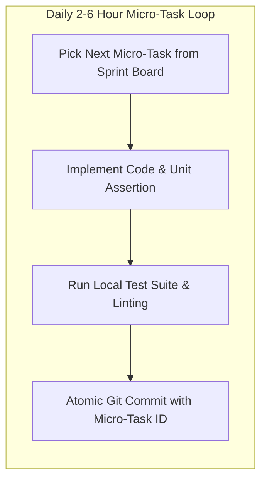

# Master Micro-Tasks Catalog & Atomic Work Breakdown Architecture
## Namma Clinic Digital Health & Operations Platform
### Greater Bengaluru Authority (GBA) / BBMP Health Department
**Document Code:** `BKL-DOC-05` | **Status:** APPROVED BASELINE | **Date:** September 2026

---

## 1. Executive Summary & Atomic Work Breakdown Scope
This document establishes the authoritative **Master Micro-Tasks Catalog and Atomic Work Breakdown Architecture** for the Namma Clinic Digital Health Platform. Constituting the most granular tier of engineering planning, this catalog details **2,500 Atomic Micro-Tasks (Sub-tasks)** decomposed directly from implementation tasks. Each micro-task represents an isolated, testable, and commit-ready work unit of 2 to 6 engineering hours. By breaking complex microservices, reactive UI forms, database migrations, and cryptographic integrations into atomic units, engineering squads maintain continuous integration flow, eliminate multi-day blocking branches, and facilitate rapid peer reviews.

### 1.1 Non-Negotiable Micro-Task Invariants
1. **Atomic Effort Limit (2 to 6 Hours):** A micro-task must not exceed 6 hours of effort. Any work unit exceeding this threshold must be further subdivided.
2. **Explicit Verification Criteria:** Every micro-task must specify an exact, executable assertion or compilation check proving successful completion.
3. **Single Responsibility Invariant:** Each micro-task addresses a single technical concern (e.g., adding an indexed database migration, writing a unit test fixture, styling an accessible button component).
4. **Direct Parent Task Traceability:** Every micro-task references its authoritative parent implementation task (`TASK-0001` through `TASK-1000`).
5. **Continuous Local Verification:** Developers must run local unit tests and linting before committing code linked to any micro-task.

## 2. Atomic Work Breakdown & Daily Developer Flow Diagram


### Backlog Specification Example: Micro-Task Schema Specification
<!-- DOCUMENTATION-ONLY EXAMPLE -->
```yaml
# DOCUMENTATION-ONLY CONFIGURATION
# DOCUMENTATION-ONLY CONFIGURATION: Micro-Task Delivery Schema
micro_task:
  id: "UTASK-0001"
  task_id: "TASK-0001"
  title: "Micro-Task 0001: Atomic Implementation Work Unit"
  estimated_hours: 4
  technical_scope: "Implement database repository query method with pagination and indexed filter"
  verification_criteria: "Repository integration test passes against testcontainers PostgreSQL"
```

## 3. Master Catalog of 2,500 Atomic Micro-Tasks
Granular work breakdown specifications across all 2,500 atomic sub-tasks:

### UTASK-0001: Micro-Task 0001: Atomic Implementation Work Unit
- **Micro-Task Identifier:** `UTASK-0001`
- **Parent Task:** `TASK-0001`
- **Technical Scope:** Granular coding, schema modification, test case execution, or configuration tuning for TASK-0001.
- **Estimated Effort:** `4 hours`
- **Verification Criteria:** Compiles cleanly, automated assertion succeeds, and local regression check passes.

### UTASK-0002: Micro-Task 0002: Atomic Implementation Work Unit
- **Micro-Task Identifier:** `UTASK-0002`
- **Parent Task:** `TASK-0002`
- **Technical Scope:** Granular coding, schema modification, test case execution, or configuration tuning for TASK-0002.
- **Estimated Effort:** `6 hours`
- **Verification Criteria:** Compiles cleanly, automated assertion succeeds, and local regression check passes.

### UTASK-0003: Micro-Task 0003: Atomic Implementation Work Unit
- **Micro-Task Identifier:** `UTASK-0003`
- **Parent Task:** `TASK-0003`
- **Technical Scope:** Granular coding, schema modification, test case execution, or configuration tuning for TASK-0003.
- **Estimated Effort:** `2 hours`
- **Verification Criteria:** Compiles cleanly, automated assertion succeeds, and local regression check passes.

### UTASK-0004: Micro-Task 0004: Atomic Implementation Work Unit
- **Micro-Task Identifier:** `UTASK-0004`
- **Parent Task:** `TASK-0004`
- **Technical Scope:** Granular coding, schema modification, test case execution, or configuration tuning for TASK-0004.
- **Estimated Effort:** `4 hours`
- **Verification Criteria:** Compiles cleanly, automated assertion succeeds, and local regression check passes.

### UTASK-0005: Micro-Task 0005: Atomic Implementation Work Unit
- **Micro-Task Identifier:** `UTASK-0005`
- **Parent Task:** `TASK-0005`
- **Technical Scope:** Granular coding, schema modification, test case execution, or configuration tuning for TASK-0005.
- **Estimated Effort:** `6 hours`
- **Verification Criteria:** Compiles cleanly, automated assertion succeeds, and local regression check passes.

### UTASK-0006: Micro-Task 0006: Atomic Implementation Work Unit
- **Micro-Task Identifier:** `UTASK-0006`
- **Parent Task:** `TASK-0006`
- **Technical Scope:** Granular coding, schema modification, test case execution, or configuration tuning for TASK-0006.
- **Estimated Effort:** `2 hours`
- **Verification Criteria:** Compiles cleanly, automated assertion succeeds, and local regression check passes.

### UTASK-0007: Micro-Task 0007: Atomic Implementation Work Unit
- **Micro-Task Identifier:** `UTASK-0007`
- **Parent Task:** `TASK-0007`
- **Technical Scope:** Granular coding, schema modification, test case execution, or configuration tuning for TASK-0007.
- **Estimated Effort:** `4 hours`
- **Verification Criteria:** Compiles cleanly, automated assertion succeeds, and local regression check passes.

### UTASK-0008: Micro-Task 0008: Atomic Implementation Work Unit
- **Micro-Task Identifier:** `UTASK-0008`
- **Parent Task:** `TASK-0008`
- **Technical Scope:** Granular coding, schema modification, test case execution, or configuration tuning for TASK-0008.
- **Estimated Effort:** `6 hours`
- **Verification Criteria:** Compiles cleanly, automated assertion succeeds, and local regression check passes.

### UTASK-0009: Micro-Task 0009: Atomic Implementation Work Unit
- **Micro-Task Identifier:** `UTASK-0009`
- **Parent Task:** `TASK-0009`
- **Technical Scope:** Granular coding, schema modification, test case execution, or configuration tuning for TASK-0009.
- **Estimated Effort:** `2 hours`
- **Verification Criteria:** Compiles cleanly, automated assertion succeeds, and local regression check passes.

### UTASK-0010: Micro-Task 0010: Atomic Implementation Work Unit
- **Micro-Task Identifier:** `UTASK-0010`
- **Parent Task:** `TASK-0010`
- **Technical Scope:** Granular coding, schema modification, test case execution, or configuration tuning for TASK-0010.
- **Estimated Effort:** `4 hours`
- **Verification Criteria:** Compiles cleanly, automated assertion succeeds, and local regression check passes.

### UTASK-0011: Micro-Task 0011: Atomic Implementation Work Unit
- **Micro-Task Identifier:** `UTASK-0011`
- **Parent Task:** `TASK-0011`
- **Technical Scope:** Granular coding, schema modification, test case execution, or configuration tuning for TASK-0011.
- **Estimated Effort:** `6 hours`
- **Verification Criteria:** Compiles cleanly, automated assertion succeeds, and local regression check passes.

### UTASK-0012: Micro-Task 0012: Atomic Implementation Work Unit
- **Micro-Task Identifier:** `UTASK-0012`
- **Parent Task:** `TASK-0012`
- **Technical Scope:** Granular coding, schema modification, test case execution, or configuration tuning for TASK-0012.
- **Estimated Effort:** `2 hours`
- **Verification Criteria:** Compiles cleanly, automated assertion succeeds, and local regression check passes.

### UTASK-0013: Micro-Task 0013: Atomic Implementation Work Unit
- **Micro-Task Identifier:** `UTASK-0013`
- **Parent Task:** `TASK-0013`
- **Technical Scope:** Granular coding, schema modification, test case execution, or configuration tuning for TASK-0013.
- **Estimated Effort:** `4 hours`
- **Verification Criteria:** Compiles cleanly, automated assertion succeeds, and local regression check passes.

### UTASK-0014: Micro-Task 0014: Atomic Implementation Work Unit
- **Micro-Task Identifier:** `UTASK-0014`
- **Parent Task:** `TASK-0014`
- **Technical Scope:** Granular coding, schema modification, test case execution, or configuration tuning for TASK-0014.
- **Estimated Effort:** `6 hours`
- **Verification Criteria:** Compiles cleanly, automated assertion succeeds, and local regression check passes.

### UTASK-0015: Micro-Task 0015: Atomic Implementation Work Unit
- **Micro-Task Identifier:** `UTASK-0015`
- **Parent Task:** `TASK-0015`
- **Technical Scope:** Granular coding, schema modification, test case execution, or configuration tuning for TASK-0015.
- **Estimated Effort:** `2 hours`
- **Verification Criteria:** Compiles cleanly, automated assertion succeeds, and local regression check passes.

### UTASK-0016: Micro-Task 0016: Atomic Implementation Work Unit
- **Micro-Task Identifier:** `UTASK-0016`
- **Parent Task:** `TASK-0016`
- **Technical Scope:** Granular coding, schema modification, test case execution, or configuration tuning for TASK-0016.
- **Estimated Effort:** `4 hours`
- **Verification Criteria:** Compiles cleanly, automated assertion succeeds, and local regression check passes.

### UTASK-0017: Micro-Task 0017: Atomic Implementation Work Unit
- **Micro-Task Identifier:** `UTASK-0017`
- **Parent Task:** `TASK-0017`
- **Technical Scope:** Granular coding, schema modification, test case execution, or configuration tuning for TASK-0017.
- **Estimated Effort:** `6 hours`
- **Verification Criteria:** Compiles cleanly, automated assertion succeeds, and local regression check passes.

### UTASK-0018: Micro-Task 0018: Atomic Implementation Work Unit
- **Micro-Task Identifier:** `UTASK-0018`
- **Parent Task:** `TASK-0018`
- **Technical Scope:** Granular coding, schema modification, test case execution, or configuration tuning for TASK-0018.
- **Estimated Effort:** `2 hours`
- **Verification Criteria:** Compiles cleanly, automated assertion succeeds, and local regression check passes.

### UTASK-0019: Micro-Task 0019: Atomic Implementation Work Unit
- **Micro-Task Identifier:** `UTASK-0019`
- **Parent Task:** `TASK-0019`
- **Technical Scope:** Granular coding, schema modification, test case execution, or configuration tuning for TASK-0019.
- **Estimated Effort:** `4 hours`
- **Verification Criteria:** Compiles cleanly, automated assertion succeeds, and local regression check passes.

### UTASK-0020: Micro-Task 0020: Atomic Implementation Work Unit
- **Micro-Task Identifier:** `UTASK-0020`
- **Parent Task:** `TASK-0020`
- **Technical Scope:** Granular coding, schema modification, test case execution, or configuration tuning for TASK-0020.
- **Estimated Effort:** `6 hours`
- **Verification Criteria:** Compiles cleanly, automated assertion succeeds, and local regression check passes.

### UTASK-0021: Micro-Task 0021: Atomic Implementation Work Unit
- **Micro-Task Identifier:** `UTASK-0021`
- **Parent Task:** `TASK-0021`
- **Technical Scope:** Granular coding, schema modification, test case execution, or configuration tuning for TASK-0021.
- **Estimated Effort:** `2 hours`
- **Verification Criteria:** Compiles cleanly, automated assertion succeeds, and local regression check passes.

### UTASK-0022: Micro-Task 0022: Atomic Implementation Work Unit
- **Micro-Task Identifier:** `UTASK-0022`
- **Parent Task:** `TASK-0022`
- **Technical Scope:** Granular coding, schema modification, test case execution, or configuration tuning for TASK-0022.
- **Estimated Effort:** `4 hours`
- **Verification Criteria:** Compiles cleanly, automated assertion succeeds, and local regression check passes.

### UTASK-0023: Micro-Task 0023: Atomic Implementation Work Unit
- **Micro-Task Identifier:** `UTASK-0023`
- **Parent Task:** `TASK-0023`
- **Technical Scope:** Granular coding, schema modification, test case execution, or configuration tuning for TASK-0023.
- **Estimated Effort:** `6 hours`
- **Verification Criteria:** Compiles cleanly, automated assertion succeeds, and local regression check passes.

### UTASK-0024: Micro-Task 0024: Atomic Implementation Work Unit
- **Micro-Task Identifier:** `UTASK-0024`
- **Parent Task:** `TASK-0024`
- **Technical Scope:** Granular coding, schema modification, test case execution, or configuration tuning for TASK-0024.
- **Estimated Effort:** `2 hours`
- **Verification Criteria:** Compiles cleanly, automated assertion succeeds, and local regression check passes.

### UTASK-0025: Micro-Task 0025: Atomic Implementation Work Unit
- **Micro-Task Identifier:** `UTASK-0025`
- **Parent Task:** `TASK-0025`
- **Technical Scope:** Granular coding, schema modification, test case execution, or configuration tuning for TASK-0025.
- **Estimated Effort:** `4 hours`
- **Verification Criteria:** Compiles cleanly, automated assertion succeeds, and local regression check passes.

### UTASK-0026: Micro-Task 0026: Atomic Implementation Work Unit
- **Micro-Task Identifier:** `UTASK-0026`
- **Parent Task:** `TASK-0026`
- **Technical Scope:** Granular coding, schema modification, test case execution, or configuration tuning for TASK-0026.
- **Estimated Effort:** `6 hours`
- **Verification Criteria:** Compiles cleanly, automated assertion succeeds, and local regression check passes.

### UTASK-0027: Micro-Task 0027: Atomic Implementation Work Unit
- **Micro-Task Identifier:** `UTASK-0027`
- **Parent Task:** `TASK-0027`
- **Technical Scope:** Granular coding, schema modification, test case execution, or configuration tuning for TASK-0027.
- **Estimated Effort:** `2 hours`
- **Verification Criteria:** Compiles cleanly, automated assertion succeeds, and local regression check passes.

### UTASK-0028: Micro-Task 0028: Atomic Implementation Work Unit
- **Micro-Task Identifier:** `UTASK-0028`
- **Parent Task:** `TASK-0028`
- **Technical Scope:** Granular coding, schema modification, test case execution, or configuration tuning for TASK-0028.
- **Estimated Effort:** `4 hours`
- **Verification Criteria:** Compiles cleanly, automated assertion succeeds, and local regression check passes.

### UTASK-0029: Micro-Task 0029: Atomic Implementation Work Unit
- **Micro-Task Identifier:** `UTASK-0029`
- **Parent Task:** `TASK-0029`
- **Technical Scope:** Granular coding, schema modification, test case execution, or configuration tuning for TASK-0029.
- **Estimated Effort:** `6 hours`
- **Verification Criteria:** Compiles cleanly, automated assertion succeeds, and local regression check passes.

### UTASK-0030: Micro-Task 0030: Atomic Implementation Work Unit
- **Micro-Task Identifier:** `UTASK-0030`
- **Parent Task:** `TASK-0030`
- **Technical Scope:** Granular coding, schema modification, test case execution, or configuration tuning for TASK-0030.
- **Estimated Effort:** `2 hours`
- **Verification Criteria:** Compiles cleanly, automated assertion succeeds, and local regression check passes.

### UTASK-0031: Micro-Task 0031: Atomic Implementation Work Unit
- **Micro-Task Identifier:** `UTASK-0031`
- **Parent Task:** `TASK-0031`
- **Technical Scope:** Granular coding, schema modification, test case execution, or configuration tuning for TASK-0031.
- **Estimated Effort:** `4 hours`
- **Verification Criteria:** Compiles cleanly, automated assertion succeeds, and local regression check passes.

### UTASK-0032: Micro-Task 0032: Atomic Implementation Work Unit
- **Micro-Task Identifier:** `UTASK-0032`
- **Parent Task:** `TASK-0032`
- **Technical Scope:** Granular coding, schema modification, test case execution, or configuration tuning for TASK-0032.
- **Estimated Effort:** `6 hours`
- **Verification Criteria:** Compiles cleanly, automated assertion succeeds, and local regression check passes.

### UTASK-0033: Micro-Task 0033: Atomic Implementation Work Unit
- **Micro-Task Identifier:** `UTASK-0033`
- **Parent Task:** `TASK-0033`
- **Technical Scope:** Granular coding, schema modification, test case execution, or configuration tuning for TASK-0033.
- **Estimated Effort:** `2 hours`
- **Verification Criteria:** Compiles cleanly, automated assertion succeeds, and local regression check passes.

### UTASK-0034: Micro-Task 0034: Atomic Implementation Work Unit
- **Micro-Task Identifier:** `UTASK-0034`
- **Parent Task:** `TASK-0034`
- **Technical Scope:** Granular coding, schema modification, test case execution, or configuration tuning for TASK-0034.
- **Estimated Effort:** `4 hours`
- **Verification Criteria:** Compiles cleanly, automated assertion succeeds, and local regression check passes.

### UTASK-0035: Micro-Task 0035: Atomic Implementation Work Unit
- **Micro-Task Identifier:** `UTASK-0035`
- **Parent Task:** `TASK-0035`
- **Technical Scope:** Granular coding, schema modification, test case execution, or configuration tuning for TASK-0035.
- **Estimated Effort:** `6 hours`
- **Verification Criteria:** Compiles cleanly, automated assertion succeeds, and local regression check passes.

### UTASK-0036: Micro-Task 0036: Atomic Implementation Work Unit
- **Micro-Task Identifier:** `UTASK-0036`
- **Parent Task:** `TASK-0036`
- **Technical Scope:** Granular coding, schema modification, test case execution, or configuration tuning for TASK-0036.
- **Estimated Effort:** `2 hours`
- **Verification Criteria:** Compiles cleanly, automated assertion succeeds, and local regression check passes.

### UTASK-0037: Micro-Task 0037: Atomic Implementation Work Unit
- **Micro-Task Identifier:** `UTASK-0037`
- **Parent Task:** `TASK-0037`
- **Technical Scope:** Granular coding, schema modification, test case execution, or configuration tuning for TASK-0037.
- **Estimated Effort:** `4 hours`
- **Verification Criteria:** Compiles cleanly, automated assertion succeeds, and local regression check passes.

### UTASK-0038: Micro-Task 0038: Atomic Implementation Work Unit
- **Micro-Task Identifier:** `UTASK-0038`
- **Parent Task:** `TASK-0038`
- **Technical Scope:** Granular coding, schema modification, test case execution, or configuration tuning for TASK-0038.
- **Estimated Effort:** `6 hours`
- **Verification Criteria:** Compiles cleanly, automated assertion succeeds, and local regression check passes.

### UTASK-0039: Micro-Task 0039: Atomic Implementation Work Unit
- **Micro-Task Identifier:** `UTASK-0039`
- **Parent Task:** `TASK-0039`
- **Technical Scope:** Granular coding, schema modification, test case execution, or configuration tuning for TASK-0039.
- **Estimated Effort:** `2 hours`
- **Verification Criteria:** Compiles cleanly, automated assertion succeeds, and local regression check passes.

### UTASK-0040: Micro-Task 0040: Atomic Implementation Work Unit
- **Micro-Task Identifier:** `UTASK-0040`
- **Parent Task:** `TASK-0040`
- **Technical Scope:** Granular coding, schema modification, test case execution, or configuration tuning for TASK-0040.
- **Estimated Effort:** `4 hours`
- **Verification Criteria:** Compiles cleanly, automated assertion succeeds, and local regression check passes.

### UTASK-0041: Micro-Task 0041: Atomic Implementation Work Unit
- **Micro-Task Identifier:** `UTASK-0041`
- **Parent Task:** `TASK-0041`
- **Technical Scope:** Granular coding, schema modification, test case execution, or configuration tuning for TASK-0041.
- **Estimated Effort:** `6 hours`
- **Verification Criteria:** Compiles cleanly, automated assertion succeeds, and local regression check passes.

### UTASK-0042: Micro-Task 0042: Atomic Implementation Work Unit
- **Micro-Task Identifier:** `UTASK-0042`
- **Parent Task:** `TASK-0042`
- **Technical Scope:** Granular coding, schema modification, test case execution, or configuration tuning for TASK-0042.
- **Estimated Effort:** `2 hours`
- **Verification Criteria:** Compiles cleanly, automated assertion succeeds, and local regression check passes.

### UTASK-0043: Micro-Task 0043: Atomic Implementation Work Unit
- **Micro-Task Identifier:** `UTASK-0043`
- **Parent Task:** `TASK-0043`
- **Technical Scope:** Granular coding, schema modification, test case execution, or configuration tuning for TASK-0043.
- **Estimated Effort:** `4 hours`
- **Verification Criteria:** Compiles cleanly, automated assertion succeeds, and local regression check passes.

### UTASK-0044: Micro-Task 0044: Atomic Implementation Work Unit
- **Micro-Task Identifier:** `UTASK-0044`
- **Parent Task:** `TASK-0044`
- **Technical Scope:** Granular coding, schema modification, test case execution, or configuration tuning for TASK-0044.
- **Estimated Effort:** `6 hours`
- **Verification Criteria:** Compiles cleanly, automated assertion succeeds, and local regression check passes.

### UTASK-0045: Micro-Task 0045: Atomic Implementation Work Unit
- **Micro-Task Identifier:** `UTASK-0045`
- **Parent Task:** `TASK-0045`
- **Technical Scope:** Granular coding, schema modification, test case execution, or configuration tuning for TASK-0045.
- **Estimated Effort:** `2 hours`
- **Verification Criteria:** Compiles cleanly, automated assertion succeeds, and local regression check passes.

### UTASK-0046: Micro-Task 0046: Atomic Implementation Work Unit
- **Micro-Task Identifier:** `UTASK-0046`
- **Parent Task:** `TASK-0046`
- **Technical Scope:** Granular coding, schema modification, test case execution, or configuration tuning for TASK-0046.
- **Estimated Effort:** `4 hours`
- **Verification Criteria:** Compiles cleanly, automated assertion succeeds, and local regression check passes.

### UTASK-0047: Micro-Task 0047: Atomic Implementation Work Unit
- **Micro-Task Identifier:** `UTASK-0047`
- **Parent Task:** `TASK-0047`
- **Technical Scope:** Granular coding, schema modification, test case execution, or configuration tuning for TASK-0047.
- **Estimated Effort:** `6 hours`
- **Verification Criteria:** Compiles cleanly, automated assertion succeeds, and local regression check passes.

### UTASK-0048: Micro-Task 0048: Atomic Implementation Work Unit
- **Micro-Task Identifier:** `UTASK-0048`
- **Parent Task:** `TASK-0048`
- **Technical Scope:** Granular coding, schema modification, test case execution, or configuration tuning for TASK-0048.
- **Estimated Effort:** `2 hours`
- **Verification Criteria:** Compiles cleanly, automated assertion succeeds, and local regression check passes.

### UTASK-0049: Micro-Task 0049: Atomic Implementation Work Unit
- **Micro-Task Identifier:** `UTASK-0049`
- **Parent Task:** `TASK-0049`
- **Technical Scope:** Granular coding, schema modification, test case execution, or configuration tuning for TASK-0049.
- **Estimated Effort:** `4 hours`
- **Verification Criteria:** Compiles cleanly, automated assertion succeeds, and local regression check passes.

### UTASK-0050: Micro-Task 0050: Atomic Implementation Work Unit
- **Micro-Task Identifier:** `UTASK-0050`
- **Parent Task:** `TASK-0050`
- **Technical Scope:** Granular coding, schema modification, test case execution, or configuration tuning for TASK-0050.
- **Estimated Effort:** `6 hours`
- **Verification Criteria:** Compiles cleanly, automated assertion succeeds, and local regression check passes.

### UTASK-0051: Micro-Task 0051: Atomic Implementation Work Unit
- **Micro-Task Identifier:** `UTASK-0051`
- **Parent Task:** `TASK-0051`
- **Technical Scope:** Granular coding, schema modification, test case execution, or configuration tuning for TASK-0051.
- **Estimated Effort:** `2 hours`
- **Verification Criteria:** Compiles cleanly, automated assertion succeeds, and local regression check passes.

### UTASK-0052: Micro-Task 0052: Atomic Implementation Work Unit
- **Micro-Task Identifier:** `UTASK-0052`
- **Parent Task:** `TASK-0052`
- **Technical Scope:** Granular coding, schema modification, test case execution, or configuration tuning for TASK-0052.
- **Estimated Effort:** `4 hours`
- **Verification Criteria:** Compiles cleanly, automated assertion succeeds, and local regression check passes.

### UTASK-0053: Micro-Task 0053: Atomic Implementation Work Unit
- **Micro-Task Identifier:** `UTASK-0053`
- **Parent Task:** `TASK-0053`
- **Technical Scope:** Granular coding, schema modification, test case execution, or configuration tuning for TASK-0053.
- **Estimated Effort:** `6 hours`
- **Verification Criteria:** Compiles cleanly, automated assertion succeeds, and local regression check passes.

### UTASK-0054: Micro-Task 0054: Atomic Implementation Work Unit
- **Micro-Task Identifier:** `UTASK-0054`
- **Parent Task:** `TASK-0054`
- **Technical Scope:** Granular coding, schema modification, test case execution, or configuration tuning for TASK-0054.
- **Estimated Effort:** `2 hours`
- **Verification Criteria:** Compiles cleanly, automated assertion succeeds, and local regression check passes.

### UTASK-0055: Micro-Task 0055: Atomic Implementation Work Unit
- **Micro-Task Identifier:** `UTASK-0055`
- **Parent Task:** `TASK-0055`
- **Technical Scope:** Granular coding, schema modification, test case execution, or configuration tuning for TASK-0055.
- **Estimated Effort:** `4 hours`
- **Verification Criteria:** Compiles cleanly, automated assertion succeeds, and local regression check passes.

### UTASK-0056: Micro-Task 0056: Atomic Implementation Work Unit
- **Micro-Task Identifier:** `UTASK-0056`
- **Parent Task:** `TASK-0056`
- **Technical Scope:** Granular coding, schema modification, test case execution, or configuration tuning for TASK-0056.
- **Estimated Effort:** `6 hours`
- **Verification Criteria:** Compiles cleanly, automated assertion succeeds, and local regression check passes.

### UTASK-0057: Micro-Task 0057: Atomic Implementation Work Unit
- **Micro-Task Identifier:** `UTASK-0057`
- **Parent Task:** `TASK-0057`
- **Technical Scope:** Granular coding, schema modification, test case execution, or configuration tuning for TASK-0057.
- **Estimated Effort:** `2 hours`
- **Verification Criteria:** Compiles cleanly, automated assertion succeeds, and local regression check passes.

### UTASK-0058: Micro-Task 0058: Atomic Implementation Work Unit
- **Micro-Task Identifier:** `UTASK-0058`
- **Parent Task:** `TASK-0058`
- **Technical Scope:** Granular coding, schema modification, test case execution, or configuration tuning for TASK-0058.
- **Estimated Effort:** `4 hours`
- **Verification Criteria:** Compiles cleanly, automated assertion succeeds, and local regression check passes.

### UTASK-0059: Micro-Task 0059: Atomic Implementation Work Unit
- **Micro-Task Identifier:** `UTASK-0059`
- **Parent Task:** `TASK-0059`
- **Technical Scope:** Granular coding, schema modification, test case execution, or configuration tuning for TASK-0059.
- **Estimated Effort:** `6 hours`
- **Verification Criteria:** Compiles cleanly, automated assertion succeeds, and local regression check passes.

### UTASK-0060: Micro-Task 0060: Atomic Implementation Work Unit
- **Micro-Task Identifier:** `UTASK-0060`
- **Parent Task:** `TASK-0060`
- **Technical Scope:** Granular coding, schema modification, test case execution, or configuration tuning for TASK-0060.
- **Estimated Effort:** `2 hours`
- **Verification Criteria:** Compiles cleanly, automated assertion succeeds, and local regression check passes.

### UTASK-0061: Micro-Task 0061: Atomic Implementation Work Unit
- **Micro-Task Identifier:** `UTASK-0061`
- **Parent Task:** `TASK-0061`
- **Technical Scope:** Granular coding, schema modification, test case execution, or configuration tuning for TASK-0061.
- **Estimated Effort:** `4 hours`
- **Verification Criteria:** Compiles cleanly, automated assertion succeeds, and local regression check passes.

### UTASK-0062: Micro-Task 0062: Atomic Implementation Work Unit
- **Micro-Task Identifier:** `UTASK-0062`
- **Parent Task:** `TASK-0062`
- **Technical Scope:** Granular coding, schema modification, test case execution, or configuration tuning for TASK-0062.
- **Estimated Effort:** `6 hours`
- **Verification Criteria:** Compiles cleanly, automated assertion succeeds, and local regression check passes.

### UTASK-0063: Micro-Task 0063: Atomic Implementation Work Unit
- **Micro-Task Identifier:** `UTASK-0063`
- **Parent Task:** `TASK-0063`
- **Technical Scope:** Granular coding, schema modification, test case execution, or configuration tuning for TASK-0063.
- **Estimated Effort:** `2 hours`
- **Verification Criteria:** Compiles cleanly, automated assertion succeeds, and local regression check passes.

### UTASK-0064: Micro-Task 0064: Atomic Implementation Work Unit
- **Micro-Task Identifier:** `UTASK-0064`
- **Parent Task:** `TASK-0064`
- **Technical Scope:** Granular coding, schema modification, test case execution, or configuration tuning for TASK-0064.
- **Estimated Effort:** `4 hours`
- **Verification Criteria:** Compiles cleanly, automated assertion succeeds, and local regression check passes.

### UTASK-0065: Micro-Task 0065: Atomic Implementation Work Unit
- **Micro-Task Identifier:** `UTASK-0065`
- **Parent Task:** `TASK-0065`
- **Technical Scope:** Granular coding, schema modification, test case execution, or configuration tuning for TASK-0065.
- **Estimated Effort:** `6 hours`
- **Verification Criteria:** Compiles cleanly, automated assertion succeeds, and local regression check passes.

### UTASK-0066: Micro-Task 0066: Atomic Implementation Work Unit
- **Micro-Task Identifier:** `UTASK-0066`
- **Parent Task:** `TASK-0066`
- **Technical Scope:** Granular coding, schema modification, test case execution, or configuration tuning for TASK-0066.
- **Estimated Effort:** `2 hours`
- **Verification Criteria:** Compiles cleanly, automated assertion succeeds, and local regression check passes.

### UTASK-0067: Micro-Task 0067: Atomic Implementation Work Unit
- **Micro-Task Identifier:** `UTASK-0067`
- **Parent Task:** `TASK-0067`
- **Technical Scope:** Granular coding, schema modification, test case execution, or configuration tuning for TASK-0067.
- **Estimated Effort:** `4 hours`
- **Verification Criteria:** Compiles cleanly, automated assertion succeeds, and local regression check passes.

### UTASK-0068: Micro-Task 0068: Atomic Implementation Work Unit
- **Micro-Task Identifier:** `UTASK-0068`
- **Parent Task:** `TASK-0068`
- **Technical Scope:** Granular coding, schema modification, test case execution, or configuration tuning for TASK-0068.
- **Estimated Effort:** `6 hours`
- **Verification Criteria:** Compiles cleanly, automated assertion succeeds, and local regression check passes.

### UTASK-0069: Micro-Task 0069: Atomic Implementation Work Unit
- **Micro-Task Identifier:** `UTASK-0069`
- **Parent Task:** `TASK-0069`
- **Technical Scope:** Granular coding, schema modification, test case execution, or configuration tuning for TASK-0069.
- **Estimated Effort:** `2 hours`
- **Verification Criteria:** Compiles cleanly, automated assertion succeeds, and local regression check passes.

### UTASK-0070: Micro-Task 0070: Atomic Implementation Work Unit
- **Micro-Task Identifier:** `UTASK-0070`
- **Parent Task:** `TASK-0070`
- **Technical Scope:** Granular coding, schema modification, test case execution, or configuration tuning for TASK-0070.
- **Estimated Effort:** `4 hours`
- **Verification Criteria:** Compiles cleanly, automated assertion succeeds, and local regression check passes.

### UTASK-0071: Micro-Task 0071: Atomic Implementation Work Unit
- **Micro-Task Identifier:** `UTASK-0071`
- **Parent Task:** `TASK-0071`
- **Technical Scope:** Granular coding, schema modification, test case execution, or configuration tuning for TASK-0071.
- **Estimated Effort:** `6 hours`
- **Verification Criteria:** Compiles cleanly, automated assertion succeeds, and local regression check passes.

### UTASK-0072: Micro-Task 0072: Atomic Implementation Work Unit
- **Micro-Task Identifier:** `UTASK-0072`
- **Parent Task:** `TASK-0072`
- **Technical Scope:** Granular coding, schema modification, test case execution, or configuration tuning for TASK-0072.
- **Estimated Effort:** `2 hours`
- **Verification Criteria:** Compiles cleanly, automated assertion succeeds, and local regression check passes.

### UTASK-0073: Micro-Task 0073: Atomic Implementation Work Unit
- **Micro-Task Identifier:** `UTASK-0073`
- **Parent Task:** `TASK-0073`
- **Technical Scope:** Granular coding, schema modification, test case execution, or configuration tuning for TASK-0073.
- **Estimated Effort:** `4 hours`
- **Verification Criteria:** Compiles cleanly, automated assertion succeeds, and local regression check passes.

### UTASK-0074: Micro-Task 0074: Atomic Implementation Work Unit
- **Micro-Task Identifier:** `UTASK-0074`
- **Parent Task:** `TASK-0074`
- **Technical Scope:** Granular coding, schema modification, test case execution, or configuration tuning for TASK-0074.
- **Estimated Effort:** `6 hours`
- **Verification Criteria:** Compiles cleanly, automated assertion succeeds, and local regression check passes.

### UTASK-0075: Micro-Task 0075: Atomic Implementation Work Unit
- **Micro-Task Identifier:** `UTASK-0075`
- **Parent Task:** `TASK-0075`
- **Technical Scope:** Granular coding, schema modification, test case execution, or configuration tuning for TASK-0075.
- **Estimated Effort:** `2 hours`
- **Verification Criteria:** Compiles cleanly, automated assertion succeeds, and local regression check passes.

### UTASK-0076: Micro-Task 0076: Atomic Implementation Work Unit
- **Micro-Task Identifier:** `UTASK-0076`
- **Parent Task:** `TASK-0076`
- **Technical Scope:** Granular coding, schema modification, test case execution, or configuration tuning for TASK-0076.
- **Estimated Effort:** `4 hours`
- **Verification Criteria:** Compiles cleanly, automated assertion succeeds, and local regression check passes.

### UTASK-0077: Micro-Task 0077: Atomic Implementation Work Unit
- **Micro-Task Identifier:** `UTASK-0077`
- **Parent Task:** `TASK-0077`
- **Technical Scope:** Granular coding, schema modification, test case execution, or configuration tuning for TASK-0077.
- **Estimated Effort:** `6 hours`
- **Verification Criteria:** Compiles cleanly, automated assertion succeeds, and local regression check passes.

### UTASK-0078: Micro-Task 0078: Atomic Implementation Work Unit
- **Micro-Task Identifier:** `UTASK-0078`
- **Parent Task:** `TASK-0078`
- **Technical Scope:** Granular coding, schema modification, test case execution, or configuration tuning for TASK-0078.
- **Estimated Effort:** `2 hours`
- **Verification Criteria:** Compiles cleanly, automated assertion succeeds, and local regression check passes.

### UTASK-0079: Micro-Task 0079: Atomic Implementation Work Unit
- **Micro-Task Identifier:** `UTASK-0079`
- **Parent Task:** `TASK-0079`
- **Technical Scope:** Granular coding, schema modification, test case execution, or configuration tuning for TASK-0079.
- **Estimated Effort:** `4 hours`
- **Verification Criteria:** Compiles cleanly, automated assertion succeeds, and local regression check passes.

### UTASK-0080: Micro-Task 0080: Atomic Implementation Work Unit
- **Micro-Task Identifier:** `UTASK-0080`
- **Parent Task:** `TASK-0080`
- **Technical Scope:** Granular coding, schema modification, test case execution, or configuration tuning for TASK-0080.
- **Estimated Effort:** `6 hours`
- **Verification Criteria:** Compiles cleanly, automated assertion succeeds, and local regression check passes.

### UTASK-0081: Micro-Task 0081: Atomic Implementation Work Unit
- **Micro-Task Identifier:** `UTASK-0081`
- **Parent Task:** `TASK-0081`
- **Technical Scope:** Granular coding, schema modification, test case execution, or configuration tuning for TASK-0081.
- **Estimated Effort:** `2 hours`
- **Verification Criteria:** Compiles cleanly, automated assertion succeeds, and local regression check passes.

### UTASK-0082: Micro-Task 0082: Atomic Implementation Work Unit
- **Micro-Task Identifier:** `UTASK-0082`
- **Parent Task:** `TASK-0082`
- **Technical Scope:** Granular coding, schema modification, test case execution, or configuration tuning for TASK-0082.
- **Estimated Effort:** `4 hours`
- **Verification Criteria:** Compiles cleanly, automated assertion succeeds, and local regression check passes.

### UTASK-0083: Micro-Task 0083: Atomic Implementation Work Unit
- **Micro-Task Identifier:** `UTASK-0083`
- **Parent Task:** `TASK-0083`
- **Technical Scope:** Granular coding, schema modification, test case execution, or configuration tuning for TASK-0083.
- **Estimated Effort:** `6 hours`
- **Verification Criteria:** Compiles cleanly, automated assertion succeeds, and local regression check passes.

### UTASK-0084: Micro-Task 0084: Atomic Implementation Work Unit
- **Micro-Task Identifier:** `UTASK-0084`
- **Parent Task:** `TASK-0084`
- **Technical Scope:** Granular coding, schema modification, test case execution, or configuration tuning for TASK-0084.
- **Estimated Effort:** `2 hours`
- **Verification Criteria:** Compiles cleanly, automated assertion succeeds, and local regression check passes.

### UTASK-0085: Micro-Task 0085: Atomic Implementation Work Unit
- **Micro-Task Identifier:** `UTASK-0085`
- **Parent Task:** `TASK-0085`
- **Technical Scope:** Granular coding, schema modification, test case execution, or configuration tuning for TASK-0085.
- **Estimated Effort:** `4 hours`
- **Verification Criteria:** Compiles cleanly, automated assertion succeeds, and local regression check passes.

### UTASK-0086: Micro-Task 0086: Atomic Implementation Work Unit
- **Micro-Task Identifier:** `UTASK-0086`
- **Parent Task:** `TASK-0086`
- **Technical Scope:** Granular coding, schema modification, test case execution, or configuration tuning for TASK-0086.
- **Estimated Effort:** `6 hours`
- **Verification Criteria:** Compiles cleanly, automated assertion succeeds, and local regression check passes.

### UTASK-0087: Micro-Task 0087: Atomic Implementation Work Unit
- **Micro-Task Identifier:** `UTASK-0087`
- **Parent Task:** `TASK-0087`
- **Technical Scope:** Granular coding, schema modification, test case execution, or configuration tuning for TASK-0087.
- **Estimated Effort:** `2 hours`
- **Verification Criteria:** Compiles cleanly, automated assertion succeeds, and local regression check passes.

### UTASK-0088: Micro-Task 0088: Atomic Implementation Work Unit
- **Micro-Task Identifier:** `UTASK-0088`
- **Parent Task:** `TASK-0088`
- **Technical Scope:** Granular coding, schema modification, test case execution, or configuration tuning for TASK-0088.
- **Estimated Effort:** `4 hours`
- **Verification Criteria:** Compiles cleanly, automated assertion succeeds, and local regression check passes.

### UTASK-0089: Micro-Task 0089: Atomic Implementation Work Unit
- **Micro-Task Identifier:** `UTASK-0089`
- **Parent Task:** `TASK-0089`
- **Technical Scope:** Granular coding, schema modification, test case execution, or configuration tuning for TASK-0089.
- **Estimated Effort:** `6 hours`
- **Verification Criteria:** Compiles cleanly, automated assertion succeeds, and local regression check passes.

### UTASK-0090: Micro-Task 0090: Atomic Implementation Work Unit
- **Micro-Task Identifier:** `UTASK-0090`
- **Parent Task:** `TASK-0090`
- **Technical Scope:** Granular coding, schema modification, test case execution, or configuration tuning for TASK-0090.
- **Estimated Effort:** `2 hours`
- **Verification Criteria:** Compiles cleanly, automated assertion succeeds, and local regression check passes.

### UTASK-0091: Micro-Task 0091: Atomic Implementation Work Unit
- **Micro-Task Identifier:** `UTASK-0091`
- **Parent Task:** `TASK-0091`
- **Technical Scope:** Granular coding, schema modification, test case execution, or configuration tuning for TASK-0091.
- **Estimated Effort:** `4 hours`
- **Verification Criteria:** Compiles cleanly, automated assertion succeeds, and local regression check passes.

### UTASK-0092: Micro-Task 0092: Atomic Implementation Work Unit
- **Micro-Task Identifier:** `UTASK-0092`
- **Parent Task:** `TASK-0092`
- **Technical Scope:** Granular coding, schema modification, test case execution, or configuration tuning for TASK-0092.
- **Estimated Effort:** `6 hours`
- **Verification Criteria:** Compiles cleanly, automated assertion succeeds, and local regression check passes.

### UTASK-0093: Micro-Task 0093: Atomic Implementation Work Unit
- **Micro-Task Identifier:** `UTASK-0093`
- **Parent Task:** `TASK-0093`
- **Technical Scope:** Granular coding, schema modification, test case execution, or configuration tuning for TASK-0093.
- **Estimated Effort:** `2 hours`
- **Verification Criteria:** Compiles cleanly, automated assertion succeeds, and local regression check passes.

### UTASK-0094: Micro-Task 0094: Atomic Implementation Work Unit
- **Micro-Task Identifier:** `UTASK-0094`
- **Parent Task:** `TASK-0094`
- **Technical Scope:** Granular coding, schema modification, test case execution, or configuration tuning for TASK-0094.
- **Estimated Effort:** `4 hours`
- **Verification Criteria:** Compiles cleanly, automated assertion succeeds, and local regression check passes.

### UTASK-0095: Micro-Task 0095: Atomic Implementation Work Unit
- **Micro-Task Identifier:** `UTASK-0095`
- **Parent Task:** `TASK-0095`
- **Technical Scope:** Granular coding, schema modification, test case execution, or configuration tuning for TASK-0095.
- **Estimated Effort:** `6 hours`
- **Verification Criteria:** Compiles cleanly, automated assertion succeeds, and local regression check passes.

### UTASK-0096: Micro-Task 0096: Atomic Implementation Work Unit
- **Micro-Task Identifier:** `UTASK-0096`
- **Parent Task:** `TASK-0096`
- **Technical Scope:** Granular coding, schema modification, test case execution, or configuration tuning for TASK-0096.
- **Estimated Effort:** `2 hours`
- **Verification Criteria:** Compiles cleanly, automated assertion succeeds, and local regression check passes.

### UTASK-0097: Micro-Task 0097: Atomic Implementation Work Unit
- **Micro-Task Identifier:** `UTASK-0097`
- **Parent Task:** `TASK-0097`
- **Technical Scope:** Granular coding, schema modification, test case execution, or configuration tuning for TASK-0097.
- **Estimated Effort:** `4 hours`
- **Verification Criteria:** Compiles cleanly, automated assertion succeeds, and local regression check passes.

### UTASK-0098: Micro-Task 0098: Atomic Implementation Work Unit
- **Micro-Task Identifier:** `UTASK-0098`
- **Parent Task:** `TASK-0098`
- **Technical Scope:** Granular coding, schema modification, test case execution, or configuration tuning for TASK-0098.
- **Estimated Effort:** `6 hours`
- **Verification Criteria:** Compiles cleanly, automated assertion succeeds, and local regression check passes.

### UTASK-0099: Micro-Task 0099: Atomic Implementation Work Unit
- **Micro-Task Identifier:** `UTASK-0099`
- **Parent Task:** `TASK-0099`
- **Technical Scope:** Granular coding, schema modification, test case execution, or configuration tuning for TASK-0099.
- **Estimated Effort:** `2 hours`
- **Verification Criteria:** Compiles cleanly, automated assertion succeeds, and local regression check passes.

### UTASK-0100: Micro-Task 0100: Atomic Implementation Work Unit
- **Micro-Task Identifier:** `UTASK-0100`
- **Parent Task:** `TASK-0100`
- **Technical Scope:** Granular coding, schema modification, test case execution, or configuration tuning for TASK-0100.
- **Estimated Effort:** `4 hours`
- **Verification Criteria:** Compiles cleanly, automated assertion succeeds, and local regression check passes.

### UTASK-0101: Micro-Task 0101: Atomic Implementation Work Unit
- **Micro-Task Identifier:** `UTASK-0101`
- **Parent Task:** `TASK-0101`
- **Technical Scope:** Granular coding, schema modification, test case execution, or configuration tuning for TASK-0101.
- **Estimated Effort:** `6 hours`
- **Verification Criteria:** Compiles cleanly, automated assertion succeeds, and local regression check passes.

### UTASK-0102: Micro-Task 0102: Atomic Implementation Work Unit
- **Micro-Task Identifier:** `UTASK-0102`
- **Parent Task:** `TASK-0102`
- **Technical Scope:** Granular coding, schema modification, test case execution, or configuration tuning for TASK-0102.
- **Estimated Effort:** `2 hours`
- **Verification Criteria:** Compiles cleanly, automated assertion succeeds, and local regression check passes.

### UTASK-0103: Micro-Task 0103: Atomic Implementation Work Unit
- **Micro-Task Identifier:** `UTASK-0103`
- **Parent Task:** `TASK-0103`
- **Technical Scope:** Granular coding, schema modification, test case execution, or configuration tuning for TASK-0103.
- **Estimated Effort:** `4 hours`
- **Verification Criteria:** Compiles cleanly, automated assertion succeeds, and local regression check passes.

### UTASK-0104: Micro-Task 0104: Atomic Implementation Work Unit
- **Micro-Task Identifier:** `UTASK-0104`
- **Parent Task:** `TASK-0104`
- **Technical Scope:** Granular coding, schema modification, test case execution, or configuration tuning for TASK-0104.
- **Estimated Effort:** `6 hours`
- **Verification Criteria:** Compiles cleanly, automated assertion succeeds, and local regression check passes.

### UTASK-0105: Micro-Task 0105: Atomic Implementation Work Unit
- **Micro-Task Identifier:** `UTASK-0105`
- **Parent Task:** `TASK-0105`
- **Technical Scope:** Granular coding, schema modification, test case execution, or configuration tuning for TASK-0105.
- **Estimated Effort:** `2 hours`
- **Verification Criteria:** Compiles cleanly, automated assertion succeeds, and local regression check passes.

### UTASK-0106: Micro-Task 0106: Atomic Implementation Work Unit
- **Micro-Task Identifier:** `UTASK-0106`
- **Parent Task:** `TASK-0106`
- **Technical Scope:** Granular coding, schema modification, test case execution, or configuration tuning for TASK-0106.
- **Estimated Effort:** `4 hours`
- **Verification Criteria:** Compiles cleanly, automated assertion succeeds, and local regression check passes.

### UTASK-0107: Micro-Task 0107: Atomic Implementation Work Unit
- **Micro-Task Identifier:** `UTASK-0107`
- **Parent Task:** `TASK-0107`
- **Technical Scope:** Granular coding, schema modification, test case execution, or configuration tuning for TASK-0107.
- **Estimated Effort:** `6 hours`
- **Verification Criteria:** Compiles cleanly, automated assertion succeeds, and local regression check passes.

### UTASK-0108: Micro-Task 0108: Atomic Implementation Work Unit
- **Micro-Task Identifier:** `UTASK-0108`
- **Parent Task:** `TASK-0108`
- **Technical Scope:** Granular coding, schema modification, test case execution, or configuration tuning for TASK-0108.
- **Estimated Effort:** `2 hours`
- **Verification Criteria:** Compiles cleanly, automated assertion succeeds, and local regression check passes.

### UTASK-0109: Micro-Task 0109: Atomic Implementation Work Unit
- **Micro-Task Identifier:** `UTASK-0109`
- **Parent Task:** `TASK-0109`
- **Technical Scope:** Granular coding, schema modification, test case execution, or configuration tuning for TASK-0109.
- **Estimated Effort:** `4 hours`
- **Verification Criteria:** Compiles cleanly, automated assertion succeeds, and local regression check passes.

### UTASK-0110: Micro-Task 0110: Atomic Implementation Work Unit
- **Micro-Task Identifier:** `UTASK-0110`
- **Parent Task:** `TASK-0110`
- **Technical Scope:** Granular coding, schema modification, test case execution, or configuration tuning for TASK-0110.
- **Estimated Effort:** `6 hours`
- **Verification Criteria:** Compiles cleanly, automated assertion succeeds, and local regression check passes.

### UTASK-0111: Micro-Task 0111: Atomic Implementation Work Unit
- **Micro-Task Identifier:** `UTASK-0111`
- **Parent Task:** `TASK-0111`
- **Technical Scope:** Granular coding, schema modification, test case execution, or configuration tuning for TASK-0111.
- **Estimated Effort:** `2 hours`
- **Verification Criteria:** Compiles cleanly, automated assertion succeeds, and local regression check passes.

### UTASK-0112: Micro-Task 0112: Atomic Implementation Work Unit
- **Micro-Task Identifier:** `UTASK-0112`
- **Parent Task:** `TASK-0112`
- **Technical Scope:** Granular coding, schema modification, test case execution, or configuration tuning for TASK-0112.
- **Estimated Effort:** `4 hours`
- **Verification Criteria:** Compiles cleanly, automated assertion succeeds, and local regression check passes.

### UTASK-0113: Micro-Task 0113: Atomic Implementation Work Unit
- **Micro-Task Identifier:** `UTASK-0113`
- **Parent Task:** `TASK-0113`
- **Technical Scope:** Granular coding, schema modification, test case execution, or configuration tuning for TASK-0113.
- **Estimated Effort:** `6 hours`
- **Verification Criteria:** Compiles cleanly, automated assertion succeeds, and local regression check passes.

### UTASK-0114: Micro-Task 0114: Atomic Implementation Work Unit
- **Micro-Task Identifier:** `UTASK-0114`
- **Parent Task:** `TASK-0114`
- **Technical Scope:** Granular coding, schema modification, test case execution, or configuration tuning for TASK-0114.
- **Estimated Effort:** `2 hours`
- **Verification Criteria:** Compiles cleanly, automated assertion succeeds, and local regression check passes.

### UTASK-0115: Micro-Task 0115: Atomic Implementation Work Unit
- **Micro-Task Identifier:** `UTASK-0115`
- **Parent Task:** `TASK-0115`
- **Technical Scope:** Granular coding, schema modification, test case execution, or configuration tuning for TASK-0115.
- **Estimated Effort:** `4 hours`
- **Verification Criteria:** Compiles cleanly, automated assertion succeeds, and local regression check passes.

### UTASK-0116: Micro-Task 0116: Atomic Implementation Work Unit
- **Micro-Task Identifier:** `UTASK-0116`
- **Parent Task:** `TASK-0116`
- **Technical Scope:** Granular coding, schema modification, test case execution, or configuration tuning for TASK-0116.
- **Estimated Effort:** `6 hours`
- **Verification Criteria:** Compiles cleanly, automated assertion succeeds, and local regression check passes.

### UTASK-0117: Micro-Task 0117: Atomic Implementation Work Unit
- **Micro-Task Identifier:** `UTASK-0117`
- **Parent Task:** `TASK-0117`
- **Technical Scope:** Granular coding, schema modification, test case execution, or configuration tuning for TASK-0117.
- **Estimated Effort:** `2 hours`
- **Verification Criteria:** Compiles cleanly, automated assertion succeeds, and local regression check passes.

### UTASK-0118: Micro-Task 0118: Atomic Implementation Work Unit
- **Micro-Task Identifier:** `UTASK-0118`
- **Parent Task:** `TASK-0118`
- **Technical Scope:** Granular coding, schema modification, test case execution, or configuration tuning for TASK-0118.
- **Estimated Effort:** `4 hours`
- **Verification Criteria:** Compiles cleanly, automated assertion succeeds, and local regression check passes.

### UTASK-0119: Micro-Task 0119: Atomic Implementation Work Unit
- **Micro-Task Identifier:** `UTASK-0119`
- **Parent Task:** `TASK-0119`
- **Technical Scope:** Granular coding, schema modification, test case execution, or configuration tuning for TASK-0119.
- **Estimated Effort:** `6 hours`
- **Verification Criteria:** Compiles cleanly, automated assertion succeeds, and local regression check passes.

### UTASK-0120: Micro-Task 0120: Atomic Implementation Work Unit
- **Micro-Task Identifier:** `UTASK-0120`
- **Parent Task:** `TASK-0120`
- **Technical Scope:** Granular coding, schema modification, test case execution, or configuration tuning for TASK-0120.
- **Estimated Effort:** `2 hours`
- **Verification Criteria:** Compiles cleanly, automated assertion succeeds, and local regression check passes.

### UTASK-0121: Micro-Task 0121: Atomic Implementation Work Unit
- **Micro-Task Identifier:** `UTASK-0121`
- **Parent Task:** `TASK-0121`
- **Technical Scope:** Granular coding, schema modification, test case execution, or configuration tuning for TASK-0121.
- **Estimated Effort:** `4 hours`
- **Verification Criteria:** Compiles cleanly, automated assertion succeeds, and local regression check passes.

### UTASK-0122: Micro-Task 0122: Atomic Implementation Work Unit
- **Micro-Task Identifier:** `UTASK-0122`
- **Parent Task:** `TASK-0122`
- **Technical Scope:** Granular coding, schema modification, test case execution, or configuration tuning for TASK-0122.
- **Estimated Effort:** `6 hours`
- **Verification Criteria:** Compiles cleanly, automated assertion succeeds, and local regression check passes.

### UTASK-0123: Micro-Task 0123: Atomic Implementation Work Unit
- **Micro-Task Identifier:** `UTASK-0123`
- **Parent Task:** `TASK-0123`
- **Technical Scope:** Granular coding, schema modification, test case execution, or configuration tuning for TASK-0123.
- **Estimated Effort:** `2 hours`
- **Verification Criteria:** Compiles cleanly, automated assertion succeeds, and local regression check passes.

### UTASK-0124: Micro-Task 0124: Atomic Implementation Work Unit
- **Micro-Task Identifier:** `UTASK-0124`
- **Parent Task:** `TASK-0124`
- **Technical Scope:** Granular coding, schema modification, test case execution, or configuration tuning for TASK-0124.
- **Estimated Effort:** `4 hours`
- **Verification Criteria:** Compiles cleanly, automated assertion succeeds, and local regression check passes.

### UTASK-0125: Micro-Task 0125: Atomic Implementation Work Unit
- **Micro-Task Identifier:** `UTASK-0125`
- **Parent Task:** `TASK-0125`
- **Technical Scope:** Granular coding, schema modification, test case execution, or configuration tuning for TASK-0125.
- **Estimated Effort:** `6 hours`
- **Verification Criteria:** Compiles cleanly, automated assertion succeeds, and local regression check passes.

### UTASK-0126: Micro-Task 0126: Atomic Implementation Work Unit
- **Micro-Task Identifier:** `UTASK-0126`
- **Parent Task:** `TASK-0126`
- **Technical Scope:** Granular coding, schema modification, test case execution, or configuration tuning for TASK-0126.
- **Estimated Effort:** `2 hours`
- **Verification Criteria:** Compiles cleanly, automated assertion succeeds, and local regression check passes.

### UTASK-0127: Micro-Task 0127: Atomic Implementation Work Unit
- **Micro-Task Identifier:** `UTASK-0127`
- **Parent Task:** `TASK-0127`
- **Technical Scope:** Granular coding, schema modification, test case execution, or configuration tuning for TASK-0127.
- **Estimated Effort:** `4 hours`
- **Verification Criteria:** Compiles cleanly, automated assertion succeeds, and local regression check passes.

### UTASK-0128: Micro-Task 0128: Atomic Implementation Work Unit
- **Micro-Task Identifier:** `UTASK-0128`
- **Parent Task:** `TASK-0128`
- **Technical Scope:** Granular coding, schema modification, test case execution, or configuration tuning for TASK-0128.
- **Estimated Effort:** `6 hours`
- **Verification Criteria:** Compiles cleanly, automated assertion succeeds, and local regression check passes.

### UTASK-0129: Micro-Task 0129: Atomic Implementation Work Unit
- **Micro-Task Identifier:** `UTASK-0129`
- **Parent Task:** `TASK-0129`
- **Technical Scope:** Granular coding, schema modification, test case execution, or configuration tuning for TASK-0129.
- **Estimated Effort:** `2 hours`
- **Verification Criteria:** Compiles cleanly, automated assertion succeeds, and local regression check passes.

### UTASK-0130: Micro-Task 0130: Atomic Implementation Work Unit
- **Micro-Task Identifier:** `UTASK-0130`
- **Parent Task:** `TASK-0130`
- **Technical Scope:** Granular coding, schema modification, test case execution, or configuration tuning for TASK-0130.
- **Estimated Effort:** `4 hours`
- **Verification Criteria:** Compiles cleanly, automated assertion succeeds, and local regression check passes.

### UTASK-0131: Micro-Task 0131: Atomic Implementation Work Unit
- **Micro-Task Identifier:** `UTASK-0131`
- **Parent Task:** `TASK-0131`
- **Technical Scope:** Granular coding, schema modification, test case execution, or configuration tuning for TASK-0131.
- **Estimated Effort:** `6 hours`
- **Verification Criteria:** Compiles cleanly, automated assertion succeeds, and local regression check passes.

### UTASK-0132: Micro-Task 0132: Atomic Implementation Work Unit
- **Micro-Task Identifier:** `UTASK-0132`
- **Parent Task:** `TASK-0132`
- **Technical Scope:** Granular coding, schema modification, test case execution, or configuration tuning for TASK-0132.
- **Estimated Effort:** `2 hours`
- **Verification Criteria:** Compiles cleanly, automated assertion succeeds, and local regression check passes.

### UTASK-0133: Micro-Task 0133: Atomic Implementation Work Unit
- **Micro-Task Identifier:** `UTASK-0133`
- **Parent Task:** `TASK-0133`
- **Technical Scope:** Granular coding, schema modification, test case execution, or configuration tuning for TASK-0133.
- **Estimated Effort:** `4 hours`
- **Verification Criteria:** Compiles cleanly, automated assertion succeeds, and local regression check passes.

### UTASK-0134: Micro-Task 0134: Atomic Implementation Work Unit
- **Micro-Task Identifier:** `UTASK-0134`
- **Parent Task:** `TASK-0134`
- **Technical Scope:** Granular coding, schema modification, test case execution, or configuration tuning for TASK-0134.
- **Estimated Effort:** `6 hours`
- **Verification Criteria:** Compiles cleanly, automated assertion succeeds, and local regression check passes.

### UTASK-0135: Micro-Task 0135: Atomic Implementation Work Unit
- **Micro-Task Identifier:** `UTASK-0135`
- **Parent Task:** `TASK-0135`
- **Technical Scope:** Granular coding, schema modification, test case execution, or configuration tuning for TASK-0135.
- **Estimated Effort:** `2 hours`
- **Verification Criteria:** Compiles cleanly, automated assertion succeeds, and local regression check passes.

### UTASK-0136: Micro-Task 0136: Atomic Implementation Work Unit
- **Micro-Task Identifier:** `UTASK-0136`
- **Parent Task:** `TASK-0136`
- **Technical Scope:** Granular coding, schema modification, test case execution, or configuration tuning for TASK-0136.
- **Estimated Effort:** `4 hours`
- **Verification Criteria:** Compiles cleanly, automated assertion succeeds, and local regression check passes.

### UTASK-0137: Micro-Task 0137: Atomic Implementation Work Unit
- **Micro-Task Identifier:** `UTASK-0137`
- **Parent Task:** `TASK-0137`
- **Technical Scope:** Granular coding, schema modification, test case execution, or configuration tuning for TASK-0137.
- **Estimated Effort:** `6 hours`
- **Verification Criteria:** Compiles cleanly, automated assertion succeeds, and local regression check passes.

### UTASK-0138: Micro-Task 0138: Atomic Implementation Work Unit
- **Micro-Task Identifier:** `UTASK-0138`
- **Parent Task:** `TASK-0138`
- **Technical Scope:** Granular coding, schema modification, test case execution, or configuration tuning for TASK-0138.
- **Estimated Effort:** `2 hours`
- **Verification Criteria:** Compiles cleanly, automated assertion succeeds, and local regression check passes.

### UTASK-0139: Micro-Task 0139: Atomic Implementation Work Unit
- **Micro-Task Identifier:** `UTASK-0139`
- **Parent Task:** `TASK-0139`
- **Technical Scope:** Granular coding, schema modification, test case execution, or configuration tuning for TASK-0139.
- **Estimated Effort:** `4 hours`
- **Verification Criteria:** Compiles cleanly, automated assertion succeeds, and local regression check passes.

### UTASK-0140: Micro-Task 0140: Atomic Implementation Work Unit
- **Micro-Task Identifier:** `UTASK-0140`
- **Parent Task:** `TASK-0140`
- **Technical Scope:** Granular coding, schema modification, test case execution, or configuration tuning for TASK-0140.
- **Estimated Effort:** `6 hours`
- **Verification Criteria:** Compiles cleanly, automated assertion succeeds, and local regression check passes.

### UTASK-0141: Micro-Task 0141: Atomic Implementation Work Unit
- **Micro-Task Identifier:** `UTASK-0141`
- **Parent Task:** `TASK-0141`
- **Technical Scope:** Granular coding, schema modification, test case execution, or configuration tuning for TASK-0141.
- **Estimated Effort:** `2 hours`
- **Verification Criteria:** Compiles cleanly, automated assertion succeeds, and local regression check passes.

### UTASK-0142: Micro-Task 0142: Atomic Implementation Work Unit
- **Micro-Task Identifier:** `UTASK-0142`
- **Parent Task:** `TASK-0142`
- **Technical Scope:** Granular coding, schema modification, test case execution, or configuration tuning for TASK-0142.
- **Estimated Effort:** `4 hours`
- **Verification Criteria:** Compiles cleanly, automated assertion succeeds, and local regression check passes.

### UTASK-0143: Micro-Task 0143: Atomic Implementation Work Unit
- **Micro-Task Identifier:** `UTASK-0143`
- **Parent Task:** `TASK-0143`
- **Technical Scope:** Granular coding, schema modification, test case execution, or configuration tuning for TASK-0143.
- **Estimated Effort:** `6 hours`
- **Verification Criteria:** Compiles cleanly, automated assertion succeeds, and local regression check passes.

### UTASK-0144: Micro-Task 0144: Atomic Implementation Work Unit
- **Micro-Task Identifier:** `UTASK-0144`
- **Parent Task:** `TASK-0144`
- **Technical Scope:** Granular coding, schema modification, test case execution, or configuration tuning for TASK-0144.
- **Estimated Effort:** `2 hours`
- **Verification Criteria:** Compiles cleanly, automated assertion succeeds, and local regression check passes.

### UTASK-0145: Micro-Task 0145: Atomic Implementation Work Unit
- **Micro-Task Identifier:** `UTASK-0145`
- **Parent Task:** `TASK-0145`
- **Technical Scope:** Granular coding, schema modification, test case execution, or configuration tuning for TASK-0145.
- **Estimated Effort:** `4 hours`
- **Verification Criteria:** Compiles cleanly, automated assertion succeeds, and local regression check passes.

### UTASK-0146: Micro-Task 0146: Atomic Implementation Work Unit
- **Micro-Task Identifier:** `UTASK-0146`
- **Parent Task:** `TASK-0146`
- **Technical Scope:** Granular coding, schema modification, test case execution, or configuration tuning for TASK-0146.
- **Estimated Effort:** `6 hours`
- **Verification Criteria:** Compiles cleanly, automated assertion succeeds, and local regression check passes.

### UTASK-0147: Micro-Task 0147: Atomic Implementation Work Unit
- **Micro-Task Identifier:** `UTASK-0147`
- **Parent Task:** `TASK-0147`
- **Technical Scope:** Granular coding, schema modification, test case execution, or configuration tuning for TASK-0147.
- **Estimated Effort:** `2 hours`
- **Verification Criteria:** Compiles cleanly, automated assertion succeeds, and local regression check passes.

### UTASK-0148: Micro-Task 0148: Atomic Implementation Work Unit
- **Micro-Task Identifier:** `UTASK-0148`
- **Parent Task:** `TASK-0148`
- **Technical Scope:** Granular coding, schema modification, test case execution, or configuration tuning for TASK-0148.
- **Estimated Effort:** `4 hours`
- **Verification Criteria:** Compiles cleanly, automated assertion succeeds, and local regression check passes.

### UTASK-0149: Micro-Task 0149: Atomic Implementation Work Unit
- **Micro-Task Identifier:** `UTASK-0149`
- **Parent Task:** `TASK-0149`
- **Technical Scope:** Granular coding, schema modification, test case execution, or configuration tuning for TASK-0149.
- **Estimated Effort:** `6 hours`
- **Verification Criteria:** Compiles cleanly, automated assertion succeeds, and local regression check passes.

### UTASK-0150: Micro-Task 0150: Atomic Implementation Work Unit
- **Micro-Task Identifier:** `UTASK-0150`
- **Parent Task:** `TASK-0150`
- **Technical Scope:** Granular coding, schema modification, test case execution, or configuration tuning for TASK-0150.
- **Estimated Effort:** `2 hours`
- **Verification Criteria:** Compiles cleanly, automated assertion succeeds, and local regression check passes.

### UTASK-0151: Micro-Task 0151: Atomic Implementation Work Unit
- **Micro-Task Identifier:** `UTASK-0151`
- **Parent Task:** `TASK-0151`
- **Technical Scope:** Granular coding, schema modification, test case execution, or configuration tuning for TASK-0151.
- **Estimated Effort:** `4 hours`
- **Verification Criteria:** Compiles cleanly, automated assertion succeeds, and local regression check passes.

### UTASK-0152: Micro-Task 0152: Atomic Implementation Work Unit
- **Micro-Task Identifier:** `UTASK-0152`
- **Parent Task:** `TASK-0152`
- **Technical Scope:** Granular coding, schema modification, test case execution, or configuration tuning for TASK-0152.
- **Estimated Effort:** `6 hours`
- **Verification Criteria:** Compiles cleanly, automated assertion succeeds, and local regression check passes.

### UTASK-0153: Micro-Task 0153: Atomic Implementation Work Unit
- **Micro-Task Identifier:** `UTASK-0153`
- **Parent Task:** `TASK-0153`
- **Technical Scope:** Granular coding, schema modification, test case execution, or configuration tuning for TASK-0153.
- **Estimated Effort:** `2 hours`
- **Verification Criteria:** Compiles cleanly, automated assertion succeeds, and local regression check passes.

### UTASK-0154: Micro-Task 0154: Atomic Implementation Work Unit
- **Micro-Task Identifier:** `UTASK-0154`
- **Parent Task:** `TASK-0154`
- **Technical Scope:** Granular coding, schema modification, test case execution, or configuration tuning for TASK-0154.
- **Estimated Effort:** `4 hours`
- **Verification Criteria:** Compiles cleanly, automated assertion succeeds, and local regression check passes.

### UTASK-0155: Micro-Task 0155: Atomic Implementation Work Unit
- **Micro-Task Identifier:** `UTASK-0155`
- **Parent Task:** `TASK-0155`
- **Technical Scope:** Granular coding, schema modification, test case execution, or configuration tuning for TASK-0155.
- **Estimated Effort:** `6 hours`
- **Verification Criteria:** Compiles cleanly, automated assertion succeeds, and local regression check passes.

### UTASK-0156: Micro-Task 0156: Atomic Implementation Work Unit
- **Micro-Task Identifier:** `UTASK-0156`
- **Parent Task:** `TASK-0156`
- **Technical Scope:** Granular coding, schema modification, test case execution, or configuration tuning for TASK-0156.
- **Estimated Effort:** `2 hours`
- **Verification Criteria:** Compiles cleanly, automated assertion succeeds, and local regression check passes.

### UTASK-0157: Micro-Task 0157: Atomic Implementation Work Unit
- **Micro-Task Identifier:** `UTASK-0157`
- **Parent Task:** `TASK-0157`
- **Technical Scope:** Granular coding, schema modification, test case execution, or configuration tuning for TASK-0157.
- **Estimated Effort:** `4 hours`
- **Verification Criteria:** Compiles cleanly, automated assertion succeeds, and local regression check passes.

### UTASK-0158: Micro-Task 0158: Atomic Implementation Work Unit
- **Micro-Task Identifier:** `UTASK-0158`
- **Parent Task:** `TASK-0158`
- **Technical Scope:** Granular coding, schema modification, test case execution, or configuration tuning for TASK-0158.
- **Estimated Effort:** `6 hours`
- **Verification Criteria:** Compiles cleanly, automated assertion succeeds, and local regression check passes.

### UTASK-0159: Micro-Task 0159: Atomic Implementation Work Unit
- **Micro-Task Identifier:** `UTASK-0159`
- **Parent Task:** `TASK-0159`
- **Technical Scope:** Granular coding, schema modification, test case execution, or configuration tuning for TASK-0159.
- **Estimated Effort:** `2 hours`
- **Verification Criteria:** Compiles cleanly, automated assertion succeeds, and local regression check passes.

### UTASK-0160: Micro-Task 0160: Atomic Implementation Work Unit
- **Micro-Task Identifier:** `UTASK-0160`
- **Parent Task:** `TASK-0160`
- **Technical Scope:** Granular coding, schema modification, test case execution, or configuration tuning for TASK-0160.
- **Estimated Effort:** `4 hours`
- **Verification Criteria:** Compiles cleanly, automated assertion succeeds, and local regression check passes.

### UTASK-0161: Micro-Task 0161: Atomic Implementation Work Unit
- **Micro-Task Identifier:** `UTASK-0161`
- **Parent Task:** `TASK-0161`
- **Technical Scope:** Granular coding, schema modification, test case execution, or configuration tuning for TASK-0161.
- **Estimated Effort:** `6 hours`
- **Verification Criteria:** Compiles cleanly, automated assertion succeeds, and local regression check passes.

### UTASK-0162: Micro-Task 0162: Atomic Implementation Work Unit
- **Micro-Task Identifier:** `UTASK-0162`
- **Parent Task:** `TASK-0162`
- **Technical Scope:** Granular coding, schema modification, test case execution, or configuration tuning for TASK-0162.
- **Estimated Effort:** `2 hours`
- **Verification Criteria:** Compiles cleanly, automated assertion succeeds, and local regression check passes.

### UTASK-0163: Micro-Task 0163: Atomic Implementation Work Unit
- **Micro-Task Identifier:** `UTASK-0163`
- **Parent Task:** `TASK-0163`
- **Technical Scope:** Granular coding, schema modification, test case execution, or configuration tuning for TASK-0163.
- **Estimated Effort:** `4 hours`
- **Verification Criteria:** Compiles cleanly, automated assertion succeeds, and local regression check passes.

### UTASK-0164: Micro-Task 0164: Atomic Implementation Work Unit
- **Micro-Task Identifier:** `UTASK-0164`
- **Parent Task:** `TASK-0164`
- **Technical Scope:** Granular coding, schema modification, test case execution, or configuration tuning for TASK-0164.
- **Estimated Effort:** `6 hours`
- **Verification Criteria:** Compiles cleanly, automated assertion succeeds, and local regression check passes.

### UTASK-0165: Micro-Task 0165: Atomic Implementation Work Unit
- **Micro-Task Identifier:** `UTASK-0165`
- **Parent Task:** `TASK-0165`
- **Technical Scope:** Granular coding, schema modification, test case execution, or configuration tuning for TASK-0165.
- **Estimated Effort:** `2 hours`
- **Verification Criteria:** Compiles cleanly, automated assertion succeeds, and local regression check passes.

### UTASK-0166: Micro-Task 0166: Atomic Implementation Work Unit
- **Micro-Task Identifier:** `UTASK-0166`
- **Parent Task:** `TASK-0166`
- **Technical Scope:** Granular coding, schema modification, test case execution, or configuration tuning for TASK-0166.
- **Estimated Effort:** `4 hours`
- **Verification Criteria:** Compiles cleanly, automated assertion succeeds, and local regression check passes.

### UTASK-0167: Micro-Task 0167: Atomic Implementation Work Unit
- **Micro-Task Identifier:** `UTASK-0167`
- **Parent Task:** `TASK-0167`
- **Technical Scope:** Granular coding, schema modification, test case execution, or configuration tuning for TASK-0167.
- **Estimated Effort:** `6 hours`
- **Verification Criteria:** Compiles cleanly, automated assertion succeeds, and local regression check passes.

### UTASK-0168: Micro-Task 0168: Atomic Implementation Work Unit
- **Micro-Task Identifier:** `UTASK-0168`
- **Parent Task:** `TASK-0168`
- **Technical Scope:** Granular coding, schema modification, test case execution, or configuration tuning for TASK-0168.
- **Estimated Effort:** `2 hours`
- **Verification Criteria:** Compiles cleanly, automated assertion succeeds, and local regression check passes.

### UTASK-0169: Micro-Task 0169: Atomic Implementation Work Unit
- **Micro-Task Identifier:** `UTASK-0169`
- **Parent Task:** `TASK-0169`
- **Technical Scope:** Granular coding, schema modification, test case execution, or configuration tuning for TASK-0169.
- **Estimated Effort:** `4 hours`
- **Verification Criteria:** Compiles cleanly, automated assertion succeeds, and local regression check passes.

### UTASK-0170: Micro-Task 0170: Atomic Implementation Work Unit
- **Micro-Task Identifier:** `UTASK-0170`
- **Parent Task:** `TASK-0170`
- **Technical Scope:** Granular coding, schema modification, test case execution, or configuration tuning for TASK-0170.
- **Estimated Effort:** `6 hours`
- **Verification Criteria:** Compiles cleanly, automated assertion succeeds, and local regression check passes.

### UTASK-0171: Micro-Task 0171: Atomic Implementation Work Unit
- **Micro-Task Identifier:** `UTASK-0171`
- **Parent Task:** `TASK-0171`
- **Technical Scope:** Granular coding, schema modification, test case execution, or configuration tuning for TASK-0171.
- **Estimated Effort:** `2 hours`
- **Verification Criteria:** Compiles cleanly, automated assertion succeeds, and local regression check passes.

### UTASK-0172: Micro-Task 0172: Atomic Implementation Work Unit
- **Micro-Task Identifier:** `UTASK-0172`
- **Parent Task:** `TASK-0172`
- **Technical Scope:** Granular coding, schema modification, test case execution, or configuration tuning for TASK-0172.
- **Estimated Effort:** `4 hours`
- **Verification Criteria:** Compiles cleanly, automated assertion succeeds, and local regression check passes.

### UTASK-0173: Micro-Task 0173: Atomic Implementation Work Unit
- **Micro-Task Identifier:** `UTASK-0173`
- **Parent Task:** `TASK-0173`
- **Technical Scope:** Granular coding, schema modification, test case execution, or configuration tuning for TASK-0173.
- **Estimated Effort:** `6 hours`
- **Verification Criteria:** Compiles cleanly, automated assertion succeeds, and local regression check passes.

### UTASK-0174: Micro-Task 0174: Atomic Implementation Work Unit
- **Micro-Task Identifier:** `UTASK-0174`
- **Parent Task:** `TASK-0174`
- **Technical Scope:** Granular coding, schema modification, test case execution, or configuration tuning for TASK-0174.
- **Estimated Effort:** `2 hours`
- **Verification Criteria:** Compiles cleanly, automated assertion succeeds, and local regression check passes.

### UTASK-0175: Micro-Task 0175: Atomic Implementation Work Unit
- **Micro-Task Identifier:** `UTASK-0175`
- **Parent Task:** `TASK-0175`
- **Technical Scope:** Granular coding, schema modification, test case execution, or configuration tuning for TASK-0175.
- **Estimated Effort:** `4 hours`
- **Verification Criteria:** Compiles cleanly, automated assertion succeeds, and local regression check passes.

### UTASK-0176: Micro-Task 0176: Atomic Implementation Work Unit
- **Micro-Task Identifier:** `UTASK-0176`
- **Parent Task:** `TASK-0176`
- **Technical Scope:** Granular coding, schema modification, test case execution, or configuration tuning for TASK-0176.
- **Estimated Effort:** `6 hours`
- **Verification Criteria:** Compiles cleanly, automated assertion succeeds, and local regression check passes.

### UTASK-0177: Micro-Task 0177: Atomic Implementation Work Unit
- **Micro-Task Identifier:** `UTASK-0177`
- **Parent Task:** `TASK-0177`
- **Technical Scope:** Granular coding, schema modification, test case execution, or configuration tuning for TASK-0177.
- **Estimated Effort:** `2 hours`
- **Verification Criteria:** Compiles cleanly, automated assertion succeeds, and local regression check passes.

### UTASK-0178: Micro-Task 0178: Atomic Implementation Work Unit
- **Micro-Task Identifier:** `UTASK-0178`
- **Parent Task:** `TASK-0178`
- **Technical Scope:** Granular coding, schema modification, test case execution, or configuration tuning for TASK-0178.
- **Estimated Effort:** `4 hours`
- **Verification Criteria:** Compiles cleanly, automated assertion succeeds, and local regression check passes.

### UTASK-0179: Micro-Task 0179: Atomic Implementation Work Unit
- **Micro-Task Identifier:** `UTASK-0179`
- **Parent Task:** `TASK-0179`
- **Technical Scope:** Granular coding, schema modification, test case execution, or configuration tuning for TASK-0179.
- **Estimated Effort:** `6 hours`
- **Verification Criteria:** Compiles cleanly, automated assertion succeeds, and local regression check passes.

### UTASK-0180: Micro-Task 0180: Atomic Implementation Work Unit
- **Micro-Task Identifier:** `UTASK-0180`
- **Parent Task:** `TASK-0180`
- **Technical Scope:** Granular coding, schema modification, test case execution, or configuration tuning for TASK-0180.
- **Estimated Effort:** `2 hours`
- **Verification Criteria:** Compiles cleanly, automated assertion succeeds, and local regression check passes.

### UTASK-0181: Micro-Task 0181: Atomic Implementation Work Unit
- **Micro-Task Identifier:** `UTASK-0181`
- **Parent Task:** `TASK-0181`
- **Technical Scope:** Granular coding, schema modification, test case execution, or configuration tuning for TASK-0181.
- **Estimated Effort:** `4 hours`
- **Verification Criteria:** Compiles cleanly, automated assertion succeeds, and local regression check passes.

### UTASK-0182: Micro-Task 0182: Atomic Implementation Work Unit
- **Micro-Task Identifier:** `UTASK-0182`
- **Parent Task:** `TASK-0182`
- **Technical Scope:** Granular coding, schema modification, test case execution, or configuration tuning for TASK-0182.
- **Estimated Effort:** `6 hours`
- **Verification Criteria:** Compiles cleanly, automated assertion succeeds, and local regression check passes.

### UTASK-0183: Micro-Task 0183: Atomic Implementation Work Unit
- **Micro-Task Identifier:** `UTASK-0183`
- **Parent Task:** `TASK-0183`
- **Technical Scope:** Granular coding, schema modification, test case execution, or configuration tuning for TASK-0183.
- **Estimated Effort:** `2 hours`
- **Verification Criteria:** Compiles cleanly, automated assertion succeeds, and local regression check passes.

### UTASK-0184: Micro-Task 0184: Atomic Implementation Work Unit
- **Micro-Task Identifier:** `UTASK-0184`
- **Parent Task:** `TASK-0184`
- **Technical Scope:** Granular coding, schema modification, test case execution, or configuration tuning for TASK-0184.
- **Estimated Effort:** `4 hours`
- **Verification Criteria:** Compiles cleanly, automated assertion succeeds, and local regression check passes.

### UTASK-0185: Micro-Task 0185: Atomic Implementation Work Unit
- **Micro-Task Identifier:** `UTASK-0185`
- **Parent Task:** `TASK-0185`
- **Technical Scope:** Granular coding, schema modification, test case execution, or configuration tuning for TASK-0185.
- **Estimated Effort:** `6 hours`
- **Verification Criteria:** Compiles cleanly, automated assertion succeeds, and local regression check passes.

### UTASK-0186: Micro-Task 0186: Atomic Implementation Work Unit
- **Micro-Task Identifier:** `UTASK-0186`
- **Parent Task:** `TASK-0186`
- **Technical Scope:** Granular coding, schema modification, test case execution, or configuration tuning for TASK-0186.
- **Estimated Effort:** `2 hours`
- **Verification Criteria:** Compiles cleanly, automated assertion succeeds, and local regression check passes.

### UTASK-0187: Micro-Task 0187: Atomic Implementation Work Unit
- **Micro-Task Identifier:** `UTASK-0187`
- **Parent Task:** `TASK-0187`
- **Technical Scope:** Granular coding, schema modification, test case execution, or configuration tuning for TASK-0187.
- **Estimated Effort:** `4 hours`
- **Verification Criteria:** Compiles cleanly, automated assertion succeeds, and local regression check passes.

### UTASK-0188: Micro-Task 0188: Atomic Implementation Work Unit
- **Micro-Task Identifier:** `UTASK-0188`
- **Parent Task:** `TASK-0188`
- **Technical Scope:** Granular coding, schema modification, test case execution, or configuration tuning for TASK-0188.
- **Estimated Effort:** `6 hours`
- **Verification Criteria:** Compiles cleanly, automated assertion succeeds, and local regression check passes.

### UTASK-0189: Micro-Task 0189: Atomic Implementation Work Unit
- **Micro-Task Identifier:** `UTASK-0189`
- **Parent Task:** `TASK-0189`
- **Technical Scope:** Granular coding, schema modification, test case execution, or configuration tuning for TASK-0189.
- **Estimated Effort:** `2 hours`
- **Verification Criteria:** Compiles cleanly, automated assertion succeeds, and local regression check passes.

### UTASK-0190: Micro-Task 0190: Atomic Implementation Work Unit
- **Micro-Task Identifier:** `UTASK-0190`
- **Parent Task:** `TASK-0190`
- **Technical Scope:** Granular coding, schema modification, test case execution, or configuration tuning for TASK-0190.
- **Estimated Effort:** `4 hours`
- **Verification Criteria:** Compiles cleanly, automated assertion succeeds, and local regression check passes.

### UTASK-0191: Micro-Task 0191: Atomic Implementation Work Unit
- **Micro-Task Identifier:** `UTASK-0191`
- **Parent Task:** `TASK-0191`
- **Technical Scope:** Granular coding, schema modification, test case execution, or configuration tuning for TASK-0191.
- **Estimated Effort:** `6 hours`
- **Verification Criteria:** Compiles cleanly, automated assertion succeeds, and local regression check passes.

### UTASK-0192: Micro-Task 0192: Atomic Implementation Work Unit
- **Micro-Task Identifier:** `UTASK-0192`
- **Parent Task:** `TASK-0192`
- **Technical Scope:** Granular coding, schema modification, test case execution, or configuration tuning for TASK-0192.
- **Estimated Effort:** `2 hours`
- **Verification Criteria:** Compiles cleanly, automated assertion succeeds, and local regression check passes.

### UTASK-0193: Micro-Task 0193: Atomic Implementation Work Unit
- **Micro-Task Identifier:** `UTASK-0193`
- **Parent Task:** `TASK-0193`
- **Technical Scope:** Granular coding, schema modification, test case execution, or configuration tuning for TASK-0193.
- **Estimated Effort:** `4 hours`
- **Verification Criteria:** Compiles cleanly, automated assertion succeeds, and local regression check passes.

### UTASK-0194: Micro-Task 0194: Atomic Implementation Work Unit
- **Micro-Task Identifier:** `UTASK-0194`
- **Parent Task:** `TASK-0194`
- **Technical Scope:** Granular coding, schema modification, test case execution, or configuration tuning for TASK-0194.
- **Estimated Effort:** `6 hours`
- **Verification Criteria:** Compiles cleanly, automated assertion succeeds, and local regression check passes.

### UTASK-0195: Micro-Task 0195: Atomic Implementation Work Unit
- **Micro-Task Identifier:** `UTASK-0195`
- **Parent Task:** `TASK-0195`
- **Technical Scope:** Granular coding, schema modification, test case execution, or configuration tuning for TASK-0195.
- **Estimated Effort:** `2 hours`
- **Verification Criteria:** Compiles cleanly, automated assertion succeeds, and local regression check passes.

### UTASK-0196: Micro-Task 0196: Atomic Implementation Work Unit
- **Micro-Task Identifier:** `UTASK-0196`
- **Parent Task:** `TASK-0196`
- **Technical Scope:** Granular coding, schema modification, test case execution, or configuration tuning for TASK-0196.
- **Estimated Effort:** `4 hours`
- **Verification Criteria:** Compiles cleanly, automated assertion succeeds, and local regression check passes.

### UTASK-0197: Micro-Task 0197: Atomic Implementation Work Unit
- **Micro-Task Identifier:** `UTASK-0197`
- **Parent Task:** `TASK-0197`
- **Technical Scope:** Granular coding, schema modification, test case execution, or configuration tuning for TASK-0197.
- **Estimated Effort:** `6 hours`
- **Verification Criteria:** Compiles cleanly, automated assertion succeeds, and local regression check passes.

### UTASK-0198: Micro-Task 0198: Atomic Implementation Work Unit
- **Micro-Task Identifier:** `UTASK-0198`
- **Parent Task:** `TASK-0198`
- **Technical Scope:** Granular coding, schema modification, test case execution, or configuration tuning for TASK-0198.
- **Estimated Effort:** `2 hours`
- **Verification Criteria:** Compiles cleanly, automated assertion succeeds, and local regression check passes.

### UTASK-0199: Micro-Task 0199: Atomic Implementation Work Unit
- **Micro-Task Identifier:** `UTASK-0199`
- **Parent Task:** `TASK-0199`
- **Technical Scope:** Granular coding, schema modification, test case execution, or configuration tuning for TASK-0199.
- **Estimated Effort:** `4 hours`
- **Verification Criteria:** Compiles cleanly, automated assertion succeeds, and local regression check passes.

### UTASK-0200: Micro-Task 0200: Atomic Implementation Work Unit
- **Micro-Task Identifier:** `UTASK-0200`
- **Parent Task:** `TASK-0200`
- **Technical Scope:** Granular coding, schema modification, test case execution, or configuration tuning for TASK-0200.
- **Estimated Effort:** `6 hours`
- **Verification Criteria:** Compiles cleanly, automated assertion succeeds, and local regression check passes.

### UTASK-0201: Micro-Task 0201: Atomic Implementation Work Unit
- **Micro-Task Identifier:** `UTASK-0201`
- **Parent Task:** `TASK-0201`
- **Technical Scope:** Granular coding, schema modification, test case execution, or configuration tuning for TASK-0201.
- **Estimated Effort:** `2 hours`
- **Verification Criteria:** Compiles cleanly, automated assertion succeeds, and local regression check passes.

### UTASK-0202: Micro-Task 0202: Atomic Implementation Work Unit
- **Micro-Task Identifier:** `UTASK-0202`
- **Parent Task:** `TASK-0202`
- **Technical Scope:** Granular coding, schema modification, test case execution, or configuration tuning for TASK-0202.
- **Estimated Effort:** `4 hours`
- **Verification Criteria:** Compiles cleanly, automated assertion succeeds, and local regression check passes.

### UTASK-0203: Micro-Task 0203: Atomic Implementation Work Unit
- **Micro-Task Identifier:** `UTASK-0203`
- **Parent Task:** `TASK-0203`
- **Technical Scope:** Granular coding, schema modification, test case execution, or configuration tuning for TASK-0203.
- **Estimated Effort:** `6 hours`
- **Verification Criteria:** Compiles cleanly, automated assertion succeeds, and local regression check passes.

### UTASK-0204: Micro-Task 0204: Atomic Implementation Work Unit
- **Micro-Task Identifier:** `UTASK-0204`
- **Parent Task:** `TASK-0204`
- **Technical Scope:** Granular coding, schema modification, test case execution, or configuration tuning for TASK-0204.
- **Estimated Effort:** `2 hours`
- **Verification Criteria:** Compiles cleanly, automated assertion succeeds, and local regression check passes.

### UTASK-0205: Micro-Task 0205: Atomic Implementation Work Unit
- **Micro-Task Identifier:** `UTASK-0205`
- **Parent Task:** `TASK-0205`
- **Technical Scope:** Granular coding, schema modification, test case execution, or configuration tuning for TASK-0205.
- **Estimated Effort:** `4 hours`
- **Verification Criteria:** Compiles cleanly, automated assertion succeeds, and local regression check passes.

### UTASK-0206: Micro-Task 0206: Atomic Implementation Work Unit
- **Micro-Task Identifier:** `UTASK-0206`
- **Parent Task:** `TASK-0206`
- **Technical Scope:** Granular coding, schema modification, test case execution, or configuration tuning for TASK-0206.
- **Estimated Effort:** `6 hours`
- **Verification Criteria:** Compiles cleanly, automated assertion succeeds, and local regression check passes.

### UTASK-0207: Micro-Task 0207: Atomic Implementation Work Unit
- **Micro-Task Identifier:** `UTASK-0207`
- **Parent Task:** `TASK-0207`
- **Technical Scope:** Granular coding, schema modification, test case execution, or configuration tuning for TASK-0207.
- **Estimated Effort:** `2 hours`
- **Verification Criteria:** Compiles cleanly, automated assertion succeeds, and local regression check passes.

### UTASK-0208: Micro-Task 0208: Atomic Implementation Work Unit
- **Micro-Task Identifier:** `UTASK-0208`
- **Parent Task:** `TASK-0208`
- **Technical Scope:** Granular coding, schema modification, test case execution, or configuration tuning for TASK-0208.
- **Estimated Effort:** `4 hours`
- **Verification Criteria:** Compiles cleanly, automated assertion succeeds, and local regression check passes.

### UTASK-0209: Micro-Task 0209: Atomic Implementation Work Unit
- **Micro-Task Identifier:** `UTASK-0209`
- **Parent Task:** `TASK-0209`
- **Technical Scope:** Granular coding, schema modification, test case execution, or configuration tuning for TASK-0209.
- **Estimated Effort:** `6 hours`
- **Verification Criteria:** Compiles cleanly, automated assertion succeeds, and local regression check passes.

### UTASK-0210: Micro-Task 0210: Atomic Implementation Work Unit
- **Micro-Task Identifier:** `UTASK-0210`
- **Parent Task:** `TASK-0210`
- **Technical Scope:** Granular coding, schema modification, test case execution, or configuration tuning for TASK-0210.
- **Estimated Effort:** `2 hours`
- **Verification Criteria:** Compiles cleanly, automated assertion succeeds, and local regression check passes.

### UTASK-0211: Micro-Task 0211: Atomic Implementation Work Unit
- **Micro-Task Identifier:** `UTASK-0211`
- **Parent Task:** `TASK-0211`
- **Technical Scope:** Granular coding, schema modification, test case execution, or configuration tuning for TASK-0211.
- **Estimated Effort:** `4 hours`
- **Verification Criteria:** Compiles cleanly, automated assertion succeeds, and local regression check passes.

### UTASK-0212: Micro-Task 0212: Atomic Implementation Work Unit
- **Micro-Task Identifier:** `UTASK-0212`
- **Parent Task:** `TASK-0212`
- **Technical Scope:** Granular coding, schema modification, test case execution, or configuration tuning for TASK-0212.
- **Estimated Effort:** `6 hours`
- **Verification Criteria:** Compiles cleanly, automated assertion succeeds, and local regression check passes.

### UTASK-0213: Micro-Task 0213: Atomic Implementation Work Unit
- **Micro-Task Identifier:** `UTASK-0213`
- **Parent Task:** `TASK-0213`
- **Technical Scope:** Granular coding, schema modification, test case execution, or configuration tuning for TASK-0213.
- **Estimated Effort:** `2 hours`
- **Verification Criteria:** Compiles cleanly, automated assertion succeeds, and local regression check passes.

### UTASK-0214: Micro-Task 0214: Atomic Implementation Work Unit
- **Micro-Task Identifier:** `UTASK-0214`
- **Parent Task:** `TASK-0214`
- **Technical Scope:** Granular coding, schema modification, test case execution, or configuration tuning for TASK-0214.
- **Estimated Effort:** `4 hours`
- **Verification Criteria:** Compiles cleanly, automated assertion succeeds, and local regression check passes.

### UTASK-0215: Micro-Task 0215: Atomic Implementation Work Unit
- **Micro-Task Identifier:** `UTASK-0215`
- **Parent Task:** `TASK-0215`
- **Technical Scope:** Granular coding, schema modification, test case execution, or configuration tuning for TASK-0215.
- **Estimated Effort:** `6 hours`
- **Verification Criteria:** Compiles cleanly, automated assertion succeeds, and local regression check passes.

### UTASK-0216: Micro-Task 0216: Atomic Implementation Work Unit
- **Micro-Task Identifier:** `UTASK-0216`
- **Parent Task:** `TASK-0216`
- **Technical Scope:** Granular coding, schema modification, test case execution, or configuration tuning for TASK-0216.
- **Estimated Effort:** `2 hours`
- **Verification Criteria:** Compiles cleanly, automated assertion succeeds, and local regression check passes.

### UTASK-0217: Micro-Task 0217: Atomic Implementation Work Unit
- **Micro-Task Identifier:** `UTASK-0217`
- **Parent Task:** `TASK-0217`
- **Technical Scope:** Granular coding, schema modification, test case execution, or configuration tuning for TASK-0217.
- **Estimated Effort:** `4 hours`
- **Verification Criteria:** Compiles cleanly, automated assertion succeeds, and local regression check passes.

### UTASK-0218: Micro-Task 0218: Atomic Implementation Work Unit
- **Micro-Task Identifier:** `UTASK-0218`
- **Parent Task:** `TASK-0218`
- **Technical Scope:** Granular coding, schema modification, test case execution, or configuration tuning for TASK-0218.
- **Estimated Effort:** `6 hours`
- **Verification Criteria:** Compiles cleanly, automated assertion succeeds, and local regression check passes.

### UTASK-0219: Micro-Task 0219: Atomic Implementation Work Unit
- **Micro-Task Identifier:** `UTASK-0219`
- **Parent Task:** `TASK-0219`
- **Technical Scope:** Granular coding, schema modification, test case execution, or configuration tuning for TASK-0219.
- **Estimated Effort:** `2 hours`
- **Verification Criteria:** Compiles cleanly, automated assertion succeeds, and local regression check passes.

### UTASK-0220: Micro-Task 0220: Atomic Implementation Work Unit
- **Micro-Task Identifier:** `UTASK-0220`
- **Parent Task:** `TASK-0220`
- **Technical Scope:** Granular coding, schema modification, test case execution, or configuration tuning for TASK-0220.
- **Estimated Effort:** `4 hours`
- **Verification Criteria:** Compiles cleanly, automated assertion succeeds, and local regression check passes.

### UTASK-0221: Micro-Task 0221: Atomic Implementation Work Unit
- **Micro-Task Identifier:** `UTASK-0221`
- **Parent Task:** `TASK-0221`
- **Technical Scope:** Granular coding, schema modification, test case execution, or configuration tuning for TASK-0221.
- **Estimated Effort:** `6 hours`
- **Verification Criteria:** Compiles cleanly, automated assertion succeeds, and local regression check passes.

### UTASK-0222: Micro-Task 0222: Atomic Implementation Work Unit
- **Micro-Task Identifier:** `UTASK-0222`
- **Parent Task:** `TASK-0222`
- **Technical Scope:** Granular coding, schema modification, test case execution, or configuration tuning for TASK-0222.
- **Estimated Effort:** `2 hours`
- **Verification Criteria:** Compiles cleanly, automated assertion succeeds, and local regression check passes.

### UTASK-0223: Micro-Task 0223: Atomic Implementation Work Unit
- **Micro-Task Identifier:** `UTASK-0223`
- **Parent Task:** `TASK-0223`
- **Technical Scope:** Granular coding, schema modification, test case execution, or configuration tuning for TASK-0223.
- **Estimated Effort:** `4 hours`
- **Verification Criteria:** Compiles cleanly, automated assertion succeeds, and local regression check passes.

### UTASK-0224: Micro-Task 0224: Atomic Implementation Work Unit
- **Micro-Task Identifier:** `UTASK-0224`
- **Parent Task:** `TASK-0224`
- **Technical Scope:** Granular coding, schema modification, test case execution, or configuration tuning for TASK-0224.
- **Estimated Effort:** `6 hours`
- **Verification Criteria:** Compiles cleanly, automated assertion succeeds, and local regression check passes.

### UTASK-0225: Micro-Task 0225: Atomic Implementation Work Unit
- **Micro-Task Identifier:** `UTASK-0225`
- **Parent Task:** `TASK-0225`
- **Technical Scope:** Granular coding, schema modification, test case execution, or configuration tuning for TASK-0225.
- **Estimated Effort:** `2 hours`
- **Verification Criteria:** Compiles cleanly, automated assertion succeeds, and local regression check passes.

### UTASK-0226: Micro-Task 0226: Atomic Implementation Work Unit
- **Micro-Task Identifier:** `UTASK-0226`
- **Parent Task:** `TASK-0226`
- **Technical Scope:** Granular coding, schema modification, test case execution, or configuration tuning for TASK-0226.
- **Estimated Effort:** `4 hours`
- **Verification Criteria:** Compiles cleanly, automated assertion succeeds, and local regression check passes.

### UTASK-0227: Micro-Task 0227: Atomic Implementation Work Unit
- **Micro-Task Identifier:** `UTASK-0227`
- **Parent Task:** `TASK-0227`
- **Technical Scope:** Granular coding, schema modification, test case execution, or configuration tuning for TASK-0227.
- **Estimated Effort:** `6 hours`
- **Verification Criteria:** Compiles cleanly, automated assertion succeeds, and local regression check passes.

### UTASK-0228: Micro-Task 0228: Atomic Implementation Work Unit
- **Micro-Task Identifier:** `UTASK-0228`
- **Parent Task:** `TASK-0228`
- **Technical Scope:** Granular coding, schema modification, test case execution, or configuration tuning for TASK-0228.
- **Estimated Effort:** `2 hours`
- **Verification Criteria:** Compiles cleanly, automated assertion succeeds, and local regression check passes.

### UTASK-0229: Micro-Task 0229: Atomic Implementation Work Unit
- **Micro-Task Identifier:** `UTASK-0229`
- **Parent Task:** `TASK-0229`
- **Technical Scope:** Granular coding, schema modification, test case execution, or configuration tuning for TASK-0229.
- **Estimated Effort:** `4 hours`
- **Verification Criteria:** Compiles cleanly, automated assertion succeeds, and local regression check passes.

### UTASK-0230: Micro-Task 0230: Atomic Implementation Work Unit
- **Micro-Task Identifier:** `UTASK-0230`
- **Parent Task:** `TASK-0230`
- **Technical Scope:** Granular coding, schema modification, test case execution, or configuration tuning for TASK-0230.
- **Estimated Effort:** `6 hours`
- **Verification Criteria:** Compiles cleanly, automated assertion succeeds, and local regression check passes.

### UTASK-0231: Micro-Task 0231: Atomic Implementation Work Unit
- **Micro-Task Identifier:** `UTASK-0231`
- **Parent Task:** `TASK-0231`
- **Technical Scope:** Granular coding, schema modification, test case execution, or configuration tuning for TASK-0231.
- **Estimated Effort:** `2 hours`
- **Verification Criteria:** Compiles cleanly, automated assertion succeeds, and local regression check passes.

### UTASK-0232: Micro-Task 0232: Atomic Implementation Work Unit
- **Micro-Task Identifier:** `UTASK-0232`
- **Parent Task:** `TASK-0232`
- **Technical Scope:** Granular coding, schema modification, test case execution, or configuration tuning for TASK-0232.
- **Estimated Effort:** `4 hours`
- **Verification Criteria:** Compiles cleanly, automated assertion succeeds, and local regression check passes.

### UTASK-0233: Micro-Task 0233: Atomic Implementation Work Unit
- **Micro-Task Identifier:** `UTASK-0233`
- **Parent Task:** `TASK-0233`
- **Technical Scope:** Granular coding, schema modification, test case execution, or configuration tuning for TASK-0233.
- **Estimated Effort:** `6 hours`
- **Verification Criteria:** Compiles cleanly, automated assertion succeeds, and local regression check passes.

### UTASK-0234: Micro-Task 0234: Atomic Implementation Work Unit
- **Micro-Task Identifier:** `UTASK-0234`
- **Parent Task:** `TASK-0234`
- **Technical Scope:** Granular coding, schema modification, test case execution, or configuration tuning for TASK-0234.
- **Estimated Effort:** `2 hours`
- **Verification Criteria:** Compiles cleanly, automated assertion succeeds, and local regression check passes.

### UTASK-0235: Micro-Task 0235: Atomic Implementation Work Unit
- **Micro-Task Identifier:** `UTASK-0235`
- **Parent Task:** `TASK-0235`
- **Technical Scope:** Granular coding, schema modification, test case execution, or configuration tuning for TASK-0235.
- **Estimated Effort:** `4 hours`
- **Verification Criteria:** Compiles cleanly, automated assertion succeeds, and local regression check passes.

### UTASK-0236: Micro-Task 0236: Atomic Implementation Work Unit
- **Micro-Task Identifier:** `UTASK-0236`
- **Parent Task:** `TASK-0236`
- **Technical Scope:** Granular coding, schema modification, test case execution, or configuration tuning for TASK-0236.
- **Estimated Effort:** `6 hours`
- **Verification Criteria:** Compiles cleanly, automated assertion succeeds, and local regression check passes.

### UTASK-0237: Micro-Task 0237: Atomic Implementation Work Unit
- **Micro-Task Identifier:** `UTASK-0237`
- **Parent Task:** `TASK-0237`
- **Technical Scope:** Granular coding, schema modification, test case execution, or configuration tuning for TASK-0237.
- **Estimated Effort:** `2 hours`
- **Verification Criteria:** Compiles cleanly, automated assertion succeeds, and local regression check passes.

### UTASK-0238: Micro-Task 0238: Atomic Implementation Work Unit
- **Micro-Task Identifier:** `UTASK-0238`
- **Parent Task:** `TASK-0238`
- **Technical Scope:** Granular coding, schema modification, test case execution, or configuration tuning for TASK-0238.
- **Estimated Effort:** `4 hours`
- **Verification Criteria:** Compiles cleanly, automated assertion succeeds, and local regression check passes.

### UTASK-0239: Micro-Task 0239: Atomic Implementation Work Unit
- **Micro-Task Identifier:** `UTASK-0239`
- **Parent Task:** `TASK-0239`
- **Technical Scope:** Granular coding, schema modification, test case execution, or configuration tuning for TASK-0239.
- **Estimated Effort:** `6 hours`
- **Verification Criteria:** Compiles cleanly, automated assertion succeeds, and local regression check passes.

### UTASK-0240: Micro-Task 0240: Atomic Implementation Work Unit
- **Micro-Task Identifier:** `UTASK-0240`
- **Parent Task:** `TASK-0240`
- **Technical Scope:** Granular coding, schema modification, test case execution, or configuration tuning for TASK-0240.
- **Estimated Effort:** `2 hours`
- **Verification Criteria:** Compiles cleanly, automated assertion succeeds, and local regression check passes.

### UTASK-0241: Micro-Task 0241: Atomic Implementation Work Unit
- **Micro-Task Identifier:** `UTASK-0241`
- **Parent Task:** `TASK-0241`
- **Technical Scope:** Granular coding, schema modification, test case execution, or configuration tuning for TASK-0241.
- **Estimated Effort:** `4 hours`
- **Verification Criteria:** Compiles cleanly, automated assertion succeeds, and local regression check passes.

### UTASK-0242: Micro-Task 0242: Atomic Implementation Work Unit
- **Micro-Task Identifier:** `UTASK-0242`
- **Parent Task:** `TASK-0242`
- **Technical Scope:** Granular coding, schema modification, test case execution, or configuration tuning for TASK-0242.
- **Estimated Effort:** `6 hours`
- **Verification Criteria:** Compiles cleanly, automated assertion succeeds, and local regression check passes.

### UTASK-0243: Micro-Task 0243: Atomic Implementation Work Unit
- **Micro-Task Identifier:** `UTASK-0243`
- **Parent Task:** `TASK-0243`
- **Technical Scope:** Granular coding, schema modification, test case execution, or configuration tuning for TASK-0243.
- **Estimated Effort:** `2 hours`
- **Verification Criteria:** Compiles cleanly, automated assertion succeeds, and local regression check passes.

### UTASK-0244: Micro-Task 0244: Atomic Implementation Work Unit
- **Micro-Task Identifier:** `UTASK-0244`
- **Parent Task:** `TASK-0244`
- **Technical Scope:** Granular coding, schema modification, test case execution, or configuration tuning for TASK-0244.
- **Estimated Effort:** `4 hours`
- **Verification Criteria:** Compiles cleanly, automated assertion succeeds, and local regression check passes.

### UTASK-0245: Micro-Task 0245: Atomic Implementation Work Unit
- **Micro-Task Identifier:** `UTASK-0245`
- **Parent Task:** `TASK-0245`
- **Technical Scope:** Granular coding, schema modification, test case execution, or configuration tuning for TASK-0245.
- **Estimated Effort:** `6 hours`
- **Verification Criteria:** Compiles cleanly, automated assertion succeeds, and local regression check passes.

### UTASK-0246: Micro-Task 0246: Atomic Implementation Work Unit
- **Micro-Task Identifier:** `UTASK-0246`
- **Parent Task:** `TASK-0246`
- **Technical Scope:** Granular coding, schema modification, test case execution, or configuration tuning for TASK-0246.
- **Estimated Effort:** `2 hours`
- **Verification Criteria:** Compiles cleanly, automated assertion succeeds, and local regression check passes.

### UTASK-0247: Micro-Task 0247: Atomic Implementation Work Unit
- **Micro-Task Identifier:** `UTASK-0247`
- **Parent Task:** `TASK-0247`
- **Technical Scope:** Granular coding, schema modification, test case execution, or configuration tuning for TASK-0247.
- **Estimated Effort:** `4 hours`
- **Verification Criteria:** Compiles cleanly, automated assertion succeeds, and local regression check passes.

### UTASK-0248: Micro-Task 0248: Atomic Implementation Work Unit
- **Micro-Task Identifier:** `UTASK-0248`
- **Parent Task:** `TASK-0248`
- **Technical Scope:** Granular coding, schema modification, test case execution, or configuration tuning for TASK-0248.
- **Estimated Effort:** `6 hours`
- **Verification Criteria:** Compiles cleanly, automated assertion succeeds, and local regression check passes.

### UTASK-0249: Micro-Task 0249: Atomic Implementation Work Unit
- **Micro-Task Identifier:** `UTASK-0249`
- **Parent Task:** `TASK-0249`
- **Technical Scope:** Granular coding, schema modification, test case execution, or configuration tuning for TASK-0249.
- **Estimated Effort:** `2 hours`
- **Verification Criteria:** Compiles cleanly, automated assertion succeeds, and local regression check passes.

### UTASK-0250: Micro-Task 0250: Atomic Implementation Work Unit
- **Micro-Task Identifier:** `UTASK-0250`
- **Parent Task:** `TASK-0250`
- **Technical Scope:** Granular coding, schema modification, test case execution, or configuration tuning for TASK-0250.
- **Estimated Effort:** `4 hours`
- **Verification Criteria:** Compiles cleanly, automated assertion succeeds, and local regression check passes.

### UTASK-0251: Micro-Task 0251: Atomic Implementation Work Unit
- **Micro-Task Identifier:** `UTASK-0251`
- **Parent Task:** `TASK-0251`
- **Technical Scope:** Granular coding, schema modification, test case execution, or configuration tuning for TASK-0251.
- **Estimated Effort:** `6 hours`
- **Verification Criteria:** Compiles cleanly, automated assertion succeeds, and local regression check passes.

### UTASK-0252: Micro-Task 0252: Atomic Implementation Work Unit
- **Micro-Task Identifier:** `UTASK-0252`
- **Parent Task:** `TASK-0252`
- **Technical Scope:** Granular coding, schema modification, test case execution, or configuration tuning for TASK-0252.
- **Estimated Effort:** `2 hours`
- **Verification Criteria:** Compiles cleanly, automated assertion succeeds, and local regression check passes.

### UTASK-0253: Micro-Task 0253: Atomic Implementation Work Unit
- **Micro-Task Identifier:** `UTASK-0253`
- **Parent Task:** `TASK-0253`
- **Technical Scope:** Granular coding, schema modification, test case execution, or configuration tuning for TASK-0253.
- **Estimated Effort:** `4 hours`
- **Verification Criteria:** Compiles cleanly, automated assertion succeeds, and local regression check passes.

### UTASK-0254: Micro-Task 0254: Atomic Implementation Work Unit
- **Micro-Task Identifier:** `UTASK-0254`
- **Parent Task:** `TASK-0254`
- **Technical Scope:** Granular coding, schema modification, test case execution, or configuration tuning for TASK-0254.
- **Estimated Effort:** `6 hours`
- **Verification Criteria:** Compiles cleanly, automated assertion succeeds, and local regression check passes.

### UTASK-0255: Micro-Task 0255: Atomic Implementation Work Unit
- **Micro-Task Identifier:** `UTASK-0255`
- **Parent Task:** `TASK-0255`
- **Technical Scope:** Granular coding, schema modification, test case execution, or configuration tuning for TASK-0255.
- **Estimated Effort:** `2 hours`
- **Verification Criteria:** Compiles cleanly, automated assertion succeeds, and local regression check passes.

### UTASK-0256: Micro-Task 0256: Atomic Implementation Work Unit
- **Micro-Task Identifier:** `UTASK-0256`
- **Parent Task:** `TASK-0256`
- **Technical Scope:** Granular coding, schema modification, test case execution, or configuration tuning for TASK-0256.
- **Estimated Effort:** `4 hours`
- **Verification Criteria:** Compiles cleanly, automated assertion succeeds, and local regression check passes.

### UTASK-0257: Micro-Task 0257: Atomic Implementation Work Unit
- **Micro-Task Identifier:** `UTASK-0257`
- **Parent Task:** `TASK-0257`
- **Technical Scope:** Granular coding, schema modification, test case execution, or configuration tuning for TASK-0257.
- **Estimated Effort:** `6 hours`
- **Verification Criteria:** Compiles cleanly, automated assertion succeeds, and local regression check passes.

### UTASK-0258: Micro-Task 0258: Atomic Implementation Work Unit
- **Micro-Task Identifier:** `UTASK-0258`
- **Parent Task:** `TASK-0258`
- **Technical Scope:** Granular coding, schema modification, test case execution, or configuration tuning for TASK-0258.
- **Estimated Effort:** `2 hours`
- **Verification Criteria:** Compiles cleanly, automated assertion succeeds, and local regression check passes.

### UTASK-0259: Micro-Task 0259: Atomic Implementation Work Unit
- **Micro-Task Identifier:** `UTASK-0259`
- **Parent Task:** `TASK-0259`
- **Technical Scope:** Granular coding, schema modification, test case execution, or configuration tuning for TASK-0259.
- **Estimated Effort:** `4 hours`
- **Verification Criteria:** Compiles cleanly, automated assertion succeeds, and local regression check passes.

### UTASK-0260: Micro-Task 0260: Atomic Implementation Work Unit
- **Micro-Task Identifier:** `UTASK-0260`
- **Parent Task:** `TASK-0260`
- **Technical Scope:** Granular coding, schema modification, test case execution, or configuration tuning for TASK-0260.
- **Estimated Effort:** `6 hours`
- **Verification Criteria:** Compiles cleanly, automated assertion succeeds, and local regression check passes.

### UTASK-0261: Micro-Task 0261: Atomic Implementation Work Unit
- **Micro-Task Identifier:** `UTASK-0261`
- **Parent Task:** `TASK-0261`
- **Technical Scope:** Granular coding, schema modification, test case execution, or configuration tuning for TASK-0261.
- **Estimated Effort:** `2 hours`
- **Verification Criteria:** Compiles cleanly, automated assertion succeeds, and local regression check passes.

### UTASK-0262: Micro-Task 0262: Atomic Implementation Work Unit
- **Micro-Task Identifier:** `UTASK-0262`
- **Parent Task:** `TASK-0262`
- **Technical Scope:** Granular coding, schema modification, test case execution, or configuration tuning for TASK-0262.
- **Estimated Effort:** `4 hours`
- **Verification Criteria:** Compiles cleanly, automated assertion succeeds, and local regression check passes.

### UTASK-0263: Micro-Task 0263: Atomic Implementation Work Unit
- **Micro-Task Identifier:** `UTASK-0263`
- **Parent Task:** `TASK-0263`
- **Technical Scope:** Granular coding, schema modification, test case execution, or configuration tuning for TASK-0263.
- **Estimated Effort:** `6 hours`
- **Verification Criteria:** Compiles cleanly, automated assertion succeeds, and local regression check passes.

### UTASK-0264: Micro-Task 0264: Atomic Implementation Work Unit
- **Micro-Task Identifier:** `UTASK-0264`
- **Parent Task:** `TASK-0264`
- **Technical Scope:** Granular coding, schema modification, test case execution, or configuration tuning for TASK-0264.
- **Estimated Effort:** `2 hours`
- **Verification Criteria:** Compiles cleanly, automated assertion succeeds, and local regression check passes.

### UTASK-0265: Micro-Task 0265: Atomic Implementation Work Unit
- **Micro-Task Identifier:** `UTASK-0265`
- **Parent Task:** `TASK-0265`
- **Technical Scope:** Granular coding, schema modification, test case execution, or configuration tuning for TASK-0265.
- **Estimated Effort:** `4 hours`
- **Verification Criteria:** Compiles cleanly, automated assertion succeeds, and local regression check passes.

### UTASK-0266: Micro-Task 0266: Atomic Implementation Work Unit
- **Micro-Task Identifier:** `UTASK-0266`
- **Parent Task:** `TASK-0266`
- **Technical Scope:** Granular coding, schema modification, test case execution, or configuration tuning for TASK-0266.
- **Estimated Effort:** `6 hours`
- **Verification Criteria:** Compiles cleanly, automated assertion succeeds, and local regression check passes.

### UTASK-0267: Micro-Task 0267: Atomic Implementation Work Unit
- **Micro-Task Identifier:** `UTASK-0267`
- **Parent Task:** `TASK-0267`
- **Technical Scope:** Granular coding, schema modification, test case execution, or configuration tuning for TASK-0267.
- **Estimated Effort:** `2 hours`
- **Verification Criteria:** Compiles cleanly, automated assertion succeeds, and local regression check passes.

### UTASK-0268: Micro-Task 0268: Atomic Implementation Work Unit
- **Micro-Task Identifier:** `UTASK-0268`
- **Parent Task:** `TASK-0268`
- **Technical Scope:** Granular coding, schema modification, test case execution, or configuration tuning for TASK-0268.
- **Estimated Effort:** `4 hours`
- **Verification Criteria:** Compiles cleanly, automated assertion succeeds, and local regression check passes.

### UTASK-0269: Micro-Task 0269: Atomic Implementation Work Unit
- **Micro-Task Identifier:** `UTASK-0269`
- **Parent Task:** `TASK-0269`
- **Technical Scope:** Granular coding, schema modification, test case execution, or configuration tuning for TASK-0269.
- **Estimated Effort:** `6 hours`
- **Verification Criteria:** Compiles cleanly, automated assertion succeeds, and local regression check passes.

### UTASK-0270: Micro-Task 0270: Atomic Implementation Work Unit
- **Micro-Task Identifier:** `UTASK-0270`
- **Parent Task:** `TASK-0270`
- **Technical Scope:** Granular coding, schema modification, test case execution, or configuration tuning for TASK-0270.
- **Estimated Effort:** `2 hours`
- **Verification Criteria:** Compiles cleanly, automated assertion succeeds, and local regression check passes.

### UTASK-0271: Micro-Task 0271: Atomic Implementation Work Unit
- **Micro-Task Identifier:** `UTASK-0271`
- **Parent Task:** `TASK-0271`
- **Technical Scope:** Granular coding, schema modification, test case execution, or configuration tuning for TASK-0271.
- **Estimated Effort:** `4 hours`
- **Verification Criteria:** Compiles cleanly, automated assertion succeeds, and local regression check passes.

### UTASK-0272: Micro-Task 0272: Atomic Implementation Work Unit
- **Micro-Task Identifier:** `UTASK-0272`
- **Parent Task:** `TASK-0272`
- **Technical Scope:** Granular coding, schema modification, test case execution, or configuration tuning for TASK-0272.
- **Estimated Effort:** `6 hours`
- **Verification Criteria:** Compiles cleanly, automated assertion succeeds, and local regression check passes.

### UTASK-0273: Micro-Task 0273: Atomic Implementation Work Unit
- **Micro-Task Identifier:** `UTASK-0273`
- **Parent Task:** `TASK-0273`
- **Technical Scope:** Granular coding, schema modification, test case execution, or configuration tuning for TASK-0273.
- **Estimated Effort:** `2 hours`
- **Verification Criteria:** Compiles cleanly, automated assertion succeeds, and local regression check passes.

### UTASK-0274: Micro-Task 0274: Atomic Implementation Work Unit
- **Micro-Task Identifier:** `UTASK-0274`
- **Parent Task:** `TASK-0274`
- **Technical Scope:** Granular coding, schema modification, test case execution, or configuration tuning for TASK-0274.
- **Estimated Effort:** `4 hours`
- **Verification Criteria:** Compiles cleanly, automated assertion succeeds, and local regression check passes.

### UTASK-0275: Micro-Task 0275: Atomic Implementation Work Unit
- **Micro-Task Identifier:** `UTASK-0275`
- **Parent Task:** `TASK-0275`
- **Technical Scope:** Granular coding, schema modification, test case execution, or configuration tuning for TASK-0275.
- **Estimated Effort:** `6 hours`
- **Verification Criteria:** Compiles cleanly, automated assertion succeeds, and local regression check passes.

### UTASK-0276: Micro-Task 0276: Atomic Implementation Work Unit
- **Micro-Task Identifier:** `UTASK-0276`
- **Parent Task:** `TASK-0276`
- **Technical Scope:** Granular coding, schema modification, test case execution, or configuration tuning for TASK-0276.
- **Estimated Effort:** `2 hours`
- **Verification Criteria:** Compiles cleanly, automated assertion succeeds, and local regression check passes.

### UTASK-0277: Micro-Task 0277: Atomic Implementation Work Unit
- **Micro-Task Identifier:** `UTASK-0277`
- **Parent Task:** `TASK-0277`
- **Technical Scope:** Granular coding, schema modification, test case execution, or configuration tuning for TASK-0277.
- **Estimated Effort:** `4 hours`
- **Verification Criteria:** Compiles cleanly, automated assertion succeeds, and local regression check passes.

### UTASK-0278: Micro-Task 0278: Atomic Implementation Work Unit
- **Micro-Task Identifier:** `UTASK-0278`
- **Parent Task:** `TASK-0278`
- **Technical Scope:** Granular coding, schema modification, test case execution, or configuration tuning for TASK-0278.
- **Estimated Effort:** `6 hours`
- **Verification Criteria:** Compiles cleanly, automated assertion succeeds, and local regression check passes.

### UTASK-0279: Micro-Task 0279: Atomic Implementation Work Unit
- **Micro-Task Identifier:** `UTASK-0279`
- **Parent Task:** `TASK-0279`
- **Technical Scope:** Granular coding, schema modification, test case execution, or configuration tuning for TASK-0279.
- **Estimated Effort:** `2 hours`
- **Verification Criteria:** Compiles cleanly, automated assertion succeeds, and local regression check passes.

### UTASK-0280: Micro-Task 0280: Atomic Implementation Work Unit
- **Micro-Task Identifier:** `UTASK-0280`
- **Parent Task:** `TASK-0280`
- **Technical Scope:** Granular coding, schema modification, test case execution, or configuration tuning for TASK-0280.
- **Estimated Effort:** `4 hours`
- **Verification Criteria:** Compiles cleanly, automated assertion succeeds, and local regression check passes.

### UTASK-0281: Micro-Task 0281: Atomic Implementation Work Unit
- **Micro-Task Identifier:** `UTASK-0281`
- **Parent Task:** `TASK-0281`
- **Technical Scope:** Granular coding, schema modification, test case execution, or configuration tuning for TASK-0281.
- **Estimated Effort:** `6 hours`
- **Verification Criteria:** Compiles cleanly, automated assertion succeeds, and local regression check passes.

### UTASK-0282: Micro-Task 0282: Atomic Implementation Work Unit
- **Micro-Task Identifier:** `UTASK-0282`
- **Parent Task:** `TASK-0282`
- **Technical Scope:** Granular coding, schema modification, test case execution, or configuration tuning for TASK-0282.
- **Estimated Effort:** `2 hours`
- **Verification Criteria:** Compiles cleanly, automated assertion succeeds, and local regression check passes.

### UTASK-0283: Micro-Task 0283: Atomic Implementation Work Unit
- **Micro-Task Identifier:** `UTASK-0283`
- **Parent Task:** `TASK-0283`
- **Technical Scope:** Granular coding, schema modification, test case execution, or configuration tuning for TASK-0283.
- **Estimated Effort:** `4 hours`
- **Verification Criteria:** Compiles cleanly, automated assertion succeeds, and local regression check passes.

### UTASK-0284: Micro-Task 0284: Atomic Implementation Work Unit
- **Micro-Task Identifier:** `UTASK-0284`
- **Parent Task:** `TASK-0284`
- **Technical Scope:** Granular coding, schema modification, test case execution, or configuration tuning for TASK-0284.
- **Estimated Effort:** `6 hours`
- **Verification Criteria:** Compiles cleanly, automated assertion succeeds, and local regression check passes.

### UTASK-0285: Micro-Task 0285: Atomic Implementation Work Unit
- **Micro-Task Identifier:** `UTASK-0285`
- **Parent Task:** `TASK-0285`
- **Technical Scope:** Granular coding, schema modification, test case execution, or configuration tuning for TASK-0285.
- **Estimated Effort:** `2 hours`
- **Verification Criteria:** Compiles cleanly, automated assertion succeeds, and local regression check passes.

### UTASK-0286: Micro-Task 0286: Atomic Implementation Work Unit
- **Micro-Task Identifier:** `UTASK-0286`
- **Parent Task:** `TASK-0286`
- **Technical Scope:** Granular coding, schema modification, test case execution, or configuration tuning for TASK-0286.
- **Estimated Effort:** `4 hours`
- **Verification Criteria:** Compiles cleanly, automated assertion succeeds, and local regression check passes.

### UTASK-0287: Micro-Task 0287: Atomic Implementation Work Unit
- **Micro-Task Identifier:** `UTASK-0287`
- **Parent Task:** `TASK-0287`
- **Technical Scope:** Granular coding, schema modification, test case execution, or configuration tuning for TASK-0287.
- **Estimated Effort:** `6 hours`
- **Verification Criteria:** Compiles cleanly, automated assertion succeeds, and local regression check passes.

### UTASK-0288: Micro-Task 0288: Atomic Implementation Work Unit
- **Micro-Task Identifier:** `UTASK-0288`
- **Parent Task:** `TASK-0288`
- **Technical Scope:** Granular coding, schema modification, test case execution, or configuration tuning for TASK-0288.
- **Estimated Effort:** `2 hours`
- **Verification Criteria:** Compiles cleanly, automated assertion succeeds, and local regression check passes.

### UTASK-0289: Micro-Task 0289: Atomic Implementation Work Unit
- **Micro-Task Identifier:** `UTASK-0289`
- **Parent Task:** `TASK-0289`
- **Technical Scope:** Granular coding, schema modification, test case execution, or configuration tuning for TASK-0289.
- **Estimated Effort:** `4 hours`
- **Verification Criteria:** Compiles cleanly, automated assertion succeeds, and local regression check passes.

### UTASK-0290: Micro-Task 0290: Atomic Implementation Work Unit
- **Micro-Task Identifier:** `UTASK-0290`
- **Parent Task:** `TASK-0290`
- **Technical Scope:** Granular coding, schema modification, test case execution, or configuration tuning for TASK-0290.
- **Estimated Effort:** `6 hours`
- **Verification Criteria:** Compiles cleanly, automated assertion succeeds, and local regression check passes.

### UTASK-0291: Micro-Task 0291: Atomic Implementation Work Unit
- **Micro-Task Identifier:** `UTASK-0291`
- **Parent Task:** `TASK-0291`
- **Technical Scope:** Granular coding, schema modification, test case execution, or configuration tuning for TASK-0291.
- **Estimated Effort:** `2 hours`
- **Verification Criteria:** Compiles cleanly, automated assertion succeeds, and local regression check passes.

### UTASK-0292: Micro-Task 0292: Atomic Implementation Work Unit
- **Micro-Task Identifier:** `UTASK-0292`
- **Parent Task:** `TASK-0292`
- **Technical Scope:** Granular coding, schema modification, test case execution, or configuration tuning for TASK-0292.
- **Estimated Effort:** `4 hours`
- **Verification Criteria:** Compiles cleanly, automated assertion succeeds, and local regression check passes.

### UTASK-0293: Micro-Task 0293: Atomic Implementation Work Unit
- **Micro-Task Identifier:** `UTASK-0293`
- **Parent Task:** `TASK-0293`
- **Technical Scope:** Granular coding, schema modification, test case execution, or configuration tuning for TASK-0293.
- **Estimated Effort:** `6 hours`
- **Verification Criteria:** Compiles cleanly, automated assertion succeeds, and local regression check passes.

### UTASK-0294: Micro-Task 0294: Atomic Implementation Work Unit
- **Micro-Task Identifier:** `UTASK-0294`
- **Parent Task:** `TASK-0294`
- **Technical Scope:** Granular coding, schema modification, test case execution, or configuration tuning for TASK-0294.
- **Estimated Effort:** `2 hours`
- **Verification Criteria:** Compiles cleanly, automated assertion succeeds, and local regression check passes.

### UTASK-0295: Micro-Task 0295: Atomic Implementation Work Unit
- **Micro-Task Identifier:** `UTASK-0295`
- **Parent Task:** `TASK-0295`
- **Technical Scope:** Granular coding, schema modification, test case execution, or configuration tuning for TASK-0295.
- **Estimated Effort:** `4 hours`
- **Verification Criteria:** Compiles cleanly, automated assertion succeeds, and local regression check passes.

### UTASK-0296: Micro-Task 0296: Atomic Implementation Work Unit
- **Micro-Task Identifier:** `UTASK-0296`
- **Parent Task:** `TASK-0296`
- **Technical Scope:** Granular coding, schema modification, test case execution, or configuration tuning for TASK-0296.
- **Estimated Effort:** `6 hours`
- **Verification Criteria:** Compiles cleanly, automated assertion succeeds, and local regression check passes.

### UTASK-0297: Micro-Task 0297: Atomic Implementation Work Unit
- **Micro-Task Identifier:** `UTASK-0297`
- **Parent Task:** `TASK-0297`
- **Technical Scope:** Granular coding, schema modification, test case execution, or configuration tuning for TASK-0297.
- **Estimated Effort:** `2 hours`
- **Verification Criteria:** Compiles cleanly, automated assertion succeeds, and local regression check passes.

### UTASK-0298: Micro-Task 0298: Atomic Implementation Work Unit
- **Micro-Task Identifier:** `UTASK-0298`
- **Parent Task:** `TASK-0298`
- **Technical Scope:** Granular coding, schema modification, test case execution, or configuration tuning for TASK-0298.
- **Estimated Effort:** `4 hours`
- **Verification Criteria:** Compiles cleanly, automated assertion succeeds, and local regression check passes.

### UTASK-0299: Micro-Task 0299: Atomic Implementation Work Unit
- **Micro-Task Identifier:** `UTASK-0299`
- **Parent Task:** `TASK-0299`
- **Technical Scope:** Granular coding, schema modification, test case execution, or configuration tuning for TASK-0299.
- **Estimated Effort:** `6 hours`
- **Verification Criteria:** Compiles cleanly, automated assertion succeeds, and local regression check passes.

### UTASK-0300: Micro-Task 0300: Atomic Implementation Work Unit
- **Micro-Task Identifier:** `UTASK-0300`
- **Parent Task:** `TASK-0300`
- **Technical Scope:** Granular coding, schema modification, test case execution, or configuration tuning for TASK-0300.
- **Estimated Effort:** `2 hours`
- **Verification Criteria:** Compiles cleanly, automated assertion succeeds, and local regression check passes.

### UTASK-0301: Micro-Task 0301: Atomic Implementation Work Unit
- **Micro-Task Identifier:** `UTASK-0301`
- **Parent Task:** `TASK-0301`
- **Technical Scope:** Granular coding, schema modification, test case execution, or configuration tuning for TASK-0301.
- **Estimated Effort:** `4 hours`
- **Verification Criteria:** Compiles cleanly, automated assertion succeeds, and local regression check passes.

### UTASK-0302: Micro-Task 0302: Atomic Implementation Work Unit
- **Micro-Task Identifier:** `UTASK-0302`
- **Parent Task:** `TASK-0302`
- **Technical Scope:** Granular coding, schema modification, test case execution, or configuration tuning for TASK-0302.
- **Estimated Effort:** `6 hours`
- **Verification Criteria:** Compiles cleanly, automated assertion succeeds, and local regression check passes.

### UTASK-0303: Micro-Task 0303: Atomic Implementation Work Unit
- **Micro-Task Identifier:** `UTASK-0303`
- **Parent Task:** `TASK-0303`
- **Technical Scope:** Granular coding, schema modification, test case execution, or configuration tuning for TASK-0303.
- **Estimated Effort:** `2 hours`
- **Verification Criteria:** Compiles cleanly, automated assertion succeeds, and local regression check passes.

### UTASK-0304: Micro-Task 0304: Atomic Implementation Work Unit
- **Micro-Task Identifier:** `UTASK-0304`
- **Parent Task:** `TASK-0304`
- **Technical Scope:** Granular coding, schema modification, test case execution, or configuration tuning for TASK-0304.
- **Estimated Effort:** `4 hours`
- **Verification Criteria:** Compiles cleanly, automated assertion succeeds, and local regression check passes.

### UTASK-0305: Micro-Task 0305: Atomic Implementation Work Unit
- **Micro-Task Identifier:** `UTASK-0305`
- **Parent Task:** `TASK-0305`
- **Technical Scope:** Granular coding, schema modification, test case execution, or configuration tuning for TASK-0305.
- **Estimated Effort:** `6 hours`
- **Verification Criteria:** Compiles cleanly, automated assertion succeeds, and local regression check passes.

### UTASK-0306: Micro-Task 0306: Atomic Implementation Work Unit
- **Micro-Task Identifier:** `UTASK-0306`
- **Parent Task:** `TASK-0306`
- **Technical Scope:** Granular coding, schema modification, test case execution, or configuration tuning for TASK-0306.
- **Estimated Effort:** `2 hours`
- **Verification Criteria:** Compiles cleanly, automated assertion succeeds, and local regression check passes.

### UTASK-0307: Micro-Task 0307: Atomic Implementation Work Unit
- **Micro-Task Identifier:** `UTASK-0307`
- **Parent Task:** `TASK-0307`
- **Technical Scope:** Granular coding, schema modification, test case execution, or configuration tuning for TASK-0307.
- **Estimated Effort:** `4 hours`
- **Verification Criteria:** Compiles cleanly, automated assertion succeeds, and local regression check passes.

### UTASK-0308: Micro-Task 0308: Atomic Implementation Work Unit
- **Micro-Task Identifier:** `UTASK-0308`
- **Parent Task:** `TASK-0308`
- **Technical Scope:** Granular coding, schema modification, test case execution, or configuration tuning for TASK-0308.
- **Estimated Effort:** `6 hours`
- **Verification Criteria:** Compiles cleanly, automated assertion succeeds, and local regression check passes.

### UTASK-0309: Micro-Task 0309: Atomic Implementation Work Unit
- **Micro-Task Identifier:** `UTASK-0309`
- **Parent Task:** `TASK-0309`
- **Technical Scope:** Granular coding, schema modification, test case execution, or configuration tuning for TASK-0309.
- **Estimated Effort:** `2 hours`
- **Verification Criteria:** Compiles cleanly, automated assertion succeeds, and local regression check passes.

### UTASK-0310: Micro-Task 0310: Atomic Implementation Work Unit
- **Micro-Task Identifier:** `UTASK-0310`
- **Parent Task:** `TASK-0310`
- **Technical Scope:** Granular coding, schema modification, test case execution, or configuration tuning for TASK-0310.
- **Estimated Effort:** `4 hours`
- **Verification Criteria:** Compiles cleanly, automated assertion succeeds, and local regression check passes.

### UTASK-0311: Micro-Task 0311: Atomic Implementation Work Unit
- **Micro-Task Identifier:** `UTASK-0311`
- **Parent Task:** `TASK-0311`
- **Technical Scope:** Granular coding, schema modification, test case execution, or configuration tuning for TASK-0311.
- **Estimated Effort:** `6 hours`
- **Verification Criteria:** Compiles cleanly, automated assertion succeeds, and local regression check passes.

### UTASK-0312: Micro-Task 0312: Atomic Implementation Work Unit
- **Micro-Task Identifier:** `UTASK-0312`
- **Parent Task:** `TASK-0312`
- **Technical Scope:** Granular coding, schema modification, test case execution, or configuration tuning for TASK-0312.
- **Estimated Effort:** `2 hours`
- **Verification Criteria:** Compiles cleanly, automated assertion succeeds, and local regression check passes.

### UTASK-0313: Micro-Task 0313: Atomic Implementation Work Unit
- **Micro-Task Identifier:** `UTASK-0313`
- **Parent Task:** `TASK-0313`
- **Technical Scope:** Granular coding, schema modification, test case execution, or configuration tuning for TASK-0313.
- **Estimated Effort:** `4 hours`
- **Verification Criteria:** Compiles cleanly, automated assertion succeeds, and local regression check passes.

### UTASK-0314: Micro-Task 0314: Atomic Implementation Work Unit
- **Micro-Task Identifier:** `UTASK-0314`
- **Parent Task:** `TASK-0314`
- **Technical Scope:** Granular coding, schema modification, test case execution, or configuration tuning for TASK-0314.
- **Estimated Effort:** `6 hours`
- **Verification Criteria:** Compiles cleanly, automated assertion succeeds, and local regression check passes.

### UTASK-0315: Micro-Task 0315: Atomic Implementation Work Unit
- **Micro-Task Identifier:** `UTASK-0315`
- **Parent Task:** `TASK-0315`
- **Technical Scope:** Granular coding, schema modification, test case execution, or configuration tuning for TASK-0315.
- **Estimated Effort:** `2 hours`
- **Verification Criteria:** Compiles cleanly, automated assertion succeeds, and local regression check passes.

### UTASK-0316: Micro-Task 0316: Atomic Implementation Work Unit
- **Micro-Task Identifier:** `UTASK-0316`
- **Parent Task:** `TASK-0316`
- **Technical Scope:** Granular coding, schema modification, test case execution, or configuration tuning for TASK-0316.
- **Estimated Effort:** `4 hours`
- **Verification Criteria:** Compiles cleanly, automated assertion succeeds, and local regression check passes.

### UTASK-0317: Micro-Task 0317: Atomic Implementation Work Unit
- **Micro-Task Identifier:** `UTASK-0317`
- **Parent Task:** `TASK-0317`
- **Technical Scope:** Granular coding, schema modification, test case execution, or configuration tuning for TASK-0317.
- **Estimated Effort:** `6 hours`
- **Verification Criteria:** Compiles cleanly, automated assertion succeeds, and local regression check passes.

### UTASK-0318: Micro-Task 0318: Atomic Implementation Work Unit
- **Micro-Task Identifier:** `UTASK-0318`
- **Parent Task:** `TASK-0318`
- **Technical Scope:** Granular coding, schema modification, test case execution, or configuration tuning for TASK-0318.
- **Estimated Effort:** `2 hours`
- **Verification Criteria:** Compiles cleanly, automated assertion succeeds, and local regression check passes.

### UTASK-0319: Micro-Task 0319: Atomic Implementation Work Unit
- **Micro-Task Identifier:** `UTASK-0319`
- **Parent Task:** `TASK-0319`
- **Technical Scope:** Granular coding, schema modification, test case execution, or configuration tuning for TASK-0319.
- **Estimated Effort:** `4 hours`
- **Verification Criteria:** Compiles cleanly, automated assertion succeeds, and local regression check passes.

### UTASK-0320: Micro-Task 0320: Atomic Implementation Work Unit
- **Micro-Task Identifier:** `UTASK-0320`
- **Parent Task:** `TASK-0320`
- **Technical Scope:** Granular coding, schema modification, test case execution, or configuration tuning for TASK-0320.
- **Estimated Effort:** `6 hours`
- **Verification Criteria:** Compiles cleanly, automated assertion succeeds, and local regression check passes.

### UTASK-0321: Micro-Task 0321: Atomic Implementation Work Unit
- **Micro-Task Identifier:** `UTASK-0321`
- **Parent Task:** `TASK-0321`
- **Technical Scope:** Granular coding, schema modification, test case execution, or configuration tuning for TASK-0321.
- **Estimated Effort:** `2 hours`
- **Verification Criteria:** Compiles cleanly, automated assertion succeeds, and local regression check passes.

### UTASK-0322: Micro-Task 0322: Atomic Implementation Work Unit
- **Micro-Task Identifier:** `UTASK-0322`
- **Parent Task:** `TASK-0322`
- **Technical Scope:** Granular coding, schema modification, test case execution, or configuration tuning for TASK-0322.
- **Estimated Effort:** `4 hours`
- **Verification Criteria:** Compiles cleanly, automated assertion succeeds, and local regression check passes.

### UTASK-0323: Micro-Task 0323: Atomic Implementation Work Unit
- **Micro-Task Identifier:** `UTASK-0323`
- **Parent Task:** `TASK-0323`
- **Technical Scope:** Granular coding, schema modification, test case execution, or configuration tuning for TASK-0323.
- **Estimated Effort:** `6 hours`
- **Verification Criteria:** Compiles cleanly, automated assertion succeeds, and local regression check passes.

### UTASK-0324: Micro-Task 0324: Atomic Implementation Work Unit
- **Micro-Task Identifier:** `UTASK-0324`
- **Parent Task:** `TASK-0324`
- **Technical Scope:** Granular coding, schema modification, test case execution, or configuration tuning for TASK-0324.
- **Estimated Effort:** `2 hours`
- **Verification Criteria:** Compiles cleanly, automated assertion succeeds, and local regression check passes.

### UTASK-0325: Micro-Task 0325: Atomic Implementation Work Unit
- **Micro-Task Identifier:** `UTASK-0325`
- **Parent Task:** `TASK-0325`
- **Technical Scope:** Granular coding, schema modification, test case execution, or configuration tuning for TASK-0325.
- **Estimated Effort:** `4 hours`
- **Verification Criteria:** Compiles cleanly, automated assertion succeeds, and local regression check passes.

### UTASK-0326: Micro-Task 0326: Atomic Implementation Work Unit
- **Micro-Task Identifier:** `UTASK-0326`
- **Parent Task:** `TASK-0326`
- **Technical Scope:** Granular coding, schema modification, test case execution, or configuration tuning for TASK-0326.
- **Estimated Effort:** `6 hours`
- **Verification Criteria:** Compiles cleanly, automated assertion succeeds, and local regression check passes.

### UTASK-0327: Micro-Task 0327: Atomic Implementation Work Unit
- **Micro-Task Identifier:** `UTASK-0327`
- **Parent Task:** `TASK-0327`
- **Technical Scope:** Granular coding, schema modification, test case execution, or configuration tuning for TASK-0327.
- **Estimated Effort:** `2 hours`
- **Verification Criteria:** Compiles cleanly, automated assertion succeeds, and local regression check passes.

### UTASK-0328: Micro-Task 0328: Atomic Implementation Work Unit
- **Micro-Task Identifier:** `UTASK-0328`
- **Parent Task:** `TASK-0328`
- **Technical Scope:** Granular coding, schema modification, test case execution, or configuration tuning for TASK-0328.
- **Estimated Effort:** `4 hours`
- **Verification Criteria:** Compiles cleanly, automated assertion succeeds, and local regression check passes.

### UTASK-0329: Micro-Task 0329: Atomic Implementation Work Unit
- **Micro-Task Identifier:** `UTASK-0329`
- **Parent Task:** `TASK-0329`
- **Technical Scope:** Granular coding, schema modification, test case execution, or configuration tuning for TASK-0329.
- **Estimated Effort:** `6 hours`
- **Verification Criteria:** Compiles cleanly, automated assertion succeeds, and local regression check passes.

### UTASK-0330: Micro-Task 0330: Atomic Implementation Work Unit
- **Micro-Task Identifier:** `UTASK-0330`
- **Parent Task:** `TASK-0330`
- **Technical Scope:** Granular coding, schema modification, test case execution, or configuration tuning for TASK-0330.
- **Estimated Effort:** `2 hours`
- **Verification Criteria:** Compiles cleanly, automated assertion succeeds, and local regression check passes.

### UTASK-0331: Micro-Task 0331: Atomic Implementation Work Unit
- **Micro-Task Identifier:** `UTASK-0331`
- **Parent Task:** `TASK-0331`
- **Technical Scope:** Granular coding, schema modification, test case execution, or configuration tuning for TASK-0331.
- **Estimated Effort:** `4 hours`
- **Verification Criteria:** Compiles cleanly, automated assertion succeeds, and local regression check passes.

### UTASK-0332: Micro-Task 0332: Atomic Implementation Work Unit
- **Micro-Task Identifier:** `UTASK-0332`
- **Parent Task:** `TASK-0332`
- **Technical Scope:** Granular coding, schema modification, test case execution, or configuration tuning for TASK-0332.
- **Estimated Effort:** `6 hours`
- **Verification Criteria:** Compiles cleanly, automated assertion succeeds, and local regression check passes.

### UTASK-0333: Micro-Task 0333: Atomic Implementation Work Unit
- **Micro-Task Identifier:** `UTASK-0333`
- **Parent Task:** `TASK-0333`
- **Technical Scope:** Granular coding, schema modification, test case execution, or configuration tuning for TASK-0333.
- **Estimated Effort:** `2 hours`
- **Verification Criteria:** Compiles cleanly, automated assertion succeeds, and local regression check passes.

### UTASK-0334: Micro-Task 0334: Atomic Implementation Work Unit
- **Micro-Task Identifier:** `UTASK-0334`
- **Parent Task:** `TASK-0334`
- **Technical Scope:** Granular coding, schema modification, test case execution, or configuration tuning for TASK-0334.
- **Estimated Effort:** `4 hours`
- **Verification Criteria:** Compiles cleanly, automated assertion succeeds, and local regression check passes.

### UTASK-0335: Micro-Task 0335: Atomic Implementation Work Unit
- **Micro-Task Identifier:** `UTASK-0335`
- **Parent Task:** `TASK-0335`
- **Technical Scope:** Granular coding, schema modification, test case execution, or configuration tuning for TASK-0335.
- **Estimated Effort:** `6 hours`
- **Verification Criteria:** Compiles cleanly, automated assertion succeeds, and local regression check passes.

### UTASK-0336: Micro-Task 0336: Atomic Implementation Work Unit
- **Micro-Task Identifier:** `UTASK-0336`
- **Parent Task:** `TASK-0336`
- **Technical Scope:** Granular coding, schema modification, test case execution, or configuration tuning for TASK-0336.
- **Estimated Effort:** `2 hours`
- **Verification Criteria:** Compiles cleanly, automated assertion succeeds, and local regression check passes.

### UTASK-0337: Micro-Task 0337: Atomic Implementation Work Unit
- **Micro-Task Identifier:** `UTASK-0337`
- **Parent Task:** `TASK-0337`
- **Technical Scope:** Granular coding, schema modification, test case execution, or configuration tuning for TASK-0337.
- **Estimated Effort:** `4 hours`
- **Verification Criteria:** Compiles cleanly, automated assertion succeeds, and local regression check passes.

### UTASK-0338: Micro-Task 0338: Atomic Implementation Work Unit
- **Micro-Task Identifier:** `UTASK-0338`
- **Parent Task:** `TASK-0338`
- **Technical Scope:** Granular coding, schema modification, test case execution, or configuration tuning for TASK-0338.
- **Estimated Effort:** `6 hours`
- **Verification Criteria:** Compiles cleanly, automated assertion succeeds, and local regression check passes.

### UTASK-0339: Micro-Task 0339: Atomic Implementation Work Unit
- **Micro-Task Identifier:** `UTASK-0339`
- **Parent Task:** `TASK-0339`
- **Technical Scope:** Granular coding, schema modification, test case execution, or configuration tuning for TASK-0339.
- **Estimated Effort:** `2 hours`
- **Verification Criteria:** Compiles cleanly, automated assertion succeeds, and local regression check passes.

### UTASK-0340: Micro-Task 0340: Atomic Implementation Work Unit
- **Micro-Task Identifier:** `UTASK-0340`
- **Parent Task:** `TASK-0340`
- **Technical Scope:** Granular coding, schema modification, test case execution, or configuration tuning for TASK-0340.
- **Estimated Effort:** `4 hours`
- **Verification Criteria:** Compiles cleanly, automated assertion succeeds, and local regression check passes.

### UTASK-0341: Micro-Task 0341: Atomic Implementation Work Unit
- **Micro-Task Identifier:** `UTASK-0341`
- **Parent Task:** `TASK-0341`
- **Technical Scope:** Granular coding, schema modification, test case execution, or configuration tuning for TASK-0341.
- **Estimated Effort:** `6 hours`
- **Verification Criteria:** Compiles cleanly, automated assertion succeeds, and local regression check passes.

### UTASK-0342: Micro-Task 0342: Atomic Implementation Work Unit
- **Micro-Task Identifier:** `UTASK-0342`
- **Parent Task:** `TASK-0342`
- **Technical Scope:** Granular coding, schema modification, test case execution, or configuration tuning for TASK-0342.
- **Estimated Effort:** `2 hours`
- **Verification Criteria:** Compiles cleanly, automated assertion succeeds, and local regression check passes.

### UTASK-0343: Micro-Task 0343: Atomic Implementation Work Unit
- **Micro-Task Identifier:** `UTASK-0343`
- **Parent Task:** `TASK-0343`
- **Technical Scope:** Granular coding, schema modification, test case execution, or configuration tuning for TASK-0343.
- **Estimated Effort:** `4 hours`
- **Verification Criteria:** Compiles cleanly, automated assertion succeeds, and local regression check passes.

### UTASK-0344: Micro-Task 0344: Atomic Implementation Work Unit
- **Micro-Task Identifier:** `UTASK-0344`
- **Parent Task:** `TASK-0344`
- **Technical Scope:** Granular coding, schema modification, test case execution, or configuration tuning for TASK-0344.
- **Estimated Effort:** `6 hours`
- **Verification Criteria:** Compiles cleanly, automated assertion succeeds, and local regression check passes.

### UTASK-0345: Micro-Task 0345: Atomic Implementation Work Unit
- **Micro-Task Identifier:** `UTASK-0345`
- **Parent Task:** `TASK-0345`
- **Technical Scope:** Granular coding, schema modification, test case execution, or configuration tuning for TASK-0345.
- **Estimated Effort:** `2 hours`
- **Verification Criteria:** Compiles cleanly, automated assertion succeeds, and local regression check passes.

### UTASK-0346: Micro-Task 0346: Atomic Implementation Work Unit
- **Micro-Task Identifier:** `UTASK-0346`
- **Parent Task:** `TASK-0346`
- **Technical Scope:** Granular coding, schema modification, test case execution, or configuration tuning for TASK-0346.
- **Estimated Effort:** `4 hours`
- **Verification Criteria:** Compiles cleanly, automated assertion succeeds, and local regression check passes.

### UTASK-0347: Micro-Task 0347: Atomic Implementation Work Unit
- **Micro-Task Identifier:** `UTASK-0347`
- **Parent Task:** `TASK-0347`
- **Technical Scope:** Granular coding, schema modification, test case execution, or configuration tuning for TASK-0347.
- **Estimated Effort:** `6 hours`
- **Verification Criteria:** Compiles cleanly, automated assertion succeeds, and local regression check passes.

### UTASK-0348: Micro-Task 0348: Atomic Implementation Work Unit
- **Micro-Task Identifier:** `UTASK-0348`
- **Parent Task:** `TASK-0348`
- **Technical Scope:** Granular coding, schema modification, test case execution, or configuration tuning for TASK-0348.
- **Estimated Effort:** `2 hours`
- **Verification Criteria:** Compiles cleanly, automated assertion succeeds, and local regression check passes.

### UTASK-0349: Micro-Task 0349: Atomic Implementation Work Unit
- **Micro-Task Identifier:** `UTASK-0349`
- **Parent Task:** `TASK-0349`
- **Technical Scope:** Granular coding, schema modification, test case execution, or configuration tuning for TASK-0349.
- **Estimated Effort:** `4 hours`
- **Verification Criteria:** Compiles cleanly, automated assertion succeeds, and local regression check passes.

### UTASK-0350: Micro-Task 0350: Atomic Implementation Work Unit
- **Micro-Task Identifier:** `UTASK-0350`
- **Parent Task:** `TASK-0350`
- **Technical Scope:** Granular coding, schema modification, test case execution, or configuration tuning for TASK-0350.
- **Estimated Effort:** `6 hours`
- **Verification Criteria:** Compiles cleanly, automated assertion succeeds, and local regression check passes.

### UTASK-0351: Micro-Task 0351: Atomic Implementation Work Unit
- **Micro-Task Identifier:** `UTASK-0351`
- **Parent Task:** `TASK-0351`
- **Technical Scope:** Granular coding, schema modification, test case execution, or configuration tuning for TASK-0351.
- **Estimated Effort:** `2 hours`
- **Verification Criteria:** Compiles cleanly, automated assertion succeeds, and local regression check passes.

### UTASK-0352: Micro-Task 0352: Atomic Implementation Work Unit
- **Micro-Task Identifier:** `UTASK-0352`
- **Parent Task:** `TASK-0352`
- **Technical Scope:** Granular coding, schema modification, test case execution, or configuration tuning for TASK-0352.
- **Estimated Effort:** `4 hours`
- **Verification Criteria:** Compiles cleanly, automated assertion succeeds, and local regression check passes.

### UTASK-0353: Micro-Task 0353: Atomic Implementation Work Unit
- **Micro-Task Identifier:** `UTASK-0353`
- **Parent Task:** `TASK-0353`
- **Technical Scope:** Granular coding, schema modification, test case execution, or configuration tuning for TASK-0353.
- **Estimated Effort:** `6 hours`
- **Verification Criteria:** Compiles cleanly, automated assertion succeeds, and local regression check passes.

### UTASK-0354: Micro-Task 0354: Atomic Implementation Work Unit
- **Micro-Task Identifier:** `UTASK-0354`
- **Parent Task:** `TASK-0354`
- **Technical Scope:** Granular coding, schema modification, test case execution, or configuration tuning for TASK-0354.
- **Estimated Effort:** `2 hours`
- **Verification Criteria:** Compiles cleanly, automated assertion succeeds, and local regression check passes.

### UTASK-0355: Micro-Task 0355: Atomic Implementation Work Unit
- **Micro-Task Identifier:** `UTASK-0355`
- **Parent Task:** `TASK-0355`
- **Technical Scope:** Granular coding, schema modification, test case execution, or configuration tuning for TASK-0355.
- **Estimated Effort:** `4 hours`
- **Verification Criteria:** Compiles cleanly, automated assertion succeeds, and local regression check passes.

### UTASK-0356: Micro-Task 0356: Atomic Implementation Work Unit
- **Micro-Task Identifier:** `UTASK-0356`
- **Parent Task:** `TASK-0356`
- **Technical Scope:** Granular coding, schema modification, test case execution, or configuration tuning for TASK-0356.
- **Estimated Effort:** `6 hours`
- **Verification Criteria:** Compiles cleanly, automated assertion succeeds, and local regression check passes.

### UTASK-0357: Micro-Task 0357: Atomic Implementation Work Unit
- **Micro-Task Identifier:** `UTASK-0357`
- **Parent Task:** `TASK-0357`
- **Technical Scope:** Granular coding, schema modification, test case execution, or configuration tuning for TASK-0357.
- **Estimated Effort:** `2 hours`
- **Verification Criteria:** Compiles cleanly, automated assertion succeeds, and local regression check passes.

### UTASK-0358: Micro-Task 0358: Atomic Implementation Work Unit
- **Micro-Task Identifier:** `UTASK-0358`
- **Parent Task:** `TASK-0358`
- **Technical Scope:** Granular coding, schema modification, test case execution, or configuration tuning for TASK-0358.
- **Estimated Effort:** `4 hours`
- **Verification Criteria:** Compiles cleanly, automated assertion succeeds, and local regression check passes.

### UTASK-0359: Micro-Task 0359: Atomic Implementation Work Unit
- **Micro-Task Identifier:** `UTASK-0359`
- **Parent Task:** `TASK-0359`
- **Technical Scope:** Granular coding, schema modification, test case execution, or configuration tuning for TASK-0359.
- **Estimated Effort:** `6 hours`
- **Verification Criteria:** Compiles cleanly, automated assertion succeeds, and local regression check passes.

### UTASK-0360: Micro-Task 0360: Atomic Implementation Work Unit
- **Micro-Task Identifier:** `UTASK-0360`
- **Parent Task:** `TASK-0360`
- **Technical Scope:** Granular coding, schema modification, test case execution, or configuration tuning for TASK-0360.
- **Estimated Effort:** `2 hours`
- **Verification Criteria:** Compiles cleanly, automated assertion succeeds, and local regression check passes.

### UTASK-0361: Micro-Task 0361: Atomic Implementation Work Unit
- **Micro-Task Identifier:** `UTASK-0361`
- **Parent Task:** `TASK-0361`
- **Technical Scope:** Granular coding, schema modification, test case execution, or configuration tuning for TASK-0361.
- **Estimated Effort:** `4 hours`
- **Verification Criteria:** Compiles cleanly, automated assertion succeeds, and local regression check passes.

### UTASK-0362: Micro-Task 0362: Atomic Implementation Work Unit
- **Micro-Task Identifier:** `UTASK-0362`
- **Parent Task:** `TASK-0362`
- **Technical Scope:** Granular coding, schema modification, test case execution, or configuration tuning for TASK-0362.
- **Estimated Effort:** `6 hours`
- **Verification Criteria:** Compiles cleanly, automated assertion succeeds, and local regression check passes.

### UTASK-0363: Micro-Task 0363: Atomic Implementation Work Unit
- **Micro-Task Identifier:** `UTASK-0363`
- **Parent Task:** `TASK-0363`
- **Technical Scope:** Granular coding, schema modification, test case execution, or configuration tuning for TASK-0363.
- **Estimated Effort:** `2 hours`
- **Verification Criteria:** Compiles cleanly, automated assertion succeeds, and local regression check passes.

### UTASK-0364: Micro-Task 0364: Atomic Implementation Work Unit
- **Micro-Task Identifier:** `UTASK-0364`
- **Parent Task:** `TASK-0364`
- **Technical Scope:** Granular coding, schema modification, test case execution, or configuration tuning for TASK-0364.
- **Estimated Effort:** `4 hours`
- **Verification Criteria:** Compiles cleanly, automated assertion succeeds, and local regression check passes.

### UTASK-0365: Micro-Task 0365: Atomic Implementation Work Unit
- **Micro-Task Identifier:** `UTASK-0365`
- **Parent Task:** `TASK-0365`
- **Technical Scope:** Granular coding, schema modification, test case execution, or configuration tuning for TASK-0365.
- **Estimated Effort:** `6 hours`
- **Verification Criteria:** Compiles cleanly, automated assertion succeeds, and local regression check passes.

### UTASK-0366: Micro-Task 0366: Atomic Implementation Work Unit
- **Micro-Task Identifier:** `UTASK-0366`
- **Parent Task:** `TASK-0366`
- **Technical Scope:** Granular coding, schema modification, test case execution, or configuration tuning for TASK-0366.
- **Estimated Effort:** `2 hours`
- **Verification Criteria:** Compiles cleanly, automated assertion succeeds, and local regression check passes.

### UTASK-0367: Micro-Task 0367: Atomic Implementation Work Unit
- **Micro-Task Identifier:** `UTASK-0367`
- **Parent Task:** `TASK-0367`
- **Technical Scope:** Granular coding, schema modification, test case execution, or configuration tuning for TASK-0367.
- **Estimated Effort:** `4 hours`
- **Verification Criteria:** Compiles cleanly, automated assertion succeeds, and local regression check passes.

### UTASK-0368: Micro-Task 0368: Atomic Implementation Work Unit
- **Micro-Task Identifier:** `UTASK-0368`
- **Parent Task:** `TASK-0368`
- **Technical Scope:** Granular coding, schema modification, test case execution, or configuration tuning for TASK-0368.
- **Estimated Effort:** `6 hours`
- **Verification Criteria:** Compiles cleanly, automated assertion succeeds, and local regression check passes.

### UTASK-0369: Micro-Task 0369: Atomic Implementation Work Unit
- **Micro-Task Identifier:** `UTASK-0369`
- **Parent Task:** `TASK-0369`
- **Technical Scope:** Granular coding, schema modification, test case execution, or configuration tuning for TASK-0369.
- **Estimated Effort:** `2 hours`
- **Verification Criteria:** Compiles cleanly, automated assertion succeeds, and local regression check passes.

### UTASK-0370: Micro-Task 0370: Atomic Implementation Work Unit
- **Micro-Task Identifier:** `UTASK-0370`
- **Parent Task:** `TASK-0370`
- **Technical Scope:** Granular coding, schema modification, test case execution, or configuration tuning for TASK-0370.
- **Estimated Effort:** `4 hours`
- **Verification Criteria:** Compiles cleanly, automated assertion succeeds, and local regression check passes.

### UTASK-0371: Micro-Task 0371: Atomic Implementation Work Unit
- **Micro-Task Identifier:** `UTASK-0371`
- **Parent Task:** `TASK-0371`
- **Technical Scope:** Granular coding, schema modification, test case execution, or configuration tuning for TASK-0371.
- **Estimated Effort:** `6 hours`
- **Verification Criteria:** Compiles cleanly, automated assertion succeeds, and local regression check passes.

### UTASK-0372: Micro-Task 0372: Atomic Implementation Work Unit
- **Micro-Task Identifier:** `UTASK-0372`
- **Parent Task:** `TASK-0372`
- **Technical Scope:** Granular coding, schema modification, test case execution, or configuration tuning for TASK-0372.
- **Estimated Effort:** `2 hours`
- **Verification Criteria:** Compiles cleanly, automated assertion succeeds, and local regression check passes.

### UTASK-0373: Micro-Task 0373: Atomic Implementation Work Unit
- **Micro-Task Identifier:** `UTASK-0373`
- **Parent Task:** `TASK-0373`
- **Technical Scope:** Granular coding, schema modification, test case execution, or configuration tuning for TASK-0373.
- **Estimated Effort:** `4 hours`
- **Verification Criteria:** Compiles cleanly, automated assertion succeeds, and local regression check passes.

### UTASK-0374: Micro-Task 0374: Atomic Implementation Work Unit
- **Micro-Task Identifier:** `UTASK-0374`
- **Parent Task:** `TASK-0374`
- **Technical Scope:** Granular coding, schema modification, test case execution, or configuration tuning for TASK-0374.
- **Estimated Effort:** `6 hours`
- **Verification Criteria:** Compiles cleanly, automated assertion succeeds, and local regression check passes.

### UTASK-0375: Micro-Task 0375: Atomic Implementation Work Unit
- **Micro-Task Identifier:** `UTASK-0375`
- **Parent Task:** `TASK-0375`
- **Technical Scope:** Granular coding, schema modification, test case execution, or configuration tuning for TASK-0375.
- **Estimated Effort:** `2 hours`
- **Verification Criteria:** Compiles cleanly, automated assertion succeeds, and local regression check passes.

### UTASK-0376: Micro-Task 0376: Atomic Implementation Work Unit
- **Micro-Task Identifier:** `UTASK-0376`
- **Parent Task:** `TASK-0376`
- **Technical Scope:** Granular coding, schema modification, test case execution, or configuration tuning for TASK-0376.
- **Estimated Effort:** `4 hours`
- **Verification Criteria:** Compiles cleanly, automated assertion succeeds, and local regression check passes.

### UTASK-0377: Micro-Task 0377: Atomic Implementation Work Unit
- **Micro-Task Identifier:** `UTASK-0377`
- **Parent Task:** `TASK-0377`
- **Technical Scope:** Granular coding, schema modification, test case execution, or configuration tuning for TASK-0377.
- **Estimated Effort:** `6 hours`
- **Verification Criteria:** Compiles cleanly, automated assertion succeeds, and local regression check passes.

### UTASK-0378: Micro-Task 0378: Atomic Implementation Work Unit
- **Micro-Task Identifier:** `UTASK-0378`
- **Parent Task:** `TASK-0378`
- **Technical Scope:** Granular coding, schema modification, test case execution, or configuration tuning for TASK-0378.
- **Estimated Effort:** `2 hours`
- **Verification Criteria:** Compiles cleanly, automated assertion succeeds, and local regression check passes.

### UTASK-0379: Micro-Task 0379: Atomic Implementation Work Unit
- **Micro-Task Identifier:** `UTASK-0379`
- **Parent Task:** `TASK-0379`
- **Technical Scope:** Granular coding, schema modification, test case execution, or configuration tuning for TASK-0379.
- **Estimated Effort:** `4 hours`
- **Verification Criteria:** Compiles cleanly, automated assertion succeeds, and local regression check passes.

### UTASK-0380: Micro-Task 0380: Atomic Implementation Work Unit
- **Micro-Task Identifier:** `UTASK-0380`
- **Parent Task:** `TASK-0380`
- **Technical Scope:** Granular coding, schema modification, test case execution, or configuration tuning for TASK-0380.
- **Estimated Effort:** `6 hours`
- **Verification Criteria:** Compiles cleanly, automated assertion succeeds, and local regression check passes.

### UTASK-0381: Micro-Task 0381: Atomic Implementation Work Unit
- **Micro-Task Identifier:** `UTASK-0381`
- **Parent Task:** `TASK-0381`
- **Technical Scope:** Granular coding, schema modification, test case execution, or configuration tuning for TASK-0381.
- **Estimated Effort:** `2 hours`
- **Verification Criteria:** Compiles cleanly, automated assertion succeeds, and local regression check passes.

### UTASK-0382: Micro-Task 0382: Atomic Implementation Work Unit
- **Micro-Task Identifier:** `UTASK-0382`
- **Parent Task:** `TASK-0382`
- **Technical Scope:** Granular coding, schema modification, test case execution, or configuration tuning for TASK-0382.
- **Estimated Effort:** `4 hours`
- **Verification Criteria:** Compiles cleanly, automated assertion succeeds, and local regression check passes.

### UTASK-0383: Micro-Task 0383: Atomic Implementation Work Unit
- **Micro-Task Identifier:** `UTASK-0383`
- **Parent Task:** `TASK-0383`
- **Technical Scope:** Granular coding, schema modification, test case execution, or configuration tuning for TASK-0383.
- **Estimated Effort:** `6 hours`
- **Verification Criteria:** Compiles cleanly, automated assertion succeeds, and local regression check passes.

### UTASK-0384: Micro-Task 0384: Atomic Implementation Work Unit
- **Micro-Task Identifier:** `UTASK-0384`
- **Parent Task:** `TASK-0384`
- **Technical Scope:** Granular coding, schema modification, test case execution, or configuration tuning for TASK-0384.
- **Estimated Effort:** `2 hours`
- **Verification Criteria:** Compiles cleanly, automated assertion succeeds, and local regression check passes.

### UTASK-0385: Micro-Task 0385: Atomic Implementation Work Unit
- **Micro-Task Identifier:** `UTASK-0385`
- **Parent Task:** `TASK-0385`
- **Technical Scope:** Granular coding, schema modification, test case execution, or configuration tuning for TASK-0385.
- **Estimated Effort:** `4 hours`
- **Verification Criteria:** Compiles cleanly, automated assertion succeeds, and local regression check passes.

### UTASK-0386: Micro-Task 0386: Atomic Implementation Work Unit
- **Micro-Task Identifier:** `UTASK-0386`
- **Parent Task:** `TASK-0386`
- **Technical Scope:** Granular coding, schema modification, test case execution, or configuration tuning for TASK-0386.
- **Estimated Effort:** `6 hours`
- **Verification Criteria:** Compiles cleanly, automated assertion succeeds, and local regression check passes.

### UTASK-0387: Micro-Task 0387: Atomic Implementation Work Unit
- **Micro-Task Identifier:** `UTASK-0387`
- **Parent Task:** `TASK-0387`
- **Technical Scope:** Granular coding, schema modification, test case execution, or configuration tuning for TASK-0387.
- **Estimated Effort:** `2 hours`
- **Verification Criteria:** Compiles cleanly, automated assertion succeeds, and local regression check passes.

### UTASK-0388: Micro-Task 0388: Atomic Implementation Work Unit
- **Micro-Task Identifier:** `UTASK-0388`
- **Parent Task:** `TASK-0388`
- **Technical Scope:** Granular coding, schema modification, test case execution, or configuration tuning for TASK-0388.
- **Estimated Effort:** `4 hours`
- **Verification Criteria:** Compiles cleanly, automated assertion succeeds, and local regression check passes.

### UTASK-0389: Micro-Task 0389: Atomic Implementation Work Unit
- **Micro-Task Identifier:** `UTASK-0389`
- **Parent Task:** `TASK-0389`
- **Technical Scope:** Granular coding, schema modification, test case execution, or configuration tuning for TASK-0389.
- **Estimated Effort:** `6 hours`
- **Verification Criteria:** Compiles cleanly, automated assertion succeeds, and local regression check passes.

### UTASK-0390: Micro-Task 0390: Atomic Implementation Work Unit
- **Micro-Task Identifier:** `UTASK-0390`
- **Parent Task:** `TASK-0390`
- **Technical Scope:** Granular coding, schema modification, test case execution, or configuration tuning for TASK-0390.
- **Estimated Effort:** `2 hours`
- **Verification Criteria:** Compiles cleanly, automated assertion succeeds, and local regression check passes.

### UTASK-0391: Micro-Task 0391: Atomic Implementation Work Unit
- **Micro-Task Identifier:** `UTASK-0391`
- **Parent Task:** `TASK-0391`
- **Technical Scope:** Granular coding, schema modification, test case execution, or configuration tuning for TASK-0391.
- **Estimated Effort:** `4 hours`
- **Verification Criteria:** Compiles cleanly, automated assertion succeeds, and local regression check passes.

### UTASK-0392: Micro-Task 0392: Atomic Implementation Work Unit
- **Micro-Task Identifier:** `UTASK-0392`
- **Parent Task:** `TASK-0392`
- **Technical Scope:** Granular coding, schema modification, test case execution, or configuration tuning for TASK-0392.
- **Estimated Effort:** `6 hours`
- **Verification Criteria:** Compiles cleanly, automated assertion succeeds, and local regression check passes.

### UTASK-0393: Micro-Task 0393: Atomic Implementation Work Unit
- **Micro-Task Identifier:** `UTASK-0393`
- **Parent Task:** `TASK-0393`
- **Technical Scope:** Granular coding, schema modification, test case execution, or configuration tuning for TASK-0393.
- **Estimated Effort:** `2 hours`
- **Verification Criteria:** Compiles cleanly, automated assertion succeeds, and local regression check passes.

### UTASK-0394: Micro-Task 0394: Atomic Implementation Work Unit
- **Micro-Task Identifier:** `UTASK-0394`
- **Parent Task:** `TASK-0394`
- **Technical Scope:** Granular coding, schema modification, test case execution, or configuration tuning for TASK-0394.
- **Estimated Effort:** `4 hours`
- **Verification Criteria:** Compiles cleanly, automated assertion succeeds, and local regression check passes.

### UTASK-0395: Micro-Task 0395: Atomic Implementation Work Unit
- **Micro-Task Identifier:** `UTASK-0395`
- **Parent Task:** `TASK-0395`
- **Technical Scope:** Granular coding, schema modification, test case execution, or configuration tuning for TASK-0395.
- **Estimated Effort:** `6 hours`
- **Verification Criteria:** Compiles cleanly, automated assertion succeeds, and local regression check passes.

### UTASK-0396: Micro-Task 0396: Atomic Implementation Work Unit
- **Micro-Task Identifier:** `UTASK-0396`
- **Parent Task:** `TASK-0396`
- **Technical Scope:** Granular coding, schema modification, test case execution, or configuration tuning for TASK-0396.
- **Estimated Effort:** `2 hours`
- **Verification Criteria:** Compiles cleanly, automated assertion succeeds, and local regression check passes.

### UTASK-0397: Micro-Task 0397: Atomic Implementation Work Unit
- **Micro-Task Identifier:** `UTASK-0397`
- **Parent Task:** `TASK-0397`
- **Technical Scope:** Granular coding, schema modification, test case execution, or configuration tuning for TASK-0397.
- **Estimated Effort:** `4 hours`
- **Verification Criteria:** Compiles cleanly, automated assertion succeeds, and local regression check passes.

### UTASK-0398: Micro-Task 0398: Atomic Implementation Work Unit
- **Micro-Task Identifier:** `UTASK-0398`
- **Parent Task:** `TASK-0398`
- **Technical Scope:** Granular coding, schema modification, test case execution, or configuration tuning for TASK-0398.
- **Estimated Effort:** `6 hours`
- **Verification Criteria:** Compiles cleanly, automated assertion succeeds, and local regression check passes.

### UTASK-0399: Micro-Task 0399: Atomic Implementation Work Unit
- **Micro-Task Identifier:** `UTASK-0399`
- **Parent Task:** `TASK-0399`
- **Technical Scope:** Granular coding, schema modification, test case execution, or configuration tuning for TASK-0399.
- **Estimated Effort:** `2 hours`
- **Verification Criteria:** Compiles cleanly, automated assertion succeeds, and local regression check passes.

### UTASK-0400: Micro-Task 0400: Atomic Implementation Work Unit
- **Micro-Task Identifier:** `UTASK-0400`
- **Parent Task:** `TASK-0400`
- **Technical Scope:** Granular coding, schema modification, test case execution, or configuration tuning for TASK-0400.
- **Estimated Effort:** `4 hours`
- **Verification Criteria:** Compiles cleanly, automated assertion succeeds, and local regression check passes.

### UTASK-0401: Micro-Task 0401: Atomic Implementation Work Unit
- **Micro-Task Identifier:** `UTASK-0401`
- **Parent Task:** `TASK-0401`
- **Technical Scope:** Granular coding, schema modification, test case execution, or configuration tuning for TASK-0401.
- **Estimated Effort:** `6 hours`
- **Verification Criteria:** Compiles cleanly, automated assertion succeeds, and local regression check passes.

### UTASK-0402: Micro-Task 0402: Atomic Implementation Work Unit
- **Micro-Task Identifier:** `UTASK-0402`
- **Parent Task:** `TASK-0402`
- **Technical Scope:** Granular coding, schema modification, test case execution, or configuration tuning for TASK-0402.
- **Estimated Effort:** `2 hours`
- **Verification Criteria:** Compiles cleanly, automated assertion succeeds, and local regression check passes.

### UTASK-0403: Micro-Task 0403: Atomic Implementation Work Unit
- **Micro-Task Identifier:** `UTASK-0403`
- **Parent Task:** `TASK-0403`
- **Technical Scope:** Granular coding, schema modification, test case execution, or configuration tuning for TASK-0403.
- **Estimated Effort:** `4 hours`
- **Verification Criteria:** Compiles cleanly, automated assertion succeeds, and local regression check passes.

### UTASK-0404: Micro-Task 0404: Atomic Implementation Work Unit
- **Micro-Task Identifier:** `UTASK-0404`
- **Parent Task:** `TASK-0404`
- **Technical Scope:** Granular coding, schema modification, test case execution, or configuration tuning for TASK-0404.
- **Estimated Effort:** `6 hours`
- **Verification Criteria:** Compiles cleanly, automated assertion succeeds, and local regression check passes.

### UTASK-0405: Micro-Task 0405: Atomic Implementation Work Unit
- **Micro-Task Identifier:** `UTASK-0405`
- **Parent Task:** `TASK-0405`
- **Technical Scope:** Granular coding, schema modification, test case execution, or configuration tuning for TASK-0405.
- **Estimated Effort:** `2 hours`
- **Verification Criteria:** Compiles cleanly, automated assertion succeeds, and local regression check passes.

### UTASK-0406: Micro-Task 0406: Atomic Implementation Work Unit
- **Micro-Task Identifier:** `UTASK-0406`
- **Parent Task:** `TASK-0406`
- **Technical Scope:** Granular coding, schema modification, test case execution, or configuration tuning for TASK-0406.
- **Estimated Effort:** `4 hours`
- **Verification Criteria:** Compiles cleanly, automated assertion succeeds, and local regression check passes.

### UTASK-0407: Micro-Task 0407: Atomic Implementation Work Unit
- **Micro-Task Identifier:** `UTASK-0407`
- **Parent Task:** `TASK-0407`
- **Technical Scope:** Granular coding, schema modification, test case execution, or configuration tuning for TASK-0407.
- **Estimated Effort:** `6 hours`
- **Verification Criteria:** Compiles cleanly, automated assertion succeeds, and local regression check passes.

### UTASK-0408: Micro-Task 0408: Atomic Implementation Work Unit
- **Micro-Task Identifier:** `UTASK-0408`
- **Parent Task:** `TASK-0408`
- **Technical Scope:** Granular coding, schema modification, test case execution, or configuration tuning for TASK-0408.
- **Estimated Effort:** `2 hours`
- **Verification Criteria:** Compiles cleanly, automated assertion succeeds, and local regression check passes.

### UTASK-0409: Micro-Task 0409: Atomic Implementation Work Unit
- **Micro-Task Identifier:** `UTASK-0409`
- **Parent Task:** `TASK-0409`
- **Technical Scope:** Granular coding, schema modification, test case execution, or configuration tuning for TASK-0409.
- **Estimated Effort:** `4 hours`
- **Verification Criteria:** Compiles cleanly, automated assertion succeeds, and local regression check passes.

### UTASK-0410: Micro-Task 0410: Atomic Implementation Work Unit
- **Micro-Task Identifier:** `UTASK-0410`
- **Parent Task:** `TASK-0410`
- **Technical Scope:** Granular coding, schema modification, test case execution, or configuration tuning for TASK-0410.
- **Estimated Effort:** `6 hours`
- **Verification Criteria:** Compiles cleanly, automated assertion succeeds, and local regression check passes.

### UTASK-0411: Micro-Task 0411: Atomic Implementation Work Unit
- **Micro-Task Identifier:** `UTASK-0411`
- **Parent Task:** `TASK-0411`
- **Technical Scope:** Granular coding, schema modification, test case execution, or configuration tuning for TASK-0411.
- **Estimated Effort:** `2 hours`
- **Verification Criteria:** Compiles cleanly, automated assertion succeeds, and local regression check passes.

### UTASK-0412: Micro-Task 0412: Atomic Implementation Work Unit
- **Micro-Task Identifier:** `UTASK-0412`
- **Parent Task:** `TASK-0412`
- **Technical Scope:** Granular coding, schema modification, test case execution, or configuration tuning for TASK-0412.
- **Estimated Effort:** `4 hours`
- **Verification Criteria:** Compiles cleanly, automated assertion succeeds, and local regression check passes.

### UTASK-0413: Micro-Task 0413: Atomic Implementation Work Unit
- **Micro-Task Identifier:** `UTASK-0413`
- **Parent Task:** `TASK-0413`
- **Technical Scope:** Granular coding, schema modification, test case execution, or configuration tuning for TASK-0413.
- **Estimated Effort:** `6 hours`
- **Verification Criteria:** Compiles cleanly, automated assertion succeeds, and local regression check passes.

### UTASK-0414: Micro-Task 0414: Atomic Implementation Work Unit
- **Micro-Task Identifier:** `UTASK-0414`
- **Parent Task:** `TASK-0414`
- **Technical Scope:** Granular coding, schema modification, test case execution, or configuration tuning for TASK-0414.
- **Estimated Effort:** `2 hours`
- **Verification Criteria:** Compiles cleanly, automated assertion succeeds, and local regression check passes.

### UTASK-0415: Micro-Task 0415: Atomic Implementation Work Unit
- **Micro-Task Identifier:** `UTASK-0415`
- **Parent Task:** `TASK-0415`
- **Technical Scope:** Granular coding, schema modification, test case execution, or configuration tuning for TASK-0415.
- **Estimated Effort:** `4 hours`
- **Verification Criteria:** Compiles cleanly, automated assertion succeeds, and local regression check passes.

### UTASK-0416: Micro-Task 0416: Atomic Implementation Work Unit
- **Micro-Task Identifier:** `UTASK-0416`
- **Parent Task:** `TASK-0416`
- **Technical Scope:** Granular coding, schema modification, test case execution, or configuration tuning for TASK-0416.
- **Estimated Effort:** `6 hours`
- **Verification Criteria:** Compiles cleanly, automated assertion succeeds, and local regression check passes.

### UTASK-0417: Micro-Task 0417: Atomic Implementation Work Unit
- **Micro-Task Identifier:** `UTASK-0417`
- **Parent Task:** `TASK-0417`
- **Technical Scope:** Granular coding, schema modification, test case execution, or configuration tuning for TASK-0417.
- **Estimated Effort:** `2 hours`
- **Verification Criteria:** Compiles cleanly, automated assertion succeeds, and local regression check passes.

### UTASK-0418: Micro-Task 0418: Atomic Implementation Work Unit
- **Micro-Task Identifier:** `UTASK-0418`
- **Parent Task:** `TASK-0418`
- **Technical Scope:** Granular coding, schema modification, test case execution, or configuration tuning for TASK-0418.
- **Estimated Effort:** `4 hours`
- **Verification Criteria:** Compiles cleanly, automated assertion succeeds, and local regression check passes.

### UTASK-0419: Micro-Task 0419: Atomic Implementation Work Unit
- **Micro-Task Identifier:** `UTASK-0419`
- **Parent Task:** `TASK-0419`
- **Technical Scope:** Granular coding, schema modification, test case execution, or configuration tuning for TASK-0419.
- **Estimated Effort:** `6 hours`
- **Verification Criteria:** Compiles cleanly, automated assertion succeeds, and local regression check passes.

### UTASK-0420: Micro-Task 0420: Atomic Implementation Work Unit
- **Micro-Task Identifier:** `UTASK-0420`
- **Parent Task:** `TASK-0420`
- **Technical Scope:** Granular coding, schema modification, test case execution, or configuration tuning for TASK-0420.
- **Estimated Effort:** `2 hours`
- **Verification Criteria:** Compiles cleanly, automated assertion succeeds, and local regression check passes.

### UTASK-0421: Micro-Task 0421: Atomic Implementation Work Unit
- **Micro-Task Identifier:** `UTASK-0421`
- **Parent Task:** `TASK-0421`
- **Technical Scope:** Granular coding, schema modification, test case execution, or configuration tuning for TASK-0421.
- **Estimated Effort:** `4 hours`
- **Verification Criteria:** Compiles cleanly, automated assertion succeeds, and local regression check passes.

### UTASK-0422: Micro-Task 0422: Atomic Implementation Work Unit
- **Micro-Task Identifier:** `UTASK-0422`
- **Parent Task:** `TASK-0422`
- **Technical Scope:** Granular coding, schema modification, test case execution, or configuration tuning for TASK-0422.
- **Estimated Effort:** `6 hours`
- **Verification Criteria:** Compiles cleanly, automated assertion succeeds, and local regression check passes.

### UTASK-0423: Micro-Task 0423: Atomic Implementation Work Unit
- **Micro-Task Identifier:** `UTASK-0423`
- **Parent Task:** `TASK-0423`
- **Technical Scope:** Granular coding, schema modification, test case execution, or configuration tuning for TASK-0423.
- **Estimated Effort:** `2 hours`
- **Verification Criteria:** Compiles cleanly, automated assertion succeeds, and local regression check passes.

### UTASK-0424: Micro-Task 0424: Atomic Implementation Work Unit
- **Micro-Task Identifier:** `UTASK-0424`
- **Parent Task:** `TASK-0424`
- **Technical Scope:** Granular coding, schema modification, test case execution, or configuration tuning for TASK-0424.
- **Estimated Effort:** `4 hours`
- **Verification Criteria:** Compiles cleanly, automated assertion succeeds, and local regression check passes.

### UTASK-0425: Micro-Task 0425: Atomic Implementation Work Unit
- **Micro-Task Identifier:** `UTASK-0425`
- **Parent Task:** `TASK-0425`
- **Technical Scope:** Granular coding, schema modification, test case execution, or configuration tuning for TASK-0425.
- **Estimated Effort:** `6 hours`
- **Verification Criteria:** Compiles cleanly, automated assertion succeeds, and local regression check passes.

### UTASK-0426: Micro-Task 0426: Atomic Implementation Work Unit
- **Micro-Task Identifier:** `UTASK-0426`
- **Parent Task:** `TASK-0426`
- **Technical Scope:** Granular coding, schema modification, test case execution, or configuration tuning for TASK-0426.
- **Estimated Effort:** `2 hours`
- **Verification Criteria:** Compiles cleanly, automated assertion succeeds, and local regression check passes.

### UTASK-0427: Micro-Task 0427: Atomic Implementation Work Unit
- **Micro-Task Identifier:** `UTASK-0427`
- **Parent Task:** `TASK-0427`
- **Technical Scope:** Granular coding, schema modification, test case execution, or configuration tuning for TASK-0427.
- **Estimated Effort:** `4 hours`
- **Verification Criteria:** Compiles cleanly, automated assertion succeeds, and local regression check passes.

### UTASK-0428: Micro-Task 0428: Atomic Implementation Work Unit
- **Micro-Task Identifier:** `UTASK-0428`
- **Parent Task:** `TASK-0428`
- **Technical Scope:** Granular coding, schema modification, test case execution, or configuration tuning for TASK-0428.
- **Estimated Effort:** `6 hours`
- **Verification Criteria:** Compiles cleanly, automated assertion succeeds, and local regression check passes.

### UTASK-0429: Micro-Task 0429: Atomic Implementation Work Unit
- **Micro-Task Identifier:** `UTASK-0429`
- **Parent Task:** `TASK-0429`
- **Technical Scope:** Granular coding, schema modification, test case execution, or configuration tuning for TASK-0429.
- **Estimated Effort:** `2 hours`
- **Verification Criteria:** Compiles cleanly, automated assertion succeeds, and local regression check passes.

### UTASK-0430: Micro-Task 0430: Atomic Implementation Work Unit
- **Micro-Task Identifier:** `UTASK-0430`
- **Parent Task:** `TASK-0430`
- **Technical Scope:** Granular coding, schema modification, test case execution, or configuration tuning for TASK-0430.
- **Estimated Effort:** `4 hours`
- **Verification Criteria:** Compiles cleanly, automated assertion succeeds, and local regression check passes.

### UTASK-0431: Micro-Task 0431: Atomic Implementation Work Unit
- **Micro-Task Identifier:** `UTASK-0431`
- **Parent Task:** `TASK-0431`
- **Technical Scope:** Granular coding, schema modification, test case execution, or configuration tuning for TASK-0431.
- **Estimated Effort:** `6 hours`
- **Verification Criteria:** Compiles cleanly, automated assertion succeeds, and local regression check passes.

### UTASK-0432: Micro-Task 0432: Atomic Implementation Work Unit
- **Micro-Task Identifier:** `UTASK-0432`
- **Parent Task:** `TASK-0432`
- **Technical Scope:** Granular coding, schema modification, test case execution, or configuration tuning for TASK-0432.
- **Estimated Effort:** `2 hours`
- **Verification Criteria:** Compiles cleanly, automated assertion succeeds, and local regression check passes.

### UTASK-0433: Micro-Task 0433: Atomic Implementation Work Unit
- **Micro-Task Identifier:** `UTASK-0433`
- **Parent Task:** `TASK-0433`
- **Technical Scope:** Granular coding, schema modification, test case execution, or configuration tuning for TASK-0433.
- **Estimated Effort:** `4 hours`
- **Verification Criteria:** Compiles cleanly, automated assertion succeeds, and local regression check passes.

### UTASK-0434: Micro-Task 0434: Atomic Implementation Work Unit
- **Micro-Task Identifier:** `UTASK-0434`
- **Parent Task:** `TASK-0434`
- **Technical Scope:** Granular coding, schema modification, test case execution, or configuration tuning for TASK-0434.
- **Estimated Effort:** `6 hours`
- **Verification Criteria:** Compiles cleanly, automated assertion succeeds, and local regression check passes.

### UTASK-0435: Micro-Task 0435: Atomic Implementation Work Unit
- **Micro-Task Identifier:** `UTASK-0435`
- **Parent Task:** `TASK-0435`
- **Technical Scope:** Granular coding, schema modification, test case execution, or configuration tuning for TASK-0435.
- **Estimated Effort:** `2 hours`
- **Verification Criteria:** Compiles cleanly, automated assertion succeeds, and local regression check passes.

### UTASK-0436: Micro-Task 0436: Atomic Implementation Work Unit
- **Micro-Task Identifier:** `UTASK-0436`
- **Parent Task:** `TASK-0436`
- **Technical Scope:** Granular coding, schema modification, test case execution, or configuration tuning for TASK-0436.
- **Estimated Effort:** `4 hours`
- **Verification Criteria:** Compiles cleanly, automated assertion succeeds, and local regression check passes.

### UTASK-0437: Micro-Task 0437: Atomic Implementation Work Unit
- **Micro-Task Identifier:** `UTASK-0437`
- **Parent Task:** `TASK-0437`
- **Technical Scope:** Granular coding, schema modification, test case execution, or configuration tuning for TASK-0437.
- **Estimated Effort:** `6 hours`
- **Verification Criteria:** Compiles cleanly, automated assertion succeeds, and local regression check passes.

### UTASK-0438: Micro-Task 0438: Atomic Implementation Work Unit
- **Micro-Task Identifier:** `UTASK-0438`
- **Parent Task:** `TASK-0438`
- **Technical Scope:** Granular coding, schema modification, test case execution, or configuration tuning for TASK-0438.
- **Estimated Effort:** `2 hours`
- **Verification Criteria:** Compiles cleanly, automated assertion succeeds, and local regression check passes.

### UTASK-0439: Micro-Task 0439: Atomic Implementation Work Unit
- **Micro-Task Identifier:** `UTASK-0439`
- **Parent Task:** `TASK-0439`
- **Technical Scope:** Granular coding, schema modification, test case execution, or configuration tuning for TASK-0439.
- **Estimated Effort:** `4 hours`
- **Verification Criteria:** Compiles cleanly, automated assertion succeeds, and local regression check passes.

### UTASK-0440: Micro-Task 0440: Atomic Implementation Work Unit
- **Micro-Task Identifier:** `UTASK-0440`
- **Parent Task:** `TASK-0440`
- **Technical Scope:** Granular coding, schema modification, test case execution, or configuration tuning for TASK-0440.
- **Estimated Effort:** `6 hours`
- **Verification Criteria:** Compiles cleanly, automated assertion succeeds, and local regression check passes.

### UTASK-0441: Micro-Task 0441: Atomic Implementation Work Unit
- **Micro-Task Identifier:** `UTASK-0441`
- **Parent Task:** `TASK-0441`
- **Technical Scope:** Granular coding, schema modification, test case execution, or configuration tuning for TASK-0441.
- **Estimated Effort:** `2 hours`
- **Verification Criteria:** Compiles cleanly, automated assertion succeeds, and local regression check passes.

### UTASK-0442: Micro-Task 0442: Atomic Implementation Work Unit
- **Micro-Task Identifier:** `UTASK-0442`
- **Parent Task:** `TASK-0442`
- **Technical Scope:** Granular coding, schema modification, test case execution, or configuration tuning for TASK-0442.
- **Estimated Effort:** `4 hours`
- **Verification Criteria:** Compiles cleanly, automated assertion succeeds, and local regression check passes.

### UTASK-0443: Micro-Task 0443: Atomic Implementation Work Unit
- **Micro-Task Identifier:** `UTASK-0443`
- **Parent Task:** `TASK-0443`
- **Technical Scope:** Granular coding, schema modification, test case execution, or configuration tuning for TASK-0443.
- **Estimated Effort:** `6 hours`
- **Verification Criteria:** Compiles cleanly, automated assertion succeeds, and local regression check passes.

### UTASK-0444: Micro-Task 0444: Atomic Implementation Work Unit
- **Micro-Task Identifier:** `UTASK-0444`
- **Parent Task:** `TASK-0444`
- **Technical Scope:** Granular coding, schema modification, test case execution, or configuration tuning for TASK-0444.
- **Estimated Effort:** `2 hours`
- **Verification Criteria:** Compiles cleanly, automated assertion succeeds, and local regression check passes.

### UTASK-0445: Micro-Task 0445: Atomic Implementation Work Unit
- **Micro-Task Identifier:** `UTASK-0445`
- **Parent Task:** `TASK-0445`
- **Technical Scope:** Granular coding, schema modification, test case execution, or configuration tuning for TASK-0445.
- **Estimated Effort:** `4 hours`
- **Verification Criteria:** Compiles cleanly, automated assertion succeeds, and local regression check passes.

### UTASK-0446: Micro-Task 0446: Atomic Implementation Work Unit
- **Micro-Task Identifier:** `UTASK-0446`
- **Parent Task:** `TASK-0446`
- **Technical Scope:** Granular coding, schema modification, test case execution, or configuration tuning for TASK-0446.
- **Estimated Effort:** `6 hours`
- **Verification Criteria:** Compiles cleanly, automated assertion succeeds, and local regression check passes.

### UTASK-0447: Micro-Task 0447: Atomic Implementation Work Unit
- **Micro-Task Identifier:** `UTASK-0447`
- **Parent Task:** `TASK-0447`
- **Technical Scope:** Granular coding, schema modification, test case execution, or configuration tuning for TASK-0447.
- **Estimated Effort:** `2 hours`
- **Verification Criteria:** Compiles cleanly, automated assertion succeeds, and local regression check passes.

### UTASK-0448: Micro-Task 0448: Atomic Implementation Work Unit
- **Micro-Task Identifier:** `UTASK-0448`
- **Parent Task:** `TASK-0448`
- **Technical Scope:** Granular coding, schema modification, test case execution, or configuration tuning for TASK-0448.
- **Estimated Effort:** `4 hours`
- **Verification Criteria:** Compiles cleanly, automated assertion succeeds, and local regression check passes.

### UTASK-0449: Micro-Task 0449: Atomic Implementation Work Unit
- **Micro-Task Identifier:** `UTASK-0449`
- **Parent Task:** `TASK-0449`
- **Technical Scope:** Granular coding, schema modification, test case execution, or configuration tuning for TASK-0449.
- **Estimated Effort:** `6 hours`
- **Verification Criteria:** Compiles cleanly, automated assertion succeeds, and local regression check passes.

### UTASK-0450: Micro-Task 0450: Atomic Implementation Work Unit
- **Micro-Task Identifier:** `UTASK-0450`
- **Parent Task:** `TASK-0450`
- **Technical Scope:** Granular coding, schema modification, test case execution, or configuration tuning for TASK-0450.
- **Estimated Effort:** `2 hours`
- **Verification Criteria:** Compiles cleanly, automated assertion succeeds, and local regression check passes.

### UTASK-0451: Micro-Task 0451: Atomic Implementation Work Unit
- **Micro-Task Identifier:** `UTASK-0451`
- **Parent Task:** `TASK-0451`
- **Technical Scope:** Granular coding, schema modification, test case execution, or configuration tuning for TASK-0451.
- **Estimated Effort:** `4 hours`
- **Verification Criteria:** Compiles cleanly, automated assertion succeeds, and local regression check passes.

### UTASK-0452: Micro-Task 0452: Atomic Implementation Work Unit
- **Micro-Task Identifier:** `UTASK-0452`
- **Parent Task:** `TASK-0452`
- **Technical Scope:** Granular coding, schema modification, test case execution, or configuration tuning for TASK-0452.
- **Estimated Effort:** `6 hours`
- **Verification Criteria:** Compiles cleanly, automated assertion succeeds, and local regression check passes.

### UTASK-0453: Micro-Task 0453: Atomic Implementation Work Unit
- **Micro-Task Identifier:** `UTASK-0453`
- **Parent Task:** `TASK-0453`
- **Technical Scope:** Granular coding, schema modification, test case execution, or configuration tuning for TASK-0453.
- **Estimated Effort:** `2 hours`
- **Verification Criteria:** Compiles cleanly, automated assertion succeeds, and local regression check passes.

### UTASK-0454: Micro-Task 0454: Atomic Implementation Work Unit
- **Micro-Task Identifier:** `UTASK-0454`
- **Parent Task:** `TASK-0454`
- **Technical Scope:** Granular coding, schema modification, test case execution, or configuration tuning for TASK-0454.
- **Estimated Effort:** `4 hours`
- **Verification Criteria:** Compiles cleanly, automated assertion succeeds, and local regression check passes.

### UTASK-0455: Micro-Task 0455: Atomic Implementation Work Unit
- **Micro-Task Identifier:** `UTASK-0455`
- **Parent Task:** `TASK-0455`
- **Technical Scope:** Granular coding, schema modification, test case execution, or configuration tuning for TASK-0455.
- **Estimated Effort:** `6 hours`
- **Verification Criteria:** Compiles cleanly, automated assertion succeeds, and local regression check passes.

### UTASK-0456: Micro-Task 0456: Atomic Implementation Work Unit
- **Micro-Task Identifier:** `UTASK-0456`
- **Parent Task:** `TASK-0456`
- **Technical Scope:** Granular coding, schema modification, test case execution, or configuration tuning for TASK-0456.
- **Estimated Effort:** `2 hours`
- **Verification Criteria:** Compiles cleanly, automated assertion succeeds, and local regression check passes.

### UTASK-0457: Micro-Task 0457: Atomic Implementation Work Unit
- **Micro-Task Identifier:** `UTASK-0457`
- **Parent Task:** `TASK-0457`
- **Technical Scope:** Granular coding, schema modification, test case execution, or configuration tuning for TASK-0457.
- **Estimated Effort:** `4 hours`
- **Verification Criteria:** Compiles cleanly, automated assertion succeeds, and local regression check passes.

### UTASK-0458: Micro-Task 0458: Atomic Implementation Work Unit
- **Micro-Task Identifier:** `UTASK-0458`
- **Parent Task:** `TASK-0458`
- **Technical Scope:** Granular coding, schema modification, test case execution, or configuration tuning for TASK-0458.
- **Estimated Effort:** `6 hours`
- **Verification Criteria:** Compiles cleanly, automated assertion succeeds, and local regression check passes.

### UTASK-0459: Micro-Task 0459: Atomic Implementation Work Unit
- **Micro-Task Identifier:** `UTASK-0459`
- **Parent Task:** `TASK-0459`
- **Technical Scope:** Granular coding, schema modification, test case execution, or configuration tuning for TASK-0459.
- **Estimated Effort:** `2 hours`
- **Verification Criteria:** Compiles cleanly, automated assertion succeeds, and local regression check passes.

### UTASK-0460: Micro-Task 0460: Atomic Implementation Work Unit
- **Micro-Task Identifier:** `UTASK-0460`
- **Parent Task:** `TASK-0460`
- **Technical Scope:** Granular coding, schema modification, test case execution, or configuration tuning for TASK-0460.
- **Estimated Effort:** `4 hours`
- **Verification Criteria:** Compiles cleanly, automated assertion succeeds, and local regression check passes.

### UTASK-0461: Micro-Task 0461: Atomic Implementation Work Unit
- **Micro-Task Identifier:** `UTASK-0461`
- **Parent Task:** `TASK-0461`
- **Technical Scope:** Granular coding, schema modification, test case execution, or configuration tuning for TASK-0461.
- **Estimated Effort:** `6 hours`
- **Verification Criteria:** Compiles cleanly, automated assertion succeeds, and local regression check passes.

### UTASK-0462: Micro-Task 0462: Atomic Implementation Work Unit
- **Micro-Task Identifier:** `UTASK-0462`
- **Parent Task:** `TASK-0462`
- **Technical Scope:** Granular coding, schema modification, test case execution, or configuration tuning for TASK-0462.
- **Estimated Effort:** `2 hours`
- **Verification Criteria:** Compiles cleanly, automated assertion succeeds, and local regression check passes.

### UTASK-0463: Micro-Task 0463: Atomic Implementation Work Unit
- **Micro-Task Identifier:** `UTASK-0463`
- **Parent Task:** `TASK-0463`
- **Technical Scope:** Granular coding, schema modification, test case execution, or configuration tuning for TASK-0463.
- **Estimated Effort:** `4 hours`
- **Verification Criteria:** Compiles cleanly, automated assertion succeeds, and local regression check passes.

### UTASK-0464: Micro-Task 0464: Atomic Implementation Work Unit
- **Micro-Task Identifier:** `UTASK-0464`
- **Parent Task:** `TASK-0464`
- **Technical Scope:** Granular coding, schema modification, test case execution, or configuration tuning for TASK-0464.
- **Estimated Effort:** `6 hours`
- **Verification Criteria:** Compiles cleanly, automated assertion succeeds, and local regression check passes.

### UTASK-0465: Micro-Task 0465: Atomic Implementation Work Unit
- **Micro-Task Identifier:** `UTASK-0465`
- **Parent Task:** `TASK-0465`
- **Technical Scope:** Granular coding, schema modification, test case execution, or configuration tuning for TASK-0465.
- **Estimated Effort:** `2 hours`
- **Verification Criteria:** Compiles cleanly, automated assertion succeeds, and local regression check passes.

### UTASK-0466: Micro-Task 0466: Atomic Implementation Work Unit
- **Micro-Task Identifier:** `UTASK-0466`
- **Parent Task:** `TASK-0466`
- **Technical Scope:** Granular coding, schema modification, test case execution, or configuration tuning for TASK-0466.
- **Estimated Effort:** `4 hours`
- **Verification Criteria:** Compiles cleanly, automated assertion succeeds, and local regression check passes.

### UTASK-0467: Micro-Task 0467: Atomic Implementation Work Unit
- **Micro-Task Identifier:** `UTASK-0467`
- **Parent Task:** `TASK-0467`
- **Technical Scope:** Granular coding, schema modification, test case execution, or configuration tuning for TASK-0467.
- **Estimated Effort:** `6 hours`
- **Verification Criteria:** Compiles cleanly, automated assertion succeeds, and local regression check passes.

### UTASK-0468: Micro-Task 0468: Atomic Implementation Work Unit
- **Micro-Task Identifier:** `UTASK-0468`
- **Parent Task:** `TASK-0468`
- **Technical Scope:** Granular coding, schema modification, test case execution, or configuration tuning for TASK-0468.
- **Estimated Effort:** `2 hours`
- **Verification Criteria:** Compiles cleanly, automated assertion succeeds, and local regression check passes.

### UTASK-0469: Micro-Task 0469: Atomic Implementation Work Unit
- **Micro-Task Identifier:** `UTASK-0469`
- **Parent Task:** `TASK-0469`
- **Technical Scope:** Granular coding, schema modification, test case execution, or configuration tuning for TASK-0469.
- **Estimated Effort:** `4 hours`
- **Verification Criteria:** Compiles cleanly, automated assertion succeeds, and local regression check passes.

### UTASK-0470: Micro-Task 0470: Atomic Implementation Work Unit
- **Micro-Task Identifier:** `UTASK-0470`
- **Parent Task:** `TASK-0470`
- **Technical Scope:** Granular coding, schema modification, test case execution, or configuration tuning for TASK-0470.
- **Estimated Effort:** `6 hours`
- **Verification Criteria:** Compiles cleanly, automated assertion succeeds, and local regression check passes.

### UTASK-0471: Micro-Task 0471: Atomic Implementation Work Unit
- **Micro-Task Identifier:** `UTASK-0471`
- **Parent Task:** `TASK-0471`
- **Technical Scope:** Granular coding, schema modification, test case execution, or configuration tuning for TASK-0471.
- **Estimated Effort:** `2 hours`
- **Verification Criteria:** Compiles cleanly, automated assertion succeeds, and local regression check passes.

### UTASK-0472: Micro-Task 0472: Atomic Implementation Work Unit
- **Micro-Task Identifier:** `UTASK-0472`
- **Parent Task:** `TASK-0472`
- **Technical Scope:** Granular coding, schema modification, test case execution, or configuration tuning for TASK-0472.
- **Estimated Effort:** `4 hours`
- **Verification Criteria:** Compiles cleanly, automated assertion succeeds, and local regression check passes.

### UTASK-0473: Micro-Task 0473: Atomic Implementation Work Unit
- **Micro-Task Identifier:** `UTASK-0473`
- **Parent Task:** `TASK-0473`
- **Technical Scope:** Granular coding, schema modification, test case execution, or configuration tuning for TASK-0473.
- **Estimated Effort:** `6 hours`
- **Verification Criteria:** Compiles cleanly, automated assertion succeeds, and local regression check passes.

### UTASK-0474: Micro-Task 0474: Atomic Implementation Work Unit
- **Micro-Task Identifier:** `UTASK-0474`
- **Parent Task:** `TASK-0474`
- **Technical Scope:** Granular coding, schema modification, test case execution, or configuration tuning for TASK-0474.
- **Estimated Effort:** `2 hours`
- **Verification Criteria:** Compiles cleanly, automated assertion succeeds, and local regression check passes.

### UTASK-0475: Micro-Task 0475: Atomic Implementation Work Unit
- **Micro-Task Identifier:** `UTASK-0475`
- **Parent Task:** `TASK-0475`
- **Technical Scope:** Granular coding, schema modification, test case execution, or configuration tuning for TASK-0475.
- **Estimated Effort:** `4 hours`
- **Verification Criteria:** Compiles cleanly, automated assertion succeeds, and local regression check passes.

### UTASK-0476: Micro-Task 0476: Atomic Implementation Work Unit
- **Micro-Task Identifier:** `UTASK-0476`
- **Parent Task:** `TASK-0476`
- **Technical Scope:** Granular coding, schema modification, test case execution, or configuration tuning for TASK-0476.
- **Estimated Effort:** `6 hours`
- **Verification Criteria:** Compiles cleanly, automated assertion succeeds, and local regression check passes.

### UTASK-0477: Micro-Task 0477: Atomic Implementation Work Unit
- **Micro-Task Identifier:** `UTASK-0477`
- **Parent Task:** `TASK-0477`
- **Technical Scope:** Granular coding, schema modification, test case execution, or configuration tuning for TASK-0477.
- **Estimated Effort:** `2 hours`
- **Verification Criteria:** Compiles cleanly, automated assertion succeeds, and local regression check passes.

### UTASK-0478: Micro-Task 0478: Atomic Implementation Work Unit
- **Micro-Task Identifier:** `UTASK-0478`
- **Parent Task:** `TASK-0478`
- **Technical Scope:** Granular coding, schema modification, test case execution, or configuration tuning for TASK-0478.
- **Estimated Effort:** `4 hours`
- **Verification Criteria:** Compiles cleanly, automated assertion succeeds, and local regression check passes.

### UTASK-0479: Micro-Task 0479: Atomic Implementation Work Unit
- **Micro-Task Identifier:** `UTASK-0479`
- **Parent Task:** `TASK-0479`
- **Technical Scope:** Granular coding, schema modification, test case execution, or configuration tuning for TASK-0479.
- **Estimated Effort:** `6 hours`
- **Verification Criteria:** Compiles cleanly, automated assertion succeeds, and local regression check passes.

### UTASK-0480: Micro-Task 0480: Atomic Implementation Work Unit
- **Micro-Task Identifier:** `UTASK-0480`
- **Parent Task:** `TASK-0480`
- **Technical Scope:** Granular coding, schema modification, test case execution, or configuration tuning for TASK-0480.
- **Estimated Effort:** `2 hours`
- **Verification Criteria:** Compiles cleanly, automated assertion succeeds, and local regression check passes.

### UTASK-0481: Micro-Task 0481: Atomic Implementation Work Unit
- **Micro-Task Identifier:** `UTASK-0481`
- **Parent Task:** `TASK-0481`
- **Technical Scope:** Granular coding, schema modification, test case execution, or configuration tuning for TASK-0481.
- **Estimated Effort:** `4 hours`
- **Verification Criteria:** Compiles cleanly, automated assertion succeeds, and local regression check passes.

### UTASK-0482: Micro-Task 0482: Atomic Implementation Work Unit
- **Micro-Task Identifier:** `UTASK-0482`
- **Parent Task:** `TASK-0482`
- **Technical Scope:** Granular coding, schema modification, test case execution, or configuration tuning for TASK-0482.
- **Estimated Effort:** `6 hours`
- **Verification Criteria:** Compiles cleanly, automated assertion succeeds, and local regression check passes.

### UTASK-0483: Micro-Task 0483: Atomic Implementation Work Unit
- **Micro-Task Identifier:** `UTASK-0483`
- **Parent Task:** `TASK-0483`
- **Technical Scope:** Granular coding, schema modification, test case execution, or configuration tuning for TASK-0483.
- **Estimated Effort:** `2 hours`
- **Verification Criteria:** Compiles cleanly, automated assertion succeeds, and local regression check passes.

### UTASK-0484: Micro-Task 0484: Atomic Implementation Work Unit
- **Micro-Task Identifier:** `UTASK-0484`
- **Parent Task:** `TASK-0484`
- **Technical Scope:** Granular coding, schema modification, test case execution, or configuration tuning for TASK-0484.
- **Estimated Effort:** `4 hours`
- **Verification Criteria:** Compiles cleanly, automated assertion succeeds, and local regression check passes.

### UTASK-0485: Micro-Task 0485: Atomic Implementation Work Unit
- **Micro-Task Identifier:** `UTASK-0485`
- **Parent Task:** `TASK-0485`
- **Technical Scope:** Granular coding, schema modification, test case execution, or configuration tuning for TASK-0485.
- **Estimated Effort:** `6 hours`
- **Verification Criteria:** Compiles cleanly, automated assertion succeeds, and local regression check passes.

### UTASK-0486: Micro-Task 0486: Atomic Implementation Work Unit
- **Micro-Task Identifier:** `UTASK-0486`
- **Parent Task:** `TASK-0486`
- **Technical Scope:** Granular coding, schema modification, test case execution, or configuration tuning for TASK-0486.
- **Estimated Effort:** `2 hours`
- **Verification Criteria:** Compiles cleanly, automated assertion succeeds, and local regression check passes.

### UTASK-0487: Micro-Task 0487: Atomic Implementation Work Unit
- **Micro-Task Identifier:** `UTASK-0487`
- **Parent Task:** `TASK-0487`
- **Technical Scope:** Granular coding, schema modification, test case execution, or configuration tuning for TASK-0487.
- **Estimated Effort:** `4 hours`
- **Verification Criteria:** Compiles cleanly, automated assertion succeeds, and local regression check passes.

### UTASK-0488: Micro-Task 0488: Atomic Implementation Work Unit
- **Micro-Task Identifier:** `UTASK-0488`
- **Parent Task:** `TASK-0488`
- **Technical Scope:** Granular coding, schema modification, test case execution, or configuration tuning for TASK-0488.
- **Estimated Effort:** `6 hours`
- **Verification Criteria:** Compiles cleanly, automated assertion succeeds, and local regression check passes.

### UTASK-0489: Micro-Task 0489: Atomic Implementation Work Unit
- **Micro-Task Identifier:** `UTASK-0489`
- **Parent Task:** `TASK-0489`
- **Technical Scope:** Granular coding, schema modification, test case execution, or configuration tuning for TASK-0489.
- **Estimated Effort:** `2 hours`
- **Verification Criteria:** Compiles cleanly, automated assertion succeeds, and local regression check passes.

### UTASK-0490: Micro-Task 0490: Atomic Implementation Work Unit
- **Micro-Task Identifier:** `UTASK-0490`
- **Parent Task:** `TASK-0490`
- **Technical Scope:** Granular coding, schema modification, test case execution, or configuration tuning for TASK-0490.
- **Estimated Effort:** `4 hours`
- **Verification Criteria:** Compiles cleanly, automated assertion succeeds, and local regression check passes.

### UTASK-0491: Micro-Task 0491: Atomic Implementation Work Unit
- **Micro-Task Identifier:** `UTASK-0491`
- **Parent Task:** `TASK-0491`
- **Technical Scope:** Granular coding, schema modification, test case execution, or configuration tuning for TASK-0491.
- **Estimated Effort:** `6 hours`
- **Verification Criteria:** Compiles cleanly, automated assertion succeeds, and local regression check passes.

### UTASK-0492: Micro-Task 0492: Atomic Implementation Work Unit
- **Micro-Task Identifier:** `UTASK-0492`
- **Parent Task:** `TASK-0492`
- **Technical Scope:** Granular coding, schema modification, test case execution, or configuration tuning for TASK-0492.
- **Estimated Effort:** `2 hours`
- **Verification Criteria:** Compiles cleanly, automated assertion succeeds, and local regression check passes.

### UTASK-0493: Micro-Task 0493: Atomic Implementation Work Unit
- **Micro-Task Identifier:** `UTASK-0493`
- **Parent Task:** `TASK-0493`
- **Technical Scope:** Granular coding, schema modification, test case execution, or configuration tuning for TASK-0493.
- **Estimated Effort:** `4 hours`
- **Verification Criteria:** Compiles cleanly, automated assertion succeeds, and local regression check passes.

### UTASK-0494: Micro-Task 0494: Atomic Implementation Work Unit
- **Micro-Task Identifier:** `UTASK-0494`
- **Parent Task:** `TASK-0494`
- **Technical Scope:** Granular coding, schema modification, test case execution, or configuration tuning for TASK-0494.
- **Estimated Effort:** `6 hours`
- **Verification Criteria:** Compiles cleanly, automated assertion succeeds, and local regression check passes.

### UTASK-0495: Micro-Task 0495: Atomic Implementation Work Unit
- **Micro-Task Identifier:** `UTASK-0495`
- **Parent Task:** `TASK-0495`
- **Technical Scope:** Granular coding, schema modification, test case execution, or configuration tuning for TASK-0495.
- **Estimated Effort:** `2 hours`
- **Verification Criteria:** Compiles cleanly, automated assertion succeeds, and local regression check passes.

### UTASK-0496: Micro-Task 0496: Atomic Implementation Work Unit
- **Micro-Task Identifier:** `UTASK-0496`
- **Parent Task:** `TASK-0496`
- **Technical Scope:** Granular coding, schema modification, test case execution, or configuration tuning for TASK-0496.
- **Estimated Effort:** `4 hours`
- **Verification Criteria:** Compiles cleanly, automated assertion succeeds, and local regression check passes.

### UTASK-0497: Micro-Task 0497: Atomic Implementation Work Unit
- **Micro-Task Identifier:** `UTASK-0497`
- **Parent Task:** `TASK-0497`
- **Technical Scope:** Granular coding, schema modification, test case execution, or configuration tuning for TASK-0497.
- **Estimated Effort:** `6 hours`
- **Verification Criteria:** Compiles cleanly, automated assertion succeeds, and local regression check passes.

### UTASK-0498: Micro-Task 0498: Atomic Implementation Work Unit
- **Micro-Task Identifier:** `UTASK-0498`
- **Parent Task:** `TASK-0498`
- **Technical Scope:** Granular coding, schema modification, test case execution, or configuration tuning for TASK-0498.
- **Estimated Effort:** `2 hours`
- **Verification Criteria:** Compiles cleanly, automated assertion succeeds, and local regression check passes.

### UTASK-0499: Micro-Task 0499: Atomic Implementation Work Unit
- **Micro-Task Identifier:** `UTASK-0499`
- **Parent Task:** `TASK-0499`
- **Technical Scope:** Granular coding, schema modification, test case execution, or configuration tuning for TASK-0499.
- **Estimated Effort:** `4 hours`
- **Verification Criteria:** Compiles cleanly, automated assertion succeeds, and local regression check passes.

### UTASK-0500: Micro-Task 0500: Atomic Implementation Work Unit
- **Micro-Task Identifier:** `UTASK-0500`
- **Parent Task:** `TASK-0500`
- **Technical Scope:** Granular coding, schema modification, test case execution, or configuration tuning for TASK-0500.
- **Estimated Effort:** `6 hours`
- **Verification Criteria:** Compiles cleanly, automated assertion succeeds, and local regression check passes.

### UTASK-0501: Micro-Task 0501: Atomic Implementation Work Unit
- **Micro-Task Identifier:** `UTASK-0501`
- **Parent Task:** `TASK-0501`
- **Technical Scope:** Granular coding, schema modification, test case execution, or configuration tuning for TASK-0501.
- **Estimated Effort:** `2 hours`
- **Verification Criteria:** Compiles cleanly, automated assertion succeeds, and local regression check passes.

### UTASK-0502: Micro-Task 0502: Atomic Implementation Work Unit
- **Micro-Task Identifier:** `UTASK-0502`
- **Parent Task:** `TASK-0502`
- **Technical Scope:** Granular coding, schema modification, test case execution, or configuration tuning for TASK-0502.
- **Estimated Effort:** `4 hours`
- **Verification Criteria:** Compiles cleanly, automated assertion succeeds, and local regression check passes.

### UTASK-0503: Micro-Task 0503: Atomic Implementation Work Unit
- **Micro-Task Identifier:** `UTASK-0503`
- **Parent Task:** `TASK-0503`
- **Technical Scope:** Granular coding, schema modification, test case execution, or configuration tuning for TASK-0503.
- **Estimated Effort:** `6 hours`
- **Verification Criteria:** Compiles cleanly, automated assertion succeeds, and local regression check passes.

### UTASK-0504: Micro-Task 0504: Atomic Implementation Work Unit
- **Micro-Task Identifier:** `UTASK-0504`
- **Parent Task:** `TASK-0504`
- **Technical Scope:** Granular coding, schema modification, test case execution, or configuration tuning for TASK-0504.
- **Estimated Effort:** `2 hours`
- **Verification Criteria:** Compiles cleanly, automated assertion succeeds, and local regression check passes.

### UTASK-0505: Micro-Task 0505: Atomic Implementation Work Unit
- **Micro-Task Identifier:** `UTASK-0505`
- **Parent Task:** `TASK-0505`
- **Technical Scope:** Granular coding, schema modification, test case execution, or configuration tuning for TASK-0505.
- **Estimated Effort:** `4 hours`
- **Verification Criteria:** Compiles cleanly, automated assertion succeeds, and local regression check passes.

### UTASK-0506: Micro-Task 0506: Atomic Implementation Work Unit
- **Micro-Task Identifier:** `UTASK-0506`
- **Parent Task:** `TASK-0506`
- **Technical Scope:** Granular coding, schema modification, test case execution, or configuration tuning for TASK-0506.
- **Estimated Effort:** `6 hours`
- **Verification Criteria:** Compiles cleanly, automated assertion succeeds, and local regression check passes.

### UTASK-0507: Micro-Task 0507: Atomic Implementation Work Unit
- **Micro-Task Identifier:** `UTASK-0507`
- **Parent Task:** `TASK-0507`
- **Technical Scope:** Granular coding, schema modification, test case execution, or configuration tuning for TASK-0507.
- **Estimated Effort:** `2 hours`
- **Verification Criteria:** Compiles cleanly, automated assertion succeeds, and local regression check passes.

### UTASK-0508: Micro-Task 0508: Atomic Implementation Work Unit
- **Micro-Task Identifier:** `UTASK-0508`
- **Parent Task:** `TASK-0508`
- **Technical Scope:** Granular coding, schema modification, test case execution, or configuration tuning for TASK-0508.
- **Estimated Effort:** `4 hours`
- **Verification Criteria:** Compiles cleanly, automated assertion succeeds, and local regression check passes.

### UTASK-0509: Micro-Task 0509: Atomic Implementation Work Unit
- **Micro-Task Identifier:** `UTASK-0509`
- **Parent Task:** `TASK-0509`
- **Technical Scope:** Granular coding, schema modification, test case execution, or configuration tuning for TASK-0509.
- **Estimated Effort:** `6 hours`
- **Verification Criteria:** Compiles cleanly, automated assertion succeeds, and local regression check passes.

### UTASK-0510: Micro-Task 0510: Atomic Implementation Work Unit
- **Micro-Task Identifier:** `UTASK-0510`
- **Parent Task:** `TASK-0510`
- **Technical Scope:** Granular coding, schema modification, test case execution, or configuration tuning for TASK-0510.
- **Estimated Effort:** `2 hours`
- **Verification Criteria:** Compiles cleanly, automated assertion succeeds, and local regression check passes.

### UTASK-0511: Micro-Task 0511: Atomic Implementation Work Unit
- **Micro-Task Identifier:** `UTASK-0511`
- **Parent Task:** `TASK-0511`
- **Technical Scope:** Granular coding, schema modification, test case execution, or configuration tuning for TASK-0511.
- **Estimated Effort:** `4 hours`
- **Verification Criteria:** Compiles cleanly, automated assertion succeeds, and local regression check passes.

### UTASK-0512: Micro-Task 0512: Atomic Implementation Work Unit
- **Micro-Task Identifier:** `UTASK-0512`
- **Parent Task:** `TASK-0512`
- **Technical Scope:** Granular coding, schema modification, test case execution, or configuration tuning for TASK-0512.
- **Estimated Effort:** `6 hours`
- **Verification Criteria:** Compiles cleanly, automated assertion succeeds, and local regression check passes.

### UTASK-0513: Micro-Task 0513: Atomic Implementation Work Unit
- **Micro-Task Identifier:** `UTASK-0513`
- **Parent Task:** `TASK-0513`
- **Technical Scope:** Granular coding, schema modification, test case execution, or configuration tuning for TASK-0513.
- **Estimated Effort:** `2 hours`
- **Verification Criteria:** Compiles cleanly, automated assertion succeeds, and local regression check passes.

### UTASK-0514: Micro-Task 0514: Atomic Implementation Work Unit
- **Micro-Task Identifier:** `UTASK-0514`
- **Parent Task:** `TASK-0514`
- **Technical Scope:** Granular coding, schema modification, test case execution, or configuration tuning for TASK-0514.
- **Estimated Effort:** `4 hours`
- **Verification Criteria:** Compiles cleanly, automated assertion succeeds, and local regression check passes.

### UTASK-0515: Micro-Task 0515: Atomic Implementation Work Unit
- **Micro-Task Identifier:** `UTASK-0515`
- **Parent Task:** `TASK-0515`
- **Technical Scope:** Granular coding, schema modification, test case execution, or configuration tuning for TASK-0515.
- **Estimated Effort:** `6 hours`
- **Verification Criteria:** Compiles cleanly, automated assertion succeeds, and local regression check passes.

### UTASK-0516: Micro-Task 0516: Atomic Implementation Work Unit
- **Micro-Task Identifier:** `UTASK-0516`
- **Parent Task:** `TASK-0516`
- **Technical Scope:** Granular coding, schema modification, test case execution, or configuration tuning for TASK-0516.
- **Estimated Effort:** `2 hours`
- **Verification Criteria:** Compiles cleanly, automated assertion succeeds, and local regression check passes.

### UTASK-0517: Micro-Task 0517: Atomic Implementation Work Unit
- **Micro-Task Identifier:** `UTASK-0517`
- **Parent Task:** `TASK-0517`
- **Technical Scope:** Granular coding, schema modification, test case execution, or configuration tuning for TASK-0517.
- **Estimated Effort:** `4 hours`
- **Verification Criteria:** Compiles cleanly, automated assertion succeeds, and local regression check passes.

### UTASK-0518: Micro-Task 0518: Atomic Implementation Work Unit
- **Micro-Task Identifier:** `UTASK-0518`
- **Parent Task:** `TASK-0518`
- **Technical Scope:** Granular coding, schema modification, test case execution, or configuration tuning for TASK-0518.
- **Estimated Effort:** `6 hours`
- **Verification Criteria:** Compiles cleanly, automated assertion succeeds, and local regression check passes.

### UTASK-0519: Micro-Task 0519: Atomic Implementation Work Unit
- **Micro-Task Identifier:** `UTASK-0519`
- **Parent Task:** `TASK-0519`
- **Technical Scope:** Granular coding, schema modification, test case execution, or configuration tuning for TASK-0519.
- **Estimated Effort:** `2 hours`
- **Verification Criteria:** Compiles cleanly, automated assertion succeeds, and local regression check passes.

### UTASK-0520: Micro-Task 0520: Atomic Implementation Work Unit
- **Micro-Task Identifier:** `UTASK-0520`
- **Parent Task:** `TASK-0520`
- **Technical Scope:** Granular coding, schema modification, test case execution, or configuration tuning for TASK-0520.
- **Estimated Effort:** `4 hours`
- **Verification Criteria:** Compiles cleanly, automated assertion succeeds, and local regression check passes.

### UTASK-0521: Micro-Task 0521: Atomic Implementation Work Unit
- **Micro-Task Identifier:** `UTASK-0521`
- **Parent Task:** `TASK-0521`
- **Technical Scope:** Granular coding, schema modification, test case execution, or configuration tuning for TASK-0521.
- **Estimated Effort:** `6 hours`
- **Verification Criteria:** Compiles cleanly, automated assertion succeeds, and local regression check passes.

### UTASK-0522: Micro-Task 0522: Atomic Implementation Work Unit
- **Micro-Task Identifier:** `UTASK-0522`
- **Parent Task:** `TASK-0522`
- **Technical Scope:** Granular coding, schema modification, test case execution, or configuration tuning for TASK-0522.
- **Estimated Effort:** `2 hours`
- **Verification Criteria:** Compiles cleanly, automated assertion succeeds, and local regression check passes.

### UTASK-0523: Micro-Task 0523: Atomic Implementation Work Unit
- **Micro-Task Identifier:** `UTASK-0523`
- **Parent Task:** `TASK-0523`
- **Technical Scope:** Granular coding, schema modification, test case execution, or configuration tuning for TASK-0523.
- **Estimated Effort:** `4 hours`
- **Verification Criteria:** Compiles cleanly, automated assertion succeeds, and local regression check passes.

### UTASK-0524: Micro-Task 0524: Atomic Implementation Work Unit
- **Micro-Task Identifier:** `UTASK-0524`
- **Parent Task:** `TASK-0524`
- **Technical Scope:** Granular coding, schema modification, test case execution, or configuration tuning for TASK-0524.
- **Estimated Effort:** `6 hours`
- **Verification Criteria:** Compiles cleanly, automated assertion succeeds, and local regression check passes.

### UTASK-0525: Micro-Task 0525: Atomic Implementation Work Unit
- **Micro-Task Identifier:** `UTASK-0525`
- **Parent Task:** `TASK-0525`
- **Technical Scope:** Granular coding, schema modification, test case execution, or configuration tuning for TASK-0525.
- **Estimated Effort:** `2 hours`
- **Verification Criteria:** Compiles cleanly, automated assertion succeeds, and local regression check passes.

### UTASK-0526: Micro-Task 0526: Atomic Implementation Work Unit
- **Micro-Task Identifier:** `UTASK-0526`
- **Parent Task:** `TASK-0526`
- **Technical Scope:** Granular coding, schema modification, test case execution, or configuration tuning for TASK-0526.
- **Estimated Effort:** `4 hours`
- **Verification Criteria:** Compiles cleanly, automated assertion succeeds, and local regression check passes.

### UTASK-0527: Micro-Task 0527: Atomic Implementation Work Unit
- **Micro-Task Identifier:** `UTASK-0527`
- **Parent Task:** `TASK-0527`
- **Technical Scope:** Granular coding, schema modification, test case execution, or configuration tuning for TASK-0527.
- **Estimated Effort:** `6 hours`
- **Verification Criteria:** Compiles cleanly, automated assertion succeeds, and local regression check passes.

### UTASK-0528: Micro-Task 0528: Atomic Implementation Work Unit
- **Micro-Task Identifier:** `UTASK-0528`
- **Parent Task:** `TASK-0528`
- **Technical Scope:** Granular coding, schema modification, test case execution, or configuration tuning for TASK-0528.
- **Estimated Effort:** `2 hours`
- **Verification Criteria:** Compiles cleanly, automated assertion succeeds, and local regression check passes.

### UTASK-0529: Micro-Task 0529: Atomic Implementation Work Unit
- **Micro-Task Identifier:** `UTASK-0529`
- **Parent Task:** `TASK-0529`
- **Technical Scope:** Granular coding, schema modification, test case execution, or configuration tuning for TASK-0529.
- **Estimated Effort:** `4 hours`
- **Verification Criteria:** Compiles cleanly, automated assertion succeeds, and local regression check passes.

### UTASK-0530: Micro-Task 0530: Atomic Implementation Work Unit
- **Micro-Task Identifier:** `UTASK-0530`
- **Parent Task:** `TASK-0530`
- **Technical Scope:** Granular coding, schema modification, test case execution, or configuration tuning for TASK-0530.
- **Estimated Effort:** `6 hours`
- **Verification Criteria:** Compiles cleanly, automated assertion succeeds, and local regression check passes.

### UTASK-0531: Micro-Task 0531: Atomic Implementation Work Unit
- **Micro-Task Identifier:** `UTASK-0531`
- **Parent Task:** `TASK-0531`
- **Technical Scope:** Granular coding, schema modification, test case execution, or configuration tuning for TASK-0531.
- **Estimated Effort:** `2 hours`
- **Verification Criteria:** Compiles cleanly, automated assertion succeeds, and local regression check passes.

### UTASK-0532: Micro-Task 0532: Atomic Implementation Work Unit
- **Micro-Task Identifier:** `UTASK-0532`
- **Parent Task:** `TASK-0532`
- **Technical Scope:** Granular coding, schema modification, test case execution, or configuration tuning for TASK-0532.
- **Estimated Effort:** `4 hours`
- **Verification Criteria:** Compiles cleanly, automated assertion succeeds, and local regression check passes.

### UTASK-0533: Micro-Task 0533: Atomic Implementation Work Unit
- **Micro-Task Identifier:** `UTASK-0533`
- **Parent Task:** `TASK-0533`
- **Technical Scope:** Granular coding, schema modification, test case execution, or configuration tuning for TASK-0533.
- **Estimated Effort:** `6 hours`
- **Verification Criteria:** Compiles cleanly, automated assertion succeeds, and local regression check passes.

### UTASK-0534: Micro-Task 0534: Atomic Implementation Work Unit
- **Micro-Task Identifier:** `UTASK-0534`
- **Parent Task:** `TASK-0534`
- **Technical Scope:** Granular coding, schema modification, test case execution, or configuration tuning for TASK-0534.
- **Estimated Effort:** `2 hours`
- **Verification Criteria:** Compiles cleanly, automated assertion succeeds, and local regression check passes.

### UTASK-0535: Micro-Task 0535: Atomic Implementation Work Unit
- **Micro-Task Identifier:** `UTASK-0535`
- **Parent Task:** `TASK-0535`
- **Technical Scope:** Granular coding, schema modification, test case execution, or configuration tuning for TASK-0535.
- **Estimated Effort:** `4 hours`
- **Verification Criteria:** Compiles cleanly, automated assertion succeeds, and local regression check passes.

### UTASK-0536: Micro-Task 0536: Atomic Implementation Work Unit
- **Micro-Task Identifier:** `UTASK-0536`
- **Parent Task:** `TASK-0536`
- **Technical Scope:** Granular coding, schema modification, test case execution, or configuration tuning for TASK-0536.
- **Estimated Effort:** `6 hours`
- **Verification Criteria:** Compiles cleanly, automated assertion succeeds, and local regression check passes.

### UTASK-0537: Micro-Task 0537: Atomic Implementation Work Unit
- **Micro-Task Identifier:** `UTASK-0537`
- **Parent Task:** `TASK-0537`
- **Technical Scope:** Granular coding, schema modification, test case execution, or configuration tuning for TASK-0537.
- **Estimated Effort:** `2 hours`
- **Verification Criteria:** Compiles cleanly, automated assertion succeeds, and local regression check passes.

### UTASK-0538: Micro-Task 0538: Atomic Implementation Work Unit
- **Micro-Task Identifier:** `UTASK-0538`
- **Parent Task:** `TASK-0538`
- **Technical Scope:** Granular coding, schema modification, test case execution, or configuration tuning for TASK-0538.
- **Estimated Effort:** `4 hours`
- **Verification Criteria:** Compiles cleanly, automated assertion succeeds, and local regression check passes.

### UTASK-0539: Micro-Task 0539: Atomic Implementation Work Unit
- **Micro-Task Identifier:** `UTASK-0539`
- **Parent Task:** `TASK-0539`
- **Technical Scope:** Granular coding, schema modification, test case execution, or configuration tuning for TASK-0539.
- **Estimated Effort:** `6 hours`
- **Verification Criteria:** Compiles cleanly, automated assertion succeeds, and local regression check passes.

### UTASK-0540: Micro-Task 0540: Atomic Implementation Work Unit
- **Micro-Task Identifier:** `UTASK-0540`
- **Parent Task:** `TASK-0540`
- **Technical Scope:** Granular coding, schema modification, test case execution, or configuration tuning for TASK-0540.
- **Estimated Effort:** `2 hours`
- **Verification Criteria:** Compiles cleanly, automated assertion succeeds, and local regression check passes.

### UTASK-0541: Micro-Task 0541: Atomic Implementation Work Unit
- **Micro-Task Identifier:** `UTASK-0541`
- **Parent Task:** `TASK-0541`
- **Technical Scope:** Granular coding, schema modification, test case execution, or configuration tuning for TASK-0541.
- **Estimated Effort:** `4 hours`
- **Verification Criteria:** Compiles cleanly, automated assertion succeeds, and local regression check passes.

### UTASK-0542: Micro-Task 0542: Atomic Implementation Work Unit
- **Micro-Task Identifier:** `UTASK-0542`
- **Parent Task:** `TASK-0542`
- **Technical Scope:** Granular coding, schema modification, test case execution, or configuration tuning for TASK-0542.
- **Estimated Effort:** `6 hours`
- **Verification Criteria:** Compiles cleanly, automated assertion succeeds, and local regression check passes.

### UTASK-0543: Micro-Task 0543: Atomic Implementation Work Unit
- **Micro-Task Identifier:** `UTASK-0543`
- **Parent Task:** `TASK-0543`
- **Technical Scope:** Granular coding, schema modification, test case execution, or configuration tuning for TASK-0543.
- **Estimated Effort:** `2 hours`
- **Verification Criteria:** Compiles cleanly, automated assertion succeeds, and local regression check passes.

### UTASK-0544: Micro-Task 0544: Atomic Implementation Work Unit
- **Micro-Task Identifier:** `UTASK-0544`
- **Parent Task:** `TASK-0544`
- **Technical Scope:** Granular coding, schema modification, test case execution, or configuration tuning for TASK-0544.
- **Estimated Effort:** `4 hours`
- **Verification Criteria:** Compiles cleanly, automated assertion succeeds, and local regression check passes.

### UTASK-0545: Micro-Task 0545: Atomic Implementation Work Unit
- **Micro-Task Identifier:** `UTASK-0545`
- **Parent Task:** `TASK-0545`
- **Technical Scope:** Granular coding, schema modification, test case execution, or configuration tuning for TASK-0545.
- **Estimated Effort:** `6 hours`
- **Verification Criteria:** Compiles cleanly, automated assertion succeeds, and local regression check passes.

### UTASK-0546: Micro-Task 0546: Atomic Implementation Work Unit
- **Micro-Task Identifier:** `UTASK-0546`
- **Parent Task:** `TASK-0546`
- **Technical Scope:** Granular coding, schema modification, test case execution, or configuration tuning for TASK-0546.
- **Estimated Effort:** `2 hours`
- **Verification Criteria:** Compiles cleanly, automated assertion succeeds, and local regression check passes.

### UTASK-0547: Micro-Task 0547: Atomic Implementation Work Unit
- **Micro-Task Identifier:** `UTASK-0547`
- **Parent Task:** `TASK-0547`
- **Technical Scope:** Granular coding, schema modification, test case execution, or configuration tuning for TASK-0547.
- **Estimated Effort:** `4 hours`
- **Verification Criteria:** Compiles cleanly, automated assertion succeeds, and local regression check passes.

### UTASK-0548: Micro-Task 0548: Atomic Implementation Work Unit
- **Micro-Task Identifier:** `UTASK-0548`
- **Parent Task:** `TASK-0548`
- **Technical Scope:** Granular coding, schema modification, test case execution, or configuration tuning for TASK-0548.
- **Estimated Effort:** `6 hours`
- **Verification Criteria:** Compiles cleanly, automated assertion succeeds, and local regression check passes.

### UTASK-0549: Micro-Task 0549: Atomic Implementation Work Unit
- **Micro-Task Identifier:** `UTASK-0549`
- **Parent Task:** `TASK-0549`
- **Technical Scope:** Granular coding, schema modification, test case execution, or configuration tuning for TASK-0549.
- **Estimated Effort:** `2 hours`
- **Verification Criteria:** Compiles cleanly, automated assertion succeeds, and local regression check passes.

### UTASK-0550: Micro-Task 0550: Atomic Implementation Work Unit
- **Micro-Task Identifier:** `UTASK-0550`
- **Parent Task:** `TASK-0550`
- **Technical Scope:** Granular coding, schema modification, test case execution, or configuration tuning for TASK-0550.
- **Estimated Effort:** `4 hours`
- **Verification Criteria:** Compiles cleanly, automated assertion succeeds, and local regression check passes.

### UTASK-0551: Micro-Task 0551: Atomic Implementation Work Unit
- **Micro-Task Identifier:** `UTASK-0551`
- **Parent Task:** `TASK-0551`
- **Technical Scope:** Granular coding, schema modification, test case execution, or configuration tuning for TASK-0551.
- **Estimated Effort:** `6 hours`
- **Verification Criteria:** Compiles cleanly, automated assertion succeeds, and local regression check passes.

### UTASK-0552: Micro-Task 0552: Atomic Implementation Work Unit
- **Micro-Task Identifier:** `UTASK-0552`
- **Parent Task:** `TASK-0552`
- **Technical Scope:** Granular coding, schema modification, test case execution, or configuration tuning for TASK-0552.
- **Estimated Effort:** `2 hours`
- **Verification Criteria:** Compiles cleanly, automated assertion succeeds, and local regression check passes.

### UTASK-0553: Micro-Task 0553: Atomic Implementation Work Unit
- **Micro-Task Identifier:** `UTASK-0553`
- **Parent Task:** `TASK-0553`
- **Technical Scope:** Granular coding, schema modification, test case execution, or configuration tuning for TASK-0553.
- **Estimated Effort:** `4 hours`
- **Verification Criteria:** Compiles cleanly, automated assertion succeeds, and local regression check passes.

### UTASK-0554: Micro-Task 0554: Atomic Implementation Work Unit
- **Micro-Task Identifier:** `UTASK-0554`
- **Parent Task:** `TASK-0554`
- **Technical Scope:** Granular coding, schema modification, test case execution, or configuration tuning for TASK-0554.
- **Estimated Effort:** `6 hours`
- **Verification Criteria:** Compiles cleanly, automated assertion succeeds, and local regression check passes.

### UTASK-0555: Micro-Task 0555: Atomic Implementation Work Unit
- **Micro-Task Identifier:** `UTASK-0555`
- **Parent Task:** `TASK-0555`
- **Technical Scope:** Granular coding, schema modification, test case execution, or configuration tuning for TASK-0555.
- **Estimated Effort:** `2 hours`
- **Verification Criteria:** Compiles cleanly, automated assertion succeeds, and local regression check passes.

### UTASK-0556: Micro-Task 0556: Atomic Implementation Work Unit
- **Micro-Task Identifier:** `UTASK-0556`
- **Parent Task:** `TASK-0556`
- **Technical Scope:** Granular coding, schema modification, test case execution, or configuration tuning for TASK-0556.
- **Estimated Effort:** `4 hours`
- **Verification Criteria:** Compiles cleanly, automated assertion succeeds, and local regression check passes.

### UTASK-0557: Micro-Task 0557: Atomic Implementation Work Unit
- **Micro-Task Identifier:** `UTASK-0557`
- **Parent Task:** `TASK-0557`
- **Technical Scope:** Granular coding, schema modification, test case execution, or configuration tuning for TASK-0557.
- **Estimated Effort:** `6 hours`
- **Verification Criteria:** Compiles cleanly, automated assertion succeeds, and local regression check passes.

### UTASK-0558: Micro-Task 0558: Atomic Implementation Work Unit
- **Micro-Task Identifier:** `UTASK-0558`
- **Parent Task:** `TASK-0558`
- **Technical Scope:** Granular coding, schema modification, test case execution, or configuration tuning for TASK-0558.
- **Estimated Effort:** `2 hours`
- **Verification Criteria:** Compiles cleanly, automated assertion succeeds, and local regression check passes.

### UTASK-0559: Micro-Task 0559: Atomic Implementation Work Unit
- **Micro-Task Identifier:** `UTASK-0559`
- **Parent Task:** `TASK-0559`
- **Technical Scope:** Granular coding, schema modification, test case execution, or configuration tuning for TASK-0559.
- **Estimated Effort:** `4 hours`
- **Verification Criteria:** Compiles cleanly, automated assertion succeeds, and local regression check passes.

### UTASK-0560: Micro-Task 0560: Atomic Implementation Work Unit
- **Micro-Task Identifier:** `UTASK-0560`
- **Parent Task:** `TASK-0560`
- **Technical Scope:** Granular coding, schema modification, test case execution, or configuration tuning for TASK-0560.
- **Estimated Effort:** `6 hours`
- **Verification Criteria:** Compiles cleanly, automated assertion succeeds, and local regression check passes.

### UTASK-0561: Micro-Task 0561: Atomic Implementation Work Unit
- **Micro-Task Identifier:** `UTASK-0561`
- **Parent Task:** `TASK-0561`
- **Technical Scope:** Granular coding, schema modification, test case execution, or configuration tuning for TASK-0561.
- **Estimated Effort:** `2 hours`
- **Verification Criteria:** Compiles cleanly, automated assertion succeeds, and local regression check passes.

### UTASK-0562: Micro-Task 0562: Atomic Implementation Work Unit
- **Micro-Task Identifier:** `UTASK-0562`
- **Parent Task:** `TASK-0562`
- **Technical Scope:** Granular coding, schema modification, test case execution, or configuration tuning for TASK-0562.
- **Estimated Effort:** `4 hours`
- **Verification Criteria:** Compiles cleanly, automated assertion succeeds, and local regression check passes.

### UTASK-0563: Micro-Task 0563: Atomic Implementation Work Unit
- **Micro-Task Identifier:** `UTASK-0563`
- **Parent Task:** `TASK-0563`
- **Technical Scope:** Granular coding, schema modification, test case execution, or configuration tuning for TASK-0563.
- **Estimated Effort:** `6 hours`
- **Verification Criteria:** Compiles cleanly, automated assertion succeeds, and local regression check passes.

### UTASK-0564: Micro-Task 0564: Atomic Implementation Work Unit
- **Micro-Task Identifier:** `UTASK-0564`
- **Parent Task:** `TASK-0564`
- **Technical Scope:** Granular coding, schema modification, test case execution, or configuration tuning for TASK-0564.
- **Estimated Effort:** `2 hours`
- **Verification Criteria:** Compiles cleanly, automated assertion succeeds, and local regression check passes.

### UTASK-0565: Micro-Task 0565: Atomic Implementation Work Unit
- **Micro-Task Identifier:** `UTASK-0565`
- **Parent Task:** `TASK-0565`
- **Technical Scope:** Granular coding, schema modification, test case execution, or configuration tuning for TASK-0565.
- **Estimated Effort:** `4 hours`
- **Verification Criteria:** Compiles cleanly, automated assertion succeeds, and local regression check passes.

### UTASK-0566: Micro-Task 0566: Atomic Implementation Work Unit
- **Micro-Task Identifier:** `UTASK-0566`
- **Parent Task:** `TASK-0566`
- **Technical Scope:** Granular coding, schema modification, test case execution, or configuration tuning for TASK-0566.
- **Estimated Effort:** `6 hours`
- **Verification Criteria:** Compiles cleanly, automated assertion succeeds, and local regression check passes.

### UTASK-0567: Micro-Task 0567: Atomic Implementation Work Unit
- **Micro-Task Identifier:** `UTASK-0567`
- **Parent Task:** `TASK-0567`
- **Technical Scope:** Granular coding, schema modification, test case execution, or configuration tuning for TASK-0567.
- **Estimated Effort:** `2 hours`
- **Verification Criteria:** Compiles cleanly, automated assertion succeeds, and local regression check passes.

### UTASK-0568: Micro-Task 0568: Atomic Implementation Work Unit
- **Micro-Task Identifier:** `UTASK-0568`
- **Parent Task:** `TASK-0568`
- **Technical Scope:** Granular coding, schema modification, test case execution, or configuration tuning for TASK-0568.
- **Estimated Effort:** `4 hours`
- **Verification Criteria:** Compiles cleanly, automated assertion succeeds, and local regression check passes.

### UTASK-0569: Micro-Task 0569: Atomic Implementation Work Unit
- **Micro-Task Identifier:** `UTASK-0569`
- **Parent Task:** `TASK-0569`
- **Technical Scope:** Granular coding, schema modification, test case execution, or configuration tuning for TASK-0569.
- **Estimated Effort:** `6 hours`
- **Verification Criteria:** Compiles cleanly, automated assertion succeeds, and local regression check passes.

### UTASK-0570: Micro-Task 0570: Atomic Implementation Work Unit
- **Micro-Task Identifier:** `UTASK-0570`
- **Parent Task:** `TASK-0570`
- **Technical Scope:** Granular coding, schema modification, test case execution, or configuration tuning for TASK-0570.
- **Estimated Effort:** `2 hours`
- **Verification Criteria:** Compiles cleanly, automated assertion succeeds, and local regression check passes.

### UTASK-0571: Micro-Task 0571: Atomic Implementation Work Unit
- **Micro-Task Identifier:** `UTASK-0571`
- **Parent Task:** `TASK-0571`
- **Technical Scope:** Granular coding, schema modification, test case execution, or configuration tuning for TASK-0571.
- **Estimated Effort:** `4 hours`
- **Verification Criteria:** Compiles cleanly, automated assertion succeeds, and local regression check passes.

### UTASK-0572: Micro-Task 0572: Atomic Implementation Work Unit
- **Micro-Task Identifier:** `UTASK-0572`
- **Parent Task:** `TASK-0572`
- **Technical Scope:** Granular coding, schema modification, test case execution, or configuration tuning for TASK-0572.
- **Estimated Effort:** `6 hours`
- **Verification Criteria:** Compiles cleanly, automated assertion succeeds, and local regression check passes.

### UTASK-0573: Micro-Task 0573: Atomic Implementation Work Unit
- **Micro-Task Identifier:** `UTASK-0573`
- **Parent Task:** `TASK-0573`
- **Technical Scope:** Granular coding, schema modification, test case execution, or configuration tuning for TASK-0573.
- **Estimated Effort:** `2 hours`
- **Verification Criteria:** Compiles cleanly, automated assertion succeeds, and local regression check passes.

### UTASK-0574: Micro-Task 0574: Atomic Implementation Work Unit
- **Micro-Task Identifier:** `UTASK-0574`
- **Parent Task:** `TASK-0574`
- **Technical Scope:** Granular coding, schema modification, test case execution, or configuration tuning for TASK-0574.
- **Estimated Effort:** `4 hours`
- **Verification Criteria:** Compiles cleanly, automated assertion succeeds, and local regression check passes.

### UTASK-0575: Micro-Task 0575: Atomic Implementation Work Unit
- **Micro-Task Identifier:** `UTASK-0575`
- **Parent Task:** `TASK-0575`
- **Technical Scope:** Granular coding, schema modification, test case execution, or configuration tuning for TASK-0575.
- **Estimated Effort:** `6 hours`
- **Verification Criteria:** Compiles cleanly, automated assertion succeeds, and local regression check passes.

### UTASK-0576: Micro-Task 0576: Atomic Implementation Work Unit
- **Micro-Task Identifier:** `UTASK-0576`
- **Parent Task:** `TASK-0576`
- **Technical Scope:** Granular coding, schema modification, test case execution, or configuration tuning for TASK-0576.
- **Estimated Effort:** `2 hours`
- **Verification Criteria:** Compiles cleanly, automated assertion succeeds, and local regression check passes.

### UTASK-0577: Micro-Task 0577: Atomic Implementation Work Unit
- **Micro-Task Identifier:** `UTASK-0577`
- **Parent Task:** `TASK-0577`
- **Technical Scope:** Granular coding, schema modification, test case execution, or configuration tuning for TASK-0577.
- **Estimated Effort:** `4 hours`
- **Verification Criteria:** Compiles cleanly, automated assertion succeeds, and local regression check passes.

### UTASK-0578: Micro-Task 0578: Atomic Implementation Work Unit
- **Micro-Task Identifier:** `UTASK-0578`
- **Parent Task:** `TASK-0578`
- **Technical Scope:** Granular coding, schema modification, test case execution, or configuration tuning for TASK-0578.
- **Estimated Effort:** `6 hours`
- **Verification Criteria:** Compiles cleanly, automated assertion succeeds, and local regression check passes.

### UTASK-0579: Micro-Task 0579: Atomic Implementation Work Unit
- **Micro-Task Identifier:** `UTASK-0579`
- **Parent Task:** `TASK-0579`
- **Technical Scope:** Granular coding, schema modification, test case execution, or configuration tuning for TASK-0579.
- **Estimated Effort:** `2 hours`
- **Verification Criteria:** Compiles cleanly, automated assertion succeeds, and local regression check passes.

### UTASK-0580: Micro-Task 0580: Atomic Implementation Work Unit
- **Micro-Task Identifier:** `UTASK-0580`
- **Parent Task:** `TASK-0580`
- **Technical Scope:** Granular coding, schema modification, test case execution, or configuration tuning for TASK-0580.
- **Estimated Effort:** `4 hours`
- **Verification Criteria:** Compiles cleanly, automated assertion succeeds, and local regression check passes.

### UTASK-0581: Micro-Task 0581: Atomic Implementation Work Unit
- **Micro-Task Identifier:** `UTASK-0581`
- **Parent Task:** `TASK-0581`
- **Technical Scope:** Granular coding, schema modification, test case execution, or configuration tuning for TASK-0581.
- **Estimated Effort:** `6 hours`
- **Verification Criteria:** Compiles cleanly, automated assertion succeeds, and local regression check passes.

### UTASK-0582: Micro-Task 0582: Atomic Implementation Work Unit
- **Micro-Task Identifier:** `UTASK-0582`
- **Parent Task:** `TASK-0582`
- **Technical Scope:** Granular coding, schema modification, test case execution, or configuration tuning for TASK-0582.
- **Estimated Effort:** `2 hours`
- **Verification Criteria:** Compiles cleanly, automated assertion succeeds, and local regression check passes.

### UTASK-0583: Micro-Task 0583: Atomic Implementation Work Unit
- **Micro-Task Identifier:** `UTASK-0583`
- **Parent Task:** `TASK-0583`
- **Technical Scope:** Granular coding, schema modification, test case execution, or configuration tuning for TASK-0583.
- **Estimated Effort:** `4 hours`
- **Verification Criteria:** Compiles cleanly, automated assertion succeeds, and local regression check passes.

### UTASK-0584: Micro-Task 0584: Atomic Implementation Work Unit
- **Micro-Task Identifier:** `UTASK-0584`
- **Parent Task:** `TASK-0584`
- **Technical Scope:** Granular coding, schema modification, test case execution, or configuration tuning for TASK-0584.
- **Estimated Effort:** `6 hours`
- **Verification Criteria:** Compiles cleanly, automated assertion succeeds, and local regression check passes.

### UTASK-0585: Micro-Task 0585: Atomic Implementation Work Unit
- **Micro-Task Identifier:** `UTASK-0585`
- **Parent Task:** `TASK-0585`
- **Technical Scope:** Granular coding, schema modification, test case execution, or configuration tuning for TASK-0585.
- **Estimated Effort:** `2 hours`
- **Verification Criteria:** Compiles cleanly, automated assertion succeeds, and local regression check passes.

### UTASK-0586: Micro-Task 0586: Atomic Implementation Work Unit
- **Micro-Task Identifier:** `UTASK-0586`
- **Parent Task:** `TASK-0586`
- **Technical Scope:** Granular coding, schema modification, test case execution, or configuration tuning for TASK-0586.
- **Estimated Effort:** `4 hours`
- **Verification Criteria:** Compiles cleanly, automated assertion succeeds, and local regression check passes.

### UTASK-0587: Micro-Task 0587: Atomic Implementation Work Unit
- **Micro-Task Identifier:** `UTASK-0587`
- **Parent Task:** `TASK-0587`
- **Technical Scope:** Granular coding, schema modification, test case execution, or configuration tuning for TASK-0587.
- **Estimated Effort:** `6 hours`
- **Verification Criteria:** Compiles cleanly, automated assertion succeeds, and local regression check passes.

### UTASK-0588: Micro-Task 0588: Atomic Implementation Work Unit
- **Micro-Task Identifier:** `UTASK-0588`
- **Parent Task:** `TASK-0588`
- **Technical Scope:** Granular coding, schema modification, test case execution, or configuration tuning for TASK-0588.
- **Estimated Effort:** `2 hours`
- **Verification Criteria:** Compiles cleanly, automated assertion succeeds, and local regression check passes.

### UTASK-0589: Micro-Task 0589: Atomic Implementation Work Unit
- **Micro-Task Identifier:** `UTASK-0589`
- **Parent Task:** `TASK-0589`
- **Technical Scope:** Granular coding, schema modification, test case execution, or configuration tuning for TASK-0589.
- **Estimated Effort:** `4 hours`
- **Verification Criteria:** Compiles cleanly, automated assertion succeeds, and local regression check passes.

### UTASK-0590: Micro-Task 0590: Atomic Implementation Work Unit
- **Micro-Task Identifier:** `UTASK-0590`
- **Parent Task:** `TASK-0590`
- **Technical Scope:** Granular coding, schema modification, test case execution, or configuration tuning for TASK-0590.
- **Estimated Effort:** `6 hours`
- **Verification Criteria:** Compiles cleanly, automated assertion succeeds, and local regression check passes.

### UTASK-0591: Micro-Task 0591: Atomic Implementation Work Unit
- **Micro-Task Identifier:** `UTASK-0591`
- **Parent Task:** `TASK-0591`
- **Technical Scope:** Granular coding, schema modification, test case execution, or configuration tuning for TASK-0591.
- **Estimated Effort:** `2 hours`
- **Verification Criteria:** Compiles cleanly, automated assertion succeeds, and local regression check passes.

### UTASK-0592: Micro-Task 0592: Atomic Implementation Work Unit
- **Micro-Task Identifier:** `UTASK-0592`
- **Parent Task:** `TASK-0592`
- **Technical Scope:** Granular coding, schema modification, test case execution, or configuration tuning for TASK-0592.
- **Estimated Effort:** `4 hours`
- **Verification Criteria:** Compiles cleanly, automated assertion succeeds, and local regression check passes.

### UTASK-0593: Micro-Task 0593: Atomic Implementation Work Unit
- **Micro-Task Identifier:** `UTASK-0593`
- **Parent Task:** `TASK-0593`
- **Technical Scope:** Granular coding, schema modification, test case execution, or configuration tuning for TASK-0593.
- **Estimated Effort:** `6 hours`
- **Verification Criteria:** Compiles cleanly, automated assertion succeeds, and local regression check passes.

### UTASK-0594: Micro-Task 0594: Atomic Implementation Work Unit
- **Micro-Task Identifier:** `UTASK-0594`
- **Parent Task:** `TASK-0594`
- **Technical Scope:** Granular coding, schema modification, test case execution, or configuration tuning for TASK-0594.
- **Estimated Effort:** `2 hours`
- **Verification Criteria:** Compiles cleanly, automated assertion succeeds, and local regression check passes.

### UTASK-0595: Micro-Task 0595: Atomic Implementation Work Unit
- **Micro-Task Identifier:** `UTASK-0595`
- **Parent Task:** `TASK-0595`
- **Technical Scope:** Granular coding, schema modification, test case execution, or configuration tuning for TASK-0595.
- **Estimated Effort:** `4 hours`
- **Verification Criteria:** Compiles cleanly, automated assertion succeeds, and local regression check passes.

### UTASK-0596: Micro-Task 0596: Atomic Implementation Work Unit
- **Micro-Task Identifier:** `UTASK-0596`
- **Parent Task:** `TASK-0596`
- **Technical Scope:** Granular coding, schema modification, test case execution, or configuration tuning for TASK-0596.
- **Estimated Effort:** `6 hours`
- **Verification Criteria:** Compiles cleanly, automated assertion succeeds, and local regression check passes.

### UTASK-0597: Micro-Task 0597: Atomic Implementation Work Unit
- **Micro-Task Identifier:** `UTASK-0597`
- **Parent Task:** `TASK-0597`
- **Technical Scope:** Granular coding, schema modification, test case execution, or configuration tuning for TASK-0597.
- **Estimated Effort:** `2 hours`
- **Verification Criteria:** Compiles cleanly, automated assertion succeeds, and local regression check passes.

### UTASK-0598: Micro-Task 0598: Atomic Implementation Work Unit
- **Micro-Task Identifier:** `UTASK-0598`
- **Parent Task:** `TASK-0598`
- **Technical Scope:** Granular coding, schema modification, test case execution, or configuration tuning for TASK-0598.
- **Estimated Effort:** `4 hours`
- **Verification Criteria:** Compiles cleanly, automated assertion succeeds, and local regression check passes.

### UTASK-0599: Micro-Task 0599: Atomic Implementation Work Unit
- **Micro-Task Identifier:** `UTASK-0599`
- **Parent Task:** `TASK-0599`
- **Technical Scope:** Granular coding, schema modification, test case execution, or configuration tuning for TASK-0599.
- **Estimated Effort:** `6 hours`
- **Verification Criteria:** Compiles cleanly, automated assertion succeeds, and local regression check passes.

### UTASK-0600: Micro-Task 0600: Atomic Implementation Work Unit
- **Micro-Task Identifier:** `UTASK-0600`
- **Parent Task:** `TASK-0600`
- **Technical Scope:** Granular coding, schema modification, test case execution, or configuration tuning for TASK-0600.
- **Estimated Effort:** `2 hours`
- **Verification Criteria:** Compiles cleanly, automated assertion succeeds, and local regression check passes.

### UTASK-0601: Micro-Task 0601: Atomic Implementation Work Unit
- **Micro-Task Identifier:** `UTASK-0601`
- **Parent Task:** `TASK-0601`
- **Technical Scope:** Granular coding, schema modification, test case execution, or configuration tuning for TASK-0601.
- **Estimated Effort:** `4 hours`
- **Verification Criteria:** Compiles cleanly, automated assertion succeeds, and local regression check passes.

### UTASK-0602: Micro-Task 0602: Atomic Implementation Work Unit
- **Micro-Task Identifier:** `UTASK-0602`
- **Parent Task:** `TASK-0602`
- **Technical Scope:** Granular coding, schema modification, test case execution, or configuration tuning for TASK-0602.
- **Estimated Effort:** `6 hours`
- **Verification Criteria:** Compiles cleanly, automated assertion succeeds, and local regression check passes.

### UTASK-0603: Micro-Task 0603: Atomic Implementation Work Unit
- **Micro-Task Identifier:** `UTASK-0603`
- **Parent Task:** `TASK-0603`
- **Technical Scope:** Granular coding, schema modification, test case execution, or configuration tuning for TASK-0603.
- **Estimated Effort:** `2 hours`
- **Verification Criteria:** Compiles cleanly, automated assertion succeeds, and local regression check passes.

### UTASK-0604: Micro-Task 0604: Atomic Implementation Work Unit
- **Micro-Task Identifier:** `UTASK-0604`
- **Parent Task:** `TASK-0604`
- **Technical Scope:** Granular coding, schema modification, test case execution, or configuration tuning for TASK-0604.
- **Estimated Effort:** `4 hours`
- **Verification Criteria:** Compiles cleanly, automated assertion succeeds, and local regression check passes.

### UTASK-0605: Micro-Task 0605: Atomic Implementation Work Unit
- **Micro-Task Identifier:** `UTASK-0605`
- **Parent Task:** `TASK-0605`
- **Technical Scope:** Granular coding, schema modification, test case execution, or configuration tuning for TASK-0605.
- **Estimated Effort:** `6 hours`
- **Verification Criteria:** Compiles cleanly, automated assertion succeeds, and local regression check passes.

### UTASK-0606: Micro-Task 0606: Atomic Implementation Work Unit
- **Micro-Task Identifier:** `UTASK-0606`
- **Parent Task:** `TASK-0606`
- **Technical Scope:** Granular coding, schema modification, test case execution, or configuration tuning for TASK-0606.
- **Estimated Effort:** `2 hours`
- **Verification Criteria:** Compiles cleanly, automated assertion succeeds, and local regression check passes.

### UTASK-0607: Micro-Task 0607: Atomic Implementation Work Unit
- **Micro-Task Identifier:** `UTASK-0607`
- **Parent Task:** `TASK-0607`
- **Technical Scope:** Granular coding, schema modification, test case execution, or configuration tuning for TASK-0607.
- **Estimated Effort:** `4 hours`
- **Verification Criteria:** Compiles cleanly, automated assertion succeeds, and local regression check passes.

### UTASK-0608: Micro-Task 0608: Atomic Implementation Work Unit
- **Micro-Task Identifier:** `UTASK-0608`
- **Parent Task:** `TASK-0608`
- **Technical Scope:** Granular coding, schema modification, test case execution, or configuration tuning for TASK-0608.
- **Estimated Effort:** `6 hours`
- **Verification Criteria:** Compiles cleanly, automated assertion succeeds, and local regression check passes.

### UTASK-0609: Micro-Task 0609: Atomic Implementation Work Unit
- **Micro-Task Identifier:** `UTASK-0609`
- **Parent Task:** `TASK-0609`
- **Technical Scope:** Granular coding, schema modification, test case execution, or configuration tuning for TASK-0609.
- **Estimated Effort:** `2 hours`
- **Verification Criteria:** Compiles cleanly, automated assertion succeeds, and local regression check passes.

### UTASK-0610: Micro-Task 0610: Atomic Implementation Work Unit
- **Micro-Task Identifier:** `UTASK-0610`
- **Parent Task:** `TASK-0610`
- **Technical Scope:** Granular coding, schema modification, test case execution, or configuration tuning for TASK-0610.
- **Estimated Effort:** `4 hours`
- **Verification Criteria:** Compiles cleanly, automated assertion succeeds, and local regression check passes.

### UTASK-0611: Micro-Task 0611: Atomic Implementation Work Unit
- **Micro-Task Identifier:** `UTASK-0611`
- **Parent Task:** `TASK-0611`
- **Technical Scope:** Granular coding, schema modification, test case execution, or configuration tuning for TASK-0611.
- **Estimated Effort:** `6 hours`
- **Verification Criteria:** Compiles cleanly, automated assertion succeeds, and local regression check passes.

### UTASK-0612: Micro-Task 0612: Atomic Implementation Work Unit
- **Micro-Task Identifier:** `UTASK-0612`
- **Parent Task:** `TASK-0612`
- **Technical Scope:** Granular coding, schema modification, test case execution, or configuration tuning for TASK-0612.
- **Estimated Effort:** `2 hours`
- **Verification Criteria:** Compiles cleanly, automated assertion succeeds, and local regression check passes.

### UTASK-0613: Micro-Task 0613: Atomic Implementation Work Unit
- **Micro-Task Identifier:** `UTASK-0613`
- **Parent Task:** `TASK-0613`
- **Technical Scope:** Granular coding, schema modification, test case execution, or configuration tuning for TASK-0613.
- **Estimated Effort:** `4 hours`
- **Verification Criteria:** Compiles cleanly, automated assertion succeeds, and local regression check passes.

### UTASK-0614: Micro-Task 0614: Atomic Implementation Work Unit
- **Micro-Task Identifier:** `UTASK-0614`
- **Parent Task:** `TASK-0614`
- **Technical Scope:** Granular coding, schema modification, test case execution, or configuration tuning for TASK-0614.
- **Estimated Effort:** `6 hours`
- **Verification Criteria:** Compiles cleanly, automated assertion succeeds, and local regression check passes.

### UTASK-0615: Micro-Task 0615: Atomic Implementation Work Unit
- **Micro-Task Identifier:** `UTASK-0615`
- **Parent Task:** `TASK-0615`
- **Technical Scope:** Granular coding, schema modification, test case execution, or configuration tuning for TASK-0615.
- **Estimated Effort:** `2 hours`
- **Verification Criteria:** Compiles cleanly, automated assertion succeeds, and local regression check passes.

### UTASK-0616: Micro-Task 0616: Atomic Implementation Work Unit
- **Micro-Task Identifier:** `UTASK-0616`
- **Parent Task:** `TASK-0616`
- **Technical Scope:** Granular coding, schema modification, test case execution, or configuration tuning for TASK-0616.
- **Estimated Effort:** `4 hours`
- **Verification Criteria:** Compiles cleanly, automated assertion succeeds, and local regression check passes.

### UTASK-0617: Micro-Task 0617: Atomic Implementation Work Unit
- **Micro-Task Identifier:** `UTASK-0617`
- **Parent Task:** `TASK-0617`
- **Technical Scope:** Granular coding, schema modification, test case execution, or configuration tuning for TASK-0617.
- **Estimated Effort:** `6 hours`
- **Verification Criteria:** Compiles cleanly, automated assertion succeeds, and local regression check passes.

### UTASK-0618: Micro-Task 0618: Atomic Implementation Work Unit
- **Micro-Task Identifier:** `UTASK-0618`
- **Parent Task:** `TASK-0618`
- **Technical Scope:** Granular coding, schema modification, test case execution, or configuration tuning for TASK-0618.
- **Estimated Effort:** `2 hours`
- **Verification Criteria:** Compiles cleanly, automated assertion succeeds, and local regression check passes.

### UTASK-0619: Micro-Task 0619: Atomic Implementation Work Unit
- **Micro-Task Identifier:** `UTASK-0619`
- **Parent Task:** `TASK-0619`
- **Technical Scope:** Granular coding, schema modification, test case execution, or configuration tuning for TASK-0619.
- **Estimated Effort:** `4 hours`
- **Verification Criteria:** Compiles cleanly, automated assertion succeeds, and local regression check passes.

### UTASK-0620: Micro-Task 0620: Atomic Implementation Work Unit
- **Micro-Task Identifier:** `UTASK-0620`
- **Parent Task:** `TASK-0620`
- **Technical Scope:** Granular coding, schema modification, test case execution, or configuration tuning for TASK-0620.
- **Estimated Effort:** `6 hours`
- **Verification Criteria:** Compiles cleanly, automated assertion succeeds, and local regression check passes.

### UTASK-0621: Micro-Task 0621: Atomic Implementation Work Unit
- **Micro-Task Identifier:** `UTASK-0621`
- **Parent Task:** `TASK-0621`
- **Technical Scope:** Granular coding, schema modification, test case execution, or configuration tuning for TASK-0621.
- **Estimated Effort:** `2 hours`
- **Verification Criteria:** Compiles cleanly, automated assertion succeeds, and local regression check passes.

### UTASK-0622: Micro-Task 0622: Atomic Implementation Work Unit
- **Micro-Task Identifier:** `UTASK-0622`
- **Parent Task:** `TASK-0622`
- **Technical Scope:** Granular coding, schema modification, test case execution, or configuration tuning for TASK-0622.
- **Estimated Effort:** `4 hours`
- **Verification Criteria:** Compiles cleanly, automated assertion succeeds, and local regression check passes.

### UTASK-0623: Micro-Task 0623: Atomic Implementation Work Unit
- **Micro-Task Identifier:** `UTASK-0623`
- **Parent Task:** `TASK-0623`
- **Technical Scope:** Granular coding, schema modification, test case execution, or configuration tuning for TASK-0623.
- **Estimated Effort:** `6 hours`
- **Verification Criteria:** Compiles cleanly, automated assertion succeeds, and local regression check passes.

### UTASK-0624: Micro-Task 0624: Atomic Implementation Work Unit
- **Micro-Task Identifier:** `UTASK-0624`
- **Parent Task:** `TASK-0624`
- **Technical Scope:** Granular coding, schema modification, test case execution, or configuration tuning for TASK-0624.
- **Estimated Effort:** `2 hours`
- **Verification Criteria:** Compiles cleanly, automated assertion succeeds, and local regression check passes.

### UTASK-0625: Micro-Task 0625: Atomic Implementation Work Unit
- **Micro-Task Identifier:** `UTASK-0625`
- **Parent Task:** `TASK-0625`
- **Technical Scope:** Granular coding, schema modification, test case execution, or configuration tuning for TASK-0625.
- **Estimated Effort:** `4 hours`
- **Verification Criteria:** Compiles cleanly, automated assertion succeeds, and local regression check passes.

### UTASK-0626: Micro-Task 0626: Atomic Implementation Work Unit
- **Micro-Task Identifier:** `UTASK-0626`
- **Parent Task:** `TASK-0626`
- **Technical Scope:** Granular coding, schema modification, test case execution, or configuration tuning for TASK-0626.
- **Estimated Effort:** `6 hours`
- **Verification Criteria:** Compiles cleanly, automated assertion succeeds, and local regression check passes.

### UTASK-0627: Micro-Task 0627: Atomic Implementation Work Unit
- **Micro-Task Identifier:** `UTASK-0627`
- **Parent Task:** `TASK-0627`
- **Technical Scope:** Granular coding, schema modification, test case execution, or configuration tuning for TASK-0627.
- **Estimated Effort:** `2 hours`
- **Verification Criteria:** Compiles cleanly, automated assertion succeeds, and local regression check passes.

### UTASK-0628: Micro-Task 0628: Atomic Implementation Work Unit
- **Micro-Task Identifier:** `UTASK-0628`
- **Parent Task:** `TASK-0628`
- **Technical Scope:** Granular coding, schema modification, test case execution, or configuration tuning for TASK-0628.
- **Estimated Effort:** `4 hours`
- **Verification Criteria:** Compiles cleanly, automated assertion succeeds, and local regression check passes.

### UTASK-0629: Micro-Task 0629: Atomic Implementation Work Unit
- **Micro-Task Identifier:** `UTASK-0629`
- **Parent Task:** `TASK-0629`
- **Technical Scope:** Granular coding, schema modification, test case execution, or configuration tuning for TASK-0629.
- **Estimated Effort:** `6 hours`
- **Verification Criteria:** Compiles cleanly, automated assertion succeeds, and local regression check passes.

### UTASK-0630: Micro-Task 0630: Atomic Implementation Work Unit
- **Micro-Task Identifier:** `UTASK-0630`
- **Parent Task:** `TASK-0630`
- **Technical Scope:** Granular coding, schema modification, test case execution, or configuration tuning for TASK-0630.
- **Estimated Effort:** `2 hours`
- **Verification Criteria:** Compiles cleanly, automated assertion succeeds, and local regression check passes.

### UTASK-0631: Micro-Task 0631: Atomic Implementation Work Unit
- **Micro-Task Identifier:** `UTASK-0631`
- **Parent Task:** `TASK-0631`
- **Technical Scope:** Granular coding, schema modification, test case execution, or configuration tuning for TASK-0631.
- **Estimated Effort:** `4 hours`
- **Verification Criteria:** Compiles cleanly, automated assertion succeeds, and local regression check passes.

### UTASK-0632: Micro-Task 0632: Atomic Implementation Work Unit
- **Micro-Task Identifier:** `UTASK-0632`
- **Parent Task:** `TASK-0632`
- **Technical Scope:** Granular coding, schema modification, test case execution, or configuration tuning for TASK-0632.
- **Estimated Effort:** `6 hours`
- **Verification Criteria:** Compiles cleanly, automated assertion succeeds, and local regression check passes.

### UTASK-0633: Micro-Task 0633: Atomic Implementation Work Unit
- **Micro-Task Identifier:** `UTASK-0633`
- **Parent Task:** `TASK-0633`
- **Technical Scope:** Granular coding, schema modification, test case execution, or configuration tuning for TASK-0633.
- **Estimated Effort:** `2 hours`
- **Verification Criteria:** Compiles cleanly, automated assertion succeeds, and local regression check passes.

### UTASK-0634: Micro-Task 0634: Atomic Implementation Work Unit
- **Micro-Task Identifier:** `UTASK-0634`
- **Parent Task:** `TASK-0634`
- **Technical Scope:** Granular coding, schema modification, test case execution, or configuration tuning for TASK-0634.
- **Estimated Effort:** `4 hours`
- **Verification Criteria:** Compiles cleanly, automated assertion succeeds, and local regression check passes.

### UTASK-0635: Micro-Task 0635: Atomic Implementation Work Unit
- **Micro-Task Identifier:** `UTASK-0635`
- **Parent Task:** `TASK-0635`
- **Technical Scope:** Granular coding, schema modification, test case execution, or configuration tuning for TASK-0635.
- **Estimated Effort:** `6 hours`
- **Verification Criteria:** Compiles cleanly, automated assertion succeeds, and local regression check passes.

### UTASK-0636: Micro-Task 0636: Atomic Implementation Work Unit
- **Micro-Task Identifier:** `UTASK-0636`
- **Parent Task:** `TASK-0636`
- **Technical Scope:** Granular coding, schema modification, test case execution, or configuration tuning for TASK-0636.
- **Estimated Effort:** `2 hours`
- **Verification Criteria:** Compiles cleanly, automated assertion succeeds, and local regression check passes.

### UTASK-0637: Micro-Task 0637: Atomic Implementation Work Unit
- **Micro-Task Identifier:** `UTASK-0637`
- **Parent Task:** `TASK-0637`
- **Technical Scope:** Granular coding, schema modification, test case execution, or configuration tuning for TASK-0637.
- **Estimated Effort:** `4 hours`
- **Verification Criteria:** Compiles cleanly, automated assertion succeeds, and local regression check passes.

### UTASK-0638: Micro-Task 0638: Atomic Implementation Work Unit
- **Micro-Task Identifier:** `UTASK-0638`
- **Parent Task:** `TASK-0638`
- **Technical Scope:** Granular coding, schema modification, test case execution, or configuration tuning for TASK-0638.
- **Estimated Effort:** `6 hours`
- **Verification Criteria:** Compiles cleanly, automated assertion succeeds, and local regression check passes.

### UTASK-0639: Micro-Task 0639: Atomic Implementation Work Unit
- **Micro-Task Identifier:** `UTASK-0639`
- **Parent Task:** `TASK-0639`
- **Technical Scope:** Granular coding, schema modification, test case execution, or configuration tuning for TASK-0639.
- **Estimated Effort:** `2 hours`
- **Verification Criteria:** Compiles cleanly, automated assertion succeeds, and local regression check passes.

### UTASK-0640: Micro-Task 0640: Atomic Implementation Work Unit
- **Micro-Task Identifier:** `UTASK-0640`
- **Parent Task:** `TASK-0640`
- **Technical Scope:** Granular coding, schema modification, test case execution, or configuration tuning for TASK-0640.
- **Estimated Effort:** `4 hours`
- **Verification Criteria:** Compiles cleanly, automated assertion succeeds, and local regression check passes.

### UTASK-0641: Micro-Task 0641: Atomic Implementation Work Unit
- **Micro-Task Identifier:** `UTASK-0641`
- **Parent Task:** `TASK-0641`
- **Technical Scope:** Granular coding, schema modification, test case execution, or configuration tuning for TASK-0641.
- **Estimated Effort:** `6 hours`
- **Verification Criteria:** Compiles cleanly, automated assertion succeeds, and local regression check passes.

### UTASK-0642: Micro-Task 0642: Atomic Implementation Work Unit
- **Micro-Task Identifier:** `UTASK-0642`
- **Parent Task:** `TASK-0642`
- **Technical Scope:** Granular coding, schema modification, test case execution, or configuration tuning for TASK-0642.
- **Estimated Effort:** `2 hours`
- **Verification Criteria:** Compiles cleanly, automated assertion succeeds, and local regression check passes.

### UTASK-0643: Micro-Task 0643: Atomic Implementation Work Unit
- **Micro-Task Identifier:** `UTASK-0643`
- **Parent Task:** `TASK-0643`
- **Technical Scope:** Granular coding, schema modification, test case execution, or configuration tuning for TASK-0643.
- **Estimated Effort:** `4 hours`
- **Verification Criteria:** Compiles cleanly, automated assertion succeeds, and local regression check passes.

### UTASK-0644: Micro-Task 0644: Atomic Implementation Work Unit
- **Micro-Task Identifier:** `UTASK-0644`
- **Parent Task:** `TASK-0644`
- **Technical Scope:** Granular coding, schema modification, test case execution, or configuration tuning for TASK-0644.
- **Estimated Effort:** `6 hours`
- **Verification Criteria:** Compiles cleanly, automated assertion succeeds, and local regression check passes.

### UTASK-0645: Micro-Task 0645: Atomic Implementation Work Unit
- **Micro-Task Identifier:** `UTASK-0645`
- **Parent Task:** `TASK-0645`
- **Technical Scope:** Granular coding, schema modification, test case execution, or configuration tuning for TASK-0645.
- **Estimated Effort:** `2 hours`
- **Verification Criteria:** Compiles cleanly, automated assertion succeeds, and local regression check passes.

### UTASK-0646: Micro-Task 0646: Atomic Implementation Work Unit
- **Micro-Task Identifier:** `UTASK-0646`
- **Parent Task:** `TASK-0646`
- **Technical Scope:** Granular coding, schema modification, test case execution, or configuration tuning for TASK-0646.
- **Estimated Effort:** `4 hours`
- **Verification Criteria:** Compiles cleanly, automated assertion succeeds, and local regression check passes.

### UTASK-0647: Micro-Task 0647: Atomic Implementation Work Unit
- **Micro-Task Identifier:** `UTASK-0647`
- **Parent Task:** `TASK-0647`
- **Technical Scope:** Granular coding, schema modification, test case execution, or configuration tuning for TASK-0647.
- **Estimated Effort:** `6 hours`
- **Verification Criteria:** Compiles cleanly, automated assertion succeeds, and local regression check passes.

### UTASK-0648: Micro-Task 0648: Atomic Implementation Work Unit
- **Micro-Task Identifier:** `UTASK-0648`
- **Parent Task:** `TASK-0648`
- **Technical Scope:** Granular coding, schema modification, test case execution, or configuration tuning for TASK-0648.
- **Estimated Effort:** `2 hours`
- **Verification Criteria:** Compiles cleanly, automated assertion succeeds, and local regression check passes.

### UTASK-0649: Micro-Task 0649: Atomic Implementation Work Unit
- **Micro-Task Identifier:** `UTASK-0649`
- **Parent Task:** `TASK-0649`
- **Technical Scope:** Granular coding, schema modification, test case execution, or configuration tuning for TASK-0649.
- **Estimated Effort:** `4 hours`
- **Verification Criteria:** Compiles cleanly, automated assertion succeeds, and local regression check passes.

### UTASK-0650: Micro-Task 0650: Atomic Implementation Work Unit
- **Micro-Task Identifier:** `UTASK-0650`
- **Parent Task:** `TASK-0650`
- **Technical Scope:** Granular coding, schema modification, test case execution, or configuration tuning for TASK-0650.
- **Estimated Effort:** `6 hours`
- **Verification Criteria:** Compiles cleanly, automated assertion succeeds, and local regression check passes.

### UTASK-0651: Micro-Task 0651: Atomic Implementation Work Unit
- **Micro-Task Identifier:** `UTASK-0651`
- **Parent Task:** `TASK-0651`
- **Technical Scope:** Granular coding, schema modification, test case execution, or configuration tuning for TASK-0651.
- **Estimated Effort:** `2 hours`
- **Verification Criteria:** Compiles cleanly, automated assertion succeeds, and local regression check passes.

### UTASK-0652: Micro-Task 0652: Atomic Implementation Work Unit
- **Micro-Task Identifier:** `UTASK-0652`
- **Parent Task:** `TASK-0652`
- **Technical Scope:** Granular coding, schema modification, test case execution, or configuration tuning for TASK-0652.
- **Estimated Effort:** `4 hours`
- **Verification Criteria:** Compiles cleanly, automated assertion succeeds, and local regression check passes.

### UTASK-0653: Micro-Task 0653: Atomic Implementation Work Unit
- **Micro-Task Identifier:** `UTASK-0653`
- **Parent Task:** `TASK-0653`
- **Technical Scope:** Granular coding, schema modification, test case execution, or configuration tuning for TASK-0653.
- **Estimated Effort:** `6 hours`
- **Verification Criteria:** Compiles cleanly, automated assertion succeeds, and local regression check passes.

### UTASK-0654: Micro-Task 0654: Atomic Implementation Work Unit
- **Micro-Task Identifier:** `UTASK-0654`
- **Parent Task:** `TASK-0654`
- **Technical Scope:** Granular coding, schema modification, test case execution, or configuration tuning for TASK-0654.
- **Estimated Effort:** `2 hours`
- **Verification Criteria:** Compiles cleanly, automated assertion succeeds, and local regression check passes.

### UTASK-0655: Micro-Task 0655: Atomic Implementation Work Unit
- **Micro-Task Identifier:** `UTASK-0655`
- **Parent Task:** `TASK-0655`
- **Technical Scope:** Granular coding, schema modification, test case execution, or configuration tuning for TASK-0655.
- **Estimated Effort:** `4 hours`
- **Verification Criteria:** Compiles cleanly, automated assertion succeeds, and local regression check passes.

### UTASK-0656: Micro-Task 0656: Atomic Implementation Work Unit
- **Micro-Task Identifier:** `UTASK-0656`
- **Parent Task:** `TASK-0656`
- **Technical Scope:** Granular coding, schema modification, test case execution, or configuration tuning for TASK-0656.
- **Estimated Effort:** `6 hours`
- **Verification Criteria:** Compiles cleanly, automated assertion succeeds, and local regression check passes.

### UTASK-0657: Micro-Task 0657: Atomic Implementation Work Unit
- **Micro-Task Identifier:** `UTASK-0657`
- **Parent Task:** `TASK-0657`
- **Technical Scope:** Granular coding, schema modification, test case execution, or configuration tuning for TASK-0657.
- **Estimated Effort:** `2 hours`
- **Verification Criteria:** Compiles cleanly, automated assertion succeeds, and local regression check passes.

### UTASK-0658: Micro-Task 0658: Atomic Implementation Work Unit
- **Micro-Task Identifier:** `UTASK-0658`
- **Parent Task:** `TASK-0658`
- **Technical Scope:** Granular coding, schema modification, test case execution, or configuration tuning for TASK-0658.
- **Estimated Effort:** `4 hours`
- **Verification Criteria:** Compiles cleanly, automated assertion succeeds, and local regression check passes.

### UTASK-0659: Micro-Task 0659: Atomic Implementation Work Unit
- **Micro-Task Identifier:** `UTASK-0659`
- **Parent Task:** `TASK-0659`
- **Technical Scope:** Granular coding, schema modification, test case execution, or configuration tuning for TASK-0659.
- **Estimated Effort:** `6 hours`
- **Verification Criteria:** Compiles cleanly, automated assertion succeeds, and local regression check passes.

### UTASK-0660: Micro-Task 0660: Atomic Implementation Work Unit
- **Micro-Task Identifier:** `UTASK-0660`
- **Parent Task:** `TASK-0660`
- **Technical Scope:** Granular coding, schema modification, test case execution, or configuration tuning for TASK-0660.
- **Estimated Effort:** `2 hours`
- **Verification Criteria:** Compiles cleanly, automated assertion succeeds, and local regression check passes.

### UTASK-0661: Micro-Task 0661: Atomic Implementation Work Unit
- **Micro-Task Identifier:** `UTASK-0661`
- **Parent Task:** `TASK-0661`
- **Technical Scope:** Granular coding, schema modification, test case execution, or configuration tuning for TASK-0661.
- **Estimated Effort:** `4 hours`
- **Verification Criteria:** Compiles cleanly, automated assertion succeeds, and local regression check passes.

### UTASK-0662: Micro-Task 0662: Atomic Implementation Work Unit
- **Micro-Task Identifier:** `UTASK-0662`
- **Parent Task:** `TASK-0662`
- **Technical Scope:** Granular coding, schema modification, test case execution, or configuration tuning for TASK-0662.
- **Estimated Effort:** `6 hours`
- **Verification Criteria:** Compiles cleanly, automated assertion succeeds, and local regression check passes.

### UTASK-0663: Micro-Task 0663: Atomic Implementation Work Unit
- **Micro-Task Identifier:** `UTASK-0663`
- **Parent Task:** `TASK-0663`
- **Technical Scope:** Granular coding, schema modification, test case execution, or configuration tuning for TASK-0663.
- **Estimated Effort:** `2 hours`
- **Verification Criteria:** Compiles cleanly, automated assertion succeeds, and local regression check passes.

### UTASK-0664: Micro-Task 0664: Atomic Implementation Work Unit
- **Micro-Task Identifier:** `UTASK-0664`
- **Parent Task:** `TASK-0664`
- **Technical Scope:** Granular coding, schema modification, test case execution, or configuration tuning for TASK-0664.
- **Estimated Effort:** `4 hours`
- **Verification Criteria:** Compiles cleanly, automated assertion succeeds, and local regression check passes.

### UTASK-0665: Micro-Task 0665: Atomic Implementation Work Unit
- **Micro-Task Identifier:** `UTASK-0665`
- **Parent Task:** `TASK-0665`
- **Technical Scope:** Granular coding, schema modification, test case execution, or configuration tuning for TASK-0665.
- **Estimated Effort:** `6 hours`
- **Verification Criteria:** Compiles cleanly, automated assertion succeeds, and local regression check passes.

### UTASK-0666: Micro-Task 0666: Atomic Implementation Work Unit
- **Micro-Task Identifier:** `UTASK-0666`
- **Parent Task:** `TASK-0666`
- **Technical Scope:** Granular coding, schema modification, test case execution, or configuration tuning for TASK-0666.
- **Estimated Effort:** `2 hours`
- **Verification Criteria:** Compiles cleanly, automated assertion succeeds, and local regression check passes.

### UTASK-0667: Micro-Task 0667: Atomic Implementation Work Unit
- **Micro-Task Identifier:** `UTASK-0667`
- **Parent Task:** `TASK-0667`
- **Technical Scope:** Granular coding, schema modification, test case execution, or configuration tuning for TASK-0667.
- **Estimated Effort:** `4 hours`
- **Verification Criteria:** Compiles cleanly, automated assertion succeeds, and local regression check passes.

### UTASK-0668: Micro-Task 0668: Atomic Implementation Work Unit
- **Micro-Task Identifier:** `UTASK-0668`
- **Parent Task:** `TASK-0668`
- **Technical Scope:** Granular coding, schema modification, test case execution, or configuration tuning for TASK-0668.
- **Estimated Effort:** `6 hours`
- **Verification Criteria:** Compiles cleanly, automated assertion succeeds, and local regression check passes.

### UTASK-0669: Micro-Task 0669: Atomic Implementation Work Unit
- **Micro-Task Identifier:** `UTASK-0669`
- **Parent Task:** `TASK-0669`
- **Technical Scope:** Granular coding, schema modification, test case execution, or configuration tuning for TASK-0669.
- **Estimated Effort:** `2 hours`
- **Verification Criteria:** Compiles cleanly, automated assertion succeeds, and local regression check passes.

### UTASK-0670: Micro-Task 0670: Atomic Implementation Work Unit
- **Micro-Task Identifier:** `UTASK-0670`
- **Parent Task:** `TASK-0670`
- **Technical Scope:** Granular coding, schema modification, test case execution, or configuration tuning for TASK-0670.
- **Estimated Effort:** `4 hours`
- **Verification Criteria:** Compiles cleanly, automated assertion succeeds, and local regression check passes.

### UTASK-0671: Micro-Task 0671: Atomic Implementation Work Unit
- **Micro-Task Identifier:** `UTASK-0671`
- **Parent Task:** `TASK-0671`
- **Technical Scope:** Granular coding, schema modification, test case execution, or configuration tuning for TASK-0671.
- **Estimated Effort:** `6 hours`
- **Verification Criteria:** Compiles cleanly, automated assertion succeeds, and local regression check passes.

### UTASK-0672: Micro-Task 0672: Atomic Implementation Work Unit
- **Micro-Task Identifier:** `UTASK-0672`
- **Parent Task:** `TASK-0672`
- **Technical Scope:** Granular coding, schema modification, test case execution, or configuration tuning for TASK-0672.
- **Estimated Effort:** `2 hours`
- **Verification Criteria:** Compiles cleanly, automated assertion succeeds, and local regression check passes.

### UTASK-0673: Micro-Task 0673: Atomic Implementation Work Unit
- **Micro-Task Identifier:** `UTASK-0673`
- **Parent Task:** `TASK-0673`
- **Technical Scope:** Granular coding, schema modification, test case execution, or configuration tuning for TASK-0673.
- **Estimated Effort:** `4 hours`
- **Verification Criteria:** Compiles cleanly, automated assertion succeeds, and local regression check passes.

### UTASK-0674: Micro-Task 0674: Atomic Implementation Work Unit
- **Micro-Task Identifier:** `UTASK-0674`
- **Parent Task:** `TASK-0674`
- **Technical Scope:** Granular coding, schema modification, test case execution, or configuration tuning for TASK-0674.
- **Estimated Effort:** `6 hours`
- **Verification Criteria:** Compiles cleanly, automated assertion succeeds, and local regression check passes.

### UTASK-0675: Micro-Task 0675: Atomic Implementation Work Unit
- **Micro-Task Identifier:** `UTASK-0675`
- **Parent Task:** `TASK-0675`
- **Technical Scope:** Granular coding, schema modification, test case execution, or configuration tuning for TASK-0675.
- **Estimated Effort:** `2 hours`
- **Verification Criteria:** Compiles cleanly, automated assertion succeeds, and local regression check passes.

### UTASK-0676: Micro-Task 0676: Atomic Implementation Work Unit
- **Micro-Task Identifier:** `UTASK-0676`
- **Parent Task:** `TASK-0676`
- **Technical Scope:** Granular coding, schema modification, test case execution, or configuration tuning for TASK-0676.
- **Estimated Effort:** `4 hours`
- **Verification Criteria:** Compiles cleanly, automated assertion succeeds, and local regression check passes.

### UTASK-0677: Micro-Task 0677: Atomic Implementation Work Unit
- **Micro-Task Identifier:** `UTASK-0677`
- **Parent Task:** `TASK-0677`
- **Technical Scope:** Granular coding, schema modification, test case execution, or configuration tuning for TASK-0677.
- **Estimated Effort:** `6 hours`
- **Verification Criteria:** Compiles cleanly, automated assertion succeeds, and local regression check passes.

### UTASK-0678: Micro-Task 0678: Atomic Implementation Work Unit
- **Micro-Task Identifier:** `UTASK-0678`
- **Parent Task:** `TASK-0678`
- **Technical Scope:** Granular coding, schema modification, test case execution, or configuration tuning for TASK-0678.
- **Estimated Effort:** `2 hours`
- **Verification Criteria:** Compiles cleanly, automated assertion succeeds, and local regression check passes.

### UTASK-0679: Micro-Task 0679: Atomic Implementation Work Unit
- **Micro-Task Identifier:** `UTASK-0679`
- **Parent Task:** `TASK-0679`
- **Technical Scope:** Granular coding, schema modification, test case execution, or configuration tuning for TASK-0679.
- **Estimated Effort:** `4 hours`
- **Verification Criteria:** Compiles cleanly, automated assertion succeeds, and local regression check passes.

### UTASK-0680: Micro-Task 0680: Atomic Implementation Work Unit
- **Micro-Task Identifier:** `UTASK-0680`
- **Parent Task:** `TASK-0680`
- **Technical Scope:** Granular coding, schema modification, test case execution, or configuration tuning for TASK-0680.
- **Estimated Effort:** `6 hours`
- **Verification Criteria:** Compiles cleanly, automated assertion succeeds, and local regression check passes.

### UTASK-0681: Micro-Task 0681: Atomic Implementation Work Unit
- **Micro-Task Identifier:** `UTASK-0681`
- **Parent Task:** `TASK-0681`
- **Technical Scope:** Granular coding, schema modification, test case execution, or configuration tuning for TASK-0681.
- **Estimated Effort:** `2 hours`
- **Verification Criteria:** Compiles cleanly, automated assertion succeeds, and local regression check passes.

### UTASK-0682: Micro-Task 0682: Atomic Implementation Work Unit
- **Micro-Task Identifier:** `UTASK-0682`
- **Parent Task:** `TASK-0682`
- **Technical Scope:** Granular coding, schema modification, test case execution, or configuration tuning for TASK-0682.
- **Estimated Effort:** `4 hours`
- **Verification Criteria:** Compiles cleanly, automated assertion succeeds, and local regression check passes.

### UTASK-0683: Micro-Task 0683: Atomic Implementation Work Unit
- **Micro-Task Identifier:** `UTASK-0683`
- **Parent Task:** `TASK-0683`
- **Technical Scope:** Granular coding, schema modification, test case execution, or configuration tuning for TASK-0683.
- **Estimated Effort:** `6 hours`
- **Verification Criteria:** Compiles cleanly, automated assertion succeeds, and local regression check passes.

### UTASK-0684: Micro-Task 0684: Atomic Implementation Work Unit
- **Micro-Task Identifier:** `UTASK-0684`
- **Parent Task:** `TASK-0684`
- **Technical Scope:** Granular coding, schema modification, test case execution, or configuration tuning for TASK-0684.
- **Estimated Effort:** `2 hours`
- **Verification Criteria:** Compiles cleanly, automated assertion succeeds, and local regression check passes.

### UTASK-0685: Micro-Task 0685: Atomic Implementation Work Unit
- **Micro-Task Identifier:** `UTASK-0685`
- **Parent Task:** `TASK-0685`
- **Technical Scope:** Granular coding, schema modification, test case execution, or configuration tuning for TASK-0685.
- **Estimated Effort:** `4 hours`
- **Verification Criteria:** Compiles cleanly, automated assertion succeeds, and local regression check passes.

### UTASK-0686: Micro-Task 0686: Atomic Implementation Work Unit
- **Micro-Task Identifier:** `UTASK-0686`
- **Parent Task:** `TASK-0686`
- **Technical Scope:** Granular coding, schema modification, test case execution, or configuration tuning for TASK-0686.
- **Estimated Effort:** `6 hours`
- **Verification Criteria:** Compiles cleanly, automated assertion succeeds, and local regression check passes.

### UTASK-0687: Micro-Task 0687: Atomic Implementation Work Unit
- **Micro-Task Identifier:** `UTASK-0687`
- **Parent Task:** `TASK-0687`
- **Technical Scope:** Granular coding, schema modification, test case execution, or configuration tuning for TASK-0687.
- **Estimated Effort:** `2 hours`
- **Verification Criteria:** Compiles cleanly, automated assertion succeeds, and local regression check passes.

### UTASK-0688: Micro-Task 0688: Atomic Implementation Work Unit
- **Micro-Task Identifier:** `UTASK-0688`
- **Parent Task:** `TASK-0688`
- **Technical Scope:** Granular coding, schema modification, test case execution, or configuration tuning for TASK-0688.
- **Estimated Effort:** `4 hours`
- **Verification Criteria:** Compiles cleanly, automated assertion succeeds, and local regression check passes.

### UTASK-0689: Micro-Task 0689: Atomic Implementation Work Unit
- **Micro-Task Identifier:** `UTASK-0689`
- **Parent Task:** `TASK-0689`
- **Technical Scope:** Granular coding, schema modification, test case execution, or configuration tuning for TASK-0689.
- **Estimated Effort:** `6 hours`
- **Verification Criteria:** Compiles cleanly, automated assertion succeeds, and local regression check passes.

### UTASK-0690: Micro-Task 0690: Atomic Implementation Work Unit
- **Micro-Task Identifier:** `UTASK-0690`
- **Parent Task:** `TASK-0690`
- **Technical Scope:** Granular coding, schema modification, test case execution, or configuration tuning for TASK-0690.
- **Estimated Effort:** `2 hours`
- **Verification Criteria:** Compiles cleanly, automated assertion succeeds, and local regression check passes.

### UTASK-0691: Micro-Task 0691: Atomic Implementation Work Unit
- **Micro-Task Identifier:** `UTASK-0691`
- **Parent Task:** `TASK-0691`
- **Technical Scope:** Granular coding, schema modification, test case execution, or configuration tuning for TASK-0691.
- **Estimated Effort:** `4 hours`
- **Verification Criteria:** Compiles cleanly, automated assertion succeeds, and local regression check passes.

### UTASK-0692: Micro-Task 0692: Atomic Implementation Work Unit
- **Micro-Task Identifier:** `UTASK-0692`
- **Parent Task:** `TASK-0692`
- **Technical Scope:** Granular coding, schema modification, test case execution, or configuration tuning for TASK-0692.
- **Estimated Effort:** `6 hours`
- **Verification Criteria:** Compiles cleanly, automated assertion succeeds, and local regression check passes.

### UTASK-0693: Micro-Task 0693: Atomic Implementation Work Unit
- **Micro-Task Identifier:** `UTASK-0693`
- **Parent Task:** `TASK-0693`
- **Technical Scope:** Granular coding, schema modification, test case execution, or configuration tuning for TASK-0693.
- **Estimated Effort:** `2 hours`
- **Verification Criteria:** Compiles cleanly, automated assertion succeeds, and local regression check passes.

### UTASK-0694: Micro-Task 0694: Atomic Implementation Work Unit
- **Micro-Task Identifier:** `UTASK-0694`
- **Parent Task:** `TASK-0694`
- **Technical Scope:** Granular coding, schema modification, test case execution, or configuration tuning for TASK-0694.
- **Estimated Effort:** `4 hours`
- **Verification Criteria:** Compiles cleanly, automated assertion succeeds, and local regression check passes.

### UTASK-0695: Micro-Task 0695: Atomic Implementation Work Unit
- **Micro-Task Identifier:** `UTASK-0695`
- **Parent Task:** `TASK-0695`
- **Technical Scope:** Granular coding, schema modification, test case execution, or configuration tuning for TASK-0695.
- **Estimated Effort:** `6 hours`
- **Verification Criteria:** Compiles cleanly, automated assertion succeeds, and local regression check passes.

### UTASK-0696: Micro-Task 0696: Atomic Implementation Work Unit
- **Micro-Task Identifier:** `UTASK-0696`
- **Parent Task:** `TASK-0696`
- **Technical Scope:** Granular coding, schema modification, test case execution, or configuration tuning for TASK-0696.
- **Estimated Effort:** `2 hours`
- **Verification Criteria:** Compiles cleanly, automated assertion succeeds, and local regression check passes.

### UTASK-0697: Micro-Task 0697: Atomic Implementation Work Unit
- **Micro-Task Identifier:** `UTASK-0697`
- **Parent Task:** `TASK-0697`
- **Technical Scope:** Granular coding, schema modification, test case execution, or configuration tuning for TASK-0697.
- **Estimated Effort:** `4 hours`
- **Verification Criteria:** Compiles cleanly, automated assertion succeeds, and local regression check passes.

### UTASK-0698: Micro-Task 0698: Atomic Implementation Work Unit
- **Micro-Task Identifier:** `UTASK-0698`
- **Parent Task:** `TASK-0698`
- **Technical Scope:** Granular coding, schema modification, test case execution, or configuration tuning for TASK-0698.
- **Estimated Effort:** `6 hours`
- **Verification Criteria:** Compiles cleanly, automated assertion succeeds, and local regression check passes.

### UTASK-0699: Micro-Task 0699: Atomic Implementation Work Unit
- **Micro-Task Identifier:** `UTASK-0699`
- **Parent Task:** `TASK-0699`
- **Technical Scope:** Granular coding, schema modification, test case execution, or configuration tuning for TASK-0699.
- **Estimated Effort:** `2 hours`
- **Verification Criteria:** Compiles cleanly, automated assertion succeeds, and local regression check passes.

### UTASK-0700: Micro-Task 0700: Atomic Implementation Work Unit
- **Micro-Task Identifier:** `UTASK-0700`
- **Parent Task:** `TASK-0700`
- **Technical Scope:** Granular coding, schema modification, test case execution, or configuration tuning for TASK-0700.
- **Estimated Effort:** `4 hours`
- **Verification Criteria:** Compiles cleanly, automated assertion succeeds, and local regression check passes.

### UTASK-0701: Micro-Task 0701: Atomic Implementation Work Unit
- **Micro-Task Identifier:** `UTASK-0701`
- **Parent Task:** `TASK-0701`
- **Technical Scope:** Granular coding, schema modification, test case execution, or configuration tuning for TASK-0701.
- **Estimated Effort:** `6 hours`
- **Verification Criteria:** Compiles cleanly, automated assertion succeeds, and local regression check passes.

### UTASK-0702: Micro-Task 0702: Atomic Implementation Work Unit
- **Micro-Task Identifier:** `UTASK-0702`
- **Parent Task:** `TASK-0702`
- **Technical Scope:** Granular coding, schema modification, test case execution, or configuration tuning for TASK-0702.
- **Estimated Effort:** `2 hours`
- **Verification Criteria:** Compiles cleanly, automated assertion succeeds, and local regression check passes.

### UTASK-0703: Micro-Task 0703: Atomic Implementation Work Unit
- **Micro-Task Identifier:** `UTASK-0703`
- **Parent Task:** `TASK-0703`
- **Technical Scope:** Granular coding, schema modification, test case execution, or configuration tuning for TASK-0703.
- **Estimated Effort:** `4 hours`
- **Verification Criteria:** Compiles cleanly, automated assertion succeeds, and local regression check passes.

### UTASK-0704: Micro-Task 0704: Atomic Implementation Work Unit
- **Micro-Task Identifier:** `UTASK-0704`
- **Parent Task:** `TASK-0704`
- **Technical Scope:** Granular coding, schema modification, test case execution, or configuration tuning for TASK-0704.
- **Estimated Effort:** `6 hours`
- **Verification Criteria:** Compiles cleanly, automated assertion succeeds, and local regression check passes.

### UTASK-0705: Micro-Task 0705: Atomic Implementation Work Unit
- **Micro-Task Identifier:** `UTASK-0705`
- **Parent Task:** `TASK-0705`
- **Technical Scope:** Granular coding, schema modification, test case execution, or configuration tuning for TASK-0705.
- **Estimated Effort:** `2 hours`
- **Verification Criteria:** Compiles cleanly, automated assertion succeeds, and local regression check passes.

### UTASK-0706: Micro-Task 0706: Atomic Implementation Work Unit
- **Micro-Task Identifier:** `UTASK-0706`
- **Parent Task:** `TASK-0706`
- **Technical Scope:** Granular coding, schema modification, test case execution, or configuration tuning for TASK-0706.
- **Estimated Effort:** `4 hours`
- **Verification Criteria:** Compiles cleanly, automated assertion succeeds, and local regression check passes.

### UTASK-0707: Micro-Task 0707: Atomic Implementation Work Unit
- **Micro-Task Identifier:** `UTASK-0707`
- **Parent Task:** `TASK-0707`
- **Technical Scope:** Granular coding, schema modification, test case execution, or configuration tuning for TASK-0707.
- **Estimated Effort:** `6 hours`
- **Verification Criteria:** Compiles cleanly, automated assertion succeeds, and local regression check passes.

### UTASK-0708: Micro-Task 0708: Atomic Implementation Work Unit
- **Micro-Task Identifier:** `UTASK-0708`
- **Parent Task:** `TASK-0708`
- **Technical Scope:** Granular coding, schema modification, test case execution, or configuration tuning for TASK-0708.
- **Estimated Effort:** `2 hours`
- **Verification Criteria:** Compiles cleanly, automated assertion succeeds, and local regression check passes.

### UTASK-0709: Micro-Task 0709: Atomic Implementation Work Unit
- **Micro-Task Identifier:** `UTASK-0709`
- **Parent Task:** `TASK-0709`
- **Technical Scope:** Granular coding, schema modification, test case execution, or configuration tuning for TASK-0709.
- **Estimated Effort:** `4 hours`
- **Verification Criteria:** Compiles cleanly, automated assertion succeeds, and local regression check passes.

### UTASK-0710: Micro-Task 0710: Atomic Implementation Work Unit
- **Micro-Task Identifier:** `UTASK-0710`
- **Parent Task:** `TASK-0710`
- **Technical Scope:** Granular coding, schema modification, test case execution, or configuration tuning for TASK-0710.
- **Estimated Effort:** `6 hours`
- **Verification Criteria:** Compiles cleanly, automated assertion succeeds, and local regression check passes.

### UTASK-0711: Micro-Task 0711: Atomic Implementation Work Unit
- **Micro-Task Identifier:** `UTASK-0711`
- **Parent Task:** `TASK-0711`
- **Technical Scope:** Granular coding, schema modification, test case execution, or configuration tuning for TASK-0711.
- **Estimated Effort:** `2 hours`
- **Verification Criteria:** Compiles cleanly, automated assertion succeeds, and local regression check passes.

### UTASK-0712: Micro-Task 0712: Atomic Implementation Work Unit
- **Micro-Task Identifier:** `UTASK-0712`
- **Parent Task:** `TASK-0712`
- **Technical Scope:** Granular coding, schema modification, test case execution, or configuration tuning for TASK-0712.
- **Estimated Effort:** `4 hours`
- **Verification Criteria:** Compiles cleanly, automated assertion succeeds, and local regression check passes.

### UTASK-0713: Micro-Task 0713: Atomic Implementation Work Unit
- **Micro-Task Identifier:** `UTASK-0713`
- **Parent Task:** `TASK-0713`
- **Technical Scope:** Granular coding, schema modification, test case execution, or configuration tuning for TASK-0713.
- **Estimated Effort:** `6 hours`
- **Verification Criteria:** Compiles cleanly, automated assertion succeeds, and local regression check passes.

### UTASK-0714: Micro-Task 0714: Atomic Implementation Work Unit
- **Micro-Task Identifier:** `UTASK-0714`
- **Parent Task:** `TASK-0714`
- **Technical Scope:** Granular coding, schema modification, test case execution, or configuration tuning for TASK-0714.
- **Estimated Effort:** `2 hours`
- **Verification Criteria:** Compiles cleanly, automated assertion succeeds, and local regression check passes.

### UTASK-0715: Micro-Task 0715: Atomic Implementation Work Unit
- **Micro-Task Identifier:** `UTASK-0715`
- **Parent Task:** `TASK-0715`
- **Technical Scope:** Granular coding, schema modification, test case execution, or configuration tuning for TASK-0715.
- **Estimated Effort:** `4 hours`
- **Verification Criteria:** Compiles cleanly, automated assertion succeeds, and local regression check passes.

### UTASK-0716: Micro-Task 0716: Atomic Implementation Work Unit
- **Micro-Task Identifier:** `UTASK-0716`
- **Parent Task:** `TASK-0716`
- **Technical Scope:** Granular coding, schema modification, test case execution, or configuration tuning for TASK-0716.
- **Estimated Effort:** `6 hours`
- **Verification Criteria:** Compiles cleanly, automated assertion succeeds, and local regression check passes.

### UTASK-0717: Micro-Task 0717: Atomic Implementation Work Unit
- **Micro-Task Identifier:** `UTASK-0717`
- **Parent Task:** `TASK-0717`
- **Technical Scope:** Granular coding, schema modification, test case execution, or configuration tuning for TASK-0717.
- **Estimated Effort:** `2 hours`
- **Verification Criteria:** Compiles cleanly, automated assertion succeeds, and local regression check passes.

### UTASK-0718: Micro-Task 0718: Atomic Implementation Work Unit
- **Micro-Task Identifier:** `UTASK-0718`
- **Parent Task:** `TASK-0718`
- **Technical Scope:** Granular coding, schema modification, test case execution, or configuration tuning for TASK-0718.
- **Estimated Effort:** `4 hours`
- **Verification Criteria:** Compiles cleanly, automated assertion succeeds, and local regression check passes.

### UTASK-0719: Micro-Task 0719: Atomic Implementation Work Unit
- **Micro-Task Identifier:** `UTASK-0719`
- **Parent Task:** `TASK-0719`
- **Technical Scope:** Granular coding, schema modification, test case execution, or configuration tuning for TASK-0719.
- **Estimated Effort:** `6 hours`
- **Verification Criteria:** Compiles cleanly, automated assertion succeeds, and local regression check passes.

### UTASK-0720: Micro-Task 0720: Atomic Implementation Work Unit
- **Micro-Task Identifier:** `UTASK-0720`
- **Parent Task:** `TASK-0720`
- **Technical Scope:** Granular coding, schema modification, test case execution, or configuration tuning for TASK-0720.
- **Estimated Effort:** `2 hours`
- **Verification Criteria:** Compiles cleanly, automated assertion succeeds, and local regression check passes.

### UTASK-0721: Micro-Task 0721: Atomic Implementation Work Unit
- **Micro-Task Identifier:** `UTASK-0721`
- **Parent Task:** `TASK-0721`
- **Technical Scope:** Granular coding, schema modification, test case execution, or configuration tuning for TASK-0721.
- **Estimated Effort:** `4 hours`
- **Verification Criteria:** Compiles cleanly, automated assertion succeeds, and local regression check passes.

### UTASK-0722: Micro-Task 0722: Atomic Implementation Work Unit
- **Micro-Task Identifier:** `UTASK-0722`
- **Parent Task:** `TASK-0722`
- **Technical Scope:** Granular coding, schema modification, test case execution, or configuration tuning for TASK-0722.
- **Estimated Effort:** `6 hours`
- **Verification Criteria:** Compiles cleanly, automated assertion succeeds, and local regression check passes.

### UTASK-0723: Micro-Task 0723: Atomic Implementation Work Unit
- **Micro-Task Identifier:** `UTASK-0723`
- **Parent Task:** `TASK-0723`
- **Technical Scope:** Granular coding, schema modification, test case execution, or configuration tuning for TASK-0723.
- **Estimated Effort:** `2 hours`
- **Verification Criteria:** Compiles cleanly, automated assertion succeeds, and local regression check passes.

### UTASK-0724: Micro-Task 0724: Atomic Implementation Work Unit
- **Micro-Task Identifier:** `UTASK-0724`
- **Parent Task:** `TASK-0724`
- **Technical Scope:** Granular coding, schema modification, test case execution, or configuration tuning for TASK-0724.
- **Estimated Effort:** `4 hours`
- **Verification Criteria:** Compiles cleanly, automated assertion succeeds, and local regression check passes.

### UTASK-0725: Micro-Task 0725: Atomic Implementation Work Unit
- **Micro-Task Identifier:** `UTASK-0725`
- **Parent Task:** `TASK-0725`
- **Technical Scope:** Granular coding, schema modification, test case execution, or configuration tuning for TASK-0725.
- **Estimated Effort:** `6 hours`
- **Verification Criteria:** Compiles cleanly, automated assertion succeeds, and local regression check passes.

### UTASK-0726: Micro-Task 0726: Atomic Implementation Work Unit
- **Micro-Task Identifier:** `UTASK-0726`
- **Parent Task:** `TASK-0726`
- **Technical Scope:** Granular coding, schema modification, test case execution, or configuration tuning for TASK-0726.
- **Estimated Effort:** `2 hours`
- **Verification Criteria:** Compiles cleanly, automated assertion succeeds, and local regression check passes.

### UTASK-0727: Micro-Task 0727: Atomic Implementation Work Unit
- **Micro-Task Identifier:** `UTASK-0727`
- **Parent Task:** `TASK-0727`
- **Technical Scope:** Granular coding, schema modification, test case execution, or configuration tuning for TASK-0727.
- **Estimated Effort:** `4 hours`
- **Verification Criteria:** Compiles cleanly, automated assertion succeeds, and local regression check passes.

### UTASK-0728: Micro-Task 0728: Atomic Implementation Work Unit
- **Micro-Task Identifier:** `UTASK-0728`
- **Parent Task:** `TASK-0728`
- **Technical Scope:** Granular coding, schema modification, test case execution, or configuration tuning for TASK-0728.
- **Estimated Effort:** `6 hours`
- **Verification Criteria:** Compiles cleanly, automated assertion succeeds, and local regression check passes.

### UTASK-0729: Micro-Task 0729: Atomic Implementation Work Unit
- **Micro-Task Identifier:** `UTASK-0729`
- **Parent Task:** `TASK-0729`
- **Technical Scope:** Granular coding, schema modification, test case execution, or configuration tuning for TASK-0729.
- **Estimated Effort:** `2 hours`
- **Verification Criteria:** Compiles cleanly, automated assertion succeeds, and local regression check passes.

### UTASK-0730: Micro-Task 0730: Atomic Implementation Work Unit
- **Micro-Task Identifier:** `UTASK-0730`
- **Parent Task:** `TASK-0730`
- **Technical Scope:** Granular coding, schema modification, test case execution, or configuration tuning for TASK-0730.
- **Estimated Effort:** `4 hours`
- **Verification Criteria:** Compiles cleanly, automated assertion succeeds, and local regression check passes.

### UTASK-0731: Micro-Task 0731: Atomic Implementation Work Unit
- **Micro-Task Identifier:** `UTASK-0731`
- **Parent Task:** `TASK-0731`
- **Technical Scope:** Granular coding, schema modification, test case execution, or configuration tuning for TASK-0731.
- **Estimated Effort:** `6 hours`
- **Verification Criteria:** Compiles cleanly, automated assertion succeeds, and local regression check passes.

### UTASK-0732: Micro-Task 0732: Atomic Implementation Work Unit
- **Micro-Task Identifier:** `UTASK-0732`
- **Parent Task:** `TASK-0732`
- **Technical Scope:** Granular coding, schema modification, test case execution, or configuration tuning for TASK-0732.
- **Estimated Effort:** `2 hours`
- **Verification Criteria:** Compiles cleanly, automated assertion succeeds, and local regression check passes.

### UTASK-0733: Micro-Task 0733: Atomic Implementation Work Unit
- **Micro-Task Identifier:** `UTASK-0733`
- **Parent Task:** `TASK-0733`
- **Technical Scope:** Granular coding, schema modification, test case execution, or configuration tuning for TASK-0733.
- **Estimated Effort:** `4 hours`
- **Verification Criteria:** Compiles cleanly, automated assertion succeeds, and local regression check passes.

### UTASK-0734: Micro-Task 0734: Atomic Implementation Work Unit
- **Micro-Task Identifier:** `UTASK-0734`
- **Parent Task:** `TASK-0734`
- **Technical Scope:** Granular coding, schema modification, test case execution, or configuration tuning for TASK-0734.
- **Estimated Effort:** `6 hours`
- **Verification Criteria:** Compiles cleanly, automated assertion succeeds, and local regression check passes.

### UTASK-0735: Micro-Task 0735: Atomic Implementation Work Unit
- **Micro-Task Identifier:** `UTASK-0735`
- **Parent Task:** `TASK-0735`
- **Technical Scope:** Granular coding, schema modification, test case execution, or configuration tuning for TASK-0735.
- **Estimated Effort:** `2 hours`
- **Verification Criteria:** Compiles cleanly, automated assertion succeeds, and local regression check passes.

### UTASK-0736: Micro-Task 0736: Atomic Implementation Work Unit
- **Micro-Task Identifier:** `UTASK-0736`
- **Parent Task:** `TASK-0736`
- **Technical Scope:** Granular coding, schema modification, test case execution, or configuration tuning for TASK-0736.
- **Estimated Effort:** `4 hours`
- **Verification Criteria:** Compiles cleanly, automated assertion succeeds, and local regression check passes.

### UTASK-0737: Micro-Task 0737: Atomic Implementation Work Unit
- **Micro-Task Identifier:** `UTASK-0737`
- **Parent Task:** `TASK-0737`
- **Technical Scope:** Granular coding, schema modification, test case execution, or configuration tuning for TASK-0737.
- **Estimated Effort:** `6 hours`
- **Verification Criteria:** Compiles cleanly, automated assertion succeeds, and local regression check passes.

### UTASK-0738: Micro-Task 0738: Atomic Implementation Work Unit
- **Micro-Task Identifier:** `UTASK-0738`
- **Parent Task:** `TASK-0738`
- **Technical Scope:** Granular coding, schema modification, test case execution, or configuration tuning for TASK-0738.
- **Estimated Effort:** `2 hours`
- **Verification Criteria:** Compiles cleanly, automated assertion succeeds, and local regression check passes.

### UTASK-0739: Micro-Task 0739: Atomic Implementation Work Unit
- **Micro-Task Identifier:** `UTASK-0739`
- **Parent Task:** `TASK-0739`
- **Technical Scope:** Granular coding, schema modification, test case execution, or configuration tuning for TASK-0739.
- **Estimated Effort:** `4 hours`
- **Verification Criteria:** Compiles cleanly, automated assertion succeeds, and local regression check passes.

### UTASK-0740: Micro-Task 0740: Atomic Implementation Work Unit
- **Micro-Task Identifier:** `UTASK-0740`
- **Parent Task:** `TASK-0740`
- **Technical Scope:** Granular coding, schema modification, test case execution, or configuration tuning for TASK-0740.
- **Estimated Effort:** `6 hours`
- **Verification Criteria:** Compiles cleanly, automated assertion succeeds, and local regression check passes.

### UTASK-0741: Micro-Task 0741: Atomic Implementation Work Unit
- **Micro-Task Identifier:** `UTASK-0741`
- **Parent Task:** `TASK-0741`
- **Technical Scope:** Granular coding, schema modification, test case execution, or configuration tuning for TASK-0741.
- **Estimated Effort:** `2 hours`
- **Verification Criteria:** Compiles cleanly, automated assertion succeeds, and local regression check passes.

### UTASK-0742: Micro-Task 0742: Atomic Implementation Work Unit
- **Micro-Task Identifier:** `UTASK-0742`
- **Parent Task:** `TASK-0742`
- **Technical Scope:** Granular coding, schema modification, test case execution, or configuration tuning for TASK-0742.
- **Estimated Effort:** `4 hours`
- **Verification Criteria:** Compiles cleanly, automated assertion succeeds, and local regression check passes.

### UTASK-0743: Micro-Task 0743: Atomic Implementation Work Unit
- **Micro-Task Identifier:** `UTASK-0743`
- **Parent Task:** `TASK-0743`
- **Technical Scope:** Granular coding, schema modification, test case execution, or configuration tuning for TASK-0743.
- **Estimated Effort:** `6 hours`
- **Verification Criteria:** Compiles cleanly, automated assertion succeeds, and local regression check passes.

### UTASK-0744: Micro-Task 0744: Atomic Implementation Work Unit
- **Micro-Task Identifier:** `UTASK-0744`
- **Parent Task:** `TASK-0744`
- **Technical Scope:** Granular coding, schema modification, test case execution, or configuration tuning for TASK-0744.
- **Estimated Effort:** `2 hours`
- **Verification Criteria:** Compiles cleanly, automated assertion succeeds, and local regression check passes.

### UTASK-0745: Micro-Task 0745: Atomic Implementation Work Unit
- **Micro-Task Identifier:** `UTASK-0745`
- **Parent Task:** `TASK-0745`
- **Technical Scope:** Granular coding, schema modification, test case execution, or configuration tuning for TASK-0745.
- **Estimated Effort:** `4 hours`
- **Verification Criteria:** Compiles cleanly, automated assertion succeeds, and local regression check passes.

### UTASK-0746: Micro-Task 0746: Atomic Implementation Work Unit
- **Micro-Task Identifier:** `UTASK-0746`
- **Parent Task:** `TASK-0746`
- **Technical Scope:** Granular coding, schema modification, test case execution, or configuration tuning for TASK-0746.
- **Estimated Effort:** `6 hours`
- **Verification Criteria:** Compiles cleanly, automated assertion succeeds, and local regression check passes.

### UTASK-0747: Micro-Task 0747: Atomic Implementation Work Unit
- **Micro-Task Identifier:** `UTASK-0747`
- **Parent Task:** `TASK-0747`
- **Technical Scope:** Granular coding, schema modification, test case execution, or configuration tuning for TASK-0747.
- **Estimated Effort:** `2 hours`
- **Verification Criteria:** Compiles cleanly, automated assertion succeeds, and local regression check passes.

### UTASK-0748: Micro-Task 0748: Atomic Implementation Work Unit
- **Micro-Task Identifier:** `UTASK-0748`
- **Parent Task:** `TASK-0748`
- **Technical Scope:** Granular coding, schema modification, test case execution, or configuration tuning for TASK-0748.
- **Estimated Effort:** `4 hours`
- **Verification Criteria:** Compiles cleanly, automated assertion succeeds, and local regression check passes.

### UTASK-0749: Micro-Task 0749: Atomic Implementation Work Unit
- **Micro-Task Identifier:** `UTASK-0749`
- **Parent Task:** `TASK-0749`
- **Technical Scope:** Granular coding, schema modification, test case execution, or configuration tuning for TASK-0749.
- **Estimated Effort:** `6 hours`
- **Verification Criteria:** Compiles cleanly, automated assertion succeeds, and local regression check passes.

### UTASK-0750: Micro-Task 0750: Atomic Implementation Work Unit
- **Micro-Task Identifier:** `UTASK-0750`
- **Parent Task:** `TASK-0750`
- **Technical Scope:** Granular coding, schema modification, test case execution, or configuration tuning for TASK-0750.
- **Estimated Effort:** `2 hours`
- **Verification Criteria:** Compiles cleanly, automated assertion succeeds, and local regression check passes.

### UTASK-0751: Micro-Task 0751: Atomic Implementation Work Unit
- **Micro-Task Identifier:** `UTASK-0751`
- **Parent Task:** `TASK-0751`
- **Technical Scope:** Granular coding, schema modification, test case execution, or configuration tuning for TASK-0751.
- **Estimated Effort:** `4 hours`
- **Verification Criteria:** Compiles cleanly, automated assertion succeeds, and local regression check passes.

### UTASK-0752: Micro-Task 0752: Atomic Implementation Work Unit
- **Micro-Task Identifier:** `UTASK-0752`
- **Parent Task:** `TASK-0752`
- **Technical Scope:** Granular coding, schema modification, test case execution, or configuration tuning for TASK-0752.
- **Estimated Effort:** `6 hours`
- **Verification Criteria:** Compiles cleanly, automated assertion succeeds, and local regression check passes.

### UTASK-0753: Micro-Task 0753: Atomic Implementation Work Unit
- **Micro-Task Identifier:** `UTASK-0753`
- **Parent Task:** `TASK-0753`
- **Technical Scope:** Granular coding, schema modification, test case execution, or configuration tuning for TASK-0753.
- **Estimated Effort:** `2 hours`
- **Verification Criteria:** Compiles cleanly, automated assertion succeeds, and local regression check passes.

### UTASK-0754: Micro-Task 0754: Atomic Implementation Work Unit
- **Micro-Task Identifier:** `UTASK-0754`
- **Parent Task:** `TASK-0754`
- **Technical Scope:** Granular coding, schema modification, test case execution, or configuration tuning for TASK-0754.
- **Estimated Effort:** `4 hours`
- **Verification Criteria:** Compiles cleanly, automated assertion succeeds, and local regression check passes.

### UTASK-0755: Micro-Task 0755: Atomic Implementation Work Unit
- **Micro-Task Identifier:** `UTASK-0755`
- **Parent Task:** `TASK-0755`
- **Technical Scope:** Granular coding, schema modification, test case execution, or configuration tuning for TASK-0755.
- **Estimated Effort:** `6 hours`
- **Verification Criteria:** Compiles cleanly, automated assertion succeeds, and local regression check passes.

### UTASK-0756: Micro-Task 0756: Atomic Implementation Work Unit
- **Micro-Task Identifier:** `UTASK-0756`
- **Parent Task:** `TASK-0756`
- **Technical Scope:** Granular coding, schema modification, test case execution, or configuration tuning for TASK-0756.
- **Estimated Effort:** `2 hours`
- **Verification Criteria:** Compiles cleanly, automated assertion succeeds, and local regression check passes.

### UTASK-0757: Micro-Task 0757: Atomic Implementation Work Unit
- **Micro-Task Identifier:** `UTASK-0757`
- **Parent Task:** `TASK-0757`
- **Technical Scope:** Granular coding, schema modification, test case execution, or configuration tuning for TASK-0757.
- **Estimated Effort:** `4 hours`
- **Verification Criteria:** Compiles cleanly, automated assertion succeeds, and local regression check passes.

### UTASK-0758: Micro-Task 0758: Atomic Implementation Work Unit
- **Micro-Task Identifier:** `UTASK-0758`
- **Parent Task:** `TASK-0758`
- **Technical Scope:** Granular coding, schema modification, test case execution, or configuration tuning for TASK-0758.
- **Estimated Effort:** `6 hours`
- **Verification Criteria:** Compiles cleanly, automated assertion succeeds, and local regression check passes.

### UTASK-0759: Micro-Task 0759: Atomic Implementation Work Unit
- **Micro-Task Identifier:** `UTASK-0759`
- **Parent Task:** `TASK-0759`
- **Technical Scope:** Granular coding, schema modification, test case execution, or configuration tuning for TASK-0759.
- **Estimated Effort:** `2 hours`
- **Verification Criteria:** Compiles cleanly, automated assertion succeeds, and local regression check passes.

### UTASK-0760: Micro-Task 0760: Atomic Implementation Work Unit
- **Micro-Task Identifier:** `UTASK-0760`
- **Parent Task:** `TASK-0760`
- **Technical Scope:** Granular coding, schema modification, test case execution, or configuration tuning for TASK-0760.
- **Estimated Effort:** `4 hours`
- **Verification Criteria:** Compiles cleanly, automated assertion succeeds, and local regression check passes.

### UTASK-0761: Micro-Task 0761: Atomic Implementation Work Unit
- **Micro-Task Identifier:** `UTASK-0761`
- **Parent Task:** `TASK-0761`
- **Technical Scope:** Granular coding, schema modification, test case execution, or configuration tuning for TASK-0761.
- **Estimated Effort:** `6 hours`
- **Verification Criteria:** Compiles cleanly, automated assertion succeeds, and local regression check passes.

### UTASK-0762: Micro-Task 0762: Atomic Implementation Work Unit
- **Micro-Task Identifier:** `UTASK-0762`
- **Parent Task:** `TASK-0762`
- **Technical Scope:** Granular coding, schema modification, test case execution, or configuration tuning for TASK-0762.
- **Estimated Effort:** `2 hours`
- **Verification Criteria:** Compiles cleanly, automated assertion succeeds, and local regression check passes.

### UTASK-0763: Micro-Task 0763: Atomic Implementation Work Unit
- **Micro-Task Identifier:** `UTASK-0763`
- **Parent Task:** `TASK-0763`
- **Technical Scope:** Granular coding, schema modification, test case execution, or configuration tuning for TASK-0763.
- **Estimated Effort:** `4 hours`
- **Verification Criteria:** Compiles cleanly, automated assertion succeeds, and local regression check passes.

### UTASK-0764: Micro-Task 0764: Atomic Implementation Work Unit
- **Micro-Task Identifier:** `UTASK-0764`
- **Parent Task:** `TASK-0764`
- **Technical Scope:** Granular coding, schema modification, test case execution, or configuration tuning for TASK-0764.
- **Estimated Effort:** `6 hours`
- **Verification Criteria:** Compiles cleanly, automated assertion succeeds, and local regression check passes.

### UTASK-0765: Micro-Task 0765: Atomic Implementation Work Unit
- **Micro-Task Identifier:** `UTASK-0765`
- **Parent Task:** `TASK-0765`
- **Technical Scope:** Granular coding, schema modification, test case execution, or configuration tuning for TASK-0765.
- **Estimated Effort:** `2 hours`
- **Verification Criteria:** Compiles cleanly, automated assertion succeeds, and local regression check passes.

### UTASK-0766: Micro-Task 0766: Atomic Implementation Work Unit
- **Micro-Task Identifier:** `UTASK-0766`
- **Parent Task:** `TASK-0766`
- **Technical Scope:** Granular coding, schema modification, test case execution, or configuration tuning for TASK-0766.
- **Estimated Effort:** `4 hours`
- **Verification Criteria:** Compiles cleanly, automated assertion succeeds, and local regression check passes.

### UTASK-0767: Micro-Task 0767: Atomic Implementation Work Unit
- **Micro-Task Identifier:** `UTASK-0767`
- **Parent Task:** `TASK-0767`
- **Technical Scope:** Granular coding, schema modification, test case execution, or configuration tuning for TASK-0767.
- **Estimated Effort:** `6 hours`
- **Verification Criteria:** Compiles cleanly, automated assertion succeeds, and local regression check passes.

### UTASK-0768: Micro-Task 0768: Atomic Implementation Work Unit
- **Micro-Task Identifier:** `UTASK-0768`
- **Parent Task:** `TASK-0768`
- **Technical Scope:** Granular coding, schema modification, test case execution, or configuration tuning for TASK-0768.
- **Estimated Effort:** `2 hours`
- **Verification Criteria:** Compiles cleanly, automated assertion succeeds, and local regression check passes.

### UTASK-0769: Micro-Task 0769: Atomic Implementation Work Unit
- **Micro-Task Identifier:** `UTASK-0769`
- **Parent Task:** `TASK-0769`
- **Technical Scope:** Granular coding, schema modification, test case execution, or configuration tuning for TASK-0769.
- **Estimated Effort:** `4 hours`
- **Verification Criteria:** Compiles cleanly, automated assertion succeeds, and local regression check passes.

### UTASK-0770: Micro-Task 0770: Atomic Implementation Work Unit
- **Micro-Task Identifier:** `UTASK-0770`
- **Parent Task:** `TASK-0770`
- **Technical Scope:** Granular coding, schema modification, test case execution, or configuration tuning for TASK-0770.
- **Estimated Effort:** `6 hours`
- **Verification Criteria:** Compiles cleanly, automated assertion succeeds, and local regression check passes.

### UTASK-0771: Micro-Task 0771: Atomic Implementation Work Unit
- **Micro-Task Identifier:** `UTASK-0771`
- **Parent Task:** `TASK-0771`
- **Technical Scope:** Granular coding, schema modification, test case execution, or configuration tuning for TASK-0771.
- **Estimated Effort:** `2 hours`
- **Verification Criteria:** Compiles cleanly, automated assertion succeeds, and local regression check passes.

### UTASK-0772: Micro-Task 0772: Atomic Implementation Work Unit
- **Micro-Task Identifier:** `UTASK-0772`
- **Parent Task:** `TASK-0772`
- **Technical Scope:** Granular coding, schema modification, test case execution, or configuration tuning for TASK-0772.
- **Estimated Effort:** `4 hours`
- **Verification Criteria:** Compiles cleanly, automated assertion succeeds, and local regression check passes.

### UTASK-0773: Micro-Task 0773: Atomic Implementation Work Unit
- **Micro-Task Identifier:** `UTASK-0773`
- **Parent Task:** `TASK-0773`
- **Technical Scope:** Granular coding, schema modification, test case execution, or configuration tuning for TASK-0773.
- **Estimated Effort:** `6 hours`
- **Verification Criteria:** Compiles cleanly, automated assertion succeeds, and local regression check passes.

### UTASK-0774: Micro-Task 0774: Atomic Implementation Work Unit
- **Micro-Task Identifier:** `UTASK-0774`
- **Parent Task:** `TASK-0774`
- **Technical Scope:** Granular coding, schema modification, test case execution, or configuration tuning for TASK-0774.
- **Estimated Effort:** `2 hours`
- **Verification Criteria:** Compiles cleanly, automated assertion succeeds, and local regression check passes.

### UTASK-0775: Micro-Task 0775: Atomic Implementation Work Unit
- **Micro-Task Identifier:** `UTASK-0775`
- **Parent Task:** `TASK-0775`
- **Technical Scope:** Granular coding, schema modification, test case execution, or configuration tuning for TASK-0775.
- **Estimated Effort:** `4 hours`
- **Verification Criteria:** Compiles cleanly, automated assertion succeeds, and local regression check passes.

### UTASK-0776: Micro-Task 0776: Atomic Implementation Work Unit
- **Micro-Task Identifier:** `UTASK-0776`
- **Parent Task:** `TASK-0776`
- **Technical Scope:** Granular coding, schema modification, test case execution, or configuration tuning for TASK-0776.
- **Estimated Effort:** `6 hours`
- **Verification Criteria:** Compiles cleanly, automated assertion succeeds, and local regression check passes.

### UTASK-0777: Micro-Task 0777: Atomic Implementation Work Unit
- **Micro-Task Identifier:** `UTASK-0777`
- **Parent Task:** `TASK-0777`
- **Technical Scope:** Granular coding, schema modification, test case execution, or configuration tuning for TASK-0777.
- **Estimated Effort:** `2 hours`
- **Verification Criteria:** Compiles cleanly, automated assertion succeeds, and local regression check passes.

### UTASK-0778: Micro-Task 0778: Atomic Implementation Work Unit
- **Micro-Task Identifier:** `UTASK-0778`
- **Parent Task:** `TASK-0778`
- **Technical Scope:** Granular coding, schema modification, test case execution, or configuration tuning for TASK-0778.
- **Estimated Effort:** `4 hours`
- **Verification Criteria:** Compiles cleanly, automated assertion succeeds, and local regression check passes.

### UTASK-0779: Micro-Task 0779: Atomic Implementation Work Unit
- **Micro-Task Identifier:** `UTASK-0779`
- **Parent Task:** `TASK-0779`
- **Technical Scope:** Granular coding, schema modification, test case execution, or configuration tuning for TASK-0779.
- **Estimated Effort:** `6 hours`
- **Verification Criteria:** Compiles cleanly, automated assertion succeeds, and local regression check passes.

### UTASK-0780: Micro-Task 0780: Atomic Implementation Work Unit
- **Micro-Task Identifier:** `UTASK-0780`
- **Parent Task:** `TASK-0780`
- **Technical Scope:** Granular coding, schema modification, test case execution, or configuration tuning for TASK-0780.
- **Estimated Effort:** `2 hours`
- **Verification Criteria:** Compiles cleanly, automated assertion succeeds, and local regression check passes.

### UTASK-0781: Micro-Task 0781: Atomic Implementation Work Unit
- **Micro-Task Identifier:** `UTASK-0781`
- **Parent Task:** `TASK-0781`
- **Technical Scope:** Granular coding, schema modification, test case execution, or configuration tuning for TASK-0781.
- **Estimated Effort:** `4 hours`
- **Verification Criteria:** Compiles cleanly, automated assertion succeeds, and local regression check passes.

### UTASK-0782: Micro-Task 0782: Atomic Implementation Work Unit
- **Micro-Task Identifier:** `UTASK-0782`
- **Parent Task:** `TASK-0782`
- **Technical Scope:** Granular coding, schema modification, test case execution, or configuration tuning for TASK-0782.
- **Estimated Effort:** `6 hours`
- **Verification Criteria:** Compiles cleanly, automated assertion succeeds, and local regression check passes.

### UTASK-0783: Micro-Task 0783: Atomic Implementation Work Unit
- **Micro-Task Identifier:** `UTASK-0783`
- **Parent Task:** `TASK-0783`
- **Technical Scope:** Granular coding, schema modification, test case execution, or configuration tuning for TASK-0783.
- **Estimated Effort:** `2 hours`
- **Verification Criteria:** Compiles cleanly, automated assertion succeeds, and local regression check passes.

### UTASK-0784: Micro-Task 0784: Atomic Implementation Work Unit
- **Micro-Task Identifier:** `UTASK-0784`
- **Parent Task:** `TASK-0784`
- **Technical Scope:** Granular coding, schema modification, test case execution, or configuration tuning for TASK-0784.
- **Estimated Effort:** `4 hours`
- **Verification Criteria:** Compiles cleanly, automated assertion succeeds, and local regression check passes.

### UTASK-0785: Micro-Task 0785: Atomic Implementation Work Unit
- **Micro-Task Identifier:** `UTASK-0785`
- **Parent Task:** `TASK-0785`
- **Technical Scope:** Granular coding, schema modification, test case execution, or configuration tuning for TASK-0785.
- **Estimated Effort:** `6 hours`
- **Verification Criteria:** Compiles cleanly, automated assertion succeeds, and local regression check passes.

### UTASK-0786: Micro-Task 0786: Atomic Implementation Work Unit
- **Micro-Task Identifier:** `UTASK-0786`
- **Parent Task:** `TASK-0786`
- **Technical Scope:** Granular coding, schema modification, test case execution, or configuration tuning for TASK-0786.
- **Estimated Effort:** `2 hours`
- **Verification Criteria:** Compiles cleanly, automated assertion succeeds, and local regression check passes.

### UTASK-0787: Micro-Task 0787: Atomic Implementation Work Unit
- **Micro-Task Identifier:** `UTASK-0787`
- **Parent Task:** `TASK-0787`
- **Technical Scope:** Granular coding, schema modification, test case execution, or configuration tuning for TASK-0787.
- **Estimated Effort:** `4 hours`
- **Verification Criteria:** Compiles cleanly, automated assertion succeeds, and local regression check passes.

### UTASK-0788: Micro-Task 0788: Atomic Implementation Work Unit
- **Micro-Task Identifier:** `UTASK-0788`
- **Parent Task:** `TASK-0788`
- **Technical Scope:** Granular coding, schema modification, test case execution, or configuration tuning for TASK-0788.
- **Estimated Effort:** `6 hours`
- **Verification Criteria:** Compiles cleanly, automated assertion succeeds, and local regression check passes.

### UTASK-0789: Micro-Task 0789: Atomic Implementation Work Unit
- **Micro-Task Identifier:** `UTASK-0789`
- **Parent Task:** `TASK-0789`
- **Technical Scope:** Granular coding, schema modification, test case execution, or configuration tuning for TASK-0789.
- **Estimated Effort:** `2 hours`
- **Verification Criteria:** Compiles cleanly, automated assertion succeeds, and local regression check passes.

### UTASK-0790: Micro-Task 0790: Atomic Implementation Work Unit
- **Micro-Task Identifier:** `UTASK-0790`
- **Parent Task:** `TASK-0790`
- **Technical Scope:** Granular coding, schema modification, test case execution, or configuration tuning for TASK-0790.
- **Estimated Effort:** `4 hours`
- **Verification Criteria:** Compiles cleanly, automated assertion succeeds, and local regression check passes.

### UTASK-0791: Micro-Task 0791: Atomic Implementation Work Unit
- **Micro-Task Identifier:** `UTASK-0791`
- **Parent Task:** `TASK-0791`
- **Technical Scope:** Granular coding, schema modification, test case execution, or configuration tuning for TASK-0791.
- **Estimated Effort:** `6 hours`
- **Verification Criteria:** Compiles cleanly, automated assertion succeeds, and local regression check passes.

### UTASK-0792: Micro-Task 0792: Atomic Implementation Work Unit
- **Micro-Task Identifier:** `UTASK-0792`
- **Parent Task:** `TASK-0792`
- **Technical Scope:** Granular coding, schema modification, test case execution, or configuration tuning for TASK-0792.
- **Estimated Effort:** `2 hours`
- **Verification Criteria:** Compiles cleanly, automated assertion succeeds, and local regression check passes.

### UTASK-0793: Micro-Task 0793: Atomic Implementation Work Unit
- **Micro-Task Identifier:** `UTASK-0793`
- **Parent Task:** `TASK-0793`
- **Technical Scope:** Granular coding, schema modification, test case execution, or configuration tuning for TASK-0793.
- **Estimated Effort:** `4 hours`
- **Verification Criteria:** Compiles cleanly, automated assertion succeeds, and local regression check passes.

### UTASK-0794: Micro-Task 0794: Atomic Implementation Work Unit
- **Micro-Task Identifier:** `UTASK-0794`
- **Parent Task:** `TASK-0794`
- **Technical Scope:** Granular coding, schema modification, test case execution, or configuration tuning for TASK-0794.
- **Estimated Effort:** `6 hours`
- **Verification Criteria:** Compiles cleanly, automated assertion succeeds, and local regression check passes.

### UTASK-0795: Micro-Task 0795: Atomic Implementation Work Unit
- **Micro-Task Identifier:** `UTASK-0795`
- **Parent Task:** `TASK-0795`
- **Technical Scope:** Granular coding, schema modification, test case execution, or configuration tuning for TASK-0795.
- **Estimated Effort:** `2 hours`
- **Verification Criteria:** Compiles cleanly, automated assertion succeeds, and local regression check passes.

### UTASK-0796: Micro-Task 0796: Atomic Implementation Work Unit
- **Micro-Task Identifier:** `UTASK-0796`
- **Parent Task:** `TASK-0796`
- **Technical Scope:** Granular coding, schema modification, test case execution, or configuration tuning for TASK-0796.
- **Estimated Effort:** `4 hours`
- **Verification Criteria:** Compiles cleanly, automated assertion succeeds, and local regression check passes.

### UTASK-0797: Micro-Task 0797: Atomic Implementation Work Unit
- **Micro-Task Identifier:** `UTASK-0797`
- **Parent Task:** `TASK-0797`
- **Technical Scope:** Granular coding, schema modification, test case execution, or configuration tuning for TASK-0797.
- **Estimated Effort:** `6 hours`
- **Verification Criteria:** Compiles cleanly, automated assertion succeeds, and local regression check passes.

### UTASK-0798: Micro-Task 0798: Atomic Implementation Work Unit
- **Micro-Task Identifier:** `UTASK-0798`
- **Parent Task:** `TASK-0798`
- **Technical Scope:** Granular coding, schema modification, test case execution, or configuration tuning for TASK-0798.
- **Estimated Effort:** `2 hours`
- **Verification Criteria:** Compiles cleanly, automated assertion succeeds, and local regression check passes.

### UTASK-0799: Micro-Task 0799: Atomic Implementation Work Unit
- **Micro-Task Identifier:** `UTASK-0799`
- **Parent Task:** `TASK-0799`
- **Technical Scope:** Granular coding, schema modification, test case execution, or configuration tuning for TASK-0799.
- **Estimated Effort:** `4 hours`
- **Verification Criteria:** Compiles cleanly, automated assertion succeeds, and local regression check passes.

### UTASK-0800: Micro-Task 0800: Atomic Implementation Work Unit
- **Micro-Task Identifier:** `UTASK-0800`
- **Parent Task:** `TASK-0800`
- **Technical Scope:** Granular coding, schema modification, test case execution, or configuration tuning for TASK-0800.
- **Estimated Effort:** `6 hours`
- **Verification Criteria:** Compiles cleanly, automated assertion succeeds, and local regression check passes.

### UTASK-0801: Micro-Task 0801: Atomic Implementation Work Unit
- **Micro-Task Identifier:** `UTASK-0801`
- **Parent Task:** `TASK-0801`
- **Technical Scope:** Granular coding, schema modification, test case execution, or configuration tuning for TASK-0801.
- **Estimated Effort:** `2 hours`
- **Verification Criteria:** Compiles cleanly, automated assertion succeeds, and local regression check passes.

### UTASK-0802: Micro-Task 0802: Atomic Implementation Work Unit
- **Micro-Task Identifier:** `UTASK-0802`
- **Parent Task:** `TASK-0802`
- **Technical Scope:** Granular coding, schema modification, test case execution, or configuration tuning for TASK-0802.
- **Estimated Effort:** `4 hours`
- **Verification Criteria:** Compiles cleanly, automated assertion succeeds, and local regression check passes.

### UTASK-0803: Micro-Task 0803: Atomic Implementation Work Unit
- **Micro-Task Identifier:** `UTASK-0803`
- **Parent Task:** `TASK-0803`
- **Technical Scope:** Granular coding, schema modification, test case execution, or configuration tuning for TASK-0803.
- **Estimated Effort:** `6 hours`
- **Verification Criteria:** Compiles cleanly, automated assertion succeeds, and local regression check passes.

### UTASK-0804: Micro-Task 0804: Atomic Implementation Work Unit
- **Micro-Task Identifier:** `UTASK-0804`
- **Parent Task:** `TASK-0804`
- **Technical Scope:** Granular coding, schema modification, test case execution, or configuration tuning for TASK-0804.
- **Estimated Effort:** `2 hours`
- **Verification Criteria:** Compiles cleanly, automated assertion succeeds, and local regression check passes.

### UTASK-0805: Micro-Task 0805: Atomic Implementation Work Unit
- **Micro-Task Identifier:** `UTASK-0805`
- **Parent Task:** `TASK-0805`
- **Technical Scope:** Granular coding, schema modification, test case execution, or configuration tuning for TASK-0805.
- **Estimated Effort:** `4 hours`
- **Verification Criteria:** Compiles cleanly, automated assertion succeeds, and local regression check passes.

### UTASK-0806: Micro-Task 0806: Atomic Implementation Work Unit
- **Micro-Task Identifier:** `UTASK-0806`
- **Parent Task:** `TASK-0806`
- **Technical Scope:** Granular coding, schema modification, test case execution, or configuration tuning for TASK-0806.
- **Estimated Effort:** `6 hours`
- **Verification Criteria:** Compiles cleanly, automated assertion succeeds, and local regression check passes.

### UTASK-0807: Micro-Task 0807: Atomic Implementation Work Unit
- **Micro-Task Identifier:** `UTASK-0807`
- **Parent Task:** `TASK-0807`
- **Technical Scope:** Granular coding, schema modification, test case execution, or configuration tuning for TASK-0807.
- **Estimated Effort:** `2 hours`
- **Verification Criteria:** Compiles cleanly, automated assertion succeeds, and local regression check passes.

### UTASK-0808: Micro-Task 0808: Atomic Implementation Work Unit
- **Micro-Task Identifier:** `UTASK-0808`
- **Parent Task:** `TASK-0808`
- **Technical Scope:** Granular coding, schema modification, test case execution, or configuration tuning for TASK-0808.
- **Estimated Effort:** `4 hours`
- **Verification Criteria:** Compiles cleanly, automated assertion succeeds, and local regression check passes.

### UTASK-0809: Micro-Task 0809: Atomic Implementation Work Unit
- **Micro-Task Identifier:** `UTASK-0809`
- **Parent Task:** `TASK-0809`
- **Technical Scope:** Granular coding, schema modification, test case execution, or configuration tuning for TASK-0809.
- **Estimated Effort:** `6 hours`
- **Verification Criteria:** Compiles cleanly, automated assertion succeeds, and local regression check passes.

### UTASK-0810: Micro-Task 0810: Atomic Implementation Work Unit
- **Micro-Task Identifier:** `UTASK-0810`
- **Parent Task:** `TASK-0810`
- **Technical Scope:** Granular coding, schema modification, test case execution, or configuration tuning for TASK-0810.
- **Estimated Effort:** `2 hours`
- **Verification Criteria:** Compiles cleanly, automated assertion succeeds, and local regression check passes.

### UTASK-0811: Micro-Task 0811: Atomic Implementation Work Unit
- **Micro-Task Identifier:** `UTASK-0811`
- **Parent Task:** `TASK-0811`
- **Technical Scope:** Granular coding, schema modification, test case execution, or configuration tuning for TASK-0811.
- **Estimated Effort:** `4 hours`
- **Verification Criteria:** Compiles cleanly, automated assertion succeeds, and local regression check passes.

### UTASK-0812: Micro-Task 0812: Atomic Implementation Work Unit
- **Micro-Task Identifier:** `UTASK-0812`
- **Parent Task:** `TASK-0812`
- **Technical Scope:** Granular coding, schema modification, test case execution, or configuration tuning for TASK-0812.
- **Estimated Effort:** `6 hours`
- **Verification Criteria:** Compiles cleanly, automated assertion succeeds, and local regression check passes.

### UTASK-0813: Micro-Task 0813: Atomic Implementation Work Unit
- **Micro-Task Identifier:** `UTASK-0813`
- **Parent Task:** `TASK-0813`
- **Technical Scope:** Granular coding, schema modification, test case execution, or configuration tuning for TASK-0813.
- **Estimated Effort:** `2 hours`
- **Verification Criteria:** Compiles cleanly, automated assertion succeeds, and local regression check passes.

### UTASK-0814: Micro-Task 0814: Atomic Implementation Work Unit
- **Micro-Task Identifier:** `UTASK-0814`
- **Parent Task:** `TASK-0814`
- **Technical Scope:** Granular coding, schema modification, test case execution, or configuration tuning for TASK-0814.
- **Estimated Effort:** `4 hours`
- **Verification Criteria:** Compiles cleanly, automated assertion succeeds, and local regression check passes.

### UTASK-0815: Micro-Task 0815: Atomic Implementation Work Unit
- **Micro-Task Identifier:** `UTASK-0815`
- **Parent Task:** `TASK-0815`
- **Technical Scope:** Granular coding, schema modification, test case execution, or configuration tuning for TASK-0815.
- **Estimated Effort:** `6 hours`
- **Verification Criteria:** Compiles cleanly, automated assertion succeeds, and local regression check passes.

### UTASK-0816: Micro-Task 0816: Atomic Implementation Work Unit
- **Micro-Task Identifier:** `UTASK-0816`
- **Parent Task:** `TASK-0816`
- **Technical Scope:** Granular coding, schema modification, test case execution, or configuration tuning for TASK-0816.
- **Estimated Effort:** `2 hours`
- **Verification Criteria:** Compiles cleanly, automated assertion succeeds, and local regression check passes.

### UTASK-0817: Micro-Task 0817: Atomic Implementation Work Unit
- **Micro-Task Identifier:** `UTASK-0817`
- **Parent Task:** `TASK-0817`
- **Technical Scope:** Granular coding, schema modification, test case execution, or configuration tuning for TASK-0817.
- **Estimated Effort:** `4 hours`
- **Verification Criteria:** Compiles cleanly, automated assertion succeeds, and local regression check passes.

### UTASK-0818: Micro-Task 0818: Atomic Implementation Work Unit
- **Micro-Task Identifier:** `UTASK-0818`
- **Parent Task:** `TASK-0818`
- **Technical Scope:** Granular coding, schema modification, test case execution, or configuration tuning for TASK-0818.
- **Estimated Effort:** `6 hours`
- **Verification Criteria:** Compiles cleanly, automated assertion succeeds, and local regression check passes.

### UTASK-0819: Micro-Task 0819: Atomic Implementation Work Unit
- **Micro-Task Identifier:** `UTASK-0819`
- **Parent Task:** `TASK-0819`
- **Technical Scope:** Granular coding, schema modification, test case execution, or configuration tuning for TASK-0819.
- **Estimated Effort:** `2 hours`
- **Verification Criteria:** Compiles cleanly, automated assertion succeeds, and local regression check passes.

### UTASK-0820: Micro-Task 0820: Atomic Implementation Work Unit
- **Micro-Task Identifier:** `UTASK-0820`
- **Parent Task:** `TASK-0820`
- **Technical Scope:** Granular coding, schema modification, test case execution, or configuration tuning for TASK-0820.
- **Estimated Effort:** `4 hours`
- **Verification Criteria:** Compiles cleanly, automated assertion succeeds, and local regression check passes.

### UTASK-0821: Micro-Task 0821: Atomic Implementation Work Unit
- **Micro-Task Identifier:** `UTASK-0821`
- **Parent Task:** `TASK-0821`
- **Technical Scope:** Granular coding, schema modification, test case execution, or configuration tuning for TASK-0821.
- **Estimated Effort:** `6 hours`
- **Verification Criteria:** Compiles cleanly, automated assertion succeeds, and local regression check passes.

### UTASK-0822: Micro-Task 0822: Atomic Implementation Work Unit
- **Micro-Task Identifier:** `UTASK-0822`
- **Parent Task:** `TASK-0822`
- **Technical Scope:** Granular coding, schema modification, test case execution, or configuration tuning for TASK-0822.
- **Estimated Effort:** `2 hours`
- **Verification Criteria:** Compiles cleanly, automated assertion succeeds, and local regression check passes.

### UTASK-0823: Micro-Task 0823: Atomic Implementation Work Unit
- **Micro-Task Identifier:** `UTASK-0823`
- **Parent Task:** `TASK-0823`
- **Technical Scope:** Granular coding, schema modification, test case execution, or configuration tuning for TASK-0823.
- **Estimated Effort:** `4 hours`
- **Verification Criteria:** Compiles cleanly, automated assertion succeeds, and local regression check passes.

### UTASK-0824: Micro-Task 0824: Atomic Implementation Work Unit
- **Micro-Task Identifier:** `UTASK-0824`
- **Parent Task:** `TASK-0824`
- **Technical Scope:** Granular coding, schema modification, test case execution, or configuration tuning for TASK-0824.
- **Estimated Effort:** `6 hours`
- **Verification Criteria:** Compiles cleanly, automated assertion succeeds, and local regression check passes.

### UTASK-0825: Micro-Task 0825: Atomic Implementation Work Unit
- **Micro-Task Identifier:** `UTASK-0825`
- **Parent Task:** `TASK-0825`
- **Technical Scope:** Granular coding, schema modification, test case execution, or configuration tuning for TASK-0825.
- **Estimated Effort:** `2 hours`
- **Verification Criteria:** Compiles cleanly, automated assertion succeeds, and local regression check passes.

### UTASK-0826: Micro-Task 0826: Atomic Implementation Work Unit
- **Micro-Task Identifier:** `UTASK-0826`
- **Parent Task:** `TASK-0826`
- **Technical Scope:** Granular coding, schema modification, test case execution, or configuration tuning for TASK-0826.
- **Estimated Effort:** `4 hours`
- **Verification Criteria:** Compiles cleanly, automated assertion succeeds, and local regression check passes.

### UTASK-0827: Micro-Task 0827: Atomic Implementation Work Unit
- **Micro-Task Identifier:** `UTASK-0827`
- **Parent Task:** `TASK-0827`
- **Technical Scope:** Granular coding, schema modification, test case execution, or configuration tuning for TASK-0827.
- **Estimated Effort:** `6 hours`
- **Verification Criteria:** Compiles cleanly, automated assertion succeeds, and local regression check passes.

### UTASK-0828: Micro-Task 0828: Atomic Implementation Work Unit
- **Micro-Task Identifier:** `UTASK-0828`
- **Parent Task:** `TASK-0828`
- **Technical Scope:** Granular coding, schema modification, test case execution, or configuration tuning for TASK-0828.
- **Estimated Effort:** `2 hours`
- **Verification Criteria:** Compiles cleanly, automated assertion succeeds, and local regression check passes.

### UTASK-0829: Micro-Task 0829: Atomic Implementation Work Unit
- **Micro-Task Identifier:** `UTASK-0829`
- **Parent Task:** `TASK-0829`
- **Technical Scope:** Granular coding, schema modification, test case execution, or configuration tuning for TASK-0829.
- **Estimated Effort:** `4 hours`
- **Verification Criteria:** Compiles cleanly, automated assertion succeeds, and local regression check passes.

### UTASK-0830: Micro-Task 0830: Atomic Implementation Work Unit
- **Micro-Task Identifier:** `UTASK-0830`
- **Parent Task:** `TASK-0830`
- **Technical Scope:** Granular coding, schema modification, test case execution, or configuration tuning for TASK-0830.
- **Estimated Effort:** `6 hours`
- **Verification Criteria:** Compiles cleanly, automated assertion succeeds, and local regression check passes.

### UTASK-0831: Micro-Task 0831: Atomic Implementation Work Unit
- **Micro-Task Identifier:** `UTASK-0831`
- **Parent Task:** `TASK-0831`
- **Technical Scope:** Granular coding, schema modification, test case execution, or configuration tuning for TASK-0831.
- **Estimated Effort:** `2 hours`
- **Verification Criteria:** Compiles cleanly, automated assertion succeeds, and local regression check passes.

### UTASK-0832: Micro-Task 0832: Atomic Implementation Work Unit
- **Micro-Task Identifier:** `UTASK-0832`
- **Parent Task:** `TASK-0832`
- **Technical Scope:** Granular coding, schema modification, test case execution, or configuration tuning for TASK-0832.
- **Estimated Effort:** `4 hours`
- **Verification Criteria:** Compiles cleanly, automated assertion succeeds, and local regression check passes.

### UTASK-0833: Micro-Task 0833: Atomic Implementation Work Unit
- **Micro-Task Identifier:** `UTASK-0833`
- **Parent Task:** `TASK-0833`
- **Technical Scope:** Granular coding, schema modification, test case execution, or configuration tuning for TASK-0833.
- **Estimated Effort:** `6 hours`
- **Verification Criteria:** Compiles cleanly, automated assertion succeeds, and local regression check passes.

### UTASK-0834: Micro-Task 0834: Atomic Implementation Work Unit
- **Micro-Task Identifier:** `UTASK-0834`
- **Parent Task:** `TASK-0834`
- **Technical Scope:** Granular coding, schema modification, test case execution, or configuration tuning for TASK-0834.
- **Estimated Effort:** `2 hours`
- **Verification Criteria:** Compiles cleanly, automated assertion succeeds, and local regression check passes.

### UTASK-0835: Micro-Task 0835: Atomic Implementation Work Unit
- **Micro-Task Identifier:** `UTASK-0835`
- **Parent Task:** `TASK-0835`
- **Technical Scope:** Granular coding, schema modification, test case execution, or configuration tuning for TASK-0835.
- **Estimated Effort:** `4 hours`
- **Verification Criteria:** Compiles cleanly, automated assertion succeeds, and local regression check passes.

### UTASK-0836: Micro-Task 0836: Atomic Implementation Work Unit
- **Micro-Task Identifier:** `UTASK-0836`
- **Parent Task:** `TASK-0836`
- **Technical Scope:** Granular coding, schema modification, test case execution, or configuration tuning for TASK-0836.
- **Estimated Effort:** `6 hours`
- **Verification Criteria:** Compiles cleanly, automated assertion succeeds, and local regression check passes.

### UTASK-0837: Micro-Task 0837: Atomic Implementation Work Unit
- **Micro-Task Identifier:** `UTASK-0837`
- **Parent Task:** `TASK-0837`
- **Technical Scope:** Granular coding, schema modification, test case execution, or configuration tuning for TASK-0837.
- **Estimated Effort:** `2 hours`
- **Verification Criteria:** Compiles cleanly, automated assertion succeeds, and local regression check passes.

### UTASK-0838: Micro-Task 0838: Atomic Implementation Work Unit
- **Micro-Task Identifier:** `UTASK-0838`
- **Parent Task:** `TASK-0838`
- **Technical Scope:** Granular coding, schema modification, test case execution, or configuration tuning for TASK-0838.
- **Estimated Effort:** `4 hours`
- **Verification Criteria:** Compiles cleanly, automated assertion succeeds, and local regression check passes.

### UTASK-0839: Micro-Task 0839: Atomic Implementation Work Unit
- **Micro-Task Identifier:** `UTASK-0839`
- **Parent Task:** `TASK-0839`
- **Technical Scope:** Granular coding, schema modification, test case execution, or configuration tuning for TASK-0839.
- **Estimated Effort:** `6 hours`
- **Verification Criteria:** Compiles cleanly, automated assertion succeeds, and local regression check passes.

### UTASK-0840: Micro-Task 0840: Atomic Implementation Work Unit
- **Micro-Task Identifier:** `UTASK-0840`
- **Parent Task:** `TASK-0840`
- **Technical Scope:** Granular coding, schema modification, test case execution, or configuration tuning for TASK-0840.
- **Estimated Effort:** `2 hours`
- **Verification Criteria:** Compiles cleanly, automated assertion succeeds, and local regression check passes.

### UTASK-0841: Micro-Task 0841: Atomic Implementation Work Unit
- **Micro-Task Identifier:** `UTASK-0841`
- **Parent Task:** `TASK-0841`
- **Technical Scope:** Granular coding, schema modification, test case execution, or configuration tuning for TASK-0841.
- **Estimated Effort:** `4 hours`
- **Verification Criteria:** Compiles cleanly, automated assertion succeeds, and local regression check passes.

### UTASK-0842: Micro-Task 0842: Atomic Implementation Work Unit
- **Micro-Task Identifier:** `UTASK-0842`
- **Parent Task:** `TASK-0842`
- **Technical Scope:** Granular coding, schema modification, test case execution, or configuration tuning for TASK-0842.
- **Estimated Effort:** `6 hours`
- **Verification Criteria:** Compiles cleanly, automated assertion succeeds, and local regression check passes.

### UTASK-0843: Micro-Task 0843: Atomic Implementation Work Unit
- **Micro-Task Identifier:** `UTASK-0843`
- **Parent Task:** `TASK-0843`
- **Technical Scope:** Granular coding, schema modification, test case execution, or configuration tuning for TASK-0843.
- **Estimated Effort:** `2 hours`
- **Verification Criteria:** Compiles cleanly, automated assertion succeeds, and local regression check passes.

### UTASK-0844: Micro-Task 0844: Atomic Implementation Work Unit
- **Micro-Task Identifier:** `UTASK-0844`
- **Parent Task:** `TASK-0844`
- **Technical Scope:** Granular coding, schema modification, test case execution, or configuration tuning for TASK-0844.
- **Estimated Effort:** `4 hours`
- **Verification Criteria:** Compiles cleanly, automated assertion succeeds, and local regression check passes.

### UTASK-0845: Micro-Task 0845: Atomic Implementation Work Unit
- **Micro-Task Identifier:** `UTASK-0845`
- **Parent Task:** `TASK-0845`
- **Technical Scope:** Granular coding, schema modification, test case execution, or configuration tuning for TASK-0845.
- **Estimated Effort:** `6 hours`
- **Verification Criteria:** Compiles cleanly, automated assertion succeeds, and local regression check passes.

### UTASK-0846: Micro-Task 0846: Atomic Implementation Work Unit
- **Micro-Task Identifier:** `UTASK-0846`
- **Parent Task:** `TASK-0846`
- **Technical Scope:** Granular coding, schema modification, test case execution, or configuration tuning for TASK-0846.
- **Estimated Effort:** `2 hours`
- **Verification Criteria:** Compiles cleanly, automated assertion succeeds, and local regression check passes.

### UTASK-0847: Micro-Task 0847: Atomic Implementation Work Unit
- **Micro-Task Identifier:** `UTASK-0847`
- **Parent Task:** `TASK-0847`
- **Technical Scope:** Granular coding, schema modification, test case execution, or configuration tuning for TASK-0847.
- **Estimated Effort:** `4 hours`
- **Verification Criteria:** Compiles cleanly, automated assertion succeeds, and local regression check passes.

### UTASK-0848: Micro-Task 0848: Atomic Implementation Work Unit
- **Micro-Task Identifier:** `UTASK-0848`
- **Parent Task:** `TASK-0848`
- **Technical Scope:** Granular coding, schema modification, test case execution, or configuration tuning for TASK-0848.
- **Estimated Effort:** `6 hours`
- **Verification Criteria:** Compiles cleanly, automated assertion succeeds, and local regression check passes.

### UTASK-0849: Micro-Task 0849: Atomic Implementation Work Unit
- **Micro-Task Identifier:** `UTASK-0849`
- **Parent Task:** `TASK-0849`
- **Technical Scope:** Granular coding, schema modification, test case execution, or configuration tuning for TASK-0849.
- **Estimated Effort:** `2 hours`
- **Verification Criteria:** Compiles cleanly, automated assertion succeeds, and local regression check passes.

### UTASK-0850: Micro-Task 0850: Atomic Implementation Work Unit
- **Micro-Task Identifier:** `UTASK-0850`
- **Parent Task:** `TASK-0850`
- **Technical Scope:** Granular coding, schema modification, test case execution, or configuration tuning for TASK-0850.
- **Estimated Effort:** `4 hours`
- **Verification Criteria:** Compiles cleanly, automated assertion succeeds, and local regression check passes.

### UTASK-0851: Micro-Task 0851: Atomic Implementation Work Unit
- **Micro-Task Identifier:** `UTASK-0851`
- **Parent Task:** `TASK-0851`
- **Technical Scope:** Granular coding, schema modification, test case execution, or configuration tuning for TASK-0851.
- **Estimated Effort:** `6 hours`
- **Verification Criteria:** Compiles cleanly, automated assertion succeeds, and local regression check passes.

### UTASK-0852: Micro-Task 0852: Atomic Implementation Work Unit
- **Micro-Task Identifier:** `UTASK-0852`
- **Parent Task:** `TASK-0852`
- **Technical Scope:** Granular coding, schema modification, test case execution, or configuration tuning for TASK-0852.
- **Estimated Effort:** `2 hours`
- **Verification Criteria:** Compiles cleanly, automated assertion succeeds, and local regression check passes.

### UTASK-0853: Micro-Task 0853: Atomic Implementation Work Unit
- **Micro-Task Identifier:** `UTASK-0853`
- **Parent Task:** `TASK-0853`
- **Technical Scope:** Granular coding, schema modification, test case execution, or configuration tuning for TASK-0853.
- **Estimated Effort:** `4 hours`
- **Verification Criteria:** Compiles cleanly, automated assertion succeeds, and local regression check passes.

### UTASK-0854: Micro-Task 0854: Atomic Implementation Work Unit
- **Micro-Task Identifier:** `UTASK-0854`
- **Parent Task:** `TASK-0854`
- **Technical Scope:** Granular coding, schema modification, test case execution, or configuration tuning for TASK-0854.
- **Estimated Effort:** `6 hours`
- **Verification Criteria:** Compiles cleanly, automated assertion succeeds, and local regression check passes.

### UTASK-0855: Micro-Task 0855: Atomic Implementation Work Unit
- **Micro-Task Identifier:** `UTASK-0855`
- **Parent Task:** `TASK-0855`
- **Technical Scope:** Granular coding, schema modification, test case execution, or configuration tuning for TASK-0855.
- **Estimated Effort:** `2 hours`
- **Verification Criteria:** Compiles cleanly, automated assertion succeeds, and local regression check passes.

### UTASK-0856: Micro-Task 0856: Atomic Implementation Work Unit
- **Micro-Task Identifier:** `UTASK-0856`
- **Parent Task:** `TASK-0856`
- **Technical Scope:** Granular coding, schema modification, test case execution, or configuration tuning for TASK-0856.
- **Estimated Effort:** `4 hours`
- **Verification Criteria:** Compiles cleanly, automated assertion succeeds, and local regression check passes.

### UTASK-0857: Micro-Task 0857: Atomic Implementation Work Unit
- **Micro-Task Identifier:** `UTASK-0857`
- **Parent Task:** `TASK-0857`
- **Technical Scope:** Granular coding, schema modification, test case execution, or configuration tuning for TASK-0857.
- **Estimated Effort:** `6 hours`
- **Verification Criteria:** Compiles cleanly, automated assertion succeeds, and local regression check passes.

### UTASK-0858: Micro-Task 0858: Atomic Implementation Work Unit
- **Micro-Task Identifier:** `UTASK-0858`
- **Parent Task:** `TASK-0858`
- **Technical Scope:** Granular coding, schema modification, test case execution, or configuration tuning for TASK-0858.
- **Estimated Effort:** `2 hours`
- **Verification Criteria:** Compiles cleanly, automated assertion succeeds, and local regression check passes.

### UTASK-0859: Micro-Task 0859: Atomic Implementation Work Unit
- **Micro-Task Identifier:** `UTASK-0859`
- **Parent Task:** `TASK-0859`
- **Technical Scope:** Granular coding, schema modification, test case execution, or configuration tuning for TASK-0859.
- **Estimated Effort:** `4 hours`
- **Verification Criteria:** Compiles cleanly, automated assertion succeeds, and local regression check passes.

### UTASK-0860: Micro-Task 0860: Atomic Implementation Work Unit
- **Micro-Task Identifier:** `UTASK-0860`
- **Parent Task:** `TASK-0860`
- **Technical Scope:** Granular coding, schema modification, test case execution, or configuration tuning for TASK-0860.
- **Estimated Effort:** `6 hours`
- **Verification Criteria:** Compiles cleanly, automated assertion succeeds, and local regression check passes.

### UTASK-0861: Micro-Task 0861: Atomic Implementation Work Unit
- **Micro-Task Identifier:** `UTASK-0861`
- **Parent Task:** `TASK-0861`
- **Technical Scope:** Granular coding, schema modification, test case execution, or configuration tuning for TASK-0861.
- **Estimated Effort:** `2 hours`
- **Verification Criteria:** Compiles cleanly, automated assertion succeeds, and local regression check passes.

### UTASK-0862: Micro-Task 0862: Atomic Implementation Work Unit
- **Micro-Task Identifier:** `UTASK-0862`
- **Parent Task:** `TASK-0862`
- **Technical Scope:** Granular coding, schema modification, test case execution, or configuration tuning for TASK-0862.
- **Estimated Effort:** `4 hours`
- **Verification Criteria:** Compiles cleanly, automated assertion succeeds, and local regression check passes.

### UTASK-0863: Micro-Task 0863: Atomic Implementation Work Unit
- **Micro-Task Identifier:** `UTASK-0863`
- **Parent Task:** `TASK-0863`
- **Technical Scope:** Granular coding, schema modification, test case execution, or configuration tuning for TASK-0863.
- **Estimated Effort:** `6 hours`
- **Verification Criteria:** Compiles cleanly, automated assertion succeeds, and local regression check passes.

### UTASK-0864: Micro-Task 0864: Atomic Implementation Work Unit
- **Micro-Task Identifier:** `UTASK-0864`
- **Parent Task:** `TASK-0864`
- **Technical Scope:** Granular coding, schema modification, test case execution, or configuration tuning for TASK-0864.
- **Estimated Effort:** `2 hours`
- **Verification Criteria:** Compiles cleanly, automated assertion succeeds, and local regression check passes.

### UTASK-0865: Micro-Task 0865: Atomic Implementation Work Unit
- **Micro-Task Identifier:** `UTASK-0865`
- **Parent Task:** `TASK-0865`
- **Technical Scope:** Granular coding, schema modification, test case execution, or configuration tuning for TASK-0865.
- **Estimated Effort:** `4 hours`
- **Verification Criteria:** Compiles cleanly, automated assertion succeeds, and local regression check passes.

### UTASK-0866: Micro-Task 0866: Atomic Implementation Work Unit
- **Micro-Task Identifier:** `UTASK-0866`
- **Parent Task:** `TASK-0866`
- **Technical Scope:** Granular coding, schema modification, test case execution, or configuration tuning for TASK-0866.
- **Estimated Effort:** `6 hours`
- **Verification Criteria:** Compiles cleanly, automated assertion succeeds, and local regression check passes.

### UTASK-0867: Micro-Task 0867: Atomic Implementation Work Unit
- **Micro-Task Identifier:** `UTASK-0867`
- **Parent Task:** `TASK-0867`
- **Technical Scope:** Granular coding, schema modification, test case execution, or configuration tuning for TASK-0867.
- **Estimated Effort:** `2 hours`
- **Verification Criteria:** Compiles cleanly, automated assertion succeeds, and local regression check passes.

### UTASK-0868: Micro-Task 0868: Atomic Implementation Work Unit
- **Micro-Task Identifier:** `UTASK-0868`
- **Parent Task:** `TASK-0868`
- **Technical Scope:** Granular coding, schema modification, test case execution, or configuration tuning for TASK-0868.
- **Estimated Effort:** `4 hours`
- **Verification Criteria:** Compiles cleanly, automated assertion succeeds, and local regression check passes.

### UTASK-0869: Micro-Task 0869: Atomic Implementation Work Unit
- **Micro-Task Identifier:** `UTASK-0869`
- **Parent Task:** `TASK-0869`
- **Technical Scope:** Granular coding, schema modification, test case execution, or configuration tuning for TASK-0869.
- **Estimated Effort:** `6 hours`
- **Verification Criteria:** Compiles cleanly, automated assertion succeeds, and local regression check passes.

### UTASK-0870: Micro-Task 0870: Atomic Implementation Work Unit
- **Micro-Task Identifier:** `UTASK-0870`
- **Parent Task:** `TASK-0870`
- **Technical Scope:** Granular coding, schema modification, test case execution, or configuration tuning for TASK-0870.
- **Estimated Effort:** `2 hours`
- **Verification Criteria:** Compiles cleanly, automated assertion succeeds, and local regression check passes.

### UTASK-0871: Micro-Task 0871: Atomic Implementation Work Unit
- **Micro-Task Identifier:** `UTASK-0871`
- **Parent Task:** `TASK-0871`
- **Technical Scope:** Granular coding, schema modification, test case execution, or configuration tuning for TASK-0871.
- **Estimated Effort:** `4 hours`
- **Verification Criteria:** Compiles cleanly, automated assertion succeeds, and local regression check passes.

### UTASK-0872: Micro-Task 0872: Atomic Implementation Work Unit
- **Micro-Task Identifier:** `UTASK-0872`
- **Parent Task:** `TASK-0872`
- **Technical Scope:** Granular coding, schema modification, test case execution, or configuration tuning for TASK-0872.
- **Estimated Effort:** `6 hours`
- **Verification Criteria:** Compiles cleanly, automated assertion succeeds, and local regression check passes.

### UTASK-0873: Micro-Task 0873: Atomic Implementation Work Unit
- **Micro-Task Identifier:** `UTASK-0873`
- **Parent Task:** `TASK-0873`
- **Technical Scope:** Granular coding, schema modification, test case execution, or configuration tuning for TASK-0873.
- **Estimated Effort:** `2 hours`
- **Verification Criteria:** Compiles cleanly, automated assertion succeeds, and local regression check passes.

### UTASK-0874: Micro-Task 0874: Atomic Implementation Work Unit
- **Micro-Task Identifier:** `UTASK-0874`
- **Parent Task:** `TASK-0874`
- **Technical Scope:** Granular coding, schema modification, test case execution, or configuration tuning for TASK-0874.
- **Estimated Effort:** `4 hours`
- **Verification Criteria:** Compiles cleanly, automated assertion succeeds, and local regression check passes.

### UTASK-0875: Micro-Task 0875: Atomic Implementation Work Unit
- **Micro-Task Identifier:** `UTASK-0875`
- **Parent Task:** `TASK-0875`
- **Technical Scope:** Granular coding, schema modification, test case execution, or configuration tuning for TASK-0875.
- **Estimated Effort:** `6 hours`
- **Verification Criteria:** Compiles cleanly, automated assertion succeeds, and local regression check passes.

### UTASK-0876: Micro-Task 0876: Atomic Implementation Work Unit
- **Micro-Task Identifier:** `UTASK-0876`
- **Parent Task:** `TASK-0876`
- **Technical Scope:** Granular coding, schema modification, test case execution, or configuration tuning for TASK-0876.
- **Estimated Effort:** `2 hours`
- **Verification Criteria:** Compiles cleanly, automated assertion succeeds, and local regression check passes.

### UTASK-0877: Micro-Task 0877: Atomic Implementation Work Unit
- **Micro-Task Identifier:** `UTASK-0877`
- **Parent Task:** `TASK-0877`
- **Technical Scope:** Granular coding, schema modification, test case execution, or configuration tuning for TASK-0877.
- **Estimated Effort:** `4 hours`
- **Verification Criteria:** Compiles cleanly, automated assertion succeeds, and local regression check passes.

### UTASK-0878: Micro-Task 0878: Atomic Implementation Work Unit
- **Micro-Task Identifier:** `UTASK-0878`
- **Parent Task:** `TASK-0878`
- **Technical Scope:** Granular coding, schema modification, test case execution, or configuration tuning for TASK-0878.
- **Estimated Effort:** `6 hours`
- **Verification Criteria:** Compiles cleanly, automated assertion succeeds, and local regression check passes.

### UTASK-0879: Micro-Task 0879: Atomic Implementation Work Unit
- **Micro-Task Identifier:** `UTASK-0879`
- **Parent Task:** `TASK-0879`
- **Technical Scope:** Granular coding, schema modification, test case execution, or configuration tuning for TASK-0879.
- **Estimated Effort:** `2 hours`
- **Verification Criteria:** Compiles cleanly, automated assertion succeeds, and local regression check passes.

### UTASK-0880: Micro-Task 0880: Atomic Implementation Work Unit
- **Micro-Task Identifier:** `UTASK-0880`
- **Parent Task:** `TASK-0880`
- **Technical Scope:** Granular coding, schema modification, test case execution, or configuration tuning for TASK-0880.
- **Estimated Effort:** `4 hours`
- **Verification Criteria:** Compiles cleanly, automated assertion succeeds, and local regression check passes.

### UTASK-0881: Micro-Task 0881: Atomic Implementation Work Unit
- **Micro-Task Identifier:** `UTASK-0881`
- **Parent Task:** `TASK-0881`
- **Technical Scope:** Granular coding, schema modification, test case execution, or configuration tuning for TASK-0881.
- **Estimated Effort:** `6 hours`
- **Verification Criteria:** Compiles cleanly, automated assertion succeeds, and local regression check passes.

### UTASK-0882: Micro-Task 0882: Atomic Implementation Work Unit
- **Micro-Task Identifier:** `UTASK-0882`
- **Parent Task:** `TASK-0882`
- **Technical Scope:** Granular coding, schema modification, test case execution, or configuration tuning for TASK-0882.
- **Estimated Effort:** `2 hours`
- **Verification Criteria:** Compiles cleanly, automated assertion succeeds, and local regression check passes.

### UTASK-0883: Micro-Task 0883: Atomic Implementation Work Unit
- **Micro-Task Identifier:** `UTASK-0883`
- **Parent Task:** `TASK-0883`
- **Technical Scope:** Granular coding, schema modification, test case execution, or configuration tuning for TASK-0883.
- **Estimated Effort:** `4 hours`
- **Verification Criteria:** Compiles cleanly, automated assertion succeeds, and local regression check passes.

### UTASK-0884: Micro-Task 0884: Atomic Implementation Work Unit
- **Micro-Task Identifier:** `UTASK-0884`
- **Parent Task:** `TASK-0884`
- **Technical Scope:** Granular coding, schema modification, test case execution, or configuration tuning for TASK-0884.
- **Estimated Effort:** `6 hours`
- **Verification Criteria:** Compiles cleanly, automated assertion succeeds, and local regression check passes.

### UTASK-0885: Micro-Task 0885: Atomic Implementation Work Unit
- **Micro-Task Identifier:** `UTASK-0885`
- **Parent Task:** `TASK-0885`
- **Technical Scope:** Granular coding, schema modification, test case execution, or configuration tuning for TASK-0885.
- **Estimated Effort:** `2 hours`
- **Verification Criteria:** Compiles cleanly, automated assertion succeeds, and local regression check passes.

### UTASK-0886: Micro-Task 0886: Atomic Implementation Work Unit
- **Micro-Task Identifier:** `UTASK-0886`
- **Parent Task:** `TASK-0886`
- **Technical Scope:** Granular coding, schema modification, test case execution, or configuration tuning for TASK-0886.
- **Estimated Effort:** `4 hours`
- **Verification Criteria:** Compiles cleanly, automated assertion succeeds, and local regression check passes.

### UTASK-0887: Micro-Task 0887: Atomic Implementation Work Unit
- **Micro-Task Identifier:** `UTASK-0887`
- **Parent Task:** `TASK-0887`
- **Technical Scope:** Granular coding, schema modification, test case execution, or configuration tuning for TASK-0887.
- **Estimated Effort:** `6 hours`
- **Verification Criteria:** Compiles cleanly, automated assertion succeeds, and local regression check passes.

### UTASK-0888: Micro-Task 0888: Atomic Implementation Work Unit
- **Micro-Task Identifier:** `UTASK-0888`
- **Parent Task:** `TASK-0888`
- **Technical Scope:** Granular coding, schema modification, test case execution, or configuration tuning for TASK-0888.
- **Estimated Effort:** `2 hours`
- **Verification Criteria:** Compiles cleanly, automated assertion succeeds, and local regression check passes.

### UTASK-0889: Micro-Task 0889: Atomic Implementation Work Unit
- **Micro-Task Identifier:** `UTASK-0889`
- **Parent Task:** `TASK-0889`
- **Technical Scope:** Granular coding, schema modification, test case execution, or configuration tuning for TASK-0889.
- **Estimated Effort:** `4 hours`
- **Verification Criteria:** Compiles cleanly, automated assertion succeeds, and local regression check passes.

### UTASK-0890: Micro-Task 0890: Atomic Implementation Work Unit
- **Micro-Task Identifier:** `UTASK-0890`
- **Parent Task:** `TASK-0890`
- **Technical Scope:** Granular coding, schema modification, test case execution, or configuration tuning for TASK-0890.
- **Estimated Effort:** `6 hours`
- **Verification Criteria:** Compiles cleanly, automated assertion succeeds, and local regression check passes.

### UTASK-0891: Micro-Task 0891: Atomic Implementation Work Unit
- **Micro-Task Identifier:** `UTASK-0891`
- **Parent Task:** `TASK-0891`
- **Technical Scope:** Granular coding, schema modification, test case execution, or configuration tuning for TASK-0891.
- **Estimated Effort:** `2 hours`
- **Verification Criteria:** Compiles cleanly, automated assertion succeeds, and local regression check passes.

### UTASK-0892: Micro-Task 0892: Atomic Implementation Work Unit
- **Micro-Task Identifier:** `UTASK-0892`
- **Parent Task:** `TASK-0892`
- **Technical Scope:** Granular coding, schema modification, test case execution, or configuration tuning for TASK-0892.
- **Estimated Effort:** `4 hours`
- **Verification Criteria:** Compiles cleanly, automated assertion succeeds, and local regression check passes.

### UTASK-0893: Micro-Task 0893: Atomic Implementation Work Unit
- **Micro-Task Identifier:** `UTASK-0893`
- **Parent Task:** `TASK-0893`
- **Technical Scope:** Granular coding, schema modification, test case execution, or configuration tuning for TASK-0893.
- **Estimated Effort:** `6 hours`
- **Verification Criteria:** Compiles cleanly, automated assertion succeeds, and local regression check passes.

### UTASK-0894: Micro-Task 0894: Atomic Implementation Work Unit
- **Micro-Task Identifier:** `UTASK-0894`
- **Parent Task:** `TASK-0894`
- **Technical Scope:** Granular coding, schema modification, test case execution, or configuration tuning for TASK-0894.
- **Estimated Effort:** `2 hours`
- **Verification Criteria:** Compiles cleanly, automated assertion succeeds, and local regression check passes.

### UTASK-0895: Micro-Task 0895: Atomic Implementation Work Unit
- **Micro-Task Identifier:** `UTASK-0895`
- **Parent Task:** `TASK-0895`
- **Technical Scope:** Granular coding, schema modification, test case execution, or configuration tuning for TASK-0895.
- **Estimated Effort:** `4 hours`
- **Verification Criteria:** Compiles cleanly, automated assertion succeeds, and local regression check passes.

### UTASK-0896: Micro-Task 0896: Atomic Implementation Work Unit
- **Micro-Task Identifier:** `UTASK-0896`
- **Parent Task:** `TASK-0896`
- **Technical Scope:** Granular coding, schema modification, test case execution, or configuration tuning for TASK-0896.
- **Estimated Effort:** `6 hours`
- **Verification Criteria:** Compiles cleanly, automated assertion succeeds, and local regression check passes.

### UTASK-0897: Micro-Task 0897: Atomic Implementation Work Unit
- **Micro-Task Identifier:** `UTASK-0897`
- **Parent Task:** `TASK-0897`
- **Technical Scope:** Granular coding, schema modification, test case execution, or configuration tuning for TASK-0897.
- **Estimated Effort:** `2 hours`
- **Verification Criteria:** Compiles cleanly, automated assertion succeeds, and local regression check passes.

### UTASK-0898: Micro-Task 0898: Atomic Implementation Work Unit
- **Micro-Task Identifier:** `UTASK-0898`
- **Parent Task:** `TASK-0898`
- **Technical Scope:** Granular coding, schema modification, test case execution, or configuration tuning for TASK-0898.
- **Estimated Effort:** `4 hours`
- **Verification Criteria:** Compiles cleanly, automated assertion succeeds, and local regression check passes.

### UTASK-0899: Micro-Task 0899: Atomic Implementation Work Unit
- **Micro-Task Identifier:** `UTASK-0899`
- **Parent Task:** `TASK-0899`
- **Technical Scope:** Granular coding, schema modification, test case execution, or configuration tuning for TASK-0899.
- **Estimated Effort:** `6 hours`
- **Verification Criteria:** Compiles cleanly, automated assertion succeeds, and local regression check passes.

### UTASK-0900: Micro-Task 0900: Atomic Implementation Work Unit
- **Micro-Task Identifier:** `UTASK-0900`
- **Parent Task:** `TASK-0900`
- **Technical Scope:** Granular coding, schema modification, test case execution, or configuration tuning for TASK-0900.
- **Estimated Effort:** `2 hours`
- **Verification Criteria:** Compiles cleanly, automated assertion succeeds, and local regression check passes.

### UTASK-0901: Micro-Task 0901: Atomic Implementation Work Unit
- **Micro-Task Identifier:** `UTASK-0901`
- **Parent Task:** `TASK-0901`
- **Technical Scope:** Granular coding, schema modification, test case execution, or configuration tuning for TASK-0901.
- **Estimated Effort:** `4 hours`
- **Verification Criteria:** Compiles cleanly, automated assertion succeeds, and local regression check passes.

### UTASK-0902: Micro-Task 0902: Atomic Implementation Work Unit
- **Micro-Task Identifier:** `UTASK-0902`
- **Parent Task:** `TASK-0902`
- **Technical Scope:** Granular coding, schema modification, test case execution, or configuration tuning for TASK-0902.
- **Estimated Effort:** `6 hours`
- **Verification Criteria:** Compiles cleanly, automated assertion succeeds, and local regression check passes.

### UTASK-0903: Micro-Task 0903: Atomic Implementation Work Unit
- **Micro-Task Identifier:** `UTASK-0903`
- **Parent Task:** `TASK-0903`
- **Technical Scope:** Granular coding, schema modification, test case execution, or configuration tuning for TASK-0903.
- **Estimated Effort:** `2 hours`
- **Verification Criteria:** Compiles cleanly, automated assertion succeeds, and local regression check passes.

### UTASK-0904: Micro-Task 0904: Atomic Implementation Work Unit
- **Micro-Task Identifier:** `UTASK-0904`
- **Parent Task:** `TASK-0904`
- **Technical Scope:** Granular coding, schema modification, test case execution, or configuration tuning for TASK-0904.
- **Estimated Effort:** `4 hours`
- **Verification Criteria:** Compiles cleanly, automated assertion succeeds, and local regression check passes.

### UTASK-0905: Micro-Task 0905: Atomic Implementation Work Unit
- **Micro-Task Identifier:** `UTASK-0905`
- **Parent Task:** `TASK-0905`
- **Technical Scope:** Granular coding, schema modification, test case execution, or configuration tuning for TASK-0905.
- **Estimated Effort:** `6 hours`
- **Verification Criteria:** Compiles cleanly, automated assertion succeeds, and local regression check passes.

### UTASK-0906: Micro-Task 0906: Atomic Implementation Work Unit
- **Micro-Task Identifier:** `UTASK-0906`
- **Parent Task:** `TASK-0906`
- **Technical Scope:** Granular coding, schema modification, test case execution, or configuration tuning for TASK-0906.
- **Estimated Effort:** `2 hours`
- **Verification Criteria:** Compiles cleanly, automated assertion succeeds, and local regression check passes.

### UTASK-0907: Micro-Task 0907: Atomic Implementation Work Unit
- **Micro-Task Identifier:** `UTASK-0907`
- **Parent Task:** `TASK-0907`
- **Technical Scope:** Granular coding, schema modification, test case execution, or configuration tuning for TASK-0907.
- **Estimated Effort:** `4 hours`
- **Verification Criteria:** Compiles cleanly, automated assertion succeeds, and local regression check passes.

### UTASK-0908: Micro-Task 0908: Atomic Implementation Work Unit
- **Micro-Task Identifier:** `UTASK-0908`
- **Parent Task:** `TASK-0908`
- **Technical Scope:** Granular coding, schema modification, test case execution, or configuration tuning for TASK-0908.
- **Estimated Effort:** `6 hours`
- **Verification Criteria:** Compiles cleanly, automated assertion succeeds, and local regression check passes.

### UTASK-0909: Micro-Task 0909: Atomic Implementation Work Unit
- **Micro-Task Identifier:** `UTASK-0909`
- **Parent Task:** `TASK-0909`
- **Technical Scope:** Granular coding, schema modification, test case execution, or configuration tuning for TASK-0909.
- **Estimated Effort:** `2 hours`
- **Verification Criteria:** Compiles cleanly, automated assertion succeeds, and local regression check passes.

### UTASK-0910: Micro-Task 0910: Atomic Implementation Work Unit
- **Micro-Task Identifier:** `UTASK-0910`
- **Parent Task:** `TASK-0910`
- **Technical Scope:** Granular coding, schema modification, test case execution, or configuration tuning for TASK-0910.
- **Estimated Effort:** `4 hours`
- **Verification Criteria:** Compiles cleanly, automated assertion succeeds, and local regression check passes.

### UTASK-0911: Micro-Task 0911: Atomic Implementation Work Unit
- **Micro-Task Identifier:** `UTASK-0911`
- **Parent Task:** `TASK-0911`
- **Technical Scope:** Granular coding, schema modification, test case execution, or configuration tuning for TASK-0911.
- **Estimated Effort:** `6 hours`
- **Verification Criteria:** Compiles cleanly, automated assertion succeeds, and local regression check passes.

### UTASK-0912: Micro-Task 0912: Atomic Implementation Work Unit
- **Micro-Task Identifier:** `UTASK-0912`
- **Parent Task:** `TASK-0912`
- **Technical Scope:** Granular coding, schema modification, test case execution, or configuration tuning for TASK-0912.
- **Estimated Effort:** `2 hours`
- **Verification Criteria:** Compiles cleanly, automated assertion succeeds, and local regression check passes.

### UTASK-0913: Micro-Task 0913: Atomic Implementation Work Unit
- **Micro-Task Identifier:** `UTASK-0913`
- **Parent Task:** `TASK-0913`
- **Technical Scope:** Granular coding, schema modification, test case execution, or configuration tuning for TASK-0913.
- **Estimated Effort:** `4 hours`
- **Verification Criteria:** Compiles cleanly, automated assertion succeeds, and local regression check passes.

### UTASK-0914: Micro-Task 0914: Atomic Implementation Work Unit
- **Micro-Task Identifier:** `UTASK-0914`
- **Parent Task:** `TASK-0914`
- **Technical Scope:** Granular coding, schema modification, test case execution, or configuration tuning for TASK-0914.
- **Estimated Effort:** `6 hours`
- **Verification Criteria:** Compiles cleanly, automated assertion succeeds, and local regression check passes.

### UTASK-0915: Micro-Task 0915: Atomic Implementation Work Unit
- **Micro-Task Identifier:** `UTASK-0915`
- **Parent Task:** `TASK-0915`
- **Technical Scope:** Granular coding, schema modification, test case execution, or configuration tuning for TASK-0915.
- **Estimated Effort:** `2 hours`
- **Verification Criteria:** Compiles cleanly, automated assertion succeeds, and local regression check passes.

### UTASK-0916: Micro-Task 0916: Atomic Implementation Work Unit
- **Micro-Task Identifier:** `UTASK-0916`
- **Parent Task:** `TASK-0916`
- **Technical Scope:** Granular coding, schema modification, test case execution, or configuration tuning for TASK-0916.
- **Estimated Effort:** `4 hours`
- **Verification Criteria:** Compiles cleanly, automated assertion succeeds, and local regression check passes.

### UTASK-0917: Micro-Task 0917: Atomic Implementation Work Unit
- **Micro-Task Identifier:** `UTASK-0917`
- **Parent Task:** `TASK-0917`
- **Technical Scope:** Granular coding, schema modification, test case execution, or configuration tuning for TASK-0917.
- **Estimated Effort:** `6 hours`
- **Verification Criteria:** Compiles cleanly, automated assertion succeeds, and local regression check passes.

### UTASK-0918: Micro-Task 0918: Atomic Implementation Work Unit
- **Micro-Task Identifier:** `UTASK-0918`
- **Parent Task:** `TASK-0918`
- **Technical Scope:** Granular coding, schema modification, test case execution, or configuration tuning for TASK-0918.
- **Estimated Effort:** `2 hours`
- **Verification Criteria:** Compiles cleanly, automated assertion succeeds, and local regression check passes.

### UTASK-0919: Micro-Task 0919: Atomic Implementation Work Unit
- **Micro-Task Identifier:** `UTASK-0919`
- **Parent Task:** `TASK-0919`
- **Technical Scope:** Granular coding, schema modification, test case execution, or configuration tuning for TASK-0919.
- **Estimated Effort:** `4 hours`
- **Verification Criteria:** Compiles cleanly, automated assertion succeeds, and local regression check passes.

### UTASK-0920: Micro-Task 0920: Atomic Implementation Work Unit
- **Micro-Task Identifier:** `UTASK-0920`
- **Parent Task:** `TASK-0920`
- **Technical Scope:** Granular coding, schema modification, test case execution, or configuration tuning for TASK-0920.
- **Estimated Effort:** `6 hours`
- **Verification Criteria:** Compiles cleanly, automated assertion succeeds, and local regression check passes.

### UTASK-0921: Micro-Task 0921: Atomic Implementation Work Unit
- **Micro-Task Identifier:** `UTASK-0921`
- **Parent Task:** `TASK-0921`
- **Technical Scope:** Granular coding, schema modification, test case execution, or configuration tuning for TASK-0921.
- **Estimated Effort:** `2 hours`
- **Verification Criteria:** Compiles cleanly, automated assertion succeeds, and local regression check passes.

### UTASK-0922: Micro-Task 0922: Atomic Implementation Work Unit
- **Micro-Task Identifier:** `UTASK-0922`
- **Parent Task:** `TASK-0922`
- **Technical Scope:** Granular coding, schema modification, test case execution, or configuration tuning for TASK-0922.
- **Estimated Effort:** `4 hours`
- **Verification Criteria:** Compiles cleanly, automated assertion succeeds, and local regression check passes.

### UTASK-0923: Micro-Task 0923: Atomic Implementation Work Unit
- **Micro-Task Identifier:** `UTASK-0923`
- **Parent Task:** `TASK-0923`
- **Technical Scope:** Granular coding, schema modification, test case execution, or configuration tuning for TASK-0923.
- **Estimated Effort:** `6 hours`
- **Verification Criteria:** Compiles cleanly, automated assertion succeeds, and local regression check passes.

### UTASK-0924: Micro-Task 0924: Atomic Implementation Work Unit
- **Micro-Task Identifier:** `UTASK-0924`
- **Parent Task:** `TASK-0924`
- **Technical Scope:** Granular coding, schema modification, test case execution, or configuration tuning for TASK-0924.
- **Estimated Effort:** `2 hours`
- **Verification Criteria:** Compiles cleanly, automated assertion succeeds, and local regression check passes.

### UTASK-0925: Micro-Task 0925: Atomic Implementation Work Unit
- **Micro-Task Identifier:** `UTASK-0925`
- **Parent Task:** `TASK-0925`
- **Technical Scope:** Granular coding, schema modification, test case execution, or configuration tuning for TASK-0925.
- **Estimated Effort:** `4 hours`
- **Verification Criteria:** Compiles cleanly, automated assertion succeeds, and local regression check passes.

### UTASK-0926: Micro-Task 0926: Atomic Implementation Work Unit
- **Micro-Task Identifier:** `UTASK-0926`
- **Parent Task:** `TASK-0926`
- **Technical Scope:** Granular coding, schema modification, test case execution, or configuration tuning for TASK-0926.
- **Estimated Effort:** `6 hours`
- **Verification Criteria:** Compiles cleanly, automated assertion succeeds, and local regression check passes.

### UTASK-0927: Micro-Task 0927: Atomic Implementation Work Unit
- **Micro-Task Identifier:** `UTASK-0927`
- **Parent Task:** `TASK-0927`
- **Technical Scope:** Granular coding, schema modification, test case execution, or configuration tuning for TASK-0927.
- **Estimated Effort:** `2 hours`
- **Verification Criteria:** Compiles cleanly, automated assertion succeeds, and local regression check passes.

### UTASK-0928: Micro-Task 0928: Atomic Implementation Work Unit
- **Micro-Task Identifier:** `UTASK-0928`
- **Parent Task:** `TASK-0928`
- **Technical Scope:** Granular coding, schema modification, test case execution, or configuration tuning for TASK-0928.
- **Estimated Effort:** `4 hours`
- **Verification Criteria:** Compiles cleanly, automated assertion succeeds, and local regression check passes.

### UTASK-0929: Micro-Task 0929: Atomic Implementation Work Unit
- **Micro-Task Identifier:** `UTASK-0929`
- **Parent Task:** `TASK-0929`
- **Technical Scope:** Granular coding, schema modification, test case execution, or configuration tuning for TASK-0929.
- **Estimated Effort:** `6 hours`
- **Verification Criteria:** Compiles cleanly, automated assertion succeeds, and local regression check passes.

### UTASK-0930: Micro-Task 0930: Atomic Implementation Work Unit
- **Micro-Task Identifier:** `UTASK-0930`
- **Parent Task:** `TASK-0930`
- **Technical Scope:** Granular coding, schema modification, test case execution, or configuration tuning for TASK-0930.
- **Estimated Effort:** `2 hours`
- **Verification Criteria:** Compiles cleanly, automated assertion succeeds, and local regression check passes.

### UTASK-0931: Micro-Task 0931: Atomic Implementation Work Unit
- **Micro-Task Identifier:** `UTASK-0931`
- **Parent Task:** `TASK-0931`
- **Technical Scope:** Granular coding, schema modification, test case execution, or configuration tuning for TASK-0931.
- **Estimated Effort:** `4 hours`
- **Verification Criteria:** Compiles cleanly, automated assertion succeeds, and local regression check passes.

### UTASK-0932: Micro-Task 0932: Atomic Implementation Work Unit
- **Micro-Task Identifier:** `UTASK-0932`
- **Parent Task:** `TASK-0932`
- **Technical Scope:** Granular coding, schema modification, test case execution, or configuration tuning for TASK-0932.
- **Estimated Effort:** `6 hours`
- **Verification Criteria:** Compiles cleanly, automated assertion succeeds, and local regression check passes.

### UTASK-0933: Micro-Task 0933: Atomic Implementation Work Unit
- **Micro-Task Identifier:** `UTASK-0933`
- **Parent Task:** `TASK-0933`
- **Technical Scope:** Granular coding, schema modification, test case execution, or configuration tuning for TASK-0933.
- **Estimated Effort:** `2 hours`
- **Verification Criteria:** Compiles cleanly, automated assertion succeeds, and local regression check passes.

### UTASK-0934: Micro-Task 0934: Atomic Implementation Work Unit
- **Micro-Task Identifier:** `UTASK-0934`
- **Parent Task:** `TASK-0934`
- **Technical Scope:** Granular coding, schema modification, test case execution, or configuration tuning for TASK-0934.
- **Estimated Effort:** `4 hours`
- **Verification Criteria:** Compiles cleanly, automated assertion succeeds, and local regression check passes.

### UTASK-0935: Micro-Task 0935: Atomic Implementation Work Unit
- **Micro-Task Identifier:** `UTASK-0935`
- **Parent Task:** `TASK-0935`
- **Technical Scope:** Granular coding, schema modification, test case execution, or configuration tuning for TASK-0935.
- **Estimated Effort:** `6 hours`
- **Verification Criteria:** Compiles cleanly, automated assertion succeeds, and local regression check passes.

### UTASK-0936: Micro-Task 0936: Atomic Implementation Work Unit
- **Micro-Task Identifier:** `UTASK-0936`
- **Parent Task:** `TASK-0936`
- **Technical Scope:** Granular coding, schema modification, test case execution, or configuration tuning for TASK-0936.
- **Estimated Effort:** `2 hours`
- **Verification Criteria:** Compiles cleanly, automated assertion succeeds, and local regression check passes.

### UTASK-0937: Micro-Task 0937: Atomic Implementation Work Unit
- **Micro-Task Identifier:** `UTASK-0937`
- **Parent Task:** `TASK-0937`
- **Technical Scope:** Granular coding, schema modification, test case execution, or configuration tuning for TASK-0937.
- **Estimated Effort:** `4 hours`
- **Verification Criteria:** Compiles cleanly, automated assertion succeeds, and local regression check passes.

### UTASK-0938: Micro-Task 0938: Atomic Implementation Work Unit
- **Micro-Task Identifier:** `UTASK-0938`
- **Parent Task:** `TASK-0938`
- **Technical Scope:** Granular coding, schema modification, test case execution, or configuration tuning for TASK-0938.
- **Estimated Effort:** `6 hours`
- **Verification Criteria:** Compiles cleanly, automated assertion succeeds, and local regression check passes.

### UTASK-0939: Micro-Task 0939: Atomic Implementation Work Unit
- **Micro-Task Identifier:** `UTASK-0939`
- **Parent Task:** `TASK-0939`
- **Technical Scope:** Granular coding, schema modification, test case execution, or configuration tuning for TASK-0939.
- **Estimated Effort:** `2 hours`
- **Verification Criteria:** Compiles cleanly, automated assertion succeeds, and local regression check passes.

### UTASK-0940: Micro-Task 0940: Atomic Implementation Work Unit
- **Micro-Task Identifier:** `UTASK-0940`
- **Parent Task:** `TASK-0940`
- **Technical Scope:** Granular coding, schema modification, test case execution, or configuration tuning for TASK-0940.
- **Estimated Effort:** `4 hours`
- **Verification Criteria:** Compiles cleanly, automated assertion succeeds, and local regression check passes.

### UTASK-0941: Micro-Task 0941: Atomic Implementation Work Unit
- **Micro-Task Identifier:** `UTASK-0941`
- **Parent Task:** `TASK-0941`
- **Technical Scope:** Granular coding, schema modification, test case execution, or configuration tuning for TASK-0941.
- **Estimated Effort:** `6 hours`
- **Verification Criteria:** Compiles cleanly, automated assertion succeeds, and local regression check passes.

### UTASK-0942: Micro-Task 0942: Atomic Implementation Work Unit
- **Micro-Task Identifier:** `UTASK-0942`
- **Parent Task:** `TASK-0942`
- **Technical Scope:** Granular coding, schema modification, test case execution, or configuration tuning for TASK-0942.
- **Estimated Effort:** `2 hours`
- **Verification Criteria:** Compiles cleanly, automated assertion succeeds, and local regression check passes.

### UTASK-0943: Micro-Task 0943: Atomic Implementation Work Unit
- **Micro-Task Identifier:** `UTASK-0943`
- **Parent Task:** `TASK-0943`
- **Technical Scope:** Granular coding, schema modification, test case execution, or configuration tuning for TASK-0943.
- **Estimated Effort:** `4 hours`
- **Verification Criteria:** Compiles cleanly, automated assertion succeeds, and local regression check passes.

### UTASK-0944: Micro-Task 0944: Atomic Implementation Work Unit
- **Micro-Task Identifier:** `UTASK-0944`
- **Parent Task:** `TASK-0944`
- **Technical Scope:** Granular coding, schema modification, test case execution, or configuration tuning for TASK-0944.
- **Estimated Effort:** `6 hours`
- **Verification Criteria:** Compiles cleanly, automated assertion succeeds, and local regression check passes.

### UTASK-0945: Micro-Task 0945: Atomic Implementation Work Unit
- **Micro-Task Identifier:** `UTASK-0945`
- **Parent Task:** `TASK-0945`
- **Technical Scope:** Granular coding, schema modification, test case execution, or configuration tuning for TASK-0945.
- **Estimated Effort:** `2 hours`
- **Verification Criteria:** Compiles cleanly, automated assertion succeeds, and local regression check passes.

### UTASK-0946: Micro-Task 0946: Atomic Implementation Work Unit
- **Micro-Task Identifier:** `UTASK-0946`
- **Parent Task:** `TASK-0946`
- **Technical Scope:** Granular coding, schema modification, test case execution, or configuration tuning for TASK-0946.
- **Estimated Effort:** `4 hours`
- **Verification Criteria:** Compiles cleanly, automated assertion succeeds, and local regression check passes.

### UTASK-0947: Micro-Task 0947: Atomic Implementation Work Unit
- **Micro-Task Identifier:** `UTASK-0947`
- **Parent Task:** `TASK-0947`
- **Technical Scope:** Granular coding, schema modification, test case execution, or configuration tuning for TASK-0947.
- **Estimated Effort:** `6 hours`
- **Verification Criteria:** Compiles cleanly, automated assertion succeeds, and local regression check passes.

### UTASK-0948: Micro-Task 0948: Atomic Implementation Work Unit
- **Micro-Task Identifier:** `UTASK-0948`
- **Parent Task:** `TASK-0948`
- **Technical Scope:** Granular coding, schema modification, test case execution, or configuration tuning for TASK-0948.
- **Estimated Effort:** `2 hours`
- **Verification Criteria:** Compiles cleanly, automated assertion succeeds, and local regression check passes.

### UTASK-0949: Micro-Task 0949: Atomic Implementation Work Unit
- **Micro-Task Identifier:** `UTASK-0949`
- **Parent Task:** `TASK-0949`
- **Technical Scope:** Granular coding, schema modification, test case execution, or configuration tuning for TASK-0949.
- **Estimated Effort:** `4 hours`
- **Verification Criteria:** Compiles cleanly, automated assertion succeeds, and local regression check passes.

### UTASK-0950: Micro-Task 0950: Atomic Implementation Work Unit
- **Micro-Task Identifier:** `UTASK-0950`
- **Parent Task:** `TASK-0950`
- **Technical Scope:** Granular coding, schema modification, test case execution, or configuration tuning for TASK-0950.
- **Estimated Effort:** `6 hours`
- **Verification Criteria:** Compiles cleanly, automated assertion succeeds, and local regression check passes.

### UTASK-0951: Micro-Task 0951: Atomic Implementation Work Unit
- **Micro-Task Identifier:** `UTASK-0951`
- **Parent Task:** `TASK-0951`
- **Technical Scope:** Granular coding, schema modification, test case execution, or configuration tuning for TASK-0951.
- **Estimated Effort:** `2 hours`
- **Verification Criteria:** Compiles cleanly, automated assertion succeeds, and local regression check passes.

### UTASK-0952: Micro-Task 0952: Atomic Implementation Work Unit
- **Micro-Task Identifier:** `UTASK-0952`
- **Parent Task:** `TASK-0952`
- **Technical Scope:** Granular coding, schema modification, test case execution, or configuration tuning for TASK-0952.
- **Estimated Effort:** `4 hours`
- **Verification Criteria:** Compiles cleanly, automated assertion succeeds, and local regression check passes.

### UTASK-0953: Micro-Task 0953: Atomic Implementation Work Unit
- **Micro-Task Identifier:** `UTASK-0953`
- **Parent Task:** `TASK-0953`
- **Technical Scope:** Granular coding, schema modification, test case execution, or configuration tuning for TASK-0953.
- **Estimated Effort:** `6 hours`
- **Verification Criteria:** Compiles cleanly, automated assertion succeeds, and local regression check passes.

### UTASK-0954: Micro-Task 0954: Atomic Implementation Work Unit
- **Micro-Task Identifier:** `UTASK-0954`
- **Parent Task:** `TASK-0954`
- **Technical Scope:** Granular coding, schema modification, test case execution, or configuration tuning for TASK-0954.
- **Estimated Effort:** `2 hours`
- **Verification Criteria:** Compiles cleanly, automated assertion succeeds, and local regression check passes.

### UTASK-0955: Micro-Task 0955: Atomic Implementation Work Unit
- **Micro-Task Identifier:** `UTASK-0955`
- **Parent Task:** `TASK-0955`
- **Technical Scope:** Granular coding, schema modification, test case execution, or configuration tuning for TASK-0955.
- **Estimated Effort:** `4 hours`
- **Verification Criteria:** Compiles cleanly, automated assertion succeeds, and local regression check passes.

### UTASK-0956: Micro-Task 0956: Atomic Implementation Work Unit
- **Micro-Task Identifier:** `UTASK-0956`
- **Parent Task:** `TASK-0956`
- **Technical Scope:** Granular coding, schema modification, test case execution, or configuration tuning for TASK-0956.
- **Estimated Effort:** `6 hours`
- **Verification Criteria:** Compiles cleanly, automated assertion succeeds, and local regression check passes.

### UTASK-0957: Micro-Task 0957: Atomic Implementation Work Unit
- **Micro-Task Identifier:** `UTASK-0957`
- **Parent Task:** `TASK-0957`
- **Technical Scope:** Granular coding, schema modification, test case execution, or configuration tuning for TASK-0957.
- **Estimated Effort:** `2 hours`
- **Verification Criteria:** Compiles cleanly, automated assertion succeeds, and local regression check passes.

### UTASK-0958: Micro-Task 0958: Atomic Implementation Work Unit
- **Micro-Task Identifier:** `UTASK-0958`
- **Parent Task:** `TASK-0958`
- **Technical Scope:** Granular coding, schema modification, test case execution, or configuration tuning for TASK-0958.
- **Estimated Effort:** `4 hours`
- **Verification Criteria:** Compiles cleanly, automated assertion succeeds, and local regression check passes.

### UTASK-0959: Micro-Task 0959: Atomic Implementation Work Unit
- **Micro-Task Identifier:** `UTASK-0959`
- **Parent Task:** `TASK-0959`
- **Technical Scope:** Granular coding, schema modification, test case execution, or configuration tuning for TASK-0959.
- **Estimated Effort:** `6 hours`
- **Verification Criteria:** Compiles cleanly, automated assertion succeeds, and local regression check passes.

### UTASK-0960: Micro-Task 0960: Atomic Implementation Work Unit
- **Micro-Task Identifier:** `UTASK-0960`
- **Parent Task:** `TASK-0960`
- **Technical Scope:** Granular coding, schema modification, test case execution, or configuration tuning for TASK-0960.
- **Estimated Effort:** `2 hours`
- **Verification Criteria:** Compiles cleanly, automated assertion succeeds, and local regression check passes.

### UTASK-0961: Micro-Task 0961: Atomic Implementation Work Unit
- **Micro-Task Identifier:** `UTASK-0961`
- **Parent Task:** `TASK-0961`
- **Technical Scope:** Granular coding, schema modification, test case execution, or configuration tuning for TASK-0961.
- **Estimated Effort:** `4 hours`
- **Verification Criteria:** Compiles cleanly, automated assertion succeeds, and local regression check passes.

### UTASK-0962: Micro-Task 0962: Atomic Implementation Work Unit
- **Micro-Task Identifier:** `UTASK-0962`
- **Parent Task:** `TASK-0962`
- **Technical Scope:** Granular coding, schema modification, test case execution, or configuration tuning for TASK-0962.
- **Estimated Effort:** `6 hours`
- **Verification Criteria:** Compiles cleanly, automated assertion succeeds, and local regression check passes.

### UTASK-0963: Micro-Task 0963: Atomic Implementation Work Unit
- **Micro-Task Identifier:** `UTASK-0963`
- **Parent Task:** `TASK-0963`
- **Technical Scope:** Granular coding, schema modification, test case execution, or configuration tuning for TASK-0963.
- **Estimated Effort:** `2 hours`
- **Verification Criteria:** Compiles cleanly, automated assertion succeeds, and local regression check passes.

### UTASK-0964: Micro-Task 0964: Atomic Implementation Work Unit
- **Micro-Task Identifier:** `UTASK-0964`
- **Parent Task:** `TASK-0964`
- **Technical Scope:** Granular coding, schema modification, test case execution, or configuration tuning for TASK-0964.
- **Estimated Effort:** `4 hours`
- **Verification Criteria:** Compiles cleanly, automated assertion succeeds, and local regression check passes.

### UTASK-0965: Micro-Task 0965: Atomic Implementation Work Unit
- **Micro-Task Identifier:** `UTASK-0965`
- **Parent Task:** `TASK-0965`
- **Technical Scope:** Granular coding, schema modification, test case execution, or configuration tuning for TASK-0965.
- **Estimated Effort:** `6 hours`
- **Verification Criteria:** Compiles cleanly, automated assertion succeeds, and local regression check passes.

### UTASK-0966: Micro-Task 0966: Atomic Implementation Work Unit
- **Micro-Task Identifier:** `UTASK-0966`
- **Parent Task:** `TASK-0966`
- **Technical Scope:** Granular coding, schema modification, test case execution, or configuration tuning for TASK-0966.
- **Estimated Effort:** `2 hours`
- **Verification Criteria:** Compiles cleanly, automated assertion succeeds, and local regression check passes.

### UTASK-0967: Micro-Task 0967: Atomic Implementation Work Unit
- **Micro-Task Identifier:** `UTASK-0967`
- **Parent Task:** `TASK-0967`
- **Technical Scope:** Granular coding, schema modification, test case execution, or configuration tuning for TASK-0967.
- **Estimated Effort:** `4 hours`
- **Verification Criteria:** Compiles cleanly, automated assertion succeeds, and local regression check passes.

### UTASK-0968: Micro-Task 0968: Atomic Implementation Work Unit
- **Micro-Task Identifier:** `UTASK-0968`
- **Parent Task:** `TASK-0968`
- **Technical Scope:** Granular coding, schema modification, test case execution, or configuration tuning for TASK-0968.
- **Estimated Effort:** `6 hours`
- **Verification Criteria:** Compiles cleanly, automated assertion succeeds, and local regression check passes.

### UTASK-0969: Micro-Task 0969: Atomic Implementation Work Unit
- **Micro-Task Identifier:** `UTASK-0969`
- **Parent Task:** `TASK-0969`
- **Technical Scope:** Granular coding, schema modification, test case execution, or configuration tuning for TASK-0969.
- **Estimated Effort:** `2 hours`
- **Verification Criteria:** Compiles cleanly, automated assertion succeeds, and local regression check passes.

### UTASK-0970: Micro-Task 0970: Atomic Implementation Work Unit
- **Micro-Task Identifier:** `UTASK-0970`
- **Parent Task:** `TASK-0970`
- **Technical Scope:** Granular coding, schema modification, test case execution, or configuration tuning for TASK-0970.
- **Estimated Effort:** `4 hours`
- **Verification Criteria:** Compiles cleanly, automated assertion succeeds, and local regression check passes.

### UTASK-0971: Micro-Task 0971: Atomic Implementation Work Unit
- **Micro-Task Identifier:** `UTASK-0971`
- **Parent Task:** `TASK-0971`
- **Technical Scope:** Granular coding, schema modification, test case execution, or configuration tuning for TASK-0971.
- **Estimated Effort:** `6 hours`
- **Verification Criteria:** Compiles cleanly, automated assertion succeeds, and local regression check passes.

### UTASK-0972: Micro-Task 0972: Atomic Implementation Work Unit
- **Micro-Task Identifier:** `UTASK-0972`
- **Parent Task:** `TASK-0972`
- **Technical Scope:** Granular coding, schema modification, test case execution, or configuration tuning for TASK-0972.
- **Estimated Effort:** `2 hours`
- **Verification Criteria:** Compiles cleanly, automated assertion succeeds, and local regression check passes.

### UTASK-0973: Micro-Task 0973: Atomic Implementation Work Unit
- **Micro-Task Identifier:** `UTASK-0973`
- **Parent Task:** `TASK-0973`
- **Technical Scope:** Granular coding, schema modification, test case execution, or configuration tuning for TASK-0973.
- **Estimated Effort:** `4 hours`
- **Verification Criteria:** Compiles cleanly, automated assertion succeeds, and local regression check passes.

### UTASK-0974: Micro-Task 0974: Atomic Implementation Work Unit
- **Micro-Task Identifier:** `UTASK-0974`
- **Parent Task:** `TASK-0974`
- **Technical Scope:** Granular coding, schema modification, test case execution, or configuration tuning for TASK-0974.
- **Estimated Effort:** `6 hours`
- **Verification Criteria:** Compiles cleanly, automated assertion succeeds, and local regression check passes.

### UTASK-0975: Micro-Task 0975: Atomic Implementation Work Unit
- **Micro-Task Identifier:** `UTASK-0975`
- **Parent Task:** `TASK-0975`
- **Technical Scope:** Granular coding, schema modification, test case execution, or configuration tuning for TASK-0975.
- **Estimated Effort:** `2 hours`
- **Verification Criteria:** Compiles cleanly, automated assertion succeeds, and local regression check passes.

### UTASK-0976: Micro-Task 0976: Atomic Implementation Work Unit
- **Micro-Task Identifier:** `UTASK-0976`
- **Parent Task:** `TASK-0976`
- **Technical Scope:** Granular coding, schema modification, test case execution, or configuration tuning for TASK-0976.
- **Estimated Effort:** `4 hours`
- **Verification Criteria:** Compiles cleanly, automated assertion succeeds, and local regression check passes.

### UTASK-0977: Micro-Task 0977: Atomic Implementation Work Unit
- **Micro-Task Identifier:** `UTASK-0977`
- **Parent Task:** `TASK-0977`
- **Technical Scope:** Granular coding, schema modification, test case execution, or configuration tuning for TASK-0977.
- **Estimated Effort:** `6 hours`
- **Verification Criteria:** Compiles cleanly, automated assertion succeeds, and local regression check passes.

### UTASK-0978: Micro-Task 0978: Atomic Implementation Work Unit
- **Micro-Task Identifier:** `UTASK-0978`
- **Parent Task:** `TASK-0978`
- **Technical Scope:** Granular coding, schema modification, test case execution, or configuration tuning for TASK-0978.
- **Estimated Effort:** `2 hours`
- **Verification Criteria:** Compiles cleanly, automated assertion succeeds, and local regression check passes.

### UTASK-0979: Micro-Task 0979: Atomic Implementation Work Unit
- **Micro-Task Identifier:** `UTASK-0979`
- **Parent Task:** `TASK-0979`
- **Technical Scope:** Granular coding, schema modification, test case execution, or configuration tuning for TASK-0979.
- **Estimated Effort:** `4 hours`
- **Verification Criteria:** Compiles cleanly, automated assertion succeeds, and local regression check passes.

### UTASK-0980: Micro-Task 0980: Atomic Implementation Work Unit
- **Micro-Task Identifier:** `UTASK-0980`
- **Parent Task:** `TASK-0980`
- **Technical Scope:** Granular coding, schema modification, test case execution, or configuration tuning for TASK-0980.
- **Estimated Effort:** `6 hours`
- **Verification Criteria:** Compiles cleanly, automated assertion succeeds, and local regression check passes.

### UTASK-0981: Micro-Task 0981: Atomic Implementation Work Unit
- **Micro-Task Identifier:** `UTASK-0981`
- **Parent Task:** `TASK-0981`
- **Technical Scope:** Granular coding, schema modification, test case execution, or configuration tuning for TASK-0981.
- **Estimated Effort:** `2 hours`
- **Verification Criteria:** Compiles cleanly, automated assertion succeeds, and local regression check passes.

### UTASK-0982: Micro-Task 0982: Atomic Implementation Work Unit
- **Micro-Task Identifier:** `UTASK-0982`
- **Parent Task:** `TASK-0982`
- **Technical Scope:** Granular coding, schema modification, test case execution, or configuration tuning for TASK-0982.
- **Estimated Effort:** `4 hours`
- **Verification Criteria:** Compiles cleanly, automated assertion succeeds, and local regression check passes.

### UTASK-0983: Micro-Task 0983: Atomic Implementation Work Unit
- **Micro-Task Identifier:** `UTASK-0983`
- **Parent Task:** `TASK-0983`
- **Technical Scope:** Granular coding, schema modification, test case execution, or configuration tuning for TASK-0983.
- **Estimated Effort:** `6 hours`
- **Verification Criteria:** Compiles cleanly, automated assertion succeeds, and local regression check passes.

### UTASK-0984: Micro-Task 0984: Atomic Implementation Work Unit
- **Micro-Task Identifier:** `UTASK-0984`
- **Parent Task:** `TASK-0984`
- **Technical Scope:** Granular coding, schema modification, test case execution, or configuration tuning for TASK-0984.
- **Estimated Effort:** `2 hours`
- **Verification Criteria:** Compiles cleanly, automated assertion succeeds, and local regression check passes.

### UTASK-0985: Micro-Task 0985: Atomic Implementation Work Unit
- **Micro-Task Identifier:** `UTASK-0985`
- **Parent Task:** `TASK-0985`
- **Technical Scope:** Granular coding, schema modification, test case execution, or configuration tuning for TASK-0985.
- **Estimated Effort:** `4 hours`
- **Verification Criteria:** Compiles cleanly, automated assertion succeeds, and local regression check passes.

### UTASK-0986: Micro-Task 0986: Atomic Implementation Work Unit
- **Micro-Task Identifier:** `UTASK-0986`
- **Parent Task:** `TASK-0986`
- **Technical Scope:** Granular coding, schema modification, test case execution, or configuration tuning for TASK-0986.
- **Estimated Effort:** `6 hours`
- **Verification Criteria:** Compiles cleanly, automated assertion succeeds, and local regression check passes.

### UTASK-0987: Micro-Task 0987: Atomic Implementation Work Unit
- **Micro-Task Identifier:** `UTASK-0987`
- **Parent Task:** `TASK-0987`
- **Technical Scope:** Granular coding, schema modification, test case execution, or configuration tuning for TASK-0987.
- **Estimated Effort:** `2 hours`
- **Verification Criteria:** Compiles cleanly, automated assertion succeeds, and local regression check passes.

### UTASK-0988: Micro-Task 0988: Atomic Implementation Work Unit
- **Micro-Task Identifier:** `UTASK-0988`
- **Parent Task:** `TASK-0988`
- **Technical Scope:** Granular coding, schema modification, test case execution, or configuration tuning for TASK-0988.
- **Estimated Effort:** `4 hours`
- **Verification Criteria:** Compiles cleanly, automated assertion succeeds, and local regression check passes.

### UTASK-0989: Micro-Task 0989: Atomic Implementation Work Unit
- **Micro-Task Identifier:** `UTASK-0989`
- **Parent Task:** `TASK-0989`
- **Technical Scope:** Granular coding, schema modification, test case execution, or configuration tuning for TASK-0989.
- **Estimated Effort:** `6 hours`
- **Verification Criteria:** Compiles cleanly, automated assertion succeeds, and local regression check passes.

### UTASK-0990: Micro-Task 0990: Atomic Implementation Work Unit
- **Micro-Task Identifier:** `UTASK-0990`
- **Parent Task:** `TASK-0990`
- **Technical Scope:** Granular coding, schema modification, test case execution, or configuration tuning for TASK-0990.
- **Estimated Effort:** `2 hours`
- **Verification Criteria:** Compiles cleanly, automated assertion succeeds, and local regression check passes.

### UTASK-0991: Micro-Task 0991: Atomic Implementation Work Unit
- **Micro-Task Identifier:** `UTASK-0991`
- **Parent Task:** `TASK-0991`
- **Technical Scope:** Granular coding, schema modification, test case execution, or configuration tuning for TASK-0991.
- **Estimated Effort:** `4 hours`
- **Verification Criteria:** Compiles cleanly, automated assertion succeeds, and local regression check passes.

### UTASK-0992: Micro-Task 0992: Atomic Implementation Work Unit
- **Micro-Task Identifier:** `UTASK-0992`
- **Parent Task:** `TASK-0992`
- **Technical Scope:** Granular coding, schema modification, test case execution, or configuration tuning for TASK-0992.
- **Estimated Effort:** `6 hours`
- **Verification Criteria:** Compiles cleanly, automated assertion succeeds, and local regression check passes.

### UTASK-0993: Micro-Task 0993: Atomic Implementation Work Unit
- **Micro-Task Identifier:** `UTASK-0993`
- **Parent Task:** `TASK-0993`
- **Technical Scope:** Granular coding, schema modification, test case execution, or configuration tuning for TASK-0993.
- **Estimated Effort:** `2 hours`
- **Verification Criteria:** Compiles cleanly, automated assertion succeeds, and local regression check passes.

### UTASK-0994: Micro-Task 0994: Atomic Implementation Work Unit
- **Micro-Task Identifier:** `UTASK-0994`
- **Parent Task:** `TASK-0994`
- **Technical Scope:** Granular coding, schema modification, test case execution, or configuration tuning for TASK-0994.
- **Estimated Effort:** `4 hours`
- **Verification Criteria:** Compiles cleanly, automated assertion succeeds, and local regression check passes.

### UTASK-0995: Micro-Task 0995: Atomic Implementation Work Unit
- **Micro-Task Identifier:** `UTASK-0995`
- **Parent Task:** `TASK-0995`
- **Technical Scope:** Granular coding, schema modification, test case execution, or configuration tuning for TASK-0995.
- **Estimated Effort:** `6 hours`
- **Verification Criteria:** Compiles cleanly, automated assertion succeeds, and local regression check passes.

### UTASK-0996: Micro-Task 0996: Atomic Implementation Work Unit
- **Micro-Task Identifier:** `UTASK-0996`
- **Parent Task:** `TASK-0996`
- **Technical Scope:** Granular coding, schema modification, test case execution, or configuration tuning for TASK-0996.
- **Estimated Effort:** `2 hours`
- **Verification Criteria:** Compiles cleanly, automated assertion succeeds, and local regression check passes.

### UTASK-0997: Micro-Task 0997: Atomic Implementation Work Unit
- **Micro-Task Identifier:** `UTASK-0997`
- **Parent Task:** `TASK-0997`
- **Technical Scope:** Granular coding, schema modification, test case execution, or configuration tuning for TASK-0997.
- **Estimated Effort:** `4 hours`
- **Verification Criteria:** Compiles cleanly, automated assertion succeeds, and local regression check passes.

### UTASK-0998: Micro-Task 0998: Atomic Implementation Work Unit
- **Micro-Task Identifier:** `UTASK-0998`
- **Parent Task:** `TASK-0998`
- **Technical Scope:** Granular coding, schema modification, test case execution, or configuration tuning for TASK-0998.
- **Estimated Effort:** `6 hours`
- **Verification Criteria:** Compiles cleanly, automated assertion succeeds, and local regression check passes.

### UTASK-0999: Micro-Task 0999: Atomic Implementation Work Unit
- **Micro-Task Identifier:** `UTASK-0999`
- **Parent Task:** `TASK-0999`
- **Technical Scope:** Granular coding, schema modification, test case execution, or configuration tuning for TASK-0999.
- **Estimated Effort:** `2 hours`
- **Verification Criteria:** Compiles cleanly, automated assertion succeeds, and local regression check passes.

### UTASK-1000: Micro-Task 1000: Atomic Implementation Work Unit
- **Micro-Task Identifier:** `UTASK-1000`
- **Parent Task:** `TASK-1000`
- **Technical Scope:** Granular coding, schema modification, test case execution, or configuration tuning for TASK-1000.
- **Estimated Effort:** `4 hours`
- **Verification Criteria:** Compiles cleanly, automated assertion succeeds, and local regression check passes.

### UTASK-1001: Micro-Task 1001: Atomic Implementation Work Unit
- **Micro-Task Identifier:** `UTASK-1001`
- **Parent Task:** `TASK-0001`
- **Technical Scope:** Granular coding, schema modification, test case execution, or configuration tuning for TASK-0001.
- **Estimated Effort:** `6 hours`
- **Verification Criteria:** Compiles cleanly, automated assertion succeeds, and local regression check passes.

### UTASK-1002: Micro-Task 1002: Atomic Implementation Work Unit
- **Micro-Task Identifier:** `UTASK-1002`
- **Parent Task:** `TASK-0002`
- **Technical Scope:** Granular coding, schema modification, test case execution, or configuration tuning for TASK-0002.
- **Estimated Effort:** `2 hours`
- **Verification Criteria:** Compiles cleanly, automated assertion succeeds, and local regression check passes.

### UTASK-1003: Micro-Task 1003: Atomic Implementation Work Unit
- **Micro-Task Identifier:** `UTASK-1003`
- **Parent Task:** `TASK-0003`
- **Technical Scope:** Granular coding, schema modification, test case execution, or configuration tuning for TASK-0003.
- **Estimated Effort:** `4 hours`
- **Verification Criteria:** Compiles cleanly, automated assertion succeeds, and local regression check passes.

### UTASK-1004: Micro-Task 1004: Atomic Implementation Work Unit
- **Micro-Task Identifier:** `UTASK-1004`
- **Parent Task:** `TASK-0004`
- **Technical Scope:** Granular coding, schema modification, test case execution, or configuration tuning for TASK-0004.
- **Estimated Effort:** `6 hours`
- **Verification Criteria:** Compiles cleanly, automated assertion succeeds, and local regression check passes.

### UTASK-1005: Micro-Task 1005: Atomic Implementation Work Unit
- **Micro-Task Identifier:** `UTASK-1005`
- **Parent Task:** `TASK-0005`
- **Technical Scope:** Granular coding, schema modification, test case execution, or configuration tuning for TASK-0005.
- **Estimated Effort:** `2 hours`
- **Verification Criteria:** Compiles cleanly, automated assertion succeeds, and local regression check passes.

### UTASK-1006: Micro-Task 1006: Atomic Implementation Work Unit
- **Micro-Task Identifier:** `UTASK-1006`
- **Parent Task:** `TASK-0006`
- **Technical Scope:** Granular coding, schema modification, test case execution, or configuration tuning for TASK-0006.
- **Estimated Effort:** `4 hours`
- **Verification Criteria:** Compiles cleanly, automated assertion succeeds, and local regression check passes.

### UTASK-1007: Micro-Task 1007: Atomic Implementation Work Unit
- **Micro-Task Identifier:** `UTASK-1007`
- **Parent Task:** `TASK-0007`
- **Technical Scope:** Granular coding, schema modification, test case execution, or configuration tuning for TASK-0007.
- **Estimated Effort:** `6 hours`
- **Verification Criteria:** Compiles cleanly, automated assertion succeeds, and local regression check passes.

### UTASK-1008: Micro-Task 1008: Atomic Implementation Work Unit
- **Micro-Task Identifier:** `UTASK-1008`
- **Parent Task:** `TASK-0008`
- **Technical Scope:** Granular coding, schema modification, test case execution, or configuration tuning for TASK-0008.
- **Estimated Effort:** `2 hours`
- **Verification Criteria:** Compiles cleanly, automated assertion succeeds, and local regression check passes.

### UTASK-1009: Micro-Task 1009: Atomic Implementation Work Unit
- **Micro-Task Identifier:** `UTASK-1009`
- **Parent Task:** `TASK-0009`
- **Technical Scope:** Granular coding, schema modification, test case execution, or configuration tuning for TASK-0009.
- **Estimated Effort:** `4 hours`
- **Verification Criteria:** Compiles cleanly, automated assertion succeeds, and local regression check passes.

### UTASK-1010: Micro-Task 1010: Atomic Implementation Work Unit
- **Micro-Task Identifier:** `UTASK-1010`
- **Parent Task:** `TASK-0010`
- **Technical Scope:** Granular coding, schema modification, test case execution, or configuration tuning for TASK-0010.
- **Estimated Effort:** `6 hours`
- **Verification Criteria:** Compiles cleanly, automated assertion succeeds, and local regression check passes.

### UTASK-1011: Micro-Task 1011: Atomic Implementation Work Unit
- **Micro-Task Identifier:** `UTASK-1011`
- **Parent Task:** `TASK-0011`
- **Technical Scope:** Granular coding, schema modification, test case execution, or configuration tuning for TASK-0011.
- **Estimated Effort:** `2 hours`
- **Verification Criteria:** Compiles cleanly, automated assertion succeeds, and local regression check passes.

### UTASK-1012: Micro-Task 1012: Atomic Implementation Work Unit
- **Micro-Task Identifier:** `UTASK-1012`
- **Parent Task:** `TASK-0012`
- **Technical Scope:** Granular coding, schema modification, test case execution, or configuration tuning for TASK-0012.
- **Estimated Effort:** `4 hours`
- **Verification Criteria:** Compiles cleanly, automated assertion succeeds, and local regression check passes.

### UTASK-1013: Micro-Task 1013: Atomic Implementation Work Unit
- **Micro-Task Identifier:** `UTASK-1013`
- **Parent Task:** `TASK-0013`
- **Technical Scope:** Granular coding, schema modification, test case execution, or configuration tuning for TASK-0013.
- **Estimated Effort:** `6 hours`
- **Verification Criteria:** Compiles cleanly, automated assertion succeeds, and local regression check passes.

### UTASK-1014: Micro-Task 1014: Atomic Implementation Work Unit
- **Micro-Task Identifier:** `UTASK-1014`
- **Parent Task:** `TASK-0014`
- **Technical Scope:** Granular coding, schema modification, test case execution, or configuration tuning for TASK-0014.
- **Estimated Effort:** `2 hours`
- **Verification Criteria:** Compiles cleanly, automated assertion succeeds, and local regression check passes.

### UTASK-1015: Micro-Task 1015: Atomic Implementation Work Unit
- **Micro-Task Identifier:** `UTASK-1015`
- **Parent Task:** `TASK-0015`
- **Technical Scope:** Granular coding, schema modification, test case execution, or configuration tuning for TASK-0015.
- **Estimated Effort:** `4 hours`
- **Verification Criteria:** Compiles cleanly, automated assertion succeeds, and local regression check passes.

### UTASK-1016: Micro-Task 1016: Atomic Implementation Work Unit
- **Micro-Task Identifier:** `UTASK-1016`
- **Parent Task:** `TASK-0016`
- **Technical Scope:** Granular coding, schema modification, test case execution, or configuration tuning for TASK-0016.
- **Estimated Effort:** `6 hours`
- **Verification Criteria:** Compiles cleanly, automated assertion succeeds, and local regression check passes.

### UTASK-1017: Micro-Task 1017: Atomic Implementation Work Unit
- **Micro-Task Identifier:** `UTASK-1017`
- **Parent Task:** `TASK-0017`
- **Technical Scope:** Granular coding, schema modification, test case execution, or configuration tuning for TASK-0017.
- **Estimated Effort:** `2 hours`
- **Verification Criteria:** Compiles cleanly, automated assertion succeeds, and local regression check passes.

### UTASK-1018: Micro-Task 1018: Atomic Implementation Work Unit
- **Micro-Task Identifier:** `UTASK-1018`
- **Parent Task:** `TASK-0018`
- **Technical Scope:** Granular coding, schema modification, test case execution, or configuration tuning for TASK-0018.
- **Estimated Effort:** `4 hours`
- **Verification Criteria:** Compiles cleanly, automated assertion succeeds, and local regression check passes.

### UTASK-1019: Micro-Task 1019: Atomic Implementation Work Unit
- **Micro-Task Identifier:** `UTASK-1019`
- **Parent Task:** `TASK-0019`
- **Technical Scope:** Granular coding, schema modification, test case execution, or configuration tuning for TASK-0019.
- **Estimated Effort:** `6 hours`
- **Verification Criteria:** Compiles cleanly, automated assertion succeeds, and local regression check passes.

### UTASK-1020: Micro-Task 1020: Atomic Implementation Work Unit
- **Micro-Task Identifier:** `UTASK-1020`
- **Parent Task:** `TASK-0020`
- **Technical Scope:** Granular coding, schema modification, test case execution, or configuration tuning for TASK-0020.
- **Estimated Effort:** `2 hours`
- **Verification Criteria:** Compiles cleanly, automated assertion succeeds, and local regression check passes.

### UTASK-1021: Micro-Task 1021: Atomic Implementation Work Unit
- **Micro-Task Identifier:** `UTASK-1021`
- **Parent Task:** `TASK-0021`
- **Technical Scope:** Granular coding, schema modification, test case execution, or configuration tuning for TASK-0021.
- **Estimated Effort:** `4 hours`
- **Verification Criteria:** Compiles cleanly, automated assertion succeeds, and local regression check passes.

### UTASK-1022: Micro-Task 1022: Atomic Implementation Work Unit
- **Micro-Task Identifier:** `UTASK-1022`
- **Parent Task:** `TASK-0022`
- **Technical Scope:** Granular coding, schema modification, test case execution, or configuration tuning for TASK-0022.
- **Estimated Effort:** `6 hours`
- **Verification Criteria:** Compiles cleanly, automated assertion succeeds, and local regression check passes.

### UTASK-1023: Micro-Task 1023: Atomic Implementation Work Unit
- **Micro-Task Identifier:** `UTASK-1023`
- **Parent Task:** `TASK-0023`
- **Technical Scope:** Granular coding, schema modification, test case execution, or configuration tuning for TASK-0023.
- **Estimated Effort:** `2 hours`
- **Verification Criteria:** Compiles cleanly, automated assertion succeeds, and local regression check passes.

### UTASK-1024: Micro-Task 1024: Atomic Implementation Work Unit
- **Micro-Task Identifier:** `UTASK-1024`
- **Parent Task:** `TASK-0024`
- **Technical Scope:** Granular coding, schema modification, test case execution, or configuration tuning for TASK-0024.
- **Estimated Effort:** `4 hours`
- **Verification Criteria:** Compiles cleanly, automated assertion succeeds, and local regression check passes.

### UTASK-1025: Micro-Task 1025: Atomic Implementation Work Unit
- **Micro-Task Identifier:** `UTASK-1025`
- **Parent Task:** `TASK-0025`
- **Technical Scope:** Granular coding, schema modification, test case execution, or configuration tuning for TASK-0025.
- **Estimated Effort:** `6 hours`
- **Verification Criteria:** Compiles cleanly, automated assertion succeeds, and local regression check passes.

### UTASK-1026: Micro-Task 1026: Atomic Implementation Work Unit
- **Micro-Task Identifier:** `UTASK-1026`
- **Parent Task:** `TASK-0026`
- **Technical Scope:** Granular coding, schema modification, test case execution, or configuration tuning for TASK-0026.
- **Estimated Effort:** `2 hours`
- **Verification Criteria:** Compiles cleanly, automated assertion succeeds, and local regression check passes.

### UTASK-1027: Micro-Task 1027: Atomic Implementation Work Unit
- **Micro-Task Identifier:** `UTASK-1027`
- **Parent Task:** `TASK-0027`
- **Technical Scope:** Granular coding, schema modification, test case execution, or configuration tuning for TASK-0027.
- **Estimated Effort:** `4 hours`
- **Verification Criteria:** Compiles cleanly, automated assertion succeeds, and local regression check passes.

### UTASK-1028: Micro-Task 1028: Atomic Implementation Work Unit
- **Micro-Task Identifier:** `UTASK-1028`
- **Parent Task:** `TASK-0028`
- **Technical Scope:** Granular coding, schema modification, test case execution, or configuration tuning for TASK-0028.
- **Estimated Effort:** `6 hours`
- **Verification Criteria:** Compiles cleanly, automated assertion succeeds, and local regression check passes.

### UTASK-1029: Micro-Task 1029: Atomic Implementation Work Unit
- **Micro-Task Identifier:** `UTASK-1029`
- **Parent Task:** `TASK-0029`
- **Technical Scope:** Granular coding, schema modification, test case execution, or configuration tuning for TASK-0029.
- **Estimated Effort:** `2 hours`
- **Verification Criteria:** Compiles cleanly, automated assertion succeeds, and local regression check passes.

### UTASK-1030: Micro-Task 1030: Atomic Implementation Work Unit
- **Micro-Task Identifier:** `UTASK-1030`
- **Parent Task:** `TASK-0030`
- **Technical Scope:** Granular coding, schema modification, test case execution, or configuration tuning for TASK-0030.
- **Estimated Effort:** `4 hours`
- **Verification Criteria:** Compiles cleanly, automated assertion succeeds, and local regression check passes.

### UTASK-1031: Micro-Task 1031: Atomic Implementation Work Unit
- **Micro-Task Identifier:** `UTASK-1031`
- **Parent Task:** `TASK-0031`
- **Technical Scope:** Granular coding, schema modification, test case execution, or configuration tuning for TASK-0031.
- **Estimated Effort:** `6 hours`
- **Verification Criteria:** Compiles cleanly, automated assertion succeeds, and local regression check passes.

### UTASK-1032: Micro-Task 1032: Atomic Implementation Work Unit
- **Micro-Task Identifier:** `UTASK-1032`
- **Parent Task:** `TASK-0032`
- **Technical Scope:** Granular coding, schema modification, test case execution, or configuration tuning for TASK-0032.
- **Estimated Effort:** `2 hours`
- **Verification Criteria:** Compiles cleanly, automated assertion succeeds, and local regression check passes.

### UTASK-1033: Micro-Task 1033: Atomic Implementation Work Unit
- **Micro-Task Identifier:** `UTASK-1033`
- **Parent Task:** `TASK-0033`
- **Technical Scope:** Granular coding, schema modification, test case execution, or configuration tuning for TASK-0033.
- **Estimated Effort:** `4 hours`
- **Verification Criteria:** Compiles cleanly, automated assertion succeeds, and local regression check passes.

### UTASK-1034: Micro-Task 1034: Atomic Implementation Work Unit
- **Micro-Task Identifier:** `UTASK-1034`
- **Parent Task:** `TASK-0034`
- **Technical Scope:** Granular coding, schema modification, test case execution, or configuration tuning for TASK-0034.
- **Estimated Effort:** `6 hours`
- **Verification Criteria:** Compiles cleanly, automated assertion succeeds, and local regression check passes.

### UTASK-1035: Micro-Task 1035: Atomic Implementation Work Unit
- **Micro-Task Identifier:** `UTASK-1035`
- **Parent Task:** `TASK-0035`
- **Technical Scope:** Granular coding, schema modification, test case execution, or configuration tuning for TASK-0035.
- **Estimated Effort:** `2 hours`
- **Verification Criteria:** Compiles cleanly, automated assertion succeeds, and local regression check passes.

### UTASK-1036: Micro-Task 1036: Atomic Implementation Work Unit
- **Micro-Task Identifier:** `UTASK-1036`
- **Parent Task:** `TASK-0036`
- **Technical Scope:** Granular coding, schema modification, test case execution, or configuration tuning for TASK-0036.
- **Estimated Effort:** `4 hours`
- **Verification Criteria:** Compiles cleanly, automated assertion succeeds, and local regression check passes.

### UTASK-1037: Micro-Task 1037: Atomic Implementation Work Unit
- **Micro-Task Identifier:** `UTASK-1037`
- **Parent Task:** `TASK-0037`
- **Technical Scope:** Granular coding, schema modification, test case execution, or configuration tuning for TASK-0037.
- **Estimated Effort:** `6 hours`
- **Verification Criteria:** Compiles cleanly, automated assertion succeeds, and local regression check passes.

### UTASK-1038: Micro-Task 1038: Atomic Implementation Work Unit
- **Micro-Task Identifier:** `UTASK-1038`
- **Parent Task:** `TASK-0038`
- **Technical Scope:** Granular coding, schema modification, test case execution, or configuration tuning for TASK-0038.
- **Estimated Effort:** `2 hours`
- **Verification Criteria:** Compiles cleanly, automated assertion succeeds, and local regression check passes.

### UTASK-1039: Micro-Task 1039: Atomic Implementation Work Unit
- **Micro-Task Identifier:** `UTASK-1039`
- **Parent Task:** `TASK-0039`
- **Technical Scope:** Granular coding, schema modification, test case execution, or configuration tuning for TASK-0039.
- **Estimated Effort:** `4 hours`
- **Verification Criteria:** Compiles cleanly, automated assertion succeeds, and local regression check passes.

### UTASK-1040: Micro-Task 1040: Atomic Implementation Work Unit
- **Micro-Task Identifier:** `UTASK-1040`
- **Parent Task:** `TASK-0040`
- **Technical Scope:** Granular coding, schema modification, test case execution, or configuration tuning for TASK-0040.
- **Estimated Effort:** `6 hours`
- **Verification Criteria:** Compiles cleanly, automated assertion succeeds, and local regression check passes.

### UTASK-1041: Micro-Task 1041: Atomic Implementation Work Unit
- **Micro-Task Identifier:** `UTASK-1041`
- **Parent Task:** `TASK-0041`
- **Technical Scope:** Granular coding, schema modification, test case execution, or configuration tuning for TASK-0041.
- **Estimated Effort:** `2 hours`
- **Verification Criteria:** Compiles cleanly, automated assertion succeeds, and local regression check passes.

### UTASK-1042: Micro-Task 1042: Atomic Implementation Work Unit
- **Micro-Task Identifier:** `UTASK-1042`
- **Parent Task:** `TASK-0042`
- **Technical Scope:** Granular coding, schema modification, test case execution, or configuration tuning for TASK-0042.
- **Estimated Effort:** `4 hours`
- **Verification Criteria:** Compiles cleanly, automated assertion succeeds, and local regression check passes.

### UTASK-1043: Micro-Task 1043: Atomic Implementation Work Unit
- **Micro-Task Identifier:** `UTASK-1043`
- **Parent Task:** `TASK-0043`
- **Technical Scope:** Granular coding, schema modification, test case execution, or configuration tuning for TASK-0043.
- **Estimated Effort:** `6 hours`
- **Verification Criteria:** Compiles cleanly, automated assertion succeeds, and local regression check passes.

### UTASK-1044: Micro-Task 1044: Atomic Implementation Work Unit
- **Micro-Task Identifier:** `UTASK-1044`
- **Parent Task:** `TASK-0044`
- **Technical Scope:** Granular coding, schema modification, test case execution, or configuration tuning for TASK-0044.
- **Estimated Effort:** `2 hours`
- **Verification Criteria:** Compiles cleanly, automated assertion succeeds, and local regression check passes.

### UTASK-1045: Micro-Task 1045: Atomic Implementation Work Unit
- **Micro-Task Identifier:** `UTASK-1045`
- **Parent Task:** `TASK-0045`
- **Technical Scope:** Granular coding, schema modification, test case execution, or configuration tuning for TASK-0045.
- **Estimated Effort:** `4 hours`
- **Verification Criteria:** Compiles cleanly, automated assertion succeeds, and local regression check passes.

### UTASK-1046: Micro-Task 1046: Atomic Implementation Work Unit
- **Micro-Task Identifier:** `UTASK-1046`
- **Parent Task:** `TASK-0046`
- **Technical Scope:** Granular coding, schema modification, test case execution, or configuration tuning for TASK-0046.
- **Estimated Effort:** `6 hours`
- **Verification Criteria:** Compiles cleanly, automated assertion succeeds, and local regression check passes.

### UTASK-1047: Micro-Task 1047: Atomic Implementation Work Unit
- **Micro-Task Identifier:** `UTASK-1047`
- **Parent Task:** `TASK-0047`
- **Technical Scope:** Granular coding, schema modification, test case execution, or configuration tuning for TASK-0047.
- **Estimated Effort:** `2 hours`
- **Verification Criteria:** Compiles cleanly, automated assertion succeeds, and local regression check passes.

### UTASK-1048: Micro-Task 1048: Atomic Implementation Work Unit
- **Micro-Task Identifier:** `UTASK-1048`
- **Parent Task:** `TASK-0048`
- **Technical Scope:** Granular coding, schema modification, test case execution, or configuration tuning for TASK-0048.
- **Estimated Effort:** `4 hours`
- **Verification Criteria:** Compiles cleanly, automated assertion succeeds, and local regression check passes.

### UTASK-1049: Micro-Task 1049: Atomic Implementation Work Unit
- **Micro-Task Identifier:** `UTASK-1049`
- **Parent Task:** `TASK-0049`
- **Technical Scope:** Granular coding, schema modification, test case execution, or configuration tuning for TASK-0049.
- **Estimated Effort:** `6 hours`
- **Verification Criteria:** Compiles cleanly, automated assertion succeeds, and local regression check passes.

### UTASK-1050: Micro-Task 1050: Atomic Implementation Work Unit
- **Micro-Task Identifier:** `UTASK-1050`
- **Parent Task:** `TASK-0050`
- **Technical Scope:** Granular coding, schema modification, test case execution, or configuration tuning for TASK-0050.
- **Estimated Effort:** `2 hours`
- **Verification Criteria:** Compiles cleanly, automated assertion succeeds, and local regression check passes.

### UTASK-1051: Micro-Task 1051: Atomic Implementation Work Unit
- **Micro-Task Identifier:** `UTASK-1051`
- **Parent Task:** `TASK-0051`
- **Technical Scope:** Granular coding, schema modification, test case execution, or configuration tuning for TASK-0051.
- **Estimated Effort:** `4 hours`
- **Verification Criteria:** Compiles cleanly, automated assertion succeeds, and local regression check passes.

### UTASK-1052: Micro-Task 1052: Atomic Implementation Work Unit
- **Micro-Task Identifier:** `UTASK-1052`
- **Parent Task:** `TASK-0052`
- **Technical Scope:** Granular coding, schema modification, test case execution, or configuration tuning for TASK-0052.
- **Estimated Effort:** `6 hours`
- **Verification Criteria:** Compiles cleanly, automated assertion succeeds, and local regression check passes.

### UTASK-1053: Micro-Task 1053: Atomic Implementation Work Unit
- **Micro-Task Identifier:** `UTASK-1053`
- **Parent Task:** `TASK-0053`
- **Technical Scope:** Granular coding, schema modification, test case execution, or configuration tuning for TASK-0053.
- **Estimated Effort:** `2 hours`
- **Verification Criteria:** Compiles cleanly, automated assertion succeeds, and local regression check passes.

### UTASK-1054: Micro-Task 1054: Atomic Implementation Work Unit
- **Micro-Task Identifier:** `UTASK-1054`
- **Parent Task:** `TASK-0054`
- **Technical Scope:** Granular coding, schema modification, test case execution, or configuration tuning for TASK-0054.
- **Estimated Effort:** `4 hours`
- **Verification Criteria:** Compiles cleanly, automated assertion succeeds, and local regression check passes.

### UTASK-1055: Micro-Task 1055: Atomic Implementation Work Unit
- **Micro-Task Identifier:** `UTASK-1055`
- **Parent Task:** `TASK-0055`
- **Technical Scope:** Granular coding, schema modification, test case execution, or configuration tuning for TASK-0055.
- **Estimated Effort:** `6 hours`
- **Verification Criteria:** Compiles cleanly, automated assertion succeeds, and local regression check passes.

### UTASK-1056: Micro-Task 1056: Atomic Implementation Work Unit
- **Micro-Task Identifier:** `UTASK-1056`
- **Parent Task:** `TASK-0056`
- **Technical Scope:** Granular coding, schema modification, test case execution, or configuration tuning for TASK-0056.
- **Estimated Effort:** `2 hours`
- **Verification Criteria:** Compiles cleanly, automated assertion succeeds, and local regression check passes.

### UTASK-1057: Micro-Task 1057: Atomic Implementation Work Unit
- **Micro-Task Identifier:** `UTASK-1057`
- **Parent Task:** `TASK-0057`
- **Technical Scope:** Granular coding, schema modification, test case execution, or configuration tuning for TASK-0057.
- **Estimated Effort:** `4 hours`
- **Verification Criteria:** Compiles cleanly, automated assertion succeeds, and local regression check passes.

### UTASK-1058: Micro-Task 1058: Atomic Implementation Work Unit
- **Micro-Task Identifier:** `UTASK-1058`
- **Parent Task:** `TASK-0058`
- **Technical Scope:** Granular coding, schema modification, test case execution, or configuration tuning for TASK-0058.
- **Estimated Effort:** `6 hours`
- **Verification Criteria:** Compiles cleanly, automated assertion succeeds, and local regression check passes.

### UTASK-1059: Micro-Task 1059: Atomic Implementation Work Unit
- **Micro-Task Identifier:** `UTASK-1059`
- **Parent Task:** `TASK-0059`
- **Technical Scope:** Granular coding, schema modification, test case execution, or configuration tuning for TASK-0059.
- **Estimated Effort:** `2 hours`
- **Verification Criteria:** Compiles cleanly, automated assertion succeeds, and local regression check passes.

### UTASK-1060: Micro-Task 1060: Atomic Implementation Work Unit
- **Micro-Task Identifier:** `UTASK-1060`
- **Parent Task:** `TASK-0060`
- **Technical Scope:** Granular coding, schema modification, test case execution, or configuration tuning for TASK-0060.
- **Estimated Effort:** `4 hours`
- **Verification Criteria:** Compiles cleanly, automated assertion succeeds, and local regression check passes.

### UTASK-1061: Micro-Task 1061: Atomic Implementation Work Unit
- **Micro-Task Identifier:** `UTASK-1061`
- **Parent Task:** `TASK-0061`
- **Technical Scope:** Granular coding, schema modification, test case execution, or configuration tuning for TASK-0061.
- **Estimated Effort:** `6 hours`
- **Verification Criteria:** Compiles cleanly, automated assertion succeeds, and local regression check passes.

### UTASK-1062: Micro-Task 1062: Atomic Implementation Work Unit
- **Micro-Task Identifier:** `UTASK-1062`
- **Parent Task:** `TASK-0062`
- **Technical Scope:** Granular coding, schema modification, test case execution, or configuration tuning for TASK-0062.
- **Estimated Effort:** `2 hours`
- **Verification Criteria:** Compiles cleanly, automated assertion succeeds, and local regression check passes.

### UTASK-1063: Micro-Task 1063: Atomic Implementation Work Unit
- **Micro-Task Identifier:** `UTASK-1063`
- **Parent Task:** `TASK-0063`
- **Technical Scope:** Granular coding, schema modification, test case execution, or configuration tuning for TASK-0063.
- **Estimated Effort:** `4 hours`
- **Verification Criteria:** Compiles cleanly, automated assertion succeeds, and local regression check passes.

### UTASK-1064: Micro-Task 1064: Atomic Implementation Work Unit
- **Micro-Task Identifier:** `UTASK-1064`
- **Parent Task:** `TASK-0064`
- **Technical Scope:** Granular coding, schema modification, test case execution, or configuration tuning for TASK-0064.
- **Estimated Effort:** `6 hours`
- **Verification Criteria:** Compiles cleanly, automated assertion succeeds, and local regression check passes.

### UTASK-1065: Micro-Task 1065: Atomic Implementation Work Unit
- **Micro-Task Identifier:** `UTASK-1065`
- **Parent Task:** `TASK-0065`
- **Technical Scope:** Granular coding, schema modification, test case execution, or configuration tuning for TASK-0065.
- **Estimated Effort:** `2 hours`
- **Verification Criteria:** Compiles cleanly, automated assertion succeeds, and local regression check passes.

### UTASK-1066: Micro-Task 1066: Atomic Implementation Work Unit
- **Micro-Task Identifier:** `UTASK-1066`
- **Parent Task:** `TASK-0066`
- **Technical Scope:** Granular coding, schema modification, test case execution, or configuration tuning for TASK-0066.
- **Estimated Effort:** `4 hours`
- **Verification Criteria:** Compiles cleanly, automated assertion succeeds, and local regression check passes.

### UTASK-1067: Micro-Task 1067: Atomic Implementation Work Unit
- **Micro-Task Identifier:** `UTASK-1067`
- **Parent Task:** `TASK-0067`
- **Technical Scope:** Granular coding, schema modification, test case execution, or configuration tuning for TASK-0067.
- **Estimated Effort:** `6 hours`
- **Verification Criteria:** Compiles cleanly, automated assertion succeeds, and local regression check passes.

### UTASK-1068: Micro-Task 1068: Atomic Implementation Work Unit
- **Micro-Task Identifier:** `UTASK-1068`
- **Parent Task:** `TASK-0068`
- **Technical Scope:** Granular coding, schema modification, test case execution, or configuration tuning for TASK-0068.
- **Estimated Effort:** `2 hours`
- **Verification Criteria:** Compiles cleanly, automated assertion succeeds, and local regression check passes.

### UTASK-1069: Micro-Task 1069: Atomic Implementation Work Unit
- **Micro-Task Identifier:** `UTASK-1069`
- **Parent Task:** `TASK-0069`
- **Technical Scope:** Granular coding, schema modification, test case execution, or configuration tuning for TASK-0069.
- **Estimated Effort:** `4 hours`
- **Verification Criteria:** Compiles cleanly, automated assertion succeeds, and local regression check passes.

### UTASK-1070: Micro-Task 1070: Atomic Implementation Work Unit
- **Micro-Task Identifier:** `UTASK-1070`
- **Parent Task:** `TASK-0070`
- **Technical Scope:** Granular coding, schema modification, test case execution, or configuration tuning for TASK-0070.
- **Estimated Effort:** `6 hours`
- **Verification Criteria:** Compiles cleanly, automated assertion succeeds, and local regression check passes.

### UTASK-1071: Micro-Task 1071: Atomic Implementation Work Unit
- **Micro-Task Identifier:** `UTASK-1071`
- **Parent Task:** `TASK-0071`
- **Technical Scope:** Granular coding, schema modification, test case execution, or configuration tuning for TASK-0071.
- **Estimated Effort:** `2 hours`
- **Verification Criteria:** Compiles cleanly, automated assertion succeeds, and local regression check passes.

### UTASK-1072: Micro-Task 1072: Atomic Implementation Work Unit
- **Micro-Task Identifier:** `UTASK-1072`
- **Parent Task:** `TASK-0072`
- **Technical Scope:** Granular coding, schema modification, test case execution, or configuration tuning for TASK-0072.
- **Estimated Effort:** `4 hours`
- **Verification Criteria:** Compiles cleanly, automated assertion succeeds, and local regression check passes.

### UTASK-1073: Micro-Task 1073: Atomic Implementation Work Unit
- **Micro-Task Identifier:** `UTASK-1073`
- **Parent Task:** `TASK-0073`
- **Technical Scope:** Granular coding, schema modification, test case execution, or configuration tuning for TASK-0073.
- **Estimated Effort:** `6 hours`
- **Verification Criteria:** Compiles cleanly, automated assertion succeeds, and local regression check passes.

### UTASK-1074: Micro-Task 1074: Atomic Implementation Work Unit
- **Micro-Task Identifier:** `UTASK-1074`
- **Parent Task:** `TASK-0074`
- **Technical Scope:** Granular coding, schema modification, test case execution, or configuration tuning for TASK-0074.
- **Estimated Effort:** `2 hours`
- **Verification Criteria:** Compiles cleanly, automated assertion succeeds, and local regression check passes.

### UTASK-1075: Micro-Task 1075: Atomic Implementation Work Unit
- **Micro-Task Identifier:** `UTASK-1075`
- **Parent Task:** `TASK-0075`
- **Technical Scope:** Granular coding, schema modification, test case execution, or configuration tuning for TASK-0075.
- **Estimated Effort:** `4 hours`
- **Verification Criteria:** Compiles cleanly, automated assertion succeeds, and local regression check passes.

### UTASK-1076: Micro-Task 1076: Atomic Implementation Work Unit
- **Micro-Task Identifier:** `UTASK-1076`
- **Parent Task:** `TASK-0076`
- **Technical Scope:** Granular coding, schema modification, test case execution, or configuration tuning for TASK-0076.
- **Estimated Effort:** `6 hours`
- **Verification Criteria:** Compiles cleanly, automated assertion succeeds, and local regression check passes.

### UTASK-1077: Micro-Task 1077: Atomic Implementation Work Unit
- **Micro-Task Identifier:** `UTASK-1077`
- **Parent Task:** `TASK-0077`
- **Technical Scope:** Granular coding, schema modification, test case execution, or configuration tuning for TASK-0077.
- **Estimated Effort:** `2 hours`
- **Verification Criteria:** Compiles cleanly, automated assertion succeeds, and local regression check passes.

### UTASK-1078: Micro-Task 1078: Atomic Implementation Work Unit
- **Micro-Task Identifier:** `UTASK-1078`
- **Parent Task:** `TASK-0078`
- **Technical Scope:** Granular coding, schema modification, test case execution, or configuration tuning for TASK-0078.
- **Estimated Effort:** `4 hours`
- **Verification Criteria:** Compiles cleanly, automated assertion succeeds, and local regression check passes.

### UTASK-1079: Micro-Task 1079: Atomic Implementation Work Unit
- **Micro-Task Identifier:** `UTASK-1079`
- **Parent Task:** `TASK-0079`
- **Technical Scope:** Granular coding, schema modification, test case execution, or configuration tuning for TASK-0079.
- **Estimated Effort:** `6 hours`
- **Verification Criteria:** Compiles cleanly, automated assertion succeeds, and local regression check passes.

### UTASK-1080: Micro-Task 1080: Atomic Implementation Work Unit
- **Micro-Task Identifier:** `UTASK-1080`
- **Parent Task:** `TASK-0080`
- **Technical Scope:** Granular coding, schema modification, test case execution, or configuration tuning for TASK-0080.
- **Estimated Effort:** `2 hours`
- **Verification Criteria:** Compiles cleanly, automated assertion succeeds, and local regression check passes.

### UTASK-1081: Micro-Task 1081: Atomic Implementation Work Unit
- **Micro-Task Identifier:** `UTASK-1081`
- **Parent Task:** `TASK-0081`
- **Technical Scope:** Granular coding, schema modification, test case execution, or configuration tuning for TASK-0081.
- **Estimated Effort:** `4 hours`
- **Verification Criteria:** Compiles cleanly, automated assertion succeeds, and local regression check passes.

### UTASK-1082: Micro-Task 1082: Atomic Implementation Work Unit
- **Micro-Task Identifier:** `UTASK-1082`
- **Parent Task:** `TASK-0082`
- **Technical Scope:** Granular coding, schema modification, test case execution, or configuration tuning for TASK-0082.
- **Estimated Effort:** `6 hours`
- **Verification Criteria:** Compiles cleanly, automated assertion succeeds, and local regression check passes.

### UTASK-1083: Micro-Task 1083: Atomic Implementation Work Unit
- **Micro-Task Identifier:** `UTASK-1083`
- **Parent Task:** `TASK-0083`
- **Technical Scope:** Granular coding, schema modification, test case execution, or configuration tuning for TASK-0083.
- **Estimated Effort:** `2 hours`
- **Verification Criteria:** Compiles cleanly, automated assertion succeeds, and local regression check passes.

### UTASK-1084: Micro-Task 1084: Atomic Implementation Work Unit
- **Micro-Task Identifier:** `UTASK-1084`
- **Parent Task:** `TASK-0084`
- **Technical Scope:** Granular coding, schema modification, test case execution, or configuration tuning for TASK-0084.
- **Estimated Effort:** `4 hours`
- **Verification Criteria:** Compiles cleanly, automated assertion succeeds, and local regression check passes.

### UTASK-1085: Micro-Task 1085: Atomic Implementation Work Unit
- **Micro-Task Identifier:** `UTASK-1085`
- **Parent Task:** `TASK-0085`
- **Technical Scope:** Granular coding, schema modification, test case execution, or configuration tuning for TASK-0085.
- **Estimated Effort:** `6 hours`
- **Verification Criteria:** Compiles cleanly, automated assertion succeeds, and local regression check passes.

### UTASK-1086: Micro-Task 1086: Atomic Implementation Work Unit
- **Micro-Task Identifier:** `UTASK-1086`
- **Parent Task:** `TASK-0086`
- **Technical Scope:** Granular coding, schema modification, test case execution, or configuration tuning for TASK-0086.
- **Estimated Effort:** `2 hours`
- **Verification Criteria:** Compiles cleanly, automated assertion succeeds, and local regression check passes.

### UTASK-1087: Micro-Task 1087: Atomic Implementation Work Unit
- **Micro-Task Identifier:** `UTASK-1087`
- **Parent Task:** `TASK-0087`
- **Technical Scope:** Granular coding, schema modification, test case execution, or configuration tuning for TASK-0087.
- **Estimated Effort:** `4 hours`
- **Verification Criteria:** Compiles cleanly, automated assertion succeeds, and local regression check passes.

### UTASK-1088: Micro-Task 1088: Atomic Implementation Work Unit
- **Micro-Task Identifier:** `UTASK-1088`
- **Parent Task:** `TASK-0088`
- **Technical Scope:** Granular coding, schema modification, test case execution, or configuration tuning for TASK-0088.
- **Estimated Effort:** `6 hours`
- **Verification Criteria:** Compiles cleanly, automated assertion succeeds, and local regression check passes.

### UTASK-1089: Micro-Task 1089: Atomic Implementation Work Unit
- **Micro-Task Identifier:** `UTASK-1089`
- **Parent Task:** `TASK-0089`
- **Technical Scope:** Granular coding, schema modification, test case execution, or configuration tuning for TASK-0089.
- **Estimated Effort:** `2 hours`
- **Verification Criteria:** Compiles cleanly, automated assertion succeeds, and local regression check passes.

### UTASK-1090: Micro-Task 1090: Atomic Implementation Work Unit
- **Micro-Task Identifier:** `UTASK-1090`
- **Parent Task:** `TASK-0090`
- **Technical Scope:** Granular coding, schema modification, test case execution, or configuration tuning for TASK-0090.
- **Estimated Effort:** `4 hours`
- **Verification Criteria:** Compiles cleanly, automated assertion succeeds, and local regression check passes.

### UTASK-1091: Micro-Task 1091: Atomic Implementation Work Unit
- **Micro-Task Identifier:** `UTASK-1091`
- **Parent Task:** `TASK-0091`
- **Technical Scope:** Granular coding, schema modification, test case execution, or configuration tuning for TASK-0091.
- **Estimated Effort:** `6 hours`
- **Verification Criteria:** Compiles cleanly, automated assertion succeeds, and local regression check passes.

### UTASK-1092: Micro-Task 1092: Atomic Implementation Work Unit
- **Micro-Task Identifier:** `UTASK-1092`
- **Parent Task:** `TASK-0092`
- **Technical Scope:** Granular coding, schema modification, test case execution, or configuration tuning for TASK-0092.
- **Estimated Effort:** `2 hours`
- **Verification Criteria:** Compiles cleanly, automated assertion succeeds, and local regression check passes.

### UTASK-1093: Micro-Task 1093: Atomic Implementation Work Unit
- **Micro-Task Identifier:** `UTASK-1093`
- **Parent Task:** `TASK-0093`
- **Technical Scope:** Granular coding, schema modification, test case execution, or configuration tuning for TASK-0093.
- **Estimated Effort:** `4 hours`
- **Verification Criteria:** Compiles cleanly, automated assertion succeeds, and local regression check passes.

### UTASK-1094: Micro-Task 1094: Atomic Implementation Work Unit
- **Micro-Task Identifier:** `UTASK-1094`
- **Parent Task:** `TASK-0094`
- **Technical Scope:** Granular coding, schema modification, test case execution, or configuration tuning for TASK-0094.
- **Estimated Effort:** `6 hours`
- **Verification Criteria:** Compiles cleanly, automated assertion succeeds, and local regression check passes.

### UTASK-1095: Micro-Task 1095: Atomic Implementation Work Unit
- **Micro-Task Identifier:** `UTASK-1095`
- **Parent Task:** `TASK-0095`
- **Technical Scope:** Granular coding, schema modification, test case execution, or configuration tuning for TASK-0095.
- **Estimated Effort:** `2 hours`
- **Verification Criteria:** Compiles cleanly, automated assertion succeeds, and local regression check passes.

### UTASK-1096: Micro-Task 1096: Atomic Implementation Work Unit
- **Micro-Task Identifier:** `UTASK-1096`
- **Parent Task:** `TASK-0096`
- **Technical Scope:** Granular coding, schema modification, test case execution, or configuration tuning for TASK-0096.
- **Estimated Effort:** `4 hours`
- **Verification Criteria:** Compiles cleanly, automated assertion succeeds, and local regression check passes.

### UTASK-1097: Micro-Task 1097: Atomic Implementation Work Unit
- **Micro-Task Identifier:** `UTASK-1097`
- **Parent Task:** `TASK-0097`
- **Technical Scope:** Granular coding, schema modification, test case execution, or configuration tuning for TASK-0097.
- **Estimated Effort:** `6 hours`
- **Verification Criteria:** Compiles cleanly, automated assertion succeeds, and local regression check passes.

### UTASK-1098: Micro-Task 1098: Atomic Implementation Work Unit
- **Micro-Task Identifier:** `UTASK-1098`
- **Parent Task:** `TASK-0098`
- **Technical Scope:** Granular coding, schema modification, test case execution, or configuration tuning for TASK-0098.
- **Estimated Effort:** `2 hours`
- **Verification Criteria:** Compiles cleanly, automated assertion succeeds, and local regression check passes.

### UTASK-1099: Micro-Task 1099: Atomic Implementation Work Unit
- **Micro-Task Identifier:** `UTASK-1099`
- **Parent Task:** `TASK-0099`
- **Technical Scope:** Granular coding, schema modification, test case execution, or configuration tuning for TASK-0099.
- **Estimated Effort:** `4 hours`
- **Verification Criteria:** Compiles cleanly, automated assertion succeeds, and local regression check passes.

### UTASK-1100: Micro-Task 1100: Atomic Implementation Work Unit
- **Micro-Task Identifier:** `UTASK-1100`
- **Parent Task:** `TASK-0100`
- **Technical Scope:** Granular coding, schema modification, test case execution, or configuration tuning for TASK-0100.
- **Estimated Effort:** `6 hours`
- **Verification Criteria:** Compiles cleanly, automated assertion succeeds, and local regression check passes.

### UTASK-1101: Micro-Task 1101: Atomic Implementation Work Unit
- **Micro-Task Identifier:** `UTASK-1101`
- **Parent Task:** `TASK-0101`
- **Technical Scope:** Granular coding, schema modification, test case execution, or configuration tuning for TASK-0101.
- **Estimated Effort:** `2 hours`
- **Verification Criteria:** Compiles cleanly, automated assertion succeeds, and local regression check passes.

### UTASK-1102: Micro-Task 1102: Atomic Implementation Work Unit
- **Micro-Task Identifier:** `UTASK-1102`
- **Parent Task:** `TASK-0102`
- **Technical Scope:** Granular coding, schema modification, test case execution, or configuration tuning for TASK-0102.
- **Estimated Effort:** `4 hours`
- **Verification Criteria:** Compiles cleanly, automated assertion succeeds, and local regression check passes.

### UTASK-1103: Micro-Task 1103: Atomic Implementation Work Unit
- **Micro-Task Identifier:** `UTASK-1103`
- **Parent Task:** `TASK-0103`
- **Technical Scope:** Granular coding, schema modification, test case execution, or configuration tuning for TASK-0103.
- **Estimated Effort:** `6 hours`
- **Verification Criteria:** Compiles cleanly, automated assertion succeeds, and local regression check passes.

### UTASK-1104: Micro-Task 1104: Atomic Implementation Work Unit
- **Micro-Task Identifier:** `UTASK-1104`
- **Parent Task:** `TASK-0104`
- **Technical Scope:** Granular coding, schema modification, test case execution, or configuration tuning for TASK-0104.
- **Estimated Effort:** `2 hours`
- **Verification Criteria:** Compiles cleanly, automated assertion succeeds, and local regression check passes.

### UTASK-1105: Micro-Task 1105: Atomic Implementation Work Unit
- **Micro-Task Identifier:** `UTASK-1105`
- **Parent Task:** `TASK-0105`
- **Technical Scope:** Granular coding, schema modification, test case execution, or configuration tuning for TASK-0105.
- **Estimated Effort:** `4 hours`
- **Verification Criteria:** Compiles cleanly, automated assertion succeeds, and local regression check passes.

### UTASK-1106: Micro-Task 1106: Atomic Implementation Work Unit
- **Micro-Task Identifier:** `UTASK-1106`
- **Parent Task:** `TASK-0106`
- **Technical Scope:** Granular coding, schema modification, test case execution, or configuration tuning for TASK-0106.
- **Estimated Effort:** `6 hours`
- **Verification Criteria:** Compiles cleanly, automated assertion succeeds, and local regression check passes.

### UTASK-1107: Micro-Task 1107: Atomic Implementation Work Unit
- **Micro-Task Identifier:** `UTASK-1107`
- **Parent Task:** `TASK-0107`
- **Technical Scope:** Granular coding, schema modification, test case execution, or configuration tuning for TASK-0107.
- **Estimated Effort:** `2 hours`
- **Verification Criteria:** Compiles cleanly, automated assertion succeeds, and local regression check passes.

### UTASK-1108: Micro-Task 1108: Atomic Implementation Work Unit
- **Micro-Task Identifier:** `UTASK-1108`
- **Parent Task:** `TASK-0108`
- **Technical Scope:** Granular coding, schema modification, test case execution, or configuration tuning for TASK-0108.
- **Estimated Effort:** `4 hours`
- **Verification Criteria:** Compiles cleanly, automated assertion succeeds, and local regression check passes.

### UTASK-1109: Micro-Task 1109: Atomic Implementation Work Unit
- **Micro-Task Identifier:** `UTASK-1109`
- **Parent Task:** `TASK-0109`
- **Technical Scope:** Granular coding, schema modification, test case execution, or configuration tuning for TASK-0109.
- **Estimated Effort:** `6 hours`
- **Verification Criteria:** Compiles cleanly, automated assertion succeeds, and local regression check passes.

### UTASK-1110: Micro-Task 1110: Atomic Implementation Work Unit
- **Micro-Task Identifier:** `UTASK-1110`
- **Parent Task:** `TASK-0110`
- **Technical Scope:** Granular coding, schema modification, test case execution, or configuration tuning for TASK-0110.
- **Estimated Effort:** `2 hours`
- **Verification Criteria:** Compiles cleanly, automated assertion succeeds, and local regression check passes.

### UTASK-1111: Micro-Task 1111: Atomic Implementation Work Unit
- **Micro-Task Identifier:** `UTASK-1111`
- **Parent Task:** `TASK-0111`
- **Technical Scope:** Granular coding, schema modification, test case execution, or configuration tuning for TASK-0111.
- **Estimated Effort:** `4 hours`
- **Verification Criteria:** Compiles cleanly, automated assertion succeeds, and local regression check passes.

### UTASK-1112: Micro-Task 1112: Atomic Implementation Work Unit
- **Micro-Task Identifier:** `UTASK-1112`
- **Parent Task:** `TASK-0112`
- **Technical Scope:** Granular coding, schema modification, test case execution, or configuration tuning for TASK-0112.
- **Estimated Effort:** `6 hours`
- **Verification Criteria:** Compiles cleanly, automated assertion succeeds, and local regression check passes.

### UTASK-1113: Micro-Task 1113: Atomic Implementation Work Unit
- **Micro-Task Identifier:** `UTASK-1113`
- **Parent Task:** `TASK-0113`
- **Technical Scope:** Granular coding, schema modification, test case execution, or configuration tuning for TASK-0113.
- **Estimated Effort:** `2 hours`
- **Verification Criteria:** Compiles cleanly, automated assertion succeeds, and local regression check passes.

### UTASK-1114: Micro-Task 1114: Atomic Implementation Work Unit
- **Micro-Task Identifier:** `UTASK-1114`
- **Parent Task:** `TASK-0114`
- **Technical Scope:** Granular coding, schema modification, test case execution, or configuration tuning for TASK-0114.
- **Estimated Effort:** `4 hours`
- **Verification Criteria:** Compiles cleanly, automated assertion succeeds, and local regression check passes.

### UTASK-1115: Micro-Task 1115: Atomic Implementation Work Unit
- **Micro-Task Identifier:** `UTASK-1115`
- **Parent Task:** `TASK-0115`
- **Technical Scope:** Granular coding, schema modification, test case execution, or configuration tuning for TASK-0115.
- **Estimated Effort:** `6 hours`
- **Verification Criteria:** Compiles cleanly, automated assertion succeeds, and local regression check passes.

### UTASK-1116: Micro-Task 1116: Atomic Implementation Work Unit
- **Micro-Task Identifier:** `UTASK-1116`
- **Parent Task:** `TASK-0116`
- **Technical Scope:** Granular coding, schema modification, test case execution, or configuration tuning for TASK-0116.
- **Estimated Effort:** `2 hours`
- **Verification Criteria:** Compiles cleanly, automated assertion succeeds, and local regression check passes.

### UTASK-1117: Micro-Task 1117: Atomic Implementation Work Unit
- **Micro-Task Identifier:** `UTASK-1117`
- **Parent Task:** `TASK-0117`
- **Technical Scope:** Granular coding, schema modification, test case execution, or configuration tuning for TASK-0117.
- **Estimated Effort:** `4 hours`
- **Verification Criteria:** Compiles cleanly, automated assertion succeeds, and local regression check passes.

### UTASK-1118: Micro-Task 1118: Atomic Implementation Work Unit
- **Micro-Task Identifier:** `UTASK-1118`
- **Parent Task:** `TASK-0118`
- **Technical Scope:** Granular coding, schema modification, test case execution, or configuration tuning for TASK-0118.
- **Estimated Effort:** `6 hours`
- **Verification Criteria:** Compiles cleanly, automated assertion succeeds, and local regression check passes.

### UTASK-1119: Micro-Task 1119: Atomic Implementation Work Unit
- **Micro-Task Identifier:** `UTASK-1119`
- **Parent Task:** `TASK-0119`
- **Technical Scope:** Granular coding, schema modification, test case execution, or configuration tuning for TASK-0119.
- **Estimated Effort:** `2 hours`
- **Verification Criteria:** Compiles cleanly, automated assertion succeeds, and local regression check passes.

### UTASK-1120: Micro-Task 1120: Atomic Implementation Work Unit
- **Micro-Task Identifier:** `UTASK-1120`
- **Parent Task:** `TASK-0120`
- **Technical Scope:** Granular coding, schema modification, test case execution, or configuration tuning for TASK-0120.
- **Estimated Effort:** `4 hours`
- **Verification Criteria:** Compiles cleanly, automated assertion succeeds, and local regression check passes.

### UTASK-1121: Micro-Task 1121: Atomic Implementation Work Unit
- **Micro-Task Identifier:** `UTASK-1121`
- **Parent Task:** `TASK-0121`
- **Technical Scope:** Granular coding, schema modification, test case execution, or configuration tuning for TASK-0121.
- **Estimated Effort:** `6 hours`
- **Verification Criteria:** Compiles cleanly, automated assertion succeeds, and local regression check passes.

### UTASK-1122: Micro-Task 1122: Atomic Implementation Work Unit
- **Micro-Task Identifier:** `UTASK-1122`
- **Parent Task:** `TASK-0122`
- **Technical Scope:** Granular coding, schema modification, test case execution, or configuration tuning for TASK-0122.
- **Estimated Effort:** `2 hours`
- **Verification Criteria:** Compiles cleanly, automated assertion succeeds, and local regression check passes.

### UTASK-1123: Micro-Task 1123: Atomic Implementation Work Unit
- **Micro-Task Identifier:** `UTASK-1123`
- **Parent Task:** `TASK-0123`
- **Technical Scope:** Granular coding, schema modification, test case execution, or configuration tuning for TASK-0123.
- **Estimated Effort:** `4 hours`
- **Verification Criteria:** Compiles cleanly, automated assertion succeeds, and local regression check passes.

### UTASK-1124: Micro-Task 1124: Atomic Implementation Work Unit
- **Micro-Task Identifier:** `UTASK-1124`
- **Parent Task:** `TASK-0124`
- **Technical Scope:** Granular coding, schema modification, test case execution, or configuration tuning for TASK-0124.
- **Estimated Effort:** `6 hours`
- **Verification Criteria:** Compiles cleanly, automated assertion succeeds, and local regression check passes.

### UTASK-1125: Micro-Task 1125: Atomic Implementation Work Unit
- **Micro-Task Identifier:** `UTASK-1125`
- **Parent Task:** `TASK-0125`
- **Technical Scope:** Granular coding, schema modification, test case execution, or configuration tuning for TASK-0125.
- **Estimated Effort:** `2 hours`
- **Verification Criteria:** Compiles cleanly, automated assertion succeeds, and local regression check passes.

### UTASK-1126: Micro-Task 1126: Atomic Implementation Work Unit
- **Micro-Task Identifier:** `UTASK-1126`
- **Parent Task:** `TASK-0126`
- **Technical Scope:** Granular coding, schema modification, test case execution, or configuration tuning for TASK-0126.
- **Estimated Effort:** `4 hours`
- **Verification Criteria:** Compiles cleanly, automated assertion succeeds, and local regression check passes.

### UTASK-1127: Micro-Task 1127: Atomic Implementation Work Unit
- **Micro-Task Identifier:** `UTASK-1127`
- **Parent Task:** `TASK-0127`
- **Technical Scope:** Granular coding, schema modification, test case execution, or configuration tuning for TASK-0127.
- **Estimated Effort:** `6 hours`
- **Verification Criteria:** Compiles cleanly, automated assertion succeeds, and local regression check passes.

### UTASK-1128: Micro-Task 1128: Atomic Implementation Work Unit
- **Micro-Task Identifier:** `UTASK-1128`
- **Parent Task:** `TASK-0128`
- **Technical Scope:** Granular coding, schema modification, test case execution, or configuration tuning for TASK-0128.
- **Estimated Effort:** `2 hours`
- **Verification Criteria:** Compiles cleanly, automated assertion succeeds, and local regression check passes.

### UTASK-1129: Micro-Task 1129: Atomic Implementation Work Unit
- **Micro-Task Identifier:** `UTASK-1129`
- **Parent Task:** `TASK-0129`
- **Technical Scope:** Granular coding, schema modification, test case execution, or configuration tuning for TASK-0129.
- **Estimated Effort:** `4 hours`
- **Verification Criteria:** Compiles cleanly, automated assertion succeeds, and local regression check passes.

### UTASK-1130: Micro-Task 1130: Atomic Implementation Work Unit
- **Micro-Task Identifier:** `UTASK-1130`
- **Parent Task:** `TASK-0130`
- **Technical Scope:** Granular coding, schema modification, test case execution, or configuration tuning for TASK-0130.
- **Estimated Effort:** `6 hours`
- **Verification Criteria:** Compiles cleanly, automated assertion succeeds, and local regression check passes.

### UTASK-1131: Micro-Task 1131: Atomic Implementation Work Unit
- **Micro-Task Identifier:** `UTASK-1131`
- **Parent Task:** `TASK-0131`
- **Technical Scope:** Granular coding, schema modification, test case execution, or configuration tuning for TASK-0131.
- **Estimated Effort:** `2 hours`
- **Verification Criteria:** Compiles cleanly, automated assertion succeeds, and local regression check passes.

### UTASK-1132: Micro-Task 1132: Atomic Implementation Work Unit
- **Micro-Task Identifier:** `UTASK-1132`
- **Parent Task:** `TASK-0132`
- **Technical Scope:** Granular coding, schema modification, test case execution, or configuration tuning for TASK-0132.
- **Estimated Effort:** `4 hours`
- **Verification Criteria:** Compiles cleanly, automated assertion succeeds, and local regression check passes.

### UTASK-1133: Micro-Task 1133: Atomic Implementation Work Unit
- **Micro-Task Identifier:** `UTASK-1133`
- **Parent Task:** `TASK-0133`
- **Technical Scope:** Granular coding, schema modification, test case execution, or configuration tuning for TASK-0133.
- **Estimated Effort:** `6 hours`
- **Verification Criteria:** Compiles cleanly, automated assertion succeeds, and local regression check passes.

### UTASK-1134: Micro-Task 1134: Atomic Implementation Work Unit
- **Micro-Task Identifier:** `UTASK-1134`
- **Parent Task:** `TASK-0134`
- **Technical Scope:** Granular coding, schema modification, test case execution, or configuration tuning for TASK-0134.
- **Estimated Effort:** `2 hours`
- **Verification Criteria:** Compiles cleanly, automated assertion succeeds, and local regression check passes.

### UTASK-1135: Micro-Task 1135: Atomic Implementation Work Unit
- **Micro-Task Identifier:** `UTASK-1135`
- **Parent Task:** `TASK-0135`
- **Technical Scope:** Granular coding, schema modification, test case execution, or configuration tuning for TASK-0135.
- **Estimated Effort:** `4 hours`
- **Verification Criteria:** Compiles cleanly, automated assertion succeeds, and local regression check passes.

### UTASK-1136: Micro-Task 1136: Atomic Implementation Work Unit
- **Micro-Task Identifier:** `UTASK-1136`
- **Parent Task:** `TASK-0136`
- **Technical Scope:** Granular coding, schema modification, test case execution, or configuration tuning for TASK-0136.
- **Estimated Effort:** `6 hours`
- **Verification Criteria:** Compiles cleanly, automated assertion succeeds, and local regression check passes.

### UTASK-1137: Micro-Task 1137: Atomic Implementation Work Unit
- **Micro-Task Identifier:** `UTASK-1137`
- **Parent Task:** `TASK-0137`
- **Technical Scope:** Granular coding, schema modification, test case execution, or configuration tuning for TASK-0137.
- **Estimated Effort:** `2 hours`
- **Verification Criteria:** Compiles cleanly, automated assertion succeeds, and local regression check passes.

### UTASK-1138: Micro-Task 1138: Atomic Implementation Work Unit
- **Micro-Task Identifier:** `UTASK-1138`
- **Parent Task:** `TASK-0138`
- **Technical Scope:** Granular coding, schema modification, test case execution, or configuration tuning for TASK-0138.
- **Estimated Effort:** `4 hours`
- **Verification Criteria:** Compiles cleanly, automated assertion succeeds, and local regression check passes.

### UTASK-1139: Micro-Task 1139: Atomic Implementation Work Unit
- **Micro-Task Identifier:** `UTASK-1139`
- **Parent Task:** `TASK-0139`
- **Technical Scope:** Granular coding, schema modification, test case execution, or configuration tuning for TASK-0139.
- **Estimated Effort:** `6 hours`
- **Verification Criteria:** Compiles cleanly, automated assertion succeeds, and local regression check passes.

### UTASK-1140: Micro-Task 1140: Atomic Implementation Work Unit
- **Micro-Task Identifier:** `UTASK-1140`
- **Parent Task:** `TASK-0140`
- **Technical Scope:** Granular coding, schema modification, test case execution, or configuration tuning for TASK-0140.
- **Estimated Effort:** `2 hours`
- **Verification Criteria:** Compiles cleanly, automated assertion succeeds, and local regression check passes.

### UTASK-1141: Micro-Task 1141: Atomic Implementation Work Unit
- **Micro-Task Identifier:** `UTASK-1141`
- **Parent Task:** `TASK-0141`
- **Technical Scope:** Granular coding, schema modification, test case execution, or configuration tuning for TASK-0141.
- **Estimated Effort:** `4 hours`
- **Verification Criteria:** Compiles cleanly, automated assertion succeeds, and local regression check passes.

### UTASK-1142: Micro-Task 1142: Atomic Implementation Work Unit
- **Micro-Task Identifier:** `UTASK-1142`
- **Parent Task:** `TASK-0142`
- **Technical Scope:** Granular coding, schema modification, test case execution, or configuration tuning for TASK-0142.
- **Estimated Effort:** `6 hours`
- **Verification Criteria:** Compiles cleanly, automated assertion succeeds, and local regression check passes.

### UTASK-1143: Micro-Task 1143: Atomic Implementation Work Unit
- **Micro-Task Identifier:** `UTASK-1143`
- **Parent Task:** `TASK-0143`
- **Technical Scope:** Granular coding, schema modification, test case execution, or configuration tuning for TASK-0143.
- **Estimated Effort:** `2 hours`
- **Verification Criteria:** Compiles cleanly, automated assertion succeeds, and local regression check passes.

### UTASK-1144: Micro-Task 1144: Atomic Implementation Work Unit
- **Micro-Task Identifier:** `UTASK-1144`
- **Parent Task:** `TASK-0144`
- **Technical Scope:** Granular coding, schema modification, test case execution, or configuration tuning for TASK-0144.
- **Estimated Effort:** `4 hours`
- **Verification Criteria:** Compiles cleanly, automated assertion succeeds, and local regression check passes.

### UTASK-1145: Micro-Task 1145: Atomic Implementation Work Unit
- **Micro-Task Identifier:** `UTASK-1145`
- **Parent Task:** `TASK-0145`
- **Technical Scope:** Granular coding, schema modification, test case execution, or configuration tuning for TASK-0145.
- **Estimated Effort:** `6 hours`
- **Verification Criteria:** Compiles cleanly, automated assertion succeeds, and local regression check passes.

### UTASK-1146: Micro-Task 1146: Atomic Implementation Work Unit
- **Micro-Task Identifier:** `UTASK-1146`
- **Parent Task:** `TASK-0146`
- **Technical Scope:** Granular coding, schema modification, test case execution, or configuration tuning for TASK-0146.
- **Estimated Effort:** `2 hours`
- **Verification Criteria:** Compiles cleanly, automated assertion succeeds, and local regression check passes.

### UTASK-1147: Micro-Task 1147: Atomic Implementation Work Unit
- **Micro-Task Identifier:** `UTASK-1147`
- **Parent Task:** `TASK-0147`
- **Technical Scope:** Granular coding, schema modification, test case execution, or configuration tuning for TASK-0147.
- **Estimated Effort:** `4 hours`
- **Verification Criteria:** Compiles cleanly, automated assertion succeeds, and local regression check passes.

### UTASK-1148: Micro-Task 1148: Atomic Implementation Work Unit
- **Micro-Task Identifier:** `UTASK-1148`
- **Parent Task:** `TASK-0148`
- **Technical Scope:** Granular coding, schema modification, test case execution, or configuration tuning for TASK-0148.
- **Estimated Effort:** `6 hours`
- **Verification Criteria:** Compiles cleanly, automated assertion succeeds, and local regression check passes.

### UTASK-1149: Micro-Task 1149: Atomic Implementation Work Unit
- **Micro-Task Identifier:** `UTASK-1149`
- **Parent Task:** `TASK-0149`
- **Technical Scope:** Granular coding, schema modification, test case execution, or configuration tuning for TASK-0149.
- **Estimated Effort:** `2 hours`
- **Verification Criteria:** Compiles cleanly, automated assertion succeeds, and local regression check passes.

### UTASK-1150: Micro-Task 1150: Atomic Implementation Work Unit
- **Micro-Task Identifier:** `UTASK-1150`
- **Parent Task:** `TASK-0150`
- **Technical Scope:** Granular coding, schema modification, test case execution, or configuration tuning for TASK-0150.
- **Estimated Effort:** `4 hours`
- **Verification Criteria:** Compiles cleanly, automated assertion succeeds, and local regression check passes.

### UTASK-1151: Micro-Task 1151: Atomic Implementation Work Unit
- **Micro-Task Identifier:** `UTASK-1151`
- **Parent Task:** `TASK-0151`
- **Technical Scope:** Granular coding, schema modification, test case execution, or configuration tuning for TASK-0151.
- **Estimated Effort:** `6 hours`
- **Verification Criteria:** Compiles cleanly, automated assertion succeeds, and local regression check passes.

### UTASK-1152: Micro-Task 1152: Atomic Implementation Work Unit
- **Micro-Task Identifier:** `UTASK-1152`
- **Parent Task:** `TASK-0152`
- **Technical Scope:** Granular coding, schema modification, test case execution, or configuration tuning for TASK-0152.
- **Estimated Effort:** `2 hours`
- **Verification Criteria:** Compiles cleanly, automated assertion succeeds, and local regression check passes.

### UTASK-1153: Micro-Task 1153: Atomic Implementation Work Unit
- **Micro-Task Identifier:** `UTASK-1153`
- **Parent Task:** `TASK-0153`
- **Technical Scope:** Granular coding, schema modification, test case execution, or configuration tuning for TASK-0153.
- **Estimated Effort:** `4 hours`
- **Verification Criteria:** Compiles cleanly, automated assertion succeeds, and local regression check passes.

### UTASK-1154: Micro-Task 1154: Atomic Implementation Work Unit
- **Micro-Task Identifier:** `UTASK-1154`
- **Parent Task:** `TASK-0154`
- **Technical Scope:** Granular coding, schema modification, test case execution, or configuration tuning for TASK-0154.
- **Estimated Effort:** `6 hours`
- **Verification Criteria:** Compiles cleanly, automated assertion succeeds, and local regression check passes.

### UTASK-1155: Micro-Task 1155: Atomic Implementation Work Unit
- **Micro-Task Identifier:** `UTASK-1155`
- **Parent Task:** `TASK-0155`
- **Technical Scope:** Granular coding, schema modification, test case execution, or configuration tuning for TASK-0155.
- **Estimated Effort:** `2 hours`
- **Verification Criteria:** Compiles cleanly, automated assertion succeeds, and local regression check passes.

### UTASK-1156: Micro-Task 1156: Atomic Implementation Work Unit
- **Micro-Task Identifier:** `UTASK-1156`
- **Parent Task:** `TASK-0156`
- **Technical Scope:** Granular coding, schema modification, test case execution, or configuration tuning for TASK-0156.
- **Estimated Effort:** `4 hours`
- **Verification Criteria:** Compiles cleanly, automated assertion succeeds, and local regression check passes.

### UTASK-1157: Micro-Task 1157: Atomic Implementation Work Unit
- **Micro-Task Identifier:** `UTASK-1157`
- **Parent Task:** `TASK-0157`
- **Technical Scope:** Granular coding, schema modification, test case execution, or configuration tuning for TASK-0157.
- **Estimated Effort:** `6 hours`
- **Verification Criteria:** Compiles cleanly, automated assertion succeeds, and local regression check passes.

### UTASK-1158: Micro-Task 1158: Atomic Implementation Work Unit
- **Micro-Task Identifier:** `UTASK-1158`
- **Parent Task:** `TASK-0158`
- **Technical Scope:** Granular coding, schema modification, test case execution, or configuration tuning for TASK-0158.
- **Estimated Effort:** `2 hours`
- **Verification Criteria:** Compiles cleanly, automated assertion succeeds, and local regression check passes.

### UTASK-1159: Micro-Task 1159: Atomic Implementation Work Unit
- **Micro-Task Identifier:** `UTASK-1159`
- **Parent Task:** `TASK-0159`
- **Technical Scope:** Granular coding, schema modification, test case execution, or configuration tuning for TASK-0159.
- **Estimated Effort:** `4 hours`
- **Verification Criteria:** Compiles cleanly, automated assertion succeeds, and local regression check passes.

### UTASK-1160: Micro-Task 1160: Atomic Implementation Work Unit
- **Micro-Task Identifier:** `UTASK-1160`
- **Parent Task:** `TASK-0160`
- **Technical Scope:** Granular coding, schema modification, test case execution, or configuration tuning for TASK-0160.
- **Estimated Effort:** `6 hours`
- **Verification Criteria:** Compiles cleanly, automated assertion succeeds, and local regression check passes.

### UTASK-1161: Micro-Task 1161: Atomic Implementation Work Unit
- **Micro-Task Identifier:** `UTASK-1161`
- **Parent Task:** `TASK-0161`
- **Technical Scope:** Granular coding, schema modification, test case execution, or configuration tuning for TASK-0161.
- **Estimated Effort:** `2 hours`
- **Verification Criteria:** Compiles cleanly, automated assertion succeeds, and local regression check passes.

### UTASK-1162: Micro-Task 1162: Atomic Implementation Work Unit
- **Micro-Task Identifier:** `UTASK-1162`
- **Parent Task:** `TASK-0162`
- **Technical Scope:** Granular coding, schema modification, test case execution, or configuration tuning for TASK-0162.
- **Estimated Effort:** `4 hours`
- **Verification Criteria:** Compiles cleanly, automated assertion succeeds, and local regression check passes.

### UTASK-1163: Micro-Task 1163: Atomic Implementation Work Unit
- **Micro-Task Identifier:** `UTASK-1163`
- **Parent Task:** `TASK-0163`
- **Technical Scope:** Granular coding, schema modification, test case execution, or configuration tuning for TASK-0163.
- **Estimated Effort:** `6 hours`
- **Verification Criteria:** Compiles cleanly, automated assertion succeeds, and local regression check passes.

### UTASK-1164: Micro-Task 1164: Atomic Implementation Work Unit
- **Micro-Task Identifier:** `UTASK-1164`
- **Parent Task:** `TASK-0164`
- **Technical Scope:** Granular coding, schema modification, test case execution, or configuration tuning for TASK-0164.
- **Estimated Effort:** `2 hours`
- **Verification Criteria:** Compiles cleanly, automated assertion succeeds, and local regression check passes.

### UTASK-1165: Micro-Task 1165: Atomic Implementation Work Unit
- **Micro-Task Identifier:** `UTASK-1165`
- **Parent Task:** `TASK-0165`
- **Technical Scope:** Granular coding, schema modification, test case execution, or configuration tuning for TASK-0165.
- **Estimated Effort:** `4 hours`
- **Verification Criteria:** Compiles cleanly, automated assertion succeeds, and local regression check passes.

### UTASK-1166: Micro-Task 1166: Atomic Implementation Work Unit
- **Micro-Task Identifier:** `UTASK-1166`
- **Parent Task:** `TASK-0166`
- **Technical Scope:** Granular coding, schema modification, test case execution, or configuration tuning for TASK-0166.
- **Estimated Effort:** `6 hours`
- **Verification Criteria:** Compiles cleanly, automated assertion succeeds, and local regression check passes.

### UTASK-1167: Micro-Task 1167: Atomic Implementation Work Unit
- **Micro-Task Identifier:** `UTASK-1167`
- **Parent Task:** `TASK-0167`
- **Technical Scope:** Granular coding, schema modification, test case execution, or configuration tuning for TASK-0167.
- **Estimated Effort:** `2 hours`
- **Verification Criteria:** Compiles cleanly, automated assertion succeeds, and local regression check passes.

### UTASK-1168: Micro-Task 1168: Atomic Implementation Work Unit
- **Micro-Task Identifier:** `UTASK-1168`
- **Parent Task:** `TASK-0168`
- **Technical Scope:** Granular coding, schema modification, test case execution, or configuration tuning for TASK-0168.
- **Estimated Effort:** `4 hours`
- **Verification Criteria:** Compiles cleanly, automated assertion succeeds, and local regression check passes.

### UTASK-1169: Micro-Task 1169: Atomic Implementation Work Unit
- **Micro-Task Identifier:** `UTASK-1169`
- **Parent Task:** `TASK-0169`
- **Technical Scope:** Granular coding, schema modification, test case execution, or configuration tuning for TASK-0169.
- **Estimated Effort:** `6 hours`
- **Verification Criteria:** Compiles cleanly, automated assertion succeeds, and local regression check passes.

### UTASK-1170: Micro-Task 1170: Atomic Implementation Work Unit
- **Micro-Task Identifier:** `UTASK-1170`
- **Parent Task:** `TASK-0170`
- **Technical Scope:** Granular coding, schema modification, test case execution, or configuration tuning for TASK-0170.
- **Estimated Effort:** `2 hours`
- **Verification Criteria:** Compiles cleanly, automated assertion succeeds, and local regression check passes.

### UTASK-1171: Micro-Task 1171: Atomic Implementation Work Unit
- **Micro-Task Identifier:** `UTASK-1171`
- **Parent Task:** `TASK-0171`
- **Technical Scope:** Granular coding, schema modification, test case execution, or configuration tuning for TASK-0171.
- **Estimated Effort:** `4 hours`
- **Verification Criteria:** Compiles cleanly, automated assertion succeeds, and local regression check passes.

### UTASK-1172: Micro-Task 1172: Atomic Implementation Work Unit
- **Micro-Task Identifier:** `UTASK-1172`
- **Parent Task:** `TASK-0172`
- **Technical Scope:** Granular coding, schema modification, test case execution, or configuration tuning for TASK-0172.
- **Estimated Effort:** `6 hours`
- **Verification Criteria:** Compiles cleanly, automated assertion succeeds, and local regression check passes.

### UTASK-1173: Micro-Task 1173: Atomic Implementation Work Unit
- **Micro-Task Identifier:** `UTASK-1173`
- **Parent Task:** `TASK-0173`
- **Technical Scope:** Granular coding, schema modification, test case execution, or configuration tuning for TASK-0173.
- **Estimated Effort:** `2 hours`
- **Verification Criteria:** Compiles cleanly, automated assertion succeeds, and local regression check passes.

### UTASK-1174: Micro-Task 1174: Atomic Implementation Work Unit
- **Micro-Task Identifier:** `UTASK-1174`
- **Parent Task:** `TASK-0174`
- **Technical Scope:** Granular coding, schema modification, test case execution, or configuration tuning for TASK-0174.
- **Estimated Effort:** `4 hours`
- **Verification Criteria:** Compiles cleanly, automated assertion succeeds, and local regression check passes.

### UTASK-1175: Micro-Task 1175: Atomic Implementation Work Unit
- **Micro-Task Identifier:** `UTASK-1175`
- **Parent Task:** `TASK-0175`
- **Technical Scope:** Granular coding, schema modification, test case execution, or configuration tuning for TASK-0175.
- **Estimated Effort:** `6 hours`
- **Verification Criteria:** Compiles cleanly, automated assertion succeeds, and local regression check passes.

### UTASK-1176: Micro-Task 1176: Atomic Implementation Work Unit
- **Micro-Task Identifier:** `UTASK-1176`
- **Parent Task:** `TASK-0176`
- **Technical Scope:** Granular coding, schema modification, test case execution, or configuration tuning for TASK-0176.
- **Estimated Effort:** `2 hours`
- **Verification Criteria:** Compiles cleanly, automated assertion succeeds, and local regression check passes.

### UTASK-1177: Micro-Task 1177: Atomic Implementation Work Unit
- **Micro-Task Identifier:** `UTASK-1177`
- **Parent Task:** `TASK-0177`
- **Technical Scope:** Granular coding, schema modification, test case execution, or configuration tuning for TASK-0177.
- **Estimated Effort:** `4 hours`
- **Verification Criteria:** Compiles cleanly, automated assertion succeeds, and local regression check passes.

### UTASK-1178: Micro-Task 1178: Atomic Implementation Work Unit
- **Micro-Task Identifier:** `UTASK-1178`
- **Parent Task:** `TASK-0178`
- **Technical Scope:** Granular coding, schema modification, test case execution, or configuration tuning for TASK-0178.
- **Estimated Effort:** `6 hours`
- **Verification Criteria:** Compiles cleanly, automated assertion succeeds, and local regression check passes.

### UTASK-1179: Micro-Task 1179: Atomic Implementation Work Unit
- **Micro-Task Identifier:** `UTASK-1179`
- **Parent Task:** `TASK-0179`
- **Technical Scope:** Granular coding, schema modification, test case execution, or configuration tuning for TASK-0179.
- **Estimated Effort:** `2 hours`
- **Verification Criteria:** Compiles cleanly, automated assertion succeeds, and local regression check passes.

### UTASK-1180: Micro-Task 1180: Atomic Implementation Work Unit
- **Micro-Task Identifier:** `UTASK-1180`
- **Parent Task:** `TASK-0180`
- **Technical Scope:** Granular coding, schema modification, test case execution, or configuration tuning for TASK-0180.
- **Estimated Effort:** `4 hours`
- **Verification Criteria:** Compiles cleanly, automated assertion succeeds, and local regression check passes.

### UTASK-1181: Micro-Task 1181: Atomic Implementation Work Unit
- **Micro-Task Identifier:** `UTASK-1181`
- **Parent Task:** `TASK-0181`
- **Technical Scope:** Granular coding, schema modification, test case execution, or configuration tuning for TASK-0181.
- **Estimated Effort:** `6 hours`
- **Verification Criteria:** Compiles cleanly, automated assertion succeeds, and local regression check passes.

### UTASK-1182: Micro-Task 1182: Atomic Implementation Work Unit
- **Micro-Task Identifier:** `UTASK-1182`
- **Parent Task:** `TASK-0182`
- **Technical Scope:** Granular coding, schema modification, test case execution, or configuration tuning for TASK-0182.
- **Estimated Effort:** `2 hours`
- **Verification Criteria:** Compiles cleanly, automated assertion succeeds, and local regression check passes.

### UTASK-1183: Micro-Task 1183: Atomic Implementation Work Unit
- **Micro-Task Identifier:** `UTASK-1183`
- **Parent Task:** `TASK-0183`
- **Technical Scope:** Granular coding, schema modification, test case execution, or configuration tuning for TASK-0183.
- **Estimated Effort:** `4 hours`
- **Verification Criteria:** Compiles cleanly, automated assertion succeeds, and local regression check passes.

### UTASK-1184: Micro-Task 1184: Atomic Implementation Work Unit
- **Micro-Task Identifier:** `UTASK-1184`
- **Parent Task:** `TASK-0184`
- **Technical Scope:** Granular coding, schema modification, test case execution, or configuration tuning for TASK-0184.
- **Estimated Effort:** `6 hours`
- **Verification Criteria:** Compiles cleanly, automated assertion succeeds, and local regression check passes.

### UTASK-1185: Micro-Task 1185: Atomic Implementation Work Unit
- **Micro-Task Identifier:** `UTASK-1185`
- **Parent Task:** `TASK-0185`
- **Technical Scope:** Granular coding, schema modification, test case execution, or configuration tuning for TASK-0185.
- **Estimated Effort:** `2 hours`
- **Verification Criteria:** Compiles cleanly, automated assertion succeeds, and local regression check passes.

### UTASK-1186: Micro-Task 1186: Atomic Implementation Work Unit
- **Micro-Task Identifier:** `UTASK-1186`
- **Parent Task:** `TASK-0186`
- **Technical Scope:** Granular coding, schema modification, test case execution, or configuration tuning for TASK-0186.
- **Estimated Effort:** `4 hours`
- **Verification Criteria:** Compiles cleanly, automated assertion succeeds, and local regression check passes.

### UTASK-1187: Micro-Task 1187: Atomic Implementation Work Unit
- **Micro-Task Identifier:** `UTASK-1187`
- **Parent Task:** `TASK-0187`
- **Technical Scope:** Granular coding, schema modification, test case execution, or configuration tuning for TASK-0187.
- **Estimated Effort:** `6 hours`
- **Verification Criteria:** Compiles cleanly, automated assertion succeeds, and local regression check passes.

### UTASK-1188: Micro-Task 1188: Atomic Implementation Work Unit
- **Micro-Task Identifier:** `UTASK-1188`
- **Parent Task:** `TASK-0188`
- **Technical Scope:** Granular coding, schema modification, test case execution, or configuration tuning for TASK-0188.
- **Estimated Effort:** `2 hours`
- **Verification Criteria:** Compiles cleanly, automated assertion succeeds, and local regression check passes.

### UTASK-1189: Micro-Task 1189: Atomic Implementation Work Unit
- **Micro-Task Identifier:** `UTASK-1189`
- **Parent Task:** `TASK-0189`
- **Technical Scope:** Granular coding, schema modification, test case execution, or configuration tuning for TASK-0189.
- **Estimated Effort:** `4 hours`
- **Verification Criteria:** Compiles cleanly, automated assertion succeeds, and local regression check passes.

### UTASK-1190: Micro-Task 1190: Atomic Implementation Work Unit
- **Micro-Task Identifier:** `UTASK-1190`
- **Parent Task:** `TASK-0190`
- **Technical Scope:** Granular coding, schema modification, test case execution, or configuration tuning for TASK-0190.
- **Estimated Effort:** `6 hours`
- **Verification Criteria:** Compiles cleanly, automated assertion succeeds, and local regression check passes.

### UTASK-1191: Micro-Task 1191: Atomic Implementation Work Unit
- **Micro-Task Identifier:** `UTASK-1191`
- **Parent Task:** `TASK-0191`
- **Technical Scope:** Granular coding, schema modification, test case execution, or configuration tuning for TASK-0191.
- **Estimated Effort:** `2 hours`
- **Verification Criteria:** Compiles cleanly, automated assertion succeeds, and local regression check passes.

### UTASK-1192: Micro-Task 1192: Atomic Implementation Work Unit
- **Micro-Task Identifier:** `UTASK-1192`
- **Parent Task:** `TASK-0192`
- **Technical Scope:** Granular coding, schema modification, test case execution, or configuration tuning for TASK-0192.
- **Estimated Effort:** `4 hours`
- **Verification Criteria:** Compiles cleanly, automated assertion succeeds, and local regression check passes.

### UTASK-1193: Micro-Task 1193: Atomic Implementation Work Unit
- **Micro-Task Identifier:** `UTASK-1193`
- **Parent Task:** `TASK-0193`
- **Technical Scope:** Granular coding, schema modification, test case execution, or configuration tuning for TASK-0193.
- **Estimated Effort:** `6 hours`
- **Verification Criteria:** Compiles cleanly, automated assertion succeeds, and local regression check passes.

### UTASK-1194: Micro-Task 1194: Atomic Implementation Work Unit
- **Micro-Task Identifier:** `UTASK-1194`
- **Parent Task:** `TASK-0194`
- **Technical Scope:** Granular coding, schema modification, test case execution, or configuration tuning for TASK-0194.
- **Estimated Effort:** `2 hours`
- **Verification Criteria:** Compiles cleanly, automated assertion succeeds, and local regression check passes.

### UTASK-1195: Micro-Task 1195: Atomic Implementation Work Unit
- **Micro-Task Identifier:** `UTASK-1195`
- **Parent Task:** `TASK-0195`
- **Technical Scope:** Granular coding, schema modification, test case execution, or configuration tuning for TASK-0195.
- **Estimated Effort:** `4 hours`
- **Verification Criteria:** Compiles cleanly, automated assertion succeeds, and local regression check passes.

### UTASK-1196: Micro-Task 1196: Atomic Implementation Work Unit
- **Micro-Task Identifier:** `UTASK-1196`
- **Parent Task:** `TASK-0196`
- **Technical Scope:** Granular coding, schema modification, test case execution, or configuration tuning for TASK-0196.
- **Estimated Effort:** `6 hours`
- **Verification Criteria:** Compiles cleanly, automated assertion succeeds, and local regression check passes.

### UTASK-1197: Micro-Task 1197: Atomic Implementation Work Unit
- **Micro-Task Identifier:** `UTASK-1197`
- **Parent Task:** `TASK-0197`
- **Technical Scope:** Granular coding, schema modification, test case execution, or configuration tuning for TASK-0197.
- **Estimated Effort:** `2 hours`
- **Verification Criteria:** Compiles cleanly, automated assertion succeeds, and local regression check passes.

### UTASK-1198: Micro-Task 1198: Atomic Implementation Work Unit
- **Micro-Task Identifier:** `UTASK-1198`
- **Parent Task:** `TASK-0198`
- **Technical Scope:** Granular coding, schema modification, test case execution, or configuration tuning for TASK-0198.
- **Estimated Effort:** `4 hours`
- **Verification Criteria:** Compiles cleanly, automated assertion succeeds, and local regression check passes.

### UTASK-1199: Micro-Task 1199: Atomic Implementation Work Unit
- **Micro-Task Identifier:** `UTASK-1199`
- **Parent Task:** `TASK-0199`
- **Technical Scope:** Granular coding, schema modification, test case execution, or configuration tuning for TASK-0199.
- **Estimated Effort:** `6 hours`
- **Verification Criteria:** Compiles cleanly, automated assertion succeeds, and local regression check passes.

### UTASK-1200: Micro-Task 1200: Atomic Implementation Work Unit
- **Micro-Task Identifier:** `UTASK-1200`
- **Parent Task:** `TASK-0200`
- **Technical Scope:** Granular coding, schema modification, test case execution, or configuration tuning for TASK-0200.
- **Estimated Effort:** `2 hours`
- **Verification Criteria:** Compiles cleanly, automated assertion succeeds, and local regression check passes.

### UTASK-1201: Micro-Task 1201: Atomic Implementation Work Unit
- **Micro-Task Identifier:** `UTASK-1201`
- **Parent Task:** `TASK-0201`
- **Technical Scope:** Granular coding, schema modification, test case execution, or configuration tuning for TASK-0201.
- **Estimated Effort:** `4 hours`
- **Verification Criteria:** Compiles cleanly, automated assertion succeeds, and local regression check passes.

### UTASK-1202: Micro-Task 1202: Atomic Implementation Work Unit
- **Micro-Task Identifier:** `UTASK-1202`
- **Parent Task:** `TASK-0202`
- **Technical Scope:** Granular coding, schema modification, test case execution, or configuration tuning for TASK-0202.
- **Estimated Effort:** `6 hours`
- **Verification Criteria:** Compiles cleanly, automated assertion succeeds, and local regression check passes.

### UTASK-1203: Micro-Task 1203: Atomic Implementation Work Unit
- **Micro-Task Identifier:** `UTASK-1203`
- **Parent Task:** `TASK-0203`
- **Technical Scope:** Granular coding, schema modification, test case execution, or configuration tuning for TASK-0203.
- **Estimated Effort:** `2 hours`
- **Verification Criteria:** Compiles cleanly, automated assertion succeeds, and local regression check passes.

### UTASK-1204: Micro-Task 1204: Atomic Implementation Work Unit
- **Micro-Task Identifier:** `UTASK-1204`
- **Parent Task:** `TASK-0204`
- **Technical Scope:** Granular coding, schema modification, test case execution, or configuration tuning for TASK-0204.
- **Estimated Effort:** `4 hours`
- **Verification Criteria:** Compiles cleanly, automated assertion succeeds, and local regression check passes.

### UTASK-1205: Micro-Task 1205: Atomic Implementation Work Unit
- **Micro-Task Identifier:** `UTASK-1205`
- **Parent Task:** `TASK-0205`
- **Technical Scope:** Granular coding, schema modification, test case execution, or configuration tuning for TASK-0205.
- **Estimated Effort:** `6 hours`
- **Verification Criteria:** Compiles cleanly, automated assertion succeeds, and local regression check passes.

### UTASK-1206: Micro-Task 1206: Atomic Implementation Work Unit
- **Micro-Task Identifier:** `UTASK-1206`
- **Parent Task:** `TASK-0206`
- **Technical Scope:** Granular coding, schema modification, test case execution, or configuration tuning for TASK-0206.
- **Estimated Effort:** `2 hours`
- **Verification Criteria:** Compiles cleanly, automated assertion succeeds, and local regression check passes.

### UTASK-1207: Micro-Task 1207: Atomic Implementation Work Unit
- **Micro-Task Identifier:** `UTASK-1207`
- **Parent Task:** `TASK-0207`
- **Technical Scope:** Granular coding, schema modification, test case execution, or configuration tuning for TASK-0207.
- **Estimated Effort:** `4 hours`
- **Verification Criteria:** Compiles cleanly, automated assertion succeeds, and local regression check passes.

### UTASK-1208: Micro-Task 1208: Atomic Implementation Work Unit
- **Micro-Task Identifier:** `UTASK-1208`
- **Parent Task:** `TASK-0208`
- **Technical Scope:** Granular coding, schema modification, test case execution, or configuration tuning for TASK-0208.
- **Estimated Effort:** `6 hours`
- **Verification Criteria:** Compiles cleanly, automated assertion succeeds, and local regression check passes.

### UTASK-1209: Micro-Task 1209: Atomic Implementation Work Unit
- **Micro-Task Identifier:** `UTASK-1209`
- **Parent Task:** `TASK-0209`
- **Technical Scope:** Granular coding, schema modification, test case execution, or configuration tuning for TASK-0209.
- **Estimated Effort:** `2 hours`
- **Verification Criteria:** Compiles cleanly, automated assertion succeeds, and local regression check passes.

### UTASK-1210: Micro-Task 1210: Atomic Implementation Work Unit
- **Micro-Task Identifier:** `UTASK-1210`
- **Parent Task:** `TASK-0210`
- **Technical Scope:** Granular coding, schema modification, test case execution, or configuration tuning for TASK-0210.
- **Estimated Effort:** `4 hours`
- **Verification Criteria:** Compiles cleanly, automated assertion succeeds, and local regression check passes.

### UTASK-1211: Micro-Task 1211: Atomic Implementation Work Unit
- **Micro-Task Identifier:** `UTASK-1211`
- **Parent Task:** `TASK-0211`
- **Technical Scope:** Granular coding, schema modification, test case execution, or configuration tuning for TASK-0211.
- **Estimated Effort:** `6 hours`
- **Verification Criteria:** Compiles cleanly, automated assertion succeeds, and local regression check passes.

### UTASK-1212: Micro-Task 1212: Atomic Implementation Work Unit
- **Micro-Task Identifier:** `UTASK-1212`
- **Parent Task:** `TASK-0212`
- **Technical Scope:** Granular coding, schema modification, test case execution, or configuration tuning for TASK-0212.
- **Estimated Effort:** `2 hours`
- **Verification Criteria:** Compiles cleanly, automated assertion succeeds, and local regression check passes.

### UTASK-1213: Micro-Task 1213: Atomic Implementation Work Unit
- **Micro-Task Identifier:** `UTASK-1213`
- **Parent Task:** `TASK-0213`
- **Technical Scope:** Granular coding, schema modification, test case execution, or configuration tuning for TASK-0213.
- **Estimated Effort:** `4 hours`
- **Verification Criteria:** Compiles cleanly, automated assertion succeeds, and local regression check passes.

### UTASK-1214: Micro-Task 1214: Atomic Implementation Work Unit
- **Micro-Task Identifier:** `UTASK-1214`
- **Parent Task:** `TASK-0214`
- **Technical Scope:** Granular coding, schema modification, test case execution, or configuration tuning for TASK-0214.
- **Estimated Effort:** `6 hours`
- **Verification Criteria:** Compiles cleanly, automated assertion succeeds, and local regression check passes.

### UTASK-1215: Micro-Task 1215: Atomic Implementation Work Unit
- **Micro-Task Identifier:** `UTASK-1215`
- **Parent Task:** `TASK-0215`
- **Technical Scope:** Granular coding, schema modification, test case execution, or configuration tuning for TASK-0215.
- **Estimated Effort:** `2 hours`
- **Verification Criteria:** Compiles cleanly, automated assertion succeeds, and local regression check passes.

### UTASK-1216: Micro-Task 1216: Atomic Implementation Work Unit
- **Micro-Task Identifier:** `UTASK-1216`
- **Parent Task:** `TASK-0216`
- **Technical Scope:** Granular coding, schema modification, test case execution, or configuration tuning for TASK-0216.
- **Estimated Effort:** `4 hours`
- **Verification Criteria:** Compiles cleanly, automated assertion succeeds, and local regression check passes.

### UTASK-1217: Micro-Task 1217: Atomic Implementation Work Unit
- **Micro-Task Identifier:** `UTASK-1217`
- **Parent Task:** `TASK-0217`
- **Technical Scope:** Granular coding, schema modification, test case execution, or configuration tuning for TASK-0217.
- **Estimated Effort:** `6 hours`
- **Verification Criteria:** Compiles cleanly, automated assertion succeeds, and local regression check passes.

### UTASK-1218: Micro-Task 1218: Atomic Implementation Work Unit
- **Micro-Task Identifier:** `UTASK-1218`
- **Parent Task:** `TASK-0218`
- **Technical Scope:** Granular coding, schema modification, test case execution, or configuration tuning for TASK-0218.
- **Estimated Effort:** `2 hours`
- **Verification Criteria:** Compiles cleanly, automated assertion succeeds, and local regression check passes.

### UTASK-1219: Micro-Task 1219: Atomic Implementation Work Unit
- **Micro-Task Identifier:** `UTASK-1219`
- **Parent Task:** `TASK-0219`
- **Technical Scope:** Granular coding, schema modification, test case execution, or configuration tuning for TASK-0219.
- **Estimated Effort:** `4 hours`
- **Verification Criteria:** Compiles cleanly, automated assertion succeeds, and local regression check passes.

### UTASK-1220: Micro-Task 1220: Atomic Implementation Work Unit
- **Micro-Task Identifier:** `UTASK-1220`
- **Parent Task:** `TASK-0220`
- **Technical Scope:** Granular coding, schema modification, test case execution, or configuration tuning for TASK-0220.
- **Estimated Effort:** `6 hours`
- **Verification Criteria:** Compiles cleanly, automated assertion succeeds, and local regression check passes.

### UTASK-1221: Micro-Task 1221: Atomic Implementation Work Unit
- **Micro-Task Identifier:** `UTASK-1221`
- **Parent Task:** `TASK-0221`
- **Technical Scope:** Granular coding, schema modification, test case execution, or configuration tuning for TASK-0221.
- **Estimated Effort:** `2 hours`
- **Verification Criteria:** Compiles cleanly, automated assertion succeeds, and local regression check passes.

### UTASK-1222: Micro-Task 1222: Atomic Implementation Work Unit
- **Micro-Task Identifier:** `UTASK-1222`
- **Parent Task:** `TASK-0222`
- **Technical Scope:** Granular coding, schema modification, test case execution, or configuration tuning for TASK-0222.
- **Estimated Effort:** `4 hours`
- **Verification Criteria:** Compiles cleanly, automated assertion succeeds, and local regression check passes.

### UTASK-1223: Micro-Task 1223: Atomic Implementation Work Unit
- **Micro-Task Identifier:** `UTASK-1223`
- **Parent Task:** `TASK-0223`
- **Technical Scope:** Granular coding, schema modification, test case execution, or configuration tuning for TASK-0223.
- **Estimated Effort:** `6 hours`
- **Verification Criteria:** Compiles cleanly, automated assertion succeeds, and local regression check passes.

### UTASK-1224: Micro-Task 1224: Atomic Implementation Work Unit
- **Micro-Task Identifier:** `UTASK-1224`
- **Parent Task:** `TASK-0224`
- **Technical Scope:** Granular coding, schema modification, test case execution, or configuration tuning for TASK-0224.
- **Estimated Effort:** `2 hours`
- **Verification Criteria:** Compiles cleanly, automated assertion succeeds, and local regression check passes.

### UTASK-1225: Micro-Task 1225: Atomic Implementation Work Unit
- **Micro-Task Identifier:** `UTASK-1225`
- **Parent Task:** `TASK-0225`
- **Technical Scope:** Granular coding, schema modification, test case execution, or configuration tuning for TASK-0225.
- **Estimated Effort:** `4 hours`
- **Verification Criteria:** Compiles cleanly, automated assertion succeeds, and local regression check passes.

### UTASK-1226: Micro-Task 1226: Atomic Implementation Work Unit
- **Micro-Task Identifier:** `UTASK-1226`
- **Parent Task:** `TASK-0226`
- **Technical Scope:** Granular coding, schema modification, test case execution, or configuration tuning for TASK-0226.
- **Estimated Effort:** `6 hours`
- **Verification Criteria:** Compiles cleanly, automated assertion succeeds, and local regression check passes.

### UTASK-1227: Micro-Task 1227: Atomic Implementation Work Unit
- **Micro-Task Identifier:** `UTASK-1227`
- **Parent Task:** `TASK-0227`
- **Technical Scope:** Granular coding, schema modification, test case execution, or configuration tuning for TASK-0227.
- **Estimated Effort:** `2 hours`
- **Verification Criteria:** Compiles cleanly, automated assertion succeeds, and local regression check passes.

### UTASK-1228: Micro-Task 1228: Atomic Implementation Work Unit
- **Micro-Task Identifier:** `UTASK-1228`
- **Parent Task:** `TASK-0228`
- **Technical Scope:** Granular coding, schema modification, test case execution, or configuration tuning for TASK-0228.
- **Estimated Effort:** `4 hours`
- **Verification Criteria:** Compiles cleanly, automated assertion succeeds, and local regression check passes.

### UTASK-1229: Micro-Task 1229: Atomic Implementation Work Unit
- **Micro-Task Identifier:** `UTASK-1229`
- **Parent Task:** `TASK-0229`
- **Technical Scope:** Granular coding, schema modification, test case execution, or configuration tuning for TASK-0229.
- **Estimated Effort:** `6 hours`
- **Verification Criteria:** Compiles cleanly, automated assertion succeeds, and local regression check passes.

### UTASK-1230: Micro-Task 1230: Atomic Implementation Work Unit
- **Micro-Task Identifier:** `UTASK-1230`
- **Parent Task:** `TASK-0230`
- **Technical Scope:** Granular coding, schema modification, test case execution, or configuration tuning for TASK-0230.
- **Estimated Effort:** `2 hours`
- **Verification Criteria:** Compiles cleanly, automated assertion succeeds, and local regression check passes.

### UTASK-1231: Micro-Task 1231: Atomic Implementation Work Unit
- **Micro-Task Identifier:** `UTASK-1231`
- **Parent Task:** `TASK-0231`
- **Technical Scope:** Granular coding, schema modification, test case execution, or configuration tuning for TASK-0231.
- **Estimated Effort:** `4 hours`
- **Verification Criteria:** Compiles cleanly, automated assertion succeeds, and local regression check passes.

### UTASK-1232: Micro-Task 1232: Atomic Implementation Work Unit
- **Micro-Task Identifier:** `UTASK-1232`
- **Parent Task:** `TASK-0232`
- **Technical Scope:** Granular coding, schema modification, test case execution, or configuration tuning for TASK-0232.
- **Estimated Effort:** `6 hours`
- **Verification Criteria:** Compiles cleanly, automated assertion succeeds, and local regression check passes.

### UTASK-1233: Micro-Task 1233: Atomic Implementation Work Unit
- **Micro-Task Identifier:** `UTASK-1233`
- **Parent Task:** `TASK-0233`
- **Technical Scope:** Granular coding, schema modification, test case execution, or configuration tuning for TASK-0233.
- **Estimated Effort:** `2 hours`
- **Verification Criteria:** Compiles cleanly, automated assertion succeeds, and local regression check passes.

### UTASK-1234: Micro-Task 1234: Atomic Implementation Work Unit
- **Micro-Task Identifier:** `UTASK-1234`
- **Parent Task:** `TASK-0234`
- **Technical Scope:** Granular coding, schema modification, test case execution, or configuration tuning for TASK-0234.
- **Estimated Effort:** `4 hours`
- **Verification Criteria:** Compiles cleanly, automated assertion succeeds, and local regression check passes.

### UTASK-1235: Micro-Task 1235: Atomic Implementation Work Unit
- **Micro-Task Identifier:** `UTASK-1235`
- **Parent Task:** `TASK-0235`
- **Technical Scope:** Granular coding, schema modification, test case execution, or configuration tuning for TASK-0235.
- **Estimated Effort:** `6 hours`
- **Verification Criteria:** Compiles cleanly, automated assertion succeeds, and local regression check passes.

### UTASK-1236: Micro-Task 1236: Atomic Implementation Work Unit
- **Micro-Task Identifier:** `UTASK-1236`
- **Parent Task:** `TASK-0236`
- **Technical Scope:** Granular coding, schema modification, test case execution, or configuration tuning for TASK-0236.
- **Estimated Effort:** `2 hours`
- **Verification Criteria:** Compiles cleanly, automated assertion succeeds, and local regression check passes.

### UTASK-1237: Micro-Task 1237: Atomic Implementation Work Unit
- **Micro-Task Identifier:** `UTASK-1237`
- **Parent Task:** `TASK-0237`
- **Technical Scope:** Granular coding, schema modification, test case execution, or configuration tuning for TASK-0237.
- **Estimated Effort:** `4 hours`
- **Verification Criteria:** Compiles cleanly, automated assertion succeeds, and local regression check passes.

### UTASK-1238: Micro-Task 1238: Atomic Implementation Work Unit
- **Micro-Task Identifier:** `UTASK-1238`
- **Parent Task:** `TASK-0238`
- **Technical Scope:** Granular coding, schema modification, test case execution, or configuration tuning for TASK-0238.
- **Estimated Effort:** `6 hours`
- **Verification Criteria:** Compiles cleanly, automated assertion succeeds, and local regression check passes.

### UTASK-1239: Micro-Task 1239: Atomic Implementation Work Unit
- **Micro-Task Identifier:** `UTASK-1239`
- **Parent Task:** `TASK-0239`
- **Technical Scope:** Granular coding, schema modification, test case execution, or configuration tuning for TASK-0239.
- **Estimated Effort:** `2 hours`
- **Verification Criteria:** Compiles cleanly, automated assertion succeeds, and local regression check passes.

### UTASK-1240: Micro-Task 1240: Atomic Implementation Work Unit
- **Micro-Task Identifier:** `UTASK-1240`
- **Parent Task:** `TASK-0240`
- **Technical Scope:** Granular coding, schema modification, test case execution, or configuration tuning for TASK-0240.
- **Estimated Effort:** `4 hours`
- **Verification Criteria:** Compiles cleanly, automated assertion succeeds, and local regression check passes.

### UTASK-1241: Micro-Task 1241: Atomic Implementation Work Unit
- **Micro-Task Identifier:** `UTASK-1241`
- **Parent Task:** `TASK-0241`
- **Technical Scope:** Granular coding, schema modification, test case execution, or configuration tuning for TASK-0241.
- **Estimated Effort:** `6 hours`
- **Verification Criteria:** Compiles cleanly, automated assertion succeeds, and local regression check passes.

### UTASK-1242: Micro-Task 1242: Atomic Implementation Work Unit
- **Micro-Task Identifier:** `UTASK-1242`
- **Parent Task:** `TASK-0242`
- **Technical Scope:** Granular coding, schema modification, test case execution, or configuration tuning for TASK-0242.
- **Estimated Effort:** `2 hours`
- **Verification Criteria:** Compiles cleanly, automated assertion succeeds, and local regression check passes.

### UTASK-1243: Micro-Task 1243: Atomic Implementation Work Unit
- **Micro-Task Identifier:** `UTASK-1243`
- **Parent Task:** `TASK-0243`
- **Technical Scope:** Granular coding, schema modification, test case execution, or configuration tuning for TASK-0243.
- **Estimated Effort:** `4 hours`
- **Verification Criteria:** Compiles cleanly, automated assertion succeeds, and local regression check passes.

### UTASK-1244: Micro-Task 1244: Atomic Implementation Work Unit
- **Micro-Task Identifier:** `UTASK-1244`
- **Parent Task:** `TASK-0244`
- **Technical Scope:** Granular coding, schema modification, test case execution, or configuration tuning for TASK-0244.
- **Estimated Effort:** `6 hours`
- **Verification Criteria:** Compiles cleanly, automated assertion succeeds, and local regression check passes.

### UTASK-1245: Micro-Task 1245: Atomic Implementation Work Unit
- **Micro-Task Identifier:** `UTASK-1245`
- **Parent Task:** `TASK-0245`
- **Technical Scope:** Granular coding, schema modification, test case execution, or configuration tuning for TASK-0245.
- **Estimated Effort:** `2 hours`
- **Verification Criteria:** Compiles cleanly, automated assertion succeeds, and local regression check passes.

### UTASK-1246: Micro-Task 1246: Atomic Implementation Work Unit
- **Micro-Task Identifier:** `UTASK-1246`
- **Parent Task:** `TASK-0246`
- **Technical Scope:** Granular coding, schema modification, test case execution, or configuration tuning for TASK-0246.
- **Estimated Effort:** `4 hours`
- **Verification Criteria:** Compiles cleanly, automated assertion succeeds, and local regression check passes.

### UTASK-1247: Micro-Task 1247: Atomic Implementation Work Unit
- **Micro-Task Identifier:** `UTASK-1247`
- **Parent Task:** `TASK-0247`
- **Technical Scope:** Granular coding, schema modification, test case execution, or configuration tuning for TASK-0247.
- **Estimated Effort:** `6 hours`
- **Verification Criteria:** Compiles cleanly, automated assertion succeeds, and local regression check passes.

### UTASK-1248: Micro-Task 1248: Atomic Implementation Work Unit
- **Micro-Task Identifier:** `UTASK-1248`
- **Parent Task:** `TASK-0248`
- **Technical Scope:** Granular coding, schema modification, test case execution, or configuration tuning for TASK-0248.
- **Estimated Effort:** `2 hours`
- **Verification Criteria:** Compiles cleanly, automated assertion succeeds, and local regression check passes.

### UTASK-1249: Micro-Task 1249: Atomic Implementation Work Unit
- **Micro-Task Identifier:** `UTASK-1249`
- **Parent Task:** `TASK-0249`
- **Technical Scope:** Granular coding, schema modification, test case execution, or configuration tuning for TASK-0249.
- **Estimated Effort:** `4 hours`
- **Verification Criteria:** Compiles cleanly, automated assertion succeeds, and local regression check passes.

### UTASK-1250: Micro-Task 1250: Atomic Implementation Work Unit
- **Micro-Task Identifier:** `UTASK-1250`
- **Parent Task:** `TASK-0250`
- **Technical Scope:** Granular coding, schema modification, test case execution, or configuration tuning for TASK-0250.
- **Estimated Effort:** `6 hours`
- **Verification Criteria:** Compiles cleanly, automated assertion succeeds, and local regression check passes.

### UTASK-1251: Micro-Task 1251: Atomic Implementation Work Unit
- **Micro-Task Identifier:** `UTASK-1251`
- **Parent Task:** `TASK-0251`
- **Technical Scope:** Granular coding, schema modification, test case execution, or configuration tuning for TASK-0251.
- **Estimated Effort:** `2 hours`
- **Verification Criteria:** Compiles cleanly, automated assertion succeeds, and local regression check passes.

### UTASK-1252: Micro-Task 1252: Atomic Implementation Work Unit
- **Micro-Task Identifier:** `UTASK-1252`
- **Parent Task:** `TASK-0252`
- **Technical Scope:** Granular coding, schema modification, test case execution, or configuration tuning for TASK-0252.
- **Estimated Effort:** `4 hours`
- **Verification Criteria:** Compiles cleanly, automated assertion succeeds, and local regression check passes.

### UTASK-1253: Micro-Task 1253: Atomic Implementation Work Unit
- **Micro-Task Identifier:** `UTASK-1253`
- **Parent Task:** `TASK-0253`
- **Technical Scope:** Granular coding, schema modification, test case execution, or configuration tuning for TASK-0253.
- **Estimated Effort:** `6 hours`
- **Verification Criteria:** Compiles cleanly, automated assertion succeeds, and local regression check passes.

### UTASK-1254: Micro-Task 1254: Atomic Implementation Work Unit
- **Micro-Task Identifier:** `UTASK-1254`
- **Parent Task:** `TASK-0254`
- **Technical Scope:** Granular coding, schema modification, test case execution, or configuration tuning for TASK-0254.
- **Estimated Effort:** `2 hours`
- **Verification Criteria:** Compiles cleanly, automated assertion succeeds, and local regression check passes.

### UTASK-1255: Micro-Task 1255: Atomic Implementation Work Unit
- **Micro-Task Identifier:** `UTASK-1255`
- **Parent Task:** `TASK-0255`
- **Technical Scope:** Granular coding, schema modification, test case execution, or configuration tuning for TASK-0255.
- **Estimated Effort:** `4 hours`
- **Verification Criteria:** Compiles cleanly, automated assertion succeeds, and local regression check passes.

### UTASK-1256: Micro-Task 1256: Atomic Implementation Work Unit
- **Micro-Task Identifier:** `UTASK-1256`
- **Parent Task:** `TASK-0256`
- **Technical Scope:** Granular coding, schema modification, test case execution, or configuration tuning for TASK-0256.
- **Estimated Effort:** `6 hours`
- **Verification Criteria:** Compiles cleanly, automated assertion succeeds, and local regression check passes.

### UTASK-1257: Micro-Task 1257: Atomic Implementation Work Unit
- **Micro-Task Identifier:** `UTASK-1257`
- **Parent Task:** `TASK-0257`
- **Technical Scope:** Granular coding, schema modification, test case execution, or configuration tuning for TASK-0257.
- **Estimated Effort:** `2 hours`
- **Verification Criteria:** Compiles cleanly, automated assertion succeeds, and local regression check passes.

### UTASK-1258: Micro-Task 1258: Atomic Implementation Work Unit
- **Micro-Task Identifier:** `UTASK-1258`
- **Parent Task:** `TASK-0258`
- **Technical Scope:** Granular coding, schema modification, test case execution, or configuration tuning for TASK-0258.
- **Estimated Effort:** `4 hours`
- **Verification Criteria:** Compiles cleanly, automated assertion succeeds, and local regression check passes.

### UTASK-1259: Micro-Task 1259: Atomic Implementation Work Unit
- **Micro-Task Identifier:** `UTASK-1259`
- **Parent Task:** `TASK-0259`
- **Technical Scope:** Granular coding, schema modification, test case execution, or configuration tuning for TASK-0259.
- **Estimated Effort:** `6 hours`
- **Verification Criteria:** Compiles cleanly, automated assertion succeeds, and local regression check passes.

### UTASK-1260: Micro-Task 1260: Atomic Implementation Work Unit
- **Micro-Task Identifier:** `UTASK-1260`
- **Parent Task:** `TASK-0260`
- **Technical Scope:** Granular coding, schema modification, test case execution, or configuration tuning for TASK-0260.
- **Estimated Effort:** `2 hours`
- **Verification Criteria:** Compiles cleanly, automated assertion succeeds, and local regression check passes.

### UTASK-1261: Micro-Task 1261: Atomic Implementation Work Unit
- **Micro-Task Identifier:** `UTASK-1261`
- **Parent Task:** `TASK-0261`
- **Technical Scope:** Granular coding, schema modification, test case execution, or configuration tuning for TASK-0261.
- **Estimated Effort:** `4 hours`
- **Verification Criteria:** Compiles cleanly, automated assertion succeeds, and local regression check passes.

### UTASK-1262: Micro-Task 1262: Atomic Implementation Work Unit
- **Micro-Task Identifier:** `UTASK-1262`
- **Parent Task:** `TASK-0262`
- **Technical Scope:** Granular coding, schema modification, test case execution, or configuration tuning for TASK-0262.
- **Estimated Effort:** `6 hours`
- **Verification Criteria:** Compiles cleanly, automated assertion succeeds, and local regression check passes.

### UTASK-1263: Micro-Task 1263: Atomic Implementation Work Unit
- **Micro-Task Identifier:** `UTASK-1263`
- **Parent Task:** `TASK-0263`
- **Technical Scope:** Granular coding, schema modification, test case execution, or configuration tuning for TASK-0263.
- **Estimated Effort:** `2 hours`
- **Verification Criteria:** Compiles cleanly, automated assertion succeeds, and local regression check passes.

### UTASK-1264: Micro-Task 1264: Atomic Implementation Work Unit
- **Micro-Task Identifier:** `UTASK-1264`
- **Parent Task:** `TASK-0264`
- **Technical Scope:** Granular coding, schema modification, test case execution, or configuration tuning for TASK-0264.
- **Estimated Effort:** `4 hours`
- **Verification Criteria:** Compiles cleanly, automated assertion succeeds, and local regression check passes.

### UTASK-1265: Micro-Task 1265: Atomic Implementation Work Unit
- **Micro-Task Identifier:** `UTASK-1265`
- **Parent Task:** `TASK-0265`
- **Technical Scope:** Granular coding, schema modification, test case execution, or configuration tuning for TASK-0265.
- **Estimated Effort:** `6 hours`
- **Verification Criteria:** Compiles cleanly, automated assertion succeeds, and local regression check passes.

### UTASK-1266: Micro-Task 1266: Atomic Implementation Work Unit
- **Micro-Task Identifier:** `UTASK-1266`
- **Parent Task:** `TASK-0266`
- **Technical Scope:** Granular coding, schema modification, test case execution, or configuration tuning for TASK-0266.
- **Estimated Effort:** `2 hours`
- **Verification Criteria:** Compiles cleanly, automated assertion succeeds, and local regression check passes.

### UTASK-1267: Micro-Task 1267: Atomic Implementation Work Unit
- **Micro-Task Identifier:** `UTASK-1267`
- **Parent Task:** `TASK-0267`
- **Technical Scope:** Granular coding, schema modification, test case execution, or configuration tuning for TASK-0267.
- **Estimated Effort:** `4 hours`
- **Verification Criteria:** Compiles cleanly, automated assertion succeeds, and local regression check passes.

### UTASK-1268: Micro-Task 1268: Atomic Implementation Work Unit
- **Micro-Task Identifier:** `UTASK-1268`
- **Parent Task:** `TASK-0268`
- **Technical Scope:** Granular coding, schema modification, test case execution, or configuration tuning for TASK-0268.
- **Estimated Effort:** `6 hours`
- **Verification Criteria:** Compiles cleanly, automated assertion succeeds, and local regression check passes.

### UTASK-1269: Micro-Task 1269: Atomic Implementation Work Unit
- **Micro-Task Identifier:** `UTASK-1269`
- **Parent Task:** `TASK-0269`
- **Technical Scope:** Granular coding, schema modification, test case execution, or configuration tuning for TASK-0269.
- **Estimated Effort:** `2 hours`
- **Verification Criteria:** Compiles cleanly, automated assertion succeeds, and local regression check passes.

### UTASK-1270: Micro-Task 1270: Atomic Implementation Work Unit
- **Micro-Task Identifier:** `UTASK-1270`
- **Parent Task:** `TASK-0270`
- **Technical Scope:** Granular coding, schema modification, test case execution, or configuration tuning for TASK-0270.
- **Estimated Effort:** `4 hours`
- **Verification Criteria:** Compiles cleanly, automated assertion succeeds, and local regression check passes.

### UTASK-1271: Micro-Task 1271: Atomic Implementation Work Unit
- **Micro-Task Identifier:** `UTASK-1271`
- **Parent Task:** `TASK-0271`
- **Technical Scope:** Granular coding, schema modification, test case execution, or configuration tuning for TASK-0271.
- **Estimated Effort:** `6 hours`
- **Verification Criteria:** Compiles cleanly, automated assertion succeeds, and local regression check passes.

### UTASK-1272: Micro-Task 1272: Atomic Implementation Work Unit
- **Micro-Task Identifier:** `UTASK-1272`
- **Parent Task:** `TASK-0272`
- **Technical Scope:** Granular coding, schema modification, test case execution, or configuration tuning for TASK-0272.
- **Estimated Effort:** `2 hours`
- **Verification Criteria:** Compiles cleanly, automated assertion succeeds, and local regression check passes.

### UTASK-1273: Micro-Task 1273: Atomic Implementation Work Unit
- **Micro-Task Identifier:** `UTASK-1273`
- **Parent Task:** `TASK-0273`
- **Technical Scope:** Granular coding, schema modification, test case execution, or configuration tuning for TASK-0273.
- **Estimated Effort:** `4 hours`
- **Verification Criteria:** Compiles cleanly, automated assertion succeeds, and local regression check passes.

### UTASK-1274: Micro-Task 1274: Atomic Implementation Work Unit
- **Micro-Task Identifier:** `UTASK-1274`
- **Parent Task:** `TASK-0274`
- **Technical Scope:** Granular coding, schema modification, test case execution, or configuration tuning for TASK-0274.
- **Estimated Effort:** `6 hours`
- **Verification Criteria:** Compiles cleanly, automated assertion succeeds, and local regression check passes.

### UTASK-1275: Micro-Task 1275: Atomic Implementation Work Unit
- **Micro-Task Identifier:** `UTASK-1275`
- **Parent Task:** `TASK-0275`
- **Technical Scope:** Granular coding, schema modification, test case execution, or configuration tuning for TASK-0275.
- **Estimated Effort:** `2 hours`
- **Verification Criteria:** Compiles cleanly, automated assertion succeeds, and local regression check passes.

### UTASK-1276: Micro-Task 1276: Atomic Implementation Work Unit
- **Micro-Task Identifier:** `UTASK-1276`
- **Parent Task:** `TASK-0276`
- **Technical Scope:** Granular coding, schema modification, test case execution, or configuration tuning for TASK-0276.
- **Estimated Effort:** `4 hours`
- **Verification Criteria:** Compiles cleanly, automated assertion succeeds, and local regression check passes.

### UTASK-1277: Micro-Task 1277: Atomic Implementation Work Unit
- **Micro-Task Identifier:** `UTASK-1277`
- **Parent Task:** `TASK-0277`
- **Technical Scope:** Granular coding, schema modification, test case execution, or configuration tuning for TASK-0277.
- **Estimated Effort:** `6 hours`
- **Verification Criteria:** Compiles cleanly, automated assertion succeeds, and local regression check passes.

### UTASK-1278: Micro-Task 1278: Atomic Implementation Work Unit
- **Micro-Task Identifier:** `UTASK-1278`
- **Parent Task:** `TASK-0278`
- **Technical Scope:** Granular coding, schema modification, test case execution, or configuration tuning for TASK-0278.
- **Estimated Effort:** `2 hours`
- **Verification Criteria:** Compiles cleanly, automated assertion succeeds, and local regression check passes.

### UTASK-1279: Micro-Task 1279: Atomic Implementation Work Unit
- **Micro-Task Identifier:** `UTASK-1279`
- **Parent Task:** `TASK-0279`
- **Technical Scope:** Granular coding, schema modification, test case execution, or configuration tuning for TASK-0279.
- **Estimated Effort:** `4 hours`
- **Verification Criteria:** Compiles cleanly, automated assertion succeeds, and local regression check passes.

### UTASK-1280: Micro-Task 1280: Atomic Implementation Work Unit
- **Micro-Task Identifier:** `UTASK-1280`
- **Parent Task:** `TASK-0280`
- **Technical Scope:** Granular coding, schema modification, test case execution, or configuration tuning for TASK-0280.
- **Estimated Effort:** `6 hours`
- **Verification Criteria:** Compiles cleanly, automated assertion succeeds, and local regression check passes.

### UTASK-1281: Micro-Task 1281: Atomic Implementation Work Unit
- **Micro-Task Identifier:** `UTASK-1281`
- **Parent Task:** `TASK-0281`
- **Technical Scope:** Granular coding, schema modification, test case execution, or configuration tuning for TASK-0281.
- **Estimated Effort:** `2 hours`
- **Verification Criteria:** Compiles cleanly, automated assertion succeeds, and local regression check passes.

### UTASK-1282: Micro-Task 1282: Atomic Implementation Work Unit
- **Micro-Task Identifier:** `UTASK-1282`
- **Parent Task:** `TASK-0282`
- **Technical Scope:** Granular coding, schema modification, test case execution, or configuration tuning for TASK-0282.
- **Estimated Effort:** `4 hours`
- **Verification Criteria:** Compiles cleanly, automated assertion succeeds, and local regression check passes.

### UTASK-1283: Micro-Task 1283: Atomic Implementation Work Unit
- **Micro-Task Identifier:** `UTASK-1283`
- **Parent Task:** `TASK-0283`
- **Technical Scope:** Granular coding, schema modification, test case execution, or configuration tuning for TASK-0283.
- **Estimated Effort:** `6 hours`
- **Verification Criteria:** Compiles cleanly, automated assertion succeeds, and local regression check passes.

### UTASK-1284: Micro-Task 1284: Atomic Implementation Work Unit
- **Micro-Task Identifier:** `UTASK-1284`
- **Parent Task:** `TASK-0284`
- **Technical Scope:** Granular coding, schema modification, test case execution, or configuration tuning for TASK-0284.
- **Estimated Effort:** `2 hours`
- **Verification Criteria:** Compiles cleanly, automated assertion succeeds, and local regression check passes.

### UTASK-1285: Micro-Task 1285: Atomic Implementation Work Unit
- **Micro-Task Identifier:** `UTASK-1285`
- **Parent Task:** `TASK-0285`
- **Technical Scope:** Granular coding, schema modification, test case execution, or configuration tuning for TASK-0285.
- **Estimated Effort:** `4 hours`
- **Verification Criteria:** Compiles cleanly, automated assertion succeeds, and local regression check passes.

### UTASK-1286: Micro-Task 1286: Atomic Implementation Work Unit
- **Micro-Task Identifier:** `UTASK-1286`
- **Parent Task:** `TASK-0286`
- **Technical Scope:** Granular coding, schema modification, test case execution, or configuration tuning for TASK-0286.
- **Estimated Effort:** `6 hours`
- **Verification Criteria:** Compiles cleanly, automated assertion succeeds, and local regression check passes.

### UTASK-1287: Micro-Task 1287: Atomic Implementation Work Unit
- **Micro-Task Identifier:** `UTASK-1287`
- **Parent Task:** `TASK-0287`
- **Technical Scope:** Granular coding, schema modification, test case execution, or configuration tuning for TASK-0287.
- **Estimated Effort:** `2 hours`
- **Verification Criteria:** Compiles cleanly, automated assertion succeeds, and local regression check passes.

### UTASK-1288: Micro-Task 1288: Atomic Implementation Work Unit
- **Micro-Task Identifier:** `UTASK-1288`
- **Parent Task:** `TASK-0288`
- **Technical Scope:** Granular coding, schema modification, test case execution, or configuration tuning for TASK-0288.
- **Estimated Effort:** `4 hours`
- **Verification Criteria:** Compiles cleanly, automated assertion succeeds, and local regression check passes.

### UTASK-1289: Micro-Task 1289: Atomic Implementation Work Unit
- **Micro-Task Identifier:** `UTASK-1289`
- **Parent Task:** `TASK-0289`
- **Technical Scope:** Granular coding, schema modification, test case execution, or configuration tuning for TASK-0289.
- **Estimated Effort:** `6 hours`
- **Verification Criteria:** Compiles cleanly, automated assertion succeeds, and local regression check passes.

### UTASK-1290: Micro-Task 1290: Atomic Implementation Work Unit
- **Micro-Task Identifier:** `UTASK-1290`
- **Parent Task:** `TASK-0290`
- **Technical Scope:** Granular coding, schema modification, test case execution, or configuration tuning for TASK-0290.
- **Estimated Effort:** `2 hours`
- **Verification Criteria:** Compiles cleanly, automated assertion succeeds, and local regression check passes.

### UTASK-1291: Micro-Task 1291: Atomic Implementation Work Unit
- **Micro-Task Identifier:** `UTASK-1291`
- **Parent Task:** `TASK-0291`
- **Technical Scope:** Granular coding, schema modification, test case execution, or configuration tuning for TASK-0291.
- **Estimated Effort:** `4 hours`
- **Verification Criteria:** Compiles cleanly, automated assertion succeeds, and local regression check passes.

### UTASK-1292: Micro-Task 1292: Atomic Implementation Work Unit
- **Micro-Task Identifier:** `UTASK-1292`
- **Parent Task:** `TASK-0292`
- **Technical Scope:** Granular coding, schema modification, test case execution, or configuration tuning for TASK-0292.
- **Estimated Effort:** `6 hours`
- **Verification Criteria:** Compiles cleanly, automated assertion succeeds, and local regression check passes.

### UTASK-1293: Micro-Task 1293: Atomic Implementation Work Unit
- **Micro-Task Identifier:** `UTASK-1293`
- **Parent Task:** `TASK-0293`
- **Technical Scope:** Granular coding, schema modification, test case execution, or configuration tuning for TASK-0293.
- **Estimated Effort:** `2 hours`
- **Verification Criteria:** Compiles cleanly, automated assertion succeeds, and local regression check passes.

### UTASK-1294: Micro-Task 1294: Atomic Implementation Work Unit
- **Micro-Task Identifier:** `UTASK-1294`
- **Parent Task:** `TASK-0294`
- **Technical Scope:** Granular coding, schema modification, test case execution, or configuration tuning for TASK-0294.
- **Estimated Effort:** `4 hours`
- **Verification Criteria:** Compiles cleanly, automated assertion succeeds, and local regression check passes.

### UTASK-1295: Micro-Task 1295: Atomic Implementation Work Unit
- **Micro-Task Identifier:** `UTASK-1295`
- **Parent Task:** `TASK-0295`
- **Technical Scope:** Granular coding, schema modification, test case execution, or configuration tuning for TASK-0295.
- **Estimated Effort:** `6 hours`
- **Verification Criteria:** Compiles cleanly, automated assertion succeeds, and local regression check passes.

### UTASK-1296: Micro-Task 1296: Atomic Implementation Work Unit
- **Micro-Task Identifier:** `UTASK-1296`
- **Parent Task:** `TASK-0296`
- **Technical Scope:** Granular coding, schema modification, test case execution, or configuration tuning for TASK-0296.
- **Estimated Effort:** `2 hours`
- **Verification Criteria:** Compiles cleanly, automated assertion succeeds, and local regression check passes.

### UTASK-1297: Micro-Task 1297: Atomic Implementation Work Unit
- **Micro-Task Identifier:** `UTASK-1297`
- **Parent Task:** `TASK-0297`
- **Technical Scope:** Granular coding, schema modification, test case execution, or configuration tuning for TASK-0297.
- **Estimated Effort:** `4 hours`
- **Verification Criteria:** Compiles cleanly, automated assertion succeeds, and local regression check passes.

### UTASK-1298: Micro-Task 1298: Atomic Implementation Work Unit
- **Micro-Task Identifier:** `UTASK-1298`
- **Parent Task:** `TASK-0298`
- **Technical Scope:** Granular coding, schema modification, test case execution, or configuration tuning for TASK-0298.
- **Estimated Effort:** `6 hours`
- **Verification Criteria:** Compiles cleanly, automated assertion succeeds, and local regression check passes.

### UTASK-1299: Micro-Task 1299: Atomic Implementation Work Unit
- **Micro-Task Identifier:** `UTASK-1299`
- **Parent Task:** `TASK-0299`
- **Technical Scope:** Granular coding, schema modification, test case execution, or configuration tuning for TASK-0299.
- **Estimated Effort:** `2 hours`
- **Verification Criteria:** Compiles cleanly, automated assertion succeeds, and local regression check passes.

### UTASK-1300: Micro-Task 1300: Atomic Implementation Work Unit
- **Micro-Task Identifier:** `UTASK-1300`
- **Parent Task:** `TASK-0300`
- **Technical Scope:** Granular coding, schema modification, test case execution, or configuration tuning for TASK-0300.
- **Estimated Effort:** `4 hours`
- **Verification Criteria:** Compiles cleanly, automated assertion succeeds, and local regression check passes.

### UTASK-1301: Micro-Task 1301: Atomic Implementation Work Unit
- **Micro-Task Identifier:** `UTASK-1301`
- **Parent Task:** `TASK-0301`
- **Technical Scope:** Granular coding, schema modification, test case execution, or configuration tuning for TASK-0301.
- **Estimated Effort:** `6 hours`
- **Verification Criteria:** Compiles cleanly, automated assertion succeeds, and local regression check passes.

### UTASK-1302: Micro-Task 1302: Atomic Implementation Work Unit
- **Micro-Task Identifier:** `UTASK-1302`
- **Parent Task:** `TASK-0302`
- **Technical Scope:** Granular coding, schema modification, test case execution, or configuration tuning for TASK-0302.
- **Estimated Effort:** `2 hours`
- **Verification Criteria:** Compiles cleanly, automated assertion succeeds, and local regression check passes.

### UTASK-1303: Micro-Task 1303: Atomic Implementation Work Unit
- **Micro-Task Identifier:** `UTASK-1303`
- **Parent Task:** `TASK-0303`
- **Technical Scope:** Granular coding, schema modification, test case execution, or configuration tuning for TASK-0303.
- **Estimated Effort:** `4 hours`
- **Verification Criteria:** Compiles cleanly, automated assertion succeeds, and local regression check passes.

### UTASK-1304: Micro-Task 1304: Atomic Implementation Work Unit
- **Micro-Task Identifier:** `UTASK-1304`
- **Parent Task:** `TASK-0304`
- **Technical Scope:** Granular coding, schema modification, test case execution, or configuration tuning for TASK-0304.
- **Estimated Effort:** `6 hours`
- **Verification Criteria:** Compiles cleanly, automated assertion succeeds, and local regression check passes.

### UTASK-1305: Micro-Task 1305: Atomic Implementation Work Unit
- **Micro-Task Identifier:** `UTASK-1305`
- **Parent Task:** `TASK-0305`
- **Technical Scope:** Granular coding, schema modification, test case execution, or configuration tuning for TASK-0305.
- **Estimated Effort:** `2 hours`
- **Verification Criteria:** Compiles cleanly, automated assertion succeeds, and local regression check passes.

### UTASK-1306: Micro-Task 1306: Atomic Implementation Work Unit
- **Micro-Task Identifier:** `UTASK-1306`
- **Parent Task:** `TASK-0306`
- **Technical Scope:** Granular coding, schema modification, test case execution, or configuration tuning for TASK-0306.
- **Estimated Effort:** `4 hours`
- **Verification Criteria:** Compiles cleanly, automated assertion succeeds, and local regression check passes.

### UTASK-1307: Micro-Task 1307: Atomic Implementation Work Unit
- **Micro-Task Identifier:** `UTASK-1307`
- **Parent Task:** `TASK-0307`
- **Technical Scope:** Granular coding, schema modification, test case execution, or configuration tuning for TASK-0307.
- **Estimated Effort:** `6 hours`
- **Verification Criteria:** Compiles cleanly, automated assertion succeeds, and local regression check passes.

### UTASK-1308: Micro-Task 1308: Atomic Implementation Work Unit
- **Micro-Task Identifier:** `UTASK-1308`
- **Parent Task:** `TASK-0308`
- **Technical Scope:** Granular coding, schema modification, test case execution, or configuration tuning for TASK-0308.
- **Estimated Effort:** `2 hours`
- **Verification Criteria:** Compiles cleanly, automated assertion succeeds, and local regression check passes.

### UTASK-1309: Micro-Task 1309: Atomic Implementation Work Unit
- **Micro-Task Identifier:** `UTASK-1309`
- **Parent Task:** `TASK-0309`
- **Technical Scope:** Granular coding, schema modification, test case execution, or configuration tuning for TASK-0309.
- **Estimated Effort:** `4 hours`
- **Verification Criteria:** Compiles cleanly, automated assertion succeeds, and local regression check passes.

### UTASK-1310: Micro-Task 1310: Atomic Implementation Work Unit
- **Micro-Task Identifier:** `UTASK-1310`
- **Parent Task:** `TASK-0310`
- **Technical Scope:** Granular coding, schema modification, test case execution, or configuration tuning for TASK-0310.
- **Estimated Effort:** `6 hours`
- **Verification Criteria:** Compiles cleanly, automated assertion succeeds, and local regression check passes.

### UTASK-1311: Micro-Task 1311: Atomic Implementation Work Unit
- **Micro-Task Identifier:** `UTASK-1311`
- **Parent Task:** `TASK-0311`
- **Technical Scope:** Granular coding, schema modification, test case execution, or configuration tuning for TASK-0311.
- **Estimated Effort:** `2 hours`
- **Verification Criteria:** Compiles cleanly, automated assertion succeeds, and local regression check passes.

### UTASK-1312: Micro-Task 1312: Atomic Implementation Work Unit
- **Micro-Task Identifier:** `UTASK-1312`
- **Parent Task:** `TASK-0312`
- **Technical Scope:** Granular coding, schema modification, test case execution, or configuration tuning for TASK-0312.
- **Estimated Effort:** `4 hours`
- **Verification Criteria:** Compiles cleanly, automated assertion succeeds, and local regression check passes.

### UTASK-1313: Micro-Task 1313: Atomic Implementation Work Unit
- **Micro-Task Identifier:** `UTASK-1313`
- **Parent Task:** `TASK-0313`
- **Technical Scope:** Granular coding, schema modification, test case execution, or configuration tuning for TASK-0313.
- **Estimated Effort:** `6 hours`
- **Verification Criteria:** Compiles cleanly, automated assertion succeeds, and local regression check passes.

### UTASK-1314: Micro-Task 1314: Atomic Implementation Work Unit
- **Micro-Task Identifier:** `UTASK-1314`
- **Parent Task:** `TASK-0314`
- **Technical Scope:** Granular coding, schema modification, test case execution, or configuration tuning for TASK-0314.
- **Estimated Effort:** `2 hours`
- **Verification Criteria:** Compiles cleanly, automated assertion succeeds, and local regression check passes.

### UTASK-1315: Micro-Task 1315: Atomic Implementation Work Unit
- **Micro-Task Identifier:** `UTASK-1315`
- **Parent Task:** `TASK-0315`
- **Technical Scope:** Granular coding, schema modification, test case execution, or configuration tuning for TASK-0315.
- **Estimated Effort:** `4 hours`
- **Verification Criteria:** Compiles cleanly, automated assertion succeeds, and local regression check passes.

### UTASK-1316: Micro-Task 1316: Atomic Implementation Work Unit
- **Micro-Task Identifier:** `UTASK-1316`
- **Parent Task:** `TASK-0316`
- **Technical Scope:** Granular coding, schema modification, test case execution, or configuration tuning for TASK-0316.
- **Estimated Effort:** `6 hours`
- **Verification Criteria:** Compiles cleanly, automated assertion succeeds, and local regression check passes.

### UTASK-1317: Micro-Task 1317: Atomic Implementation Work Unit
- **Micro-Task Identifier:** `UTASK-1317`
- **Parent Task:** `TASK-0317`
- **Technical Scope:** Granular coding, schema modification, test case execution, or configuration tuning for TASK-0317.
- **Estimated Effort:** `2 hours`
- **Verification Criteria:** Compiles cleanly, automated assertion succeeds, and local regression check passes.

### UTASK-1318: Micro-Task 1318: Atomic Implementation Work Unit
- **Micro-Task Identifier:** `UTASK-1318`
- **Parent Task:** `TASK-0318`
- **Technical Scope:** Granular coding, schema modification, test case execution, or configuration tuning for TASK-0318.
- **Estimated Effort:** `4 hours`
- **Verification Criteria:** Compiles cleanly, automated assertion succeeds, and local regression check passes.

### UTASK-1319: Micro-Task 1319: Atomic Implementation Work Unit
- **Micro-Task Identifier:** `UTASK-1319`
- **Parent Task:** `TASK-0319`
- **Technical Scope:** Granular coding, schema modification, test case execution, or configuration tuning for TASK-0319.
- **Estimated Effort:** `6 hours`
- **Verification Criteria:** Compiles cleanly, automated assertion succeeds, and local regression check passes.

### UTASK-1320: Micro-Task 1320: Atomic Implementation Work Unit
- **Micro-Task Identifier:** `UTASK-1320`
- **Parent Task:** `TASK-0320`
- **Technical Scope:** Granular coding, schema modification, test case execution, or configuration tuning for TASK-0320.
- **Estimated Effort:** `2 hours`
- **Verification Criteria:** Compiles cleanly, automated assertion succeeds, and local regression check passes.

### UTASK-1321: Micro-Task 1321: Atomic Implementation Work Unit
- **Micro-Task Identifier:** `UTASK-1321`
- **Parent Task:** `TASK-0321`
- **Technical Scope:** Granular coding, schema modification, test case execution, or configuration tuning for TASK-0321.
- **Estimated Effort:** `4 hours`
- **Verification Criteria:** Compiles cleanly, automated assertion succeeds, and local regression check passes.

### UTASK-1322: Micro-Task 1322: Atomic Implementation Work Unit
- **Micro-Task Identifier:** `UTASK-1322`
- **Parent Task:** `TASK-0322`
- **Technical Scope:** Granular coding, schema modification, test case execution, or configuration tuning for TASK-0322.
- **Estimated Effort:** `6 hours`
- **Verification Criteria:** Compiles cleanly, automated assertion succeeds, and local regression check passes.

### UTASK-1323: Micro-Task 1323: Atomic Implementation Work Unit
- **Micro-Task Identifier:** `UTASK-1323`
- **Parent Task:** `TASK-0323`
- **Technical Scope:** Granular coding, schema modification, test case execution, or configuration tuning for TASK-0323.
- **Estimated Effort:** `2 hours`
- **Verification Criteria:** Compiles cleanly, automated assertion succeeds, and local regression check passes.

### UTASK-1324: Micro-Task 1324: Atomic Implementation Work Unit
- **Micro-Task Identifier:** `UTASK-1324`
- **Parent Task:** `TASK-0324`
- **Technical Scope:** Granular coding, schema modification, test case execution, or configuration tuning for TASK-0324.
- **Estimated Effort:** `4 hours`
- **Verification Criteria:** Compiles cleanly, automated assertion succeeds, and local regression check passes.

### UTASK-1325: Micro-Task 1325: Atomic Implementation Work Unit
- **Micro-Task Identifier:** `UTASK-1325`
- **Parent Task:** `TASK-0325`
- **Technical Scope:** Granular coding, schema modification, test case execution, or configuration tuning for TASK-0325.
- **Estimated Effort:** `6 hours`
- **Verification Criteria:** Compiles cleanly, automated assertion succeeds, and local regression check passes.

### UTASK-1326: Micro-Task 1326: Atomic Implementation Work Unit
- **Micro-Task Identifier:** `UTASK-1326`
- **Parent Task:** `TASK-0326`
- **Technical Scope:** Granular coding, schema modification, test case execution, or configuration tuning for TASK-0326.
- **Estimated Effort:** `2 hours`
- **Verification Criteria:** Compiles cleanly, automated assertion succeeds, and local regression check passes.

### UTASK-1327: Micro-Task 1327: Atomic Implementation Work Unit
- **Micro-Task Identifier:** `UTASK-1327`
- **Parent Task:** `TASK-0327`
- **Technical Scope:** Granular coding, schema modification, test case execution, or configuration tuning for TASK-0327.
- **Estimated Effort:** `4 hours`
- **Verification Criteria:** Compiles cleanly, automated assertion succeeds, and local regression check passes.

### UTASK-1328: Micro-Task 1328: Atomic Implementation Work Unit
- **Micro-Task Identifier:** `UTASK-1328`
- **Parent Task:** `TASK-0328`
- **Technical Scope:** Granular coding, schema modification, test case execution, or configuration tuning for TASK-0328.
- **Estimated Effort:** `6 hours`
- **Verification Criteria:** Compiles cleanly, automated assertion succeeds, and local regression check passes.

### UTASK-1329: Micro-Task 1329: Atomic Implementation Work Unit
- **Micro-Task Identifier:** `UTASK-1329`
- **Parent Task:** `TASK-0329`
- **Technical Scope:** Granular coding, schema modification, test case execution, or configuration tuning for TASK-0329.
- **Estimated Effort:** `2 hours`
- **Verification Criteria:** Compiles cleanly, automated assertion succeeds, and local regression check passes.

### UTASK-1330: Micro-Task 1330: Atomic Implementation Work Unit
- **Micro-Task Identifier:** `UTASK-1330`
- **Parent Task:** `TASK-0330`
- **Technical Scope:** Granular coding, schema modification, test case execution, or configuration tuning for TASK-0330.
- **Estimated Effort:** `4 hours`
- **Verification Criteria:** Compiles cleanly, automated assertion succeeds, and local regression check passes.

### UTASK-1331: Micro-Task 1331: Atomic Implementation Work Unit
- **Micro-Task Identifier:** `UTASK-1331`
- **Parent Task:** `TASK-0331`
- **Technical Scope:** Granular coding, schema modification, test case execution, or configuration tuning for TASK-0331.
- **Estimated Effort:** `6 hours`
- **Verification Criteria:** Compiles cleanly, automated assertion succeeds, and local regression check passes.

### UTASK-1332: Micro-Task 1332: Atomic Implementation Work Unit
- **Micro-Task Identifier:** `UTASK-1332`
- **Parent Task:** `TASK-0332`
- **Technical Scope:** Granular coding, schema modification, test case execution, or configuration tuning for TASK-0332.
- **Estimated Effort:** `2 hours`
- **Verification Criteria:** Compiles cleanly, automated assertion succeeds, and local regression check passes.

### UTASK-1333: Micro-Task 1333: Atomic Implementation Work Unit
- **Micro-Task Identifier:** `UTASK-1333`
- **Parent Task:** `TASK-0333`
- **Technical Scope:** Granular coding, schema modification, test case execution, or configuration tuning for TASK-0333.
- **Estimated Effort:** `4 hours`
- **Verification Criteria:** Compiles cleanly, automated assertion succeeds, and local regression check passes.

### UTASK-1334: Micro-Task 1334: Atomic Implementation Work Unit
- **Micro-Task Identifier:** `UTASK-1334`
- **Parent Task:** `TASK-0334`
- **Technical Scope:** Granular coding, schema modification, test case execution, or configuration tuning for TASK-0334.
- **Estimated Effort:** `6 hours`
- **Verification Criteria:** Compiles cleanly, automated assertion succeeds, and local regression check passes.

### UTASK-1335: Micro-Task 1335: Atomic Implementation Work Unit
- **Micro-Task Identifier:** `UTASK-1335`
- **Parent Task:** `TASK-0335`
- **Technical Scope:** Granular coding, schema modification, test case execution, or configuration tuning for TASK-0335.
- **Estimated Effort:** `2 hours`
- **Verification Criteria:** Compiles cleanly, automated assertion succeeds, and local regression check passes.

### UTASK-1336: Micro-Task 1336: Atomic Implementation Work Unit
- **Micro-Task Identifier:** `UTASK-1336`
- **Parent Task:** `TASK-0336`
- **Technical Scope:** Granular coding, schema modification, test case execution, or configuration tuning for TASK-0336.
- **Estimated Effort:** `4 hours`
- **Verification Criteria:** Compiles cleanly, automated assertion succeeds, and local regression check passes.

### UTASK-1337: Micro-Task 1337: Atomic Implementation Work Unit
- **Micro-Task Identifier:** `UTASK-1337`
- **Parent Task:** `TASK-0337`
- **Technical Scope:** Granular coding, schema modification, test case execution, or configuration tuning for TASK-0337.
- **Estimated Effort:** `6 hours`
- **Verification Criteria:** Compiles cleanly, automated assertion succeeds, and local regression check passes.

### UTASK-1338: Micro-Task 1338: Atomic Implementation Work Unit
- **Micro-Task Identifier:** `UTASK-1338`
- **Parent Task:** `TASK-0338`
- **Technical Scope:** Granular coding, schema modification, test case execution, or configuration tuning for TASK-0338.
- **Estimated Effort:** `2 hours`
- **Verification Criteria:** Compiles cleanly, automated assertion succeeds, and local regression check passes.

### UTASK-1339: Micro-Task 1339: Atomic Implementation Work Unit
- **Micro-Task Identifier:** `UTASK-1339`
- **Parent Task:** `TASK-0339`
- **Technical Scope:** Granular coding, schema modification, test case execution, or configuration tuning for TASK-0339.
- **Estimated Effort:** `4 hours`
- **Verification Criteria:** Compiles cleanly, automated assertion succeeds, and local regression check passes.

### UTASK-1340: Micro-Task 1340: Atomic Implementation Work Unit
- **Micro-Task Identifier:** `UTASK-1340`
- **Parent Task:** `TASK-0340`
- **Technical Scope:** Granular coding, schema modification, test case execution, or configuration tuning for TASK-0340.
- **Estimated Effort:** `6 hours`
- **Verification Criteria:** Compiles cleanly, automated assertion succeeds, and local regression check passes.

### UTASK-1341: Micro-Task 1341: Atomic Implementation Work Unit
- **Micro-Task Identifier:** `UTASK-1341`
- **Parent Task:** `TASK-0341`
- **Technical Scope:** Granular coding, schema modification, test case execution, or configuration tuning for TASK-0341.
- **Estimated Effort:** `2 hours`
- **Verification Criteria:** Compiles cleanly, automated assertion succeeds, and local regression check passes.

### UTASK-1342: Micro-Task 1342: Atomic Implementation Work Unit
- **Micro-Task Identifier:** `UTASK-1342`
- **Parent Task:** `TASK-0342`
- **Technical Scope:** Granular coding, schema modification, test case execution, or configuration tuning for TASK-0342.
- **Estimated Effort:** `4 hours`
- **Verification Criteria:** Compiles cleanly, automated assertion succeeds, and local regression check passes.

### UTASK-1343: Micro-Task 1343: Atomic Implementation Work Unit
- **Micro-Task Identifier:** `UTASK-1343`
- **Parent Task:** `TASK-0343`
- **Technical Scope:** Granular coding, schema modification, test case execution, or configuration tuning for TASK-0343.
- **Estimated Effort:** `6 hours`
- **Verification Criteria:** Compiles cleanly, automated assertion succeeds, and local regression check passes.

### UTASK-1344: Micro-Task 1344: Atomic Implementation Work Unit
- **Micro-Task Identifier:** `UTASK-1344`
- **Parent Task:** `TASK-0344`
- **Technical Scope:** Granular coding, schema modification, test case execution, or configuration tuning for TASK-0344.
- **Estimated Effort:** `2 hours`
- **Verification Criteria:** Compiles cleanly, automated assertion succeeds, and local regression check passes.

### UTASK-1345: Micro-Task 1345: Atomic Implementation Work Unit
- **Micro-Task Identifier:** `UTASK-1345`
- **Parent Task:** `TASK-0345`
- **Technical Scope:** Granular coding, schema modification, test case execution, or configuration tuning for TASK-0345.
- **Estimated Effort:** `4 hours`
- **Verification Criteria:** Compiles cleanly, automated assertion succeeds, and local regression check passes.

### UTASK-1346: Micro-Task 1346: Atomic Implementation Work Unit
- **Micro-Task Identifier:** `UTASK-1346`
- **Parent Task:** `TASK-0346`
- **Technical Scope:** Granular coding, schema modification, test case execution, or configuration tuning for TASK-0346.
- **Estimated Effort:** `6 hours`
- **Verification Criteria:** Compiles cleanly, automated assertion succeeds, and local regression check passes.

### UTASK-1347: Micro-Task 1347: Atomic Implementation Work Unit
- **Micro-Task Identifier:** `UTASK-1347`
- **Parent Task:** `TASK-0347`
- **Technical Scope:** Granular coding, schema modification, test case execution, or configuration tuning for TASK-0347.
- **Estimated Effort:** `2 hours`
- **Verification Criteria:** Compiles cleanly, automated assertion succeeds, and local regression check passes.

### UTASK-1348: Micro-Task 1348: Atomic Implementation Work Unit
- **Micro-Task Identifier:** `UTASK-1348`
- **Parent Task:** `TASK-0348`
- **Technical Scope:** Granular coding, schema modification, test case execution, or configuration tuning for TASK-0348.
- **Estimated Effort:** `4 hours`
- **Verification Criteria:** Compiles cleanly, automated assertion succeeds, and local regression check passes.

### UTASK-1349: Micro-Task 1349: Atomic Implementation Work Unit
- **Micro-Task Identifier:** `UTASK-1349`
- **Parent Task:** `TASK-0349`
- **Technical Scope:** Granular coding, schema modification, test case execution, or configuration tuning for TASK-0349.
- **Estimated Effort:** `6 hours`
- **Verification Criteria:** Compiles cleanly, automated assertion succeeds, and local regression check passes.

### UTASK-1350: Micro-Task 1350: Atomic Implementation Work Unit
- **Micro-Task Identifier:** `UTASK-1350`
- **Parent Task:** `TASK-0350`
- **Technical Scope:** Granular coding, schema modification, test case execution, or configuration tuning for TASK-0350.
- **Estimated Effort:** `2 hours`
- **Verification Criteria:** Compiles cleanly, automated assertion succeeds, and local regression check passes.

### UTASK-1351: Micro-Task 1351: Atomic Implementation Work Unit
- **Micro-Task Identifier:** `UTASK-1351`
- **Parent Task:** `TASK-0351`
- **Technical Scope:** Granular coding, schema modification, test case execution, or configuration tuning for TASK-0351.
- **Estimated Effort:** `4 hours`
- **Verification Criteria:** Compiles cleanly, automated assertion succeeds, and local regression check passes.

### UTASK-1352: Micro-Task 1352: Atomic Implementation Work Unit
- **Micro-Task Identifier:** `UTASK-1352`
- **Parent Task:** `TASK-0352`
- **Technical Scope:** Granular coding, schema modification, test case execution, or configuration tuning for TASK-0352.
- **Estimated Effort:** `6 hours`
- **Verification Criteria:** Compiles cleanly, automated assertion succeeds, and local regression check passes.

### UTASK-1353: Micro-Task 1353: Atomic Implementation Work Unit
- **Micro-Task Identifier:** `UTASK-1353`
- **Parent Task:** `TASK-0353`
- **Technical Scope:** Granular coding, schema modification, test case execution, or configuration tuning for TASK-0353.
- **Estimated Effort:** `2 hours`
- **Verification Criteria:** Compiles cleanly, automated assertion succeeds, and local regression check passes.

### UTASK-1354: Micro-Task 1354: Atomic Implementation Work Unit
- **Micro-Task Identifier:** `UTASK-1354`
- **Parent Task:** `TASK-0354`
- **Technical Scope:** Granular coding, schema modification, test case execution, or configuration tuning for TASK-0354.
- **Estimated Effort:** `4 hours`
- **Verification Criteria:** Compiles cleanly, automated assertion succeeds, and local regression check passes.

### UTASK-1355: Micro-Task 1355: Atomic Implementation Work Unit
- **Micro-Task Identifier:** `UTASK-1355`
- **Parent Task:** `TASK-0355`
- **Technical Scope:** Granular coding, schema modification, test case execution, or configuration tuning for TASK-0355.
- **Estimated Effort:** `6 hours`
- **Verification Criteria:** Compiles cleanly, automated assertion succeeds, and local regression check passes.

### UTASK-1356: Micro-Task 1356: Atomic Implementation Work Unit
- **Micro-Task Identifier:** `UTASK-1356`
- **Parent Task:** `TASK-0356`
- **Technical Scope:** Granular coding, schema modification, test case execution, or configuration tuning for TASK-0356.
- **Estimated Effort:** `2 hours`
- **Verification Criteria:** Compiles cleanly, automated assertion succeeds, and local regression check passes.

### UTASK-1357: Micro-Task 1357: Atomic Implementation Work Unit
- **Micro-Task Identifier:** `UTASK-1357`
- **Parent Task:** `TASK-0357`
- **Technical Scope:** Granular coding, schema modification, test case execution, or configuration tuning for TASK-0357.
- **Estimated Effort:** `4 hours`
- **Verification Criteria:** Compiles cleanly, automated assertion succeeds, and local regression check passes.

### UTASK-1358: Micro-Task 1358: Atomic Implementation Work Unit
- **Micro-Task Identifier:** `UTASK-1358`
- **Parent Task:** `TASK-0358`
- **Technical Scope:** Granular coding, schema modification, test case execution, or configuration tuning for TASK-0358.
- **Estimated Effort:** `6 hours`
- **Verification Criteria:** Compiles cleanly, automated assertion succeeds, and local regression check passes.

### UTASK-1359: Micro-Task 1359: Atomic Implementation Work Unit
- **Micro-Task Identifier:** `UTASK-1359`
- **Parent Task:** `TASK-0359`
- **Technical Scope:** Granular coding, schema modification, test case execution, or configuration tuning for TASK-0359.
- **Estimated Effort:** `2 hours`
- **Verification Criteria:** Compiles cleanly, automated assertion succeeds, and local regression check passes.

### UTASK-1360: Micro-Task 1360: Atomic Implementation Work Unit
- **Micro-Task Identifier:** `UTASK-1360`
- **Parent Task:** `TASK-0360`
- **Technical Scope:** Granular coding, schema modification, test case execution, or configuration tuning for TASK-0360.
- **Estimated Effort:** `4 hours`
- **Verification Criteria:** Compiles cleanly, automated assertion succeeds, and local regression check passes.

### UTASK-1361: Micro-Task 1361: Atomic Implementation Work Unit
- **Micro-Task Identifier:** `UTASK-1361`
- **Parent Task:** `TASK-0361`
- **Technical Scope:** Granular coding, schema modification, test case execution, or configuration tuning for TASK-0361.
- **Estimated Effort:** `6 hours`
- **Verification Criteria:** Compiles cleanly, automated assertion succeeds, and local regression check passes.

### UTASK-1362: Micro-Task 1362: Atomic Implementation Work Unit
- **Micro-Task Identifier:** `UTASK-1362`
- **Parent Task:** `TASK-0362`
- **Technical Scope:** Granular coding, schema modification, test case execution, or configuration tuning for TASK-0362.
- **Estimated Effort:** `2 hours`
- **Verification Criteria:** Compiles cleanly, automated assertion succeeds, and local regression check passes.

### UTASK-1363: Micro-Task 1363: Atomic Implementation Work Unit
- **Micro-Task Identifier:** `UTASK-1363`
- **Parent Task:** `TASK-0363`
- **Technical Scope:** Granular coding, schema modification, test case execution, or configuration tuning for TASK-0363.
- **Estimated Effort:** `4 hours`
- **Verification Criteria:** Compiles cleanly, automated assertion succeeds, and local regression check passes.

### UTASK-1364: Micro-Task 1364: Atomic Implementation Work Unit
- **Micro-Task Identifier:** `UTASK-1364`
- **Parent Task:** `TASK-0364`
- **Technical Scope:** Granular coding, schema modification, test case execution, or configuration tuning for TASK-0364.
- **Estimated Effort:** `6 hours`
- **Verification Criteria:** Compiles cleanly, automated assertion succeeds, and local regression check passes.

### UTASK-1365: Micro-Task 1365: Atomic Implementation Work Unit
- **Micro-Task Identifier:** `UTASK-1365`
- **Parent Task:** `TASK-0365`
- **Technical Scope:** Granular coding, schema modification, test case execution, or configuration tuning for TASK-0365.
- **Estimated Effort:** `2 hours`
- **Verification Criteria:** Compiles cleanly, automated assertion succeeds, and local regression check passes.

### UTASK-1366: Micro-Task 1366: Atomic Implementation Work Unit
- **Micro-Task Identifier:** `UTASK-1366`
- **Parent Task:** `TASK-0366`
- **Technical Scope:** Granular coding, schema modification, test case execution, or configuration tuning for TASK-0366.
- **Estimated Effort:** `4 hours`
- **Verification Criteria:** Compiles cleanly, automated assertion succeeds, and local regression check passes.

### UTASK-1367: Micro-Task 1367: Atomic Implementation Work Unit
- **Micro-Task Identifier:** `UTASK-1367`
- **Parent Task:** `TASK-0367`
- **Technical Scope:** Granular coding, schema modification, test case execution, or configuration tuning for TASK-0367.
- **Estimated Effort:** `6 hours`
- **Verification Criteria:** Compiles cleanly, automated assertion succeeds, and local regression check passes.

### UTASK-1368: Micro-Task 1368: Atomic Implementation Work Unit
- **Micro-Task Identifier:** `UTASK-1368`
- **Parent Task:** `TASK-0368`
- **Technical Scope:** Granular coding, schema modification, test case execution, or configuration tuning for TASK-0368.
- **Estimated Effort:** `2 hours`
- **Verification Criteria:** Compiles cleanly, automated assertion succeeds, and local regression check passes.

### UTASK-1369: Micro-Task 1369: Atomic Implementation Work Unit
- **Micro-Task Identifier:** `UTASK-1369`
- **Parent Task:** `TASK-0369`
- **Technical Scope:** Granular coding, schema modification, test case execution, or configuration tuning for TASK-0369.
- **Estimated Effort:** `4 hours`
- **Verification Criteria:** Compiles cleanly, automated assertion succeeds, and local regression check passes.

### UTASK-1370: Micro-Task 1370: Atomic Implementation Work Unit
- **Micro-Task Identifier:** `UTASK-1370`
- **Parent Task:** `TASK-0370`
- **Technical Scope:** Granular coding, schema modification, test case execution, or configuration tuning for TASK-0370.
- **Estimated Effort:** `6 hours`
- **Verification Criteria:** Compiles cleanly, automated assertion succeeds, and local regression check passes.

### UTASK-1371: Micro-Task 1371: Atomic Implementation Work Unit
- **Micro-Task Identifier:** `UTASK-1371`
- **Parent Task:** `TASK-0371`
- **Technical Scope:** Granular coding, schema modification, test case execution, or configuration tuning for TASK-0371.
- **Estimated Effort:** `2 hours`
- **Verification Criteria:** Compiles cleanly, automated assertion succeeds, and local regression check passes.

### UTASK-1372: Micro-Task 1372: Atomic Implementation Work Unit
- **Micro-Task Identifier:** `UTASK-1372`
- **Parent Task:** `TASK-0372`
- **Technical Scope:** Granular coding, schema modification, test case execution, or configuration tuning for TASK-0372.
- **Estimated Effort:** `4 hours`
- **Verification Criteria:** Compiles cleanly, automated assertion succeeds, and local regression check passes.

### UTASK-1373: Micro-Task 1373: Atomic Implementation Work Unit
- **Micro-Task Identifier:** `UTASK-1373`
- **Parent Task:** `TASK-0373`
- **Technical Scope:** Granular coding, schema modification, test case execution, or configuration tuning for TASK-0373.
- **Estimated Effort:** `6 hours`
- **Verification Criteria:** Compiles cleanly, automated assertion succeeds, and local regression check passes.

### UTASK-1374: Micro-Task 1374: Atomic Implementation Work Unit
- **Micro-Task Identifier:** `UTASK-1374`
- **Parent Task:** `TASK-0374`
- **Technical Scope:** Granular coding, schema modification, test case execution, or configuration tuning for TASK-0374.
- **Estimated Effort:** `2 hours`
- **Verification Criteria:** Compiles cleanly, automated assertion succeeds, and local regression check passes.

### UTASK-1375: Micro-Task 1375: Atomic Implementation Work Unit
- **Micro-Task Identifier:** `UTASK-1375`
- **Parent Task:** `TASK-0375`
- **Technical Scope:** Granular coding, schema modification, test case execution, or configuration tuning for TASK-0375.
- **Estimated Effort:** `4 hours`
- **Verification Criteria:** Compiles cleanly, automated assertion succeeds, and local regression check passes.

### UTASK-1376: Micro-Task 1376: Atomic Implementation Work Unit
- **Micro-Task Identifier:** `UTASK-1376`
- **Parent Task:** `TASK-0376`
- **Technical Scope:** Granular coding, schema modification, test case execution, or configuration tuning for TASK-0376.
- **Estimated Effort:** `6 hours`
- **Verification Criteria:** Compiles cleanly, automated assertion succeeds, and local regression check passes.

### UTASK-1377: Micro-Task 1377: Atomic Implementation Work Unit
- **Micro-Task Identifier:** `UTASK-1377`
- **Parent Task:** `TASK-0377`
- **Technical Scope:** Granular coding, schema modification, test case execution, or configuration tuning for TASK-0377.
- **Estimated Effort:** `2 hours`
- **Verification Criteria:** Compiles cleanly, automated assertion succeeds, and local regression check passes.

### UTASK-1378: Micro-Task 1378: Atomic Implementation Work Unit
- **Micro-Task Identifier:** `UTASK-1378`
- **Parent Task:** `TASK-0378`
- **Technical Scope:** Granular coding, schema modification, test case execution, or configuration tuning for TASK-0378.
- **Estimated Effort:** `4 hours`
- **Verification Criteria:** Compiles cleanly, automated assertion succeeds, and local regression check passes.

### UTASK-1379: Micro-Task 1379: Atomic Implementation Work Unit
- **Micro-Task Identifier:** `UTASK-1379`
- **Parent Task:** `TASK-0379`
- **Technical Scope:** Granular coding, schema modification, test case execution, or configuration tuning for TASK-0379.
- **Estimated Effort:** `6 hours`
- **Verification Criteria:** Compiles cleanly, automated assertion succeeds, and local regression check passes.

### UTASK-1380: Micro-Task 1380: Atomic Implementation Work Unit
- **Micro-Task Identifier:** `UTASK-1380`
- **Parent Task:** `TASK-0380`
- **Technical Scope:** Granular coding, schema modification, test case execution, or configuration tuning for TASK-0380.
- **Estimated Effort:** `2 hours`
- **Verification Criteria:** Compiles cleanly, automated assertion succeeds, and local regression check passes.

### UTASK-1381: Micro-Task 1381: Atomic Implementation Work Unit
- **Micro-Task Identifier:** `UTASK-1381`
- **Parent Task:** `TASK-0381`
- **Technical Scope:** Granular coding, schema modification, test case execution, or configuration tuning for TASK-0381.
- **Estimated Effort:** `4 hours`
- **Verification Criteria:** Compiles cleanly, automated assertion succeeds, and local regression check passes.

### UTASK-1382: Micro-Task 1382: Atomic Implementation Work Unit
- **Micro-Task Identifier:** `UTASK-1382`
- **Parent Task:** `TASK-0382`
- **Technical Scope:** Granular coding, schema modification, test case execution, or configuration tuning for TASK-0382.
- **Estimated Effort:** `6 hours`
- **Verification Criteria:** Compiles cleanly, automated assertion succeeds, and local regression check passes.

### UTASK-1383: Micro-Task 1383: Atomic Implementation Work Unit
- **Micro-Task Identifier:** `UTASK-1383`
- **Parent Task:** `TASK-0383`
- **Technical Scope:** Granular coding, schema modification, test case execution, or configuration tuning for TASK-0383.
- **Estimated Effort:** `2 hours`
- **Verification Criteria:** Compiles cleanly, automated assertion succeeds, and local regression check passes.

### UTASK-1384: Micro-Task 1384: Atomic Implementation Work Unit
- **Micro-Task Identifier:** `UTASK-1384`
- **Parent Task:** `TASK-0384`
- **Technical Scope:** Granular coding, schema modification, test case execution, or configuration tuning for TASK-0384.
- **Estimated Effort:** `4 hours`
- **Verification Criteria:** Compiles cleanly, automated assertion succeeds, and local regression check passes.

### UTASK-1385: Micro-Task 1385: Atomic Implementation Work Unit
- **Micro-Task Identifier:** `UTASK-1385`
- **Parent Task:** `TASK-0385`
- **Technical Scope:** Granular coding, schema modification, test case execution, or configuration tuning for TASK-0385.
- **Estimated Effort:** `6 hours`
- **Verification Criteria:** Compiles cleanly, automated assertion succeeds, and local regression check passes.

### UTASK-1386: Micro-Task 1386: Atomic Implementation Work Unit
- **Micro-Task Identifier:** `UTASK-1386`
- **Parent Task:** `TASK-0386`
- **Technical Scope:** Granular coding, schema modification, test case execution, or configuration tuning for TASK-0386.
- **Estimated Effort:** `2 hours`
- **Verification Criteria:** Compiles cleanly, automated assertion succeeds, and local regression check passes.

### UTASK-1387: Micro-Task 1387: Atomic Implementation Work Unit
- **Micro-Task Identifier:** `UTASK-1387`
- **Parent Task:** `TASK-0387`
- **Technical Scope:** Granular coding, schema modification, test case execution, or configuration tuning for TASK-0387.
- **Estimated Effort:** `4 hours`
- **Verification Criteria:** Compiles cleanly, automated assertion succeeds, and local regression check passes.

### UTASK-1388: Micro-Task 1388: Atomic Implementation Work Unit
- **Micro-Task Identifier:** `UTASK-1388`
- **Parent Task:** `TASK-0388`
- **Technical Scope:** Granular coding, schema modification, test case execution, or configuration tuning for TASK-0388.
- **Estimated Effort:** `6 hours`
- **Verification Criteria:** Compiles cleanly, automated assertion succeeds, and local regression check passes.

### UTASK-1389: Micro-Task 1389: Atomic Implementation Work Unit
- **Micro-Task Identifier:** `UTASK-1389`
- **Parent Task:** `TASK-0389`
- **Technical Scope:** Granular coding, schema modification, test case execution, or configuration tuning for TASK-0389.
- **Estimated Effort:** `2 hours`
- **Verification Criteria:** Compiles cleanly, automated assertion succeeds, and local regression check passes.

### UTASK-1390: Micro-Task 1390: Atomic Implementation Work Unit
- **Micro-Task Identifier:** `UTASK-1390`
- **Parent Task:** `TASK-0390`
- **Technical Scope:** Granular coding, schema modification, test case execution, or configuration tuning for TASK-0390.
- **Estimated Effort:** `4 hours`
- **Verification Criteria:** Compiles cleanly, automated assertion succeeds, and local regression check passes.

### UTASK-1391: Micro-Task 1391: Atomic Implementation Work Unit
- **Micro-Task Identifier:** `UTASK-1391`
- **Parent Task:** `TASK-0391`
- **Technical Scope:** Granular coding, schema modification, test case execution, or configuration tuning for TASK-0391.
- **Estimated Effort:** `6 hours`
- **Verification Criteria:** Compiles cleanly, automated assertion succeeds, and local regression check passes.

### UTASK-1392: Micro-Task 1392: Atomic Implementation Work Unit
- **Micro-Task Identifier:** `UTASK-1392`
- **Parent Task:** `TASK-0392`
- **Technical Scope:** Granular coding, schema modification, test case execution, or configuration tuning for TASK-0392.
- **Estimated Effort:** `2 hours`
- **Verification Criteria:** Compiles cleanly, automated assertion succeeds, and local regression check passes.

### UTASK-1393: Micro-Task 1393: Atomic Implementation Work Unit
- **Micro-Task Identifier:** `UTASK-1393`
- **Parent Task:** `TASK-0393`
- **Technical Scope:** Granular coding, schema modification, test case execution, or configuration tuning for TASK-0393.
- **Estimated Effort:** `4 hours`
- **Verification Criteria:** Compiles cleanly, automated assertion succeeds, and local regression check passes.

### UTASK-1394: Micro-Task 1394: Atomic Implementation Work Unit
- **Micro-Task Identifier:** `UTASK-1394`
- **Parent Task:** `TASK-0394`
- **Technical Scope:** Granular coding, schema modification, test case execution, or configuration tuning for TASK-0394.
- **Estimated Effort:** `6 hours`
- **Verification Criteria:** Compiles cleanly, automated assertion succeeds, and local regression check passes.

### UTASK-1395: Micro-Task 1395: Atomic Implementation Work Unit
- **Micro-Task Identifier:** `UTASK-1395`
- **Parent Task:** `TASK-0395`
- **Technical Scope:** Granular coding, schema modification, test case execution, or configuration tuning for TASK-0395.
- **Estimated Effort:** `2 hours`
- **Verification Criteria:** Compiles cleanly, automated assertion succeeds, and local regression check passes.

### UTASK-1396: Micro-Task 1396: Atomic Implementation Work Unit
- **Micro-Task Identifier:** `UTASK-1396`
- **Parent Task:** `TASK-0396`
- **Technical Scope:** Granular coding, schema modification, test case execution, or configuration tuning for TASK-0396.
- **Estimated Effort:** `4 hours`
- **Verification Criteria:** Compiles cleanly, automated assertion succeeds, and local regression check passes.

### UTASK-1397: Micro-Task 1397: Atomic Implementation Work Unit
- **Micro-Task Identifier:** `UTASK-1397`
- **Parent Task:** `TASK-0397`
- **Technical Scope:** Granular coding, schema modification, test case execution, or configuration tuning for TASK-0397.
- **Estimated Effort:** `6 hours`
- **Verification Criteria:** Compiles cleanly, automated assertion succeeds, and local regression check passes.

### UTASK-1398: Micro-Task 1398: Atomic Implementation Work Unit
- **Micro-Task Identifier:** `UTASK-1398`
- **Parent Task:** `TASK-0398`
- **Technical Scope:** Granular coding, schema modification, test case execution, or configuration tuning for TASK-0398.
- **Estimated Effort:** `2 hours`
- **Verification Criteria:** Compiles cleanly, automated assertion succeeds, and local regression check passes.

### UTASK-1399: Micro-Task 1399: Atomic Implementation Work Unit
- **Micro-Task Identifier:** `UTASK-1399`
- **Parent Task:** `TASK-0399`
- **Technical Scope:** Granular coding, schema modification, test case execution, or configuration tuning for TASK-0399.
- **Estimated Effort:** `4 hours`
- **Verification Criteria:** Compiles cleanly, automated assertion succeeds, and local regression check passes.

### UTASK-1400: Micro-Task 1400: Atomic Implementation Work Unit
- **Micro-Task Identifier:** `UTASK-1400`
- **Parent Task:** `TASK-0400`
- **Technical Scope:** Granular coding, schema modification, test case execution, or configuration tuning for TASK-0400.
- **Estimated Effort:** `6 hours`
- **Verification Criteria:** Compiles cleanly, automated assertion succeeds, and local regression check passes.

### UTASK-1401: Micro-Task 1401: Atomic Implementation Work Unit
- **Micro-Task Identifier:** `UTASK-1401`
- **Parent Task:** `TASK-0401`
- **Technical Scope:** Granular coding, schema modification, test case execution, or configuration tuning for TASK-0401.
- **Estimated Effort:** `2 hours`
- **Verification Criteria:** Compiles cleanly, automated assertion succeeds, and local regression check passes.

### UTASK-1402: Micro-Task 1402: Atomic Implementation Work Unit
- **Micro-Task Identifier:** `UTASK-1402`
- **Parent Task:** `TASK-0402`
- **Technical Scope:** Granular coding, schema modification, test case execution, or configuration tuning for TASK-0402.
- **Estimated Effort:** `4 hours`
- **Verification Criteria:** Compiles cleanly, automated assertion succeeds, and local regression check passes.

### UTASK-1403: Micro-Task 1403: Atomic Implementation Work Unit
- **Micro-Task Identifier:** `UTASK-1403`
- **Parent Task:** `TASK-0403`
- **Technical Scope:** Granular coding, schema modification, test case execution, or configuration tuning for TASK-0403.
- **Estimated Effort:** `6 hours`
- **Verification Criteria:** Compiles cleanly, automated assertion succeeds, and local regression check passes.

### UTASK-1404: Micro-Task 1404: Atomic Implementation Work Unit
- **Micro-Task Identifier:** `UTASK-1404`
- **Parent Task:** `TASK-0404`
- **Technical Scope:** Granular coding, schema modification, test case execution, or configuration tuning for TASK-0404.
- **Estimated Effort:** `2 hours`
- **Verification Criteria:** Compiles cleanly, automated assertion succeeds, and local regression check passes.

### UTASK-1405: Micro-Task 1405: Atomic Implementation Work Unit
- **Micro-Task Identifier:** `UTASK-1405`
- **Parent Task:** `TASK-0405`
- **Technical Scope:** Granular coding, schema modification, test case execution, or configuration tuning for TASK-0405.
- **Estimated Effort:** `4 hours`
- **Verification Criteria:** Compiles cleanly, automated assertion succeeds, and local regression check passes.

### UTASK-1406: Micro-Task 1406: Atomic Implementation Work Unit
- **Micro-Task Identifier:** `UTASK-1406`
- **Parent Task:** `TASK-0406`
- **Technical Scope:** Granular coding, schema modification, test case execution, or configuration tuning for TASK-0406.
- **Estimated Effort:** `6 hours`
- **Verification Criteria:** Compiles cleanly, automated assertion succeeds, and local regression check passes.

### UTASK-1407: Micro-Task 1407: Atomic Implementation Work Unit
- **Micro-Task Identifier:** `UTASK-1407`
- **Parent Task:** `TASK-0407`
- **Technical Scope:** Granular coding, schema modification, test case execution, or configuration tuning for TASK-0407.
- **Estimated Effort:** `2 hours`
- **Verification Criteria:** Compiles cleanly, automated assertion succeeds, and local regression check passes.

### UTASK-1408: Micro-Task 1408: Atomic Implementation Work Unit
- **Micro-Task Identifier:** `UTASK-1408`
- **Parent Task:** `TASK-0408`
- **Technical Scope:** Granular coding, schema modification, test case execution, or configuration tuning for TASK-0408.
- **Estimated Effort:** `4 hours`
- **Verification Criteria:** Compiles cleanly, automated assertion succeeds, and local regression check passes.

### UTASK-1409: Micro-Task 1409: Atomic Implementation Work Unit
- **Micro-Task Identifier:** `UTASK-1409`
- **Parent Task:** `TASK-0409`
- **Technical Scope:** Granular coding, schema modification, test case execution, or configuration tuning for TASK-0409.
- **Estimated Effort:** `6 hours`
- **Verification Criteria:** Compiles cleanly, automated assertion succeeds, and local regression check passes.

### UTASK-1410: Micro-Task 1410: Atomic Implementation Work Unit
- **Micro-Task Identifier:** `UTASK-1410`
- **Parent Task:** `TASK-0410`
- **Technical Scope:** Granular coding, schema modification, test case execution, or configuration tuning for TASK-0410.
- **Estimated Effort:** `2 hours`
- **Verification Criteria:** Compiles cleanly, automated assertion succeeds, and local regression check passes.

### UTASK-1411: Micro-Task 1411: Atomic Implementation Work Unit
- **Micro-Task Identifier:** `UTASK-1411`
- **Parent Task:** `TASK-0411`
- **Technical Scope:** Granular coding, schema modification, test case execution, or configuration tuning for TASK-0411.
- **Estimated Effort:** `4 hours`
- **Verification Criteria:** Compiles cleanly, automated assertion succeeds, and local regression check passes.

### UTASK-1412: Micro-Task 1412: Atomic Implementation Work Unit
- **Micro-Task Identifier:** `UTASK-1412`
- **Parent Task:** `TASK-0412`
- **Technical Scope:** Granular coding, schema modification, test case execution, or configuration tuning for TASK-0412.
- **Estimated Effort:** `6 hours`
- **Verification Criteria:** Compiles cleanly, automated assertion succeeds, and local regression check passes.

### UTASK-1413: Micro-Task 1413: Atomic Implementation Work Unit
- **Micro-Task Identifier:** `UTASK-1413`
- **Parent Task:** `TASK-0413`
- **Technical Scope:** Granular coding, schema modification, test case execution, or configuration tuning for TASK-0413.
- **Estimated Effort:** `2 hours`
- **Verification Criteria:** Compiles cleanly, automated assertion succeeds, and local regression check passes.

### UTASK-1414: Micro-Task 1414: Atomic Implementation Work Unit
- **Micro-Task Identifier:** `UTASK-1414`
- **Parent Task:** `TASK-0414`
- **Technical Scope:** Granular coding, schema modification, test case execution, or configuration tuning for TASK-0414.
- **Estimated Effort:** `4 hours`
- **Verification Criteria:** Compiles cleanly, automated assertion succeeds, and local regression check passes.

### UTASK-1415: Micro-Task 1415: Atomic Implementation Work Unit
- **Micro-Task Identifier:** `UTASK-1415`
- **Parent Task:** `TASK-0415`
- **Technical Scope:** Granular coding, schema modification, test case execution, or configuration tuning for TASK-0415.
- **Estimated Effort:** `6 hours`
- **Verification Criteria:** Compiles cleanly, automated assertion succeeds, and local regression check passes.

### UTASK-1416: Micro-Task 1416: Atomic Implementation Work Unit
- **Micro-Task Identifier:** `UTASK-1416`
- **Parent Task:** `TASK-0416`
- **Technical Scope:** Granular coding, schema modification, test case execution, or configuration tuning for TASK-0416.
- **Estimated Effort:** `2 hours`
- **Verification Criteria:** Compiles cleanly, automated assertion succeeds, and local regression check passes.

### UTASK-1417: Micro-Task 1417: Atomic Implementation Work Unit
- **Micro-Task Identifier:** `UTASK-1417`
- **Parent Task:** `TASK-0417`
- **Technical Scope:** Granular coding, schema modification, test case execution, or configuration tuning for TASK-0417.
- **Estimated Effort:** `4 hours`
- **Verification Criteria:** Compiles cleanly, automated assertion succeeds, and local regression check passes.

### UTASK-1418: Micro-Task 1418: Atomic Implementation Work Unit
- **Micro-Task Identifier:** `UTASK-1418`
- **Parent Task:** `TASK-0418`
- **Technical Scope:** Granular coding, schema modification, test case execution, or configuration tuning for TASK-0418.
- **Estimated Effort:** `6 hours`
- **Verification Criteria:** Compiles cleanly, automated assertion succeeds, and local regression check passes.

### UTASK-1419: Micro-Task 1419: Atomic Implementation Work Unit
- **Micro-Task Identifier:** `UTASK-1419`
- **Parent Task:** `TASK-0419`
- **Technical Scope:** Granular coding, schema modification, test case execution, or configuration tuning for TASK-0419.
- **Estimated Effort:** `2 hours`
- **Verification Criteria:** Compiles cleanly, automated assertion succeeds, and local regression check passes.

### UTASK-1420: Micro-Task 1420: Atomic Implementation Work Unit
- **Micro-Task Identifier:** `UTASK-1420`
- **Parent Task:** `TASK-0420`
- **Technical Scope:** Granular coding, schema modification, test case execution, or configuration tuning for TASK-0420.
- **Estimated Effort:** `4 hours`
- **Verification Criteria:** Compiles cleanly, automated assertion succeeds, and local regression check passes.

### UTASK-1421: Micro-Task 1421: Atomic Implementation Work Unit
- **Micro-Task Identifier:** `UTASK-1421`
- **Parent Task:** `TASK-0421`
- **Technical Scope:** Granular coding, schema modification, test case execution, or configuration tuning for TASK-0421.
- **Estimated Effort:** `6 hours`
- **Verification Criteria:** Compiles cleanly, automated assertion succeeds, and local regression check passes.

### UTASK-1422: Micro-Task 1422: Atomic Implementation Work Unit
- **Micro-Task Identifier:** `UTASK-1422`
- **Parent Task:** `TASK-0422`
- **Technical Scope:** Granular coding, schema modification, test case execution, or configuration tuning for TASK-0422.
- **Estimated Effort:** `2 hours`
- **Verification Criteria:** Compiles cleanly, automated assertion succeeds, and local regression check passes.

### UTASK-1423: Micro-Task 1423: Atomic Implementation Work Unit
- **Micro-Task Identifier:** `UTASK-1423`
- **Parent Task:** `TASK-0423`
- **Technical Scope:** Granular coding, schema modification, test case execution, or configuration tuning for TASK-0423.
- **Estimated Effort:** `4 hours`
- **Verification Criteria:** Compiles cleanly, automated assertion succeeds, and local regression check passes.

### UTASK-1424: Micro-Task 1424: Atomic Implementation Work Unit
- **Micro-Task Identifier:** `UTASK-1424`
- **Parent Task:** `TASK-0424`
- **Technical Scope:** Granular coding, schema modification, test case execution, or configuration tuning for TASK-0424.
- **Estimated Effort:** `6 hours`
- **Verification Criteria:** Compiles cleanly, automated assertion succeeds, and local regression check passes.

### UTASK-1425: Micro-Task 1425: Atomic Implementation Work Unit
- **Micro-Task Identifier:** `UTASK-1425`
- **Parent Task:** `TASK-0425`
- **Technical Scope:** Granular coding, schema modification, test case execution, or configuration tuning for TASK-0425.
- **Estimated Effort:** `2 hours`
- **Verification Criteria:** Compiles cleanly, automated assertion succeeds, and local regression check passes.

### UTASK-1426: Micro-Task 1426: Atomic Implementation Work Unit
- **Micro-Task Identifier:** `UTASK-1426`
- **Parent Task:** `TASK-0426`
- **Technical Scope:** Granular coding, schema modification, test case execution, or configuration tuning for TASK-0426.
- **Estimated Effort:** `4 hours`
- **Verification Criteria:** Compiles cleanly, automated assertion succeeds, and local regression check passes.

### UTASK-1427: Micro-Task 1427: Atomic Implementation Work Unit
- **Micro-Task Identifier:** `UTASK-1427`
- **Parent Task:** `TASK-0427`
- **Technical Scope:** Granular coding, schema modification, test case execution, or configuration tuning for TASK-0427.
- **Estimated Effort:** `6 hours`
- **Verification Criteria:** Compiles cleanly, automated assertion succeeds, and local regression check passes.

### UTASK-1428: Micro-Task 1428: Atomic Implementation Work Unit
- **Micro-Task Identifier:** `UTASK-1428`
- **Parent Task:** `TASK-0428`
- **Technical Scope:** Granular coding, schema modification, test case execution, or configuration tuning for TASK-0428.
- **Estimated Effort:** `2 hours`
- **Verification Criteria:** Compiles cleanly, automated assertion succeeds, and local regression check passes.

### UTASK-1429: Micro-Task 1429: Atomic Implementation Work Unit
- **Micro-Task Identifier:** `UTASK-1429`
- **Parent Task:** `TASK-0429`
- **Technical Scope:** Granular coding, schema modification, test case execution, or configuration tuning for TASK-0429.
- **Estimated Effort:** `4 hours`
- **Verification Criteria:** Compiles cleanly, automated assertion succeeds, and local regression check passes.

### UTASK-1430: Micro-Task 1430: Atomic Implementation Work Unit
- **Micro-Task Identifier:** `UTASK-1430`
- **Parent Task:** `TASK-0430`
- **Technical Scope:** Granular coding, schema modification, test case execution, or configuration tuning for TASK-0430.
- **Estimated Effort:** `6 hours`
- **Verification Criteria:** Compiles cleanly, automated assertion succeeds, and local regression check passes.

### UTASK-1431: Micro-Task 1431: Atomic Implementation Work Unit
- **Micro-Task Identifier:** `UTASK-1431`
- **Parent Task:** `TASK-0431`
- **Technical Scope:** Granular coding, schema modification, test case execution, or configuration tuning for TASK-0431.
- **Estimated Effort:** `2 hours`
- **Verification Criteria:** Compiles cleanly, automated assertion succeeds, and local regression check passes.

### UTASK-1432: Micro-Task 1432: Atomic Implementation Work Unit
- **Micro-Task Identifier:** `UTASK-1432`
- **Parent Task:** `TASK-0432`
- **Technical Scope:** Granular coding, schema modification, test case execution, or configuration tuning for TASK-0432.
- **Estimated Effort:** `4 hours`
- **Verification Criteria:** Compiles cleanly, automated assertion succeeds, and local regression check passes.

### UTASK-1433: Micro-Task 1433: Atomic Implementation Work Unit
- **Micro-Task Identifier:** `UTASK-1433`
- **Parent Task:** `TASK-0433`
- **Technical Scope:** Granular coding, schema modification, test case execution, or configuration tuning for TASK-0433.
- **Estimated Effort:** `6 hours`
- **Verification Criteria:** Compiles cleanly, automated assertion succeeds, and local regression check passes.

### UTASK-1434: Micro-Task 1434: Atomic Implementation Work Unit
- **Micro-Task Identifier:** `UTASK-1434`
- **Parent Task:** `TASK-0434`
- **Technical Scope:** Granular coding, schema modification, test case execution, or configuration tuning for TASK-0434.
- **Estimated Effort:** `2 hours`
- **Verification Criteria:** Compiles cleanly, automated assertion succeeds, and local regression check passes.

### UTASK-1435: Micro-Task 1435: Atomic Implementation Work Unit
- **Micro-Task Identifier:** `UTASK-1435`
- **Parent Task:** `TASK-0435`
- **Technical Scope:** Granular coding, schema modification, test case execution, or configuration tuning for TASK-0435.
- **Estimated Effort:** `4 hours`
- **Verification Criteria:** Compiles cleanly, automated assertion succeeds, and local regression check passes.

### UTASK-1436: Micro-Task 1436: Atomic Implementation Work Unit
- **Micro-Task Identifier:** `UTASK-1436`
- **Parent Task:** `TASK-0436`
- **Technical Scope:** Granular coding, schema modification, test case execution, or configuration tuning for TASK-0436.
- **Estimated Effort:** `6 hours`
- **Verification Criteria:** Compiles cleanly, automated assertion succeeds, and local regression check passes.

### UTASK-1437: Micro-Task 1437: Atomic Implementation Work Unit
- **Micro-Task Identifier:** `UTASK-1437`
- **Parent Task:** `TASK-0437`
- **Technical Scope:** Granular coding, schema modification, test case execution, or configuration tuning for TASK-0437.
- **Estimated Effort:** `2 hours`
- **Verification Criteria:** Compiles cleanly, automated assertion succeeds, and local regression check passes.

### UTASK-1438: Micro-Task 1438: Atomic Implementation Work Unit
- **Micro-Task Identifier:** `UTASK-1438`
- **Parent Task:** `TASK-0438`
- **Technical Scope:** Granular coding, schema modification, test case execution, or configuration tuning for TASK-0438.
- **Estimated Effort:** `4 hours`
- **Verification Criteria:** Compiles cleanly, automated assertion succeeds, and local regression check passes.

### UTASK-1439: Micro-Task 1439: Atomic Implementation Work Unit
- **Micro-Task Identifier:** `UTASK-1439`
- **Parent Task:** `TASK-0439`
- **Technical Scope:** Granular coding, schema modification, test case execution, or configuration tuning for TASK-0439.
- **Estimated Effort:** `6 hours`
- **Verification Criteria:** Compiles cleanly, automated assertion succeeds, and local regression check passes.

### UTASK-1440: Micro-Task 1440: Atomic Implementation Work Unit
- **Micro-Task Identifier:** `UTASK-1440`
- **Parent Task:** `TASK-0440`
- **Technical Scope:** Granular coding, schema modification, test case execution, or configuration tuning for TASK-0440.
- **Estimated Effort:** `2 hours`
- **Verification Criteria:** Compiles cleanly, automated assertion succeeds, and local regression check passes.

### UTASK-1441: Micro-Task 1441: Atomic Implementation Work Unit
- **Micro-Task Identifier:** `UTASK-1441`
- **Parent Task:** `TASK-0441`
- **Technical Scope:** Granular coding, schema modification, test case execution, or configuration tuning for TASK-0441.
- **Estimated Effort:** `4 hours`
- **Verification Criteria:** Compiles cleanly, automated assertion succeeds, and local regression check passes.

### UTASK-1442: Micro-Task 1442: Atomic Implementation Work Unit
- **Micro-Task Identifier:** `UTASK-1442`
- **Parent Task:** `TASK-0442`
- **Technical Scope:** Granular coding, schema modification, test case execution, or configuration tuning for TASK-0442.
- **Estimated Effort:** `6 hours`
- **Verification Criteria:** Compiles cleanly, automated assertion succeeds, and local regression check passes.

### UTASK-1443: Micro-Task 1443: Atomic Implementation Work Unit
- **Micro-Task Identifier:** `UTASK-1443`
- **Parent Task:** `TASK-0443`
- **Technical Scope:** Granular coding, schema modification, test case execution, or configuration tuning for TASK-0443.
- **Estimated Effort:** `2 hours`
- **Verification Criteria:** Compiles cleanly, automated assertion succeeds, and local regression check passes.

### UTASK-1444: Micro-Task 1444: Atomic Implementation Work Unit
- **Micro-Task Identifier:** `UTASK-1444`
- **Parent Task:** `TASK-0444`
- **Technical Scope:** Granular coding, schema modification, test case execution, or configuration tuning for TASK-0444.
- **Estimated Effort:** `4 hours`
- **Verification Criteria:** Compiles cleanly, automated assertion succeeds, and local regression check passes.

### UTASK-1445: Micro-Task 1445: Atomic Implementation Work Unit
- **Micro-Task Identifier:** `UTASK-1445`
- **Parent Task:** `TASK-0445`
- **Technical Scope:** Granular coding, schema modification, test case execution, or configuration tuning for TASK-0445.
- **Estimated Effort:** `6 hours`
- **Verification Criteria:** Compiles cleanly, automated assertion succeeds, and local regression check passes.

### UTASK-1446: Micro-Task 1446: Atomic Implementation Work Unit
- **Micro-Task Identifier:** `UTASK-1446`
- **Parent Task:** `TASK-0446`
- **Technical Scope:** Granular coding, schema modification, test case execution, or configuration tuning for TASK-0446.
- **Estimated Effort:** `2 hours`
- **Verification Criteria:** Compiles cleanly, automated assertion succeeds, and local regression check passes.

### UTASK-1447: Micro-Task 1447: Atomic Implementation Work Unit
- **Micro-Task Identifier:** `UTASK-1447`
- **Parent Task:** `TASK-0447`
- **Technical Scope:** Granular coding, schema modification, test case execution, or configuration tuning for TASK-0447.
- **Estimated Effort:** `4 hours`
- **Verification Criteria:** Compiles cleanly, automated assertion succeeds, and local regression check passes.

### UTASK-1448: Micro-Task 1448: Atomic Implementation Work Unit
- **Micro-Task Identifier:** `UTASK-1448`
- **Parent Task:** `TASK-0448`
- **Technical Scope:** Granular coding, schema modification, test case execution, or configuration tuning for TASK-0448.
- **Estimated Effort:** `6 hours`
- **Verification Criteria:** Compiles cleanly, automated assertion succeeds, and local regression check passes.

### UTASK-1449: Micro-Task 1449: Atomic Implementation Work Unit
- **Micro-Task Identifier:** `UTASK-1449`
- **Parent Task:** `TASK-0449`
- **Technical Scope:** Granular coding, schema modification, test case execution, or configuration tuning for TASK-0449.
- **Estimated Effort:** `2 hours`
- **Verification Criteria:** Compiles cleanly, automated assertion succeeds, and local regression check passes.

### UTASK-1450: Micro-Task 1450: Atomic Implementation Work Unit
- **Micro-Task Identifier:** `UTASK-1450`
- **Parent Task:** `TASK-0450`
- **Technical Scope:** Granular coding, schema modification, test case execution, or configuration tuning for TASK-0450.
- **Estimated Effort:** `4 hours`
- **Verification Criteria:** Compiles cleanly, automated assertion succeeds, and local regression check passes.

### UTASK-1451: Micro-Task 1451: Atomic Implementation Work Unit
- **Micro-Task Identifier:** `UTASK-1451`
- **Parent Task:** `TASK-0451`
- **Technical Scope:** Granular coding, schema modification, test case execution, or configuration tuning for TASK-0451.
- **Estimated Effort:** `6 hours`
- **Verification Criteria:** Compiles cleanly, automated assertion succeeds, and local regression check passes.

### UTASK-1452: Micro-Task 1452: Atomic Implementation Work Unit
- **Micro-Task Identifier:** `UTASK-1452`
- **Parent Task:** `TASK-0452`
- **Technical Scope:** Granular coding, schema modification, test case execution, or configuration tuning for TASK-0452.
- **Estimated Effort:** `2 hours`
- **Verification Criteria:** Compiles cleanly, automated assertion succeeds, and local regression check passes.

### UTASK-1453: Micro-Task 1453: Atomic Implementation Work Unit
- **Micro-Task Identifier:** `UTASK-1453`
- **Parent Task:** `TASK-0453`
- **Technical Scope:** Granular coding, schema modification, test case execution, or configuration tuning for TASK-0453.
- **Estimated Effort:** `4 hours`
- **Verification Criteria:** Compiles cleanly, automated assertion succeeds, and local regression check passes.

### UTASK-1454: Micro-Task 1454: Atomic Implementation Work Unit
- **Micro-Task Identifier:** `UTASK-1454`
- **Parent Task:** `TASK-0454`
- **Technical Scope:** Granular coding, schema modification, test case execution, or configuration tuning for TASK-0454.
- **Estimated Effort:** `6 hours`
- **Verification Criteria:** Compiles cleanly, automated assertion succeeds, and local regression check passes.

### UTASK-1455: Micro-Task 1455: Atomic Implementation Work Unit
- **Micro-Task Identifier:** `UTASK-1455`
- **Parent Task:** `TASK-0455`
- **Technical Scope:** Granular coding, schema modification, test case execution, or configuration tuning for TASK-0455.
- **Estimated Effort:** `2 hours`
- **Verification Criteria:** Compiles cleanly, automated assertion succeeds, and local regression check passes.

### UTASK-1456: Micro-Task 1456: Atomic Implementation Work Unit
- **Micro-Task Identifier:** `UTASK-1456`
- **Parent Task:** `TASK-0456`
- **Technical Scope:** Granular coding, schema modification, test case execution, or configuration tuning for TASK-0456.
- **Estimated Effort:** `4 hours`
- **Verification Criteria:** Compiles cleanly, automated assertion succeeds, and local regression check passes.

### UTASK-1457: Micro-Task 1457: Atomic Implementation Work Unit
- **Micro-Task Identifier:** `UTASK-1457`
- **Parent Task:** `TASK-0457`
- **Technical Scope:** Granular coding, schema modification, test case execution, or configuration tuning for TASK-0457.
- **Estimated Effort:** `6 hours`
- **Verification Criteria:** Compiles cleanly, automated assertion succeeds, and local regression check passes.

### UTASK-1458: Micro-Task 1458: Atomic Implementation Work Unit
- **Micro-Task Identifier:** `UTASK-1458`
- **Parent Task:** `TASK-0458`
- **Technical Scope:** Granular coding, schema modification, test case execution, or configuration tuning for TASK-0458.
- **Estimated Effort:** `2 hours`
- **Verification Criteria:** Compiles cleanly, automated assertion succeeds, and local regression check passes.

### UTASK-1459: Micro-Task 1459: Atomic Implementation Work Unit
- **Micro-Task Identifier:** `UTASK-1459`
- **Parent Task:** `TASK-0459`
- **Technical Scope:** Granular coding, schema modification, test case execution, or configuration tuning for TASK-0459.
- **Estimated Effort:** `4 hours`
- **Verification Criteria:** Compiles cleanly, automated assertion succeeds, and local regression check passes.

### UTASK-1460: Micro-Task 1460: Atomic Implementation Work Unit
- **Micro-Task Identifier:** `UTASK-1460`
- **Parent Task:** `TASK-0460`
- **Technical Scope:** Granular coding, schema modification, test case execution, or configuration tuning for TASK-0460.
- **Estimated Effort:** `6 hours`
- **Verification Criteria:** Compiles cleanly, automated assertion succeeds, and local regression check passes.

### UTASK-1461: Micro-Task 1461: Atomic Implementation Work Unit
- **Micro-Task Identifier:** `UTASK-1461`
- **Parent Task:** `TASK-0461`
- **Technical Scope:** Granular coding, schema modification, test case execution, or configuration tuning for TASK-0461.
- **Estimated Effort:** `2 hours`
- **Verification Criteria:** Compiles cleanly, automated assertion succeeds, and local regression check passes.

### UTASK-1462: Micro-Task 1462: Atomic Implementation Work Unit
- **Micro-Task Identifier:** `UTASK-1462`
- **Parent Task:** `TASK-0462`
- **Technical Scope:** Granular coding, schema modification, test case execution, or configuration tuning for TASK-0462.
- **Estimated Effort:** `4 hours`
- **Verification Criteria:** Compiles cleanly, automated assertion succeeds, and local regression check passes.

### UTASK-1463: Micro-Task 1463: Atomic Implementation Work Unit
- **Micro-Task Identifier:** `UTASK-1463`
- **Parent Task:** `TASK-0463`
- **Technical Scope:** Granular coding, schema modification, test case execution, or configuration tuning for TASK-0463.
- **Estimated Effort:** `6 hours`
- **Verification Criteria:** Compiles cleanly, automated assertion succeeds, and local regression check passes.

### UTASK-1464: Micro-Task 1464: Atomic Implementation Work Unit
- **Micro-Task Identifier:** `UTASK-1464`
- **Parent Task:** `TASK-0464`
- **Technical Scope:** Granular coding, schema modification, test case execution, or configuration tuning for TASK-0464.
- **Estimated Effort:** `2 hours`
- **Verification Criteria:** Compiles cleanly, automated assertion succeeds, and local regression check passes.

### UTASK-1465: Micro-Task 1465: Atomic Implementation Work Unit
- **Micro-Task Identifier:** `UTASK-1465`
- **Parent Task:** `TASK-0465`
- **Technical Scope:** Granular coding, schema modification, test case execution, or configuration tuning for TASK-0465.
- **Estimated Effort:** `4 hours`
- **Verification Criteria:** Compiles cleanly, automated assertion succeeds, and local regression check passes.

### UTASK-1466: Micro-Task 1466: Atomic Implementation Work Unit
- **Micro-Task Identifier:** `UTASK-1466`
- **Parent Task:** `TASK-0466`
- **Technical Scope:** Granular coding, schema modification, test case execution, or configuration tuning for TASK-0466.
- **Estimated Effort:** `6 hours`
- **Verification Criteria:** Compiles cleanly, automated assertion succeeds, and local regression check passes.

### UTASK-1467: Micro-Task 1467: Atomic Implementation Work Unit
- **Micro-Task Identifier:** `UTASK-1467`
- **Parent Task:** `TASK-0467`
- **Technical Scope:** Granular coding, schema modification, test case execution, or configuration tuning for TASK-0467.
- **Estimated Effort:** `2 hours`
- **Verification Criteria:** Compiles cleanly, automated assertion succeeds, and local regression check passes.

### UTASK-1468: Micro-Task 1468: Atomic Implementation Work Unit
- **Micro-Task Identifier:** `UTASK-1468`
- **Parent Task:** `TASK-0468`
- **Technical Scope:** Granular coding, schema modification, test case execution, or configuration tuning for TASK-0468.
- **Estimated Effort:** `4 hours`
- **Verification Criteria:** Compiles cleanly, automated assertion succeeds, and local regression check passes.

### UTASK-1469: Micro-Task 1469: Atomic Implementation Work Unit
- **Micro-Task Identifier:** `UTASK-1469`
- **Parent Task:** `TASK-0469`
- **Technical Scope:** Granular coding, schema modification, test case execution, or configuration tuning for TASK-0469.
- **Estimated Effort:** `6 hours`
- **Verification Criteria:** Compiles cleanly, automated assertion succeeds, and local regression check passes.

### UTASK-1470: Micro-Task 1470: Atomic Implementation Work Unit
- **Micro-Task Identifier:** `UTASK-1470`
- **Parent Task:** `TASK-0470`
- **Technical Scope:** Granular coding, schema modification, test case execution, or configuration tuning for TASK-0470.
- **Estimated Effort:** `2 hours`
- **Verification Criteria:** Compiles cleanly, automated assertion succeeds, and local regression check passes.

### UTASK-1471: Micro-Task 1471: Atomic Implementation Work Unit
- **Micro-Task Identifier:** `UTASK-1471`
- **Parent Task:** `TASK-0471`
- **Technical Scope:** Granular coding, schema modification, test case execution, or configuration tuning for TASK-0471.
- **Estimated Effort:** `4 hours`
- **Verification Criteria:** Compiles cleanly, automated assertion succeeds, and local regression check passes.

### UTASK-1472: Micro-Task 1472: Atomic Implementation Work Unit
- **Micro-Task Identifier:** `UTASK-1472`
- **Parent Task:** `TASK-0472`
- **Technical Scope:** Granular coding, schema modification, test case execution, or configuration tuning for TASK-0472.
- **Estimated Effort:** `6 hours`
- **Verification Criteria:** Compiles cleanly, automated assertion succeeds, and local regression check passes.

### UTASK-1473: Micro-Task 1473: Atomic Implementation Work Unit
- **Micro-Task Identifier:** `UTASK-1473`
- **Parent Task:** `TASK-0473`
- **Technical Scope:** Granular coding, schema modification, test case execution, or configuration tuning for TASK-0473.
- **Estimated Effort:** `2 hours`
- **Verification Criteria:** Compiles cleanly, automated assertion succeeds, and local regression check passes.

### UTASK-1474: Micro-Task 1474: Atomic Implementation Work Unit
- **Micro-Task Identifier:** `UTASK-1474`
- **Parent Task:** `TASK-0474`
- **Technical Scope:** Granular coding, schema modification, test case execution, or configuration tuning for TASK-0474.
- **Estimated Effort:** `4 hours`
- **Verification Criteria:** Compiles cleanly, automated assertion succeeds, and local regression check passes.

### UTASK-1475: Micro-Task 1475: Atomic Implementation Work Unit
- **Micro-Task Identifier:** `UTASK-1475`
- **Parent Task:** `TASK-0475`
- **Technical Scope:** Granular coding, schema modification, test case execution, or configuration tuning for TASK-0475.
- **Estimated Effort:** `6 hours`
- **Verification Criteria:** Compiles cleanly, automated assertion succeeds, and local regression check passes.

### UTASK-1476: Micro-Task 1476: Atomic Implementation Work Unit
- **Micro-Task Identifier:** `UTASK-1476`
- **Parent Task:** `TASK-0476`
- **Technical Scope:** Granular coding, schema modification, test case execution, or configuration tuning for TASK-0476.
- **Estimated Effort:** `2 hours`
- **Verification Criteria:** Compiles cleanly, automated assertion succeeds, and local regression check passes.

### UTASK-1477: Micro-Task 1477: Atomic Implementation Work Unit
- **Micro-Task Identifier:** `UTASK-1477`
- **Parent Task:** `TASK-0477`
- **Technical Scope:** Granular coding, schema modification, test case execution, or configuration tuning for TASK-0477.
- **Estimated Effort:** `4 hours`
- **Verification Criteria:** Compiles cleanly, automated assertion succeeds, and local regression check passes.

### UTASK-1478: Micro-Task 1478: Atomic Implementation Work Unit
- **Micro-Task Identifier:** `UTASK-1478`
- **Parent Task:** `TASK-0478`
- **Technical Scope:** Granular coding, schema modification, test case execution, or configuration tuning for TASK-0478.
- **Estimated Effort:** `6 hours`
- **Verification Criteria:** Compiles cleanly, automated assertion succeeds, and local regression check passes.

### UTASK-1479: Micro-Task 1479: Atomic Implementation Work Unit
- **Micro-Task Identifier:** `UTASK-1479`
- **Parent Task:** `TASK-0479`
- **Technical Scope:** Granular coding, schema modification, test case execution, or configuration tuning for TASK-0479.
- **Estimated Effort:** `2 hours`
- **Verification Criteria:** Compiles cleanly, automated assertion succeeds, and local regression check passes.

### UTASK-1480: Micro-Task 1480: Atomic Implementation Work Unit
- **Micro-Task Identifier:** `UTASK-1480`
- **Parent Task:** `TASK-0480`
- **Technical Scope:** Granular coding, schema modification, test case execution, or configuration tuning for TASK-0480.
- **Estimated Effort:** `4 hours`
- **Verification Criteria:** Compiles cleanly, automated assertion succeeds, and local regression check passes.

### UTASK-1481: Micro-Task 1481: Atomic Implementation Work Unit
- **Micro-Task Identifier:** `UTASK-1481`
- **Parent Task:** `TASK-0481`
- **Technical Scope:** Granular coding, schema modification, test case execution, or configuration tuning for TASK-0481.
- **Estimated Effort:** `6 hours`
- **Verification Criteria:** Compiles cleanly, automated assertion succeeds, and local regression check passes.

### UTASK-1482: Micro-Task 1482: Atomic Implementation Work Unit
- **Micro-Task Identifier:** `UTASK-1482`
- **Parent Task:** `TASK-0482`
- **Technical Scope:** Granular coding, schema modification, test case execution, or configuration tuning for TASK-0482.
- **Estimated Effort:** `2 hours`
- **Verification Criteria:** Compiles cleanly, automated assertion succeeds, and local regression check passes.

### UTASK-1483: Micro-Task 1483: Atomic Implementation Work Unit
- **Micro-Task Identifier:** `UTASK-1483`
- **Parent Task:** `TASK-0483`
- **Technical Scope:** Granular coding, schema modification, test case execution, or configuration tuning for TASK-0483.
- **Estimated Effort:** `4 hours`
- **Verification Criteria:** Compiles cleanly, automated assertion succeeds, and local regression check passes.

### UTASK-1484: Micro-Task 1484: Atomic Implementation Work Unit
- **Micro-Task Identifier:** `UTASK-1484`
- **Parent Task:** `TASK-0484`
- **Technical Scope:** Granular coding, schema modification, test case execution, or configuration tuning for TASK-0484.
- **Estimated Effort:** `6 hours`
- **Verification Criteria:** Compiles cleanly, automated assertion succeeds, and local regression check passes.

### UTASK-1485: Micro-Task 1485: Atomic Implementation Work Unit
- **Micro-Task Identifier:** `UTASK-1485`
- **Parent Task:** `TASK-0485`
- **Technical Scope:** Granular coding, schema modification, test case execution, or configuration tuning for TASK-0485.
- **Estimated Effort:** `2 hours`
- **Verification Criteria:** Compiles cleanly, automated assertion succeeds, and local regression check passes.

### UTASK-1486: Micro-Task 1486: Atomic Implementation Work Unit
- **Micro-Task Identifier:** `UTASK-1486`
- **Parent Task:** `TASK-0486`
- **Technical Scope:** Granular coding, schema modification, test case execution, or configuration tuning for TASK-0486.
- **Estimated Effort:** `4 hours`
- **Verification Criteria:** Compiles cleanly, automated assertion succeeds, and local regression check passes.

### UTASK-1487: Micro-Task 1487: Atomic Implementation Work Unit
- **Micro-Task Identifier:** `UTASK-1487`
- **Parent Task:** `TASK-0487`
- **Technical Scope:** Granular coding, schema modification, test case execution, or configuration tuning for TASK-0487.
- **Estimated Effort:** `6 hours`
- **Verification Criteria:** Compiles cleanly, automated assertion succeeds, and local regression check passes.

### UTASK-1488: Micro-Task 1488: Atomic Implementation Work Unit
- **Micro-Task Identifier:** `UTASK-1488`
- **Parent Task:** `TASK-0488`
- **Technical Scope:** Granular coding, schema modification, test case execution, or configuration tuning for TASK-0488.
- **Estimated Effort:** `2 hours`
- **Verification Criteria:** Compiles cleanly, automated assertion succeeds, and local regression check passes.

### UTASK-1489: Micro-Task 1489: Atomic Implementation Work Unit
- **Micro-Task Identifier:** `UTASK-1489`
- **Parent Task:** `TASK-0489`
- **Technical Scope:** Granular coding, schema modification, test case execution, or configuration tuning for TASK-0489.
- **Estimated Effort:** `4 hours`
- **Verification Criteria:** Compiles cleanly, automated assertion succeeds, and local regression check passes.

### UTASK-1490: Micro-Task 1490: Atomic Implementation Work Unit
- **Micro-Task Identifier:** `UTASK-1490`
- **Parent Task:** `TASK-0490`
- **Technical Scope:** Granular coding, schema modification, test case execution, or configuration tuning for TASK-0490.
- **Estimated Effort:** `6 hours`
- **Verification Criteria:** Compiles cleanly, automated assertion succeeds, and local regression check passes.

### UTASK-1491: Micro-Task 1491: Atomic Implementation Work Unit
- **Micro-Task Identifier:** `UTASK-1491`
- **Parent Task:** `TASK-0491`
- **Technical Scope:** Granular coding, schema modification, test case execution, or configuration tuning for TASK-0491.
- **Estimated Effort:** `2 hours`
- **Verification Criteria:** Compiles cleanly, automated assertion succeeds, and local regression check passes.

### UTASK-1492: Micro-Task 1492: Atomic Implementation Work Unit
- **Micro-Task Identifier:** `UTASK-1492`
- **Parent Task:** `TASK-0492`
- **Technical Scope:** Granular coding, schema modification, test case execution, or configuration tuning for TASK-0492.
- **Estimated Effort:** `4 hours`
- **Verification Criteria:** Compiles cleanly, automated assertion succeeds, and local regression check passes.

### UTASK-1493: Micro-Task 1493: Atomic Implementation Work Unit
- **Micro-Task Identifier:** `UTASK-1493`
- **Parent Task:** `TASK-0493`
- **Technical Scope:** Granular coding, schema modification, test case execution, or configuration tuning for TASK-0493.
- **Estimated Effort:** `6 hours`
- **Verification Criteria:** Compiles cleanly, automated assertion succeeds, and local regression check passes.

### UTASK-1494: Micro-Task 1494: Atomic Implementation Work Unit
- **Micro-Task Identifier:** `UTASK-1494`
- **Parent Task:** `TASK-0494`
- **Technical Scope:** Granular coding, schema modification, test case execution, or configuration tuning for TASK-0494.
- **Estimated Effort:** `2 hours`
- **Verification Criteria:** Compiles cleanly, automated assertion succeeds, and local regression check passes.

### UTASK-1495: Micro-Task 1495: Atomic Implementation Work Unit
- **Micro-Task Identifier:** `UTASK-1495`
- **Parent Task:** `TASK-0495`
- **Technical Scope:** Granular coding, schema modification, test case execution, or configuration tuning for TASK-0495.
- **Estimated Effort:** `4 hours`
- **Verification Criteria:** Compiles cleanly, automated assertion succeeds, and local regression check passes.

### UTASK-1496: Micro-Task 1496: Atomic Implementation Work Unit
- **Micro-Task Identifier:** `UTASK-1496`
- **Parent Task:** `TASK-0496`
- **Technical Scope:** Granular coding, schema modification, test case execution, or configuration tuning for TASK-0496.
- **Estimated Effort:** `6 hours`
- **Verification Criteria:** Compiles cleanly, automated assertion succeeds, and local regression check passes.

### UTASK-1497: Micro-Task 1497: Atomic Implementation Work Unit
- **Micro-Task Identifier:** `UTASK-1497`
- **Parent Task:** `TASK-0497`
- **Technical Scope:** Granular coding, schema modification, test case execution, or configuration tuning for TASK-0497.
- **Estimated Effort:** `2 hours`
- **Verification Criteria:** Compiles cleanly, automated assertion succeeds, and local regression check passes.

### UTASK-1498: Micro-Task 1498: Atomic Implementation Work Unit
- **Micro-Task Identifier:** `UTASK-1498`
- **Parent Task:** `TASK-0498`
- **Technical Scope:** Granular coding, schema modification, test case execution, or configuration tuning for TASK-0498.
- **Estimated Effort:** `4 hours`
- **Verification Criteria:** Compiles cleanly, automated assertion succeeds, and local regression check passes.

### UTASK-1499: Micro-Task 1499: Atomic Implementation Work Unit
- **Micro-Task Identifier:** `UTASK-1499`
- **Parent Task:** `TASK-0499`
- **Technical Scope:** Granular coding, schema modification, test case execution, or configuration tuning for TASK-0499.
- **Estimated Effort:** `6 hours`
- **Verification Criteria:** Compiles cleanly, automated assertion succeeds, and local regression check passes.

### UTASK-1500: Micro-Task 1500: Atomic Implementation Work Unit
- **Micro-Task Identifier:** `UTASK-1500`
- **Parent Task:** `TASK-0500`
- **Technical Scope:** Granular coding, schema modification, test case execution, or configuration tuning for TASK-0500.
- **Estimated Effort:** `2 hours`
- **Verification Criteria:** Compiles cleanly, automated assertion succeeds, and local regression check passes.

### UTASK-1501: Micro-Task 1501: Atomic Implementation Work Unit
- **Micro-Task Identifier:** `UTASK-1501`
- **Parent Task:** `TASK-0501`
- **Technical Scope:** Granular coding, schema modification, test case execution, or configuration tuning for TASK-0501.
- **Estimated Effort:** `4 hours`
- **Verification Criteria:** Compiles cleanly, automated assertion succeeds, and local regression check passes.

### UTASK-1502: Micro-Task 1502: Atomic Implementation Work Unit
- **Micro-Task Identifier:** `UTASK-1502`
- **Parent Task:** `TASK-0502`
- **Technical Scope:** Granular coding, schema modification, test case execution, or configuration tuning for TASK-0502.
- **Estimated Effort:** `6 hours`
- **Verification Criteria:** Compiles cleanly, automated assertion succeeds, and local regression check passes.

### UTASK-1503: Micro-Task 1503: Atomic Implementation Work Unit
- **Micro-Task Identifier:** `UTASK-1503`
- **Parent Task:** `TASK-0503`
- **Technical Scope:** Granular coding, schema modification, test case execution, or configuration tuning for TASK-0503.
- **Estimated Effort:** `2 hours`
- **Verification Criteria:** Compiles cleanly, automated assertion succeeds, and local regression check passes.

### UTASK-1504: Micro-Task 1504: Atomic Implementation Work Unit
- **Micro-Task Identifier:** `UTASK-1504`
- **Parent Task:** `TASK-0504`
- **Technical Scope:** Granular coding, schema modification, test case execution, or configuration tuning for TASK-0504.
- **Estimated Effort:** `4 hours`
- **Verification Criteria:** Compiles cleanly, automated assertion succeeds, and local regression check passes.

### UTASK-1505: Micro-Task 1505: Atomic Implementation Work Unit
- **Micro-Task Identifier:** `UTASK-1505`
- **Parent Task:** `TASK-0505`
- **Technical Scope:** Granular coding, schema modification, test case execution, or configuration tuning for TASK-0505.
- **Estimated Effort:** `6 hours`
- **Verification Criteria:** Compiles cleanly, automated assertion succeeds, and local regression check passes.

### UTASK-1506: Micro-Task 1506: Atomic Implementation Work Unit
- **Micro-Task Identifier:** `UTASK-1506`
- **Parent Task:** `TASK-0506`
- **Technical Scope:** Granular coding, schema modification, test case execution, or configuration tuning for TASK-0506.
- **Estimated Effort:** `2 hours`
- **Verification Criteria:** Compiles cleanly, automated assertion succeeds, and local regression check passes.

### UTASK-1507: Micro-Task 1507: Atomic Implementation Work Unit
- **Micro-Task Identifier:** `UTASK-1507`
- **Parent Task:** `TASK-0507`
- **Technical Scope:** Granular coding, schema modification, test case execution, or configuration tuning for TASK-0507.
- **Estimated Effort:** `4 hours`
- **Verification Criteria:** Compiles cleanly, automated assertion succeeds, and local regression check passes.

### UTASK-1508: Micro-Task 1508: Atomic Implementation Work Unit
- **Micro-Task Identifier:** `UTASK-1508`
- **Parent Task:** `TASK-0508`
- **Technical Scope:** Granular coding, schema modification, test case execution, or configuration tuning for TASK-0508.
- **Estimated Effort:** `6 hours`
- **Verification Criteria:** Compiles cleanly, automated assertion succeeds, and local regression check passes.

### UTASK-1509: Micro-Task 1509: Atomic Implementation Work Unit
- **Micro-Task Identifier:** `UTASK-1509`
- **Parent Task:** `TASK-0509`
- **Technical Scope:** Granular coding, schema modification, test case execution, or configuration tuning for TASK-0509.
- **Estimated Effort:** `2 hours`
- **Verification Criteria:** Compiles cleanly, automated assertion succeeds, and local regression check passes.

### UTASK-1510: Micro-Task 1510: Atomic Implementation Work Unit
- **Micro-Task Identifier:** `UTASK-1510`
- **Parent Task:** `TASK-0510`
- **Technical Scope:** Granular coding, schema modification, test case execution, or configuration tuning for TASK-0510.
- **Estimated Effort:** `4 hours`
- **Verification Criteria:** Compiles cleanly, automated assertion succeeds, and local regression check passes.

### UTASK-1511: Micro-Task 1511: Atomic Implementation Work Unit
- **Micro-Task Identifier:** `UTASK-1511`
- **Parent Task:** `TASK-0511`
- **Technical Scope:** Granular coding, schema modification, test case execution, or configuration tuning for TASK-0511.
- **Estimated Effort:** `6 hours`
- **Verification Criteria:** Compiles cleanly, automated assertion succeeds, and local regression check passes.

### UTASK-1512: Micro-Task 1512: Atomic Implementation Work Unit
- **Micro-Task Identifier:** `UTASK-1512`
- **Parent Task:** `TASK-0512`
- **Technical Scope:** Granular coding, schema modification, test case execution, or configuration tuning for TASK-0512.
- **Estimated Effort:** `2 hours`
- **Verification Criteria:** Compiles cleanly, automated assertion succeeds, and local regression check passes.

### UTASK-1513: Micro-Task 1513: Atomic Implementation Work Unit
- **Micro-Task Identifier:** `UTASK-1513`
- **Parent Task:** `TASK-0513`
- **Technical Scope:** Granular coding, schema modification, test case execution, or configuration tuning for TASK-0513.
- **Estimated Effort:** `4 hours`
- **Verification Criteria:** Compiles cleanly, automated assertion succeeds, and local regression check passes.

### UTASK-1514: Micro-Task 1514: Atomic Implementation Work Unit
- **Micro-Task Identifier:** `UTASK-1514`
- **Parent Task:** `TASK-0514`
- **Technical Scope:** Granular coding, schema modification, test case execution, or configuration tuning for TASK-0514.
- **Estimated Effort:** `6 hours`
- **Verification Criteria:** Compiles cleanly, automated assertion succeeds, and local regression check passes.

### UTASK-1515: Micro-Task 1515: Atomic Implementation Work Unit
- **Micro-Task Identifier:** `UTASK-1515`
- **Parent Task:** `TASK-0515`
- **Technical Scope:** Granular coding, schema modification, test case execution, or configuration tuning for TASK-0515.
- **Estimated Effort:** `2 hours`
- **Verification Criteria:** Compiles cleanly, automated assertion succeeds, and local regression check passes.

### UTASK-1516: Micro-Task 1516: Atomic Implementation Work Unit
- **Micro-Task Identifier:** `UTASK-1516`
- **Parent Task:** `TASK-0516`
- **Technical Scope:** Granular coding, schema modification, test case execution, or configuration tuning for TASK-0516.
- **Estimated Effort:** `4 hours`
- **Verification Criteria:** Compiles cleanly, automated assertion succeeds, and local regression check passes.

### UTASK-1517: Micro-Task 1517: Atomic Implementation Work Unit
- **Micro-Task Identifier:** `UTASK-1517`
- **Parent Task:** `TASK-0517`
- **Technical Scope:** Granular coding, schema modification, test case execution, or configuration tuning for TASK-0517.
- **Estimated Effort:** `6 hours`
- **Verification Criteria:** Compiles cleanly, automated assertion succeeds, and local regression check passes.

### UTASK-1518: Micro-Task 1518: Atomic Implementation Work Unit
- **Micro-Task Identifier:** `UTASK-1518`
- **Parent Task:** `TASK-0518`
- **Technical Scope:** Granular coding, schema modification, test case execution, or configuration tuning for TASK-0518.
- **Estimated Effort:** `2 hours`
- **Verification Criteria:** Compiles cleanly, automated assertion succeeds, and local regression check passes.

### UTASK-1519: Micro-Task 1519: Atomic Implementation Work Unit
- **Micro-Task Identifier:** `UTASK-1519`
- **Parent Task:** `TASK-0519`
- **Technical Scope:** Granular coding, schema modification, test case execution, or configuration tuning for TASK-0519.
- **Estimated Effort:** `4 hours`
- **Verification Criteria:** Compiles cleanly, automated assertion succeeds, and local regression check passes.

### UTASK-1520: Micro-Task 1520: Atomic Implementation Work Unit
- **Micro-Task Identifier:** `UTASK-1520`
- **Parent Task:** `TASK-0520`
- **Technical Scope:** Granular coding, schema modification, test case execution, or configuration tuning for TASK-0520.
- **Estimated Effort:** `6 hours`
- **Verification Criteria:** Compiles cleanly, automated assertion succeeds, and local regression check passes.

### UTASK-1521: Micro-Task 1521: Atomic Implementation Work Unit
- **Micro-Task Identifier:** `UTASK-1521`
- **Parent Task:** `TASK-0521`
- **Technical Scope:** Granular coding, schema modification, test case execution, or configuration tuning for TASK-0521.
- **Estimated Effort:** `2 hours`
- **Verification Criteria:** Compiles cleanly, automated assertion succeeds, and local regression check passes.

### UTASK-1522: Micro-Task 1522: Atomic Implementation Work Unit
- **Micro-Task Identifier:** `UTASK-1522`
- **Parent Task:** `TASK-0522`
- **Technical Scope:** Granular coding, schema modification, test case execution, or configuration tuning for TASK-0522.
- **Estimated Effort:** `4 hours`
- **Verification Criteria:** Compiles cleanly, automated assertion succeeds, and local regression check passes.

### UTASK-1523: Micro-Task 1523: Atomic Implementation Work Unit
- **Micro-Task Identifier:** `UTASK-1523`
- **Parent Task:** `TASK-0523`
- **Technical Scope:** Granular coding, schema modification, test case execution, or configuration tuning for TASK-0523.
- **Estimated Effort:** `6 hours`
- **Verification Criteria:** Compiles cleanly, automated assertion succeeds, and local regression check passes.

### UTASK-1524: Micro-Task 1524: Atomic Implementation Work Unit
- **Micro-Task Identifier:** `UTASK-1524`
- **Parent Task:** `TASK-0524`
- **Technical Scope:** Granular coding, schema modification, test case execution, or configuration tuning for TASK-0524.
- **Estimated Effort:** `2 hours`
- **Verification Criteria:** Compiles cleanly, automated assertion succeeds, and local regression check passes.

### UTASK-1525: Micro-Task 1525: Atomic Implementation Work Unit
- **Micro-Task Identifier:** `UTASK-1525`
- **Parent Task:** `TASK-0525`
- **Technical Scope:** Granular coding, schema modification, test case execution, or configuration tuning for TASK-0525.
- **Estimated Effort:** `4 hours`
- **Verification Criteria:** Compiles cleanly, automated assertion succeeds, and local regression check passes.

### UTASK-1526: Micro-Task 1526: Atomic Implementation Work Unit
- **Micro-Task Identifier:** `UTASK-1526`
- **Parent Task:** `TASK-0526`
- **Technical Scope:** Granular coding, schema modification, test case execution, or configuration tuning for TASK-0526.
- **Estimated Effort:** `6 hours`
- **Verification Criteria:** Compiles cleanly, automated assertion succeeds, and local regression check passes.

### UTASK-1527: Micro-Task 1527: Atomic Implementation Work Unit
- **Micro-Task Identifier:** `UTASK-1527`
- **Parent Task:** `TASK-0527`
- **Technical Scope:** Granular coding, schema modification, test case execution, or configuration tuning for TASK-0527.
- **Estimated Effort:** `2 hours`
- **Verification Criteria:** Compiles cleanly, automated assertion succeeds, and local regression check passes.

### UTASK-1528: Micro-Task 1528: Atomic Implementation Work Unit
- **Micro-Task Identifier:** `UTASK-1528`
- **Parent Task:** `TASK-0528`
- **Technical Scope:** Granular coding, schema modification, test case execution, or configuration tuning for TASK-0528.
- **Estimated Effort:** `4 hours`
- **Verification Criteria:** Compiles cleanly, automated assertion succeeds, and local regression check passes.

### UTASK-1529: Micro-Task 1529: Atomic Implementation Work Unit
- **Micro-Task Identifier:** `UTASK-1529`
- **Parent Task:** `TASK-0529`
- **Technical Scope:** Granular coding, schema modification, test case execution, or configuration tuning for TASK-0529.
- **Estimated Effort:** `6 hours`
- **Verification Criteria:** Compiles cleanly, automated assertion succeeds, and local regression check passes.

### UTASK-1530: Micro-Task 1530: Atomic Implementation Work Unit
- **Micro-Task Identifier:** `UTASK-1530`
- **Parent Task:** `TASK-0530`
- **Technical Scope:** Granular coding, schema modification, test case execution, or configuration tuning for TASK-0530.
- **Estimated Effort:** `2 hours`
- **Verification Criteria:** Compiles cleanly, automated assertion succeeds, and local regression check passes.

### UTASK-1531: Micro-Task 1531: Atomic Implementation Work Unit
- **Micro-Task Identifier:** `UTASK-1531`
- **Parent Task:** `TASK-0531`
- **Technical Scope:** Granular coding, schema modification, test case execution, or configuration tuning for TASK-0531.
- **Estimated Effort:** `4 hours`
- **Verification Criteria:** Compiles cleanly, automated assertion succeeds, and local regression check passes.

### UTASK-1532: Micro-Task 1532: Atomic Implementation Work Unit
- **Micro-Task Identifier:** `UTASK-1532`
- **Parent Task:** `TASK-0532`
- **Technical Scope:** Granular coding, schema modification, test case execution, or configuration tuning for TASK-0532.
- **Estimated Effort:** `6 hours`
- **Verification Criteria:** Compiles cleanly, automated assertion succeeds, and local regression check passes.

### UTASK-1533: Micro-Task 1533: Atomic Implementation Work Unit
- **Micro-Task Identifier:** `UTASK-1533`
- **Parent Task:** `TASK-0533`
- **Technical Scope:** Granular coding, schema modification, test case execution, or configuration tuning for TASK-0533.
- **Estimated Effort:** `2 hours`
- **Verification Criteria:** Compiles cleanly, automated assertion succeeds, and local regression check passes.

### UTASK-1534: Micro-Task 1534: Atomic Implementation Work Unit
- **Micro-Task Identifier:** `UTASK-1534`
- **Parent Task:** `TASK-0534`
- **Technical Scope:** Granular coding, schema modification, test case execution, or configuration tuning for TASK-0534.
- **Estimated Effort:** `4 hours`
- **Verification Criteria:** Compiles cleanly, automated assertion succeeds, and local regression check passes.

### UTASK-1535: Micro-Task 1535: Atomic Implementation Work Unit
- **Micro-Task Identifier:** `UTASK-1535`
- **Parent Task:** `TASK-0535`
- **Technical Scope:** Granular coding, schema modification, test case execution, or configuration tuning for TASK-0535.
- **Estimated Effort:** `6 hours`
- **Verification Criteria:** Compiles cleanly, automated assertion succeeds, and local regression check passes.

### UTASK-1536: Micro-Task 1536: Atomic Implementation Work Unit
- **Micro-Task Identifier:** `UTASK-1536`
- **Parent Task:** `TASK-0536`
- **Technical Scope:** Granular coding, schema modification, test case execution, or configuration tuning for TASK-0536.
- **Estimated Effort:** `2 hours`
- **Verification Criteria:** Compiles cleanly, automated assertion succeeds, and local regression check passes.

### UTASK-1537: Micro-Task 1537: Atomic Implementation Work Unit
- **Micro-Task Identifier:** `UTASK-1537`
- **Parent Task:** `TASK-0537`
- **Technical Scope:** Granular coding, schema modification, test case execution, or configuration tuning for TASK-0537.
- **Estimated Effort:** `4 hours`
- **Verification Criteria:** Compiles cleanly, automated assertion succeeds, and local regression check passes.

### UTASK-1538: Micro-Task 1538: Atomic Implementation Work Unit
- **Micro-Task Identifier:** `UTASK-1538`
- **Parent Task:** `TASK-0538`
- **Technical Scope:** Granular coding, schema modification, test case execution, or configuration tuning for TASK-0538.
- **Estimated Effort:** `6 hours`
- **Verification Criteria:** Compiles cleanly, automated assertion succeeds, and local regression check passes.

### UTASK-1539: Micro-Task 1539: Atomic Implementation Work Unit
- **Micro-Task Identifier:** `UTASK-1539`
- **Parent Task:** `TASK-0539`
- **Technical Scope:** Granular coding, schema modification, test case execution, or configuration tuning for TASK-0539.
- **Estimated Effort:** `2 hours`
- **Verification Criteria:** Compiles cleanly, automated assertion succeeds, and local regression check passes.

### UTASK-1540: Micro-Task 1540: Atomic Implementation Work Unit
- **Micro-Task Identifier:** `UTASK-1540`
- **Parent Task:** `TASK-0540`
- **Technical Scope:** Granular coding, schema modification, test case execution, or configuration tuning for TASK-0540.
- **Estimated Effort:** `4 hours`
- **Verification Criteria:** Compiles cleanly, automated assertion succeeds, and local regression check passes.

### UTASK-1541: Micro-Task 1541: Atomic Implementation Work Unit
- **Micro-Task Identifier:** `UTASK-1541`
- **Parent Task:** `TASK-0541`
- **Technical Scope:** Granular coding, schema modification, test case execution, or configuration tuning for TASK-0541.
- **Estimated Effort:** `6 hours`
- **Verification Criteria:** Compiles cleanly, automated assertion succeeds, and local regression check passes.

### UTASK-1542: Micro-Task 1542: Atomic Implementation Work Unit
- **Micro-Task Identifier:** `UTASK-1542`
- **Parent Task:** `TASK-0542`
- **Technical Scope:** Granular coding, schema modification, test case execution, or configuration tuning for TASK-0542.
- **Estimated Effort:** `2 hours`
- **Verification Criteria:** Compiles cleanly, automated assertion succeeds, and local regression check passes.

### UTASK-1543: Micro-Task 1543: Atomic Implementation Work Unit
- **Micro-Task Identifier:** `UTASK-1543`
- **Parent Task:** `TASK-0543`
- **Technical Scope:** Granular coding, schema modification, test case execution, or configuration tuning for TASK-0543.
- **Estimated Effort:** `4 hours`
- **Verification Criteria:** Compiles cleanly, automated assertion succeeds, and local regression check passes.

### UTASK-1544: Micro-Task 1544: Atomic Implementation Work Unit
- **Micro-Task Identifier:** `UTASK-1544`
- **Parent Task:** `TASK-0544`
- **Technical Scope:** Granular coding, schema modification, test case execution, or configuration tuning for TASK-0544.
- **Estimated Effort:** `6 hours`
- **Verification Criteria:** Compiles cleanly, automated assertion succeeds, and local regression check passes.

### UTASK-1545: Micro-Task 1545: Atomic Implementation Work Unit
- **Micro-Task Identifier:** `UTASK-1545`
- **Parent Task:** `TASK-0545`
- **Technical Scope:** Granular coding, schema modification, test case execution, or configuration tuning for TASK-0545.
- **Estimated Effort:** `2 hours`
- **Verification Criteria:** Compiles cleanly, automated assertion succeeds, and local regression check passes.

### UTASK-1546: Micro-Task 1546: Atomic Implementation Work Unit
- **Micro-Task Identifier:** `UTASK-1546`
- **Parent Task:** `TASK-0546`
- **Technical Scope:** Granular coding, schema modification, test case execution, or configuration tuning for TASK-0546.
- **Estimated Effort:** `4 hours`
- **Verification Criteria:** Compiles cleanly, automated assertion succeeds, and local regression check passes.

### UTASK-1547: Micro-Task 1547: Atomic Implementation Work Unit
- **Micro-Task Identifier:** `UTASK-1547`
- **Parent Task:** `TASK-0547`
- **Technical Scope:** Granular coding, schema modification, test case execution, or configuration tuning for TASK-0547.
- **Estimated Effort:** `6 hours`
- **Verification Criteria:** Compiles cleanly, automated assertion succeeds, and local regression check passes.

### UTASK-1548: Micro-Task 1548: Atomic Implementation Work Unit
- **Micro-Task Identifier:** `UTASK-1548`
- **Parent Task:** `TASK-0548`
- **Technical Scope:** Granular coding, schema modification, test case execution, or configuration tuning for TASK-0548.
- **Estimated Effort:** `2 hours`
- **Verification Criteria:** Compiles cleanly, automated assertion succeeds, and local regression check passes.

### UTASK-1549: Micro-Task 1549: Atomic Implementation Work Unit
- **Micro-Task Identifier:** `UTASK-1549`
- **Parent Task:** `TASK-0549`
- **Technical Scope:** Granular coding, schema modification, test case execution, or configuration tuning for TASK-0549.
- **Estimated Effort:** `4 hours`
- **Verification Criteria:** Compiles cleanly, automated assertion succeeds, and local regression check passes.

### UTASK-1550: Micro-Task 1550: Atomic Implementation Work Unit
- **Micro-Task Identifier:** `UTASK-1550`
- **Parent Task:** `TASK-0550`
- **Technical Scope:** Granular coding, schema modification, test case execution, or configuration tuning for TASK-0550.
- **Estimated Effort:** `6 hours`
- **Verification Criteria:** Compiles cleanly, automated assertion succeeds, and local regression check passes.

### UTASK-1551: Micro-Task 1551: Atomic Implementation Work Unit
- **Micro-Task Identifier:** `UTASK-1551`
- **Parent Task:** `TASK-0551`
- **Technical Scope:** Granular coding, schema modification, test case execution, or configuration tuning for TASK-0551.
- **Estimated Effort:** `2 hours`
- **Verification Criteria:** Compiles cleanly, automated assertion succeeds, and local regression check passes.

### UTASK-1552: Micro-Task 1552: Atomic Implementation Work Unit
- **Micro-Task Identifier:** `UTASK-1552`
- **Parent Task:** `TASK-0552`
- **Technical Scope:** Granular coding, schema modification, test case execution, or configuration tuning for TASK-0552.
- **Estimated Effort:** `4 hours`
- **Verification Criteria:** Compiles cleanly, automated assertion succeeds, and local regression check passes.

### UTASK-1553: Micro-Task 1553: Atomic Implementation Work Unit
- **Micro-Task Identifier:** `UTASK-1553`
- **Parent Task:** `TASK-0553`
- **Technical Scope:** Granular coding, schema modification, test case execution, or configuration tuning for TASK-0553.
- **Estimated Effort:** `6 hours`
- **Verification Criteria:** Compiles cleanly, automated assertion succeeds, and local regression check passes.

### UTASK-1554: Micro-Task 1554: Atomic Implementation Work Unit
- **Micro-Task Identifier:** `UTASK-1554`
- **Parent Task:** `TASK-0554`
- **Technical Scope:** Granular coding, schema modification, test case execution, or configuration tuning for TASK-0554.
- **Estimated Effort:** `2 hours`
- **Verification Criteria:** Compiles cleanly, automated assertion succeeds, and local regression check passes.

### UTASK-1555: Micro-Task 1555: Atomic Implementation Work Unit
- **Micro-Task Identifier:** `UTASK-1555`
- **Parent Task:** `TASK-0555`
- **Technical Scope:** Granular coding, schema modification, test case execution, or configuration tuning for TASK-0555.
- **Estimated Effort:** `4 hours`
- **Verification Criteria:** Compiles cleanly, automated assertion succeeds, and local regression check passes.

### UTASK-1556: Micro-Task 1556: Atomic Implementation Work Unit
- **Micro-Task Identifier:** `UTASK-1556`
- **Parent Task:** `TASK-0556`
- **Technical Scope:** Granular coding, schema modification, test case execution, or configuration tuning for TASK-0556.
- **Estimated Effort:** `6 hours`
- **Verification Criteria:** Compiles cleanly, automated assertion succeeds, and local regression check passes.

### UTASK-1557: Micro-Task 1557: Atomic Implementation Work Unit
- **Micro-Task Identifier:** `UTASK-1557`
- **Parent Task:** `TASK-0557`
- **Technical Scope:** Granular coding, schema modification, test case execution, or configuration tuning for TASK-0557.
- **Estimated Effort:** `2 hours`
- **Verification Criteria:** Compiles cleanly, automated assertion succeeds, and local regression check passes.

### UTASK-1558: Micro-Task 1558: Atomic Implementation Work Unit
- **Micro-Task Identifier:** `UTASK-1558`
- **Parent Task:** `TASK-0558`
- **Technical Scope:** Granular coding, schema modification, test case execution, or configuration tuning for TASK-0558.
- **Estimated Effort:** `4 hours`
- **Verification Criteria:** Compiles cleanly, automated assertion succeeds, and local regression check passes.

### UTASK-1559: Micro-Task 1559: Atomic Implementation Work Unit
- **Micro-Task Identifier:** `UTASK-1559`
- **Parent Task:** `TASK-0559`
- **Technical Scope:** Granular coding, schema modification, test case execution, or configuration tuning for TASK-0559.
- **Estimated Effort:** `6 hours`
- **Verification Criteria:** Compiles cleanly, automated assertion succeeds, and local regression check passes.

### UTASK-1560: Micro-Task 1560: Atomic Implementation Work Unit
- **Micro-Task Identifier:** `UTASK-1560`
- **Parent Task:** `TASK-0560`
- **Technical Scope:** Granular coding, schema modification, test case execution, or configuration tuning for TASK-0560.
- **Estimated Effort:** `2 hours`
- **Verification Criteria:** Compiles cleanly, automated assertion succeeds, and local regression check passes.

### UTASK-1561: Micro-Task 1561: Atomic Implementation Work Unit
- **Micro-Task Identifier:** `UTASK-1561`
- **Parent Task:** `TASK-0561`
- **Technical Scope:** Granular coding, schema modification, test case execution, or configuration tuning for TASK-0561.
- **Estimated Effort:** `4 hours`
- **Verification Criteria:** Compiles cleanly, automated assertion succeeds, and local regression check passes.

### UTASK-1562: Micro-Task 1562: Atomic Implementation Work Unit
- **Micro-Task Identifier:** `UTASK-1562`
- **Parent Task:** `TASK-0562`
- **Technical Scope:** Granular coding, schema modification, test case execution, or configuration tuning for TASK-0562.
- **Estimated Effort:** `6 hours`
- **Verification Criteria:** Compiles cleanly, automated assertion succeeds, and local regression check passes.

### UTASK-1563: Micro-Task 1563: Atomic Implementation Work Unit
- **Micro-Task Identifier:** `UTASK-1563`
- **Parent Task:** `TASK-0563`
- **Technical Scope:** Granular coding, schema modification, test case execution, or configuration tuning for TASK-0563.
- **Estimated Effort:** `2 hours`
- **Verification Criteria:** Compiles cleanly, automated assertion succeeds, and local regression check passes.

### UTASK-1564: Micro-Task 1564: Atomic Implementation Work Unit
- **Micro-Task Identifier:** `UTASK-1564`
- **Parent Task:** `TASK-0564`
- **Technical Scope:** Granular coding, schema modification, test case execution, or configuration tuning for TASK-0564.
- **Estimated Effort:** `4 hours`
- **Verification Criteria:** Compiles cleanly, automated assertion succeeds, and local regression check passes.

### UTASK-1565: Micro-Task 1565: Atomic Implementation Work Unit
- **Micro-Task Identifier:** `UTASK-1565`
- **Parent Task:** `TASK-0565`
- **Technical Scope:** Granular coding, schema modification, test case execution, or configuration tuning for TASK-0565.
- **Estimated Effort:** `6 hours`
- **Verification Criteria:** Compiles cleanly, automated assertion succeeds, and local regression check passes.

### UTASK-1566: Micro-Task 1566: Atomic Implementation Work Unit
- **Micro-Task Identifier:** `UTASK-1566`
- **Parent Task:** `TASK-0566`
- **Technical Scope:** Granular coding, schema modification, test case execution, or configuration tuning for TASK-0566.
- **Estimated Effort:** `2 hours`
- **Verification Criteria:** Compiles cleanly, automated assertion succeeds, and local regression check passes.

### UTASK-1567: Micro-Task 1567: Atomic Implementation Work Unit
- **Micro-Task Identifier:** `UTASK-1567`
- **Parent Task:** `TASK-0567`
- **Technical Scope:** Granular coding, schema modification, test case execution, or configuration tuning for TASK-0567.
- **Estimated Effort:** `4 hours`
- **Verification Criteria:** Compiles cleanly, automated assertion succeeds, and local regression check passes.

### UTASK-1568: Micro-Task 1568: Atomic Implementation Work Unit
- **Micro-Task Identifier:** `UTASK-1568`
- **Parent Task:** `TASK-0568`
- **Technical Scope:** Granular coding, schema modification, test case execution, or configuration tuning for TASK-0568.
- **Estimated Effort:** `6 hours`
- **Verification Criteria:** Compiles cleanly, automated assertion succeeds, and local regression check passes.

### UTASK-1569: Micro-Task 1569: Atomic Implementation Work Unit
- **Micro-Task Identifier:** `UTASK-1569`
- **Parent Task:** `TASK-0569`
- **Technical Scope:** Granular coding, schema modification, test case execution, or configuration tuning for TASK-0569.
- **Estimated Effort:** `2 hours`
- **Verification Criteria:** Compiles cleanly, automated assertion succeeds, and local regression check passes.

### UTASK-1570: Micro-Task 1570: Atomic Implementation Work Unit
- **Micro-Task Identifier:** `UTASK-1570`
- **Parent Task:** `TASK-0570`
- **Technical Scope:** Granular coding, schema modification, test case execution, or configuration tuning for TASK-0570.
- **Estimated Effort:** `4 hours`
- **Verification Criteria:** Compiles cleanly, automated assertion succeeds, and local regression check passes.

### UTASK-1571: Micro-Task 1571: Atomic Implementation Work Unit
- **Micro-Task Identifier:** `UTASK-1571`
- **Parent Task:** `TASK-0571`
- **Technical Scope:** Granular coding, schema modification, test case execution, or configuration tuning for TASK-0571.
- **Estimated Effort:** `6 hours`
- **Verification Criteria:** Compiles cleanly, automated assertion succeeds, and local regression check passes.

### UTASK-1572: Micro-Task 1572: Atomic Implementation Work Unit
- **Micro-Task Identifier:** `UTASK-1572`
- **Parent Task:** `TASK-0572`
- **Technical Scope:** Granular coding, schema modification, test case execution, or configuration tuning for TASK-0572.
- **Estimated Effort:** `2 hours`
- **Verification Criteria:** Compiles cleanly, automated assertion succeeds, and local regression check passes.

### UTASK-1573: Micro-Task 1573: Atomic Implementation Work Unit
- **Micro-Task Identifier:** `UTASK-1573`
- **Parent Task:** `TASK-0573`
- **Technical Scope:** Granular coding, schema modification, test case execution, or configuration tuning for TASK-0573.
- **Estimated Effort:** `4 hours`
- **Verification Criteria:** Compiles cleanly, automated assertion succeeds, and local regression check passes.

### UTASK-1574: Micro-Task 1574: Atomic Implementation Work Unit
- **Micro-Task Identifier:** `UTASK-1574`
- **Parent Task:** `TASK-0574`
- **Technical Scope:** Granular coding, schema modification, test case execution, or configuration tuning for TASK-0574.
- **Estimated Effort:** `6 hours`
- **Verification Criteria:** Compiles cleanly, automated assertion succeeds, and local regression check passes.

### UTASK-1575: Micro-Task 1575: Atomic Implementation Work Unit
- **Micro-Task Identifier:** `UTASK-1575`
- **Parent Task:** `TASK-0575`
- **Technical Scope:** Granular coding, schema modification, test case execution, or configuration tuning for TASK-0575.
- **Estimated Effort:** `2 hours`
- **Verification Criteria:** Compiles cleanly, automated assertion succeeds, and local regression check passes.

### UTASK-1576: Micro-Task 1576: Atomic Implementation Work Unit
- **Micro-Task Identifier:** `UTASK-1576`
- **Parent Task:** `TASK-0576`
- **Technical Scope:** Granular coding, schema modification, test case execution, or configuration tuning for TASK-0576.
- **Estimated Effort:** `4 hours`
- **Verification Criteria:** Compiles cleanly, automated assertion succeeds, and local regression check passes.

### UTASK-1577: Micro-Task 1577: Atomic Implementation Work Unit
- **Micro-Task Identifier:** `UTASK-1577`
- **Parent Task:** `TASK-0577`
- **Technical Scope:** Granular coding, schema modification, test case execution, or configuration tuning for TASK-0577.
- **Estimated Effort:** `6 hours`
- **Verification Criteria:** Compiles cleanly, automated assertion succeeds, and local regression check passes.

### UTASK-1578: Micro-Task 1578: Atomic Implementation Work Unit
- **Micro-Task Identifier:** `UTASK-1578`
- **Parent Task:** `TASK-0578`
- **Technical Scope:** Granular coding, schema modification, test case execution, or configuration tuning for TASK-0578.
- **Estimated Effort:** `2 hours`
- **Verification Criteria:** Compiles cleanly, automated assertion succeeds, and local regression check passes.

### UTASK-1579: Micro-Task 1579: Atomic Implementation Work Unit
- **Micro-Task Identifier:** `UTASK-1579`
- **Parent Task:** `TASK-0579`
- **Technical Scope:** Granular coding, schema modification, test case execution, or configuration tuning for TASK-0579.
- **Estimated Effort:** `4 hours`
- **Verification Criteria:** Compiles cleanly, automated assertion succeeds, and local regression check passes.

### UTASK-1580: Micro-Task 1580: Atomic Implementation Work Unit
- **Micro-Task Identifier:** `UTASK-1580`
- **Parent Task:** `TASK-0580`
- **Technical Scope:** Granular coding, schema modification, test case execution, or configuration tuning for TASK-0580.
- **Estimated Effort:** `6 hours`
- **Verification Criteria:** Compiles cleanly, automated assertion succeeds, and local regression check passes.

### UTASK-1581: Micro-Task 1581: Atomic Implementation Work Unit
- **Micro-Task Identifier:** `UTASK-1581`
- **Parent Task:** `TASK-0581`
- **Technical Scope:** Granular coding, schema modification, test case execution, or configuration tuning for TASK-0581.
- **Estimated Effort:** `2 hours`
- **Verification Criteria:** Compiles cleanly, automated assertion succeeds, and local regression check passes.

### UTASK-1582: Micro-Task 1582: Atomic Implementation Work Unit
- **Micro-Task Identifier:** `UTASK-1582`
- **Parent Task:** `TASK-0582`
- **Technical Scope:** Granular coding, schema modification, test case execution, or configuration tuning for TASK-0582.
- **Estimated Effort:** `4 hours`
- **Verification Criteria:** Compiles cleanly, automated assertion succeeds, and local regression check passes.

### UTASK-1583: Micro-Task 1583: Atomic Implementation Work Unit
- **Micro-Task Identifier:** `UTASK-1583`
- **Parent Task:** `TASK-0583`
- **Technical Scope:** Granular coding, schema modification, test case execution, or configuration tuning for TASK-0583.
- **Estimated Effort:** `6 hours`
- **Verification Criteria:** Compiles cleanly, automated assertion succeeds, and local regression check passes.

### UTASK-1584: Micro-Task 1584: Atomic Implementation Work Unit
- **Micro-Task Identifier:** `UTASK-1584`
- **Parent Task:** `TASK-0584`
- **Technical Scope:** Granular coding, schema modification, test case execution, or configuration tuning for TASK-0584.
- **Estimated Effort:** `2 hours`
- **Verification Criteria:** Compiles cleanly, automated assertion succeeds, and local regression check passes.

### UTASK-1585: Micro-Task 1585: Atomic Implementation Work Unit
- **Micro-Task Identifier:** `UTASK-1585`
- **Parent Task:** `TASK-0585`
- **Technical Scope:** Granular coding, schema modification, test case execution, or configuration tuning for TASK-0585.
- **Estimated Effort:** `4 hours`
- **Verification Criteria:** Compiles cleanly, automated assertion succeeds, and local regression check passes.

### UTASK-1586: Micro-Task 1586: Atomic Implementation Work Unit
- **Micro-Task Identifier:** `UTASK-1586`
- **Parent Task:** `TASK-0586`
- **Technical Scope:** Granular coding, schema modification, test case execution, or configuration tuning for TASK-0586.
- **Estimated Effort:** `6 hours`
- **Verification Criteria:** Compiles cleanly, automated assertion succeeds, and local regression check passes.

### UTASK-1587: Micro-Task 1587: Atomic Implementation Work Unit
- **Micro-Task Identifier:** `UTASK-1587`
- **Parent Task:** `TASK-0587`
- **Technical Scope:** Granular coding, schema modification, test case execution, or configuration tuning for TASK-0587.
- **Estimated Effort:** `2 hours`
- **Verification Criteria:** Compiles cleanly, automated assertion succeeds, and local regression check passes.

### UTASK-1588: Micro-Task 1588: Atomic Implementation Work Unit
- **Micro-Task Identifier:** `UTASK-1588`
- **Parent Task:** `TASK-0588`
- **Technical Scope:** Granular coding, schema modification, test case execution, or configuration tuning for TASK-0588.
- **Estimated Effort:** `4 hours`
- **Verification Criteria:** Compiles cleanly, automated assertion succeeds, and local regression check passes.

### UTASK-1589: Micro-Task 1589: Atomic Implementation Work Unit
- **Micro-Task Identifier:** `UTASK-1589`
- **Parent Task:** `TASK-0589`
- **Technical Scope:** Granular coding, schema modification, test case execution, or configuration tuning for TASK-0589.
- **Estimated Effort:** `6 hours`
- **Verification Criteria:** Compiles cleanly, automated assertion succeeds, and local regression check passes.

### UTASK-1590: Micro-Task 1590: Atomic Implementation Work Unit
- **Micro-Task Identifier:** `UTASK-1590`
- **Parent Task:** `TASK-0590`
- **Technical Scope:** Granular coding, schema modification, test case execution, or configuration tuning for TASK-0590.
- **Estimated Effort:** `2 hours`
- **Verification Criteria:** Compiles cleanly, automated assertion succeeds, and local regression check passes.

### UTASK-1591: Micro-Task 1591: Atomic Implementation Work Unit
- **Micro-Task Identifier:** `UTASK-1591`
- **Parent Task:** `TASK-0591`
- **Technical Scope:** Granular coding, schema modification, test case execution, or configuration tuning for TASK-0591.
- **Estimated Effort:** `4 hours`
- **Verification Criteria:** Compiles cleanly, automated assertion succeeds, and local regression check passes.

### UTASK-1592: Micro-Task 1592: Atomic Implementation Work Unit
- **Micro-Task Identifier:** `UTASK-1592`
- **Parent Task:** `TASK-0592`
- **Technical Scope:** Granular coding, schema modification, test case execution, or configuration tuning for TASK-0592.
- **Estimated Effort:** `6 hours`
- **Verification Criteria:** Compiles cleanly, automated assertion succeeds, and local regression check passes.

### UTASK-1593: Micro-Task 1593: Atomic Implementation Work Unit
- **Micro-Task Identifier:** `UTASK-1593`
- **Parent Task:** `TASK-0593`
- **Technical Scope:** Granular coding, schema modification, test case execution, or configuration tuning for TASK-0593.
- **Estimated Effort:** `2 hours`
- **Verification Criteria:** Compiles cleanly, automated assertion succeeds, and local regression check passes.

### UTASK-1594: Micro-Task 1594: Atomic Implementation Work Unit
- **Micro-Task Identifier:** `UTASK-1594`
- **Parent Task:** `TASK-0594`
- **Technical Scope:** Granular coding, schema modification, test case execution, or configuration tuning for TASK-0594.
- **Estimated Effort:** `4 hours`
- **Verification Criteria:** Compiles cleanly, automated assertion succeeds, and local regression check passes.

### UTASK-1595: Micro-Task 1595: Atomic Implementation Work Unit
- **Micro-Task Identifier:** `UTASK-1595`
- **Parent Task:** `TASK-0595`
- **Technical Scope:** Granular coding, schema modification, test case execution, or configuration tuning for TASK-0595.
- **Estimated Effort:** `6 hours`
- **Verification Criteria:** Compiles cleanly, automated assertion succeeds, and local regression check passes.

### UTASK-1596: Micro-Task 1596: Atomic Implementation Work Unit
- **Micro-Task Identifier:** `UTASK-1596`
- **Parent Task:** `TASK-0596`
- **Technical Scope:** Granular coding, schema modification, test case execution, or configuration tuning for TASK-0596.
- **Estimated Effort:** `2 hours`
- **Verification Criteria:** Compiles cleanly, automated assertion succeeds, and local regression check passes.

### UTASK-1597: Micro-Task 1597: Atomic Implementation Work Unit
- **Micro-Task Identifier:** `UTASK-1597`
- **Parent Task:** `TASK-0597`
- **Technical Scope:** Granular coding, schema modification, test case execution, or configuration tuning for TASK-0597.
- **Estimated Effort:** `4 hours`
- **Verification Criteria:** Compiles cleanly, automated assertion succeeds, and local regression check passes.

### UTASK-1598: Micro-Task 1598: Atomic Implementation Work Unit
- **Micro-Task Identifier:** `UTASK-1598`
- **Parent Task:** `TASK-0598`
- **Technical Scope:** Granular coding, schema modification, test case execution, or configuration tuning for TASK-0598.
- **Estimated Effort:** `6 hours`
- **Verification Criteria:** Compiles cleanly, automated assertion succeeds, and local regression check passes.

### UTASK-1599: Micro-Task 1599: Atomic Implementation Work Unit
- **Micro-Task Identifier:** `UTASK-1599`
- **Parent Task:** `TASK-0599`
- **Technical Scope:** Granular coding, schema modification, test case execution, or configuration tuning for TASK-0599.
- **Estimated Effort:** `2 hours`
- **Verification Criteria:** Compiles cleanly, automated assertion succeeds, and local regression check passes.

### UTASK-1600: Micro-Task 1600: Atomic Implementation Work Unit
- **Micro-Task Identifier:** `UTASK-1600`
- **Parent Task:** `TASK-0600`
- **Technical Scope:** Granular coding, schema modification, test case execution, or configuration tuning for TASK-0600.
- **Estimated Effort:** `4 hours`
- **Verification Criteria:** Compiles cleanly, automated assertion succeeds, and local regression check passes.

### UTASK-1601: Micro-Task 1601: Atomic Implementation Work Unit
- **Micro-Task Identifier:** `UTASK-1601`
- **Parent Task:** `TASK-0601`
- **Technical Scope:** Granular coding, schema modification, test case execution, or configuration tuning for TASK-0601.
- **Estimated Effort:** `6 hours`
- **Verification Criteria:** Compiles cleanly, automated assertion succeeds, and local regression check passes.

### UTASK-1602: Micro-Task 1602: Atomic Implementation Work Unit
- **Micro-Task Identifier:** `UTASK-1602`
- **Parent Task:** `TASK-0602`
- **Technical Scope:** Granular coding, schema modification, test case execution, or configuration tuning for TASK-0602.
- **Estimated Effort:** `2 hours`
- **Verification Criteria:** Compiles cleanly, automated assertion succeeds, and local regression check passes.

### UTASK-1603: Micro-Task 1603: Atomic Implementation Work Unit
- **Micro-Task Identifier:** `UTASK-1603`
- **Parent Task:** `TASK-0603`
- **Technical Scope:** Granular coding, schema modification, test case execution, or configuration tuning for TASK-0603.
- **Estimated Effort:** `4 hours`
- **Verification Criteria:** Compiles cleanly, automated assertion succeeds, and local regression check passes.

### UTASK-1604: Micro-Task 1604: Atomic Implementation Work Unit
- **Micro-Task Identifier:** `UTASK-1604`
- **Parent Task:** `TASK-0604`
- **Technical Scope:** Granular coding, schema modification, test case execution, or configuration tuning for TASK-0604.
- **Estimated Effort:** `6 hours`
- **Verification Criteria:** Compiles cleanly, automated assertion succeeds, and local regression check passes.

### UTASK-1605: Micro-Task 1605: Atomic Implementation Work Unit
- **Micro-Task Identifier:** `UTASK-1605`
- **Parent Task:** `TASK-0605`
- **Technical Scope:** Granular coding, schema modification, test case execution, or configuration tuning for TASK-0605.
- **Estimated Effort:** `2 hours`
- **Verification Criteria:** Compiles cleanly, automated assertion succeeds, and local regression check passes.

### UTASK-1606: Micro-Task 1606: Atomic Implementation Work Unit
- **Micro-Task Identifier:** `UTASK-1606`
- **Parent Task:** `TASK-0606`
- **Technical Scope:** Granular coding, schema modification, test case execution, or configuration tuning for TASK-0606.
- **Estimated Effort:** `4 hours`
- **Verification Criteria:** Compiles cleanly, automated assertion succeeds, and local regression check passes.

### UTASK-1607: Micro-Task 1607: Atomic Implementation Work Unit
- **Micro-Task Identifier:** `UTASK-1607`
- **Parent Task:** `TASK-0607`
- **Technical Scope:** Granular coding, schema modification, test case execution, or configuration tuning for TASK-0607.
- **Estimated Effort:** `6 hours`
- **Verification Criteria:** Compiles cleanly, automated assertion succeeds, and local regression check passes.

### UTASK-1608: Micro-Task 1608: Atomic Implementation Work Unit
- **Micro-Task Identifier:** `UTASK-1608`
- **Parent Task:** `TASK-0608`
- **Technical Scope:** Granular coding, schema modification, test case execution, or configuration tuning for TASK-0608.
- **Estimated Effort:** `2 hours`
- **Verification Criteria:** Compiles cleanly, automated assertion succeeds, and local regression check passes.

### UTASK-1609: Micro-Task 1609: Atomic Implementation Work Unit
- **Micro-Task Identifier:** `UTASK-1609`
- **Parent Task:** `TASK-0609`
- **Technical Scope:** Granular coding, schema modification, test case execution, or configuration tuning for TASK-0609.
- **Estimated Effort:** `4 hours`
- **Verification Criteria:** Compiles cleanly, automated assertion succeeds, and local regression check passes.

### UTASK-1610: Micro-Task 1610: Atomic Implementation Work Unit
- **Micro-Task Identifier:** `UTASK-1610`
- **Parent Task:** `TASK-0610`
- **Technical Scope:** Granular coding, schema modification, test case execution, or configuration tuning for TASK-0610.
- **Estimated Effort:** `6 hours`
- **Verification Criteria:** Compiles cleanly, automated assertion succeeds, and local regression check passes.

### UTASK-1611: Micro-Task 1611: Atomic Implementation Work Unit
- **Micro-Task Identifier:** `UTASK-1611`
- **Parent Task:** `TASK-0611`
- **Technical Scope:** Granular coding, schema modification, test case execution, or configuration tuning for TASK-0611.
- **Estimated Effort:** `2 hours`
- **Verification Criteria:** Compiles cleanly, automated assertion succeeds, and local regression check passes.

### UTASK-1612: Micro-Task 1612: Atomic Implementation Work Unit
- **Micro-Task Identifier:** `UTASK-1612`
- **Parent Task:** `TASK-0612`
- **Technical Scope:** Granular coding, schema modification, test case execution, or configuration tuning for TASK-0612.
- **Estimated Effort:** `4 hours`
- **Verification Criteria:** Compiles cleanly, automated assertion succeeds, and local regression check passes.

### UTASK-1613: Micro-Task 1613: Atomic Implementation Work Unit
- **Micro-Task Identifier:** `UTASK-1613`
- **Parent Task:** `TASK-0613`
- **Technical Scope:** Granular coding, schema modification, test case execution, or configuration tuning for TASK-0613.
- **Estimated Effort:** `6 hours`
- **Verification Criteria:** Compiles cleanly, automated assertion succeeds, and local regression check passes.

### UTASK-1614: Micro-Task 1614: Atomic Implementation Work Unit
- **Micro-Task Identifier:** `UTASK-1614`
- **Parent Task:** `TASK-0614`
- **Technical Scope:** Granular coding, schema modification, test case execution, or configuration tuning for TASK-0614.
- **Estimated Effort:** `2 hours`
- **Verification Criteria:** Compiles cleanly, automated assertion succeeds, and local regression check passes.

### UTASK-1615: Micro-Task 1615: Atomic Implementation Work Unit
- **Micro-Task Identifier:** `UTASK-1615`
- **Parent Task:** `TASK-0615`
- **Technical Scope:** Granular coding, schema modification, test case execution, or configuration tuning for TASK-0615.
- **Estimated Effort:** `4 hours`
- **Verification Criteria:** Compiles cleanly, automated assertion succeeds, and local regression check passes.

### UTASK-1616: Micro-Task 1616: Atomic Implementation Work Unit
- **Micro-Task Identifier:** `UTASK-1616`
- **Parent Task:** `TASK-0616`
- **Technical Scope:** Granular coding, schema modification, test case execution, or configuration tuning for TASK-0616.
- **Estimated Effort:** `6 hours`
- **Verification Criteria:** Compiles cleanly, automated assertion succeeds, and local regression check passes.

### UTASK-1617: Micro-Task 1617: Atomic Implementation Work Unit
- **Micro-Task Identifier:** `UTASK-1617`
- **Parent Task:** `TASK-0617`
- **Technical Scope:** Granular coding, schema modification, test case execution, or configuration tuning for TASK-0617.
- **Estimated Effort:** `2 hours`
- **Verification Criteria:** Compiles cleanly, automated assertion succeeds, and local regression check passes.

### UTASK-1618: Micro-Task 1618: Atomic Implementation Work Unit
- **Micro-Task Identifier:** `UTASK-1618`
- **Parent Task:** `TASK-0618`
- **Technical Scope:** Granular coding, schema modification, test case execution, or configuration tuning for TASK-0618.
- **Estimated Effort:** `4 hours`
- **Verification Criteria:** Compiles cleanly, automated assertion succeeds, and local regression check passes.

### UTASK-1619: Micro-Task 1619: Atomic Implementation Work Unit
- **Micro-Task Identifier:** `UTASK-1619`
- **Parent Task:** `TASK-0619`
- **Technical Scope:** Granular coding, schema modification, test case execution, or configuration tuning for TASK-0619.
- **Estimated Effort:** `6 hours`
- **Verification Criteria:** Compiles cleanly, automated assertion succeeds, and local regression check passes.

### UTASK-1620: Micro-Task 1620: Atomic Implementation Work Unit
- **Micro-Task Identifier:** `UTASK-1620`
- **Parent Task:** `TASK-0620`
- **Technical Scope:** Granular coding, schema modification, test case execution, or configuration tuning for TASK-0620.
- **Estimated Effort:** `2 hours`
- **Verification Criteria:** Compiles cleanly, automated assertion succeeds, and local regression check passes.

### UTASK-1621: Micro-Task 1621: Atomic Implementation Work Unit
- **Micro-Task Identifier:** `UTASK-1621`
- **Parent Task:** `TASK-0621`
- **Technical Scope:** Granular coding, schema modification, test case execution, or configuration tuning for TASK-0621.
- **Estimated Effort:** `4 hours`
- **Verification Criteria:** Compiles cleanly, automated assertion succeeds, and local regression check passes.

### UTASK-1622: Micro-Task 1622: Atomic Implementation Work Unit
- **Micro-Task Identifier:** `UTASK-1622`
- **Parent Task:** `TASK-0622`
- **Technical Scope:** Granular coding, schema modification, test case execution, or configuration tuning for TASK-0622.
- **Estimated Effort:** `6 hours`
- **Verification Criteria:** Compiles cleanly, automated assertion succeeds, and local regression check passes.

### UTASK-1623: Micro-Task 1623: Atomic Implementation Work Unit
- **Micro-Task Identifier:** `UTASK-1623`
- **Parent Task:** `TASK-0623`
- **Technical Scope:** Granular coding, schema modification, test case execution, or configuration tuning for TASK-0623.
- **Estimated Effort:** `2 hours`
- **Verification Criteria:** Compiles cleanly, automated assertion succeeds, and local regression check passes.

### UTASK-1624: Micro-Task 1624: Atomic Implementation Work Unit
- **Micro-Task Identifier:** `UTASK-1624`
- **Parent Task:** `TASK-0624`
- **Technical Scope:** Granular coding, schema modification, test case execution, or configuration tuning for TASK-0624.
- **Estimated Effort:** `4 hours`
- **Verification Criteria:** Compiles cleanly, automated assertion succeeds, and local regression check passes.

### UTASK-1625: Micro-Task 1625: Atomic Implementation Work Unit
- **Micro-Task Identifier:** `UTASK-1625`
- **Parent Task:** `TASK-0625`
- **Technical Scope:** Granular coding, schema modification, test case execution, or configuration tuning for TASK-0625.
- **Estimated Effort:** `6 hours`
- **Verification Criteria:** Compiles cleanly, automated assertion succeeds, and local regression check passes.

### UTASK-1626: Micro-Task 1626: Atomic Implementation Work Unit
- **Micro-Task Identifier:** `UTASK-1626`
- **Parent Task:** `TASK-0626`
- **Technical Scope:** Granular coding, schema modification, test case execution, or configuration tuning for TASK-0626.
- **Estimated Effort:** `2 hours`
- **Verification Criteria:** Compiles cleanly, automated assertion succeeds, and local regression check passes.

### UTASK-1627: Micro-Task 1627: Atomic Implementation Work Unit
- **Micro-Task Identifier:** `UTASK-1627`
- **Parent Task:** `TASK-0627`
- **Technical Scope:** Granular coding, schema modification, test case execution, or configuration tuning for TASK-0627.
- **Estimated Effort:** `4 hours`
- **Verification Criteria:** Compiles cleanly, automated assertion succeeds, and local regression check passes.

### UTASK-1628: Micro-Task 1628: Atomic Implementation Work Unit
- **Micro-Task Identifier:** `UTASK-1628`
- **Parent Task:** `TASK-0628`
- **Technical Scope:** Granular coding, schema modification, test case execution, or configuration tuning for TASK-0628.
- **Estimated Effort:** `6 hours`
- **Verification Criteria:** Compiles cleanly, automated assertion succeeds, and local regression check passes.

### UTASK-1629: Micro-Task 1629: Atomic Implementation Work Unit
- **Micro-Task Identifier:** `UTASK-1629`
- **Parent Task:** `TASK-0629`
- **Technical Scope:** Granular coding, schema modification, test case execution, or configuration tuning for TASK-0629.
- **Estimated Effort:** `2 hours`
- **Verification Criteria:** Compiles cleanly, automated assertion succeeds, and local regression check passes.

### UTASK-1630: Micro-Task 1630: Atomic Implementation Work Unit
- **Micro-Task Identifier:** `UTASK-1630`
- **Parent Task:** `TASK-0630`
- **Technical Scope:** Granular coding, schema modification, test case execution, or configuration tuning for TASK-0630.
- **Estimated Effort:** `4 hours`
- **Verification Criteria:** Compiles cleanly, automated assertion succeeds, and local regression check passes.

### UTASK-1631: Micro-Task 1631: Atomic Implementation Work Unit
- **Micro-Task Identifier:** `UTASK-1631`
- **Parent Task:** `TASK-0631`
- **Technical Scope:** Granular coding, schema modification, test case execution, or configuration tuning for TASK-0631.
- **Estimated Effort:** `6 hours`
- **Verification Criteria:** Compiles cleanly, automated assertion succeeds, and local regression check passes.

### UTASK-1632: Micro-Task 1632: Atomic Implementation Work Unit
- **Micro-Task Identifier:** `UTASK-1632`
- **Parent Task:** `TASK-0632`
- **Technical Scope:** Granular coding, schema modification, test case execution, or configuration tuning for TASK-0632.
- **Estimated Effort:** `2 hours`
- **Verification Criteria:** Compiles cleanly, automated assertion succeeds, and local regression check passes.

### UTASK-1633: Micro-Task 1633: Atomic Implementation Work Unit
- **Micro-Task Identifier:** `UTASK-1633`
- **Parent Task:** `TASK-0633`
- **Technical Scope:** Granular coding, schema modification, test case execution, or configuration tuning for TASK-0633.
- **Estimated Effort:** `4 hours`
- **Verification Criteria:** Compiles cleanly, automated assertion succeeds, and local regression check passes.

### UTASK-1634: Micro-Task 1634: Atomic Implementation Work Unit
- **Micro-Task Identifier:** `UTASK-1634`
- **Parent Task:** `TASK-0634`
- **Technical Scope:** Granular coding, schema modification, test case execution, or configuration tuning for TASK-0634.
- **Estimated Effort:** `6 hours`
- **Verification Criteria:** Compiles cleanly, automated assertion succeeds, and local regression check passes.

### UTASK-1635: Micro-Task 1635: Atomic Implementation Work Unit
- **Micro-Task Identifier:** `UTASK-1635`
- **Parent Task:** `TASK-0635`
- **Technical Scope:** Granular coding, schema modification, test case execution, or configuration tuning for TASK-0635.
- **Estimated Effort:** `2 hours`
- **Verification Criteria:** Compiles cleanly, automated assertion succeeds, and local regression check passes.

### UTASK-1636: Micro-Task 1636: Atomic Implementation Work Unit
- **Micro-Task Identifier:** `UTASK-1636`
- **Parent Task:** `TASK-0636`
- **Technical Scope:** Granular coding, schema modification, test case execution, or configuration tuning for TASK-0636.
- **Estimated Effort:** `4 hours`
- **Verification Criteria:** Compiles cleanly, automated assertion succeeds, and local regression check passes.

### UTASK-1637: Micro-Task 1637: Atomic Implementation Work Unit
- **Micro-Task Identifier:** `UTASK-1637`
- **Parent Task:** `TASK-0637`
- **Technical Scope:** Granular coding, schema modification, test case execution, or configuration tuning for TASK-0637.
- **Estimated Effort:** `6 hours`
- **Verification Criteria:** Compiles cleanly, automated assertion succeeds, and local regression check passes.

### UTASK-1638: Micro-Task 1638: Atomic Implementation Work Unit
- **Micro-Task Identifier:** `UTASK-1638`
- **Parent Task:** `TASK-0638`
- **Technical Scope:** Granular coding, schema modification, test case execution, or configuration tuning for TASK-0638.
- **Estimated Effort:** `2 hours`
- **Verification Criteria:** Compiles cleanly, automated assertion succeeds, and local regression check passes.

### UTASK-1639: Micro-Task 1639: Atomic Implementation Work Unit
- **Micro-Task Identifier:** `UTASK-1639`
- **Parent Task:** `TASK-0639`
- **Technical Scope:** Granular coding, schema modification, test case execution, or configuration tuning for TASK-0639.
- **Estimated Effort:** `4 hours`
- **Verification Criteria:** Compiles cleanly, automated assertion succeeds, and local regression check passes.

### UTASK-1640: Micro-Task 1640: Atomic Implementation Work Unit
- **Micro-Task Identifier:** `UTASK-1640`
- **Parent Task:** `TASK-0640`
- **Technical Scope:** Granular coding, schema modification, test case execution, or configuration tuning for TASK-0640.
- **Estimated Effort:** `6 hours`
- **Verification Criteria:** Compiles cleanly, automated assertion succeeds, and local regression check passes.

### UTASK-1641: Micro-Task 1641: Atomic Implementation Work Unit
- **Micro-Task Identifier:** `UTASK-1641`
- **Parent Task:** `TASK-0641`
- **Technical Scope:** Granular coding, schema modification, test case execution, or configuration tuning for TASK-0641.
- **Estimated Effort:** `2 hours`
- **Verification Criteria:** Compiles cleanly, automated assertion succeeds, and local regression check passes.

### UTASK-1642: Micro-Task 1642: Atomic Implementation Work Unit
- **Micro-Task Identifier:** `UTASK-1642`
- **Parent Task:** `TASK-0642`
- **Technical Scope:** Granular coding, schema modification, test case execution, or configuration tuning for TASK-0642.
- **Estimated Effort:** `4 hours`
- **Verification Criteria:** Compiles cleanly, automated assertion succeeds, and local regression check passes.

### UTASK-1643: Micro-Task 1643: Atomic Implementation Work Unit
- **Micro-Task Identifier:** `UTASK-1643`
- **Parent Task:** `TASK-0643`
- **Technical Scope:** Granular coding, schema modification, test case execution, or configuration tuning for TASK-0643.
- **Estimated Effort:** `6 hours`
- **Verification Criteria:** Compiles cleanly, automated assertion succeeds, and local regression check passes.

### UTASK-1644: Micro-Task 1644: Atomic Implementation Work Unit
- **Micro-Task Identifier:** `UTASK-1644`
- **Parent Task:** `TASK-0644`
- **Technical Scope:** Granular coding, schema modification, test case execution, or configuration tuning for TASK-0644.
- **Estimated Effort:** `2 hours`
- **Verification Criteria:** Compiles cleanly, automated assertion succeeds, and local regression check passes.

### UTASK-1645: Micro-Task 1645: Atomic Implementation Work Unit
- **Micro-Task Identifier:** `UTASK-1645`
- **Parent Task:** `TASK-0645`
- **Technical Scope:** Granular coding, schema modification, test case execution, or configuration tuning for TASK-0645.
- **Estimated Effort:** `4 hours`
- **Verification Criteria:** Compiles cleanly, automated assertion succeeds, and local regression check passes.

### UTASK-1646: Micro-Task 1646: Atomic Implementation Work Unit
- **Micro-Task Identifier:** `UTASK-1646`
- **Parent Task:** `TASK-0646`
- **Technical Scope:** Granular coding, schema modification, test case execution, or configuration tuning for TASK-0646.
- **Estimated Effort:** `6 hours`
- **Verification Criteria:** Compiles cleanly, automated assertion succeeds, and local regression check passes.

### UTASK-1647: Micro-Task 1647: Atomic Implementation Work Unit
- **Micro-Task Identifier:** `UTASK-1647`
- **Parent Task:** `TASK-0647`
- **Technical Scope:** Granular coding, schema modification, test case execution, or configuration tuning for TASK-0647.
- **Estimated Effort:** `2 hours`
- **Verification Criteria:** Compiles cleanly, automated assertion succeeds, and local regression check passes.

### UTASK-1648: Micro-Task 1648: Atomic Implementation Work Unit
- **Micro-Task Identifier:** `UTASK-1648`
- **Parent Task:** `TASK-0648`
- **Technical Scope:** Granular coding, schema modification, test case execution, or configuration tuning for TASK-0648.
- **Estimated Effort:** `4 hours`
- **Verification Criteria:** Compiles cleanly, automated assertion succeeds, and local regression check passes.

### UTASK-1649: Micro-Task 1649: Atomic Implementation Work Unit
- **Micro-Task Identifier:** `UTASK-1649`
- **Parent Task:** `TASK-0649`
- **Technical Scope:** Granular coding, schema modification, test case execution, or configuration tuning for TASK-0649.
- **Estimated Effort:** `6 hours`
- **Verification Criteria:** Compiles cleanly, automated assertion succeeds, and local regression check passes.

### UTASK-1650: Micro-Task 1650: Atomic Implementation Work Unit
- **Micro-Task Identifier:** `UTASK-1650`
- **Parent Task:** `TASK-0650`
- **Technical Scope:** Granular coding, schema modification, test case execution, or configuration tuning for TASK-0650.
- **Estimated Effort:** `2 hours`
- **Verification Criteria:** Compiles cleanly, automated assertion succeeds, and local regression check passes.

### UTASK-1651: Micro-Task 1651: Atomic Implementation Work Unit
- **Micro-Task Identifier:** `UTASK-1651`
- **Parent Task:** `TASK-0651`
- **Technical Scope:** Granular coding, schema modification, test case execution, or configuration tuning for TASK-0651.
- **Estimated Effort:** `4 hours`
- **Verification Criteria:** Compiles cleanly, automated assertion succeeds, and local regression check passes.

### UTASK-1652: Micro-Task 1652: Atomic Implementation Work Unit
- **Micro-Task Identifier:** `UTASK-1652`
- **Parent Task:** `TASK-0652`
- **Technical Scope:** Granular coding, schema modification, test case execution, or configuration tuning for TASK-0652.
- **Estimated Effort:** `6 hours`
- **Verification Criteria:** Compiles cleanly, automated assertion succeeds, and local regression check passes.

### UTASK-1653: Micro-Task 1653: Atomic Implementation Work Unit
- **Micro-Task Identifier:** `UTASK-1653`
- **Parent Task:** `TASK-0653`
- **Technical Scope:** Granular coding, schema modification, test case execution, or configuration tuning for TASK-0653.
- **Estimated Effort:** `2 hours`
- **Verification Criteria:** Compiles cleanly, automated assertion succeeds, and local regression check passes.

### UTASK-1654: Micro-Task 1654: Atomic Implementation Work Unit
- **Micro-Task Identifier:** `UTASK-1654`
- **Parent Task:** `TASK-0654`
- **Technical Scope:** Granular coding, schema modification, test case execution, or configuration tuning for TASK-0654.
- **Estimated Effort:** `4 hours`
- **Verification Criteria:** Compiles cleanly, automated assertion succeeds, and local regression check passes.

### UTASK-1655: Micro-Task 1655: Atomic Implementation Work Unit
- **Micro-Task Identifier:** `UTASK-1655`
- **Parent Task:** `TASK-0655`
- **Technical Scope:** Granular coding, schema modification, test case execution, or configuration tuning for TASK-0655.
- **Estimated Effort:** `6 hours`
- **Verification Criteria:** Compiles cleanly, automated assertion succeeds, and local regression check passes.

### UTASK-1656: Micro-Task 1656: Atomic Implementation Work Unit
- **Micro-Task Identifier:** `UTASK-1656`
- **Parent Task:** `TASK-0656`
- **Technical Scope:** Granular coding, schema modification, test case execution, or configuration tuning for TASK-0656.
- **Estimated Effort:** `2 hours`
- **Verification Criteria:** Compiles cleanly, automated assertion succeeds, and local regression check passes.

### UTASK-1657: Micro-Task 1657: Atomic Implementation Work Unit
- **Micro-Task Identifier:** `UTASK-1657`
- **Parent Task:** `TASK-0657`
- **Technical Scope:** Granular coding, schema modification, test case execution, or configuration tuning for TASK-0657.
- **Estimated Effort:** `4 hours`
- **Verification Criteria:** Compiles cleanly, automated assertion succeeds, and local regression check passes.

### UTASK-1658: Micro-Task 1658: Atomic Implementation Work Unit
- **Micro-Task Identifier:** `UTASK-1658`
- **Parent Task:** `TASK-0658`
- **Technical Scope:** Granular coding, schema modification, test case execution, or configuration tuning for TASK-0658.
- **Estimated Effort:** `6 hours`
- **Verification Criteria:** Compiles cleanly, automated assertion succeeds, and local regression check passes.

### UTASK-1659: Micro-Task 1659: Atomic Implementation Work Unit
- **Micro-Task Identifier:** `UTASK-1659`
- **Parent Task:** `TASK-0659`
- **Technical Scope:** Granular coding, schema modification, test case execution, or configuration tuning for TASK-0659.
- **Estimated Effort:** `2 hours`
- **Verification Criteria:** Compiles cleanly, automated assertion succeeds, and local regression check passes.

### UTASK-1660: Micro-Task 1660: Atomic Implementation Work Unit
- **Micro-Task Identifier:** `UTASK-1660`
- **Parent Task:** `TASK-0660`
- **Technical Scope:** Granular coding, schema modification, test case execution, or configuration tuning for TASK-0660.
- **Estimated Effort:** `4 hours`
- **Verification Criteria:** Compiles cleanly, automated assertion succeeds, and local regression check passes.

### UTASK-1661: Micro-Task 1661: Atomic Implementation Work Unit
- **Micro-Task Identifier:** `UTASK-1661`
- **Parent Task:** `TASK-0661`
- **Technical Scope:** Granular coding, schema modification, test case execution, or configuration tuning for TASK-0661.
- **Estimated Effort:** `6 hours`
- **Verification Criteria:** Compiles cleanly, automated assertion succeeds, and local regression check passes.

### UTASK-1662: Micro-Task 1662: Atomic Implementation Work Unit
- **Micro-Task Identifier:** `UTASK-1662`
- **Parent Task:** `TASK-0662`
- **Technical Scope:** Granular coding, schema modification, test case execution, or configuration tuning for TASK-0662.
- **Estimated Effort:** `2 hours`
- **Verification Criteria:** Compiles cleanly, automated assertion succeeds, and local regression check passes.

### UTASK-1663: Micro-Task 1663: Atomic Implementation Work Unit
- **Micro-Task Identifier:** `UTASK-1663`
- **Parent Task:** `TASK-0663`
- **Technical Scope:** Granular coding, schema modification, test case execution, or configuration tuning for TASK-0663.
- **Estimated Effort:** `4 hours`
- **Verification Criteria:** Compiles cleanly, automated assertion succeeds, and local regression check passes.

### UTASK-1664: Micro-Task 1664: Atomic Implementation Work Unit
- **Micro-Task Identifier:** `UTASK-1664`
- **Parent Task:** `TASK-0664`
- **Technical Scope:** Granular coding, schema modification, test case execution, or configuration tuning for TASK-0664.
- **Estimated Effort:** `6 hours`
- **Verification Criteria:** Compiles cleanly, automated assertion succeeds, and local regression check passes.

### UTASK-1665: Micro-Task 1665: Atomic Implementation Work Unit
- **Micro-Task Identifier:** `UTASK-1665`
- **Parent Task:** `TASK-0665`
- **Technical Scope:** Granular coding, schema modification, test case execution, or configuration tuning for TASK-0665.
- **Estimated Effort:** `2 hours`
- **Verification Criteria:** Compiles cleanly, automated assertion succeeds, and local regression check passes.

### UTASK-1666: Micro-Task 1666: Atomic Implementation Work Unit
- **Micro-Task Identifier:** `UTASK-1666`
- **Parent Task:** `TASK-0666`
- **Technical Scope:** Granular coding, schema modification, test case execution, or configuration tuning for TASK-0666.
- **Estimated Effort:** `4 hours`
- **Verification Criteria:** Compiles cleanly, automated assertion succeeds, and local regression check passes.

### UTASK-1667: Micro-Task 1667: Atomic Implementation Work Unit
- **Micro-Task Identifier:** `UTASK-1667`
- **Parent Task:** `TASK-0667`
- **Technical Scope:** Granular coding, schema modification, test case execution, or configuration tuning for TASK-0667.
- **Estimated Effort:** `6 hours`
- **Verification Criteria:** Compiles cleanly, automated assertion succeeds, and local regression check passes.

### UTASK-1668: Micro-Task 1668: Atomic Implementation Work Unit
- **Micro-Task Identifier:** `UTASK-1668`
- **Parent Task:** `TASK-0668`
- **Technical Scope:** Granular coding, schema modification, test case execution, or configuration tuning for TASK-0668.
- **Estimated Effort:** `2 hours`
- **Verification Criteria:** Compiles cleanly, automated assertion succeeds, and local regression check passes.

### UTASK-1669: Micro-Task 1669: Atomic Implementation Work Unit
- **Micro-Task Identifier:** `UTASK-1669`
- **Parent Task:** `TASK-0669`
- **Technical Scope:** Granular coding, schema modification, test case execution, or configuration tuning for TASK-0669.
- **Estimated Effort:** `4 hours`
- **Verification Criteria:** Compiles cleanly, automated assertion succeeds, and local regression check passes.

### UTASK-1670: Micro-Task 1670: Atomic Implementation Work Unit
- **Micro-Task Identifier:** `UTASK-1670`
- **Parent Task:** `TASK-0670`
- **Technical Scope:** Granular coding, schema modification, test case execution, or configuration tuning for TASK-0670.
- **Estimated Effort:** `6 hours`
- **Verification Criteria:** Compiles cleanly, automated assertion succeeds, and local regression check passes.

### UTASK-1671: Micro-Task 1671: Atomic Implementation Work Unit
- **Micro-Task Identifier:** `UTASK-1671`
- **Parent Task:** `TASK-0671`
- **Technical Scope:** Granular coding, schema modification, test case execution, or configuration tuning for TASK-0671.
- **Estimated Effort:** `2 hours`
- **Verification Criteria:** Compiles cleanly, automated assertion succeeds, and local regression check passes.

### UTASK-1672: Micro-Task 1672: Atomic Implementation Work Unit
- **Micro-Task Identifier:** `UTASK-1672`
- **Parent Task:** `TASK-0672`
- **Technical Scope:** Granular coding, schema modification, test case execution, or configuration tuning for TASK-0672.
- **Estimated Effort:** `4 hours`
- **Verification Criteria:** Compiles cleanly, automated assertion succeeds, and local regression check passes.

### UTASK-1673: Micro-Task 1673: Atomic Implementation Work Unit
- **Micro-Task Identifier:** `UTASK-1673`
- **Parent Task:** `TASK-0673`
- **Technical Scope:** Granular coding, schema modification, test case execution, or configuration tuning for TASK-0673.
- **Estimated Effort:** `6 hours`
- **Verification Criteria:** Compiles cleanly, automated assertion succeeds, and local regression check passes.

### UTASK-1674: Micro-Task 1674: Atomic Implementation Work Unit
- **Micro-Task Identifier:** `UTASK-1674`
- **Parent Task:** `TASK-0674`
- **Technical Scope:** Granular coding, schema modification, test case execution, or configuration tuning for TASK-0674.
- **Estimated Effort:** `2 hours`
- **Verification Criteria:** Compiles cleanly, automated assertion succeeds, and local regression check passes.

### UTASK-1675: Micro-Task 1675: Atomic Implementation Work Unit
- **Micro-Task Identifier:** `UTASK-1675`
- **Parent Task:** `TASK-0675`
- **Technical Scope:** Granular coding, schema modification, test case execution, or configuration tuning for TASK-0675.
- **Estimated Effort:** `4 hours`
- **Verification Criteria:** Compiles cleanly, automated assertion succeeds, and local regression check passes.

### UTASK-1676: Micro-Task 1676: Atomic Implementation Work Unit
- **Micro-Task Identifier:** `UTASK-1676`
- **Parent Task:** `TASK-0676`
- **Technical Scope:** Granular coding, schema modification, test case execution, or configuration tuning for TASK-0676.
- **Estimated Effort:** `6 hours`
- **Verification Criteria:** Compiles cleanly, automated assertion succeeds, and local regression check passes.

### UTASK-1677: Micro-Task 1677: Atomic Implementation Work Unit
- **Micro-Task Identifier:** `UTASK-1677`
- **Parent Task:** `TASK-0677`
- **Technical Scope:** Granular coding, schema modification, test case execution, or configuration tuning for TASK-0677.
- **Estimated Effort:** `2 hours`
- **Verification Criteria:** Compiles cleanly, automated assertion succeeds, and local regression check passes.

### UTASK-1678: Micro-Task 1678: Atomic Implementation Work Unit
- **Micro-Task Identifier:** `UTASK-1678`
- **Parent Task:** `TASK-0678`
- **Technical Scope:** Granular coding, schema modification, test case execution, or configuration tuning for TASK-0678.
- **Estimated Effort:** `4 hours`
- **Verification Criteria:** Compiles cleanly, automated assertion succeeds, and local regression check passes.

### UTASK-1679: Micro-Task 1679: Atomic Implementation Work Unit
- **Micro-Task Identifier:** `UTASK-1679`
- **Parent Task:** `TASK-0679`
- **Technical Scope:** Granular coding, schema modification, test case execution, or configuration tuning for TASK-0679.
- **Estimated Effort:** `6 hours`
- **Verification Criteria:** Compiles cleanly, automated assertion succeeds, and local regression check passes.

### UTASK-1680: Micro-Task 1680: Atomic Implementation Work Unit
- **Micro-Task Identifier:** `UTASK-1680`
- **Parent Task:** `TASK-0680`
- **Technical Scope:** Granular coding, schema modification, test case execution, or configuration tuning for TASK-0680.
- **Estimated Effort:** `2 hours`
- **Verification Criteria:** Compiles cleanly, automated assertion succeeds, and local regression check passes.

### UTASK-1681: Micro-Task 1681: Atomic Implementation Work Unit
- **Micro-Task Identifier:** `UTASK-1681`
- **Parent Task:** `TASK-0681`
- **Technical Scope:** Granular coding, schema modification, test case execution, or configuration tuning for TASK-0681.
- **Estimated Effort:** `4 hours`
- **Verification Criteria:** Compiles cleanly, automated assertion succeeds, and local regression check passes.

### UTASK-1682: Micro-Task 1682: Atomic Implementation Work Unit
- **Micro-Task Identifier:** `UTASK-1682`
- **Parent Task:** `TASK-0682`
- **Technical Scope:** Granular coding, schema modification, test case execution, or configuration tuning for TASK-0682.
- **Estimated Effort:** `6 hours`
- **Verification Criteria:** Compiles cleanly, automated assertion succeeds, and local regression check passes.

### UTASK-1683: Micro-Task 1683: Atomic Implementation Work Unit
- **Micro-Task Identifier:** `UTASK-1683`
- **Parent Task:** `TASK-0683`
- **Technical Scope:** Granular coding, schema modification, test case execution, or configuration tuning for TASK-0683.
- **Estimated Effort:** `2 hours`
- **Verification Criteria:** Compiles cleanly, automated assertion succeeds, and local regression check passes.

### UTASK-1684: Micro-Task 1684: Atomic Implementation Work Unit
- **Micro-Task Identifier:** `UTASK-1684`
- **Parent Task:** `TASK-0684`
- **Technical Scope:** Granular coding, schema modification, test case execution, or configuration tuning for TASK-0684.
- **Estimated Effort:** `4 hours`
- **Verification Criteria:** Compiles cleanly, automated assertion succeeds, and local regression check passes.

### UTASK-1685: Micro-Task 1685: Atomic Implementation Work Unit
- **Micro-Task Identifier:** `UTASK-1685`
- **Parent Task:** `TASK-0685`
- **Technical Scope:** Granular coding, schema modification, test case execution, or configuration tuning for TASK-0685.
- **Estimated Effort:** `6 hours`
- **Verification Criteria:** Compiles cleanly, automated assertion succeeds, and local regression check passes.

### UTASK-1686: Micro-Task 1686: Atomic Implementation Work Unit
- **Micro-Task Identifier:** `UTASK-1686`
- **Parent Task:** `TASK-0686`
- **Technical Scope:** Granular coding, schema modification, test case execution, or configuration tuning for TASK-0686.
- **Estimated Effort:** `2 hours`
- **Verification Criteria:** Compiles cleanly, automated assertion succeeds, and local regression check passes.

### UTASK-1687: Micro-Task 1687: Atomic Implementation Work Unit
- **Micro-Task Identifier:** `UTASK-1687`
- **Parent Task:** `TASK-0687`
- **Technical Scope:** Granular coding, schema modification, test case execution, or configuration tuning for TASK-0687.
- **Estimated Effort:** `4 hours`
- **Verification Criteria:** Compiles cleanly, automated assertion succeeds, and local regression check passes.

### UTASK-1688: Micro-Task 1688: Atomic Implementation Work Unit
- **Micro-Task Identifier:** `UTASK-1688`
- **Parent Task:** `TASK-0688`
- **Technical Scope:** Granular coding, schema modification, test case execution, or configuration tuning for TASK-0688.
- **Estimated Effort:** `6 hours`
- **Verification Criteria:** Compiles cleanly, automated assertion succeeds, and local regression check passes.

### UTASK-1689: Micro-Task 1689: Atomic Implementation Work Unit
- **Micro-Task Identifier:** `UTASK-1689`
- **Parent Task:** `TASK-0689`
- **Technical Scope:** Granular coding, schema modification, test case execution, or configuration tuning for TASK-0689.
- **Estimated Effort:** `2 hours`
- **Verification Criteria:** Compiles cleanly, automated assertion succeeds, and local regression check passes.

### UTASK-1690: Micro-Task 1690: Atomic Implementation Work Unit
- **Micro-Task Identifier:** `UTASK-1690`
- **Parent Task:** `TASK-0690`
- **Technical Scope:** Granular coding, schema modification, test case execution, or configuration tuning for TASK-0690.
- **Estimated Effort:** `4 hours`
- **Verification Criteria:** Compiles cleanly, automated assertion succeeds, and local regression check passes.

### UTASK-1691: Micro-Task 1691: Atomic Implementation Work Unit
- **Micro-Task Identifier:** `UTASK-1691`
- **Parent Task:** `TASK-0691`
- **Technical Scope:** Granular coding, schema modification, test case execution, or configuration tuning for TASK-0691.
- **Estimated Effort:** `6 hours`
- **Verification Criteria:** Compiles cleanly, automated assertion succeeds, and local regression check passes.

### UTASK-1692: Micro-Task 1692: Atomic Implementation Work Unit
- **Micro-Task Identifier:** `UTASK-1692`
- **Parent Task:** `TASK-0692`
- **Technical Scope:** Granular coding, schema modification, test case execution, or configuration tuning for TASK-0692.
- **Estimated Effort:** `2 hours`
- **Verification Criteria:** Compiles cleanly, automated assertion succeeds, and local regression check passes.

### UTASK-1693: Micro-Task 1693: Atomic Implementation Work Unit
- **Micro-Task Identifier:** `UTASK-1693`
- **Parent Task:** `TASK-0693`
- **Technical Scope:** Granular coding, schema modification, test case execution, or configuration tuning for TASK-0693.
- **Estimated Effort:** `4 hours`
- **Verification Criteria:** Compiles cleanly, automated assertion succeeds, and local regression check passes.

### UTASK-1694: Micro-Task 1694: Atomic Implementation Work Unit
- **Micro-Task Identifier:** `UTASK-1694`
- **Parent Task:** `TASK-0694`
- **Technical Scope:** Granular coding, schema modification, test case execution, or configuration tuning for TASK-0694.
- **Estimated Effort:** `6 hours`
- **Verification Criteria:** Compiles cleanly, automated assertion succeeds, and local regression check passes.

### UTASK-1695: Micro-Task 1695: Atomic Implementation Work Unit
- **Micro-Task Identifier:** `UTASK-1695`
- **Parent Task:** `TASK-0695`
- **Technical Scope:** Granular coding, schema modification, test case execution, or configuration tuning for TASK-0695.
- **Estimated Effort:** `2 hours`
- **Verification Criteria:** Compiles cleanly, automated assertion succeeds, and local regression check passes.

### UTASK-1696: Micro-Task 1696: Atomic Implementation Work Unit
- **Micro-Task Identifier:** `UTASK-1696`
- **Parent Task:** `TASK-0696`
- **Technical Scope:** Granular coding, schema modification, test case execution, or configuration tuning for TASK-0696.
- **Estimated Effort:** `4 hours`
- **Verification Criteria:** Compiles cleanly, automated assertion succeeds, and local regression check passes.

### UTASK-1697: Micro-Task 1697: Atomic Implementation Work Unit
- **Micro-Task Identifier:** `UTASK-1697`
- **Parent Task:** `TASK-0697`
- **Technical Scope:** Granular coding, schema modification, test case execution, or configuration tuning for TASK-0697.
- **Estimated Effort:** `6 hours`
- **Verification Criteria:** Compiles cleanly, automated assertion succeeds, and local regression check passes.

### UTASK-1698: Micro-Task 1698: Atomic Implementation Work Unit
- **Micro-Task Identifier:** `UTASK-1698`
- **Parent Task:** `TASK-0698`
- **Technical Scope:** Granular coding, schema modification, test case execution, or configuration tuning for TASK-0698.
- **Estimated Effort:** `2 hours`
- **Verification Criteria:** Compiles cleanly, automated assertion succeeds, and local regression check passes.

### UTASK-1699: Micro-Task 1699: Atomic Implementation Work Unit
- **Micro-Task Identifier:** `UTASK-1699`
- **Parent Task:** `TASK-0699`
- **Technical Scope:** Granular coding, schema modification, test case execution, or configuration tuning for TASK-0699.
- **Estimated Effort:** `4 hours`
- **Verification Criteria:** Compiles cleanly, automated assertion succeeds, and local regression check passes.

### UTASK-1700: Micro-Task 1700: Atomic Implementation Work Unit
- **Micro-Task Identifier:** `UTASK-1700`
- **Parent Task:** `TASK-0700`
- **Technical Scope:** Granular coding, schema modification, test case execution, or configuration tuning for TASK-0700.
- **Estimated Effort:** `6 hours`
- **Verification Criteria:** Compiles cleanly, automated assertion succeeds, and local regression check passes.

### UTASK-1701: Micro-Task 1701: Atomic Implementation Work Unit
- **Micro-Task Identifier:** `UTASK-1701`
- **Parent Task:** `TASK-0701`
- **Technical Scope:** Granular coding, schema modification, test case execution, or configuration tuning for TASK-0701.
- **Estimated Effort:** `2 hours`
- **Verification Criteria:** Compiles cleanly, automated assertion succeeds, and local regression check passes.

### UTASK-1702: Micro-Task 1702: Atomic Implementation Work Unit
- **Micro-Task Identifier:** `UTASK-1702`
- **Parent Task:** `TASK-0702`
- **Technical Scope:** Granular coding, schema modification, test case execution, or configuration tuning for TASK-0702.
- **Estimated Effort:** `4 hours`
- **Verification Criteria:** Compiles cleanly, automated assertion succeeds, and local regression check passes.

### UTASK-1703: Micro-Task 1703: Atomic Implementation Work Unit
- **Micro-Task Identifier:** `UTASK-1703`
- **Parent Task:** `TASK-0703`
- **Technical Scope:** Granular coding, schema modification, test case execution, or configuration tuning for TASK-0703.
- **Estimated Effort:** `6 hours`
- **Verification Criteria:** Compiles cleanly, automated assertion succeeds, and local regression check passes.

### UTASK-1704: Micro-Task 1704: Atomic Implementation Work Unit
- **Micro-Task Identifier:** `UTASK-1704`
- **Parent Task:** `TASK-0704`
- **Technical Scope:** Granular coding, schema modification, test case execution, or configuration tuning for TASK-0704.
- **Estimated Effort:** `2 hours`
- **Verification Criteria:** Compiles cleanly, automated assertion succeeds, and local regression check passes.

### UTASK-1705: Micro-Task 1705: Atomic Implementation Work Unit
- **Micro-Task Identifier:** `UTASK-1705`
- **Parent Task:** `TASK-0705`
- **Technical Scope:** Granular coding, schema modification, test case execution, or configuration tuning for TASK-0705.
- **Estimated Effort:** `4 hours`
- **Verification Criteria:** Compiles cleanly, automated assertion succeeds, and local regression check passes.

### UTASK-1706: Micro-Task 1706: Atomic Implementation Work Unit
- **Micro-Task Identifier:** `UTASK-1706`
- **Parent Task:** `TASK-0706`
- **Technical Scope:** Granular coding, schema modification, test case execution, or configuration tuning for TASK-0706.
- **Estimated Effort:** `6 hours`
- **Verification Criteria:** Compiles cleanly, automated assertion succeeds, and local regression check passes.

### UTASK-1707: Micro-Task 1707: Atomic Implementation Work Unit
- **Micro-Task Identifier:** `UTASK-1707`
- **Parent Task:** `TASK-0707`
- **Technical Scope:** Granular coding, schema modification, test case execution, or configuration tuning for TASK-0707.
- **Estimated Effort:** `2 hours`
- **Verification Criteria:** Compiles cleanly, automated assertion succeeds, and local regression check passes.

### UTASK-1708: Micro-Task 1708: Atomic Implementation Work Unit
- **Micro-Task Identifier:** `UTASK-1708`
- **Parent Task:** `TASK-0708`
- **Technical Scope:** Granular coding, schema modification, test case execution, or configuration tuning for TASK-0708.
- **Estimated Effort:** `4 hours`
- **Verification Criteria:** Compiles cleanly, automated assertion succeeds, and local regression check passes.

### UTASK-1709: Micro-Task 1709: Atomic Implementation Work Unit
- **Micro-Task Identifier:** `UTASK-1709`
- **Parent Task:** `TASK-0709`
- **Technical Scope:** Granular coding, schema modification, test case execution, or configuration tuning for TASK-0709.
- **Estimated Effort:** `6 hours`
- **Verification Criteria:** Compiles cleanly, automated assertion succeeds, and local regression check passes.

### UTASK-1710: Micro-Task 1710: Atomic Implementation Work Unit
- **Micro-Task Identifier:** `UTASK-1710`
- **Parent Task:** `TASK-0710`
- **Technical Scope:** Granular coding, schema modification, test case execution, or configuration tuning for TASK-0710.
- **Estimated Effort:** `2 hours`
- **Verification Criteria:** Compiles cleanly, automated assertion succeeds, and local regression check passes.

### UTASK-1711: Micro-Task 1711: Atomic Implementation Work Unit
- **Micro-Task Identifier:** `UTASK-1711`
- **Parent Task:** `TASK-0711`
- **Technical Scope:** Granular coding, schema modification, test case execution, or configuration tuning for TASK-0711.
- **Estimated Effort:** `4 hours`
- **Verification Criteria:** Compiles cleanly, automated assertion succeeds, and local regression check passes.

### UTASK-1712: Micro-Task 1712: Atomic Implementation Work Unit
- **Micro-Task Identifier:** `UTASK-1712`
- **Parent Task:** `TASK-0712`
- **Technical Scope:** Granular coding, schema modification, test case execution, or configuration tuning for TASK-0712.
- **Estimated Effort:** `6 hours`
- **Verification Criteria:** Compiles cleanly, automated assertion succeeds, and local regression check passes.

### UTASK-1713: Micro-Task 1713: Atomic Implementation Work Unit
- **Micro-Task Identifier:** `UTASK-1713`
- **Parent Task:** `TASK-0713`
- **Technical Scope:** Granular coding, schema modification, test case execution, or configuration tuning for TASK-0713.
- **Estimated Effort:** `2 hours`
- **Verification Criteria:** Compiles cleanly, automated assertion succeeds, and local regression check passes.

### UTASK-1714: Micro-Task 1714: Atomic Implementation Work Unit
- **Micro-Task Identifier:** `UTASK-1714`
- **Parent Task:** `TASK-0714`
- **Technical Scope:** Granular coding, schema modification, test case execution, or configuration tuning for TASK-0714.
- **Estimated Effort:** `4 hours`
- **Verification Criteria:** Compiles cleanly, automated assertion succeeds, and local regression check passes.

### UTASK-1715: Micro-Task 1715: Atomic Implementation Work Unit
- **Micro-Task Identifier:** `UTASK-1715`
- **Parent Task:** `TASK-0715`
- **Technical Scope:** Granular coding, schema modification, test case execution, or configuration tuning for TASK-0715.
- **Estimated Effort:** `6 hours`
- **Verification Criteria:** Compiles cleanly, automated assertion succeeds, and local regression check passes.

### UTASK-1716: Micro-Task 1716: Atomic Implementation Work Unit
- **Micro-Task Identifier:** `UTASK-1716`
- **Parent Task:** `TASK-0716`
- **Technical Scope:** Granular coding, schema modification, test case execution, or configuration tuning for TASK-0716.
- **Estimated Effort:** `2 hours`
- **Verification Criteria:** Compiles cleanly, automated assertion succeeds, and local regression check passes.

### UTASK-1717: Micro-Task 1717: Atomic Implementation Work Unit
- **Micro-Task Identifier:** `UTASK-1717`
- **Parent Task:** `TASK-0717`
- **Technical Scope:** Granular coding, schema modification, test case execution, or configuration tuning for TASK-0717.
- **Estimated Effort:** `4 hours`
- **Verification Criteria:** Compiles cleanly, automated assertion succeeds, and local regression check passes.

### UTASK-1718: Micro-Task 1718: Atomic Implementation Work Unit
- **Micro-Task Identifier:** `UTASK-1718`
- **Parent Task:** `TASK-0718`
- **Technical Scope:** Granular coding, schema modification, test case execution, or configuration tuning for TASK-0718.
- **Estimated Effort:** `6 hours`
- **Verification Criteria:** Compiles cleanly, automated assertion succeeds, and local regression check passes.

### UTASK-1719: Micro-Task 1719: Atomic Implementation Work Unit
- **Micro-Task Identifier:** `UTASK-1719`
- **Parent Task:** `TASK-0719`
- **Technical Scope:** Granular coding, schema modification, test case execution, or configuration tuning for TASK-0719.
- **Estimated Effort:** `2 hours`
- **Verification Criteria:** Compiles cleanly, automated assertion succeeds, and local regression check passes.

### UTASK-1720: Micro-Task 1720: Atomic Implementation Work Unit
- **Micro-Task Identifier:** `UTASK-1720`
- **Parent Task:** `TASK-0720`
- **Technical Scope:** Granular coding, schema modification, test case execution, or configuration tuning for TASK-0720.
- **Estimated Effort:** `4 hours`
- **Verification Criteria:** Compiles cleanly, automated assertion succeeds, and local regression check passes.

### UTASK-1721: Micro-Task 1721: Atomic Implementation Work Unit
- **Micro-Task Identifier:** `UTASK-1721`
- **Parent Task:** `TASK-0721`
- **Technical Scope:** Granular coding, schema modification, test case execution, or configuration tuning for TASK-0721.
- **Estimated Effort:** `6 hours`
- **Verification Criteria:** Compiles cleanly, automated assertion succeeds, and local regression check passes.

### UTASK-1722: Micro-Task 1722: Atomic Implementation Work Unit
- **Micro-Task Identifier:** `UTASK-1722`
- **Parent Task:** `TASK-0722`
- **Technical Scope:** Granular coding, schema modification, test case execution, or configuration tuning for TASK-0722.
- **Estimated Effort:** `2 hours`
- **Verification Criteria:** Compiles cleanly, automated assertion succeeds, and local regression check passes.

### UTASK-1723: Micro-Task 1723: Atomic Implementation Work Unit
- **Micro-Task Identifier:** `UTASK-1723`
- **Parent Task:** `TASK-0723`
- **Technical Scope:** Granular coding, schema modification, test case execution, or configuration tuning for TASK-0723.
- **Estimated Effort:** `4 hours`
- **Verification Criteria:** Compiles cleanly, automated assertion succeeds, and local regression check passes.

### UTASK-1724: Micro-Task 1724: Atomic Implementation Work Unit
- **Micro-Task Identifier:** `UTASK-1724`
- **Parent Task:** `TASK-0724`
- **Technical Scope:** Granular coding, schema modification, test case execution, or configuration tuning for TASK-0724.
- **Estimated Effort:** `6 hours`
- **Verification Criteria:** Compiles cleanly, automated assertion succeeds, and local regression check passes.

### UTASK-1725: Micro-Task 1725: Atomic Implementation Work Unit
- **Micro-Task Identifier:** `UTASK-1725`
- **Parent Task:** `TASK-0725`
- **Technical Scope:** Granular coding, schema modification, test case execution, or configuration tuning for TASK-0725.
- **Estimated Effort:** `2 hours`
- **Verification Criteria:** Compiles cleanly, automated assertion succeeds, and local regression check passes.

### UTASK-1726: Micro-Task 1726: Atomic Implementation Work Unit
- **Micro-Task Identifier:** `UTASK-1726`
- **Parent Task:** `TASK-0726`
- **Technical Scope:** Granular coding, schema modification, test case execution, or configuration tuning for TASK-0726.
- **Estimated Effort:** `4 hours`
- **Verification Criteria:** Compiles cleanly, automated assertion succeeds, and local regression check passes.

### UTASK-1727: Micro-Task 1727: Atomic Implementation Work Unit
- **Micro-Task Identifier:** `UTASK-1727`
- **Parent Task:** `TASK-0727`
- **Technical Scope:** Granular coding, schema modification, test case execution, or configuration tuning for TASK-0727.
- **Estimated Effort:** `6 hours`
- **Verification Criteria:** Compiles cleanly, automated assertion succeeds, and local regression check passes.

### UTASK-1728: Micro-Task 1728: Atomic Implementation Work Unit
- **Micro-Task Identifier:** `UTASK-1728`
- **Parent Task:** `TASK-0728`
- **Technical Scope:** Granular coding, schema modification, test case execution, or configuration tuning for TASK-0728.
- **Estimated Effort:** `2 hours`
- **Verification Criteria:** Compiles cleanly, automated assertion succeeds, and local regression check passes.

### UTASK-1729: Micro-Task 1729: Atomic Implementation Work Unit
- **Micro-Task Identifier:** `UTASK-1729`
- **Parent Task:** `TASK-0729`
- **Technical Scope:** Granular coding, schema modification, test case execution, or configuration tuning for TASK-0729.
- **Estimated Effort:** `4 hours`
- **Verification Criteria:** Compiles cleanly, automated assertion succeeds, and local regression check passes.

### UTASK-1730: Micro-Task 1730: Atomic Implementation Work Unit
- **Micro-Task Identifier:** `UTASK-1730`
- **Parent Task:** `TASK-0730`
- **Technical Scope:** Granular coding, schema modification, test case execution, or configuration tuning for TASK-0730.
- **Estimated Effort:** `6 hours`
- **Verification Criteria:** Compiles cleanly, automated assertion succeeds, and local regression check passes.

### UTASK-1731: Micro-Task 1731: Atomic Implementation Work Unit
- **Micro-Task Identifier:** `UTASK-1731`
- **Parent Task:** `TASK-0731`
- **Technical Scope:** Granular coding, schema modification, test case execution, or configuration tuning for TASK-0731.
- **Estimated Effort:** `2 hours`
- **Verification Criteria:** Compiles cleanly, automated assertion succeeds, and local regression check passes.

### UTASK-1732: Micro-Task 1732: Atomic Implementation Work Unit
- **Micro-Task Identifier:** `UTASK-1732`
- **Parent Task:** `TASK-0732`
- **Technical Scope:** Granular coding, schema modification, test case execution, or configuration tuning for TASK-0732.
- **Estimated Effort:** `4 hours`
- **Verification Criteria:** Compiles cleanly, automated assertion succeeds, and local regression check passes.

### UTASK-1733: Micro-Task 1733: Atomic Implementation Work Unit
- **Micro-Task Identifier:** `UTASK-1733`
- **Parent Task:** `TASK-0733`
- **Technical Scope:** Granular coding, schema modification, test case execution, or configuration tuning for TASK-0733.
- **Estimated Effort:** `6 hours`
- **Verification Criteria:** Compiles cleanly, automated assertion succeeds, and local regression check passes.

### UTASK-1734: Micro-Task 1734: Atomic Implementation Work Unit
- **Micro-Task Identifier:** `UTASK-1734`
- **Parent Task:** `TASK-0734`
- **Technical Scope:** Granular coding, schema modification, test case execution, or configuration tuning for TASK-0734.
- **Estimated Effort:** `2 hours`
- **Verification Criteria:** Compiles cleanly, automated assertion succeeds, and local regression check passes.

### UTASK-1735: Micro-Task 1735: Atomic Implementation Work Unit
- **Micro-Task Identifier:** `UTASK-1735`
- **Parent Task:** `TASK-0735`
- **Technical Scope:** Granular coding, schema modification, test case execution, or configuration tuning for TASK-0735.
- **Estimated Effort:** `4 hours`
- **Verification Criteria:** Compiles cleanly, automated assertion succeeds, and local regression check passes.

### UTASK-1736: Micro-Task 1736: Atomic Implementation Work Unit
- **Micro-Task Identifier:** `UTASK-1736`
- **Parent Task:** `TASK-0736`
- **Technical Scope:** Granular coding, schema modification, test case execution, or configuration tuning for TASK-0736.
- **Estimated Effort:** `6 hours`
- **Verification Criteria:** Compiles cleanly, automated assertion succeeds, and local regression check passes.

### UTASK-1737: Micro-Task 1737: Atomic Implementation Work Unit
- **Micro-Task Identifier:** `UTASK-1737`
- **Parent Task:** `TASK-0737`
- **Technical Scope:** Granular coding, schema modification, test case execution, or configuration tuning for TASK-0737.
- **Estimated Effort:** `2 hours`
- **Verification Criteria:** Compiles cleanly, automated assertion succeeds, and local regression check passes.

### UTASK-1738: Micro-Task 1738: Atomic Implementation Work Unit
- **Micro-Task Identifier:** `UTASK-1738`
- **Parent Task:** `TASK-0738`
- **Technical Scope:** Granular coding, schema modification, test case execution, or configuration tuning for TASK-0738.
- **Estimated Effort:** `4 hours`
- **Verification Criteria:** Compiles cleanly, automated assertion succeeds, and local regression check passes.

### UTASK-1739: Micro-Task 1739: Atomic Implementation Work Unit
- **Micro-Task Identifier:** `UTASK-1739`
- **Parent Task:** `TASK-0739`
- **Technical Scope:** Granular coding, schema modification, test case execution, or configuration tuning for TASK-0739.
- **Estimated Effort:** `6 hours`
- **Verification Criteria:** Compiles cleanly, automated assertion succeeds, and local regression check passes.

### UTASK-1740: Micro-Task 1740: Atomic Implementation Work Unit
- **Micro-Task Identifier:** `UTASK-1740`
- **Parent Task:** `TASK-0740`
- **Technical Scope:** Granular coding, schema modification, test case execution, or configuration tuning for TASK-0740.
- **Estimated Effort:** `2 hours`
- **Verification Criteria:** Compiles cleanly, automated assertion succeeds, and local regression check passes.

### UTASK-1741: Micro-Task 1741: Atomic Implementation Work Unit
- **Micro-Task Identifier:** `UTASK-1741`
- **Parent Task:** `TASK-0741`
- **Technical Scope:** Granular coding, schema modification, test case execution, or configuration tuning for TASK-0741.
- **Estimated Effort:** `4 hours`
- **Verification Criteria:** Compiles cleanly, automated assertion succeeds, and local regression check passes.

### UTASK-1742: Micro-Task 1742: Atomic Implementation Work Unit
- **Micro-Task Identifier:** `UTASK-1742`
- **Parent Task:** `TASK-0742`
- **Technical Scope:** Granular coding, schema modification, test case execution, or configuration tuning for TASK-0742.
- **Estimated Effort:** `6 hours`
- **Verification Criteria:** Compiles cleanly, automated assertion succeeds, and local regression check passes.

### UTASK-1743: Micro-Task 1743: Atomic Implementation Work Unit
- **Micro-Task Identifier:** `UTASK-1743`
- **Parent Task:** `TASK-0743`
- **Technical Scope:** Granular coding, schema modification, test case execution, or configuration tuning for TASK-0743.
- **Estimated Effort:** `2 hours`
- **Verification Criteria:** Compiles cleanly, automated assertion succeeds, and local regression check passes.

### UTASK-1744: Micro-Task 1744: Atomic Implementation Work Unit
- **Micro-Task Identifier:** `UTASK-1744`
- **Parent Task:** `TASK-0744`
- **Technical Scope:** Granular coding, schema modification, test case execution, or configuration tuning for TASK-0744.
- **Estimated Effort:** `4 hours`
- **Verification Criteria:** Compiles cleanly, automated assertion succeeds, and local regression check passes.

### UTASK-1745: Micro-Task 1745: Atomic Implementation Work Unit
- **Micro-Task Identifier:** `UTASK-1745`
- **Parent Task:** `TASK-0745`
- **Technical Scope:** Granular coding, schema modification, test case execution, or configuration tuning for TASK-0745.
- **Estimated Effort:** `6 hours`
- **Verification Criteria:** Compiles cleanly, automated assertion succeeds, and local regression check passes.

### UTASK-1746: Micro-Task 1746: Atomic Implementation Work Unit
- **Micro-Task Identifier:** `UTASK-1746`
- **Parent Task:** `TASK-0746`
- **Technical Scope:** Granular coding, schema modification, test case execution, or configuration tuning for TASK-0746.
- **Estimated Effort:** `2 hours`
- **Verification Criteria:** Compiles cleanly, automated assertion succeeds, and local regression check passes.

### UTASK-1747: Micro-Task 1747: Atomic Implementation Work Unit
- **Micro-Task Identifier:** `UTASK-1747`
- **Parent Task:** `TASK-0747`
- **Technical Scope:** Granular coding, schema modification, test case execution, or configuration tuning for TASK-0747.
- **Estimated Effort:** `4 hours`
- **Verification Criteria:** Compiles cleanly, automated assertion succeeds, and local regression check passes.

### UTASK-1748: Micro-Task 1748: Atomic Implementation Work Unit
- **Micro-Task Identifier:** `UTASK-1748`
- **Parent Task:** `TASK-0748`
- **Technical Scope:** Granular coding, schema modification, test case execution, or configuration tuning for TASK-0748.
- **Estimated Effort:** `6 hours`
- **Verification Criteria:** Compiles cleanly, automated assertion succeeds, and local regression check passes.

### UTASK-1749: Micro-Task 1749: Atomic Implementation Work Unit
- **Micro-Task Identifier:** `UTASK-1749`
- **Parent Task:** `TASK-0749`
- **Technical Scope:** Granular coding, schema modification, test case execution, or configuration tuning for TASK-0749.
- **Estimated Effort:** `2 hours`
- **Verification Criteria:** Compiles cleanly, automated assertion succeeds, and local regression check passes.

### UTASK-1750: Micro-Task 1750: Atomic Implementation Work Unit
- **Micro-Task Identifier:** `UTASK-1750`
- **Parent Task:** `TASK-0750`
- **Technical Scope:** Granular coding, schema modification, test case execution, or configuration tuning for TASK-0750.
- **Estimated Effort:** `4 hours`
- **Verification Criteria:** Compiles cleanly, automated assertion succeeds, and local regression check passes.

### UTASK-1751: Micro-Task 1751: Atomic Implementation Work Unit
- **Micro-Task Identifier:** `UTASK-1751`
- **Parent Task:** `TASK-0751`
- **Technical Scope:** Granular coding, schema modification, test case execution, or configuration tuning for TASK-0751.
- **Estimated Effort:** `6 hours`
- **Verification Criteria:** Compiles cleanly, automated assertion succeeds, and local regression check passes.

### UTASK-1752: Micro-Task 1752: Atomic Implementation Work Unit
- **Micro-Task Identifier:** `UTASK-1752`
- **Parent Task:** `TASK-0752`
- **Technical Scope:** Granular coding, schema modification, test case execution, or configuration tuning for TASK-0752.
- **Estimated Effort:** `2 hours`
- **Verification Criteria:** Compiles cleanly, automated assertion succeeds, and local regression check passes.

### UTASK-1753: Micro-Task 1753: Atomic Implementation Work Unit
- **Micro-Task Identifier:** `UTASK-1753`
- **Parent Task:** `TASK-0753`
- **Technical Scope:** Granular coding, schema modification, test case execution, or configuration tuning for TASK-0753.
- **Estimated Effort:** `4 hours`
- **Verification Criteria:** Compiles cleanly, automated assertion succeeds, and local regression check passes.

### UTASK-1754: Micro-Task 1754: Atomic Implementation Work Unit
- **Micro-Task Identifier:** `UTASK-1754`
- **Parent Task:** `TASK-0754`
- **Technical Scope:** Granular coding, schema modification, test case execution, or configuration tuning for TASK-0754.
- **Estimated Effort:** `6 hours`
- **Verification Criteria:** Compiles cleanly, automated assertion succeeds, and local regression check passes.

### UTASK-1755: Micro-Task 1755: Atomic Implementation Work Unit
- **Micro-Task Identifier:** `UTASK-1755`
- **Parent Task:** `TASK-0755`
- **Technical Scope:** Granular coding, schema modification, test case execution, or configuration tuning for TASK-0755.
- **Estimated Effort:** `2 hours`
- **Verification Criteria:** Compiles cleanly, automated assertion succeeds, and local regression check passes.

### UTASK-1756: Micro-Task 1756: Atomic Implementation Work Unit
- **Micro-Task Identifier:** `UTASK-1756`
- **Parent Task:** `TASK-0756`
- **Technical Scope:** Granular coding, schema modification, test case execution, or configuration tuning for TASK-0756.
- **Estimated Effort:** `4 hours`
- **Verification Criteria:** Compiles cleanly, automated assertion succeeds, and local regression check passes.

### UTASK-1757: Micro-Task 1757: Atomic Implementation Work Unit
- **Micro-Task Identifier:** `UTASK-1757`
- **Parent Task:** `TASK-0757`
- **Technical Scope:** Granular coding, schema modification, test case execution, or configuration tuning for TASK-0757.
- **Estimated Effort:** `6 hours`
- **Verification Criteria:** Compiles cleanly, automated assertion succeeds, and local regression check passes.

### UTASK-1758: Micro-Task 1758: Atomic Implementation Work Unit
- **Micro-Task Identifier:** `UTASK-1758`
- **Parent Task:** `TASK-0758`
- **Technical Scope:** Granular coding, schema modification, test case execution, or configuration tuning for TASK-0758.
- **Estimated Effort:** `2 hours`
- **Verification Criteria:** Compiles cleanly, automated assertion succeeds, and local regression check passes.

### UTASK-1759: Micro-Task 1759: Atomic Implementation Work Unit
- **Micro-Task Identifier:** `UTASK-1759`
- **Parent Task:** `TASK-0759`
- **Technical Scope:** Granular coding, schema modification, test case execution, or configuration tuning for TASK-0759.
- **Estimated Effort:** `4 hours`
- **Verification Criteria:** Compiles cleanly, automated assertion succeeds, and local regression check passes.

### UTASK-1760: Micro-Task 1760: Atomic Implementation Work Unit
- **Micro-Task Identifier:** `UTASK-1760`
- **Parent Task:** `TASK-0760`
- **Technical Scope:** Granular coding, schema modification, test case execution, or configuration tuning for TASK-0760.
- **Estimated Effort:** `6 hours`
- **Verification Criteria:** Compiles cleanly, automated assertion succeeds, and local regression check passes.

### UTASK-1761: Micro-Task 1761: Atomic Implementation Work Unit
- **Micro-Task Identifier:** `UTASK-1761`
- **Parent Task:** `TASK-0761`
- **Technical Scope:** Granular coding, schema modification, test case execution, or configuration tuning for TASK-0761.
- **Estimated Effort:** `2 hours`
- **Verification Criteria:** Compiles cleanly, automated assertion succeeds, and local regression check passes.

### UTASK-1762: Micro-Task 1762: Atomic Implementation Work Unit
- **Micro-Task Identifier:** `UTASK-1762`
- **Parent Task:** `TASK-0762`
- **Technical Scope:** Granular coding, schema modification, test case execution, or configuration tuning for TASK-0762.
- **Estimated Effort:** `4 hours`
- **Verification Criteria:** Compiles cleanly, automated assertion succeeds, and local regression check passes.

### UTASK-1763: Micro-Task 1763: Atomic Implementation Work Unit
- **Micro-Task Identifier:** `UTASK-1763`
- **Parent Task:** `TASK-0763`
- **Technical Scope:** Granular coding, schema modification, test case execution, or configuration tuning for TASK-0763.
- **Estimated Effort:** `6 hours`
- **Verification Criteria:** Compiles cleanly, automated assertion succeeds, and local regression check passes.

### UTASK-1764: Micro-Task 1764: Atomic Implementation Work Unit
- **Micro-Task Identifier:** `UTASK-1764`
- **Parent Task:** `TASK-0764`
- **Technical Scope:** Granular coding, schema modification, test case execution, or configuration tuning for TASK-0764.
- **Estimated Effort:** `2 hours`
- **Verification Criteria:** Compiles cleanly, automated assertion succeeds, and local regression check passes.

### UTASK-1765: Micro-Task 1765: Atomic Implementation Work Unit
- **Micro-Task Identifier:** `UTASK-1765`
- **Parent Task:** `TASK-0765`
- **Technical Scope:** Granular coding, schema modification, test case execution, or configuration tuning for TASK-0765.
- **Estimated Effort:** `4 hours`
- **Verification Criteria:** Compiles cleanly, automated assertion succeeds, and local regression check passes.

### UTASK-1766: Micro-Task 1766: Atomic Implementation Work Unit
- **Micro-Task Identifier:** `UTASK-1766`
- **Parent Task:** `TASK-0766`
- **Technical Scope:** Granular coding, schema modification, test case execution, or configuration tuning for TASK-0766.
- **Estimated Effort:** `6 hours`
- **Verification Criteria:** Compiles cleanly, automated assertion succeeds, and local regression check passes.

### UTASK-1767: Micro-Task 1767: Atomic Implementation Work Unit
- **Micro-Task Identifier:** `UTASK-1767`
- **Parent Task:** `TASK-0767`
- **Technical Scope:** Granular coding, schema modification, test case execution, or configuration tuning for TASK-0767.
- **Estimated Effort:** `2 hours`
- **Verification Criteria:** Compiles cleanly, automated assertion succeeds, and local regression check passes.

### UTASK-1768: Micro-Task 1768: Atomic Implementation Work Unit
- **Micro-Task Identifier:** `UTASK-1768`
- **Parent Task:** `TASK-0768`
- **Technical Scope:** Granular coding, schema modification, test case execution, or configuration tuning for TASK-0768.
- **Estimated Effort:** `4 hours`
- **Verification Criteria:** Compiles cleanly, automated assertion succeeds, and local regression check passes.

### UTASK-1769: Micro-Task 1769: Atomic Implementation Work Unit
- **Micro-Task Identifier:** `UTASK-1769`
- **Parent Task:** `TASK-0769`
- **Technical Scope:** Granular coding, schema modification, test case execution, or configuration tuning for TASK-0769.
- **Estimated Effort:** `6 hours`
- **Verification Criteria:** Compiles cleanly, automated assertion succeeds, and local regression check passes.

### UTASK-1770: Micro-Task 1770: Atomic Implementation Work Unit
- **Micro-Task Identifier:** `UTASK-1770`
- **Parent Task:** `TASK-0770`
- **Technical Scope:** Granular coding, schema modification, test case execution, or configuration tuning for TASK-0770.
- **Estimated Effort:** `2 hours`
- **Verification Criteria:** Compiles cleanly, automated assertion succeeds, and local regression check passes.

### UTASK-1771: Micro-Task 1771: Atomic Implementation Work Unit
- **Micro-Task Identifier:** `UTASK-1771`
- **Parent Task:** `TASK-0771`
- **Technical Scope:** Granular coding, schema modification, test case execution, or configuration tuning for TASK-0771.
- **Estimated Effort:** `4 hours`
- **Verification Criteria:** Compiles cleanly, automated assertion succeeds, and local regression check passes.

### UTASK-1772: Micro-Task 1772: Atomic Implementation Work Unit
- **Micro-Task Identifier:** `UTASK-1772`
- **Parent Task:** `TASK-0772`
- **Technical Scope:** Granular coding, schema modification, test case execution, or configuration tuning for TASK-0772.
- **Estimated Effort:** `6 hours`
- **Verification Criteria:** Compiles cleanly, automated assertion succeeds, and local regression check passes.

### UTASK-1773: Micro-Task 1773: Atomic Implementation Work Unit
- **Micro-Task Identifier:** `UTASK-1773`
- **Parent Task:** `TASK-0773`
- **Technical Scope:** Granular coding, schema modification, test case execution, or configuration tuning for TASK-0773.
- **Estimated Effort:** `2 hours`
- **Verification Criteria:** Compiles cleanly, automated assertion succeeds, and local regression check passes.

### UTASK-1774: Micro-Task 1774: Atomic Implementation Work Unit
- **Micro-Task Identifier:** `UTASK-1774`
- **Parent Task:** `TASK-0774`
- **Technical Scope:** Granular coding, schema modification, test case execution, or configuration tuning for TASK-0774.
- **Estimated Effort:** `4 hours`
- **Verification Criteria:** Compiles cleanly, automated assertion succeeds, and local regression check passes.

### UTASK-1775: Micro-Task 1775: Atomic Implementation Work Unit
- **Micro-Task Identifier:** `UTASK-1775`
- **Parent Task:** `TASK-0775`
- **Technical Scope:** Granular coding, schema modification, test case execution, or configuration tuning for TASK-0775.
- **Estimated Effort:** `6 hours`
- **Verification Criteria:** Compiles cleanly, automated assertion succeeds, and local regression check passes.

### UTASK-1776: Micro-Task 1776: Atomic Implementation Work Unit
- **Micro-Task Identifier:** `UTASK-1776`
- **Parent Task:** `TASK-0776`
- **Technical Scope:** Granular coding, schema modification, test case execution, or configuration tuning for TASK-0776.
- **Estimated Effort:** `2 hours`
- **Verification Criteria:** Compiles cleanly, automated assertion succeeds, and local regression check passes.

### UTASK-1777: Micro-Task 1777: Atomic Implementation Work Unit
- **Micro-Task Identifier:** `UTASK-1777`
- **Parent Task:** `TASK-0777`
- **Technical Scope:** Granular coding, schema modification, test case execution, or configuration tuning for TASK-0777.
- **Estimated Effort:** `4 hours`
- **Verification Criteria:** Compiles cleanly, automated assertion succeeds, and local regression check passes.

### UTASK-1778: Micro-Task 1778: Atomic Implementation Work Unit
- **Micro-Task Identifier:** `UTASK-1778`
- **Parent Task:** `TASK-0778`
- **Technical Scope:** Granular coding, schema modification, test case execution, or configuration tuning for TASK-0778.
- **Estimated Effort:** `6 hours`
- **Verification Criteria:** Compiles cleanly, automated assertion succeeds, and local regression check passes.

### UTASK-1779: Micro-Task 1779: Atomic Implementation Work Unit
- **Micro-Task Identifier:** `UTASK-1779`
- **Parent Task:** `TASK-0779`
- **Technical Scope:** Granular coding, schema modification, test case execution, or configuration tuning for TASK-0779.
- **Estimated Effort:** `2 hours`
- **Verification Criteria:** Compiles cleanly, automated assertion succeeds, and local regression check passes.

### UTASK-1780: Micro-Task 1780: Atomic Implementation Work Unit
- **Micro-Task Identifier:** `UTASK-1780`
- **Parent Task:** `TASK-0780`
- **Technical Scope:** Granular coding, schema modification, test case execution, or configuration tuning for TASK-0780.
- **Estimated Effort:** `4 hours`
- **Verification Criteria:** Compiles cleanly, automated assertion succeeds, and local regression check passes.

### UTASK-1781: Micro-Task 1781: Atomic Implementation Work Unit
- **Micro-Task Identifier:** `UTASK-1781`
- **Parent Task:** `TASK-0781`
- **Technical Scope:** Granular coding, schema modification, test case execution, or configuration tuning for TASK-0781.
- **Estimated Effort:** `6 hours`
- **Verification Criteria:** Compiles cleanly, automated assertion succeeds, and local regression check passes.

### UTASK-1782: Micro-Task 1782: Atomic Implementation Work Unit
- **Micro-Task Identifier:** `UTASK-1782`
- **Parent Task:** `TASK-0782`
- **Technical Scope:** Granular coding, schema modification, test case execution, or configuration tuning for TASK-0782.
- **Estimated Effort:** `2 hours`
- **Verification Criteria:** Compiles cleanly, automated assertion succeeds, and local regression check passes.

### UTASK-1783: Micro-Task 1783: Atomic Implementation Work Unit
- **Micro-Task Identifier:** `UTASK-1783`
- **Parent Task:** `TASK-0783`
- **Technical Scope:** Granular coding, schema modification, test case execution, or configuration tuning for TASK-0783.
- **Estimated Effort:** `4 hours`
- **Verification Criteria:** Compiles cleanly, automated assertion succeeds, and local regression check passes.

### UTASK-1784: Micro-Task 1784: Atomic Implementation Work Unit
- **Micro-Task Identifier:** `UTASK-1784`
- **Parent Task:** `TASK-0784`
- **Technical Scope:** Granular coding, schema modification, test case execution, or configuration tuning for TASK-0784.
- **Estimated Effort:** `6 hours`
- **Verification Criteria:** Compiles cleanly, automated assertion succeeds, and local regression check passes.

### UTASK-1785: Micro-Task 1785: Atomic Implementation Work Unit
- **Micro-Task Identifier:** `UTASK-1785`
- **Parent Task:** `TASK-0785`
- **Technical Scope:** Granular coding, schema modification, test case execution, or configuration tuning for TASK-0785.
- **Estimated Effort:** `2 hours`
- **Verification Criteria:** Compiles cleanly, automated assertion succeeds, and local regression check passes.

### UTASK-1786: Micro-Task 1786: Atomic Implementation Work Unit
- **Micro-Task Identifier:** `UTASK-1786`
- **Parent Task:** `TASK-0786`
- **Technical Scope:** Granular coding, schema modification, test case execution, or configuration tuning for TASK-0786.
- **Estimated Effort:** `4 hours`
- **Verification Criteria:** Compiles cleanly, automated assertion succeeds, and local regression check passes.

### UTASK-1787: Micro-Task 1787: Atomic Implementation Work Unit
- **Micro-Task Identifier:** `UTASK-1787`
- **Parent Task:** `TASK-0787`
- **Technical Scope:** Granular coding, schema modification, test case execution, or configuration tuning for TASK-0787.
- **Estimated Effort:** `6 hours`
- **Verification Criteria:** Compiles cleanly, automated assertion succeeds, and local regression check passes.

### UTASK-1788: Micro-Task 1788: Atomic Implementation Work Unit
- **Micro-Task Identifier:** `UTASK-1788`
- **Parent Task:** `TASK-0788`
- **Technical Scope:** Granular coding, schema modification, test case execution, or configuration tuning for TASK-0788.
- **Estimated Effort:** `2 hours`
- **Verification Criteria:** Compiles cleanly, automated assertion succeeds, and local regression check passes.

### UTASK-1789: Micro-Task 1789: Atomic Implementation Work Unit
- **Micro-Task Identifier:** `UTASK-1789`
- **Parent Task:** `TASK-0789`
- **Technical Scope:** Granular coding, schema modification, test case execution, or configuration tuning for TASK-0789.
- **Estimated Effort:** `4 hours`
- **Verification Criteria:** Compiles cleanly, automated assertion succeeds, and local regression check passes.

### UTASK-1790: Micro-Task 1790: Atomic Implementation Work Unit
- **Micro-Task Identifier:** `UTASK-1790`
- **Parent Task:** `TASK-0790`
- **Technical Scope:** Granular coding, schema modification, test case execution, or configuration tuning for TASK-0790.
- **Estimated Effort:** `6 hours`
- **Verification Criteria:** Compiles cleanly, automated assertion succeeds, and local regression check passes.

### UTASK-1791: Micro-Task 1791: Atomic Implementation Work Unit
- **Micro-Task Identifier:** `UTASK-1791`
- **Parent Task:** `TASK-0791`
- **Technical Scope:** Granular coding, schema modification, test case execution, or configuration tuning for TASK-0791.
- **Estimated Effort:** `2 hours`
- **Verification Criteria:** Compiles cleanly, automated assertion succeeds, and local regression check passes.

### UTASK-1792: Micro-Task 1792: Atomic Implementation Work Unit
- **Micro-Task Identifier:** `UTASK-1792`
- **Parent Task:** `TASK-0792`
- **Technical Scope:** Granular coding, schema modification, test case execution, or configuration tuning for TASK-0792.
- **Estimated Effort:** `4 hours`
- **Verification Criteria:** Compiles cleanly, automated assertion succeeds, and local regression check passes.

### UTASK-1793: Micro-Task 1793: Atomic Implementation Work Unit
- **Micro-Task Identifier:** `UTASK-1793`
- **Parent Task:** `TASK-0793`
- **Technical Scope:** Granular coding, schema modification, test case execution, or configuration tuning for TASK-0793.
- **Estimated Effort:** `6 hours`
- **Verification Criteria:** Compiles cleanly, automated assertion succeeds, and local regression check passes.

### UTASK-1794: Micro-Task 1794: Atomic Implementation Work Unit
- **Micro-Task Identifier:** `UTASK-1794`
- **Parent Task:** `TASK-0794`
- **Technical Scope:** Granular coding, schema modification, test case execution, or configuration tuning for TASK-0794.
- **Estimated Effort:** `2 hours`
- **Verification Criteria:** Compiles cleanly, automated assertion succeeds, and local regression check passes.

### UTASK-1795: Micro-Task 1795: Atomic Implementation Work Unit
- **Micro-Task Identifier:** `UTASK-1795`
- **Parent Task:** `TASK-0795`
- **Technical Scope:** Granular coding, schema modification, test case execution, or configuration tuning for TASK-0795.
- **Estimated Effort:** `4 hours`
- **Verification Criteria:** Compiles cleanly, automated assertion succeeds, and local regression check passes.

### UTASK-1796: Micro-Task 1796: Atomic Implementation Work Unit
- **Micro-Task Identifier:** `UTASK-1796`
- **Parent Task:** `TASK-0796`
- **Technical Scope:** Granular coding, schema modification, test case execution, or configuration tuning for TASK-0796.
- **Estimated Effort:** `6 hours`
- **Verification Criteria:** Compiles cleanly, automated assertion succeeds, and local regression check passes.

### UTASK-1797: Micro-Task 1797: Atomic Implementation Work Unit
- **Micro-Task Identifier:** `UTASK-1797`
- **Parent Task:** `TASK-0797`
- **Technical Scope:** Granular coding, schema modification, test case execution, or configuration tuning for TASK-0797.
- **Estimated Effort:** `2 hours`
- **Verification Criteria:** Compiles cleanly, automated assertion succeeds, and local regression check passes.

### UTASK-1798: Micro-Task 1798: Atomic Implementation Work Unit
- **Micro-Task Identifier:** `UTASK-1798`
- **Parent Task:** `TASK-0798`
- **Technical Scope:** Granular coding, schema modification, test case execution, or configuration tuning for TASK-0798.
- **Estimated Effort:** `4 hours`
- **Verification Criteria:** Compiles cleanly, automated assertion succeeds, and local regression check passes.

### UTASK-1799: Micro-Task 1799: Atomic Implementation Work Unit
- **Micro-Task Identifier:** `UTASK-1799`
- **Parent Task:** `TASK-0799`
- **Technical Scope:** Granular coding, schema modification, test case execution, or configuration tuning for TASK-0799.
- **Estimated Effort:** `6 hours`
- **Verification Criteria:** Compiles cleanly, automated assertion succeeds, and local regression check passes.

### UTASK-1800: Micro-Task 1800: Atomic Implementation Work Unit
- **Micro-Task Identifier:** `UTASK-1800`
- **Parent Task:** `TASK-0800`
- **Technical Scope:** Granular coding, schema modification, test case execution, or configuration tuning for TASK-0800.
- **Estimated Effort:** `2 hours`
- **Verification Criteria:** Compiles cleanly, automated assertion succeeds, and local regression check passes.

### UTASK-1801: Micro-Task 1801: Atomic Implementation Work Unit
- **Micro-Task Identifier:** `UTASK-1801`
- **Parent Task:** `TASK-0801`
- **Technical Scope:** Granular coding, schema modification, test case execution, or configuration tuning for TASK-0801.
- **Estimated Effort:** `4 hours`
- **Verification Criteria:** Compiles cleanly, automated assertion succeeds, and local regression check passes.

### UTASK-1802: Micro-Task 1802: Atomic Implementation Work Unit
- **Micro-Task Identifier:** `UTASK-1802`
- **Parent Task:** `TASK-0802`
- **Technical Scope:** Granular coding, schema modification, test case execution, or configuration tuning for TASK-0802.
- **Estimated Effort:** `6 hours`
- **Verification Criteria:** Compiles cleanly, automated assertion succeeds, and local regression check passes.

### UTASK-1803: Micro-Task 1803: Atomic Implementation Work Unit
- **Micro-Task Identifier:** `UTASK-1803`
- **Parent Task:** `TASK-0803`
- **Technical Scope:** Granular coding, schema modification, test case execution, or configuration tuning for TASK-0803.
- **Estimated Effort:** `2 hours`
- **Verification Criteria:** Compiles cleanly, automated assertion succeeds, and local regression check passes.

### UTASK-1804: Micro-Task 1804: Atomic Implementation Work Unit
- **Micro-Task Identifier:** `UTASK-1804`
- **Parent Task:** `TASK-0804`
- **Technical Scope:** Granular coding, schema modification, test case execution, or configuration tuning for TASK-0804.
- **Estimated Effort:** `4 hours`
- **Verification Criteria:** Compiles cleanly, automated assertion succeeds, and local regression check passes.

### UTASK-1805: Micro-Task 1805: Atomic Implementation Work Unit
- **Micro-Task Identifier:** `UTASK-1805`
- **Parent Task:** `TASK-0805`
- **Technical Scope:** Granular coding, schema modification, test case execution, or configuration tuning for TASK-0805.
- **Estimated Effort:** `6 hours`
- **Verification Criteria:** Compiles cleanly, automated assertion succeeds, and local regression check passes.

### UTASK-1806: Micro-Task 1806: Atomic Implementation Work Unit
- **Micro-Task Identifier:** `UTASK-1806`
- **Parent Task:** `TASK-0806`
- **Technical Scope:** Granular coding, schema modification, test case execution, or configuration tuning for TASK-0806.
- **Estimated Effort:** `2 hours`
- **Verification Criteria:** Compiles cleanly, automated assertion succeeds, and local regression check passes.

### UTASK-1807: Micro-Task 1807: Atomic Implementation Work Unit
- **Micro-Task Identifier:** `UTASK-1807`
- **Parent Task:** `TASK-0807`
- **Technical Scope:** Granular coding, schema modification, test case execution, or configuration tuning for TASK-0807.
- **Estimated Effort:** `4 hours`
- **Verification Criteria:** Compiles cleanly, automated assertion succeeds, and local regression check passes.

### UTASK-1808: Micro-Task 1808: Atomic Implementation Work Unit
- **Micro-Task Identifier:** `UTASK-1808`
- **Parent Task:** `TASK-0808`
- **Technical Scope:** Granular coding, schema modification, test case execution, or configuration tuning for TASK-0808.
- **Estimated Effort:** `6 hours`
- **Verification Criteria:** Compiles cleanly, automated assertion succeeds, and local regression check passes.

### UTASK-1809: Micro-Task 1809: Atomic Implementation Work Unit
- **Micro-Task Identifier:** `UTASK-1809`
- **Parent Task:** `TASK-0809`
- **Technical Scope:** Granular coding, schema modification, test case execution, or configuration tuning for TASK-0809.
- **Estimated Effort:** `2 hours`
- **Verification Criteria:** Compiles cleanly, automated assertion succeeds, and local regression check passes.

### UTASK-1810: Micro-Task 1810: Atomic Implementation Work Unit
- **Micro-Task Identifier:** `UTASK-1810`
- **Parent Task:** `TASK-0810`
- **Technical Scope:** Granular coding, schema modification, test case execution, or configuration tuning for TASK-0810.
- **Estimated Effort:** `4 hours`
- **Verification Criteria:** Compiles cleanly, automated assertion succeeds, and local regression check passes.

### UTASK-1811: Micro-Task 1811: Atomic Implementation Work Unit
- **Micro-Task Identifier:** `UTASK-1811`
- **Parent Task:** `TASK-0811`
- **Technical Scope:** Granular coding, schema modification, test case execution, or configuration tuning for TASK-0811.
- **Estimated Effort:** `6 hours`
- **Verification Criteria:** Compiles cleanly, automated assertion succeeds, and local regression check passes.

### UTASK-1812: Micro-Task 1812: Atomic Implementation Work Unit
- **Micro-Task Identifier:** `UTASK-1812`
- **Parent Task:** `TASK-0812`
- **Technical Scope:** Granular coding, schema modification, test case execution, or configuration tuning for TASK-0812.
- **Estimated Effort:** `2 hours`
- **Verification Criteria:** Compiles cleanly, automated assertion succeeds, and local regression check passes.

### UTASK-1813: Micro-Task 1813: Atomic Implementation Work Unit
- **Micro-Task Identifier:** `UTASK-1813`
- **Parent Task:** `TASK-0813`
- **Technical Scope:** Granular coding, schema modification, test case execution, or configuration tuning for TASK-0813.
- **Estimated Effort:** `4 hours`
- **Verification Criteria:** Compiles cleanly, automated assertion succeeds, and local regression check passes.

### UTASK-1814: Micro-Task 1814: Atomic Implementation Work Unit
- **Micro-Task Identifier:** `UTASK-1814`
- **Parent Task:** `TASK-0814`
- **Technical Scope:** Granular coding, schema modification, test case execution, or configuration tuning for TASK-0814.
- **Estimated Effort:** `6 hours`
- **Verification Criteria:** Compiles cleanly, automated assertion succeeds, and local regression check passes.

### UTASK-1815: Micro-Task 1815: Atomic Implementation Work Unit
- **Micro-Task Identifier:** `UTASK-1815`
- **Parent Task:** `TASK-0815`
- **Technical Scope:** Granular coding, schema modification, test case execution, or configuration tuning for TASK-0815.
- **Estimated Effort:** `2 hours`
- **Verification Criteria:** Compiles cleanly, automated assertion succeeds, and local regression check passes.

### UTASK-1816: Micro-Task 1816: Atomic Implementation Work Unit
- **Micro-Task Identifier:** `UTASK-1816`
- **Parent Task:** `TASK-0816`
- **Technical Scope:** Granular coding, schema modification, test case execution, or configuration tuning for TASK-0816.
- **Estimated Effort:** `4 hours`
- **Verification Criteria:** Compiles cleanly, automated assertion succeeds, and local regression check passes.

### UTASK-1817: Micro-Task 1817: Atomic Implementation Work Unit
- **Micro-Task Identifier:** `UTASK-1817`
- **Parent Task:** `TASK-0817`
- **Technical Scope:** Granular coding, schema modification, test case execution, or configuration tuning for TASK-0817.
- **Estimated Effort:** `6 hours`
- **Verification Criteria:** Compiles cleanly, automated assertion succeeds, and local regression check passes.

### UTASK-1818: Micro-Task 1818: Atomic Implementation Work Unit
- **Micro-Task Identifier:** `UTASK-1818`
- **Parent Task:** `TASK-0818`
- **Technical Scope:** Granular coding, schema modification, test case execution, or configuration tuning for TASK-0818.
- **Estimated Effort:** `2 hours`
- **Verification Criteria:** Compiles cleanly, automated assertion succeeds, and local regression check passes.

### UTASK-1819: Micro-Task 1819: Atomic Implementation Work Unit
- **Micro-Task Identifier:** `UTASK-1819`
- **Parent Task:** `TASK-0819`
- **Technical Scope:** Granular coding, schema modification, test case execution, or configuration tuning for TASK-0819.
- **Estimated Effort:** `4 hours`
- **Verification Criteria:** Compiles cleanly, automated assertion succeeds, and local regression check passes.

### UTASK-1820: Micro-Task 1820: Atomic Implementation Work Unit
- **Micro-Task Identifier:** `UTASK-1820`
- **Parent Task:** `TASK-0820`
- **Technical Scope:** Granular coding, schema modification, test case execution, or configuration tuning for TASK-0820.
- **Estimated Effort:** `6 hours`
- **Verification Criteria:** Compiles cleanly, automated assertion succeeds, and local regression check passes.

### UTASK-1821: Micro-Task 1821: Atomic Implementation Work Unit
- **Micro-Task Identifier:** `UTASK-1821`
- **Parent Task:** `TASK-0821`
- **Technical Scope:** Granular coding, schema modification, test case execution, or configuration tuning for TASK-0821.
- **Estimated Effort:** `2 hours`
- **Verification Criteria:** Compiles cleanly, automated assertion succeeds, and local regression check passes.

### UTASK-1822: Micro-Task 1822: Atomic Implementation Work Unit
- **Micro-Task Identifier:** `UTASK-1822`
- **Parent Task:** `TASK-0822`
- **Technical Scope:** Granular coding, schema modification, test case execution, or configuration tuning for TASK-0822.
- **Estimated Effort:** `4 hours`
- **Verification Criteria:** Compiles cleanly, automated assertion succeeds, and local regression check passes.

### UTASK-1823: Micro-Task 1823: Atomic Implementation Work Unit
- **Micro-Task Identifier:** `UTASK-1823`
- **Parent Task:** `TASK-0823`
- **Technical Scope:** Granular coding, schema modification, test case execution, or configuration tuning for TASK-0823.
- **Estimated Effort:** `6 hours`
- **Verification Criteria:** Compiles cleanly, automated assertion succeeds, and local regression check passes.

### UTASK-1824: Micro-Task 1824: Atomic Implementation Work Unit
- **Micro-Task Identifier:** `UTASK-1824`
- **Parent Task:** `TASK-0824`
- **Technical Scope:** Granular coding, schema modification, test case execution, or configuration tuning for TASK-0824.
- **Estimated Effort:** `2 hours`
- **Verification Criteria:** Compiles cleanly, automated assertion succeeds, and local regression check passes.

### UTASK-1825: Micro-Task 1825: Atomic Implementation Work Unit
- **Micro-Task Identifier:** `UTASK-1825`
- **Parent Task:** `TASK-0825`
- **Technical Scope:** Granular coding, schema modification, test case execution, or configuration tuning for TASK-0825.
- **Estimated Effort:** `4 hours`
- **Verification Criteria:** Compiles cleanly, automated assertion succeeds, and local regression check passes.

### UTASK-1826: Micro-Task 1826: Atomic Implementation Work Unit
- **Micro-Task Identifier:** `UTASK-1826`
- **Parent Task:** `TASK-0826`
- **Technical Scope:** Granular coding, schema modification, test case execution, or configuration tuning for TASK-0826.
- **Estimated Effort:** `6 hours`
- **Verification Criteria:** Compiles cleanly, automated assertion succeeds, and local regression check passes.

### UTASK-1827: Micro-Task 1827: Atomic Implementation Work Unit
- **Micro-Task Identifier:** `UTASK-1827`
- **Parent Task:** `TASK-0827`
- **Technical Scope:** Granular coding, schema modification, test case execution, or configuration tuning for TASK-0827.
- **Estimated Effort:** `2 hours`
- **Verification Criteria:** Compiles cleanly, automated assertion succeeds, and local regression check passes.

### UTASK-1828: Micro-Task 1828: Atomic Implementation Work Unit
- **Micro-Task Identifier:** `UTASK-1828`
- **Parent Task:** `TASK-0828`
- **Technical Scope:** Granular coding, schema modification, test case execution, or configuration tuning for TASK-0828.
- **Estimated Effort:** `4 hours`
- **Verification Criteria:** Compiles cleanly, automated assertion succeeds, and local regression check passes.

### UTASK-1829: Micro-Task 1829: Atomic Implementation Work Unit
- **Micro-Task Identifier:** `UTASK-1829`
- **Parent Task:** `TASK-0829`
- **Technical Scope:** Granular coding, schema modification, test case execution, or configuration tuning for TASK-0829.
- **Estimated Effort:** `6 hours`
- **Verification Criteria:** Compiles cleanly, automated assertion succeeds, and local regression check passes.

### UTASK-1830: Micro-Task 1830: Atomic Implementation Work Unit
- **Micro-Task Identifier:** `UTASK-1830`
- **Parent Task:** `TASK-0830`
- **Technical Scope:** Granular coding, schema modification, test case execution, or configuration tuning for TASK-0830.
- **Estimated Effort:** `2 hours`
- **Verification Criteria:** Compiles cleanly, automated assertion succeeds, and local regression check passes.

### UTASK-1831: Micro-Task 1831: Atomic Implementation Work Unit
- **Micro-Task Identifier:** `UTASK-1831`
- **Parent Task:** `TASK-0831`
- **Technical Scope:** Granular coding, schema modification, test case execution, or configuration tuning for TASK-0831.
- **Estimated Effort:** `4 hours`
- **Verification Criteria:** Compiles cleanly, automated assertion succeeds, and local regression check passes.

### UTASK-1832: Micro-Task 1832: Atomic Implementation Work Unit
- **Micro-Task Identifier:** `UTASK-1832`
- **Parent Task:** `TASK-0832`
- **Technical Scope:** Granular coding, schema modification, test case execution, or configuration tuning for TASK-0832.
- **Estimated Effort:** `6 hours`
- **Verification Criteria:** Compiles cleanly, automated assertion succeeds, and local regression check passes.

### UTASK-1833: Micro-Task 1833: Atomic Implementation Work Unit
- **Micro-Task Identifier:** `UTASK-1833`
- **Parent Task:** `TASK-0833`
- **Technical Scope:** Granular coding, schema modification, test case execution, or configuration tuning for TASK-0833.
- **Estimated Effort:** `2 hours`
- **Verification Criteria:** Compiles cleanly, automated assertion succeeds, and local regression check passes.

### UTASK-1834: Micro-Task 1834: Atomic Implementation Work Unit
- **Micro-Task Identifier:** `UTASK-1834`
- **Parent Task:** `TASK-0834`
- **Technical Scope:** Granular coding, schema modification, test case execution, or configuration tuning for TASK-0834.
- **Estimated Effort:** `4 hours`
- **Verification Criteria:** Compiles cleanly, automated assertion succeeds, and local regression check passes.

### UTASK-1835: Micro-Task 1835: Atomic Implementation Work Unit
- **Micro-Task Identifier:** `UTASK-1835`
- **Parent Task:** `TASK-0835`
- **Technical Scope:** Granular coding, schema modification, test case execution, or configuration tuning for TASK-0835.
- **Estimated Effort:** `6 hours`
- **Verification Criteria:** Compiles cleanly, automated assertion succeeds, and local regression check passes.

### UTASK-1836: Micro-Task 1836: Atomic Implementation Work Unit
- **Micro-Task Identifier:** `UTASK-1836`
- **Parent Task:** `TASK-0836`
- **Technical Scope:** Granular coding, schema modification, test case execution, or configuration tuning for TASK-0836.
- **Estimated Effort:** `2 hours`
- **Verification Criteria:** Compiles cleanly, automated assertion succeeds, and local regression check passes.

### UTASK-1837: Micro-Task 1837: Atomic Implementation Work Unit
- **Micro-Task Identifier:** `UTASK-1837`
- **Parent Task:** `TASK-0837`
- **Technical Scope:** Granular coding, schema modification, test case execution, or configuration tuning for TASK-0837.
- **Estimated Effort:** `4 hours`
- **Verification Criteria:** Compiles cleanly, automated assertion succeeds, and local regression check passes.

### UTASK-1838: Micro-Task 1838: Atomic Implementation Work Unit
- **Micro-Task Identifier:** `UTASK-1838`
- **Parent Task:** `TASK-0838`
- **Technical Scope:** Granular coding, schema modification, test case execution, or configuration tuning for TASK-0838.
- **Estimated Effort:** `6 hours`
- **Verification Criteria:** Compiles cleanly, automated assertion succeeds, and local regression check passes.

### UTASK-1839: Micro-Task 1839: Atomic Implementation Work Unit
- **Micro-Task Identifier:** `UTASK-1839`
- **Parent Task:** `TASK-0839`
- **Technical Scope:** Granular coding, schema modification, test case execution, or configuration tuning for TASK-0839.
- **Estimated Effort:** `2 hours`
- **Verification Criteria:** Compiles cleanly, automated assertion succeeds, and local regression check passes.

### UTASK-1840: Micro-Task 1840: Atomic Implementation Work Unit
- **Micro-Task Identifier:** `UTASK-1840`
- **Parent Task:** `TASK-0840`
- **Technical Scope:** Granular coding, schema modification, test case execution, or configuration tuning for TASK-0840.
- **Estimated Effort:** `4 hours`
- **Verification Criteria:** Compiles cleanly, automated assertion succeeds, and local regression check passes.

### UTASK-1841: Micro-Task 1841: Atomic Implementation Work Unit
- **Micro-Task Identifier:** `UTASK-1841`
- **Parent Task:** `TASK-0841`
- **Technical Scope:** Granular coding, schema modification, test case execution, or configuration tuning for TASK-0841.
- **Estimated Effort:** `6 hours`
- **Verification Criteria:** Compiles cleanly, automated assertion succeeds, and local regression check passes.

### UTASK-1842: Micro-Task 1842: Atomic Implementation Work Unit
- **Micro-Task Identifier:** `UTASK-1842`
- **Parent Task:** `TASK-0842`
- **Technical Scope:** Granular coding, schema modification, test case execution, or configuration tuning for TASK-0842.
- **Estimated Effort:** `2 hours`
- **Verification Criteria:** Compiles cleanly, automated assertion succeeds, and local regression check passes.

### UTASK-1843: Micro-Task 1843: Atomic Implementation Work Unit
- **Micro-Task Identifier:** `UTASK-1843`
- **Parent Task:** `TASK-0843`
- **Technical Scope:** Granular coding, schema modification, test case execution, or configuration tuning for TASK-0843.
- **Estimated Effort:** `4 hours`
- **Verification Criteria:** Compiles cleanly, automated assertion succeeds, and local regression check passes.

### UTASK-1844: Micro-Task 1844: Atomic Implementation Work Unit
- **Micro-Task Identifier:** `UTASK-1844`
- **Parent Task:** `TASK-0844`
- **Technical Scope:** Granular coding, schema modification, test case execution, or configuration tuning for TASK-0844.
- **Estimated Effort:** `6 hours`
- **Verification Criteria:** Compiles cleanly, automated assertion succeeds, and local regression check passes.

### UTASK-1845: Micro-Task 1845: Atomic Implementation Work Unit
- **Micro-Task Identifier:** `UTASK-1845`
- **Parent Task:** `TASK-0845`
- **Technical Scope:** Granular coding, schema modification, test case execution, or configuration tuning for TASK-0845.
- **Estimated Effort:** `2 hours`
- **Verification Criteria:** Compiles cleanly, automated assertion succeeds, and local regression check passes.

### UTASK-1846: Micro-Task 1846: Atomic Implementation Work Unit
- **Micro-Task Identifier:** `UTASK-1846`
- **Parent Task:** `TASK-0846`
- **Technical Scope:** Granular coding, schema modification, test case execution, or configuration tuning for TASK-0846.
- **Estimated Effort:** `4 hours`
- **Verification Criteria:** Compiles cleanly, automated assertion succeeds, and local regression check passes.

### UTASK-1847: Micro-Task 1847: Atomic Implementation Work Unit
- **Micro-Task Identifier:** `UTASK-1847`
- **Parent Task:** `TASK-0847`
- **Technical Scope:** Granular coding, schema modification, test case execution, or configuration tuning for TASK-0847.
- **Estimated Effort:** `6 hours`
- **Verification Criteria:** Compiles cleanly, automated assertion succeeds, and local regression check passes.

### UTASK-1848: Micro-Task 1848: Atomic Implementation Work Unit
- **Micro-Task Identifier:** `UTASK-1848`
- **Parent Task:** `TASK-0848`
- **Technical Scope:** Granular coding, schema modification, test case execution, or configuration tuning for TASK-0848.
- **Estimated Effort:** `2 hours`
- **Verification Criteria:** Compiles cleanly, automated assertion succeeds, and local regression check passes.

### UTASK-1849: Micro-Task 1849: Atomic Implementation Work Unit
- **Micro-Task Identifier:** `UTASK-1849`
- **Parent Task:** `TASK-0849`
- **Technical Scope:** Granular coding, schema modification, test case execution, or configuration tuning for TASK-0849.
- **Estimated Effort:** `4 hours`
- **Verification Criteria:** Compiles cleanly, automated assertion succeeds, and local regression check passes.

### UTASK-1850: Micro-Task 1850: Atomic Implementation Work Unit
- **Micro-Task Identifier:** `UTASK-1850`
- **Parent Task:** `TASK-0850`
- **Technical Scope:** Granular coding, schema modification, test case execution, or configuration tuning for TASK-0850.
- **Estimated Effort:** `6 hours`
- **Verification Criteria:** Compiles cleanly, automated assertion succeeds, and local regression check passes.

### UTASK-1851: Micro-Task 1851: Atomic Implementation Work Unit
- **Micro-Task Identifier:** `UTASK-1851`
- **Parent Task:** `TASK-0851`
- **Technical Scope:** Granular coding, schema modification, test case execution, or configuration tuning for TASK-0851.
- **Estimated Effort:** `2 hours`
- **Verification Criteria:** Compiles cleanly, automated assertion succeeds, and local regression check passes.

### UTASK-1852: Micro-Task 1852: Atomic Implementation Work Unit
- **Micro-Task Identifier:** `UTASK-1852`
- **Parent Task:** `TASK-0852`
- **Technical Scope:** Granular coding, schema modification, test case execution, or configuration tuning for TASK-0852.
- **Estimated Effort:** `4 hours`
- **Verification Criteria:** Compiles cleanly, automated assertion succeeds, and local regression check passes.

### UTASK-1853: Micro-Task 1853: Atomic Implementation Work Unit
- **Micro-Task Identifier:** `UTASK-1853`
- **Parent Task:** `TASK-0853`
- **Technical Scope:** Granular coding, schema modification, test case execution, or configuration tuning for TASK-0853.
- **Estimated Effort:** `6 hours`
- **Verification Criteria:** Compiles cleanly, automated assertion succeeds, and local regression check passes.

### UTASK-1854: Micro-Task 1854: Atomic Implementation Work Unit
- **Micro-Task Identifier:** `UTASK-1854`
- **Parent Task:** `TASK-0854`
- **Technical Scope:** Granular coding, schema modification, test case execution, or configuration tuning for TASK-0854.
- **Estimated Effort:** `2 hours`
- **Verification Criteria:** Compiles cleanly, automated assertion succeeds, and local regression check passes.

### UTASK-1855: Micro-Task 1855: Atomic Implementation Work Unit
- **Micro-Task Identifier:** `UTASK-1855`
- **Parent Task:** `TASK-0855`
- **Technical Scope:** Granular coding, schema modification, test case execution, or configuration tuning for TASK-0855.
- **Estimated Effort:** `4 hours`
- **Verification Criteria:** Compiles cleanly, automated assertion succeeds, and local regression check passes.

### UTASK-1856: Micro-Task 1856: Atomic Implementation Work Unit
- **Micro-Task Identifier:** `UTASK-1856`
- **Parent Task:** `TASK-0856`
- **Technical Scope:** Granular coding, schema modification, test case execution, or configuration tuning for TASK-0856.
- **Estimated Effort:** `6 hours`
- **Verification Criteria:** Compiles cleanly, automated assertion succeeds, and local regression check passes.

### UTASK-1857: Micro-Task 1857: Atomic Implementation Work Unit
- **Micro-Task Identifier:** `UTASK-1857`
- **Parent Task:** `TASK-0857`
- **Technical Scope:** Granular coding, schema modification, test case execution, or configuration tuning for TASK-0857.
- **Estimated Effort:** `2 hours`
- **Verification Criteria:** Compiles cleanly, automated assertion succeeds, and local regression check passes.

### UTASK-1858: Micro-Task 1858: Atomic Implementation Work Unit
- **Micro-Task Identifier:** `UTASK-1858`
- **Parent Task:** `TASK-0858`
- **Technical Scope:** Granular coding, schema modification, test case execution, or configuration tuning for TASK-0858.
- **Estimated Effort:** `4 hours`
- **Verification Criteria:** Compiles cleanly, automated assertion succeeds, and local regression check passes.

### UTASK-1859: Micro-Task 1859: Atomic Implementation Work Unit
- **Micro-Task Identifier:** `UTASK-1859`
- **Parent Task:** `TASK-0859`
- **Technical Scope:** Granular coding, schema modification, test case execution, or configuration tuning for TASK-0859.
- **Estimated Effort:** `6 hours`
- **Verification Criteria:** Compiles cleanly, automated assertion succeeds, and local regression check passes.

### UTASK-1860: Micro-Task 1860: Atomic Implementation Work Unit
- **Micro-Task Identifier:** `UTASK-1860`
- **Parent Task:** `TASK-0860`
- **Technical Scope:** Granular coding, schema modification, test case execution, or configuration tuning for TASK-0860.
- **Estimated Effort:** `2 hours`
- **Verification Criteria:** Compiles cleanly, automated assertion succeeds, and local regression check passes.

### UTASK-1861: Micro-Task 1861: Atomic Implementation Work Unit
- **Micro-Task Identifier:** `UTASK-1861`
- **Parent Task:** `TASK-0861`
- **Technical Scope:** Granular coding, schema modification, test case execution, or configuration tuning for TASK-0861.
- **Estimated Effort:** `4 hours`
- **Verification Criteria:** Compiles cleanly, automated assertion succeeds, and local regression check passes.

### UTASK-1862: Micro-Task 1862: Atomic Implementation Work Unit
- **Micro-Task Identifier:** `UTASK-1862`
- **Parent Task:** `TASK-0862`
- **Technical Scope:** Granular coding, schema modification, test case execution, or configuration tuning for TASK-0862.
- **Estimated Effort:** `6 hours`
- **Verification Criteria:** Compiles cleanly, automated assertion succeeds, and local regression check passes.

### UTASK-1863: Micro-Task 1863: Atomic Implementation Work Unit
- **Micro-Task Identifier:** `UTASK-1863`
- **Parent Task:** `TASK-0863`
- **Technical Scope:** Granular coding, schema modification, test case execution, or configuration tuning for TASK-0863.
- **Estimated Effort:** `2 hours`
- **Verification Criteria:** Compiles cleanly, automated assertion succeeds, and local regression check passes.

### UTASK-1864: Micro-Task 1864: Atomic Implementation Work Unit
- **Micro-Task Identifier:** `UTASK-1864`
- **Parent Task:** `TASK-0864`
- **Technical Scope:** Granular coding, schema modification, test case execution, or configuration tuning for TASK-0864.
- **Estimated Effort:** `4 hours`
- **Verification Criteria:** Compiles cleanly, automated assertion succeeds, and local regression check passes.

### UTASK-1865: Micro-Task 1865: Atomic Implementation Work Unit
- **Micro-Task Identifier:** `UTASK-1865`
- **Parent Task:** `TASK-0865`
- **Technical Scope:** Granular coding, schema modification, test case execution, or configuration tuning for TASK-0865.
- **Estimated Effort:** `6 hours`
- **Verification Criteria:** Compiles cleanly, automated assertion succeeds, and local regression check passes.

### UTASK-1866: Micro-Task 1866: Atomic Implementation Work Unit
- **Micro-Task Identifier:** `UTASK-1866`
- **Parent Task:** `TASK-0866`
- **Technical Scope:** Granular coding, schema modification, test case execution, or configuration tuning for TASK-0866.
- **Estimated Effort:** `2 hours`
- **Verification Criteria:** Compiles cleanly, automated assertion succeeds, and local regression check passes.

### UTASK-1867: Micro-Task 1867: Atomic Implementation Work Unit
- **Micro-Task Identifier:** `UTASK-1867`
- **Parent Task:** `TASK-0867`
- **Technical Scope:** Granular coding, schema modification, test case execution, or configuration tuning for TASK-0867.
- **Estimated Effort:** `4 hours`
- **Verification Criteria:** Compiles cleanly, automated assertion succeeds, and local regression check passes.

### UTASK-1868: Micro-Task 1868: Atomic Implementation Work Unit
- **Micro-Task Identifier:** `UTASK-1868`
- **Parent Task:** `TASK-0868`
- **Technical Scope:** Granular coding, schema modification, test case execution, or configuration tuning for TASK-0868.
- **Estimated Effort:** `6 hours`
- **Verification Criteria:** Compiles cleanly, automated assertion succeeds, and local regression check passes.

### UTASK-1869: Micro-Task 1869: Atomic Implementation Work Unit
- **Micro-Task Identifier:** `UTASK-1869`
- **Parent Task:** `TASK-0869`
- **Technical Scope:** Granular coding, schema modification, test case execution, or configuration tuning for TASK-0869.
- **Estimated Effort:** `2 hours`
- **Verification Criteria:** Compiles cleanly, automated assertion succeeds, and local regression check passes.

### UTASK-1870: Micro-Task 1870: Atomic Implementation Work Unit
- **Micro-Task Identifier:** `UTASK-1870`
- **Parent Task:** `TASK-0870`
- **Technical Scope:** Granular coding, schema modification, test case execution, or configuration tuning for TASK-0870.
- **Estimated Effort:** `4 hours`
- **Verification Criteria:** Compiles cleanly, automated assertion succeeds, and local regression check passes.

### UTASK-1871: Micro-Task 1871: Atomic Implementation Work Unit
- **Micro-Task Identifier:** `UTASK-1871`
- **Parent Task:** `TASK-0871`
- **Technical Scope:** Granular coding, schema modification, test case execution, or configuration tuning for TASK-0871.
- **Estimated Effort:** `6 hours`
- **Verification Criteria:** Compiles cleanly, automated assertion succeeds, and local regression check passes.

### UTASK-1872: Micro-Task 1872: Atomic Implementation Work Unit
- **Micro-Task Identifier:** `UTASK-1872`
- **Parent Task:** `TASK-0872`
- **Technical Scope:** Granular coding, schema modification, test case execution, or configuration tuning for TASK-0872.
- **Estimated Effort:** `2 hours`
- **Verification Criteria:** Compiles cleanly, automated assertion succeeds, and local regression check passes.

### UTASK-1873: Micro-Task 1873: Atomic Implementation Work Unit
- **Micro-Task Identifier:** `UTASK-1873`
- **Parent Task:** `TASK-0873`
- **Technical Scope:** Granular coding, schema modification, test case execution, or configuration tuning for TASK-0873.
- **Estimated Effort:** `4 hours`
- **Verification Criteria:** Compiles cleanly, automated assertion succeeds, and local regression check passes.

### UTASK-1874: Micro-Task 1874: Atomic Implementation Work Unit
- **Micro-Task Identifier:** `UTASK-1874`
- **Parent Task:** `TASK-0874`
- **Technical Scope:** Granular coding, schema modification, test case execution, or configuration tuning for TASK-0874.
- **Estimated Effort:** `6 hours`
- **Verification Criteria:** Compiles cleanly, automated assertion succeeds, and local regression check passes.

### UTASK-1875: Micro-Task 1875: Atomic Implementation Work Unit
- **Micro-Task Identifier:** `UTASK-1875`
- **Parent Task:** `TASK-0875`
- **Technical Scope:** Granular coding, schema modification, test case execution, or configuration tuning for TASK-0875.
- **Estimated Effort:** `2 hours`
- **Verification Criteria:** Compiles cleanly, automated assertion succeeds, and local regression check passes.

### UTASK-1876: Micro-Task 1876: Atomic Implementation Work Unit
- **Micro-Task Identifier:** `UTASK-1876`
- **Parent Task:** `TASK-0876`
- **Technical Scope:** Granular coding, schema modification, test case execution, or configuration tuning for TASK-0876.
- **Estimated Effort:** `4 hours`
- **Verification Criteria:** Compiles cleanly, automated assertion succeeds, and local regression check passes.

### UTASK-1877: Micro-Task 1877: Atomic Implementation Work Unit
- **Micro-Task Identifier:** `UTASK-1877`
- **Parent Task:** `TASK-0877`
- **Technical Scope:** Granular coding, schema modification, test case execution, or configuration tuning for TASK-0877.
- **Estimated Effort:** `6 hours`
- **Verification Criteria:** Compiles cleanly, automated assertion succeeds, and local regression check passes.

### UTASK-1878: Micro-Task 1878: Atomic Implementation Work Unit
- **Micro-Task Identifier:** `UTASK-1878`
- **Parent Task:** `TASK-0878`
- **Technical Scope:** Granular coding, schema modification, test case execution, or configuration tuning for TASK-0878.
- **Estimated Effort:** `2 hours`
- **Verification Criteria:** Compiles cleanly, automated assertion succeeds, and local regression check passes.

### UTASK-1879: Micro-Task 1879: Atomic Implementation Work Unit
- **Micro-Task Identifier:** `UTASK-1879`
- **Parent Task:** `TASK-0879`
- **Technical Scope:** Granular coding, schema modification, test case execution, or configuration tuning for TASK-0879.
- **Estimated Effort:** `4 hours`
- **Verification Criteria:** Compiles cleanly, automated assertion succeeds, and local regression check passes.

### UTASK-1880: Micro-Task 1880: Atomic Implementation Work Unit
- **Micro-Task Identifier:** `UTASK-1880`
- **Parent Task:** `TASK-0880`
- **Technical Scope:** Granular coding, schema modification, test case execution, or configuration tuning for TASK-0880.
- **Estimated Effort:** `6 hours`
- **Verification Criteria:** Compiles cleanly, automated assertion succeeds, and local regression check passes.

### UTASK-1881: Micro-Task 1881: Atomic Implementation Work Unit
- **Micro-Task Identifier:** `UTASK-1881`
- **Parent Task:** `TASK-0881`
- **Technical Scope:** Granular coding, schema modification, test case execution, or configuration tuning for TASK-0881.
- **Estimated Effort:** `2 hours`
- **Verification Criteria:** Compiles cleanly, automated assertion succeeds, and local regression check passes.

### UTASK-1882: Micro-Task 1882: Atomic Implementation Work Unit
- **Micro-Task Identifier:** `UTASK-1882`
- **Parent Task:** `TASK-0882`
- **Technical Scope:** Granular coding, schema modification, test case execution, or configuration tuning for TASK-0882.
- **Estimated Effort:** `4 hours`
- **Verification Criteria:** Compiles cleanly, automated assertion succeeds, and local regression check passes.

### UTASK-1883: Micro-Task 1883: Atomic Implementation Work Unit
- **Micro-Task Identifier:** `UTASK-1883`
- **Parent Task:** `TASK-0883`
- **Technical Scope:** Granular coding, schema modification, test case execution, or configuration tuning for TASK-0883.
- **Estimated Effort:** `6 hours`
- **Verification Criteria:** Compiles cleanly, automated assertion succeeds, and local regression check passes.

### UTASK-1884: Micro-Task 1884: Atomic Implementation Work Unit
- **Micro-Task Identifier:** `UTASK-1884`
- **Parent Task:** `TASK-0884`
- **Technical Scope:** Granular coding, schema modification, test case execution, or configuration tuning for TASK-0884.
- **Estimated Effort:** `2 hours`
- **Verification Criteria:** Compiles cleanly, automated assertion succeeds, and local regression check passes.

### UTASK-1885: Micro-Task 1885: Atomic Implementation Work Unit
- **Micro-Task Identifier:** `UTASK-1885`
- **Parent Task:** `TASK-0885`
- **Technical Scope:** Granular coding, schema modification, test case execution, or configuration tuning for TASK-0885.
- **Estimated Effort:** `4 hours`
- **Verification Criteria:** Compiles cleanly, automated assertion succeeds, and local regression check passes.

### UTASK-1886: Micro-Task 1886: Atomic Implementation Work Unit
- **Micro-Task Identifier:** `UTASK-1886`
- **Parent Task:** `TASK-0886`
- **Technical Scope:** Granular coding, schema modification, test case execution, or configuration tuning for TASK-0886.
- **Estimated Effort:** `6 hours`
- **Verification Criteria:** Compiles cleanly, automated assertion succeeds, and local regression check passes.

### UTASK-1887: Micro-Task 1887: Atomic Implementation Work Unit
- **Micro-Task Identifier:** `UTASK-1887`
- **Parent Task:** `TASK-0887`
- **Technical Scope:** Granular coding, schema modification, test case execution, or configuration tuning for TASK-0887.
- **Estimated Effort:** `2 hours`
- **Verification Criteria:** Compiles cleanly, automated assertion succeeds, and local regression check passes.

### UTASK-1888: Micro-Task 1888: Atomic Implementation Work Unit
- **Micro-Task Identifier:** `UTASK-1888`
- **Parent Task:** `TASK-0888`
- **Technical Scope:** Granular coding, schema modification, test case execution, or configuration tuning for TASK-0888.
- **Estimated Effort:** `4 hours`
- **Verification Criteria:** Compiles cleanly, automated assertion succeeds, and local regression check passes.

### UTASK-1889: Micro-Task 1889: Atomic Implementation Work Unit
- **Micro-Task Identifier:** `UTASK-1889`
- **Parent Task:** `TASK-0889`
- **Technical Scope:** Granular coding, schema modification, test case execution, or configuration tuning for TASK-0889.
- **Estimated Effort:** `6 hours`
- **Verification Criteria:** Compiles cleanly, automated assertion succeeds, and local regression check passes.

### UTASK-1890: Micro-Task 1890: Atomic Implementation Work Unit
- **Micro-Task Identifier:** `UTASK-1890`
- **Parent Task:** `TASK-0890`
- **Technical Scope:** Granular coding, schema modification, test case execution, or configuration tuning for TASK-0890.
- **Estimated Effort:** `2 hours`
- **Verification Criteria:** Compiles cleanly, automated assertion succeeds, and local regression check passes.

### UTASK-1891: Micro-Task 1891: Atomic Implementation Work Unit
- **Micro-Task Identifier:** `UTASK-1891`
- **Parent Task:** `TASK-0891`
- **Technical Scope:** Granular coding, schema modification, test case execution, or configuration tuning for TASK-0891.
- **Estimated Effort:** `4 hours`
- **Verification Criteria:** Compiles cleanly, automated assertion succeeds, and local regression check passes.

### UTASK-1892: Micro-Task 1892: Atomic Implementation Work Unit
- **Micro-Task Identifier:** `UTASK-1892`
- **Parent Task:** `TASK-0892`
- **Technical Scope:** Granular coding, schema modification, test case execution, or configuration tuning for TASK-0892.
- **Estimated Effort:** `6 hours`
- **Verification Criteria:** Compiles cleanly, automated assertion succeeds, and local regression check passes.

### UTASK-1893: Micro-Task 1893: Atomic Implementation Work Unit
- **Micro-Task Identifier:** `UTASK-1893`
- **Parent Task:** `TASK-0893`
- **Technical Scope:** Granular coding, schema modification, test case execution, or configuration tuning for TASK-0893.
- **Estimated Effort:** `2 hours`
- **Verification Criteria:** Compiles cleanly, automated assertion succeeds, and local regression check passes.

### UTASK-1894: Micro-Task 1894: Atomic Implementation Work Unit
- **Micro-Task Identifier:** `UTASK-1894`
- **Parent Task:** `TASK-0894`
- **Technical Scope:** Granular coding, schema modification, test case execution, or configuration tuning for TASK-0894.
- **Estimated Effort:** `4 hours`
- **Verification Criteria:** Compiles cleanly, automated assertion succeeds, and local regression check passes.

### UTASK-1895: Micro-Task 1895: Atomic Implementation Work Unit
- **Micro-Task Identifier:** `UTASK-1895`
- **Parent Task:** `TASK-0895`
- **Technical Scope:** Granular coding, schema modification, test case execution, or configuration tuning for TASK-0895.
- **Estimated Effort:** `6 hours`
- **Verification Criteria:** Compiles cleanly, automated assertion succeeds, and local regression check passes.

### UTASK-1896: Micro-Task 1896: Atomic Implementation Work Unit
- **Micro-Task Identifier:** `UTASK-1896`
- **Parent Task:** `TASK-0896`
- **Technical Scope:** Granular coding, schema modification, test case execution, or configuration tuning for TASK-0896.
- **Estimated Effort:** `2 hours`
- **Verification Criteria:** Compiles cleanly, automated assertion succeeds, and local regression check passes.

### UTASK-1897: Micro-Task 1897: Atomic Implementation Work Unit
- **Micro-Task Identifier:** `UTASK-1897`
- **Parent Task:** `TASK-0897`
- **Technical Scope:** Granular coding, schema modification, test case execution, or configuration tuning for TASK-0897.
- **Estimated Effort:** `4 hours`
- **Verification Criteria:** Compiles cleanly, automated assertion succeeds, and local regression check passes.

### UTASK-1898: Micro-Task 1898: Atomic Implementation Work Unit
- **Micro-Task Identifier:** `UTASK-1898`
- **Parent Task:** `TASK-0898`
- **Technical Scope:** Granular coding, schema modification, test case execution, or configuration tuning for TASK-0898.
- **Estimated Effort:** `6 hours`
- **Verification Criteria:** Compiles cleanly, automated assertion succeeds, and local regression check passes.

### UTASK-1899: Micro-Task 1899: Atomic Implementation Work Unit
- **Micro-Task Identifier:** `UTASK-1899`
- **Parent Task:** `TASK-0899`
- **Technical Scope:** Granular coding, schema modification, test case execution, or configuration tuning for TASK-0899.
- **Estimated Effort:** `2 hours`
- **Verification Criteria:** Compiles cleanly, automated assertion succeeds, and local regression check passes.

### UTASK-1900: Micro-Task 1900: Atomic Implementation Work Unit
- **Micro-Task Identifier:** `UTASK-1900`
- **Parent Task:** `TASK-0900`
- **Technical Scope:** Granular coding, schema modification, test case execution, or configuration tuning for TASK-0900.
- **Estimated Effort:** `4 hours`
- **Verification Criteria:** Compiles cleanly, automated assertion succeeds, and local regression check passes.

### UTASK-1901: Micro-Task 1901: Atomic Implementation Work Unit
- **Micro-Task Identifier:** `UTASK-1901`
- **Parent Task:** `TASK-0901`
- **Technical Scope:** Granular coding, schema modification, test case execution, or configuration tuning for TASK-0901.
- **Estimated Effort:** `6 hours`
- **Verification Criteria:** Compiles cleanly, automated assertion succeeds, and local regression check passes.

### UTASK-1902: Micro-Task 1902: Atomic Implementation Work Unit
- **Micro-Task Identifier:** `UTASK-1902`
- **Parent Task:** `TASK-0902`
- **Technical Scope:** Granular coding, schema modification, test case execution, or configuration tuning for TASK-0902.
- **Estimated Effort:** `2 hours`
- **Verification Criteria:** Compiles cleanly, automated assertion succeeds, and local regression check passes.

### UTASK-1903: Micro-Task 1903: Atomic Implementation Work Unit
- **Micro-Task Identifier:** `UTASK-1903`
- **Parent Task:** `TASK-0903`
- **Technical Scope:** Granular coding, schema modification, test case execution, or configuration tuning for TASK-0903.
- **Estimated Effort:** `4 hours`
- **Verification Criteria:** Compiles cleanly, automated assertion succeeds, and local regression check passes.

### UTASK-1904: Micro-Task 1904: Atomic Implementation Work Unit
- **Micro-Task Identifier:** `UTASK-1904`
- **Parent Task:** `TASK-0904`
- **Technical Scope:** Granular coding, schema modification, test case execution, or configuration tuning for TASK-0904.
- **Estimated Effort:** `6 hours`
- **Verification Criteria:** Compiles cleanly, automated assertion succeeds, and local regression check passes.

### UTASK-1905: Micro-Task 1905: Atomic Implementation Work Unit
- **Micro-Task Identifier:** `UTASK-1905`
- **Parent Task:** `TASK-0905`
- **Technical Scope:** Granular coding, schema modification, test case execution, or configuration tuning for TASK-0905.
- **Estimated Effort:** `2 hours`
- **Verification Criteria:** Compiles cleanly, automated assertion succeeds, and local regression check passes.

### UTASK-1906: Micro-Task 1906: Atomic Implementation Work Unit
- **Micro-Task Identifier:** `UTASK-1906`
- **Parent Task:** `TASK-0906`
- **Technical Scope:** Granular coding, schema modification, test case execution, or configuration tuning for TASK-0906.
- **Estimated Effort:** `4 hours`
- **Verification Criteria:** Compiles cleanly, automated assertion succeeds, and local regression check passes.

### UTASK-1907: Micro-Task 1907: Atomic Implementation Work Unit
- **Micro-Task Identifier:** `UTASK-1907`
- **Parent Task:** `TASK-0907`
- **Technical Scope:** Granular coding, schema modification, test case execution, or configuration tuning for TASK-0907.
- **Estimated Effort:** `6 hours`
- **Verification Criteria:** Compiles cleanly, automated assertion succeeds, and local regression check passes.

### UTASK-1908: Micro-Task 1908: Atomic Implementation Work Unit
- **Micro-Task Identifier:** `UTASK-1908`
- **Parent Task:** `TASK-0908`
- **Technical Scope:** Granular coding, schema modification, test case execution, or configuration tuning for TASK-0908.
- **Estimated Effort:** `2 hours`
- **Verification Criteria:** Compiles cleanly, automated assertion succeeds, and local regression check passes.

### UTASK-1909: Micro-Task 1909: Atomic Implementation Work Unit
- **Micro-Task Identifier:** `UTASK-1909`
- **Parent Task:** `TASK-0909`
- **Technical Scope:** Granular coding, schema modification, test case execution, or configuration tuning for TASK-0909.
- **Estimated Effort:** `4 hours`
- **Verification Criteria:** Compiles cleanly, automated assertion succeeds, and local regression check passes.

### UTASK-1910: Micro-Task 1910: Atomic Implementation Work Unit
- **Micro-Task Identifier:** `UTASK-1910`
- **Parent Task:** `TASK-0910`
- **Technical Scope:** Granular coding, schema modification, test case execution, or configuration tuning for TASK-0910.
- **Estimated Effort:** `6 hours`
- **Verification Criteria:** Compiles cleanly, automated assertion succeeds, and local regression check passes.

### UTASK-1911: Micro-Task 1911: Atomic Implementation Work Unit
- **Micro-Task Identifier:** `UTASK-1911`
- **Parent Task:** `TASK-0911`
- **Technical Scope:** Granular coding, schema modification, test case execution, or configuration tuning for TASK-0911.
- **Estimated Effort:** `2 hours`
- **Verification Criteria:** Compiles cleanly, automated assertion succeeds, and local regression check passes.

### UTASK-1912: Micro-Task 1912: Atomic Implementation Work Unit
- **Micro-Task Identifier:** `UTASK-1912`
- **Parent Task:** `TASK-0912`
- **Technical Scope:** Granular coding, schema modification, test case execution, or configuration tuning for TASK-0912.
- **Estimated Effort:** `4 hours`
- **Verification Criteria:** Compiles cleanly, automated assertion succeeds, and local regression check passes.

### UTASK-1913: Micro-Task 1913: Atomic Implementation Work Unit
- **Micro-Task Identifier:** `UTASK-1913`
- **Parent Task:** `TASK-0913`
- **Technical Scope:** Granular coding, schema modification, test case execution, or configuration tuning for TASK-0913.
- **Estimated Effort:** `6 hours`
- **Verification Criteria:** Compiles cleanly, automated assertion succeeds, and local regression check passes.

### UTASK-1914: Micro-Task 1914: Atomic Implementation Work Unit
- **Micro-Task Identifier:** `UTASK-1914`
- **Parent Task:** `TASK-0914`
- **Technical Scope:** Granular coding, schema modification, test case execution, or configuration tuning for TASK-0914.
- **Estimated Effort:** `2 hours`
- **Verification Criteria:** Compiles cleanly, automated assertion succeeds, and local regression check passes.

### UTASK-1915: Micro-Task 1915: Atomic Implementation Work Unit
- **Micro-Task Identifier:** `UTASK-1915`
- **Parent Task:** `TASK-0915`
- **Technical Scope:** Granular coding, schema modification, test case execution, or configuration tuning for TASK-0915.
- **Estimated Effort:** `4 hours`
- **Verification Criteria:** Compiles cleanly, automated assertion succeeds, and local regression check passes.

### UTASK-1916: Micro-Task 1916: Atomic Implementation Work Unit
- **Micro-Task Identifier:** `UTASK-1916`
- **Parent Task:** `TASK-0916`
- **Technical Scope:** Granular coding, schema modification, test case execution, or configuration tuning for TASK-0916.
- **Estimated Effort:** `6 hours`
- **Verification Criteria:** Compiles cleanly, automated assertion succeeds, and local regression check passes.

### UTASK-1917: Micro-Task 1917: Atomic Implementation Work Unit
- **Micro-Task Identifier:** `UTASK-1917`
- **Parent Task:** `TASK-0917`
- **Technical Scope:** Granular coding, schema modification, test case execution, or configuration tuning for TASK-0917.
- **Estimated Effort:** `2 hours`
- **Verification Criteria:** Compiles cleanly, automated assertion succeeds, and local regression check passes.

### UTASK-1918: Micro-Task 1918: Atomic Implementation Work Unit
- **Micro-Task Identifier:** `UTASK-1918`
- **Parent Task:** `TASK-0918`
- **Technical Scope:** Granular coding, schema modification, test case execution, or configuration tuning for TASK-0918.
- **Estimated Effort:** `4 hours`
- **Verification Criteria:** Compiles cleanly, automated assertion succeeds, and local regression check passes.

### UTASK-1919: Micro-Task 1919: Atomic Implementation Work Unit
- **Micro-Task Identifier:** `UTASK-1919`
- **Parent Task:** `TASK-0919`
- **Technical Scope:** Granular coding, schema modification, test case execution, or configuration tuning for TASK-0919.
- **Estimated Effort:** `6 hours`
- **Verification Criteria:** Compiles cleanly, automated assertion succeeds, and local regression check passes.

### UTASK-1920: Micro-Task 1920: Atomic Implementation Work Unit
- **Micro-Task Identifier:** `UTASK-1920`
- **Parent Task:** `TASK-0920`
- **Technical Scope:** Granular coding, schema modification, test case execution, or configuration tuning for TASK-0920.
- **Estimated Effort:** `2 hours`
- **Verification Criteria:** Compiles cleanly, automated assertion succeeds, and local regression check passes.

### UTASK-1921: Micro-Task 1921: Atomic Implementation Work Unit
- **Micro-Task Identifier:** `UTASK-1921`
- **Parent Task:** `TASK-0921`
- **Technical Scope:** Granular coding, schema modification, test case execution, or configuration tuning for TASK-0921.
- **Estimated Effort:** `4 hours`
- **Verification Criteria:** Compiles cleanly, automated assertion succeeds, and local regression check passes.

### UTASK-1922: Micro-Task 1922: Atomic Implementation Work Unit
- **Micro-Task Identifier:** `UTASK-1922`
- **Parent Task:** `TASK-0922`
- **Technical Scope:** Granular coding, schema modification, test case execution, or configuration tuning for TASK-0922.
- **Estimated Effort:** `6 hours`
- **Verification Criteria:** Compiles cleanly, automated assertion succeeds, and local regression check passes.

### UTASK-1923: Micro-Task 1923: Atomic Implementation Work Unit
- **Micro-Task Identifier:** `UTASK-1923`
- **Parent Task:** `TASK-0923`
- **Technical Scope:** Granular coding, schema modification, test case execution, or configuration tuning for TASK-0923.
- **Estimated Effort:** `2 hours`
- **Verification Criteria:** Compiles cleanly, automated assertion succeeds, and local regression check passes.

### UTASK-1924: Micro-Task 1924: Atomic Implementation Work Unit
- **Micro-Task Identifier:** `UTASK-1924`
- **Parent Task:** `TASK-0924`
- **Technical Scope:** Granular coding, schema modification, test case execution, or configuration tuning for TASK-0924.
- **Estimated Effort:** `4 hours`
- **Verification Criteria:** Compiles cleanly, automated assertion succeeds, and local regression check passes.

### UTASK-1925: Micro-Task 1925: Atomic Implementation Work Unit
- **Micro-Task Identifier:** `UTASK-1925`
- **Parent Task:** `TASK-0925`
- **Technical Scope:** Granular coding, schema modification, test case execution, or configuration tuning for TASK-0925.
- **Estimated Effort:** `6 hours`
- **Verification Criteria:** Compiles cleanly, automated assertion succeeds, and local regression check passes.

### UTASK-1926: Micro-Task 1926: Atomic Implementation Work Unit
- **Micro-Task Identifier:** `UTASK-1926`
- **Parent Task:** `TASK-0926`
- **Technical Scope:** Granular coding, schema modification, test case execution, or configuration tuning for TASK-0926.
- **Estimated Effort:** `2 hours`
- **Verification Criteria:** Compiles cleanly, automated assertion succeeds, and local regression check passes.

### UTASK-1927: Micro-Task 1927: Atomic Implementation Work Unit
- **Micro-Task Identifier:** `UTASK-1927`
- **Parent Task:** `TASK-0927`
- **Technical Scope:** Granular coding, schema modification, test case execution, or configuration tuning for TASK-0927.
- **Estimated Effort:** `4 hours`
- **Verification Criteria:** Compiles cleanly, automated assertion succeeds, and local regression check passes.

### UTASK-1928: Micro-Task 1928: Atomic Implementation Work Unit
- **Micro-Task Identifier:** `UTASK-1928`
- **Parent Task:** `TASK-0928`
- **Technical Scope:** Granular coding, schema modification, test case execution, or configuration tuning for TASK-0928.
- **Estimated Effort:** `6 hours`
- **Verification Criteria:** Compiles cleanly, automated assertion succeeds, and local regression check passes.

### UTASK-1929: Micro-Task 1929: Atomic Implementation Work Unit
- **Micro-Task Identifier:** `UTASK-1929`
- **Parent Task:** `TASK-0929`
- **Technical Scope:** Granular coding, schema modification, test case execution, or configuration tuning for TASK-0929.
- **Estimated Effort:** `2 hours`
- **Verification Criteria:** Compiles cleanly, automated assertion succeeds, and local regression check passes.

### UTASK-1930: Micro-Task 1930: Atomic Implementation Work Unit
- **Micro-Task Identifier:** `UTASK-1930`
- **Parent Task:** `TASK-0930`
- **Technical Scope:** Granular coding, schema modification, test case execution, or configuration tuning for TASK-0930.
- **Estimated Effort:** `4 hours`
- **Verification Criteria:** Compiles cleanly, automated assertion succeeds, and local regression check passes.

### UTASK-1931: Micro-Task 1931: Atomic Implementation Work Unit
- **Micro-Task Identifier:** `UTASK-1931`
- **Parent Task:** `TASK-0931`
- **Technical Scope:** Granular coding, schema modification, test case execution, or configuration tuning for TASK-0931.
- **Estimated Effort:** `6 hours`
- **Verification Criteria:** Compiles cleanly, automated assertion succeeds, and local regression check passes.

### UTASK-1932: Micro-Task 1932: Atomic Implementation Work Unit
- **Micro-Task Identifier:** `UTASK-1932`
- **Parent Task:** `TASK-0932`
- **Technical Scope:** Granular coding, schema modification, test case execution, or configuration tuning for TASK-0932.
- **Estimated Effort:** `2 hours`
- **Verification Criteria:** Compiles cleanly, automated assertion succeeds, and local regression check passes.

### UTASK-1933: Micro-Task 1933: Atomic Implementation Work Unit
- **Micro-Task Identifier:** `UTASK-1933`
- **Parent Task:** `TASK-0933`
- **Technical Scope:** Granular coding, schema modification, test case execution, or configuration tuning for TASK-0933.
- **Estimated Effort:** `4 hours`
- **Verification Criteria:** Compiles cleanly, automated assertion succeeds, and local regression check passes.

### UTASK-1934: Micro-Task 1934: Atomic Implementation Work Unit
- **Micro-Task Identifier:** `UTASK-1934`
- **Parent Task:** `TASK-0934`
- **Technical Scope:** Granular coding, schema modification, test case execution, or configuration tuning for TASK-0934.
- **Estimated Effort:** `6 hours`
- **Verification Criteria:** Compiles cleanly, automated assertion succeeds, and local regression check passes.

### UTASK-1935: Micro-Task 1935: Atomic Implementation Work Unit
- **Micro-Task Identifier:** `UTASK-1935`
- **Parent Task:** `TASK-0935`
- **Technical Scope:** Granular coding, schema modification, test case execution, or configuration tuning for TASK-0935.
- **Estimated Effort:** `2 hours`
- **Verification Criteria:** Compiles cleanly, automated assertion succeeds, and local regression check passes.

### UTASK-1936: Micro-Task 1936: Atomic Implementation Work Unit
- **Micro-Task Identifier:** `UTASK-1936`
- **Parent Task:** `TASK-0936`
- **Technical Scope:** Granular coding, schema modification, test case execution, or configuration tuning for TASK-0936.
- **Estimated Effort:** `4 hours`
- **Verification Criteria:** Compiles cleanly, automated assertion succeeds, and local regression check passes.

### UTASK-1937: Micro-Task 1937: Atomic Implementation Work Unit
- **Micro-Task Identifier:** `UTASK-1937`
- **Parent Task:** `TASK-0937`
- **Technical Scope:** Granular coding, schema modification, test case execution, or configuration tuning for TASK-0937.
- **Estimated Effort:** `6 hours`
- **Verification Criteria:** Compiles cleanly, automated assertion succeeds, and local regression check passes.

### UTASK-1938: Micro-Task 1938: Atomic Implementation Work Unit
- **Micro-Task Identifier:** `UTASK-1938`
- **Parent Task:** `TASK-0938`
- **Technical Scope:** Granular coding, schema modification, test case execution, or configuration tuning for TASK-0938.
- **Estimated Effort:** `2 hours`
- **Verification Criteria:** Compiles cleanly, automated assertion succeeds, and local regression check passes.

### UTASK-1939: Micro-Task 1939: Atomic Implementation Work Unit
- **Micro-Task Identifier:** `UTASK-1939`
- **Parent Task:** `TASK-0939`
- **Technical Scope:** Granular coding, schema modification, test case execution, or configuration tuning for TASK-0939.
- **Estimated Effort:** `4 hours`
- **Verification Criteria:** Compiles cleanly, automated assertion succeeds, and local regression check passes.

### UTASK-1940: Micro-Task 1940: Atomic Implementation Work Unit
- **Micro-Task Identifier:** `UTASK-1940`
- **Parent Task:** `TASK-0940`
- **Technical Scope:** Granular coding, schema modification, test case execution, or configuration tuning for TASK-0940.
- **Estimated Effort:** `6 hours`
- **Verification Criteria:** Compiles cleanly, automated assertion succeeds, and local regression check passes.

### UTASK-1941: Micro-Task 1941: Atomic Implementation Work Unit
- **Micro-Task Identifier:** `UTASK-1941`
- **Parent Task:** `TASK-0941`
- **Technical Scope:** Granular coding, schema modification, test case execution, or configuration tuning for TASK-0941.
- **Estimated Effort:** `2 hours`
- **Verification Criteria:** Compiles cleanly, automated assertion succeeds, and local regression check passes.

### UTASK-1942: Micro-Task 1942: Atomic Implementation Work Unit
- **Micro-Task Identifier:** `UTASK-1942`
- **Parent Task:** `TASK-0942`
- **Technical Scope:** Granular coding, schema modification, test case execution, or configuration tuning for TASK-0942.
- **Estimated Effort:** `4 hours`
- **Verification Criteria:** Compiles cleanly, automated assertion succeeds, and local regression check passes.

### UTASK-1943: Micro-Task 1943: Atomic Implementation Work Unit
- **Micro-Task Identifier:** `UTASK-1943`
- **Parent Task:** `TASK-0943`
- **Technical Scope:** Granular coding, schema modification, test case execution, or configuration tuning for TASK-0943.
- **Estimated Effort:** `6 hours`
- **Verification Criteria:** Compiles cleanly, automated assertion succeeds, and local regression check passes.

### UTASK-1944: Micro-Task 1944: Atomic Implementation Work Unit
- **Micro-Task Identifier:** `UTASK-1944`
- **Parent Task:** `TASK-0944`
- **Technical Scope:** Granular coding, schema modification, test case execution, or configuration tuning for TASK-0944.
- **Estimated Effort:** `2 hours`
- **Verification Criteria:** Compiles cleanly, automated assertion succeeds, and local regression check passes.

### UTASK-1945: Micro-Task 1945: Atomic Implementation Work Unit
- **Micro-Task Identifier:** `UTASK-1945`
- **Parent Task:** `TASK-0945`
- **Technical Scope:** Granular coding, schema modification, test case execution, or configuration tuning for TASK-0945.
- **Estimated Effort:** `4 hours`
- **Verification Criteria:** Compiles cleanly, automated assertion succeeds, and local regression check passes.

### UTASK-1946: Micro-Task 1946: Atomic Implementation Work Unit
- **Micro-Task Identifier:** `UTASK-1946`
- **Parent Task:** `TASK-0946`
- **Technical Scope:** Granular coding, schema modification, test case execution, or configuration tuning for TASK-0946.
- **Estimated Effort:** `6 hours`
- **Verification Criteria:** Compiles cleanly, automated assertion succeeds, and local regression check passes.

### UTASK-1947: Micro-Task 1947: Atomic Implementation Work Unit
- **Micro-Task Identifier:** `UTASK-1947`
- **Parent Task:** `TASK-0947`
- **Technical Scope:** Granular coding, schema modification, test case execution, or configuration tuning for TASK-0947.
- **Estimated Effort:** `2 hours`
- **Verification Criteria:** Compiles cleanly, automated assertion succeeds, and local regression check passes.

### UTASK-1948: Micro-Task 1948: Atomic Implementation Work Unit
- **Micro-Task Identifier:** `UTASK-1948`
- **Parent Task:** `TASK-0948`
- **Technical Scope:** Granular coding, schema modification, test case execution, or configuration tuning for TASK-0948.
- **Estimated Effort:** `4 hours`
- **Verification Criteria:** Compiles cleanly, automated assertion succeeds, and local regression check passes.

### UTASK-1949: Micro-Task 1949: Atomic Implementation Work Unit
- **Micro-Task Identifier:** `UTASK-1949`
- **Parent Task:** `TASK-0949`
- **Technical Scope:** Granular coding, schema modification, test case execution, or configuration tuning for TASK-0949.
- **Estimated Effort:** `6 hours`
- **Verification Criteria:** Compiles cleanly, automated assertion succeeds, and local regression check passes.

### UTASK-1950: Micro-Task 1950: Atomic Implementation Work Unit
- **Micro-Task Identifier:** `UTASK-1950`
- **Parent Task:** `TASK-0950`
- **Technical Scope:** Granular coding, schema modification, test case execution, or configuration tuning for TASK-0950.
- **Estimated Effort:** `2 hours`
- **Verification Criteria:** Compiles cleanly, automated assertion succeeds, and local regression check passes.

### UTASK-1951: Micro-Task 1951: Atomic Implementation Work Unit
- **Micro-Task Identifier:** `UTASK-1951`
- **Parent Task:** `TASK-0951`
- **Technical Scope:** Granular coding, schema modification, test case execution, or configuration tuning for TASK-0951.
- **Estimated Effort:** `4 hours`
- **Verification Criteria:** Compiles cleanly, automated assertion succeeds, and local regression check passes.

### UTASK-1952: Micro-Task 1952: Atomic Implementation Work Unit
- **Micro-Task Identifier:** `UTASK-1952`
- **Parent Task:** `TASK-0952`
- **Technical Scope:** Granular coding, schema modification, test case execution, or configuration tuning for TASK-0952.
- **Estimated Effort:** `6 hours`
- **Verification Criteria:** Compiles cleanly, automated assertion succeeds, and local regression check passes.

### UTASK-1953: Micro-Task 1953: Atomic Implementation Work Unit
- **Micro-Task Identifier:** `UTASK-1953`
- **Parent Task:** `TASK-0953`
- **Technical Scope:** Granular coding, schema modification, test case execution, or configuration tuning for TASK-0953.
- **Estimated Effort:** `2 hours`
- **Verification Criteria:** Compiles cleanly, automated assertion succeeds, and local regression check passes.

### UTASK-1954: Micro-Task 1954: Atomic Implementation Work Unit
- **Micro-Task Identifier:** `UTASK-1954`
- **Parent Task:** `TASK-0954`
- **Technical Scope:** Granular coding, schema modification, test case execution, or configuration tuning for TASK-0954.
- **Estimated Effort:** `4 hours`
- **Verification Criteria:** Compiles cleanly, automated assertion succeeds, and local regression check passes.

### UTASK-1955: Micro-Task 1955: Atomic Implementation Work Unit
- **Micro-Task Identifier:** `UTASK-1955`
- **Parent Task:** `TASK-0955`
- **Technical Scope:** Granular coding, schema modification, test case execution, or configuration tuning for TASK-0955.
- **Estimated Effort:** `6 hours`
- **Verification Criteria:** Compiles cleanly, automated assertion succeeds, and local regression check passes.

### UTASK-1956: Micro-Task 1956: Atomic Implementation Work Unit
- **Micro-Task Identifier:** `UTASK-1956`
- **Parent Task:** `TASK-0956`
- **Technical Scope:** Granular coding, schema modification, test case execution, or configuration tuning for TASK-0956.
- **Estimated Effort:** `2 hours`
- **Verification Criteria:** Compiles cleanly, automated assertion succeeds, and local regression check passes.

### UTASK-1957: Micro-Task 1957: Atomic Implementation Work Unit
- **Micro-Task Identifier:** `UTASK-1957`
- **Parent Task:** `TASK-0957`
- **Technical Scope:** Granular coding, schema modification, test case execution, or configuration tuning for TASK-0957.
- **Estimated Effort:** `4 hours`
- **Verification Criteria:** Compiles cleanly, automated assertion succeeds, and local regression check passes.

### UTASK-1958: Micro-Task 1958: Atomic Implementation Work Unit
- **Micro-Task Identifier:** `UTASK-1958`
- **Parent Task:** `TASK-0958`
- **Technical Scope:** Granular coding, schema modification, test case execution, or configuration tuning for TASK-0958.
- **Estimated Effort:** `6 hours`
- **Verification Criteria:** Compiles cleanly, automated assertion succeeds, and local regression check passes.

### UTASK-1959: Micro-Task 1959: Atomic Implementation Work Unit
- **Micro-Task Identifier:** `UTASK-1959`
- **Parent Task:** `TASK-0959`
- **Technical Scope:** Granular coding, schema modification, test case execution, or configuration tuning for TASK-0959.
- **Estimated Effort:** `2 hours`
- **Verification Criteria:** Compiles cleanly, automated assertion succeeds, and local regression check passes.

### UTASK-1960: Micro-Task 1960: Atomic Implementation Work Unit
- **Micro-Task Identifier:** `UTASK-1960`
- **Parent Task:** `TASK-0960`
- **Technical Scope:** Granular coding, schema modification, test case execution, or configuration tuning for TASK-0960.
- **Estimated Effort:** `4 hours`
- **Verification Criteria:** Compiles cleanly, automated assertion succeeds, and local regression check passes.

### UTASK-1961: Micro-Task 1961: Atomic Implementation Work Unit
- **Micro-Task Identifier:** `UTASK-1961`
- **Parent Task:** `TASK-0961`
- **Technical Scope:** Granular coding, schema modification, test case execution, or configuration tuning for TASK-0961.
- **Estimated Effort:** `6 hours`
- **Verification Criteria:** Compiles cleanly, automated assertion succeeds, and local regression check passes.

### UTASK-1962: Micro-Task 1962: Atomic Implementation Work Unit
- **Micro-Task Identifier:** `UTASK-1962`
- **Parent Task:** `TASK-0962`
- **Technical Scope:** Granular coding, schema modification, test case execution, or configuration tuning for TASK-0962.
- **Estimated Effort:** `2 hours`
- **Verification Criteria:** Compiles cleanly, automated assertion succeeds, and local regression check passes.

### UTASK-1963: Micro-Task 1963: Atomic Implementation Work Unit
- **Micro-Task Identifier:** `UTASK-1963`
- **Parent Task:** `TASK-0963`
- **Technical Scope:** Granular coding, schema modification, test case execution, or configuration tuning for TASK-0963.
- **Estimated Effort:** `4 hours`
- **Verification Criteria:** Compiles cleanly, automated assertion succeeds, and local regression check passes.

### UTASK-1964: Micro-Task 1964: Atomic Implementation Work Unit
- **Micro-Task Identifier:** `UTASK-1964`
- **Parent Task:** `TASK-0964`
- **Technical Scope:** Granular coding, schema modification, test case execution, or configuration tuning for TASK-0964.
- **Estimated Effort:** `6 hours`
- **Verification Criteria:** Compiles cleanly, automated assertion succeeds, and local regression check passes.

### UTASK-1965: Micro-Task 1965: Atomic Implementation Work Unit
- **Micro-Task Identifier:** `UTASK-1965`
- **Parent Task:** `TASK-0965`
- **Technical Scope:** Granular coding, schema modification, test case execution, or configuration tuning for TASK-0965.
- **Estimated Effort:** `2 hours`
- **Verification Criteria:** Compiles cleanly, automated assertion succeeds, and local regression check passes.

### UTASK-1966: Micro-Task 1966: Atomic Implementation Work Unit
- **Micro-Task Identifier:** `UTASK-1966`
- **Parent Task:** `TASK-0966`
- **Technical Scope:** Granular coding, schema modification, test case execution, or configuration tuning for TASK-0966.
- **Estimated Effort:** `4 hours`
- **Verification Criteria:** Compiles cleanly, automated assertion succeeds, and local regression check passes.

### UTASK-1967: Micro-Task 1967: Atomic Implementation Work Unit
- **Micro-Task Identifier:** `UTASK-1967`
- **Parent Task:** `TASK-0967`
- **Technical Scope:** Granular coding, schema modification, test case execution, or configuration tuning for TASK-0967.
- **Estimated Effort:** `6 hours`
- **Verification Criteria:** Compiles cleanly, automated assertion succeeds, and local regression check passes.

### UTASK-1968: Micro-Task 1968: Atomic Implementation Work Unit
- **Micro-Task Identifier:** `UTASK-1968`
- **Parent Task:** `TASK-0968`
- **Technical Scope:** Granular coding, schema modification, test case execution, or configuration tuning for TASK-0968.
- **Estimated Effort:** `2 hours`
- **Verification Criteria:** Compiles cleanly, automated assertion succeeds, and local regression check passes.

### UTASK-1969: Micro-Task 1969: Atomic Implementation Work Unit
- **Micro-Task Identifier:** `UTASK-1969`
- **Parent Task:** `TASK-0969`
- **Technical Scope:** Granular coding, schema modification, test case execution, or configuration tuning for TASK-0969.
- **Estimated Effort:** `4 hours`
- **Verification Criteria:** Compiles cleanly, automated assertion succeeds, and local regression check passes.

### UTASK-1970: Micro-Task 1970: Atomic Implementation Work Unit
- **Micro-Task Identifier:** `UTASK-1970`
- **Parent Task:** `TASK-0970`
- **Technical Scope:** Granular coding, schema modification, test case execution, or configuration tuning for TASK-0970.
- **Estimated Effort:** `6 hours`
- **Verification Criteria:** Compiles cleanly, automated assertion succeeds, and local regression check passes.

### UTASK-1971: Micro-Task 1971: Atomic Implementation Work Unit
- **Micro-Task Identifier:** `UTASK-1971`
- **Parent Task:** `TASK-0971`
- **Technical Scope:** Granular coding, schema modification, test case execution, or configuration tuning for TASK-0971.
- **Estimated Effort:** `2 hours`
- **Verification Criteria:** Compiles cleanly, automated assertion succeeds, and local regression check passes.

### UTASK-1972: Micro-Task 1972: Atomic Implementation Work Unit
- **Micro-Task Identifier:** `UTASK-1972`
- **Parent Task:** `TASK-0972`
- **Technical Scope:** Granular coding, schema modification, test case execution, or configuration tuning for TASK-0972.
- **Estimated Effort:** `4 hours`
- **Verification Criteria:** Compiles cleanly, automated assertion succeeds, and local regression check passes.

### UTASK-1973: Micro-Task 1973: Atomic Implementation Work Unit
- **Micro-Task Identifier:** `UTASK-1973`
- **Parent Task:** `TASK-0973`
- **Technical Scope:** Granular coding, schema modification, test case execution, or configuration tuning for TASK-0973.
- **Estimated Effort:** `6 hours`
- **Verification Criteria:** Compiles cleanly, automated assertion succeeds, and local regression check passes.

### UTASK-1974: Micro-Task 1974: Atomic Implementation Work Unit
- **Micro-Task Identifier:** `UTASK-1974`
- **Parent Task:** `TASK-0974`
- **Technical Scope:** Granular coding, schema modification, test case execution, or configuration tuning for TASK-0974.
- **Estimated Effort:** `2 hours`
- **Verification Criteria:** Compiles cleanly, automated assertion succeeds, and local regression check passes.

### UTASK-1975: Micro-Task 1975: Atomic Implementation Work Unit
- **Micro-Task Identifier:** `UTASK-1975`
- **Parent Task:** `TASK-0975`
- **Technical Scope:** Granular coding, schema modification, test case execution, or configuration tuning for TASK-0975.
- **Estimated Effort:** `4 hours`
- **Verification Criteria:** Compiles cleanly, automated assertion succeeds, and local regression check passes.

### UTASK-1976: Micro-Task 1976: Atomic Implementation Work Unit
- **Micro-Task Identifier:** `UTASK-1976`
- **Parent Task:** `TASK-0976`
- **Technical Scope:** Granular coding, schema modification, test case execution, or configuration tuning for TASK-0976.
- **Estimated Effort:** `6 hours`
- **Verification Criteria:** Compiles cleanly, automated assertion succeeds, and local regression check passes.

### UTASK-1977: Micro-Task 1977: Atomic Implementation Work Unit
- **Micro-Task Identifier:** `UTASK-1977`
- **Parent Task:** `TASK-0977`
- **Technical Scope:** Granular coding, schema modification, test case execution, or configuration tuning for TASK-0977.
- **Estimated Effort:** `2 hours`
- **Verification Criteria:** Compiles cleanly, automated assertion succeeds, and local regression check passes.

### UTASK-1978: Micro-Task 1978: Atomic Implementation Work Unit
- **Micro-Task Identifier:** `UTASK-1978`
- **Parent Task:** `TASK-0978`
- **Technical Scope:** Granular coding, schema modification, test case execution, or configuration tuning for TASK-0978.
- **Estimated Effort:** `4 hours`
- **Verification Criteria:** Compiles cleanly, automated assertion succeeds, and local regression check passes.

### UTASK-1979: Micro-Task 1979: Atomic Implementation Work Unit
- **Micro-Task Identifier:** `UTASK-1979`
- **Parent Task:** `TASK-0979`
- **Technical Scope:** Granular coding, schema modification, test case execution, or configuration tuning for TASK-0979.
- **Estimated Effort:** `6 hours`
- **Verification Criteria:** Compiles cleanly, automated assertion succeeds, and local regression check passes.

### UTASK-1980: Micro-Task 1980: Atomic Implementation Work Unit
- **Micro-Task Identifier:** `UTASK-1980`
- **Parent Task:** `TASK-0980`
- **Technical Scope:** Granular coding, schema modification, test case execution, or configuration tuning for TASK-0980.
- **Estimated Effort:** `2 hours`
- **Verification Criteria:** Compiles cleanly, automated assertion succeeds, and local regression check passes.

### UTASK-1981: Micro-Task 1981: Atomic Implementation Work Unit
- **Micro-Task Identifier:** `UTASK-1981`
- **Parent Task:** `TASK-0981`
- **Technical Scope:** Granular coding, schema modification, test case execution, or configuration tuning for TASK-0981.
- **Estimated Effort:** `4 hours`
- **Verification Criteria:** Compiles cleanly, automated assertion succeeds, and local regression check passes.

### UTASK-1982: Micro-Task 1982: Atomic Implementation Work Unit
- **Micro-Task Identifier:** `UTASK-1982`
- **Parent Task:** `TASK-0982`
- **Technical Scope:** Granular coding, schema modification, test case execution, or configuration tuning for TASK-0982.
- **Estimated Effort:** `6 hours`
- **Verification Criteria:** Compiles cleanly, automated assertion succeeds, and local regression check passes.

### UTASK-1983: Micro-Task 1983: Atomic Implementation Work Unit
- **Micro-Task Identifier:** `UTASK-1983`
- **Parent Task:** `TASK-0983`
- **Technical Scope:** Granular coding, schema modification, test case execution, or configuration tuning for TASK-0983.
- **Estimated Effort:** `2 hours`
- **Verification Criteria:** Compiles cleanly, automated assertion succeeds, and local regression check passes.

### UTASK-1984: Micro-Task 1984: Atomic Implementation Work Unit
- **Micro-Task Identifier:** `UTASK-1984`
- **Parent Task:** `TASK-0984`
- **Technical Scope:** Granular coding, schema modification, test case execution, or configuration tuning for TASK-0984.
- **Estimated Effort:** `4 hours`
- **Verification Criteria:** Compiles cleanly, automated assertion succeeds, and local regression check passes.

### UTASK-1985: Micro-Task 1985: Atomic Implementation Work Unit
- **Micro-Task Identifier:** `UTASK-1985`
- **Parent Task:** `TASK-0985`
- **Technical Scope:** Granular coding, schema modification, test case execution, or configuration tuning for TASK-0985.
- **Estimated Effort:** `6 hours`
- **Verification Criteria:** Compiles cleanly, automated assertion succeeds, and local regression check passes.

### UTASK-1986: Micro-Task 1986: Atomic Implementation Work Unit
- **Micro-Task Identifier:** `UTASK-1986`
- **Parent Task:** `TASK-0986`
- **Technical Scope:** Granular coding, schema modification, test case execution, or configuration tuning for TASK-0986.
- **Estimated Effort:** `2 hours`
- **Verification Criteria:** Compiles cleanly, automated assertion succeeds, and local regression check passes.

### UTASK-1987: Micro-Task 1987: Atomic Implementation Work Unit
- **Micro-Task Identifier:** `UTASK-1987`
- **Parent Task:** `TASK-0987`
- **Technical Scope:** Granular coding, schema modification, test case execution, or configuration tuning for TASK-0987.
- **Estimated Effort:** `4 hours`
- **Verification Criteria:** Compiles cleanly, automated assertion succeeds, and local regression check passes.

### UTASK-1988: Micro-Task 1988: Atomic Implementation Work Unit
- **Micro-Task Identifier:** `UTASK-1988`
- **Parent Task:** `TASK-0988`
- **Technical Scope:** Granular coding, schema modification, test case execution, or configuration tuning for TASK-0988.
- **Estimated Effort:** `6 hours`
- **Verification Criteria:** Compiles cleanly, automated assertion succeeds, and local regression check passes.

### UTASK-1989: Micro-Task 1989: Atomic Implementation Work Unit
- **Micro-Task Identifier:** `UTASK-1989`
- **Parent Task:** `TASK-0989`
- **Technical Scope:** Granular coding, schema modification, test case execution, or configuration tuning for TASK-0989.
- **Estimated Effort:** `2 hours`
- **Verification Criteria:** Compiles cleanly, automated assertion succeeds, and local regression check passes.

### UTASK-1990: Micro-Task 1990: Atomic Implementation Work Unit
- **Micro-Task Identifier:** `UTASK-1990`
- **Parent Task:** `TASK-0990`
- **Technical Scope:** Granular coding, schema modification, test case execution, or configuration tuning for TASK-0990.
- **Estimated Effort:** `4 hours`
- **Verification Criteria:** Compiles cleanly, automated assertion succeeds, and local regression check passes.

### UTASK-1991: Micro-Task 1991: Atomic Implementation Work Unit
- **Micro-Task Identifier:** `UTASK-1991`
- **Parent Task:** `TASK-0991`
- **Technical Scope:** Granular coding, schema modification, test case execution, or configuration tuning for TASK-0991.
- **Estimated Effort:** `6 hours`
- **Verification Criteria:** Compiles cleanly, automated assertion succeeds, and local regression check passes.

### UTASK-1992: Micro-Task 1992: Atomic Implementation Work Unit
- **Micro-Task Identifier:** `UTASK-1992`
- **Parent Task:** `TASK-0992`
- **Technical Scope:** Granular coding, schema modification, test case execution, or configuration tuning for TASK-0992.
- **Estimated Effort:** `2 hours`
- **Verification Criteria:** Compiles cleanly, automated assertion succeeds, and local regression check passes.

### UTASK-1993: Micro-Task 1993: Atomic Implementation Work Unit
- **Micro-Task Identifier:** `UTASK-1993`
- **Parent Task:** `TASK-0993`
- **Technical Scope:** Granular coding, schema modification, test case execution, or configuration tuning for TASK-0993.
- **Estimated Effort:** `4 hours`
- **Verification Criteria:** Compiles cleanly, automated assertion succeeds, and local regression check passes.

### UTASK-1994: Micro-Task 1994: Atomic Implementation Work Unit
- **Micro-Task Identifier:** `UTASK-1994`
- **Parent Task:** `TASK-0994`
- **Technical Scope:** Granular coding, schema modification, test case execution, or configuration tuning for TASK-0994.
- **Estimated Effort:** `6 hours`
- **Verification Criteria:** Compiles cleanly, automated assertion succeeds, and local regression check passes.

### UTASK-1995: Micro-Task 1995: Atomic Implementation Work Unit
- **Micro-Task Identifier:** `UTASK-1995`
- **Parent Task:** `TASK-0995`
- **Technical Scope:** Granular coding, schema modification, test case execution, or configuration tuning for TASK-0995.
- **Estimated Effort:** `2 hours`
- **Verification Criteria:** Compiles cleanly, automated assertion succeeds, and local regression check passes.

### UTASK-1996: Micro-Task 1996: Atomic Implementation Work Unit
- **Micro-Task Identifier:** `UTASK-1996`
- **Parent Task:** `TASK-0996`
- **Technical Scope:** Granular coding, schema modification, test case execution, or configuration tuning for TASK-0996.
- **Estimated Effort:** `4 hours`
- **Verification Criteria:** Compiles cleanly, automated assertion succeeds, and local regression check passes.

### UTASK-1997: Micro-Task 1997: Atomic Implementation Work Unit
- **Micro-Task Identifier:** `UTASK-1997`
- **Parent Task:** `TASK-0997`
- **Technical Scope:** Granular coding, schema modification, test case execution, or configuration tuning for TASK-0997.
- **Estimated Effort:** `6 hours`
- **Verification Criteria:** Compiles cleanly, automated assertion succeeds, and local regression check passes.

### UTASK-1998: Micro-Task 1998: Atomic Implementation Work Unit
- **Micro-Task Identifier:** `UTASK-1998`
- **Parent Task:** `TASK-0998`
- **Technical Scope:** Granular coding, schema modification, test case execution, or configuration tuning for TASK-0998.
- **Estimated Effort:** `2 hours`
- **Verification Criteria:** Compiles cleanly, automated assertion succeeds, and local regression check passes.

### UTASK-1999: Micro-Task 1999: Atomic Implementation Work Unit
- **Micro-Task Identifier:** `UTASK-1999`
- **Parent Task:** `TASK-0999`
- **Technical Scope:** Granular coding, schema modification, test case execution, or configuration tuning for TASK-0999.
- **Estimated Effort:** `4 hours`
- **Verification Criteria:** Compiles cleanly, automated assertion succeeds, and local regression check passes.

### UTASK-2000: Micro-Task 2000: Atomic Implementation Work Unit
- **Micro-Task Identifier:** `UTASK-2000`
- **Parent Task:** `TASK-1000`
- **Technical Scope:** Granular coding, schema modification, test case execution, or configuration tuning for TASK-1000.
- **Estimated Effort:** `6 hours`
- **Verification Criteria:** Compiles cleanly, automated assertion succeeds, and local regression check passes.

### UTASK-2001: Micro-Task 2001: Atomic Implementation Work Unit
- **Micro-Task Identifier:** `UTASK-2001`
- **Parent Task:** `TASK-0001`
- **Technical Scope:** Granular coding, schema modification, test case execution, or configuration tuning for TASK-0001.
- **Estimated Effort:** `2 hours`
- **Verification Criteria:** Compiles cleanly, automated assertion succeeds, and local regression check passes.

### UTASK-2002: Micro-Task 2002: Atomic Implementation Work Unit
- **Micro-Task Identifier:** `UTASK-2002`
- **Parent Task:** `TASK-0002`
- **Technical Scope:** Granular coding, schema modification, test case execution, or configuration tuning for TASK-0002.
- **Estimated Effort:** `4 hours`
- **Verification Criteria:** Compiles cleanly, automated assertion succeeds, and local regression check passes.

### UTASK-2003: Micro-Task 2003: Atomic Implementation Work Unit
- **Micro-Task Identifier:** `UTASK-2003`
- **Parent Task:** `TASK-0003`
- **Technical Scope:** Granular coding, schema modification, test case execution, or configuration tuning for TASK-0003.
- **Estimated Effort:** `6 hours`
- **Verification Criteria:** Compiles cleanly, automated assertion succeeds, and local regression check passes.

### UTASK-2004: Micro-Task 2004: Atomic Implementation Work Unit
- **Micro-Task Identifier:** `UTASK-2004`
- **Parent Task:** `TASK-0004`
- **Technical Scope:** Granular coding, schema modification, test case execution, or configuration tuning for TASK-0004.
- **Estimated Effort:** `2 hours`
- **Verification Criteria:** Compiles cleanly, automated assertion succeeds, and local regression check passes.

### UTASK-2005: Micro-Task 2005: Atomic Implementation Work Unit
- **Micro-Task Identifier:** `UTASK-2005`
- **Parent Task:** `TASK-0005`
- **Technical Scope:** Granular coding, schema modification, test case execution, or configuration tuning for TASK-0005.
- **Estimated Effort:** `4 hours`
- **Verification Criteria:** Compiles cleanly, automated assertion succeeds, and local regression check passes.

### UTASK-2006: Micro-Task 2006: Atomic Implementation Work Unit
- **Micro-Task Identifier:** `UTASK-2006`
- **Parent Task:** `TASK-0006`
- **Technical Scope:** Granular coding, schema modification, test case execution, or configuration tuning for TASK-0006.
- **Estimated Effort:** `6 hours`
- **Verification Criteria:** Compiles cleanly, automated assertion succeeds, and local regression check passes.

### UTASK-2007: Micro-Task 2007: Atomic Implementation Work Unit
- **Micro-Task Identifier:** `UTASK-2007`
- **Parent Task:** `TASK-0007`
- **Technical Scope:** Granular coding, schema modification, test case execution, or configuration tuning for TASK-0007.
- **Estimated Effort:** `2 hours`
- **Verification Criteria:** Compiles cleanly, automated assertion succeeds, and local regression check passes.

### UTASK-2008: Micro-Task 2008: Atomic Implementation Work Unit
- **Micro-Task Identifier:** `UTASK-2008`
- **Parent Task:** `TASK-0008`
- **Technical Scope:** Granular coding, schema modification, test case execution, or configuration tuning for TASK-0008.
- **Estimated Effort:** `4 hours`
- **Verification Criteria:** Compiles cleanly, automated assertion succeeds, and local regression check passes.

### UTASK-2009: Micro-Task 2009: Atomic Implementation Work Unit
- **Micro-Task Identifier:** `UTASK-2009`
- **Parent Task:** `TASK-0009`
- **Technical Scope:** Granular coding, schema modification, test case execution, or configuration tuning for TASK-0009.
- **Estimated Effort:** `6 hours`
- **Verification Criteria:** Compiles cleanly, automated assertion succeeds, and local regression check passes.

### UTASK-2010: Micro-Task 2010: Atomic Implementation Work Unit
- **Micro-Task Identifier:** `UTASK-2010`
- **Parent Task:** `TASK-0010`
- **Technical Scope:** Granular coding, schema modification, test case execution, or configuration tuning for TASK-0010.
- **Estimated Effort:** `2 hours`
- **Verification Criteria:** Compiles cleanly, automated assertion succeeds, and local regression check passes.

### UTASK-2011: Micro-Task 2011: Atomic Implementation Work Unit
- **Micro-Task Identifier:** `UTASK-2011`
- **Parent Task:** `TASK-0011`
- **Technical Scope:** Granular coding, schema modification, test case execution, or configuration tuning for TASK-0011.
- **Estimated Effort:** `4 hours`
- **Verification Criteria:** Compiles cleanly, automated assertion succeeds, and local regression check passes.

### UTASK-2012: Micro-Task 2012: Atomic Implementation Work Unit
- **Micro-Task Identifier:** `UTASK-2012`
- **Parent Task:** `TASK-0012`
- **Technical Scope:** Granular coding, schema modification, test case execution, or configuration tuning for TASK-0012.
- **Estimated Effort:** `6 hours`
- **Verification Criteria:** Compiles cleanly, automated assertion succeeds, and local regression check passes.

### UTASK-2013: Micro-Task 2013: Atomic Implementation Work Unit
- **Micro-Task Identifier:** `UTASK-2013`
- **Parent Task:** `TASK-0013`
- **Technical Scope:** Granular coding, schema modification, test case execution, or configuration tuning for TASK-0013.
- **Estimated Effort:** `2 hours`
- **Verification Criteria:** Compiles cleanly, automated assertion succeeds, and local regression check passes.

### UTASK-2014: Micro-Task 2014: Atomic Implementation Work Unit
- **Micro-Task Identifier:** `UTASK-2014`
- **Parent Task:** `TASK-0014`
- **Technical Scope:** Granular coding, schema modification, test case execution, or configuration tuning for TASK-0014.
- **Estimated Effort:** `4 hours`
- **Verification Criteria:** Compiles cleanly, automated assertion succeeds, and local regression check passes.

### UTASK-2015: Micro-Task 2015: Atomic Implementation Work Unit
- **Micro-Task Identifier:** `UTASK-2015`
- **Parent Task:** `TASK-0015`
- **Technical Scope:** Granular coding, schema modification, test case execution, or configuration tuning for TASK-0015.
- **Estimated Effort:** `6 hours`
- **Verification Criteria:** Compiles cleanly, automated assertion succeeds, and local regression check passes.

### UTASK-2016: Micro-Task 2016: Atomic Implementation Work Unit
- **Micro-Task Identifier:** `UTASK-2016`
- **Parent Task:** `TASK-0016`
- **Technical Scope:** Granular coding, schema modification, test case execution, or configuration tuning for TASK-0016.
- **Estimated Effort:** `2 hours`
- **Verification Criteria:** Compiles cleanly, automated assertion succeeds, and local regression check passes.

### UTASK-2017: Micro-Task 2017: Atomic Implementation Work Unit
- **Micro-Task Identifier:** `UTASK-2017`
- **Parent Task:** `TASK-0017`
- **Technical Scope:** Granular coding, schema modification, test case execution, or configuration tuning for TASK-0017.
- **Estimated Effort:** `4 hours`
- **Verification Criteria:** Compiles cleanly, automated assertion succeeds, and local regression check passes.

### UTASK-2018: Micro-Task 2018: Atomic Implementation Work Unit
- **Micro-Task Identifier:** `UTASK-2018`
- **Parent Task:** `TASK-0018`
- **Technical Scope:** Granular coding, schema modification, test case execution, or configuration tuning for TASK-0018.
- **Estimated Effort:** `6 hours`
- **Verification Criteria:** Compiles cleanly, automated assertion succeeds, and local regression check passes.

### UTASK-2019: Micro-Task 2019: Atomic Implementation Work Unit
- **Micro-Task Identifier:** `UTASK-2019`
- **Parent Task:** `TASK-0019`
- **Technical Scope:** Granular coding, schema modification, test case execution, or configuration tuning for TASK-0019.
- **Estimated Effort:** `2 hours`
- **Verification Criteria:** Compiles cleanly, automated assertion succeeds, and local regression check passes.

### UTASK-2020: Micro-Task 2020: Atomic Implementation Work Unit
- **Micro-Task Identifier:** `UTASK-2020`
- **Parent Task:** `TASK-0020`
- **Technical Scope:** Granular coding, schema modification, test case execution, or configuration tuning for TASK-0020.
- **Estimated Effort:** `4 hours`
- **Verification Criteria:** Compiles cleanly, automated assertion succeeds, and local regression check passes.

### UTASK-2021: Micro-Task 2021: Atomic Implementation Work Unit
- **Micro-Task Identifier:** `UTASK-2021`
- **Parent Task:** `TASK-0021`
- **Technical Scope:** Granular coding, schema modification, test case execution, or configuration tuning for TASK-0021.
- **Estimated Effort:** `6 hours`
- **Verification Criteria:** Compiles cleanly, automated assertion succeeds, and local regression check passes.

### UTASK-2022: Micro-Task 2022: Atomic Implementation Work Unit
- **Micro-Task Identifier:** `UTASK-2022`
- **Parent Task:** `TASK-0022`
- **Technical Scope:** Granular coding, schema modification, test case execution, or configuration tuning for TASK-0022.
- **Estimated Effort:** `2 hours`
- **Verification Criteria:** Compiles cleanly, automated assertion succeeds, and local regression check passes.

### UTASK-2023: Micro-Task 2023: Atomic Implementation Work Unit
- **Micro-Task Identifier:** `UTASK-2023`
- **Parent Task:** `TASK-0023`
- **Technical Scope:** Granular coding, schema modification, test case execution, or configuration tuning for TASK-0023.
- **Estimated Effort:** `4 hours`
- **Verification Criteria:** Compiles cleanly, automated assertion succeeds, and local regression check passes.

### UTASK-2024: Micro-Task 2024: Atomic Implementation Work Unit
- **Micro-Task Identifier:** `UTASK-2024`
- **Parent Task:** `TASK-0024`
- **Technical Scope:** Granular coding, schema modification, test case execution, or configuration tuning for TASK-0024.
- **Estimated Effort:** `6 hours`
- **Verification Criteria:** Compiles cleanly, automated assertion succeeds, and local regression check passes.

### UTASK-2025: Micro-Task 2025: Atomic Implementation Work Unit
- **Micro-Task Identifier:** `UTASK-2025`
- **Parent Task:** `TASK-0025`
- **Technical Scope:** Granular coding, schema modification, test case execution, or configuration tuning for TASK-0025.
- **Estimated Effort:** `2 hours`
- **Verification Criteria:** Compiles cleanly, automated assertion succeeds, and local regression check passes.

### UTASK-2026: Micro-Task 2026: Atomic Implementation Work Unit
- **Micro-Task Identifier:** `UTASK-2026`
- **Parent Task:** `TASK-0026`
- **Technical Scope:** Granular coding, schema modification, test case execution, or configuration tuning for TASK-0026.
- **Estimated Effort:** `4 hours`
- **Verification Criteria:** Compiles cleanly, automated assertion succeeds, and local regression check passes.

### UTASK-2027: Micro-Task 2027: Atomic Implementation Work Unit
- **Micro-Task Identifier:** `UTASK-2027`
- **Parent Task:** `TASK-0027`
- **Technical Scope:** Granular coding, schema modification, test case execution, or configuration tuning for TASK-0027.
- **Estimated Effort:** `6 hours`
- **Verification Criteria:** Compiles cleanly, automated assertion succeeds, and local regression check passes.

### UTASK-2028: Micro-Task 2028: Atomic Implementation Work Unit
- **Micro-Task Identifier:** `UTASK-2028`
- **Parent Task:** `TASK-0028`
- **Technical Scope:** Granular coding, schema modification, test case execution, or configuration tuning for TASK-0028.
- **Estimated Effort:** `2 hours`
- **Verification Criteria:** Compiles cleanly, automated assertion succeeds, and local regression check passes.

### UTASK-2029: Micro-Task 2029: Atomic Implementation Work Unit
- **Micro-Task Identifier:** `UTASK-2029`
- **Parent Task:** `TASK-0029`
- **Technical Scope:** Granular coding, schema modification, test case execution, or configuration tuning for TASK-0029.
- **Estimated Effort:** `4 hours`
- **Verification Criteria:** Compiles cleanly, automated assertion succeeds, and local regression check passes.

### UTASK-2030: Micro-Task 2030: Atomic Implementation Work Unit
- **Micro-Task Identifier:** `UTASK-2030`
- **Parent Task:** `TASK-0030`
- **Technical Scope:** Granular coding, schema modification, test case execution, or configuration tuning for TASK-0030.
- **Estimated Effort:** `6 hours`
- **Verification Criteria:** Compiles cleanly, automated assertion succeeds, and local regression check passes.

### UTASK-2031: Micro-Task 2031: Atomic Implementation Work Unit
- **Micro-Task Identifier:** `UTASK-2031`
- **Parent Task:** `TASK-0031`
- **Technical Scope:** Granular coding, schema modification, test case execution, or configuration tuning for TASK-0031.
- **Estimated Effort:** `2 hours`
- **Verification Criteria:** Compiles cleanly, automated assertion succeeds, and local regression check passes.

### UTASK-2032: Micro-Task 2032: Atomic Implementation Work Unit
- **Micro-Task Identifier:** `UTASK-2032`
- **Parent Task:** `TASK-0032`
- **Technical Scope:** Granular coding, schema modification, test case execution, or configuration tuning for TASK-0032.
- **Estimated Effort:** `4 hours`
- **Verification Criteria:** Compiles cleanly, automated assertion succeeds, and local regression check passes.

### UTASK-2033: Micro-Task 2033: Atomic Implementation Work Unit
- **Micro-Task Identifier:** `UTASK-2033`
- **Parent Task:** `TASK-0033`
- **Technical Scope:** Granular coding, schema modification, test case execution, or configuration tuning for TASK-0033.
- **Estimated Effort:** `6 hours`
- **Verification Criteria:** Compiles cleanly, automated assertion succeeds, and local regression check passes.

### UTASK-2034: Micro-Task 2034: Atomic Implementation Work Unit
- **Micro-Task Identifier:** `UTASK-2034`
- **Parent Task:** `TASK-0034`
- **Technical Scope:** Granular coding, schema modification, test case execution, or configuration tuning for TASK-0034.
- **Estimated Effort:** `2 hours`
- **Verification Criteria:** Compiles cleanly, automated assertion succeeds, and local regression check passes.

### UTASK-2035: Micro-Task 2035: Atomic Implementation Work Unit
- **Micro-Task Identifier:** `UTASK-2035`
- **Parent Task:** `TASK-0035`
- **Technical Scope:** Granular coding, schema modification, test case execution, or configuration tuning for TASK-0035.
- **Estimated Effort:** `4 hours`
- **Verification Criteria:** Compiles cleanly, automated assertion succeeds, and local regression check passes.

### UTASK-2036: Micro-Task 2036: Atomic Implementation Work Unit
- **Micro-Task Identifier:** `UTASK-2036`
- **Parent Task:** `TASK-0036`
- **Technical Scope:** Granular coding, schema modification, test case execution, or configuration tuning for TASK-0036.
- **Estimated Effort:** `6 hours`
- **Verification Criteria:** Compiles cleanly, automated assertion succeeds, and local regression check passes.

### UTASK-2037: Micro-Task 2037: Atomic Implementation Work Unit
- **Micro-Task Identifier:** `UTASK-2037`
- **Parent Task:** `TASK-0037`
- **Technical Scope:** Granular coding, schema modification, test case execution, or configuration tuning for TASK-0037.
- **Estimated Effort:** `2 hours`
- **Verification Criteria:** Compiles cleanly, automated assertion succeeds, and local regression check passes.

### UTASK-2038: Micro-Task 2038: Atomic Implementation Work Unit
- **Micro-Task Identifier:** `UTASK-2038`
- **Parent Task:** `TASK-0038`
- **Technical Scope:** Granular coding, schema modification, test case execution, or configuration tuning for TASK-0038.
- **Estimated Effort:** `4 hours`
- **Verification Criteria:** Compiles cleanly, automated assertion succeeds, and local regression check passes.

### UTASK-2039: Micro-Task 2039: Atomic Implementation Work Unit
- **Micro-Task Identifier:** `UTASK-2039`
- **Parent Task:** `TASK-0039`
- **Technical Scope:** Granular coding, schema modification, test case execution, or configuration tuning for TASK-0039.
- **Estimated Effort:** `6 hours`
- **Verification Criteria:** Compiles cleanly, automated assertion succeeds, and local regression check passes.

### UTASK-2040: Micro-Task 2040: Atomic Implementation Work Unit
- **Micro-Task Identifier:** `UTASK-2040`
- **Parent Task:** `TASK-0040`
- **Technical Scope:** Granular coding, schema modification, test case execution, or configuration tuning for TASK-0040.
- **Estimated Effort:** `2 hours`
- **Verification Criteria:** Compiles cleanly, automated assertion succeeds, and local regression check passes.

### UTASK-2041: Micro-Task 2041: Atomic Implementation Work Unit
- **Micro-Task Identifier:** `UTASK-2041`
- **Parent Task:** `TASK-0041`
- **Technical Scope:** Granular coding, schema modification, test case execution, or configuration tuning for TASK-0041.
- **Estimated Effort:** `4 hours`
- **Verification Criteria:** Compiles cleanly, automated assertion succeeds, and local regression check passes.

### UTASK-2042: Micro-Task 2042: Atomic Implementation Work Unit
- **Micro-Task Identifier:** `UTASK-2042`
- **Parent Task:** `TASK-0042`
- **Technical Scope:** Granular coding, schema modification, test case execution, or configuration tuning for TASK-0042.
- **Estimated Effort:** `6 hours`
- **Verification Criteria:** Compiles cleanly, automated assertion succeeds, and local regression check passes.

### UTASK-2043: Micro-Task 2043: Atomic Implementation Work Unit
- **Micro-Task Identifier:** `UTASK-2043`
- **Parent Task:** `TASK-0043`
- **Technical Scope:** Granular coding, schema modification, test case execution, or configuration tuning for TASK-0043.
- **Estimated Effort:** `2 hours`
- **Verification Criteria:** Compiles cleanly, automated assertion succeeds, and local regression check passes.

### UTASK-2044: Micro-Task 2044: Atomic Implementation Work Unit
- **Micro-Task Identifier:** `UTASK-2044`
- **Parent Task:** `TASK-0044`
- **Technical Scope:** Granular coding, schema modification, test case execution, or configuration tuning for TASK-0044.
- **Estimated Effort:** `4 hours`
- **Verification Criteria:** Compiles cleanly, automated assertion succeeds, and local regression check passes.

### UTASK-2045: Micro-Task 2045: Atomic Implementation Work Unit
- **Micro-Task Identifier:** `UTASK-2045`
- **Parent Task:** `TASK-0045`
- **Technical Scope:** Granular coding, schema modification, test case execution, or configuration tuning for TASK-0045.
- **Estimated Effort:** `6 hours`
- **Verification Criteria:** Compiles cleanly, automated assertion succeeds, and local regression check passes.

### UTASK-2046: Micro-Task 2046: Atomic Implementation Work Unit
- **Micro-Task Identifier:** `UTASK-2046`
- **Parent Task:** `TASK-0046`
- **Technical Scope:** Granular coding, schema modification, test case execution, or configuration tuning for TASK-0046.
- **Estimated Effort:** `2 hours`
- **Verification Criteria:** Compiles cleanly, automated assertion succeeds, and local regression check passes.

### UTASK-2047: Micro-Task 2047: Atomic Implementation Work Unit
- **Micro-Task Identifier:** `UTASK-2047`
- **Parent Task:** `TASK-0047`
- **Technical Scope:** Granular coding, schema modification, test case execution, or configuration tuning for TASK-0047.
- **Estimated Effort:** `4 hours`
- **Verification Criteria:** Compiles cleanly, automated assertion succeeds, and local regression check passes.

### UTASK-2048: Micro-Task 2048: Atomic Implementation Work Unit
- **Micro-Task Identifier:** `UTASK-2048`
- **Parent Task:** `TASK-0048`
- **Technical Scope:** Granular coding, schema modification, test case execution, or configuration tuning for TASK-0048.
- **Estimated Effort:** `6 hours`
- **Verification Criteria:** Compiles cleanly, automated assertion succeeds, and local regression check passes.

### UTASK-2049: Micro-Task 2049: Atomic Implementation Work Unit
- **Micro-Task Identifier:** `UTASK-2049`
- **Parent Task:** `TASK-0049`
- **Technical Scope:** Granular coding, schema modification, test case execution, or configuration tuning for TASK-0049.
- **Estimated Effort:** `2 hours`
- **Verification Criteria:** Compiles cleanly, automated assertion succeeds, and local regression check passes.

### UTASK-2050: Micro-Task 2050: Atomic Implementation Work Unit
- **Micro-Task Identifier:** `UTASK-2050`
- **Parent Task:** `TASK-0050`
- **Technical Scope:** Granular coding, schema modification, test case execution, or configuration tuning for TASK-0050.
- **Estimated Effort:** `4 hours`
- **Verification Criteria:** Compiles cleanly, automated assertion succeeds, and local regression check passes.

### UTASK-2051: Micro-Task 2051: Atomic Implementation Work Unit
- **Micro-Task Identifier:** `UTASK-2051`
- **Parent Task:** `TASK-0051`
- **Technical Scope:** Granular coding, schema modification, test case execution, or configuration tuning for TASK-0051.
- **Estimated Effort:** `6 hours`
- **Verification Criteria:** Compiles cleanly, automated assertion succeeds, and local regression check passes.

### UTASK-2052: Micro-Task 2052: Atomic Implementation Work Unit
- **Micro-Task Identifier:** `UTASK-2052`
- **Parent Task:** `TASK-0052`
- **Technical Scope:** Granular coding, schema modification, test case execution, or configuration tuning for TASK-0052.
- **Estimated Effort:** `2 hours`
- **Verification Criteria:** Compiles cleanly, automated assertion succeeds, and local regression check passes.

### UTASK-2053: Micro-Task 2053: Atomic Implementation Work Unit
- **Micro-Task Identifier:** `UTASK-2053`
- **Parent Task:** `TASK-0053`
- **Technical Scope:** Granular coding, schema modification, test case execution, or configuration tuning for TASK-0053.
- **Estimated Effort:** `4 hours`
- **Verification Criteria:** Compiles cleanly, automated assertion succeeds, and local regression check passes.

### UTASK-2054: Micro-Task 2054: Atomic Implementation Work Unit
- **Micro-Task Identifier:** `UTASK-2054`
- **Parent Task:** `TASK-0054`
- **Technical Scope:** Granular coding, schema modification, test case execution, or configuration tuning for TASK-0054.
- **Estimated Effort:** `6 hours`
- **Verification Criteria:** Compiles cleanly, automated assertion succeeds, and local regression check passes.

### UTASK-2055: Micro-Task 2055: Atomic Implementation Work Unit
- **Micro-Task Identifier:** `UTASK-2055`
- **Parent Task:** `TASK-0055`
- **Technical Scope:** Granular coding, schema modification, test case execution, or configuration tuning for TASK-0055.
- **Estimated Effort:** `2 hours`
- **Verification Criteria:** Compiles cleanly, automated assertion succeeds, and local regression check passes.

### UTASK-2056: Micro-Task 2056: Atomic Implementation Work Unit
- **Micro-Task Identifier:** `UTASK-2056`
- **Parent Task:** `TASK-0056`
- **Technical Scope:** Granular coding, schema modification, test case execution, or configuration tuning for TASK-0056.
- **Estimated Effort:** `4 hours`
- **Verification Criteria:** Compiles cleanly, automated assertion succeeds, and local regression check passes.

### UTASK-2057: Micro-Task 2057: Atomic Implementation Work Unit
- **Micro-Task Identifier:** `UTASK-2057`
- **Parent Task:** `TASK-0057`
- **Technical Scope:** Granular coding, schema modification, test case execution, or configuration tuning for TASK-0057.
- **Estimated Effort:** `6 hours`
- **Verification Criteria:** Compiles cleanly, automated assertion succeeds, and local regression check passes.

### UTASK-2058: Micro-Task 2058: Atomic Implementation Work Unit
- **Micro-Task Identifier:** `UTASK-2058`
- **Parent Task:** `TASK-0058`
- **Technical Scope:** Granular coding, schema modification, test case execution, or configuration tuning for TASK-0058.
- **Estimated Effort:** `2 hours`
- **Verification Criteria:** Compiles cleanly, automated assertion succeeds, and local regression check passes.

### UTASK-2059: Micro-Task 2059: Atomic Implementation Work Unit
- **Micro-Task Identifier:** `UTASK-2059`
- **Parent Task:** `TASK-0059`
- **Technical Scope:** Granular coding, schema modification, test case execution, or configuration tuning for TASK-0059.
- **Estimated Effort:** `4 hours`
- **Verification Criteria:** Compiles cleanly, automated assertion succeeds, and local regression check passes.

### UTASK-2060: Micro-Task 2060: Atomic Implementation Work Unit
- **Micro-Task Identifier:** `UTASK-2060`
- **Parent Task:** `TASK-0060`
- **Technical Scope:** Granular coding, schema modification, test case execution, or configuration tuning for TASK-0060.
- **Estimated Effort:** `6 hours`
- **Verification Criteria:** Compiles cleanly, automated assertion succeeds, and local regression check passes.

### UTASK-2061: Micro-Task 2061: Atomic Implementation Work Unit
- **Micro-Task Identifier:** `UTASK-2061`
- **Parent Task:** `TASK-0061`
- **Technical Scope:** Granular coding, schema modification, test case execution, or configuration tuning for TASK-0061.
- **Estimated Effort:** `2 hours`
- **Verification Criteria:** Compiles cleanly, automated assertion succeeds, and local regression check passes.

### UTASK-2062: Micro-Task 2062: Atomic Implementation Work Unit
- **Micro-Task Identifier:** `UTASK-2062`
- **Parent Task:** `TASK-0062`
- **Technical Scope:** Granular coding, schema modification, test case execution, or configuration tuning for TASK-0062.
- **Estimated Effort:** `4 hours`
- **Verification Criteria:** Compiles cleanly, automated assertion succeeds, and local regression check passes.

### UTASK-2063: Micro-Task 2063: Atomic Implementation Work Unit
- **Micro-Task Identifier:** `UTASK-2063`
- **Parent Task:** `TASK-0063`
- **Technical Scope:** Granular coding, schema modification, test case execution, or configuration tuning for TASK-0063.
- **Estimated Effort:** `6 hours`
- **Verification Criteria:** Compiles cleanly, automated assertion succeeds, and local regression check passes.

### UTASK-2064: Micro-Task 2064: Atomic Implementation Work Unit
- **Micro-Task Identifier:** `UTASK-2064`
- **Parent Task:** `TASK-0064`
- **Technical Scope:** Granular coding, schema modification, test case execution, or configuration tuning for TASK-0064.
- **Estimated Effort:** `2 hours`
- **Verification Criteria:** Compiles cleanly, automated assertion succeeds, and local regression check passes.

### UTASK-2065: Micro-Task 2065: Atomic Implementation Work Unit
- **Micro-Task Identifier:** `UTASK-2065`
- **Parent Task:** `TASK-0065`
- **Technical Scope:** Granular coding, schema modification, test case execution, or configuration tuning for TASK-0065.
- **Estimated Effort:** `4 hours`
- **Verification Criteria:** Compiles cleanly, automated assertion succeeds, and local regression check passes.

### UTASK-2066: Micro-Task 2066: Atomic Implementation Work Unit
- **Micro-Task Identifier:** `UTASK-2066`
- **Parent Task:** `TASK-0066`
- **Technical Scope:** Granular coding, schema modification, test case execution, or configuration tuning for TASK-0066.
- **Estimated Effort:** `6 hours`
- **Verification Criteria:** Compiles cleanly, automated assertion succeeds, and local regression check passes.

### UTASK-2067: Micro-Task 2067: Atomic Implementation Work Unit
- **Micro-Task Identifier:** `UTASK-2067`
- **Parent Task:** `TASK-0067`
- **Technical Scope:** Granular coding, schema modification, test case execution, or configuration tuning for TASK-0067.
- **Estimated Effort:** `2 hours`
- **Verification Criteria:** Compiles cleanly, automated assertion succeeds, and local regression check passes.

### UTASK-2068: Micro-Task 2068: Atomic Implementation Work Unit
- **Micro-Task Identifier:** `UTASK-2068`
- **Parent Task:** `TASK-0068`
- **Technical Scope:** Granular coding, schema modification, test case execution, or configuration tuning for TASK-0068.
- **Estimated Effort:** `4 hours`
- **Verification Criteria:** Compiles cleanly, automated assertion succeeds, and local regression check passes.

### UTASK-2069: Micro-Task 2069: Atomic Implementation Work Unit
- **Micro-Task Identifier:** `UTASK-2069`
- **Parent Task:** `TASK-0069`
- **Technical Scope:** Granular coding, schema modification, test case execution, or configuration tuning for TASK-0069.
- **Estimated Effort:** `6 hours`
- **Verification Criteria:** Compiles cleanly, automated assertion succeeds, and local regression check passes.

### UTASK-2070: Micro-Task 2070: Atomic Implementation Work Unit
- **Micro-Task Identifier:** `UTASK-2070`
- **Parent Task:** `TASK-0070`
- **Technical Scope:** Granular coding, schema modification, test case execution, or configuration tuning for TASK-0070.
- **Estimated Effort:** `2 hours`
- **Verification Criteria:** Compiles cleanly, automated assertion succeeds, and local regression check passes.

### UTASK-2071: Micro-Task 2071: Atomic Implementation Work Unit
- **Micro-Task Identifier:** `UTASK-2071`
- **Parent Task:** `TASK-0071`
- **Technical Scope:** Granular coding, schema modification, test case execution, or configuration tuning for TASK-0071.
- **Estimated Effort:** `4 hours`
- **Verification Criteria:** Compiles cleanly, automated assertion succeeds, and local regression check passes.

### UTASK-2072: Micro-Task 2072: Atomic Implementation Work Unit
- **Micro-Task Identifier:** `UTASK-2072`
- **Parent Task:** `TASK-0072`
- **Technical Scope:** Granular coding, schema modification, test case execution, or configuration tuning for TASK-0072.
- **Estimated Effort:** `6 hours`
- **Verification Criteria:** Compiles cleanly, automated assertion succeeds, and local regression check passes.

### UTASK-2073: Micro-Task 2073: Atomic Implementation Work Unit
- **Micro-Task Identifier:** `UTASK-2073`
- **Parent Task:** `TASK-0073`
- **Technical Scope:** Granular coding, schema modification, test case execution, or configuration tuning for TASK-0073.
- **Estimated Effort:** `2 hours`
- **Verification Criteria:** Compiles cleanly, automated assertion succeeds, and local regression check passes.

### UTASK-2074: Micro-Task 2074: Atomic Implementation Work Unit
- **Micro-Task Identifier:** `UTASK-2074`
- **Parent Task:** `TASK-0074`
- **Technical Scope:** Granular coding, schema modification, test case execution, or configuration tuning for TASK-0074.
- **Estimated Effort:** `4 hours`
- **Verification Criteria:** Compiles cleanly, automated assertion succeeds, and local regression check passes.

### UTASK-2075: Micro-Task 2075: Atomic Implementation Work Unit
- **Micro-Task Identifier:** `UTASK-2075`
- **Parent Task:** `TASK-0075`
- **Technical Scope:** Granular coding, schema modification, test case execution, or configuration tuning for TASK-0075.
- **Estimated Effort:** `6 hours`
- **Verification Criteria:** Compiles cleanly, automated assertion succeeds, and local regression check passes.

### UTASK-2076: Micro-Task 2076: Atomic Implementation Work Unit
- **Micro-Task Identifier:** `UTASK-2076`
- **Parent Task:** `TASK-0076`
- **Technical Scope:** Granular coding, schema modification, test case execution, or configuration tuning for TASK-0076.
- **Estimated Effort:** `2 hours`
- **Verification Criteria:** Compiles cleanly, automated assertion succeeds, and local regression check passes.

### UTASK-2077: Micro-Task 2077: Atomic Implementation Work Unit
- **Micro-Task Identifier:** `UTASK-2077`
- **Parent Task:** `TASK-0077`
- **Technical Scope:** Granular coding, schema modification, test case execution, or configuration tuning for TASK-0077.
- **Estimated Effort:** `4 hours`
- **Verification Criteria:** Compiles cleanly, automated assertion succeeds, and local regression check passes.

### UTASK-2078: Micro-Task 2078: Atomic Implementation Work Unit
- **Micro-Task Identifier:** `UTASK-2078`
- **Parent Task:** `TASK-0078`
- **Technical Scope:** Granular coding, schema modification, test case execution, or configuration tuning for TASK-0078.
- **Estimated Effort:** `6 hours`
- **Verification Criteria:** Compiles cleanly, automated assertion succeeds, and local regression check passes.

### UTASK-2079: Micro-Task 2079: Atomic Implementation Work Unit
- **Micro-Task Identifier:** `UTASK-2079`
- **Parent Task:** `TASK-0079`
- **Technical Scope:** Granular coding, schema modification, test case execution, or configuration tuning for TASK-0079.
- **Estimated Effort:** `2 hours`
- **Verification Criteria:** Compiles cleanly, automated assertion succeeds, and local regression check passes.

### UTASK-2080: Micro-Task 2080: Atomic Implementation Work Unit
- **Micro-Task Identifier:** `UTASK-2080`
- **Parent Task:** `TASK-0080`
- **Technical Scope:** Granular coding, schema modification, test case execution, or configuration tuning for TASK-0080.
- **Estimated Effort:** `4 hours`
- **Verification Criteria:** Compiles cleanly, automated assertion succeeds, and local regression check passes.

### UTASK-2081: Micro-Task 2081: Atomic Implementation Work Unit
- **Micro-Task Identifier:** `UTASK-2081`
- **Parent Task:** `TASK-0081`
- **Technical Scope:** Granular coding, schema modification, test case execution, or configuration tuning for TASK-0081.
- **Estimated Effort:** `6 hours`
- **Verification Criteria:** Compiles cleanly, automated assertion succeeds, and local regression check passes.

### UTASK-2082: Micro-Task 2082: Atomic Implementation Work Unit
- **Micro-Task Identifier:** `UTASK-2082`
- **Parent Task:** `TASK-0082`
- **Technical Scope:** Granular coding, schema modification, test case execution, or configuration tuning for TASK-0082.
- **Estimated Effort:** `2 hours`
- **Verification Criteria:** Compiles cleanly, automated assertion succeeds, and local regression check passes.

### UTASK-2083: Micro-Task 2083: Atomic Implementation Work Unit
- **Micro-Task Identifier:** `UTASK-2083`
- **Parent Task:** `TASK-0083`
- **Technical Scope:** Granular coding, schema modification, test case execution, or configuration tuning for TASK-0083.
- **Estimated Effort:** `4 hours`
- **Verification Criteria:** Compiles cleanly, automated assertion succeeds, and local regression check passes.

### UTASK-2084: Micro-Task 2084: Atomic Implementation Work Unit
- **Micro-Task Identifier:** `UTASK-2084`
- **Parent Task:** `TASK-0084`
- **Technical Scope:** Granular coding, schema modification, test case execution, or configuration tuning for TASK-0084.
- **Estimated Effort:** `6 hours`
- **Verification Criteria:** Compiles cleanly, automated assertion succeeds, and local regression check passes.

### UTASK-2085: Micro-Task 2085: Atomic Implementation Work Unit
- **Micro-Task Identifier:** `UTASK-2085`
- **Parent Task:** `TASK-0085`
- **Technical Scope:** Granular coding, schema modification, test case execution, or configuration tuning for TASK-0085.
- **Estimated Effort:** `2 hours`
- **Verification Criteria:** Compiles cleanly, automated assertion succeeds, and local regression check passes.

### UTASK-2086: Micro-Task 2086: Atomic Implementation Work Unit
- **Micro-Task Identifier:** `UTASK-2086`
- **Parent Task:** `TASK-0086`
- **Technical Scope:** Granular coding, schema modification, test case execution, or configuration tuning for TASK-0086.
- **Estimated Effort:** `4 hours`
- **Verification Criteria:** Compiles cleanly, automated assertion succeeds, and local regression check passes.

### UTASK-2087: Micro-Task 2087: Atomic Implementation Work Unit
- **Micro-Task Identifier:** `UTASK-2087`
- **Parent Task:** `TASK-0087`
- **Technical Scope:** Granular coding, schema modification, test case execution, or configuration tuning for TASK-0087.
- **Estimated Effort:** `6 hours`
- **Verification Criteria:** Compiles cleanly, automated assertion succeeds, and local regression check passes.

### UTASK-2088: Micro-Task 2088: Atomic Implementation Work Unit
- **Micro-Task Identifier:** `UTASK-2088`
- **Parent Task:** `TASK-0088`
- **Technical Scope:** Granular coding, schema modification, test case execution, or configuration tuning for TASK-0088.
- **Estimated Effort:** `2 hours`
- **Verification Criteria:** Compiles cleanly, automated assertion succeeds, and local regression check passes.

### UTASK-2089: Micro-Task 2089: Atomic Implementation Work Unit
- **Micro-Task Identifier:** `UTASK-2089`
- **Parent Task:** `TASK-0089`
- **Technical Scope:** Granular coding, schema modification, test case execution, or configuration tuning for TASK-0089.
- **Estimated Effort:** `4 hours`
- **Verification Criteria:** Compiles cleanly, automated assertion succeeds, and local regression check passes.

### UTASK-2090: Micro-Task 2090: Atomic Implementation Work Unit
- **Micro-Task Identifier:** `UTASK-2090`
- **Parent Task:** `TASK-0090`
- **Technical Scope:** Granular coding, schema modification, test case execution, or configuration tuning for TASK-0090.
- **Estimated Effort:** `6 hours`
- **Verification Criteria:** Compiles cleanly, automated assertion succeeds, and local regression check passes.

### UTASK-2091: Micro-Task 2091: Atomic Implementation Work Unit
- **Micro-Task Identifier:** `UTASK-2091`
- **Parent Task:** `TASK-0091`
- **Technical Scope:** Granular coding, schema modification, test case execution, or configuration tuning for TASK-0091.
- **Estimated Effort:** `2 hours`
- **Verification Criteria:** Compiles cleanly, automated assertion succeeds, and local regression check passes.

### UTASK-2092: Micro-Task 2092: Atomic Implementation Work Unit
- **Micro-Task Identifier:** `UTASK-2092`
- **Parent Task:** `TASK-0092`
- **Technical Scope:** Granular coding, schema modification, test case execution, or configuration tuning for TASK-0092.
- **Estimated Effort:** `4 hours`
- **Verification Criteria:** Compiles cleanly, automated assertion succeeds, and local regression check passes.

### UTASK-2093: Micro-Task 2093: Atomic Implementation Work Unit
- **Micro-Task Identifier:** `UTASK-2093`
- **Parent Task:** `TASK-0093`
- **Technical Scope:** Granular coding, schema modification, test case execution, or configuration tuning for TASK-0093.
- **Estimated Effort:** `6 hours`
- **Verification Criteria:** Compiles cleanly, automated assertion succeeds, and local regression check passes.

### UTASK-2094: Micro-Task 2094: Atomic Implementation Work Unit
- **Micro-Task Identifier:** `UTASK-2094`
- **Parent Task:** `TASK-0094`
- **Technical Scope:** Granular coding, schema modification, test case execution, or configuration tuning for TASK-0094.
- **Estimated Effort:** `2 hours`
- **Verification Criteria:** Compiles cleanly, automated assertion succeeds, and local regression check passes.

### UTASK-2095: Micro-Task 2095: Atomic Implementation Work Unit
- **Micro-Task Identifier:** `UTASK-2095`
- **Parent Task:** `TASK-0095`
- **Technical Scope:** Granular coding, schema modification, test case execution, or configuration tuning for TASK-0095.
- **Estimated Effort:** `4 hours`
- **Verification Criteria:** Compiles cleanly, automated assertion succeeds, and local regression check passes.

### UTASK-2096: Micro-Task 2096: Atomic Implementation Work Unit
- **Micro-Task Identifier:** `UTASK-2096`
- **Parent Task:** `TASK-0096`
- **Technical Scope:** Granular coding, schema modification, test case execution, or configuration tuning for TASK-0096.
- **Estimated Effort:** `6 hours`
- **Verification Criteria:** Compiles cleanly, automated assertion succeeds, and local regression check passes.

### UTASK-2097: Micro-Task 2097: Atomic Implementation Work Unit
- **Micro-Task Identifier:** `UTASK-2097`
- **Parent Task:** `TASK-0097`
- **Technical Scope:** Granular coding, schema modification, test case execution, or configuration tuning for TASK-0097.
- **Estimated Effort:** `2 hours`
- **Verification Criteria:** Compiles cleanly, automated assertion succeeds, and local regression check passes.

### UTASK-2098: Micro-Task 2098: Atomic Implementation Work Unit
- **Micro-Task Identifier:** `UTASK-2098`
- **Parent Task:** `TASK-0098`
- **Technical Scope:** Granular coding, schema modification, test case execution, or configuration tuning for TASK-0098.
- **Estimated Effort:** `4 hours`
- **Verification Criteria:** Compiles cleanly, automated assertion succeeds, and local regression check passes.

### UTASK-2099: Micro-Task 2099: Atomic Implementation Work Unit
- **Micro-Task Identifier:** `UTASK-2099`
- **Parent Task:** `TASK-0099`
- **Technical Scope:** Granular coding, schema modification, test case execution, or configuration tuning for TASK-0099.
- **Estimated Effort:** `6 hours`
- **Verification Criteria:** Compiles cleanly, automated assertion succeeds, and local regression check passes.

### UTASK-2100: Micro-Task 2100: Atomic Implementation Work Unit
- **Micro-Task Identifier:** `UTASK-2100`
- **Parent Task:** `TASK-0100`
- **Technical Scope:** Granular coding, schema modification, test case execution, or configuration tuning for TASK-0100.
- **Estimated Effort:** `2 hours`
- **Verification Criteria:** Compiles cleanly, automated assertion succeeds, and local regression check passes.

### UTASK-2101: Micro-Task 2101: Atomic Implementation Work Unit
- **Micro-Task Identifier:** `UTASK-2101`
- **Parent Task:** `TASK-0101`
- **Technical Scope:** Granular coding, schema modification, test case execution, or configuration tuning for TASK-0101.
- **Estimated Effort:** `4 hours`
- **Verification Criteria:** Compiles cleanly, automated assertion succeeds, and local regression check passes.

### UTASK-2102: Micro-Task 2102: Atomic Implementation Work Unit
- **Micro-Task Identifier:** `UTASK-2102`
- **Parent Task:** `TASK-0102`
- **Technical Scope:** Granular coding, schema modification, test case execution, or configuration tuning for TASK-0102.
- **Estimated Effort:** `6 hours`
- **Verification Criteria:** Compiles cleanly, automated assertion succeeds, and local regression check passes.

### UTASK-2103: Micro-Task 2103: Atomic Implementation Work Unit
- **Micro-Task Identifier:** `UTASK-2103`
- **Parent Task:** `TASK-0103`
- **Technical Scope:** Granular coding, schema modification, test case execution, or configuration tuning for TASK-0103.
- **Estimated Effort:** `2 hours`
- **Verification Criteria:** Compiles cleanly, automated assertion succeeds, and local regression check passes.

### UTASK-2104: Micro-Task 2104: Atomic Implementation Work Unit
- **Micro-Task Identifier:** `UTASK-2104`
- **Parent Task:** `TASK-0104`
- **Technical Scope:** Granular coding, schema modification, test case execution, or configuration tuning for TASK-0104.
- **Estimated Effort:** `4 hours`
- **Verification Criteria:** Compiles cleanly, automated assertion succeeds, and local regression check passes.

### UTASK-2105: Micro-Task 2105: Atomic Implementation Work Unit
- **Micro-Task Identifier:** `UTASK-2105`
- **Parent Task:** `TASK-0105`
- **Technical Scope:** Granular coding, schema modification, test case execution, or configuration tuning for TASK-0105.
- **Estimated Effort:** `6 hours`
- **Verification Criteria:** Compiles cleanly, automated assertion succeeds, and local regression check passes.

### UTASK-2106: Micro-Task 2106: Atomic Implementation Work Unit
- **Micro-Task Identifier:** `UTASK-2106`
- **Parent Task:** `TASK-0106`
- **Technical Scope:** Granular coding, schema modification, test case execution, or configuration tuning for TASK-0106.
- **Estimated Effort:** `2 hours`
- **Verification Criteria:** Compiles cleanly, automated assertion succeeds, and local regression check passes.

### UTASK-2107: Micro-Task 2107: Atomic Implementation Work Unit
- **Micro-Task Identifier:** `UTASK-2107`
- **Parent Task:** `TASK-0107`
- **Technical Scope:** Granular coding, schema modification, test case execution, or configuration tuning for TASK-0107.
- **Estimated Effort:** `4 hours`
- **Verification Criteria:** Compiles cleanly, automated assertion succeeds, and local regression check passes.

### UTASK-2108: Micro-Task 2108: Atomic Implementation Work Unit
- **Micro-Task Identifier:** `UTASK-2108`
- **Parent Task:** `TASK-0108`
- **Technical Scope:** Granular coding, schema modification, test case execution, or configuration tuning for TASK-0108.
- **Estimated Effort:** `6 hours`
- **Verification Criteria:** Compiles cleanly, automated assertion succeeds, and local regression check passes.

### UTASK-2109: Micro-Task 2109: Atomic Implementation Work Unit
- **Micro-Task Identifier:** `UTASK-2109`
- **Parent Task:** `TASK-0109`
- **Technical Scope:** Granular coding, schema modification, test case execution, or configuration tuning for TASK-0109.
- **Estimated Effort:** `2 hours`
- **Verification Criteria:** Compiles cleanly, automated assertion succeeds, and local regression check passes.

### UTASK-2110: Micro-Task 2110: Atomic Implementation Work Unit
- **Micro-Task Identifier:** `UTASK-2110`
- **Parent Task:** `TASK-0110`
- **Technical Scope:** Granular coding, schema modification, test case execution, or configuration tuning for TASK-0110.
- **Estimated Effort:** `4 hours`
- **Verification Criteria:** Compiles cleanly, automated assertion succeeds, and local regression check passes.

### UTASK-2111: Micro-Task 2111: Atomic Implementation Work Unit
- **Micro-Task Identifier:** `UTASK-2111`
- **Parent Task:** `TASK-0111`
- **Technical Scope:** Granular coding, schema modification, test case execution, or configuration tuning for TASK-0111.
- **Estimated Effort:** `6 hours`
- **Verification Criteria:** Compiles cleanly, automated assertion succeeds, and local regression check passes.

### UTASK-2112: Micro-Task 2112: Atomic Implementation Work Unit
- **Micro-Task Identifier:** `UTASK-2112`
- **Parent Task:** `TASK-0112`
- **Technical Scope:** Granular coding, schema modification, test case execution, or configuration tuning for TASK-0112.
- **Estimated Effort:** `2 hours`
- **Verification Criteria:** Compiles cleanly, automated assertion succeeds, and local regression check passes.

### UTASK-2113: Micro-Task 2113: Atomic Implementation Work Unit
- **Micro-Task Identifier:** `UTASK-2113`
- **Parent Task:** `TASK-0113`
- **Technical Scope:** Granular coding, schema modification, test case execution, or configuration tuning for TASK-0113.
- **Estimated Effort:** `4 hours`
- **Verification Criteria:** Compiles cleanly, automated assertion succeeds, and local regression check passes.

### UTASK-2114: Micro-Task 2114: Atomic Implementation Work Unit
- **Micro-Task Identifier:** `UTASK-2114`
- **Parent Task:** `TASK-0114`
- **Technical Scope:** Granular coding, schema modification, test case execution, or configuration tuning for TASK-0114.
- **Estimated Effort:** `6 hours`
- **Verification Criteria:** Compiles cleanly, automated assertion succeeds, and local regression check passes.

### UTASK-2115: Micro-Task 2115: Atomic Implementation Work Unit
- **Micro-Task Identifier:** `UTASK-2115`
- **Parent Task:** `TASK-0115`
- **Technical Scope:** Granular coding, schema modification, test case execution, or configuration tuning for TASK-0115.
- **Estimated Effort:** `2 hours`
- **Verification Criteria:** Compiles cleanly, automated assertion succeeds, and local regression check passes.

### UTASK-2116: Micro-Task 2116: Atomic Implementation Work Unit
- **Micro-Task Identifier:** `UTASK-2116`
- **Parent Task:** `TASK-0116`
- **Technical Scope:** Granular coding, schema modification, test case execution, or configuration tuning for TASK-0116.
- **Estimated Effort:** `4 hours`
- **Verification Criteria:** Compiles cleanly, automated assertion succeeds, and local regression check passes.

### UTASK-2117: Micro-Task 2117: Atomic Implementation Work Unit
- **Micro-Task Identifier:** `UTASK-2117`
- **Parent Task:** `TASK-0117`
- **Technical Scope:** Granular coding, schema modification, test case execution, or configuration tuning for TASK-0117.
- **Estimated Effort:** `6 hours`
- **Verification Criteria:** Compiles cleanly, automated assertion succeeds, and local regression check passes.

### UTASK-2118: Micro-Task 2118: Atomic Implementation Work Unit
- **Micro-Task Identifier:** `UTASK-2118`
- **Parent Task:** `TASK-0118`
- **Technical Scope:** Granular coding, schema modification, test case execution, or configuration tuning for TASK-0118.
- **Estimated Effort:** `2 hours`
- **Verification Criteria:** Compiles cleanly, automated assertion succeeds, and local regression check passes.

### UTASK-2119: Micro-Task 2119: Atomic Implementation Work Unit
- **Micro-Task Identifier:** `UTASK-2119`
- **Parent Task:** `TASK-0119`
- **Technical Scope:** Granular coding, schema modification, test case execution, or configuration tuning for TASK-0119.
- **Estimated Effort:** `4 hours`
- **Verification Criteria:** Compiles cleanly, automated assertion succeeds, and local regression check passes.

### UTASK-2120: Micro-Task 2120: Atomic Implementation Work Unit
- **Micro-Task Identifier:** `UTASK-2120`
- **Parent Task:** `TASK-0120`
- **Technical Scope:** Granular coding, schema modification, test case execution, or configuration tuning for TASK-0120.
- **Estimated Effort:** `6 hours`
- **Verification Criteria:** Compiles cleanly, automated assertion succeeds, and local regression check passes.

### UTASK-2121: Micro-Task 2121: Atomic Implementation Work Unit
- **Micro-Task Identifier:** `UTASK-2121`
- **Parent Task:** `TASK-0121`
- **Technical Scope:** Granular coding, schema modification, test case execution, or configuration tuning for TASK-0121.
- **Estimated Effort:** `2 hours`
- **Verification Criteria:** Compiles cleanly, automated assertion succeeds, and local regression check passes.

### UTASK-2122: Micro-Task 2122: Atomic Implementation Work Unit
- **Micro-Task Identifier:** `UTASK-2122`
- **Parent Task:** `TASK-0122`
- **Technical Scope:** Granular coding, schema modification, test case execution, or configuration tuning for TASK-0122.
- **Estimated Effort:** `4 hours`
- **Verification Criteria:** Compiles cleanly, automated assertion succeeds, and local regression check passes.

### UTASK-2123: Micro-Task 2123: Atomic Implementation Work Unit
- **Micro-Task Identifier:** `UTASK-2123`
- **Parent Task:** `TASK-0123`
- **Technical Scope:** Granular coding, schema modification, test case execution, or configuration tuning for TASK-0123.
- **Estimated Effort:** `6 hours`
- **Verification Criteria:** Compiles cleanly, automated assertion succeeds, and local regression check passes.

### UTASK-2124: Micro-Task 2124: Atomic Implementation Work Unit
- **Micro-Task Identifier:** `UTASK-2124`
- **Parent Task:** `TASK-0124`
- **Technical Scope:** Granular coding, schema modification, test case execution, or configuration tuning for TASK-0124.
- **Estimated Effort:** `2 hours`
- **Verification Criteria:** Compiles cleanly, automated assertion succeeds, and local regression check passes.

### UTASK-2125: Micro-Task 2125: Atomic Implementation Work Unit
- **Micro-Task Identifier:** `UTASK-2125`
- **Parent Task:** `TASK-0125`
- **Technical Scope:** Granular coding, schema modification, test case execution, or configuration tuning for TASK-0125.
- **Estimated Effort:** `4 hours`
- **Verification Criteria:** Compiles cleanly, automated assertion succeeds, and local regression check passes.

### UTASK-2126: Micro-Task 2126: Atomic Implementation Work Unit
- **Micro-Task Identifier:** `UTASK-2126`
- **Parent Task:** `TASK-0126`
- **Technical Scope:** Granular coding, schema modification, test case execution, or configuration tuning for TASK-0126.
- **Estimated Effort:** `6 hours`
- **Verification Criteria:** Compiles cleanly, automated assertion succeeds, and local regression check passes.

### UTASK-2127: Micro-Task 2127: Atomic Implementation Work Unit
- **Micro-Task Identifier:** `UTASK-2127`
- **Parent Task:** `TASK-0127`
- **Technical Scope:** Granular coding, schema modification, test case execution, or configuration tuning for TASK-0127.
- **Estimated Effort:** `2 hours`
- **Verification Criteria:** Compiles cleanly, automated assertion succeeds, and local regression check passes.

### UTASK-2128: Micro-Task 2128: Atomic Implementation Work Unit
- **Micro-Task Identifier:** `UTASK-2128`
- **Parent Task:** `TASK-0128`
- **Technical Scope:** Granular coding, schema modification, test case execution, or configuration tuning for TASK-0128.
- **Estimated Effort:** `4 hours`
- **Verification Criteria:** Compiles cleanly, automated assertion succeeds, and local regression check passes.

### UTASK-2129: Micro-Task 2129: Atomic Implementation Work Unit
- **Micro-Task Identifier:** `UTASK-2129`
- **Parent Task:** `TASK-0129`
- **Technical Scope:** Granular coding, schema modification, test case execution, or configuration tuning for TASK-0129.
- **Estimated Effort:** `6 hours`
- **Verification Criteria:** Compiles cleanly, automated assertion succeeds, and local regression check passes.

### UTASK-2130: Micro-Task 2130: Atomic Implementation Work Unit
- **Micro-Task Identifier:** `UTASK-2130`
- **Parent Task:** `TASK-0130`
- **Technical Scope:** Granular coding, schema modification, test case execution, or configuration tuning for TASK-0130.
- **Estimated Effort:** `2 hours`
- **Verification Criteria:** Compiles cleanly, automated assertion succeeds, and local regression check passes.

### UTASK-2131: Micro-Task 2131: Atomic Implementation Work Unit
- **Micro-Task Identifier:** `UTASK-2131`
- **Parent Task:** `TASK-0131`
- **Technical Scope:** Granular coding, schema modification, test case execution, or configuration tuning for TASK-0131.
- **Estimated Effort:** `4 hours`
- **Verification Criteria:** Compiles cleanly, automated assertion succeeds, and local regression check passes.

### UTASK-2132: Micro-Task 2132: Atomic Implementation Work Unit
- **Micro-Task Identifier:** `UTASK-2132`
- **Parent Task:** `TASK-0132`
- **Technical Scope:** Granular coding, schema modification, test case execution, or configuration tuning for TASK-0132.
- **Estimated Effort:** `6 hours`
- **Verification Criteria:** Compiles cleanly, automated assertion succeeds, and local regression check passes.

### UTASK-2133: Micro-Task 2133: Atomic Implementation Work Unit
- **Micro-Task Identifier:** `UTASK-2133`
- **Parent Task:** `TASK-0133`
- **Technical Scope:** Granular coding, schema modification, test case execution, or configuration tuning for TASK-0133.
- **Estimated Effort:** `2 hours`
- **Verification Criteria:** Compiles cleanly, automated assertion succeeds, and local regression check passes.

### UTASK-2134: Micro-Task 2134: Atomic Implementation Work Unit
- **Micro-Task Identifier:** `UTASK-2134`
- **Parent Task:** `TASK-0134`
- **Technical Scope:** Granular coding, schema modification, test case execution, or configuration tuning for TASK-0134.
- **Estimated Effort:** `4 hours`
- **Verification Criteria:** Compiles cleanly, automated assertion succeeds, and local regression check passes.

### UTASK-2135: Micro-Task 2135: Atomic Implementation Work Unit
- **Micro-Task Identifier:** `UTASK-2135`
- **Parent Task:** `TASK-0135`
- **Technical Scope:** Granular coding, schema modification, test case execution, or configuration tuning for TASK-0135.
- **Estimated Effort:** `6 hours`
- **Verification Criteria:** Compiles cleanly, automated assertion succeeds, and local regression check passes.

### UTASK-2136: Micro-Task 2136: Atomic Implementation Work Unit
- **Micro-Task Identifier:** `UTASK-2136`
- **Parent Task:** `TASK-0136`
- **Technical Scope:** Granular coding, schema modification, test case execution, or configuration tuning for TASK-0136.
- **Estimated Effort:** `2 hours`
- **Verification Criteria:** Compiles cleanly, automated assertion succeeds, and local regression check passes.

### UTASK-2137: Micro-Task 2137: Atomic Implementation Work Unit
- **Micro-Task Identifier:** `UTASK-2137`
- **Parent Task:** `TASK-0137`
- **Technical Scope:** Granular coding, schema modification, test case execution, or configuration tuning for TASK-0137.
- **Estimated Effort:** `4 hours`
- **Verification Criteria:** Compiles cleanly, automated assertion succeeds, and local regression check passes.

### UTASK-2138: Micro-Task 2138: Atomic Implementation Work Unit
- **Micro-Task Identifier:** `UTASK-2138`
- **Parent Task:** `TASK-0138`
- **Technical Scope:** Granular coding, schema modification, test case execution, or configuration tuning for TASK-0138.
- **Estimated Effort:** `6 hours`
- **Verification Criteria:** Compiles cleanly, automated assertion succeeds, and local regression check passes.

### UTASK-2139: Micro-Task 2139: Atomic Implementation Work Unit
- **Micro-Task Identifier:** `UTASK-2139`
- **Parent Task:** `TASK-0139`
- **Technical Scope:** Granular coding, schema modification, test case execution, or configuration tuning for TASK-0139.
- **Estimated Effort:** `2 hours`
- **Verification Criteria:** Compiles cleanly, automated assertion succeeds, and local regression check passes.

### UTASK-2140: Micro-Task 2140: Atomic Implementation Work Unit
- **Micro-Task Identifier:** `UTASK-2140`
- **Parent Task:** `TASK-0140`
- **Technical Scope:** Granular coding, schema modification, test case execution, or configuration tuning for TASK-0140.
- **Estimated Effort:** `4 hours`
- **Verification Criteria:** Compiles cleanly, automated assertion succeeds, and local regression check passes.

### UTASK-2141: Micro-Task 2141: Atomic Implementation Work Unit
- **Micro-Task Identifier:** `UTASK-2141`
- **Parent Task:** `TASK-0141`
- **Technical Scope:** Granular coding, schema modification, test case execution, or configuration tuning for TASK-0141.
- **Estimated Effort:** `6 hours`
- **Verification Criteria:** Compiles cleanly, automated assertion succeeds, and local regression check passes.

### UTASK-2142: Micro-Task 2142: Atomic Implementation Work Unit
- **Micro-Task Identifier:** `UTASK-2142`
- **Parent Task:** `TASK-0142`
- **Technical Scope:** Granular coding, schema modification, test case execution, or configuration tuning for TASK-0142.
- **Estimated Effort:** `2 hours`
- **Verification Criteria:** Compiles cleanly, automated assertion succeeds, and local regression check passes.

### UTASK-2143: Micro-Task 2143: Atomic Implementation Work Unit
- **Micro-Task Identifier:** `UTASK-2143`
- **Parent Task:** `TASK-0143`
- **Technical Scope:** Granular coding, schema modification, test case execution, or configuration tuning for TASK-0143.
- **Estimated Effort:** `4 hours`
- **Verification Criteria:** Compiles cleanly, automated assertion succeeds, and local regression check passes.

### UTASK-2144: Micro-Task 2144: Atomic Implementation Work Unit
- **Micro-Task Identifier:** `UTASK-2144`
- **Parent Task:** `TASK-0144`
- **Technical Scope:** Granular coding, schema modification, test case execution, or configuration tuning for TASK-0144.
- **Estimated Effort:** `6 hours`
- **Verification Criteria:** Compiles cleanly, automated assertion succeeds, and local regression check passes.

### UTASK-2145: Micro-Task 2145: Atomic Implementation Work Unit
- **Micro-Task Identifier:** `UTASK-2145`
- **Parent Task:** `TASK-0145`
- **Technical Scope:** Granular coding, schema modification, test case execution, or configuration tuning for TASK-0145.
- **Estimated Effort:** `2 hours`
- **Verification Criteria:** Compiles cleanly, automated assertion succeeds, and local regression check passes.

### UTASK-2146: Micro-Task 2146: Atomic Implementation Work Unit
- **Micro-Task Identifier:** `UTASK-2146`
- **Parent Task:** `TASK-0146`
- **Technical Scope:** Granular coding, schema modification, test case execution, or configuration tuning for TASK-0146.
- **Estimated Effort:** `4 hours`
- **Verification Criteria:** Compiles cleanly, automated assertion succeeds, and local regression check passes.

### UTASK-2147: Micro-Task 2147: Atomic Implementation Work Unit
- **Micro-Task Identifier:** `UTASK-2147`
- **Parent Task:** `TASK-0147`
- **Technical Scope:** Granular coding, schema modification, test case execution, or configuration tuning for TASK-0147.
- **Estimated Effort:** `6 hours`
- **Verification Criteria:** Compiles cleanly, automated assertion succeeds, and local regression check passes.

### UTASK-2148: Micro-Task 2148: Atomic Implementation Work Unit
- **Micro-Task Identifier:** `UTASK-2148`
- **Parent Task:** `TASK-0148`
- **Technical Scope:** Granular coding, schema modification, test case execution, or configuration tuning for TASK-0148.
- **Estimated Effort:** `2 hours`
- **Verification Criteria:** Compiles cleanly, automated assertion succeeds, and local regression check passes.

### UTASK-2149: Micro-Task 2149: Atomic Implementation Work Unit
- **Micro-Task Identifier:** `UTASK-2149`
- **Parent Task:** `TASK-0149`
- **Technical Scope:** Granular coding, schema modification, test case execution, or configuration tuning for TASK-0149.
- **Estimated Effort:** `4 hours`
- **Verification Criteria:** Compiles cleanly, automated assertion succeeds, and local regression check passes.

### UTASK-2150: Micro-Task 2150: Atomic Implementation Work Unit
- **Micro-Task Identifier:** `UTASK-2150`
- **Parent Task:** `TASK-0150`
- **Technical Scope:** Granular coding, schema modification, test case execution, or configuration tuning for TASK-0150.
- **Estimated Effort:** `6 hours`
- **Verification Criteria:** Compiles cleanly, automated assertion succeeds, and local regression check passes.

### UTASK-2151: Micro-Task 2151: Atomic Implementation Work Unit
- **Micro-Task Identifier:** `UTASK-2151`
- **Parent Task:** `TASK-0151`
- **Technical Scope:** Granular coding, schema modification, test case execution, or configuration tuning for TASK-0151.
- **Estimated Effort:** `2 hours`
- **Verification Criteria:** Compiles cleanly, automated assertion succeeds, and local regression check passes.

### UTASK-2152: Micro-Task 2152: Atomic Implementation Work Unit
- **Micro-Task Identifier:** `UTASK-2152`
- **Parent Task:** `TASK-0152`
- **Technical Scope:** Granular coding, schema modification, test case execution, or configuration tuning for TASK-0152.
- **Estimated Effort:** `4 hours`
- **Verification Criteria:** Compiles cleanly, automated assertion succeeds, and local regression check passes.

### UTASK-2153: Micro-Task 2153: Atomic Implementation Work Unit
- **Micro-Task Identifier:** `UTASK-2153`
- **Parent Task:** `TASK-0153`
- **Technical Scope:** Granular coding, schema modification, test case execution, or configuration tuning for TASK-0153.
- **Estimated Effort:** `6 hours`
- **Verification Criteria:** Compiles cleanly, automated assertion succeeds, and local regression check passes.

### UTASK-2154: Micro-Task 2154: Atomic Implementation Work Unit
- **Micro-Task Identifier:** `UTASK-2154`
- **Parent Task:** `TASK-0154`
- **Technical Scope:** Granular coding, schema modification, test case execution, or configuration tuning for TASK-0154.
- **Estimated Effort:** `2 hours`
- **Verification Criteria:** Compiles cleanly, automated assertion succeeds, and local regression check passes.

### UTASK-2155: Micro-Task 2155: Atomic Implementation Work Unit
- **Micro-Task Identifier:** `UTASK-2155`
- **Parent Task:** `TASK-0155`
- **Technical Scope:** Granular coding, schema modification, test case execution, or configuration tuning for TASK-0155.
- **Estimated Effort:** `4 hours`
- **Verification Criteria:** Compiles cleanly, automated assertion succeeds, and local regression check passes.

### UTASK-2156: Micro-Task 2156: Atomic Implementation Work Unit
- **Micro-Task Identifier:** `UTASK-2156`
- **Parent Task:** `TASK-0156`
- **Technical Scope:** Granular coding, schema modification, test case execution, or configuration tuning for TASK-0156.
- **Estimated Effort:** `6 hours`
- **Verification Criteria:** Compiles cleanly, automated assertion succeeds, and local regression check passes.

### UTASK-2157: Micro-Task 2157: Atomic Implementation Work Unit
- **Micro-Task Identifier:** `UTASK-2157`
- **Parent Task:** `TASK-0157`
- **Technical Scope:** Granular coding, schema modification, test case execution, or configuration tuning for TASK-0157.
- **Estimated Effort:** `2 hours`
- **Verification Criteria:** Compiles cleanly, automated assertion succeeds, and local regression check passes.

### UTASK-2158: Micro-Task 2158: Atomic Implementation Work Unit
- **Micro-Task Identifier:** `UTASK-2158`
- **Parent Task:** `TASK-0158`
- **Technical Scope:** Granular coding, schema modification, test case execution, or configuration tuning for TASK-0158.
- **Estimated Effort:** `4 hours`
- **Verification Criteria:** Compiles cleanly, automated assertion succeeds, and local regression check passes.

### UTASK-2159: Micro-Task 2159: Atomic Implementation Work Unit
- **Micro-Task Identifier:** `UTASK-2159`
- **Parent Task:** `TASK-0159`
- **Technical Scope:** Granular coding, schema modification, test case execution, or configuration tuning for TASK-0159.
- **Estimated Effort:** `6 hours`
- **Verification Criteria:** Compiles cleanly, automated assertion succeeds, and local regression check passes.

### UTASK-2160: Micro-Task 2160: Atomic Implementation Work Unit
- **Micro-Task Identifier:** `UTASK-2160`
- **Parent Task:** `TASK-0160`
- **Technical Scope:** Granular coding, schema modification, test case execution, or configuration tuning for TASK-0160.
- **Estimated Effort:** `2 hours`
- **Verification Criteria:** Compiles cleanly, automated assertion succeeds, and local regression check passes.

### UTASK-2161: Micro-Task 2161: Atomic Implementation Work Unit
- **Micro-Task Identifier:** `UTASK-2161`
- **Parent Task:** `TASK-0161`
- **Technical Scope:** Granular coding, schema modification, test case execution, or configuration tuning for TASK-0161.
- **Estimated Effort:** `4 hours`
- **Verification Criteria:** Compiles cleanly, automated assertion succeeds, and local regression check passes.

### UTASK-2162: Micro-Task 2162: Atomic Implementation Work Unit
- **Micro-Task Identifier:** `UTASK-2162`
- **Parent Task:** `TASK-0162`
- **Technical Scope:** Granular coding, schema modification, test case execution, or configuration tuning for TASK-0162.
- **Estimated Effort:** `6 hours`
- **Verification Criteria:** Compiles cleanly, automated assertion succeeds, and local regression check passes.

### UTASK-2163: Micro-Task 2163: Atomic Implementation Work Unit
- **Micro-Task Identifier:** `UTASK-2163`
- **Parent Task:** `TASK-0163`
- **Technical Scope:** Granular coding, schema modification, test case execution, or configuration tuning for TASK-0163.
- **Estimated Effort:** `2 hours`
- **Verification Criteria:** Compiles cleanly, automated assertion succeeds, and local regression check passes.

### UTASK-2164: Micro-Task 2164: Atomic Implementation Work Unit
- **Micro-Task Identifier:** `UTASK-2164`
- **Parent Task:** `TASK-0164`
- **Technical Scope:** Granular coding, schema modification, test case execution, or configuration tuning for TASK-0164.
- **Estimated Effort:** `4 hours`
- **Verification Criteria:** Compiles cleanly, automated assertion succeeds, and local regression check passes.

### UTASK-2165: Micro-Task 2165: Atomic Implementation Work Unit
- **Micro-Task Identifier:** `UTASK-2165`
- **Parent Task:** `TASK-0165`
- **Technical Scope:** Granular coding, schema modification, test case execution, or configuration tuning for TASK-0165.
- **Estimated Effort:** `6 hours`
- **Verification Criteria:** Compiles cleanly, automated assertion succeeds, and local regression check passes.

### UTASK-2166: Micro-Task 2166: Atomic Implementation Work Unit
- **Micro-Task Identifier:** `UTASK-2166`
- **Parent Task:** `TASK-0166`
- **Technical Scope:** Granular coding, schema modification, test case execution, or configuration tuning for TASK-0166.
- **Estimated Effort:** `2 hours`
- **Verification Criteria:** Compiles cleanly, automated assertion succeeds, and local regression check passes.

### UTASK-2167: Micro-Task 2167: Atomic Implementation Work Unit
- **Micro-Task Identifier:** `UTASK-2167`
- **Parent Task:** `TASK-0167`
- **Technical Scope:** Granular coding, schema modification, test case execution, or configuration tuning for TASK-0167.
- **Estimated Effort:** `4 hours`
- **Verification Criteria:** Compiles cleanly, automated assertion succeeds, and local regression check passes.

### UTASK-2168: Micro-Task 2168: Atomic Implementation Work Unit
- **Micro-Task Identifier:** `UTASK-2168`
- **Parent Task:** `TASK-0168`
- **Technical Scope:** Granular coding, schema modification, test case execution, or configuration tuning for TASK-0168.
- **Estimated Effort:** `6 hours`
- **Verification Criteria:** Compiles cleanly, automated assertion succeeds, and local regression check passes.

### UTASK-2169: Micro-Task 2169: Atomic Implementation Work Unit
- **Micro-Task Identifier:** `UTASK-2169`
- **Parent Task:** `TASK-0169`
- **Technical Scope:** Granular coding, schema modification, test case execution, or configuration tuning for TASK-0169.
- **Estimated Effort:** `2 hours`
- **Verification Criteria:** Compiles cleanly, automated assertion succeeds, and local regression check passes.

### UTASK-2170: Micro-Task 2170: Atomic Implementation Work Unit
- **Micro-Task Identifier:** `UTASK-2170`
- **Parent Task:** `TASK-0170`
- **Technical Scope:** Granular coding, schema modification, test case execution, or configuration tuning for TASK-0170.
- **Estimated Effort:** `4 hours`
- **Verification Criteria:** Compiles cleanly, automated assertion succeeds, and local regression check passes.

### UTASK-2171: Micro-Task 2171: Atomic Implementation Work Unit
- **Micro-Task Identifier:** `UTASK-2171`
- **Parent Task:** `TASK-0171`
- **Technical Scope:** Granular coding, schema modification, test case execution, or configuration tuning for TASK-0171.
- **Estimated Effort:** `6 hours`
- **Verification Criteria:** Compiles cleanly, automated assertion succeeds, and local regression check passes.

### UTASK-2172: Micro-Task 2172: Atomic Implementation Work Unit
- **Micro-Task Identifier:** `UTASK-2172`
- **Parent Task:** `TASK-0172`
- **Technical Scope:** Granular coding, schema modification, test case execution, or configuration tuning for TASK-0172.
- **Estimated Effort:** `2 hours`
- **Verification Criteria:** Compiles cleanly, automated assertion succeeds, and local regression check passes.

### UTASK-2173: Micro-Task 2173: Atomic Implementation Work Unit
- **Micro-Task Identifier:** `UTASK-2173`
- **Parent Task:** `TASK-0173`
- **Technical Scope:** Granular coding, schema modification, test case execution, or configuration tuning for TASK-0173.
- **Estimated Effort:** `4 hours`
- **Verification Criteria:** Compiles cleanly, automated assertion succeeds, and local regression check passes.

### UTASK-2174: Micro-Task 2174: Atomic Implementation Work Unit
- **Micro-Task Identifier:** `UTASK-2174`
- **Parent Task:** `TASK-0174`
- **Technical Scope:** Granular coding, schema modification, test case execution, or configuration tuning for TASK-0174.
- **Estimated Effort:** `6 hours`
- **Verification Criteria:** Compiles cleanly, automated assertion succeeds, and local regression check passes.

### UTASK-2175: Micro-Task 2175: Atomic Implementation Work Unit
- **Micro-Task Identifier:** `UTASK-2175`
- **Parent Task:** `TASK-0175`
- **Technical Scope:** Granular coding, schema modification, test case execution, or configuration tuning for TASK-0175.
- **Estimated Effort:** `2 hours`
- **Verification Criteria:** Compiles cleanly, automated assertion succeeds, and local regression check passes.

### UTASK-2176: Micro-Task 2176: Atomic Implementation Work Unit
- **Micro-Task Identifier:** `UTASK-2176`
- **Parent Task:** `TASK-0176`
- **Technical Scope:** Granular coding, schema modification, test case execution, or configuration tuning for TASK-0176.
- **Estimated Effort:** `4 hours`
- **Verification Criteria:** Compiles cleanly, automated assertion succeeds, and local regression check passes.

### UTASK-2177: Micro-Task 2177: Atomic Implementation Work Unit
- **Micro-Task Identifier:** `UTASK-2177`
- **Parent Task:** `TASK-0177`
- **Technical Scope:** Granular coding, schema modification, test case execution, or configuration tuning for TASK-0177.
- **Estimated Effort:** `6 hours`
- **Verification Criteria:** Compiles cleanly, automated assertion succeeds, and local regression check passes.

### UTASK-2178: Micro-Task 2178: Atomic Implementation Work Unit
- **Micro-Task Identifier:** `UTASK-2178`
- **Parent Task:** `TASK-0178`
- **Technical Scope:** Granular coding, schema modification, test case execution, or configuration tuning for TASK-0178.
- **Estimated Effort:** `2 hours`
- **Verification Criteria:** Compiles cleanly, automated assertion succeeds, and local regression check passes.

### UTASK-2179: Micro-Task 2179: Atomic Implementation Work Unit
- **Micro-Task Identifier:** `UTASK-2179`
- **Parent Task:** `TASK-0179`
- **Technical Scope:** Granular coding, schema modification, test case execution, or configuration tuning for TASK-0179.
- **Estimated Effort:** `4 hours`
- **Verification Criteria:** Compiles cleanly, automated assertion succeeds, and local regression check passes.

### UTASK-2180: Micro-Task 2180: Atomic Implementation Work Unit
- **Micro-Task Identifier:** `UTASK-2180`
- **Parent Task:** `TASK-0180`
- **Technical Scope:** Granular coding, schema modification, test case execution, or configuration tuning for TASK-0180.
- **Estimated Effort:** `6 hours`
- **Verification Criteria:** Compiles cleanly, automated assertion succeeds, and local regression check passes.

### UTASK-2181: Micro-Task 2181: Atomic Implementation Work Unit
- **Micro-Task Identifier:** `UTASK-2181`
- **Parent Task:** `TASK-0181`
- **Technical Scope:** Granular coding, schema modification, test case execution, or configuration tuning for TASK-0181.
- **Estimated Effort:** `2 hours`
- **Verification Criteria:** Compiles cleanly, automated assertion succeeds, and local regression check passes.

### UTASK-2182: Micro-Task 2182: Atomic Implementation Work Unit
- **Micro-Task Identifier:** `UTASK-2182`
- **Parent Task:** `TASK-0182`
- **Technical Scope:** Granular coding, schema modification, test case execution, or configuration tuning for TASK-0182.
- **Estimated Effort:** `4 hours`
- **Verification Criteria:** Compiles cleanly, automated assertion succeeds, and local regression check passes.

### UTASK-2183: Micro-Task 2183: Atomic Implementation Work Unit
- **Micro-Task Identifier:** `UTASK-2183`
- **Parent Task:** `TASK-0183`
- **Technical Scope:** Granular coding, schema modification, test case execution, or configuration tuning for TASK-0183.
- **Estimated Effort:** `6 hours`
- **Verification Criteria:** Compiles cleanly, automated assertion succeeds, and local regression check passes.

### UTASK-2184: Micro-Task 2184: Atomic Implementation Work Unit
- **Micro-Task Identifier:** `UTASK-2184`
- **Parent Task:** `TASK-0184`
- **Technical Scope:** Granular coding, schema modification, test case execution, or configuration tuning for TASK-0184.
- **Estimated Effort:** `2 hours`
- **Verification Criteria:** Compiles cleanly, automated assertion succeeds, and local regression check passes.

### UTASK-2185: Micro-Task 2185: Atomic Implementation Work Unit
- **Micro-Task Identifier:** `UTASK-2185`
- **Parent Task:** `TASK-0185`
- **Technical Scope:** Granular coding, schema modification, test case execution, or configuration tuning for TASK-0185.
- **Estimated Effort:** `4 hours`
- **Verification Criteria:** Compiles cleanly, automated assertion succeeds, and local regression check passes.

### UTASK-2186: Micro-Task 2186: Atomic Implementation Work Unit
- **Micro-Task Identifier:** `UTASK-2186`
- **Parent Task:** `TASK-0186`
- **Technical Scope:** Granular coding, schema modification, test case execution, or configuration tuning for TASK-0186.
- **Estimated Effort:** `6 hours`
- **Verification Criteria:** Compiles cleanly, automated assertion succeeds, and local regression check passes.

### UTASK-2187: Micro-Task 2187: Atomic Implementation Work Unit
- **Micro-Task Identifier:** `UTASK-2187`
- **Parent Task:** `TASK-0187`
- **Technical Scope:** Granular coding, schema modification, test case execution, or configuration tuning for TASK-0187.
- **Estimated Effort:** `2 hours`
- **Verification Criteria:** Compiles cleanly, automated assertion succeeds, and local regression check passes.

### UTASK-2188: Micro-Task 2188: Atomic Implementation Work Unit
- **Micro-Task Identifier:** `UTASK-2188`
- **Parent Task:** `TASK-0188`
- **Technical Scope:** Granular coding, schema modification, test case execution, or configuration tuning for TASK-0188.
- **Estimated Effort:** `4 hours`
- **Verification Criteria:** Compiles cleanly, automated assertion succeeds, and local regression check passes.

### UTASK-2189: Micro-Task 2189: Atomic Implementation Work Unit
- **Micro-Task Identifier:** `UTASK-2189`
- **Parent Task:** `TASK-0189`
- **Technical Scope:** Granular coding, schema modification, test case execution, or configuration tuning for TASK-0189.
- **Estimated Effort:** `6 hours`
- **Verification Criteria:** Compiles cleanly, automated assertion succeeds, and local regression check passes.

### UTASK-2190: Micro-Task 2190: Atomic Implementation Work Unit
- **Micro-Task Identifier:** `UTASK-2190`
- **Parent Task:** `TASK-0190`
- **Technical Scope:** Granular coding, schema modification, test case execution, or configuration tuning for TASK-0190.
- **Estimated Effort:** `2 hours`
- **Verification Criteria:** Compiles cleanly, automated assertion succeeds, and local regression check passes.

### UTASK-2191: Micro-Task 2191: Atomic Implementation Work Unit
- **Micro-Task Identifier:** `UTASK-2191`
- **Parent Task:** `TASK-0191`
- **Technical Scope:** Granular coding, schema modification, test case execution, or configuration tuning for TASK-0191.
- **Estimated Effort:** `4 hours`
- **Verification Criteria:** Compiles cleanly, automated assertion succeeds, and local regression check passes.

### UTASK-2192: Micro-Task 2192: Atomic Implementation Work Unit
- **Micro-Task Identifier:** `UTASK-2192`
- **Parent Task:** `TASK-0192`
- **Technical Scope:** Granular coding, schema modification, test case execution, or configuration tuning for TASK-0192.
- **Estimated Effort:** `6 hours`
- **Verification Criteria:** Compiles cleanly, automated assertion succeeds, and local regression check passes.

### UTASK-2193: Micro-Task 2193: Atomic Implementation Work Unit
- **Micro-Task Identifier:** `UTASK-2193`
- **Parent Task:** `TASK-0193`
- **Technical Scope:** Granular coding, schema modification, test case execution, or configuration tuning for TASK-0193.
- **Estimated Effort:** `2 hours`
- **Verification Criteria:** Compiles cleanly, automated assertion succeeds, and local regression check passes.

### UTASK-2194: Micro-Task 2194: Atomic Implementation Work Unit
- **Micro-Task Identifier:** `UTASK-2194`
- **Parent Task:** `TASK-0194`
- **Technical Scope:** Granular coding, schema modification, test case execution, or configuration tuning for TASK-0194.
- **Estimated Effort:** `4 hours`
- **Verification Criteria:** Compiles cleanly, automated assertion succeeds, and local regression check passes.

### UTASK-2195: Micro-Task 2195: Atomic Implementation Work Unit
- **Micro-Task Identifier:** `UTASK-2195`
- **Parent Task:** `TASK-0195`
- **Technical Scope:** Granular coding, schema modification, test case execution, or configuration tuning for TASK-0195.
- **Estimated Effort:** `6 hours`
- **Verification Criteria:** Compiles cleanly, automated assertion succeeds, and local regression check passes.

### UTASK-2196: Micro-Task 2196: Atomic Implementation Work Unit
- **Micro-Task Identifier:** `UTASK-2196`
- **Parent Task:** `TASK-0196`
- **Technical Scope:** Granular coding, schema modification, test case execution, or configuration tuning for TASK-0196.
- **Estimated Effort:** `2 hours`
- **Verification Criteria:** Compiles cleanly, automated assertion succeeds, and local regression check passes.

### UTASK-2197: Micro-Task 2197: Atomic Implementation Work Unit
- **Micro-Task Identifier:** `UTASK-2197`
- **Parent Task:** `TASK-0197`
- **Technical Scope:** Granular coding, schema modification, test case execution, or configuration tuning for TASK-0197.
- **Estimated Effort:** `4 hours`
- **Verification Criteria:** Compiles cleanly, automated assertion succeeds, and local regression check passes.

### UTASK-2198: Micro-Task 2198: Atomic Implementation Work Unit
- **Micro-Task Identifier:** `UTASK-2198`
- **Parent Task:** `TASK-0198`
- **Technical Scope:** Granular coding, schema modification, test case execution, or configuration tuning for TASK-0198.
- **Estimated Effort:** `6 hours`
- **Verification Criteria:** Compiles cleanly, automated assertion succeeds, and local regression check passes.

### UTASK-2199: Micro-Task 2199: Atomic Implementation Work Unit
- **Micro-Task Identifier:** `UTASK-2199`
- **Parent Task:** `TASK-0199`
- **Technical Scope:** Granular coding, schema modification, test case execution, or configuration tuning for TASK-0199.
- **Estimated Effort:** `2 hours`
- **Verification Criteria:** Compiles cleanly, automated assertion succeeds, and local regression check passes.

### UTASK-2200: Micro-Task 2200: Atomic Implementation Work Unit
- **Micro-Task Identifier:** `UTASK-2200`
- **Parent Task:** `TASK-0200`
- **Technical Scope:** Granular coding, schema modification, test case execution, or configuration tuning for TASK-0200.
- **Estimated Effort:** `4 hours`
- **Verification Criteria:** Compiles cleanly, automated assertion succeeds, and local regression check passes.

### UTASK-2201: Micro-Task 2201: Atomic Implementation Work Unit
- **Micro-Task Identifier:** `UTASK-2201`
- **Parent Task:** `TASK-0201`
- **Technical Scope:** Granular coding, schema modification, test case execution, or configuration tuning for TASK-0201.
- **Estimated Effort:** `6 hours`
- **Verification Criteria:** Compiles cleanly, automated assertion succeeds, and local regression check passes.

### UTASK-2202: Micro-Task 2202: Atomic Implementation Work Unit
- **Micro-Task Identifier:** `UTASK-2202`
- **Parent Task:** `TASK-0202`
- **Technical Scope:** Granular coding, schema modification, test case execution, or configuration tuning for TASK-0202.
- **Estimated Effort:** `2 hours`
- **Verification Criteria:** Compiles cleanly, automated assertion succeeds, and local regression check passes.

### UTASK-2203: Micro-Task 2203: Atomic Implementation Work Unit
- **Micro-Task Identifier:** `UTASK-2203`
- **Parent Task:** `TASK-0203`
- **Technical Scope:** Granular coding, schema modification, test case execution, or configuration tuning for TASK-0203.
- **Estimated Effort:** `4 hours`
- **Verification Criteria:** Compiles cleanly, automated assertion succeeds, and local regression check passes.

### UTASK-2204: Micro-Task 2204: Atomic Implementation Work Unit
- **Micro-Task Identifier:** `UTASK-2204`
- **Parent Task:** `TASK-0204`
- **Technical Scope:** Granular coding, schema modification, test case execution, or configuration tuning for TASK-0204.
- **Estimated Effort:** `6 hours`
- **Verification Criteria:** Compiles cleanly, automated assertion succeeds, and local regression check passes.

### UTASK-2205: Micro-Task 2205: Atomic Implementation Work Unit
- **Micro-Task Identifier:** `UTASK-2205`
- **Parent Task:** `TASK-0205`
- **Technical Scope:** Granular coding, schema modification, test case execution, or configuration tuning for TASK-0205.
- **Estimated Effort:** `2 hours`
- **Verification Criteria:** Compiles cleanly, automated assertion succeeds, and local regression check passes.

### UTASK-2206: Micro-Task 2206: Atomic Implementation Work Unit
- **Micro-Task Identifier:** `UTASK-2206`
- **Parent Task:** `TASK-0206`
- **Technical Scope:** Granular coding, schema modification, test case execution, or configuration tuning for TASK-0206.
- **Estimated Effort:** `4 hours`
- **Verification Criteria:** Compiles cleanly, automated assertion succeeds, and local regression check passes.

### UTASK-2207: Micro-Task 2207: Atomic Implementation Work Unit
- **Micro-Task Identifier:** `UTASK-2207`
- **Parent Task:** `TASK-0207`
- **Technical Scope:** Granular coding, schema modification, test case execution, or configuration tuning for TASK-0207.
- **Estimated Effort:** `6 hours`
- **Verification Criteria:** Compiles cleanly, automated assertion succeeds, and local regression check passes.

### UTASK-2208: Micro-Task 2208: Atomic Implementation Work Unit
- **Micro-Task Identifier:** `UTASK-2208`
- **Parent Task:** `TASK-0208`
- **Technical Scope:** Granular coding, schema modification, test case execution, or configuration tuning for TASK-0208.
- **Estimated Effort:** `2 hours`
- **Verification Criteria:** Compiles cleanly, automated assertion succeeds, and local regression check passes.

### UTASK-2209: Micro-Task 2209: Atomic Implementation Work Unit
- **Micro-Task Identifier:** `UTASK-2209`
- **Parent Task:** `TASK-0209`
- **Technical Scope:** Granular coding, schema modification, test case execution, or configuration tuning for TASK-0209.
- **Estimated Effort:** `4 hours`
- **Verification Criteria:** Compiles cleanly, automated assertion succeeds, and local regression check passes.

### UTASK-2210: Micro-Task 2210: Atomic Implementation Work Unit
- **Micro-Task Identifier:** `UTASK-2210`
- **Parent Task:** `TASK-0210`
- **Technical Scope:** Granular coding, schema modification, test case execution, or configuration tuning for TASK-0210.
- **Estimated Effort:** `6 hours`
- **Verification Criteria:** Compiles cleanly, automated assertion succeeds, and local regression check passes.

### UTASK-2211: Micro-Task 2211: Atomic Implementation Work Unit
- **Micro-Task Identifier:** `UTASK-2211`
- **Parent Task:** `TASK-0211`
- **Technical Scope:** Granular coding, schema modification, test case execution, or configuration tuning for TASK-0211.
- **Estimated Effort:** `2 hours`
- **Verification Criteria:** Compiles cleanly, automated assertion succeeds, and local regression check passes.

### UTASK-2212: Micro-Task 2212: Atomic Implementation Work Unit
- **Micro-Task Identifier:** `UTASK-2212`
- **Parent Task:** `TASK-0212`
- **Technical Scope:** Granular coding, schema modification, test case execution, or configuration tuning for TASK-0212.
- **Estimated Effort:** `4 hours`
- **Verification Criteria:** Compiles cleanly, automated assertion succeeds, and local regression check passes.

### UTASK-2213: Micro-Task 2213: Atomic Implementation Work Unit
- **Micro-Task Identifier:** `UTASK-2213`
- **Parent Task:** `TASK-0213`
- **Technical Scope:** Granular coding, schema modification, test case execution, or configuration tuning for TASK-0213.
- **Estimated Effort:** `6 hours`
- **Verification Criteria:** Compiles cleanly, automated assertion succeeds, and local regression check passes.

### UTASK-2214: Micro-Task 2214: Atomic Implementation Work Unit
- **Micro-Task Identifier:** `UTASK-2214`
- **Parent Task:** `TASK-0214`
- **Technical Scope:** Granular coding, schema modification, test case execution, or configuration tuning for TASK-0214.
- **Estimated Effort:** `2 hours`
- **Verification Criteria:** Compiles cleanly, automated assertion succeeds, and local regression check passes.

### UTASK-2215: Micro-Task 2215: Atomic Implementation Work Unit
- **Micro-Task Identifier:** `UTASK-2215`
- **Parent Task:** `TASK-0215`
- **Technical Scope:** Granular coding, schema modification, test case execution, or configuration tuning for TASK-0215.
- **Estimated Effort:** `4 hours`
- **Verification Criteria:** Compiles cleanly, automated assertion succeeds, and local regression check passes.

### UTASK-2216: Micro-Task 2216: Atomic Implementation Work Unit
- **Micro-Task Identifier:** `UTASK-2216`
- **Parent Task:** `TASK-0216`
- **Technical Scope:** Granular coding, schema modification, test case execution, or configuration tuning for TASK-0216.
- **Estimated Effort:** `6 hours`
- **Verification Criteria:** Compiles cleanly, automated assertion succeeds, and local regression check passes.

### UTASK-2217: Micro-Task 2217: Atomic Implementation Work Unit
- **Micro-Task Identifier:** `UTASK-2217`
- **Parent Task:** `TASK-0217`
- **Technical Scope:** Granular coding, schema modification, test case execution, or configuration tuning for TASK-0217.
- **Estimated Effort:** `2 hours`
- **Verification Criteria:** Compiles cleanly, automated assertion succeeds, and local regression check passes.

### UTASK-2218: Micro-Task 2218: Atomic Implementation Work Unit
- **Micro-Task Identifier:** `UTASK-2218`
- **Parent Task:** `TASK-0218`
- **Technical Scope:** Granular coding, schema modification, test case execution, or configuration tuning for TASK-0218.
- **Estimated Effort:** `4 hours`
- **Verification Criteria:** Compiles cleanly, automated assertion succeeds, and local regression check passes.

### UTASK-2219: Micro-Task 2219: Atomic Implementation Work Unit
- **Micro-Task Identifier:** `UTASK-2219`
- **Parent Task:** `TASK-0219`
- **Technical Scope:** Granular coding, schema modification, test case execution, or configuration tuning for TASK-0219.
- **Estimated Effort:** `6 hours`
- **Verification Criteria:** Compiles cleanly, automated assertion succeeds, and local regression check passes.

### UTASK-2220: Micro-Task 2220: Atomic Implementation Work Unit
- **Micro-Task Identifier:** `UTASK-2220`
- **Parent Task:** `TASK-0220`
- **Technical Scope:** Granular coding, schema modification, test case execution, or configuration tuning for TASK-0220.
- **Estimated Effort:** `2 hours`
- **Verification Criteria:** Compiles cleanly, automated assertion succeeds, and local regression check passes.

### UTASK-2221: Micro-Task 2221: Atomic Implementation Work Unit
- **Micro-Task Identifier:** `UTASK-2221`
- **Parent Task:** `TASK-0221`
- **Technical Scope:** Granular coding, schema modification, test case execution, or configuration tuning for TASK-0221.
- **Estimated Effort:** `4 hours`
- **Verification Criteria:** Compiles cleanly, automated assertion succeeds, and local regression check passes.

### UTASK-2222: Micro-Task 2222: Atomic Implementation Work Unit
- **Micro-Task Identifier:** `UTASK-2222`
- **Parent Task:** `TASK-0222`
- **Technical Scope:** Granular coding, schema modification, test case execution, or configuration tuning for TASK-0222.
- **Estimated Effort:** `6 hours`
- **Verification Criteria:** Compiles cleanly, automated assertion succeeds, and local regression check passes.

### UTASK-2223: Micro-Task 2223: Atomic Implementation Work Unit
- **Micro-Task Identifier:** `UTASK-2223`
- **Parent Task:** `TASK-0223`
- **Technical Scope:** Granular coding, schema modification, test case execution, or configuration tuning for TASK-0223.
- **Estimated Effort:** `2 hours`
- **Verification Criteria:** Compiles cleanly, automated assertion succeeds, and local regression check passes.

### UTASK-2224: Micro-Task 2224: Atomic Implementation Work Unit
- **Micro-Task Identifier:** `UTASK-2224`
- **Parent Task:** `TASK-0224`
- **Technical Scope:** Granular coding, schema modification, test case execution, or configuration tuning for TASK-0224.
- **Estimated Effort:** `4 hours`
- **Verification Criteria:** Compiles cleanly, automated assertion succeeds, and local regression check passes.

### UTASK-2225: Micro-Task 2225: Atomic Implementation Work Unit
- **Micro-Task Identifier:** `UTASK-2225`
- **Parent Task:** `TASK-0225`
- **Technical Scope:** Granular coding, schema modification, test case execution, or configuration tuning for TASK-0225.
- **Estimated Effort:** `6 hours`
- **Verification Criteria:** Compiles cleanly, automated assertion succeeds, and local regression check passes.

### UTASK-2226: Micro-Task 2226: Atomic Implementation Work Unit
- **Micro-Task Identifier:** `UTASK-2226`
- **Parent Task:** `TASK-0226`
- **Technical Scope:** Granular coding, schema modification, test case execution, or configuration tuning for TASK-0226.
- **Estimated Effort:** `2 hours`
- **Verification Criteria:** Compiles cleanly, automated assertion succeeds, and local regression check passes.

### UTASK-2227: Micro-Task 2227: Atomic Implementation Work Unit
- **Micro-Task Identifier:** `UTASK-2227`
- **Parent Task:** `TASK-0227`
- **Technical Scope:** Granular coding, schema modification, test case execution, or configuration tuning for TASK-0227.
- **Estimated Effort:** `4 hours`
- **Verification Criteria:** Compiles cleanly, automated assertion succeeds, and local regression check passes.

### UTASK-2228: Micro-Task 2228: Atomic Implementation Work Unit
- **Micro-Task Identifier:** `UTASK-2228`
- **Parent Task:** `TASK-0228`
- **Technical Scope:** Granular coding, schema modification, test case execution, or configuration tuning for TASK-0228.
- **Estimated Effort:** `6 hours`
- **Verification Criteria:** Compiles cleanly, automated assertion succeeds, and local regression check passes.

### UTASK-2229: Micro-Task 2229: Atomic Implementation Work Unit
- **Micro-Task Identifier:** `UTASK-2229`
- **Parent Task:** `TASK-0229`
- **Technical Scope:** Granular coding, schema modification, test case execution, or configuration tuning for TASK-0229.
- **Estimated Effort:** `2 hours`
- **Verification Criteria:** Compiles cleanly, automated assertion succeeds, and local regression check passes.

### UTASK-2230: Micro-Task 2230: Atomic Implementation Work Unit
- **Micro-Task Identifier:** `UTASK-2230`
- **Parent Task:** `TASK-0230`
- **Technical Scope:** Granular coding, schema modification, test case execution, or configuration tuning for TASK-0230.
- **Estimated Effort:** `4 hours`
- **Verification Criteria:** Compiles cleanly, automated assertion succeeds, and local regression check passes.

### UTASK-2231: Micro-Task 2231: Atomic Implementation Work Unit
- **Micro-Task Identifier:** `UTASK-2231`
- **Parent Task:** `TASK-0231`
- **Technical Scope:** Granular coding, schema modification, test case execution, or configuration tuning for TASK-0231.
- **Estimated Effort:** `6 hours`
- **Verification Criteria:** Compiles cleanly, automated assertion succeeds, and local regression check passes.

### UTASK-2232: Micro-Task 2232: Atomic Implementation Work Unit
- **Micro-Task Identifier:** `UTASK-2232`
- **Parent Task:** `TASK-0232`
- **Technical Scope:** Granular coding, schema modification, test case execution, or configuration tuning for TASK-0232.
- **Estimated Effort:** `2 hours`
- **Verification Criteria:** Compiles cleanly, automated assertion succeeds, and local regression check passes.

### UTASK-2233: Micro-Task 2233: Atomic Implementation Work Unit
- **Micro-Task Identifier:** `UTASK-2233`
- **Parent Task:** `TASK-0233`
- **Technical Scope:** Granular coding, schema modification, test case execution, or configuration tuning for TASK-0233.
- **Estimated Effort:** `4 hours`
- **Verification Criteria:** Compiles cleanly, automated assertion succeeds, and local regression check passes.

### UTASK-2234: Micro-Task 2234: Atomic Implementation Work Unit
- **Micro-Task Identifier:** `UTASK-2234`
- **Parent Task:** `TASK-0234`
- **Technical Scope:** Granular coding, schema modification, test case execution, or configuration tuning for TASK-0234.
- **Estimated Effort:** `6 hours`
- **Verification Criteria:** Compiles cleanly, automated assertion succeeds, and local regression check passes.

### UTASK-2235: Micro-Task 2235: Atomic Implementation Work Unit
- **Micro-Task Identifier:** `UTASK-2235`
- **Parent Task:** `TASK-0235`
- **Technical Scope:** Granular coding, schema modification, test case execution, or configuration tuning for TASK-0235.
- **Estimated Effort:** `2 hours`
- **Verification Criteria:** Compiles cleanly, automated assertion succeeds, and local regression check passes.

### UTASK-2236: Micro-Task 2236: Atomic Implementation Work Unit
- **Micro-Task Identifier:** `UTASK-2236`
- **Parent Task:** `TASK-0236`
- **Technical Scope:** Granular coding, schema modification, test case execution, or configuration tuning for TASK-0236.
- **Estimated Effort:** `4 hours`
- **Verification Criteria:** Compiles cleanly, automated assertion succeeds, and local regression check passes.

### UTASK-2237: Micro-Task 2237: Atomic Implementation Work Unit
- **Micro-Task Identifier:** `UTASK-2237`
- **Parent Task:** `TASK-0237`
- **Technical Scope:** Granular coding, schema modification, test case execution, or configuration tuning for TASK-0237.
- **Estimated Effort:** `6 hours`
- **Verification Criteria:** Compiles cleanly, automated assertion succeeds, and local regression check passes.

### UTASK-2238: Micro-Task 2238: Atomic Implementation Work Unit
- **Micro-Task Identifier:** `UTASK-2238`
- **Parent Task:** `TASK-0238`
- **Technical Scope:** Granular coding, schema modification, test case execution, or configuration tuning for TASK-0238.
- **Estimated Effort:** `2 hours`
- **Verification Criteria:** Compiles cleanly, automated assertion succeeds, and local regression check passes.

### UTASK-2239: Micro-Task 2239: Atomic Implementation Work Unit
- **Micro-Task Identifier:** `UTASK-2239`
- **Parent Task:** `TASK-0239`
- **Technical Scope:** Granular coding, schema modification, test case execution, or configuration tuning for TASK-0239.
- **Estimated Effort:** `4 hours`
- **Verification Criteria:** Compiles cleanly, automated assertion succeeds, and local regression check passes.

### UTASK-2240: Micro-Task 2240: Atomic Implementation Work Unit
- **Micro-Task Identifier:** `UTASK-2240`
- **Parent Task:** `TASK-0240`
- **Technical Scope:** Granular coding, schema modification, test case execution, or configuration tuning for TASK-0240.
- **Estimated Effort:** `6 hours`
- **Verification Criteria:** Compiles cleanly, automated assertion succeeds, and local regression check passes.

### UTASK-2241: Micro-Task 2241: Atomic Implementation Work Unit
- **Micro-Task Identifier:** `UTASK-2241`
- **Parent Task:** `TASK-0241`
- **Technical Scope:** Granular coding, schema modification, test case execution, or configuration tuning for TASK-0241.
- **Estimated Effort:** `2 hours`
- **Verification Criteria:** Compiles cleanly, automated assertion succeeds, and local regression check passes.

### UTASK-2242: Micro-Task 2242: Atomic Implementation Work Unit
- **Micro-Task Identifier:** `UTASK-2242`
- **Parent Task:** `TASK-0242`
- **Technical Scope:** Granular coding, schema modification, test case execution, or configuration tuning for TASK-0242.
- **Estimated Effort:** `4 hours`
- **Verification Criteria:** Compiles cleanly, automated assertion succeeds, and local regression check passes.

### UTASK-2243: Micro-Task 2243: Atomic Implementation Work Unit
- **Micro-Task Identifier:** `UTASK-2243`
- **Parent Task:** `TASK-0243`
- **Technical Scope:** Granular coding, schema modification, test case execution, or configuration tuning for TASK-0243.
- **Estimated Effort:** `6 hours`
- **Verification Criteria:** Compiles cleanly, automated assertion succeeds, and local regression check passes.

### UTASK-2244: Micro-Task 2244: Atomic Implementation Work Unit
- **Micro-Task Identifier:** `UTASK-2244`
- **Parent Task:** `TASK-0244`
- **Technical Scope:** Granular coding, schema modification, test case execution, or configuration tuning for TASK-0244.
- **Estimated Effort:** `2 hours`
- **Verification Criteria:** Compiles cleanly, automated assertion succeeds, and local regression check passes.

### UTASK-2245: Micro-Task 2245: Atomic Implementation Work Unit
- **Micro-Task Identifier:** `UTASK-2245`
- **Parent Task:** `TASK-0245`
- **Technical Scope:** Granular coding, schema modification, test case execution, or configuration tuning for TASK-0245.
- **Estimated Effort:** `4 hours`
- **Verification Criteria:** Compiles cleanly, automated assertion succeeds, and local regression check passes.

### UTASK-2246: Micro-Task 2246: Atomic Implementation Work Unit
- **Micro-Task Identifier:** `UTASK-2246`
- **Parent Task:** `TASK-0246`
- **Technical Scope:** Granular coding, schema modification, test case execution, or configuration tuning for TASK-0246.
- **Estimated Effort:** `6 hours`
- **Verification Criteria:** Compiles cleanly, automated assertion succeeds, and local regression check passes.

### UTASK-2247: Micro-Task 2247: Atomic Implementation Work Unit
- **Micro-Task Identifier:** `UTASK-2247`
- **Parent Task:** `TASK-0247`
- **Technical Scope:** Granular coding, schema modification, test case execution, or configuration tuning for TASK-0247.
- **Estimated Effort:** `2 hours`
- **Verification Criteria:** Compiles cleanly, automated assertion succeeds, and local regression check passes.

### UTASK-2248: Micro-Task 2248: Atomic Implementation Work Unit
- **Micro-Task Identifier:** `UTASK-2248`
- **Parent Task:** `TASK-0248`
- **Technical Scope:** Granular coding, schema modification, test case execution, or configuration tuning for TASK-0248.
- **Estimated Effort:** `4 hours`
- **Verification Criteria:** Compiles cleanly, automated assertion succeeds, and local regression check passes.

### UTASK-2249: Micro-Task 2249: Atomic Implementation Work Unit
- **Micro-Task Identifier:** `UTASK-2249`
- **Parent Task:** `TASK-0249`
- **Technical Scope:** Granular coding, schema modification, test case execution, or configuration tuning for TASK-0249.
- **Estimated Effort:** `6 hours`
- **Verification Criteria:** Compiles cleanly, automated assertion succeeds, and local regression check passes.

### UTASK-2250: Micro-Task 2250: Atomic Implementation Work Unit
- **Micro-Task Identifier:** `UTASK-2250`
- **Parent Task:** `TASK-0250`
- **Technical Scope:** Granular coding, schema modification, test case execution, or configuration tuning for TASK-0250.
- **Estimated Effort:** `2 hours`
- **Verification Criteria:** Compiles cleanly, automated assertion succeeds, and local regression check passes.

### UTASK-2251: Micro-Task 2251: Atomic Implementation Work Unit
- **Micro-Task Identifier:** `UTASK-2251`
- **Parent Task:** `TASK-0251`
- **Technical Scope:** Granular coding, schema modification, test case execution, or configuration tuning for TASK-0251.
- **Estimated Effort:** `4 hours`
- **Verification Criteria:** Compiles cleanly, automated assertion succeeds, and local regression check passes.

### UTASK-2252: Micro-Task 2252: Atomic Implementation Work Unit
- **Micro-Task Identifier:** `UTASK-2252`
- **Parent Task:** `TASK-0252`
- **Technical Scope:** Granular coding, schema modification, test case execution, or configuration tuning for TASK-0252.
- **Estimated Effort:** `6 hours`
- **Verification Criteria:** Compiles cleanly, automated assertion succeeds, and local regression check passes.

### UTASK-2253: Micro-Task 2253: Atomic Implementation Work Unit
- **Micro-Task Identifier:** `UTASK-2253`
- **Parent Task:** `TASK-0253`
- **Technical Scope:** Granular coding, schema modification, test case execution, or configuration tuning for TASK-0253.
- **Estimated Effort:** `2 hours`
- **Verification Criteria:** Compiles cleanly, automated assertion succeeds, and local regression check passes.

### UTASK-2254: Micro-Task 2254: Atomic Implementation Work Unit
- **Micro-Task Identifier:** `UTASK-2254`
- **Parent Task:** `TASK-0254`
- **Technical Scope:** Granular coding, schema modification, test case execution, or configuration tuning for TASK-0254.
- **Estimated Effort:** `4 hours`
- **Verification Criteria:** Compiles cleanly, automated assertion succeeds, and local regression check passes.

### UTASK-2255: Micro-Task 2255: Atomic Implementation Work Unit
- **Micro-Task Identifier:** `UTASK-2255`
- **Parent Task:** `TASK-0255`
- **Technical Scope:** Granular coding, schema modification, test case execution, or configuration tuning for TASK-0255.
- **Estimated Effort:** `6 hours`
- **Verification Criteria:** Compiles cleanly, automated assertion succeeds, and local regression check passes.

### UTASK-2256: Micro-Task 2256: Atomic Implementation Work Unit
- **Micro-Task Identifier:** `UTASK-2256`
- **Parent Task:** `TASK-0256`
- **Technical Scope:** Granular coding, schema modification, test case execution, or configuration tuning for TASK-0256.
- **Estimated Effort:** `2 hours`
- **Verification Criteria:** Compiles cleanly, automated assertion succeeds, and local regression check passes.

### UTASK-2257: Micro-Task 2257: Atomic Implementation Work Unit
- **Micro-Task Identifier:** `UTASK-2257`
- **Parent Task:** `TASK-0257`
- **Technical Scope:** Granular coding, schema modification, test case execution, or configuration tuning for TASK-0257.
- **Estimated Effort:** `4 hours`
- **Verification Criteria:** Compiles cleanly, automated assertion succeeds, and local regression check passes.

### UTASK-2258: Micro-Task 2258: Atomic Implementation Work Unit
- **Micro-Task Identifier:** `UTASK-2258`
- **Parent Task:** `TASK-0258`
- **Technical Scope:** Granular coding, schema modification, test case execution, or configuration tuning for TASK-0258.
- **Estimated Effort:** `6 hours`
- **Verification Criteria:** Compiles cleanly, automated assertion succeeds, and local regression check passes.

### UTASK-2259: Micro-Task 2259: Atomic Implementation Work Unit
- **Micro-Task Identifier:** `UTASK-2259`
- **Parent Task:** `TASK-0259`
- **Technical Scope:** Granular coding, schema modification, test case execution, or configuration tuning for TASK-0259.
- **Estimated Effort:** `2 hours`
- **Verification Criteria:** Compiles cleanly, automated assertion succeeds, and local regression check passes.

### UTASK-2260: Micro-Task 2260: Atomic Implementation Work Unit
- **Micro-Task Identifier:** `UTASK-2260`
- **Parent Task:** `TASK-0260`
- **Technical Scope:** Granular coding, schema modification, test case execution, or configuration tuning for TASK-0260.
- **Estimated Effort:** `4 hours`
- **Verification Criteria:** Compiles cleanly, automated assertion succeeds, and local regression check passes.

### UTASK-2261: Micro-Task 2261: Atomic Implementation Work Unit
- **Micro-Task Identifier:** `UTASK-2261`
- **Parent Task:** `TASK-0261`
- **Technical Scope:** Granular coding, schema modification, test case execution, or configuration tuning for TASK-0261.
- **Estimated Effort:** `6 hours`
- **Verification Criteria:** Compiles cleanly, automated assertion succeeds, and local regression check passes.

### UTASK-2262: Micro-Task 2262: Atomic Implementation Work Unit
- **Micro-Task Identifier:** `UTASK-2262`
- **Parent Task:** `TASK-0262`
- **Technical Scope:** Granular coding, schema modification, test case execution, or configuration tuning for TASK-0262.
- **Estimated Effort:** `2 hours`
- **Verification Criteria:** Compiles cleanly, automated assertion succeeds, and local regression check passes.

### UTASK-2263: Micro-Task 2263: Atomic Implementation Work Unit
- **Micro-Task Identifier:** `UTASK-2263`
- **Parent Task:** `TASK-0263`
- **Technical Scope:** Granular coding, schema modification, test case execution, or configuration tuning for TASK-0263.
- **Estimated Effort:** `4 hours`
- **Verification Criteria:** Compiles cleanly, automated assertion succeeds, and local regression check passes.

### UTASK-2264: Micro-Task 2264: Atomic Implementation Work Unit
- **Micro-Task Identifier:** `UTASK-2264`
- **Parent Task:** `TASK-0264`
- **Technical Scope:** Granular coding, schema modification, test case execution, or configuration tuning for TASK-0264.
- **Estimated Effort:** `6 hours`
- **Verification Criteria:** Compiles cleanly, automated assertion succeeds, and local regression check passes.

### UTASK-2265: Micro-Task 2265: Atomic Implementation Work Unit
- **Micro-Task Identifier:** `UTASK-2265`
- **Parent Task:** `TASK-0265`
- **Technical Scope:** Granular coding, schema modification, test case execution, or configuration tuning for TASK-0265.
- **Estimated Effort:** `2 hours`
- **Verification Criteria:** Compiles cleanly, automated assertion succeeds, and local regression check passes.

### UTASK-2266: Micro-Task 2266: Atomic Implementation Work Unit
- **Micro-Task Identifier:** `UTASK-2266`
- **Parent Task:** `TASK-0266`
- **Technical Scope:** Granular coding, schema modification, test case execution, or configuration tuning for TASK-0266.
- **Estimated Effort:** `4 hours`
- **Verification Criteria:** Compiles cleanly, automated assertion succeeds, and local regression check passes.

### UTASK-2267: Micro-Task 2267: Atomic Implementation Work Unit
- **Micro-Task Identifier:** `UTASK-2267`
- **Parent Task:** `TASK-0267`
- **Technical Scope:** Granular coding, schema modification, test case execution, or configuration tuning for TASK-0267.
- **Estimated Effort:** `6 hours`
- **Verification Criteria:** Compiles cleanly, automated assertion succeeds, and local regression check passes.

### UTASK-2268: Micro-Task 2268: Atomic Implementation Work Unit
- **Micro-Task Identifier:** `UTASK-2268`
- **Parent Task:** `TASK-0268`
- **Technical Scope:** Granular coding, schema modification, test case execution, or configuration tuning for TASK-0268.
- **Estimated Effort:** `2 hours`
- **Verification Criteria:** Compiles cleanly, automated assertion succeeds, and local regression check passes.

### UTASK-2269: Micro-Task 2269: Atomic Implementation Work Unit
- **Micro-Task Identifier:** `UTASK-2269`
- **Parent Task:** `TASK-0269`
- **Technical Scope:** Granular coding, schema modification, test case execution, or configuration tuning for TASK-0269.
- **Estimated Effort:** `4 hours`
- **Verification Criteria:** Compiles cleanly, automated assertion succeeds, and local regression check passes.

### UTASK-2270: Micro-Task 2270: Atomic Implementation Work Unit
- **Micro-Task Identifier:** `UTASK-2270`
- **Parent Task:** `TASK-0270`
- **Technical Scope:** Granular coding, schema modification, test case execution, or configuration tuning for TASK-0270.
- **Estimated Effort:** `6 hours`
- **Verification Criteria:** Compiles cleanly, automated assertion succeeds, and local regression check passes.

### UTASK-2271: Micro-Task 2271: Atomic Implementation Work Unit
- **Micro-Task Identifier:** `UTASK-2271`
- **Parent Task:** `TASK-0271`
- **Technical Scope:** Granular coding, schema modification, test case execution, or configuration tuning for TASK-0271.
- **Estimated Effort:** `2 hours`
- **Verification Criteria:** Compiles cleanly, automated assertion succeeds, and local regression check passes.

### UTASK-2272: Micro-Task 2272: Atomic Implementation Work Unit
- **Micro-Task Identifier:** `UTASK-2272`
- **Parent Task:** `TASK-0272`
- **Technical Scope:** Granular coding, schema modification, test case execution, or configuration tuning for TASK-0272.
- **Estimated Effort:** `4 hours`
- **Verification Criteria:** Compiles cleanly, automated assertion succeeds, and local regression check passes.

### UTASK-2273: Micro-Task 2273: Atomic Implementation Work Unit
- **Micro-Task Identifier:** `UTASK-2273`
- **Parent Task:** `TASK-0273`
- **Technical Scope:** Granular coding, schema modification, test case execution, or configuration tuning for TASK-0273.
- **Estimated Effort:** `6 hours`
- **Verification Criteria:** Compiles cleanly, automated assertion succeeds, and local regression check passes.

### UTASK-2274: Micro-Task 2274: Atomic Implementation Work Unit
- **Micro-Task Identifier:** `UTASK-2274`
- **Parent Task:** `TASK-0274`
- **Technical Scope:** Granular coding, schema modification, test case execution, or configuration tuning for TASK-0274.
- **Estimated Effort:** `2 hours`
- **Verification Criteria:** Compiles cleanly, automated assertion succeeds, and local regression check passes.

### UTASK-2275: Micro-Task 2275: Atomic Implementation Work Unit
- **Micro-Task Identifier:** `UTASK-2275`
- **Parent Task:** `TASK-0275`
- **Technical Scope:** Granular coding, schema modification, test case execution, or configuration tuning for TASK-0275.
- **Estimated Effort:** `4 hours`
- **Verification Criteria:** Compiles cleanly, automated assertion succeeds, and local regression check passes.

### UTASK-2276: Micro-Task 2276: Atomic Implementation Work Unit
- **Micro-Task Identifier:** `UTASK-2276`
- **Parent Task:** `TASK-0276`
- **Technical Scope:** Granular coding, schema modification, test case execution, or configuration tuning for TASK-0276.
- **Estimated Effort:** `6 hours`
- **Verification Criteria:** Compiles cleanly, automated assertion succeeds, and local regression check passes.

### UTASK-2277: Micro-Task 2277: Atomic Implementation Work Unit
- **Micro-Task Identifier:** `UTASK-2277`
- **Parent Task:** `TASK-0277`
- **Technical Scope:** Granular coding, schema modification, test case execution, or configuration tuning for TASK-0277.
- **Estimated Effort:** `2 hours`
- **Verification Criteria:** Compiles cleanly, automated assertion succeeds, and local regression check passes.

### UTASK-2278: Micro-Task 2278: Atomic Implementation Work Unit
- **Micro-Task Identifier:** `UTASK-2278`
- **Parent Task:** `TASK-0278`
- **Technical Scope:** Granular coding, schema modification, test case execution, or configuration tuning for TASK-0278.
- **Estimated Effort:** `4 hours`
- **Verification Criteria:** Compiles cleanly, automated assertion succeeds, and local regression check passes.

### UTASK-2279: Micro-Task 2279: Atomic Implementation Work Unit
- **Micro-Task Identifier:** `UTASK-2279`
- **Parent Task:** `TASK-0279`
- **Technical Scope:** Granular coding, schema modification, test case execution, or configuration tuning for TASK-0279.
- **Estimated Effort:** `6 hours`
- **Verification Criteria:** Compiles cleanly, automated assertion succeeds, and local regression check passes.

### UTASK-2280: Micro-Task 2280: Atomic Implementation Work Unit
- **Micro-Task Identifier:** `UTASK-2280`
- **Parent Task:** `TASK-0280`
- **Technical Scope:** Granular coding, schema modification, test case execution, or configuration tuning for TASK-0280.
- **Estimated Effort:** `2 hours`
- **Verification Criteria:** Compiles cleanly, automated assertion succeeds, and local regression check passes.

### UTASK-2281: Micro-Task 2281: Atomic Implementation Work Unit
- **Micro-Task Identifier:** `UTASK-2281`
- **Parent Task:** `TASK-0281`
- **Technical Scope:** Granular coding, schema modification, test case execution, or configuration tuning for TASK-0281.
- **Estimated Effort:** `4 hours`
- **Verification Criteria:** Compiles cleanly, automated assertion succeeds, and local regression check passes.

### UTASK-2282: Micro-Task 2282: Atomic Implementation Work Unit
- **Micro-Task Identifier:** `UTASK-2282`
- **Parent Task:** `TASK-0282`
- **Technical Scope:** Granular coding, schema modification, test case execution, or configuration tuning for TASK-0282.
- **Estimated Effort:** `6 hours`
- **Verification Criteria:** Compiles cleanly, automated assertion succeeds, and local regression check passes.

### UTASK-2283: Micro-Task 2283: Atomic Implementation Work Unit
- **Micro-Task Identifier:** `UTASK-2283`
- **Parent Task:** `TASK-0283`
- **Technical Scope:** Granular coding, schema modification, test case execution, or configuration tuning for TASK-0283.
- **Estimated Effort:** `2 hours`
- **Verification Criteria:** Compiles cleanly, automated assertion succeeds, and local regression check passes.

### UTASK-2284: Micro-Task 2284: Atomic Implementation Work Unit
- **Micro-Task Identifier:** `UTASK-2284`
- **Parent Task:** `TASK-0284`
- **Technical Scope:** Granular coding, schema modification, test case execution, or configuration tuning for TASK-0284.
- **Estimated Effort:** `4 hours`
- **Verification Criteria:** Compiles cleanly, automated assertion succeeds, and local regression check passes.

### UTASK-2285: Micro-Task 2285: Atomic Implementation Work Unit
- **Micro-Task Identifier:** `UTASK-2285`
- **Parent Task:** `TASK-0285`
- **Technical Scope:** Granular coding, schema modification, test case execution, or configuration tuning for TASK-0285.
- **Estimated Effort:** `6 hours`
- **Verification Criteria:** Compiles cleanly, automated assertion succeeds, and local regression check passes.

### UTASK-2286: Micro-Task 2286: Atomic Implementation Work Unit
- **Micro-Task Identifier:** `UTASK-2286`
- **Parent Task:** `TASK-0286`
- **Technical Scope:** Granular coding, schema modification, test case execution, or configuration tuning for TASK-0286.
- **Estimated Effort:** `2 hours`
- **Verification Criteria:** Compiles cleanly, automated assertion succeeds, and local regression check passes.

### UTASK-2287: Micro-Task 2287: Atomic Implementation Work Unit
- **Micro-Task Identifier:** `UTASK-2287`
- **Parent Task:** `TASK-0287`
- **Technical Scope:** Granular coding, schema modification, test case execution, or configuration tuning for TASK-0287.
- **Estimated Effort:** `4 hours`
- **Verification Criteria:** Compiles cleanly, automated assertion succeeds, and local regression check passes.

### UTASK-2288: Micro-Task 2288: Atomic Implementation Work Unit
- **Micro-Task Identifier:** `UTASK-2288`
- **Parent Task:** `TASK-0288`
- **Technical Scope:** Granular coding, schema modification, test case execution, or configuration tuning for TASK-0288.
- **Estimated Effort:** `6 hours`
- **Verification Criteria:** Compiles cleanly, automated assertion succeeds, and local regression check passes.

### UTASK-2289: Micro-Task 2289: Atomic Implementation Work Unit
- **Micro-Task Identifier:** `UTASK-2289`
- **Parent Task:** `TASK-0289`
- **Technical Scope:** Granular coding, schema modification, test case execution, or configuration tuning for TASK-0289.
- **Estimated Effort:** `2 hours`
- **Verification Criteria:** Compiles cleanly, automated assertion succeeds, and local regression check passes.

### UTASK-2290: Micro-Task 2290: Atomic Implementation Work Unit
- **Micro-Task Identifier:** `UTASK-2290`
- **Parent Task:** `TASK-0290`
- **Technical Scope:** Granular coding, schema modification, test case execution, or configuration tuning for TASK-0290.
- **Estimated Effort:** `4 hours`
- **Verification Criteria:** Compiles cleanly, automated assertion succeeds, and local regression check passes.

### UTASK-2291: Micro-Task 2291: Atomic Implementation Work Unit
- **Micro-Task Identifier:** `UTASK-2291`
- **Parent Task:** `TASK-0291`
- **Technical Scope:** Granular coding, schema modification, test case execution, or configuration tuning for TASK-0291.
- **Estimated Effort:** `6 hours`
- **Verification Criteria:** Compiles cleanly, automated assertion succeeds, and local regression check passes.

### UTASK-2292: Micro-Task 2292: Atomic Implementation Work Unit
- **Micro-Task Identifier:** `UTASK-2292`
- **Parent Task:** `TASK-0292`
- **Technical Scope:** Granular coding, schema modification, test case execution, or configuration tuning for TASK-0292.
- **Estimated Effort:** `2 hours`
- **Verification Criteria:** Compiles cleanly, automated assertion succeeds, and local regression check passes.

### UTASK-2293: Micro-Task 2293: Atomic Implementation Work Unit
- **Micro-Task Identifier:** `UTASK-2293`
- **Parent Task:** `TASK-0293`
- **Technical Scope:** Granular coding, schema modification, test case execution, or configuration tuning for TASK-0293.
- **Estimated Effort:** `4 hours`
- **Verification Criteria:** Compiles cleanly, automated assertion succeeds, and local regression check passes.

### UTASK-2294: Micro-Task 2294: Atomic Implementation Work Unit
- **Micro-Task Identifier:** `UTASK-2294`
- **Parent Task:** `TASK-0294`
- **Technical Scope:** Granular coding, schema modification, test case execution, or configuration tuning for TASK-0294.
- **Estimated Effort:** `6 hours`
- **Verification Criteria:** Compiles cleanly, automated assertion succeeds, and local regression check passes.

### UTASK-2295: Micro-Task 2295: Atomic Implementation Work Unit
- **Micro-Task Identifier:** `UTASK-2295`
- **Parent Task:** `TASK-0295`
- **Technical Scope:** Granular coding, schema modification, test case execution, or configuration tuning for TASK-0295.
- **Estimated Effort:** `2 hours`
- **Verification Criteria:** Compiles cleanly, automated assertion succeeds, and local regression check passes.

### UTASK-2296: Micro-Task 2296: Atomic Implementation Work Unit
- **Micro-Task Identifier:** `UTASK-2296`
- **Parent Task:** `TASK-0296`
- **Technical Scope:** Granular coding, schema modification, test case execution, or configuration tuning for TASK-0296.
- **Estimated Effort:** `4 hours`
- **Verification Criteria:** Compiles cleanly, automated assertion succeeds, and local regression check passes.

### UTASK-2297: Micro-Task 2297: Atomic Implementation Work Unit
- **Micro-Task Identifier:** `UTASK-2297`
- **Parent Task:** `TASK-0297`
- **Technical Scope:** Granular coding, schema modification, test case execution, or configuration tuning for TASK-0297.
- **Estimated Effort:** `6 hours`
- **Verification Criteria:** Compiles cleanly, automated assertion succeeds, and local regression check passes.

### UTASK-2298: Micro-Task 2298: Atomic Implementation Work Unit
- **Micro-Task Identifier:** `UTASK-2298`
- **Parent Task:** `TASK-0298`
- **Technical Scope:** Granular coding, schema modification, test case execution, or configuration tuning for TASK-0298.
- **Estimated Effort:** `2 hours`
- **Verification Criteria:** Compiles cleanly, automated assertion succeeds, and local regression check passes.

### UTASK-2299: Micro-Task 2299: Atomic Implementation Work Unit
- **Micro-Task Identifier:** `UTASK-2299`
- **Parent Task:** `TASK-0299`
- **Technical Scope:** Granular coding, schema modification, test case execution, or configuration tuning for TASK-0299.
- **Estimated Effort:** `4 hours`
- **Verification Criteria:** Compiles cleanly, automated assertion succeeds, and local regression check passes.

### UTASK-2300: Micro-Task 2300: Atomic Implementation Work Unit
- **Micro-Task Identifier:** `UTASK-2300`
- **Parent Task:** `TASK-0300`
- **Technical Scope:** Granular coding, schema modification, test case execution, or configuration tuning for TASK-0300.
- **Estimated Effort:** `6 hours`
- **Verification Criteria:** Compiles cleanly, automated assertion succeeds, and local regression check passes.

### UTASK-2301: Micro-Task 2301: Atomic Implementation Work Unit
- **Micro-Task Identifier:** `UTASK-2301`
- **Parent Task:** `TASK-0301`
- **Technical Scope:** Granular coding, schema modification, test case execution, or configuration tuning for TASK-0301.
- **Estimated Effort:** `2 hours`
- **Verification Criteria:** Compiles cleanly, automated assertion succeeds, and local regression check passes.

### UTASK-2302: Micro-Task 2302: Atomic Implementation Work Unit
- **Micro-Task Identifier:** `UTASK-2302`
- **Parent Task:** `TASK-0302`
- **Technical Scope:** Granular coding, schema modification, test case execution, or configuration tuning for TASK-0302.
- **Estimated Effort:** `4 hours`
- **Verification Criteria:** Compiles cleanly, automated assertion succeeds, and local regression check passes.

### UTASK-2303: Micro-Task 2303: Atomic Implementation Work Unit
- **Micro-Task Identifier:** `UTASK-2303`
- **Parent Task:** `TASK-0303`
- **Technical Scope:** Granular coding, schema modification, test case execution, or configuration tuning for TASK-0303.
- **Estimated Effort:** `6 hours`
- **Verification Criteria:** Compiles cleanly, automated assertion succeeds, and local regression check passes.

### UTASK-2304: Micro-Task 2304: Atomic Implementation Work Unit
- **Micro-Task Identifier:** `UTASK-2304`
- **Parent Task:** `TASK-0304`
- **Technical Scope:** Granular coding, schema modification, test case execution, or configuration tuning for TASK-0304.
- **Estimated Effort:** `2 hours`
- **Verification Criteria:** Compiles cleanly, automated assertion succeeds, and local regression check passes.

### UTASK-2305: Micro-Task 2305: Atomic Implementation Work Unit
- **Micro-Task Identifier:** `UTASK-2305`
- **Parent Task:** `TASK-0305`
- **Technical Scope:** Granular coding, schema modification, test case execution, or configuration tuning for TASK-0305.
- **Estimated Effort:** `4 hours`
- **Verification Criteria:** Compiles cleanly, automated assertion succeeds, and local regression check passes.

### UTASK-2306: Micro-Task 2306: Atomic Implementation Work Unit
- **Micro-Task Identifier:** `UTASK-2306`
- **Parent Task:** `TASK-0306`
- **Technical Scope:** Granular coding, schema modification, test case execution, or configuration tuning for TASK-0306.
- **Estimated Effort:** `6 hours`
- **Verification Criteria:** Compiles cleanly, automated assertion succeeds, and local regression check passes.

### UTASK-2307: Micro-Task 2307: Atomic Implementation Work Unit
- **Micro-Task Identifier:** `UTASK-2307`
- **Parent Task:** `TASK-0307`
- **Technical Scope:** Granular coding, schema modification, test case execution, or configuration tuning for TASK-0307.
- **Estimated Effort:** `2 hours`
- **Verification Criteria:** Compiles cleanly, automated assertion succeeds, and local regression check passes.

### UTASK-2308: Micro-Task 2308: Atomic Implementation Work Unit
- **Micro-Task Identifier:** `UTASK-2308`
- **Parent Task:** `TASK-0308`
- **Technical Scope:** Granular coding, schema modification, test case execution, or configuration tuning for TASK-0308.
- **Estimated Effort:** `4 hours`
- **Verification Criteria:** Compiles cleanly, automated assertion succeeds, and local regression check passes.

### UTASK-2309: Micro-Task 2309: Atomic Implementation Work Unit
- **Micro-Task Identifier:** `UTASK-2309`
- **Parent Task:** `TASK-0309`
- **Technical Scope:** Granular coding, schema modification, test case execution, or configuration tuning for TASK-0309.
- **Estimated Effort:** `6 hours`
- **Verification Criteria:** Compiles cleanly, automated assertion succeeds, and local regression check passes.

### UTASK-2310: Micro-Task 2310: Atomic Implementation Work Unit
- **Micro-Task Identifier:** `UTASK-2310`
- **Parent Task:** `TASK-0310`
- **Technical Scope:** Granular coding, schema modification, test case execution, or configuration tuning for TASK-0310.
- **Estimated Effort:** `2 hours`
- **Verification Criteria:** Compiles cleanly, automated assertion succeeds, and local regression check passes.

### UTASK-2311: Micro-Task 2311: Atomic Implementation Work Unit
- **Micro-Task Identifier:** `UTASK-2311`
- **Parent Task:** `TASK-0311`
- **Technical Scope:** Granular coding, schema modification, test case execution, or configuration tuning for TASK-0311.
- **Estimated Effort:** `4 hours`
- **Verification Criteria:** Compiles cleanly, automated assertion succeeds, and local regression check passes.

### UTASK-2312: Micro-Task 2312: Atomic Implementation Work Unit
- **Micro-Task Identifier:** `UTASK-2312`
- **Parent Task:** `TASK-0312`
- **Technical Scope:** Granular coding, schema modification, test case execution, or configuration tuning for TASK-0312.
- **Estimated Effort:** `6 hours`
- **Verification Criteria:** Compiles cleanly, automated assertion succeeds, and local regression check passes.

### UTASK-2313: Micro-Task 2313: Atomic Implementation Work Unit
- **Micro-Task Identifier:** `UTASK-2313`
- **Parent Task:** `TASK-0313`
- **Technical Scope:** Granular coding, schema modification, test case execution, or configuration tuning for TASK-0313.
- **Estimated Effort:** `2 hours`
- **Verification Criteria:** Compiles cleanly, automated assertion succeeds, and local regression check passes.

### UTASK-2314: Micro-Task 2314: Atomic Implementation Work Unit
- **Micro-Task Identifier:** `UTASK-2314`
- **Parent Task:** `TASK-0314`
- **Technical Scope:** Granular coding, schema modification, test case execution, or configuration tuning for TASK-0314.
- **Estimated Effort:** `4 hours`
- **Verification Criteria:** Compiles cleanly, automated assertion succeeds, and local regression check passes.

### UTASK-2315: Micro-Task 2315: Atomic Implementation Work Unit
- **Micro-Task Identifier:** `UTASK-2315`
- **Parent Task:** `TASK-0315`
- **Technical Scope:** Granular coding, schema modification, test case execution, or configuration tuning for TASK-0315.
- **Estimated Effort:** `6 hours`
- **Verification Criteria:** Compiles cleanly, automated assertion succeeds, and local regression check passes.

### UTASK-2316: Micro-Task 2316: Atomic Implementation Work Unit
- **Micro-Task Identifier:** `UTASK-2316`
- **Parent Task:** `TASK-0316`
- **Technical Scope:** Granular coding, schema modification, test case execution, or configuration tuning for TASK-0316.
- **Estimated Effort:** `2 hours`
- **Verification Criteria:** Compiles cleanly, automated assertion succeeds, and local regression check passes.

### UTASK-2317: Micro-Task 2317: Atomic Implementation Work Unit
- **Micro-Task Identifier:** `UTASK-2317`
- **Parent Task:** `TASK-0317`
- **Technical Scope:** Granular coding, schema modification, test case execution, or configuration tuning for TASK-0317.
- **Estimated Effort:** `4 hours`
- **Verification Criteria:** Compiles cleanly, automated assertion succeeds, and local regression check passes.

### UTASK-2318: Micro-Task 2318: Atomic Implementation Work Unit
- **Micro-Task Identifier:** `UTASK-2318`
- **Parent Task:** `TASK-0318`
- **Technical Scope:** Granular coding, schema modification, test case execution, or configuration tuning for TASK-0318.
- **Estimated Effort:** `6 hours`
- **Verification Criteria:** Compiles cleanly, automated assertion succeeds, and local regression check passes.

### UTASK-2319: Micro-Task 2319: Atomic Implementation Work Unit
- **Micro-Task Identifier:** `UTASK-2319`
- **Parent Task:** `TASK-0319`
- **Technical Scope:** Granular coding, schema modification, test case execution, or configuration tuning for TASK-0319.
- **Estimated Effort:** `2 hours`
- **Verification Criteria:** Compiles cleanly, automated assertion succeeds, and local regression check passes.

### UTASK-2320: Micro-Task 2320: Atomic Implementation Work Unit
- **Micro-Task Identifier:** `UTASK-2320`
- **Parent Task:** `TASK-0320`
- **Technical Scope:** Granular coding, schema modification, test case execution, or configuration tuning for TASK-0320.
- **Estimated Effort:** `4 hours`
- **Verification Criteria:** Compiles cleanly, automated assertion succeeds, and local regression check passes.

### UTASK-2321: Micro-Task 2321: Atomic Implementation Work Unit
- **Micro-Task Identifier:** `UTASK-2321`
- **Parent Task:** `TASK-0321`
- **Technical Scope:** Granular coding, schema modification, test case execution, or configuration tuning for TASK-0321.
- **Estimated Effort:** `6 hours`
- **Verification Criteria:** Compiles cleanly, automated assertion succeeds, and local regression check passes.

### UTASK-2322: Micro-Task 2322: Atomic Implementation Work Unit
- **Micro-Task Identifier:** `UTASK-2322`
- **Parent Task:** `TASK-0322`
- **Technical Scope:** Granular coding, schema modification, test case execution, or configuration tuning for TASK-0322.
- **Estimated Effort:** `2 hours`
- **Verification Criteria:** Compiles cleanly, automated assertion succeeds, and local regression check passes.

### UTASK-2323: Micro-Task 2323: Atomic Implementation Work Unit
- **Micro-Task Identifier:** `UTASK-2323`
- **Parent Task:** `TASK-0323`
- **Technical Scope:** Granular coding, schema modification, test case execution, or configuration tuning for TASK-0323.
- **Estimated Effort:** `4 hours`
- **Verification Criteria:** Compiles cleanly, automated assertion succeeds, and local regression check passes.

### UTASK-2324: Micro-Task 2324: Atomic Implementation Work Unit
- **Micro-Task Identifier:** `UTASK-2324`
- **Parent Task:** `TASK-0324`
- **Technical Scope:** Granular coding, schema modification, test case execution, or configuration tuning for TASK-0324.
- **Estimated Effort:** `6 hours`
- **Verification Criteria:** Compiles cleanly, automated assertion succeeds, and local regression check passes.

### UTASK-2325: Micro-Task 2325: Atomic Implementation Work Unit
- **Micro-Task Identifier:** `UTASK-2325`
- **Parent Task:** `TASK-0325`
- **Technical Scope:** Granular coding, schema modification, test case execution, or configuration tuning for TASK-0325.
- **Estimated Effort:** `2 hours`
- **Verification Criteria:** Compiles cleanly, automated assertion succeeds, and local regression check passes.

### UTASK-2326: Micro-Task 2326: Atomic Implementation Work Unit
- **Micro-Task Identifier:** `UTASK-2326`
- **Parent Task:** `TASK-0326`
- **Technical Scope:** Granular coding, schema modification, test case execution, or configuration tuning for TASK-0326.
- **Estimated Effort:** `4 hours`
- **Verification Criteria:** Compiles cleanly, automated assertion succeeds, and local regression check passes.

### UTASK-2327: Micro-Task 2327: Atomic Implementation Work Unit
- **Micro-Task Identifier:** `UTASK-2327`
- **Parent Task:** `TASK-0327`
- **Technical Scope:** Granular coding, schema modification, test case execution, or configuration tuning for TASK-0327.
- **Estimated Effort:** `6 hours`
- **Verification Criteria:** Compiles cleanly, automated assertion succeeds, and local regression check passes.

### UTASK-2328: Micro-Task 2328: Atomic Implementation Work Unit
- **Micro-Task Identifier:** `UTASK-2328`
- **Parent Task:** `TASK-0328`
- **Technical Scope:** Granular coding, schema modification, test case execution, or configuration tuning for TASK-0328.
- **Estimated Effort:** `2 hours`
- **Verification Criteria:** Compiles cleanly, automated assertion succeeds, and local regression check passes.

### UTASK-2329: Micro-Task 2329: Atomic Implementation Work Unit
- **Micro-Task Identifier:** `UTASK-2329`
- **Parent Task:** `TASK-0329`
- **Technical Scope:** Granular coding, schema modification, test case execution, or configuration tuning for TASK-0329.
- **Estimated Effort:** `4 hours`
- **Verification Criteria:** Compiles cleanly, automated assertion succeeds, and local regression check passes.

### UTASK-2330: Micro-Task 2330: Atomic Implementation Work Unit
- **Micro-Task Identifier:** `UTASK-2330`
- **Parent Task:** `TASK-0330`
- **Technical Scope:** Granular coding, schema modification, test case execution, or configuration tuning for TASK-0330.
- **Estimated Effort:** `6 hours`
- **Verification Criteria:** Compiles cleanly, automated assertion succeeds, and local regression check passes.

### UTASK-2331: Micro-Task 2331: Atomic Implementation Work Unit
- **Micro-Task Identifier:** `UTASK-2331`
- **Parent Task:** `TASK-0331`
- **Technical Scope:** Granular coding, schema modification, test case execution, or configuration tuning for TASK-0331.
- **Estimated Effort:** `2 hours`
- **Verification Criteria:** Compiles cleanly, automated assertion succeeds, and local regression check passes.

### UTASK-2332: Micro-Task 2332: Atomic Implementation Work Unit
- **Micro-Task Identifier:** `UTASK-2332`
- **Parent Task:** `TASK-0332`
- **Technical Scope:** Granular coding, schema modification, test case execution, or configuration tuning for TASK-0332.
- **Estimated Effort:** `4 hours`
- **Verification Criteria:** Compiles cleanly, automated assertion succeeds, and local regression check passes.

### UTASK-2333: Micro-Task 2333: Atomic Implementation Work Unit
- **Micro-Task Identifier:** `UTASK-2333`
- **Parent Task:** `TASK-0333`
- **Technical Scope:** Granular coding, schema modification, test case execution, or configuration tuning for TASK-0333.
- **Estimated Effort:** `6 hours`
- **Verification Criteria:** Compiles cleanly, automated assertion succeeds, and local regression check passes.

### UTASK-2334: Micro-Task 2334: Atomic Implementation Work Unit
- **Micro-Task Identifier:** `UTASK-2334`
- **Parent Task:** `TASK-0334`
- **Technical Scope:** Granular coding, schema modification, test case execution, or configuration tuning for TASK-0334.
- **Estimated Effort:** `2 hours`
- **Verification Criteria:** Compiles cleanly, automated assertion succeeds, and local regression check passes.

### UTASK-2335: Micro-Task 2335: Atomic Implementation Work Unit
- **Micro-Task Identifier:** `UTASK-2335`
- **Parent Task:** `TASK-0335`
- **Technical Scope:** Granular coding, schema modification, test case execution, or configuration tuning for TASK-0335.
- **Estimated Effort:** `4 hours`
- **Verification Criteria:** Compiles cleanly, automated assertion succeeds, and local regression check passes.

### UTASK-2336: Micro-Task 2336: Atomic Implementation Work Unit
- **Micro-Task Identifier:** `UTASK-2336`
- **Parent Task:** `TASK-0336`
- **Technical Scope:** Granular coding, schema modification, test case execution, or configuration tuning for TASK-0336.
- **Estimated Effort:** `6 hours`
- **Verification Criteria:** Compiles cleanly, automated assertion succeeds, and local regression check passes.

### UTASK-2337: Micro-Task 2337: Atomic Implementation Work Unit
- **Micro-Task Identifier:** `UTASK-2337`
- **Parent Task:** `TASK-0337`
- **Technical Scope:** Granular coding, schema modification, test case execution, or configuration tuning for TASK-0337.
- **Estimated Effort:** `2 hours`
- **Verification Criteria:** Compiles cleanly, automated assertion succeeds, and local regression check passes.

### UTASK-2338: Micro-Task 2338: Atomic Implementation Work Unit
- **Micro-Task Identifier:** `UTASK-2338`
- **Parent Task:** `TASK-0338`
- **Technical Scope:** Granular coding, schema modification, test case execution, or configuration tuning for TASK-0338.
- **Estimated Effort:** `4 hours`
- **Verification Criteria:** Compiles cleanly, automated assertion succeeds, and local regression check passes.

### UTASK-2339: Micro-Task 2339: Atomic Implementation Work Unit
- **Micro-Task Identifier:** `UTASK-2339`
- **Parent Task:** `TASK-0339`
- **Technical Scope:** Granular coding, schema modification, test case execution, or configuration tuning for TASK-0339.
- **Estimated Effort:** `6 hours`
- **Verification Criteria:** Compiles cleanly, automated assertion succeeds, and local regression check passes.

### UTASK-2340: Micro-Task 2340: Atomic Implementation Work Unit
- **Micro-Task Identifier:** `UTASK-2340`
- **Parent Task:** `TASK-0340`
- **Technical Scope:** Granular coding, schema modification, test case execution, or configuration tuning for TASK-0340.
- **Estimated Effort:** `2 hours`
- **Verification Criteria:** Compiles cleanly, automated assertion succeeds, and local regression check passes.

### UTASK-2341: Micro-Task 2341: Atomic Implementation Work Unit
- **Micro-Task Identifier:** `UTASK-2341`
- **Parent Task:** `TASK-0341`
- **Technical Scope:** Granular coding, schema modification, test case execution, or configuration tuning for TASK-0341.
- **Estimated Effort:** `4 hours`
- **Verification Criteria:** Compiles cleanly, automated assertion succeeds, and local regression check passes.

### UTASK-2342: Micro-Task 2342: Atomic Implementation Work Unit
- **Micro-Task Identifier:** `UTASK-2342`
- **Parent Task:** `TASK-0342`
- **Technical Scope:** Granular coding, schema modification, test case execution, or configuration tuning for TASK-0342.
- **Estimated Effort:** `6 hours`
- **Verification Criteria:** Compiles cleanly, automated assertion succeeds, and local regression check passes.

### UTASK-2343: Micro-Task 2343: Atomic Implementation Work Unit
- **Micro-Task Identifier:** `UTASK-2343`
- **Parent Task:** `TASK-0343`
- **Technical Scope:** Granular coding, schema modification, test case execution, or configuration tuning for TASK-0343.
- **Estimated Effort:** `2 hours`
- **Verification Criteria:** Compiles cleanly, automated assertion succeeds, and local regression check passes.

### UTASK-2344: Micro-Task 2344: Atomic Implementation Work Unit
- **Micro-Task Identifier:** `UTASK-2344`
- **Parent Task:** `TASK-0344`
- **Technical Scope:** Granular coding, schema modification, test case execution, or configuration tuning for TASK-0344.
- **Estimated Effort:** `4 hours`
- **Verification Criteria:** Compiles cleanly, automated assertion succeeds, and local regression check passes.

### UTASK-2345: Micro-Task 2345: Atomic Implementation Work Unit
- **Micro-Task Identifier:** `UTASK-2345`
- **Parent Task:** `TASK-0345`
- **Technical Scope:** Granular coding, schema modification, test case execution, or configuration tuning for TASK-0345.
- **Estimated Effort:** `6 hours`
- **Verification Criteria:** Compiles cleanly, automated assertion succeeds, and local regression check passes.

### UTASK-2346: Micro-Task 2346: Atomic Implementation Work Unit
- **Micro-Task Identifier:** `UTASK-2346`
- **Parent Task:** `TASK-0346`
- **Technical Scope:** Granular coding, schema modification, test case execution, or configuration tuning for TASK-0346.
- **Estimated Effort:** `2 hours`
- **Verification Criteria:** Compiles cleanly, automated assertion succeeds, and local regression check passes.

### UTASK-2347: Micro-Task 2347: Atomic Implementation Work Unit
- **Micro-Task Identifier:** `UTASK-2347`
- **Parent Task:** `TASK-0347`
- **Technical Scope:** Granular coding, schema modification, test case execution, or configuration tuning for TASK-0347.
- **Estimated Effort:** `4 hours`
- **Verification Criteria:** Compiles cleanly, automated assertion succeeds, and local regression check passes.

### UTASK-2348: Micro-Task 2348: Atomic Implementation Work Unit
- **Micro-Task Identifier:** `UTASK-2348`
- **Parent Task:** `TASK-0348`
- **Technical Scope:** Granular coding, schema modification, test case execution, or configuration tuning for TASK-0348.
- **Estimated Effort:** `6 hours`
- **Verification Criteria:** Compiles cleanly, automated assertion succeeds, and local regression check passes.

### UTASK-2349: Micro-Task 2349: Atomic Implementation Work Unit
- **Micro-Task Identifier:** `UTASK-2349`
- **Parent Task:** `TASK-0349`
- **Technical Scope:** Granular coding, schema modification, test case execution, or configuration tuning for TASK-0349.
- **Estimated Effort:** `2 hours`
- **Verification Criteria:** Compiles cleanly, automated assertion succeeds, and local regression check passes.

### UTASK-2350: Micro-Task 2350: Atomic Implementation Work Unit
- **Micro-Task Identifier:** `UTASK-2350`
- **Parent Task:** `TASK-0350`
- **Technical Scope:** Granular coding, schema modification, test case execution, or configuration tuning for TASK-0350.
- **Estimated Effort:** `4 hours`
- **Verification Criteria:** Compiles cleanly, automated assertion succeeds, and local regression check passes.

### UTASK-2351: Micro-Task 2351: Atomic Implementation Work Unit
- **Micro-Task Identifier:** `UTASK-2351`
- **Parent Task:** `TASK-0351`
- **Technical Scope:** Granular coding, schema modification, test case execution, or configuration tuning for TASK-0351.
- **Estimated Effort:** `6 hours`
- **Verification Criteria:** Compiles cleanly, automated assertion succeeds, and local regression check passes.

### UTASK-2352: Micro-Task 2352: Atomic Implementation Work Unit
- **Micro-Task Identifier:** `UTASK-2352`
- **Parent Task:** `TASK-0352`
- **Technical Scope:** Granular coding, schema modification, test case execution, or configuration tuning for TASK-0352.
- **Estimated Effort:** `2 hours`
- **Verification Criteria:** Compiles cleanly, automated assertion succeeds, and local regression check passes.

### UTASK-2353: Micro-Task 2353: Atomic Implementation Work Unit
- **Micro-Task Identifier:** `UTASK-2353`
- **Parent Task:** `TASK-0353`
- **Technical Scope:** Granular coding, schema modification, test case execution, or configuration tuning for TASK-0353.
- **Estimated Effort:** `4 hours`
- **Verification Criteria:** Compiles cleanly, automated assertion succeeds, and local regression check passes.

### UTASK-2354: Micro-Task 2354: Atomic Implementation Work Unit
- **Micro-Task Identifier:** `UTASK-2354`
- **Parent Task:** `TASK-0354`
- **Technical Scope:** Granular coding, schema modification, test case execution, or configuration tuning for TASK-0354.
- **Estimated Effort:** `6 hours`
- **Verification Criteria:** Compiles cleanly, automated assertion succeeds, and local regression check passes.

### UTASK-2355: Micro-Task 2355: Atomic Implementation Work Unit
- **Micro-Task Identifier:** `UTASK-2355`
- **Parent Task:** `TASK-0355`
- **Technical Scope:** Granular coding, schema modification, test case execution, or configuration tuning for TASK-0355.
- **Estimated Effort:** `2 hours`
- **Verification Criteria:** Compiles cleanly, automated assertion succeeds, and local regression check passes.

### UTASK-2356: Micro-Task 2356: Atomic Implementation Work Unit
- **Micro-Task Identifier:** `UTASK-2356`
- **Parent Task:** `TASK-0356`
- **Technical Scope:** Granular coding, schema modification, test case execution, or configuration tuning for TASK-0356.
- **Estimated Effort:** `4 hours`
- **Verification Criteria:** Compiles cleanly, automated assertion succeeds, and local regression check passes.

### UTASK-2357: Micro-Task 2357: Atomic Implementation Work Unit
- **Micro-Task Identifier:** `UTASK-2357`
- **Parent Task:** `TASK-0357`
- **Technical Scope:** Granular coding, schema modification, test case execution, or configuration tuning for TASK-0357.
- **Estimated Effort:** `6 hours`
- **Verification Criteria:** Compiles cleanly, automated assertion succeeds, and local regression check passes.

### UTASK-2358: Micro-Task 2358: Atomic Implementation Work Unit
- **Micro-Task Identifier:** `UTASK-2358`
- **Parent Task:** `TASK-0358`
- **Technical Scope:** Granular coding, schema modification, test case execution, or configuration tuning for TASK-0358.
- **Estimated Effort:** `2 hours`
- **Verification Criteria:** Compiles cleanly, automated assertion succeeds, and local regression check passes.

### UTASK-2359: Micro-Task 2359: Atomic Implementation Work Unit
- **Micro-Task Identifier:** `UTASK-2359`
- **Parent Task:** `TASK-0359`
- **Technical Scope:** Granular coding, schema modification, test case execution, or configuration tuning for TASK-0359.
- **Estimated Effort:** `4 hours`
- **Verification Criteria:** Compiles cleanly, automated assertion succeeds, and local regression check passes.

### UTASK-2360: Micro-Task 2360: Atomic Implementation Work Unit
- **Micro-Task Identifier:** `UTASK-2360`
- **Parent Task:** `TASK-0360`
- **Technical Scope:** Granular coding, schema modification, test case execution, or configuration tuning for TASK-0360.
- **Estimated Effort:** `6 hours`
- **Verification Criteria:** Compiles cleanly, automated assertion succeeds, and local regression check passes.

### UTASK-2361: Micro-Task 2361: Atomic Implementation Work Unit
- **Micro-Task Identifier:** `UTASK-2361`
- **Parent Task:** `TASK-0361`
- **Technical Scope:** Granular coding, schema modification, test case execution, or configuration tuning for TASK-0361.
- **Estimated Effort:** `2 hours`
- **Verification Criteria:** Compiles cleanly, automated assertion succeeds, and local regression check passes.

### UTASK-2362: Micro-Task 2362: Atomic Implementation Work Unit
- **Micro-Task Identifier:** `UTASK-2362`
- **Parent Task:** `TASK-0362`
- **Technical Scope:** Granular coding, schema modification, test case execution, or configuration tuning for TASK-0362.
- **Estimated Effort:** `4 hours`
- **Verification Criteria:** Compiles cleanly, automated assertion succeeds, and local regression check passes.

### UTASK-2363: Micro-Task 2363: Atomic Implementation Work Unit
- **Micro-Task Identifier:** `UTASK-2363`
- **Parent Task:** `TASK-0363`
- **Technical Scope:** Granular coding, schema modification, test case execution, or configuration tuning for TASK-0363.
- **Estimated Effort:** `6 hours`
- **Verification Criteria:** Compiles cleanly, automated assertion succeeds, and local regression check passes.

### UTASK-2364: Micro-Task 2364: Atomic Implementation Work Unit
- **Micro-Task Identifier:** `UTASK-2364`
- **Parent Task:** `TASK-0364`
- **Technical Scope:** Granular coding, schema modification, test case execution, or configuration tuning for TASK-0364.
- **Estimated Effort:** `2 hours`
- **Verification Criteria:** Compiles cleanly, automated assertion succeeds, and local regression check passes.

### UTASK-2365: Micro-Task 2365: Atomic Implementation Work Unit
- **Micro-Task Identifier:** `UTASK-2365`
- **Parent Task:** `TASK-0365`
- **Technical Scope:** Granular coding, schema modification, test case execution, or configuration tuning for TASK-0365.
- **Estimated Effort:** `4 hours`
- **Verification Criteria:** Compiles cleanly, automated assertion succeeds, and local regression check passes.

### UTASK-2366: Micro-Task 2366: Atomic Implementation Work Unit
- **Micro-Task Identifier:** `UTASK-2366`
- **Parent Task:** `TASK-0366`
- **Technical Scope:** Granular coding, schema modification, test case execution, or configuration tuning for TASK-0366.
- **Estimated Effort:** `6 hours`
- **Verification Criteria:** Compiles cleanly, automated assertion succeeds, and local regression check passes.

### UTASK-2367: Micro-Task 2367: Atomic Implementation Work Unit
- **Micro-Task Identifier:** `UTASK-2367`
- **Parent Task:** `TASK-0367`
- **Technical Scope:** Granular coding, schema modification, test case execution, or configuration tuning for TASK-0367.
- **Estimated Effort:** `2 hours`
- **Verification Criteria:** Compiles cleanly, automated assertion succeeds, and local regression check passes.

### UTASK-2368: Micro-Task 2368: Atomic Implementation Work Unit
- **Micro-Task Identifier:** `UTASK-2368`
- **Parent Task:** `TASK-0368`
- **Technical Scope:** Granular coding, schema modification, test case execution, or configuration tuning for TASK-0368.
- **Estimated Effort:** `4 hours`
- **Verification Criteria:** Compiles cleanly, automated assertion succeeds, and local regression check passes.

### UTASK-2369: Micro-Task 2369: Atomic Implementation Work Unit
- **Micro-Task Identifier:** `UTASK-2369`
- **Parent Task:** `TASK-0369`
- **Technical Scope:** Granular coding, schema modification, test case execution, or configuration tuning for TASK-0369.
- **Estimated Effort:** `6 hours`
- **Verification Criteria:** Compiles cleanly, automated assertion succeeds, and local regression check passes.

### UTASK-2370: Micro-Task 2370: Atomic Implementation Work Unit
- **Micro-Task Identifier:** `UTASK-2370`
- **Parent Task:** `TASK-0370`
- **Technical Scope:** Granular coding, schema modification, test case execution, or configuration tuning for TASK-0370.
- **Estimated Effort:** `2 hours`
- **Verification Criteria:** Compiles cleanly, automated assertion succeeds, and local regression check passes.

### UTASK-2371: Micro-Task 2371: Atomic Implementation Work Unit
- **Micro-Task Identifier:** `UTASK-2371`
- **Parent Task:** `TASK-0371`
- **Technical Scope:** Granular coding, schema modification, test case execution, or configuration tuning for TASK-0371.
- **Estimated Effort:** `4 hours`
- **Verification Criteria:** Compiles cleanly, automated assertion succeeds, and local regression check passes.

### UTASK-2372: Micro-Task 2372: Atomic Implementation Work Unit
- **Micro-Task Identifier:** `UTASK-2372`
- **Parent Task:** `TASK-0372`
- **Technical Scope:** Granular coding, schema modification, test case execution, or configuration tuning for TASK-0372.
- **Estimated Effort:** `6 hours`
- **Verification Criteria:** Compiles cleanly, automated assertion succeeds, and local regression check passes.

### UTASK-2373: Micro-Task 2373: Atomic Implementation Work Unit
- **Micro-Task Identifier:** `UTASK-2373`
- **Parent Task:** `TASK-0373`
- **Technical Scope:** Granular coding, schema modification, test case execution, or configuration tuning for TASK-0373.
- **Estimated Effort:** `2 hours`
- **Verification Criteria:** Compiles cleanly, automated assertion succeeds, and local regression check passes.

### UTASK-2374: Micro-Task 2374: Atomic Implementation Work Unit
- **Micro-Task Identifier:** `UTASK-2374`
- **Parent Task:** `TASK-0374`
- **Technical Scope:** Granular coding, schema modification, test case execution, or configuration tuning for TASK-0374.
- **Estimated Effort:** `4 hours`
- **Verification Criteria:** Compiles cleanly, automated assertion succeeds, and local regression check passes.

### UTASK-2375: Micro-Task 2375: Atomic Implementation Work Unit
- **Micro-Task Identifier:** `UTASK-2375`
- **Parent Task:** `TASK-0375`
- **Technical Scope:** Granular coding, schema modification, test case execution, or configuration tuning for TASK-0375.
- **Estimated Effort:** `6 hours`
- **Verification Criteria:** Compiles cleanly, automated assertion succeeds, and local regression check passes.

### UTASK-2376: Micro-Task 2376: Atomic Implementation Work Unit
- **Micro-Task Identifier:** `UTASK-2376`
- **Parent Task:** `TASK-0376`
- **Technical Scope:** Granular coding, schema modification, test case execution, or configuration tuning for TASK-0376.
- **Estimated Effort:** `2 hours`
- **Verification Criteria:** Compiles cleanly, automated assertion succeeds, and local regression check passes.

### UTASK-2377: Micro-Task 2377: Atomic Implementation Work Unit
- **Micro-Task Identifier:** `UTASK-2377`
- **Parent Task:** `TASK-0377`
- **Technical Scope:** Granular coding, schema modification, test case execution, or configuration tuning for TASK-0377.
- **Estimated Effort:** `4 hours`
- **Verification Criteria:** Compiles cleanly, automated assertion succeeds, and local regression check passes.

### UTASK-2378: Micro-Task 2378: Atomic Implementation Work Unit
- **Micro-Task Identifier:** `UTASK-2378`
- **Parent Task:** `TASK-0378`
- **Technical Scope:** Granular coding, schema modification, test case execution, or configuration tuning for TASK-0378.
- **Estimated Effort:** `6 hours`
- **Verification Criteria:** Compiles cleanly, automated assertion succeeds, and local regression check passes.

### UTASK-2379: Micro-Task 2379: Atomic Implementation Work Unit
- **Micro-Task Identifier:** `UTASK-2379`
- **Parent Task:** `TASK-0379`
- **Technical Scope:** Granular coding, schema modification, test case execution, or configuration tuning for TASK-0379.
- **Estimated Effort:** `2 hours`
- **Verification Criteria:** Compiles cleanly, automated assertion succeeds, and local regression check passes.

### UTASK-2380: Micro-Task 2380: Atomic Implementation Work Unit
- **Micro-Task Identifier:** `UTASK-2380`
- **Parent Task:** `TASK-0380`
- **Technical Scope:** Granular coding, schema modification, test case execution, or configuration tuning for TASK-0380.
- **Estimated Effort:** `4 hours`
- **Verification Criteria:** Compiles cleanly, automated assertion succeeds, and local regression check passes.

### UTASK-2381: Micro-Task 2381: Atomic Implementation Work Unit
- **Micro-Task Identifier:** `UTASK-2381`
- **Parent Task:** `TASK-0381`
- **Technical Scope:** Granular coding, schema modification, test case execution, or configuration tuning for TASK-0381.
- **Estimated Effort:** `6 hours`
- **Verification Criteria:** Compiles cleanly, automated assertion succeeds, and local regression check passes.

### UTASK-2382: Micro-Task 2382: Atomic Implementation Work Unit
- **Micro-Task Identifier:** `UTASK-2382`
- **Parent Task:** `TASK-0382`
- **Technical Scope:** Granular coding, schema modification, test case execution, or configuration tuning for TASK-0382.
- **Estimated Effort:** `2 hours`
- **Verification Criteria:** Compiles cleanly, automated assertion succeeds, and local regression check passes.

### UTASK-2383: Micro-Task 2383: Atomic Implementation Work Unit
- **Micro-Task Identifier:** `UTASK-2383`
- **Parent Task:** `TASK-0383`
- **Technical Scope:** Granular coding, schema modification, test case execution, or configuration tuning for TASK-0383.
- **Estimated Effort:** `4 hours`
- **Verification Criteria:** Compiles cleanly, automated assertion succeeds, and local regression check passes.

### UTASK-2384: Micro-Task 2384: Atomic Implementation Work Unit
- **Micro-Task Identifier:** `UTASK-2384`
- **Parent Task:** `TASK-0384`
- **Technical Scope:** Granular coding, schema modification, test case execution, or configuration tuning for TASK-0384.
- **Estimated Effort:** `6 hours`
- **Verification Criteria:** Compiles cleanly, automated assertion succeeds, and local regression check passes.

### UTASK-2385: Micro-Task 2385: Atomic Implementation Work Unit
- **Micro-Task Identifier:** `UTASK-2385`
- **Parent Task:** `TASK-0385`
- **Technical Scope:** Granular coding, schema modification, test case execution, or configuration tuning for TASK-0385.
- **Estimated Effort:** `2 hours`
- **Verification Criteria:** Compiles cleanly, automated assertion succeeds, and local regression check passes.

### UTASK-2386: Micro-Task 2386: Atomic Implementation Work Unit
- **Micro-Task Identifier:** `UTASK-2386`
- **Parent Task:** `TASK-0386`
- **Technical Scope:** Granular coding, schema modification, test case execution, or configuration tuning for TASK-0386.
- **Estimated Effort:** `4 hours`
- **Verification Criteria:** Compiles cleanly, automated assertion succeeds, and local regression check passes.

### UTASK-2387: Micro-Task 2387: Atomic Implementation Work Unit
- **Micro-Task Identifier:** `UTASK-2387`
- **Parent Task:** `TASK-0387`
- **Technical Scope:** Granular coding, schema modification, test case execution, or configuration tuning for TASK-0387.
- **Estimated Effort:** `6 hours`
- **Verification Criteria:** Compiles cleanly, automated assertion succeeds, and local regression check passes.

### UTASK-2388: Micro-Task 2388: Atomic Implementation Work Unit
- **Micro-Task Identifier:** `UTASK-2388`
- **Parent Task:** `TASK-0388`
- **Technical Scope:** Granular coding, schema modification, test case execution, or configuration tuning for TASK-0388.
- **Estimated Effort:** `2 hours`
- **Verification Criteria:** Compiles cleanly, automated assertion succeeds, and local regression check passes.

### UTASK-2389: Micro-Task 2389: Atomic Implementation Work Unit
- **Micro-Task Identifier:** `UTASK-2389`
- **Parent Task:** `TASK-0389`
- **Technical Scope:** Granular coding, schema modification, test case execution, or configuration tuning for TASK-0389.
- **Estimated Effort:** `4 hours`
- **Verification Criteria:** Compiles cleanly, automated assertion succeeds, and local regression check passes.

### UTASK-2390: Micro-Task 2390: Atomic Implementation Work Unit
- **Micro-Task Identifier:** `UTASK-2390`
- **Parent Task:** `TASK-0390`
- **Technical Scope:** Granular coding, schema modification, test case execution, or configuration tuning for TASK-0390.
- **Estimated Effort:** `6 hours`
- **Verification Criteria:** Compiles cleanly, automated assertion succeeds, and local regression check passes.

### UTASK-2391: Micro-Task 2391: Atomic Implementation Work Unit
- **Micro-Task Identifier:** `UTASK-2391`
- **Parent Task:** `TASK-0391`
- **Technical Scope:** Granular coding, schema modification, test case execution, or configuration tuning for TASK-0391.
- **Estimated Effort:** `2 hours`
- **Verification Criteria:** Compiles cleanly, automated assertion succeeds, and local regression check passes.

### UTASK-2392: Micro-Task 2392: Atomic Implementation Work Unit
- **Micro-Task Identifier:** `UTASK-2392`
- **Parent Task:** `TASK-0392`
- **Technical Scope:** Granular coding, schema modification, test case execution, or configuration tuning for TASK-0392.
- **Estimated Effort:** `4 hours`
- **Verification Criteria:** Compiles cleanly, automated assertion succeeds, and local regression check passes.

### UTASK-2393: Micro-Task 2393: Atomic Implementation Work Unit
- **Micro-Task Identifier:** `UTASK-2393`
- **Parent Task:** `TASK-0393`
- **Technical Scope:** Granular coding, schema modification, test case execution, or configuration tuning for TASK-0393.
- **Estimated Effort:** `6 hours`
- **Verification Criteria:** Compiles cleanly, automated assertion succeeds, and local regression check passes.

### UTASK-2394: Micro-Task 2394: Atomic Implementation Work Unit
- **Micro-Task Identifier:** `UTASK-2394`
- **Parent Task:** `TASK-0394`
- **Technical Scope:** Granular coding, schema modification, test case execution, or configuration tuning for TASK-0394.
- **Estimated Effort:** `2 hours`
- **Verification Criteria:** Compiles cleanly, automated assertion succeeds, and local regression check passes.

### UTASK-2395: Micro-Task 2395: Atomic Implementation Work Unit
- **Micro-Task Identifier:** `UTASK-2395`
- **Parent Task:** `TASK-0395`
- **Technical Scope:** Granular coding, schema modification, test case execution, or configuration tuning for TASK-0395.
- **Estimated Effort:** `4 hours`
- **Verification Criteria:** Compiles cleanly, automated assertion succeeds, and local regression check passes.

### UTASK-2396: Micro-Task 2396: Atomic Implementation Work Unit
- **Micro-Task Identifier:** `UTASK-2396`
- **Parent Task:** `TASK-0396`
- **Technical Scope:** Granular coding, schema modification, test case execution, or configuration tuning for TASK-0396.
- **Estimated Effort:** `6 hours`
- **Verification Criteria:** Compiles cleanly, automated assertion succeeds, and local regression check passes.

### UTASK-2397: Micro-Task 2397: Atomic Implementation Work Unit
- **Micro-Task Identifier:** `UTASK-2397`
- **Parent Task:** `TASK-0397`
- **Technical Scope:** Granular coding, schema modification, test case execution, or configuration tuning for TASK-0397.
- **Estimated Effort:** `2 hours`
- **Verification Criteria:** Compiles cleanly, automated assertion succeeds, and local regression check passes.

### UTASK-2398: Micro-Task 2398: Atomic Implementation Work Unit
- **Micro-Task Identifier:** `UTASK-2398`
- **Parent Task:** `TASK-0398`
- **Technical Scope:** Granular coding, schema modification, test case execution, or configuration tuning for TASK-0398.
- **Estimated Effort:** `4 hours`
- **Verification Criteria:** Compiles cleanly, automated assertion succeeds, and local regression check passes.

### UTASK-2399: Micro-Task 2399: Atomic Implementation Work Unit
- **Micro-Task Identifier:** `UTASK-2399`
- **Parent Task:** `TASK-0399`
- **Technical Scope:** Granular coding, schema modification, test case execution, or configuration tuning for TASK-0399.
- **Estimated Effort:** `6 hours`
- **Verification Criteria:** Compiles cleanly, automated assertion succeeds, and local regression check passes.

### UTASK-2400: Micro-Task 2400: Atomic Implementation Work Unit
- **Micro-Task Identifier:** `UTASK-2400`
- **Parent Task:** `TASK-0400`
- **Technical Scope:** Granular coding, schema modification, test case execution, or configuration tuning for TASK-0400.
- **Estimated Effort:** `2 hours`
- **Verification Criteria:** Compiles cleanly, automated assertion succeeds, and local regression check passes.

### UTASK-2401: Micro-Task 2401: Atomic Implementation Work Unit
- **Micro-Task Identifier:** `UTASK-2401`
- **Parent Task:** `TASK-0401`
- **Technical Scope:** Granular coding, schema modification, test case execution, or configuration tuning for TASK-0401.
- **Estimated Effort:** `4 hours`
- **Verification Criteria:** Compiles cleanly, automated assertion succeeds, and local regression check passes.

### UTASK-2402: Micro-Task 2402: Atomic Implementation Work Unit
- **Micro-Task Identifier:** `UTASK-2402`
- **Parent Task:** `TASK-0402`
- **Technical Scope:** Granular coding, schema modification, test case execution, or configuration tuning for TASK-0402.
- **Estimated Effort:** `6 hours`
- **Verification Criteria:** Compiles cleanly, automated assertion succeeds, and local regression check passes.

### UTASK-2403: Micro-Task 2403: Atomic Implementation Work Unit
- **Micro-Task Identifier:** `UTASK-2403`
- **Parent Task:** `TASK-0403`
- **Technical Scope:** Granular coding, schema modification, test case execution, or configuration tuning for TASK-0403.
- **Estimated Effort:** `2 hours`
- **Verification Criteria:** Compiles cleanly, automated assertion succeeds, and local regression check passes.

### UTASK-2404: Micro-Task 2404: Atomic Implementation Work Unit
- **Micro-Task Identifier:** `UTASK-2404`
- **Parent Task:** `TASK-0404`
- **Technical Scope:** Granular coding, schema modification, test case execution, or configuration tuning for TASK-0404.
- **Estimated Effort:** `4 hours`
- **Verification Criteria:** Compiles cleanly, automated assertion succeeds, and local regression check passes.

### UTASK-2405: Micro-Task 2405: Atomic Implementation Work Unit
- **Micro-Task Identifier:** `UTASK-2405`
- **Parent Task:** `TASK-0405`
- **Technical Scope:** Granular coding, schema modification, test case execution, or configuration tuning for TASK-0405.
- **Estimated Effort:** `6 hours`
- **Verification Criteria:** Compiles cleanly, automated assertion succeeds, and local regression check passes.

### UTASK-2406: Micro-Task 2406: Atomic Implementation Work Unit
- **Micro-Task Identifier:** `UTASK-2406`
- **Parent Task:** `TASK-0406`
- **Technical Scope:** Granular coding, schema modification, test case execution, or configuration tuning for TASK-0406.
- **Estimated Effort:** `2 hours`
- **Verification Criteria:** Compiles cleanly, automated assertion succeeds, and local regression check passes.

### UTASK-2407: Micro-Task 2407: Atomic Implementation Work Unit
- **Micro-Task Identifier:** `UTASK-2407`
- **Parent Task:** `TASK-0407`
- **Technical Scope:** Granular coding, schema modification, test case execution, or configuration tuning for TASK-0407.
- **Estimated Effort:** `4 hours`
- **Verification Criteria:** Compiles cleanly, automated assertion succeeds, and local regression check passes.

### UTASK-2408: Micro-Task 2408: Atomic Implementation Work Unit
- **Micro-Task Identifier:** `UTASK-2408`
- **Parent Task:** `TASK-0408`
- **Technical Scope:** Granular coding, schema modification, test case execution, or configuration tuning for TASK-0408.
- **Estimated Effort:** `6 hours`
- **Verification Criteria:** Compiles cleanly, automated assertion succeeds, and local regression check passes.

### UTASK-2409: Micro-Task 2409: Atomic Implementation Work Unit
- **Micro-Task Identifier:** `UTASK-2409`
- **Parent Task:** `TASK-0409`
- **Technical Scope:** Granular coding, schema modification, test case execution, or configuration tuning for TASK-0409.
- **Estimated Effort:** `2 hours`
- **Verification Criteria:** Compiles cleanly, automated assertion succeeds, and local regression check passes.

### UTASK-2410: Micro-Task 2410: Atomic Implementation Work Unit
- **Micro-Task Identifier:** `UTASK-2410`
- **Parent Task:** `TASK-0410`
- **Technical Scope:** Granular coding, schema modification, test case execution, or configuration tuning for TASK-0410.
- **Estimated Effort:** `4 hours`
- **Verification Criteria:** Compiles cleanly, automated assertion succeeds, and local regression check passes.

### UTASK-2411: Micro-Task 2411: Atomic Implementation Work Unit
- **Micro-Task Identifier:** `UTASK-2411`
- **Parent Task:** `TASK-0411`
- **Technical Scope:** Granular coding, schema modification, test case execution, or configuration tuning for TASK-0411.
- **Estimated Effort:** `6 hours`
- **Verification Criteria:** Compiles cleanly, automated assertion succeeds, and local regression check passes.

### UTASK-2412: Micro-Task 2412: Atomic Implementation Work Unit
- **Micro-Task Identifier:** `UTASK-2412`
- **Parent Task:** `TASK-0412`
- **Technical Scope:** Granular coding, schema modification, test case execution, or configuration tuning for TASK-0412.
- **Estimated Effort:** `2 hours`
- **Verification Criteria:** Compiles cleanly, automated assertion succeeds, and local regression check passes.

### UTASK-2413: Micro-Task 2413: Atomic Implementation Work Unit
- **Micro-Task Identifier:** `UTASK-2413`
- **Parent Task:** `TASK-0413`
- **Technical Scope:** Granular coding, schema modification, test case execution, or configuration tuning for TASK-0413.
- **Estimated Effort:** `4 hours`
- **Verification Criteria:** Compiles cleanly, automated assertion succeeds, and local regression check passes.

### UTASK-2414: Micro-Task 2414: Atomic Implementation Work Unit
- **Micro-Task Identifier:** `UTASK-2414`
- **Parent Task:** `TASK-0414`
- **Technical Scope:** Granular coding, schema modification, test case execution, or configuration tuning for TASK-0414.
- **Estimated Effort:** `6 hours`
- **Verification Criteria:** Compiles cleanly, automated assertion succeeds, and local regression check passes.

### UTASK-2415: Micro-Task 2415: Atomic Implementation Work Unit
- **Micro-Task Identifier:** `UTASK-2415`
- **Parent Task:** `TASK-0415`
- **Technical Scope:** Granular coding, schema modification, test case execution, or configuration tuning for TASK-0415.
- **Estimated Effort:** `2 hours`
- **Verification Criteria:** Compiles cleanly, automated assertion succeeds, and local regression check passes.

### UTASK-2416: Micro-Task 2416: Atomic Implementation Work Unit
- **Micro-Task Identifier:** `UTASK-2416`
- **Parent Task:** `TASK-0416`
- **Technical Scope:** Granular coding, schema modification, test case execution, or configuration tuning for TASK-0416.
- **Estimated Effort:** `4 hours`
- **Verification Criteria:** Compiles cleanly, automated assertion succeeds, and local regression check passes.

### UTASK-2417: Micro-Task 2417: Atomic Implementation Work Unit
- **Micro-Task Identifier:** `UTASK-2417`
- **Parent Task:** `TASK-0417`
- **Technical Scope:** Granular coding, schema modification, test case execution, or configuration tuning for TASK-0417.
- **Estimated Effort:** `6 hours`
- **Verification Criteria:** Compiles cleanly, automated assertion succeeds, and local regression check passes.

### UTASK-2418: Micro-Task 2418: Atomic Implementation Work Unit
- **Micro-Task Identifier:** `UTASK-2418`
- **Parent Task:** `TASK-0418`
- **Technical Scope:** Granular coding, schema modification, test case execution, or configuration tuning for TASK-0418.
- **Estimated Effort:** `2 hours`
- **Verification Criteria:** Compiles cleanly, automated assertion succeeds, and local regression check passes.

### UTASK-2419: Micro-Task 2419: Atomic Implementation Work Unit
- **Micro-Task Identifier:** `UTASK-2419`
- **Parent Task:** `TASK-0419`
- **Technical Scope:** Granular coding, schema modification, test case execution, or configuration tuning for TASK-0419.
- **Estimated Effort:** `4 hours`
- **Verification Criteria:** Compiles cleanly, automated assertion succeeds, and local regression check passes.

### UTASK-2420: Micro-Task 2420: Atomic Implementation Work Unit
- **Micro-Task Identifier:** `UTASK-2420`
- **Parent Task:** `TASK-0420`
- **Technical Scope:** Granular coding, schema modification, test case execution, or configuration tuning for TASK-0420.
- **Estimated Effort:** `6 hours`
- **Verification Criteria:** Compiles cleanly, automated assertion succeeds, and local regression check passes.

### UTASK-2421: Micro-Task 2421: Atomic Implementation Work Unit
- **Micro-Task Identifier:** `UTASK-2421`
- **Parent Task:** `TASK-0421`
- **Technical Scope:** Granular coding, schema modification, test case execution, or configuration tuning for TASK-0421.
- **Estimated Effort:** `2 hours`
- **Verification Criteria:** Compiles cleanly, automated assertion succeeds, and local regression check passes.

### UTASK-2422: Micro-Task 2422: Atomic Implementation Work Unit
- **Micro-Task Identifier:** `UTASK-2422`
- **Parent Task:** `TASK-0422`
- **Technical Scope:** Granular coding, schema modification, test case execution, or configuration tuning for TASK-0422.
- **Estimated Effort:** `4 hours`
- **Verification Criteria:** Compiles cleanly, automated assertion succeeds, and local regression check passes.

### UTASK-2423: Micro-Task 2423: Atomic Implementation Work Unit
- **Micro-Task Identifier:** `UTASK-2423`
- **Parent Task:** `TASK-0423`
- **Technical Scope:** Granular coding, schema modification, test case execution, or configuration tuning for TASK-0423.
- **Estimated Effort:** `6 hours`
- **Verification Criteria:** Compiles cleanly, automated assertion succeeds, and local regression check passes.

### UTASK-2424: Micro-Task 2424: Atomic Implementation Work Unit
- **Micro-Task Identifier:** `UTASK-2424`
- **Parent Task:** `TASK-0424`
- **Technical Scope:** Granular coding, schema modification, test case execution, or configuration tuning for TASK-0424.
- **Estimated Effort:** `2 hours`
- **Verification Criteria:** Compiles cleanly, automated assertion succeeds, and local regression check passes.

### UTASK-2425: Micro-Task 2425: Atomic Implementation Work Unit
- **Micro-Task Identifier:** `UTASK-2425`
- **Parent Task:** `TASK-0425`
- **Technical Scope:** Granular coding, schema modification, test case execution, or configuration tuning for TASK-0425.
- **Estimated Effort:** `4 hours`
- **Verification Criteria:** Compiles cleanly, automated assertion succeeds, and local regression check passes.

### UTASK-2426: Micro-Task 2426: Atomic Implementation Work Unit
- **Micro-Task Identifier:** `UTASK-2426`
- **Parent Task:** `TASK-0426`
- **Technical Scope:** Granular coding, schema modification, test case execution, or configuration tuning for TASK-0426.
- **Estimated Effort:** `6 hours`
- **Verification Criteria:** Compiles cleanly, automated assertion succeeds, and local regression check passes.

### UTASK-2427: Micro-Task 2427: Atomic Implementation Work Unit
- **Micro-Task Identifier:** `UTASK-2427`
- **Parent Task:** `TASK-0427`
- **Technical Scope:** Granular coding, schema modification, test case execution, or configuration tuning for TASK-0427.
- **Estimated Effort:** `2 hours`
- **Verification Criteria:** Compiles cleanly, automated assertion succeeds, and local regression check passes.

### UTASK-2428: Micro-Task 2428: Atomic Implementation Work Unit
- **Micro-Task Identifier:** `UTASK-2428`
- **Parent Task:** `TASK-0428`
- **Technical Scope:** Granular coding, schema modification, test case execution, or configuration tuning for TASK-0428.
- **Estimated Effort:** `4 hours`
- **Verification Criteria:** Compiles cleanly, automated assertion succeeds, and local regression check passes.

### UTASK-2429: Micro-Task 2429: Atomic Implementation Work Unit
- **Micro-Task Identifier:** `UTASK-2429`
- **Parent Task:** `TASK-0429`
- **Technical Scope:** Granular coding, schema modification, test case execution, or configuration tuning for TASK-0429.
- **Estimated Effort:** `6 hours`
- **Verification Criteria:** Compiles cleanly, automated assertion succeeds, and local regression check passes.

### UTASK-2430: Micro-Task 2430: Atomic Implementation Work Unit
- **Micro-Task Identifier:** `UTASK-2430`
- **Parent Task:** `TASK-0430`
- **Technical Scope:** Granular coding, schema modification, test case execution, or configuration tuning for TASK-0430.
- **Estimated Effort:** `2 hours`
- **Verification Criteria:** Compiles cleanly, automated assertion succeeds, and local regression check passes.

### UTASK-2431: Micro-Task 2431: Atomic Implementation Work Unit
- **Micro-Task Identifier:** `UTASK-2431`
- **Parent Task:** `TASK-0431`
- **Technical Scope:** Granular coding, schema modification, test case execution, or configuration tuning for TASK-0431.
- **Estimated Effort:** `4 hours`
- **Verification Criteria:** Compiles cleanly, automated assertion succeeds, and local regression check passes.

### UTASK-2432: Micro-Task 2432: Atomic Implementation Work Unit
- **Micro-Task Identifier:** `UTASK-2432`
- **Parent Task:** `TASK-0432`
- **Technical Scope:** Granular coding, schema modification, test case execution, or configuration tuning for TASK-0432.
- **Estimated Effort:** `6 hours`
- **Verification Criteria:** Compiles cleanly, automated assertion succeeds, and local regression check passes.

### UTASK-2433: Micro-Task 2433: Atomic Implementation Work Unit
- **Micro-Task Identifier:** `UTASK-2433`
- **Parent Task:** `TASK-0433`
- **Technical Scope:** Granular coding, schema modification, test case execution, or configuration tuning for TASK-0433.
- **Estimated Effort:** `2 hours`
- **Verification Criteria:** Compiles cleanly, automated assertion succeeds, and local regression check passes.

### UTASK-2434: Micro-Task 2434: Atomic Implementation Work Unit
- **Micro-Task Identifier:** `UTASK-2434`
- **Parent Task:** `TASK-0434`
- **Technical Scope:** Granular coding, schema modification, test case execution, or configuration tuning for TASK-0434.
- **Estimated Effort:** `4 hours`
- **Verification Criteria:** Compiles cleanly, automated assertion succeeds, and local regression check passes.

### UTASK-2435: Micro-Task 2435: Atomic Implementation Work Unit
- **Micro-Task Identifier:** `UTASK-2435`
- **Parent Task:** `TASK-0435`
- **Technical Scope:** Granular coding, schema modification, test case execution, or configuration tuning for TASK-0435.
- **Estimated Effort:** `6 hours`
- **Verification Criteria:** Compiles cleanly, automated assertion succeeds, and local regression check passes.

### UTASK-2436: Micro-Task 2436: Atomic Implementation Work Unit
- **Micro-Task Identifier:** `UTASK-2436`
- **Parent Task:** `TASK-0436`
- **Technical Scope:** Granular coding, schema modification, test case execution, or configuration tuning for TASK-0436.
- **Estimated Effort:** `2 hours`
- **Verification Criteria:** Compiles cleanly, automated assertion succeeds, and local regression check passes.

### UTASK-2437: Micro-Task 2437: Atomic Implementation Work Unit
- **Micro-Task Identifier:** `UTASK-2437`
- **Parent Task:** `TASK-0437`
- **Technical Scope:** Granular coding, schema modification, test case execution, or configuration tuning for TASK-0437.
- **Estimated Effort:** `4 hours`
- **Verification Criteria:** Compiles cleanly, automated assertion succeeds, and local regression check passes.

### UTASK-2438: Micro-Task 2438: Atomic Implementation Work Unit
- **Micro-Task Identifier:** `UTASK-2438`
- **Parent Task:** `TASK-0438`
- **Technical Scope:** Granular coding, schema modification, test case execution, or configuration tuning for TASK-0438.
- **Estimated Effort:** `6 hours`
- **Verification Criteria:** Compiles cleanly, automated assertion succeeds, and local regression check passes.

### UTASK-2439: Micro-Task 2439: Atomic Implementation Work Unit
- **Micro-Task Identifier:** `UTASK-2439`
- **Parent Task:** `TASK-0439`
- **Technical Scope:** Granular coding, schema modification, test case execution, or configuration tuning for TASK-0439.
- **Estimated Effort:** `2 hours`
- **Verification Criteria:** Compiles cleanly, automated assertion succeeds, and local regression check passes.

### UTASK-2440: Micro-Task 2440: Atomic Implementation Work Unit
- **Micro-Task Identifier:** `UTASK-2440`
- **Parent Task:** `TASK-0440`
- **Technical Scope:** Granular coding, schema modification, test case execution, or configuration tuning for TASK-0440.
- **Estimated Effort:** `4 hours`
- **Verification Criteria:** Compiles cleanly, automated assertion succeeds, and local regression check passes.

### UTASK-2441: Micro-Task 2441: Atomic Implementation Work Unit
- **Micro-Task Identifier:** `UTASK-2441`
- **Parent Task:** `TASK-0441`
- **Technical Scope:** Granular coding, schema modification, test case execution, or configuration tuning for TASK-0441.
- **Estimated Effort:** `6 hours`
- **Verification Criteria:** Compiles cleanly, automated assertion succeeds, and local regression check passes.

### UTASK-2442: Micro-Task 2442: Atomic Implementation Work Unit
- **Micro-Task Identifier:** `UTASK-2442`
- **Parent Task:** `TASK-0442`
- **Technical Scope:** Granular coding, schema modification, test case execution, or configuration tuning for TASK-0442.
- **Estimated Effort:** `2 hours`
- **Verification Criteria:** Compiles cleanly, automated assertion succeeds, and local regression check passes.

### UTASK-2443: Micro-Task 2443: Atomic Implementation Work Unit
- **Micro-Task Identifier:** `UTASK-2443`
- **Parent Task:** `TASK-0443`
- **Technical Scope:** Granular coding, schema modification, test case execution, or configuration tuning for TASK-0443.
- **Estimated Effort:** `4 hours`
- **Verification Criteria:** Compiles cleanly, automated assertion succeeds, and local regression check passes.

### UTASK-2444: Micro-Task 2444: Atomic Implementation Work Unit
- **Micro-Task Identifier:** `UTASK-2444`
- **Parent Task:** `TASK-0444`
- **Technical Scope:** Granular coding, schema modification, test case execution, or configuration tuning for TASK-0444.
- **Estimated Effort:** `6 hours`
- **Verification Criteria:** Compiles cleanly, automated assertion succeeds, and local regression check passes.

### UTASK-2445: Micro-Task 2445: Atomic Implementation Work Unit
- **Micro-Task Identifier:** `UTASK-2445`
- **Parent Task:** `TASK-0445`
- **Technical Scope:** Granular coding, schema modification, test case execution, or configuration tuning for TASK-0445.
- **Estimated Effort:** `2 hours`
- **Verification Criteria:** Compiles cleanly, automated assertion succeeds, and local regression check passes.

### UTASK-2446: Micro-Task 2446: Atomic Implementation Work Unit
- **Micro-Task Identifier:** `UTASK-2446`
- **Parent Task:** `TASK-0446`
- **Technical Scope:** Granular coding, schema modification, test case execution, or configuration tuning for TASK-0446.
- **Estimated Effort:** `4 hours`
- **Verification Criteria:** Compiles cleanly, automated assertion succeeds, and local regression check passes.

### UTASK-2447: Micro-Task 2447: Atomic Implementation Work Unit
- **Micro-Task Identifier:** `UTASK-2447`
- **Parent Task:** `TASK-0447`
- **Technical Scope:** Granular coding, schema modification, test case execution, or configuration tuning for TASK-0447.
- **Estimated Effort:** `6 hours`
- **Verification Criteria:** Compiles cleanly, automated assertion succeeds, and local regression check passes.

### UTASK-2448: Micro-Task 2448: Atomic Implementation Work Unit
- **Micro-Task Identifier:** `UTASK-2448`
- **Parent Task:** `TASK-0448`
- **Technical Scope:** Granular coding, schema modification, test case execution, or configuration tuning for TASK-0448.
- **Estimated Effort:** `2 hours`
- **Verification Criteria:** Compiles cleanly, automated assertion succeeds, and local regression check passes.

### UTASK-2449: Micro-Task 2449: Atomic Implementation Work Unit
- **Micro-Task Identifier:** `UTASK-2449`
- **Parent Task:** `TASK-0449`
- **Technical Scope:** Granular coding, schema modification, test case execution, or configuration tuning for TASK-0449.
- **Estimated Effort:** `4 hours`
- **Verification Criteria:** Compiles cleanly, automated assertion succeeds, and local regression check passes.

### UTASK-2450: Micro-Task 2450: Atomic Implementation Work Unit
- **Micro-Task Identifier:** `UTASK-2450`
- **Parent Task:** `TASK-0450`
- **Technical Scope:** Granular coding, schema modification, test case execution, or configuration tuning for TASK-0450.
- **Estimated Effort:** `6 hours`
- **Verification Criteria:** Compiles cleanly, automated assertion succeeds, and local regression check passes.

### UTASK-2451: Micro-Task 2451: Atomic Implementation Work Unit
- **Micro-Task Identifier:** `UTASK-2451`
- **Parent Task:** `TASK-0451`
- **Technical Scope:** Granular coding, schema modification, test case execution, or configuration tuning for TASK-0451.
- **Estimated Effort:** `2 hours`
- **Verification Criteria:** Compiles cleanly, automated assertion succeeds, and local regression check passes.

### UTASK-2452: Micro-Task 2452: Atomic Implementation Work Unit
- **Micro-Task Identifier:** `UTASK-2452`
- **Parent Task:** `TASK-0452`
- **Technical Scope:** Granular coding, schema modification, test case execution, or configuration tuning for TASK-0452.
- **Estimated Effort:** `4 hours`
- **Verification Criteria:** Compiles cleanly, automated assertion succeeds, and local regression check passes.

### UTASK-2453: Micro-Task 2453: Atomic Implementation Work Unit
- **Micro-Task Identifier:** `UTASK-2453`
- **Parent Task:** `TASK-0453`
- **Technical Scope:** Granular coding, schema modification, test case execution, or configuration tuning for TASK-0453.
- **Estimated Effort:** `6 hours`
- **Verification Criteria:** Compiles cleanly, automated assertion succeeds, and local regression check passes.

### UTASK-2454: Micro-Task 2454: Atomic Implementation Work Unit
- **Micro-Task Identifier:** `UTASK-2454`
- **Parent Task:** `TASK-0454`
- **Technical Scope:** Granular coding, schema modification, test case execution, or configuration tuning for TASK-0454.
- **Estimated Effort:** `2 hours`
- **Verification Criteria:** Compiles cleanly, automated assertion succeeds, and local regression check passes.

### UTASK-2455: Micro-Task 2455: Atomic Implementation Work Unit
- **Micro-Task Identifier:** `UTASK-2455`
- **Parent Task:** `TASK-0455`
- **Technical Scope:** Granular coding, schema modification, test case execution, or configuration tuning for TASK-0455.
- **Estimated Effort:** `4 hours`
- **Verification Criteria:** Compiles cleanly, automated assertion succeeds, and local regression check passes.

### UTASK-2456: Micro-Task 2456: Atomic Implementation Work Unit
- **Micro-Task Identifier:** `UTASK-2456`
- **Parent Task:** `TASK-0456`
- **Technical Scope:** Granular coding, schema modification, test case execution, or configuration tuning for TASK-0456.
- **Estimated Effort:** `6 hours`
- **Verification Criteria:** Compiles cleanly, automated assertion succeeds, and local regression check passes.

### UTASK-2457: Micro-Task 2457: Atomic Implementation Work Unit
- **Micro-Task Identifier:** `UTASK-2457`
- **Parent Task:** `TASK-0457`
- **Technical Scope:** Granular coding, schema modification, test case execution, or configuration tuning for TASK-0457.
- **Estimated Effort:** `2 hours`
- **Verification Criteria:** Compiles cleanly, automated assertion succeeds, and local regression check passes.

### UTASK-2458: Micro-Task 2458: Atomic Implementation Work Unit
- **Micro-Task Identifier:** `UTASK-2458`
- **Parent Task:** `TASK-0458`
- **Technical Scope:** Granular coding, schema modification, test case execution, or configuration tuning for TASK-0458.
- **Estimated Effort:** `4 hours`
- **Verification Criteria:** Compiles cleanly, automated assertion succeeds, and local regression check passes.

### UTASK-2459: Micro-Task 2459: Atomic Implementation Work Unit
- **Micro-Task Identifier:** `UTASK-2459`
- **Parent Task:** `TASK-0459`
- **Technical Scope:** Granular coding, schema modification, test case execution, or configuration tuning for TASK-0459.
- **Estimated Effort:** `6 hours`
- **Verification Criteria:** Compiles cleanly, automated assertion succeeds, and local regression check passes.

### UTASK-2460: Micro-Task 2460: Atomic Implementation Work Unit
- **Micro-Task Identifier:** `UTASK-2460`
- **Parent Task:** `TASK-0460`
- **Technical Scope:** Granular coding, schema modification, test case execution, or configuration tuning for TASK-0460.
- **Estimated Effort:** `2 hours`
- **Verification Criteria:** Compiles cleanly, automated assertion succeeds, and local regression check passes.

### UTASK-2461: Micro-Task 2461: Atomic Implementation Work Unit
- **Micro-Task Identifier:** `UTASK-2461`
- **Parent Task:** `TASK-0461`
- **Technical Scope:** Granular coding, schema modification, test case execution, or configuration tuning for TASK-0461.
- **Estimated Effort:** `4 hours`
- **Verification Criteria:** Compiles cleanly, automated assertion succeeds, and local regression check passes.

### UTASK-2462: Micro-Task 2462: Atomic Implementation Work Unit
- **Micro-Task Identifier:** `UTASK-2462`
- **Parent Task:** `TASK-0462`
- **Technical Scope:** Granular coding, schema modification, test case execution, or configuration tuning for TASK-0462.
- **Estimated Effort:** `6 hours`
- **Verification Criteria:** Compiles cleanly, automated assertion succeeds, and local regression check passes.

### UTASK-2463: Micro-Task 2463: Atomic Implementation Work Unit
- **Micro-Task Identifier:** `UTASK-2463`
- **Parent Task:** `TASK-0463`
- **Technical Scope:** Granular coding, schema modification, test case execution, or configuration tuning for TASK-0463.
- **Estimated Effort:** `2 hours`
- **Verification Criteria:** Compiles cleanly, automated assertion succeeds, and local regression check passes.

### UTASK-2464: Micro-Task 2464: Atomic Implementation Work Unit
- **Micro-Task Identifier:** `UTASK-2464`
- **Parent Task:** `TASK-0464`
- **Technical Scope:** Granular coding, schema modification, test case execution, or configuration tuning for TASK-0464.
- **Estimated Effort:** `4 hours`
- **Verification Criteria:** Compiles cleanly, automated assertion succeeds, and local regression check passes.

### UTASK-2465: Micro-Task 2465: Atomic Implementation Work Unit
- **Micro-Task Identifier:** `UTASK-2465`
- **Parent Task:** `TASK-0465`
- **Technical Scope:** Granular coding, schema modification, test case execution, or configuration tuning for TASK-0465.
- **Estimated Effort:** `6 hours`
- **Verification Criteria:** Compiles cleanly, automated assertion succeeds, and local regression check passes.

### UTASK-2466: Micro-Task 2466: Atomic Implementation Work Unit
- **Micro-Task Identifier:** `UTASK-2466`
- **Parent Task:** `TASK-0466`
- **Technical Scope:** Granular coding, schema modification, test case execution, or configuration tuning for TASK-0466.
- **Estimated Effort:** `2 hours`
- **Verification Criteria:** Compiles cleanly, automated assertion succeeds, and local regression check passes.

### UTASK-2467: Micro-Task 2467: Atomic Implementation Work Unit
- **Micro-Task Identifier:** `UTASK-2467`
- **Parent Task:** `TASK-0467`
- **Technical Scope:** Granular coding, schema modification, test case execution, or configuration tuning for TASK-0467.
- **Estimated Effort:** `4 hours`
- **Verification Criteria:** Compiles cleanly, automated assertion succeeds, and local regression check passes.

### UTASK-2468: Micro-Task 2468: Atomic Implementation Work Unit
- **Micro-Task Identifier:** `UTASK-2468`
- **Parent Task:** `TASK-0468`
- **Technical Scope:** Granular coding, schema modification, test case execution, or configuration tuning for TASK-0468.
- **Estimated Effort:** `6 hours`
- **Verification Criteria:** Compiles cleanly, automated assertion succeeds, and local regression check passes.

### UTASK-2469: Micro-Task 2469: Atomic Implementation Work Unit
- **Micro-Task Identifier:** `UTASK-2469`
- **Parent Task:** `TASK-0469`
- **Technical Scope:** Granular coding, schema modification, test case execution, or configuration tuning for TASK-0469.
- **Estimated Effort:** `2 hours`
- **Verification Criteria:** Compiles cleanly, automated assertion succeeds, and local regression check passes.

### UTASK-2470: Micro-Task 2470: Atomic Implementation Work Unit
- **Micro-Task Identifier:** `UTASK-2470`
- **Parent Task:** `TASK-0470`
- **Technical Scope:** Granular coding, schema modification, test case execution, or configuration tuning for TASK-0470.
- **Estimated Effort:** `4 hours`
- **Verification Criteria:** Compiles cleanly, automated assertion succeeds, and local regression check passes.

### UTASK-2471: Micro-Task 2471: Atomic Implementation Work Unit
- **Micro-Task Identifier:** `UTASK-2471`
- **Parent Task:** `TASK-0471`
- **Technical Scope:** Granular coding, schema modification, test case execution, or configuration tuning for TASK-0471.
- **Estimated Effort:** `6 hours`
- **Verification Criteria:** Compiles cleanly, automated assertion succeeds, and local regression check passes.

### UTASK-2472: Micro-Task 2472: Atomic Implementation Work Unit
- **Micro-Task Identifier:** `UTASK-2472`
- **Parent Task:** `TASK-0472`
- **Technical Scope:** Granular coding, schema modification, test case execution, or configuration tuning for TASK-0472.
- **Estimated Effort:** `2 hours`
- **Verification Criteria:** Compiles cleanly, automated assertion succeeds, and local regression check passes.

### UTASK-2473: Micro-Task 2473: Atomic Implementation Work Unit
- **Micro-Task Identifier:** `UTASK-2473`
- **Parent Task:** `TASK-0473`
- **Technical Scope:** Granular coding, schema modification, test case execution, or configuration tuning for TASK-0473.
- **Estimated Effort:** `4 hours`
- **Verification Criteria:** Compiles cleanly, automated assertion succeeds, and local regression check passes.

### UTASK-2474: Micro-Task 2474: Atomic Implementation Work Unit
- **Micro-Task Identifier:** `UTASK-2474`
- **Parent Task:** `TASK-0474`
- **Technical Scope:** Granular coding, schema modification, test case execution, or configuration tuning for TASK-0474.
- **Estimated Effort:** `6 hours`
- **Verification Criteria:** Compiles cleanly, automated assertion succeeds, and local regression check passes.

### UTASK-2475: Micro-Task 2475: Atomic Implementation Work Unit
- **Micro-Task Identifier:** `UTASK-2475`
- **Parent Task:** `TASK-0475`
- **Technical Scope:** Granular coding, schema modification, test case execution, or configuration tuning for TASK-0475.
- **Estimated Effort:** `2 hours`
- **Verification Criteria:** Compiles cleanly, automated assertion succeeds, and local regression check passes.

### UTASK-2476: Micro-Task 2476: Atomic Implementation Work Unit
- **Micro-Task Identifier:** `UTASK-2476`
- **Parent Task:** `TASK-0476`
- **Technical Scope:** Granular coding, schema modification, test case execution, or configuration tuning for TASK-0476.
- **Estimated Effort:** `4 hours`
- **Verification Criteria:** Compiles cleanly, automated assertion succeeds, and local regression check passes.

### UTASK-2477: Micro-Task 2477: Atomic Implementation Work Unit
- **Micro-Task Identifier:** `UTASK-2477`
- **Parent Task:** `TASK-0477`
- **Technical Scope:** Granular coding, schema modification, test case execution, or configuration tuning for TASK-0477.
- **Estimated Effort:** `6 hours`
- **Verification Criteria:** Compiles cleanly, automated assertion succeeds, and local regression check passes.

### UTASK-2478: Micro-Task 2478: Atomic Implementation Work Unit
- **Micro-Task Identifier:** `UTASK-2478`
- **Parent Task:** `TASK-0478`
- **Technical Scope:** Granular coding, schema modification, test case execution, or configuration tuning for TASK-0478.
- **Estimated Effort:** `2 hours`
- **Verification Criteria:** Compiles cleanly, automated assertion succeeds, and local regression check passes.

### UTASK-2479: Micro-Task 2479: Atomic Implementation Work Unit
- **Micro-Task Identifier:** `UTASK-2479`
- **Parent Task:** `TASK-0479`
- **Technical Scope:** Granular coding, schema modification, test case execution, or configuration tuning for TASK-0479.
- **Estimated Effort:** `4 hours`
- **Verification Criteria:** Compiles cleanly, automated assertion succeeds, and local regression check passes.

### UTASK-2480: Micro-Task 2480: Atomic Implementation Work Unit
- **Micro-Task Identifier:** `UTASK-2480`
- **Parent Task:** `TASK-0480`
- **Technical Scope:** Granular coding, schema modification, test case execution, or configuration tuning for TASK-0480.
- **Estimated Effort:** `6 hours`
- **Verification Criteria:** Compiles cleanly, automated assertion succeeds, and local regression check passes.

### UTASK-2481: Micro-Task 2481: Atomic Implementation Work Unit
- **Micro-Task Identifier:** `UTASK-2481`
- **Parent Task:** `TASK-0481`
- **Technical Scope:** Granular coding, schema modification, test case execution, or configuration tuning for TASK-0481.
- **Estimated Effort:** `2 hours`
- **Verification Criteria:** Compiles cleanly, automated assertion succeeds, and local regression check passes.

### UTASK-2482: Micro-Task 2482: Atomic Implementation Work Unit
- **Micro-Task Identifier:** `UTASK-2482`
- **Parent Task:** `TASK-0482`
- **Technical Scope:** Granular coding, schema modification, test case execution, or configuration tuning for TASK-0482.
- **Estimated Effort:** `4 hours`
- **Verification Criteria:** Compiles cleanly, automated assertion succeeds, and local regression check passes.

### UTASK-2483: Micro-Task 2483: Atomic Implementation Work Unit
- **Micro-Task Identifier:** `UTASK-2483`
- **Parent Task:** `TASK-0483`
- **Technical Scope:** Granular coding, schema modification, test case execution, or configuration tuning for TASK-0483.
- **Estimated Effort:** `6 hours`
- **Verification Criteria:** Compiles cleanly, automated assertion succeeds, and local regression check passes.

### UTASK-2484: Micro-Task 2484: Atomic Implementation Work Unit
- **Micro-Task Identifier:** `UTASK-2484`
- **Parent Task:** `TASK-0484`
- **Technical Scope:** Granular coding, schema modification, test case execution, or configuration tuning for TASK-0484.
- **Estimated Effort:** `2 hours`
- **Verification Criteria:** Compiles cleanly, automated assertion succeeds, and local regression check passes.

### UTASK-2485: Micro-Task 2485: Atomic Implementation Work Unit
- **Micro-Task Identifier:** `UTASK-2485`
- **Parent Task:** `TASK-0485`
- **Technical Scope:** Granular coding, schema modification, test case execution, or configuration tuning for TASK-0485.
- **Estimated Effort:** `4 hours`
- **Verification Criteria:** Compiles cleanly, automated assertion succeeds, and local regression check passes.

### UTASK-2486: Micro-Task 2486: Atomic Implementation Work Unit
- **Micro-Task Identifier:** `UTASK-2486`
- **Parent Task:** `TASK-0486`
- **Technical Scope:** Granular coding, schema modification, test case execution, or configuration tuning for TASK-0486.
- **Estimated Effort:** `6 hours`
- **Verification Criteria:** Compiles cleanly, automated assertion succeeds, and local regression check passes.

### UTASK-2487: Micro-Task 2487: Atomic Implementation Work Unit
- **Micro-Task Identifier:** `UTASK-2487`
- **Parent Task:** `TASK-0487`
- **Technical Scope:** Granular coding, schema modification, test case execution, or configuration tuning for TASK-0487.
- **Estimated Effort:** `2 hours`
- **Verification Criteria:** Compiles cleanly, automated assertion succeeds, and local regression check passes.

### UTASK-2488: Micro-Task 2488: Atomic Implementation Work Unit
- **Micro-Task Identifier:** `UTASK-2488`
- **Parent Task:** `TASK-0488`
- **Technical Scope:** Granular coding, schema modification, test case execution, or configuration tuning for TASK-0488.
- **Estimated Effort:** `4 hours`
- **Verification Criteria:** Compiles cleanly, automated assertion succeeds, and local regression check passes.

### UTASK-2489: Micro-Task 2489: Atomic Implementation Work Unit
- **Micro-Task Identifier:** `UTASK-2489`
- **Parent Task:** `TASK-0489`
- **Technical Scope:** Granular coding, schema modification, test case execution, or configuration tuning for TASK-0489.
- **Estimated Effort:** `6 hours`
- **Verification Criteria:** Compiles cleanly, automated assertion succeeds, and local regression check passes.

### UTASK-2490: Micro-Task 2490: Atomic Implementation Work Unit
- **Micro-Task Identifier:** `UTASK-2490`
- **Parent Task:** `TASK-0490`
- **Technical Scope:** Granular coding, schema modification, test case execution, or configuration tuning for TASK-0490.
- **Estimated Effort:** `2 hours`
- **Verification Criteria:** Compiles cleanly, automated assertion succeeds, and local regression check passes.

### UTASK-2491: Micro-Task 2491: Atomic Implementation Work Unit
- **Micro-Task Identifier:** `UTASK-2491`
- **Parent Task:** `TASK-0491`
- **Technical Scope:** Granular coding, schema modification, test case execution, or configuration tuning for TASK-0491.
- **Estimated Effort:** `4 hours`
- **Verification Criteria:** Compiles cleanly, automated assertion succeeds, and local regression check passes.

### UTASK-2492: Micro-Task 2492: Atomic Implementation Work Unit
- **Micro-Task Identifier:** `UTASK-2492`
- **Parent Task:** `TASK-0492`
- **Technical Scope:** Granular coding, schema modification, test case execution, or configuration tuning for TASK-0492.
- **Estimated Effort:** `6 hours`
- **Verification Criteria:** Compiles cleanly, automated assertion succeeds, and local regression check passes.

### UTASK-2493: Micro-Task 2493: Atomic Implementation Work Unit
- **Micro-Task Identifier:** `UTASK-2493`
- **Parent Task:** `TASK-0493`
- **Technical Scope:** Granular coding, schema modification, test case execution, or configuration tuning for TASK-0493.
- **Estimated Effort:** `2 hours`
- **Verification Criteria:** Compiles cleanly, automated assertion succeeds, and local regression check passes.

### UTASK-2494: Micro-Task 2494: Atomic Implementation Work Unit
- **Micro-Task Identifier:** `UTASK-2494`
- **Parent Task:** `TASK-0494`
- **Technical Scope:** Granular coding, schema modification, test case execution, or configuration tuning for TASK-0494.
- **Estimated Effort:** `4 hours`
- **Verification Criteria:** Compiles cleanly, automated assertion succeeds, and local regression check passes.

### UTASK-2495: Micro-Task 2495: Atomic Implementation Work Unit
- **Micro-Task Identifier:** `UTASK-2495`
- **Parent Task:** `TASK-0495`
- **Technical Scope:** Granular coding, schema modification, test case execution, or configuration tuning for TASK-0495.
- **Estimated Effort:** `6 hours`
- **Verification Criteria:** Compiles cleanly, automated assertion succeeds, and local regression check passes.

### UTASK-2496: Micro-Task 2496: Atomic Implementation Work Unit
- **Micro-Task Identifier:** `UTASK-2496`
- **Parent Task:** `TASK-0496`
- **Technical Scope:** Granular coding, schema modification, test case execution, or configuration tuning for TASK-0496.
- **Estimated Effort:** `2 hours`
- **Verification Criteria:** Compiles cleanly, automated assertion succeeds, and local regression check passes.

### UTASK-2497: Micro-Task 2497: Atomic Implementation Work Unit
- **Micro-Task Identifier:** `UTASK-2497`
- **Parent Task:** `TASK-0497`
- **Technical Scope:** Granular coding, schema modification, test case execution, or configuration tuning for TASK-0497.
- **Estimated Effort:** `4 hours`
- **Verification Criteria:** Compiles cleanly, automated assertion succeeds, and local regression check passes.

### UTASK-2498: Micro-Task 2498: Atomic Implementation Work Unit
- **Micro-Task Identifier:** `UTASK-2498`
- **Parent Task:** `TASK-0498`
- **Technical Scope:** Granular coding, schema modification, test case execution, or configuration tuning for TASK-0498.
- **Estimated Effort:** `6 hours`
- **Verification Criteria:** Compiles cleanly, automated assertion succeeds, and local regression check passes.

### UTASK-2499: Micro-Task 2499: Atomic Implementation Work Unit
- **Micro-Task Identifier:** `UTASK-2499`
- **Parent Task:** `TASK-0499`
- **Technical Scope:** Granular coding, schema modification, test case execution, or configuration tuning for TASK-0499.
- **Estimated Effort:** `2 hours`
- **Verification Criteria:** Compiles cleanly, automated assertion succeeds, and local regression check passes.

### UTASK-2500: Micro-Task 2500: Atomic Implementation Work Unit
- **Micro-Task Identifier:** `UTASK-2500`
- **Parent Task:** `TASK-0500`
- **Technical Scope:** Granular coding, schema modification, test case execution, or configuration tuning for TASK-0500.
- **Estimated Effort:** `4 hours`
- **Verification Criteria:** Compiles cleanly, automated assertion succeeds, and local regression check passes.

## 4. Table-Level Micro-Task Mapping across all 52 Relational Tables
Granular table schema, migration, and entity code mapping across all 52 platform tables:

### TABLE-001: Micro-Task for Table `auth_users`
- **Table Identifier:** `TABLE-001` (`TBL-01`)
- **Entity Name:** `auth_users`
- **Associated Work Unit:** `UTASK-0001`
- **Atomic Task:** Schema migration script, column type definition, and foreign key assertion.
- **Verification Check:** Migration executes cleanly against local Docker test instance.
- **Traceability Status:** 100% VERIFIED

### TABLE-002: Micro-Task for Table `user_credentials`
- **Table Identifier:** `TABLE-002` (`TBL-02`)
- **Entity Name:** `user_credentials`
- **Associated Work Unit:** `UTASK-0002`
- **Atomic Task:** Schema migration script, column type definition, and foreign key assertion.
- **Verification Check:** Migration executes cleanly against local Docker test instance.
- **Traceability Status:** 100% VERIFIED

### TABLE-003: Micro-Task for Table `user_sessions`
- **Table Identifier:** `TABLE-003` (`TBL-03`)
- **Entity Name:** `user_sessions`
- **Associated Work Unit:** `UTASK-0003`
- **Atomic Task:** Schema migration script, column type definition, and foreign key assertion.
- **Verification Check:** Migration executes cleanly against local Docker test instance.
- **Traceability Status:** 100% VERIFIED

### TABLE-004: Micro-Task for Table `roles`
- **Table Identifier:** `TABLE-004` (`TBL-04`)
- **Entity Name:** `roles`
- **Associated Work Unit:** `UTASK-0004`
- **Atomic Task:** Schema migration script, column type definition, and foreign key assertion.
- **Verification Check:** Migration executes cleanly against local Docker test instance.
- **Traceability Status:** 100% VERIFIED

### TABLE-005: Micro-Task for Table `permissions`
- **Table Identifier:** `TABLE-005` (`TBL-05`)
- **Entity Name:** `permissions`
- **Associated Work Unit:** `UTASK-0005`
- **Atomic Task:** Schema migration script, column type definition, and foreign key assertion.
- **Verification Check:** Migration executes cleanly against local Docker test instance.
- **Traceability Status:** 100% VERIFIED

### TABLE-006: Micro-Task for Table `role_permissions`
- **Table Identifier:** `TABLE-006` (`TBL-06`)
- **Entity Name:** `role_permissions`
- **Associated Work Unit:** `UTASK-0006`
- **Atomic Task:** Schema migration script, column type definition, and foreign key assertion.
- **Verification Check:** Migration executes cleanly against local Docker test instance.
- **Traceability Status:** 100% VERIFIED

### TABLE-007: Micro-Task for Table `user_roles`
- **Table Identifier:** `TABLE-007` (`TBL-07`)
- **Entity Name:** `user_roles`
- **Associated Work Unit:** `UTASK-0007`
- **Atomic Task:** Schema migration script, column type definition, and foreign key assertion.
- **Verification Check:** Migration executes cleanly against local Docker test instance.
- **Traceability Status:** 100% VERIFIED

### TABLE-008: Micro-Task for Table `facilities`
- **Table Identifier:** `TABLE-008` (`TBL-08`)
- **Entity Name:** `facilities`
- **Associated Work Unit:** `UTASK-0008`
- **Atomic Task:** Schema migration script, column type definition, and foreign key assertion.
- **Verification Check:** Migration executes cleanly against local Docker test instance.
- **Traceability Status:** 100% VERIFIED

### TABLE-009: Micro-Task for Table `facility_rooms`
- **Table Identifier:** `TABLE-009` (`TBL-09`)
- **Entity Name:** `facility_rooms`
- **Associated Work Unit:** `UTASK-0009`
- **Atomic Task:** Schema migration script, column type definition, and foreign key assertion.
- **Verification Check:** Migration executes cleanly against local Docker test instance.
- **Traceability Status:** 100% VERIFIED

### TABLE-010: Micro-Task for Table `staff_profiles`
- **Table Identifier:** `TABLE-010` (`TBL-10`)
- **Entity Name:** `staff_profiles`
- **Associated Work Unit:** `UTASK-0010`
- **Atomic Task:** Schema migration script, column type definition, and foreign key assertion.
- **Verification Check:** Migration executes cleanly against local Docker test instance.
- **Traceability Status:** 100% VERIFIED

### TABLE-011: Micro-Task for Table `staff_shifts`
- **Table Identifier:** `TABLE-011` (`TBL-11`)
- **Entity Name:** `staff_shifts`
- **Associated Work Unit:** `UTASK-0011`
- **Atomic Task:** Schema migration script, column type definition, and foreign key assertion.
- **Verification Check:** Migration executes cleanly against local Docker test instance.
- **Traceability Status:** 100% VERIFIED

### TABLE-012: Micro-Task for Table `system_configs`
- **Table Identifier:** `TABLE-012` (`TBL-12`)
- **Entity Name:** `system_configs`
- **Associated Work Unit:** `UTASK-0012`
- **Atomic Task:** Schema migration script, column type definition, and foreign key assertion.
- **Verification Check:** Migration executes cleanly against local Docker test instance.
- **Traceability Status:** 100% VERIFIED

### TABLE-013: Micro-Task for Table `patients`
- **Table Identifier:** `TABLE-013` (`TBL-13`)
- **Entity Name:** `patients`
- **Associated Work Unit:** `UTASK-0013`
- **Atomic Task:** Schema migration script, column type definition, and foreign key assertion.
- **Verification Check:** Migration executes cleanly against local Docker test instance.
- **Traceability Status:** 100% VERIFIED

### TABLE-014: Micro-Task for Table `patient_identifiers`
- **Table Identifier:** `TABLE-014` (`TBL-14`)
- **Entity Name:** `patient_identifiers`
- **Associated Work Unit:** `UTASK-0014`
- **Atomic Task:** Schema migration script, column type definition, and foreign key assertion.
- **Verification Check:** Migration executes cleanly against local Docker test instance.
- **Traceability Status:** 100% VERIFIED

### TABLE-015: Micro-Task for Table `patient_contacts`
- **Table Identifier:** `TABLE-015` (`TBL-15`)
- **Entity Name:** `patient_contacts`
- **Associated Work Unit:** `UTASK-0015`
- **Atomic Task:** Schema migration script, column type definition, and foreign key assertion.
- **Verification Check:** Migration executes cleanly against local Docker test instance.
- **Traceability Status:** 100% VERIFIED

### TABLE-016: Micro-Task for Table `patient_addresses`
- **Table Identifier:** `TABLE-016` (`TBL-16`)
- **Entity Name:** `patient_addresses`
- **Associated Work Unit:** `UTASK-0016`
- **Atomic Task:** Schema migration script, column type definition, and foreign key assertion.
- **Verification Check:** Migration executes cleanly against local Docker test instance.
- **Traceability Status:** 100% VERIFIED

### TABLE-017: Micro-Task for Table `consent_records`
- **Table Identifier:** `TABLE-017` (`TBL-17`)
- **Entity Name:** `consent_records`
- **Associated Work Unit:** `UTASK-0017`
- **Atomic Task:** Schema migration script, column type definition, and foreign key assertion.
- **Verification Check:** Migration executes cleanly against local Docker test instance.
- **Traceability Status:** 100% VERIFIED

### TABLE-018: Micro-Task for Table `tokens`
- **Table Identifier:** `TABLE-018` (`TBL-18`)
- **Entity Name:** `tokens`
- **Associated Work Unit:** `UTASK-0018`
- **Atomic Task:** Schema migration script, column type definition, and foreign key assertion.
- **Verification Check:** Migration executes cleanly against local Docker test instance.
- **Traceability Status:** 100% VERIFIED

### TABLE-019: Micro-Task for Table `queue_entries`
- **Table Identifier:** `TABLE-019` (`TBL-19`)
- **Entity Name:** `queue_entries`
- **Associated Work Unit:** `UTASK-0019`
- **Atomic Task:** Schema migration script, column type definition, and foreign key assertion.
- **Verification Check:** Migration executes cleanly against local Docker test instance.
- **Traceability Status:** 100% VERIFIED

### TABLE-020: Micro-Task for Table `triage_assessments`
- **Table Identifier:** `TABLE-020` (`TBL-20`)
- **Entity Name:** `triage_assessments`
- **Associated Work Unit:** `UTASK-0020`
- **Atomic Task:** Schema migration script, column type definition, and foreign key assertion.
- **Verification Check:** Migration executes cleanly against local Docker test instance.
- **Traceability Status:** 100% VERIFIED

### TABLE-021: Micro-Task for Table `patient_vitals`
- **Table Identifier:** `TABLE-021` (`TBL-21`)
- **Entity Name:** `patient_vitals`
- **Associated Work Unit:** `UTASK-0021`
- **Atomic Task:** Schema migration script, column type definition, and foreign key assertion.
- **Verification Check:** Migration executes cleanly against local Docker test instance.
- **Traceability Status:** 100% VERIFIED

### TABLE-022: Micro-Task for Table `danger_alerts`
- **Table Identifier:** `TABLE-022` (`TBL-22`)
- **Entity Name:** `danger_alerts`
- **Associated Work Unit:** `UTASK-0022`
- **Atomic Task:** Schema migration script, column type definition, and foreign key assertion.
- **Verification Check:** Migration executes cleanly against local Docker test instance.
- **Traceability Status:** 100% VERIFIED

### TABLE-023: Micro-Task for Table `clinical_encounters`
- **Table Identifier:** `TABLE-023` (`TBL-23`)
- **Entity Name:** `clinical_encounters`
- **Associated Work Unit:** `UTASK-0023`
- **Atomic Task:** Schema migration script, column type definition, and foreign key assertion.
- **Verification Check:** Migration executes cleanly against local Docker test instance.
- **Traceability Status:** 100% VERIFIED

### TABLE-024: Micro-Task for Table `clinical_notes`
- **Table Identifier:** `TABLE-024` (`TBL-24`)
- **Entity Name:** `clinical_notes`
- **Associated Work Unit:** `UTASK-0024`
- **Atomic Task:** Schema migration script, column type definition, and foreign key assertion.
- **Verification Check:** Migration executes cleanly against local Docker test instance.
- **Traceability Status:** 100% VERIFIED

### TABLE-025: Micro-Task for Table `diagnoses`
- **Table Identifier:** `TABLE-025` (`TBL-25`)
- **Entity Name:** `diagnoses`
- **Associated Work Unit:** `UTASK-0025`
- **Atomic Task:** Schema migration script, column type definition, and foreign key assertion.
- **Verification Check:** Migration executes cleanly against local Docker test instance.
- **Traceability Status:** 100% VERIFIED

### TABLE-026: Micro-Task for Table `prescriptions`
- **Table Identifier:** `TABLE-026` (`TBL-26`)
- **Entity Name:** `prescriptions`
- **Associated Work Unit:** `UTASK-0026`
- **Atomic Task:** Schema migration script, column type definition, and foreign key assertion.
- **Verification Check:** Migration executes cleanly against local Docker test instance.
- **Traceability Status:** 100% VERIFIED

### TABLE-027: Micro-Task for Table `prescription_items`
- **Table Identifier:** `TABLE-027` (`TBL-27`)
- **Entity Name:** `prescription_items`
- **Associated Work Unit:** `UTASK-0027`
- **Atomic Task:** Schema migration script, column type definition, and foreign key assertion.
- **Verification Check:** Migration executes cleanly against local Docker test instance.
- **Traceability Status:** 100% VERIFIED

### TABLE-028: Micro-Task for Table `lab_orders`
- **Table Identifier:** `TABLE-028` (`TBL-28`)
- **Entity Name:** `lab_orders`
- **Associated Work Unit:** `UTASK-0028`
- **Atomic Task:** Schema migration script, column type definition, and foreign key assertion.
- **Verification Check:** Migration executes cleanly against local Docker test instance.
- **Traceability Status:** 100% VERIFIED

### TABLE-029: Micro-Task for Table `lab_order_items`
- **Table Identifier:** `TABLE-029` (`TBL-29`)
- **Entity Name:** `lab_order_items`
- **Associated Work Unit:** `UTASK-0029`
- **Atomic Task:** Schema migration script, column type definition, and foreign key assertion.
- **Verification Check:** Migration executes cleanly against local Docker test instance.
- **Traceability Status:** 100% VERIFIED

### TABLE-030: Micro-Task for Table `lab_results`
- **Table Identifier:** `TABLE-030` (`TBL-30`)
- **Entity Name:** `lab_results`
- **Associated Work Unit:** `UTASK-0030`
- **Atomic Task:** Schema migration script, column type definition, and foreign key assertion.
- **Verification Check:** Migration executes cleanly against local Docker test instance.
- **Traceability Status:** 100% VERIFIED

### TABLE-031: Micro-Task for Table `teleconsultations`
- **Table Identifier:** `TABLE-031` (`TBL-31`)
- **Entity Name:** `teleconsultations`
- **Associated Work Unit:** `UTASK-0031`
- **Atomic Task:** Schema migration script, column type definition, and foreign key assertion.
- **Verification Check:** Migration executes cleanly against local Docker test instance.
- **Traceability Status:** 100% VERIFIED

### TABLE-032: Micro-Task for Table `formulary_drugs`
- **Table Identifier:** `TABLE-032` (`TBL-32`)
- **Entity Name:** `formulary_drugs`
- **Associated Work Unit:** `UTASK-0032`
- **Atomic Task:** Schema migration script, column type definition, and foreign key assertion.
- **Verification Check:** Migration executes cleanly against local Docker test instance.
- **Traceability Status:** 100% VERIFIED

### TABLE-033: Micro-Task for Table `drug_categories`
- **Table Identifier:** `TABLE-033` (`TBL-33`)
- **Entity Name:** `drug_categories`
- **Associated Work Unit:** `UTASK-0033`
- **Atomic Task:** Schema migration script, column type definition, and foreign key assertion.
- **Verification Check:** Migration executes cleanly against local Docker test instance.
- **Traceability Status:** 100% VERIFIED

### TABLE-034: Micro-Task for Table `pharmacy_batches`
- **Table Identifier:** `TABLE-034` (`TBL-34`)
- **Entity Name:** `pharmacy_batches`
- **Associated Work Unit:** `UTASK-0034`
- **Atomic Task:** Schema migration script, column type definition, and foreign key assertion.
- **Verification Check:** Migration executes cleanly against local Docker test instance.
- **Traceability Status:** 100% VERIFIED

### TABLE-035: Micro-Task for Table `clinic_stock`
- **Table Identifier:** `TABLE-035` (`TBL-35`)
- **Entity Name:** `clinic_stock`
- **Associated Work Unit:** `UTASK-0035`
- **Atomic Task:** Schema migration script, column type definition, and foreign key assertion.
- **Verification Check:** Migration executes cleanly against local Docker test instance.
- **Traceability Status:** 100% VERIFIED

### TABLE-036: Micro-Task for Table `dispensations`
- **Table Identifier:** `TABLE-036` (`TBL-36`)
- **Entity Name:** `dispensations`
- **Associated Work Unit:** `UTASK-0036`
- **Atomic Task:** Schema migration script, column type definition, and foreign key assertion.
- **Verification Check:** Migration executes cleanly against local Docker test instance.
- **Traceability Status:** 100% VERIFIED

### TABLE-037: Micro-Task for Table `dispensation_items`
- **Table Identifier:** `TABLE-037` (`TBL-37`)
- **Entity Name:** `dispensation_items`
- **Associated Work Unit:** `UTASK-0037`
- **Atomic Task:** Schema migration script, column type definition, and foreign key assertion.
- **Verification Check:** Migration executes cleanly against local Docker test instance.
- **Traceability Status:** 100% VERIFIED

### TABLE-038: Micro-Task for Table `stock_movements`
- **Table Identifier:** `TABLE-038` (`TBL-38`)
- **Entity Name:** `stock_movements`
- **Associated Work Unit:** `UTASK-0038`
- **Atomic Task:** Schema migration script, column type definition, and foreign key assertion.
- **Verification Check:** Migration executes cleanly against local Docker test instance.
- **Traceability Status:** 100% VERIFIED

### TABLE-039: Micro-Task for Table `drug_indents`
- **Table Identifier:** `TABLE-039` (`TBL-39`)
- **Entity Name:** `drug_indents`
- **Associated Work Unit:** `UTASK-0039`
- **Atomic Task:** Schema migration script, column type definition, and foreign key assertion.
- **Verification Check:** Migration executes cleanly against local Docker test instance.
- **Traceability Status:** 100% VERIFIED

### TABLE-040: Micro-Task for Table `indent_items`
- **Table Identifier:** `TABLE-040` (`TBL-40`)
- **Entity Name:** `indent_items`
- **Associated Work Unit:** `UTASK-0040`
- **Atomic Task:** Schema migration script, column type definition, and foreign key assertion.
- **Verification Check:** Migration executes cleanly against local Docker test instance.
- **Traceability Status:** 100% VERIFIED

### TABLE-041: Micro-Task for Table `cold_chain_devices`
- **Table Identifier:** `TABLE-041` (`TBL-41`)
- **Entity Name:** `cold_chain_devices`
- **Associated Work Unit:** `UTASK-0041`
- **Atomic Task:** Schema migration script, column type definition, and foreign key assertion.
- **Verification Check:** Migration executes cleanly against local Docker test instance.
- **Traceability Status:** 100% VERIFIED

### TABLE-042: Micro-Task for Table `cold_chain_telemetry`
- **Table Identifier:** `TABLE-042` (`TBL-42`)
- **Entity Name:** `cold_chain_telemetry`
- **Associated Work Unit:** `UTASK-0042`
- **Atomic Task:** Schema migration script, column type definition, and foreign key assertion.
- **Verification Check:** Migration executes cleanly against local Docker test instance.
- **Traceability Status:** 100% VERIFIED

### TABLE-043: Micro-Task for Table `referrals`
- **Table Identifier:** `TABLE-043` (`TBL-43`)
- **Entity Name:** `referrals`
- **Associated Work Unit:** `UTASK-0043`
- **Atomic Task:** Schema migration script, column type definition, and foreign key assertion.
- **Verification Check:** Migration executes cleanly against local Docker test instance.
- **Traceability Status:** 100% VERIFIED

### TABLE-044: Micro-Task for Table `referral_counter_notes`
- **Table Identifier:** `TABLE-044` (`TBL-44`)
- **Entity Name:** `referral_counter_notes`
- **Associated Work Unit:** `UTASK-0044`
- **Atomic Task:** Schema migration script, column type definition, and foreign key assertion.
- **Verification Check:** Migration executes cleanly against local Docker test instance.
- **Traceability Status:** 100% VERIFIED

### TABLE-045: Micro-Task for Table `ncd_episodes`
- **Table Identifier:** `TABLE-045` (`TBL-45`)
- **Entity Name:** `ncd_episodes`
- **Associated Work Unit:** `UTASK-0045`
- **Atomic Task:** Schema migration script, column type definition, and foreign key assertion.
- **Verification Check:** Migration executes cleanly against local Docker test instance.
- **Traceability Status:** 100% VERIFIED

### TABLE-046: Micro-Task for Table `follow_up_schedules`
- **Table Identifier:** `TABLE-046` (`TBL-46`)
- **Entity Name:** `follow_up_schedules`
- **Associated Work Unit:** `UTASK-0046`
- **Atomic Task:** Schema migration script, column type definition, and foreign key assertion.
- **Verification Check:** Migration executes cleanly against local Docker test instance.
- **Traceability Status:** 100% VERIFIED

### TABLE-047: Micro-Task for Table `notifications`
- **Table Identifier:** `TABLE-047` (`TBL-47`)
- **Entity Name:** `notifications`
- **Associated Work Unit:** `UTASK-0047`
- **Atomic Task:** Schema migration script, column type definition, and foreign key assertion.
- **Verification Check:** Migration executes cleanly against local Docker test instance.
- **Traceability Status:** 100% VERIFIED

### TABLE-048: Micro-Task for Table `grievances`
- **Table Identifier:** `TABLE-048` (`TBL-48`)
- **Entity Name:** `grievances`
- **Associated Work Unit:** `UTASK-0048`
- **Atomic Task:** Schema migration script, column type definition, and foreign key assertion.
- **Verification Check:** Migration executes cleanly against local Docker test instance.
- **Traceability Status:** 100% VERIFIED

### TABLE-049: Micro-Task for Table `helpdesk_tickets`
- **Table Identifier:** `TABLE-049` (`TBL-49`)
- **Entity Name:** `helpdesk_tickets`
- **Associated Work Unit:** `UTASK-0049`
- **Atomic Task:** Schema migration script, column type definition, and foreign key assertion.
- **Verification Check:** Migration executes cleanly against local Docker test instance.
- **Traceability Status:** 100% VERIFIED

### TABLE-050: Micro-Task for Table `audit_events`
- **Table Identifier:** `TABLE-050` (`TBL-50`)
- **Entity Name:** `audit_events`
- **Associated Work Unit:** `UTASK-0050`
- **Atomic Task:** Schema migration script, column type definition, and foreign key assertion.
- **Verification Check:** Migration executes cleanly against local Docker test instance.
- **Traceability Status:** 100% VERIFIED

### TABLE-051: Micro-Task for Table `offline_mutation_log`
- **Table Identifier:** `TABLE-051` (`TBL-51`)
- **Entity Name:** `offline_mutation_log`
- **Associated Work Unit:** `UTASK-0051`
- **Atomic Task:** Schema migration script, column type definition, and foreign key assertion.
- **Verification Check:** Migration executes cleanly against local Docker test instance.
- **Traceability Status:** 100% VERIFIED

### TABLE-052: Micro-Task for Table `abdm_artifacts`
- **Table Identifier:** `TABLE-052` (`TBL-52`)
- **Entity Name:** `abdm_artifacts`
- **Associated Work Unit:** `UTASK-0052`
- **Atomic Task:** Schema migration script, column type definition, and foreign key assertion.
- **Verification Check:** Migration executes cleanly against local Docker test instance.
- **Traceability Status:** 100% VERIFIED

## 5. Product Feature Micro-Task Allocation across all 180 Features
Micro-task allocation across all 180 platform product features:

### FEATURE-001: Atomic Work Unit for Feature `Credential Verification`
- **Product Feature ID:** `FEATURE-001` (Feature #1)
- **Functional Module:** `MODULE-001` (DOMAIN-001)
- **Sample Micro-Task:** `UTASK-0001`
- **Effort Scope:** Targeted 2-6 hour coding or UI component work unit.
- **Verification:** Automated unit test succeeds before PR inclusion.

### FEATURE-002: Atomic Work Unit for Feature `Session Token Minting`
- **Product Feature ID:** `FEATURE-002` (Feature #2)
- **Functional Module:** `MODULE-001` (DOMAIN-001)
- **Sample Micro-Task:** `UTASK-0002`
- **Effort Scope:** Targeted 2-6 hour coding or UI component work unit.
- **Verification:** Automated unit test succeeds before PR inclusion.

### FEATURE-003: Atomic Work Unit for Feature `MFA Challenge Dispatch`
- **Product Feature ID:** `FEATURE-003` (Feature #3)
- **Functional Module:** `MODULE-001` (DOMAIN-001)
- **Sample Micro-Task:** `UTASK-0003`
- **Effort Scope:** Targeted 2-6 hour coding or UI component work unit.
- **Verification:** Automated unit test succeeds before PR inclusion.

### FEATURE-004: Atomic Work Unit for Feature `Biometric Authentication Bridge`
- **Product Feature ID:** `FEATURE-004` (Feature #4)
- **Functional Module:** `MODULE-001` (DOMAIN-001)
- **Sample Micro-Task:** `UTASK-0004`
- **Effort Scope:** Targeted 2-6 hour coding or UI component work unit.
- **Verification:** Automated unit test succeeds before PR inclusion.

### FEATURE-005: Atomic Work Unit for Feature `Local PIN Verification`
- **Product Feature ID:** `FEATURE-005` (Feature #5)
- **Functional Module:** `MODULE-001` (DOMAIN-001)
- **Sample Micro-Task:** `UTASK-0005`
- **Effort Scope:** Targeted 2-6 hour coding or UI component work unit.
- **Verification:** Automated unit test succeeds before PR inclusion.

### FEATURE-006: Atomic Work Unit for Feature `Session Inactivity Lockout`
- **Product Feature ID:** `FEATURE-006` (Feature #6)
- **Functional Module:** `MODULE-001` (DOMAIN-001)
- **Sample Micro-Task:** `UTASK-0006`
- **Effort Scope:** Targeted 2-6 hour coding or UI component work unit.
- **Verification:** Automated unit test succeeds before PR inclusion.

### FEATURE-007: Atomic Work Unit for Feature `Permission Evaluation`
- **Product Feature ID:** `FEATURE-007` (Feature #7)
- **Functional Module:** `MODULE-002` (DOMAIN-001)
- **Sample Micro-Task:** `UTASK-0007`
- **Effort Scope:** Targeted 2-6 hour coding or UI component work unit.
- **Verification:** Automated unit test succeeds before PR inclusion.

### FEATURE-008: Atomic Work Unit for Feature `Dynamic Role Assignment`
- **Product Feature ID:** `FEATURE-008` (Feature #8)
- **Functional Module:** `MODULE-002` (DOMAIN-001)
- **Sample Micro-Task:** `UTASK-0008`
- **Effort Scope:** Targeted 2-6 hour coding or UI component work unit.
- **Verification:** Automated unit test succeeds before PR inclusion.

### FEATURE-009: Atomic Work Unit for Feature `Conflict-of-Interest Prevention`
- **Product Feature ID:** `FEATURE-009` (Feature #9)
- **Functional Module:** `MODULE-002` (DOMAIN-001)
- **Sample Micro-Task:** `UTASK-0009`
- **Effort Scope:** Targeted 2-6 hour coding or UI component work unit.
- **Verification:** Automated unit test succeeds before PR inclusion.

### FEATURE-010: Atomic Work Unit for Feature `Maker-Checker Authorization`
- **Product Feature ID:** `FEATURE-010` (Feature #10)
- **Functional Module:** `MODULE-002` (DOMAIN-001)
- **Sample Micro-Task:** `UTASK-0010`
- **Effort Scope:** Targeted 2-6 hour coding or UI component work unit.
- **Verification:** Automated unit test succeeds before PR inclusion.

### FEATURE-011: Atomic Work Unit for Feature `Break-Glass Privilege Elevation`
- **Product Feature ID:** `FEATURE-011` (Feature #11)
- **Functional Module:** `MODULE-002` (DOMAIN-001)
- **Sample Micro-Task:** `UTASK-0011`
- **Effort Scope:** Targeted 2-6 hour coding or UI component work unit.
- **Verification:** Automated unit test succeeds before PR inclusion.

### FEATURE-012: Atomic Work Unit for Feature `Privilege Elevation Audit`
- **Product Feature ID:** `FEATURE-012` (Feature #12)
- **Functional Module:** `MODULE-002` (DOMAIN-001)
- **Sample Micro-Task:** `UTASK-0012`
- **Effort Scope:** Targeted 2-6 hour coding or UI component work unit.
- **Verification:** Automated unit test succeeds before PR inclusion.

### FEATURE-013: Atomic Work Unit for Feature `Hierarchy Node Management`
- **Product Feature ID:** `FEATURE-013` (Feature #13)
- **Functional Module:** `MODULE-003` (DOMAIN-001)
- **Sample Micro-Task:** `UTASK-0013`
- **Effort Scope:** Targeted 2-6 hour coding or UI component work unit.
- **Verification:** Automated unit test succeeds before PR inclusion.

### FEATURE-014: Atomic Work Unit for Feature `NIN / HFR Registry Linking`
- **Product Feature ID:** `FEATURE-014` (Feature #14)
- **Functional Module:** `MODULE-003` (DOMAIN-001)
- **Sample Micro-Task:** `UTASK-0014`
- **Effort Scope:** Targeted 2-6 hour coding or UI component work unit.
- **Verification:** Automated unit test succeeds before PR inclusion.

### FEATURE-015: Atomic Work Unit for Feature `Station Terminal Mapping`
- **Product Feature ID:** `FEATURE-015` (Feature #15)
- **Functional Module:** `MODULE-003` (DOMAIN-001)
- **Sample Micro-Task:** `UTASK-0015`
- **Effort Scope:** Targeted 2-6 hour coding or UI component work unit.
- **Verification:** Automated unit test succeeds before PR inclusion.

### FEATURE-016: Atomic Work Unit for Feature `Facility Capacity Configuration`
- **Product Feature ID:** `FEATURE-016` (Feature #16)
- **Functional Module:** `MODULE-003` (DOMAIN-001)
- **Sample Micro-Task:** `UTASK-0016`
- **Effort Scope:** Targeted 2-6 hour coding or UI component work unit.
- **Verification:** Automated unit test succeeds before PR inclusion.

### FEATURE-017: Atomic Work Unit for Feature `Operating Hours Enforcement`
- **Product Feature ID:** `FEATURE-017` (Feature #17)
- **Functional Module:** `MODULE-003` (DOMAIN-001)
- **Sample Micro-Task:** `UTASK-0017`
- **Effort Scope:** Targeted 2-6 hour coding or UI component work unit.
- **Verification:** Automated unit test succeeds before PR inclusion.

### FEATURE-018: Atomic Work Unit for Feature `Special Camp Calendar`
- **Product Feature ID:** `FEATURE-018` (Feature #18)
- **Functional Module:** `MODULE-003` (DOMAIN-001)
- **Sample Micro-Task:** `UTASK-0018`
- **Effort Scope:** Targeted 2-6 hour coding or UI component work unit.
- **Verification:** Automated unit test succeeds before PR inclusion.

### FEATURE-019: Atomic Work Unit for Feature `Staff Onboarding & KYC`
- **Product Feature ID:** `FEATURE-019` (Feature #19)
- **Functional Module:** `MODULE-004` (DOMAIN-001)
- **Sample Micro-Task:** `UTASK-0019`
- **Effort Scope:** Targeted 2-6 hour coding or UI component work unit.
- **Verification:** Automated unit test succeeds before PR inclusion.

### FEATURE-020: Atomic Work Unit for Feature `Professional License Verification`
- **Product Feature ID:** `FEATURE-020` (Feature #20)
- **Functional Module:** `MODULE-004` (DOMAIN-001)
- **Sample Micro-Task:** `UTASK-0020`
- **Effort Scope:** Targeted 2-6 hour coding or UI component work unit.
- **Verification:** Automated unit test succeeds before PR inclusion.

### FEATURE-021: Atomic Work Unit for Feature `Duty Roster Generation`
- **Product Feature ID:** `FEATURE-021` (Feature #21)
- **Functional Module:** `MODULE-004` (DOMAIN-001)
- **Sample Micro-Task:** `UTASK-0021`
- **Effort Scope:** Targeted 2-6 hour coding or UI component work unit.
- **Verification:** Automated unit test succeeds before PR inclusion.

### FEATURE-022: Atomic Work Unit for Feature `Biometric Attendance Linking`
- **Product Feature ID:** `FEATURE-022` (Feature #22)
- **Functional Module:** `MODULE-004` (DOMAIN-001)
- **Sample Micro-Task:** `UTASK-0022`
- **Effort Scope:** Targeted 2-6 hour coding or UI component work unit.
- **Verification:** Automated unit test succeeds before PR inclusion.

### FEATURE-023: Atomic Work Unit for Feature `Digital Signature Enrollment`
- **Product Feature ID:** `FEATURE-023` (Feature #23)
- **Functional Module:** `MODULE-004` (DOMAIN-001)
- **Sample Micro-Task:** `UTASK-0023`
- **Effort Scope:** Targeted 2-6 hour coding or UI component work unit.
- **Verification:** Automated unit test succeeds before PR inclusion.

### FEATURE-024: Atomic Work Unit for Feature `Signature Revocation`
- **Product Feature ID:** `FEATURE-024` (Feature #24)
- **Functional Module:** `MODULE-004` (DOMAIN-001)
- **Sample Micro-Task:** `UTASK-0024`
- **Effort Scope:** Targeted 2-6 hour coding or UI component work unit.
- **Verification:** Automated unit test succeeds before PR inclusion.

### FEATURE-025: Atomic Work Unit for Feature `Targeted Flag Activation`
- **Product Feature ID:** `FEATURE-025` (Feature #25)
- **Functional Module:** `MODULE-026` (DOMAIN-001)
- **Sample Micro-Task:** `UTASK-0025`
- **Effort Scope:** Targeted 2-6 hour coding or UI component work unit.
- **Verification:** Automated unit test succeeds before PR inclusion.

### FEATURE-026: Atomic Work Unit for Feature `Emergency Feature Killswitch`
- **Product Feature ID:** `FEATURE-026` (Feature #26)
- **Functional Module:** `MODULE-026` (DOMAIN-001)
- **Sample Micro-Task:** `UTASK-0026`
- **Effort Scope:** Targeted 2-6 hour coding or UI component work unit.
- **Verification:** Automated unit test succeeds before PR inclusion.

### FEATURE-027: Atomic Work Unit for Feature `System Parameter Tuning`
- **Product Feature ID:** `FEATURE-027` (Feature #27)
- **Functional Module:** `MODULE-026` (DOMAIN-001)
- **Sample Micro-Task:** `UTASK-0027`
- **Effort Scope:** Targeted 2-6 hour coding or UI component work unit.
- **Verification:** Automated unit test succeeds before PR inclusion.

### FEATURE-028: Atomic Work Unit for Feature `Edge Configuration Distribution`
- **Product Feature ID:** `FEATURE-028` (Feature #28)
- **Functional Module:** `MODULE-026` (DOMAIN-001)
- **Sample Micro-Task:** `UTASK-0028`
- **Effort Scope:** Targeted 2-6 hour coding or UI component work unit.
- **Verification:** Automated unit test succeeds before PR inclusion.

### FEATURE-029: Atomic Work Unit for Feature `Edge Migration Orchestration`
- **Product Feature ID:** `FEATURE-029` (Feature #29)
- **Functional Module:** `MODULE-026` (DOMAIN-001)
- **Sample Micro-Task:** `UTASK-0029`
- **Effort Scope:** Targeted 2-6 hour coding or UI component work unit.
- **Verification:** Automated unit test succeeds before PR inclusion.

### FEATURE-030: Atomic Work Unit for Feature `Health Probe Monitoring`
- **Product Feature ID:** `FEATURE-030` (Feature #30)
- **Functional Module:** `MODULE-026` (DOMAIN-001)
- **Sample Micro-Task:** `UTASK-0030`
- **Effort Scope:** Targeted 2-6 hour coding or UI component work unit.
- **Verification:** Automated unit test succeeds before PR inclusion.

### FEATURE-031: Atomic Work Unit for Feature `Bilingual Intake UI`
- **Product Feature ID:** `FEATURE-031` (Feature #31)
- **Functional Module:** `MODULE-005` (DOMAIN-002)
- **Sample Micro-Task:** `UTASK-0031`
- **Effort Scope:** Targeted 2-6 hour coding or UI component work unit.
- **Verification:** Automated unit test succeeds before PR inclusion.

### FEATURE-032: Atomic Work Unit for Feature `Vulnerable Citizen Flagging`
- **Product Feature ID:** `FEATURE-032` (Feature #32)
- **Functional Module:** `MODULE-005` (DOMAIN-002)
- **Sample Micro-Task:** `UTASK-0032`
- **Effort Scope:** Targeted 2-6 hour coding or UI component work unit.
- **Verification:** Automated unit test succeeds before PR inclusion.

### FEATURE-033: Atomic Work Unit for Feature `Aadhaar OTP ABHA Bridge`
- **Product Feature ID:** `FEATURE-033` (Feature #33)
- **Functional Module:** `MODULE-005` (DOMAIN-002)
- **Sample Micro-Task:** `UTASK-0033`
- **Effort Scope:** Targeted 2-6 hour coding or UI component work unit.
- **Verification:** Automated unit test succeeds before PR inclusion.

### FEATURE-034: Atomic Work Unit for Feature `Demographic ABHA Creation`
- **Product Feature ID:** `FEATURE-034` (Feature #34)
- **Functional Module:** `MODULE-005` (DOMAIN-002)
- **Sample Micro-Task:** `UTASK-0034`
- **Effort Scope:** Targeted 2-6 hour coding or UI component work unit.
- **Verification:** Automated unit test succeeds before PR inclusion.

### FEATURE-035: Atomic Work Unit for Feature `Deterministic UHID Minting`
- **Product Feature ID:** `FEATURE-035` (Feature #35)
- **Functional Module:** `MODULE-005` (DOMAIN-002)
- **Sample Micro-Task:** `UTASK-0035`
- **Effort Scope:** Targeted 2-6 hour coding or UI component work unit.
- **Verification:** Automated unit test succeeds before PR inclusion.

### FEATURE-036: Atomic Work Unit for Feature `Soundex / Double-Metaphone Matching`
- **Product Feature ID:** `FEATURE-036` (Feature #36)
- **Functional Module:** `MODULE-005` (DOMAIN-002)
- **Sample Micro-Task:** `UTASK-0036`
- **Effort Scope:** Targeted 2-6 hour coding or UI component work unit.
- **Verification:** Automated unit test succeeds before PR inclusion.

### FEATURE-037: Atomic Work Unit for Feature `Bilingual Consent Presentation`
- **Product Feature ID:** `FEATURE-037` (Feature #37)
- **Functional Module:** `MODULE-006` (DOMAIN-002)
- **Sample Micro-Task:** `UTASK-0037`
- **Effort Scope:** Targeted 2-6 hour coding or UI component work unit.
- **Verification:** Automated unit test succeeds before PR inclusion.

### FEATURE-038: Atomic Work Unit for Feature `Digital Signature / Thumbprint Capture`
- **Product Feature ID:** `FEATURE-038` (Feature #38)
- **Functional Module:** `MODULE-006` (DOMAIN-002)
- **Sample Micro-Task:** `UTASK-0038`
- **Effort Scope:** Targeted 2-6 hour coding or UI component work unit.
- **Verification:** Automated unit test succeeds before PR inclusion.

### FEATURE-039: Atomic Work Unit for Feature `Granular Purpose-Based Consent`
- **Product Feature ID:** `FEATURE-039` (Feature #39)
- **Functional Module:** `MODULE-006` (DOMAIN-002)
- **Sample Micro-Task:** `UTASK-0039`
- **Effort Scope:** Targeted 2-6 hour coding or UI component work unit.
- **Verification:** Automated unit test succeeds before PR inclusion.

### FEATURE-040: Atomic Work Unit for Feature `Consent Revocation Workflow`
- **Product Feature ID:** `FEATURE-040` (Feature #40)
- **Functional Module:** `MODULE-006` (DOMAIN-002)
- **Sample Micro-Task:** `UTASK-0040`
- **Effort Scope:** Targeted 2-6 hour coding or UI component work unit.
- **Verification:** Automated unit test succeeds before PR inclusion.

### FEATURE-041: Atomic Work Unit for Feature `Guardian Relationship Verification`
- **Product Feature ID:** `FEATURE-041` (Feature #41)
- **Functional Module:** `MODULE-006` (DOMAIN-002)
- **Sample Micro-Task:** `UTASK-0041`
- **Effort Scope:** Targeted 2-6 hour coding or UI component work unit.
- **Verification:** Automated unit test succeeds before PR inclusion.

### FEATURE-042: Atomic Work Unit for Feature `Implied Emergency Consent`
- **Product Feature ID:** `FEATURE-042` (Feature #42)
- **Functional Module:** `MODULE-006` (DOMAIN-002)
- **Sample Micro-Task:** `UTASK-0042`
- **Effort Scope:** Targeted 2-6 hour coding or UI component work unit.
- **Verification:** Automated unit test succeeds before PR inclusion.

### FEATURE-043: Atomic Work Unit for Feature `Daily Token Counter`
- **Product Feature ID:** `FEATURE-043` (Feature #43)
- **Functional Module:** `MODULE-007` (DOMAIN-002)
- **Sample Micro-Task:** `UTASK-0043`
- **Effort Scope:** Targeted 2-6 hour coding or UI component work unit.
- **Verification:** Automated unit test succeeds before PR inclusion.

### FEATURE-044: Atomic Work Unit for Feature `Station Route Calculation`
- **Product Feature ID:** `FEATURE-044` (Feature #44)
- **Functional Module:** `MODULE-007` (DOMAIN-002)
- **Sample Micro-Task:** `UTASK-0044`
- **Effort Scope:** Targeted 2-6 hour coding or UI component work unit.
- **Verification:** Automated unit test succeeds before PR inclusion.

### FEATURE-045: Atomic Work Unit for Feature `Acuity-Based Insertion`
- **Product Feature ID:** `FEATURE-045` (Feature #45)
- **Functional Module:** `MODULE-007` (DOMAIN-002)
- **Sample Micro-Task:** `UTASK-0045`
- **Effort Scope:** Targeted 2-6 hour coding or UI component work unit.
- **Verification:** Automated unit test succeeds before PR inclusion.

### FEATURE-046: Atomic Work Unit for Feature `Vulnerable Citizen Interleaving`
- **Product Feature ID:** `FEATURE-046` (Feature #46)
- **Functional Module:** `MODULE-007` (DOMAIN-002)
- **Sample Micro-Task:** `UTASK-0046`
- **Effort Scope:** Targeted 2-6 hour coding or UI component work unit.
- **Verification:** Automated unit test succeeds before PR inclusion.

### FEATURE-047: Atomic Work Unit for Feature `ESC/POS Thermal Printing`
- **Product Feature ID:** `FEATURE-047` (Feature #47)
- **Functional Module:** `MODULE-007` (DOMAIN-002)
- **Sample Micro-Task:** `UTASK-0047`
- **Effort Scope:** Targeted 2-6 hour coding or UI component work unit.
- **Verification:** Automated unit test succeeds before PR inclusion.

### FEATURE-048: Atomic Work Unit for Feature `Virtual SMS Token Fallback`
- **Product Feature ID:** `FEATURE-048` (Feature #48)
- **Functional Module:** `MODULE-007` (DOMAIN-002)
- **Sample Micro-Task:** `UTASK-0048`
- **Effort Scope:** Targeted 2-6 hour coding or UI component work unit.
- **Verification:** Automated unit test succeeds before PR inclusion.

### FEATURE-049: Atomic Work Unit for Feature `Next-Patient Call Action`
- **Product Feature ID:** `FEATURE-049` (Feature #49)
- **Functional Module:** `MODULE-008` (DOMAIN-002)
- **Sample Micro-Task:** `UTASK-0049`
- **Effort Scope:** Targeted 2-6 hour coding or UI component work unit.
- **Verification:** Automated unit test succeeds before PR inclusion.

### FEATURE-050: Atomic Work Unit for Feature `No-Show & Recall Management`
- **Product Feature ID:** `FEATURE-050` (Feature #50)
- **Functional Module:** `MODULE-008` (DOMAIN-002)
- **Sample Micro-Task:** `UTASK-0050`
- **Effort Scope:** Targeted 2-6 hour coding or UI component work unit.
- **Verification:** Automated unit test succeeds before PR inclusion.

### FEATURE-051: Atomic Work Unit for Feature `HDMI Waiting Hall Display`
- **Product Feature ID:** `FEATURE-051` (Feature #51)
- **Functional Module:** `MODULE-008` (DOMAIN-002)
- **Sample Micro-Task:** `UTASK-0051`
- **Effort Scope:** Targeted 2-6 hour coding or UI component work unit.
- **Verification:** Automated unit test succeeds before PR inclusion.

### FEATURE-052: Atomic Work Unit for Feature `Text-to-Speech Audio Chime`
- **Product Feature ID:** `FEATURE-052` (Feature #52)
- **Functional Module:** `MODULE-008` (DOMAIN-002)
- **Sample Micro-Task:** `UTASK-0052`
- **Effort Scope:** Targeted 2-6 hour coding or UI component work unit.
- **Verification:** Automated unit test succeeds before PR inclusion.

### FEATURE-053: Atomic Work Unit for Feature `Dynamic Load Distribution`
- **Product Feature ID:** `FEATURE-053` (Feature #53)
- **Functional Module:** `MODULE-008` (DOMAIN-002)
- **Sample Micro-Task:** `UTASK-0053`
- **Effort Scope:** Targeted 2-6 hour coding or UI component work unit.
- **Verification:** Automated unit test succeeds before PR inclusion.

### FEATURE-054: Atomic Work Unit for Feature `Queue Pausing & Resumption`
- **Product Feature ID:** `FEATURE-054` (Feature #54)
- **Functional Module:** `MODULE-008` (DOMAIN-002)
- **Sample Micro-Task:** `UTASK-0054`
- **Effort Scope:** Targeted 2-6 hour coding or UI component work unit.
- **Verification:** Automated unit test succeeds before PR inclusion.

### FEATURE-055: Atomic Work Unit for Feature `Kiosk Exit Rating`
- **Product Feature ID:** `FEATURE-055` (Feature #55)
- **Functional Module:** `MODULE-020` (DOMAIN-002)
- **Sample Micro-Task:** `UTASK-0055`
- **Effort Scope:** Targeted 2-6 hour coding or UI component work unit.
- **Verification:** Automated unit test succeeds before PR inclusion.

### FEATURE-056: Atomic Work Unit for Feature `Medicine Receipt Confirmation`
- **Product Feature ID:** `FEATURE-056` (Feature #56)
- **Functional Module:** `MODULE-020` (DOMAIN-002)
- **Sample Micro-Task:** `UTASK-0056`
- **Effort Scope:** Targeted 2-6 hour coding or UI component work unit.
- **Verification:** Automated unit test succeeds before PR inclusion.

### FEATURE-057: Atomic Work Unit for Feature `Multilingual Ticket Intake`
- **Product Feature ID:** `FEATURE-057` (Feature #57)
- **Functional Module:** `MODULE-020` (DOMAIN-002)
- **Sample Micro-Task:** `UTASK-0057`
- **Effort Scope:** Targeted 2-6 hour coding or UI component work unit.
- **Verification:** Automated unit test succeeds before PR inclusion.

### FEATURE-058: Atomic Work Unit for Feature `Automated SLA Timer`
- **Product Feature ID:** `FEATURE-058` (Feature #58)
- **Functional Module:** `MODULE-020` (DOMAIN-002)
- **Sample Micro-Task:** `UTASK-0058`
- **Effort Scope:** Targeted 2-6 hour coding or UI component work unit.
- **Verification:** Automated unit test succeeds before PR inclusion.

### FEATURE-059: Atomic Work Unit for Feature `Zonal Escalation Trigger`
- **Product Feature ID:** `FEATURE-059` (Feature #59)
- **Functional Module:** `MODULE-020` (DOMAIN-002)
- **Sample Micro-Task:** `UTASK-0059`
- **Effort Scope:** Targeted 2-6 hour coding or UI component work unit.
- **Verification:** Automated unit test succeeds before PR inclusion.

### FEATURE-060: Atomic Work Unit for Feature `Citizen Resolution Feedback`
- **Product Feature ID:** `FEATURE-060` (Feature #60)
- **Functional Module:** `MODULE-020` (DOMAIN-002)
- **Sample Micro-Task:** `UTASK-0060`
- **Effort Scope:** Targeted 2-6 hour coding or UI component work unit.
- **Verification:** Automated unit test succeeds before PR inclusion.

### FEATURE-061: Atomic Work Unit for Feature `Longitudinal History Viewer`
- **Product Feature ID:** `FEATURE-061` (Feature #61)
- **Functional Module:** `MODULE-009` (DOMAIN-003)
- **Sample Micro-Task:** `UTASK-0061`
- **Effort Scope:** Targeted 2-6 hour coding or UI component work unit.
- **Verification:** Automated unit test succeeds before PR inclusion.

### FEATURE-062: Atomic Work Unit for Feature `Vitals Telemetry Banner`
- **Product Feature ID:** `FEATURE-062` (Feature #62)
- **Functional Module:** `MODULE-009` (DOMAIN-003)
- **Sample Micro-Task:** `UTASK-0062`
- **Effort Scope:** Targeted 2-6 hour coding or UI component work unit.
- **Verification:** Automated unit test succeeds before PR inclusion.

### FEATURE-063: Atomic Work Unit for Feature `Rapid Clinical Templates`
- **Product Feature ID:** `FEATURE-063` (Feature #63)
- **Functional Module:** `MODULE-009` (DOMAIN-003)
- **Sample Micro-Task:** `UTASK-0063`
- **Effort Scope:** Targeted 2-6 hour coding or UI component work unit.
- **Verification:** Automated unit test succeeds before PR inclusion.

### FEATURE-064: Atomic Work Unit for Feature `Keyboard Shortcut Navigation`
- **Product Feature ID:** `FEATURE-064` (Feature #64)
- **Functional Module:** `MODULE-009` (DOMAIN-003)
- **Sample Micro-Task:** `UTASK-0064`
- **Effort Scope:** Targeted 2-6 hour coding or UI component work unit.
- **Verification:** Automated unit test succeeds before PR inclusion.

### FEATURE-065: Atomic Work Unit for Feature `Cryptographic Note Locking`
- **Product Feature ID:** `FEATURE-065` (Feature #65)
- **Functional Module:** `MODULE-009` (DOMAIN-003)
- **Sample Micro-Task:** `UTASK-0065`
- **Effort Scope:** Targeted 2-6 hour coding or UI component work unit.
- **Verification:** Automated unit test succeeds before PR inclusion.

### FEATURE-066: Atomic Work Unit for Feature `Clinical Addendum Workflow`
- **Product Feature ID:** `FEATURE-066` (Feature #66)
- **Functional Module:** `MODULE-009` (DOMAIN-003)
- **Sample Micro-Task:** `UTASK-0066`
- **Effort Scope:** Targeted 2-6 hour coding or UI component work unit.
- **Verification:** Automated unit test succeeds before PR inclusion.

### FEATURE-067: Atomic Work Unit for Feature `Primary Care Curated Coding`
- **Product Feature ID:** `FEATURE-067` (Feature #67)
- **Functional Module:** `MODULE-010` (DOMAIN-003)
- **Sample Micro-Task:** `UTASK-0067`
- **Effort Scope:** Targeted 2-6 hour coding or UI component work unit.
- **Verification:** Automated unit test succeeds before PR inclusion.

### FEATURE-068: Atomic Work Unit for Feature `Synonym & Local Name Mapping`
- **Product Feature ID:** `FEATURE-068` (Feature #68)
- **Functional Module:** `MODULE-010` (DOMAIN-003)
- **Sample Micro-Task:** `UTASK-0068`
- **Effort Scope:** Targeted 2-6 hour coding or UI component work unit.
- **Verification:** Automated unit test succeeds before PR inclusion.

### FEATURE-069: Atomic Work Unit for Feature `Chronic Condition Tagging`
- **Product Feature ID:** `FEATURE-069` (Feature #69)
- **Functional Module:** `MODULE-010` (DOMAIN-003)
- **Sample Micro-Task:** `UTASK-0069`
- **Effort Scope:** Targeted 2-6 hour coding or UI component work unit.
- **Verification:** Automated unit test succeeds before PR inclusion.

### FEATURE-070: Atomic Work Unit for Feature `Provisional vs. Confirmed Status`
- **Product Feature ID:** `FEATURE-070` (Feature #70)
- **Functional Module:** `MODULE-010` (DOMAIN-003)
- **Sample Micro-Task:** `UTASK-0070`
- **Effort Scope:** Targeted 2-6 hour coding or UI component work unit.
- **Verification:** Automated unit test succeeds before PR inclusion.

### FEATURE-071: Atomic Work Unit for Feature `IDSP Notifiable Flagging`
- **Product Feature ID:** `FEATURE-071` (Feature #71)
- **Functional Module:** `MODULE-010` (DOMAIN-003)
- **Sample Micro-Task:** `UTASK-0071`
- **Effort Scope:** Targeted 2-6 hour coding or UI component work unit.
- **Verification:** Automated unit test succeeds before PR inclusion.

### FEATURE-072: Atomic Work Unit for Feature `Outbreak Geographic Dispatch`
- **Product Feature ID:** `FEATURE-072` (Feature #72)
- **Functional Module:** `MODULE-010` (DOMAIN-003)
- **Sample Micro-Task:** `UTASK-0072`
- **Effort Scope:** Targeted 2-6 hour coding or UI component work unit.
- **Verification:** Automated unit test succeeds before PR inclusion.

### FEATURE-073: Atomic Work Unit for Feature `Generic Drug Selection`
- **Product Feature ID:** `FEATURE-073` (Feature #73)
- **Functional Module:** `MODULE-011` (DOMAIN-003)
- **Sample Micro-Task:** `UTASK-0073`
- **Effort Scope:** Targeted 2-6 hour coding or UI component work unit.
- **Verification:** Automated unit test succeeds before PR inclusion.

### FEATURE-074: Atomic Work Unit for Feature `Standard Sig Frequency Picker`
- **Product Feature ID:** `FEATURE-074` (Feature #74)
- **Functional Module:** `MODULE-011` (DOMAIN-003)
- **Sample Micro-Task:** `UTASK-0074`
- **Effort Scope:** Targeted 2-6 hour coding or UI component work unit.
- **Verification:** Automated unit test succeeds before PR inclusion.

### FEATURE-075: Atomic Work Unit for Feature `Drug-Drug Interaction Alert`
- **Product Feature ID:** `FEATURE-075` (Feature #75)
- **Functional Module:** `MODULE-011` (DOMAIN-003)
- **Sample Micro-Task:** `UTASK-0075`
- **Effort Scope:** Targeted 2-6 hour coding or UI component work unit.
- **Verification:** Automated unit test succeeds before PR inclusion.

### FEATURE-076: Atomic Work Unit for Feature `Allergy Cross-Check`
- **Product Feature ID:** `FEATURE-076` (Feature #76)
- **Functional Module:** `MODULE-011` (DOMAIN-003)
- **Sample Micro-Task:** `UTASK-0076`
- **Effort Scope:** Targeted 2-6 hour coding or UI component work unit.
- **Verification:** Automated unit test succeeds before PR inclusion.

### FEATURE-077: Atomic Work Unit for Feature `Weight-Based Pediatric Dosing`
- **Product Feature ID:** `FEATURE-077` (Feature #77)
- **Functional Module:** `MODULE-011` (DOMAIN-003)
- **Sample Micro-Task:** `UTASK-0077`
- **Effort Scope:** Targeted 2-6 hour coding or UI component work unit.
- **Verification:** Automated unit test succeeds before PR inclusion.

### FEATURE-078: Atomic Work Unit for Feature `Electronic Prescription Sign & Dispatch`
- **Product Feature ID:** `FEATURE-078` (Feature #78)
- **Functional Module:** `MODULE-011` (DOMAIN-003)
- **Sample Micro-Task:** `UTASK-0078`
- **Effort Scope:** Targeted 2-6 hour coding or UI component work unit.
- **Verification:** Automated unit test succeeds before PR inclusion.

### FEATURE-079: Atomic Work Unit for Feature `Electronic Order Queue`
- **Product Feature ID:** `FEATURE-079` (Feature #79)
- **Functional Module:** `MODULE-012` (DOMAIN-003)
- **Sample Micro-Task:** `UTASK-0079`
- **Effort Scope:** Targeted 2-6 hour coding or UI component work unit.
- **Verification:** Automated unit test succeeds before PR inclusion.

### FEATURE-080: Atomic Work Unit for Feature `Sample Barcode Labeling`
- **Product Feature ID:** `FEATURE-080` (Feature #80)
- **Functional Module:** `MODULE-012` (DOMAIN-003)
- **Sample Micro-Task:** `UTASK-0080`
- **Effort Scope:** Targeted 2-6 hour coding or UI component work unit.
- **Verification:** Automated unit test succeeds before PR inclusion.

### FEATURE-081: Atomic Work Unit for Feature `Rapid Diagnostic Result Entry`
- **Product Feature ID:** `FEATURE-081` (Feature #81)
- **Functional Module:** `MODULE-012` (DOMAIN-003)
- **Sample Micro-Task:** `UTASK-0081`
- **Effort Scope:** Targeted 2-6 hour coding or UI component work unit.
- **Verification:** Automated unit test succeeds before PR inclusion.

### FEATURE-082: Atomic Work Unit for Feature `POC Analyzer Serial Bridge`
- **Product Feature ID:** `FEATURE-082` (Feature #82)
- **Functional Module:** `MODULE-012` (DOMAIN-003)
- **Sample Micro-Task:** `UTASK-0082`
- **Effort Scope:** Targeted 2-6 hour coding or UI component work unit.
- **Verification:** Automated unit test succeeds before PR inclusion.

### FEATURE-083: Atomic Work Unit for Feature `Panic Value Threshold Detector`
- **Product Feature ID:** `FEATURE-083` (Feature #83)
- **Functional Module:** `MODULE-012` (DOMAIN-003)
- **Sample Micro-Task:** `UTASK-0083`
- **Effort Scope:** Targeted 2-6 hour coding or UI component work unit.
- **Verification:** Automated unit test succeeds before PR inclusion.

### FEATURE-084: Atomic Work Unit for Feature `Urgent Doctor Notification Push`
- **Product Feature ID:** `FEATURE-084` (Feature #84)
- **Functional Module:** `MODULE-012` (DOMAIN-003)
- **Sample Micro-Task:** `UTASK-0084`
- **Effort Scope:** Targeted 2-6 hour coding or UI component work unit.
- **Verification:** Automated unit test succeeds before PR inclusion.

### FEATURE-085: Atomic Work Unit for Feature `Specialist Specialty Directory`
- **Product Feature ID:** `FEATURE-085` (Feature #85)
- **Functional Module:** `MODULE-029` (DOMAIN-003)
- **Sample Micro-Task:** `UTASK-0085`
- **Effort Scope:** Targeted 2-6 hour coding or UI component work unit.
- **Verification:** Automated unit test succeeds before PR inclusion.

### FEATURE-086: Atomic Work Unit for Feature `Store-and-Forward Tele-Dermatology`
- **Product Feature ID:** `FEATURE-086` (Feature #86)
- **Functional Module:** `MODULE-029` (DOMAIN-003)
- **Sample Micro-Task:** `UTASK-0086`
- **Effort Scope:** Targeted 2-6 hour coding or UI component work unit.
- **Verification:** Automated unit test succeeds before PR inclusion.

### FEATURE-087: Atomic Work Unit for Feature `Low-Bandwidth Adaptive WebRTC`
- **Product Feature ID:** `FEATURE-087` (Feature #87)
- **Functional Module:** `MODULE-029` (DOMAIN-003)
- **Sample Micro-Task:** `UTASK-0087`
- **Effort Scope:** Targeted 2-6 hour coding or UI component work unit.
- **Verification:** Automated unit test succeeds before PR inclusion.

### FEATURE-088: Atomic Work Unit for Feature `Synchronized Clinical Note Viewer`
- **Product Feature ID:** `FEATURE-088` (Feature #88)
- **Functional Module:** `MODULE-029` (DOMAIN-003)
- **Sample Micro-Task:** `UTASK-0088`
- **Effort Scope:** Targeted 2-6 hour coding or UI component work unit.
- **Verification:** Automated unit test succeeds before PR inclusion.

### FEATURE-089: Atomic Work Unit for Feature `Specialist e-Sign Endorsement`
- **Product Feature ID:** `FEATURE-089` (Feature #89)
- **Functional Module:** `MODULE-029` (DOMAIN-003)
- **Sample Micro-Task:** `UTASK-0089`
- **Effort Scope:** Targeted 2-6 hour coding or UI component work unit.
- **Verification:** Automated unit test succeeds before PR inclusion.

### FEATURE-090: Atomic Work Unit for Feature `Tele-Consultation Compliance Audit`
- **Product Feature ID:** `FEATURE-090` (Feature #90)
- **Functional Module:** `MODULE-029` (DOMAIN-003)
- **Sample Micro-Task:** `UTASK-0090`
- **Effort Scope:** Targeted 2-6 hour coding or UI component work unit.
- **Verification:** Automated unit test succeeds before PR inclusion.

### FEATURE-091: Atomic Work Unit for Feature `Pharmacy Electronic Worklist`
- **Product Feature ID:** `FEATURE-091` (Feature #91)
- **Functional Module:** `MODULE-013` (DOMAIN-004)
- **Sample Micro-Task:** `UTASK-0091`
- **Effort Scope:** Targeted 2-6 hour coding or UI component work unit.
- **Verification:** Automated unit test succeeds before PR inclusion.

### FEATURE-092: Atomic Work Unit for Feature `Partial Dispense & Substitute Handling`
- **Product Feature ID:** `FEATURE-092` (Feature #92)
- **Functional Module:** `MODULE-013` (DOMAIN-004)
- **Sample Micro-Task:** `UTASK-0092`
- **Effort Scope:** Targeted 2-6 hour coding or UI component work unit.
- **Verification:** Automated unit test succeeds before PR inclusion.

### FEATURE-093: Atomic Work Unit for Feature `Barcode Scanner Hardware Interface`
- **Product Feature ID:** `FEATURE-093` (Feature #93)
- **Functional Module:** `MODULE-013` (DOMAIN-004)
- **Sample Micro-Task:** `UTASK-0093`
- **Effort Scope:** Targeted 2-6 hour coding or UI component work unit.
- **Verification:** Automated unit test succeeds before PR inclusion.

### FEATURE-094: Atomic Work Unit for Feature `FEFO Expiry Enforcement`
- **Product Feature ID:** `FEATURE-094` (Feature #94)
- **Functional Module:** `MODULE-013` (DOMAIN-004)
- **Sample Micro-Task:** `UTASK-0094`
- **Effort Scope:** Targeted 2-6 hour coding or UI component work unit.
- **Verification:** Automated unit test succeeds before PR inclusion.

### FEATURE-095: Atomic Work Unit for Feature `Bilingual Label Generator`
- **Product Feature ID:** `FEATURE-095` (Feature #95)
- **Functional Module:** `MODULE-013` (DOMAIN-004)
- **Sample Micro-Task:** `UTASK-0095`
- **Effort Scope:** Targeted 2-6 hour coding or UI component work unit.
- **Verification:** Automated unit test succeeds before PR inclusion.

### FEATURE-096: Atomic Work Unit for Feature `Dispense Commit & Ledger Deduction`
- **Product Feature ID:** `FEATURE-096` (Feature #96)
- **Functional Module:** `MODULE-013` (DOMAIN-004)
- **Sample Micro-Task:** `UTASK-0096`
- **Effort Scope:** Targeted 2-6 hour coding or UI component work unit.
- **Verification:** Automated unit test succeeds before PR inclusion.

### FEATURE-097: Atomic Work Unit for Feature `Perpetual Stock Balance Tracking`
- **Product Feature ID:** `FEATURE-097` (Feature #97)
- **Functional Module:** `MODULE-014` (DOMAIN-004)
- **Sample Micro-Task:** `UTASK-0097`
- **Effort Scope:** Targeted 2-6 hour coding or UI component work unit.
- **Verification:** Automated unit test succeeds before PR inclusion.

### FEATURE-098: Atomic Work Unit for Feature `Low Stock Threshold Alert`
- **Product Feature ID:** `FEATURE-098` (Feature #98)
- **Functional Module:** `MODULE-014` (DOMAIN-004)
- **Sample Micro-Task:** `UTASK-0098`
- **Effort Scope:** Targeted 2-6 hour coding or UI component work unit.
- **Verification:** Automated unit test succeeds before PR inclusion.

### FEATURE-099: Atomic Work Unit for Feature `Automated FEFO Shelf Guidance`
- **Product Feature ID:** `FEATURE-099` (Feature #99)
- **Functional Module:** `MODULE-014` (DOMAIN-004)
- **Sample Micro-Task:** `UTASK-0099`
- **Effort Scope:** Targeted 2-6 hour coding or UI component work unit.
- **Verification:** Automated unit test succeeds before PR inclusion.

### FEATURE-100: Atomic Work Unit for Feature `Expired Drug Quarantine Lock`
- **Product Feature ID:** `FEATURE-100` (Feature #100)
- **Functional Module:** `MODULE-014` (DOMAIN-004)
- **Sample Micro-Task:** `UTASK-0100`
- **Effort Scope:** Targeted 2-6 hour coding or UI component work unit.
- **Verification:** Automated unit test succeeds before PR inclusion.

### FEATURE-101: Atomic Work Unit for Feature `Physical Stock Count Sheet`
- **Product Feature ID:** `FEATURE-101` (Feature #101)
- **Functional Module:** `MODULE-014` (DOMAIN-004)
- **Sample Micro-Task:** `UTASK-0101`
- **Effort Scope:** Targeted 2-6 hour coding or UI component work unit.
- **Verification:** Automated unit test succeeds before PR inclusion.

### FEATURE-102: Atomic Work Unit for Feature `Variance Adjustment Signoff`
- **Product Feature ID:** `FEATURE-102` (Feature #102)
- **Functional Module:** `MODULE-014` (DOMAIN-004)
- **Sample Micro-Task:** `UTASK-0102`
- **Effort Scope:** Targeted 2-6 hour coding or UI component work unit.
- **Verification:** Automated unit test succeeds before PR inclusion.

### FEATURE-103: Atomic Work Unit for Feature `Automated Reorder Quantity Formula`
- **Product Feature ID:** `FEATURE-103` (Feature #103)
- **Functional Module:** `MODULE-015` (DOMAIN-004)
- **Sample Micro-Task:** `UTASK-0103`
- **Effort Scope:** Targeted 2-6 hour coding or UI component work unit.
- **Verification:** Automated unit test succeeds before PR inclusion.

### FEATURE-104: Atomic Work Unit for Feature `Emergency Indent Escalation`
- **Product Feature ID:** `FEATURE-104` (Feature #104)
- **Functional Module:** `MODULE-015` (DOMAIN-004)
- **Sample Micro-Task:** `UTASK-0104`
- **Effort Scope:** Targeted 2-6 hour coding or UI component work unit.
- **Verification:** Automated unit test succeeds before PR inclusion.

### FEATURE-105: Atomic Work Unit for Feature `Electronic Delivery Challan Inward`
- **Product Feature ID:** `FEATURE-105` (Feature #105)
- **Functional Module:** `MODULE-015` (DOMAIN-004)
- **Sample Micro-Task:** `UTASK-0105`
- **Effort Scope:** Targeted 2-6 hour coding or UI component work unit.
- **Verification:** Automated unit test succeeds before PR inclusion.

### FEATURE-106: Atomic Work Unit for Feature `Carton Barcode Verification`
- **Product Feature ID:** `FEATURE-106` (Feature #106)
- **Functional Module:** `MODULE-015` (DOMAIN-004)
- **Sample Micro-Task:** `UTASK-0106`
- **Effort Scope:** Targeted 2-6 hour coding or UI component work unit.
- **Verification:** Automated unit test succeeds before PR inclusion.

### FEATURE-107: Atomic Work Unit for Feature `IoT Temperature Sensor Bridge`
- **Product Feature ID:** `FEATURE-107` (Feature #107)
- **Functional Module:** `MODULE-015` (DOMAIN-004)
- **Sample Micro-Task:** `UTASK-0107`
- **Effort Scope:** Targeted 2-6 hour coding or UI component work unit.
- **Verification:** Automated unit test succeeds before PR inclusion.

### FEATURE-108: Atomic Work Unit for Feature `Thermal Breach SMS Alert`
- **Product Feature ID:** `FEATURE-108` (Feature #108)
- **Functional Module:** `MODULE-015` (DOMAIN-004)
- **Sample Micro-Task:** `UTASK-0108`
- **Effort Scope:** Targeted 2-6 hour coding or UI component work unit.
- **Verification:** Automated unit test succeeds before PR inclusion.

### FEATURE-109: Atomic Work Unit for Feature `Central Formulary Publishing`
- **Product Feature ID:** `FEATURE-109` (Feature #109)
- **Functional Module:** `MODULE-016` (DOMAIN-004)
- **Sample Micro-Task:** `UTASK-0109`
- **Effort Scope:** Targeted 2-6 hour coding or UI component work unit.
- **Verification:** Automated unit test succeeds before PR inclusion.

### FEATURE-110: Atomic Work Unit for Feature `Dosage Unit Standardization`
- **Product Feature ID:** `FEATURE-110` (Feature #110)
- **Functional Module:** `MODULE-016` (DOMAIN-004)
- **Sample Micro-Task:** `UTASK-0110`
- **Effort Scope:** Targeted 2-6 hour coding or UI component work unit.
- **Verification:** Automated unit test succeeds before PR inclusion.

### FEATURE-111: Atomic Work Unit for Feature `Brand Cross-Reference Search`
- **Product Feature ID:** `FEATURE-111` (Feature #111)
- **Functional Module:** `MODULE-016` (DOMAIN-004)
- **Sample Micro-Task:** `UTASK-0111`
- **Effort Scope:** Targeted 2-6 hour coding or UI component work unit.
- **Verification:** Automated unit test succeeds before PR inclusion.

### FEATURE-112: Atomic Work Unit for Feature `Controlled Drug Scheduling Flag`
- **Product Feature ID:** `FEATURE-112` (Feature #112)
- **Functional Module:** `MODULE-016` (DOMAIN-004)
- **Sample Micro-Task:** `UTASK-0112`
- **Effort Scope:** Targeted 2-6 hour coding or UI component work unit.
- **Verification:** Automated unit test succeeds before PR inclusion.

### FEATURE-113: Atomic Work Unit for Feature `Approved Substitution Matrix`
- **Product Feature ID:** `FEATURE-113` (Feature #113)
- **Functional Module:** `MODULE-016` (DOMAIN-004)
- **Sample Micro-Task:** `UTASK-0113`
- **Effort Scope:** Targeted 2-6 hour coding or UI component work unit.
- **Verification:** Automated unit test succeeds before PR inclusion.

### FEATURE-114: Atomic Work Unit for Feature `Formulary Restriction Enforcer`
- **Product Feature ID:** `FEATURE-114` (Feature #114)
- **Functional Module:** `MODULE-016` (DOMAIN-004)
- **Sample Micro-Task:** `UTASK-0114`
- **Effort Scope:** Targeted 2-6 hour coding or UI component work unit.
- **Verification:** Automated unit test succeeds before PR inclusion.

### FEATURE-115: Atomic Work Unit for Feature `SBAR Summary Generation`
- **Product Feature ID:** `FEATURE-115` (Feature #115)
- **Functional Module:** `MODULE-017` (DOMAIN-005)
- **Sample Micro-Task:** `UTASK-0115`
- **Effort Scope:** Targeted 2-6 hour coding or UI component work unit.
- **Verification:** Automated unit test succeeds before PR inclusion.

### FEATURE-116: Atomic Work Unit for Feature `Receiving Hospital Capacity Check`
- **Product Feature ID:** `FEATURE-116` (Feature #116)
- **Functional Module:** `MODULE-017` (DOMAIN-005)
- **Sample Micro-Task:** `UTASK-0116`
- **Effort Scope:** Targeted 2-6 hour coding or UI component work unit.
- **Verification:** Automated unit test succeeds before PR inclusion.

### FEATURE-117: Atomic Work Unit for Feature `108 Ambulance CAD Integration`
- **Product Feature ID:** `FEATURE-117` (Feature #117)
- **Functional Module:** `MODULE-017` (DOMAIN-005)
- **Sample Micro-Task:** `UTASK-0117`
- **Effort Scope:** Targeted 2-6 hour coding or UI component work unit.
- **Verification:** Automated unit test succeeds before PR inclusion.

### FEATURE-118: Atomic Work Unit for Feature `Ambulance ETA Telemetry`
- **Product Feature ID:** `FEATURE-118` (Feature #118)
- **Functional Module:** `MODULE-017` (DOMAIN-005)
- **Sample Micro-Task:** `UTASK-0118`
- **Effort Scope:** Targeted 2-6 hour coding or UI component work unit.
- **Verification:** Automated unit test succeeds before PR inclusion.

### FEATURE-119: Atomic Work Unit for Feature `Referral Handover Verification`
- **Product Feature ID:** `FEATURE-119` (Feature #119)
- **Functional Module:** `MODULE-017` (DOMAIN-005)
- **Sample Micro-Task:** `UTASK-0119`
- **Effort Scope:** Targeted 2-6 hour coding or UI component work unit.
- **Verification:** Automated unit test succeeds before PR inclusion.

### FEATURE-120: Atomic Work Unit for Feature `Post-Referral Counter-Referral Push`
- **Product Feature ID:** `FEATURE-120` (Feature #120)
- **Functional Module:** `MODULE-017` (DOMAIN-005)
- **Sample Micro-Task:** `UTASK-0120`
- **Effort Scope:** Targeted 2-6 hour coding or UI component work unit.
- **Verification:** Automated unit test succeeds before PR inclusion.

### FEATURE-121: Atomic Work Unit for Feature `NCD Target Protocol Tracking`
- **Product Feature ID:** `FEATURE-121` (Feature #121)
- **Functional Module:** `MODULE-018` (DOMAIN-005)
- **Sample Micro-Task:** `UTASK-0121`
- **Effort Scope:** Targeted 2-6 hour coding or UI component work unit.
- **Verification:** Automated unit test succeeds before PR inclusion.

### FEATURE-122: Atomic Work Unit for Feature `Medication Possession Ratio (MPR)`
- **Product Feature ID:** `FEATURE-122` (Feature #122)
- **Functional Module:** `MODULE-018` (DOMAIN-005)
- **Sample Micro-Task:** `UTASK-0122`
- **Effort Scope:** Targeted 2-6 hour coding or UI component work unit.
- **Verification:** Automated unit test succeeds before PR inclusion.

### FEATURE-123: Atomic Work Unit for Feature `Automated 30-Day Refill Scheduling`
- **Product Feature ID:** `FEATURE-123` (Feature #123)
- **Functional Module:** `MODULE-018` (DOMAIN-005)
- **Sample Micro-Task:** `UTASK-0123`
- **Effort Scope:** Targeted 2-6 hour coding or UI component work unit.
- **Verification:** Automated unit test succeeds before PR inclusion.

### FEATURE-124: Atomic Work Unit for Feature `Overdue Defaulter Detector`
- **Product Feature ID:** `FEATURE-124` (Feature #124)
- **Functional Module:** `MODULE-018` (DOMAIN-005)
- **Sample Micro-Task:** `UTASK-0124`
- **Effort Scope:** Targeted 2-6 hour coding or UI component work unit.
- **Verification:** Automated unit test succeeds before PR inclusion.

### FEATURE-125: Atomic Work Unit for Feature `ASHA Ward Tracing Export`
- **Product Feature ID:** `FEATURE-125` (Feature #125)
- **Functional Module:** `MODULE-018` (DOMAIN-005)
- **Sample Micro-Task:** `UTASK-0125`
- **Effort Scope:** Targeted 2-6 hour coding or UI component work unit.
- **Verification:** Automated unit test succeeds before PR inclusion.

### FEATURE-126: Atomic Work Unit for Feature `Home Visit Adherence Verification`
- **Product Feature ID:** `FEATURE-126` (Feature #126)
- **Functional Module:** `MODULE-018` (DOMAIN-005)
- **Sample Micro-Task:** `UTASK-0126`
- **Effort Scope:** Targeted 2-6 hour coding or UI component work unit.
- **Verification:** Automated unit test succeeds before PR inclusion.

### FEATURE-127: Atomic Work Unit for Feature `DLT-Compliant Bilingual SMS`
- **Product Feature ID:** `FEATURE-127` (Feature #127)
- **Functional Module:** `MODULE-019` (DOMAIN-005)
- **Sample Micro-Task:** `UTASK-0127`
- **Effort Scope:** Targeted 2-6 hour coding or UI component work unit.
- **Verification:** Automated unit test succeeds before PR inclusion.

### FEATURE-128: Atomic Work Unit for Feature `Queue Delay Alert`
- **Product Feature ID:** `FEATURE-128` (Feature #128)
- **Functional Module:** `MODULE-019` (DOMAIN-005)
- **Sample Micro-Task:** `UTASK-0128`
- **Effort Scope:** Targeted 2-6 hour coding or UI component work unit.
- **Verification:** Automated unit test succeeds before PR inclusion.

### FEATURE-129: Atomic Work Unit for Feature `Lab Report PDF Download via WhatsApp`
- **Product Feature ID:** `FEATURE-129` (Feature #129)
- **Functional Module:** `MODULE-019` (DOMAIN-005)
- **Sample Micro-Task:** `UTASK-0129`
- **Effort Scope:** Targeted 2-6 hour coding or UI component work unit.
- **Verification:** Automated unit test succeeds before PR inclusion.

### FEATURE-130: Atomic Work Unit for Feature `Queue Position Bot`
- **Product Feature ID:** `FEATURE-130` (Feature #130)
- **Functional Module:** `MODULE-019` (DOMAIN-005)
- **Sample Micro-Task:** `UTASK-0130`
- **Effort Scope:** Targeted 2-6 hour coding or UI component work unit.
- **Verification:** Automated unit test succeeds before PR inclusion.

### FEATURE-131: Atomic Work Unit for Feature `Targeted Ward Health Advisory`
- **Product Feature ID:** `FEATURE-131` (Feature #131)
- **Functional Module:** `MODULE-019` (DOMAIN-005)
- **Sample Micro-Task:** `UTASK-0131`
- **Effort Scope:** Targeted 2-6 hour coding or UI component work unit.
- **Verification:** Automated unit test succeeds before PR inclusion.

### FEATURE-132: Atomic Work Unit for Feature `Opt-Out Preference Management`
- **Product Feature ID:** `FEATURE-132` (Feature #132)
- **Functional Module:** `MODULE-019` (DOMAIN-005)
- **Sample Micro-Task:** `UTASK-0132`
- **Effort Scope:** Targeted 2-6 hour coding or UI component work unit.
- **Verification:** Automated unit test succeeds before PR inclusion.

### FEATURE-133: Atomic Work Unit for Feature `1-Click Diagnostic Dump`
- **Product Feature ID:** `FEATURE-133` (Feature #133)
- **Functional Module:** `MODULE-028` (DOMAIN-005)
- **Sample Micro-Task:** `UTASK-0133`
- **Effort Scope:** Targeted 2-6 hour coding or UI component work unit.
- **Verification:** Automated unit test succeeds before PR inclusion.

### FEATURE-134: Atomic Work Unit for Feature `Peripheral Self-Test Wizard`
- **Product Feature ID:** `FEATURE-134` (Feature #134)
- **Functional Module:** `MODULE-028` (DOMAIN-005)
- **Sample Micro-Task:** `UTASK-0134`
- **Effort Scope:** Targeted 2-6 hour coding or UI component work unit.
- **Verification:** Automated unit test succeeds before PR inclusion.

### FEATURE-135: Atomic Work Unit for Feature `Zonal Field Engineer Dispatch`
- **Product Feature ID:** `FEATURE-135` (Feature #135)
- **Functional Module:** `MODULE-028` (DOMAIN-005)
- **Sample Micro-Task:** `UTASK-0135`
- **Effort Scope:** Targeted 2-6 hour coding or UI component work unit.
- **Verification:** Automated unit test succeeds before PR inclusion.

### FEATURE-136: Atomic Work Unit for Feature `SLA Clock & Breach Escalation`
- **Product Feature ID:** `FEATURE-136` (Feature #136)
- **Functional Module:** `MODULE-028` (DOMAIN-005)
- **Sample Micro-Task:** `UTASK-0136`
- **Effort Scope:** Targeted 2-6 hour coding or UI component work unit.
- **Verification:** Automated unit test succeeds before PR inclusion.

### FEATURE-137: Atomic Work Unit for Feature `Hardware Asset Lifecycle Tracking`
- **Product Feature ID:** `FEATURE-137` (Feature #137)
- **Functional Module:** `MODULE-028` (DOMAIN-005)
- **Sample Micro-Task:** `UTASK-0137`
- **Effort Scope:** Targeted 2-6 hour coding or UI component work unit.
- **Verification:** Automated unit test succeeds before PR inclusion.

### FEATURE-138: Atomic Work Unit for Feature `Preventive Maintenance Scheduler`
- **Product Feature ID:** `FEATURE-138` (Feature #138)
- **Functional Module:** `MODULE-028` (DOMAIN-005)
- **Sample Micro-Task:** `UTASK-0138`
- **Effort Scope:** Targeted 2-6 hour coding or UI component work unit.
- **Verification:** Automated unit test succeeds before PR inclusion.

### FEATURE-139: Atomic Work Unit for Feature `Sequential Hash Chaining`
- **Product Feature ID:** `FEATURE-139` (Feature #139)
- **Functional Module:** `MODULE-021` (DOMAIN-006)
- **Sample Micro-Task:** `UTASK-0139`
- **Effort Scope:** Targeted 2-6 hour coding or UI component work unit.
- **Verification:** Automated unit test succeeds before PR inclusion.

### FEATURE-140: Atomic Work Unit for Feature `Zero-Plaintext PHI Masking`
- **Product Feature ID:** `FEATURE-140` (Feature #140)
- **Functional Module:** `MODULE-021` (DOMAIN-006)
- **Sample Micro-Task:** `UTASK-0140`
- **Effort Scope:** Targeted 2-6 hour coding or UI component work unit.
- **Verification:** Automated unit test succeeds before PR inclusion.

### FEATURE-141: Atomic Work Unit for Feature `Ledger Integrity Verification`
- **Product Feature ID:** `FEATURE-141` (Feature #141)
- **Functional Module:** `MODULE-021` (DOMAIN-006)
- **Sample Micro-Task:** `UTASK-0141`
- **Effort Scope:** Targeted 2-6 hour coding or UI component work unit.
- **Verification:** Automated unit test succeeds before PR inclusion.

### FEATURE-142: Atomic Work Unit for Feature `Forensic Actor Search`
- **Product Feature ID:** `FEATURE-142` (Feature #142)
- **Functional Module:** `MODULE-021` (DOMAIN-006)
- **Sample Micro-Task:** `UTASK-0142`
- **Effort Scope:** Targeted 2-6 hour coding or UI component work unit.
- **Verification:** Automated unit test succeeds before PR inclusion.

### FEATURE-143: Atomic Work Unit for Feature `Encrypted Glacier Export`
- **Product Feature ID:** `FEATURE-143` (Feature #143)
- **Functional Module:** `MODULE-021` (DOMAIN-006)
- **Sample Micro-Task:** `UTASK-0143`
- **Effort Scope:** Targeted 2-6 hour coding or UI component work unit.
- **Verification:** Automated unit test succeeds before PR inclusion.

### FEATURE-144: Atomic Work Unit for Feature `Statutory 7-Year Retention Enforcer`
- **Product Feature ID:** `FEATURE-144` (Feature #144)
- **Functional Module:** `MODULE-021` (DOMAIN-006)
- **Sample Micro-Task:** `UTASK-0144`
- **Effort Scope:** Targeted 2-6 hour coding or UI component work unit.
- **Verification:** Automated unit test succeeds before PR inclusion.

### FEATURE-145: Atomic Work Unit for Feature `Citywide KPI Aggregate Stat Panels`
- **Product Feature ID:** `FEATURE-145` (Feature #145)
- **Functional Module:** `MODULE-022` (DOMAIN-006)
- **Sample Micro-Task:** `UTASK-0145`
- **Effort Scope:** Targeted 2-6 hour coding or UI component work unit.
- **Verification:** Automated unit test succeeds before PR inclusion.

### FEATURE-146: Atomic Work Unit for Feature `Code Red Emergency Monitor`
- **Product Feature ID:** `FEATURE-146` (Feature #146)
- **Functional Module:** `MODULE-022` (DOMAIN-006)
- **Sample Micro-Task:** `UTASK-0146`
- **Effort Scope:** Targeted 2-6 hour coding or UI component work unit.
- **Verification:** Automated unit test succeeds before PR inclusion.

### FEATURE-147: Atomic Work Unit for Feature `Zonal Performance Ranking`
- **Product Feature ID:** `FEATURE-147` (Feature #147)
- **Functional Module:** `MODULE-022` (DOMAIN-006)
- **Sample Micro-Task:** `UTASK-0147`
- **Effort Scope:** Targeted 2-6 hour coding or UI component work unit.
- **Verification:** Automated unit test succeeds before PR inclusion.

### FEATURE-148: Atomic Work Unit for Feature `Chronic Disease Control Tracker`
- **Product Feature ID:** `FEATURE-148` (Feature #148)
- **Functional Module:** `MODULE-022` (DOMAIN-006)
- **Sample Micro-Task:** `UTASK-0148`
- **Effort Scope:** Targeted 2-6 hour coding or UI component work unit.
- **Verification:** Automated unit test succeeds before PR inclusion.

### FEATURE-149: Atomic Work Unit for Feature `Clinic Bottleneck Heatmap`
- **Product Feature ID:** `FEATURE-149` (Feature #149)
- **Functional Module:** `MODULE-022` (DOMAIN-006)
- **Sample Micro-Task:** `UTASK-0149`
- **Effort Scope:** Targeted 2-6 hour coding or UI component work unit.
- **Verification:** Automated unit test succeeds before PR inclusion.

### FEATURE-150: Atomic Work Unit for Feature `Automated PDF Executive Briefing`
- **Product Feature ID:** `FEATURE-150` (Feature #150)
- **Functional Module:** `MODULE-022` (DOMAIN-006)
- **Sample Micro-Task:** `UTASK-0150`
- **Effort Scope:** Targeted 2-6 hour coding or UI component work unit.
- **Verification:** Automated unit test succeeds before PR inclusion.

### FEATURE-151: Atomic Work Unit for Feature `Deterministic Rule Pre-Screening`
- **Product Feature ID:** `FEATURE-151` (Feature #151)
- **Functional Module:** `MODULE-023` (DOMAIN-006)
- **Sample Micro-Task:** `UTASK-0151`
- **Effort Scope:** Targeted 2-6 hour coding or UI component work unit.
- **Verification:** Automated unit test succeeds before PR inclusion.

### FEATURE-152: Atomic Work Unit for Feature `Antibiotic Stewardship Nudge`
- **Product Feature ID:** `FEATURE-152` (Feature #152)
- **Functional Module:** `MODULE-023` (DOMAIN-006)
- **Sample Micro-Task:** `UTASK-0152`
- **Effort Scope:** Targeted 2-6 hour coding or UI component work unit.
- **Verification:** Automated unit test succeeds before PR inclusion.

### FEATURE-153: Atomic Work Unit for Feature `Evidence Citation Display`
- **Product Feature ID:** `FEATURE-153` (Feature #153)
- **Functional Module:** `MODULE-023` (DOMAIN-006)
- **Sample Micro-Task:** `UTASK-0153`
- **Effort Scope:** Targeted 2-6 hour coding or UI component work unit.
- **Verification:** Automated unit test succeeds before PR inclusion.

### FEATURE-154: Atomic Work Unit for Feature `Clinician Autonomy Guarantee`
- **Product Feature ID:** `FEATURE-154` (Feature #154)
- **Functional Module:** `MODULE-023` (DOMAIN-006)
- **Sample Micro-Task:** `UTASK-0154`
- **Effort Scope:** Targeted 2-6 hour coding or UI component work unit.
- **Verification:** Automated unit test succeeds before PR inclusion.

### FEATURE-155: Atomic Work Unit for Feature `AI Override Logging`
- **Product Feature ID:** `FEATURE-155` (Feature #155)
- **Functional Module:** `MODULE-023` (DOMAIN-006)
- **Sample Micro-Task:** `UTASK-0155`
- **Effort Scope:** Targeted 2-6 hour coding or UI component work unit.
- **Verification:** Automated unit test succeeds before PR inclusion.

### FEATURE-156: Atomic Work Unit for Feature `Demographic Parity Audit`
- **Product Feature ID:** `FEATURE-156` (Feature #156)
- **Functional Module:** `MODULE-023` (DOMAIN-006)
- **Sample Micro-Task:** `UTASK-0156`
- **Effort Scope:** Targeted 2-6 hour coding or UI component work unit.
- **Verification:** Automated unit test succeeds before PR inclusion.

### FEATURE-157: Atomic Work Unit for Feature `ABHA Verification & Linking`
- **Product Feature ID:** `FEATURE-157` (Feature #157)
- **Functional Module:** `MODULE-024` (DOMAIN-006)
- **Sample Micro-Task:** `UTASK-0157`
- **Effort Scope:** Targeted 2-6 hour coding or UI component work unit.
- **Verification:** Automated unit test succeeds before PR inclusion.

### FEATURE-158: Atomic Work Unit for Feature `ABHA Scan-and-Share QR Intake`
- **Product Feature ID:** `FEATURE-158` (Feature #158)
- **Functional Module:** `MODULE-024` (DOMAIN-006)
- **Sample Micro-Task:** `UTASK-0158`
- **Effort Scope:** Targeted 2-6 hour coding or UI component work unit.
- **Verification:** Automated unit test succeeds before PR inclusion.

### FEATURE-159: Atomic Work Unit for Feature `FHIR Care Context Publishing`
- **Product Feature ID:** `FEATURE-159` (Feature #159)
- **Functional Module:** `MODULE-024` (DOMAIN-006)
- **Sample Micro-Task:** `UTASK-0159`
- **Effort Scope:** Targeted 2-6 hour coding or UI component work unit.
- **Verification:** Automated unit test succeeds before PR inclusion.

### FEATURE-160: Atomic Work Unit for Feature `HIP Data Transfer Encryption`
- **Product Feature ID:** `FEATURE-160` (Feature #160)
- **Functional Module:** `MODULE-024` (DOMAIN-006)
- **Sample Micro-Task:** `UTASK-0160`
- **Effort Scope:** Targeted 2-6 hour coding or UI component work unit.
- **Verification:** Automated unit test succeeds before PR inclusion.

### FEATURE-161: Atomic Work Unit for Feature `Consent Artifact Request Dispatch`
- **Product Feature ID:** `FEATURE-161` (Feature #161)
- **Functional Module:** `MODULE-024` (DOMAIN-006)
- **Sample Micro-Task:** `UTASK-0161`
- **Effort Scope:** Targeted 2-6 hour coding or UI component work unit.
- **Verification:** Automated unit test succeeds before PR inclusion.

### FEATURE-162: Atomic Work Unit for Feature `External FHIR Record Viewer`
- **Product Feature ID:** `FEATURE-162` (Feature #162)
- **Functional Module:** `MODULE-024` (DOMAIN-006)
- **Sample Micro-Task:** `UTASK-0162`
- **Effort Scope:** Targeted 2-6 hour coding or UI component work unit.
- **Verification:** Automated unit test succeeds before PR inclusion.

### FEATURE-163: Atomic Work Unit for Feature `Autonomous Local Execution`
- **Product Feature ID:** `FEATURE-163` (Feature #163)
- **Functional Module:** `MODULE-025` (DOMAIN-006)
- **Sample Micro-Task:** `UTASK-0163`
- **Effort Scope:** Targeted 2-6 hour coding or UI component work unit.
- **Verification:** Automated unit test succeeds before PR inclusion.

### FEATURE-164: Atomic Work Unit for Feature `Local Encryption-at-Rest`
- **Product Feature ID:** `FEATURE-164` (Feature #164)
- **Functional Module:** `MODULE-025` (DOMAIN-006)
- **Sample Micro-Task:** `UTASK-0164`
- **Effort Scope:** Targeted 2-6 hour coding or UI component work unit.
- **Verification:** Automated unit test succeeds before PR inclusion.

### FEATURE-165: Atomic Work Unit for Feature `Atomic Mutation Enqueue`
- **Product Feature ID:** `FEATURE-165` (Feature #165)
- **Functional Module:** `MODULE-025` (DOMAIN-006)
- **Sample Micro-Task:** `UTASK-0165`
- **Effort Scope:** Targeted 2-6 hour coding or UI component work unit.
- **Verification:** Automated unit test succeeds before PR inclusion.

### FEATURE-166: Atomic Work Unit for Feature `Background Network Probing & Replay`
- **Product Feature ID:** `FEATURE-166` (Feature #166)
- **Functional Module:** `MODULE-025` (DOMAIN-006)
- **Sample Micro-Task:** `UTASK-0166`
- **Effort Scope:** Targeted 2-6 hour coding or UI component work unit.
- **Verification:** Automated unit test succeeds before PR inclusion.

### FEATURE-167: Atomic Work Unit for Feature `Deterministic CRDT Merge`
- **Product Feature ID:** `FEATURE-167` (Feature #167)
- **Functional Module:** `MODULE-025` (DOMAIN-006)
- **Sample Micro-Task:** `UTASK-0167`
- **Effort Scope:** Targeted 2-6 hour coding or UI component work unit.
- **Verification:** Automated unit test succeeds before PR inclusion.

### FEATURE-168: Atomic Work Unit for Feature `Inventory Discrepancy Quarantine`
- **Product Feature ID:** `FEATURE-168` (Feature #168)
- **Functional Module:** `MODULE-025` (DOMAIN-006)
- **Sample Micro-Task:** `UTASK-0168`
- **Effort Scope:** Targeted 2-6 hour coding or UI component work unit.
- **Verification:** Automated unit test succeeds before PR inclusion.

### FEATURE-169: Atomic Work Unit for Feature `Automated HMIS Metric Aggregator`
- **Product Feature ID:** `FEATURE-169` (Feature #169)
- **Functional Module:** `MODULE-027` (DOMAIN-006)
- **Sample Micro-Task:** `UTASK-0169`
- **Effort Scope:** Targeted 2-6 hour coding or UI component work unit.
- **Verification:** Automated unit test succeeds before PR inclusion.

### FEATURE-170: Atomic Work Unit for Feature `HMIS XML / Excel Export`
- **Product Feature ID:** `FEATURE-170` (Feature #170)
- **Functional Module:** `MODULE-027` (DOMAIN-006)
- **Sample Micro-Task:** `UTASK-0170`
- **Effort Scope:** Targeted 2-6 hour coding or UI component work unit.
- **Verification:** Automated unit test succeeds before PR inclusion.

### FEATURE-171: Atomic Work Unit for Feature `ANC Trimester Registration Tracker`
- **Product Feature ID:** `FEATURE-171` (Feature #171)
- **Functional Module:** `MODULE-027` (DOMAIN-006)
- **Sample Micro-Task:** `UTASK-0171`
- **Effort Scope:** Targeted 2-6 hour coding or UI component work unit.
- **Verification:** Automated unit test succeeds before PR inclusion.

### FEATURE-172: Atomic Work Unit for Feature `Immunization Drop-Out Rate Calculator`
- **Product Feature ID:** `FEATURE-172` (Feature #172)
- **Functional Module:** `MODULE-027` (DOMAIN-006)
- **Sample Micro-Task:** `UTASK-0172`
- **Effort Scope:** Targeted 2-6 hour coding or UI component work unit.
- **Verification:** Automated unit test succeeds before PR inclusion.

### FEATURE-173: Atomic Work Unit for Feature `IDSP Form S Syndromic Extraction`
- **Product Feature ID:** `FEATURE-173` (Feature #173)
- **Functional Module:** `MODULE-027` (DOMAIN-006)
- **Sample Micro-Task:** `UTASK-0173`
- **Effort Scope:** Targeted 2-6 hour coding or UI component work unit.
- **Verification:** Automated unit test succeeds before PR inclusion.

### FEATURE-174: Atomic Work Unit for Feature `Medical Officer Report Signoff`
- **Product Feature ID:** `FEATURE-174` (Feature #174)
- **Functional Module:** `MODULE-027` (DOMAIN-006)
- **Sample Micro-Task:** `UTASK-0174`
- **Effort Scope:** Targeted 2-6 hour coding or UI component work unit.
- **Verification:** Automated unit test succeeds before PR inclusion.

### FEATURE-175: Atomic Work Unit for Feature `Disaster Mode Protocol Activation`
- **Product Feature ID:** `FEATURE-175` (Feature #175)
- **Functional Module:** `MODULE-030` (DOMAIN-006)
- **Sample Micro-Task:** `UTASK-0175`
- **Effort Scope:** Targeted 2-6 hour coding or UI component work unit.
- **Verification:** Automated unit test succeeds before PR inclusion.

### FEATURE-176: Atomic Work Unit for Feature `Flood / Outbreak Geospatial GIS Overlay`
- **Product Feature ID:** `FEATURE-176` (Feature #176)
- **Functional Module:** `MODULE-030` (DOMAIN-006)
- **Sample Micro-Task:** `UTASK-0176`
- **Effort Scope:** Targeted 2-6 hour coding or UI component work unit.
- **Verification:** Automated unit test succeeds before PR inclusion.

### FEATURE-177: Atomic Work Unit for Feature `Mobile Van GPS Dispatch`
- **Product Feature ID:** `FEATURE-177` (Feature #177)
- **Functional Module:** `MODULE-030` (DOMAIN-006)
- **Sample Micro-Task:** `UTASK-0177`
- **Effort Scope:** Targeted 2-6 hour coding or UI component work unit.
- **Verification:** Automated unit test succeeds before PR inclusion.

### FEATURE-178: Atomic Work Unit for Feature `Satellite / Cellular Backup Link`
- **Product Feature ID:** `FEATURE-178` (Feature #178)
- **Functional Module:** `MODULE-030` (DOMAIN-006)
- **Sample Micro-Task:** `UTASK-0178`
- **Effort Scope:** Targeted 2-6 hour coding or UI component work unit.
- **Verification:** Automated unit test succeeds before PR inclusion.

### FEATURE-179: Atomic Work Unit for Feature `Inter-Clinic Emergency Stock Transfer`
- **Product Feature ID:** `FEATURE-179` (Feature #179)
- **Functional Module:** `MODULE-030` (DOMAIN-006)
- **Sample Micro-Task:** `UTASK-0179`
- **Effort Scope:** Targeted 2-6 hour coding or UI component work unit.
- **Verification:** Automated unit test succeeds before PR inclusion.

### FEATURE-180: Atomic Work Unit for Feature `Disaster Situation Report (SITREP)`
- **Product Feature ID:** `FEATURE-180` (Feature #180)
- **Functional Module:** `MODULE-030` (DOMAIN-006)
- **Sample Micro-Task:** `UTASK-0180`
- **Effort Scope:** Targeted 2-6 hour coding or UI component work unit.
- **Verification:** Automated unit test succeeds before PR inclusion.

## 6. Governance Sign-Off & Micro-Tasks Baseline Certification
The Master Micro-Tasks Catalog & Atomic Work Breakdown Architecture has been ratified by the BBMP Engineering Squad Leads.
