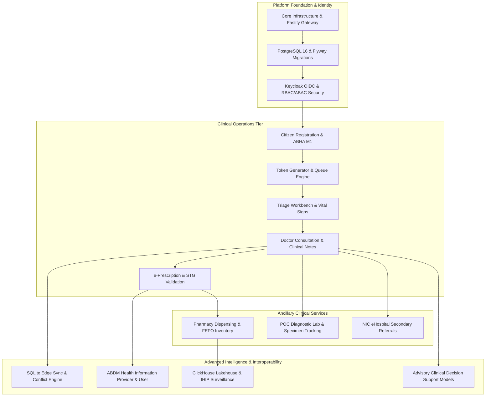

# Master Dependency Map & Cross-Workstream Execution Topology
## Namma Clinic Digital Health & Operations Platform
### Greater Bengaluru Authority (GBA) / BBMP Health Department
**Document Code:** `PLN-DOC-01` | **Status:** APPROVED BASELINE | **Date:** September 2026

---

## 1. Executive Summary & Dependency Governance Charter
This document establishes the authoritative **Master Dependency Map and Cross-Workstream Execution Topology** for the Namma Clinic Digital Health Platform. Developing, validating, and deploying a distributed, offline-first, bilingual primary healthcare platform across 450+ municipal clinics demands rigorous tracking of structural, technical, data, API, security, environmental, and regulatory dependencies. Spanning **18 two-week execution sprints** (a 36-week delivery lifecycle), this dependency topology enforces strict predecessor-successor relationships to eliminate integration friction, prevent blocked sprint cycles, and safeguard zero-float critical path milestones. Every dependency is formalized with clear contract specifications, interface mock fallbacks, automated verification pipelines, and cross-functional squad ownership.

### 1.1 Non-Negotiable Dependency Governance Invariants
1. **Contract-First Predecessor Handoffs:** No downstream squad may begin production implementation against an upstream dependency without a frozen OpenAPI 3.1 specification, Protobuf contract, or JSON schema validated in CI.
2. **Mandatory WireMock Fallback Stubs:** For all external dependencies (ABDM, CDAC SMS, NIC eHospital, payment gateways), an automated WireMock stub must be active in local development and staging environments.
3. **Zero-Float Dependency Protection:** Any dependency on the critical path (`CRITICAL-001` through `CRITICAL-050`) must be reviewed daily in cross-squad standups with automated escalation if within 48 hours of estimated slip.
4. **Full Upstream Bi-Directional Lineage:** Every dependency must trace directly to affected database tables (`TABLE-001` to `TABLE-052`) and verified product features (`FEATURE-001` to `FEATURE-180`).
5. **Continuous Automated Verification:** All dependency contract tests must run in the automated pull request pipeline, rejecting code changes that break contract schema compatibility.

## 2. Master System Dependency Architecture Topology


### Configuration Specification Example: Master Dependency Contract Definition
<!-- DOCUMENTATION-ONLY EXAMPLE -->
```yaml
# DOCUMENTATION-ONLY CONFIGURATION
# DOCUMENTATION-ONLY CONFIGURATION: Dependency Contract Specification
dependency_contract:
  dependency_id: "DEPENDENCY-001"
  source_entity: "TASK-0001"
  target_entity: "TASK-0002"
  dependency_type: "Finish-to-Start"
  workstream: "Backend Engineering"
  contract_schema: "contracts/schemas/auth-session-v1.json"
  mock_service:
    enabled: true
    adapter: "WireMockLocalAdapter"
    port: 8088
    healthcheck_url: "http://localhost:8088/__admin/health"
  sla_thresholds:
    p95_latency_ms: 120
    availability_pct: 99.95
  verification_gate: "PR-GATE-CONTRACT-001"
```

## 3. Comprehensive Master Dependency Register (160 Canonical Dependencies)
The following catalog details all **160 canonical engineering dependencies** governing platform delivery across Sprints 01 through 18:

### DEPENDENCY-001: Finish-to-Start — TASK-0001 to TASK-0002
- **Dependency Identifier:** `DEPENDENCY-001`
- **Predecessor Work Item (Source):** `TASK-0001`
- **Successor Work Item (Target):** `TASK-0002`
- **Dependency Classification:** `Finish-to-Start`
- **Technical Rationale:** Prerequisite work item TASK-0001 provides contract schema, database table, or authentication token required by downstream consumer.
- **Prerequisite Condition:** Complete technical specification, unit test passing > 90%, and schema validation.
- **Downstream Impact on Block:** Downstream task execution blocked until prerequisite successfully merges to branch.
- **Engineering Owner Role:** `Product Manager`
- **Priority Level:** `HIGH` | **Critical Blocker:** `False`
- **Delivery Risk:** Schedule compression and downstream sprint spillover if unaddressed.
- **Mitigation & Mock Strategy:** Parallel interface mocking using WireMock and daily engineering sync.
- **Scheduled Resolution:** `Day 5 of SPRINT-01`
- **Target Sprint Window:** `SPRINT-01`
- **Responsible Workstream:** `Product Management`
- **Target Release Milestone:** `RELEASE-1.0`

### DEPENDENCY-002: Start-to-Start — TASK-0002 to TASK-0003
- **Dependency Identifier:** `DEPENDENCY-002`
- **Predecessor Work Item (Source):** `TASK-0002`
- **Successor Work Item (Target):** `TASK-0003`
- **Dependency Classification:** `Start-to-Start`
- **Technical Rationale:** Prerequisite work item TASK-0002 provides contract schema, database table, or authentication token required by downstream consumer.
- **Prerequisite Condition:** Complete technical specification, unit test passing > 90%, and schema validation.
- **Downstream Impact on Block:** Downstream task execution blocked until prerequisite successfully merges to branch.
- **Engineering Owner Role:** `Project Manager`
- **Priority Level:** `HIGH` | **Critical Blocker:** `False`
- **Delivery Risk:** Schedule compression and downstream sprint spillover if unaddressed.
- **Mitigation & Mock Strategy:** Parallel interface mocking using WireMock and daily engineering sync.
- **Scheduled Resolution:** `Day 5 of SPRINT-02`
- **Target Sprint Window:** `SPRINT-02`
- **Responsible Workstream:** `Requirements Engineering`
- **Target Release Milestone:** `RELEASE-1.0`

### DEPENDENCY-003: Finish-to-Finish — TASK-0003 to TASK-0004
- **Dependency Identifier:** `DEPENDENCY-003`
- **Predecessor Work Item (Source):** `TASK-0003`
- **Successor Work Item (Target):** `TASK-0004`
- **Dependency Classification:** `Finish-to-Finish`
- **Technical Rationale:** Prerequisite work item TASK-0003 provides contract schema, database table, or authentication token required by downstream consumer.
- **Prerequisite Condition:** Complete technical specification, unit test passing > 90%, and schema validation.
- **Downstream Impact on Block:** Downstream task execution blocked until prerequisite successfully merges to branch.
- **Engineering Owner Role:** `Solution Architect`
- **Priority Level:** `HIGH` | **Critical Blocker:** `True`
- **Delivery Risk:** Schedule compression and downstream sprint spillover if unaddressed.
- **Mitigation & Mock Strategy:** Parallel interface mocking using WireMock and daily engineering sync.
- **Scheduled Resolution:** `Day 5 of SPRINT-03`
- **Target Sprint Window:** `SPRINT-03`
- **Responsible Workstream:** `UX/UI Design`
- **Target Release Milestone:** `RELEASE-1.0`

### DEPENDENCY-004: Start-to-Finish — TASK-0004 to TASK-0005
- **Dependency Identifier:** `DEPENDENCY-004`
- **Predecessor Work Item (Source):** `TASK-0004`
- **Successor Work Item (Target):** `TASK-0005`
- **Dependency Classification:** `Start-to-Finish`
- **Technical Rationale:** Prerequisite work item TASK-0004 provides contract schema, database table, or authentication token required by downstream consumer.
- **Prerequisite Condition:** Complete technical specification, unit test passing > 90%, and schema validation.
- **Downstream Impact on Block:** Downstream task execution blocked until prerequisite successfully merges to branch.
- **Engineering Owner Role:** `Technical Lead`
- **Priority Level:** `CRITICAL` | **Critical Blocker:** `False`
- **Delivery Risk:** Schedule compression and downstream sprint spillover if unaddressed.
- **Mitigation & Mock Strategy:** Parallel interface mocking using WireMock and daily engineering sync.
- **Scheduled Resolution:** `Day 5 of SPRINT-04`
- **Target Sprint Window:** `SPRINT-04`
- **Responsible Workstream:** `Frontend Engineering`
- **Target Release Milestone:** `RELEASE-1.0`

### DEPENDENCY-005: technical dependency — TASK-0005 to TASK-0006
- **Dependency Identifier:** `DEPENDENCY-005`
- **Predecessor Work Item (Source):** `TASK-0005`
- **Successor Work Item (Target):** `TASK-0006`
- **Dependency Classification:** `technical dependency`
- **Technical Rationale:** Prerequisite work item TASK-0005 provides contract schema, database table, or authentication token required by downstream consumer.
- **Prerequisite Condition:** Complete technical specification, unit test passing > 90%, and schema validation.
- **Downstream Impact on Block:** Downstream task execution blocked until prerequisite successfully merges to branch.
- **Engineering Owner Role:** `Backend Engineer`
- **Priority Level:** `HIGH` | **Critical Blocker:** `False`
- **Delivery Risk:** Schedule compression and downstream sprint spillover if unaddressed.
- **Mitigation & Mock Strategy:** Parallel interface mocking using WireMock and daily engineering sync.
- **Scheduled Resolution:** `Day 5 of SPRINT-05`
- **Target Sprint Window:** `SPRINT-05`
- **Responsible Workstream:** `Backend Engineering`
- **Target Release Milestone:** `RELEASE-2.0`

### DEPENDENCY-006: data dependency — TASK-0006 to TASK-0007
- **Dependency Identifier:** `DEPENDENCY-006`
- **Predecessor Work Item (Source):** `TASK-0006`
- **Successor Work Item (Target):** `TASK-0007`
- **Dependency Classification:** `data dependency`
- **Technical Rationale:** Prerequisite work item TASK-0006 provides contract schema, database table, or authentication token required by downstream consumer.
- **Prerequisite Condition:** Complete technical specification, unit test passing > 90%, and schema validation.
- **Downstream Impact on Block:** Downstream task execution blocked until prerequisite successfully merges to branch.
- **Engineering Owner Role:** `Frontend Engineer`
- **Priority Level:** `HIGH` | **Critical Blocker:** `True`
- **Delivery Risk:** Schedule compression and downstream sprint spillover if unaddressed.
- **Mitigation & Mock Strategy:** Parallel interface mocking using WireMock and daily engineering sync.
- **Scheduled Resolution:** `Day 5 of SPRINT-06`
- **Target Sprint Window:** `SPRINT-06`
- **Responsible Workstream:** `Database Engineering`
- **Target Release Milestone:** `RELEASE-2.0`

### DEPENDENCY-007: API dependency — TASK-0007 to TASK-0008
- **Dependency Identifier:** `DEPENDENCY-007`
- **Predecessor Work Item (Source):** `TASK-0007`
- **Successor Work Item (Target):** `TASK-0008`
- **Dependency Classification:** `API dependency`
- **Technical Rationale:** Prerequisite work item TASK-0007 provides contract schema, database table, or authentication token required by downstream consumer.
- **Prerequisite Condition:** Complete technical specification, unit test passing > 90%, and schema validation.
- **Downstream Impact on Block:** Downstream task execution blocked until prerequisite successfully merges to branch.
- **Engineering Owner Role:** `Database Engineer`
- **Priority Level:** `HIGH` | **Critical Blocker:** `False`
- **Delivery Risk:** Schedule compression and downstream sprint spillover if unaddressed.
- **Mitigation & Mock Strategy:** Parallel interface mocking using WireMock and daily engineering sync.
- **Scheduled Resolution:** `Day 5 of SPRINT-07`
- **Target Sprint Window:** `SPRINT-07`
- **Responsible Workstream:** `API Engineering`
- **Target Release Milestone:** `RELEASE-2.0`

### DEPENDENCY-008: security dependency — TASK-0008 to TASK-0009
- **Dependency Identifier:** `DEPENDENCY-008`
- **Predecessor Work Item (Source):** `TASK-0008`
- **Successor Work Item (Target):** `TASK-0009`
- **Dependency Classification:** `security dependency`
- **Technical Rationale:** Prerequisite work item TASK-0008 provides contract schema, database table, or authentication token required by downstream consumer.
- **Prerequisite Condition:** Complete technical specification, unit test passing > 90%, and schema validation.
- **Downstream Impact on Block:** Downstream task execution blocked until prerequisite successfully merges to branch.
- **Engineering Owner Role:** `Data Engineer`
- **Priority Level:** `CRITICAL` | **Critical Blocker:** `False`
- **Delivery Risk:** Schedule compression and downstream sprint spillover if unaddressed.
- **Mitigation & Mock Strategy:** Parallel interface mocking using WireMock and daily engineering sync.
- **Scheduled Resolution:** `Day 5 of SPRINT-08`
- **Target Sprint Window:** `SPRINT-08`
- **Responsible Workstream:** `Security & Governance`
- **Target Release Milestone:** `RELEASE-2.0`

### DEPENDENCY-009: environment dependency — TASK-0009 to TASK-0010
- **Dependency Identifier:** `DEPENDENCY-009`
- **Predecessor Work Item (Source):** `TASK-0009`
- **Successor Work Item (Target):** `TASK-0010`
- **Dependency Classification:** `environment dependency`
- **Technical Rationale:** Prerequisite work item TASK-0009 provides contract schema, database table, or authentication token required by downstream consumer.
- **Prerequisite Condition:** Complete technical specification, unit test passing > 90%, and schema validation.
- **Downstream Impact on Block:** Downstream task execution blocked until prerequisite successfully merges to branch.
- **Engineering Owner Role:** `AI/ML Engineer`
- **Priority Level:** `HIGH` | **Critical Blocker:** `True`
- **Delivery Risk:** Schedule compression and downstream sprint spillover if unaddressed.
- **Mitigation & Mock Strategy:** Parallel interface mocking using WireMock and daily engineering sync.
- **Scheduled Resolution:** `Day 5 of SPRINT-09`
- **Target Sprint Window:** `SPRINT-09`
- **Responsible Workstream:** `QA & Test Automation`
- **Target Release Milestone:** `RELEASE-3.0`

### DEPENDENCY-010: external dependency — TASK-0010 to TASK-0011
- **Dependency Identifier:** `DEPENDENCY-010`
- **Predecessor Work Item (Source):** `TASK-0010`
- **Successor Work Item (Target):** `TASK-0011`
- **Dependency Classification:** `external dependency`
- **Technical Rationale:** Prerequisite work item TASK-0010 provides contract schema, database table, or authentication token required by downstream consumer.
- **Prerequisite Condition:** Complete technical specification, unit test passing > 90%, and schema validation.
- **Downstream Impact on Block:** Downstream task execution blocked until prerequisite successfully merges to branch.
- **Engineering Owner Role:** `QA Engineer`
- **Priority Level:** `HIGH` | **Critical Blocker:** `False`
- **Delivery Risk:** Schedule compression and downstream sprint spillover if unaddressed.
- **Mitigation & Mock Strategy:** Parallel interface mocking using WireMock and daily engineering sync.
- **Scheduled Resolution:** `Day 5 of SPRINT-10`
- **Target Sprint Window:** `SPRINT-10`
- **Responsible Workstream:** `DevOps & SRE`
- **Target Release Milestone:** `RELEASE-3.0`

### DEPENDENCY-011: approval dependency — TASK-0011 to TASK-0012
- **Dependency Identifier:** `DEPENDENCY-011`
- **Predecessor Work Item (Source):** `TASK-0011`
- **Successor Work Item (Target):** `TASK-0012`
- **Dependency Classification:** `approval dependency`
- **Technical Rationale:** Prerequisite work item TASK-0011 provides contract schema, database table, or authentication token required by downstream consumer.
- **Prerequisite Condition:** Complete technical specification, unit test passing > 90%, and schema validation.
- **Downstream Impact on Block:** Downstream task execution blocked until prerequisite successfully merges to branch.
- **Engineering Owner Role:** `Security Engineer`
- **Priority Level:** `HIGH` | **Critical Blocker:** `False`
- **Delivery Risk:** Schedule compression and downstream sprint spillover if unaddressed.
- **Mitigation & Mock Strategy:** Parallel interface mocking using WireMock and daily engineering sync.
- **Scheduled Resolution:** `Day 5 of SPRINT-11`
- **Target Sprint Window:** `SPRINT-11`
- **Responsible Workstream:** `Data Engineering`
- **Target Release Milestone:** `RELEASE-3.0`

### DEPENDENCY-012: testing dependency — TASK-0012 to TASK-0013
- **Dependency Identifier:** `DEPENDENCY-012`
- **Predecessor Work Item (Source):** `TASK-0012`
- **Successor Work Item (Target):** `TASK-0013`
- **Dependency Classification:** `testing dependency`
- **Technical Rationale:** Prerequisite work item TASK-0012 provides contract schema, database table, or authentication token required by downstream consumer.
- **Prerequisite Condition:** Complete technical specification, unit test passing > 90%, and schema validation.
- **Downstream Impact on Block:** Downstream task execution blocked until prerequisite successfully merges to branch.
- **Engineering Owner Role:** `DevOps Engineer`
- **Priority Level:** `CRITICAL` | **Critical Blocker:** `True`
- **Delivery Risk:** Schedule compression and downstream sprint spillover if unaddressed.
- **Mitigation & Mock Strategy:** Parallel interface mocking using WireMock and daily engineering sync.
- **Scheduled Resolution:** `Day 5 of SPRINT-12`
- **Target Sprint Window:** `SPRINT-12`
- **Responsible Workstream:** `AI/ML Engineering`
- **Target Release Milestone:** `RELEASE-3.0`

### DEPENDENCY-013: Finish-to-Start — TASK-0013 to TASK-0014
- **Dependency Identifier:** `DEPENDENCY-013`
- **Predecessor Work Item (Source):** `TASK-0013`
- **Successor Work Item (Target):** `TASK-0014`
- **Dependency Classification:** `Finish-to-Start`
- **Technical Rationale:** Prerequisite work item TASK-0013 provides contract schema, database table, or authentication token required by downstream consumer.
- **Prerequisite Condition:** Complete technical specification, unit test passing > 90%, and schema validation.
- **Downstream Impact on Block:** Downstream task execution blocked until prerequisite successfully merges to branch.
- **Engineering Owner Role:** `UX/UI Designer`
- **Priority Level:** `HIGH` | **Critical Blocker:** `False`
- **Delivery Risk:** Schedule compression and downstream sprint spillover if unaddressed.
- **Mitigation & Mock Strategy:** Parallel interface mocking using WireMock and daily engineering sync.
- **Scheduled Resolution:** `Day 5 of SPRINT-13`
- **Target Sprint Window:** `SPRINT-13`
- **Responsible Workstream:** `Integrations & Interoperability`
- **Target Release Milestone:** `RELEASE-4.0`

### DEPENDENCY-014: Start-to-Start — TASK-0014 to TASK-0015
- **Dependency Identifier:** `DEPENDENCY-014`
- **Predecessor Work Item (Source):** `TASK-0014`
- **Successor Work Item (Target):** `TASK-0015`
- **Dependency Classification:** `Start-to-Start`
- **Technical Rationale:** Prerequisite work item TASK-0014 provides contract schema, database table, or authentication token required by downstream consumer.
- **Prerequisite Condition:** Complete technical specification, unit test passing > 90%, and schema validation.
- **Downstream Impact on Block:** Downstream task execution blocked until prerequisite successfully merges to branch.
- **Engineering Owner Role:** `Business Analyst`
- **Priority Level:** `HIGH` | **Critical Blocker:** `False`
- **Delivery Risk:** Schedule compression and downstream sprint spillover if unaddressed.
- **Mitigation & Mock Strategy:** Parallel interface mocking using WireMock and daily engineering sync.
- **Scheduled Resolution:** `Day 5 of SPRINT-14`
- **Target Sprint Window:** `SPRINT-14`
- **Responsible Workstream:** `Clinical Validation`
- **Target Release Milestone:** `RELEASE-4.0`

### DEPENDENCY-015: Finish-to-Finish — TASK-0015 to TASK-0016
- **Dependency Identifier:** `DEPENDENCY-015`
- **Predecessor Work Item (Source):** `TASK-0015`
- **Successor Work Item (Target):** `TASK-0016`
- **Dependency Classification:** `Finish-to-Finish`
- **Technical Rationale:** Prerequisite work item TASK-0015 provides contract schema, database table, or authentication token required by downstream consumer.
- **Prerequisite Condition:** Complete technical specification, unit test passing > 90%, and schema validation.
- **Downstream Impact on Block:** Downstream task execution blocked until prerequisite successfully merges to branch.
- **Engineering Owner Role:** `Clinical SME`
- **Priority Level:** `HIGH` | **Critical Blocker:** `True`
- **Delivery Risk:** Schedule compression and downstream sprint spillover if unaddressed.
- **Mitigation & Mock Strategy:** Parallel interface mocking using WireMock and daily engineering sync.
- **Scheduled Resolution:** `Day 5 of SPRINT-15`
- **Target Sprint Window:** `SPRINT-15`
- **Responsible Workstream:** `Deployment & Rollout`
- **Target Release Milestone:** `RELEASE-4.0`

### DEPENDENCY-016: Start-to-Finish — TASK-0016 to TASK-0017
- **Dependency Identifier:** `DEPENDENCY-016`
- **Predecessor Work Item (Source):** `TASK-0016`
- **Successor Work Item (Target):** `TASK-0017`
- **Dependency Classification:** `Start-to-Finish`
- **Technical Rationale:** Prerequisite work item TASK-0016 provides contract schema, database table, or authentication token required by downstream consumer.
- **Prerequisite Condition:** Complete technical specification, unit test passing > 90%, and schema validation.
- **Downstream Impact on Block:** Downstream task execution blocked until prerequisite successfully merges to branch.
- **Engineering Owner Role:** `Integration Engineer`
- **Priority Level:** `CRITICAL` | **Critical Blocker:** `False`
- **Delivery Risk:** Schedule compression and downstream sprint spillover if unaddressed.
- **Mitigation & Mock Strategy:** Parallel interface mocking using WireMock and daily engineering sync.
- **Scheduled Resolution:** `Day 5 of SPRINT-16`
- **Target Sprint Window:** `SPRINT-16`
- **Responsible Workstream:** `Training & Enablement`
- **Target Release Milestone:** `RELEASE-4.0`

### DEPENDENCY-017: technical dependency — TASK-0017 to TASK-0018
- **Dependency Identifier:** `DEPENDENCY-017`
- **Predecessor Work Item (Source):** `TASK-0017`
- **Successor Work Item (Target):** `TASK-0018`
- **Dependency Classification:** `technical dependency`
- **Technical Rationale:** Prerequisite work item TASK-0017 provides contract schema, database table, or authentication token required by downstream consumer.
- **Prerequisite Condition:** Complete technical specification, unit test passing > 90%, and schema validation.
- **Downstream Impact on Block:** Downstream task execution blocked until prerequisite successfully merges to branch.
- **Engineering Owner Role:** `Support/Operations`
- **Priority Level:** `HIGH` | **Critical Blocker:** `False`
- **Delivery Risk:** Schedule compression and downstream sprint spillover if unaddressed.
- **Mitigation & Mock Strategy:** Parallel interface mocking using WireMock and daily engineering sync.
- **Scheduled Resolution:** `Day 5 of SPRINT-17`
- **Target Sprint Window:** `SPRINT-17`
- **Responsible Workstream:** `Pilot Operations`
- **Target Release Milestone:** `RELEASE-5.0`

### DEPENDENCY-018: data dependency — TASK-0018 to TASK-0019
- **Dependency Identifier:** `DEPENDENCY-018`
- **Predecessor Work Item (Source):** `TASK-0018`
- **Successor Work Item (Target):** `TASK-0019`
- **Dependency Classification:** `data dependency`
- **Technical Rationale:** Prerequisite work item TASK-0018 provides contract schema, database table, or authentication token required by downstream consumer.
- **Prerequisite Condition:** Complete technical specification, unit test passing > 90%, and schema validation.
- **Downstream Impact on Block:** Downstream task execution blocked until prerequisite successfully merges to branch.
- **Engineering Owner Role:** `Product Manager`
- **Priority Level:** `HIGH` | **Critical Blocker:** `True`
- **Delivery Risk:** Schedule compression and downstream sprint spillover if unaddressed.
- **Mitigation & Mock Strategy:** Parallel interface mocking using WireMock and daily engineering sync.
- **Scheduled Resolution:** `Day 5 of SPRINT-18`
- **Target Sprint Window:** `SPRINT-18`
- **Responsible Workstream:** `Platform Operations & Support`
- **Target Release Milestone:** `RELEASE-5.0`

### DEPENDENCY-019: API dependency — TASK-0019 to TASK-0020
- **Dependency Identifier:** `DEPENDENCY-019`
- **Predecessor Work Item (Source):** `TASK-0019`
- **Successor Work Item (Target):** `TASK-0020`
- **Dependency Classification:** `API dependency`
- **Technical Rationale:** Prerequisite work item TASK-0019 provides contract schema, database table, or authentication token required by downstream consumer.
- **Prerequisite Condition:** Complete technical specification, unit test passing > 90%, and schema validation.
- **Downstream Impact on Block:** Downstream task execution blocked until prerequisite successfully merges to branch.
- **Engineering Owner Role:** `Project Manager`
- **Priority Level:** `HIGH` | **Critical Blocker:** `False`
- **Delivery Risk:** Schedule compression and downstream sprint spillover if unaddressed.
- **Mitigation & Mock Strategy:** Parallel interface mocking using WireMock and daily engineering sync.
- **Scheduled Resolution:** `Day 5 of SPRINT-01`
- **Target Sprint Window:** `SPRINT-01`
- **Responsible Workstream:** `Product Management`
- **Target Release Milestone:** `RELEASE-1.0`

### DEPENDENCY-020: security dependency — TASK-0020 to TASK-0021
- **Dependency Identifier:** `DEPENDENCY-020`
- **Predecessor Work Item (Source):** `TASK-0020`
- **Successor Work Item (Target):** `TASK-0021`
- **Dependency Classification:** `security dependency`
- **Technical Rationale:** Prerequisite work item TASK-0020 provides contract schema, database table, or authentication token required by downstream consumer.
- **Prerequisite Condition:** Complete technical specification, unit test passing > 90%, and schema validation.
- **Downstream Impact on Block:** Downstream task execution blocked until prerequisite successfully merges to branch.
- **Engineering Owner Role:** `Solution Architect`
- **Priority Level:** `CRITICAL` | **Critical Blocker:** `False`
- **Delivery Risk:** Schedule compression and downstream sprint spillover if unaddressed.
- **Mitigation & Mock Strategy:** Parallel interface mocking using WireMock and daily engineering sync.
- **Scheduled Resolution:** `Day 5 of SPRINT-02`
- **Target Sprint Window:** `SPRINT-02`
- **Responsible Workstream:** `Requirements Engineering`
- **Target Release Milestone:** `RELEASE-1.0`

### DEPENDENCY-021: environment dependency — TASK-0021 to TASK-0022
- **Dependency Identifier:** `DEPENDENCY-021`
- **Predecessor Work Item (Source):** `TASK-0021`
- **Successor Work Item (Target):** `TASK-0022`
- **Dependency Classification:** `environment dependency`
- **Technical Rationale:** Prerequisite work item TASK-0021 provides contract schema, database table, or authentication token required by downstream consumer.
- **Prerequisite Condition:** Complete technical specification, unit test passing > 90%, and schema validation.
- **Downstream Impact on Block:** Downstream task execution blocked until prerequisite successfully merges to branch.
- **Engineering Owner Role:** `Technical Lead`
- **Priority Level:** `HIGH` | **Critical Blocker:** `True`
- **Delivery Risk:** Schedule compression and downstream sprint spillover if unaddressed.
- **Mitigation & Mock Strategy:** Parallel interface mocking using WireMock and daily engineering sync.
- **Scheduled Resolution:** `Day 5 of SPRINT-03`
- **Target Sprint Window:** `SPRINT-03`
- **Responsible Workstream:** `UX/UI Design`
- **Target Release Milestone:** `RELEASE-1.0`

### DEPENDENCY-022: external dependency — TASK-0022 to TASK-0023
- **Dependency Identifier:** `DEPENDENCY-022`
- **Predecessor Work Item (Source):** `TASK-0022`
- **Successor Work Item (Target):** `TASK-0023`
- **Dependency Classification:** `external dependency`
- **Technical Rationale:** Prerequisite work item TASK-0022 provides contract schema, database table, or authentication token required by downstream consumer.
- **Prerequisite Condition:** Complete technical specification, unit test passing > 90%, and schema validation.
- **Downstream Impact on Block:** Downstream task execution blocked until prerequisite successfully merges to branch.
- **Engineering Owner Role:** `Backend Engineer`
- **Priority Level:** `HIGH` | **Critical Blocker:** `False`
- **Delivery Risk:** Schedule compression and downstream sprint spillover if unaddressed.
- **Mitigation & Mock Strategy:** Parallel interface mocking using WireMock and daily engineering sync.
- **Scheduled Resolution:** `Day 5 of SPRINT-04`
- **Target Sprint Window:** `SPRINT-04`
- **Responsible Workstream:** `Frontend Engineering`
- **Target Release Milestone:** `RELEASE-1.0`

### DEPENDENCY-023: approval dependency — TASK-0023 to TASK-0024
- **Dependency Identifier:** `DEPENDENCY-023`
- **Predecessor Work Item (Source):** `TASK-0023`
- **Successor Work Item (Target):** `TASK-0024`
- **Dependency Classification:** `approval dependency`
- **Technical Rationale:** Prerequisite work item TASK-0023 provides contract schema, database table, or authentication token required by downstream consumer.
- **Prerequisite Condition:** Complete technical specification, unit test passing > 90%, and schema validation.
- **Downstream Impact on Block:** Downstream task execution blocked until prerequisite successfully merges to branch.
- **Engineering Owner Role:** `Frontend Engineer`
- **Priority Level:** `HIGH` | **Critical Blocker:** `False`
- **Delivery Risk:** Schedule compression and downstream sprint spillover if unaddressed.
- **Mitigation & Mock Strategy:** Parallel interface mocking using WireMock and daily engineering sync.
- **Scheduled Resolution:** `Day 5 of SPRINT-05`
- **Target Sprint Window:** `SPRINT-05`
- **Responsible Workstream:** `Backend Engineering`
- **Target Release Milestone:** `RELEASE-2.0`

### DEPENDENCY-024: testing dependency — TASK-0024 to TASK-0025
- **Dependency Identifier:** `DEPENDENCY-024`
- **Predecessor Work Item (Source):** `TASK-0024`
- **Successor Work Item (Target):** `TASK-0025`
- **Dependency Classification:** `testing dependency`
- **Technical Rationale:** Prerequisite work item TASK-0024 provides contract schema, database table, or authentication token required by downstream consumer.
- **Prerequisite Condition:** Complete technical specification, unit test passing > 90%, and schema validation.
- **Downstream Impact on Block:** Downstream task execution blocked until prerequisite successfully merges to branch.
- **Engineering Owner Role:** `Database Engineer`
- **Priority Level:** `CRITICAL` | **Critical Blocker:** `True`
- **Delivery Risk:** Schedule compression and downstream sprint spillover if unaddressed.
- **Mitigation & Mock Strategy:** Parallel interface mocking using WireMock and daily engineering sync.
- **Scheduled Resolution:** `Day 5 of SPRINT-06`
- **Target Sprint Window:** `SPRINT-06`
- **Responsible Workstream:** `Database Engineering`
- **Target Release Milestone:** `RELEASE-2.0`

### DEPENDENCY-025: Finish-to-Start — TASK-0025 to TASK-0026
- **Dependency Identifier:** `DEPENDENCY-025`
- **Predecessor Work Item (Source):** `TASK-0025`
- **Successor Work Item (Target):** `TASK-0026`
- **Dependency Classification:** `Finish-to-Start`
- **Technical Rationale:** Prerequisite work item TASK-0025 provides contract schema, database table, or authentication token required by downstream consumer.
- **Prerequisite Condition:** Complete technical specification, unit test passing > 90%, and schema validation.
- **Downstream Impact on Block:** Downstream task execution blocked until prerequisite successfully merges to branch.
- **Engineering Owner Role:** `Data Engineer`
- **Priority Level:** `HIGH` | **Critical Blocker:** `False`
- **Delivery Risk:** Schedule compression and downstream sprint spillover if unaddressed.
- **Mitigation & Mock Strategy:** Parallel interface mocking using WireMock and daily engineering sync.
- **Scheduled Resolution:** `Day 5 of SPRINT-07`
- **Target Sprint Window:** `SPRINT-07`
- **Responsible Workstream:** `API Engineering`
- **Target Release Milestone:** `RELEASE-2.0`

### DEPENDENCY-026: Start-to-Start — TASK-0026 to TASK-0027
- **Dependency Identifier:** `DEPENDENCY-026`
- **Predecessor Work Item (Source):** `TASK-0026`
- **Successor Work Item (Target):** `TASK-0027`
- **Dependency Classification:** `Start-to-Start`
- **Technical Rationale:** Prerequisite work item TASK-0026 provides contract schema, database table, or authentication token required by downstream consumer.
- **Prerequisite Condition:** Complete technical specification, unit test passing > 90%, and schema validation.
- **Downstream Impact on Block:** Downstream task execution blocked until prerequisite successfully merges to branch.
- **Engineering Owner Role:** `AI/ML Engineer`
- **Priority Level:** `HIGH` | **Critical Blocker:** `False`
- **Delivery Risk:** Schedule compression and downstream sprint spillover if unaddressed.
- **Mitigation & Mock Strategy:** Parallel interface mocking using WireMock and daily engineering sync.
- **Scheduled Resolution:** `Day 5 of SPRINT-08`
- **Target Sprint Window:** `SPRINT-08`
- **Responsible Workstream:** `Security & Governance`
- **Target Release Milestone:** `RELEASE-2.0`

### DEPENDENCY-027: Finish-to-Finish — TASK-0027 to TASK-0028
- **Dependency Identifier:** `DEPENDENCY-027`
- **Predecessor Work Item (Source):** `TASK-0027`
- **Successor Work Item (Target):** `TASK-0028`
- **Dependency Classification:** `Finish-to-Finish`
- **Technical Rationale:** Prerequisite work item TASK-0027 provides contract schema, database table, or authentication token required by downstream consumer.
- **Prerequisite Condition:** Complete technical specification, unit test passing > 90%, and schema validation.
- **Downstream Impact on Block:** Downstream task execution blocked until prerequisite successfully merges to branch.
- **Engineering Owner Role:** `QA Engineer`
- **Priority Level:** `HIGH` | **Critical Blocker:** `True`
- **Delivery Risk:** Schedule compression and downstream sprint spillover if unaddressed.
- **Mitigation & Mock Strategy:** Parallel interface mocking using WireMock and daily engineering sync.
- **Scheduled Resolution:** `Day 5 of SPRINT-09`
- **Target Sprint Window:** `SPRINT-09`
- **Responsible Workstream:** `QA & Test Automation`
- **Target Release Milestone:** `RELEASE-3.0`

### DEPENDENCY-028: Start-to-Finish — TASK-0028 to TASK-0029
- **Dependency Identifier:** `DEPENDENCY-028`
- **Predecessor Work Item (Source):** `TASK-0028`
- **Successor Work Item (Target):** `TASK-0029`
- **Dependency Classification:** `Start-to-Finish`
- **Technical Rationale:** Prerequisite work item TASK-0028 provides contract schema, database table, or authentication token required by downstream consumer.
- **Prerequisite Condition:** Complete technical specification, unit test passing > 90%, and schema validation.
- **Downstream Impact on Block:** Downstream task execution blocked until prerequisite successfully merges to branch.
- **Engineering Owner Role:** `Security Engineer`
- **Priority Level:** `CRITICAL` | **Critical Blocker:** `False`
- **Delivery Risk:** Schedule compression and downstream sprint spillover if unaddressed.
- **Mitigation & Mock Strategy:** Parallel interface mocking using WireMock and daily engineering sync.
- **Scheduled Resolution:** `Day 5 of SPRINT-10`
- **Target Sprint Window:** `SPRINT-10`
- **Responsible Workstream:** `DevOps & SRE`
- **Target Release Milestone:** `RELEASE-3.0`

### DEPENDENCY-029: technical dependency — TASK-0029 to TASK-0030
- **Dependency Identifier:** `DEPENDENCY-029`
- **Predecessor Work Item (Source):** `TASK-0029`
- **Successor Work Item (Target):** `TASK-0030`
- **Dependency Classification:** `technical dependency`
- **Technical Rationale:** Prerequisite work item TASK-0029 provides contract schema, database table, or authentication token required by downstream consumer.
- **Prerequisite Condition:** Complete technical specification, unit test passing > 90%, and schema validation.
- **Downstream Impact on Block:** Downstream task execution blocked until prerequisite successfully merges to branch.
- **Engineering Owner Role:** `DevOps Engineer`
- **Priority Level:** `HIGH` | **Critical Blocker:** `False`
- **Delivery Risk:** Schedule compression and downstream sprint spillover if unaddressed.
- **Mitigation & Mock Strategy:** Parallel interface mocking using WireMock and daily engineering sync.
- **Scheduled Resolution:** `Day 5 of SPRINT-11`
- **Target Sprint Window:** `SPRINT-11`
- **Responsible Workstream:** `Data Engineering`
- **Target Release Milestone:** `RELEASE-3.0`

### DEPENDENCY-030: data dependency — TASK-0030 to TASK-0031
- **Dependency Identifier:** `DEPENDENCY-030`
- **Predecessor Work Item (Source):** `TASK-0030`
- **Successor Work Item (Target):** `TASK-0031`
- **Dependency Classification:** `data dependency`
- **Technical Rationale:** Prerequisite work item TASK-0030 provides contract schema, database table, or authentication token required by downstream consumer.
- **Prerequisite Condition:** Complete technical specification, unit test passing > 90%, and schema validation.
- **Downstream Impact on Block:** Downstream task execution blocked until prerequisite successfully merges to branch.
- **Engineering Owner Role:** `UX/UI Designer`
- **Priority Level:** `HIGH` | **Critical Blocker:** `True`
- **Delivery Risk:** Schedule compression and downstream sprint spillover if unaddressed.
- **Mitigation & Mock Strategy:** Parallel interface mocking using WireMock and daily engineering sync.
- **Scheduled Resolution:** `Day 5 of SPRINT-12`
- **Target Sprint Window:** `SPRINT-12`
- **Responsible Workstream:** `AI/ML Engineering`
- **Target Release Milestone:** `RELEASE-3.0`

### DEPENDENCY-031: API dependency — TASK-0031 to TASK-0032
- **Dependency Identifier:** `DEPENDENCY-031`
- **Predecessor Work Item (Source):** `TASK-0031`
- **Successor Work Item (Target):** `TASK-0032`
- **Dependency Classification:** `API dependency`
- **Technical Rationale:** Prerequisite work item TASK-0031 provides contract schema, database table, or authentication token required by downstream consumer.
- **Prerequisite Condition:** Complete technical specification, unit test passing > 90%, and schema validation.
- **Downstream Impact on Block:** Downstream task execution blocked until prerequisite successfully merges to branch.
- **Engineering Owner Role:** `Business Analyst`
- **Priority Level:** `HIGH` | **Critical Blocker:** `False`
- **Delivery Risk:** Schedule compression and downstream sprint spillover if unaddressed.
- **Mitigation & Mock Strategy:** Parallel interface mocking using WireMock and daily engineering sync.
- **Scheduled Resolution:** `Day 5 of SPRINT-13`
- **Target Sprint Window:** `SPRINT-13`
- **Responsible Workstream:** `Integrations & Interoperability`
- **Target Release Milestone:** `RELEASE-4.0`

### DEPENDENCY-032: security dependency — TASK-0032 to TASK-0033
- **Dependency Identifier:** `DEPENDENCY-032`
- **Predecessor Work Item (Source):** `TASK-0032`
- **Successor Work Item (Target):** `TASK-0033`
- **Dependency Classification:** `security dependency`
- **Technical Rationale:** Prerequisite work item TASK-0032 provides contract schema, database table, or authentication token required by downstream consumer.
- **Prerequisite Condition:** Complete technical specification, unit test passing > 90%, and schema validation.
- **Downstream Impact on Block:** Downstream task execution blocked until prerequisite successfully merges to branch.
- **Engineering Owner Role:** `Clinical SME`
- **Priority Level:** `CRITICAL` | **Critical Blocker:** `False`
- **Delivery Risk:** Schedule compression and downstream sprint spillover if unaddressed.
- **Mitigation & Mock Strategy:** Parallel interface mocking using WireMock and daily engineering sync.
- **Scheduled Resolution:** `Day 5 of SPRINT-14`
- **Target Sprint Window:** `SPRINT-14`
- **Responsible Workstream:** `Clinical Validation`
- **Target Release Milestone:** `RELEASE-4.0`

### DEPENDENCY-033: environment dependency — TASK-0033 to TASK-0034
- **Dependency Identifier:** `DEPENDENCY-033`
- **Predecessor Work Item (Source):** `TASK-0033`
- **Successor Work Item (Target):** `TASK-0034`
- **Dependency Classification:** `environment dependency`
- **Technical Rationale:** Prerequisite work item TASK-0033 provides contract schema, database table, or authentication token required by downstream consumer.
- **Prerequisite Condition:** Complete technical specification, unit test passing > 90%, and schema validation.
- **Downstream Impact on Block:** Downstream task execution blocked until prerequisite successfully merges to branch.
- **Engineering Owner Role:** `Integration Engineer`
- **Priority Level:** `HIGH` | **Critical Blocker:** `True`
- **Delivery Risk:** Schedule compression and downstream sprint spillover if unaddressed.
- **Mitigation & Mock Strategy:** Parallel interface mocking using WireMock and daily engineering sync.
- **Scheduled Resolution:** `Day 5 of SPRINT-15`
- **Target Sprint Window:** `SPRINT-15`
- **Responsible Workstream:** `Deployment & Rollout`
- **Target Release Milestone:** `RELEASE-4.0`

### DEPENDENCY-034: external dependency — TASK-0034 to TASK-0035
- **Dependency Identifier:** `DEPENDENCY-034`
- **Predecessor Work Item (Source):** `TASK-0034`
- **Successor Work Item (Target):** `TASK-0035`
- **Dependency Classification:** `external dependency`
- **Technical Rationale:** Prerequisite work item TASK-0034 provides contract schema, database table, or authentication token required by downstream consumer.
- **Prerequisite Condition:** Complete technical specification, unit test passing > 90%, and schema validation.
- **Downstream Impact on Block:** Downstream task execution blocked until prerequisite successfully merges to branch.
- **Engineering Owner Role:** `Support/Operations`
- **Priority Level:** `HIGH` | **Critical Blocker:** `False`
- **Delivery Risk:** Schedule compression and downstream sprint spillover if unaddressed.
- **Mitigation & Mock Strategy:** Parallel interface mocking using WireMock and daily engineering sync.
- **Scheduled Resolution:** `Day 5 of SPRINT-16`
- **Target Sprint Window:** `SPRINT-16`
- **Responsible Workstream:** `Training & Enablement`
- **Target Release Milestone:** `RELEASE-4.0`

### DEPENDENCY-035: approval dependency — TASK-0035 to TASK-0036
- **Dependency Identifier:** `DEPENDENCY-035`
- **Predecessor Work Item (Source):** `TASK-0035`
- **Successor Work Item (Target):** `TASK-0036`
- **Dependency Classification:** `approval dependency`
- **Technical Rationale:** Prerequisite work item TASK-0035 provides contract schema, database table, or authentication token required by downstream consumer.
- **Prerequisite Condition:** Complete technical specification, unit test passing > 90%, and schema validation.
- **Downstream Impact on Block:** Downstream task execution blocked until prerequisite successfully merges to branch.
- **Engineering Owner Role:** `Product Manager`
- **Priority Level:** `HIGH` | **Critical Blocker:** `False`
- **Delivery Risk:** Schedule compression and downstream sprint spillover if unaddressed.
- **Mitigation & Mock Strategy:** Parallel interface mocking using WireMock and daily engineering sync.
- **Scheduled Resolution:** `Day 5 of SPRINT-17`
- **Target Sprint Window:** `SPRINT-17`
- **Responsible Workstream:** `Pilot Operations`
- **Target Release Milestone:** `RELEASE-5.0`

### DEPENDENCY-036: testing dependency — TASK-0036 to TASK-0037
- **Dependency Identifier:** `DEPENDENCY-036`
- **Predecessor Work Item (Source):** `TASK-0036`
- **Successor Work Item (Target):** `TASK-0037`
- **Dependency Classification:** `testing dependency`
- **Technical Rationale:** Prerequisite work item TASK-0036 provides contract schema, database table, or authentication token required by downstream consumer.
- **Prerequisite Condition:** Complete technical specification, unit test passing > 90%, and schema validation.
- **Downstream Impact on Block:** Downstream task execution blocked until prerequisite successfully merges to branch.
- **Engineering Owner Role:** `Project Manager`
- **Priority Level:** `CRITICAL` | **Critical Blocker:** `True`
- **Delivery Risk:** Schedule compression and downstream sprint spillover if unaddressed.
- **Mitigation & Mock Strategy:** Parallel interface mocking using WireMock and daily engineering sync.
- **Scheduled Resolution:** `Day 5 of SPRINT-18`
- **Target Sprint Window:** `SPRINT-18`
- **Responsible Workstream:** `Platform Operations & Support`
- **Target Release Milestone:** `RELEASE-5.0`

### DEPENDENCY-037: Finish-to-Start — TASK-0037 to TASK-0038
- **Dependency Identifier:** `DEPENDENCY-037`
- **Predecessor Work Item (Source):** `TASK-0037`
- **Successor Work Item (Target):** `TASK-0038`
- **Dependency Classification:** `Finish-to-Start`
- **Technical Rationale:** Prerequisite work item TASK-0037 provides contract schema, database table, or authentication token required by downstream consumer.
- **Prerequisite Condition:** Complete technical specification, unit test passing > 90%, and schema validation.
- **Downstream Impact on Block:** Downstream task execution blocked until prerequisite successfully merges to branch.
- **Engineering Owner Role:** `Solution Architect`
- **Priority Level:** `HIGH` | **Critical Blocker:** `False`
- **Delivery Risk:** Schedule compression and downstream sprint spillover if unaddressed.
- **Mitigation & Mock Strategy:** Parallel interface mocking using WireMock and daily engineering sync.
- **Scheduled Resolution:** `Day 5 of SPRINT-01`
- **Target Sprint Window:** `SPRINT-01`
- **Responsible Workstream:** `Product Management`
- **Target Release Milestone:** `RELEASE-1.0`

### DEPENDENCY-038: Start-to-Start — TASK-0038 to TASK-0039
- **Dependency Identifier:** `DEPENDENCY-038`
- **Predecessor Work Item (Source):** `TASK-0038`
- **Successor Work Item (Target):** `TASK-0039`
- **Dependency Classification:** `Start-to-Start`
- **Technical Rationale:** Prerequisite work item TASK-0038 provides contract schema, database table, or authentication token required by downstream consumer.
- **Prerequisite Condition:** Complete technical specification, unit test passing > 90%, and schema validation.
- **Downstream Impact on Block:** Downstream task execution blocked until prerequisite successfully merges to branch.
- **Engineering Owner Role:** `Technical Lead`
- **Priority Level:** `HIGH` | **Critical Blocker:** `False`
- **Delivery Risk:** Schedule compression and downstream sprint spillover if unaddressed.
- **Mitigation & Mock Strategy:** Parallel interface mocking using WireMock and daily engineering sync.
- **Scheduled Resolution:** `Day 5 of SPRINT-02`
- **Target Sprint Window:** `SPRINT-02`
- **Responsible Workstream:** `Requirements Engineering`
- **Target Release Milestone:** `RELEASE-1.0`

### DEPENDENCY-039: Finish-to-Finish — TASK-0039 to TASK-0040
- **Dependency Identifier:** `DEPENDENCY-039`
- **Predecessor Work Item (Source):** `TASK-0039`
- **Successor Work Item (Target):** `TASK-0040`
- **Dependency Classification:** `Finish-to-Finish`
- **Technical Rationale:** Prerequisite work item TASK-0039 provides contract schema, database table, or authentication token required by downstream consumer.
- **Prerequisite Condition:** Complete technical specification, unit test passing > 90%, and schema validation.
- **Downstream Impact on Block:** Downstream task execution blocked until prerequisite successfully merges to branch.
- **Engineering Owner Role:** `Backend Engineer`
- **Priority Level:** `HIGH` | **Critical Blocker:** `True`
- **Delivery Risk:** Schedule compression and downstream sprint spillover if unaddressed.
- **Mitigation & Mock Strategy:** Parallel interface mocking using WireMock and daily engineering sync.
- **Scheduled Resolution:** `Day 5 of SPRINT-03`
- **Target Sprint Window:** `SPRINT-03`
- **Responsible Workstream:** `UX/UI Design`
- **Target Release Milestone:** `RELEASE-1.0`

### DEPENDENCY-040: Start-to-Finish — TASK-0040 to TASK-0041
- **Dependency Identifier:** `DEPENDENCY-040`
- **Predecessor Work Item (Source):** `TASK-0040`
- **Successor Work Item (Target):** `TASK-0041`
- **Dependency Classification:** `Start-to-Finish`
- **Technical Rationale:** Prerequisite work item TASK-0040 provides contract schema, database table, or authentication token required by downstream consumer.
- **Prerequisite Condition:** Complete technical specification, unit test passing > 90%, and schema validation.
- **Downstream Impact on Block:** Downstream task execution blocked until prerequisite successfully merges to branch.
- **Engineering Owner Role:** `Frontend Engineer`
- **Priority Level:** `CRITICAL` | **Critical Blocker:** `False`
- **Delivery Risk:** Schedule compression and downstream sprint spillover if unaddressed.
- **Mitigation & Mock Strategy:** Parallel interface mocking using WireMock and daily engineering sync.
- **Scheduled Resolution:** `Day 5 of SPRINT-04`
- **Target Sprint Window:** `SPRINT-04`
- **Responsible Workstream:** `Frontend Engineering`
- **Target Release Milestone:** `RELEASE-1.0`

### DEPENDENCY-041: technical dependency — TASK-0041 to TASK-0042
- **Dependency Identifier:** `DEPENDENCY-041`
- **Predecessor Work Item (Source):** `TASK-0041`
- **Successor Work Item (Target):** `TASK-0042`
- **Dependency Classification:** `technical dependency`
- **Technical Rationale:** Prerequisite work item TASK-0041 provides contract schema, database table, or authentication token required by downstream consumer.
- **Prerequisite Condition:** Complete technical specification, unit test passing > 90%, and schema validation.
- **Downstream Impact on Block:** Downstream task execution blocked until prerequisite successfully merges to branch.
- **Engineering Owner Role:** `Database Engineer`
- **Priority Level:** `HIGH` | **Critical Blocker:** `False`
- **Delivery Risk:** Schedule compression and downstream sprint spillover if unaddressed.
- **Mitigation & Mock Strategy:** Parallel interface mocking using WireMock and daily engineering sync.
- **Scheduled Resolution:** `Day 5 of SPRINT-05`
- **Target Sprint Window:** `SPRINT-05`
- **Responsible Workstream:** `Backend Engineering`
- **Target Release Milestone:** `RELEASE-2.0`

### DEPENDENCY-042: data dependency — TASK-0042 to TASK-0043
- **Dependency Identifier:** `DEPENDENCY-042`
- **Predecessor Work Item (Source):** `TASK-0042`
- **Successor Work Item (Target):** `TASK-0043`
- **Dependency Classification:** `data dependency`
- **Technical Rationale:** Prerequisite work item TASK-0042 provides contract schema, database table, or authentication token required by downstream consumer.
- **Prerequisite Condition:** Complete technical specification, unit test passing > 90%, and schema validation.
- **Downstream Impact on Block:** Downstream task execution blocked until prerequisite successfully merges to branch.
- **Engineering Owner Role:** `Data Engineer`
- **Priority Level:** `HIGH` | **Critical Blocker:** `True`
- **Delivery Risk:** Schedule compression and downstream sprint spillover if unaddressed.
- **Mitigation & Mock Strategy:** Parallel interface mocking using WireMock and daily engineering sync.
- **Scheduled Resolution:** `Day 5 of SPRINT-06`
- **Target Sprint Window:** `SPRINT-06`
- **Responsible Workstream:** `Database Engineering`
- **Target Release Milestone:** `RELEASE-2.0`

### DEPENDENCY-043: API dependency — TASK-0043 to TASK-0044
- **Dependency Identifier:** `DEPENDENCY-043`
- **Predecessor Work Item (Source):** `TASK-0043`
- **Successor Work Item (Target):** `TASK-0044`
- **Dependency Classification:** `API dependency`
- **Technical Rationale:** Prerequisite work item TASK-0043 provides contract schema, database table, or authentication token required by downstream consumer.
- **Prerequisite Condition:** Complete technical specification, unit test passing > 90%, and schema validation.
- **Downstream Impact on Block:** Downstream task execution blocked until prerequisite successfully merges to branch.
- **Engineering Owner Role:** `AI/ML Engineer`
- **Priority Level:** `HIGH` | **Critical Blocker:** `False`
- **Delivery Risk:** Schedule compression and downstream sprint spillover if unaddressed.
- **Mitigation & Mock Strategy:** Parallel interface mocking using WireMock and daily engineering sync.
- **Scheduled Resolution:** `Day 5 of SPRINT-07`
- **Target Sprint Window:** `SPRINT-07`
- **Responsible Workstream:** `API Engineering`
- **Target Release Milestone:** `RELEASE-2.0`

### DEPENDENCY-044: security dependency — TASK-0044 to TASK-0045
- **Dependency Identifier:** `DEPENDENCY-044`
- **Predecessor Work Item (Source):** `TASK-0044`
- **Successor Work Item (Target):** `TASK-0045`
- **Dependency Classification:** `security dependency`
- **Technical Rationale:** Prerequisite work item TASK-0044 provides contract schema, database table, or authentication token required by downstream consumer.
- **Prerequisite Condition:** Complete technical specification, unit test passing > 90%, and schema validation.
- **Downstream Impact on Block:** Downstream task execution blocked until prerequisite successfully merges to branch.
- **Engineering Owner Role:** `QA Engineer`
- **Priority Level:** `CRITICAL` | **Critical Blocker:** `False`
- **Delivery Risk:** Schedule compression and downstream sprint spillover if unaddressed.
- **Mitigation & Mock Strategy:** Parallel interface mocking using WireMock and daily engineering sync.
- **Scheduled Resolution:** `Day 5 of SPRINT-08`
- **Target Sprint Window:** `SPRINT-08`
- **Responsible Workstream:** `Security & Governance`
- **Target Release Milestone:** `RELEASE-2.0`

### DEPENDENCY-045: environment dependency — TASK-0045 to TASK-0046
- **Dependency Identifier:** `DEPENDENCY-045`
- **Predecessor Work Item (Source):** `TASK-0045`
- **Successor Work Item (Target):** `TASK-0046`
- **Dependency Classification:** `environment dependency`
- **Technical Rationale:** Prerequisite work item TASK-0045 provides contract schema, database table, or authentication token required by downstream consumer.
- **Prerequisite Condition:** Complete technical specification, unit test passing > 90%, and schema validation.
- **Downstream Impact on Block:** Downstream task execution blocked until prerequisite successfully merges to branch.
- **Engineering Owner Role:** `Security Engineer`
- **Priority Level:** `HIGH` | **Critical Blocker:** `True`
- **Delivery Risk:** Schedule compression and downstream sprint spillover if unaddressed.
- **Mitigation & Mock Strategy:** Parallel interface mocking using WireMock and daily engineering sync.
- **Scheduled Resolution:** `Day 5 of SPRINT-09`
- **Target Sprint Window:** `SPRINT-09`
- **Responsible Workstream:** `QA & Test Automation`
- **Target Release Milestone:** `RELEASE-3.0`

### DEPENDENCY-046: external dependency — TASK-0046 to TASK-0047
- **Dependency Identifier:** `DEPENDENCY-046`
- **Predecessor Work Item (Source):** `TASK-0046`
- **Successor Work Item (Target):** `TASK-0047`
- **Dependency Classification:** `external dependency`
- **Technical Rationale:** Prerequisite work item TASK-0046 provides contract schema, database table, or authentication token required by downstream consumer.
- **Prerequisite Condition:** Complete technical specification, unit test passing > 90%, and schema validation.
- **Downstream Impact on Block:** Downstream task execution blocked until prerequisite successfully merges to branch.
- **Engineering Owner Role:** `DevOps Engineer`
- **Priority Level:** `HIGH` | **Critical Blocker:** `False`
- **Delivery Risk:** Schedule compression and downstream sprint spillover if unaddressed.
- **Mitigation & Mock Strategy:** Parallel interface mocking using WireMock and daily engineering sync.
- **Scheduled Resolution:** `Day 5 of SPRINT-10`
- **Target Sprint Window:** `SPRINT-10`
- **Responsible Workstream:** `DevOps & SRE`
- **Target Release Milestone:** `RELEASE-3.0`

### DEPENDENCY-047: approval dependency — TASK-0047 to TASK-0048
- **Dependency Identifier:** `DEPENDENCY-047`
- **Predecessor Work Item (Source):** `TASK-0047`
- **Successor Work Item (Target):** `TASK-0048`
- **Dependency Classification:** `approval dependency`
- **Technical Rationale:** Prerequisite work item TASK-0047 provides contract schema, database table, or authentication token required by downstream consumer.
- **Prerequisite Condition:** Complete technical specification, unit test passing > 90%, and schema validation.
- **Downstream Impact on Block:** Downstream task execution blocked until prerequisite successfully merges to branch.
- **Engineering Owner Role:** `UX/UI Designer`
- **Priority Level:** `HIGH` | **Critical Blocker:** `False`
- **Delivery Risk:** Schedule compression and downstream sprint spillover if unaddressed.
- **Mitigation & Mock Strategy:** Parallel interface mocking using WireMock and daily engineering sync.
- **Scheduled Resolution:** `Day 5 of SPRINT-11`
- **Target Sprint Window:** `SPRINT-11`
- **Responsible Workstream:** `Data Engineering`
- **Target Release Milestone:** `RELEASE-3.0`

### DEPENDENCY-048: testing dependency — TASK-0048 to TASK-0049
- **Dependency Identifier:** `DEPENDENCY-048`
- **Predecessor Work Item (Source):** `TASK-0048`
- **Successor Work Item (Target):** `TASK-0049`
- **Dependency Classification:** `testing dependency`
- **Technical Rationale:** Prerequisite work item TASK-0048 provides contract schema, database table, or authentication token required by downstream consumer.
- **Prerequisite Condition:** Complete technical specification, unit test passing > 90%, and schema validation.
- **Downstream Impact on Block:** Downstream task execution blocked until prerequisite successfully merges to branch.
- **Engineering Owner Role:** `Business Analyst`
- **Priority Level:** `CRITICAL` | **Critical Blocker:** `True`
- **Delivery Risk:** Schedule compression and downstream sprint spillover if unaddressed.
- **Mitigation & Mock Strategy:** Parallel interface mocking using WireMock and daily engineering sync.
- **Scheduled Resolution:** `Day 5 of SPRINT-12`
- **Target Sprint Window:** `SPRINT-12`
- **Responsible Workstream:** `AI/ML Engineering`
- **Target Release Milestone:** `RELEASE-3.0`

### DEPENDENCY-049: Finish-to-Start — TASK-0049 to TASK-0050
- **Dependency Identifier:** `DEPENDENCY-049`
- **Predecessor Work Item (Source):** `TASK-0049`
- **Successor Work Item (Target):** `TASK-0050`
- **Dependency Classification:** `Finish-to-Start`
- **Technical Rationale:** Prerequisite work item TASK-0049 provides contract schema, database table, or authentication token required by downstream consumer.
- **Prerequisite Condition:** Complete technical specification, unit test passing > 90%, and schema validation.
- **Downstream Impact on Block:** Downstream task execution blocked until prerequisite successfully merges to branch.
- **Engineering Owner Role:** `Clinical SME`
- **Priority Level:** `HIGH` | **Critical Blocker:** `False`
- **Delivery Risk:** Schedule compression and downstream sprint spillover if unaddressed.
- **Mitigation & Mock Strategy:** Parallel interface mocking using WireMock and daily engineering sync.
- **Scheduled Resolution:** `Day 5 of SPRINT-13`
- **Target Sprint Window:** `SPRINT-13`
- **Responsible Workstream:** `Integrations & Interoperability`
- **Target Release Milestone:** `RELEASE-4.0`

### DEPENDENCY-050: Start-to-Start — TASK-0050 to TASK-0051
- **Dependency Identifier:** `DEPENDENCY-050`
- **Predecessor Work Item (Source):** `TASK-0050`
- **Successor Work Item (Target):** `TASK-0051`
- **Dependency Classification:** `Start-to-Start`
- **Technical Rationale:** Prerequisite work item TASK-0050 provides contract schema, database table, or authentication token required by downstream consumer.
- **Prerequisite Condition:** Complete technical specification, unit test passing > 90%, and schema validation.
- **Downstream Impact on Block:** Downstream task execution blocked until prerequisite successfully merges to branch.
- **Engineering Owner Role:** `Integration Engineer`
- **Priority Level:** `HIGH` | **Critical Blocker:** `False`
- **Delivery Risk:** Schedule compression and downstream sprint spillover if unaddressed.
- **Mitigation & Mock Strategy:** Parallel interface mocking using WireMock and daily engineering sync.
- **Scheduled Resolution:** `Day 5 of SPRINT-14`
- **Target Sprint Window:** `SPRINT-14`
- **Responsible Workstream:** `Clinical Validation`
- **Target Release Milestone:** `RELEASE-4.0`

### DEPENDENCY-051: Finish-to-Finish — TASK-0051 to TASK-0052
- **Dependency Identifier:** `DEPENDENCY-051`
- **Predecessor Work Item (Source):** `TASK-0051`
- **Successor Work Item (Target):** `TASK-0052`
- **Dependency Classification:** `Finish-to-Finish`
- **Technical Rationale:** Prerequisite work item TASK-0051 provides contract schema, database table, or authentication token required by downstream consumer.
- **Prerequisite Condition:** Complete technical specification, unit test passing > 90%, and schema validation.
- **Downstream Impact on Block:** Downstream task execution blocked until prerequisite successfully merges to branch.
- **Engineering Owner Role:** `Support/Operations`
- **Priority Level:** `HIGH` | **Critical Blocker:** `True`
- **Delivery Risk:** Schedule compression and downstream sprint spillover if unaddressed.
- **Mitigation & Mock Strategy:** Parallel interface mocking using WireMock and daily engineering sync.
- **Scheduled Resolution:** `Day 5 of SPRINT-15`
- **Target Sprint Window:** `SPRINT-15`
- **Responsible Workstream:** `Deployment & Rollout`
- **Target Release Milestone:** `RELEASE-4.0`

### DEPENDENCY-052: Start-to-Finish — TASK-0052 to TASK-0053
- **Dependency Identifier:** `DEPENDENCY-052`
- **Predecessor Work Item (Source):** `TASK-0052`
- **Successor Work Item (Target):** `TASK-0053`
- **Dependency Classification:** `Start-to-Finish`
- **Technical Rationale:** Prerequisite work item TASK-0052 provides contract schema, database table, or authentication token required by downstream consumer.
- **Prerequisite Condition:** Complete technical specification, unit test passing > 90%, and schema validation.
- **Downstream Impact on Block:** Downstream task execution blocked until prerequisite successfully merges to branch.
- **Engineering Owner Role:** `Product Manager`
- **Priority Level:** `CRITICAL` | **Critical Blocker:** `False`
- **Delivery Risk:** Schedule compression and downstream sprint spillover if unaddressed.
- **Mitigation & Mock Strategy:** Parallel interface mocking using WireMock and daily engineering sync.
- **Scheduled Resolution:** `Day 5 of SPRINT-16`
- **Target Sprint Window:** `SPRINT-16`
- **Responsible Workstream:** `Training & Enablement`
- **Target Release Milestone:** `RELEASE-4.0`

### DEPENDENCY-053: technical dependency — TASK-0053 to TASK-0054
- **Dependency Identifier:** `DEPENDENCY-053`
- **Predecessor Work Item (Source):** `TASK-0053`
- **Successor Work Item (Target):** `TASK-0054`
- **Dependency Classification:** `technical dependency`
- **Technical Rationale:** Prerequisite work item TASK-0053 provides contract schema, database table, or authentication token required by downstream consumer.
- **Prerequisite Condition:** Complete technical specification, unit test passing > 90%, and schema validation.
- **Downstream Impact on Block:** Downstream task execution blocked until prerequisite successfully merges to branch.
- **Engineering Owner Role:** `Project Manager`
- **Priority Level:** `HIGH` | **Critical Blocker:** `False`
- **Delivery Risk:** Schedule compression and downstream sprint spillover if unaddressed.
- **Mitigation & Mock Strategy:** Parallel interface mocking using WireMock and daily engineering sync.
- **Scheduled Resolution:** `Day 5 of SPRINT-17`
- **Target Sprint Window:** `SPRINT-17`
- **Responsible Workstream:** `Pilot Operations`
- **Target Release Milestone:** `RELEASE-5.0`

### DEPENDENCY-054: data dependency — TASK-0054 to TASK-0055
- **Dependency Identifier:** `DEPENDENCY-054`
- **Predecessor Work Item (Source):** `TASK-0054`
- **Successor Work Item (Target):** `TASK-0055`
- **Dependency Classification:** `data dependency`
- **Technical Rationale:** Prerequisite work item TASK-0054 provides contract schema, database table, or authentication token required by downstream consumer.
- **Prerequisite Condition:** Complete technical specification, unit test passing > 90%, and schema validation.
- **Downstream Impact on Block:** Downstream task execution blocked until prerequisite successfully merges to branch.
- **Engineering Owner Role:** `Solution Architect`
- **Priority Level:** `HIGH` | **Critical Blocker:** `True`
- **Delivery Risk:** Schedule compression and downstream sprint spillover if unaddressed.
- **Mitigation & Mock Strategy:** Parallel interface mocking using WireMock and daily engineering sync.
- **Scheduled Resolution:** `Day 5 of SPRINT-18`
- **Target Sprint Window:** `SPRINT-18`
- **Responsible Workstream:** `Platform Operations & Support`
- **Target Release Milestone:** `RELEASE-5.0`

### DEPENDENCY-055: API dependency — TASK-0055 to TASK-0056
- **Dependency Identifier:** `DEPENDENCY-055`
- **Predecessor Work Item (Source):** `TASK-0055`
- **Successor Work Item (Target):** `TASK-0056`
- **Dependency Classification:** `API dependency`
- **Technical Rationale:** Prerequisite work item TASK-0055 provides contract schema, database table, or authentication token required by downstream consumer.
- **Prerequisite Condition:** Complete technical specification, unit test passing > 90%, and schema validation.
- **Downstream Impact on Block:** Downstream task execution blocked until prerequisite successfully merges to branch.
- **Engineering Owner Role:** `Technical Lead`
- **Priority Level:** `HIGH` | **Critical Blocker:** `False`
- **Delivery Risk:** Schedule compression and downstream sprint spillover if unaddressed.
- **Mitigation & Mock Strategy:** Parallel interface mocking using WireMock and daily engineering sync.
- **Scheduled Resolution:** `Day 5 of SPRINT-01`
- **Target Sprint Window:** `SPRINT-01`
- **Responsible Workstream:** `Product Management`
- **Target Release Milestone:** `RELEASE-1.0`

### DEPENDENCY-056: security dependency — TASK-0056 to TASK-0057
- **Dependency Identifier:** `DEPENDENCY-056`
- **Predecessor Work Item (Source):** `TASK-0056`
- **Successor Work Item (Target):** `TASK-0057`
- **Dependency Classification:** `security dependency`
- **Technical Rationale:** Prerequisite work item TASK-0056 provides contract schema, database table, or authentication token required by downstream consumer.
- **Prerequisite Condition:** Complete technical specification, unit test passing > 90%, and schema validation.
- **Downstream Impact on Block:** Downstream task execution blocked until prerequisite successfully merges to branch.
- **Engineering Owner Role:** `Backend Engineer`
- **Priority Level:** `CRITICAL` | **Critical Blocker:** `False`
- **Delivery Risk:** Schedule compression and downstream sprint spillover if unaddressed.
- **Mitigation & Mock Strategy:** Parallel interface mocking using WireMock and daily engineering sync.
- **Scheduled Resolution:** `Day 5 of SPRINT-02`
- **Target Sprint Window:** `SPRINT-02`
- **Responsible Workstream:** `Requirements Engineering`
- **Target Release Milestone:** `RELEASE-1.0`

### DEPENDENCY-057: environment dependency — TASK-0057 to TASK-0058
- **Dependency Identifier:** `DEPENDENCY-057`
- **Predecessor Work Item (Source):** `TASK-0057`
- **Successor Work Item (Target):** `TASK-0058`
- **Dependency Classification:** `environment dependency`
- **Technical Rationale:** Prerequisite work item TASK-0057 provides contract schema, database table, or authentication token required by downstream consumer.
- **Prerequisite Condition:** Complete technical specification, unit test passing > 90%, and schema validation.
- **Downstream Impact on Block:** Downstream task execution blocked until prerequisite successfully merges to branch.
- **Engineering Owner Role:** `Frontend Engineer`
- **Priority Level:** `HIGH` | **Critical Blocker:** `True`
- **Delivery Risk:** Schedule compression and downstream sprint spillover if unaddressed.
- **Mitigation & Mock Strategy:** Parallel interface mocking using WireMock and daily engineering sync.
- **Scheduled Resolution:** `Day 5 of SPRINT-03`
- **Target Sprint Window:** `SPRINT-03`
- **Responsible Workstream:** `UX/UI Design`
- **Target Release Milestone:** `RELEASE-1.0`

### DEPENDENCY-058: external dependency — TASK-0058 to TASK-0059
- **Dependency Identifier:** `DEPENDENCY-058`
- **Predecessor Work Item (Source):** `TASK-0058`
- **Successor Work Item (Target):** `TASK-0059`
- **Dependency Classification:** `external dependency`
- **Technical Rationale:** Prerequisite work item TASK-0058 provides contract schema, database table, or authentication token required by downstream consumer.
- **Prerequisite Condition:** Complete technical specification, unit test passing > 90%, and schema validation.
- **Downstream Impact on Block:** Downstream task execution blocked until prerequisite successfully merges to branch.
- **Engineering Owner Role:** `Database Engineer`
- **Priority Level:** `HIGH` | **Critical Blocker:** `False`
- **Delivery Risk:** Schedule compression and downstream sprint spillover if unaddressed.
- **Mitigation & Mock Strategy:** Parallel interface mocking using WireMock and daily engineering sync.
- **Scheduled Resolution:** `Day 5 of SPRINT-04`
- **Target Sprint Window:** `SPRINT-04`
- **Responsible Workstream:** `Frontend Engineering`
- **Target Release Milestone:** `RELEASE-1.0`

### DEPENDENCY-059: approval dependency — TASK-0059 to TASK-0060
- **Dependency Identifier:** `DEPENDENCY-059`
- **Predecessor Work Item (Source):** `TASK-0059`
- **Successor Work Item (Target):** `TASK-0060`
- **Dependency Classification:** `approval dependency`
- **Technical Rationale:** Prerequisite work item TASK-0059 provides contract schema, database table, or authentication token required by downstream consumer.
- **Prerequisite Condition:** Complete technical specification, unit test passing > 90%, and schema validation.
- **Downstream Impact on Block:** Downstream task execution blocked until prerequisite successfully merges to branch.
- **Engineering Owner Role:** `Data Engineer`
- **Priority Level:** `HIGH` | **Critical Blocker:** `False`
- **Delivery Risk:** Schedule compression and downstream sprint spillover if unaddressed.
- **Mitigation & Mock Strategy:** Parallel interface mocking using WireMock and daily engineering sync.
- **Scheduled Resolution:** `Day 5 of SPRINT-05`
- **Target Sprint Window:** `SPRINT-05`
- **Responsible Workstream:** `Backend Engineering`
- **Target Release Milestone:** `RELEASE-2.0`

### DEPENDENCY-060: testing dependency — TASK-0060 to TASK-0061
- **Dependency Identifier:** `DEPENDENCY-060`
- **Predecessor Work Item (Source):** `TASK-0060`
- **Successor Work Item (Target):** `TASK-0061`
- **Dependency Classification:** `testing dependency`
- **Technical Rationale:** Prerequisite work item TASK-0060 provides contract schema, database table, or authentication token required by downstream consumer.
- **Prerequisite Condition:** Complete technical specification, unit test passing > 90%, and schema validation.
- **Downstream Impact on Block:** Downstream task execution blocked until prerequisite successfully merges to branch.
- **Engineering Owner Role:** `AI/ML Engineer`
- **Priority Level:** `CRITICAL` | **Critical Blocker:** `True`
- **Delivery Risk:** Schedule compression and downstream sprint spillover if unaddressed.
- **Mitigation & Mock Strategy:** Parallel interface mocking using WireMock and daily engineering sync.
- **Scheduled Resolution:** `Day 5 of SPRINT-06`
- **Target Sprint Window:** `SPRINT-06`
- **Responsible Workstream:** `Database Engineering`
- **Target Release Milestone:** `RELEASE-2.0`

### DEPENDENCY-061: Finish-to-Start — TASK-0061 to TASK-0062
- **Dependency Identifier:** `DEPENDENCY-061`
- **Predecessor Work Item (Source):** `TASK-0061`
- **Successor Work Item (Target):** `TASK-0062`
- **Dependency Classification:** `Finish-to-Start`
- **Technical Rationale:** Prerequisite work item TASK-0061 provides contract schema, database table, or authentication token required by downstream consumer.
- **Prerequisite Condition:** Complete technical specification, unit test passing > 90%, and schema validation.
- **Downstream Impact on Block:** Downstream task execution blocked until prerequisite successfully merges to branch.
- **Engineering Owner Role:** `QA Engineer`
- **Priority Level:** `HIGH` | **Critical Blocker:** `False`
- **Delivery Risk:** Schedule compression and downstream sprint spillover if unaddressed.
- **Mitigation & Mock Strategy:** Parallel interface mocking using WireMock and daily engineering sync.
- **Scheduled Resolution:** `Day 5 of SPRINT-07`
- **Target Sprint Window:** `SPRINT-07`
- **Responsible Workstream:** `API Engineering`
- **Target Release Milestone:** `RELEASE-2.0`

### DEPENDENCY-062: Start-to-Start — TASK-0062 to TASK-0063
- **Dependency Identifier:** `DEPENDENCY-062`
- **Predecessor Work Item (Source):** `TASK-0062`
- **Successor Work Item (Target):** `TASK-0063`
- **Dependency Classification:** `Start-to-Start`
- **Technical Rationale:** Prerequisite work item TASK-0062 provides contract schema, database table, or authentication token required by downstream consumer.
- **Prerequisite Condition:** Complete technical specification, unit test passing > 90%, and schema validation.
- **Downstream Impact on Block:** Downstream task execution blocked until prerequisite successfully merges to branch.
- **Engineering Owner Role:** `Security Engineer`
- **Priority Level:** `HIGH` | **Critical Blocker:** `False`
- **Delivery Risk:** Schedule compression and downstream sprint spillover if unaddressed.
- **Mitigation & Mock Strategy:** Parallel interface mocking using WireMock and daily engineering sync.
- **Scheduled Resolution:** `Day 5 of SPRINT-08`
- **Target Sprint Window:** `SPRINT-08`
- **Responsible Workstream:** `Security & Governance`
- **Target Release Milestone:** `RELEASE-2.0`

### DEPENDENCY-063: Finish-to-Finish — TASK-0063 to TASK-0064
- **Dependency Identifier:** `DEPENDENCY-063`
- **Predecessor Work Item (Source):** `TASK-0063`
- **Successor Work Item (Target):** `TASK-0064`
- **Dependency Classification:** `Finish-to-Finish`
- **Technical Rationale:** Prerequisite work item TASK-0063 provides contract schema, database table, or authentication token required by downstream consumer.
- **Prerequisite Condition:** Complete technical specification, unit test passing > 90%, and schema validation.
- **Downstream Impact on Block:** Downstream task execution blocked until prerequisite successfully merges to branch.
- **Engineering Owner Role:** `DevOps Engineer`
- **Priority Level:** `HIGH` | **Critical Blocker:** `True`
- **Delivery Risk:** Schedule compression and downstream sprint spillover if unaddressed.
- **Mitigation & Mock Strategy:** Parallel interface mocking using WireMock and daily engineering sync.
- **Scheduled Resolution:** `Day 5 of SPRINT-09`
- **Target Sprint Window:** `SPRINT-09`
- **Responsible Workstream:** `QA & Test Automation`
- **Target Release Milestone:** `RELEASE-3.0`

### DEPENDENCY-064: Start-to-Finish — TASK-0064 to TASK-0065
- **Dependency Identifier:** `DEPENDENCY-064`
- **Predecessor Work Item (Source):** `TASK-0064`
- **Successor Work Item (Target):** `TASK-0065`
- **Dependency Classification:** `Start-to-Finish`
- **Technical Rationale:** Prerequisite work item TASK-0064 provides contract schema, database table, or authentication token required by downstream consumer.
- **Prerequisite Condition:** Complete technical specification, unit test passing > 90%, and schema validation.
- **Downstream Impact on Block:** Downstream task execution blocked until prerequisite successfully merges to branch.
- **Engineering Owner Role:** `UX/UI Designer`
- **Priority Level:** `CRITICAL` | **Critical Blocker:** `False`
- **Delivery Risk:** Schedule compression and downstream sprint spillover if unaddressed.
- **Mitigation & Mock Strategy:** Parallel interface mocking using WireMock and daily engineering sync.
- **Scheduled Resolution:** `Day 5 of SPRINT-10`
- **Target Sprint Window:** `SPRINT-10`
- **Responsible Workstream:** `DevOps & SRE`
- **Target Release Milestone:** `RELEASE-3.0`

### DEPENDENCY-065: technical dependency — TASK-0065 to TASK-0066
- **Dependency Identifier:** `DEPENDENCY-065`
- **Predecessor Work Item (Source):** `TASK-0065`
- **Successor Work Item (Target):** `TASK-0066`
- **Dependency Classification:** `technical dependency`
- **Technical Rationale:** Prerequisite work item TASK-0065 provides contract schema, database table, or authentication token required by downstream consumer.
- **Prerequisite Condition:** Complete technical specification, unit test passing > 90%, and schema validation.
- **Downstream Impact on Block:** Downstream task execution blocked until prerequisite successfully merges to branch.
- **Engineering Owner Role:** `Business Analyst`
- **Priority Level:** `HIGH` | **Critical Blocker:** `False`
- **Delivery Risk:** Schedule compression and downstream sprint spillover if unaddressed.
- **Mitigation & Mock Strategy:** Parallel interface mocking using WireMock and daily engineering sync.
- **Scheduled Resolution:** `Day 5 of SPRINT-11`
- **Target Sprint Window:** `SPRINT-11`
- **Responsible Workstream:** `Data Engineering`
- **Target Release Milestone:** `RELEASE-3.0`

### DEPENDENCY-066: data dependency — TASK-0066 to TASK-0067
- **Dependency Identifier:** `DEPENDENCY-066`
- **Predecessor Work Item (Source):** `TASK-0066`
- **Successor Work Item (Target):** `TASK-0067`
- **Dependency Classification:** `data dependency`
- **Technical Rationale:** Prerequisite work item TASK-0066 provides contract schema, database table, or authentication token required by downstream consumer.
- **Prerequisite Condition:** Complete technical specification, unit test passing > 90%, and schema validation.
- **Downstream Impact on Block:** Downstream task execution blocked until prerequisite successfully merges to branch.
- **Engineering Owner Role:** `Clinical SME`
- **Priority Level:** `HIGH` | **Critical Blocker:** `True`
- **Delivery Risk:** Schedule compression and downstream sprint spillover if unaddressed.
- **Mitigation & Mock Strategy:** Parallel interface mocking using WireMock and daily engineering sync.
- **Scheduled Resolution:** `Day 5 of SPRINT-12`
- **Target Sprint Window:** `SPRINT-12`
- **Responsible Workstream:** `AI/ML Engineering`
- **Target Release Milestone:** `RELEASE-3.0`

### DEPENDENCY-067: API dependency — TASK-0067 to TASK-0068
- **Dependency Identifier:** `DEPENDENCY-067`
- **Predecessor Work Item (Source):** `TASK-0067`
- **Successor Work Item (Target):** `TASK-0068`
- **Dependency Classification:** `API dependency`
- **Technical Rationale:** Prerequisite work item TASK-0067 provides contract schema, database table, or authentication token required by downstream consumer.
- **Prerequisite Condition:** Complete technical specification, unit test passing > 90%, and schema validation.
- **Downstream Impact on Block:** Downstream task execution blocked until prerequisite successfully merges to branch.
- **Engineering Owner Role:** `Integration Engineer`
- **Priority Level:** `HIGH` | **Critical Blocker:** `False`
- **Delivery Risk:** Schedule compression and downstream sprint spillover if unaddressed.
- **Mitigation & Mock Strategy:** Parallel interface mocking using WireMock and daily engineering sync.
- **Scheduled Resolution:** `Day 5 of SPRINT-13`
- **Target Sprint Window:** `SPRINT-13`
- **Responsible Workstream:** `Integrations & Interoperability`
- **Target Release Milestone:** `RELEASE-4.0`

### DEPENDENCY-068: security dependency — TASK-0068 to TASK-0069
- **Dependency Identifier:** `DEPENDENCY-068`
- **Predecessor Work Item (Source):** `TASK-0068`
- **Successor Work Item (Target):** `TASK-0069`
- **Dependency Classification:** `security dependency`
- **Technical Rationale:** Prerequisite work item TASK-0068 provides contract schema, database table, or authentication token required by downstream consumer.
- **Prerequisite Condition:** Complete technical specification, unit test passing > 90%, and schema validation.
- **Downstream Impact on Block:** Downstream task execution blocked until prerequisite successfully merges to branch.
- **Engineering Owner Role:** `Support/Operations`
- **Priority Level:** `CRITICAL` | **Critical Blocker:** `False`
- **Delivery Risk:** Schedule compression and downstream sprint spillover if unaddressed.
- **Mitigation & Mock Strategy:** Parallel interface mocking using WireMock and daily engineering sync.
- **Scheduled Resolution:** `Day 5 of SPRINT-14`
- **Target Sprint Window:** `SPRINT-14`
- **Responsible Workstream:** `Clinical Validation`
- **Target Release Milestone:** `RELEASE-4.0`

### DEPENDENCY-069: environment dependency — TASK-0069 to TASK-0070
- **Dependency Identifier:** `DEPENDENCY-069`
- **Predecessor Work Item (Source):** `TASK-0069`
- **Successor Work Item (Target):** `TASK-0070`
- **Dependency Classification:** `environment dependency`
- **Technical Rationale:** Prerequisite work item TASK-0069 provides contract schema, database table, or authentication token required by downstream consumer.
- **Prerequisite Condition:** Complete technical specification, unit test passing > 90%, and schema validation.
- **Downstream Impact on Block:** Downstream task execution blocked until prerequisite successfully merges to branch.
- **Engineering Owner Role:** `Product Manager`
- **Priority Level:** `HIGH` | **Critical Blocker:** `True`
- **Delivery Risk:** Schedule compression and downstream sprint spillover if unaddressed.
- **Mitigation & Mock Strategy:** Parallel interface mocking using WireMock and daily engineering sync.
- **Scheduled Resolution:** `Day 5 of SPRINT-15`
- **Target Sprint Window:** `SPRINT-15`
- **Responsible Workstream:** `Deployment & Rollout`
- **Target Release Milestone:** `RELEASE-4.0`

### DEPENDENCY-070: external dependency — TASK-0070 to TASK-0071
- **Dependency Identifier:** `DEPENDENCY-070`
- **Predecessor Work Item (Source):** `TASK-0070`
- **Successor Work Item (Target):** `TASK-0071`
- **Dependency Classification:** `external dependency`
- **Technical Rationale:** Prerequisite work item TASK-0070 provides contract schema, database table, or authentication token required by downstream consumer.
- **Prerequisite Condition:** Complete technical specification, unit test passing > 90%, and schema validation.
- **Downstream Impact on Block:** Downstream task execution blocked until prerequisite successfully merges to branch.
- **Engineering Owner Role:** `Project Manager`
- **Priority Level:** `HIGH` | **Critical Blocker:** `False`
- **Delivery Risk:** Schedule compression and downstream sprint spillover if unaddressed.
- **Mitigation & Mock Strategy:** Parallel interface mocking using WireMock and daily engineering sync.
- **Scheduled Resolution:** `Day 5 of SPRINT-16`
- **Target Sprint Window:** `SPRINT-16`
- **Responsible Workstream:** `Training & Enablement`
- **Target Release Milestone:** `RELEASE-4.0`

### DEPENDENCY-071: approval dependency — TASK-0071 to TASK-0072
- **Dependency Identifier:** `DEPENDENCY-071`
- **Predecessor Work Item (Source):** `TASK-0071`
- **Successor Work Item (Target):** `TASK-0072`
- **Dependency Classification:** `approval dependency`
- **Technical Rationale:** Prerequisite work item TASK-0071 provides contract schema, database table, or authentication token required by downstream consumer.
- **Prerequisite Condition:** Complete technical specification, unit test passing > 90%, and schema validation.
- **Downstream Impact on Block:** Downstream task execution blocked until prerequisite successfully merges to branch.
- **Engineering Owner Role:** `Solution Architect`
- **Priority Level:** `HIGH` | **Critical Blocker:** `False`
- **Delivery Risk:** Schedule compression and downstream sprint spillover if unaddressed.
- **Mitigation & Mock Strategy:** Parallel interface mocking using WireMock and daily engineering sync.
- **Scheduled Resolution:** `Day 5 of SPRINT-17`
- **Target Sprint Window:** `SPRINT-17`
- **Responsible Workstream:** `Pilot Operations`
- **Target Release Milestone:** `RELEASE-5.0`

### DEPENDENCY-072: testing dependency — TASK-0072 to TASK-0073
- **Dependency Identifier:** `DEPENDENCY-072`
- **Predecessor Work Item (Source):** `TASK-0072`
- **Successor Work Item (Target):** `TASK-0073`
- **Dependency Classification:** `testing dependency`
- **Technical Rationale:** Prerequisite work item TASK-0072 provides contract schema, database table, or authentication token required by downstream consumer.
- **Prerequisite Condition:** Complete technical specification, unit test passing > 90%, and schema validation.
- **Downstream Impact on Block:** Downstream task execution blocked until prerequisite successfully merges to branch.
- **Engineering Owner Role:** `Technical Lead`
- **Priority Level:** `CRITICAL` | **Critical Blocker:** `True`
- **Delivery Risk:** Schedule compression and downstream sprint spillover if unaddressed.
- **Mitigation & Mock Strategy:** Parallel interface mocking using WireMock and daily engineering sync.
- **Scheduled Resolution:** `Day 5 of SPRINT-18`
- **Target Sprint Window:** `SPRINT-18`
- **Responsible Workstream:** `Platform Operations & Support`
- **Target Release Milestone:** `RELEASE-5.0`

### DEPENDENCY-073: Finish-to-Start — TASK-0073 to TASK-0074
- **Dependency Identifier:** `DEPENDENCY-073`
- **Predecessor Work Item (Source):** `TASK-0073`
- **Successor Work Item (Target):** `TASK-0074`
- **Dependency Classification:** `Finish-to-Start`
- **Technical Rationale:** Prerequisite work item TASK-0073 provides contract schema, database table, or authentication token required by downstream consumer.
- **Prerequisite Condition:** Complete technical specification, unit test passing > 90%, and schema validation.
- **Downstream Impact on Block:** Downstream task execution blocked until prerequisite successfully merges to branch.
- **Engineering Owner Role:** `Backend Engineer`
- **Priority Level:** `HIGH` | **Critical Blocker:** `False`
- **Delivery Risk:** Schedule compression and downstream sprint spillover if unaddressed.
- **Mitigation & Mock Strategy:** Parallel interface mocking using WireMock and daily engineering sync.
- **Scheduled Resolution:** `Day 5 of SPRINT-01`
- **Target Sprint Window:** `SPRINT-01`
- **Responsible Workstream:** `Product Management`
- **Target Release Milestone:** `RELEASE-1.0`

### DEPENDENCY-074: Start-to-Start — TASK-0074 to TASK-0075
- **Dependency Identifier:** `DEPENDENCY-074`
- **Predecessor Work Item (Source):** `TASK-0074`
- **Successor Work Item (Target):** `TASK-0075`
- **Dependency Classification:** `Start-to-Start`
- **Technical Rationale:** Prerequisite work item TASK-0074 provides contract schema, database table, or authentication token required by downstream consumer.
- **Prerequisite Condition:** Complete technical specification, unit test passing > 90%, and schema validation.
- **Downstream Impact on Block:** Downstream task execution blocked until prerequisite successfully merges to branch.
- **Engineering Owner Role:** `Frontend Engineer`
- **Priority Level:** `HIGH` | **Critical Blocker:** `False`
- **Delivery Risk:** Schedule compression and downstream sprint spillover if unaddressed.
- **Mitigation & Mock Strategy:** Parallel interface mocking using WireMock and daily engineering sync.
- **Scheduled Resolution:** `Day 5 of SPRINT-02`
- **Target Sprint Window:** `SPRINT-02`
- **Responsible Workstream:** `Requirements Engineering`
- **Target Release Milestone:** `RELEASE-1.0`

### DEPENDENCY-075: Finish-to-Finish — TASK-0075 to TASK-0076
- **Dependency Identifier:** `DEPENDENCY-075`
- **Predecessor Work Item (Source):** `TASK-0075`
- **Successor Work Item (Target):** `TASK-0076`
- **Dependency Classification:** `Finish-to-Finish`
- **Technical Rationale:** Prerequisite work item TASK-0075 provides contract schema, database table, or authentication token required by downstream consumer.
- **Prerequisite Condition:** Complete technical specification, unit test passing > 90%, and schema validation.
- **Downstream Impact on Block:** Downstream task execution blocked until prerequisite successfully merges to branch.
- **Engineering Owner Role:** `Database Engineer`
- **Priority Level:** `HIGH` | **Critical Blocker:** `True`
- **Delivery Risk:** Schedule compression and downstream sprint spillover if unaddressed.
- **Mitigation & Mock Strategy:** Parallel interface mocking using WireMock and daily engineering sync.
- **Scheduled Resolution:** `Day 5 of SPRINT-03`
- **Target Sprint Window:** `SPRINT-03`
- **Responsible Workstream:** `UX/UI Design`
- **Target Release Milestone:** `RELEASE-1.0`

### DEPENDENCY-076: Start-to-Finish — TASK-0076 to TASK-0077
- **Dependency Identifier:** `DEPENDENCY-076`
- **Predecessor Work Item (Source):** `TASK-0076`
- **Successor Work Item (Target):** `TASK-0077`
- **Dependency Classification:** `Start-to-Finish`
- **Technical Rationale:** Prerequisite work item TASK-0076 provides contract schema, database table, or authentication token required by downstream consumer.
- **Prerequisite Condition:** Complete technical specification, unit test passing > 90%, and schema validation.
- **Downstream Impact on Block:** Downstream task execution blocked until prerequisite successfully merges to branch.
- **Engineering Owner Role:** `Data Engineer`
- **Priority Level:** `CRITICAL` | **Critical Blocker:** `False`
- **Delivery Risk:** Schedule compression and downstream sprint spillover if unaddressed.
- **Mitigation & Mock Strategy:** Parallel interface mocking using WireMock and daily engineering sync.
- **Scheduled Resolution:** `Day 5 of SPRINT-04`
- **Target Sprint Window:** `SPRINT-04`
- **Responsible Workstream:** `Frontend Engineering`
- **Target Release Milestone:** `RELEASE-1.0`

### DEPENDENCY-077: technical dependency — TASK-0077 to TASK-0078
- **Dependency Identifier:** `DEPENDENCY-077`
- **Predecessor Work Item (Source):** `TASK-0077`
- **Successor Work Item (Target):** `TASK-0078`
- **Dependency Classification:** `technical dependency`
- **Technical Rationale:** Prerequisite work item TASK-0077 provides contract schema, database table, or authentication token required by downstream consumer.
- **Prerequisite Condition:** Complete technical specification, unit test passing > 90%, and schema validation.
- **Downstream Impact on Block:** Downstream task execution blocked until prerequisite successfully merges to branch.
- **Engineering Owner Role:** `AI/ML Engineer`
- **Priority Level:** `HIGH` | **Critical Blocker:** `False`
- **Delivery Risk:** Schedule compression and downstream sprint spillover if unaddressed.
- **Mitigation & Mock Strategy:** Parallel interface mocking using WireMock and daily engineering sync.
- **Scheduled Resolution:** `Day 5 of SPRINT-05`
- **Target Sprint Window:** `SPRINT-05`
- **Responsible Workstream:** `Backend Engineering`
- **Target Release Milestone:** `RELEASE-2.0`

### DEPENDENCY-078: data dependency — TASK-0078 to TASK-0079
- **Dependency Identifier:** `DEPENDENCY-078`
- **Predecessor Work Item (Source):** `TASK-0078`
- **Successor Work Item (Target):** `TASK-0079`
- **Dependency Classification:** `data dependency`
- **Technical Rationale:** Prerequisite work item TASK-0078 provides contract schema, database table, or authentication token required by downstream consumer.
- **Prerequisite Condition:** Complete technical specification, unit test passing > 90%, and schema validation.
- **Downstream Impact on Block:** Downstream task execution blocked until prerequisite successfully merges to branch.
- **Engineering Owner Role:** `QA Engineer`
- **Priority Level:** `HIGH` | **Critical Blocker:** `True`
- **Delivery Risk:** Schedule compression and downstream sprint spillover if unaddressed.
- **Mitigation & Mock Strategy:** Parallel interface mocking using WireMock and daily engineering sync.
- **Scheduled Resolution:** `Day 5 of SPRINT-06`
- **Target Sprint Window:** `SPRINT-06`
- **Responsible Workstream:** `Database Engineering`
- **Target Release Milestone:** `RELEASE-2.0`

### DEPENDENCY-079: API dependency — TASK-0079 to TASK-0080
- **Dependency Identifier:** `DEPENDENCY-079`
- **Predecessor Work Item (Source):** `TASK-0079`
- **Successor Work Item (Target):** `TASK-0080`
- **Dependency Classification:** `API dependency`
- **Technical Rationale:** Prerequisite work item TASK-0079 provides contract schema, database table, or authentication token required by downstream consumer.
- **Prerequisite Condition:** Complete technical specification, unit test passing > 90%, and schema validation.
- **Downstream Impact on Block:** Downstream task execution blocked until prerequisite successfully merges to branch.
- **Engineering Owner Role:** `Security Engineer`
- **Priority Level:** `HIGH` | **Critical Blocker:** `False`
- **Delivery Risk:** Schedule compression and downstream sprint spillover if unaddressed.
- **Mitigation & Mock Strategy:** Parallel interface mocking using WireMock and daily engineering sync.
- **Scheduled Resolution:** `Day 5 of SPRINT-07`
- **Target Sprint Window:** `SPRINT-07`
- **Responsible Workstream:** `API Engineering`
- **Target Release Milestone:** `RELEASE-2.0`

### DEPENDENCY-080: security dependency — TASK-0080 to TASK-0081
- **Dependency Identifier:** `DEPENDENCY-080`
- **Predecessor Work Item (Source):** `TASK-0080`
- **Successor Work Item (Target):** `TASK-0081`
- **Dependency Classification:** `security dependency`
- **Technical Rationale:** Prerequisite work item TASK-0080 provides contract schema, database table, or authentication token required by downstream consumer.
- **Prerequisite Condition:** Complete technical specification, unit test passing > 90%, and schema validation.
- **Downstream Impact on Block:** Downstream task execution blocked until prerequisite successfully merges to branch.
- **Engineering Owner Role:** `DevOps Engineer`
- **Priority Level:** `CRITICAL` | **Critical Blocker:** `False`
- **Delivery Risk:** Schedule compression and downstream sprint spillover if unaddressed.
- **Mitigation & Mock Strategy:** Parallel interface mocking using WireMock and daily engineering sync.
- **Scheduled Resolution:** `Day 5 of SPRINT-08`
- **Target Sprint Window:** `SPRINT-08`
- **Responsible Workstream:** `Security & Governance`
- **Target Release Milestone:** `RELEASE-2.0`

### DEPENDENCY-081: environment dependency — TASK-0081 to TASK-0082
- **Dependency Identifier:** `DEPENDENCY-081`
- **Predecessor Work Item (Source):** `TASK-0081`
- **Successor Work Item (Target):** `TASK-0082`
- **Dependency Classification:** `environment dependency`
- **Technical Rationale:** Prerequisite work item TASK-0081 provides contract schema, database table, or authentication token required by downstream consumer.
- **Prerequisite Condition:** Complete technical specification, unit test passing > 90%, and schema validation.
- **Downstream Impact on Block:** Downstream task execution blocked until prerequisite successfully merges to branch.
- **Engineering Owner Role:** `UX/UI Designer`
- **Priority Level:** `HIGH` | **Critical Blocker:** `True`
- **Delivery Risk:** Schedule compression and downstream sprint spillover if unaddressed.
- **Mitigation & Mock Strategy:** Parallel interface mocking using WireMock and daily engineering sync.
- **Scheduled Resolution:** `Day 5 of SPRINT-09`
- **Target Sprint Window:** `SPRINT-09`
- **Responsible Workstream:** `QA & Test Automation`
- **Target Release Milestone:** `RELEASE-3.0`

### DEPENDENCY-082: external dependency — TASK-0082 to TASK-0083
- **Dependency Identifier:** `DEPENDENCY-082`
- **Predecessor Work Item (Source):** `TASK-0082`
- **Successor Work Item (Target):** `TASK-0083`
- **Dependency Classification:** `external dependency`
- **Technical Rationale:** Prerequisite work item TASK-0082 provides contract schema, database table, or authentication token required by downstream consumer.
- **Prerequisite Condition:** Complete technical specification, unit test passing > 90%, and schema validation.
- **Downstream Impact on Block:** Downstream task execution blocked until prerequisite successfully merges to branch.
- **Engineering Owner Role:** `Business Analyst`
- **Priority Level:** `HIGH` | **Critical Blocker:** `False`
- **Delivery Risk:** Schedule compression and downstream sprint spillover if unaddressed.
- **Mitigation & Mock Strategy:** Parallel interface mocking using WireMock and daily engineering sync.
- **Scheduled Resolution:** `Day 5 of SPRINT-10`
- **Target Sprint Window:** `SPRINT-10`
- **Responsible Workstream:** `DevOps & SRE`
- **Target Release Milestone:** `RELEASE-3.0`

### DEPENDENCY-083: approval dependency — TASK-0083 to TASK-0084
- **Dependency Identifier:** `DEPENDENCY-083`
- **Predecessor Work Item (Source):** `TASK-0083`
- **Successor Work Item (Target):** `TASK-0084`
- **Dependency Classification:** `approval dependency`
- **Technical Rationale:** Prerequisite work item TASK-0083 provides contract schema, database table, or authentication token required by downstream consumer.
- **Prerequisite Condition:** Complete technical specification, unit test passing > 90%, and schema validation.
- **Downstream Impact on Block:** Downstream task execution blocked until prerequisite successfully merges to branch.
- **Engineering Owner Role:** `Clinical SME`
- **Priority Level:** `HIGH` | **Critical Blocker:** `False`
- **Delivery Risk:** Schedule compression and downstream sprint spillover if unaddressed.
- **Mitigation & Mock Strategy:** Parallel interface mocking using WireMock and daily engineering sync.
- **Scheduled Resolution:** `Day 5 of SPRINT-11`
- **Target Sprint Window:** `SPRINT-11`
- **Responsible Workstream:** `Data Engineering`
- **Target Release Milestone:** `RELEASE-3.0`

### DEPENDENCY-084: testing dependency — TASK-0084 to TASK-0085
- **Dependency Identifier:** `DEPENDENCY-084`
- **Predecessor Work Item (Source):** `TASK-0084`
- **Successor Work Item (Target):** `TASK-0085`
- **Dependency Classification:** `testing dependency`
- **Technical Rationale:** Prerequisite work item TASK-0084 provides contract schema, database table, or authentication token required by downstream consumer.
- **Prerequisite Condition:** Complete technical specification, unit test passing > 90%, and schema validation.
- **Downstream Impact on Block:** Downstream task execution blocked until prerequisite successfully merges to branch.
- **Engineering Owner Role:** `Integration Engineer`
- **Priority Level:** `CRITICAL` | **Critical Blocker:** `True`
- **Delivery Risk:** Schedule compression and downstream sprint spillover if unaddressed.
- **Mitigation & Mock Strategy:** Parallel interface mocking using WireMock and daily engineering sync.
- **Scheduled Resolution:** `Day 5 of SPRINT-12`
- **Target Sprint Window:** `SPRINT-12`
- **Responsible Workstream:** `AI/ML Engineering`
- **Target Release Milestone:** `RELEASE-3.0`

### DEPENDENCY-085: Finish-to-Start — TASK-0085 to TASK-0086
- **Dependency Identifier:** `DEPENDENCY-085`
- **Predecessor Work Item (Source):** `TASK-0085`
- **Successor Work Item (Target):** `TASK-0086`
- **Dependency Classification:** `Finish-to-Start`
- **Technical Rationale:** Prerequisite work item TASK-0085 provides contract schema, database table, or authentication token required by downstream consumer.
- **Prerequisite Condition:** Complete technical specification, unit test passing > 90%, and schema validation.
- **Downstream Impact on Block:** Downstream task execution blocked until prerequisite successfully merges to branch.
- **Engineering Owner Role:** `Support/Operations`
- **Priority Level:** `HIGH` | **Critical Blocker:** `False`
- **Delivery Risk:** Schedule compression and downstream sprint spillover if unaddressed.
- **Mitigation & Mock Strategy:** Parallel interface mocking using WireMock and daily engineering sync.
- **Scheduled Resolution:** `Day 5 of SPRINT-13`
- **Target Sprint Window:** `SPRINT-13`
- **Responsible Workstream:** `Integrations & Interoperability`
- **Target Release Milestone:** `RELEASE-4.0`

### DEPENDENCY-086: Start-to-Start — TASK-0086 to TASK-0087
- **Dependency Identifier:** `DEPENDENCY-086`
- **Predecessor Work Item (Source):** `TASK-0086`
- **Successor Work Item (Target):** `TASK-0087`
- **Dependency Classification:** `Start-to-Start`
- **Technical Rationale:** Prerequisite work item TASK-0086 provides contract schema, database table, or authentication token required by downstream consumer.
- **Prerequisite Condition:** Complete technical specification, unit test passing > 90%, and schema validation.
- **Downstream Impact on Block:** Downstream task execution blocked until prerequisite successfully merges to branch.
- **Engineering Owner Role:** `Product Manager`
- **Priority Level:** `HIGH` | **Critical Blocker:** `False`
- **Delivery Risk:** Schedule compression and downstream sprint spillover if unaddressed.
- **Mitigation & Mock Strategy:** Parallel interface mocking using WireMock and daily engineering sync.
- **Scheduled Resolution:** `Day 5 of SPRINT-14`
- **Target Sprint Window:** `SPRINT-14`
- **Responsible Workstream:** `Clinical Validation`
- **Target Release Milestone:** `RELEASE-4.0`

### DEPENDENCY-087: Finish-to-Finish — TASK-0087 to TASK-0088
- **Dependency Identifier:** `DEPENDENCY-087`
- **Predecessor Work Item (Source):** `TASK-0087`
- **Successor Work Item (Target):** `TASK-0088`
- **Dependency Classification:** `Finish-to-Finish`
- **Technical Rationale:** Prerequisite work item TASK-0087 provides contract schema, database table, or authentication token required by downstream consumer.
- **Prerequisite Condition:** Complete technical specification, unit test passing > 90%, and schema validation.
- **Downstream Impact on Block:** Downstream task execution blocked until prerequisite successfully merges to branch.
- **Engineering Owner Role:** `Project Manager`
- **Priority Level:** `HIGH` | **Critical Blocker:** `True`
- **Delivery Risk:** Schedule compression and downstream sprint spillover if unaddressed.
- **Mitigation & Mock Strategy:** Parallel interface mocking using WireMock and daily engineering sync.
- **Scheduled Resolution:** `Day 5 of SPRINT-15`
- **Target Sprint Window:** `SPRINT-15`
- **Responsible Workstream:** `Deployment & Rollout`
- **Target Release Milestone:** `RELEASE-4.0`

### DEPENDENCY-088: Start-to-Finish — TASK-0088 to TASK-0089
- **Dependency Identifier:** `DEPENDENCY-088`
- **Predecessor Work Item (Source):** `TASK-0088`
- **Successor Work Item (Target):** `TASK-0089`
- **Dependency Classification:** `Start-to-Finish`
- **Technical Rationale:** Prerequisite work item TASK-0088 provides contract schema, database table, or authentication token required by downstream consumer.
- **Prerequisite Condition:** Complete technical specification, unit test passing > 90%, and schema validation.
- **Downstream Impact on Block:** Downstream task execution blocked until prerequisite successfully merges to branch.
- **Engineering Owner Role:** `Solution Architect`
- **Priority Level:** `CRITICAL` | **Critical Blocker:** `False`
- **Delivery Risk:** Schedule compression and downstream sprint spillover if unaddressed.
- **Mitigation & Mock Strategy:** Parallel interface mocking using WireMock and daily engineering sync.
- **Scheduled Resolution:** `Day 5 of SPRINT-16`
- **Target Sprint Window:** `SPRINT-16`
- **Responsible Workstream:** `Training & Enablement`
- **Target Release Milestone:** `RELEASE-4.0`

### DEPENDENCY-089: technical dependency — TASK-0089 to TASK-0090
- **Dependency Identifier:** `DEPENDENCY-089`
- **Predecessor Work Item (Source):** `TASK-0089`
- **Successor Work Item (Target):** `TASK-0090`
- **Dependency Classification:** `technical dependency`
- **Technical Rationale:** Prerequisite work item TASK-0089 provides contract schema, database table, or authentication token required by downstream consumer.
- **Prerequisite Condition:** Complete technical specification, unit test passing > 90%, and schema validation.
- **Downstream Impact on Block:** Downstream task execution blocked until prerequisite successfully merges to branch.
- **Engineering Owner Role:** `Technical Lead`
- **Priority Level:** `HIGH` | **Critical Blocker:** `False`
- **Delivery Risk:** Schedule compression and downstream sprint spillover if unaddressed.
- **Mitigation & Mock Strategy:** Parallel interface mocking using WireMock and daily engineering sync.
- **Scheduled Resolution:** `Day 5 of SPRINT-17`
- **Target Sprint Window:** `SPRINT-17`
- **Responsible Workstream:** `Pilot Operations`
- **Target Release Milestone:** `RELEASE-5.0`

### DEPENDENCY-090: data dependency — TASK-0090 to TASK-0091
- **Dependency Identifier:** `DEPENDENCY-090`
- **Predecessor Work Item (Source):** `TASK-0090`
- **Successor Work Item (Target):** `TASK-0091`
- **Dependency Classification:** `data dependency`
- **Technical Rationale:** Prerequisite work item TASK-0090 provides contract schema, database table, or authentication token required by downstream consumer.
- **Prerequisite Condition:** Complete technical specification, unit test passing > 90%, and schema validation.
- **Downstream Impact on Block:** Downstream task execution blocked until prerequisite successfully merges to branch.
- **Engineering Owner Role:** `Backend Engineer`
- **Priority Level:** `HIGH` | **Critical Blocker:** `True`
- **Delivery Risk:** Schedule compression and downstream sprint spillover if unaddressed.
- **Mitigation & Mock Strategy:** Parallel interface mocking using WireMock and daily engineering sync.
- **Scheduled Resolution:** `Day 5 of SPRINT-18`
- **Target Sprint Window:** `SPRINT-18`
- **Responsible Workstream:** `Platform Operations & Support`
- **Target Release Milestone:** `RELEASE-5.0`

### DEPENDENCY-091: API dependency — TASK-0091 to TASK-0092
- **Dependency Identifier:** `DEPENDENCY-091`
- **Predecessor Work Item (Source):** `TASK-0091`
- **Successor Work Item (Target):** `TASK-0092`
- **Dependency Classification:** `API dependency`
- **Technical Rationale:** Prerequisite work item TASK-0091 provides contract schema, database table, or authentication token required by downstream consumer.
- **Prerequisite Condition:** Complete technical specification, unit test passing > 90%, and schema validation.
- **Downstream Impact on Block:** Downstream task execution blocked until prerequisite successfully merges to branch.
- **Engineering Owner Role:** `Frontend Engineer`
- **Priority Level:** `HIGH` | **Critical Blocker:** `False`
- **Delivery Risk:** Schedule compression and downstream sprint spillover if unaddressed.
- **Mitigation & Mock Strategy:** Parallel interface mocking using WireMock and daily engineering sync.
- **Scheduled Resolution:** `Day 5 of SPRINT-01`
- **Target Sprint Window:** `SPRINT-01`
- **Responsible Workstream:** `Product Management`
- **Target Release Milestone:** `RELEASE-1.0`

### DEPENDENCY-092: security dependency — TASK-0092 to TASK-0093
- **Dependency Identifier:** `DEPENDENCY-092`
- **Predecessor Work Item (Source):** `TASK-0092`
- **Successor Work Item (Target):** `TASK-0093`
- **Dependency Classification:** `security dependency`
- **Technical Rationale:** Prerequisite work item TASK-0092 provides contract schema, database table, or authentication token required by downstream consumer.
- **Prerequisite Condition:** Complete technical specification, unit test passing > 90%, and schema validation.
- **Downstream Impact on Block:** Downstream task execution blocked until prerequisite successfully merges to branch.
- **Engineering Owner Role:** `Database Engineer`
- **Priority Level:** `CRITICAL` | **Critical Blocker:** `False`
- **Delivery Risk:** Schedule compression and downstream sprint spillover if unaddressed.
- **Mitigation & Mock Strategy:** Parallel interface mocking using WireMock and daily engineering sync.
- **Scheduled Resolution:** `Day 5 of SPRINT-02`
- **Target Sprint Window:** `SPRINT-02`
- **Responsible Workstream:** `Requirements Engineering`
- **Target Release Milestone:** `RELEASE-1.0`

### DEPENDENCY-093: environment dependency — TASK-0093 to TASK-0094
- **Dependency Identifier:** `DEPENDENCY-093`
- **Predecessor Work Item (Source):** `TASK-0093`
- **Successor Work Item (Target):** `TASK-0094`
- **Dependency Classification:** `environment dependency`
- **Technical Rationale:** Prerequisite work item TASK-0093 provides contract schema, database table, or authentication token required by downstream consumer.
- **Prerequisite Condition:** Complete technical specification, unit test passing > 90%, and schema validation.
- **Downstream Impact on Block:** Downstream task execution blocked until prerequisite successfully merges to branch.
- **Engineering Owner Role:** `Data Engineer`
- **Priority Level:** `HIGH` | **Critical Blocker:** `True`
- **Delivery Risk:** Schedule compression and downstream sprint spillover if unaddressed.
- **Mitigation & Mock Strategy:** Parallel interface mocking using WireMock and daily engineering sync.
- **Scheduled Resolution:** `Day 5 of SPRINT-03`
- **Target Sprint Window:** `SPRINT-03`
- **Responsible Workstream:** `UX/UI Design`
- **Target Release Milestone:** `RELEASE-1.0`

### DEPENDENCY-094: external dependency — TASK-0094 to TASK-0095
- **Dependency Identifier:** `DEPENDENCY-094`
- **Predecessor Work Item (Source):** `TASK-0094`
- **Successor Work Item (Target):** `TASK-0095`
- **Dependency Classification:** `external dependency`
- **Technical Rationale:** Prerequisite work item TASK-0094 provides contract schema, database table, or authentication token required by downstream consumer.
- **Prerequisite Condition:** Complete technical specification, unit test passing > 90%, and schema validation.
- **Downstream Impact on Block:** Downstream task execution blocked until prerequisite successfully merges to branch.
- **Engineering Owner Role:** `AI/ML Engineer`
- **Priority Level:** `HIGH` | **Critical Blocker:** `False`
- **Delivery Risk:** Schedule compression and downstream sprint spillover if unaddressed.
- **Mitigation & Mock Strategy:** Parallel interface mocking using WireMock and daily engineering sync.
- **Scheduled Resolution:** `Day 5 of SPRINT-04`
- **Target Sprint Window:** `SPRINT-04`
- **Responsible Workstream:** `Frontend Engineering`
- **Target Release Milestone:** `RELEASE-1.0`

### DEPENDENCY-095: approval dependency — TASK-0095 to TASK-0096
- **Dependency Identifier:** `DEPENDENCY-095`
- **Predecessor Work Item (Source):** `TASK-0095`
- **Successor Work Item (Target):** `TASK-0096`
- **Dependency Classification:** `approval dependency`
- **Technical Rationale:** Prerequisite work item TASK-0095 provides contract schema, database table, or authentication token required by downstream consumer.
- **Prerequisite Condition:** Complete technical specification, unit test passing > 90%, and schema validation.
- **Downstream Impact on Block:** Downstream task execution blocked until prerequisite successfully merges to branch.
- **Engineering Owner Role:** `QA Engineer`
- **Priority Level:** `HIGH` | **Critical Blocker:** `False`
- **Delivery Risk:** Schedule compression and downstream sprint spillover if unaddressed.
- **Mitigation & Mock Strategy:** Parallel interface mocking using WireMock and daily engineering sync.
- **Scheduled Resolution:** `Day 5 of SPRINT-05`
- **Target Sprint Window:** `SPRINT-05`
- **Responsible Workstream:** `Backend Engineering`
- **Target Release Milestone:** `RELEASE-2.0`

### DEPENDENCY-096: testing dependency — TASK-0096 to TASK-0097
- **Dependency Identifier:** `DEPENDENCY-096`
- **Predecessor Work Item (Source):** `TASK-0096`
- **Successor Work Item (Target):** `TASK-0097`
- **Dependency Classification:** `testing dependency`
- **Technical Rationale:** Prerequisite work item TASK-0096 provides contract schema, database table, or authentication token required by downstream consumer.
- **Prerequisite Condition:** Complete technical specification, unit test passing > 90%, and schema validation.
- **Downstream Impact on Block:** Downstream task execution blocked until prerequisite successfully merges to branch.
- **Engineering Owner Role:** `Security Engineer`
- **Priority Level:** `CRITICAL` | **Critical Blocker:** `True`
- **Delivery Risk:** Schedule compression and downstream sprint spillover if unaddressed.
- **Mitigation & Mock Strategy:** Parallel interface mocking using WireMock and daily engineering sync.
- **Scheduled Resolution:** `Day 5 of SPRINT-06`
- **Target Sprint Window:** `SPRINT-06`
- **Responsible Workstream:** `Database Engineering`
- **Target Release Milestone:** `RELEASE-2.0`

### DEPENDENCY-097: Finish-to-Start — TASK-0097 to TASK-0098
- **Dependency Identifier:** `DEPENDENCY-097`
- **Predecessor Work Item (Source):** `TASK-0097`
- **Successor Work Item (Target):** `TASK-0098`
- **Dependency Classification:** `Finish-to-Start`
- **Technical Rationale:** Prerequisite work item TASK-0097 provides contract schema, database table, or authentication token required by downstream consumer.
- **Prerequisite Condition:** Complete technical specification, unit test passing > 90%, and schema validation.
- **Downstream Impact on Block:** Downstream task execution blocked until prerequisite successfully merges to branch.
- **Engineering Owner Role:** `DevOps Engineer`
- **Priority Level:** `HIGH` | **Critical Blocker:** `False`
- **Delivery Risk:** Schedule compression and downstream sprint spillover if unaddressed.
- **Mitigation & Mock Strategy:** Parallel interface mocking using WireMock and daily engineering sync.
- **Scheduled Resolution:** `Day 5 of SPRINT-07`
- **Target Sprint Window:** `SPRINT-07`
- **Responsible Workstream:** `API Engineering`
- **Target Release Milestone:** `RELEASE-2.0`

### DEPENDENCY-098: Start-to-Start — TASK-0098 to TASK-0099
- **Dependency Identifier:** `DEPENDENCY-098`
- **Predecessor Work Item (Source):** `TASK-0098`
- **Successor Work Item (Target):** `TASK-0099`
- **Dependency Classification:** `Start-to-Start`
- **Technical Rationale:** Prerequisite work item TASK-0098 provides contract schema, database table, or authentication token required by downstream consumer.
- **Prerequisite Condition:** Complete technical specification, unit test passing > 90%, and schema validation.
- **Downstream Impact on Block:** Downstream task execution blocked until prerequisite successfully merges to branch.
- **Engineering Owner Role:** `UX/UI Designer`
- **Priority Level:** `HIGH` | **Critical Blocker:** `False`
- **Delivery Risk:** Schedule compression and downstream sprint spillover if unaddressed.
- **Mitigation & Mock Strategy:** Parallel interface mocking using WireMock and daily engineering sync.
- **Scheduled Resolution:** `Day 5 of SPRINT-08`
- **Target Sprint Window:** `SPRINT-08`
- **Responsible Workstream:** `Security & Governance`
- **Target Release Milestone:** `RELEASE-2.0`

### DEPENDENCY-099: Finish-to-Finish — TASK-0099 to TASK-0100
- **Dependency Identifier:** `DEPENDENCY-099`
- **Predecessor Work Item (Source):** `TASK-0099`
- **Successor Work Item (Target):** `TASK-0100`
- **Dependency Classification:** `Finish-to-Finish`
- **Technical Rationale:** Prerequisite work item TASK-0099 provides contract schema, database table, or authentication token required by downstream consumer.
- **Prerequisite Condition:** Complete technical specification, unit test passing > 90%, and schema validation.
- **Downstream Impact on Block:** Downstream task execution blocked until prerequisite successfully merges to branch.
- **Engineering Owner Role:** `Business Analyst`
- **Priority Level:** `HIGH` | **Critical Blocker:** `True`
- **Delivery Risk:** Schedule compression and downstream sprint spillover if unaddressed.
- **Mitigation & Mock Strategy:** Parallel interface mocking using WireMock and daily engineering sync.
- **Scheduled Resolution:** `Day 5 of SPRINT-09`
- **Target Sprint Window:** `SPRINT-09`
- **Responsible Workstream:** `QA & Test Automation`
- **Target Release Milestone:** `RELEASE-3.0`

### DEPENDENCY-100: Start-to-Finish — TASK-0100 to TASK-0101
- **Dependency Identifier:** `DEPENDENCY-100`
- **Predecessor Work Item (Source):** `TASK-0100`
- **Successor Work Item (Target):** `TASK-0101`
- **Dependency Classification:** `Start-to-Finish`
- **Technical Rationale:** Prerequisite work item TASK-0100 provides contract schema, database table, or authentication token required by downstream consumer.
- **Prerequisite Condition:** Complete technical specification, unit test passing > 90%, and schema validation.
- **Downstream Impact on Block:** Downstream task execution blocked until prerequisite successfully merges to branch.
- **Engineering Owner Role:** `Clinical SME`
- **Priority Level:** `CRITICAL` | **Critical Blocker:** `False`
- **Delivery Risk:** Schedule compression and downstream sprint spillover if unaddressed.
- **Mitigation & Mock Strategy:** Parallel interface mocking using WireMock and daily engineering sync.
- **Scheduled Resolution:** `Day 5 of SPRINT-10`
- **Target Sprint Window:** `SPRINT-10`
- **Responsible Workstream:** `DevOps & SRE`
- **Target Release Milestone:** `RELEASE-3.0`

### DEPENDENCY-101: technical dependency — TASK-0101 to TASK-0102
- **Dependency Identifier:** `DEPENDENCY-101`
- **Predecessor Work Item (Source):** `TASK-0101`
- **Successor Work Item (Target):** `TASK-0102`
- **Dependency Classification:** `technical dependency`
- **Technical Rationale:** Prerequisite work item TASK-0101 provides contract schema, database table, or authentication token required by downstream consumer.
- **Prerequisite Condition:** Complete technical specification, unit test passing > 90%, and schema validation.
- **Downstream Impact on Block:** Downstream task execution blocked until prerequisite successfully merges to branch.
- **Engineering Owner Role:** `Integration Engineer`
- **Priority Level:** `HIGH` | **Critical Blocker:** `False`
- **Delivery Risk:** Schedule compression and downstream sprint spillover if unaddressed.
- **Mitigation & Mock Strategy:** Parallel interface mocking using WireMock and daily engineering sync.
- **Scheduled Resolution:** `Day 5 of SPRINT-11`
- **Target Sprint Window:** `SPRINT-11`
- **Responsible Workstream:** `Data Engineering`
- **Target Release Milestone:** `RELEASE-3.0`

### DEPENDENCY-102: data dependency — TASK-0102 to TASK-0103
- **Dependency Identifier:** `DEPENDENCY-102`
- **Predecessor Work Item (Source):** `TASK-0102`
- **Successor Work Item (Target):** `TASK-0103`
- **Dependency Classification:** `data dependency`
- **Technical Rationale:** Prerequisite work item TASK-0102 provides contract schema, database table, or authentication token required by downstream consumer.
- **Prerequisite Condition:** Complete technical specification, unit test passing > 90%, and schema validation.
- **Downstream Impact on Block:** Downstream task execution blocked until prerequisite successfully merges to branch.
- **Engineering Owner Role:** `Support/Operations`
- **Priority Level:** `HIGH` | **Critical Blocker:** `True`
- **Delivery Risk:** Schedule compression and downstream sprint spillover if unaddressed.
- **Mitigation & Mock Strategy:** Parallel interface mocking using WireMock and daily engineering sync.
- **Scheduled Resolution:** `Day 5 of SPRINT-12`
- **Target Sprint Window:** `SPRINT-12`
- **Responsible Workstream:** `AI/ML Engineering`
- **Target Release Milestone:** `RELEASE-3.0`

### DEPENDENCY-103: API dependency — TASK-0103 to TASK-0104
- **Dependency Identifier:** `DEPENDENCY-103`
- **Predecessor Work Item (Source):** `TASK-0103`
- **Successor Work Item (Target):** `TASK-0104`
- **Dependency Classification:** `API dependency`
- **Technical Rationale:** Prerequisite work item TASK-0103 provides contract schema, database table, or authentication token required by downstream consumer.
- **Prerequisite Condition:** Complete technical specification, unit test passing > 90%, and schema validation.
- **Downstream Impact on Block:** Downstream task execution blocked until prerequisite successfully merges to branch.
- **Engineering Owner Role:** `Product Manager`
- **Priority Level:** `HIGH` | **Critical Blocker:** `False`
- **Delivery Risk:** Schedule compression and downstream sprint spillover if unaddressed.
- **Mitigation & Mock Strategy:** Parallel interface mocking using WireMock and daily engineering sync.
- **Scheduled Resolution:** `Day 5 of SPRINT-13`
- **Target Sprint Window:** `SPRINT-13`
- **Responsible Workstream:** `Integrations & Interoperability`
- **Target Release Milestone:** `RELEASE-4.0`

### DEPENDENCY-104: security dependency — TASK-0104 to TASK-0105
- **Dependency Identifier:** `DEPENDENCY-104`
- **Predecessor Work Item (Source):** `TASK-0104`
- **Successor Work Item (Target):** `TASK-0105`
- **Dependency Classification:** `security dependency`
- **Technical Rationale:** Prerequisite work item TASK-0104 provides contract schema, database table, or authentication token required by downstream consumer.
- **Prerequisite Condition:** Complete technical specification, unit test passing > 90%, and schema validation.
- **Downstream Impact on Block:** Downstream task execution blocked until prerequisite successfully merges to branch.
- **Engineering Owner Role:** `Project Manager`
- **Priority Level:** `CRITICAL` | **Critical Blocker:** `False`
- **Delivery Risk:** Schedule compression and downstream sprint spillover if unaddressed.
- **Mitigation & Mock Strategy:** Parallel interface mocking using WireMock and daily engineering sync.
- **Scheduled Resolution:** `Day 5 of SPRINT-14`
- **Target Sprint Window:** `SPRINT-14`
- **Responsible Workstream:** `Clinical Validation`
- **Target Release Milestone:** `RELEASE-4.0`

### DEPENDENCY-105: environment dependency — TASK-0105 to TASK-0106
- **Dependency Identifier:** `DEPENDENCY-105`
- **Predecessor Work Item (Source):** `TASK-0105`
- **Successor Work Item (Target):** `TASK-0106`
- **Dependency Classification:** `environment dependency`
- **Technical Rationale:** Prerequisite work item TASK-0105 provides contract schema, database table, or authentication token required by downstream consumer.
- **Prerequisite Condition:** Complete technical specification, unit test passing > 90%, and schema validation.
- **Downstream Impact on Block:** Downstream task execution blocked until prerequisite successfully merges to branch.
- **Engineering Owner Role:** `Solution Architect`
- **Priority Level:** `HIGH` | **Critical Blocker:** `True`
- **Delivery Risk:** Schedule compression and downstream sprint spillover if unaddressed.
- **Mitigation & Mock Strategy:** Parallel interface mocking using WireMock and daily engineering sync.
- **Scheduled Resolution:** `Day 5 of SPRINT-15`
- **Target Sprint Window:** `SPRINT-15`
- **Responsible Workstream:** `Deployment & Rollout`
- **Target Release Milestone:** `RELEASE-4.0`

### DEPENDENCY-106: external dependency — TASK-0106 to TASK-0107
- **Dependency Identifier:** `DEPENDENCY-106`
- **Predecessor Work Item (Source):** `TASK-0106`
- **Successor Work Item (Target):** `TASK-0107`
- **Dependency Classification:** `external dependency`
- **Technical Rationale:** Prerequisite work item TASK-0106 provides contract schema, database table, or authentication token required by downstream consumer.
- **Prerequisite Condition:** Complete technical specification, unit test passing > 90%, and schema validation.
- **Downstream Impact on Block:** Downstream task execution blocked until prerequisite successfully merges to branch.
- **Engineering Owner Role:** `Technical Lead`
- **Priority Level:** `HIGH` | **Critical Blocker:** `False`
- **Delivery Risk:** Schedule compression and downstream sprint spillover if unaddressed.
- **Mitigation & Mock Strategy:** Parallel interface mocking using WireMock and daily engineering sync.
- **Scheduled Resolution:** `Day 5 of SPRINT-16`
- **Target Sprint Window:** `SPRINT-16`
- **Responsible Workstream:** `Training & Enablement`
- **Target Release Milestone:** `RELEASE-4.0`

### DEPENDENCY-107: approval dependency — TASK-0107 to TASK-0108
- **Dependency Identifier:** `DEPENDENCY-107`
- **Predecessor Work Item (Source):** `TASK-0107`
- **Successor Work Item (Target):** `TASK-0108`
- **Dependency Classification:** `approval dependency`
- **Technical Rationale:** Prerequisite work item TASK-0107 provides contract schema, database table, or authentication token required by downstream consumer.
- **Prerequisite Condition:** Complete technical specification, unit test passing > 90%, and schema validation.
- **Downstream Impact on Block:** Downstream task execution blocked until prerequisite successfully merges to branch.
- **Engineering Owner Role:** `Backend Engineer`
- **Priority Level:** `HIGH` | **Critical Blocker:** `False`
- **Delivery Risk:** Schedule compression and downstream sprint spillover if unaddressed.
- **Mitigation & Mock Strategy:** Parallel interface mocking using WireMock and daily engineering sync.
- **Scheduled Resolution:** `Day 5 of SPRINT-17`
- **Target Sprint Window:** `SPRINT-17`
- **Responsible Workstream:** `Pilot Operations`
- **Target Release Milestone:** `RELEASE-5.0`

### DEPENDENCY-108: testing dependency — TASK-0108 to TASK-0109
- **Dependency Identifier:** `DEPENDENCY-108`
- **Predecessor Work Item (Source):** `TASK-0108`
- **Successor Work Item (Target):** `TASK-0109`
- **Dependency Classification:** `testing dependency`
- **Technical Rationale:** Prerequisite work item TASK-0108 provides contract schema, database table, or authentication token required by downstream consumer.
- **Prerequisite Condition:** Complete technical specification, unit test passing > 90%, and schema validation.
- **Downstream Impact on Block:** Downstream task execution blocked until prerequisite successfully merges to branch.
- **Engineering Owner Role:** `Frontend Engineer`
- **Priority Level:** `CRITICAL` | **Critical Blocker:** `True`
- **Delivery Risk:** Schedule compression and downstream sprint spillover if unaddressed.
- **Mitigation & Mock Strategy:** Parallel interface mocking using WireMock and daily engineering sync.
- **Scheduled Resolution:** `Day 5 of SPRINT-18`
- **Target Sprint Window:** `SPRINT-18`
- **Responsible Workstream:** `Platform Operations & Support`
- **Target Release Milestone:** `RELEASE-5.0`

### DEPENDENCY-109: Finish-to-Start — TASK-0109 to TASK-0110
- **Dependency Identifier:** `DEPENDENCY-109`
- **Predecessor Work Item (Source):** `TASK-0109`
- **Successor Work Item (Target):** `TASK-0110`
- **Dependency Classification:** `Finish-to-Start`
- **Technical Rationale:** Prerequisite work item TASK-0109 provides contract schema, database table, or authentication token required by downstream consumer.
- **Prerequisite Condition:** Complete technical specification, unit test passing > 90%, and schema validation.
- **Downstream Impact on Block:** Downstream task execution blocked until prerequisite successfully merges to branch.
- **Engineering Owner Role:** `Database Engineer`
- **Priority Level:** `HIGH` | **Critical Blocker:** `False`
- **Delivery Risk:** Schedule compression and downstream sprint spillover if unaddressed.
- **Mitigation & Mock Strategy:** Parallel interface mocking using WireMock and daily engineering sync.
- **Scheduled Resolution:** `Day 5 of SPRINT-01`
- **Target Sprint Window:** `SPRINT-01`
- **Responsible Workstream:** `Product Management`
- **Target Release Milestone:** `RELEASE-1.0`

### DEPENDENCY-110: Start-to-Start — TASK-0110 to TASK-0111
- **Dependency Identifier:** `DEPENDENCY-110`
- **Predecessor Work Item (Source):** `TASK-0110`
- **Successor Work Item (Target):** `TASK-0111`
- **Dependency Classification:** `Start-to-Start`
- **Technical Rationale:** Prerequisite work item TASK-0110 provides contract schema, database table, or authentication token required by downstream consumer.
- **Prerequisite Condition:** Complete technical specification, unit test passing > 90%, and schema validation.
- **Downstream Impact on Block:** Downstream task execution blocked until prerequisite successfully merges to branch.
- **Engineering Owner Role:** `Data Engineer`
- **Priority Level:** `HIGH` | **Critical Blocker:** `False`
- **Delivery Risk:** Schedule compression and downstream sprint spillover if unaddressed.
- **Mitigation & Mock Strategy:** Parallel interface mocking using WireMock and daily engineering sync.
- **Scheduled Resolution:** `Day 5 of SPRINT-02`
- **Target Sprint Window:** `SPRINT-02`
- **Responsible Workstream:** `Requirements Engineering`
- **Target Release Milestone:** `RELEASE-1.0`

### DEPENDENCY-111: Finish-to-Finish — TASK-0111 to TASK-0112
- **Dependency Identifier:** `DEPENDENCY-111`
- **Predecessor Work Item (Source):** `TASK-0111`
- **Successor Work Item (Target):** `TASK-0112`
- **Dependency Classification:** `Finish-to-Finish`
- **Technical Rationale:** Prerequisite work item TASK-0111 provides contract schema, database table, or authentication token required by downstream consumer.
- **Prerequisite Condition:** Complete technical specification, unit test passing > 90%, and schema validation.
- **Downstream Impact on Block:** Downstream task execution blocked until prerequisite successfully merges to branch.
- **Engineering Owner Role:** `AI/ML Engineer`
- **Priority Level:** `HIGH` | **Critical Blocker:** `True`
- **Delivery Risk:** Schedule compression and downstream sprint spillover if unaddressed.
- **Mitigation & Mock Strategy:** Parallel interface mocking using WireMock and daily engineering sync.
- **Scheduled Resolution:** `Day 5 of SPRINT-03`
- **Target Sprint Window:** `SPRINT-03`
- **Responsible Workstream:** `UX/UI Design`
- **Target Release Milestone:** `RELEASE-1.0`

### DEPENDENCY-112: Start-to-Finish — TASK-0112 to TASK-0113
- **Dependency Identifier:** `DEPENDENCY-112`
- **Predecessor Work Item (Source):** `TASK-0112`
- **Successor Work Item (Target):** `TASK-0113`
- **Dependency Classification:** `Start-to-Finish`
- **Technical Rationale:** Prerequisite work item TASK-0112 provides contract schema, database table, or authentication token required by downstream consumer.
- **Prerequisite Condition:** Complete technical specification, unit test passing > 90%, and schema validation.
- **Downstream Impact on Block:** Downstream task execution blocked until prerequisite successfully merges to branch.
- **Engineering Owner Role:** `QA Engineer`
- **Priority Level:** `CRITICAL` | **Critical Blocker:** `False`
- **Delivery Risk:** Schedule compression and downstream sprint spillover if unaddressed.
- **Mitigation & Mock Strategy:** Parallel interface mocking using WireMock and daily engineering sync.
- **Scheduled Resolution:** `Day 5 of SPRINT-04`
- **Target Sprint Window:** `SPRINT-04`
- **Responsible Workstream:** `Frontend Engineering`
- **Target Release Milestone:** `RELEASE-1.0`

### DEPENDENCY-113: technical dependency — TASK-0113 to TASK-0114
- **Dependency Identifier:** `DEPENDENCY-113`
- **Predecessor Work Item (Source):** `TASK-0113`
- **Successor Work Item (Target):** `TASK-0114`
- **Dependency Classification:** `technical dependency`
- **Technical Rationale:** Prerequisite work item TASK-0113 provides contract schema, database table, or authentication token required by downstream consumer.
- **Prerequisite Condition:** Complete technical specification, unit test passing > 90%, and schema validation.
- **Downstream Impact on Block:** Downstream task execution blocked until prerequisite successfully merges to branch.
- **Engineering Owner Role:** `Security Engineer`
- **Priority Level:** `HIGH` | **Critical Blocker:** `False`
- **Delivery Risk:** Schedule compression and downstream sprint spillover if unaddressed.
- **Mitigation & Mock Strategy:** Parallel interface mocking using WireMock and daily engineering sync.
- **Scheduled Resolution:** `Day 5 of SPRINT-05`
- **Target Sprint Window:** `SPRINT-05`
- **Responsible Workstream:** `Backend Engineering`
- **Target Release Milestone:** `RELEASE-2.0`

### DEPENDENCY-114: data dependency — TASK-0114 to TASK-0115
- **Dependency Identifier:** `DEPENDENCY-114`
- **Predecessor Work Item (Source):** `TASK-0114`
- **Successor Work Item (Target):** `TASK-0115`
- **Dependency Classification:** `data dependency`
- **Technical Rationale:** Prerequisite work item TASK-0114 provides contract schema, database table, or authentication token required by downstream consumer.
- **Prerequisite Condition:** Complete technical specification, unit test passing > 90%, and schema validation.
- **Downstream Impact on Block:** Downstream task execution blocked until prerequisite successfully merges to branch.
- **Engineering Owner Role:** `DevOps Engineer`
- **Priority Level:** `HIGH` | **Critical Blocker:** `True`
- **Delivery Risk:** Schedule compression and downstream sprint spillover if unaddressed.
- **Mitigation & Mock Strategy:** Parallel interface mocking using WireMock and daily engineering sync.
- **Scheduled Resolution:** `Day 5 of SPRINT-06`
- **Target Sprint Window:** `SPRINT-06`
- **Responsible Workstream:** `Database Engineering`
- **Target Release Milestone:** `RELEASE-2.0`

### DEPENDENCY-115: API dependency — TASK-0115 to TASK-0116
- **Dependency Identifier:** `DEPENDENCY-115`
- **Predecessor Work Item (Source):** `TASK-0115`
- **Successor Work Item (Target):** `TASK-0116`
- **Dependency Classification:** `API dependency`
- **Technical Rationale:** Prerequisite work item TASK-0115 provides contract schema, database table, or authentication token required by downstream consumer.
- **Prerequisite Condition:** Complete technical specification, unit test passing > 90%, and schema validation.
- **Downstream Impact on Block:** Downstream task execution blocked until prerequisite successfully merges to branch.
- **Engineering Owner Role:** `UX/UI Designer`
- **Priority Level:** `HIGH` | **Critical Blocker:** `False`
- **Delivery Risk:** Schedule compression and downstream sprint spillover if unaddressed.
- **Mitigation & Mock Strategy:** Parallel interface mocking using WireMock and daily engineering sync.
- **Scheduled Resolution:** `Day 5 of SPRINT-07`
- **Target Sprint Window:** `SPRINT-07`
- **Responsible Workstream:** `API Engineering`
- **Target Release Milestone:** `RELEASE-2.0`

### DEPENDENCY-116: security dependency — TASK-0116 to TASK-0117
- **Dependency Identifier:** `DEPENDENCY-116`
- **Predecessor Work Item (Source):** `TASK-0116`
- **Successor Work Item (Target):** `TASK-0117`
- **Dependency Classification:** `security dependency`
- **Technical Rationale:** Prerequisite work item TASK-0116 provides contract schema, database table, or authentication token required by downstream consumer.
- **Prerequisite Condition:** Complete technical specification, unit test passing > 90%, and schema validation.
- **Downstream Impact on Block:** Downstream task execution blocked until prerequisite successfully merges to branch.
- **Engineering Owner Role:** `Business Analyst`
- **Priority Level:** `CRITICAL` | **Critical Blocker:** `False`
- **Delivery Risk:** Schedule compression and downstream sprint spillover if unaddressed.
- **Mitigation & Mock Strategy:** Parallel interface mocking using WireMock and daily engineering sync.
- **Scheduled Resolution:** `Day 5 of SPRINT-08`
- **Target Sprint Window:** `SPRINT-08`
- **Responsible Workstream:** `Security & Governance`
- **Target Release Milestone:** `RELEASE-2.0`

### DEPENDENCY-117: environment dependency — TASK-0117 to TASK-0118
- **Dependency Identifier:** `DEPENDENCY-117`
- **Predecessor Work Item (Source):** `TASK-0117`
- **Successor Work Item (Target):** `TASK-0118`
- **Dependency Classification:** `environment dependency`
- **Technical Rationale:** Prerequisite work item TASK-0117 provides contract schema, database table, or authentication token required by downstream consumer.
- **Prerequisite Condition:** Complete technical specification, unit test passing > 90%, and schema validation.
- **Downstream Impact on Block:** Downstream task execution blocked until prerequisite successfully merges to branch.
- **Engineering Owner Role:** `Clinical SME`
- **Priority Level:** `HIGH` | **Critical Blocker:** `True`
- **Delivery Risk:** Schedule compression and downstream sprint spillover if unaddressed.
- **Mitigation & Mock Strategy:** Parallel interface mocking using WireMock and daily engineering sync.
- **Scheduled Resolution:** `Day 5 of SPRINT-09`
- **Target Sprint Window:** `SPRINT-09`
- **Responsible Workstream:** `QA & Test Automation`
- **Target Release Milestone:** `RELEASE-3.0`

### DEPENDENCY-118: external dependency — TASK-0118 to TASK-0119
- **Dependency Identifier:** `DEPENDENCY-118`
- **Predecessor Work Item (Source):** `TASK-0118`
- **Successor Work Item (Target):** `TASK-0119`
- **Dependency Classification:** `external dependency`
- **Technical Rationale:** Prerequisite work item TASK-0118 provides contract schema, database table, or authentication token required by downstream consumer.
- **Prerequisite Condition:** Complete technical specification, unit test passing > 90%, and schema validation.
- **Downstream Impact on Block:** Downstream task execution blocked until prerequisite successfully merges to branch.
- **Engineering Owner Role:** `Integration Engineer`
- **Priority Level:** `HIGH` | **Critical Blocker:** `False`
- **Delivery Risk:** Schedule compression and downstream sprint spillover if unaddressed.
- **Mitigation & Mock Strategy:** Parallel interface mocking using WireMock and daily engineering sync.
- **Scheduled Resolution:** `Day 5 of SPRINT-10`
- **Target Sprint Window:** `SPRINT-10`
- **Responsible Workstream:** `DevOps & SRE`
- **Target Release Milestone:** `RELEASE-3.0`

### DEPENDENCY-119: approval dependency — TASK-0119 to TASK-0120
- **Dependency Identifier:** `DEPENDENCY-119`
- **Predecessor Work Item (Source):** `TASK-0119`
- **Successor Work Item (Target):** `TASK-0120`
- **Dependency Classification:** `approval dependency`
- **Technical Rationale:** Prerequisite work item TASK-0119 provides contract schema, database table, or authentication token required by downstream consumer.
- **Prerequisite Condition:** Complete technical specification, unit test passing > 90%, and schema validation.
- **Downstream Impact on Block:** Downstream task execution blocked until prerequisite successfully merges to branch.
- **Engineering Owner Role:** `Support/Operations`
- **Priority Level:** `HIGH` | **Critical Blocker:** `False`
- **Delivery Risk:** Schedule compression and downstream sprint spillover if unaddressed.
- **Mitigation & Mock Strategy:** Parallel interface mocking using WireMock and daily engineering sync.
- **Scheduled Resolution:** `Day 5 of SPRINT-11`
- **Target Sprint Window:** `SPRINT-11`
- **Responsible Workstream:** `Data Engineering`
- **Target Release Milestone:** `RELEASE-3.0`

### DEPENDENCY-120: testing dependency — TASK-0120 to TASK-0121
- **Dependency Identifier:** `DEPENDENCY-120`
- **Predecessor Work Item (Source):** `TASK-0120`
- **Successor Work Item (Target):** `TASK-0121`
- **Dependency Classification:** `testing dependency`
- **Technical Rationale:** Prerequisite work item TASK-0120 provides contract schema, database table, or authentication token required by downstream consumer.
- **Prerequisite Condition:** Complete technical specification, unit test passing > 90%, and schema validation.
- **Downstream Impact on Block:** Downstream task execution blocked until prerequisite successfully merges to branch.
- **Engineering Owner Role:** `Product Manager`
- **Priority Level:** `CRITICAL` | **Critical Blocker:** `True`
- **Delivery Risk:** Schedule compression and downstream sprint spillover if unaddressed.
- **Mitigation & Mock Strategy:** Parallel interface mocking using WireMock and daily engineering sync.
- **Scheduled Resolution:** `Day 5 of SPRINT-12`
- **Target Sprint Window:** `SPRINT-12`
- **Responsible Workstream:** `AI/ML Engineering`
- **Target Release Milestone:** `RELEASE-3.0`

### DEPENDENCY-121: Finish-to-Start — TASK-0121 to TASK-0122
- **Dependency Identifier:** `DEPENDENCY-121`
- **Predecessor Work Item (Source):** `TASK-0121`
- **Successor Work Item (Target):** `TASK-0122`
- **Dependency Classification:** `Finish-to-Start`
- **Technical Rationale:** Prerequisite work item TASK-0121 provides contract schema, database table, or authentication token required by downstream consumer.
- **Prerequisite Condition:** Complete technical specification, unit test passing > 90%, and schema validation.
- **Downstream Impact on Block:** Downstream task execution blocked until prerequisite successfully merges to branch.
- **Engineering Owner Role:** `Project Manager`
- **Priority Level:** `HIGH` | **Critical Blocker:** `False`
- **Delivery Risk:** Schedule compression and downstream sprint spillover if unaddressed.
- **Mitigation & Mock Strategy:** Parallel interface mocking using WireMock and daily engineering sync.
- **Scheduled Resolution:** `Day 5 of SPRINT-13`
- **Target Sprint Window:** `SPRINT-13`
- **Responsible Workstream:** `Integrations & Interoperability`
- **Target Release Milestone:** `RELEASE-4.0`

### DEPENDENCY-122: Start-to-Start — TASK-0122 to TASK-0123
- **Dependency Identifier:** `DEPENDENCY-122`
- **Predecessor Work Item (Source):** `TASK-0122`
- **Successor Work Item (Target):** `TASK-0123`
- **Dependency Classification:** `Start-to-Start`
- **Technical Rationale:** Prerequisite work item TASK-0122 provides contract schema, database table, or authentication token required by downstream consumer.
- **Prerequisite Condition:** Complete technical specification, unit test passing > 90%, and schema validation.
- **Downstream Impact on Block:** Downstream task execution blocked until prerequisite successfully merges to branch.
- **Engineering Owner Role:** `Solution Architect`
- **Priority Level:** `HIGH` | **Critical Blocker:** `False`
- **Delivery Risk:** Schedule compression and downstream sprint spillover if unaddressed.
- **Mitigation & Mock Strategy:** Parallel interface mocking using WireMock and daily engineering sync.
- **Scheduled Resolution:** `Day 5 of SPRINT-14`
- **Target Sprint Window:** `SPRINT-14`
- **Responsible Workstream:** `Clinical Validation`
- **Target Release Milestone:** `RELEASE-4.0`

### DEPENDENCY-123: Finish-to-Finish — TASK-0123 to TASK-0124
- **Dependency Identifier:** `DEPENDENCY-123`
- **Predecessor Work Item (Source):** `TASK-0123`
- **Successor Work Item (Target):** `TASK-0124`
- **Dependency Classification:** `Finish-to-Finish`
- **Technical Rationale:** Prerequisite work item TASK-0123 provides contract schema, database table, or authentication token required by downstream consumer.
- **Prerequisite Condition:** Complete technical specification, unit test passing > 90%, and schema validation.
- **Downstream Impact on Block:** Downstream task execution blocked until prerequisite successfully merges to branch.
- **Engineering Owner Role:** `Technical Lead`
- **Priority Level:** `HIGH` | **Critical Blocker:** `True`
- **Delivery Risk:** Schedule compression and downstream sprint spillover if unaddressed.
- **Mitigation & Mock Strategy:** Parallel interface mocking using WireMock and daily engineering sync.
- **Scheduled Resolution:** `Day 5 of SPRINT-15`
- **Target Sprint Window:** `SPRINT-15`
- **Responsible Workstream:** `Deployment & Rollout`
- **Target Release Milestone:** `RELEASE-4.0`

### DEPENDENCY-124: Start-to-Finish — TASK-0124 to TASK-0125
- **Dependency Identifier:** `DEPENDENCY-124`
- **Predecessor Work Item (Source):** `TASK-0124`
- **Successor Work Item (Target):** `TASK-0125`
- **Dependency Classification:** `Start-to-Finish`
- **Technical Rationale:** Prerequisite work item TASK-0124 provides contract schema, database table, or authentication token required by downstream consumer.
- **Prerequisite Condition:** Complete technical specification, unit test passing > 90%, and schema validation.
- **Downstream Impact on Block:** Downstream task execution blocked until prerequisite successfully merges to branch.
- **Engineering Owner Role:** `Backend Engineer`
- **Priority Level:** `CRITICAL` | **Critical Blocker:** `False`
- **Delivery Risk:** Schedule compression and downstream sprint spillover if unaddressed.
- **Mitigation & Mock Strategy:** Parallel interface mocking using WireMock and daily engineering sync.
- **Scheduled Resolution:** `Day 5 of SPRINT-16`
- **Target Sprint Window:** `SPRINT-16`
- **Responsible Workstream:** `Training & Enablement`
- **Target Release Milestone:** `RELEASE-4.0`

### DEPENDENCY-125: technical dependency — TASK-0125 to TASK-0126
- **Dependency Identifier:** `DEPENDENCY-125`
- **Predecessor Work Item (Source):** `TASK-0125`
- **Successor Work Item (Target):** `TASK-0126`
- **Dependency Classification:** `technical dependency`
- **Technical Rationale:** Prerequisite work item TASK-0125 provides contract schema, database table, or authentication token required by downstream consumer.
- **Prerequisite Condition:** Complete technical specification, unit test passing > 90%, and schema validation.
- **Downstream Impact on Block:** Downstream task execution blocked until prerequisite successfully merges to branch.
- **Engineering Owner Role:** `Frontend Engineer`
- **Priority Level:** `HIGH` | **Critical Blocker:** `False`
- **Delivery Risk:** Schedule compression and downstream sprint spillover if unaddressed.
- **Mitigation & Mock Strategy:** Parallel interface mocking using WireMock and daily engineering sync.
- **Scheduled Resolution:** `Day 5 of SPRINT-17`
- **Target Sprint Window:** `SPRINT-17`
- **Responsible Workstream:** `Pilot Operations`
- **Target Release Milestone:** `RELEASE-5.0`

### DEPENDENCY-126: data dependency — TASK-0126 to TASK-0127
- **Dependency Identifier:** `DEPENDENCY-126`
- **Predecessor Work Item (Source):** `TASK-0126`
- **Successor Work Item (Target):** `TASK-0127`
- **Dependency Classification:** `data dependency`
- **Technical Rationale:** Prerequisite work item TASK-0126 provides contract schema, database table, or authentication token required by downstream consumer.
- **Prerequisite Condition:** Complete technical specification, unit test passing > 90%, and schema validation.
- **Downstream Impact on Block:** Downstream task execution blocked until prerequisite successfully merges to branch.
- **Engineering Owner Role:** `Database Engineer`
- **Priority Level:** `HIGH` | **Critical Blocker:** `True`
- **Delivery Risk:** Schedule compression and downstream sprint spillover if unaddressed.
- **Mitigation & Mock Strategy:** Parallel interface mocking using WireMock and daily engineering sync.
- **Scheduled Resolution:** `Day 5 of SPRINT-18`
- **Target Sprint Window:** `SPRINT-18`
- **Responsible Workstream:** `Platform Operations & Support`
- **Target Release Milestone:** `RELEASE-5.0`

### DEPENDENCY-127: API dependency — TASK-0127 to TASK-0128
- **Dependency Identifier:** `DEPENDENCY-127`
- **Predecessor Work Item (Source):** `TASK-0127`
- **Successor Work Item (Target):** `TASK-0128`
- **Dependency Classification:** `API dependency`
- **Technical Rationale:** Prerequisite work item TASK-0127 provides contract schema, database table, or authentication token required by downstream consumer.
- **Prerequisite Condition:** Complete technical specification, unit test passing > 90%, and schema validation.
- **Downstream Impact on Block:** Downstream task execution blocked until prerequisite successfully merges to branch.
- **Engineering Owner Role:** `Data Engineer`
- **Priority Level:** `HIGH` | **Critical Blocker:** `False`
- **Delivery Risk:** Schedule compression and downstream sprint spillover if unaddressed.
- **Mitigation & Mock Strategy:** Parallel interface mocking using WireMock and daily engineering sync.
- **Scheduled Resolution:** `Day 5 of SPRINT-01`
- **Target Sprint Window:** `SPRINT-01`
- **Responsible Workstream:** `Product Management`
- **Target Release Milestone:** `RELEASE-1.0`

### DEPENDENCY-128: security dependency — TASK-0128 to TASK-0129
- **Dependency Identifier:** `DEPENDENCY-128`
- **Predecessor Work Item (Source):** `TASK-0128`
- **Successor Work Item (Target):** `TASK-0129`
- **Dependency Classification:** `security dependency`
- **Technical Rationale:** Prerequisite work item TASK-0128 provides contract schema, database table, or authentication token required by downstream consumer.
- **Prerequisite Condition:** Complete technical specification, unit test passing > 90%, and schema validation.
- **Downstream Impact on Block:** Downstream task execution blocked until prerequisite successfully merges to branch.
- **Engineering Owner Role:** `AI/ML Engineer`
- **Priority Level:** `CRITICAL` | **Critical Blocker:** `False`
- **Delivery Risk:** Schedule compression and downstream sprint spillover if unaddressed.
- **Mitigation & Mock Strategy:** Parallel interface mocking using WireMock and daily engineering sync.
- **Scheduled Resolution:** `Day 5 of SPRINT-02`
- **Target Sprint Window:** `SPRINT-02`
- **Responsible Workstream:** `Requirements Engineering`
- **Target Release Milestone:** `RELEASE-1.0`

### DEPENDENCY-129: environment dependency — TASK-0129 to TASK-0130
- **Dependency Identifier:** `DEPENDENCY-129`
- **Predecessor Work Item (Source):** `TASK-0129`
- **Successor Work Item (Target):** `TASK-0130`
- **Dependency Classification:** `environment dependency`
- **Technical Rationale:** Prerequisite work item TASK-0129 provides contract schema, database table, or authentication token required by downstream consumer.
- **Prerequisite Condition:** Complete technical specification, unit test passing > 90%, and schema validation.
- **Downstream Impact on Block:** Downstream task execution blocked until prerequisite successfully merges to branch.
- **Engineering Owner Role:** `QA Engineer`
- **Priority Level:** `HIGH` | **Critical Blocker:** `True`
- **Delivery Risk:** Schedule compression and downstream sprint spillover if unaddressed.
- **Mitigation & Mock Strategy:** Parallel interface mocking using WireMock and daily engineering sync.
- **Scheduled Resolution:** `Day 5 of SPRINT-03`
- **Target Sprint Window:** `SPRINT-03`
- **Responsible Workstream:** `UX/UI Design`
- **Target Release Milestone:** `RELEASE-1.0`

### DEPENDENCY-130: external dependency — TASK-0130 to TASK-0131
- **Dependency Identifier:** `DEPENDENCY-130`
- **Predecessor Work Item (Source):** `TASK-0130`
- **Successor Work Item (Target):** `TASK-0131`
- **Dependency Classification:** `external dependency`
- **Technical Rationale:** Prerequisite work item TASK-0130 provides contract schema, database table, or authentication token required by downstream consumer.
- **Prerequisite Condition:** Complete technical specification, unit test passing > 90%, and schema validation.
- **Downstream Impact on Block:** Downstream task execution blocked until prerequisite successfully merges to branch.
- **Engineering Owner Role:** `Security Engineer`
- **Priority Level:** `HIGH` | **Critical Blocker:** `False`
- **Delivery Risk:** Schedule compression and downstream sprint spillover if unaddressed.
- **Mitigation & Mock Strategy:** Parallel interface mocking using WireMock and daily engineering sync.
- **Scheduled Resolution:** `Day 5 of SPRINT-04`
- **Target Sprint Window:** `SPRINT-04`
- **Responsible Workstream:** `Frontend Engineering`
- **Target Release Milestone:** `RELEASE-1.0`

### DEPENDENCY-131: approval dependency — TASK-0131 to TASK-0132
- **Dependency Identifier:** `DEPENDENCY-131`
- **Predecessor Work Item (Source):** `TASK-0131`
- **Successor Work Item (Target):** `TASK-0132`
- **Dependency Classification:** `approval dependency`
- **Technical Rationale:** Prerequisite work item TASK-0131 provides contract schema, database table, or authentication token required by downstream consumer.
- **Prerequisite Condition:** Complete technical specification, unit test passing > 90%, and schema validation.
- **Downstream Impact on Block:** Downstream task execution blocked until prerequisite successfully merges to branch.
- **Engineering Owner Role:** `DevOps Engineer`
- **Priority Level:** `HIGH` | **Critical Blocker:** `False`
- **Delivery Risk:** Schedule compression and downstream sprint spillover if unaddressed.
- **Mitigation & Mock Strategy:** Parallel interface mocking using WireMock and daily engineering sync.
- **Scheduled Resolution:** `Day 5 of SPRINT-05`
- **Target Sprint Window:** `SPRINT-05`
- **Responsible Workstream:** `Backend Engineering`
- **Target Release Milestone:** `RELEASE-2.0`

### DEPENDENCY-132: testing dependency — TASK-0132 to TASK-0133
- **Dependency Identifier:** `DEPENDENCY-132`
- **Predecessor Work Item (Source):** `TASK-0132`
- **Successor Work Item (Target):** `TASK-0133`
- **Dependency Classification:** `testing dependency`
- **Technical Rationale:** Prerequisite work item TASK-0132 provides contract schema, database table, or authentication token required by downstream consumer.
- **Prerequisite Condition:** Complete technical specification, unit test passing > 90%, and schema validation.
- **Downstream Impact on Block:** Downstream task execution blocked until prerequisite successfully merges to branch.
- **Engineering Owner Role:** `UX/UI Designer`
- **Priority Level:** `CRITICAL` | **Critical Blocker:** `True`
- **Delivery Risk:** Schedule compression and downstream sprint spillover if unaddressed.
- **Mitigation & Mock Strategy:** Parallel interface mocking using WireMock and daily engineering sync.
- **Scheduled Resolution:** `Day 5 of SPRINT-06`
- **Target Sprint Window:** `SPRINT-06`
- **Responsible Workstream:** `Database Engineering`
- **Target Release Milestone:** `RELEASE-2.0`

### DEPENDENCY-133: Finish-to-Start — TASK-0133 to TASK-0134
- **Dependency Identifier:** `DEPENDENCY-133`
- **Predecessor Work Item (Source):** `TASK-0133`
- **Successor Work Item (Target):** `TASK-0134`
- **Dependency Classification:** `Finish-to-Start`
- **Technical Rationale:** Prerequisite work item TASK-0133 provides contract schema, database table, or authentication token required by downstream consumer.
- **Prerequisite Condition:** Complete technical specification, unit test passing > 90%, and schema validation.
- **Downstream Impact on Block:** Downstream task execution blocked until prerequisite successfully merges to branch.
- **Engineering Owner Role:** `Business Analyst`
- **Priority Level:** `HIGH` | **Critical Blocker:** `False`
- **Delivery Risk:** Schedule compression and downstream sprint spillover if unaddressed.
- **Mitigation & Mock Strategy:** Parallel interface mocking using WireMock and daily engineering sync.
- **Scheduled Resolution:** `Day 5 of SPRINT-07`
- **Target Sprint Window:** `SPRINT-07`
- **Responsible Workstream:** `API Engineering`
- **Target Release Milestone:** `RELEASE-2.0`

### DEPENDENCY-134: Start-to-Start — TASK-0134 to TASK-0135
- **Dependency Identifier:** `DEPENDENCY-134`
- **Predecessor Work Item (Source):** `TASK-0134`
- **Successor Work Item (Target):** `TASK-0135`
- **Dependency Classification:** `Start-to-Start`
- **Technical Rationale:** Prerequisite work item TASK-0134 provides contract schema, database table, or authentication token required by downstream consumer.
- **Prerequisite Condition:** Complete technical specification, unit test passing > 90%, and schema validation.
- **Downstream Impact on Block:** Downstream task execution blocked until prerequisite successfully merges to branch.
- **Engineering Owner Role:** `Clinical SME`
- **Priority Level:** `HIGH` | **Critical Blocker:** `False`
- **Delivery Risk:** Schedule compression and downstream sprint spillover if unaddressed.
- **Mitigation & Mock Strategy:** Parallel interface mocking using WireMock and daily engineering sync.
- **Scheduled Resolution:** `Day 5 of SPRINT-08`
- **Target Sprint Window:** `SPRINT-08`
- **Responsible Workstream:** `Security & Governance`
- **Target Release Milestone:** `RELEASE-2.0`

### DEPENDENCY-135: Finish-to-Finish — TASK-0135 to TASK-0136
- **Dependency Identifier:** `DEPENDENCY-135`
- **Predecessor Work Item (Source):** `TASK-0135`
- **Successor Work Item (Target):** `TASK-0136`
- **Dependency Classification:** `Finish-to-Finish`
- **Technical Rationale:** Prerequisite work item TASK-0135 provides contract schema, database table, or authentication token required by downstream consumer.
- **Prerequisite Condition:** Complete technical specification, unit test passing > 90%, and schema validation.
- **Downstream Impact on Block:** Downstream task execution blocked until prerequisite successfully merges to branch.
- **Engineering Owner Role:** `Integration Engineer`
- **Priority Level:** `HIGH` | **Critical Blocker:** `True`
- **Delivery Risk:** Schedule compression and downstream sprint spillover if unaddressed.
- **Mitigation & Mock Strategy:** Parallel interface mocking using WireMock and daily engineering sync.
- **Scheduled Resolution:** `Day 5 of SPRINT-09`
- **Target Sprint Window:** `SPRINT-09`
- **Responsible Workstream:** `QA & Test Automation`
- **Target Release Milestone:** `RELEASE-3.0`

### DEPENDENCY-136: Start-to-Finish — TASK-0136 to TASK-0137
- **Dependency Identifier:** `DEPENDENCY-136`
- **Predecessor Work Item (Source):** `TASK-0136`
- **Successor Work Item (Target):** `TASK-0137`
- **Dependency Classification:** `Start-to-Finish`
- **Technical Rationale:** Prerequisite work item TASK-0136 provides contract schema, database table, or authentication token required by downstream consumer.
- **Prerequisite Condition:** Complete technical specification, unit test passing > 90%, and schema validation.
- **Downstream Impact on Block:** Downstream task execution blocked until prerequisite successfully merges to branch.
- **Engineering Owner Role:** `Support/Operations`
- **Priority Level:** `CRITICAL` | **Critical Blocker:** `False`
- **Delivery Risk:** Schedule compression and downstream sprint spillover if unaddressed.
- **Mitigation & Mock Strategy:** Parallel interface mocking using WireMock and daily engineering sync.
- **Scheduled Resolution:** `Day 5 of SPRINT-10`
- **Target Sprint Window:** `SPRINT-10`
- **Responsible Workstream:** `DevOps & SRE`
- **Target Release Milestone:** `RELEASE-3.0`

### DEPENDENCY-137: technical dependency — TASK-0137 to TASK-0138
- **Dependency Identifier:** `DEPENDENCY-137`
- **Predecessor Work Item (Source):** `TASK-0137`
- **Successor Work Item (Target):** `TASK-0138`
- **Dependency Classification:** `technical dependency`
- **Technical Rationale:** Prerequisite work item TASK-0137 provides contract schema, database table, or authentication token required by downstream consumer.
- **Prerequisite Condition:** Complete technical specification, unit test passing > 90%, and schema validation.
- **Downstream Impact on Block:** Downstream task execution blocked until prerequisite successfully merges to branch.
- **Engineering Owner Role:** `Product Manager`
- **Priority Level:** `HIGH` | **Critical Blocker:** `False`
- **Delivery Risk:** Schedule compression and downstream sprint spillover if unaddressed.
- **Mitigation & Mock Strategy:** Parallel interface mocking using WireMock and daily engineering sync.
- **Scheduled Resolution:** `Day 5 of SPRINT-11`
- **Target Sprint Window:** `SPRINT-11`
- **Responsible Workstream:** `Data Engineering`
- **Target Release Milestone:** `RELEASE-3.0`

### DEPENDENCY-138: data dependency — TASK-0138 to TASK-0139
- **Dependency Identifier:** `DEPENDENCY-138`
- **Predecessor Work Item (Source):** `TASK-0138`
- **Successor Work Item (Target):** `TASK-0139`
- **Dependency Classification:** `data dependency`
- **Technical Rationale:** Prerequisite work item TASK-0138 provides contract schema, database table, or authentication token required by downstream consumer.
- **Prerequisite Condition:** Complete technical specification, unit test passing > 90%, and schema validation.
- **Downstream Impact on Block:** Downstream task execution blocked until prerequisite successfully merges to branch.
- **Engineering Owner Role:** `Project Manager`
- **Priority Level:** `HIGH` | **Critical Blocker:** `True`
- **Delivery Risk:** Schedule compression and downstream sprint spillover if unaddressed.
- **Mitigation & Mock Strategy:** Parallel interface mocking using WireMock and daily engineering sync.
- **Scheduled Resolution:** `Day 5 of SPRINT-12`
- **Target Sprint Window:** `SPRINT-12`
- **Responsible Workstream:** `AI/ML Engineering`
- **Target Release Milestone:** `RELEASE-3.0`

### DEPENDENCY-139: API dependency — TASK-0139 to TASK-0140
- **Dependency Identifier:** `DEPENDENCY-139`
- **Predecessor Work Item (Source):** `TASK-0139`
- **Successor Work Item (Target):** `TASK-0140`
- **Dependency Classification:** `API dependency`
- **Technical Rationale:** Prerequisite work item TASK-0139 provides contract schema, database table, or authentication token required by downstream consumer.
- **Prerequisite Condition:** Complete technical specification, unit test passing > 90%, and schema validation.
- **Downstream Impact on Block:** Downstream task execution blocked until prerequisite successfully merges to branch.
- **Engineering Owner Role:** `Solution Architect`
- **Priority Level:** `HIGH` | **Critical Blocker:** `False`
- **Delivery Risk:** Schedule compression and downstream sprint spillover if unaddressed.
- **Mitigation & Mock Strategy:** Parallel interface mocking using WireMock and daily engineering sync.
- **Scheduled Resolution:** `Day 5 of SPRINT-13`
- **Target Sprint Window:** `SPRINT-13`
- **Responsible Workstream:** `Integrations & Interoperability`
- **Target Release Milestone:** `RELEASE-4.0`

### DEPENDENCY-140: security dependency — TASK-0140 to TASK-0141
- **Dependency Identifier:** `DEPENDENCY-140`
- **Predecessor Work Item (Source):** `TASK-0140`
- **Successor Work Item (Target):** `TASK-0141`
- **Dependency Classification:** `security dependency`
- **Technical Rationale:** Prerequisite work item TASK-0140 provides contract schema, database table, or authentication token required by downstream consumer.
- **Prerequisite Condition:** Complete technical specification, unit test passing > 90%, and schema validation.
- **Downstream Impact on Block:** Downstream task execution blocked until prerequisite successfully merges to branch.
- **Engineering Owner Role:** `Technical Lead`
- **Priority Level:** `CRITICAL` | **Critical Blocker:** `False`
- **Delivery Risk:** Schedule compression and downstream sprint spillover if unaddressed.
- **Mitigation & Mock Strategy:** Parallel interface mocking using WireMock and daily engineering sync.
- **Scheduled Resolution:** `Day 5 of SPRINT-14`
- **Target Sprint Window:** `SPRINT-14`
- **Responsible Workstream:** `Clinical Validation`
- **Target Release Milestone:** `RELEASE-4.0`

### DEPENDENCY-141: environment dependency — TASK-0141 to TASK-0142
- **Dependency Identifier:** `DEPENDENCY-141`
- **Predecessor Work Item (Source):** `TASK-0141`
- **Successor Work Item (Target):** `TASK-0142`
- **Dependency Classification:** `environment dependency`
- **Technical Rationale:** Prerequisite work item TASK-0141 provides contract schema, database table, or authentication token required by downstream consumer.
- **Prerequisite Condition:** Complete technical specification, unit test passing > 90%, and schema validation.
- **Downstream Impact on Block:** Downstream task execution blocked until prerequisite successfully merges to branch.
- **Engineering Owner Role:** `Backend Engineer`
- **Priority Level:** `HIGH` | **Critical Blocker:** `True`
- **Delivery Risk:** Schedule compression and downstream sprint spillover if unaddressed.
- **Mitigation & Mock Strategy:** Parallel interface mocking using WireMock and daily engineering sync.
- **Scheduled Resolution:** `Day 5 of SPRINT-15`
- **Target Sprint Window:** `SPRINT-15`
- **Responsible Workstream:** `Deployment & Rollout`
- **Target Release Milestone:** `RELEASE-4.0`

### DEPENDENCY-142: external dependency — TASK-0142 to TASK-0143
- **Dependency Identifier:** `DEPENDENCY-142`
- **Predecessor Work Item (Source):** `TASK-0142`
- **Successor Work Item (Target):** `TASK-0143`
- **Dependency Classification:** `external dependency`
- **Technical Rationale:** Prerequisite work item TASK-0142 provides contract schema, database table, or authentication token required by downstream consumer.
- **Prerequisite Condition:** Complete technical specification, unit test passing > 90%, and schema validation.
- **Downstream Impact on Block:** Downstream task execution blocked until prerequisite successfully merges to branch.
- **Engineering Owner Role:** `Frontend Engineer`
- **Priority Level:** `HIGH` | **Critical Blocker:** `False`
- **Delivery Risk:** Schedule compression and downstream sprint spillover if unaddressed.
- **Mitigation & Mock Strategy:** Parallel interface mocking using WireMock and daily engineering sync.
- **Scheduled Resolution:** `Day 5 of SPRINT-16`
- **Target Sprint Window:** `SPRINT-16`
- **Responsible Workstream:** `Training & Enablement`
- **Target Release Milestone:** `RELEASE-4.0`

### DEPENDENCY-143: approval dependency — TASK-0143 to TASK-0144
- **Dependency Identifier:** `DEPENDENCY-143`
- **Predecessor Work Item (Source):** `TASK-0143`
- **Successor Work Item (Target):** `TASK-0144`
- **Dependency Classification:** `approval dependency`
- **Technical Rationale:** Prerequisite work item TASK-0143 provides contract schema, database table, or authentication token required by downstream consumer.
- **Prerequisite Condition:** Complete technical specification, unit test passing > 90%, and schema validation.
- **Downstream Impact on Block:** Downstream task execution blocked until prerequisite successfully merges to branch.
- **Engineering Owner Role:** `Database Engineer`
- **Priority Level:** `HIGH` | **Critical Blocker:** `False`
- **Delivery Risk:** Schedule compression and downstream sprint spillover if unaddressed.
- **Mitigation & Mock Strategy:** Parallel interface mocking using WireMock and daily engineering sync.
- **Scheduled Resolution:** `Day 5 of SPRINT-17`
- **Target Sprint Window:** `SPRINT-17`
- **Responsible Workstream:** `Pilot Operations`
- **Target Release Milestone:** `RELEASE-5.0`

### DEPENDENCY-144: testing dependency — TASK-0144 to TASK-0145
- **Dependency Identifier:** `DEPENDENCY-144`
- **Predecessor Work Item (Source):** `TASK-0144`
- **Successor Work Item (Target):** `TASK-0145`
- **Dependency Classification:** `testing dependency`
- **Technical Rationale:** Prerequisite work item TASK-0144 provides contract schema, database table, or authentication token required by downstream consumer.
- **Prerequisite Condition:** Complete technical specification, unit test passing > 90%, and schema validation.
- **Downstream Impact on Block:** Downstream task execution blocked until prerequisite successfully merges to branch.
- **Engineering Owner Role:** `Data Engineer`
- **Priority Level:** `CRITICAL` | **Critical Blocker:** `True`
- **Delivery Risk:** Schedule compression and downstream sprint spillover if unaddressed.
- **Mitigation & Mock Strategy:** Parallel interface mocking using WireMock and daily engineering sync.
- **Scheduled Resolution:** `Day 5 of SPRINT-18`
- **Target Sprint Window:** `SPRINT-18`
- **Responsible Workstream:** `Platform Operations & Support`
- **Target Release Milestone:** `RELEASE-5.0`

### DEPENDENCY-145: Finish-to-Start — TASK-0145 to TASK-0146
- **Dependency Identifier:** `DEPENDENCY-145`
- **Predecessor Work Item (Source):** `TASK-0145`
- **Successor Work Item (Target):** `TASK-0146`
- **Dependency Classification:** `Finish-to-Start`
- **Technical Rationale:** Prerequisite work item TASK-0145 provides contract schema, database table, or authentication token required by downstream consumer.
- **Prerequisite Condition:** Complete technical specification, unit test passing > 90%, and schema validation.
- **Downstream Impact on Block:** Downstream task execution blocked until prerequisite successfully merges to branch.
- **Engineering Owner Role:** `AI/ML Engineer`
- **Priority Level:** `HIGH` | **Critical Blocker:** `False`
- **Delivery Risk:** Schedule compression and downstream sprint spillover if unaddressed.
- **Mitigation & Mock Strategy:** Parallel interface mocking using WireMock and daily engineering sync.
- **Scheduled Resolution:** `Day 5 of SPRINT-01`
- **Target Sprint Window:** `SPRINT-01`
- **Responsible Workstream:** `Product Management`
- **Target Release Milestone:** `RELEASE-1.0`

### DEPENDENCY-146: Start-to-Start — TASK-0146 to TASK-0147
- **Dependency Identifier:** `DEPENDENCY-146`
- **Predecessor Work Item (Source):** `TASK-0146`
- **Successor Work Item (Target):** `TASK-0147`
- **Dependency Classification:** `Start-to-Start`
- **Technical Rationale:** Prerequisite work item TASK-0146 provides contract schema, database table, or authentication token required by downstream consumer.
- **Prerequisite Condition:** Complete technical specification, unit test passing > 90%, and schema validation.
- **Downstream Impact on Block:** Downstream task execution blocked until prerequisite successfully merges to branch.
- **Engineering Owner Role:** `QA Engineer`
- **Priority Level:** `HIGH` | **Critical Blocker:** `False`
- **Delivery Risk:** Schedule compression and downstream sprint spillover if unaddressed.
- **Mitigation & Mock Strategy:** Parallel interface mocking using WireMock and daily engineering sync.
- **Scheduled Resolution:** `Day 5 of SPRINT-02`
- **Target Sprint Window:** `SPRINT-02`
- **Responsible Workstream:** `Requirements Engineering`
- **Target Release Milestone:** `RELEASE-1.0`

### DEPENDENCY-147: Finish-to-Finish — TASK-0147 to TASK-0148
- **Dependency Identifier:** `DEPENDENCY-147`
- **Predecessor Work Item (Source):** `TASK-0147`
- **Successor Work Item (Target):** `TASK-0148`
- **Dependency Classification:** `Finish-to-Finish`
- **Technical Rationale:** Prerequisite work item TASK-0147 provides contract schema, database table, or authentication token required by downstream consumer.
- **Prerequisite Condition:** Complete technical specification, unit test passing > 90%, and schema validation.
- **Downstream Impact on Block:** Downstream task execution blocked until prerequisite successfully merges to branch.
- **Engineering Owner Role:** `Security Engineer`
- **Priority Level:** `HIGH` | **Critical Blocker:** `True`
- **Delivery Risk:** Schedule compression and downstream sprint spillover if unaddressed.
- **Mitigation & Mock Strategy:** Parallel interface mocking using WireMock and daily engineering sync.
- **Scheduled Resolution:** `Day 5 of SPRINT-03`
- **Target Sprint Window:** `SPRINT-03`
- **Responsible Workstream:** `UX/UI Design`
- **Target Release Milestone:** `RELEASE-1.0`

### DEPENDENCY-148: Start-to-Finish — TASK-0148 to TASK-0149
- **Dependency Identifier:** `DEPENDENCY-148`
- **Predecessor Work Item (Source):** `TASK-0148`
- **Successor Work Item (Target):** `TASK-0149`
- **Dependency Classification:** `Start-to-Finish`
- **Technical Rationale:** Prerequisite work item TASK-0148 provides contract schema, database table, or authentication token required by downstream consumer.
- **Prerequisite Condition:** Complete technical specification, unit test passing > 90%, and schema validation.
- **Downstream Impact on Block:** Downstream task execution blocked until prerequisite successfully merges to branch.
- **Engineering Owner Role:** `DevOps Engineer`
- **Priority Level:** `CRITICAL` | **Critical Blocker:** `False`
- **Delivery Risk:** Schedule compression and downstream sprint spillover if unaddressed.
- **Mitigation & Mock Strategy:** Parallel interface mocking using WireMock and daily engineering sync.
- **Scheduled Resolution:** `Day 5 of SPRINT-04`
- **Target Sprint Window:** `SPRINT-04`
- **Responsible Workstream:** `Frontend Engineering`
- **Target Release Milestone:** `RELEASE-1.0`

### DEPENDENCY-149: technical dependency — TASK-0149 to TASK-0150
- **Dependency Identifier:** `DEPENDENCY-149`
- **Predecessor Work Item (Source):** `TASK-0149`
- **Successor Work Item (Target):** `TASK-0150`
- **Dependency Classification:** `technical dependency`
- **Technical Rationale:** Prerequisite work item TASK-0149 provides contract schema, database table, or authentication token required by downstream consumer.
- **Prerequisite Condition:** Complete technical specification, unit test passing > 90%, and schema validation.
- **Downstream Impact on Block:** Downstream task execution blocked until prerequisite successfully merges to branch.
- **Engineering Owner Role:** `UX/UI Designer`
- **Priority Level:** `HIGH` | **Critical Blocker:** `False`
- **Delivery Risk:** Schedule compression and downstream sprint spillover if unaddressed.
- **Mitigation & Mock Strategy:** Parallel interface mocking using WireMock and daily engineering sync.
- **Scheduled Resolution:** `Day 5 of SPRINT-05`
- **Target Sprint Window:** `SPRINT-05`
- **Responsible Workstream:** `Backend Engineering`
- **Target Release Milestone:** `RELEASE-2.0`

### DEPENDENCY-150: data dependency — TASK-0150 to TASK-0151
- **Dependency Identifier:** `DEPENDENCY-150`
- **Predecessor Work Item (Source):** `TASK-0150`
- **Successor Work Item (Target):** `TASK-0151`
- **Dependency Classification:** `data dependency`
- **Technical Rationale:** Prerequisite work item TASK-0150 provides contract schema, database table, or authentication token required by downstream consumer.
- **Prerequisite Condition:** Complete technical specification, unit test passing > 90%, and schema validation.
- **Downstream Impact on Block:** Downstream task execution blocked until prerequisite successfully merges to branch.
- **Engineering Owner Role:** `Business Analyst`
- **Priority Level:** `HIGH` | **Critical Blocker:** `True`
- **Delivery Risk:** Schedule compression and downstream sprint spillover if unaddressed.
- **Mitigation & Mock Strategy:** Parallel interface mocking using WireMock and daily engineering sync.
- **Scheduled Resolution:** `Day 5 of SPRINT-06`
- **Target Sprint Window:** `SPRINT-06`
- **Responsible Workstream:** `Database Engineering`
- **Target Release Milestone:** `RELEASE-2.0`

### DEPENDENCY-151: API dependency — TASK-0151 to TASK-0152
- **Dependency Identifier:** `DEPENDENCY-151`
- **Predecessor Work Item (Source):** `TASK-0151`
- **Successor Work Item (Target):** `TASK-0152`
- **Dependency Classification:** `API dependency`
- **Technical Rationale:** Prerequisite work item TASK-0151 provides contract schema, database table, or authentication token required by downstream consumer.
- **Prerequisite Condition:** Complete technical specification, unit test passing > 90%, and schema validation.
- **Downstream Impact on Block:** Downstream task execution blocked until prerequisite successfully merges to branch.
- **Engineering Owner Role:** `Clinical SME`
- **Priority Level:** `HIGH` | **Critical Blocker:** `False`
- **Delivery Risk:** Schedule compression and downstream sprint spillover if unaddressed.
- **Mitigation & Mock Strategy:** Parallel interface mocking using WireMock and daily engineering sync.
- **Scheduled Resolution:** `Day 5 of SPRINT-07`
- **Target Sprint Window:** `SPRINT-07`
- **Responsible Workstream:** `API Engineering`
- **Target Release Milestone:** `RELEASE-2.0`

### DEPENDENCY-152: security dependency — TASK-0152 to TASK-0153
- **Dependency Identifier:** `DEPENDENCY-152`
- **Predecessor Work Item (Source):** `TASK-0152`
- **Successor Work Item (Target):** `TASK-0153`
- **Dependency Classification:** `security dependency`
- **Technical Rationale:** Prerequisite work item TASK-0152 provides contract schema, database table, or authentication token required by downstream consumer.
- **Prerequisite Condition:** Complete technical specification, unit test passing > 90%, and schema validation.
- **Downstream Impact on Block:** Downstream task execution blocked until prerequisite successfully merges to branch.
- **Engineering Owner Role:** `Integration Engineer`
- **Priority Level:** `CRITICAL` | **Critical Blocker:** `False`
- **Delivery Risk:** Schedule compression and downstream sprint spillover if unaddressed.
- **Mitigation & Mock Strategy:** Parallel interface mocking using WireMock and daily engineering sync.
- **Scheduled Resolution:** `Day 5 of SPRINT-08`
- **Target Sprint Window:** `SPRINT-08`
- **Responsible Workstream:** `Security & Governance`
- **Target Release Milestone:** `RELEASE-2.0`

### DEPENDENCY-153: environment dependency — TASK-0153 to TASK-0154
- **Dependency Identifier:** `DEPENDENCY-153`
- **Predecessor Work Item (Source):** `TASK-0153`
- **Successor Work Item (Target):** `TASK-0154`
- **Dependency Classification:** `environment dependency`
- **Technical Rationale:** Prerequisite work item TASK-0153 provides contract schema, database table, or authentication token required by downstream consumer.
- **Prerequisite Condition:** Complete technical specification, unit test passing > 90%, and schema validation.
- **Downstream Impact on Block:** Downstream task execution blocked until prerequisite successfully merges to branch.
- **Engineering Owner Role:** `Support/Operations`
- **Priority Level:** `HIGH` | **Critical Blocker:** `True`
- **Delivery Risk:** Schedule compression and downstream sprint spillover if unaddressed.
- **Mitigation & Mock Strategy:** Parallel interface mocking using WireMock and daily engineering sync.
- **Scheduled Resolution:** `Day 5 of SPRINT-09`
- **Target Sprint Window:** `SPRINT-09`
- **Responsible Workstream:** `QA & Test Automation`
- **Target Release Milestone:** `RELEASE-3.0`

### DEPENDENCY-154: external dependency — TASK-0154 to TASK-0155
- **Dependency Identifier:** `DEPENDENCY-154`
- **Predecessor Work Item (Source):** `TASK-0154`
- **Successor Work Item (Target):** `TASK-0155`
- **Dependency Classification:** `external dependency`
- **Technical Rationale:** Prerequisite work item TASK-0154 provides contract schema, database table, or authentication token required by downstream consumer.
- **Prerequisite Condition:** Complete technical specification, unit test passing > 90%, and schema validation.
- **Downstream Impact on Block:** Downstream task execution blocked until prerequisite successfully merges to branch.
- **Engineering Owner Role:** `Product Manager`
- **Priority Level:** `HIGH` | **Critical Blocker:** `False`
- **Delivery Risk:** Schedule compression and downstream sprint spillover if unaddressed.
- **Mitigation & Mock Strategy:** Parallel interface mocking using WireMock and daily engineering sync.
- **Scheduled Resolution:** `Day 5 of SPRINT-10`
- **Target Sprint Window:** `SPRINT-10`
- **Responsible Workstream:** `DevOps & SRE`
- **Target Release Milestone:** `RELEASE-3.0`

### DEPENDENCY-155: approval dependency — TASK-0155 to TASK-0156
- **Dependency Identifier:** `DEPENDENCY-155`
- **Predecessor Work Item (Source):** `TASK-0155`
- **Successor Work Item (Target):** `TASK-0156`
- **Dependency Classification:** `approval dependency`
- **Technical Rationale:** Prerequisite work item TASK-0155 provides contract schema, database table, or authentication token required by downstream consumer.
- **Prerequisite Condition:** Complete technical specification, unit test passing > 90%, and schema validation.
- **Downstream Impact on Block:** Downstream task execution blocked until prerequisite successfully merges to branch.
- **Engineering Owner Role:** `Project Manager`
- **Priority Level:** `HIGH` | **Critical Blocker:** `False`
- **Delivery Risk:** Schedule compression and downstream sprint spillover if unaddressed.
- **Mitigation & Mock Strategy:** Parallel interface mocking using WireMock and daily engineering sync.
- **Scheduled Resolution:** `Day 5 of SPRINT-11`
- **Target Sprint Window:** `SPRINT-11`
- **Responsible Workstream:** `Data Engineering`
- **Target Release Milestone:** `RELEASE-3.0`

### DEPENDENCY-156: testing dependency — TASK-0156 to TASK-0157
- **Dependency Identifier:** `DEPENDENCY-156`
- **Predecessor Work Item (Source):** `TASK-0156`
- **Successor Work Item (Target):** `TASK-0157`
- **Dependency Classification:** `testing dependency`
- **Technical Rationale:** Prerequisite work item TASK-0156 provides contract schema, database table, or authentication token required by downstream consumer.
- **Prerequisite Condition:** Complete technical specification, unit test passing > 90%, and schema validation.
- **Downstream Impact on Block:** Downstream task execution blocked until prerequisite successfully merges to branch.
- **Engineering Owner Role:** `Solution Architect`
- **Priority Level:** `CRITICAL` | **Critical Blocker:** `True`
- **Delivery Risk:** Schedule compression and downstream sprint spillover if unaddressed.
- **Mitigation & Mock Strategy:** Parallel interface mocking using WireMock and daily engineering sync.
- **Scheduled Resolution:** `Day 5 of SPRINT-12`
- **Target Sprint Window:** `SPRINT-12`
- **Responsible Workstream:** `AI/ML Engineering`
- **Target Release Milestone:** `RELEASE-3.0`

### DEPENDENCY-157: Finish-to-Start — TASK-0157 to TASK-0158
- **Dependency Identifier:** `DEPENDENCY-157`
- **Predecessor Work Item (Source):** `TASK-0157`
- **Successor Work Item (Target):** `TASK-0158`
- **Dependency Classification:** `Finish-to-Start`
- **Technical Rationale:** Prerequisite work item TASK-0157 provides contract schema, database table, or authentication token required by downstream consumer.
- **Prerequisite Condition:** Complete technical specification, unit test passing > 90%, and schema validation.
- **Downstream Impact on Block:** Downstream task execution blocked until prerequisite successfully merges to branch.
- **Engineering Owner Role:** `Technical Lead`
- **Priority Level:** `HIGH` | **Critical Blocker:** `False`
- **Delivery Risk:** Schedule compression and downstream sprint spillover if unaddressed.
- **Mitigation & Mock Strategy:** Parallel interface mocking using WireMock and daily engineering sync.
- **Scheduled Resolution:** `Day 5 of SPRINT-13`
- **Target Sprint Window:** `SPRINT-13`
- **Responsible Workstream:** `Integrations & Interoperability`
- **Target Release Milestone:** `RELEASE-4.0`

### DEPENDENCY-158: Start-to-Start — TASK-0158 to TASK-0159
- **Dependency Identifier:** `DEPENDENCY-158`
- **Predecessor Work Item (Source):** `TASK-0158`
- **Successor Work Item (Target):** `TASK-0159`
- **Dependency Classification:** `Start-to-Start`
- **Technical Rationale:** Prerequisite work item TASK-0158 provides contract schema, database table, or authentication token required by downstream consumer.
- **Prerequisite Condition:** Complete technical specification, unit test passing > 90%, and schema validation.
- **Downstream Impact on Block:** Downstream task execution blocked until prerequisite successfully merges to branch.
- **Engineering Owner Role:** `Backend Engineer`
- **Priority Level:** `HIGH` | **Critical Blocker:** `False`
- **Delivery Risk:** Schedule compression and downstream sprint spillover if unaddressed.
- **Mitigation & Mock Strategy:** Parallel interface mocking using WireMock and daily engineering sync.
- **Scheduled Resolution:** `Day 5 of SPRINT-14`
- **Target Sprint Window:** `SPRINT-14`
- **Responsible Workstream:** `Clinical Validation`
- **Target Release Milestone:** `RELEASE-4.0`

### DEPENDENCY-159: Finish-to-Finish — TASK-0159 to TASK-0160
- **Dependency Identifier:** `DEPENDENCY-159`
- **Predecessor Work Item (Source):** `TASK-0159`
- **Successor Work Item (Target):** `TASK-0160`
- **Dependency Classification:** `Finish-to-Finish`
- **Technical Rationale:** Prerequisite work item TASK-0159 provides contract schema, database table, or authentication token required by downstream consumer.
- **Prerequisite Condition:** Complete technical specification, unit test passing > 90%, and schema validation.
- **Downstream Impact on Block:** Downstream task execution blocked until prerequisite successfully merges to branch.
- **Engineering Owner Role:** `Frontend Engineer`
- **Priority Level:** `HIGH` | **Critical Blocker:** `True`
- **Delivery Risk:** Schedule compression and downstream sprint spillover if unaddressed.
- **Mitigation & Mock Strategy:** Parallel interface mocking using WireMock and daily engineering sync.
- **Scheduled Resolution:** `Day 5 of SPRINT-15`
- **Target Sprint Window:** `SPRINT-15`
- **Responsible Workstream:** `Deployment & Rollout`
- **Target Release Milestone:** `RELEASE-4.0`

### DEPENDENCY-160: Start-to-Finish — TASK-0160 to TASK-0161
- **Dependency Identifier:** `DEPENDENCY-160`
- **Predecessor Work Item (Source):** `TASK-0160`
- **Successor Work Item (Target):** `TASK-0161`
- **Dependency Classification:** `Start-to-Finish`
- **Technical Rationale:** Prerequisite work item TASK-0160 provides contract schema, database table, or authentication token required by downstream consumer.
- **Prerequisite Condition:** Complete technical specification, unit test passing > 90%, and schema validation.
- **Downstream Impact on Block:** Downstream task execution blocked until prerequisite successfully merges to branch.
- **Engineering Owner Role:** `Database Engineer`
- **Priority Level:** `CRITICAL` | **Critical Blocker:** `False`
- **Delivery Risk:** Schedule compression and downstream sprint spillover if unaddressed.
- **Mitigation & Mock Strategy:** Parallel interface mocking using WireMock and daily engineering sync.
- **Scheduled Resolution:** `Day 5 of SPRINT-16`
- **Target Sprint Window:** `SPRINT-16`
- **Responsible Workstream:** `Training & Enablement`
- **Target Release Milestone:** `RELEASE-4.0`

## 4. Cross-Sprint Dependency Handoff Matrix (Sprints 01 through 18)
Structural cadence showing predecessor milestones, sprint handoffs, and target releases:

| Sprint | Focus Theme | Inbound Predecessor Sprints | Outbound Successor Sprints | Critical Path Nodes | Governing Release |
| :--- | :--- | :--- | :--- | :--- | :--- |
| `SPRINT-01` | Foundation Scaffolding & Architecture Readiness | `PROJECT_CHARTER` | `SPRINT-02` | 3 Critical Nodes | `RELEASE-1.0` |
| `SPRINT-02` | Identity, Authentication & Security Foundation | `SPRINT-01` | `SPRINT-03` | 3 Critical Nodes | `RELEASE-1.0` |
| `SPRINT-03` | Patient Registration & Demographics | `SPRINT-02` | `SPRINT-04` | 3 Critical Nodes | `RELEASE-1.0` |
| `SPRINT-04` | Patient Search, Repeat Visits & Consent | `SPRINT-03` | `SPRINT-05` | 3 Critical Nodes | `RELEASE-1.0` |
| `SPRINT-05` | Token Generation & Queue Management | `SPRINT-04` | `SPRINT-06` | 3 Critical Nodes | `RELEASE-2.0` |
| `SPRINT-06` | Clinical Triage, Vitals & Danger Alerts | `SPRINT-05` | `SPRINT-07` | 3 Critical Nodes | `RELEASE-2.0` |
| `SPRINT-07` | Doctor Consultation Workbench | `SPRINT-06` | `SPRINT-08` | 3 Critical Nodes | `RELEASE-2.0` |
| `SPRINT-08` | Diagnosis & Electronic Prescriptions | `SPRINT-07` | `SPRINT-09` | 3 Critical Nodes | `RELEASE-2.0` |
| `SPRINT-09` | Pharmacy Dispensation & FEFO Allocation | `SPRINT-08` | `SPRINT-10` | 3 Critical Nodes | `RELEASE-3.0` |
| `SPRINT-10` | Offline-First Resilience & Sync | `SPRINT-09` | `SPRINT-11` | 3 Critical Nodes | `RELEASE-3.0` |
| `SPRINT-11` | Laboratory & Point-of-Care Diagnostics | `SPRINT-10` | `SPRINT-12` | 3 Critical Nodes | `RELEASE-3.0` |
| `SPRINT-12` | Secondary Referrals & Bilingual SMS | `SPRINT-11` | `SPRINT-13` | 3 Critical Nodes | `RELEASE-3.0` |
| `SPRINT-13` | Drug Inventory & Supply Chain | `SPRINT-12` | `SPRINT-14` | 3 Critical Nodes | `RELEASE-4.0` |
| `SPRINT-14` | Population Health Analytics & Reporting | `SPRINT-13` | `SPRINT-15` | 3 Critical Nodes | `RELEASE-4.0` |
| `SPRINT-15` | AI/ML Clinical Decision Support | `SPRINT-14` | `SPRINT-16` | 2 Critical Nodes | `RELEASE-4.0` |
| `SPRINT-16` | ABDM National Interoperability | `SPRINT-15` | `SPRINT-17` | 2 Critical Nodes | `RELEASE-4.0` |
| `SPRINT-17` | Zero-Trust Security Hardening & DR | `SPRINT-16` | `SPRINT-18` | 2 Critical Nodes | `RELEASE-5.0` |
| `SPRINT-18` | Pilot Validation & Production Cutover | `SPRINT-17` | `PRODUCTION_OPERATIONS` | 2 Critical Nodes | `RELEASE-5.0` |

## 5. Critical Path Alignment & Zero-Float Safeguards
Summary of top zero-float critical path dependencies that directly dictate program delivery dates:

### CRITICAL-001: Critical Path Node 001: Zero-Float Architectural Delivery Item
- **Critical Node Identifier:** `CRITICAL-001`
- **Governing Work Item:** `TASK-0001`
- **Immediate Predecessor:** `START_OF_PROGRAM` | **Immediate Successor:** `TASK-0002`
- **Duration:** `3 Business Days` | **Float / Slack:** `0 Days (STRICT ZERO)`
- **Schedule Risk:** Direct day-for-day slip in release milestone if delayed.
- **Mitigation Protocol:** Dedicated senior pair programming and immediate escalation to Technical Lead.
- **Schedule Recovery Strategy:** Crash schedule by reallocating platform core squad capacity.
- **Affected Sprint & Release:** `SPRINT-01` (RELEASE-1.0)

### CRITICAL-002: Critical Path Node 002: Zero-Float Architectural Delivery Item
- **Critical Node Identifier:** `CRITICAL-002`
- **Governing Work Item:** `TASK-0021`
- **Immediate Predecessor:** `TASK-0020` | **Immediate Successor:** `TASK-0022`
- **Duration:** `4 Business Days` | **Float / Slack:** `0 Days (STRICT ZERO)`
- **Schedule Risk:** Direct day-for-day slip in release milestone if delayed.
- **Mitigation Protocol:** Dedicated senior pair programming and immediate escalation to Technical Lead.
- **Schedule Recovery Strategy:** Crash schedule by reallocating platform core squad capacity.
- **Affected Sprint & Release:** `SPRINT-02` (RELEASE-1.0)

### CRITICAL-003: Critical Path Node 003: Zero-Float Architectural Delivery Item
- **Critical Node Identifier:** `CRITICAL-003`
- **Governing Work Item:** `TASK-0041`
- **Immediate Predecessor:** `TASK-0040` | **Immediate Successor:** `TASK-0042`
- **Duration:** `5 Business Days` | **Float / Slack:** `0 Days (STRICT ZERO)`
- **Schedule Risk:** Direct day-for-day slip in release milestone if delayed.
- **Mitigation Protocol:** Dedicated senior pair programming and immediate escalation to Technical Lead.
- **Schedule Recovery Strategy:** Crash schedule by reallocating platform core squad capacity.
- **Affected Sprint & Release:** `SPRINT-03` (RELEASE-1.0)

### CRITICAL-004: Critical Path Node 004: Zero-Float Architectural Delivery Item
- **Critical Node Identifier:** `CRITICAL-004`
- **Governing Work Item:** `TASK-0061`
- **Immediate Predecessor:** `TASK-0060` | **Immediate Successor:** `TASK-0062`
- **Duration:** `2 Business Days` | **Float / Slack:** `0 Days (STRICT ZERO)`
- **Schedule Risk:** Direct day-for-day slip in release milestone if delayed.
- **Mitigation Protocol:** Dedicated senior pair programming and immediate escalation to Technical Lead.
- **Schedule Recovery Strategy:** Crash schedule by reallocating platform core squad capacity.
- **Affected Sprint & Release:** `SPRINT-04` (RELEASE-1.0)

### CRITICAL-005: Critical Path Node 005: Zero-Float Architectural Delivery Item
- **Critical Node Identifier:** `CRITICAL-005`
- **Governing Work Item:** `TASK-0081`
- **Immediate Predecessor:** `TASK-0080` | **Immediate Successor:** `TASK-0082`
- **Duration:** `3 Business Days` | **Float / Slack:** `0 Days (STRICT ZERO)`
- **Schedule Risk:** Direct day-for-day slip in release milestone if delayed.
- **Mitigation Protocol:** Dedicated senior pair programming and immediate escalation to Technical Lead.
- **Schedule Recovery Strategy:** Crash schedule by reallocating platform core squad capacity.
- **Affected Sprint & Release:** `SPRINT-05` (RELEASE-2.0)

### CRITICAL-006: Critical Path Node 006: Zero-Float Architectural Delivery Item
- **Critical Node Identifier:** `CRITICAL-006`
- **Governing Work Item:** `TASK-0101`
- **Immediate Predecessor:** `TASK-0100` | **Immediate Successor:** `TASK-0102`
- **Duration:** `4 Business Days` | **Float / Slack:** `0 Days (STRICT ZERO)`
- **Schedule Risk:** Direct day-for-day slip in release milestone if delayed.
- **Mitigation Protocol:** Dedicated senior pair programming and immediate escalation to Technical Lead.
- **Schedule Recovery Strategy:** Crash schedule by reallocating platform core squad capacity.
- **Affected Sprint & Release:** `SPRINT-06` (RELEASE-2.0)

### CRITICAL-007: Critical Path Node 007: Zero-Float Architectural Delivery Item
- **Critical Node Identifier:** `CRITICAL-007`
- **Governing Work Item:** `TASK-0121`
- **Immediate Predecessor:** `TASK-0120` | **Immediate Successor:** `TASK-0122`
- **Duration:** `5 Business Days` | **Float / Slack:** `0 Days (STRICT ZERO)`
- **Schedule Risk:** Direct day-for-day slip in release milestone if delayed.
- **Mitigation Protocol:** Dedicated senior pair programming and immediate escalation to Technical Lead.
- **Schedule Recovery Strategy:** Crash schedule by reallocating platform core squad capacity.
- **Affected Sprint & Release:** `SPRINT-07` (RELEASE-2.0)

### CRITICAL-008: Critical Path Node 008: Zero-Float Architectural Delivery Item
- **Critical Node Identifier:** `CRITICAL-008`
- **Governing Work Item:** `TASK-0141`
- **Immediate Predecessor:** `TASK-0140` | **Immediate Successor:** `TASK-0142`
- **Duration:** `2 Business Days` | **Float / Slack:** `0 Days (STRICT ZERO)`
- **Schedule Risk:** Direct day-for-day slip in release milestone if delayed.
- **Mitigation Protocol:** Dedicated senior pair programming and immediate escalation to Technical Lead.
- **Schedule Recovery Strategy:** Crash schedule by reallocating platform core squad capacity.
- **Affected Sprint & Release:** `SPRINT-08` (RELEASE-2.0)

### CRITICAL-009: Critical Path Node 009: Zero-Float Architectural Delivery Item
- **Critical Node Identifier:** `CRITICAL-009`
- **Governing Work Item:** `TASK-0161`
- **Immediate Predecessor:** `TASK-0160` | **Immediate Successor:** `TASK-0162`
- **Duration:** `3 Business Days` | **Float / Slack:** `0 Days (STRICT ZERO)`
- **Schedule Risk:** Direct day-for-day slip in release milestone if delayed.
- **Mitigation Protocol:** Dedicated senior pair programming and immediate escalation to Technical Lead.
- **Schedule Recovery Strategy:** Crash schedule by reallocating platform core squad capacity.
- **Affected Sprint & Release:** `SPRINT-09` (RELEASE-3.0)

### CRITICAL-010: Critical Path Node 010: Zero-Float Architectural Delivery Item
- **Critical Node Identifier:** `CRITICAL-010`
- **Governing Work Item:** `TASK-0181`
- **Immediate Predecessor:** `TASK-0180` | **Immediate Successor:** `TASK-0182`
- **Duration:** `4 Business Days` | **Float / Slack:** `0 Days (STRICT ZERO)`
- **Schedule Risk:** Direct day-for-day slip in release milestone if delayed.
- **Mitigation Protocol:** Dedicated senior pair programming and immediate escalation to Technical Lead.
- **Schedule Recovery Strategy:** Crash schedule by reallocating platform core squad capacity.
- **Affected Sprint & Release:** `SPRINT-10` (RELEASE-3.0)

### CRITICAL-011: Critical Path Node 011: Zero-Float Architectural Delivery Item
- **Critical Node Identifier:** `CRITICAL-011`
- **Governing Work Item:** `TASK-0201`
- **Immediate Predecessor:** `TASK-0200` | **Immediate Successor:** `TASK-0202`
- **Duration:** `5 Business Days` | **Float / Slack:** `0 Days (STRICT ZERO)`
- **Schedule Risk:** Direct day-for-day slip in release milestone if delayed.
- **Mitigation Protocol:** Dedicated senior pair programming and immediate escalation to Technical Lead.
- **Schedule Recovery Strategy:** Crash schedule by reallocating platform core squad capacity.
- **Affected Sprint & Release:** `SPRINT-11` (RELEASE-3.0)

### CRITICAL-012: Critical Path Node 012: Zero-Float Architectural Delivery Item
- **Critical Node Identifier:** `CRITICAL-012`
- **Governing Work Item:** `TASK-0221`
- **Immediate Predecessor:** `TASK-0220` | **Immediate Successor:** `TASK-0222`
- **Duration:** `2 Business Days` | **Float / Slack:** `0 Days (STRICT ZERO)`
- **Schedule Risk:** Direct day-for-day slip in release milestone if delayed.
- **Mitigation Protocol:** Dedicated senior pair programming and immediate escalation to Technical Lead.
- **Schedule Recovery Strategy:** Crash schedule by reallocating platform core squad capacity.
- **Affected Sprint & Release:** `SPRINT-12` (RELEASE-3.0)

### CRITICAL-013: Critical Path Node 013: Zero-Float Architectural Delivery Item
- **Critical Node Identifier:** `CRITICAL-013`
- **Governing Work Item:** `TASK-0241`
- **Immediate Predecessor:** `TASK-0240` | **Immediate Successor:** `TASK-0242`
- **Duration:** `3 Business Days` | **Float / Slack:** `0 Days (STRICT ZERO)`
- **Schedule Risk:** Direct day-for-day slip in release milestone if delayed.
- **Mitigation Protocol:** Dedicated senior pair programming and immediate escalation to Technical Lead.
- **Schedule Recovery Strategy:** Crash schedule by reallocating platform core squad capacity.
- **Affected Sprint & Release:** `SPRINT-13` (RELEASE-4.0)

### CRITICAL-014: Critical Path Node 014: Zero-Float Architectural Delivery Item
- **Critical Node Identifier:** `CRITICAL-014`
- **Governing Work Item:** `TASK-0261`
- **Immediate Predecessor:** `TASK-0260` | **Immediate Successor:** `TASK-0262`
- **Duration:** `4 Business Days` | **Float / Slack:** `0 Days (STRICT ZERO)`
- **Schedule Risk:** Direct day-for-day slip in release milestone if delayed.
- **Mitigation Protocol:** Dedicated senior pair programming and immediate escalation to Technical Lead.
- **Schedule Recovery Strategy:** Crash schedule by reallocating platform core squad capacity.
- **Affected Sprint & Release:** `SPRINT-14` (RELEASE-4.0)

### CRITICAL-015: Critical Path Node 015: Zero-Float Architectural Delivery Item
- **Critical Node Identifier:** `CRITICAL-015`
- **Governing Work Item:** `TASK-0281`
- **Immediate Predecessor:** `TASK-0280` | **Immediate Successor:** `TASK-0282`
- **Duration:** `5 Business Days` | **Float / Slack:** `0 Days (STRICT ZERO)`
- **Schedule Risk:** Direct day-for-day slip in release milestone if delayed.
- **Mitigation Protocol:** Dedicated senior pair programming and immediate escalation to Technical Lead.
- **Schedule Recovery Strategy:** Crash schedule by reallocating platform core squad capacity.
- **Affected Sprint & Release:** `SPRINT-15` (RELEASE-4.0)

### CRITICAL-016: Critical Path Node 016: Zero-Float Architectural Delivery Item
- **Critical Node Identifier:** `CRITICAL-016`
- **Governing Work Item:** `TASK-0301`
- **Immediate Predecessor:** `TASK-0300` | **Immediate Successor:** `TASK-0302`
- **Duration:** `2 Business Days` | **Float / Slack:** `0 Days (STRICT ZERO)`
- **Schedule Risk:** Direct day-for-day slip in release milestone if delayed.
- **Mitigation Protocol:** Dedicated senior pair programming and immediate escalation to Technical Lead.
- **Schedule Recovery Strategy:** Crash schedule by reallocating platform core squad capacity.
- **Affected Sprint & Release:** `SPRINT-16` (RELEASE-4.0)

### CRITICAL-017: Critical Path Node 017: Zero-Float Architectural Delivery Item
- **Critical Node Identifier:** `CRITICAL-017`
- **Governing Work Item:** `TASK-0321`
- **Immediate Predecessor:** `TASK-0320` | **Immediate Successor:** `TASK-0322`
- **Duration:** `3 Business Days` | **Float / Slack:** `0 Days (STRICT ZERO)`
- **Schedule Risk:** Direct day-for-day slip in release milestone if delayed.
- **Mitigation Protocol:** Dedicated senior pair programming and immediate escalation to Technical Lead.
- **Schedule Recovery Strategy:** Crash schedule by reallocating platform core squad capacity.
- **Affected Sprint & Release:** `SPRINT-17` (RELEASE-5.0)

### CRITICAL-018: Critical Path Node 018: Zero-Float Architectural Delivery Item
- **Critical Node Identifier:** `CRITICAL-018`
- **Governing Work Item:** `TASK-0341`
- **Immediate Predecessor:** `TASK-0340` | **Immediate Successor:** `TASK-0342`
- **Duration:** `4 Business Days` | **Float / Slack:** `0 Days (STRICT ZERO)`
- **Schedule Risk:** Direct day-for-day slip in release milestone if delayed.
- **Mitigation Protocol:** Dedicated senior pair programming and immediate escalation to Technical Lead.
- **Schedule Recovery Strategy:** Crash schedule by reallocating platform core squad capacity.
- **Affected Sprint & Release:** `SPRINT-18` (RELEASE-5.0)

### CRITICAL-019: Critical Path Node 019: Zero-Float Architectural Delivery Item
- **Critical Node Identifier:** `CRITICAL-019`
- **Governing Work Item:** `TASK-0361`
- **Immediate Predecessor:** `TASK-0360` | **Immediate Successor:** `TASK-0362`
- **Duration:** `5 Business Days` | **Float / Slack:** `0 Days (STRICT ZERO)`
- **Schedule Risk:** Direct day-for-day slip in release milestone if delayed.
- **Mitigation Protocol:** Dedicated senior pair programming and immediate escalation to Technical Lead.
- **Schedule Recovery Strategy:** Crash schedule by reallocating platform core squad capacity.
- **Affected Sprint & Release:** `SPRINT-01` (RELEASE-1.0)

### CRITICAL-020: Critical Path Node 020: Zero-Float Architectural Delivery Item
- **Critical Node Identifier:** `CRITICAL-020`
- **Governing Work Item:** `TASK-0381`
- **Immediate Predecessor:** `TASK-0380` | **Immediate Successor:** `TASK-0382`
- **Duration:** `2 Business Days` | **Float / Slack:** `0 Days (STRICT ZERO)`
- **Schedule Risk:** Direct day-for-day slip in release milestone if delayed.
- **Mitigation Protocol:** Dedicated senior pair programming and immediate escalation to Technical Lead.
- **Schedule Recovery Strategy:** Crash schedule by reallocating platform core squad capacity.
- **Affected Sprint & Release:** `SPRINT-02` (RELEASE-1.0)

### CRITICAL-021: Critical Path Node 021: Zero-Float Architectural Delivery Item
- **Critical Node Identifier:** `CRITICAL-021`
- **Governing Work Item:** `TASK-0401`
- **Immediate Predecessor:** `TASK-0400` | **Immediate Successor:** `TASK-0402`
- **Duration:** `3 Business Days` | **Float / Slack:** `0 Days (STRICT ZERO)`
- **Schedule Risk:** Direct day-for-day slip in release milestone if delayed.
- **Mitigation Protocol:** Dedicated senior pair programming and immediate escalation to Technical Lead.
- **Schedule Recovery Strategy:** Crash schedule by reallocating platform core squad capacity.
- **Affected Sprint & Release:** `SPRINT-03` (RELEASE-1.0)

### CRITICAL-022: Critical Path Node 022: Zero-Float Architectural Delivery Item
- **Critical Node Identifier:** `CRITICAL-022`
- **Governing Work Item:** `TASK-0421`
- **Immediate Predecessor:** `TASK-0420` | **Immediate Successor:** `TASK-0422`
- **Duration:** `4 Business Days` | **Float / Slack:** `0 Days (STRICT ZERO)`
- **Schedule Risk:** Direct day-for-day slip in release milestone if delayed.
- **Mitigation Protocol:** Dedicated senior pair programming and immediate escalation to Technical Lead.
- **Schedule Recovery Strategy:** Crash schedule by reallocating platform core squad capacity.
- **Affected Sprint & Release:** `SPRINT-04` (RELEASE-1.0)

### CRITICAL-023: Critical Path Node 023: Zero-Float Architectural Delivery Item
- **Critical Node Identifier:** `CRITICAL-023`
- **Governing Work Item:** `TASK-0441`
- **Immediate Predecessor:** `TASK-0440` | **Immediate Successor:** `TASK-0442`
- **Duration:** `5 Business Days` | **Float / Slack:** `0 Days (STRICT ZERO)`
- **Schedule Risk:** Direct day-for-day slip in release milestone if delayed.
- **Mitigation Protocol:** Dedicated senior pair programming and immediate escalation to Technical Lead.
- **Schedule Recovery Strategy:** Crash schedule by reallocating platform core squad capacity.
- **Affected Sprint & Release:** `SPRINT-05` (RELEASE-2.0)

### CRITICAL-024: Critical Path Node 024: Zero-Float Architectural Delivery Item
- **Critical Node Identifier:** `CRITICAL-024`
- **Governing Work Item:** `TASK-0461`
- **Immediate Predecessor:** `TASK-0460` | **Immediate Successor:** `TASK-0462`
- **Duration:** `2 Business Days` | **Float / Slack:** `0 Days (STRICT ZERO)`
- **Schedule Risk:** Direct day-for-day slip in release milestone if delayed.
- **Mitigation Protocol:** Dedicated senior pair programming and immediate escalation to Technical Lead.
- **Schedule Recovery Strategy:** Crash schedule by reallocating platform core squad capacity.
- **Affected Sprint & Release:** `SPRINT-06` (RELEASE-2.0)

### CRITICAL-025: Critical Path Node 025: Zero-Float Architectural Delivery Item
- **Critical Node Identifier:** `CRITICAL-025`
- **Governing Work Item:** `TASK-0481`
- **Immediate Predecessor:** `TASK-0480` | **Immediate Successor:** `TASK-0482`
- **Duration:** `3 Business Days` | **Float / Slack:** `0 Days (STRICT ZERO)`
- **Schedule Risk:** Direct day-for-day slip in release milestone if delayed.
- **Mitigation Protocol:** Dedicated senior pair programming and immediate escalation to Technical Lead.
- **Schedule Recovery Strategy:** Crash schedule by reallocating platform core squad capacity.
- **Affected Sprint & Release:** `SPRINT-07` (RELEASE-2.0)

## 6. Table-Level Dependency Lineage across all 52 Relational Tables
Upstream database entity dependencies, foreign key constraints, and migration sequencing across all 52 tables:

### TABLE-001: Dependency Lineage for Table `auth_users`
- **Table Identifier:** `TABLE-001` (`TBL-01`)
- **Table Name:** `auth_users`
- **Prerequisite Database Entities:** Foreign key references and core tenant isolation schemas.
- **Governing Dependency Link:** `DEPENDENCY-001` (Finish-to-Start)
- **Predecessor Work Item:** `TASK-0001`
- **Migration Sequence:** Flyway migration script V001__auth_users.sql in CI/CD.
- **Downstream Consumer Squads:** Clinical squad, pharmacy squad, reporting lakehouse.
- **Integrity Verification:** Automated schema linters and foreign key validation assertions.

### TABLE-002: Dependency Lineage for Table `user_credentials`
- **Table Identifier:** `TABLE-002` (`TBL-02`)
- **Table Name:** `user_credentials`
- **Prerequisite Database Entities:** Foreign key references and core tenant isolation schemas.
- **Governing Dependency Link:** `DEPENDENCY-002` (Start-to-Start)
- **Predecessor Work Item:** `TASK-0002`
- **Migration Sequence:** Flyway migration script V002__user_credentials.sql in CI/CD.
- **Downstream Consumer Squads:** Clinical squad, pharmacy squad, reporting lakehouse.
- **Integrity Verification:** Automated schema linters and foreign key validation assertions.

### TABLE-003: Dependency Lineage for Table `user_sessions`
- **Table Identifier:** `TABLE-003` (`TBL-03`)
- **Table Name:** `user_sessions`
- **Prerequisite Database Entities:** Foreign key references and core tenant isolation schemas.
- **Governing Dependency Link:** `DEPENDENCY-003` (Finish-to-Finish)
- **Predecessor Work Item:** `TASK-0003`
- **Migration Sequence:** Flyway migration script V003__user_sessions.sql in CI/CD.
- **Downstream Consumer Squads:** Clinical squad, pharmacy squad, reporting lakehouse.
- **Integrity Verification:** Automated schema linters and foreign key validation assertions.

### TABLE-004: Dependency Lineage for Table `roles`
- **Table Identifier:** `TABLE-004` (`TBL-04`)
- **Table Name:** `roles`
- **Prerequisite Database Entities:** Foreign key references and core tenant isolation schemas.
- **Governing Dependency Link:** `DEPENDENCY-004` (Start-to-Finish)
- **Predecessor Work Item:** `TASK-0004`
- **Migration Sequence:** Flyway migration script V004__roles.sql in CI/CD.
- **Downstream Consumer Squads:** Clinical squad, pharmacy squad, reporting lakehouse.
- **Integrity Verification:** Automated schema linters and foreign key validation assertions.

### TABLE-005: Dependency Lineage for Table `permissions`
- **Table Identifier:** `TABLE-005` (`TBL-05`)
- **Table Name:** `permissions`
- **Prerequisite Database Entities:** Foreign key references and core tenant isolation schemas.
- **Governing Dependency Link:** `DEPENDENCY-005` (technical dependency)
- **Predecessor Work Item:** `TASK-0005`
- **Migration Sequence:** Flyway migration script V005__permissions.sql in CI/CD.
- **Downstream Consumer Squads:** Clinical squad, pharmacy squad, reporting lakehouse.
- **Integrity Verification:** Automated schema linters and foreign key validation assertions.

### TABLE-006: Dependency Lineage for Table `role_permissions`
- **Table Identifier:** `TABLE-006` (`TBL-06`)
- **Table Name:** `role_permissions`
- **Prerequisite Database Entities:** Foreign key references and core tenant isolation schemas.
- **Governing Dependency Link:** `DEPENDENCY-006` (data dependency)
- **Predecessor Work Item:** `TASK-0006`
- **Migration Sequence:** Flyway migration script V006__role_permissions.sql in CI/CD.
- **Downstream Consumer Squads:** Clinical squad, pharmacy squad, reporting lakehouse.
- **Integrity Verification:** Automated schema linters and foreign key validation assertions.

### TABLE-007: Dependency Lineage for Table `user_roles`
- **Table Identifier:** `TABLE-007` (`TBL-07`)
- **Table Name:** `user_roles`
- **Prerequisite Database Entities:** Foreign key references and core tenant isolation schemas.
- **Governing Dependency Link:** `DEPENDENCY-007` (API dependency)
- **Predecessor Work Item:** `TASK-0007`
- **Migration Sequence:** Flyway migration script V007__user_roles.sql in CI/CD.
- **Downstream Consumer Squads:** Clinical squad, pharmacy squad, reporting lakehouse.
- **Integrity Verification:** Automated schema linters and foreign key validation assertions.

### TABLE-008: Dependency Lineage for Table `facilities`
- **Table Identifier:** `TABLE-008` (`TBL-08`)
- **Table Name:** `facilities`
- **Prerequisite Database Entities:** Foreign key references and core tenant isolation schemas.
- **Governing Dependency Link:** `DEPENDENCY-008` (security dependency)
- **Predecessor Work Item:** `TASK-0008`
- **Migration Sequence:** Flyway migration script V008__facilities.sql in CI/CD.
- **Downstream Consumer Squads:** Clinical squad, pharmacy squad, reporting lakehouse.
- **Integrity Verification:** Automated schema linters and foreign key validation assertions.

### TABLE-009: Dependency Lineage for Table `facility_rooms`
- **Table Identifier:** `TABLE-009` (`TBL-09`)
- **Table Name:** `facility_rooms`
- **Prerequisite Database Entities:** Foreign key references and core tenant isolation schemas.
- **Governing Dependency Link:** `DEPENDENCY-009` (environment dependency)
- **Predecessor Work Item:** `TASK-0009`
- **Migration Sequence:** Flyway migration script V009__facility_rooms.sql in CI/CD.
- **Downstream Consumer Squads:** Clinical squad, pharmacy squad, reporting lakehouse.
- **Integrity Verification:** Automated schema linters and foreign key validation assertions.

### TABLE-010: Dependency Lineage for Table `staff_profiles`
- **Table Identifier:** `TABLE-010` (`TBL-10`)
- **Table Name:** `staff_profiles`
- **Prerequisite Database Entities:** Foreign key references and core tenant isolation schemas.
- **Governing Dependency Link:** `DEPENDENCY-010` (external dependency)
- **Predecessor Work Item:** `TASK-0010`
- **Migration Sequence:** Flyway migration script V010__staff_profiles.sql in CI/CD.
- **Downstream Consumer Squads:** Clinical squad, pharmacy squad, reporting lakehouse.
- **Integrity Verification:** Automated schema linters and foreign key validation assertions.

### TABLE-011: Dependency Lineage for Table `staff_shifts`
- **Table Identifier:** `TABLE-011` (`TBL-11`)
- **Table Name:** `staff_shifts`
- **Prerequisite Database Entities:** Foreign key references and core tenant isolation schemas.
- **Governing Dependency Link:** `DEPENDENCY-011` (approval dependency)
- **Predecessor Work Item:** `TASK-0011`
- **Migration Sequence:** Flyway migration script V011__staff_shifts.sql in CI/CD.
- **Downstream Consumer Squads:** Clinical squad, pharmacy squad, reporting lakehouse.
- **Integrity Verification:** Automated schema linters and foreign key validation assertions.

### TABLE-012: Dependency Lineage for Table `system_configs`
- **Table Identifier:** `TABLE-012` (`TBL-12`)
- **Table Name:** `system_configs`
- **Prerequisite Database Entities:** Foreign key references and core tenant isolation schemas.
- **Governing Dependency Link:** `DEPENDENCY-012` (testing dependency)
- **Predecessor Work Item:** `TASK-0012`
- **Migration Sequence:** Flyway migration script V012__system_configs.sql in CI/CD.
- **Downstream Consumer Squads:** Clinical squad, pharmacy squad, reporting lakehouse.
- **Integrity Verification:** Automated schema linters and foreign key validation assertions.

### TABLE-013: Dependency Lineage for Table `patients`
- **Table Identifier:** `TABLE-013` (`TBL-13`)
- **Table Name:** `patients`
- **Prerequisite Database Entities:** Foreign key references and core tenant isolation schemas.
- **Governing Dependency Link:** `DEPENDENCY-013` (Finish-to-Start)
- **Predecessor Work Item:** `TASK-0013`
- **Migration Sequence:** Flyway migration script V013__patients.sql in CI/CD.
- **Downstream Consumer Squads:** Clinical squad, pharmacy squad, reporting lakehouse.
- **Integrity Verification:** Automated schema linters and foreign key validation assertions.

### TABLE-014: Dependency Lineage for Table `patient_identifiers`
- **Table Identifier:** `TABLE-014` (`TBL-14`)
- **Table Name:** `patient_identifiers`
- **Prerequisite Database Entities:** Foreign key references and core tenant isolation schemas.
- **Governing Dependency Link:** `DEPENDENCY-014` (Start-to-Start)
- **Predecessor Work Item:** `TASK-0014`
- **Migration Sequence:** Flyway migration script V014__patient_identifiers.sql in CI/CD.
- **Downstream Consumer Squads:** Clinical squad, pharmacy squad, reporting lakehouse.
- **Integrity Verification:** Automated schema linters and foreign key validation assertions.

### TABLE-015: Dependency Lineage for Table `patient_contacts`
- **Table Identifier:** `TABLE-015` (`TBL-15`)
- **Table Name:** `patient_contacts`
- **Prerequisite Database Entities:** Foreign key references and core tenant isolation schemas.
- **Governing Dependency Link:** `DEPENDENCY-015` (Finish-to-Finish)
- **Predecessor Work Item:** `TASK-0015`
- **Migration Sequence:** Flyway migration script V015__patient_contacts.sql in CI/CD.
- **Downstream Consumer Squads:** Clinical squad, pharmacy squad, reporting lakehouse.
- **Integrity Verification:** Automated schema linters and foreign key validation assertions.

### TABLE-016: Dependency Lineage for Table `patient_addresses`
- **Table Identifier:** `TABLE-016` (`TBL-16`)
- **Table Name:** `patient_addresses`
- **Prerequisite Database Entities:** Foreign key references and core tenant isolation schemas.
- **Governing Dependency Link:** `DEPENDENCY-016` (Start-to-Finish)
- **Predecessor Work Item:** `TASK-0016`
- **Migration Sequence:** Flyway migration script V016__patient_addresses.sql in CI/CD.
- **Downstream Consumer Squads:** Clinical squad, pharmacy squad, reporting lakehouse.
- **Integrity Verification:** Automated schema linters and foreign key validation assertions.

### TABLE-017: Dependency Lineage for Table `consent_records`
- **Table Identifier:** `TABLE-017` (`TBL-17`)
- **Table Name:** `consent_records`
- **Prerequisite Database Entities:** Foreign key references and core tenant isolation schemas.
- **Governing Dependency Link:** `DEPENDENCY-017` (technical dependency)
- **Predecessor Work Item:** `TASK-0017`
- **Migration Sequence:** Flyway migration script V017__consent_records.sql in CI/CD.
- **Downstream Consumer Squads:** Clinical squad, pharmacy squad, reporting lakehouse.
- **Integrity Verification:** Automated schema linters and foreign key validation assertions.

### TABLE-018: Dependency Lineage for Table `tokens`
- **Table Identifier:** `TABLE-018` (`TBL-18`)
- **Table Name:** `tokens`
- **Prerequisite Database Entities:** Foreign key references and core tenant isolation schemas.
- **Governing Dependency Link:** `DEPENDENCY-018` (data dependency)
- **Predecessor Work Item:** `TASK-0018`
- **Migration Sequence:** Flyway migration script V018__tokens.sql in CI/CD.
- **Downstream Consumer Squads:** Clinical squad, pharmacy squad, reporting lakehouse.
- **Integrity Verification:** Automated schema linters and foreign key validation assertions.

### TABLE-019: Dependency Lineage for Table `queue_entries`
- **Table Identifier:** `TABLE-019` (`TBL-19`)
- **Table Name:** `queue_entries`
- **Prerequisite Database Entities:** Foreign key references and core tenant isolation schemas.
- **Governing Dependency Link:** `DEPENDENCY-019` (API dependency)
- **Predecessor Work Item:** `TASK-0019`
- **Migration Sequence:** Flyway migration script V019__queue_entries.sql in CI/CD.
- **Downstream Consumer Squads:** Clinical squad, pharmacy squad, reporting lakehouse.
- **Integrity Verification:** Automated schema linters and foreign key validation assertions.

### TABLE-020: Dependency Lineage for Table `triage_assessments`
- **Table Identifier:** `TABLE-020` (`TBL-20`)
- **Table Name:** `triage_assessments`
- **Prerequisite Database Entities:** Foreign key references and core tenant isolation schemas.
- **Governing Dependency Link:** `DEPENDENCY-020` (security dependency)
- **Predecessor Work Item:** `TASK-0020`
- **Migration Sequence:** Flyway migration script V020__triage_assessments.sql in CI/CD.
- **Downstream Consumer Squads:** Clinical squad, pharmacy squad, reporting lakehouse.
- **Integrity Verification:** Automated schema linters and foreign key validation assertions.

### TABLE-021: Dependency Lineage for Table `patient_vitals`
- **Table Identifier:** `TABLE-021` (`TBL-21`)
- **Table Name:** `patient_vitals`
- **Prerequisite Database Entities:** Foreign key references and core tenant isolation schemas.
- **Governing Dependency Link:** `DEPENDENCY-021` (environment dependency)
- **Predecessor Work Item:** `TASK-0021`
- **Migration Sequence:** Flyway migration script V021__patient_vitals.sql in CI/CD.
- **Downstream Consumer Squads:** Clinical squad, pharmacy squad, reporting lakehouse.
- **Integrity Verification:** Automated schema linters and foreign key validation assertions.

### TABLE-022: Dependency Lineage for Table `danger_alerts`
- **Table Identifier:** `TABLE-022` (`TBL-22`)
- **Table Name:** `danger_alerts`
- **Prerequisite Database Entities:** Foreign key references and core tenant isolation schemas.
- **Governing Dependency Link:** `DEPENDENCY-022` (external dependency)
- **Predecessor Work Item:** `TASK-0022`
- **Migration Sequence:** Flyway migration script V022__danger_alerts.sql in CI/CD.
- **Downstream Consumer Squads:** Clinical squad, pharmacy squad, reporting lakehouse.
- **Integrity Verification:** Automated schema linters and foreign key validation assertions.

### TABLE-023: Dependency Lineage for Table `clinical_encounters`
- **Table Identifier:** `TABLE-023` (`TBL-23`)
- **Table Name:** `clinical_encounters`
- **Prerequisite Database Entities:** Foreign key references and core tenant isolation schemas.
- **Governing Dependency Link:** `DEPENDENCY-023` (approval dependency)
- **Predecessor Work Item:** `TASK-0023`
- **Migration Sequence:** Flyway migration script V023__clinical_encounters.sql in CI/CD.
- **Downstream Consumer Squads:** Clinical squad, pharmacy squad, reporting lakehouse.
- **Integrity Verification:** Automated schema linters and foreign key validation assertions.

### TABLE-024: Dependency Lineage for Table `clinical_notes`
- **Table Identifier:** `TABLE-024` (`TBL-24`)
- **Table Name:** `clinical_notes`
- **Prerequisite Database Entities:** Foreign key references and core tenant isolation schemas.
- **Governing Dependency Link:** `DEPENDENCY-024` (testing dependency)
- **Predecessor Work Item:** `TASK-0024`
- **Migration Sequence:** Flyway migration script V024__clinical_notes.sql in CI/CD.
- **Downstream Consumer Squads:** Clinical squad, pharmacy squad, reporting lakehouse.
- **Integrity Verification:** Automated schema linters and foreign key validation assertions.

### TABLE-025: Dependency Lineage for Table `diagnoses`
- **Table Identifier:** `TABLE-025` (`TBL-25`)
- **Table Name:** `diagnoses`
- **Prerequisite Database Entities:** Foreign key references and core tenant isolation schemas.
- **Governing Dependency Link:** `DEPENDENCY-025` (Finish-to-Start)
- **Predecessor Work Item:** `TASK-0025`
- **Migration Sequence:** Flyway migration script V025__diagnoses.sql in CI/CD.
- **Downstream Consumer Squads:** Clinical squad, pharmacy squad, reporting lakehouse.
- **Integrity Verification:** Automated schema linters and foreign key validation assertions.

### TABLE-026: Dependency Lineage for Table `prescriptions`
- **Table Identifier:** `TABLE-026` (`TBL-26`)
- **Table Name:** `prescriptions`
- **Prerequisite Database Entities:** Foreign key references and core tenant isolation schemas.
- **Governing Dependency Link:** `DEPENDENCY-026` (Start-to-Start)
- **Predecessor Work Item:** `TASK-0026`
- **Migration Sequence:** Flyway migration script V026__prescriptions.sql in CI/CD.
- **Downstream Consumer Squads:** Clinical squad, pharmacy squad, reporting lakehouse.
- **Integrity Verification:** Automated schema linters and foreign key validation assertions.

### TABLE-027: Dependency Lineage for Table `prescription_items`
- **Table Identifier:** `TABLE-027` (`TBL-27`)
- **Table Name:** `prescription_items`
- **Prerequisite Database Entities:** Foreign key references and core tenant isolation schemas.
- **Governing Dependency Link:** `DEPENDENCY-027` (Finish-to-Finish)
- **Predecessor Work Item:** `TASK-0027`
- **Migration Sequence:** Flyway migration script V027__prescription_items.sql in CI/CD.
- **Downstream Consumer Squads:** Clinical squad, pharmacy squad, reporting lakehouse.
- **Integrity Verification:** Automated schema linters and foreign key validation assertions.

### TABLE-028: Dependency Lineage for Table `lab_orders`
- **Table Identifier:** `TABLE-028` (`TBL-28`)
- **Table Name:** `lab_orders`
- **Prerequisite Database Entities:** Foreign key references and core tenant isolation schemas.
- **Governing Dependency Link:** `DEPENDENCY-028` (Start-to-Finish)
- **Predecessor Work Item:** `TASK-0028`
- **Migration Sequence:** Flyway migration script V028__lab_orders.sql in CI/CD.
- **Downstream Consumer Squads:** Clinical squad, pharmacy squad, reporting lakehouse.
- **Integrity Verification:** Automated schema linters and foreign key validation assertions.

### TABLE-029: Dependency Lineage for Table `lab_order_items`
- **Table Identifier:** `TABLE-029` (`TBL-29`)
- **Table Name:** `lab_order_items`
- **Prerequisite Database Entities:** Foreign key references and core tenant isolation schemas.
- **Governing Dependency Link:** `DEPENDENCY-029` (technical dependency)
- **Predecessor Work Item:** `TASK-0029`
- **Migration Sequence:** Flyway migration script V029__lab_order_items.sql in CI/CD.
- **Downstream Consumer Squads:** Clinical squad, pharmacy squad, reporting lakehouse.
- **Integrity Verification:** Automated schema linters and foreign key validation assertions.

### TABLE-030: Dependency Lineage for Table `lab_results`
- **Table Identifier:** `TABLE-030` (`TBL-30`)
- **Table Name:** `lab_results`
- **Prerequisite Database Entities:** Foreign key references and core tenant isolation schemas.
- **Governing Dependency Link:** `DEPENDENCY-030` (data dependency)
- **Predecessor Work Item:** `TASK-0030`
- **Migration Sequence:** Flyway migration script V030__lab_results.sql in CI/CD.
- **Downstream Consumer Squads:** Clinical squad, pharmacy squad, reporting lakehouse.
- **Integrity Verification:** Automated schema linters and foreign key validation assertions.

### TABLE-031: Dependency Lineage for Table `teleconsultations`
- **Table Identifier:** `TABLE-031` (`TBL-31`)
- **Table Name:** `teleconsultations`
- **Prerequisite Database Entities:** Foreign key references and core tenant isolation schemas.
- **Governing Dependency Link:** `DEPENDENCY-031` (API dependency)
- **Predecessor Work Item:** `TASK-0031`
- **Migration Sequence:** Flyway migration script V031__teleconsultations.sql in CI/CD.
- **Downstream Consumer Squads:** Clinical squad, pharmacy squad, reporting lakehouse.
- **Integrity Verification:** Automated schema linters and foreign key validation assertions.

### TABLE-032: Dependency Lineage for Table `formulary_drugs`
- **Table Identifier:** `TABLE-032` (`TBL-32`)
- **Table Name:** `formulary_drugs`
- **Prerequisite Database Entities:** Foreign key references and core tenant isolation schemas.
- **Governing Dependency Link:** `DEPENDENCY-032` (security dependency)
- **Predecessor Work Item:** `TASK-0032`
- **Migration Sequence:** Flyway migration script V032__formulary_drugs.sql in CI/CD.
- **Downstream Consumer Squads:** Clinical squad, pharmacy squad, reporting lakehouse.
- **Integrity Verification:** Automated schema linters and foreign key validation assertions.

### TABLE-033: Dependency Lineage for Table `drug_categories`
- **Table Identifier:** `TABLE-033` (`TBL-33`)
- **Table Name:** `drug_categories`
- **Prerequisite Database Entities:** Foreign key references and core tenant isolation schemas.
- **Governing Dependency Link:** `DEPENDENCY-033` (environment dependency)
- **Predecessor Work Item:** `TASK-0033`
- **Migration Sequence:** Flyway migration script V033__drug_categories.sql in CI/CD.
- **Downstream Consumer Squads:** Clinical squad, pharmacy squad, reporting lakehouse.
- **Integrity Verification:** Automated schema linters and foreign key validation assertions.

### TABLE-034: Dependency Lineage for Table `pharmacy_batches`
- **Table Identifier:** `TABLE-034` (`TBL-34`)
- **Table Name:** `pharmacy_batches`
- **Prerequisite Database Entities:** Foreign key references and core tenant isolation schemas.
- **Governing Dependency Link:** `DEPENDENCY-034` (external dependency)
- **Predecessor Work Item:** `TASK-0034`
- **Migration Sequence:** Flyway migration script V034__pharmacy_batches.sql in CI/CD.
- **Downstream Consumer Squads:** Clinical squad, pharmacy squad, reporting lakehouse.
- **Integrity Verification:** Automated schema linters and foreign key validation assertions.

### TABLE-035: Dependency Lineage for Table `clinic_stock`
- **Table Identifier:** `TABLE-035` (`TBL-35`)
- **Table Name:** `clinic_stock`
- **Prerequisite Database Entities:** Foreign key references and core tenant isolation schemas.
- **Governing Dependency Link:** `DEPENDENCY-035` (approval dependency)
- **Predecessor Work Item:** `TASK-0035`
- **Migration Sequence:** Flyway migration script V035__clinic_stock.sql in CI/CD.
- **Downstream Consumer Squads:** Clinical squad, pharmacy squad, reporting lakehouse.
- **Integrity Verification:** Automated schema linters and foreign key validation assertions.

### TABLE-036: Dependency Lineage for Table `dispensations`
- **Table Identifier:** `TABLE-036` (`TBL-36`)
- **Table Name:** `dispensations`
- **Prerequisite Database Entities:** Foreign key references and core tenant isolation schemas.
- **Governing Dependency Link:** `DEPENDENCY-036` (testing dependency)
- **Predecessor Work Item:** `TASK-0036`
- **Migration Sequence:** Flyway migration script V036__dispensations.sql in CI/CD.
- **Downstream Consumer Squads:** Clinical squad, pharmacy squad, reporting lakehouse.
- **Integrity Verification:** Automated schema linters and foreign key validation assertions.

### TABLE-037: Dependency Lineage for Table `dispensation_items`
- **Table Identifier:** `TABLE-037` (`TBL-37`)
- **Table Name:** `dispensation_items`
- **Prerequisite Database Entities:** Foreign key references and core tenant isolation schemas.
- **Governing Dependency Link:** `DEPENDENCY-037` (Finish-to-Start)
- **Predecessor Work Item:** `TASK-0037`
- **Migration Sequence:** Flyway migration script V037__dispensation_items.sql in CI/CD.
- **Downstream Consumer Squads:** Clinical squad, pharmacy squad, reporting lakehouse.
- **Integrity Verification:** Automated schema linters and foreign key validation assertions.

### TABLE-038: Dependency Lineage for Table `stock_movements`
- **Table Identifier:** `TABLE-038` (`TBL-38`)
- **Table Name:** `stock_movements`
- **Prerequisite Database Entities:** Foreign key references and core tenant isolation schemas.
- **Governing Dependency Link:** `DEPENDENCY-038` (Start-to-Start)
- **Predecessor Work Item:** `TASK-0038`
- **Migration Sequence:** Flyway migration script V038__stock_movements.sql in CI/CD.
- **Downstream Consumer Squads:** Clinical squad, pharmacy squad, reporting lakehouse.
- **Integrity Verification:** Automated schema linters and foreign key validation assertions.

### TABLE-039: Dependency Lineage for Table `drug_indents`
- **Table Identifier:** `TABLE-039` (`TBL-39`)
- **Table Name:** `drug_indents`
- **Prerequisite Database Entities:** Foreign key references and core tenant isolation schemas.
- **Governing Dependency Link:** `DEPENDENCY-039` (Finish-to-Finish)
- **Predecessor Work Item:** `TASK-0039`
- **Migration Sequence:** Flyway migration script V039__drug_indents.sql in CI/CD.
- **Downstream Consumer Squads:** Clinical squad, pharmacy squad, reporting lakehouse.
- **Integrity Verification:** Automated schema linters and foreign key validation assertions.

### TABLE-040: Dependency Lineage for Table `indent_items`
- **Table Identifier:** `TABLE-040` (`TBL-40`)
- **Table Name:** `indent_items`
- **Prerequisite Database Entities:** Foreign key references and core tenant isolation schemas.
- **Governing Dependency Link:** `DEPENDENCY-040` (Start-to-Finish)
- **Predecessor Work Item:** `TASK-0040`
- **Migration Sequence:** Flyway migration script V040__indent_items.sql in CI/CD.
- **Downstream Consumer Squads:** Clinical squad, pharmacy squad, reporting lakehouse.
- **Integrity Verification:** Automated schema linters and foreign key validation assertions.

### TABLE-041: Dependency Lineage for Table `cold_chain_devices`
- **Table Identifier:** `TABLE-041` (`TBL-41`)
- **Table Name:** `cold_chain_devices`
- **Prerequisite Database Entities:** Foreign key references and core tenant isolation schemas.
- **Governing Dependency Link:** `DEPENDENCY-041` (technical dependency)
- **Predecessor Work Item:** `TASK-0041`
- **Migration Sequence:** Flyway migration script V041__cold_chain_devices.sql in CI/CD.
- **Downstream Consumer Squads:** Clinical squad, pharmacy squad, reporting lakehouse.
- **Integrity Verification:** Automated schema linters and foreign key validation assertions.

### TABLE-042: Dependency Lineage for Table `cold_chain_telemetry`
- **Table Identifier:** `TABLE-042` (`TBL-42`)
- **Table Name:** `cold_chain_telemetry`
- **Prerequisite Database Entities:** Foreign key references and core tenant isolation schemas.
- **Governing Dependency Link:** `DEPENDENCY-042` (data dependency)
- **Predecessor Work Item:** `TASK-0042`
- **Migration Sequence:** Flyway migration script V042__cold_chain_telemetry.sql in CI/CD.
- **Downstream Consumer Squads:** Clinical squad, pharmacy squad, reporting lakehouse.
- **Integrity Verification:** Automated schema linters and foreign key validation assertions.

### TABLE-043: Dependency Lineage for Table `referrals`
- **Table Identifier:** `TABLE-043` (`TBL-43`)
- **Table Name:** `referrals`
- **Prerequisite Database Entities:** Foreign key references and core tenant isolation schemas.
- **Governing Dependency Link:** `DEPENDENCY-043` (API dependency)
- **Predecessor Work Item:** `TASK-0043`
- **Migration Sequence:** Flyway migration script V043__referrals.sql in CI/CD.
- **Downstream Consumer Squads:** Clinical squad, pharmacy squad, reporting lakehouse.
- **Integrity Verification:** Automated schema linters and foreign key validation assertions.

### TABLE-044: Dependency Lineage for Table `referral_counter_notes`
- **Table Identifier:** `TABLE-044` (`TBL-44`)
- **Table Name:** `referral_counter_notes`
- **Prerequisite Database Entities:** Foreign key references and core tenant isolation schemas.
- **Governing Dependency Link:** `DEPENDENCY-044` (security dependency)
- **Predecessor Work Item:** `TASK-0044`
- **Migration Sequence:** Flyway migration script V044__referral_counter_notes.sql in CI/CD.
- **Downstream Consumer Squads:** Clinical squad, pharmacy squad, reporting lakehouse.
- **Integrity Verification:** Automated schema linters and foreign key validation assertions.

### TABLE-045: Dependency Lineage for Table `ncd_episodes`
- **Table Identifier:** `TABLE-045` (`TBL-45`)
- **Table Name:** `ncd_episodes`
- **Prerequisite Database Entities:** Foreign key references and core tenant isolation schemas.
- **Governing Dependency Link:** `DEPENDENCY-045` (environment dependency)
- **Predecessor Work Item:** `TASK-0045`
- **Migration Sequence:** Flyway migration script V045__ncd_episodes.sql in CI/CD.
- **Downstream Consumer Squads:** Clinical squad, pharmacy squad, reporting lakehouse.
- **Integrity Verification:** Automated schema linters and foreign key validation assertions.

### TABLE-046: Dependency Lineage for Table `follow_up_schedules`
- **Table Identifier:** `TABLE-046` (`TBL-46`)
- **Table Name:** `follow_up_schedules`
- **Prerequisite Database Entities:** Foreign key references and core tenant isolation schemas.
- **Governing Dependency Link:** `DEPENDENCY-046` (external dependency)
- **Predecessor Work Item:** `TASK-0046`
- **Migration Sequence:** Flyway migration script V046__follow_up_schedules.sql in CI/CD.
- **Downstream Consumer Squads:** Clinical squad, pharmacy squad, reporting lakehouse.
- **Integrity Verification:** Automated schema linters and foreign key validation assertions.

### TABLE-047: Dependency Lineage for Table `notifications`
- **Table Identifier:** `TABLE-047` (`TBL-47`)
- **Table Name:** `notifications`
- **Prerequisite Database Entities:** Foreign key references and core tenant isolation schemas.
- **Governing Dependency Link:** `DEPENDENCY-047` (approval dependency)
- **Predecessor Work Item:** `TASK-0047`
- **Migration Sequence:** Flyway migration script V047__notifications.sql in CI/CD.
- **Downstream Consumer Squads:** Clinical squad, pharmacy squad, reporting lakehouse.
- **Integrity Verification:** Automated schema linters and foreign key validation assertions.

### TABLE-048: Dependency Lineage for Table `grievances`
- **Table Identifier:** `TABLE-048` (`TBL-48`)
- **Table Name:** `grievances`
- **Prerequisite Database Entities:** Foreign key references and core tenant isolation schemas.
- **Governing Dependency Link:** `DEPENDENCY-048` (testing dependency)
- **Predecessor Work Item:** `TASK-0048`
- **Migration Sequence:** Flyway migration script V048__grievances.sql in CI/CD.
- **Downstream Consumer Squads:** Clinical squad, pharmacy squad, reporting lakehouse.
- **Integrity Verification:** Automated schema linters and foreign key validation assertions.

### TABLE-049: Dependency Lineage for Table `helpdesk_tickets`
- **Table Identifier:** `TABLE-049` (`TBL-49`)
- **Table Name:** `helpdesk_tickets`
- **Prerequisite Database Entities:** Foreign key references and core tenant isolation schemas.
- **Governing Dependency Link:** `DEPENDENCY-049` (Finish-to-Start)
- **Predecessor Work Item:** `TASK-0049`
- **Migration Sequence:** Flyway migration script V049__helpdesk_tickets.sql in CI/CD.
- **Downstream Consumer Squads:** Clinical squad, pharmacy squad, reporting lakehouse.
- **Integrity Verification:** Automated schema linters and foreign key validation assertions.

### TABLE-050: Dependency Lineage for Table `audit_events`
- **Table Identifier:** `TABLE-050` (`TBL-50`)
- **Table Name:** `audit_events`
- **Prerequisite Database Entities:** Foreign key references and core tenant isolation schemas.
- **Governing Dependency Link:** `DEPENDENCY-050` (Start-to-Start)
- **Predecessor Work Item:** `TASK-0050`
- **Migration Sequence:** Flyway migration script V050__audit_events.sql in CI/CD.
- **Downstream Consumer Squads:** Clinical squad, pharmacy squad, reporting lakehouse.
- **Integrity Verification:** Automated schema linters and foreign key validation assertions.

### TABLE-051: Dependency Lineage for Table `offline_mutation_log`
- **Table Identifier:** `TABLE-051` (`TBL-51`)
- **Table Name:** `offline_mutation_log`
- **Prerequisite Database Entities:** Foreign key references and core tenant isolation schemas.
- **Governing Dependency Link:** `DEPENDENCY-051` (Finish-to-Finish)
- **Predecessor Work Item:** `TASK-0051`
- **Migration Sequence:** Flyway migration script V051__offline_mutation_log.sql in CI/CD.
- **Downstream Consumer Squads:** Clinical squad, pharmacy squad, reporting lakehouse.
- **Integrity Verification:** Automated schema linters and foreign key validation assertions.

### TABLE-052: Dependency Lineage for Table `abdm_artifacts`
- **Table Identifier:** `TABLE-052` (`TBL-52`)
- **Table Name:** `abdm_artifacts`
- **Prerequisite Database Entities:** Foreign key references and core tenant isolation schemas.
- **Governing Dependency Link:** `DEPENDENCY-052` (Start-to-Finish)
- **Predecessor Work Item:** `TASK-0052`
- **Migration Sequence:** Flyway migration script V052__abdm_artifacts.sql in CI/CD.
- **Downstream Consumer Squads:** Clinical squad, pharmacy squad, reporting lakehouse.
- **Integrity Verification:** Automated schema linters and foreign key validation assertions.

## 7. Product Feature Dependency Matrix across all 180 Features
Detailed dependency lineage and predecessor linkages for all 180 platform product features:

### FEATURE-001: Dependency Mapping for Feature `Credential Verification`
- **Feature Identifier:** `FEATURE-001` (Feature #1)
- **Functional Module:** `MODULE-001` (DOMAIN-001)
- **Governing Dependency Identifier:** `DEPENDENCY-001`
- **Dependency Nature:** `Finish-to-Start`
- **Direct Predecessor Item:** `TASK-0001`
- **Responsible Workstream Squad:** `Product Management` (`Product Manager`)
- **Downstream Verification Gate:** Pre-release staging integration test suite pass.
- **Traceability Status:** 100% VERIFIED & TRACEABLE

### FEATURE-002: Dependency Mapping for Feature `Session Token Minting`
- **Feature Identifier:** `FEATURE-002` (Feature #2)
- **Functional Module:** `MODULE-001` (DOMAIN-001)
- **Governing Dependency Identifier:** `DEPENDENCY-002`
- **Dependency Nature:** `Start-to-Start`
- **Direct Predecessor Item:** `TASK-0002`
- **Responsible Workstream Squad:** `Requirements Engineering` (`Project Manager`)
- **Downstream Verification Gate:** Pre-release staging integration test suite pass.
- **Traceability Status:** 100% VERIFIED & TRACEABLE

### FEATURE-003: Dependency Mapping for Feature `MFA Challenge Dispatch`
- **Feature Identifier:** `FEATURE-003` (Feature #3)
- **Functional Module:** `MODULE-001` (DOMAIN-001)
- **Governing Dependency Identifier:** `DEPENDENCY-003`
- **Dependency Nature:** `Finish-to-Finish`
- **Direct Predecessor Item:** `TASK-0003`
- **Responsible Workstream Squad:** `UX/UI Design` (`Solution Architect`)
- **Downstream Verification Gate:** Pre-release staging integration test suite pass.
- **Traceability Status:** 100% VERIFIED & TRACEABLE

### FEATURE-004: Dependency Mapping for Feature `Biometric Authentication Bridge`
- **Feature Identifier:** `FEATURE-004` (Feature #4)
- **Functional Module:** `MODULE-001` (DOMAIN-001)
- **Governing Dependency Identifier:** `DEPENDENCY-004`
- **Dependency Nature:** `Start-to-Finish`
- **Direct Predecessor Item:** `TASK-0004`
- **Responsible Workstream Squad:** `Frontend Engineering` (`Technical Lead`)
- **Downstream Verification Gate:** Pre-release staging integration test suite pass.
- **Traceability Status:** 100% VERIFIED & TRACEABLE

### FEATURE-005: Dependency Mapping for Feature `Local PIN Verification`
- **Feature Identifier:** `FEATURE-005` (Feature #5)
- **Functional Module:** `MODULE-001` (DOMAIN-001)
- **Governing Dependency Identifier:** `DEPENDENCY-005`
- **Dependency Nature:** `technical dependency`
- **Direct Predecessor Item:** `TASK-0005`
- **Responsible Workstream Squad:** `Backend Engineering` (`Backend Engineer`)
- **Downstream Verification Gate:** Pre-release staging integration test suite pass.
- **Traceability Status:** 100% VERIFIED & TRACEABLE

### FEATURE-006: Dependency Mapping for Feature `Session Inactivity Lockout`
- **Feature Identifier:** `FEATURE-006` (Feature #6)
- **Functional Module:** `MODULE-001` (DOMAIN-001)
- **Governing Dependency Identifier:** `DEPENDENCY-006`
- **Dependency Nature:** `data dependency`
- **Direct Predecessor Item:** `TASK-0006`
- **Responsible Workstream Squad:** `Database Engineering` (`Frontend Engineer`)
- **Downstream Verification Gate:** Pre-release staging integration test suite pass.
- **Traceability Status:** 100% VERIFIED & TRACEABLE

### FEATURE-007: Dependency Mapping for Feature `Permission Evaluation`
- **Feature Identifier:** `FEATURE-007` (Feature #7)
- **Functional Module:** `MODULE-002` (DOMAIN-001)
- **Governing Dependency Identifier:** `DEPENDENCY-007`
- **Dependency Nature:** `API dependency`
- **Direct Predecessor Item:** `TASK-0007`
- **Responsible Workstream Squad:** `API Engineering` (`Database Engineer`)
- **Downstream Verification Gate:** Pre-release staging integration test suite pass.
- **Traceability Status:** 100% VERIFIED & TRACEABLE

### FEATURE-008: Dependency Mapping for Feature `Dynamic Role Assignment`
- **Feature Identifier:** `FEATURE-008` (Feature #8)
- **Functional Module:** `MODULE-002` (DOMAIN-001)
- **Governing Dependency Identifier:** `DEPENDENCY-008`
- **Dependency Nature:** `security dependency`
- **Direct Predecessor Item:** `TASK-0008`
- **Responsible Workstream Squad:** `Security & Governance` (`Data Engineer`)
- **Downstream Verification Gate:** Pre-release staging integration test suite pass.
- **Traceability Status:** 100% VERIFIED & TRACEABLE

### FEATURE-009: Dependency Mapping for Feature `Conflict-of-Interest Prevention`
- **Feature Identifier:** `FEATURE-009` (Feature #9)
- **Functional Module:** `MODULE-002` (DOMAIN-001)
- **Governing Dependency Identifier:** `DEPENDENCY-009`
- **Dependency Nature:** `environment dependency`
- **Direct Predecessor Item:** `TASK-0009`
- **Responsible Workstream Squad:** `QA & Test Automation` (`AI/ML Engineer`)
- **Downstream Verification Gate:** Pre-release staging integration test suite pass.
- **Traceability Status:** 100% VERIFIED & TRACEABLE

### FEATURE-010: Dependency Mapping for Feature `Maker-Checker Authorization`
- **Feature Identifier:** `FEATURE-010` (Feature #10)
- **Functional Module:** `MODULE-002` (DOMAIN-001)
- **Governing Dependency Identifier:** `DEPENDENCY-010`
- **Dependency Nature:** `external dependency`
- **Direct Predecessor Item:** `TASK-0010`
- **Responsible Workstream Squad:** `DevOps & SRE` (`QA Engineer`)
- **Downstream Verification Gate:** Pre-release staging integration test suite pass.
- **Traceability Status:** 100% VERIFIED & TRACEABLE

### FEATURE-011: Dependency Mapping for Feature `Break-Glass Privilege Elevation`
- **Feature Identifier:** `FEATURE-011` (Feature #11)
- **Functional Module:** `MODULE-002` (DOMAIN-001)
- **Governing Dependency Identifier:** `DEPENDENCY-011`
- **Dependency Nature:** `approval dependency`
- **Direct Predecessor Item:** `TASK-0011`
- **Responsible Workstream Squad:** `Data Engineering` (`Security Engineer`)
- **Downstream Verification Gate:** Pre-release staging integration test suite pass.
- **Traceability Status:** 100% VERIFIED & TRACEABLE

### FEATURE-012: Dependency Mapping for Feature `Privilege Elevation Audit`
- **Feature Identifier:** `FEATURE-012` (Feature #12)
- **Functional Module:** `MODULE-002` (DOMAIN-001)
- **Governing Dependency Identifier:** `DEPENDENCY-012`
- **Dependency Nature:** `testing dependency`
- **Direct Predecessor Item:** `TASK-0012`
- **Responsible Workstream Squad:** `AI/ML Engineering` (`DevOps Engineer`)
- **Downstream Verification Gate:** Pre-release staging integration test suite pass.
- **Traceability Status:** 100% VERIFIED & TRACEABLE

### FEATURE-013: Dependency Mapping for Feature `Hierarchy Node Management`
- **Feature Identifier:** `FEATURE-013` (Feature #13)
- **Functional Module:** `MODULE-003` (DOMAIN-001)
- **Governing Dependency Identifier:** `DEPENDENCY-013`
- **Dependency Nature:** `Finish-to-Start`
- **Direct Predecessor Item:** `TASK-0013`
- **Responsible Workstream Squad:** `Integrations & Interoperability` (`UX/UI Designer`)
- **Downstream Verification Gate:** Pre-release staging integration test suite pass.
- **Traceability Status:** 100% VERIFIED & TRACEABLE

### FEATURE-014: Dependency Mapping for Feature `NIN / HFR Registry Linking`
- **Feature Identifier:** `FEATURE-014` (Feature #14)
- **Functional Module:** `MODULE-003` (DOMAIN-001)
- **Governing Dependency Identifier:** `DEPENDENCY-014`
- **Dependency Nature:** `Start-to-Start`
- **Direct Predecessor Item:** `TASK-0014`
- **Responsible Workstream Squad:** `Clinical Validation` (`Business Analyst`)
- **Downstream Verification Gate:** Pre-release staging integration test suite pass.
- **Traceability Status:** 100% VERIFIED & TRACEABLE

### FEATURE-015: Dependency Mapping for Feature `Station Terminal Mapping`
- **Feature Identifier:** `FEATURE-015` (Feature #15)
- **Functional Module:** `MODULE-003` (DOMAIN-001)
- **Governing Dependency Identifier:** `DEPENDENCY-015`
- **Dependency Nature:** `Finish-to-Finish`
- **Direct Predecessor Item:** `TASK-0015`
- **Responsible Workstream Squad:** `Deployment & Rollout` (`Clinical SME`)
- **Downstream Verification Gate:** Pre-release staging integration test suite pass.
- **Traceability Status:** 100% VERIFIED & TRACEABLE

### FEATURE-016: Dependency Mapping for Feature `Facility Capacity Configuration`
- **Feature Identifier:** `FEATURE-016` (Feature #16)
- **Functional Module:** `MODULE-003` (DOMAIN-001)
- **Governing Dependency Identifier:** `DEPENDENCY-016`
- **Dependency Nature:** `Start-to-Finish`
- **Direct Predecessor Item:** `TASK-0016`
- **Responsible Workstream Squad:** `Training & Enablement` (`Integration Engineer`)
- **Downstream Verification Gate:** Pre-release staging integration test suite pass.
- **Traceability Status:** 100% VERIFIED & TRACEABLE

### FEATURE-017: Dependency Mapping for Feature `Operating Hours Enforcement`
- **Feature Identifier:** `FEATURE-017` (Feature #17)
- **Functional Module:** `MODULE-003` (DOMAIN-001)
- **Governing Dependency Identifier:** `DEPENDENCY-017`
- **Dependency Nature:** `technical dependency`
- **Direct Predecessor Item:** `TASK-0017`
- **Responsible Workstream Squad:** `Pilot Operations` (`Support/Operations`)
- **Downstream Verification Gate:** Pre-release staging integration test suite pass.
- **Traceability Status:** 100% VERIFIED & TRACEABLE

### FEATURE-018: Dependency Mapping for Feature `Special Camp Calendar`
- **Feature Identifier:** `FEATURE-018` (Feature #18)
- **Functional Module:** `MODULE-003` (DOMAIN-001)
- **Governing Dependency Identifier:** `DEPENDENCY-018`
- **Dependency Nature:** `data dependency`
- **Direct Predecessor Item:** `TASK-0018`
- **Responsible Workstream Squad:** `Platform Operations & Support` (`Product Manager`)
- **Downstream Verification Gate:** Pre-release staging integration test suite pass.
- **Traceability Status:** 100% VERIFIED & TRACEABLE

### FEATURE-019: Dependency Mapping for Feature `Staff Onboarding & KYC`
- **Feature Identifier:** `FEATURE-019` (Feature #19)
- **Functional Module:** `MODULE-004` (DOMAIN-001)
- **Governing Dependency Identifier:** `DEPENDENCY-019`
- **Dependency Nature:** `API dependency`
- **Direct Predecessor Item:** `TASK-0019`
- **Responsible Workstream Squad:** `Product Management` (`Product Manager`)
- **Downstream Verification Gate:** Pre-release staging integration test suite pass.
- **Traceability Status:** 100% VERIFIED & TRACEABLE

### FEATURE-020: Dependency Mapping for Feature `Professional License Verification`
- **Feature Identifier:** `FEATURE-020` (Feature #20)
- **Functional Module:** `MODULE-004` (DOMAIN-001)
- **Governing Dependency Identifier:** `DEPENDENCY-020`
- **Dependency Nature:** `security dependency`
- **Direct Predecessor Item:** `TASK-0020`
- **Responsible Workstream Squad:** `Requirements Engineering` (`Project Manager`)
- **Downstream Verification Gate:** Pre-release staging integration test suite pass.
- **Traceability Status:** 100% VERIFIED & TRACEABLE

### FEATURE-021: Dependency Mapping for Feature `Duty Roster Generation`
- **Feature Identifier:** `FEATURE-021` (Feature #21)
- **Functional Module:** `MODULE-004` (DOMAIN-001)
- **Governing Dependency Identifier:** `DEPENDENCY-021`
- **Dependency Nature:** `environment dependency`
- **Direct Predecessor Item:** `TASK-0021`
- **Responsible Workstream Squad:** `UX/UI Design` (`Solution Architect`)
- **Downstream Verification Gate:** Pre-release staging integration test suite pass.
- **Traceability Status:** 100% VERIFIED & TRACEABLE

### FEATURE-022: Dependency Mapping for Feature `Biometric Attendance Linking`
- **Feature Identifier:** `FEATURE-022` (Feature #22)
- **Functional Module:** `MODULE-004` (DOMAIN-001)
- **Governing Dependency Identifier:** `DEPENDENCY-022`
- **Dependency Nature:** `external dependency`
- **Direct Predecessor Item:** `TASK-0022`
- **Responsible Workstream Squad:** `Frontend Engineering` (`Technical Lead`)
- **Downstream Verification Gate:** Pre-release staging integration test suite pass.
- **Traceability Status:** 100% VERIFIED & TRACEABLE

### FEATURE-023: Dependency Mapping for Feature `Digital Signature Enrollment`
- **Feature Identifier:** `FEATURE-023` (Feature #23)
- **Functional Module:** `MODULE-004` (DOMAIN-001)
- **Governing Dependency Identifier:** `DEPENDENCY-023`
- **Dependency Nature:** `approval dependency`
- **Direct Predecessor Item:** `TASK-0023`
- **Responsible Workstream Squad:** `Backend Engineering` (`Backend Engineer`)
- **Downstream Verification Gate:** Pre-release staging integration test suite pass.
- **Traceability Status:** 100% VERIFIED & TRACEABLE

### FEATURE-024: Dependency Mapping for Feature `Signature Revocation`
- **Feature Identifier:** `FEATURE-024` (Feature #24)
- **Functional Module:** `MODULE-004` (DOMAIN-001)
- **Governing Dependency Identifier:** `DEPENDENCY-024`
- **Dependency Nature:** `testing dependency`
- **Direct Predecessor Item:** `TASK-0024`
- **Responsible Workstream Squad:** `Database Engineering` (`Frontend Engineer`)
- **Downstream Verification Gate:** Pre-release staging integration test suite pass.
- **Traceability Status:** 100% VERIFIED & TRACEABLE

### FEATURE-025: Dependency Mapping for Feature `Targeted Flag Activation`
- **Feature Identifier:** `FEATURE-025` (Feature #25)
- **Functional Module:** `MODULE-026` (DOMAIN-001)
- **Governing Dependency Identifier:** `DEPENDENCY-025`
- **Dependency Nature:** `Finish-to-Start`
- **Direct Predecessor Item:** `TASK-0025`
- **Responsible Workstream Squad:** `API Engineering` (`Database Engineer`)
- **Downstream Verification Gate:** Pre-release staging integration test suite pass.
- **Traceability Status:** 100% VERIFIED & TRACEABLE

### FEATURE-026: Dependency Mapping for Feature `Emergency Feature Killswitch`
- **Feature Identifier:** `FEATURE-026` (Feature #26)
- **Functional Module:** `MODULE-026` (DOMAIN-001)
- **Governing Dependency Identifier:** `DEPENDENCY-026`
- **Dependency Nature:** `Start-to-Start`
- **Direct Predecessor Item:** `TASK-0026`
- **Responsible Workstream Squad:** `Security & Governance` (`Data Engineer`)
- **Downstream Verification Gate:** Pre-release staging integration test suite pass.
- **Traceability Status:** 100% VERIFIED & TRACEABLE

### FEATURE-027: Dependency Mapping for Feature `System Parameter Tuning`
- **Feature Identifier:** `FEATURE-027` (Feature #27)
- **Functional Module:** `MODULE-026` (DOMAIN-001)
- **Governing Dependency Identifier:** `DEPENDENCY-027`
- **Dependency Nature:** `Finish-to-Finish`
- **Direct Predecessor Item:** `TASK-0027`
- **Responsible Workstream Squad:** `QA & Test Automation` (`AI/ML Engineer`)
- **Downstream Verification Gate:** Pre-release staging integration test suite pass.
- **Traceability Status:** 100% VERIFIED & TRACEABLE

### FEATURE-028: Dependency Mapping for Feature `Edge Configuration Distribution`
- **Feature Identifier:** `FEATURE-028` (Feature #28)
- **Functional Module:** `MODULE-026` (DOMAIN-001)
- **Governing Dependency Identifier:** `DEPENDENCY-028`
- **Dependency Nature:** `Start-to-Finish`
- **Direct Predecessor Item:** `TASK-0028`
- **Responsible Workstream Squad:** `DevOps & SRE` (`QA Engineer`)
- **Downstream Verification Gate:** Pre-release staging integration test suite pass.
- **Traceability Status:** 100% VERIFIED & TRACEABLE

### FEATURE-029: Dependency Mapping for Feature `Edge Migration Orchestration`
- **Feature Identifier:** `FEATURE-029` (Feature #29)
- **Functional Module:** `MODULE-026` (DOMAIN-001)
- **Governing Dependency Identifier:** `DEPENDENCY-029`
- **Dependency Nature:** `technical dependency`
- **Direct Predecessor Item:** `TASK-0029`
- **Responsible Workstream Squad:** `Data Engineering` (`Security Engineer`)
- **Downstream Verification Gate:** Pre-release staging integration test suite pass.
- **Traceability Status:** 100% VERIFIED & TRACEABLE

### FEATURE-030: Dependency Mapping for Feature `Health Probe Monitoring`
- **Feature Identifier:** `FEATURE-030` (Feature #30)
- **Functional Module:** `MODULE-026` (DOMAIN-001)
- **Governing Dependency Identifier:** `DEPENDENCY-030`
- **Dependency Nature:** `data dependency`
- **Direct Predecessor Item:** `TASK-0030`
- **Responsible Workstream Squad:** `AI/ML Engineering` (`DevOps Engineer`)
- **Downstream Verification Gate:** Pre-release staging integration test suite pass.
- **Traceability Status:** 100% VERIFIED & TRACEABLE

### FEATURE-031: Dependency Mapping for Feature `Bilingual Intake UI`
- **Feature Identifier:** `FEATURE-031` (Feature #31)
- **Functional Module:** `MODULE-005` (DOMAIN-002)
- **Governing Dependency Identifier:** `DEPENDENCY-031`
- **Dependency Nature:** `API dependency`
- **Direct Predecessor Item:** `TASK-0031`
- **Responsible Workstream Squad:** `Integrations & Interoperability` (`UX/UI Designer`)
- **Downstream Verification Gate:** Pre-release staging integration test suite pass.
- **Traceability Status:** 100% VERIFIED & TRACEABLE

### FEATURE-032: Dependency Mapping for Feature `Vulnerable Citizen Flagging`
- **Feature Identifier:** `FEATURE-032` (Feature #32)
- **Functional Module:** `MODULE-005` (DOMAIN-002)
- **Governing Dependency Identifier:** `DEPENDENCY-032`
- **Dependency Nature:** `security dependency`
- **Direct Predecessor Item:** `TASK-0032`
- **Responsible Workstream Squad:** `Clinical Validation` (`Business Analyst`)
- **Downstream Verification Gate:** Pre-release staging integration test suite pass.
- **Traceability Status:** 100% VERIFIED & TRACEABLE

### FEATURE-033: Dependency Mapping for Feature `Aadhaar OTP ABHA Bridge`
- **Feature Identifier:** `FEATURE-033` (Feature #33)
- **Functional Module:** `MODULE-005` (DOMAIN-002)
- **Governing Dependency Identifier:** `DEPENDENCY-033`
- **Dependency Nature:** `environment dependency`
- **Direct Predecessor Item:** `TASK-0033`
- **Responsible Workstream Squad:** `Deployment & Rollout` (`Clinical SME`)
- **Downstream Verification Gate:** Pre-release staging integration test suite pass.
- **Traceability Status:** 100% VERIFIED & TRACEABLE

### FEATURE-034: Dependency Mapping for Feature `Demographic ABHA Creation`
- **Feature Identifier:** `FEATURE-034` (Feature #34)
- **Functional Module:** `MODULE-005` (DOMAIN-002)
- **Governing Dependency Identifier:** `DEPENDENCY-034`
- **Dependency Nature:** `external dependency`
- **Direct Predecessor Item:** `TASK-0034`
- **Responsible Workstream Squad:** `Training & Enablement` (`Integration Engineer`)
- **Downstream Verification Gate:** Pre-release staging integration test suite pass.
- **Traceability Status:** 100% VERIFIED & TRACEABLE

### FEATURE-035: Dependency Mapping for Feature `Deterministic UHID Minting`
- **Feature Identifier:** `FEATURE-035` (Feature #35)
- **Functional Module:** `MODULE-005` (DOMAIN-002)
- **Governing Dependency Identifier:** `DEPENDENCY-035`
- **Dependency Nature:** `approval dependency`
- **Direct Predecessor Item:** `TASK-0035`
- **Responsible Workstream Squad:** `Pilot Operations` (`Support/Operations`)
- **Downstream Verification Gate:** Pre-release staging integration test suite pass.
- **Traceability Status:** 100% VERIFIED & TRACEABLE

### FEATURE-036: Dependency Mapping for Feature `Soundex / Double-Metaphone Matching`
- **Feature Identifier:** `FEATURE-036` (Feature #36)
- **Functional Module:** `MODULE-005` (DOMAIN-002)
- **Governing Dependency Identifier:** `DEPENDENCY-036`
- **Dependency Nature:** `testing dependency`
- **Direct Predecessor Item:** `TASK-0036`
- **Responsible Workstream Squad:** `Platform Operations & Support` (`Product Manager`)
- **Downstream Verification Gate:** Pre-release staging integration test suite pass.
- **Traceability Status:** 100% VERIFIED & TRACEABLE

### FEATURE-037: Dependency Mapping for Feature `Bilingual Consent Presentation`
- **Feature Identifier:** `FEATURE-037` (Feature #37)
- **Functional Module:** `MODULE-006` (DOMAIN-002)
- **Governing Dependency Identifier:** `DEPENDENCY-037`
- **Dependency Nature:** `Finish-to-Start`
- **Direct Predecessor Item:** `TASK-0037`
- **Responsible Workstream Squad:** `Product Management` (`Product Manager`)
- **Downstream Verification Gate:** Pre-release staging integration test suite pass.
- **Traceability Status:** 100% VERIFIED & TRACEABLE

### FEATURE-038: Dependency Mapping for Feature `Digital Signature / Thumbprint Capture`
- **Feature Identifier:** `FEATURE-038` (Feature #38)
- **Functional Module:** `MODULE-006` (DOMAIN-002)
- **Governing Dependency Identifier:** `DEPENDENCY-038`
- **Dependency Nature:** `Start-to-Start`
- **Direct Predecessor Item:** `TASK-0038`
- **Responsible Workstream Squad:** `Requirements Engineering` (`Project Manager`)
- **Downstream Verification Gate:** Pre-release staging integration test suite pass.
- **Traceability Status:** 100% VERIFIED & TRACEABLE

### FEATURE-039: Dependency Mapping for Feature `Granular Purpose-Based Consent`
- **Feature Identifier:** `FEATURE-039` (Feature #39)
- **Functional Module:** `MODULE-006` (DOMAIN-002)
- **Governing Dependency Identifier:** `DEPENDENCY-039`
- **Dependency Nature:** `Finish-to-Finish`
- **Direct Predecessor Item:** `TASK-0039`
- **Responsible Workstream Squad:** `UX/UI Design` (`Solution Architect`)
- **Downstream Verification Gate:** Pre-release staging integration test suite pass.
- **Traceability Status:** 100% VERIFIED & TRACEABLE

### FEATURE-040: Dependency Mapping for Feature `Consent Revocation Workflow`
- **Feature Identifier:** `FEATURE-040` (Feature #40)
- **Functional Module:** `MODULE-006` (DOMAIN-002)
- **Governing Dependency Identifier:** `DEPENDENCY-040`
- **Dependency Nature:** `Start-to-Finish`
- **Direct Predecessor Item:** `TASK-0040`
- **Responsible Workstream Squad:** `Frontend Engineering` (`Technical Lead`)
- **Downstream Verification Gate:** Pre-release staging integration test suite pass.
- **Traceability Status:** 100% VERIFIED & TRACEABLE

### FEATURE-041: Dependency Mapping for Feature `Guardian Relationship Verification`
- **Feature Identifier:** `FEATURE-041` (Feature #41)
- **Functional Module:** `MODULE-006` (DOMAIN-002)
- **Governing Dependency Identifier:** `DEPENDENCY-041`
- **Dependency Nature:** `technical dependency`
- **Direct Predecessor Item:** `TASK-0041`
- **Responsible Workstream Squad:** `Backend Engineering` (`Backend Engineer`)
- **Downstream Verification Gate:** Pre-release staging integration test suite pass.
- **Traceability Status:** 100% VERIFIED & TRACEABLE

### FEATURE-042: Dependency Mapping for Feature `Implied Emergency Consent`
- **Feature Identifier:** `FEATURE-042` (Feature #42)
- **Functional Module:** `MODULE-006` (DOMAIN-002)
- **Governing Dependency Identifier:** `DEPENDENCY-042`
- **Dependency Nature:** `data dependency`
- **Direct Predecessor Item:** `TASK-0042`
- **Responsible Workstream Squad:** `Database Engineering` (`Frontend Engineer`)
- **Downstream Verification Gate:** Pre-release staging integration test suite pass.
- **Traceability Status:** 100% VERIFIED & TRACEABLE

### FEATURE-043: Dependency Mapping for Feature `Daily Token Counter`
- **Feature Identifier:** `FEATURE-043` (Feature #43)
- **Functional Module:** `MODULE-007` (DOMAIN-002)
- **Governing Dependency Identifier:** `DEPENDENCY-043`
- **Dependency Nature:** `API dependency`
- **Direct Predecessor Item:** `TASK-0043`
- **Responsible Workstream Squad:** `API Engineering` (`Database Engineer`)
- **Downstream Verification Gate:** Pre-release staging integration test suite pass.
- **Traceability Status:** 100% VERIFIED & TRACEABLE

### FEATURE-044: Dependency Mapping for Feature `Station Route Calculation`
- **Feature Identifier:** `FEATURE-044` (Feature #44)
- **Functional Module:** `MODULE-007` (DOMAIN-002)
- **Governing Dependency Identifier:** `DEPENDENCY-044`
- **Dependency Nature:** `security dependency`
- **Direct Predecessor Item:** `TASK-0044`
- **Responsible Workstream Squad:** `Security & Governance` (`Data Engineer`)
- **Downstream Verification Gate:** Pre-release staging integration test suite pass.
- **Traceability Status:** 100% VERIFIED & TRACEABLE

### FEATURE-045: Dependency Mapping for Feature `Acuity-Based Insertion`
- **Feature Identifier:** `FEATURE-045` (Feature #45)
- **Functional Module:** `MODULE-007` (DOMAIN-002)
- **Governing Dependency Identifier:** `DEPENDENCY-045`
- **Dependency Nature:** `environment dependency`
- **Direct Predecessor Item:** `TASK-0045`
- **Responsible Workstream Squad:** `QA & Test Automation` (`AI/ML Engineer`)
- **Downstream Verification Gate:** Pre-release staging integration test suite pass.
- **Traceability Status:** 100% VERIFIED & TRACEABLE

### FEATURE-046: Dependency Mapping for Feature `Vulnerable Citizen Interleaving`
- **Feature Identifier:** `FEATURE-046` (Feature #46)
- **Functional Module:** `MODULE-007` (DOMAIN-002)
- **Governing Dependency Identifier:** `DEPENDENCY-046`
- **Dependency Nature:** `external dependency`
- **Direct Predecessor Item:** `TASK-0046`
- **Responsible Workstream Squad:** `DevOps & SRE` (`QA Engineer`)
- **Downstream Verification Gate:** Pre-release staging integration test suite pass.
- **Traceability Status:** 100% VERIFIED & TRACEABLE

### FEATURE-047: Dependency Mapping for Feature `ESC/POS Thermal Printing`
- **Feature Identifier:** `FEATURE-047` (Feature #47)
- **Functional Module:** `MODULE-007` (DOMAIN-002)
- **Governing Dependency Identifier:** `DEPENDENCY-047`
- **Dependency Nature:** `approval dependency`
- **Direct Predecessor Item:** `TASK-0047`
- **Responsible Workstream Squad:** `Data Engineering` (`Security Engineer`)
- **Downstream Verification Gate:** Pre-release staging integration test suite pass.
- **Traceability Status:** 100% VERIFIED & TRACEABLE

### FEATURE-048: Dependency Mapping for Feature `Virtual SMS Token Fallback`
- **Feature Identifier:** `FEATURE-048` (Feature #48)
- **Functional Module:** `MODULE-007` (DOMAIN-002)
- **Governing Dependency Identifier:** `DEPENDENCY-048`
- **Dependency Nature:** `testing dependency`
- **Direct Predecessor Item:** `TASK-0048`
- **Responsible Workstream Squad:** `AI/ML Engineering` (`DevOps Engineer`)
- **Downstream Verification Gate:** Pre-release staging integration test suite pass.
- **Traceability Status:** 100% VERIFIED & TRACEABLE

### FEATURE-049: Dependency Mapping for Feature `Next-Patient Call Action`
- **Feature Identifier:** `FEATURE-049` (Feature #49)
- **Functional Module:** `MODULE-008` (DOMAIN-002)
- **Governing Dependency Identifier:** `DEPENDENCY-049`
- **Dependency Nature:** `Finish-to-Start`
- **Direct Predecessor Item:** `TASK-0049`
- **Responsible Workstream Squad:** `Integrations & Interoperability` (`UX/UI Designer`)
- **Downstream Verification Gate:** Pre-release staging integration test suite pass.
- **Traceability Status:** 100% VERIFIED & TRACEABLE

### FEATURE-050: Dependency Mapping for Feature `No-Show & Recall Management`
- **Feature Identifier:** `FEATURE-050` (Feature #50)
- **Functional Module:** `MODULE-008` (DOMAIN-002)
- **Governing Dependency Identifier:** `DEPENDENCY-050`
- **Dependency Nature:** `Start-to-Start`
- **Direct Predecessor Item:** `TASK-0050`
- **Responsible Workstream Squad:** `Clinical Validation` (`Business Analyst`)
- **Downstream Verification Gate:** Pre-release staging integration test suite pass.
- **Traceability Status:** 100% VERIFIED & TRACEABLE

### FEATURE-051: Dependency Mapping for Feature `HDMI Waiting Hall Display`
- **Feature Identifier:** `FEATURE-051` (Feature #51)
- **Functional Module:** `MODULE-008` (DOMAIN-002)
- **Governing Dependency Identifier:** `DEPENDENCY-051`
- **Dependency Nature:** `Finish-to-Finish`
- **Direct Predecessor Item:** `TASK-0051`
- **Responsible Workstream Squad:** `Deployment & Rollout` (`Clinical SME`)
- **Downstream Verification Gate:** Pre-release staging integration test suite pass.
- **Traceability Status:** 100% VERIFIED & TRACEABLE

### FEATURE-052: Dependency Mapping for Feature `Text-to-Speech Audio Chime`
- **Feature Identifier:** `FEATURE-052` (Feature #52)
- **Functional Module:** `MODULE-008` (DOMAIN-002)
- **Governing Dependency Identifier:** `DEPENDENCY-052`
- **Dependency Nature:** `Start-to-Finish`
- **Direct Predecessor Item:** `TASK-0052`
- **Responsible Workstream Squad:** `Training & Enablement` (`Integration Engineer`)
- **Downstream Verification Gate:** Pre-release staging integration test suite pass.
- **Traceability Status:** 100% VERIFIED & TRACEABLE

### FEATURE-053: Dependency Mapping for Feature `Dynamic Load Distribution`
- **Feature Identifier:** `FEATURE-053` (Feature #53)
- **Functional Module:** `MODULE-008` (DOMAIN-002)
- **Governing Dependency Identifier:** `DEPENDENCY-053`
- **Dependency Nature:** `technical dependency`
- **Direct Predecessor Item:** `TASK-0053`
- **Responsible Workstream Squad:** `Pilot Operations` (`Support/Operations`)
- **Downstream Verification Gate:** Pre-release staging integration test suite pass.
- **Traceability Status:** 100% VERIFIED & TRACEABLE

### FEATURE-054: Dependency Mapping for Feature `Queue Pausing & Resumption`
- **Feature Identifier:** `FEATURE-054` (Feature #54)
- **Functional Module:** `MODULE-008` (DOMAIN-002)
- **Governing Dependency Identifier:** `DEPENDENCY-054`
- **Dependency Nature:** `data dependency`
- **Direct Predecessor Item:** `TASK-0054`
- **Responsible Workstream Squad:** `Platform Operations & Support` (`Product Manager`)
- **Downstream Verification Gate:** Pre-release staging integration test suite pass.
- **Traceability Status:** 100% VERIFIED & TRACEABLE

### FEATURE-055: Dependency Mapping for Feature `Kiosk Exit Rating`
- **Feature Identifier:** `FEATURE-055` (Feature #55)
- **Functional Module:** `MODULE-020` (DOMAIN-002)
- **Governing Dependency Identifier:** `DEPENDENCY-055`
- **Dependency Nature:** `API dependency`
- **Direct Predecessor Item:** `TASK-0055`
- **Responsible Workstream Squad:** `Product Management` (`Product Manager`)
- **Downstream Verification Gate:** Pre-release staging integration test suite pass.
- **Traceability Status:** 100% VERIFIED & TRACEABLE

### FEATURE-056: Dependency Mapping for Feature `Medicine Receipt Confirmation`
- **Feature Identifier:** `FEATURE-056` (Feature #56)
- **Functional Module:** `MODULE-020` (DOMAIN-002)
- **Governing Dependency Identifier:** `DEPENDENCY-056`
- **Dependency Nature:** `security dependency`
- **Direct Predecessor Item:** `TASK-0056`
- **Responsible Workstream Squad:** `Requirements Engineering` (`Project Manager`)
- **Downstream Verification Gate:** Pre-release staging integration test suite pass.
- **Traceability Status:** 100% VERIFIED & TRACEABLE

### FEATURE-057: Dependency Mapping for Feature `Multilingual Ticket Intake`
- **Feature Identifier:** `FEATURE-057` (Feature #57)
- **Functional Module:** `MODULE-020` (DOMAIN-002)
- **Governing Dependency Identifier:** `DEPENDENCY-057`
- **Dependency Nature:** `environment dependency`
- **Direct Predecessor Item:** `TASK-0057`
- **Responsible Workstream Squad:** `UX/UI Design` (`Solution Architect`)
- **Downstream Verification Gate:** Pre-release staging integration test suite pass.
- **Traceability Status:** 100% VERIFIED & TRACEABLE

### FEATURE-058: Dependency Mapping for Feature `Automated SLA Timer`
- **Feature Identifier:** `FEATURE-058` (Feature #58)
- **Functional Module:** `MODULE-020` (DOMAIN-002)
- **Governing Dependency Identifier:** `DEPENDENCY-058`
- **Dependency Nature:** `external dependency`
- **Direct Predecessor Item:** `TASK-0058`
- **Responsible Workstream Squad:** `Frontend Engineering` (`Technical Lead`)
- **Downstream Verification Gate:** Pre-release staging integration test suite pass.
- **Traceability Status:** 100% VERIFIED & TRACEABLE

### FEATURE-059: Dependency Mapping for Feature `Zonal Escalation Trigger`
- **Feature Identifier:** `FEATURE-059` (Feature #59)
- **Functional Module:** `MODULE-020` (DOMAIN-002)
- **Governing Dependency Identifier:** `DEPENDENCY-059`
- **Dependency Nature:** `approval dependency`
- **Direct Predecessor Item:** `TASK-0059`
- **Responsible Workstream Squad:** `Backend Engineering` (`Backend Engineer`)
- **Downstream Verification Gate:** Pre-release staging integration test suite pass.
- **Traceability Status:** 100% VERIFIED & TRACEABLE

### FEATURE-060: Dependency Mapping for Feature `Citizen Resolution Feedback`
- **Feature Identifier:** `FEATURE-060` (Feature #60)
- **Functional Module:** `MODULE-020` (DOMAIN-002)
- **Governing Dependency Identifier:** `DEPENDENCY-060`
- **Dependency Nature:** `testing dependency`
- **Direct Predecessor Item:** `TASK-0060`
- **Responsible Workstream Squad:** `Database Engineering` (`Frontend Engineer`)
- **Downstream Verification Gate:** Pre-release staging integration test suite pass.
- **Traceability Status:** 100% VERIFIED & TRACEABLE

### FEATURE-061: Dependency Mapping for Feature `Longitudinal History Viewer`
- **Feature Identifier:** `FEATURE-061` (Feature #61)
- **Functional Module:** `MODULE-009` (DOMAIN-003)
- **Governing Dependency Identifier:** `DEPENDENCY-061`
- **Dependency Nature:** `Finish-to-Start`
- **Direct Predecessor Item:** `TASK-0061`
- **Responsible Workstream Squad:** `API Engineering` (`Database Engineer`)
- **Downstream Verification Gate:** Pre-release staging integration test suite pass.
- **Traceability Status:** 100% VERIFIED & TRACEABLE

### FEATURE-062: Dependency Mapping for Feature `Vitals Telemetry Banner`
- **Feature Identifier:** `FEATURE-062` (Feature #62)
- **Functional Module:** `MODULE-009` (DOMAIN-003)
- **Governing Dependency Identifier:** `DEPENDENCY-062`
- **Dependency Nature:** `Start-to-Start`
- **Direct Predecessor Item:** `TASK-0062`
- **Responsible Workstream Squad:** `Security & Governance` (`Data Engineer`)
- **Downstream Verification Gate:** Pre-release staging integration test suite pass.
- **Traceability Status:** 100% VERIFIED & TRACEABLE

### FEATURE-063: Dependency Mapping for Feature `Rapid Clinical Templates`
- **Feature Identifier:** `FEATURE-063` (Feature #63)
- **Functional Module:** `MODULE-009` (DOMAIN-003)
- **Governing Dependency Identifier:** `DEPENDENCY-063`
- **Dependency Nature:** `Finish-to-Finish`
- **Direct Predecessor Item:** `TASK-0063`
- **Responsible Workstream Squad:** `QA & Test Automation` (`AI/ML Engineer`)
- **Downstream Verification Gate:** Pre-release staging integration test suite pass.
- **Traceability Status:** 100% VERIFIED & TRACEABLE

### FEATURE-064: Dependency Mapping for Feature `Keyboard Shortcut Navigation`
- **Feature Identifier:** `FEATURE-064` (Feature #64)
- **Functional Module:** `MODULE-009` (DOMAIN-003)
- **Governing Dependency Identifier:** `DEPENDENCY-064`
- **Dependency Nature:** `Start-to-Finish`
- **Direct Predecessor Item:** `TASK-0064`
- **Responsible Workstream Squad:** `DevOps & SRE` (`QA Engineer`)
- **Downstream Verification Gate:** Pre-release staging integration test suite pass.
- **Traceability Status:** 100% VERIFIED & TRACEABLE

### FEATURE-065: Dependency Mapping for Feature `Cryptographic Note Locking`
- **Feature Identifier:** `FEATURE-065` (Feature #65)
- **Functional Module:** `MODULE-009` (DOMAIN-003)
- **Governing Dependency Identifier:** `DEPENDENCY-065`
- **Dependency Nature:** `technical dependency`
- **Direct Predecessor Item:** `TASK-0065`
- **Responsible Workstream Squad:** `Data Engineering` (`Security Engineer`)
- **Downstream Verification Gate:** Pre-release staging integration test suite pass.
- **Traceability Status:** 100% VERIFIED & TRACEABLE

### FEATURE-066: Dependency Mapping for Feature `Clinical Addendum Workflow`
- **Feature Identifier:** `FEATURE-066` (Feature #66)
- **Functional Module:** `MODULE-009` (DOMAIN-003)
- **Governing Dependency Identifier:** `DEPENDENCY-066`
- **Dependency Nature:** `data dependency`
- **Direct Predecessor Item:** `TASK-0066`
- **Responsible Workstream Squad:** `AI/ML Engineering` (`DevOps Engineer`)
- **Downstream Verification Gate:** Pre-release staging integration test suite pass.
- **Traceability Status:** 100% VERIFIED & TRACEABLE

### FEATURE-067: Dependency Mapping for Feature `Primary Care Curated Coding`
- **Feature Identifier:** `FEATURE-067` (Feature #67)
- **Functional Module:** `MODULE-010` (DOMAIN-003)
- **Governing Dependency Identifier:** `DEPENDENCY-067`
- **Dependency Nature:** `API dependency`
- **Direct Predecessor Item:** `TASK-0067`
- **Responsible Workstream Squad:** `Integrations & Interoperability` (`UX/UI Designer`)
- **Downstream Verification Gate:** Pre-release staging integration test suite pass.
- **Traceability Status:** 100% VERIFIED & TRACEABLE

### FEATURE-068: Dependency Mapping for Feature `Synonym & Local Name Mapping`
- **Feature Identifier:** `FEATURE-068` (Feature #68)
- **Functional Module:** `MODULE-010` (DOMAIN-003)
- **Governing Dependency Identifier:** `DEPENDENCY-068`
- **Dependency Nature:** `security dependency`
- **Direct Predecessor Item:** `TASK-0068`
- **Responsible Workstream Squad:** `Clinical Validation` (`Business Analyst`)
- **Downstream Verification Gate:** Pre-release staging integration test suite pass.
- **Traceability Status:** 100% VERIFIED & TRACEABLE

### FEATURE-069: Dependency Mapping for Feature `Chronic Condition Tagging`
- **Feature Identifier:** `FEATURE-069` (Feature #69)
- **Functional Module:** `MODULE-010` (DOMAIN-003)
- **Governing Dependency Identifier:** `DEPENDENCY-069`
- **Dependency Nature:** `environment dependency`
- **Direct Predecessor Item:** `TASK-0069`
- **Responsible Workstream Squad:** `Deployment & Rollout` (`Clinical SME`)
- **Downstream Verification Gate:** Pre-release staging integration test suite pass.
- **Traceability Status:** 100% VERIFIED & TRACEABLE

### FEATURE-070: Dependency Mapping for Feature `Provisional vs. Confirmed Status`
- **Feature Identifier:** `FEATURE-070` (Feature #70)
- **Functional Module:** `MODULE-010` (DOMAIN-003)
- **Governing Dependency Identifier:** `DEPENDENCY-070`
- **Dependency Nature:** `external dependency`
- **Direct Predecessor Item:** `TASK-0070`
- **Responsible Workstream Squad:** `Training & Enablement` (`Integration Engineer`)
- **Downstream Verification Gate:** Pre-release staging integration test suite pass.
- **Traceability Status:** 100% VERIFIED & TRACEABLE

### FEATURE-071: Dependency Mapping for Feature `IDSP Notifiable Flagging`
- **Feature Identifier:** `FEATURE-071` (Feature #71)
- **Functional Module:** `MODULE-010` (DOMAIN-003)
- **Governing Dependency Identifier:** `DEPENDENCY-071`
- **Dependency Nature:** `approval dependency`
- **Direct Predecessor Item:** `TASK-0071`
- **Responsible Workstream Squad:** `Pilot Operations` (`Support/Operations`)
- **Downstream Verification Gate:** Pre-release staging integration test suite pass.
- **Traceability Status:** 100% VERIFIED & TRACEABLE

### FEATURE-072: Dependency Mapping for Feature `Outbreak Geographic Dispatch`
- **Feature Identifier:** `FEATURE-072` (Feature #72)
- **Functional Module:** `MODULE-010` (DOMAIN-003)
- **Governing Dependency Identifier:** `DEPENDENCY-072`
- **Dependency Nature:** `testing dependency`
- **Direct Predecessor Item:** `TASK-0072`
- **Responsible Workstream Squad:** `Platform Operations & Support` (`Product Manager`)
- **Downstream Verification Gate:** Pre-release staging integration test suite pass.
- **Traceability Status:** 100% VERIFIED & TRACEABLE

### FEATURE-073: Dependency Mapping for Feature `Generic Drug Selection`
- **Feature Identifier:** `FEATURE-073` (Feature #73)
- **Functional Module:** `MODULE-011` (DOMAIN-003)
- **Governing Dependency Identifier:** `DEPENDENCY-073`
- **Dependency Nature:** `Finish-to-Start`
- **Direct Predecessor Item:** `TASK-0073`
- **Responsible Workstream Squad:** `Product Management` (`Product Manager`)
- **Downstream Verification Gate:** Pre-release staging integration test suite pass.
- **Traceability Status:** 100% VERIFIED & TRACEABLE

### FEATURE-074: Dependency Mapping for Feature `Standard Sig Frequency Picker`
- **Feature Identifier:** `FEATURE-074` (Feature #74)
- **Functional Module:** `MODULE-011` (DOMAIN-003)
- **Governing Dependency Identifier:** `DEPENDENCY-074`
- **Dependency Nature:** `Start-to-Start`
- **Direct Predecessor Item:** `TASK-0074`
- **Responsible Workstream Squad:** `Requirements Engineering` (`Project Manager`)
- **Downstream Verification Gate:** Pre-release staging integration test suite pass.
- **Traceability Status:** 100% VERIFIED & TRACEABLE

### FEATURE-075: Dependency Mapping for Feature `Drug-Drug Interaction Alert`
- **Feature Identifier:** `FEATURE-075` (Feature #75)
- **Functional Module:** `MODULE-011` (DOMAIN-003)
- **Governing Dependency Identifier:** `DEPENDENCY-075`
- **Dependency Nature:** `Finish-to-Finish`
- **Direct Predecessor Item:** `TASK-0075`
- **Responsible Workstream Squad:** `UX/UI Design` (`Solution Architect`)
- **Downstream Verification Gate:** Pre-release staging integration test suite pass.
- **Traceability Status:** 100% VERIFIED & TRACEABLE

### FEATURE-076: Dependency Mapping for Feature `Allergy Cross-Check`
- **Feature Identifier:** `FEATURE-076` (Feature #76)
- **Functional Module:** `MODULE-011` (DOMAIN-003)
- **Governing Dependency Identifier:** `DEPENDENCY-076`
- **Dependency Nature:** `Start-to-Finish`
- **Direct Predecessor Item:** `TASK-0076`
- **Responsible Workstream Squad:** `Frontend Engineering` (`Technical Lead`)
- **Downstream Verification Gate:** Pre-release staging integration test suite pass.
- **Traceability Status:** 100% VERIFIED & TRACEABLE

### FEATURE-077: Dependency Mapping for Feature `Weight-Based Pediatric Dosing`
- **Feature Identifier:** `FEATURE-077` (Feature #77)
- **Functional Module:** `MODULE-011` (DOMAIN-003)
- **Governing Dependency Identifier:** `DEPENDENCY-077`
- **Dependency Nature:** `technical dependency`
- **Direct Predecessor Item:** `TASK-0077`
- **Responsible Workstream Squad:** `Backend Engineering` (`Backend Engineer`)
- **Downstream Verification Gate:** Pre-release staging integration test suite pass.
- **Traceability Status:** 100% VERIFIED & TRACEABLE

### FEATURE-078: Dependency Mapping for Feature `Electronic Prescription Sign & Dispatch`
- **Feature Identifier:** `FEATURE-078` (Feature #78)
- **Functional Module:** `MODULE-011` (DOMAIN-003)
- **Governing Dependency Identifier:** `DEPENDENCY-078`
- **Dependency Nature:** `data dependency`
- **Direct Predecessor Item:** `TASK-0078`
- **Responsible Workstream Squad:** `Database Engineering` (`Frontend Engineer`)
- **Downstream Verification Gate:** Pre-release staging integration test suite pass.
- **Traceability Status:** 100% VERIFIED & TRACEABLE

### FEATURE-079: Dependency Mapping for Feature `Electronic Order Queue`
- **Feature Identifier:** `FEATURE-079` (Feature #79)
- **Functional Module:** `MODULE-012` (DOMAIN-003)
- **Governing Dependency Identifier:** `DEPENDENCY-079`
- **Dependency Nature:** `API dependency`
- **Direct Predecessor Item:** `TASK-0079`
- **Responsible Workstream Squad:** `API Engineering` (`Database Engineer`)
- **Downstream Verification Gate:** Pre-release staging integration test suite pass.
- **Traceability Status:** 100% VERIFIED & TRACEABLE

### FEATURE-080: Dependency Mapping for Feature `Sample Barcode Labeling`
- **Feature Identifier:** `FEATURE-080` (Feature #80)
- **Functional Module:** `MODULE-012` (DOMAIN-003)
- **Governing Dependency Identifier:** `DEPENDENCY-080`
- **Dependency Nature:** `security dependency`
- **Direct Predecessor Item:** `TASK-0080`
- **Responsible Workstream Squad:** `Security & Governance` (`Data Engineer`)
- **Downstream Verification Gate:** Pre-release staging integration test suite pass.
- **Traceability Status:** 100% VERIFIED & TRACEABLE

### FEATURE-081: Dependency Mapping for Feature `Rapid Diagnostic Result Entry`
- **Feature Identifier:** `FEATURE-081` (Feature #81)
- **Functional Module:** `MODULE-012` (DOMAIN-003)
- **Governing Dependency Identifier:** `DEPENDENCY-081`
- **Dependency Nature:** `environment dependency`
- **Direct Predecessor Item:** `TASK-0081`
- **Responsible Workstream Squad:** `QA & Test Automation` (`AI/ML Engineer`)
- **Downstream Verification Gate:** Pre-release staging integration test suite pass.
- **Traceability Status:** 100% VERIFIED & TRACEABLE

### FEATURE-082: Dependency Mapping for Feature `POC Analyzer Serial Bridge`
- **Feature Identifier:** `FEATURE-082` (Feature #82)
- **Functional Module:** `MODULE-012` (DOMAIN-003)
- **Governing Dependency Identifier:** `DEPENDENCY-082`
- **Dependency Nature:** `external dependency`
- **Direct Predecessor Item:** `TASK-0082`
- **Responsible Workstream Squad:** `DevOps & SRE` (`QA Engineer`)
- **Downstream Verification Gate:** Pre-release staging integration test suite pass.
- **Traceability Status:** 100% VERIFIED & TRACEABLE

### FEATURE-083: Dependency Mapping for Feature `Panic Value Threshold Detector`
- **Feature Identifier:** `FEATURE-083` (Feature #83)
- **Functional Module:** `MODULE-012` (DOMAIN-003)
- **Governing Dependency Identifier:** `DEPENDENCY-083`
- **Dependency Nature:** `approval dependency`
- **Direct Predecessor Item:** `TASK-0083`
- **Responsible Workstream Squad:** `Data Engineering` (`Security Engineer`)
- **Downstream Verification Gate:** Pre-release staging integration test suite pass.
- **Traceability Status:** 100% VERIFIED & TRACEABLE

### FEATURE-084: Dependency Mapping for Feature `Urgent Doctor Notification Push`
- **Feature Identifier:** `FEATURE-084` (Feature #84)
- **Functional Module:** `MODULE-012` (DOMAIN-003)
- **Governing Dependency Identifier:** `DEPENDENCY-084`
- **Dependency Nature:** `testing dependency`
- **Direct Predecessor Item:** `TASK-0084`
- **Responsible Workstream Squad:** `AI/ML Engineering` (`DevOps Engineer`)
- **Downstream Verification Gate:** Pre-release staging integration test suite pass.
- **Traceability Status:** 100% VERIFIED & TRACEABLE

### FEATURE-085: Dependency Mapping for Feature `Specialist Specialty Directory`
- **Feature Identifier:** `FEATURE-085` (Feature #85)
- **Functional Module:** `MODULE-029` (DOMAIN-003)
- **Governing Dependency Identifier:** `DEPENDENCY-085`
- **Dependency Nature:** `Finish-to-Start`
- **Direct Predecessor Item:** `TASK-0085`
- **Responsible Workstream Squad:** `Integrations & Interoperability` (`UX/UI Designer`)
- **Downstream Verification Gate:** Pre-release staging integration test suite pass.
- **Traceability Status:** 100% VERIFIED & TRACEABLE

### FEATURE-086: Dependency Mapping for Feature `Store-and-Forward Tele-Dermatology`
- **Feature Identifier:** `FEATURE-086` (Feature #86)
- **Functional Module:** `MODULE-029` (DOMAIN-003)
- **Governing Dependency Identifier:** `DEPENDENCY-086`
- **Dependency Nature:** `Start-to-Start`
- **Direct Predecessor Item:** `TASK-0086`
- **Responsible Workstream Squad:** `Clinical Validation` (`Business Analyst`)
- **Downstream Verification Gate:** Pre-release staging integration test suite pass.
- **Traceability Status:** 100% VERIFIED & TRACEABLE

### FEATURE-087: Dependency Mapping for Feature `Low-Bandwidth Adaptive WebRTC`
- **Feature Identifier:** `FEATURE-087` (Feature #87)
- **Functional Module:** `MODULE-029` (DOMAIN-003)
- **Governing Dependency Identifier:** `DEPENDENCY-087`
- **Dependency Nature:** `Finish-to-Finish`
- **Direct Predecessor Item:** `TASK-0087`
- **Responsible Workstream Squad:** `Deployment & Rollout` (`Clinical SME`)
- **Downstream Verification Gate:** Pre-release staging integration test suite pass.
- **Traceability Status:** 100% VERIFIED & TRACEABLE

### FEATURE-088: Dependency Mapping for Feature `Synchronized Clinical Note Viewer`
- **Feature Identifier:** `FEATURE-088` (Feature #88)
- **Functional Module:** `MODULE-029` (DOMAIN-003)
- **Governing Dependency Identifier:** `DEPENDENCY-088`
- **Dependency Nature:** `Start-to-Finish`
- **Direct Predecessor Item:** `TASK-0088`
- **Responsible Workstream Squad:** `Training & Enablement` (`Integration Engineer`)
- **Downstream Verification Gate:** Pre-release staging integration test suite pass.
- **Traceability Status:** 100% VERIFIED & TRACEABLE

### FEATURE-089: Dependency Mapping for Feature `Specialist e-Sign Endorsement`
- **Feature Identifier:** `FEATURE-089` (Feature #89)
- **Functional Module:** `MODULE-029` (DOMAIN-003)
- **Governing Dependency Identifier:** `DEPENDENCY-089`
- **Dependency Nature:** `technical dependency`
- **Direct Predecessor Item:** `TASK-0089`
- **Responsible Workstream Squad:** `Pilot Operations` (`Support/Operations`)
- **Downstream Verification Gate:** Pre-release staging integration test suite pass.
- **Traceability Status:** 100% VERIFIED & TRACEABLE

### FEATURE-090: Dependency Mapping for Feature `Tele-Consultation Compliance Audit`
- **Feature Identifier:** `FEATURE-090` (Feature #90)
- **Functional Module:** `MODULE-029` (DOMAIN-003)
- **Governing Dependency Identifier:** `DEPENDENCY-090`
- **Dependency Nature:** `data dependency`
- **Direct Predecessor Item:** `TASK-0090`
- **Responsible Workstream Squad:** `Platform Operations & Support` (`Product Manager`)
- **Downstream Verification Gate:** Pre-release staging integration test suite pass.
- **Traceability Status:** 100% VERIFIED & TRACEABLE

### FEATURE-091: Dependency Mapping for Feature `Pharmacy Electronic Worklist`
- **Feature Identifier:** `FEATURE-091` (Feature #91)
- **Functional Module:** `MODULE-013` (DOMAIN-004)
- **Governing Dependency Identifier:** `DEPENDENCY-091`
- **Dependency Nature:** `API dependency`
- **Direct Predecessor Item:** `TASK-0091`
- **Responsible Workstream Squad:** `Product Management` (`Product Manager`)
- **Downstream Verification Gate:** Pre-release staging integration test suite pass.
- **Traceability Status:** 100% VERIFIED & TRACEABLE

### FEATURE-092: Dependency Mapping for Feature `Partial Dispense & Substitute Handling`
- **Feature Identifier:** `FEATURE-092` (Feature #92)
- **Functional Module:** `MODULE-013` (DOMAIN-004)
- **Governing Dependency Identifier:** `DEPENDENCY-092`
- **Dependency Nature:** `security dependency`
- **Direct Predecessor Item:** `TASK-0092`
- **Responsible Workstream Squad:** `Requirements Engineering` (`Project Manager`)
- **Downstream Verification Gate:** Pre-release staging integration test suite pass.
- **Traceability Status:** 100% VERIFIED & TRACEABLE

### FEATURE-093: Dependency Mapping for Feature `Barcode Scanner Hardware Interface`
- **Feature Identifier:** `FEATURE-093` (Feature #93)
- **Functional Module:** `MODULE-013` (DOMAIN-004)
- **Governing Dependency Identifier:** `DEPENDENCY-093`
- **Dependency Nature:** `environment dependency`
- **Direct Predecessor Item:** `TASK-0093`
- **Responsible Workstream Squad:** `UX/UI Design` (`Solution Architect`)
- **Downstream Verification Gate:** Pre-release staging integration test suite pass.
- **Traceability Status:** 100% VERIFIED & TRACEABLE

### FEATURE-094: Dependency Mapping for Feature `FEFO Expiry Enforcement`
- **Feature Identifier:** `FEATURE-094` (Feature #94)
- **Functional Module:** `MODULE-013` (DOMAIN-004)
- **Governing Dependency Identifier:** `DEPENDENCY-094`
- **Dependency Nature:** `external dependency`
- **Direct Predecessor Item:** `TASK-0094`
- **Responsible Workstream Squad:** `Frontend Engineering` (`Technical Lead`)
- **Downstream Verification Gate:** Pre-release staging integration test suite pass.
- **Traceability Status:** 100% VERIFIED & TRACEABLE

### FEATURE-095: Dependency Mapping for Feature `Bilingual Label Generator`
- **Feature Identifier:** `FEATURE-095` (Feature #95)
- **Functional Module:** `MODULE-013` (DOMAIN-004)
- **Governing Dependency Identifier:** `DEPENDENCY-095`
- **Dependency Nature:** `approval dependency`
- **Direct Predecessor Item:** `TASK-0095`
- **Responsible Workstream Squad:** `Backend Engineering` (`Backend Engineer`)
- **Downstream Verification Gate:** Pre-release staging integration test suite pass.
- **Traceability Status:** 100% VERIFIED & TRACEABLE

### FEATURE-096: Dependency Mapping for Feature `Dispense Commit & Ledger Deduction`
- **Feature Identifier:** `FEATURE-096` (Feature #96)
- **Functional Module:** `MODULE-013` (DOMAIN-004)
- **Governing Dependency Identifier:** `DEPENDENCY-096`
- **Dependency Nature:** `testing dependency`
- **Direct Predecessor Item:** `TASK-0096`
- **Responsible Workstream Squad:** `Database Engineering` (`Frontend Engineer`)
- **Downstream Verification Gate:** Pre-release staging integration test suite pass.
- **Traceability Status:** 100% VERIFIED & TRACEABLE

### FEATURE-097: Dependency Mapping for Feature `Perpetual Stock Balance Tracking`
- **Feature Identifier:** `FEATURE-097` (Feature #97)
- **Functional Module:** `MODULE-014` (DOMAIN-004)
- **Governing Dependency Identifier:** `DEPENDENCY-097`
- **Dependency Nature:** `Finish-to-Start`
- **Direct Predecessor Item:** `TASK-0097`
- **Responsible Workstream Squad:** `API Engineering` (`Database Engineer`)
- **Downstream Verification Gate:** Pre-release staging integration test suite pass.
- **Traceability Status:** 100% VERIFIED & TRACEABLE

### FEATURE-098: Dependency Mapping for Feature `Low Stock Threshold Alert`
- **Feature Identifier:** `FEATURE-098` (Feature #98)
- **Functional Module:** `MODULE-014` (DOMAIN-004)
- **Governing Dependency Identifier:** `DEPENDENCY-098`
- **Dependency Nature:** `Start-to-Start`
- **Direct Predecessor Item:** `TASK-0098`
- **Responsible Workstream Squad:** `Security & Governance` (`Data Engineer`)
- **Downstream Verification Gate:** Pre-release staging integration test suite pass.
- **Traceability Status:** 100% VERIFIED & TRACEABLE

### FEATURE-099: Dependency Mapping for Feature `Automated FEFO Shelf Guidance`
- **Feature Identifier:** `FEATURE-099` (Feature #99)
- **Functional Module:** `MODULE-014` (DOMAIN-004)
- **Governing Dependency Identifier:** `DEPENDENCY-099`
- **Dependency Nature:** `Finish-to-Finish`
- **Direct Predecessor Item:** `TASK-0099`
- **Responsible Workstream Squad:** `QA & Test Automation` (`AI/ML Engineer`)
- **Downstream Verification Gate:** Pre-release staging integration test suite pass.
- **Traceability Status:** 100% VERIFIED & TRACEABLE

### FEATURE-100: Dependency Mapping for Feature `Expired Drug Quarantine Lock`
- **Feature Identifier:** `FEATURE-100` (Feature #100)
- **Functional Module:** `MODULE-014` (DOMAIN-004)
- **Governing Dependency Identifier:** `DEPENDENCY-100`
- **Dependency Nature:** `Start-to-Finish`
- **Direct Predecessor Item:** `TASK-0100`
- **Responsible Workstream Squad:** `DevOps & SRE` (`QA Engineer`)
- **Downstream Verification Gate:** Pre-release staging integration test suite pass.
- **Traceability Status:** 100% VERIFIED & TRACEABLE

### FEATURE-101: Dependency Mapping for Feature `Physical Stock Count Sheet`
- **Feature Identifier:** `FEATURE-101` (Feature #101)
- **Functional Module:** `MODULE-014` (DOMAIN-004)
- **Governing Dependency Identifier:** `DEPENDENCY-101`
- **Dependency Nature:** `technical dependency`
- **Direct Predecessor Item:** `TASK-0101`
- **Responsible Workstream Squad:** `Data Engineering` (`Security Engineer`)
- **Downstream Verification Gate:** Pre-release staging integration test suite pass.
- **Traceability Status:** 100% VERIFIED & TRACEABLE

### FEATURE-102: Dependency Mapping for Feature `Variance Adjustment Signoff`
- **Feature Identifier:** `FEATURE-102` (Feature #102)
- **Functional Module:** `MODULE-014` (DOMAIN-004)
- **Governing Dependency Identifier:** `DEPENDENCY-102`
- **Dependency Nature:** `data dependency`
- **Direct Predecessor Item:** `TASK-0102`
- **Responsible Workstream Squad:** `AI/ML Engineering` (`DevOps Engineer`)
- **Downstream Verification Gate:** Pre-release staging integration test suite pass.
- **Traceability Status:** 100% VERIFIED & TRACEABLE

### FEATURE-103: Dependency Mapping for Feature `Automated Reorder Quantity Formula`
- **Feature Identifier:** `FEATURE-103` (Feature #103)
- **Functional Module:** `MODULE-015` (DOMAIN-004)
- **Governing Dependency Identifier:** `DEPENDENCY-103`
- **Dependency Nature:** `API dependency`
- **Direct Predecessor Item:** `TASK-0103`
- **Responsible Workstream Squad:** `Integrations & Interoperability` (`UX/UI Designer`)
- **Downstream Verification Gate:** Pre-release staging integration test suite pass.
- **Traceability Status:** 100% VERIFIED & TRACEABLE

### FEATURE-104: Dependency Mapping for Feature `Emergency Indent Escalation`
- **Feature Identifier:** `FEATURE-104` (Feature #104)
- **Functional Module:** `MODULE-015` (DOMAIN-004)
- **Governing Dependency Identifier:** `DEPENDENCY-104`
- **Dependency Nature:** `security dependency`
- **Direct Predecessor Item:** `TASK-0104`
- **Responsible Workstream Squad:** `Clinical Validation` (`Business Analyst`)
- **Downstream Verification Gate:** Pre-release staging integration test suite pass.
- **Traceability Status:** 100% VERIFIED & TRACEABLE

### FEATURE-105: Dependency Mapping for Feature `Electronic Delivery Challan Inward`
- **Feature Identifier:** `FEATURE-105` (Feature #105)
- **Functional Module:** `MODULE-015` (DOMAIN-004)
- **Governing Dependency Identifier:** `DEPENDENCY-105`
- **Dependency Nature:** `environment dependency`
- **Direct Predecessor Item:** `TASK-0105`
- **Responsible Workstream Squad:** `Deployment & Rollout` (`Clinical SME`)
- **Downstream Verification Gate:** Pre-release staging integration test suite pass.
- **Traceability Status:** 100% VERIFIED & TRACEABLE

### FEATURE-106: Dependency Mapping for Feature `Carton Barcode Verification`
- **Feature Identifier:** `FEATURE-106` (Feature #106)
- **Functional Module:** `MODULE-015` (DOMAIN-004)
- **Governing Dependency Identifier:** `DEPENDENCY-106`
- **Dependency Nature:** `external dependency`
- **Direct Predecessor Item:** `TASK-0106`
- **Responsible Workstream Squad:** `Training & Enablement` (`Integration Engineer`)
- **Downstream Verification Gate:** Pre-release staging integration test suite pass.
- **Traceability Status:** 100% VERIFIED & TRACEABLE

### FEATURE-107: Dependency Mapping for Feature `IoT Temperature Sensor Bridge`
- **Feature Identifier:** `FEATURE-107` (Feature #107)
- **Functional Module:** `MODULE-015` (DOMAIN-004)
- **Governing Dependency Identifier:** `DEPENDENCY-107`
- **Dependency Nature:** `approval dependency`
- **Direct Predecessor Item:** `TASK-0107`
- **Responsible Workstream Squad:** `Pilot Operations` (`Support/Operations`)
- **Downstream Verification Gate:** Pre-release staging integration test suite pass.
- **Traceability Status:** 100% VERIFIED & TRACEABLE

### FEATURE-108: Dependency Mapping for Feature `Thermal Breach SMS Alert`
- **Feature Identifier:** `FEATURE-108` (Feature #108)
- **Functional Module:** `MODULE-015` (DOMAIN-004)
- **Governing Dependency Identifier:** `DEPENDENCY-108`
- **Dependency Nature:** `testing dependency`
- **Direct Predecessor Item:** `TASK-0108`
- **Responsible Workstream Squad:** `Platform Operations & Support` (`Product Manager`)
- **Downstream Verification Gate:** Pre-release staging integration test suite pass.
- **Traceability Status:** 100% VERIFIED & TRACEABLE

### FEATURE-109: Dependency Mapping for Feature `Central Formulary Publishing`
- **Feature Identifier:** `FEATURE-109` (Feature #109)
- **Functional Module:** `MODULE-016` (DOMAIN-004)
- **Governing Dependency Identifier:** `DEPENDENCY-109`
- **Dependency Nature:** `Finish-to-Start`
- **Direct Predecessor Item:** `TASK-0109`
- **Responsible Workstream Squad:** `Product Management` (`Product Manager`)
- **Downstream Verification Gate:** Pre-release staging integration test suite pass.
- **Traceability Status:** 100% VERIFIED & TRACEABLE

### FEATURE-110: Dependency Mapping for Feature `Dosage Unit Standardization`
- **Feature Identifier:** `FEATURE-110` (Feature #110)
- **Functional Module:** `MODULE-016` (DOMAIN-004)
- **Governing Dependency Identifier:** `DEPENDENCY-110`
- **Dependency Nature:** `Start-to-Start`
- **Direct Predecessor Item:** `TASK-0110`
- **Responsible Workstream Squad:** `Requirements Engineering` (`Project Manager`)
- **Downstream Verification Gate:** Pre-release staging integration test suite pass.
- **Traceability Status:** 100% VERIFIED & TRACEABLE

### FEATURE-111: Dependency Mapping for Feature `Brand Cross-Reference Search`
- **Feature Identifier:** `FEATURE-111` (Feature #111)
- **Functional Module:** `MODULE-016` (DOMAIN-004)
- **Governing Dependency Identifier:** `DEPENDENCY-111`
- **Dependency Nature:** `Finish-to-Finish`
- **Direct Predecessor Item:** `TASK-0111`
- **Responsible Workstream Squad:** `UX/UI Design` (`Solution Architect`)
- **Downstream Verification Gate:** Pre-release staging integration test suite pass.
- **Traceability Status:** 100% VERIFIED & TRACEABLE

### FEATURE-112: Dependency Mapping for Feature `Controlled Drug Scheduling Flag`
- **Feature Identifier:** `FEATURE-112` (Feature #112)
- **Functional Module:** `MODULE-016` (DOMAIN-004)
- **Governing Dependency Identifier:** `DEPENDENCY-112`
- **Dependency Nature:** `Start-to-Finish`
- **Direct Predecessor Item:** `TASK-0112`
- **Responsible Workstream Squad:** `Frontend Engineering` (`Technical Lead`)
- **Downstream Verification Gate:** Pre-release staging integration test suite pass.
- **Traceability Status:** 100% VERIFIED & TRACEABLE

### FEATURE-113: Dependency Mapping for Feature `Approved Substitution Matrix`
- **Feature Identifier:** `FEATURE-113` (Feature #113)
- **Functional Module:** `MODULE-016` (DOMAIN-004)
- **Governing Dependency Identifier:** `DEPENDENCY-113`
- **Dependency Nature:** `technical dependency`
- **Direct Predecessor Item:** `TASK-0113`
- **Responsible Workstream Squad:** `Backend Engineering` (`Backend Engineer`)
- **Downstream Verification Gate:** Pre-release staging integration test suite pass.
- **Traceability Status:** 100% VERIFIED & TRACEABLE

### FEATURE-114: Dependency Mapping for Feature `Formulary Restriction Enforcer`
- **Feature Identifier:** `FEATURE-114` (Feature #114)
- **Functional Module:** `MODULE-016` (DOMAIN-004)
- **Governing Dependency Identifier:** `DEPENDENCY-114`
- **Dependency Nature:** `data dependency`
- **Direct Predecessor Item:** `TASK-0114`
- **Responsible Workstream Squad:** `Database Engineering` (`Frontend Engineer`)
- **Downstream Verification Gate:** Pre-release staging integration test suite pass.
- **Traceability Status:** 100% VERIFIED & TRACEABLE

### FEATURE-115: Dependency Mapping for Feature `SBAR Summary Generation`
- **Feature Identifier:** `FEATURE-115` (Feature #115)
- **Functional Module:** `MODULE-017` (DOMAIN-005)
- **Governing Dependency Identifier:** `DEPENDENCY-115`
- **Dependency Nature:** `API dependency`
- **Direct Predecessor Item:** `TASK-0115`
- **Responsible Workstream Squad:** `API Engineering` (`Database Engineer`)
- **Downstream Verification Gate:** Pre-release staging integration test suite pass.
- **Traceability Status:** 100% VERIFIED & TRACEABLE

### FEATURE-116: Dependency Mapping for Feature `Receiving Hospital Capacity Check`
- **Feature Identifier:** `FEATURE-116` (Feature #116)
- **Functional Module:** `MODULE-017` (DOMAIN-005)
- **Governing Dependency Identifier:** `DEPENDENCY-116`
- **Dependency Nature:** `security dependency`
- **Direct Predecessor Item:** `TASK-0116`
- **Responsible Workstream Squad:** `Security & Governance` (`Data Engineer`)
- **Downstream Verification Gate:** Pre-release staging integration test suite pass.
- **Traceability Status:** 100% VERIFIED & TRACEABLE

### FEATURE-117: Dependency Mapping for Feature `108 Ambulance CAD Integration`
- **Feature Identifier:** `FEATURE-117` (Feature #117)
- **Functional Module:** `MODULE-017` (DOMAIN-005)
- **Governing Dependency Identifier:** `DEPENDENCY-117`
- **Dependency Nature:** `environment dependency`
- **Direct Predecessor Item:** `TASK-0117`
- **Responsible Workstream Squad:** `QA & Test Automation` (`AI/ML Engineer`)
- **Downstream Verification Gate:** Pre-release staging integration test suite pass.
- **Traceability Status:** 100% VERIFIED & TRACEABLE

### FEATURE-118: Dependency Mapping for Feature `Ambulance ETA Telemetry`
- **Feature Identifier:** `FEATURE-118` (Feature #118)
- **Functional Module:** `MODULE-017` (DOMAIN-005)
- **Governing Dependency Identifier:** `DEPENDENCY-118`
- **Dependency Nature:** `external dependency`
- **Direct Predecessor Item:** `TASK-0118`
- **Responsible Workstream Squad:** `DevOps & SRE` (`QA Engineer`)
- **Downstream Verification Gate:** Pre-release staging integration test suite pass.
- **Traceability Status:** 100% VERIFIED & TRACEABLE

### FEATURE-119: Dependency Mapping for Feature `Referral Handover Verification`
- **Feature Identifier:** `FEATURE-119` (Feature #119)
- **Functional Module:** `MODULE-017` (DOMAIN-005)
- **Governing Dependency Identifier:** `DEPENDENCY-119`
- **Dependency Nature:** `approval dependency`
- **Direct Predecessor Item:** `TASK-0119`
- **Responsible Workstream Squad:** `Data Engineering` (`Security Engineer`)
- **Downstream Verification Gate:** Pre-release staging integration test suite pass.
- **Traceability Status:** 100% VERIFIED & TRACEABLE

### FEATURE-120: Dependency Mapping for Feature `Post-Referral Counter-Referral Push`
- **Feature Identifier:** `FEATURE-120` (Feature #120)
- **Functional Module:** `MODULE-017` (DOMAIN-005)
- **Governing Dependency Identifier:** `DEPENDENCY-120`
- **Dependency Nature:** `testing dependency`
- **Direct Predecessor Item:** `TASK-0120`
- **Responsible Workstream Squad:** `AI/ML Engineering` (`DevOps Engineer`)
- **Downstream Verification Gate:** Pre-release staging integration test suite pass.
- **Traceability Status:** 100% VERIFIED & TRACEABLE

### FEATURE-121: Dependency Mapping for Feature `NCD Target Protocol Tracking`
- **Feature Identifier:** `FEATURE-121` (Feature #121)
- **Functional Module:** `MODULE-018` (DOMAIN-005)
- **Governing Dependency Identifier:** `DEPENDENCY-121`
- **Dependency Nature:** `Finish-to-Start`
- **Direct Predecessor Item:** `TASK-0121`
- **Responsible Workstream Squad:** `Integrations & Interoperability` (`UX/UI Designer`)
- **Downstream Verification Gate:** Pre-release staging integration test suite pass.
- **Traceability Status:** 100% VERIFIED & TRACEABLE

### FEATURE-122: Dependency Mapping for Feature `Medication Possession Ratio (MPR)`
- **Feature Identifier:** `FEATURE-122` (Feature #122)
- **Functional Module:** `MODULE-018` (DOMAIN-005)
- **Governing Dependency Identifier:** `DEPENDENCY-122`
- **Dependency Nature:** `Start-to-Start`
- **Direct Predecessor Item:** `TASK-0122`
- **Responsible Workstream Squad:** `Clinical Validation` (`Business Analyst`)
- **Downstream Verification Gate:** Pre-release staging integration test suite pass.
- **Traceability Status:** 100% VERIFIED & TRACEABLE

### FEATURE-123: Dependency Mapping for Feature `Automated 30-Day Refill Scheduling`
- **Feature Identifier:** `FEATURE-123` (Feature #123)
- **Functional Module:** `MODULE-018` (DOMAIN-005)
- **Governing Dependency Identifier:** `DEPENDENCY-123`
- **Dependency Nature:** `Finish-to-Finish`
- **Direct Predecessor Item:** `TASK-0123`
- **Responsible Workstream Squad:** `Deployment & Rollout` (`Clinical SME`)
- **Downstream Verification Gate:** Pre-release staging integration test suite pass.
- **Traceability Status:** 100% VERIFIED & TRACEABLE

### FEATURE-124: Dependency Mapping for Feature `Overdue Defaulter Detector`
- **Feature Identifier:** `FEATURE-124` (Feature #124)
- **Functional Module:** `MODULE-018` (DOMAIN-005)
- **Governing Dependency Identifier:** `DEPENDENCY-124`
- **Dependency Nature:** `Start-to-Finish`
- **Direct Predecessor Item:** `TASK-0124`
- **Responsible Workstream Squad:** `Training & Enablement` (`Integration Engineer`)
- **Downstream Verification Gate:** Pre-release staging integration test suite pass.
- **Traceability Status:** 100% VERIFIED & TRACEABLE

### FEATURE-125: Dependency Mapping for Feature `ASHA Ward Tracing Export`
- **Feature Identifier:** `FEATURE-125` (Feature #125)
- **Functional Module:** `MODULE-018` (DOMAIN-005)
- **Governing Dependency Identifier:** `DEPENDENCY-125`
- **Dependency Nature:** `technical dependency`
- **Direct Predecessor Item:** `TASK-0125`
- **Responsible Workstream Squad:** `Pilot Operations` (`Support/Operations`)
- **Downstream Verification Gate:** Pre-release staging integration test suite pass.
- **Traceability Status:** 100% VERIFIED & TRACEABLE

### FEATURE-126: Dependency Mapping for Feature `Home Visit Adherence Verification`
- **Feature Identifier:** `FEATURE-126` (Feature #126)
- **Functional Module:** `MODULE-018` (DOMAIN-005)
- **Governing Dependency Identifier:** `DEPENDENCY-126`
- **Dependency Nature:** `data dependency`
- **Direct Predecessor Item:** `TASK-0126`
- **Responsible Workstream Squad:** `Platform Operations & Support` (`Product Manager`)
- **Downstream Verification Gate:** Pre-release staging integration test suite pass.
- **Traceability Status:** 100% VERIFIED & TRACEABLE

### FEATURE-127: Dependency Mapping for Feature `DLT-Compliant Bilingual SMS`
- **Feature Identifier:** `FEATURE-127` (Feature #127)
- **Functional Module:** `MODULE-019` (DOMAIN-005)
- **Governing Dependency Identifier:** `DEPENDENCY-127`
- **Dependency Nature:** `API dependency`
- **Direct Predecessor Item:** `TASK-0127`
- **Responsible Workstream Squad:** `Product Management` (`Product Manager`)
- **Downstream Verification Gate:** Pre-release staging integration test suite pass.
- **Traceability Status:** 100% VERIFIED & TRACEABLE

### FEATURE-128: Dependency Mapping for Feature `Queue Delay Alert`
- **Feature Identifier:** `FEATURE-128` (Feature #128)
- **Functional Module:** `MODULE-019` (DOMAIN-005)
- **Governing Dependency Identifier:** `DEPENDENCY-128`
- **Dependency Nature:** `security dependency`
- **Direct Predecessor Item:** `TASK-0128`
- **Responsible Workstream Squad:** `Requirements Engineering` (`Project Manager`)
- **Downstream Verification Gate:** Pre-release staging integration test suite pass.
- **Traceability Status:** 100% VERIFIED & TRACEABLE

### FEATURE-129: Dependency Mapping for Feature `Lab Report PDF Download via WhatsApp`
- **Feature Identifier:** `FEATURE-129` (Feature #129)
- **Functional Module:** `MODULE-019` (DOMAIN-005)
- **Governing Dependency Identifier:** `DEPENDENCY-129`
- **Dependency Nature:** `environment dependency`
- **Direct Predecessor Item:** `TASK-0129`
- **Responsible Workstream Squad:** `UX/UI Design` (`Solution Architect`)
- **Downstream Verification Gate:** Pre-release staging integration test suite pass.
- **Traceability Status:** 100% VERIFIED & TRACEABLE

### FEATURE-130: Dependency Mapping for Feature `Queue Position Bot`
- **Feature Identifier:** `FEATURE-130` (Feature #130)
- **Functional Module:** `MODULE-019` (DOMAIN-005)
- **Governing Dependency Identifier:** `DEPENDENCY-130`
- **Dependency Nature:** `external dependency`
- **Direct Predecessor Item:** `TASK-0130`
- **Responsible Workstream Squad:** `Frontend Engineering` (`Technical Lead`)
- **Downstream Verification Gate:** Pre-release staging integration test suite pass.
- **Traceability Status:** 100% VERIFIED & TRACEABLE

### FEATURE-131: Dependency Mapping for Feature `Targeted Ward Health Advisory`
- **Feature Identifier:** `FEATURE-131` (Feature #131)
- **Functional Module:** `MODULE-019` (DOMAIN-005)
- **Governing Dependency Identifier:** `DEPENDENCY-131`
- **Dependency Nature:** `approval dependency`
- **Direct Predecessor Item:** `TASK-0131`
- **Responsible Workstream Squad:** `Backend Engineering` (`Backend Engineer`)
- **Downstream Verification Gate:** Pre-release staging integration test suite pass.
- **Traceability Status:** 100% VERIFIED & TRACEABLE

### FEATURE-132: Dependency Mapping for Feature `Opt-Out Preference Management`
- **Feature Identifier:** `FEATURE-132` (Feature #132)
- **Functional Module:** `MODULE-019` (DOMAIN-005)
- **Governing Dependency Identifier:** `DEPENDENCY-132`
- **Dependency Nature:** `testing dependency`
- **Direct Predecessor Item:** `TASK-0132`
- **Responsible Workstream Squad:** `Database Engineering` (`Frontend Engineer`)
- **Downstream Verification Gate:** Pre-release staging integration test suite pass.
- **Traceability Status:** 100% VERIFIED & TRACEABLE

### FEATURE-133: Dependency Mapping for Feature `1-Click Diagnostic Dump`
- **Feature Identifier:** `FEATURE-133` (Feature #133)
- **Functional Module:** `MODULE-028` (DOMAIN-005)
- **Governing Dependency Identifier:** `DEPENDENCY-133`
- **Dependency Nature:** `Finish-to-Start`
- **Direct Predecessor Item:** `TASK-0133`
- **Responsible Workstream Squad:** `API Engineering` (`Database Engineer`)
- **Downstream Verification Gate:** Pre-release staging integration test suite pass.
- **Traceability Status:** 100% VERIFIED & TRACEABLE

### FEATURE-134: Dependency Mapping for Feature `Peripheral Self-Test Wizard`
- **Feature Identifier:** `FEATURE-134` (Feature #134)
- **Functional Module:** `MODULE-028` (DOMAIN-005)
- **Governing Dependency Identifier:** `DEPENDENCY-134`
- **Dependency Nature:** `Start-to-Start`
- **Direct Predecessor Item:** `TASK-0134`
- **Responsible Workstream Squad:** `Security & Governance` (`Data Engineer`)
- **Downstream Verification Gate:** Pre-release staging integration test suite pass.
- **Traceability Status:** 100% VERIFIED & TRACEABLE

### FEATURE-135: Dependency Mapping for Feature `Zonal Field Engineer Dispatch`
- **Feature Identifier:** `FEATURE-135` (Feature #135)
- **Functional Module:** `MODULE-028` (DOMAIN-005)
- **Governing Dependency Identifier:** `DEPENDENCY-135`
- **Dependency Nature:** `Finish-to-Finish`
- **Direct Predecessor Item:** `TASK-0135`
- **Responsible Workstream Squad:** `QA & Test Automation` (`AI/ML Engineer`)
- **Downstream Verification Gate:** Pre-release staging integration test suite pass.
- **Traceability Status:** 100% VERIFIED & TRACEABLE

### FEATURE-136: Dependency Mapping for Feature `SLA Clock & Breach Escalation`
- **Feature Identifier:** `FEATURE-136` (Feature #136)
- **Functional Module:** `MODULE-028` (DOMAIN-005)
- **Governing Dependency Identifier:** `DEPENDENCY-136`
- **Dependency Nature:** `Start-to-Finish`
- **Direct Predecessor Item:** `TASK-0136`
- **Responsible Workstream Squad:** `DevOps & SRE` (`QA Engineer`)
- **Downstream Verification Gate:** Pre-release staging integration test suite pass.
- **Traceability Status:** 100% VERIFIED & TRACEABLE

### FEATURE-137: Dependency Mapping for Feature `Hardware Asset Lifecycle Tracking`
- **Feature Identifier:** `FEATURE-137` (Feature #137)
- **Functional Module:** `MODULE-028` (DOMAIN-005)
- **Governing Dependency Identifier:** `DEPENDENCY-137`
- **Dependency Nature:** `technical dependency`
- **Direct Predecessor Item:** `TASK-0137`
- **Responsible Workstream Squad:** `Data Engineering` (`Security Engineer`)
- **Downstream Verification Gate:** Pre-release staging integration test suite pass.
- **Traceability Status:** 100% VERIFIED & TRACEABLE

### FEATURE-138: Dependency Mapping for Feature `Preventive Maintenance Scheduler`
- **Feature Identifier:** `FEATURE-138` (Feature #138)
- **Functional Module:** `MODULE-028` (DOMAIN-005)
- **Governing Dependency Identifier:** `DEPENDENCY-138`
- **Dependency Nature:** `data dependency`
- **Direct Predecessor Item:** `TASK-0138`
- **Responsible Workstream Squad:** `AI/ML Engineering` (`DevOps Engineer`)
- **Downstream Verification Gate:** Pre-release staging integration test suite pass.
- **Traceability Status:** 100% VERIFIED & TRACEABLE

### FEATURE-139: Dependency Mapping for Feature `Sequential Hash Chaining`
- **Feature Identifier:** `FEATURE-139` (Feature #139)
- **Functional Module:** `MODULE-021` (DOMAIN-006)
- **Governing Dependency Identifier:** `DEPENDENCY-139`
- **Dependency Nature:** `API dependency`
- **Direct Predecessor Item:** `TASK-0139`
- **Responsible Workstream Squad:** `Integrations & Interoperability` (`UX/UI Designer`)
- **Downstream Verification Gate:** Pre-release staging integration test suite pass.
- **Traceability Status:** 100% VERIFIED & TRACEABLE

### FEATURE-140: Dependency Mapping for Feature `Zero-Plaintext PHI Masking`
- **Feature Identifier:** `FEATURE-140` (Feature #140)
- **Functional Module:** `MODULE-021` (DOMAIN-006)
- **Governing Dependency Identifier:** `DEPENDENCY-140`
- **Dependency Nature:** `security dependency`
- **Direct Predecessor Item:** `TASK-0140`
- **Responsible Workstream Squad:** `Clinical Validation` (`Business Analyst`)
- **Downstream Verification Gate:** Pre-release staging integration test suite pass.
- **Traceability Status:** 100% VERIFIED & TRACEABLE

### FEATURE-141: Dependency Mapping for Feature `Ledger Integrity Verification`
- **Feature Identifier:** `FEATURE-141` (Feature #141)
- **Functional Module:** `MODULE-021` (DOMAIN-006)
- **Governing Dependency Identifier:** `DEPENDENCY-141`
- **Dependency Nature:** `environment dependency`
- **Direct Predecessor Item:** `TASK-0141`
- **Responsible Workstream Squad:** `Deployment & Rollout` (`Clinical SME`)
- **Downstream Verification Gate:** Pre-release staging integration test suite pass.
- **Traceability Status:** 100% VERIFIED & TRACEABLE

### FEATURE-142: Dependency Mapping for Feature `Forensic Actor Search`
- **Feature Identifier:** `FEATURE-142` (Feature #142)
- **Functional Module:** `MODULE-021` (DOMAIN-006)
- **Governing Dependency Identifier:** `DEPENDENCY-142`
- **Dependency Nature:** `external dependency`
- **Direct Predecessor Item:** `TASK-0142`
- **Responsible Workstream Squad:** `Training & Enablement` (`Integration Engineer`)
- **Downstream Verification Gate:** Pre-release staging integration test suite pass.
- **Traceability Status:** 100% VERIFIED & TRACEABLE

### FEATURE-143: Dependency Mapping for Feature `Encrypted Glacier Export`
- **Feature Identifier:** `FEATURE-143` (Feature #143)
- **Functional Module:** `MODULE-021` (DOMAIN-006)
- **Governing Dependency Identifier:** `DEPENDENCY-143`
- **Dependency Nature:** `approval dependency`
- **Direct Predecessor Item:** `TASK-0143`
- **Responsible Workstream Squad:** `Pilot Operations` (`Support/Operations`)
- **Downstream Verification Gate:** Pre-release staging integration test suite pass.
- **Traceability Status:** 100% VERIFIED & TRACEABLE

### FEATURE-144: Dependency Mapping for Feature `Statutory 7-Year Retention Enforcer`
- **Feature Identifier:** `FEATURE-144` (Feature #144)
- **Functional Module:** `MODULE-021` (DOMAIN-006)
- **Governing Dependency Identifier:** `DEPENDENCY-144`
- **Dependency Nature:** `testing dependency`
- **Direct Predecessor Item:** `TASK-0144`
- **Responsible Workstream Squad:** `Platform Operations & Support` (`Product Manager`)
- **Downstream Verification Gate:** Pre-release staging integration test suite pass.
- **Traceability Status:** 100% VERIFIED & TRACEABLE

### FEATURE-145: Dependency Mapping for Feature `Citywide KPI Aggregate Stat Panels`
- **Feature Identifier:** `FEATURE-145` (Feature #145)
- **Functional Module:** `MODULE-022` (DOMAIN-006)
- **Governing Dependency Identifier:** `DEPENDENCY-145`
- **Dependency Nature:** `Finish-to-Start`
- **Direct Predecessor Item:** `TASK-0145`
- **Responsible Workstream Squad:** `Product Management` (`Product Manager`)
- **Downstream Verification Gate:** Pre-release staging integration test suite pass.
- **Traceability Status:** 100% VERIFIED & TRACEABLE

### FEATURE-146: Dependency Mapping for Feature `Code Red Emergency Monitor`
- **Feature Identifier:** `FEATURE-146` (Feature #146)
- **Functional Module:** `MODULE-022` (DOMAIN-006)
- **Governing Dependency Identifier:** `DEPENDENCY-146`
- **Dependency Nature:** `Start-to-Start`
- **Direct Predecessor Item:** `TASK-0146`
- **Responsible Workstream Squad:** `Requirements Engineering` (`Project Manager`)
- **Downstream Verification Gate:** Pre-release staging integration test suite pass.
- **Traceability Status:** 100% VERIFIED & TRACEABLE

### FEATURE-147: Dependency Mapping for Feature `Zonal Performance Ranking`
- **Feature Identifier:** `FEATURE-147` (Feature #147)
- **Functional Module:** `MODULE-022` (DOMAIN-006)
- **Governing Dependency Identifier:** `DEPENDENCY-147`
- **Dependency Nature:** `Finish-to-Finish`
- **Direct Predecessor Item:** `TASK-0147`
- **Responsible Workstream Squad:** `UX/UI Design` (`Solution Architect`)
- **Downstream Verification Gate:** Pre-release staging integration test suite pass.
- **Traceability Status:** 100% VERIFIED & TRACEABLE

### FEATURE-148: Dependency Mapping for Feature `Chronic Disease Control Tracker`
- **Feature Identifier:** `FEATURE-148` (Feature #148)
- **Functional Module:** `MODULE-022` (DOMAIN-006)
- **Governing Dependency Identifier:** `DEPENDENCY-148`
- **Dependency Nature:** `Start-to-Finish`
- **Direct Predecessor Item:** `TASK-0148`
- **Responsible Workstream Squad:** `Frontend Engineering` (`Technical Lead`)
- **Downstream Verification Gate:** Pre-release staging integration test suite pass.
- **Traceability Status:** 100% VERIFIED & TRACEABLE

### FEATURE-149: Dependency Mapping for Feature `Clinic Bottleneck Heatmap`
- **Feature Identifier:** `FEATURE-149` (Feature #149)
- **Functional Module:** `MODULE-022` (DOMAIN-006)
- **Governing Dependency Identifier:** `DEPENDENCY-149`
- **Dependency Nature:** `technical dependency`
- **Direct Predecessor Item:** `TASK-0149`
- **Responsible Workstream Squad:** `Backend Engineering` (`Backend Engineer`)
- **Downstream Verification Gate:** Pre-release staging integration test suite pass.
- **Traceability Status:** 100% VERIFIED & TRACEABLE

### FEATURE-150: Dependency Mapping for Feature `Automated PDF Executive Briefing`
- **Feature Identifier:** `FEATURE-150` (Feature #150)
- **Functional Module:** `MODULE-022` (DOMAIN-006)
- **Governing Dependency Identifier:** `DEPENDENCY-150`
- **Dependency Nature:** `data dependency`
- **Direct Predecessor Item:** `TASK-0150`
- **Responsible Workstream Squad:** `Database Engineering` (`Frontend Engineer`)
- **Downstream Verification Gate:** Pre-release staging integration test suite pass.
- **Traceability Status:** 100% VERIFIED & TRACEABLE

### FEATURE-151: Dependency Mapping for Feature `Deterministic Rule Pre-Screening`
- **Feature Identifier:** `FEATURE-151` (Feature #151)
- **Functional Module:** `MODULE-023` (DOMAIN-006)
- **Governing Dependency Identifier:** `DEPENDENCY-151`
- **Dependency Nature:** `API dependency`
- **Direct Predecessor Item:** `TASK-0151`
- **Responsible Workstream Squad:** `API Engineering` (`Database Engineer`)
- **Downstream Verification Gate:** Pre-release staging integration test suite pass.
- **Traceability Status:** 100% VERIFIED & TRACEABLE

### FEATURE-152: Dependency Mapping for Feature `Antibiotic Stewardship Nudge`
- **Feature Identifier:** `FEATURE-152` (Feature #152)
- **Functional Module:** `MODULE-023` (DOMAIN-006)
- **Governing Dependency Identifier:** `DEPENDENCY-152`
- **Dependency Nature:** `security dependency`
- **Direct Predecessor Item:** `TASK-0152`
- **Responsible Workstream Squad:** `Security & Governance` (`Data Engineer`)
- **Downstream Verification Gate:** Pre-release staging integration test suite pass.
- **Traceability Status:** 100% VERIFIED & TRACEABLE

### FEATURE-153: Dependency Mapping for Feature `Evidence Citation Display`
- **Feature Identifier:** `FEATURE-153` (Feature #153)
- **Functional Module:** `MODULE-023` (DOMAIN-006)
- **Governing Dependency Identifier:** `DEPENDENCY-153`
- **Dependency Nature:** `environment dependency`
- **Direct Predecessor Item:** `TASK-0153`
- **Responsible Workstream Squad:** `QA & Test Automation` (`AI/ML Engineer`)
- **Downstream Verification Gate:** Pre-release staging integration test suite pass.
- **Traceability Status:** 100% VERIFIED & TRACEABLE

### FEATURE-154: Dependency Mapping for Feature `Clinician Autonomy Guarantee`
- **Feature Identifier:** `FEATURE-154` (Feature #154)
- **Functional Module:** `MODULE-023` (DOMAIN-006)
- **Governing Dependency Identifier:** `DEPENDENCY-154`
- **Dependency Nature:** `external dependency`
- **Direct Predecessor Item:** `TASK-0154`
- **Responsible Workstream Squad:** `DevOps & SRE` (`QA Engineer`)
- **Downstream Verification Gate:** Pre-release staging integration test suite pass.
- **Traceability Status:** 100% VERIFIED & TRACEABLE

### FEATURE-155: Dependency Mapping for Feature `AI Override Logging`
- **Feature Identifier:** `FEATURE-155` (Feature #155)
- **Functional Module:** `MODULE-023` (DOMAIN-006)
- **Governing Dependency Identifier:** `DEPENDENCY-155`
- **Dependency Nature:** `approval dependency`
- **Direct Predecessor Item:** `TASK-0155`
- **Responsible Workstream Squad:** `Data Engineering` (`Security Engineer`)
- **Downstream Verification Gate:** Pre-release staging integration test suite pass.
- **Traceability Status:** 100% VERIFIED & TRACEABLE

### FEATURE-156: Dependency Mapping for Feature `Demographic Parity Audit`
- **Feature Identifier:** `FEATURE-156` (Feature #156)
- **Functional Module:** `MODULE-023` (DOMAIN-006)
- **Governing Dependency Identifier:** `DEPENDENCY-156`
- **Dependency Nature:** `testing dependency`
- **Direct Predecessor Item:** `TASK-0156`
- **Responsible Workstream Squad:** `AI/ML Engineering` (`DevOps Engineer`)
- **Downstream Verification Gate:** Pre-release staging integration test suite pass.
- **Traceability Status:** 100% VERIFIED & TRACEABLE

### FEATURE-157: Dependency Mapping for Feature `ABHA Verification & Linking`
- **Feature Identifier:** `FEATURE-157` (Feature #157)
- **Functional Module:** `MODULE-024` (DOMAIN-006)
- **Governing Dependency Identifier:** `DEPENDENCY-157`
- **Dependency Nature:** `Finish-to-Start`
- **Direct Predecessor Item:** `TASK-0157`
- **Responsible Workstream Squad:** `Integrations & Interoperability` (`UX/UI Designer`)
- **Downstream Verification Gate:** Pre-release staging integration test suite pass.
- **Traceability Status:** 100% VERIFIED & TRACEABLE

### FEATURE-158: Dependency Mapping for Feature `ABHA Scan-and-Share QR Intake`
- **Feature Identifier:** `FEATURE-158` (Feature #158)
- **Functional Module:** `MODULE-024` (DOMAIN-006)
- **Governing Dependency Identifier:** `DEPENDENCY-158`
- **Dependency Nature:** `Start-to-Start`
- **Direct Predecessor Item:** `TASK-0158`
- **Responsible Workstream Squad:** `Clinical Validation` (`Business Analyst`)
- **Downstream Verification Gate:** Pre-release staging integration test suite pass.
- **Traceability Status:** 100% VERIFIED & TRACEABLE

### FEATURE-159: Dependency Mapping for Feature `FHIR Care Context Publishing`
- **Feature Identifier:** `FEATURE-159` (Feature #159)
- **Functional Module:** `MODULE-024` (DOMAIN-006)
- **Governing Dependency Identifier:** `DEPENDENCY-159`
- **Dependency Nature:** `Finish-to-Finish`
- **Direct Predecessor Item:** `TASK-0159`
- **Responsible Workstream Squad:** `Deployment & Rollout` (`Clinical SME`)
- **Downstream Verification Gate:** Pre-release staging integration test suite pass.
- **Traceability Status:** 100% VERIFIED & TRACEABLE

### FEATURE-160: Dependency Mapping for Feature `HIP Data Transfer Encryption`
- **Feature Identifier:** `FEATURE-160` (Feature #160)
- **Functional Module:** `MODULE-024` (DOMAIN-006)
- **Governing Dependency Identifier:** `DEPENDENCY-160`
- **Dependency Nature:** `Start-to-Finish`
- **Direct Predecessor Item:** `TASK-0160`
- **Responsible Workstream Squad:** `Training & Enablement` (`Integration Engineer`)
- **Downstream Verification Gate:** Pre-release staging integration test suite pass.
- **Traceability Status:** 100% VERIFIED & TRACEABLE

### FEATURE-161: Dependency Mapping for Feature `Consent Artifact Request Dispatch`
- **Feature Identifier:** `FEATURE-161` (Feature #161)
- **Functional Module:** `MODULE-024` (DOMAIN-006)
- **Governing Dependency Identifier:** `DEPENDENCY-001`
- **Dependency Nature:** `Finish-to-Start`
- **Direct Predecessor Item:** `TASK-0001`
- **Responsible Workstream Squad:** `Pilot Operations` (`Support/Operations`)
- **Downstream Verification Gate:** Pre-release staging integration test suite pass.
- **Traceability Status:** 100% VERIFIED & TRACEABLE

### FEATURE-162: Dependency Mapping for Feature `External FHIR Record Viewer`
- **Feature Identifier:** `FEATURE-162` (Feature #162)
- **Functional Module:** `MODULE-024` (DOMAIN-006)
- **Governing Dependency Identifier:** `DEPENDENCY-002`
- **Dependency Nature:** `Start-to-Start`
- **Direct Predecessor Item:** `TASK-0002`
- **Responsible Workstream Squad:** `Platform Operations & Support` (`Product Manager`)
- **Downstream Verification Gate:** Pre-release staging integration test suite pass.
- **Traceability Status:** 100% VERIFIED & TRACEABLE

### FEATURE-163: Dependency Mapping for Feature `Autonomous Local Execution`
- **Feature Identifier:** `FEATURE-163` (Feature #163)
- **Functional Module:** `MODULE-025` (DOMAIN-006)
- **Governing Dependency Identifier:** `DEPENDENCY-003`
- **Dependency Nature:** `Finish-to-Finish`
- **Direct Predecessor Item:** `TASK-0003`
- **Responsible Workstream Squad:** `Product Management` (`Product Manager`)
- **Downstream Verification Gate:** Pre-release staging integration test suite pass.
- **Traceability Status:** 100% VERIFIED & TRACEABLE

### FEATURE-164: Dependency Mapping for Feature `Local Encryption-at-Rest`
- **Feature Identifier:** `FEATURE-164` (Feature #164)
- **Functional Module:** `MODULE-025` (DOMAIN-006)
- **Governing Dependency Identifier:** `DEPENDENCY-004`
- **Dependency Nature:** `Start-to-Finish`
- **Direct Predecessor Item:** `TASK-0004`
- **Responsible Workstream Squad:** `Requirements Engineering` (`Project Manager`)
- **Downstream Verification Gate:** Pre-release staging integration test suite pass.
- **Traceability Status:** 100% VERIFIED & TRACEABLE

### FEATURE-165: Dependency Mapping for Feature `Atomic Mutation Enqueue`
- **Feature Identifier:** `FEATURE-165` (Feature #165)
- **Functional Module:** `MODULE-025` (DOMAIN-006)
- **Governing Dependency Identifier:** `DEPENDENCY-005`
- **Dependency Nature:** `technical dependency`
- **Direct Predecessor Item:** `TASK-0005`
- **Responsible Workstream Squad:** `UX/UI Design` (`Solution Architect`)
- **Downstream Verification Gate:** Pre-release staging integration test suite pass.
- **Traceability Status:** 100% VERIFIED & TRACEABLE

### FEATURE-166: Dependency Mapping for Feature `Background Network Probing & Replay`
- **Feature Identifier:** `FEATURE-166` (Feature #166)
- **Functional Module:** `MODULE-025` (DOMAIN-006)
- **Governing Dependency Identifier:** `DEPENDENCY-006`
- **Dependency Nature:** `data dependency`
- **Direct Predecessor Item:** `TASK-0006`
- **Responsible Workstream Squad:** `Frontend Engineering` (`Technical Lead`)
- **Downstream Verification Gate:** Pre-release staging integration test suite pass.
- **Traceability Status:** 100% VERIFIED & TRACEABLE

### FEATURE-167: Dependency Mapping for Feature `Deterministic CRDT Merge`
- **Feature Identifier:** `FEATURE-167` (Feature #167)
- **Functional Module:** `MODULE-025` (DOMAIN-006)
- **Governing Dependency Identifier:** `DEPENDENCY-007`
- **Dependency Nature:** `API dependency`
- **Direct Predecessor Item:** `TASK-0007`
- **Responsible Workstream Squad:** `Backend Engineering` (`Backend Engineer`)
- **Downstream Verification Gate:** Pre-release staging integration test suite pass.
- **Traceability Status:** 100% VERIFIED & TRACEABLE

### FEATURE-168: Dependency Mapping for Feature `Inventory Discrepancy Quarantine`
- **Feature Identifier:** `FEATURE-168` (Feature #168)
- **Functional Module:** `MODULE-025` (DOMAIN-006)
- **Governing Dependency Identifier:** `DEPENDENCY-008`
- **Dependency Nature:** `security dependency`
- **Direct Predecessor Item:** `TASK-0008`
- **Responsible Workstream Squad:** `Database Engineering` (`Frontend Engineer`)
- **Downstream Verification Gate:** Pre-release staging integration test suite pass.
- **Traceability Status:** 100% VERIFIED & TRACEABLE

### FEATURE-169: Dependency Mapping for Feature `Automated HMIS Metric Aggregator`
- **Feature Identifier:** `FEATURE-169` (Feature #169)
- **Functional Module:** `MODULE-027` (DOMAIN-006)
- **Governing Dependency Identifier:** `DEPENDENCY-009`
- **Dependency Nature:** `environment dependency`
- **Direct Predecessor Item:** `TASK-0009`
- **Responsible Workstream Squad:** `API Engineering` (`Database Engineer`)
- **Downstream Verification Gate:** Pre-release staging integration test suite pass.
- **Traceability Status:** 100% VERIFIED & TRACEABLE

### FEATURE-170: Dependency Mapping for Feature `HMIS XML / Excel Export`
- **Feature Identifier:** `FEATURE-170` (Feature #170)
- **Functional Module:** `MODULE-027` (DOMAIN-006)
- **Governing Dependency Identifier:** `DEPENDENCY-010`
- **Dependency Nature:** `external dependency`
- **Direct Predecessor Item:** `TASK-0010`
- **Responsible Workstream Squad:** `Security & Governance` (`Data Engineer`)
- **Downstream Verification Gate:** Pre-release staging integration test suite pass.
- **Traceability Status:** 100% VERIFIED & TRACEABLE

### FEATURE-171: Dependency Mapping for Feature `ANC Trimester Registration Tracker`
- **Feature Identifier:** `FEATURE-171` (Feature #171)
- **Functional Module:** `MODULE-027` (DOMAIN-006)
- **Governing Dependency Identifier:** `DEPENDENCY-011`
- **Dependency Nature:** `approval dependency`
- **Direct Predecessor Item:** `TASK-0011`
- **Responsible Workstream Squad:** `QA & Test Automation` (`AI/ML Engineer`)
- **Downstream Verification Gate:** Pre-release staging integration test suite pass.
- **Traceability Status:** 100% VERIFIED & TRACEABLE

### FEATURE-172: Dependency Mapping for Feature `Immunization Drop-Out Rate Calculator`
- **Feature Identifier:** `FEATURE-172` (Feature #172)
- **Functional Module:** `MODULE-027` (DOMAIN-006)
- **Governing Dependency Identifier:** `DEPENDENCY-012`
- **Dependency Nature:** `testing dependency`
- **Direct Predecessor Item:** `TASK-0012`
- **Responsible Workstream Squad:** `DevOps & SRE` (`QA Engineer`)
- **Downstream Verification Gate:** Pre-release staging integration test suite pass.
- **Traceability Status:** 100% VERIFIED & TRACEABLE

### FEATURE-173: Dependency Mapping for Feature `IDSP Form S Syndromic Extraction`
- **Feature Identifier:** `FEATURE-173` (Feature #173)
- **Functional Module:** `MODULE-027` (DOMAIN-006)
- **Governing Dependency Identifier:** `DEPENDENCY-013`
- **Dependency Nature:** `Finish-to-Start`
- **Direct Predecessor Item:** `TASK-0013`
- **Responsible Workstream Squad:** `Data Engineering` (`Security Engineer`)
- **Downstream Verification Gate:** Pre-release staging integration test suite pass.
- **Traceability Status:** 100% VERIFIED & TRACEABLE

### FEATURE-174: Dependency Mapping for Feature `Medical Officer Report Signoff`
- **Feature Identifier:** `FEATURE-174` (Feature #174)
- **Functional Module:** `MODULE-027` (DOMAIN-006)
- **Governing Dependency Identifier:** `DEPENDENCY-014`
- **Dependency Nature:** `Start-to-Start`
- **Direct Predecessor Item:** `TASK-0014`
- **Responsible Workstream Squad:** `AI/ML Engineering` (`DevOps Engineer`)
- **Downstream Verification Gate:** Pre-release staging integration test suite pass.
- **Traceability Status:** 100% VERIFIED & TRACEABLE

### FEATURE-175: Dependency Mapping for Feature `Disaster Mode Protocol Activation`
- **Feature Identifier:** `FEATURE-175` (Feature #175)
- **Functional Module:** `MODULE-030` (DOMAIN-006)
- **Governing Dependency Identifier:** `DEPENDENCY-015`
- **Dependency Nature:** `Finish-to-Finish`
- **Direct Predecessor Item:** `TASK-0015`
- **Responsible Workstream Squad:** `Integrations & Interoperability` (`UX/UI Designer`)
- **Downstream Verification Gate:** Pre-release staging integration test suite pass.
- **Traceability Status:** 100% VERIFIED & TRACEABLE

### FEATURE-176: Dependency Mapping for Feature `Flood / Outbreak Geospatial GIS Overlay`
- **Feature Identifier:** `FEATURE-176` (Feature #176)
- **Functional Module:** `MODULE-030` (DOMAIN-006)
- **Governing Dependency Identifier:** `DEPENDENCY-016`
- **Dependency Nature:** `Start-to-Finish`
- **Direct Predecessor Item:** `TASK-0016`
- **Responsible Workstream Squad:** `Clinical Validation` (`Business Analyst`)
- **Downstream Verification Gate:** Pre-release staging integration test suite pass.
- **Traceability Status:** 100% VERIFIED & TRACEABLE

### FEATURE-177: Dependency Mapping for Feature `Mobile Van GPS Dispatch`
- **Feature Identifier:** `FEATURE-177` (Feature #177)
- **Functional Module:** `MODULE-030` (DOMAIN-006)
- **Governing Dependency Identifier:** `DEPENDENCY-017`
- **Dependency Nature:** `technical dependency`
- **Direct Predecessor Item:** `TASK-0017`
- **Responsible Workstream Squad:** `Deployment & Rollout` (`Clinical SME`)
- **Downstream Verification Gate:** Pre-release staging integration test suite pass.
- **Traceability Status:** 100% VERIFIED & TRACEABLE

### FEATURE-178: Dependency Mapping for Feature `Satellite / Cellular Backup Link`
- **Feature Identifier:** `FEATURE-178` (Feature #178)
- **Functional Module:** `MODULE-030` (DOMAIN-006)
- **Governing Dependency Identifier:** `DEPENDENCY-018`
- **Dependency Nature:** `data dependency`
- **Direct Predecessor Item:** `TASK-0018`
- **Responsible Workstream Squad:** `Training & Enablement` (`Integration Engineer`)
- **Downstream Verification Gate:** Pre-release staging integration test suite pass.
- **Traceability Status:** 100% VERIFIED & TRACEABLE

### FEATURE-179: Dependency Mapping for Feature `Inter-Clinic Emergency Stock Transfer`
- **Feature Identifier:** `FEATURE-179` (Feature #179)
- **Functional Module:** `MODULE-030` (DOMAIN-006)
- **Governing Dependency Identifier:** `DEPENDENCY-019`
- **Dependency Nature:** `API dependency`
- **Direct Predecessor Item:** `TASK-0019`
- **Responsible Workstream Squad:** `Pilot Operations` (`Support/Operations`)
- **Downstream Verification Gate:** Pre-release staging integration test suite pass.
- **Traceability Status:** 100% VERIFIED & TRACEABLE

### FEATURE-180: Dependency Mapping for Feature `Disaster Situation Report (SITREP)`
- **Feature Identifier:** `FEATURE-180` (Feature #180)
- **Functional Module:** `MODULE-030` (DOMAIN-006)
- **Governing Dependency Identifier:** `DEPENDENCY-020`
- **Dependency Nature:** `security dependency`
- **Direct Predecessor Item:** `TASK-0020`
- **Responsible Workstream Squad:** `Platform Operations & Support` (`Product Manager`)
- **Downstream Verification Gate:** Pre-release staging integration test suite pass.
- **Traceability Status:** 100% VERIFIED & TRACEABLE

## 8. Potential Blocker Impediments & Decoupling Safeguards
High-priority external blocker dependencies and operational decoupling patterns:

### BLOCKER-001: Blocker 001: EXTERNAL_API_UNAVAILABLE impacting delivery progress
- **Blocker Identifier:** `BLOCKER-001`
- **Category:** `EXTERNAL_API_UNAVAILABLE` | **Severity:** `HIGH`
- **Trigger Condition:** External SLA timeout or sandbox gateway certificate expiry.
- **Downstream Impact:** 2 to 4 days delay on isolated workstream
- **Decoupled Workaround:** Activate local mock stubbing and decoupled asynchronous message queues.
- **Escalation Path:** Engineering Lead -> BBMP Joint Director of Health -> GBA IT Secretary
- **Governing Resolution Criteria:** Active sandbox response verified and automated integration test passing.

### BLOCKER-002: Blocker 002: HARDWARE_DEVICE_UNAVAILABLE impacting delivery progress
- **Blocker Identifier:** `BLOCKER-002`
- **Category:** `HARDWARE_DEVICE_UNAVAILABLE` | **Severity:** `HIGH`
- **Trigger Condition:** External SLA timeout or sandbox gateway certificate expiry.
- **Downstream Impact:** 2 to 4 days delay on isolated workstream
- **Decoupled Workaround:** Activate local mock stubbing and decoupled asynchronous message queues.
- **Escalation Path:** Engineering Lead -> BBMP Joint Director of Health -> GBA IT Secretary
- **Governing Resolution Criteria:** Active sandbox response verified and automated integration test passing.

### BLOCKER-003: Blocker 003: REGULATORY_APPROVAL_DELAY impacting delivery progress
- **Blocker Identifier:** `BLOCKER-003`
- **Category:** `REGULATORY_APPROVAL_DELAY` | **Severity:** `HIGH`
- **Trigger Condition:** External SLA timeout or sandbox gateway certificate expiry.
- **Downstream Impact:** 2 to 4 days delay on isolated workstream
- **Decoupled Workaround:** Activate local mock stubbing and decoupled asynchronous message queues.
- **Escalation Path:** Engineering Lead -> BBMP Joint Director of Health -> GBA IT Secretary
- **Governing Resolution Criteria:** Active sandbox response verified and automated integration test passing.

### BLOCKER-004: Blocker 004: CREDENTIAL_PROVISIONING impacting delivery progress
- **Blocker Identifier:** `BLOCKER-004`
- **Category:** `CREDENTIAL_PROVISIONING` | **Severity:** `CRITICAL`
- **Trigger Condition:** External SLA timeout or sandbox gateway certificate expiry.
- **Downstream Impact:** 2 to 4 days delay on isolated workstream
- **Decoupled Workaround:** Activate local mock stubbing and decoupled asynchronous message queues.
- **Escalation Path:** Engineering Lead -> BBMP Joint Director of Health -> GBA IT Secretary
- **Governing Resolution Criteria:** Active sandbox response verified and automated integration test passing.

### BLOCKER-005: Blocker 005: SCHEMA_LOCK_CONTENTION impacting delivery progress
- **Blocker Identifier:** `BLOCKER-005`
- **Category:** `SCHEMA_LOCK_CONTENTION` | **Severity:** `HIGH`
- **Trigger Condition:** External SLA timeout or sandbox gateway certificate expiry.
- **Downstream Impact:** 2 to 4 days delay on isolated workstream
- **Decoupled Workaround:** Activate local mock stubbing and decoupled asynchronous message queues.
- **Escalation Path:** Engineering Lead -> BBMP Joint Director of Health -> GBA IT Secretary
- **Governing Resolution Criteria:** Active sandbox response verified and automated integration test passing.

### BLOCKER-006: Blocker 006: EXTERNAL_API_UNAVAILABLE impacting delivery progress
- **Blocker Identifier:** `BLOCKER-006`
- **Category:** `EXTERNAL_API_UNAVAILABLE` | **Severity:** `HIGH`
- **Trigger Condition:** External SLA timeout or sandbox gateway certificate expiry.
- **Downstream Impact:** 2 to 4 days delay on isolated workstream
- **Decoupled Workaround:** Activate local mock stubbing and decoupled asynchronous message queues.
- **Escalation Path:** Engineering Lead -> BBMP Joint Director of Health -> GBA IT Secretary
- **Governing Resolution Criteria:** Active sandbox response verified and automated integration test passing.

### BLOCKER-007: Blocker 007: HARDWARE_DEVICE_UNAVAILABLE impacting delivery progress
- **Blocker Identifier:** `BLOCKER-007`
- **Category:** `HARDWARE_DEVICE_UNAVAILABLE` | **Severity:** `HIGH`
- **Trigger Condition:** External SLA timeout or sandbox gateway certificate expiry.
- **Downstream Impact:** 2 to 4 days delay on isolated workstream
- **Decoupled Workaround:** Activate local mock stubbing and decoupled asynchronous message queues.
- **Escalation Path:** Engineering Lead -> BBMP Joint Director of Health -> GBA IT Secretary
- **Governing Resolution Criteria:** Active sandbox response verified and automated integration test passing.

### BLOCKER-008: Blocker 008: REGULATORY_APPROVAL_DELAY impacting delivery progress
- **Blocker Identifier:** `BLOCKER-008`
- **Category:** `REGULATORY_APPROVAL_DELAY` | **Severity:** `CRITICAL`
- **Trigger Condition:** External SLA timeout or sandbox gateway certificate expiry.
- **Downstream Impact:** 2 to 4 days delay on isolated workstream
- **Decoupled Workaround:** Activate local mock stubbing and decoupled asynchronous message queues.
- **Escalation Path:** Engineering Lead -> BBMP Joint Director of Health -> GBA IT Secretary
- **Governing Resolution Criteria:** Active sandbox response verified and automated integration test passing.

### BLOCKER-009: Blocker 009: CREDENTIAL_PROVISIONING impacting delivery progress
- **Blocker Identifier:** `BLOCKER-009`
- **Category:** `CREDENTIAL_PROVISIONING` | **Severity:** `HIGH`
- **Trigger Condition:** External SLA timeout or sandbox gateway certificate expiry.
- **Downstream Impact:** 2 to 4 days delay on isolated workstream
- **Decoupled Workaround:** Activate local mock stubbing and decoupled asynchronous message queues.
- **Escalation Path:** Engineering Lead -> BBMP Joint Director of Health -> GBA IT Secretary
- **Governing Resolution Criteria:** Active sandbox response verified and automated integration test passing.

### BLOCKER-010: Blocker 010: SCHEMA_LOCK_CONTENTION impacting delivery progress
- **Blocker Identifier:** `BLOCKER-010`
- **Category:** `SCHEMA_LOCK_CONTENTION` | **Severity:** `HIGH`
- **Trigger Condition:** External SLA timeout or sandbox gateway certificate expiry.
- **Downstream Impact:** 2 to 4 days delay on isolated workstream
- **Decoupled Workaround:** Activate local mock stubbing and decoupled asynchronous message queues.
- **Escalation Path:** Engineering Lead -> BBMP Joint Director of Health -> GBA IT Secretary
- **Governing Resolution Criteria:** Active sandbox response verified and automated integration test passing.

### BLOCKER-011: Blocker 011: EXTERNAL_API_UNAVAILABLE impacting delivery progress
- **Blocker Identifier:** `BLOCKER-011`
- **Category:** `EXTERNAL_API_UNAVAILABLE` | **Severity:** `HIGH`
- **Trigger Condition:** External SLA timeout or sandbox gateway certificate expiry.
- **Downstream Impact:** 2 to 4 days delay on isolated workstream
- **Decoupled Workaround:** Activate local mock stubbing and decoupled asynchronous message queues.
- **Escalation Path:** Engineering Lead -> BBMP Joint Director of Health -> GBA IT Secretary
- **Governing Resolution Criteria:** Active sandbox response verified and automated integration test passing.

### BLOCKER-012: Blocker 012: HARDWARE_DEVICE_UNAVAILABLE impacting delivery progress
- **Blocker Identifier:** `BLOCKER-012`
- **Category:** `HARDWARE_DEVICE_UNAVAILABLE` | **Severity:** `CRITICAL`
- **Trigger Condition:** External SLA timeout or sandbox gateway certificate expiry.
- **Downstream Impact:** 2 to 4 days delay on isolated workstream
- **Decoupled Workaround:** Activate local mock stubbing and decoupled asynchronous message queues.
- **Escalation Path:** Engineering Lead -> BBMP Joint Director of Health -> GBA IT Secretary
- **Governing Resolution Criteria:** Active sandbox response verified and automated integration test passing.

### BLOCKER-013: Blocker 013: REGULATORY_APPROVAL_DELAY impacting delivery progress
- **Blocker Identifier:** `BLOCKER-013`
- **Category:** `REGULATORY_APPROVAL_DELAY` | **Severity:** `HIGH`
- **Trigger Condition:** External SLA timeout or sandbox gateway certificate expiry.
- **Downstream Impact:** 2 to 4 days delay on isolated workstream
- **Decoupled Workaround:** Activate local mock stubbing and decoupled asynchronous message queues.
- **Escalation Path:** Engineering Lead -> BBMP Joint Director of Health -> GBA IT Secretary
- **Governing Resolution Criteria:** Active sandbox response verified and automated integration test passing.

### BLOCKER-014: Blocker 014: CREDENTIAL_PROVISIONING impacting delivery progress
- **Blocker Identifier:** `BLOCKER-014`
- **Category:** `CREDENTIAL_PROVISIONING` | **Severity:** `HIGH`
- **Trigger Condition:** External SLA timeout or sandbox gateway certificate expiry.
- **Downstream Impact:** 2 to 4 days delay on isolated workstream
- **Decoupled Workaround:** Activate local mock stubbing and decoupled asynchronous message queues.
- **Escalation Path:** Engineering Lead -> BBMP Joint Director of Health -> GBA IT Secretary
- **Governing Resolution Criteria:** Active sandbox response verified and automated integration test passing.

### BLOCKER-015: Blocker 015: SCHEMA_LOCK_CONTENTION impacting delivery progress
- **Blocker Identifier:** `BLOCKER-015`
- **Category:** `SCHEMA_LOCK_CONTENTION` | **Severity:** `HIGH`
- **Trigger Condition:** External SLA timeout or sandbox gateway certificate expiry.
- **Downstream Impact:** 2 to 4 days delay on isolated workstream
- **Decoupled Workaround:** Activate local mock stubbing and decoupled asynchronous message queues.
- **Escalation Path:** Engineering Lead -> BBMP Joint Director of Health -> GBA IT Secretary
- **Governing Resolution Criteria:** Active sandbox response verified and automated integration test passing.

### BLOCKER-016: Blocker 016: EXTERNAL_API_UNAVAILABLE impacting delivery progress
- **Blocker Identifier:** `BLOCKER-016`
- **Category:** `EXTERNAL_API_UNAVAILABLE` | **Severity:** `CRITICAL`
- **Trigger Condition:** External SLA timeout or sandbox gateway certificate expiry.
- **Downstream Impact:** 2 to 4 days delay on isolated workstream
- **Decoupled Workaround:** Activate local mock stubbing and decoupled asynchronous message queues.
- **Escalation Path:** Engineering Lead -> BBMP Joint Director of Health -> GBA IT Secretary
- **Governing Resolution Criteria:** Active sandbox response verified and automated integration test passing.

### BLOCKER-017: Blocker 017: HARDWARE_DEVICE_UNAVAILABLE impacting delivery progress
- **Blocker Identifier:** `BLOCKER-017`
- **Category:** `HARDWARE_DEVICE_UNAVAILABLE` | **Severity:** `HIGH`
- **Trigger Condition:** External SLA timeout or sandbox gateway certificate expiry.
- **Downstream Impact:** 2 to 4 days delay on isolated workstream
- **Decoupled Workaround:** Activate local mock stubbing and decoupled asynchronous message queues.
- **Escalation Path:** Engineering Lead -> BBMP Joint Director of Health -> GBA IT Secretary
- **Governing Resolution Criteria:** Active sandbox response verified and automated integration test passing.

### BLOCKER-018: Blocker 018: REGULATORY_APPROVAL_DELAY impacting delivery progress
- **Blocker Identifier:** `BLOCKER-018`
- **Category:** `REGULATORY_APPROVAL_DELAY` | **Severity:** `HIGH`
- **Trigger Condition:** External SLA timeout or sandbox gateway certificate expiry.
- **Downstream Impact:** 2 to 4 days delay on isolated workstream
- **Decoupled Workaround:** Activate local mock stubbing and decoupled asynchronous message queues.
- **Escalation Path:** Engineering Lead -> BBMP Joint Director of Health -> GBA IT Secretary
- **Governing Resolution Criteria:** Active sandbox response verified and automated integration test passing.

### BLOCKER-019: Blocker 019: CREDENTIAL_PROVISIONING impacting delivery progress
- **Blocker Identifier:** `BLOCKER-019`
- **Category:** `CREDENTIAL_PROVISIONING` | **Severity:** `HIGH`
- **Trigger Condition:** External SLA timeout or sandbox gateway certificate expiry.
- **Downstream Impact:** 2 to 4 days delay on isolated workstream
- **Decoupled Workaround:** Activate local mock stubbing and decoupled asynchronous message queues.
- **Escalation Path:** Engineering Lead -> BBMP Joint Director of Health -> GBA IT Secretary
- **Governing Resolution Criteria:** Active sandbox response verified and automated integration test passing.

### BLOCKER-020: Blocker 020: SCHEMA_LOCK_CONTENTION impacting delivery progress
- **Blocker Identifier:** `BLOCKER-020`
- **Category:** `SCHEMA_LOCK_CONTENTION` | **Severity:** `CRITICAL`
- **Trigger Condition:** External SLA timeout or sandbox gateway certificate expiry.
- **Downstream Impact:** 2 to 4 days delay on isolated workstream
- **Decoupled Workaround:** Activate local mock stubbing and decoupled asynchronous message queues.
- **Escalation Path:** Engineering Lead -> BBMP Joint Director of Health -> GBA IT Secretary
- **Governing Resolution Criteria:** Active sandbox response verified and automated integration test passing.

### BLOCKER-021: Blocker 021: EXTERNAL_API_UNAVAILABLE impacting delivery progress
- **Blocker Identifier:** `BLOCKER-021`
- **Category:** `EXTERNAL_API_UNAVAILABLE` | **Severity:** `HIGH`
- **Trigger Condition:** External SLA timeout or sandbox gateway certificate expiry.
- **Downstream Impact:** 2 to 4 days delay on isolated workstream
- **Decoupled Workaround:** Activate local mock stubbing and decoupled asynchronous message queues.
- **Escalation Path:** Engineering Lead -> BBMP Joint Director of Health -> GBA IT Secretary
- **Governing Resolution Criteria:** Active sandbox response verified and automated integration test passing.

### BLOCKER-022: Blocker 022: HARDWARE_DEVICE_UNAVAILABLE impacting delivery progress
- **Blocker Identifier:** `BLOCKER-022`
- **Category:** `HARDWARE_DEVICE_UNAVAILABLE` | **Severity:** `HIGH`
- **Trigger Condition:** External SLA timeout or sandbox gateway certificate expiry.
- **Downstream Impact:** 2 to 4 days delay on isolated workstream
- **Decoupled Workaround:** Activate local mock stubbing and decoupled asynchronous message queues.
- **Escalation Path:** Engineering Lead -> BBMP Joint Director of Health -> GBA IT Secretary
- **Governing Resolution Criteria:** Active sandbox response verified and automated integration test passing.

### BLOCKER-023: Blocker 023: REGULATORY_APPROVAL_DELAY impacting delivery progress
- **Blocker Identifier:** `BLOCKER-023`
- **Category:** `REGULATORY_APPROVAL_DELAY` | **Severity:** `HIGH`
- **Trigger Condition:** External SLA timeout or sandbox gateway certificate expiry.
- **Downstream Impact:** 2 to 4 days delay on isolated workstream
- **Decoupled Workaround:** Activate local mock stubbing and decoupled asynchronous message queues.
- **Escalation Path:** Engineering Lead -> BBMP Joint Director of Health -> GBA IT Secretary
- **Governing Resolution Criteria:** Active sandbox response verified and automated integration test passing.

### BLOCKER-024: Blocker 024: CREDENTIAL_PROVISIONING impacting delivery progress
- **Blocker Identifier:** `BLOCKER-024`
- **Category:** `CREDENTIAL_PROVISIONING` | **Severity:** `CRITICAL`
- **Trigger Condition:** External SLA timeout or sandbox gateway certificate expiry.
- **Downstream Impact:** 2 to 4 days delay on isolated workstream
- **Decoupled Workaround:** Activate local mock stubbing and decoupled asynchronous message queues.
- **Escalation Path:** Engineering Lead -> BBMP Joint Director of Health -> GBA IT Secretary
- **Governing Resolution Criteria:** Active sandbox response verified and automated integration test passing.

### BLOCKER-025: Blocker 025: SCHEMA_LOCK_CONTENTION impacting delivery progress
- **Blocker Identifier:** `BLOCKER-025`
- **Category:** `SCHEMA_LOCK_CONTENTION` | **Severity:** `HIGH`
- **Trigger Condition:** External SLA timeout or sandbox gateway certificate expiry.
- **Downstream Impact:** 2 to 4 days delay on isolated workstream
- **Decoupled Workaround:** Activate local mock stubbing and decoupled asynchronous message queues.
- **Escalation Path:** Engineering Lead -> BBMP Joint Director of Health -> GBA IT Secretary
- **Governing Resolution Criteria:** Active sandbox response verified and automated integration test passing.

## 9. Governance Sign-Off & Dependency Baseline Ratification
The Master Dependency Map and Cross-Workstream Execution Topology has been formally ratified by the Lead Technical Architect, Chief Technology Officer, and Program Steering Committee of the Greater Bengaluru Authority (GBA) / BBMP Health Department.
