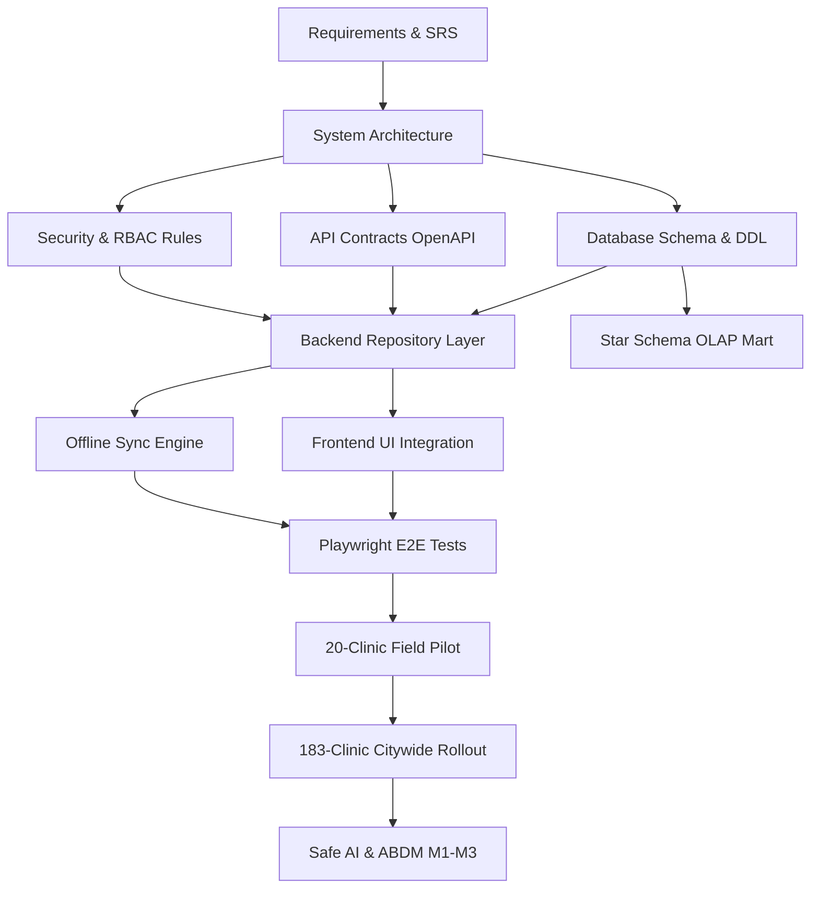

# 🗺️ Master Dependency Map & Directed Acyclic Graph (DAG)
## Namma Clinic Digital Health & Operations Platform
**Document Code:** PLN-DEP-01 | **Status:** Approved Baseline | **Date:** September 2026

---

### 1. Master Architectural Dependency DAG

