# Master Critical Path Analysis & Schedule Compression Strategy
## Namma Clinic Digital Health & Operations Platform
### Greater Bengaluru Authority (GBA) / BBMP Health Department
**Document Code:** `PLN-DOC-02` | **Status:** APPROVED BASELINE | **Date:** September 2026

---

## 1. Executive Summary & Critical Path Governance Charter
This document formalizes the authoritative **Master Critical Path Analysis and Schedule Compression Strategy** for the Namma Clinic Digital Health Platform. The critical path represents the continuous sequence of zero-float architectural, engineering, security, and clinical validation tasks that directly determine the minimum completion duration of the 18-sprint program. Any unmitigated delay along this sequence results in an immediate day-for-day slippage of municipal release milestones. Covering **50 Zero-Float Critical Path Nodes**, this analysis establishes rigorous schedule variance monitoring, critical activity isolation, fast-tracking techniques, and schedule-crashing protocols under the direct authority of the GBA Digital Health Program Directorate.

### 1.1 Non-Negotiable Critical Path Invariants
1. **Zero Total Float Enforced:** Every critical path task has an exact Early Start equal to Late Start, Early Finish equal to Late Finish, and zero float (`Total Float = 0`).
2. **Daily Variance Tracking:** Critical path items are monitored daily in senior engineering standups. Any activity experiencing $> 4$ hours of unplanned delay must trigger an automated Slack/Teams alert to the Technical Lead.
3. **Senior Pair Programming Safeguard:** All critical path engineering tasks must have an assigned Primary Senior Engineer and a designated Secondary Reviewer to eliminate single-person dependency risk.
4. **Pre-Authorized Schedule Crashing:** If a critical path activity slips by $> 1$ day, the Technical Lead is authorized to immediately reassign capacity from parallel non-critical workstreams to recover lost time.
5. **Full Upstream Bi-Directional Lineage:** Critical path activities must maintain explicit traceability to the 52 database entities (`TABLE-001` through `TABLE-052`) and 180 product features (`FEATURE-001` through `FEATURE-180`).

## 2. Master Critical Path Network Diagram

```mermaid
graph LR
    subgraph Phase_1_Foundation [Sprints 01-04: Foundation & Identity]
        CP01[CRITICAL-001: Core Infra] --> CP02[CRITICAL-002: Fastify Gateway]
        CP02 --> CP03[CRITICAL-003: Postgres Schema]
        CP03 --> CP04[CRITICAL-004: Keycloak OIDC]
        CP04 --> CP05[CRITICAL-005: ABHA Verification]
    end

    subgraph Phase_2_Clinical_Core [Sprints 05-09: Clinical OPD & Pharmacy]
        CP05 --> CP06[CRITICAL-006: Patient Token Engine]
        CP06 --> CP07[CRITICAL-007: Nurse Triage Vitals]
        CP07 --> CP08[CRITICAL-008: Doctor Workbench]
        CP08 --> CP09[CRITICAL-009: e-Prescriptions]
        CP09 --> CP10[CRITICAL-010: FEFO Pharmacy]
    end

    subgraph Phase_3_Advanced [Sprints 10-14: Edge Sync & Intelligence]
        CP10 --> CP11[CRITICAL-011: Offline SQLite Sync]
        CP11 --> CP12[CRITICAL-012: Lab Diagnostics]
        CP12 --> CP13[CRITICAL-013: Secondary Referrals]
        CP13 --> CP14[CRITICAL-014: Lakehouse Feeds]
    end

    subgraph Phase_4_Rollout [Sprints 15-18: Interop & Full Rollout]
        CP14 --> CP15[CRITICAL-015: ABDM Milestones]
        CP15 --> CP16[CRITICAL-016: Security VAPT]
        CP16 --> CP17[CRITICAL-017: DR Dry-Run]
        CP17 --> CP18[CRITICAL-018: Pilot 20 Cutover]
    end
```


### Configuration Specification Example: Critical Path Monitoring Specification
<!-- DOCUMENTATION-ONLY EXAMPLE -->
```yaml
# DOCUMENTATION-ONLY CONFIGURATION
# DOCUMENTATION-ONLY CONFIGURATION: Critical Path Activity Monitoring Schema
critical_path_monitor:
  node_id: "CRITICAL-001"
  work_item_id: "TASK-0001"
  activity_name: "Core Monorepo & Infrastructure Scaffolding"
  duration_days: 3
  early_start: "2026-09-07T09:00:00Z"
  early_finish: "2026-09-09T18:00:00Z"
  late_start: "2026-09-07T09:00:00Z"
  late_finish: "2026-09-09T18:00:00Z"
  total_float_hours: 0
  free_float_hours: 0
  crash_parameters:
    max_duration_compression_days: 1
    crash_cost_capacity_hours: 32
    allocated_pair_engineers: 2
  variance_triggers:
    warning_slip_hours: 4
    critical_slip_hours: 8
```

## 3. Comprehensive Master Critical Path Register (50 Canonical Nodes)
Authoritative specification of all **50 zero-float critical path nodes** governing the platform's delivery horizon:

### CRITICAL-001: Critical Path Node 001: Zero-Float Architectural Delivery Item
- **Critical Node Identifier:** `CRITICAL-001`
- **Governing Work Item:** `TASK-0001`
- **Immediate Predecessor:** `START_OF_PROGRAM`
- **Immediate Successor:** `TASK-0002`
- **Planned Duration:** `3 Days`
- **Total Float / Slack:** `0 Days (STRICT ZERO)`
- **Free Float:** `0 Days`
- **Schedule Variance Risk:** Direct day-for-day slip in release milestone if delayed.
- **Proactive Mitigation Protocol:** Dedicated senior pair programming and immediate escalation to Technical Lead.
- **Emergency Crashing & Fast-Tracking Strategy:** Crash schedule by reallocating platform core squad capacity.
- **Governing Sprint Window:** `SPRINT-01`
- **Target Milestone Release:** `RELEASE-1.0`
- **Criticality Status:** ZERO FLOAT — IMMEDIATE MERGE BLOCKER

### CRITICAL-002: Critical Path Node 002: Zero-Float Architectural Delivery Item
- **Critical Node Identifier:** `CRITICAL-002`
- **Governing Work Item:** `TASK-0021`
- **Immediate Predecessor:** `TASK-0020`
- **Immediate Successor:** `TASK-0022`
- **Planned Duration:** `4 Days`
- **Total Float / Slack:** `0 Days (STRICT ZERO)`
- **Free Float:** `0 Days`
- **Schedule Variance Risk:** Direct day-for-day slip in release milestone if delayed.
- **Proactive Mitigation Protocol:** Dedicated senior pair programming and immediate escalation to Technical Lead.
- **Emergency Crashing & Fast-Tracking Strategy:** Crash schedule by reallocating platform core squad capacity.
- **Governing Sprint Window:** `SPRINT-02`
- **Target Milestone Release:** `RELEASE-1.0`
- **Criticality Status:** ZERO FLOAT — IMMEDIATE MERGE BLOCKER

### CRITICAL-003: Critical Path Node 003: Zero-Float Architectural Delivery Item
- **Critical Node Identifier:** `CRITICAL-003`
- **Governing Work Item:** `TASK-0041`
- **Immediate Predecessor:** `TASK-0040`
- **Immediate Successor:** `TASK-0042`
- **Planned Duration:** `5 Days`
- **Total Float / Slack:** `0 Days (STRICT ZERO)`
- **Free Float:** `0 Days`
- **Schedule Variance Risk:** Direct day-for-day slip in release milestone if delayed.
- **Proactive Mitigation Protocol:** Dedicated senior pair programming and immediate escalation to Technical Lead.
- **Emergency Crashing & Fast-Tracking Strategy:** Crash schedule by reallocating platform core squad capacity.
- **Governing Sprint Window:** `SPRINT-03`
- **Target Milestone Release:** `RELEASE-1.0`
- **Criticality Status:** ZERO FLOAT — IMMEDIATE MERGE BLOCKER

### CRITICAL-004: Critical Path Node 004: Zero-Float Architectural Delivery Item
- **Critical Node Identifier:** `CRITICAL-004`
- **Governing Work Item:** `TASK-0061`
- **Immediate Predecessor:** `TASK-0060`
- **Immediate Successor:** `TASK-0062`
- **Planned Duration:** `2 Days`
- **Total Float / Slack:** `0 Days (STRICT ZERO)`
- **Free Float:** `0 Days`
- **Schedule Variance Risk:** Direct day-for-day slip in release milestone if delayed.
- **Proactive Mitigation Protocol:** Dedicated senior pair programming and immediate escalation to Technical Lead.
- **Emergency Crashing & Fast-Tracking Strategy:** Crash schedule by reallocating platform core squad capacity.
- **Governing Sprint Window:** `SPRINT-04`
- **Target Milestone Release:** `RELEASE-1.0`
- **Criticality Status:** ZERO FLOAT — IMMEDIATE MERGE BLOCKER

### CRITICAL-005: Critical Path Node 005: Zero-Float Architectural Delivery Item
- **Critical Node Identifier:** `CRITICAL-005`
- **Governing Work Item:** `TASK-0081`
- **Immediate Predecessor:** `TASK-0080`
- **Immediate Successor:** `TASK-0082`
- **Planned Duration:** `3 Days`
- **Total Float / Slack:** `0 Days (STRICT ZERO)`
- **Free Float:** `0 Days`
- **Schedule Variance Risk:** Direct day-for-day slip in release milestone if delayed.
- **Proactive Mitigation Protocol:** Dedicated senior pair programming and immediate escalation to Technical Lead.
- **Emergency Crashing & Fast-Tracking Strategy:** Crash schedule by reallocating platform core squad capacity.
- **Governing Sprint Window:** `SPRINT-05`
- **Target Milestone Release:** `RELEASE-2.0`
- **Criticality Status:** ZERO FLOAT — IMMEDIATE MERGE BLOCKER

### CRITICAL-006: Critical Path Node 006: Zero-Float Architectural Delivery Item
- **Critical Node Identifier:** `CRITICAL-006`
- **Governing Work Item:** `TASK-0101`
- **Immediate Predecessor:** `TASK-0100`
- **Immediate Successor:** `TASK-0102`
- **Planned Duration:** `4 Days`
- **Total Float / Slack:** `0 Days (STRICT ZERO)`
- **Free Float:** `0 Days`
- **Schedule Variance Risk:** Direct day-for-day slip in release milestone if delayed.
- **Proactive Mitigation Protocol:** Dedicated senior pair programming and immediate escalation to Technical Lead.
- **Emergency Crashing & Fast-Tracking Strategy:** Crash schedule by reallocating platform core squad capacity.
- **Governing Sprint Window:** `SPRINT-06`
- **Target Milestone Release:** `RELEASE-2.0`
- **Criticality Status:** ZERO FLOAT — IMMEDIATE MERGE BLOCKER

### CRITICAL-007: Critical Path Node 007: Zero-Float Architectural Delivery Item
- **Critical Node Identifier:** `CRITICAL-007`
- **Governing Work Item:** `TASK-0121`
- **Immediate Predecessor:** `TASK-0120`
- **Immediate Successor:** `TASK-0122`
- **Planned Duration:** `5 Days`
- **Total Float / Slack:** `0 Days (STRICT ZERO)`
- **Free Float:** `0 Days`
- **Schedule Variance Risk:** Direct day-for-day slip in release milestone if delayed.
- **Proactive Mitigation Protocol:** Dedicated senior pair programming and immediate escalation to Technical Lead.
- **Emergency Crashing & Fast-Tracking Strategy:** Crash schedule by reallocating platform core squad capacity.
- **Governing Sprint Window:** `SPRINT-07`
- **Target Milestone Release:** `RELEASE-2.0`
- **Criticality Status:** ZERO FLOAT — IMMEDIATE MERGE BLOCKER

### CRITICAL-008: Critical Path Node 008: Zero-Float Architectural Delivery Item
- **Critical Node Identifier:** `CRITICAL-008`
- **Governing Work Item:** `TASK-0141`
- **Immediate Predecessor:** `TASK-0140`
- **Immediate Successor:** `TASK-0142`
- **Planned Duration:** `2 Days`
- **Total Float / Slack:** `0 Days (STRICT ZERO)`
- **Free Float:** `0 Days`
- **Schedule Variance Risk:** Direct day-for-day slip in release milestone if delayed.
- **Proactive Mitigation Protocol:** Dedicated senior pair programming and immediate escalation to Technical Lead.
- **Emergency Crashing & Fast-Tracking Strategy:** Crash schedule by reallocating platform core squad capacity.
- **Governing Sprint Window:** `SPRINT-08`
- **Target Milestone Release:** `RELEASE-2.0`
- **Criticality Status:** ZERO FLOAT — IMMEDIATE MERGE BLOCKER

### CRITICAL-009: Critical Path Node 009: Zero-Float Architectural Delivery Item
- **Critical Node Identifier:** `CRITICAL-009`
- **Governing Work Item:** `TASK-0161`
- **Immediate Predecessor:** `TASK-0160`
- **Immediate Successor:** `TASK-0162`
- **Planned Duration:** `3 Days`
- **Total Float / Slack:** `0 Days (STRICT ZERO)`
- **Free Float:** `0 Days`
- **Schedule Variance Risk:** Direct day-for-day slip in release milestone if delayed.
- **Proactive Mitigation Protocol:** Dedicated senior pair programming and immediate escalation to Technical Lead.
- **Emergency Crashing & Fast-Tracking Strategy:** Crash schedule by reallocating platform core squad capacity.
- **Governing Sprint Window:** `SPRINT-09`
- **Target Milestone Release:** `RELEASE-3.0`
- **Criticality Status:** ZERO FLOAT — IMMEDIATE MERGE BLOCKER

### CRITICAL-010: Critical Path Node 010: Zero-Float Architectural Delivery Item
- **Critical Node Identifier:** `CRITICAL-010`
- **Governing Work Item:** `TASK-0181`
- **Immediate Predecessor:** `TASK-0180`
- **Immediate Successor:** `TASK-0182`
- **Planned Duration:** `4 Days`
- **Total Float / Slack:** `0 Days (STRICT ZERO)`
- **Free Float:** `0 Days`
- **Schedule Variance Risk:** Direct day-for-day slip in release milestone if delayed.
- **Proactive Mitigation Protocol:** Dedicated senior pair programming and immediate escalation to Technical Lead.
- **Emergency Crashing & Fast-Tracking Strategy:** Crash schedule by reallocating platform core squad capacity.
- **Governing Sprint Window:** `SPRINT-10`
- **Target Milestone Release:** `RELEASE-3.0`
- **Criticality Status:** ZERO FLOAT — IMMEDIATE MERGE BLOCKER

### CRITICAL-011: Critical Path Node 011: Zero-Float Architectural Delivery Item
- **Critical Node Identifier:** `CRITICAL-011`
- **Governing Work Item:** `TASK-0201`
- **Immediate Predecessor:** `TASK-0200`
- **Immediate Successor:** `TASK-0202`
- **Planned Duration:** `5 Days`
- **Total Float / Slack:** `0 Days (STRICT ZERO)`
- **Free Float:** `0 Days`
- **Schedule Variance Risk:** Direct day-for-day slip in release milestone if delayed.
- **Proactive Mitigation Protocol:** Dedicated senior pair programming and immediate escalation to Technical Lead.
- **Emergency Crashing & Fast-Tracking Strategy:** Crash schedule by reallocating platform core squad capacity.
- **Governing Sprint Window:** `SPRINT-11`
- **Target Milestone Release:** `RELEASE-3.0`
- **Criticality Status:** ZERO FLOAT — IMMEDIATE MERGE BLOCKER

### CRITICAL-012: Critical Path Node 012: Zero-Float Architectural Delivery Item
- **Critical Node Identifier:** `CRITICAL-012`
- **Governing Work Item:** `TASK-0221`
- **Immediate Predecessor:** `TASK-0220`
- **Immediate Successor:** `TASK-0222`
- **Planned Duration:** `2 Days`
- **Total Float / Slack:** `0 Days (STRICT ZERO)`
- **Free Float:** `0 Days`
- **Schedule Variance Risk:** Direct day-for-day slip in release milestone if delayed.
- **Proactive Mitigation Protocol:** Dedicated senior pair programming and immediate escalation to Technical Lead.
- **Emergency Crashing & Fast-Tracking Strategy:** Crash schedule by reallocating platform core squad capacity.
- **Governing Sprint Window:** `SPRINT-12`
- **Target Milestone Release:** `RELEASE-3.0`
- **Criticality Status:** ZERO FLOAT — IMMEDIATE MERGE BLOCKER

### CRITICAL-013: Critical Path Node 013: Zero-Float Architectural Delivery Item
- **Critical Node Identifier:** `CRITICAL-013`
- **Governing Work Item:** `TASK-0241`
- **Immediate Predecessor:** `TASK-0240`
- **Immediate Successor:** `TASK-0242`
- **Planned Duration:** `3 Days`
- **Total Float / Slack:** `0 Days (STRICT ZERO)`
- **Free Float:** `0 Days`
- **Schedule Variance Risk:** Direct day-for-day slip in release milestone if delayed.
- **Proactive Mitigation Protocol:** Dedicated senior pair programming and immediate escalation to Technical Lead.
- **Emergency Crashing & Fast-Tracking Strategy:** Crash schedule by reallocating platform core squad capacity.
- **Governing Sprint Window:** `SPRINT-13`
- **Target Milestone Release:** `RELEASE-4.0`
- **Criticality Status:** ZERO FLOAT — IMMEDIATE MERGE BLOCKER

### CRITICAL-014: Critical Path Node 014: Zero-Float Architectural Delivery Item
- **Critical Node Identifier:** `CRITICAL-014`
- **Governing Work Item:** `TASK-0261`
- **Immediate Predecessor:** `TASK-0260`
- **Immediate Successor:** `TASK-0262`
- **Planned Duration:** `4 Days`
- **Total Float / Slack:** `0 Days (STRICT ZERO)`
- **Free Float:** `0 Days`
- **Schedule Variance Risk:** Direct day-for-day slip in release milestone if delayed.
- **Proactive Mitigation Protocol:** Dedicated senior pair programming and immediate escalation to Technical Lead.
- **Emergency Crashing & Fast-Tracking Strategy:** Crash schedule by reallocating platform core squad capacity.
- **Governing Sprint Window:** `SPRINT-14`
- **Target Milestone Release:** `RELEASE-4.0`
- **Criticality Status:** ZERO FLOAT — IMMEDIATE MERGE BLOCKER

### CRITICAL-015: Critical Path Node 015: Zero-Float Architectural Delivery Item
- **Critical Node Identifier:** `CRITICAL-015`
- **Governing Work Item:** `TASK-0281`
- **Immediate Predecessor:** `TASK-0280`
- **Immediate Successor:** `TASK-0282`
- **Planned Duration:** `5 Days`
- **Total Float / Slack:** `0 Days (STRICT ZERO)`
- **Free Float:** `0 Days`
- **Schedule Variance Risk:** Direct day-for-day slip in release milestone if delayed.
- **Proactive Mitigation Protocol:** Dedicated senior pair programming and immediate escalation to Technical Lead.
- **Emergency Crashing & Fast-Tracking Strategy:** Crash schedule by reallocating platform core squad capacity.
- **Governing Sprint Window:** `SPRINT-15`
- **Target Milestone Release:** `RELEASE-4.0`
- **Criticality Status:** ZERO FLOAT — IMMEDIATE MERGE BLOCKER

### CRITICAL-016: Critical Path Node 016: Zero-Float Architectural Delivery Item
- **Critical Node Identifier:** `CRITICAL-016`
- **Governing Work Item:** `TASK-0301`
- **Immediate Predecessor:** `TASK-0300`
- **Immediate Successor:** `TASK-0302`
- **Planned Duration:** `2 Days`
- **Total Float / Slack:** `0 Days (STRICT ZERO)`
- **Free Float:** `0 Days`
- **Schedule Variance Risk:** Direct day-for-day slip in release milestone if delayed.
- **Proactive Mitigation Protocol:** Dedicated senior pair programming and immediate escalation to Technical Lead.
- **Emergency Crashing & Fast-Tracking Strategy:** Crash schedule by reallocating platform core squad capacity.
- **Governing Sprint Window:** `SPRINT-16`
- **Target Milestone Release:** `RELEASE-4.0`
- **Criticality Status:** ZERO FLOAT — IMMEDIATE MERGE BLOCKER

### CRITICAL-017: Critical Path Node 017: Zero-Float Architectural Delivery Item
- **Critical Node Identifier:** `CRITICAL-017`
- **Governing Work Item:** `TASK-0321`
- **Immediate Predecessor:** `TASK-0320`
- **Immediate Successor:** `TASK-0322`
- **Planned Duration:** `3 Days`
- **Total Float / Slack:** `0 Days (STRICT ZERO)`
- **Free Float:** `0 Days`
- **Schedule Variance Risk:** Direct day-for-day slip in release milestone if delayed.
- **Proactive Mitigation Protocol:** Dedicated senior pair programming and immediate escalation to Technical Lead.
- **Emergency Crashing & Fast-Tracking Strategy:** Crash schedule by reallocating platform core squad capacity.
- **Governing Sprint Window:** `SPRINT-17`
- **Target Milestone Release:** `RELEASE-5.0`
- **Criticality Status:** ZERO FLOAT — IMMEDIATE MERGE BLOCKER

### CRITICAL-018: Critical Path Node 018: Zero-Float Architectural Delivery Item
- **Critical Node Identifier:** `CRITICAL-018`
- **Governing Work Item:** `TASK-0341`
- **Immediate Predecessor:** `TASK-0340`
- **Immediate Successor:** `TASK-0342`
- **Planned Duration:** `4 Days`
- **Total Float / Slack:** `0 Days (STRICT ZERO)`
- **Free Float:** `0 Days`
- **Schedule Variance Risk:** Direct day-for-day slip in release milestone if delayed.
- **Proactive Mitigation Protocol:** Dedicated senior pair programming and immediate escalation to Technical Lead.
- **Emergency Crashing & Fast-Tracking Strategy:** Crash schedule by reallocating platform core squad capacity.
- **Governing Sprint Window:** `SPRINT-18`
- **Target Milestone Release:** `RELEASE-5.0`
- **Criticality Status:** ZERO FLOAT — IMMEDIATE MERGE BLOCKER

### CRITICAL-019: Critical Path Node 019: Zero-Float Architectural Delivery Item
- **Critical Node Identifier:** `CRITICAL-019`
- **Governing Work Item:** `TASK-0361`
- **Immediate Predecessor:** `TASK-0360`
- **Immediate Successor:** `TASK-0362`
- **Planned Duration:** `5 Days`
- **Total Float / Slack:** `0 Days (STRICT ZERO)`
- **Free Float:** `0 Days`
- **Schedule Variance Risk:** Direct day-for-day slip in release milestone if delayed.
- **Proactive Mitigation Protocol:** Dedicated senior pair programming and immediate escalation to Technical Lead.
- **Emergency Crashing & Fast-Tracking Strategy:** Crash schedule by reallocating platform core squad capacity.
- **Governing Sprint Window:** `SPRINT-01`
- **Target Milestone Release:** `RELEASE-1.0`
- **Criticality Status:** ZERO FLOAT — IMMEDIATE MERGE BLOCKER

### CRITICAL-020: Critical Path Node 020: Zero-Float Architectural Delivery Item
- **Critical Node Identifier:** `CRITICAL-020`
- **Governing Work Item:** `TASK-0381`
- **Immediate Predecessor:** `TASK-0380`
- **Immediate Successor:** `TASK-0382`
- **Planned Duration:** `2 Days`
- **Total Float / Slack:** `0 Days (STRICT ZERO)`
- **Free Float:** `0 Days`
- **Schedule Variance Risk:** Direct day-for-day slip in release milestone if delayed.
- **Proactive Mitigation Protocol:** Dedicated senior pair programming and immediate escalation to Technical Lead.
- **Emergency Crashing & Fast-Tracking Strategy:** Crash schedule by reallocating platform core squad capacity.
- **Governing Sprint Window:** `SPRINT-02`
- **Target Milestone Release:** `RELEASE-1.0`
- **Criticality Status:** ZERO FLOAT — IMMEDIATE MERGE BLOCKER

### CRITICAL-021: Critical Path Node 021: Zero-Float Architectural Delivery Item
- **Critical Node Identifier:** `CRITICAL-021`
- **Governing Work Item:** `TASK-0401`
- **Immediate Predecessor:** `TASK-0400`
- **Immediate Successor:** `TASK-0402`
- **Planned Duration:** `3 Days`
- **Total Float / Slack:** `0 Days (STRICT ZERO)`
- **Free Float:** `0 Days`
- **Schedule Variance Risk:** Direct day-for-day slip in release milestone if delayed.
- **Proactive Mitigation Protocol:** Dedicated senior pair programming and immediate escalation to Technical Lead.
- **Emergency Crashing & Fast-Tracking Strategy:** Crash schedule by reallocating platform core squad capacity.
- **Governing Sprint Window:** `SPRINT-03`
- **Target Milestone Release:** `RELEASE-1.0`
- **Criticality Status:** ZERO FLOAT — IMMEDIATE MERGE BLOCKER

### CRITICAL-022: Critical Path Node 022: Zero-Float Architectural Delivery Item
- **Critical Node Identifier:** `CRITICAL-022`
- **Governing Work Item:** `TASK-0421`
- **Immediate Predecessor:** `TASK-0420`
- **Immediate Successor:** `TASK-0422`
- **Planned Duration:** `4 Days`
- **Total Float / Slack:** `0 Days (STRICT ZERO)`
- **Free Float:** `0 Days`
- **Schedule Variance Risk:** Direct day-for-day slip in release milestone if delayed.
- **Proactive Mitigation Protocol:** Dedicated senior pair programming and immediate escalation to Technical Lead.
- **Emergency Crashing & Fast-Tracking Strategy:** Crash schedule by reallocating platform core squad capacity.
- **Governing Sprint Window:** `SPRINT-04`
- **Target Milestone Release:** `RELEASE-1.0`
- **Criticality Status:** ZERO FLOAT — IMMEDIATE MERGE BLOCKER

### CRITICAL-023: Critical Path Node 023: Zero-Float Architectural Delivery Item
- **Critical Node Identifier:** `CRITICAL-023`
- **Governing Work Item:** `TASK-0441`
- **Immediate Predecessor:** `TASK-0440`
- **Immediate Successor:** `TASK-0442`
- **Planned Duration:** `5 Days`
- **Total Float / Slack:** `0 Days (STRICT ZERO)`
- **Free Float:** `0 Days`
- **Schedule Variance Risk:** Direct day-for-day slip in release milestone if delayed.
- **Proactive Mitigation Protocol:** Dedicated senior pair programming and immediate escalation to Technical Lead.
- **Emergency Crashing & Fast-Tracking Strategy:** Crash schedule by reallocating platform core squad capacity.
- **Governing Sprint Window:** `SPRINT-05`
- **Target Milestone Release:** `RELEASE-2.0`
- **Criticality Status:** ZERO FLOAT — IMMEDIATE MERGE BLOCKER

### CRITICAL-024: Critical Path Node 024: Zero-Float Architectural Delivery Item
- **Critical Node Identifier:** `CRITICAL-024`
- **Governing Work Item:** `TASK-0461`
- **Immediate Predecessor:** `TASK-0460`
- **Immediate Successor:** `TASK-0462`
- **Planned Duration:** `2 Days`
- **Total Float / Slack:** `0 Days (STRICT ZERO)`
- **Free Float:** `0 Days`
- **Schedule Variance Risk:** Direct day-for-day slip in release milestone if delayed.
- **Proactive Mitigation Protocol:** Dedicated senior pair programming and immediate escalation to Technical Lead.
- **Emergency Crashing & Fast-Tracking Strategy:** Crash schedule by reallocating platform core squad capacity.
- **Governing Sprint Window:** `SPRINT-06`
- **Target Milestone Release:** `RELEASE-2.0`
- **Criticality Status:** ZERO FLOAT — IMMEDIATE MERGE BLOCKER

### CRITICAL-025: Critical Path Node 025: Zero-Float Architectural Delivery Item
- **Critical Node Identifier:** `CRITICAL-025`
- **Governing Work Item:** `TASK-0481`
- **Immediate Predecessor:** `TASK-0480`
- **Immediate Successor:** `TASK-0482`
- **Planned Duration:** `3 Days`
- **Total Float / Slack:** `0 Days (STRICT ZERO)`
- **Free Float:** `0 Days`
- **Schedule Variance Risk:** Direct day-for-day slip in release milestone if delayed.
- **Proactive Mitigation Protocol:** Dedicated senior pair programming and immediate escalation to Technical Lead.
- **Emergency Crashing & Fast-Tracking Strategy:** Crash schedule by reallocating platform core squad capacity.
- **Governing Sprint Window:** `SPRINT-07`
- **Target Milestone Release:** `RELEASE-2.0`
- **Criticality Status:** ZERO FLOAT — IMMEDIATE MERGE BLOCKER

### CRITICAL-026: Critical Path Node 026: Zero-Float Architectural Delivery Item
- **Critical Node Identifier:** `CRITICAL-026`
- **Governing Work Item:** `TASK-0501`
- **Immediate Predecessor:** `TASK-0500`
- **Immediate Successor:** `TASK-0502`
- **Planned Duration:** `4 Days`
- **Total Float / Slack:** `0 Days (STRICT ZERO)`
- **Free Float:** `0 Days`
- **Schedule Variance Risk:** Direct day-for-day slip in release milestone if delayed.
- **Proactive Mitigation Protocol:** Dedicated senior pair programming and immediate escalation to Technical Lead.
- **Emergency Crashing & Fast-Tracking Strategy:** Crash schedule by reallocating platform core squad capacity.
- **Governing Sprint Window:** `SPRINT-08`
- **Target Milestone Release:** `RELEASE-2.0`
- **Criticality Status:** ZERO FLOAT — IMMEDIATE MERGE BLOCKER

### CRITICAL-027: Critical Path Node 027: Zero-Float Architectural Delivery Item
- **Critical Node Identifier:** `CRITICAL-027`
- **Governing Work Item:** `TASK-0521`
- **Immediate Predecessor:** `TASK-0520`
- **Immediate Successor:** `TASK-0522`
- **Planned Duration:** `5 Days`
- **Total Float / Slack:** `0 Days (STRICT ZERO)`
- **Free Float:** `0 Days`
- **Schedule Variance Risk:** Direct day-for-day slip in release milestone if delayed.
- **Proactive Mitigation Protocol:** Dedicated senior pair programming and immediate escalation to Technical Lead.
- **Emergency Crashing & Fast-Tracking Strategy:** Crash schedule by reallocating platform core squad capacity.
- **Governing Sprint Window:** `SPRINT-09`
- **Target Milestone Release:** `RELEASE-3.0`
- **Criticality Status:** ZERO FLOAT — IMMEDIATE MERGE BLOCKER

### CRITICAL-028: Critical Path Node 028: Zero-Float Architectural Delivery Item
- **Critical Node Identifier:** `CRITICAL-028`
- **Governing Work Item:** `TASK-0541`
- **Immediate Predecessor:** `TASK-0540`
- **Immediate Successor:** `TASK-0542`
- **Planned Duration:** `2 Days`
- **Total Float / Slack:** `0 Days (STRICT ZERO)`
- **Free Float:** `0 Days`
- **Schedule Variance Risk:** Direct day-for-day slip in release milestone if delayed.
- **Proactive Mitigation Protocol:** Dedicated senior pair programming and immediate escalation to Technical Lead.
- **Emergency Crashing & Fast-Tracking Strategy:** Crash schedule by reallocating platform core squad capacity.
- **Governing Sprint Window:** `SPRINT-10`
- **Target Milestone Release:** `RELEASE-3.0`
- **Criticality Status:** ZERO FLOAT — IMMEDIATE MERGE BLOCKER

### CRITICAL-029: Critical Path Node 029: Zero-Float Architectural Delivery Item
- **Critical Node Identifier:** `CRITICAL-029`
- **Governing Work Item:** `TASK-0561`
- **Immediate Predecessor:** `TASK-0560`
- **Immediate Successor:** `TASK-0562`
- **Planned Duration:** `3 Days`
- **Total Float / Slack:** `0 Days (STRICT ZERO)`
- **Free Float:** `0 Days`
- **Schedule Variance Risk:** Direct day-for-day slip in release milestone if delayed.
- **Proactive Mitigation Protocol:** Dedicated senior pair programming and immediate escalation to Technical Lead.
- **Emergency Crashing & Fast-Tracking Strategy:** Crash schedule by reallocating platform core squad capacity.
- **Governing Sprint Window:** `SPRINT-11`
- **Target Milestone Release:** `RELEASE-3.0`
- **Criticality Status:** ZERO FLOAT — IMMEDIATE MERGE BLOCKER

### CRITICAL-030: Critical Path Node 030: Zero-Float Architectural Delivery Item
- **Critical Node Identifier:** `CRITICAL-030`
- **Governing Work Item:** `TASK-0581`
- **Immediate Predecessor:** `TASK-0580`
- **Immediate Successor:** `TASK-0582`
- **Planned Duration:** `4 Days`
- **Total Float / Slack:** `0 Days (STRICT ZERO)`
- **Free Float:** `0 Days`
- **Schedule Variance Risk:** Direct day-for-day slip in release milestone if delayed.
- **Proactive Mitigation Protocol:** Dedicated senior pair programming and immediate escalation to Technical Lead.
- **Emergency Crashing & Fast-Tracking Strategy:** Crash schedule by reallocating platform core squad capacity.
- **Governing Sprint Window:** `SPRINT-12`
- **Target Milestone Release:** `RELEASE-3.0`
- **Criticality Status:** ZERO FLOAT — IMMEDIATE MERGE BLOCKER

### CRITICAL-031: Critical Path Node 031: Zero-Float Architectural Delivery Item
- **Critical Node Identifier:** `CRITICAL-031`
- **Governing Work Item:** `TASK-0601`
- **Immediate Predecessor:** `TASK-0600`
- **Immediate Successor:** `TASK-0602`
- **Planned Duration:** `5 Days`
- **Total Float / Slack:** `0 Days (STRICT ZERO)`
- **Free Float:** `0 Days`
- **Schedule Variance Risk:** Direct day-for-day slip in release milestone if delayed.
- **Proactive Mitigation Protocol:** Dedicated senior pair programming and immediate escalation to Technical Lead.
- **Emergency Crashing & Fast-Tracking Strategy:** Crash schedule by reallocating platform core squad capacity.
- **Governing Sprint Window:** `SPRINT-13`
- **Target Milestone Release:** `RELEASE-4.0`
- **Criticality Status:** ZERO FLOAT — IMMEDIATE MERGE BLOCKER

### CRITICAL-032: Critical Path Node 032: Zero-Float Architectural Delivery Item
- **Critical Node Identifier:** `CRITICAL-032`
- **Governing Work Item:** `TASK-0621`
- **Immediate Predecessor:** `TASK-0620`
- **Immediate Successor:** `TASK-0622`
- **Planned Duration:** `2 Days`
- **Total Float / Slack:** `0 Days (STRICT ZERO)`
- **Free Float:** `0 Days`
- **Schedule Variance Risk:** Direct day-for-day slip in release milestone if delayed.
- **Proactive Mitigation Protocol:** Dedicated senior pair programming and immediate escalation to Technical Lead.
- **Emergency Crashing & Fast-Tracking Strategy:** Crash schedule by reallocating platform core squad capacity.
- **Governing Sprint Window:** `SPRINT-14`
- **Target Milestone Release:** `RELEASE-4.0`
- **Criticality Status:** ZERO FLOAT — IMMEDIATE MERGE BLOCKER

### CRITICAL-033: Critical Path Node 033: Zero-Float Architectural Delivery Item
- **Critical Node Identifier:** `CRITICAL-033`
- **Governing Work Item:** `TASK-0641`
- **Immediate Predecessor:** `TASK-0640`
- **Immediate Successor:** `TASK-0642`
- **Planned Duration:** `3 Days`
- **Total Float / Slack:** `0 Days (STRICT ZERO)`
- **Free Float:** `0 Days`
- **Schedule Variance Risk:** Direct day-for-day slip in release milestone if delayed.
- **Proactive Mitigation Protocol:** Dedicated senior pair programming and immediate escalation to Technical Lead.
- **Emergency Crashing & Fast-Tracking Strategy:** Crash schedule by reallocating platform core squad capacity.
- **Governing Sprint Window:** `SPRINT-15`
- **Target Milestone Release:** `RELEASE-4.0`
- **Criticality Status:** ZERO FLOAT — IMMEDIATE MERGE BLOCKER

### CRITICAL-034: Critical Path Node 034: Zero-Float Architectural Delivery Item
- **Critical Node Identifier:** `CRITICAL-034`
- **Governing Work Item:** `TASK-0661`
- **Immediate Predecessor:** `TASK-0660`
- **Immediate Successor:** `TASK-0662`
- **Planned Duration:** `4 Days`
- **Total Float / Slack:** `0 Days (STRICT ZERO)`
- **Free Float:** `0 Days`
- **Schedule Variance Risk:** Direct day-for-day slip in release milestone if delayed.
- **Proactive Mitigation Protocol:** Dedicated senior pair programming and immediate escalation to Technical Lead.
- **Emergency Crashing & Fast-Tracking Strategy:** Crash schedule by reallocating platform core squad capacity.
- **Governing Sprint Window:** `SPRINT-16`
- **Target Milestone Release:** `RELEASE-4.0`
- **Criticality Status:** ZERO FLOAT — IMMEDIATE MERGE BLOCKER

### CRITICAL-035: Critical Path Node 035: Zero-Float Architectural Delivery Item
- **Critical Node Identifier:** `CRITICAL-035`
- **Governing Work Item:** `TASK-0681`
- **Immediate Predecessor:** `TASK-0680`
- **Immediate Successor:** `TASK-0682`
- **Planned Duration:** `5 Days`
- **Total Float / Slack:** `0 Days (STRICT ZERO)`
- **Free Float:** `0 Days`
- **Schedule Variance Risk:** Direct day-for-day slip in release milestone if delayed.
- **Proactive Mitigation Protocol:** Dedicated senior pair programming and immediate escalation to Technical Lead.
- **Emergency Crashing & Fast-Tracking Strategy:** Crash schedule by reallocating platform core squad capacity.
- **Governing Sprint Window:** `SPRINT-17`
- **Target Milestone Release:** `RELEASE-5.0`
- **Criticality Status:** ZERO FLOAT — IMMEDIATE MERGE BLOCKER

### CRITICAL-036: Critical Path Node 036: Zero-Float Architectural Delivery Item
- **Critical Node Identifier:** `CRITICAL-036`
- **Governing Work Item:** `TASK-0701`
- **Immediate Predecessor:** `TASK-0700`
- **Immediate Successor:** `TASK-0702`
- **Planned Duration:** `2 Days`
- **Total Float / Slack:** `0 Days (STRICT ZERO)`
- **Free Float:** `0 Days`
- **Schedule Variance Risk:** Direct day-for-day slip in release milestone if delayed.
- **Proactive Mitigation Protocol:** Dedicated senior pair programming and immediate escalation to Technical Lead.
- **Emergency Crashing & Fast-Tracking Strategy:** Crash schedule by reallocating platform core squad capacity.
- **Governing Sprint Window:** `SPRINT-18`
- **Target Milestone Release:** `RELEASE-5.0`
- **Criticality Status:** ZERO FLOAT — IMMEDIATE MERGE BLOCKER

### CRITICAL-037: Critical Path Node 037: Zero-Float Architectural Delivery Item
- **Critical Node Identifier:** `CRITICAL-037`
- **Governing Work Item:** `TASK-0721`
- **Immediate Predecessor:** `TASK-0720`
- **Immediate Successor:** `TASK-0722`
- **Planned Duration:** `3 Days`
- **Total Float / Slack:** `0 Days (STRICT ZERO)`
- **Free Float:** `0 Days`
- **Schedule Variance Risk:** Direct day-for-day slip in release milestone if delayed.
- **Proactive Mitigation Protocol:** Dedicated senior pair programming and immediate escalation to Technical Lead.
- **Emergency Crashing & Fast-Tracking Strategy:** Crash schedule by reallocating platform core squad capacity.
- **Governing Sprint Window:** `SPRINT-01`
- **Target Milestone Release:** `RELEASE-1.0`
- **Criticality Status:** ZERO FLOAT — IMMEDIATE MERGE BLOCKER

### CRITICAL-038: Critical Path Node 038: Zero-Float Architectural Delivery Item
- **Critical Node Identifier:** `CRITICAL-038`
- **Governing Work Item:** `TASK-0741`
- **Immediate Predecessor:** `TASK-0740`
- **Immediate Successor:** `TASK-0742`
- **Planned Duration:** `4 Days`
- **Total Float / Slack:** `0 Days (STRICT ZERO)`
- **Free Float:** `0 Days`
- **Schedule Variance Risk:** Direct day-for-day slip in release milestone if delayed.
- **Proactive Mitigation Protocol:** Dedicated senior pair programming and immediate escalation to Technical Lead.
- **Emergency Crashing & Fast-Tracking Strategy:** Crash schedule by reallocating platform core squad capacity.
- **Governing Sprint Window:** `SPRINT-02`
- **Target Milestone Release:** `RELEASE-1.0`
- **Criticality Status:** ZERO FLOAT — IMMEDIATE MERGE BLOCKER

### CRITICAL-039: Critical Path Node 039: Zero-Float Architectural Delivery Item
- **Critical Node Identifier:** `CRITICAL-039`
- **Governing Work Item:** `TASK-0761`
- **Immediate Predecessor:** `TASK-0760`
- **Immediate Successor:** `TASK-0762`
- **Planned Duration:** `5 Days`
- **Total Float / Slack:** `0 Days (STRICT ZERO)`
- **Free Float:** `0 Days`
- **Schedule Variance Risk:** Direct day-for-day slip in release milestone if delayed.
- **Proactive Mitigation Protocol:** Dedicated senior pair programming and immediate escalation to Technical Lead.
- **Emergency Crashing & Fast-Tracking Strategy:** Crash schedule by reallocating platform core squad capacity.
- **Governing Sprint Window:** `SPRINT-03`
- **Target Milestone Release:** `RELEASE-1.0`
- **Criticality Status:** ZERO FLOAT — IMMEDIATE MERGE BLOCKER

### CRITICAL-040: Critical Path Node 040: Zero-Float Architectural Delivery Item
- **Critical Node Identifier:** `CRITICAL-040`
- **Governing Work Item:** `TASK-0781`
- **Immediate Predecessor:** `TASK-0780`
- **Immediate Successor:** `TASK-0782`
- **Planned Duration:** `2 Days`
- **Total Float / Slack:** `0 Days (STRICT ZERO)`
- **Free Float:** `0 Days`
- **Schedule Variance Risk:** Direct day-for-day slip in release milestone if delayed.
- **Proactive Mitigation Protocol:** Dedicated senior pair programming and immediate escalation to Technical Lead.
- **Emergency Crashing & Fast-Tracking Strategy:** Crash schedule by reallocating platform core squad capacity.
- **Governing Sprint Window:** `SPRINT-04`
- **Target Milestone Release:** `RELEASE-1.0`
- **Criticality Status:** ZERO FLOAT — IMMEDIATE MERGE BLOCKER

### CRITICAL-041: Critical Path Node 041: Zero-Float Architectural Delivery Item
- **Critical Node Identifier:** `CRITICAL-041`
- **Governing Work Item:** `TASK-0801`
- **Immediate Predecessor:** `TASK-0800`
- **Immediate Successor:** `TASK-0802`
- **Planned Duration:** `3 Days`
- **Total Float / Slack:** `0 Days (STRICT ZERO)`
- **Free Float:** `0 Days`
- **Schedule Variance Risk:** Direct day-for-day slip in release milestone if delayed.
- **Proactive Mitigation Protocol:** Dedicated senior pair programming and immediate escalation to Technical Lead.
- **Emergency Crashing & Fast-Tracking Strategy:** Crash schedule by reallocating platform core squad capacity.
- **Governing Sprint Window:** `SPRINT-05`
- **Target Milestone Release:** `RELEASE-2.0`
- **Criticality Status:** ZERO FLOAT — IMMEDIATE MERGE BLOCKER

### CRITICAL-042: Critical Path Node 042: Zero-Float Architectural Delivery Item
- **Critical Node Identifier:** `CRITICAL-042`
- **Governing Work Item:** `TASK-0821`
- **Immediate Predecessor:** `TASK-0820`
- **Immediate Successor:** `TASK-0822`
- **Planned Duration:** `4 Days`
- **Total Float / Slack:** `0 Days (STRICT ZERO)`
- **Free Float:** `0 Days`
- **Schedule Variance Risk:** Direct day-for-day slip in release milestone if delayed.
- **Proactive Mitigation Protocol:** Dedicated senior pair programming and immediate escalation to Technical Lead.
- **Emergency Crashing & Fast-Tracking Strategy:** Crash schedule by reallocating platform core squad capacity.
- **Governing Sprint Window:** `SPRINT-06`
- **Target Milestone Release:** `RELEASE-2.0`
- **Criticality Status:** ZERO FLOAT — IMMEDIATE MERGE BLOCKER

### CRITICAL-043: Critical Path Node 043: Zero-Float Architectural Delivery Item
- **Critical Node Identifier:** `CRITICAL-043`
- **Governing Work Item:** `TASK-0841`
- **Immediate Predecessor:** `TASK-0840`
- **Immediate Successor:** `TASK-0842`
- **Planned Duration:** `5 Days`
- **Total Float / Slack:** `0 Days (STRICT ZERO)`
- **Free Float:** `0 Days`
- **Schedule Variance Risk:** Direct day-for-day slip in release milestone if delayed.
- **Proactive Mitigation Protocol:** Dedicated senior pair programming and immediate escalation to Technical Lead.
- **Emergency Crashing & Fast-Tracking Strategy:** Crash schedule by reallocating platform core squad capacity.
- **Governing Sprint Window:** `SPRINT-07`
- **Target Milestone Release:** `RELEASE-2.0`
- **Criticality Status:** ZERO FLOAT — IMMEDIATE MERGE BLOCKER

### CRITICAL-044: Critical Path Node 044: Zero-Float Architectural Delivery Item
- **Critical Node Identifier:** `CRITICAL-044`
- **Governing Work Item:** `TASK-0861`
- **Immediate Predecessor:** `TASK-0860`
- **Immediate Successor:** `TASK-0862`
- **Planned Duration:** `2 Days`
- **Total Float / Slack:** `0 Days (STRICT ZERO)`
- **Free Float:** `0 Days`
- **Schedule Variance Risk:** Direct day-for-day slip in release milestone if delayed.
- **Proactive Mitigation Protocol:** Dedicated senior pair programming and immediate escalation to Technical Lead.
- **Emergency Crashing & Fast-Tracking Strategy:** Crash schedule by reallocating platform core squad capacity.
- **Governing Sprint Window:** `SPRINT-08`
- **Target Milestone Release:** `RELEASE-2.0`
- **Criticality Status:** ZERO FLOAT — IMMEDIATE MERGE BLOCKER

### CRITICAL-045: Critical Path Node 045: Zero-Float Architectural Delivery Item
- **Critical Node Identifier:** `CRITICAL-045`
- **Governing Work Item:** `TASK-0881`
- **Immediate Predecessor:** `TASK-0880`
- **Immediate Successor:** `TASK-0882`
- **Planned Duration:** `3 Days`
- **Total Float / Slack:** `0 Days (STRICT ZERO)`
- **Free Float:** `0 Days`
- **Schedule Variance Risk:** Direct day-for-day slip in release milestone if delayed.
- **Proactive Mitigation Protocol:** Dedicated senior pair programming and immediate escalation to Technical Lead.
- **Emergency Crashing & Fast-Tracking Strategy:** Crash schedule by reallocating platform core squad capacity.
- **Governing Sprint Window:** `SPRINT-09`
- **Target Milestone Release:** `RELEASE-3.0`
- **Criticality Status:** ZERO FLOAT — IMMEDIATE MERGE BLOCKER

### CRITICAL-046: Critical Path Node 046: Zero-Float Architectural Delivery Item
- **Critical Node Identifier:** `CRITICAL-046`
- **Governing Work Item:** `TASK-0901`
- **Immediate Predecessor:** `TASK-0900`
- **Immediate Successor:** `TASK-0902`
- **Planned Duration:** `4 Days`
- **Total Float / Slack:** `0 Days (STRICT ZERO)`
- **Free Float:** `0 Days`
- **Schedule Variance Risk:** Direct day-for-day slip in release milestone if delayed.
- **Proactive Mitigation Protocol:** Dedicated senior pair programming and immediate escalation to Technical Lead.
- **Emergency Crashing & Fast-Tracking Strategy:** Crash schedule by reallocating platform core squad capacity.
- **Governing Sprint Window:** `SPRINT-10`
- **Target Milestone Release:** `RELEASE-3.0`
- **Criticality Status:** ZERO FLOAT — IMMEDIATE MERGE BLOCKER

### CRITICAL-047: Critical Path Node 047: Zero-Float Architectural Delivery Item
- **Critical Node Identifier:** `CRITICAL-047`
- **Governing Work Item:** `TASK-0921`
- **Immediate Predecessor:** `TASK-0920`
- **Immediate Successor:** `TASK-0922`
- **Planned Duration:** `5 Days`
- **Total Float / Slack:** `0 Days (STRICT ZERO)`
- **Free Float:** `0 Days`
- **Schedule Variance Risk:** Direct day-for-day slip in release milestone if delayed.
- **Proactive Mitigation Protocol:** Dedicated senior pair programming and immediate escalation to Technical Lead.
- **Emergency Crashing & Fast-Tracking Strategy:** Crash schedule by reallocating platform core squad capacity.
- **Governing Sprint Window:** `SPRINT-11`
- **Target Milestone Release:** `RELEASE-3.0`
- **Criticality Status:** ZERO FLOAT — IMMEDIATE MERGE BLOCKER

### CRITICAL-048: Critical Path Node 048: Zero-Float Architectural Delivery Item
- **Critical Node Identifier:** `CRITICAL-048`
- **Governing Work Item:** `TASK-0941`
- **Immediate Predecessor:** `TASK-0940`
- **Immediate Successor:** `TASK-0942`
- **Planned Duration:** `2 Days`
- **Total Float / Slack:** `0 Days (STRICT ZERO)`
- **Free Float:** `0 Days`
- **Schedule Variance Risk:** Direct day-for-day slip in release milestone if delayed.
- **Proactive Mitigation Protocol:** Dedicated senior pair programming and immediate escalation to Technical Lead.
- **Emergency Crashing & Fast-Tracking Strategy:** Crash schedule by reallocating platform core squad capacity.
- **Governing Sprint Window:** `SPRINT-12`
- **Target Milestone Release:** `RELEASE-3.0`
- **Criticality Status:** ZERO FLOAT — IMMEDIATE MERGE BLOCKER

### CRITICAL-049: Critical Path Node 049: Zero-Float Architectural Delivery Item
- **Critical Node Identifier:** `CRITICAL-049`
- **Governing Work Item:** `TASK-0961`
- **Immediate Predecessor:** `TASK-0960`
- **Immediate Successor:** `TASK-0962`
- **Planned Duration:** `3 Days`
- **Total Float / Slack:** `0 Days (STRICT ZERO)`
- **Free Float:** `0 Days`
- **Schedule Variance Risk:** Direct day-for-day slip in release milestone if delayed.
- **Proactive Mitigation Protocol:** Dedicated senior pair programming and immediate escalation to Technical Lead.
- **Emergency Crashing & Fast-Tracking Strategy:** Crash schedule by reallocating platform core squad capacity.
- **Governing Sprint Window:** `SPRINT-13`
- **Target Milestone Release:** `RELEASE-4.0`
- **Criticality Status:** ZERO FLOAT — IMMEDIATE MERGE BLOCKER

### CRITICAL-050: Critical Path Node 050: Zero-Float Architectural Delivery Item
- **Critical Node Identifier:** `CRITICAL-050`
- **Governing Work Item:** `TASK-0981`
- **Immediate Predecessor:** `TASK-0980`
- **Immediate Successor:** `TASK-0982`
- **Planned Duration:** `4 Days`
- **Total Float / Slack:** `0 Days (STRICT ZERO)`
- **Free Float:** `0 Days`
- **Schedule Variance Risk:** Direct day-for-day slip in release milestone if delayed.
- **Proactive Mitigation Protocol:** Dedicated senior pair programming and immediate escalation to Technical Lead.
- **Emergency Crashing & Fast-Tracking Strategy:** Crash schedule by reallocating platform core squad capacity.
- **Governing Sprint Window:** `SPRINT-14`
- **Target Milestone Release:** `RELEASE-4.0`
- **Criticality Status:** ZERO FLOAT — IMMEDIATE MERGE BLOCKER

## 4. Schedule Compression, Crashing & Fast-Tracking Methodology
When variance monitoring indicates a schedule slip on the critical path, squads execute structured schedule compression:

### 4.1 Fast-Tracking Playbook (Parallel Execution)
- **Prerequisite Decoupling:** Introduce WireMock contract stubs to allow downstream engineering squads to implement against draft interfaces before upstream backend services complete full database integration.
- **Concurrent Testing & Staging:** Run automated end-to-end integration tests concurrently with performance soak tests in dedicated parallel staging environments.
- **Overlapping Review Cycles:** Conduct pull request reviews progressively on feature branches rather than waiting for full epic completion.

### 4.2 Schedule Crashing Playbook (Resource Augmentation)
- **Reallocation of Floating Squad Capacity:** Temporarily reassign senior developers from high-float workstreams (e.g. reporting dashboards, administrative settings) to zero-float critical path tasks.
- **Dedicated Pair Programming:** Institute mandatory 2-developer pair programming on blocked critical path modules to accelerate code review, debugging, and test creation.
- **Architectural Spike Overtime:** Authorize focused weekend or evening engineering spikes with technical leads to resolve complex infrastructural or algorithmic bottlenecks.

## 5. Critical Path Variance Monitoring across all 18 Sprints
Summary of critical nodes and maximum allowable variance across each delivery sprint:

| Sprint | Critical Path Focus | Nodes Count | Max Total Float | Variance Threshold | Recovery Action |
| :--- | :--- | :--- | :--- | :--- | :--- |
| `SPRINT-01` | Foundation Scaffolding & Architecture Readiness | 3 Nodes | 0.0 Days | 4 Hours | Fast-track integration stubs & pair senior devs |
| `SPRINT-02` | Identity, Authentication & Security Foundation | 3 Nodes | 0.0 Days | 4 Hours | Fast-track integration stubs & pair senior devs |
| `SPRINT-03` | Patient Registration & Demographics | 3 Nodes | 0.0 Days | 4 Hours | Fast-track integration stubs & pair senior devs |
| `SPRINT-04` | Patient Search, Repeat Visits & Consent | 3 Nodes | 0.0 Days | 4 Hours | Fast-track integration stubs & pair senior devs |
| `SPRINT-05` | Token Generation & Queue Management | 3 Nodes | 0.0 Days | 4 Hours | Fast-track integration stubs & pair senior devs |
| `SPRINT-06` | Clinical Triage, Vitals & Danger Alerts | 3 Nodes | 0.0 Days | 4 Hours | Fast-track integration stubs & pair senior devs |
| `SPRINT-07` | Doctor Consultation Workbench | 3 Nodes | 0.0 Days | 4 Hours | Fast-track integration stubs & pair senior devs |
| `SPRINT-08` | Diagnosis & Electronic Prescriptions | 3 Nodes | 0.0 Days | 4 Hours | Fast-track integration stubs & pair senior devs |
| `SPRINT-09` | Pharmacy Dispensation & FEFO Allocation | 3 Nodes | 0.0 Days | 4 Hours | Fast-track integration stubs & pair senior devs |
| `SPRINT-10` | Offline-First Resilience & Sync | 3 Nodes | 0.0 Days | 4 Hours | Fast-track integration stubs & pair senior devs |
| `SPRINT-11` | Laboratory & Point-of-Care Diagnostics | 3 Nodes | 0.0 Days | 4 Hours | Fast-track integration stubs & pair senior devs |
| `SPRINT-12` | Secondary Referrals & Bilingual SMS | 3 Nodes | 0.0 Days | 4 Hours | Fast-track integration stubs & pair senior devs |
| `SPRINT-13` | Drug Inventory & Supply Chain | 3 Nodes | 0.0 Days | 4 Hours | Fast-track integration stubs & pair senior devs |
| `SPRINT-14` | Population Health Analytics & Reporting | 3 Nodes | 0.0 Days | 4 Hours | Fast-track integration stubs & pair senior devs |
| `SPRINT-15` | AI/ML Clinical Decision Support | 2 Nodes | 0.0 Days | 4 Hours | Fast-track integration stubs & pair senior devs |
| `SPRINT-16` | ABDM National Interoperability | 2 Nodes | 0.0 Days | 4 Hours | Fast-track integration stubs & pair senior devs |
| `SPRINT-17` | Zero-Trust Security Hardening & DR | 2 Nodes | 0.0 Days | 4 Hours | Fast-track integration stubs & pair senior devs |
| `SPRINT-18` | Pilot Validation & Production Cutover | 2 Nodes | 0.0 Days | 4 Hours | Fast-track integration stubs & pair senior devs |

## 6. Table-Level Critical Path Lineage across all 52 Relational Tables
Critical path database migrations, entity dependencies, and locking constraints across all 52 tables:

### TABLE-001: Critical Path Lineage for Table `auth_users`
- **Table Identifier:** `TABLE-001` (`TBL-01`)
- **Table Entity Name:** `auth_users`
- **Critical Path Activity Reference:** `CRITICAL-001`
- **Associated Work Item:** `TASK-0001`
- **Migration Criticality:** Zero-float migration V001__auth_users.sql must execute without schema locks.
- **Rollback Validation:** Reversible Flyway undo scripts tested against simulated staging database.
- **Integrity Verification:** 100% of foreign key constraints validated in pre-merge pipeline.
- **Critical Impact Level:** HIGH — Schema alteration directly blocks downstream clinical API.

### TABLE-002: Critical Path Lineage for Table `user_credentials`
- **Table Identifier:** `TABLE-002` (`TBL-02`)
- **Table Entity Name:** `user_credentials`
- **Critical Path Activity Reference:** `CRITICAL-002`
- **Associated Work Item:** `TASK-0021`
- **Migration Criticality:** Zero-float migration V002__user_credentials.sql must execute without schema locks.
- **Rollback Validation:** Reversible Flyway undo scripts tested against simulated staging database.
- **Integrity Verification:** 100% of foreign key constraints validated in pre-merge pipeline.
- **Critical Impact Level:** HIGH — Schema alteration directly blocks downstream clinical API.

### TABLE-003: Critical Path Lineage for Table `user_sessions`
- **Table Identifier:** `TABLE-003` (`TBL-03`)
- **Table Entity Name:** `user_sessions`
- **Critical Path Activity Reference:** `CRITICAL-003`
- **Associated Work Item:** `TASK-0041`
- **Migration Criticality:** Zero-float migration V003__user_sessions.sql must execute without schema locks.
- **Rollback Validation:** Reversible Flyway undo scripts tested against simulated staging database.
- **Integrity Verification:** 100% of foreign key constraints validated in pre-merge pipeline.
- **Critical Impact Level:** HIGH — Schema alteration directly blocks downstream clinical API.

### TABLE-004: Critical Path Lineage for Table `roles`
- **Table Identifier:** `TABLE-004` (`TBL-04`)
- **Table Entity Name:** `roles`
- **Critical Path Activity Reference:** `CRITICAL-004`
- **Associated Work Item:** `TASK-0061`
- **Migration Criticality:** Zero-float migration V004__roles.sql must execute without schema locks.
- **Rollback Validation:** Reversible Flyway undo scripts tested against simulated staging database.
- **Integrity Verification:** 100% of foreign key constraints validated in pre-merge pipeline.
- **Critical Impact Level:** HIGH — Schema alteration directly blocks downstream clinical API.

### TABLE-005: Critical Path Lineage for Table `permissions`
- **Table Identifier:** `TABLE-005` (`TBL-05`)
- **Table Entity Name:** `permissions`
- **Critical Path Activity Reference:** `CRITICAL-005`
- **Associated Work Item:** `TASK-0081`
- **Migration Criticality:** Zero-float migration V005__permissions.sql must execute without schema locks.
- **Rollback Validation:** Reversible Flyway undo scripts tested against simulated staging database.
- **Integrity Verification:** 100% of foreign key constraints validated in pre-merge pipeline.
- **Critical Impact Level:** HIGH — Schema alteration directly blocks downstream clinical API.

### TABLE-006: Critical Path Lineage for Table `role_permissions`
- **Table Identifier:** `TABLE-006` (`TBL-06`)
- **Table Entity Name:** `role_permissions`
- **Critical Path Activity Reference:** `CRITICAL-006`
- **Associated Work Item:** `TASK-0101`
- **Migration Criticality:** Zero-float migration V006__role_permissions.sql must execute without schema locks.
- **Rollback Validation:** Reversible Flyway undo scripts tested against simulated staging database.
- **Integrity Verification:** 100% of foreign key constraints validated in pre-merge pipeline.
- **Critical Impact Level:** HIGH — Schema alteration directly blocks downstream clinical API.

### TABLE-007: Critical Path Lineage for Table `user_roles`
- **Table Identifier:** `TABLE-007` (`TBL-07`)
- **Table Entity Name:** `user_roles`
- **Critical Path Activity Reference:** `CRITICAL-007`
- **Associated Work Item:** `TASK-0121`
- **Migration Criticality:** Zero-float migration V007__user_roles.sql must execute without schema locks.
- **Rollback Validation:** Reversible Flyway undo scripts tested against simulated staging database.
- **Integrity Verification:** 100% of foreign key constraints validated in pre-merge pipeline.
- **Critical Impact Level:** HIGH — Schema alteration directly blocks downstream clinical API.

### TABLE-008: Critical Path Lineage for Table `facilities`
- **Table Identifier:** `TABLE-008` (`TBL-08`)
- **Table Entity Name:** `facilities`
- **Critical Path Activity Reference:** `CRITICAL-008`
- **Associated Work Item:** `TASK-0141`
- **Migration Criticality:** Zero-float migration V008__facilities.sql must execute without schema locks.
- **Rollback Validation:** Reversible Flyway undo scripts tested against simulated staging database.
- **Integrity Verification:** 100% of foreign key constraints validated in pre-merge pipeline.
- **Critical Impact Level:** HIGH — Schema alteration directly blocks downstream clinical API.

### TABLE-009: Critical Path Lineage for Table `facility_rooms`
- **Table Identifier:** `TABLE-009` (`TBL-09`)
- **Table Entity Name:** `facility_rooms`
- **Critical Path Activity Reference:** `CRITICAL-009`
- **Associated Work Item:** `TASK-0161`
- **Migration Criticality:** Zero-float migration V009__facility_rooms.sql must execute without schema locks.
- **Rollback Validation:** Reversible Flyway undo scripts tested against simulated staging database.
- **Integrity Verification:** 100% of foreign key constraints validated in pre-merge pipeline.
- **Critical Impact Level:** HIGH — Schema alteration directly blocks downstream clinical API.

### TABLE-010: Critical Path Lineage for Table `staff_profiles`
- **Table Identifier:** `TABLE-010` (`TBL-10`)
- **Table Entity Name:** `staff_profiles`
- **Critical Path Activity Reference:** `CRITICAL-010`
- **Associated Work Item:** `TASK-0181`
- **Migration Criticality:** Zero-float migration V010__staff_profiles.sql must execute without schema locks.
- **Rollback Validation:** Reversible Flyway undo scripts tested against simulated staging database.
- **Integrity Verification:** 100% of foreign key constraints validated in pre-merge pipeline.
- **Critical Impact Level:** HIGH — Schema alteration directly blocks downstream clinical API.

### TABLE-011: Critical Path Lineage for Table `staff_shifts`
- **Table Identifier:** `TABLE-011` (`TBL-11`)
- **Table Entity Name:** `staff_shifts`
- **Critical Path Activity Reference:** `CRITICAL-011`
- **Associated Work Item:** `TASK-0201`
- **Migration Criticality:** Zero-float migration V011__staff_shifts.sql must execute without schema locks.
- **Rollback Validation:** Reversible Flyway undo scripts tested against simulated staging database.
- **Integrity Verification:** 100% of foreign key constraints validated in pre-merge pipeline.
- **Critical Impact Level:** HIGH — Schema alteration directly blocks downstream clinical API.

### TABLE-012: Critical Path Lineage for Table `system_configs`
- **Table Identifier:** `TABLE-012` (`TBL-12`)
- **Table Entity Name:** `system_configs`
- **Critical Path Activity Reference:** `CRITICAL-012`
- **Associated Work Item:** `TASK-0221`
- **Migration Criticality:** Zero-float migration V012__system_configs.sql must execute without schema locks.
- **Rollback Validation:** Reversible Flyway undo scripts tested against simulated staging database.
- **Integrity Verification:** 100% of foreign key constraints validated in pre-merge pipeline.
- **Critical Impact Level:** HIGH — Schema alteration directly blocks downstream clinical API.

### TABLE-013: Critical Path Lineage for Table `patients`
- **Table Identifier:** `TABLE-013` (`TBL-13`)
- **Table Entity Name:** `patients`
- **Critical Path Activity Reference:** `CRITICAL-013`
- **Associated Work Item:** `TASK-0241`
- **Migration Criticality:** Zero-float migration V013__patients.sql must execute without schema locks.
- **Rollback Validation:** Reversible Flyway undo scripts tested against simulated staging database.
- **Integrity Verification:** 100% of foreign key constraints validated in pre-merge pipeline.
- **Critical Impact Level:** HIGH — Schema alteration directly blocks downstream clinical API.

### TABLE-014: Critical Path Lineage for Table `patient_identifiers`
- **Table Identifier:** `TABLE-014` (`TBL-14`)
- **Table Entity Name:** `patient_identifiers`
- **Critical Path Activity Reference:** `CRITICAL-014`
- **Associated Work Item:** `TASK-0261`
- **Migration Criticality:** Zero-float migration V014__patient_identifiers.sql must execute without schema locks.
- **Rollback Validation:** Reversible Flyway undo scripts tested against simulated staging database.
- **Integrity Verification:** 100% of foreign key constraints validated in pre-merge pipeline.
- **Critical Impact Level:** HIGH — Schema alteration directly blocks downstream clinical API.

### TABLE-015: Critical Path Lineage for Table `patient_contacts`
- **Table Identifier:** `TABLE-015` (`TBL-15`)
- **Table Entity Name:** `patient_contacts`
- **Critical Path Activity Reference:** `CRITICAL-015`
- **Associated Work Item:** `TASK-0281`
- **Migration Criticality:** Zero-float migration V015__patient_contacts.sql must execute without schema locks.
- **Rollback Validation:** Reversible Flyway undo scripts tested against simulated staging database.
- **Integrity Verification:** 100% of foreign key constraints validated in pre-merge pipeline.
- **Critical Impact Level:** HIGH — Schema alteration directly blocks downstream clinical API.

### TABLE-016: Critical Path Lineage for Table `patient_addresses`
- **Table Identifier:** `TABLE-016` (`TBL-16`)
- **Table Entity Name:** `patient_addresses`
- **Critical Path Activity Reference:** `CRITICAL-016`
- **Associated Work Item:** `TASK-0301`
- **Migration Criticality:** Zero-float migration V016__patient_addresses.sql must execute without schema locks.
- **Rollback Validation:** Reversible Flyway undo scripts tested against simulated staging database.
- **Integrity Verification:** 100% of foreign key constraints validated in pre-merge pipeline.
- **Critical Impact Level:** HIGH — Schema alteration directly blocks downstream clinical API.

### TABLE-017: Critical Path Lineage for Table `consent_records`
- **Table Identifier:** `TABLE-017` (`TBL-17`)
- **Table Entity Name:** `consent_records`
- **Critical Path Activity Reference:** `CRITICAL-017`
- **Associated Work Item:** `TASK-0321`
- **Migration Criticality:** Zero-float migration V017__consent_records.sql must execute without schema locks.
- **Rollback Validation:** Reversible Flyway undo scripts tested against simulated staging database.
- **Integrity Verification:** 100% of foreign key constraints validated in pre-merge pipeline.
- **Critical Impact Level:** HIGH — Schema alteration directly blocks downstream clinical API.

### TABLE-018: Critical Path Lineage for Table `tokens`
- **Table Identifier:** `TABLE-018` (`TBL-18`)
- **Table Entity Name:** `tokens`
- **Critical Path Activity Reference:** `CRITICAL-018`
- **Associated Work Item:** `TASK-0341`
- **Migration Criticality:** Zero-float migration V018__tokens.sql must execute without schema locks.
- **Rollback Validation:** Reversible Flyway undo scripts tested against simulated staging database.
- **Integrity Verification:** 100% of foreign key constraints validated in pre-merge pipeline.
- **Critical Impact Level:** HIGH — Schema alteration directly blocks downstream clinical API.

### TABLE-019: Critical Path Lineage for Table `queue_entries`
- **Table Identifier:** `TABLE-019` (`TBL-19`)
- **Table Entity Name:** `queue_entries`
- **Critical Path Activity Reference:** `CRITICAL-019`
- **Associated Work Item:** `TASK-0361`
- **Migration Criticality:** Zero-float migration V019__queue_entries.sql must execute without schema locks.
- **Rollback Validation:** Reversible Flyway undo scripts tested against simulated staging database.
- **Integrity Verification:** 100% of foreign key constraints validated in pre-merge pipeline.
- **Critical Impact Level:** HIGH — Schema alteration directly blocks downstream clinical API.

### TABLE-020: Critical Path Lineage for Table `triage_assessments`
- **Table Identifier:** `TABLE-020` (`TBL-20`)
- **Table Entity Name:** `triage_assessments`
- **Critical Path Activity Reference:** `CRITICAL-020`
- **Associated Work Item:** `TASK-0381`
- **Migration Criticality:** Zero-float migration V020__triage_assessments.sql must execute without schema locks.
- **Rollback Validation:** Reversible Flyway undo scripts tested against simulated staging database.
- **Integrity Verification:** 100% of foreign key constraints validated in pre-merge pipeline.
- **Critical Impact Level:** HIGH — Schema alteration directly blocks downstream clinical API.

### TABLE-021: Critical Path Lineage for Table `patient_vitals`
- **Table Identifier:** `TABLE-021` (`TBL-21`)
- **Table Entity Name:** `patient_vitals`
- **Critical Path Activity Reference:** `CRITICAL-021`
- **Associated Work Item:** `TASK-0401`
- **Migration Criticality:** Zero-float migration V021__patient_vitals.sql must execute without schema locks.
- **Rollback Validation:** Reversible Flyway undo scripts tested against simulated staging database.
- **Integrity Verification:** 100% of foreign key constraints validated in pre-merge pipeline.
- **Critical Impact Level:** HIGH — Schema alteration directly blocks downstream clinical API.

### TABLE-022: Critical Path Lineage for Table `danger_alerts`
- **Table Identifier:** `TABLE-022` (`TBL-22`)
- **Table Entity Name:** `danger_alerts`
- **Critical Path Activity Reference:** `CRITICAL-022`
- **Associated Work Item:** `TASK-0421`
- **Migration Criticality:** Zero-float migration V022__danger_alerts.sql must execute without schema locks.
- **Rollback Validation:** Reversible Flyway undo scripts tested against simulated staging database.
- **Integrity Verification:** 100% of foreign key constraints validated in pre-merge pipeline.
- **Critical Impact Level:** HIGH — Schema alteration directly blocks downstream clinical API.

### TABLE-023: Critical Path Lineage for Table `clinical_encounters`
- **Table Identifier:** `TABLE-023` (`TBL-23`)
- **Table Entity Name:** `clinical_encounters`
- **Critical Path Activity Reference:** `CRITICAL-023`
- **Associated Work Item:** `TASK-0441`
- **Migration Criticality:** Zero-float migration V023__clinical_encounters.sql must execute without schema locks.
- **Rollback Validation:** Reversible Flyway undo scripts tested against simulated staging database.
- **Integrity Verification:** 100% of foreign key constraints validated in pre-merge pipeline.
- **Critical Impact Level:** HIGH — Schema alteration directly blocks downstream clinical API.

### TABLE-024: Critical Path Lineage for Table `clinical_notes`
- **Table Identifier:** `TABLE-024` (`TBL-24`)
- **Table Entity Name:** `clinical_notes`
- **Critical Path Activity Reference:** `CRITICAL-024`
- **Associated Work Item:** `TASK-0461`
- **Migration Criticality:** Zero-float migration V024__clinical_notes.sql must execute without schema locks.
- **Rollback Validation:** Reversible Flyway undo scripts tested against simulated staging database.
- **Integrity Verification:** 100% of foreign key constraints validated in pre-merge pipeline.
- **Critical Impact Level:** HIGH — Schema alteration directly blocks downstream clinical API.

### TABLE-025: Critical Path Lineage for Table `diagnoses`
- **Table Identifier:** `TABLE-025` (`TBL-25`)
- **Table Entity Name:** `diagnoses`
- **Critical Path Activity Reference:** `CRITICAL-025`
- **Associated Work Item:** `TASK-0481`
- **Migration Criticality:** Zero-float migration V025__diagnoses.sql must execute without schema locks.
- **Rollback Validation:** Reversible Flyway undo scripts tested against simulated staging database.
- **Integrity Verification:** 100% of foreign key constraints validated in pre-merge pipeline.
- **Critical Impact Level:** HIGH — Schema alteration directly blocks downstream clinical API.

### TABLE-026: Critical Path Lineage for Table `prescriptions`
- **Table Identifier:** `TABLE-026` (`TBL-26`)
- **Table Entity Name:** `prescriptions`
- **Critical Path Activity Reference:** `CRITICAL-026`
- **Associated Work Item:** `TASK-0501`
- **Migration Criticality:** Zero-float migration V026__prescriptions.sql must execute without schema locks.
- **Rollback Validation:** Reversible Flyway undo scripts tested against simulated staging database.
- **Integrity Verification:** 100% of foreign key constraints validated in pre-merge pipeline.
- **Critical Impact Level:** HIGH — Schema alteration directly blocks downstream clinical API.

### TABLE-027: Critical Path Lineage for Table `prescription_items`
- **Table Identifier:** `TABLE-027` (`TBL-27`)
- **Table Entity Name:** `prescription_items`
- **Critical Path Activity Reference:** `CRITICAL-027`
- **Associated Work Item:** `TASK-0521`
- **Migration Criticality:** Zero-float migration V027__prescription_items.sql must execute without schema locks.
- **Rollback Validation:** Reversible Flyway undo scripts tested against simulated staging database.
- **Integrity Verification:** 100% of foreign key constraints validated in pre-merge pipeline.
- **Critical Impact Level:** HIGH — Schema alteration directly blocks downstream clinical API.

### TABLE-028: Critical Path Lineage for Table `lab_orders`
- **Table Identifier:** `TABLE-028` (`TBL-28`)
- **Table Entity Name:** `lab_orders`
- **Critical Path Activity Reference:** `CRITICAL-028`
- **Associated Work Item:** `TASK-0541`
- **Migration Criticality:** Zero-float migration V028__lab_orders.sql must execute without schema locks.
- **Rollback Validation:** Reversible Flyway undo scripts tested against simulated staging database.
- **Integrity Verification:** 100% of foreign key constraints validated in pre-merge pipeline.
- **Critical Impact Level:** HIGH — Schema alteration directly blocks downstream clinical API.

### TABLE-029: Critical Path Lineage for Table `lab_order_items`
- **Table Identifier:** `TABLE-029` (`TBL-29`)
- **Table Entity Name:** `lab_order_items`
- **Critical Path Activity Reference:** `CRITICAL-029`
- **Associated Work Item:** `TASK-0561`
- **Migration Criticality:** Zero-float migration V029__lab_order_items.sql must execute without schema locks.
- **Rollback Validation:** Reversible Flyway undo scripts tested against simulated staging database.
- **Integrity Verification:** 100% of foreign key constraints validated in pre-merge pipeline.
- **Critical Impact Level:** HIGH — Schema alteration directly blocks downstream clinical API.

### TABLE-030: Critical Path Lineage for Table `lab_results`
- **Table Identifier:** `TABLE-030` (`TBL-30`)
- **Table Entity Name:** `lab_results`
- **Critical Path Activity Reference:** `CRITICAL-030`
- **Associated Work Item:** `TASK-0581`
- **Migration Criticality:** Zero-float migration V030__lab_results.sql must execute without schema locks.
- **Rollback Validation:** Reversible Flyway undo scripts tested against simulated staging database.
- **Integrity Verification:** 100% of foreign key constraints validated in pre-merge pipeline.
- **Critical Impact Level:** HIGH — Schema alteration directly blocks downstream clinical API.

### TABLE-031: Critical Path Lineage for Table `teleconsultations`
- **Table Identifier:** `TABLE-031` (`TBL-31`)
- **Table Entity Name:** `teleconsultations`
- **Critical Path Activity Reference:** `CRITICAL-031`
- **Associated Work Item:** `TASK-0601`
- **Migration Criticality:** Zero-float migration V031__teleconsultations.sql must execute without schema locks.
- **Rollback Validation:** Reversible Flyway undo scripts tested against simulated staging database.
- **Integrity Verification:** 100% of foreign key constraints validated in pre-merge pipeline.
- **Critical Impact Level:** HIGH — Schema alteration directly blocks downstream clinical API.

### TABLE-032: Critical Path Lineage for Table `formulary_drugs`
- **Table Identifier:** `TABLE-032` (`TBL-32`)
- **Table Entity Name:** `formulary_drugs`
- **Critical Path Activity Reference:** `CRITICAL-032`
- **Associated Work Item:** `TASK-0621`
- **Migration Criticality:** Zero-float migration V032__formulary_drugs.sql must execute without schema locks.
- **Rollback Validation:** Reversible Flyway undo scripts tested against simulated staging database.
- **Integrity Verification:** 100% of foreign key constraints validated in pre-merge pipeline.
- **Critical Impact Level:** HIGH — Schema alteration directly blocks downstream clinical API.

### TABLE-033: Critical Path Lineage for Table `drug_categories`
- **Table Identifier:** `TABLE-033` (`TBL-33`)
- **Table Entity Name:** `drug_categories`
- **Critical Path Activity Reference:** `CRITICAL-033`
- **Associated Work Item:** `TASK-0641`
- **Migration Criticality:** Zero-float migration V033__drug_categories.sql must execute without schema locks.
- **Rollback Validation:** Reversible Flyway undo scripts tested against simulated staging database.
- **Integrity Verification:** 100% of foreign key constraints validated in pre-merge pipeline.
- **Critical Impact Level:** HIGH — Schema alteration directly blocks downstream clinical API.

### TABLE-034: Critical Path Lineage for Table `pharmacy_batches`
- **Table Identifier:** `TABLE-034` (`TBL-34`)
- **Table Entity Name:** `pharmacy_batches`
- **Critical Path Activity Reference:** `CRITICAL-034`
- **Associated Work Item:** `TASK-0661`
- **Migration Criticality:** Zero-float migration V034__pharmacy_batches.sql must execute without schema locks.
- **Rollback Validation:** Reversible Flyway undo scripts tested against simulated staging database.
- **Integrity Verification:** 100% of foreign key constraints validated in pre-merge pipeline.
- **Critical Impact Level:** HIGH — Schema alteration directly blocks downstream clinical API.

### TABLE-035: Critical Path Lineage for Table `clinic_stock`
- **Table Identifier:** `TABLE-035` (`TBL-35`)
- **Table Entity Name:** `clinic_stock`
- **Critical Path Activity Reference:** `CRITICAL-035`
- **Associated Work Item:** `TASK-0681`
- **Migration Criticality:** Zero-float migration V035__clinic_stock.sql must execute without schema locks.
- **Rollback Validation:** Reversible Flyway undo scripts tested against simulated staging database.
- **Integrity Verification:** 100% of foreign key constraints validated in pre-merge pipeline.
- **Critical Impact Level:** HIGH — Schema alteration directly blocks downstream clinical API.

### TABLE-036: Critical Path Lineage for Table `dispensations`
- **Table Identifier:** `TABLE-036` (`TBL-36`)
- **Table Entity Name:** `dispensations`
- **Critical Path Activity Reference:** `CRITICAL-036`
- **Associated Work Item:** `TASK-0701`
- **Migration Criticality:** Zero-float migration V036__dispensations.sql must execute without schema locks.
- **Rollback Validation:** Reversible Flyway undo scripts tested against simulated staging database.
- **Integrity Verification:** 100% of foreign key constraints validated in pre-merge pipeline.
- **Critical Impact Level:** HIGH — Schema alteration directly blocks downstream clinical API.

### TABLE-037: Critical Path Lineage for Table `dispensation_items`
- **Table Identifier:** `TABLE-037` (`TBL-37`)
- **Table Entity Name:** `dispensation_items`
- **Critical Path Activity Reference:** `CRITICAL-037`
- **Associated Work Item:** `TASK-0721`
- **Migration Criticality:** Zero-float migration V037__dispensation_items.sql must execute without schema locks.
- **Rollback Validation:** Reversible Flyway undo scripts tested against simulated staging database.
- **Integrity Verification:** 100% of foreign key constraints validated in pre-merge pipeline.
- **Critical Impact Level:** HIGH — Schema alteration directly blocks downstream clinical API.

### TABLE-038: Critical Path Lineage for Table `stock_movements`
- **Table Identifier:** `TABLE-038` (`TBL-38`)
- **Table Entity Name:** `stock_movements`
- **Critical Path Activity Reference:** `CRITICAL-038`
- **Associated Work Item:** `TASK-0741`
- **Migration Criticality:** Zero-float migration V038__stock_movements.sql must execute without schema locks.
- **Rollback Validation:** Reversible Flyway undo scripts tested against simulated staging database.
- **Integrity Verification:** 100% of foreign key constraints validated in pre-merge pipeline.
- **Critical Impact Level:** HIGH — Schema alteration directly blocks downstream clinical API.

### TABLE-039: Critical Path Lineage for Table `drug_indents`
- **Table Identifier:** `TABLE-039` (`TBL-39`)
- **Table Entity Name:** `drug_indents`
- **Critical Path Activity Reference:** `CRITICAL-039`
- **Associated Work Item:** `TASK-0761`
- **Migration Criticality:** Zero-float migration V039__drug_indents.sql must execute without schema locks.
- **Rollback Validation:** Reversible Flyway undo scripts tested against simulated staging database.
- **Integrity Verification:** 100% of foreign key constraints validated in pre-merge pipeline.
- **Critical Impact Level:** HIGH — Schema alteration directly blocks downstream clinical API.

### TABLE-040: Critical Path Lineage for Table `indent_items`
- **Table Identifier:** `TABLE-040` (`TBL-40`)
- **Table Entity Name:** `indent_items`
- **Critical Path Activity Reference:** `CRITICAL-040`
- **Associated Work Item:** `TASK-0781`
- **Migration Criticality:** Zero-float migration V040__indent_items.sql must execute without schema locks.
- **Rollback Validation:** Reversible Flyway undo scripts tested against simulated staging database.
- **Integrity Verification:** 100% of foreign key constraints validated in pre-merge pipeline.
- **Critical Impact Level:** HIGH — Schema alteration directly blocks downstream clinical API.

### TABLE-041: Critical Path Lineage for Table `cold_chain_devices`
- **Table Identifier:** `TABLE-041` (`TBL-41`)
- **Table Entity Name:** `cold_chain_devices`
- **Critical Path Activity Reference:** `CRITICAL-041`
- **Associated Work Item:** `TASK-0801`
- **Migration Criticality:** Zero-float migration V041__cold_chain_devices.sql must execute without schema locks.
- **Rollback Validation:** Reversible Flyway undo scripts tested against simulated staging database.
- **Integrity Verification:** 100% of foreign key constraints validated in pre-merge pipeline.
- **Critical Impact Level:** HIGH — Schema alteration directly blocks downstream clinical API.

### TABLE-042: Critical Path Lineage for Table `cold_chain_telemetry`
- **Table Identifier:** `TABLE-042` (`TBL-42`)
- **Table Entity Name:** `cold_chain_telemetry`
- **Critical Path Activity Reference:** `CRITICAL-042`
- **Associated Work Item:** `TASK-0821`
- **Migration Criticality:** Zero-float migration V042__cold_chain_telemetry.sql must execute without schema locks.
- **Rollback Validation:** Reversible Flyway undo scripts tested against simulated staging database.
- **Integrity Verification:** 100% of foreign key constraints validated in pre-merge pipeline.
- **Critical Impact Level:** HIGH — Schema alteration directly blocks downstream clinical API.

### TABLE-043: Critical Path Lineage for Table `referrals`
- **Table Identifier:** `TABLE-043` (`TBL-43`)
- **Table Entity Name:** `referrals`
- **Critical Path Activity Reference:** `CRITICAL-043`
- **Associated Work Item:** `TASK-0841`
- **Migration Criticality:** Zero-float migration V043__referrals.sql must execute without schema locks.
- **Rollback Validation:** Reversible Flyway undo scripts tested against simulated staging database.
- **Integrity Verification:** 100% of foreign key constraints validated in pre-merge pipeline.
- **Critical Impact Level:** HIGH — Schema alteration directly blocks downstream clinical API.

### TABLE-044: Critical Path Lineage for Table `referral_counter_notes`
- **Table Identifier:** `TABLE-044` (`TBL-44`)
- **Table Entity Name:** `referral_counter_notes`
- **Critical Path Activity Reference:** `CRITICAL-044`
- **Associated Work Item:** `TASK-0861`
- **Migration Criticality:** Zero-float migration V044__referral_counter_notes.sql must execute without schema locks.
- **Rollback Validation:** Reversible Flyway undo scripts tested against simulated staging database.
- **Integrity Verification:** 100% of foreign key constraints validated in pre-merge pipeline.
- **Critical Impact Level:** HIGH — Schema alteration directly blocks downstream clinical API.

### TABLE-045: Critical Path Lineage for Table `ncd_episodes`
- **Table Identifier:** `TABLE-045` (`TBL-45`)
- **Table Entity Name:** `ncd_episodes`
- **Critical Path Activity Reference:** `CRITICAL-045`
- **Associated Work Item:** `TASK-0881`
- **Migration Criticality:** Zero-float migration V045__ncd_episodes.sql must execute without schema locks.
- **Rollback Validation:** Reversible Flyway undo scripts tested against simulated staging database.
- **Integrity Verification:** 100% of foreign key constraints validated in pre-merge pipeline.
- **Critical Impact Level:** HIGH — Schema alteration directly blocks downstream clinical API.

### TABLE-046: Critical Path Lineage for Table `follow_up_schedules`
- **Table Identifier:** `TABLE-046` (`TBL-46`)
- **Table Entity Name:** `follow_up_schedules`
- **Critical Path Activity Reference:** `CRITICAL-046`
- **Associated Work Item:** `TASK-0901`
- **Migration Criticality:** Zero-float migration V046__follow_up_schedules.sql must execute without schema locks.
- **Rollback Validation:** Reversible Flyway undo scripts tested against simulated staging database.
- **Integrity Verification:** 100% of foreign key constraints validated in pre-merge pipeline.
- **Critical Impact Level:** HIGH — Schema alteration directly blocks downstream clinical API.

### TABLE-047: Critical Path Lineage for Table `notifications`
- **Table Identifier:** `TABLE-047` (`TBL-47`)
- **Table Entity Name:** `notifications`
- **Critical Path Activity Reference:** `CRITICAL-047`
- **Associated Work Item:** `TASK-0921`
- **Migration Criticality:** Zero-float migration V047__notifications.sql must execute without schema locks.
- **Rollback Validation:** Reversible Flyway undo scripts tested against simulated staging database.
- **Integrity Verification:** 100% of foreign key constraints validated in pre-merge pipeline.
- **Critical Impact Level:** HIGH — Schema alteration directly blocks downstream clinical API.

### TABLE-048: Critical Path Lineage for Table `grievances`
- **Table Identifier:** `TABLE-048` (`TBL-48`)
- **Table Entity Name:** `grievances`
- **Critical Path Activity Reference:** `CRITICAL-048`
- **Associated Work Item:** `TASK-0941`
- **Migration Criticality:** Zero-float migration V048__grievances.sql must execute without schema locks.
- **Rollback Validation:** Reversible Flyway undo scripts tested against simulated staging database.
- **Integrity Verification:** 100% of foreign key constraints validated in pre-merge pipeline.
- **Critical Impact Level:** HIGH — Schema alteration directly blocks downstream clinical API.

### TABLE-049: Critical Path Lineage for Table `helpdesk_tickets`
- **Table Identifier:** `TABLE-049` (`TBL-49`)
- **Table Entity Name:** `helpdesk_tickets`
- **Critical Path Activity Reference:** `CRITICAL-049`
- **Associated Work Item:** `TASK-0961`
- **Migration Criticality:** Zero-float migration V049__helpdesk_tickets.sql must execute without schema locks.
- **Rollback Validation:** Reversible Flyway undo scripts tested against simulated staging database.
- **Integrity Verification:** 100% of foreign key constraints validated in pre-merge pipeline.
- **Critical Impact Level:** HIGH — Schema alteration directly blocks downstream clinical API.

### TABLE-050: Critical Path Lineage for Table `audit_events`
- **Table Identifier:** `TABLE-050` (`TBL-50`)
- **Table Entity Name:** `audit_events`
- **Critical Path Activity Reference:** `CRITICAL-050`
- **Associated Work Item:** `TASK-0981`
- **Migration Criticality:** Zero-float migration V050__audit_events.sql must execute without schema locks.
- **Rollback Validation:** Reversible Flyway undo scripts tested against simulated staging database.
- **Integrity Verification:** 100% of foreign key constraints validated in pre-merge pipeline.
- **Critical Impact Level:** HIGH — Schema alteration directly blocks downstream clinical API.

### TABLE-051: Critical Path Lineage for Table `offline_mutation_log`
- **Table Identifier:** `TABLE-051` (`TBL-51`)
- **Table Entity Name:** `offline_mutation_log`
- **Critical Path Activity Reference:** `CRITICAL-001`
- **Associated Work Item:** `TASK-0001`
- **Migration Criticality:** Zero-float migration V051__offline_mutation_log.sql must execute without schema locks.
- **Rollback Validation:** Reversible Flyway undo scripts tested against simulated staging database.
- **Integrity Verification:** 100% of foreign key constraints validated in pre-merge pipeline.
- **Critical Impact Level:** HIGH — Schema alteration directly blocks downstream clinical API.

### TABLE-052: Critical Path Lineage for Table `abdm_artifacts`
- **Table Identifier:** `TABLE-052` (`TBL-52`)
- **Table Entity Name:** `abdm_artifacts`
- **Critical Path Activity Reference:** `CRITICAL-002`
- **Associated Work Item:** `TASK-0021`
- **Migration Criticality:** Zero-float migration V052__abdm_artifacts.sql must execute without schema locks.
- **Rollback Validation:** Reversible Flyway undo scripts tested against simulated staging database.
- **Integrity Verification:** 100% of foreign key constraints validated in pre-merge pipeline.
- **Critical Impact Level:** HIGH — Schema alteration directly blocks downstream clinical API.

## 7. Product Feature Critical Path Impact across all 180 Features
Critical path allocation and delivery impact across all 180 platform product features:

### FEATURE-001: Critical Path Alignment for Feature `Credential Verification`
- **Feature Identifier:** `FEATURE-001` (Feature #1)
- **Functional Module:** `MODULE-001` (DOMAIN-001)
- **Governing Critical Path Node:** `CRITICAL-001`
- **Governing Work Item:** `TASK-0001`
- **Feature Float Allocation:** 0 Days (Critical Path Predecessor)
- **Delivery Gate:** Full acceptance test suite passing with sub-250ms p95 latency.
- **Impact of Delay:** Direct slip in municipal release candidate deployment.
- **Traceability Status:** 100% VERIFIED

### FEATURE-002: Critical Path Alignment for Feature `Session Token Minting`
- **Feature Identifier:** `FEATURE-002` (Feature #2)
- **Functional Module:** `MODULE-001` (DOMAIN-001)
- **Governing Critical Path Node:** `CRITICAL-002`
- **Governing Work Item:** `TASK-0021`
- **Feature Float Allocation:** 0 Days (Critical Path Predecessor)
- **Delivery Gate:** Full acceptance test suite passing with sub-250ms p95 latency.
- **Impact of Delay:** Direct slip in municipal release candidate deployment.
- **Traceability Status:** 100% VERIFIED

### FEATURE-003: Critical Path Alignment for Feature `MFA Challenge Dispatch`
- **Feature Identifier:** `FEATURE-003` (Feature #3)
- **Functional Module:** `MODULE-001` (DOMAIN-001)
- **Governing Critical Path Node:** `CRITICAL-003`
- **Governing Work Item:** `TASK-0041`
- **Feature Float Allocation:** 0 Days (Critical Path Predecessor)
- **Delivery Gate:** Full acceptance test suite passing with sub-250ms p95 latency.
- **Impact of Delay:** Direct slip in municipal release candidate deployment.
- **Traceability Status:** 100% VERIFIED

### FEATURE-004: Critical Path Alignment for Feature `Biometric Authentication Bridge`
- **Feature Identifier:** `FEATURE-004` (Feature #4)
- **Functional Module:** `MODULE-001` (DOMAIN-001)
- **Governing Critical Path Node:** `CRITICAL-004`
- **Governing Work Item:** `TASK-0061`
- **Feature Float Allocation:** 0 Days (Critical Path Predecessor)
- **Delivery Gate:** Full acceptance test suite passing with sub-250ms p95 latency.
- **Impact of Delay:** Direct slip in municipal release candidate deployment.
- **Traceability Status:** 100% VERIFIED

### FEATURE-005: Critical Path Alignment for Feature `Local PIN Verification`
- **Feature Identifier:** `FEATURE-005` (Feature #5)
- **Functional Module:** `MODULE-001` (DOMAIN-001)
- **Governing Critical Path Node:** `CRITICAL-005`
- **Governing Work Item:** `TASK-0081`
- **Feature Float Allocation:** 0 Days (Critical Path Predecessor)
- **Delivery Gate:** Full acceptance test suite passing with sub-250ms p95 latency.
- **Impact of Delay:** Direct slip in municipal release candidate deployment.
- **Traceability Status:** 100% VERIFIED

### FEATURE-006: Critical Path Alignment for Feature `Session Inactivity Lockout`
- **Feature Identifier:** `FEATURE-006` (Feature #6)
- **Functional Module:** `MODULE-001` (DOMAIN-001)
- **Governing Critical Path Node:** `CRITICAL-006`
- **Governing Work Item:** `TASK-0101`
- **Feature Float Allocation:** 0 Days (Critical Path Predecessor)
- **Delivery Gate:** Full acceptance test suite passing with sub-250ms p95 latency.
- **Impact of Delay:** Direct slip in municipal release candidate deployment.
- **Traceability Status:** 100% VERIFIED

### FEATURE-007: Critical Path Alignment for Feature `Permission Evaluation`
- **Feature Identifier:** `FEATURE-007` (Feature #7)
- **Functional Module:** `MODULE-002` (DOMAIN-001)
- **Governing Critical Path Node:** `CRITICAL-007`
- **Governing Work Item:** `TASK-0121`
- **Feature Float Allocation:** 0 Days (Critical Path Predecessor)
- **Delivery Gate:** Full acceptance test suite passing with sub-250ms p95 latency.
- **Impact of Delay:** Direct slip in municipal release candidate deployment.
- **Traceability Status:** 100% VERIFIED

### FEATURE-008: Critical Path Alignment for Feature `Dynamic Role Assignment`
- **Feature Identifier:** `FEATURE-008` (Feature #8)
- **Functional Module:** `MODULE-002` (DOMAIN-001)
- **Governing Critical Path Node:** `CRITICAL-008`
- **Governing Work Item:** `TASK-0141`
- **Feature Float Allocation:** 0 Days (Critical Path Predecessor)
- **Delivery Gate:** Full acceptance test suite passing with sub-250ms p95 latency.
- **Impact of Delay:** Direct slip in municipal release candidate deployment.
- **Traceability Status:** 100% VERIFIED

### FEATURE-009: Critical Path Alignment for Feature `Conflict-of-Interest Prevention`
- **Feature Identifier:** `FEATURE-009` (Feature #9)
- **Functional Module:** `MODULE-002` (DOMAIN-001)
- **Governing Critical Path Node:** `CRITICAL-009`
- **Governing Work Item:** `TASK-0161`
- **Feature Float Allocation:** 0 Days (Critical Path Predecessor)
- **Delivery Gate:** Full acceptance test suite passing with sub-250ms p95 latency.
- **Impact of Delay:** Direct slip in municipal release candidate deployment.
- **Traceability Status:** 100% VERIFIED

### FEATURE-010: Critical Path Alignment for Feature `Maker-Checker Authorization`
- **Feature Identifier:** `FEATURE-010` (Feature #10)
- **Functional Module:** `MODULE-002` (DOMAIN-001)
- **Governing Critical Path Node:** `CRITICAL-010`
- **Governing Work Item:** `TASK-0181`
- **Feature Float Allocation:** 0 Days (Critical Path Predecessor)
- **Delivery Gate:** Full acceptance test suite passing with sub-250ms p95 latency.
- **Impact of Delay:** Direct slip in municipal release candidate deployment.
- **Traceability Status:** 100% VERIFIED

### FEATURE-011: Critical Path Alignment for Feature `Break-Glass Privilege Elevation`
- **Feature Identifier:** `FEATURE-011` (Feature #11)
- **Functional Module:** `MODULE-002` (DOMAIN-001)
- **Governing Critical Path Node:** `CRITICAL-011`
- **Governing Work Item:** `TASK-0201`
- **Feature Float Allocation:** 0 Days (Critical Path Predecessor)
- **Delivery Gate:** Full acceptance test suite passing with sub-250ms p95 latency.
- **Impact of Delay:** Direct slip in municipal release candidate deployment.
- **Traceability Status:** 100% VERIFIED

### FEATURE-012: Critical Path Alignment for Feature `Privilege Elevation Audit`
- **Feature Identifier:** `FEATURE-012` (Feature #12)
- **Functional Module:** `MODULE-002` (DOMAIN-001)
- **Governing Critical Path Node:** `CRITICAL-012`
- **Governing Work Item:** `TASK-0221`
- **Feature Float Allocation:** 0 Days (Critical Path Predecessor)
- **Delivery Gate:** Full acceptance test suite passing with sub-250ms p95 latency.
- **Impact of Delay:** Direct slip in municipal release candidate deployment.
- **Traceability Status:** 100% VERIFIED

### FEATURE-013: Critical Path Alignment for Feature `Hierarchy Node Management`
- **Feature Identifier:** `FEATURE-013` (Feature #13)
- **Functional Module:** `MODULE-003` (DOMAIN-001)
- **Governing Critical Path Node:** `CRITICAL-013`
- **Governing Work Item:** `TASK-0241`
- **Feature Float Allocation:** 0 Days (Critical Path Predecessor)
- **Delivery Gate:** Full acceptance test suite passing with sub-250ms p95 latency.
- **Impact of Delay:** Direct slip in municipal release candidate deployment.
- **Traceability Status:** 100% VERIFIED

### FEATURE-014: Critical Path Alignment for Feature `NIN / HFR Registry Linking`
- **Feature Identifier:** `FEATURE-014` (Feature #14)
- **Functional Module:** `MODULE-003` (DOMAIN-001)
- **Governing Critical Path Node:** `CRITICAL-014`
- **Governing Work Item:** `TASK-0261`
- **Feature Float Allocation:** 0 Days (Critical Path Predecessor)
- **Delivery Gate:** Full acceptance test suite passing with sub-250ms p95 latency.
- **Impact of Delay:** Direct slip in municipal release candidate deployment.
- **Traceability Status:** 100% VERIFIED

### FEATURE-015: Critical Path Alignment for Feature `Station Terminal Mapping`
- **Feature Identifier:** `FEATURE-015` (Feature #15)
- **Functional Module:** `MODULE-003` (DOMAIN-001)
- **Governing Critical Path Node:** `CRITICAL-015`
- **Governing Work Item:** `TASK-0281`
- **Feature Float Allocation:** 0 Days (Critical Path Predecessor)
- **Delivery Gate:** Full acceptance test suite passing with sub-250ms p95 latency.
- **Impact of Delay:** Direct slip in municipal release candidate deployment.
- **Traceability Status:** 100% VERIFIED

### FEATURE-016: Critical Path Alignment for Feature `Facility Capacity Configuration`
- **Feature Identifier:** `FEATURE-016` (Feature #16)
- **Functional Module:** `MODULE-003` (DOMAIN-001)
- **Governing Critical Path Node:** `CRITICAL-016`
- **Governing Work Item:** `TASK-0301`
- **Feature Float Allocation:** 0 Days (Critical Path Predecessor)
- **Delivery Gate:** Full acceptance test suite passing with sub-250ms p95 latency.
- **Impact of Delay:** Direct slip in municipal release candidate deployment.
- **Traceability Status:** 100% VERIFIED

### FEATURE-017: Critical Path Alignment for Feature `Operating Hours Enforcement`
- **Feature Identifier:** `FEATURE-017` (Feature #17)
- **Functional Module:** `MODULE-003` (DOMAIN-001)
- **Governing Critical Path Node:** `CRITICAL-017`
- **Governing Work Item:** `TASK-0321`
- **Feature Float Allocation:** 0 Days (Critical Path Predecessor)
- **Delivery Gate:** Full acceptance test suite passing with sub-250ms p95 latency.
- **Impact of Delay:** Direct slip in municipal release candidate deployment.
- **Traceability Status:** 100% VERIFIED

### FEATURE-018: Critical Path Alignment for Feature `Special Camp Calendar`
- **Feature Identifier:** `FEATURE-018` (Feature #18)
- **Functional Module:** `MODULE-003` (DOMAIN-001)
- **Governing Critical Path Node:** `CRITICAL-018`
- **Governing Work Item:** `TASK-0341`
- **Feature Float Allocation:** 0 Days (Critical Path Predecessor)
- **Delivery Gate:** Full acceptance test suite passing with sub-250ms p95 latency.
- **Impact of Delay:** Direct slip in municipal release candidate deployment.
- **Traceability Status:** 100% VERIFIED

### FEATURE-019: Critical Path Alignment for Feature `Staff Onboarding & KYC`
- **Feature Identifier:** `FEATURE-019` (Feature #19)
- **Functional Module:** `MODULE-004` (DOMAIN-001)
- **Governing Critical Path Node:** `CRITICAL-019`
- **Governing Work Item:** `TASK-0361`
- **Feature Float Allocation:** 0 Days (Critical Path Predecessor)
- **Delivery Gate:** Full acceptance test suite passing with sub-250ms p95 latency.
- **Impact of Delay:** Direct slip in municipal release candidate deployment.
- **Traceability Status:** 100% VERIFIED

### FEATURE-020: Critical Path Alignment for Feature `Professional License Verification`
- **Feature Identifier:** `FEATURE-020` (Feature #20)
- **Functional Module:** `MODULE-004` (DOMAIN-001)
- **Governing Critical Path Node:** `CRITICAL-020`
- **Governing Work Item:** `TASK-0381`
- **Feature Float Allocation:** 0 Days (Critical Path Predecessor)
- **Delivery Gate:** Full acceptance test suite passing with sub-250ms p95 latency.
- **Impact of Delay:** Direct slip in municipal release candidate deployment.
- **Traceability Status:** 100% VERIFIED

### FEATURE-021: Critical Path Alignment for Feature `Duty Roster Generation`
- **Feature Identifier:** `FEATURE-021` (Feature #21)
- **Functional Module:** `MODULE-004` (DOMAIN-001)
- **Governing Critical Path Node:** `CRITICAL-021`
- **Governing Work Item:** `TASK-0401`
- **Feature Float Allocation:** 0 Days (Critical Path Predecessor)
- **Delivery Gate:** Full acceptance test suite passing with sub-250ms p95 latency.
- **Impact of Delay:** Direct slip in municipal release candidate deployment.
- **Traceability Status:** 100% VERIFIED

### FEATURE-022: Critical Path Alignment for Feature `Biometric Attendance Linking`
- **Feature Identifier:** `FEATURE-022` (Feature #22)
- **Functional Module:** `MODULE-004` (DOMAIN-001)
- **Governing Critical Path Node:** `CRITICAL-022`
- **Governing Work Item:** `TASK-0421`
- **Feature Float Allocation:** 0 Days (Critical Path Predecessor)
- **Delivery Gate:** Full acceptance test suite passing with sub-250ms p95 latency.
- **Impact of Delay:** Direct slip in municipal release candidate deployment.
- **Traceability Status:** 100% VERIFIED

### FEATURE-023: Critical Path Alignment for Feature `Digital Signature Enrollment`
- **Feature Identifier:** `FEATURE-023` (Feature #23)
- **Functional Module:** `MODULE-004` (DOMAIN-001)
- **Governing Critical Path Node:** `CRITICAL-023`
- **Governing Work Item:** `TASK-0441`
- **Feature Float Allocation:** 0 Days (Critical Path Predecessor)
- **Delivery Gate:** Full acceptance test suite passing with sub-250ms p95 latency.
- **Impact of Delay:** Direct slip in municipal release candidate deployment.
- **Traceability Status:** 100% VERIFIED

### FEATURE-024: Critical Path Alignment for Feature `Signature Revocation`
- **Feature Identifier:** `FEATURE-024` (Feature #24)
- **Functional Module:** `MODULE-004` (DOMAIN-001)
- **Governing Critical Path Node:** `CRITICAL-024`
- **Governing Work Item:** `TASK-0461`
- **Feature Float Allocation:** 0 Days (Critical Path Predecessor)
- **Delivery Gate:** Full acceptance test suite passing with sub-250ms p95 latency.
- **Impact of Delay:** Direct slip in municipal release candidate deployment.
- **Traceability Status:** 100% VERIFIED

### FEATURE-025: Critical Path Alignment for Feature `Targeted Flag Activation`
- **Feature Identifier:** `FEATURE-025` (Feature #25)
- **Functional Module:** `MODULE-026` (DOMAIN-001)
- **Governing Critical Path Node:** `CRITICAL-025`
- **Governing Work Item:** `TASK-0481`
- **Feature Float Allocation:** 0 Days (Critical Path Predecessor)
- **Delivery Gate:** Full acceptance test suite passing with sub-250ms p95 latency.
- **Impact of Delay:** Direct slip in municipal release candidate deployment.
- **Traceability Status:** 100% VERIFIED

### FEATURE-026: Critical Path Alignment for Feature `Emergency Feature Killswitch`
- **Feature Identifier:** `FEATURE-026` (Feature #26)
- **Functional Module:** `MODULE-026` (DOMAIN-001)
- **Governing Critical Path Node:** `CRITICAL-026`
- **Governing Work Item:** `TASK-0501`
- **Feature Float Allocation:** 0 Days (Critical Path Predecessor)
- **Delivery Gate:** Full acceptance test suite passing with sub-250ms p95 latency.
- **Impact of Delay:** Direct slip in municipal release candidate deployment.
- **Traceability Status:** 100% VERIFIED

### FEATURE-027: Critical Path Alignment for Feature `System Parameter Tuning`
- **Feature Identifier:** `FEATURE-027` (Feature #27)
- **Functional Module:** `MODULE-026` (DOMAIN-001)
- **Governing Critical Path Node:** `CRITICAL-027`
- **Governing Work Item:** `TASK-0521`
- **Feature Float Allocation:** 0 Days (Critical Path Predecessor)
- **Delivery Gate:** Full acceptance test suite passing with sub-250ms p95 latency.
- **Impact of Delay:** Direct slip in municipal release candidate deployment.
- **Traceability Status:** 100% VERIFIED

### FEATURE-028: Critical Path Alignment for Feature `Edge Configuration Distribution`
- **Feature Identifier:** `FEATURE-028` (Feature #28)
- **Functional Module:** `MODULE-026` (DOMAIN-001)
- **Governing Critical Path Node:** `CRITICAL-028`
- **Governing Work Item:** `TASK-0541`
- **Feature Float Allocation:** 0 Days (Critical Path Predecessor)
- **Delivery Gate:** Full acceptance test suite passing with sub-250ms p95 latency.
- **Impact of Delay:** Direct slip in municipal release candidate deployment.
- **Traceability Status:** 100% VERIFIED

### FEATURE-029: Critical Path Alignment for Feature `Edge Migration Orchestration`
- **Feature Identifier:** `FEATURE-029` (Feature #29)
- **Functional Module:** `MODULE-026` (DOMAIN-001)
- **Governing Critical Path Node:** `CRITICAL-029`
- **Governing Work Item:** `TASK-0561`
- **Feature Float Allocation:** 0 Days (Critical Path Predecessor)
- **Delivery Gate:** Full acceptance test suite passing with sub-250ms p95 latency.
- **Impact of Delay:** Direct slip in municipal release candidate deployment.
- **Traceability Status:** 100% VERIFIED

### FEATURE-030: Critical Path Alignment for Feature `Health Probe Monitoring`
- **Feature Identifier:** `FEATURE-030` (Feature #30)
- **Functional Module:** `MODULE-026` (DOMAIN-001)
- **Governing Critical Path Node:** `CRITICAL-030`
- **Governing Work Item:** `TASK-0581`
- **Feature Float Allocation:** 0 Days (Critical Path Predecessor)
- **Delivery Gate:** Full acceptance test suite passing with sub-250ms p95 latency.
- **Impact of Delay:** Direct slip in municipal release candidate deployment.
- **Traceability Status:** 100% VERIFIED

### FEATURE-031: Critical Path Alignment for Feature `Bilingual Intake UI`
- **Feature Identifier:** `FEATURE-031` (Feature #31)
- **Functional Module:** `MODULE-005` (DOMAIN-002)
- **Governing Critical Path Node:** `CRITICAL-031`
- **Governing Work Item:** `TASK-0601`
- **Feature Float Allocation:** 0 Days (Critical Path Predecessor)
- **Delivery Gate:** Full acceptance test suite passing with sub-250ms p95 latency.
- **Impact of Delay:** Direct slip in municipal release candidate deployment.
- **Traceability Status:** 100% VERIFIED

### FEATURE-032: Critical Path Alignment for Feature `Vulnerable Citizen Flagging`
- **Feature Identifier:** `FEATURE-032` (Feature #32)
- **Functional Module:** `MODULE-005` (DOMAIN-002)
- **Governing Critical Path Node:** `CRITICAL-032`
- **Governing Work Item:** `TASK-0621`
- **Feature Float Allocation:** 0 Days (Critical Path Predecessor)
- **Delivery Gate:** Full acceptance test suite passing with sub-250ms p95 latency.
- **Impact of Delay:** Direct slip in municipal release candidate deployment.
- **Traceability Status:** 100% VERIFIED

### FEATURE-033: Critical Path Alignment for Feature `Aadhaar OTP ABHA Bridge`
- **Feature Identifier:** `FEATURE-033` (Feature #33)
- **Functional Module:** `MODULE-005` (DOMAIN-002)
- **Governing Critical Path Node:** `CRITICAL-033`
- **Governing Work Item:** `TASK-0641`
- **Feature Float Allocation:** 0 Days (Critical Path Predecessor)
- **Delivery Gate:** Full acceptance test suite passing with sub-250ms p95 latency.
- **Impact of Delay:** Direct slip in municipal release candidate deployment.
- **Traceability Status:** 100% VERIFIED

### FEATURE-034: Critical Path Alignment for Feature `Demographic ABHA Creation`
- **Feature Identifier:** `FEATURE-034` (Feature #34)
- **Functional Module:** `MODULE-005` (DOMAIN-002)
- **Governing Critical Path Node:** `CRITICAL-034`
- **Governing Work Item:** `TASK-0661`
- **Feature Float Allocation:** 0 Days (Critical Path Predecessor)
- **Delivery Gate:** Full acceptance test suite passing with sub-250ms p95 latency.
- **Impact of Delay:** Direct slip in municipal release candidate deployment.
- **Traceability Status:** 100% VERIFIED

### FEATURE-035: Critical Path Alignment for Feature `Deterministic UHID Minting`
- **Feature Identifier:** `FEATURE-035` (Feature #35)
- **Functional Module:** `MODULE-005` (DOMAIN-002)
- **Governing Critical Path Node:** `CRITICAL-035`
- **Governing Work Item:** `TASK-0681`
- **Feature Float Allocation:** 0 Days (Critical Path Predecessor)
- **Delivery Gate:** Full acceptance test suite passing with sub-250ms p95 latency.
- **Impact of Delay:** Direct slip in municipal release candidate deployment.
- **Traceability Status:** 100% VERIFIED

### FEATURE-036: Critical Path Alignment for Feature `Soundex / Double-Metaphone Matching`
- **Feature Identifier:** `FEATURE-036` (Feature #36)
- **Functional Module:** `MODULE-005` (DOMAIN-002)
- **Governing Critical Path Node:** `CRITICAL-036`
- **Governing Work Item:** `TASK-0701`
- **Feature Float Allocation:** 0 Days (Critical Path Predecessor)
- **Delivery Gate:** Full acceptance test suite passing with sub-250ms p95 latency.
- **Impact of Delay:** Direct slip in municipal release candidate deployment.
- **Traceability Status:** 100% VERIFIED

### FEATURE-037: Critical Path Alignment for Feature `Bilingual Consent Presentation`
- **Feature Identifier:** `FEATURE-037` (Feature #37)
- **Functional Module:** `MODULE-006` (DOMAIN-002)
- **Governing Critical Path Node:** `CRITICAL-037`
- **Governing Work Item:** `TASK-0721`
- **Feature Float Allocation:** 0 Days (Critical Path Predecessor)
- **Delivery Gate:** Full acceptance test suite passing with sub-250ms p95 latency.
- **Impact of Delay:** Direct slip in municipal release candidate deployment.
- **Traceability Status:** 100% VERIFIED

### FEATURE-038: Critical Path Alignment for Feature `Digital Signature / Thumbprint Capture`
- **Feature Identifier:** `FEATURE-038` (Feature #38)
- **Functional Module:** `MODULE-006` (DOMAIN-002)
- **Governing Critical Path Node:** `CRITICAL-038`
- **Governing Work Item:** `TASK-0741`
- **Feature Float Allocation:** 0 Days (Critical Path Predecessor)
- **Delivery Gate:** Full acceptance test suite passing with sub-250ms p95 latency.
- **Impact of Delay:** Direct slip in municipal release candidate deployment.
- **Traceability Status:** 100% VERIFIED

### FEATURE-039: Critical Path Alignment for Feature `Granular Purpose-Based Consent`
- **Feature Identifier:** `FEATURE-039` (Feature #39)
- **Functional Module:** `MODULE-006` (DOMAIN-002)
- **Governing Critical Path Node:** `CRITICAL-039`
- **Governing Work Item:** `TASK-0761`
- **Feature Float Allocation:** 0 Days (Critical Path Predecessor)
- **Delivery Gate:** Full acceptance test suite passing with sub-250ms p95 latency.
- **Impact of Delay:** Direct slip in municipal release candidate deployment.
- **Traceability Status:** 100% VERIFIED

### FEATURE-040: Critical Path Alignment for Feature `Consent Revocation Workflow`
- **Feature Identifier:** `FEATURE-040` (Feature #40)
- **Functional Module:** `MODULE-006` (DOMAIN-002)
- **Governing Critical Path Node:** `CRITICAL-040`
- **Governing Work Item:** `TASK-0781`
- **Feature Float Allocation:** 0 Days (Critical Path Predecessor)
- **Delivery Gate:** Full acceptance test suite passing with sub-250ms p95 latency.
- **Impact of Delay:** Direct slip in municipal release candidate deployment.
- **Traceability Status:** 100% VERIFIED

### FEATURE-041: Critical Path Alignment for Feature `Guardian Relationship Verification`
- **Feature Identifier:** `FEATURE-041` (Feature #41)
- **Functional Module:** `MODULE-006` (DOMAIN-002)
- **Governing Critical Path Node:** `CRITICAL-041`
- **Governing Work Item:** `TASK-0801`
- **Feature Float Allocation:** 0 Days (Critical Path Predecessor)
- **Delivery Gate:** Full acceptance test suite passing with sub-250ms p95 latency.
- **Impact of Delay:** Direct slip in municipal release candidate deployment.
- **Traceability Status:** 100% VERIFIED

### FEATURE-042: Critical Path Alignment for Feature `Implied Emergency Consent`
- **Feature Identifier:** `FEATURE-042` (Feature #42)
- **Functional Module:** `MODULE-006` (DOMAIN-002)
- **Governing Critical Path Node:** `CRITICAL-042`
- **Governing Work Item:** `TASK-0821`
- **Feature Float Allocation:** 0 Days (Critical Path Predecessor)
- **Delivery Gate:** Full acceptance test suite passing with sub-250ms p95 latency.
- **Impact of Delay:** Direct slip in municipal release candidate deployment.
- **Traceability Status:** 100% VERIFIED

### FEATURE-043: Critical Path Alignment for Feature `Daily Token Counter`
- **Feature Identifier:** `FEATURE-043` (Feature #43)
- **Functional Module:** `MODULE-007` (DOMAIN-002)
- **Governing Critical Path Node:** `CRITICAL-043`
- **Governing Work Item:** `TASK-0841`
- **Feature Float Allocation:** 0 Days (Critical Path Predecessor)
- **Delivery Gate:** Full acceptance test suite passing with sub-250ms p95 latency.
- **Impact of Delay:** Direct slip in municipal release candidate deployment.
- **Traceability Status:** 100% VERIFIED

### FEATURE-044: Critical Path Alignment for Feature `Station Route Calculation`
- **Feature Identifier:** `FEATURE-044` (Feature #44)
- **Functional Module:** `MODULE-007` (DOMAIN-002)
- **Governing Critical Path Node:** `CRITICAL-044`
- **Governing Work Item:** `TASK-0861`
- **Feature Float Allocation:** 0 Days (Critical Path Predecessor)
- **Delivery Gate:** Full acceptance test suite passing with sub-250ms p95 latency.
- **Impact of Delay:** Direct slip in municipal release candidate deployment.
- **Traceability Status:** 100% VERIFIED

### FEATURE-045: Critical Path Alignment for Feature `Acuity-Based Insertion`
- **Feature Identifier:** `FEATURE-045` (Feature #45)
- **Functional Module:** `MODULE-007` (DOMAIN-002)
- **Governing Critical Path Node:** `CRITICAL-045`
- **Governing Work Item:** `TASK-0881`
- **Feature Float Allocation:** 0 Days (Critical Path Predecessor)
- **Delivery Gate:** Full acceptance test suite passing with sub-250ms p95 latency.
- **Impact of Delay:** Direct slip in municipal release candidate deployment.
- **Traceability Status:** 100% VERIFIED

### FEATURE-046: Critical Path Alignment for Feature `Vulnerable Citizen Interleaving`
- **Feature Identifier:** `FEATURE-046` (Feature #46)
- **Functional Module:** `MODULE-007` (DOMAIN-002)
- **Governing Critical Path Node:** `CRITICAL-046`
- **Governing Work Item:** `TASK-0901`
- **Feature Float Allocation:** 0 Days (Critical Path Predecessor)
- **Delivery Gate:** Full acceptance test suite passing with sub-250ms p95 latency.
- **Impact of Delay:** Direct slip in municipal release candidate deployment.
- **Traceability Status:** 100% VERIFIED

### FEATURE-047: Critical Path Alignment for Feature `ESC/POS Thermal Printing`
- **Feature Identifier:** `FEATURE-047` (Feature #47)
- **Functional Module:** `MODULE-007` (DOMAIN-002)
- **Governing Critical Path Node:** `CRITICAL-047`
- **Governing Work Item:** `TASK-0921`
- **Feature Float Allocation:** 0 Days (Critical Path Predecessor)
- **Delivery Gate:** Full acceptance test suite passing with sub-250ms p95 latency.
- **Impact of Delay:** Direct slip in municipal release candidate deployment.
- **Traceability Status:** 100% VERIFIED

### FEATURE-048: Critical Path Alignment for Feature `Virtual SMS Token Fallback`
- **Feature Identifier:** `FEATURE-048` (Feature #48)
- **Functional Module:** `MODULE-007` (DOMAIN-002)
- **Governing Critical Path Node:** `CRITICAL-048`
- **Governing Work Item:** `TASK-0941`
- **Feature Float Allocation:** 0 Days (Critical Path Predecessor)
- **Delivery Gate:** Full acceptance test suite passing with sub-250ms p95 latency.
- **Impact of Delay:** Direct slip in municipal release candidate deployment.
- **Traceability Status:** 100% VERIFIED

### FEATURE-049: Critical Path Alignment for Feature `Next-Patient Call Action`
- **Feature Identifier:** `FEATURE-049` (Feature #49)
- **Functional Module:** `MODULE-008` (DOMAIN-002)
- **Governing Critical Path Node:** `CRITICAL-049`
- **Governing Work Item:** `TASK-0961`
- **Feature Float Allocation:** 0 Days (Critical Path Predecessor)
- **Delivery Gate:** Full acceptance test suite passing with sub-250ms p95 latency.
- **Impact of Delay:** Direct slip in municipal release candidate deployment.
- **Traceability Status:** 100% VERIFIED

### FEATURE-050: Critical Path Alignment for Feature `No-Show & Recall Management`
- **Feature Identifier:** `FEATURE-050` (Feature #50)
- **Functional Module:** `MODULE-008` (DOMAIN-002)
- **Governing Critical Path Node:** `CRITICAL-050`
- **Governing Work Item:** `TASK-0981`
- **Feature Float Allocation:** 0 Days (Critical Path Predecessor)
- **Delivery Gate:** Full acceptance test suite passing with sub-250ms p95 latency.
- **Impact of Delay:** Direct slip in municipal release candidate deployment.
- **Traceability Status:** 100% VERIFIED

### FEATURE-051: Critical Path Alignment for Feature `HDMI Waiting Hall Display`
- **Feature Identifier:** `FEATURE-051` (Feature #51)
- **Functional Module:** `MODULE-008` (DOMAIN-002)
- **Governing Critical Path Node:** `CRITICAL-001`
- **Governing Work Item:** `TASK-0001`
- **Feature Float Allocation:** 0 Days (Critical Path Predecessor)
- **Delivery Gate:** Full acceptance test suite passing with sub-250ms p95 latency.
- **Impact of Delay:** Direct slip in municipal release candidate deployment.
- **Traceability Status:** 100% VERIFIED

### FEATURE-052: Critical Path Alignment for Feature `Text-to-Speech Audio Chime`
- **Feature Identifier:** `FEATURE-052` (Feature #52)
- **Functional Module:** `MODULE-008` (DOMAIN-002)
- **Governing Critical Path Node:** `CRITICAL-002`
- **Governing Work Item:** `TASK-0021`
- **Feature Float Allocation:** 0 Days (Critical Path Predecessor)
- **Delivery Gate:** Full acceptance test suite passing with sub-250ms p95 latency.
- **Impact of Delay:** Direct slip in municipal release candidate deployment.
- **Traceability Status:** 100% VERIFIED

### FEATURE-053: Critical Path Alignment for Feature `Dynamic Load Distribution`
- **Feature Identifier:** `FEATURE-053` (Feature #53)
- **Functional Module:** `MODULE-008` (DOMAIN-002)
- **Governing Critical Path Node:** `CRITICAL-003`
- **Governing Work Item:** `TASK-0041`
- **Feature Float Allocation:** 0 Days (Critical Path Predecessor)
- **Delivery Gate:** Full acceptance test suite passing with sub-250ms p95 latency.
- **Impact of Delay:** Direct slip in municipal release candidate deployment.
- **Traceability Status:** 100% VERIFIED

### FEATURE-054: Critical Path Alignment for Feature `Queue Pausing & Resumption`
- **Feature Identifier:** `FEATURE-054` (Feature #54)
- **Functional Module:** `MODULE-008` (DOMAIN-002)
- **Governing Critical Path Node:** `CRITICAL-004`
- **Governing Work Item:** `TASK-0061`
- **Feature Float Allocation:** 0 Days (Critical Path Predecessor)
- **Delivery Gate:** Full acceptance test suite passing with sub-250ms p95 latency.
- **Impact of Delay:** Direct slip in municipal release candidate deployment.
- **Traceability Status:** 100% VERIFIED

### FEATURE-055: Critical Path Alignment for Feature `Kiosk Exit Rating`
- **Feature Identifier:** `FEATURE-055` (Feature #55)
- **Functional Module:** `MODULE-020` (DOMAIN-002)
- **Governing Critical Path Node:** `CRITICAL-005`
- **Governing Work Item:** `TASK-0081`
- **Feature Float Allocation:** 0 Days (Critical Path Predecessor)
- **Delivery Gate:** Full acceptance test suite passing with sub-250ms p95 latency.
- **Impact of Delay:** Direct slip in municipal release candidate deployment.
- **Traceability Status:** 100% VERIFIED

### FEATURE-056: Critical Path Alignment for Feature `Medicine Receipt Confirmation`
- **Feature Identifier:** `FEATURE-056` (Feature #56)
- **Functional Module:** `MODULE-020` (DOMAIN-002)
- **Governing Critical Path Node:** `CRITICAL-006`
- **Governing Work Item:** `TASK-0101`
- **Feature Float Allocation:** 0 Days (Critical Path Predecessor)
- **Delivery Gate:** Full acceptance test suite passing with sub-250ms p95 latency.
- **Impact of Delay:** Direct slip in municipal release candidate deployment.
- **Traceability Status:** 100% VERIFIED

### FEATURE-057: Critical Path Alignment for Feature `Multilingual Ticket Intake`
- **Feature Identifier:** `FEATURE-057` (Feature #57)
- **Functional Module:** `MODULE-020` (DOMAIN-002)
- **Governing Critical Path Node:** `CRITICAL-007`
- **Governing Work Item:** `TASK-0121`
- **Feature Float Allocation:** 0 Days (Critical Path Predecessor)
- **Delivery Gate:** Full acceptance test suite passing with sub-250ms p95 latency.
- **Impact of Delay:** Direct slip in municipal release candidate deployment.
- **Traceability Status:** 100% VERIFIED

### FEATURE-058: Critical Path Alignment for Feature `Automated SLA Timer`
- **Feature Identifier:** `FEATURE-058` (Feature #58)
- **Functional Module:** `MODULE-020` (DOMAIN-002)
- **Governing Critical Path Node:** `CRITICAL-008`
- **Governing Work Item:** `TASK-0141`
- **Feature Float Allocation:** 0 Days (Critical Path Predecessor)
- **Delivery Gate:** Full acceptance test suite passing with sub-250ms p95 latency.
- **Impact of Delay:** Direct slip in municipal release candidate deployment.
- **Traceability Status:** 100% VERIFIED

### FEATURE-059: Critical Path Alignment for Feature `Zonal Escalation Trigger`
- **Feature Identifier:** `FEATURE-059` (Feature #59)
- **Functional Module:** `MODULE-020` (DOMAIN-002)
- **Governing Critical Path Node:** `CRITICAL-009`
- **Governing Work Item:** `TASK-0161`
- **Feature Float Allocation:** 0 Days (Critical Path Predecessor)
- **Delivery Gate:** Full acceptance test suite passing with sub-250ms p95 latency.
- **Impact of Delay:** Direct slip in municipal release candidate deployment.
- **Traceability Status:** 100% VERIFIED

### FEATURE-060: Critical Path Alignment for Feature `Citizen Resolution Feedback`
- **Feature Identifier:** `FEATURE-060` (Feature #60)
- **Functional Module:** `MODULE-020` (DOMAIN-002)
- **Governing Critical Path Node:** `CRITICAL-010`
- **Governing Work Item:** `TASK-0181`
- **Feature Float Allocation:** 0 Days (Critical Path Predecessor)
- **Delivery Gate:** Full acceptance test suite passing with sub-250ms p95 latency.
- **Impact of Delay:** Direct slip in municipal release candidate deployment.
- **Traceability Status:** 100% VERIFIED

### FEATURE-061: Critical Path Alignment for Feature `Longitudinal History Viewer`
- **Feature Identifier:** `FEATURE-061` (Feature #61)
- **Functional Module:** `MODULE-009` (DOMAIN-003)
- **Governing Critical Path Node:** `CRITICAL-011`
- **Governing Work Item:** `TASK-0201`
- **Feature Float Allocation:** 0 Days (Critical Path Predecessor)
- **Delivery Gate:** Full acceptance test suite passing with sub-250ms p95 latency.
- **Impact of Delay:** Direct slip in municipal release candidate deployment.
- **Traceability Status:** 100% VERIFIED

### FEATURE-062: Critical Path Alignment for Feature `Vitals Telemetry Banner`
- **Feature Identifier:** `FEATURE-062` (Feature #62)
- **Functional Module:** `MODULE-009` (DOMAIN-003)
- **Governing Critical Path Node:** `CRITICAL-012`
- **Governing Work Item:** `TASK-0221`
- **Feature Float Allocation:** 0 Days (Critical Path Predecessor)
- **Delivery Gate:** Full acceptance test suite passing with sub-250ms p95 latency.
- **Impact of Delay:** Direct slip in municipal release candidate deployment.
- **Traceability Status:** 100% VERIFIED

### FEATURE-063: Critical Path Alignment for Feature `Rapid Clinical Templates`
- **Feature Identifier:** `FEATURE-063` (Feature #63)
- **Functional Module:** `MODULE-009` (DOMAIN-003)
- **Governing Critical Path Node:** `CRITICAL-013`
- **Governing Work Item:** `TASK-0241`
- **Feature Float Allocation:** 0 Days (Critical Path Predecessor)
- **Delivery Gate:** Full acceptance test suite passing with sub-250ms p95 latency.
- **Impact of Delay:** Direct slip in municipal release candidate deployment.
- **Traceability Status:** 100% VERIFIED

### FEATURE-064: Critical Path Alignment for Feature `Keyboard Shortcut Navigation`
- **Feature Identifier:** `FEATURE-064` (Feature #64)
- **Functional Module:** `MODULE-009` (DOMAIN-003)
- **Governing Critical Path Node:** `CRITICAL-014`
- **Governing Work Item:** `TASK-0261`
- **Feature Float Allocation:** 0 Days (Critical Path Predecessor)
- **Delivery Gate:** Full acceptance test suite passing with sub-250ms p95 latency.
- **Impact of Delay:** Direct slip in municipal release candidate deployment.
- **Traceability Status:** 100% VERIFIED

### FEATURE-065: Critical Path Alignment for Feature `Cryptographic Note Locking`
- **Feature Identifier:** `FEATURE-065` (Feature #65)
- **Functional Module:** `MODULE-009` (DOMAIN-003)
- **Governing Critical Path Node:** `CRITICAL-015`
- **Governing Work Item:** `TASK-0281`
- **Feature Float Allocation:** 0 Days (Critical Path Predecessor)
- **Delivery Gate:** Full acceptance test suite passing with sub-250ms p95 latency.
- **Impact of Delay:** Direct slip in municipal release candidate deployment.
- **Traceability Status:** 100% VERIFIED

### FEATURE-066: Critical Path Alignment for Feature `Clinical Addendum Workflow`
- **Feature Identifier:** `FEATURE-066` (Feature #66)
- **Functional Module:** `MODULE-009` (DOMAIN-003)
- **Governing Critical Path Node:** `CRITICAL-016`
- **Governing Work Item:** `TASK-0301`
- **Feature Float Allocation:** 0 Days (Critical Path Predecessor)
- **Delivery Gate:** Full acceptance test suite passing with sub-250ms p95 latency.
- **Impact of Delay:** Direct slip in municipal release candidate deployment.
- **Traceability Status:** 100% VERIFIED

### FEATURE-067: Critical Path Alignment for Feature `Primary Care Curated Coding`
- **Feature Identifier:** `FEATURE-067` (Feature #67)
- **Functional Module:** `MODULE-010` (DOMAIN-003)
- **Governing Critical Path Node:** `CRITICAL-017`
- **Governing Work Item:** `TASK-0321`
- **Feature Float Allocation:** 0 Days (Critical Path Predecessor)
- **Delivery Gate:** Full acceptance test suite passing with sub-250ms p95 latency.
- **Impact of Delay:** Direct slip in municipal release candidate deployment.
- **Traceability Status:** 100% VERIFIED

### FEATURE-068: Critical Path Alignment for Feature `Synonym & Local Name Mapping`
- **Feature Identifier:** `FEATURE-068` (Feature #68)
- **Functional Module:** `MODULE-010` (DOMAIN-003)
- **Governing Critical Path Node:** `CRITICAL-018`
- **Governing Work Item:** `TASK-0341`
- **Feature Float Allocation:** 0 Days (Critical Path Predecessor)
- **Delivery Gate:** Full acceptance test suite passing with sub-250ms p95 latency.
- **Impact of Delay:** Direct slip in municipal release candidate deployment.
- **Traceability Status:** 100% VERIFIED

### FEATURE-069: Critical Path Alignment for Feature `Chronic Condition Tagging`
- **Feature Identifier:** `FEATURE-069` (Feature #69)
- **Functional Module:** `MODULE-010` (DOMAIN-003)
- **Governing Critical Path Node:** `CRITICAL-019`
- **Governing Work Item:** `TASK-0361`
- **Feature Float Allocation:** 0 Days (Critical Path Predecessor)
- **Delivery Gate:** Full acceptance test suite passing with sub-250ms p95 latency.
- **Impact of Delay:** Direct slip in municipal release candidate deployment.
- **Traceability Status:** 100% VERIFIED

### FEATURE-070: Critical Path Alignment for Feature `Provisional vs. Confirmed Status`
- **Feature Identifier:** `FEATURE-070` (Feature #70)
- **Functional Module:** `MODULE-010` (DOMAIN-003)
- **Governing Critical Path Node:** `CRITICAL-020`
- **Governing Work Item:** `TASK-0381`
- **Feature Float Allocation:** 0 Days (Critical Path Predecessor)
- **Delivery Gate:** Full acceptance test suite passing with sub-250ms p95 latency.
- **Impact of Delay:** Direct slip in municipal release candidate deployment.
- **Traceability Status:** 100% VERIFIED

### FEATURE-071: Critical Path Alignment for Feature `IDSP Notifiable Flagging`
- **Feature Identifier:** `FEATURE-071` (Feature #71)
- **Functional Module:** `MODULE-010` (DOMAIN-003)
- **Governing Critical Path Node:** `CRITICAL-021`
- **Governing Work Item:** `TASK-0401`
- **Feature Float Allocation:** 0 Days (Critical Path Predecessor)
- **Delivery Gate:** Full acceptance test suite passing with sub-250ms p95 latency.
- **Impact of Delay:** Direct slip in municipal release candidate deployment.
- **Traceability Status:** 100% VERIFIED

### FEATURE-072: Critical Path Alignment for Feature `Outbreak Geographic Dispatch`
- **Feature Identifier:** `FEATURE-072` (Feature #72)
- **Functional Module:** `MODULE-010` (DOMAIN-003)
- **Governing Critical Path Node:** `CRITICAL-022`
- **Governing Work Item:** `TASK-0421`
- **Feature Float Allocation:** 0 Days (Critical Path Predecessor)
- **Delivery Gate:** Full acceptance test suite passing with sub-250ms p95 latency.
- **Impact of Delay:** Direct slip in municipal release candidate deployment.
- **Traceability Status:** 100% VERIFIED

### FEATURE-073: Critical Path Alignment for Feature `Generic Drug Selection`
- **Feature Identifier:** `FEATURE-073` (Feature #73)
- **Functional Module:** `MODULE-011` (DOMAIN-003)
- **Governing Critical Path Node:** `CRITICAL-023`
- **Governing Work Item:** `TASK-0441`
- **Feature Float Allocation:** 0 Days (Critical Path Predecessor)
- **Delivery Gate:** Full acceptance test suite passing with sub-250ms p95 latency.
- **Impact of Delay:** Direct slip in municipal release candidate deployment.
- **Traceability Status:** 100% VERIFIED

### FEATURE-074: Critical Path Alignment for Feature `Standard Sig Frequency Picker`
- **Feature Identifier:** `FEATURE-074` (Feature #74)
- **Functional Module:** `MODULE-011` (DOMAIN-003)
- **Governing Critical Path Node:** `CRITICAL-024`
- **Governing Work Item:** `TASK-0461`
- **Feature Float Allocation:** 0 Days (Critical Path Predecessor)
- **Delivery Gate:** Full acceptance test suite passing with sub-250ms p95 latency.
- **Impact of Delay:** Direct slip in municipal release candidate deployment.
- **Traceability Status:** 100% VERIFIED

### FEATURE-075: Critical Path Alignment for Feature `Drug-Drug Interaction Alert`
- **Feature Identifier:** `FEATURE-075` (Feature #75)
- **Functional Module:** `MODULE-011` (DOMAIN-003)
- **Governing Critical Path Node:** `CRITICAL-025`
- **Governing Work Item:** `TASK-0481`
- **Feature Float Allocation:** 0 Days (Critical Path Predecessor)
- **Delivery Gate:** Full acceptance test suite passing with sub-250ms p95 latency.
- **Impact of Delay:** Direct slip in municipal release candidate deployment.
- **Traceability Status:** 100% VERIFIED

### FEATURE-076: Critical Path Alignment for Feature `Allergy Cross-Check`
- **Feature Identifier:** `FEATURE-076` (Feature #76)
- **Functional Module:** `MODULE-011` (DOMAIN-003)
- **Governing Critical Path Node:** `CRITICAL-026`
- **Governing Work Item:** `TASK-0501`
- **Feature Float Allocation:** 0 Days (Critical Path Predecessor)
- **Delivery Gate:** Full acceptance test suite passing with sub-250ms p95 latency.
- **Impact of Delay:** Direct slip in municipal release candidate deployment.
- **Traceability Status:** 100% VERIFIED

### FEATURE-077: Critical Path Alignment for Feature `Weight-Based Pediatric Dosing`
- **Feature Identifier:** `FEATURE-077` (Feature #77)
- **Functional Module:** `MODULE-011` (DOMAIN-003)
- **Governing Critical Path Node:** `CRITICAL-027`
- **Governing Work Item:** `TASK-0521`
- **Feature Float Allocation:** 0 Days (Critical Path Predecessor)
- **Delivery Gate:** Full acceptance test suite passing with sub-250ms p95 latency.
- **Impact of Delay:** Direct slip in municipal release candidate deployment.
- **Traceability Status:** 100% VERIFIED

### FEATURE-078: Critical Path Alignment for Feature `Electronic Prescription Sign & Dispatch`
- **Feature Identifier:** `FEATURE-078` (Feature #78)
- **Functional Module:** `MODULE-011` (DOMAIN-003)
- **Governing Critical Path Node:** `CRITICAL-028`
- **Governing Work Item:** `TASK-0541`
- **Feature Float Allocation:** 0 Days (Critical Path Predecessor)
- **Delivery Gate:** Full acceptance test suite passing with sub-250ms p95 latency.
- **Impact of Delay:** Direct slip in municipal release candidate deployment.
- **Traceability Status:** 100% VERIFIED

### FEATURE-079: Critical Path Alignment for Feature `Electronic Order Queue`
- **Feature Identifier:** `FEATURE-079` (Feature #79)
- **Functional Module:** `MODULE-012` (DOMAIN-003)
- **Governing Critical Path Node:** `CRITICAL-029`
- **Governing Work Item:** `TASK-0561`
- **Feature Float Allocation:** 0 Days (Critical Path Predecessor)
- **Delivery Gate:** Full acceptance test suite passing with sub-250ms p95 latency.
- **Impact of Delay:** Direct slip in municipal release candidate deployment.
- **Traceability Status:** 100% VERIFIED

### FEATURE-080: Critical Path Alignment for Feature `Sample Barcode Labeling`
- **Feature Identifier:** `FEATURE-080` (Feature #80)
- **Functional Module:** `MODULE-012` (DOMAIN-003)
- **Governing Critical Path Node:** `CRITICAL-030`
- **Governing Work Item:** `TASK-0581`
- **Feature Float Allocation:** 0 Days (Critical Path Predecessor)
- **Delivery Gate:** Full acceptance test suite passing with sub-250ms p95 latency.
- **Impact of Delay:** Direct slip in municipal release candidate deployment.
- **Traceability Status:** 100% VERIFIED

### FEATURE-081: Critical Path Alignment for Feature `Rapid Diagnostic Result Entry`
- **Feature Identifier:** `FEATURE-081` (Feature #81)
- **Functional Module:** `MODULE-012` (DOMAIN-003)
- **Governing Critical Path Node:** `CRITICAL-031`
- **Governing Work Item:** `TASK-0601`
- **Feature Float Allocation:** 0 Days (Critical Path Predecessor)
- **Delivery Gate:** Full acceptance test suite passing with sub-250ms p95 latency.
- **Impact of Delay:** Direct slip in municipal release candidate deployment.
- **Traceability Status:** 100% VERIFIED

### FEATURE-082: Critical Path Alignment for Feature `POC Analyzer Serial Bridge`
- **Feature Identifier:** `FEATURE-082` (Feature #82)
- **Functional Module:** `MODULE-012` (DOMAIN-003)
- **Governing Critical Path Node:** `CRITICAL-032`
- **Governing Work Item:** `TASK-0621`
- **Feature Float Allocation:** 0 Days (Critical Path Predecessor)
- **Delivery Gate:** Full acceptance test suite passing with sub-250ms p95 latency.
- **Impact of Delay:** Direct slip in municipal release candidate deployment.
- **Traceability Status:** 100% VERIFIED

### FEATURE-083: Critical Path Alignment for Feature `Panic Value Threshold Detector`
- **Feature Identifier:** `FEATURE-083` (Feature #83)
- **Functional Module:** `MODULE-012` (DOMAIN-003)
- **Governing Critical Path Node:** `CRITICAL-033`
- **Governing Work Item:** `TASK-0641`
- **Feature Float Allocation:** 0 Days (Critical Path Predecessor)
- **Delivery Gate:** Full acceptance test suite passing with sub-250ms p95 latency.
- **Impact of Delay:** Direct slip in municipal release candidate deployment.
- **Traceability Status:** 100% VERIFIED

### FEATURE-084: Critical Path Alignment for Feature `Urgent Doctor Notification Push`
- **Feature Identifier:** `FEATURE-084` (Feature #84)
- **Functional Module:** `MODULE-012` (DOMAIN-003)
- **Governing Critical Path Node:** `CRITICAL-034`
- **Governing Work Item:** `TASK-0661`
- **Feature Float Allocation:** 0 Days (Critical Path Predecessor)
- **Delivery Gate:** Full acceptance test suite passing with sub-250ms p95 latency.
- **Impact of Delay:** Direct slip in municipal release candidate deployment.
- **Traceability Status:** 100% VERIFIED

### FEATURE-085: Critical Path Alignment for Feature `Specialist Specialty Directory`
- **Feature Identifier:** `FEATURE-085` (Feature #85)
- **Functional Module:** `MODULE-029` (DOMAIN-003)
- **Governing Critical Path Node:** `CRITICAL-035`
- **Governing Work Item:** `TASK-0681`
- **Feature Float Allocation:** 0 Days (Critical Path Predecessor)
- **Delivery Gate:** Full acceptance test suite passing with sub-250ms p95 latency.
- **Impact of Delay:** Direct slip in municipal release candidate deployment.
- **Traceability Status:** 100% VERIFIED

### FEATURE-086: Critical Path Alignment for Feature `Store-and-Forward Tele-Dermatology`
- **Feature Identifier:** `FEATURE-086` (Feature #86)
- **Functional Module:** `MODULE-029` (DOMAIN-003)
- **Governing Critical Path Node:** `CRITICAL-036`
- **Governing Work Item:** `TASK-0701`
- **Feature Float Allocation:** 0 Days (Critical Path Predecessor)
- **Delivery Gate:** Full acceptance test suite passing with sub-250ms p95 latency.
- **Impact of Delay:** Direct slip in municipal release candidate deployment.
- **Traceability Status:** 100% VERIFIED

### FEATURE-087: Critical Path Alignment for Feature `Low-Bandwidth Adaptive WebRTC`
- **Feature Identifier:** `FEATURE-087` (Feature #87)
- **Functional Module:** `MODULE-029` (DOMAIN-003)
- **Governing Critical Path Node:** `CRITICAL-037`
- **Governing Work Item:** `TASK-0721`
- **Feature Float Allocation:** 0 Days (Critical Path Predecessor)
- **Delivery Gate:** Full acceptance test suite passing with sub-250ms p95 latency.
- **Impact of Delay:** Direct slip in municipal release candidate deployment.
- **Traceability Status:** 100% VERIFIED

### FEATURE-088: Critical Path Alignment for Feature `Synchronized Clinical Note Viewer`
- **Feature Identifier:** `FEATURE-088` (Feature #88)
- **Functional Module:** `MODULE-029` (DOMAIN-003)
- **Governing Critical Path Node:** `CRITICAL-038`
- **Governing Work Item:** `TASK-0741`
- **Feature Float Allocation:** 0 Days (Critical Path Predecessor)
- **Delivery Gate:** Full acceptance test suite passing with sub-250ms p95 latency.
- **Impact of Delay:** Direct slip in municipal release candidate deployment.
- **Traceability Status:** 100% VERIFIED

### FEATURE-089: Critical Path Alignment for Feature `Specialist e-Sign Endorsement`
- **Feature Identifier:** `FEATURE-089` (Feature #89)
- **Functional Module:** `MODULE-029` (DOMAIN-003)
- **Governing Critical Path Node:** `CRITICAL-039`
- **Governing Work Item:** `TASK-0761`
- **Feature Float Allocation:** 0 Days (Critical Path Predecessor)
- **Delivery Gate:** Full acceptance test suite passing with sub-250ms p95 latency.
- **Impact of Delay:** Direct slip in municipal release candidate deployment.
- **Traceability Status:** 100% VERIFIED

### FEATURE-090: Critical Path Alignment for Feature `Tele-Consultation Compliance Audit`
- **Feature Identifier:** `FEATURE-090` (Feature #90)
- **Functional Module:** `MODULE-029` (DOMAIN-003)
- **Governing Critical Path Node:** `CRITICAL-040`
- **Governing Work Item:** `TASK-0781`
- **Feature Float Allocation:** 0 Days (Critical Path Predecessor)
- **Delivery Gate:** Full acceptance test suite passing with sub-250ms p95 latency.
- **Impact of Delay:** Direct slip in municipal release candidate deployment.
- **Traceability Status:** 100% VERIFIED

### FEATURE-091: Critical Path Alignment for Feature `Pharmacy Electronic Worklist`
- **Feature Identifier:** `FEATURE-091` (Feature #91)
- **Functional Module:** `MODULE-013` (DOMAIN-004)
- **Governing Critical Path Node:** `CRITICAL-041`
- **Governing Work Item:** `TASK-0801`
- **Feature Float Allocation:** 0 Days (Critical Path Predecessor)
- **Delivery Gate:** Full acceptance test suite passing with sub-250ms p95 latency.
- **Impact of Delay:** Direct slip in municipal release candidate deployment.
- **Traceability Status:** 100% VERIFIED

### FEATURE-092: Critical Path Alignment for Feature `Partial Dispense & Substitute Handling`
- **Feature Identifier:** `FEATURE-092` (Feature #92)
- **Functional Module:** `MODULE-013` (DOMAIN-004)
- **Governing Critical Path Node:** `CRITICAL-042`
- **Governing Work Item:** `TASK-0821`
- **Feature Float Allocation:** 0 Days (Critical Path Predecessor)
- **Delivery Gate:** Full acceptance test suite passing with sub-250ms p95 latency.
- **Impact of Delay:** Direct slip in municipal release candidate deployment.
- **Traceability Status:** 100% VERIFIED

### FEATURE-093: Critical Path Alignment for Feature `Barcode Scanner Hardware Interface`
- **Feature Identifier:** `FEATURE-093` (Feature #93)
- **Functional Module:** `MODULE-013` (DOMAIN-004)
- **Governing Critical Path Node:** `CRITICAL-043`
- **Governing Work Item:** `TASK-0841`
- **Feature Float Allocation:** 0 Days (Critical Path Predecessor)
- **Delivery Gate:** Full acceptance test suite passing with sub-250ms p95 latency.
- **Impact of Delay:** Direct slip in municipal release candidate deployment.
- **Traceability Status:** 100% VERIFIED

### FEATURE-094: Critical Path Alignment for Feature `FEFO Expiry Enforcement`
- **Feature Identifier:** `FEATURE-094` (Feature #94)
- **Functional Module:** `MODULE-013` (DOMAIN-004)
- **Governing Critical Path Node:** `CRITICAL-044`
- **Governing Work Item:** `TASK-0861`
- **Feature Float Allocation:** 0 Days (Critical Path Predecessor)
- **Delivery Gate:** Full acceptance test suite passing with sub-250ms p95 latency.
- **Impact of Delay:** Direct slip in municipal release candidate deployment.
- **Traceability Status:** 100% VERIFIED

### FEATURE-095: Critical Path Alignment for Feature `Bilingual Label Generator`
- **Feature Identifier:** `FEATURE-095` (Feature #95)
- **Functional Module:** `MODULE-013` (DOMAIN-004)
- **Governing Critical Path Node:** `CRITICAL-045`
- **Governing Work Item:** `TASK-0881`
- **Feature Float Allocation:** 0 Days (Critical Path Predecessor)
- **Delivery Gate:** Full acceptance test suite passing with sub-250ms p95 latency.
- **Impact of Delay:** Direct slip in municipal release candidate deployment.
- **Traceability Status:** 100% VERIFIED

### FEATURE-096: Critical Path Alignment for Feature `Dispense Commit & Ledger Deduction`
- **Feature Identifier:** `FEATURE-096` (Feature #96)
- **Functional Module:** `MODULE-013` (DOMAIN-004)
- **Governing Critical Path Node:** `CRITICAL-046`
- **Governing Work Item:** `TASK-0901`
- **Feature Float Allocation:** 0 Days (Critical Path Predecessor)
- **Delivery Gate:** Full acceptance test suite passing with sub-250ms p95 latency.
- **Impact of Delay:** Direct slip in municipal release candidate deployment.
- **Traceability Status:** 100% VERIFIED

### FEATURE-097: Critical Path Alignment for Feature `Perpetual Stock Balance Tracking`
- **Feature Identifier:** `FEATURE-097` (Feature #97)
- **Functional Module:** `MODULE-014` (DOMAIN-004)
- **Governing Critical Path Node:** `CRITICAL-047`
- **Governing Work Item:** `TASK-0921`
- **Feature Float Allocation:** 0 Days (Critical Path Predecessor)
- **Delivery Gate:** Full acceptance test suite passing with sub-250ms p95 latency.
- **Impact of Delay:** Direct slip in municipal release candidate deployment.
- **Traceability Status:** 100% VERIFIED

### FEATURE-098: Critical Path Alignment for Feature `Low Stock Threshold Alert`
- **Feature Identifier:** `FEATURE-098` (Feature #98)
- **Functional Module:** `MODULE-014` (DOMAIN-004)
- **Governing Critical Path Node:** `CRITICAL-048`
- **Governing Work Item:** `TASK-0941`
- **Feature Float Allocation:** 0 Days (Critical Path Predecessor)
- **Delivery Gate:** Full acceptance test suite passing with sub-250ms p95 latency.
- **Impact of Delay:** Direct slip in municipal release candidate deployment.
- **Traceability Status:** 100% VERIFIED

### FEATURE-099: Critical Path Alignment for Feature `Automated FEFO Shelf Guidance`
- **Feature Identifier:** `FEATURE-099` (Feature #99)
- **Functional Module:** `MODULE-014` (DOMAIN-004)
- **Governing Critical Path Node:** `CRITICAL-049`
- **Governing Work Item:** `TASK-0961`
- **Feature Float Allocation:** 0 Days (Critical Path Predecessor)
- **Delivery Gate:** Full acceptance test suite passing with sub-250ms p95 latency.
- **Impact of Delay:** Direct slip in municipal release candidate deployment.
- **Traceability Status:** 100% VERIFIED

### FEATURE-100: Critical Path Alignment for Feature `Expired Drug Quarantine Lock`
- **Feature Identifier:** `FEATURE-100` (Feature #100)
- **Functional Module:** `MODULE-014` (DOMAIN-004)
- **Governing Critical Path Node:** `CRITICAL-050`
- **Governing Work Item:** `TASK-0981`
- **Feature Float Allocation:** 0 Days (Critical Path Predecessor)
- **Delivery Gate:** Full acceptance test suite passing with sub-250ms p95 latency.
- **Impact of Delay:** Direct slip in municipal release candidate deployment.
- **Traceability Status:** 100% VERIFIED

### FEATURE-101: Critical Path Alignment for Feature `Physical Stock Count Sheet`
- **Feature Identifier:** `FEATURE-101` (Feature #101)
- **Functional Module:** `MODULE-014` (DOMAIN-004)
- **Governing Critical Path Node:** `CRITICAL-001`
- **Governing Work Item:** `TASK-0001`
- **Feature Float Allocation:** 0 Days (Critical Path Predecessor)
- **Delivery Gate:** Full acceptance test suite passing with sub-250ms p95 latency.
- **Impact of Delay:** Direct slip in municipal release candidate deployment.
- **Traceability Status:** 100% VERIFIED

### FEATURE-102: Critical Path Alignment for Feature `Variance Adjustment Signoff`
- **Feature Identifier:** `FEATURE-102` (Feature #102)
- **Functional Module:** `MODULE-014` (DOMAIN-004)
- **Governing Critical Path Node:** `CRITICAL-002`
- **Governing Work Item:** `TASK-0021`
- **Feature Float Allocation:** 0 Days (Critical Path Predecessor)
- **Delivery Gate:** Full acceptance test suite passing with sub-250ms p95 latency.
- **Impact of Delay:** Direct slip in municipal release candidate deployment.
- **Traceability Status:** 100% VERIFIED

### FEATURE-103: Critical Path Alignment for Feature `Automated Reorder Quantity Formula`
- **Feature Identifier:** `FEATURE-103` (Feature #103)
- **Functional Module:** `MODULE-015` (DOMAIN-004)
- **Governing Critical Path Node:** `CRITICAL-003`
- **Governing Work Item:** `TASK-0041`
- **Feature Float Allocation:** 0 Days (Critical Path Predecessor)
- **Delivery Gate:** Full acceptance test suite passing with sub-250ms p95 latency.
- **Impact of Delay:** Direct slip in municipal release candidate deployment.
- **Traceability Status:** 100% VERIFIED

### FEATURE-104: Critical Path Alignment for Feature `Emergency Indent Escalation`
- **Feature Identifier:** `FEATURE-104` (Feature #104)
- **Functional Module:** `MODULE-015` (DOMAIN-004)
- **Governing Critical Path Node:** `CRITICAL-004`
- **Governing Work Item:** `TASK-0061`
- **Feature Float Allocation:** 0 Days (Critical Path Predecessor)
- **Delivery Gate:** Full acceptance test suite passing with sub-250ms p95 latency.
- **Impact of Delay:** Direct slip in municipal release candidate deployment.
- **Traceability Status:** 100% VERIFIED

### FEATURE-105: Critical Path Alignment for Feature `Electronic Delivery Challan Inward`
- **Feature Identifier:** `FEATURE-105` (Feature #105)
- **Functional Module:** `MODULE-015` (DOMAIN-004)
- **Governing Critical Path Node:** `CRITICAL-005`
- **Governing Work Item:** `TASK-0081`
- **Feature Float Allocation:** 0 Days (Critical Path Predecessor)
- **Delivery Gate:** Full acceptance test suite passing with sub-250ms p95 latency.
- **Impact of Delay:** Direct slip in municipal release candidate deployment.
- **Traceability Status:** 100% VERIFIED

### FEATURE-106: Critical Path Alignment for Feature `Carton Barcode Verification`
- **Feature Identifier:** `FEATURE-106` (Feature #106)
- **Functional Module:** `MODULE-015` (DOMAIN-004)
- **Governing Critical Path Node:** `CRITICAL-006`
- **Governing Work Item:** `TASK-0101`
- **Feature Float Allocation:** 0 Days (Critical Path Predecessor)
- **Delivery Gate:** Full acceptance test suite passing with sub-250ms p95 latency.
- **Impact of Delay:** Direct slip in municipal release candidate deployment.
- **Traceability Status:** 100% VERIFIED

### FEATURE-107: Critical Path Alignment for Feature `IoT Temperature Sensor Bridge`
- **Feature Identifier:** `FEATURE-107` (Feature #107)
- **Functional Module:** `MODULE-015` (DOMAIN-004)
- **Governing Critical Path Node:** `CRITICAL-007`
- **Governing Work Item:** `TASK-0121`
- **Feature Float Allocation:** 0 Days (Critical Path Predecessor)
- **Delivery Gate:** Full acceptance test suite passing with sub-250ms p95 latency.
- **Impact of Delay:** Direct slip in municipal release candidate deployment.
- **Traceability Status:** 100% VERIFIED

### FEATURE-108: Critical Path Alignment for Feature `Thermal Breach SMS Alert`
- **Feature Identifier:** `FEATURE-108` (Feature #108)
- **Functional Module:** `MODULE-015` (DOMAIN-004)
- **Governing Critical Path Node:** `CRITICAL-008`
- **Governing Work Item:** `TASK-0141`
- **Feature Float Allocation:** 0 Days (Critical Path Predecessor)
- **Delivery Gate:** Full acceptance test suite passing with sub-250ms p95 latency.
- **Impact of Delay:** Direct slip in municipal release candidate deployment.
- **Traceability Status:** 100% VERIFIED

### FEATURE-109: Critical Path Alignment for Feature `Central Formulary Publishing`
- **Feature Identifier:** `FEATURE-109` (Feature #109)
- **Functional Module:** `MODULE-016` (DOMAIN-004)
- **Governing Critical Path Node:** `CRITICAL-009`
- **Governing Work Item:** `TASK-0161`
- **Feature Float Allocation:** 0 Days (Critical Path Predecessor)
- **Delivery Gate:** Full acceptance test suite passing with sub-250ms p95 latency.
- **Impact of Delay:** Direct slip in municipal release candidate deployment.
- **Traceability Status:** 100% VERIFIED

### FEATURE-110: Critical Path Alignment for Feature `Dosage Unit Standardization`
- **Feature Identifier:** `FEATURE-110` (Feature #110)
- **Functional Module:** `MODULE-016` (DOMAIN-004)
- **Governing Critical Path Node:** `CRITICAL-010`
- **Governing Work Item:** `TASK-0181`
- **Feature Float Allocation:** 0 Days (Critical Path Predecessor)
- **Delivery Gate:** Full acceptance test suite passing with sub-250ms p95 latency.
- **Impact of Delay:** Direct slip in municipal release candidate deployment.
- **Traceability Status:** 100% VERIFIED

### FEATURE-111: Critical Path Alignment for Feature `Brand Cross-Reference Search`
- **Feature Identifier:** `FEATURE-111` (Feature #111)
- **Functional Module:** `MODULE-016` (DOMAIN-004)
- **Governing Critical Path Node:** `CRITICAL-011`
- **Governing Work Item:** `TASK-0201`
- **Feature Float Allocation:** 0 Days (Critical Path Predecessor)
- **Delivery Gate:** Full acceptance test suite passing with sub-250ms p95 latency.
- **Impact of Delay:** Direct slip in municipal release candidate deployment.
- **Traceability Status:** 100% VERIFIED

### FEATURE-112: Critical Path Alignment for Feature `Controlled Drug Scheduling Flag`
- **Feature Identifier:** `FEATURE-112` (Feature #112)
- **Functional Module:** `MODULE-016` (DOMAIN-004)
- **Governing Critical Path Node:** `CRITICAL-012`
- **Governing Work Item:** `TASK-0221`
- **Feature Float Allocation:** 0 Days (Critical Path Predecessor)
- **Delivery Gate:** Full acceptance test suite passing with sub-250ms p95 latency.
- **Impact of Delay:** Direct slip in municipal release candidate deployment.
- **Traceability Status:** 100% VERIFIED

### FEATURE-113: Critical Path Alignment for Feature `Approved Substitution Matrix`
- **Feature Identifier:** `FEATURE-113` (Feature #113)
- **Functional Module:** `MODULE-016` (DOMAIN-004)
- **Governing Critical Path Node:** `CRITICAL-013`
- **Governing Work Item:** `TASK-0241`
- **Feature Float Allocation:** 0 Days (Critical Path Predecessor)
- **Delivery Gate:** Full acceptance test suite passing with sub-250ms p95 latency.
- **Impact of Delay:** Direct slip in municipal release candidate deployment.
- **Traceability Status:** 100% VERIFIED

### FEATURE-114: Critical Path Alignment for Feature `Formulary Restriction Enforcer`
- **Feature Identifier:** `FEATURE-114` (Feature #114)
- **Functional Module:** `MODULE-016` (DOMAIN-004)
- **Governing Critical Path Node:** `CRITICAL-014`
- **Governing Work Item:** `TASK-0261`
- **Feature Float Allocation:** 0 Days (Critical Path Predecessor)
- **Delivery Gate:** Full acceptance test suite passing with sub-250ms p95 latency.
- **Impact of Delay:** Direct slip in municipal release candidate deployment.
- **Traceability Status:** 100% VERIFIED

### FEATURE-115: Critical Path Alignment for Feature `SBAR Summary Generation`
- **Feature Identifier:** `FEATURE-115` (Feature #115)
- **Functional Module:** `MODULE-017` (DOMAIN-005)
- **Governing Critical Path Node:** `CRITICAL-015`
- **Governing Work Item:** `TASK-0281`
- **Feature Float Allocation:** 0 Days (Critical Path Predecessor)
- **Delivery Gate:** Full acceptance test suite passing with sub-250ms p95 latency.
- **Impact of Delay:** Direct slip in municipal release candidate deployment.
- **Traceability Status:** 100% VERIFIED

### FEATURE-116: Critical Path Alignment for Feature `Receiving Hospital Capacity Check`
- **Feature Identifier:** `FEATURE-116` (Feature #116)
- **Functional Module:** `MODULE-017` (DOMAIN-005)
- **Governing Critical Path Node:** `CRITICAL-016`
- **Governing Work Item:** `TASK-0301`
- **Feature Float Allocation:** 0 Days (Critical Path Predecessor)
- **Delivery Gate:** Full acceptance test suite passing with sub-250ms p95 latency.
- **Impact of Delay:** Direct slip in municipal release candidate deployment.
- **Traceability Status:** 100% VERIFIED

### FEATURE-117: Critical Path Alignment for Feature `108 Ambulance CAD Integration`
- **Feature Identifier:** `FEATURE-117` (Feature #117)
- **Functional Module:** `MODULE-017` (DOMAIN-005)
- **Governing Critical Path Node:** `CRITICAL-017`
- **Governing Work Item:** `TASK-0321`
- **Feature Float Allocation:** 0 Days (Critical Path Predecessor)
- **Delivery Gate:** Full acceptance test suite passing with sub-250ms p95 latency.
- **Impact of Delay:** Direct slip in municipal release candidate deployment.
- **Traceability Status:** 100% VERIFIED

### FEATURE-118: Critical Path Alignment for Feature `Ambulance ETA Telemetry`
- **Feature Identifier:** `FEATURE-118` (Feature #118)
- **Functional Module:** `MODULE-017` (DOMAIN-005)
- **Governing Critical Path Node:** `CRITICAL-018`
- **Governing Work Item:** `TASK-0341`
- **Feature Float Allocation:** 0 Days (Critical Path Predecessor)
- **Delivery Gate:** Full acceptance test suite passing with sub-250ms p95 latency.
- **Impact of Delay:** Direct slip in municipal release candidate deployment.
- **Traceability Status:** 100% VERIFIED

### FEATURE-119: Critical Path Alignment for Feature `Referral Handover Verification`
- **Feature Identifier:** `FEATURE-119` (Feature #119)
- **Functional Module:** `MODULE-017` (DOMAIN-005)
- **Governing Critical Path Node:** `CRITICAL-019`
- **Governing Work Item:** `TASK-0361`
- **Feature Float Allocation:** 0 Days (Critical Path Predecessor)
- **Delivery Gate:** Full acceptance test suite passing with sub-250ms p95 latency.
- **Impact of Delay:** Direct slip in municipal release candidate deployment.
- **Traceability Status:** 100% VERIFIED

### FEATURE-120: Critical Path Alignment for Feature `Post-Referral Counter-Referral Push`
- **Feature Identifier:** `FEATURE-120` (Feature #120)
- **Functional Module:** `MODULE-017` (DOMAIN-005)
- **Governing Critical Path Node:** `CRITICAL-020`
- **Governing Work Item:** `TASK-0381`
- **Feature Float Allocation:** 0 Days (Critical Path Predecessor)
- **Delivery Gate:** Full acceptance test suite passing with sub-250ms p95 latency.
- **Impact of Delay:** Direct slip in municipal release candidate deployment.
- **Traceability Status:** 100% VERIFIED

### FEATURE-121: Critical Path Alignment for Feature `NCD Target Protocol Tracking`
- **Feature Identifier:** `FEATURE-121` (Feature #121)
- **Functional Module:** `MODULE-018` (DOMAIN-005)
- **Governing Critical Path Node:** `CRITICAL-021`
- **Governing Work Item:** `TASK-0401`
- **Feature Float Allocation:** 0 Days (Critical Path Predecessor)
- **Delivery Gate:** Full acceptance test suite passing with sub-250ms p95 latency.
- **Impact of Delay:** Direct slip in municipal release candidate deployment.
- **Traceability Status:** 100% VERIFIED

### FEATURE-122: Critical Path Alignment for Feature `Medication Possession Ratio (MPR)`
- **Feature Identifier:** `FEATURE-122` (Feature #122)
- **Functional Module:** `MODULE-018` (DOMAIN-005)
- **Governing Critical Path Node:** `CRITICAL-022`
- **Governing Work Item:** `TASK-0421`
- **Feature Float Allocation:** 0 Days (Critical Path Predecessor)
- **Delivery Gate:** Full acceptance test suite passing with sub-250ms p95 latency.
- **Impact of Delay:** Direct slip in municipal release candidate deployment.
- **Traceability Status:** 100% VERIFIED

### FEATURE-123: Critical Path Alignment for Feature `Automated 30-Day Refill Scheduling`
- **Feature Identifier:** `FEATURE-123` (Feature #123)
- **Functional Module:** `MODULE-018` (DOMAIN-005)
- **Governing Critical Path Node:** `CRITICAL-023`
- **Governing Work Item:** `TASK-0441`
- **Feature Float Allocation:** 0 Days (Critical Path Predecessor)
- **Delivery Gate:** Full acceptance test suite passing with sub-250ms p95 latency.
- **Impact of Delay:** Direct slip in municipal release candidate deployment.
- **Traceability Status:** 100% VERIFIED

### FEATURE-124: Critical Path Alignment for Feature `Overdue Defaulter Detector`
- **Feature Identifier:** `FEATURE-124` (Feature #124)
- **Functional Module:** `MODULE-018` (DOMAIN-005)
- **Governing Critical Path Node:** `CRITICAL-024`
- **Governing Work Item:** `TASK-0461`
- **Feature Float Allocation:** 0 Days (Critical Path Predecessor)
- **Delivery Gate:** Full acceptance test suite passing with sub-250ms p95 latency.
- **Impact of Delay:** Direct slip in municipal release candidate deployment.
- **Traceability Status:** 100% VERIFIED

### FEATURE-125: Critical Path Alignment for Feature `ASHA Ward Tracing Export`
- **Feature Identifier:** `FEATURE-125` (Feature #125)
- **Functional Module:** `MODULE-018` (DOMAIN-005)
- **Governing Critical Path Node:** `CRITICAL-025`
- **Governing Work Item:** `TASK-0481`
- **Feature Float Allocation:** 0 Days (Critical Path Predecessor)
- **Delivery Gate:** Full acceptance test suite passing with sub-250ms p95 latency.
- **Impact of Delay:** Direct slip in municipal release candidate deployment.
- **Traceability Status:** 100% VERIFIED

### FEATURE-126: Critical Path Alignment for Feature `Home Visit Adherence Verification`
- **Feature Identifier:** `FEATURE-126` (Feature #126)
- **Functional Module:** `MODULE-018` (DOMAIN-005)
- **Governing Critical Path Node:** `CRITICAL-026`
- **Governing Work Item:** `TASK-0501`
- **Feature Float Allocation:** 0 Days (Critical Path Predecessor)
- **Delivery Gate:** Full acceptance test suite passing with sub-250ms p95 latency.
- **Impact of Delay:** Direct slip in municipal release candidate deployment.
- **Traceability Status:** 100% VERIFIED

### FEATURE-127: Critical Path Alignment for Feature `DLT-Compliant Bilingual SMS`
- **Feature Identifier:** `FEATURE-127` (Feature #127)
- **Functional Module:** `MODULE-019` (DOMAIN-005)
- **Governing Critical Path Node:** `CRITICAL-027`
- **Governing Work Item:** `TASK-0521`
- **Feature Float Allocation:** 0 Days (Critical Path Predecessor)
- **Delivery Gate:** Full acceptance test suite passing with sub-250ms p95 latency.
- **Impact of Delay:** Direct slip in municipal release candidate deployment.
- **Traceability Status:** 100% VERIFIED

### FEATURE-128: Critical Path Alignment for Feature `Queue Delay Alert`
- **Feature Identifier:** `FEATURE-128` (Feature #128)
- **Functional Module:** `MODULE-019` (DOMAIN-005)
- **Governing Critical Path Node:** `CRITICAL-028`
- **Governing Work Item:** `TASK-0541`
- **Feature Float Allocation:** 0 Days (Critical Path Predecessor)
- **Delivery Gate:** Full acceptance test suite passing with sub-250ms p95 latency.
- **Impact of Delay:** Direct slip in municipal release candidate deployment.
- **Traceability Status:** 100% VERIFIED

### FEATURE-129: Critical Path Alignment for Feature `Lab Report PDF Download via WhatsApp`
- **Feature Identifier:** `FEATURE-129` (Feature #129)
- **Functional Module:** `MODULE-019` (DOMAIN-005)
- **Governing Critical Path Node:** `CRITICAL-029`
- **Governing Work Item:** `TASK-0561`
- **Feature Float Allocation:** 0 Days (Critical Path Predecessor)
- **Delivery Gate:** Full acceptance test suite passing with sub-250ms p95 latency.
- **Impact of Delay:** Direct slip in municipal release candidate deployment.
- **Traceability Status:** 100% VERIFIED

### FEATURE-130: Critical Path Alignment for Feature `Queue Position Bot`
- **Feature Identifier:** `FEATURE-130` (Feature #130)
- **Functional Module:** `MODULE-019` (DOMAIN-005)
- **Governing Critical Path Node:** `CRITICAL-030`
- **Governing Work Item:** `TASK-0581`
- **Feature Float Allocation:** 0 Days (Critical Path Predecessor)
- **Delivery Gate:** Full acceptance test suite passing with sub-250ms p95 latency.
- **Impact of Delay:** Direct slip in municipal release candidate deployment.
- **Traceability Status:** 100% VERIFIED

### FEATURE-131: Critical Path Alignment for Feature `Targeted Ward Health Advisory`
- **Feature Identifier:** `FEATURE-131` (Feature #131)
- **Functional Module:** `MODULE-019` (DOMAIN-005)
- **Governing Critical Path Node:** `CRITICAL-031`
- **Governing Work Item:** `TASK-0601`
- **Feature Float Allocation:** 0 Days (Critical Path Predecessor)
- **Delivery Gate:** Full acceptance test suite passing with sub-250ms p95 latency.
- **Impact of Delay:** Direct slip in municipal release candidate deployment.
- **Traceability Status:** 100% VERIFIED

### FEATURE-132: Critical Path Alignment for Feature `Opt-Out Preference Management`
- **Feature Identifier:** `FEATURE-132` (Feature #132)
- **Functional Module:** `MODULE-019` (DOMAIN-005)
- **Governing Critical Path Node:** `CRITICAL-032`
- **Governing Work Item:** `TASK-0621`
- **Feature Float Allocation:** 0 Days (Critical Path Predecessor)
- **Delivery Gate:** Full acceptance test suite passing with sub-250ms p95 latency.
- **Impact of Delay:** Direct slip in municipal release candidate deployment.
- **Traceability Status:** 100% VERIFIED

### FEATURE-133: Critical Path Alignment for Feature `1-Click Diagnostic Dump`
- **Feature Identifier:** `FEATURE-133` (Feature #133)
- **Functional Module:** `MODULE-028` (DOMAIN-005)
- **Governing Critical Path Node:** `CRITICAL-033`
- **Governing Work Item:** `TASK-0641`
- **Feature Float Allocation:** 0 Days (Critical Path Predecessor)
- **Delivery Gate:** Full acceptance test suite passing with sub-250ms p95 latency.
- **Impact of Delay:** Direct slip in municipal release candidate deployment.
- **Traceability Status:** 100% VERIFIED

### FEATURE-134: Critical Path Alignment for Feature `Peripheral Self-Test Wizard`
- **Feature Identifier:** `FEATURE-134` (Feature #134)
- **Functional Module:** `MODULE-028` (DOMAIN-005)
- **Governing Critical Path Node:** `CRITICAL-034`
- **Governing Work Item:** `TASK-0661`
- **Feature Float Allocation:** 0 Days (Critical Path Predecessor)
- **Delivery Gate:** Full acceptance test suite passing with sub-250ms p95 latency.
- **Impact of Delay:** Direct slip in municipal release candidate deployment.
- **Traceability Status:** 100% VERIFIED

### FEATURE-135: Critical Path Alignment for Feature `Zonal Field Engineer Dispatch`
- **Feature Identifier:** `FEATURE-135` (Feature #135)
- **Functional Module:** `MODULE-028` (DOMAIN-005)
- **Governing Critical Path Node:** `CRITICAL-035`
- **Governing Work Item:** `TASK-0681`
- **Feature Float Allocation:** 0 Days (Critical Path Predecessor)
- **Delivery Gate:** Full acceptance test suite passing with sub-250ms p95 latency.
- **Impact of Delay:** Direct slip in municipal release candidate deployment.
- **Traceability Status:** 100% VERIFIED

### FEATURE-136: Critical Path Alignment for Feature `SLA Clock & Breach Escalation`
- **Feature Identifier:** `FEATURE-136` (Feature #136)
- **Functional Module:** `MODULE-028` (DOMAIN-005)
- **Governing Critical Path Node:** `CRITICAL-036`
- **Governing Work Item:** `TASK-0701`
- **Feature Float Allocation:** 0 Days (Critical Path Predecessor)
- **Delivery Gate:** Full acceptance test suite passing with sub-250ms p95 latency.
- **Impact of Delay:** Direct slip in municipal release candidate deployment.
- **Traceability Status:** 100% VERIFIED

### FEATURE-137: Critical Path Alignment for Feature `Hardware Asset Lifecycle Tracking`
- **Feature Identifier:** `FEATURE-137` (Feature #137)
- **Functional Module:** `MODULE-028` (DOMAIN-005)
- **Governing Critical Path Node:** `CRITICAL-037`
- **Governing Work Item:** `TASK-0721`
- **Feature Float Allocation:** 0 Days (Critical Path Predecessor)
- **Delivery Gate:** Full acceptance test suite passing with sub-250ms p95 latency.
- **Impact of Delay:** Direct slip in municipal release candidate deployment.
- **Traceability Status:** 100% VERIFIED

### FEATURE-138: Critical Path Alignment for Feature `Preventive Maintenance Scheduler`
- **Feature Identifier:** `FEATURE-138` (Feature #138)
- **Functional Module:** `MODULE-028` (DOMAIN-005)
- **Governing Critical Path Node:** `CRITICAL-038`
- **Governing Work Item:** `TASK-0741`
- **Feature Float Allocation:** 0 Days (Critical Path Predecessor)
- **Delivery Gate:** Full acceptance test suite passing with sub-250ms p95 latency.
- **Impact of Delay:** Direct slip in municipal release candidate deployment.
- **Traceability Status:** 100% VERIFIED

### FEATURE-139: Critical Path Alignment for Feature `Sequential Hash Chaining`
- **Feature Identifier:** `FEATURE-139` (Feature #139)
- **Functional Module:** `MODULE-021` (DOMAIN-006)
- **Governing Critical Path Node:** `CRITICAL-039`
- **Governing Work Item:** `TASK-0761`
- **Feature Float Allocation:** 0 Days (Critical Path Predecessor)
- **Delivery Gate:** Full acceptance test suite passing with sub-250ms p95 latency.
- **Impact of Delay:** Direct slip in municipal release candidate deployment.
- **Traceability Status:** 100% VERIFIED

### FEATURE-140: Critical Path Alignment for Feature `Zero-Plaintext PHI Masking`
- **Feature Identifier:** `FEATURE-140` (Feature #140)
- **Functional Module:** `MODULE-021` (DOMAIN-006)
- **Governing Critical Path Node:** `CRITICAL-040`
- **Governing Work Item:** `TASK-0781`
- **Feature Float Allocation:** 0 Days (Critical Path Predecessor)
- **Delivery Gate:** Full acceptance test suite passing with sub-250ms p95 latency.
- **Impact of Delay:** Direct slip in municipal release candidate deployment.
- **Traceability Status:** 100% VERIFIED

### FEATURE-141: Critical Path Alignment for Feature `Ledger Integrity Verification`
- **Feature Identifier:** `FEATURE-141` (Feature #141)
- **Functional Module:** `MODULE-021` (DOMAIN-006)
- **Governing Critical Path Node:** `CRITICAL-041`
- **Governing Work Item:** `TASK-0801`
- **Feature Float Allocation:** 0 Days (Critical Path Predecessor)
- **Delivery Gate:** Full acceptance test suite passing with sub-250ms p95 latency.
- **Impact of Delay:** Direct slip in municipal release candidate deployment.
- **Traceability Status:** 100% VERIFIED

### FEATURE-142: Critical Path Alignment for Feature `Forensic Actor Search`
- **Feature Identifier:** `FEATURE-142` (Feature #142)
- **Functional Module:** `MODULE-021` (DOMAIN-006)
- **Governing Critical Path Node:** `CRITICAL-042`
- **Governing Work Item:** `TASK-0821`
- **Feature Float Allocation:** 0 Days (Critical Path Predecessor)
- **Delivery Gate:** Full acceptance test suite passing with sub-250ms p95 latency.
- **Impact of Delay:** Direct slip in municipal release candidate deployment.
- **Traceability Status:** 100% VERIFIED

### FEATURE-143: Critical Path Alignment for Feature `Encrypted Glacier Export`
- **Feature Identifier:** `FEATURE-143` (Feature #143)
- **Functional Module:** `MODULE-021` (DOMAIN-006)
- **Governing Critical Path Node:** `CRITICAL-043`
- **Governing Work Item:** `TASK-0841`
- **Feature Float Allocation:** 0 Days (Critical Path Predecessor)
- **Delivery Gate:** Full acceptance test suite passing with sub-250ms p95 latency.
- **Impact of Delay:** Direct slip in municipal release candidate deployment.
- **Traceability Status:** 100% VERIFIED

### FEATURE-144: Critical Path Alignment for Feature `Statutory 7-Year Retention Enforcer`
- **Feature Identifier:** `FEATURE-144` (Feature #144)
- **Functional Module:** `MODULE-021` (DOMAIN-006)
- **Governing Critical Path Node:** `CRITICAL-044`
- **Governing Work Item:** `TASK-0861`
- **Feature Float Allocation:** 0 Days (Critical Path Predecessor)
- **Delivery Gate:** Full acceptance test suite passing with sub-250ms p95 latency.
- **Impact of Delay:** Direct slip in municipal release candidate deployment.
- **Traceability Status:** 100% VERIFIED

### FEATURE-145: Critical Path Alignment for Feature `Citywide KPI Aggregate Stat Panels`
- **Feature Identifier:** `FEATURE-145` (Feature #145)
- **Functional Module:** `MODULE-022` (DOMAIN-006)
- **Governing Critical Path Node:** `CRITICAL-045`
- **Governing Work Item:** `TASK-0881`
- **Feature Float Allocation:** 0 Days (Critical Path Predecessor)
- **Delivery Gate:** Full acceptance test suite passing with sub-250ms p95 latency.
- **Impact of Delay:** Direct slip in municipal release candidate deployment.
- **Traceability Status:** 100% VERIFIED

### FEATURE-146: Critical Path Alignment for Feature `Code Red Emergency Monitor`
- **Feature Identifier:** `FEATURE-146` (Feature #146)
- **Functional Module:** `MODULE-022` (DOMAIN-006)
- **Governing Critical Path Node:** `CRITICAL-046`
- **Governing Work Item:** `TASK-0901`
- **Feature Float Allocation:** 0 Days (Critical Path Predecessor)
- **Delivery Gate:** Full acceptance test suite passing with sub-250ms p95 latency.
- **Impact of Delay:** Direct slip in municipal release candidate deployment.
- **Traceability Status:** 100% VERIFIED

### FEATURE-147: Critical Path Alignment for Feature `Zonal Performance Ranking`
- **Feature Identifier:** `FEATURE-147` (Feature #147)
- **Functional Module:** `MODULE-022` (DOMAIN-006)
- **Governing Critical Path Node:** `CRITICAL-047`
- **Governing Work Item:** `TASK-0921`
- **Feature Float Allocation:** 0 Days (Critical Path Predecessor)
- **Delivery Gate:** Full acceptance test suite passing with sub-250ms p95 latency.
- **Impact of Delay:** Direct slip in municipal release candidate deployment.
- **Traceability Status:** 100% VERIFIED

### FEATURE-148: Critical Path Alignment for Feature `Chronic Disease Control Tracker`
- **Feature Identifier:** `FEATURE-148` (Feature #148)
- **Functional Module:** `MODULE-022` (DOMAIN-006)
- **Governing Critical Path Node:** `CRITICAL-048`
- **Governing Work Item:** `TASK-0941`
- **Feature Float Allocation:** 0 Days (Critical Path Predecessor)
- **Delivery Gate:** Full acceptance test suite passing with sub-250ms p95 latency.
- **Impact of Delay:** Direct slip in municipal release candidate deployment.
- **Traceability Status:** 100% VERIFIED

### FEATURE-149: Critical Path Alignment for Feature `Clinic Bottleneck Heatmap`
- **Feature Identifier:** `FEATURE-149` (Feature #149)
- **Functional Module:** `MODULE-022` (DOMAIN-006)
- **Governing Critical Path Node:** `CRITICAL-049`
- **Governing Work Item:** `TASK-0961`
- **Feature Float Allocation:** 0 Days (Critical Path Predecessor)
- **Delivery Gate:** Full acceptance test suite passing with sub-250ms p95 latency.
- **Impact of Delay:** Direct slip in municipal release candidate deployment.
- **Traceability Status:** 100% VERIFIED

### FEATURE-150: Critical Path Alignment for Feature `Automated PDF Executive Briefing`
- **Feature Identifier:** `FEATURE-150` (Feature #150)
- **Functional Module:** `MODULE-022` (DOMAIN-006)
- **Governing Critical Path Node:** `CRITICAL-050`
- **Governing Work Item:** `TASK-0981`
- **Feature Float Allocation:** 0 Days (Critical Path Predecessor)
- **Delivery Gate:** Full acceptance test suite passing with sub-250ms p95 latency.
- **Impact of Delay:** Direct slip in municipal release candidate deployment.
- **Traceability Status:** 100% VERIFIED

### FEATURE-151: Critical Path Alignment for Feature `Deterministic Rule Pre-Screening`
- **Feature Identifier:** `FEATURE-151` (Feature #151)
- **Functional Module:** `MODULE-023` (DOMAIN-006)
- **Governing Critical Path Node:** `CRITICAL-001`
- **Governing Work Item:** `TASK-0001`
- **Feature Float Allocation:** 0 Days (Critical Path Predecessor)
- **Delivery Gate:** Full acceptance test suite passing with sub-250ms p95 latency.
- **Impact of Delay:** Direct slip in municipal release candidate deployment.
- **Traceability Status:** 100% VERIFIED

### FEATURE-152: Critical Path Alignment for Feature `Antibiotic Stewardship Nudge`
- **Feature Identifier:** `FEATURE-152` (Feature #152)
- **Functional Module:** `MODULE-023` (DOMAIN-006)
- **Governing Critical Path Node:** `CRITICAL-002`
- **Governing Work Item:** `TASK-0021`
- **Feature Float Allocation:** 0 Days (Critical Path Predecessor)
- **Delivery Gate:** Full acceptance test suite passing with sub-250ms p95 latency.
- **Impact of Delay:** Direct slip in municipal release candidate deployment.
- **Traceability Status:** 100% VERIFIED

### FEATURE-153: Critical Path Alignment for Feature `Evidence Citation Display`
- **Feature Identifier:** `FEATURE-153` (Feature #153)
- **Functional Module:** `MODULE-023` (DOMAIN-006)
- **Governing Critical Path Node:** `CRITICAL-003`
- **Governing Work Item:** `TASK-0041`
- **Feature Float Allocation:** 0 Days (Critical Path Predecessor)
- **Delivery Gate:** Full acceptance test suite passing with sub-250ms p95 latency.
- **Impact of Delay:** Direct slip in municipal release candidate deployment.
- **Traceability Status:** 100% VERIFIED

### FEATURE-154: Critical Path Alignment for Feature `Clinician Autonomy Guarantee`
- **Feature Identifier:** `FEATURE-154` (Feature #154)
- **Functional Module:** `MODULE-023` (DOMAIN-006)
- **Governing Critical Path Node:** `CRITICAL-004`
- **Governing Work Item:** `TASK-0061`
- **Feature Float Allocation:** 0 Days (Critical Path Predecessor)
- **Delivery Gate:** Full acceptance test suite passing with sub-250ms p95 latency.
- **Impact of Delay:** Direct slip in municipal release candidate deployment.
- **Traceability Status:** 100% VERIFIED

### FEATURE-155: Critical Path Alignment for Feature `AI Override Logging`
- **Feature Identifier:** `FEATURE-155` (Feature #155)
- **Functional Module:** `MODULE-023` (DOMAIN-006)
- **Governing Critical Path Node:** `CRITICAL-005`
- **Governing Work Item:** `TASK-0081`
- **Feature Float Allocation:** 0 Days (Critical Path Predecessor)
- **Delivery Gate:** Full acceptance test suite passing with sub-250ms p95 latency.
- **Impact of Delay:** Direct slip in municipal release candidate deployment.
- **Traceability Status:** 100% VERIFIED

### FEATURE-156: Critical Path Alignment for Feature `Demographic Parity Audit`
- **Feature Identifier:** `FEATURE-156` (Feature #156)
- **Functional Module:** `MODULE-023` (DOMAIN-006)
- **Governing Critical Path Node:** `CRITICAL-006`
- **Governing Work Item:** `TASK-0101`
- **Feature Float Allocation:** 0 Days (Critical Path Predecessor)
- **Delivery Gate:** Full acceptance test suite passing with sub-250ms p95 latency.
- **Impact of Delay:** Direct slip in municipal release candidate deployment.
- **Traceability Status:** 100% VERIFIED

### FEATURE-157: Critical Path Alignment for Feature `ABHA Verification & Linking`
- **Feature Identifier:** `FEATURE-157` (Feature #157)
- **Functional Module:** `MODULE-024` (DOMAIN-006)
- **Governing Critical Path Node:** `CRITICAL-007`
- **Governing Work Item:** `TASK-0121`
- **Feature Float Allocation:** 0 Days (Critical Path Predecessor)
- **Delivery Gate:** Full acceptance test suite passing with sub-250ms p95 latency.
- **Impact of Delay:** Direct slip in municipal release candidate deployment.
- **Traceability Status:** 100% VERIFIED

### FEATURE-158: Critical Path Alignment for Feature `ABHA Scan-and-Share QR Intake`
- **Feature Identifier:** `FEATURE-158` (Feature #158)
- **Functional Module:** `MODULE-024` (DOMAIN-006)
- **Governing Critical Path Node:** `CRITICAL-008`
- **Governing Work Item:** `TASK-0141`
- **Feature Float Allocation:** 0 Days (Critical Path Predecessor)
- **Delivery Gate:** Full acceptance test suite passing with sub-250ms p95 latency.
- **Impact of Delay:** Direct slip in municipal release candidate deployment.
- **Traceability Status:** 100% VERIFIED

### FEATURE-159: Critical Path Alignment for Feature `FHIR Care Context Publishing`
- **Feature Identifier:** `FEATURE-159` (Feature #159)
- **Functional Module:** `MODULE-024` (DOMAIN-006)
- **Governing Critical Path Node:** `CRITICAL-009`
- **Governing Work Item:** `TASK-0161`
- **Feature Float Allocation:** 0 Days (Critical Path Predecessor)
- **Delivery Gate:** Full acceptance test suite passing with sub-250ms p95 latency.
- **Impact of Delay:** Direct slip in municipal release candidate deployment.
- **Traceability Status:** 100% VERIFIED

### FEATURE-160: Critical Path Alignment for Feature `HIP Data Transfer Encryption`
- **Feature Identifier:** `FEATURE-160` (Feature #160)
- **Functional Module:** `MODULE-024` (DOMAIN-006)
- **Governing Critical Path Node:** `CRITICAL-010`
- **Governing Work Item:** `TASK-0181`
- **Feature Float Allocation:** 0 Days (Critical Path Predecessor)
- **Delivery Gate:** Full acceptance test suite passing with sub-250ms p95 latency.
- **Impact of Delay:** Direct slip in municipal release candidate deployment.
- **Traceability Status:** 100% VERIFIED

### FEATURE-161: Critical Path Alignment for Feature `Consent Artifact Request Dispatch`
- **Feature Identifier:** `FEATURE-161` (Feature #161)
- **Functional Module:** `MODULE-024` (DOMAIN-006)
- **Governing Critical Path Node:** `CRITICAL-011`
- **Governing Work Item:** `TASK-0201`
- **Feature Float Allocation:** 0 Days (Critical Path Predecessor)
- **Delivery Gate:** Full acceptance test suite passing with sub-250ms p95 latency.
- **Impact of Delay:** Direct slip in municipal release candidate deployment.
- **Traceability Status:** 100% VERIFIED

### FEATURE-162: Critical Path Alignment for Feature `External FHIR Record Viewer`
- **Feature Identifier:** `FEATURE-162` (Feature #162)
- **Functional Module:** `MODULE-024` (DOMAIN-006)
- **Governing Critical Path Node:** `CRITICAL-012`
- **Governing Work Item:** `TASK-0221`
- **Feature Float Allocation:** 0 Days (Critical Path Predecessor)
- **Delivery Gate:** Full acceptance test suite passing with sub-250ms p95 latency.
- **Impact of Delay:** Direct slip in municipal release candidate deployment.
- **Traceability Status:** 100% VERIFIED

### FEATURE-163: Critical Path Alignment for Feature `Autonomous Local Execution`
- **Feature Identifier:** `FEATURE-163` (Feature #163)
- **Functional Module:** `MODULE-025` (DOMAIN-006)
- **Governing Critical Path Node:** `CRITICAL-013`
- **Governing Work Item:** `TASK-0241`
- **Feature Float Allocation:** 0 Days (Critical Path Predecessor)
- **Delivery Gate:** Full acceptance test suite passing with sub-250ms p95 latency.
- **Impact of Delay:** Direct slip in municipal release candidate deployment.
- **Traceability Status:** 100% VERIFIED

### FEATURE-164: Critical Path Alignment for Feature `Local Encryption-at-Rest`
- **Feature Identifier:** `FEATURE-164` (Feature #164)
- **Functional Module:** `MODULE-025` (DOMAIN-006)
- **Governing Critical Path Node:** `CRITICAL-014`
- **Governing Work Item:** `TASK-0261`
- **Feature Float Allocation:** 0 Days (Critical Path Predecessor)
- **Delivery Gate:** Full acceptance test suite passing with sub-250ms p95 latency.
- **Impact of Delay:** Direct slip in municipal release candidate deployment.
- **Traceability Status:** 100% VERIFIED

### FEATURE-165: Critical Path Alignment for Feature `Atomic Mutation Enqueue`
- **Feature Identifier:** `FEATURE-165` (Feature #165)
- **Functional Module:** `MODULE-025` (DOMAIN-006)
- **Governing Critical Path Node:** `CRITICAL-015`
- **Governing Work Item:** `TASK-0281`
- **Feature Float Allocation:** 0 Days (Critical Path Predecessor)
- **Delivery Gate:** Full acceptance test suite passing with sub-250ms p95 latency.
- **Impact of Delay:** Direct slip in municipal release candidate deployment.
- **Traceability Status:** 100% VERIFIED

### FEATURE-166: Critical Path Alignment for Feature `Background Network Probing & Replay`
- **Feature Identifier:** `FEATURE-166` (Feature #166)
- **Functional Module:** `MODULE-025` (DOMAIN-006)
- **Governing Critical Path Node:** `CRITICAL-016`
- **Governing Work Item:** `TASK-0301`
- **Feature Float Allocation:** 0 Days (Critical Path Predecessor)
- **Delivery Gate:** Full acceptance test suite passing with sub-250ms p95 latency.
- **Impact of Delay:** Direct slip in municipal release candidate deployment.
- **Traceability Status:** 100% VERIFIED

### FEATURE-167: Critical Path Alignment for Feature `Deterministic CRDT Merge`
- **Feature Identifier:** `FEATURE-167` (Feature #167)
- **Functional Module:** `MODULE-025` (DOMAIN-006)
- **Governing Critical Path Node:** `CRITICAL-017`
- **Governing Work Item:** `TASK-0321`
- **Feature Float Allocation:** 0 Days (Critical Path Predecessor)
- **Delivery Gate:** Full acceptance test suite passing with sub-250ms p95 latency.
- **Impact of Delay:** Direct slip in municipal release candidate deployment.
- **Traceability Status:** 100% VERIFIED

### FEATURE-168: Critical Path Alignment for Feature `Inventory Discrepancy Quarantine`
- **Feature Identifier:** `FEATURE-168` (Feature #168)
- **Functional Module:** `MODULE-025` (DOMAIN-006)
- **Governing Critical Path Node:** `CRITICAL-018`
- **Governing Work Item:** `TASK-0341`
- **Feature Float Allocation:** 0 Days (Critical Path Predecessor)
- **Delivery Gate:** Full acceptance test suite passing with sub-250ms p95 latency.
- **Impact of Delay:** Direct slip in municipal release candidate deployment.
- **Traceability Status:** 100% VERIFIED

### FEATURE-169: Critical Path Alignment for Feature `Automated HMIS Metric Aggregator`
- **Feature Identifier:** `FEATURE-169` (Feature #169)
- **Functional Module:** `MODULE-027` (DOMAIN-006)
- **Governing Critical Path Node:** `CRITICAL-019`
- **Governing Work Item:** `TASK-0361`
- **Feature Float Allocation:** 0 Days (Critical Path Predecessor)
- **Delivery Gate:** Full acceptance test suite passing with sub-250ms p95 latency.
- **Impact of Delay:** Direct slip in municipal release candidate deployment.
- **Traceability Status:** 100% VERIFIED

### FEATURE-170: Critical Path Alignment for Feature `HMIS XML / Excel Export`
- **Feature Identifier:** `FEATURE-170` (Feature #170)
- **Functional Module:** `MODULE-027` (DOMAIN-006)
- **Governing Critical Path Node:** `CRITICAL-020`
- **Governing Work Item:** `TASK-0381`
- **Feature Float Allocation:** 0 Days (Critical Path Predecessor)
- **Delivery Gate:** Full acceptance test suite passing with sub-250ms p95 latency.
- **Impact of Delay:** Direct slip in municipal release candidate deployment.
- **Traceability Status:** 100% VERIFIED

### FEATURE-171: Critical Path Alignment for Feature `ANC Trimester Registration Tracker`
- **Feature Identifier:** `FEATURE-171` (Feature #171)
- **Functional Module:** `MODULE-027` (DOMAIN-006)
- **Governing Critical Path Node:** `CRITICAL-021`
- **Governing Work Item:** `TASK-0401`
- **Feature Float Allocation:** 0 Days (Critical Path Predecessor)
- **Delivery Gate:** Full acceptance test suite passing with sub-250ms p95 latency.
- **Impact of Delay:** Direct slip in municipal release candidate deployment.
- **Traceability Status:** 100% VERIFIED

### FEATURE-172: Critical Path Alignment for Feature `Immunization Drop-Out Rate Calculator`
- **Feature Identifier:** `FEATURE-172` (Feature #172)
- **Functional Module:** `MODULE-027` (DOMAIN-006)
- **Governing Critical Path Node:** `CRITICAL-022`
- **Governing Work Item:** `TASK-0421`
- **Feature Float Allocation:** 0 Days (Critical Path Predecessor)
- **Delivery Gate:** Full acceptance test suite passing with sub-250ms p95 latency.
- **Impact of Delay:** Direct slip in municipal release candidate deployment.
- **Traceability Status:** 100% VERIFIED

### FEATURE-173: Critical Path Alignment for Feature `IDSP Form S Syndromic Extraction`
- **Feature Identifier:** `FEATURE-173` (Feature #173)
- **Functional Module:** `MODULE-027` (DOMAIN-006)
- **Governing Critical Path Node:** `CRITICAL-023`
- **Governing Work Item:** `TASK-0441`
- **Feature Float Allocation:** 0 Days (Critical Path Predecessor)
- **Delivery Gate:** Full acceptance test suite passing with sub-250ms p95 latency.
- **Impact of Delay:** Direct slip in municipal release candidate deployment.
- **Traceability Status:** 100% VERIFIED

### FEATURE-174: Critical Path Alignment for Feature `Medical Officer Report Signoff`
- **Feature Identifier:** `FEATURE-174` (Feature #174)
- **Functional Module:** `MODULE-027` (DOMAIN-006)
- **Governing Critical Path Node:** `CRITICAL-024`
- **Governing Work Item:** `TASK-0461`
- **Feature Float Allocation:** 0 Days (Critical Path Predecessor)
- **Delivery Gate:** Full acceptance test suite passing with sub-250ms p95 latency.
- **Impact of Delay:** Direct slip in municipal release candidate deployment.
- **Traceability Status:** 100% VERIFIED

### FEATURE-175: Critical Path Alignment for Feature `Disaster Mode Protocol Activation`
- **Feature Identifier:** `FEATURE-175` (Feature #175)
- **Functional Module:** `MODULE-030` (DOMAIN-006)
- **Governing Critical Path Node:** `CRITICAL-025`
- **Governing Work Item:** `TASK-0481`
- **Feature Float Allocation:** 0 Days (Critical Path Predecessor)
- **Delivery Gate:** Full acceptance test suite passing with sub-250ms p95 latency.
- **Impact of Delay:** Direct slip in municipal release candidate deployment.
- **Traceability Status:** 100% VERIFIED

### FEATURE-176: Critical Path Alignment for Feature `Flood / Outbreak Geospatial GIS Overlay`
- **Feature Identifier:** `FEATURE-176` (Feature #176)
- **Functional Module:** `MODULE-030` (DOMAIN-006)
- **Governing Critical Path Node:** `CRITICAL-026`
- **Governing Work Item:** `TASK-0501`
- **Feature Float Allocation:** 0 Days (Critical Path Predecessor)
- **Delivery Gate:** Full acceptance test suite passing with sub-250ms p95 latency.
- **Impact of Delay:** Direct slip in municipal release candidate deployment.
- **Traceability Status:** 100% VERIFIED

### FEATURE-177: Critical Path Alignment for Feature `Mobile Van GPS Dispatch`
- **Feature Identifier:** `FEATURE-177` (Feature #177)
- **Functional Module:** `MODULE-030` (DOMAIN-006)
- **Governing Critical Path Node:** `CRITICAL-027`
- **Governing Work Item:** `TASK-0521`
- **Feature Float Allocation:** 0 Days (Critical Path Predecessor)
- **Delivery Gate:** Full acceptance test suite passing with sub-250ms p95 latency.
- **Impact of Delay:** Direct slip in municipal release candidate deployment.
- **Traceability Status:** 100% VERIFIED

### FEATURE-178: Critical Path Alignment for Feature `Satellite / Cellular Backup Link`
- **Feature Identifier:** `FEATURE-178` (Feature #178)
- **Functional Module:** `MODULE-030` (DOMAIN-006)
- **Governing Critical Path Node:** `CRITICAL-028`
- **Governing Work Item:** `TASK-0541`
- **Feature Float Allocation:** 0 Days (Critical Path Predecessor)
- **Delivery Gate:** Full acceptance test suite passing with sub-250ms p95 latency.
- **Impact of Delay:** Direct slip in municipal release candidate deployment.
- **Traceability Status:** 100% VERIFIED

### FEATURE-179: Critical Path Alignment for Feature `Inter-Clinic Emergency Stock Transfer`
- **Feature Identifier:** `FEATURE-179` (Feature #179)
- **Functional Module:** `MODULE-030` (DOMAIN-006)
- **Governing Critical Path Node:** `CRITICAL-029`
- **Governing Work Item:** `TASK-0561`
- **Feature Float Allocation:** 0 Days (Critical Path Predecessor)
- **Delivery Gate:** Full acceptance test suite passing with sub-250ms p95 latency.
- **Impact of Delay:** Direct slip in municipal release candidate deployment.
- **Traceability Status:** 100% VERIFIED

### FEATURE-180: Critical Path Alignment for Feature `Disaster Situation Report (SITREP)`
- **Feature Identifier:** `FEATURE-180` (Feature #180)
- **Functional Module:** `MODULE-030` (DOMAIN-006)
- **Governing Critical Path Node:** `CRITICAL-030`
- **Governing Work Item:** `TASK-0581`
- **Feature Float Allocation:** 0 Days (Critical Path Predecessor)
- **Delivery Gate:** Full acceptance test suite passing with sub-250ms p95 latency.
- **Impact of Delay:** Direct slip in municipal release candidate deployment.
- **Traceability Status:** 100% VERIFIED

## 8. Master Critical Path Risk & Mitigation Register
Top schedule risks threatening zero-float critical path delivery:

### RISK-001: Critical Path Risk `Planning Risk 001: SCHEDULE uncertainty impacting delivery schedule`
- **Risk Identifier:** `RISK-001`
- **Classification:** `SCHEDULE`
- **Probability:** `0.3` | **Impact:** `4` | **Risk Score:** `1.2`
- **Schedule Buffer:** `2 Days Contingency`
- **Mitigation Protocol:** Proactive technical spike, decoupled architecture, and continuous integration verification.
- **Residual Risk:** `LOW`

### RISK-002: Critical Path Risk `Planning Risk 002: TECHNICAL uncertainty impacting delivery schedule`
- **Risk Identifier:** `RISK-002`
- **Classification:** `TECHNICAL`
- **Probability:** `0.4` | **Impact:** `5` | **Risk Score:** `2.0`
- **Schedule Buffer:** `4 Days Contingency`
- **Mitigation Protocol:** Proactive technical spike, decoupled architecture, and continuous integration verification.
- **Residual Risk:** `MODERATE`

### RISK-003: Critical Path Risk `Planning Risk 003: SECURITY uncertainty impacting delivery schedule`
- **Risk Identifier:** `RISK-003`
- **Classification:** `SECURITY`
- **Probability:** `0.5` | **Impact:** `3` | **Risk Score:** `1.5`
- **Schedule Buffer:** `3 Days Contingency`
- **Mitigation Protocol:** Proactive technical spike, decoupled architecture, and continuous integration verification.
- **Residual Risk:** `MODERATE`

### RISK-004: Critical Path Risk `Planning Risk 004: DATA uncertainty impacting delivery schedule`
- **Risk Identifier:** `RISK-004`
- **Classification:** `DATA`
- **Probability:** `0.6` | **Impact:** `4` | **Risk Score:** `2.4`
- **Schedule Buffer:** `5 Days Contingency`
- **Mitigation Protocol:** Proactive technical spike, decoupled architecture, and continuous integration verification.
- **Residual Risk:** `MODERATE`

### RISK-005: Critical Path Risk `Planning Risk 005: INTEGRATION uncertainty impacting delivery schedule`
- **Risk Identifier:** `RISK-005`
- **Classification:** `INTEGRATION`
- **Probability:** `0.2` | **Impact:** `5` | **Risk Score:** `1.0`
- **Schedule Buffer:** `2 Days Contingency`
- **Mitigation Protocol:** Proactive technical spike, decoupled architecture, and continuous integration verification.
- **Residual Risk:** `LOW`

### RISK-006: Critical Path Risk `Planning Risk 006: OPERATIONAL uncertainty impacting delivery schedule`
- **Risk Identifier:** `RISK-006`
- **Classification:** `OPERATIONAL`
- **Probability:** `0.3` | **Impact:** `3` | **Risk Score:** `0.9`
- **Schedule Buffer:** `2 Days Contingency`
- **Mitigation Protocol:** Proactive technical spike, decoupled architecture, and continuous integration verification.
- **Residual Risk:** `LOW`

### RISK-007: Critical Path Risk `Planning Risk 007: STAFFING uncertainty impacting delivery schedule`
- **Risk Identifier:** `RISK-007`
- **Classification:** `STAFFING`
- **Probability:** `0.4` | **Impact:** `4` | **Risk Score:** `1.6`
- **Schedule Buffer:** `3 Days Contingency`
- **Mitigation Protocol:** Proactive technical spike, decoupled architecture, and continuous integration verification.
- **Residual Risk:** `MODERATE`

### RISK-008: Critical Path Risk `Planning Risk 008: COMPLIANCE uncertainty impacting delivery schedule`
- **Risk Identifier:** `RISK-008`
- **Classification:** `COMPLIANCE`
- **Probability:** `0.5` | **Impact:** `5` | **Risk Score:** `2.5`
- **Schedule Buffer:** `5 Days Contingency`
- **Mitigation Protocol:** Proactive technical spike, decoupled architecture, and continuous integration verification.
- **Residual Risk:** `MODERATE`

### RISK-009: Critical Path Risk `Planning Risk 009: SCHEDULE uncertainty impacting delivery schedule`
- **Risk Identifier:** `RISK-009`
- **Classification:** `SCHEDULE`
- **Probability:** `0.6` | **Impact:** `3` | **Risk Score:** `1.8`
- **Schedule Buffer:** `4 Days Contingency`
- **Mitigation Protocol:** Proactive technical spike, decoupled architecture, and continuous integration verification.
- **Residual Risk:** `MODERATE`

### RISK-010: Critical Path Risk `Planning Risk 010: TECHNICAL uncertainty impacting delivery schedule`
- **Risk Identifier:** `RISK-010`
- **Classification:** `TECHNICAL`
- **Probability:** `0.2` | **Impact:** `4` | **Risk Score:** `0.8`
- **Schedule Buffer:** `2 Days Contingency`
- **Mitigation Protocol:** Proactive technical spike, decoupled architecture, and continuous integration verification.
- **Residual Risk:** `LOW`

### RISK-011: Critical Path Risk `Planning Risk 011: SECURITY uncertainty impacting delivery schedule`
- **Risk Identifier:** `RISK-011`
- **Classification:** `SECURITY`
- **Probability:** `0.3` | **Impact:** `5` | **Risk Score:** `1.5`
- **Schedule Buffer:** `3 Days Contingency`
- **Mitigation Protocol:** Proactive technical spike, decoupled architecture, and continuous integration verification.
- **Residual Risk:** `MODERATE`

### RISK-012: Critical Path Risk `Planning Risk 012: DATA uncertainty impacting delivery schedule`
- **Risk Identifier:** `RISK-012`
- **Classification:** `DATA`
- **Probability:** `0.4` | **Impact:** `3` | **Risk Score:** `1.2`
- **Schedule Buffer:** `2 Days Contingency`
- **Mitigation Protocol:** Proactive technical spike, decoupled architecture, and continuous integration verification.
- **Residual Risk:** `LOW`

### RISK-013: Critical Path Risk `Planning Risk 013: INTEGRATION uncertainty impacting delivery schedule`
- **Risk Identifier:** `RISK-013`
- **Classification:** `INTEGRATION`
- **Probability:** `0.5` | **Impact:** `4` | **Risk Score:** `2.0`
- **Schedule Buffer:** `4 Days Contingency`
- **Mitigation Protocol:** Proactive technical spike, decoupled architecture, and continuous integration verification.
- **Residual Risk:** `MODERATE`

### RISK-014: Critical Path Risk `Planning Risk 014: OPERATIONAL uncertainty impacting delivery schedule`
- **Risk Identifier:** `RISK-014`
- **Classification:** `OPERATIONAL`
- **Probability:** `0.6` | **Impact:** `5` | **Risk Score:** `3.0`
- **Schedule Buffer:** `6 Days Contingency`
- **Mitigation Protocol:** Proactive technical spike, decoupled architecture, and continuous integration verification.
- **Residual Risk:** `MODERATE`

### RISK-015: Critical Path Risk `Planning Risk 015: STAFFING uncertainty impacting delivery schedule`
- **Risk Identifier:** `RISK-015`
- **Classification:** `STAFFING`
- **Probability:** `0.2` | **Impact:** `3` | **Risk Score:** `0.6`
- **Schedule Buffer:** `1 Days Contingency`
- **Mitigation Protocol:** Proactive technical spike, decoupled architecture, and continuous integration verification.
- **Residual Risk:** `LOW`

### RISK-016: Critical Path Risk `Planning Risk 016: COMPLIANCE uncertainty impacting delivery schedule`
- **Risk Identifier:** `RISK-016`
- **Classification:** `COMPLIANCE`
- **Probability:** `0.3` | **Impact:** `4` | **Risk Score:** `1.2`
- **Schedule Buffer:** `2 Days Contingency`
- **Mitigation Protocol:** Proactive technical spike, decoupled architecture, and continuous integration verification.
- **Residual Risk:** `LOW`

### RISK-017: Critical Path Risk `Planning Risk 017: SCHEDULE uncertainty impacting delivery schedule`
- **Risk Identifier:** `RISK-017`
- **Classification:** `SCHEDULE`
- **Probability:** `0.4` | **Impact:** `5` | **Risk Score:** `2.0`
- **Schedule Buffer:** `4 Days Contingency`
- **Mitigation Protocol:** Proactive technical spike, decoupled architecture, and continuous integration verification.
- **Residual Risk:** `MODERATE`

### RISK-018: Critical Path Risk `Planning Risk 018: TECHNICAL uncertainty impacting delivery schedule`
- **Risk Identifier:** `RISK-018`
- **Classification:** `TECHNICAL`
- **Probability:** `0.5` | **Impact:** `3` | **Risk Score:** `1.5`
- **Schedule Buffer:** `3 Days Contingency`
- **Mitigation Protocol:** Proactive technical spike, decoupled architecture, and continuous integration verification.
- **Residual Risk:** `MODERATE`

### RISK-019: Critical Path Risk `Planning Risk 019: SECURITY uncertainty impacting delivery schedule`
- **Risk Identifier:** `RISK-019`
- **Classification:** `SECURITY`
- **Probability:** `0.6` | **Impact:** `4` | **Risk Score:** `2.4`
- **Schedule Buffer:** `5 Days Contingency`
- **Mitigation Protocol:** Proactive technical spike, decoupled architecture, and continuous integration verification.
- **Residual Risk:** `MODERATE`

### RISK-020: Critical Path Risk `Planning Risk 020: DATA uncertainty impacting delivery schedule`
- **Risk Identifier:** `RISK-020`
- **Classification:** `DATA`
- **Probability:** `0.2` | **Impact:** `5` | **Risk Score:** `1.0`
- **Schedule Buffer:** `2 Days Contingency`
- **Mitigation Protocol:** Proactive technical spike, decoupled architecture, and continuous integration verification.
- **Residual Risk:** `LOW`

### RISK-021: Critical Path Risk `Planning Risk 021: INTEGRATION uncertainty impacting delivery schedule`
- **Risk Identifier:** `RISK-021`
- **Classification:** `INTEGRATION`
- **Probability:** `0.3` | **Impact:** `3` | **Risk Score:** `0.9`
- **Schedule Buffer:** `2 Days Contingency`
- **Mitigation Protocol:** Proactive technical spike, decoupled architecture, and continuous integration verification.
- **Residual Risk:** `LOW`

### RISK-022: Critical Path Risk `Planning Risk 022: OPERATIONAL uncertainty impacting delivery schedule`
- **Risk Identifier:** `RISK-022`
- **Classification:** `OPERATIONAL`
- **Probability:** `0.4` | **Impact:** `4` | **Risk Score:** `1.6`
- **Schedule Buffer:** `3 Days Contingency`
- **Mitigation Protocol:** Proactive technical spike, decoupled architecture, and continuous integration verification.
- **Residual Risk:** `MODERATE`

### RISK-023: Critical Path Risk `Planning Risk 023: STAFFING uncertainty impacting delivery schedule`
- **Risk Identifier:** `RISK-023`
- **Classification:** `STAFFING`
- **Probability:** `0.5` | **Impact:** `5` | **Risk Score:** `2.5`
- **Schedule Buffer:** `5 Days Contingency`
- **Mitigation Protocol:** Proactive technical spike, decoupled architecture, and continuous integration verification.
- **Residual Risk:** `MODERATE`

### RISK-024: Critical Path Risk `Planning Risk 024: COMPLIANCE uncertainty impacting delivery schedule`
- **Risk Identifier:** `RISK-024`
- **Classification:** `COMPLIANCE`
- **Probability:** `0.6` | **Impact:** `3` | **Risk Score:** `1.8`
- **Schedule Buffer:** `4 Days Contingency`
- **Mitigation Protocol:** Proactive technical spike, decoupled architecture, and continuous integration verification.
- **Residual Risk:** `MODERATE`

### RISK-025: Critical Path Risk `Planning Risk 025: SCHEDULE uncertainty impacting delivery schedule`
- **Risk Identifier:** `RISK-025`
- **Classification:** `SCHEDULE`
- **Probability:** `0.2` | **Impact:** `4` | **Risk Score:** `0.8`
- **Schedule Buffer:** `2 Days Contingency`
- **Mitigation Protocol:** Proactive technical spike, decoupled architecture, and continuous integration verification.
- **Residual Risk:** `LOW`

## 9. Governance Sign-Off & Baseline Ratification
The Master Critical Path Analysis and Schedule Compression Strategy has been formally ratified by the Lead Technical Architect, Chief Technology Officer, and Program Steering Committee of the Greater Bengaluru Authority (GBA) / BBMP Health Department.
