# Master Enterprise Dependency Register & Technical Contract Specifications
## Namma Clinic Digital Health & Operations Platform
### Greater Bengaluru Authority (GBA) / BBMP Health Department
**Document Code:** `PLN-DOC-03` | **Status:** APPROVED BASELINE | **Date:** September 2026

---

## 1. Executive Summary & Dependency Governance Framework
This document formalizes the complete, authoritative **Master Enterprise Dependency Register and Technical Contract Specifications** for the Namma Clinic Digital Health Platform. Integrating 450+ primary healthcare centers with national health backbones (ABDM), municipal health surveillance networks (IHIP), secondary hospital referral pipelines (NIC eHospital), and teleconsultation providers requires an exhaustive, contract-driven dependency registry. This document records all **160 canonical system dependencies**, formalizing input prerequisites, output payloads, technical contract schemas, mock simulation strategies, owner squads, and automated quality gates across all 18 delivery sprints.

### 1.1 Non-Negotiable Contract Engineering Invariants
1. **Strict Semantic Versioning:** All interface schemas and API contracts must adhere to Semantic Versioning (SemVer 2.0.0). Breaking changes require a major version increment and 2-sprint deprecation notice.
2. **Zero Breaking Schema Changes in Minor Releases:** Schema evolution must remain strictly backward-compatible across minor and patch increments via additive optional fields.
3. **Automated Consumer-Driven Contract Testing:** Squads must implement Pact or WireMock contract tests that execute in CI before merging upstream changes.
4. **Full Lineage to 52 Relational Tables:** Every database-level dependency must link to verified entity schemas (`TABLE-001` through `TABLE-052`).
5. **Full Lineage to 180 Product Features:** Every functional dependency must link to product backlog items (`FEATURE-001` through `FEATURE-180`).

## 2. Technical Dependency Management Lifecycle Diagram

```mermaid
graph TD
    subgraph Lifecycle_Stages [Dependency Governance Lifecycle]
        Identify[1. Dependency Identification & Logging]
        ContractDraft[2. Contract Schema Drafting - JSON/OpenAPI]
        MockDeploy[3. WireMock Stub Container Deployment]
        DevParallel[4. Parallel Development of Producer & Consumer]
        ContractVerify[5. Automated Contract Verification in CI]
        StagingIntegrate[6. Staging Integration & E2E Validation]
        ProdRelease[7. Monitored Production Rollout]
    end

    Identify --> ContractDraft
    ContractDraft --> MockDeploy
    MockDeploy --> DevParallel
    DevParallel --> ContractVerify
    ContractVerify --> StagingIntegrate
    StagingIntegrate --> ProdRelease
```


### Payload Specification Example: Canonical Clinical Encounter Payload Contract
<!-- DOCUMENTATION-ONLY EXAMPLE -->
```json
// DOCUMENTATION-ONLY JSON
{
  "$schema": "http://json-schema.org/draft-07/schema#",
  "title": "ClinicalConsultationEncounterEvent",
  "type": "object",
  "properties": {
    "encounter_id": { "type": "string", "format": "uuid" },
    "patient_id": { "type": "string", "format": "uuid" },
    "clinic_id": { "type": "string" },
    "practitioner_id": { "type": "string", "format": "uuid" },
    "encounter_timestamp": { "type": "string", "format": "date-time" },
    "chief_complaints": { "type": "array", "items": { "type": "string" } },
    "diagnoses": {
      "type": "array",
      "items": {
        "type": "object",
        "properties": {
          "code": { "type": "string" },
          "system": { "type": "string", "enum": ["ICD-10", "SNOMED-CT"] },
          "display": { "type": "string" }
        },
        "required": ["code", "system", "display"]
      }
    }
  },
  "required": ["encounter_id", "patient_id", "clinic_id", "practitioner_id", "encounter_timestamp"]
}
```

## 3. Canonical Master Dependency Register (160 Items)
Full operational specification for all **160 platform delivery dependencies**:

### DEPENDENCY-001: Technical Dependency Specification — TASK-0001 -> TASK-0002
- **Dependency Identifier:** `DEPENDENCY-001`
- **Source Producer Entity:** `TASK-0001`
- **Target Consumer Entity:** `TASK-0002`
- **Dependency Nature:** `Finish-to-Start`
- **Technical Justification:** Prerequisite work item TASK-0001 provides contract schema, database table, or authentication token required by downstream consumer.
- **Upstream Prerequisite Criteria:** Complete technical specification, unit test passing > 90%, and schema validation.
- **Downstream Consequence of Failure:** Downstream task execution blocked until prerequisite successfully merges to branch.
- **Governing Owner Role:** `Product Manager`
- **Critical Blocker Flag:** `False` | **Priority:** `HIGH`
- **Mitigation Protocol:** Parallel interface mocking using WireMock and daily engineering sync.
- **Expected Resolution Schedule:** `Day 5 of SPRINT-01`
- **Sprint Scope:** `SPRINT-01` | **Workstream:** `Product Management`
- **Governing Release Target:** `RELEASE-1.0`

### DEPENDENCY-002: Technical Dependency Specification — TASK-0002 -> TASK-0003
- **Dependency Identifier:** `DEPENDENCY-002`
- **Source Producer Entity:** `TASK-0002`
- **Target Consumer Entity:** `TASK-0003`
- **Dependency Nature:** `Start-to-Start`
- **Technical Justification:** Prerequisite work item TASK-0002 provides contract schema, database table, or authentication token required by downstream consumer.
- **Upstream Prerequisite Criteria:** Complete technical specification, unit test passing > 90%, and schema validation.
- **Downstream Consequence of Failure:** Downstream task execution blocked until prerequisite successfully merges to branch.
- **Governing Owner Role:** `Project Manager`
- **Critical Blocker Flag:** `False` | **Priority:** `HIGH`
- **Mitigation Protocol:** Parallel interface mocking using WireMock and daily engineering sync.
- **Expected Resolution Schedule:** `Day 5 of SPRINT-02`
- **Sprint Scope:** `SPRINT-02` | **Workstream:** `Requirements Engineering`
- **Governing Release Target:** `RELEASE-1.0`

### DEPENDENCY-003: Technical Dependency Specification — TASK-0003 -> TASK-0004
- **Dependency Identifier:** `DEPENDENCY-003`
- **Source Producer Entity:** `TASK-0003`
- **Target Consumer Entity:** `TASK-0004`
- **Dependency Nature:** `Finish-to-Finish`
- **Technical Justification:** Prerequisite work item TASK-0003 provides contract schema, database table, or authentication token required by downstream consumer.
- **Upstream Prerequisite Criteria:** Complete technical specification, unit test passing > 90%, and schema validation.
- **Downstream Consequence of Failure:** Downstream task execution blocked until prerequisite successfully merges to branch.
- **Governing Owner Role:** `Solution Architect`
- **Critical Blocker Flag:** `True` | **Priority:** `HIGH`
- **Mitigation Protocol:** Parallel interface mocking using WireMock and daily engineering sync.
- **Expected Resolution Schedule:** `Day 5 of SPRINT-03`
- **Sprint Scope:** `SPRINT-03` | **Workstream:** `UX/UI Design`
- **Governing Release Target:** `RELEASE-1.0`

### DEPENDENCY-004: Technical Dependency Specification — TASK-0004 -> TASK-0005
- **Dependency Identifier:** `DEPENDENCY-004`
- **Source Producer Entity:** `TASK-0004`
- **Target Consumer Entity:** `TASK-0005`
- **Dependency Nature:** `Start-to-Finish`
- **Technical Justification:** Prerequisite work item TASK-0004 provides contract schema, database table, or authentication token required by downstream consumer.
- **Upstream Prerequisite Criteria:** Complete technical specification, unit test passing > 90%, and schema validation.
- **Downstream Consequence of Failure:** Downstream task execution blocked until prerequisite successfully merges to branch.
- **Governing Owner Role:** `Technical Lead`
- **Critical Blocker Flag:** `False` | **Priority:** `CRITICAL`
- **Mitigation Protocol:** Parallel interface mocking using WireMock and daily engineering sync.
- **Expected Resolution Schedule:** `Day 5 of SPRINT-04`
- **Sprint Scope:** `SPRINT-04` | **Workstream:** `Frontend Engineering`
- **Governing Release Target:** `RELEASE-1.0`

### DEPENDENCY-005: Technical Dependency Specification — TASK-0005 -> TASK-0006
- **Dependency Identifier:** `DEPENDENCY-005`
- **Source Producer Entity:** `TASK-0005`
- **Target Consumer Entity:** `TASK-0006`
- **Dependency Nature:** `technical dependency`
- **Technical Justification:** Prerequisite work item TASK-0005 provides contract schema, database table, or authentication token required by downstream consumer.
- **Upstream Prerequisite Criteria:** Complete technical specification, unit test passing > 90%, and schema validation.
- **Downstream Consequence of Failure:** Downstream task execution blocked until prerequisite successfully merges to branch.
- **Governing Owner Role:** `Backend Engineer`
- **Critical Blocker Flag:** `False` | **Priority:** `HIGH`
- **Mitigation Protocol:** Parallel interface mocking using WireMock and daily engineering sync.
- **Expected Resolution Schedule:** `Day 5 of SPRINT-05`
- **Sprint Scope:** `SPRINT-05` | **Workstream:** `Backend Engineering`
- **Governing Release Target:** `RELEASE-2.0`

### DEPENDENCY-006: Technical Dependency Specification — TASK-0006 -> TASK-0007
- **Dependency Identifier:** `DEPENDENCY-006`
- **Source Producer Entity:** `TASK-0006`
- **Target Consumer Entity:** `TASK-0007`
- **Dependency Nature:** `data dependency`
- **Technical Justification:** Prerequisite work item TASK-0006 provides contract schema, database table, or authentication token required by downstream consumer.
- **Upstream Prerequisite Criteria:** Complete technical specification, unit test passing > 90%, and schema validation.
- **Downstream Consequence of Failure:** Downstream task execution blocked until prerequisite successfully merges to branch.
- **Governing Owner Role:** `Frontend Engineer`
- **Critical Blocker Flag:** `True` | **Priority:** `HIGH`
- **Mitigation Protocol:** Parallel interface mocking using WireMock and daily engineering sync.
- **Expected Resolution Schedule:** `Day 5 of SPRINT-06`
- **Sprint Scope:** `SPRINT-06` | **Workstream:** `Database Engineering`
- **Governing Release Target:** `RELEASE-2.0`

### DEPENDENCY-007: Technical Dependency Specification — TASK-0007 -> TASK-0008
- **Dependency Identifier:** `DEPENDENCY-007`
- **Source Producer Entity:** `TASK-0007`
- **Target Consumer Entity:** `TASK-0008`
- **Dependency Nature:** `API dependency`
- **Technical Justification:** Prerequisite work item TASK-0007 provides contract schema, database table, or authentication token required by downstream consumer.
- **Upstream Prerequisite Criteria:** Complete technical specification, unit test passing > 90%, and schema validation.
- **Downstream Consequence of Failure:** Downstream task execution blocked until prerequisite successfully merges to branch.
- **Governing Owner Role:** `Database Engineer`
- **Critical Blocker Flag:** `False` | **Priority:** `HIGH`
- **Mitigation Protocol:** Parallel interface mocking using WireMock and daily engineering sync.
- **Expected Resolution Schedule:** `Day 5 of SPRINT-07`
- **Sprint Scope:** `SPRINT-07` | **Workstream:** `API Engineering`
- **Governing Release Target:** `RELEASE-2.0`

### DEPENDENCY-008: Technical Dependency Specification — TASK-0008 -> TASK-0009
- **Dependency Identifier:** `DEPENDENCY-008`
- **Source Producer Entity:** `TASK-0008`
- **Target Consumer Entity:** `TASK-0009`
- **Dependency Nature:** `security dependency`
- **Technical Justification:** Prerequisite work item TASK-0008 provides contract schema, database table, or authentication token required by downstream consumer.
- **Upstream Prerequisite Criteria:** Complete technical specification, unit test passing > 90%, and schema validation.
- **Downstream Consequence of Failure:** Downstream task execution blocked until prerequisite successfully merges to branch.
- **Governing Owner Role:** `Data Engineer`
- **Critical Blocker Flag:** `False` | **Priority:** `CRITICAL`
- **Mitigation Protocol:** Parallel interface mocking using WireMock and daily engineering sync.
- **Expected Resolution Schedule:** `Day 5 of SPRINT-08`
- **Sprint Scope:** `SPRINT-08` | **Workstream:** `Security & Governance`
- **Governing Release Target:** `RELEASE-2.0`

### DEPENDENCY-009: Technical Dependency Specification — TASK-0009 -> TASK-0010
- **Dependency Identifier:** `DEPENDENCY-009`
- **Source Producer Entity:** `TASK-0009`
- **Target Consumer Entity:** `TASK-0010`
- **Dependency Nature:** `environment dependency`
- **Technical Justification:** Prerequisite work item TASK-0009 provides contract schema, database table, or authentication token required by downstream consumer.
- **Upstream Prerequisite Criteria:** Complete technical specification, unit test passing > 90%, and schema validation.
- **Downstream Consequence of Failure:** Downstream task execution blocked until prerequisite successfully merges to branch.
- **Governing Owner Role:** `AI/ML Engineer`
- **Critical Blocker Flag:** `True` | **Priority:** `HIGH`
- **Mitigation Protocol:** Parallel interface mocking using WireMock and daily engineering sync.
- **Expected Resolution Schedule:** `Day 5 of SPRINT-09`
- **Sprint Scope:** `SPRINT-09` | **Workstream:** `QA & Test Automation`
- **Governing Release Target:** `RELEASE-3.0`

### DEPENDENCY-010: Technical Dependency Specification — TASK-0010 -> TASK-0011
- **Dependency Identifier:** `DEPENDENCY-010`
- **Source Producer Entity:** `TASK-0010`
- **Target Consumer Entity:** `TASK-0011`
- **Dependency Nature:** `external dependency`
- **Technical Justification:** Prerequisite work item TASK-0010 provides contract schema, database table, or authentication token required by downstream consumer.
- **Upstream Prerequisite Criteria:** Complete technical specification, unit test passing > 90%, and schema validation.
- **Downstream Consequence of Failure:** Downstream task execution blocked until prerequisite successfully merges to branch.
- **Governing Owner Role:** `QA Engineer`
- **Critical Blocker Flag:** `False` | **Priority:** `HIGH`
- **Mitigation Protocol:** Parallel interface mocking using WireMock and daily engineering sync.
- **Expected Resolution Schedule:** `Day 5 of SPRINT-10`
- **Sprint Scope:** `SPRINT-10` | **Workstream:** `DevOps & SRE`
- **Governing Release Target:** `RELEASE-3.0`

### DEPENDENCY-011: Technical Dependency Specification — TASK-0011 -> TASK-0012
- **Dependency Identifier:** `DEPENDENCY-011`
- **Source Producer Entity:** `TASK-0011`
- **Target Consumer Entity:** `TASK-0012`
- **Dependency Nature:** `approval dependency`
- **Technical Justification:** Prerequisite work item TASK-0011 provides contract schema, database table, or authentication token required by downstream consumer.
- **Upstream Prerequisite Criteria:** Complete technical specification, unit test passing > 90%, and schema validation.
- **Downstream Consequence of Failure:** Downstream task execution blocked until prerequisite successfully merges to branch.
- **Governing Owner Role:** `Security Engineer`
- **Critical Blocker Flag:** `False` | **Priority:** `HIGH`
- **Mitigation Protocol:** Parallel interface mocking using WireMock and daily engineering sync.
- **Expected Resolution Schedule:** `Day 5 of SPRINT-11`
- **Sprint Scope:** `SPRINT-11` | **Workstream:** `Data Engineering`
- **Governing Release Target:** `RELEASE-3.0`

### DEPENDENCY-012: Technical Dependency Specification — TASK-0012 -> TASK-0013
- **Dependency Identifier:** `DEPENDENCY-012`
- **Source Producer Entity:** `TASK-0012`
- **Target Consumer Entity:** `TASK-0013`
- **Dependency Nature:** `testing dependency`
- **Technical Justification:** Prerequisite work item TASK-0012 provides contract schema, database table, or authentication token required by downstream consumer.
- **Upstream Prerequisite Criteria:** Complete technical specification, unit test passing > 90%, and schema validation.
- **Downstream Consequence of Failure:** Downstream task execution blocked until prerequisite successfully merges to branch.
- **Governing Owner Role:** `DevOps Engineer`
- **Critical Blocker Flag:** `True` | **Priority:** `CRITICAL`
- **Mitigation Protocol:** Parallel interface mocking using WireMock and daily engineering sync.
- **Expected Resolution Schedule:** `Day 5 of SPRINT-12`
- **Sprint Scope:** `SPRINT-12` | **Workstream:** `AI/ML Engineering`
- **Governing Release Target:** `RELEASE-3.0`

### DEPENDENCY-013: Technical Dependency Specification — TASK-0013 -> TASK-0014
- **Dependency Identifier:** `DEPENDENCY-013`
- **Source Producer Entity:** `TASK-0013`
- **Target Consumer Entity:** `TASK-0014`
- **Dependency Nature:** `Finish-to-Start`
- **Technical Justification:** Prerequisite work item TASK-0013 provides contract schema, database table, or authentication token required by downstream consumer.
- **Upstream Prerequisite Criteria:** Complete technical specification, unit test passing > 90%, and schema validation.
- **Downstream Consequence of Failure:** Downstream task execution blocked until prerequisite successfully merges to branch.
- **Governing Owner Role:** `UX/UI Designer`
- **Critical Blocker Flag:** `False` | **Priority:** `HIGH`
- **Mitigation Protocol:** Parallel interface mocking using WireMock and daily engineering sync.
- **Expected Resolution Schedule:** `Day 5 of SPRINT-13`
- **Sprint Scope:** `SPRINT-13` | **Workstream:** `Integrations & Interoperability`
- **Governing Release Target:** `RELEASE-4.0`

### DEPENDENCY-014: Technical Dependency Specification — TASK-0014 -> TASK-0015
- **Dependency Identifier:** `DEPENDENCY-014`
- **Source Producer Entity:** `TASK-0014`
- **Target Consumer Entity:** `TASK-0015`
- **Dependency Nature:** `Start-to-Start`
- **Technical Justification:** Prerequisite work item TASK-0014 provides contract schema, database table, or authentication token required by downstream consumer.
- **Upstream Prerequisite Criteria:** Complete technical specification, unit test passing > 90%, and schema validation.
- **Downstream Consequence of Failure:** Downstream task execution blocked until prerequisite successfully merges to branch.
- **Governing Owner Role:** `Business Analyst`
- **Critical Blocker Flag:** `False` | **Priority:** `HIGH`
- **Mitigation Protocol:** Parallel interface mocking using WireMock and daily engineering sync.
- **Expected Resolution Schedule:** `Day 5 of SPRINT-14`
- **Sprint Scope:** `SPRINT-14` | **Workstream:** `Clinical Validation`
- **Governing Release Target:** `RELEASE-4.0`

### DEPENDENCY-015: Technical Dependency Specification — TASK-0015 -> TASK-0016
- **Dependency Identifier:** `DEPENDENCY-015`
- **Source Producer Entity:** `TASK-0015`
- **Target Consumer Entity:** `TASK-0016`
- **Dependency Nature:** `Finish-to-Finish`
- **Technical Justification:** Prerequisite work item TASK-0015 provides contract schema, database table, or authentication token required by downstream consumer.
- **Upstream Prerequisite Criteria:** Complete technical specification, unit test passing > 90%, and schema validation.
- **Downstream Consequence of Failure:** Downstream task execution blocked until prerequisite successfully merges to branch.
- **Governing Owner Role:** `Clinical SME`
- **Critical Blocker Flag:** `True` | **Priority:** `HIGH`
- **Mitigation Protocol:** Parallel interface mocking using WireMock and daily engineering sync.
- **Expected Resolution Schedule:** `Day 5 of SPRINT-15`
- **Sprint Scope:** `SPRINT-15` | **Workstream:** `Deployment & Rollout`
- **Governing Release Target:** `RELEASE-4.0`

### DEPENDENCY-016: Technical Dependency Specification — TASK-0016 -> TASK-0017
- **Dependency Identifier:** `DEPENDENCY-016`
- **Source Producer Entity:** `TASK-0016`
- **Target Consumer Entity:** `TASK-0017`
- **Dependency Nature:** `Start-to-Finish`
- **Technical Justification:** Prerequisite work item TASK-0016 provides contract schema, database table, or authentication token required by downstream consumer.
- **Upstream Prerequisite Criteria:** Complete technical specification, unit test passing > 90%, and schema validation.
- **Downstream Consequence of Failure:** Downstream task execution blocked until prerequisite successfully merges to branch.
- **Governing Owner Role:** `Integration Engineer`
- **Critical Blocker Flag:** `False` | **Priority:** `CRITICAL`
- **Mitigation Protocol:** Parallel interface mocking using WireMock and daily engineering sync.
- **Expected Resolution Schedule:** `Day 5 of SPRINT-16`
- **Sprint Scope:** `SPRINT-16` | **Workstream:** `Training & Enablement`
- **Governing Release Target:** `RELEASE-4.0`

### DEPENDENCY-017: Technical Dependency Specification — TASK-0017 -> TASK-0018
- **Dependency Identifier:** `DEPENDENCY-017`
- **Source Producer Entity:** `TASK-0017`
- **Target Consumer Entity:** `TASK-0018`
- **Dependency Nature:** `technical dependency`
- **Technical Justification:** Prerequisite work item TASK-0017 provides contract schema, database table, or authentication token required by downstream consumer.
- **Upstream Prerequisite Criteria:** Complete technical specification, unit test passing > 90%, and schema validation.
- **Downstream Consequence of Failure:** Downstream task execution blocked until prerequisite successfully merges to branch.
- **Governing Owner Role:** `Support/Operations`
- **Critical Blocker Flag:** `False` | **Priority:** `HIGH`
- **Mitigation Protocol:** Parallel interface mocking using WireMock and daily engineering sync.
- **Expected Resolution Schedule:** `Day 5 of SPRINT-17`
- **Sprint Scope:** `SPRINT-17` | **Workstream:** `Pilot Operations`
- **Governing Release Target:** `RELEASE-5.0`

### DEPENDENCY-018: Technical Dependency Specification — TASK-0018 -> TASK-0019
- **Dependency Identifier:** `DEPENDENCY-018`
- **Source Producer Entity:** `TASK-0018`
- **Target Consumer Entity:** `TASK-0019`
- **Dependency Nature:** `data dependency`
- **Technical Justification:** Prerequisite work item TASK-0018 provides contract schema, database table, or authentication token required by downstream consumer.
- **Upstream Prerequisite Criteria:** Complete technical specification, unit test passing > 90%, and schema validation.
- **Downstream Consequence of Failure:** Downstream task execution blocked until prerequisite successfully merges to branch.
- **Governing Owner Role:** `Product Manager`
- **Critical Blocker Flag:** `True` | **Priority:** `HIGH`
- **Mitigation Protocol:** Parallel interface mocking using WireMock and daily engineering sync.
- **Expected Resolution Schedule:** `Day 5 of SPRINT-18`
- **Sprint Scope:** `SPRINT-18` | **Workstream:** `Platform Operations & Support`
- **Governing Release Target:** `RELEASE-5.0`

### DEPENDENCY-019: Technical Dependency Specification — TASK-0019 -> TASK-0020
- **Dependency Identifier:** `DEPENDENCY-019`
- **Source Producer Entity:** `TASK-0019`
- **Target Consumer Entity:** `TASK-0020`
- **Dependency Nature:** `API dependency`
- **Technical Justification:** Prerequisite work item TASK-0019 provides contract schema, database table, or authentication token required by downstream consumer.
- **Upstream Prerequisite Criteria:** Complete technical specification, unit test passing > 90%, and schema validation.
- **Downstream Consequence of Failure:** Downstream task execution blocked until prerequisite successfully merges to branch.
- **Governing Owner Role:** `Project Manager`
- **Critical Blocker Flag:** `False` | **Priority:** `HIGH`
- **Mitigation Protocol:** Parallel interface mocking using WireMock and daily engineering sync.
- **Expected Resolution Schedule:** `Day 5 of SPRINT-01`
- **Sprint Scope:** `SPRINT-01` | **Workstream:** `Product Management`
- **Governing Release Target:** `RELEASE-1.0`

### DEPENDENCY-020: Technical Dependency Specification — TASK-0020 -> TASK-0021
- **Dependency Identifier:** `DEPENDENCY-020`
- **Source Producer Entity:** `TASK-0020`
- **Target Consumer Entity:** `TASK-0021`
- **Dependency Nature:** `security dependency`
- **Technical Justification:** Prerequisite work item TASK-0020 provides contract schema, database table, or authentication token required by downstream consumer.
- **Upstream Prerequisite Criteria:** Complete technical specification, unit test passing > 90%, and schema validation.
- **Downstream Consequence of Failure:** Downstream task execution blocked until prerequisite successfully merges to branch.
- **Governing Owner Role:** `Solution Architect`
- **Critical Blocker Flag:** `False` | **Priority:** `CRITICAL`
- **Mitigation Protocol:** Parallel interface mocking using WireMock and daily engineering sync.
- **Expected Resolution Schedule:** `Day 5 of SPRINT-02`
- **Sprint Scope:** `SPRINT-02` | **Workstream:** `Requirements Engineering`
- **Governing Release Target:** `RELEASE-1.0`

### DEPENDENCY-021: Technical Dependency Specification — TASK-0021 -> TASK-0022
- **Dependency Identifier:** `DEPENDENCY-021`
- **Source Producer Entity:** `TASK-0021`
- **Target Consumer Entity:** `TASK-0022`
- **Dependency Nature:** `environment dependency`
- **Technical Justification:** Prerequisite work item TASK-0021 provides contract schema, database table, or authentication token required by downstream consumer.
- **Upstream Prerequisite Criteria:** Complete technical specification, unit test passing > 90%, and schema validation.
- **Downstream Consequence of Failure:** Downstream task execution blocked until prerequisite successfully merges to branch.
- **Governing Owner Role:** `Technical Lead`
- **Critical Blocker Flag:** `True` | **Priority:** `HIGH`
- **Mitigation Protocol:** Parallel interface mocking using WireMock and daily engineering sync.
- **Expected Resolution Schedule:** `Day 5 of SPRINT-03`
- **Sprint Scope:** `SPRINT-03` | **Workstream:** `UX/UI Design`
- **Governing Release Target:** `RELEASE-1.0`

### DEPENDENCY-022: Technical Dependency Specification — TASK-0022 -> TASK-0023
- **Dependency Identifier:** `DEPENDENCY-022`
- **Source Producer Entity:** `TASK-0022`
- **Target Consumer Entity:** `TASK-0023`
- **Dependency Nature:** `external dependency`
- **Technical Justification:** Prerequisite work item TASK-0022 provides contract schema, database table, or authentication token required by downstream consumer.
- **Upstream Prerequisite Criteria:** Complete technical specification, unit test passing > 90%, and schema validation.
- **Downstream Consequence of Failure:** Downstream task execution blocked until prerequisite successfully merges to branch.
- **Governing Owner Role:** `Backend Engineer`
- **Critical Blocker Flag:** `False` | **Priority:** `HIGH`
- **Mitigation Protocol:** Parallel interface mocking using WireMock and daily engineering sync.
- **Expected Resolution Schedule:** `Day 5 of SPRINT-04`
- **Sprint Scope:** `SPRINT-04` | **Workstream:** `Frontend Engineering`
- **Governing Release Target:** `RELEASE-1.0`

### DEPENDENCY-023: Technical Dependency Specification — TASK-0023 -> TASK-0024
- **Dependency Identifier:** `DEPENDENCY-023`
- **Source Producer Entity:** `TASK-0023`
- **Target Consumer Entity:** `TASK-0024`
- **Dependency Nature:** `approval dependency`
- **Technical Justification:** Prerequisite work item TASK-0023 provides contract schema, database table, or authentication token required by downstream consumer.
- **Upstream Prerequisite Criteria:** Complete technical specification, unit test passing > 90%, and schema validation.
- **Downstream Consequence of Failure:** Downstream task execution blocked until prerequisite successfully merges to branch.
- **Governing Owner Role:** `Frontend Engineer`
- **Critical Blocker Flag:** `False` | **Priority:** `HIGH`
- **Mitigation Protocol:** Parallel interface mocking using WireMock and daily engineering sync.
- **Expected Resolution Schedule:** `Day 5 of SPRINT-05`
- **Sprint Scope:** `SPRINT-05` | **Workstream:** `Backend Engineering`
- **Governing Release Target:** `RELEASE-2.0`

### DEPENDENCY-024: Technical Dependency Specification — TASK-0024 -> TASK-0025
- **Dependency Identifier:** `DEPENDENCY-024`
- **Source Producer Entity:** `TASK-0024`
- **Target Consumer Entity:** `TASK-0025`
- **Dependency Nature:** `testing dependency`
- **Technical Justification:** Prerequisite work item TASK-0024 provides contract schema, database table, or authentication token required by downstream consumer.
- **Upstream Prerequisite Criteria:** Complete technical specification, unit test passing > 90%, and schema validation.
- **Downstream Consequence of Failure:** Downstream task execution blocked until prerequisite successfully merges to branch.
- **Governing Owner Role:** `Database Engineer`
- **Critical Blocker Flag:** `True` | **Priority:** `CRITICAL`
- **Mitigation Protocol:** Parallel interface mocking using WireMock and daily engineering sync.
- **Expected Resolution Schedule:** `Day 5 of SPRINT-06`
- **Sprint Scope:** `SPRINT-06` | **Workstream:** `Database Engineering`
- **Governing Release Target:** `RELEASE-2.0`

### DEPENDENCY-025: Technical Dependency Specification — TASK-0025 -> TASK-0026
- **Dependency Identifier:** `DEPENDENCY-025`
- **Source Producer Entity:** `TASK-0025`
- **Target Consumer Entity:** `TASK-0026`
- **Dependency Nature:** `Finish-to-Start`
- **Technical Justification:** Prerequisite work item TASK-0025 provides contract schema, database table, or authentication token required by downstream consumer.
- **Upstream Prerequisite Criteria:** Complete technical specification, unit test passing > 90%, and schema validation.
- **Downstream Consequence of Failure:** Downstream task execution blocked until prerequisite successfully merges to branch.
- **Governing Owner Role:** `Data Engineer`
- **Critical Blocker Flag:** `False` | **Priority:** `HIGH`
- **Mitigation Protocol:** Parallel interface mocking using WireMock and daily engineering sync.
- **Expected Resolution Schedule:** `Day 5 of SPRINT-07`
- **Sprint Scope:** `SPRINT-07` | **Workstream:** `API Engineering`
- **Governing Release Target:** `RELEASE-2.0`

### DEPENDENCY-026: Technical Dependency Specification — TASK-0026 -> TASK-0027
- **Dependency Identifier:** `DEPENDENCY-026`
- **Source Producer Entity:** `TASK-0026`
- **Target Consumer Entity:** `TASK-0027`
- **Dependency Nature:** `Start-to-Start`
- **Technical Justification:** Prerequisite work item TASK-0026 provides contract schema, database table, or authentication token required by downstream consumer.
- **Upstream Prerequisite Criteria:** Complete technical specification, unit test passing > 90%, and schema validation.
- **Downstream Consequence of Failure:** Downstream task execution blocked until prerequisite successfully merges to branch.
- **Governing Owner Role:** `AI/ML Engineer`
- **Critical Blocker Flag:** `False` | **Priority:** `HIGH`
- **Mitigation Protocol:** Parallel interface mocking using WireMock and daily engineering sync.
- **Expected Resolution Schedule:** `Day 5 of SPRINT-08`
- **Sprint Scope:** `SPRINT-08` | **Workstream:** `Security & Governance`
- **Governing Release Target:** `RELEASE-2.0`

### DEPENDENCY-027: Technical Dependency Specification — TASK-0027 -> TASK-0028
- **Dependency Identifier:** `DEPENDENCY-027`
- **Source Producer Entity:** `TASK-0027`
- **Target Consumer Entity:** `TASK-0028`
- **Dependency Nature:** `Finish-to-Finish`
- **Technical Justification:** Prerequisite work item TASK-0027 provides contract schema, database table, or authentication token required by downstream consumer.
- **Upstream Prerequisite Criteria:** Complete technical specification, unit test passing > 90%, and schema validation.
- **Downstream Consequence of Failure:** Downstream task execution blocked until prerequisite successfully merges to branch.
- **Governing Owner Role:** `QA Engineer`
- **Critical Blocker Flag:** `True` | **Priority:** `HIGH`
- **Mitigation Protocol:** Parallel interface mocking using WireMock and daily engineering sync.
- **Expected Resolution Schedule:** `Day 5 of SPRINT-09`
- **Sprint Scope:** `SPRINT-09` | **Workstream:** `QA & Test Automation`
- **Governing Release Target:** `RELEASE-3.0`

### DEPENDENCY-028: Technical Dependency Specification — TASK-0028 -> TASK-0029
- **Dependency Identifier:** `DEPENDENCY-028`
- **Source Producer Entity:** `TASK-0028`
- **Target Consumer Entity:** `TASK-0029`
- **Dependency Nature:** `Start-to-Finish`
- **Technical Justification:** Prerequisite work item TASK-0028 provides contract schema, database table, or authentication token required by downstream consumer.
- **Upstream Prerequisite Criteria:** Complete technical specification, unit test passing > 90%, and schema validation.
- **Downstream Consequence of Failure:** Downstream task execution blocked until prerequisite successfully merges to branch.
- **Governing Owner Role:** `Security Engineer`
- **Critical Blocker Flag:** `False` | **Priority:** `CRITICAL`
- **Mitigation Protocol:** Parallel interface mocking using WireMock and daily engineering sync.
- **Expected Resolution Schedule:** `Day 5 of SPRINT-10`
- **Sprint Scope:** `SPRINT-10` | **Workstream:** `DevOps & SRE`
- **Governing Release Target:** `RELEASE-3.0`

### DEPENDENCY-029: Technical Dependency Specification — TASK-0029 -> TASK-0030
- **Dependency Identifier:** `DEPENDENCY-029`
- **Source Producer Entity:** `TASK-0029`
- **Target Consumer Entity:** `TASK-0030`
- **Dependency Nature:** `technical dependency`
- **Technical Justification:** Prerequisite work item TASK-0029 provides contract schema, database table, or authentication token required by downstream consumer.
- **Upstream Prerequisite Criteria:** Complete technical specification, unit test passing > 90%, and schema validation.
- **Downstream Consequence of Failure:** Downstream task execution blocked until prerequisite successfully merges to branch.
- **Governing Owner Role:** `DevOps Engineer`
- **Critical Blocker Flag:** `False` | **Priority:** `HIGH`
- **Mitigation Protocol:** Parallel interface mocking using WireMock and daily engineering sync.
- **Expected Resolution Schedule:** `Day 5 of SPRINT-11`
- **Sprint Scope:** `SPRINT-11` | **Workstream:** `Data Engineering`
- **Governing Release Target:** `RELEASE-3.0`

### DEPENDENCY-030: Technical Dependency Specification — TASK-0030 -> TASK-0031
- **Dependency Identifier:** `DEPENDENCY-030`
- **Source Producer Entity:** `TASK-0030`
- **Target Consumer Entity:** `TASK-0031`
- **Dependency Nature:** `data dependency`
- **Technical Justification:** Prerequisite work item TASK-0030 provides contract schema, database table, or authentication token required by downstream consumer.
- **Upstream Prerequisite Criteria:** Complete technical specification, unit test passing > 90%, and schema validation.
- **Downstream Consequence of Failure:** Downstream task execution blocked until prerequisite successfully merges to branch.
- **Governing Owner Role:** `UX/UI Designer`
- **Critical Blocker Flag:** `True` | **Priority:** `HIGH`
- **Mitigation Protocol:** Parallel interface mocking using WireMock and daily engineering sync.
- **Expected Resolution Schedule:** `Day 5 of SPRINT-12`
- **Sprint Scope:** `SPRINT-12` | **Workstream:** `AI/ML Engineering`
- **Governing Release Target:** `RELEASE-3.0`

### DEPENDENCY-031: Technical Dependency Specification — TASK-0031 -> TASK-0032
- **Dependency Identifier:** `DEPENDENCY-031`
- **Source Producer Entity:** `TASK-0031`
- **Target Consumer Entity:** `TASK-0032`
- **Dependency Nature:** `API dependency`
- **Technical Justification:** Prerequisite work item TASK-0031 provides contract schema, database table, or authentication token required by downstream consumer.
- **Upstream Prerequisite Criteria:** Complete technical specification, unit test passing > 90%, and schema validation.
- **Downstream Consequence of Failure:** Downstream task execution blocked until prerequisite successfully merges to branch.
- **Governing Owner Role:** `Business Analyst`
- **Critical Blocker Flag:** `False` | **Priority:** `HIGH`
- **Mitigation Protocol:** Parallel interface mocking using WireMock and daily engineering sync.
- **Expected Resolution Schedule:** `Day 5 of SPRINT-13`
- **Sprint Scope:** `SPRINT-13` | **Workstream:** `Integrations & Interoperability`
- **Governing Release Target:** `RELEASE-4.0`

### DEPENDENCY-032: Technical Dependency Specification — TASK-0032 -> TASK-0033
- **Dependency Identifier:** `DEPENDENCY-032`
- **Source Producer Entity:** `TASK-0032`
- **Target Consumer Entity:** `TASK-0033`
- **Dependency Nature:** `security dependency`
- **Technical Justification:** Prerequisite work item TASK-0032 provides contract schema, database table, or authentication token required by downstream consumer.
- **Upstream Prerequisite Criteria:** Complete technical specification, unit test passing > 90%, and schema validation.
- **Downstream Consequence of Failure:** Downstream task execution blocked until prerequisite successfully merges to branch.
- **Governing Owner Role:** `Clinical SME`
- **Critical Blocker Flag:** `False` | **Priority:** `CRITICAL`
- **Mitigation Protocol:** Parallel interface mocking using WireMock and daily engineering sync.
- **Expected Resolution Schedule:** `Day 5 of SPRINT-14`
- **Sprint Scope:** `SPRINT-14` | **Workstream:** `Clinical Validation`
- **Governing Release Target:** `RELEASE-4.0`

### DEPENDENCY-033: Technical Dependency Specification — TASK-0033 -> TASK-0034
- **Dependency Identifier:** `DEPENDENCY-033`
- **Source Producer Entity:** `TASK-0033`
- **Target Consumer Entity:** `TASK-0034`
- **Dependency Nature:** `environment dependency`
- **Technical Justification:** Prerequisite work item TASK-0033 provides contract schema, database table, or authentication token required by downstream consumer.
- **Upstream Prerequisite Criteria:** Complete technical specification, unit test passing > 90%, and schema validation.
- **Downstream Consequence of Failure:** Downstream task execution blocked until prerequisite successfully merges to branch.
- **Governing Owner Role:** `Integration Engineer`
- **Critical Blocker Flag:** `True` | **Priority:** `HIGH`
- **Mitigation Protocol:** Parallel interface mocking using WireMock and daily engineering sync.
- **Expected Resolution Schedule:** `Day 5 of SPRINT-15`
- **Sprint Scope:** `SPRINT-15` | **Workstream:** `Deployment & Rollout`
- **Governing Release Target:** `RELEASE-4.0`

### DEPENDENCY-034: Technical Dependency Specification — TASK-0034 -> TASK-0035
- **Dependency Identifier:** `DEPENDENCY-034`
- **Source Producer Entity:** `TASK-0034`
- **Target Consumer Entity:** `TASK-0035`
- **Dependency Nature:** `external dependency`
- **Technical Justification:** Prerequisite work item TASK-0034 provides contract schema, database table, or authentication token required by downstream consumer.
- **Upstream Prerequisite Criteria:** Complete technical specification, unit test passing > 90%, and schema validation.
- **Downstream Consequence of Failure:** Downstream task execution blocked until prerequisite successfully merges to branch.
- **Governing Owner Role:** `Support/Operations`
- **Critical Blocker Flag:** `False` | **Priority:** `HIGH`
- **Mitigation Protocol:** Parallel interface mocking using WireMock and daily engineering sync.
- **Expected Resolution Schedule:** `Day 5 of SPRINT-16`
- **Sprint Scope:** `SPRINT-16` | **Workstream:** `Training & Enablement`
- **Governing Release Target:** `RELEASE-4.0`

### DEPENDENCY-035: Technical Dependency Specification — TASK-0035 -> TASK-0036
- **Dependency Identifier:** `DEPENDENCY-035`
- **Source Producer Entity:** `TASK-0035`
- **Target Consumer Entity:** `TASK-0036`
- **Dependency Nature:** `approval dependency`
- **Technical Justification:** Prerequisite work item TASK-0035 provides contract schema, database table, or authentication token required by downstream consumer.
- **Upstream Prerequisite Criteria:** Complete technical specification, unit test passing > 90%, and schema validation.
- **Downstream Consequence of Failure:** Downstream task execution blocked until prerequisite successfully merges to branch.
- **Governing Owner Role:** `Product Manager`
- **Critical Blocker Flag:** `False` | **Priority:** `HIGH`
- **Mitigation Protocol:** Parallel interface mocking using WireMock and daily engineering sync.
- **Expected Resolution Schedule:** `Day 5 of SPRINT-17`
- **Sprint Scope:** `SPRINT-17` | **Workstream:** `Pilot Operations`
- **Governing Release Target:** `RELEASE-5.0`

### DEPENDENCY-036: Technical Dependency Specification — TASK-0036 -> TASK-0037
- **Dependency Identifier:** `DEPENDENCY-036`
- **Source Producer Entity:** `TASK-0036`
- **Target Consumer Entity:** `TASK-0037`
- **Dependency Nature:** `testing dependency`
- **Technical Justification:** Prerequisite work item TASK-0036 provides contract schema, database table, or authentication token required by downstream consumer.
- **Upstream Prerequisite Criteria:** Complete technical specification, unit test passing > 90%, and schema validation.
- **Downstream Consequence of Failure:** Downstream task execution blocked until prerequisite successfully merges to branch.
- **Governing Owner Role:** `Project Manager`
- **Critical Blocker Flag:** `True` | **Priority:** `CRITICAL`
- **Mitigation Protocol:** Parallel interface mocking using WireMock and daily engineering sync.
- **Expected Resolution Schedule:** `Day 5 of SPRINT-18`
- **Sprint Scope:** `SPRINT-18` | **Workstream:** `Platform Operations & Support`
- **Governing Release Target:** `RELEASE-5.0`

### DEPENDENCY-037: Technical Dependency Specification — TASK-0037 -> TASK-0038
- **Dependency Identifier:** `DEPENDENCY-037`
- **Source Producer Entity:** `TASK-0037`
- **Target Consumer Entity:** `TASK-0038`
- **Dependency Nature:** `Finish-to-Start`
- **Technical Justification:** Prerequisite work item TASK-0037 provides contract schema, database table, or authentication token required by downstream consumer.
- **Upstream Prerequisite Criteria:** Complete technical specification, unit test passing > 90%, and schema validation.
- **Downstream Consequence of Failure:** Downstream task execution blocked until prerequisite successfully merges to branch.
- **Governing Owner Role:** `Solution Architect`
- **Critical Blocker Flag:** `False` | **Priority:** `HIGH`
- **Mitigation Protocol:** Parallel interface mocking using WireMock and daily engineering sync.
- **Expected Resolution Schedule:** `Day 5 of SPRINT-01`
- **Sprint Scope:** `SPRINT-01` | **Workstream:** `Product Management`
- **Governing Release Target:** `RELEASE-1.0`

### DEPENDENCY-038: Technical Dependency Specification — TASK-0038 -> TASK-0039
- **Dependency Identifier:** `DEPENDENCY-038`
- **Source Producer Entity:** `TASK-0038`
- **Target Consumer Entity:** `TASK-0039`
- **Dependency Nature:** `Start-to-Start`
- **Technical Justification:** Prerequisite work item TASK-0038 provides contract schema, database table, or authentication token required by downstream consumer.
- **Upstream Prerequisite Criteria:** Complete technical specification, unit test passing > 90%, and schema validation.
- **Downstream Consequence of Failure:** Downstream task execution blocked until prerequisite successfully merges to branch.
- **Governing Owner Role:** `Technical Lead`
- **Critical Blocker Flag:** `False` | **Priority:** `HIGH`
- **Mitigation Protocol:** Parallel interface mocking using WireMock and daily engineering sync.
- **Expected Resolution Schedule:** `Day 5 of SPRINT-02`
- **Sprint Scope:** `SPRINT-02` | **Workstream:** `Requirements Engineering`
- **Governing Release Target:** `RELEASE-1.0`

### DEPENDENCY-039: Technical Dependency Specification — TASK-0039 -> TASK-0040
- **Dependency Identifier:** `DEPENDENCY-039`
- **Source Producer Entity:** `TASK-0039`
- **Target Consumer Entity:** `TASK-0040`
- **Dependency Nature:** `Finish-to-Finish`
- **Technical Justification:** Prerequisite work item TASK-0039 provides contract schema, database table, or authentication token required by downstream consumer.
- **Upstream Prerequisite Criteria:** Complete technical specification, unit test passing > 90%, and schema validation.
- **Downstream Consequence of Failure:** Downstream task execution blocked until prerequisite successfully merges to branch.
- **Governing Owner Role:** `Backend Engineer`
- **Critical Blocker Flag:** `True` | **Priority:** `HIGH`
- **Mitigation Protocol:** Parallel interface mocking using WireMock and daily engineering sync.
- **Expected Resolution Schedule:** `Day 5 of SPRINT-03`
- **Sprint Scope:** `SPRINT-03` | **Workstream:** `UX/UI Design`
- **Governing Release Target:** `RELEASE-1.0`

### DEPENDENCY-040: Technical Dependency Specification — TASK-0040 -> TASK-0041
- **Dependency Identifier:** `DEPENDENCY-040`
- **Source Producer Entity:** `TASK-0040`
- **Target Consumer Entity:** `TASK-0041`
- **Dependency Nature:** `Start-to-Finish`
- **Technical Justification:** Prerequisite work item TASK-0040 provides contract schema, database table, or authentication token required by downstream consumer.
- **Upstream Prerequisite Criteria:** Complete technical specification, unit test passing > 90%, and schema validation.
- **Downstream Consequence of Failure:** Downstream task execution blocked until prerequisite successfully merges to branch.
- **Governing Owner Role:** `Frontend Engineer`
- **Critical Blocker Flag:** `False` | **Priority:** `CRITICAL`
- **Mitigation Protocol:** Parallel interface mocking using WireMock and daily engineering sync.
- **Expected Resolution Schedule:** `Day 5 of SPRINT-04`
- **Sprint Scope:** `SPRINT-04` | **Workstream:** `Frontend Engineering`
- **Governing Release Target:** `RELEASE-1.0`

### DEPENDENCY-041: Technical Dependency Specification — TASK-0041 -> TASK-0042
- **Dependency Identifier:** `DEPENDENCY-041`
- **Source Producer Entity:** `TASK-0041`
- **Target Consumer Entity:** `TASK-0042`
- **Dependency Nature:** `technical dependency`
- **Technical Justification:** Prerequisite work item TASK-0041 provides contract schema, database table, or authentication token required by downstream consumer.
- **Upstream Prerequisite Criteria:** Complete technical specification, unit test passing > 90%, and schema validation.
- **Downstream Consequence of Failure:** Downstream task execution blocked until prerequisite successfully merges to branch.
- **Governing Owner Role:** `Database Engineer`
- **Critical Blocker Flag:** `False` | **Priority:** `HIGH`
- **Mitigation Protocol:** Parallel interface mocking using WireMock and daily engineering sync.
- **Expected Resolution Schedule:** `Day 5 of SPRINT-05`
- **Sprint Scope:** `SPRINT-05` | **Workstream:** `Backend Engineering`
- **Governing Release Target:** `RELEASE-2.0`

### DEPENDENCY-042: Technical Dependency Specification — TASK-0042 -> TASK-0043
- **Dependency Identifier:** `DEPENDENCY-042`
- **Source Producer Entity:** `TASK-0042`
- **Target Consumer Entity:** `TASK-0043`
- **Dependency Nature:** `data dependency`
- **Technical Justification:** Prerequisite work item TASK-0042 provides contract schema, database table, or authentication token required by downstream consumer.
- **Upstream Prerequisite Criteria:** Complete technical specification, unit test passing > 90%, and schema validation.
- **Downstream Consequence of Failure:** Downstream task execution blocked until prerequisite successfully merges to branch.
- **Governing Owner Role:** `Data Engineer`
- **Critical Blocker Flag:** `True` | **Priority:** `HIGH`
- **Mitigation Protocol:** Parallel interface mocking using WireMock and daily engineering sync.
- **Expected Resolution Schedule:** `Day 5 of SPRINT-06`
- **Sprint Scope:** `SPRINT-06` | **Workstream:** `Database Engineering`
- **Governing Release Target:** `RELEASE-2.0`

### DEPENDENCY-043: Technical Dependency Specification — TASK-0043 -> TASK-0044
- **Dependency Identifier:** `DEPENDENCY-043`
- **Source Producer Entity:** `TASK-0043`
- **Target Consumer Entity:** `TASK-0044`
- **Dependency Nature:** `API dependency`
- **Technical Justification:** Prerequisite work item TASK-0043 provides contract schema, database table, or authentication token required by downstream consumer.
- **Upstream Prerequisite Criteria:** Complete technical specification, unit test passing > 90%, and schema validation.
- **Downstream Consequence of Failure:** Downstream task execution blocked until prerequisite successfully merges to branch.
- **Governing Owner Role:** `AI/ML Engineer`
- **Critical Blocker Flag:** `False` | **Priority:** `HIGH`
- **Mitigation Protocol:** Parallel interface mocking using WireMock and daily engineering sync.
- **Expected Resolution Schedule:** `Day 5 of SPRINT-07`
- **Sprint Scope:** `SPRINT-07` | **Workstream:** `API Engineering`
- **Governing Release Target:** `RELEASE-2.0`

### DEPENDENCY-044: Technical Dependency Specification — TASK-0044 -> TASK-0045
- **Dependency Identifier:** `DEPENDENCY-044`
- **Source Producer Entity:** `TASK-0044`
- **Target Consumer Entity:** `TASK-0045`
- **Dependency Nature:** `security dependency`
- **Technical Justification:** Prerequisite work item TASK-0044 provides contract schema, database table, or authentication token required by downstream consumer.
- **Upstream Prerequisite Criteria:** Complete technical specification, unit test passing > 90%, and schema validation.
- **Downstream Consequence of Failure:** Downstream task execution blocked until prerequisite successfully merges to branch.
- **Governing Owner Role:** `QA Engineer`
- **Critical Blocker Flag:** `False` | **Priority:** `CRITICAL`
- **Mitigation Protocol:** Parallel interface mocking using WireMock and daily engineering sync.
- **Expected Resolution Schedule:** `Day 5 of SPRINT-08`
- **Sprint Scope:** `SPRINT-08` | **Workstream:** `Security & Governance`
- **Governing Release Target:** `RELEASE-2.0`

### DEPENDENCY-045: Technical Dependency Specification — TASK-0045 -> TASK-0046
- **Dependency Identifier:** `DEPENDENCY-045`
- **Source Producer Entity:** `TASK-0045`
- **Target Consumer Entity:** `TASK-0046`
- **Dependency Nature:** `environment dependency`
- **Technical Justification:** Prerequisite work item TASK-0045 provides contract schema, database table, or authentication token required by downstream consumer.
- **Upstream Prerequisite Criteria:** Complete technical specification, unit test passing > 90%, and schema validation.
- **Downstream Consequence of Failure:** Downstream task execution blocked until prerequisite successfully merges to branch.
- **Governing Owner Role:** `Security Engineer`
- **Critical Blocker Flag:** `True` | **Priority:** `HIGH`
- **Mitigation Protocol:** Parallel interface mocking using WireMock and daily engineering sync.
- **Expected Resolution Schedule:** `Day 5 of SPRINT-09`
- **Sprint Scope:** `SPRINT-09` | **Workstream:** `QA & Test Automation`
- **Governing Release Target:** `RELEASE-3.0`

### DEPENDENCY-046: Technical Dependency Specification — TASK-0046 -> TASK-0047
- **Dependency Identifier:** `DEPENDENCY-046`
- **Source Producer Entity:** `TASK-0046`
- **Target Consumer Entity:** `TASK-0047`
- **Dependency Nature:** `external dependency`
- **Technical Justification:** Prerequisite work item TASK-0046 provides contract schema, database table, or authentication token required by downstream consumer.
- **Upstream Prerequisite Criteria:** Complete technical specification, unit test passing > 90%, and schema validation.
- **Downstream Consequence of Failure:** Downstream task execution blocked until prerequisite successfully merges to branch.
- **Governing Owner Role:** `DevOps Engineer`
- **Critical Blocker Flag:** `False` | **Priority:** `HIGH`
- **Mitigation Protocol:** Parallel interface mocking using WireMock and daily engineering sync.
- **Expected Resolution Schedule:** `Day 5 of SPRINT-10`
- **Sprint Scope:** `SPRINT-10` | **Workstream:** `DevOps & SRE`
- **Governing Release Target:** `RELEASE-3.0`

### DEPENDENCY-047: Technical Dependency Specification — TASK-0047 -> TASK-0048
- **Dependency Identifier:** `DEPENDENCY-047`
- **Source Producer Entity:** `TASK-0047`
- **Target Consumer Entity:** `TASK-0048`
- **Dependency Nature:** `approval dependency`
- **Technical Justification:** Prerequisite work item TASK-0047 provides contract schema, database table, or authentication token required by downstream consumer.
- **Upstream Prerequisite Criteria:** Complete technical specification, unit test passing > 90%, and schema validation.
- **Downstream Consequence of Failure:** Downstream task execution blocked until prerequisite successfully merges to branch.
- **Governing Owner Role:** `UX/UI Designer`
- **Critical Blocker Flag:** `False` | **Priority:** `HIGH`
- **Mitigation Protocol:** Parallel interface mocking using WireMock and daily engineering sync.
- **Expected Resolution Schedule:** `Day 5 of SPRINT-11`
- **Sprint Scope:** `SPRINT-11` | **Workstream:** `Data Engineering`
- **Governing Release Target:** `RELEASE-3.0`

### DEPENDENCY-048: Technical Dependency Specification — TASK-0048 -> TASK-0049
- **Dependency Identifier:** `DEPENDENCY-048`
- **Source Producer Entity:** `TASK-0048`
- **Target Consumer Entity:** `TASK-0049`
- **Dependency Nature:** `testing dependency`
- **Technical Justification:** Prerequisite work item TASK-0048 provides contract schema, database table, or authentication token required by downstream consumer.
- **Upstream Prerequisite Criteria:** Complete technical specification, unit test passing > 90%, and schema validation.
- **Downstream Consequence of Failure:** Downstream task execution blocked until prerequisite successfully merges to branch.
- **Governing Owner Role:** `Business Analyst`
- **Critical Blocker Flag:** `True` | **Priority:** `CRITICAL`
- **Mitigation Protocol:** Parallel interface mocking using WireMock and daily engineering sync.
- **Expected Resolution Schedule:** `Day 5 of SPRINT-12`
- **Sprint Scope:** `SPRINT-12` | **Workstream:** `AI/ML Engineering`
- **Governing Release Target:** `RELEASE-3.0`

### DEPENDENCY-049: Technical Dependency Specification — TASK-0049 -> TASK-0050
- **Dependency Identifier:** `DEPENDENCY-049`
- **Source Producer Entity:** `TASK-0049`
- **Target Consumer Entity:** `TASK-0050`
- **Dependency Nature:** `Finish-to-Start`
- **Technical Justification:** Prerequisite work item TASK-0049 provides contract schema, database table, or authentication token required by downstream consumer.
- **Upstream Prerequisite Criteria:** Complete technical specification, unit test passing > 90%, and schema validation.
- **Downstream Consequence of Failure:** Downstream task execution blocked until prerequisite successfully merges to branch.
- **Governing Owner Role:** `Clinical SME`
- **Critical Blocker Flag:** `False` | **Priority:** `HIGH`
- **Mitigation Protocol:** Parallel interface mocking using WireMock and daily engineering sync.
- **Expected Resolution Schedule:** `Day 5 of SPRINT-13`
- **Sprint Scope:** `SPRINT-13` | **Workstream:** `Integrations & Interoperability`
- **Governing Release Target:** `RELEASE-4.0`

### DEPENDENCY-050: Technical Dependency Specification — TASK-0050 -> TASK-0051
- **Dependency Identifier:** `DEPENDENCY-050`
- **Source Producer Entity:** `TASK-0050`
- **Target Consumer Entity:** `TASK-0051`
- **Dependency Nature:** `Start-to-Start`
- **Technical Justification:** Prerequisite work item TASK-0050 provides contract schema, database table, or authentication token required by downstream consumer.
- **Upstream Prerequisite Criteria:** Complete technical specification, unit test passing > 90%, and schema validation.
- **Downstream Consequence of Failure:** Downstream task execution blocked until prerequisite successfully merges to branch.
- **Governing Owner Role:** `Integration Engineer`
- **Critical Blocker Flag:** `False` | **Priority:** `HIGH`
- **Mitigation Protocol:** Parallel interface mocking using WireMock and daily engineering sync.
- **Expected Resolution Schedule:** `Day 5 of SPRINT-14`
- **Sprint Scope:** `SPRINT-14` | **Workstream:** `Clinical Validation`
- **Governing Release Target:** `RELEASE-4.0`

### DEPENDENCY-051: Technical Dependency Specification — TASK-0051 -> TASK-0052
- **Dependency Identifier:** `DEPENDENCY-051`
- **Source Producer Entity:** `TASK-0051`
- **Target Consumer Entity:** `TASK-0052`
- **Dependency Nature:** `Finish-to-Finish`
- **Technical Justification:** Prerequisite work item TASK-0051 provides contract schema, database table, or authentication token required by downstream consumer.
- **Upstream Prerequisite Criteria:** Complete technical specification, unit test passing > 90%, and schema validation.
- **Downstream Consequence of Failure:** Downstream task execution blocked until prerequisite successfully merges to branch.
- **Governing Owner Role:** `Support/Operations`
- **Critical Blocker Flag:** `True` | **Priority:** `HIGH`
- **Mitigation Protocol:** Parallel interface mocking using WireMock and daily engineering sync.
- **Expected Resolution Schedule:** `Day 5 of SPRINT-15`
- **Sprint Scope:** `SPRINT-15` | **Workstream:** `Deployment & Rollout`
- **Governing Release Target:** `RELEASE-4.0`

### DEPENDENCY-052: Technical Dependency Specification — TASK-0052 -> TASK-0053
- **Dependency Identifier:** `DEPENDENCY-052`
- **Source Producer Entity:** `TASK-0052`
- **Target Consumer Entity:** `TASK-0053`
- **Dependency Nature:** `Start-to-Finish`
- **Technical Justification:** Prerequisite work item TASK-0052 provides contract schema, database table, or authentication token required by downstream consumer.
- **Upstream Prerequisite Criteria:** Complete technical specification, unit test passing > 90%, and schema validation.
- **Downstream Consequence of Failure:** Downstream task execution blocked until prerequisite successfully merges to branch.
- **Governing Owner Role:** `Product Manager`
- **Critical Blocker Flag:** `False` | **Priority:** `CRITICAL`
- **Mitigation Protocol:** Parallel interface mocking using WireMock and daily engineering sync.
- **Expected Resolution Schedule:** `Day 5 of SPRINT-16`
- **Sprint Scope:** `SPRINT-16` | **Workstream:** `Training & Enablement`
- **Governing Release Target:** `RELEASE-4.0`

### DEPENDENCY-053: Technical Dependency Specification — TASK-0053 -> TASK-0054
- **Dependency Identifier:** `DEPENDENCY-053`
- **Source Producer Entity:** `TASK-0053`
- **Target Consumer Entity:** `TASK-0054`
- **Dependency Nature:** `technical dependency`
- **Technical Justification:** Prerequisite work item TASK-0053 provides contract schema, database table, or authentication token required by downstream consumer.
- **Upstream Prerequisite Criteria:** Complete technical specification, unit test passing > 90%, and schema validation.
- **Downstream Consequence of Failure:** Downstream task execution blocked until prerequisite successfully merges to branch.
- **Governing Owner Role:** `Project Manager`
- **Critical Blocker Flag:** `False` | **Priority:** `HIGH`
- **Mitigation Protocol:** Parallel interface mocking using WireMock and daily engineering sync.
- **Expected Resolution Schedule:** `Day 5 of SPRINT-17`
- **Sprint Scope:** `SPRINT-17` | **Workstream:** `Pilot Operations`
- **Governing Release Target:** `RELEASE-5.0`

### DEPENDENCY-054: Technical Dependency Specification — TASK-0054 -> TASK-0055
- **Dependency Identifier:** `DEPENDENCY-054`
- **Source Producer Entity:** `TASK-0054`
- **Target Consumer Entity:** `TASK-0055`
- **Dependency Nature:** `data dependency`
- **Technical Justification:** Prerequisite work item TASK-0054 provides contract schema, database table, or authentication token required by downstream consumer.
- **Upstream Prerequisite Criteria:** Complete technical specification, unit test passing > 90%, and schema validation.
- **Downstream Consequence of Failure:** Downstream task execution blocked until prerequisite successfully merges to branch.
- **Governing Owner Role:** `Solution Architect`
- **Critical Blocker Flag:** `True` | **Priority:** `HIGH`
- **Mitigation Protocol:** Parallel interface mocking using WireMock and daily engineering sync.
- **Expected Resolution Schedule:** `Day 5 of SPRINT-18`
- **Sprint Scope:** `SPRINT-18` | **Workstream:** `Platform Operations & Support`
- **Governing Release Target:** `RELEASE-5.0`

### DEPENDENCY-055: Technical Dependency Specification — TASK-0055 -> TASK-0056
- **Dependency Identifier:** `DEPENDENCY-055`
- **Source Producer Entity:** `TASK-0055`
- **Target Consumer Entity:** `TASK-0056`
- **Dependency Nature:** `API dependency`
- **Technical Justification:** Prerequisite work item TASK-0055 provides contract schema, database table, or authentication token required by downstream consumer.
- **Upstream Prerequisite Criteria:** Complete technical specification, unit test passing > 90%, and schema validation.
- **Downstream Consequence of Failure:** Downstream task execution blocked until prerequisite successfully merges to branch.
- **Governing Owner Role:** `Technical Lead`
- **Critical Blocker Flag:** `False` | **Priority:** `HIGH`
- **Mitigation Protocol:** Parallel interface mocking using WireMock and daily engineering sync.
- **Expected Resolution Schedule:** `Day 5 of SPRINT-01`
- **Sprint Scope:** `SPRINT-01` | **Workstream:** `Product Management`
- **Governing Release Target:** `RELEASE-1.0`

### DEPENDENCY-056: Technical Dependency Specification — TASK-0056 -> TASK-0057
- **Dependency Identifier:** `DEPENDENCY-056`
- **Source Producer Entity:** `TASK-0056`
- **Target Consumer Entity:** `TASK-0057`
- **Dependency Nature:** `security dependency`
- **Technical Justification:** Prerequisite work item TASK-0056 provides contract schema, database table, or authentication token required by downstream consumer.
- **Upstream Prerequisite Criteria:** Complete technical specification, unit test passing > 90%, and schema validation.
- **Downstream Consequence of Failure:** Downstream task execution blocked until prerequisite successfully merges to branch.
- **Governing Owner Role:** `Backend Engineer`
- **Critical Blocker Flag:** `False` | **Priority:** `CRITICAL`
- **Mitigation Protocol:** Parallel interface mocking using WireMock and daily engineering sync.
- **Expected Resolution Schedule:** `Day 5 of SPRINT-02`
- **Sprint Scope:** `SPRINT-02` | **Workstream:** `Requirements Engineering`
- **Governing Release Target:** `RELEASE-1.0`

### DEPENDENCY-057: Technical Dependency Specification — TASK-0057 -> TASK-0058
- **Dependency Identifier:** `DEPENDENCY-057`
- **Source Producer Entity:** `TASK-0057`
- **Target Consumer Entity:** `TASK-0058`
- **Dependency Nature:** `environment dependency`
- **Technical Justification:** Prerequisite work item TASK-0057 provides contract schema, database table, or authentication token required by downstream consumer.
- **Upstream Prerequisite Criteria:** Complete technical specification, unit test passing > 90%, and schema validation.
- **Downstream Consequence of Failure:** Downstream task execution blocked until prerequisite successfully merges to branch.
- **Governing Owner Role:** `Frontend Engineer`
- **Critical Blocker Flag:** `True` | **Priority:** `HIGH`
- **Mitigation Protocol:** Parallel interface mocking using WireMock and daily engineering sync.
- **Expected Resolution Schedule:** `Day 5 of SPRINT-03`
- **Sprint Scope:** `SPRINT-03` | **Workstream:** `UX/UI Design`
- **Governing Release Target:** `RELEASE-1.0`

### DEPENDENCY-058: Technical Dependency Specification — TASK-0058 -> TASK-0059
- **Dependency Identifier:** `DEPENDENCY-058`
- **Source Producer Entity:** `TASK-0058`
- **Target Consumer Entity:** `TASK-0059`
- **Dependency Nature:** `external dependency`
- **Technical Justification:** Prerequisite work item TASK-0058 provides contract schema, database table, or authentication token required by downstream consumer.
- **Upstream Prerequisite Criteria:** Complete technical specification, unit test passing > 90%, and schema validation.
- **Downstream Consequence of Failure:** Downstream task execution blocked until prerequisite successfully merges to branch.
- **Governing Owner Role:** `Database Engineer`
- **Critical Blocker Flag:** `False` | **Priority:** `HIGH`
- **Mitigation Protocol:** Parallel interface mocking using WireMock and daily engineering sync.
- **Expected Resolution Schedule:** `Day 5 of SPRINT-04`
- **Sprint Scope:** `SPRINT-04` | **Workstream:** `Frontend Engineering`
- **Governing Release Target:** `RELEASE-1.0`

### DEPENDENCY-059: Technical Dependency Specification — TASK-0059 -> TASK-0060
- **Dependency Identifier:** `DEPENDENCY-059`
- **Source Producer Entity:** `TASK-0059`
- **Target Consumer Entity:** `TASK-0060`
- **Dependency Nature:** `approval dependency`
- **Technical Justification:** Prerequisite work item TASK-0059 provides contract schema, database table, or authentication token required by downstream consumer.
- **Upstream Prerequisite Criteria:** Complete technical specification, unit test passing > 90%, and schema validation.
- **Downstream Consequence of Failure:** Downstream task execution blocked until prerequisite successfully merges to branch.
- **Governing Owner Role:** `Data Engineer`
- **Critical Blocker Flag:** `False` | **Priority:** `HIGH`
- **Mitigation Protocol:** Parallel interface mocking using WireMock and daily engineering sync.
- **Expected Resolution Schedule:** `Day 5 of SPRINT-05`
- **Sprint Scope:** `SPRINT-05` | **Workstream:** `Backend Engineering`
- **Governing Release Target:** `RELEASE-2.0`

### DEPENDENCY-060: Technical Dependency Specification — TASK-0060 -> TASK-0061
- **Dependency Identifier:** `DEPENDENCY-060`
- **Source Producer Entity:** `TASK-0060`
- **Target Consumer Entity:** `TASK-0061`
- **Dependency Nature:** `testing dependency`
- **Technical Justification:** Prerequisite work item TASK-0060 provides contract schema, database table, or authentication token required by downstream consumer.
- **Upstream Prerequisite Criteria:** Complete technical specification, unit test passing > 90%, and schema validation.
- **Downstream Consequence of Failure:** Downstream task execution blocked until prerequisite successfully merges to branch.
- **Governing Owner Role:** `AI/ML Engineer`
- **Critical Blocker Flag:** `True` | **Priority:** `CRITICAL`
- **Mitigation Protocol:** Parallel interface mocking using WireMock and daily engineering sync.
- **Expected Resolution Schedule:** `Day 5 of SPRINT-06`
- **Sprint Scope:** `SPRINT-06` | **Workstream:** `Database Engineering`
- **Governing Release Target:** `RELEASE-2.0`

### DEPENDENCY-061: Technical Dependency Specification — TASK-0061 -> TASK-0062
- **Dependency Identifier:** `DEPENDENCY-061`
- **Source Producer Entity:** `TASK-0061`
- **Target Consumer Entity:** `TASK-0062`
- **Dependency Nature:** `Finish-to-Start`
- **Technical Justification:** Prerequisite work item TASK-0061 provides contract schema, database table, or authentication token required by downstream consumer.
- **Upstream Prerequisite Criteria:** Complete technical specification, unit test passing > 90%, and schema validation.
- **Downstream Consequence of Failure:** Downstream task execution blocked until prerequisite successfully merges to branch.
- **Governing Owner Role:** `QA Engineer`
- **Critical Blocker Flag:** `False` | **Priority:** `HIGH`
- **Mitigation Protocol:** Parallel interface mocking using WireMock and daily engineering sync.
- **Expected Resolution Schedule:** `Day 5 of SPRINT-07`
- **Sprint Scope:** `SPRINT-07` | **Workstream:** `API Engineering`
- **Governing Release Target:** `RELEASE-2.0`

### DEPENDENCY-062: Technical Dependency Specification — TASK-0062 -> TASK-0063
- **Dependency Identifier:** `DEPENDENCY-062`
- **Source Producer Entity:** `TASK-0062`
- **Target Consumer Entity:** `TASK-0063`
- **Dependency Nature:** `Start-to-Start`
- **Technical Justification:** Prerequisite work item TASK-0062 provides contract schema, database table, or authentication token required by downstream consumer.
- **Upstream Prerequisite Criteria:** Complete technical specification, unit test passing > 90%, and schema validation.
- **Downstream Consequence of Failure:** Downstream task execution blocked until prerequisite successfully merges to branch.
- **Governing Owner Role:** `Security Engineer`
- **Critical Blocker Flag:** `False` | **Priority:** `HIGH`
- **Mitigation Protocol:** Parallel interface mocking using WireMock and daily engineering sync.
- **Expected Resolution Schedule:** `Day 5 of SPRINT-08`
- **Sprint Scope:** `SPRINT-08` | **Workstream:** `Security & Governance`
- **Governing Release Target:** `RELEASE-2.0`

### DEPENDENCY-063: Technical Dependency Specification — TASK-0063 -> TASK-0064
- **Dependency Identifier:** `DEPENDENCY-063`
- **Source Producer Entity:** `TASK-0063`
- **Target Consumer Entity:** `TASK-0064`
- **Dependency Nature:** `Finish-to-Finish`
- **Technical Justification:** Prerequisite work item TASK-0063 provides contract schema, database table, or authentication token required by downstream consumer.
- **Upstream Prerequisite Criteria:** Complete technical specification, unit test passing > 90%, and schema validation.
- **Downstream Consequence of Failure:** Downstream task execution blocked until prerequisite successfully merges to branch.
- **Governing Owner Role:** `DevOps Engineer`
- **Critical Blocker Flag:** `True` | **Priority:** `HIGH`
- **Mitigation Protocol:** Parallel interface mocking using WireMock and daily engineering sync.
- **Expected Resolution Schedule:** `Day 5 of SPRINT-09`
- **Sprint Scope:** `SPRINT-09` | **Workstream:** `QA & Test Automation`
- **Governing Release Target:** `RELEASE-3.0`

### DEPENDENCY-064: Technical Dependency Specification — TASK-0064 -> TASK-0065
- **Dependency Identifier:** `DEPENDENCY-064`
- **Source Producer Entity:** `TASK-0064`
- **Target Consumer Entity:** `TASK-0065`
- **Dependency Nature:** `Start-to-Finish`
- **Technical Justification:** Prerequisite work item TASK-0064 provides contract schema, database table, or authentication token required by downstream consumer.
- **Upstream Prerequisite Criteria:** Complete technical specification, unit test passing > 90%, and schema validation.
- **Downstream Consequence of Failure:** Downstream task execution blocked until prerequisite successfully merges to branch.
- **Governing Owner Role:** `UX/UI Designer`
- **Critical Blocker Flag:** `False` | **Priority:** `CRITICAL`
- **Mitigation Protocol:** Parallel interface mocking using WireMock and daily engineering sync.
- **Expected Resolution Schedule:** `Day 5 of SPRINT-10`
- **Sprint Scope:** `SPRINT-10` | **Workstream:** `DevOps & SRE`
- **Governing Release Target:** `RELEASE-3.0`

### DEPENDENCY-065: Technical Dependency Specification — TASK-0065 -> TASK-0066
- **Dependency Identifier:** `DEPENDENCY-065`
- **Source Producer Entity:** `TASK-0065`
- **Target Consumer Entity:** `TASK-0066`
- **Dependency Nature:** `technical dependency`
- **Technical Justification:** Prerequisite work item TASK-0065 provides contract schema, database table, or authentication token required by downstream consumer.
- **Upstream Prerequisite Criteria:** Complete technical specification, unit test passing > 90%, and schema validation.
- **Downstream Consequence of Failure:** Downstream task execution blocked until prerequisite successfully merges to branch.
- **Governing Owner Role:** `Business Analyst`
- **Critical Blocker Flag:** `False` | **Priority:** `HIGH`
- **Mitigation Protocol:** Parallel interface mocking using WireMock and daily engineering sync.
- **Expected Resolution Schedule:** `Day 5 of SPRINT-11`
- **Sprint Scope:** `SPRINT-11` | **Workstream:** `Data Engineering`
- **Governing Release Target:** `RELEASE-3.0`

### DEPENDENCY-066: Technical Dependency Specification — TASK-0066 -> TASK-0067
- **Dependency Identifier:** `DEPENDENCY-066`
- **Source Producer Entity:** `TASK-0066`
- **Target Consumer Entity:** `TASK-0067`
- **Dependency Nature:** `data dependency`
- **Technical Justification:** Prerequisite work item TASK-0066 provides contract schema, database table, or authentication token required by downstream consumer.
- **Upstream Prerequisite Criteria:** Complete technical specification, unit test passing > 90%, and schema validation.
- **Downstream Consequence of Failure:** Downstream task execution blocked until prerequisite successfully merges to branch.
- **Governing Owner Role:** `Clinical SME`
- **Critical Blocker Flag:** `True` | **Priority:** `HIGH`
- **Mitigation Protocol:** Parallel interface mocking using WireMock and daily engineering sync.
- **Expected Resolution Schedule:** `Day 5 of SPRINT-12`
- **Sprint Scope:** `SPRINT-12` | **Workstream:** `AI/ML Engineering`
- **Governing Release Target:** `RELEASE-3.0`

### DEPENDENCY-067: Technical Dependency Specification — TASK-0067 -> TASK-0068
- **Dependency Identifier:** `DEPENDENCY-067`
- **Source Producer Entity:** `TASK-0067`
- **Target Consumer Entity:** `TASK-0068`
- **Dependency Nature:** `API dependency`
- **Technical Justification:** Prerequisite work item TASK-0067 provides contract schema, database table, or authentication token required by downstream consumer.
- **Upstream Prerequisite Criteria:** Complete technical specification, unit test passing > 90%, and schema validation.
- **Downstream Consequence of Failure:** Downstream task execution blocked until prerequisite successfully merges to branch.
- **Governing Owner Role:** `Integration Engineer`
- **Critical Blocker Flag:** `False` | **Priority:** `HIGH`
- **Mitigation Protocol:** Parallel interface mocking using WireMock and daily engineering sync.
- **Expected Resolution Schedule:** `Day 5 of SPRINT-13`
- **Sprint Scope:** `SPRINT-13` | **Workstream:** `Integrations & Interoperability`
- **Governing Release Target:** `RELEASE-4.0`

### DEPENDENCY-068: Technical Dependency Specification — TASK-0068 -> TASK-0069
- **Dependency Identifier:** `DEPENDENCY-068`
- **Source Producer Entity:** `TASK-0068`
- **Target Consumer Entity:** `TASK-0069`
- **Dependency Nature:** `security dependency`
- **Technical Justification:** Prerequisite work item TASK-0068 provides contract schema, database table, or authentication token required by downstream consumer.
- **Upstream Prerequisite Criteria:** Complete technical specification, unit test passing > 90%, and schema validation.
- **Downstream Consequence of Failure:** Downstream task execution blocked until prerequisite successfully merges to branch.
- **Governing Owner Role:** `Support/Operations`
- **Critical Blocker Flag:** `False` | **Priority:** `CRITICAL`
- **Mitigation Protocol:** Parallel interface mocking using WireMock and daily engineering sync.
- **Expected Resolution Schedule:** `Day 5 of SPRINT-14`
- **Sprint Scope:** `SPRINT-14` | **Workstream:** `Clinical Validation`
- **Governing Release Target:** `RELEASE-4.0`

### DEPENDENCY-069: Technical Dependency Specification — TASK-0069 -> TASK-0070
- **Dependency Identifier:** `DEPENDENCY-069`
- **Source Producer Entity:** `TASK-0069`
- **Target Consumer Entity:** `TASK-0070`
- **Dependency Nature:** `environment dependency`
- **Technical Justification:** Prerequisite work item TASK-0069 provides contract schema, database table, or authentication token required by downstream consumer.
- **Upstream Prerequisite Criteria:** Complete technical specification, unit test passing > 90%, and schema validation.
- **Downstream Consequence of Failure:** Downstream task execution blocked until prerequisite successfully merges to branch.
- **Governing Owner Role:** `Product Manager`
- **Critical Blocker Flag:** `True` | **Priority:** `HIGH`
- **Mitigation Protocol:** Parallel interface mocking using WireMock and daily engineering sync.
- **Expected Resolution Schedule:** `Day 5 of SPRINT-15`
- **Sprint Scope:** `SPRINT-15` | **Workstream:** `Deployment & Rollout`
- **Governing Release Target:** `RELEASE-4.0`

### DEPENDENCY-070: Technical Dependency Specification — TASK-0070 -> TASK-0071
- **Dependency Identifier:** `DEPENDENCY-070`
- **Source Producer Entity:** `TASK-0070`
- **Target Consumer Entity:** `TASK-0071`
- **Dependency Nature:** `external dependency`
- **Technical Justification:** Prerequisite work item TASK-0070 provides contract schema, database table, or authentication token required by downstream consumer.
- **Upstream Prerequisite Criteria:** Complete technical specification, unit test passing > 90%, and schema validation.
- **Downstream Consequence of Failure:** Downstream task execution blocked until prerequisite successfully merges to branch.
- **Governing Owner Role:** `Project Manager`
- **Critical Blocker Flag:** `False` | **Priority:** `HIGH`
- **Mitigation Protocol:** Parallel interface mocking using WireMock and daily engineering sync.
- **Expected Resolution Schedule:** `Day 5 of SPRINT-16`
- **Sprint Scope:** `SPRINT-16` | **Workstream:** `Training & Enablement`
- **Governing Release Target:** `RELEASE-4.0`

### DEPENDENCY-071: Technical Dependency Specification — TASK-0071 -> TASK-0072
- **Dependency Identifier:** `DEPENDENCY-071`
- **Source Producer Entity:** `TASK-0071`
- **Target Consumer Entity:** `TASK-0072`
- **Dependency Nature:** `approval dependency`
- **Technical Justification:** Prerequisite work item TASK-0071 provides contract schema, database table, or authentication token required by downstream consumer.
- **Upstream Prerequisite Criteria:** Complete technical specification, unit test passing > 90%, and schema validation.
- **Downstream Consequence of Failure:** Downstream task execution blocked until prerequisite successfully merges to branch.
- **Governing Owner Role:** `Solution Architect`
- **Critical Blocker Flag:** `False` | **Priority:** `HIGH`
- **Mitigation Protocol:** Parallel interface mocking using WireMock and daily engineering sync.
- **Expected Resolution Schedule:** `Day 5 of SPRINT-17`
- **Sprint Scope:** `SPRINT-17` | **Workstream:** `Pilot Operations`
- **Governing Release Target:** `RELEASE-5.0`

### DEPENDENCY-072: Technical Dependency Specification — TASK-0072 -> TASK-0073
- **Dependency Identifier:** `DEPENDENCY-072`
- **Source Producer Entity:** `TASK-0072`
- **Target Consumer Entity:** `TASK-0073`
- **Dependency Nature:** `testing dependency`
- **Technical Justification:** Prerequisite work item TASK-0072 provides contract schema, database table, or authentication token required by downstream consumer.
- **Upstream Prerequisite Criteria:** Complete technical specification, unit test passing > 90%, and schema validation.
- **Downstream Consequence of Failure:** Downstream task execution blocked until prerequisite successfully merges to branch.
- **Governing Owner Role:** `Technical Lead`
- **Critical Blocker Flag:** `True` | **Priority:** `CRITICAL`
- **Mitigation Protocol:** Parallel interface mocking using WireMock and daily engineering sync.
- **Expected Resolution Schedule:** `Day 5 of SPRINT-18`
- **Sprint Scope:** `SPRINT-18` | **Workstream:** `Platform Operations & Support`
- **Governing Release Target:** `RELEASE-5.0`

### DEPENDENCY-073: Technical Dependency Specification — TASK-0073 -> TASK-0074
- **Dependency Identifier:** `DEPENDENCY-073`
- **Source Producer Entity:** `TASK-0073`
- **Target Consumer Entity:** `TASK-0074`
- **Dependency Nature:** `Finish-to-Start`
- **Technical Justification:** Prerequisite work item TASK-0073 provides contract schema, database table, or authentication token required by downstream consumer.
- **Upstream Prerequisite Criteria:** Complete technical specification, unit test passing > 90%, and schema validation.
- **Downstream Consequence of Failure:** Downstream task execution blocked until prerequisite successfully merges to branch.
- **Governing Owner Role:** `Backend Engineer`
- **Critical Blocker Flag:** `False` | **Priority:** `HIGH`
- **Mitigation Protocol:** Parallel interface mocking using WireMock and daily engineering sync.
- **Expected Resolution Schedule:** `Day 5 of SPRINT-01`
- **Sprint Scope:** `SPRINT-01` | **Workstream:** `Product Management`
- **Governing Release Target:** `RELEASE-1.0`

### DEPENDENCY-074: Technical Dependency Specification — TASK-0074 -> TASK-0075
- **Dependency Identifier:** `DEPENDENCY-074`
- **Source Producer Entity:** `TASK-0074`
- **Target Consumer Entity:** `TASK-0075`
- **Dependency Nature:** `Start-to-Start`
- **Technical Justification:** Prerequisite work item TASK-0074 provides contract schema, database table, or authentication token required by downstream consumer.
- **Upstream Prerequisite Criteria:** Complete technical specification, unit test passing > 90%, and schema validation.
- **Downstream Consequence of Failure:** Downstream task execution blocked until prerequisite successfully merges to branch.
- **Governing Owner Role:** `Frontend Engineer`
- **Critical Blocker Flag:** `False` | **Priority:** `HIGH`
- **Mitigation Protocol:** Parallel interface mocking using WireMock and daily engineering sync.
- **Expected Resolution Schedule:** `Day 5 of SPRINT-02`
- **Sprint Scope:** `SPRINT-02` | **Workstream:** `Requirements Engineering`
- **Governing Release Target:** `RELEASE-1.0`

### DEPENDENCY-075: Technical Dependency Specification — TASK-0075 -> TASK-0076
- **Dependency Identifier:** `DEPENDENCY-075`
- **Source Producer Entity:** `TASK-0075`
- **Target Consumer Entity:** `TASK-0076`
- **Dependency Nature:** `Finish-to-Finish`
- **Technical Justification:** Prerequisite work item TASK-0075 provides contract schema, database table, or authentication token required by downstream consumer.
- **Upstream Prerequisite Criteria:** Complete technical specification, unit test passing > 90%, and schema validation.
- **Downstream Consequence of Failure:** Downstream task execution blocked until prerequisite successfully merges to branch.
- **Governing Owner Role:** `Database Engineer`
- **Critical Blocker Flag:** `True` | **Priority:** `HIGH`
- **Mitigation Protocol:** Parallel interface mocking using WireMock and daily engineering sync.
- **Expected Resolution Schedule:** `Day 5 of SPRINT-03`
- **Sprint Scope:** `SPRINT-03` | **Workstream:** `UX/UI Design`
- **Governing Release Target:** `RELEASE-1.0`

### DEPENDENCY-076: Technical Dependency Specification — TASK-0076 -> TASK-0077
- **Dependency Identifier:** `DEPENDENCY-076`
- **Source Producer Entity:** `TASK-0076`
- **Target Consumer Entity:** `TASK-0077`
- **Dependency Nature:** `Start-to-Finish`
- **Technical Justification:** Prerequisite work item TASK-0076 provides contract schema, database table, or authentication token required by downstream consumer.
- **Upstream Prerequisite Criteria:** Complete technical specification, unit test passing > 90%, and schema validation.
- **Downstream Consequence of Failure:** Downstream task execution blocked until prerequisite successfully merges to branch.
- **Governing Owner Role:** `Data Engineer`
- **Critical Blocker Flag:** `False` | **Priority:** `CRITICAL`
- **Mitigation Protocol:** Parallel interface mocking using WireMock and daily engineering sync.
- **Expected Resolution Schedule:** `Day 5 of SPRINT-04`
- **Sprint Scope:** `SPRINT-04` | **Workstream:** `Frontend Engineering`
- **Governing Release Target:** `RELEASE-1.0`

### DEPENDENCY-077: Technical Dependency Specification — TASK-0077 -> TASK-0078
- **Dependency Identifier:** `DEPENDENCY-077`
- **Source Producer Entity:** `TASK-0077`
- **Target Consumer Entity:** `TASK-0078`
- **Dependency Nature:** `technical dependency`
- **Technical Justification:** Prerequisite work item TASK-0077 provides contract schema, database table, or authentication token required by downstream consumer.
- **Upstream Prerequisite Criteria:** Complete technical specification, unit test passing > 90%, and schema validation.
- **Downstream Consequence of Failure:** Downstream task execution blocked until prerequisite successfully merges to branch.
- **Governing Owner Role:** `AI/ML Engineer`
- **Critical Blocker Flag:** `False` | **Priority:** `HIGH`
- **Mitigation Protocol:** Parallel interface mocking using WireMock and daily engineering sync.
- **Expected Resolution Schedule:** `Day 5 of SPRINT-05`
- **Sprint Scope:** `SPRINT-05` | **Workstream:** `Backend Engineering`
- **Governing Release Target:** `RELEASE-2.0`

### DEPENDENCY-078: Technical Dependency Specification — TASK-0078 -> TASK-0079
- **Dependency Identifier:** `DEPENDENCY-078`
- **Source Producer Entity:** `TASK-0078`
- **Target Consumer Entity:** `TASK-0079`
- **Dependency Nature:** `data dependency`
- **Technical Justification:** Prerequisite work item TASK-0078 provides contract schema, database table, or authentication token required by downstream consumer.
- **Upstream Prerequisite Criteria:** Complete technical specification, unit test passing > 90%, and schema validation.
- **Downstream Consequence of Failure:** Downstream task execution blocked until prerequisite successfully merges to branch.
- **Governing Owner Role:** `QA Engineer`
- **Critical Blocker Flag:** `True` | **Priority:** `HIGH`
- **Mitigation Protocol:** Parallel interface mocking using WireMock and daily engineering sync.
- **Expected Resolution Schedule:** `Day 5 of SPRINT-06`
- **Sprint Scope:** `SPRINT-06` | **Workstream:** `Database Engineering`
- **Governing Release Target:** `RELEASE-2.0`

### DEPENDENCY-079: Technical Dependency Specification — TASK-0079 -> TASK-0080
- **Dependency Identifier:** `DEPENDENCY-079`
- **Source Producer Entity:** `TASK-0079`
- **Target Consumer Entity:** `TASK-0080`
- **Dependency Nature:** `API dependency`
- **Technical Justification:** Prerequisite work item TASK-0079 provides contract schema, database table, or authentication token required by downstream consumer.
- **Upstream Prerequisite Criteria:** Complete technical specification, unit test passing > 90%, and schema validation.
- **Downstream Consequence of Failure:** Downstream task execution blocked until prerequisite successfully merges to branch.
- **Governing Owner Role:** `Security Engineer`
- **Critical Blocker Flag:** `False` | **Priority:** `HIGH`
- **Mitigation Protocol:** Parallel interface mocking using WireMock and daily engineering sync.
- **Expected Resolution Schedule:** `Day 5 of SPRINT-07`
- **Sprint Scope:** `SPRINT-07` | **Workstream:** `API Engineering`
- **Governing Release Target:** `RELEASE-2.0`

### DEPENDENCY-080: Technical Dependency Specification — TASK-0080 -> TASK-0081
- **Dependency Identifier:** `DEPENDENCY-080`
- **Source Producer Entity:** `TASK-0080`
- **Target Consumer Entity:** `TASK-0081`
- **Dependency Nature:** `security dependency`
- **Technical Justification:** Prerequisite work item TASK-0080 provides contract schema, database table, or authentication token required by downstream consumer.
- **Upstream Prerequisite Criteria:** Complete technical specification, unit test passing > 90%, and schema validation.
- **Downstream Consequence of Failure:** Downstream task execution blocked until prerequisite successfully merges to branch.
- **Governing Owner Role:** `DevOps Engineer`
- **Critical Blocker Flag:** `False` | **Priority:** `CRITICAL`
- **Mitigation Protocol:** Parallel interface mocking using WireMock and daily engineering sync.
- **Expected Resolution Schedule:** `Day 5 of SPRINT-08`
- **Sprint Scope:** `SPRINT-08` | **Workstream:** `Security & Governance`
- **Governing Release Target:** `RELEASE-2.0`

### DEPENDENCY-081: Technical Dependency Specification — TASK-0081 -> TASK-0082
- **Dependency Identifier:** `DEPENDENCY-081`
- **Source Producer Entity:** `TASK-0081`
- **Target Consumer Entity:** `TASK-0082`
- **Dependency Nature:** `environment dependency`
- **Technical Justification:** Prerequisite work item TASK-0081 provides contract schema, database table, or authentication token required by downstream consumer.
- **Upstream Prerequisite Criteria:** Complete technical specification, unit test passing > 90%, and schema validation.
- **Downstream Consequence of Failure:** Downstream task execution blocked until prerequisite successfully merges to branch.
- **Governing Owner Role:** `UX/UI Designer`
- **Critical Blocker Flag:** `True` | **Priority:** `HIGH`
- **Mitigation Protocol:** Parallel interface mocking using WireMock and daily engineering sync.
- **Expected Resolution Schedule:** `Day 5 of SPRINT-09`
- **Sprint Scope:** `SPRINT-09` | **Workstream:** `QA & Test Automation`
- **Governing Release Target:** `RELEASE-3.0`

### DEPENDENCY-082: Technical Dependency Specification — TASK-0082 -> TASK-0083
- **Dependency Identifier:** `DEPENDENCY-082`
- **Source Producer Entity:** `TASK-0082`
- **Target Consumer Entity:** `TASK-0083`
- **Dependency Nature:** `external dependency`
- **Technical Justification:** Prerequisite work item TASK-0082 provides contract schema, database table, or authentication token required by downstream consumer.
- **Upstream Prerequisite Criteria:** Complete technical specification, unit test passing > 90%, and schema validation.
- **Downstream Consequence of Failure:** Downstream task execution blocked until prerequisite successfully merges to branch.
- **Governing Owner Role:** `Business Analyst`
- **Critical Blocker Flag:** `False` | **Priority:** `HIGH`
- **Mitigation Protocol:** Parallel interface mocking using WireMock and daily engineering sync.
- **Expected Resolution Schedule:** `Day 5 of SPRINT-10`
- **Sprint Scope:** `SPRINT-10` | **Workstream:** `DevOps & SRE`
- **Governing Release Target:** `RELEASE-3.0`

### DEPENDENCY-083: Technical Dependency Specification — TASK-0083 -> TASK-0084
- **Dependency Identifier:** `DEPENDENCY-083`
- **Source Producer Entity:** `TASK-0083`
- **Target Consumer Entity:** `TASK-0084`
- **Dependency Nature:** `approval dependency`
- **Technical Justification:** Prerequisite work item TASK-0083 provides contract schema, database table, or authentication token required by downstream consumer.
- **Upstream Prerequisite Criteria:** Complete technical specification, unit test passing > 90%, and schema validation.
- **Downstream Consequence of Failure:** Downstream task execution blocked until prerequisite successfully merges to branch.
- **Governing Owner Role:** `Clinical SME`
- **Critical Blocker Flag:** `False` | **Priority:** `HIGH`
- **Mitigation Protocol:** Parallel interface mocking using WireMock and daily engineering sync.
- **Expected Resolution Schedule:** `Day 5 of SPRINT-11`
- **Sprint Scope:** `SPRINT-11` | **Workstream:** `Data Engineering`
- **Governing Release Target:** `RELEASE-3.0`

### DEPENDENCY-084: Technical Dependency Specification — TASK-0084 -> TASK-0085
- **Dependency Identifier:** `DEPENDENCY-084`
- **Source Producer Entity:** `TASK-0084`
- **Target Consumer Entity:** `TASK-0085`
- **Dependency Nature:** `testing dependency`
- **Technical Justification:** Prerequisite work item TASK-0084 provides contract schema, database table, or authentication token required by downstream consumer.
- **Upstream Prerequisite Criteria:** Complete technical specification, unit test passing > 90%, and schema validation.
- **Downstream Consequence of Failure:** Downstream task execution blocked until prerequisite successfully merges to branch.
- **Governing Owner Role:** `Integration Engineer`
- **Critical Blocker Flag:** `True` | **Priority:** `CRITICAL`
- **Mitigation Protocol:** Parallel interface mocking using WireMock and daily engineering sync.
- **Expected Resolution Schedule:** `Day 5 of SPRINT-12`
- **Sprint Scope:** `SPRINT-12` | **Workstream:** `AI/ML Engineering`
- **Governing Release Target:** `RELEASE-3.0`

### DEPENDENCY-085: Technical Dependency Specification — TASK-0085 -> TASK-0086
- **Dependency Identifier:** `DEPENDENCY-085`
- **Source Producer Entity:** `TASK-0085`
- **Target Consumer Entity:** `TASK-0086`
- **Dependency Nature:** `Finish-to-Start`
- **Technical Justification:** Prerequisite work item TASK-0085 provides contract schema, database table, or authentication token required by downstream consumer.
- **Upstream Prerequisite Criteria:** Complete technical specification, unit test passing > 90%, and schema validation.
- **Downstream Consequence of Failure:** Downstream task execution blocked until prerequisite successfully merges to branch.
- **Governing Owner Role:** `Support/Operations`
- **Critical Blocker Flag:** `False` | **Priority:** `HIGH`
- **Mitigation Protocol:** Parallel interface mocking using WireMock and daily engineering sync.
- **Expected Resolution Schedule:** `Day 5 of SPRINT-13`
- **Sprint Scope:** `SPRINT-13` | **Workstream:** `Integrations & Interoperability`
- **Governing Release Target:** `RELEASE-4.0`

### DEPENDENCY-086: Technical Dependency Specification — TASK-0086 -> TASK-0087
- **Dependency Identifier:** `DEPENDENCY-086`
- **Source Producer Entity:** `TASK-0086`
- **Target Consumer Entity:** `TASK-0087`
- **Dependency Nature:** `Start-to-Start`
- **Technical Justification:** Prerequisite work item TASK-0086 provides contract schema, database table, or authentication token required by downstream consumer.
- **Upstream Prerequisite Criteria:** Complete technical specification, unit test passing > 90%, and schema validation.
- **Downstream Consequence of Failure:** Downstream task execution blocked until prerequisite successfully merges to branch.
- **Governing Owner Role:** `Product Manager`
- **Critical Blocker Flag:** `False` | **Priority:** `HIGH`
- **Mitigation Protocol:** Parallel interface mocking using WireMock and daily engineering sync.
- **Expected Resolution Schedule:** `Day 5 of SPRINT-14`
- **Sprint Scope:** `SPRINT-14` | **Workstream:** `Clinical Validation`
- **Governing Release Target:** `RELEASE-4.0`

### DEPENDENCY-087: Technical Dependency Specification — TASK-0087 -> TASK-0088
- **Dependency Identifier:** `DEPENDENCY-087`
- **Source Producer Entity:** `TASK-0087`
- **Target Consumer Entity:** `TASK-0088`
- **Dependency Nature:** `Finish-to-Finish`
- **Technical Justification:** Prerequisite work item TASK-0087 provides contract schema, database table, or authentication token required by downstream consumer.
- **Upstream Prerequisite Criteria:** Complete technical specification, unit test passing > 90%, and schema validation.
- **Downstream Consequence of Failure:** Downstream task execution blocked until prerequisite successfully merges to branch.
- **Governing Owner Role:** `Project Manager`
- **Critical Blocker Flag:** `True` | **Priority:** `HIGH`
- **Mitigation Protocol:** Parallel interface mocking using WireMock and daily engineering sync.
- **Expected Resolution Schedule:** `Day 5 of SPRINT-15`
- **Sprint Scope:** `SPRINT-15` | **Workstream:** `Deployment & Rollout`
- **Governing Release Target:** `RELEASE-4.0`

### DEPENDENCY-088: Technical Dependency Specification — TASK-0088 -> TASK-0089
- **Dependency Identifier:** `DEPENDENCY-088`
- **Source Producer Entity:** `TASK-0088`
- **Target Consumer Entity:** `TASK-0089`
- **Dependency Nature:** `Start-to-Finish`
- **Technical Justification:** Prerequisite work item TASK-0088 provides contract schema, database table, or authentication token required by downstream consumer.
- **Upstream Prerequisite Criteria:** Complete technical specification, unit test passing > 90%, and schema validation.
- **Downstream Consequence of Failure:** Downstream task execution blocked until prerequisite successfully merges to branch.
- **Governing Owner Role:** `Solution Architect`
- **Critical Blocker Flag:** `False` | **Priority:** `CRITICAL`
- **Mitigation Protocol:** Parallel interface mocking using WireMock and daily engineering sync.
- **Expected Resolution Schedule:** `Day 5 of SPRINT-16`
- **Sprint Scope:** `SPRINT-16` | **Workstream:** `Training & Enablement`
- **Governing Release Target:** `RELEASE-4.0`

### DEPENDENCY-089: Technical Dependency Specification — TASK-0089 -> TASK-0090
- **Dependency Identifier:** `DEPENDENCY-089`
- **Source Producer Entity:** `TASK-0089`
- **Target Consumer Entity:** `TASK-0090`
- **Dependency Nature:** `technical dependency`
- **Technical Justification:** Prerequisite work item TASK-0089 provides contract schema, database table, or authentication token required by downstream consumer.
- **Upstream Prerequisite Criteria:** Complete technical specification, unit test passing > 90%, and schema validation.
- **Downstream Consequence of Failure:** Downstream task execution blocked until prerequisite successfully merges to branch.
- **Governing Owner Role:** `Technical Lead`
- **Critical Blocker Flag:** `False` | **Priority:** `HIGH`
- **Mitigation Protocol:** Parallel interface mocking using WireMock and daily engineering sync.
- **Expected Resolution Schedule:** `Day 5 of SPRINT-17`
- **Sprint Scope:** `SPRINT-17` | **Workstream:** `Pilot Operations`
- **Governing Release Target:** `RELEASE-5.0`

### DEPENDENCY-090: Technical Dependency Specification — TASK-0090 -> TASK-0091
- **Dependency Identifier:** `DEPENDENCY-090`
- **Source Producer Entity:** `TASK-0090`
- **Target Consumer Entity:** `TASK-0091`
- **Dependency Nature:** `data dependency`
- **Technical Justification:** Prerequisite work item TASK-0090 provides contract schema, database table, or authentication token required by downstream consumer.
- **Upstream Prerequisite Criteria:** Complete technical specification, unit test passing > 90%, and schema validation.
- **Downstream Consequence of Failure:** Downstream task execution blocked until prerequisite successfully merges to branch.
- **Governing Owner Role:** `Backend Engineer`
- **Critical Blocker Flag:** `True` | **Priority:** `HIGH`
- **Mitigation Protocol:** Parallel interface mocking using WireMock and daily engineering sync.
- **Expected Resolution Schedule:** `Day 5 of SPRINT-18`
- **Sprint Scope:** `SPRINT-18` | **Workstream:** `Platform Operations & Support`
- **Governing Release Target:** `RELEASE-5.0`

### DEPENDENCY-091: Technical Dependency Specification — TASK-0091 -> TASK-0092
- **Dependency Identifier:** `DEPENDENCY-091`
- **Source Producer Entity:** `TASK-0091`
- **Target Consumer Entity:** `TASK-0092`
- **Dependency Nature:** `API dependency`
- **Technical Justification:** Prerequisite work item TASK-0091 provides contract schema, database table, or authentication token required by downstream consumer.
- **Upstream Prerequisite Criteria:** Complete technical specification, unit test passing > 90%, and schema validation.
- **Downstream Consequence of Failure:** Downstream task execution blocked until prerequisite successfully merges to branch.
- **Governing Owner Role:** `Frontend Engineer`
- **Critical Blocker Flag:** `False` | **Priority:** `HIGH`
- **Mitigation Protocol:** Parallel interface mocking using WireMock and daily engineering sync.
- **Expected Resolution Schedule:** `Day 5 of SPRINT-01`
- **Sprint Scope:** `SPRINT-01` | **Workstream:** `Product Management`
- **Governing Release Target:** `RELEASE-1.0`

### DEPENDENCY-092: Technical Dependency Specification — TASK-0092 -> TASK-0093
- **Dependency Identifier:** `DEPENDENCY-092`
- **Source Producer Entity:** `TASK-0092`
- **Target Consumer Entity:** `TASK-0093`
- **Dependency Nature:** `security dependency`
- **Technical Justification:** Prerequisite work item TASK-0092 provides contract schema, database table, or authentication token required by downstream consumer.
- **Upstream Prerequisite Criteria:** Complete technical specification, unit test passing > 90%, and schema validation.
- **Downstream Consequence of Failure:** Downstream task execution blocked until prerequisite successfully merges to branch.
- **Governing Owner Role:** `Database Engineer`
- **Critical Blocker Flag:** `False` | **Priority:** `CRITICAL`
- **Mitigation Protocol:** Parallel interface mocking using WireMock and daily engineering sync.
- **Expected Resolution Schedule:** `Day 5 of SPRINT-02`
- **Sprint Scope:** `SPRINT-02` | **Workstream:** `Requirements Engineering`
- **Governing Release Target:** `RELEASE-1.0`

### DEPENDENCY-093: Technical Dependency Specification — TASK-0093 -> TASK-0094
- **Dependency Identifier:** `DEPENDENCY-093`
- **Source Producer Entity:** `TASK-0093`
- **Target Consumer Entity:** `TASK-0094`
- **Dependency Nature:** `environment dependency`
- **Technical Justification:** Prerequisite work item TASK-0093 provides contract schema, database table, or authentication token required by downstream consumer.
- **Upstream Prerequisite Criteria:** Complete technical specification, unit test passing > 90%, and schema validation.
- **Downstream Consequence of Failure:** Downstream task execution blocked until prerequisite successfully merges to branch.
- **Governing Owner Role:** `Data Engineer`
- **Critical Blocker Flag:** `True` | **Priority:** `HIGH`
- **Mitigation Protocol:** Parallel interface mocking using WireMock and daily engineering sync.
- **Expected Resolution Schedule:** `Day 5 of SPRINT-03`
- **Sprint Scope:** `SPRINT-03` | **Workstream:** `UX/UI Design`
- **Governing Release Target:** `RELEASE-1.0`

### DEPENDENCY-094: Technical Dependency Specification — TASK-0094 -> TASK-0095
- **Dependency Identifier:** `DEPENDENCY-094`
- **Source Producer Entity:** `TASK-0094`
- **Target Consumer Entity:** `TASK-0095`
- **Dependency Nature:** `external dependency`
- **Technical Justification:** Prerequisite work item TASK-0094 provides contract schema, database table, or authentication token required by downstream consumer.
- **Upstream Prerequisite Criteria:** Complete technical specification, unit test passing > 90%, and schema validation.
- **Downstream Consequence of Failure:** Downstream task execution blocked until prerequisite successfully merges to branch.
- **Governing Owner Role:** `AI/ML Engineer`
- **Critical Blocker Flag:** `False` | **Priority:** `HIGH`
- **Mitigation Protocol:** Parallel interface mocking using WireMock and daily engineering sync.
- **Expected Resolution Schedule:** `Day 5 of SPRINT-04`
- **Sprint Scope:** `SPRINT-04` | **Workstream:** `Frontend Engineering`
- **Governing Release Target:** `RELEASE-1.0`

### DEPENDENCY-095: Technical Dependency Specification — TASK-0095 -> TASK-0096
- **Dependency Identifier:** `DEPENDENCY-095`
- **Source Producer Entity:** `TASK-0095`
- **Target Consumer Entity:** `TASK-0096`
- **Dependency Nature:** `approval dependency`
- **Technical Justification:** Prerequisite work item TASK-0095 provides contract schema, database table, or authentication token required by downstream consumer.
- **Upstream Prerequisite Criteria:** Complete technical specification, unit test passing > 90%, and schema validation.
- **Downstream Consequence of Failure:** Downstream task execution blocked until prerequisite successfully merges to branch.
- **Governing Owner Role:** `QA Engineer`
- **Critical Blocker Flag:** `False` | **Priority:** `HIGH`
- **Mitigation Protocol:** Parallel interface mocking using WireMock and daily engineering sync.
- **Expected Resolution Schedule:** `Day 5 of SPRINT-05`
- **Sprint Scope:** `SPRINT-05` | **Workstream:** `Backend Engineering`
- **Governing Release Target:** `RELEASE-2.0`

### DEPENDENCY-096: Technical Dependency Specification — TASK-0096 -> TASK-0097
- **Dependency Identifier:** `DEPENDENCY-096`
- **Source Producer Entity:** `TASK-0096`
- **Target Consumer Entity:** `TASK-0097`
- **Dependency Nature:** `testing dependency`
- **Technical Justification:** Prerequisite work item TASK-0096 provides contract schema, database table, or authentication token required by downstream consumer.
- **Upstream Prerequisite Criteria:** Complete technical specification, unit test passing > 90%, and schema validation.
- **Downstream Consequence of Failure:** Downstream task execution blocked until prerequisite successfully merges to branch.
- **Governing Owner Role:** `Security Engineer`
- **Critical Blocker Flag:** `True` | **Priority:** `CRITICAL`
- **Mitigation Protocol:** Parallel interface mocking using WireMock and daily engineering sync.
- **Expected Resolution Schedule:** `Day 5 of SPRINT-06`
- **Sprint Scope:** `SPRINT-06` | **Workstream:** `Database Engineering`
- **Governing Release Target:** `RELEASE-2.0`

### DEPENDENCY-097: Technical Dependency Specification — TASK-0097 -> TASK-0098
- **Dependency Identifier:** `DEPENDENCY-097`
- **Source Producer Entity:** `TASK-0097`
- **Target Consumer Entity:** `TASK-0098`
- **Dependency Nature:** `Finish-to-Start`
- **Technical Justification:** Prerequisite work item TASK-0097 provides contract schema, database table, or authentication token required by downstream consumer.
- **Upstream Prerequisite Criteria:** Complete technical specification, unit test passing > 90%, and schema validation.
- **Downstream Consequence of Failure:** Downstream task execution blocked until prerequisite successfully merges to branch.
- **Governing Owner Role:** `DevOps Engineer`
- **Critical Blocker Flag:** `False` | **Priority:** `HIGH`
- **Mitigation Protocol:** Parallel interface mocking using WireMock and daily engineering sync.
- **Expected Resolution Schedule:** `Day 5 of SPRINT-07`
- **Sprint Scope:** `SPRINT-07` | **Workstream:** `API Engineering`
- **Governing Release Target:** `RELEASE-2.0`

### DEPENDENCY-098: Technical Dependency Specification — TASK-0098 -> TASK-0099
- **Dependency Identifier:** `DEPENDENCY-098`
- **Source Producer Entity:** `TASK-0098`
- **Target Consumer Entity:** `TASK-0099`
- **Dependency Nature:** `Start-to-Start`
- **Technical Justification:** Prerequisite work item TASK-0098 provides contract schema, database table, or authentication token required by downstream consumer.
- **Upstream Prerequisite Criteria:** Complete technical specification, unit test passing > 90%, and schema validation.
- **Downstream Consequence of Failure:** Downstream task execution blocked until prerequisite successfully merges to branch.
- **Governing Owner Role:** `UX/UI Designer`
- **Critical Blocker Flag:** `False` | **Priority:** `HIGH`
- **Mitigation Protocol:** Parallel interface mocking using WireMock and daily engineering sync.
- **Expected Resolution Schedule:** `Day 5 of SPRINT-08`
- **Sprint Scope:** `SPRINT-08` | **Workstream:** `Security & Governance`
- **Governing Release Target:** `RELEASE-2.0`

### DEPENDENCY-099: Technical Dependency Specification — TASK-0099 -> TASK-0100
- **Dependency Identifier:** `DEPENDENCY-099`
- **Source Producer Entity:** `TASK-0099`
- **Target Consumer Entity:** `TASK-0100`
- **Dependency Nature:** `Finish-to-Finish`
- **Technical Justification:** Prerequisite work item TASK-0099 provides contract schema, database table, or authentication token required by downstream consumer.
- **Upstream Prerequisite Criteria:** Complete technical specification, unit test passing > 90%, and schema validation.
- **Downstream Consequence of Failure:** Downstream task execution blocked until prerequisite successfully merges to branch.
- **Governing Owner Role:** `Business Analyst`
- **Critical Blocker Flag:** `True` | **Priority:** `HIGH`
- **Mitigation Protocol:** Parallel interface mocking using WireMock and daily engineering sync.
- **Expected Resolution Schedule:** `Day 5 of SPRINT-09`
- **Sprint Scope:** `SPRINT-09` | **Workstream:** `QA & Test Automation`
- **Governing Release Target:** `RELEASE-3.0`

### DEPENDENCY-100: Technical Dependency Specification — TASK-0100 -> TASK-0101
- **Dependency Identifier:** `DEPENDENCY-100`
- **Source Producer Entity:** `TASK-0100`
- **Target Consumer Entity:** `TASK-0101`
- **Dependency Nature:** `Start-to-Finish`
- **Technical Justification:** Prerequisite work item TASK-0100 provides contract schema, database table, or authentication token required by downstream consumer.
- **Upstream Prerequisite Criteria:** Complete technical specification, unit test passing > 90%, and schema validation.
- **Downstream Consequence of Failure:** Downstream task execution blocked until prerequisite successfully merges to branch.
- **Governing Owner Role:** `Clinical SME`
- **Critical Blocker Flag:** `False` | **Priority:** `CRITICAL`
- **Mitigation Protocol:** Parallel interface mocking using WireMock and daily engineering sync.
- **Expected Resolution Schedule:** `Day 5 of SPRINT-10`
- **Sprint Scope:** `SPRINT-10` | **Workstream:** `DevOps & SRE`
- **Governing Release Target:** `RELEASE-3.0`

### DEPENDENCY-101: Technical Dependency Specification — TASK-0101 -> TASK-0102
- **Dependency Identifier:** `DEPENDENCY-101`
- **Source Producer Entity:** `TASK-0101`
- **Target Consumer Entity:** `TASK-0102`
- **Dependency Nature:** `technical dependency`
- **Technical Justification:** Prerequisite work item TASK-0101 provides contract schema, database table, or authentication token required by downstream consumer.
- **Upstream Prerequisite Criteria:** Complete technical specification, unit test passing > 90%, and schema validation.
- **Downstream Consequence of Failure:** Downstream task execution blocked until prerequisite successfully merges to branch.
- **Governing Owner Role:** `Integration Engineer`
- **Critical Blocker Flag:** `False` | **Priority:** `HIGH`
- **Mitigation Protocol:** Parallel interface mocking using WireMock and daily engineering sync.
- **Expected Resolution Schedule:** `Day 5 of SPRINT-11`
- **Sprint Scope:** `SPRINT-11` | **Workstream:** `Data Engineering`
- **Governing Release Target:** `RELEASE-3.0`

### DEPENDENCY-102: Technical Dependency Specification — TASK-0102 -> TASK-0103
- **Dependency Identifier:** `DEPENDENCY-102`
- **Source Producer Entity:** `TASK-0102`
- **Target Consumer Entity:** `TASK-0103`
- **Dependency Nature:** `data dependency`
- **Technical Justification:** Prerequisite work item TASK-0102 provides contract schema, database table, or authentication token required by downstream consumer.
- **Upstream Prerequisite Criteria:** Complete technical specification, unit test passing > 90%, and schema validation.
- **Downstream Consequence of Failure:** Downstream task execution blocked until prerequisite successfully merges to branch.
- **Governing Owner Role:** `Support/Operations`
- **Critical Blocker Flag:** `True` | **Priority:** `HIGH`
- **Mitigation Protocol:** Parallel interface mocking using WireMock and daily engineering sync.
- **Expected Resolution Schedule:** `Day 5 of SPRINT-12`
- **Sprint Scope:** `SPRINT-12` | **Workstream:** `AI/ML Engineering`
- **Governing Release Target:** `RELEASE-3.0`

### DEPENDENCY-103: Technical Dependency Specification — TASK-0103 -> TASK-0104
- **Dependency Identifier:** `DEPENDENCY-103`
- **Source Producer Entity:** `TASK-0103`
- **Target Consumer Entity:** `TASK-0104`
- **Dependency Nature:** `API dependency`
- **Technical Justification:** Prerequisite work item TASK-0103 provides contract schema, database table, or authentication token required by downstream consumer.
- **Upstream Prerequisite Criteria:** Complete technical specification, unit test passing > 90%, and schema validation.
- **Downstream Consequence of Failure:** Downstream task execution blocked until prerequisite successfully merges to branch.
- **Governing Owner Role:** `Product Manager`
- **Critical Blocker Flag:** `False` | **Priority:** `HIGH`
- **Mitigation Protocol:** Parallel interface mocking using WireMock and daily engineering sync.
- **Expected Resolution Schedule:** `Day 5 of SPRINT-13`
- **Sprint Scope:** `SPRINT-13` | **Workstream:** `Integrations & Interoperability`
- **Governing Release Target:** `RELEASE-4.0`

### DEPENDENCY-104: Technical Dependency Specification — TASK-0104 -> TASK-0105
- **Dependency Identifier:** `DEPENDENCY-104`
- **Source Producer Entity:** `TASK-0104`
- **Target Consumer Entity:** `TASK-0105`
- **Dependency Nature:** `security dependency`
- **Technical Justification:** Prerequisite work item TASK-0104 provides contract schema, database table, or authentication token required by downstream consumer.
- **Upstream Prerequisite Criteria:** Complete technical specification, unit test passing > 90%, and schema validation.
- **Downstream Consequence of Failure:** Downstream task execution blocked until prerequisite successfully merges to branch.
- **Governing Owner Role:** `Project Manager`
- **Critical Blocker Flag:** `False` | **Priority:** `CRITICAL`
- **Mitigation Protocol:** Parallel interface mocking using WireMock and daily engineering sync.
- **Expected Resolution Schedule:** `Day 5 of SPRINT-14`
- **Sprint Scope:** `SPRINT-14` | **Workstream:** `Clinical Validation`
- **Governing Release Target:** `RELEASE-4.0`

### DEPENDENCY-105: Technical Dependency Specification — TASK-0105 -> TASK-0106
- **Dependency Identifier:** `DEPENDENCY-105`
- **Source Producer Entity:** `TASK-0105`
- **Target Consumer Entity:** `TASK-0106`
- **Dependency Nature:** `environment dependency`
- **Technical Justification:** Prerequisite work item TASK-0105 provides contract schema, database table, or authentication token required by downstream consumer.
- **Upstream Prerequisite Criteria:** Complete technical specification, unit test passing > 90%, and schema validation.
- **Downstream Consequence of Failure:** Downstream task execution blocked until prerequisite successfully merges to branch.
- **Governing Owner Role:** `Solution Architect`
- **Critical Blocker Flag:** `True` | **Priority:** `HIGH`
- **Mitigation Protocol:** Parallel interface mocking using WireMock and daily engineering sync.
- **Expected Resolution Schedule:** `Day 5 of SPRINT-15`
- **Sprint Scope:** `SPRINT-15` | **Workstream:** `Deployment & Rollout`
- **Governing Release Target:** `RELEASE-4.0`

### DEPENDENCY-106: Technical Dependency Specification — TASK-0106 -> TASK-0107
- **Dependency Identifier:** `DEPENDENCY-106`
- **Source Producer Entity:** `TASK-0106`
- **Target Consumer Entity:** `TASK-0107`
- **Dependency Nature:** `external dependency`
- **Technical Justification:** Prerequisite work item TASK-0106 provides contract schema, database table, or authentication token required by downstream consumer.
- **Upstream Prerequisite Criteria:** Complete technical specification, unit test passing > 90%, and schema validation.
- **Downstream Consequence of Failure:** Downstream task execution blocked until prerequisite successfully merges to branch.
- **Governing Owner Role:** `Technical Lead`
- **Critical Blocker Flag:** `False` | **Priority:** `HIGH`
- **Mitigation Protocol:** Parallel interface mocking using WireMock and daily engineering sync.
- **Expected Resolution Schedule:** `Day 5 of SPRINT-16`
- **Sprint Scope:** `SPRINT-16` | **Workstream:** `Training & Enablement`
- **Governing Release Target:** `RELEASE-4.0`

### DEPENDENCY-107: Technical Dependency Specification — TASK-0107 -> TASK-0108
- **Dependency Identifier:** `DEPENDENCY-107`
- **Source Producer Entity:** `TASK-0107`
- **Target Consumer Entity:** `TASK-0108`
- **Dependency Nature:** `approval dependency`
- **Technical Justification:** Prerequisite work item TASK-0107 provides contract schema, database table, or authentication token required by downstream consumer.
- **Upstream Prerequisite Criteria:** Complete technical specification, unit test passing > 90%, and schema validation.
- **Downstream Consequence of Failure:** Downstream task execution blocked until prerequisite successfully merges to branch.
- **Governing Owner Role:** `Backend Engineer`
- **Critical Blocker Flag:** `False` | **Priority:** `HIGH`
- **Mitigation Protocol:** Parallel interface mocking using WireMock and daily engineering sync.
- **Expected Resolution Schedule:** `Day 5 of SPRINT-17`
- **Sprint Scope:** `SPRINT-17` | **Workstream:** `Pilot Operations`
- **Governing Release Target:** `RELEASE-5.0`

### DEPENDENCY-108: Technical Dependency Specification — TASK-0108 -> TASK-0109
- **Dependency Identifier:** `DEPENDENCY-108`
- **Source Producer Entity:** `TASK-0108`
- **Target Consumer Entity:** `TASK-0109`
- **Dependency Nature:** `testing dependency`
- **Technical Justification:** Prerequisite work item TASK-0108 provides contract schema, database table, or authentication token required by downstream consumer.
- **Upstream Prerequisite Criteria:** Complete technical specification, unit test passing > 90%, and schema validation.
- **Downstream Consequence of Failure:** Downstream task execution blocked until prerequisite successfully merges to branch.
- **Governing Owner Role:** `Frontend Engineer`
- **Critical Blocker Flag:** `True` | **Priority:** `CRITICAL`
- **Mitigation Protocol:** Parallel interface mocking using WireMock and daily engineering sync.
- **Expected Resolution Schedule:** `Day 5 of SPRINT-18`
- **Sprint Scope:** `SPRINT-18` | **Workstream:** `Platform Operations & Support`
- **Governing Release Target:** `RELEASE-5.0`

### DEPENDENCY-109: Technical Dependency Specification — TASK-0109 -> TASK-0110
- **Dependency Identifier:** `DEPENDENCY-109`
- **Source Producer Entity:** `TASK-0109`
- **Target Consumer Entity:** `TASK-0110`
- **Dependency Nature:** `Finish-to-Start`
- **Technical Justification:** Prerequisite work item TASK-0109 provides contract schema, database table, or authentication token required by downstream consumer.
- **Upstream Prerequisite Criteria:** Complete technical specification, unit test passing > 90%, and schema validation.
- **Downstream Consequence of Failure:** Downstream task execution blocked until prerequisite successfully merges to branch.
- **Governing Owner Role:** `Database Engineer`
- **Critical Blocker Flag:** `False` | **Priority:** `HIGH`
- **Mitigation Protocol:** Parallel interface mocking using WireMock and daily engineering sync.
- **Expected Resolution Schedule:** `Day 5 of SPRINT-01`
- **Sprint Scope:** `SPRINT-01` | **Workstream:** `Product Management`
- **Governing Release Target:** `RELEASE-1.0`

### DEPENDENCY-110: Technical Dependency Specification — TASK-0110 -> TASK-0111
- **Dependency Identifier:** `DEPENDENCY-110`
- **Source Producer Entity:** `TASK-0110`
- **Target Consumer Entity:** `TASK-0111`
- **Dependency Nature:** `Start-to-Start`
- **Technical Justification:** Prerequisite work item TASK-0110 provides contract schema, database table, or authentication token required by downstream consumer.
- **Upstream Prerequisite Criteria:** Complete technical specification, unit test passing > 90%, and schema validation.
- **Downstream Consequence of Failure:** Downstream task execution blocked until prerequisite successfully merges to branch.
- **Governing Owner Role:** `Data Engineer`
- **Critical Blocker Flag:** `False` | **Priority:** `HIGH`
- **Mitigation Protocol:** Parallel interface mocking using WireMock and daily engineering sync.
- **Expected Resolution Schedule:** `Day 5 of SPRINT-02`
- **Sprint Scope:** `SPRINT-02` | **Workstream:** `Requirements Engineering`
- **Governing Release Target:** `RELEASE-1.0`

### DEPENDENCY-111: Technical Dependency Specification — TASK-0111 -> TASK-0112
- **Dependency Identifier:** `DEPENDENCY-111`
- **Source Producer Entity:** `TASK-0111`
- **Target Consumer Entity:** `TASK-0112`
- **Dependency Nature:** `Finish-to-Finish`
- **Technical Justification:** Prerequisite work item TASK-0111 provides contract schema, database table, or authentication token required by downstream consumer.
- **Upstream Prerequisite Criteria:** Complete technical specification, unit test passing > 90%, and schema validation.
- **Downstream Consequence of Failure:** Downstream task execution blocked until prerequisite successfully merges to branch.
- **Governing Owner Role:** `AI/ML Engineer`
- **Critical Blocker Flag:** `True` | **Priority:** `HIGH`
- **Mitigation Protocol:** Parallel interface mocking using WireMock and daily engineering sync.
- **Expected Resolution Schedule:** `Day 5 of SPRINT-03`
- **Sprint Scope:** `SPRINT-03` | **Workstream:** `UX/UI Design`
- **Governing Release Target:** `RELEASE-1.0`

### DEPENDENCY-112: Technical Dependency Specification — TASK-0112 -> TASK-0113
- **Dependency Identifier:** `DEPENDENCY-112`
- **Source Producer Entity:** `TASK-0112`
- **Target Consumer Entity:** `TASK-0113`
- **Dependency Nature:** `Start-to-Finish`
- **Technical Justification:** Prerequisite work item TASK-0112 provides contract schema, database table, or authentication token required by downstream consumer.
- **Upstream Prerequisite Criteria:** Complete technical specification, unit test passing > 90%, and schema validation.
- **Downstream Consequence of Failure:** Downstream task execution blocked until prerequisite successfully merges to branch.
- **Governing Owner Role:** `QA Engineer`
- **Critical Blocker Flag:** `False` | **Priority:** `CRITICAL`
- **Mitigation Protocol:** Parallel interface mocking using WireMock and daily engineering sync.
- **Expected Resolution Schedule:** `Day 5 of SPRINT-04`
- **Sprint Scope:** `SPRINT-04` | **Workstream:** `Frontend Engineering`
- **Governing Release Target:** `RELEASE-1.0`

### DEPENDENCY-113: Technical Dependency Specification — TASK-0113 -> TASK-0114
- **Dependency Identifier:** `DEPENDENCY-113`
- **Source Producer Entity:** `TASK-0113`
- **Target Consumer Entity:** `TASK-0114`
- **Dependency Nature:** `technical dependency`
- **Technical Justification:** Prerequisite work item TASK-0113 provides contract schema, database table, or authentication token required by downstream consumer.
- **Upstream Prerequisite Criteria:** Complete technical specification, unit test passing > 90%, and schema validation.
- **Downstream Consequence of Failure:** Downstream task execution blocked until prerequisite successfully merges to branch.
- **Governing Owner Role:** `Security Engineer`
- **Critical Blocker Flag:** `False` | **Priority:** `HIGH`
- **Mitigation Protocol:** Parallel interface mocking using WireMock and daily engineering sync.
- **Expected Resolution Schedule:** `Day 5 of SPRINT-05`
- **Sprint Scope:** `SPRINT-05` | **Workstream:** `Backend Engineering`
- **Governing Release Target:** `RELEASE-2.0`

### DEPENDENCY-114: Technical Dependency Specification — TASK-0114 -> TASK-0115
- **Dependency Identifier:** `DEPENDENCY-114`
- **Source Producer Entity:** `TASK-0114`
- **Target Consumer Entity:** `TASK-0115`
- **Dependency Nature:** `data dependency`
- **Technical Justification:** Prerequisite work item TASK-0114 provides contract schema, database table, or authentication token required by downstream consumer.
- **Upstream Prerequisite Criteria:** Complete technical specification, unit test passing > 90%, and schema validation.
- **Downstream Consequence of Failure:** Downstream task execution blocked until prerequisite successfully merges to branch.
- **Governing Owner Role:** `DevOps Engineer`
- **Critical Blocker Flag:** `True` | **Priority:** `HIGH`
- **Mitigation Protocol:** Parallel interface mocking using WireMock and daily engineering sync.
- **Expected Resolution Schedule:** `Day 5 of SPRINT-06`
- **Sprint Scope:** `SPRINT-06` | **Workstream:** `Database Engineering`
- **Governing Release Target:** `RELEASE-2.0`

### DEPENDENCY-115: Technical Dependency Specification — TASK-0115 -> TASK-0116
- **Dependency Identifier:** `DEPENDENCY-115`
- **Source Producer Entity:** `TASK-0115`
- **Target Consumer Entity:** `TASK-0116`
- **Dependency Nature:** `API dependency`
- **Technical Justification:** Prerequisite work item TASK-0115 provides contract schema, database table, or authentication token required by downstream consumer.
- **Upstream Prerequisite Criteria:** Complete technical specification, unit test passing > 90%, and schema validation.
- **Downstream Consequence of Failure:** Downstream task execution blocked until prerequisite successfully merges to branch.
- **Governing Owner Role:** `UX/UI Designer`
- **Critical Blocker Flag:** `False` | **Priority:** `HIGH`
- **Mitigation Protocol:** Parallel interface mocking using WireMock and daily engineering sync.
- **Expected Resolution Schedule:** `Day 5 of SPRINT-07`
- **Sprint Scope:** `SPRINT-07` | **Workstream:** `API Engineering`
- **Governing Release Target:** `RELEASE-2.0`

### DEPENDENCY-116: Technical Dependency Specification — TASK-0116 -> TASK-0117
- **Dependency Identifier:** `DEPENDENCY-116`
- **Source Producer Entity:** `TASK-0116`
- **Target Consumer Entity:** `TASK-0117`
- **Dependency Nature:** `security dependency`
- **Technical Justification:** Prerequisite work item TASK-0116 provides contract schema, database table, or authentication token required by downstream consumer.
- **Upstream Prerequisite Criteria:** Complete technical specification, unit test passing > 90%, and schema validation.
- **Downstream Consequence of Failure:** Downstream task execution blocked until prerequisite successfully merges to branch.
- **Governing Owner Role:** `Business Analyst`
- **Critical Blocker Flag:** `False` | **Priority:** `CRITICAL`
- **Mitigation Protocol:** Parallel interface mocking using WireMock and daily engineering sync.
- **Expected Resolution Schedule:** `Day 5 of SPRINT-08`
- **Sprint Scope:** `SPRINT-08` | **Workstream:** `Security & Governance`
- **Governing Release Target:** `RELEASE-2.0`

### DEPENDENCY-117: Technical Dependency Specification — TASK-0117 -> TASK-0118
- **Dependency Identifier:** `DEPENDENCY-117`
- **Source Producer Entity:** `TASK-0117`
- **Target Consumer Entity:** `TASK-0118`
- **Dependency Nature:** `environment dependency`
- **Technical Justification:** Prerequisite work item TASK-0117 provides contract schema, database table, or authentication token required by downstream consumer.
- **Upstream Prerequisite Criteria:** Complete technical specification, unit test passing > 90%, and schema validation.
- **Downstream Consequence of Failure:** Downstream task execution blocked until prerequisite successfully merges to branch.
- **Governing Owner Role:** `Clinical SME`
- **Critical Blocker Flag:** `True` | **Priority:** `HIGH`
- **Mitigation Protocol:** Parallel interface mocking using WireMock and daily engineering sync.
- **Expected Resolution Schedule:** `Day 5 of SPRINT-09`
- **Sprint Scope:** `SPRINT-09` | **Workstream:** `QA & Test Automation`
- **Governing Release Target:** `RELEASE-3.0`

### DEPENDENCY-118: Technical Dependency Specification — TASK-0118 -> TASK-0119
- **Dependency Identifier:** `DEPENDENCY-118`
- **Source Producer Entity:** `TASK-0118`
- **Target Consumer Entity:** `TASK-0119`
- **Dependency Nature:** `external dependency`
- **Technical Justification:** Prerequisite work item TASK-0118 provides contract schema, database table, or authentication token required by downstream consumer.
- **Upstream Prerequisite Criteria:** Complete technical specification, unit test passing > 90%, and schema validation.
- **Downstream Consequence of Failure:** Downstream task execution blocked until prerequisite successfully merges to branch.
- **Governing Owner Role:** `Integration Engineer`
- **Critical Blocker Flag:** `False` | **Priority:** `HIGH`
- **Mitigation Protocol:** Parallel interface mocking using WireMock and daily engineering sync.
- **Expected Resolution Schedule:** `Day 5 of SPRINT-10`
- **Sprint Scope:** `SPRINT-10` | **Workstream:** `DevOps & SRE`
- **Governing Release Target:** `RELEASE-3.0`

### DEPENDENCY-119: Technical Dependency Specification — TASK-0119 -> TASK-0120
- **Dependency Identifier:** `DEPENDENCY-119`
- **Source Producer Entity:** `TASK-0119`
- **Target Consumer Entity:** `TASK-0120`
- **Dependency Nature:** `approval dependency`
- **Technical Justification:** Prerequisite work item TASK-0119 provides contract schema, database table, or authentication token required by downstream consumer.
- **Upstream Prerequisite Criteria:** Complete technical specification, unit test passing > 90%, and schema validation.
- **Downstream Consequence of Failure:** Downstream task execution blocked until prerequisite successfully merges to branch.
- **Governing Owner Role:** `Support/Operations`
- **Critical Blocker Flag:** `False` | **Priority:** `HIGH`
- **Mitigation Protocol:** Parallel interface mocking using WireMock and daily engineering sync.
- **Expected Resolution Schedule:** `Day 5 of SPRINT-11`
- **Sprint Scope:** `SPRINT-11` | **Workstream:** `Data Engineering`
- **Governing Release Target:** `RELEASE-3.0`

### DEPENDENCY-120: Technical Dependency Specification — TASK-0120 -> TASK-0121
- **Dependency Identifier:** `DEPENDENCY-120`
- **Source Producer Entity:** `TASK-0120`
- **Target Consumer Entity:** `TASK-0121`
- **Dependency Nature:** `testing dependency`
- **Technical Justification:** Prerequisite work item TASK-0120 provides contract schema, database table, or authentication token required by downstream consumer.
- **Upstream Prerequisite Criteria:** Complete technical specification, unit test passing > 90%, and schema validation.
- **Downstream Consequence of Failure:** Downstream task execution blocked until prerequisite successfully merges to branch.
- **Governing Owner Role:** `Product Manager`
- **Critical Blocker Flag:** `True` | **Priority:** `CRITICAL`
- **Mitigation Protocol:** Parallel interface mocking using WireMock and daily engineering sync.
- **Expected Resolution Schedule:** `Day 5 of SPRINT-12`
- **Sprint Scope:** `SPRINT-12` | **Workstream:** `AI/ML Engineering`
- **Governing Release Target:** `RELEASE-3.0`

### DEPENDENCY-121: Technical Dependency Specification — TASK-0121 -> TASK-0122
- **Dependency Identifier:** `DEPENDENCY-121`
- **Source Producer Entity:** `TASK-0121`
- **Target Consumer Entity:** `TASK-0122`
- **Dependency Nature:** `Finish-to-Start`
- **Technical Justification:** Prerequisite work item TASK-0121 provides contract schema, database table, or authentication token required by downstream consumer.
- **Upstream Prerequisite Criteria:** Complete technical specification, unit test passing > 90%, and schema validation.
- **Downstream Consequence of Failure:** Downstream task execution blocked until prerequisite successfully merges to branch.
- **Governing Owner Role:** `Project Manager`
- **Critical Blocker Flag:** `False` | **Priority:** `HIGH`
- **Mitigation Protocol:** Parallel interface mocking using WireMock and daily engineering sync.
- **Expected Resolution Schedule:** `Day 5 of SPRINT-13`
- **Sprint Scope:** `SPRINT-13` | **Workstream:** `Integrations & Interoperability`
- **Governing Release Target:** `RELEASE-4.0`

### DEPENDENCY-122: Technical Dependency Specification — TASK-0122 -> TASK-0123
- **Dependency Identifier:** `DEPENDENCY-122`
- **Source Producer Entity:** `TASK-0122`
- **Target Consumer Entity:** `TASK-0123`
- **Dependency Nature:** `Start-to-Start`
- **Technical Justification:** Prerequisite work item TASK-0122 provides contract schema, database table, or authentication token required by downstream consumer.
- **Upstream Prerequisite Criteria:** Complete technical specification, unit test passing > 90%, and schema validation.
- **Downstream Consequence of Failure:** Downstream task execution blocked until prerequisite successfully merges to branch.
- **Governing Owner Role:** `Solution Architect`
- **Critical Blocker Flag:** `False` | **Priority:** `HIGH`
- **Mitigation Protocol:** Parallel interface mocking using WireMock and daily engineering sync.
- **Expected Resolution Schedule:** `Day 5 of SPRINT-14`
- **Sprint Scope:** `SPRINT-14` | **Workstream:** `Clinical Validation`
- **Governing Release Target:** `RELEASE-4.0`

### DEPENDENCY-123: Technical Dependency Specification — TASK-0123 -> TASK-0124
- **Dependency Identifier:** `DEPENDENCY-123`
- **Source Producer Entity:** `TASK-0123`
- **Target Consumer Entity:** `TASK-0124`
- **Dependency Nature:** `Finish-to-Finish`
- **Technical Justification:** Prerequisite work item TASK-0123 provides contract schema, database table, or authentication token required by downstream consumer.
- **Upstream Prerequisite Criteria:** Complete technical specification, unit test passing > 90%, and schema validation.
- **Downstream Consequence of Failure:** Downstream task execution blocked until prerequisite successfully merges to branch.
- **Governing Owner Role:** `Technical Lead`
- **Critical Blocker Flag:** `True` | **Priority:** `HIGH`
- **Mitigation Protocol:** Parallel interface mocking using WireMock and daily engineering sync.
- **Expected Resolution Schedule:** `Day 5 of SPRINT-15`
- **Sprint Scope:** `SPRINT-15` | **Workstream:** `Deployment & Rollout`
- **Governing Release Target:** `RELEASE-4.0`

### DEPENDENCY-124: Technical Dependency Specification — TASK-0124 -> TASK-0125
- **Dependency Identifier:** `DEPENDENCY-124`
- **Source Producer Entity:** `TASK-0124`
- **Target Consumer Entity:** `TASK-0125`
- **Dependency Nature:** `Start-to-Finish`
- **Technical Justification:** Prerequisite work item TASK-0124 provides contract schema, database table, or authentication token required by downstream consumer.
- **Upstream Prerequisite Criteria:** Complete technical specification, unit test passing > 90%, and schema validation.
- **Downstream Consequence of Failure:** Downstream task execution blocked until prerequisite successfully merges to branch.
- **Governing Owner Role:** `Backend Engineer`
- **Critical Blocker Flag:** `False` | **Priority:** `CRITICAL`
- **Mitigation Protocol:** Parallel interface mocking using WireMock and daily engineering sync.
- **Expected Resolution Schedule:** `Day 5 of SPRINT-16`
- **Sprint Scope:** `SPRINT-16` | **Workstream:** `Training & Enablement`
- **Governing Release Target:** `RELEASE-4.0`

### DEPENDENCY-125: Technical Dependency Specification — TASK-0125 -> TASK-0126
- **Dependency Identifier:** `DEPENDENCY-125`
- **Source Producer Entity:** `TASK-0125`
- **Target Consumer Entity:** `TASK-0126`
- **Dependency Nature:** `technical dependency`
- **Technical Justification:** Prerequisite work item TASK-0125 provides contract schema, database table, or authentication token required by downstream consumer.
- **Upstream Prerequisite Criteria:** Complete technical specification, unit test passing > 90%, and schema validation.
- **Downstream Consequence of Failure:** Downstream task execution blocked until prerequisite successfully merges to branch.
- **Governing Owner Role:** `Frontend Engineer`
- **Critical Blocker Flag:** `False` | **Priority:** `HIGH`
- **Mitigation Protocol:** Parallel interface mocking using WireMock and daily engineering sync.
- **Expected Resolution Schedule:** `Day 5 of SPRINT-17`
- **Sprint Scope:** `SPRINT-17` | **Workstream:** `Pilot Operations`
- **Governing Release Target:** `RELEASE-5.0`

### DEPENDENCY-126: Technical Dependency Specification — TASK-0126 -> TASK-0127
- **Dependency Identifier:** `DEPENDENCY-126`
- **Source Producer Entity:** `TASK-0126`
- **Target Consumer Entity:** `TASK-0127`
- **Dependency Nature:** `data dependency`
- **Technical Justification:** Prerequisite work item TASK-0126 provides contract schema, database table, or authentication token required by downstream consumer.
- **Upstream Prerequisite Criteria:** Complete technical specification, unit test passing > 90%, and schema validation.
- **Downstream Consequence of Failure:** Downstream task execution blocked until prerequisite successfully merges to branch.
- **Governing Owner Role:** `Database Engineer`
- **Critical Blocker Flag:** `True` | **Priority:** `HIGH`
- **Mitigation Protocol:** Parallel interface mocking using WireMock and daily engineering sync.
- **Expected Resolution Schedule:** `Day 5 of SPRINT-18`
- **Sprint Scope:** `SPRINT-18` | **Workstream:** `Platform Operations & Support`
- **Governing Release Target:** `RELEASE-5.0`

### DEPENDENCY-127: Technical Dependency Specification — TASK-0127 -> TASK-0128
- **Dependency Identifier:** `DEPENDENCY-127`
- **Source Producer Entity:** `TASK-0127`
- **Target Consumer Entity:** `TASK-0128`
- **Dependency Nature:** `API dependency`
- **Technical Justification:** Prerequisite work item TASK-0127 provides contract schema, database table, or authentication token required by downstream consumer.
- **Upstream Prerequisite Criteria:** Complete technical specification, unit test passing > 90%, and schema validation.
- **Downstream Consequence of Failure:** Downstream task execution blocked until prerequisite successfully merges to branch.
- **Governing Owner Role:** `Data Engineer`
- **Critical Blocker Flag:** `False` | **Priority:** `HIGH`
- **Mitigation Protocol:** Parallel interface mocking using WireMock and daily engineering sync.
- **Expected Resolution Schedule:** `Day 5 of SPRINT-01`
- **Sprint Scope:** `SPRINT-01` | **Workstream:** `Product Management`
- **Governing Release Target:** `RELEASE-1.0`

### DEPENDENCY-128: Technical Dependency Specification — TASK-0128 -> TASK-0129
- **Dependency Identifier:** `DEPENDENCY-128`
- **Source Producer Entity:** `TASK-0128`
- **Target Consumer Entity:** `TASK-0129`
- **Dependency Nature:** `security dependency`
- **Technical Justification:** Prerequisite work item TASK-0128 provides contract schema, database table, or authentication token required by downstream consumer.
- **Upstream Prerequisite Criteria:** Complete technical specification, unit test passing > 90%, and schema validation.
- **Downstream Consequence of Failure:** Downstream task execution blocked until prerequisite successfully merges to branch.
- **Governing Owner Role:** `AI/ML Engineer`
- **Critical Blocker Flag:** `False` | **Priority:** `CRITICAL`
- **Mitigation Protocol:** Parallel interface mocking using WireMock and daily engineering sync.
- **Expected Resolution Schedule:** `Day 5 of SPRINT-02`
- **Sprint Scope:** `SPRINT-02` | **Workstream:** `Requirements Engineering`
- **Governing Release Target:** `RELEASE-1.0`

### DEPENDENCY-129: Technical Dependency Specification — TASK-0129 -> TASK-0130
- **Dependency Identifier:** `DEPENDENCY-129`
- **Source Producer Entity:** `TASK-0129`
- **Target Consumer Entity:** `TASK-0130`
- **Dependency Nature:** `environment dependency`
- **Technical Justification:** Prerequisite work item TASK-0129 provides contract schema, database table, or authentication token required by downstream consumer.
- **Upstream Prerequisite Criteria:** Complete technical specification, unit test passing > 90%, and schema validation.
- **Downstream Consequence of Failure:** Downstream task execution blocked until prerequisite successfully merges to branch.
- **Governing Owner Role:** `QA Engineer`
- **Critical Blocker Flag:** `True` | **Priority:** `HIGH`
- **Mitigation Protocol:** Parallel interface mocking using WireMock and daily engineering sync.
- **Expected Resolution Schedule:** `Day 5 of SPRINT-03`
- **Sprint Scope:** `SPRINT-03` | **Workstream:** `UX/UI Design`
- **Governing Release Target:** `RELEASE-1.0`

### DEPENDENCY-130: Technical Dependency Specification — TASK-0130 -> TASK-0131
- **Dependency Identifier:** `DEPENDENCY-130`
- **Source Producer Entity:** `TASK-0130`
- **Target Consumer Entity:** `TASK-0131`
- **Dependency Nature:** `external dependency`
- **Technical Justification:** Prerequisite work item TASK-0130 provides contract schema, database table, or authentication token required by downstream consumer.
- **Upstream Prerequisite Criteria:** Complete technical specification, unit test passing > 90%, and schema validation.
- **Downstream Consequence of Failure:** Downstream task execution blocked until prerequisite successfully merges to branch.
- **Governing Owner Role:** `Security Engineer`
- **Critical Blocker Flag:** `False` | **Priority:** `HIGH`
- **Mitigation Protocol:** Parallel interface mocking using WireMock and daily engineering sync.
- **Expected Resolution Schedule:** `Day 5 of SPRINT-04`
- **Sprint Scope:** `SPRINT-04` | **Workstream:** `Frontend Engineering`
- **Governing Release Target:** `RELEASE-1.0`

### DEPENDENCY-131: Technical Dependency Specification — TASK-0131 -> TASK-0132
- **Dependency Identifier:** `DEPENDENCY-131`
- **Source Producer Entity:** `TASK-0131`
- **Target Consumer Entity:** `TASK-0132`
- **Dependency Nature:** `approval dependency`
- **Technical Justification:** Prerequisite work item TASK-0131 provides contract schema, database table, or authentication token required by downstream consumer.
- **Upstream Prerequisite Criteria:** Complete technical specification, unit test passing > 90%, and schema validation.
- **Downstream Consequence of Failure:** Downstream task execution blocked until prerequisite successfully merges to branch.
- **Governing Owner Role:** `DevOps Engineer`
- **Critical Blocker Flag:** `False` | **Priority:** `HIGH`
- **Mitigation Protocol:** Parallel interface mocking using WireMock and daily engineering sync.
- **Expected Resolution Schedule:** `Day 5 of SPRINT-05`
- **Sprint Scope:** `SPRINT-05` | **Workstream:** `Backend Engineering`
- **Governing Release Target:** `RELEASE-2.0`

### DEPENDENCY-132: Technical Dependency Specification — TASK-0132 -> TASK-0133
- **Dependency Identifier:** `DEPENDENCY-132`
- **Source Producer Entity:** `TASK-0132`
- **Target Consumer Entity:** `TASK-0133`
- **Dependency Nature:** `testing dependency`
- **Technical Justification:** Prerequisite work item TASK-0132 provides contract schema, database table, or authentication token required by downstream consumer.
- **Upstream Prerequisite Criteria:** Complete technical specification, unit test passing > 90%, and schema validation.
- **Downstream Consequence of Failure:** Downstream task execution blocked until prerequisite successfully merges to branch.
- **Governing Owner Role:** `UX/UI Designer`
- **Critical Blocker Flag:** `True` | **Priority:** `CRITICAL`
- **Mitigation Protocol:** Parallel interface mocking using WireMock and daily engineering sync.
- **Expected Resolution Schedule:** `Day 5 of SPRINT-06`
- **Sprint Scope:** `SPRINT-06` | **Workstream:** `Database Engineering`
- **Governing Release Target:** `RELEASE-2.0`

### DEPENDENCY-133: Technical Dependency Specification — TASK-0133 -> TASK-0134
- **Dependency Identifier:** `DEPENDENCY-133`
- **Source Producer Entity:** `TASK-0133`
- **Target Consumer Entity:** `TASK-0134`
- **Dependency Nature:** `Finish-to-Start`
- **Technical Justification:** Prerequisite work item TASK-0133 provides contract schema, database table, or authentication token required by downstream consumer.
- **Upstream Prerequisite Criteria:** Complete technical specification, unit test passing > 90%, and schema validation.
- **Downstream Consequence of Failure:** Downstream task execution blocked until prerequisite successfully merges to branch.
- **Governing Owner Role:** `Business Analyst`
- **Critical Blocker Flag:** `False` | **Priority:** `HIGH`
- **Mitigation Protocol:** Parallel interface mocking using WireMock and daily engineering sync.
- **Expected Resolution Schedule:** `Day 5 of SPRINT-07`
- **Sprint Scope:** `SPRINT-07` | **Workstream:** `API Engineering`
- **Governing Release Target:** `RELEASE-2.0`

### DEPENDENCY-134: Technical Dependency Specification — TASK-0134 -> TASK-0135
- **Dependency Identifier:** `DEPENDENCY-134`
- **Source Producer Entity:** `TASK-0134`
- **Target Consumer Entity:** `TASK-0135`
- **Dependency Nature:** `Start-to-Start`
- **Technical Justification:** Prerequisite work item TASK-0134 provides contract schema, database table, or authentication token required by downstream consumer.
- **Upstream Prerequisite Criteria:** Complete technical specification, unit test passing > 90%, and schema validation.
- **Downstream Consequence of Failure:** Downstream task execution blocked until prerequisite successfully merges to branch.
- **Governing Owner Role:** `Clinical SME`
- **Critical Blocker Flag:** `False` | **Priority:** `HIGH`
- **Mitigation Protocol:** Parallel interface mocking using WireMock and daily engineering sync.
- **Expected Resolution Schedule:** `Day 5 of SPRINT-08`
- **Sprint Scope:** `SPRINT-08` | **Workstream:** `Security & Governance`
- **Governing Release Target:** `RELEASE-2.0`

### DEPENDENCY-135: Technical Dependency Specification — TASK-0135 -> TASK-0136
- **Dependency Identifier:** `DEPENDENCY-135`
- **Source Producer Entity:** `TASK-0135`
- **Target Consumer Entity:** `TASK-0136`
- **Dependency Nature:** `Finish-to-Finish`
- **Technical Justification:** Prerequisite work item TASK-0135 provides contract schema, database table, or authentication token required by downstream consumer.
- **Upstream Prerequisite Criteria:** Complete technical specification, unit test passing > 90%, and schema validation.
- **Downstream Consequence of Failure:** Downstream task execution blocked until prerequisite successfully merges to branch.
- **Governing Owner Role:** `Integration Engineer`
- **Critical Blocker Flag:** `True` | **Priority:** `HIGH`
- **Mitigation Protocol:** Parallel interface mocking using WireMock and daily engineering sync.
- **Expected Resolution Schedule:** `Day 5 of SPRINT-09`
- **Sprint Scope:** `SPRINT-09` | **Workstream:** `QA & Test Automation`
- **Governing Release Target:** `RELEASE-3.0`

### DEPENDENCY-136: Technical Dependency Specification — TASK-0136 -> TASK-0137
- **Dependency Identifier:** `DEPENDENCY-136`
- **Source Producer Entity:** `TASK-0136`
- **Target Consumer Entity:** `TASK-0137`
- **Dependency Nature:** `Start-to-Finish`
- **Technical Justification:** Prerequisite work item TASK-0136 provides contract schema, database table, or authentication token required by downstream consumer.
- **Upstream Prerequisite Criteria:** Complete technical specification, unit test passing > 90%, and schema validation.
- **Downstream Consequence of Failure:** Downstream task execution blocked until prerequisite successfully merges to branch.
- **Governing Owner Role:** `Support/Operations`
- **Critical Blocker Flag:** `False` | **Priority:** `CRITICAL`
- **Mitigation Protocol:** Parallel interface mocking using WireMock and daily engineering sync.
- **Expected Resolution Schedule:** `Day 5 of SPRINT-10`
- **Sprint Scope:** `SPRINT-10` | **Workstream:** `DevOps & SRE`
- **Governing Release Target:** `RELEASE-3.0`

### DEPENDENCY-137: Technical Dependency Specification — TASK-0137 -> TASK-0138
- **Dependency Identifier:** `DEPENDENCY-137`
- **Source Producer Entity:** `TASK-0137`
- **Target Consumer Entity:** `TASK-0138`
- **Dependency Nature:** `technical dependency`
- **Technical Justification:** Prerequisite work item TASK-0137 provides contract schema, database table, or authentication token required by downstream consumer.
- **Upstream Prerequisite Criteria:** Complete technical specification, unit test passing > 90%, and schema validation.
- **Downstream Consequence of Failure:** Downstream task execution blocked until prerequisite successfully merges to branch.
- **Governing Owner Role:** `Product Manager`
- **Critical Blocker Flag:** `False` | **Priority:** `HIGH`
- **Mitigation Protocol:** Parallel interface mocking using WireMock and daily engineering sync.
- **Expected Resolution Schedule:** `Day 5 of SPRINT-11`
- **Sprint Scope:** `SPRINT-11` | **Workstream:** `Data Engineering`
- **Governing Release Target:** `RELEASE-3.0`

### DEPENDENCY-138: Technical Dependency Specification — TASK-0138 -> TASK-0139
- **Dependency Identifier:** `DEPENDENCY-138`
- **Source Producer Entity:** `TASK-0138`
- **Target Consumer Entity:** `TASK-0139`
- **Dependency Nature:** `data dependency`
- **Technical Justification:** Prerequisite work item TASK-0138 provides contract schema, database table, or authentication token required by downstream consumer.
- **Upstream Prerequisite Criteria:** Complete technical specification, unit test passing > 90%, and schema validation.
- **Downstream Consequence of Failure:** Downstream task execution blocked until prerequisite successfully merges to branch.
- **Governing Owner Role:** `Project Manager`
- **Critical Blocker Flag:** `True` | **Priority:** `HIGH`
- **Mitigation Protocol:** Parallel interface mocking using WireMock and daily engineering sync.
- **Expected Resolution Schedule:** `Day 5 of SPRINT-12`
- **Sprint Scope:** `SPRINT-12` | **Workstream:** `AI/ML Engineering`
- **Governing Release Target:** `RELEASE-3.0`

### DEPENDENCY-139: Technical Dependency Specification — TASK-0139 -> TASK-0140
- **Dependency Identifier:** `DEPENDENCY-139`
- **Source Producer Entity:** `TASK-0139`
- **Target Consumer Entity:** `TASK-0140`
- **Dependency Nature:** `API dependency`
- **Technical Justification:** Prerequisite work item TASK-0139 provides contract schema, database table, or authentication token required by downstream consumer.
- **Upstream Prerequisite Criteria:** Complete technical specification, unit test passing > 90%, and schema validation.
- **Downstream Consequence of Failure:** Downstream task execution blocked until prerequisite successfully merges to branch.
- **Governing Owner Role:** `Solution Architect`
- **Critical Blocker Flag:** `False` | **Priority:** `HIGH`
- **Mitigation Protocol:** Parallel interface mocking using WireMock and daily engineering sync.
- **Expected Resolution Schedule:** `Day 5 of SPRINT-13`
- **Sprint Scope:** `SPRINT-13` | **Workstream:** `Integrations & Interoperability`
- **Governing Release Target:** `RELEASE-4.0`

### DEPENDENCY-140: Technical Dependency Specification — TASK-0140 -> TASK-0141
- **Dependency Identifier:** `DEPENDENCY-140`
- **Source Producer Entity:** `TASK-0140`
- **Target Consumer Entity:** `TASK-0141`
- **Dependency Nature:** `security dependency`
- **Technical Justification:** Prerequisite work item TASK-0140 provides contract schema, database table, or authentication token required by downstream consumer.
- **Upstream Prerequisite Criteria:** Complete technical specification, unit test passing > 90%, and schema validation.
- **Downstream Consequence of Failure:** Downstream task execution blocked until prerequisite successfully merges to branch.
- **Governing Owner Role:** `Technical Lead`
- **Critical Blocker Flag:** `False` | **Priority:** `CRITICAL`
- **Mitigation Protocol:** Parallel interface mocking using WireMock and daily engineering sync.
- **Expected Resolution Schedule:** `Day 5 of SPRINT-14`
- **Sprint Scope:** `SPRINT-14` | **Workstream:** `Clinical Validation`
- **Governing Release Target:** `RELEASE-4.0`

### DEPENDENCY-141: Technical Dependency Specification — TASK-0141 -> TASK-0142
- **Dependency Identifier:** `DEPENDENCY-141`
- **Source Producer Entity:** `TASK-0141`
- **Target Consumer Entity:** `TASK-0142`
- **Dependency Nature:** `environment dependency`
- **Technical Justification:** Prerequisite work item TASK-0141 provides contract schema, database table, or authentication token required by downstream consumer.
- **Upstream Prerequisite Criteria:** Complete technical specification, unit test passing > 90%, and schema validation.
- **Downstream Consequence of Failure:** Downstream task execution blocked until prerequisite successfully merges to branch.
- **Governing Owner Role:** `Backend Engineer`
- **Critical Blocker Flag:** `True` | **Priority:** `HIGH`
- **Mitigation Protocol:** Parallel interface mocking using WireMock and daily engineering sync.
- **Expected Resolution Schedule:** `Day 5 of SPRINT-15`
- **Sprint Scope:** `SPRINT-15` | **Workstream:** `Deployment & Rollout`
- **Governing Release Target:** `RELEASE-4.0`

### DEPENDENCY-142: Technical Dependency Specification — TASK-0142 -> TASK-0143
- **Dependency Identifier:** `DEPENDENCY-142`
- **Source Producer Entity:** `TASK-0142`
- **Target Consumer Entity:** `TASK-0143`
- **Dependency Nature:** `external dependency`
- **Technical Justification:** Prerequisite work item TASK-0142 provides contract schema, database table, or authentication token required by downstream consumer.
- **Upstream Prerequisite Criteria:** Complete technical specification, unit test passing > 90%, and schema validation.
- **Downstream Consequence of Failure:** Downstream task execution blocked until prerequisite successfully merges to branch.
- **Governing Owner Role:** `Frontend Engineer`
- **Critical Blocker Flag:** `False` | **Priority:** `HIGH`
- **Mitigation Protocol:** Parallel interface mocking using WireMock and daily engineering sync.
- **Expected Resolution Schedule:** `Day 5 of SPRINT-16`
- **Sprint Scope:** `SPRINT-16` | **Workstream:** `Training & Enablement`
- **Governing Release Target:** `RELEASE-4.0`

### DEPENDENCY-143: Technical Dependency Specification — TASK-0143 -> TASK-0144
- **Dependency Identifier:** `DEPENDENCY-143`
- **Source Producer Entity:** `TASK-0143`
- **Target Consumer Entity:** `TASK-0144`
- **Dependency Nature:** `approval dependency`
- **Technical Justification:** Prerequisite work item TASK-0143 provides contract schema, database table, or authentication token required by downstream consumer.
- **Upstream Prerequisite Criteria:** Complete technical specification, unit test passing > 90%, and schema validation.
- **Downstream Consequence of Failure:** Downstream task execution blocked until prerequisite successfully merges to branch.
- **Governing Owner Role:** `Database Engineer`
- **Critical Blocker Flag:** `False` | **Priority:** `HIGH`
- **Mitigation Protocol:** Parallel interface mocking using WireMock and daily engineering sync.
- **Expected Resolution Schedule:** `Day 5 of SPRINT-17`
- **Sprint Scope:** `SPRINT-17` | **Workstream:** `Pilot Operations`
- **Governing Release Target:** `RELEASE-5.0`

### DEPENDENCY-144: Technical Dependency Specification — TASK-0144 -> TASK-0145
- **Dependency Identifier:** `DEPENDENCY-144`
- **Source Producer Entity:** `TASK-0144`
- **Target Consumer Entity:** `TASK-0145`
- **Dependency Nature:** `testing dependency`
- **Technical Justification:** Prerequisite work item TASK-0144 provides contract schema, database table, or authentication token required by downstream consumer.
- **Upstream Prerequisite Criteria:** Complete technical specification, unit test passing > 90%, and schema validation.
- **Downstream Consequence of Failure:** Downstream task execution blocked until prerequisite successfully merges to branch.
- **Governing Owner Role:** `Data Engineer`
- **Critical Blocker Flag:** `True` | **Priority:** `CRITICAL`
- **Mitigation Protocol:** Parallel interface mocking using WireMock and daily engineering sync.
- **Expected Resolution Schedule:** `Day 5 of SPRINT-18`
- **Sprint Scope:** `SPRINT-18` | **Workstream:** `Platform Operations & Support`
- **Governing Release Target:** `RELEASE-5.0`

### DEPENDENCY-145: Technical Dependency Specification — TASK-0145 -> TASK-0146
- **Dependency Identifier:** `DEPENDENCY-145`
- **Source Producer Entity:** `TASK-0145`
- **Target Consumer Entity:** `TASK-0146`
- **Dependency Nature:** `Finish-to-Start`
- **Technical Justification:** Prerequisite work item TASK-0145 provides contract schema, database table, or authentication token required by downstream consumer.
- **Upstream Prerequisite Criteria:** Complete technical specification, unit test passing > 90%, and schema validation.
- **Downstream Consequence of Failure:** Downstream task execution blocked until prerequisite successfully merges to branch.
- **Governing Owner Role:** `AI/ML Engineer`
- **Critical Blocker Flag:** `False` | **Priority:** `HIGH`
- **Mitigation Protocol:** Parallel interface mocking using WireMock and daily engineering sync.
- **Expected Resolution Schedule:** `Day 5 of SPRINT-01`
- **Sprint Scope:** `SPRINT-01` | **Workstream:** `Product Management`
- **Governing Release Target:** `RELEASE-1.0`

### DEPENDENCY-146: Technical Dependency Specification — TASK-0146 -> TASK-0147
- **Dependency Identifier:** `DEPENDENCY-146`
- **Source Producer Entity:** `TASK-0146`
- **Target Consumer Entity:** `TASK-0147`
- **Dependency Nature:** `Start-to-Start`
- **Technical Justification:** Prerequisite work item TASK-0146 provides contract schema, database table, or authentication token required by downstream consumer.
- **Upstream Prerequisite Criteria:** Complete technical specification, unit test passing > 90%, and schema validation.
- **Downstream Consequence of Failure:** Downstream task execution blocked until prerequisite successfully merges to branch.
- **Governing Owner Role:** `QA Engineer`
- **Critical Blocker Flag:** `False` | **Priority:** `HIGH`
- **Mitigation Protocol:** Parallel interface mocking using WireMock and daily engineering sync.
- **Expected Resolution Schedule:** `Day 5 of SPRINT-02`
- **Sprint Scope:** `SPRINT-02` | **Workstream:** `Requirements Engineering`
- **Governing Release Target:** `RELEASE-1.0`

### DEPENDENCY-147: Technical Dependency Specification — TASK-0147 -> TASK-0148
- **Dependency Identifier:** `DEPENDENCY-147`
- **Source Producer Entity:** `TASK-0147`
- **Target Consumer Entity:** `TASK-0148`
- **Dependency Nature:** `Finish-to-Finish`
- **Technical Justification:** Prerequisite work item TASK-0147 provides contract schema, database table, or authentication token required by downstream consumer.
- **Upstream Prerequisite Criteria:** Complete technical specification, unit test passing > 90%, and schema validation.
- **Downstream Consequence of Failure:** Downstream task execution blocked until prerequisite successfully merges to branch.
- **Governing Owner Role:** `Security Engineer`
- **Critical Blocker Flag:** `True` | **Priority:** `HIGH`
- **Mitigation Protocol:** Parallel interface mocking using WireMock and daily engineering sync.
- **Expected Resolution Schedule:** `Day 5 of SPRINT-03`
- **Sprint Scope:** `SPRINT-03` | **Workstream:** `UX/UI Design`
- **Governing Release Target:** `RELEASE-1.0`

### DEPENDENCY-148: Technical Dependency Specification — TASK-0148 -> TASK-0149
- **Dependency Identifier:** `DEPENDENCY-148`
- **Source Producer Entity:** `TASK-0148`
- **Target Consumer Entity:** `TASK-0149`
- **Dependency Nature:** `Start-to-Finish`
- **Technical Justification:** Prerequisite work item TASK-0148 provides contract schema, database table, or authentication token required by downstream consumer.
- **Upstream Prerequisite Criteria:** Complete technical specification, unit test passing > 90%, and schema validation.
- **Downstream Consequence of Failure:** Downstream task execution blocked until prerequisite successfully merges to branch.
- **Governing Owner Role:** `DevOps Engineer`
- **Critical Blocker Flag:** `False` | **Priority:** `CRITICAL`
- **Mitigation Protocol:** Parallel interface mocking using WireMock and daily engineering sync.
- **Expected Resolution Schedule:** `Day 5 of SPRINT-04`
- **Sprint Scope:** `SPRINT-04` | **Workstream:** `Frontend Engineering`
- **Governing Release Target:** `RELEASE-1.0`

### DEPENDENCY-149: Technical Dependency Specification — TASK-0149 -> TASK-0150
- **Dependency Identifier:** `DEPENDENCY-149`
- **Source Producer Entity:** `TASK-0149`
- **Target Consumer Entity:** `TASK-0150`
- **Dependency Nature:** `technical dependency`
- **Technical Justification:** Prerequisite work item TASK-0149 provides contract schema, database table, or authentication token required by downstream consumer.
- **Upstream Prerequisite Criteria:** Complete technical specification, unit test passing > 90%, and schema validation.
- **Downstream Consequence of Failure:** Downstream task execution blocked until prerequisite successfully merges to branch.
- **Governing Owner Role:** `UX/UI Designer`
- **Critical Blocker Flag:** `False` | **Priority:** `HIGH`
- **Mitigation Protocol:** Parallel interface mocking using WireMock and daily engineering sync.
- **Expected Resolution Schedule:** `Day 5 of SPRINT-05`
- **Sprint Scope:** `SPRINT-05` | **Workstream:** `Backend Engineering`
- **Governing Release Target:** `RELEASE-2.0`

### DEPENDENCY-150: Technical Dependency Specification — TASK-0150 -> TASK-0151
- **Dependency Identifier:** `DEPENDENCY-150`
- **Source Producer Entity:** `TASK-0150`
- **Target Consumer Entity:** `TASK-0151`
- **Dependency Nature:** `data dependency`
- **Technical Justification:** Prerequisite work item TASK-0150 provides contract schema, database table, or authentication token required by downstream consumer.
- **Upstream Prerequisite Criteria:** Complete technical specification, unit test passing > 90%, and schema validation.
- **Downstream Consequence of Failure:** Downstream task execution blocked until prerequisite successfully merges to branch.
- **Governing Owner Role:** `Business Analyst`
- **Critical Blocker Flag:** `True` | **Priority:** `HIGH`
- **Mitigation Protocol:** Parallel interface mocking using WireMock and daily engineering sync.
- **Expected Resolution Schedule:** `Day 5 of SPRINT-06`
- **Sprint Scope:** `SPRINT-06` | **Workstream:** `Database Engineering`
- **Governing Release Target:** `RELEASE-2.0`

### DEPENDENCY-151: Technical Dependency Specification — TASK-0151 -> TASK-0152
- **Dependency Identifier:** `DEPENDENCY-151`
- **Source Producer Entity:** `TASK-0151`
- **Target Consumer Entity:** `TASK-0152`
- **Dependency Nature:** `API dependency`
- **Technical Justification:** Prerequisite work item TASK-0151 provides contract schema, database table, or authentication token required by downstream consumer.
- **Upstream Prerequisite Criteria:** Complete technical specification, unit test passing > 90%, and schema validation.
- **Downstream Consequence of Failure:** Downstream task execution blocked until prerequisite successfully merges to branch.
- **Governing Owner Role:** `Clinical SME`
- **Critical Blocker Flag:** `False` | **Priority:** `HIGH`
- **Mitigation Protocol:** Parallel interface mocking using WireMock and daily engineering sync.
- **Expected Resolution Schedule:** `Day 5 of SPRINT-07`
- **Sprint Scope:** `SPRINT-07` | **Workstream:** `API Engineering`
- **Governing Release Target:** `RELEASE-2.0`

### DEPENDENCY-152: Technical Dependency Specification — TASK-0152 -> TASK-0153
- **Dependency Identifier:** `DEPENDENCY-152`
- **Source Producer Entity:** `TASK-0152`
- **Target Consumer Entity:** `TASK-0153`
- **Dependency Nature:** `security dependency`
- **Technical Justification:** Prerequisite work item TASK-0152 provides contract schema, database table, or authentication token required by downstream consumer.
- **Upstream Prerequisite Criteria:** Complete technical specification, unit test passing > 90%, and schema validation.
- **Downstream Consequence of Failure:** Downstream task execution blocked until prerequisite successfully merges to branch.
- **Governing Owner Role:** `Integration Engineer`
- **Critical Blocker Flag:** `False` | **Priority:** `CRITICAL`
- **Mitigation Protocol:** Parallel interface mocking using WireMock and daily engineering sync.
- **Expected Resolution Schedule:** `Day 5 of SPRINT-08`
- **Sprint Scope:** `SPRINT-08` | **Workstream:** `Security & Governance`
- **Governing Release Target:** `RELEASE-2.0`

### DEPENDENCY-153: Technical Dependency Specification — TASK-0153 -> TASK-0154
- **Dependency Identifier:** `DEPENDENCY-153`
- **Source Producer Entity:** `TASK-0153`
- **Target Consumer Entity:** `TASK-0154`
- **Dependency Nature:** `environment dependency`
- **Technical Justification:** Prerequisite work item TASK-0153 provides contract schema, database table, or authentication token required by downstream consumer.
- **Upstream Prerequisite Criteria:** Complete technical specification, unit test passing > 90%, and schema validation.
- **Downstream Consequence of Failure:** Downstream task execution blocked until prerequisite successfully merges to branch.
- **Governing Owner Role:** `Support/Operations`
- **Critical Blocker Flag:** `True` | **Priority:** `HIGH`
- **Mitigation Protocol:** Parallel interface mocking using WireMock and daily engineering sync.
- **Expected Resolution Schedule:** `Day 5 of SPRINT-09`
- **Sprint Scope:** `SPRINT-09` | **Workstream:** `QA & Test Automation`
- **Governing Release Target:** `RELEASE-3.0`

### DEPENDENCY-154: Technical Dependency Specification — TASK-0154 -> TASK-0155
- **Dependency Identifier:** `DEPENDENCY-154`
- **Source Producer Entity:** `TASK-0154`
- **Target Consumer Entity:** `TASK-0155`
- **Dependency Nature:** `external dependency`
- **Technical Justification:** Prerequisite work item TASK-0154 provides contract schema, database table, or authentication token required by downstream consumer.
- **Upstream Prerequisite Criteria:** Complete technical specification, unit test passing > 90%, and schema validation.
- **Downstream Consequence of Failure:** Downstream task execution blocked until prerequisite successfully merges to branch.
- **Governing Owner Role:** `Product Manager`
- **Critical Blocker Flag:** `False` | **Priority:** `HIGH`
- **Mitigation Protocol:** Parallel interface mocking using WireMock and daily engineering sync.
- **Expected Resolution Schedule:** `Day 5 of SPRINT-10`
- **Sprint Scope:** `SPRINT-10` | **Workstream:** `DevOps & SRE`
- **Governing Release Target:** `RELEASE-3.0`

### DEPENDENCY-155: Technical Dependency Specification — TASK-0155 -> TASK-0156
- **Dependency Identifier:** `DEPENDENCY-155`
- **Source Producer Entity:** `TASK-0155`
- **Target Consumer Entity:** `TASK-0156`
- **Dependency Nature:** `approval dependency`
- **Technical Justification:** Prerequisite work item TASK-0155 provides contract schema, database table, or authentication token required by downstream consumer.
- **Upstream Prerequisite Criteria:** Complete technical specification, unit test passing > 90%, and schema validation.
- **Downstream Consequence of Failure:** Downstream task execution blocked until prerequisite successfully merges to branch.
- **Governing Owner Role:** `Project Manager`
- **Critical Blocker Flag:** `False` | **Priority:** `HIGH`
- **Mitigation Protocol:** Parallel interface mocking using WireMock and daily engineering sync.
- **Expected Resolution Schedule:** `Day 5 of SPRINT-11`
- **Sprint Scope:** `SPRINT-11` | **Workstream:** `Data Engineering`
- **Governing Release Target:** `RELEASE-3.0`

### DEPENDENCY-156: Technical Dependency Specification — TASK-0156 -> TASK-0157
- **Dependency Identifier:** `DEPENDENCY-156`
- **Source Producer Entity:** `TASK-0156`
- **Target Consumer Entity:** `TASK-0157`
- **Dependency Nature:** `testing dependency`
- **Technical Justification:** Prerequisite work item TASK-0156 provides contract schema, database table, or authentication token required by downstream consumer.
- **Upstream Prerequisite Criteria:** Complete technical specification, unit test passing > 90%, and schema validation.
- **Downstream Consequence of Failure:** Downstream task execution blocked until prerequisite successfully merges to branch.
- **Governing Owner Role:** `Solution Architect`
- **Critical Blocker Flag:** `True` | **Priority:** `CRITICAL`
- **Mitigation Protocol:** Parallel interface mocking using WireMock and daily engineering sync.
- **Expected Resolution Schedule:** `Day 5 of SPRINT-12`
- **Sprint Scope:** `SPRINT-12` | **Workstream:** `AI/ML Engineering`
- **Governing Release Target:** `RELEASE-3.0`

### DEPENDENCY-157: Technical Dependency Specification — TASK-0157 -> TASK-0158
- **Dependency Identifier:** `DEPENDENCY-157`
- **Source Producer Entity:** `TASK-0157`
- **Target Consumer Entity:** `TASK-0158`
- **Dependency Nature:** `Finish-to-Start`
- **Technical Justification:** Prerequisite work item TASK-0157 provides contract schema, database table, or authentication token required by downstream consumer.
- **Upstream Prerequisite Criteria:** Complete technical specification, unit test passing > 90%, and schema validation.
- **Downstream Consequence of Failure:** Downstream task execution blocked until prerequisite successfully merges to branch.
- **Governing Owner Role:** `Technical Lead`
- **Critical Blocker Flag:** `False` | **Priority:** `HIGH`
- **Mitigation Protocol:** Parallel interface mocking using WireMock and daily engineering sync.
- **Expected Resolution Schedule:** `Day 5 of SPRINT-13`
- **Sprint Scope:** `SPRINT-13` | **Workstream:** `Integrations & Interoperability`
- **Governing Release Target:** `RELEASE-4.0`

### DEPENDENCY-158: Technical Dependency Specification — TASK-0158 -> TASK-0159
- **Dependency Identifier:** `DEPENDENCY-158`
- **Source Producer Entity:** `TASK-0158`
- **Target Consumer Entity:** `TASK-0159`
- **Dependency Nature:** `Start-to-Start`
- **Technical Justification:** Prerequisite work item TASK-0158 provides contract schema, database table, or authentication token required by downstream consumer.
- **Upstream Prerequisite Criteria:** Complete technical specification, unit test passing > 90%, and schema validation.
- **Downstream Consequence of Failure:** Downstream task execution blocked until prerequisite successfully merges to branch.
- **Governing Owner Role:** `Backend Engineer`
- **Critical Blocker Flag:** `False` | **Priority:** `HIGH`
- **Mitigation Protocol:** Parallel interface mocking using WireMock and daily engineering sync.
- **Expected Resolution Schedule:** `Day 5 of SPRINT-14`
- **Sprint Scope:** `SPRINT-14` | **Workstream:** `Clinical Validation`
- **Governing Release Target:** `RELEASE-4.0`

### DEPENDENCY-159: Technical Dependency Specification — TASK-0159 -> TASK-0160
- **Dependency Identifier:** `DEPENDENCY-159`
- **Source Producer Entity:** `TASK-0159`
- **Target Consumer Entity:** `TASK-0160`
- **Dependency Nature:** `Finish-to-Finish`
- **Technical Justification:** Prerequisite work item TASK-0159 provides contract schema, database table, or authentication token required by downstream consumer.
- **Upstream Prerequisite Criteria:** Complete technical specification, unit test passing > 90%, and schema validation.
- **Downstream Consequence of Failure:** Downstream task execution blocked until prerequisite successfully merges to branch.
- **Governing Owner Role:** `Frontend Engineer`
- **Critical Blocker Flag:** `True` | **Priority:** `HIGH`
- **Mitigation Protocol:** Parallel interface mocking using WireMock and daily engineering sync.
- **Expected Resolution Schedule:** `Day 5 of SPRINT-15`
- **Sprint Scope:** `SPRINT-15` | **Workstream:** `Deployment & Rollout`
- **Governing Release Target:** `RELEASE-4.0`

### DEPENDENCY-160: Technical Dependency Specification — TASK-0160 -> TASK-0161
- **Dependency Identifier:** `DEPENDENCY-160`
- **Source Producer Entity:** `TASK-0160`
- **Target Consumer Entity:** `TASK-0161`
- **Dependency Nature:** `Start-to-Finish`
- **Technical Justification:** Prerequisite work item TASK-0160 provides contract schema, database table, or authentication token required by downstream consumer.
- **Upstream Prerequisite Criteria:** Complete technical specification, unit test passing > 90%, and schema validation.
- **Downstream Consequence of Failure:** Downstream task execution blocked until prerequisite successfully merges to branch.
- **Governing Owner Role:** `Database Engineer`
- **Critical Blocker Flag:** `False` | **Priority:** `CRITICAL`
- **Mitigation Protocol:** Parallel interface mocking using WireMock and daily engineering sync.
- **Expected Resolution Schedule:** `Day 5 of SPRINT-16`
- **Sprint Scope:** `SPRINT-16` | **Workstream:** `Training & Enablement`
- **Governing Release Target:** `RELEASE-4.0`

## 4. Cross-Workstream Contract Handoff Standards
Standard operating procedures for cross-workstream contract sign-offs:

1. **Producer Squad Contract Publishing:** The producer squad must commit draft schema files under `contracts/schemas/` accompanied by automated schema validation scripts.
2. **Consumer Squad Contract Review:** The consuming squad reviews and signs off on payload structures within 48 hours of PR submission.
3. **Automated CI Contract Verification:** Contract breaking changes are automatically flagged and blocked by CI schema compatibility checks.
4. **Deprecation & Sunset Period:** Deprecated fields must be retained with `@deprecated` annotations for at least two consecutive sprints before removal.

## 5. Table-Level Dependency Register across all 52 Relational Tables
Entity schemas, foreign key prerequisites, and table-level lineage across all 52 database entities:

### TABLE-001: Dependency Specification for Table `auth_users`
- **Table Identifier:** `TABLE-001` (`TBL-01`)
- **Entity Name:** `auth_users`
- **Linked Dependency Item:** `DEPENDENCY-001`
- **Predecessor Task:** `TASK-0001`
- **Data Integrity Invariants:** Foreign key constraints, unique indexing, and tenant scoping validated.
- **Migration Script:** `V001__auth_users.sql` checked into version control.
- **Downstream Consumer Squads:** Clinical workbench, pharmacy counter, lab analyzer, reporting marts.
- **Verification Gate:** Flyway dry-run executed in automated CI test runner.

### TABLE-002: Dependency Specification for Table `user_credentials`
- **Table Identifier:** `TABLE-002` (`TBL-02`)
- **Entity Name:** `user_credentials`
- **Linked Dependency Item:** `DEPENDENCY-002`
- **Predecessor Task:** `TASK-0002`
- **Data Integrity Invariants:** Foreign key constraints, unique indexing, and tenant scoping validated.
- **Migration Script:** `V002__user_credentials.sql` checked into version control.
- **Downstream Consumer Squads:** Clinical workbench, pharmacy counter, lab analyzer, reporting marts.
- **Verification Gate:** Flyway dry-run executed in automated CI test runner.

### TABLE-003: Dependency Specification for Table `user_sessions`
- **Table Identifier:** `TABLE-003` (`TBL-03`)
- **Entity Name:** `user_sessions`
- **Linked Dependency Item:** `DEPENDENCY-003`
- **Predecessor Task:** `TASK-0003`
- **Data Integrity Invariants:** Foreign key constraints, unique indexing, and tenant scoping validated.
- **Migration Script:** `V003__user_sessions.sql` checked into version control.
- **Downstream Consumer Squads:** Clinical workbench, pharmacy counter, lab analyzer, reporting marts.
- **Verification Gate:** Flyway dry-run executed in automated CI test runner.

### TABLE-004: Dependency Specification for Table `roles`
- **Table Identifier:** `TABLE-004` (`TBL-04`)
- **Entity Name:** `roles`
- **Linked Dependency Item:** `DEPENDENCY-004`
- **Predecessor Task:** `TASK-0004`
- **Data Integrity Invariants:** Foreign key constraints, unique indexing, and tenant scoping validated.
- **Migration Script:** `V004__roles.sql` checked into version control.
- **Downstream Consumer Squads:** Clinical workbench, pharmacy counter, lab analyzer, reporting marts.
- **Verification Gate:** Flyway dry-run executed in automated CI test runner.

### TABLE-005: Dependency Specification for Table `permissions`
- **Table Identifier:** `TABLE-005` (`TBL-05`)
- **Entity Name:** `permissions`
- **Linked Dependency Item:** `DEPENDENCY-005`
- **Predecessor Task:** `TASK-0005`
- **Data Integrity Invariants:** Foreign key constraints, unique indexing, and tenant scoping validated.
- **Migration Script:** `V005__permissions.sql` checked into version control.
- **Downstream Consumer Squads:** Clinical workbench, pharmacy counter, lab analyzer, reporting marts.
- **Verification Gate:** Flyway dry-run executed in automated CI test runner.

### TABLE-006: Dependency Specification for Table `role_permissions`
- **Table Identifier:** `TABLE-006` (`TBL-06`)
- **Entity Name:** `role_permissions`
- **Linked Dependency Item:** `DEPENDENCY-006`
- **Predecessor Task:** `TASK-0006`
- **Data Integrity Invariants:** Foreign key constraints, unique indexing, and tenant scoping validated.
- **Migration Script:** `V006__role_permissions.sql` checked into version control.
- **Downstream Consumer Squads:** Clinical workbench, pharmacy counter, lab analyzer, reporting marts.
- **Verification Gate:** Flyway dry-run executed in automated CI test runner.

### TABLE-007: Dependency Specification for Table `user_roles`
- **Table Identifier:** `TABLE-007` (`TBL-07`)
- **Entity Name:** `user_roles`
- **Linked Dependency Item:** `DEPENDENCY-007`
- **Predecessor Task:** `TASK-0007`
- **Data Integrity Invariants:** Foreign key constraints, unique indexing, and tenant scoping validated.
- **Migration Script:** `V007__user_roles.sql` checked into version control.
- **Downstream Consumer Squads:** Clinical workbench, pharmacy counter, lab analyzer, reporting marts.
- **Verification Gate:** Flyway dry-run executed in automated CI test runner.

### TABLE-008: Dependency Specification for Table `facilities`
- **Table Identifier:** `TABLE-008` (`TBL-08`)
- **Entity Name:** `facilities`
- **Linked Dependency Item:** `DEPENDENCY-008`
- **Predecessor Task:** `TASK-0008`
- **Data Integrity Invariants:** Foreign key constraints, unique indexing, and tenant scoping validated.
- **Migration Script:** `V008__facilities.sql` checked into version control.
- **Downstream Consumer Squads:** Clinical workbench, pharmacy counter, lab analyzer, reporting marts.
- **Verification Gate:** Flyway dry-run executed in automated CI test runner.

### TABLE-009: Dependency Specification for Table `facility_rooms`
- **Table Identifier:** `TABLE-009` (`TBL-09`)
- **Entity Name:** `facility_rooms`
- **Linked Dependency Item:** `DEPENDENCY-009`
- **Predecessor Task:** `TASK-0009`
- **Data Integrity Invariants:** Foreign key constraints, unique indexing, and tenant scoping validated.
- **Migration Script:** `V009__facility_rooms.sql` checked into version control.
- **Downstream Consumer Squads:** Clinical workbench, pharmacy counter, lab analyzer, reporting marts.
- **Verification Gate:** Flyway dry-run executed in automated CI test runner.

### TABLE-010: Dependency Specification for Table `staff_profiles`
- **Table Identifier:** `TABLE-010` (`TBL-10`)
- **Entity Name:** `staff_profiles`
- **Linked Dependency Item:** `DEPENDENCY-010`
- **Predecessor Task:** `TASK-0010`
- **Data Integrity Invariants:** Foreign key constraints, unique indexing, and tenant scoping validated.
- **Migration Script:** `V010__staff_profiles.sql` checked into version control.
- **Downstream Consumer Squads:** Clinical workbench, pharmacy counter, lab analyzer, reporting marts.
- **Verification Gate:** Flyway dry-run executed in automated CI test runner.

### TABLE-011: Dependency Specification for Table `staff_shifts`
- **Table Identifier:** `TABLE-011` (`TBL-11`)
- **Entity Name:** `staff_shifts`
- **Linked Dependency Item:** `DEPENDENCY-011`
- **Predecessor Task:** `TASK-0011`
- **Data Integrity Invariants:** Foreign key constraints, unique indexing, and tenant scoping validated.
- **Migration Script:** `V011__staff_shifts.sql` checked into version control.
- **Downstream Consumer Squads:** Clinical workbench, pharmacy counter, lab analyzer, reporting marts.
- **Verification Gate:** Flyway dry-run executed in automated CI test runner.

### TABLE-012: Dependency Specification for Table `system_configs`
- **Table Identifier:** `TABLE-012` (`TBL-12`)
- **Entity Name:** `system_configs`
- **Linked Dependency Item:** `DEPENDENCY-012`
- **Predecessor Task:** `TASK-0012`
- **Data Integrity Invariants:** Foreign key constraints, unique indexing, and tenant scoping validated.
- **Migration Script:** `V012__system_configs.sql` checked into version control.
- **Downstream Consumer Squads:** Clinical workbench, pharmacy counter, lab analyzer, reporting marts.
- **Verification Gate:** Flyway dry-run executed in automated CI test runner.

### TABLE-013: Dependency Specification for Table `patients`
- **Table Identifier:** `TABLE-013` (`TBL-13`)
- **Entity Name:** `patients`
- **Linked Dependency Item:** `DEPENDENCY-013`
- **Predecessor Task:** `TASK-0013`
- **Data Integrity Invariants:** Foreign key constraints, unique indexing, and tenant scoping validated.
- **Migration Script:** `V013__patients.sql` checked into version control.
- **Downstream Consumer Squads:** Clinical workbench, pharmacy counter, lab analyzer, reporting marts.
- **Verification Gate:** Flyway dry-run executed in automated CI test runner.

### TABLE-014: Dependency Specification for Table `patient_identifiers`
- **Table Identifier:** `TABLE-014` (`TBL-14`)
- **Entity Name:** `patient_identifiers`
- **Linked Dependency Item:** `DEPENDENCY-014`
- **Predecessor Task:** `TASK-0014`
- **Data Integrity Invariants:** Foreign key constraints, unique indexing, and tenant scoping validated.
- **Migration Script:** `V014__patient_identifiers.sql` checked into version control.
- **Downstream Consumer Squads:** Clinical workbench, pharmacy counter, lab analyzer, reporting marts.
- **Verification Gate:** Flyway dry-run executed in automated CI test runner.

### TABLE-015: Dependency Specification for Table `patient_contacts`
- **Table Identifier:** `TABLE-015` (`TBL-15`)
- **Entity Name:** `patient_contacts`
- **Linked Dependency Item:** `DEPENDENCY-015`
- **Predecessor Task:** `TASK-0015`
- **Data Integrity Invariants:** Foreign key constraints, unique indexing, and tenant scoping validated.
- **Migration Script:** `V015__patient_contacts.sql` checked into version control.
- **Downstream Consumer Squads:** Clinical workbench, pharmacy counter, lab analyzer, reporting marts.
- **Verification Gate:** Flyway dry-run executed in automated CI test runner.

### TABLE-016: Dependency Specification for Table `patient_addresses`
- **Table Identifier:** `TABLE-016` (`TBL-16`)
- **Entity Name:** `patient_addresses`
- **Linked Dependency Item:** `DEPENDENCY-016`
- **Predecessor Task:** `TASK-0016`
- **Data Integrity Invariants:** Foreign key constraints, unique indexing, and tenant scoping validated.
- **Migration Script:** `V016__patient_addresses.sql` checked into version control.
- **Downstream Consumer Squads:** Clinical workbench, pharmacy counter, lab analyzer, reporting marts.
- **Verification Gate:** Flyway dry-run executed in automated CI test runner.

### TABLE-017: Dependency Specification for Table `consent_records`
- **Table Identifier:** `TABLE-017` (`TBL-17`)
- **Entity Name:** `consent_records`
- **Linked Dependency Item:** `DEPENDENCY-017`
- **Predecessor Task:** `TASK-0017`
- **Data Integrity Invariants:** Foreign key constraints, unique indexing, and tenant scoping validated.
- **Migration Script:** `V017__consent_records.sql` checked into version control.
- **Downstream Consumer Squads:** Clinical workbench, pharmacy counter, lab analyzer, reporting marts.
- **Verification Gate:** Flyway dry-run executed in automated CI test runner.

### TABLE-018: Dependency Specification for Table `tokens`
- **Table Identifier:** `TABLE-018` (`TBL-18`)
- **Entity Name:** `tokens`
- **Linked Dependency Item:** `DEPENDENCY-018`
- **Predecessor Task:** `TASK-0018`
- **Data Integrity Invariants:** Foreign key constraints, unique indexing, and tenant scoping validated.
- **Migration Script:** `V018__tokens.sql` checked into version control.
- **Downstream Consumer Squads:** Clinical workbench, pharmacy counter, lab analyzer, reporting marts.
- **Verification Gate:** Flyway dry-run executed in automated CI test runner.

### TABLE-019: Dependency Specification for Table `queue_entries`
- **Table Identifier:** `TABLE-019` (`TBL-19`)
- **Entity Name:** `queue_entries`
- **Linked Dependency Item:** `DEPENDENCY-019`
- **Predecessor Task:** `TASK-0019`
- **Data Integrity Invariants:** Foreign key constraints, unique indexing, and tenant scoping validated.
- **Migration Script:** `V019__queue_entries.sql` checked into version control.
- **Downstream Consumer Squads:** Clinical workbench, pharmacy counter, lab analyzer, reporting marts.
- **Verification Gate:** Flyway dry-run executed in automated CI test runner.

### TABLE-020: Dependency Specification for Table `triage_assessments`
- **Table Identifier:** `TABLE-020` (`TBL-20`)
- **Entity Name:** `triage_assessments`
- **Linked Dependency Item:** `DEPENDENCY-020`
- **Predecessor Task:** `TASK-0020`
- **Data Integrity Invariants:** Foreign key constraints, unique indexing, and tenant scoping validated.
- **Migration Script:** `V020__triage_assessments.sql` checked into version control.
- **Downstream Consumer Squads:** Clinical workbench, pharmacy counter, lab analyzer, reporting marts.
- **Verification Gate:** Flyway dry-run executed in automated CI test runner.

### TABLE-021: Dependency Specification for Table `patient_vitals`
- **Table Identifier:** `TABLE-021` (`TBL-21`)
- **Entity Name:** `patient_vitals`
- **Linked Dependency Item:** `DEPENDENCY-021`
- **Predecessor Task:** `TASK-0021`
- **Data Integrity Invariants:** Foreign key constraints, unique indexing, and tenant scoping validated.
- **Migration Script:** `V021__patient_vitals.sql` checked into version control.
- **Downstream Consumer Squads:** Clinical workbench, pharmacy counter, lab analyzer, reporting marts.
- **Verification Gate:** Flyway dry-run executed in automated CI test runner.

### TABLE-022: Dependency Specification for Table `danger_alerts`
- **Table Identifier:** `TABLE-022` (`TBL-22`)
- **Entity Name:** `danger_alerts`
- **Linked Dependency Item:** `DEPENDENCY-022`
- **Predecessor Task:** `TASK-0022`
- **Data Integrity Invariants:** Foreign key constraints, unique indexing, and tenant scoping validated.
- **Migration Script:** `V022__danger_alerts.sql` checked into version control.
- **Downstream Consumer Squads:** Clinical workbench, pharmacy counter, lab analyzer, reporting marts.
- **Verification Gate:** Flyway dry-run executed in automated CI test runner.

### TABLE-023: Dependency Specification for Table `clinical_encounters`
- **Table Identifier:** `TABLE-023` (`TBL-23`)
- **Entity Name:** `clinical_encounters`
- **Linked Dependency Item:** `DEPENDENCY-023`
- **Predecessor Task:** `TASK-0023`
- **Data Integrity Invariants:** Foreign key constraints, unique indexing, and tenant scoping validated.
- **Migration Script:** `V023__clinical_encounters.sql` checked into version control.
- **Downstream Consumer Squads:** Clinical workbench, pharmacy counter, lab analyzer, reporting marts.
- **Verification Gate:** Flyway dry-run executed in automated CI test runner.

### TABLE-024: Dependency Specification for Table `clinical_notes`
- **Table Identifier:** `TABLE-024` (`TBL-24`)
- **Entity Name:** `clinical_notes`
- **Linked Dependency Item:** `DEPENDENCY-024`
- **Predecessor Task:** `TASK-0024`
- **Data Integrity Invariants:** Foreign key constraints, unique indexing, and tenant scoping validated.
- **Migration Script:** `V024__clinical_notes.sql` checked into version control.
- **Downstream Consumer Squads:** Clinical workbench, pharmacy counter, lab analyzer, reporting marts.
- **Verification Gate:** Flyway dry-run executed in automated CI test runner.

### TABLE-025: Dependency Specification for Table `diagnoses`
- **Table Identifier:** `TABLE-025` (`TBL-25`)
- **Entity Name:** `diagnoses`
- **Linked Dependency Item:** `DEPENDENCY-025`
- **Predecessor Task:** `TASK-0025`
- **Data Integrity Invariants:** Foreign key constraints, unique indexing, and tenant scoping validated.
- **Migration Script:** `V025__diagnoses.sql` checked into version control.
- **Downstream Consumer Squads:** Clinical workbench, pharmacy counter, lab analyzer, reporting marts.
- **Verification Gate:** Flyway dry-run executed in automated CI test runner.

### TABLE-026: Dependency Specification for Table `prescriptions`
- **Table Identifier:** `TABLE-026` (`TBL-26`)
- **Entity Name:** `prescriptions`
- **Linked Dependency Item:** `DEPENDENCY-026`
- **Predecessor Task:** `TASK-0026`
- **Data Integrity Invariants:** Foreign key constraints, unique indexing, and tenant scoping validated.
- **Migration Script:** `V026__prescriptions.sql` checked into version control.
- **Downstream Consumer Squads:** Clinical workbench, pharmacy counter, lab analyzer, reporting marts.
- **Verification Gate:** Flyway dry-run executed in automated CI test runner.

### TABLE-027: Dependency Specification for Table `prescription_items`
- **Table Identifier:** `TABLE-027` (`TBL-27`)
- **Entity Name:** `prescription_items`
- **Linked Dependency Item:** `DEPENDENCY-027`
- **Predecessor Task:** `TASK-0027`
- **Data Integrity Invariants:** Foreign key constraints, unique indexing, and tenant scoping validated.
- **Migration Script:** `V027__prescription_items.sql` checked into version control.
- **Downstream Consumer Squads:** Clinical workbench, pharmacy counter, lab analyzer, reporting marts.
- **Verification Gate:** Flyway dry-run executed in automated CI test runner.

### TABLE-028: Dependency Specification for Table `lab_orders`
- **Table Identifier:** `TABLE-028` (`TBL-28`)
- **Entity Name:** `lab_orders`
- **Linked Dependency Item:** `DEPENDENCY-028`
- **Predecessor Task:** `TASK-0028`
- **Data Integrity Invariants:** Foreign key constraints, unique indexing, and tenant scoping validated.
- **Migration Script:** `V028__lab_orders.sql` checked into version control.
- **Downstream Consumer Squads:** Clinical workbench, pharmacy counter, lab analyzer, reporting marts.
- **Verification Gate:** Flyway dry-run executed in automated CI test runner.

### TABLE-029: Dependency Specification for Table `lab_order_items`
- **Table Identifier:** `TABLE-029` (`TBL-29`)
- **Entity Name:** `lab_order_items`
- **Linked Dependency Item:** `DEPENDENCY-029`
- **Predecessor Task:** `TASK-0029`
- **Data Integrity Invariants:** Foreign key constraints, unique indexing, and tenant scoping validated.
- **Migration Script:** `V029__lab_order_items.sql` checked into version control.
- **Downstream Consumer Squads:** Clinical workbench, pharmacy counter, lab analyzer, reporting marts.
- **Verification Gate:** Flyway dry-run executed in automated CI test runner.

### TABLE-030: Dependency Specification for Table `lab_results`
- **Table Identifier:** `TABLE-030` (`TBL-30`)
- **Entity Name:** `lab_results`
- **Linked Dependency Item:** `DEPENDENCY-030`
- **Predecessor Task:** `TASK-0030`
- **Data Integrity Invariants:** Foreign key constraints, unique indexing, and tenant scoping validated.
- **Migration Script:** `V030__lab_results.sql` checked into version control.
- **Downstream Consumer Squads:** Clinical workbench, pharmacy counter, lab analyzer, reporting marts.
- **Verification Gate:** Flyway dry-run executed in automated CI test runner.

### TABLE-031: Dependency Specification for Table `teleconsultations`
- **Table Identifier:** `TABLE-031` (`TBL-31`)
- **Entity Name:** `teleconsultations`
- **Linked Dependency Item:** `DEPENDENCY-031`
- **Predecessor Task:** `TASK-0031`
- **Data Integrity Invariants:** Foreign key constraints, unique indexing, and tenant scoping validated.
- **Migration Script:** `V031__teleconsultations.sql` checked into version control.
- **Downstream Consumer Squads:** Clinical workbench, pharmacy counter, lab analyzer, reporting marts.
- **Verification Gate:** Flyway dry-run executed in automated CI test runner.

### TABLE-032: Dependency Specification for Table `formulary_drugs`
- **Table Identifier:** `TABLE-032` (`TBL-32`)
- **Entity Name:** `formulary_drugs`
- **Linked Dependency Item:** `DEPENDENCY-032`
- **Predecessor Task:** `TASK-0032`
- **Data Integrity Invariants:** Foreign key constraints, unique indexing, and tenant scoping validated.
- **Migration Script:** `V032__formulary_drugs.sql` checked into version control.
- **Downstream Consumer Squads:** Clinical workbench, pharmacy counter, lab analyzer, reporting marts.
- **Verification Gate:** Flyway dry-run executed in automated CI test runner.

### TABLE-033: Dependency Specification for Table `drug_categories`
- **Table Identifier:** `TABLE-033` (`TBL-33`)
- **Entity Name:** `drug_categories`
- **Linked Dependency Item:** `DEPENDENCY-033`
- **Predecessor Task:** `TASK-0033`
- **Data Integrity Invariants:** Foreign key constraints, unique indexing, and tenant scoping validated.
- **Migration Script:** `V033__drug_categories.sql` checked into version control.
- **Downstream Consumer Squads:** Clinical workbench, pharmacy counter, lab analyzer, reporting marts.
- **Verification Gate:** Flyway dry-run executed in automated CI test runner.

### TABLE-034: Dependency Specification for Table `pharmacy_batches`
- **Table Identifier:** `TABLE-034` (`TBL-34`)
- **Entity Name:** `pharmacy_batches`
- **Linked Dependency Item:** `DEPENDENCY-034`
- **Predecessor Task:** `TASK-0034`
- **Data Integrity Invariants:** Foreign key constraints, unique indexing, and tenant scoping validated.
- **Migration Script:** `V034__pharmacy_batches.sql` checked into version control.
- **Downstream Consumer Squads:** Clinical workbench, pharmacy counter, lab analyzer, reporting marts.
- **Verification Gate:** Flyway dry-run executed in automated CI test runner.

### TABLE-035: Dependency Specification for Table `clinic_stock`
- **Table Identifier:** `TABLE-035` (`TBL-35`)
- **Entity Name:** `clinic_stock`
- **Linked Dependency Item:** `DEPENDENCY-035`
- **Predecessor Task:** `TASK-0035`
- **Data Integrity Invariants:** Foreign key constraints, unique indexing, and tenant scoping validated.
- **Migration Script:** `V035__clinic_stock.sql` checked into version control.
- **Downstream Consumer Squads:** Clinical workbench, pharmacy counter, lab analyzer, reporting marts.
- **Verification Gate:** Flyway dry-run executed in automated CI test runner.

### TABLE-036: Dependency Specification for Table `dispensations`
- **Table Identifier:** `TABLE-036` (`TBL-36`)
- **Entity Name:** `dispensations`
- **Linked Dependency Item:** `DEPENDENCY-036`
- **Predecessor Task:** `TASK-0036`
- **Data Integrity Invariants:** Foreign key constraints, unique indexing, and tenant scoping validated.
- **Migration Script:** `V036__dispensations.sql` checked into version control.
- **Downstream Consumer Squads:** Clinical workbench, pharmacy counter, lab analyzer, reporting marts.
- **Verification Gate:** Flyway dry-run executed in automated CI test runner.

### TABLE-037: Dependency Specification for Table `dispensation_items`
- **Table Identifier:** `TABLE-037` (`TBL-37`)
- **Entity Name:** `dispensation_items`
- **Linked Dependency Item:** `DEPENDENCY-037`
- **Predecessor Task:** `TASK-0037`
- **Data Integrity Invariants:** Foreign key constraints, unique indexing, and tenant scoping validated.
- **Migration Script:** `V037__dispensation_items.sql` checked into version control.
- **Downstream Consumer Squads:** Clinical workbench, pharmacy counter, lab analyzer, reporting marts.
- **Verification Gate:** Flyway dry-run executed in automated CI test runner.

### TABLE-038: Dependency Specification for Table `stock_movements`
- **Table Identifier:** `TABLE-038` (`TBL-38`)
- **Entity Name:** `stock_movements`
- **Linked Dependency Item:** `DEPENDENCY-038`
- **Predecessor Task:** `TASK-0038`
- **Data Integrity Invariants:** Foreign key constraints, unique indexing, and tenant scoping validated.
- **Migration Script:** `V038__stock_movements.sql` checked into version control.
- **Downstream Consumer Squads:** Clinical workbench, pharmacy counter, lab analyzer, reporting marts.
- **Verification Gate:** Flyway dry-run executed in automated CI test runner.

### TABLE-039: Dependency Specification for Table `drug_indents`
- **Table Identifier:** `TABLE-039` (`TBL-39`)
- **Entity Name:** `drug_indents`
- **Linked Dependency Item:** `DEPENDENCY-039`
- **Predecessor Task:** `TASK-0039`
- **Data Integrity Invariants:** Foreign key constraints, unique indexing, and tenant scoping validated.
- **Migration Script:** `V039__drug_indents.sql` checked into version control.
- **Downstream Consumer Squads:** Clinical workbench, pharmacy counter, lab analyzer, reporting marts.
- **Verification Gate:** Flyway dry-run executed in automated CI test runner.

### TABLE-040: Dependency Specification for Table `indent_items`
- **Table Identifier:** `TABLE-040` (`TBL-40`)
- **Entity Name:** `indent_items`
- **Linked Dependency Item:** `DEPENDENCY-040`
- **Predecessor Task:** `TASK-0040`
- **Data Integrity Invariants:** Foreign key constraints, unique indexing, and tenant scoping validated.
- **Migration Script:** `V040__indent_items.sql` checked into version control.
- **Downstream Consumer Squads:** Clinical workbench, pharmacy counter, lab analyzer, reporting marts.
- **Verification Gate:** Flyway dry-run executed in automated CI test runner.

### TABLE-041: Dependency Specification for Table `cold_chain_devices`
- **Table Identifier:** `TABLE-041` (`TBL-41`)
- **Entity Name:** `cold_chain_devices`
- **Linked Dependency Item:** `DEPENDENCY-041`
- **Predecessor Task:** `TASK-0041`
- **Data Integrity Invariants:** Foreign key constraints, unique indexing, and tenant scoping validated.
- **Migration Script:** `V041__cold_chain_devices.sql` checked into version control.
- **Downstream Consumer Squads:** Clinical workbench, pharmacy counter, lab analyzer, reporting marts.
- **Verification Gate:** Flyway dry-run executed in automated CI test runner.

### TABLE-042: Dependency Specification for Table `cold_chain_telemetry`
- **Table Identifier:** `TABLE-042` (`TBL-42`)
- **Entity Name:** `cold_chain_telemetry`
- **Linked Dependency Item:** `DEPENDENCY-042`
- **Predecessor Task:** `TASK-0042`
- **Data Integrity Invariants:** Foreign key constraints, unique indexing, and tenant scoping validated.
- **Migration Script:** `V042__cold_chain_telemetry.sql` checked into version control.
- **Downstream Consumer Squads:** Clinical workbench, pharmacy counter, lab analyzer, reporting marts.
- **Verification Gate:** Flyway dry-run executed in automated CI test runner.

### TABLE-043: Dependency Specification for Table `referrals`
- **Table Identifier:** `TABLE-043` (`TBL-43`)
- **Entity Name:** `referrals`
- **Linked Dependency Item:** `DEPENDENCY-043`
- **Predecessor Task:** `TASK-0043`
- **Data Integrity Invariants:** Foreign key constraints, unique indexing, and tenant scoping validated.
- **Migration Script:** `V043__referrals.sql` checked into version control.
- **Downstream Consumer Squads:** Clinical workbench, pharmacy counter, lab analyzer, reporting marts.
- **Verification Gate:** Flyway dry-run executed in automated CI test runner.

### TABLE-044: Dependency Specification for Table `referral_counter_notes`
- **Table Identifier:** `TABLE-044` (`TBL-44`)
- **Entity Name:** `referral_counter_notes`
- **Linked Dependency Item:** `DEPENDENCY-044`
- **Predecessor Task:** `TASK-0044`
- **Data Integrity Invariants:** Foreign key constraints, unique indexing, and tenant scoping validated.
- **Migration Script:** `V044__referral_counter_notes.sql` checked into version control.
- **Downstream Consumer Squads:** Clinical workbench, pharmacy counter, lab analyzer, reporting marts.
- **Verification Gate:** Flyway dry-run executed in automated CI test runner.

### TABLE-045: Dependency Specification for Table `ncd_episodes`
- **Table Identifier:** `TABLE-045` (`TBL-45`)
- **Entity Name:** `ncd_episodes`
- **Linked Dependency Item:** `DEPENDENCY-045`
- **Predecessor Task:** `TASK-0045`
- **Data Integrity Invariants:** Foreign key constraints, unique indexing, and tenant scoping validated.
- **Migration Script:** `V045__ncd_episodes.sql` checked into version control.
- **Downstream Consumer Squads:** Clinical workbench, pharmacy counter, lab analyzer, reporting marts.
- **Verification Gate:** Flyway dry-run executed in automated CI test runner.

### TABLE-046: Dependency Specification for Table `follow_up_schedules`
- **Table Identifier:** `TABLE-046` (`TBL-46`)
- **Entity Name:** `follow_up_schedules`
- **Linked Dependency Item:** `DEPENDENCY-046`
- **Predecessor Task:** `TASK-0046`
- **Data Integrity Invariants:** Foreign key constraints, unique indexing, and tenant scoping validated.
- **Migration Script:** `V046__follow_up_schedules.sql` checked into version control.
- **Downstream Consumer Squads:** Clinical workbench, pharmacy counter, lab analyzer, reporting marts.
- **Verification Gate:** Flyway dry-run executed in automated CI test runner.

### TABLE-047: Dependency Specification for Table `notifications`
- **Table Identifier:** `TABLE-047` (`TBL-47`)
- **Entity Name:** `notifications`
- **Linked Dependency Item:** `DEPENDENCY-047`
- **Predecessor Task:** `TASK-0047`
- **Data Integrity Invariants:** Foreign key constraints, unique indexing, and tenant scoping validated.
- **Migration Script:** `V047__notifications.sql` checked into version control.
- **Downstream Consumer Squads:** Clinical workbench, pharmacy counter, lab analyzer, reporting marts.
- **Verification Gate:** Flyway dry-run executed in automated CI test runner.

### TABLE-048: Dependency Specification for Table `grievances`
- **Table Identifier:** `TABLE-048` (`TBL-48`)
- **Entity Name:** `grievances`
- **Linked Dependency Item:** `DEPENDENCY-048`
- **Predecessor Task:** `TASK-0048`
- **Data Integrity Invariants:** Foreign key constraints, unique indexing, and tenant scoping validated.
- **Migration Script:** `V048__grievances.sql` checked into version control.
- **Downstream Consumer Squads:** Clinical workbench, pharmacy counter, lab analyzer, reporting marts.
- **Verification Gate:** Flyway dry-run executed in automated CI test runner.

### TABLE-049: Dependency Specification for Table `helpdesk_tickets`
- **Table Identifier:** `TABLE-049` (`TBL-49`)
- **Entity Name:** `helpdesk_tickets`
- **Linked Dependency Item:** `DEPENDENCY-049`
- **Predecessor Task:** `TASK-0049`
- **Data Integrity Invariants:** Foreign key constraints, unique indexing, and tenant scoping validated.
- **Migration Script:** `V049__helpdesk_tickets.sql` checked into version control.
- **Downstream Consumer Squads:** Clinical workbench, pharmacy counter, lab analyzer, reporting marts.
- **Verification Gate:** Flyway dry-run executed in automated CI test runner.

### TABLE-050: Dependency Specification for Table `audit_events`
- **Table Identifier:** `TABLE-050` (`TBL-50`)
- **Entity Name:** `audit_events`
- **Linked Dependency Item:** `DEPENDENCY-050`
- **Predecessor Task:** `TASK-0050`
- **Data Integrity Invariants:** Foreign key constraints, unique indexing, and tenant scoping validated.
- **Migration Script:** `V050__audit_events.sql` checked into version control.
- **Downstream Consumer Squads:** Clinical workbench, pharmacy counter, lab analyzer, reporting marts.
- **Verification Gate:** Flyway dry-run executed in automated CI test runner.

### TABLE-051: Dependency Specification for Table `offline_mutation_log`
- **Table Identifier:** `TABLE-051` (`TBL-51`)
- **Entity Name:** `offline_mutation_log`
- **Linked Dependency Item:** `DEPENDENCY-051`
- **Predecessor Task:** `TASK-0051`
- **Data Integrity Invariants:** Foreign key constraints, unique indexing, and tenant scoping validated.
- **Migration Script:** `V051__offline_mutation_log.sql` checked into version control.
- **Downstream Consumer Squads:** Clinical workbench, pharmacy counter, lab analyzer, reporting marts.
- **Verification Gate:** Flyway dry-run executed in automated CI test runner.

### TABLE-052: Dependency Specification for Table `abdm_artifacts`
- **Table Identifier:** `TABLE-052` (`TBL-52`)
- **Entity Name:** `abdm_artifacts`
- **Linked Dependency Item:** `DEPENDENCY-052`
- **Predecessor Task:** `TASK-0052`
- **Data Integrity Invariants:** Foreign key constraints, unique indexing, and tenant scoping validated.
- **Migration Script:** `V052__abdm_artifacts.sql` checked into version control.
- **Downstream Consumer Squads:** Clinical workbench, pharmacy counter, lab analyzer, reporting marts.
- **Verification Gate:** Flyway dry-run executed in automated CI test runner.

## 6. Product Feature Dependency Register across all 180 Features
Feature delivery breakdown and prerequisite dependencies for all 180 platform product features:

### FEATURE-001: Dependency Specification for Feature `Credential Verification`
- **Feature Identifier:** `FEATURE-001` (Feature #1)
- **Functional Module:** `MODULE-001` (DOMAIN-001)
- **Governing Dependency Identifier:** `DEPENDENCY-001`
- **Dependency Type:** `Finish-to-Start`
- **Predecessor Work Item:** `TASK-0001`
- **Responsible Squad:** `Product Management` (`Product Manager`)
- **Acceptance Test Matrix:** End-to-end user journey verified in staging prior to production cutover.
- **Traceability Status:** 100% VERIFIED & TRACEABLE

### FEATURE-002: Dependency Specification for Feature `Session Token Minting`
- **Feature Identifier:** `FEATURE-002` (Feature #2)
- **Functional Module:** `MODULE-001` (DOMAIN-001)
- **Governing Dependency Identifier:** `DEPENDENCY-002`
- **Dependency Type:** `Start-to-Start`
- **Predecessor Work Item:** `TASK-0002`
- **Responsible Squad:** `Requirements Engineering` (`Project Manager`)
- **Acceptance Test Matrix:** End-to-end user journey verified in staging prior to production cutover.
- **Traceability Status:** 100% VERIFIED & TRACEABLE

### FEATURE-003: Dependency Specification for Feature `MFA Challenge Dispatch`
- **Feature Identifier:** `FEATURE-003` (Feature #3)
- **Functional Module:** `MODULE-001` (DOMAIN-001)
- **Governing Dependency Identifier:** `DEPENDENCY-003`
- **Dependency Type:** `Finish-to-Finish`
- **Predecessor Work Item:** `TASK-0003`
- **Responsible Squad:** `UX/UI Design` (`Solution Architect`)
- **Acceptance Test Matrix:** End-to-end user journey verified in staging prior to production cutover.
- **Traceability Status:** 100% VERIFIED & TRACEABLE

### FEATURE-004: Dependency Specification for Feature `Biometric Authentication Bridge`
- **Feature Identifier:** `FEATURE-004` (Feature #4)
- **Functional Module:** `MODULE-001` (DOMAIN-001)
- **Governing Dependency Identifier:** `DEPENDENCY-004`
- **Dependency Type:** `Start-to-Finish`
- **Predecessor Work Item:** `TASK-0004`
- **Responsible Squad:** `Frontend Engineering` (`Technical Lead`)
- **Acceptance Test Matrix:** End-to-end user journey verified in staging prior to production cutover.
- **Traceability Status:** 100% VERIFIED & TRACEABLE

### FEATURE-005: Dependency Specification for Feature `Local PIN Verification`
- **Feature Identifier:** `FEATURE-005` (Feature #5)
- **Functional Module:** `MODULE-001` (DOMAIN-001)
- **Governing Dependency Identifier:** `DEPENDENCY-005`
- **Dependency Type:** `technical dependency`
- **Predecessor Work Item:** `TASK-0005`
- **Responsible Squad:** `Backend Engineering` (`Backend Engineer`)
- **Acceptance Test Matrix:** End-to-end user journey verified in staging prior to production cutover.
- **Traceability Status:** 100% VERIFIED & TRACEABLE

### FEATURE-006: Dependency Specification for Feature `Session Inactivity Lockout`
- **Feature Identifier:** `FEATURE-006` (Feature #6)
- **Functional Module:** `MODULE-001` (DOMAIN-001)
- **Governing Dependency Identifier:** `DEPENDENCY-006`
- **Dependency Type:** `data dependency`
- **Predecessor Work Item:** `TASK-0006`
- **Responsible Squad:** `Database Engineering` (`Frontend Engineer`)
- **Acceptance Test Matrix:** End-to-end user journey verified in staging prior to production cutover.
- **Traceability Status:** 100% VERIFIED & TRACEABLE

### FEATURE-007: Dependency Specification for Feature `Permission Evaluation`
- **Feature Identifier:** `FEATURE-007` (Feature #7)
- **Functional Module:** `MODULE-002` (DOMAIN-001)
- **Governing Dependency Identifier:** `DEPENDENCY-007`
- **Dependency Type:** `API dependency`
- **Predecessor Work Item:** `TASK-0007`
- **Responsible Squad:** `API Engineering` (`Database Engineer`)
- **Acceptance Test Matrix:** End-to-end user journey verified in staging prior to production cutover.
- **Traceability Status:** 100% VERIFIED & TRACEABLE

### FEATURE-008: Dependency Specification for Feature `Dynamic Role Assignment`
- **Feature Identifier:** `FEATURE-008` (Feature #8)
- **Functional Module:** `MODULE-002` (DOMAIN-001)
- **Governing Dependency Identifier:** `DEPENDENCY-008`
- **Dependency Type:** `security dependency`
- **Predecessor Work Item:** `TASK-0008`
- **Responsible Squad:** `Security & Governance` (`Data Engineer`)
- **Acceptance Test Matrix:** End-to-end user journey verified in staging prior to production cutover.
- **Traceability Status:** 100% VERIFIED & TRACEABLE

### FEATURE-009: Dependency Specification for Feature `Conflict-of-Interest Prevention`
- **Feature Identifier:** `FEATURE-009` (Feature #9)
- **Functional Module:** `MODULE-002` (DOMAIN-001)
- **Governing Dependency Identifier:** `DEPENDENCY-009`
- **Dependency Type:** `environment dependency`
- **Predecessor Work Item:** `TASK-0009`
- **Responsible Squad:** `QA & Test Automation` (`AI/ML Engineer`)
- **Acceptance Test Matrix:** End-to-end user journey verified in staging prior to production cutover.
- **Traceability Status:** 100% VERIFIED & TRACEABLE

### FEATURE-010: Dependency Specification for Feature `Maker-Checker Authorization`
- **Feature Identifier:** `FEATURE-010` (Feature #10)
- **Functional Module:** `MODULE-002` (DOMAIN-001)
- **Governing Dependency Identifier:** `DEPENDENCY-010`
- **Dependency Type:** `external dependency`
- **Predecessor Work Item:** `TASK-0010`
- **Responsible Squad:** `DevOps & SRE` (`QA Engineer`)
- **Acceptance Test Matrix:** End-to-end user journey verified in staging prior to production cutover.
- **Traceability Status:** 100% VERIFIED & TRACEABLE

### FEATURE-011: Dependency Specification for Feature `Break-Glass Privilege Elevation`
- **Feature Identifier:** `FEATURE-011` (Feature #11)
- **Functional Module:** `MODULE-002` (DOMAIN-001)
- **Governing Dependency Identifier:** `DEPENDENCY-011`
- **Dependency Type:** `approval dependency`
- **Predecessor Work Item:** `TASK-0011`
- **Responsible Squad:** `Data Engineering` (`Security Engineer`)
- **Acceptance Test Matrix:** End-to-end user journey verified in staging prior to production cutover.
- **Traceability Status:** 100% VERIFIED & TRACEABLE

### FEATURE-012: Dependency Specification for Feature `Privilege Elevation Audit`
- **Feature Identifier:** `FEATURE-012` (Feature #12)
- **Functional Module:** `MODULE-002` (DOMAIN-001)
- **Governing Dependency Identifier:** `DEPENDENCY-012`
- **Dependency Type:** `testing dependency`
- **Predecessor Work Item:** `TASK-0012`
- **Responsible Squad:** `AI/ML Engineering` (`DevOps Engineer`)
- **Acceptance Test Matrix:** End-to-end user journey verified in staging prior to production cutover.
- **Traceability Status:** 100% VERIFIED & TRACEABLE

### FEATURE-013: Dependency Specification for Feature `Hierarchy Node Management`
- **Feature Identifier:** `FEATURE-013` (Feature #13)
- **Functional Module:** `MODULE-003` (DOMAIN-001)
- **Governing Dependency Identifier:** `DEPENDENCY-013`
- **Dependency Type:** `Finish-to-Start`
- **Predecessor Work Item:** `TASK-0013`
- **Responsible Squad:** `Integrations & Interoperability` (`UX/UI Designer`)
- **Acceptance Test Matrix:** End-to-end user journey verified in staging prior to production cutover.
- **Traceability Status:** 100% VERIFIED & TRACEABLE

### FEATURE-014: Dependency Specification for Feature `NIN / HFR Registry Linking`
- **Feature Identifier:** `FEATURE-014` (Feature #14)
- **Functional Module:** `MODULE-003` (DOMAIN-001)
- **Governing Dependency Identifier:** `DEPENDENCY-014`
- **Dependency Type:** `Start-to-Start`
- **Predecessor Work Item:** `TASK-0014`
- **Responsible Squad:** `Clinical Validation` (`Business Analyst`)
- **Acceptance Test Matrix:** End-to-end user journey verified in staging prior to production cutover.
- **Traceability Status:** 100% VERIFIED & TRACEABLE

### FEATURE-015: Dependency Specification for Feature `Station Terminal Mapping`
- **Feature Identifier:** `FEATURE-015` (Feature #15)
- **Functional Module:** `MODULE-003` (DOMAIN-001)
- **Governing Dependency Identifier:** `DEPENDENCY-015`
- **Dependency Type:** `Finish-to-Finish`
- **Predecessor Work Item:** `TASK-0015`
- **Responsible Squad:** `Deployment & Rollout` (`Clinical SME`)
- **Acceptance Test Matrix:** End-to-end user journey verified in staging prior to production cutover.
- **Traceability Status:** 100% VERIFIED & TRACEABLE

### FEATURE-016: Dependency Specification for Feature `Facility Capacity Configuration`
- **Feature Identifier:** `FEATURE-016` (Feature #16)
- **Functional Module:** `MODULE-003` (DOMAIN-001)
- **Governing Dependency Identifier:** `DEPENDENCY-016`
- **Dependency Type:** `Start-to-Finish`
- **Predecessor Work Item:** `TASK-0016`
- **Responsible Squad:** `Training & Enablement` (`Integration Engineer`)
- **Acceptance Test Matrix:** End-to-end user journey verified in staging prior to production cutover.
- **Traceability Status:** 100% VERIFIED & TRACEABLE

### FEATURE-017: Dependency Specification for Feature `Operating Hours Enforcement`
- **Feature Identifier:** `FEATURE-017` (Feature #17)
- **Functional Module:** `MODULE-003` (DOMAIN-001)
- **Governing Dependency Identifier:** `DEPENDENCY-017`
- **Dependency Type:** `technical dependency`
- **Predecessor Work Item:** `TASK-0017`
- **Responsible Squad:** `Pilot Operations` (`Support/Operations`)
- **Acceptance Test Matrix:** End-to-end user journey verified in staging prior to production cutover.
- **Traceability Status:** 100% VERIFIED & TRACEABLE

### FEATURE-018: Dependency Specification for Feature `Special Camp Calendar`
- **Feature Identifier:** `FEATURE-018` (Feature #18)
- **Functional Module:** `MODULE-003` (DOMAIN-001)
- **Governing Dependency Identifier:** `DEPENDENCY-018`
- **Dependency Type:** `data dependency`
- **Predecessor Work Item:** `TASK-0018`
- **Responsible Squad:** `Platform Operations & Support` (`Product Manager`)
- **Acceptance Test Matrix:** End-to-end user journey verified in staging prior to production cutover.
- **Traceability Status:** 100% VERIFIED & TRACEABLE

### FEATURE-019: Dependency Specification for Feature `Staff Onboarding & KYC`
- **Feature Identifier:** `FEATURE-019` (Feature #19)
- **Functional Module:** `MODULE-004` (DOMAIN-001)
- **Governing Dependency Identifier:** `DEPENDENCY-019`
- **Dependency Type:** `API dependency`
- **Predecessor Work Item:** `TASK-0019`
- **Responsible Squad:** `Product Management` (`Product Manager`)
- **Acceptance Test Matrix:** End-to-end user journey verified in staging prior to production cutover.
- **Traceability Status:** 100% VERIFIED & TRACEABLE

### FEATURE-020: Dependency Specification for Feature `Professional License Verification`
- **Feature Identifier:** `FEATURE-020` (Feature #20)
- **Functional Module:** `MODULE-004` (DOMAIN-001)
- **Governing Dependency Identifier:** `DEPENDENCY-020`
- **Dependency Type:** `security dependency`
- **Predecessor Work Item:** `TASK-0020`
- **Responsible Squad:** `Requirements Engineering` (`Project Manager`)
- **Acceptance Test Matrix:** End-to-end user journey verified in staging prior to production cutover.
- **Traceability Status:** 100% VERIFIED & TRACEABLE

### FEATURE-021: Dependency Specification for Feature `Duty Roster Generation`
- **Feature Identifier:** `FEATURE-021` (Feature #21)
- **Functional Module:** `MODULE-004` (DOMAIN-001)
- **Governing Dependency Identifier:** `DEPENDENCY-021`
- **Dependency Type:** `environment dependency`
- **Predecessor Work Item:** `TASK-0021`
- **Responsible Squad:** `UX/UI Design` (`Solution Architect`)
- **Acceptance Test Matrix:** End-to-end user journey verified in staging prior to production cutover.
- **Traceability Status:** 100% VERIFIED & TRACEABLE

### FEATURE-022: Dependency Specification for Feature `Biometric Attendance Linking`
- **Feature Identifier:** `FEATURE-022` (Feature #22)
- **Functional Module:** `MODULE-004` (DOMAIN-001)
- **Governing Dependency Identifier:** `DEPENDENCY-022`
- **Dependency Type:** `external dependency`
- **Predecessor Work Item:** `TASK-0022`
- **Responsible Squad:** `Frontend Engineering` (`Technical Lead`)
- **Acceptance Test Matrix:** End-to-end user journey verified in staging prior to production cutover.
- **Traceability Status:** 100% VERIFIED & TRACEABLE

### FEATURE-023: Dependency Specification for Feature `Digital Signature Enrollment`
- **Feature Identifier:** `FEATURE-023` (Feature #23)
- **Functional Module:** `MODULE-004` (DOMAIN-001)
- **Governing Dependency Identifier:** `DEPENDENCY-023`
- **Dependency Type:** `approval dependency`
- **Predecessor Work Item:** `TASK-0023`
- **Responsible Squad:** `Backend Engineering` (`Backend Engineer`)
- **Acceptance Test Matrix:** End-to-end user journey verified in staging prior to production cutover.
- **Traceability Status:** 100% VERIFIED & TRACEABLE

### FEATURE-024: Dependency Specification for Feature `Signature Revocation`
- **Feature Identifier:** `FEATURE-024` (Feature #24)
- **Functional Module:** `MODULE-004` (DOMAIN-001)
- **Governing Dependency Identifier:** `DEPENDENCY-024`
- **Dependency Type:** `testing dependency`
- **Predecessor Work Item:** `TASK-0024`
- **Responsible Squad:** `Database Engineering` (`Frontend Engineer`)
- **Acceptance Test Matrix:** End-to-end user journey verified in staging prior to production cutover.
- **Traceability Status:** 100% VERIFIED & TRACEABLE

### FEATURE-025: Dependency Specification for Feature `Targeted Flag Activation`
- **Feature Identifier:** `FEATURE-025` (Feature #25)
- **Functional Module:** `MODULE-026` (DOMAIN-001)
- **Governing Dependency Identifier:** `DEPENDENCY-025`
- **Dependency Type:** `Finish-to-Start`
- **Predecessor Work Item:** `TASK-0025`
- **Responsible Squad:** `API Engineering` (`Database Engineer`)
- **Acceptance Test Matrix:** End-to-end user journey verified in staging prior to production cutover.
- **Traceability Status:** 100% VERIFIED & TRACEABLE

### FEATURE-026: Dependency Specification for Feature `Emergency Feature Killswitch`
- **Feature Identifier:** `FEATURE-026` (Feature #26)
- **Functional Module:** `MODULE-026` (DOMAIN-001)
- **Governing Dependency Identifier:** `DEPENDENCY-026`
- **Dependency Type:** `Start-to-Start`
- **Predecessor Work Item:** `TASK-0026`
- **Responsible Squad:** `Security & Governance` (`Data Engineer`)
- **Acceptance Test Matrix:** End-to-end user journey verified in staging prior to production cutover.
- **Traceability Status:** 100% VERIFIED & TRACEABLE

### FEATURE-027: Dependency Specification for Feature `System Parameter Tuning`
- **Feature Identifier:** `FEATURE-027` (Feature #27)
- **Functional Module:** `MODULE-026` (DOMAIN-001)
- **Governing Dependency Identifier:** `DEPENDENCY-027`
- **Dependency Type:** `Finish-to-Finish`
- **Predecessor Work Item:** `TASK-0027`
- **Responsible Squad:** `QA & Test Automation` (`AI/ML Engineer`)
- **Acceptance Test Matrix:** End-to-end user journey verified in staging prior to production cutover.
- **Traceability Status:** 100% VERIFIED & TRACEABLE

### FEATURE-028: Dependency Specification for Feature `Edge Configuration Distribution`
- **Feature Identifier:** `FEATURE-028` (Feature #28)
- **Functional Module:** `MODULE-026` (DOMAIN-001)
- **Governing Dependency Identifier:** `DEPENDENCY-028`
- **Dependency Type:** `Start-to-Finish`
- **Predecessor Work Item:** `TASK-0028`
- **Responsible Squad:** `DevOps & SRE` (`QA Engineer`)
- **Acceptance Test Matrix:** End-to-end user journey verified in staging prior to production cutover.
- **Traceability Status:** 100% VERIFIED & TRACEABLE

### FEATURE-029: Dependency Specification for Feature `Edge Migration Orchestration`
- **Feature Identifier:** `FEATURE-029` (Feature #29)
- **Functional Module:** `MODULE-026` (DOMAIN-001)
- **Governing Dependency Identifier:** `DEPENDENCY-029`
- **Dependency Type:** `technical dependency`
- **Predecessor Work Item:** `TASK-0029`
- **Responsible Squad:** `Data Engineering` (`Security Engineer`)
- **Acceptance Test Matrix:** End-to-end user journey verified in staging prior to production cutover.
- **Traceability Status:** 100% VERIFIED & TRACEABLE

### FEATURE-030: Dependency Specification for Feature `Health Probe Monitoring`
- **Feature Identifier:** `FEATURE-030` (Feature #30)
- **Functional Module:** `MODULE-026` (DOMAIN-001)
- **Governing Dependency Identifier:** `DEPENDENCY-030`
- **Dependency Type:** `data dependency`
- **Predecessor Work Item:** `TASK-0030`
- **Responsible Squad:** `AI/ML Engineering` (`DevOps Engineer`)
- **Acceptance Test Matrix:** End-to-end user journey verified in staging prior to production cutover.
- **Traceability Status:** 100% VERIFIED & TRACEABLE

### FEATURE-031: Dependency Specification for Feature `Bilingual Intake UI`
- **Feature Identifier:** `FEATURE-031` (Feature #31)
- **Functional Module:** `MODULE-005` (DOMAIN-002)
- **Governing Dependency Identifier:** `DEPENDENCY-031`
- **Dependency Type:** `API dependency`
- **Predecessor Work Item:** `TASK-0031`
- **Responsible Squad:** `Integrations & Interoperability` (`UX/UI Designer`)
- **Acceptance Test Matrix:** End-to-end user journey verified in staging prior to production cutover.
- **Traceability Status:** 100% VERIFIED & TRACEABLE

### FEATURE-032: Dependency Specification for Feature `Vulnerable Citizen Flagging`
- **Feature Identifier:** `FEATURE-032` (Feature #32)
- **Functional Module:** `MODULE-005` (DOMAIN-002)
- **Governing Dependency Identifier:** `DEPENDENCY-032`
- **Dependency Type:** `security dependency`
- **Predecessor Work Item:** `TASK-0032`
- **Responsible Squad:** `Clinical Validation` (`Business Analyst`)
- **Acceptance Test Matrix:** End-to-end user journey verified in staging prior to production cutover.
- **Traceability Status:** 100% VERIFIED & TRACEABLE

### FEATURE-033: Dependency Specification for Feature `Aadhaar OTP ABHA Bridge`
- **Feature Identifier:** `FEATURE-033` (Feature #33)
- **Functional Module:** `MODULE-005` (DOMAIN-002)
- **Governing Dependency Identifier:** `DEPENDENCY-033`
- **Dependency Type:** `environment dependency`
- **Predecessor Work Item:** `TASK-0033`
- **Responsible Squad:** `Deployment & Rollout` (`Clinical SME`)
- **Acceptance Test Matrix:** End-to-end user journey verified in staging prior to production cutover.
- **Traceability Status:** 100% VERIFIED & TRACEABLE

### FEATURE-034: Dependency Specification for Feature `Demographic ABHA Creation`
- **Feature Identifier:** `FEATURE-034` (Feature #34)
- **Functional Module:** `MODULE-005` (DOMAIN-002)
- **Governing Dependency Identifier:** `DEPENDENCY-034`
- **Dependency Type:** `external dependency`
- **Predecessor Work Item:** `TASK-0034`
- **Responsible Squad:** `Training & Enablement` (`Integration Engineer`)
- **Acceptance Test Matrix:** End-to-end user journey verified in staging prior to production cutover.
- **Traceability Status:** 100% VERIFIED & TRACEABLE

### FEATURE-035: Dependency Specification for Feature `Deterministic UHID Minting`
- **Feature Identifier:** `FEATURE-035` (Feature #35)
- **Functional Module:** `MODULE-005` (DOMAIN-002)
- **Governing Dependency Identifier:** `DEPENDENCY-035`
- **Dependency Type:** `approval dependency`
- **Predecessor Work Item:** `TASK-0035`
- **Responsible Squad:** `Pilot Operations` (`Support/Operations`)
- **Acceptance Test Matrix:** End-to-end user journey verified in staging prior to production cutover.
- **Traceability Status:** 100% VERIFIED & TRACEABLE

### FEATURE-036: Dependency Specification for Feature `Soundex / Double-Metaphone Matching`
- **Feature Identifier:** `FEATURE-036` (Feature #36)
- **Functional Module:** `MODULE-005` (DOMAIN-002)
- **Governing Dependency Identifier:** `DEPENDENCY-036`
- **Dependency Type:** `testing dependency`
- **Predecessor Work Item:** `TASK-0036`
- **Responsible Squad:** `Platform Operations & Support` (`Product Manager`)
- **Acceptance Test Matrix:** End-to-end user journey verified in staging prior to production cutover.
- **Traceability Status:** 100% VERIFIED & TRACEABLE

### FEATURE-037: Dependency Specification for Feature `Bilingual Consent Presentation`
- **Feature Identifier:** `FEATURE-037` (Feature #37)
- **Functional Module:** `MODULE-006` (DOMAIN-002)
- **Governing Dependency Identifier:** `DEPENDENCY-037`
- **Dependency Type:** `Finish-to-Start`
- **Predecessor Work Item:** `TASK-0037`
- **Responsible Squad:** `Product Management` (`Product Manager`)
- **Acceptance Test Matrix:** End-to-end user journey verified in staging prior to production cutover.
- **Traceability Status:** 100% VERIFIED & TRACEABLE

### FEATURE-038: Dependency Specification for Feature `Digital Signature / Thumbprint Capture`
- **Feature Identifier:** `FEATURE-038` (Feature #38)
- **Functional Module:** `MODULE-006` (DOMAIN-002)
- **Governing Dependency Identifier:** `DEPENDENCY-038`
- **Dependency Type:** `Start-to-Start`
- **Predecessor Work Item:** `TASK-0038`
- **Responsible Squad:** `Requirements Engineering` (`Project Manager`)
- **Acceptance Test Matrix:** End-to-end user journey verified in staging prior to production cutover.
- **Traceability Status:** 100% VERIFIED & TRACEABLE

### FEATURE-039: Dependency Specification for Feature `Granular Purpose-Based Consent`
- **Feature Identifier:** `FEATURE-039` (Feature #39)
- **Functional Module:** `MODULE-006` (DOMAIN-002)
- **Governing Dependency Identifier:** `DEPENDENCY-039`
- **Dependency Type:** `Finish-to-Finish`
- **Predecessor Work Item:** `TASK-0039`
- **Responsible Squad:** `UX/UI Design` (`Solution Architect`)
- **Acceptance Test Matrix:** End-to-end user journey verified in staging prior to production cutover.
- **Traceability Status:** 100% VERIFIED & TRACEABLE

### FEATURE-040: Dependency Specification for Feature `Consent Revocation Workflow`
- **Feature Identifier:** `FEATURE-040` (Feature #40)
- **Functional Module:** `MODULE-006` (DOMAIN-002)
- **Governing Dependency Identifier:** `DEPENDENCY-040`
- **Dependency Type:** `Start-to-Finish`
- **Predecessor Work Item:** `TASK-0040`
- **Responsible Squad:** `Frontend Engineering` (`Technical Lead`)
- **Acceptance Test Matrix:** End-to-end user journey verified in staging prior to production cutover.
- **Traceability Status:** 100% VERIFIED & TRACEABLE

### FEATURE-041: Dependency Specification for Feature `Guardian Relationship Verification`
- **Feature Identifier:** `FEATURE-041` (Feature #41)
- **Functional Module:** `MODULE-006` (DOMAIN-002)
- **Governing Dependency Identifier:** `DEPENDENCY-041`
- **Dependency Type:** `technical dependency`
- **Predecessor Work Item:** `TASK-0041`
- **Responsible Squad:** `Backend Engineering` (`Backend Engineer`)
- **Acceptance Test Matrix:** End-to-end user journey verified in staging prior to production cutover.
- **Traceability Status:** 100% VERIFIED & TRACEABLE

### FEATURE-042: Dependency Specification for Feature `Implied Emergency Consent`
- **Feature Identifier:** `FEATURE-042` (Feature #42)
- **Functional Module:** `MODULE-006` (DOMAIN-002)
- **Governing Dependency Identifier:** `DEPENDENCY-042`
- **Dependency Type:** `data dependency`
- **Predecessor Work Item:** `TASK-0042`
- **Responsible Squad:** `Database Engineering` (`Frontend Engineer`)
- **Acceptance Test Matrix:** End-to-end user journey verified in staging prior to production cutover.
- **Traceability Status:** 100% VERIFIED & TRACEABLE

### FEATURE-043: Dependency Specification for Feature `Daily Token Counter`
- **Feature Identifier:** `FEATURE-043` (Feature #43)
- **Functional Module:** `MODULE-007` (DOMAIN-002)
- **Governing Dependency Identifier:** `DEPENDENCY-043`
- **Dependency Type:** `API dependency`
- **Predecessor Work Item:** `TASK-0043`
- **Responsible Squad:** `API Engineering` (`Database Engineer`)
- **Acceptance Test Matrix:** End-to-end user journey verified in staging prior to production cutover.
- **Traceability Status:** 100% VERIFIED & TRACEABLE

### FEATURE-044: Dependency Specification for Feature `Station Route Calculation`
- **Feature Identifier:** `FEATURE-044` (Feature #44)
- **Functional Module:** `MODULE-007` (DOMAIN-002)
- **Governing Dependency Identifier:** `DEPENDENCY-044`
- **Dependency Type:** `security dependency`
- **Predecessor Work Item:** `TASK-0044`
- **Responsible Squad:** `Security & Governance` (`Data Engineer`)
- **Acceptance Test Matrix:** End-to-end user journey verified in staging prior to production cutover.
- **Traceability Status:** 100% VERIFIED & TRACEABLE

### FEATURE-045: Dependency Specification for Feature `Acuity-Based Insertion`
- **Feature Identifier:** `FEATURE-045` (Feature #45)
- **Functional Module:** `MODULE-007` (DOMAIN-002)
- **Governing Dependency Identifier:** `DEPENDENCY-045`
- **Dependency Type:** `environment dependency`
- **Predecessor Work Item:** `TASK-0045`
- **Responsible Squad:** `QA & Test Automation` (`AI/ML Engineer`)
- **Acceptance Test Matrix:** End-to-end user journey verified in staging prior to production cutover.
- **Traceability Status:** 100% VERIFIED & TRACEABLE

### FEATURE-046: Dependency Specification for Feature `Vulnerable Citizen Interleaving`
- **Feature Identifier:** `FEATURE-046` (Feature #46)
- **Functional Module:** `MODULE-007` (DOMAIN-002)
- **Governing Dependency Identifier:** `DEPENDENCY-046`
- **Dependency Type:** `external dependency`
- **Predecessor Work Item:** `TASK-0046`
- **Responsible Squad:** `DevOps & SRE` (`QA Engineer`)
- **Acceptance Test Matrix:** End-to-end user journey verified in staging prior to production cutover.
- **Traceability Status:** 100% VERIFIED & TRACEABLE

### FEATURE-047: Dependency Specification for Feature `ESC/POS Thermal Printing`
- **Feature Identifier:** `FEATURE-047` (Feature #47)
- **Functional Module:** `MODULE-007` (DOMAIN-002)
- **Governing Dependency Identifier:** `DEPENDENCY-047`
- **Dependency Type:** `approval dependency`
- **Predecessor Work Item:** `TASK-0047`
- **Responsible Squad:** `Data Engineering` (`Security Engineer`)
- **Acceptance Test Matrix:** End-to-end user journey verified in staging prior to production cutover.
- **Traceability Status:** 100% VERIFIED & TRACEABLE

### FEATURE-048: Dependency Specification for Feature `Virtual SMS Token Fallback`
- **Feature Identifier:** `FEATURE-048` (Feature #48)
- **Functional Module:** `MODULE-007` (DOMAIN-002)
- **Governing Dependency Identifier:** `DEPENDENCY-048`
- **Dependency Type:** `testing dependency`
- **Predecessor Work Item:** `TASK-0048`
- **Responsible Squad:** `AI/ML Engineering` (`DevOps Engineer`)
- **Acceptance Test Matrix:** End-to-end user journey verified in staging prior to production cutover.
- **Traceability Status:** 100% VERIFIED & TRACEABLE

### FEATURE-049: Dependency Specification for Feature `Next-Patient Call Action`
- **Feature Identifier:** `FEATURE-049` (Feature #49)
- **Functional Module:** `MODULE-008` (DOMAIN-002)
- **Governing Dependency Identifier:** `DEPENDENCY-049`
- **Dependency Type:** `Finish-to-Start`
- **Predecessor Work Item:** `TASK-0049`
- **Responsible Squad:** `Integrations & Interoperability` (`UX/UI Designer`)
- **Acceptance Test Matrix:** End-to-end user journey verified in staging prior to production cutover.
- **Traceability Status:** 100% VERIFIED & TRACEABLE

### FEATURE-050: Dependency Specification for Feature `No-Show & Recall Management`
- **Feature Identifier:** `FEATURE-050` (Feature #50)
- **Functional Module:** `MODULE-008` (DOMAIN-002)
- **Governing Dependency Identifier:** `DEPENDENCY-050`
- **Dependency Type:** `Start-to-Start`
- **Predecessor Work Item:** `TASK-0050`
- **Responsible Squad:** `Clinical Validation` (`Business Analyst`)
- **Acceptance Test Matrix:** End-to-end user journey verified in staging prior to production cutover.
- **Traceability Status:** 100% VERIFIED & TRACEABLE

### FEATURE-051: Dependency Specification for Feature `HDMI Waiting Hall Display`
- **Feature Identifier:** `FEATURE-051` (Feature #51)
- **Functional Module:** `MODULE-008` (DOMAIN-002)
- **Governing Dependency Identifier:** `DEPENDENCY-051`
- **Dependency Type:** `Finish-to-Finish`
- **Predecessor Work Item:** `TASK-0051`
- **Responsible Squad:** `Deployment & Rollout` (`Clinical SME`)
- **Acceptance Test Matrix:** End-to-end user journey verified in staging prior to production cutover.
- **Traceability Status:** 100% VERIFIED & TRACEABLE

### FEATURE-052: Dependency Specification for Feature `Text-to-Speech Audio Chime`
- **Feature Identifier:** `FEATURE-052` (Feature #52)
- **Functional Module:** `MODULE-008` (DOMAIN-002)
- **Governing Dependency Identifier:** `DEPENDENCY-052`
- **Dependency Type:** `Start-to-Finish`
- **Predecessor Work Item:** `TASK-0052`
- **Responsible Squad:** `Training & Enablement` (`Integration Engineer`)
- **Acceptance Test Matrix:** End-to-end user journey verified in staging prior to production cutover.
- **Traceability Status:** 100% VERIFIED & TRACEABLE

### FEATURE-053: Dependency Specification for Feature `Dynamic Load Distribution`
- **Feature Identifier:** `FEATURE-053` (Feature #53)
- **Functional Module:** `MODULE-008` (DOMAIN-002)
- **Governing Dependency Identifier:** `DEPENDENCY-053`
- **Dependency Type:** `technical dependency`
- **Predecessor Work Item:** `TASK-0053`
- **Responsible Squad:** `Pilot Operations` (`Support/Operations`)
- **Acceptance Test Matrix:** End-to-end user journey verified in staging prior to production cutover.
- **Traceability Status:** 100% VERIFIED & TRACEABLE

### FEATURE-054: Dependency Specification for Feature `Queue Pausing & Resumption`
- **Feature Identifier:** `FEATURE-054` (Feature #54)
- **Functional Module:** `MODULE-008` (DOMAIN-002)
- **Governing Dependency Identifier:** `DEPENDENCY-054`
- **Dependency Type:** `data dependency`
- **Predecessor Work Item:** `TASK-0054`
- **Responsible Squad:** `Platform Operations & Support` (`Product Manager`)
- **Acceptance Test Matrix:** End-to-end user journey verified in staging prior to production cutover.
- **Traceability Status:** 100% VERIFIED & TRACEABLE

### FEATURE-055: Dependency Specification for Feature `Kiosk Exit Rating`
- **Feature Identifier:** `FEATURE-055` (Feature #55)
- **Functional Module:** `MODULE-020` (DOMAIN-002)
- **Governing Dependency Identifier:** `DEPENDENCY-055`
- **Dependency Type:** `API dependency`
- **Predecessor Work Item:** `TASK-0055`
- **Responsible Squad:** `Product Management` (`Product Manager`)
- **Acceptance Test Matrix:** End-to-end user journey verified in staging prior to production cutover.
- **Traceability Status:** 100% VERIFIED & TRACEABLE

### FEATURE-056: Dependency Specification for Feature `Medicine Receipt Confirmation`
- **Feature Identifier:** `FEATURE-056` (Feature #56)
- **Functional Module:** `MODULE-020` (DOMAIN-002)
- **Governing Dependency Identifier:** `DEPENDENCY-056`
- **Dependency Type:** `security dependency`
- **Predecessor Work Item:** `TASK-0056`
- **Responsible Squad:** `Requirements Engineering` (`Project Manager`)
- **Acceptance Test Matrix:** End-to-end user journey verified in staging prior to production cutover.
- **Traceability Status:** 100% VERIFIED & TRACEABLE

### FEATURE-057: Dependency Specification for Feature `Multilingual Ticket Intake`
- **Feature Identifier:** `FEATURE-057` (Feature #57)
- **Functional Module:** `MODULE-020` (DOMAIN-002)
- **Governing Dependency Identifier:** `DEPENDENCY-057`
- **Dependency Type:** `environment dependency`
- **Predecessor Work Item:** `TASK-0057`
- **Responsible Squad:** `UX/UI Design` (`Solution Architect`)
- **Acceptance Test Matrix:** End-to-end user journey verified in staging prior to production cutover.
- **Traceability Status:** 100% VERIFIED & TRACEABLE

### FEATURE-058: Dependency Specification for Feature `Automated SLA Timer`
- **Feature Identifier:** `FEATURE-058` (Feature #58)
- **Functional Module:** `MODULE-020` (DOMAIN-002)
- **Governing Dependency Identifier:** `DEPENDENCY-058`
- **Dependency Type:** `external dependency`
- **Predecessor Work Item:** `TASK-0058`
- **Responsible Squad:** `Frontend Engineering` (`Technical Lead`)
- **Acceptance Test Matrix:** End-to-end user journey verified in staging prior to production cutover.
- **Traceability Status:** 100% VERIFIED & TRACEABLE

### FEATURE-059: Dependency Specification for Feature `Zonal Escalation Trigger`
- **Feature Identifier:** `FEATURE-059` (Feature #59)
- **Functional Module:** `MODULE-020` (DOMAIN-002)
- **Governing Dependency Identifier:** `DEPENDENCY-059`
- **Dependency Type:** `approval dependency`
- **Predecessor Work Item:** `TASK-0059`
- **Responsible Squad:** `Backend Engineering` (`Backend Engineer`)
- **Acceptance Test Matrix:** End-to-end user journey verified in staging prior to production cutover.
- **Traceability Status:** 100% VERIFIED & TRACEABLE

### FEATURE-060: Dependency Specification for Feature `Citizen Resolution Feedback`
- **Feature Identifier:** `FEATURE-060` (Feature #60)
- **Functional Module:** `MODULE-020` (DOMAIN-002)
- **Governing Dependency Identifier:** `DEPENDENCY-060`
- **Dependency Type:** `testing dependency`
- **Predecessor Work Item:** `TASK-0060`
- **Responsible Squad:** `Database Engineering` (`Frontend Engineer`)
- **Acceptance Test Matrix:** End-to-end user journey verified in staging prior to production cutover.
- **Traceability Status:** 100% VERIFIED & TRACEABLE

### FEATURE-061: Dependency Specification for Feature `Longitudinal History Viewer`
- **Feature Identifier:** `FEATURE-061` (Feature #61)
- **Functional Module:** `MODULE-009` (DOMAIN-003)
- **Governing Dependency Identifier:** `DEPENDENCY-061`
- **Dependency Type:** `Finish-to-Start`
- **Predecessor Work Item:** `TASK-0061`
- **Responsible Squad:** `API Engineering` (`Database Engineer`)
- **Acceptance Test Matrix:** End-to-end user journey verified in staging prior to production cutover.
- **Traceability Status:** 100% VERIFIED & TRACEABLE

### FEATURE-062: Dependency Specification for Feature `Vitals Telemetry Banner`
- **Feature Identifier:** `FEATURE-062` (Feature #62)
- **Functional Module:** `MODULE-009` (DOMAIN-003)
- **Governing Dependency Identifier:** `DEPENDENCY-062`
- **Dependency Type:** `Start-to-Start`
- **Predecessor Work Item:** `TASK-0062`
- **Responsible Squad:** `Security & Governance` (`Data Engineer`)
- **Acceptance Test Matrix:** End-to-end user journey verified in staging prior to production cutover.
- **Traceability Status:** 100% VERIFIED & TRACEABLE

### FEATURE-063: Dependency Specification for Feature `Rapid Clinical Templates`
- **Feature Identifier:** `FEATURE-063` (Feature #63)
- **Functional Module:** `MODULE-009` (DOMAIN-003)
- **Governing Dependency Identifier:** `DEPENDENCY-063`
- **Dependency Type:** `Finish-to-Finish`
- **Predecessor Work Item:** `TASK-0063`
- **Responsible Squad:** `QA & Test Automation` (`AI/ML Engineer`)
- **Acceptance Test Matrix:** End-to-end user journey verified in staging prior to production cutover.
- **Traceability Status:** 100% VERIFIED & TRACEABLE

### FEATURE-064: Dependency Specification for Feature `Keyboard Shortcut Navigation`
- **Feature Identifier:** `FEATURE-064` (Feature #64)
- **Functional Module:** `MODULE-009` (DOMAIN-003)
- **Governing Dependency Identifier:** `DEPENDENCY-064`
- **Dependency Type:** `Start-to-Finish`
- **Predecessor Work Item:** `TASK-0064`
- **Responsible Squad:** `DevOps & SRE` (`QA Engineer`)
- **Acceptance Test Matrix:** End-to-end user journey verified in staging prior to production cutover.
- **Traceability Status:** 100% VERIFIED & TRACEABLE

### FEATURE-065: Dependency Specification for Feature `Cryptographic Note Locking`
- **Feature Identifier:** `FEATURE-065` (Feature #65)
- **Functional Module:** `MODULE-009` (DOMAIN-003)
- **Governing Dependency Identifier:** `DEPENDENCY-065`
- **Dependency Type:** `technical dependency`
- **Predecessor Work Item:** `TASK-0065`
- **Responsible Squad:** `Data Engineering` (`Security Engineer`)
- **Acceptance Test Matrix:** End-to-end user journey verified in staging prior to production cutover.
- **Traceability Status:** 100% VERIFIED & TRACEABLE

### FEATURE-066: Dependency Specification for Feature `Clinical Addendum Workflow`
- **Feature Identifier:** `FEATURE-066` (Feature #66)
- **Functional Module:** `MODULE-009` (DOMAIN-003)
- **Governing Dependency Identifier:** `DEPENDENCY-066`
- **Dependency Type:** `data dependency`
- **Predecessor Work Item:** `TASK-0066`
- **Responsible Squad:** `AI/ML Engineering` (`DevOps Engineer`)
- **Acceptance Test Matrix:** End-to-end user journey verified in staging prior to production cutover.
- **Traceability Status:** 100% VERIFIED & TRACEABLE

### FEATURE-067: Dependency Specification for Feature `Primary Care Curated Coding`
- **Feature Identifier:** `FEATURE-067` (Feature #67)
- **Functional Module:** `MODULE-010` (DOMAIN-003)
- **Governing Dependency Identifier:** `DEPENDENCY-067`
- **Dependency Type:** `API dependency`
- **Predecessor Work Item:** `TASK-0067`
- **Responsible Squad:** `Integrations & Interoperability` (`UX/UI Designer`)
- **Acceptance Test Matrix:** End-to-end user journey verified in staging prior to production cutover.
- **Traceability Status:** 100% VERIFIED & TRACEABLE

### FEATURE-068: Dependency Specification for Feature `Synonym & Local Name Mapping`
- **Feature Identifier:** `FEATURE-068` (Feature #68)
- **Functional Module:** `MODULE-010` (DOMAIN-003)
- **Governing Dependency Identifier:** `DEPENDENCY-068`
- **Dependency Type:** `security dependency`
- **Predecessor Work Item:** `TASK-0068`
- **Responsible Squad:** `Clinical Validation` (`Business Analyst`)
- **Acceptance Test Matrix:** End-to-end user journey verified in staging prior to production cutover.
- **Traceability Status:** 100% VERIFIED & TRACEABLE

### FEATURE-069: Dependency Specification for Feature `Chronic Condition Tagging`
- **Feature Identifier:** `FEATURE-069` (Feature #69)
- **Functional Module:** `MODULE-010` (DOMAIN-003)
- **Governing Dependency Identifier:** `DEPENDENCY-069`
- **Dependency Type:** `environment dependency`
- **Predecessor Work Item:** `TASK-0069`
- **Responsible Squad:** `Deployment & Rollout` (`Clinical SME`)
- **Acceptance Test Matrix:** End-to-end user journey verified in staging prior to production cutover.
- **Traceability Status:** 100% VERIFIED & TRACEABLE

### FEATURE-070: Dependency Specification for Feature `Provisional vs. Confirmed Status`
- **Feature Identifier:** `FEATURE-070` (Feature #70)
- **Functional Module:** `MODULE-010` (DOMAIN-003)
- **Governing Dependency Identifier:** `DEPENDENCY-070`
- **Dependency Type:** `external dependency`
- **Predecessor Work Item:** `TASK-0070`
- **Responsible Squad:** `Training & Enablement` (`Integration Engineer`)
- **Acceptance Test Matrix:** End-to-end user journey verified in staging prior to production cutover.
- **Traceability Status:** 100% VERIFIED & TRACEABLE

### FEATURE-071: Dependency Specification for Feature `IDSP Notifiable Flagging`
- **Feature Identifier:** `FEATURE-071` (Feature #71)
- **Functional Module:** `MODULE-010` (DOMAIN-003)
- **Governing Dependency Identifier:** `DEPENDENCY-071`
- **Dependency Type:** `approval dependency`
- **Predecessor Work Item:** `TASK-0071`
- **Responsible Squad:** `Pilot Operations` (`Support/Operations`)
- **Acceptance Test Matrix:** End-to-end user journey verified in staging prior to production cutover.
- **Traceability Status:** 100% VERIFIED & TRACEABLE

### FEATURE-072: Dependency Specification for Feature `Outbreak Geographic Dispatch`
- **Feature Identifier:** `FEATURE-072` (Feature #72)
- **Functional Module:** `MODULE-010` (DOMAIN-003)
- **Governing Dependency Identifier:** `DEPENDENCY-072`
- **Dependency Type:** `testing dependency`
- **Predecessor Work Item:** `TASK-0072`
- **Responsible Squad:** `Platform Operations & Support` (`Product Manager`)
- **Acceptance Test Matrix:** End-to-end user journey verified in staging prior to production cutover.
- **Traceability Status:** 100% VERIFIED & TRACEABLE

### FEATURE-073: Dependency Specification for Feature `Generic Drug Selection`
- **Feature Identifier:** `FEATURE-073` (Feature #73)
- **Functional Module:** `MODULE-011` (DOMAIN-003)
- **Governing Dependency Identifier:** `DEPENDENCY-073`
- **Dependency Type:** `Finish-to-Start`
- **Predecessor Work Item:** `TASK-0073`
- **Responsible Squad:** `Product Management` (`Product Manager`)
- **Acceptance Test Matrix:** End-to-end user journey verified in staging prior to production cutover.
- **Traceability Status:** 100% VERIFIED & TRACEABLE

### FEATURE-074: Dependency Specification for Feature `Standard Sig Frequency Picker`
- **Feature Identifier:** `FEATURE-074` (Feature #74)
- **Functional Module:** `MODULE-011` (DOMAIN-003)
- **Governing Dependency Identifier:** `DEPENDENCY-074`
- **Dependency Type:** `Start-to-Start`
- **Predecessor Work Item:** `TASK-0074`
- **Responsible Squad:** `Requirements Engineering` (`Project Manager`)
- **Acceptance Test Matrix:** End-to-end user journey verified in staging prior to production cutover.
- **Traceability Status:** 100% VERIFIED & TRACEABLE

### FEATURE-075: Dependency Specification for Feature `Drug-Drug Interaction Alert`
- **Feature Identifier:** `FEATURE-075` (Feature #75)
- **Functional Module:** `MODULE-011` (DOMAIN-003)
- **Governing Dependency Identifier:** `DEPENDENCY-075`
- **Dependency Type:** `Finish-to-Finish`
- **Predecessor Work Item:** `TASK-0075`
- **Responsible Squad:** `UX/UI Design` (`Solution Architect`)
- **Acceptance Test Matrix:** End-to-end user journey verified in staging prior to production cutover.
- **Traceability Status:** 100% VERIFIED & TRACEABLE

### FEATURE-076: Dependency Specification for Feature `Allergy Cross-Check`
- **Feature Identifier:** `FEATURE-076` (Feature #76)
- **Functional Module:** `MODULE-011` (DOMAIN-003)
- **Governing Dependency Identifier:** `DEPENDENCY-076`
- **Dependency Type:** `Start-to-Finish`
- **Predecessor Work Item:** `TASK-0076`
- **Responsible Squad:** `Frontend Engineering` (`Technical Lead`)
- **Acceptance Test Matrix:** End-to-end user journey verified in staging prior to production cutover.
- **Traceability Status:** 100% VERIFIED & TRACEABLE

### FEATURE-077: Dependency Specification for Feature `Weight-Based Pediatric Dosing`
- **Feature Identifier:** `FEATURE-077` (Feature #77)
- **Functional Module:** `MODULE-011` (DOMAIN-003)
- **Governing Dependency Identifier:** `DEPENDENCY-077`
- **Dependency Type:** `technical dependency`
- **Predecessor Work Item:** `TASK-0077`
- **Responsible Squad:** `Backend Engineering` (`Backend Engineer`)
- **Acceptance Test Matrix:** End-to-end user journey verified in staging prior to production cutover.
- **Traceability Status:** 100% VERIFIED & TRACEABLE

### FEATURE-078: Dependency Specification for Feature `Electronic Prescription Sign & Dispatch`
- **Feature Identifier:** `FEATURE-078` (Feature #78)
- **Functional Module:** `MODULE-011` (DOMAIN-003)
- **Governing Dependency Identifier:** `DEPENDENCY-078`
- **Dependency Type:** `data dependency`
- **Predecessor Work Item:** `TASK-0078`
- **Responsible Squad:** `Database Engineering` (`Frontend Engineer`)
- **Acceptance Test Matrix:** End-to-end user journey verified in staging prior to production cutover.
- **Traceability Status:** 100% VERIFIED & TRACEABLE

### FEATURE-079: Dependency Specification for Feature `Electronic Order Queue`
- **Feature Identifier:** `FEATURE-079` (Feature #79)
- **Functional Module:** `MODULE-012` (DOMAIN-003)
- **Governing Dependency Identifier:** `DEPENDENCY-079`
- **Dependency Type:** `API dependency`
- **Predecessor Work Item:** `TASK-0079`
- **Responsible Squad:** `API Engineering` (`Database Engineer`)
- **Acceptance Test Matrix:** End-to-end user journey verified in staging prior to production cutover.
- **Traceability Status:** 100% VERIFIED & TRACEABLE

### FEATURE-080: Dependency Specification for Feature `Sample Barcode Labeling`
- **Feature Identifier:** `FEATURE-080` (Feature #80)
- **Functional Module:** `MODULE-012` (DOMAIN-003)
- **Governing Dependency Identifier:** `DEPENDENCY-080`
- **Dependency Type:** `security dependency`
- **Predecessor Work Item:** `TASK-0080`
- **Responsible Squad:** `Security & Governance` (`Data Engineer`)
- **Acceptance Test Matrix:** End-to-end user journey verified in staging prior to production cutover.
- **Traceability Status:** 100% VERIFIED & TRACEABLE

### FEATURE-081: Dependency Specification for Feature `Rapid Diagnostic Result Entry`
- **Feature Identifier:** `FEATURE-081` (Feature #81)
- **Functional Module:** `MODULE-012` (DOMAIN-003)
- **Governing Dependency Identifier:** `DEPENDENCY-081`
- **Dependency Type:** `environment dependency`
- **Predecessor Work Item:** `TASK-0081`
- **Responsible Squad:** `QA & Test Automation` (`AI/ML Engineer`)
- **Acceptance Test Matrix:** End-to-end user journey verified in staging prior to production cutover.
- **Traceability Status:** 100% VERIFIED & TRACEABLE

### FEATURE-082: Dependency Specification for Feature `POC Analyzer Serial Bridge`
- **Feature Identifier:** `FEATURE-082` (Feature #82)
- **Functional Module:** `MODULE-012` (DOMAIN-003)
- **Governing Dependency Identifier:** `DEPENDENCY-082`
- **Dependency Type:** `external dependency`
- **Predecessor Work Item:** `TASK-0082`
- **Responsible Squad:** `DevOps & SRE` (`QA Engineer`)
- **Acceptance Test Matrix:** End-to-end user journey verified in staging prior to production cutover.
- **Traceability Status:** 100% VERIFIED & TRACEABLE

### FEATURE-083: Dependency Specification for Feature `Panic Value Threshold Detector`
- **Feature Identifier:** `FEATURE-083` (Feature #83)
- **Functional Module:** `MODULE-012` (DOMAIN-003)
- **Governing Dependency Identifier:** `DEPENDENCY-083`
- **Dependency Type:** `approval dependency`
- **Predecessor Work Item:** `TASK-0083`
- **Responsible Squad:** `Data Engineering` (`Security Engineer`)
- **Acceptance Test Matrix:** End-to-end user journey verified in staging prior to production cutover.
- **Traceability Status:** 100% VERIFIED & TRACEABLE

### FEATURE-084: Dependency Specification for Feature `Urgent Doctor Notification Push`
- **Feature Identifier:** `FEATURE-084` (Feature #84)
- **Functional Module:** `MODULE-012` (DOMAIN-003)
- **Governing Dependency Identifier:** `DEPENDENCY-084`
- **Dependency Type:** `testing dependency`
- **Predecessor Work Item:** `TASK-0084`
- **Responsible Squad:** `AI/ML Engineering` (`DevOps Engineer`)
- **Acceptance Test Matrix:** End-to-end user journey verified in staging prior to production cutover.
- **Traceability Status:** 100% VERIFIED & TRACEABLE

### FEATURE-085: Dependency Specification for Feature `Specialist Specialty Directory`
- **Feature Identifier:** `FEATURE-085` (Feature #85)
- **Functional Module:** `MODULE-029` (DOMAIN-003)
- **Governing Dependency Identifier:** `DEPENDENCY-085`
- **Dependency Type:** `Finish-to-Start`
- **Predecessor Work Item:** `TASK-0085`
- **Responsible Squad:** `Integrations & Interoperability` (`UX/UI Designer`)
- **Acceptance Test Matrix:** End-to-end user journey verified in staging prior to production cutover.
- **Traceability Status:** 100% VERIFIED & TRACEABLE

### FEATURE-086: Dependency Specification for Feature `Store-and-Forward Tele-Dermatology`
- **Feature Identifier:** `FEATURE-086` (Feature #86)
- **Functional Module:** `MODULE-029` (DOMAIN-003)
- **Governing Dependency Identifier:** `DEPENDENCY-086`
- **Dependency Type:** `Start-to-Start`
- **Predecessor Work Item:** `TASK-0086`
- **Responsible Squad:** `Clinical Validation` (`Business Analyst`)
- **Acceptance Test Matrix:** End-to-end user journey verified in staging prior to production cutover.
- **Traceability Status:** 100% VERIFIED & TRACEABLE

### FEATURE-087: Dependency Specification for Feature `Low-Bandwidth Adaptive WebRTC`
- **Feature Identifier:** `FEATURE-087` (Feature #87)
- **Functional Module:** `MODULE-029` (DOMAIN-003)
- **Governing Dependency Identifier:** `DEPENDENCY-087`
- **Dependency Type:** `Finish-to-Finish`
- **Predecessor Work Item:** `TASK-0087`
- **Responsible Squad:** `Deployment & Rollout` (`Clinical SME`)
- **Acceptance Test Matrix:** End-to-end user journey verified in staging prior to production cutover.
- **Traceability Status:** 100% VERIFIED & TRACEABLE

### FEATURE-088: Dependency Specification for Feature `Synchronized Clinical Note Viewer`
- **Feature Identifier:** `FEATURE-088` (Feature #88)
- **Functional Module:** `MODULE-029` (DOMAIN-003)
- **Governing Dependency Identifier:** `DEPENDENCY-088`
- **Dependency Type:** `Start-to-Finish`
- **Predecessor Work Item:** `TASK-0088`
- **Responsible Squad:** `Training & Enablement` (`Integration Engineer`)
- **Acceptance Test Matrix:** End-to-end user journey verified in staging prior to production cutover.
- **Traceability Status:** 100% VERIFIED & TRACEABLE

### FEATURE-089: Dependency Specification for Feature `Specialist e-Sign Endorsement`
- **Feature Identifier:** `FEATURE-089` (Feature #89)
- **Functional Module:** `MODULE-029` (DOMAIN-003)
- **Governing Dependency Identifier:** `DEPENDENCY-089`
- **Dependency Type:** `technical dependency`
- **Predecessor Work Item:** `TASK-0089`
- **Responsible Squad:** `Pilot Operations` (`Support/Operations`)
- **Acceptance Test Matrix:** End-to-end user journey verified in staging prior to production cutover.
- **Traceability Status:** 100% VERIFIED & TRACEABLE

### FEATURE-090: Dependency Specification for Feature `Tele-Consultation Compliance Audit`
- **Feature Identifier:** `FEATURE-090` (Feature #90)
- **Functional Module:** `MODULE-029` (DOMAIN-003)
- **Governing Dependency Identifier:** `DEPENDENCY-090`
- **Dependency Type:** `data dependency`
- **Predecessor Work Item:** `TASK-0090`
- **Responsible Squad:** `Platform Operations & Support` (`Product Manager`)
- **Acceptance Test Matrix:** End-to-end user journey verified in staging prior to production cutover.
- **Traceability Status:** 100% VERIFIED & TRACEABLE

### FEATURE-091: Dependency Specification for Feature `Pharmacy Electronic Worklist`
- **Feature Identifier:** `FEATURE-091` (Feature #91)
- **Functional Module:** `MODULE-013` (DOMAIN-004)
- **Governing Dependency Identifier:** `DEPENDENCY-091`
- **Dependency Type:** `API dependency`
- **Predecessor Work Item:** `TASK-0091`
- **Responsible Squad:** `Product Management` (`Product Manager`)
- **Acceptance Test Matrix:** End-to-end user journey verified in staging prior to production cutover.
- **Traceability Status:** 100% VERIFIED & TRACEABLE

### FEATURE-092: Dependency Specification for Feature `Partial Dispense & Substitute Handling`
- **Feature Identifier:** `FEATURE-092` (Feature #92)
- **Functional Module:** `MODULE-013` (DOMAIN-004)
- **Governing Dependency Identifier:** `DEPENDENCY-092`
- **Dependency Type:** `security dependency`
- **Predecessor Work Item:** `TASK-0092`
- **Responsible Squad:** `Requirements Engineering` (`Project Manager`)
- **Acceptance Test Matrix:** End-to-end user journey verified in staging prior to production cutover.
- **Traceability Status:** 100% VERIFIED & TRACEABLE

### FEATURE-093: Dependency Specification for Feature `Barcode Scanner Hardware Interface`
- **Feature Identifier:** `FEATURE-093` (Feature #93)
- **Functional Module:** `MODULE-013` (DOMAIN-004)
- **Governing Dependency Identifier:** `DEPENDENCY-093`
- **Dependency Type:** `environment dependency`
- **Predecessor Work Item:** `TASK-0093`
- **Responsible Squad:** `UX/UI Design` (`Solution Architect`)
- **Acceptance Test Matrix:** End-to-end user journey verified in staging prior to production cutover.
- **Traceability Status:** 100% VERIFIED & TRACEABLE

### FEATURE-094: Dependency Specification for Feature `FEFO Expiry Enforcement`
- **Feature Identifier:** `FEATURE-094` (Feature #94)
- **Functional Module:** `MODULE-013` (DOMAIN-004)
- **Governing Dependency Identifier:** `DEPENDENCY-094`
- **Dependency Type:** `external dependency`
- **Predecessor Work Item:** `TASK-0094`
- **Responsible Squad:** `Frontend Engineering` (`Technical Lead`)
- **Acceptance Test Matrix:** End-to-end user journey verified in staging prior to production cutover.
- **Traceability Status:** 100% VERIFIED & TRACEABLE

### FEATURE-095: Dependency Specification for Feature `Bilingual Label Generator`
- **Feature Identifier:** `FEATURE-095` (Feature #95)
- **Functional Module:** `MODULE-013` (DOMAIN-004)
- **Governing Dependency Identifier:** `DEPENDENCY-095`
- **Dependency Type:** `approval dependency`
- **Predecessor Work Item:** `TASK-0095`
- **Responsible Squad:** `Backend Engineering` (`Backend Engineer`)
- **Acceptance Test Matrix:** End-to-end user journey verified in staging prior to production cutover.
- **Traceability Status:** 100% VERIFIED & TRACEABLE

### FEATURE-096: Dependency Specification for Feature `Dispense Commit & Ledger Deduction`
- **Feature Identifier:** `FEATURE-096` (Feature #96)
- **Functional Module:** `MODULE-013` (DOMAIN-004)
- **Governing Dependency Identifier:** `DEPENDENCY-096`
- **Dependency Type:** `testing dependency`
- **Predecessor Work Item:** `TASK-0096`
- **Responsible Squad:** `Database Engineering` (`Frontend Engineer`)
- **Acceptance Test Matrix:** End-to-end user journey verified in staging prior to production cutover.
- **Traceability Status:** 100% VERIFIED & TRACEABLE

### FEATURE-097: Dependency Specification for Feature `Perpetual Stock Balance Tracking`
- **Feature Identifier:** `FEATURE-097` (Feature #97)
- **Functional Module:** `MODULE-014` (DOMAIN-004)
- **Governing Dependency Identifier:** `DEPENDENCY-097`
- **Dependency Type:** `Finish-to-Start`
- **Predecessor Work Item:** `TASK-0097`
- **Responsible Squad:** `API Engineering` (`Database Engineer`)
- **Acceptance Test Matrix:** End-to-end user journey verified in staging prior to production cutover.
- **Traceability Status:** 100% VERIFIED & TRACEABLE

### FEATURE-098: Dependency Specification for Feature `Low Stock Threshold Alert`
- **Feature Identifier:** `FEATURE-098` (Feature #98)
- **Functional Module:** `MODULE-014` (DOMAIN-004)
- **Governing Dependency Identifier:** `DEPENDENCY-098`
- **Dependency Type:** `Start-to-Start`
- **Predecessor Work Item:** `TASK-0098`
- **Responsible Squad:** `Security & Governance` (`Data Engineer`)
- **Acceptance Test Matrix:** End-to-end user journey verified in staging prior to production cutover.
- **Traceability Status:** 100% VERIFIED & TRACEABLE

### FEATURE-099: Dependency Specification for Feature `Automated FEFO Shelf Guidance`
- **Feature Identifier:** `FEATURE-099` (Feature #99)
- **Functional Module:** `MODULE-014` (DOMAIN-004)
- **Governing Dependency Identifier:** `DEPENDENCY-099`
- **Dependency Type:** `Finish-to-Finish`
- **Predecessor Work Item:** `TASK-0099`
- **Responsible Squad:** `QA & Test Automation` (`AI/ML Engineer`)
- **Acceptance Test Matrix:** End-to-end user journey verified in staging prior to production cutover.
- **Traceability Status:** 100% VERIFIED & TRACEABLE

### FEATURE-100: Dependency Specification for Feature `Expired Drug Quarantine Lock`
- **Feature Identifier:** `FEATURE-100` (Feature #100)
- **Functional Module:** `MODULE-014` (DOMAIN-004)
- **Governing Dependency Identifier:** `DEPENDENCY-100`
- **Dependency Type:** `Start-to-Finish`
- **Predecessor Work Item:** `TASK-0100`
- **Responsible Squad:** `DevOps & SRE` (`QA Engineer`)
- **Acceptance Test Matrix:** End-to-end user journey verified in staging prior to production cutover.
- **Traceability Status:** 100% VERIFIED & TRACEABLE

### FEATURE-101: Dependency Specification for Feature `Physical Stock Count Sheet`
- **Feature Identifier:** `FEATURE-101` (Feature #101)
- **Functional Module:** `MODULE-014` (DOMAIN-004)
- **Governing Dependency Identifier:** `DEPENDENCY-101`
- **Dependency Type:** `technical dependency`
- **Predecessor Work Item:** `TASK-0101`
- **Responsible Squad:** `Data Engineering` (`Security Engineer`)
- **Acceptance Test Matrix:** End-to-end user journey verified in staging prior to production cutover.
- **Traceability Status:** 100% VERIFIED & TRACEABLE

### FEATURE-102: Dependency Specification for Feature `Variance Adjustment Signoff`
- **Feature Identifier:** `FEATURE-102` (Feature #102)
- **Functional Module:** `MODULE-014` (DOMAIN-004)
- **Governing Dependency Identifier:** `DEPENDENCY-102`
- **Dependency Type:** `data dependency`
- **Predecessor Work Item:** `TASK-0102`
- **Responsible Squad:** `AI/ML Engineering` (`DevOps Engineer`)
- **Acceptance Test Matrix:** End-to-end user journey verified in staging prior to production cutover.
- **Traceability Status:** 100% VERIFIED & TRACEABLE

### FEATURE-103: Dependency Specification for Feature `Automated Reorder Quantity Formula`
- **Feature Identifier:** `FEATURE-103` (Feature #103)
- **Functional Module:** `MODULE-015` (DOMAIN-004)
- **Governing Dependency Identifier:** `DEPENDENCY-103`
- **Dependency Type:** `API dependency`
- **Predecessor Work Item:** `TASK-0103`
- **Responsible Squad:** `Integrations & Interoperability` (`UX/UI Designer`)
- **Acceptance Test Matrix:** End-to-end user journey verified in staging prior to production cutover.
- **Traceability Status:** 100% VERIFIED & TRACEABLE

### FEATURE-104: Dependency Specification for Feature `Emergency Indent Escalation`
- **Feature Identifier:** `FEATURE-104` (Feature #104)
- **Functional Module:** `MODULE-015` (DOMAIN-004)
- **Governing Dependency Identifier:** `DEPENDENCY-104`
- **Dependency Type:** `security dependency`
- **Predecessor Work Item:** `TASK-0104`
- **Responsible Squad:** `Clinical Validation` (`Business Analyst`)
- **Acceptance Test Matrix:** End-to-end user journey verified in staging prior to production cutover.
- **Traceability Status:** 100% VERIFIED & TRACEABLE

### FEATURE-105: Dependency Specification for Feature `Electronic Delivery Challan Inward`
- **Feature Identifier:** `FEATURE-105` (Feature #105)
- **Functional Module:** `MODULE-015` (DOMAIN-004)
- **Governing Dependency Identifier:** `DEPENDENCY-105`
- **Dependency Type:** `environment dependency`
- **Predecessor Work Item:** `TASK-0105`
- **Responsible Squad:** `Deployment & Rollout` (`Clinical SME`)
- **Acceptance Test Matrix:** End-to-end user journey verified in staging prior to production cutover.
- **Traceability Status:** 100% VERIFIED & TRACEABLE

### FEATURE-106: Dependency Specification for Feature `Carton Barcode Verification`
- **Feature Identifier:** `FEATURE-106` (Feature #106)
- **Functional Module:** `MODULE-015` (DOMAIN-004)
- **Governing Dependency Identifier:** `DEPENDENCY-106`
- **Dependency Type:** `external dependency`
- **Predecessor Work Item:** `TASK-0106`
- **Responsible Squad:** `Training & Enablement` (`Integration Engineer`)
- **Acceptance Test Matrix:** End-to-end user journey verified in staging prior to production cutover.
- **Traceability Status:** 100% VERIFIED & TRACEABLE

### FEATURE-107: Dependency Specification for Feature `IoT Temperature Sensor Bridge`
- **Feature Identifier:** `FEATURE-107` (Feature #107)
- **Functional Module:** `MODULE-015` (DOMAIN-004)
- **Governing Dependency Identifier:** `DEPENDENCY-107`
- **Dependency Type:** `approval dependency`
- **Predecessor Work Item:** `TASK-0107`
- **Responsible Squad:** `Pilot Operations` (`Support/Operations`)
- **Acceptance Test Matrix:** End-to-end user journey verified in staging prior to production cutover.
- **Traceability Status:** 100% VERIFIED & TRACEABLE

### FEATURE-108: Dependency Specification for Feature `Thermal Breach SMS Alert`
- **Feature Identifier:** `FEATURE-108` (Feature #108)
- **Functional Module:** `MODULE-015` (DOMAIN-004)
- **Governing Dependency Identifier:** `DEPENDENCY-108`
- **Dependency Type:** `testing dependency`
- **Predecessor Work Item:** `TASK-0108`
- **Responsible Squad:** `Platform Operations & Support` (`Product Manager`)
- **Acceptance Test Matrix:** End-to-end user journey verified in staging prior to production cutover.
- **Traceability Status:** 100% VERIFIED & TRACEABLE

### FEATURE-109: Dependency Specification for Feature `Central Formulary Publishing`
- **Feature Identifier:** `FEATURE-109` (Feature #109)
- **Functional Module:** `MODULE-016` (DOMAIN-004)
- **Governing Dependency Identifier:** `DEPENDENCY-109`
- **Dependency Type:** `Finish-to-Start`
- **Predecessor Work Item:** `TASK-0109`
- **Responsible Squad:** `Product Management` (`Product Manager`)
- **Acceptance Test Matrix:** End-to-end user journey verified in staging prior to production cutover.
- **Traceability Status:** 100% VERIFIED & TRACEABLE

### FEATURE-110: Dependency Specification for Feature `Dosage Unit Standardization`
- **Feature Identifier:** `FEATURE-110` (Feature #110)
- **Functional Module:** `MODULE-016` (DOMAIN-004)
- **Governing Dependency Identifier:** `DEPENDENCY-110`
- **Dependency Type:** `Start-to-Start`
- **Predecessor Work Item:** `TASK-0110`
- **Responsible Squad:** `Requirements Engineering` (`Project Manager`)
- **Acceptance Test Matrix:** End-to-end user journey verified in staging prior to production cutover.
- **Traceability Status:** 100% VERIFIED & TRACEABLE

### FEATURE-111: Dependency Specification for Feature `Brand Cross-Reference Search`
- **Feature Identifier:** `FEATURE-111` (Feature #111)
- **Functional Module:** `MODULE-016` (DOMAIN-004)
- **Governing Dependency Identifier:** `DEPENDENCY-111`
- **Dependency Type:** `Finish-to-Finish`
- **Predecessor Work Item:** `TASK-0111`
- **Responsible Squad:** `UX/UI Design` (`Solution Architect`)
- **Acceptance Test Matrix:** End-to-end user journey verified in staging prior to production cutover.
- **Traceability Status:** 100% VERIFIED & TRACEABLE

### FEATURE-112: Dependency Specification for Feature `Controlled Drug Scheduling Flag`
- **Feature Identifier:** `FEATURE-112` (Feature #112)
- **Functional Module:** `MODULE-016` (DOMAIN-004)
- **Governing Dependency Identifier:** `DEPENDENCY-112`
- **Dependency Type:** `Start-to-Finish`
- **Predecessor Work Item:** `TASK-0112`
- **Responsible Squad:** `Frontend Engineering` (`Technical Lead`)
- **Acceptance Test Matrix:** End-to-end user journey verified in staging prior to production cutover.
- **Traceability Status:** 100% VERIFIED & TRACEABLE

### FEATURE-113: Dependency Specification for Feature `Approved Substitution Matrix`
- **Feature Identifier:** `FEATURE-113` (Feature #113)
- **Functional Module:** `MODULE-016` (DOMAIN-004)
- **Governing Dependency Identifier:** `DEPENDENCY-113`
- **Dependency Type:** `technical dependency`
- **Predecessor Work Item:** `TASK-0113`
- **Responsible Squad:** `Backend Engineering` (`Backend Engineer`)
- **Acceptance Test Matrix:** End-to-end user journey verified in staging prior to production cutover.
- **Traceability Status:** 100% VERIFIED & TRACEABLE

### FEATURE-114: Dependency Specification for Feature `Formulary Restriction Enforcer`
- **Feature Identifier:** `FEATURE-114` (Feature #114)
- **Functional Module:** `MODULE-016` (DOMAIN-004)
- **Governing Dependency Identifier:** `DEPENDENCY-114`
- **Dependency Type:** `data dependency`
- **Predecessor Work Item:** `TASK-0114`
- **Responsible Squad:** `Database Engineering` (`Frontend Engineer`)
- **Acceptance Test Matrix:** End-to-end user journey verified in staging prior to production cutover.
- **Traceability Status:** 100% VERIFIED & TRACEABLE

### FEATURE-115: Dependency Specification for Feature `SBAR Summary Generation`
- **Feature Identifier:** `FEATURE-115` (Feature #115)
- **Functional Module:** `MODULE-017` (DOMAIN-005)
- **Governing Dependency Identifier:** `DEPENDENCY-115`
- **Dependency Type:** `API dependency`
- **Predecessor Work Item:** `TASK-0115`
- **Responsible Squad:** `API Engineering` (`Database Engineer`)
- **Acceptance Test Matrix:** End-to-end user journey verified in staging prior to production cutover.
- **Traceability Status:** 100% VERIFIED & TRACEABLE

### FEATURE-116: Dependency Specification for Feature `Receiving Hospital Capacity Check`
- **Feature Identifier:** `FEATURE-116` (Feature #116)
- **Functional Module:** `MODULE-017` (DOMAIN-005)
- **Governing Dependency Identifier:** `DEPENDENCY-116`
- **Dependency Type:** `security dependency`
- **Predecessor Work Item:** `TASK-0116`
- **Responsible Squad:** `Security & Governance` (`Data Engineer`)
- **Acceptance Test Matrix:** End-to-end user journey verified in staging prior to production cutover.
- **Traceability Status:** 100% VERIFIED & TRACEABLE

### FEATURE-117: Dependency Specification for Feature `108 Ambulance CAD Integration`
- **Feature Identifier:** `FEATURE-117` (Feature #117)
- **Functional Module:** `MODULE-017` (DOMAIN-005)
- **Governing Dependency Identifier:** `DEPENDENCY-117`
- **Dependency Type:** `environment dependency`
- **Predecessor Work Item:** `TASK-0117`
- **Responsible Squad:** `QA & Test Automation` (`AI/ML Engineer`)
- **Acceptance Test Matrix:** End-to-end user journey verified in staging prior to production cutover.
- **Traceability Status:** 100% VERIFIED & TRACEABLE

### FEATURE-118: Dependency Specification for Feature `Ambulance ETA Telemetry`
- **Feature Identifier:** `FEATURE-118` (Feature #118)
- **Functional Module:** `MODULE-017` (DOMAIN-005)
- **Governing Dependency Identifier:** `DEPENDENCY-118`
- **Dependency Type:** `external dependency`
- **Predecessor Work Item:** `TASK-0118`
- **Responsible Squad:** `DevOps & SRE` (`QA Engineer`)
- **Acceptance Test Matrix:** End-to-end user journey verified in staging prior to production cutover.
- **Traceability Status:** 100% VERIFIED & TRACEABLE

### FEATURE-119: Dependency Specification for Feature `Referral Handover Verification`
- **Feature Identifier:** `FEATURE-119` (Feature #119)
- **Functional Module:** `MODULE-017` (DOMAIN-005)
- **Governing Dependency Identifier:** `DEPENDENCY-119`
- **Dependency Type:** `approval dependency`
- **Predecessor Work Item:** `TASK-0119`
- **Responsible Squad:** `Data Engineering` (`Security Engineer`)
- **Acceptance Test Matrix:** End-to-end user journey verified in staging prior to production cutover.
- **Traceability Status:** 100% VERIFIED & TRACEABLE

### FEATURE-120: Dependency Specification for Feature `Post-Referral Counter-Referral Push`
- **Feature Identifier:** `FEATURE-120` (Feature #120)
- **Functional Module:** `MODULE-017` (DOMAIN-005)
- **Governing Dependency Identifier:** `DEPENDENCY-120`
- **Dependency Type:** `testing dependency`
- **Predecessor Work Item:** `TASK-0120`
- **Responsible Squad:** `AI/ML Engineering` (`DevOps Engineer`)
- **Acceptance Test Matrix:** End-to-end user journey verified in staging prior to production cutover.
- **Traceability Status:** 100% VERIFIED & TRACEABLE

### FEATURE-121: Dependency Specification for Feature `NCD Target Protocol Tracking`
- **Feature Identifier:** `FEATURE-121` (Feature #121)
- **Functional Module:** `MODULE-018` (DOMAIN-005)
- **Governing Dependency Identifier:** `DEPENDENCY-121`
- **Dependency Type:** `Finish-to-Start`
- **Predecessor Work Item:** `TASK-0121`
- **Responsible Squad:** `Integrations & Interoperability` (`UX/UI Designer`)
- **Acceptance Test Matrix:** End-to-end user journey verified in staging prior to production cutover.
- **Traceability Status:** 100% VERIFIED & TRACEABLE

### FEATURE-122: Dependency Specification for Feature `Medication Possession Ratio (MPR)`
- **Feature Identifier:** `FEATURE-122` (Feature #122)
- **Functional Module:** `MODULE-018` (DOMAIN-005)
- **Governing Dependency Identifier:** `DEPENDENCY-122`
- **Dependency Type:** `Start-to-Start`
- **Predecessor Work Item:** `TASK-0122`
- **Responsible Squad:** `Clinical Validation` (`Business Analyst`)
- **Acceptance Test Matrix:** End-to-end user journey verified in staging prior to production cutover.
- **Traceability Status:** 100% VERIFIED & TRACEABLE

### FEATURE-123: Dependency Specification for Feature `Automated 30-Day Refill Scheduling`
- **Feature Identifier:** `FEATURE-123` (Feature #123)
- **Functional Module:** `MODULE-018` (DOMAIN-005)
- **Governing Dependency Identifier:** `DEPENDENCY-123`
- **Dependency Type:** `Finish-to-Finish`
- **Predecessor Work Item:** `TASK-0123`
- **Responsible Squad:** `Deployment & Rollout` (`Clinical SME`)
- **Acceptance Test Matrix:** End-to-end user journey verified in staging prior to production cutover.
- **Traceability Status:** 100% VERIFIED & TRACEABLE

### FEATURE-124: Dependency Specification for Feature `Overdue Defaulter Detector`
- **Feature Identifier:** `FEATURE-124` (Feature #124)
- **Functional Module:** `MODULE-018` (DOMAIN-005)
- **Governing Dependency Identifier:** `DEPENDENCY-124`
- **Dependency Type:** `Start-to-Finish`
- **Predecessor Work Item:** `TASK-0124`
- **Responsible Squad:** `Training & Enablement` (`Integration Engineer`)
- **Acceptance Test Matrix:** End-to-end user journey verified in staging prior to production cutover.
- **Traceability Status:** 100% VERIFIED & TRACEABLE

### FEATURE-125: Dependency Specification for Feature `ASHA Ward Tracing Export`
- **Feature Identifier:** `FEATURE-125` (Feature #125)
- **Functional Module:** `MODULE-018` (DOMAIN-005)
- **Governing Dependency Identifier:** `DEPENDENCY-125`
- **Dependency Type:** `technical dependency`
- **Predecessor Work Item:** `TASK-0125`
- **Responsible Squad:** `Pilot Operations` (`Support/Operations`)
- **Acceptance Test Matrix:** End-to-end user journey verified in staging prior to production cutover.
- **Traceability Status:** 100% VERIFIED & TRACEABLE

### FEATURE-126: Dependency Specification for Feature `Home Visit Adherence Verification`
- **Feature Identifier:** `FEATURE-126` (Feature #126)
- **Functional Module:** `MODULE-018` (DOMAIN-005)
- **Governing Dependency Identifier:** `DEPENDENCY-126`
- **Dependency Type:** `data dependency`
- **Predecessor Work Item:** `TASK-0126`
- **Responsible Squad:** `Platform Operations & Support` (`Product Manager`)
- **Acceptance Test Matrix:** End-to-end user journey verified in staging prior to production cutover.
- **Traceability Status:** 100% VERIFIED & TRACEABLE

### FEATURE-127: Dependency Specification for Feature `DLT-Compliant Bilingual SMS`
- **Feature Identifier:** `FEATURE-127` (Feature #127)
- **Functional Module:** `MODULE-019` (DOMAIN-005)
- **Governing Dependency Identifier:** `DEPENDENCY-127`
- **Dependency Type:** `API dependency`
- **Predecessor Work Item:** `TASK-0127`
- **Responsible Squad:** `Product Management` (`Product Manager`)
- **Acceptance Test Matrix:** End-to-end user journey verified in staging prior to production cutover.
- **Traceability Status:** 100% VERIFIED & TRACEABLE

### FEATURE-128: Dependency Specification for Feature `Queue Delay Alert`
- **Feature Identifier:** `FEATURE-128` (Feature #128)
- **Functional Module:** `MODULE-019` (DOMAIN-005)
- **Governing Dependency Identifier:** `DEPENDENCY-128`
- **Dependency Type:** `security dependency`
- **Predecessor Work Item:** `TASK-0128`
- **Responsible Squad:** `Requirements Engineering` (`Project Manager`)
- **Acceptance Test Matrix:** End-to-end user journey verified in staging prior to production cutover.
- **Traceability Status:** 100% VERIFIED & TRACEABLE

### FEATURE-129: Dependency Specification for Feature `Lab Report PDF Download via WhatsApp`
- **Feature Identifier:** `FEATURE-129` (Feature #129)
- **Functional Module:** `MODULE-019` (DOMAIN-005)
- **Governing Dependency Identifier:** `DEPENDENCY-129`
- **Dependency Type:** `environment dependency`
- **Predecessor Work Item:** `TASK-0129`
- **Responsible Squad:** `UX/UI Design` (`Solution Architect`)
- **Acceptance Test Matrix:** End-to-end user journey verified in staging prior to production cutover.
- **Traceability Status:** 100% VERIFIED & TRACEABLE

### FEATURE-130: Dependency Specification for Feature `Queue Position Bot`
- **Feature Identifier:** `FEATURE-130` (Feature #130)
- **Functional Module:** `MODULE-019` (DOMAIN-005)
- **Governing Dependency Identifier:** `DEPENDENCY-130`
- **Dependency Type:** `external dependency`
- **Predecessor Work Item:** `TASK-0130`
- **Responsible Squad:** `Frontend Engineering` (`Technical Lead`)
- **Acceptance Test Matrix:** End-to-end user journey verified in staging prior to production cutover.
- **Traceability Status:** 100% VERIFIED & TRACEABLE

### FEATURE-131: Dependency Specification for Feature `Targeted Ward Health Advisory`
- **Feature Identifier:** `FEATURE-131` (Feature #131)
- **Functional Module:** `MODULE-019` (DOMAIN-005)
- **Governing Dependency Identifier:** `DEPENDENCY-131`
- **Dependency Type:** `approval dependency`
- **Predecessor Work Item:** `TASK-0131`
- **Responsible Squad:** `Backend Engineering` (`Backend Engineer`)
- **Acceptance Test Matrix:** End-to-end user journey verified in staging prior to production cutover.
- **Traceability Status:** 100% VERIFIED & TRACEABLE

### FEATURE-132: Dependency Specification for Feature `Opt-Out Preference Management`
- **Feature Identifier:** `FEATURE-132` (Feature #132)
- **Functional Module:** `MODULE-019` (DOMAIN-005)
- **Governing Dependency Identifier:** `DEPENDENCY-132`
- **Dependency Type:** `testing dependency`
- **Predecessor Work Item:** `TASK-0132`
- **Responsible Squad:** `Database Engineering` (`Frontend Engineer`)
- **Acceptance Test Matrix:** End-to-end user journey verified in staging prior to production cutover.
- **Traceability Status:** 100% VERIFIED & TRACEABLE

### FEATURE-133: Dependency Specification for Feature `1-Click Diagnostic Dump`
- **Feature Identifier:** `FEATURE-133` (Feature #133)
- **Functional Module:** `MODULE-028` (DOMAIN-005)
- **Governing Dependency Identifier:** `DEPENDENCY-133`
- **Dependency Type:** `Finish-to-Start`
- **Predecessor Work Item:** `TASK-0133`
- **Responsible Squad:** `API Engineering` (`Database Engineer`)
- **Acceptance Test Matrix:** End-to-end user journey verified in staging prior to production cutover.
- **Traceability Status:** 100% VERIFIED & TRACEABLE

### FEATURE-134: Dependency Specification for Feature `Peripheral Self-Test Wizard`
- **Feature Identifier:** `FEATURE-134` (Feature #134)
- **Functional Module:** `MODULE-028` (DOMAIN-005)
- **Governing Dependency Identifier:** `DEPENDENCY-134`
- **Dependency Type:** `Start-to-Start`
- **Predecessor Work Item:** `TASK-0134`
- **Responsible Squad:** `Security & Governance` (`Data Engineer`)
- **Acceptance Test Matrix:** End-to-end user journey verified in staging prior to production cutover.
- **Traceability Status:** 100% VERIFIED & TRACEABLE

### FEATURE-135: Dependency Specification for Feature `Zonal Field Engineer Dispatch`
- **Feature Identifier:** `FEATURE-135` (Feature #135)
- **Functional Module:** `MODULE-028` (DOMAIN-005)
- **Governing Dependency Identifier:** `DEPENDENCY-135`
- **Dependency Type:** `Finish-to-Finish`
- **Predecessor Work Item:** `TASK-0135`
- **Responsible Squad:** `QA & Test Automation` (`AI/ML Engineer`)
- **Acceptance Test Matrix:** End-to-end user journey verified in staging prior to production cutover.
- **Traceability Status:** 100% VERIFIED & TRACEABLE

### FEATURE-136: Dependency Specification for Feature `SLA Clock & Breach Escalation`
- **Feature Identifier:** `FEATURE-136` (Feature #136)
- **Functional Module:** `MODULE-028` (DOMAIN-005)
- **Governing Dependency Identifier:** `DEPENDENCY-136`
- **Dependency Type:** `Start-to-Finish`
- **Predecessor Work Item:** `TASK-0136`
- **Responsible Squad:** `DevOps & SRE` (`QA Engineer`)
- **Acceptance Test Matrix:** End-to-end user journey verified in staging prior to production cutover.
- **Traceability Status:** 100% VERIFIED & TRACEABLE

### FEATURE-137: Dependency Specification for Feature `Hardware Asset Lifecycle Tracking`
- **Feature Identifier:** `FEATURE-137` (Feature #137)
- **Functional Module:** `MODULE-028` (DOMAIN-005)
- **Governing Dependency Identifier:** `DEPENDENCY-137`
- **Dependency Type:** `technical dependency`
- **Predecessor Work Item:** `TASK-0137`
- **Responsible Squad:** `Data Engineering` (`Security Engineer`)
- **Acceptance Test Matrix:** End-to-end user journey verified in staging prior to production cutover.
- **Traceability Status:** 100% VERIFIED & TRACEABLE

### FEATURE-138: Dependency Specification for Feature `Preventive Maintenance Scheduler`
- **Feature Identifier:** `FEATURE-138` (Feature #138)
- **Functional Module:** `MODULE-028` (DOMAIN-005)
- **Governing Dependency Identifier:** `DEPENDENCY-138`
- **Dependency Type:** `data dependency`
- **Predecessor Work Item:** `TASK-0138`
- **Responsible Squad:** `AI/ML Engineering` (`DevOps Engineer`)
- **Acceptance Test Matrix:** End-to-end user journey verified in staging prior to production cutover.
- **Traceability Status:** 100% VERIFIED & TRACEABLE

### FEATURE-139: Dependency Specification for Feature `Sequential Hash Chaining`
- **Feature Identifier:** `FEATURE-139` (Feature #139)
- **Functional Module:** `MODULE-021` (DOMAIN-006)
- **Governing Dependency Identifier:** `DEPENDENCY-139`
- **Dependency Type:** `API dependency`
- **Predecessor Work Item:** `TASK-0139`
- **Responsible Squad:** `Integrations & Interoperability` (`UX/UI Designer`)
- **Acceptance Test Matrix:** End-to-end user journey verified in staging prior to production cutover.
- **Traceability Status:** 100% VERIFIED & TRACEABLE

### FEATURE-140: Dependency Specification for Feature `Zero-Plaintext PHI Masking`
- **Feature Identifier:** `FEATURE-140` (Feature #140)
- **Functional Module:** `MODULE-021` (DOMAIN-006)
- **Governing Dependency Identifier:** `DEPENDENCY-140`
- **Dependency Type:** `security dependency`
- **Predecessor Work Item:** `TASK-0140`
- **Responsible Squad:** `Clinical Validation` (`Business Analyst`)
- **Acceptance Test Matrix:** End-to-end user journey verified in staging prior to production cutover.
- **Traceability Status:** 100% VERIFIED & TRACEABLE

### FEATURE-141: Dependency Specification for Feature `Ledger Integrity Verification`
- **Feature Identifier:** `FEATURE-141` (Feature #141)
- **Functional Module:** `MODULE-021` (DOMAIN-006)
- **Governing Dependency Identifier:** `DEPENDENCY-141`
- **Dependency Type:** `environment dependency`
- **Predecessor Work Item:** `TASK-0141`
- **Responsible Squad:** `Deployment & Rollout` (`Clinical SME`)
- **Acceptance Test Matrix:** End-to-end user journey verified in staging prior to production cutover.
- **Traceability Status:** 100% VERIFIED & TRACEABLE

### FEATURE-142: Dependency Specification for Feature `Forensic Actor Search`
- **Feature Identifier:** `FEATURE-142` (Feature #142)
- **Functional Module:** `MODULE-021` (DOMAIN-006)
- **Governing Dependency Identifier:** `DEPENDENCY-142`
- **Dependency Type:** `external dependency`
- **Predecessor Work Item:** `TASK-0142`
- **Responsible Squad:** `Training & Enablement` (`Integration Engineer`)
- **Acceptance Test Matrix:** End-to-end user journey verified in staging prior to production cutover.
- **Traceability Status:** 100% VERIFIED & TRACEABLE

### FEATURE-143: Dependency Specification for Feature `Encrypted Glacier Export`
- **Feature Identifier:** `FEATURE-143` (Feature #143)
- **Functional Module:** `MODULE-021` (DOMAIN-006)
- **Governing Dependency Identifier:** `DEPENDENCY-143`
- **Dependency Type:** `approval dependency`
- **Predecessor Work Item:** `TASK-0143`
- **Responsible Squad:** `Pilot Operations` (`Support/Operations`)
- **Acceptance Test Matrix:** End-to-end user journey verified in staging prior to production cutover.
- **Traceability Status:** 100% VERIFIED & TRACEABLE

### FEATURE-144: Dependency Specification for Feature `Statutory 7-Year Retention Enforcer`
- **Feature Identifier:** `FEATURE-144` (Feature #144)
- **Functional Module:** `MODULE-021` (DOMAIN-006)
- **Governing Dependency Identifier:** `DEPENDENCY-144`
- **Dependency Type:** `testing dependency`
- **Predecessor Work Item:** `TASK-0144`
- **Responsible Squad:** `Platform Operations & Support` (`Product Manager`)
- **Acceptance Test Matrix:** End-to-end user journey verified in staging prior to production cutover.
- **Traceability Status:** 100% VERIFIED & TRACEABLE

### FEATURE-145: Dependency Specification for Feature `Citywide KPI Aggregate Stat Panels`
- **Feature Identifier:** `FEATURE-145` (Feature #145)
- **Functional Module:** `MODULE-022` (DOMAIN-006)
- **Governing Dependency Identifier:** `DEPENDENCY-145`
- **Dependency Type:** `Finish-to-Start`
- **Predecessor Work Item:** `TASK-0145`
- **Responsible Squad:** `Product Management` (`Product Manager`)
- **Acceptance Test Matrix:** End-to-end user journey verified in staging prior to production cutover.
- **Traceability Status:** 100% VERIFIED & TRACEABLE

### FEATURE-146: Dependency Specification for Feature `Code Red Emergency Monitor`
- **Feature Identifier:** `FEATURE-146` (Feature #146)
- **Functional Module:** `MODULE-022` (DOMAIN-006)
- **Governing Dependency Identifier:** `DEPENDENCY-146`
- **Dependency Type:** `Start-to-Start`
- **Predecessor Work Item:** `TASK-0146`
- **Responsible Squad:** `Requirements Engineering` (`Project Manager`)
- **Acceptance Test Matrix:** End-to-end user journey verified in staging prior to production cutover.
- **Traceability Status:** 100% VERIFIED & TRACEABLE

### FEATURE-147: Dependency Specification for Feature `Zonal Performance Ranking`
- **Feature Identifier:** `FEATURE-147` (Feature #147)
- **Functional Module:** `MODULE-022` (DOMAIN-006)
- **Governing Dependency Identifier:** `DEPENDENCY-147`
- **Dependency Type:** `Finish-to-Finish`
- **Predecessor Work Item:** `TASK-0147`
- **Responsible Squad:** `UX/UI Design` (`Solution Architect`)
- **Acceptance Test Matrix:** End-to-end user journey verified in staging prior to production cutover.
- **Traceability Status:** 100% VERIFIED & TRACEABLE

### FEATURE-148: Dependency Specification for Feature `Chronic Disease Control Tracker`
- **Feature Identifier:** `FEATURE-148` (Feature #148)
- **Functional Module:** `MODULE-022` (DOMAIN-006)
- **Governing Dependency Identifier:** `DEPENDENCY-148`
- **Dependency Type:** `Start-to-Finish`
- **Predecessor Work Item:** `TASK-0148`
- **Responsible Squad:** `Frontend Engineering` (`Technical Lead`)
- **Acceptance Test Matrix:** End-to-end user journey verified in staging prior to production cutover.
- **Traceability Status:** 100% VERIFIED & TRACEABLE

### FEATURE-149: Dependency Specification for Feature `Clinic Bottleneck Heatmap`
- **Feature Identifier:** `FEATURE-149` (Feature #149)
- **Functional Module:** `MODULE-022` (DOMAIN-006)
- **Governing Dependency Identifier:** `DEPENDENCY-149`
- **Dependency Type:** `technical dependency`
- **Predecessor Work Item:** `TASK-0149`
- **Responsible Squad:** `Backend Engineering` (`Backend Engineer`)
- **Acceptance Test Matrix:** End-to-end user journey verified in staging prior to production cutover.
- **Traceability Status:** 100% VERIFIED & TRACEABLE

### FEATURE-150: Dependency Specification for Feature `Automated PDF Executive Briefing`
- **Feature Identifier:** `FEATURE-150` (Feature #150)
- **Functional Module:** `MODULE-022` (DOMAIN-006)
- **Governing Dependency Identifier:** `DEPENDENCY-150`
- **Dependency Type:** `data dependency`
- **Predecessor Work Item:** `TASK-0150`
- **Responsible Squad:** `Database Engineering` (`Frontend Engineer`)
- **Acceptance Test Matrix:** End-to-end user journey verified in staging prior to production cutover.
- **Traceability Status:** 100% VERIFIED & TRACEABLE

### FEATURE-151: Dependency Specification for Feature `Deterministic Rule Pre-Screening`
- **Feature Identifier:** `FEATURE-151` (Feature #151)
- **Functional Module:** `MODULE-023` (DOMAIN-006)
- **Governing Dependency Identifier:** `DEPENDENCY-151`
- **Dependency Type:** `API dependency`
- **Predecessor Work Item:** `TASK-0151`
- **Responsible Squad:** `API Engineering` (`Database Engineer`)
- **Acceptance Test Matrix:** End-to-end user journey verified in staging prior to production cutover.
- **Traceability Status:** 100% VERIFIED & TRACEABLE

### FEATURE-152: Dependency Specification for Feature `Antibiotic Stewardship Nudge`
- **Feature Identifier:** `FEATURE-152` (Feature #152)
- **Functional Module:** `MODULE-023` (DOMAIN-006)
- **Governing Dependency Identifier:** `DEPENDENCY-152`
- **Dependency Type:** `security dependency`
- **Predecessor Work Item:** `TASK-0152`
- **Responsible Squad:** `Security & Governance` (`Data Engineer`)
- **Acceptance Test Matrix:** End-to-end user journey verified in staging prior to production cutover.
- **Traceability Status:** 100% VERIFIED & TRACEABLE

### FEATURE-153: Dependency Specification for Feature `Evidence Citation Display`
- **Feature Identifier:** `FEATURE-153` (Feature #153)
- **Functional Module:** `MODULE-023` (DOMAIN-006)
- **Governing Dependency Identifier:** `DEPENDENCY-153`
- **Dependency Type:** `environment dependency`
- **Predecessor Work Item:** `TASK-0153`
- **Responsible Squad:** `QA & Test Automation` (`AI/ML Engineer`)
- **Acceptance Test Matrix:** End-to-end user journey verified in staging prior to production cutover.
- **Traceability Status:** 100% VERIFIED & TRACEABLE

### FEATURE-154: Dependency Specification for Feature `Clinician Autonomy Guarantee`
- **Feature Identifier:** `FEATURE-154` (Feature #154)
- **Functional Module:** `MODULE-023` (DOMAIN-006)
- **Governing Dependency Identifier:** `DEPENDENCY-154`
- **Dependency Type:** `external dependency`
- **Predecessor Work Item:** `TASK-0154`
- **Responsible Squad:** `DevOps & SRE` (`QA Engineer`)
- **Acceptance Test Matrix:** End-to-end user journey verified in staging prior to production cutover.
- **Traceability Status:** 100% VERIFIED & TRACEABLE

### FEATURE-155: Dependency Specification for Feature `AI Override Logging`
- **Feature Identifier:** `FEATURE-155` (Feature #155)
- **Functional Module:** `MODULE-023` (DOMAIN-006)
- **Governing Dependency Identifier:** `DEPENDENCY-155`
- **Dependency Type:** `approval dependency`
- **Predecessor Work Item:** `TASK-0155`
- **Responsible Squad:** `Data Engineering` (`Security Engineer`)
- **Acceptance Test Matrix:** End-to-end user journey verified in staging prior to production cutover.
- **Traceability Status:** 100% VERIFIED & TRACEABLE

### FEATURE-156: Dependency Specification for Feature `Demographic Parity Audit`
- **Feature Identifier:** `FEATURE-156` (Feature #156)
- **Functional Module:** `MODULE-023` (DOMAIN-006)
- **Governing Dependency Identifier:** `DEPENDENCY-156`
- **Dependency Type:** `testing dependency`
- **Predecessor Work Item:** `TASK-0156`
- **Responsible Squad:** `AI/ML Engineering` (`DevOps Engineer`)
- **Acceptance Test Matrix:** End-to-end user journey verified in staging prior to production cutover.
- **Traceability Status:** 100% VERIFIED & TRACEABLE

### FEATURE-157: Dependency Specification for Feature `ABHA Verification & Linking`
- **Feature Identifier:** `FEATURE-157` (Feature #157)
- **Functional Module:** `MODULE-024` (DOMAIN-006)
- **Governing Dependency Identifier:** `DEPENDENCY-157`
- **Dependency Type:** `Finish-to-Start`
- **Predecessor Work Item:** `TASK-0157`
- **Responsible Squad:** `Integrations & Interoperability` (`UX/UI Designer`)
- **Acceptance Test Matrix:** End-to-end user journey verified in staging prior to production cutover.
- **Traceability Status:** 100% VERIFIED & TRACEABLE

### FEATURE-158: Dependency Specification for Feature `ABHA Scan-and-Share QR Intake`
- **Feature Identifier:** `FEATURE-158` (Feature #158)
- **Functional Module:** `MODULE-024` (DOMAIN-006)
- **Governing Dependency Identifier:** `DEPENDENCY-158`
- **Dependency Type:** `Start-to-Start`
- **Predecessor Work Item:** `TASK-0158`
- **Responsible Squad:** `Clinical Validation` (`Business Analyst`)
- **Acceptance Test Matrix:** End-to-end user journey verified in staging prior to production cutover.
- **Traceability Status:** 100% VERIFIED & TRACEABLE

### FEATURE-159: Dependency Specification for Feature `FHIR Care Context Publishing`
- **Feature Identifier:** `FEATURE-159` (Feature #159)
- **Functional Module:** `MODULE-024` (DOMAIN-006)
- **Governing Dependency Identifier:** `DEPENDENCY-159`
- **Dependency Type:** `Finish-to-Finish`
- **Predecessor Work Item:** `TASK-0159`
- **Responsible Squad:** `Deployment & Rollout` (`Clinical SME`)
- **Acceptance Test Matrix:** End-to-end user journey verified in staging prior to production cutover.
- **Traceability Status:** 100% VERIFIED & TRACEABLE

### FEATURE-160: Dependency Specification for Feature `HIP Data Transfer Encryption`
- **Feature Identifier:** `FEATURE-160` (Feature #160)
- **Functional Module:** `MODULE-024` (DOMAIN-006)
- **Governing Dependency Identifier:** `DEPENDENCY-160`
- **Dependency Type:** `Start-to-Finish`
- **Predecessor Work Item:** `TASK-0160`
- **Responsible Squad:** `Training & Enablement` (`Integration Engineer`)
- **Acceptance Test Matrix:** End-to-end user journey verified in staging prior to production cutover.
- **Traceability Status:** 100% VERIFIED & TRACEABLE

### FEATURE-161: Dependency Specification for Feature `Consent Artifact Request Dispatch`
- **Feature Identifier:** `FEATURE-161` (Feature #161)
- **Functional Module:** `MODULE-024` (DOMAIN-006)
- **Governing Dependency Identifier:** `DEPENDENCY-001`
- **Dependency Type:** `Finish-to-Start`
- **Predecessor Work Item:** `TASK-0001`
- **Responsible Squad:** `Pilot Operations` (`Support/Operations`)
- **Acceptance Test Matrix:** End-to-end user journey verified in staging prior to production cutover.
- **Traceability Status:** 100% VERIFIED & TRACEABLE

### FEATURE-162: Dependency Specification for Feature `External FHIR Record Viewer`
- **Feature Identifier:** `FEATURE-162` (Feature #162)
- **Functional Module:** `MODULE-024` (DOMAIN-006)
- **Governing Dependency Identifier:** `DEPENDENCY-002`
- **Dependency Type:** `Start-to-Start`
- **Predecessor Work Item:** `TASK-0002`
- **Responsible Squad:** `Platform Operations & Support` (`Product Manager`)
- **Acceptance Test Matrix:** End-to-end user journey verified in staging prior to production cutover.
- **Traceability Status:** 100% VERIFIED & TRACEABLE

### FEATURE-163: Dependency Specification for Feature `Autonomous Local Execution`
- **Feature Identifier:** `FEATURE-163` (Feature #163)
- **Functional Module:** `MODULE-025` (DOMAIN-006)
- **Governing Dependency Identifier:** `DEPENDENCY-003`
- **Dependency Type:** `Finish-to-Finish`
- **Predecessor Work Item:** `TASK-0003`
- **Responsible Squad:** `Product Management` (`Product Manager`)
- **Acceptance Test Matrix:** End-to-end user journey verified in staging prior to production cutover.
- **Traceability Status:** 100% VERIFIED & TRACEABLE

### FEATURE-164: Dependency Specification for Feature `Local Encryption-at-Rest`
- **Feature Identifier:** `FEATURE-164` (Feature #164)
- **Functional Module:** `MODULE-025` (DOMAIN-006)
- **Governing Dependency Identifier:** `DEPENDENCY-004`
- **Dependency Type:** `Start-to-Finish`
- **Predecessor Work Item:** `TASK-0004`
- **Responsible Squad:** `Requirements Engineering` (`Project Manager`)
- **Acceptance Test Matrix:** End-to-end user journey verified in staging prior to production cutover.
- **Traceability Status:** 100% VERIFIED & TRACEABLE

### FEATURE-165: Dependency Specification for Feature `Atomic Mutation Enqueue`
- **Feature Identifier:** `FEATURE-165` (Feature #165)
- **Functional Module:** `MODULE-025` (DOMAIN-006)
- **Governing Dependency Identifier:** `DEPENDENCY-005`
- **Dependency Type:** `technical dependency`
- **Predecessor Work Item:** `TASK-0005`
- **Responsible Squad:** `UX/UI Design` (`Solution Architect`)
- **Acceptance Test Matrix:** End-to-end user journey verified in staging prior to production cutover.
- **Traceability Status:** 100% VERIFIED & TRACEABLE

### FEATURE-166: Dependency Specification for Feature `Background Network Probing & Replay`
- **Feature Identifier:** `FEATURE-166` (Feature #166)
- **Functional Module:** `MODULE-025` (DOMAIN-006)
- **Governing Dependency Identifier:** `DEPENDENCY-006`
- **Dependency Type:** `data dependency`
- **Predecessor Work Item:** `TASK-0006`
- **Responsible Squad:** `Frontend Engineering` (`Technical Lead`)
- **Acceptance Test Matrix:** End-to-end user journey verified in staging prior to production cutover.
- **Traceability Status:** 100% VERIFIED & TRACEABLE

### FEATURE-167: Dependency Specification for Feature `Deterministic CRDT Merge`
- **Feature Identifier:** `FEATURE-167` (Feature #167)
- **Functional Module:** `MODULE-025` (DOMAIN-006)
- **Governing Dependency Identifier:** `DEPENDENCY-007`
- **Dependency Type:** `API dependency`
- **Predecessor Work Item:** `TASK-0007`
- **Responsible Squad:** `Backend Engineering` (`Backend Engineer`)
- **Acceptance Test Matrix:** End-to-end user journey verified in staging prior to production cutover.
- **Traceability Status:** 100% VERIFIED & TRACEABLE

### FEATURE-168: Dependency Specification for Feature `Inventory Discrepancy Quarantine`
- **Feature Identifier:** `FEATURE-168` (Feature #168)
- **Functional Module:** `MODULE-025` (DOMAIN-006)
- **Governing Dependency Identifier:** `DEPENDENCY-008`
- **Dependency Type:** `security dependency`
- **Predecessor Work Item:** `TASK-0008`
- **Responsible Squad:** `Database Engineering` (`Frontend Engineer`)
- **Acceptance Test Matrix:** End-to-end user journey verified in staging prior to production cutover.
- **Traceability Status:** 100% VERIFIED & TRACEABLE

### FEATURE-169: Dependency Specification for Feature `Automated HMIS Metric Aggregator`
- **Feature Identifier:** `FEATURE-169` (Feature #169)
- **Functional Module:** `MODULE-027` (DOMAIN-006)
- **Governing Dependency Identifier:** `DEPENDENCY-009`
- **Dependency Type:** `environment dependency`
- **Predecessor Work Item:** `TASK-0009`
- **Responsible Squad:** `API Engineering` (`Database Engineer`)
- **Acceptance Test Matrix:** End-to-end user journey verified in staging prior to production cutover.
- **Traceability Status:** 100% VERIFIED & TRACEABLE

### FEATURE-170: Dependency Specification for Feature `HMIS XML / Excel Export`
- **Feature Identifier:** `FEATURE-170` (Feature #170)
- **Functional Module:** `MODULE-027` (DOMAIN-006)
- **Governing Dependency Identifier:** `DEPENDENCY-010`
- **Dependency Type:** `external dependency`
- **Predecessor Work Item:** `TASK-0010`
- **Responsible Squad:** `Security & Governance` (`Data Engineer`)
- **Acceptance Test Matrix:** End-to-end user journey verified in staging prior to production cutover.
- **Traceability Status:** 100% VERIFIED & TRACEABLE

### FEATURE-171: Dependency Specification for Feature `ANC Trimester Registration Tracker`
- **Feature Identifier:** `FEATURE-171` (Feature #171)
- **Functional Module:** `MODULE-027` (DOMAIN-006)
- **Governing Dependency Identifier:** `DEPENDENCY-011`
- **Dependency Type:** `approval dependency`
- **Predecessor Work Item:** `TASK-0011`
- **Responsible Squad:** `QA & Test Automation` (`AI/ML Engineer`)
- **Acceptance Test Matrix:** End-to-end user journey verified in staging prior to production cutover.
- **Traceability Status:** 100% VERIFIED & TRACEABLE

### FEATURE-172: Dependency Specification for Feature `Immunization Drop-Out Rate Calculator`
- **Feature Identifier:** `FEATURE-172` (Feature #172)
- **Functional Module:** `MODULE-027` (DOMAIN-006)
- **Governing Dependency Identifier:** `DEPENDENCY-012`
- **Dependency Type:** `testing dependency`
- **Predecessor Work Item:** `TASK-0012`
- **Responsible Squad:** `DevOps & SRE` (`QA Engineer`)
- **Acceptance Test Matrix:** End-to-end user journey verified in staging prior to production cutover.
- **Traceability Status:** 100% VERIFIED & TRACEABLE

### FEATURE-173: Dependency Specification for Feature `IDSP Form S Syndromic Extraction`
- **Feature Identifier:** `FEATURE-173` (Feature #173)
- **Functional Module:** `MODULE-027` (DOMAIN-006)
- **Governing Dependency Identifier:** `DEPENDENCY-013`
- **Dependency Type:** `Finish-to-Start`
- **Predecessor Work Item:** `TASK-0013`
- **Responsible Squad:** `Data Engineering` (`Security Engineer`)
- **Acceptance Test Matrix:** End-to-end user journey verified in staging prior to production cutover.
- **Traceability Status:** 100% VERIFIED & TRACEABLE

### FEATURE-174: Dependency Specification for Feature `Medical Officer Report Signoff`
- **Feature Identifier:** `FEATURE-174` (Feature #174)
- **Functional Module:** `MODULE-027` (DOMAIN-006)
- **Governing Dependency Identifier:** `DEPENDENCY-014`
- **Dependency Type:** `Start-to-Start`
- **Predecessor Work Item:** `TASK-0014`
- **Responsible Squad:** `AI/ML Engineering` (`DevOps Engineer`)
- **Acceptance Test Matrix:** End-to-end user journey verified in staging prior to production cutover.
- **Traceability Status:** 100% VERIFIED & TRACEABLE

### FEATURE-175: Dependency Specification for Feature `Disaster Mode Protocol Activation`
- **Feature Identifier:** `FEATURE-175` (Feature #175)
- **Functional Module:** `MODULE-030` (DOMAIN-006)
- **Governing Dependency Identifier:** `DEPENDENCY-015`
- **Dependency Type:** `Finish-to-Finish`
- **Predecessor Work Item:** `TASK-0015`
- **Responsible Squad:** `Integrations & Interoperability` (`UX/UI Designer`)
- **Acceptance Test Matrix:** End-to-end user journey verified in staging prior to production cutover.
- **Traceability Status:** 100% VERIFIED & TRACEABLE

### FEATURE-176: Dependency Specification for Feature `Flood / Outbreak Geospatial GIS Overlay`
- **Feature Identifier:** `FEATURE-176` (Feature #176)
- **Functional Module:** `MODULE-030` (DOMAIN-006)
- **Governing Dependency Identifier:** `DEPENDENCY-016`
- **Dependency Type:** `Start-to-Finish`
- **Predecessor Work Item:** `TASK-0016`
- **Responsible Squad:** `Clinical Validation` (`Business Analyst`)
- **Acceptance Test Matrix:** End-to-end user journey verified in staging prior to production cutover.
- **Traceability Status:** 100% VERIFIED & TRACEABLE

### FEATURE-177: Dependency Specification for Feature `Mobile Van GPS Dispatch`
- **Feature Identifier:** `FEATURE-177` (Feature #177)
- **Functional Module:** `MODULE-030` (DOMAIN-006)
- **Governing Dependency Identifier:** `DEPENDENCY-017`
- **Dependency Type:** `technical dependency`
- **Predecessor Work Item:** `TASK-0017`
- **Responsible Squad:** `Deployment & Rollout` (`Clinical SME`)
- **Acceptance Test Matrix:** End-to-end user journey verified in staging prior to production cutover.
- **Traceability Status:** 100% VERIFIED & TRACEABLE

### FEATURE-178: Dependency Specification for Feature `Satellite / Cellular Backup Link`
- **Feature Identifier:** `FEATURE-178` (Feature #178)
- **Functional Module:** `MODULE-030` (DOMAIN-006)
- **Governing Dependency Identifier:** `DEPENDENCY-018`
- **Dependency Type:** `data dependency`
- **Predecessor Work Item:** `TASK-0018`
- **Responsible Squad:** `Training & Enablement` (`Integration Engineer`)
- **Acceptance Test Matrix:** End-to-end user journey verified in staging prior to production cutover.
- **Traceability Status:** 100% VERIFIED & TRACEABLE

### FEATURE-179: Dependency Specification for Feature `Inter-Clinic Emergency Stock Transfer`
- **Feature Identifier:** `FEATURE-179` (Feature #179)
- **Functional Module:** `MODULE-030` (DOMAIN-006)
- **Governing Dependency Identifier:** `DEPENDENCY-019`
- **Dependency Type:** `API dependency`
- **Predecessor Work Item:** `TASK-0019`
- **Responsible Squad:** `Pilot Operations` (`Support/Operations`)
- **Acceptance Test Matrix:** End-to-end user journey verified in staging prior to production cutover.
- **Traceability Status:** 100% VERIFIED & TRACEABLE

### FEATURE-180: Dependency Specification for Feature `Disaster Situation Report (SITREP)`
- **Feature Identifier:** `FEATURE-180` (Feature #180)
- **Functional Module:** `MODULE-030` (DOMAIN-006)
- **Governing Dependency Identifier:** `DEPENDENCY-020`
- **Dependency Type:** `security dependency`
- **Predecessor Work Item:** `TASK-0020`
- **Responsible Squad:** `Platform Operations & Support` (`Product Manager`)
- **Acceptance Test Matrix:** End-to-end user journey verified in staging prior to production cutover.
- **Traceability Status:** 100% VERIFIED & TRACEABLE

## 7. Quality Gates & Dependency Verification Protocol
Automated gates governing dependency transition from `PENDING` to `RESOLVED`:

### QUALITY-GATE-001: Quality Gate 001: Automated Verification Stage
- **Gate Identifier:** `QUALITY-GATE-001`
- **Pipeline Stage:** `Pre-Merge CI Pipeline / Staging Deployment Gate`
- **Pass / Fail Threshold:** Branch coverage > 90%, zero critical vulnerabilities, p95 latency < 250ms.
- **Automated Verification Script:** `python scripts/planning/validate_planning_docs.py`
- **Blocking Enforcement:** Blocks automated deployment pipeline and prevents PR merge.

### QUALITY-GATE-002: Quality Gate 002: Automated Verification Stage
- **Gate Identifier:** `QUALITY-GATE-002`
- **Pipeline Stage:** `Pre-Merge CI Pipeline / Staging Deployment Gate`
- **Pass / Fail Threshold:** Branch coverage > 90%, zero critical vulnerabilities, p95 latency < 250ms.
- **Automated Verification Script:** `python scripts/planning/validate_planning_docs.py`
- **Blocking Enforcement:** Blocks automated deployment pipeline and prevents PR merge.

### QUALITY-GATE-003: Quality Gate 003: Automated Verification Stage
- **Gate Identifier:** `QUALITY-GATE-003`
- **Pipeline Stage:** `Pre-Merge CI Pipeline / Staging Deployment Gate`
- **Pass / Fail Threshold:** Branch coverage > 90%, zero critical vulnerabilities, p95 latency < 250ms.
- **Automated Verification Script:** `python scripts/planning/validate_planning_docs.py`
- **Blocking Enforcement:** Blocks automated deployment pipeline and prevents PR merge.

### QUALITY-GATE-004: Quality Gate 004: Automated Verification Stage
- **Gate Identifier:** `QUALITY-GATE-004`
- **Pipeline Stage:** `Pre-Merge CI Pipeline / Staging Deployment Gate`
- **Pass / Fail Threshold:** Branch coverage > 90%, zero critical vulnerabilities, p95 latency < 250ms.
- **Automated Verification Script:** `python scripts/planning/validate_planning_docs.py`
- **Blocking Enforcement:** Blocks automated deployment pipeline and prevents PR merge.

### QUALITY-GATE-005: Quality Gate 005: Automated Verification Stage
- **Gate Identifier:** `QUALITY-GATE-005`
- **Pipeline Stage:** `Pre-Merge CI Pipeline / Staging Deployment Gate`
- **Pass / Fail Threshold:** Branch coverage > 90%, zero critical vulnerabilities, p95 latency < 250ms.
- **Automated Verification Script:** `python scripts/planning/validate_planning_docs.py`
- **Blocking Enforcement:** Blocks automated deployment pipeline and prevents PR merge.

### QUALITY-GATE-006: Quality Gate 006: Automated Verification Stage
- **Gate Identifier:** `QUALITY-GATE-006`
- **Pipeline Stage:** `Pre-Merge CI Pipeline / Staging Deployment Gate`
- **Pass / Fail Threshold:** Branch coverage > 90%, zero critical vulnerabilities, p95 latency < 250ms.
- **Automated Verification Script:** `python scripts/planning/validate_planning_docs.py`
- **Blocking Enforcement:** Blocks automated deployment pipeline and prevents PR merge.

### QUALITY-GATE-007: Quality Gate 007: Automated Verification Stage
- **Gate Identifier:** `QUALITY-GATE-007`
- **Pipeline Stage:** `Pre-Merge CI Pipeline / Staging Deployment Gate`
- **Pass / Fail Threshold:** Branch coverage > 90%, zero critical vulnerabilities, p95 latency < 250ms.
- **Automated Verification Script:** `python scripts/planning/validate_planning_docs.py`
- **Blocking Enforcement:** Blocks automated deployment pipeline and prevents PR merge.

### QUALITY-GATE-008: Quality Gate 008: Automated Verification Stage
- **Gate Identifier:** `QUALITY-GATE-008`
- **Pipeline Stage:** `Pre-Merge CI Pipeline / Staging Deployment Gate`
- **Pass / Fail Threshold:** Branch coverage > 90%, zero critical vulnerabilities, p95 latency < 250ms.
- **Automated Verification Script:** `python scripts/planning/validate_planning_docs.py`
- **Blocking Enforcement:** Blocks automated deployment pipeline and prevents PR merge.

### QUALITY-GATE-009: Quality Gate 009: Automated Verification Stage
- **Gate Identifier:** `QUALITY-GATE-009`
- **Pipeline Stage:** `Pre-Merge CI Pipeline / Staging Deployment Gate`
- **Pass / Fail Threshold:** Branch coverage > 90%, zero critical vulnerabilities, p95 latency < 250ms.
- **Automated Verification Script:** `python scripts/planning/validate_planning_docs.py`
- **Blocking Enforcement:** Blocks automated deployment pipeline and prevents PR merge.

### QUALITY-GATE-010: Quality Gate 010: Automated Verification Stage
- **Gate Identifier:** `QUALITY-GATE-010`
- **Pipeline Stage:** `Pre-Merge CI Pipeline / Staging Deployment Gate`
- **Pass / Fail Threshold:** Branch coverage > 90%, zero critical vulnerabilities, p95 latency < 250ms.
- **Automated Verification Script:** `python scripts/planning/validate_planning_docs.py`
- **Blocking Enforcement:** Blocks automated deployment pipeline and prevents PR merge.

### QUALITY-GATE-011: Quality Gate 011: Automated Verification Stage
- **Gate Identifier:** `QUALITY-GATE-011`
- **Pipeline Stage:** `Pre-Merge CI Pipeline / Staging Deployment Gate`
- **Pass / Fail Threshold:** Branch coverage > 90%, zero critical vulnerabilities, p95 latency < 250ms.
- **Automated Verification Script:** `python scripts/planning/validate_planning_docs.py`
- **Blocking Enforcement:** Blocks automated deployment pipeline and prevents PR merge.

### QUALITY-GATE-012: Quality Gate 012: Automated Verification Stage
- **Gate Identifier:** `QUALITY-GATE-012`
- **Pipeline Stage:** `Pre-Merge CI Pipeline / Staging Deployment Gate`
- **Pass / Fail Threshold:** Branch coverage > 90%, zero critical vulnerabilities, p95 latency < 250ms.
- **Automated Verification Script:** `python scripts/planning/validate_planning_docs.py`
- **Blocking Enforcement:** Blocks automated deployment pipeline and prevents PR merge.

### QUALITY-GATE-013: Quality Gate 013: Automated Verification Stage
- **Gate Identifier:** `QUALITY-GATE-013`
- **Pipeline Stage:** `Pre-Merge CI Pipeline / Staging Deployment Gate`
- **Pass / Fail Threshold:** Branch coverage > 90%, zero critical vulnerabilities, p95 latency < 250ms.
- **Automated Verification Script:** `python scripts/planning/validate_planning_docs.py`
- **Blocking Enforcement:** Blocks automated deployment pipeline and prevents PR merge.

### QUALITY-GATE-014: Quality Gate 014: Automated Verification Stage
- **Gate Identifier:** `QUALITY-GATE-014`
- **Pipeline Stage:** `Pre-Merge CI Pipeline / Staging Deployment Gate`
- **Pass / Fail Threshold:** Branch coverage > 90%, zero critical vulnerabilities, p95 latency < 250ms.
- **Automated Verification Script:** `python scripts/planning/validate_planning_docs.py`
- **Blocking Enforcement:** Blocks automated deployment pipeline and prevents PR merge.

### QUALITY-GATE-015: Quality Gate 015: Automated Verification Stage
- **Gate Identifier:** `QUALITY-GATE-015`
- **Pipeline Stage:** `Pre-Merge CI Pipeline / Staging Deployment Gate`
- **Pass / Fail Threshold:** Branch coverage > 90%, zero critical vulnerabilities, p95 latency < 250ms.
- **Automated Verification Script:** `python scripts/planning/validate_planning_docs.py`
- **Blocking Enforcement:** Blocks automated deployment pipeline and prevents PR merge.

### QUALITY-GATE-016: Quality Gate 016: Automated Verification Stage
- **Gate Identifier:** `QUALITY-GATE-016`
- **Pipeline Stage:** `Pre-Merge CI Pipeline / Staging Deployment Gate`
- **Pass / Fail Threshold:** Branch coverage > 90%, zero critical vulnerabilities, p95 latency < 250ms.
- **Automated Verification Script:** `python scripts/planning/validate_planning_docs.py`
- **Blocking Enforcement:** Blocks automated deployment pipeline and prevents PR merge.

### QUALITY-GATE-017: Quality Gate 017: Automated Verification Stage
- **Gate Identifier:** `QUALITY-GATE-017`
- **Pipeline Stage:** `Pre-Merge CI Pipeline / Staging Deployment Gate`
- **Pass / Fail Threshold:** Branch coverage > 90%, zero critical vulnerabilities, p95 latency < 250ms.
- **Automated Verification Script:** `python scripts/planning/validate_planning_docs.py`
- **Blocking Enforcement:** Blocks automated deployment pipeline and prevents PR merge.

### QUALITY-GATE-018: Quality Gate 018: Automated Verification Stage
- **Gate Identifier:** `QUALITY-GATE-018`
- **Pipeline Stage:** `Pre-Merge CI Pipeline / Staging Deployment Gate`
- **Pass / Fail Threshold:** Branch coverage > 90%, zero critical vulnerabilities, p95 latency < 250ms.
- **Automated Verification Script:** `python scripts/planning/validate_planning_docs.py`
- **Blocking Enforcement:** Blocks automated deployment pipeline and prevents PR merge.

### QUALITY-GATE-019: Quality Gate 019: Automated Verification Stage
- **Gate Identifier:** `QUALITY-GATE-019`
- **Pipeline Stage:** `Pre-Merge CI Pipeline / Staging Deployment Gate`
- **Pass / Fail Threshold:** Branch coverage > 90%, zero critical vulnerabilities, p95 latency < 250ms.
- **Automated Verification Script:** `python scripts/planning/validate_planning_docs.py`
- **Blocking Enforcement:** Blocks automated deployment pipeline and prevents PR merge.

### QUALITY-GATE-020: Quality Gate 020: Automated Verification Stage
- **Gate Identifier:** `QUALITY-GATE-020`
- **Pipeline Stage:** `Pre-Merge CI Pipeline / Staging Deployment Gate`
- **Pass / Fail Threshold:** Branch coverage > 90%, zero critical vulnerabilities, p95 latency < 250ms.
- **Automated Verification Script:** `python scripts/planning/validate_planning_docs.py`
- **Blocking Enforcement:** Blocks automated deployment pipeline and prevents PR merge.

### QUALITY-GATE-021: Quality Gate 021: Automated Verification Stage
- **Gate Identifier:** `QUALITY-GATE-021`
- **Pipeline Stage:** `Pre-Merge CI Pipeline / Staging Deployment Gate`
- **Pass / Fail Threshold:** Branch coverage > 90%, zero critical vulnerabilities, p95 latency < 250ms.
- **Automated Verification Script:** `python scripts/planning/validate_planning_docs.py`
- **Blocking Enforcement:** Blocks automated deployment pipeline and prevents PR merge.

### QUALITY-GATE-022: Quality Gate 022: Automated Verification Stage
- **Gate Identifier:** `QUALITY-GATE-022`
- **Pipeline Stage:** `Pre-Merge CI Pipeline / Staging Deployment Gate`
- **Pass / Fail Threshold:** Branch coverage > 90%, zero critical vulnerabilities, p95 latency < 250ms.
- **Automated Verification Script:** `python scripts/planning/validate_planning_docs.py`
- **Blocking Enforcement:** Blocks automated deployment pipeline and prevents PR merge.

### QUALITY-GATE-023: Quality Gate 023: Automated Verification Stage
- **Gate Identifier:** `QUALITY-GATE-023`
- **Pipeline Stage:** `Pre-Merge CI Pipeline / Staging Deployment Gate`
- **Pass / Fail Threshold:** Branch coverage > 90%, zero critical vulnerabilities, p95 latency < 250ms.
- **Automated Verification Script:** `python scripts/planning/validate_planning_docs.py`
- **Blocking Enforcement:** Blocks automated deployment pipeline and prevents PR merge.

### QUALITY-GATE-024: Quality Gate 024: Automated Verification Stage
- **Gate Identifier:** `QUALITY-GATE-024`
- **Pipeline Stage:** `Pre-Merge CI Pipeline / Staging Deployment Gate`
- **Pass / Fail Threshold:** Branch coverage > 90%, zero critical vulnerabilities, p95 latency < 250ms.
- **Automated Verification Script:** `python scripts/planning/validate_planning_docs.py`
- **Blocking Enforcement:** Blocks automated deployment pipeline and prevents PR merge.

### QUALITY-GATE-025: Quality Gate 025: Automated Verification Stage
- **Gate Identifier:** `QUALITY-GATE-025`
- **Pipeline Stage:** `Pre-Merge CI Pipeline / Staging Deployment Gate`
- **Pass / Fail Threshold:** Branch coverage > 90%, zero critical vulnerabilities, p95 latency < 250ms.
- **Automated Verification Script:** `python scripts/planning/validate_planning_docs.py`
- **Blocking Enforcement:** Blocks automated deployment pipeline and prevents PR merge.

## 8. Governance Sign-Off & Baseline Ratification
The Master Enterprise Dependency Register and Technical Contract Specifications has been formally approved and ratified by the GBA Digital Health Program Directorate and Chief Technology Officer.
