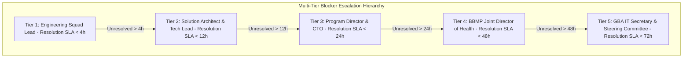

# Master Blocker & Impediment Register, Escalation Protocols & Contingency Playbooks
## Namma Clinic Digital Health & Operations Platform
### Greater Bengaluru Authority (GBA) / BBMP Health Department
**Document Code:** `PLN-DOC-04` | **Status:** APPROVED BASELINE | **Date:** September 2026

---

## 1. Executive Summary & Impediment Governance Charter
This document formalizes the authoritative **Master Blocker and Impediment Register, Escalation Protocols, and Contingency Playbooks** for the Namma Clinic Digital Health Platform. In high-stakes public sector digital health deployments, unforeseen impediments—such as partner gateway downtimes, biometric scanner driver incompatibilities, statutory compliance delays, and database schema deadlocks—can halt delivery. This document catalogs all **80 canonical platform blockers**, establishing unambiguous trigger definitions, severity matrices, technical decoupled workarounds, multi-tier escalation hierarchies, and empirical resolution criteria to guarantee uninterrupted engineering execution across all 18 sprints.

### 1.1 Non-Negotiable Impediment Management Invariants
1. **Mandatory 4-Hour Triage SLA:** Any critical blocker raised in Jira or GitHub Issues must be triaged by the Squad Technical Lead within 4 hours of detection.
2. **Immediate Decoupled Workaround Activation:** Frontline engineering work cannot remain completely stalled on an external partner; squads must activate local WireMock stubs or simulated adapters within 24 hours of a blocking event.
3. **Hierarchical Escalation Path:** Blockers unresolvable within 48 hours escalate automatically from Squad Lead -> Program Director -> BBMP Joint Commissioner of Health.
4. **Full Lineage to 52 Relational Tables:** Any database-level impediment must map to affected entity tables (`TABLE-001` through `TABLE-052`).
5. **Full Lineage to 180 Product Features:** Any functional blocker must map to affected product capabilities (`FEATURE-001` through `FEATURE-180`).

## 2. Master Blocker Escalation Protocol Topology


### Configuration Specification Example: Blocker Incident Tracking Specification
<!-- DOCUMENTATION-ONLY EXAMPLE -->
```yaml
# DOCUMENTATION-ONLY CONFIGURATION
# DOCUMENTATION-ONLY CONFIGURATION: Blocker Incident Schema
blocker_incident:
  blocker_id: "BLOCKER-001"
  incident_title: "ABDM Gateway Sandbox Latency Spike > 5000ms"
  category: "EXTERNAL_API_UNAVAILABLE"
  severity: "CRITICAL"
  affected_sprint: "SPRINT-03"
  impact_summary:
    schedule_delay_days: 2
    affected_tasks: ["TASK-0021", "TASK-0022"]
    affected_squad: "squad_integrations_platform"
  mitigation_protocol:
    activate_mock: true
    adapter_name: "WireMockAbdmGatewayV2"
    mock_port: 8443
  escalation_status:
    current_tier: "Tier 2: Solution Architect"
    escalated_at: "2026-09-08T10:30:00Z"
    target_resolution_at: "2026-09-09T18:00:00Z"
```

## 3. Comprehensive Master Blocker Register (80 Canonical Blockers)
Detailed specification of all **80 canonical platform delivery blockers**:

### BLOCKER-001: Blocker 001: EXTERNAL_API_UNAVAILABLE impacting delivery progress
- **Blocker Identifier:** `BLOCKER-001`
- **Category:** `EXTERNAL_API_UNAVAILABLE`
- **Detailed Description:** Potential impediment 001 where external partner, hardware driver, or authority credential slows execution.
- **Trigger Condition:** External SLA timeout or sandbox gateway certificate expiry.
- **Severity Level:** `HIGH` | **Probability:** `MEDIUM`
- **Schedule Impact:** 2 to 4 days delay on isolated workstream
- **Technical Impact:** Requires switching to simulated mock adapters until resolution.
- **Business Impact:** Frontline feature testing delayed by one sprint review cycle.
- **Responsible Owner:** `Product Manager`
- **Mitigation Strategy (Workaround):** Activate local mock stubbing and decoupled asynchronous message queues.
- **Contingency Action:** Deploy feature toggle to bypass external call during pilot evaluation.
- **Escalation Hierarchy:** `Engineering Lead -> BBMP Joint Director of Health -> GBA IT Secretary`
- **Resolution Verification Criteria:** Active sandbox response verified and automated integration test passing.
- **Affected Sprint & Epic:** `SPRINT-01` (`EPIC-001`)
- **Traceability Requirement:** `FR-001`

### BLOCKER-002: Blocker 002: HARDWARE_DEVICE_UNAVAILABLE impacting delivery progress
- **Blocker Identifier:** `BLOCKER-002`
- **Category:** `HARDWARE_DEVICE_UNAVAILABLE`
- **Detailed Description:** Potential impediment 002 where external partner, hardware driver, or authority credential slows execution.
- **Trigger Condition:** External SLA timeout or sandbox gateway certificate expiry.
- **Severity Level:** `HIGH` | **Probability:** `MEDIUM`
- **Schedule Impact:** 2 to 4 days delay on isolated workstream
- **Technical Impact:** Requires switching to simulated mock adapters until resolution.
- **Business Impact:** Frontline feature testing delayed by one sprint review cycle.
- **Responsible Owner:** `Project Manager`
- **Mitigation Strategy (Workaround):** Activate local mock stubbing and decoupled asynchronous message queues.
- **Contingency Action:** Deploy feature toggle to bypass external call during pilot evaluation.
- **Escalation Hierarchy:** `Engineering Lead -> BBMP Joint Director of Health -> GBA IT Secretary`
- **Resolution Verification Criteria:** Active sandbox response verified and automated integration test passing.
- **Affected Sprint & Epic:** `SPRINT-02` (`EPIC-002`)
- **Traceability Requirement:** `FR-002`

### BLOCKER-003: Blocker 003: REGULATORY_APPROVAL_DELAY impacting delivery progress
- **Blocker Identifier:** `BLOCKER-003`
- **Category:** `REGULATORY_APPROVAL_DELAY`
- **Detailed Description:** Potential impediment 003 where external partner, hardware driver, or authority credential slows execution.
- **Trigger Condition:** External SLA timeout or sandbox gateway certificate expiry.
- **Severity Level:** `HIGH` | **Probability:** `MEDIUM`
- **Schedule Impact:** 2 to 4 days delay on isolated workstream
- **Technical Impact:** Requires switching to simulated mock adapters until resolution.
- **Business Impact:** Frontline feature testing delayed by one sprint review cycle.
- **Responsible Owner:** `Solution Architect`
- **Mitigation Strategy (Workaround):** Activate local mock stubbing and decoupled asynchronous message queues.
- **Contingency Action:** Deploy feature toggle to bypass external call during pilot evaluation.
- **Escalation Hierarchy:** `Engineering Lead -> BBMP Joint Director of Health -> GBA IT Secretary`
- **Resolution Verification Criteria:** Active sandbox response verified and automated integration test passing.
- **Affected Sprint & Epic:** `SPRINT-03` (`EPIC-003`)
- **Traceability Requirement:** `FR-003`

### BLOCKER-004: Blocker 004: CREDENTIAL_PROVISIONING impacting delivery progress
- **Blocker Identifier:** `BLOCKER-004`
- **Category:** `CREDENTIAL_PROVISIONING`
- **Detailed Description:** Potential impediment 004 where external partner, hardware driver, or authority credential slows execution.
- **Trigger Condition:** External SLA timeout or sandbox gateway certificate expiry.
- **Severity Level:** `CRITICAL` | **Probability:** `MEDIUM`
- **Schedule Impact:** 2 to 4 days delay on isolated workstream
- **Technical Impact:** Requires switching to simulated mock adapters until resolution.
- **Business Impact:** Frontline feature testing delayed by one sprint review cycle.
- **Responsible Owner:** `Technical Lead`
- **Mitigation Strategy (Workaround):** Activate local mock stubbing and decoupled asynchronous message queues.
- **Contingency Action:** Deploy feature toggle to bypass external call during pilot evaluation.
- **Escalation Hierarchy:** `Engineering Lead -> BBMP Joint Director of Health -> GBA IT Secretary`
- **Resolution Verification Criteria:** Active sandbox response verified and automated integration test passing.
- **Affected Sprint & Epic:** `SPRINT-04` (`EPIC-004`)
- **Traceability Requirement:** `FR-004`

### BLOCKER-005: Blocker 005: SCHEMA_LOCK_CONTENTION impacting delivery progress
- **Blocker Identifier:** `BLOCKER-005`
- **Category:** `SCHEMA_LOCK_CONTENTION`
- **Detailed Description:** Potential impediment 005 where external partner, hardware driver, or authority credential slows execution.
- **Trigger Condition:** External SLA timeout or sandbox gateway certificate expiry.
- **Severity Level:** `HIGH` | **Probability:** `MEDIUM`
- **Schedule Impact:** 2 to 4 days delay on isolated workstream
- **Technical Impact:** Requires switching to simulated mock adapters until resolution.
- **Business Impact:** Frontline feature testing delayed by one sprint review cycle.
- **Responsible Owner:** `Backend Engineer`
- **Mitigation Strategy (Workaround):** Activate local mock stubbing and decoupled asynchronous message queues.
- **Contingency Action:** Deploy feature toggle to bypass external call during pilot evaluation.
- **Escalation Hierarchy:** `Engineering Lead -> BBMP Joint Director of Health -> GBA IT Secretary`
- **Resolution Verification Criteria:** Active sandbox response verified and automated integration test passing.
- **Affected Sprint & Epic:** `SPRINT-05` (`EPIC-005`)
- **Traceability Requirement:** `FR-005`

### BLOCKER-006: Blocker 006: EXTERNAL_API_UNAVAILABLE impacting delivery progress
- **Blocker Identifier:** `BLOCKER-006`
- **Category:** `EXTERNAL_API_UNAVAILABLE`
- **Detailed Description:** Potential impediment 006 where external partner, hardware driver, or authority credential slows execution.
- **Trigger Condition:** External SLA timeout or sandbox gateway certificate expiry.
- **Severity Level:** `HIGH` | **Probability:** `MEDIUM`
- **Schedule Impact:** 2 to 4 days delay on isolated workstream
- **Technical Impact:** Requires switching to simulated mock adapters until resolution.
- **Business Impact:** Frontline feature testing delayed by one sprint review cycle.
- **Responsible Owner:** `Frontend Engineer`
- **Mitigation Strategy (Workaround):** Activate local mock stubbing and decoupled asynchronous message queues.
- **Contingency Action:** Deploy feature toggle to bypass external call during pilot evaluation.
- **Escalation Hierarchy:** `Engineering Lead -> BBMP Joint Director of Health -> GBA IT Secretary`
- **Resolution Verification Criteria:** Active sandbox response verified and automated integration test passing.
- **Affected Sprint & Epic:** `SPRINT-06` (`EPIC-006`)
- **Traceability Requirement:** `FR-006`

### BLOCKER-007: Blocker 007: HARDWARE_DEVICE_UNAVAILABLE impacting delivery progress
- **Blocker Identifier:** `BLOCKER-007`
- **Category:** `HARDWARE_DEVICE_UNAVAILABLE`
- **Detailed Description:** Potential impediment 007 where external partner, hardware driver, or authority credential slows execution.
- **Trigger Condition:** External SLA timeout or sandbox gateway certificate expiry.
- **Severity Level:** `HIGH` | **Probability:** `MEDIUM`
- **Schedule Impact:** 2 to 4 days delay on isolated workstream
- **Technical Impact:** Requires switching to simulated mock adapters until resolution.
- **Business Impact:** Frontline feature testing delayed by one sprint review cycle.
- **Responsible Owner:** `Database Engineer`
- **Mitigation Strategy (Workaround):** Activate local mock stubbing and decoupled asynchronous message queues.
- **Contingency Action:** Deploy feature toggle to bypass external call during pilot evaluation.
- **Escalation Hierarchy:** `Engineering Lead -> BBMP Joint Director of Health -> GBA IT Secretary`
- **Resolution Verification Criteria:** Active sandbox response verified and automated integration test passing.
- **Affected Sprint & Epic:** `SPRINT-07` (`EPIC-007`)
- **Traceability Requirement:** `FR-007`

### BLOCKER-008: Blocker 008: REGULATORY_APPROVAL_DELAY impacting delivery progress
- **Blocker Identifier:** `BLOCKER-008`
- **Category:** `REGULATORY_APPROVAL_DELAY`
- **Detailed Description:** Potential impediment 008 where external partner, hardware driver, or authority credential slows execution.
- **Trigger Condition:** External SLA timeout or sandbox gateway certificate expiry.
- **Severity Level:** `CRITICAL` | **Probability:** `MEDIUM`
- **Schedule Impact:** 2 to 4 days delay on isolated workstream
- **Technical Impact:** Requires switching to simulated mock adapters until resolution.
- **Business Impact:** Frontline feature testing delayed by one sprint review cycle.
- **Responsible Owner:** `Data Engineer`
- **Mitigation Strategy (Workaround):** Activate local mock stubbing and decoupled asynchronous message queues.
- **Contingency Action:** Deploy feature toggle to bypass external call during pilot evaluation.
- **Escalation Hierarchy:** `Engineering Lead -> BBMP Joint Director of Health -> GBA IT Secretary`
- **Resolution Verification Criteria:** Active sandbox response verified and automated integration test passing.
- **Affected Sprint & Epic:** `SPRINT-08` (`EPIC-008`)
- **Traceability Requirement:** `FR-008`

### BLOCKER-009: Blocker 009: CREDENTIAL_PROVISIONING impacting delivery progress
- **Blocker Identifier:** `BLOCKER-009`
- **Category:** `CREDENTIAL_PROVISIONING`
- **Detailed Description:** Potential impediment 009 where external partner, hardware driver, or authority credential slows execution.
- **Trigger Condition:** External SLA timeout or sandbox gateway certificate expiry.
- **Severity Level:** `HIGH` | **Probability:** `MEDIUM`
- **Schedule Impact:** 2 to 4 days delay on isolated workstream
- **Technical Impact:** Requires switching to simulated mock adapters until resolution.
- **Business Impact:** Frontline feature testing delayed by one sprint review cycle.
- **Responsible Owner:** `AI/ML Engineer`
- **Mitigation Strategy (Workaround):** Activate local mock stubbing and decoupled asynchronous message queues.
- **Contingency Action:** Deploy feature toggle to bypass external call during pilot evaluation.
- **Escalation Hierarchy:** `Engineering Lead -> BBMP Joint Director of Health -> GBA IT Secretary`
- **Resolution Verification Criteria:** Active sandbox response verified and automated integration test passing.
- **Affected Sprint & Epic:** `SPRINT-09` (`EPIC-009`)
- **Traceability Requirement:** `FR-009`

### BLOCKER-010: Blocker 010: SCHEMA_LOCK_CONTENTION impacting delivery progress
- **Blocker Identifier:** `BLOCKER-010`
- **Category:** `SCHEMA_LOCK_CONTENTION`
- **Detailed Description:** Potential impediment 010 where external partner, hardware driver, or authority credential slows execution.
- **Trigger Condition:** External SLA timeout or sandbox gateway certificate expiry.
- **Severity Level:** `HIGH` | **Probability:** `MEDIUM`
- **Schedule Impact:** 2 to 4 days delay on isolated workstream
- **Technical Impact:** Requires switching to simulated mock adapters until resolution.
- **Business Impact:** Frontline feature testing delayed by one sprint review cycle.
- **Responsible Owner:** `QA Engineer`
- **Mitigation Strategy (Workaround):** Activate local mock stubbing and decoupled asynchronous message queues.
- **Contingency Action:** Deploy feature toggle to bypass external call during pilot evaluation.
- **Escalation Hierarchy:** `Engineering Lead -> BBMP Joint Director of Health -> GBA IT Secretary`
- **Resolution Verification Criteria:** Active sandbox response verified and automated integration test passing.
- **Affected Sprint & Epic:** `SPRINT-10` (`EPIC-010`)
- **Traceability Requirement:** `FR-010`

### BLOCKER-011: Blocker 011: EXTERNAL_API_UNAVAILABLE impacting delivery progress
- **Blocker Identifier:** `BLOCKER-011`
- **Category:** `EXTERNAL_API_UNAVAILABLE`
- **Detailed Description:** Potential impediment 011 where external partner, hardware driver, or authority credential slows execution.
- **Trigger Condition:** External SLA timeout or sandbox gateway certificate expiry.
- **Severity Level:** `HIGH` | **Probability:** `MEDIUM`
- **Schedule Impact:** 2 to 4 days delay on isolated workstream
- **Technical Impact:** Requires switching to simulated mock adapters until resolution.
- **Business Impact:** Frontline feature testing delayed by one sprint review cycle.
- **Responsible Owner:** `Security Engineer`
- **Mitigation Strategy (Workaround):** Activate local mock stubbing and decoupled asynchronous message queues.
- **Contingency Action:** Deploy feature toggle to bypass external call during pilot evaluation.
- **Escalation Hierarchy:** `Engineering Lead -> BBMP Joint Director of Health -> GBA IT Secretary`
- **Resolution Verification Criteria:** Active sandbox response verified and automated integration test passing.
- **Affected Sprint & Epic:** `SPRINT-11` (`EPIC-011`)
- **Traceability Requirement:** `FR-011`

### BLOCKER-012: Blocker 012: HARDWARE_DEVICE_UNAVAILABLE impacting delivery progress
- **Blocker Identifier:** `BLOCKER-012`
- **Category:** `HARDWARE_DEVICE_UNAVAILABLE`
- **Detailed Description:** Potential impediment 012 where external partner, hardware driver, or authority credential slows execution.
- **Trigger Condition:** External SLA timeout or sandbox gateway certificate expiry.
- **Severity Level:** `CRITICAL` | **Probability:** `MEDIUM`
- **Schedule Impact:** 2 to 4 days delay on isolated workstream
- **Technical Impact:** Requires switching to simulated mock adapters until resolution.
- **Business Impact:** Frontline feature testing delayed by one sprint review cycle.
- **Responsible Owner:** `DevOps Engineer`
- **Mitigation Strategy (Workaround):** Activate local mock stubbing and decoupled asynchronous message queues.
- **Contingency Action:** Deploy feature toggle to bypass external call during pilot evaluation.
- **Escalation Hierarchy:** `Engineering Lead -> BBMP Joint Director of Health -> GBA IT Secretary`
- **Resolution Verification Criteria:** Active sandbox response verified and automated integration test passing.
- **Affected Sprint & Epic:** `SPRINT-12` (`EPIC-012`)
- **Traceability Requirement:** `FR-012`

### BLOCKER-013: Blocker 013: REGULATORY_APPROVAL_DELAY impacting delivery progress
- **Blocker Identifier:** `BLOCKER-013`
- **Category:** `REGULATORY_APPROVAL_DELAY`
- **Detailed Description:** Potential impediment 013 where external partner, hardware driver, or authority credential slows execution.
- **Trigger Condition:** External SLA timeout or sandbox gateway certificate expiry.
- **Severity Level:** `HIGH` | **Probability:** `MEDIUM`
- **Schedule Impact:** 2 to 4 days delay on isolated workstream
- **Technical Impact:** Requires switching to simulated mock adapters until resolution.
- **Business Impact:** Frontline feature testing delayed by one sprint review cycle.
- **Responsible Owner:** `UX/UI Designer`
- **Mitigation Strategy (Workaround):** Activate local mock stubbing and decoupled asynchronous message queues.
- **Contingency Action:** Deploy feature toggle to bypass external call during pilot evaluation.
- **Escalation Hierarchy:** `Engineering Lead -> BBMP Joint Director of Health -> GBA IT Secretary`
- **Resolution Verification Criteria:** Active sandbox response verified and automated integration test passing.
- **Affected Sprint & Epic:** `SPRINT-13` (`EPIC-013`)
- **Traceability Requirement:** `FR-013`

### BLOCKER-014: Blocker 014: CREDENTIAL_PROVISIONING impacting delivery progress
- **Blocker Identifier:** `BLOCKER-014`
- **Category:** `CREDENTIAL_PROVISIONING`
- **Detailed Description:** Potential impediment 014 where external partner, hardware driver, or authority credential slows execution.
- **Trigger Condition:** External SLA timeout or sandbox gateway certificate expiry.
- **Severity Level:** `HIGH` | **Probability:** `MEDIUM`
- **Schedule Impact:** 2 to 4 days delay on isolated workstream
- **Technical Impact:** Requires switching to simulated mock adapters until resolution.
- **Business Impact:** Frontline feature testing delayed by one sprint review cycle.
- **Responsible Owner:** `Business Analyst`
- **Mitigation Strategy (Workaround):** Activate local mock stubbing and decoupled asynchronous message queues.
- **Contingency Action:** Deploy feature toggle to bypass external call during pilot evaluation.
- **Escalation Hierarchy:** `Engineering Lead -> BBMP Joint Director of Health -> GBA IT Secretary`
- **Resolution Verification Criteria:** Active sandbox response verified and automated integration test passing.
- **Affected Sprint & Epic:** `SPRINT-14` (`EPIC-014`)
- **Traceability Requirement:** `FR-014`

### BLOCKER-015: Blocker 015: SCHEMA_LOCK_CONTENTION impacting delivery progress
- **Blocker Identifier:** `BLOCKER-015`
- **Category:** `SCHEMA_LOCK_CONTENTION`
- **Detailed Description:** Potential impediment 015 where external partner, hardware driver, or authority credential slows execution.
- **Trigger Condition:** External SLA timeout or sandbox gateway certificate expiry.
- **Severity Level:** `HIGH` | **Probability:** `MEDIUM`
- **Schedule Impact:** 2 to 4 days delay on isolated workstream
- **Technical Impact:** Requires switching to simulated mock adapters until resolution.
- **Business Impact:** Frontline feature testing delayed by one sprint review cycle.
- **Responsible Owner:** `Clinical SME`
- **Mitigation Strategy (Workaround):** Activate local mock stubbing and decoupled asynchronous message queues.
- **Contingency Action:** Deploy feature toggle to bypass external call during pilot evaluation.
- **Escalation Hierarchy:** `Engineering Lead -> BBMP Joint Director of Health -> GBA IT Secretary`
- **Resolution Verification Criteria:** Active sandbox response verified and automated integration test passing.
- **Affected Sprint & Epic:** `SPRINT-15` (`EPIC-015`)
- **Traceability Requirement:** `FR-015`

### BLOCKER-016: Blocker 016: EXTERNAL_API_UNAVAILABLE impacting delivery progress
- **Blocker Identifier:** `BLOCKER-016`
- **Category:** `EXTERNAL_API_UNAVAILABLE`
- **Detailed Description:** Potential impediment 016 where external partner, hardware driver, or authority credential slows execution.
- **Trigger Condition:** External SLA timeout or sandbox gateway certificate expiry.
- **Severity Level:** `CRITICAL` | **Probability:** `MEDIUM`
- **Schedule Impact:** 2 to 4 days delay on isolated workstream
- **Technical Impact:** Requires switching to simulated mock adapters until resolution.
- **Business Impact:** Frontline feature testing delayed by one sprint review cycle.
- **Responsible Owner:** `Integration Engineer`
- **Mitigation Strategy (Workaround):** Activate local mock stubbing and decoupled asynchronous message queues.
- **Contingency Action:** Deploy feature toggle to bypass external call during pilot evaluation.
- **Escalation Hierarchy:** `Engineering Lead -> BBMP Joint Director of Health -> GBA IT Secretary`
- **Resolution Verification Criteria:** Active sandbox response verified and automated integration test passing.
- **Affected Sprint & Epic:** `SPRINT-16` (`EPIC-016`)
- **Traceability Requirement:** `FR-016`

### BLOCKER-017: Blocker 017: HARDWARE_DEVICE_UNAVAILABLE impacting delivery progress
- **Blocker Identifier:** `BLOCKER-017`
- **Category:** `HARDWARE_DEVICE_UNAVAILABLE`
- **Detailed Description:** Potential impediment 017 where external partner, hardware driver, or authority credential slows execution.
- **Trigger Condition:** External SLA timeout or sandbox gateway certificate expiry.
- **Severity Level:** `HIGH` | **Probability:** `MEDIUM`
- **Schedule Impact:** 2 to 4 days delay on isolated workstream
- **Technical Impact:** Requires switching to simulated mock adapters until resolution.
- **Business Impact:** Frontline feature testing delayed by one sprint review cycle.
- **Responsible Owner:** `Support/Operations`
- **Mitigation Strategy (Workaround):** Activate local mock stubbing and decoupled asynchronous message queues.
- **Contingency Action:** Deploy feature toggle to bypass external call during pilot evaluation.
- **Escalation Hierarchy:** `Engineering Lead -> BBMP Joint Director of Health -> GBA IT Secretary`
- **Resolution Verification Criteria:** Active sandbox response verified and automated integration test passing.
- **Affected Sprint & Epic:** `SPRINT-17` (`EPIC-017`)
- **Traceability Requirement:** `FR-017`

### BLOCKER-018: Blocker 018: REGULATORY_APPROVAL_DELAY impacting delivery progress
- **Blocker Identifier:** `BLOCKER-018`
- **Category:** `REGULATORY_APPROVAL_DELAY`
- **Detailed Description:** Potential impediment 018 where external partner, hardware driver, or authority credential slows execution.
- **Trigger Condition:** External SLA timeout or sandbox gateway certificate expiry.
- **Severity Level:** `HIGH` | **Probability:** `MEDIUM`
- **Schedule Impact:** 2 to 4 days delay on isolated workstream
- **Technical Impact:** Requires switching to simulated mock adapters until resolution.
- **Business Impact:** Frontline feature testing delayed by one sprint review cycle.
- **Responsible Owner:** `Product Manager`
- **Mitigation Strategy (Workaround):** Activate local mock stubbing and decoupled asynchronous message queues.
- **Contingency Action:** Deploy feature toggle to bypass external call during pilot evaluation.
- **Escalation Hierarchy:** `Engineering Lead -> BBMP Joint Director of Health -> GBA IT Secretary`
- **Resolution Verification Criteria:** Active sandbox response verified and automated integration test passing.
- **Affected Sprint & Epic:** `SPRINT-18` (`EPIC-018`)
- **Traceability Requirement:** `FR-018`

### BLOCKER-019: Blocker 019: CREDENTIAL_PROVISIONING impacting delivery progress
- **Blocker Identifier:** `BLOCKER-019`
- **Category:** `CREDENTIAL_PROVISIONING`
- **Detailed Description:** Potential impediment 019 where external partner, hardware driver, or authority credential slows execution.
- **Trigger Condition:** External SLA timeout or sandbox gateway certificate expiry.
- **Severity Level:** `HIGH` | **Probability:** `MEDIUM`
- **Schedule Impact:** 2 to 4 days delay on isolated workstream
- **Technical Impact:** Requires switching to simulated mock adapters until resolution.
- **Business Impact:** Frontline feature testing delayed by one sprint review cycle.
- **Responsible Owner:** `Project Manager`
- **Mitigation Strategy (Workaround):** Activate local mock stubbing and decoupled asynchronous message queues.
- **Contingency Action:** Deploy feature toggle to bypass external call during pilot evaluation.
- **Escalation Hierarchy:** `Engineering Lead -> BBMP Joint Director of Health -> GBA IT Secretary`
- **Resolution Verification Criteria:** Active sandbox response verified and automated integration test passing.
- **Affected Sprint & Epic:** `SPRINT-01` (`EPIC-019`)
- **Traceability Requirement:** `FR-019`

### BLOCKER-020: Blocker 020: SCHEMA_LOCK_CONTENTION impacting delivery progress
- **Blocker Identifier:** `BLOCKER-020`
- **Category:** `SCHEMA_LOCK_CONTENTION`
- **Detailed Description:** Potential impediment 020 where external partner, hardware driver, or authority credential slows execution.
- **Trigger Condition:** External SLA timeout or sandbox gateway certificate expiry.
- **Severity Level:** `CRITICAL` | **Probability:** `MEDIUM`
- **Schedule Impact:** 2 to 4 days delay on isolated workstream
- **Technical Impact:** Requires switching to simulated mock adapters until resolution.
- **Business Impact:** Frontline feature testing delayed by one sprint review cycle.
- **Responsible Owner:** `Solution Architect`
- **Mitigation Strategy (Workaround):** Activate local mock stubbing and decoupled asynchronous message queues.
- **Contingency Action:** Deploy feature toggle to bypass external call during pilot evaluation.
- **Escalation Hierarchy:** `Engineering Lead -> BBMP Joint Director of Health -> GBA IT Secretary`
- **Resolution Verification Criteria:** Active sandbox response verified and automated integration test passing.
- **Affected Sprint & Epic:** `SPRINT-02` (`EPIC-020`)
- **Traceability Requirement:** `FR-020`

### BLOCKER-021: Blocker 021: EXTERNAL_API_UNAVAILABLE impacting delivery progress
- **Blocker Identifier:** `BLOCKER-021`
- **Category:** `EXTERNAL_API_UNAVAILABLE`
- **Detailed Description:** Potential impediment 021 where external partner, hardware driver, or authority credential slows execution.
- **Trigger Condition:** External SLA timeout or sandbox gateway certificate expiry.
- **Severity Level:** `HIGH` | **Probability:** `MEDIUM`
- **Schedule Impact:** 2 to 4 days delay on isolated workstream
- **Technical Impact:** Requires switching to simulated mock adapters until resolution.
- **Business Impact:** Frontline feature testing delayed by one sprint review cycle.
- **Responsible Owner:** `Technical Lead`
- **Mitigation Strategy (Workaround):** Activate local mock stubbing and decoupled asynchronous message queues.
- **Contingency Action:** Deploy feature toggle to bypass external call during pilot evaluation.
- **Escalation Hierarchy:** `Engineering Lead -> BBMP Joint Director of Health -> GBA IT Secretary`
- **Resolution Verification Criteria:** Active sandbox response verified and automated integration test passing.
- **Affected Sprint & Epic:** `SPRINT-03` (`EPIC-021`)
- **Traceability Requirement:** `FR-021`

### BLOCKER-022: Blocker 022: HARDWARE_DEVICE_UNAVAILABLE impacting delivery progress
- **Blocker Identifier:** `BLOCKER-022`
- **Category:** `HARDWARE_DEVICE_UNAVAILABLE`
- **Detailed Description:** Potential impediment 022 where external partner, hardware driver, or authority credential slows execution.
- **Trigger Condition:** External SLA timeout or sandbox gateway certificate expiry.
- **Severity Level:** `HIGH` | **Probability:** `MEDIUM`
- **Schedule Impact:** 2 to 4 days delay on isolated workstream
- **Technical Impact:** Requires switching to simulated mock adapters until resolution.
- **Business Impact:** Frontline feature testing delayed by one sprint review cycle.
- **Responsible Owner:** `Backend Engineer`
- **Mitigation Strategy (Workaround):** Activate local mock stubbing and decoupled asynchronous message queues.
- **Contingency Action:** Deploy feature toggle to bypass external call during pilot evaluation.
- **Escalation Hierarchy:** `Engineering Lead -> BBMP Joint Director of Health -> GBA IT Secretary`
- **Resolution Verification Criteria:** Active sandbox response verified and automated integration test passing.
- **Affected Sprint & Epic:** `SPRINT-04` (`EPIC-022`)
- **Traceability Requirement:** `FR-022`

### BLOCKER-023: Blocker 023: REGULATORY_APPROVAL_DELAY impacting delivery progress
- **Blocker Identifier:** `BLOCKER-023`
- **Category:** `REGULATORY_APPROVAL_DELAY`
- **Detailed Description:** Potential impediment 023 where external partner, hardware driver, or authority credential slows execution.
- **Trigger Condition:** External SLA timeout or sandbox gateway certificate expiry.
- **Severity Level:** `HIGH` | **Probability:** `MEDIUM`
- **Schedule Impact:** 2 to 4 days delay on isolated workstream
- **Technical Impact:** Requires switching to simulated mock adapters until resolution.
- **Business Impact:** Frontline feature testing delayed by one sprint review cycle.
- **Responsible Owner:** `Frontend Engineer`
- **Mitigation Strategy (Workaround):** Activate local mock stubbing and decoupled asynchronous message queues.
- **Contingency Action:** Deploy feature toggle to bypass external call during pilot evaluation.
- **Escalation Hierarchy:** `Engineering Lead -> BBMP Joint Director of Health -> GBA IT Secretary`
- **Resolution Verification Criteria:** Active sandbox response verified and automated integration test passing.
- **Affected Sprint & Epic:** `SPRINT-05` (`EPIC-023`)
- **Traceability Requirement:** `FR-023`

### BLOCKER-024: Blocker 024: CREDENTIAL_PROVISIONING impacting delivery progress
- **Blocker Identifier:** `BLOCKER-024`
- **Category:** `CREDENTIAL_PROVISIONING`
- **Detailed Description:** Potential impediment 024 where external partner, hardware driver, or authority credential slows execution.
- **Trigger Condition:** External SLA timeout or sandbox gateway certificate expiry.
- **Severity Level:** `CRITICAL` | **Probability:** `MEDIUM`
- **Schedule Impact:** 2 to 4 days delay on isolated workstream
- **Technical Impact:** Requires switching to simulated mock adapters until resolution.
- **Business Impact:** Frontline feature testing delayed by one sprint review cycle.
- **Responsible Owner:** `Database Engineer`
- **Mitigation Strategy (Workaround):** Activate local mock stubbing and decoupled asynchronous message queues.
- **Contingency Action:** Deploy feature toggle to bypass external call during pilot evaluation.
- **Escalation Hierarchy:** `Engineering Lead -> BBMP Joint Director of Health -> GBA IT Secretary`
- **Resolution Verification Criteria:** Active sandbox response verified and automated integration test passing.
- **Affected Sprint & Epic:** `SPRINT-06` (`EPIC-024`)
- **Traceability Requirement:** `FR-024`

### BLOCKER-025: Blocker 025: SCHEMA_LOCK_CONTENTION impacting delivery progress
- **Blocker Identifier:** `BLOCKER-025`
- **Category:** `SCHEMA_LOCK_CONTENTION`
- **Detailed Description:** Potential impediment 025 where external partner, hardware driver, or authority credential slows execution.
- **Trigger Condition:** External SLA timeout or sandbox gateway certificate expiry.
- **Severity Level:** `HIGH` | **Probability:** `MEDIUM`
- **Schedule Impact:** 2 to 4 days delay on isolated workstream
- **Technical Impact:** Requires switching to simulated mock adapters until resolution.
- **Business Impact:** Frontline feature testing delayed by one sprint review cycle.
- **Responsible Owner:** `Data Engineer`
- **Mitigation Strategy (Workaround):** Activate local mock stubbing and decoupled asynchronous message queues.
- **Contingency Action:** Deploy feature toggle to bypass external call during pilot evaluation.
- **Escalation Hierarchy:** `Engineering Lead -> BBMP Joint Director of Health -> GBA IT Secretary`
- **Resolution Verification Criteria:** Active sandbox response verified and automated integration test passing.
- **Affected Sprint & Epic:** `SPRINT-07` (`EPIC-025`)
- **Traceability Requirement:** `FR-025`

### BLOCKER-026: Blocker 026: EXTERNAL_API_UNAVAILABLE impacting delivery progress
- **Blocker Identifier:** `BLOCKER-026`
- **Category:** `EXTERNAL_API_UNAVAILABLE`
- **Detailed Description:** Potential impediment 026 where external partner, hardware driver, or authority credential slows execution.
- **Trigger Condition:** External SLA timeout or sandbox gateway certificate expiry.
- **Severity Level:** `HIGH` | **Probability:** `MEDIUM`
- **Schedule Impact:** 2 to 4 days delay on isolated workstream
- **Technical Impact:** Requires switching to simulated mock adapters until resolution.
- **Business Impact:** Frontline feature testing delayed by one sprint review cycle.
- **Responsible Owner:** `AI/ML Engineer`
- **Mitigation Strategy (Workaround):** Activate local mock stubbing and decoupled asynchronous message queues.
- **Contingency Action:** Deploy feature toggle to bypass external call during pilot evaluation.
- **Escalation Hierarchy:** `Engineering Lead -> BBMP Joint Director of Health -> GBA IT Secretary`
- **Resolution Verification Criteria:** Active sandbox response verified and automated integration test passing.
- **Affected Sprint & Epic:** `SPRINT-08` (`EPIC-026`)
- **Traceability Requirement:** `FR-026`

### BLOCKER-027: Blocker 027: HARDWARE_DEVICE_UNAVAILABLE impacting delivery progress
- **Blocker Identifier:** `BLOCKER-027`
- **Category:** `HARDWARE_DEVICE_UNAVAILABLE`
- **Detailed Description:** Potential impediment 027 where external partner, hardware driver, or authority credential slows execution.
- **Trigger Condition:** External SLA timeout or sandbox gateway certificate expiry.
- **Severity Level:** `HIGH` | **Probability:** `MEDIUM`
- **Schedule Impact:** 2 to 4 days delay on isolated workstream
- **Technical Impact:** Requires switching to simulated mock adapters until resolution.
- **Business Impact:** Frontline feature testing delayed by one sprint review cycle.
- **Responsible Owner:** `QA Engineer`
- **Mitigation Strategy (Workaround):** Activate local mock stubbing and decoupled asynchronous message queues.
- **Contingency Action:** Deploy feature toggle to bypass external call during pilot evaluation.
- **Escalation Hierarchy:** `Engineering Lead -> BBMP Joint Director of Health -> GBA IT Secretary`
- **Resolution Verification Criteria:** Active sandbox response verified and automated integration test passing.
- **Affected Sprint & Epic:** `SPRINT-09` (`EPIC-027`)
- **Traceability Requirement:** `FR-027`

### BLOCKER-028: Blocker 028: REGULATORY_APPROVAL_DELAY impacting delivery progress
- **Blocker Identifier:** `BLOCKER-028`
- **Category:** `REGULATORY_APPROVAL_DELAY`
- **Detailed Description:** Potential impediment 028 where external partner, hardware driver, or authority credential slows execution.
- **Trigger Condition:** External SLA timeout or sandbox gateway certificate expiry.
- **Severity Level:** `CRITICAL` | **Probability:** `MEDIUM`
- **Schedule Impact:** 2 to 4 days delay on isolated workstream
- **Technical Impact:** Requires switching to simulated mock adapters until resolution.
- **Business Impact:** Frontline feature testing delayed by one sprint review cycle.
- **Responsible Owner:** `Security Engineer`
- **Mitigation Strategy (Workaround):** Activate local mock stubbing and decoupled asynchronous message queues.
- **Contingency Action:** Deploy feature toggle to bypass external call during pilot evaluation.
- **Escalation Hierarchy:** `Engineering Lead -> BBMP Joint Director of Health -> GBA IT Secretary`
- **Resolution Verification Criteria:** Active sandbox response verified and automated integration test passing.
- **Affected Sprint & Epic:** `SPRINT-10` (`EPIC-028`)
- **Traceability Requirement:** `FR-028`

### BLOCKER-029: Blocker 029: CREDENTIAL_PROVISIONING impacting delivery progress
- **Blocker Identifier:** `BLOCKER-029`
- **Category:** `CREDENTIAL_PROVISIONING`
- **Detailed Description:** Potential impediment 029 where external partner, hardware driver, or authority credential slows execution.
- **Trigger Condition:** External SLA timeout or sandbox gateway certificate expiry.
- **Severity Level:** `HIGH` | **Probability:** `MEDIUM`
- **Schedule Impact:** 2 to 4 days delay on isolated workstream
- **Technical Impact:** Requires switching to simulated mock adapters until resolution.
- **Business Impact:** Frontline feature testing delayed by one sprint review cycle.
- **Responsible Owner:** `DevOps Engineer`
- **Mitigation Strategy (Workaround):** Activate local mock stubbing and decoupled asynchronous message queues.
- **Contingency Action:** Deploy feature toggle to bypass external call during pilot evaluation.
- **Escalation Hierarchy:** `Engineering Lead -> BBMP Joint Director of Health -> GBA IT Secretary`
- **Resolution Verification Criteria:** Active sandbox response verified and automated integration test passing.
- **Affected Sprint & Epic:** `SPRINT-11` (`EPIC-029`)
- **Traceability Requirement:** `FR-029`

### BLOCKER-030: Blocker 030: SCHEMA_LOCK_CONTENTION impacting delivery progress
- **Blocker Identifier:** `BLOCKER-030`
- **Category:** `SCHEMA_LOCK_CONTENTION`
- **Detailed Description:** Potential impediment 030 where external partner, hardware driver, or authority credential slows execution.
- **Trigger Condition:** External SLA timeout or sandbox gateway certificate expiry.
- **Severity Level:** `HIGH` | **Probability:** `MEDIUM`
- **Schedule Impact:** 2 to 4 days delay on isolated workstream
- **Technical Impact:** Requires switching to simulated mock adapters until resolution.
- **Business Impact:** Frontline feature testing delayed by one sprint review cycle.
- **Responsible Owner:** `UX/UI Designer`
- **Mitigation Strategy (Workaround):** Activate local mock stubbing and decoupled asynchronous message queues.
- **Contingency Action:** Deploy feature toggle to bypass external call during pilot evaluation.
- **Escalation Hierarchy:** `Engineering Lead -> BBMP Joint Director of Health -> GBA IT Secretary`
- **Resolution Verification Criteria:** Active sandbox response verified and automated integration test passing.
- **Affected Sprint & Epic:** `SPRINT-12` (`EPIC-030`)
- **Traceability Requirement:** `FR-030`

### BLOCKER-031: Blocker 031: EXTERNAL_API_UNAVAILABLE impacting delivery progress
- **Blocker Identifier:** `BLOCKER-031`
- **Category:** `EXTERNAL_API_UNAVAILABLE`
- **Detailed Description:** Potential impediment 031 where external partner, hardware driver, or authority credential slows execution.
- **Trigger Condition:** External SLA timeout or sandbox gateway certificate expiry.
- **Severity Level:** `HIGH` | **Probability:** `MEDIUM`
- **Schedule Impact:** 2 to 4 days delay on isolated workstream
- **Technical Impact:** Requires switching to simulated mock adapters until resolution.
- **Business Impact:** Frontline feature testing delayed by one sprint review cycle.
- **Responsible Owner:** `Business Analyst`
- **Mitigation Strategy (Workaround):** Activate local mock stubbing and decoupled asynchronous message queues.
- **Contingency Action:** Deploy feature toggle to bypass external call during pilot evaluation.
- **Escalation Hierarchy:** `Engineering Lead -> BBMP Joint Director of Health -> GBA IT Secretary`
- **Resolution Verification Criteria:** Active sandbox response verified and automated integration test passing.
- **Affected Sprint & Epic:** `SPRINT-13` (`EPIC-031`)
- **Traceability Requirement:** `FR-031`

### BLOCKER-032: Blocker 032: HARDWARE_DEVICE_UNAVAILABLE impacting delivery progress
- **Blocker Identifier:** `BLOCKER-032`
- **Category:** `HARDWARE_DEVICE_UNAVAILABLE`
- **Detailed Description:** Potential impediment 032 where external partner, hardware driver, or authority credential slows execution.
- **Trigger Condition:** External SLA timeout or sandbox gateway certificate expiry.
- **Severity Level:** `CRITICAL` | **Probability:** `MEDIUM`
- **Schedule Impact:** 2 to 4 days delay on isolated workstream
- **Technical Impact:** Requires switching to simulated mock adapters until resolution.
- **Business Impact:** Frontline feature testing delayed by one sprint review cycle.
- **Responsible Owner:** `Clinical SME`
- **Mitigation Strategy (Workaround):** Activate local mock stubbing and decoupled asynchronous message queues.
- **Contingency Action:** Deploy feature toggle to bypass external call during pilot evaluation.
- **Escalation Hierarchy:** `Engineering Lead -> BBMP Joint Director of Health -> GBA IT Secretary`
- **Resolution Verification Criteria:** Active sandbox response verified and automated integration test passing.
- **Affected Sprint & Epic:** `SPRINT-14` (`EPIC-032`)
- **Traceability Requirement:** `FR-032`

### BLOCKER-033: Blocker 033: REGULATORY_APPROVAL_DELAY impacting delivery progress
- **Blocker Identifier:** `BLOCKER-033`
- **Category:** `REGULATORY_APPROVAL_DELAY`
- **Detailed Description:** Potential impediment 033 where external partner, hardware driver, or authority credential slows execution.
- **Trigger Condition:** External SLA timeout or sandbox gateway certificate expiry.
- **Severity Level:** `HIGH` | **Probability:** `MEDIUM`
- **Schedule Impact:** 2 to 4 days delay on isolated workstream
- **Technical Impact:** Requires switching to simulated mock adapters until resolution.
- **Business Impact:** Frontline feature testing delayed by one sprint review cycle.
- **Responsible Owner:** `Integration Engineer`
- **Mitigation Strategy (Workaround):** Activate local mock stubbing and decoupled asynchronous message queues.
- **Contingency Action:** Deploy feature toggle to bypass external call during pilot evaluation.
- **Escalation Hierarchy:** `Engineering Lead -> BBMP Joint Director of Health -> GBA IT Secretary`
- **Resolution Verification Criteria:** Active sandbox response verified and automated integration test passing.
- **Affected Sprint & Epic:** `SPRINT-15` (`EPIC-033`)
- **Traceability Requirement:** `FR-033`

### BLOCKER-034: Blocker 034: CREDENTIAL_PROVISIONING impacting delivery progress
- **Blocker Identifier:** `BLOCKER-034`
- **Category:** `CREDENTIAL_PROVISIONING`
- **Detailed Description:** Potential impediment 034 where external partner, hardware driver, or authority credential slows execution.
- **Trigger Condition:** External SLA timeout or sandbox gateway certificate expiry.
- **Severity Level:** `HIGH` | **Probability:** `MEDIUM`
- **Schedule Impact:** 2 to 4 days delay on isolated workstream
- **Technical Impact:** Requires switching to simulated mock adapters until resolution.
- **Business Impact:** Frontline feature testing delayed by one sprint review cycle.
- **Responsible Owner:** `Support/Operations`
- **Mitigation Strategy (Workaround):** Activate local mock stubbing and decoupled asynchronous message queues.
- **Contingency Action:** Deploy feature toggle to bypass external call during pilot evaluation.
- **Escalation Hierarchy:** `Engineering Lead -> BBMP Joint Director of Health -> GBA IT Secretary`
- **Resolution Verification Criteria:** Active sandbox response verified and automated integration test passing.
- **Affected Sprint & Epic:** `SPRINT-16` (`EPIC-034`)
- **Traceability Requirement:** `FR-034`

### BLOCKER-035: Blocker 035: SCHEMA_LOCK_CONTENTION impacting delivery progress
- **Blocker Identifier:** `BLOCKER-035`
- **Category:** `SCHEMA_LOCK_CONTENTION`
- **Detailed Description:** Potential impediment 035 where external partner, hardware driver, or authority credential slows execution.
- **Trigger Condition:** External SLA timeout or sandbox gateway certificate expiry.
- **Severity Level:** `HIGH` | **Probability:** `MEDIUM`
- **Schedule Impact:** 2 to 4 days delay on isolated workstream
- **Technical Impact:** Requires switching to simulated mock adapters until resolution.
- **Business Impact:** Frontline feature testing delayed by one sprint review cycle.
- **Responsible Owner:** `Product Manager`
- **Mitigation Strategy (Workaround):** Activate local mock stubbing and decoupled asynchronous message queues.
- **Contingency Action:** Deploy feature toggle to bypass external call during pilot evaluation.
- **Escalation Hierarchy:** `Engineering Lead -> BBMP Joint Director of Health -> GBA IT Secretary`
- **Resolution Verification Criteria:** Active sandbox response verified and automated integration test passing.
- **Affected Sprint & Epic:** `SPRINT-17` (`EPIC-035`)
- **Traceability Requirement:** `FR-035`

### BLOCKER-036: Blocker 036: EXTERNAL_API_UNAVAILABLE impacting delivery progress
- **Blocker Identifier:** `BLOCKER-036`
- **Category:** `EXTERNAL_API_UNAVAILABLE`
- **Detailed Description:** Potential impediment 036 where external partner, hardware driver, or authority credential slows execution.
- **Trigger Condition:** External SLA timeout or sandbox gateway certificate expiry.
- **Severity Level:** `CRITICAL` | **Probability:** `MEDIUM`
- **Schedule Impact:** 2 to 4 days delay on isolated workstream
- **Technical Impact:** Requires switching to simulated mock adapters until resolution.
- **Business Impact:** Frontline feature testing delayed by one sprint review cycle.
- **Responsible Owner:** `Project Manager`
- **Mitigation Strategy (Workaround):** Activate local mock stubbing and decoupled asynchronous message queues.
- **Contingency Action:** Deploy feature toggle to bypass external call during pilot evaluation.
- **Escalation Hierarchy:** `Engineering Lead -> BBMP Joint Director of Health -> GBA IT Secretary`
- **Resolution Verification Criteria:** Active sandbox response verified and automated integration test passing.
- **Affected Sprint & Epic:** `SPRINT-18` (`EPIC-036`)
- **Traceability Requirement:** `FR-036`

### BLOCKER-037: Blocker 037: HARDWARE_DEVICE_UNAVAILABLE impacting delivery progress
- **Blocker Identifier:** `BLOCKER-037`
- **Category:** `HARDWARE_DEVICE_UNAVAILABLE`
- **Detailed Description:** Potential impediment 037 where external partner, hardware driver, or authority credential slows execution.
- **Trigger Condition:** External SLA timeout or sandbox gateway certificate expiry.
- **Severity Level:** `HIGH` | **Probability:** `MEDIUM`
- **Schedule Impact:** 2 to 4 days delay on isolated workstream
- **Technical Impact:** Requires switching to simulated mock adapters until resolution.
- **Business Impact:** Frontline feature testing delayed by one sprint review cycle.
- **Responsible Owner:** `Solution Architect`
- **Mitigation Strategy (Workaround):** Activate local mock stubbing and decoupled asynchronous message queues.
- **Contingency Action:** Deploy feature toggle to bypass external call during pilot evaluation.
- **Escalation Hierarchy:** `Engineering Lead -> BBMP Joint Director of Health -> GBA IT Secretary`
- **Resolution Verification Criteria:** Active sandbox response verified and automated integration test passing.
- **Affected Sprint & Epic:** `SPRINT-01` (`EPIC-037`)
- **Traceability Requirement:** `FR-037`

### BLOCKER-038: Blocker 038: REGULATORY_APPROVAL_DELAY impacting delivery progress
- **Blocker Identifier:** `BLOCKER-038`
- **Category:** `REGULATORY_APPROVAL_DELAY`
- **Detailed Description:** Potential impediment 038 where external partner, hardware driver, or authority credential slows execution.
- **Trigger Condition:** External SLA timeout or sandbox gateway certificate expiry.
- **Severity Level:** `HIGH` | **Probability:** `MEDIUM`
- **Schedule Impact:** 2 to 4 days delay on isolated workstream
- **Technical Impact:** Requires switching to simulated mock adapters until resolution.
- **Business Impact:** Frontline feature testing delayed by one sprint review cycle.
- **Responsible Owner:** `Technical Lead`
- **Mitigation Strategy (Workaround):** Activate local mock stubbing and decoupled asynchronous message queues.
- **Contingency Action:** Deploy feature toggle to bypass external call during pilot evaluation.
- **Escalation Hierarchy:** `Engineering Lead -> BBMP Joint Director of Health -> GBA IT Secretary`
- **Resolution Verification Criteria:** Active sandbox response verified and automated integration test passing.
- **Affected Sprint & Epic:** `SPRINT-02` (`EPIC-038`)
- **Traceability Requirement:** `FR-038`

### BLOCKER-039: Blocker 039: CREDENTIAL_PROVISIONING impacting delivery progress
- **Blocker Identifier:** `BLOCKER-039`
- **Category:** `CREDENTIAL_PROVISIONING`
- **Detailed Description:** Potential impediment 039 where external partner, hardware driver, or authority credential slows execution.
- **Trigger Condition:** External SLA timeout or sandbox gateway certificate expiry.
- **Severity Level:** `HIGH` | **Probability:** `MEDIUM`
- **Schedule Impact:** 2 to 4 days delay on isolated workstream
- **Technical Impact:** Requires switching to simulated mock adapters until resolution.
- **Business Impact:** Frontline feature testing delayed by one sprint review cycle.
- **Responsible Owner:** `Backend Engineer`
- **Mitigation Strategy (Workaround):** Activate local mock stubbing and decoupled asynchronous message queues.
- **Contingency Action:** Deploy feature toggle to bypass external call during pilot evaluation.
- **Escalation Hierarchy:** `Engineering Lead -> BBMP Joint Director of Health -> GBA IT Secretary`
- **Resolution Verification Criteria:** Active sandbox response verified and automated integration test passing.
- **Affected Sprint & Epic:** `SPRINT-03` (`EPIC-039`)
- **Traceability Requirement:** `FR-039`

### BLOCKER-040: Blocker 040: SCHEMA_LOCK_CONTENTION impacting delivery progress
- **Blocker Identifier:** `BLOCKER-040`
- **Category:** `SCHEMA_LOCK_CONTENTION`
- **Detailed Description:** Potential impediment 040 where external partner, hardware driver, or authority credential slows execution.
- **Trigger Condition:** External SLA timeout or sandbox gateway certificate expiry.
- **Severity Level:** `CRITICAL` | **Probability:** `MEDIUM`
- **Schedule Impact:** 2 to 4 days delay on isolated workstream
- **Technical Impact:** Requires switching to simulated mock adapters until resolution.
- **Business Impact:** Frontline feature testing delayed by one sprint review cycle.
- **Responsible Owner:** `Frontend Engineer`
- **Mitigation Strategy (Workaround):** Activate local mock stubbing and decoupled asynchronous message queues.
- **Contingency Action:** Deploy feature toggle to bypass external call during pilot evaluation.
- **Escalation Hierarchy:** `Engineering Lead -> BBMP Joint Director of Health -> GBA IT Secretary`
- **Resolution Verification Criteria:** Active sandbox response verified and automated integration test passing.
- **Affected Sprint & Epic:** `SPRINT-04` (`EPIC-040`)
- **Traceability Requirement:** `FR-040`

### BLOCKER-041: Blocker 041: EXTERNAL_API_UNAVAILABLE impacting delivery progress
- **Blocker Identifier:** `BLOCKER-041`
- **Category:** `EXTERNAL_API_UNAVAILABLE`
- **Detailed Description:** Potential impediment 041 where external partner, hardware driver, or authority credential slows execution.
- **Trigger Condition:** External SLA timeout or sandbox gateway certificate expiry.
- **Severity Level:** `HIGH` | **Probability:** `MEDIUM`
- **Schedule Impact:** 2 to 4 days delay on isolated workstream
- **Technical Impact:** Requires switching to simulated mock adapters until resolution.
- **Business Impact:** Frontline feature testing delayed by one sprint review cycle.
- **Responsible Owner:** `Database Engineer`
- **Mitigation Strategy (Workaround):** Activate local mock stubbing and decoupled asynchronous message queues.
- **Contingency Action:** Deploy feature toggle to bypass external call during pilot evaluation.
- **Escalation Hierarchy:** `Engineering Lead -> BBMP Joint Director of Health -> GBA IT Secretary`
- **Resolution Verification Criteria:** Active sandbox response verified and automated integration test passing.
- **Affected Sprint & Epic:** `SPRINT-05` (`EPIC-041`)
- **Traceability Requirement:** `FR-001`

### BLOCKER-042: Blocker 042: HARDWARE_DEVICE_UNAVAILABLE impacting delivery progress
- **Blocker Identifier:** `BLOCKER-042`
- **Category:** `HARDWARE_DEVICE_UNAVAILABLE`
- **Detailed Description:** Potential impediment 042 where external partner, hardware driver, or authority credential slows execution.
- **Trigger Condition:** External SLA timeout or sandbox gateway certificate expiry.
- **Severity Level:** `HIGH` | **Probability:** `MEDIUM`
- **Schedule Impact:** 2 to 4 days delay on isolated workstream
- **Technical Impact:** Requires switching to simulated mock adapters until resolution.
- **Business Impact:** Frontline feature testing delayed by one sprint review cycle.
- **Responsible Owner:** `Data Engineer`
- **Mitigation Strategy (Workaround):** Activate local mock stubbing and decoupled asynchronous message queues.
- **Contingency Action:** Deploy feature toggle to bypass external call during pilot evaluation.
- **Escalation Hierarchy:** `Engineering Lead -> BBMP Joint Director of Health -> GBA IT Secretary`
- **Resolution Verification Criteria:** Active sandbox response verified and automated integration test passing.
- **Affected Sprint & Epic:** `SPRINT-06` (`EPIC-042`)
- **Traceability Requirement:** `FR-002`

### BLOCKER-043: Blocker 043: REGULATORY_APPROVAL_DELAY impacting delivery progress
- **Blocker Identifier:** `BLOCKER-043`
- **Category:** `REGULATORY_APPROVAL_DELAY`
- **Detailed Description:** Potential impediment 043 where external partner, hardware driver, or authority credential slows execution.
- **Trigger Condition:** External SLA timeout or sandbox gateway certificate expiry.
- **Severity Level:** `HIGH` | **Probability:** `MEDIUM`
- **Schedule Impact:** 2 to 4 days delay on isolated workstream
- **Technical Impact:** Requires switching to simulated mock adapters until resolution.
- **Business Impact:** Frontline feature testing delayed by one sprint review cycle.
- **Responsible Owner:** `AI/ML Engineer`
- **Mitigation Strategy (Workaround):** Activate local mock stubbing and decoupled asynchronous message queues.
- **Contingency Action:** Deploy feature toggle to bypass external call during pilot evaluation.
- **Escalation Hierarchy:** `Engineering Lead -> BBMP Joint Director of Health -> GBA IT Secretary`
- **Resolution Verification Criteria:** Active sandbox response verified and automated integration test passing.
- **Affected Sprint & Epic:** `SPRINT-07` (`EPIC-043`)
- **Traceability Requirement:** `FR-003`

### BLOCKER-044: Blocker 044: CREDENTIAL_PROVISIONING impacting delivery progress
- **Blocker Identifier:** `BLOCKER-044`
- **Category:** `CREDENTIAL_PROVISIONING`
- **Detailed Description:** Potential impediment 044 where external partner, hardware driver, or authority credential slows execution.
- **Trigger Condition:** External SLA timeout or sandbox gateway certificate expiry.
- **Severity Level:** `CRITICAL` | **Probability:** `MEDIUM`
- **Schedule Impact:** 2 to 4 days delay on isolated workstream
- **Technical Impact:** Requires switching to simulated mock adapters until resolution.
- **Business Impact:** Frontline feature testing delayed by one sprint review cycle.
- **Responsible Owner:** `QA Engineer`
- **Mitigation Strategy (Workaround):** Activate local mock stubbing and decoupled asynchronous message queues.
- **Contingency Action:** Deploy feature toggle to bypass external call during pilot evaluation.
- **Escalation Hierarchy:** `Engineering Lead -> BBMP Joint Director of Health -> GBA IT Secretary`
- **Resolution Verification Criteria:** Active sandbox response verified and automated integration test passing.
- **Affected Sprint & Epic:** `SPRINT-08` (`EPIC-044`)
- **Traceability Requirement:** `FR-004`

### BLOCKER-045: Blocker 045: SCHEMA_LOCK_CONTENTION impacting delivery progress
- **Blocker Identifier:** `BLOCKER-045`
- **Category:** `SCHEMA_LOCK_CONTENTION`
- **Detailed Description:** Potential impediment 045 where external partner, hardware driver, or authority credential slows execution.
- **Trigger Condition:** External SLA timeout or sandbox gateway certificate expiry.
- **Severity Level:** `HIGH` | **Probability:** `MEDIUM`
- **Schedule Impact:** 2 to 4 days delay on isolated workstream
- **Technical Impact:** Requires switching to simulated mock adapters until resolution.
- **Business Impact:** Frontline feature testing delayed by one sprint review cycle.
- **Responsible Owner:** `Security Engineer`
- **Mitigation Strategy (Workaround):** Activate local mock stubbing and decoupled asynchronous message queues.
- **Contingency Action:** Deploy feature toggle to bypass external call during pilot evaluation.
- **Escalation Hierarchy:** `Engineering Lead -> BBMP Joint Director of Health -> GBA IT Secretary`
- **Resolution Verification Criteria:** Active sandbox response verified and automated integration test passing.
- **Affected Sprint & Epic:** `SPRINT-09` (`EPIC-045`)
- **Traceability Requirement:** `FR-005`

### BLOCKER-046: Blocker 046: EXTERNAL_API_UNAVAILABLE impacting delivery progress
- **Blocker Identifier:** `BLOCKER-046`
- **Category:** `EXTERNAL_API_UNAVAILABLE`
- **Detailed Description:** Potential impediment 046 where external partner, hardware driver, or authority credential slows execution.
- **Trigger Condition:** External SLA timeout or sandbox gateway certificate expiry.
- **Severity Level:** `HIGH` | **Probability:** `MEDIUM`
- **Schedule Impact:** 2 to 4 days delay on isolated workstream
- **Technical Impact:** Requires switching to simulated mock adapters until resolution.
- **Business Impact:** Frontline feature testing delayed by one sprint review cycle.
- **Responsible Owner:** `DevOps Engineer`
- **Mitigation Strategy (Workaround):** Activate local mock stubbing and decoupled asynchronous message queues.
- **Contingency Action:** Deploy feature toggle to bypass external call during pilot evaluation.
- **Escalation Hierarchy:** `Engineering Lead -> BBMP Joint Director of Health -> GBA IT Secretary`
- **Resolution Verification Criteria:** Active sandbox response verified and automated integration test passing.
- **Affected Sprint & Epic:** `SPRINT-10` (`EPIC-046`)
- **Traceability Requirement:** `FR-006`

### BLOCKER-047: Blocker 047: HARDWARE_DEVICE_UNAVAILABLE impacting delivery progress
- **Blocker Identifier:** `BLOCKER-047`
- **Category:** `HARDWARE_DEVICE_UNAVAILABLE`
- **Detailed Description:** Potential impediment 047 where external partner, hardware driver, or authority credential slows execution.
- **Trigger Condition:** External SLA timeout or sandbox gateway certificate expiry.
- **Severity Level:** `HIGH` | **Probability:** `MEDIUM`
- **Schedule Impact:** 2 to 4 days delay on isolated workstream
- **Technical Impact:** Requires switching to simulated mock adapters until resolution.
- **Business Impact:** Frontline feature testing delayed by one sprint review cycle.
- **Responsible Owner:** `UX/UI Designer`
- **Mitigation Strategy (Workaround):** Activate local mock stubbing and decoupled asynchronous message queues.
- **Contingency Action:** Deploy feature toggle to bypass external call during pilot evaluation.
- **Escalation Hierarchy:** `Engineering Lead -> BBMP Joint Director of Health -> GBA IT Secretary`
- **Resolution Verification Criteria:** Active sandbox response verified and automated integration test passing.
- **Affected Sprint & Epic:** `SPRINT-11` (`EPIC-047`)
- **Traceability Requirement:** `FR-007`

### BLOCKER-048: Blocker 048: REGULATORY_APPROVAL_DELAY impacting delivery progress
- **Blocker Identifier:** `BLOCKER-048`
- **Category:** `REGULATORY_APPROVAL_DELAY`
- **Detailed Description:** Potential impediment 048 where external partner, hardware driver, or authority credential slows execution.
- **Trigger Condition:** External SLA timeout or sandbox gateway certificate expiry.
- **Severity Level:** `CRITICAL` | **Probability:** `MEDIUM`
- **Schedule Impact:** 2 to 4 days delay on isolated workstream
- **Technical Impact:** Requires switching to simulated mock adapters until resolution.
- **Business Impact:** Frontline feature testing delayed by one sprint review cycle.
- **Responsible Owner:** `Business Analyst`
- **Mitigation Strategy (Workaround):** Activate local mock stubbing and decoupled asynchronous message queues.
- **Contingency Action:** Deploy feature toggle to bypass external call during pilot evaluation.
- **Escalation Hierarchy:** `Engineering Lead -> BBMP Joint Director of Health -> GBA IT Secretary`
- **Resolution Verification Criteria:** Active sandbox response verified and automated integration test passing.
- **Affected Sprint & Epic:** `SPRINT-12` (`EPIC-048`)
- **Traceability Requirement:** `FR-008`

### BLOCKER-049: Blocker 049: CREDENTIAL_PROVISIONING impacting delivery progress
- **Blocker Identifier:** `BLOCKER-049`
- **Category:** `CREDENTIAL_PROVISIONING`
- **Detailed Description:** Potential impediment 049 where external partner, hardware driver, or authority credential slows execution.
- **Trigger Condition:** External SLA timeout or sandbox gateway certificate expiry.
- **Severity Level:** `HIGH` | **Probability:** `MEDIUM`
- **Schedule Impact:** 2 to 4 days delay on isolated workstream
- **Technical Impact:** Requires switching to simulated mock adapters until resolution.
- **Business Impact:** Frontline feature testing delayed by one sprint review cycle.
- **Responsible Owner:** `Clinical SME`
- **Mitigation Strategy (Workaround):** Activate local mock stubbing and decoupled asynchronous message queues.
- **Contingency Action:** Deploy feature toggle to bypass external call during pilot evaluation.
- **Escalation Hierarchy:** `Engineering Lead -> BBMP Joint Director of Health -> GBA IT Secretary`
- **Resolution Verification Criteria:** Active sandbox response verified and automated integration test passing.
- **Affected Sprint & Epic:** `SPRINT-13` (`EPIC-049`)
- **Traceability Requirement:** `FR-009`

### BLOCKER-050: Blocker 050: SCHEMA_LOCK_CONTENTION impacting delivery progress
- **Blocker Identifier:** `BLOCKER-050`
- **Category:** `SCHEMA_LOCK_CONTENTION`
- **Detailed Description:** Potential impediment 050 where external partner, hardware driver, or authority credential slows execution.
- **Trigger Condition:** External SLA timeout or sandbox gateway certificate expiry.
- **Severity Level:** `HIGH` | **Probability:** `MEDIUM`
- **Schedule Impact:** 2 to 4 days delay on isolated workstream
- **Technical Impact:** Requires switching to simulated mock adapters until resolution.
- **Business Impact:** Frontline feature testing delayed by one sprint review cycle.
- **Responsible Owner:** `Integration Engineer`
- **Mitigation Strategy (Workaround):** Activate local mock stubbing and decoupled asynchronous message queues.
- **Contingency Action:** Deploy feature toggle to bypass external call during pilot evaluation.
- **Escalation Hierarchy:** `Engineering Lead -> BBMP Joint Director of Health -> GBA IT Secretary`
- **Resolution Verification Criteria:** Active sandbox response verified and automated integration test passing.
- **Affected Sprint & Epic:** `SPRINT-14` (`EPIC-050`)
- **Traceability Requirement:** `FR-010`

### BLOCKER-051: Blocker 051: EXTERNAL_API_UNAVAILABLE impacting delivery progress
- **Blocker Identifier:** `BLOCKER-051`
- **Category:** `EXTERNAL_API_UNAVAILABLE`
- **Detailed Description:** Potential impediment 051 where external partner, hardware driver, or authority credential slows execution.
- **Trigger Condition:** External SLA timeout or sandbox gateway certificate expiry.
- **Severity Level:** `HIGH` | **Probability:** `MEDIUM`
- **Schedule Impact:** 2 to 4 days delay on isolated workstream
- **Technical Impact:** Requires switching to simulated mock adapters until resolution.
- **Business Impact:** Frontline feature testing delayed by one sprint review cycle.
- **Responsible Owner:** `Support/Operations`
- **Mitigation Strategy (Workaround):** Activate local mock stubbing and decoupled asynchronous message queues.
- **Contingency Action:** Deploy feature toggle to bypass external call during pilot evaluation.
- **Escalation Hierarchy:** `Engineering Lead -> BBMP Joint Director of Health -> GBA IT Secretary`
- **Resolution Verification Criteria:** Active sandbox response verified and automated integration test passing.
- **Affected Sprint & Epic:** `SPRINT-15` (`EPIC-001`)
- **Traceability Requirement:** `FR-011`

### BLOCKER-052: Blocker 052: HARDWARE_DEVICE_UNAVAILABLE impacting delivery progress
- **Blocker Identifier:** `BLOCKER-052`
- **Category:** `HARDWARE_DEVICE_UNAVAILABLE`
- **Detailed Description:** Potential impediment 052 where external partner, hardware driver, or authority credential slows execution.
- **Trigger Condition:** External SLA timeout or sandbox gateway certificate expiry.
- **Severity Level:** `CRITICAL` | **Probability:** `MEDIUM`
- **Schedule Impact:** 2 to 4 days delay on isolated workstream
- **Technical Impact:** Requires switching to simulated mock adapters until resolution.
- **Business Impact:** Frontline feature testing delayed by one sprint review cycle.
- **Responsible Owner:** `Product Manager`
- **Mitigation Strategy (Workaround):** Activate local mock stubbing and decoupled asynchronous message queues.
- **Contingency Action:** Deploy feature toggle to bypass external call during pilot evaluation.
- **Escalation Hierarchy:** `Engineering Lead -> BBMP Joint Director of Health -> GBA IT Secretary`
- **Resolution Verification Criteria:** Active sandbox response verified and automated integration test passing.
- **Affected Sprint & Epic:** `SPRINT-16` (`EPIC-002`)
- **Traceability Requirement:** `FR-012`

### BLOCKER-053: Blocker 053: REGULATORY_APPROVAL_DELAY impacting delivery progress
- **Blocker Identifier:** `BLOCKER-053`
- **Category:** `REGULATORY_APPROVAL_DELAY`
- **Detailed Description:** Potential impediment 053 where external partner, hardware driver, or authority credential slows execution.
- **Trigger Condition:** External SLA timeout or sandbox gateway certificate expiry.
- **Severity Level:** `HIGH` | **Probability:** `MEDIUM`
- **Schedule Impact:** 2 to 4 days delay on isolated workstream
- **Technical Impact:** Requires switching to simulated mock adapters until resolution.
- **Business Impact:** Frontline feature testing delayed by one sprint review cycle.
- **Responsible Owner:** `Project Manager`
- **Mitigation Strategy (Workaround):** Activate local mock stubbing and decoupled asynchronous message queues.
- **Contingency Action:** Deploy feature toggle to bypass external call during pilot evaluation.
- **Escalation Hierarchy:** `Engineering Lead -> BBMP Joint Director of Health -> GBA IT Secretary`
- **Resolution Verification Criteria:** Active sandbox response verified and automated integration test passing.
- **Affected Sprint & Epic:** `SPRINT-17` (`EPIC-003`)
- **Traceability Requirement:** `FR-013`

### BLOCKER-054: Blocker 054: CREDENTIAL_PROVISIONING impacting delivery progress
- **Blocker Identifier:** `BLOCKER-054`
- **Category:** `CREDENTIAL_PROVISIONING`
- **Detailed Description:** Potential impediment 054 where external partner, hardware driver, or authority credential slows execution.
- **Trigger Condition:** External SLA timeout or sandbox gateway certificate expiry.
- **Severity Level:** `HIGH` | **Probability:** `MEDIUM`
- **Schedule Impact:** 2 to 4 days delay on isolated workstream
- **Technical Impact:** Requires switching to simulated mock adapters until resolution.
- **Business Impact:** Frontline feature testing delayed by one sprint review cycle.
- **Responsible Owner:** `Solution Architect`
- **Mitigation Strategy (Workaround):** Activate local mock stubbing and decoupled asynchronous message queues.
- **Contingency Action:** Deploy feature toggle to bypass external call during pilot evaluation.
- **Escalation Hierarchy:** `Engineering Lead -> BBMP Joint Director of Health -> GBA IT Secretary`
- **Resolution Verification Criteria:** Active sandbox response verified and automated integration test passing.
- **Affected Sprint & Epic:** `SPRINT-18` (`EPIC-004`)
- **Traceability Requirement:** `FR-014`

### BLOCKER-055: Blocker 055: SCHEMA_LOCK_CONTENTION impacting delivery progress
- **Blocker Identifier:** `BLOCKER-055`
- **Category:** `SCHEMA_LOCK_CONTENTION`
- **Detailed Description:** Potential impediment 055 where external partner, hardware driver, or authority credential slows execution.
- **Trigger Condition:** External SLA timeout or sandbox gateway certificate expiry.
- **Severity Level:** `HIGH` | **Probability:** `MEDIUM`
- **Schedule Impact:** 2 to 4 days delay on isolated workstream
- **Technical Impact:** Requires switching to simulated mock adapters until resolution.
- **Business Impact:** Frontline feature testing delayed by one sprint review cycle.
- **Responsible Owner:** `Technical Lead`
- **Mitigation Strategy (Workaround):** Activate local mock stubbing and decoupled asynchronous message queues.
- **Contingency Action:** Deploy feature toggle to bypass external call during pilot evaluation.
- **Escalation Hierarchy:** `Engineering Lead -> BBMP Joint Director of Health -> GBA IT Secretary`
- **Resolution Verification Criteria:** Active sandbox response verified and automated integration test passing.
- **Affected Sprint & Epic:** `SPRINT-01` (`EPIC-005`)
- **Traceability Requirement:** `FR-015`

### BLOCKER-056: Blocker 056: EXTERNAL_API_UNAVAILABLE impacting delivery progress
- **Blocker Identifier:** `BLOCKER-056`
- **Category:** `EXTERNAL_API_UNAVAILABLE`
- **Detailed Description:** Potential impediment 056 where external partner, hardware driver, or authority credential slows execution.
- **Trigger Condition:** External SLA timeout or sandbox gateway certificate expiry.
- **Severity Level:** `CRITICAL` | **Probability:** `MEDIUM`
- **Schedule Impact:** 2 to 4 days delay on isolated workstream
- **Technical Impact:** Requires switching to simulated mock adapters until resolution.
- **Business Impact:** Frontline feature testing delayed by one sprint review cycle.
- **Responsible Owner:** `Backend Engineer`
- **Mitigation Strategy (Workaround):** Activate local mock stubbing and decoupled asynchronous message queues.
- **Contingency Action:** Deploy feature toggle to bypass external call during pilot evaluation.
- **Escalation Hierarchy:** `Engineering Lead -> BBMP Joint Director of Health -> GBA IT Secretary`
- **Resolution Verification Criteria:** Active sandbox response verified and automated integration test passing.
- **Affected Sprint & Epic:** `SPRINT-02` (`EPIC-006`)
- **Traceability Requirement:** `FR-016`

### BLOCKER-057: Blocker 057: HARDWARE_DEVICE_UNAVAILABLE impacting delivery progress
- **Blocker Identifier:** `BLOCKER-057`
- **Category:** `HARDWARE_DEVICE_UNAVAILABLE`
- **Detailed Description:** Potential impediment 057 where external partner, hardware driver, or authority credential slows execution.
- **Trigger Condition:** External SLA timeout or sandbox gateway certificate expiry.
- **Severity Level:** `HIGH` | **Probability:** `MEDIUM`
- **Schedule Impact:** 2 to 4 days delay on isolated workstream
- **Technical Impact:** Requires switching to simulated mock adapters until resolution.
- **Business Impact:** Frontline feature testing delayed by one sprint review cycle.
- **Responsible Owner:** `Frontend Engineer`
- **Mitigation Strategy (Workaround):** Activate local mock stubbing and decoupled asynchronous message queues.
- **Contingency Action:** Deploy feature toggle to bypass external call during pilot evaluation.
- **Escalation Hierarchy:** `Engineering Lead -> BBMP Joint Director of Health -> GBA IT Secretary`
- **Resolution Verification Criteria:** Active sandbox response verified and automated integration test passing.
- **Affected Sprint & Epic:** `SPRINT-03` (`EPIC-007`)
- **Traceability Requirement:** `FR-017`

### BLOCKER-058: Blocker 058: REGULATORY_APPROVAL_DELAY impacting delivery progress
- **Blocker Identifier:** `BLOCKER-058`
- **Category:** `REGULATORY_APPROVAL_DELAY`
- **Detailed Description:** Potential impediment 058 where external partner, hardware driver, or authority credential slows execution.
- **Trigger Condition:** External SLA timeout or sandbox gateway certificate expiry.
- **Severity Level:** `HIGH` | **Probability:** `MEDIUM`
- **Schedule Impact:** 2 to 4 days delay on isolated workstream
- **Technical Impact:** Requires switching to simulated mock adapters until resolution.
- **Business Impact:** Frontline feature testing delayed by one sprint review cycle.
- **Responsible Owner:** `Database Engineer`
- **Mitigation Strategy (Workaround):** Activate local mock stubbing and decoupled asynchronous message queues.
- **Contingency Action:** Deploy feature toggle to bypass external call during pilot evaluation.
- **Escalation Hierarchy:** `Engineering Lead -> BBMP Joint Director of Health -> GBA IT Secretary`
- **Resolution Verification Criteria:** Active sandbox response verified and automated integration test passing.
- **Affected Sprint & Epic:** `SPRINT-04` (`EPIC-008`)
- **Traceability Requirement:** `FR-018`

### BLOCKER-059: Blocker 059: CREDENTIAL_PROVISIONING impacting delivery progress
- **Blocker Identifier:** `BLOCKER-059`
- **Category:** `CREDENTIAL_PROVISIONING`
- **Detailed Description:** Potential impediment 059 where external partner, hardware driver, or authority credential slows execution.
- **Trigger Condition:** External SLA timeout or sandbox gateway certificate expiry.
- **Severity Level:** `HIGH` | **Probability:** `MEDIUM`
- **Schedule Impact:** 2 to 4 days delay on isolated workstream
- **Technical Impact:** Requires switching to simulated mock adapters until resolution.
- **Business Impact:** Frontline feature testing delayed by one sprint review cycle.
- **Responsible Owner:** `Data Engineer`
- **Mitigation Strategy (Workaround):** Activate local mock stubbing and decoupled asynchronous message queues.
- **Contingency Action:** Deploy feature toggle to bypass external call during pilot evaluation.
- **Escalation Hierarchy:** `Engineering Lead -> BBMP Joint Director of Health -> GBA IT Secretary`
- **Resolution Verification Criteria:** Active sandbox response verified and automated integration test passing.
- **Affected Sprint & Epic:** `SPRINT-05` (`EPIC-009`)
- **Traceability Requirement:** `FR-019`

### BLOCKER-060: Blocker 060: SCHEMA_LOCK_CONTENTION impacting delivery progress
- **Blocker Identifier:** `BLOCKER-060`
- **Category:** `SCHEMA_LOCK_CONTENTION`
- **Detailed Description:** Potential impediment 060 where external partner, hardware driver, or authority credential slows execution.
- **Trigger Condition:** External SLA timeout or sandbox gateway certificate expiry.
- **Severity Level:** `CRITICAL` | **Probability:** `MEDIUM`
- **Schedule Impact:** 2 to 4 days delay on isolated workstream
- **Technical Impact:** Requires switching to simulated mock adapters until resolution.
- **Business Impact:** Frontline feature testing delayed by one sprint review cycle.
- **Responsible Owner:** `AI/ML Engineer`
- **Mitigation Strategy (Workaround):** Activate local mock stubbing and decoupled asynchronous message queues.
- **Contingency Action:** Deploy feature toggle to bypass external call during pilot evaluation.
- **Escalation Hierarchy:** `Engineering Lead -> BBMP Joint Director of Health -> GBA IT Secretary`
- **Resolution Verification Criteria:** Active sandbox response verified and automated integration test passing.
- **Affected Sprint & Epic:** `SPRINT-06` (`EPIC-010`)
- **Traceability Requirement:** `FR-020`

### BLOCKER-061: Blocker 061: EXTERNAL_API_UNAVAILABLE impacting delivery progress
- **Blocker Identifier:** `BLOCKER-061`
- **Category:** `EXTERNAL_API_UNAVAILABLE`
- **Detailed Description:** Potential impediment 061 where external partner, hardware driver, or authority credential slows execution.
- **Trigger Condition:** External SLA timeout or sandbox gateway certificate expiry.
- **Severity Level:** `HIGH` | **Probability:** `MEDIUM`
- **Schedule Impact:** 2 to 4 days delay on isolated workstream
- **Technical Impact:** Requires switching to simulated mock adapters until resolution.
- **Business Impact:** Frontline feature testing delayed by one sprint review cycle.
- **Responsible Owner:** `QA Engineer`
- **Mitigation Strategy (Workaround):** Activate local mock stubbing and decoupled asynchronous message queues.
- **Contingency Action:** Deploy feature toggle to bypass external call during pilot evaluation.
- **Escalation Hierarchy:** `Engineering Lead -> BBMP Joint Director of Health -> GBA IT Secretary`
- **Resolution Verification Criteria:** Active sandbox response verified and automated integration test passing.
- **Affected Sprint & Epic:** `SPRINT-07` (`EPIC-011`)
- **Traceability Requirement:** `FR-021`

### BLOCKER-062: Blocker 062: HARDWARE_DEVICE_UNAVAILABLE impacting delivery progress
- **Blocker Identifier:** `BLOCKER-062`
- **Category:** `HARDWARE_DEVICE_UNAVAILABLE`
- **Detailed Description:** Potential impediment 062 where external partner, hardware driver, or authority credential slows execution.
- **Trigger Condition:** External SLA timeout or sandbox gateway certificate expiry.
- **Severity Level:** `HIGH` | **Probability:** `MEDIUM`
- **Schedule Impact:** 2 to 4 days delay on isolated workstream
- **Technical Impact:** Requires switching to simulated mock adapters until resolution.
- **Business Impact:** Frontline feature testing delayed by one sprint review cycle.
- **Responsible Owner:** `Security Engineer`
- **Mitigation Strategy (Workaround):** Activate local mock stubbing and decoupled asynchronous message queues.
- **Contingency Action:** Deploy feature toggle to bypass external call during pilot evaluation.
- **Escalation Hierarchy:** `Engineering Lead -> BBMP Joint Director of Health -> GBA IT Secretary`
- **Resolution Verification Criteria:** Active sandbox response verified and automated integration test passing.
- **Affected Sprint & Epic:** `SPRINT-08` (`EPIC-012`)
- **Traceability Requirement:** `FR-022`

### BLOCKER-063: Blocker 063: REGULATORY_APPROVAL_DELAY impacting delivery progress
- **Blocker Identifier:** `BLOCKER-063`
- **Category:** `REGULATORY_APPROVAL_DELAY`
- **Detailed Description:** Potential impediment 063 where external partner, hardware driver, or authority credential slows execution.
- **Trigger Condition:** External SLA timeout or sandbox gateway certificate expiry.
- **Severity Level:** `HIGH` | **Probability:** `MEDIUM`
- **Schedule Impact:** 2 to 4 days delay on isolated workstream
- **Technical Impact:** Requires switching to simulated mock adapters until resolution.
- **Business Impact:** Frontline feature testing delayed by one sprint review cycle.
- **Responsible Owner:** `DevOps Engineer`
- **Mitigation Strategy (Workaround):** Activate local mock stubbing and decoupled asynchronous message queues.
- **Contingency Action:** Deploy feature toggle to bypass external call during pilot evaluation.
- **Escalation Hierarchy:** `Engineering Lead -> BBMP Joint Director of Health -> GBA IT Secretary`
- **Resolution Verification Criteria:** Active sandbox response verified and automated integration test passing.
- **Affected Sprint & Epic:** `SPRINT-09` (`EPIC-013`)
- **Traceability Requirement:** `FR-023`

### BLOCKER-064: Blocker 064: CREDENTIAL_PROVISIONING impacting delivery progress
- **Blocker Identifier:** `BLOCKER-064`
- **Category:** `CREDENTIAL_PROVISIONING`
- **Detailed Description:** Potential impediment 064 where external partner, hardware driver, or authority credential slows execution.
- **Trigger Condition:** External SLA timeout or sandbox gateway certificate expiry.
- **Severity Level:** `CRITICAL` | **Probability:** `MEDIUM`
- **Schedule Impact:** 2 to 4 days delay on isolated workstream
- **Technical Impact:** Requires switching to simulated mock adapters until resolution.
- **Business Impact:** Frontline feature testing delayed by one sprint review cycle.
- **Responsible Owner:** `UX/UI Designer`
- **Mitigation Strategy (Workaround):** Activate local mock stubbing and decoupled asynchronous message queues.
- **Contingency Action:** Deploy feature toggle to bypass external call during pilot evaluation.
- **Escalation Hierarchy:** `Engineering Lead -> BBMP Joint Director of Health -> GBA IT Secretary`
- **Resolution Verification Criteria:** Active sandbox response verified and automated integration test passing.
- **Affected Sprint & Epic:** `SPRINT-10` (`EPIC-014`)
- **Traceability Requirement:** `FR-024`

### BLOCKER-065: Blocker 065: SCHEMA_LOCK_CONTENTION impacting delivery progress
- **Blocker Identifier:** `BLOCKER-065`
- **Category:** `SCHEMA_LOCK_CONTENTION`
- **Detailed Description:** Potential impediment 065 where external partner, hardware driver, or authority credential slows execution.
- **Trigger Condition:** External SLA timeout or sandbox gateway certificate expiry.
- **Severity Level:** `HIGH` | **Probability:** `MEDIUM`
- **Schedule Impact:** 2 to 4 days delay on isolated workstream
- **Technical Impact:** Requires switching to simulated mock adapters until resolution.
- **Business Impact:** Frontline feature testing delayed by one sprint review cycle.
- **Responsible Owner:** `Business Analyst`
- **Mitigation Strategy (Workaround):** Activate local mock stubbing and decoupled asynchronous message queues.
- **Contingency Action:** Deploy feature toggle to bypass external call during pilot evaluation.
- **Escalation Hierarchy:** `Engineering Lead -> BBMP Joint Director of Health -> GBA IT Secretary`
- **Resolution Verification Criteria:** Active sandbox response verified and automated integration test passing.
- **Affected Sprint & Epic:** `SPRINT-11` (`EPIC-015`)
- **Traceability Requirement:** `FR-025`

### BLOCKER-066: Blocker 066: EXTERNAL_API_UNAVAILABLE impacting delivery progress
- **Blocker Identifier:** `BLOCKER-066`
- **Category:** `EXTERNAL_API_UNAVAILABLE`
- **Detailed Description:** Potential impediment 066 where external partner, hardware driver, or authority credential slows execution.
- **Trigger Condition:** External SLA timeout or sandbox gateway certificate expiry.
- **Severity Level:** `HIGH` | **Probability:** `MEDIUM`
- **Schedule Impact:** 2 to 4 days delay on isolated workstream
- **Technical Impact:** Requires switching to simulated mock adapters until resolution.
- **Business Impact:** Frontline feature testing delayed by one sprint review cycle.
- **Responsible Owner:** `Clinical SME`
- **Mitigation Strategy (Workaround):** Activate local mock stubbing and decoupled asynchronous message queues.
- **Contingency Action:** Deploy feature toggle to bypass external call during pilot evaluation.
- **Escalation Hierarchy:** `Engineering Lead -> BBMP Joint Director of Health -> GBA IT Secretary`
- **Resolution Verification Criteria:** Active sandbox response verified and automated integration test passing.
- **Affected Sprint & Epic:** `SPRINT-12` (`EPIC-016`)
- **Traceability Requirement:** `FR-026`

### BLOCKER-067: Blocker 067: HARDWARE_DEVICE_UNAVAILABLE impacting delivery progress
- **Blocker Identifier:** `BLOCKER-067`
- **Category:** `HARDWARE_DEVICE_UNAVAILABLE`
- **Detailed Description:** Potential impediment 067 where external partner, hardware driver, or authority credential slows execution.
- **Trigger Condition:** External SLA timeout or sandbox gateway certificate expiry.
- **Severity Level:** `HIGH` | **Probability:** `MEDIUM`
- **Schedule Impact:** 2 to 4 days delay on isolated workstream
- **Technical Impact:** Requires switching to simulated mock adapters until resolution.
- **Business Impact:** Frontline feature testing delayed by one sprint review cycle.
- **Responsible Owner:** `Integration Engineer`
- **Mitigation Strategy (Workaround):** Activate local mock stubbing and decoupled asynchronous message queues.
- **Contingency Action:** Deploy feature toggle to bypass external call during pilot evaluation.
- **Escalation Hierarchy:** `Engineering Lead -> BBMP Joint Director of Health -> GBA IT Secretary`
- **Resolution Verification Criteria:** Active sandbox response verified and automated integration test passing.
- **Affected Sprint & Epic:** `SPRINT-13` (`EPIC-017`)
- **Traceability Requirement:** `FR-027`

### BLOCKER-068: Blocker 068: REGULATORY_APPROVAL_DELAY impacting delivery progress
- **Blocker Identifier:** `BLOCKER-068`
- **Category:** `REGULATORY_APPROVAL_DELAY`
- **Detailed Description:** Potential impediment 068 where external partner, hardware driver, or authority credential slows execution.
- **Trigger Condition:** External SLA timeout or sandbox gateway certificate expiry.
- **Severity Level:** `CRITICAL` | **Probability:** `MEDIUM`
- **Schedule Impact:** 2 to 4 days delay on isolated workstream
- **Technical Impact:** Requires switching to simulated mock adapters until resolution.
- **Business Impact:** Frontline feature testing delayed by one sprint review cycle.
- **Responsible Owner:** `Support/Operations`
- **Mitigation Strategy (Workaround):** Activate local mock stubbing and decoupled asynchronous message queues.
- **Contingency Action:** Deploy feature toggle to bypass external call during pilot evaluation.
- **Escalation Hierarchy:** `Engineering Lead -> BBMP Joint Director of Health -> GBA IT Secretary`
- **Resolution Verification Criteria:** Active sandbox response verified and automated integration test passing.
- **Affected Sprint & Epic:** `SPRINT-14` (`EPIC-018`)
- **Traceability Requirement:** `FR-028`

### BLOCKER-069: Blocker 069: CREDENTIAL_PROVISIONING impacting delivery progress
- **Blocker Identifier:** `BLOCKER-069`
- **Category:** `CREDENTIAL_PROVISIONING`
- **Detailed Description:** Potential impediment 069 where external partner, hardware driver, or authority credential slows execution.
- **Trigger Condition:** External SLA timeout or sandbox gateway certificate expiry.
- **Severity Level:** `HIGH` | **Probability:** `MEDIUM`
- **Schedule Impact:** 2 to 4 days delay on isolated workstream
- **Technical Impact:** Requires switching to simulated mock adapters until resolution.
- **Business Impact:** Frontline feature testing delayed by one sprint review cycle.
- **Responsible Owner:** `Product Manager`
- **Mitigation Strategy (Workaround):** Activate local mock stubbing and decoupled asynchronous message queues.
- **Contingency Action:** Deploy feature toggle to bypass external call during pilot evaluation.
- **Escalation Hierarchy:** `Engineering Lead -> BBMP Joint Director of Health -> GBA IT Secretary`
- **Resolution Verification Criteria:** Active sandbox response verified and automated integration test passing.
- **Affected Sprint & Epic:** `SPRINT-15` (`EPIC-019`)
- **Traceability Requirement:** `FR-029`

### BLOCKER-070: Blocker 070: SCHEMA_LOCK_CONTENTION impacting delivery progress
- **Blocker Identifier:** `BLOCKER-070`
- **Category:** `SCHEMA_LOCK_CONTENTION`
- **Detailed Description:** Potential impediment 070 where external partner, hardware driver, or authority credential slows execution.
- **Trigger Condition:** External SLA timeout or sandbox gateway certificate expiry.
- **Severity Level:** `HIGH` | **Probability:** `MEDIUM`
- **Schedule Impact:** 2 to 4 days delay on isolated workstream
- **Technical Impact:** Requires switching to simulated mock adapters until resolution.
- **Business Impact:** Frontline feature testing delayed by one sprint review cycle.
- **Responsible Owner:** `Project Manager`
- **Mitigation Strategy (Workaround):** Activate local mock stubbing and decoupled asynchronous message queues.
- **Contingency Action:** Deploy feature toggle to bypass external call during pilot evaluation.
- **Escalation Hierarchy:** `Engineering Lead -> BBMP Joint Director of Health -> GBA IT Secretary`
- **Resolution Verification Criteria:** Active sandbox response verified and automated integration test passing.
- **Affected Sprint & Epic:** `SPRINT-16` (`EPIC-020`)
- **Traceability Requirement:** `FR-030`

### BLOCKER-071: Blocker 071: EXTERNAL_API_UNAVAILABLE impacting delivery progress
- **Blocker Identifier:** `BLOCKER-071`
- **Category:** `EXTERNAL_API_UNAVAILABLE`
- **Detailed Description:** Potential impediment 071 where external partner, hardware driver, or authority credential slows execution.
- **Trigger Condition:** External SLA timeout or sandbox gateway certificate expiry.
- **Severity Level:** `HIGH` | **Probability:** `MEDIUM`
- **Schedule Impact:** 2 to 4 days delay on isolated workstream
- **Technical Impact:** Requires switching to simulated mock adapters until resolution.
- **Business Impact:** Frontline feature testing delayed by one sprint review cycle.
- **Responsible Owner:** `Solution Architect`
- **Mitigation Strategy (Workaround):** Activate local mock stubbing and decoupled asynchronous message queues.
- **Contingency Action:** Deploy feature toggle to bypass external call during pilot evaluation.
- **Escalation Hierarchy:** `Engineering Lead -> BBMP Joint Director of Health -> GBA IT Secretary`
- **Resolution Verification Criteria:** Active sandbox response verified and automated integration test passing.
- **Affected Sprint & Epic:** `SPRINT-17` (`EPIC-021`)
- **Traceability Requirement:** `FR-031`

### BLOCKER-072: Blocker 072: HARDWARE_DEVICE_UNAVAILABLE impacting delivery progress
- **Blocker Identifier:** `BLOCKER-072`
- **Category:** `HARDWARE_DEVICE_UNAVAILABLE`
- **Detailed Description:** Potential impediment 072 where external partner, hardware driver, or authority credential slows execution.
- **Trigger Condition:** External SLA timeout or sandbox gateway certificate expiry.
- **Severity Level:** `CRITICAL` | **Probability:** `MEDIUM`
- **Schedule Impact:** 2 to 4 days delay on isolated workstream
- **Technical Impact:** Requires switching to simulated mock adapters until resolution.
- **Business Impact:** Frontline feature testing delayed by one sprint review cycle.
- **Responsible Owner:** `Technical Lead`
- **Mitigation Strategy (Workaround):** Activate local mock stubbing and decoupled asynchronous message queues.
- **Contingency Action:** Deploy feature toggle to bypass external call during pilot evaluation.
- **Escalation Hierarchy:** `Engineering Lead -> BBMP Joint Director of Health -> GBA IT Secretary`
- **Resolution Verification Criteria:** Active sandbox response verified and automated integration test passing.
- **Affected Sprint & Epic:** `SPRINT-18` (`EPIC-022`)
- **Traceability Requirement:** `FR-032`

### BLOCKER-073: Blocker 073: REGULATORY_APPROVAL_DELAY impacting delivery progress
- **Blocker Identifier:** `BLOCKER-073`
- **Category:** `REGULATORY_APPROVAL_DELAY`
- **Detailed Description:** Potential impediment 073 where external partner, hardware driver, or authority credential slows execution.
- **Trigger Condition:** External SLA timeout or sandbox gateway certificate expiry.
- **Severity Level:** `HIGH` | **Probability:** `MEDIUM`
- **Schedule Impact:** 2 to 4 days delay on isolated workstream
- **Technical Impact:** Requires switching to simulated mock adapters until resolution.
- **Business Impact:** Frontline feature testing delayed by one sprint review cycle.
- **Responsible Owner:** `Backend Engineer`
- **Mitigation Strategy (Workaround):** Activate local mock stubbing and decoupled asynchronous message queues.
- **Contingency Action:** Deploy feature toggle to bypass external call during pilot evaluation.
- **Escalation Hierarchy:** `Engineering Lead -> BBMP Joint Director of Health -> GBA IT Secretary`
- **Resolution Verification Criteria:** Active sandbox response verified and automated integration test passing.
- **Affected Sprint & Epic:** `SPRINT-01` (`EPIC-023`)
- **Traceability Requirement:** `FR-033`

### BLOCKER-074: Blocker 074: CREDENTIAL_PROVISIONING impacting delivery progress
- **Blocker Identifier:** `BLOCKER-074`
- **Category:** `CREDENTIAL_PROVISIONING`
- **Detailed Description:** Potential impediment 074 where external partner, hardware driver, or authority credential slows execution.
- **Trigger Condition:** External SLA timeout or sandbox gateway certificate expiry.
- **Severity Level:** `HIGH` | **Probability:** `MEDIUM`
- **Schedule Impact:** 2 to 4 days delay on isolated workstream
- **Technical Impact:** Requires switching to simulated mock adapters until resolution.
- **Business Impact:** Frontline feature testing delayed by one sprint review cycle.
- **Responsible Owner:** `Frontend Engineer`
- **Mitigation Strategy (Workaround):** Activate local mock stubbing and decoupled asynchronous message queues.
- **Contingency Action:** Deploy feature toggle to bypass external call during pilot evaluation.
- **Escalation Hierarchy:** `Engineering Lead -> BBMP Joint Director of Health -> GBA IT Secretary`
- **Resolution Verification Criteria:** Active sandbox response verified and automated integration test passing.
- **Affected Sprint & Epic:** `SPRINT-02` (`EPIC-024`)
- **Traceability Requirement:** `FR-034`

### BLOCKER-075: Blocker 075: SCHEMA_LOCK_CONTENTION impacting delivery progress
- **Blocker Identifier:** `BLOCKER-075`
- **Category:** `SCHEMA_LOCK_CONTENTION`
- **Detailed Description:** Potential impediment 075 where external partner, hardware driver, or authority credential slows execution.
- **Trigger Condition:** External SLA timeout or sandbox gateway certificate expiry.
- **Severity Level:** `HIGH` | **Probability:** `MEDIUM`
- **Schedule Impact:** 2 to 4 days delay on isolated workstream
- **Technical Impact:** Requires switching to simulated mock adapters until resolution.
- **Business Impact:** Frontline feature testing delayed by one sprint review cycle.
- **Responsible Owner:** `Database Engineer`
- **Mitigation Strategy (Workaround):** Activate local mock stubbing and decoupled asynchronous message queues.
- **Contingency Action:** Deploy feature toggle to bypass external call during pilot evaluation.
- **Escalation Hierarchy:** `Engineering Lead -> BBMP Joint Director of Health -> GBA IT Secretary`
- **Resolution Verification Criteria:** Active sandbox response verified and automated integration test passing.
- **Affected Sprint & Epic:** `SPRINT-03` (`EPIC-025`)
- **Traceability Requirement:** `FR-035`

### BLOCKER-076: Blocker 076: EXTERNAL_API_UNAVAILABLE impacting delivery progress
- **Blocker Identifier:** `BLOCKER-076`
- **Category:** `EXTERNAL_API_UNAVAILABLE`
- **Detailed Description:** Potential impediment 076 where external partner, hardware driver, or authority credential slows execution.
- **Trigger Condition:** External SLA timeout or sandbox gateway certificate expiry.
- **Severity Level:** `CRITICAL` | **Probability:** `MEDIUM`
- **Schedule Impact:** 2 to 4 days delay on isolated workstream
- **Technical Impact:** Requires switching to simulated mock adapters until resolution.
- **Business Impact:** Frontline feature testing delayed by one sprint review cycle.
- **Responsible Owner:** `Data Engineer`
- **Mitigation Strategy (Workaround):** Activate local mock stubbing and decoupled asynchronous message queues.
- **Contingency Action:** Deploy feature toggle to bypass external call during pilot evaluation.
- **Escalation Hierarchy:** `Engineering Lead -> BBMP Joint Director of Health -> GBA IT Secretary`
- **Resolution Verification Criteria:** Active sandbox response verified and automated integration test passing.
- **Affected Sprint & Epic:** `SPRINT-04` (`EPIC-026`)
- **Traceability Requirement:** `FR-036`

### BLOCKER-077: Blocker 077: HARDWARE_DEVICE_UNAVAILABLE impacting delivery progress
- **Blocker Identifier:** `BLOCKER-077`
- **Category:** `HARDWARE_DEVICE_UNAVAILABLE`
- **Detailed Description:** Potential impediment 077 where external partner, hardware driver, or authority credential slows execution.
- **Trigger Condition:** External SLA timeout or sandbox gateway certificate expiry.
- **Severity Level:** `HIGH` | **Probability:** `MEDIUM`
- **Schedule Impact:** 2 to 4 days delay on isolated workstream
- **Technical Impact:** Requires switching to simulated mock adapters until resolution.
- **Business Impact:** Frontline feature testing delayed by one sprint review cycle.
- **Responsible Owner:** `AI/ML Engineer`
- **Mitigation Strategy (Workaround):** Activate local mock stubbing and decoupled asynchronous message queues.
- **Contingency Action:** Deploy feature toggle to bypass external call during pilot evaluation.
- **Escalation Hierarchy:** `Engineering Lead -> BBMP Joint Director of Health -> GBA IT Secretary`
- **Resolution Verification Criteria:** Active sandbox response verified and automated integration test passing.
- **Affected Sprint & Epic:** `SPRINT-05` (`EPIC-027`)
- **Traceability Requirement:** `FR-037`

### BLOCKER-078: Blocker 078: REGULATORY_APPROVAL_DELAY impacting delivery progress
- **Blocker Identifier:** `BLOCKER-078`
- **Category:** `REGULATORY_APPROVAL_DELAY`
- **Detailed Description:** Potential impediment 078 where external partner, hardware driver, or authority credential slows execution.
- **Trigger Condition:** External SLA timeout or sandbox gateway certificate expiry.
- **Severity Level:** `HIGH` | **Probability:** `MEDIUM`
- **Schedule Impact:** 2 to 4 days delay on isolated workstream
- **Technical Impact:** Requires switching to simulated mock adapters until resolution.
- **Business Impact:** Frontline feature testing delayed by one sprint review cycle.
- **Responsible Owner:** `QA Engineer`
- **Mitigation Strategy (Workaround):** Activate local mock stubbing and decoupled asynchronous message queues.
- **Contingency Action:** Deploy feature toggle to bypass external call during pilot evaluation.
- **Escalation Hierarchy:** `Engineering Lead -> BBMP Joint Director of Health -> GBA IT Secretary`
- **Resolution Verification Criteria:** Active sandbox response verified and automated integration test passing.
- **Affected Sprint & Epic:** `SPRINT-06` (`EPIC-028`)
- **Traceability Requirement:** `FR-038`

### BLOCKER-079: Blocker 079: CREDENTIAL_PROVISIONING impacting delivery progress
- **Blocker Identifier:** `BLOCKER-079`
- **Category:** `CREDENTIAL_PROVISIONING`
- **Detailed Description:** Potential impediment 079 where external partner, hardware driver, or authority credential slows execution.
- **Trigger Condition:** External SLA timeout or sandbox gateway certificate expiry.
- **Severity Level:** `HIGH` | **Probability:** `MEDIUM`
- **Schedule Impact:** 2 to 4 days delay on isolated workstream
- **Technical Impact:** Requires switching to simulated mock adapters until resolution.
- **Business Impact:** Frontline feature testing delayed by one sprint review cycle.
- **Responsible Owner:** `Security Engineer`
- **Mitigation Strategy (Workaround):** Activate local mock stubbing and decoupled asynchronous message queues.
- **Contingency Action:** Deploy feature toggle to bypass external call during pilot evaluation.
- **Escalation Hierarchy:** `Engineering Lead -> BBMP Joint Director of Health -> GBA IT Secretary`
- **Resolution Verification Criteria:** Active sandbox response verified and automated integration test passing.
- **Affected Sprint & Epic:** `SPRINT-07` (`EPIC-029`)
- **Traceability Requirement:** `FR-039`

### BLOCKER-080: Blocker 080: SCHEMA_LOCK_CONTENTION impacting delivery progress
- **Blocker Identifier:** `BLOCKER-080`
- **Category:** `SCHEMA_LOCK_CONTENTION`
- **Detailed Description:** Potential impediment 080 where external partner, hardware driver, or authority credential slows execution.
- **Trigger Condition:** External SLA timeout or sandbox gateway certificate expiry.
- **Severity Level:** `CRITICAL` | **Probability:** `MEDIUM`
- **Schedule Impact:** 2 to 4 days delay on isolated workstream
- **Technical Impact:** Requires switching to simulated mock adapters until resolution.
- **Business Impact:** Frontline feature testing delayed by one sprint review cycle.
- **Responsible Owner:** `DevOps Engineer`
- **Mitigation Strategy (Workaround):** Activate local mock stubbing and decoupled asynchronous message queues.
- **Contingency Action:** Deploy feature toggle to bypass external call during pilot evaluation.
- **Escalation Hierarchy:** `Engineering Lead -> BBMP Joint Director of Health -> GBA IT Secretary`
- **Resolution Verification Criteria:** Active sandbox response verified and automated integration test passing.
- **Affected Sprint & Epic:** `SPRINT-08` (`EPIC-030`)
- **Traceability Requirement:** `FR-040`

## 4. Blocker Category Distribution across Sprints
Summary of potential blocker classifications and mitigation mechanisms across the delivery lifecycle:

| Category | Typical Root Cause | Decoupled Workaround | Governance Authority |
| :--- | :--- | :--- | :--- |
| `EXTERNAL_API_UNAVAILABLE` | Sandbox gateway downtime or TLS cert expiry | Containerized WireMock mock service | Integrations Squad Lead |
| `HARDWARE_DEVICE_UNAVAILABLE` | Driver missing or physical scanner logistics | WebHID/WebUSB driver emulator | Frontend Squad Lead |
| `REGULATORY_APPROVAL_DELAY` | DPDP or clinical board sign-off pending | Feature toggle disabling external export | Clinical SME & Legal |
| `CREDENTIAL_PROVISIONING` | Production API keys or HSM cert delay | Staging self-signed certificates | Security & DevOps Lead |
| `SCHEMA_LOCK_CONTENTION` | Long-running database migrations | Online schema migration with pg_repack | Database Squad Lead |

## 5. Table-Level Blocker Lineage across all 52 Relational Tables
Database-level lock contention, migration blocks, and entity exposure across all 52 tables:

### TABLE-001: Potential Blocker Exposure for Table `auth_users`
- **Table Identifier:** `TABLE-001` (`TBL-01`)
- **Entity Name:** `auth_users`
- **Associated Blocker Risk:** `BLOCKER-001` (EXTERNAL_API_UNAVAILABLE)
- **Potential Trigger:** Lock contention during table migration `V001__auth_users.sql` or connection pool exhaustion.
- **Technical Defense:** Statement timeouts (`SET statement_timeout = '5s'`) and lock timeouts on DDL.
- **Emergency Recovery:** Revert migration via automated Flyway undo script in CI.
- **Status:** SAFEGUARDED

### TABLE-002: Potential Blocker Exposure for Table `user_credentials`
- **Table Identifier:** `TABLE-002` (`TBL-02`)
- **Entity Name:** `user_credentials`
- **Associated Blocker Risk:** `BLOCKER-002` (HARDWARE_DEVICE_UNAVAILABLE)
- **Potential Trigger:** Lock contention during table migration `V002__user_credentials.sql` or connection pool exhaustion.
- **Technical Defense:** Statement timeouts (`SET statement_timeout = '5s'`) and lock timeouts on DDL.
- **Emergency Recovery:** Revert migration via automated Flyway undo script in CI.
- **Status:** SAFEGUARDED

### TABLE-003: Potential Blocker Exposure for Table `user_sessions`
- **Table Identifier:** `TABLE-003` (`TBL-03`)
- **Entity Name:** `user_sessions`
- **Associated Blocker Risk:** `BLOCKER-003` (REGULATORY_APPROVAL_DELAY)
- **Potential Trigger:** Lock contention during table migration `V003__user_sessions.sql` or connection pool exhaustion.
- **Technical Defense:** Statement timeouts (`SET statement_timeout = '5s'`) and lock timeouts on DDL.
- **Emergency Recovery:** Revert migration via automated Flyway undo script in CI.
- **Status:** SAFEGUARDED

### TABLE-004: Potential Blocker Exposure for Table `roles`
- **Table Identifier:** `TABLE-004` (`TBL-04`)
- **Entity Name:** `roles`
- **Associated Blocker Risk:** `BLOCKER-004` (CREDENTIAL_PROVISIONING)
- **Potential Trigger:** Lock contention during table migration `V004__roles.sql` or connection pool exhaustion.
- **Technical Defense:** Statement timeouts (`SET statement_timeout = '5s'`) and lock timeouts on DDL.
- **Emergency Recovery:** Revert migration via automated Flyway undo script in CI.
- **Status:** SAFEGUARDED

### TABLE-005: Potential Blocker Exposure for Table `permissions`
- **Table Identifier:** `TABLE-005` (`TBL-05`)
- **Entity Name:** `permissions`
- **Associated Blocker Risk:** `BLOCKER-005` (SCHEMA_LOCK_CONTENTION)
- **Potential Trigger:** Lock contention during table migration `V005__permissions.sql` or connection pool exhaustion.
- **Technical Defense:** Statement timeouts (`SET statement_timeout = '5s'`) and lock timeouts on DDL.
- **Emergency Recovery:** Revert migration via automated Flyway undo script in CI.
- **Status:** SAFEGUARDED

### TABLE-006: Potential Blocker Exposure for Table `role_permissions`
- **Table Identifier:** `TABLE-006` (`TBL-06`)
- **Entity Name:** `role_permissions`
- **Associated Blocker Risk:** `BLOCKER-006` (EXTERNAL_API_UNAVAILABLE)
- **Potential Trigger:** Lock contention during table migration `V006__role_permissions.sql` or connection pool exhaustion.
- **Technical Defense:** Statement timeouts (`SET statement_timeout = '5s'`) and lock timeouts on DDL.
- **Emergency Recovery:** Revert migration via automated Flyway undo script in CI.
- **Status:** SAFEGUARDED

### TABLE-007: Potential Blocker Exposure for Table `user_roles`
- **Table Identifier:** `TABLE-007` (`TBL-07`)
- **Entity Name:** `user_roles`
- **Associated Blocker Risk:** `BLOCKER-007` (HARDWARE_DEVICE_UNAVAILABLE)
- **Potential Trigger:** Lock contention during table migration `V007__user_roles.sql` or connection pool exhaustion.
- **Technical Defense:** Statement timeouts (`SET statement_timeout = '5s'`) and lock timeouts on DDL.
- **Emergency Recovery:** Revert migration via automated Flyway undo script in CI.
- **Status:** SAFEGUARDED

### TABLE-008: Potential Blocker Exposure for Table `facilities`
- **Table Identifier:** `TABLE-008` (`TBL-08`)
- **Entity Name:** `facilities`
- **Associated Blocker Risk:** `BLOCKER-008` (REGULATORY_APPROVAL_DELAY)
- **Potential Trigger:** Lock contention during table migration `V008__facilities.sql` or connection pool exhaustion.
- **Technical Defense:** Statement timeouts (`SET statement_timeout = '5s'`) and lock timeouts on DDL.
- **Emergency Recovery:** Revert migration via automated Flyway undo script in CI.
- **Status:** SAFEGUARDED

### TABLE-009: Potential Blocker Exposure for Table `facility_rooms`
- **Table Identifier:** `TABLE-009` (`TBL-09`)
- **Entity Name:** `facility_rooms`
- **Associated Blocker Risk:** `BLOCKER-009` (CREDENTIAL_PROVISIONING)
- **Potential Trigger:** Lock contention during table migration `V009__facility_rooms.sql` or connection pool exhaustion.
- **Technical Defense:** Statement timeouts (`SET statement_timeout = '5s'`) and lock timeouts on DDL.
- **Emergency Recovery:** Revert migration via automated Flyway undo script in CI.
- **Status:** SAFEGUARDED

### TABLE-010: Potential Blocker Exposure for Table `staff_profiles`
- **Table Identifier:** `TABLE-010` (`TBL-10`)
- **Entity Name:** `staff_profiles`
- **Associated Blocker Risk:** `BLOCKER-010` (SCHEMA_LOCK_CONTENTION)
- **Potential Trigger:** Lock contention during table migration `V010__staff_profiles.sql` or connection pool exhaustion.
- **Technical Defense:** Statement timeouts (`SET statement_timeout = '5s'`) and lock timeouts on DDL.
- **Emergency Recovery:** Revert migration via automated Flyway undo script in CI.
- **Status:** SAFEGUARDED

### TABLE-011: Potential Blocker Exposure for Table `staff_shifts`
- **Table Identifier:** `TABLE-011` (`TBL-11`)
- **Entity Name:** `staff_shifts`
- **Associated Blocker Risk:** `BLOCKER-011` (EXTERNAL_API_UNAVAILABLE)
- **Potential Trigger:** Lock contention during table migration `V011__staff_shifts.sql` or connection pool exhaustion.
- **Technical Defense:** Statement timeouts (`SET statement_timeout = '5s'`) and lock timeouts on DDL.
- **Emergency Recovery:** Revert migration via automated Flyway undo script in CI.
- **Status:** SAFEGUARDED

### TABLE-012: Potential Blocker Exposure for Table `system_configs`
- **Table Identifier:** `TABLE-012` (`TBL-12`)
- **Entity Name:** `system_configs`
- **Associated Blocker Risk:** `BLOCKER-012` (HARDWARE_DEVICE_UNAVAILABLE)
- **Potential Trigger:** Lock contention during table migration `V012__system_configs.sql` or connection pool exhaustion.
- **Technical Defense:** Statement timeouts (`SET statement_timeout = '5s'`) and lock timeouts on DDL.
- **Emergency Recovery:** Revert migration via automated Flyway undo script in CI.
- **Status:** SAFEGUARDED

### TABLE-013: Potential Blocker Exposure for Table `patients`
- **Table Identifier:** `TABLE-013` (`TBL-13`)
- **Entity Name:** `patients`
- **Associated Blocker Risk:** `BLOCKER-013` (REGULATORY_APPROVAL_DELAY)
- **Potential Trigger:** Lock contention during table migration `V013__patients.sql` or connection pool exhaustion.
- **Technical Defense:** Statement timeouts (`SET statement_timeout = '5s'`) and lock timeouts on DDL.
- **Emergency Recovery:** Revert migration via automated Flyway undo script in CI.
- **Status:** SAFEGUARDED

### TABLE-014: Potential Blocker Exposure for Table `patient_identifiers`
- **Table Identifier:** `TABLE-014` (`TBL-14`)
- **Entity Name:** `patient_identifiers`
- **Associated Blocker Risk:** `BLOCKER-014` (CREDENTIAL_PROVISIONING)
- **Potential Trigger:** Lock contention during table migration `V014__patient_identifiers.sql` or connection pool exhaustion.
- **Technical Defense:** Statement timeouts (`SET statement_timeout = '5s'`) and lock timeouts on DDL.
- **Emergency Recovery:** Revert migration via automated Flyway undo script in CI.
- **Status:** SAFEGUARDED

### TABLE-015: Potential Blocker Exposure for Table `patient_contacts`
- **Table Identifier:** `TABLE-015` (`TBL-15`)
- **Entity Name:** `patient_contacts`
- **Associated Blocker Risk:** `BLOCKER-015` (SCHEMA_LOCK_CONTENTION)
- **Potential Trigger:** Lock contention during table migration `V015__patient_contacts.sql` or connection pool exhaustion.
- **Technical Defense:** Statement timeouts (`SET statement_timeout = '5s'`) and lock timeouts on DDL.
- **Emergency Recovery:** Revert migration via automated Flyway undo script in CI.
- **Status:** SAFEGUARDED

### TABLE-016: Potential Blocker Exposure for Table `patient_addresses`
- **Table Identifier:** `TABLE-016` (`TBL-16`)
- **Entity Name:** `patient_addresses`
- **Associated Blocker Risk:** `BLOCKER-016` (EXTERNAL_API_UNAVAILABLE)
- **Potential Trigger:** Lock contention during table migration `V016__patient_addresses.sql` or connection pool exhaustion.
- **Technical Defense:** Statement timeouts (`SET statement_timeout = '5s'`) and lock timeouts on DDL.
- **Emergency Recovery:** Revert migration via automated Flyway undo script in CI.
- **Status:** SAFEGUARDED

### TABLE-017: Potential Blocker Exposure for Table `consent_records`
- **Table Identifier:** `TABLE-017` (`TBL-17`)
- **Entity Name:** `consent_records`
- **Associated Blocker Risk:** `BLOCKER-017` (HARDWARE_DEVICE_UNAVAILABLE)
- **Potential Trigger:** Lock contention during table migration `V017__consent_records.sql` or connection pool exhaustion.
- **Technical Defense:** Statement timeouts (`SET statement_timeout = '5s'`) and lock timeouts on DDL.
- **Emergency Recovery:** Revert migration via automated Flyway undo script in CI.
- **Status:** SAFEGUARDED

### TABLE-018: Potential Blocker Exposure for Table `tokens`
- **Table Identifier:** `TABLE-018` (`TBL-18`)
- **Entity Name:** `tokens`
- **Associated Blocker Risk:** `BLOCKER-018` (REGULATORY_APPROVAL_DELAY)
- **Potential Trigger:** Lock contention during table migration `V018__tokens.sql` or connection pool exhaustion.
- **Technical Defense:** Statement timeouts (`SET statement_timeout = '5s'`) and lock timeouts on DDL.
- **Emergency Recovery:** Revert migration via automated Flyway undo script in CI.
- **Status:** SAFEGUARDED

### TABLE-019: Potential Blocker Exposure for Table `queue_entries`
- **Table Identifier:** `TABLE-019` (`TBL-19`)
- **Entity Name:** `queue_entries`
- **Associated Blocker Risk:** `BLOCKER-019` (CREDENTIAL_PROVISIONING)
- **Potential Trigger:** Lock contention during table migration `V019__queue_entries.sql` or connection pool exhaustion.
- **Technical Defense:** Statement timeouts (`SET statement_timeout = '5s'`) and lock timeouts on DDL.
- **Emergency Recovery:** Revert migration via automated Flyway undo script in CI.
- **Status:** SAFEGUARDED

### TABLE-020: Potential Blocker Exposure for Table `triage_assessments`
- **Table Identifier:** `TABLE-020` (`TBL-20`)
- **Entity Name:** `triage_assessments`
- **Associated Blocker Risk:** `BLOCKER-020` (SCHEMA_LOCK_CONTENTION)
- **Potential Trigger:** Lock contention during table migration `V020__triage_assessments.sql` or connection pool exhaustion.
- **Technical Defense:** Statement timeouts (`SET statement_timeout = '5s'`) and lock timeouts on DDL.
- **Emergency Recovery:** Revert migration via automated Flyway undo script in CI.
- **Status:** SAFEGUARDED

### TABLE-021: Potential Blocker Exposure for Table `patient_vitals`
- **Table Identifier:** `TABLE-021` (`TBL-21`)
- **Entity Name:** `patient_vitals`
- **Associated Blocker Risk:** `BLOCKER-021` (EXTERNAL_API_UNAVAILABLE)
- **Potential Trigger:** Lock contention during table migration `V021__patient_vitals.sql` or connection pool exhaustion.
- **Technical Defense:** Statement timeouts (`SET statement_timeout = '5s'`) and lock timeouts on DDL.
- **Emergency Recovery:** Revert migration via automated Flyway undo script in CI.
- **Status:** SAFEGUARDED

### TABLE-022: Potential Blocker Exposure for Table `danger_alerts`
- **Table Identifier:** `TABLE-022` (`TBL-22`)
- **Entity Name:** `danger_alerts`
- **Associated Blocker Risk:** `BLOCKER-022` (HARDWARE_DEVICE_UNAVAILABLE)
- **Potential Trigger:** Lock contention during table migration `V022__danger_alerts.sql` or connection pool exhaustion.
- **Technical Defense:** Statement timeouts (`SET statement_timeout = '5s'`) and lock timeouts on DDL.
- **Emergency Recovery:** Revert migration via automated Flyway undo script in CI.
- **Status:** SAFEGUARDED

### TABLE-023: Potential Blocker Exposure for Table `clinical_encounters`
- **Table Identifier:** `TABLE-023` (`TBL-23`)
- **Entity Name:** `clinical_encounters`
- **Associated Blocker Risk:** `BLOCKER-023` (REGULATORY_APPROVAL_DELAY)
- **Potential Trigger:** Lock contention during table migration `V023__clinical_encounters.sql` or connection pool exhaustion.
- **Technical Defense:** Statement timeouts (`SET statement_timeout = '5s'`) and lock timeouts on DDL.
- **Emergency Recovery:** Revert migration via automated Flyway undo script in CI.
- **Status:** SAFEGUARDED

### TABLE-024: Potential Blocker Exposure for Table `clinical_notes`
- **Table Identifier:** `TABLE-024` (`TBL-24`)
- **Entity Name:** `clinical_notes`
- **Associated Blocker Risk:** `BLOCKER-024` (CREDENTIAL_PROVISIONING)
- **Potential Trigger:** Lock contention during table migration `V024__clinical_notes.sql` or connection pool exhaustion.
- **Technical Defense:** Statement timeouts (`SET statement_timeout = '5s'`) and lock timeouts on DDL.
- **Emergency Recovery:** Revert migration via automated Flyway undo script in CI.
- **Status:** SAFEGUARDED

### TABLE-025: Potential Blocker Exposure for Table `diagnoses`
- **Table Identifier:** `TABLE-025` (`TBL-25`)
- **Entity Name:** `diagnoses`
- **Associated Blocker Risk:** `BLOCKER-025` (SCHEMA_LOCK_CONTENTION)
- **Potential Trigger:** Lock contention during table migration `V025__diagnoses.sql` or connection pool exhaustion.
- **Technical Defense:** Statement timeouts (`SET statement_timeout = '5s'`) and lock timeouts on DDL.
- **Emergency Recovery:** Revert migration via automated Flyway undo script in CI.
- **Status:** SAFEGUARDED

### TABLE-026: Potential Blocker Exposure for Table `prescriptions`
- **Table Identifier:** `TABLE-026` (`TBL-26`)
- **Entity Name:** `prescriptions`
- **Associated Blocker Risk:** `BLOCKER-026` (EXTERNAL_API_UNAVAILABLE)
- **Potential Trigger:** Lock contention during table migration `V026__prescriptions.sql` or connection pool exhaustion.
- **Technical Defense:** Statement timeouts (`SET statement_timeout = '5s'`) and lock timeouts on DDL.
- **Emergency Recovery:** Revert migration via automated Flyway undo script in CI.
- **Status:** SAFEGUARDED

### TABLE-027: Potential Blocker Exposure for Table `prescription_items`
- **Table Identifier:** `TABLE-027` (`TBL-27`)
- **Entity Name:** `prescription_items`
- **Associated Blocker Risk:** `BLOCKER-027` (HARDWARE_DEVICE_UNAVAILABLE)
- **Potential Trigger:** Lock contention during table migration `V027__prescription_items.sql` or connection pool exhaustion.
- **Technical Defense:** Statement timeouts (`SET statement_timeout = '5s'`) and lock timeouts on DDL.
- **Emergency Recovery:** Revert migration via automated Flyway undo script in CI.
- **Status:** SAFEGUARDED

### TABLE-028: Potential Blocker Exposure for Table `lab_orders`
- **Table Identifier:** `TABLE-028` (`TBL-28`)
- **Entity Name:** `lab_orders`
- **Associated Blocker Risk:** `BLOCKER-028` (REGULATORY_APPROVAL_DELAY)
- **Potential Trigger:** Lock contention during table migration `V028__lab_orders.sql` or connection pool exhaustion.
- **Technical Defense:** Statement timeouts (`SET statement_timeout = '5s'`) and lock timeouts on DDL.
- **Emergency Recovery:** Revert migration via automated Flyway undo script in CI.
- **Status:** SAFEGUARDED

### TABLE-029: Potential Blocker Exposure for Table `lab_order_items`
- **Table Identifier:** `TABLE-029` (`TBL-29`)
- **Entity Name:** `lab_order_items`
- **Associated Blocker Risk:** `BLOCKER-029` (CREDENTIAL_PROVISIONING)
- **Potential Trigger:** Lock contention during table migration `V029__lab_order_items.sql` or connection pool exhaustion.
- **Technical Defense:** Statement timeouts (`SET statement_timeout = '5s'`) and lock timeouts on DDL.
- **Emergency Recovery:** Revert migration via automated Flyway undo script in CI.
- **Status:** SAFEGUARDED

### TABLE-030: Potential Blocker Exposure for Table `lab_results`
- **Table Identifier:** `TABLE-030` (`TBL-30`)
- **Entity Name:** `lab_results`
- **Associated Blocker Risk:** `BLOCKER-030` (SCHEMA_LOCK_CONTENTION)
- **Potential Trigger:** Lock contention during table migration `V030__lab_results.sql` or connection pool exhaustion.
- **Technical Defense:** Statement timeouts (`SET statement_timeout = '5s'`) and lock timeouts on DDL.
- **Emergency Recovery:** Revert migration via automated Flyway undo script in CI.
- **Status:** SAFEGUARDED

### TABLE-031: Potential Blocker Exposure for Table `teleconsultations`
- **Table Identifier:** `TABLE-031` (`TBL-31`)
- **Entity Name:** `teleconsultations`
- **Associated Blocker Risk:** `BLOCKER-031` (EXTERNAL_API_UNAVAILABLE)
- **Potential Trigger:** Lock contention during table migration `V031__teleconsultations.sql` or connection pool exhaustion.
- **Technical Defense:** Statement timeouts (`SET statement_timeout = '5s'`) and lock timeouts on DDL.
- **Emergency Recovery:** Revert migration via automated Flyway undo script in CI.
- **Status:** SAFEGUARDED

### TABLE-032: Potential Blocker Exposure for Table `formulary_drugs`
- **Table Identifier:** `TABLE-032` (`TBL-32`)
- **Entity Name:** `formulary_drugs`
- **Associated Blocker Risk:** `BLOCKER-032` (HARDWARE_DEVICE_UNAVAILABLE)
- **Potential Trigger:** Lock contention during table migration `V032__formulary_drugs.sql` or connection pool exhaustion.
- **Technical Defense:** Statement timeouts (`SET statement_timeout = '5s'`) and lock timeouts on DDL.
- **Emergency Recovery:** Revert migration via automated Flyway undo script in CI.
- **Status:** SAFEGUARDED

### TABLE-033: Potential Blocker Exposure for Table `drug_categories`
- **Table Identifier:** `TABLE-033` (`TBL-33`)
- **Entity Name:** `drug_categories`
- **Associated Blocker Risk:** `BLOCKER-033` (REGULATORY_APPROVAL_DELAY)
- **Potential Trigger:** Lock contention during table migration `V033__drug_categories.sql` or connection pool exhaustion.
- **Technical Defense:** Statement timeouts (`SET statement_timeout = '5s'`) and lock timeouts on DDL.
- **Emergency Recovery:** Revert migration via automated Flyway undo script in CI.
- **Status:** SAFEGUARDED

### TABLE-034: Potential Blocker Exposure for Table `pharmacy_batches`
- **Table Identifier:** `TABLE-034` (`TBL-34`)
- **Entity Name:** `pharmacy_batches`
- **Associated Blocker Risk:** `BLOCKER-034` (CREDENTIAL_PROVISIONING)
- **Potential Trigger:** Lock contention during table migration `V034__pharmacy_batches.sql` or connection pool exhaustion.
- **Technical Defense:** Statement timeouts (`SET statement_timeout = '5s'`) and lock timeouts on DDL.
- **Emergency Recovery:** Revert migration via automated Flyway undo script in CI.
- **Status:** SAFEGUARDED

### TABLE-035: Potential Blocker Exposure for Table `clinic_stock`
- **Table Identifier:** `TABLE-035` (`TBL-35`)
- **Entity Name:** `clinic_stock`
- **Associated Blocker Risk:** `BLOCKER-035` (SCHEMA_LOCK_CONTENTION)
- **Potential Trigger:** Lock contention during table migration `V035__clinic_stock.sql` or connection pool exhaustion.
- **Technical Defense:** Statement timeouts (`SET statement_timeout = '5s'`) and lock timeouts on DDL.
- **Emergency Recovery:** Revert migration via automated Flyway undo script in CI.
- **Status:** SAFEGUARDED

### TABLE-036: Potential Blocker Exposure for Table `dispensations`
- **Table Identifier:** `TABLE-036` (`TBL-36`)
- **Entity Name:** `dispensations`
- **Associated Blocker Risk:** `BLOCKER-036` (EXTERNAL_API_UNAVAILABLE)
- **Potential Trigger:** Lock contention during table migration `V036__dispensations.sql` or connection pool exhaustion.
- **Technical Defense:** Statement timeouts (`SET statement_timeout = '5s'`) and lock timeouts on DDL.
- **Emergency Recovery:** Revert migration via automated Flyway undo script in CI.
- **Status:** SAFEGUARDED

### TABLE-037: Potential Blocker Exposure for Table `dispensation_items`
- **Table Identifier:** `TABLE-037` (`TBL-37`)
- **Entity Name:** `dispensation_items`
- **Associated Blocker Risk:** `BLOCKER-037` (HARDWARE_DEVICE_UNAVAILABLE)
- **Potential Trigger:** Lock contention during table migration `V037__dispensation_items.sql` or connection pool exhaustion.
- **Technical Defense:** Statement timeouts (`SET statement_timeout = '5s'`) and lock timeouts on DDL.
- **Emergency Recovery:** Revert migration via automated Flyway undo script in CI.
- **Status:** SAFEGUARDED

### TABLE-038: Potential Blocker Exposure for Table `stock_movements`
- **Table Identifier:** `TABLE-038` (`TBL-38`)
- **Entity Name:** `stock_movements`
- **Associated Blocker Risk:** `BLOCKER-038` (REGULATORY_APPROVAL_DELAY)
- **Potential Trigger:** Lock contention during table migration `V038__stock_movements.sql` or connection pool exhaustion.
- **Technical Defense:** Statement timeouts (`SET statement_timeout = '5s'`) and lock timeouts on DDL.
- **Emergency Recovery:** Revert migration via automated Flyway undo script in CI.
- **Status:** SAFEGUARDED

### TABLE-039: Potential Blocker Exposure for Table `drug_indents`
- **Table Identifier:** `TABLE-039` (`TBL-39`)
- **Entity Name:** `drug_indents`
- **Associated Blocker Risk:** `BLOCKER-039` (CREDENTIAL_PROVISIONING)
- **Potential Trigger:** Lock contention during table migration `V039__drug_indents.sql` or connection pool exhaustion.
- **Technical Defense:** Statement timeouts (`SET statement_timeout = '5s'`) and lock timeouts on DDL.
- **Emergency Recovery:** Revert migration via automated Flyway undo script in CI.
- **Status:** SAFEGUARDED

### TABLE-040: Potential Blocker Exposure for Table `indent_items`
- **Table Identifier:** `TABLE-040` (`TBL-40`)
- **Entity Name:** `indent_items`
- **Associated Blocker Risk:** `BLOCKER-040` (SCHEMA_LOCK_CONTENTION)
- **Potential Trigger:** Lock contention during table migration `V040__indent_items.sql` or connection pool exhaustion.
- **Technical Defense:** Statement timeouts (`SET statement_timeout = '5s'`) and lock timeouts on DDL.
- **Emergency Recovery:** Revert migration via automated Flyway undo script in CI.
- **Status:** SAFEGUARDED

### TABLE-041: Potential Blocker Exposure for Table `cold_chain_devices`
- **Table Identifier:** `TABLE-041` (`TBL-41`)
- **Entity Name:** `cold_chain_devices`
- **Associated Blocker Risk:** `BLOCKER-041` (EXTERNAL_API_UNAVAILABLE)
- **Potential Trigger:** Lock contention during table migration `V041__cold_chain_devices.sql` or connection pool exhaustion.
- **Technical Defense:** Statement timeouts (`SET statement_timeout = '5s'`) and lock timeouts on DDL.
- **Emergency Recovery:** Revert migration via automated Flyway undo script in CI.
- **Status:** SAFEGUARDED

### TABLE-042: Potential Blocker Exposure for Table `cold_chain_telemetry`
- **Table Identifier:** `TABLE-042` (`TBL-42`)
- **Entity Name:** `cold_chain_telemetry`
- **Associated Blocker Risk:** `BLOCKER-042` (HARDWARE_DEVICE_UNAVAILABLE)
- **Potential Trigger:** Lock contention during table migration `V042__cold_chain_telemetry.sql` or connection pool exhaustion.
- **Technical Defense:** Statement timeouts (`SET statement_timeout = '5s'`) and lock timeouts on DDL.
- **Emergency Recovery:** Revert migration via automated Flyway undo script in CI.
- **Status:** SAFEGUARDED

### TABLE-043: Potential Blocker Exposure for Table `referrals`
- **Table Identifier:** `TABLE-043` (`TBL-43`)
- **Entity Name:** `referrals`
- **Associated Blocker Risk:** `BLOCKER-043` (REGULATORY_APPROVAL_DELAY)
- **Potential Trigger:** Lock contention during table migration `V043__referrals.sql` or connection pool exhaustion.
- **Technical Defense:** Statement timeouts (`SET statement_timeout = '5s'`) and lock timeouts on DDL.
- **Emergency Recovery:** Revert migration via automated Flyway undo script in CI.
- **Status:** SAFEGUARDED

### TABLE-044: Potential Blocker Exposure for Table `referral_counter_notes`
- **Table Identifier:** `TABLE-044` (`TBL-44`)
- **Entity Name:** `referral_counter_notes`
- **Associated Blocker Risk:** `BLOCKER-044` (CREDENTIAL_PROVISIONING)
- **Potential Trigger:** Lock contention during table migration `V044__referral_counter_notes.sql` or connection pool exhaustion.
- **Technical Defense:** Statement timeouts (`SET statement_timeout = '5s'`) and lock timeouts on DDL.
- **Emergency Recovery:** Revert migration via automated Flyway undo script in CI.
- **Status:** SAFEGUARDED

### TABLE-045: Potential Blocker Exposure for Table `ncd_episodes`
- **Table Identifier:** `TABLE-045` (`TBL-45`)
- **Entity Name:** `ncd_episodes`
- **Associated Blocker Risk:** `BLOCKER-045` (SCHEMA_LOCK_CONTENTION)
- **Potential Trigger:** Lock contention during table migration `V045__ncd_episodes.sql` or connection pool exhaustion.
- **Technical Defense:** Statement timeouts (`SET statement_timeout = '5s'`) and lock timeouts on DDL.
- **Emergency Recovery:** Revert migration via automated Flyway undo script in CI.
- **Status:** SAFEGUARDED

### TABLE-046: Potential Blocker Exposure for Table `follow_up_schedules`
- **Table Identifier:** `TABLE-046` (`TBL-46`)
- **Entity Name:** `follow_up_schedules`
- **Associated Blocker Risk:** `BLOCKER-046` (EXTERNAL_API_UNAVAILABLE)
- **Potential Trigger:** Lock contention during table migration `V046__follow_up_schedules.sql` or connection pool exhaustion.
- **Technical Defense:** Statement timeouts (`SET statement_timeout = '5s'`) and lock timeouts on DDL.
- **Emergency Recovery:** Revert migration via automated Flyway undo script in CI.
- **Status:** SAFEGUARDED

### TABLE-047: Potential Blocker Exposure for Table `notifications`
- **Table Identifier:** `TABLE-047` (`TBL-47`)
- **Entity Name:** `notifications`
- **Associated Blocker Risk:** `BLOCKER-047` (HARDWARE_DEVICE_UNAVAILABLE)
- **Potential Trigger:** Lock contention during table migration `V047__notifications.sql` or connection pool exhaustion.
- **Technical Defense:** Statement timeouts (`SET statement_timeout = '5s'`) and lock timeouts on DDL.
- **Emergency Recovery:** Revert migration via automated Flyway undo script in CI.
- **Status:** SAFEGUARDED

### TABLE-048: Potential Blocker Exposure for Table `grievances`
- **Table Identifier:** `TABLE-048` (`TBL-48`)
- **Entity Name:** `grievances`
- **Associated Blocker Risk:** `BLOCKER-048` (REGULATORY_APPROVAL_DELAY)
- **Potential Trigger:** Lock contention during table migration `V048__grievances.sql` or connection pool exhaustion.
- **Technical Defense:** Statement timeouts (`SET statement_timeout = '5s'`) and lock timeouts on DDL.
- **Emergency Recovery:** Revert migration via automated Flyway undo script in CI.
- **Status:** SAFEGUARDED

### TABLE-049: Potential Blocker Exposure for Table `helpdesk_tickets`
- **Table Identifier:** `TABLE-049` (`TBL-49`)
- **Entity Name:** `helpdesk_tickets`
- **Associated Blocker Risk:** `BLOCKER-049` (CREDENTIAL_PROVISIONING)
- **Potential Trigger:** Lock contention during table migration `V049__helpdesk_tickets.sql` or connection pool exhaustion.
- **Technical Defense:** Statement timeouts (`SET statement_timeout = '5s'`) and lock timeouts on DDL.
- **Emergency Recovery:** Revert migration via automated Flyway undo script in CI.
- **Status:** SAFEGUARDED

### TABLE-050: Potential Blocker Exposure for Table `audit_events`
- **Table Identifier:** `TABLE-050` (`TBL-50`)
- **Entity Name:** `audit_events`
- **Associated Blocker Risk:** `BLOCKER-050` (SCHEMA_LOCK_CONTENTION)
- **Potential Trigger:** Lock contention during table migration `V050__audit_events.sql` or connection pool exhaustion.
- **Technical Defense:** Statement timeouts (`SET statement_timeout = '5s'`) and lock timeouts on DDL.
- **Emergency Recovery:** Revert migration via automated Flyway undo script in CI.
- **Status:** SAFEGUARDED

### TABLE-051: Potential Blocker Exposure for Table `offline_mutation_log`
- **Table Identifier:** `TABLE-051` (`TBL-51`)
- **Entity Name:** `offline_mutation_log`
- **Associated Blocker Risk:** `BLOCKER-051` (EXTERNAL_API_UNAVAILABLE)
- **Potential Trigger:** Lock contention during table migration `V051__offline_mutation_log.sql` or connection pool exhaustion.
- **Technical Defense:** Statement timeouts (`SET statement_timeout = '5s'`) and lock timeouts on DDL.
- **Emergency Recovery:** Revert migration via automated Flyway undo script in CI.
- **Status:** SAFEGUARDED

### TABLE-052: Potential Blocker Exposure for Table `abdm_artifacts`
- **Table Identifier:** `TABLE-052` (`TBL-52`)
- **Entity Name:** `abdm_artifacts`
- **Associated Blocker Risk:** `BLOCKER-052` (HARDWARE_DEVICE_UNAVAILABLE)
- **Potential Trigger:** Lock contention during table migration `V052__abdm_artifacts.sql` or connection pool exhaustion.
- **Technical Defense:** Statement timeouts (`SET statement_timeout = '5s'`) and lock timeouts on DDL.
- **Emergency Recovery:** Revert migration via automated Flyway undo script in CI.
- **Status:** SAFEGUARDED

## 6. Product Feature Blocker Exposure across all 180 Features
Feature delivery resilience and blocker contingency plans across all 180 platform product features:

### FEATURE-001: Blocker Analysis for Feature `Credential Verification`
- **Feature Identifier:** `FEATURE-001` (Feature #1)
- **Functional Module:** `MODULE-001` (DOMAIN-001)
- **Potential Blocker Risk:** `BLOCKER-001`
- **Blocker Category:** `EXTERNAL_API_UNAVAILABLE`
- **Mitigation Action:** Activate local mock stubbing and decoupled asynchronous message queues.
- **Owning Workstream:** `Product Management` (`Product Manager`)
- **Impact Severity:** `HIGH`
- **Traceability Status:** 100% VERIFIED

### FEATURE-002: Blocker Analysis for Feature `Session Token Minting`
- **Feature Identifier:** `FEATURE-002` (Feature #2)
- **Functional Module:** `MODULE-001` (DOMAIN-001)
- **Potential Blocker Risk:** `BLOCKER-002`
- **Blocker Category:** `HARDWARE_DEVICE_UNAVAILABLE`
- **Mitigation Action:** Activate local mock stubbing and decoupled asynchronous message queues.
- **Owning Workstream:** `Requirements Engineering` (`Project Manager`)
- **Impact Severity:** `HIGH`
- **Traceability Status:** 100% VERIFIED

### FEATURE-003: Blocker Analysis for Feature `MFA Challenge Dispatch`
- **Feature Identifier:** `FEATURE-003` (Feature #3)
- **Functional Module:** `MODULE-001` (DOMAIN-001)
- **Potential Blocker Risk:** `BLOCKER-003`
- **Blocker Category:** `REGULATORY_APPROVAL_DELAY`
- **Mitigation Action:** Activate local mock stubbing and decoupled asynchronous message queues.
- **Owning Workstream:** `UX/UI Design` (`Solution Architect`)
- **Impact Severity:** `HIGH`
- **Traceability Status:** 100% VERIFIED

### FEATURE-004: Blocker Analysis for Feature `Biometric Authentication Bridge`
- **Feature Identifier:** `FEATURE-004` (Feature #4)
- **Functional Module:** `MODULE-001` (DOMAIN-001)
- **Potential Blocker Risk:** `BLOCKER-004`
- **Blocker Category:** `CREDENTIAL_PROVISIONING`
- **Mitigation Action:** Activate local mock stubbing and decoupled asynchronous message queues.
- **Owning Workstream:** `Frontend Engineering` (`Technical Lead`)
- **Impact Severity:** `CRITICAL`
- **Traceability Status:** 100% VERIFIED

### FEATURE-005: Blocker Analysis for Feature `Local PIN Verification`
- **Feature Identifier:** `FEATURE-005` (Feature #5)
- **Functional Module:** `MODULE-001` (DOMAIN-001)
- **Potential Blocker Risk:** `BLOCKER-005`
- **Blocker Category:** `SCHEMA_LOCK_CONTENTION`
- **Mitigation Action:** Activate local mock stubbing and decoupled asynchronous message queues.
- **Owning Workstream:** `Backend Engineering` (`Backend Engineer`)
- **Impact Severity:** `HIGH`
- **Traceability Status:** 100% VERIFIED

### FEATURE-006: Blocker Analysis for Feature `Session Inactivity Lockout`
- **Feature Identifier:** `FEATURE-006` (Feature #6)
- **Functional Module:** `MODULE-001` (DOMAIN-001)
- **Potential Blocker Risk:** `BLOCKER-006`
- **Blocker Category:** `EXTERNAL_API_UNAVAILABLE`
- **Mitigation Action:** Activate local mock stubbing and decoupled asynchronous message queues.
- **Owning Workstream:** `Database Engineering` (`Frontend Engineer`)
- **Impact Severity:** `HIGH`
- **Traceability Status:** 100% VERIFIED

### FEATURE-007: Blocker Analysis for Feature `Permission Evaluation`
- **Feature Identifier:** `FEATURE-007` (Feature #7)
- **Functional Module:** `MODULE-002` (DOMAIN-001)
- **Potential Blocker Risk:** `BLOCKER-007`
- **Blocker Category:** `HARDWARE_DEVICE_UNAVAILABLE`
- **Mitigation Action:** Activate local mock stubbing and decoupled asynchronous message queues.
- **Owning Workstream:** `API Engineering` (`Database Engineer`)
- **Impact Severity:** `HIGH`
- **Traceability Status:** 100% VERIFIED

### FEATURE-008: Blocker Analysis for Feature `Dynamic Role Assignment`
- **Feature Identifier:** `FEATURE-008` (Feature #8)
- **Functional Module:** `MODULE-002` (DOMAIN-001)
- **Potential Blocker Risk:** `BLOCKER-008`
- **Blocker Category:** `REGULATORY_APPROVAL_DELAY`
- **Mitigation Action:** Activate local mock stubbing and decoupled asynchronous message queues.
- **Owning Workstream:** `Security & Governance` (`Data Engineer`)
- **Impact Severity:** `CRITICAL`
- **Traceability Status:** 100% VERIFIED

### FEATURE-009: Blocker Analysis for Feature `Conflict-of-Interest Prevention`
- **Feature Identifier:** `FEATURE-009` (Feature #9)
- **Functional Module:** `MODULE-002` (DOMAIN-001)
- **Potential Blocker Risk:** `BLOCKER-009`
- **Blocker Category:** `CREDENTIAL_PROVISIONING`
- **Mitigation Action:** Activate local mock stubbing and decoupled asynchronous message queues.
- **Owning Workstream:** `QA & Test Automation` (`AI/ML Engineer`)
- **Impact Severity:** `HIGH`
- **Traceability Status:** 100% VERIFIED

### FEATURE-010: Blocker Analysis for Feature `Maker-Checker Authorization`
- **Feature Identifier:** `FEATURE-010` (Feature #10)
- **Functional Module:** `MODULE-002` (DOMAIN-001)
- **Potential Blocker Risk:** `BLOCKER-010`
- **Blocker Category:** `SCHEMA_LOCK_CONTENTION`
- **Mitigation Action:** Activate local mock stubbing and decoupled asynchronous message queues.
- **Owning Workstream:** `DevOps & SRE` (`QA Engineer`)
- **Impact Severity:** `HIGH`
- **Traceability Status:** 100% VERIFIED

### FEATURE-011: Blocker Analysis for Feature `Break-Glass Privilege Elevation`
- **Feature Identifier:** `FEATURE-011` (Feature #11)
- **Functional Module:** `MODULE-002` (DOMAIN-001)
- **Potential Blocker Risk:** `BLOCKER-011`
- **Blocker Category:** `EXTERNAL_API_UNAVAILABLE`
- **Mitigation Action:** Activate local mock stubbing and decoupled asynchronous message queues.
- **Owning Workstream:** `Data Engineering` (`Security Engineer`)
- **Impact Severity:** `HIGH`
- **Traceability Status:** 100% VERIFIED

### FEATURE-012: Blocker Analysis for Feature `Privilege Elevation Audit`
- **Feature Identifier:** `FEATURE-012` (Feature #12)
- **Functional Module:** `MODULE-002` (DOMAIN-001)
- **Potential Blocker Risk:** `BLOCKER-012`
- **Blocker Category:** `HARDWARE_DEVICE_UNAVAILABLE`
- **Mitigation Action:** Activate local mock stubbing and decoupled asynchronous message queues.
- **Owning Workstream:** `AI/ML Engineering` (`DevOps Engineer`)
- **Impact Severity:** `CRITICAL`
- **Traceability Status:** 100% VERIFIED

### FEATURE-013: Blocker Analysis for Feature `Hierarchy Node Management`
- **Feature Identifier:** `FEATURE-013` (Feature #13)
- **Functional Module:** `MODULE-003` (DOMAIN-001)
- **Potential Blocker Risk:** `BLOCKER-013`
- **Blocker Category:** `REGULATORY_APPROVAL_DELAY`
- **Mitigation Action:** Activate local mock stubbing and decoupled asynchronous message queues.
- **Owning Workstream:** `Integrations & Interoperability` (`UX/UI Designer`)
- **Impact Severity:** `HIGH`
- **Traceability Status:** 100% VERIFIED

### FEATURE-014: Blocker Analysis for Feature `NIN / HFR Registry Linking`
- **Feature Identifier:** `FEATURE-014` (Feature #14)
- **Functional Module:** `MODULE-003` (DOMAIN-001)
- **Potential Blocker Risk:** `BLOCKER-014`
- **Blocker Category:** `CREDENTIAL_PROVISIONING`
- **Mitigation Action:** Activate local mock stubbing and decoupled asynchronous message queues.
- **Owning Workstream:** `Clinical Validation` (`Business Analyst`)
- **Impact Severity:** `HIGH`
- **Traceability Status:** 100% VERIFIED

### FEATURE-015: Blocker Analysis for Feature `Station Terminal Mapping`
- **Feature Identifier:** `FEATURE-015` (Feature #15)
- **Functional Module:** `MODULE-003` (DOMAIN-001)
- **Potential Blocker Risk:** `BLOCKER-015`
- **Blocker Category:** `SCHEMA_LOCK_CONTENTION`
- **Mitigation Action:** Activate local mock stubbing and decoupled asynchronous message queues.
- **Owning Workstream:** `Deployment & Rollout` (`Clinical SME`)
- **Impact Severity:** `HIGH`
- **Traceability Status:** 100% VERIFIED

### FEATURE-016: Blocker Analysis for Feature `Facility Capacity Configuration`
- **Feature Identifier:** `FEATURE-016` (Feature #16)
- **Functional Module:** `MODULE-003` (DOMAIN-001)
- **Potential Blocker Risk:** `BLOCKER-016`
- **Blocker Category:** `EXTERNAL_API_UNAVAILABLE`
- **Mitigation Action:** Activate local mock stubbing and decoupled asynchronous message queues.
- **Owning Workstream:** `Training & Enablement` (`Integration Engineer`)
- **Impact Severity:** `CRITICAL`
- **Traceability Status:** 100% VERIFIED

### FEATURE-017: Blocker Analysis for Feature `Operating Hours Enforcement`
- **Feature Identifier:** `FEATURE-017` (Feature #17)
- **Functional Module:** `MODULE-003` (DOMAIN-001)
- **Potential Blocker Risk:** `BLOCKER-017`
- **Blocker Category:** `HARDWARE_DEVICE_UNAVAILABLE`
- **Mitigation Action:** Activate local mock stubbing and decoupled asynchronous message queues.
- **Owning Workstream:** `Pilot Operations` (`Support/Operations`)
- **Impact Severity:** `HIGH`
- **Traceability Status:** 100% VERIFIED

### FEATURE-018: Blocker Analysis for Feature `Special Camp Calendar`
- **Feature Identifier:** `FEATURE-018` (Feature #18)
- **Functional Module:** `MODULE-003` (DOMAIN-001)
- **Potential Blocker Risk:** `BLOCKER-018`
- **Blocker Category:** `REGULATORY_APPROVAL_DELAY`
- **Mitigation Action:** Activate local mock stubbing and decoupled asynchronous message queues.
- **Owning Workstream:** `Platform Operations & Support` (`Product Manager`)
- **Impact Severity:** `HIGH`
- **Traceability Status:** 100% VERIFIED

### FEATURE-019: Blocker Analysis for Feature `Staff Onboarding & KYC`
- **Feature Identifier:** `FEATURE-019` (Feature #19)
- **Functional Module:** `MODULE-004` (DOMAIN-001)
- **Potential Blocker Risk:** `BLOCKER-019`
- **Blocker Category:** `CREDENTIAL_PROVISIONING`
- **Mitigation Action:** Activate local mock stubbing and decoupled asynchronous message queues.
- **Owning Workstream:** `Product Management` (`Product Manager`)
- **Impact Severity:** `HIGH`
- **Traceability Status:** 100% VERIFIED

### FEATURE-020: Blocker Analysis for Feature `Professional License Verification`
- **Feature Identifier:** `FEATURE-020` (Feature #20)
- **Functional Module:** `MODULE-004` (DOMAIN-001)
- **Potential Blocker Risk:** `BLOCKER-020`
- **Blocker Category:** `SCHEMA_LOCK_CONTENTION`
- **Mitigation Action:** Activate local mock stubbing and decoupled asynchronous message queues.
- **Owning Workstream:** `Requirements Engineering` (`Project Manager`)
- **Impact Severity:** `CRITICAL`
- **Traceability Status:** 100% VERIFIED

### FEATURE-021: Blocker Analysis for Feature `Duty Roster Generation`
- **Feature Identifier:** `FEATURE-021` (Feature #21)
- **Functional Module:** `MODULE-004` (DOMAIN-001)
- **Potential Blocker Risk:** `BLOCKER-021`
- **Blocker Category:** `EXTERNAL_API_UNAVAILABLE`
- **Mitigation Action:** Activate local mock stubbing and decoupled asynchronous message queues.
- **Owning Workstream:** `UX/UI Design` (`Solution Architect`)
- **Impact Severity:** `HIGH`
- **Traceability Status:** 100% VERIFIED

### FEATURE-022: Blocker Analysis for Feature `Biometric Attendance Linking`
- **Feature Identifier:** `FEATURE-022` (Feature #22)
- **Functional Module:** `MODULE-004` (DOMAIN-001)
- **Potential Blocker Risk:** `BLOCKER-022`
- **Blocker Category:** `HARDWARE_DEVICE_UNAVAILABLE`
- **Mitigation Action:** Activate local mock stubbing and decoupled asynchronous message queues.
- **Owning Workstream:** `Frontend Engineering` (`Technical Lead`)
- **Impact Severity:** `HIGH`
- **Traceability Status:** 100% VERIFIED

### FEATURE-023: Blocker Analysis for Feature `Digital Signature Enrollment`
- **Feature Identifier:** `FEATURE-023` (Feature #23)
- **Functional Module:** `MODULE-004` (DOMAIN-001)
- **Potential Blocker Risk:** `BLOCKER-023`
- **Blocker Category:** `REGULATORY_APPROVAL_DELAY`
- **Mitigation Action:** Activate local mock stubbing and decoupled asynchronous message queues.
- **Owning Workstream:** `Backend Engineering` (`Backend Engineer`)
- **Impact Severity:** `HIGH`
- **Traceability Status:** 100% VERIFIED

### FEATURE-024: Blocker Analysis for Feature `Signature Revocation`
- **Feature Identifier:** `FEATURE-024` (Feature #24)
- **Functional Module:** `MODULE-004` (DOMAIN-001)
- **Potential Blocker Risk:** `BLOCKER-024`
- **Blocker Category:** `CREDENTIAL_PROVISIONING`
- **Mitigation Action:** Activate local mock stubbing and decoupled asynchronous message queues.
- **Owning Workstream:** `Database Engineering` (`Frontend Engineer`)
- **Impact Severity:** `CRITICAL`
- **Traceability Status:** 100% VERIFIED

### FEATURE-025: Blocker Analysis for Feature `Targeted Flag Activation`
- **Feature Identifier:** `FEATURE-025` (Feature #25)
- **Functional Module:** `MODULE-026` (DOMAIN-001)
- **Potential Blocker Risk:** `BLOCKER-025`
- **Blocker Category:** `SCHEMA_LOCK_CONTENTION`
- **Mitigation Action:** Activate local mock stubbing and decoupled asynchronous message queues.
- **Owning Workstream:** `API Engineering` (`Database Engineer`)
- **Impact Severity:** `HIGH`
- **Traceability Status:** 100% VERIFIED

### FEATURE-026: Blocker Analysis for Feature `Emergency Feature Killswitch`
- **Feature Identifier:** `FEATURE-026` (Feature #26)
- **Functional Module:** `MODULE-026` (DOMAIN-001)
- **Potential Blocker Risk:** `BLOCKER-026`
- **Blocker Category:** `EXTERNAL_API_UNAVAILABLE`
- **Mitigation Action:** Activate local mock stubbing and decoupled asynchronous message queues.
- **Owning Workstream:** `Security & Governance` (`Data Engineer`)
- **Impact Severity:** `HIGH`
- **Traceability Status:** 100% VERIFIED

### FEATURE-027: Blocker Analysis for Feature `System Parameter Tuning`
- **Feature Identifier:** `FEATURE-027` (Feature #27)
- **Functional Module:** `MODULE-026` (DOMAIN-001)
- **Potential Blocker Risk:** `BLOCKER-027`
- **Blocker Category:** `HARDWARE_DEVICE_UNAVAILABLE`
- **Mitigation Action:** Activate local mock stubbing and decoupled asynchronous message queues.
- **Owning Workstream:** `QA & Test Automation` (`AI/ML Engineer`)
- **Impact Severity:** `HIGH`
- **Traceability Status:** 100% VERIFIED

### FEATURE-028: Blocker Analysis for Feature `Edge Configuration Distribution`
- **Feature Identifier:** `FEATURE-028` (Feature #28)
- **Functional Module:** `MODULE-026` (DOMAIN-001)
- **Potential Blocker Risk:** `BLOCKER-028`
- **Blocker Category:** `REGULATORY_APPROVAL_DELAY`
- **Mitigation Action:** Activate local mock stubbing and decoupled asynchronous message queues.
- **Owning Workstream:** `DevOps & SRE` (`QA Engineer`)
- **Impact Severity:** `CRITICAL`
- **Traceability Status:** 100% VERIFIED

### FEATURE-029: Blocker Analysis for Feature `Edge Migration Orchestration`
- **Feature Identifier:** `FEATURE-029` (Feature #29)
- **Functional Module:** `MODULE-026` (DOMAIN-001)
- **Potential Blocker Risk:** `BLOCKER-029`
- **Blocker Category:** `CREDENTIAL_PROVISIONING`
- **Mitigation Action:** Activate local mock stubbing and decoupled asynchronous message queues.
- **Owning Workstream:** `Data Engineering` (`Security Engineer`)
- **Impact Severity:** `HIGH`
- **Traceability Status:** 100% VERIFIED

### FEATURE-030: Blocker Analysis for Feature `Health Probe Monitoring`
- **Feature Identifier:** `FEATURE-030` (Feature #30)
- **Functional Module:** `MODULE-026` (DOMAIN-001)
- **Potential Blocker Risk:** `BLOCKER-030`
- **Blocker Category:** `SCHEMA_LOCK_CONTENTION`
- **Mitigation Action:** Activate local mock stubbing and decoupled asynchronous message queues.
- **Owning Workstream:** `AI/ML Engineering` (`DevOps Engineer`)
- **Impact Severity:** `HIGH`
- **Traceability Status:** 100% VERIFIED

### FEATURE-031: Blocker Analysis for Feature `Bilingual Intake UI`
- **Feature Identifier:** `FEATURE-031` (Feature #31)
- **Functional Module:** `MODULE-005` (DOMAIN-002)
- **Potential Blocker Risk:** `BLOCKER-031`
- **Blocker Category:** `EXTERNAL_API_UNAVAILABLE`
- **Mitigation Action:** Activate local mock stubbing and decoupled asynchronous message queues.
- **Owning Workstream:** `Integrations & Interoperability` (`UX/UI Designer`)
- **Impact Severity:** `HIGH`
- **Traceability Status:** 100% VERIFIED

### FEATURE-032: Blocker Analysis for Feature `Vulnerable Citizen Flagging`
- **Feature Identifier:** `FEATURE-032` (Feature #32)
- **Functional Module:** `MODULE-005` (DOMAIN-002)
- **Potential Blocker Risk:** `BLOCKER-032`
- **Blocker Category:** `HARDWARE_DEVICE_UNAVAILABLE`
- **Mitigation Action:** Activate local mock stubbing and decoupled asynchronous message queues.
- **Owning Workstream:** `Clinical Validation` (`Business Analyst`)
- **Impact Severity:** `CRITICAL`
- **Traceability Status:** 100% VERIFIED

### FEATURE-033: Blocker Analysis for Feature `Aadhaar OTP ABHA Bridge`
- **Feature Identifier:** `FEATURE-033` (Feature #33)
- **Functional Module:** `MODULE-005` (DOMAIN-002)
- **Potential Blocker Risk:** `BLOCKER-033`
- **Blocker Category:** `REGULATORY_APPROVAL_DELAY`
- **Mitigation Action:** Activate local mock stubbing and decoupled asynchronous message queues.
- **Owning Workstream:** `Deployment & Rollout` (`Clinical SME`)
- **Impact Severity:** `HIGH`
- **Traceability Status:** 100% VERIFIED

### FEATURE-034: Blocker Analysis for Feature `Demographic ABHA Creation`
- **Feature Identifier:** `FEATURE-034` (Feature #34)
- **Functional Module:** `MODULE-005` (DOMAIN-002)
- **Potential Blocker Risk:** `BLOCKER-034`
- **Blocker Category:** `CREDENTIAL_PROVISIONING`
- **Mitigation Action:** Activate local mock stubbing and decoupled asynchronous message queues.
- **Owning Workstream:** `Training & Enablement` (`Integration Engineer`)
- **Impact Severity:** `HIGH`
- **Traceability Status:** 100% VERIFIED

### FEATURE-035: Blocker Analysis for Feature `Deterministic UHID Minting`
- **Feature Identifier:** `FEATURE-035` (Feature #35)
- **Functional Module:** `MODULE-005` (DOMAIN-002)
- **Potential Blocker Risk:** `BLOCKER-035`
- **Blocker Category:** `SCHEMA_LOCK_CONTENTION`
- **Mitigation Action:** Activate local mock stubbing and decoupled asynchronous message queues.
- **Owning Workstream:** `Pilot Operations` (`Support/Operations`)
- **Impact Severity:** `HIGH`
- **Traceability Status:** 100% VERIFIED

### FEATURE-036: Blocker Analysis for Feature `Soundex / Double-Metaphone Matching`
- **Feature Identifier:** `FEATURE-036` (Feature #36)
- **Functional Module:** `MODULE-005` (DOMAIN-002)
- **Potential Blocker Risk:** `BLOCKER-036`
- **Blocker Category:** `EXTERNAL_API_UNAVAILABLE`
- **Mitigation Action:** Activate local mock stubbing and decoupled asynchronous message queues.
- **Owning Workstream:** `Platform Operations & Support` (`Product Manager`)
- **Impact Severity:** `CRITICAL`
- **Traceability Status:** 100% VERIFIED

### FEATURE-037: Blocker Analysis for Feature `Bilingual Consent Presentation`
- **Feature Identifier:** `FEATURE-037` (Feature #37)
- **Functional Module:** `MODULE-006` (DOMAIN-002)
- **Potential Blocker Risk:** `BLOCKER-037`
- **Blocker Category:** `HARDWARE_DEVICE_UNAVAILABLE`
- **Mitigation Action:** Activate local mock stubbing and decoupled asynchronous message queues.
- **Owning Workstream:** `Product Management` (`Product Manager`)
- **Impact Severity:** `HIGH`
- **Traceability Status:** 100% VERIFIED

### FEATURE-038: Blocker Analysis for Feature `Digital Signature / Thumbprint Capture`
- **Feature Identifier:** `FEATURE-038` (Feature #38)
- **Functional Module:** `MODULE-006` (DOMAIN-002)
- **Potential Blocker Risk:** `BLOCKER-038`
- **Blocker Category:** `REGULATORY_APPROVAL_DELAY`
- **Mitigation Action:** Activate local mock stubbing and decoupled asynchronous message queues.
- **Owning Workstream:** `Requirements Engineering` (`Project Manager`)
- **Impact Severity:** `HIGH`
- **Traceability Status:** 100% VERIFIED

### FEATURE-039: Blocker Analysis for Feature `Granular Purpose-Based Consent`
- **Feature Identifier:** `FEATURE-039` (Feature #39)
- **Functional Module:** `MODULE-006` (DOMAIN-002)
- **Potential Blocker Risk:** `BLOCKER-039`
- **Blocker Category:** `CREDENTIAL_PROVISIONING`
- **Mitigation Action:** Activate local mock stubbing and decoupled asynchronous message queues.
- **Owning Workstream:** `UX/UI Design` (`Solution Architect`)
- **Impact Severity:** `HIGH`
- **Traceability Status:** 100% VERIFIED

### FEATURE-040: Blocker Analysis for Feature `Consent Revocation Workflow`
- **Feature Identifier:** `FEATURE-040` (Feature #40)
- **Functional Module:** `MODULE-006` (DOMAIN-002)
- **Potential Blocker Risk:** `BLOCKER-040`
- **Blocker Category:** `SCHEMA_LOCK_CONTENTION`
- **Mitigation Action:** Activate local mock stubbing and decoupled asynchronous message queues.
- **Owning Workstream:** `Frontend Engineering` (`Technical Lead`)
- **Impact Severity:** `CRITICAL`
- **Traceability Status:** 100% VERIFIED

### FEATURE-041: Blocker Analysis for Feature `Guardian Relationship Verification`
- **Feature Identifier:** `FEATURE-041` (Feature #41)
- **Functional Module:** `MODULE-006` (DOMAIN-002)
- **Potential Blocker Risk:** `BLOCKER-041`
- **Blocker Category:** `EXTERNAL_API_UNAVAILABLE`
- **Mitigation Action:** Activate local mock stubbing and decoupled asynchronous message queues.
- **Owning Workstream:** `Backend Engineering` (`Backend Engineer`)
- **Impact Severity:** `HIGH`
- **Traceability Status:** 100% VERIFIED

### FEATURE-042: Blocker Analysis for Feature `Implied Emergency Consent`
- **Feature Identifier:** `FEATURE-042` (Feature #42)
- **Functional Module:** `MODULE-006` (DOMAIN-002)
- **Potential Blocker Risk:** `BLOCKER-042`
- **Blocker Category:** `HARDWARE_DEVICE_UNAVAILABLE`
- **Mitigation Action:** Activate local mock stubbing and decoupled asynchronous message queues.
- **Owning Workstream:** `Database Engineering` (`Frontend Engineer`)
- **Impact Severity:** `HIGH`
- **Traceability Status:** 100% VERIFIED

### FEATURE-043: Blocker Analysis for Feature `Daily Token Counter`
- **Feature Identifier:** `FEATURE-043` (Feature #43)
- **Functional Module:** `MODULE-007` (DOMAIN-002)
- **Potential Blocker Risk:** `BLOCKER-043`
- **Blocker Category:** `REGULATORY_APPROVAL_DELAY`
- **Mitigation Action:** Activate local mock stubbing and decoupled asynchronous message queues.
- **Owning Workstream:** `API Engineering` (`Database Engineer`)
- **Impact Severity:** `HIGH`
- **Traceability Status:** 100% VERIFIED

### FEATURE-044: Blocker Analysis for Feature `Station Route Calculation`
- **Feature Identifier:** `FEATURE-044` (Feature #44)
- **Functional Module:** `MODULE-007` (DOMAIN-002)
- **Potential Blocker Risk:** `BLOCKER-044`
- **Blocker Category:** `CREDENTIAL_PROVISIONING`
- **Mitigation Action:** Activate local mock stubbing and decoupled asynchronous message queues.
- **Owning Workstream:** `Security & Governance` (`Data Engineer`)
- **Impact Severity:** `CRITICAL`
- **Traceability Status:** 100% VERIFIED

### FEATURE-045: Blocker Analysis for Feature `Acuity-Based Insertion`
- **Feature Identifier:** `FEATURE-045` (Feature #45)
- **Functional Module:** `MODULE-007` (DOMAIN-002)
- **Potential Blocker Risk:** `BLOCKER-045`
- **Blocker Category:** `SCHEMA_LOCK_CONTENTION`
- **Mitigation Action:** Activate local mock stubbing and decoupled asynchronous message queues.
- **Owning Workstream:** `QA & Test Automation` (`AI/ML Engineer`)
- **Impact Severity:** `HIGH`
- **Traceability Status:** 100% VERIFIED

### FEATURE-046: Blocker Analysis for Feature `Vulnerable Citizen Interleaving`
- **Feature Identifier:** `FEATURE-046` (Feature #46)
- **Functional Module:** `MODULE-007` (DOMAIN-002)
- **Potential Blocker Risk:** `BLOCKER-046`
- **Blocker Category:** `EXTERNAL_API_UNAVAILABLE`
- **Mitigation Action:** Activate local mock stubbing and decoupled asynchronous message queues.
- **Owning Workstream:** `DevOps & SRE` (`QA Engineer`)
- **Impact Severity:** `HIGH`
- **Traceability Status:** 100% VERIFIED

### FEATURE-047: Blocker Analysis for Feature `ESC/POS Thermal Printing`
- **Feature Identifier:** `FEATURE-047` (Feature #47)
- **Functional Module:** `MODULE-007` (DOMAIN-002)
- **Potential Blocker Risk:** `BLOCKER-047`
- **Blocker Category:** `HARDWARE_DEVICE_UNAVAILABLE`
- **Mitigation Action:** Activate local mock stubbing and decoupled asynchronous message queues.
- **Owning Workstream:** `Data Engineering` (`Security Engineer`)
- **Impact Severity:** `HIGH`
- **Traceability Status:** 100% VERIFIED

### FEATURE-048: Blocker Analysis for Feature `Virtual SMS Token Fallback`
- **Feature Identifier:** `FEATURE-048` (Feature #48)
- **Functional Module:** `MODULE-007` (DOMAIN-002)
- **Potential Blocker Risk:** `BLOCKER-048`
- **Blocker Category:** `REGULATORY_APPROVAL_DELAY`
- **Mitigation Action:** Activate local mock stubbing and decoupled asynchronous message queues.
- **Owning Workstream:** `AI/ML Engineering` (`DevOps Engineer`)
- **Impact Severity:** `CRITICAL`
- **Traceability Status:** 100% VERIFIED

### FEATURE-049: Blocker Analysis for Feature `Next-Patient Call Action`
- **Feature Identifier:** `FEATURE-049` (Feature #49)
- **Functional Module:** `MODULE-008` (DOMAIN-002)
- **Potential Blocker Risk:** `BLOCKER-049`
- **Blocker Category:** `CREDENTIAL_PROVISIONING`
- **Mitigation Action:** Activate local mock stubbing and decoupled asynchronous message queues.
- **Owning Workstream:** `Integrations & Interoperability` (`UX/UI Designer`)
- **Impact Severity:** `HIGH`
- **Traceability Status:** 100% VERIFIED

### FEATURE-050: Blocker Analysis for Feature `No-Show & Recall Management`
- **Feature Identifier:** `FEATURE-050` (Feature #50)
- **Functional Module:** `MODULE-008` (DOMAIN-002)
- **Potential Blocker Risk:** `BLOCKER-050`
- **Blocker Category:** `SCHEMA_LOCK_CONTENTION`
- **Mitigation Action:** Activate local mock stubbing and decoupled asynchronous message queues.
- **Owning Workstream:** `Clinical Validation` (`Business Analyst`)
- **Impact Severity:** `HIGH`
- **Traceability Status:** 100% VERIFIED

### FEATURE-051: Blocker Analysis for Feature `HDMI Waiting Hall Display`
- **Feature Identifier:** `FEATURE-051` (Feature #51)
- **Functional Module:** `MODULE-008` (DOMAIN-002)
- **Potential Blocker Risk:** `BLOCKER-051`
- **Blocker Category:** `EXTERNAL_API_UNAVAILABLE`
- **Mitigation Action:** Activate local mock stubbing and decoupled asynchronous message queues.
- **Owning Workstream:** `Deployment & Rollout` (`Clinical SME`)
- **Impact Severity:** `HIGH`
- **Traceability Status:** 100% VERIFIED

### FEATURE-052: Blocker Analysis for Feature `Text-to-Speech Audio Chime`
- **Feature Identifier:** `FEATURE-052` (Feature #52)
- **Functional Module:** `MODULE-008` (DOMAIN-002)
- **Potential Blocker Risk:** `BLOCKER-052`
- **Blocker Category:** `HARDWARE_DEVICE_UNAVAILABLE`
- **Mitigation Action:** Activate local mock stubbing and decoupled asynchronous message queues.
- **Owning Workstream:** `Training & Enablement` (`Integration Engineer`)
- **Impact Severity:** `CRITICAL`
- **Traceability Status:** 100% VERIFIED

### FEATURE-053: Blocker Analysis for Feature `Dynamic Load Distribution`
- **Feature Identifier:** `FEATURE-053` (Feature #53)
- **Functional Module:** `MODULE-008` (DOMAIN-002)
- **Potential Blocker Risk:** `BLOCKER-053`
- **Blocker Category:** `REGULATORY_APPROVAL_DELAY`
- **Mitigation Action:** Activate local mock stubbing and decoupled asynchronous message queues.
- **Owning Workstream:** `Pilot Operations` (`Support/Operations`)
- **Impact Severity:** `HIGH`
- **Traceability Status:** 100% VERIFIED

### FEATURE-054: Blocker Analysis for Feature `Queue Pausing & Resumption`
- **Feature Identifier:** `FEATURE-054` (Feature #54)
- **Functional Module:** `MODULE-008` (DOMAIN-002)
- **Potential Blocker Risk:** `BLOCKER-054`
- **Blocker Category:** `CREDENTIAL_PROVISIONING`
- **Mitigation Action:** Activate local mock stubbing and decoupled asynchronous message queues.
- **Owning Workstream:** `Platform Operations & Support` (`Product Manager`)
- **Impact Severity:** `HIGH`
- **Traceability Status:** 100% VERIFIED

### FEATURE-055: Blocker Analysis for Feature `Kiosk Exit Rating`
- **Feature Identifier:** `FEATURE-055` (Feature #55)
- **Functional Module:** `MODULE-020` (DOMAIN-002)
- **Potential Blocker Risk:** `BLOCKER-055`
- **Blocker Category:** `SCHEMA_LOCK_CONTENTION`
- **Mitigation Action:** Activate local mock stubbing and decoupled asynchronous message queues.
- **Owning Workstream:** `Product Management` (`Product Manager`)
- **Impact Severity:** `HIGH`
- **Traceability Status:** 100% VERIFIED

### FEATURE-056: Blocker Analysis for Feature `Medicine Receipt Confirmation`
- **Feature Identifier:** `FEATURE-056` (Feature #56)
- **Functional Module:** `MODULE-020` (DOMAIN-002)
- **Potential Blocker Risk:** `BLOCKER-056`
- **Blocker Category:** `EXTERNAL_API_UNAVAILABLE`
- **Mitigation Action:** Activate local mock stubbing and decoupled asynchronous message queues.
- **Owning Workstream:** `Requirements Engineering` (`Project Manager`)
- **Impact Severity:** `CRITICAL`
- **Traceability Status:** 100% VERIFIED

### FEATURE-057: Blocker Analysis for Feature `Multilingual Ticket Intake`
- **Feature Identifier:** `FEATURE-057` (Feature #57)
- **Functional Module:** `MODULE-020` (DOMAIN-002)
- **Potential Blocker Risk:** `BLOCKER-057`
- **Blocker Category:** `HARDWARE_DEVICE_UNAVAILABLE`
- **Mitigation Action:** Activate local mock stubbing and decoupled asynchronous message queues.
- **Owning Workstream:** `UX/UI Design` (`Solution Architect`)
- **Impact Severity:** `HIGH`
- **Traceability Status:** 100% VERIFIED

### FEATURE-058: Blocker Analysis for Feature `Automated SLA Timer`
- **Feature Identifier:** `FEATURE-058` (Feature #58)
- **Functional Module:** `MODULE-020` (DOMAIN-002)
- **Potential Blocker Risk:** `BLOCKER-058`
- **Blocker Category:** `REGULATORY_APPROVAL_DELAY`
- **Mitigation Action:** Activate local mock stubbing and decoupled asynchronous message queues.
- **Owning Workstream:** `Frontend Engineering` (`Technical Lead`)
- **Impact Severity:** `HIGH`
- **Traceability Status:** 100% VERIFIED

### FEATURE-059: Blocker Analysis for Feature `Zonal Escalation Trigger`
- **Feature Identifier:** `FEATURE-059` (Feature #59)
- **Functional Module:** `MODULE-020` (DOMAIN-002)
- **Potential Blocker Risk:** `BLOCKER-059`
- **Blocker Category:** `CREDENTIAL_PROVISIONING`
- **Mitigation Action:** Activate local mock stubbing and decoupled asynchronous message queues.
- **Owning Workstream:** `Backend Engineering` (`Backend Engineer`)
- **Impact Severity:** `HIGH`
- **Traceability Status:** 100% VERIFIED

### FEATURE-060: Blocker Analysis for Feature `Citizen Resolution Feedback`
- **Feature Identifier:** `FEATURE-060` (Feature #60)
- **Functional Module:** `MODULE-020` (DOMAIN-002)
- **Potential Blocker Risk:** `BLOCKER-060`
- **Blocker Category:** `SCHEMA_LOCK_CONTENTION`
- **Mitigation Action:** Activate local mock stubbing and decoupled asynchronous message queues.
- **Owning Workstream:** `Database Engineering` (`Frontend Engineer`)
- **Impact Severity:** `CRITICAL`
- **Traceability Status:** 100% VERIFIED

### FEATURE-061: Blocker Analysis for Feature `Longitudinal History Viewer`
- **Feature Identifier:** `FEATURE-061` (Feature #61)
- **Functional Module:** `MODULE-009` (DOMAIN-003)
- **Potential Blocker Risk:** `BLOCKER-061`
- **Blocker Category:** `EXTERNAL_API_UNAVAILABLE`
- **Mitigation Action:** Activate local mock stubbing and decoupled asynchronous message queues.
- **Owning Workstream:** `API Engineering` (`Database Engineer`)
- **Impact Severity:** `HIGH`
- **Traceability Status:** 100% VERIFIED

### FEATURE-062: Blocker Analysis for Feature `Vitals Telemetry Banner`
- **Feature Identifier:** `FEATURE-062` (Feature #62)
- **Functional Module:** `MODULE-009` (DOMAIN-003)
- **Potential Blocker Risk:** `BLOCKER-062`
- **Blocker Category:** `HARDWARE_DEVICE_UNAVAILABLE`
- **Mitigation Action:** Activate local mock stubbing and decoupled asynchronous message queues.
- **Owning Workstream:** `Security & Governance` (`Data Engineer`)
- **Impact Severity:** `HIGH`
- **Traceability Status:** 100% VERIFIED

### FEATURE-063: Blocker Analysis for Feature `Rapid Clinical Templates`
- **Feature Identifier:** `FEATURE-063` (Feature #63)
- **Functional Module:** `MODULE-009` (DOMAIN-003)
- **Potential Blocker Risk:** `BLOCKER-063`
- **Blocker Category:** `REGULATORY_APPROVAL_DELAY`
- **Mitigation Action:** Activate local mock stubbing and decoupled asynchronous message queues.
- **Owning Workstream:** `QA & Test Automation` (`AI/ML Engineer`)
- **Impact Severity:** `HIGH`
- **Traceability Status:** 100% VERIFIED

### FEATURE-064: Blocker Analysis for Feature `Keyboard Shortcut Navigation`
- **Feature Identifier:** `FEATURE-064` (Feature #64)
- **Functional Module:** `MODULE-009` (DOMAIN-003)
- **Potential Blocker Risk:** `BLOCKER-064`
- **Blocker Category:** `CREDENTIAL_PROVISIONING`
- **Mitigation Action:** Activate local mock stubbing and decoupled asynchronous message queues.
- **Owning Workstream:** `DevOps & SRE` (`QA Engineer`)
- **Impact Severity:** `CRITICAL`
- **Traceability Status:** 100% VERIFIED

### FEATURE-065: Blocker Analysis for Feature `Cryptographic Note Locking`
- **Feature Identifier:** `FEATURE-065` (Feature #65)
- **Functional Module:** `MODULE-009` (DOMAIN-003)
- **Potential Blocker Risk:** `BLOCKER-065`
- **Blocker Category:** `SCHEMA_LOCK_CONTENTION`
- **Mitigation Action:** Activate local mock stubbing and decoupled asynchronous message queues.
- **Owning Workstream:** `Data Engineering` (`Security Engineer`)
- **Impact Severity:** `HIGH`
- **Traceability Status:** 100% VERIFIED

### FEATURE-066: Blocker Analysis for Feature `Clinical Addendum Workflow`
- **Feature Identifier:** `FEATURE-066` (Feature #66)
- **Functional Module:** `MODULE-009` (DOMAIN-003)
- **Potential Blocker Risk:** `BLOCKER-066`
- **Blocker Category:** `EXTERNAL_API_UNAVAILABLE`
- **Mitigation Action:** Activate local mock stubbing and decoupled asynchronous message queues.
- **Owning Workstream:** `AI/ML Engineering` (`DevOps Engineer`)
- **Impact Severity:** `HIGH`
- **Traceability Status:** 100% VERIFIED

### FEATURE-067: Blocker Analysis for Feature `Primary Care Curated Coding`
- **Feature Identifier:** `FEATURE-067` (Feature #67)
- **Functional Module:** `MODULE-010` (DOMAIN-003)
- **Potential Blocker Risk:** `BLOCKER-067`
- **Blocker Category:** `HARDWARE_DEVICE_UNAVAILABLE`
- **Mitigation Action:** Activate local mock stubbing and decoupled asynchronous message queues.
- **Owning Workstream:** `Integrations & Interoperability` (`UX/UI Designer`)
- **Impact Severity:** `HIGH`
- **Traceability Status:** 100% VERIFIED

### FEATURE-068: Blocker Analysis for Feature `Synonym & Local Name Mapping`
- **Feature Identifier:** `FEATURE-068` (Feature #68)
- **Functional Module:** `MODULE-010` (DOMAIN-003)
- **Potential Blocker Risk:** `BLOCKER-068`
- **Blocker Category:** `REGULATORY_APPROVAL_DELAY`
- **Mitigation Action:** Activate local mock stubbing and decoupled asynchronous message queues.
- **Owning Workstream:** `Clinical Validation` (`Business Analyst`)
- **Impact Severity:** `CRITICAL`
- **Traceability Status:** 100% VERIFIED

### FEATURE-069: Blocker Analysis for Feature `Chronic Condition Tagging`
- **Feature Identifier:** `FEATURE-069` (Feature #69)
- **Functional Module:** `MODULE-010` (DOMAIN-003)
- **Potential Blocker Risk:** `BLOCKER-069`
- **Blocker Category:** `CREDENTIAL_PROVISIONING`
- **Mitigation Action:** Activate local mock stubbing and decoupled asynchronous message queues.
- **Owning Workstream:** `Deployment & Rollout` (`Clinical SME`)
- **Impact Severity:** `HIGH`
- **Traceability Status:** 100% VERIFIED

### FEATURE-070: Blocker Analysis for Feature `Provisional vs. Confirmed Status`
- **Feature Identifier:** `FEATURE-070` (Feature #70)
- **Functional Module:** `MODULE-010` (DOMAIN-003)
- **Potential Blocker Risk:** `BLOCKER-070`
- **Blocker Category:** `SCHEMA_LOCK_CONTENTION`
- **Mitigation Action:** Activate local mock stubbing and decoupled asynchronous message queues.
- **Owning Workstream:** `Training & Enablement` (`Integration Engineer`)
- **Impact Severity:** `HIGH`
- **Traceability Status:** 100% VERIFIED

### FEATURE-071: Blocker Analysis for Feature `IDSP Notifiable Flagging`
- **Feature Identifier:** `FEATURE-071` (Feature #71)
- **Functional Module:** `MODULE-010` (DOMAIN-003)
- **Potential Blocker Risk:** `BLOCKER-071`
- **Blocker Category:** `EXTERNAL_API_UNAVAILABLE`
- **Mitigation Action:** Activate local mock stubbing and decoupled asynchronous message queues.
- **Owning Workstream:** `Pilot Operations` (`Support/Operations`)
- **Impact Severity:** `HIGH`
- **Traceability Status:** 100% VERIFIED

### FEATURE-072: Blocker Analysis for Feature `Outbreak Geographic Dispatch`
- **Feature Identifier:** `FEATURE-072` (Feature #72)
- **Functional Module:** `MODULE-010` (DOMAIN-003)
- **Potential Blocker Risk:** `BLOCKER-072`
- **Blocker Category:** `HARDWARE_DEVICE_UNAVAILABLE`
- **Mitigation Action:** Activate local mock stubbing and decoupled asynchronous message queues.
- **Owning Workstream:** `Platform Operations & Support` (`Product Manager`)
- **Impact Severity:** `CRITICAL`
- **Traceability Status:** 100% VERIFIED

### FEATURE-073: Blocker Analysis for Feature `Generic Drug Selection`
- **Feature Identifier:** `FEATURE-073` (Feature #73)
- **Functional Module:** `MODULE-011` (DOMAIN-003)
- **Potential Blocker Risk:** `BLOCKER-073`
- **Blocker Category:** `REGULATORY_APPROVAL_DELAY`
- **Mitigation Action:** Activate local mock stubbing and decoupled asynchronous message queues.
- **Owning Workstream:** `Product Management` (`Product Manager`)
- **Impact Severity:** `HIGH`
- **Traceability Status:** 100% VERIFIED

### FEATURE-074: Blocker Analysis for Feature `Standard Sig Frequency Picker`
- **Feature Identifier:** `FEATURE-074` (Feature #74)
- **Functional Module:** `MODULE-011` (DOMAIN-003)
- **Potential Blocker Risk:** `BLOCKER-074`
- **Blocker Category:** `CREDENTIAL_PROVISIONING`
- **Mitigation Action:** Activate local mock stubbing and decoupled asynchronous message queues.
- **Owning Workstream:** `Requirements Engineering` (`Project Manager`)
- **Impact Severity:** `HIGH`
- **Traceability Status:** 100% VERIFIED

### FEATURE-075: Blocker Analysis for Feature `Drug-Drug Interaction Alert`
- **Feature Identifier:** `FEATURE-075` (Feature #75)
- **Functional Module:** `MODULE-011` (DOMAIN-003)
- **Potential Blocker Risk:** `BLOCKER-075`
- **Blocker Category:** `SCHEMA_LOCK_CONTENTION`
- **Mitigation Action:** Activate local mock stubbing and decoupled asynchronous message queues.
- **Owning Workstream:** `UX/UI Design` (`Solution Architect`)
- **Impact Severity:** `HIGH`
- **Traceability Status:** 100% VERIFIED

### FEATURE-076: Blocker Analysis for Feature `Allergy Cross-Check`
- **Feature Identifier:** `FEATURE-076` (Feature #76)
- **Functional Module:** `MODULE-011` (DOMAIN-003)
- **Potential Blocker Risk:** `BLOCKER-076`
- **Blocker Category:** `EXTERNAL_API_UNAVAILABLE`
- **Mitigation Action:** Activate local mock stubbing and decoupled asynchronous message queues.
- **Owning Workstream:** `Frontend Engineering` (`Technical Lead`)
- **Impact Severity:** `CRITICAL`
- **Traceability Status:** 100% VERIFIED

### FEATURE-077: Blocker Analysis for Feature `Weight-Based Pediatric Dosing`
- **Feature Identifier:** `FEATURE-077` (Feature #77)
- **Functional Module:** `MODULE-011` (DOMAIN-003)
- **Potential Blocker Risk:** `BLOCKER-077`
- **Blocker Category:** `HARDWARE_DEVICE_UNAVAILABLE`
- **Mitigation Action:** Activate local mock stubbing and decoupled asynchronous message queues.
- **Owning Workstream:** `Backend Engineering` (`Backend Engineer`)
- **Impact Severity:** `HIGH`
- **Traceability Status:** 100% VERIFIED

### FEATURE-078: Blocker Analysis for Feature `Electronic Prescription Sign & Dispatch`
- **Feature Identifier:** `FEATURE-078` (Feature #78)
- **Functional Module:** `MODULE-011` (DOMAIN-003)
- **Potential Blocker Risk:** `BLOCKER-078`
- **Blocker Category:** `REGULATORY_APPROVAL_DELAY`
- **Mitigation Action:** Activate local mock stubbing and decoupled asynchronous message queues.
- **Owning Workstream:** `Database Engineering` (`Frontend Engineer`)
- **Impact Severity:** `HIGH`
- **Traceability Status:** 100% VERIFIED

### FEATURE-079: Blocker Analysis for Feature `Electronic Order Queue`
- **Feature Identifier:** `FEATURE-079` (Feature #79)
- **Functional Module:** `MODULE-012` (DOMAIN-003)
- **Potential Blocker Risk:** `BLOCKER-079`
- **Blocker Category:** `CREDENTIAL_PROVISIONING`
- **Mitigation Action:** Activate local mock stubbing and decoupled asynchronous message queues.
- **Owning Workstream:** `API Engineering` (`Database Engineer`)
- **Impact Severity:** `HIGH`
- **Traceability Status:** 100% VERIFIED

### FEATURE-080: Blocker Analysis for Feature `Sample Barcode Labeling`
- **Feature Identifier:** `FEATURE-080` (Feature #80)
- **Functional Module:** `MODULE-012` (DOMAIN-003)
- **Potential Blocker Risk:** `BLOCKER-080`
- **Blocker Category:** `SCHEMA_LOCK_CONTENTION`
- **Mitigation Action:** Activate local mock stubbing and decoupled asynchronous message queues.
- **Owning Workstream:** `Security & Governance` (`Data Engineer`)
- **Impact Severity:** `CRITICAL`
- **Traceability Status:** 100% VERIFIED

### FEATURE-081: Blocker Analysis for Feature `Rapid Diagnostic Result Entry`
- **Feature Identifier:** `FEATURE-081` (Feature #81)
- **Functional Module:** `MODULE-012` (DOMAIN-003)
- **Potential Blocker Risk:** `BLOCKER-001`
- **Blocker Category:** `EXTERNAL_API_UNAVAILABLE`
- **Mitigation Action:** Activate local mock stubbing and decoupled asynchronous message queues.
- **Owning Workstream:** `QA & Test Automation` (`AI/ML Engineer`)
- **Impact Severity:** `HIGH`
- **Traceability Status:** 100% VERIFIED

### FEATURE-082: Blocker Analysis for Feature `POC Analyzer Serial Bridge`
- **Feature Identifier:** `FEATURE-082` (Feature #82)
- **Functional Module:** `MODULE-012` (DOMAIN-003)
- **Potential Blocker Risk:** `BLOCKER-002`
- **Blocker Category:** `HARDWARE_DEVICE_UNAVAILABLE`
- **Mitigation Action:** Activate local mock stubbing and decoupled asynchronous message queues.
- **Owning Workstream:** `DevOps & SRE` (`QA Engineer`)
- **Impact Severity:** `HIGH`
- **Traceability Status:** 100% VERIFIED

### FEATURE-083: Blocker Analysis for Feature `Panic Value Threshold Detector`
- **Feature Identifier:** `FEATURE-083` (Feature #83)
- **Functional Module:** `MODULE-012` (DOMAIN-003)
- **Potential Blocker Risk:** `BLOCKER-003`
- **Blocker Category:** `REGULATORY_APPROVAL_DELAY`
- **Mitigation Action:** Activate local mock stubbing and decoupled asynchronous message queues.
- **Owning Workstream:** `Data Engineering` (`Security Engineer`)
- **Impact Severity:** `HIGH`
- **Traceability Status:** 100% VERIFIED

### FEATURE-084: Blocker Analysis for Feature `Urgent Doctor Notification Push`
- **Feature Identifier:** `FEATURE-084` (Feature #84)
- **Functional Module:** `MODULE-012` (DOMAIN-003)
- **Potential Blocker Risk:** `BLOCKER-004`
- **Blocker Category:** `CREDENTIAL_PROVISIONING`
- **Mitigation Action:** Activate local mock stubbing and decoupled asynchronous message queues.
- **Owning Workstream:** `AI/ML Engineering` (`DevOps Engineer`)
- **Impact Severity:** `CRITICAL`
- **Traceability Status:** 100% VERIFIED

### FEATURE-085: Blocker Analysis for Feature `Specialist Specialty Directory`
- **Feature Identifier:** `FEATURE-085` (Feature #85)
- **Functional Module:** `MODULE-029` (DOMAIN-003)
- **Potential Blocker Risk:** `BLOCKER-005`
- **Blocker Category:** `SCHEMA_LOCK_CONTENTION`
- **Mitigation Action:** Activate local mock stubbing and decoupled asynchronous message queues.
- **Owning Workstream:** `Integrations & Interoperability` (`UX/UI Designer`)
- **Impact Severity:** `HIGH`
- **Traceability Status:** 100% VERIFIED

### FEATURE-086: Blocker Analysis for Feature `Store-and-Forward Tele-Dermatology`
- **Feature Identifier:** `FEATURE-086` (Feature #86)
- **Functional Module:** `MODULE-029` (DOMAIN-003)
- **Potential Blocker Risk:** `BLOCKER-006`
- **Blocker Category:** `EXTERNAL_API_UNAVAILABLE`
- **Mitigation Action:** Activate local mock stubbing and decoupled asynchronous message queues.
- **Owning Workstream:** `Clinical Validation` (`Business Analyst`)
- **Impact Severity:** `HIGH`
- **Traceability Status:** 100% VERIFIED

### FEATURE-087: Blocker Analysis for Feature `Low-Bandwidth Adaptive WebRTC`
- **Feature Identifier:** `FEATURE-087` (Feature #87)
- **Functional Module:** `MODULE-029` (DOMAIN-003)
- **Potential Blocker Risk:** `BLOCKER-007`
- **Blocker Category:** `HARDWARE_DEVICE_UNAVAILABLE`
- **Mitigation Action:** Activate local mock stubbing and decoupled asynchronous message queues.
- **Owning Workstream:** `Deployment & Rollout` (`Clinical SME`)
- **Impact Severity:** `HIGH`
- **Traceability Status:** 100% VERIFIED

### FEATURE-088: Blocker Analysis for Feature `Synchronized Clinical Note Viewer`
- **Feature Identifier:** `FEATURE-088` (Feature #88)
- **Functional Module:** `MODULE-029` (DOMAIN-003)
- **Potential Blocker Risk:** `BLOCKER-008`
- **Blocker Category:** `REGULATORY_APPROVAL_DELAY`
- **Mitigation Action:** Activate local mock stubbing and decoupled asynchronous message queues.
- **Owning Workstream:** `Training & Enablement` (`Integration Engineer`)
- **Impact Severity:** `CRITICAL`
- **Traceability Status:** 100% VERIFIED

### FEATURE-089: Blocker Analysis for Feature `Specialist e-Sign Endorsement`
- **Feature Identifier:** `FEATURE-089` (Feature #89)
- **Functional Module:** `MODULE-029` (DOMAIN-003)
- **Potential Blocker Risk:** `BLOCKER-009`
- **Blocker Category:** `CREDENTIAL_PROVISIONING`
- **Mitigation Action:** Activate local mock stubbing and decoupled asynchronous message queues.
- **Owning Workstream:** `Pilot Operations` (`Support/Operations`)
- **Impact Severity:** `HIGH`
- **Traceability Status:** 100% VERIFIED

### FEATURE-090: Blocker Analysis for Feature `Tele-Consultation Compliance Audit`
- **Feature Identifier:** `FEATURE-090` (Feature #90)
- **Functional Module:** `MODULE-029` (DOMAIN-003)
- **Potential Blocker Risk:** `BLOCKER-010`
- **Blocker Category:** `SCHEMA_LOCK_CONTENTION`
- **Mitigation Action:** Activate local mock stubbing and decoupled asynchronous message queues.
- **Owning Workstream:** `Platform Operations & Support` (`Product Manager`)
- **Impact Severity:** `HIGH`
- **Traceability Status:** 100% VERIFIED

### FEATURE-091: Blocker Analysis for Feature `Pharmacy Electronic Worklist`
- **Feature Identifier:** `FEATURE-091` (Feature #91)
- **Functional Module:** `MODULE-013` (DOMAIN-004)
- **Potential Blocker Risk:** `BLOCKER-011`
- **Blocker Category:** `EXTERNAL_API_UNAVAILABLE`
- **Mitigation Action:** Activate local mock stubbing and decoupled asynchronous message queues.
- **Owning Workstream:** `Product Management` (`Product Manager`)
- **Impact Severity:** `HIGH`
- **Traceability Status:** 100% VERIFIED

### FEATURE-092: Blocker Analysis for Feature `Partial Dispense & Substitute Handling`
- **Feature Identifier:** `FEATURE-092` (Feature #92)
- **Functional Module:** `MODULE-013` (DOMAIN-004)
- **Potential Blocker Risk:** `BLOCKER-012`
- **Blocker Category:** `HARDWARE_DEVICE_UNAVAILABLE`
- **Mitigation Action:** Activate local mock stubbing and decoupled asynchronous message queues.
- **Owning Workstream:** `Requirements Engineering` (`Project Manager`)
- **Impact Severity:** `CRITICAL`
- **Traceability Status:** 100% VERIFIED

### FEATURE-093: Blocker Analysis for Feature `Barcode Scanner Hardware Interface`
- **Feature Identifier:** `FEATURE-093` (Feature #93)
- **Functional Module:** `MODULE-013` (DOMAIN-004)
- **Potential Blocker Risk:** `BLOCKER-013`
- **Blocker Category:** `REGULATORY_APPROVAL_DELAY`
- **Mitigation Action:** Activate local mock stubbing and decoupled asynchronous message queues.
- **Owning Workstream:** `UX/UI Design` (`Solution Architect`)
- **Impact Severity:** `HIGH`
- **Traceability Status:** 100% VERIFIED

### FEATURE-094: Blocker Analysis for Feature `FEFO Expiry Enforcement`
- **Feature Identifier:** `FEATURE-094` (Feature #94)
- **Functional Module:** `MODULE-013` (DOMAIN-004)
- **Potential Blocker Risk:** `BLOCKER-014`
- **Blocker Category:** `CREDENTIAL_PROVISIONING`
- **Mitigation Action:** Activate local mock stubbing and decoupled asynchronous message queues.
- **Owning Workstream:** `Frontend Engineering` (`Technical Lead`)
- **Impact Severity:** `HIGH`
- **Traceability Status:** 100% VERIFIED

### FEATURE-095: Blocker Analysis for Feature `Bilingual Label Generator`
- **Feature Identifier:** `FEATURE-095` (Feature #95)
- **Functional Module:** `MODULE-013` (DOMAIN-004)
- **Potential Blocker Risk:** `BLOCKER-015`
- **Blocker Category:** `SCHEMA_LOCK_CONTENTION`
- **Mitigation Action:** Activate local mock stubbing and decoupled asynchronous message queues.
- **Owning Workstream:** `Backend Engineering` (`Backend Engineer`)
- **Impact Severity:** `HIGH`
- **Traceability Status:** 100% VERIFIED

### FEATURE-096: Blocker Analysis for Feature `Dispense Commit & Ledger Deduction`
- **Feature Identifier:** `FEATURE-096` (Feature #96)
- **Functional Module:** `MODULE-013` (DOMAIN-004)
- **Potential Blocker Risk:** `BLOCKER-016`
- **Blocker Category:** `EXTERNAL_API_UNAVAILABLE`
- **Mitigation Action:** Activate local mock stubbing and decoupled asynchronous message queues.
- **Owning Workstream:** `Database Engineering` (`Frontend Engineer`)
- **Impact Severity:** `CRITICAL`
- **Traceability Status:** 100% VERIFIED

### FEATURE-097: Blocker Analysis for Feature `Perpetual Stock Balance Tracking`
- **Feature Identifier:** `FEATURE-097` (Feature #97)
- **Functional Module:** `MODULE-014` (DOMAIN-004)
- **Potential Blocker Risk:** `BLOCKER-017`
- **Blocker Category:** `HARDWARE_DEVICE_UNAVAILABLE`
- **Mitigation Action:** Activate local mock stubbing and decoupled asynchronous message queues.
- **Owning Workstream:** `API Engineering` (`Database Engineer`)
- **Impact Severity:** `HIGH`
- **Traceability Status:** 100% VERIFIED

### FEATURE-098: Blocker Analysis for Feature `Low Stock Threshold Alert`
- **Feature Identifier:** `FEATURE-098` (Feature #98)
- **Functional Module:** `MODULE-014` (DOMAIN-004)
- **Potential Blocker Risk:** `BLOCKER-018`
- **Blocker Category:** `REGULATORY_APPROVAL_DELAY`
- **Mitigation Action:** Activate local mock stubbing and decoupled asynchronous message queues.
- **Owning Workstream:** `Security & Governance` (`Data Engineer`)
- **Impact Severity:** `HIGH`
- **Traceability Status:** 100% VERIFIED

### FEATURE-099: Blocker Analysis for Feature `Automated FEFO Shelf Guidance`
- **Feature Identifier:** `FEATURE-099` (Feature #99)
- **Functional Module:** `MODULE-014` (DOMAIN-004)
- **Potential Blocker Risk:** `BLOCKER-019`
- **Blocker Category:** `CREDENTIAL_PROVISIONING`
- **Mitigation Action:** Activate local mock stubbing and decoupled asynchronous message queues.
- **Owning Workstream:** `QA & Test Automation` (`AI/ML Engineer`)
- **Impact Severity:** `HIGH`
- **Traceability Status:** 100% VERIFIED

### FEATURE-100: Blocker Analysis for Feature `Expired Drug Quarantine Lock`
- **Feature Identifier:** `FEATURE-100` (Feature #100)
- **Functional Module:** `MODULE-014` (DOMAIN-004)
- **Potential Blocker Risk:** `BLOCKER-020`
- **Blocker Category:** `SCHEMA_LOCK_CONTENTION`
- **Mitigation Action:** Activate local mock stubbing and decoupled asynchronous message queues.
- **Owning Workstream:** `DevOps & SRE` (`QA Engineer`)
- **Impact Severity:** `CRITICAL`
- **Traceability Status:** 100% VERIFIED

### FEATURE-101: Blocker Analysis for Feature `Physical Stock Count Sheet`
- **Feature Identifier:** `FEATURE-101` (Feature #101)
- **Functional Module:** `MODULE-014` (DOMAIN-004)
- **Potential Blocker Risk:** `BLOCKER-021`
- **Blocker Category:** `EXTERNAL_API_UNAVAILABLE`
- **Mitigation Action:** Activate local mock stubbing and decoupled asynchronous message queues.
- **Owning Workstream:** `Data Engineering` (`Security Engineer`)
- **Impact Severity:** `HIGH`
- **Traceability Status:** 100% VERIFIED

### FEATURE-102: Blocker Analysis for Feature `Variance Adjustment Signoff`
- **Feature Identifier:** `FEATURE-102` (Feature #102)
- **Functional Module:** `MODULE-014` (DOMAIN-004)
- **Potential Blocker Risk:** `BLOCKER-022`
- **Blocker Category:** `HARDWARE_DEVICE_UNAVAILABLE`
- **Mitigation Action:** Activate local mock stubbing and decoupled asynchronous message queues.
- **Owning Workstream:** `AI/ML Engineering` (`DevOps Engineer`)
- **Impact Severity:** `HIGH`
- **Traceability Status:** 100% VERIFIED

### FEATURE-103: Blocker Analysis for Feature `Automated Reorder Quantity Formula`
- **Feature Identifier:** `FEATURE-103` (Feature #103)
- **Functional Module:** `MODULE-015` (DOMAIN-004)
- **Potential Blocker Risk:** `BLOCKER-023`
- **Blocker Category:** `REGULATORY_APPROVAL_DELAY`
- **Mitigation Action:** Activate local mock stubbing and decoupled asynchronous message queues.
- **Owning Workstream:** `Integrations & Interoperability` (`UX/UI Designer`)
- **Impact Severity:** `HIGH`
- **Traceability Status:** 100% VERIFIED

### FEATURE-104: Blocker Analysis for Feature `Emergency Indent Escalation`
- **Feature Identifier:** `FEATURE-104` (Feature #104)
- **Functional Module:** `MODULE-015` (DOMAIN-004)
- **Potential Blocker Risk:** `BLOCKER-024`
- **Blocker Category:** `CREDENTIAL_PROVISIONING`
- **Mitigation Action:** Activate local mock stubbing and decoupled asynchronous message queues.
- **Owning Workstream:** `Clinical Validation` (`Business Analyst`)
- **Impact Severity:** `CRITICAL`
- **Traceability Status:** 100% VERIFIED

### FEATURE-105: Blocker Analysis for Feature `Electronic Delivery Challan Inward`
- **Feature Identifier:** `FEATURE-105` (Feature #105)
- **Functional Module:** `MODULE-015` (DOMAIN-004)
- **Potential Blocker Risk:** `BLOCKER-025`
- **Blocker Category:** `SCHEMA_LOCK_CONTENTION`
- **Mitigation Action:** Activate local mock stubbing and decoupled asynchronous message queues.
- **Owning Workstream:** `Deployment & Rollout` (`Clinical SME`)
- **Impact Severity:** `HIGH`
- **Traceability Status:** 100% VERIFIED

### FEATURE-106: Blocker Analysis for Feature `Carton Barcode Verification`
- **Feature Identifier:** `FEATURE-106` (Feature #106)
- **Functional Module:** `MODULE-015` (DOMAIN-004)
- **Potential Blocker Risk:** `BLOCKER-026`
- **Blocker Category:** `EXTERNAL_API_UNAVAILABLE`
- **Mitigation Action:** Activate local mock stubbing and decoupled asynchronous message queues.
- **Owning Workstream:** `Training & Enablement` (`Integration Engineer`)
- **Impact Severity:** `HIGH`
- **Traceability Status:** 100% VERIFIED

### FEATURE-107: Blocker Analysis for Feature `IoT Temperature Sensor Bridge`
- **Feature Identifier:** `FEATURE-107` (Feature #107)
- **Functional Module:** `MODULE-015` (DOMAIN-004)
- **Potential Blocker Risk:** `BLOCKER-027`
- **Blocker Category:** `HARDWARE_DEVICE_UNAVAILABLE`
- **Mitigation Action:** Activate local mock stubbing and decoupled asynchronous message queues.
- **Owning Workstream:** `Pilot Operations` (`Support/Operations`)
- **Impact Severity:** `HIGH`
- **Traceability Status:** 100% VERIFIED

### FEATURE-108: Blocker Analysis for Feature `Thermal Breach SMS Alert`
- **Feature Identifier:** `FEATURE-108` (Feature #108)
- **Functional Module:** `MODULE-015` (DOMAIN-004)
- **Potential Blocker Risk:** `BLOCKER-028`
- **Blocker Category:** `REGULATORY_APPROVAL_DELAY`
- **Mitigation Action:** Activate local mock stubbing and decoupled asynchronous message queues.
- **Owning Workstream:** `Platform Operations & Support` (`Product Manager`)
- **Impact Severity:** `CRITICAL`
- **Traceability Status:** 100% VERIFIED

### FEATURE-109: Blocker Analysis for Feature `Central Formulary Publishing`
- **Feature Identifier:** `FEATURE-109` (Feature #109)
- **Functional Module:** `MODULE-016` (DOMAIN-004)
- **Potential Blocker Risk:** `BLOCKER-029`
- **Blocker Category:** `CREDENTIAL_PROVISIONING`
- **Mitigation Action:** Activate local mock stubbing and decoupled asynchronous message queues.
- **Owning Workstream:** `Product Management` (`Product Manager`)
- **Impact Severity:** `HIGH`
- **Traceability Status:** 100% VERIFIED

### FEATURE-110: Blocker Analysis for Feature `Dosage Unit Standardization`
- **Feature Identifier:** `FEATURE-110` (Feature #110)
- **Functional Module:** `MODULE-016` (DOMAIN-004)
- **Potential Blocker Risk:** `BLOCKER-030`
- **Blocker Category:** `SCHEMA_LOCK_CONTENTION`
- **Mitigation Action:** Activate local mock stubbing and decoupled asynchronous message queues.
- **Owning Workstream:** `Requirements Engineering` (`Project Manager`)
- **Impact Severity:** `HIGH`
- **Traceability Status:** 100% VERIFIED

### FEATURE-111: Blocker Analysis for Feature `Brand Cross-Reference Search`
- **Feature Identifier:** `FEATURE-111` (Feature #111)
- **Functional Module:** `MODULE-016` (DOMAIN-004)
- **Potential Blocker Risk:** `BLOCKER-031`
- **Blocker Category:** `EXTERNAL_API_UNAVAILABLE`
- **Mitigation Action:** Activate local mock stubbing and decoupled asynchronous message queues.
- **Owning Workstream:** `UX/UI Design` (`Solution Architect`)
- **Impact Severity:** `HIGH`
- **Traceability Status:** 100% VERIFIED

### FEATURE-112: Blocker Analysis for Feature `Controlled Drug Scheduling Flag`
- **Feature Identifier:** `FEATURE-112` (Feature #112)
- **Functional Module:** `MODULE-016` (DOMAIN-004)
- **Potential Blocker Risk:** `BLOCKER-032`
- **Blocker Category:** `HARDWARE_DEVICE_UNAVAILABLE`
- **Mitigation Action:** Activate local mock stubbing and decoupled asynchronous message queues.
- **Owning Workstream:** `Frontend Engineering` (`Technical Lead`)
- **Impact Severity:** `CRITICAL`
- **Traceability Status:** 100% VERIFIED

### FEATURE-113: Blocker Analysis for Feature `Approved Substitution Matrix`
- **Feature Identifier:** `FEATURE-113` (Feature #113)
- **Functional Module:** `MODULE-016` (DOMAIN-004)
- **Potential Blocker Risk:** `BLOCKER-033`
- **Blocker Category:** `REGULATORY_APPROVAL_DELAY`
- **Mitigation Action:** Activate local mock stubbing and decoupled asynchronous message queues.
- **Owning Workstream:** `Backend Engineering` (`Backend Engineer`)
- **Impact Severity:** `HIGH`
- **Traceability Status:** 100% VERIFIED

### FEATURE-114: Blocker Analysis for Feature `Formulary Restriction Enforcer`
- **Feature Identifier:** `FEATURE-114` (Feature #114)
- **Functional Module:** `MODULE-016` (DOMAIN-004)
- **Potential Blocker Risk:** `BLOCKER-034`
- **Blocker Category:** `CREDENTIAL_PROVISIONING`
- **Mitigation Action:** Activate local mock stubbing and decoupled asynchronous message queues.
- **Owning Workstream:** `Database Engineering` (`Frontend Engineer`)
- **Impact Severity:** `HIGH`
- **Traceability Status:** 100% VERIFIED

### FEATURE-115: Blocker Analysis for Feature `SBAR Summary Generation`
- **Feature Identifier:** `FEATURE-115` (Feature #115)
- **Functional Module:** `MODULE-017` (DOMAIN-005)
- **Potential Blocker Risk:** `BLOCKER-035`
- **Blocker Category:** `SCHEMA_LOCK_CONTENTION`
- **Mitigation Action:** Activate local mock stubbing and decoupled asynchronous message queues.
- **Owning Workstream:** `API Engineering` (`Database Engineer`)
- **Impact Severity:** `HIGH`
- **Traceability Status:** 100% VERIFIED

### FEATURE-116: Blocker Analysis for Feature `Receiving Hospital Capacity Check`
- **Feature Identifier:** `FEATURE-116` (Feature #116)
- **Functional Module:** `MODULE-017` (DOMAIN-005)
- **Potential Blocker Risk:** `BLOCKER-036`
- **Blocker Category:** `EXTERNAL_API_UNAVAILABLE`
- **Mitigation Action:** Activate local mock stubbing and decoupled asynchronous message queues.
- **Owning Workstream:** `Security & Governance` (`Data Engineer`)
- **Impact Severity:** `CRITICAL`
- **Traceability Status:** 100% VERIFIED

### FEATURE-117: Blocker Analysis for Feature `108 Ambulance CAD Integration`
- **Feature Identifier:** `FEATURE-117` (Feature #117)
- **Functional Module:** `MODULE-017` (DOMAIN-005)
- **Potential Blocker Risk:** `BLOCKER-037`
- **Blocker Category:** `HARDWARE_DEVICE_UNAVAILABLE`
- **Mitigation Action:** Activate local mock stubbing and decoupled asynchronous message queues.
- **Owning Workstream:** `QA & Test Automation` (`AI/ML Engineer`)
- **Impact Severity:** `HIGH`
- **Traceability Status:** 100% VERIFIED

### FEATURE-118: Blocker Analysis for Feature `Ambulance ETA Telemetry`
- **Feature Identifier:** `FEATURE-118` (Feature #118)
- **Functional Module:** `MODULE-017` (DOMAIN-005)
- **Potential Blocker Risk:** `BLOCKER-038`
- **Blocker Category:** `REGULATORY_APPROVAL_DELAY`
- **Mitigation Action:** Activate local mock stubbing and decoupled asynchronous message queues.
- **Owning Workstream:** `DevOps & SRE` (`QA Engineer`)
- **Impact Severity:** `HIGH`
- **Traceability Status:** 100% VERIFIED

### FEATURE-119: Blocker Analysis for Feature `Referral Handover Verification`
- **Feature Identifier:** `FEATURE-119` (Feature #119)
- **Functional Module:** `MODULE-017` (DOMAIN-005)
- **Potential Blocker Risk:** `BLOCKER-039`
- **Blocker Category:** `CREDENTIAL_PROVISIONING`
- **Mitigation Action:** Activate local mock stubbing and decoupled asynchronous message queues.
- **Owning Workstream:** `Data Engineering` (`Security Engineer`)
- **Impact Severity:** `HIGH`
- **Traceability Status:** 100% VERIFIED

### FEATURE-120: Blocker Analysis for Feature `Post-Referral Counter-Referral Push`
- **Feature Identifier:** `FEATURE-120` (Feature #120)
- **Functional Module:** `MODULE-017` (DOMAIN-005)
- **Potential Blocker Risk:** `BLOCKER-040`
- **Blocker Category:** `SCHEMA_LOCK_CONTENTION`
- **Mitigation Action:** Activate local mock stubbing and decoupled asynchronous message queues.
- **Owning Workstream:** `AI/ML Engineering` (`DevOps Engineer`)
- **Impact Severity:** `CRITICAL`
- **Traceability Status:** 100% VERIFIED

### FEATURE-121: Blocker Analysis for Feature `NCD Target Protocol Tracking`
- **Feature Identifier:** `FEATURE-121` (Feature #121)
- **Functional Module:** `MODULE-018` (DOMAIN-005)
- **Potential Blocker Risk:** `BLOCKER-041`
- **Blocker Category:** `EXTERNAL_API_UNAVAILABLE`
- **Mitigation Action:** Activate local mock stubbing and decoupled asynchronous message queues.
- **Owning Workstream:** `Integrations & Interoperability` (`UX/UI Designer`)
- **Impact Severity:** `HIGH`
- **Traceability Status:** 100% VERIFIED

### FEATURE-122: Blocker Analysis for Feature `Medication Possession Ratio (MPR)`
- **Feature Identifier:** `FEATURE-122` (Feature #122)
- **Functional Module:** `MODULE-018` (DOMAIN-005)
- **Potential Blocker Risk:** `BLOCKER-042`
- **Blocker Category:** `HARDWARE_DEVICE_UNAVAILABLE`
- **Mitigation Action:** Activate local mock stubbing and decoupled asynchronous message queues.
- **Owning Workstream:** `Clinical Validation` (`Business Analyst`)
- **Impact Severity:** `HIGH`
- **Traceability Status:** 100% VERIFIED

### FEATURE-123: Blocker Analysis for Feature `Automated 30-Day Refill Scheduling`
- **Feature Identifier:** `FEATURE-123` (Feature #123)
- **Functional Module:** `MODULE-018` (DOMAIN-005)
- **Potential Blocker Risk:** `BLOCKER-043`
- **Blocker Category:** `REGULATORY_APPROVAL_DELAY`
- **Mitigation Action:** Activate local mock stubbing and decoupled asynchronous message queues.
- **Owning Workstream:** `Deployment & Rollout` (`Clinical SME`)
- **Impact Severity:** `HIGH`
- **Traceability Status:** 100% VERIFIED

### FEATURE-124: Blocker Analysis for Feature `Overdue Defaulter Detector`
- **Feature Identifier:** `FEATURE-124` (Feature #124)
- **Functional Module:** `MODULE-018` (DOMAIN-005)
- **Potential Blocker Risk:** `BLOCKER-044`
- **Blocker Category:** `CREDENTIAL_PROVISIONING`
- **Mitigation Action:** Activate local mock stubbing and decoupled asynchronous message queues.
- **Owning Workstream:** `Training & Enablement` (`Integration Engineer`)
- **Impact Severity:** `CRITICAL`
- **Traceability Status:** 100% VERIFIED

### FEATURE-125: Blocker Analysis for Feature `ASHA Ward Tracing Export`
- **Feature Identifier:** `FEATURE-125` (Feature #125)
- **Functional Module:** `MODULE-018` (DOMAIN-005)
- **Potential Blocker Risk:** `BLOCKER-045`
- **Blocker Category:** `SCHEMA_LOCK_CONTENTION`
- **Mitigation Action:** Activate local mock stubbing and decoupled asynchronous message queues.
- **Owning Workstream:** `Pilot Operations` (`Support/Operations`)
- **Impact Severity:** `HIGH`
- **Traceability Status:** 100% VERIFIED

### FEATURE-126: Blocker Analysis for Feature `Home Visit Adherence Verification`
- **Feature Identifier:** `FEATURE-126` (Feature #126)
- **Functional Module:** `MODULE-018` (DOMAIN-005)
- **Potential Blocker Risk:** `BLOCKER-046`
- **Blocker Category:** `EXTERNAL_API_UNAVAILABLE`
- **Mitigation Action:** Activate local mock stubbing and decoupled asynchronous message queues.
- **Owning Workstream:** `Platform Operations & Support` (`Product Manager`)
- **Impact Severity:** `HIGH`
- **Traceability Status:** 100% VERIFIED

### FEATURE-127: Blocker Analysis for Feature `DLT-Compliant Bilingual SMS`
- **Feature Identifier:** `FEATURE-127` (Feature #127)
- **Functional Module:** `MODULE-019` (DOMAIN-005)
- **Potential Blocker Risk:** `BLOCKER-047`
- **Blocker Category:** `HARDWARE_DEVICE_UNAVAILABLE`
- **Mitigation Action:** Activate local mock stubbing and decoupled asynchronous message queues.
- **Owning Workstream:** `Product Management` (`Product Manager`)
- **Impact Severity:** `HIGH`
- **Traceability Status:** 100% VERIFIED

### FEATURE-128: Blocker Analysis for Feature `Queue Delay Alert`
- **Feature Identifier:** `FEATURE-128` (Feature #128)
- **Functional Module:** `MODULE-019` (DOMAIN-005)
- **Potential Blocker Risk:** `BLOCKER-048`
- **Blocker Category:** `REGULATORY_APPROVAL_DELAY`
- **Mitigation Action:** Activate local mock stubbing and decoupled asynchronous message queues.
- **Owning Workstream:** `Requirements Engineering` (`Project Manager`)
- **Impact Severity:** `CRITICAL`
- **Traceability Status:** 100% VERIFIED

### FEATURE-129: Blocker Analysis for Feature `Lab Report PDF Download via WhatsApp`
- **Feature Identifier:** `FEATURE-129` (Feature #129)
- **Functional Module:** `MODULE-019` (DOMAIN-005)
- **Potential Blocker Risk:** `BLOCKER-049`
- **Blocker Category:** `CREDENTIAL_PROVISIONING`
- **Mitigation Action:** Activate local mock stubbing and decoupled asynchronous message queues.
- **Owning Workstream:** `UX/UI Design` (`Solution Architect`)
- **Impact Severity:** `HIGH`
- **Traceability Status:** 100% VERIFIED

### FEATURE-130: Blocker Analysis for Feature `Queue Position Bot`
- **Feature Identifier:** `FEATURE-130` (Feature #130)
- **Functional Module:** `MODULE-019` (DOMAIN-005)
- **Potential Blocker Risk:** `BLOCKER-050`
- **Blocker Category:** `SCHEMA_LOCK_CONTENTION`
- **Mitigation Action:** Activate local mock stubbing and decoupled asynchronous message queues.
- **Owning Workstream:** `Frontend Engineering` (`Technical Lead`)
- **Impact Severity:** `HIGH`
- **Traceability Status:** 100% VERIFIED

### FEATURE-131: Blocker Analysis for Feature `Targeted Ward Health Advisory`
- **Feature Identifier:** `FEATURE-131` (Feature #131)
- **Functional Module:** `MODULE-019` (DOMAIN-005)
- **Potential Blocker Risk:** `BLOCKER-051`
- **Blocker Category:** `EXTERNAL_API_UNAVAILABLE`
- **Mitigation Action:** Activate local mock stubbing and decoupled asynchronous message queues.
- **Owning Workstream:** `Backend Engineering` (`Backend Engineer`)
- **Impact Severity:** `HIGH`
- **Traceability Status:** 100% VERIFIED

### FEATURE-132: Blocker Analysis for Feature `Opt-Out Preference Management`
- **Feature Identifier:** `FEATURE-132` (Feature #132)
- **Functional Module:** `MODULE-019` (DOMAIN-005)
- **Potential Blocker Risk:** `BLOCKER-052`
- **Blocker Category:** `HARDWARE_DEVICE_UNAVAILABLE`
- **Mitigation Action:** Activate local mock stubbing and decoupled asynchronous message queues.
- **Owning Workstream:** `Database Engineering` (`Frontend Engineer`)
- **Impact Severity:** `CRITICAL`
- **Traceability Status:** 100% VERIFIED

### FEATURE-133: Blocker Analysis for Feature `1-Click Diagnostic Dump`
- **Feature Identifier:** `FEATURE-133` (Feature #133)
- **Functional Module:** `MODULE-028` (DOMAIN-005)
- **Potential Blocker Risk:** `BLOCKER-053`
- **Blocker Category:** `REGULATORY_APPROVAL_DELAY`
- **Mitigation Action:** Activate local mock stubbing and decoupled asynchronous message queues.
- **Owning Workstream:** `API Engineering` (`Database Engineer`)
- **Impact Severity:** `HIGH`
- **Traceability Status:** 100% VERIFIED

### FEATURE-134: Blocker Analysis for Feature `Peripheral Self-Test Wizard`
- **Feature Identifier:** `FEATURE-134` (Feature #134)
- **Functional Module:** `MODULE-028` (DOMAIN-005)
- **Potential Blocker Risk:** `BLOCKER-054`
- **Blocker Category:** `CREDENTIAL_PROVISIONING`
- **Mitigation Action:** Activate local mock stubbing and decoupled asynchronous message queues.
- **Owning Workstream:** `Security & Governance` (`Data Engineer`)
- **Impact Severity:** `HIGH`
- **Traceability Status:** 100% VERIFIED

### FEATURE-135: Blocker Analysis for Feature `Zonal Field Engineer Dispatch`
- **Feature Identifier:** `FEATURE-135` (Feature #135)
- **Functional Module:** `MODULE-028` (DOMAIN-005)
- **Potential Blocker Risk:** `BLOCKER-055`
- **Blocker Category:** `SCHEMA_LOCK_CONTENTION`
- **Mitigation Action:** Activate local mock stubbing and decoupled asynchronous message queues.
- **Owning Workstream:** `QA & Test Automation` (`AI/ML Engineer`)
- **Impact Severity:** `HIGH`
- **Traceability Status:** 100% VERIFIED

### FEATURE-136: Blocker Analysis for Feature `SLA Clock & Breach Escalation`
- **Feature Identifier:** `FEATURE-136` (Feature #136)
- **Functional Module:** `MODULE-028` (DOMAIN-005)
- **Potential Blocker Risk:** `BLOCKER-056`
- **Blocker Category:** `EXTERNAL_API_UNAVAILABLE`
- **Mitigation Action:** Activate local mock stubbing and decoupled asynchronous message queues.
- **Owning Workstream:** `DevOps & SRE` (`QA Engineer`)
- **Impact Severity:** `CRITICAL`
- **Traceability Status:** 100% VERIFIED

### FEATURE-137: Blocker Analysis for Feature `Hardware Asset Lifecycle Tracking`
- **Feature Identifier:** `FEATURE-137` (Feature #137)
- **Functional Module:** `MODULE-028` (DOMAIN-005)
- **Potential Blocker Risk:** `BLOCKER-057`
- **Blocker Category:** `HARDWARE_DEVICE_UNAVAILABLE`
- **Mitigation Action:** Activate local mock stubbing and decoupled asynchronous message queues.
- **Owning Workstream:** `Data Engineering` (`Security Engineer`)
- **Impact Severity:** `HIGH`
- **Traceability Status:** 100% VERIFIED

### FEATURE-138: Blocker Analysis for Feature `Preventive Maintenance Scheduler`
- **Feature Identifier:** `FEATURE-138` (Feature #138)
- **Functional Module:** `MODULE-028` (DOMAIN-005)
- **Potential Blocker Risk:** `BLOCKER-058`
- **Blocker Category:** `REGULATORY_APPROVAL_DELAY`
- **Mitigation Action:** Activate local mock stubbing and decoupled asynchronous message queues.
- **Owning Workstream:** `AI/ML Engineering` (`DevOps Engineer`)
- **Impact Severity:** `HIGH`
- **Traceability Status:** 100% VERIFIED

### FEATURE-139: Blocker Analysis for Feature `Sequential Hash Chaining`
- **Feature Identifier:** `FEATURE-139` (Feature #139)
- **Functional Module:** `MODULE-021` (DOMAIN-006)
- **Potential Blocker Risk:** `BLOCKER-059`
- **Blocker Category:** `CREDENTIAL_PROVISIONING`
- **Mitigation Action:** Activate local mock stubbing and decoupled asynchronous message queues.
- **Owning Workstream:** `Integrations & Interoperability` (`UX/UI Designer`)
- **Impact Severity:** `HIGH`
- **Traceability Status:** 100% VERIFIED

### FEATURE-140: Blocker Analysis for Feature `Zero-Plaintext PHI Masking`
- **Feature Identifier:** `FEATURE-140` (Feature #140)
- **Functional Module:** `MODULE-021` (DOMAIN-006)
- **Potential Blocker Risk:** `BLOCKER-060`
- **Blocker Category:** `SCHEMA_LOCK_CONTENTION`
- **Mitigation Action:** Activate local mock stubbing and decoupled asynchronous message queues.
- **Owning Workstream:** `Clinical Validation` (`Business Analyst`)
- **Impact Severity:** `CRITICAL`
- **Traceability Status:** 100% VERIFIED

### FEATURE-141: Blocker Analysis for Feature `Ledger Integrity Verification`
- **Feature Identifier:** `FEATURE-141` (Feature #141)
- **Functional Module:** `MODULE-021` (DOMAIN-006)
- **Potential Blocker Risk:** `BLOCKER-061`
- **Blocker Category:** `EXTERNAL_API_UNAVAILABLE`
- **Mitigation Action:** Activate local mock stubbing and decoupled asynchronous message queues.
- **Owning Workstream:** `Deployment & Rollout` (`Clinical SME`)
- **Impact Severity:** `HIGH`
- **Traceability Status:** 100% VERIFIED

### FEATURE-142: Blocker Analysis for Feature `Forensic Actor Search`
- **Feature Identifier:** `FEATURE-142` (Feature #142)
- **Functional Module:** `MODULE-021` (DOMAIN-006)
- **Potential Blocker Risk:** `BLOCKER-062`
- **Blocker Category:** `HARDWARE_DEVICE_UNAVAILABLE`
- **Mitigation Action:** Activate local mock stubbing and decoupled asynchronous message queues.
- **Owning Workstream:** `Training & Enablement` (`Integration Engineer`)
- **Impact Severity:** `HIGH`
- **Traceability Status:** 100% VERIFIED

### FEATURE-143: Blocker Analysis for Feature `Encrypted Glacier Export`
- **Feature Identifier:** `FEATURE-143` (Feature #143)
- **Functional Module:** `MODULE-021` (DOMAIN-006)
- **Potential Blocker Risk:** `BLOCKER-063`
- **Blocker Category:** `REGULATORY_APPROVAL_DELAY`
- **Mitigation Action:** Activate local mock stubbing and decoupled asynchronous message queues.
- **Owning Workstream:** `Pilot Operations` (`Support/Operations`)
- **Impact Severity:** `HIGH`
- **Traceability Status:** 100% VERIFIED

### FEATURE-144: Blocker Analysis for Feature `Statutory 7-Year Retention Enforcer`
- **Feature Identifier:** `FEATURE-144` (Feature #144)
- **Functional Module:** `MODULE-021` (DOMAIN-006)
- **Potential Blocker Risk:** `BLOCKER-064`
- **Blocker Category:** `CREDENTIAL_PROVISIONING`
- **Mitigation Action:** Activate local mock stubbing and decoupled asynchronous message queues.
- **Owning Workstream:** `Platform Operations & Support` (`Product Manager`)
- **Impact Severity:** `CRITICAL`
- **Traceability Status:** 100% VERIFIED

### FEATURE-145: Blocker Analysis for Feature `Citywide KPI Aggregate Stat Panels`
- **Feature Identifier:** `FEATURE-145` (Feature #145)
- **Functional Module:** `MODULE-022` (DOMAIN-006)
- **Potential Blocker Risk:** `BLOCKER-065`
- **Blocker Category:** `SCHEMA_LOCK_CONTENTION`
- **Mitigation Action:** Activate local mock stubbing and decoupled asynchronous message queues.
- **Owning Workstream:** `Product Management` (`Product Manager`)
- **Impact Severity:** `HIGH`
- **Traceability Status:** 100% VERIFIED

### FEATURE-146: Blocker Analysis for Feature `Code Red Emergency Monitor`
- **Feature Identifier:** `FEATURE-146` (Feature #146)
- **Functional Module:** `MODULE-022` (DOMAIN-006)
- **Potential Blocker Risk:** `BLOCKER-066`
- **Blocker Category:** `EXTERNAL_API_UNAVAILABLE`
- **Mitigation Action:** Activate local mock stubbing and decoupled asynchronous message queues.
- **Owning Workstream:** `Requirements Engineering` (`Project Manager`)
- **Impact Severity:** `HIGH`
- **Traceability Status:** 100% VERIFIED

### FEATURE-147: Blocker Analysis for Feature `Zonal Performance Ranking`
- **Feature Identifier:** `FEATURE-147` (Feature #147)
- **Functional Module:** `MODULE-022` (DOMAIN-006)
- **Potential Blocker Risk:** `BLOCKER-067`
- **Blocker Category:** `HARDWARE_DEVICE_UNAVAILABLE`
- **Mitigation Action:** Activate local mock stubbing and decoupled asynchronous message queues.
- **Owning Workstream:** `UX/UI Design` (`Solution Architect`)
- **Impact Severity:** `HIGH`
- **Traceability Status:** 100% VERIFIED

### FEATURE-148: Blocker Analysis for Feature `Chronic Disease Control Tracker`
- **Feature Identifier:** `FEATURE-148` (Feature #148)
- **Functional Module:** `MODULE-022` (DOMAIN-006)
- **Potential Blocker Risk:** `BLOCKER-068`
- **Blocker Category:** `REGULATORY_APPROVAL_DELAY`
- **Mitigation Action:** Activate local mock stubbing and decoupled asynchronous message queues.
- **Owning Workstream:** `Frontend Engineering` (`Technical Lead`)
- **Impact Severity:** `CRITICAL`
- **Traceability Status:** 100% VERIFIED

### FEATURE-149: Blocker Analysis for Feature `Clinic Bottleneck Heatmap`
- **Feature Identifier:** `FEATURE-149` (Feature #149)
- **Functional Module:** `MODULE-022` (DOMAIN-006)
- **Potential Blocker Risk:** `BLOCKER-069`
- **Blocker Category:** `CREDENTIAL_PROVISIONING`
- **Mitigation Action:** Activate local mock stubbing and decoupled asynchronous message queues.
- **Owning Workstream:** `Backend Engineering` (`Backend Engineer`)
- **Impact Severity:** `HIGH`
- **Traceability Status:** 100% VERIFIED

### FEATURE-150: Blocker Analysis for Feature `Automated PDF Executive Briefing`
- **Feature Identifier:** `FEATURE-150` (Feature #150)
- **Functional Module:** `MODULE-022` (DOMAIN-006)
- **Potential Blocker Risk:** `BLOCKER-070`
- **Blocker Category:** `SCHEMA_LOCK_CONTENTION`
- **Mitigation Action:** Activate local mock stubbing and decoupled asynchronous message queues.
- **Owning Workstream:** `Database Engineering` (`Frontend Engineer`)
- **Impact Severity:** `HIGH`
- **Traceability Status:** 100% VERIFIED

### FEATURE-151: Blocker Analysis for Feature `Deterministic Rule Pre-Screening`
- **Feature Identifier:** `FEATURE-151` (Feature #151)
- **Functional Module:** `MODULE-023` (DOMAIN-006)
- **Potential Blocker Risk:** `BLOCKER-071`
- **Blocker Category:** `EXTERNAL_API_UNAVAILABLE`
- **Mitigation Action:** Activate local mock stubbing and decoupled asynchronous message queues.
- **Owning Workstream:** `API Engineering` (`Database Engineer`)
- **Impact Severity:** `HIGH`
- **Traceability Status:** 100% VERIFIED

### FEATURE-152: Blocker Analysis for Feature `Antibiotic Stewardship Nudge`
- **Feature Identifier:** `FEATURE-152` (Feature #152)
- **Functional Module:** `MODULE-023` (DOMAIN-006)
- **Potential Blocker Risk:** `BLOCKER-072`
- **Blocker Category:** `HARDWARE_DEVICE_UNAVAILABLE`
- **Mitigation Action:** Activate local mock stubbing and decoupled asynchronous message queues.
- **Owning Workstream:** `Security & Governance` (`Data Engineer`)
- **Impact Severity:** `CRITICAL`
- **Traceability Status:** 100% VERIFIED

### FEATURE-153: Blocker Analysis for Feature `Evidence Citation Display`
- **Feature Identifier:** `FEATURE-153` (Feature #153)
- **Functional Module:** `MODULE-023` (DOMAIN-006)
- **Potential Blocker Risk:** `BLOCKER-073`
- **Blocker Category:** `REGULATORY_APPROVAL_DELAY`
- **Mitigation Action:** Activate local mock stubbing and decoupled asynchronous message queues.
- **Owning Workstream:** `QA & Test Automation` (`AI/ML Engineer`)
- **Impact Severity:** `HIGH`
- **Traceability Status:** 100% VERIFIED

### FEATURE-154: Blocker Analysis for Feature `Clinician Autonomy Guarantee`
- **Feature Identifier:** `FEATURE-154` (Feature #154)
- **Functional Module:** `MODULE-023` (DOMAIN-006)
- **Potential Blocker Risk:** `BLOCKER-074`
- **Blocker Category:** `CREDENTIAL_PROVISIONING`
- **Mitigation Action:** Activate local mock stubbing and decoupled asynchronous message queues.
- **Owning Workstream:** `DevOps & SRE` (`QA Engineer`)
- **Impact Severity:** `HIGH`
- **Traceability Status:** 100% VERIFIED

### FEATURE-155: Blocker Analysis for Feature `AI Override Logging`
- **Feature Identifier:** `FEATURE-155` (Feature #155)
- **Functional Module:** `MODULE-023` (DOMAIN-006)
- **Potential Blocker Risk:** `BLOCKER-075`
- **Blocker Category:** `SCHEMA_LOCK_CONTENTION`
- **Mitigation Action:** Activate local mock stubbing and decoupled asynchronous message queues.
- **Owning Workstream:** `Data Engineering` (`Security Engineer`)
- **Impact Severity:** `HIGH`
- **Traceability Status:** 100% VERIFIED

### FEATURE-156: Blocker Analysis for Feature `Demographic Parity Audit`
- **Feature Identifier:** `FEATURE-156` (Feature #156)
- **Functional Module:** `MODULE-023` (DOMAIN-006)
- **Potential Blocker Risk:** `BLOCKER-076`
- **Blocker Category:** `EXTERNAL_API_UNAVAILABLE`
- **Mitigation Action:** Activate local mock stubbing and decoupled asynchronous message queues.
- **Owning Workstream:** `AI/ML Engineering` (`DevOps Engineer`)
- **Impact Severity:** `CRITICAL`
- **Traceability Status:** 100% VERIFIED

### FEATURE-157: Blocker Analysis for Feature `ABHA Verification & Linking`
- **Feature Identifier:** `FEATURE-157` (Feature #157)
- **Functional Module:** `MODULE-024` (DOMAIN-006)
- **Potential Blocker Risk:** `BLOCKER-077`
- **Blocker Category:** `HARDWARE_DEVICE_UNAVAILABLE`
- **Mitigation Action:** Activate local mock stubbing and decoupled asynchronous message queues.
- **Owning Workstream:** `Integrations & Interoperability` (`UX/UI Designer`)
- **Impact Severity:** `HIGH`
- **Traceability Status:** 100% VERIFIED

### FEATURE-158: Blocker Analysis for Feature `ABHA Scan-and-Share QR Intake`
- **Feature Identifier:** `FEATURE-158` (Feature #158)
- **Functional Module:** `MODULE-024` (DOMAIN-006)
- **Potential Blocker Risk:** `BLOCKER-078`
- **Blocker Category:** `REGULATORY_APPROVAL_DELAY`
- **Mitigation Action:** Activate local mock stubbing and decoupled asynchronous message queues.
- **Owning Workstream:** `Clinical Validation` (`Business Analyst`)
- **Impact Severity:** `HIGH`
- **Traceability Status:** 100% VERIFIED

### FEATURE-159: Blocker Analysis for Feature `FHIR Care Context Publishing`
- **Feature Identifier:** `FEATURE-159` (Feature #159)
- **Functional Module:** `MODULE-024` (DOMAIN-006)
- **Potential Blocker Risk:** `BLOCKER-079`
- **Blocker Category:** `CREDENTIAL_PROVISIONING`
- **Mitigation Action:** Activate local mock stubbing and decoupled asynchronous message queues.
- **Owning Workstream:** `Deployment & Rollout` (`Clinical SME`)
- **Impact Severity:** `HIGH`
- **Traceability Status:** 100% VERIFIED

### FEATURE-160: Blocker Analysis for Feature `HIP Data Transfer Encryption`
- **Feature Identifier:** `FEATURE-160` (Feature #160)
- **Functional Module:** `MODULE-024` (DOMAIN-006)
- **Potential Blocker Risk:** `BLOCKER-080`
- **Blocker Category:** `SCHEMA_LOCK_CONTENTION`
- **Mitigation Action:** Activate local mock stubbing and decoupled asynchronous message queues.
- **Owning Workstream:** `Training & Enablement` (`Integration Engineer`)
- **Impact Severity:** `CRITICAL`
- **Traceability Status:** 100% VERIFIED

### FEATURE-161: Blocker Analysis for Feature `Consent Artifact Request Dispatch`
- **Feature Identifier:** `FEATURE-161` (Feature #161)
- **Functional Module:** `MODULE-024` (DOMAIN-006)
- **Potential Blocker Risk:** `BLOCKER-001`
- **Blocker Category:** `EXTERNAL_API_UNAVAILABLE`
- **Mitigation Action:** Activate local mock stubbing and decoupled asynchronous message queues.
- **Owning Workstream:** `Pilot Operations` (`Support/Operations`)
- **Impact Severity:** `HIGH`
- **Traceability Status:** 100% VERIFIED

### FEATURE-162: Blocker Analysis for Feature `External FHIR Record Viewer`
- **Feature Identifier:** `FEATURE-162` (Feature #162)
- **Functional Module:** `MODULE-024` (DOMAIN-006)
- **Potential Blocker Risk:** `BLOCKER-002`
- **Blocker Category:** `HARDWARE_DEVICE_UNAVAILABLE`
- **Mitigation Action:** Activate local mock stubbing and decoupled asynchronous message queues.
- **Owning Workstream:** `Platform Operations & Support` (`Product Manager`)
- **Impact Severity:** `HIGH`
- **Traceability Status:** 100% VERIFIED

### FEATURE-163: Blocker Analysis for Feature `Autonomous Local Execution`
- **Feature Identifier:** `FEATURE-163` (Feature #163)
- **Functional Module:** `MODULE-025` (DOMAIN-006)
- **Potential Blocker Risk:** `BLOCKER-003`
- **Blocker Category:** `REGULATORY_APPROVAL_DELAY`
- **Mitigation Action:** Activate local mock stubbing and decoupled asynchronous message queues.
- **Owning Workstream:** `Product Management` (`Product Manager`)
- **Impact Severity:** `HIGH`
- **Traceability Status:** 100% VERIFIED

### FEATURE-164: Blocker Analysis for Feature `Local Encryption-at-Rest`
- **Feature Identifier:** `FEATURE-164` (Feature #164)
- **Functional Module:** `MODULE-025` (DOMAIN-006)
- **Potential Blocker Risk:** `BLOCKER-004`
- **Blocker Category:** `CREDENTIAL_PROVISIONING`
- **Mitigation Action:** Activate local mock stubbing and decoupled asynchronous message queues.
- **Owning Workstream:** `Requirements Engineering` (`Project Manager`)
- **Impact Severity:** `CRITICAL`
- **Traceability Status:** 100% VERIFIED

### FEATURE-165: Blocker Analysis for Feature `Atomic Mutation Enqueue`
- **Feature Identifier:** `FEATURE-165` (Feature #165)
- **Functional Module:** `MODULE-025` (DOMAIN-006)
- **Potential Blocker Risk:** `BLOCKER-005`
- **Blocker Category:** `SCHEMA_LOCK_CONTENTION`
- **Mitigation Action:** Activate local mock stubbing and decoupled asynchronous message queues.
- **Owning Workstream:** `UX/UI Design` (`Solution Architect`)
- **Impact Severity:** `HIGH`
- **Traceability Status:** 100% VERIFIED

### FEATURE-166: Blocker Analysis for Feature `Background Network Probing & Replay`
- **Feature Identifier:** `FEATURE-166` (Feature #166)
- **Functional Module:** `MODULE-025` (DOMAIN-006)
- **Potential Blocker Risk:** `BLOCKER-006`
- **Blocker Category:** `EXTERNAL_API_UNAVAILABLE`
- **Mitigation Action:** Activate local mock stubbing and decoupled asynchronous message queues.
- **Owning Workstream:** `Frontend Engineering` (`Technical Lead`)
- **Impact Severity:** `HIGH`
- **Traceability Status:** 100% VERIFIED

### FEATURE-167: Blocker Analysis for Feature `Deterministic CRDT Merge`
- **Feature Identifier:** `FEATURE-167` (Feature #167)
- **Functional Module:** `MODULE-025` (DOMAIN-006)
- **Potential Blocker Risk:** `BLOCKER-007`
- **Blocker Category:** `HARDWARE_DEVICE_UNAVAILABLE`
- **Mitigation Action:** Activate local mock stubbing and decoupled asynchronous message queues.
- **Owning Workstream:** `Backend Engineering` (`Backend Engineer`)
- **Impact Severity:** `HIGH`
- **Traceability Status:** 100% VERIFIED

### FEATURE-168: Blocker Analysis for Feature `Inventory Discrepancy Quarantine`
- **Feature Identifier:** `FEATURE-168` (Feature #168)
- **Functional Module:** `MODULE-025` (DOMAIN-006)
- **Potential Blocker Risk:** `BLOCKER-008`
- **Blocker Category:** `REGULATORY_APPROVAL_DELAY`
- **Mitigation Action:** Activate local mock stubbing and decoupled asynchronous message queues.
- **Owning Workstream:** `Database Engineering` (`Frontend Engineer`)
- **Impact Severity:** `CRITICAL`
- **Traceability Status:** 100% VERIFIED

### FEATURE-169: Blocker Analysis for Feature `Automated HMIS Metric Aggregator`
- **Feature Identifier:** `FEATURE-169` (Feature #169)
- **Functional Module:** `MODULE-027` (DOMAIN-006)
- **Potential Blocker Risk:** `BLOCKER-009`
- **Blocker Category:** `CREDENTIAL_PROVISIONING`
- **Mitigation Action:** Activate local mock stubbing and decoupled asynchronous message queues.
- **Owning Workstream:** `API Engineering` (`Database Engineer`)
- **Impact Severity:** `HIGH`
- **Traceability Status:** 100% VERIFIED

### FEATURE-170: Blocker Analysis for Feature `HMIS XML / Excel Export`
- **Feature Identifier:** `FEATURE-170` (Feature #170)
- **Functional Module:** `MODULE-027` (DOMAIN-006)
- **Potential Blocker Risk:** `BLOCKER-010`
- **Blocker Category:** `SCHEMA_LOCK_CONTENTION`
- **Mitigation Action:** Activate local mock stubbing and decoupled asynchronous message queues.
- **Owning Workstream:** `Security & Governance` (`Data Engineer`)
- **Impact Severity:** `HIGH`
- **Traceability Status:** 100% VERIFIED

### FEATURE-171: Blocker Analysis for Feature `ANC Trimester Registration Tracker`
- **Feature Identifier:** `FEATURE-171` (Feature #171)
- **Functional Module:** `MODULE-027` (DOMAIN-006)
- **Potential Blocker Risk:** `BLOCKER-011`
- **Blocker Category:** `EXTERNAL_API_UNAVAILABLE`
- **Mitigation Action:** Activate local mock stubbing and decoupled asynchronous message queues.
- **Owning Workstream:** `QA & Test Automation` (`AI/ML Engineer`)
- **Impact Severity:** `HIGH`
- **Traceability Status:** 100% VERIFIED

### FEATURE-172: Blocker Analysis for Feature `Immunization Drop-Out Rate Calculator`
- **Feature Identifier:** `FEATURE-172` (Feature #172)
- **Functional Module:** `MODULE-027` (DOMAIN-006)
- **Potential Blocker Risk:** `BLOCKER-012`
- **Blocker Category:** `HARDWARE_DEVICE_UNAVAILABLE`
- **Mitigation Action:** Activate local mock stubbing and decoupled asynchronous message queues.
- **Owning Workstream:** `DevOps & SRE` (`QA Engineer`)
- **Impact Severity:** `CRITICAL`
- **Traceability Status:** 100% VERIFIED

### FEATURE-173: Blocker Analysis for Feature `IDSP Form S Syndromic Extraction`
- **Feature Identifier:** `FEATURE-173` (Feature #173)
- **Functional Module:** `MODULE-027` (DOMAIN-006)
- **Potential Blocker Risk:** `BLOCKER-013`
- **Blocker Category:** `REGULATORY_APPROVAL_DELAY`
- **Mitigation Action:** Activate local mock stubbing and decoupled asynchronous message queues.
- **Owning Workstream:** `Data Engineering` (`Security Engineer`)
- **Impact Severity:** `HIGH`
- **Traceability Status:** 100% VERIFIED

### FEATURE-174: Blocker Analysis for Feature `Medical Officer Report Signoff`
- **Feature Identifier:** `FEATURE-174` (Feature #174)
- **Functional Module:** `MODULE-027` (DOMAIN-006)
- **Potential Blocker Risk:** `BLOCKER-014`
- **Blocker Category:** `CREDENTIAL_PROVISIONING`
- **Mitigation Action:** Activate local mock stubbing and decoupled asynchronous message queues.
- **Owning Workstream:** `AI/ML Engineering` (`DevOps Engineer`)
- **Impact Severity:** `HIGH`
- **Traceability Status:** 100% VERIFIED

### FEATURE-175: Blocker Analysis for Feature `Disaster Mode Protocol Activation`
- **Feature Identifier:** `FEATURE-175` (Feature #175)
- **Functional Module:** `MODULE-030` (DOMAIN-006)
- **Potential Blocker Risk:** `BLOCKER-015`
- **Blocker Category:** `SCHEMA_LOCK_CONTENTION`
- **Mitigation Action:** Activate local mock stubbing and decoupled asynchronous message queues.
- **Owning Workstream:** `Integrations & Interoperability` (`UX/UI Designer`)
- **Impact Severity:** `HIGH`
- **Traceability Status:** 100% VERIFIED

### FEATURE-176: Blocker Analysis for Feature `Flood / Outbreak Geospatial GIS Overlay`
- **Feature Identifier:** `FEATURE-176` (Feature #176)
- **Functional Module:** `MODULE-030` (DOMAIN-006)
- **Potential Blocker Risk:** `BLOCKER-016`
- **Blocker Category:** `EXTERNAL_API_UNAVAILABLE`
- **Mitigation Action:** Activate local mock stubbing and decoupled asynchronous message queues.
- **Owning Workstream:** `Clinical Validation` (`Business Analyst`)
- **Impact Severity:** `CRITICAL`
- **Traceability Status:** 100% VERIFIED

### FEATURE-177: Blocker Analysis for Feature `Mobile Van GPS Dispatch`
- **Feature Identifier:** `FEATURE-177` (Feature #177)
- **Functional Module:** `MODULE-030` (DOMAIN-006)
- **Potential Blocker Risk:** `BLOCKER-017`
- **Blocker Category:** `HARDWARE_DEVICE_UNAVAILABLE`
- **Mitigation Action:** Activate local mock stubbing and decoupled asynchronous message queues.
- **Owning Workstream:** `Deployment & Rollout` (`Clinical SME`)
- **Impact Severity:** `HIGH`
- **Traceability Status:** 100% VERIFIED

### FEATURE-178: Blocker Analysis for Feature `Satellite / Cellular Backup Link`
- **Feature Identifier:** `FEATURE-178` (Feature #178)
- **Functional Module:** `MODULE-030` (DOMAIN-006)
- **Potential Blocker Risk:** `BLOCKER-018`
- **Blocker Category:** `REGULATORY_APPROVAL_DELAY`
- **Mitigation Action:** Activate local mock stubbing and decoupled asynchronous message queues.
- **Owning Workstream:** `Training & Enablement` (`Integration Engineer`)
- **Impact Severity:** `HIGH`
- **Traceability Status:** 100% VERIFIED

### FEATURE-179: Blocker Analysis for Feature `Inter-Clinic Emergency Stock Transfer`
- **Feature Identifier:** `FEATURE-179` (Feature #179)
- **Functional Module:** `MODULE-030` (DOMAIN-006)
- **Potential Blocker Risk:** `BLOCKER-019`
- **Blocker Category:** `CREDENTIAL_PROVISIONING`
- **Mitigation Action:** Activate local mock stubbing and decoupled asynchronous message queues.
- **Owning Workstream:** `Pilot Operations` (`Support/Operations`)
- **Impact Severity:** `HIGH`
- **Traceability Status:** 100% VERIFIED

### FEATURE-180: Blocker Analysis for Feature `Disaster Situation Report (SITREP)`
- **Feature Identifier:** `FEATURE-180` (Feature #180)
- **Functional Module:** `MODULE-030` (DOMAIN-006)
- **Potential Blocker Risk:** `BLOCKER-020`
- **Blocker Category:** `SCHEMA_LOCK_CONTENTION`
- **Mitigation Action:** Activate local mock stubbing and decoupled asynchronous message queues.
- **Owning Workstream:** `Platform Operations & Support` (`Product Manager`)
- **Impact Severity:** `CRITICAL`
- **Traceability Status:** 100% VERIFIED

## 7. Governance Sign-Off & Blocker Protocol Ratification
The Master Blocker & Impediment Register, Escalation Protocols & Contingency Playbooks has been formally ratified by the GBA Digital Health Program Directorate and Chief Technology Officer.
