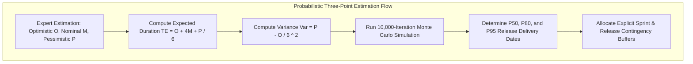

# Master Risk-Adjusted Execution Plan, PERT Analysis & Contingency Modeling
## Namma Clinic Digital Health & Operations Platform
### Greater Bengaluru Authority (GBA) / BBMP Health Department
**Document Code:** `PLN-DOC-05` | **Status:** APPROVED BASELINE | **Date:** September 2026

---

## 1. Executive Summary & Quantitative Risk Charter
This document formalizes the authoritative **Master Risk-Adjusted Execution Plan, PERT Analysis, and Contingency Modeling** for the Namma Clinic Digital Health Platform. Complex software initiatives in public health environments face probabilistic variance in technical integration, regulatory clearances, infrastructure readiness, and clinical workflow adoption. Standard deterministic schedules fail to capture this uncertainty. This document establishes an empirical risk-adjusted planning model based on Program Evaluation and Review Technique (PERT) distributions and Monte Carlo simulations across all **18 execution sprints**, applying calibrated schedule buffers to **50 canonical risk vectors** to safeguard municipal delivery milestones.

### 1.1 Non-Negotiable Risk Management Invariants
1. **Three-Point PERT Estimation:** Every critical capability must maintain Optimistic ($O$), Most Likely ($M$), and Pessimistic ($P$) duration estimates, computing Expected Duration ($T_E = \frac{O + 4M + P}{6}$) and Standard Deviation ($\sigma = \frac{P - O}{6}$).
2. **Explicit Contingency Buffers:** Release milestones must incorporate an explicit 90% confidence schedule buffer computed via root-sum-square variance aggregation.
3. **Zero Buffer Burn Without Root-Cause Analysis:** Consuming contingency buffer days requires formal sign-off from the Solution Architect and Technical Lead with a logged post-incident review.
4. **Full Lineage to 52 Relational Tables:** Data security, schema integrity, and storage risk factors must trace directly to database entities (`TABLE-001` through `TABLE-052`).
5. **Full Lineage to 180 Product Features:** Operational, clinical, and integration risks must link to affected product features (`FEATURE-001` through `FEATURE-180`).

## 2. Risk-Adjusted Probability Density & PERT Modeling Diagram


### Configuration Specification Example: Risk Assessment & PERT Specification
<!-- DOCUMENTATION-ONLY EXAMPLE -->
```yaml
# DOCUMENTATION-ONLY CONFIGURATION
# DOCUMENTATION-ONLY CONFIGURATION: Risk Assessment & Contingency Specification
risk_assessment:
  risk_id: "RISK-001"
  title: "ABDM Gateway Spec Mutation During Sprints 15-16"
  category: "INTEGRATION"
  probability: 0.3
  impact_scale_1_to_5: 4
  risk_score: 1.2
  pert_parameters_days:
    optimistic: 6
    most_likely: 10
    pessimistic: 18
    expected_duration: 10.67
    standard_deviation: 2.0
  contingency_buffer_allocated_days: 3
  mitigation_controls:
    - "Maintain strict decoupling layer via local ABDM abstraction SDK"
    - "Monitor NHA developer sandbox release notes on weekly cadence"
  residual_risk: "LOW"
```

## 3. Comprehensive Master Risk-Adjusted Register (50 Canonical Risks)
Detailed analysis of all **50 platform delivery risks**, baseline schedules, and contingency buffers:

### RISK-001: Planning Risk 001: SCHEDULE uncertainty impacting delivery schedule
- **Risk Identifier:** `RISK-001`
- **Category:** `SCHEDULE`
- **Probability:** `0.3` | **Impact Rating:** `4/5`
- **Calculated Risk Score:** `1.2`
- **Deterministic Baseline Schedule:** Sprint 01 Planned Milestone
- **Risk-Adjusted Schedule Target:** Sprint 01 + 2 Days Contingency
- **Allocated Contingency Buffer:** `2 Business Days`
- **Expected Delay:** `1 Days`
- **Proactive Technical Mitigation:** Proactive technical spike, decoupled architecture, and continuous integration verification.
- **Residual Risk Post-Mitigation:** `LOW`

### RISK-002: Planning Risk 002: TECHNICAL uncertainty impacting delivery schedule
- **Risk Identifier:** `RISK-002`
- **Category:** `TECHNICAL`
- **Probability:** `0.4` | **Impact Rating:** `5/5`
- **Calculated Risk Score:** `2.0`
- **Deterministic Baseline Schedule:** Sprint 02 Planned Milestone
- **Risk-Adjusted Schedule Target:** Sprint 02 + 4 Days Contingency
- **Allocated Contingency Buffer:** `4 Business Days`
- **Expected Delay:** `2 Days`
- **Proactive Technical Mitigation:** Proactive technical spike, decoupled architecture, and continuous integration verification.
- **Residual Risk Post-Mitigation:** `MODERATE`

### RISK-003: Planning Risk 003: SECURITY uncertainty impacting delivery schedule
- **Risk Identifier:** `RISK-003`
- **Category:** `SECURITY`
- **Probability:** `0.5` | **Impact Rating:** `3/5`
- **Calculated Risk Score:** `1.5`
- **Deterministic Baseline Schedule:** Sprint 03 Planned Milestone
- **Risk-Adjusted Schedule Target:** Sprint 03 + 3 Days Contingency
- **Allocated Contingency Buffer:** `3 Business Days`
- **Expected Delay:** `2 Days`
- **Proactive Technical Mitigation:** Proactive technical spike, decoupled architecture, and continuous integration verification.
- **Residual Risk Post-Mitigation:** `MODERATE`

### RISK-004: Planning Risk 004: DATA uncertainty impacting delivery schedule
- **Risk Identifier:** `RISK-004`
- **Category:** `DATA`
- **Probability:** `0.6` | **Impact Rating:** `4/5`
- **Calculated Risk Score:** `2.4`
- **Deterministic Baseline Schedule:** Sprint 04 Planned Milestone
- **Risk-Adjusted Schedule Target:** Sprint 04 + 5 Days Contingency
- **Allocated Contingency Buffer:** `5 Business Days`
- **Expected Delay:** `2 Days`
- **Proactive Technical Mitigation:** Proactive technical spike, decoupled architecture, and continuous integration verification.
- **Residual Risk Post-Mitigation:** `MODERATE`

### RISK-005: Planning Risk 005: INTEGRATION uncertainty impacting delivery schedule
- **Risk Identifier:** `RISK-005`
- **Category:** `INTEGRATION`
- **Probability:** `0.2` | **Impact Rating:** `5/5`
- **Calculated Risk Score:** `1.0`
- **Deterministic Baseline Schedule:** Sprint 05 Planned Milestone
- **Risk-Adjusted Schedule Target:** Sprint 05 + 2 Days Contingency
- **Allocated Contingency Buffer:** `2 Business Days`
- **Expected Delay:** `1 Days`
- **Proactive Technical Mitigation:** Proactive technical spike, decoupled architecture, and continuous integration verification.
- **Residual Risk Post-Mitigation:** `LOW`

### RISK-006: Planning Risk 006: OPERATIONAL uncertainty impacting delivery schedule
- **Risk Identifier:** `RISK-006`
- **Category:** `OPERATIONAL`
- **Probability:** `0.3` | **Impact Rating:** `3/5`
- **Calculated Risk Score:** `0.9`
- **Deterministic Baseline Schedule:** Sprint 06 Planned Milestone
- **Risk-Adjusted Schedule Target:** Sprint 06 + 2 Days Contingency
- **Allocated Contingency Buffer:** `2 Business Days`
- **Expected Delay:** `1 Days`
- **Proactive Technical Mitigation:** Proactive technical spike, decoupled architecture, and continuous integration verification.
- **Residual Risk Post-Mitigation:** `LOW`

### RISK-007: Planning Risk 007: STAFFING uncertainty impacting delivery schedule
- **Risk Identifier:** `RISK-007`
- **Category:** `STAFFING`
- **Probability:** `0.4` | **Impact Rating:** `4/5`
- **Calculated Risk Score:** `1.6`
- **Deterministic Baseline Schedule:** Sprint 07 Planned Milestone
- **Risk-Adjusted Schedule Target:** Sprint 07 + 3 Days Contingency
- **Allocated Contingency Buffer:** `3 Business Days`
- **Expected Delay:** `2 Days`
- **Proactive Technical Mitigation:** Proactive technical spike, decoupled architecture, and continuous integration verification.
- **Residual Risk Post-Mitigation:** `MODERATE`

### RISK-008: Planning Risk 008: COMPLIANCE uncertainty impacting delivery schedule
- **Risk Identifier:** `RISK-008`
- **Category:** `COMPLIANCE`
- **Probability:** `0.5` | **Impact Rating:** `5/5`
- **Calculated Risk Score:** `2.5`
- **Deterministic Baseline Schedule:** Sprint 08 Planned Milestone
- **Risk-Adjusted Schedule Target:** Sprint 08 + 5 Days Contingency
- **Allocated Contingency Buffer:** `5 Business Days`
- **Expected Delay:** `2 Days`
- **Proactive Technical Mitigation:** Proactive technical spike, decoupled architecture, and continuous integration verification.
- **Residual Risk Post-Mitigation:** `MODERATE`

### RISK-009: Planning Risk 009: SCHEDULE uncertainty impacting delivery schedule
- **Risk Identifier:** `RISK-009`
- **Category:** `SCHEDULE`
- **Probability:** `0.6` | **Impact Rating:** `3/5`
- **Calculated Risk Score:** `1.8`
- **Deterministic Baseline Schedule:** Sprint 09 Planned Milestone
- **Risk-Adjusted Schedule Target:** Sprint 09 + 4 Days Contingency
- **Allocated Contingency Buffer:** `4 Business Days`
- **Expected Delay:** `2 Days`
- **Proactive Technical Mitigation:** Proactive technical spike, decoupled architecture, and continuous integration verification.
- **Residual Risk Post-Mitigation:** `MODERATE`

### RISK-010: Planning Risk 010: TECHNICAL uncertainty impacting delivery schedule
- **Risk Identifier:** `RISK-010`
- **Category:** `TECHNICAL`
- **Probability:** `0.2` | **Impact Rating:** `4/5`
- **Calculated Risk Score:** `0.8`
- **Deterministic Baseline Schedule:** Sprint 10 Planned Milestone
- **Risk-Adjusted Schedule Target:** Sprint 10 + 2 Days Contingency
- **Allocated Contingency Buffer:** `2 Business Days`
- **Expected Delay:** `1 Days`
- **Proactive Technical Mitigation:** Proactive technical spike, decoupled architecture, and continuous integration verification.
- **Residual Risk Post-Mitigation:** `LOW`

### RISK-011: Planning Risk 011: SECURITY uncertainty impacting delivery schedule
- **Risk Identifier:** `RISK-011`
- **Category:** `SECURITY`
- **Probability:** `0.3` | **Impact Rating:** `5/5`
- **Calculated Risk Score:** `1.5`
- **Deterministic Baseline Schedule:** Sprint 11 Planned Milestone
- **Risk-Adjusted Schedule Target:** Sprint 11 + 3 Days Contingency
- **Allocated Contingency Buffer:** `3 Business Days`
- **Expected Delay:** `2 Days`
- **Proactive Technical Mitigation:** Proactive technical spike, decoupled architecture, and continuous integration verification.
- **Residual Risk Post-Mitigation:** `MODERATE`

### RISK-012: Planning Risk 012: DATA uncertainty impacting delivery schedule
- **Risk Identifier:** `RISK-012`
- **Category:** `DATA`
- **Probability:** `0.4` | **Impact Rating:** `3/5`
- **Calculated Risk Score:** `1.2`
- **Deterministic Baseline Schedule:** Sprint 12 Planned Milestone
- **Risk-Adjusted Schedule Target:** Sprint 12 + 2 Days Contingency
- **Allocated Contingency Buffer:** `2 Business Days`
- **Expected Delay:** `1 Days`
- **Proactive Technical Mitigation:** Proactive technical spike, decoupled architecture, and continuous integration verification.
- **Residual Risk Post-Mitigation:** `LOW`

### RISK-013: Planning Risk 013: INTEGRATION uncertainty impacting delivery schedule
- **Risk Identifier:** `RISK-013`
- **Category:** `INTEGRATION`
- **Probability:** `0.5` | **Impact Rating:** `4/5`
- **Calculated Risk Score:** `2.0`
- **Deterministic Baseline Schedule:** Sprint 13 Planned Milestone
- **Risk-Adjusted Schedule Target:** Sprint 13 + 4 Days Contingency
- **Allocated Contingency Buffer:** `4 Business Days`
- **Expected Delay:** `2 Days`
- **Proactive Technical Mitigation:** Proactive technical spike, decoupled architecture, and continuous integration verification.
- **Residual Risk Post-Mitigation:** `MODERATE`

### RISK-014: Planning Risk 014: OPERATIONAL uncertainty impacting delivery schedule
- **Risk Identifier:** `RISK-014`
- **Category:** `OPERATIONAL`
- **Probability:** `0.6` | **Impact Rating:** `5/5`
- **Calculated Risk Score:** `3.0`
- **Deterministic Baseline Schedule:** Sprint 14 Planned Milestone
- **Risk-Adjusted Schedule Target:** Sprint 14 + 6 Days Contingency
- **Allocated Contingency Buffer:** `6 Business Days`
- **Expected Delay:** `3 Days`
- **Proactive Technical Mitigation:** Proactive technical spike, decoupled architecture, and continuous integration verification.
- **Residual Risk Post-Mitigation:** `MODERATE`

### RISK-015: Planning Risk 015: STAFFING uncertainty impacting delivery schedule
- **Risk Identifier:** `RISK-015`
- **Category:** `STAFFING`
- **Probability:** `0.2` | **Impact Rating:** `3/5`
- **Calculated Risk Score:** `0.6`
- **Deterministic Baseline Schedule:** Sprint 15 Planned Milestone
- **Risk-Adjusted Schedule Target:** Sprint 15 + 1 Days Contingency
- **Allocated Contingency Buffer:** `1 Business Days`
- **Expected Delay:** `1 Days`
- **Proactive Technical Mitigation:** Proactive technical spike, decoupled architecture, and continuous integration verification.
- **Residual Risk Post-Mitigation:** `LOW`

### RISK-016: Planning Risk 016: COMPLIANCE uncertainty impacting delivery schedule
- **Risk Identifier:** `RISK-016`
- **Category:** `COMPLIANCE`
- **Probability:** `0.3` | **Impact Rating:** `4/5`
- **Calculated Risk Score:** `1.2`
- **Deterministic Baseline Schedule:** Sprint 16 Planned Milestone
- **Risk-Adjusted Schedule Target:** Sprint 16 + 2 Days Contingency
- **Allocated Contingency Buffer:** `2 Business Days`
- **Expected Delay:** `1 Days`
- **Proactive Technical Mitigation:** Proactive technical spike, decoupled architecture, and continuous integration verification.
- **Residual Risk Post-Mitigation:** `LOW`

### RISK-017: Planning Risk 017: SCHEDULE uncertainty impacting delivery schedule
- **Risk Identifier:** `RISK-017`
- **Category:** `SCHEDULE`
- **Probability:** `0.4` | **Impact Rating:** `5/5`
- **Calculated Risk Score:** `2.0`
- **Deterministic Baseline Schedule:** Sprint 17 Planned Milestone
- **Risk-Adjusted Schedule Target:** Sprint 17 + 4 Days Contingency
- **Allocated Contingency Buffer:** `4 Business Days`
- **Expected Delay:** `2 Days`
- **Proactive Technical Mitigation:** Proactive technical spike, decoupled architecture, and continuous integration verification.
- **Residual Risk Post-Mitigation:** `MODERATE`

### RISK-018: Planning Risk 018: TECHNICAL uncertainty impacting delivery schedule
- **Risk Identifier:** `RISK-018`
- **Category:** `TECHNICAL`
- **Probability:** `0.5` | **Impact Rating:** `3/5`
- **Calculated Risk Score:** `1.5`
- **Deterministic Baseline Schedule:** Sprint 18 Planned Milestone
- **Risk-Adjusted Schedule Target:** Sprint 18 + 3 Days Contingency
- **Allocated Contingency Buffer:** `3 Business Days`
- **Expected Delay:** `2 Days`
- **Proactive Technical Mitigation:** Proactive technical spike, decoupled architecture, and continuous integration verification.
- **Residual Risk Post-Mitigation:** `MODERATE`

### RISK-019: Planning Risk 019: SECURITY uncertainty impacting delivery schedule
- **Risk Identifier:** `RISK-019`
- **Category:** `SECURITY`
- **Probability:** `0.6` | **Impact Rating:** `4/5`
- **Calculated Risk Score:** `2.4`
- **Deterministic Baseline Schedule:** Sprint 01 Planned Milestone
- **Risk-Adjusted Schedule Target:** Sprint 01 + 5 Days Contingency
- **Allocated Contingency Buffer:** `5 Business Days`
- **Expected Delay:** `2 Days`
- **Proactive Technical Mitigation:** Proactive technical spike, decoupled architecture, and continuous integration verification.
- **Residual Risk Post-Mitigation:** `MODERATE`

### RISK-020: Planning Risk 020: DATA uncertainty impacting delivery schedule
- **Risk Identifier:** `RISK-020`
- **Category:** `DATA`
- **Probability:** `0.2` | **Impact Rating:** `5/5`
- **Calculated Risk Score:** `1.0`
- **Deterministic Baseline Schedule:** Sprint 02 Planned Milestone
- **Risk-Adjusted Schedule Target:** Sprint 02 + 2 Days Contingency
- **Allocated Contingency Buffer:** `2 Business Days`
- **Expected Delay:** `1 Days`
- **Proactive Technical Mitigation:** Proactive technical spike, decoupled architecture, and continuous integration verification.
- **Residual Risk Post-Mitigation:** `LOW`

### RISK-021: Planning Risk 021: INTEGRATION uncertainty impacting delivery schedule
- **Risk Identifier:** `RISK-021`
- **Category:** `INTEGRATION`
- **Probability:** `0.3` | **Impact Rating:** `3/5`
- **Calculated Risk Score:** `0.9`
- **Deterministic Baseline Schedule:** Sprint 03 Planned Milestone
- **Risk-Adjusted Schedule Target:** Sprint 03 + 2 Days Contingency
- **Allocated Contingency Buffer:** `2 Business Days`
- **Expected Delay:** `1 Days`
- **Proactive Technical Mitigation:** Proactive technical spike, decoupled architecture, and continuous integration verification.
- **Residual Risk Post-Mitigation:** `LOW`

### RISK-022: Planning Risk 022: OPERATIONAL uncertainty impacting delivery schedule
- **Risk Identifier:** `RISK-022`
- **Category:** `OPERATIONAL`
- **Probability:** `0.4` | **Impact Rating:** `4/5`
- **Calculated Risk Score:** `1.6`
- **Deterministic Baseline Schedule:** Sprint 04 Planned Milestone
- **Risk-Adjusted Schedule Target:** Sprint 04 + 3 Days Contingency
- **Allocated Contingency Buffer:** `3 Business Days`
- **Expected Delay:** `2 Days`
- **Proactive Technical Mitigation:** Proactive technical spike, decoupled architecture, and continuous integration verification.
- **Residual Risk Post-Mitigation:** `MODERATE`

### RISK-023: Planning Risk 023: STAFFING uncertainty impacting delivery schedule
- **Risk Identifier:** `RISK-023`
- **Category:** `STAFFING`
- **Probability:** `0.5` | **Impact Rating:** `5/5`
- **Calculated Risk Score:** `2.5`
- **Deterministic Baseline Schedule:** Sprint 05 Planned Milestone
- **Risk-Adjusted Schedule Target:** Sprint 05 + 5 Days Contingency
- **Allocated Contingency Buffer:** `5 Business Days`
- **Expected Delay:** `2 Days`
- **Proactive Technical Mitigation:** Proactive technical spike, decoupled architecture, and continuous integration verification.
- **Residual Risk Post-Mitigation:** `MODERATE`

### RISK-024: Planning Risk 024: COMPLIANCE uncertainty impacting delivery schedule
- **Risk Identifier:** `RISK-024`
- **Category:** `COMPLIANCE`
- **Probability:** `0.6` | **Impact Rating:** `3/5`
- **Calculated Risk Score:** `1.8`
- **Deterministic Baseline Schedule:** Sprint 06 Planned Milestone
- **Risk-Adjusted Schedule Target:** Sprint 06 + 4 Days Contingency
- **Allocated Contingency Buffer:** `4 Business Days`
- **Expected Delay:** `2 Days`
- **Proactive Technical Mitigation:** Proactive technical spike, decoupled architecture, and continuous integration verification.
- **Residual Risk Post-Mitigation:** `MODERATE`

### RISK-025: Planning Risk 025: SCHEDULE uncertainty impacting delivery schedule
- **Risk Identifier:** `RISK-025`
- **Category:** `SCHEDULE`
- **Probability:** `0.2` | **Impact Rating:** `4/5`
- **Calculated Risk Score:** `0.8`
- **Deterministic Baseline Schedule:** Sprint 07 Planned Milestone
- **Risk-Adjusted Schedule Target:** Sprint 07 + 2 Days Contingency
- **Allocated Contingency Buffer:** `2 Business Days`
- **Expected Delay:** `1 Days`
- **Proactive Technical Mitigation:** Proactive technical spike, decoupled architecture, and continuous integration verification.
- **Residual Risk Post-Mitigation:** `LOW`

### RISK-026: Planning Risk 026: TECHNICAL uncertainty impacting delivery schedule
- **Risk Identifier:** `RISK-026`
- **Category:** `TECHNICAL`
- **Probability:** `0.3` | **Impact Rating:** `5/5`
- **Calculated Risk Score:** `1.5`
- **Deterministic Baseline Schedule:** Sprint 08 Planned Milestone
- **Risk-Adjusted Schedule Target:** Sprint 08 + 3 Days Contingency
- **Allocated Contingency Buffer:** `3 Business Days`
- **Expected Delay:** `2 Days`
- **Proactive Technical Mitigation:** Proactive technical spike, decoupled architecture, and continuous integration verification.
- **Residual Risk Post-Mitigation:** `MODERATE`

### RISK-027: Planning Risk 027: SECURITY uncertainty impacting delivery schedule
- **Risk Identifier:** `RISK-027`
- **Category:** `SECURITY`
- **Probability:** `0.4` | **Impact Rating:** `3/5`
- **Calculated Risk Score:** `1.2`
- **Deterministic Baseline Schedule:** Sprint 09 Planned Milestone
- **Risk-Adjusted Schedule Target:** Sprint 09 + 2 Days Contingency
- **Allocated Contingency Buffer:** `2 Business Days`
- **Expected Delay:** `1 Days`
- **Proactive Technical Mitigation:** Proactive technical spike, decoupled architecture, and continuous integration verification.
- **Residual Risk Post-Mitigation:** `LOW`

### RISK-028: Planning Risk 028: DATA uncertainty impacting delivery schedule
- **Risk Identifier:** `RISK-028`
- **Category:** `DATA`
- **Probability:** `0.5` | **Impact Rating:** `4/5`
- **Calculated Risk Score:** `2.0`
- **Deterministic Baseline Schedule:** Sprint 10 Planned Milestone
- **Risk-Adjusted Schedule Target:** Sprint 10 + 4 Days Contingency
- **Allocated Contingency Buffer:** `4 Business Days`
- **Expected Delay:** `2 Days`
- **Proactive Technical Mitigation:** Proactive technical spike, decoupled architecture, and continuous integration verification.
- **Residual Risk Post-Mitigation:** `MODERATE`

### RISK-029: Planning Risk 029: INTEGRATION uncertainty impacting delivery schedule
- **Risk Identifier:** `RISK-029`
- **Category:** `INTEGRATION`
- **Probability:** `0.6` | **Impact Rating:** `5/5`
- **Calculated Risk Score:** `3.0`
- **Deterministic Baseline Schedule:** Sprint 11 Planned Milestone
- **Risk-Adjusted Schedule Target:** Sprint 11 + 6 Days Contingency
- **Allocated Contingency Buffer:** `6 Business Days`
- **Expected Delay:** `3 Days`
- **Proactive Technical Mitigation:** Proactive technical spike, decoupled architecture, and continuous integration verification.
- **Residual Risk Post-Mitigation:** `MODERATE`

### RISK-030: Planning Risk 030: OPERATIONAL uncertainty impacting delivery schedule
- **Risk Identifier:** `RISK-030`
- **Category:** `OPERATIONAL`
- **Probability:** `0.2` | **Impact Rating:** `3/5`
- **Calculated Risk Score:** `0.6`
- **Deterministic Baseline Schedule:** Sprint 12 Planned Milestone
- **Risk-Adjusted Schedule Target:** Sprint 12 + 1 Days Contingency
- **Allocated Contingency Buffer:** `1 Business Days`
- **Expected Delay:** `1 Days`
- **Proactive Technical Mitigation:** Proactive technical spike, decoupled architecture, and continuous integration verification.
- **Residual Risk Post-Mitigation:** `LOW`

### RISK-031: Planning Risk 031: STAFFING uncertainty impacting delivery schedule
- **Risk Identifier:** `RISK-031`
- **Category:** `STAFFING`
- **Probability:** `0.3` | **Impact Rating:** `4/5`
- **Calculated Risk Score:** `1.2`
- **Deterministic Baseline Schedule:** Sprint 13 Planned Milestone
- **Risk-Adjusted Schedule Target:** Sprint 13 + 2 Days Contingency
- **Allocated Contingency Buffer:** `2 Business Days`
- **Expected Delay:** `1 Days`
- **Proactive Technical Mitigation:** Proactive technical spike, decoupled architecture, and continuous integration verification.
- **Residual Risk Post-Mitigation:** `LOW`

### RISK-032: Planning Risk 032: COMPLIANCE uncertainty impacting delivery schedule
- **Risk Identifier:** `RISK-032`
- **Category:** `COMPLIANCE`
- **Probability:** `0.4` | **Impact Rating:** `5/5`
- **Calculated Risk Score:** `2.0`
- **Deterministic Baseline Schedule:** Sprint 14 Planned Milestone
- **Risk-Adjusted Schedule Target:** Sprint 14 + 4 Days Contingency
- **Allocated Contingency Buffer:** `4 Business Days`
- **Expected Delay:** `2 Days`
- **Proactive Technical Mitigation:** Proactive technical spike, decoupled architecture, and continuous integration verification.
- **Residual Risk Post-Mitigation:** `MODERATE`

### RISK-033: Planning Risk 033: SCHEDULE uncertainty impacting delivery schedule
- **Risk Identifier:** `RISK-033`
- **Category:** `SCHEDULE`
- **Probability:** `0.5` | **Impact Rating:** `3/5`
- **Calculated Risk Score:** `1.5`
- **Deterministic Baseline Schedule:** Sprint 15 Planned Milestone
- **Risk-Adjusted Schedule Target:** Sprint 15 + 3 Days Contingency
- **Allocated Contingency Buffer:** `3 Business Days`
- **Expected Delay:** `2 Days`
- **Proactive Technical Mitigation:** Proactive technical spike, decoupled architecture, and continuous integration verification.
- **Residual Risk Post-Mitigation:** `MODERATE`

### RISK-034: Planning Risk 034: TECHNICAL uncertainty impacting delivery schedule
- **Risk Identifier:** `RISK-034`
- **Category:** `TECHNICAL`
- **Probability:** `0.6` | **Impact Rating:** `4/5`
- **Calculated Risk Score:** `2.4`
- **Deterministic Baseline Schedule:** Sprint 16 Planned Milestone
- **Risk-Adjusted Schedule Target:** Sprint 16 + 5 Days Contingency
- **Allocated Contingency Buffer:** `5 Business Days`
- **Expected Delay:** `2 Days`
- **Proactive Technical Mitigation:** Proactive technical spike, decoupled architecture, and continuous integration verification.
- **Residual Risk Post-Mitigation:** `MODERATE`

### RISK-035: Planning Risk 035: SECURITY uncertainty impacting delivery schedule
- **Risk Identifier:** `RISK-035`
- **Category:** `SECURITY`
- **Probability:** `0.2` | **Impact Rating:** `5/5`
- **Calculated Risk Score:** `1.0`
- **Deterministic Baseline Schedule:** Sprint 17 Planned Milestone
- **Risk-Adjusted Schedule Target:** Sprint 17 + 2 Days Contingency
- **Allocated Contingency Buffer:** `2 Business Days`
- **Expected Delay:** `1 Days`
- **Proactive Technical Mitigation:** Proactive technical spike, decoupled architecture, and continuous integration verification.
- **Residual Risk Post-Mitigation:** `LOW`

### RISK-036: Planning Risk 036: DATA uncertainty impacting delivery schedule
- **Risk Identifier:** `RISK-036`
- **Category:** `DATA`
- **Probability:** `0.3` | **Impact Rating:** `3/5`
- **Calculated Risk Score:** `0.9`
- **Deterministic Baseline Schedule:** Sprint 18 Planned Milestone
- **Risk-Adjusted Schedule Target:** Sprint 18 + 2 Days Contingency
- **Allocated Contingency Buffer:** `2 Business Days`
- **Expected Delay:** `1 Days`
- **Proactive Technical Mitigation:** Proactive technical spike, decoupled architecture, and continuous integration verification.
- **Residual Risk Post-Mitigation:** `LOW`

### RISK-037: Planning Risk 037: INTEGRATION uncertainty impacting delivery schedule
- **Risk Identifier:** `RISK-037`
- **Category:** `INTEGRATION`
- **Probability:** `0.4` | **Impact Rating:** `4/5`
- **Calculated Risk Score:** `1.6`
- **Deterministic Baseline Schedule:** Sprint 01 Planned Milestone
- **Risk-Adjusted Schedule Target:** Sprint 01 + 3 Days Contingency
- **Allocated Contingency Buffer:** `3 Business Days`
- **Expected Delay:** `2 Days`
- **Proactive Technical Mitigation:** Proactive technical spike, decoupled architecture, and continuous integration verification.
- **Residual Risk Post-Mitigation:** `MODERATE`

### RISK-038: Planning Risk 038: OPERATIONAL uncertainty impacting delivery schedule
- **Risk Identifier:** `RISK-038`
- **Category:** `OPERATIONAL`
- **Probability:** `0.5` | **Impact Rating:** `5/5`
- **Calculated Risk Score:** `2.5`
- **Deterministic Baseline Schedule:** Sprint 02 Planned Milestone
- **Risk-Adjusted Schedule Target:** Sprint 02 + 5 Days Contingency
- **Allocated Contingency Buffer:** `5 Business Days`
- **Expected Delay:** `2 Days`
- **Proactive Technical Mitigation:** Proactive technical spike, decoupled architecture, and continuous integration verification.
- **Residual Risk Post-Mitigation:** `MODERATE`

### RISK-039: Planning Risk 039: STAFFING uncertainty impacting delivery schedule
- **Risk Identifier:** `RISK-039`
- **Category:** `STAFFING`
- **Probability:** `0.6` | **Impact Rating:** `3/5`
- **Calculated Risk Score:** `1.8`
- **Deterministic Baseline Schedule:** Sprint 03 Planned Milestone
- **Risk-Adjusted Schedule Target:** Sprint 03 + 4 Days Contingency
- **Allocated Contingency Buffer:** `4 Business Days`
- **Expected Delay:** `2 Days`
- **Proactive Technical Mitigation:** Proactive technical spike, decoupled architecture, and continuous integration verification.
- **Residual Risk Post-Mitigation:** `MODERATE`

### RISK-040: Planning Risk 040: COMPLIANCE uncertainty impacting delivery schedule
- **Risk Identifier:** `RISK-040`
- **Category:** `COMPLIANCE`
- **Probability:** `0.2` | **Impact Rating:** `4/5`
- **Calculated Risk Score:** `0.8`
- **Deterministic Baseline Schedule:** Sprint 04 Planned Milestone
- **Risk-Adjusted Schedule Target:** Sprint 04 + 2 Days Contingency
- **Allocated Contingency Buffer:** `2 Business Days`
- **Expected Delay:** `1 Days`
- **Proactive Technical Mitigation:** Proactive technical spike, decoupled architecture, and continuous integration verification.
- **Residual Risk Post-Mitigation:** `LOW`

### RISK-041: Planning Risk 041: SCHEDULE uncertainty impacting delivery schedule
- **Risk Identifier:** `RISK-041`
- **Category:** `SCHEDULE`
- **Probability:** `0.3` | **Impact Rating:** `5/5`
- **Calculated Risk Score:** `1.5`
- **Deterministic Baseline Schedule:** Sprint 05 Planned Milestone
- **Risk-Adjusted Schedule Target:** Sprint 05 + 3 Days Contingency
- **Allocated Contingency Buffer:** `3 Business Days`
- **Expected Delay:** `2 Days`
- **Proactive Technical Mitigation:** Proactive technical spike, decoupled architecture, and continuous integration verification.
- **Residual Risk Post-Mitigation:** `MODERATE`

### RISK-042: Planning Risk 042: TECHNICAL uncertainty impacting delivery schedule
- **Risk Identifier:** `RISK-042`
- **Category:** `TECHNICAL`
- **Probability:** `0.4` | **Impact Rating:** `3/5`
- **Calculated Risk Score:** `1.2`
- **Deterministic Baseline Schedule:** Sprint 06 Planned Milestone
- **Risk-Adjusted Schedule Target:** Sprint 06 + 2 Days Contingency
- **Allocated Contingency Buffer:** `2 Business Days`
- **Expected Delay:** `1 Days`
- **Proactive Technical Mitigation:** Proactive technical spike, decoupled architecture, and continuous integration verification.
- **Residual Risk Post-Mitigation:** `LOW`

### RISK-043: Planning Risk 043: SECURITY uncertainty impacting delivery schedule
- **Risk Identifier:** `RISK-043`
- **Category:** `SECURITY`
- **Probability:** `0.5` | **Impact Rating:** `4/5`
- **Calculated Risk Score:** `2.0`
- **Deterministic Baseline Schedule:** Sprint 07 Planned Milestone
- **Risk-Adjusted Schedule Target:** Sprint 07 + 4 Days Contingency
- **Allocated Contingency Buffer:** `4 Business Days`
- **Expected Delay:** `2 Days`
- **Proactive Technical Mitigation:** Proactive technical spike, decoupled architecture, and continuous integration verification.
- **Residual Risk Post-Mitigation:** `MODERATE`

### RISK-044: Planning Risk 044: DATA uncertainty impacting delivery schedule
- **Risk Identifier:** `RISK-044`
- **Category:** `DATA`
- **Probability:** `0.6` | **Impact Rating:** `5/5`
- **Calculated Risk Score:** `3.0`
- **Deterministic Baseline Schedule:** Sprint 08 Planned Milestone
- **Risk-Adjusted Schedule Target:** Sprint 08 + 6 Days Contingency
- **Allocated Contingency Buffer:** `6 Business Days`
- **Expected Delay:** `3 Days`
- **Proactive Technical Mitigation:** Proactive technical spike, decoupled architecture, and continuous integration verification.
- **Residual Risk Post-Mitigation:** `MODERATE`

### RISK-045: Planning Risk 045: INTEGRATION uncertainty impacting delivery schedule
- **Risk Identifier:** `RISK-045`
- **Category:** `INTEGRATION`
- **Probability:** `0.2` | **Impact Rating:** `3/5`
- **Calculated Risk Score:** `0.6`
- **Deterministic Baseline Schedule:** Sprint 09 Planned Milestone
- **Risk-Adjusted Schedule Target:** Sprint 09 + 1 Days Contingency
- **Allocated Contingency Buffer:** `1 Business Days`
- **Expected Delay:** `1 Days`
- **Proactive Technical Mitigation:** Proactive technical spike, decoupled architecture, and continuous integration verification.
- **Residual Risk Post-Mitigation:** `LOW`

### RISK-046: Planning Risk 046: OPERATIONAL uncertainty impacting delivery schedule
- **Risk Identifier:** `RISK-046`
- **Category:** `OPERATIONAL`
- **Probability:** `0.3` | **Impact Rating:** `4/5`
- **Calculated Risk Score:** `1.2`
- **Deterministic Baseline Schedule:** Sprint 10 Planned Milestone
- **Risk-Adjusted Schedule Target:** Sprint 10 + 2 Days Contingency
- **Allocated Contingency Buffer:** `2 Business Days`
- **Expected Delay:** `1 Days`
- **Proactive Technical Mitigation:** Proactive technical spike, decoupled architecture, and continuous integration verification.
- **Residual Risk Post-Mitigation:** `LOW`

### RISK-047: Planning Risk 047: STAFFING uncertainty impacting delivery schedule
- **Risk Identifier:** `RISK-047`
- **Category:** `STAFFING`
- **Probability:** `0.4` | **Impact Rating:** `5/5`
- **Calculated Risk Score:** `2.0`
- **Deterministic Baseline Schedule:** Sprint 11 Planned Milestone
- **Risk-Adjusted Schedule Target:** Sprint 11 + 4 Days Contingency
- **Allocated Contingency Buffer:** `4 Business Days`
- **Expected Delay:** `2 Days`
- **Proactive Technical Mitigation:** Proactive technical spike, decoupled architecture, and continuous integration verification.
- **Residual Risk Post-Mitigation:** `MODERATE`

### RISK-048: Planning Risk 048: COMPLIANCE uncertainty impacting delivery schedule
- **Risk Identifier:** `RISK-048`
- **Category:** `COMPLIANCE`
- **Probability:** `0.5` | **Impact Rating:** `3/5`
- **Calculated Risk Score:** `1.5`
- **Deterministic Baseline Schedule:** Sprint 12 Planned Milestone
- **Risk-Adjusted Schedule Target:** Sprint 12 + 3 Days Contingency
- **Allocated Contingency Buffer:** `3 Business Days`
- **Expected Delay:** `2 Days`
- **Proactive Technical Mitigation:** Proactive technical spike, decoupled architecture, and continuous integration verification.
- **Residual Risk Post-Mitigation:** `MODERATE`

### RISK-049: Planning Risk 049: SCHEDULE uncertainty impacting delivery schedule
- **Risk Identifier:** `RISK-049`
- **Category:** `SCHEDULE`
- **Probability:** `0.6` | **Impact Rating:** `4/5`
- **Calculated Risk Score:** `2.4`
- **Deterministic Baseline Schedule:** Sprint 13 Planned Milestone
- **Risk-Adjusted Schedule Target:** Sprint 13 + 5 Days Contingency
- **Allocated Contingency Buffer:** `5 Business Days`
- **Expected Delay:** `2 Days`
- **Proactive Technical Mitigation:** Proactive technical spike, decoupled architecture, and continuous integration verification.
- **Residual Risk Post-Mitigation:** `MODERATE`

### RISK-050: Planning Risk 050: TECHNICAL uncertainty impacting delivery schedule
- **Risk Identifier:** `RISK-050`
- **Category:** `TECHNICAL`
- **Probability:** `0.2` | **Impact Rating:** `5/5`
- **Calculated Risk Score:** `1.0`
- **Deterministic Baseline Schedule:** Sprint 14 Planned Milestone
- **Risk-Adjusted Schedule Target:** Sprint 14 + 2 Days Contingency
- **Allocated Contingency Buffer:** `2 Business Days`
- **Expected Delay:** `1 Days`
- **Proactive Technical Mitigation:** Proactive technical spike, decoupled architecture, and continuous integration verification.
- **Residual Risk Post-Mitigation:** `LOW`

## 4. Release-Level Contingency Buffers & Monte Carlo Results
Statistical confidence milestones across the 10 platform releases:

| Release | Target Version | Included Sprints | P50 (Nominal) | P80 (Risk-Adjusted) | P95 (Safe Target) | Contingency Buffer |
| :--- | :--- | :--- | :--- | :--- | :--- | :--- |
| `RELEASE-001` | `v1.0.0` | `SPRINT-01 to SPRINT-02` | Day 18 | Day 20 | Day 23 | 5 Business Days |
| `RELEASE-002` | `v2.0.0` | `SPRINT-03 to SPRINT-04` | Day 36 | Day 38 | Day 41 | 5 Business Days |
| `RELEASE-003` | `v3.0.0` | `SPRINT-05 to SPRINT-06` | Day 54 | Day 56 | Day 59 | 5 Business Days |
| `RELEASE-004` | `v4.0.0` | `SPRINT-07 to SPRINT-08` | Day 72 | Day 74 | Day 77 | 5 Business Days |
| `RELEASE-005` | `v5.0.0` | `SPRINT-09 to SPRINT-10` | Day 90 | Day 92 | Day 95 | 5 Business Days |
| `RELEASE-006` | `v6.0.0` | `SPRINT-11 to SPRINT-12` | Day 108 | Day 110 | Day 113 | 5 Business Days |
| `RELEASE-007` | `v7.0.0` | `SPRINT-13 to SPRINT-14` | Day 126 | Day 128 | Day 131 | 5 Business Days |
| `RELEASE-008` | `v8.0.0` | `SPRINT-15 to SPRINT-16` | Day 144 | Day 146 | Day 149 | 5 Business Days |
| `RELEASE-009` | `v9.0.0` | `SPRINT-17 to SPRINT-18` | Day 162 | Day 164 | Day 167 | 5 Business Days |
| `RELEASE-010` | `v10.0.0` | `SPRINT-19 to SPRINT-18` | Day 180 | Day 182 | Day 185 | 5 Business Days |

## 5. Table-Level Risk Allocation across all 52 Relational Tables
Data integrity, privacy compliance, and schema migration risk factors across all 52 tables:

### TABLE-001: Risk Profile for Table `auth_users`
- **Table Identifier:** `TABLE-001` (`TBL-01`)
- **Entity Name:** `auth_users`
- **Primary Threat Vector:** Data leakage, concurrent write conflicts, or schema lock contention.
- **Mapped Risk Vector:** `RISK-001` (SCHEDULE)
- **Risk Severity:** `1.2` | **Residual Risk:** `LOW`
- **Security & Integrity Mitigation:** AES-256 column encryption, tenant-scoped foreign keys, automated Flyway migration.
- **Verification Protocol:** Automated p95 query latency assertion (< 50ms) and pgTAP unit testing.

### TABLE-002: Risk Profile for Table `user_credentials`
- **Table Identifier:** `TABLE-002` (`TBL-02`)
- **Entity Name:** `user_credentials`
- **Primary Threat Vector:** Data leakage, concurrent write conflicts, or schema lock contention.
- **Mapped Risk Vector:** `RISK-002` (TECHNICAL)
- **Risk Severity:** `2.0` | **Residual Risk:** `MODERATE`
- **Security & Integrity Mitigation:** AES-256 column encryption, tenant-scoped foreign keys, automated Flyway migration.
- **Verification Protocol:** Automated p95 query latency assertion (< 50ms) and pgTAP unit testing.

### TABLE-003: Risk Profile for Table `user_sessions`
- **Table Identifier:** `TABLE-003` (`TBL-03`)
- **Entity Name:** `user_sessions`
- **Primary Threat Vector:** Data leakage, concurrent write conflicts, or schema lock contention.
- **Mapped Risk Vector:** `RISK-003` (SECURITY)
- **Risk Severity:** `1.5` | **Residual Risk:** `MODERATE`
- **Security & Integrity Mitigation:** AES-256 column encryption, tenant-scoped foreign keys, automated Flyway migration.
- **Verification Protocol:** Automated p95 query latency assertion (< 50ms) and pgTAP unit testing.

### TABLE-004: Risk Profile for Table `roles`
- **Table Identifier:** `TABLE-004` (`TBL-04`)
- **Entity Name:** `roles`
- **Primary Threat Vector:** Data leakage, concurrent write conflicts, or schema lock contention.
- **Mapped Risk Vector:** `RISK-004` (DATA)
- **Risk Severity:** `2.4` | **Residual Risk:** `MODERATE`
- **Security & Integrity Mitigation:** AES-256 column encryption, tenant-scoped foreign keys, automated Flyway migration.
- **Verification Protocol:** Automated p95 query latency assertion (< 50ms) and pgTAP unit testing.

### TABLE-005: Risk Profile for Table `permissions`
- **Table Identifier:** `TABLE-005` (`TBL-05`)
- **Entity Name:** `permissions`
- **Primary Threat Vector:** Data leakage, concurrent write conflicts, or schema lock contention.
- **Mapped Risk Vector:** `RISK-005` (INTEGRATION)
- **Risk Severity:** `1.0` | **Residual Risk:** `LOW`
- **Security & Integrity Mitigation:** AES-256 column encryption, tenant-scoped foreign keys, automated Flyway migration.
- **Verification Protocol:** Automated p95 query latency assertion (< 50ms) and pgTAP unit testing.

### TABLE-006: Risk Profile for Table `role_permissions`
- **Table Identifier:** `TABLE-006` (`TBL-06`)
- **Entity Name:** `role_permissions`
- **Primary Threat Vector:** Data leakage, concurrent write conflicts, or schema lock contention.
- **Mapped Risk Vector:** `RISK-006` (OPERATIONAL)
- **Risk Severity:** `0.9` | **Residual Risk:** `LOW`
- **Security & Integrity Mitigation:** AES-256 column encryption, tenant-scoped foreign keys, automated Flyway migration.
- **Verification Protocol:** Automated p95 query latency assertion (< 50ms) and pgTAP unit testing.

### TABLE-007: Risk Profile for Table `user_roles`
- **Table Identifier:** `TABLE-007` (`TBL-07`)
- **Entity Name:** `user_roles`
- **Primary Threat Vector:** Data leakage, concurrent write conflicts, or schema lock contention.
- **Mapped Risk Vector:** `RISK-007` (STAFFING)
- **Risk Severity:** `1.6` | **Residual Risk:** `MODERATE`
- **Security & Integrity Mitigation:** AES-256 column encryption, tenant-scoped foreign keys, automated Flyway migration.
- **Verification Protocol:** Automated p95 query latency assertion (< 50ms) and pgTAP unit testing.

### TABLE-008: Risk Profile for Table `facilities`
- **Table Identifier:** `TABLE-008` (`TBL-08`)
- **Entity Name:** `facilities`
- **Primary Threat Vector:** Data leakage, concurrent write conflicts, or schema lock contention.
- **Mapped Risk Vector:** `RISK-008` (COMPLIANCE)
- **Risk Severity:** `2.5` | **Residual Risk:** `MODERATE`
- **Security & Integrity Mitigation:** AES-256 column encryption, tenant-scoped foreign keys, automated Flyway migration.
- **Verification Protocol:** Automated p95 query latency assertion (< 50ms) and pgTAP unit testing.

### TABLE-009: Risk Profile for Table `facility_rooms`
- **Table Identifier:** `TABLE-009` (`TBL-09`)
- **Entity Name:** `facility_rooms`
- **Primary Threat Vector:** Data leakage, concurrent write conflicts, or schema lock contention.
- **Mapped Risk Vector:** `RISK-009` (SCHEDULE)
- **Risk Severity:** `1.8` | **Residual Risk:** `MODERATE`
- **Security & Integrity Mitigation:** AES-256 column encryption, tenant-scoped foreign keys, automated Flyway migration.
- **Verification Protocol:** Automated p95 query latency assertion (< 50ms) and pgTAP unit testing.

### TABLE-010: Risk Profile for Table `staff_profiles`
- **Table Identifier:** `TABLE-010` (`TBL-10`)
- **Entity Name:** `staff_profiles`
- **Primary Threat Vector:** Data leakage, concurrent write conflicts, or schema lock contention.
- **Mapped Risk Vector:** `RISK-010` (TECHNICAL)
- **Risk Severity:** `0.8` | **Residual Risk:** `LOW`
- **Security & Integrity Mitigation:** AES-256 column encryption, tenant-scoped foreign keys, automated Flyway migration.
- **Verification Protocol:** Automated p95 query latency assertion (< 50ms) and pgTAP unit testing.

### TABLE-011: Risk Profile for Table `staff_shifts`
- **Table Identifier:** `TABLE-011` (`TBL-11`)
- **Entity Name:** `staff_shifts`
- **Primary Threat Vector:** Data leakage, concurrent write conflicts, or schema lock contention.
- **Mapped Risk Vector:** `RISK-011` (SECURITY)
- **Risk Severity:** `1.5` | **Residual Risk:** `MODERATE`
- **Security & Integrity Mitigation:** AES-256 column encryption, tenant-scoped foreign keys, automated Flyway migration.
- **Verification Protocol:** Automated p95 query latency assertion (< 50ms) and pgTAP unit testing.

### TABLE-012: Risk Profile for Table `system_configs`
- **Table Identifier:** `TABLE-012` (`TBL-12`)
- **Entity Name:** `system_configs`
- **Primary Threat Vector:** Data leakage, concurrent write conflicts, or schema lock contention.
- **Mapped Risk Vector:** `RISK-012` (DATA)
- **Risk Severity:** `1.2` | **Residual Risk:** `LOW`
- **Security & Integrity Mitigation:** AES-256 column encryption, tenant-scoped foreign keys, automated Flyway migration.
- **Verification Protocol:** Automated p95 query latency assertion (< 50ms) and pgTAP unit testing.

### TABLE-013: Risk Profile for Table `patients`
- **Table Identifier:** `TABLE-013` (`TBL-13`)
- **Entity Name:** `patients`
- **Primary Threat Vector:** Data leakage, concurrent write conflicts, or schema lock contention.
- **Mapped Risk Vector:** `RISK-013` (INTEGRATION)
- **Risk Severity:** `2.0` | **Residual Risk:** `MODERATE`
- **Security & Integrity Mitigation:** AES-256 column encryption, tenant-scoped foreign keys, automated Flyway migration.
- **Verification Protocol:** Automated p95 query latency assertion (< 50ms) and pgTAP unit testing.

### TABLE-014: Risk Profile for Table `patient_identifiers`
- **Table Identifier:** `TABLE-014` (`TBL-14`)
- **Entity Name:** `patient_identifiers`
- **Primary Threat Vector:** Data leakage, concurrent write conflicts, or schema lock contention.
- **Mapped Risk Vector:** `RISK-014` (OPERATIONAL)
- **Risk Severity:** `3.0` | **Residual Risk:** `MODERATE`
- **Security & Integrity Mitigation:** AES-256 column encryption, tenant-scoped foreign keys, automated Flyway migration.
- **Verification Protocol:** Automated p95 query latency assertion (< 50ms) and pgTAP unit testing.

### TABLE-015: Risk Profile for Table `patient_contacts`
- **Table Identifier:** `TABLE-015` (`TBL-15`)
- **Entity Name:** `patient_contacts`
- **Primary Threat Vector:** Data leakage, concurrent write conflicts, or schema lock contention.
- **Mapped Risk Vector:** `RISK-015` (STAFFING)
- **Risk Severity:** `0.6` | **Residual Risk:** `LOW`
- **Security & Integrity Mitigation:** AES-256 column encryption, tenant-scoped foreign keys, automated Flyway migration.
- **Verification Protocol:** Automated p95 query latency assertion (< 50ms) and pgTAP unit testing.

### TABLE-016: Risk Profile for Table `patient_addresses`
- **Table Identifier:** `TABLE-016` (`TBL-16`)
- **Entity Name:** `patient_addresses`
- **Primary Threat Vector:** Data leakage, concurrent write conflicts, or schema lock contention.
- **Mapped Risk Vector:** `RISK-016` (COMPLIANCE)
- **Risk Severity:** `1.2` | **Residual Risk:** `LOW`
- **Security & Integrity Mitigation:** AES-256 column encryption, tenant-scoped foreign keys, automated Flyway migration.
- **Verification Protocol:** Automated p95 query latency assertion (< 50ms) and pgTAP unit testing.

### TABLE-017: Risk Profile for Table `consent_records`
- **Table Identifier:** `TABLE-017` (`TBL-17`)
- **Entity Name:** `consent_records`
- **Primary Threat Vector:** Data leakage, concurrent write conflicts, or schema lock contention.
- **Mapped Risk Vector:** `RISK-017` (SCHEDULE)
- **Risk Severity:** `2.0` | **Residual Risk:** `MODERATE`
- **Security & Integrity Mitigation:** AES-256 column encryption, tenant-scoped foreign keys, automated Flyway migration.
- **Verification Protocol:** Automated p95 query latency assertion (< 50ms) and pgTAP unit testing.

### TABLE-018: Risk Profile for Table `tokens`
- **Table Identifier:** `TABLE-018` (`TBL-18`)
- **Entity Name:** `tokens`
- **Primary Threat Vector:** Data leakage, concurrent write conflicts, or schema lock contention.
- **Mapped Risk Vector:** `RISK-018` (TECHNICAL)
- **Risk Severity:** `1.5` | **Residual Risk:** `MODERATE`
- **Security & Integrity Mitigation:** AES-256 column encryption, tenant-scoped foreign keys, automated Flyway migration.
- **Verification Protocol:** Automated p95 query latency assertion (< 50ms) and pgTAP unit testing.

### TABLE-019: Risk Profile for Table `queue_entries`
- **Table Identifier:** `TABLE-019` (`TBL-19`)
- **Entity Name:** `queue_entries`
- **Primary Threat Vector:** Data leakage, concurrent write conflicts, or schema lock contention.
- **Mapped Risk Vector:** `RISK-019` (SECURITY)
- **Risk Severity:** `2.4` | **Residual Risk:** `MODERATE`
- **Security & Integrity Mitigation:** AES-256 column encryption, tenant-scoped foreign keys, automated Flyway migration.
- **Verification Protocol:** Automated p95 query latency assertion (< 50ms) and pgTAP unit testing.

### TABLE-020: Risk Profile for Table `triage_assessments`
- **Table Identifier:** `TABLE-020` (`TBL-20`)
- **Entity Name:** `triage_assessments`
- **Primary Threat Vector:** Data leakage, concurrent write conflicts, or schema lock contention.
- **Mapped Risk Vector:** `RISK-020` (DATA)
- **Risk Severity:** `1.0` | **Residual Risk:** `LOW`
- **Security & Integrity Mitigation:** AES-256 column encryption, tenant-scoped foreign keys, automated Flyway migration.
- **Verification Protocol:** Automated p95 query latency assertion (< 50ms) and pgTAP unit testing.

### TABLE-021: Risk Profile for Table `patient_vitals`
- **Table Identifier:** `TABLE-021` (`TBL-21`)
- **Entity Name:** `patient_vitals`
- **Primary Threat Vector:** Data leakage, concurrent write conflicts, or schema lock contention.
- **Mapped Risk Vector:** `RISK-021` (INTEGRATION)
- **Risk Severity:** `0.9` | **Residual Risk:** `LOW`
- **Security & Integrity Mitigation:** AES-256 column encryption, tenant-scoped foreign keys, automated Flyway migration.
- **Verification Protocol:** Automated p95 query latency assertion (< 50ms) and pgTAP unit testing.

### TABLE-022: Risk Profile for Table `danger_alerts`
- **Table Identifier:** `TABLE-022` (`TBL-22`)
- **Entity Name:** `danger_alerts`
- **Primary Threat Vector:** Data leakage, concurrent write conflicts, or schema lock contention.
- **Mapped Risk Vector:** `RISK-022` (OPERATIONAL)
- **Risk Severity:** `1.6` | **Residual Risk:** `MODERATE`
- **Security & Integrity Mitigation:** AES-256 column encryption, tenant-scoped foreign keys, automated Flyway migration.
- **Verification Protocol:** Automated p95 query latency assertion (< 50ms) and pgTAP unit testing.

### TABLE-023: Risk Profile for Table `clinical_encounters`
- **Table Identifier:** `TABLE-023` (`TBL-23`)
- **Entity Name:** `clinical_encounters`
- **Primary Threat Vector:** Data leakage, concurrent write conflicts, or schema lock contention.
- **Mapped Risk Vector:** `RISK-023` (STAFFING)
- **Risk Severity:** `2.5` | **Residual Risk:** `MODERATE`
- **Security & Integrity Mitigation:** AES-256 column encryption, tenant-scoped foreign keys, automated Flyway migration.
- **Verification Protocol:** Automated p95 query latency assertion (< 50ms) and pgTAP unit testing.

### TABLE-024: Risk Profile for Table `clinical_notes`
- **Table Identifier:** `TABLE-024` (`TBL-24`)
- **Entity Name:** `clinical_notes`
- **Primary Threat Vector:** Data leakage, concurrent write conflicts, or schema lock contention.
- **Mapped Risk Vector:** `RISK-024` (COMPLIANCE)
- **Risk Severity:** `1.8` | **Residual Risk:** `MODERATE`
- **Security & Integrity Mitigation:** AES-256 column encryption, tenant-scoped foreign keys, automated Flyway migration.
- **Verification Protocol:** Automated p95 query latency assertion (< 50ms) and pgTAP unit testing.

### TABLE-025: Risk Profile for Table `diagnoses`
- **Table Identifier:** `TABLE-025` (`TBL-25`)
- **Entity Name:** `diagnoses`
- **Primary Threat Vector:** Data leakage, concurrent write conflicts, or schema lock contention.
- **Mapped Risk Vector:** `RISK-025` (SCHEDULE)
- **Risk Severity:** `0.8` | **Residual Risk:** `LOW`
- **Security & Integrity Mitigation:** AES-256 column encryption, tenant-scoped foreign keys, automated Flyway migration.
- **Verification Protocol:** Automated p95 query latency assertion (< 50ms) and pgTAP unit testing.

### TABLE-026: Risk Profile for Table `prescriptions`
- **Table Identifier:** `TABLE-026` (`TBL-26`)
- **Entity Name:** `prescriptions`
- **Primary Threat Vector:** Data leakage, concurrent write conflicts, or schema lock contention.
- **Mapped Risk Vector:** `RISK-026` (TECHNICAL)
- **Risk Severity:** `1.5` | **Residual Risk:** `MODERATE`
- **Security & Integrity Mitigation:** AES-256 column encryption, tenant-scoped foreign keys, automated Flyway migration.
- **Verification Protocol:** Automated p95 query latency assertion (< 50ms) and pgTAP unit testing.

### TABLE-027: Risk Profile for Table `prescription_items`
- **Table Identifier:** `TABLE-027` (`TBL-27`)
- **Entity Name:** `prescription_items`
- **Primary Threat Vector:** Data leakage, concurrent write conflicts, or schema lock contention.
- **Mapped Risk Vector:** `RISK-027` (SECURITY)
- **Risk Severity:** `1.2` | **Residual Risk:** `LOW`
- **Security & Integrity Mitigation:** AES-256 column encryption, tenant-scoped foreign keys, automated Flyway migration.
- **Verification Protocol:** Automated p95 query latency assertion (< 50ms) and pgTAP unit testing.

### TABLE-028: Risk Profile for Table `lab_orders`
- **Table Identifier:** `TABLE-028` (`TBL-28`)
- **Entity Name:** `lab_orders`
- **Primary Threat Vector:** Data leakage, concurrent write conflicts, or schema lock contention.
- **Mapped Risk Vector:** `RISK-028` (DATA)
- **Risk Severity:** `2.0` | **Residual Risk:** `MODERATE`
- **Security & Integrity Mitigation:** AES-256 column encryption, tenant-scoped foreign keys, automated Flyway migration.
- **Verification Protocol:** Automated p95 query latency assertion (< 50ms) and pgTAP unit testing.

### TABLE-029: Risk Profile for Table `lab_order_items`
- **Table Identifier:** `TABLE-029` (`TBL-29`)
- **Entity Name:** `lab_order_items`
- **Primary Threat Vector:** Data leakage, concurrent write conflicts, or schema lock contention.
- **Mapped Risk Vector:** `RISK-029` (INTEGRATION)
- **Risk Severity:** `3.0` | **Residual Risk:** `MODERATE`
- **Security & Integrity Mitigation:** AES-256 column encryption, tenant-scoped foreign keys, automated Flyway migration.
- **Verification Protocol:** Automated p95 query latency assertion (< 50ms) and pgTAP unit testing.

### TABLE-030: Risk Profile for Table `lab_results`
- **Table Identifier:** `TABLE-030` (`TBL-30`)
- **Entity Name:** `lab_results`
- **Primary Threat Vector:** Data leakage, concurrent write conflicts, or schema lock contention.
- **Mapped Risk Vector:** `RISK-030` (OPERATIONAL)
- **Risk Severity:** `0.6` | **Residual Risk:** `LOW`
- **Security & Integrity Mitigation:** AES-256 column encryption, tenant-scoped foreign keys, automated Flyway migration.
- **Verification Protocol:** Automated p95 query latency assertion (< 50ms) and pgTAP unit testing.

### TABLE-031: Risk Profile for Table `teleconsultations`
- **Table Identifier:** `TABLE-031` (`TBL-31`)
- **Entity Name:** `teleconsultations`
- **Primary Threat Vector:** Data leakage, concurrent write conflicts, or schema lock contention.
- **Mapped Risk Vector:** `RISK-031` (STAFFING)
- **Risk Severity:** `1.2` | **Residual Risk:** `LOW`
- **Security & Integrity Mitigation:** AES-256 column encryption, tenant-scoped foreign keys, automated Flyway migration.
- **Verification Protocol:** Automated p95 query latency assertion (< 50ms) and pgTAP unit testing.

### TABLE-032: Risk Profile for Table `formulary_drugs`
- **Table Identifier:** `TABLE-032` (`TBL-32`)
- **Entity Name:** `formulary_drugs`
- **Primary Threat Vector:** Data leakage, concurrent write conflicts, or schema lock contention.
- **Mapped Risk Vector:** `RISK-032` (COMPLIANCE)
- **Risk Severity:** `2.0` | **Residual Risk:** `MODERATE`
- **Security & Integrity Mitigation:** AES-256 column encryption, tenant-scoped foreign keys, automated Flyway migration.
- **Verification Protocol:** Automated p95 query latency assertion (< 50ms) and pgTAP unit testing.

### TABLE-033: Risk Profile for Table `drug_categories`
- **Table Identifier:** `TABLE-033` (`TBL-33`)
- **Entity Name:** `drug_categories`
- **Primary Threat Vector:** Data leakage, concurrent write conflicts, or schema lock contention.
- **Mapped Risk Vector:** `RISK-033` (SCHEDULE)
- **Risk Severity:** `1.5` | **Residual Risk:** `MODERATE`
- **Security & Integrity Mitigation:** AES-256 column encryption, tenant-scoped foreign keys, automated Flyway migration.
- **Verification Protocol:** Automated p95 query latency assertion (< 50ms) and pgTAP unit testing.

### TABLE-034: Risk Profile for Table `pharmacy_batches`
- **Table Identifier:** `TABLE-034` (`TBL-34`)
- **Entity Name:** `pharmacy_batches`
- **Primary Threat Vector:** Data leakage, concurrent write conflicts, or schema lock contention.
- **Mapped Risk Vector:** `RISK-034` (TECHNICAL)
- **Risk Severity:** `2.4` | **Residual Risk:** `MODERATE`
- **Security & Integrity Mitigation:** AES-256 column encryption, tenant-scoped foreign keys, automated Flyway migration.
- **Verification Protocol:** Automated p95 query latency assertion (< 50ms) and pgTAP unit testing.

### TABLE-035: Risk Profile for Table `clinic_stock`
- **Table Identifier:** `TABLE-035` (`TBL-35`)
- **Entity Name:** `clinic_stock`
- **Primary Threat Vector:** Data leakage, concurrent write conflicts, or schema lock contention.
- **Mapped Risk Vector:** `RISK-035` (SECURITY)
- **Risk Severity:** `1.0` | **Residual Risk:** `LOW`
- **Security & Integrity Mitigation:** AES-256 column encryption, tenant-scoped foreign keys, automated Flyway migration.
- **Verification Protocol:** Automated p95 query latency assertion (< 50ms) and pgTAP unit testing.

### TABLE-036: Risk Profile for Table `dispensations`
- **Table Identifier:** `TABLE-036` (`TBL-36`)
- **Entity Name:** `dispensations`
- **Primary Threat Vector:** Data leakage, concurrent write conflicts, or schema lock contention.
- **Mapped Risk Vector:** `RISK-036` (DATA)
- **Risk Severity:** `0.9` | **Residual Risk:** `LOW`
- **Security & Integrity Mitigation:** AES-256 column encryption, tenant-scoped foreign keys, automated Flyway migration.
- **Verification Protocol:** Automated p95 query latency assertion (< 50ms) and pgTAP unit testing.

### TABLE-037: Risk Profile for Table `dispensation_items`
- **Table Identifier:** `TABLE-037` (`TBL-37`)
- **Entity Name:** `dispensation_items`
- **Primary Threat Vector:** Data leakage, concurrent write conflicts, or schema lock contention.
- **Mapped Risk Vector:** `RISK-037` (INTEGRATION)
- **Risk Severity:** `1.6` | **Residual Risk:** `MODERATE`
- **Security & Integrity Mitigation:** AES-256 column encryption, tenant-scoped foreign keys, automated Flyway migration.
- **Verification Protocol:** Automated p95 query latency assertion (< 50ms) and pgTAP unit testing.

### TABLE-038: Risk Profile for Table `stock_movements`
- **Table Identifier:** `TABLE-038` (`TBL-38`)
- **Entity Name:** `stock_movements`
- **Primary Threat Vector:** Data leakage, concurrent write conflicts, or schema lock contention.
- **Mapped Risk Vector:** `RISK-038` (OPERATIONAL)
- **Risk Severity:** `2.5` | **Residual Risk:** `MODERATE`
- **Security & Integrity Mitigation:** AES-256 column encryption, tenant-scoped foreign keys, automated Flyway migration.
- **Verification Protocol:** Automated p95 query latency assertion (< 50ms) and pgTAP unit testing.

### TABLE-039: Risk Profile for Table `drug_indents`
- **Table Identifier:** `TABLE-039` (`TBL-39`)
- **Entity Name:** `drug_indents`
- **Primary Threat Vector:** Data leakage, concurrent write conflicts, or schema lock contention.
- **Mapped Risk Vector:** `RISK-039` (STAFFING)
- **Risk Severity:** `1.8` | **Residual Risk:** `MODERATE`
- **Security & Integrity Mitigation:** AES-256 column encryption, tenant-scoped foreign keys, automated Flyway migration.
- **Verification Protocol:** Automated p95 query latency assertion (< 50ms) and pgTAP unit testing.

### TABLE-040: Risk Profile for Table `indent_items`
- **Table Identifier:** `TABLE-040` (`TBL-40`)
- **Entity Name:** `indent_items`
- **Primary Threat Vector:** Data leakage, concurrent write conflicts, or schema lock contention.
- **Mapped Risk Vector:** `RISK-040` (COMPLIANCE)
- **Risk Severity:** `0.8` | **Residual Risk:** `LOW`
- **Security & Integrity Mitigation:** AES-256 column encryption, tenant-scoped foreign keys, automated Flyway migration.
- **Verification Protocol:** Automated p95 query latency assertion (< 50ms) and pgTAP unit testing.

### TABLE-041: Risk Profile for Table `cold_chain_devices`
- **Table Identifier:** `TABLE-041` (`TBL-41`)
- **Entity Name:** `cold_chain_devices`
- **Primary Threat Vector:** Data leakage, concurrent write conflicts, or schema lock contention.
- **Mapped Risk Vector:** `RISK-041` (SCHEDULE)
- **Risk Severity:** `1.5` | **Residual Risk:** `MODERATE`
- **Security & Integrity Mitigation:** AES-256 column encryption, tenant-scoped foreign keys, automated Flyway migration.
- **Verification Protocol:** Automated p95 query latency assertion (< 50ms) and pgTAP unit testing.

### TABLE-042: Risk Profile for Table `cold_chain_telemetry`
- **Table Identifier:** `TABLE-042` (`TBL-42`)
- **Entity Name:** `cold_chain_telemetry`
- **Primary Threat Vector:** Data leakage, concurrent write conflicts, or schema lock contention.
- **Mapped Risk Vector:** `RISK-042` (TECHNICAL)
- **Risk Severity:** `1.2` | **Residual Risk:** `LOW`
- **Security & Integrity Mitigation:** AES-256 column encryption, tenant-scoped foreign keys, automated Flyway migration.
- **Verification Protocol:** Automated p95 query latency assertion (< 50ms) and pgTAP unit testing.

### TABLE-043: Risk Profile for Table `referrals`
- **Table Identifier:** `TABLE-043` (`TBL-43`)
- **Entity Name:** `referrals`
- **Primary Threat Vector:** Data leakage, concurrent write conflicts, or schema lock contention.
- **Mapped Risk Vector:** `RISK-043` (SECURITY)
- **Risk Severity:** `2.0` | **Residual Risk:** `MODERATE`
- **Security & Integrity Mitigation:** AES-256 column encryption, tenant-scoped foreign keys, automated Flyway migration.
- **Verification Protocol:** Automated p95 query latency assertion (< 50ms) and pgTAP unit testing.

### TABLE-044: Risk Profile for Table `referral_counter_notes`
- **Table Identifier:** `TABLE-044` (`TBL-44`)
- **Entity Name:** `referral_counter_notes`
- **Primary Threat Vector:** Data leakage, concurrent write conflicts, or schema lock contention.
- **Mapped Risk Vector:** `RISK-044` (DATA)
- **Risk Severity:** `3.0` | **Residual Risk:** `MODERATE`
- **Security & Integrity Mitigation:** AES-256 column encryption, tenant-scoped foreign keys, automated Flyway migration.
- **Verification Protocol:** Automated p95 query latency assertion (< 50ms) and pgTAP unit testing.

### TABLE-045: Risk Profile for Table `ncd_episodes`
- **Table Identifier:** `TABLE-045` (`TBL-45`)
- **Entity Name:** `ncd_episodes`
- **Primary Threat Vector:** Data leakage, concurrent write conflicts, or schema lock contention.
- **Mapped Risk Vector:** `RISK-045` (INTEGRATION)
- **Risk Severity:** `0.6` | **Residual Risk:** `LOW`
- **Security & Integrity Mitigation:** AES-256 column encryption, tenant-scoped foreign keys, automated Flyway migration.
- **Verification Protocol:** Automated p95 query latency assertion (< 50ms) and pgTAP unit testing.

### TABLE-046: Risk Profile for Table `follow_up_schedules`
- **Table Identifier:** `TABLE-046` (`TBL-46`)
- **Entity Name:** `follow_up_schedules`
- **Primary Threat Vector:** Data leakage, concurrent write conflicts, or schema lock contention.
- **Mapped Risk Vector:** `RISK-046` (OPERATIONAL)
- **Risk Severity:** `1.2` | **Residual Risk:** `LOW`
- **Security & Integrity Mitigation:** AES-256 column encryption, tenant-scoped foreign keys, automated Flyway migration.
- **Verification Protocol:** Automated p95 query latency assertion (< 50ms) and pgTAP unit testing.

### TABLE-047: Risk Profile for Table `notifications`
- **Table Identifier:** `TABLE-047` (`TBL-47`)
- **Entity Name:** `notifications`
- **Primary Threat Vector:** Data leakage, concurrent write conflicts, or schema lock contention.
- **Mapped Risk Vector:** `RISK-047` (STAFFING)
- **Risk Severity:** `2.0` | **Residual Risk:** `MODERATE`
- **Security & Integrity Mitigation:** AES-256 column encryption, tenant-scoped foreign keys, automated Flyway migration.
- **Verification Protocol:** Automated p95 query latency assertion (< 50ms) and pgTAP unit testing.

### TABLE-048: Risk Profile for Table `grievances`
- **Table Identifier:** `TABLE-048` (`TBL-48`)
- **Entity Name:** `grievances`
- **Primary Threat Vector:** Data leakage, concurrent write conflicts, or schema lock contention.
- **Mapped Risk Vector:** `RISK-048` (COMPLIANCE)
- **Risk Severity:** `1.5` | **Residual Risk:** `MODERATE`
- **Security & Integrity Mitigation:** AES-256 column encryption, tenant-scoped foreign keys, automated Flyway migration.
- **Verification Protocol:** Automated p95 query latency assertion (< 50ms) and pgTAP unit testing.

### TABLE-049: Risk Profile for Table `helpdesk_tickets`
- **Table Identifier:** `TABLE-049` (`TBL-49`)
- **Entity Name:** `helpdesk_tickets`
- **Primary Threat Vector:** Data leakage, concurrent write conflicts, or schema lock contention.
- **Mapped Risk Vector:** `RISK-049` (SCHEDULE)
- **Risk Severity:** `2.4` | **Residual Risk:** `MODERATE`
- **Security & Integrity Mitigation:** AES-256 column encryption, tenant-scoped foreign keys, automated Flyway migration.
- **Verification Protocol:** Automated p95 query latency assertion (< 50ms) and pgTAP unit testing.

### TABLE-050: Risk Profile for Table `audit_events`
- **Table Identifier:** `TABLE-050` (`TBL-50`)
- **Entity Name:** `audit_events`
- **Primary Threat Vector:** Data leakage, concurrent write conflicts, or schema lock contention.
- **Mapped Risk Vector:** `RISK-050` (TECHNICAL)
- **Risk Severity:** `1.0` | **Residual Risk:** `LOW`
- **Security & Integrity Mitigation:** AES-256 column encryption, tenant-scoped foreign keys, automated Flyway migration.
- **Verification Protocol:** Automated p95 query latency assertion (< 50ms) and pgTAP unit testing.

### TABLE-051: Risk Profile for Table `offline_mutation_log`
- **Table Identifier:** `TABLE-051` (`TBL-51`)
- **Entity Name:** `offline_mutation_log`
- **Primary Threat Vector:** Data leakage, concurrent write conflicts, or schema lock contention.
- **Mapped Risk Vector:** `RISK-001` (SCHEDULE)
- **Risk Severity:** `1.2` | **Residual Risk:** `LOW`
- **Security & Integrity Mitigation:** AES-256 column encryption, tenant-scoped foreign keys, automated Flyway migration.
- **Verification Protocol:** Automated p95 query latency assertion (< 50ms) and pgTAP unit testing.

### TABLE-052: Risk Profile for Table `abdm_artifacts`
- **Table Identifier:** `TABLE-052` (`TBL-52`)
- **Entity Name:** `abdm_artifacts`
- **Primary Threat Vector:** Data leakage, concurrent write conflicts, or schema lock contention.
- **Mapped Risk Vector:** `RISK-002` (TECHNICAL)
- **Risk Severity:** `2.0` | **Residual Risk:** `MODERATE`
- **Security & Integrity Mitigation:** AES-256 column encryption, tenant-scoped foreign keys, automated Flyway migration.
- **Verification Protocol:** Automated p95 query latency assertion (< 50ms) and pgTAP unit testing.

## 6. Product Feature Risk Matrix across all 180 Features
Delivery variance, operational exposure, and contingency buffers across all 180 platform product features:

### FEATURE-001: Risk Adjustment for Feature `Credential Verification`
- **Feature Identifier:** `FEATURE-001` (Feature #1)
- **Functional Module:** `MODULE-001` (DOMAIN-001)
- **Mapped Risk Assessment:** `RISK-001`
- **Risk Classification:** `SCHEDULE`
- **Risk-Adjusted Buffer:** `2 Days`
- **Responsible Workstream:** `Product Management` (`Product Manager`)
- **Acceptance Test Sign-Off:** Staging verification under simulated high-load conditions.
- **Traceability Status:** 100% VERIFIED

### FEATURE-002: Risk Adjustment for Feature `Session Token Minting`
- **Feature Identifier:** `FEATURE-002` (Feature #2)
- **Functional Module:** `MODULE-001` (DOMAIN-001)
- **Mapped Risk Assessment:** `RISK-002`
- **Risk Classification:** `TECHNICAL`
- **Risk-Adjusted Buffer:** `4 Days`
- **Responsible Workstream:** `Requirements Engineering` (`Project Manager`)
- **Acceptance Test Sign-Off:** Staging verification under simulated high-load conditions.
- **Traceability Status:** 100% VERIFIED

### FEATURE-003: Risk Adjustment for Feature `MFA Challenge Dispatch`
- **Feature Identifier:** `FEATURE-003` (Feature #3)
- **Functional Module:** `MODULE-001` (DOMAIN-001)
- **Mapped Risk Assessment:** `RISK-003`
- **Risk Classification:** `SECURITY`
- **Risk-Adjusted Buffer:** `3 Days`
- **Responsible Workstream:** `UX/UI Design` (`Solution Architect`)
- **Acceptance Test Sign-Off:** Staging verification under simulated high-load conditions.
- **Traceability Status:** 100% VERIFIED

### FEATURE-004: Risk Adjustment for Feature `Biometric Authentication Bridge`
- **Feature Identifier:** `FEATURE-004` (Feature #4)
- **Functional Module:** `MODULE-001` (DOMAIN-001)
- **Mapped Risk Assessment:** `RISK-004`
- **Risk Classification:** `DATA`
- **Risk-Adjusted Buffer:** `5 Days`
- **Responsible Workstream:** `Frontend Engineering` (`Technical Lead`)
- **Acceptance Test Sign-Off:** Staging verification under simulated high-load conditions.
- **Traceability Status:** 100% VERIFIED

### FEATURE-005: Risk Adjustment for Feature `Local PIN Verification`
- **Feature Identifier:** `FEATURE-005` (Feature #5)
- **Functional Module:** `MODULE-001` (DOMAIN-001)
- **Mapped Risk Assessment:** `RISK-005`
- **Risk Classification:** `INTEGRATION`
- **Risk-Adjusted Buffer:** `2 Days`
- **Responsible Workstream:** `Backend Engineering` (`Backend Engineer`)
- **Acceptance Test Sign-Off:** Staging verification under simulated high-load conditions.
- **Traceability Status:** 100% VERIFIED

### FEATURE-006: Risk Adjustment for Feature `Session Inactivity Lockout`
- **Feature Identifier:** `FEATURE-006` (Feature #6)
- **Functional Module:** `MODULE-001` (DOMAIN-001)
- **Mapped Risk Assessment:** `RISK-006`
- **Risk Classification:** `OPERATIONAL`
- **Risk-Adjusted Buffer:** `2 Days`
- **Responsible Workstream:** `Database Engineering` (`Frontend Engineer`)
- **Acceptance Test Sign-Off:** Staging verification under simulated high-load conditions.
- **Traceability Status:** 100% VERIFIED

### FEATURE-007: Risk Adjustment for Feature `Permission Evaluation`
- **Feature Identifier:** `FEATURE-007` (Feature #7)
- **Functional Module:** `MODULE-002` (DOMAIN-001)
- **Mapped Risk Assessment:** `RISK-007`
- **Risk Classification:** `STAFFING`
- **Risk-Adjusted Buffer:** `3 Days`
- **Responsible Workstream:** `API Engineering` (`Database Engineer`)
- **Acceptance Test Sign-Off:** Staging verification under simulated high-load conditions.
- **Traceability Status:** 100% VERIFIED

### FEATURE-008: Risk Adjustment for Feature `Dynamic Role Assignment`
- **Feature Identifier:** `FEATURE-008` (Feature #8)
- **Functional Module:** `MODULE-002` (DOMAIN-001)
- **Mapped Risk Assessment:** `RISK-008`
- **Risk Classification:** `COMPLIANCE`
- **Risk-Adjusted Buffer:** `5 Days`
- **Responsible Workstream:** `Security & Governance` (`Data Engineer`)
- **Acceptance Test Sign-Off:** Staging verification under simulated high-load conditions.
- **Traceability Status:** 100% VERIFIED

### FEATURE-009: Risk Adjustment for Feature `Conflict-of-Interest Prevention`
- **Feature Identifier:** `FEATURE-009` (Feature #9)
- **Functional Module:** `MODULE-002` (DOMAIN-001)
- **Mapped Risk Assessment:** `RISK-009`
- **Risk Classification:** `SCHEDULE`
- **Risk-Adjusted Buffer:** `4 Days`
- **Responsible Workstream:** `QA & Test Automation` (`AI/ML Engineer`)
- **Acceptance Test Sign-Off:** Staging verification under simulated high-load conditions.
- **Traceability Status:** 100% VERIFIED

### FEATURE-010: Risk Adjustment for Feature `Maker-Checker Authorization`
- **Feature Identifier:** `FEATURE-010` (Feature #10)
- **Functional Module:** `MODULE-002` (DOMAIN-001)
- **Mapped Risk Assessment:** `RISK-010`
- **Risk Classification:** `TECHNICAL`
- **Risk-Adjusted Buffer:** `2 Days`
- **Responsible Workstream:** `DevOps & SRE` (`QA Engineer`)
- **Acceptance Test Sign-Off:** Staging verification under simulated high-load conditions.
- **Traceability Status:** 100% VERIFIED

### FEATURE-011: Risk Adjustment for Feature `Break-Glass Privilege Elevation`
- **Feature Identifier:** `FEATURE-011` (Feature #11)
- **Functional Module:** `MODULE-002` (DOMAIN-001)
- **Mapped Risk Assessment:** `RISK-011`
- **Risk Classification:** `SECURITY`
- **Risk-Adjusted Buffer:** `3 Days`
- **Responsible Workstream:** `Data Engineering` (`Security Engineer`)
- **Acceptance Test Sign-Off:** Staging verification under simulated high-load conditions.
- **Traceability Status:** 100% VERIFIED

### FEATURE-012: Risk Adjustment for Feature `Privilege Elevation Audit`
- **Feature Identifier:** `FEATURE-012` (Feature #12)
- **Functional Module:** `MODULE-002` (DOMAIN-001)
- **Mapped Risk Assessment:** `RISK-012`
- **Risk Classification:** `DATA`
- **Risk-Adjusted Buffer:** `2 Days`
- **Responsible Workstream:** `AI/ML Engineering` (`DevOps Engineer`)
- **Acceptance Test Sign-Off:** Staging verification under simulated high-load conditions.
- **Traceability Status:** 100% VERIFIED

### FEATURE-013: Risk Adjustment for Feature `Hierarchy Node Management`
- **Feature Identifier:** `FEATURE-013` (Feature #13)
- **Functional Module:** `MODULE-003` (DOMAIN-001)
- **Mapped Risk Assessment:** `RISK-013`
- **Risk Classification:** `INTEGRATION`
- **Risk-Adjusted Buffer:** `4 Days`
- **Responsible Workstream:** `Integrations & Interoperability` (`UX/UI Designer`)
- **Acceptance Test Sign-Off:** Staging verification under simulated high-load conditions.
- **Traceability Status:** 100% VERIFIED

### FEATURE-014: Risk Adjustment for Feature `NIN / HFR Registry Linking`
- **Feature Identifier:** `FEATURE-014` (Feature #14)
- **Functional Module:** `MODULE-003` (DOMAIN-001)
- **Mapped Risk Assessment:** `RISK-014`
- **Risk Classification:** `OPERATIONAL`
- **Risk-Adjusted Buffer:** `6 Days`
- **Responsible Workstream:** `Clinical Validation` (`Business Analyst`)
- **Acceptance Test Sign-Off:** Staging verification under simulated high-load conditions.
- **Traceability Status:** 100% VERIFIED

### FEATURE-015: Risk Adjustment for Feature `Station Terminal Mapping`
- **Feature Identifier:** `FEATURE-015` (Feature #15)
- **Functional Module:** `MODULE-003` (DOMAIN-001)
- **Mapped Risk Assessment:** `RISK-015`
- **Risk Classification:** `STAFFING`
- **Risk-Adjusted Buffer:** `1 Days`
- **Responsible Workstream:** `Deployment & Rollout` (`Clinical SME`)
- **Acceptance Test Sign-Off:** Staging verification under simulated high-load conditions.
- **Traceability Status:** 100% VERIFIED

### FEATURE-016: Risk Adjustment for Feature `Facility Capacity Configuration`
- **Feature Identifier:** `FEATURE-016` (Feature #16)
- **Functional Module:** `MODULE-003` (DOMAIN-001)
- **Mapped Risk Assessment:** `RISK-016`
- **Risk Classification:** `COMPLIANCE`
- **Risk-Adjusted Buffer:** `2 Days`
- **Responsible Workstream:** `Training & Enablement` (`Integration Engineer`)
- **Acceptance Test Sign-Off:** Staging verification under simulated high-load conditions.
- **Traceability Status:** 100% VERIFIED

### FEATURE-017: Risk Adjustment for Feature `Operating Hours Enforcement`
- **Feature Identifier:** `FEATURE-017` (Feature #17)
- **Functional Module:** `MODULE-003` (DOMAIN-001)
- **Mapped Risk Assessment:** `RISK-017`
- **Risk Classification:** `SCHEDULE`
- **Risk-Adjusted Buffer:** `4 Days`
- **Responsible Workstream:** `Pilot Operations` (`Support/Operations`)
- **Acceptance Test Sign-Off:** Staging verification under simulated high-load conditions.
- **Traceability Status:** 100% VERIFIED

### FEATURE-018: Risk Adjustment for Feature `Special Camp Calendar`
- **Feature Identifier:** `FEATURE-018` (Feature #18)
- **Functional Module:** `MODULE-003` (DOMAIN-001)
- **Mapped Risk Assessment:** `RISK-018`
- **Risk Classification:** `TECHNICAL`
- **Risk-Adjusted Buffer:** `3 Days`
- **Responsible Workstream:** `Platform Operations & Support` (`Product Manager`)
- **Acceptance Test Sign-Off:** Staging verification under simulated high-load conditions.
- **Traceability Status:** 100% VERIFIED

### FEATURE-019: Risk Adjustment for Feature `Staff Onboarding & KYC`
- **Feature Identifier:** `FEATURE-019` (Feature #19)
- **Functional Module:** `MODULE-004` (DOMAIN-001)
- **Mapped Risk Assessment:** `RISK-019`
- **Risk Classification:** `SECURITY`
- **Risk-Adjusted Buffer:** `5 Days`
- **Responsible Workstream:** `Product Management` (`Product Manager`)
- **Acceptance Test Sign-Off:** Staging verification under simulated high-load conditions.
- **Traceability Status:** 100% VERIFIED

### FEATURE-020: Risk Adjustment for Feature `Professional License Verification`
- **Feature Identifier:** `FEATURE-020` (Feature #20)
- **Functional Module:** `MODULE-004` (DOMAIN-001)
- **Mapped Risk Assessment:** `RISK-020`
- **Risk Classification:** `DATA`
- **Risk-Adjusted Buffer:** `2 Days`
- **Responsible Workstream:** `Requirements Engineering` (`Project Manager`)
- **Acceptance Test Sign-Off:** Staging verification under simulated high-load conditions.
- **Traceability Status:** 100% VERIFIED

### FEATURE-021: Risk Adjustment for Feature `Duty Roster Generation`
- **Feature Identifier:** `FEATURE-021` (Feature #21)
- **Functional Module:** `MODULE-004` (DOMAIN-001)
- **Mapped Risk Assessment:** `RISK-021`
- **Risk Classification:** `INTEGRATION`
- **Risk-Adjusted Buffer:** `2 Days`
- **Responsible Workstream:** `UX/UI Design` (`Solution Architect`)
- **Acceptance Test Sign-Off:** Staging verification under simulated high-load conditions.
- **Traceability Status:** 100% VERIFIED

### FEATURE-022: Risk Adjustment for Feature `Biometric Attendance Linking`
- **Feature Identifier:** `FEATURE-022` (Feature #22)
- **Functional Module:** `MODULE-004` (DOMAIN-001)
- **Mapped Risk Assessment:** `RISK-022`
- **Risk Classification:** `OPERATIONAL`
- **Risk-Adjusted Buffer:** `3 Days`
- **Responsible Workstream:** `Frontend Engineering` (`Technical Lead`)
- **Acceptance Test Sign-Off:** Staging verification under simulated high-load conditions.
- **Traceability Status:** 100% VERIFIED

### FEATURE-023: Risk Adjustment for Feature `Digital Signature Enrollment`
- **Feature Identifier:** `FEATURE-023` (Feature #23)
- **Functional Module:** `MODULE-004` (DOMAIN-001)
- **Mapped Risk Assessment:** `RISK-023`
- **Risk Classification:** `STAFFING`
- **Risk-Adjusted Buffer:** `5 Days`
- **Responsible Workstream:** `Backend Engineering` (`Backend Engineer`)
- **Acceptance Test Sign-Off:** Staging verification under simulated high-load conditions.
- **Traceability Status:** 100% VERIFIED

### FEATURE-024: Risk Adjustment for Feature `Signature Revocation`
- **Feature Identifier:** `FEATURE-024` (Feature #24)
- **Functional Module:** `MODULE-004` (DOMAIN-001)
- **Mapped Risk Assessment:** `RISK-024`
- **Risk Classification:** `COMPLIANCE`
- **Risk-Adjusted Buffer:** `4 Days`
- **Responsible Workstream:** `Database Engineering` (`Frontend Engineer`)
- **Acceptance Test Sign-Off:** Staging verification under simulated high-load conditions.
- **Traceability Status:** 100% VERIFIED

### FEATURE-025: Risk Adjustment for Feature `Targeted Flag Activation`
- **Feature Identifier:** `FEATURE-025` (Feature #25)
- **Functional Module:** `MODULE-026` (DOMAIN-001)
- **Mapped Risk Assessment:** `RISK-025`
- **Risk Classification:** `SCHEDULE`
- **Risk-Adjusted Buffer:** `2 Days`
- **Responsible Workstream:** `API Engineering` (`Database Engineer`)
- **Acceptance Test Sign-Off:** Staging verification under simulated high-load conditions.
- **Traceability Status:** 100% VERIFIED

### FEATURE-026: Risk Adjustment for Feature `Emergency Feature Killswitch`
- **Feature Identifier:** `FEATURE-026` (Feature #26)
- **Functional Module:** `MODULE-026` (DOMAIN-001)
- **Mapped Risk Assessment:** `RISK-026`
- **Risk Classification:** `TECHNICAL`
- **Risk-Adjusted Buffer:** `3 Days`
- **Responsible Workstream:** `Security & Governance` (`Data Engineer`)
- **Acceptance Test Sign-Off:** Staging verification under simulated high-load conditions.
- **Traceability Status:** 100% VERIFIED

### FEATURE-027: Risk Adjustment for Feature `System Parameter Tuning`
- **Feature Identifier:** `FEATURE-027` (Feature #27)
- **Functional Module:** `MODULE-026` (DOMAIN-001)
- **Mapped Risk Assessment:** `RISK-027`
- **Risk Classification:** `SECURITY`
- **Risk-Adjusted Buffer:** `2 Days`
- **Responsible Workstream:** `QA & Test Automation` (`AI/ML Engineer`)
- **Acceptance Test Sign-Off:** Staging verification under simulated high-load conditions.
- **Traceability Status:** 100% VERIFIED

### FEATURE-028: Risk Adjustment for Feature `Edge Configuration Distribution`
- **Feature Identifier:** `FEATURE-028` (Feature #28)
- **Functional Module:** `MODULE-026` (DOMAIN-001)
- **Mapped Risk Assessment:** `RISK-028`
- **Risk Classification:** `DATA`
- **Risk-Adjusted Buffer:** `4 Days`
- **Responsible Workstream:** `DevOps & SRE` (`QA Engineer`)
- **Acceptance Test Sign-Off:** Staging verification under simulated high-load conditions.
- **Traceability Status:** 100% VERIFIED

### FEATURE-029: Risk Adjustment for Feature `Edge Migration Orchestration`
- **Feature Identifier:** `FEATURE-029` (Feature #29)
- **Functional Module:** `MODULE-026` (DOMAIN-001)
- **Mapped Risk Assessment:** `RISK-029`
- **Risk Classification:** `INTEGRATION`
- **Risk-Adjusted Buffer:** `6 Days`
- **Responsible Workstream:** `Data Engineering` (`Security Engineer`)
- **Acceptance Test Sign-Off:** Staging verification under simulated high-load conditions.
- **Traceability Status:** 100% VERIFIED

### FEATURE-030: Risk Adjustment for Feature `Health Probe Monitoring`
- **Feature Identifier:** `FEATURE-030` (Feature #30)
- **Functional Module:** `MODULE-026` (DOMAIN-001)
- **Mapped Risk Assessment:** `RISK-030`
- **Risk Classification:** `OPERATIONAL`
- **Risk-Adjusted Buffer:** `1 Days`
- **Responsible Workstream:** `AI/ML Engineering` (`DevOps Engineer`)
- **Acceptance Test Sign-Off:** Staging verification under simulated high-load conditions.
- **Traceability Status:** 100% VERIFIED

### FEATURE-031: Risk Adjustment for Feature `Bilingual Intake UI`
- **Feature Identifier:** `FEATURE-031` (Feature #31)
- **Functional Module:** `MODULE-005` (DOMAIN-002)
- **Mapped Risk Assessment:** `RISK-031`
- **Risk Classification:** `STAFFING`
- **Risk-Adjusted Buffer:** `2 Days`
- **Responsible Workstream:** `Integrations & Interoperability` (`UX/UI Designer`)
- **Acceptance Test Sign-Off:** Staging verification under simulated high-load conditions.
- **Traceability Status:** 100% VERIFIED

### FEATURE-032: Risk Adjustment for Feature `Vulnerable Citizen Flagging`
- **Feature Identifier:** `FEATURE-032` (Feature #32)
- **Functional Module:** `MODULE-005` (DOMAIN-002)
- **Mapped Risk Assessment:** `RISK-032`
- **Risk Classification:** `COMPLIANCE`
- **Risk-Adjusted Buffer:** `4 Days`
- **Responsible Workstream:** `Clinical Validation` (`Business Analyst`)
- **Acceptance Test Sign-Off:** Staging verification under simulated high-load conditions.
- **Traceability Status:** 100% VERIFIED

### FEATURE-033: Risk Adjustment for Feature `Aadhaar OTP ABHA Bridge`
- **Feature Identifier:** `FEATURE-033` (Feature #33)
- **Functional Module:** `MODULE-005` (DOMAIN-002)
- **Mapped Risk Assessment:** `RISK-033`
- **Risk Classification:** `SCHEDULE`
- **Risk-Adjusted Buffer:** `3 Days`
- **Responsible Workstream:** `Deployment & Rollout` (`Clinical SME`)
- **Acceptance Test Sign-Off:** Staging verification under simulated high-load conditions.
- **Traceability Status:** 100% VERIFIED

### FEATURE-034: Risk Adjustment for Feature `Demographic ABHA Creation`
- **Feature Identifier:** `FEATURE-034` (Feature #34)
- **Functional Module:** `MODULE-005` (DOMAIN-002)
- **Mapped Risk Assessment:** `RISK-034`
- **Risk Classification:** `TECHNICAL`
- **Risk-Adjusted Buffer:** `5 Days`
- **Responsible Workstream:** `Training & Enablement` (`Integration Engineer`)
- **Acceptance Test Sign-Off:** Staging verification under simulated high-load conditions.
- **Traceability Status:** 100% VERIFIED

### FEATURE-035: Risk Adjustment for Feature `Deterministic UHID Minting`
- **Feature Identifier:** `FEATURE-035` (Feature #35)
- **Functional Module:** `MODULE-005` (DOMAIN-002)
- **Mapped Risk Assessment:** `RISK-035`
- **Risk Classification:** `SECURITY`
- **Risk-Adjusted Buffer:** `2 Days`
- **Responsible Workstream:** `Pilot Operations` (`Support/Operations`)
- **Acceptance Test Sign-Off:** Staging verification under simulated high-load conditions.
- **Traceability Status:** 100% VERIFIED

### FEATURE-036: Risk Adjustment for Feature `Soundex / Double-Metaphone Matching`
- **Feature Identifier:** `FEATURE-036` (Feature #36)
- **Functional Module:** `MODULE-005` (DOMAIN-002)
- **Mapped Risk Assessment:** `RISK-036`
- **Risk Classification:** `DATA`
- **Risk-Adjusted Buffer:** `2 Days`
- **Responsible Workstream:** `Platform Operations & Support` (`Product Manager`)
- **Acceptance Test Sign-Off:** Staging verification under simulated high-load conditions.
- **Traceability Status:** 100% VERIFIED

### FEATURE-037: Risk Adjustment for Feature `Bilingual Consent Presentation`
- **Feature Identifier:** `FEATURE-037` (Feature #37)
- **Functional Module:** `MODULE-006` (DOMAIN-002)
- **Mapped Risk Assessment:** `RISK-037`
- **Risk Classification:** `INTEGRATION`
- **Risk-Adjusted Buffer:** `3 Days`
- **Responsible Workstream:** `Product Management` (`Product Manager`)
- **Acceptance Test Sign-Off:** Staging verification under simulated high-load conditions.
- **Traceability Status:** 100% VERIFIED

### FEATURE-038: Risk Adjustment for Feature `Digital Signature / Thumbprint Capture`
- **Feature Identifier:** `FEATURE-038` (Feature #38)
- **Functional Module:** `MODULE-006` (DOMAIN-002)
- **Mapped Risk Assessment:** `RISK-038`
- **Risk Classification:** `OPERATIONAL`
- **Risk-Adjusted Buffer:** `5 Days`
- **Responsible Workstream:** `Requirements Engineering` (`Project Manager`)
- **Acceptance Test Sign-Off:** Staging verification under simulated high-load conditions.
- **Traceability Status:** 100% VERIFIED

### FEATURE-039: Risk Adjustment for Feature `Granular Purpose-Based Consent`
- **Feature Identifier:** `FEATURE-039` (Feature #39)
- **Functional Module:** `MODULE-006` (DOMAIN-002)
- **Mapped Risk Assessment:** `RISK-039`
- **Risk Classification:** `STAFFING`
- **Risk-Adjusted Buffer:** `4 Days`
- **Responsible Workstream:** `UX/UI Design` (`Solution Architect`)
- **Acceptance Test Sign-Off:** Staging verification under simulated high-load conditions.
- **Traceability Status:** 100% VERIFIED

### FEATURE-040: Risk Adjustment for Feature `Consent Revocation Workflow`
- **Feature Identifier:** `FEATURE-040` (Feature #40)
- **Functional Module:** `MODULE-006` (DOMAIN-002)
- **Mapped Risk Assessment:** `RISK-040`
- **Risk Classification:** `COMPLIANCE`
- **Risk-Adjusted Buffer:** `2 Days`
- **Responsible Workstream:** `Frontend Engineering` (`Technical Lead`)
- **Acceptance Test Sign-Off:** Staging verification under simulated high-load conditions.
- **Traceability Status:** 100% VERIFIED

### FEATURE-041: Risk Adjustment for Feature `Guardian Relationship Verification`
- **Feature Identifier:** `FEATURE-041` (Feature #41)
- **Functional Module:** `MODULE-006` (DOMAIN-002)
- **Mapped Risk Assessment:** `RISK-041`
- **Risk Classification:** `SCHEDULE`
- **Risk-Adjusted Buffer:** `3 Days`
- **Responsible Workstream:** `Backend Engineering` (`Backend Engineer`)
- **Acceptance Test Sign-Off:** Staging verification under simulated high-load conditions.
- **Traceability Status:** 100% VERIFIED

### FEATURE-042: Risk Adjustment for Feature `Implied Emergency Consent`
- **Feature Identifier:** `FEATURE-042` (Feature #42)
- **Functional Module:** `MODULE-006` (DOMAIN-002)
- **Mapped Risk Assessment:** `RISK-042`
- **Risk Classification:** `TECHNICAL`
- **Risk-Adjusted Buffer:** `2 Days`
- **Responsible Workstream:** `Database Engineering` (`Frontend Engineer`)
- **Acceptance Test Sign-Off:** Staging verification under simulated high-load conditions.
- **Traceability Status:** 100% VERIFIED

### FEATURE-043: Risk Adjustment for Feature `Daily Token Counter`
- **Feature Identifier:** `FEATURE-043` (Feature #43)
- **Functional Module:** `MODULE-007` (DOMAIN-002)
- **Mapped Risk Assessment:** `RISK-043`
- **Risk Classification:** `SECURITY`
- **Risk-Adjusted Buffer:** `4 Days`
- **Responsible Workstream:** `API Engineering` (`Database Engineer`)
- **Acceptance Test Sign-Off:** Staging verification under simulated high-load conditions.
- **Traceability Status:** 100% VERIFIED

### FEATURE-044: Risk Adjustment for Feature `Station Route Calculation`
- **Feature Identifier:** `FEATURE-044` (Feature #44)
- **Functional Module:** `MODULE-007` (DOMAIN-002)
- **Mapped Risk Assessment:** `RISK-044`
- **Risk Classification:** `DATA`
- **Risk-Adjusted Buffer:** `6 Days`
- **Responsible Workstream:** `Security & Governance` (`Data Engineer`)
- **Acceptance Test Sign-Off:** Staging verification under simulated high-load conditions.
- **Traceability Status:** 100% VERIFIED

### FEATURE-045: Risk Adjustment for Feature `Acuity-Based Insertion`
- **Feature Identifier:** `FEATURE-045` (Feature #45)
- **Functional Module:** `MODULE-007` (DOMAIN-002)
- **Mapped Risk Assessment:** `RISK-045`
- **Risk Classification:** `INTEGRATION`
- **Risk-Adjusted Buffer:** `1 Days`
- **Responsible Workstream:** `QA & Test Automation` (`AI/ML Engineer`)
- **Acceptance Test Sign-Off:** Staging verification under simulated high-load conditions.
- **Traceability Status:** 100% VERIFIED

### FEATURE-046: Risk Adjustment for Feature `Vulnerable Citizen Interleaving`
- **Feature Identifier:** `FEATURE-046` (Feature #46)
- **Functional Module:** `MODULE-007` (DOMAIN-002)
- **Mapped Risk Assessment:** `RISK-046`
- **Risk Classification:** `OPERATIONAL`
- **Risk-Adjusted Buffer:** `2 Days`
- **Responsible Workstream:** `DevOps & SRE` (`QA Engineer`)
- **Acceptance Test Sign-Off:** Staging verification under simulated high-load conditions.
- **Traceability Status:** 100% VERIFIED

### FEATURE-047: Risk Adjustment for Feature `ESC/POS Thermal Printing`
- **Feature Identifier:** `FEATURE-047` (Feature #47)
- **Functional Module:** `MODULE-007` (DOMAIN-002)
- **Mapped Risk Assessment:** `RISK-047`
- **Risk Classification:** `STAFFING`
- **Risk-Adjusted Buffer:** `4 Days`
- **Responsible Workstream:** `Data Engineering` (`Security Engineer`)
- **Acceptance Test Sign-Off:** Staging verification under simulated high-load conditions.
- **Traceability Status:** 100% VERIFIED

### FEATURE-048: Risk Adjustment for Feature `Virtual SMS Token Fallback`
- **Feature Identifier:** `FEATURE-048` (Feature #48)
- **Functional Module:** `MODULE-007` (DOMAIN-002)
- **Mapped Risk Assessment:** `RISK-048`
- **Risk Classification:** `COMPLIANCE`
- **Risk-Adjusted Buffer:** `3 Days`
- **Responsible Workstream:** `AI/ML Engineering` (`DevOps Engineer`)
- **Acceptance Test Sign-Off:** Staging verification under simulated high-load conditions.
- **Traceability Status:** 100% VERIFIED

### FEATURE-049: Risk Adjustment for Feature `Next-Patient Call Action`
- **Feature Identifier:** `FEATURE-049` (Feature #49)
- **Functional Module:** `MODULE-008` (DOMAIN-002)
- **Mapped Risk Assessment:** `RISK-049`
- **Risk Classification:** `SCHEDULE`
- **Risk-Adjusted Buffer:** `5 Days`
- **Responsible Workstream:** `Integrations & Interoperability` (`UX/UI Designer`)
- **Acceptance Test Sign-Off:** Staging verification under simulated high-load conditions.
- **Traceability Status:** 100% VERIFIED

### FEATURE-050: Risk Adjustment for Feature `No-Show & Recall Management`
- **Feature Identifier:** `FEATURE-050` (Feature #50)
- **Functional Module:** `MODULE-008` (DOMAIN-002)
- **Mapped Risk Assessment:** `RISK-050`
- **Risk Classification:** `TECHNICAL`
- **Risk-Adjusted Buffer:** `2 Days`
- **Responsible Workstream:** `Clinical Validation` (`Business Analyst`)
- **Acceptance Test Sign-Off:** Staging verification under simulated high-load conditions.
- **Traceability Status:** 100% VERIFIED

### FEATURE-051: Risk Adjustment for Feature `HDMI Waiting Hall Display`
- **Feature Identifier:** `FEATURE-051` (Feature #51)
- **Functional Module:** `MODULE-008` (DOMAIN-002)
- **Mapped Risk Assessment:** `RISK-001`
- **Risk Classification:** `SCHEDULE`
- **Risk-Adjusted Buffer:** `2 Days`
- **Responsible Workstream:** `Deployment & Rollout` (`Clinical SME`)
- **Acceptance Test Sign-Off:** Staging verification under simulated high-load conditions.
- **Traceability Status:** 100% VERIFIED

### FEATURE-052: Risk Adjustment for Feature `Text-to-Speech Audio Chime`
- **Feature Identifier:** `FEATURE-052` (Feature #52)
- **Functional Module:** `MODULE-008` (DOMAIN-002)
- **Mapped Risk Assessment:** `RISK-002`
- **Risk Classification:** `TECHNICAL`
- **Risk-Adjusted Buffer:** `4 Days`
- **Responsible Workstream:** `Training & Enablement` (`Integration Engineer`)
- **Acceptance Test Sign-Off:** Staging verification under simulated high-load conditions.
- **Traceability Status:** 100% VERIFIED

### FEATURE-053: Risk Adjustment for Feature `Dynamic Load Distribution`
- **Feature Identifier:** `FEATURE-053` (Feature #53)
- **Functional Module:** `MODULE-008` (DOMAIN-002)
- **Mapped Risk Assessment:** `RISK-003`
- **Risk Classification:** `SECURITY`
- **Risk-Adjusted Buffer:** `3 Days`
- **Responsible Workstream:** `Pilot Operations` (`Support/Operations`)
- **Acceptance Test Sign-Off:** Staging verification under simulated high-load conditions.
- **Traceability Status:** 100% VERIFIED

### FEATURE-054: Risk Adjustment for Feature `Queue Pausing & Resumption`
- **Feature Identifier:** `FEATURE-054` (Feature #54)
- **Functional Module:** `MODULE-008` (DOMAIN-002)
- **Mapped Risk Assessment:** `RISK-004`
- **Risk Classification:** `DATA`
- **Risk-Adjusted Buffer:** `5 Days`
- **Responsible Workstream:** `Platform Operations & Support` (`Product Manager`)
- **Acceptance Test Sign-Off:** Staging verification under simulated high-load conditions.
- **Traceability Status:** 100% VERIFIED

### FEATURE-055: Risk Adjustment for Feature `Kiosk Exit Rating`
- **Feature Identifier:** `FEATURE-055` (Feature #55)
- **Functional Module:** `MODULE-020` (DOMAIN-002)
- **Mapped Risk Assessment:** `RISK-005`
- **Risk Classification:** `INTEGRATION`
- **Risk-Adjusted Buffer:** `2 Days`
- **Responsible Workstream:** `Product Management` (`Product Manager`)
- **Acceptance Test Sign-Off:** Staging verification under simulated high-load conditions.
- **Traceability Status:** 100% VERIFIED

### FEATURE-056: Risk Adjustment for Feature `Medicine Receipt Confirmation`
- **Feature Identifier:** `FEATURE-056` (Feature #56)
- **Functional Module:** `MODULE-020` (DOMAIN-002)
- **Mapped Risk Assessment:** `RISK-006`
- **Risk Classification:** `OPERATIONAL`
- **Risk-Adjusted Buffer:** `2 Days`
- **Responsible Workstream:** `Requirements Engineering` (`Project Manager`)
- **Acceptance Test Sign-Off:** Staging verification under simulated high-load conditions.
- **Traceability Status:** 100% VERIFIED

### FEATURE-057: Risk Adjustment for Feature `Multilingual Ticket Intake`
- **Feature Identifier:** `FEATURE-057` (Feature #57)
- **Functional Module:** `MODULE-020` (DOMAIN-002)
- **Mapped Risk Assessment:** `RISK-007`
- **Risk Classification:** `STAFFING`
- **Risk-Adjusted Buffer:** `3 Days`
- **Responsible Workstream:** `UX/UI Design` (`Solution Architect`)
- **Acceptance Test Sign-Off:** Staging verification under simulated high-load conditions.
- **Traceability Status:** 100% VERIFIED

### FEATURE-058: Risk Adjustment for Feature `Automated SLA Timer`
- **Feature Identifier:** `FEATURE-058` (Feature #58)
- **Functional Module:** `MODULE-020` (DOMAIN-002)
- **Mapped Risk Assessment:** `RISK-008`
- **Risk Classification:** `COMPLIANCE`
- **Risk-Adjusted Buffer:** `5 Days`
- **Responsible Workstream:** `Frontend Engineering` (`Technical Lead`)
- **Acceptance Test Sign-Off:** Staging verification under simulated high-load conditions.
- **Traceability Status:** 100% VERIFIED

### FEATURE-059: Risk Adjustment for Feature `Zonal Escalation Trigger`
- **Feature Identifier:** `FEATURE-059` (Feature #59)
- **Functional Module:** `MODULE-020` (DOMAIN-002)
- **Mapped Risk Assessment:** `RISK-009`
- **Risk Classification:** `SCHEDULE`
- **Risk-Adjusted Buffer:** `4 Days`
- **Responsible Workstream:** `Backend Engineering` (`Backend Engineer`)
- **Acceptance Test Sign-Off:** Staging verification under simulated high-load conditions.
- **Traceability Status:** 100% VERIFIED

### FEATURE-060: Risk Adjustment for Feature `Citizen Resolution Feedback`
- **Feature Identifier:** `FEATURE-060` (Feature #60)
- **Functional Module:** `MODULE-020` (DOMAIN-002)
- **Mapped Risk Assessment:** `RISK-010`
- **Risk Classification:** `TECHNICAL`
- **Risk-Adjusted Buffer:** `2 Days`
- **Responsible Workstream:** `Database Engineering` (`Frontend Engineer`)
- **Acceptance Test Sign-Off:** Staging verification under simulated high-load conditions.
- **Traceability Status:** 100% VERIFIED

### FEATURE-061: Risk Adjustment for Feature `Longitudinal History Viewer`
- **Feature Identifier:** `FEATURE-061` (Feature #61)
- **Functional Module:** `MODULE-009` (DOMAIN-003)
- **Mapped Risk Assessment:** `RISK-011`
- **Risk Classification:** `SECURITY`
- **Risk-Adjusted Buffer:** `3 Days`
- **Responsible Workstream:** `API Engineering` (`Database Engineer`)
- **Acceptance Test Sign-Off:** Staging verification under simulated high-load conditions.
- **Traceability Status:** 100% VERIFIED

### FEATURE-062: Risk Adjustment for Feature `Vitals Telemetry Banner`
- **Feature Identifier:** `FEATURE-062` (Feature #62)
- **Functional Module:** `MODULE-009` (DOMAIN-003)
- **Mapped Risk Assessment:** `RISK-012`
- **Risk Classification:** `DATA`
- **Risk-Adjusted Buffer:** `2 Days`
- **Responsible Workstream:** `Security & Governance` (`Data Engineer`)
- **Acceptance Test Sign-Off:** Staging verification under simulated high-load conditions.
- **Traceability Status:** 100% VERIFIED

### FEATURE-063: Risk Adjustment for Feature `Rapid Clinical Templates`
- **Feature Identifier:** `FEATURE-063` (Feature #63)
- **Functional Module:** `MODULE-009` (DOMAIN-003)
- **Mapped Risk Assessment:** `RISK-013`
- **Risk Classification:** `INTEGRATION`
- **Risk-Adjusted Buffer:** `4 Days`
- **Responsible Workstream:** `QA & Test Automation` (`AI/ML Engineer`)
- **Acceptance Test Sign-Off:** Staging verification under simulated high-load conditions.
- **Traceability Status:** 100% VERIFIED

### FEATURE-064: Risk Adjustment for Feature `Keyboard Shortcut Navigation`
- **Feature Identifier:** `FEATURE-064` (Feature #64)
- **Functional Module:** `MODULE-009` (DOMAIN-003)
- **Mapped Risk Assessment:** `RISK-014`
- **Risk Classification:** `OPERATIONAL`
- **Risk-Adjusted Buffer:** `6 Days`
- **Responsible Workstream:** `DevOps & SRE` (`QA Engineer`)
- **Acceptance Test Sign-Off:** Staging verification under simulated high-load conditions.
- **Traceability Status:** 100% VERIFIED

### FEATURE-065: Risk Adjustment for Feature `Cryptographic Note Locking`
- **Feature Identifier:** `FEATURE-065` (Feature #65)
- **Functional Module:** `MODULE-009` (DOMAIN-003)
- **Mapped Risk Assessment:** `RISK-015`
- **Risk Classification:** `STAFFING`
- **Risk-Adjusted Buffer:** `1 Days`
- **Responsible Workstream:** `Data Engineering` (`Security Engineer`)
- **Acceptance Test Sign-Off:** Staging verification under simulated high-load conditions.
- **Traceability Status:** 100% VERIFIED

### FEATURE-066: Risk Adjustment for Feature `Clinical Addendum Workflow`
- **Feature Identifier:** `FEATURE-066` (Feature #66)
- **Functional Module:** `MODULE-009` (DOMAIN-003)
- **Mapped Risk Assessment:** `RISK-016`
- **Risk Classification:** `COMPLIANCE`
- **Risk-Adjusted Buffer:** `2 Days`
- **Responsible Workstream:** `AI/ML Engineering` (`DevOps Engineer`)
- **Acceptance Test Sign-Off:** Staging verification under simulated high-load conditions.
- **Traceability Status:** 100% VERIFIED

### FEATURE-067: Risk Adjustment for Feature `Primary Care Curated Coding`
- **Feature Identifier:** `FEATURE-067` (Feature #67)
- **Functional Module:** `MODULE-010` (DOMAIN-003)
- **Mapped Risk Assessment:** `RISK-017`
- **Risk Classification:** `SCHEDULE`
- **Risk-Adjusted Buffer:** `4 Days`
- **Responsible Workstream:** `Integrations & Interoperability` (`UX/UI Designer`)
- **Acceptance Test Sign-Off:** Staging verification under simulated high-load conditions.
- **Traceability Status:** 100% VERIFIED

### FEATURE-068: Risk Adjustment for Feature `Synonym & Local Name Mapping`
- **Feature Identifier:** `FEATURE-068` (Feature #68)
- **Functional Module:** `MODULE-010` (DOMAIN-003)
- **Mapped Risk Assessment:** `RISK-018`
- **Risk Classification:** `TECHNICAL`
- **Risk-Adjusted Buffer:** `3 Days`
- **Responsible Workstream:** `Clinical Validation` (`Business Analyst`)
- **Acceptance Test Sign-Off:** Staging verification under simulated high-load conditions.
- **Traceability Status:** 100% VERIFIED

### FEATURE-069: Risk Adjustment for Feature `Chronic Condition Tagging`
- **Feature Identifier:** `FEATURE-069` (Feature #69)
- **Functional Module:** `MODULE-010` (DOMAIN-003)
- **Mapped Risk Assessment:** `RISK-019`
- **Risk Classification:** `SECURITY`
- **Risk-Adjusted Buffer:** `5 Days`
- **Responsible Workstream:** `Deployment & Rollout` (`Clinical SME`)
- **Acceptance Test Sign-Off:** Staging verification under simulated high-load conditions.
- **Traceability Status:** 100% VERIFIED

### FEATURE-070: Risk Adjustment for Feature `Provisional vs. Confirmed Status`
- **Feature Identifier:** `FEATURE-070` (Feature #70)
- **Functional Module:** `MODULE-010` (DOMAIN-003)
- **Mapped Risk Assessment:** `RISK-020`
- **Risk Classification:** `DATA`
- **Risk-Adjusted Buffer:** `2 Days`
- **Responsible Workstream:** `Training & Enablement` (`Integration Engineer`)
- **Acceptance Test Sign-Off:** Staging verification under simulated high-load conditions.
- **Traceability Status:** 100% VERIFIED

### FEATURE-071: Risk Adjustment for Feature `IDSP Notifiable Flagging`
- **Feature Identifier:** `FEATURE-071` (Feature #71)
- **Functional Module:** `MODULE-010` (DOMAIN-003)
- **Mapped Risk Assessment:** `RISK-021`
- **Risk Classification:** `INTEGRATION`
- **Risk-Adjusted Buffer:** `2 Days`
- **Responsible Workstream:** `Pilot Operations` (`Support/Operations`)
- **Acceptance Test Sign-Off:** Staging verification under simulated high-load conditions.
- **Traceability Status:** 100% VERIFIED

### FEATURE-072: Risk Adjustment for Feature `Outbreak Geographic Dispatch`
- **Feature Identifier:** `FEATURE-072` (Feature #72)
- **Functional Module:** `MODULE-010` (DOMAIN-003)
- **Mapped Risk Assessment:** `RISK-022`
- **Risk Classification:** `OPERATIONAL`
- **Risk-Adjusted Buffer:** `3 Days`
- **Responsible Workstream:** `Platform Operations & Support` (`Product Manager`)
- **Acceptance Test Sign-Off:** Staging verification under simulated high-load conditions.
- **Traceability Status:** 100% VERIFIED

### FEATURE-073: Risk Adjustment for Feature `Generic Drug Selection`
- **Feature Identifier:** `FEATURE-073` (Feature #73)
- **Functional Module:** `MODULE-011` (DOMAIN-003)
- **Mapped Risk Assessment:** `RISK-023`
- **Risk Classification:** `STAFFING`
- **Risk-Adjusted Buffer:** `5 Days`
- **Responsible Workstream:** `Product Management` (`Product Manager`)
- **Acceptance Test Sign-Off:** Staging verification under simulated high-load conditions.
- **Traceability Status:** 100% VERIFIED

### FEATURE-074: Risk Adjustment for Feature `Standard Sig Frequency Picker`
- **Feature Identifier:** `FEATURE-074` (Feature #74)
- **Functional Module:** `MODULE-011` (DOMAIN-003)
- **Mapped Risk Assessment:** `RISK-024`
- **Risk Classification:** `COMPLIANCE`
- **Risk-Adjusted Buffer:** `4 Days`
- **Responsible Workstream:** `Requirements Engineering` (`Project Manager`)
- **Acceptance Test Sign-Off:** Staging verification under simulated high-load conditions.
- **Traceability Status:** 100% VERIFIED

### FEATURE-075: Risk Adjustment for Feature `Drug-Drug Interaction Alert`
- **Feature Identifier:** `FEATURE-075` (Feature #75)
- **Functional Module:** `MODULE-011` (DOMAIN-003)
- **Mapped Risk Assessment:** `RISK-025`
- **Risk Classification:** `SCHEDULE`
- **Risk-Adjusted Buffer:** `2 Days`
- **Responsible Workstream:** `UX/UI Design` (`Solution Architect`)
- **Acceptance Test Sign-Off:** Staging verification under simulated high-load conditions.
- **Traceability Status:** 100% VERIFIED

### FEATURE-076: Risk Adjustment for Feature `Allergy Cross-Check`
- **Feature Identifier:** `FEATURE-076` (Feature #76)
- **Functional Module:** `MODULE-011` (DOMAIN-003)
- **Mapped Risk Assessment:** `RISK-026`
- **Risk Classification:** `TECHNICAL`
- **Risk-Adjusted Buffer:** `3 Days`
- **Responsible Workstream:** `Frontend Engineering` (`Technical Lead`)
- **Acceptance Test Sign-Off:** Staging verification under simulated high-load conditions.
- **Traceability Status:** 100% VERIFIED

### FEATURE-077: Risk Adjustment for Feature `Weight-Based Pediatric Dosing`
- **Feature Identifier:** `FEATURE-077` (Feature #77)
- **Functional Module:** `MODULE-011` (DOMAIN-003)
- **Mapped Risk Assessment:** `RISK-027`
- **Risk Classification:** `SECURITY`
- **Risk-Adjusted Buffer:** `2 Days`
- **Responsible Workstream:** `Backend Engineering` (`Backend Engineer`)
- **Acceptance Test Sign-Off:** Staging verification under simulated high-load conditions.
- **Traceability Status:** 100% VERIFIED

### FEATURE-078: Risk Adjustment for Feature `Electronic Prescription Sign & Dispatch`
- **Feature Identifier:** `FEATURE-078` (Feature #78)
- **Functional Module:** `MODULE-011` (DOMAIN-003)
- **Mapped Risk Assessment:** `RISK-028`
- **Risk Classification:** `DATA`
- **Risk-Adjusted Buffer:** `4 Days`
- **Responsible Workstream:** `Database Engineering` (`Frontend Engineer`)
- **Acceptance Test Sign-Off:** Staging verification under simulated high-load conditions.
- **Traceability Status:** 100% VERIFIED

### FEATURE-079: Risk Adjustment for Feature `Electronic Order Queue`
- **Feature Identifier:** `FEATURE-079` (Feature #79)
- **Functional Module:** `MODULE-012` (DOMAIN-003)
- **Mapped Risk Assessment:** `RISK-029`
- **Risk Classification:** `INTEGRATION`
- **Risk-Adjusted Buffer:** `6 Days`
- **Responsible Workstream:** `API Engineering` (`Database Engineer`)
- **Acceptance Test Sign-Off:** Staging verification under simulated high-load conditions.
- **Traceability Status:** 100% VERIFIED

### FEATURE-080: Risk Adjustment for Feature `Sample Barcode Labeling`
- **Feature Identifier:** `FEATURE-080` (Feature #80)
- **Functional Module:** `MODULE-012` (DOMAIN-003)
- **Mapped Risk Assessment:** `RISK-030`
- **Risk Classification:** `OPERATIONAL`
- **Risk-Adjusted Buffer:** `1 Days`
- **Responsible Workstream:** `Security & Governance` (`Data Engineer`)
- **Acceptance Test Sign-Off:** Staging verification under simulated high-load conditions.
- **Traceability Status:** 100% VERIFIED

### FEATURE-081: Risk Adjustment for Feature `Rapid Diagnostic Result Entry`
- **Feature Identifier:** `FEATURE-081` (Feature #81)
- **Functional Module:** `MODULE-012` (DOMAIN-003)
- **Mapped Risk Assessment:** `RISK-031`
- **Risk Classification:** `STAFFING`
- **Risk-Adjusted Buffer:** `2 Days`
- **Responsible Workstream:** `QA & Test Automation` (`AI/ML Engineer`)
- **Acceptance Test Sign-Off:** Staging verification under simulated high-load conditions.
- **Traceability Status:** 100% VERIFIED

### FEATURE-082: Risk Adjustment for Feature `POC Analyzer Serial Bridge`
- **Feature Identifier:** `FEATURE-082` (Feature #82)
- **Functional Module:** `MODULE-012` (DOMAIN-003)
- **Mapped Risk Assessment:** `RISK-032`
- **Risk Classification:** `COMPLIANCE`
- **Risk-Adjusted Buffer:** `4 Days`
- **Responsible Workstream:** `DevOps & SRE` (`QA Engineer`)
- **Acceptance Test Sign-Off:** Staging verification under simulated high-load conditions.
- **Traceability Status:** 100% VERIFIED

### FEATURE-083: Risk Adjustment for Feature `Panic Value Threshold Detector`
- **Feature Identifier:** `FEATURE-083` (Feature #83)
- **Functional Module:** `MODULE-012` (DOMAIN-003)
- **Mapped Risk Assessment:** `RISK-033`
- **Risk Classification:** `SCHEDULE`
- **Risk-Adjusted Buffer:** `3 Days`
- **Responsible Workstream:** `Data Engineering` (`Security Engineer`)
- **Acceptance Test Sign-Off:** Staging verification under simulated high-load conditions.
- **Traceability Status:** 100% VERIFIED

### FEATURE-084: Risk Adjustment for Feature `Urgent Doctor Notification Push`
- **Feature Identifier:** `FEATURE-084` (Feature #84)
- **Functional Module:** `MODULE-012` (DOMAIN-003)
- **Mapped Risk Assessment:** `RISK-034`
- **Risk Classification:** `TECHNICAL`
- **Risk-Adjusted Buffer:** `5 Days`
- **Responsible Workstream:** `AI/ML Engineering` (`DevOps Engineer`)
- **Acceptance Test Sign-Off:** Staging verification under simulated high-load conditions.
- **Traceability Status:** 100% VERIFIED

### FEATURE-085: Risk Adjustment for Feature `Specialist Specialty Directory`
- **Feature Identifier:** `FEATURE-085` (Feature #85)
- **Functional Module:** `MODULE-029` (DOMAIN-003)
- **Mapped Risk Assessment:** `RISK-035`
- **Risk Classification:** `SECURITY`
- **Risk-Adjusted Buffer:** `2 Days`
- **Responsible Workstream:** `Integrations & Interoperability` (`UX/UI Designer`)
- **Acceptance Test Sign-Off:** Staging verification under simulated high-load conditions.
- **Traceability Status:** 100% VERIFIED

### FEATURE-086: Risk Adjustment for Feature `Store-and-Forward Tele-Dermatology`
- **Feature Identifier:** `FEATURE-086` (Feature #86)
- **Functional Module:** `MODULE-029` (DOMAIN-003)
- **Mapped Risk Assessment:** `RISK-036`
- **Risk Classification:** `DATA`
- **Risk-Adjusted Buffer:** `2 Days`
- **Responsible Workstream:** `Clinical Validation` (`Business Analyst`)
- **Acceptance Test Sign-Off:** Staging verification under simulated high-load conditions.
- **Traceability Status:** 100% VERIFIED

### FEATURE-087: Risk Adjustment for Feature `Low-Bandwidth Adaptive WebRTC`
- **Feature Identifier:** `FEATURE-087` (Feature #87)
- **Functional Module:** `MODULE-029` (DOMAIN-003)
- **Mapped Risk Assessment:** `RISK-037`
- **Risk Classification:** `INTEGRATION`
- **Risk-Adjusted Buffer:** `3 Days`
- **Responsible Workstream:** `Deployment & Rollout` (`Clinical SME`)
- **Acceptance Test Sign-Off:** Staging verification under simulated high-load conditions.
- **Traceability Status:** 100% VERIFIED

### FEATURE-088: Risk Adjustment for Feature `Synchronized Clinical Note Viewer`
- **Feature Identifier:** `FEATURE-088` (Feature #88)
- **Functional Module:** `MODULE-029` (DOMAIN-003)
- **Mapped Risk Assessment:** `RISK-038`
- **Risk Classification:** `OPERATIONAL`
- **Risk-Adjusted Buffer:** `5 Days`
- **Responsible Workstream:** `Training & Enablement` (`Integration Engineer`)
- **Acceptance Test Sign-Off:** Staging verification under simulated high-load conditions.
- **Traceability Status:** 100% VERIFIED

### FEATURE-089: Risk Adjustment for Feature `Specialist e-Sign Endorsement`
- **Feature Identifier:** `FEATURE-089` (Feature #89)
- **Functional Module:** `MODULE-029` (DOMAIN-003)
- **Mapped Risk Assessment:** `RISK-039`
- **Risk Classification:** `STAFFING`
- **Risk-Adjusted Buffer:** `4 Days`
- **Responsible Workstream:** `Pilot Operations` (`Support/Operations`)
- **Acceptance Test Sign-Off:** Staging verification under simulated high-load conditions.
- **Traceability Status:** 100% VERIFIED

### FEATURE-090: Risk Adjustment for Feature `Tele-Consultation Compliance Audit`
- **Feature Identifier:** `FEATURE-090` (Feature #90)
- **Functional Module:** `MODULE-029` (DOMAIN-003)
- **Mapped Risk Assessment:** `RISK-040`
- **Risk Classification:** `COMPLIANCE`
- **Risk-Adjusted Buffer:** `2 Days`
- **Responsible Workstream:** `Platform Operations & Support` (`Product Manager`)
- **Acceptance Test Sign-Off:** Staging verification under simulated high-load conditions.
- **Traceability Status:** 100% VERIFIED

### FEATURE-091: Risk Adjustment for Feature `Pharmacy Electronic Worklist`
- **Feature Identifier:** `FEATURE-091` (Feature #91)
- **Functional Module:** `MODULE-013` (DOMAIN-004)
- **Mapped Risk Assessment:** `RISK-041`
- **Risk Classification:** `SCHEDULE`
- **Risk-Adjusted Buffer:** `3 Days`
- **Responsible Workstream:** `Product Management` (`Product Manager`)
- **Acceptance Test Sign-Off:** Staging verification under simulated high-load conditions.
- **Traceability Status:** 100% VERIFIED

### FEATURE-092: Risk Adjustment for Feature `Partial Dispense & Substitute Handling`
- **Feature Identifier:** `FEATURE-092` (Feature #92)
- **Functional Module:** `MODULE-013` (DOMAIN-004)
- **Mapped Risk Assessment:** `RISK-042`
- **Risk Classification:** `TECHNICAL`
- **Risk-Adjusted Buffer:** `2 Days`
- **Responsible Workstream:** `Requirements Engineering` (`Project Manager`)
- **Acceptance Test Sign-Off:** Staging verification under simulated high-load conditions.
- **Traceability Status:** 100% VERIFIED

### FEATURE-093: Risk Adjustment for Feature `Barcode Scanner Hardware Interface`
- **Feature Identifier:** `FEATURE-093` (Feature #93)
- **Functional Module:** `MODULE-013` (DOMAIN-004)
- **Mapped Risk Assessment:** `RISK-043`
- **Risk Classification:** `SECURITY`
- **Risk-Adjusted Buffer:** `4 Days`
- **Responsible Workstream:** `UX/UI Design` (`Solution Architect`)
- **Acceptance Test Sign-Off:** Staging verification under simulated high-load conditions.
- **Traceability Status:** 100% VERIFIED

### FEATURE-094: Risk Adjustment for Feature `FEFO Expiry Enforcement`
- **Feature Identifier:** `FEATURE-094` (Feature #94)
- **Functional Module:** `MODULE-013` (DOMAIN-004)
- **Mapped Risk Assessment:** `RISK-044`
- **Risk Classification:** `DATA`
- **Risk-Adjusted Buffer:** `6 Days`
- **Responsible Workstream:** `Frontend Engineering` (`Technical Lead`)
- **Acceptance Test Sign-Off:** Staging verification under simulated high-load conditions.
- **Traceability Status:** 100% VERIFIED

### FEATURE-095: Risk Adjustment for Feature `Bilingual Label Generator`
- **Feature Identifier:** `FEATURE-095` (Feature #95)
- **Functional Module:** `MODULE-013` (DOMAIN-004)
- **Mapped Risk Assessment:** `RISK-045`
- **Risk Classification:** `INTEGRATION`
- **Risk-Adjusted Buffer:** `1 Days`
- **Responsible Workstream:** `Backend Engineering` (`Backend Engineer`)
- **Acceptance Test Sign-Off:** Staging verification under simulated high-load conditions.
- **Traceability Status:** 100% VERIFIED

### FEATURE-096: Risk Adjustment for Feature `Dispense Commit & Ledger Deduction`
- **Feature Identifier:** `FEATURE-096` (Feature #96)
- **Functional Module:** `MODULE-013` (DOMAIN-004)
- **Mapped Risk Assessment:** `RISK-046`
- **Risk Classification:** `OPERATIONAL`
- **Risk-Adjusted Buffer:** `2 Days`
- **Responsible Workstream:** `Database Engineering` (`Frontend Engineer`)
- **Acceptance Test Sign-Off:** Staging verification under simulated high-load conditions.
- **Traceability Status:** 100% VERIFIED

### FEATURE-097: Risk Adjustment for Feature `Perpetual Stock Balance Tracking`
- **Feature Identifier:** `FEATURE-097` (Feature #97)
- **Functional Module:** `MODULE-014` (DOMAIN-004)
- **Mapped Risk Assessment:** `RISK-047`
- **Risk Classification:** `STAFFING`
- **Risk-Adjusted Buffer:** `4 Days`
- **Responsible Workstream:** `API Engineering` (`Database Engineer`)
- **Acceptance Test Sign-Off:** Staging verification under simulated high-load conditions.
- **Traceability Status:** 100% VERIFIED

### FEATURE-098: Risk Adjustment for Feature `Low Stock Threshold Alert`
- **Feature Identifier:** `FEATURE-098` (Feature #98)
- **Functional Module:** `MODULE-014` (DOMAIN-004)
- **Mapped Risk Assessment:** `RISK-048`
- **Risk Classification:** `COMPLIANCE`
- **Risk-Adjusted Buffer:** `3 Days`
- **Responsible Workstream:** `Security & Governance` (`Data Engineer`)
- **Acceptance Test Sign-Off:** Staging verification under simulated high-load conditions.
- **Traceability Status:** 100% VERIFIED

### FEATURE-099: Risk Adjustment for Feature `Automated FEFO Shelf Guidance`
- **Feature Identifier:** `FEATURE-099` (Feature #99)
- **Functional Module:** `MODULE-014` (DOMAIN-004)
- **Mapped Risk Assessment:** `RISK-049`
- **Risk Classification:** `SCHEDULE`
- **Risk-Adjusted Buffer:** `5 Days`
- **Responsible Workstream:** `QA & Test Automation` (`AI/ML Engineer`)
- **Acceptance Test Sign-Off:** Staging verification under simulated high-load conditions.
- **Traceability Status:** 100% VERIFIED

### FEATURE-100: Risk Adjustment for Feature `Expired Drug Quarantine Lock`
- **Feature Identifier:** `FEATURE-100` (Feature #100)
- **Functional Module:** `MODULE-014` (DOMAIN-004)
- **Mapped Risk Assessment:** `RISK-050`
- **Risk Classification:** `TECHNICAL`
- **Risk-Adjusted Buffer:** `2 Days`
- **Responsible Workstream:** `DevOps & SRE` (`QA Engineer`)
- **Acceptance Test Sign-Off:** Staging verification under simulated high-load conditions.
- **Traceability Status:** 100% VERIFIED

### FEATURE-101: Risk Adjustment for Feature `Physical Stock Count Sheet`
- **Feature Identifier:** `FEATURE-101` (Feature #101)
- **Functional Module:** `MODULE-014` (DOMAIN-004)
- **Mapped Risk Assessment:** `RISK-001`
- **Risk Classification:** `SCHEDULE`
- **Risk-Adjusted Buffer:** `2 Days`
- **Responsible Workstream:** `Data Engineering` (`Security Engineer`)
- **Acceptance Test Sign-Off:** Staging verification under simulated high-load conditions.
- **Traceability Status:** 100% VERIFIED

### FEATURE-102: Risk Adjustment for Feature `Variance Adjustment Signoff`
- **Feature Identifier:** `FEATURE-102` (Feature #102)
- **Functional Module:** `MODULE-014` (DOMAIN-004)
- **Mapped Risk Assessment:** `RISK-002`
- **Risk Classification:** `TECHNICAL`
- **Risk-Adjusted Buffer:** `4 Days`
- **Responsible Workstream:** `AI/ML Engineering` (`DevOps Engineer`)
- **Acceptance Test Sign-Off:** Staging verification under simulated high-load conditions.
- **Traceability Status:** 100% VERIFIED

### FEATURE-103: Risk Adjustment for Feature `Automated Reorder Quantity Formula`
- **Feature Identifier:** `FEATURE-103` (Feature #103)
- **Functional Module:** `MODULE-015` (DOMAIN-004)
- **Mapped Risk Assessment:** `RISK-003`
- **Risk Classification:** `SECURITY`
- **Risk-Adjusted Buffer:** `3 Days`
- **Responsible Workstream:** `Integrations & Interoperability` (`UX/UI Designer`)
- **Acceptance Test Sign-Off:** Staging verification under simulated high-load conditions.
- **Traceability Status:** 100% VERIFIED

### FEATURE-104: Risk Adjustment for Feature `Emergency Indent Escalation`
- **Feature Identifier:** `FEATURE-104` (Feature #104)
- **Functional Module:** `MODULE-015` (DOMAIN-004)
- **Mapped Risk Assessment:** `RISK-004`
- **Risk Classification:** `DATA`
- **Risk-Adjusted Buffer:** `5 Days`
- **Responsible Workstream:** `Clinical Validation` (`Business Analyst`)
- **Acceptance Test Sign-Off:** Staging verification under simulated high-load conditions.
- **Traceability Status:** 100% VERIFIED

### FEATURE-105: Risk Adjustment for Feature `Electronic Delivery Challan Inward`
- **Feature Identifier:** `FEATURE-105` (Feature #105)
- **Functional Module:** `MODULE-015` (DOMAIN-004)
- **Mapped Risk Assessment:** `RISK-005`
- **Risk Classification:** `INTEGRATION`
- **Risk-Adjusted Buffer:** `2 Days`
- **Responsible Workstream:** `Deployment & Rollout` (`Clinical SME`)
- **Acceptance Test Sign-Off:** Staging verification under simulated high-load conditions.
- **Traceability Status:** 100% VERIFIED

### FEATURE-106: Risk Adjustment for Feature `Carton Barcode Verification`
- **Feature Identifier:** `FEATURE-106` (Feature #106)
- **Functional Module:** `MODULE-015` (DOMAIN-004)
- **Mapped Risk Assessment:** `RISK-006`
- **Risk Classification:** `OPERATIONAL`
- **Risk-Adjusted Buffer:** `2 Days`
- **Responsible Workstream:** `Training & Enablement` (`Integration Engineer`)
- **Acceptance Test Sign-Off:** Staging verification under simulated high-load conditions.
- **Traceability Status:** 100% VERIFIED

### FEATURE-107: Risk Adjustment for Feature `IoT Temperature Sensor Bridge`
- **Feature Identifier:** `FEATURE-107` (Feature #107)
- **Functional Module:** `MODULE-015` (DOMAIN-004)
- **Mapped Risk Assessment:** `RISK-007`
- **Risk Classification:** `STAFFING`
- **Risk-Adjusted Buffer:** `3 Days`
- **Responsible Workstream:** `Pilot Operations` (`Support/Operations`)
- **Acceptance Test Sign-Off:** Staging verification under simulated high-load conditions.
- **Traceability Status:** 100% VERIFIED

### FEATURE-108: Risk Adjustment for Feature `Thermal Breach SMS Alert`
- **Feature Identifier:** `FEATURE-108` (Feature #108)
- **Functional Module:** `MODULE-015` (DOMAIN-004)
- **Mapped Risk Assessment:** `RISK-008`
- **Risk Classification:** `COMPLIANCE`
- **Risk-Adjusted Buffer:** `5 Days`
- **Responsible Workstream:** `Platform Operations & Support` (`Product Manager`)
- **Acceptance Test Sign-Off:** Staging verification under simulated high-load conditions.
- **Traceability Status:** 100% VERIFIED

### FEATURE-109: Risk Adjustment for Feature `Central Formulary Publishing`
- **Feature Identifier:** `FEATURE-109` (Feature #109)
- **Functional Module:** `MODULE-016` (DOMAIN-004)
- **Mapped Risk Assessment:** `RISK-009`
- **Risk Classification:** `SCHEDULE`
- **Risk-Adjusted Buffer:** `4 Days`
- **Responsible Workstream:** `Product Management` (`Product Manager`)
- **Acceptance Test Sign-Off:** Staging verification under simulated high-load conditions.
- **Traceability Status:** 100% VERIFIED

### FEATURE-110: Risk Adjustment for Feature `Dosage Unit Standardization`
- **Feature Identifier:** `FEATURE-110` (Feature #110)
- **Functional Module:** `MODULE-016` (DOMAIN-004)
- **Mapped Risk Assessment:** `RISK-010`
- **Risk Classification:** `TECHNICAL`
- **Risk-Adjusted Buffer:** `2 Days`
- **Responsible Workstream:** `Requirements Engineering` (`Project Manager`)
- **Acceptance Test Sign-Off:** Staging verification under simulated high-load conditions.
- **Traceability Status:** 100% VERIFIED

### FEATURE-111: Risk Adjustment for Feature `Brand Cross-Reference Search`
- **Feature Identifier:** `FEATURE-111` (Feature #111)
- **Functional Module:** `MODULE-016` (DOMAIN-004)
- **Mapped Risk Assessment:** `RISK-011`
- **Risk Classification:** `SECURITY`
- **Risk-Adjusted Buffer:** `3 Days`
- **Responsible Workstream:** `UX/UI Design` (`Solution Architect`)
- **Acceptance Test Sign-Off:** Staging verification under simulated high-load conditions.
- **Traceability Status:** 100% VERIFIED

### FEATURE-112: Risk Adjustment for Feature `Controlled Drug Scheduling Flag`
- **Feature Identifier:** `FEATURE-112` (Feature #112)
- **Functional Module:** `MODULE-016` (DOMAIN-004)
- **Mapped Risk Assessment:** `RISK-012`
- **Risk Classification:** `DATA`
- **Risk-Adjusted Buffer:** `2 Days`
- **Responsible Workstream:** `Frontend Engineering` (`Technical Lead`)
- **Acceptance Test Sign-Off:** Staging verification under simulated high-load conditions.
- **Traceability Status:** 100% VERIFIED

### FEATURE-113: Risk Adjustment for Feature `Approved Substitution Matrix`
- **Feature Identifier:** `FEATURE-113` (Feature #113)
- **Functional Module:** `MODULE-016` (DOMAIN-004)
- **Mapped Risk Assessment:** `RISK-013`
- **Risk Classification:** `INTEGRATION`
- **Risk-Adjusted Buffer:** `4 Days`
- **Responsible Workstream:** `Backend Engineering` (`Backend Engineer`)
- **Acceptance Test Sign-Off:** Staging verification under simulated high-load conditions.
- **Traceability Status:** 100% VERIFIED

### FEATURE-114: Risk Adjustment for Feature `Formulary Restriction Enforcer`
- **Feature Identifier:** `FEATURE-114` (Feature #114)
- **Functional Module:** `MODULE-016` (DOMAIN-004)
- **Mapped Risk Assessment:** `RISK-014`
- **Risk Classification:** `OPERATIONAL`
- **Risk-Adjusted Buffer:** `6 Days`
- **Responsible Workstream:** `Database Engineering` (`Frontend Engineer`)
- **Acceptance Test Sign-Off:** Staging verification under simulated high-load conditions.
- **Traceability Status:** 100% VERIFIED

### FEATURE-115: Risk Adjustment for Feature `SBAR Summary Generation`
- **Feature Identifier:** `FEATURE-115` (Feature #115)
- **Functional Module:** `MODULE-017` (DOMAIN-005)
- **Mapped Risk Assessment:** `RISK-015`
- **Risk Classification:** `STAFFING`
- **Risk-Adjusted Buffer:** `1 Days`
- **Responsible Workstream:** `API Engineering` (`Database Engineer`)
- **Acceptance Test Sign-Off:** Staging verification under simulated high-load conditions.
- **Traceability Status:** 100% VERIFIED

### FEATURE-116: Risk Adjustment for Feature `Receiving Hospital Capacity Check`
- **Feature Identifier:** `FEATURE-116` (Feature #116)
- **Functional Module:** `MODULE-017` (DOMAIN-005)
- **Mapped Risk Assessment:** `RISK-016`
- **Risk Classification:** `COMPLIANCE`
- **Risk-Adjusted Buffer:** `2 Days`
- **Responsible Workstream:** `Security & Governance` (`Data Engineer`)
- **Acceptance Test Sign-Off:** Staging verification under simulated high-load conditions.
- **Traceability Status:** 100% VERIFIED

### FEATURE-117: Risk Adjustment for Feature `108 Ambulance CAD Integration`
- **Feature Identifier:** `FEATURE-117` (Feature #117)
- **Functional Module:** `MODULE-017` (DOMAIN-005)
- **Mapped Risk Assessment:** `RISK-017`
- **Risk Classification:** `SCHEDULE`
- **Risk-Adjusted Buffer:** `4 Days`
- **Responsible Workstream:** `QA & Test Automation` (`AI/ML Engineer`)
- **Acceptance Test Sign-Off:** Staging verification under simulated high-load conditions.
- **Traceability Status:** 100% VERIFIED

### FEATURE-118: Risk Adjustment for Feature `Ambulance ETA Telemetry`
- **Feature Identifier:** `FEATURE-118` (Feature #118)
- **Functional Module:** `MODULE-017` (DOMAIN-005)
- **Mapped Risk Assessment:** `RISK-018`
- **Risk Classification:** `TECHNICAL`
- **Risk-Adjusted Buffer:** `3 Days`
- **Responsible Workstream:** `DevOps & SRE` (`QA Engineer`)
- **Acceptance Test Sign-Off:** Staging verification under simulated high-load conditions.
- **Traceability Status:** 100% VERIFIED

### FEATURE-119: Risk Adjustment for Feature `Referral Handover Verification`
- **Feature Identifier:** `FEATURE-119` (Feature #119)
- **Functional Module:** `MODULE-017` (DOMAIN-005)
- **Mapped Risk Assessment:** `RISK-019`
- **Risk Classification:** `SECURITY`
- **Risk-Adjusted Buffer:** `5 Days`
- **Responsible Workstream:** `Data Engineering` (`Security Engineer`)
- **Acceptance Test Sign-Off:** Staging verification under simulated high-load conditions.
- **Traceability Status:** 100% VERIFIED

### FEATURE-120: Risk Adjustment for Feature `Post-Referral Counter-Referral Push`
- **Feature Identifier:** `FEATURE-120` (Feature #120)
- **Functional Module:** `MODULE-017` (DOMAIN-005)
- **Mapped Risk Assessment:** `RISK-020`
- **Risk Classification:** `DATA`
- **Risk-Adjusted Buffer:** `2 Days`
- **Responsible Workstream:** `AI/ML Engineering` (`DevOps Engineer`)
- **Acceptance Test Sign-Off:** Staging verification under simulated high-load conditions.
- **Traceability Status:** 100% VERIFIED

### FEATURE-121: Risk Adjustment for Feature `NCD Target Protocol Tracking`
- **Feature Identifier:** `FEATURE-121` (Feature #121)
- **Functional Module:** `MODULE-018` (DOMAIN-005)
- **Mapped Risk Assessment:** `RISK-021`
- **Risk Classification:** `INTEGRATION`
- **Risk-Adjusted Buffer:** `2 Days`
- **Responsible Workstream:** `Integrations & Interoperability` (`UX/UI Designer`)
- **Acceptance Test Sign-Off:** Staging verification under simulated high-load conditions.
- **Traceability Status:** 100% VERIFIED

### FEATURE-122: Risk Adjustment for Feature `Medication Possession Ratio (MPR)`
- **Feature Identifier:** `FEATURE-122` (Feature #122)
- **Functional Module:** `MODULE-018` (DOMAIN-005)
- **Mapped Risk Assessment:** `RISK-022`
- **Risk Classification:** `OPERATIONAL`
- **Risk-Adjusted Buffer:** `3 Days`
- **Responsible Workstream:** `Clinical Validation` (`Business Analyst`)
- **Acceptance Test Sign-Off:** Staging verification under simulated high-load conditions.
- **Traceability Status:** 100% VERIFIED

### FEATURE-123: Risk Adjustment for Feature `Automated 30-Day Refill Scheduling`
- **Feature Identifier:** `FEATURE-123` (Feature #123)
- **Functional Module:** `MODULE-018` (DOMAIN-005)
- **Mapped Risk Assessment:** `RISK-023`
- **Risk Classification:** `STAFFING`
- **Risk-Adjusted Buffer:** `5 Days`
- **Responsible Workstream:** `Deployment & Rollout` (`Clinical SME`)
- **Acceptance Test Sign-Off:** Staging verification under simulated high-load conditions.
- **Traceability Status:** 100% VERIFIED

### FEATURE-124: Risk Adjustment for Feature `Overdue Defaulter Detector`
- **Feature Identifier:** `FEATURE-124` (Feature #124)
- **Functional Module:** `MODULE-018` (DOMAIN-005)
- **Mapped Risk Assessment:** `RISK-024`
- **Risk Classification:** `COMPLIANCE`
- **Risk-Adjusted Buffer:** `4 Days`
- **Responsible Workstream:** `Training & Enablement` (`Integration Engineer`)
- **Acceptance Test Sign-Off:** Staging verification under simulated high-load conditions.
- **Traceability Status:** 100% VERIFIED

### FEATURE-125: Risk Adjustment for Feature `ASHA Ward Tracing Export`
- **Feature Identifier:** `FEATURE-125` (Feature #125)
- **Functional Module:** `MODULE-018` (DOMAIN-005)
- **Mapped Risk Assessment:** `RISK-025`
- **Risk Classification:** `SCHEDULE`
- **Risk-Adjusted Buffer:** `2 Days`
- **Responsible Workstream:** `Pilot Operations` (`Support/Operations`)
- **Acceptance Test Sign-Off:** Staging verification under simulated high-load conditions.
- **Traceability Status:** 100% VERIFIED

### FEATURE-126: Risk Adjustment for Feature `Home Visit Adherence Verification`
- **Feature Identifier:** `FEATURE-126` (Feature #126)
- **Functional Module:** `MODULE-018` (DOMAIN-005)
- **Mapped Risk Assessment:** `RISK-026`
- **Risk Classification:** `TECHNICAL`
- **Risk-Adjusted Buffer:** `3 Days`
- **Responsible Workstream:** `Platform Operations & Support` (`Product Manager`)
- **Acceptance Test Sign-Off:** Staging verification under simulated high-load conditions.
- **Traceability Status:** 100% VERIFIED

### FEATURE-127: Risk Adjustment for Feature `DLT-Compliant Bilingual SMS`
- **Feature Identifier:** `FEATURE-127` (Feature #127)
- **Functional Module:** `MODULE-019` (DOMAIN-005)
- **Mapped Risk Assessment:** `RISK-027`
- **Risk Classification:** `SECURITY`
- **Risk-Adjusted Buffer:** `2 Days`
- **Responsible Workstream:** `Product Management` (`Product Manager`)
- **Acceptance Test Sign-Off:** Staging verification under simulated high-load conditions.
- **Traceability Status:** 100% VERIFIED

### FEATURE-128: Risk Adjustment for Feature `Queue Delay Alert`
- **Feature Identifier:** `FEATURE-128` (Feature #128)
- **Functional Module:** `MODULE-019` (DOMAIN-005)
- **Mapped Risk Assessment:** `RISK-028`
- **Risk Classification:** `DATA`
- **Risk-Adjusted Buffer:** `4 Days`
- **Responsible Workstream:** `Requirements Engineering` (`Project Manager`)
- **Acceptance Test Sign-Off:** Staging verification under simulated high-load conditions.
- **Traceability Status:** 100% VERIFIED

### FEATURE-129: Risk Adjustment for Feature `Lab Report PDF Download via WhatsApp`
- **Feature Identifier:** `FEATURE-129` (Feature #129)
- **Functional Module:** `MODULE-019` (DOMAIN-005)
- **Mapped Risk Assessment:** `RISK-029`
- **Risk Classification:** `INTEGRATION`
- **Risk-Adjusted Buffer:** `6 Days`
- **Responsible Workstream:** `UX/UI Design` (`Solution Architect`)
- **Acceptance Test Sign-Off:** Staging verification under simulated high-load conditions.
- **Traceability Status:** 100% VERIFIED

### FEATURE-130: Risk Adjustment for Feature `Queue Position Bot`
- **Feature Identifier:** `FEATURE-130` (Feature #130)
- **Functional Module:** `MODULE-019` (DOMAIN-005)
- **Mapped Risk Assessment:** `RISK-030`
- **Risk Classification:** `OPERATIONAL`
- **Risk-Adjusted Buffer:** `1 Days`
- **Responsible Workstream:** `Frontend Engineering` (`Technical Lead`)
- **Acceptance Test Sign-Off:** Staging verification under simulated high-load conditions.
- **Traceability Status:** 100% VERIFIED

### FEATURE-131: Risk Adjustment for Feature `Targeted Ward Health Advisory`
- **Feature Identifier:** `FEATURE-131` (Feature #131)
- **Functional Module:** `MODULE-019` (DOMAIN-005)
- **Mapped Risk Assessment:** `RISK-031`
- **Risk Classification:** `STAFFING`
- **Risk-Adjusted Buffer:** `2 Days`
- **Responsible Workstream:** `Backend Engineering` (`Backend Engineer`)
- **Acceptance Test Sign-Off:** Staging verification under simulated high-load conditions.
- **Traceability Status:** 100% VERIFIED

### FEATURE-132: Risk Adjustment for Feature `Opt-Out Preference Management`
- **Feature Identifier:** `FEATURE-132` (Feature #132)
- **Functional Module:** `MODULE-019` (DOMAIN-005)
- **Mapped Risk Assessment:** `RISK-032`
- **Risk Classification:** `COMPLIANCE`
- **Risk-Adjusted Buffer:** `4 Days`
- **Responsible Workstream:** `Database Engineering` (`Frontend Engineer`)
- **Acceptance Test Sign-Off:** Staging verification under simulated high-load conditions.
- **Traceability Status:** 100% VERIFIED

### FEATURE-133: Risk Adjustment for Feature `1-Click Diagnostic Dump`
- **Feature Identifier:** `FEATURE-133` (Feature #133)
- **Functional Module:** `MODULE-028` (DOMAIN-005)
- **Mapped Risk Assessment:** `RISK-033`
- **Risk Classification:** `SCHEDULE`
- **Risk-Adjusted Buffer:** `3 Days`
- **Responsible Workstream:** `API Engineering` (`Database Engineer`)
- **Acceptance Test Sign-Off:** Staging verification under simulated high-load conditions.
- **Traceability Status:** 100% VERIFIED

### FEATURE-134: Risk Adjustment for Feature `Peripheral Self-Test Wizard`
- **Feature Identifier:** `FEATURE-134` (Feature #134)
- **Functional Module:** `MODULE-028` (DOMAIN-005)
- **Mapped Risk Assessment:** `RISK-034`
- **Risk Classification:** `TECHNICAL`
- **Risk-Adjusted Buffer:** `5 Days`
- **Responsible Workstream:** `Security & Governance` (`Data Engineer`)
- **Acceptance Test Sign-Off:** Staging verification under simulated high-load conditions.
- **Traceability Status:** 100% VERIFIED

### FEATURE-135: Risk Adjustment for Feature `Zonal Field Engineer Dispatch`
- **Feature Identifier:** `FEATURE-135` (Feature #135)
- **Functional Module:** `MODULE-028` (DOMAIN-005)
- **Mapped Risk Assessment:** `RISK-035`
- **Risk Classification:** `SECURITY`
- **Risk-Adjusted Buffer:** `2 Days`
- **Responsible Workstream:** `QA & Test Automation` (`AI/ML Engineer`)
- **Acceptance Test Sign-Off:** Staging verification under simulated high-load conditions.
- **Traceability Status:** 100% VERIFIED

### FEATURE-136: Risk Adjustment for Feature `SLA Clock & Breach Escalation`
- **Feature Identifier:** `FEATURE-136` (Feature #136)
- **Functional Module:** `MODULE-028` (DOMAIN-005)
- **Mapped Risk Assessment:** `RISK-036`
- **Risk Classification:** `DATA`
- **Risk-Adjusted Buffer:** `2 Days`
- **Responsible Workstream:** `DevOps & SRE` (`QA Engineer`)
- **Acceptance Test Sign-Off:** Staging verification under simulated high-load conditions.
- **Traceability Status:** 100% VERIFIED

### FEATURE-137: Risk Adjustment for Feature `Hardware Asset Lifecycle Tracking`
- **Feature Identifier:** `FEATURE-137` (Feature #137)
- **Functional Module:** `MODULE-028` (DOMAIN-005)
- **Mapped Risk Assessment:** `RISK-037`
- **Risk Classification:** `INTEGRATION`
- **Risk-Adjusted Buffer:** `3 Days`
- **Responsible Workstream:** `Data Engineering` (`Security Engineer`)
- **Acceptance Test Sign-Off:** Staging verification under simulated high-load conditions.
- **Traceability Status:** 100% VERIFIED

### FEATURE-138: Risk Adjustment for Feature `Preventive Maintenance Scheduler`
- **Feature Identifier:** `FEATURE-138` (Feature #138)
- **Functional Module:** `MODULE-028` (DOMAIN-005)
- **Mapped Risk Assessment:** `RISK-038`
- **Risk Classification:** `OPERATIONAL`
- **Risk-Adjusted Buffer:** `5 Days`
- **Responsible Workstream:** `AI/ML Engineering` (`DevOps Engineer`)
- **Acceptance Test Sign-Off:** Staging verification under simulated high-load conditions.
- **Traceability Status:** 100% VERIFIED

### FEATURE-139: Risk Adjustment for Feature `Sequential Hash Chaining`
- **Feature Identifier:** `FEATURE-139` (Feature #139)
- **Functional Module:** `MODULE-021` (DOMAIN-006)
- **Mapped Risk Assessment:** `RISK-039`
- **Risk Classification:** `STAFFING`
- **Risk-Adjusted Buffer:** `4 Days`
- **Responsible Workstream:** `Integrations & Interoperability` (`UX/UI Designer`)
- **Acceptance Test Sign-Off:** Staging verification under simulated high-load conditions.
- **Traceability Status:** 100% VERIFIED

### FEATURE-140: Risk Adjustment for Feature `Zero-Plaintext PHI Masking`
- **Feature Identifier:** `FEATURE-140` (Feature #140)
- **Functional Module:** `MODULE-021` (DOMAIN-006)
- **Mapped Risk Assessment:** `RISK-040`
- **Risk Classification:** `COMPLIANCE`
- **Risk-Adjusted Buffer:** `2 Days`
- **Responsible Workstream:** `Clinical Validation` (`Business Analyst`)
- **Acceptance Test Sign-Off:** Staging verification under simulated high-load conditions.
- **Traceability Status:** 100% VERIFIED

### FEATURE-141: Risk Adjustment for Feature `Ledger Integrity Verification`
- **Feature Identifier:** `FEATURE-141` (Feature #141)
- **Functional Module:** `MODULE-021` (DOMAIN-006)
- **Mapped Risk Assessment:** `RISK-041`
- **Risk Classification:** `SCHEDULE`
- **Risk-Adjusted Buffer:** `3 Days`
- **Responsible Workstream:** `Deployment & Rollout` (`Clinical SME`)
- **Acceptance Test Sign-Off:** Staging verification under simulated high-load conditions.
- **Traceability Status:** 100% VERIFIED

### FEATURE-142: Risk Adjustment for Feature `Forensic Actor Search`
- **Feature Identifier:** `FEATURE-142` (Feature #142)
- **Functional Module:** `MODULE-021` (DOMAIN-006)
- **Mapped Risk Assessment:** `RISK-042`
- **Risk Classification:** `TECHNICAL`
- **Risk-Adjusted Buffer:** `2 Days`
- **Responsible Workstream:** `Training & Enablement` (`Integration Engineer`)
- **Acceptance Test Sign-Off:** Staging verification under simulated high-load conditions.
- **Traceability Status:** 100% VERIFIED

### FEATURE-143: Risk Adjustment for Feature `Encrypted Glacier Export`
- **Feature Identifier:** `FEATURE-143` (Feature #143)
- **Functional Module:** `MODULE-021` (DOMAIN-006)
- **Mapped Risk Assessment:** `RISK-043`
- **Risk Classification:** `SECURITY`
- **Risk-Adjusted Buffer:** `4 Days`
- **Responsible Workstream:** `Pilot Operations` (`Support/Operations`)
- **Acceptance Test Sign-Off:** Staging verification under simulated high-load conditions.
- **Traceability Status:** 100% VERIFIED

### FEATURE-144: Risk Adjustment for Feature `Statutory 7-Year Retention Enforcer`
- **Feature Identifier:** `FEATURE-144` (Feature #144)
- **Functional Module:** `MODULE-021` (DOMAIN-006)
- **Mapped Risk Assessment:** `RISK-044`
- **Risk Classification:** `DATA`
- **Risk-Adjusted Buffer:** `6 Days`
- **Responsible Workstream:** `Platform Operations & Support` (`Product Manager`)
- **Acceptance Test Sign-Off:** Staging verification under simulated high-load conditions.
- **Traceability Status:** 100% VERIFIED

### FEATURE-145: Risk Adjustment for Feature `Citywide KPI Aggregate Stat Panels`
- **Feature Identifier:** `FEATURE-145` (Feature #145)
- **Functional Module:** `MODULE-022` (DOMAIN-006)
- **Mapped Risk Assessment:** `RISK-045`
- **Risk Classification:** `INTEGRATION`
- **Risk-Adjusted Buffer:** `1 Days`
- **Responsible Workstream:** `Product Management` (`Product Manager`)
- **Acceptance Test Sign-Off:** Staging verification under simulated high-load conditions.
- **Traceability Status:** 100% VERIFIED

### FEATURE-146: Risk Adjustment for Feature `Code Red Emergency Monitor`
- **Feature Identifier:** `FEATURE-146` (Feature #146)
- **Functional Module:** `MODULE-022` (DOMAIN-006)
- **Mapped Risk Assessment:** `RISK-046`
- **Risk Classification:** `OPERATIONAL`
- **Risk-Adjusted Buffer:** `2 Days`
- **Responsible Workstream:** `Requirements Engineering` (`Project Manager`)
- **Acceptance Test Sign-Off:** Staging verification under simulated high-load conditions.
- **Traceability Status:** 100% VERIFIED

### FEATURE-147: Risk Adjustment for Feature `Zonal Performance Ranking`
- **Feature Identifier:** `FEATURE-147` (Feature #147)
- **Functional Module:** `MODULE-022` (DOMAIN-006)
- **Mapped Risk Assessment:** `RISK-047`
- **Risk Classification:** `STAFFING`
- **Risk-Adjusted Buffer:** `4 Days`
- **Responsible Workstream:** `UX/UI Design` (`Solution Architect`)
- **Acceptance Test Sign-Off:** Staging verification under simulated high-load conditions.
- **Traceability Status:** 100% VERIFIED

### FEATURE-148: Risk Adjustment for Feature `Chronic Disease Control Tracker`
- **Feature Identifier:** `FEATURE-148` (Feature #148)
- **Functional Module:** `MODULE-022` (DOMAIN-006)
- **Mapped Risk Assessment:** `RISK-048`
- **Risk Classification:** `COMPLIANCE`
- **Risk-Adjusted Buffer:** `3 Days`
- **Responsible Workstream:** `Frontend Engineering` (`Technical Lead`)
- **Acceptance Test Sign-Off:** Staging verification under simulated high-load conditions.
- **Traceability Status:** 100% VERIFIED

### FEATURE-149: Risk Adjustment for Feature `Clinic Bottleneck Heatmap`
- **Feature Identifier:** `FEATURE-149` (Feature #149)
- **Functional Module:** `MODULE-022` (DOMAIN-006)
- **Mapped Risk Assessment:** `RISK-049`
- **Risk Classification:** `SCHEDULE`
- **Risk-Adjusted Buffer:** `5 Days`
- **Responsible Workstream:** `Backend Engineering` (`Backend Engineer`)
- **Acceptance Test Sign-Off:** Staging verification under simulated high-load conditions.
- **Traceability Status:** 100% VERIFIED

### FEATURE-150: Risk Adjustment for Feature `Automated PDF Executive Briefing`
- **Feature Identifier:** `FEATURE-150` (Feature #150)
- **Functional Module:** `MODULE-022` (DOMAIN-006)
- **Mapped Risk Assessment:** `RISK-050`
- **Risk Classification:** `TECHNICAL`
- **Risk-Adjusted Buffer:** `2 Days`
- **Responsible Workstream:** `Database Engineering` (`Frontend Engineer`)
- **Acceptance Test Sign-Off:** Staging verification under simulated high-load conditions.
- **Traceability Status:** 100% VERIFIED

### FEATURE-151: Risk Adjustment for Feature `Deterministic Rule Pre-Screening`
- **Feature Identifier:** `FEATURE-151` (Feature #151)
- **Functional Module:** `MODULE-023` (DOMAIN-006)
- **Mapped Risk Assessment:** `RISK-001`
- **Risk Classification:** `SCHEDULE`
- **Risk-Adjusted Buffer:** `2 Days`
- **Responsible Workstream:** `API Engineering` (`Database Engineer`)
- **Acceptance Test Sign-Off:** Staging verification under simulated high-load conditions.
- **Traceability Status:** 100% VERIFIED

### FEATURE-152: Risk Adjustment for Feature `Antibiotic Stewardship Nudge`
- **Feature Identifier:** `FEATURE-152` (Feature #152)
- **Functional Module:** `MODULE-023` (DOMAIN-006)
- **Mapped Risk Assessment:** `RISK-002`
- **Risk Classification:** `TECHNICAL`
- **Risk-Adjusted Buffer:** `4 Days`
- **Responsible Workstream:** `Security & Governance` (`Data Engineer`)
- **Acceptance Test Sign-Off:** Staging verification under simulated high-load conditions.
- **Traceability Status:** 100% VERIFIED

### FEATURE-153: Risk Adjustment for Feature `Evidence Citation Display`
- **Feature Identifier:** `FEATURE-153` (Feature #153)
- **Functional Module:** `MODULE-023` (DOMAIN-006)
- **Mapped Risk Assessment:** `RISK-003`
- **Risk Classification:** `SECURITY`
- **Risk-Adjusted Buffer:** `3 Days`
- **Responsible Workstream:** `QA & Test Automation` (`AI/ML Engineer`)
- **Acceptance Test Sign-Off:** Staging verification under simulated high-load conditions.
- **Traceability Status:** 100% VERIFIED

### FEATURE-154: Risk Adjustment for Feature `Clinician Autonomy Guarantee`
- **Feature Identifier:** `FEATURE-154` (Feature #154)
- **Functional Module:** `MODULE-023` (DOMAIN-006)
- **Mapped Risk Assessment:** `RISK-004`
- **Risk Classification:** `DATA`
- **Risk-Adjusted Buffer:** `5 Days`
- **Responsible Workstream:** `DevOps & SRE` (`QA Engineer`)
- **Acceptance Test Sign-Off:** Staging verification under simulated high-load conditions.
- **Traceability Status:** 100% VERIFIED

### FEATURE-155: Risk Adjustment for Feature `AI Override Logging`
- **Feature Identifier:** `FEATURE-155` (Feature #155)
- **Functional Module:** `MODULE-023` (DOMAIN-006)
- **Mapped Risk Assessment:** `RISK-005`
- **Risk Classification:** `INTEGRATION`
- **Risk-Adjusted Buffer:** `2 Days`
- **Responsible Workstream:** `Data Engineering` (`Security Engineer`)
- **Acceptance Test Sign-Off:** Staging verification under simulated high-load conditions.
- **Traceability Status:** 100% VERIFIED

### FEATURE-156: Risk Adjustment for Feature `Demographic Parity Audit`
- **Feature Identifier:** `FEATURE-156` (Feature #156)
- **Functional Module:** `MODULE-023` (DOMAIN-006)
- **Mapped Risk Assessment:** `RISK-006`
- **Risk Classification:** `OPERATIONAL`
- **Risk-Adjusted Buffer:** `2 Days`
- **Responsible Workstream:** `AI/ML Engineering` (`DevOps Engineer`)
- **Acceptance Test Sign-Off:** Staging verification under simulated high-load conditions.
- **Traceability Status:** 100% VERIFIED

### FEATURE-157: Risk Adjustment for Feature `ABHA Verification & Linking`
- **Feature Identifier:** `FEATURE-157` (Feature #157)
- **Functional Module:** `MODULE-024` (DOMAIN-006)
- **Mapped Risk Assessment:** `RISK-007`
- **Risk Classification:** `STAFFING`
- **Risk-Adjusted Buffer:** `3 Days`
- **Responsible Workstream:** `Integrations & Interoperability` (`UX/UI Designer`)
- **Acceptance Test Sign-Off:** Staging verification under simulated high-load conditions.
- **Traceability Status:** 100% VERIFIED

### FEATURE-158: Risk Adjustment for Feature `ABHA Scan-and-Share QR Intake`
- **Feature Identifier:** `FEATURE-158` (Feature #158)
- **Functional Module:** `MODULE-024` (DOMAIN-006)
- **Mapped Risk Assessment:** `RISK-008`
- **Risk Classification:** `COMPLIANCE`
- **Risk-Adjusted Buffer:** `5 Days`
- **Responsible Workstream:** `Clinical Validation` (`Business Analyst`)
- **Acceptance Test Sign-Off:** Staging verification under simulated high-load conditions.
- **Traceability Status:** 100% VERIFIED

### FEATURE-159: Risk Adjustment for Feature `FHIR Care Context Publishing`
- **Feature Identifier:** `FEATURE-159` (Feature #159)
- **Functional Module:** `MODULE-024` (DOMAIN-006)
- **Mapped Risk Assessment:** `RISK-009`
- **Risk Classification:** `SCHEDULE`
- **Risk-Adjusted Buffer:** `4 Days`
- **Responsible Workstream:** `Deployment & Rollout` (`Clinical SME`)
- **Acceptance Test Sign-Off:** Staging verification under simulated high-load conditions.
- **Traceability Status:** 100% VERIFIED

### FEATURE-160: Risk Adjustment for Feature `HIP Data Transfer Encryption`
- **Feature Identifier:** `FEATURE-160` (Feature #160)
- **Functional Module:** `MODULE-024` (DOMAIN-006)
- **Mapped Risk Assessment:** `RISK-010`
- **Risk Classification:** `TECHNICAL`
- **Risk-Adjusted Buffer:** `2 Days`
- **Responsible Workstream:** `Training & Enablement` (`Integration Engineer`)
- **Acceptance Test Sign-Off:** Staging verification under simulated high-load conditions.
- **Traceability Status:** 100% VERIFIED

### FEATURE-161: Risk Adjustment for Feature `Consent Artifact Request Dispatch`
- **Feature Identifier:** `FEATURE-161` (Feature #161)
- **Functional Module:** `MODULE-024` (DOMAIN-006)
- **Mapped Risk Assessment:** `RISK-011`
- **Risk Classification:** `SECURITY`
- **Risk-Adjusted Buffer:** `3 Days`
- **Responsible Workstream:** `Pilot Operations` (`Support/Operations`)
- **Acceptance Test Sign-Off:** Staging verification under simulated high-load conditions.
- **Traceability Status:** 100% VERIFIED

### FEATURE-162: Risk Adjustment for Feature `External FHIR Record Viewer`
- **Feature Identifier:** `FEATURE-162` (Feature #162)
- **Functional Module:** `MODULE-024` (DOMAIN-006)
- **Mapped Risk Assessment:** `RISK-012`
- **Risk Classification:** `DATA`
- **Risk-Adjusted Buffer:** `2 Days`
- **Responsible Workstream:** `Platform Operations & Support` (`Product Manager`)
- **Acceptance Test Sign-Off:** Staging verification under simulated high-load conditions.
- **Traceability Status:** 100% VERIFIED

### FEATURE-163: Risk Adjustment for Feature `Autonomous Local Execution`
- **Feature Identifier:** `FEATURE-163` (Feature #163)
- **Functional Module:** `MODULE-025` (DOMAIN-006)
- **Mapped Risk Assessment:** `RISK-013`
- **Risk Classification:** `INTEGRATION`
- **Risk-Adjusted Buffer:** `4 Days`
- **Responsible Workstream:** `Product Management` (`Product Manager`)
- **Acceptance Test Sign-Off:** Staging verification under simulated high-load conditions.
- **Traceability Status:** 100% VERIFIED

### FEATURE-164: Risk Adjustment for Feature `Local Encryption-at-Rest`
- **Feature Identifier:** `FEATURE-164` (Feature #164)
- **Functional Module:** `MODULE-025` (DOMAIN-006)
- **Mapped Risk Assessment:** `RISK-014`
- **Risk Classification:** `OPERATIONAL`
- **Risk-Adjusted Buffer:** `6 Days`
- **Responsible Workstream:** `Requirements Engineering` (`Project Manager`)
- **Acceptance Test Sign-Off:** Staging verification under simulated high-load conditions.
- **Traceability Status:** 100% VERIFIED

### FEATURE-165: Risk Adjustment for Feature `Atomic Mutation Enqueue`
- **Feature Identifier:** `FEATURE-165` (Feature #165)
- **Functional Module:** `MODULE-025` (DOMAIN-006)
- **Mapped Risk Assessment:** `RISK-015`
- **Risk Classification:** `STAFFING`
- **Risk-Adjusted Buffer:** `1 Days`
- **Responsible Workstream:** `UX/UI Design` (`Solution Architect`)
- **Acceptance Test Sign-Off:** Staging verification under simulated high-load conditions.
- **Traceability Status:** 100% VERIFIED

### FEATURE-166: Risk Adjustment for Feature `Background Network Probing & Replay`
- **Feature Identifier:** `FEATURE-166` (Feature #166)
- **Functional Module:** `MODULE-025` (DOMAIN-006)
- **Mapped Risk Assessment:** `RISK-016`
- **Risk Classification:** `COMPLIANCE`
- **Risk-Adjusted Buffer:** `2 Days`
- **Responsible Workstream:** `Frontend Engineering` (`Technical Lead`)
- **Acceptance Test Sign-Off:** Staging verification under simulated high-load conditions.
- **Traceability Status:** 100% VERIFIED

### FEATURE-167: Risk Adjustment for Feature `Deterministic CRDT Merge`
- **Feature Identifier:** `FEATURE-167` (Feature #167)
- **Functional Module:** `MODULE-025` (DOMAIN-006)
- **Mapped Risk Assessment:** `RISK-017`
- **Risk Classification:** `SCHEDULE`
- **Risk-Adjusted Buffer:** `4 Days`
- **Responsible Workstream:** `Backend Engineering` (`Backend Engineer`)
- **Acceptance Test Sign-Off:** Staging verification under simulated high-load conditions.
- **Traceability Status:** 100% VERIFIED

### FEATURE-168: Risk Adjustment for Feature `Inventory Discrepancy Quarantine`
- **Feature Identifier:** `FEATURE-168` (Feature #168)
- **Functional Module:** `MODULE-025` (DOMAIN-006)
- **Mapped Risk Assessment:** `RISK-018`
- **Risk Classification:** `TECHNICAL`
- **Risk-Adjusted Buffer:** `3 Days`
- **Responsible Workstream:** `Database Engineering` (`Frontend Engineer`)
- **Acceptance Test Sign-Off:** Staging verification under simulated high-load conditions.
- **Traceability Status:** 100% VERIFIED

### FEATURE-169: Risk Adjustment for Feature `Automated HMIS Metric Aggregator`
- **Feature Identifier:** `FEATURE-169` (Feature #169)
- **Functional Module:** `MODULE-027` (DOMAIN-006)
- **Mapped Risk Assessment:** `RISK-019`
- **Risk Classification:** `SECURITY`
- **Risk-Adjusted Buffer:** `5 Days`
- **Responsible Workstream:** `API Engineering` (`Database Engineer`)
- **Acceptance Test Sign-Off:** Staging verification under simulated high-load conditions.
- **Traceability Status:** 100% VERIFIED

### FEATURE-170: Risk Adjustment for Feature `HMIS XML / Excel Export`
- **Feature Identifier:** `FEATURE-170` (Feature #170)
- **Functional Module:** `MODULE-027` (DOMAIN-006)
- **Mapped Risk Assessment:** `RISK-020`
- **Risk Classification:** `DATA`
- **Risk-Adjusted Buffer:** `2 Days`
- **Responsible Workstream:** `Security & Governance` (`Data Engineer`)
- **Acceptance Test Sign-Off:** Staging verification under simulated high-load conditions.
- **Traceability Status:** 100% VERIFIED

### FEATURE-171: Risk Adjustment for Feature `ANC Trimester Registration Tracker`
- **Feature Identifier:** `FEATURE-171` (Feature #171)
- **Functional Module:** `MODULE-027` (DOMAIN-006)
- **Mapped Risk Assessment:** `RISK-021`
- **Risk Classification:** `INTEGRATION`
- **Risk-Adjusted Buffer:** `2 Days`
- **Responsible Workstream:** `QA & Test Automation` (`AI/ML Engineer`)
- **Acceptance Test Sign-Off:** Staging verification under simulated high-load conditions.
- **Traceability Status:** 100% VERIFIED

### FEATURE-172: Risk Adjustment for Feature `Immunization Drop-Out Rate Calculator`
- **Feature Identifier:** `FEATURE-172` (Feature #172)
- **Functional Module:** `MODULE-027` (DOMAIN-006)
- **Mapped Risk Assessment:** `RISK-022`
- **Risk Classification:** `OPERATIONAL`
- **Risk-Adjusted Buffer:** `3 Days`
- **Responsible Workstream:** `DevOps & SRE` (`QA Engineer`)
- **Acceptance Test Sign-Off:** Staging verification under simulated high-load conditions.
- **Traceability Status:** 100% VERIFIED

### FEATURE-173: Risk Adjustment for Feature `IDSP Form S Syndromic Extraction`
- **Feature Identifier:** `FEATURE-173` (Feature #173)
- **Functional Module:** `MODULE-027` (DOMAIN-006)
- **Mapped Risk Assessment:** `RISK-023`
- **Risk Classification:** `STAFFING`
- **Risk-Adjusted Buffer:** `5 Days`
- **Responsible Workstream:** `Data Engineering` (`Security Engineer`)
- **Acceptance Test Sign-Off:** Staging verification under simulated high-load conditions.
- **Traceability Status:** 100% VERIFIED

### FEATURE-174: Risk Adjustment for Feature `Medical Officer Report Signoff`
- **Feature Identifier:** `FEATURE-174` (Feature #174)
- **Functional Module:** `MODULE-027` (DOMAIN-006)
- **Mapped Risk Assessment:** `RISK-024`
- **Risk Classification:** `COMPLIANCE`
- **Risk-Adjusted Buffer:** `4 Days`
- **Responsible Workstream:** `AI/ML Engineering` (`DevOps Engineer`)
- **Acceptance Test Sign-Off:** Staging verification under simulated high-load conditions.
- **Traceability Status:** 100% VERIFIED

### FEATURE-175: Risk Adjustment for Feature `Disaster Mode Protocol Activation`
- **Feature Identifier:** `FEATURE-175` (Feature #175)
- **Functional Module:** `MODULE-030` (DOMAIN-006)
- **Mapped Risk Assessment:** `RISK-025`
- **Risk Classification:** `SCHEDULE`
- **Risk-Adjusted Buffer:** `2 Days`
- **Responsible Workstream:** `Integrations & Interoperability` (`UX/UI Designer`)
- **Acceptance Test Sign-Off:** Staging verification under simulated high-load conditions.
- **Traceability Status:** 100% VERIFIED

### FEATURE-176: Risk Adjustment for Feature `Flood / Outbreak Geospatial GIS Overlay`
- **Feature Identifier:** `FEATURE-176` (Feature #176)
- **Functional Module:** `MODULE-030` (DOMAIN-006)
- **Mapped Risk Assessment:** `RISK-026`
- **Risk Classification:** `TECHNICAL`
- **Risk-Adjusted Buffer:** `3 Days`
- **Responsible Workstream:** `Clinical Validation` (`Business Analyst`)
- **Acceptance Test Sign-Off:** Staging verification under simulated high-load conditions.
- **Traceability Status:** 100% VERIFIED

### FEATURE-177: Risk Adjustment for Feature `Mobile Van GPS Dispatch`
- **Feature Identifier:** `FEATURE-177` (Feature #177)
- **Functional Module:** `MODULE-030` (DOMAIN-006)
- **Mapped Risk Assessment:** `RISK-027`
- **Risk Classification:** `SECURITY`
- **Risk-Adjusted Buffer:** `2 Days`
- **Responsible Workstream:** `Deployment & Rollout` (`Clinical SME`)
- **Acceptance Test Sign-Off:** Staging verification under simulated high-load conditions.
- **Traceability Status:** 100% VERIFIED

### FEATURE-178: Risk Adjustment for Feature `Satellite / Cellular Backup Link`
- **Feature Identifier:** `FEATURE-178` (Feature #178)
- **Functional Module:** `MODULE-030` (DOMAIN-006)
- **Mapped Risk Assessment:** `RISK-028`
- **Risk Classification:** `DATA`
- **Risk-Adjusted Buffer:** `4 Days`
- **Responsible Workstream:** `Training & Enablement` (`Integration Engineer`)
- **Acceptance Test Sign-Off:** Staging verification under simulated high-load conditions.
- **Traceability Status:** 100% VERIFIED

### FEATURE-179: Risk Adjustment for Feature `Inter-Clinic Emergency Stock Transfer`
- **Feature Identifier:** `FEATURE-179` (Feature #179)
- **Functional Module:** `MODULE-030` (DOMAIN-006)
- **Mapped Risk Assessment:** `RISK-029`
- **Risk Classification:** `INTEGRATION`
- **Risk-Adjusted Buffer:** `6 Days`
- **Responsible Workstream:** `Pilot Operations` (`Support/Operations`)
- **Acceptance Test Sign-Off:** Staging verification under simulated high-load conditions.
- **Traceability Status:** 100% VERIFIED

### FEATURE-180: Risk Adjustment for Feature `Disaster Situation Report (SITREP)`
- **Feature Identifier:** `FEATURE-180` (Feature #180)
- **Functional Module:** `MODULE-030` (DOMAIN-006)
- **Mapped Risk Assessment:** `RISK-030`
- **Risk Classification:** `OPERATIONAL`
- **Risk-Adjusted Buffer:** `1 Days`
- **Responsible Workstream:** `Platform Operations & Support` (`Product Manager`)
- **Acceptance Test Sign-Off:** Staging verification under simulated high-load conditions.
- **Traceability Status:** 100% VERIFIED

## 7. Governance Sign-Off & Risk Baseline Ratification
The Master Risk-Adjusted Execution Plan, PERT Analysis & Contingency Modeling has been formally approved and ratified by the GBA Digital Health Program Directorate and Chief Technology Officer.
