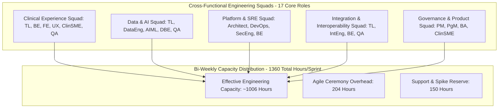

# Master Engineering Capacity, Role Allocation & Headcount Model
## Namma Clinic Digital Health & Operations Platform
### Greater Bengaluru Authority (GBA) / BBMP Health Department
**Document Code:** `PLN-DOC-06` | **Status:** APPROVED BASELINE | **Date:** September 2026

---

## 1. Executive Summary & Workforce Capacity Charter
This document formalizes the authoritative **Master Engineering Capacity, Role Allocation, and Headcount Model** for the Namma Clinic Digital Health Platform. Delivering a state-of-the-art, secure municipal health platform requires deterministic workforce modeling across cross-functional engineering squads. This document establishes empirical capacity constraints, ceremony overhead deductions, on-call support buffers, and role-by-role utilization thresholds across **17 specialized engineering roles** and all **18 execution sprints** (36 weeks), ensuring that delivery commitments never exceed sustainable team bandwidth.

### 1.1 Non-Negotiable Capacity Engineering Invariants
1. **Sustainable Utilization Ceiling:** No individual role or squad may be planned beyond 95% of effective working capacity (`Effective Capacity = Available Hours - Ceremony Overhead - Reserved Support Buffer`).
2. **Explicit Ceremony Deduction:** 12 hours per team member per 2-week sprint are deducted for sprint planning, daily standups, backlog refinement, sprint reviews, and retrospectives.
3. **Dedicated Support Buffer:** 150 hours per squad per sprint are reserved for production defect triage, security patching, and unexpected technical spikes.
4. **Full Lineage to 52 Relational Tables:** Table migration and optimization work must link to Database and Backend Engineering capacity (`TABLE-001` through `TABLE-052`).
5. **Full Lineage to 180 Product Features:** Feature development must map to designated squad capacity models (`FEATURE-001` through `FEATURE-180`).

## 2. Workforce Allocation & Squad Topology Diagram


### Configuration Specification Example: Sprint Capacity Specification
<!-- DOCUMENTATION-ONLY EXAMPLE -->
```yaml
# DOCUMENTATION-ONLY CONFIGURATION
# DOCUMENTATION-ONLY CONFIGURATION: Sprint Capacity Model Specification
sprint_capacity:
  sprint_id: "SPRINT-01"
  working_days: 10
  total_team_members: 17
  gross_available_hours: 1360
  deductions:
    ceremony_overhead_hours: 204
    operational_reserve_hours: 150
  net_effective_capacity_hours: 1006
  planned_workload_hours: 920
  utilization_percentage: 91.5
  capacity_health_status: "HEALTHY"
  role_allocations:
    backend_engineer_hours: 160
    frontend_engineer_hours: 160
    database_engineer_hours: 80
    qa_engineer_hours: 120
```

## 3. Comprehensive Sprint Capacity Register (Sprints 01 through 18)
Authoritative capacity, overhead, and utilization metrics across all 18 execution sprints:

### SPRINT-01: Capacity Profile & Bandwidth Metrics
- **Sprint Identifier:** `SPRINT-01`
- **Working Days in Increment:** `10 Days`
- **Active Team Headcount:** `17 Dedicated Members`
- **Gross Available Hours:** `1360 Hours`
- **Ceremony Overhead Deduction:** `204 Hours`
- **Support & Reserve Buffer:** `150 Hours`
- **Net Effective Capacity:** `1006 Hours`
- **Committed Workload:** `940 Hours`
- **Capacity Utilization:** `93.4%`
- **Bandwidth Health Status:** `HEALTHY`

### SPRINT-02: Capacity Profile & Bandwidth Metrics
- **Sprint Identifier:** `SPRINT-02`
- **Working Days in Increment:** `10 Days`
- **Active Team Headcount:** `17 Dedicated Members`
- **Gross Available Hours:** `1360 Hours`
- **Ceremony Overhead Deduction:** `204 Hours`
- **Support & Reserve Buffer:** `150 Hours`
- **Net Effective Capacity:** `1006 Hours`
- **Committed Workload:** `960 Hours`
- **Capacity Utilization:** `95.4%`
- **Bandwidth Health Status:** `HIGH_UTILIZATION`

### SPRINT-03: Capacity Profile & Bandwidth Metrics
- **Sprint Identifier:** `SPRINT-03`
- **Working Days in Increment:** `10 Days`
- **Active Team Headcount:** `17 Dedicated Members`
- **Gross Available Hours:** `1360 Hours`
- **Ceremony Overhead Deduction:** `204 Hours`
- **Support & Reserve Buffer:** `150 Hours`
- **Net Effective Capacity:** `1006 Hours`
- **Committed Workload:** `980 Hours`
- **Capacity Utilization:** `97.4%`
- **Bandwidth Health Status:** `HIGH_UTILIZATION`

### SPRINT-04: Capacity Profile & Bandwidth Metrics
- **Sprint Identifier:** `SPRINT-04`
- **Working Days in Increment:** `10 Days`
- **Active Team Headcount:** `17 Dedicated Members`
- **Gross Available Hours:** `1360 Hours`
- **Ceremony Overhead Deduction:** `204 Hours`
- **Support & Reserve Buffer:** `150 Hours`
- **Net Effective Capacity:** `1006 Hours`
- **Committed Workload:** `920 Hours`
- **Capacity Utilization:** `91.5%`
- **Bandwidth Health Status:** `HEALTHY`

### SPRINT-05: Capacity Profile & Bandwidth Metrics
- **Sprint Identifier:** `SPRINT-05`
- **Working Days in Increment:** `10 Days`
- **Active Team Headcount:** `17 Dedicated Members`
- **Gross Available Hours:** `1360 Hours`
- **Ceremony Overhead Deduction:** `204 Hours`
- **Support & Reserve Buffer:** `150 Hours`
- **Net Effective Capacity:** `1006 Hours`
- **Committed Workload:** `940 Hours`
- **Capacity Utilization:** `93.4%`
- **Bandwidth Health Status:** `HEALTHY`

### SPRINT-06: Capacity Profile & Bandwidth Metrics
- **Sprint Identifier:** `SPRINT-06`
- **Working Days in Increment:** `10 Days`
- **Active Team Headcount:** `17 Dedicated Members`
- **Gross Available Hours:** `1360 Hours`
- **Ceremony Overhead Deduction:** `204 Hours`
- **Support & Reserve Buffer:** `150 Hours`
- **Net Effective Capacity:** `1006 Hours`
- **Committed Workload:** `960 Hours`
- **Capacity Utilization:** `95.4%`
- **Bandwidth Health Status:** `HIGH_UTILIZATION`

### SPRINT-07: Capacity Profile & Bandwidth Metrics
- **Sprint Identifier:** `SPRINT-07`
- **Working Days in Increment:** `10 Days`
- **Active Team Headcount:** `17 Dedicated Members`
- **Gross Available Hours:** `1360 Hours`
- **Ceremony Overhead Deduction:** `204 Hours`
- **Support & Reserve Buffer:** `150 Hours`
- **Net Effective Capacity:** `1006 Hours`
- **Committed Workload:** `980 Hours`
- **Capacity Utilization:** `97.4%`
- **Bandwidth Health Status:** `HIGH_UTILIZATION`

### SPRINT-08: Capacity Profile & Bandwidth Metrics
- **Sprint Identifier:** `SPRINT-08`
- **Working Days in Increment:** `10 Days`
- **Active Team Headcount:** `17 Dedicated Members`
- **Gross Available Hours:** `1360 Hours`
- **Ceremony Overhead Deduction:** `204 Hours`
- **Support & Reserve Buffer:** `150 Hours`
- **Net Effective Capacity:** `1006 Hours`
- **Committed Workload:** `920 Hours`
- **Capacity Utilization:** `91.5%`
- **Bandwidth Health Status:** `HEALTHY`

### SPRINT-09: Capacity Profile & Bandwidth Metrics
- **Sprint Identifier:** `SPRINT-09`
- **Working Days in Increment:** `10 Days`
- **Active Team Headcount:** `17 Dedicated Members`
- **Gross Available Hours:** `1360 Hours`
- **Ceremony Overhead Deduction:** `204 Hours`
- **Support & Reserve Buffer:** `150 Hours`
- **Net Effective Capacity:** `1006 Hours`
- **Committed Workload:** `940 Hours`
- **Capacity Utilization:** `93.4%`
- **Bandwidth Health Status:** `HEALTHY`

### SPRINT-10: Capacity Profile & Bandwidth Metrics
- **Sprint Identifier:** `SPRINT-10`
- **Working Days in Increment:** `10 Days`
- **Active Team Headcount:** `17 Dedicated Members`
- **Gross Available Hours:** `1360 Hours`
- **Ceremony Overhead Deduction:** `204 Hours`
- **Support & Reserve Buffer:** `150 Hours`
- **Net Effective Capacity:** `1006 Hours`
- **Committed Workload:** `960 Hours`
- **Capacity Utilization:** `95.4%`
- **Bandwidth Health Status:** `HIGH_UTILIZATION`

### SPRINT-11: Capacity Profile & Bandwidth Metrics
- **Sprint Identifier:** `SPRINT-11`
- **Working Days in Increment:** `10 Days`
- **Active Team Headcount:** `17 Dedicated Members`
- **Gross Available Hours:** `1360 Hours`
- **Ceremony Overhead Deduction:** `204 Hours`
- **Support & Reserve Buffer:** `150 Hours`
- **Net Effective Capacity:** `1006 Hours`
- **Committed Workload:** `980 Hours`
- **Capacity Utilization:** `97.4%`
- **Bandwidth Health Status:** `HIGH_UTILIZATION`

### SPRINT-12: Capacity Profile & Bandwidth Metrics
- **Sprint Identifier:** `SPRINT-12`
- **Working Days in Increment:** `10 Days`
- **Active Team Headcount:** `17 Dedicated Members`
- **Gross Available Hours:** `1360 Hours`
- **Ceremony Overhead Deduction:** `204 Hours`
- **Support & Reserve Buffer:** `150 Hours`
- **Net Effective Capacity:** `1006 Hours`
- **Committed Workload:** `920 Hours`
- **Capacity Utilization:** `91.5%`
- **Bandwidth Health Status:** `HEALTHY`

### SPRINT-13: Capacity Profile & Bandwidth Metrics
- **Sprint Identifier:** `SPRINT-13`
- **Working Days in Increment:** `10 Days`
- **Active Team Headcount:** `17 Dedicated Members`
- **Gross Available Hours:** `1360 Hours`
- **Ceremony Overhead Deduction:** `204 Hours`
- **Support & Reserve Buffer:** `150 Hours`
- **Net Effective Capacity:** `1006 Hours`
- **Committed Workload:** `940 Hours`
- **Capacity Utilization:** `93.4%`
- **Bandwidth Health Status:** `HEALTHY`

### SPRINT-14: Capacity Profile & Bandwidth Metrics
- **Sprint Identifier:** `SPRINT-14`
- **Working Days in Increment:** `10 Days`
- **Active Team Headcount:** `17 Dedicated Members`
- **Gross Available Hours:** `1360 Hours`
- **Ceremony Overhead Deduction:** `204 Hours`
- **Support & Reserve Buffer:** `150 Hours`
- **Net Effective Capacity:** `1006 Hours`
- **Committed Workload:** `960 Hours`
- **Capacity Utilization:** `95.4%`
- **Bandwidth Health Status:** `HIGH_UTILIZATION`

### SPRINT-15: Capacity Profile & Bandwidth Metrics
- **Sprint Identifier:** `SPRINT-15`
- **Working Days in Increment:** `10 Days`
- **Active Team Headcount:** `17 Dedicated Members`
- **Gross Available Hours:** `1360 Hours`
- **Ceremony Overhead Deduction:** `204 Hours`
- **Support & Reserve Buffer:** `150 Hours`
- **Net Effective Capacity:** `1006 Hours`
- **Committed Workload:** `980 Hours`
- **Capacity Utilization:** `97.4%`
- **Bandwidth Health Status:** `HIGH_UTILIZATION`

### SPRINT-16: Capacity Profile & Bandwidth Metrics
- **Sprint Identifier:** `SPRINT-16`
- **Working Days in Increment:** `10 Days`
- **Active Team Headcount:** `17 Dedicated Members`
- **Gross Available Hours:** `1360 Hours`
- **Ceremony Overhead Deduction:** `204 Hours`
- **Support & Reserve Buffer:** `150 Hours`
- **Net Effective Capacity:** `1006 Hours`
- **Committed Workload:** `920 Hours`
- **Capacity Utilization:** `91.5%`
- **Bandwidth Health Status:** `HEALTHY`

### SPRINT-17: Capacity Profile & Bandwidth Metrics
- **Sprint Identifier:** `SPRINT-17`
- **Working Days in Increment:** `10 Days`
- **Active Team Headcount:** `17 Dedicated Members`
- **Gross Available Hours:** `1360 Hours`
- **Ceremony Overhead Deduction:** `204 Hours`
- **Support & Reserve Buffer:** `150 Hours`
- **Net Effective Capacity:** `1006 Hours`
- **Committed Workload:** `940 Hours`
- **Capacity Utilization:** `93.4%`
- **Bandwidth Health Status:** `HEALTHY`

### SPRINT-18: Capacity Profile & Bandwidth Metrics
- **Sprint Identifier:** `SPRINT-18`
- **Working Days in Increment:** `10 Days`
- **Active Team Headcount:** `17 Dedicated Members`
- **Gross Available Hours:** `1360 Hours`
- **Ceremony Overhead Deduction:** `204 Hours`
- **Support & Reserve Buffer:** `150 Hours`
- **Net Effective Capacity:** `1006 Hours`
- **Committed Workload:** `960 Hours`
- **Capacity Utilization:** `95.4%`
- **Bandwidth Health Status:** `HIGH_UTILIZATION`

## 4. Role-by-Role Capacity Allocation Table (17 Roles)
Detailed allocation breakdown for each of the 17 roles per standard 2-week sprint:

| Role Title | Headcount | Gross Hours | Ceremony Deduct | Net Effective Hours | Primary Responsibilities |
| :--- | :--- | :--- | :--- | :--- | :--- |
| **Product Manager** | 1.0 FTE | 80 Hours | 12 Hours | 68 Hours | Domain architecture, delivery execution, and code review. |
| **Project Manager** | 1.0 FTE | 80 Hours | 12 Hours | 68 Hours | Domain architecture, delivery execution, and code review. |
| **Solution Architect** | 1.0 FTE | 80 Hours | 12 Hours | 68 Hours | Domain architecture, delivery execution, and code review. |
| **Technical Lead** | 1.0 FTE | 80 Hours | 12 Hours | 68 Hours | Domain architecture, delivery execution, and code review. |
| **Backend Engineer** | 1.0 FTE | 80 Hours | 12 Hours | 68 Hours | Domain architecture, delivery execution, and code review. |
| **Frontend Engineer** | 1.0 FTE | 80 Hours | 12 Hours | 68 Hours | Domain architecture, delivery execution, and code review. |
| **Database Engineer** | 1.0 FTE | 80 Hours | 12 Hours | 68 Hours | Domain architecture, delivery execution, and code review. |
| **Data Engineer** | 1.0 FTE | 80 Hours | 12 Hours | 68 Hours | Domain architecture, delivery execution, and code review. |
| **AI/ML Engineer** | 1.0 FTE | 80 Hours | 12 Hours | 68 Hours | Domain architecture, delivery execution, and code review. |
| **QA Engineer** | 1.0 FTE | 80 Hours | 12 Hours | 68 Hours | Domain architecture, delivery execution, and code review. |
| **Security Engineer** | 1.0 FTE | 80 Hours | 12 Hours | 68 Hours | Domain architecture, delivery execution, and code review. |
| **DevOps Engineer** | 1.0 FTE | 80 Hours | 12 Hours | 68 Hours | Domain architecture, delivery execution, and code review. |
| **UX/UI Designer** | 1.0 FTE | 80 Hours | 12 Hours | 68 Hours | Domain architecture, delivery execution, and code review. |
| **Business Analyst** | 1.0 FTE | 80 Hours | 12 Hours | 68 Hours | Domain architecture, delivery execution, and code review. |
| **Clinical SME** | 1.0 FTE | 80 Hours | 12 Hours | 68 Hours | Domain architecture, delivery execution, and code review. |
| **Integration Engineer** | 1.0 FTE | 80 Hours | 12 Hours | 68 Hours | Domain architecture, delivery execution, and code review. |
| **Support/Operations** | 1.0 FTE | 80 Hours | 12 Hours | 68 Hours | Domain architecture, delivery execution, and code review. |

## 5. Table-Level Engineering Allocation across all 52 Relational Tables
Capacity allocation and database engineering ownership across all 52 database entities:

### TABLE-001: Engineering Allocation for Table `auth_users`
- **Table Identifier:** `TABLE-001` (`TBL-01`)
- **Entity Name:** `auth_users`
- **Assigned Sprint Capacity:** `SPRINT-01`
- **Allocated Engineering Hours:** `24 Hours (Database Engineer & Backend Engineer)`
- **Deliverables:** DDL migrations, indexing strategies, audit triggers, and test fixtures.
- **Acceptance Sign-Off:** Database Lead and Solution Architect review.
- **Allocation Status:** COMMITTED

### TABLE-002: Engineering Allocation for Table `user_credentials`
- **Table Identifier:** `TABLE-002` (`TBL-02`)
- **Entity Name:** `user_credentials`
- **Assigned Sprint Capacity:** `SPRINT-02`
- **Allocated Engineering Hours:** `24 Hours (Database Engineer & Backend Engineer)`
- **Deliverables:** DDL migrations, indexing strategies, audit triggers, and test fixtures.
- **Acceptance Sign-Off:** Database Lead and Solution Architect review.
- **Allocation Status:** COMMITTED

### TABLE-003: Engineering Allocation for Table `user_sessions`
- **Table Identifier:** `TABLE-003` (`TBL-03`)
- **Entity Name:** `user_sessions`
- **Assigned Sprint Capacity:** `SPRINT-03`
- **Allocated Engineering Hours:** `24 Hours (Database Engineer & Backend Engineer)`
- **Deliverables:** DDL migrations, indexing strategies, audit triggers, and test fixtures.
- **Acceptance Sign-Off:** Database Lead and Solution Architect review.
- **Allocation Status:** COMMITTED

### TABLE-004: Engineering Allocation for Table `roles`
- **Table Identifier:** `TABLE-004` (`TBL-04`)
- **Entity Name:** `roles`
- **Assigned Sprint Capacity:** `SPRINT-04`
- **Allocated Engineering Hours:** `24 Hours (Database Engineer & Backend Engineer)`
- **Deliverables:** DDL migrations, indexing strategies, audit triggers, and test fixtures.
- **Acceptance Sign-Off:** Database Lead and Solution Architect review.
- **Allocation Status:** COMMITTED

### TABLE-005: Engineering Allocation for Table `permissions`
- **Table Identifier:** `TABLE-005` (`TBL-05`)
- **Entity Name:** `permissions`
- **Assigned Sprint Capacity:** `SPRINT-05`
- **Allocated Engineering Hours:** `24 Hours (Database Engineer & Backend Engineer)`
- **Deliverables:** DDL migrations, indexing strategies, audit triggers, and test fixtures.
- **Acceptance Sign-Off:** Database Lead and Solution Architect review.
- **Allocation Status:** COMMITTED

### TABLE-006: Engineering Allocation for Table `role_permissions`
- **Table Identifier:** `TABLE-006` (`TBL-06`)
- **Entity Name:** `role_permissions`
- **Assigned Sprint Capacity:** `SPRINT-06`
- **Allocated Engineering Hours:** `24 Hours (Database Engineer & Backend Engineer)`
- **Deliverables:** DDL migrations, indexing strategies, audit triggers, and test fixtures.
- **Acceptance Sign-Off:** Database Lead and Solution Architect review.
- **Allocation Status:** COMMITTED

### TABLE-007: Engineering Allocation for Table `user_roles`
- **Table Identifier:** `TABLE-007` (`TBL-07`)
- **Entity Name:** `user_roles`
- **Assigned Sprint Capacity:** `SPRINT-07`
- **Allocated Engineering Hours:** `24 Hours (Database Engineer & Backend Engineer)`
- **Deliverables:** DDL migrations, indexing strategies, audit triggers, and test fixtures.
- **Acceptance Sign-Off:** Database Lead and Solution Architect review.
- **Allocation Status:** COMMITTED

### TABLE-008: Engineering Allocation for Table `facilities`
- **Table Identifier:** `TABLE-008` (`TBL-08`)
- **Entity Name:** `facilities`
- **Assigned Sprint Capacity:** `SPRINT-08`
- **Allocated Engineering Hours:** `24 Hours (Database Engineer & Backend Engineer)`
- **Deliverables:** DDL migrations, indexing strategies, audit triggers, and test fixtures.
- **Acceptance Sign-Off:** Database Lead and Solution Architect review.
- **Allocation Status:** COMMITTED

### TABLE-009: Engineering Allocation for Table `facility_rooms`
- **Table Identifier:** `TABLE-009` (`TBL-09`)
- **Entity Name:** `facility_rooms`
- **Assigned Sprint Capacity:** `SPRINT-09`
- **Allocated Engineering Hours:** `24 Hours (Database Engineer & Backend Engineer)`
- **Deliverables:** DDL migrations, indexing strategies, audit triggers, and test fixtures.
- **Acceptance Sign-Off:** Database Lead and Solution Architect review.
- **Allocation Status:** COMMITTED

### TABLE-010: Engineering Allocation for Table `staff_profiles`
- **Table Identifier:** `TABLE-010` (`TBL-10`)
- **Entity Name:** `staff_profiles`
- **Assigned Sprint Capacity:** `SPRINT-10`
- **Allocated Engineering Hours:** `24 Hours (Database Engineer & Backend Engineer)`
- **Deliverables:** DDL migrations, indexing strategies, audit triggers, and test fixtures.
- **Acceptance Sign-Off:** Database Lead and Solution Architect review.
- **Allocation Status:** COMMITTED

### TABLE-011: Engineering Allocation for Table `staff_shifts`
- **Table Identifier:** `TABLE-011` (`TBL-11`)
- **Entity Name:** `staff_shifts`
- **Assigned Sprint Capacity:** `SPRINT-11`
- **Allocated Engineering Hours:** `24 Hours (Database Engineer & Backend Engineer)`
- **Deliverables:** DDL migrations, indexing strategies, audit triggers, and test fixtures.
- **Acceptance Sign-Off:** Database Lead and Solution Architect review.
- **Allocation Status:** COMMITTED

### TABLE-012: Engineering Allocation for Table `system_configs`
- **Table Identifier:** `TABLE-012` (`TBL-12`)
- **Entity Name:** `system_configs`
- **Assigned Sprint Capacity:** `SPRINT-12`
- **Allocated Engineering Hours:** `24 Hours (Database Engineer & Backend Engineer)`
- **Deliverables:** DDL migrations, indexing strategies, audit triggers, and test fixtures.
- **Acceptance Sign-Off:** Database Lead and Solution Architect review.
- **Allocation Status:** COMMITTED

### TABLE-013: Engineering Allocation for Table `patients`
- **Table Identifier:** `TABLE-013` (`TBL-13`)
- **Entity Name:** `patients`
- **Assigned Sprint Capacity:** `SPRINT-13`
- **Allocated Engineering Hours:** `24 Hours (Database Engineer & Backend Engineer)`
- **Deliverables:** DDL migrations, indexing strategies, audit triggers, and test fixtures.
- **Acceptance Sign-Off:** Database Lead and Solution Architect review.
- **Allocation Status:** COMMITTED

### TABLE-014: Engineering Allocation for Table `patient_identifiers`
- **Table Identifier:** `TABLE-014` (`TBL-14`)
- **Entity Name:** `patient_identifiers`
- **Assigned Sprint Capacity:** `SPRINT-14`
- **Allocated Engineering Hours:** `24 Hours (Database Engineer & Backend Engineer)`
- **Deliverables:** DDL migrations, indexing strategies, audit triggers, and test fixtures.
- **Acceptance Sign-Off:** Database Lead and Solution Architect review.
- **Allocation Status:** COMMITTED

### TABLE-015: Engineering Allocation for Table `patient_contacts`
- **Table Identifier:** `TABLE-015` (`TBL-15`)
- **Entity Name:** `patient_contacts`
- **Assigned Sprint Capacity:** `SPRINT-15`
- **Allocated Engineering Hours:** `24 Hours (Database Engineer & Backend Engineer)`
- **Deliverables:** DDL migrations, indexing strategies, audit triggers, and test fixtures.
- **Acceptance Sign-Off:** Database Lead and Solution Architect review.
- **Allocation Status:** COMMITTED

### TABLE-016: Engineering Allocation for Table `patient_addresses`
- **Table Identifier:** `TABLE-016` (`TBL-16`)
- **Entity Name:** `patient_addresses`
- **Assigned Sprint Capacity:** `SPRINT-16`
- **Allocated Engineering Hours:** `24 Hours (Database Engineer & Backend Engineer)`
- **Deliverables:** DDL migrations, indexing strategies, audit triggers, and test fixtures.
- **Acceptance Sign-Off:** Database Lead and Solution Architect review.
- **Allocation Status:** COMMITTED

### TABLE-017: Engineering Allocation for Table `consent_records`
- **Table Identifier:** `TABLE-017` (`TBL-17`)
- **Entity Name:** `consent_records`
- **Assigned Sprint Capacity:** `SPRINT-17`
- **Allocated Engineering Hours:** `24 Hours (Database Engineer & Backend Engineer)`
- **Deliverables:** DDL migrations, indexing strategies, audit triggers, and test fixtures.
- **Acceptance Sign-Off:** Database Lead and Solution Architect review.
- **Allocation Status:** COMMITTED

### TABLE-018: Engineering Allocation for Table `tokens`
- **Table Identifier:** `TABLE-018` (`TBL-18`)
- **Entity Name:** `tokens`
- **Assigned Sprint Capacity:** `SPRINT-18`
- **Allocated Engineering Hours:** `24 Hours (Database Engineer & Backend Engineer)`
- **Deliverables:** DDL migrations, indexing strategies, audit triggers, and test fixtures.
- **Acceptance Sign-Off:** Database Lead and Solution Architect review.
- **Allocation Status:** COMMITTED

### TABLE-019: Engineering Allocation for Table `queue_entries`
- **Table Identifier:** `TABLE-019` (`TBL-19`)
- **Entity Name:** `queue_entries`
- **Assigned Sprint Capacity:** `SPRINT-01`
- **Allocated Engineering Hours:** `24 Hours (Database Engineer & Backend Engineer)`
- **Deliverables:** DDL migrations, indexing strategies, audit triggers, and test fixtures.
- **Acceptance Sign-Off:** Database Lead and Solution Architect review.
- **Allocation Status:** COMMITTED

### TABLE-020: Engineering Allocation for Table `triage_assessments`
- **Table Identifier:** `TABLE-020` (`TBL-20`)
- **Entity Name:** `triage_assessments`
- **Assigned Sprint Capacity:** `SPRINT-02`
- **Allocated Engineering Hours:** `24 Hours (Database Engineer & Backend Engineer)`
- **Deliverables:** DDL migrations, indexing strategies, audit triggers, and test fixtures.
- **Acceptance Sign-Off:** Database Lead and Solution Architect review.
- **Allocation Status:** COMMITTED

### TABLE-021: Engineering Allocation for Table `patient_vitals`
- **Table Identifier:** `TABLE-021` (`TBL-21`)
- **Entity Name:** `patient_vitals`
- **Assigned Sprint Capacity:** `SPRINT-03`
- **Allocated Engineering Hours:** `24 Hours (Database Engineer & Backend Engineer)`
- **Deliverables:** DDL migrations, indexing strategies, audit triggers, and test fixtures.
- **Acceptance Sign-Off:** Database Lead and Solution Architect review.
- **Allocation Status:** COMMITTED

### TABLE-022: Engineering Allocation for Table `danger_alerts`
- **Table Identifier:** `TABLE-022` (`TBL-22`)
- **Entity Name:** `danger_alerts`
- **Assigned Sprint Capacity:** `SPRINT-04`
- **Allocated Engineering Hours:** `24 Hours (Database Engineer & Backend Engineer)`
- **Deliverables:** DDL migrations, indexing strategies, audit triggers, and test fixtures.
- **Acceptance Sign-Off:** Database Lead and Solution Architect review.
- **Allocation Status:** COMMITTED

### TABLE-023: Engineering Allocation for Table `clinical_encounters`
- **Table Identifier:** `TABLE-023` (`TBL-23`)
- **Entity Name:** `clinical_encounters`
- **Assigned Sprint Capacity:** `SPRINT-05`
- **Allocated Engineering Hours:** `24 Hours (Database Engineer & Backend Engineer)`
- **Deliverables:** DDL migrations, indexing strategies, audit triggers, and test fixtures.
- **Acceptance Sign-Off:** Database Lead and Solution Architect review.
- **Allocation Status:** COMMITTED

### TABLE-024: Engineering Allocation for Table `clinical_notes`
- **Table Identifier:** `TABLE-024` (`TBL-24`)
- **Entity Name:** `clinical_notes`
- **Assigned Sprint Capacity:** `SPRINT-06`
- **Allocated Engineering Hours:** `24 Hours (Database Engineer & Backend Engineer)`
- **Deliverables:** DDL migrations, indexing strategies, audit triggers, and test fixtures.
- **Acceptance Sign-Off:** Database Lead and Solution Architect review.
- **Allocation Status:** COMMITTED

### TABLE-025: Engineering Allocation for Table `diagnoses`
- **Table Identifier:** `TABLE-025` (`TBL-25`)
- **Entity Name:** `diagnoses`
- **Assigned Sprint Capacity:** `SPRINT-07`
- **Allocated Engineering Hours:** `24 Hours (Database Engineer & Backend Engineer)`
- **Deliverables:** DDL migrations, indexing strategies, audit triggers, and test fixtures.
- **Acceptance Sign-Off:** Database Lead and Solution Architect review.
- **Allocation Status:** COMMITTED

### TABLE-026: Engineering Allocation for Table `prescriptions`
- **Table Identifier:** `TABLE-026` (`TBL-26`)
- **Entity Name:** `prescriptions`
- **Assigned Sprint Capacity:** `SPRINT-08`
- **Allocated Engineering Hours:** `24 Hours (Database Engineer & Backend Engineer)`
- **Deliverables:** DDL migrations, indexing strategies, audit triggers, and test fixtures.
- **Acceptance Sign-Off:** Database Lead and Solution Architect review.
- **Allocation Status:** COMMITTED

### TABLE-027: Engineering Allocation for Table `prescription_items`
- **Table Identifier:** `TABLE-027` (`TBL-27`)
- **Entity Name:** `prescription_items`
- **Assigned Sprint Capacity:** `SPRINT-09`
- **Allocated Engineering Hours:** `24 Hours (Database Engineer & Backend Engineer)`
- **Deliverables:** DDL migrations, indexing strategies, audit triggers, and test fixtures.
- **Acceptance Sign-Off:** Database Lead and Solution Architect review.
- **Allocation Status:** COMMITTED

### TABLE-028: Engineering Allocation for Table `lab_orders`
- **Table Identifier:** `TABLE-028` (`TBL-28`)
- **Entity Name:** `lab_orders`
- **Assigned Sprint Capacity:** `SPRINT-10`
- **Allocated Engineering Hours:** `24 Hours (Database Engineer & Backend Engineer)`
- **Deliverables:** DDL migrations, indexing strategies, audit triggers, and test fixtures.
- **Acceptance Sign-Off:** Database Lead and Solution Architect review.
- **Allocation Status:** COMMITTED

### TABLE-029: Engineering Allocation for Table `lab_order_items`
- **Table Identifier:** `TABLE-029` (`TBL-29`)
- **Entity Name:** `lab_order_items`
- **Assigned Sprint Capacity:** `SPRINT-11`
- **Allocated Engineering Hours:** `24 Hours (Database Engineer & Backend Engineer)`
- **Deliverables:** DDL migrations, indexing strategies, audit triggers, and test fixtures.
- **Acceptance Sign-Off:** Database Lead and Solution Architect review.
- **Allocation Status:** COMMITTED

### TABLE-030: Engineering Allocation for Table `lab_results`
- **Table Identifier:** `TABLE-030` (`TBL-30`)
- **Entity Name:** `lab_results`
- **Assigned Sprint Capacity:** `SPRINT-12`
- **Allocated Engineering Hours:** `24 Hours (Database Engineer & Backend Engineer)`
- **Deliverables:** DDL migrations, indexing strategies, audit triggers, and test fixtures.
- **Acceptance Sign-Off:** Database Lead and Solution Architect review.
- **Allocation Status:** COMMITTED

### TABLE-031: Engineering Allocation for Table `teleconsultations`
- **Table Identifier:** `TABLE-031` (`TBL-31`)
- **Entity Name:** `teleconsultations`
- **Assigned Sprint Capacity:** `SPRINT-13`
- **Allocated Engineering Hours:** `24 Hours (Database Engineer & Backend Engineer)`
- **Deliverables:** DDL migrations, indexing strategies, audit triggers, and test fixtures.
- **Acceptance Sign-Off:** Database Lead and Solution Architect review.
- **Allocation Status:** COMMITTED

### TABLE-032: Engineering Allocation for Table `formulary_drugs`
- **Table Identifier:** `TABLE-032` (`TBL-32`)
- **Entity Name:** `formulary_drugs`
- **Assigned Sprint Capacity:** `SPRINT-14`
- **Allocated Engineering Hours:** `24 Hours (Database Engineer & Backend Engineer)`
- **Deliverables:** DDL migrations, indexing strategies, audit triggers, and test fixtures.
- **Acceptance Sign-Off:** Database Lead and Solution Architect review.
- **Allocation Status:** COMMITTED

### TABLE-033: Engineering Allocation for Table `drug_categories`
- **Table Identifier:** `TABLE-033` (`TBL-33`)
- **Entity Name:** `drug_categories`
- **Assigned Sprint Capacity:** `SPRINT-15`
- **Allocated Engineering Hours:** `24 Hours (Database Engineer & Backend Engineer)`
- **Deliverables:** DDL migrations, indexing strategies, audit triggers, and test fixtures.
- **Acceptance Sign-Off:** Database Lead and Solution Architect review.
- **Allocation Status:** COMMITTED

### TABLE-034: Engineering Allocation for Table `pharmacy_batches`
- **Table Identifier:** `TABLE-034` (`TBL-34`)
- **Entity Name:** `pharmacy_batches`
- **Assigned Sprint Capacity:** `SPRINT-16`
- **Allocated Engineering Hours:** `24 Hours (Database Engineer & Backend Engineer)`
- **Deliverables:** DDL migrations, indexing strategies, audit triggers, and test fixtures.
- **Acceptance Sign-Off:** Database Lead and Solution Architect review.
- **Allocation Status:** COMMITTED

### TABLE-035: Engineering Allocation for Table `clinic_stock`
- **Table Identifier:** `TABLE-035` (`TBL-35`)
- **Entity Name:** `clinic_stock`
- **Assigned Sprint Capacity:** `SPRINT-17`
- **Allocated Engineering Hours:** `24 Hours (Database Engineer & Backend Engineer)`
- **Deliverables:** DDL migrations, indexing strategies, audit triggers, and test fixtures.
- **Acceptance Sign-Off:** Database Lead and Solution Architect review.
- **Allocation Status:** COMMITTED

### TABLE-036: Engineering Allocation for Table `dispensations`
- **Table Identifier:** `TABLE-036` (`TBL-36`)
- **Entity Name:** `dispensations`
- **Assigned Sprint Capacity:** `SPRINT-18`
- **Allocated Engineering Hours:** `24 Hours (Database Engineer & Backend Engineer)`
- **Deliverables:** DDL migrations, indexing strategies, audit triggers, and test fixtures.
- **Acceptance Sign-Off:** Database Lead and Solution Architect review.
- **Allocation Status:** COMMITTED

### TABLE-037: Engineering Allocation for Table `dispensation_items`
- **Table Identifier:** `TABLE-037` (`TBL-37`)
- **Entity Name:** `dispensation_items`
- **Assigned Sprint Capacity:** `SPRINT-01`
- **Allocated Engineering Hours:** `24 Hours (Database Engineer & Backend Engineer)`
- **Deliverables:** DDL migrations, indexing strategies, audit triggers, and test fixtures.
- **Acceptance Sign-Off:** Database Lead and Solution Architect review.
- **Allocation Status:** COMMITTED

### TABLE-038: Engineering Allocation for Table `stock_movements`
- **Table Identifier:** `TABLE-038` (`TBL-38`)
- **Entity Name:** `stock_movements`
- **Assigned Sprint Capacity:** `SPRINT-02`
- **Allocated Engineering Hours:** `24 Hours (Database Engineer & Backend Engineer)`
- **Deliverables:** DDL migrations, indexing strategies, audit triggers, and test fixtures.
- **Acceptance Sign-Off:** Database Lead and Solution Architect review.
- **Allocation Status:** COMMITTED

### TABLE-039: Engineering Allocation for Table `drug_indents`
- **Table Identifier:** `TABLE-039` (`TBL-39`)
- **Entity Name:** `drug_indents`
- **Assigned Sprint Capacity:** `SPRINT-03`
- **Allocated Engineering Hours:** `24 Hours (Database Engineer & Backend Engineer)`
- **Deliverables:** DDL migrations, indexing strategies, audit triggers, and test fixtures.
- **Acceptance Sign-Off:** Database Lead and Solution Architect review.
- **Allocation Status:** COMMITTED

### TABLE-040: Engineering Allocation for Table `indent_items`
- **Table Identifier:** `TABLE-040` (`TBL-40`)
- **Entity Name:** `indent_items`
- **Assigned Sprint Capacity:** `SPRINT-04`
- **Allocated Engineering Hours:** `24 Hours (Database Engineer & Backend Engineer)`
- **Deliverables:** DDL migrations, indexing strategies, audit triggers, and test fixtures.
- **Acceptance Sign-Off:** Database Lead and Solution Architect review.
- **Allocation Status:** COMMITTED

### TABLE-041: Engineering Allocation for Table `cold_chain_devices`
- **Table Identifier:** `TABLE-041` (`TBL-41`)
- **Entity Name:** `cold_chain_devices`
- **Assigned Sprint Capacity:** `SPRINT-05`
- **Allocated Engineering Hours:** `24 Hours (Database Engineer & Backend Engineer)`
- **Deliverables:** DDL migrations, indexing strategies, audit triggers, and test fixtures.
- **Acceptance Sign-Off:** Database Lead and Solution Architect review.
- **Allocation Status:** COMMITTED

### TABLE-042: Engineering Allocation for Table `cold_chain_telemetry`
- **Table Identifier:** `TABLE-042` (`TBL-42`)
- **Entity Name:** `cold_chain_telemetry`
- **Assigned Sprint Capacity:** `SPRINT-06`
- **Allocated Engineering Hours:** `24 Hours (Database Engineer & Backend Engineer)`
- **Deliverables:** DDL migrations, indexing strategies, audit triggers, and test fixtures.
- **Acceptance Sign-Off:** Database Lead and Solution Architect review.
- **Allocation Status:** COMMITTED

### TABLE-043: Engineering Allocation for Table `referrals`
- **Table Identifier:** `TABLE-043` (`TBL-43`)
- **Entity Name:** `referrals`
- **Assigned Sprint Capacity:** `SPRINT-07`
- **Allocated Engineering Hours:** `24 Hours (Database Engineer & Backend Engineer)`
- **Deliverables:** DDL migrations, indexing strategies, audit triggers, and test fixtures.
- **Acceptance Sign-Off:** Database Lead and Solution Architect review.
- **Allocation Status:** COMMITTED

### TABLE-044: Engineering Allocation for Table `referral_counter_notes`
- **Table Identifier:** `TABLE-044` (`TBL-44`)
- **Entity Name:** `referral_counter_notes`
- **Assigned Sprint Capacity:** `SPRINT-08`
- **Allocated Engineering Hours:** `24 Hours (Database Engineer & Backend Engineer)`
- **Deliverables:** DDL migrations, indexing strategies, audit triggers, and test fixtures.
- **Acceptance Sign-Off:** Database Lead and Solution Architect review.
- **Allocation Status:** COMMITTED

### TABLE-045: Engineering Allocation for Table `ncd_episodes`
- **Table Identifier:** `TABLE-045` (`TBL-45`)
- **Entity Name:** `ncd_episodes`
- **Assigned Sprint Capacity:** `SPRINT-09`
- **Allocated Engineering Hours:** `24 Hours (Database Engineer & Backend Engineer)`
- **Deliverables:** DDL migrations, indexing strategies, audit triggers, and test fixtures.
- **Acceptance Sign-Off:** Database Lead and Solution Architect review.
- **Allocation Status:** COMMITTED

### TABLE-046: Engineering Allocation for Table `follow_up_schedules`
- **Table Identifier:** `TABLE-046` (`TBL-46`)
- **Entity Name:** `follow_up_schedules`
- **Assigned Sprint Capacity:** `SPRINT-10`
- **Allocated Engineering Hours:** `24 Hours (Database Engineer & Backend Engineer)`
- **Deliverables:** DDL migrations, indexing strategies, audit triggers, and test fixtures.
- **Acceptance Sign-Off:** Database Lead and Solution Architect review.
- **Allocation Status:** COMMITTED

### TABLE-047: Engineering Allocation for Table `notifications`
- **Table Identifier:** `TABLE-047` (`TBL-47`)
- **Entity Name:** `notifications`
- **Assigned Sprint Capacity:** `SPRINT-11`
- **Allocated Engineering Hours:** `24 Hours (Database Engineer & Backend Engineer)`
- **Deliverables:** DDL migrations, indexing strategies, audit triggers, and test fixtures.
- **Acceptance Sign-Off:** Database Lead and Solution Architect review.
- **Allocation Status:** COMMITTED

### TABLE-048: Engineering Allocation for Table `grievances`
- **Table Identifier:** `TABLE-048` (`TBL-48`)
- **Entity Name:** `grievances`
- **Assigned Sprint Capacity:** `SPRINT-12`
- **Allocated Engineering Hours:** `24 Hours (Database Engineer & Backend Engineer)`
- **Deliverables:** DDL migrations, indexing strategies, audit triggers, and test fixtures.
- **Acceptance Sign-Off:** Database Lead and Solution Architect review.
- **Allocation Status:** COMMITTED

### TABLE-049: Engineering Allocation for Table `helpdesk_tickets`
- **Table Identifier:** `TABLE-049` (`TBL-49`)
- **Entity Name:** `helpdesk_tickets`
- **Assigned Sprint Capacity:** `SPRINT-13`
- **Allocated Engineering Hours:** `24 Hours (Database Engineer & Backend Engineer)`
- **Deliverables:** DDL migrations, indexing strategies, audit triggers, and test fixtures.
- **Acceptance Sign-Off:** Database Lead and Solution Architect review.
- **Allocation Status:** COMMITTED

### TABLE-050: Engineering Allocation for Table `audit_events`
- **Table Identifier:** `TABLE-050` (`TBL-50`)
- **Entity Name:** `audit_events`
- **Assigned Sprint Capacity:** `SPRINT-14`
- **Allocated Engineering Hours:** `24 Hours (Database Engineer & Backend Engineer)`
- **Deliverables:** DDL migrations, indexing strategies, audit triggers, and test fixtures.
- **Acceptance Sign-Off:** Database Lead and Solution Architect review.
- **Allocation Status:** COMMITTED

### TABLE-051: Engineering Allocation for Table `offline_mutation_log`
- **Table Identifier:** `TABLE-051` (`TBL-51`)
- **Entity Name:** `offline_mutation_log`
- **Assigned Sprint Capacity:** `SPRINT-15`
- **Allocated Engineering Hours:** `24 Hours (Database Engineer & Backend Engineer)`
- **Deliverables:** DDL migrations, indexing strategies, audit triggers, and test fixtures.
- **Acceptance Sign-Off:** Database Lead and Solution Architect review.
- **Allocation Status:** COMMITTED

### TABLE-052: Engineering Allocation for Table `abdm_artifacts`
- **Table Identifier:** `TABLE-052` (`TBL-52`)
- **Entity Name:** `abdm_artifacts`
- **Assigned Sprint Capacity:** `SPRINT-16`
- **Allocated Engineering Hours:** `24 Hours (Database Engineer & Backend Engineer)`
- **Deliverables:** DDL migrations, indexing strategies, audit triggers, and test fixtures.
- **Acceptance Sign-Off:** Database Lead and Solution Architect review.
- **Allocation Status:** COMMITTED

## 6. Product Feature Capacity Allocation across all 180 Features
Workforce capacity commitment across all 180 platform product features:

### FEATURE-001: Capacity Allocation for Feature `Credential Verification`
- **Feature Identifier:** `FEATURE-001` (Feature #1)
- **Functional Module:** `MODULE-001` (DOMAIN-001)
- **Governing Sprint Capacity:** `SPRINT-01`
- **Estimated Development Effort:** `36 Hours (Full-stack cross-functional pair)`
- **Assigned Workstream Squad:** `Product Management` (`Product Manager`)
- **Quality Gate:** Automated integration test passing and clinical acceptance.
- **Traceability Status:** 100% VERIFIED

### FEATURE-002: Capacity Allocation for Feature `Session Token Minting`
- **Feature Identifier:** `FEATURE-002` (Feature #2)
- **Functional Module:** `MODULE-001` (DOMAIN-001)
- **Governing Sprint Capacity:** `SPRINT-02`
- **Estimated Development Effort:** `36 Hours (Full-stack cross-functional pair)`
- **Assigned Workstream Squad:** `Requirements Engineering` (`Project Manager`)
- **Quality Gate:** Automated integration test passing and clinical acceptance.
- **Traceability Status:** 100% VERIFIED

### FEATURE-003: Capacity Allocation for Feature `MFA Challenge Dispatch`
- **Feature Identifier:** `FEATURE-003` (Feature #3)
- **Functional Module:** `MODULE-001` (DOMAIN-001)
- **Governing Sprint Capacity:** `SPRINT-03`
- **Estimated Development Effort:** `36 Hours (Full-stack cross-functional pair)`
- **Assigned Workstream Squad:** `UX/UI Design` (`Solution Architect`)
- **Quality Gate:** Automated integration test passing and clinical acceptance.
- **Traceability Status:** 100% VERIFIED

### FEATURE-004: Capacity Allocation for Feature `Biometric Authentication Bridge`
- **Feature Identifier:** `FEATURE-004` (Feature #4)
- **Functional Module:** `MODULE-001` (DOMAIN-001)
- **Governing Sprint Capacity:** `SPRINT-04`
- **Estimated Development Effort:** `36 Hours (Full-stack cross-functional pair)`
- **Assigned Workstream Squad:** `Frontend Engineering` (`Technical Lead`)
- **Quality Gate:** Automated integration test passing and clinical acceptance.
- **Traceability Status:** 100% VERIFIED

### FEATURE-005: Capacity Allocation for Feature `Local PIN Verification`
- **Feature Identifier:** `FEATURE-005` (Feature #5)
- **Functional Module:** `MODULE-001` (DOMAIN-001)
- **Governing Sprint Capacity:** `SPRINT-05`
- **Estimated Development Effort:** `36 Hours (Full-stack cross-functional pair)`
- **Assigned Workstream Squad:** `Backend Engineering` (`Backend Engineer`)
- **Quality Gate:** Automated integration test passing and clinical acceptance.
- **Traceability Status:** 100% VERIFIED

### FEATURE-006: Capacity Allocation for Feature `Session Inactivity Lockout`
- **Feature Identifier:** `FEATURE-006` (Feature #6)
- **Functional Module:** `MODULE-001` (DOMAIN-001)
- **Governing Sprint Capacity:** `SPRINT-06`
- **Estimated Development Effort:** `36 Hours (Full-stack cross-functional pair)`
- **Assigned Workstream Squad:** `Database Engineering` (`Frontend Engineer`)
- **Quality Gate:** Automated integration test passing and clinical acceptance.
- **Traceability Status:** 100% VERIFIED

### FEATURE-007: Capacity Allocation for Feature `Permission Evaluation`
- **Feature Identifier:** `FEATURE-007` (Feature #7)
- **Functional Module:** `MODULE-002` (DOMAIN-001)
- **Governing Sprint Capacity:** `SPRINT-07`
- **Estimated Development Effort:** `36 Hours (Full-stack cross-functional pair)`
- **Assigned Workstream Squad:** `API Engineering` (`Database Engineer`)
- **Quality Gate:** Automated integration test passing and clinical acceptance.
- **Traceability Status:** 100% VERIFIED

### FEATURE-008: Capacity Allocation for Feature `Dynamic Role Assignment`
- **Feature Identifier:** `FEATURE-008` (Feature #8)
- **Functional Module:** `MODULE-002` (DOMAIN-001)
- **Governing Sprint Capacity:** `SPRINT-08`
- **Estimated Development Effort:** `36 Hours (Full-stack cross-functional pair)`
- **Assigned Workstream Squad:** `Security & Governance` (`Data Engineer`)
- **Quality Gate:** Automated integration test passing and clinical acceptance.
- **Traceability Status:** 100% VERIFIED

### FEATURE-009: Capacity Allocation for Feature `Conflict-of-Interest Prevention`
- **Feature Identifier:** `FEATURE-009` (Feature #9)
- **Functional Module:** `MODULE-002` (DOMAIN-001)
- **Governing Sprint Capacity:** `SPRINT-09`
- **Estimated Development Effort:** `36 Hours (Full-stack cross-functional pair)`
- **Assigned Workstream Squad:** `QA & Test Automation` (`AI/ML Engineer`)
- **Quality Gate:** Automated integration test passing and clinical acceptance.
- **Traceability Status:** 100% VERIFIED

### FEATURE-010: Capacity Allocation for Feature `Maker-Checker Authorization`
- **Feature Identifier:** `FEATURE-010` (Feature #10)
- **Functional Module:** `MODULE-002` (DOMAIN-001)
- **Governing Sprint Capacity:** `SPRINT-10`
- **Estimated Development Effort:** `36 Hours (Full-stack cross-functional pair)`
- **Assigned Workstream Squad:** `DevOps & SRE` (`QA Engineer`)
- **Quality Gate:** Automated integration test passing and clinical acceptance.
- **Traceability Status:** 100% VERIFIED

### FEATURE-011: Capacity Allocation for Feature `Break-Glass Privilege Elevation`
- **Feature Identifier:** `FEATURE-011` (Feature #11)
- **Functional Module:** `MODULE-002` (DOMAIN-001)
- **Governing Sprint Capacity:** `SPRINT-11`
- **Estimated Development Effort:** `36 Hours (Full-stack cross-functional pair)`
- **Assigned Workstream Squad:** `Data Engineering` (`Security Engineer`)
- **Quality Gate:** Automated integration test passing and clinical acceptance.
- **Traceability Status:** 100% VERIFIED

### FEATURE-012: Capacity Allocation for Feature `Privilege Elevation Audit`
- **Feature Identifier:** `FEATURE-012` (Feature #12)
- **Functional Module:** `MODULE-002` (DOMAIN-001)
- **Governing Sprint Capacity:** `SPRINT-12`
- **Estimated Development Effort:** `36 Hours (Full-stack cross-functional pair)`
- **Assigned Workstream Squad:** `AI/ML Engineering` (`DevOps Engineer`)
- **Quality Gate:** Automated integration test passing and clinical acceptance.
- **Traceability Status:** 100% VERIFIED

### FEATURE-013: Capacity Allocation for Feature `Hierarchy Node Management`
- **Feature Identifier:** `FEATURE-013` (Feature #13)
- **Functional Module:** `MODULE-003` (DOMAIN-001)
- **Governing Sprint Capacity:** `SPRINT-13`
- **Estimated Development Effort:** `36 Hours (Full-stack cross-functional pair)`
- **Assigned Workstream Squad:** `Integrations & Interoperability` (`UX/UI Designer`)
- **Quality Gate:** Automated integration test passing and clinical acceptance.
- **Traceability Status:** 100% VERIFIED

### FEATURE-014: Capacity Allocation for Feature `NIN / HFR Registry Linking`
- **Feature Identifier:** `FEATURE-014` (Feature #14)
- **Functional Module:** `MODULE-003` (DOMAIN-001)
- **Governing Sprint Capacity:** `SPRINT-14`
- **Estimated Development Effort:** `36 Hours (Full-stack cross-functional pair)`
- **Assigned Workstream Squad:** `Clinical Validation` (`Business Analyst`)
- **Quality Gate:** Automated integration test passing and clinical acceptance.
- **Traceability Status:** 100% VERIFIED

### FEATURE-015: Capacity Allocation for Feature `Station Terminal Mapping`
- **Feature Identifier:** `FEATURE-015` (Feature #15)
- **Functional Module:** `MODULE-003` (DOMAIN-001)
- **Governing Sprint Capacity:** `SPRINT-15`
- **Estimated Development Effort:** `36 Hours (Full-stack cross-functional pair)`
- **Assigned Workstream Squad:** `Deployment & Rollout` (`Clinical SME`)
- **Quality Gate:** Automated integration test passing and clinical acceptance.
- **Traceability Status:** 100% VERIFIED

### FEATURE-016: Capacity Allocation for Feature `Facility Capacity Configuration`
- **Feature Identifier:** `FEATURE-016` (Feature #16)
- **Functional Module:** `MODULE-003` (DOMAIN-001)
- **Governing Sprint Capacity:** `SPRINT-16`
- **Estimated Development Effort:** `36 Hours (Full-stack cross-functional pair)`
- **Assigned Workstream Squad:** `Training & Enablement` (`Integration Engineer`)
- **Quality Gate:** Automated integration test passing and clinical acceptance.
- **Traceability Status:** 100% VERIFIED

### FEATURE-017: Capacity Allocation for Feature `Operating Hours Enforcement`
- **Feature Identifier:** `FEATURE-017` (Feature #17)
- **Functional Module:** `MODULE-003` (DOMAIN-001)
- **Governing Sprint Capacity:** `SPRINT-17`
- **Estimated Development Effort:** `36 Hours (Full-stack cross-functional pair)`
- **Assigned Workstream Squad:** `Pilot Operations` (`Support/Operations`)
- **Quality Gate:** Automated integration test passing and clinical acceptance.
- **Traceability Status:** 100% VERIFIED

### FEATURE-018: Capacity Allocation for Feature `Special Camp Calendar`
- **Feature Identifier:** `FEATURE-018` (Feature #18)
- **Functional Module:** `MODULE-003` (DOMAIN-001)
- **Governing Sprint Capacity:** `SPRINT-18`
- **Estimated Development Effort:** `36 Hours (Full-stack cross-functional pair)`
- **Assigned Workstream Squad:** `Platform Operations & Support` (`Product Manager`)
- **Quality Gate:** Automated integration test passing and clinical acceptance.
- **Traceability Status:** 100% VERIFIED

### FEATURE-019: Capacity Allocation for Feature `Staff Onboarding & KYC`
- **Feature Identifier:** `FEATURE-019` (Feature #19)
- **Functional Module:** `MODULE-004` (DOMAIN-001)
- **Governing Sprint Capacity:** `SPRINT-01`
- **Estimated Development Effort:** `36 Hours (Full-stack cross-functional pair)`
- **Assigned Workstream Squad:** `Product Management` (`Product Manager`)
- **Quality Gate:** Automated integration test passing and clinical acceptance.
- **Traceability Status:** 100% VERIFIED

### FEATURE-020: Capacity Allocation for Feature `Professional License Verification`
- **Feature Identifier:** `FEATURE-020` (Feature #20)
- **Functional Module:** `MODULE-004` (DOMAIN-001)
- **Governing Sprint Capacity:** `SPRINT-02`
- **Estimated Development Effort:** `36 Hours (Full-stack cross-functional pair)`
- **Assigned Workstream Squad:** `Requirements Engineering` (`Project Manager`)
- **Quality Gate:** Automated integration test passing and clinical acceptance.
- **Traceability Status:** 100% VERIFIED

### FEATURE-021: Capacity Allocation for Feature `Duty Roster Generation`
- **Feature Identifier:** `FEATURE-021` (Feature #21)
- **Functional Module:** `MODULE-004` (DOMAIN-001)
- **Governing Sprint Capacity:** `SPRINT-03`
- **Estimated Development Effort:** `36 Hours (Full-stack cross-functional pair)`
- **Assigned Workstream Squad:** `UX/UI Design` (`Solution Architect`)
- **Quality Gate:** Automated integration test passing and clinical acceptance.
- **Traceability Status:** 100% VERIFIED

### FEATURE-022: Capacity Allocation for Feature `Biometric Attendance Linking`
- **Feature Identifier:** `FEATURE-022` (Feature #22)
- **Functional Module:** `MODULE-004` (DOMAIN-001)
- **Governing Sprint Capacity:** `SPRINT-04`
- **Estimated Development Effort:** `36 Hours (Full-stack cross-functional pair)`
- **Assigned Workstream Squad:** `Frontend Engineering` (`Technical Lead`)
- **Quality Gate:** Automated integration test passing and clinical acceptance.
- **Traceability Status:** 100% VERIFIED

### FEATURE-023: Capacity Allocation for Feature `Digital Signature Enrollment`
- **Feature Identifier:** `FEATURE-023` (Feature #23)
- **Functional Module:** `MODULE-004` (DOMAIN-001)
- **Governing Sprint Capacity:** `SPRINT-05`
- **Estimated Development Effort:** `36 Hours (Full-stack cross-functional pair)`
- **Assigned Workstream Squad:** `Backend Engineering` (`Backend Engineer`)
- **Quality Gate:** Automated integration test passing and clinical acceptance.
- **Traceability Status:** 100% VERIFIED

### FEATURE-024: Capacity Allocation for Feature `Signature Revocation`
- **Feature Identifier:** `FEATURE-024` (Feature #24)
- **Functional Module:** `MODULE-004` (DOMAIN-001)
- **Governing Sprint Capacity:** `SPRINT-06`
- **Estimated Development Effort:** `36 Hours (Full-stack cross-functional pair)`
- **Assigned Workstream Squad:** `Database Engineering` (`Frontend Engineer`)
- **Quality Gate:** Automated integration test passing and clinical acceptance.
- **Traceability Status:** 100% VERIFIED

### FEATURE-025: Capacity Allocation for Feature `Targeted Flag Activation`
- **Feature Identifier:** `FEATURE-025` (Feature #25)
- **Functional Module:** `MODULE-026` (DOMAIN-001)
- **Governing Sprint Capacity:** `SPRINT-07`
- **Estimated Development Effort:** `36 Hours (Full-stack cross-functional pair)`
- **Assigned Workstream Squad:** `API Engineering` (`Database Engineer`)
- **Quality Gate:** Automated integration test passing and clinical acceptance.
- **Traceability Status:** 100% VERIFIED

### FEATURE-026: Capacity Allocation for Feature `Emergency Feature Killswitch`
- **Feature Identifier:** `FEATURE-026` (Feature #26)
- **Functional Module:** `MODULE-026` (DOMAIN-001)
- **Governing Sprint Capacity:** `SPRINT-08`
- **Estimated Development Effort:** `36 Hours (Full-stack cross-functional pair)`
- **Assigned Workstream Squad:** `Security & Governance` (`Data Engineer`)
- **Quality Gate:** Automated integration test passing and clinical acceptance.
- **Traceability Status:** 100% VERIFIED

### FEATURE-027: Capacity Allocation for Feature `System Parameter Tuning`
- **Feature Identifier:** `FEATURE-027` (Feature #27)
- **Functional Module:** `MODULE-026` (DOMAIN-001)
- **Governing Sprint Capacity:** `SPRINT-09`
- **Estimated Development Effort:** `36 Hours (Full-stack cross-functional pair)`
- **Assigned Workstream Squad:** `QA & Test Automation` (`AI/ML Engineer`)
- **Quality Gate:** Automated integration test passing and clinical acceptance.
- **Traceability Status:** 100% VERIFIED

### FEATURE-028: Capacity Allocation for Feature `Edge Configuration Distribution`
- **Feature Identifier:** `FEATURE-028` (Feature #28)
- **Functional Module:** `MODULE-026` (DOMAIN-001)
- **Governing Sprint Capacity:** `SPRINT-10`
- **Estimated Development Effort:** `36 Hours (Full-stack cross-functional pair)`
- **Assigned Workstream Squad:** `DevOps & SRE` (`QA Engineer`)
- **Quality Gate:** Automated integration test passing and clinical acceptance.
- **Traceability Status:** 100% VERIFIED

### FEATURE-029: Capacity Allocation for Feature `Edge Migration Orchestration`
- **Feature Identifier:** `FEATURE-029` (Feature #29)
- **Functional Module:** `MODULE-026` (DOMAIN-001)
- **Governing Sprint Capacity:** `SPRINT-11`
- **Estimated Development Effort:** `36 Hours (Full-stack cross-functional pair)`
- **Assigned Workstream Squad:** `Data Engineering` (`Security Engineer`)
- **Quality Gate:** Automated integration test passing and clinical acceptance.
- **Traceability Status:** 100% VERIFIED

### FEATURE-030: Capacity Allocation for Feature `Health Probe Monitoring`
- **Feature Identifier:** `FEATURE-030` (Feature #30)
- **Functional Module:** `MODULE-026` (DOMAIN-001)
- **Governing Sprint Capacity:** `SPRINT-12`
- **Estimated Development Effort:** `36 Hours (Full-stack cross-functional pair)`
- **Assigned Workstream Squad:** `AI/ML Engineering` (`DevOps Engineer`)
- **Quality Gate:** Automated integration test passing and clinical acceptance.
- **Traceability Status:** 100% VERIFIED

### FEATURE-031: Capacity Allocation for Feature `Bilingual Intake UI`
- **Feature Identifier:** `FEATURE-031` (Feature #31)
- **Functional Module:** `MODULE-005` (DOMAIN-002)
- **Governing Sprint Capacity:** `SPRINT-13`
- **Estimated Development Effort:** `36 Hours (Full-stack cross-functional pair)`
- **Assigned Workstream Squad:** `Integrations & Interoperability` (`UX/UI Designer`)
- **Quality Gate:** Automated integration test passing and clinical acceptance.
- **Traceability Status:** 100% VERIFIED

### FEATURE-032: Capacity Allocation for Feature `Vulnerable Citizen Flagging`
- **Feature Identifier:** `FEATURE-032` (Feature #32)
- **Functional Module:** `MODULE-005` (DOMAIN-002)
- **Governing Sprint Capacity:** `SPRINT-14`
- **Estimated Development Effort:** `36 Hours (Full-stack cross-functional pair)`
- **Assigned Workstream Squad:** `Clinical Validation` (`Business Analyst`)
- **Quality Gate:** Automated integration test passing and clinical acceptance.
- **Traceability Status:** 100% VERIFIED

### FEATURE-033: Capacity Allocation for Feature `Aadhaar OTP ABHA Bridge`
- **Feature Identifier:** `FEATURE-033` (Feature #33)
- **Functional Module:** `MODULE-005` (DOMAIN-002)
- **Governing Sprint Capacity:** `SPRINT-15`
- **Estimated Development Effort:** `36 Hours (Full-stack cross-functional pair)`
- **Assigned Workstream Squad:** `Deployment & Rollout` (`Clinical SME`)
- **Quality Gate:** Automated integration test passing and clinical acceptance.
- **Traceability Status:** 100% VERIFIED

### FEATURE-034: Capacity Allocation for Feature `Demographic ABHA Creation`
- **Feature Identifier:** `FEATURE-034` (Feature #34)
- **Functional Module:** `MODULE-005` (DOMAIN-002)
- **Governing Sprint Capacity:** `SPRINT-16`
- **Estimated Development Effort:** `36 Hours (Full-stack cross-functional pair)`
- **Assigned Workstream Squad:** `Training & Enablement` (`Integration Engineer`)
- **Quality Gate:** Automated integration test passing and clinical acceptance.
- **Traceability Status:** 100% VERIFIED

### FEATURE-035: Capacity Allocation for Feature `Deterministic UHID Minting`
- **Feature Identifier:** `FEATURE-035` (Feature #35)
- **Functional Module:** `MODULE-005` (DOMAIN-002)
- **Governing Sprint Capacity:** `SPRINT-17`
- **Estimated Development Effort:** `36 Hours (Full-stack cross-functional pair)`
- **Assigned Workstream Squad:** `Pilot Operations` (`Support/Operations`)
- **Quality Gate:** Automated integration test passing and clinical acceptance.
- **Traceability Status:** 100% VERIFIED

### FEATURE-036: Capacity Allocation for Feature `Soundex / Double-Metaphone Matching`
- **Feature Identifier:** `FEATURE-036` (Feature #36)
- **Functional Module:** `MODULE-005` (DOMAIN-002)
- **Governing Sprint Capacity:** `SPRINT-18`
- **Estimated Development Effort:** `36 Hours (Full-stack cross-functional pair)`
- **Assigned Workstream Squad:** `Platform Operations & Support` (`Product Manager`)
- **Quality Gate:** Automated integration test passing and clinical acceptance.
- **Traceability Status:** 100% VERIFIED

### FEATURE-037: Capacity Allocation for Feature `Bilingual Consent Presentation`
- **Feature Identifier:** `FEATURE-037` (Feature #37)
- **Functional Module:** `MODULE-006` (DOMAIN-002)
- **Governing Sprint Capacity:** `SPRINT-01`
- **Estimated Development Effort:** `36 Hours (Full-stack cross-functional pair)`
- **Assigned Workstream Squad:** `Product Management` (`Product Manager`)
- **Quality Gate:** Automated integration test passing and clinical acceptance.
- **Traceability Status:** 100% VERIFIED

### FEATURE-038: Capacity Allocation for Feature `Digital Signature / Thumbprint Capture`
- **Feature Identifier:** `FEATURE-038` (Feature #38)
- **Functional Module:** `MODULE-006` (DOMAIN-002)
- **Governing Sprint Capacity:** `SPRINT-02`
- **Estimated Development Effort:** `36 Hours (Full-stack cross-functional pair)`
- **Assigned Workstream Squad:** `Requirements Engineering` (`Project Manager`)
- **Quality Gate:** Automated integration test passing and clinical acceptance.
- **Traceability Status:** 100% VERIFIED

### FEATURE-039: Capacity Allocation for Feature `Granular Purpose-Based Consent`
- **Feature Identifier:** `FEATURE-039` (Feature #39)
- **Functional Module:** `MODULE-006` (DOMAIN-002)
- **Governing Sprint Capacity:** `SPRINT-03`
- **Estimated Development Effort:** `36 Hours (Full-stack cross-functional pair)`
- **Assigned Workstream Squad:** `UX/UI Design` (`Solution Architect`)
- **Quality Gate:** Automated integration test passing and clinical acceptance.
- **Traceability Status:** 100% VERIFIED

### FEATURE-040: Capacity Allocation for Feature `Consent Revocation Workflow`
- **Feature Identifier:** `FEATURE-040` (Feature #40)
- **Functional Module:** `MODULE-006` (DOMAIN-002)
- **Governing Sprint Capacity:** `SPRINT-04`
- **Estimated Development Effort:** `36 Hours (Full-stack cross-functional pair)`
- **Assigned Workstream Squad:** `Frontend Engineering` (`Technical Lead`)
- **Quality Gate:** Automated integration test passing and clinical acceptance.
- **Traceability Status:** 100% VERIFIED

### FEATURE-041: Capacity Allocation for Feature `Guardian Relationship Verification`
- **Feature Identifier:** `FEATURE-041` (Feature #41)
- **Functional Module:** `MODULE-006` (DOMAIN-002)
- **Governing Sprint Capacity:** `SPRINT-05`
- **Estimated Development Effort:** `36 Hours (Full-stack cross-functional pair)`
- **Assigned Workstream Squad:** `Backend Engineering` (`Backend Engineer`)
- **Quality Gate:** Automated integration test passing and clinical acceptance.
- **Traceability Status:** 100% VERIFIED

### FEATURE-042: Capacity Allocation for Feature `Implied Emergency Consent`
- **Feature Identifier:** `FEATURE-042` (Feature #42)
- **Functional Module:** `MODULE-006` (DOMAIN-002)
- **Governing Sprint Capacity:** `SPRINT-06`
- **Estimated Development Effort:** `36 Hours (Full-stack cross-functional pair)`
- **Assigned Workstream Squad:** `Database Engineering` (`Frontend Engineer`)
- **Quality Gate:** Automated integration test passing and clinical acceptance.
- **Traceability Status:** 100% VERIFIED

### FEATURE-043: Capacity Allocation for Feature `Daily Token Counter`
- **Feature Identifier:** `FEATURE-043` (Feature #43)
- **Functional Module:** `MODULE-007` (DOMAIN-002)
- **Governing Sprint Capacity:** `SPRINT-07`
- **Estimated Development Effort:** `36 Hours (Full-stack cross-functional pair)`
- **Assigned Workstream Squad:** `API Engineering` (`Database Engineer`)
- **Quality Gate:** Automated integration test passing and clinical acceptance.
- **Traceability Status:** 100% VERIFIED

### FEATURE-044: Capacity Allocation for Feature `Station Route Calculation`
- **Feature Identifier:** `FEATURE-044` (Feature #44)
- **Functional Module:** `MODULE-007` (DOMAIN-002)
- **Governing Sprint Capacity:** `SPRINT-08`
- **Estimated Development Effort:** `36 Hours (Full-stack cross-functional pair)`
- **Assigned Workstream Squad:** `Security & Governance` (`Data Engineer`)
- **Quality Gate:** Automated integration test passing and clinical acceptance.
- **Traceability Status:** 100% VERIFIED

### FEATURE-045: Capacity Allocation for Feature `Acuity-Based Insertion`
- **Feature Identifier:** `FEATURE-045` (Feature #45)
- **Functional Module:** `MODULE-007` (DOMAIN-002)
- **Governing Sprint Capacity:** `SPRINT-09`
- **Estimated Development Effort:** `36 Hours (Full-stack cross-functional pair)`
- **Assigned Workstream Squad:** `QA & Test Automation` (`AI/ML Engineer`)
- **Quality Gate:** Automated integration test passing and clinical acceptance.
- **Traceability Status:** 100% VERIFIED

### FEATURE-046: Capacity Allocation for Feature `Vulnerable Citizen Interleaving`
- **Feature Identifier:** `FEATURE-046` (Feature #46)
- **Functional Module:** `MODULE-007` (DOMAIN-002)
- **Governing Sprint Capacity:** `SPRINT-10`
- **Estimated Development Effort:** `36 Hours (Full-stack cross-functional pair)`
- **Assigned Workstream Squad:** `DevOps & SRE` (`QA Engineer`)
- **Quality Gate:** Automated integration test passing and clinical acceptance.
- **Traceability Status:** 100% VERIFIED

### FEATURE-047: Capacity Allocation for Feature `ESC/POS Thermal Printing`
- **Feature Identifier:** `FEATURE-047` (Feature #47)
- **Functional Module:** `MODULE-007` (DOMAIN-002)
- **Governing Sprint Capacity:** `SPRINT-11`
- **Estimated Development Effort:** `36 Hours (Full-stack cross-functional pair)`
- **Assigned Workstream Squad:** `Data Engineering` (`Security Engineer`)
- **Quality Gate:** Automated integration test passing and clinical acceptance.
- **Traceability Status:** 100% VERIFIED

### FEATURE-048: Capacity Allocation for Feature `Virtual SMS Token Fallback`
- **Feature Identifier:** `FEATURE-048` (Feature #48)
- **Functional Module:** `MODULE-007` (DOMAIN-002)
- **Governing Sprint Capacity:** `SPRINT-12`
- **Estimated Development Effort:** `36 Hours (Full-stack cross-functional pair)`
- **Assigned Workstream Squad:** `AI/ML Engineering` (`DevOps Engineer`)
- **Quality Gate:** Automated integration test passing and clinical acceptance.
- **Traceability Status:** 100% VERIFIED

### FEATURE-049: Capacity Allocation for Feature `Next-Patient Call Action`
- **Feature Identifier:** `FEATURE-049` (Feature #49)
- **Functional Module:** `MODULE-008` (DOMAIN-002)
- **Governing Sprint Capacity:** `SPRINT-13`
- **Estimated Development Effort:** `36 Hours (Full-stack cross-functional pair)`
- **Assigned Workstream Squad:** `Integrations & Interoperability` (`UX/UI Designer`)
- **Quality Gate:** Automated integration test passing and clinical acceptance.
- **Traceability Status:** 100% VERIFIED

### FEATURE-050: Capacity Allocation for Feature `No-Show & Recall Management`
- **Feature Identifier:** `FEATURE-050` (Feature #50)
- **Functional Module:** `MODULE-008` (DOMAIN-002)
- **Governing Sprint Capacity:** `SPRINT-14`
- **Estimated Development Effort:** `36 Hours (Full-stack cross-functional pair)`
- **Assigned Workstream Squad:** `Clinical Validation` (`Business Analyst`)
- **Quality Gate:** Automated integration test passing and clinical acceptance.
- **Traceability Status:** 100% VERIFIED

### FEATURE-051: Capacity Allocation for Feature `HDMI Waiting Hall Display`
- **Feature Identifier:** `FEATURE-051` (Feature #51)
- **Functional Module:** `MODULE-008` (DOMAIN-002)
- **Governing Sprint Capacity:** `SPRINT-15`
- **Estimated Development Effort:** `36 Hours (Full-stack cross-functional pair)`
- **Assigned Workstream Squad:** `Deployment & Rollout` (`Clinical SME`)
- **Quality Gate:** Automated integration test passing and clinical acceptance.
- **Traceability Status:** 100% VERIFIED

### FEATURE-052: Capacity Allocation for Feature `Text-to-Speech Audio Chime`
- **Feature Identifier:** `FEATURE-052` (Feature #52)
- **Functional Module:** `MODULE-008` (DOMAIN-002)
- **Governing Sprint Capacity:** `SPRINT-16`
- **Estimated Development Effort:** `36 Hours (Full-stack cross-functional pair)`
- **Assigned Workstream Squad:** `Training & Enablement` (`Integration Engineer`)
- **Quality Gate:** Automated integration test passing and clinical acceptance.
- **Traceability Status:** 100% VERIFIED

### FEATURE-053: Capacity Allocation for Feature `Dynamic Load Distribution`
- **Feature Identifier:** `FEATURE-053` (Feature #53)
- **Functional Module:** `MODULE-008` (DOMAIN-002)
- **Governing Sprint Capacity:** `SPRINT-17`
- **Estimated Development Effort:** `36 Hours (Full-stack cross-functional pair)`
- **Assigned Workstream Squad:** `Pilot Operations` (`Support/Operations`)
- **Quality Gate:** Automated integration test passing and clinical acceptance.
- **Traceability Status:** 100% VERIFIED

### FEATURE-054: Capacity Allocation for Feature `Queue Pausing & Resumption`
- **Feature Identifier:** `FEATURE-054` (Feature #54)
- **Functional Module:** `MODULE-008` (DOMAIN-002)
- **Governing Sprint Capacity:** `SPRINT-18`
- **Estimated Development Effort:** `36 Hours (Full-stack cross-functional pair)`
- **Assigned Workstream Squad:** `Platform Operations & Support` (`Product Manager`)
- **Quality Gate:** Automated integration test passing and clinical acceptance.
- **Traceability Status:** 100% VERIFIED

### FEATURE-055: Capacity Allocation for Feature `Kiosk Exit Rating`
- **Feature Identifier:** `FEATURE-055` (Feature #55)
- **Functional Module:** `MODULE-020` (DOMAIN-002)
- **Governing Sprint Capacity:** `SPRINT-01`
- **Estimated Development Effort:** `36 Hours (Full-stack cross-functional pair)`
- **Assigned Workstream Squad:** `Product Management` (`Product Manager`)
- **Quality Gate:** Automated integration test passing and clinical acceptance.
- **Traceability Status:** 100% VERIFIED

### FEATURE-056: Capacity Allocation for Feature `Medicine Receipt Confirmation`
- **Feature Identifier:** `FEATURE-056` (Feature #56)
- **Functional Module:** `MODULE-020` (DOMAIN-002)
- **Governing Sprint Capacity:** `SPRINT-02`
- **Estimated Development Effort:** `36 Hours (Full-stack cross-functional pair)`
- **Assigned Workstream Squad:** `Requirements Engineering` (`Project Manager`)
- **Quality Gate:** Automated integration test passing and clinical acceptance.
- **Traceability Status:** 100% VERIFIED

### FEATURE-057: Capacity Allocation for Feature `Multilingual Ticket Intake`
- **Feature Identifier:** `FEATURE-057` (Feature #57)
- **Functional Module:** `MODULE-020` (DOMAIN-002)
- **Governing Sprint Capacity:** `SPRINT-03`
- **Estimated Development Effort:** `36 Hours (Full-stack cross-functional pair)`
- **Assigned Workstream Squad:** `UX/UI Design` (`Solution Architect`)
- **Quality Gate:** Automated integration test passing and clinical acceptance.
- **Traceability Status:** 100% VERIFIED

### FEATURE-058: Capacity Allocation for Feature `Automated SLA Timer`
- **Feature Identifier:** `FEATURE-058` (Feature #58)
- **Functional Module:** `MODULE-020` (DOMAIN-002)
- **Governing Sprint Capacity:** `SPRINT-04`
- **Estimated Development Effort:** `36 Hours (Full-stack cross-functional pair)`
- **Assigned Workstream Squad:** `Frontend Engineering` (`Technical Lead`)
- **Quality Gate:** Automated integration test passing and clinical acceptance.
- **Traceability Status:** 100% VERIFIED

### FEATURE-059: Capacity Allocation for Feature `Zonal Escalation Trigger`
- **Feature Identifier:** `FEATURE-059` (Feature #59)
- **Functional Module:** `MODULE-020` (DOMAIN-002)
- **Governing Sprint Capacity:** `SPRINT-05`
- **Estimated Development Effort:** `36 Hours (Full-stack cross-functional pair)`
- **Assigned Workstream Squad:** `Backend Engineering` (`Backend Engineer`)
- **Quality Gate:** Automated integration test passing and clinical acceptance.
- **Traceability Status:** 100% VERIFIED

### FEATURE-060: Capacity Allocation for Feature `Citizen Resolution Feedback`
- **Feature Identifier:** `FEATURE-060` (Feature #60)
- **Functional Module:** `MODULE-020` (DOMAIN-002)
- **Governing Sprint Capacity:** `SPRINT-06`
- **Estimated Development Effort:** `36 Hours (Full-stack cross-functional pair)`
- **Assigned Workstream Squad:** `Database Engineering` (`Frontend Engineer`)
- **Quality Gate:** Automated integration test passing and clinical acceptance.
- **Traceability Status:** 100% VERIFIED

### FEATURE-061: Capacity Allocation for Feature `Longitudinal History Viewer`
- **Feature Identifier:** `FEATURE-061` (Feature #61)
- **Functional Module:** `MODULE-009` (DOMAIN-003)
- **Governing Sprint Capacity:** `SPRINT-07`
- **Estimated Development Effort:** `36 Hours (Full-stack cross-functional pair)`
- **Assigned Workstream Squad:** `API Engineering` (`Database Engineer`)
- **Quality Gate:** Automated integration test passing and clinical acceptance.
- **Traceability Status:** 100% VERIFIED

### FEATURE-062: Capacity Allocation for Feature `Vitals Telemetry Banner`
- **Feature Identifier:** `FEATURE-062` (Feature #62)
- **Functional Module:** `MODULE-009` (DOMAIN-003)
- **Governing Sprint Capacity:** `SPRINT-08`
- **Estimated Development Effort:** `36 Hours (Full-stack cross-functional pair)`
- **Assigned Workstream Squad:** `Security & Governance` (`Data Engineer`)
- **Quality Gate:** Automated integration test passing and clinical acceptance.
- **Traceability Status:** 100% VERIFIED

### FEATURE-063: Capacity Allocation for Feature `Rapid Clinical Templates`
- **Feature Identifier:** `FEATURE-063` (Feature #63)
- **Functional Module:** `MODULE-009` (DOMAIN-003)
- **Governing Sprint Capacity:** `SPRINT-09`
- **Estimated Development Effort:** `36 Hours (Full-stack cross-functional pair)`
- **Assigned Workstream Squad:** `QA & Test Automation` (`AI/ML Engineer`)
- **Quality Gate:** Automated integration test passing and clinical acceptance.
- **Traceability Status:** 100% VERIFIED

### FEATURE-064: Capacity Allocation for Feature `Keyboard Shortcut Navigation`
- **Feature Identifier:** `FEATURE-064` (Feature #64)
- **Functional Module:** `MODULE-009` (DOMAIN-003)
- **Governing Sprint Capacity:** `SPRINT-10`
- **Estimated Development Effort:** `36 Hours (Full-stack cross-functional pair)`
- **Assigned Workstream Squad:** `DevOps & SRE` (`QA Engineer`)
- **Quality Gate:** Automated integration test passing and clinical acceptance.
- **Traceability Status:** 100% VERIFIED

### FEATURE-065: Capacity Allocation for Feature `Cryptographic Note Locking`
- **Feature Identifier:** `FEATURE-065` (Feature #65)
- **Functional Module:** `MODULE-009` (DOMAIN-003)
- **Governing Sprint Capacity:** `SPRINT-11`
- **Estimated Development Effort:** `36 Hours (Full-stack cross-functional pair)`
- **Assigned Workstream Squad:** `Data Engineering` (`Security Engineer`)
- **Quality Gate:** Automated integration test passing and clinical acceptance.
- **Traceability Status:** 100% VERIFIED

### FEATURE-066: Capacity Allocation for Feature `Clinical Addendum Workflow`
- **Feature Identifier:** `FEATURE-066` (Feature #66)
- **Functional Module:** `MODULE-009` (DOMAIN-003)
- **Governing Sprint Capacity:** `SPRINT-12`
- **Estimated Development Effort:** `36 Hours (Full-stack cross-functional pair)`
- **Assigned Workstream Squad:** `AI/ML Engineering` (`DevOps Engineer`)
- **Quality Gate:** Automated integration test passing and clinical acceptance.
- **Traceability Status:** 100% VERIFIED

### FEATURE-067: Capacity Allocation for Feature `Primary Care Curated Coding`
- **Feature Identifier:** `FEATURE-067` (Feature #67)
- **Functional Module:** `MODULE-010` (DOMAIN-003)
- **Governing Sprint Capacity:** `SPRINT-13`
- **Estimated Development Effort:** `36 Hours (Full-stack cross-functional pair)`
- **Assigned Workstream Squad:** `Integrations & Interoperability` (`UX/UI Designer`)
- **Quality Gate:** Automated integration test passing and clinical acceptance.
- **Traceability Status:** 100% VERIFIED

### FEATURE-068: Capacity Allocation for Feature `Synonym & Local Name Mapping`
- **Feature Identifier:** `FEATURE-068` (Feature #68)
- **Functional Module:** `MODULE-010` (DOMAIN-003)
- **Governing Sprint Capacity:** `SPRINT-14`
- **Estimated Development Effort:** `36 Hours (Full-stack cross-functional pair)`
- **Assigned Workstream Squad:** `Clinical Validation` (`Business Analyst`)
- **Quality Gate:** Automated integration test passing and clinical acceptance.
- **Traceability Status:** 100% VERIFIED

### FEATURE-069: Capacity Allocation for Feature `Chronic Condition Tagging`
- **Feature Identifier:** `FEATURE-069` (Feature #69)
- **Functional Module:** `MODULE-010` (DOMAIN-003)
- **Governing Sprint Capacity:** `SPRINT-15`
- **Estimated Development Effort:** `36 Hours (Full-stack cross-functional pair)`
- **Assigned Workstream Squad:** `Deployment & Rollout` (`Clinical SME`)
- **Quality Gate:** Automated integration test passing and clinical acceptance.
- **Traceability Status:** 100% VERIFIED

### FEATURE-070: Capacity Allocation for Feature `Provisional vs. Confirmed Status`
- **Feature Identifier:** `FEATURE-070` (Feature #70)
- **Functional Module:** `MODULE-010` (DOMAIN-003)
- **Governing Sprint Capacity:** `SPRINT-16`
- **Estimated Development Effort:** `36 Hours (Full-stack cross-functional pair)`
- **Assigned Workstream Squad:** `Training & Enablement` (`Integration Engineer`)
- **Quality Gate:** Automated integration test passing and clinical acceptance.
- **Traceability Status:** 100% VERIFIED

### FEATURE-071: Capacity Allocation for Feature `IDSP Notifiable Flagging`
- **Feature Identifier:** `FEATURE-071` (Feature #71)
- **Functional Module:** `MODULE-010` (DOMAIN-003)
- **Governing Sprint Capacity:** `SPRINT-17`
- **Estimated Development Effort:** `36 Hours (Full-stack cross-functional pair)`
- **Assigned Workstream Squad:** `Pilot Operations` (`Support/Operations`)
- **Quality Gate:** Automated integration test passing and clinical acceptance.
- **Traceability Status:** 100% VERIFIED

### FEATURE-072: Capacity Allocation for Feature `Outbreak Geographic Dispatch`
- **Feature Identifier:** `FEATURE-072` (Feature #72)
- **Functional Module:** `MODULE-010` (DOMAIN-003)
- **Governing Sprint Capacity:** `SPRINT-18`
- **Estimated Development Effort:** `36 Hours (Full-stack cross-functional pair)`
- **Assigned Workstream Squad:** `Platform Operations & Support` (`Product Manager`)
- **Quality Gate:** Automated integration test passing and clinical acceptance.
- **Traceability Status:** 100% VERIFIED

### FEATURE-073: Capacity Allocation for Feature `Generic Drug Selection`
- **Feature Identifier:** `FEATURE-073` (Feature #73)
- **Functional Module:** `MODULE-011` (DOMAIN-003)
- **Governing Sprint Capacity:** `SPRINT-01`
- **Estimated Development Effort:** `36 Hours (Full-stack cross-functional pair)`
- **Assigned Workstream Squad:** `Product Management` (`Product Manager`)
- **Quality Gate:** Automated integration test passing and clinical acceptance.
- **Traceability Status:** 100% VERIFIED

### FEATURE-074: Capacity Allocation for Feature `Standard Sig Frequency Picker`
- **Feature Identifier:** `FEATURE-074` (Feature #74)
- **Functional Module:** `MODULE-011` (DOMAIN-003)
- **Governing Sprint Capacity:** `SPRINT-02`
- **Estimated Development Effort:** `36 Hours (Full-stack cross-functional pair)`
- **Assigned Workstream Squad:** `Requirements Engineering` (`Project Manager`)
- **Quality Gate:** Automated integration test passing and clinical acceptance.
- **Traceability Status:** 100% VERIFIED

### FEATURE-075: Capacity Allocation for Feature `Drug-Drug Interaction Alert`
- **Feature Identifier:** `FEATURE-075` (Feature #75)
- **Functional Module:** `MODULE-011` (DOMAIN-003)
- **Governing Sprint Capacity:** `SPRINT-03`
- **Estimated Development Effort:** `36 Hours (Full-stack cross-functional pair)`
- **Assigned Workstream Squad:** `UX/UI Design` (`Solution Architect`)
- **Quality Gate:** Automated integration test passing and clinical acceptance.
- **Traceability Status:** 100% VERIFIED

### FEATURE-076: Capacity Allocation for Feature `Allergy Cross-Check`
- **Feature Identifier:** `FEATURE-076` (Feature #76)
- **Functional Module:** `MODULE-011` (DOMAIN-003)
- **Governing Sprint Capacity:** `SPRINT-04`
- **Estimated Development Effort:** `36 Hours (Full-stack cross-functional pair)`
- **Assigned Workstream Squad:** `Frontend Engineering` (`Technical Lead`)
- **Quality Gate:** Automated integration test passing and clinical acceptance.
- **Traceability Status:** 100% VERIFIED

### FEATURE-077: Capacity Allocation for Feature `Weight-Based Pediatric Dosing`
- **Feature Identifier:** `FEATURE-077` (Feature #77)
- **Functional Module:** `MODULE-011` (DOMAIN-003)
- **Governing Sprint Capacity:** `SPRINT-05`
- **Estimated Development Effort:** `36 Hours (Full-stack cross-functional pair)`
- **Assigned Workstream Squad:** `Backend Engineering` (`Backend Engineer`)
- **Quality Gate:** Automated integration test passing and clinical acceptance.
- **Traceability Status:** 100% VERIFIED

### FEATURE-078: Capacity Allocation for Feature `Electronic Prescription Sign & Dispatch`
- **Feature Identifier:** `FEATURE-078` (Feature #78)
- **Functional Module:** `MODULE-011` (DOMAIN-003)
- **Governing Sprint Capacity:** `SPRINT-06`
- **Estimated Development Effort:** `36 Hours (Full-stack cross-functional pair)`
- **Assigned Workstream Squad:** `Database Engineering` (`Frontend Engineer`)
- **Quality Gate:** Automated integration test passing and clinical acceptance.
- **Traceability Status:** 100% VERIFIED

### FEATURE-079: Capacity Allocation for Feature `Electronic Order Queue`
- **Feature Identifier:** `FEATURE-079` (Feature #79)
- **Functional Module:** `MODULE-012` (DOMAIN-003)
- **Governing Sprint Capacity:** `SPRINT-07`
- **Estimated Development Effort:** `36 Hours (Full-stack cross-functional pair)`
- **Assigned Workstream Squad:** `API Engineering` (`Database Engineer`)
- **Quality Gate:** Automated integration test passing and clinical acceptance.
- **Traceability Status:** 100% VERIFIED

### FEATURE-080: Capacity Allocation for Feature `Sample Barcode Labeling`
- **Feature Identifier:** `FEATURE-080` (Feature #80)
- **Functional Module:** `MODULE-012` (DOMAIN-003)
- **Governing Sprint Capacity:** `SPRINT-08`
- **Estimated Development Effort:** `36 Hours (Full-stack cross-functional pair)`
- **Assigned Workstream Squad:** `Security & Governance` (`Data Engineer`)
- **Quality Gate:** Automated integration test passing and clinical acceptance.
- **Traceability Status:** 100% VERIFIED

### FEATURE-081: Capacity Allocation for Feature `Rapid Diagnostic Result Entry`
- **Feature Identifier:** `FEATURE-081` (Feature #81)
- **Functional Module:** `MODULE-012` (DOMAIN-003)
- **Governing Sprint Capacity:** `SPRINT-09`
- **Estimated Development Effort:** `36 Hours (Full-stack cross-functional pair)`
- **Assigned Workstream Squad:** `QA & Test Automation` (`AI/ML Engineer`)
- **Quality Gate:** Automated integration test passing and clinical acceptance.
- **Traceability Status:** 100% VERIFIED

### FEATURE-082: Capacity Allocation for Feature `POC Analyzer Serial Bridge`
- **Feature Identifier:** `FEATURE-082` (Feature #82)
- **Functional Module:** `MODULE-012` (DOMAIN-003)
- **Governing Sprint Capacity:** `SPRINT-10`
- **Estimated Development Effort:** `36 Hours (Full-stack cross-functional pair)`
- **Assigned Workstream Squad:** `DevOps & SRE` (`QA Engineer`)
- **Quality Gate:** Automated integration test passing and clinical acceptance.
- **Traceability Status:** 100% VERIFIED

### FEATURE-083: Capacity Allocation for Feature `Panic Value Threshold Detector`
- **Feature Identifier:** `FEATURE-083` (Feature #83)
- **Functional Module:** `MODULE-012` (DOMAIN-003)
- **Governing Sprint Capacity:** `SPRINT-11`
- **Estimated Development Effort:** `36 Hours (Full-stack cross-functional pair)`
- **Assigned Workstream Squad:** `Data Engineering` (`Security Engineer`)
- **Quality Gate:** Automated integration test passing and clinical acceptance.
- **Traceability Status:** 100% VERIFIED

### FEATURE-084: Capacity Allocation for Feature `Urgent Doctor Notification Push`
- **Feature Identifier:** `FEATURE-084` (Feature #84)
- **Functional Module:** `MODULE-012` (DOMAIN-003)
- **Governing Sprint Capacity:** `SPRINT-12`
- **Estimated Development Effort:** `36 Hours (Full-stack cross-functional pair)`
- **Assigned Workstream Squad:** `AI/ML Engineering` (`DevOps Engineer`)
- **Quality Gate:** Automated integration test passing and clinical acceptance.
- **Traceability Status:** 100% VERIFIED

### FEATURE-085: Capacity Allocation for Feature `Specialist Specialty Directory`
- **Feature Identifier:** `FEATURE-085` (Feature #85)
- **Functional Module:** `MODULE-029` (DOMAIN-003)
- **Governing Sprint Capacity:** `SPRINT-13`
- **Estimated Development Effort:** `36 Hours (Full-stack cross-functional pair)`
- **Assigned Workstream Squad:** `Integrations & Interoperability` (`UX/UI Designer`)
- **Quality Gate:** Automated integration test passing and clinical acceptance.
- **Traceability Status:** 100% VERIFIED

### FEATURE-086: Capacity Allocation for Feature `Store-and-Forward Tele-Dermatology`
- **Feature Identifier:** `FEATURE-086` (Feature #86)
- **Functional Module:** `MODULE-029` (DOMAIN-003)
- **Governing Sprint Capacity:** `SPRINT-14`
- **Estimated Development Effort:** `36 Hours (Full-stack cross-functional pair)`
- **Assigned Workstream Squad:** `Clinical Validation` (`Business Analyst`)
- **Quality Gate:** Automated integration test passing and clinical acceptance.
- **Traceability Status:** 100% VERIFIED

### FEATURE-087: Capacity Allocation for Feature `Low-Bandwidth Adaptive WebRTC`
- **Feature Identifier:** `FEATURE-087` (Feature #87)
- **Functional Module:** `MODULE-029` (DOMAIN-003)
- **Governing Sprint Capacity:** `SPRINT-15`
- **Estimated Development Effort:** `36 Hours (Full-stack cross-functional pair)`
- **Assigned Workstream Squad:** `Deployment & Rollout` (`Clinical SME`)
- **Quality Gate:** Automated integration test passing and clinical acceptance.
- **Traceability Status:** 100% VERIFIED

### FEATURE-088: Capacity Allocation for Feature `Synchronized Clinical Note Viewer`
- **Feature Identifier:** `FEATURE-088` (Feature #88)
- **Functional Module:** `MODULE-029` (DOMAIN-003)
- **Governing Sprint Capacity:** `SPRINT-16`
- **Estimated Development Effort:** `36 Hours (Full-stack cross-functional pair)`
- **Assigned Workstream Squad:** `Training & Enablement` (`Integration Engineer`)
- **Quality Gate:** Automated integration test passing and clinical acceptance.
- **Traceability Status:** 100% VERIFIED

### FEATURE-089: Capacity Allocation for Feature `Specialist e-Sign Endorsement`
- **Feature Identifier:** `FEATURE-089` (Feature #89)
- **Functional Module:** `MODULE-029` (DOMAIN-003)
- **Governing Sprint Capacity:** `SPRINT-17`
- **Estimated Development Effort:** `36 Hours (Full-stack cross-functional pair)`
- **Assigned Workstream Squad:** `Pilot Operations` (`Support/Operations`)
- **Quality Gate:** Automated integration test passing and clinical acceptance.
- **Traceability Status:** 100% VERIFIED

### FEATURE-090: Capacity Allocation for Feature `Tele-Consultation Compliance Audit`
- **Feature Identifier:** `FEATURE-090` (Feature #90)
- **Functional Module:** `MODULE-029` (DOMAIN-003)
- **Governing Sprint Capacity:** `SPRINT-18`
- **Estimated Development Effort:** `36 Hours (Full-stack cross-functional pair)`
- **Assigned Workstream Squad:** `Platform Operations & Support` (`Product Manager`)
- **Quality Gate:** Automated integration test passing and clinical acceptance.
- **Traceability Status:** 100% VERIFIED

### FEATURE-091: Capacity Allocation for Feature `Pharmacy Electronic Worklist`
- **Feature Identifier:** `FEATURE-091` (Feature #91)
- **Functional Module:** `MODULE-013` (DOMAIN-004)
- **Governing Sprint Capacity:** `SPRINT-01`
- **Estimated Development Effort:** `36 Hours (Full-stack cross-functional pair)`
- **Assigned Workstream Squad:** `Product Management` (`Product Manager`)
- **Quality Gate:** Automated integration test passing and clinical acceptance.
- **Traceability Status:** 100% VERIFIED

### FEATURE-092: Capacity Allocation for Feature `Partial Dispense & Substitute Handling`
- **Feature Identifier:** `FEATURE-092` (Feature #92)
- **Functional Module:** `MODULE-013` (DOMAIN-004)
- **Governing Sprint Capacity:** `SPRINT-02`
- **Estimated Development Effort:** `36 Hours (Full-stack cross-functional pair)`
- **Assigned Workstream Squad:** `Requirements Engineering` (`Project Manager`)
- **Quality Gate:** Automated integration test passing and clinical acceptance.
- **Traceability Status:** 100% VERIFIED

### FEATURE-093: Capacity Allocation for Feature `Barcode Scanner Hardware Interface`
- **Feature Identifier:** `FEATURE-093` (Feature #93)
- **Functional Module:** `MODULE-013` (DOMAIN-004)
- **Governing Sprint Capacity:** `SPRINT-03`
- **Estimated Development Effort:** `36 Hours (Full-stack cross-functional pair)`
- **Assigned Workstream Squad:** `UX/UI Design` (`Solution Architect`)
- **Quality Gate:** Automated integration test passing and clinical acceptance.
- **Traceability Status:** 100% VERIFIED

### FEATURE-094: Capacity Allocation for Feature `FEFO Expiry Enforcement`
- **Feature Identifier:** `FEATURE-094` (Feature #94)
- **Functional Module:** `MODULE-013` (DOMAIN-004)
- **Governing Sprint Capacity:** `SPRINT-04`
- **Estimated Development Effort:** `36 Hours (Full-stack cross-functional pair)`
- **Assigned Workstream Squad:** `Frontend Engineering` (`Technical Lead`)
- **Quality Gate:** Automated integration test passing and clinical acceptance.
- **Traceability Status:** 100% VERIFIED

### FEATURE-095: Capacity Allocation for Feature `Bilingual Label Generator`
- **Feature Identifier:** `FEATURE-095` (Feature #95)
- **Functional Module:** `MODULE-013` (DOMAIN-004)
- **Governing Sprint Capacity:** `SPRINT-05`
- **Estimated Development Effort:** `36 Hours (Full-stack cross-functional pair)`
- **Assigned Workstream Squad:** `Backend Engineering` (`Backend Engineer`)
- **Quality Gate:** Automated integration test passing and clinical acceptance.
- **Traceability Status:** 100% VERIFIED

### FEATURE-096: Capacity Allocation for Feature `Dispense Commit & Ledger Deduction`
- **Feature Identifier:** `FEATURE-096` (Feature #96)
- **Functional Module:** `MODULE-013` (DOMAIN-004)
- **Governing Sprint Capacity:** `SPRINT-06`
- **Estimated Development Effort:** `36 Hours (Full-stack cross-functional pair)`
- **Assigned Workstream Squad:** `Database Engineering` (`Frontend Engineer`)
- **Quality Gate:** Automated integration test passing and clinical acceptance.
- **Traceability Status:** 100% VERIFIED

### FEATURE-097: Capacity Allocation for Feature `Perpetual Stock Balance Tracking`
- **Feature Identifier:** `FEATURE-097` (Feature #97)
- **Functional Module:** `MODULE-014` (DOMAIN-004)
- **Governing Sprint Capacity:** `SPRINT-07`
- **Estimated Development Effort:** `36 Hours (Full-stack cross-functional pair)`
- **Assigned Workstream Squad:** `API Engineering` (`Database Engineer`)
- **Quality Gate:** Automated integration test passing and clinical acceptance.
- **Traceability Status:** 100% VERIFIED

### FEATURE-098: Capacity Allocation for Feature `Low Stock Threshold Alert`
- **Feature Identifier:** `FEATURE-098` (Feature #98)
- **Functional Module:** `MODULE-014` (DOMAIN-004)
- **Governing Sprint Capacity:** `SPRINT-08`
- **Estimated Development Effort:** `36 Hours (Full-stack cross-functional pair)`
- **Assigned Workstream Squad:** `Security & Governance` (`Data Engineer`)
- **Quality Gate:** Automated integration test passing and clinical acceptance.
- **Traceability Status:** 100% VERIFIED

### FEATURE-099: Capacity Allocation for Feature `Automated FEFO Shelf Guidance`
- **Feature Identifier:** `FEATURE-099` (Feature #99)
- **Functional Module:** `MODULE-014` (DOMAIN-004)
- **Governing Sprint Capacity:** `SPRINT-09`
- **Estimated Development Effort:** `36 Hours (Full-stack cross-functional pair)`
- **Assigned Workstream Squad:** `QA & Test Automation` (`AI/ML Engineer`)
- **Quality Gate:** Automated integration test passing and clinical acceptance.
- **Traceability Status:** 100% VERIFIED

### FEATURE-100: Capacity Allocation for Feature `Expired Drug Quarantine Lock`
- **Feature Identifier:** `FEATURE-100` (Feature #100)
- **Functional Module:** `MODULE-014` (DOMAIN-004)
- **Governing Sprint Capacity:** `SPRINT-10`
- **Estimated Development Effort:** `36 Hours (Full-stack cross-functional pair)`
- **Assigned Workstream Squad:** `DevOps & SRE` (`QA Engineer`)
- **Quality Gate:** Automated integration test passing and clinical acceptance.
- **Traceability Status:** 100% VERIFIED

### FEATURE-101: Capacity Allocation for Feature `Physical Stock Count Sheet`
- **Feature Identifier:** `FEATURE-101` (Feature #101)
- **Functional Module:** `MODULE-014` (DOMAIN-004)
- **Governing Sprint Capacity:** `SPRINT-11`
- **Estimated Development Effort:** `36 Hours (Full-stack cross-functional pair)`
- **Assigned Workstream Squad:** `Data Engineering` (`Security Engineer`)
- **Quality Gate:** Automated integration test passing and clinical acceptance.
- **Traceability Status:** 100% VERIFIED

### FEATURE-102: Capacity Allocation for Feature `Variance Adjustment Signoff`
- **Feature Identifier:** `FEATURE-102` (Feature #102)
- **Functional Module:** `MODULE-014` (DOMAIN-004)
- **Governing Sprint Capacity:** `SPRINT-12`
- **Estimated Development Effort:** `36 Hours (Full-stack cross-functional pair)`
- **Assigned Workstream Squad:** `AI/ML Engineering` (`DevOps Engineer`)
- **Quality Gate:** Automated integration test passing and clinical acceptance.
- **Traceability Status:** 100% VERIFIED

### FEATURE-103: Capacity Allocation for Feature `Automated Reorder Quantity Formula`
- **Feature Identifier:** `FEATURE-103` (Feature #103)
- **Functional Module:** `MODULE-015` (DOMAIN-004)
- **Governing Sprint Capacity:** `SPRINT-13`
- **Estimated Development Effort:** `36 Hours (Full-stack cross-functional pair)`
- **Assigned Workstream Squad:** `Integrations & Interoperability` (`UX/UI Designer`)
- **Quality Gate:** Automated integration test passing and clinical acceptance.
- **Traceability Status:** 100% VERIFIED

### FEATURE-104: Capacity Allocation for Feature `Emergency Indent Escalation`
- **Feature Identifier:** `FEATURE-104` (Feature #104)
- **Functional Module:** `MODULE-015` (DOMAIN-004)
- **Governing Sprint Capacity:** `SPRINT-14`
- **Estimated Development Effort:** `36 Hours (Full-stack cross-functional pair)`
- **Assigned Workstream Squad:** `Clinical Validation` (`Business Analyst`)
- **Quality Gate:** Automated integration test passing and clinical acceptance.
- **Traceability Status:** 100% VERIFIED

### FEATURE-105: Capacity Allocation for Feature `Electronic Delivery Challan Inward`
- **Feature Identifier:** `FEATURE-105` (Feature #105)
- **Functional Module:** `MODULE-015` (DOMAIN-004)
- **Governing Sprint Capacity:** `SPRINT-15`
- **Estimated Development Effort:** `36 Hours (Full-stack cross-functional pair)`
- **Assigned Workstream Squad:** `Deployment & Rollout` (`Clinical SME`)
- **Quality Gate:** Automated integration test passing and clinical acceptance.
- **Traceability Status:** 100% VERIFIED

### FEATURE-106: Capacity Allocation for Feature `Carton Barcode Verification`
- **Feature Identifier:** `FEATURE-106` (Feature #106)
- **Functional Module:** `MODULE-015` (DOMAIN-004)
- **Governing Sprint Capacity:** `SPRINT-16`
- **Estimated Development Effort:** `36 Hours (Full-stack cross-functional pair)`
- **Assigned Workstream Squad:** `Training & Enablement` (`Integration Engineer`)
- **Quality Gate:** Automated integration test passing and clinical acceptance.
- **Traceability Status:** 100% VERIFIED

### FEATURE-107: Capacity Allocation for Feature `IoT Temperature Sensor Bridge`
- **Feature Identifier:** `FEATURE-107` (Feature #107)
- **Functional Module:** `MODULE-015` (DOMAIN-004)
- **Governing Sprint Capacity:** `SPRINT-17`
- **Estimated Development Effort:** `36 Hours (Full-stack cross-functional pair)`
- **Assigned Workstream Squad:** `Pilot Operations` (`Support/Operations`)
- **Quality Gate:** Automated integration test passing and clinical acceptance.
- **Traceability Status:** 100% VERIFIED

### FEATURE-108: Capacity Allocation for Feature `Thermal Breach SMS Alert`
- **Feature Identifier:** `FEATURE-108` (Feature #108)
- **Functional Module:** `MODULE-015` (DOMAIN-004)
- **Governing Sprint Capacity:** `SPRINT-18`
- **Estimated Development Effort:** `36 Hours (Full-stack cross-functional pair)`
- **Assigned Workstream Squad:** `Platform Operations & Support` (`Product Manager`)
- **Quality Gate:** Automated integration test passing and clinical acceptance.
- **Traceability Status:** 100% VERIFIED

### FEATURE-109: Capacity Allocation for Feature `Central Formulary Publishing`
- **Feature Identifier:** `FEATURE-109` (Feature #109)
- **Functional Module:** `MODULE-016` (DOMAIN-004)
- **Governing Sprint Capacity:** `SPRINT-01`
- **Estimated Development Effort:** `36 Hours (Full-stack cross-functional pair)`
- **Assigned Workstream Squad:** `Product Management` (`Product Manager`)
- **Quality Gate:** Automated integration test passing and clinical acceptance.
- **Traceability Status:** 100% VERIFIED

### FEATURE-110: Capacity Allocation for Feature `Dosage Unit Standardization`
- **Feature Identifier:** `FEATURE-110` (Feature #110)
- **Functional Module:** `MODULE-016` (DOMAIN-004)
- **Governing Sprint Capacity:** `SPRINT-02`
- **Estimated Development Effort:** `36 Hours (Full-stack cross-functional pair)`
- **Assigned Workstream Squad:** `Requirements Engineering` (`Project Manager`)
- **Quality Gate:** Automated integration test passing and clinical acceptance.
- **Traceability Status:** 100% VERIFIED

### FEATURE-111: Capacity Allocation for Feature `Brand Cross-Reference Search`
- **Feature Identifier:** `FEATURE-111` (Feature #111)
- **Functional Module:** `MODULE-016` (DOMAIN-004)
- **Governing Sprint Capacity:** `SPRINT-03`
- **Estimated Development Effort:** `36 Hours (Full-stack cross-functional pair)`
- **Assigned Workstream Squad:** `UX/UI Design` (`Solution Architect`)
- **Quality Gate:** Automated integration test passing and clinical acceptance.
- **Traceability Status:** 100% VERIFIED

### FEATURE-112: Capacity Allocation for Feature `Controlled Drug Scheduling Flag`
- **Feature Identifier:** `FEATURE-112` (Feature #112)
- **Functional Module:** `MODULE-016` (DOMAIN-004)
- **Governing Sprint Capacity:** `SPRINT-04`
- **Estimated Development Effort:** `36 Hours (Full-stack cross-functional pair)`
- **Assigned Workstream Squad:** `Frontend Engineering` (`Technical Lead`)
- **Quality Gate:** Automated integration test passing and clinical acceptance.
- **Traceability Status:** 100% VERIFIED

### FEATURE-113: Capacity Allocation for Feature `Approved Substitution Matrix`
- **Feature Identifier:** `FEATURE-113` (Feature #113)
- **Functional Module:** `MODULE-016` (DOMAIN-004)
- **Governing Sprint Capacity:** `SPRINT-05`
- **Estimated Development Effort:** `36 Hours (Full-stack cross-functional pair)`
- **Assigned Workstream Squad:** `Backend Engineering` (`Backend Engineer`)
- **Quality Gate:** Automated integration test passing and clinical acceptance.
- **Traceability Status:** 100% VERIFIED

### FEATURE-114: Capacity Allocation for Feature `Formulary Restriction Enforcer`
- **Feature Identifier:** `FEATURE-114` (Feature #114)
- **Functional Module:** `MODULE-016` (DOMAIN-004)
- **Governing Sprint Capacity:** `SPRINT-06`
- **Estimated Development Effort:** `36 Hours (Full-stack cross-functional pair)`
- **Assigned Workstream Squad:** `Database Engineering` (`Frontend Engineer`)
- **Quality Gate:** Automated integration test passing and clinical acceptance.
- **Traceability Status:** 100% VERIFIED

### FEATURE-115: Capacity Allocation for Feature `SBAR Summary Generation`
- **Feature Identifier:** `FEATURE-115` (Feature #115)
- **Functional Module:** `MODULE-017` (DOMAIN-005)
- **Governing Sprint Capacity:** `SPRINT-07`
- **Estimated Development Effort:** `36 Hours (Full-stack cross-functional pair)`
- **Assigned Workstream Squad:** `API Engineering` (`Database Engineer`)
- **Quality Gate:** Automated integration test passing and clinical acceptance.
- **Traceability Status:** 100% VERIFIED

### FEATURE-116: Capacity Allocation for Feature `Receiving Hospital Capacity Check`
- **Feature Identifier:** `FEATURE-116` (Feature #116)
- **Functional Module:** `MODULE-017` (DOMAIN-005)
- **Governing Sprint Capacity:** `SPRINT-08`
- **Estimated Development Effort:** `36 Hours (Full-stack cross-functional pair)`
- **Assigned Workstream Squad:** `Security & Governance` (`Data Engineer`)
- **Quality Gate:** Automated integration test passing and clinical acceptance.
- **Traceability Status:** 100% VERIFIED

### FEATURE-117: Capacity Allocation for Feature `108 Ambulance CAD Integration`
- **Feature Identifier:** `FEATURE-117` (Feature #117)
- **Functional Module:** `MODULE-017` (DOMAIN-005)
- **Governing Sprint Capacity:** `SPRINT-09`
- **Estimated Development Effort:** `36 Hours (Full-stack cross-functional pair)`
- **Assigned Workstream Squad:** `QA & Test Automation` (`AI/ML Engineer`)
- **Quality Gate:** Automated integration test passing and clinical acceptance.
- **Traceability Status:** 100% VERIFIED

### FEATURE-118: Capacity Allocation for Feature `Ambulance ETA Telemetry`
- **Feature Identifier:** `FEATURE-118` (Feature #118)
- **Functional Module:** `MODULE-017` (DOMAIN-005)
- **Governing Sprint Capacity:** `SPRINT-10`
- **Estimated Development Effort:** `36 Hours (Full-stack cross-functional pair)`
- **Assigned Workstream Squad:** `DevOps & SRE` (`QA Engineer`)
- **Quality Gate:** Automated integration test passing and clinical acceptance.
- **Traceability Status:** 100% VERIFIED

### FEATURE-119: Capacity Allocation for Feature `Referral Handover Verification`
- **Feature Identifier:** `FEATURE-119` (Feature #119)
- **Functional Module:** `MODULE-017` (DOMAIN-005)
- **Governing Sprint Capacity:** `SPRINT-11`
- **Estimated Development Effort:** `36 Hours (Full-stack cross-functional pair)`
- **Assigned Workstream Squad:** `Data Engineering` (`Security Engineer`)
- **Quality Gate:** Automated integration test passing and clinical acceptance.
- **Traceability Status:** 100% VERIFIED

### FEATURE-120: Capacity Allocation for Feature `Post-Referral Counter-Referral Push`
- **Feature Identifier:** `FEATURE-120` (Feature #120)
- **Functional Module:** `MODULE-017` (DOMAIN-005)
- **Governing Sprint Capacity:** `SPRINT-12`
- **Estimated Development Effort:** `36 Hours (Full-stack cross-functional pair)`
- **Assigned Workstream Squad:** `AI/ML Engineering` (`DevOps Engineer`)
- **Quality Gate:** Automated integration test passing and clinical acceptance.
- **Traceability Status:** 100% VERIFIED

### FEATURE-121: Capacity Allocation for Feature `NCD Target Protocol Tracking`
- **Feature Identifier:** `FEATURE-121` (Feature #121)
- **Functional Module:** `MODULE-018` (DOMAIN-005)
- **Governing Sprint Capacity:** `SPRINT-13`
- **Estimated Development Effort:** `36 Hours (Full-stack cross-functional pair)`
- **Assigned Workstream Squad:** `Integrations & Interoperability` (`UX/UI Designer`)
- **Quality Gate:** Automated integration test passing and clinical acceptance.
- **Traceability Status:** 100% VERIFIED

### FEATURE-122: Capacity Allocation for Feature `Medication Possession Ratio (MPR)`
- **Feature Identifier:** `FEATURE-122` (Feature #122)
- **Functional Module:** `MODULE-018` (DOMAIN-005)
- **Governing Sprint Capacity:** `SPRINT-14`
- **Estimated Development Effort:** `36 Hours (Full-stack cross-functional pair)`
- **Assigned Workstream Squad:** `Clinical Validation` (`Business Analyst`)
- **Quality Gate:** Automated integration test passing and clinical acceptance.
- **Traceability Status:** 100% VERIFIED

### FEATURE-123: Capacity Allocation for Feature `Automated 30-Day Refill Scheduling`
- **Feature Identifier:** `FEATURE-123` (Feature #123)
- **Functional Module:** `MODULE-018` (DOMAIN-005)
- **Governing Sprint Capacity:** `SPRINT-15`
- **Estimated Development Effort:** `36 Hours (Full-stack cross-functional pair)`
- **Assigned Workstream Squad:** `Deployment & Rollout` (`Clinical SME`)
- **Quality Gate:** Automated integration test passing and clinical acceptance.
- **Traceability Status:** 100% VERIFIED

### FEATURE-124: Capacity Allocation for Feature `Overdue Defaulter Detector`
- **Feature Identifier:** `FEATURE-124` (Feature #124)
- **Functional Module:** `MODULE-018` (DOMAIN-005)
- **Governing Sprint Capacity:** `SPRINT-16`
- **Estimated Development Effort:** `36 Hours (Full-stack cross-functional pair)`
- **Assigned Workstream Squad:** `Training & Enablement` (`Integration Engineer`)
- **Quality Gate:** Automated integration test passing and clinical acceptance.
- **Traceability Status:** 100% VERIFIED

### FEATURE-125: Capacity Allocation for Feature `ASHA Ward Tracing Export`
- **Feature Identifier:** `FEATURE-125` (Feature #125)
- **Functional Module:** `MODULE-018` (DOMAIN-005)
- **Governing Sprint Capacity:** `SPRINT-17`
- **Estimated Development Effort:** `36 Hours (Full-stack cross-functional pair)`
- **Assigned Workstream Squad:** `Pilot Operations` (`Support/Operations`)
- **Quality Gate:** Automated integration test passing and clinical acceptance.
- **Traceability Status:** 100% VERIFIED

### FEATURE-126: Capacity Allocation for Feature `Home Visit Adherence Verification`
- **Feature Identifier:** `FEATURE-126` (Feature #126)
- **Functional Module:** `MODULE-018` (DOMAIN-005)
- **Governing Sprint Capacity:** `SPRINT-18`
- **Estimated Development Effort:** `36 Hours (Full-stack cross-functional pair)`
- **Assigned Workstream Squad:** `Platform Operations & Support` (`Product Manager`)
- **Quality Gate:** Automated integration test passing and clinical acceptance.
- **Traceability Status:** 100% VERIFIED

### FEATURE-127: Capacity Allocation for Feature `DLT-Compliant Bilingual SMS`
- **Feature Identifier:** `FEATURE-127` (Feature #127)
- **Functional Module:** `MODULE-019` (DOMAIN-005)
- **Governing Sprint Capacity:** `SPRINT-01`
- **Estimated Development Effort:** `36 Hours (Full-stack cross-functional pair)`
- **Assigned Workstream Squad:** `Product Management` (`Product Manager`)
- **Quality Gate:** Automated integration test passing and clinical acceptance.
- **Traceability Status:** 100% VERIFIED

### FEATURE-128: Capacity Allocation for Feature `Queue Delay Alert`
- **Feature Identifier:** `FEATURE-128` (Feature #128)
- **Functional Module:** `MODULE-019` (DOMAIN-005)
- **Governing Sprint Capacity:** `SPRINT-02`
- **Estimated Development Effort:** `36 Hours (Full-stack cross-functional pair)`
- **Assigned Workstream Squad:** `Requirements Engineering` (`Project Manager`)
- **Quality Gate:** Automated integration test passing and clinical acceptance.
- **Traceability Status:** 100% VERIFIED

### FEATURE-129: Capacity Allocation for Feature `Lab Report PDF Download via WhatsApp`
- **Feature Identifier:** `FEATURE-129` (Feature #129)
- **Functional Module:** `MODULE-019` (DOMAIN-005)
- **Governing Sprint Capacity:** `SPRINT-03`
- **Estimated Development Effort:** `36 Hours (Full-stack cross-functional pair)`
- **Assigned Workstream Squad:** `UX/UI Design` (`Solution Architect`)
- **Quality Gate:** Automated integration test passing and clinical acceptance.
- **Traceability Status:** 100% VERIFIED

### FEATURE-130: Capacity Allocation for Feature `Queue Position Bot`
- **Feature Identifier:** `FEATURE-130` (Feature #130)
- **Functional Module:** `MODULE-019` (DOMAIN-005)
- **Governing Sprint Capacity:** `SPRINT-04`
- **Estimated Development Effort:** `36 Hours (Full-stack cross-functional pair)`
- **Assigned Workstream Squad:** `Frontend Engineering` (`Technical Lead`)
- **Quality Gate:** Automated integration test passing and clinical acceptance.
- **Traceability Status:** 100% VERIFIED

### FEATURE-131: Capacity Allocation for Feature `Targeted Ward Health Advisory`
- **Feature Identifier:** `FEATURE-131` (Feature #131)
- **Functional Module:** `MODULE-019` (DOMAIN-005)
- **Governing Sprint Capacity:** `SPRINT-05`
- **Estimated Development Effort:** `36 Hours (Full-stack cross-functional pair)`
- **Assigned Workstream Squad:** `Backend Engineering` (`Backend Engineer`)
- **Quality Gate:** Automated integration test passing and clinical acceptance.
- **Traceability Status:** 100% VERIFIED

### FEATURE-132: Capacity Allocation for Feature `Opt-Out Preference Management`
- **Feature Identifier:** `FEATURE-132` (Feature #132)
- **Functional Module:** `MODULE-019` (DOMAIN-005)
- **Governing Sprint Capacity:** `SPRINT-06`
- **Estimated Development Effort:** `36 Hours (Full-stack cross-functional pair)`
- **Assigned Workstream Squad:** `Database Engineering` (`Frontend Engineer`)
- **Quality Gate:** Automated integration test passing and clinical acceptance.
- **Traceability Status:** 100% VERIFIED

### FEATURE-133: Capacity Allocation for Feature `1-Click Diagnostic Dump`
- **Feature Identifier:** `FEATURE-133` (Feature #133)
- **Functional Module:** `MODULE-028` (DOMAIN-005)
- **Governing Sprint Capacity:** `SPRINT-07`
- **Estimated Development Effort:** `36 Hours (Full-stack cross-functional pair)`
- **Assigned Workstream Squad:** `API Engineering` (`Database Engineer`)
- **Quality Gate:** Automated integration test passing and clinical acceptance.
- **Traceability Status:** 100% VERIFIED

### FEATURE-134: Capacity Allocation for Feature `Peripheral Self-Test Wizard`
- **Feature Identifier:** `FEATURE-134` (Feature #134)
- **Functional Module:** `MODULE-028` (DOMAIN-005)
- **Governing Sprint Capacity:** `SPRINT-08`
- **Estimated Development Effort:** `36 Hours (Full-stack cross-functional pair)`
- **Assigned Workstream Squad:** `Security & Governance` (`Data Engineer`)
- **Quality Gate:** Automated integration test passing and clinical acceptance.
- **Traceability Status:** 100% VERIFIED

### FEATURE-135: Capacity Allocation for Feature `Zonal Field Engineer Dispatch`
- **Feature Identifier:** `FEATURE-135` (Feature #135)
- **Functional Module:** `MODULE-028` (DOMAIN-005)
- **Governing Sprint Capacity:** `SPRINT-09`
- **Estimated Development Effort:** `36 Hours (Full-stack cross-functional pair)`
- **Assigned Workstream Squad:** `QA & Test Automation` (`AI/ML Engineer`)
- **Quality Gate:** Automated integration test passing and clinical acceptance.
- **Traceability Status:** 100% VERIFIED

### FEATURE-136: Capacity Allocation for Feature `SLA Clock & Breach Escalation`
- **Feature Identifier:** `FEATURE-136` (Feature #136)
- **Functional Module:** `MODULE-028` (DOMAIN-005)
- **Governing Sprint Capacity:** `SPRINT-10`
- **Estimated Development Effort:** `36 Hours (Full-stack cross-functional pair)`
- **Assigned Workstream Squad:** `DevOps & SRE` (`QA Engineer`)
- **Quality Gate:** Automated integration test passing and clinical acceptance.
- **Traceability Status:** 100% VERIFIED

### FEATURE-137: Capacity Allocation for Feature `Hardware Asset Lifecycle Tracking`
- **Feature Identifier:** `FEATURE-137` (Feature #137)
- **Functional Module:** `MODULE-028` (DOMAIN-005)
- **Governing Sprint Capacity:** `SPRINT-11`
- **Estimated Development Effort:** `36 Hours (Full-stack cross-functional pair)`
- **Assigned Workstream Squad:** `Data Engineering` (`Security Engineer`)
- **Quality Gate:** Automated integration test passing and clinical acceptance.
- **Traceability Status:** 100% VERIFIED

### FEATURE-138: Capacity Allocation for Feature `Preventive Maintenance Scheduler`
- **Feature Identifier:** `FEATURE-138` (Feature #138)
- **Functional Module:** `MODULE-028` (DOMAIN-005)
- **Governing Sprint Capacity:** `SPRINT-12`
- **Estimated Development Effort:** `36 Hours (Full-stack cross-functional pair)`
- **Assigned Workstream Squad:** `AI/ML Engineering` (`DevOps Engineer`)
- **Quality Gate:** Automated integration test passing and clinical acceptance.
- **Traceability Status:** 100% VERIFIED

### FEATURE-139: Capacity Allocation for Feature `Sequential Hash Chaining`
- **Feature Identifier:** `FEATURE-139` (Feature #139)
- **Functional Module:** `MODULE-021` (DOMAIN-006)
- **Governing Sprint Capacity:** `SPRINT-13`
- **Estimated Development Effort:** `36 Hours (Full-stack cross-functional pair)`
- **Assigned Workstream Squad:** `Integrations & Interoperability` (`UX/UI Designer`)
- **Quality Gate:** Automated integration test passing and clinical acceptance.
- **Traceability Status:** 100% VERIFIED

### FEATURE-140: Capacity Allocation for Feature `Zero-Plaintext PHI Masking`
- **Feature Identifier:** `FEATURE-140` (Feature #140)
- **Functional Module:** `MODULE-021` (DOMAIN-006)
- **Governing Sprint Capacity:** `SPRINT-14`
- **Estimated Development Effort:** `36 Hours (Full-stack cross-functional pair)`
- **Assigned Workstream Squad:** `Clinical Validation` (`Business Analyst`)
- **Quality Gate:** Automated integration test passing and clinical acceptance.
- **Traceability Status:** 100% VERIFIED

### FEATURE-141: Capacity Allocation for Feature `Ledger Integrity Verification`
- **Feature Identifier:** `FEATURE-141` (Feature #141)
- **Functional Module:** `MODULE-021` (DOMAIN-006)
- **Governing Sprint Capacity:** `SPRINT-15`
- **Estimated Development Effort:** `36 Hours (Full-stack cross-functional pair)`
- **Assigned Workstream Squad:** `Deployment & Rollout` (`Clinical SME`)
- **Quality Gate:** Automated integration test passing and clinical acceptance.
- **Traceability Status:** 100% VERIFIED

### FEATURE-142: Capacity Allocation for Feature `Forensic Actor Search`
- **Feature Identifier:** `FEATURE-142` (Feature #142)
- **Functional Module:** `MODULE-021` (DOMAIN-006)
- **Governing Sprint Capacity:** `SPRINT-16`
- **Estimated Development Effort:** `36 Hours (Full-stack cross-functional pair)`
- **Assigned Workstream Squad:** `Training & Enablement` (`Integration Engineer`)
- **Quality Gate:** Automated integration test passing and clinical acceptance.
- **Traceability Status:** 100% VERIFIED

### FEATURE-143: Capacity Allocation for Feature `Encrypted Glacier Export`
- **Feature Identifier:** `FEATURE-143` (Feature #143)
- **Functional Module:** `MODULE-021` (DOMAIN-006)
- **Governing Sprint Capacity:** `SPRINT-17`
- **Estimated Development Effort:** `36 Hours (Full-stack cross-functional pair)`
- **Assigned Workstream Squad:** `Pilot Operations` (`Support/Operations`)
- **Quality Gate:** Automated integration test passing and clinical acceptance.
- **Traceability Status:** 100% VERIFIED

### FEATURE-144: Capacity Allocation for Feature `Statutory 7-Year Retention Enforcer`
- **Feature Identifier:** `FEATURE-144` (Feature #144)
- **Functional Module:** `MODULE-021` (DOMAIN-006)
- **Governing Sprint Capacity:** `SPRINT-18`
- **Estimated Development Effort:** `36 Hours (Full-stack cross-functional pair)`
- **Assigned Workstream Squad:** `Platform Operations & Support` (`Product Manager`)
- **Quality Gate:** Automated integration test passing and clinical acceptance.
- **Traceability Status:** 100% VERIFIED

### FEATURE-145: Capacity Allocation for Feature `Citywide KPI Aggregate Stat Panels`
- **Feature Identifier:** `FEATURE-145` (Feature #145)
- **Functional Module:** `MODULE-022` (DOMAIN-006)
- **Governing Sprint Capacity:** `SPRINT-01`
- **Estimated Development Effort:** `36 Hours (Full-stack cross-functional pair)`
- **Assigned Workstream Squad:** `Product Management` (`Product Manager`)
- **Quality Gate:** Automated integration test passing and clinical acceptance.
- **Traceability Status:** 100% VERIFIED

### FEATURE-146: Capacity Allocation for Feature `Code Red Emergency Monitor`
- **Feature Identifier:** `FEATURE-146` (Feature #146)
- **Functional Module:** `MODULE-022` (DOMAIN-006)
- **Governing Sprint Capacity:** `SPRINT-02`
- **Estimated Development Effort:** `36 Hours (Full-stack cross-functional pair)`
- **Assigned Workstream Squad:** `Requirements Engineering` (`Project Manager`)
- **Quality Gate:** Automated integration test passing and clinical acceptance.
- **Traceability Status:** 100% VERIFIED

### FEATURE-147: Capacity Allocation for Feature `Zonal Performance Ranking`
- **Feature Identifier:** `FEATURE-147` (Feature #147)
- **Functional Module:** `MODULE-022` (DOMAIN-006)
- **Governing Sprint Capacity:** `SPRINT-03`
- **Estimated Development Effort:** `36 Hours (Full-stack cross-functional pair)`
- **Assigned Workstream Squad:** `UX/UI Design` (`Solution Architect`)
- **Quality Gate:** Automated integration test passing and clinical acceptance.
- **Traceability Status:** 100% VERIFIED

### FEATURE-148: Capacity Allocation for Feature `Chronic Disease Control Tracker`
- **Feature Identifier:** `FEATURE-148` (Feature #148)
- **Functional Module:** `MODULE-022` (DOMAIN-006)
- **Governing Sprint Capacity:** `SPRINT-04`
- **Estimated Development Effort:** `36 Hours (Full-stack cross-functional pair)`
- **Assigned Workstream Squad:** `Frontend Engineering` (`Technical Lead`)
- **Quality Gate:** Automated integration test passing and clinical acceptance.
- **Traceability Status:** 100% VERIFIED

### FEATURE-149: Capacity Allocation for Feature `Clinic Bottleneck Heatmap`
- **Feature Identifier:** `FEATURE-149` (Feature #149)
- **Functional Module:** `MODULE-022` (DOMAIN-006)
- **Governing Sprint Capacity:** `SPRINT-05`
- **Estimated Development Effort:** `36 Hours (Full-stack cross-functional pair)`
- **Assigned Workstream Squad:** `Backend Engineering` (`Backend Engineer`)
- **Quality Gate:** Automated integration test passing and clinical acceptance.
- **Traceability Status:** 100% VERIFIED

### FEATURE-150: Capacity Allocation for Feature `Automated PDF Executive Briefing`
- **Feature Identifier:** `FEATURE-150` (Feature #150)
- **Functional Module:** `MODULE-022` (DOMAIN-006)
- **Governing Sprint Capacity:** `SPRINT-06`
- **Estimated Development Effort:** `36 Hours (Full-stack cross-functional pair)`
- **Assigned Workstream Squad:** `Database Engineering` (`Frontend Engineer`)
- **Quality Gate:** Automated integration test passing and clinical acceptance.
- **Traceability Status:** 100% VERIFIED

### FEATURE-151: Capacity Allocation for Feature `Deterministic Rule Pre-Screening`
- **Feature Identifier:** `FEATURE-151` (Feature #151)
- **Functional Module:** `MODULE-023` (DOMAIN-006)
- **Governing Sprint Capacity:** `SPRINT-07`
- **Estimated Development Effort:** `36 Hours (Full-stack cross-functional pair)`
- **Assigned Workstream Squad:** `API Engineering` (`Database Engineer`)
- **Quality Gate:** Automated integration test passing and clinical acceptance.
- **Traceability Status:** 100% VERIFIED

### FEATURE-152: Capacity Allocation for Feature `Antibiotic Stewardship Nudge`
- **Feature Identifier:** `FEATURE-152` (Feature #152)
- **Functional Module:** `MODULE-023` (DOMAIN-006)
- **Governing Sprint Capacity:** `SPRINT-08`
- **Estimated Development Effort:** `36 Hours (Full-stack cross-functional pair)`
- **Assigned Workstream Squad:** `Security & Governance` (`Data Engineer`)
- **Quality Gate:** Automated integration test passing and clinical acceptance.
- **Traceability Status:** 100% VERIFIED

### FEATURE-153: Capacity Allocation for Feature `Evidence Citation Display`
- **Feature Identifier:** `FEATURE-153` (Feature #153)
- **Functional Module:** `MODULE-023` (DOMAIN-006)
- **Governing Sprint Capacity:** `SPRINT-09`
- **Estimated Development Effort:** `36 Hours (Full-stack cross-functional pair)`
- **Assigned Workstream Squad:** `QA & Test Automation` (`AI/ML Engineer`)
- **Quality Gate:** Automated integration test passing and clinical acceptance.
- **Traceability Status:** 100% VERIFIED

### FEATURE-154: Capacity Allocation for Feature `Clinician Autonomy Guarantee`
- **Feature Identifier:** `FEATURE-154` (Feature #154)
- **Functional Module:** `MODULE-023` (DOMAIN-006)
- **Governing Sprint Capacity:** `SPRINT-10`
- **Estimated Development Effort:** `36 Hours (Full-stack cross-functional pair)`
- **Assigned Workstream Squad:** `DevOps & SRE` (`QA Engineer`)
- **Quality Gate:** Automated integration test passing and clinical acceptance.
- **Traceability Status:** 100% VERIFIED

### FEATURE-155: Capacity Allocation for Feature `AI Override Logging`
- **Feature Identifier:** `FEATURE-155` (Feature #155)
- **Functional Module:** `MODULE-023` (DOMAIN-006)
- **Governing Sprint Capacity:** `SPRINT-11`
- **Estimated Development Effort:** `36 Hours (Full-stack cross-functional pair)`
- **Assigned Workstream Squad:** `Data Engineering` (`Security Engineer`)
- **Quality Gate:** Automated integration test passing and clinical acceptance.
- **Traceability Status:** 100% VERIFIED

### FEATURE-156: Capacity Allocation for Feature `Demographic Parity Audit`
- **Feature Identifier:** `FEATURE-156` (Feature #156)
- **Functional Module:** `MODULE-023` (DOMAIN-006)
- **Governing Sprint Capacity:** `SPRINT-12`
- **Estimated Development Effort:** `36 Hours (Full-stack cross-functional pair)`
- **Assigned Workstream Squad:** `AI/ML Engineering` (`DevOps Engineer`)
- **Quality Gate:** Automated integration test passing and clinical acceptance.
- **Traceability Status:** 100% VERIFIED

### FEATURE-157: Capacity Allocation for Feature `ABHA Verification & Linking`
- **Feature Identifier:** `FEATURE-157` (Feature #157)
- **Functional Module:** `MODULE-024` (DOMAIN-006)
- **Governing Sprint Capacity:** `SPRINT-13`
- **Estimated Development Effort:** `36 Hours (Full-stack cross-functional pair)`
- **Assigned Workstream Squad:** `Integrations & Interoperability` (`UX/UI Designer`)
- **Quality Gate:** Automated integration test passing and clinical acceptance.
- **Traceability Status:** 100% VERIFIED

### FEATURE-158: Capacity Allocation for Feature `ABHA Scan-and-Share QR Intake`
- **Feature Identifier:** `FEATURE-158` (Feature #158)
- **Functional Module:** `MODULE-024` (DOMAIN-006)
- **Governing Sprint Capacity:** `SPRINT-14`
- **Estimated Development Effort:** `36 Hours (Full-stack cross-functional pair)`
- **Assigned Workstream Squad:** `Clinical Validation` (`Business Analyst`)
- **Quality Gate:** Automated integration test passing and clinical acceptance.
- **Traceability Status:** 100% VERIFIED

### FEATURE-159: Capacity Allocation for Feature `FHIR Care Context Publishing`
- **Feature Identifier:** `FEATURE-159` (Feature #159)
- **Functional Module:** `MODULE-024` (DOMAIN-006)
- **Governing Sprint Capacity:** `SPRINT-15`
- **Estimated Development Effort:** `36 Hours (Full-stack cross-functional pair)`
- **Assigned Workstream Squad:** `Deployment & Rollout` (`Clinical SME`)
- **Quality Gate:** Automated integration test passing and clinical acceptance.
- **Traceability Status:** 100% VERIFIED

### FEATURE-160: Capacity Allocation for Feature `HIP Data Transfer Encryption`
- **Feature Identifier:** `FEATURE-160` (Feature #160)
- **Functional Module:** `MODULE-024` (DOMAIN-006)
- **Governing Sprint Capacity:** `SPRINT-16`
- **Estimated Development Effort:** `36 Hours (Full-stack cross-functional pair)`
- **Assigned Workstream Squad:** `Training & Enablement` (`Integration Engineer`)
- **Quality Gate:** Automated integration test passing and clinical acceptance.
- **Traceability Status:** 100% VERIFIED

### FEATURE-161: Capacity Allocation for Feature `Consent Artifact Request Dispatch`
- **Feature Identifier:** `FEATURE-161` (Feature #161)
- **Functional Module:** `MODULE-024` (DOMAIN-006)
- **Governing Sprint Capacity:** `SPRINT-17`
- **Estimated Development Effort:** `36 Hours (Full-stack cross-functional pair)`
- **Assigned Workstream Squad:** `Pilot Operations` (`Support/Operations`)
- **Quality Gate:** Automated integration test passing and clinical acceptance.
- **Traceability Status:** 100% VERIFIED

### FEATURE-162: Capacity Allocation for Feature `External FHIR Record Viewer`
- **Feature Identifier:** `FEATURE-162` (Feature #162)
- **Functional Module:** `MODULE-024` (DOMAIN-006)
- **Governing Sprint Capacity:** `SPRINT-18`
- **Estimated Development Effort:** `36 Hours (Full-stack cross-functional pair)`
- **Assigned Workstream Squad:** `Platform Operations & Support` (`Product Manager`)
- **Quality Gate:** Automated integration test passing and clinical acceptance.
- **Traceability Status:** 100% VERIFIED

### FEATURE-163: Capacity Allocation for Feature `Autonomous Local Execution`
- **Feature Identifier:** `FEATURE-163` (Feature #163)
- **Functional Module:** `MODULE-025` (DOMAIN-006)
- **Governing Sprint Capacity:** `SPRINT-01`
- **Estimated Development Effort:** `36 Hours (Full-stack cross-functional pair)`
- **Assigned Workstream Squad:** `Product Management` (`Product Manager`)
- **Quality Gate:** Automated integration test passing and clinical acceptance.
- **Traceability Status:** 100% VERIFIED

### FEATURE-164: Capacity Allocation for Feature `Local Encryption-at-Rest`
- **Feature Identifier:** `FEATURE-164` (Feature #164)
- **Functional Module:** `MODULE-025` (DOMAIN-006)
- **Governing Sprint Capacity:** `SPRINT-02`
- **Estimated Development Effort:** `36 Hours (Full-stack cross-functional pair)`
- **Assigned Workstream Squad:** `Requirements Engineering` (`Project Manager`)
- **Quality Gate:** Automated integration test passing and clinical acceptance.
- **Traceability Status:** 100% VERIFIED

### FEATURE-165: Capacity Allocation for Feature `Atomic Mutation Enqueue`
- **Feature Identifier:** `FEATURE-165` (Feature #165)
- **Functional Module:** `MODULE-025` (DOMAIN-006)
- **Governing Sprint Capacity:** `SPRINT-03`
- **Estimated Development Effort:** `36 Hours (Full-stack cross-functional pair)`
- **Assigned Workstream Squad:** `UX/UI Design` (`Solution Architect`)
- **Quality Gate:** Automated integration test passing and clinical acceptance.
- **Traceability Status:** 100% VERIFIED

### FEATURE-166: Capacity Allocation for Feature `Background Network Probing & Replay`
- **Feature Identifier:** `FEATURE-166` (Feature #166)
- **Functional Module:** `MODULE-025` (DOMAIN-006)
- **Governing Sprint Capacity:** `SPRINT-04`
- **Estimated Development Effort:** `36 Hours (Full-stack cross-functional pair)`
- **Assigned Workstream Squad:** `Frontend Engineering` (`Technical Lead`)
- **Quality Gate:** Automated integration test passing and clinical acceptance.
- **Traceability Status:** 100% VERIFIED

### FEATURE-167: Capacity Allocation for Feature `Deterministic CRDT Merge`
- **Feature Identifier:** `FEATURE-167` (Feature #167)
- **Functional Module:** `MODULE-025` (DOMAIN-006)
- **Governing Sprint Capacity:** `SPRINT-05`
- **Estimated Development Effort:** `36 Hours (Full-stack cross-functional pair)`
- **Assigned Workstream Squad:** `Backend Engineering` (`Backend Engineer`)
- **Quality Gate:** Automated integration test passing and clinical acceptance.
- **Traceability Status:** 100% VERIFIED

### FEATURE-168: Capacity Allocation for Feature `Inventory Discrepancy Quarantine`
- **Feature Identifier:** `FEATURE-168` (Feature #168)
- **Functional Module:** `MODULE-025` (DOMAIN-006)
- **Governing Sprint Capacity:** `SPRINT-06`
- **Estimated Development Effort:** `36 Hours (Full-stack cross-functional pair)`
- **Assigned Workstream Squad:** `Database Engineering` (`Frontend Engineer`)
- **Quality Gate:** Automated integration test passing and clinical acceptance.
- **Traceability Status:** 100% VERIFIED

### FEATURE-169: Capacity Allocation for Feature `Automated HMIS Metric Aggregator`
- **Feature Identifier:** `FEATURE-169` (Feature #169)
- **Functional Module:** `MODULE-027` (DOMAIN-006)
- **Governing Sprint Capacity:** `SPRINT-07`
- **Estimated Development Effort:** `36 Hours (Full-stack cross-functional pair)`
- **Assigned Workstream Squad:** `API Engineering` (`Database Engineer`)
- **Quality Gate:** Automated integration test passing and clinical acceptance.
- **Traceability Status:** 100% VERIFIED

### FEATURE-170: Capacity Allocation for Feature `HMIS XML / Excel Export`
- **Feature Identifier:** `FEATURE-170` (Feature #170)
- **Functional Module:** `MODULE-027` (DOMAIN-006)
- **Governing Sprint Capacity:** `SPRINT-08`
- **Estimated Development Effort:** `36 Hours (Full-stack cross-functional pair)`
- **Assigned Workstream Squad:** `Security & Governance` (`Data Engineer`)
- **Quality Gate:** Automated integration test passing and clinical acceptance.
- **Traceability Status:** 100% VERIFIED

### FEATURE-171: Capacity Allocation for Feature `ANC Trimester Registration Tracker`
- **Feature Identifier:** `FEATURE-171` (Feature #171)
- **Functional Module:** `MODULE-027` (DOMAIN-006)
- **Governing Sprint Capacity:** `SPRINT-09`
- **Estimated Development Effort:** `36 Hours (Full-stack cross-functional pair)`
- **Assigned Workstream Squad:** `QA & Test Automation` (`AI/ML Engineer`)
- **Quality Gate:** Automated integration test passing and clinical acceptance.
- **Traceability Status:** 100% VERIFIED

### FEATURE-172: Capacity Allocation for Feature `Immunization Drop-Out Rate Calculator`
- **Feature Identifier:** `FEATURE-172` (Feature #172)
- **Functional Module:** `MODULE-027` (DOMAIN-006)
- **Governing Sprint Capacity:** `SPRINT-10`
- **Estimated Development Effort:** `36 Hours (Full-stack cross-functional pair)`
- **Assigned Workstream Squad:** `DevOps & SRE` (`QA Engineer`)
- **Quality Gate:** Automated integration test passing and clinical acceptance.
- **Traceability Status:** 100% VERIFIED

### FEATURE-173: Capacity Allocation for Feature `IDSP Form S Syndromic Extraction`
- **Feature Identifier:** `FEATURE-173` (Feature #173)
- **Functional Module:** `MODULE-027` (DOMAIN-006)
- **Governing Sprint Capacity:** `SPRINT-11`
- **Estimated Development Effort:** `36 Hours (Full-stack cross-functional pair)`
- **Assigned Workstream Squad:** `Data Engineering` (`Security Engineer`)
- **Quality Gate:** Automated integration test passing and clinical acceptance.
- **Traceability Status:** 100% VERIFIED

### FEATURE-174: Capacity Allocation for Feature `Medical Officer Report Signoff`
- **Feature Identifier:** `FEATURE-174` (Feature #174)
- **Functional Module:** `MODULE-027` (DOMAIN-006)
- **Governing Sprint Capacity:** `SPRINT-12`
- **Estimated Development Effort:** `36 Hours (Full-stack cross-functional pair)`
- **Assigned Workstream Squad:** `AI/ML Engineering` (`DevOps Engineer`)
- **Quality Gate:** Automated integration test passing and clinical acceptance.
- **Traceability Status:** 100% VERIFIED

### FEATURE-175: Capacity Allocation for Feature `Disaster Mode Protocol Activation`
- **Feature Identifier:** `FEATURE-175` (Feature #175)
- **Functional Module:** `MODULE-030` (DOMAIN-006)
- **Governing Sprint Capacity:** `SPRINT-13`
- **Estimated Development Effort:** `36 Hours (Full-stack cross-functional pair)`
- **Assigned Workstream Squad:** `Integrations & Interoperability` (`UX/UI Designer`)
- **Quality Gate:** Automated integration test passing and clinical acceptance.
- **Traceability Status:** 100% VERIFIED

### FEATURE-176: Capacity Allocation for Feature `Flood / Outbreak Geospatial GIS Overlay`
- **Feature Identifier:** `FEATURE-176` (Feature #176)
- **Functional Module:** `MODULE-030` (DOMAIN-006)
- **Governing Sprint Capacity:** `SPRINT-14`
- **Estimated Development Effort:** `36 Hours (Full-stack cross-functional pair)`
- **Assigned Workstream Squad:** `Clinical Validation` (`Business Analyst`)
- **Quality Gate:** Automated integration test passing and clinical acceptance.
- **Traceability Status:** 100% VERIFIED

### FEATURE-177: Capacity Allocation for Feature `Mobile Van GPS Dispatch`
- **Feature Identifier:** `FEATURE-177` (Feature #177)
- **Functional Module:** `MODULE-030` (DOMAIN-006)
- **Governing Sprint Capacity:** `SPRINT-15`
- **Estimated Development Effort:** `36 Hours (Full-stack cross-functional pair)`
- **Assigned Workstream Squad:** `Deployment & Rollout` (`Clinical SME`)
- **Quality Gate:** Automated integration test passing and clinical acceptance.
- **Traceability Status:** 100% VERIFIED

### FEATURE-178: Capacity Allocation for Feature `Satellite / Cellular Backup Link`
- **Feature Identifier:** `FEATURE-178` (Feature #178)
- **Functional Module:** `MODULE-030` (DOMAIN-006)
- **Governing Sprint Capacity:** `SPRINT-16`
- **Estimated Development Effort:** `36 Hours (Full-stack cross-functional pair)`
- **Assigned Workstream Squad:** `Training & Enablement` (`Integration Engineer`)
- **Quality Gate:** Automated integration test passing and clinical acceptance.
- **Traceability Status:** 100% VERIFIED

### FEATURE-179: Capacity Allocation for Feature `Inter-Clinic Emergency Stock Transfer`
- **Feature Identifier:** `FEATURE-179` (Feature #179)
- **Functional Module:** `MODULE-030` (DOMAIN-006)
- **Governing Sprint Capacity:** `SPRINT-17`
- **Estimated Development Effort:** `36 Hours (Full-stack cross-functional pair)`
- **Assigned Workstream Squad:** `Pilot Operations` (`Support/Operations`)
- **Quality Gate:** Automated integration test passing and clinical acceptance.
- **Traceability Status:** 100% VERIFIED

### FEATURE-180: Capacity Allocation for Feature `Disaster Situation Report (SITREP)`
- **Feature Identifier:** `FEATURE-180` (Feature #180)
- **Functional Module:** `MODULE-030` (DOMAIN-006)
- **Governing Sprint Capacity:** `SPRINT-18`
- **Estimated Development Effort:** `36 Hours (Full-stack cross-functional pair)`
- **Assigned Workstream Squad:** `Platform Operations & Support` (`Product Manager`)
- **Quality Gate:** Automated integration test passing and clinical acceptance.
- **Traceability Status:** 100% VERIFIED

## 7. Over-Allocation Prevention & Rebalancing Procedures
Operating guidelines for monitoring capacity health and mitigating burn-out:

1. **Daily Burn-Down Tracking:** Sprint burndown charts are inspected in daily standups; if a role's remaining hours exceed remaining sprint days, work items are immediately descoped.
2. **Cross-Skilled Squad Flexing:** Frontend and Backend engineers share generic API integration tasks to balance uneven sprint workloads.
3. **Strict Descoping Priority:** Should unforeseen complexity arise, P3_STANDARD user stories are pushed to the next sprint rather than exceeding the 95% utilization ceiling.

## 8. Governance Sign-Off & Capacity Baseline Ratification
The Master Engineering Capacity, Role Allocation & Headcount Model has been formally ratified by the GBA Digital Health Program Directorate and Chief Technology Officer.
