# Master Velocity Model, Sprint Throughput & Story Point Forecasting
## Namma Clinic Digital Health & Operations Platform
### Greater Bengaluru Authority (GBA) / BBMP Health Department
**Document Code:** `PLN-DOC-07` | **Status:** APPROVED BASELINE | **Date:** September 2026

---

## 1. Executive Summary & Throughput Governance Charter
This document formalizes the authoritative **Master Velocity Model, Sprint Throughput, and Story Point Forecasting** for the Namma Clinic Digital Health Platform. Agile delivery across an 18-sprint horizon requires mathematical rigor in velocity forecasting. Grounded in capacity parameters from Phase 16 Backlog and Phase 17 Resource Modeling, this document establishes the empirical velocity baseline across **20 canonical velocity models**, mapping story point velocity ranges (Optimistic, Expected, Pessimistic) across all **18 execution sprints** to ensure predictable delivery of the entire municipal health system.

### 1.1 Non-Negotiable Velocity Modeling Invariants
1. **Modified Fibonacci Point Scale:** User story sizing strictly adheres to the modified Fibonacci scale (1, 2, 3, 5, 8, 13, 21). Stories larger than 13 points must be decomposed before sprint acceptance.
2. **Conservative Ramp-Up Profile:** Velocity begins conservatively at 84 story points in Sprint 01 and ramps smoothly up to a sustained ceiling of ~140–150 story points by Sprint 10 as squad cohesion matures.
3. **Capped Carryover Threshold:** Incomplete story carryover must remain under 5% of planned sprint story points; exceeding this threshold triggers an immediate retrospective spike.
4. **Full Lineage to 52 Relational Tables:** Table evolution and schema delivery throughput must trace to database entities (`TABLE-001` through `TABLE-052`).
5. **Full Lineage to 180 Product Features:** Feature delivery velocity must map to product specifications (`FEATURE-001` through `FEATURE-180`).

## 2. Velocity Ramp-Up & Throughput Trajectory Diagram

```mermaid
graph LR
    subgraph RampUp_Phase [Sprints 01-06: Tooling & Scaffolding]
        S01[Sprint 01: 84 pts] --> S02[Sprint 02: 88 pts]
        S02 --> S03[Sprint 03: 92 pts]
        S03 --> S04[Sprint 04: 96 pts]
        S04 --> S05[Sprint 05: 100 pts]
        S05 --> S06[Sprint 06: 104 pts]
    end

    subgraph Maturation_Phase [Sprints 07-12: Core Clinical Cadence]
        S06 --> S07[Sprint 07: 108 pts]
        S07 --> S08[Sprint 08: 112 pts]
        S08 --> S09[Sprint 09: 116 pts]
        S09 --> S10[Sprint 10: 120 pts]
        S10 --> S11[Sprint 11: 124 pts]
        S11 --> S12[Sprint 12: 128 pts]
    end

    subgraph SteadyState_Phase [Sprints 13-18: Advanced Scale & Hardening]
        S12 --> S13[Sprint 13: 132 pts]
        S13 --> S14[Sprint 14: 136 pts]
        S14 --> S15[Sprint 15: 140 pts]
        S15 --> S16[Sprint 16: 144 pts]
        S16 --> S17[Sprint 17: 148 pts]
        S17 --> S18[Sprint 18: 152 pts]
    end
```


### Configuration Specification Example: Sprint Velocity Target Specification
<!-- DOCUMENTATION-ONLY EXAMPLE -->
```yaml
# DOCUMENTATION-ONLY CONFIGURATION
# DOCUMENTATION-ONLY CONFIGURATION: Sprint Velocity Target Specification
velocity_target:
  model_id: "VELOCITY-001"
  sprint_id: "SPRINT-01"
  story_points_planned: 84
  probabilistic_bounds:
    optimistic_points: 96
    expected_points: 84
    pessimistic_points: 71
  carryover_allowance_points: 4.2
  confidence_interval_pct: 90
  team_composition:
    developers_count: 8
    qa_engineers_count: 2
    squad_efficiency_factor: 0.85
```

## 3. Master Velocity Models Register (20 Canonical Models)
Authoritative throughput parameters across all velocity models:

### VELOCITY-001: Velocity Model for SPRINT-01
- **Velocity Model Identifier:** `VELOCITY-001`
- **Target Sprint:** `SPRINT-01`
- **Committed Story Points (Planned):** `84 Points`
- **Optimistic Throughput (+15%):** `96 Points`
- **Expected Throughput (Baseline):** `84 Points`
- **Pessimistic Floor (-15%):** `71 Points`
- **Historical & Capacity Basis:** PLANNING ESTIMATE (Modeled on 17-person engineering team capacity)
- **Expected Carryover Buffer:** `4.2 Points`
- **Statistical Confidence Interval:** `90%`

### VELOCITY-002: Velocity Model for SPRINT-02
- **Velocity Model Identifier:** `VELOCITY-002`
- **Target Sprint:** `SPRINT-02`
- **Committed Story Points (Planned):** `88 Points`
- **Optimistic Throughput (+15%):** `101 Points`
- **Expected Throughput (Baseline):** `88 Points`
- **Pessimistic Floor (-15%):** `74 Points`
- **Historical & Capacity Basis:** PLANNING ESTIMATE (Modeled on 17-person engineering team capacity)
- **Expected Carryover Buffer:** `4.4 Points`
- **Statistical Confidence Interval:** `90%`

### VELOCITY-003: Velocity Model for SPRINT-03
- **Velocity Model Identifier:** `VELOCITY-003`
- **Target Sprint:** `SPRINT-03`
- **Committed Story Points (Planned):** `92 Points`
- **Optimistic Throughput (+15%):** `105 Points`
- **Expected Throughput (Baseline):** `92 Points`
- **Pessimistic Floor (-15%):** `78 Points`
- **Historical & Capacity Basis:** PLANNING ESTIMATE (Modeled on 17-person engineering team capacity)
- **Expected Carryover Buffer:** `4.6 Points`
- **Statistical Confidence Interval:** `90%`

### VELOCITY-004: Velocity Model for SPRINT-04
- **Velocity Model Identifier:** `VELOCITY-004`
- **Target Sprint:** `SPRINT-04`
- **Committed Story Points (Planned):** `96 Points`
- **Optimistic Throughput (+15%):** `110 Points`
- **Expected Throughput (Baseline):** `96 Points`
- **Pessimistic Floor (-15%):** `81 Points`
- **Historical & Capacity Basis:** PLANNING ESTIMATE (Modeled on 17-person engineering team capacity)
- **Expected Carryover Buffer:** `4.8 Points`
- **Statistical Confidence Interval:** `90%`

### VELOCITY-005: Velocity Model for SPRINT-05
- **Velocity Model Identifier:** `VELOCITY-005`
- **Target Sprint:** `SPRINT-05`
- **Committed Story Points (Planned):** `100 Points`
- **Optimistic Throughput (+15%):** `114 Points`
- **Expected Throughput (Baseline):** `100 Points`
- **Pessimistic Floor (-15%):** `85 Points`
- **Historical & Capacity Basis:** PLANNING ESTIMATE (Modeled on 17-person engineering team capacity)
- **Expected Carryover Buffer:** `5.0 Points`
- **Statistical Confidence Interval:** `90%`

### VELOCITY-006: Velocity Model for SPRINT-06
- **Velocity Model Identifier:** `VELOCITY-006`
- **Target Sprint:** `SPRINT-06`
- **Committed Story Points (Planned):** `104 Points`
- **Optimistic Throughput (+15%):** `119 Points`
- **Expected Throughput (Baseline):** `104 Points`
- **Pessimistic Floor (-15%):** `88 Points`
- **Historical & Capacity Basis:** PLANNING ESTIMATE (Modeled on 17-person engineering team capacity)
- **Expected Carryover Buffer:** `5.2 Points`
- **Statistical Confidence Interval:** `90%`

### VELOCITY-007: Velocity Model for SPRINT-07
- **Velocity Model Identifier:** `VELOCITY-007`
- **Target Sprint:** `SPRINT-07`
- **Committed Story Points (Planned):** `108 Points`
- **Optimistic Throughput (+15%):** `124 Points`
- **Expected Throughput (Baseline):** `108 Points`
- **Pessimistic Floor (-15%):** `91 Points`
- **Historical & Capacity Basis:** PLANNING ESTIMATE (Modeled on 17-person engineering team capacity)
- **Expected Carryover Buffer:** `5.4 Points`
- **Statistical Confidence Interval:** `90%`

### VELOCITY-008: Velocity Model for SPRINT-08
- **Velocity Model Identifier:** `VELOCITY-008`
- **Target Sprint:** `SPRINT-08`
- **Committed Story Points (Planned):** `112 Points`
- **Optimistic Throughput (+15%):** `128 Points`
- **Expected Throughput (Baseline):** `112 Points`
- **Pessimistic Floor (-15%):** `95 Points`
- **Historical & Capacity Basis:** PLANNING ESTIMATE (Modeled on 17-person engineering team capacity)
- **Expected Carryover Buffer:** `5.6 Points`
- **Statistical Confidence Interval:** `90%`

### VELOCITY-009: Velocity Model for SPRINT-09
- **Velocity Model Identifier:** `VELOCITY-009`
- **Target Sprint:** `SPRINT-09`
- **Committed Story Points (Planned):** `116 Points`
- **Optimistic Throughput (+15%):** `133 Points`
- **Expected Throughput (Baseline):** `116 Points`
- **Pessimistic Floor (-15%):** `98 Points`
- **Historical & Capacity Basis:** PLANNING ESTIMATE (Modeled on 17-person engineering team capacity)
- **Expected Carryover Buffer:** `5.8 Points`
- **Statistical Confidence Interval:** `90%`

### VELOCITY-010: Velocity Model for SPRINT-10
- **Velocity Model Identifier:** `VELOCITY-010`
- **Target Sprint:** `SPRINT-10`
- **Committed Story Points (Planned):** `120 Points`
- **Optimistic Throughput (+15%):** `138 Points`
- **Expected Throughput (Baseline):** `120 Points`
- **Pessimistic Floor (-15%):** `102 Points`
- **Historical & Capacity Basis:** PLANNING ESTIMATE (Modeled on 17-person engineering team capacity)
- **Expected Carryover Buffer:** `6.0 Points`
- **Statistical Confidence Interval:** `90%`

### VELOCITY-011: Velocity Model for SPRINT-11
- **Velocity Model Identifier:** `VELOCITY-011`
- **Target Sprint:** `SPRINT-11`
- **Committed Story Points (Planned):** `124 Points`
- **Optimistic Throughput (+15%):** `142 Points`
- **Expected Throughput (Baseline):** `124 Points`
- **Pessimistic Floor (-15%):** `105 Points`
- **Historical & Capacity Basis:** PLANNING ESTIMATE (Modeled on 17-person engineering team capacity)
- **Expected Carryover Buffer:** `6.2 Points`
- **Statistical Confidence Interval:** `90%`

### VELOCITY-012: Velocity Model for SPRINT-12
- **Velocity Model Identifier:** `VELOCITY-012`
- **Target Sprint:** `SPRINT-12`
- **Committed Story Points (Planned):** `128 Points`
- **Optimistic Throughput (+15%):** `147 Points`
- **Expected Throughput (Baseline):** `128 Points`
- **Pessimistic Floor (-15%):** `108 Points`
- **Historical & Capacity Basis:** PLANNING ESTIMATE (Modeled on 17-person engineering team capacity)
- **Expected Carryover Buffer:** `6.4 Points`
- **Statistical Confidence Interval:** `90%`

### VELOCITY-013: Velocity Model for SPRINT-13
- **Velocity Model Identifier:** `VELOCITY-013`
- **Target Sprint:** `SPRINT-13`
- **Committed Story Points (Planned):** `132 Points`
- **Optimistic Throughput (+15%):** `151 Points`
- **Expected Throughput (Baseline):** `132 Points`
- **Pessimistic Floor (-15%):** `112 Points`
- **Historical & Capacity Basis:** PLANNING ESTIMATE (Modeled on 17-person engineering team capacity)
- **Expected Carryover Buffer:** `6.6 Points`
- **Statistical Confidence Interval:** `90%`

### VELOCITY-014: Velocity Model for SPRINT-14
- **Velocity Model Identifier:** `VELOCITY-014`
- **Target Sprint:** `SPRINT-14`
- **Committed Story Points (Planned):** `136 Points`
- **Optimistic Throughput (+15%):** `156 Points`
- **Expected Throughput (Baseline):** `136 Points`
- **Pessimistic Floor (-15%):** `115 Points`
- **Historical & Capacity Basis:** PLANNING ESTIMATE (Modeled on 17-person engineering team capacity)
- **Expected Carryover Buffer:** `6.8 Points`
- **Statistical Confidence Interval:** `90%`

### VELOCITY-015: Velocity Model for SPRINT-15
- **Velocity Model Identifier:** `VELOCITY-015`
- **Target Sprint:** `SPRINT-15`
- **Committed Story Points (Planned):** `140 Points`
- **Optimistic Throughput (+15%):** `161 Points`
- **Expected Throughput (Baseline):** `140 Points`
- **Pessimistic Floor (-15%):** `119 Points`
- **Historical & Capacity Basis:** PLANNING ESTIMATE (Modeled on 17-person engineering team capacity)
- **Expected Carryover Buffer:** `7.0 Points`
- **Statistical Confidence Interval:** `90%`

### VELOCITY-016: Velocity Model for SPRINT-16
- **Velocity Model Identifier:** `VELOCITY-016`
- **Target Sprint:** `SPRINT-16`
- **Committed Story Points (Planned):** `144 Points`
- **Optimistic Throughput (+15%):** `165 Points`
- **Expected Throughput (Baseline):** `144 Points`
- **Pessimistic Floor (-15%):** `122 Points`
- **Historical & Capacity Basis:** PLANNING ESTIMATE (Modeled on 17-person engineering team capacity)
- **Expected Carryover Buffer:** `7.2 Points`
- **Statistical Confidence Interval:** `90%`

### VELOCITY-017: Velocity Model for SPRINT-17
- **Velocity Model Identifier:** `VELOCITY-017`
- **Target Sprint:** `SPRINT-17`
- **Committed Story Points (Planned):** `148 Points`
- **Optimistic Throughput (+15%):** `170 Points`
- **Expected Throughput (Baseline):** `148 Points`
- **Pessimistic Floor (-15%):** `125 Points`
- **Historical & Capacity Basis:** PLANNING ESTIMATE (Modeled on 17-person engineering team capacity)
- **Expected Carryover Buffer:** `7.4 Points`
- **Statistical Confidence Interval:** `90%`

### VELOCITY-018: Velocity Model for SPRINT-18
- **Velocity Model Identifier:** `VELOCITY-018`
- **Target Sprint:** `SPRINT-18`
- **Committed Story Points (Planned):** `152 Points`
- **Optimistic Throughput (+15%):** `174 Points`
- **Expected Throughput (Baseline):** `152 Points`
- **Pessimistic Floor (-15%):** `129 Points`
- **Historical & Capacity Basis:** PLANNING ESTIMATE (Modeled on 17-person engineering team capacity)
- **Expected Carryover Buffer:** `7.6 Points`
- **Statistical Confidence Interval:** `90%`

### VELOCITY-019: Velocity Model for SPRINT-18
- **Velocity Model Identifier:** `VELOCITY-019`
- **Target Sprint:** `SPRINT-18`
- **Committed Story Points (Planned):** `156 Points`
- **Optimistic Throughput (+15%):** `179 Points`
- **Expected Throughput (Baseline):** `156 Points`
- **Pessimistic Floor (-15%):** `132 Points`
- **Historical & Capacity Basis:** PLANNING ESTIMATE (Modeled on 17-person engineering team capacity)
- **Expected Carryover Buffer:** `7.8 Points`
- **Statistical Confidence Interval:** `90%`

### VELOCITY-020: Velocity Model for SPRINT-18
- **Velocity Model Identifier:** `VELOCITY-020`
- **Target Sprint:** `SPRINT-18`
- **Committed Story Points (Planned):** `160 Points`
- **Optimistic Throughput (+15%):** `184 Points`
- **Expected Throughput (Baseline):** `160 Points`
- **Pessimistic Floor (-15%):** `136 Points`
- **Historical & Capacity Basis:** PLANNING ESTIMATE (Modeled on 17-person engineering team capacity)
- **Expected Carryover Buffer:** `8.0 Points`
- **Statistical Confidence Interval:** `90%`

## 4. Cumulative Story Point Burnup & Scope Completion Projection
Cumulative throughput tracking across the 18-sprint program horizon:

| Sprint | Focus Theme | Sprint Target | Cumulative Target | Program Completion % |
| :--- | :--- | :--- | :--- | :--- |
| `SPRINT-01` | Foundation Scaffolding & Architecture Readiness | 84 pts | 84 pts | 4.0% |
| `SPRINT-02` | Identity, Authentication & Security Foundation | 88 pts | 172 pts | 8.2% |
| `SPRINT-03` | Patient Registration & Demographics | 92 pts | 264 pts | 12.6% |
| `SPRINT-04` | Patient Search, Repeat Visits & Consent | 96 pts | 360 pts | 17.1% |
| `SPRINT-05` | Token Generation & Queue Management | 100 pts | 460 pts | 21.9% |
| `SPRINT-06` | Clinical Triage, Vitals & Danger Alerts | 104 pts | 564 pts | 26.9% |
| `SPRINT-07` | Doctor Consultation Workbench | 108 pts | 672 pts | 32.0% |
| `SPRINT-08` | Diagnosis & Electronic Prescriptions | 112 pts | 784 pts | 37.3% |
| `SPRINT-09` | Pharmacy Dispensation & FEFO Allocation | 116 pts | 900 pts | 42.9% |
| `SPRINT-10` | Offline-First Resilience & Sync | 120 pts | 1020 pts | 48.6% |
| `SPRINT-11` | Laboratory & Point-of-Care Diagnostics | 124 pts | 1144 pts | 54.5% |
| `SPRINT-12` | Secondary Referrals & Bilingual SMS | 128 pts | 1272 pts | 60.6% |
| `SPRINT-13` | Drug Inventory & Supply Chain | 132 pts | 1404 pts | 66.9% |
| `SPRINT-14` | Population Health Analytics & Reporting | 136 pts | 1540 pts | 73.3% |
| `SPRINT-15` | AI/ML Clinical Decision Support | 140 pts | 1680 pts | 80.0% |
| `SPRINT-16` | ABDM National Interoperability | 144 pts | 1824 pts | 86.9% |
| `SPRINT-17` | Zero-Trust Security Hardening & DR | 148 pts | 1972 pts | 93.9% |
| `SPRINT-18` | Pilot Validation & Production Cutover | 152 pts | 2124 pts | 100.0% |

## 5. Table-Level Velocity Lineage across all 52 Relational Tables
Schema evolution velocity and entity delivery allocation across all 52 tables:

### TABLE-001: Delivery Throughput for Table `auth_users`
- **Table Identifier:** `TABLE-001` (`TBL-01`)
- **Entity Name:** `auth_users`
- **Governing Velocity Model:** `VELOCITY-001` (`SPRINT-01`)
- **Allocated Story Points:** `5 Story Points (Schema + Migrations + Indexes + DAO)`
- **Throughput Verification:** Liquibase / Flyway migration execution time < 2s in CI.
- **Status:** TRACEABLE

### TABLE-002: Delivery Throughput for Table `user_credentials`
- **Table Identifier:** `TABLE-002` (`TBL-02`)
- **Entity Name:** `user_credentials`
- **Governing Velocity Model:** `VELOCITY-002` (`SPRINT-02`)
- **Allocated Story Points:** `5 Story Points (Schema + Migrations + Indexes + DAO)`
- **Throughput Verification:** Liquibase / Flyway migration execution time < 2s in CI.
- **Status:** TRACEABLE

### TABLE-003: Delivery Throughput for Table `user_sessions`
- **Table Identifier:** `TABLE-003` (`TBL-03`)
- **Entity Name:** `user_sessions`
- **Governing Velocity Model:** `VELOCITY-003` (`SPRINT-03`)
- **Allocated Story Points:** `5 Story Points (Schema + Migrations + Indexes + DAO)`
- **Throughput Verification:** Liquibase / Flyway migration execution time < 2s in CI.
- **Status:** TRACEABLE

### TABLE-004: Delivery Throughput for Table `roles`
- **Table Identifier:** `TABLE-004` (`TBL-04`)
- **Entity Name:** `roles`
- **Governing Velocity Model:** `VELOCITY-004` (`SPRINT-04`)
- **Allocated Story Points:** `5 Story Points (Schema + Migrations + Indexes + DAO)`
- **Throughput Verification:** Liquibase / Flyway migration execution time < 2s in CI.
- **Status:** TRACEABLE

### TABLE-005: Delivery Throughput for Table `permissions`
- **Table Identifier:** `TABLE-005` (`TBL-05`)
- **Entity Name:** `permissions`
- **Governing Velocity Model:** `VELOCITY-005` (`SPRINT-05`)
- **Allocated Story Points:** `5 Story Points (Schema + Migrations + Indexes + DAO)`
- **Throughput Verification:** Liquibase / Flyway migration execution time < 2s in CI.
- **Status:** TRACEABLE

### TABLE-006: Delivery Throughput for Table `role_permissions`
- **Table Identifier:** `TABLE-006` (`TBL-06`)
- **Entity Name:** `role_permissions`
- **Governing Velocity Model:** `VELOCITY-006` (`SPRINT-06`)
- **Allocated Story Points:** `5 Story Points (Schema + Migrations + Indexes + DAO)`
- **Throughput Verification:** Liquibase / Flyway migration execution time < 2s in CI.
- **Status:** TRACEABLE

### TABLE-007: Delivery Throughput for Table `user_roles`
- **Table Identifier:** `TABLE-007` (`TBL-07`)
- **Entity Name:** `user_roles`
- **Governing Velocity Model:** `VELOCITY-007` (`SPRINT-07`)
- **Allocated Story Points:** `5 Story Points (Schema + Migrations + Indexes + DAO)`
- **Throughput Verification:** Liquibase / Flyway migration execution time < 2s in CI.
- **Status:** TRACEABLE

### TABLE-008: Delivery Throughput for Table `facilities`
- **Table Identifier:** `TABLE-008` (`TBL-08`)
- **Entity Name:** `facilities`
- **Governing Velocity Model:** `VELOCITY-008` (`SPRINT-08`)
- **Allocated Story Points:** `5 Story Points (Schema + Migrations + Indexes + DAO)`
- **Throughput Verification:** Liquibase / Flyway migration execution time < 2s in CI.
- **Status:** TRACEABLE

### TABLE-009: Delivery Throughput for Table `facility_rooms`
- **Table Identifier:** `TABLE-009` (`TBL-09`)
- **Entity Name:** `facility_rooms`
- **Governing Velocity Model:** `VELOCITY-009` (`SPRINT-09`)
- **Allocated Story Points:** `5 Story Points (Schema + Migrations + Indexes + DAO)`
- **Throughput Verification:** Liquibase / Flyway migration execution time < 2s in CI.
- **Status:** TRACEABLE

### TABLE-010: Delivery Throughput for Table `staff_profiles`
- **Table Identifier:** `TABLE-010` (`TBL-10`)
- **Entity Name:** `staff_profiles`
- **Governing Velocity Model:** `VELOCITY-010` (`SPRINT-10`)
- **Allocated Story Points:** `5 Story Points (Schema + Migrations + Indexes + DAO)`
- **Throughput Verification:** Liquibase / Flyway migration execution time < 2s in CI.
- **Status:** TRACEABLE

### TABLE-011: Delivery Throughput for Table `staff_shifts`
- **Table Identifier:** `TABLE-011` (`TBL-11`)
- **Entity Name:** `staff_shifts`
- **Governing Velocity Model:** `VELOCITY-011` (`SPRINT-11`)
- **Allocated Story Points:** `5 Story Points (Schema + Migrations + Indexes + DAO)`
- **Throughput Verification:** Liquibase / Flyway migration execution time < 2s in CI.
- **Status:** TRACEABLE

### TABLE-012: Delivery Throughput for Table `system_configs`
- **Table Identifier:** `TABLE-012` (`TBL-12`)
- **Entity Name:** `system_configs`
- **Governing Velocity Model:** `VELOCITY-012` (`SPRINT-12`)
- **Allocated Story Points:** `5 Story Points (Schema + Migrations + Indexes + DAO)`
- **Throughput Verification:** Liquibase / Flyway migration execution time < 2s in CI.
- **Status:** TRACEABLE

### TABLE-013: Delivery Throughput for Table `patients`
- **Table Identifier:** `TABLE-013` (`TBL-13`)
- **Entity Name:** `patients`
- **Governing Velocity Model:** `VELOCITY-013` (`SPRINT-13`)
- **Allocated Story Points:** `5 Story Points (Schema + Migrations + Indexes + DAO)`
- **Throughput Verification:** Liquibase / Flyway migration execution time < 2s in CI.
- **Status:** TRACEABLE

### TABLE-014: Delivery Throughput for Table `patient_identifiers`
- **Table Identifier:** `TABLE-014` (`TBL-14`)
- **Entity Name:** `patient_identifiers`
- **Governing Velocity Model:** `VELOCITY-014` (`SPRINT-14`)
- **Allocated Story Points:** `5 Story Points (Schema + Migrations + Indexes + DAO)`
- **Throughput Verification:** Liquibase / Flyway migration execution time < 2s in CI.
- **Status:** TRACEABLE

### TABLE-015: Delivery Throughput for Table `patient_contacts`
- **Table Identifier:** `TABLE-015` (`TBL-15`)
- **Entity Name:** `patient_contacts`
- **Governing Velocity Model:** `VELOCITY-015` (`SPRINT-15`)
- **Allocated Story Points:** `5 Story Points (Schema + Migrations + Indexes + DAO)`
- **Throughput Verification:** Liquibase / Flyway migration execution time < 2s in CI.
- **Status:** TRACEABLE

### TABLE-016: Delivery Throughput for Table `patient_addresses`
- **Table Identifier:** `TABLE-016` (`TBL-16`)
- **Entity Name:** `patient_addresses`
- **Governing Velocity Model:** `VELOCITY-016` (`SPRINT-16`)
- **Allocated Story Points:** `5 Story Points (Schema + Migrations + Indexes + DAO)`
- **Throughput Verification:** Liquibase / Flyway migration execution time < 2s in CI.
- **Status:** TRACEABLE

### TABLE-017: Delivery Throughput for Table `consent_records`
- **Table Identifier:** `TABLE-017` (`TBL-17`)
- **Entity Name:** `consent_records`
- **Governing Velocity Model:** `VELOCITY-017` (`SPRINT-17`)
- **Allocated Story Points:** `5 Story Points (Schema + Migrations + Indexes + DAO)`
- **Throughput Verification:** Liquibase / Flyway migration execution time < 2s in CI.
- **Status:** TRACEABLE

### TABLE-018: Delivery Throughput for Table `tokens`
- **Table Identifier:** `TABLE-018` (`TBL-18`)
- **Entity Name:** `tokens`
- **Governing Velocity Model:** `VELOCITY-018` (`SPRINT-18`)
- **Allocated Story Points:** `5 Story Points (Schema + Migrations + Indexes + DAO)`
- **Throughput Verification:** Liquibase / Flyway migration execution time < 2s in CI.
- **Status:** TRACEABLE

### TABLE-019: Delivery Throughput for Table `queue_entries`
- **Table Identifier:** `TABLE-019` (`TBL-19`)
- **Entity Name:** `queue_entries`
- **Governing Velocity Model:** `VELOCITY-019` (`SPRINT-18`)
- **Allocated Story Points:** `5 Story Points (Schema + Migrations + Indexes + DAO)`
- **Throughput Verification:** Liquibase / Flyway migration execution time < 2s in CI.
- **Status:** TRACEABLE

### TABLE-020: Delivery Throughput for Table `triage_assessments`
- **Table Identifier:** `TABLE-020` (`TBL-20`)
- **Entity Name:** `triage_assessments`
- **Governing Velocity Model:** `VELOCITY-020` (`SPRINT-18`)
- **Allocated Story Points:** `5 Story Points (Schema + Migrations + Indexes + DAO)`
- **Throughput Verification:** Liquibase / Flyway migration execution time < 2s in CI.
- **Status:** TRACEABLE

### TABLE-021: Delivery Throughput for Table `patient_vitals`
- **Table Identifier:** `TABLE-021` (`TBL-21`)
- **Entity Name:** `patient_vitals`
- **Governing Velocity Model:** `VELOCITY-001` (`SPRINT-01`)
- **Allocated Story Points:** `5 Story Points (Schema + Migrations + Indexes + DAO)`
- **Throughput Verification:** Liquibase / Flyway migration execution time < 2s in CI.
- **Status:** TRACEABLE

### TABLE-022: Delivery Throughput for Table `danger_alerts`
- **Table Identifier:** `TABLE-022` (`TBL-22`)
- **Entity Name:** `danger_alerts`
- **Governing Velocity Model:** `VELOCITY-002` (`SPRINT-02`)
- **Allocated Story Points:** `5 Story Points (Schema + Migrations + Indexes + DAO)`
- **Throughput Verification:** Liquibase / Flyway migration execution time < 2s in CI.
- **Status:** TRACEABLE

### TABLE-023: Delivery Throughput for Table `clinical_encounters`
- **Table Identifier:** `TABLE-023` (`TBL-23`)
- **Entity Name:** `clinical_encounters`
- **Governing Velocity Model:** `VELOCITY-003` (`SPRINT-03`)
- **Allocated Story Points:** `5 Story Points (Schema + Migrations + Indexes + DAO)`
- **Throughput Verification:** Liquibase / Flyway migration execution time < 2s in CI.
- **Status:** TRACEABLE

### TABLE-024: Delivery Throughput for Table `clinical_notes`
- **Table Identifier:** `TABLE-024` (`TBL-24`)
- **Entity Name:** `clinical_notes`
- **Governing Velocity Model:** `VELOCITY-004` (`SPRINT-04`)
- **Allocated Story Points:** `5 Story Points (Schema + Migrations + Indexes + DAO)`
- **Throughput Verification:** Liquibase / Flyway migration execution time < 2s in CI.
- **Status:** TRACEABLE

### TABLE-025: Delivery Throughput for Table `diagnoses`
- **Table Identifier:** `TABLE-025` (`TBL-25`)
- **Entity Name:** `diagnoses`
- **Governing Velocity Model:** `VELOCITY-005` (`SPRINT-05`)
- **Allocated Story Points:** `5 Story Points (Schema + Migrations + Indexes + DAO)`
- **Throughput Verification:** Liquibase / Flyway migration execution time < 2s in CI.
- **Status:** TRACEABLE

### TABLE-026: Delivery Throughput for Table `prescriptions`
- **Table Identifier:** `TABLE-026` (`TBL-26`)
- **Entity Name:** `prescriptions`
- **Governing Velocity Model:** `VELOCITY-006` (`SPRINT-06`)
- **Allocated Story Points:** `5 Story Points (Schema + Migrations + Indexes + DAO)`
- **Throughput Verification:** Liquibase / Flyway migration execution time < 2s in CI.
- **Status:** TRACEABLE

### TABLE-027: Delivery Throughput for Table `prescription_items`
- **Table Identifier:** `TABLE-027` (`TBL-27`)
- **Entity Name:** `prescription_items`
- **Governing Velocity Model:** `VELOCITY-007` (`SPRINT-07`)
- **Allocated Story Points:** `5 Story Points (Schema + Migrations + Indexes + DAO)`
- **Throughput Verification:** Liquibase / Flyway migration execution time < 2s in CI.
- **Status:** TRACEABLE

### TABLE-028: Delivery Throughput for Table `lab_orders`
- **Table Identifier:** `TABLE-028` (`TBL-28`)
- **Entity Name:** `lab_orders`
- **Governing Velocity Model:** `VELOCITY-008` (`SPRINT-08`)
- **Allocated Story Points:** `5 Story Points (Schema + Migrations + Indexes + DAO)`
- **Throughput Verification:** Liquibase / Flyway migration execution time < 2s in CI.
- **Status:** TRACEABLE

### TABLE-029: Delivery Throughput for Table `lab_order_items`
- **Table Identifier:** `TABLE-029` (`TBL-29`)
- **Entity Name:** `lab_order_items`
- **Governing Velocity Model:** `VELOCITY-009` (`SPRINT-09`)
- **Allocated Story Points:** `5 Story Points (Schema + Migrations + Indexes + DAO)`
- **Throughput Verification:** Liquibase / Flyway migration execution time < 2s in CI.
- **Status:** TRACEABLE

### TABLE-030: Delivery Throughput for Table `lab_results`
- **Table Identifier:** `TABLE-030` (`TBL-30`)
- **Entity Name:** `lab_results`
- **Governing Velocity Model:** `VELOCITY-010` (`SPRINT-10`)
- **Allocated Story Points:** `5 Story Points (Schema + Migrations + Indexes + DAO)`
- **Throughput Verification:** Liquibase / Flyway migration execution time < 2s in CI.
- **Status:** TRACEABLE

### TABLE-031: Delivery Throughput for Table `teleconsultations`
- **Table Identifier:** `TABLE-031` (`TBL-31`)
- **Entity Name:** `teleconsultations`
- **Governing Velocity Model:** `VELOCITY-011` (`SPRINT-11`)
- **Allocated Story Points:** `5 Story Points (Schema + Migrations + Indexes + DAO)`
- **Throughput Verification:** Liquibase / Flyway migration execution time < 2s in CI.
- **Status:** TRACEABLE

### TABLE-032: Delivery Throughput for Table `formulary_drugs`
- **Table Identifier:** `TABLE-032` (`TBL-32`)
- **Entity Name:** `formulary_drugs`
- **Governing Velocity Model:** `VELOCITY-012` (`SPRINT-12`)
- **Allocated Story Points:** `5 Story Points (Schema + Migrations + Indexes + DAO)`
- **Throughput Verification:** Liquibase / Flyway migration execution time < 2s in CI.
- **Status:** TRACEABLE

### TABLE-033: Delivery Throughput for Table `drug_categories`
- **Table Identifier:** `TABLE-033` (`TBL-33`)
- **Entity Name:** `drug_categories`
- **Governing Velocity Model:** `VELOCITY-013` (`SPRINT-13`)
- **Allocated Story Points:** `5 Story Points (Schema + Migrations + Indexes + DAO)`
- **Throughput Verification:** Liquibase / Flyway migration execution time < 2s in CI.
- **Status:** TRACEABLE

### TABLE-034: Delivery Throughput for Table `pharmacy_batches`
- **Table Identifier:** `TABLE-034` (`TBL-34`)
- **Entity Name:** `pharmacy_batches`
- **Governing Velocity Model:** `VELOCITY-014` (`SPRINT-14`)
- **Allocated Story Points:** `5 Story Points (Schema + Migrations + Indexes + DAO)`
- **Throughput Verification:** Liquibase / Flyway migration execution time < 2s in CI.
- **Status:** TRACEABLE

### TABLE-035: Delivery Throughput for Table `clinic_stock`
- **Table Identifier:** `TABLE-035` (`TBL-35`)
- **Entity Name:** `clinic_stock`
- **Governing Velocity Model:** `VELOCITY-015` (`SPRINT-15`)
- **Allocated Story Points:** `5 Story Points (Schema + Migrations + Indexes + DAO)`
- **Throughput Verification:** Liquibase / Flyway migration execution time < 2s in CI.
- **Status:** TRACEABLE

### TABLE-036: Delivery Throughput for Table `dispensations`
- **Table Identifier:** `TABLE-036` (`TBL-36`)
- **Entity Name:** `dispensations`
- **Governing Velocity Model:** `VELOCITY-016` (`SPRINT-16`)
- **Allocated Story Points:** `5 Story Points (Schema + Migrations + Indexes + DAO)`
- **Throughput Verification:** Liquibase / Flyway migration execution time < 2s in CI.
- **Status:** TRACEABLE

### TABLE-037: Delivery Throughput for Table `dispensation_items`
- **Table Identifier:** `TABLE-037` (`TBL-37`)
- **Entity Name:** `dispensation_items`
- **Governing Velocity Model:** `VELOCITY-017` (`SPRINT-17`)
- **Allocated Story Points:** `5 Story Points (Schema + Migrations + Indexes + DAO)`
- **Throughput Verification:** Liquibase / Flyway migration execution time < 2s in CI.
- **Status:** TRACEABLE

### TABLE-038: Delivery Throughput for Table `stock_movements`
- **Table Identifier:** `TABLE-038` (`TBL-38`)
- **Entity Name:** `stock_movements`
- **Governing Velocity Model:** `VELOCITY-018` (`SPRINT-18`)
- **Allocated Story Points:** `5 Story Points (Schema + Migrations + Indexes + DAO)`
- **Throughput Verification:** Liquibase / Flyway migration execution time < 2s in CI.
- **Status:** TRACEABLE

### TABLE-039: Delivery Throughput for Table `drug_indents`
- **Table Identifier:** `TABLE-039` (`TBL-39`)
- **Entity Name:** `drug_indents`
- **Governing Velocity Model:** `VELOCITY-019` (`SPRINT-18`)
- **Allocated Story Points:** `5 Story Points (Schema + Migrations + Indexes + DAO)`
- **Throughput Verification:** Liquibase / Flyway migration execution time < 2s in CI.
- **Status:** TRACEABLE

### TABLE-040: Delivery Throughput for Table `indent_items`
- **Table Identifier:** `TABLE-040` (`TBL-40`)
- **Entity Name:** `indent_items`
- **Governing Velocity Model:** `VELOCITY-020` (`SPRINT-18`)
- **Allocated Story Points:** `5 Story Points (Schema + Migrations + Indexes + DAO)`
- **Throughput Verification:** Liquibase / Flyway migration execution time < 2s in CI.
- **Status:** TRACEABLE

### TABLE-041: Delivery Throughput for Table `cold_chain_devices`
- **Table Identifier:** `TABLE-041` (`TBL-41`)
- **Entity Name:** `cold_chain_devices`
- **Governing Velocity Model:** `VELOCITY-001` (`SPRINT-01`)
- **Allocated Story Points:** `5 Story Points (Schema + Migrations + Indexes + DAO)`
- **Throughput Verification:** Liquibase / Flyway migration execution time < 2s in CI.
- **Status:** TRACEABLE

### TABLE-042: Delivery Throughput for Table `cold_chain_telemetry`
- **Table Identifier:** `TABLE-042` (`TBL-42`)
- **Entity Name:** `cold_chain_telemetry`
- **Governing Velocity Model:** `VELOCITY-002` (`SPRINT-02`)
- **Allocated Story Points:** `5 Story Points (Schema + Migrations + Indexes + DAO)`
- **Throughput Verification:** Liquibase / Flyway migration execution time < 2s in CI.
- **Status:** TRACEABLE

### TABLE-043: Delivery Throughput for Table `referrals`
- **Table Identifier:** `TABLE-043` (`TBL-43`)
- **Entity Name:** `referrals`
- **Governing Velocity Model:** `VELOCITY-003` (`SPRINT-03`)
- **Allocated Story Points:** `5 Story Points (Schema + Migrations + Indexes + DAO)`
- **Throughput Verification:** Liquibase / Flyway migration execution time < 2s in CI.
- **Status:** TRACEABLE

### TABLE-044: Delivery Throughput for Table `referral_counter_notes`
- **Table Identifier:** `TABLE-044` (`TBL-44`)
- **Entity Name:** `referral_counter_notes`
- **Governing Velocity Model:** `VELOCITY-004` (`SPRINT-04`)
- **Allocated Story Points:** `5 Story Points (Schema + Migrations + Indexes + DAO)`
- **Throughput Verification:** Liquibase / Flyway migration execution time < 2s in CI.
- **Status:** TRACEABLE

### TABLE-045: Delivery Throughput for Table `ncd_episodes`
- **Table Identifier:** `TABLE-045` (`TBL-45`)
- **Entity Name:** `ncd_episodes`
- **Governing Velocity Model:** `VELOCITY-005` (`SPRINT-05`)
- **Allocated Story Points:** `5 Story Points (Schema + Migrations + Indexes + DAO)`
- **Throughput Verification:** Liquibase / Flyway migration execution time < 2s in CI.
- **Status:** TRACEABLE

### TABLE-046: Delivery Throughput for Table `follow_up_schedules`
- **Table Identifier:** `TABLE-046` (`TBL-46`)
- **Entity Name:** `follow_up_schedules`
- **Governing Velocity Model:** `VELOCITY-006` (`SPRINT-06`)
- **Allocated Story Points:** `5 Story Points (Schema + Migrations + Indexes + DAO)`
- **Throughput Verification:** Liquibase / Flyway migration execution time < 2s in CI.
- **Status:** TRACEABLE

### TABLE-047: Delivery Throughput for Table `notifications`
- **Table Identifier:** `TABLE-047` (`TBL-47`)
- **Entity Name:** `notifications`
- **Governing Velocity Model:** `VELOCITY-007` (`SPRINT-07`)
- **Allocated Story Points:** `5 Story Points (Schema + Migrations + Indexes + DAO)`
- **Throughput Verification:** Liquibase / Flyway migration execution time < 2s in CI.
- **Status:** TRACEABLE

### TABLE-048: Delivery Throughput for Table `grievances`
- **Table Identifier:** `TABLE-048` (`TBL-48`)
- **Entity Name:** `grievances`
- **Governing Velocity Model:** `VELOCITY-008` (`SPRINT-08`)
- **Allocated Story Points:** `5 Story Points (Schema + Migrations + Indexes + DAO)`
- **Throughput Verification:** Liquibase / Flyway migration execution time < 2s in CI.
- **Status:** TRACEABLE

### TABLE-049: Delivery Throughput for Table `helpdesk_tickets`
- **Table Identifier:** `TABLE-049` (`TBL-49`)
- **Entity Name:** `helpdesk_tickets`
- **Governing Velocity Model:** `VELOCITY-009` (`SPRINT-09`)
- **Allocated Story Points:** `5 Story Points (Schema + Migrations + Indexes + DAO)`
- **Throughput Verification:** Liquibase / Flyway migration execution time < 2s in CI.
- **Status:** TRACEABLE

### TABLE-050: Delivery Throughput for Table `audit_events`
- **Table Identifier:** `TABLE-050` (`TBL-50`)
- **Entity Name:** `audit_events`
- **Governing Velocity Model:** `VELOCITY-010` (`SPRINT-10`)
- **Allocated Story Points:** `5 Story Points (Schema + Migrations + Indexes + DAO)`
- **Throughput Verification:** Liquibase / Flyway migration execution time < 2s in CI.
- **Status:** TRACEABLE

### TABLE-051: Delivery Throughput for Table `offline_mutation_log`
- **Table Identifier:** `TABLE-051` (`TBL-51`)
- **Entity Name:** `offline_mutation_log`
- **Governing Velocity Model:** `VELOCITY-011` (`SPRINT-11`)
- **Allocated Story Points:** `5 Story Points (Schema + Migrations + Indexes + DAO)`
- **Throughput Verification:** Liquibase / Flyway migration execution time < 2s in CI.
- **Status:** TRACEABLE

### TABLE-052: Delivery Throughput for Table `abdm_artifacts`
- **Table Identifier:** `TABLE-052` (`TBL-52`)
- **Entity Name:** `abdm_artifacts`
- **Governing Velocity Model:** `VELOCITY-012` (`SPRINT-12`)
- **Allocated Story Points:** `5 Story Points (Schema + Migrations + Indexes + DAO)`
- **Throughput Verification:** Liquibase / Flyway migration execution time < 2s in CI.
- **Status:** TRACEABLE

## 6. Product Feature Velocity Allocation across all 180 Features
Throughput distribution and story point expenditure across all 180 platform product features:

### FEATURE-001: Story Point Velocity for Feature `Credential Verification`
- **Feature Identifier:** `FEATURE-001` (Feature #1)
- **Functional Module:** `MODULE-001` (DOMAIN-001)
- **Mapped Velocity Model:** `VELOCITY-001`
- **Estimated Feature Size:** `8 Story Points`
- **Responsible Squad:** `Product Management` (`Product Manager`)
- **Acceptance Sign-Off:** Continuous integration automated acceptance pass.
- **Traceability Status:** 100% VERIFIED

### FEATURE-002: Story Point Velocity for Feature `Session Token Minting`
- **Feature Identifier:** `FEATURE-002` (Feature #2)
- **Functional Module:** `MODULE-001` (DOMAIN-001)
- **Mapped Velocity Model:** `VELOCITY-002`
- **Estimated Feature Size:** `8 Story Points`
- **Responsible Squad:** `Requirements Engineering` (`Project Manager`)
- **Acceptance Sign-Off:** Continuous integration automated acceptance pass.
- **Traceability Status:** 100% VERIFIED

### FEATURE-003: Story Point Velocity for Feature `MFA Challenge Dispatch`
- **Feature Identifier:** `FEATURE-003` (Feature #3)
- **Functional Module:** `MODULE-001` (DOMAIN-001)
- **Mapped Velocity Model:** `VELOCITY-003`
- **Estimated Feature Size:** `8 Story Points`
- **Responsible Squad:** `UX/UI Design` (`Solution Architect`)
- **Acceptance Sign-Off:** Continuous integration automated acceptance pass.
- **Traceability Status:** 100% VERIFIED

### FEATURE-004: Story Point Velocity for Feature `Biometric Authentication Bridge`
- **Feature Identifier:** `FEATURE-004` (Feature #4)
- **Functional Module:** `MODULE-001` (DOMAIN-001)
- **Mapped Velocity Model:** `VELOCITY-004`
- **Estimated Feature Size:** `8 Story Points`
- **Responsible Squad:** `Frontend Engineering` (`Technical Lead`)
- **Acceptance Sign-Off:** Continuous integration automated acceptance pass.
- **Traceability Status:** 100% VERIFIED

### FEATURE-005: Story Point Velocity for Feature `Local PIN Verification`
- **Feature Identifier:** `FEATURE-005` (Feature #5)
- **Functional Module:** `MODULE-001` (DOMAIN-001)
- **Mapped Velocity Model:** `VELOCITY-005`
- **Estimated Feature Size:** `8 Story Points`
- **Responsible Squad:** `Backend Engineering` (`Backend Engineer`)
- **Acceptance Sign-Off:** Continuous integration automated acceptance pass.
- **Traceability Status:** 100% VERIFIED

### FEATURE-006: Story Point Velocity for Feature `Session Inactivity Lockout`
- **Feature Identifier:** `FEATURE-006` (Feature #6)
- **Functional Module:** `MODULE-001` (DOMAIN-001)
- **Mapped Velocity Model:** `VELOCITY-006`
- **Estimated Feature Size:** `8 Story Points`
- **Responsible Squad:** `Database Engineering` (`Frontend Engineer`)
- **Acceptance Sign-Off:** Continuous integration automated acceptance pass.
- **Traceability Status:** 100% VERIFIED

### FEATURE-007: Story Point Velocity for Feature `Permission Evaluation`
- **Feature Identifier:** `FEATURE-007` (Feature #7)
- **Functional Module:** `MODULE-002` (DOMAIN-001)
- **Mapped Velocity Model:** `VELOCITY-007`
- **Estimated Feature Size:** `8 Story Points`
- **Responsible Squad:** `API Engineering` (`Database Engineer`)
- **Acceptance Sign-Off:** Continuous integration automated acceptance pass.
- **Traceability Status:** 100% VERIFIED

### FEATURE-008: Story Point Velocity for Feature `Dynamic Role Assignment`
- **Feature Identifier:** `FEATURE-008` (Feature #8)
- **Functional Module:** `MODULE-002` (DOMAIN-001)
- **Mapped Velocity Model:** `VELOCITY-008`
- **Estimated Feature Size:** `8 Story Points`
- **Responsible Squad:** `Security & Governance` (`Data Engineer`)
- **Acceptance Sign-Off:** Continuous integration automated acceptance pass.
- **Traceability Status:** 100% VERIFIED

### FEATURE-009: Story Point Velocity for Feature `Conflict-of-Interest Prevention`
- **Feature Identifier:** `FEATURE-009` (Feature #9)
- **Functional Module:** `MODULE-002` (DOMAIN-001)
- **Mapped Velocity Model:** `VELOCITY-009`
- **Estimated Feature Size:** `8 Story Points`
- **Responsible Squad:** `QA & Test Automation` (`AI/ML Engineer`)
- **Acceptance Sign-Off:** Continuous integration automated acceptance pass.
- **Traceability Status:** 100% VERIFIED

### FEATURE-010: Story Point Velocity for Feature `Maker-Checker Authorization`
- **Feature Identifier:** `FEATURE-010` (Feature #10)
- **Functional Module:** `MODULE-002` (DOMAIN-001)
- **Mapped Velocity Model:** `VELOCITY-010`
- **Estimated Feature Size:** `8 Story Points`
- **Responsible Squad:** `DevOps & SRE` (`QA Engineer`)
- **Acceptance Sign-Off:** Continuous integration automated acceptance pass.
- **Traceability Status:** 100% VERIFIED

### FEATURE-011: Story Point Velocity for Feature `Break-Glass Privilege Elevation`
- **Feature Identifier:** `FEATURE-011` (Feature #11)
- **Functional Module:** `MODULE-002` (DOMAIN-001)
- **Mapped Velocity Model:** `VELOCITY-011`
- **Estimated Feature Size:** `8 Story Points`
- **Responsible Squad:** `Data Engineering` (`Security Engineer`)
- **Acceptance Sign-Off:** Continuous integration automated acceptance pass.
- **Traceability Status:** 100% VERIFIED

### FEATURE-012: Story Point Velocity for Feature `Privilege Elevation Audit`
- **Feature Identifier:** `FEATURE-012` (Feature #12)
- **Functional Module:** `MODULE-002` (DOMAIN-001)
- **Mapped Velocity Model:** `VELOCITY-012`
- **Estimated Feature Size:** `8 Story Points`
- **Responsible Squad:** `AI/ML Engineering` (`DevOps Engineer`)
- **Acceptance Sign-Off:** Continuous integration automated acceptance pass.
- **Traceability Status:** 100% VERIFIED

### FEATURE-013: Story Point Velocity for Feature `Hierarchy Node Management`
- **Feature Identifier:** `FEATURE-013` (Feature #13)
- **Functional Module:** `MODULE-003` (DOMAIN-001)
- **Mapped Velocity Model:** `VELOCITY-013`
- **Estimated Feature Size:** `8 Story Points`
- **Responsible Squad:** `Integrations & Interoperability` (`UX/UI Designer`)
- **Acceptance Sign-Off:** Continuous integration automated acceptance pass.
- **Traceability Status:** 100% VERIFIED

### FEATURE-014: Story Point Velocity for Feature `NIN / HFR Registry Linking`
- **Feature Identifier:** `FEATURE-014` (Feature #14)
- **Functional Module:** `MODULE-003` (DOMAIN-001)
- **Mapped Velocity Model:** `VELOCITY-014`
- **Estimated Feature Size:** `8 Story Points`
- **Responsible Squad:** `Clinical Validation` (`Business Analyst`)
- **Acceptance Sign-Off:** Continuous integration automated acceptance pass.
- **Traceability Status:** 100% VERIFIED

### FEATURE-015: Story Point Velocity for Feature `Station Terminal Mapping`
- **Feature Identifier:** `FEATURE-015` (Feature #15)
- **Functional Module:** `MODULE-003` (DOMAIN-001)
- **Mapped Velocity Model:** `VELOCITY-015`
- **Estimated Feature Size:** `8 Story Points`
- **Responsible Squad:** `Deployment & Rollout` (`Clinical SME`)
- **Acceptance Sign-Off:** Continuous integration automated acceptance pass.
- **Traceability Status:** 100% VERIFIED

### FEATURE-016: Story Point Velocity for Feature `Facility Capacity Configuration`
- **Feature Identifier:** `FEATURE-016` (Feature #16)
- **Functional Module:** `MODULE-003` (DOMAIN-001)
- **Mapped Velocity Model:** `VELOCITY-016`
- **Estimated Feature Size:** `8 Story Points`
- **Responsible Squad:** `Training & Enablement` (`Integration Engineer`)
- **Acceptance Sign-Off:** Continuous integration automated acceptance pass.
- **Traceability Status:** 100% VERIFIED

### FEATURE-017: Story Point Velocity for Feature `Operating Hours Enforcement`
- **Feature Identifier:** `FEATURE-017` (Feature #17)
- **Functional Module:** `MODULE-003` (DOMAIN-001)
- **Mapped Velocity Model:** `VELOCITY-017`
- **Estimated Feature Size:** `8 Story Points`
- **Responsible Squad:** `Pilot Operations` (`Support/Operations`)
- **Acceptance Sign-Off:** Continuous integration automated acceptance pass.
- **Traceability Status:** 100% VERIFIED

### FEATURE-018: Story Point Velocity for Feature `Special Camp Calendar`
- **Feature Identifier:** `FEATURE-018` (Feature #18)
- **Functional Module:** `MODULE-003` (DOMAIN-001)
- **Mapped Velocity Model:** `VELOCITY-018`
- **Estimated Feature Size:** `8 Story Points`
- **Responsible Squad:** `Platform Operations & Support` (`Product Manager`)
- **Acceptance Sign-Off:** Continuous integration automated acceptance pass.
- **Traceability Status:** 100% VERIFIED

### FEATURE-019: Story Point Velocity for Feature `Staff Onboarding & KYC`
- **Feature Identifier:** `FEATURE-019` (Feature #19)
- **Functional Module:** `MODULE-004` (DOMAIN-001)
- **Mapped Velocity Model:** `VELOCITY-019`
- **Estimated Feature Size:** `8 Story Points`
- **Responsible Squad:** `Product Management` (`Product Manager`)
- **Acceptance Sign-Off:** Continuous integration automated acceptance pass.
- **Traceability Status:** 100% VERIFIED

### FEATURE-020: Story Point Velocity for Feature `Professional License Verification`
- **Feature Identifier:** `FEATURE-020` (Feature #20)
- **Functional Module:** `MODULE-004` (DOMAIN-001)
- **Mapped Velocity Model:** `VELOCITY-020`
- **Estimated Feature Size:** `8 Story Points`
- **Responsible Squad:** `Requirements Engineering` (`Project Manager`)
- **Acceptance Sign-Off:** Continuous integration automated acceptance pass.
- **Traceability Status:** 100% VERIFIED

### FEATURE-021: Story Point Velocity for Feature `Duty Roster Generation`
- **Feature Identifier:** `FEATURE-021` (Feature #21)
- **Functional Module:** `MODULE-004` (DOMAIN-001)
- **Mapped Velocity Model:** `VELOCITY-001`
- **Estimated Feature Size:** `8 Story Points`
- **Responsible Squad:** `UX/UI Design` (`Solution Architect`)
- **Acceptance Sign-Off:** Continuous integration automated acceptance pass.
- **Traceability Status:** 100% VERIFIED

### FEATURE-022: Story Point Velocity for Feature `Biometric Attendance Linking`
- **Feature Identifier:** `FEATURE-022` (Feature #22)
- **Functional Module:** `MODULE-004` (DOMAIN-001)
- **Mapped Velocity Model:** `VELOCITY-002`
- **Estimated Feature Size:** `8 Story Points`
- **Responsible Squad:** `Frontend Engineering` (`Technical Lead`)
- **Acceptance Sign-Off:** Continuous integration automated acceptance pass.
- **Traceability Status:** 100% VERIFIED

### FEATURE-023: Story Point Velocity for Feature `Digital Signature Enrollment`
- **Feature Identifier:** `FEATURE-023` (Feature #23)
- **Functional Module:** `MODULE-004` (DOMAIN-001)
- **Mapped Velocity Model:** `VELOCITY-003`
- **Estimated Feature Size:** `8 Story Points`
- **Responsible Squad:** `Backend Engineering` (`Backend Engineer`)
- **Acceptance Sign-Off:** Continuous integration automated acceptance pass.
- **Traceability Status:** 100% VERIFIED

### FEATURE-024: Story Point Velocity for Feature `Signature Revocation`
- **Feature Identifier:** `FEATURE-024` (Feature #24)
- **Functional Module:** `MODULE-004` (DOMAIN-001)
- **Mapped Velocity Model:** `VELOCITY-004`
- **Estimated Feature Size:** `8 Story Points`
- **Responsible Squad:** `Database Engineering` (`Frontend Engineer`)
- **Acceptance Sign-Off:** Continuous integration automated acceptance pass.
- **Traceability Status:** 100% VERIFIED

### FEATURE-025: Story Point Velocity for Feature `Targeted Flag Activation`
- **Feature Identifier:** `FEATURE-025` (Feature #25)
- **Functional Module:** `MODULE-026` (DOMAIN-001)
- **Mapped Velocity Model:** `VELOCITY-005`
- **Estimated Feature Size:** `8 Story Points`
- **Responsible Squad:** `API Engineering` (`Database Engineer`)
- **Acceptance Sign-Off:** Continuous integration automated acceptance pass.
- **Traceability Status:** 100% VERIFIED

### FEATURE-026: Story Point Velocity for Feature `Emergency Feature Killswitch`
- **Feature Identifier:** `FEATURE-026` (Feature #26)
- **Functional Module:** `MODULE-026` (DOMAIN-001)
- **Mapped Velocity Model:** `VELOCITY-006`
- **Estimated Feature Size:** `8 Story Points`
- **Responsible Squad:** `Security & Governance` (`Data Engineer`)
- **Acceptance Sign-Off:** Continuous integration automated acceptance pass.
- **Traceability Status:** 100% VERIFIED

### FEATURE-027: Story Point Velocity for Feature `System Parameter Tuning`
- **Feature Identifier:** `FEATURE-027` (Feature #27)
- **Functional Module:** `MODULE-026` (DOMAIN-001)
- **Mapped Velocity Model:** `VELOCITY-007`
- **Estimated Feature Size:** `8 Story Points`
- **Responsible Squad:** `QA & Test Automation` (`AI/ML Engineer`)
- **Acceptance Sign-Off:** Continuous integration automated acceptance pass.
- **Traceability Status:** 100% VERIFIED

### FEATURE-028: Story Point Velocity for Feature `Edge Configuration Distribution`
- **Feature Identifier:** `FEATURE-028` (Feature #28)
- **Functional Module:** `MODULE-026` (DOMAIN-001)
- **Mapped Velocity Model:** `VELOCITY-008`
- **Estimated Feature Size:** `8 Story Points`
- **Responsible Squad:** `DevOps & SRE` (`QA Engineer`)
- **Acceptance Sign-Off:** Continuous integration automated acceptance pass.
- **Traceability Status:** 100% VERIFIED

### FEATURE-029: Story Point Velocity for Feature `Edge Migration Orchestration`
- **Feature Identifier:** `FEATURE-029` (Feature #29)
- **Functional Module:** `MODULE-026` (DOMAIN-001)
- **Mapped Velocity Model:** `VELOCITY-009`
- **Estimated Feature Size:** `8 Story Points`
- **Responsible Squad:** `Data Engineering` (`Security Engineer`)
- **Acceptance Sign-Off:** Continuous integration automated acceptance pass.
- **Traceability Status:** 100% VERIFIED

### FEATURE-030: Story Point Velocity for Feature `Health Probe Monitoring`
- **Feature Identifier:** `FEATURE-030` (Feature #30)
- **Functional Module:** `MODULE-026` (DOMAIN-001)
- **Mapped Velocity Model:** `VELOCITY-010`
- **Estimated Feature Size:** `8 Story Points`
- **Responsible Squad:** `AI/ML Engineering` (`DevOps Engineer`)
- **Acceptance Sign-Off:** Continuous integration automated acceptance pass.
- **Traceability Status:** 100% VERIFIED

### FEATURE-031: Story Point Velocity for Feature `Bilingual Intake UI`
- **Feature Identifier:** `FEATURE-031` (Feature #31)
- **Functional Module:** `MODULE-005` (DOMAIN-002)
- **Mapped Velocity Model:** `VELOCITY-011`
- **Estimated Feature Size:** `8 Story Points`
- **Responsible Squad:** `Integrations & Interoperability` (`UX/UI Designer`)
- **Acceptance Sign-Off:** Continuous integration automated acceptance pass.
- **Traceability Status:** 100% VERIFIED

### FEATURE-032: Story Point Velocity for Feature `Vulnerable Citizen Flagging`
- **Feature Identifier:** `FEATURE-032` (Feature #32)
- **Functional Module:** `MODULE-005` (DOMAIN-002)
- **Mapped Velocity Model:** `VELOCITY-012`
- **Estimated Feature Size:** `8 Story Points`
- **Responsible Squad:** `Clinical Validation` (`Business Analyst`)
- **Acceptance Sign-Off:** Continuous integration automated acceptance pass.
- **Traceability Status:** 100% VERIFIED

### FEATURE-033: Story Point Velocity for Feature `Aadhaar OTP ABHA Bridge`
- **Feature Identifier:** `FEATURE-033` (Feature #33)
- **Functional Module:** `MODULE-005` (DOMAIN-002)
- **Mapped Velocity Model:** `VELOCITY-013`
- **Estimated Feature Size:** `8 Story Points`
- **Responsible Squad:** `Deployment & Rollout` (`Clinical SME`)
- **Acceptance Sign-Off:** Continuous integration automated acceptance pass.
- **Traceability Status:** 100% VERIFIED

### FEATURE-034: Story Point Velocity for Feature `Demographic ABHA Creation`
- **Feature Identifier:** `FEATURE-034` (Feature #34)
- **Functional Module:** `MODULE-005` (DOMAIN-002)
- **Mapped Velocity Model:** `VELOCITY-014`
- **Estimated Feature Size:** `8 Story Points`
- **Responsible Squad:** `Training & Enablement` (`Integration Engineer`)
- **Acceptance Sign-Off:** Continuous integration automated acceptance pass.
- **Traceability Status:** 100% VERIFIED

### FEATURE-035: Story Point Velocity for Feature `Deterministic UHID Minting`
- **Feature Identifier:** `FEATURE-035` (Feature #35)
- **Functional Module:** `MODULE-005` (DOMAIN-002)
- **Mapped Velocity Model:** `VELOCITY-015`
- **Estimated Feature Size:** `8 Story Points`
- **Responsible Squad:** `Pilot Operations` (`Support/Operations`)
- **Acceptance Sign-Off:** Continuous integration automated acceptance pass.
- **Traceability Status:** 100% VERIFIED

### FEATURE-036: Story Point Velocity for Feature `Soundex / Double-Metaphone Matching`
- **Feature Identifier:** `FEATURE-036` (Feature #36)
- **Functional Module:** `MODULE-005` (DOMAIN-002)
- **Mapped Velocity Model:** `VELOCITY-016`
- **Estimated Feature Size:** `8 Story Points`
- **Responsible Squad:** `Platform Operations & Support` (`Product Manager`)
- **Acceptance Sign-Off:** Continuous integration automated acceptance pass.
- **Traceability Status:** 100% VERIFIED

### FEATURE-037: Story Point Velocity for Feature `Bilingual Consent Presentation`
- **Feature Identifier:** `FEATURE-037` (Feature #37)
- **Functional Module:** `MODULE-006` (DOMAIN-002)
- **Mapped Velocity Model:** `VELOCITY-017`
- **Estimated Feature Size:** `8 Story Points`
- **Responsible Squad:** `Product Management` (`Product Manager`)
- **Acceptance Sign-Off:** Continuous integration automated acceptance pass.
- **Traceability Status:** 100% VERIFIED

### FEATURE-038: Story Point Velocity for Feature `Digital Signature / Thumbprint Capture`
- **Feature Identifier:** `FEATURE-038` (Feature #38)
- **Functional Module:** `MODULE-006` (DOMAIN-002)
- **Mapped Velocity Model:** `VELOCITY-018`
- **Estimated Feature Size:** `8 Story Points`
- **Responsible Squad:** `Requirements Engineering` (`Project Manager`)
- **Acceptance Sign-Off:** Continuous integration automated acceptance pass.
- **Traceability Status:** 100% VERIFIED

### FEATURE-039: Story Point Velocity for Feature `Granular Purpose-Based Consent`
- **Feature Identifier:** `FEATURE-039` (Feature #39)
- **Functional Module:** `MODULE-006` (DOMAIN-002)
- **Mapped Velocity Model:** `VELOCITY-019`
- **Estimated Feature Size:** `8 Story Points`
- **Responsible Squad:** `UX/UI Design` (`Solution Architect`)
- **Acceptance Sign-Off:** Continuous integration automated acceptance pass.
- **Traceability Status:** 100% VERIFIED

### FEATURE-040: Story Point Velocity for Feature `Consent Revocation Workflow`
- **Feature Identifier:** `FEATURE-040` (Feature #40)
- **Functional Module:** `MODULE-006` (DOMAIN-002)
- **Mapped Velocity Model:** `VELOCITY-020`
- **Estimated Feature Size:** `8 Story Points`
- **Responsible Squad:** `Frontend Engineering` (`Technical Lead`)
- **Acceptance Sign-Off:** Continuous integration automated acceptance pass.
- **Traceability Status:** 100% VERIFIED

### FEATURE-041: Story Point Velocity for Feature `Guardian Relationship Verification`
- **Feature Identifier:** `FEATURE-041` (Feature #41)
- **Functional Module:** `MODULE-006` (DOMAIN-002)
- **Mapped Velocity Model:** `VELOCITY-001`
- **Estimated Feature Size:** `8 Story Points`
- **Responsible Squad:** `Backend Engineering` (`Backend Engineer`)
- **Acceptance Sign-Off:** Continuous integration automated acceptance pass.
- **Traceability Status:** 100% VERIFIED

### FEATURE-042: Story Point Velocity for Feature `Implied Emergency Consent`
- **Feature Identifier:** `FEATURE-042` (Feature #42)
- **Functional Module:** `MODULE-006` (DOMAIN-002)
- **Mapped Velocity Model:** `VELOCITY-002`
- **Estimated Feature Size:** `8 Story Points`
- **Responsible Squad:** `Database Engineering` (`Frontend Engineer`)
- **Acceptance Sign-Off:** Continuous integration automated acceptance pass.
- **Traceability Status:** 100% VERIFIED

### FEATURE-043: Story Point Velocity for Feature `Daily Token Counter`
- **Feature Identifier:** `FEATURE-043` (Feature #43)
- **Functional Module:** `MODULE-007` (DOMAIN-002)
- **Mapped Velocity Model:** `VELOCITY-003`
- **Estimated Feature Size:** `8 Story Points`
- **Responsible Squad:** `API Engineering` (`Database Engineer`)
- **Acceptance Sign-Off:** Continuous integration automated acceptance pass.
- **Traceability Status:** 100% VERIFIED

### FEATURE-044: Story Point Velocity for Feature `Station Route Calculation`
- **Feature Identifier:** `FEATURE-044` (Feature #44)
- **Functional Module:** `MODULE-007` (DOMAIN-002)
- **Mapped Velocity Model:** `VELOCITY-004`
- **Estimated Feature Size:** `8 Story Points`
- **Responsible Squad:** `Security & Governance` (`Data Engineer`)
- **Acceptance Sign-Off:** Continuous integration automated acceptance pass.
- **Traceability Status:** 100% VERIFIED

### FEATURE-045: Story Point Velocity for Feature `Acuity-Based Insertion`
- **Feature Identifier:** `FEATURE-045` (Feature #45)
- **Functional Module:** `MODULE-007` (DOMAIN-002)
- **Mapped Velocity Model:** `VELOCITY-005`
- **Estimated Feature Size:** `8 Story Points`
- **Responsible Squad:** `QA & Test Automation` (`AI/ML Engineer`)
- **Acceptance Sign-Off:** Continuous integration automated acceptance pass.
- **Traceability Status:** 100% VERIFIED

### FEATURE-046: Story Point Velocity for Feature `Vulnerable Citizen Interleaving`
- **Feature Identifier:** `FEATURE-046` (Feature #46)
- **Functional Module:** `MODULE-007` (DOMAIN-002)
- **Mapped Velocity Model:** `VELOCITY-006`
- **Estimated Feature Size:** `8 Story Points`
- **Responsible Squad:** `DevOps & SRE` (`QA Engineer`)
- **Acceptance Sign-Off:** Continuous integration automated acceptance pass.
- **Traceability Status:** 100% VERIFIED

### FEATURE-047: Story Point Velocity for Feature `ESC/POS Thermal Printing`
- **Feature Identifier:** `FEATURE-047` (Feature #47)
- **Functional Module:** `MODULE-007` (DOMAIN-002)
- **Mapped Velocity Model:** `VELOCITY-007`
- **Estimated Feature Size:** `8 Story Points`
- **Responsible Squad:** `Data Engineering` (`Security Engineer`)
- **Acceptance Sign-Off:** Continuous integration automated acceptance pass.
- **Traceability Status:** 100% VERIFIED

### FEATURE-048: Story Point Velocity for Feature `Virtual SMS Token Fallback`
- **Feature Identifier:** `FEATURE-048` (Feature #48)
- **Functional Module:** `MODULE-007` (DOMAIN-002)
- **Mapped Velocity Model:** `VELOCITY-008`
- **Estimated Feature Size:** `8 Story Points`
- **Responsible Squad:** `AI/ML Engineering` (`DevOps Engineer`)
- **Acceptance Sign-Off:** Continuous integration automated acceptance pass.
- **Traceability Status:** 100% VERIFIED

### FEATURE-049: Story Point Velocity for Feature `Next-Patient Call Action`
- **Feature Identifier:** `FEATURE-049` (Feature #49)
- **Functional Module:** `MODULE-008` (DOMAIN-002)
- **Mapped Velocity Model:** `VELOCITY-009`
- **Estimated Feature Size:** `8 Story Points`
- **Responsible Squad:** `Integrations & Interoperability` (`UX/UI Designer`)
- **Acceptance Sign-Off:** Continuous integration automated acceptance pass.
- **Traceability Status:** 100% VERIFIED

### FEATURE-050: Story Point Velocity for Feature `No-Show & Recall Management`
- **Feature Identifier:** `FEATURE-050` (Feature #50)
- **Functional Module:** `MODULE-008` (DOMAIN-002)
- **Mapped Velocity Model:** `VELOCITY-010`
- **Estimated Feature Size:** `8 Story Points`
- **Responsible Squad:** `Clinical Validation` (`Business Analyst`)
- **Acceptance Sign-Off:** Continuous integration automated acceptance pass.
- **Traceability Status:** 100% VERIFIED

### FEATURE-051: Story Point Velocity for Feature `HDMI Waiting Hall Display`
- **Feature Identifier:** `FEATURE-051` (Feature #51)
- **Functional Module:** `MODULE-008` (DOMAIN-002)
- **Mapped Velocity Model:** `VELOCITY-011`
- **Estimated Feature Size:** `8 Story Points`
- **Responsible Squad:** `Deployment & Rollout` (`Clinical SME`)
- **Acceptance Sign-Off:** Continuous integration automated acceptance pass.
- **Traceability Status:** 100% VERIFIED

### FEATURE-052: Story Point Velocity for Feature `Text-to-Speech Audio Chime`
- **Feature Identifier:** `FEATURE-052` (Feature #52)
- **Functional Module:** `MODULE-008` (DOMAIN-002)
- **Mapped Velocity Model:** `VELOCITY-012`
- **Estimated Feature Size:** `8 Story Points`
- **Responsible Squad:** `Training & Enablement` (`Integration Engineer`)
- **Acceptance Sign-Off:** Continuous integration automated acceptance pass.
- **Traceability Status:** 100% VERIFIED

### FEATURE-053: Story Point Velocity for Feature `Dynamic Load Distribution`
- **Feature Identifier:** `FEATURE-053` (Feature #53)
- **Functional Module:** `MODULE-008` (DOMAIN-002)
- **Mapped Velocity Model:** `VELOCITY-013`
- **Estimated Feature Size:** `8 Story Points`
- **Responsible Squad:** `Pilot Operations` (`Support/Operations`)
- **Acceptance Sign-Off:** Continuous integration automated acceptance pass.
- **Traceability Status:** 100% VERIFIED

### FEATURE-054: Story Point Velocity for Feature `Queue Pausing & Resumption`
- **Feature Identifier:** `FEATURE-054` (Feature #54)
- **Functional Module:** `MODULE-008` (DOMAIN-002)
- **Mapped Velocity Model:** `VELOCITY-014`
- **Estimated Feature Size:** `8 Story Points`
- **Responsible Squad:** `Platform Operations & Support` (`Product Manager`)
- **Acceptance Sign-Off:** Continuous integration automated acceptance pass.
- **Traceability Status:** 100% VERIFIED

### FEATURE-055: Story Point Velocity for Feature `Kiosk Exit Rating`
- **Feature Identifier:** `FEATURE-055` (Feature #55)
- **Functional Module:** `MODULE-020` (DOMAIN-002)
- **Mapped Velocity Model:** `VELOCITY-015`
- **Estimated Feature Size:** `8 Story Points`
- **Responsible Squad:** `Product Management` (`Product Manager`)
- **Acceptance Sign-Off:** Continuous integration automated acceptance pass.
- **Traceability Status:** 100% VERIFIED

### FEATURE-056: Story Point Velocity for Feature `Medicine Receipt Confirmation`
- **Feature Identifier:** `FEATURE-056` (Feature #56)
- **Functional Module:** `MODULE-020` (DOMAIN-002)
- **Mapped Velocity Model:** `VELOCITY-016`
- **Estimated Feature Size:** `8 Story Points`
- **Responsible Squad:** `Requirements Engineering` (`Project Manager`)
- **Acceptance Sign-Off:** Continuous integration automated acceptance pass.
- **Traceability Status:** 100% VERIFIED

### FEATURE-057: Story Point Velocity for Feature `Multilingual Ticket Intake`
- **Feature Identifier:** `FEATURE-057` (Feature #57)
- **Functional Module:** `MODULE-020` (DOMAIN-002)
- **Mapped Velocity Model:** `VELOCITY-017`
- **Estimated Feature Size:** `8 Story Points`
- **Responsible Squad:** `UX/UI Design` (`Solution Architect`)
- **Acceptance Sign-Off:** Continuous integration automated acceptance pass.
- **Traceability Status:** 100% VERIFIED

### FEATURE-058: Story Point Velocity for Feature `Automated SLA Timer`
- **Feature Identifier:** `FEATURE-058` (Feature #58)
- **Functional Module:** `MODULE-020` (DOMAIN-002)
- **Mapped Velocity Model:** `VELOCITY-018`
- **Estimated Feature Size:** `8 Story Points`
- **Responsible Squad:** `Frontend Engineering` (`Technical Lead`)
- **Acceptance Sign-Off:** Continuous integration automated acceptance pass.
- **Traceability Status:** 100% VERIFIED

### FEATURE-059: Story Point Velocity for Feature `Zonal Escalation Trigger`
- **Feature Identifier:** `FEATURE-059` (Feature #59)
- **Functional Module:** `MODULE-020` (DOMAIN-002)
- **Mapped Velocity Model:** `VELOCITY-019`
- **Estimated Feature Size:** `8 Story Points`
- **Responsible Squad:** `Backend Engineering` (`Backend Engineer`)
- **Acceptance Sign-Off:** Continuous integration automated acceptance pass.
- **Traceability Status:** 100% VERIFIED

### FEATURE-060: Story Point Velocity for Feature `Citizen Resolution Feedback`
- **Feature Identifier:** `FEATURE-060` (Feature #60)
- **Functional Module:** `MODULE-020` (DOMAIN-002)
- **Mapped Velocity Model:** `VELOCITY-020`
- **Estimated Feature Size:** `8 Story Points`
- **Responsible Squad:** `Database Engineering` (`Frontend Engineer`)
- **Acceptance Sign-Off:** Continuous integration automated acceptance pass.
- **Traceability Status:** 100% VERIFIED

### FEATURE-061: Story Point Velocity for Feature `Longitudinal History Viewer`
- **Feature Identifier:** `FEATURE-061` (Feature #61)
- **Functional Module:** `MODULE-009` (DOMAIN-003)
- **Mapped Velocity Model:** `VELOCITY-001`
- **Estimated Feature Size:** `8 Story Points`
- **Responsible Squad:** `API Engineering` (`Database Engineer`)
- **Acceptance Sign-Off:** Continuous integration automated acceptance pass.
- **Traceability Status:** 100% VERIFIED

### FEATURE-062: Story Point Velocity for Feature `Vitals Telemetry Banner`
- **Feature Identifier:** `FEATURE-062` (Feature #62)
- **Functional Module:** `MODULE-009` (DOMAIN-003)
- **Mapped Velocity Model:** `VELOCITY-002`
- **Estimated Feature Size:** `8 Story Points`
- **Responsible Squad:** `Security & Governance` (`Data Engineer`)
- **Acceptance Sign-Off:** Continuous integration automated acceptance pass.
- **Traceability Status:** 100% VERIFIED

### FEATURE-063: Story Point Velocity for Feature `Rapid Clinical Templates`
- **Feature Identifier:** `FEATURE-063` (Feature #63)
- **Functional Module:** `MODULE-009` (DOMAIN-003)
- **Mapped Velocity Model:** `VELOCITY-003`
- **Estimated Feature Size:** `8 Story Points`
- **Responsible Squad:** `QA & Test Automation` (`AI/ML Engineer`)
- **Acceptance Sign-Off:** Continuous integration automated acceptance pass.
- **Traceability Status:** 100% VERIFIED

### FEATURE-064: Story Point Velocity for Feature `Keyboard Shortcut Navigation`
- **Feature Identifier:** `FEATURE-064` (Feature #64)
- **Functional Module:** `MODULE-009` (DOMAIN-003)
- **Mapped Velocity Model:** `VELOCITY-004`
- **Estimated Feature Size:** `8 Story Points`
- **Responsible Squad:** `DevOps & SRE` (`QA Engineer`)
- **Acceptance Sign-Off:** Continuous integration automated acceptance pass.
- **Traceability Status:** 100% VERIFIED

### FEATURE-065: Story Point Velocity for Feature `Cryptographic Note Locking`
- **Feature Identifier:** `FEATURE-065` (Feature #65)
- **Functional Module:** `MODULE-009` (DOMAIN-003)
- **Mapped Velocity Model:** `VELOCITY-005`
- **Estimated Feature Size:** `8 Story Points`
- **Responsible Squad:** `Data Engineering` (`Security Engineer`)
- **Acceptance Sign-Off:** Continuous integration automated acceptance pass.
- **Traceability Status:** 100% VERIFIED

### FEATURE-066: Story Point Velocity for Feature `Clinical Addendum Workflow`
- **Feature Identifier:** `FEATURE-066` (Feature #66)
- **Functional Module:** `MODULE-009` (DOMAIN-003)
- **Mapped Velocity Model:** `VELOCITY-006`
- **Estimated Feature Size:** `8 Story Points`
- **Responsible Squad:** `AI/ML Engineering` (`DevOps Engineer`)
- **Acceptance Sign-Off:** Continuous integration automated acceptance pass.
- **Traceability Status:** 100% VERIFIED

### FEATURE-067: Story Point Velocity for Feature `Primary Care Curated Coding`
- **Feature Identifier:** `FEATURE-067` (Feature #67)
- **Functional Module:** `MODULE-010` (DOMAIN-003)
- **Mapped Velocity Model:** `VELOCITY-007`
- **Estimated Feature Size:** `8 Story Points`
- **Responsible Squad:** `Integrations & Interoperability` (`UX/UI Designer`)
- **Acceptance Sign-Off:** Continuous integration automated acceptance pass.
- **Traceability Status:** 100% VERIFIED

### FEATURE-068: Story Point Velocity for Feature `Synonym & Local Name Mapping`
- **Feature Identifier:** `FEATURE-068` (Feature #68)
- **Functional Module:** `MODULE-010` (DOMAIN-003)
- **Mapped Velocity Model:** `VELOCITY-008`
- **Estimated Feature Size:** `8 Story Points`
- **Responsible Squad:** `Clinical Validation` (`Business Analyst`)
- **Acceptance Sign-Off:** Continuous integration automated acceptance pass.
- **Traceability Status:** 100% VERIFIED

### FEATURE-069: Story Point Velocity for Feature `Chronic Condition Tagging`
- **Feature Identifier:** `FEATURE-069` (Feature #69)
- **Functional Module:** `MODULE-010` (DOMAIN-003)
- **Mapped Velocity Model:** `VELOCITY-009`
- **Estimated Feature Size:** `8 Story Points`
- **Responsible Squad:** `Deployment & Rollout` (`Clinical SME`)
- **Acceptance Sign-Off:** Continuous integration automated acceptance pass.
- **Traceability Status:** 100% VERIFIED

### FEATURE-070: Story Point Velocity for Feature `Provisional vs. Confirmed Status`
- **Feature Identifier:** `FEATURE-070` (Feature #70)
- **Functional Module:** `MODULE-010` (DOMAIN-003)
- **Mapped Velocity Model:** `VELOCITY-010`
- **Estimated Feature Size:** `8 Story Points`
- **Responsible Squad:** `Training & Enablement` (`Integration Engineer`)
- **Acceptance Sign-Off:** Continuous integration automated acceptance pass.
- **Traceability Status:** 100% VERIFIED

### FEATURE-071: Story Point Velocity for Feature `IDSP Notifiable Flagging`
- **Feature Identifier:** `FEATURE-071` (Feature #71)
- **Functional Module:** `MODULE-010` (DOMAIN-003)
- **Mapped Velocity Model:** `VELOCITY-011`
- **Estimated Feature Size:** `8 Story Points`
- **Responsible Squad:** `Pilot Operations` (`Support/Operations`)
- **Acceptance Sign-Off:** Continuous integration automated acceptance pass.
- **Traceability Status:** 100% VERIFIED

### FEATURE-072: Story Point Velocity for Feature `Outbreak Geographic Dispatch`
- **Feature Identifier:** `FEATURE-072` (Feature #72)
- **Functional Module:** `MODULE-010` (DOMAIN-003)
- **Mapped Velocity Model:** `VELOCITY-012`
- **Estimated Feature Size:** `8 Story Points`
- **Responsible Squad:** `Platform Operations & Support` (`Product Manager`)
- **Acceptance Sign-Off:** Continuous integration automated acceptance pass.
- **Traceability Status:** 100% VERIFIED

### FEATURE-073: Story Point Velocity for Feature `Generic Drug Selection`
- **Feature Identifier:** `FEATURE-073` (Feature #73)
- **Functional Module:** `MODULE-011` (DOMAIN-003)
- **Mapped Velocity Model:** `VELOCITY-013`
- **Estimated Feature Size:** `8 Story Points`
- **Responsible Squad:** `Product Management` (`Product Manager`)
- **Acceptance Sign-Off:** Continuous integration automated acceptance pass.
- **Traceability Status:** 100% VERIFIED

### FEATURE-074: Story Point Velocity for Feature `Standard Sig Frequency Picker`
- **Feature Identifier:** `FEATURE-074` (Feature #74)
- **Functional Module:** `MODULE-011` (DOMAIN-003)
- **Mapped Velocity Model:** `VELOCITY-014`
- **Estimated Feature Size:** `8 Story Points`
- **Responsible Squad:** `Requirements Engineering` (`Project Manager`)
- **Acceptance Sign-Off:** Continuous integration automated acceptance pass.
- **Traceability Status:** 100% VERIFIED

### FEATURE-075: Story Point Velocity for Feature `Drug-Drug Interaction Alert`
- **Feature Identifier:** `FEATURE-075` (Feature #75)
- **Functional Module:** `MODULE-011` (DOMAIN-003)
- **Mapped Velocity Model:** `VELOCITY-015`
- **Estimated Feature Size:** `8 Story Points`
- **Responsible Squad:** `UX/UI Design` (`Solution Architect`)
- **Acceptance Sign-Off:** Continuous integration automated acceptance pass.
- **Traceability Status:** 100% VERIFIED

### FEATURE-076: Story Point Velocity for Feature `Allergy Cross-Check`
- **Feature Identifier:** `FEATURE-076` (Feature #76)
- **Functional Module:** `MODULE-011` (DOMAIN-003)
- **Mapped Velocity Model:** `VELOCITY-016`
- **Estimated Feature Size:** `8 Story Points`
- **Responsible Squad:** `Frontend Engineering` (`Technical Lead`)
- **Acceptance Sign-Off:** Continuous integration automated acceptance pass.
- **Traceability Status:** 100% VERIFIED

### FEATURE-077: Story Point Velocity for Feature `Weight-Based Pediatric Dosing`
- **Feature Identifier:** `FEATURE-077` (Feature #77)
- **Functional Module:** `MODULE-011` (DOMAIN-003)
- **Mapped Velocity Model:** `VELOCITY-017`
- **Estimated Feature Size:** `8 Story Points`
- **Responsible Squad:** `Backend Engineering` (`Backend Engineer`)
- **Acceptance Sign-Off:** Continuous integration automated acceptance pass.
- **Traceability Status:** 100% VERIFIED

### FEATURE-078: Story Point Velocity for Feature `Electronic Prescription Sign & Dispatch`
- **Feature Identifier:** `FEATURE-078` (Feature #78)
- **Functional Module:** `MODULE-011` (DOMAIN-003)
- **Mapped Velocity Model:** `VELOCITY-018`
- **Estimated Feature Size:** `8 Story Points`
- **Responsible Squad:** `Database Engineering` (`Frontend Engineer`)
- **Acceptance Sign-Off:** Continuous integration automated acceptance pass.
- **Traceability Status:** 100% VERIFIED

### FEATURE-079: Story Point Velocity for Feature `Electronic Order Queue`
- **Feature Identifier:** `FEATURE-079` (Feature #79)
- **Functional Module:** `MODULE-012` (DOMAIN-003)
- **Mapped Velocity Model:** `VELOCITY-019`
- **Estimated Feature Size:** `8 Story Points`
- **Responsible Squad:** `API Engineering` (`Database Engineer`)
- **Acceptance Sign-Off:** Continuous integration automated acceptance pass.
- **Traceability Status:** 100% VERIFIED

### FEATURE-080: Story Point Velocity for Feature `Sample Barcode Labeling`
- **Feature Identifier:** `FEATURE-080` (Feature #80)
- **Functional Module:** `MODULE-012` (DOMAIN-003)
- **Mapped Velocity Model:** `VELOCITY-020`
- **Estimated Feature Size:** `8 Story Points`
- **Responsible Squad:** `Security & Governance` (`Data Engineer`)
- **Acceptance Sign-Off:** Continuous integration automated acceptance pass.
- **Traceability Status:** 100% VERIFIED

### FEATURE-081: Story Point Velocity for Feature `Rapid Diagnostic Result Entry`
- **Feature Identifier:** `FEATURE-081` (Feature #81)
- **Functional Module:** `MODULE-012` (DOMAIN-003)
- **Mapped Velocity Model:** `VELOCITY-001`
- **Estimated Feature Size:** `8 Story Points`
- **Responsible Squad:** `QA & Test Automation` (`AI/ML Engineer`)
- **Acceptance Sign-Off:** Continuous integration automated acceptance pass.
- **Traceability Status:** 100% VERIFIED

### FEATURE-082: Story Point Velocity for Feature `POC Analyzer Serial Bridge`
- **Feature Identifier:** `FEATURE-082` (Feature #82)
- **Functional Module:** `MODULE-012` (DOMAIN-003)
- **Mapped Velocity Model:** `VELOCITY-002`
- **Estimated Feature Size:** `8 Story Points`
- **Responsible Squad:** `DevOps & SRE` (`QA Engineer`)
- **Acceptance Sign-Off:** Continuous integration automated acceptance pass.
- **Traceability Status:** 100% VERIFIED

### FEATURE-083: Story Point Velocity for Feature `Panic Value Threshold Detector`
- **Feature Identifier:** `FEATURE-083` (Feature #83)
- **Functional Module:** `MODULE-012` (DOMAIN-003)
- **Mapped Velocity Model:** `VELOCITY-003`
- **Estimated Feature Size:** `8 Story Points`
- **Responsible Squad:** `Data Engineering` (`Security Engineer`)
- **Acceptance Sign-Off:** Continuous integration automated acceptance pass.
- **Traceability Status:** 100% VERIFIED

### FEATURE-084: Story Point Velocity for Feature `Urgent Doctor Notification Push`
- **Feature Identifier:** `FEATURE-084` (Feature #84)
- **Functional Module:** `MODULE-012` (DOMAIN-003)
- **Mapped Velocity Model:** `VELOCITY-004`
- **Estimated Feature Size:** `8 Story Points`
- **Responsible Squad:** `AI/ML Engineering` (`DevOps Engineer`)
- **Acceptance Sign-Off:** Continuous integration automated acceptance pass.
- **Traceability Status:** 100% VERIFIED

### FEATURE-085: Story Point Velocity for Feature `Specialist Specialty Directory`
- **Feature Identifier:** `FEATURE-085` (Feature #85)
- **Functional Module:** `MODULE-029` (DOMAIN-003)
- **Mapped Velocity Model:** `VELOCITY-005`
- **Estimated Feature Size:** `8 Story Points`
- **Responsible Squad:** `Integrations & Interoperability` (`UX/UI Designer`)
- **Acceptance Sign-Off:** Continuous integration automated acceptance pass.
- **Traceability Status:** 100% VERIFIED

### FEATURE-086: Story Point Velocity for Feature `Store-and-Forward Tele-Dermatology`
- **Feature Identifier:** `FEATURE-086` (Feature #86)
- **Functional Module:** `MODULE-029` (DOMAIN-003)
- **Mapped Velocity Model:** `VELOCITY-006`
- **Estimated Feature Size:** `8 Story Points`
- **Responsible Squad:** `Clinical Validation` (`Business Analyst`)
- **Acceptance Sign-Off:** Continuous integration automated acceptance pass.
- **Traceability Status:** 100% VERIFIED

### FEATURE-087: Story Point Velocity for Feature `Low-Bandwidth Adaptive WebRTC`
- **Feature Identifier:** `FEATURE-087` (Feature #87)
- **Functional Module:** `MODULE-029` (DOMAIN-003)
- **Mapped Velocity Model:** `VELOCITY-007`
- **Estimated Feature Size:** `8 Story Points`
- **Responsible Squad:** `Deployment & Rollout` (`Clinical SME`)
- **Acceptance Sign-Off:** Continuous integration automated acceptance pass.
- **Traceability Status:** 100% VERIFIED

### FEATURE-088: Story Point Velocity for Feature `Synchronized Clinical Note Viewer`
- **Feature Identifier:** `FEATURE-088` (Feature #88)
- **Functional Module:** `MODULE-029` (DOMAIN-003)
- **Mapped Velocity Model:** `VELOCITY-008`
- **Estimated Feature Size:** `8 Story Points`
- **Responsible Squad:** `Training & Enablement` (`Integration Engineer`)
- **Acceptance Sign-Off:** Continuous integration automated acceptance pass.
- **Traceability Status:** 100% VERIFIED

### FEATURE-089: Story Point Velocity for Feature `Specialist e-Sign Endorsement`
- **Feature Identifier:** `FEATURE-089` (Feature #89)
- **Functional Module:** `MODULE-029` (DOMAIN-003)
- **Mapped Velocity Model:** `VELOCITY-009`
- **Estimated Feature Size:** `8 Story Points`
- **Responsible Squad:** `Pilot Operations` (`Support/Operations`)
- **Acceptance Sign-Off:** Continuous integration automated acceptance pass.
- **Traceability Status:** 100% VERIFIED

### FEATURE-090: Story Point Velocity for Feature `Tele-Consultation Compliance Audit`
- **Feature Identifier:** `FEATURE-090` (Feature #90)
- **Functional Module:** `MODULE-029` (DOMAIN-003)
- **Mapped Velocity Model:** `VELOCITY-010`
- **Estimated Feature Size:** `8 Story Points`
- **Responsible Squad:** `Platform Operations & Support` (`Product Manager`)
- **Acceptance Sign-Off:** Continuous integration automated acceptance pass.
- **Traceability Status:** 100% VERIFIED

### FEATURE-091: Story Point Velocity for Feature `Pharmacy Electronic Worklist`
- **Feature Identifier:** `FEATURE-091` (Feature #91)
- **Functional Module:** `MODULE-013` (DOMAIN-004)
- **Mapped Velocity Model:** `VELOCITY-011`
- **Estimated Feature Size:** `8 Story Points`
- **Responsible Squad:** `Product Management` (`Product Manager`)
- **Acceptance Sign-Off:** Continuous integration automated acceptance pass.
- **Traceability Status:** 100% VERIFIED

### FEATURE-092: Story Point Velocity for Feature `Partial Dispense & Substitute Handling`
- **Feature Identifier:** `FEATURE-092` (Feature #92)
- **Functional Module:** `MODULE-013` (DOMAIN-004)
- **Mapped Velocity Model:** `VELOCITY-012`
- **Estimated Feature Size:** `8 Story Points`
- **Responsible Squad:** `Requirements Engineering` (`Project Manager`)
- **Acceptance Sign-Off:** Continuous integration automated acceptance pass.
- **Traceability Status:** 100% VERIFIED

### FEATURE-093: Story Point Velocity for Feature `Barcode Scanner Hardware Interface`
- **Feature Identifier:** `FEATURE-093` (Feature #93)
- **Functional Module:** `MODULE-013` (DOMAIN-004)
- **Mapped Velocity Model:** `VELOCITY-013`
- **Estimated Feature Size:** `8 Story Points`
- **Responsible Squad:** `UX/UI Design` (`Solution Architect`)
- **Acceptance Sign-Off:** Continuous integration automated acceptance pass.
- **Traceability Status:** 100% VERIFIED

### FEATURE-094: Story Point Velocity for Feature `FEFO Expiry Enforcement`
- **Feature Identifier:** `FEATURE-094` (Feature #94)
- **Functional Module:** `MODULE-013` (DOMAIN-004)
- **Mapped Velocity Model:** `VELOCITY-014`
- **Estimated Feature Size:** `8 Story Points`
- **Responsible Squad:** `Frontend Engineering` (`Technical Lead`)
- **Acceptance Sign-Off:** Continuous integration automated acceptance pass.
- **Traceability Status:** 100% VERIFIED

### FEATURE-095: Story Point Velocity for Feature `Bilingual Label Generator`
- **Feature Identifier:** `FEATURE-095` (Feature #95)
- **Functional Module:** `MODULE-013` (DOMAIN-004)
- **Mapped Velocity Model:** `VELOCITY-015`
- **Estimated Feature Size:** `8 Story Points`
- **Responsible Squad:** `Backend Engineering` (`Backend Engineer`)
- **Acceptance Sign-Off:** Continuous integration automated acceptance pass.
- **Traceability Status:** 100% VERIFIED

### FEATURE-096: Story Point Velocity for Feature `Dispense Commit & Ledger Deduction`
- **Feature Identifier:** `FEATURE-096` (Feature #96)
- **Functional Module:** `MODULE-013` (DOMAIN-004)
- **Mapped Velocity Model:** `VELOCITY-016`
- **Estimated Feature Size:** `8 Story Points`
- **Responsible Squad:** `Database Engineering` (`Frontend Engineer`)
- **Acceptance Sign-Off:** Continuous integration automated acceptance pass.
- **Traceability Status:** 100% VERIFIED

### FEATURE-097: Story Point Velocity for Feature `Perpetual Stock Balance Tracking`
- **Feature Identifier:** `FEATURE-097` (Feature #97)
- **Functional Module:** `MODULE-014` (DOMAIN-004)
- **Mapped Velocity Model:** `VELOCITY-017`
- **Estimated Feature Size:** `8 Story Points`
- **Responsible Squad:** `API Engineering` (`Database Engineer`)
- **Acceptance Sign-Off:** Continuous integration automated acceptance pass.
- **Traceability Status:** 100% VERIFIED

### FEATURE-098: Story Point Velocity for Feature `Low Stock Threshold Alert`
- **Feature Identifier:** `FEATURE-098` (Feature #98)
- **Functional Module:** `MODULE-014` (DOMAIN-004)
- **Mapped Velocity Model:** `VELOCITY-018`
- **Estimated Feature Size:** `8 Story Points`
- **Responsible Squad:** `Security & Governance` (`Data Engineer`)
- **Acceptance Sign-Off:** Continuous integration automated acceptance pass.
- **Traceability Status:** 100% VERIFIED

### FEATURE-099: Story Point Velocity for Feature `Automated FEFO Shelf Guidance`
- **Feature Identifier:** `FEATURE-099` (Feature #99)
- **Functional Module:** `MODULE-014` (DOMAIN-004)
- **Mapped Velocity Model:** `VELOCITY-019`
- **Estimated Feature Size:** `8 Story Points`
- **Responsible Squad:** `QA & Test Automation` (`AI/ML Engineer`)
- **Acceptance Sign-Off:** Continuous integration automated acceptance pass.
- **Traceability Status:** 100% VERIFIED

### FEATURE-100: Story Point Velocity for Feature `Expired Drug Quarantine Lock`
- **Feature Identifier:** `FEATURE-100` (Feature #100)
- **Functional Module:** `MODULE-014` (DOMAIN-004)
- **Mapped Velocity Model:** `VELOCITY-020`
- **Estimated Feature Size:** `8 Story Points`
- **Responsible Squad:** `DevOps & SRE` (`QA Engineer`)
- **Acceptance Sign-Off:** Continuous integration automated acceptance pass.
- **Traceability Status:** 100% VERIFIED

### FEATURE-101: Story Point Velocity for Feature `Physical Stock Count Sheet`
- **Feature Identifier:** `FEATURE-101` (Feature #101)
- **Functional Module:** `MODULE-014` (DOMAIN-004)
- **Mapped Velocity Model:** `VELOCITY-001`
- **Estimated Feature Size:** `8 Story Points`
- **Responsible Squad:** `Data Engineering` (`Security Engineer`)
- **Acceptance Sign-Off:** Continuous integration automated acceptance pass.
- **Traceability Status:** 100% VERIFIED

### FEATURE-102: Story Point Velocity for Feature `Variance Adjustment Signoff`
- **Feature Identifier:** `FEATURE-102` (Feature #102)
- **Functional Module:** `MODULE-014` (DOMAIN-004)
- **Mapped Velocity Model:** `VELOCITY-002`
- **Estimated Feature Size:** `8 Story Points`
- **Responsible Squad:** `AI/ML Engineering` (`DevOps Engineer`)
- **Acceptance Sign-Off:** Continuous integration automated acceptance pass.
- **Traceability Status:** 100% VERIFIED

### FEATURE-103: Story Point Velocity for Feature `Automated Reorder Quantity Formula`
- **Feature Identifier:** `FEATURE-103` (Feature #103)
- **Functional Module:** `MODULE-015` (DOMAIN-004)
- **Mapped Velocity Model:** `VELOCITY-003`
- **Estimated Feature Size:** `8 Story Points`
- **Responsible Squad:** `Integrations & Interoperability` (`UX/UI Designer`)
- **Acceptance Sign-Off:** Continuous integration automated acceptance pass.
- **Traceability Status:** 100% VERIFIED

### FEATURE-104: Story Point Velocity for Feature `Emergency Indent Escalation`
- **Feature Identifier:** `FEATURE-104` (Feature #104)
- **Functional Module:** `MODULE-015` (DOMAIN-004)
- **Mapped Velocity Model:** `VELOCITY-004`
- **Estimated Feature Size:** `8 Story Points`
- **Responsible Squad:** `Clinical Validation` (`Business Analyst`)
- **Acceptance Sign-Off:** Continuous integration automated acceptance pass.
- **Traceability Status:** 100% VERIFIED

### FEATURE-105: Story Point Velocity for Feature `Electronic Delivery Challan Inward`
- **Feature Identifier:** `FEATURE-105` (Feature #105)
- **Functional Module:** `MODULE-015` (DOMAIN-004)
- **Mapped Velocity Model:** `VELOCITY-005`
- **Estimated Feature Size:** `8 Story Points`
- **Responsible Squad:** `Deployment & Rollout` (`Clinical SME`)
- **Acceptance Sign-Off:** Continuous integration automated acceptance pass.
- **Traceability Status:** 100% VERIFIED

### FEATURE-106: Story Point Velocity for Feature `Carton Barcode Verification`
- **Feature Identifier:** `FEATURE-106` (Feature #106)
- **Functional Module:** `MODULE-015` (DOMAIN-004)
- **Mapped Velocity Model:** `VELOCITY-006`
- **Estimated Feature Size:** `8 Story Points`
- **Responsible Squad:** `Training & Enablement` (`Integration Engineer`)
- **Acceptance Sign-Off:** Continuous integration automated acceptance pass.
- **Traceability Status:** 100% VERIFIED

### FEATURE-107: Story Point Velocity for Feature `IoT Temperature Sensor Bridge`
- **Feature Identifier:** `FEATURE-107` (Feature #107)
- **Functional Module:** `MODULE-015` (DOMAIN-004)
- **Mapped Velocity Model:** `VELOCITY-007`
- **Estimated Feature Size:** `8 Story Points`
- **Responsible Squad:** `Pilot Operations` (`Support/Operations`)
- **Acceptance Sign-Off:** Continuous integration automated acceptance pass.
- **Traceability Status:** 100% VERIFIED

### FEATURE-108: Story Point Velocity for Feature `Thermal Breach SMS Alert`
- **Feature Identifier:** `FEATURE-108` (Feature #108)
- **Functional Module:** `MODULE-015` (DOMAIN-004)
- **Mapped Velocity Model:** `VELOCITY-008`
- **Estimated Feature Size:** `8 Story Points`
- **Responsible Squad:** `Platform Operations & Support` (`Product Manager`)
- **Acceptance Sign-Off:** Continuous integration automated acceptance pass.
- **Traceability Status:** 100% VERIFIED

### FEATURE-109: Story Point Velocity for Feature `Central Formulary Publishing`
- **Feature Identifier:** `FEATURE-109` (Feature #109)
- **Functional Module:** `MODULE-016` (DOMAIN-004)
- **Mapped Velocity Model:** `VELOCITY-009`
- **Estimated Feature Size:** `8 Story Points`
- **Responsible Squad:** `Product Management` (`Product Manager`)
- **Acceptance Sign-Off:** Continuous integration automated acceptance pass.
- **Traceability Status:** 100% VERIFIED

### FEATURE-110: Story Point Velocity for Feature `Dosage Unit Standardization`
- **Feature Identifier:** `FEATURE-110` (Feature #110)
- **Functional Module:** `MODULE-016` (DOMAIN-004)
- **Mapped Velocity Model:** `VELOCITY-010`
- **Estimated Feature Size:** `8 Story Points`
- **Responsible Squad:** `Requirements Engineering` (`Project Manager`)
- **Acceptance Sign-Off:** Continuous integration automated acceptance pass.
- **Traceability Status:** 100% VERIFIED

### FEATURE-111: Story Point Velocity for Feature `Brand Cross-Reference Search`
- **Feature Identifier:** `FEATURE-111` (Feature #111)
- **Functional Module:** `MODULE-016` (DOMAIN-004)
- **Mapped Velocity Model:** `VELOCITY-011`
- **Estimated Feature Size:** `8 Story Points`
- **Responsible Squad:** `UX/UI Design` (`Solution Architect`)
- **Acceptance Sign-Off:** Continuous integration automated acceptance pass.
- **Traceability Status:** 100% VERIFIED

### FEATURE-112: Story Point Velocity for Feature `Controlled Drug Scheduling Flag`
- **Feature Identifier:** `FEATURE-112` (Feature #112)
- **Functional Module:** `MODULE-016` (DOMAIN-004)
- **Mapped Velocity Model:** `VELOCITY-012`
- **Estimated Feature Size:** `8 Story Points`
- **Responsible Squad:** `Frontend Engineering` (`Technical Lead`)
- **Acceptance Sign-Off:** Continuous integration automated acceptance pass.
- **Traceability Status:** 100% VERIFIED

### FEATURE-113: Story Point Velocity for Feature `Approved Substitution Matrix`
- **Feature Identifier:** `FEATURE-113` (Feature #113)
- **Functional Module:** `MODULE-016` (DOMAIN-004)
- **Mapped Velocity Model:** `VELOCITY-013`
- **Estimated Feature Size:** `8 Story Points`
- **Responsible Squad:** `Backend Engineering` (`Backend Engineer`)
- **Acceptance Sign-Off:** Continuous integration automated acceptance pass.
- **Traceability Status:** 100% VERIFIED

### FEATURE-114: Story Point Velocity for Feature `Formulary Restriction Enforcer`
- **Feature Identifier:** `FEATURE-114` (Feature #114)
- **Functional Module:** `MODULE-016` (DOMAIN-004)
- **Mapped Velocity Model:** `VELOCITY-014`
- **Estimated Feature Size:** `8 Story Points`
- **Responsible Squad:** `Database Engineering` (`Frontend Engineer`)
- **Acceptance Sign-Off:** Continuous integration automated acceptance pass.
- **Traceability Status:** 100% VERIFIED

### FEATURE-115: Story Point Velocity for Feature `SBAR Summary Generation`
- **Feature Identifier:** `FEATURE-115` (Feature #115)
- **Functional Module:** `MODULE-017` (DOMAIN-005)
- **Mapped Velocity Model:** `VELOCITY-015`
- **Estimated Feature Size:** `8 Story Points`
- **Responsible Squad:** `API Engineering` (`Database Engineer`)
- **Acceptance Sign-Off:** Continuous integration automated acceptance pass.
- **Traceability Status:** 100% VERIFIED

### FEATURE-116: Story Point Velocity for Feature `Receiving Hospital Capacity Check`
- **Feature Identifier:** `FEATURE-116` (Feature #116)
- **Functional Module:** `MODULE-017` (DOMAIN-005)
- **Mapped Velocity Model:** `VELOCITY-016`
- **Estimated Feature Size:** `8 Story Points`
- **Responsible Squad:** `Security & Governance` (`Data Engineer`)
- **Acceptance Sign-Off:** Continuous integration automated acceptance pass.
- **Traceability Status:** 100% VERIFIED

### FEATURE-117: Story Point Velocity for Feature `108 Ambulance CAD Integration`
- **Feature Identifier:** `FEATURE-117` (Feature #117)
- **Functional Module:** `MODULE-017` (DOMAIN-005)
- **Mapped Velocity Model:** `VELOCITY-017`
- **Estimated Feature Size:** `8 Story Points`
- **Responsible Squad:** `QA & Test Automation` (`AI/ML Engineer`)
- **Acceptance Sign-Off:** Continuous integration automated acceptance pass.
- **Traceability Status:** 100% VERIFIED

### FEATURE-118: Story Point Velocity for Feature `Ambulance ETA Telemetry`
- **Feature Identifier:** `FEATURE-118` (Feature #118)
- **Functional Module:** `MODULE-017` (DOMAIN-005)
- **Mapped Velocity Model:** `VELOCITY-018`
- **Estimated Feature Size:** `8 Story Points`
- **Responsible Squad:** `DevOps & SRE` (`QA Engineer`)
- **Acceptance Sign-Off:** Continuous integration automated acceptance pass.
- **Traceability Status:** 100% VERIFIED

### FEATURE-119: Story Point Velocity for Feature `Referral Handover Verification`
- **Feature Identifier:** `FEATURE-119` (Feature #119)
- **Functional Module:** `MODULE-017` (DOMAIN-005)
- **Mapped Velocity Model:** `VELOCITY-019`
- **Estimated Feature Size:** `8 Story Points`
- **Responsible Squad:** `Data Engineering` (`Security Engineer`)
- **Acceptance Sign-Off:** Continuous integration automated acceptance pass.
- **Traceability Status:** 100% VERIFIED

### FEATURE-120: Story Point Velocity for Feature `Post-Referral Counter-Referral Push`
- **Feature Identifier:** `FEATURE-120` (Feature #120)
- **Functional Module:** `MODULE-017` (DOMAIN-005)
- **Mapped Velocity Model:** `VELOCITY-020`
- **Estimated Feature Size:** `8 Story Points`
- **Responsible Squad:** `AI/ML Engineering` (`DevOps Engineer`)
- **Acceptance Sign-Off:** Continuous integration automated acceptance pass.
- **Traceability Status:** 100% VERIFIED

### FEATURE-121: Story Point Velocity for Feature `NCD Target Protocol Tracking`
- **Feature Identifier:** `FEATURE-121` (Feature #121)
- **Functional Module:** `MODULE-018` (DOMAIN-005)
- **Mapped Velocity Model:** `VELOCITY-001`
- **Estimated Feature Size:** `8 Story Points`
- **Responsible Squad:** `Integrations & Interoperability` (`UX/UI Designer`)
- **Acceptance Sign-Off:** Continuous integration automated acceptance pass.
- **Traceability Status:** 100% VERIFIED

### FEATURE-122: Story Point Velocity for Feature `Medication Possession Ratio (MPR)`
- **Feature Identifier:** `FEATURE-122` (Feature #122)
- **Functional Module:** `MODULE-018` (DOMAIN-005)
- **Mapped Velocity Model:** `VELOCITY-002`
- **Estimated Feature Size:** `8 Story Points`
- **Responsible Squad:** `Clinical Validation` (`Business Analyst`)
- **Acceptance Sign-Off:** Continuous integration automated acceptance pass.
- **Traceability Status:** 100% VERIFIED

### FEATURE-123: Story Point Velocity for Feature `Automated 30-Day Refill Scheduling`
- **Feature Identifier:** `FEATURE-123` (Feature #123)
- **Functional Module:** `MODULE-018` (DOMAIN-005)
- **Mapped Velocity Model:** `VELOCITY-003`
- **Estimated Feature Size:** `8 Story Points`
- **Responsible Squad:** `Deployment & Rollout` (`Clinical SME`)
- **Acceptance Sign-Off:** Continuous integration automated acceptance pass.
- **Traceability Status:** 100% VERIFIED

### FEATURE-124: Story Point Velocity for Feature `Overdue Defaulter Detector`
- **Feature Identifier:** `FEATURE-124` (Feature #124)
- **Functional Module:** `MODULE-018` (DOMAIN-005)
- **Mapped Velocity Model:** `VELOCITY-004`
- **Estimated Feature Size:** `8 Story Points`
- **Responsible Squad:** `Training & Enablement` (`Integration Engineer`)
- **Acceptance Sign-Off:** Continuous integration automated acceptance pass.
- **Traceability Status:** 100% VERIFIED

### FEATURE-125: Story Point Velocity for Feature `ASHA Ward Tracing Export`
- **Feature Identifier:** `FEATURE-125` (Feature #125)
- **Functional Module:** `MODULE-018` (DOMAIN-005)
- **Mapped Velocity Model:** `VELOCITY-005`
- **Estimated Feature Size:** `8 Story Points`
- **Responsible Squad:** `Pilot Operations` (`Support/Operations`)
- **Acceptance Sign-Off:** Continuous integration automated acceptance pass.
- **Traceability Status:** 100% VERIFIED

### FEATURE-126: Story Point Velocity for Feature `Home Visit Adherence Verification`
- **Feature Identifier:** `FEATURE-126` (Feature #126)
- **Functional Module:** `MODULE-018` (DOMAIN-005)
- **Mapped Velocity Model:** `VELOCITY-006`
- **Estimated Feature Size:** `8 Story Points`
- **Responsible Squad:** `Platform Operations & Support` (`Product Manager`)
- **Acceptance Sign-Off:** Continuous integration automated acceptance pass.
- **Traceability Status:** 100% VERIFIED

### FEATURE-127: Story Point Velocity for Feature `DLT-Compliant Bilingual SMS`
- **Feature Identifier:** `FEATURE-127` (Feature #127)
- **Functional Module:** `MODULE-019` (DOMAIN-005)
- **Mapped Velocity Model:** `VELOCITY-007`
- **Estimated Feature Size:** `8 Story Points`
- **Responsible Squad:** `Product Management` (`Product Manager`)
- **Acceptance Sign-Off:** Continuous integration automated acceptance pass.
- **Traceability Status:** 100% VERIFIED

### FEATURE-128: Story Point Velocity for Feature `Queue Delay Alert`
- **Feature Identifier:** `FEATURE-128` (Feature #128)
- **Functional Module:** `MODULE-019` (DOMAIN-005)
- **Mapped Velocity Model:** `VELOCITY-008`
- **Estimated Feature Size:** `8 Story Points`
- **Responsible Squad:** `Requirements Engineering` (`Project Manager`)
- **Acceptance Sign-Off:** Continuous integration automated acceptance pass.
- **Traceability Status:** 100% VERIFIED

### FEATURE-129: Story Point Velocity for Feature `Lab Report PDF Download via WhatsApp`
- **Feature Identifier:** `FEATURE-129` (Feature #129)
- **Functional Module:** `MODULE-019` (DOMAIN-005)
- **Mapped Velocity Model:** `VELOCITY-009`
- **Estimated Feature Size:** `8 Story Points`
- **Responsible Squad:** `UX/UI Design` (`Solution Architect`)
- **Acceptance Sign-Off:** Continuous integration automated acceptance pass.
- **Traceability Status:** 100% VERIFIED

### FEATURE-130: Story Point Velocity for Feature `Queue Position Bot`
- **Feature Identifier:** `FEATURE-130` (Feature #130)
- **Functional Module:** `MODULE-019` (DOMAIN-005)
- **Mapped Velocity Model:** `VELOCITY-010`
- **Estimated Feature Size:** `8 Story Points`
- **Responsible Squad:** `Frontend Engineering` (`Technical Lead`)
- **Acceptance Sign-Off:** Continuous integration automated acceptance pass.
- **Traceability Status:** 100% VERIFIED

### FEATURE-131: Story Point Velocity for Feature `Targeted Ward Health Advisory`
- **Feature Identifier:** `FEATURE-131` (Feature #131)
- **Functional Module:** `MODULE-019` (DOMAIN-005)
- **Mapped Velocity Model:** `VELOCITY-011`
- **Estimated Feature Size:** `8 Story Points`
- **Responsible Squad:** `Backend Engineering` (`Backend Engineer`)
- **Acceptance Sign-Off:** Continuous integration automated acceptance pass.
- **Traceability Status:** 100% VERIFIED

### FEATURE-132: Story Point Velocity for Feature `Opt-Out Preference Management`
- **Feature Identifier:** `FEATURE-132` (Feature #132)
- **Functional Module:** `MODULE-019` (DOMAIN-005)
- **Mapped Velocity Model:** `VELOCITY-012`
- **Estimated Feature Size:** `8 Story Points`
- **Responsible Squad:** `Database Engineering` (`Frontend Engineer`)
- **Acceptance Sign-Off:** Continuous integration automated acceptance pass.
- **Traceability Status:** 100% VERIFIED

### FEATURE-133: Story Point Velocity for Feature `1-Click Diagnostic Dump`
- **Feature Identifier:** `FEATURE-133` (Feature #133)
- **Functional Module:** `MODULE-028` (DOMAIN-005)
- **Mapped Velocity Model:** `VELOCITY-013`
- **Estimated Feature Size:** `8 Story Points`
- **Responsible Squad:** `API Engineering` (`Database Engineer`)
- **Acceptance Sign-Off:** Continuous integration automated acceptance pass.
- **Traceability Status:** 100% VERIFIED

### FEATURE-134: Story Point Velocity for Feature `Peripheral Self-Test Wizard`
- **Feature Identifier:** `FEATURE-134` (Feature #134)
- **Functional Module:** `MODULE-028` (DOMAIN-005)
- **Mapped Velocity Model:** `VELOCITY-014`
- **Estimated Feature Size:** `8 Story Points`
- **Responsible Squad:** `Security & Governance` (`Data Engineer`)
- **Acceptance Sign-Off:** Continuous integration automated acceptance pass.
- **Traceability Status:** 100% VERIFIED

### FEATURE-135: Story Point Velocity for Feature `Zonal Field Engineer Dispatch`
- **Feature Identifier:** `FEATURE-135` (Feature #135)
- **Functional Module:** `MODULE-028` (DOMAIN-005)
- **Mapped Velocity Model:** `VELOCITY-015`
- **Estimated Feature Size:** `8 Story Points`
- **Responsible Squad:** `QA & Test Automation` (`AI/ML Engineer`)
- **Acceptance Sign-Off:** Continuous integration automated acceptance pass.
- **Traceability Status:** 100% VERIFIED

### FEATURE-136: Story Point Velocity for Feature `SLA Clock & Breach Escalation`
- **Feature Identifier:** `FEATURE-136` (Feature #136)
- **Functional Module:** `MODULE-028` (DOMAIN-005)
- **Mapped Velocity Model:** `VELOCITY-016`
- **Estimated Feature Size:** `8 Story Points`
- **Responsible Squad:** `DevOps & SRE` (`QA Engineer`)
- **Acceptance Sign-Off:** Continuous integration automated acceptance pass.
- **Traceability Status:** 100% VERIFIED

### FEATURE-137: Story Point Velocity for Feature `Hardware Asset Lifecycle Tracking`
- **Feature Identifier:** `FEATURE-137` (Feature #137)
- **Functional Module:** `MODULE-028` (DOMAIN-005)
- **Mapped Velocity Model:** `VELOCITY-017`
- **Estimated Feature Size:** `8 Story Points`
- **Responsible Squad:** `Data Engineering` (`Security Engineer`)
- **Acceptance Sign-Off:** Continuous integration automated acceptance pass.
- **Traceability Status:** 100% VERIFIED

### FEATURE-138: Story Point Velocity for Feature `Preventive Maintenance Scheduler`
- **Feature Identifier:** `FEATURE-138` (Feature #138)
- **Functional Module:** `MODULE-028` (DOMAIN-005)
- **Mapped Velocity Model:** `VELOCITY-018`
- **Estimated Feature Size:** `8 Story Points`
- **Responsible Squad:** `AI/ML Engineering` (`DevOps Engineer`)
- **Acceptance Sign-Off:** Continuous integration automated acceptance pass.
- **Traceability Status:** 100% VERIFIED

### FEATURE-139: Story Point Velocity for Feature `Sequential Hash Chaining`
- **Feature Identifier:** `FEATURE-139` (Feature #139)
- **Functional Module:** `MODULE-021` (DOMAIN-006)
- **Mapped Velocity Model:** `VELOCITY-019`
- **Estimated Feature Size:** `8 Story Points`
- **Responsible Squad:** `Integrations & Interoperability` (`UX/UI Designer`)
- **Acceptance Sign-Off:** Continuous integration automated acceptance pass.
- **Traceability Status:** 100% VERIFIED

### FEATURE-140: Story Point Velocity for Feature `Zero-Plaintext PHI Masking`
- **Feature Identifier:** `FEATURE-140` (Feature #140)
- **Functional Module:** `MODULE-021` (DOMAIN-006)
- **Mapped Velocity Model:** `VELOCITY-020`
- **Estimated Feature Size:** `8 Story Points`
- **Responsible Squad:** `Clinical Validation` (`Business Analyst`)
- **Acceptance Sign-Off:** Continuous integration automated acceptance pass.
- **Traceability Status:** 100% VERIFIED

### FEATURE-141: Story Point Velocity for Feature `Ledger Integrity Verification`
- **Feature Identifier:** `FEATURE-141` (Feature #141)
- **Functional Module:** `MODULE-021` (DOMAIN-006)
- **Mapped Velocity Model:** `VELOCITY-001`
- **Estimated Feature Size:** `8 Story Points`
- **Responsible Squad:** `Deployment & Rollout` (`Clinical SME`)
- **Acceptance Sign-Off:** Continuous integration automated acceptance pass.
- **Traceability Status:** 100% VERIFIED

### FEATURE-142: Story Point Velocity for Feature `Forensic Actor Search`
- **Feature Identifier:** `FEATURE-142` (Feature #142)
- **Functional Module:** `MODULE-021` (DOMAIN-006)
- **Mapped Velocity Model:** `VELOCITY-002`
- **Estimated Feature Size:** `8 Story Points`
- **Responsible Squad:** `Training & Enablement` (`Integration Engineer`)
- **Acceptance Sign-Off:** Continuous integration automated acceptance pass.
- **Traceability Status:** 100% VERIFIED

### FEATURE-143: Story Point Velocity for Feature `Encrypted Glacier Export`
- **Feature Identifier:** `FEATURE-143` (Feature #143)
- **Functional Module:** `MODULE-021` (DOMAIN-006)
- **Mapped Velocity Model:** `VELOCITY-003`
- **Estimated Feature Size:** `8 Story Points`
- **Responsible Squad:** `Pilot Operations` (`Support/Operations`)
- **Acceptance Sign-Off:** Continuous integration automated acceptance pass.
- **Traceability Status:** 100% VERIFIED

### FEATURE-144: Story Point Velocity for Feature `Statutory 7-Year Retention Enforcer`
- **Feature Identifier:** `FEATURE-144` (Feature #144)
- **Functional Module:** `MODULE-021` (DOMAIN-006)
- **Mapped Velocity Model:** `VELOCITY-004`
- **Estimated Feature Size:** `8 Story Points`
- **Responsible Squad:** `Platform Operations & Support` (`Product Manager`)
- **Acceptance Sign-Off:** Continuous integration automated acceptance pass.
- **Traceability Status:** 100% VERIFIED

### FEATURE-145: Story Point Velocity for Feature `Citywide KPI Aggregate Stat Panels`
- **Feature Identifier:** `FEATURE-145` (Feature #145)
- **Functional Module:** `MODULE-022` (DOMAIN-006)
- **Mapped Velocity Model:** `VELOCITY-005`
- **Estimated Feature Size:** `8 Story Points`
- **Responsible Squad:** `Product Management` (`Product Manager`)
- **Acceptance Sign-Off:** Continuous integration automated acceptance pass.
- **Traceability Status:** 100% VERIFIED

### FEATURE-146: Story Point Velocity for Feature `Code Red Emergency Monitor`
- **Feature Identifier:** `FEATURE-146` (Feature #146)
- **Functional Module:** `MODULE-022` (DOMAIN-006)
- **Mapped Velocity Model:** `VELOCITY-006`
- **Estimated Feature Size:** `8 Story Points`
- **Responsible Squad:** `Requirements Engineering` (`Project Manager`)
- **Acceptance Sign-Off:** Continuous integration automated acceptance pass.
- **Traceability Status:** 100% VERIFIED

### FEATURE-147: Story Point Velocity for Feature `Zonal Performance Ranking`
- **Feature Identifier:** `FEATURE-147` (Feature #147)
- **Functional Module:** `MODULE-022` (DOMAIN-006)
- **Mapped Velocity Model:** `VELOCITY-007`
- **Estimated Feature Size:** `8 Story Points`
- **Responsible Squad:** `UX/UI Design` (`Solution Architect`)
- **Acceptance Sign-Off:** Continuous integration automated acceptance pass.
- **Traceability Status:** 100% VERIFIED

### FEATURE-148: Story Point Velocity for Feature `Chronic Disease Control Tracker`
- **Feature Identifier:** `FEATURE-148` (Feature #148)
- **Functional Module:** `MODULE-022` (DOMAIN-006)
- **Mapped Velocity Model:** `VELOCITY-008`
- **Estimated Feature Size:** `8 Story Points`
- **Responsible Squad:** `Frontend Engineering` (`Technical Lead`)
- **Acceptance Sign-Off:** Continuous integration automated acceptance pass.
- **Traceability Status:** 100% VERIFIED

### FEATURE-149: Story Point Velocity for Feature `Clinic Bottleneck Heatmap`
- **Feature Identifier:** `FEATURE-149` (Feature #149)
- **Functional Module:** `MODULE-022` (DOMAIN-006)
- **Mapped Velocity Model:** `VELOCITY-009`
- **Estimated Feature Size:** `8 Story Points`
- **Responsible Squad:** `Backend Engineering` (`Backend Engineer`)
- **Acceptance Sign-Off:** Continuous integration automated acceptance pass.
- **Traceability Status:** 100% VERIFIED

### FEATURE-150: Story Point Velocity for Feature `Automated PDF Executive Briefing`
- **Feature Identifier:** `FEATURE-150` (Feature #150)
- **Functional Module:** `MODULE-022` (DOMAIN-006)
- **Mapped Velocity Model:** `VELOCITY-010`
- **Estimated Feature Size:** `8 Story Points`
- **Responsible Squad:** `Database Engineering` (`Frontend Engineer`)
- **Acceptance Sign-Off:** Continuous integration automated acceptance pass.
- **Traceability Status:** 100% VERIFIED

### FEATURE-151: Story Point Velocity for Feature `Deterministic Rule Pre-Screening`
- **Feature Identifier:** `FEATURE-151` (Feature #151)
- **Functional Module:** `MODULE-023` (DOMAIN-006)
- **Mapped Velocity Model:** `VELOCITY-011`
- **Estimated Feature Size:** `8 Story Points`
- **Responsible Squad:** `API Engineering` (`Database Engineer`)
- **Acceptance Sign-Off:** Continuous integration automated acceptance pass.
- **Traceability Status:** 100% VERIFIED

### FEATURE-152: Story Point Velocity for Feature `Antibiotic Stewardship Nudge`
- **Feature Identifier:** `FEATURE-152` (Feature #152)
- **Functional Module:** `MODULE-023` (DOMAIN-006)
- **Mapped Velocity Model:** `VELOCITY-012`
- **Estimated Feature Size:** `8 Story Points`
- **Responsible Squad:** `Security & Governance` (`Data Engineer`)
- **Acceptance Sign-Off:** Continuous integration automated acceptance pass.
- **Traceability Status:** 100% VERIFIED

### FEATURE-153: Story Point Velocity for Feature `Evidence Citation Display`
- **Feature Identifier:** `FEATURE-153` (Feature #153)
- **Functional Module:** `MODULE-023` (DOMAIN-006)
- **Mapped Velocity Model:** `VELOCITY-013`
- **Estimated Feature Size:** `8 Story Points`
- **Responsible Squad:** `QA & Test Automation` (`AI/ML Engineer`)
- **Acceptance Sign-Off:** Continuous integration automated acceptance pass.
- **Traceability Status:** 100% VERIFIED

### FEATURE-154: Story Point Velocity for Feature `Clinician Autonomy Guarantee`
- **Feature Identifier:** `FEATURE-154` (Feature #154)
- **Functional Module:** `MODULE-023` (DOMAIN-006)
- **Mapped Velocity Model:** `VELOCITY-014`
- **Estimated Feature Size:** `8 Story Points`
- **Responsible Squad:** `DevOps & SRE` (`QA Engineer`)
- **Acceptance Sign-Off:** Continuous integration automated acceptance pass.
- **Traceability Status:** 100% VERIFIED

### FEATURE-155: Story Point Velocity for Feature `AI Override Logging`
- **Feature Identifier:** `FEATURE-155` (Feature #155)
- **Functional Module:** `MODULE-023` (DOMAIN-006)
- **Mapped Velocity Model:** `VELOCITY-015`
- **Estimated Feature Size:** `8 Story Points`
- **Responsible Squad:** `Data Engineering` (`Security Engineer`)
- **Acceptance Sign-Off:** Continuous integration automated acceptance pass.
- **Traceability Status:** 100% VERIFIED

### FEATURE-156: Story Point Velocity for Feature `Demographic Parity Audit`
- **Feature Identifier:** `FEATURE-156` (Feature #156)
- **Functional Module:** `MODULE-023` (DOMAIN-006)
- **Mapped Velocity Model:** `VELOCITY-016`
- **Estimated Feature Size:** `8 Story Points`
- **Responsible Squad:** `AI/ML Engineering` (`DevOps Engineer`)
- **Acceptance Sign-Off:** Continuous integration automated acceptance pass.
- **Traceability Status:** 100% VERIFIED

### FEATURE-157: Story Point Velocity for Feature `ABHA Verification & Linking`
- **Feature Identifier:** `FEATURE-157` (Feature #157)
- **Functional Module:** `MODULE-024` (DOMAIN-006)
- **Mapped Velocity Model:** `VELOCITY-017`
- **Estimated Feature Size:** `8 Story Points`
- **Responsible Squad:** `Integrations & Interoperability` (`UX/UI Designer`)
- **Acceptance Sign-Off:** Continuous integration automated acceptance pass.
- **Traceability Status:** 100% VERIFIED

### FEATURE-158: Story Point Velocity for Feature `ABHA Scan-and-Share QR Intake`
- **Feature Identifier:** `FEATURE-158` (Feature #158)
- **Functional Module:** `MODULE-024` (DOMAIN-006)
- **Mapped Velocity Model:** `VELOCITY-018`
- **Estimated Feature Size:** `8 Story Points`
- **Responsible Squad:** `Clinical Validation` (`Business Analyst`)
- **Acceptance Sign-Off:** Continuous integration automated acceptance pass.
- **Traceability Status:** 100% VERIFIED

### FEATURE-159: Story Point Velocity for Feature `FHIR Care Context Publishing`
- **Feature Identifier:** `FEATURE-159` (Feature #159)
- **Functional Module:** `MODULE-024` (DOMAIN-006)
- **Mapped Velocity Model:** `VELOCITY-019`
- **Estimated Feature Size:** `8 Story Points`
- **Responsible Squad:** `Deployment & Rollout` (`Clinical SME`)
- **Acceptance Sign-Off:** Continuous integration automated acceptance pass.
- **Traceability Status:** 100% VERIFIED

### FEATURE-160: Story Point Velocity for Feature `HIP Data Transfer Encryption`
- **Feature Identifier:** `FEATURE-160` (Feature #160)
- **Functional Module:** `MODULE-024` (DOMAIN-006)
- **Mapped Velocity Model:** `VELOCITY-020`
- **Estimated Feature Size:** `8 Story Points`
- **Responsible Squad:** `Training & Enablement` (`Integration Engineer`)
- **Acceptance Sign-Off:** Continuous integration automated acceptance pass.
- **Traceability Status:** 100% VERIFIED

### FEATURE-161: Story Point Velocity for Feature `Consent Artifact Request Dispatch`
- **Feature Identifier:** `FEATURE-161` (Feature #161)
- **Functional Module:** `MODULE-024` (DOMAIN-006)
- **Mapped Velocity Model:** `VELOCITY-001`
- **Estimated Feature Size:** `8 Story Points`
- **Responsible Squad:** `Pilot Operations` (`Support/Operations`)
- **Acceptance Sign-Off:** Continuous integration automated acceptance pass.
- **Traceability Status:** 100% VERIFIED

### FEATURE-162: Story Point Velocity for Feature `External FHIR Record Viewer`
- **Feature Identifier:** `FEATURE-162` (Feature #162)
- **Functional Module:** `MODULE-024` (DOMAIN-006)
- **Mapped Velocity Model:** `VELOCITY-002`
- **Estimated Feature Size:** `8 Story Points`
- **Responsible Squad:** `Platform Operations & Support` (`Product Manager`)
- **Acceptance Sign-Off:** Continuous integration automated acceptance pass.
- **Traceability Status:** 100% VERIFIED

### FEATURE-163: Story Point Velocity for Feature `Autonomous Local Execution`
- **Feature Identifier:** `FEATURE-163` (Feature #163)
- **Functional Module:** `MODULE-025` (DOMAIN-006)
- **Mapped Velocity Model:** `VELOCITY-003`
- **Estimated Feature Size:** `8 Story Points`
- **Responsible Squad:** `Product Management` (`Product Manager`)
- **Acceptance Sign-Off:** Continuous integration automated acceptance pass.
- **Traceability Status:** 100% VERIFIED

### FEATURE-164: Story Point Velocity for Feature `Local Encryption-at-Rest`
- **Feature Identifier:** `FEATURE-164` (Feature #164)
- **Functional Module:** `MODULE-025` (DOMAIN-006)
- **Mapped Velocity Model:** `VELOCITY-004`
- **Estimated Feature Size:** `8 Story Points`
- **Responsible Squad:** `Requirements Engineering` (`Project Manager`)
- **Acceptance Sign-Off:** Continuous integration automated acceptance pass.
- **Traceability Status:** 100% VERIFIED

### FEATURE-165: Story Point Velocity for Feature `Atomic Mutation Enqueue`
- **Feature Identifier:** `FEATURE-165` (Feature #165)
- **Functional Module:** `MODULE-025` (DOMAIN-006)
- **Mapped Velocity Model:** `VELOCITY-005`
- **Estimated Feature Size:** `8 Story Points`
- **Responsible Squad:** `UX/UI Design` (`Solution Architect`)
- **Acceptance Sign-Off:** Continuous integration automated acceptance pass.
- **Traceability Status:** 100% VERIFIED

### FEATURE-166: Story Point Velocity for Feature `Background Network Probing & Replay`
- **Feature Identifier:** `FEATURE-166` (Feature #166)
- **Functional Module:** `MODULE-025` (DOMAIN-006)
- **Mapped Velocity Model:** `VELOCITY-006`
- **Estimated Feature Size:** `8 Story Points`
- **Responsible Squad:** `Frontend Engineering` (`Technical Lead`)
- **Acceptance Sign-Off:** Continuous integration automated acceptance pass.
- **Traceability Status:** 100% VERIFIED

### FEATURE-167: Story Point Velocity for Feature `Deterministic CRDT Merge`
- **Feature Identifier:** `FEATURE-167` (Feature #167)
- **Functional Module:** `MODULE-025` (DOMAIN-006)
- **Mapped Velocity Model:** `VELOCITY-007`
- **Estimated Feature Size:** `8 Story Points`
- **Responsible Squad:** `Backend Engineering` (`Backend Engineer`)
- **Acceptance Sign-Off:** Continuous integration automated acceptance pass.
- **Traceability Status:** 100% VERIFIED

### FEATURE-168: Story Point Velocity for Feature `Inventory Discrepancy Quarantine`
- **Feature Identifier:** `FEATURE-168` (Feature #168)
- **Functional Module:** `MODULE-025` (DOMAIN-006)
- **Mapped Velocity Model:** `VELOCITY-008`
- **Estimated Feature Size:** `8 Story Points`
- **Responsible Squad:** `Database Engineering` (`Frontend Engineer`)
- **Acceptance Sign-Off:** Continuous integration automated acceptance pass.
- **Traceability Status:** 100% VERIFIED

### FEATURE-169: Story Point Velocity for Feature `Automated HMIS Metric Aggregator`
- **Feature Identifier:** `FEATURE-169` (Feature #169)
- **Functional Module:** `MODULE-027` (DOMAIN-006)
- **Mapped Velocity Model:** `VELOCITY-009`
- **Estimated Feature Size:** `8 Story Points`
- **Responsible Squad:** `API Engineering` (`Database Engineer`)
- **Acceptance Sign-Off:** Continuous integration automated acceptance pass.
- **Traceability Status:** 100% VERIFIED

### FEATURE-170: Story Point Velocity for Feature `HMIS XML / Excel Export`
- **Feature Identifier:** `FEATURE-170` (Feature #170)
- **Functional Module:** `MODULE-027` (DOMAIN-006)
- **Mapped Velocity Model:** `VELOCITY-010`
- **Estimated Feature Size:** `8 Story Points`
- **Responsible Squad:** `Security & Governance` (`Data Engineer`)
- **Acceptance Sign-Off:** Continuous integration automated acceptance pass.
- **Traceability Status:** 100% VERIFIED

### FEATURE-171: Story Point Velocity for Feature `ANC Trimester Registration Tracker`
- **Feature Identifier:** `FEATURE-171` (Feature #171)
- **Functional Module:** `MODULE-027` (DOMAIN-006)
- **Mapped Velocity Model:** `VELOCITY-011`
- **Estimated Feature Size:** `8 Story Points`
- **Responsible Squad:** `QA & Test Automation` (`AI/ML Engineer`)
- **Acceptance Sign-Off:** Continuous integration automated acceptance pass.
- **Traceability Status:** 100% VERIFIED

### FEATURE-172: Story Point Velocity for Feature `Immunization Drop-Out Rate Calculator`
- **Feature Identifier:** `FEATURE-172` (Feature #172)
- **Functional Module:** `MODULE-027` (DOMAIN-006)
- **Mapped Velocity Model:** `VELOCITY-012`
- **Estimated Feature Size:** `8 Story Points`
- **Responsible Squad:** `DevOps & SRE` (`QA Engineer`)
- **Acceptance Sign-Off:** Continuous integration automated acceptance pass.
- **Traceability Status:** 100% VERIFIED

### FEATURE-173: Story Point Velocity for Feature `IDSP Form S Syndromic Extraction`
- **Feature Identifier:** `FEATURE-173` (Feature #173)
- **Functional Module:** `MODULE-027` (DOMAIN-006)
- **Mapped Velocity Model:** `VELOCITY-013`
- **Estimated Feature Size:** `8 Story Points`
- **Responsible Squad:** `Data Engineering` (`Security Engineer`)
- **Acceptance Sign-Off:** Continuous integration automated acceptance pass.
- **Traceability Status:** 100% VERIFIED

### FEATURE-174: Story Point Velocity for Feature `Medical Officer Report Signoff`
- **Feature Identifier:** `FEATURE-174` (Feature #174)
- **Functional Module:** `MODULE-027` (DOMAIN-006)
- **Mapped Velocity Model:** `VELOCITY-014`
- **Estimated Feature Size:** `8 Story Points`
- **Responsible Squad:** `AI/ML Engineering` (`DevOps Engineer`)
- **Acceptance Sign-Off:** Continuous integration automated acceptance pass.
- **Traceability Status:** 100% VERIFIED

### FEATURE-175: Story Point Velocity for Feature `Disaster Mode Protocol Activation`
- **Feature Identifier:** `FEATURE-175` (Feature #175)
- **Functional Module:** `MODULE-030` (DOMAIN-006)
- **Mapped Velocity Model:** `VELOCITY-015`
- **Estimated Feature Size:** `8 Story Points`
- **Responsible Squad:** `Integrations & Interoperability` (`UX/UI Designer`)
- **Acceptance Sign-Off:** Continuous integration automated acceptance pass.
- **Traceability Status:** 100% VERIFIED

### FEATURE-176: Story Point Velocity for Feature `Flood / Outbreak Geospatial GIS Overlay`
- **Feature Identifier:** `FEATURE-176` (Feature #176)
- **Functional Module:** `MODULE-030` (DOMAIN-006)
- **Mapped Velocity Model:** `VELOCITY-016`
- **Estimated Feature Size:** `8 Story Points`
- **Responsible Squad:** `Clinical Validation` (`Business Analyst`)
- **Acceptance Sign-Off:** Continuous integration automated acceptance pass.
- **Traceability Status:** 100% VERIFIED

### FEATURE-177: Story Point Velocity for Feature `Mobile Van GPS Dispatch`
- **Feature Identifier:** `FEATURE-177` (Feature #177)
- **Functional Module:** `MODULE-030` (DOMAIN-006)
- **Mapped Velocity Model:** `VELOCITY-017`
- **Estimated Feature Size:** `8 Story Points`
- **Responsible Squad:** `Deployment & Rollout` (`Clinical SME`)
- **Acceptance Sign-Off:** Continuous integration automated acceptance pass.
- **Traceability Status:** 100% VERIFIED

### FEATURE-178: Story Point Velocity for Feature `Satellite / Cellular Backup Link`
- **Feature Identifier:** `FEATURE-178` (Feature #178)
- **Functional Module:** `MODULE-030` (DOMAIN-006)
- **Mapped Velocity Model:** `VELOCITY-018`
- **Estimated Feature Size:** `8 Story Points`
- **Responsible Squad:** `Training & Enablement` (`Integration Engineer`)
- **Acceptance Sign-Off:** Continuous integration automated acceptance pass.
- **Traceability Status:** 100% VERIFIED

### FEATURE-179: Story Point Velocity for Feature `Inter-Clinic Emergency Stock Transfer`
- **Feature Identifier:** `FEATURE-179` (Feature #179)
- **Functional Module:** `MODULE-030` (DOMAIN-006)
- **Mapped Velocity Model:** `VELOCITY-019`
- **Estimated Feature Size:** `8 Story Points`
- **Responsible Squad:** `Pilot Operations` (`Support/Operations`)
- **Acceptance Sign-Off:** Continuous integration automated acceptance pass.
- **Traceability Status:** 100% VERIFIED

### FEATURE-180: Story Point Velocity for Feature `Disaster Situation Report (SITREP)`
- **Feature Identifier:** `FEATURE-180` (Feature #180)
- **Functional Module:** `MODULE-030` (DOMAIN-006)
- **Mapped Velocity Model:** `VELOCITY-020`
- **Estimated Feature Size:** `8 Story Points`
- **Responsible Squad:** `Platform Operations & Support` (`Product Manager`)
- **Acceptance Sign-Off:** Continuous integration automated acceptance pass.
- **Traceability Status:** 100% VERIFIED

## 7. Governance Sign-Off & Velocity Baseline Ratification
The Master Velocity Model, Sprint Throughput & Story Point Forecasting has been formally ratified by the GBA Digital Health Program Directorate and Chief Technology Officer.
