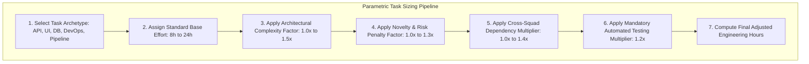

# Master Engineering Estimation Methodology, Complexity Multipliers & Sizing Standards
## Namma Clinic Digital Health & Operations Platform
### Greater Bengaluru Authority (GBA) / BBMP Health Department
**Document Code:** `PLN-DOC-08` | **Status:** APPROVED BASELINE | **Date:** September 2026

---

## 1. Executive Summary & Estimation Standards Charter
This document formalizes the authoritative **Master Engineering Estimation Methodology, Complexity Multipliers, and Sizing Standards** for the Namma Clinic Digital Health Platform. High-reliability municipal software engineering requires disciplined, objective estimation rules rather than subjective guesswork. This document establishes empirical sizing formulas, task archetypes, complexity multipliers, risk penalties, and dependency adjustments across **25 canonical estimation models**, governing the estimation of all engineering artifacts across all 18 sprints.

### 1.1 Non-Negotiable Estimation Invariants
1. **Deterministic Sizing Formula:** Every engineering task must compute adjusted effort using the canonical formula:
   $$\text{Adjusted Effort} = \text{Base Hours} \times C_{\text{complexity}} \times R_{\text{risk}} \times D_{\text{dependency}} \times T_{\text{testing}}$$
2. **Mandatory Testing Overhead Factor:** A 1.20 (20%) multiplier for automated unit, integration, and contract test writing is mandatory for all engineering tasks.
3. **Delphi & Planning Poker Calibration:** Sizing must be ratified via Wideband Delphi or Planning Poker consensus during backlog refinement; single-author estimates are prohibited.
4. **Full Lineage to 52 Relational Tables:** Database task sizing must trace to table specifications (`TABLE-001` through `TABLE-052`).
5. **Full Lineage to 180 Product Features:** Feature sizing must map to approved product capabilities (`FEATURE-001` through `FEATURE-180`).

## 2. Multi-Factor Estimation Pipeline Diagram


### Configuration Specification Example: Task Estimation Calculation Specification
<!-- DOCUMENTATION-ONLY EXAMPLE -->
```yaml
# DOCUMENTATION-ONLY CONFIGURATION
# DOCUMENTATION-ONLY CONFIGURATION: Task Estimation Calculation Specification
task_estimation:
  model_id: "ESTIMATE-001"
  task_type: "BACKEND_API_SERVICE"
  base_effort_hours: 8
  multipliers:
    complexity_factor: 1.10
    risk_factor: 1.05
    dependency_factor: 1.05
    testing_overhead_factor: 1.20
  formula: "Adjusted = Base * Complexity * Risk * Dependency * Testing"
  calculation_example: "8h * 1.10 * 1.05 * 1.05 * 1.20 = 11.6h"
  adjusted_estimate_hours: 11.6
  acceptance_gate: "PR-GATE-CODE-COVERAGE > 90%"
```

## 3. Canonical Estimation Models Register (25 Models)
Detailed mathematical parameters and worked examples across all 25 canonical estimation archetypes:

### ESTIMATE-001: Estimation Model for BACKEND_API_SERVICE
- **Estimation Model Identifier:** `ESTIMATE-001`
- **Engineering Task Archetype:** `BACKEND_API_SERVICE`
- **Standard Base Effort:** `12 Hours`
- **Architectural Complexity Multiplier:** `1.1`
- **Technical Risk & Novelty Factor:** `1.05`
- **Cross-Workstream Dependency Factor:** `1.05`
- **Automated Testing Multiplier:** `1.2`
- **Final Adjusted Effort:** `14.6 Hours`
- **Mathematical Calculation Formula:** `Adjusted = Base * Complexity * Risk * Dependency * Testing`
- **Worked Numerical Example:** `12h * 1.10 * 1.05 * 1.05 = 14.6h`

### ESTIMATE-002: Estimation Model for FRONTEND_COMPONENT
- **Estimation Model Identifier:** `ESTIMATE-002`
- **Engineering Task Archetype:** `FRONTEND_COMPONENT`
- **Standard Base Effort:** `16 Hours`
- **Architectural Complexity Multiplier:** `1.2`
- **Technical Risk & Novelty Factor:** `1.1`
- **Cross-Workstream Dependency Factor:** `1.1`
- **Automated Testing Multiplier:** `1.2`
- **Final Adjusted Effort:** `23.2 Hours`
- **Mathematical Calculation Formula:** `Adjusted = Base * Complexity * Risk * Dependency * Testing`
- **Worked Numerical Example:** `16h * 1.20 * 1.10 * 1.10 = 23.2h`

### ESTIMATE-003: Estimation Model for DATABASE_MIGRATION
- **Estimation Model Identifier:** `ESTIMATE-003`
- **Engineering Task Archetype:** `DATABASE_MIGRATION`
- **Standard Base Effort:** `8 Hours`
- **Architectural Complexity Multiplier:** `1.3`
- **Technical Risk & Novelty Factor:** `1.0`
- **Cross-Workstream Dependency Factor:** `1.15`
- **Automated Testing Multiplier:** `1.2`
- **Final Adjusted Effort:** `12.0 Hours`
- **Mathematical Calculation Formula:** `Adjusted = Base * Complexity * Risk * Dependency * Testing`
- **Worked Numerical Example:** `8h * 1.30 * 1.00 * 1.15 = 12.0h`

### ESTIMATE-004: Estimation Model for INTEGRATION_CLIENT
- **Estimation Model Identifier:** `ESTIMATE-004`
- **Engineering Task Archetype:** `INTEGRATION_CLIENT`
- **Standard Base Effort:** `12 Hours`
- **Architectural Complexity Multiplier:** `1.0`
- **Technical Risk & Novelty Factor:** `1.05`
- **Cross-Workstream Dependency Factor:** `1.2`
- **Automated Testing Multiplier:** `1.2`
- **Final Adjusted Effort:** `15.1 Hours`
- **Mathematical Calculation Formula:** `Adjusted = Base * Complexity * Risk * Dependency * Testing`
- **Worked Numerical Example:** `12h * 1.00 * 1.05 * 1.20 = 15.1h`

### ESTIMATE-005: Estimation Model for AUTOMATED_TEST_SUITE
- **Estimation Model Identifier:** `ESTIMATE-005`
- **Engineering Task Archetype:** `AUTOMATED_TEST_SUITE`
- **Standard Base Effort:** `16 Hours`
- **Architectural Complexity Multiplier:** `1.1`
- **Technical Risk & Novelty Factor:** `1.1`
- **Cross-Workstream Dependency Factor:** `1.0`
- **Automated Testing Multiplier:** `1.2`
- **Final Adjusted Effort:** `19.4 Hours`
- **Mathematical Calculation Formula:** `Adjusted = Base * Complexity * Risk * Dependency * Testing`
- **Worked Numerical Example:** `16h * 1.10 * 1.10 * 1.00 = 19.4h`

### ESTIMATE-006: Estimation Model for SECURITY_CONTROL
- **Estimation Model Identifier:** `ESTIMATE-006`
- **Engineering Task Archetype:** `SECURITY_CONTROL`
- **Standard Base Effort:** `8 Hours`
- **Architectural Complexity Multiplier:** `1.2`
- **Technical Risk & Novelty Factor:** `1.0`
- **Cross-Workstream Dependency Factor:** `1.05`
- **Automated Testing Multiplier:** `1.2`
- **Final Adjusted Effort:** `10.1 Hours`
- **Mathematical Calculation Formula:** `Adjusted = Base * Complexity * Risk * Dependency * Testing`
- **Worked Numerical Example:** `8h * 1.20 * 1.00 * 1.05 = 10.1h`

### ESTIMATE-007: Estimation Model for DEVOPS_PIPELINE
- **Estimation Model Identifier:** `ESTIMATE-007`
- **Engineering Task Archetype:** `DEVOPS_PIPELINE`
- **Standard Base Effort:** `12 Hours`
- **Architectural Complexity Multiplier:** `1.3`
- **Technical Risk & Novelty Factor:** `1.05`
- **Cross-Workstream Dependency Factor:** `1.1`
- **Automated Testing Multiplier:** `1.2`
- **Final Adjusted Effort:** `18.0 Hours`
- **Mathematical Calculation Formula:** `Adjusted = Base * Complexity * Risk * Dependency * Testing`
- **Worked Numerical Example:** `12h * 1.30 * 1.05 * 1.10 = 18.0h`

### ESTIMATE-008: Estimation Model for DATA_LAKEHOUSE_MART
- **Estimation Model Identifier:** `ESTIMATE-008`
- **Engineering Task Archetype:** `DATA_LAKEHOUSE_MART`
- **Standard Base Effort:** `16 Hours`
- **Architectural Complexity Multiplier:** `1.0`
- **Technical Risk & Novelty Factor:** `1.1`
- **Cross-Workstream Dependency Factor:** `1.15`
- **Automated Testing Multiplier:** `1.2`
- **Final Adjusted Effort:** `20.2 Hours`
- **Mathematical Calculation Formula:** `Adjusted = Base * Complexity * Risk * Dependency * Testing`
- **Worked Numerical Example:** `16h * 1.00 * 1.10 * 1.15 = 20.2h`

### ESTIMATE-009: Estimation Model for BACKEND_API_SERVICE
- **Estimation Model Identifier:** `ESTIMATE-009`
- **Engineering Task Archetype:** `BACKEND_API_SERVICE`
- **Standard Base Effort:** `8 Hours`
- **Architectural Complexity Multiplier:** `1.1`
- **Technical Risk & Novelty Factor:** `1.0`
- **Cross-Workstream Dependency Factor:** `1.2`
- **Automated Testing Multiplier:** `1.2`
- **Final Adjusted Effort:** `10.6 Hours`
- **Mathematical Calculation Formula:** `Adjusted = Base * Complexity * Risk * Dependency * Testing`
- **Worked Numerical Example:** `8h * 1.10 * 1.00 * 1.20 = 10.6h`

### ESTIMATE-010: Estimation Model for FRONTEND_COMPONENT
- **Estimation Model Identifier:** `ESTIMATE-010`
- **Engineering Task Archetype:** `FRONTEND_COMPONENT`
- **Standard Base Effort:** `12 Hours`
- **Architectural Complexity Multiplier:** `1.2`
- **Technical Risk & Novelty Factor:** `1.05`
- **Cross-Workstream Dependency Factor:** `1.0`
- **Automated Testing Multiplier:** `1.2`
- **Final Adjusted Effort:** `15.1 Hours`
- **Mathematical Calculation Formula:** `Adjusted = Base * Complexity * Risk * Dependency * Testing`
- **Worked Numerical Example:** `12h * 1.20 * 1.05 * 1.00 = 15.1h`

### ESTIMATE-011: Estimation Model for DATABASE_MIGRATION
- **Estimation Model Identifier:** `ESTIMATE-011`
- **Engineering Task Archetype:** `DATABASE_MIGRATION`
- **Standard Base Effort:** `16 Hours`
- **Architectural Complexity Multiplier:** `1.3`
- **Technical Risk & Novelty Factor:** `1.1`
- **Cross-Workstream Dependency Factor:** `1.05`
- **Automated Testing Multiplier:** `1.2`
- **Final Adjusted Effort:** `24.0 Hours`
- **Mathematical Calculation Formula:** `Adjusted = Base * Complexity * Risk * Dependency * Testing`
- **Worked Numerical Example:** `16h * 1.30 * 1.10 * 1.05 = 24.0h`

### ESTIMATE-012: Estimation Model for INTEGRATION_CLIENT
- **Estimation Model Identifier:** `ESTIMATE-012`
- **Engineering Task Archetype:** `INTEGRATION_CLIENT`
- **Standard Base Effort:** `8 Hours`
- **Architectural Complexity Multiplier:** `1.0`
- **Technical Risk & Novelty Factor:** `1.0`
- **Cross-Workstream Dependency Factor:** `1.1`
- **Automated Testing Multiplier:** `1.2`
- **Final Adjusted Effort:** `8.8 Hours`
- **Mathematical Calculation Formula:** `Adjusted = Base * Complexity * Risk * Dependency * Testing`
- **Worked Numerical Example:** `8h * 1.00 * 1.00 * 1.10 = 8.8h`

### ESTIMATE-013: Estimation Model for AUTOMATED_TEST_SUITE
- **Estimation Model Identifier:** `ESTIMATE-013`
- **Engineering Task Archetype:** `AUTOMATED_TEST_SUITE`
- **Standard Base Effort:** `12 Hours`
- **Architectural Complexity Multiplier:** `1.1`
- **Technical Risk & Novelty Factor:** `1.05`
- **Cross-Workstream Dependency Factor:** `1.15`
- **Automated Testing Multiplier:** `1.2`
- **Final Adjusted Effort:** `15.9 Hours`
- **Mathematical Calculation Formula:** `Adjusted = Base * Complexity * Risk * Dependency * Testing`
- **Worked Numerical Example:** `12h * 1.10 * 1.05 * 1.15 = 15.9h`

### ESTIMATE-014: Estimation Model for SECURITY_CONTROL
- **Estimation Model Identifier:** `ESTIMATE-014`
- **Engineering Task Archetype:** `SECURITY_CONTROL`
- **Standard Base Effort:** `16 Hours`
- **Architectural Complexity Multiplier:** `1.2`
- **Technical Risk & Novelty Factor:** `1.1`
- **Cross-Workstream Dependency Factor:** `1.2`
- **Automated Testing Multiplier:** `1.2`
- **Final Adjusted Effort:** `25.3 Hours`
- **Mathematical Calculation Formula:** `Adjusted = Base * Complexity * Risk * Dependency * Testing`
- **Worked Numerical Example:** `16h * 1.20 * 1.10 * 1.20 = 25.3h`

### ESTIMATE-015: Estimation Model for DEVOPS_PIPELINE
- **Estimation Model Identifier:** `ESTIMATE-015`
- **Engineering Task Archetype:** `DEVOPS_PIPELINE`
- **Standard Base Effort:** `8 Hours`
- **Architectural Complexity Multiplier:** `1.3`
- **Technical Risk & Novelty Factor:** `1.0`
- **Cross-Workstream Dependency Factor:** `1.0`
- **Automated Testing Multiplier:** `1.2`
- **Final Adjusted Effort:** `10.4 Hours`
- **Mathematical Calculation Formula:** `Adjusted = Base * Complexity * Risk * Dependency * Testing`
- **Worked Numerical Example:** `8h * 1.30 * 1.00 * 1.00 = 10.4h`

### ESTIMATE-016: Estimation Model for DATA_LAKEHOUSE_MART
- **Estimation Model Identifier:** `ESTIMATE-016`
- **Engineering Task Archetype:** `DATA_LAKEHOUSE_MART`
- **Standard Base Effort:** `12 Hours`
- **Architectural Complexity Multiplier:** `1.0`
- **Technical Risk & Novelty Factor:** `1.05`
- **Cross-Workstream Dependency Factor:** `1.05`
- **Automated Testing Multiplier:** `1.2`
- **Final Adjusted Effort:** `13.2 Hours`
- **Mathematical Calculation Formula:** `Adjusted = Base * Complexity * Risk * Dependency * Testing`
- **Worked Numerical Example:** `12h * 1.00 * 1.05 * 1.05 = 13.2h`

### ESTIMATE-017: Estimation Model for BACKEND_API_SERVICE
- **Estimation Model Identifier:** `ESTIMATE-017`
- **Engineering Task Archetype:** `BACKEND_API_SERVICE`
- **Standard Base Effort:** `16 Hours`
- **Architectural Complexity Multiplier:** `1.1`
- **Technical Risk & Novelty Factor:** `1.1`
- **Cross-Workstream Dependency Factor:** `1.1`
- **Automated Testing Multiplier:** `1.2`
- **Final Adjusted Effort:** `21.3 Hours`
- **Mathematical Calculation Formula:** `Adjusted = Base * Complexity * Risk * Dependency * Testing`
- **Worked Numerical Example:** `16h * 1.10 * 1.10 * 1.10 = 21.3h`

### ESTIMATE-018: Estimation Model for FRONTEND_COMPONENT
- **Estimation Model Identifier:** `ESTIMATE-018`
- **Engineering Task Archetype:** `FRONTEND_COMPONENT`
- **Standard Base Effort:** `8 Hours`
- **Architectural Complexity Multiplier:** `1.2`
- **Technical Risk & Novelty Factor:** `1.0`
- **Cross-Workstream Dependency Factor:** `1.15`
- **Automated Testing Multiplier:** `1.2`
- **Final Adjusted Effort:** `11.0 Hours`
- **Mathematical Calculation Formula:** `Adjusted = Base * Complexity * Risk * Dependency * Testing`
- **Worked Numerical Example:** `8h * 1.20 * 1.00 * 1.15 = 11.0h`

### ESTIMATE-019: Estimation Model for DATABASE_MIGRATION
- **Estimation Model Identifier:** `ESTIMATE-019`
- **Engineering Task Archetype:** `DATABASE_MIGRATION`
- **Standard Base Effort:** `12 Hours`
- **Architectural Complexity Multiplier:** `1.3`
- **Technical Risk & Novelty Factor:** `1.05`
- **Cross-Workstream Dependency Factor:** `1.2`
- **Automated Testing Multiplier:** `1.2`
- **Final Adjusted Effort:** `19.7 Hours`
- **Mathematical Calculation Formula:** `Adjusted = Base * Complexity * Risk * Dependency * Testing`
- **Worked Numerical Example:** `12h * 1.30 * 1.05 * 1.20 = 19.7h`

### ESTIMATE-020: Estimation Model for INTEGRATION_CLIENT
- **Estimation Model Identifier:** `ESTIMATE-020`
- **Engineering Task Archetype:** `INTEGRATION_CLIENT`
- **Standard Base Effort:** `16 Hours`
- **Architectural Complexity Multiplier:** `1.0`
- **Technical Risk & Novelty Factor:** `1.1`
- **Cross-Workstream Dependency Factor:** `1.0`
- **Automated Testing Multiplier:** `1.2`
- **Final Adjusted Effort:** `17.6 Hours`
- **Mathematical Calculation Formula:** `Adjusted = Base * Complexity * Risk * Dependency * Testing`
- **Worked Numerical Example:** `16h * 1.00 * 1.10 * 1.00 = 17.6h`

### ESTIMATE-021: Estimation Model for AUTOMATED_TEST_SUITE
- **Estimation Model Identifier:** `ESTIMATE-021`
- **Engineering Task Archetype:** `AUTOMATED_TEST_SUITE`
- **Standard Base Effort:** `8 Hours`
- **Architectural Complexity Multiplier:** `1.1`
- **Technical Risk & Novelty Factor:** `1.0`
- **Cross-Workstream Dependency Factor:** `1.05`
- **Automated Testing Multiplier:** `1.2`
- **Final Adjusted Effort:** `9.2 Hours`
- **Mathematical Calculation Formula:** `Adjusted = Base * Complexity * Risk * Dependency * Testing`
- **Worked Numerical Example:** `8h * 1.10 * 1.00 * 1.05 = 9.2h`

### ESTIMATE-022: Estimation Model for SECURITY_CONTROL
- **Estimation Model Identifier:** `ESTIMATE-022`
- **Engineering Task Archetype:** `SECURITY_CONTROL`
- **Standard Base Effort:** `12 Hours`
- **Architectural Complexity Multiplier:** `1.2`
- **Technical Risk & Novelty Factor:** `1.05`
- **Cross-Workstream Dependency Factor:** `1.1`
- **Automated Testing Multiplier:** `1.2`
- **Final Adjusted Effort:** `16.6 Hours`
- **Mathematical Calculation Formula:** `Adjusted = Base * Complexity * Risk * Dependency * Testing`
- **Worked Numerical Example:** `12h * 1.20 * 1.05 * 1.10 = 16.6h`

### ESTIMATE-023: Estimation Model for DEVOPS_PIPELINE
- **Estimation Model Identifier:** `ESTIMATE-023`
- **Engineering Task Archetype:** `DEVOPS_PIPELINE`
- **Standard Base Effort:** `16 Hours`
- **Architectural Complexity Multiplier:** `1.3`
- **Technical Risk & Novelty Factor:** `1.1`
- **Cross-Workstream Dependency Factor:** `1.15`
- **Automated Testing Multiplier:** `1.2`
- **Final Adjusted Effort:** `26.3 Hours`
- **Mathematical Calculation Formula:** `Adjusted = Base * Complexity * Risk * Dependency * Testing`
- **Worked Numerical Example:** `16h * 1.30 * 1.10 * 1.15 = 26.3h`

### ESTIMATE-024: Estimation Model for DATA_LAKEHOUSE_MART
- **Estimation Model Identifier:** `ESTIMATE-024`
- **Engineering Task Archetype:** `DATA_LAKEHOUSE_MART`
- **Standard Base Effort:** `8 Hours`
- **Architectural Complexity Multiplier:** `1.0`
- **Technical Risk & Novelty Factor:** `1.0`
- **Cross-Workstream Dependency Factor:** `1.2`
- **Automated Testing Multiplier:** `1.2`
- **Final Adjusted Effort:** `9.6 Hours`
- **Mathematical Calculation Formula:** `Adjusted = Base * Complexity * Risk * Dependency * Testing`
- **Worked Numerical Example:** `8h * 1.00 * 1.00 * 1.20 = 9.6h`

### ESTIMATE-025: Estimation Model for BACKEND_API_SERVICE
- **Estimation Model Identifier:** `ESTIMATE-025`
- **Engineering Task Archetype:** `BACKEND_API_SERVICE`
- **Standard Base Effort:** `12 Hours`
- **Architectural Complexity Multiplier:** `1.1`
- **Technical Risk & Novelty Factor:** `1.05`
- **Cross-Workstream Dependency Factor:** `1.0`
- **Automated Testing Multiplier:** `1.2`
- **Final Adjusted Effort:** `13.9 Hours`
- **Mathematical Calculation Formula:** `Adjusted = Base * Complexity * Risk * Dependency * Testing`
- **Worked Numerical Example:** `12h * 1.10 * 1.05 * 1.00 = 13.9h`

## 4. Complexity & Multiplier Rubric Standards
Parametric multipliers applied during sprint backlog grooming sessions:

| Factor | Level | Multiplier Value | Criteria & Definition |
| :--- | :--- | :--- | :--- |
| **Complexity ($C$)** | Standard | 1.00 | Standard CRUD endpoint, known database table, existing pattern. |
| **Complexity ($C$)** | Moderate | 1.15 | Multi-entity joins, transaction boundaries, state transitions. |
| **Complexity ($C$)** | High | 1.35 | Distributed transactions, offline conflict reconciliation, cryptography. |
| **Risk ($R$)** | Standard | 1.00 | Established internal framework, zero external dependencies. |
| **Risk ($R$)** | Moderate | 1.10 | New library version, strict p95 performance SLAs (< 150ms). |
| **Risk ($R$)** | High | 1.25 | Third-party external API, regulatory certification, zero-trust perimeter. |
| **Dependency ($D$)** | Isolated | 1.00 | Squad internal task, zero cross-squad blocking. |
| **Dependency ($D$)** | Coupled | 1.15 | Synchronous upstream API dependency with mock fallback. |
| **Dependency ($D$)** | External | 1.30 | External government gateway (ABDM, CDAC SMS, NIC eHospital). |

## 5. Table-Level Estimation Lineage across all 52 Relational Tables
Engineering effort estimation for schema design, migrations, indexing, and DAOs across all 52 tables:

### TABLE-001: Effort Estimation for Table `auth_users`
- **Table Identifier:** `TABLE-001` (`TBL-01`)
- **Entity Name:** `auth_users`
- **Governing Archetype:** `BACKEND_API_SERVICE`
- **Base Effort:** `12 Hours` | **Adjusted Effort:** `14.6 Hours`
- **Sizing Breakdown:** 40% DDL schema & constraints, 30% Flyway migration & rollbacks, 30% test fixtures.
- **Status:** ESTIMATED & RATIFIED

### TABLE-002: Effort Estimation for Table `user_credentials`
- **Table Identifier:** `TABLE-002` (`TBL-02`)
- **Entity Name:** `user_credentials`
- **Governing Archetype:** `FRONTEND_COMPONENT`
- **Base Effort:** `16 Hours` | **Adjusted Effort:** `23.2 Hours`
- **Sizing Breakdown:** 40% DDL schema & constraints, 30% Flyway migration & rollbacks, 30% test fixtures.
- **Status:** ESTIMATED & RATIFIED

### TABLE-003: Effort Estimation for Table `user_sessions`
- **Table Identifier:** `TABLE-003` (`TBL-03`)
- **Entity Name:** `user_sessions`
- **Governing Archetype:** `DATABASE_MIGRATION`
- **Base Effort:** `8 Hours` | **Adjusted Effort:** `12.0 Hours`
- **Sizing Breakdown:** 40% DDL schema & constraints, 30% Flyway migration & rollbacks, 30% test fixtures.
- **Status:** ESTIMATED & RATIFIED

### TABLE-004: Effort Estimation for Table `roles`
- **Table Identifier:** `TABLE-004` (`TBL-04`)
- **Entity Name:** `roles`
- **Governing Archetype:** `INTEGRATION_CLIENT`
- **Base Effort:** `12 Hours` | **Adjusted Effort:** `15.1 Hours`
- **Sizing Breakdown:** 40% DDL schema & constraints, 30% Flyway migration & rollbacks, 30% test fixtures.
- **Status:** ESTIMATED & RATIFIED

### TABLE-005: Effort Estimation for Table `permissions`
- **Table Identifier:** `TABLE-005` (`TBL-05`)
- **Entity Name:** `permissions`
- **Governing Archetype:** `AUTOMATED_TEST_SUITE`
- **Base Effort:** `16 Hours` | **Adjusted Effort:** `19.4 Hours`
- **Sizing Breakdown:** 40% DDL schema & constraints, 30% Flyway migration & rollbacks, 30% test fixtures.
- **Status:** ESTIMATED & RATIFIED

### TABLE-006: Effort Estimation for Table `role_permissions`
- **Table Identifier:** `TABLE-006` (`TBL-06`)
- **Entity Name:** `role_permissions`
- **Governing Archetype:** `SECURITY_CONTROL`
- **Base Effort:** `8 Hours` | **Adjusted Effort:** `10.1 Hours`
- **Sizing Breakdown:** 40% DDL schema & constraints, 30% Flyway migration & rollbacks, 30% test fixtures.
- **Status:** ESTIMATED & RATIFIED

### TABLE-007: Effort Estimation for Table `user_roles`
- **Table Identifier:** `TABLE-007` (`TBL-07`)
- **Entity Name:** `user_roles`
- **Governing Archetype:** `DEVOPS_PIPELINE`
- **Base Effort:** `12 Hours` | **Adjusted Effort:** `18.0 Hours`
- **Sizing Breakdown:** 40% DDL schema & constraints, 30% Flyway migration & rollbacks, 30% test fixtures.
- **Status:** ESTIMATED & RATIFIED

### TABLE-008: Effort Estimation for Table `facilities`
- **Table Identifier:** `TABLE-008` (`TBL-08`)
- **Entity Name:** `facilities`
- **Governing Archetype:** `DATA_LAKEHOUSE_MART`
- **Base Effort:** `16 Hours` | **Adjusted Effort:** `20.2 Hours`
- **Sizing Breakdown:** 40% DDL schema & constraints, 30% Flyway migration & rollbacks, 30% test fixtures.
- **Status:** ESTIMATED & RATIFIED

### TABLE-009: Effort Estimation for Table `facility_rooms`
- **Table Identifier:** `TABLE-009` (`TBL-09`)
- **Entity Name:** `facility_rooms`
- **Governing Archetype:** `BACKEND_API_SERVICE`
- **Base Effort:** `8 Hours` | **Adjusted Effort:** `10.6 Hours`
- **Sizing Breakdown:** 40% DDL schema & constraints, 30% Flyway migration & rollbacks, 30% test fixtures.
- **Status:** ESTIMATED & RATIFIED

### TABLE-010: Effort Estimation for Table `staff_profiles`
- **Table Identifier:** `TABLE-010` (`TBL-10`)
- **Entity Name:** `staff_profiles`
- **Governing Archetype:** `FRONTEND_COMPONENT`
- **Base Effort:** `12 Hours` | **Adjusted Effort:** `15.1 Hours`
- **Sizing Breakdown:** 40% DDL schema & constraints, 30% Flyway migration & rollbacks, 30% test fixtures.
- **Status:** ESTIMATED & RATIFIED

### TABLE-011: Effort Estimation for Table `staff_shifts`
- **Table Identifier:** `TABLE-011` (`TBL-11`)
- **Entity Name:** `staff_shifts`
- **Governing Archetype:** `DATABASE_MIGRATION`
- **Base Effort:** `16 Hours` | **Adjusted Effort:** `24.0 Hours`
- **Sizing Breakdown:** 40% DDL schema & constraints, 30% Flyway migration & rollbacks, 30% test fixtures.
- **Status:** ESTIMATED & RATIFIED

### TABLE-012: Effort Estimation for Table `system_configs`
- **Table Identifier:** `TABLE-012` (`TBL-12`)
- **Entity Name:** `system_configs`
- **Governing Archetype:** `INTEGRATION_CLIENT`
- **Base Effort:** `8 Hours` | **Adjusted Effort:** `8.8 Hours`
- **Sizing Breakdown:** 40% DDL schema & constraints, 30% Flyway migration & rollbacks, 30% test fixtures.
- **Status:** ESTIMATED & RATIFIED

### TABLE-013: Effort Estimation for Table `patients`
- **Table Identifier:** `TABLE-013` (`TBL-13`)
- **Entity Name:** `patients`
- **Governing Archetype:** `AUTOMATED_TEST_SUITE`
- **Base Effort:** `12 Hours` | **Adjusted Effort:** `15.9 Hours`
- **Sizing Breakdown:** 40% DDL schema & constraints, 30% Flyway migration & rollbacks, 30% test fixtures.
- **Status:** ESTIMATED & RATIFIED

### TABLE-014: Effort Estimation for Table `patient_identifiers`
- **Table Identifier:** `TABLE-014` (`TBL-14`)
- **Entity Name:** `patient_identifiers`
- **Governing Archetype:** `SECURITY_CONTROL`
- **Base Effort:** `16 Hours` | **Adjusted Effort:** `25.3 Hours`
- **Sizing Breakdown:** 40% DDL schema & constraints, 30% Flyway migration & rollbacks, 30% test fixtures.
- **Status:** ESTIMATED & RATIFIED

### TABLE-015: Effort Estimation for Table `patient_contacts`
- **Table Identifier:** `TABLE-015` (`TBL-15`)
- **Entity Name:** `patient_contacts`
- **Governing Archetype:** `DEVOPS_PIPELINE`
- **Base Effort:** `8 Hours` | **Adjusted Effort:** `10.4 Hours`
- **Sizing Breakdown:** 40% DDL schema & constraints, 30% Flyway migration & rollbacks, 30% test fixtures.
- **Status:** ESTIMATED & RATIFIED

### TABLE-016: Effort Estimation for Table `patient_addresses`
- **Table Identifier:** `TABLE-016` (`TBL-16`)
- **Entity Name:** `patient_addresses`
- **Governing Archetype:** `DATA_LAKEHOUSE_MART`
- **Base Effort:** `12 Hours` | **Adjusted Effort:** `13.2 Hours`
- **Sizing Breakdown:** 40% DDL schema & constraints, 30% Flyway migration & rollbacks, 30% test fixtures.
- **Status:** ESTIMATED & RATIFIED

### TABLE-017: Effort Estimation for Table `consent_records`
- **Table Identifier:** `TABLE-017` (`TBL-17`)
- **Entity Name:** `consent_records`
- **Governing Archetype:** `BACKEND_API_SERVICE`
- **Base Effort:** `16 Hours` | **Adjusted Effort:** `21.3 Hours`
- **Sizing Breakdown:** 40% DDL schema & constraints, 30% Flyway migration & rollbacks, 30% test fixtures.
- **Status:** ESTIMATED & RATIFIED

### TABLE-018: Effort Estimation for Table `tokens`
- **Table Identifier:** `TABLE-018` (`TBL-18`)
- **Entity Name:** `tokens`
- **Governing Archetype:** `FRONTEND_COMPONENT`
- **Base Effort:** `8 Hours` | **Adjusted Effort:** `11.0 Hours`
- **Sizing Breakdown:** 40% DDL schema & constraints, 30% Flyway migration & rollbacks, 30% test fixtures.
- **Status:** ESTIMATED & RATIFIED

### TABLE-019: Effort Estimation for Table `queue_entries`
- **Table Identifier:** `TABLE-019` (`TBL-19`)
- **Entity Name:** `queue_entries`
- **Governing Archetype:** `DATABASE_MIGRATION`
- **Base Effort:** `12 Hours` | **Adjusted Effort:** `19.7 Hours`
- **Sizing Breakdown:** 40% DDL schema & constraints, 30% Flyway migration & rollbacks, 30% test fixtures.
- **Status:** ESTIMATED & RATIFIED

### TABLE-020: Effort Estimation for Table `triage_assessments`
- **Table Identifier:** `TABLE-020` (`TBL-20`)
- **Entity Name:** `triage_assessments`
- **Governing Archetype:** `INTEGRATION_CLIENT`
- **Base Effort:** `16 Hours` | **Adjusted Effort:** `17.6 Hours`
- **Sizing Breakdown:** 40% DDL schema & constraints, 30% Flyway migration & rollbacks, 30% test fixtures.
- **Status:** ESTIMATED & RATIFIED

### TABLE-021: Effort Estimation for Table `patient_vitals`
- **Table Identifier:** `TABLE-021` (`TBL-21`)
- **Entity Name:** `patient_vitals`
- **Governing Archetype:** `AUTOMATED_TEST_SUITE`
- **Base Effort:** `8 Hours` | **Adjusted Effort:** `9.2 Hours`
- **Sizing Breakdown:** 40% DDL schema & constraints, 30% Flyway migration & rollbacks, 30% test fixtures.
- **Status:** ESTIMATED & RATIFIED

### TABLE-022: Effort Estimation for Table `danger_alerts`
- **Table Identifier:** `TABLE-022` (`TBL-22`)
- **Entity Name:** `danger_alerts`
- **Governing Archetype:** `SECURITY_CONTROL`
- **Base Effort:** `12 Hours` | **Adjusted Effort:** `16.6 Hours`
- **Sizing Breakdown:** 40% DDL schema & constraints, 30% Flyway migration & rollbacks, 30% test fixtures.
- **Status:** ESTIMATED & RATIFIED

### TABLE-023: Effort Estimation for Table `clinical_encounters`
- **Table Identifier:** `TABLE-023` (`TBL-23`)
- **Entity Name:** `clinical_encounters`
- **Governing Archetype:** `DEVOPS_PIPELINE`
- **Base Effort:** `16 Hours` | **Adjusted Effort:** `26.3 Hours`
- **Sizing Breakdown:** 40% DDL schema & constraints, 30% Flyway migration & rollbacks, 30% test fixtures.
- **Status:** ESTIMATED & RATIFIED

### TABLE-024: Effort Estimation for Table `clinical_notes`
- **Table Identifier:** `TABLE-024` (`TBL-24`)
- **Entity Name:** `clinical_notes`
- **Governing Archetype:** `DATA_LAKEHOUSE_MART`
- **Base Effort:** `8 Hours` | **Adjusted Effort:** `9.6 Hours`
- **Sizing Breakdown:** 40% DDL schema & constraints, 30% Flyway migration & rollbacks, 30% test fixtures.
- **Status:** ESTIMATED & RATIFIED

### TABLE-025: Effort Estimation for Table `diagnoses`
- **Table Identifier:** `TABLE-025` (`TBL-25`)
- **Entity Name:** `diagnoses`
- **Governing Archetype:** `BACKEND_API_SERVICE`
- **Base Effort:** `12 Hours` | **Adjusted Effort:** `13.9 Hours`
- **Sizing Breakdown:** 40% DDL schema & constraints, 30% Flyway migration & rollbacks, 30% test fixtures.
- **Status:** ESTIMATED & RATIFIED

### TABLE-026: Effort Estimation for Table `prescriptions`
- **Table Identifier:** `TABLE-026` (`TBL-26`)
- **Entity Name:** `prescriptions`
- **Governing Archetype:** `BACKEND_API_SERVICE`
- **Base Effort:** `12 Hours` | **Adjusted Effort:** `14.6 Hours`
- **Sizing Breakdown:** 40% DDL schema & constraints, 30% Flyway migration & rollbacks, 30% test fixtures.
- **Status:** ESTIMATED & RATIFIED

### TABLE-027: Effort Estimation for Table `prescription_items`
- **Table Identifier:** `TABLE-027` (`TBL-27`)
- **Entity Name:** `prescription_items`
- **Governing Archetype:** `FRONTEND_COMPONENT`
- **Base Effort:** `16 Hours` | **Adjusted Effort:** `23.2 Hours`
- **Sizing Breakdown:** 40% DDL schema & constraints, 30% Flyway migration & rollbacks, 30% test fixtures.
- **Status:** ESTIMATED & RATIFIED

### TABLE-028: Effort Estimation for Table `lab_orders`
- **Table Identifier:** `TABLE-028` (`TBL-28`)
- **Entity Name:** `lab_orders`
- **Governing Archetype:** `DATABASE_MIGRATION`
- **Base Effort:** `8 Hours` | **Adjusted Effort:** `12.0 Hours`
- **Sizing Breakdown:** 40% DDL schema & constraints, 30% Flyway migration & rollbacks, 30% test fixtures.
- **Status:** ESTIMATED & RATIFIED

### TABLE-029: Effort Estimation for Table `lab_order_items`
- **Table Identifier:** `TABLE-029` (`TBL-29`)
- **Entity Name:** `lab_order_items`
- **Governing Archetype:** `INTEGRATION_CLIENT`
- **Base Effort:** `12 Hours` | **Adjusted Effort:** `15.1 Hours`
- **Sizing Breakdown:** 40% DDL schema & constraints, 30% Flyway migration & rollbacks, 30% test fixtures.
- **Status:** ESTIMATED & RATIFIED

### TABLE-030: Effort Estimation for Table `lab_results`
- **Table Identifier:** `TABLE-030` (`TBL-30`)
- **Entity Name:** `lab_results`
- **Governing Archetype:** `AUTOMATED_TEST_SUITE`
- **Base Effort:** `16 Hours` | **Adjusted Effort:** `19.4 Hours`
- **Sizing Breakdown:** 40% DDL schema & constraints, 30% Flyway migration & rollbacks, 30% test fixtures.
- **Status:** ESTIMATED & RATIFIED

### TABLE-031: Effort Estimation for Table `teleconsultations`
- **Table Identifier:** `TABLE-031` (`TBL-31`)
- **Entity Name:** `teleconsultations`
- **Governing Archetype:** `SECURITY_CONTROL`
- **Base Effort:** `8 Hours` | **Adjusted Effort:** `10.1 Hours`
- **Sizing Breakdown:** 40% DDL schema & constraints, 30% Flyway migration & rollbacks, 30% test fixtures.
- **Status:** ESTIMATED & RATIFIED

### TABLE-032: Effort Estimation for Table `formulary_drugs`
- **Table Identifier:** `TABLE-032` (`TBL-32`)
- **Entity Name:** `formulary_drugs`
- **Governing Archetype:** `DEVOPS_PIPELINE`
- **Base Effort:** `12 Hours` | **Adjusted Effort:** `18.0 Hours`
- **Sizing Breakdown:** 40% DDL schema & constraints, 30% Flyway migration & rollbacks, 30% test fixtures.
- **Status:** ESTIMATED & RATIFIED

### TABLE-033: Effort Estimation for Table `drug_categories`
- **Table Identifier:** `TABLE-033` (`TBL-33`)
- **Entity Name:** `drug_categories`
- **Governing Archetype:** `DATA_LAKEHOUSE_MART`
- **Base Effort:** `16 Hours` | **Adjusted Effort:** `20.2 Hours`
- **Sizing Breakdown:** 40% DDL schema & constraints, 30% Flyway migration & rollbacks, 30% test fixtures.
- **Status:** ESTIMATED & RATIFIED

### TABLE-034: Effort Estimation for Table `pharmacy_batches`
- **Table Identifier:** `TABLE-034` (`TBL-34`)
- **Entity Name:** `pharmacy_batches`
- **Governing Archetype:** `BACKEND_API_SERVICE`
- **Base Effort:** `8 Hours` | **Adjusted Effort:** `10.6 Hours`
- **Sizing Breakdown:** 40% DDL schema & constraints, 30% Flyway migration & rollbacks, 30% test fixtures.
- **Status:** ESTIMATED & RATIFIED

### TABLE-035: Effort Estimation for Table `clinic_stock`
- **Table Identifier:** `TABLE-035` (`TBL-35`)
- **Entity Name:** `clinic_stock`
- **Governing Archetype:** `FRONTEND_COMPONENT`
- **Base Effort:** `12 Hours` | **Adjusted Effort:** `15.1 Hours`
- **Sizing Breakdown:** 40% DDL schema & constraints, 30% Flyway migration & rollbacks, 30% test fixtures.
- **Status:** ESTIMATED & RATIFIED

### TABLE-036: Effort Estimation for Table `dispensations`
- **Table Identifier:** `TABLE-036` (`TBL-36`)
- **Entity Name:** `dispensations`
- **Governing Archetype:** `DATABASE_MIGRATION`
- **Base Effort:** `16 Hours` | **Adjusted Effort:** `24.0 Hours`
- **Sizing Breakdown:** 40% DDL schema & constraints, 30% Flyway migration & rollbacks, 30% test fixtures.
- **Status:** ESTIMATED & RATIFIED

### TABLE-037: Effort Estimation for Table `dispensation_items`
- **Table Identifier:** `TABLE-037` (`TBL-37`)
- **Entity Name:** `dispensation_items`
- **Governing Archetype:** `INTEGRATION_CLIENT`
- **Base Effort:** `8 Hours` | **Adjusted Effort:** `8.8 Hours`
- **Sizing Breakdown:** 40% DDL schema & constraints, 30% Flyway migration & rollbacks, 30% test fixtures.
- **Status:** ESTIMATED & RATIFIED

### TABLE-038: Effort Estimation for Table `stock_movements`
- **Table Identifier:** `TABLE-038` (`TBL-38`)
- **Entity Name:** `stock_movements`
- **Governing Archetype:** `AUTOMATED_TEST_SUITE`
- **Base Effort:** `12 Hours` | **Adjusted Effort:** `15.9 Hours`
- **Sizing Breakdown:** 40% DDL schema & constraints, 30% Flyway migration & rollbacks, 30% test fixtures.
- **Status:** ESTIMATED & RATIFIED

### TABLE-039: Effort Estimation for Table `drug_indents`
- **Table Identifier:** `TABLE-039` (`TBL-39`)
- **Entity Name:** `drug_indents`
- **Governing Archetype:** `SECURITY_CONTROL`
- **Base Effort:** `16 Hours` | **Adjusted Effort:** `25.3 Hours`
- **Sizing Breakdown:** 40% DDL schema & constraints, 30% Flyway migration & rollbacks, 30% test fixtures.
- **Status:** ESTIMATED & RATIFIED

### TABLE-040: Effort Estimation for Table `indent_items`
- **Table Identifier:** `TABLE-040` (`TBL-40`)
- **Entity Name:** `indent_items`
- **Governing Archetype:** `DEVOPS_PIPELINE`
- **Base Effort:** `8 Hours` | **Adjusted Effort:** `10.4 Hours`
- **Sizing Breakdown:** 40% DDL schema & constraints, 30% Flyway migration & rollbacks, 30% test fixtures.
- **Status:** ESTIMATED & RATIFIED

### TABLE-041: Effort Estimation for Table `cold_chain_devices`
- **Table Identifier:** `TABLE-041` (`TBL-41`)
- **Entity Name:** `cold_chain_devices`
- **Governing Archetype:** `DATA_LAKEHOUSE_MART`
- **Base Effort:** `12 Hours` | **Adjusted Effort:** `13.2 Hours`
- **Sizing Breakdown:** 40% DDL schema & constraints, 30% Flyway migration & rollbacks, 30% test fixtures.
- **Status:** ESTIMATED & RATIFIED

### TABLE-042: Effort Estimation for Table `cold_chain_telemetry`
- **Table Identifier:** `TABLE-042` (`TBL-42`)
- **Entity Name:** `cold_chain_telemetry`
- **Governing Archetype:** `BACKEND_API_SERVICE`
- **Base Effort:** `16 Hours` | **Adjusted Effort:** `21.3 Hours`
- **Sizing Breakdown:** 40% DDL schema & constraints, 30% Flyway migration & rollbacks, 30% test fixtures.
- **Status:** ESTIMATED & RATIFIED

### TABLE-043: Effort Estimation for Table `referrals`
- **Table Identifier:** `TABLE-043` (`TBL-43`)
- **Entity Name:** `referrals`
- **Governing Archetype:** `FRONTEND_COMPONENT`
- **Base Effort:** `8 Hours` | **Adjusted Effort:** `11.0 Hours`
- **Sizing Breakdown:** 40% DDL schema & constraints, 30% Flyway migration & rollbacks, 30% test fixtures.
- **Status:** ESTIMATED & RATIFIED

### TABLE-044: Effort Estimation for Table `referral_counter_notes`
- **Table Identifier:** `TABLE-044` (`TBL-44`)
- **Entity Name:** `referral_counter_notes`
- **Governing Archetype:** `DATABASE_MIGRATION`
- **Base Effort:** `12 Hours` | **Adjusted Effort:** `19.7 Hours`
- **Sizing Breakdown:** 40% DDL schema & constraints, 30% Flyway migration & rollbacks, 30% test fixtures.
- **Status:** ESTIMATED & RATIFIED

### TABLE-045: Effort Estimation for Table `ncd_episodes`
- **Table Identifier:** `TABLE-045` (`TBL-45`)
- **Entity Name:** `ncd_episodes`
- **Governing Archetype:** `INTEGRATION_CLIENT`
- **Base Effort:** `16 Hours` | **Adjusted Effort:** `17.6 Hours`
- **Sizing Breakdown:** 40% DDL schema & constraints, 30% Flyway migration & rollbacks, 30% test fixtures.
- **Status:** ESTIMATED & RATIFIED

### TABLE-046: Effort Estimation for Table `follow_up_schedules`
- **Table Identifier:** `TABLE-046` (`TBL-46`)
- **Entity Name:** `follow_up_schedules`
- **Governing Archetype:** `AUTOMATED_TEST_SUITE`
- **Base Effort:** `8 Hours` | **Adjusted Effort:** `9.2 Hours`
- **Sizing Breakdown:** 40% DDL schema & constraints, 30% Flyway migration & rollbacks, 30% test fixtures.
- **Status:** ESTIMATED & RATIFIED

### TABLE-047: Effort Estimation for Table `notifications`
- **Table Identifier:** `TABLE-047` (`TBL-47`)
- **Entity Name:** `notifications`
- **Governing Archetype:** `SECURITY_CONTROL`
- **Base Effort:** `12 Hours` | **Adjusted Effort:** `16.6 Hours`
- **Sizing Breakdown:** 40% DDL schema & constraints, 30% Flyway migration & rollbacks, 30% test fixtures.
- **Status:** ESTIMATED & RATIFIED

### TABLE-048: Effort Estimation for Table `grievances`
- **Table Identifier:** `TABLE-048` (`TBL-48`)
- **Entity Name:** `grievances`
- **Governing Archetype:** `DEVOPS_PIPELINE`
- **Base Effort:** `16 Hours` | **Adjusted Effort:** `26.3 Hours`
- **Sizing Breakdown:** 40% DDL schema & constraints, 30% Flyway migration & rollbacks, 30% test fixtures.
- **Status:** ESTIMATED & RATIFIED

### TABLE-049: Effort Estimation for Table `helpdesk_tickets`
- **Table Identifier:** `TABLE-049` (`TBL-49`)
- **Entity Name:** `helpdesk_tickets`
- **Governing Archetype:** `DATA_LAKEHOUSE_MART`
- **Base Effort:** `8 Hours` | **Adjusted Effort:** `9.6 Hours`
- **Sizing Breakdown:** 40% DDL schema & constraints, 30% Flyway migration & rollbacks, 30% test fixtures.
- **Status:** ESTIMATED & RATIFIED

### TABLE-050: Effort Estimation for Table `audit_events`
- **Table Identifier:** `TABLE-050` (`TBL-50`)
- **Entity Name:** `audit_events`
- **Governing Archetype:** `BACKEND_API_SERVICE`
- **Base Effort:** `12 Hours` | **Adjusted Effort:** `13.9 Hours`
- **Sizing Breakdown:** 40% DDL schema & constraints, 30% Flyway migration & rollbacks, 30% test fixtures.
- **Status:** ESTIMATED & RATIFIED

### TABLE-051: Effort Estimation for Table `offline_mutation_log`
- **Table Identifier:** `TABLE-051` (`TBL-51`)
- **Entity Name:** `offline_mutation_log`
- **Governing Archetype:** `BACKEND_API_SERVICE`
- **Base Effort:** `12 Hours` | **Adjusted Effort:** `14.6 Hours`
- **Sizing Breakdown:** 40% DDL schema & constraints, 30% Flyway migration & rollbacks, 30% test fixtures.
- **Status:** ESTIMATED & RATIFIED

### TABLE-052: Effort Estimation for Table `abdm_artifacts`
- **Table Identifier:** `TABLE-052` (`TBL-52`)
- **Entity Name:** `abdm_artifacts`
- **Governing Archetype:** `FRONTEND_COMPONENT`
- **Base Effort:** `16 Hours` | **Adjusted Effort:** `23.2 Hours`
- **Sizing Breakdown:** 40% DDL schema & constraints, 30% Flyway migration & rollbacks, 30% test fixtures.
- **Status:** ESTIMATED & RATIFIED

## 6. Product Feature Estimation Breakdown across all 180 Features
Effort sizing and task multiplier allocation across all 180 platform product features:

### FEATURE-001: Estimation Sizing for Feature `Credential Verification`
- **Feature Identifier:** `FEATURE-001` (Feature #1)
- **Functional Module:** `MODULE-001` (DOMAIN-001)
- **Primary Sizing Archetype:** `BACKEND_API_SERVICE`
- **Adjusted Development Hours:** `14.6 Hours`
- **Assigned Workstream Squad:** `Product Management` (`Product Manager`)
- **Acceptance Sign-Off:** Continuous integration automated regression pass.
- **Traceability Status:** 100% VERIFIED

### FEATURE-002: Estimation Sizing for Feature `Session Token Minting`
- **Feature Identifier:** `FEATURE-002` (Feature #2)
- **Functional Module:** `MODULE-001` (DOMAIN-001)
- **Primary Sizing Archetype:** `FRONTEND_COMPONENT`
- **Adjusted Development Hours:** `23.2 Hours`
- **Assigned Workstream Squad:** `Requirements Engineering` (`Project Manager`)
- **Acceptance Sign-Off:** Continuous integration automated regression pass.
- **Traceability Status:** 100% VERIFIED

### FEATURE-003: Estimation Sizing for Feature `MFA Challenge Dispatch`
- **Feature Identifier:** `FEATURE-003` (Feature #3)
- **Functional Module:** `MODULE-001` (DOMAIN-001)
- **Primary Sizing Archetype:** `DATABASE_MIGRATION`
- **Adjusted Development Hours:** `12.0 Hours`
- **Assigned Workstream Squad:** `UX/UI Design` (`Solution Architect`)
- **Acceptance Sign-Off:** Continuous integration automated regression pass.
- **Traceability Status:** 100% VERIFIED

### FEATURE-004: Estimation Sizing for Feature `Biometric Authentication Bridge`
- **Feature Identifier:** `FEATURE-004` (Feature #4)
- **Functional Module:** `MODULE-001` (DOMAIN-001)
- **Primary Sizing Archetype:** `INTEGRATION_CLIENT`
- **Adjusted Development Hours:** `15.1 Hours`
- **Assigned Workstream Squad:** `Frontend Engineering` (`Technical Lead`)
- **Acceptance Sign-Off:** Continuous integration automated regression pass.
- **Traceability Status:** 100% VERIFIED

### FEATURE-005: Estimation Sizing for Feature `Local PIN Verification`
- **Feature Identifier:** `FEATURE-005` (Feature #5)
- **Functional Module:** `MODULE-001` (DOMAIN-001)
- **Primary Sizing Archetype:** `AUTOMATED_TEST_SUITE`
- **Adjusted Development Hours:** `19.4 Hours`
- **Assigned Workstream Squad:** `Backend Engineering` (`Backend Engineer`)
- **Acceptance Sign-Off:** Continuous integration automated regression pass.
- **Traceability Status:** 100% VERIFIED

### FEATURE-006: Estimation Sizing for Feature `Session Inactivity Lockout`
- **Feature Identifier:** `FEATURE-006` (Feature #6)
- **Functional Module:** `MODULE-001` (DOMAIN-001)
- **Primary Sizing Archetype:** `SECURITY_CONTROL`
- **Adjusted Development Hours:** `10.1 Hours`
- **Assigned Workstream Squad:** `Database Engineering` (`Frontend Engineer`)
- **Acceptance Sign-Off:** Continuous integration automated regression pass.
- **Traceability Status:** 100% VERIFIED

### FEATURE-007: Estimation Sizing for Feature `Permission Evaluation`
- **Feature Identifier:** `FEATURE-007` (Feature #7)
- **Functional Module:** `MODULE-002` (DOMAIN-001)
- **Primary Sizing Archetype:** `DEVOPS_PIPELINE`
- **Adjusted Development Hours:** `18.0 Hours`
- **Assigned Workstream Squad:** `API Engineering` (`Database Engineer`)
- **Acceptance Sign-Off:** Continuous integration automated regression pass.
- **Traceability Status:** 100% VERIFIED

### FEATURE-008: Estimation Sizing for Feature `Dynamic Role Assignment`
- **Feature Identifier:** `FEATURE-008` (Feature #8)
- **Functional Module:** `MODULE-002` (DOMAIN-001)
- **Primary Sizing Archetype:** `DATA_LAKEHOUSE_MART`
- **Adjusted Development Hours:** `20.2 Hours`
- **Assigned Workstream Squad:** `Security & Governance` (`Data Engineer`)
- **Acceptance Sign-Off:** Continuous integration automated regression pass.
- **Traceability Status:** 100% VERIFIED

### FEATURE-009: Estimation Sizing for Feature `Conflict-of-Interest Prevention`
- **Feature Identifier:** `FEATURE-009` (Feature #9)
- **Functional Module:** `MODULE-002` (DOMAIN-001)
- **Primary Sizing Archetype:** `BACKEND_API_SERVICE`
- **Adjusted Development Hours:** `10.6 Hours`
- **Assigned Workstream Squad:** `QA & Test Automation` (`AI/ML Engineer`)
- **Acceptance Sign-Off:** Continuous integration automated regression pass.
- **Traceability Status:** 100% VERIFIED

### FEATURE-010: Estimation Sizing for Feature `Maker-Checker Authorization`
- **Feature Identifier:** `FEATURE-010` (Feature #10)
- **Functional Module:** `MODULE-002` (DOMAIN-001)
- **Primary Sizing Archetype:** `FRONTEND_COMPONENT`
- **Adjusted Development Hours:** `15.1 Hours`
- **Assigned Workstream Squad:** `DevOps & SRE` (`QA Engineer`)
- **Acceptance Sign-Off:** Continuous integration automated regression pass.
- **Traceability Status:** 100% VERIFIED

### FEATURE-011: Estimation Sizing for Feature `Break-Glass Privilege Elevation`
- **Feature Identifier:** `FEATURE-011` (Feature #11)
- **Functional Module:** `MODULE-002` (DOMAIN-001)
- **Primary Sizing Archetype:** `DATABASE_MIGRATION`
- **Adjusted Development Hours:** `24.0 Hours`
- **Assigned Workstream Squad:** `Data Engineering` (`Security Engineer`)
- **Acceptance Sign-Off:** Continuous integration automated regression pass.
- **Traceability Status:** 100% VERIFIED

### FEATURE-012: Estimation Sizing for Feature `Privilege Elevation Audit`
- **Feature Identifier:** `FEATURE-012` (Feature #12)
- **Functional Module:** `MODULE-002` (DOMAIN-001)
- **Primary Sizing Archetype:** `INTEGRATION_CLIENT`
- **Adjusted Development Hours:** `8.8 Hours`
- **Assigned Workstream Squad:** `AI/ML Engineering` (`DevOps Engineer`)
- **Acceptance Sign-Off:** Continuous integration automated regression pass.
- **Traceability Status:** 100% VERIFIED

### FEATURE-013: Estimation Sizing for Feature `Hierarchy Node Management`
- **Feature Identifier:** `FEATURE-013` (Feature #13)
- **Functional Module:** `MODULE-003` (DOMAIN-001)
- **Primary Sizing Archetype:** `AUTOMATED_TEST_SUITE`
- **Adjusted Development Hours:** `15.9 Hours`
- **Assigned Workstream Squad:** `Integrations & Interoperability` (`UX/UI Designer`)
- **Acceptance Sign-Off:** Continuous integration automated regression pass.
- **Traceability Status:** 100% VERIFIED

### FEATURE-014: Estimation Sizing for Feature `NIN / HFR Registry Linking`
- **Feature Identifier:** `FEATURE-014` (Feature #14)
- **Functional Module:** `MODULE-003` (DOMAIN-001)
- **Primary Sizing Archetype:** `SECURITY_CONTROL`
- **Adjusted Development Hours:** `25.3 Hours`
- **Assigned Workstream Squad:** `Clinical Validation` (`Business Analyst`)
- **Acceptance Sign-Off:** Continuous integration automated regression pass.
- **Traceability Status:** 100% VERIFIED

### FEATURE-015: Estimation Sizing for Feature `Station Terminal Mapping`
- **Feature Identifier:** `FEATURE-015` (Feature #15)
- **Functional Module:** `MODULE-003` (DOMAIN-001)
- **Primary Sizing Archetype:** `DEVOPS_PIPELINE`
- **Adjusted Development Hours:** `10.4 Hours`
- **Assigned Workstream Squad:** `Deployment & Rollout` (`Clinical SME`)
- **Acceptance Sign-Off:** Continuous integration automated regression pass.
- **Traceability Status:** 100% VERIFIED

### FEATURE-016: Estimation Sizing for Feature `Facility Capacity Configuration`
- **Feature Identifier:** `FEATURE-016` (Feature #16)
- **Functional Module:** `MODULE-003` (DOMAIN-001)
- **Primary Sizing Archetype:** `DATA_LAKEHOUSE_MART`
- **Adjusted Development Hours:** `13.2 Hours`
- **Assigned Workstream Squad:** `Training & Enablement` (`Integration Engineer`)
- **Acceptance Sign-Off:** Continuous integration automated regression pass.
- **Traceability Status:** 100% VERIFIED

### FEATURE-017: Estimation Sizing for Feature `Operating Hours Enforcement`
- **Feature Identifier:** `FEATURE-017` (Feature #17)
- **Functional Module:** `MODULE-003` (DOMAIN-001)
- **Primary Sizing Archetype:** `BACKEND_API_SERVICE`
- **Adjusted Development Hours:** `21.3 Hours`
- **Assigned Workstream Squad:** `Pilot Operations` (`Support/Operations`)
- **Acceptance Sign-Off:** Continuous integration automated regression pass.
- **Traceability Status:** 100% VERIFIED

### FEATURE-018: Estimation Sizing for Feature `Special Camp Calendar`
- **Feature Identifier:** `FEATURE-018` (Feature #18)
- **Functional Module:** `MODULE-003` (DOMAIN-001)
- **Primary Sizing Archetype:** `FRONTEND_COMPONENT`
- **Adjusted Development Hours:** `11.0 Hours`
- **Assigned Workstream Squad:** `Platform Operations & Support` (`Product Manager`)
- **Acceptance Sign-Off:** Continuous integration automated regression pass.
- **Traceability Status:** 100% VERIFIED

### FEATURE-019: Estimation Sizing for Feature `Staff Onboarding & KYC`
- **Feature Identifier:** `FEATURE-019` (Feature #19)
- **Functional Module:** `MODULE-004` (DOMAIN-001)
- **Primary Sizing Archetype:** `DATABASE_MIGRATION`
- **Adjusted Development Hours:** `19.7 Hours`
- **Assigned Workstream Squad:** `Product Management` (`Product Manager`)
- **Acceptance Sign-Off:** Continuous integration automated regression pass.
- **Traceability Status:** 100% VERIFIED

### FEATURE-020: Estimation Sizing for Feature `Professional License Verification`
- **Feature Identifier:** `FEATURE-020` (Feature #20)
- **Functional Module:** `MODULE-004` (DOMAIN-001)
- **Primary Sizing Archetype:** `INTEGRATION_CLIENT`
- **Adjusted Development Hours:** `17.6 Hours`
- **Assigned Workstream Squad:** `Requirements Engineering` (`Project Manager`)
- **Acceptance Sign-Off:** Continuous integration automated regression pass.
- **Traceability Status:** 100% VERIFIED

### FEATURE-021: Estimation Sizing for Feature `Duty Roster Generation`
- **Feature Identifier:** `FEATURE-021` (Feature #21)
- **Functional Module:** `MODULE-004` (DOMAIN-001)
- **Primary Sizing Archetype:** `AUTOMATED_TEST_SUITE`
- **Adjusted Development Hours:** `9.2 Hours`
- **Assigned Workstream Squad:** `UX/UI Design` (`Solution Architect`)
- **Acceptance Sign-Off:** Continuous integration automated regression pass.
- **Traceability Status:** 100% VERIFIED

### FEATURE-022: Estimation Sizing for Feature `Biometric Attendance Linking`
- **Feature Identifier:** `FEATURE-022` (Feature #22)
- **Functional Module:** `MODULE-004` (DOMAIN-001)
- **Primary Sizing Archetype:** `SECURITY_CONTROL`
- **Adjusted Development Hours:** `16.6 Hours`
- **Assigned Workstream Squad:** `Frontend Engineering` (`Technical Lead`)
- **Acceptance Sign-Off:** Continuous integration automated regression pass.
- **Traceability Status:** 100% VERIFIED

### FEATURE-023: Estimation Sizing for Feature `Digital Signature Enrollment`
- **Feature Identifier:** `FEATURE-023` (Feature #23)
- **Functional Module:** `MODULE-004` (DOMAIN-001)
- **Primary Sizing Archetype:** `DEVOPS_PIPELINE`
- **Adjusted Development Hours:** `26.3 Hours`
- **Assigned Workstream Squad:** `Backend Engineering` (`Backend Engineer`)
- **Acceptance Sign-Off:** Continuous integration automated regression pass.
- **Traceability Status:** 100% VERIFIED

### FEATURE-024: Estimation Sizing for Feature `Signature Revocation`
- **Feature Identifier:** `FEATURE-024` (Feature #24)
- **Functional Module:** `MODULE-004` (DOMAIN-001)
- **Primary Sizing Archetype:** `DATA_LAKEHOUSE_MART`
- **Adjusted Development Hours:** `9.6 Hours`
- **Assigned Workstream Squad:** `Database Engineering` (`Frontend Engineer`)
- **Acceptance Sign-Off:** Continuous integration automated regression pass.
- **Traceability Status:** 100% VERIFIED

### FEATURE-025: Estimation Sizing for Feature `Targeted Flag Activation`
- **Feature Identifier:** `FEATURE-025` (Feature #25)
- **Functional Module:** `MODULE-026` (DOMAIN-001)
- **Primary Sizing Archetype:** `BACKEND_API_SERVICE`
- **Adjusted Development Hours:** `13.9 Hours`
- **Assigned Workstream Squad:** `API Engineering` (`Database Engineer`)
- **Acceptance Sign-Off:** Continuous integration automated regression pass.
- **Traceability Status:** 100% VERIFIED

### FEATURE-026: Estimation Sizing for Feature `Emergency Feature Killswitch`
- **Feature Identifier:** `FEATURE-026` (Feature #26)
- **Functional Module:** `MODULE-026` (DOMAIN-001)
- **Primary Sizing Archetype:** `BACKEND_API_SERVICE`
- **Adjusted Development Hours:** `14.6 Hours`
- **Assigned Workstream Squad:** `Security & Governance` (`Data Engineer`)
- **Acceptance Sign-Off:** Continuous integration automated regression pass.
- **Traceability Status:** 100% VERIFIED

### FEATURE-027: Estimation Sizing for Feature `System Parameter Tuning`
- **Feature Identifier:** `FEATURE-027` (Feature #27)
- **Functional Module:** `MODULE-026` (DOMAIN-001)
- **Primary Sizing Archetype:** `FRONTEND_COMPONENT`
- **Adjusted Development Hours:** `23.2 Hours`
- **Assigned Workstream Squad:** `QA & Test Automation` (`AI/ML Engineer`)
- **Acceptance Sign-Off:** Continuous integration automated regression pass.
- **Traceability Status:** 100% VERIFIED

### FEATURE-028: Estimation Sizing for Feature `Edge Configuration Distribution`
- **Feature Identifier:** `FEATURE-028` (Feature #28)
- **Functional Module:** `MODULE-026` (DOMAIN-001)
- **Primary Sizing Archetype:** `DATABASE_MIGRATION`
- **Adjusted Development Hours:** `12.0 Hours`
- **Assigned Workstream Squad:** `DevOps & SRE` (`QA Engineer`)
- **Acceptance Sign-Off:** Continuous integration automated regression pass.
- **Traceability Status:** 100% VERIFIED

### FEATURE-029: Estimation Sizing for Feature `Edge Migration Orchestration`
- **Feature Identifier:** `FEATURE-029` (Feature #29)
- **Functional Module:** `MODULE-026` (DOMAIN-001)
- **Primary Sizing Archetype:** `INTEGRATION_CLIENT`
- **Adjusted Development Hours:** `15.1 Hours`
- **Assigned Workstream Squad:** `Data Engineering` (`Security Engineer`)
- **Acceptance Sign-Off:** Continuous integration automated regression pass.
- **Traceability Status:** 100% VERIFIED

### FEATURE-030: Estimation Sizing for Feature `Health Probe Monitoring`
- **Feature Identifier:** `FEATURE-030` (Feature #30)
- **Functional Module:** `MODULE-026` (DOMAIN-001)
- **Primary Sizing Archetype:** `AUTOMATED_TEST_SUITE`
- **Adjusted Development Hours:** `19.4 Hours`
- **Assigned Workstream Squad:** `AI/ML Engineering` (`DevOps Engineer`)
- **Acceptance Sign-Off:** Continuous integration automated regression pass.
- **Traceability Status:** 100% VERIFIED

### FEATURE-031: Estimation Sizing for Feature `Bilingual Intake UI`
- **Feature Identifier:** `FEATURE-031` (Feature #31)
- **Functional Module:** `MODULE-005` (DOMAIN-002)
- **Primary Sizing Archetype:** `SECURITY_CONTROL`
- **Adjusted Development Hours:** `10.1 Hours`
- **Assigned Workstream Squad:** `Integrations & Interoperability` (`UX/UI Designer`)
- **Acceptance Sign-Off:** Continuous integration automated regression pass.
- **Traceability Status:** 100% VERIFIED

### FEATURE-032: Estimation Sizing for Feature `Vulnerable Citizen Flagging`
- **Feature Identifier:** `FEATURE-032` (Feature #32)
- **Functional Module:** `MODULE-005` (DOMAIN-002)
- **Primary Sizing Archetype:** `DEVOPS_PIPELINE`
- **Adjusted Development Hours:** `18.0 Hours`
- **Assigned Workstream Squad:** `Clinical Validation` (`Business Analyst`)
- **Acceptance Sign-Off:** Continuous integration automated regression pass.
- **Traceability Status:** 100% VERIFIED

### FEATURE-033: Estimation Sizing for Feature `Aadhaar OTP ABHA Bridge`
- **Feature Identifier:** `FEATURE-033` (Feature #33)
- **Functional Module:** `MODULE-005` (DOMAIN-002)
- **Primary Sizing Archetype:** `DATA_LAKEHOUSE_MART`
- **Adjusted Development Hours:** `20.2 Hours`
- **Assigned Workstream Squad:** `Deployment & Rollout` (`Clinical SME`)
- **Acceptance Sign-Off:** Continuous integration automated regression pass.
- **Traceability Status:** 100% VERIFIED

### FEATURE-034: Estimation Sizing for Feature `Demographic ABHA Creation`
- **Feature Identifier:** `FEATURE-034` (Feature #34)
- **Functional Module:** `MODULE-005` (DOMAIN-002)
- **Primary Sizing Archetype:** `BACKEND_API_SERVICE`
- **Adjusted Development Hours:** `10.6 Hours`
- **Assigned Workstream Squad:** `Training & Enablement` (`Integration Engineer`)
- **Acceptance Sign-Off:** Continuous integration automated regression pass.
- **Traceability Status:** 100% VERIFIED

### FEATURE-035: Estimation Sizing for Feature `Deterministic UHID Minting`
- **Feature Identifier:** `FEATURE-035` (Feature #35)
- **Functional Module:** `MODULE-005` (DOMAIN-002)
- **Primary Sizing Archetype:** `FRONTEND_COMPONENT`
- **Adjusted Development Hours:** `15.1 Hours`
- **Assigned Workstream Squad:** `Pilot Operations` (`Support/Operations`)
- **Acceptance Sign-Off:** Continuous integration automated regression pass.
- **Traceability Status:** 100% VERIFIED

### FEATURE-036: Estimation Sizing for Feature `Soundex / Double-Metaphone Matching`
- **Feature Identifier:** `FEATURE-036` (Feature #36)
- **Functional Module:** `MODULE-005` (DOMAIN-002)
- **Primary Sizing Archetype:** `DATABASE_MIGRATION`
- **Adjusted Development Hours:** `24.0 Hours`
- **Assigned Workstream Squad:** `Platform Operations & Support` (`Product Manager`)
- **Acceptance Sign-Off:** Continuous integration automated regression pass.
- **Traceability Status:** 100% VERIFIED

### FEATURE-037: Estimation Sizing for Feature `Bilingual Consent Presentation`
- **Feature Identifier:** `FEATURE-037` (Feature #37)
- **Functional Module:** `MODULE-006` (DOMAIN-002)
- **Primary Sizing Archetype:** `INTEGRATION_CLIENT`
- **Adjusted Development Hours:** `8.8 Hours`
- **Assigned Workstream Squad:** `Product Management` (`Product Manager`)
- **Acceptance Sign-Off:** Continuous integration automated regression pass.
- **Traceability Status:** 100% VERIFIED

### FEATURE-038: Estimation Sizing for Feature `Digital Signature / Thumbprint Capture`
- **Feature Identifier:** `FEATURE-038` (Feature #38)
- **Functional Module:** `MODULE-006` (DOMAIN-002)
- **Primary Sizing Archetype:** `AUTOMATED_TEST_SUITE`
- **Adjusted Development Hours:** `15.9 Hours`
- **Assigned Workstream Squad:** `Requirements Engineering` (`Project Manager`)
- **Acceptance Sign-Off:** Continuous integration automated regression pass.
- **Traceability Status:** 100% VERIFIED

### FEATURE-039: Estimation Sizing for Feature `Granular Purpose-Based Consent`
- **Feature Identifier:** `FEATURE-039` (Feature #39)
- **Functional Module:** `MODULE-006` (DOMAIN-002)
- **Primary Sizing Archetype:** `SECURITY_CONTROL`
- **Adjusted Development Hours:** `25.3 Hours`
- **Assigned Workstream Squad:** `UX/UI Design` (`Solution Architect`)
- **Acceptance Sign-Off:** Continuous integration automated regression pass.
- **Traceability Status:** 100% VERIFIED

### FEATURE-040: Estimation Sizing for Feature `Consent Revocation Workflow`
- **Feature Identifier:** `FEATURE-040` (Feature #40)
- **Functional Module:** `MODULE-006` (DOMAIN-002)
- **Primary Sizing Archetype:** `DEVOPS_PIPELINE`
- **Adjusted Development Hours:** `10.4 Hours`
- **Assigned Workstream Squad:** `Frontend Engineering` (`Technical Lead`)
- **Acceptance Sign-Off:** Continuous integration automated regression pass.
- **Traceability Status:** 100% VERIFIED

### FEATURE-041: Estimation Sizing for Feature `Guardian Relationship Verification`
- **Feature Identifier:** `FEATURE-041` (Feature #41)
- **Functional Module:** `MODULE-006` (DOMAIN-002)
- **Primary Sizing Archetype:** `DATA_LAKEHOUSE_MART`
- **Adjusted Development Hours:** `13.2 Hours`
- **Assigned Workstream Squad:** `Backend Engineering` (`Backend Engineer`)
- **Acceptance Sign-Off:** Continuous integration automated regression pass.
- **Traceability Status:** 100% VERIFIED

### FEATURE-042: Estimation Sizing for Feature `Implied Emergency Consent`
- **Feature Identifier:** `FEATURE-042` (Feature #42)
- **Functional Module:** `MODULE-006` (DOMAIN-002)
- **Primary Sizing Archetype:** `BACKEND_API_SERVICE`
- **Adjusted Development Hours:** `21.3 Hours`
- **Assigned Workstream Squad:** `Database Engineering` (`Frontend Engineer`)
- **Acceptance Sign-Off:** Continuous integration automated regression pass.
- **Traceability Status:** 100% VERIFIED

### FEATURE-043: Estimation Sizing for Feature `Daily Token Counter`
- **Feature Identifier:** `FEATURE-043` (Feature #43)
- **Functional Module:** `MODULE-007` (DOMAIN-002)
- **Primary Sizing Archetype:** `FRONTEND_COMPONENT`
- **Adjusted Development Hours:** `11.0 Hours`
- **Assigned Workstream Squad:** `API Engineering` (`Database Engineer`)
- **Acceptance Sign-Off:** Continuous integration automated regression pass.
- **Traceability Status:** 100% VERIFIED

### FEATURE-044: Estimation Sizing for Feature `Station Route Calculation`
- **Feature Identifier:** `FEATURE-044` (Feature #44)
- **Functional Module:** `MODULE-007` (DOMAIN-002)
- **Primary Sizing Archetype:** `DATABASE_MIGRATION`
- **Adjusted Development Hours:** `19.7 Hours`
- **Assigned Workstream Squad:** `Security & Governance` (`Data Engineer`)
- **Acceptance Sign-Off:** Continuous integration automated regression pass.
- **Traceability Status:** 100% VERIFIED

### FEATURE-045: Estimation Sizing for Feature `Acuity-Based Insertion`
- **Feature Identifier:** `FEATURE-045` (Feature #45)
- **Functional Module:** `MODULE-007` (DOMAIN-002)
- **Primary Sizing Archetype:** `INTEGRATION_CLIENT`
- **Adjusted Development Hours:** `17.6 Hours`
- **Assigned Workstream Squad:** `QA & Test Automation` (`AI/ML Engineer`)
- **Acceptance Sign-Off:** Continuous integration automated regression pass.
- **Traceability Status:** 100% VERIFIED

### FEATURE-046: Estimation Sizing for Feature `Vulnerable Citizen Interleaving`
- **Feature Identifier:** `FEATURE-046` (Feature #46)
- **Functional Module:** `MODULE-007` (DOMAIN-002)
- **Primary Sizing Archetype:** `AUTOMATED_TEST_SUITE`
- **Adjusted Development Hours:** `9.2 Hours`
- **Assigned Workstream Squad:** `DevOps & SRE` (`QA Engineer`)
- **Acceptance Sign-Off:** Continuous integration automated regression pass.
- **Traceability Status:** 100% VERIFIED

### FEATURE-047: Estimation Sizing for Feature `ESC/POS Thermal Printing`
- **Feature Identifier:** `FEATURE-047` (Feature #47)
- **Functional Module:** `MODULE-007` (DOMAIN-002)
- **Primary Sizing Archetype:** `SECURITY_CONTROL`
- **Adjusted Development Hours:** `16.6 Hours`
- **Assigned Workstream Squad:** `Data Engineering` (`Security Engineer`)
- **Acceptance Sign-Off:** Continuous integration automated regression pass.
- **Traceability Status:** 100% VERIFIED

### FEATURE-048: Estimation Sizing for Feature `Virtual SMS Token Fallback`
- **Feature Identifier:** `FEATURE-048` (Feature #48)
- **Functional Module:** `MODULE-007` (DOMAIN-002)
- **Primary Sizing Archetype:** `DEVOPS_PIPELINE`
- **Adjusted Development Hours:** `26.3 Hours`
- **Assigned Workstream Squad:** `AI/ML Engineering` (`DevOps Engineer`)
- **Acceptance Sign-Off:** Continuous integration automated regression pass.
- **Traceability Status:** 100% VERIFIED

### FEATURE-049: Estimation Sizing for Feature `Next-Patient Call Action`
- **Feature Identifier:** `FEATURE-049` (Feature #49)
- **Functional Module:** `MODULE-008` (DOMAIN-002)
- **Primary Sizing Archetype:** `DATA_LAKEHOUSE_MART`
- **Adjusted Development Hours:** `9.6 Hours`
- **Assigned Workstream Squad:** `Integrations & Interoperability` (`UX/UI Designer`)
- **Acceptance Sign-Off:** Continuous integration automated regression pass.
- **Traceability Status:** 100% VERIFIED

### FEATURE-050: Estimation Sizing for Feature `No-Show & Recall Management`
- **Feature Identifier:** `FEATURE-050` (Feature #50)
- **Functional Module:** `MODULE-008` (DOMAIN-002)
- **Primary Sizing Archetype:** `BACKEND_API_SERVICE`
- **Adjusted Development Hours:** `13.9 Hours`
- **Assigned Workstream Squad:** `Clinical Validation` (`Business Analyst`)
- **Acceptance Sign-Off:** Continuous integration automated regression pass.
- **Traceability Status:** 100% VERIFIED

### FEATURE-051: Estimation Sizing for Feature `HDMI Waiting Hall Display`
- **Feature Identifier:** `FEATURE-051` (Feature #51)
- **Functional Module:** `MODULE-008` (DOMAIN-002)
- **Primary Sizing Archetype:** `BACKEND_API_SERVICE`
- **Adjusted Development Hours:** `14.6 Hours`
- **Assigned Workstream Squad:** `Deployment & Rollout` (`Clinical SME`)
- **Acceptance Sign-Off:** Continuous integration automated regression pass.
- **Traceability Status:** 100% VERIFIED

### FEATURE-052: Estimation Sizing for Feature `Text-to-Speech Audio Chime`
- **Feature Identifier:** `FEATURE-052` (Feature #52)
- **Functional Module:** `MODULE-008` (DOMAIN-002)
- **Primary Sizing Archetype:** `FRONTEND_COMPONENT`
- **Adjusted Development Hours:** `23.2 Hours`
- **Assigned Workstream Squad:** `Training & Enablement` (`Integration Engineer`)
- **Acceptance Sign-Off:** Continuous integration automated regression pass.
- **Traceability Status:** 100% VERIFIED

### FEATURE-053: Estimation Sizing for Feature `Dynamic Load Distribution`
- **Feature Identifier:** `FEATURE-053` (Feature #53)
- **Functional Module:** `MODULE-008` (DOMAIN-002)
- **Primary Sizing Archetype:** `DATABASE_MIGRATION`
- **Adjusted Development Hours:** `12.0 Hours`
- **Assigned Workstream Squad:** `Pilot Operations` (`Support/Operations`)
- **Acceptance Sign-Off:** Continuous integration automated regression pass.
- **Traceability Status:** 100% VERIFIED

### FEATURE-054: Estimation Sizing for Feature `Queue Pausing & Resumption`
- **Feature Identifier:** `FEATURE-054` (Feature #54)
- **Functional Module:** `MODULE-008` (DOMAIN-002)
- **Primary Sizing Archetype:** `INTEGRATION_CLIENT`
- **Adjusted Development Hours:** `15.1 Hours`
- **Assigned Workstream Squad:** `Platform Operations & Support` (`Product Manager`)
- **Acceptance Sign-Off:** Continuous integration automated regression pass.
- **Traceability Status:** 100% VERIFIED

### FEATURE-055: Estimation Sizing for Feature `Kiosk Exit Rating`
- **Feature Identifier:** `FEATURE-055` (Feature #55)
- **Functional Module:** `MODULE-020` (DOMAIN-002)
- **Primary Sizing Archetype:** `AUTOMATED_TEST_SUITE`
- **Adjusted Development Hours:** `19.4 Hours`
- **Assigned Workstream Squad:** `Product Management` (`Product Manager`)
- **Acceptance Sign-Off:** Continuous integration automated regression pass.
- **Traceability Status:** 100% VERIFIED

### FEATURE-056: Estimation Sizing for Feature `Medicine Receipt Confirmation`
- **Feature Identifier:** `FEATURE-056` (Feature #56)
- **Functional Module:** `MODULE-020` (DOMAIN-002)
- **Primary Sizing Archetype:** `SECURITY_CONTROL`
- **Adjusted Development Hours:** `10.1 Hours`
- **Assigned Workstream Squad:** `Requirements Engineering` (`Project Manager`)
- **Acceptance Sign-Off:** Continuous integration automated regression pass.
- **Traceability Status:** 100% VERIFIED

### FEATURE-057: Estimation Sizing for Feature `Multilingual Ticket Intake`
- **Feature Identifier:** `FEATURE-057` (Feature #57)
- **Functional Module:** `MODULE-020` (DOMAIN-002)
- **Primary Sizing Archetype:** `DEVOPS_PIPELINE`
- **Adjusted Development Hours:** `18.0 Hours`
- **Assigned Workstream Squad:** `UX/UI Design` (`Solution Architect`)
- **Acceptance Sign-Off:** Continuous integration automated regression pass.
- **Traceability Status:** 100% VERIFIED

### FEATURE-058: Estimation Sizing for Feature `Automated SLA Timer`
- **Feature Identifier:** `FEATURE-058` (Feature #58)
- **Functional Module:** `MODULE-020` (DOMAIN-002)
- **Primary Sizing Archetype:** `DATA_LAKEHOUSE_MART`
- **Adjusted Development Hours:** `20.2 Hours`
- **Assigned Workstream Squad:** `Frontend Engineering` (`Technical Lead`)
- **Acceptance Sign-Off:** Continuous integration automated regression pass.
- **Traceability Status:** 100% VERIFIED

### FEATURE-059: Estimation Sizing for Feature `Zonal Escalation Trigger`
- **Feature Identifier:** `FEATURE-059` (Feature #59)
- **Functional Module:** `MODULE-020` (DOMAIN-002)
- **Primary Sizing Archetype:** `BACKEND_API_SERVICE`
- **Adjusted Development Hours:** `10.6 Hours`
- **Assigned Workstream Squad:** `Backend Engineering` (`Backend Engineer`)
- **Acceptance Sign-Off:** Continuous integration automated regression pass.
- **Traceability Status:** 100% VERIFIED

### FEATURE-060: Estimation Sizing for Feature `Citizen Resolution Feedback`
- **Feature Identifier:** `FEATURE-060` (Feature #60)
- **Functional Module:** `MODULE-020` (DOMAIN-002)
- **Primary Sizing Archetype:** `FRONTEND_COMPONENT`
- **Adjusted Development Hours:** `15.1 Hours`
- **Assigned Workstream Squad:** `Database Engineering` (`Frontend Engineer`)
- **Acceptance Sign-Off:** Continuous integration automated regression pass.
- **Traceability Status:** 100% VERIFIED

### FEATURE-061: Estimation Sizing for Feature `Longitudinal History Viewer`
- **Feature Identifier:** `FEATURE-061` (Feature #61)
- **Functional Module:** `MODULE-009` (DOMAIN-003)
- **Primary Sizing Archetype:** `DATABASE_MIGRATION`
- **Adjusted Development Hours:** `24.0 Hours`
- **Assigned Workstream Squad:** `API Engineering` (`Database Engineer`)
- **Acceptance Sign-Off:** Continuous integration automated regression pass.
- **Traceability Status:** 100% VERIFIED

### FEATURE-062: Estimation Sizing for Feature `Vitals Telemetry Banner`
- **Feature Identifier:** `FEATURE-062` (Feature #62)
- **Functional Module:** `MODULE-009` (DOMAIN-003)
- **Primary Sizing Archetype:** `INTEGRATION_CLIENT`
- **Adjusted Development Hours:** `8.8 Hours`
- **Assigned Workstream Squad:** `Security & Governance` (`Data Engineer`)
- **Acceptance Sign-Off:** Continuous integration automated regression pass.
- **Traceability Status:** 100% VERIFIED

### FEATURE-063: Estimation Sizing for Feature `Rapid Clinical Templates`
- **Feature Identifier:** `FEATURE-063` (Feature #63)
- **Functional Module:** `MODULE-009` (DOMAIN-003)
- **Primary Sizing Archetype:** `AUTOMATED_TEST_SUITE`
- **Adjusted Development Hours:** `15.9 Hours`
- **Assigned Workstream Squad:** `QA & Test Automation` (`AI/ML Engineer`)
- **Acceptance Sign-Off:** Continuous integration automated regression pass.
- **Traceability Status:** 100% VERIFIED

### FEATURE-064: Estimation Sizing for Feature `Keyboard Shortcut Navigation`
- **Feature Identifier:** `FEATURE-064` (Feature #64)
- **Functional Module:** `MODULE-009` (DOMAIN-003)
- **Primary Sizing Archetype:** `SECURITY_CONTROL`
- **Adjusted Development Hours:** `25.3 Hours`
- **Assigned Workstream Squad:** `DevOps & SRE` (`QA Engineer`)
- **Acceptance Sign-Off:** Continuous integration automated regression pass.
- **Traceability Status:** 100% VERIFIED

### FEATURE-065: Estimation Sizing for Feature `Cryptographic Note Locking`
- **Feature Identifier:** `FEATURE-065` (Feature #65)
- **Functional Module:** `MODULE-009` (DOMAIN-003)
- **Primary Sizing Archetype:** `DEVOPS_PIPELINE`
- **Adjusted Development Hours:** `10.4 Hours`
- **Assigned Workstream Squad:** `Data Engineering` (`Security Engineer`)
- **Acceptance Sign-Off:** Continuous integration automated regression pass.
- **Traceability Status:** 100% VERIFIED

### FEATURE-066: Estimation Sizing for Feature `Clinical Addendum Workflow`
- **Feature Identifier:** `FEATURE-066` (Feature #66)
- **Functional Module:** `MODULE-009` (DOMAIN-003)
- **Primary Sizing Archetype:** `DATA_LAKEHOUSE_MART`
- **Adjusted Development Hours:** `13.2 Hours`
- **Assigned Workstream Squad:** `AI/ML Engineering` (`DevOps Engineer`)
- **Acceptance Sign-Off:** Continuous integration automated regression pass.
- **Traceability Status:** 100% VERIFIED

### FEATURE-067: Estimation Sizing for Feature `Primary Care Curated Coding`
- **Feature Identifier:** `FEATURE-067` (Feature #67)
- **Functional Module:** `MODULE-010` (DOMAIN-003)
- **Primary Sizing Archetype:** `BACKEND_API_SERVICE`
- **Adjusted Development Hours:** `21.3 Hours`
- **Assigned Workstream Squad:** `Integrations & Interoperability` (`UX/UI Designer`)
- **Acceptance Sign-Off:** Continuous integration automated regression pass.
- **Traceability Status:** 100% VERIFIED

### FEATURE-068: Estimation Sizing for Feature `Synonym & Local Name Mapping`
- **Feature Identifier:** `FEATURE-068` (Feature #68)
- **Functional Module:** `MODULE-010` (DOMAIN-003)
- **Primary Sizing Archetype:** `FRONTEND_COMPONENT`
- **Adjusted Development Hours:** `11.0 Hours`
- **Assigned Workstream Squad:** `Clinical Validation` (`Business Analyst`)
- **Acceptance Sign-Off:** Continuous integration automated regression pass.
- **Traceability Status:** 100% VERIFIED

### FEATURE-069: Estimation Sizing for Feature `Chronic Condition Tagging`
- **Feature Identifier:** `FEATURE-069` (Feature #69)
- **Functional Module:** `MODULE-010` (DOMAIN-003)
- **Primary Sizing Archetype:** `DATABASE_MIGRATION`
- **Adjusted Development Hours:** `19.7 Hours`
- **Assigned Workstream Squad:** `Deployment & Rollout` (`Clinical SME`)
- **Acceptance Sign-Off:** Continuous integration automated regression pass.
- **Traceability Status:** 100% VERIFIED

### FEATURE-070: Estimation Sizing for Feature `Provisional vs. Confirmed Status`
- **Feature Identifier:** `FEATURE-070` (Feature #70)
- **Functional Module:** `MODULE-010` (DOMAIN-003)
- **Primary Sizing Archetype:** `INTEGRATION_CLIENT`
- **Adjusted Development Hours:** `17.6 Hours`
- **Assigned Workstream Squad:** `Training & Enablement` (`Integration Engineer`)
- **Acceptance Sign-Off:** Continuous integration automated regression pass.
- **Traceability Status:** 100% VERIFIED

### FEATURE-071: Estimation Sizing for Feature `IDSP Notifiable Flagging`
- **Feature Identifier:** `FEATURE-071` (Feature #71)
- **Functional Module:** `MODULE-010` (DOMAIN-003)
- **Primary Sizing Archetype:** `AUTOMATED_TEST_SUITE`
- **Adjusted Development Hours:** `9.2 Hours`
- **Assigned Workstream Squad:** `Pilot Operations` (`Support/Operations`)
- **Acceptance Sign-Off:** Continuous integration automated regression pass.
- **Traceability Status:** 100% VERIFIED

### FEATURE-072: Estimation Sizing for Feature `Outbreak Geographic Dispatch`
- **Feature Identifier:** `FEATURE-072` (Feature #72)
- **Functional Module:** `MODULE-010` (DOMAIN-003)
- **Primary Sizing Archetype:** `SECURITY_CONTROL`
- **Adjusted Development Hours:** `16.6 Hours`
- **Assigned Workstream Squad:** `Platform Operations & Support` (`Product Manager`)
- **Acceptance Sign-Off:** Continuous integration automated regression pass.
- **Traceability Status:** 100% VERIFIED

### FEATURE-073: Estimation Sizing for Feature `Generic Drug Selection`
- **Feature Identifier:** `FEATURE-073` (Feature #73)
- **Functional Module:** `MODULE-011` (DOMAIN-003)
- **Primary Sizing Archetype:** `DEVOPS_PIPELINE`
- **Adjusted Development Hours:** `26.3 Hours`
- **Assigned Workstream Squad:** `Product Management` (`Product Manager`)
- **Acceptance Sign-Off:** Continuous integration automated regression pass.
- **Traceability Status:** 100% VERIFIED

### FEATURE-074: Estimation Sizing for Feature `Standard Sig Frequency Picker`
- **Feature Identifier:** `FEATURE-074` (Feature #74)
- **Functional Module:** `MODULE-011` (DOMAIN-003)
- **Primary Sizing Archetype:** `DATA_LAKEHOUSE_MART`
- **Adjusted Development Hours:** `9.6 Hours`
- **Assigned Workstream Squad:** `Requirements Engineering` (`Project Manager`)
- **Acceptance Sign-Off:** Continuous integration automated regression pass.
- **Traceability Status:** 100% VERIFIED

### FEATURE-075: Estimation Sizing for Feature `Drug-Drug Interaction Alert`
- **Feature Identifier:** `FEATURE-075` (Feature #75)
- **Functional Module:** `MODULE-011` (DOMAIN-003)
- **Primary Sizing Archetype:** `BACKEND_API_SERVICE`
- **Adjusted Development Hours:** `13.9 Hours`
- **Assigned Workstream Squad:** `UX/UI Design` (`Solution Architect`)
- **Acceptance Sign-Off:** Continuous integration automated regression pass.
- **Traceability Status:** 100% VERIFIED

### FEATURE-076: Estimation Sizing for Feature `Allergy Cross-Check`
- **Feature Identifier:** `FEATURE-076` (Feature #76)
- **Functional Module:** `MODULE-011` (DOMAIN-003)
- **Primary Sizing Archetype:** `BACKEND_API_SERVICE`
- **Adjusted Development Hours:** `14.6 Hours`
- **Assigned Workstream Squad:** `Frontend Engineering` (`Technical Lead`)
- **Acceptance Sign-Off:** Continuous integration automated regression pass.
- **Traceability Status:** 100% VERIFIED

### FEATURE-077: Estimation Sizing for Feature `Weight-Based Pediatric Dosing`
- **Feature Identifier:** `FEATURE-077` (Feature #77)
- **Functional Module:** `MODULE-011` (DOMAIN-003)
- **Primary Sizing Archetype:** `FRONTEND_COMPONENT`
- **Adjusted Development Hours:** `23.2 Hours`
- **Assigned Workstream Squad:** `Backend Engineering` (`Backend Engineer`)
- **Acceptance Sign-Off:** Continuous integration automated regression pass.
- **Traceability Status:** 100% VERIFIED

### FEATURE-078: Estimation Sizing for Feature `Electronic Prescription Sign & Dispatch`
- **Feature Identifier:** `FEATURE-078` (Feature #78)
- **Functional Module:** `MODULE-011` (DOMAIN-003)
- **Primary Sizing Archetype:** `DATABASE_MIGRATION`
- **Adjusted Development Hours:** `12.0 Hours`
- **Assigned Workstream Squad:** `Database Engineering` (`Frontend Engineer`)
- **Acceptance Sign-Off:** Continuous integration automated regression pass.
- **Traceability Status:** 100% VERIFIED

### FEATURE-079: Estimation Sizing for Feature `Electronic Order Queue`
- **Feature Identifier:** `FEATURE-079` (Feature #79)
- **Functional Module:** `MODULE-012` (DOMAIN-003)
- **Primary Sizing Archetype:** `INTEGRATION_CLIENT`
- **Adjusted Development Hours:** `15.1 Hours`
- **Assigned Workstream Squad:** `API Engineering` (`Database Engineer`)
- **Acceptance Sign-Off:** Continuous integration automated regression pass.
- **Traceability Status:** 100% VERIFIED

### FEATURE-080: Estimation Sizing for Feature `Sample Barcode Labeling`
- **Feature Identifier:** `FEATURE-080` (Feature #80)
- **Functional Module:** `MODULE-012` (DOMAIN-003)
- **Primary Sizing Archetype:** `AUTOMATED_TEST_SUITE`
- **Adjusted Development Hours:** `19.4 Hours`
- **Assigned Workstream Squad:** `Security & Governance` (`Data Engineer`)
- **Acceptance Sign-Off:** Continuous integration automated regression pass.
- **Traceability Status:** 100% VERIFIED

### FEATURE-081: Estimation Sizing for Feature `Rapid Diagnostic Result Entry`
- **Feature Identifier:** `FEATURE-081` (Feature #81)
- **Functional Module:** `MODULE-012` (DOMAIN-003)
- **Primary Sizing Archetype:** `SECURITY_CONTROL`
- **Adjusted Development Hours:** `10.1 Hours`
- **Assigned Workstream Squad:** `QA & Test Automation` (`AI/ML Engineer`)
- **Acceptance Sign-Off:** Continuous integration automated regression pass.
- **Traceability Status:** 100% VERIFIED

### FEATURE-082: Estimation Sizing for Feature `POC Analyzer Serial Bridge`
- **Feature Identifier:** `FEATURE-082` (Feature #82)
- **Functional Module:** `MODULE-012` (DOMAIN-003)
- **Primary Sizing Archetype:** `DEVOPS_PIPELINE`
- **Adjusted Development Hours:** `18.0 Hours`
- **Assigned Workstream Squad:** `DevOps & SRE` (`QA Engineer`)
- **Acceptance Sign-Off:** Continuous integration automated regression pass.
- **Traceability Status:** 100% VERIFIED

### FEATURE-083: Estimation Sizing for Feature `Panic Value Threshold Detector`
- **Feature Identifier:** `FEATURE-083` (Feature #83)
- **Functional Module:** `MODULE-012` (DOMAIN-003)
- **Primary Sizing Archetype:** `DATA_LAKEHOUSE_MART`
- **Adjusted Development Hours:** `20.2 Hours`
- **Assigned Workstream Squad:** `Data Engineering` (`Security Engineer`)
- **Acceptance Sign-Off:** Continuous integration automated regression pass.
- **Traceability Status:** 100% VERIFIED

### FEATURE-084: Estimation Sizing for Feature `Urgent Doctor Notification Push`
- **Feature Identifier:** `FEATURE-084` (Feature #84)
- **Functional Module:** `MODULE-012` (DOMAIN-003)
- **Primary Sizing Archetype:** `BACKEND_API_SERVICE`
- **Adjusted Development Hours:** `10.6 Hours`
- **Assigned Workstream Squad:** `AI/ML Engineering` (`DevOps Engineer`)
- **Acceptance Sign-Off:** Continuous integration automated regression pass.
- **Traceability Status:** 100% VERIFIED

### FEATURE-085: Estimation Sizing for Feature `Specialist Specialty Directory`
- **Feature Identifier:** `FEATURE-085` (Feature #85)
- **Functional Module:** `MODULE-029` (DOMAIN-003)
- **Primary Sizing Archetype:** `FRONTEND_COMPONENT`
- **Adjusted Development Hours:** `15.1 Hours`
- **Assigned Workstream Squad:** `Integrations & Interoperability` (`UX/UI Designer`)
- **Acceptance Sign-Off:** Continuous integration automated regression pass.
- **Traceability Status:** 100% VERIFIED

### FEATURE-086: Estimation Sizing for Feature `Store-and-Forward Tele-Dermatology`
- **Feature Identifier:** `FEATURE-086` (Feature #86)
- **Functional Module:** `MODULE-029` (DOMAIN-003)
- **Primary Sizing Archetype:** `DATABASE_MIGRATION`
- **Adjusted Development Hours:** `24.0 Hours`
- **Assigned Workstream Squad:** `Clinical Validation` (`Business Analyst`)
- **Acceptance Sign-Off:** Continuous integration automated regression pass.
- **Traceability Status:** 100% VERIFIED

### FEATURE-087: Estimation Sizing for Feature `Low-Bandwidth Adaptive WebRTC`
- **Feature Identifier:** `FEATURE-087` (Feature #87)
- **Functional Module:** `MODULE-029` (DOMAIN-003)
- **Primary Sizing Archetype:** `INTEGRATION_CLIENT`
- **Adjusted Development Hours:** `8.8 Hours`
- **Assigned Workstream Squad:** `Deployment & Rollout` (`Clinical SME`)
- **Acceptance Sign-Off:** Continuous integration automated regression pass.
- **Traceability Status:** 100% VERIFIED

### FEATURE-088: Estimation Sizing for Feature `Synchronized Clinical Note Viewer`
- **Feature Identifier:** `FEATURE-088` (Feature #88)
- **Functional Module:** `MODULE-029` (DOMAIN-003)
- **Primary Sizing Archetype:** `AUTOMATED_TEST_SUITE`
- **Adjusted Development Hours:** `15.9 Hours`
- **Assigned Workstream Squad:** `Training & Enablement` (`Integration Engineer`)
- **Acceptance Sign-Off:** Continuous integration automated regression pass.
- **Traceability Status:** 100% VERIFIED

### FEATURE-089: Estimation Sizing for Feature `Specialist e-Sign Endorsement`
- **Feature Identifier:** `FEATURE-089` (Feature #89)
- **Functional Module:** `MODULE-029` (DOMAIN-003)
- **Primary Sizing Archetype:** `SECURITY_CONTROL`
- **Adjusted Development Hours:** `25.3 Hours`
- **Assigned Workstream Squad:** `Pilot Operations` (`Support/Operations`)
- **Acceptance Sign-Off:** Continuous integration automated regression pass.
- **Traceability Status:** 100% VERIFIED

### FEATURE-090: Estimation Sizing for Feature `Tele-Consultation Compliance Audit`
- **Feature Identifier:** `FEATURE-090` (Feature #90)
- **Functional Module:** `MODULE-029` (DOMAIN-003)
- **Primary Sizing Archetype:** `DEVOPS_PIPELINE`
- **Adjusted Development Hours:** `10.4 Hours`
- **Assigned Workstream Squad:** `Platform Operations & Support` (`Product Manager`)
- **Acceptance Sign-Off:** Continuous integration automated regression pass.
- **Traceability Status:** 100% VERIFIED

### FEATURE-091: Estimation Sizing for Feature `Pharmacy Electronic Worklist`
- **Feature Identifier:** `FEATURE-091` (Feature #91)
- **Functional Module:** `MODULE-013` (DOMAIN-004)
- **Primary Sizing Archetype:** `DATA_LAKEHOUSE_MART`
- **Adjusted Development Hours:** `13.2 Hours`
- **Assigned Workstream Squad:** `Product Management` (`Product Manager`)
- **Acceptance Sign-Off:** Continuous integration automated regression pass.
- **Traceability Status:** 100% VERIFIED

### FEATURE-092: Estimation Sizing for Feature `Partial Dispense & Substitute Handling`
- **Feature Identifier:** `FEATURE-092` (Feature #92)
- **Functional Module:** `MODULE-013` (DOMAIN-004)
- **Primary Sizing Archetype:** `BACKEND_API_SERVICE`
- **Adjusted Development Hours:** `21.3 Hours`
- **Assigned Workstream Squad:** `Requirements Engineering` (`Project Manager`)
- **Acceptance Sign-Off:** Continuous integration automated regression pass.
- **Traceability Status:** 100% VERIFIED

### FEATURE-093: Estimation Sizing for Feature `Barcode Scanner Hardware Interface`
- **Feature Identifier:** `FEATURE-093` (Feature #93)
- **Functional Module:** `MODULE-013` (DOMAIN-004)
- **Primary Sizing Archetype:** `FRONTEND_COMPONENT`
- **Adjusted Development Hours:** `11.0 Hours`
- **Assigned Workstream Squad:** `UX/UI Design` (`Solution Architect`)
- **Acceptance Sign-Off:** Continuous integration automated regression pass.
- **Traceability Status:** 100% VERIFIED

### FEATURE-094: Estimation Sizing for Feature `FEFO Expiry Enforcement`
- **Feature Identifier:** `FEATURE-094` (Feature #94)
- **Functional Module:** `MODULE-013` (DOMAIN-004)
- **Primary Sizing Archetype:** `DATABASE_MIGRATION`
- **Adjusted Development Hours:** `19.7 Hours`
- **Assigned Workstream Squad:** `Frontend Engineering` (`Technical Lead`)
- **Acceptance Sign-Off:** Continuous integration automated regression pass.
- **Traceability Status:** 100% VERIFIED

### FEATURE-095: Estimation Sizing for Feature `Bilingual Label Generator`
- **Feature Identifier:** `FEATURE-095` (Feature #95)
- **Functional Module:** `MODULE-013` (DOMAIN-004)
- **Primary Sizing Archetype:** `INTEGRATION_CLIENT`
- **Adjusted Development Hours:** `17.6 Hours`
- **Assigned Workstream Squad:** `Backend Engineering` (`Backend Engineer`)
- **Acceptance Sign-Off:** Continuous integration automated regression pass.
- **Traceability Status:** 100% VERIFIED

### FEATURE-096: Estimation Sizing for Feature `Dispense Commit & Ledger Deduction`
- **Feature Identifier:** `FEATURE-096` (Feature #96)
- **Functional Module:** `MODULE-013` (DOMAIN-004)
- **Primary Sizing Archetype:** `AUTOMATED_TEST_SUITE`
- **Adjusted Development Hours:** `9.2 Hours`
- **Assigned Workstream Squad:** `Database Engineering` (`Frontend Engineer`)
- **Acceptance Sign-Off:** Continuous integration automated regression pass.
- **Traceability Status:** 100% VERIFIED

### FEATURE-097: Estimation Sizing for Feature `Perpetual Stock Balance Tracking`
- **Feature Identifier:** `FEATURE-097` (Feature #97)
- **Functional Module:** `MODULE-014` (DOMAIN-004)
- **Primary Sizing Archetype:** `SECURITY_CONTROL`
- **Adjusted Development Hours:** `16.6 Hours`
- **Assigned Workstream Squad:** `API Engineering` (`Database Engineer`)
- **Acceptance Sign-Off:** Continuous integration automated regression pass.
- **Traceability Status:** 100% VERIFIED

### FEATURE-098: Estimation Sizing for Feature `Low Stock Threshold Alert`
- **Feature Identifier:** `FEATURE-098` (Feature #98)
- **Functional Module:** `MODULE-014` (DOMAIN-004)
- **Primary Sizing Archetype:** `DEVOPS_PIPELINE`
- **Adjusted Development Hours:** `26.3 Hours`
- **Assigned Workstream Squad:** `Security & Governance` (`Data Engineer`)
- **Acceptance Sign-Off:** Continuous integration automated regression pass.
- **Traceability Status:** 100% VERIFIED

### FEATURE-099: Estimation Sizing for Feature `Automated FEFO Shelf Guidance`
- **Feature Identifier:** `FEATURE-099` (Feature #99)
- **Functional Module:** `MODULE-014` (DOMAIN-004)
- **Primary Sizing Archetype:** `DATA_LAKEHOUSE_MART`
- **Adjusted Development Hours:** `9.6 Hours`
- **Assigned Workstream Squad:** `QA & Test Automation` (`AI/ML Engineer`)
- **Acceptance Sign-Off:** Continuous integration automated regression pass.
- **Traceability Status:** 100% VERIFIED

### FEATURE-100: Estimation Sizing for Feature `Expired Drug Quarantine Lock`
- **Feature Identifier:** `FEATURE-100` (Feature #100)
- **Functional Module:** `MODULE-014` (DOMAIN-004)
- **Primary Sizing Archetype:** `BACKEND_API_SERVICE`
- **Adjusted Development Hours:** `13.9 Hours`
- **Assigned Workstream Squad:** `DevOps & SRE` (`QA Engineer`)
- **Acceptance Sign-Off:** Continuous integration automated regression pass.
- **Traceability Status:** 100% VERIFIED

### FEATURE-101: Estimation Sizing for Feature `Physical Stock Count Sheet`
- **Feature Identifier:** `FEATURE-101` (Feature #101)
- **Functional Module:** `MODULE-014` (DOMAIN-004)
- **Primary Sizing Archetype:** `BACKEND_API_SERVICE`
- **Adjusted Development Hours:** `14.6 Hours`
- **Assigned Workstream Squad:** `Data Engineering` (`Security Engineer`)
- **Acceptance Sign-Off:** Continuous integration automated regression pass.
- **Traceability Status:** 100% VERIFIED

### FEATURE-102: Estimation Sizing for Feature `Variance Adjustment Signoff`
- **Feature Identifier:** `FEATURE-102` (Feature #102)
- **Functional Module:** `MODULE-014` (DOMAIN-004)
- **Primary Sizing Archetype:** `FRONTEND_COMPONENT`
- **Adjusted Development Hours:** `23.2 Hours`
- **Assigned Workstream Squad:** `AI/ML Engineering` (`DevOps Engineer`)
- **Acceptance Sign-Off:** Continuous integration automated regression pass.
- **Traceability Status:** 100% VERIFIED

### FEATURE-103: Estimation Sizing for Feature `Automated Reorder Quantity Formula`
- **Feature Identifier:** `FEATURE-103` (Feature #103)
- **Functional Module:** `MODULE-015` (DOMAIN-004)
- **Primary Sizing Archetype:** `DATABASE_MIGRATION`
- **Adjusted Development Hours:** `12.0 Hours`
- **Assigned Workstream Squad:** `Integrations & Interoperability` (`UX/UI Designer`)
- **Acceptance Sign-Off:** Continuous integration automated regression pass.
- **Traceability Status:** 100% VERIFIED

### FEATURE-104: Estimation Sizing for Feature `Emergency Indent Escalation`
- **Feature Identifier:** `FEATURE-104` (Feature #104)
- **Functional Module:** `MODULE-015` (DOMAIN-004)
- **Primary Sizing Archetype:** `INTEGRATION_CLIENT`
- **Adjusted Development Hours:** `15.1 Hours`
- **Assigned Workstream Squad:** `Clinical Validation` (`Business Analyst`)
- **Acceptance Sign-Off:** Continuous integration automated regression pass.
- **Traceability Status:** 100% VERIFIED

### FEATURE-105: Estimation Sizing for Feature `Electronic Delivery Challan Inward`
- **Feature Identifier:** `FEATURE-105` (Feature #105)
- **Functional Module:** `MODULE-015` (DOMAIN-004)
- **Primary Sizing Archetype:** `AUTOMATED_TEST_SUITE`
- **Adjusted Development Hours:** `19.4 Hours`
- **Assigned Workstream Squad:** `Deployment & Rollout` (`Clinical SME`)
- **Acceptance Sign-Off:** Continuous integration automated regression pass.
- **Traceability Status:** 100% VERIFIED

### FEATURE-106: Estimation Sizing for Feature `Carton Barcode Verification`
- **Feature Identifier:** `FEATURE-106` (Feature #106)
- **Functional Module:** `MODULE-015` (DOMAIN-004)
- **Primary Sizing Archetype:** `SECURITY_CONTROL`
- **Adjusted Development Hours:** `10.1 Hours`
- **Assigned Workstream Squad:** `Training & Enablement` (`Integration Engineer`)
- **Acceptance Sign-Off:** Continuous integration automated regression pass.
- **Traceability Status:** 100% VERIFIED

### FEATURE-107: Estimation Sizing for Feature `IoT Temperature Sensor Bridge`
- **Feature Identifier:** `FEATURE-107` (Feature #107)
- **Functional Module:** `MODULE-015` (DOMAIN-004)
- **Primary Sizing Archetype:** `DEVOPS_PIPELINE`
- **Adjusted Development Hours:** `18.0 Hours`
- **Assigned Workstream Squad:** `Pilot Operations` (`Support/Operations`)
- **Acceptance Sign-Off:** Continuous integration automated regression pass.
- **Traceability Status:** 100% VERIFIED

### FEATURE-108: Estimation Sizing for Feature `Thermal Breach SMS Alert`
- **Feature Identifier:** `FEATURE-108` (Feature #108)
- **Functional Module:** `MODULE-015` (DOMAIN-004)
- **Primary Sizing Archetype:** `DATA_LAKEHOUSE_MART`
- **Adjusted Development Hours:** `20.2 Hours`
- **Assigned Workstream Squad:** `Platform Operations & Support` (`Product Manager`)
- **Acceptance Sign-Off:** Continuous integration automated regression pass.
- **Traceability Status:** 100% VERIFIED

### FEATURE-109: Estimation Sizing for Feature `Central Formulary Publishing`
- **Feature Identifier:** `FEATURE-109` (Feature #109)
- **Functional Module:** `MODULE-016` (DOMAIN-004)
- **Primary Sizing Archetype:** `BACKEND_API_SERVICE`
- **Adjusted Development Hours:** `10.6 Hours`
- **Assigned Workstream Squad:** `Product Management` (`Product Manager`)
- **Acceptance Sign-Off:** Continuous integration automated regression pass.
- **Traceability Status:** 100% VERIFIED

### FEATURE-110: Estimation Sizing for Feature `Dosage Unit Standardization`
- **Feature Identifier:** `FEATURE-110` (Feature #110)
- **Functional Module:** `MODULE-016` (DOMAIN-004)
- **Primary Sizing Archetype:** `FRONTEND_COMPONENT`
- **Adjusted Development Hours:** `15.1 Hours`
- **Assigned Workstream Squad:** `Requirements Engineering` (`Project Manager`)
- **Acceptance Sign-Off:** Continuous integration automated regression pass.
- **Traceability Status:** 100% VERIFIED

### FEATURE-111: Estimation Sizing for Feature `Brand Cross-Reference Search`
- **Feature Identifier:** `FEATURE-111` (Feature #111)
- **Functional Module:** `MODULE-016` (DOMAIN-004)
- **Primary Sizing Archetype:** `DATABASE_MIGRATION`
- **Adjusted Development Hours:** `24.0 Hours`
- **Assigned Workstream Squad:** `UX/UI Design` (`Solution Architect`)
- **Acceptance Sign-Off:** Continuous integration automated regression pass.
- **Traceability Status:** 100% VERIFIED

### FEATURE-112: Estimation Sizing for Feature `Controlled Drug Scheduling Flag`
- **Feature Identifier:** `FEATURE-112` (Feature #112)
- **Functional Module:** `MODULE-016` (DOMAIN-004)
- **Primary Sizing Archetype:** `INTEGRATION_CLIENT`
- **Adjusted Development Hours:** `8.8 Hours`
- **Assigned Workstream Squad:** `Frontend Engineering` (`Technical Lead`)
- **Acceptance Sign-Off:** Continuous integration automated regression pass.
- **Traceability Status:** 100% VERIFIED

### FEATURE-113: Estimation Sizing for Feature `Approved Substitution Matrix`
- **Feature Identifier:** `FEATURE-113` (Feature #113)
- **Functional Module:** `MODULE-016` (DOMAIN-004)
- **Primary Sizing Archetype:** `AUTOMATED_TEST_SUITE`
- **Adjusted Development Hours:** `15.9 Hours`
- **Assigned Workstream Squad:** `Backend Engineering` (`Backend Engineer`)
- **Acceptance Sign-Off:** Continuous integration automated regression pass.
- **Traceability Status:** 100% VERIFIED

### FEATURE-114: Estimation Sizing for Feature `Formulary Restriction Enforcer`
- **Feature Identifier:** `FEATURE-114` (Feature #114)
- **Functional Module:** `MODULE-016` (DOMAIN-004)
- **Primary Sizing Archetype:** `SECURITY_CONTROL`
- **Adjusted Development Hours:** `25.3 Hours`
- **Assigned Workstream Squad:** `Database Engineering` (`Frontend Engineer`)
- **Acceptance Sign-Off:** Continuous integration automated regression pass.
- **Traceability Status:** 100% VERIFIED

### FEATURE-115: Estimation Sizing for Feature `SBAR Summary Generation`
- **Feature Identifier:** `FEATURE-115` (Feature #115)
- **Functional Module:** `MODULE-017` (DOMAIN-005)
- **Primary Sizing Archetype:** `DEVOPS_PIPELINE`
- **Adjusted Development Hours:** `10.4 Hours`
- **Assigned Workstream Squad:** `API Engineering` (`Database Engineer`)
- **Acceptance Sign-Off:** Continuous integration automated regression pass.
- **Traceability Status:** 100% VERIFIED

### FEATURE-116: Estimation Sizing for Feature `Receiving Hospital Capacity Check`
- **Feature Identifier:** `FEATURE-116` (Feature #116)
- **Functional Module:** `MODULE-017` (DOMAIN-005)
- **Primary Sizing Archetype:** `DATA_LAKEHOUSE_MART`
- **Adjusted Development Hours:** `13.2 Hours`
- **Assigned Workstream Squad:** `Security & Governance` (`Data Engineer`)
- **Acceptance Sign-Off:** Continuous integration automated regression pass.
- **Traceability Status:** 100% VERIFIED

### FEATURE-117: Estimation Sizing for Feature `108 Ambulance CAD Integration`
- **Feature Identifier:** `FEATURE-117` (Feature #117)
- **Functional Module:** `MODULE-017` (DOMAIN-005)
- **Primary Sizing Archetype:** `BACKEND_API_SERVICE`
- **Adjusted Development Hours:** `21.3 Hours`
- **Assigned Workstream Squad:** `QA & Test Automation` (`AI/ML Engineer`)
- **Acceptance Sign-Off:** Continuous integration automated regression pass.
- **Traceability Status:** 100% VERIFIED

### FEATURE-118: Estimation Sizing for Feature `Ambulance ETA Telemetry`
- **Feature Identifier:** `FEATURE-118` (Feature #118)
- **Functional Module:** `MODULE-017` (DOMAIN-005)
- **Primary Sizing Archetype:** `FRONTEND_COMPONENT`
- **Adjusted Development Hours:** `11.0 Hours`
- **Assigned Workstream Squad:** `DevOps & SRE` (`QA Engineer`)
- **Acceptance Sign-Off:** Continuous integration automated regression pass.
- **Traceability Status:** 100% VERIFIED

### FEATURE-119: Estimation Sizing for Feature `Referral Handover Verification`
- **Feature Identifier:** `FEATURE-119` (Feature #119)
- **Functional Module:** `MODULE-017` (DOMAIN-005)
- **Primary Sizing Archetype:** `DATABASE_MIGRATION`
- **Adjusted Development Hours:** `19.7 Hours`
- **Assigned Workstream Squad:** `Data Engineering` (`Security Engineer`)
- **Acceptance Sign-Off:** Continuous integration automated regression pass.
- **Traceability Status:** 100% VERIFIED

### FEATURE-120: Estimation Sizing for Feature `Post-Referral Counter-Referral Push`
- **Feature Identifier:** `FEATURE-120` (Feature #120)
- **Functional Module:** `MODULE-017` (DOMAIN-005)
- **Primary Sizing Archetype:** `INTEGRATION_CLIENT`
- **Adjusted Development Hours:** `17.6 Hours`
- **Assigned Workstream Squad:** `AI/ML Engineering` (`DevOps Engineer`)
- **Acceptance Sign-Off:** Continuous integration automated regression pass.
- **Traceability Status:** 100% VERIFIED

### FEATURE-121: Estimation Sizing for Feature `NCD Target Protocol Tracking`
- **Feature Identifier:** `FEATURE-121` (Feature #121)
- **Functional Module:** `MODULE-018` (DOMAIN-005)
- **Primary Sizing Archetype:** `AUTOMATED_TEST_SUITE`
- **Adjusted Development Hours:** `9.2 Hours`
- **Assigned Workstream Squad:** `Integrations & Interoperability` (`UX/UI Designer`)
- **Acceptance Sign-Off:** Continuous integration automated regression pass.
- **Traceability Status:** 100% VERIFIED

### FEATURE-122: Estimation Sizing for Feature `Medication Possession Ratio (MPR)`
- **Feature Identifier:** `FEATURE-122` (Feature #122)
- **Functional Module:** `MODULE-018` (DOMAIN-005)
- **Primary Sizing Archetype:** `SECURITY_CONTROL`
- **Adjusted Development Hours:** `16.6 Hours`
- **Assigned Workstream Squad:** `Clinical Validation` (`Business Analyst`)
- **Acceptance Sign-Off:** Continuous integration automated regression pass.
- **Traceability Status:** 100% VERIFIED

### FEATURE-123: Estimation Sizing for Feature `Automated 30-Day Refill Scheduling`
- **Feature Identifier:** `FEATURE-123` (Feature #123)
- **Functional Module:** `MODULE-018` (DOMAIN-005)
- **Primary Sizing Archetype:** `DEVOPS_PIPELINE`
- **Adjusted Development Hours:** `26.3 Hours`
- **Assigned Workstream Squad:** `Deployment & Rollout` (`Clinical SME`)
- **Acceptance Sign-Off:** Continuous integration automated regression pass.
- **Traceability Status:** 100% VERIFIED

### FEATURE-124: Estimation Sizing for Feature `Overdue Defaulter Detector`
- **Feature Identifier:** `FEATURE-124` (Feature #124)
- **Functional Module:** `MODULE-018` (DOMAIN-005)
- **Primary Sizing Archetype:** `DATA_LAKEHOUSE_MART`
- **Adjusted Development Hours:** `9.6 Hours`
- **Assigned Workstream Squad:** `Training & Enablement` (`Integration Engineer`)
- **Acceptance Sign-Off:** Continuous integration automated regression pass.
- **Traceability Status:** 100% VERIFIED

### FEATURE-125: Estimation Sizing for Feature `ASHA Ward Tracing Export`
- **Feature Identifier:** `FEATURE-125` (Feature #125)
- **Functional Module:** `MODULE-018` (DOMAIN-005)
- **Primary Sizing Archetype:** `BACKEND_API_SERVICE`
- **Adjusted Development Hours:** `13.9 Hours`
- **Assigned Workstream Squad:** `Pilot Operations` (`Support/Operations`)
- **Acceptance Sign-Off:** Continuous integration automated regression pass.
- **Traceability Status:** 100% VERIFIED

### FEATURE-126: Estimation Sizing for Feature `Home Visit Adherence Verification`
- **Feature Identifier:** `FEATURE-126` (Feature #126)
- **Functional Module:** `MODULE-018` (DOMAIN-005)
- **Primary Sizing Archetype:** `BACKEND_API_SERVICE`
- **Adjusted Development Hours:** `14.6 Hours`
- **Assigned Workstream Squad:** `Platform Operations & Support` (`Product Manager`)
- **Acceptance Sign-Off:** Continuous integration automated regression pass.
- **Traceability Status:** 100% VERIFIED

### FEATURE-127: Estimation Sizing for Feature `DLT-Compliant Bilingual SMS`
- **Feature Identifier:** `FEATURE-127` (Feature #127)
- **Functional Module:** `MODULE-019` (DOMAIN-005)
- **Primary Sizing Archetype:** `FRONTEND_COMPONENT`
- **Adjusted Development Hours:** `23.2 Hours`
- **Assigned Workstream Squad:** `Product Management` (`Product Manager`)
- **Acceptance Sign-Off:** Continuous integration automated regression pass.
- **Traceability Status:** 100% VERIFIED

### FEATURE-128: Estimation Sizing for Feature `Queue Delay Alert`
- **Feature Identifier:** `FEATURE-128` (Feature #128)
- **Functional Module:** `MODULE-019` (DOMAIN-005)
- **Primary Sizing Archetype:** `DATABASE_MIGRATION`
- **Adjusted Development Hours:** `12.0 Hours`
- **Assigned Workstream Squad:** `Requirements Engineering` (`Project Manager`)
- **Acceptance Sign-Off:** Continuous integration automated regression pass.
- **Traceability Status:** 100% VERIFIED

### FEATURE-129: Estimation Sizing for Feature `Lab Report PDF Download via WhatsApp`
- **Feature Identifier:** `FEATURE-129` (Feature #129)
- **Functional Module:** `MODULE-019` (DOMAIN-005)
- **Primary Sizing Archetype:** `INTEGRATION_CLIENT`
- **Adjusted Development Hours:** `15.1 Hours`
- **Assigned Workstream Squad:** `UX/UI Design` (`Solution Architect`)
- **Acceptance Sign-Off:** Continuous integration automated regression pass.
- **Traceability Status:** 100% VERIFIED

### FEATURE-130: Estimation Sizing for Feature `Queue Position Bot`
- **Feature Identifier:** `FEATURE-130` (Feature #130)
- **Functional Module:** `MODULE-019` (DOMAIN-005)
- **Primary Sizing Archetype:** `AUTOMATED_TEST_SUITE`
- **Adjusted Development Hours:** `19.4 Hours`
- **Assigned Workstream Squad:** `Frontend Engineering` (`Technical Lead`)
- **Acceptance Sign-Off:** Continuous integration automated regression pass.
- **Traceability Status:** 100% VERIFIED

### FEATURE-131: Estimation Sizing for Feature `Targeted Ward Health Advisory`
- **Feature Identifier:** `FEATURE-131` (Feature #131)
- **Functional Module:** `MODULE-019` (DOMAIN-005)
- **Primary Sizing Archetype:** `SECURITY_CONTROL`
- **Adjusted Development Hours:** `10.1 Hours`
- **Assigned Workstream Squad:** `Backend Engineering` (`Backend Engineer`)
- **Acceptance Sign-Off:** Continuous integration automated regression pass.
- **Traceability Status:** 100% VERIFIED

### FEATURE-132: Estimation Sizing for Feature `Opt-Out Preference Management`
- **Feature Identifier:** `FEATURE-132` (Feature #132)
- **Functional Module:** `MODULE-019` (DOMAIN-005)
- **Primary Sizing Archetype:** `DEVOPS_PIPELINE`
- **Adjusted Development Hours:** `18.0 Hours`
- **Assigned Workstream Squad:** `Database Engineering` (`Frontend Engineer`)
- **Acceptance Sign-Off:** Continuous integration automated regression pass.
- **Traceability Status:** 100% VERIFIED

### FEATURE-133: Estimation Sizing for Feature `1-Click Diagnostic Dump`
- **Feature Identifier:** `FEATURE-133` (Feature #133)
- **Functional Module:** `MODULE-028` (DOMAIN-005)
- **Primary Sizing Archetype:** `DATA_LAKEHOUSE_MART`
- **Adjusted Development Hours:** `20.2 Hours`
- **Assigned Workstream Squad:** `API Engineering` (`Database Engineer`)
- **Acceptance Sign-Off:** Continuous integration automated regression pass.
- **Traceability Status:** 100% VERIFIED

### FEATURE-134: Estimation Sizing for Feature `Peripheral Self-Test Wizard`
- **Feature Identifier:** `FEATURE-134` (Feature #134)
- **Functional Module:** `MODULE-028` (DOMAIN-005)
- **Primary Sizing Archetype:** `BACKEND_API_SERVICE`
- **Adjusted Development Hours:** `10.6 Hours`
- **Assigned Workstream Squad:** `Security & Governance` (`Data Engineer`)
- **Acceptance Sign-Off:** Continuous integration automated regression pass.
- **Traceability Status:** 100% VERIFIED

### FEATURE-135: Estimation Sizing for Feature `Zonal Field Engineer Dispatch`
- **Feature Identifier:** `FEATURE-135` (Feature #135)
- **Functional Module:** `MODULE-028` (DOMAIN-005)
- **Primary Sizing Archetype:** `FRONTEND_COMPONENT`
- **Adjusted Development Hours:** `15.1 Hours`
- **Assigned Workstream Squad:** `QA & Test Automation` (`AI/ML Engineer`)
- **Acceptance Sign-Off:** Continuous integration automated regression pass.
- **Traceability Status:** 100% VERIFIED

### FEATURE-136: Estimation Sizing for Feature `SLA Clock & Breach Escalation`
- **Feature Identifier:** `FEATURE-136` (Feature #136)
- **Functional Module:** `MODULE-028` (DOMAIN-005)
- **Primary Sizing Archetype:** `DATABASE_MIGRATION`
- **Adjusted Development Hours:** `24.0 Hours`
- **Assigned Workstream Squad:** `DevOps & SRE` (`QA Engineer`)
- **Acceptance Sign-Off:** Continuous integration automated regression pass.
- **Traceability Status:** 100% VERIFIED

### FEATURE-137: Estimation Sizing for Feature `Hardware Asset Lifecycle Tracking`
- **Feature Identifier:** `FEATURE-137` (Feature #137)
- **Functional Module:** `MODULE-028` (DOMAIN-005)
- **Primary Sizing Archetype:** `INTEGRATION_CLIENT`
- **Adjusted Development Hours:** `8.8 Hours`
- **Assigned Workstream Squad:** `Data Engineering` (`Security Engineer`)
- **Acceptance Sign-Off:** Continuous integration automated regression pass.
- **Traceability Status:** 100% VERIFIED

### FEATURE-138: Estimation Sizing for Feature `Preventive Maintenance Scheduler`
- **Feature Identifier:** `FEATURE-138` (Feature #138)
- **Functional Module:** `MODULE-028` (DOMAIN-005)
- **Primary Sizing Archetype:** `AUTOMATED_TEST_SUITE`
- **Adjusted Development Hours:** `15.9 Hours`
- **Assigned Workstream Squad:** `AI/ML Engineering` (`DevOps Engineer`)
- **Acceptance Sign-Off:** Continuous integration automated regression pass.
- **Traceability Status:** 100% VERIFIED

### FEATURE-139: Estimation Sizing for Feature `Sequential Hash Chaining`
- **Feature Identifier:** `FEATURE-139` (Feature #139)
- **Functional Module:** `MODULE-021` (DOMAIN-006)
- **Primary Sizing Archetype:** `SECURITY_CONTROL`
- **Adjusted Development Hours:** `25.3 Hours`
- **Assigned Workstream Squad:** `Integrations & Interoperability` (`UX/UI Designer`)
- **Acceptance Sign-Off:** Continuous integration automated regression pass.
- **Traceability Status:** 100% VERIFIED

### FEATURE-140: Estimation Sizing for Feature `Zero-Plaintext PHI Masking`
- **Feature Identifier:** `FEATURE-140` (Feature #140)
- **Functional Module:** `MODULE-021` (DOMAIN-006)
- **Primary Sizing Archetype:** `DEVOPS_PIPELINE`
- **Adjusted Development Hours:** `10.4 Hours`
- **Assigned Workstream Squad:** `Clinical Validation` (`Business Analyst`)
- **Acceptance Sign-Off:** Continuous integration automated regression pass.
- **Traceability Status:** 100% VERIFIED

### FEATURE-141: Estimation Sizing for Feature `Ledger Integrity Verification`
- **Feature Identifier:** `FEATURE-141` (Feature #141)
- **Functional Module:** `MODULE-021` (DOMAIN-006)
- **Primary Sizing Archetype:** `DATA_LAKEHOUSE_MART`
- **Adjusted Development Hours:** `13.2 Hours`
- **Assigned Workstream Squad:** `Deployment & Rollout` (`Clinical SME`)
- **Acceptance Sign-Off:** Continuous integration automated regression pass.
- **Traceability Status:** 100% VERIFIED

### FEATURE-142: Estimation Sizing for Feature `Forensic Actor Search`
- **Feature Identifier:** `FEATURE-142` (Feature #142)
- **Functional Module:** `MODULE-021` (DOMAIN-006)
- **Primary Sizing Archetype:** `BACKEND_API_SERVICE`
- **Adjusted Development Hours:** `21.3 Hours`
- **Assigned Workstream Squad:** `Training & Enablement` (`Integration Engineer`)
- **Acceptance Sign-Off:** Continuous integration automated regression pass.
- **Traceability Status:** 100% VERIFIED

### FEATURE-143: Estimation Sizing for Feature `Encrypted Glacier Export`
- **Feature Identifier:** `FEATURE-143` (Feature #143)
- **Functional Module:** `MODULE-021` (DOMAIN-006)
- **Primary Sizing Archetype:** `FRONTEND_COMPONENT`
- **Adjusted Development Hours:** `11.0 Hours`
- **Assigned Workstream Squad:** `Pilot Operations` (`Support/Operations`)
- **Acceptance Sign-Off:** Continuous integration automated regression pass.
- **Traceability Status:** 100% VERIFIED

### FEATURE-144: Estimation Sizing for Feature `Statutory 7-Year Retention Enforcer`
- **Feature Identifier:** `FEATURE-144` (Feature #144)
- **Functional Module:** `MODULE-021` (DOMAIN-006)
- **Primary Sizing Archetype:** `DATABASE_MIGRATION`
- **Adjusted Development Hours:** `19.7 Hours`
- **Assigned Workstream Squad:** `Platform Operations & Support` (`Product Manager`)
- **Acceptance Sign-Off:** Continuous integration automated regression pass.
- **Traceability Status:** 100% VERIFIED

### FEATURE-145: Estimation Sizing for Feature `Citywide KPI Aggregate Stat Panels`
- **Feature Identifier:** `FEATURE-145` (Feature #145)
- **Functional Module:** `MODULE-022` (DOMAIN-006)
- **Primary Sizing Archetype:** `INTEGRATION_CLIENT`
- **Adjusted Development Hours:** `17.6 Hours`
- **Assigned Workstream Squad:** `Product Management` (`Product Manager`)
- **Acceptance Sign-Off:** Continuous integration automated regression pass.
- **Traceability Status:** 100% VERIFIED

### FEATURE-146: Estimation Sizing for Feature `Code Red Emergency Monitor`
- **Feature Identifier:** `FEATURE-146` (Feature #146)
- **Functional Module:** `MODULE-022` (DOMAIN-006)
- **Primary Sizing Archetype:** `AUTOMATED_TEST_SUITE`
- **Adjusted Development Hours:** `9.2 Hours`
- **Assigned Workstream Squad:** `Requirements Engineering` (`Project Manager`)
- **Acceptance Sign-Off:** Continuous integration automated regression pass.
- **Traceability Status:** 100% VERIFIED

### FEATURE-147: Estimation Sizing for Feature `Zonal Performance Ranking`
- **Feature Identifier:** `FEATURE-147` (Feature #147)
- **Functional Module:** `MODULE-022` (DOMAIN-006)
- **Primary Sizing Archetype:** `SECURITY_CONTROL`
- **Adjusted Development Hours:** `16.6 Hours`
- **Assigned Workstream Squad:** `UX/UI Design` (`Solution Architect`)
- **Acceptance Sign-Off:** Continuous integration automated regression pass.
- **Traceability Status:** 100% VERIFIED

### FEATURE-148: Estimation Sizing for Feature `Chronic Disease Control Tracker`
- **Feature Identifier:** `FEATURE-148` (Feature #148)
- **Functional Module:** `MODULE-022` (DOMAIN-006)
- **Primary Sizing Archetype:** `DEVOPS_PIPELINE`
- **Adjusted Development Hours:** `26.3 Hours`
- **Assigned Workstream Squad:** `Frontend Engineering` (`Technical Lead`)
- **Acceptance Sign-Off:** Continuous integration automated regression pass.
- **Traceability Status:** 100% VERIFIED

### FEATURE-149: Estimation Sizing for Feature `Clinic Bottleneck Heatmap`
- **Feature Identifier:** `FEATURE-149` (Feature #149)
- **Functional Module:** `MODULE-022` (DOMAIN-006)
- **Primary Sizing Archetype:** `DATA_LAKEHOUSE_MART`
- **Adjusted Development Hours:** `9.6 Hours`
- **Assigned Workstream Squad:** `Backend Engineering` (`Backend Engineer`)
- **Acceptance Sign-Off:** Continuous integration automated regression pass.
- **Traceability Status:** 100% VERIFIED

### FEATURE-150: Estimation Sizing for Feature `Automated PDF Executive Briefing`
- **Feature Identifier:** `FEATURE-150` (Feature #150)
- **Functional Module:** `MODULE-022` (DOMAIN-006)
- **Primary Sizing Archetype:** `BACKEND_API_SERVICE`
- **Adjusted Development Hours:** `13.9 Hours`
- **Assigned Workstream Squad:** `Database Engineering` (`Frontend Engineer`)
- **Acceptance Sign-Off:** Continuous integration automated regression pass.
- **Traceability Status:** 100% VERIFIED

### FEATURE-151: Estimation Sizing for Feature `Deterministic Rule Pre-Screening`
- **Feature Identifier:** `FEATURE-151` (Feature #151)
- **Functional Module:** `MODULE-023` (DOMAIN-006)
- **Primary Sizing Archetype:** `BACKEND_API_SERVICE`
- **Adjusted Development Hours:** `14.6 Hours`
- **Assigned Workstream Squad:** `API Engineering` (`Database Engineer`)
- **Acceptance Sign-Off:** Continuous integration automated regression pass.
- **Traceability Status:** 100% VERIFIED

### FEATURE-152: Estimation Sizing for Feature `Antibiotic Stewardship Nudge`
- **Feature Identifier:** `FEATURE-152` (Feature #152)
- **Functional Module:** `MODULE-023` (DOMAIN-006)
- **Primary Sizing Archetype:** `FRONTEND_COMPONENT`
- **Adjusted Development Hours:** `23.2 Hours`
- **Assigned Workstream Squad:** `Security & Governance` (`Data Engineer`)
- **Acceptance Sign-Off:** Continuous integration automated regression pass.
- **Traceability Status:** 100% VERIFIED

### FEATURE-153: Estimation Sizing for Feature `Evidence Citation Display`
- **Feature Identifier:** `FEATURE-153` (Feature #153)
- **Functional Module:** `MODULE-023` (DOMAIN-006)
- **Primary Sizing Archetype:** `DATABASE_MIGRATION`
- **Adjusted Development Hours:** `12.0 Hours`
- **Assigned Workstream Squad:** `QA & Test Automation` (`AI/ML Engineer`)
- **Acceptance Sign-Off:** Continuous integration automated regression pass.
- **Traceability Status:** 100% VERIFIED

### FEATURE-154: Estimation Sizing for Feature `Clinician Autonomy Guarantee`
- **Feature Identifier:** `FEATURE-154` (Feature #154)
- **Functional Module:** `MODULE-023` (DOMAIN-006)
- **Primary Sizing Archetype:** `INTEGRATION_CLIENT`
- **Adjusted Development Hours:** `15.1 Hours`
- **Assigned Workstream Squad:** `DevOps & SRE` (`QA Engineer`)
- **Acceptance Sign-Off:** Continuous integration automated regression pass.
- **Traceability Status:** 100% VERIFIED

### FEATURE-155: Estimation Sizing for Feature `AI Override Logging`
- **Feature Identifier:** `FEATURE-155` (Feature #155)
- **Functional Module:** `MODULE-023` (DOMAIN-006)
- **Primary Sizing Archetype:** `AUTOMATED_TEST_SUITE`
- **Adjusted Development Hours:** `19.4 Hours`
- **Assigned Workstream Squad:** `Data Engineering` (`Security Engineer`)
- **Acceptance Sign-Off:** Continuous integration automated regression pass.
- **Traceability Status:** 100% VERIFIED

### FEATURE-156: Estimation Sizing for Feature `Demographic Parity Audit`
- **Feature Identifier:** `FEATURE-156` (Feature #156)
- **Functional Module:** `MODULE-023` (DOMAIN-006)
- **Primary Sizing Archetype:** `SECURITY_CONTROL`
- **Adjusted Development Hours:** `10.1 Hours`
- **Assigned Workstream Squad:** `AI/ML Engineering` (`DevOps Engineer`)
- **Acceptance Sign-Off:** Continuous integration automated regression pass.
- **Traceability Status:** 100% VERIFIED

### FEATURE-157: Estimation Sizing for Feature `ABHA Verification & Linking`
- **Feature Identifier:** `FEATURE-157` (Feature #157)
- **Functional Module:** `MODULE-024` (DOMAIN-006)
- **Primary Sizing Archetype:** `DEVOPS_PIPELINE`
- **Adjusted Development Hours:** `18.0 Hours`
- **Assigned Workstream Squad:** `Integrations & Interoperability` (`UX/UI Designer`)
- **Acceptance Sign-Off:** Continuous integration automated regression pass.
- **Traceability Status:** 100% VERIFIED

### FEATURE-158: Estimation Sizing for Feature `ABHA Scan-and-Share QR Intake`
- **Feature Identifier:** `FEATURE-158` (Feature #158)
- **Functional Module:** `MODULE-024` (DOMAIN-006)
- **Primary Sizing Archetype:** `DATA_LAKEHOUSE_MART`
- **Adjusted Development Hours:** `20.2 Hours`
- **Assigned Workstream Squad:** `Clinical Validation` (`Business Analyst`)
- **Acceptance Sign-Off:** Continuous integration automated regression pass.
- **Traceability Status:** 100% VERIFIED

### FEATURE-159: Estimation Sizing for Feature `FHIR Care Context Publishing`
- **Feature Identifier:** `FEATURE-159` (Feature #159)
- **Functional Module:** `MODULE-024` (DOMAIN-006)
- **Primary Sizing Archetype:** `BACKEND_API_SERVICE`
- **Adjusted Development Hours:** `10.6 Hours`
- **Assigned Workstream Squad:** `Deployment & Rollout` (`Clinical SME`)
- **Acceptance Sign-Off:** Continuous integration automated regression pass.
- **Traceability Status:** 100% VERIFIED

### FEATURE-160: Estimation Sizing for Feature `HIP Data Transfer Encryption`
- **Feature Identifier:** `FEATURE-160` (Feature #160)
- **Functional Module:** `MODULE-024` (DOMAIN-006)
- **Primary Sizing Archetype:** `FRONTEND_COMPONENT`
- **Adjusted Development Hours:** `15.1 Hours`
- **Assigned Workstream Squad:** `Training & Enablement` (`Integration Engineer`)
- **Acceptance Sign-Off:** Continuous integration automated regression pass.
- **Traceability Status:** 100% VERIFIED

### FEATURE-161: Estimation Sizing for Feature `Consent Artifact Request Dispatch`
- **Feature Identifier:** `FEATURE-161` (Feature #161)
- **Functional Module:** `MODULE-024` (DOMAIN-006)
- **Primary Sizing Archetype:** `DATABASE_MIGRATION`
- **Adjusted Development Hours:** `24.0 Hours`
- **Assigned Workstream Squad:** `Pilot Operations` (`Support/Operations`)
- **Acceptance Sign-Off:** Continuous integration automated regression pass.
- **Traceability Status:** 100% VERIFIED

### FEATURE-162: Estimation Sizing for Feature `External FHIR Record Viewer`
- **Feature Identifier:** `FEATURE-162` (Feature #162)
- **Functional Module:** `MODULE-024` (DOMAIN-006)
- **Primary Sizing Archetype:** `INTEGRATION_CLIENT`
- **Adjusted Development Hours:** `8.8 Hours`
- **Assigned Workstream Squad:** `Platform Operations & Support` (`Product Manager`)
- **Acceptance Sign-Off:** Continuous integration automated regression pass.
- **Traceability Status:** 100% VERIFIED

### FEATURE-163: Estimation Sizing for Feature `Autonomous Local Execution`
- **Feature Identifier:** `FEATURE-163` (Feature #163)
- **Functional Module:** `MODULE-025` (DOMAIN-006)
- **Primary Sizing Archetype:** `AUTOMATED_TEST_SUITE`
- **Adjusted Development Hours:** `15.9 Hours`
- **Assigned Workstream Squad:** `Product Management` (`Product Manager`)
- **Acceptance Sign-Off:** Continuous integration automated regression pass.
- **Traceability Status:** 100% VERIFIED

### FEATURE-164: Estimation Sizing for Feature `Local Encryption-at-Rest`
- **Feature Identifier:** `FEATURE-164` (Feature #164)
- **Functional Module:** `MODULE-025` (DOMAIN-006)
- **Primary Sizing Archetype:** `SECURITY_CONTROL`
- **Adjusted Development Hours:** `25.3 Hours`
- **Assigned Workstream Squad:** `Requirements Engineering` (`Project Manager`)
- **Acceptance Sign-Off:** Continuous integration automated regression pass.
- **Traceability Status:** 100% VERIFIED

### FEATURE-165: Estimation Sizing for Feature `Atomic Mutation Enqueue`
- **Feature Identifier:** `FEATURE-165` (Feature #165)
- **Functional Module:** `MODULE-025` (DOMAIN-006)
- **Primary Sizing Archetype:** `DEVOPS_PIPELINE`
- **Adjusted Development Hours:** `10.4 Hours`
- **Assigned Workstream Squad:** `UX/UI Design` (`Solution Architect`)
- **Acceptance Sign-Off:** Continuous integration automated regression pass.
- **Traceability Status:** 100% VERIFIED

### FEATURE-166: Estimation Sizing for Feature `Background Network Probing & Replay`
- **Feature Identifier:** `FEATURE-166` (Feature #166)
- **Functional Module:** `MODULE-025` (DOMAIN-006)
- **Primary Sizing Archetype:** `DATA_LAKEHOUSE_MART`
- **Adjusted Development Hours:** `13.2 Hours`
- **Assigned Workstream Squad:** `Frontend Engineering` (`Technical Lead`)
- **Acceptance Sign-Off:** Continuous integration automated regression pass.
- **Traceability Status:** 100% VERIFIED

### FEATURE-167: Estimation Sizing for Feature `Deterministic CRDT Merge`
- **Feature Identifier:** `FEATURE-167` (Feature #167)
- **Functional Module:** `MODULE-025` (DOMAIN-006)
- **Primary Sizing Archetype:** `BACKEND_API_SERVICE`
- **Adjusted Development Hours:** `21.3 Hours`
- **Assigned Workstream Squad:** `Backend Engineering` (`Backend Engineer`)
- **Acceptance Sign-Off:** Continuous integration automated regression pass.
- **Traceability Status:** 100% VERIFIED

### FEATURE-168: Estimation Sizing for Feature `Inventory Discrepancy Quarantine`
- **Feature Identifier:** `FEATURE-168` (Feature #168)
- **Functional Module:** `MODULE-025` (DOMAIN-006)
- **Primary Sizing Archetype:** `FRONTEND_COMPONENT`
- **Adjusted Development Hours:** `11.0 Hours`
- **Assigned Workstream Squad:** `Database Engineering` (`Frontend Engineer`)
- **Acceptance Sign-Off:** Continuous integration automated regression pass.
- **Traceability Status:** 100% VERIFIED

### FEATURE-169: Estimation Sizing for Feature `Automated HMIS Metric Aggregator`
- **Feature Identifier:** `FEATURE-169` (Feature #169)
- **Functional Module:** `MODULE-027` (DOMAIN-006)
- **Primary Sizing Archetype:** `DATABASE_MIGRATION`
- **Adjusted Development Hours:** `19.7 Hours`
- **Assigned Workstream Squad:** `API Engineering` (`Database Engineer`)
- **Acceptance Sign-Off:** Continuous integration automated regression pass.
- **Traceability Status:** 100% VERIFIED

### FEATURE-170: Estimation Sizing for Feature `HMIS XML / Excel Export`
- **Feature Identifier:** `FEATURE-170` (Feature #170)
- **Functional Module:** `MODULE-027` (DOMAIN-006)
- **Primary Sizing Archetype:** `INTEGRATION_CLIENT`
- **Adjusted Development Hours:** `17.6 Hours`
- **Assigned Workstream Squad:** `Security & Governance` (`Data Engineer`)
- **Acceptance Sign-Off:** Continuous integration automated regression pass.
- **Traceability Status:** 100% VERIFIED

### FEATURE-171: Estimation Sizing for Feature `ANC Trimester Registration Tracker`
- **Feature Identifier:** `FEATURE-171` (Feature #171)
- **Functional Module:** `MODULE-027` (DOMAIN-006)
- **Primary Sizing Archetype:** `AUTOMATED_TEST_SUITE`
- **Adjusted Development Hours:** `9.2 Hours`
- **Assigned Workstream Squad:** `QA & Test Automation` (`AI/ML Engineer`)
- **Acceptance Sign-Off:** Continuous integration automated regression pass.
- **Traceability Status:** 100% VERIFIED

### FEATURE-172: Estimation Sizing for Feature `Immunization Drop-Out Rate Calculator`
- **Feature Identifier:** `FEATURE-172` (Feature #172)
- **Functional Module:** `MODULE-027` (DOMAIN-006)
- **Primary Sizing Archetype:** `SECURITY_CONTROL`
- **Adjusted Development Hours:** `16.6 Hours`
- **Assigned Workstream Squad:** `DevOps & SRE` (`QA Engineer`)
- **Acceptance Sign-Off:** Continuous integration automated regression pass.
- **Traceability Status:** 100% VERIFIED

### FEATURE-173: Estimation Sizing for Feature `IDSP Form S Syndromic Extraction`
- **Feature Identifier:** `FEATURE-173` (Feature #173)
- **Functional Module:** `MODULE-027` (DOMAIN-006)
- **Primary Sizing Archetype:** `DEVOPS_PIPELINE`
- **Adjusted Development Hours:** `26.3 Hours`
- **Assigned Workstream Squad:** `Data Engineering` (`Security Engineer`)
- **Acceptance Sign-Off:** Continuous integration automated regression pass.
- **Traceability Status:** 100% VERIFIED

### FEATURE-174: Estimation Sizing for Feature `Medical Officer Report Signoff`
- **Feature Identifier:** `FEATURE-174` (Feature #174)
- **Functional Module:** `MODULE-027` (DOMAIN-006)
- **Primary Sizing Archetype:** `DATA_LAKEHOUSE_MART`
- **Adjusted Development Hours:** `9.6 Hours`
- **Assigned Workstream Squad:** `AI/ML Engineering` (`DevOps Engineer`)
- **Acceptance Sign-Off:** Continuous integration automated regression pass.
- **Traceability Status:** 100% VERIFIED

### FEATURE-175: Estimation Sizing for Feature `Disaster Mode Protocol Activation`
- **Feature Identifier:** `FEATURE-175` (Feature #175)
- **Functional Module:** `MODULE-030` (DOMAIN-006)
- **Primary Sizing Archetype:** `BACKEND_API_SERVICE`
- **Adjusted Development Hours:** `13.9 Hours`
- **Assigned Workstream Squad:** `Integrations & Interoperability` (`UX/UI Designer`)
- **Acceptance Sign-Off:** Continuous integration automated regression pass.
- **Traceability Status:** 100% VERIFIED

### FEATURE-176: Estimation Sizing for Feature `Flood / Outbreak Geospatial GIS Overlay`
- **Feature Identifier:** `FEATURE-176` (Feature #176)
- **Functional Module:** `MODULE-030` (DOMAIN-006)
- **Primary Sizing Archetype:** `BACKEND_API_SERVICE`
- **Adjusted Development Hours:** `14.6 Hours`
- **Assigned Workstream Squad:** `Clinical Validation` (`Business Analyst`)
- **Acceptance Sign-Off:** Continuous integration automated regression pass.
- **Traceability Status:** 100% VERIFIED

### FEATURE-177: Estimation Sizing for Feature `Mobile Van GPS Dispatch`
- **Feature Identifier:** `FEATURE-177` (Feature #177)
- **Functional Module:** `MODULE-030` (DOMAIN-006)
- **Primary Sizing Archetype:** `FRONTEND_COMPONENT`
- **Adjusted Development Hours:** `23.2 Hours`
- **Assigned Workstream Squad:** `Deployment & Rollout` (`Clinical SME`)
- **Acceptance Sign-Off:** Continuous integration automated regression pass.
- **Traceability Status:** 100% VERIFIED

### FEATURE-178: Estimation Sizing for Feature `Satellite / Cellular Backup Link`
- **Feature Identifier:** `FEATURE-178` (Feature #178)
- **Functional Module:** `MODULE-030` (DOMAIN-006)
- **Primary Sizing Archetype:** `DATABASE_MIGRATION`
- **Adjusted Development Hours:** `12.0 Hours`
- **Assigned Workstream Squad:** `Training & Enablement` (`Integration Engineer`)
- **Acceptance Sign-Off:** Continuous integration automated regression pass.
- **Traceability Status:** 100% VERIFIED

### FEATURE-179: Estimation Sizing for Feature `Inter-Clinic Emergency Stock Transfer`
- **Feature Identifier:** `FEATURE-179` (Feature #179)
- **Functional Module:** `MODULE-030` (DOMAIN-006)
- **Primary Sizing Archetype:** `INTEGRATION_CLIENT`
- **Adjusted Development Hours:** `15.1 Hours`
- **Assigned Workstream Squad:** `Pilot Operations` (`Support/Operations`)
- **Acceptance Sign-Off:** Continuous integration automated regression pass.
- **Traceability Status:** 100% VERIFIED

### FEATURE-180: Estimation Sizing for Feature `Disaster Situation Report (SITREP)`
- **Feature Identifier:** `FEATURE-180` (Feature #180)
- **Functional Module:** `MODULE-030` (DOMAIN-006)
- **Primary Sizing Archetype:** `AUTOMATED_TEST_SUITE`
- **Adjusted Development Hours:** `19.4 Hours`
- **Assigned Workstream Squad:** `Platform Operations & Support` (`Product Manager`)
- **Acceptance Sign-Off:** Continuous integration automated regression pass.
- **Traceability Status:** 100% VERIFIED

## 7. Governance Sign-Off & Estimation Baseline Ratification
The Master Engineering Estimation Methodology, Complexity Multipliers & Sizing Standards has been formally ratified by the GBA Digital Health Program Directorate and Chief Technology Officer.
