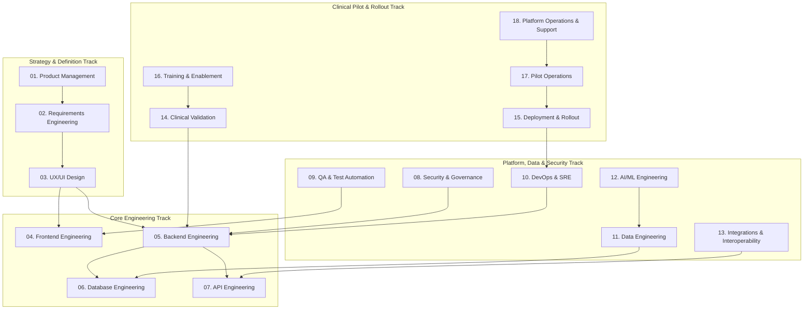

# Master Cross-Functional Workstream Delivery Plans & Squad Charters
## Namma Clinic Digital Health & Operations Platform
### Greater Bengaluru Authority (GBA) / BBMP Health Department
**Document Code:** `PLN-DOC-09` | **Status:** APPROVED BASELINE | **Date:** September 2026

---

## 1. Executive Summary & Workstream Governance Charter
This document formalizes the authoritative **Master Cross-Functional Workstream Delivery Plans and Squad Charters** for the Namma Clinic Digital Health Platform. Delivering an enterprise municipal health platform across 450+ physical clinics requires seamless synchronization across domain disciplines. This document establishes operational charters, lead role accountabilities, sprint cadence commitments, input prerequisites, output handoffs, and verification quality gates across **18 specialized workstreams**, ensuring synchronized multi-disciplinary execution throughout all 18 sprints.

### 1.1 Non-Negotiable Workstream Governance Invariants
1. **Single Point of Architectural Accountability:** Each workstream is led by a named, authoritative engineering role responsible for technical sign-off and cross-squad alignment.
2. **Contractual Input/Output Handoffs:** Workstreams interface exclusively via documented contracts, schemas, or staging artifacts; ad-hoc informal dependencies are forbidden.
3. **Mandatory Sprint Review Participation:** Every active workstream lead must participate in bi-weekly sprint reviews and present automated demonstration artifacts.
4. **Full Lineage to 52 Relational Tables:** Data and database responsibilities must trace to database entities (`TABLE-001` through `TABLE-052`).
5. **Full Lineage to 180 Product Features:** Feature delivery commitments must link to product specifications (`FEATURE-001` through `FEATURE-180`).

## 2. Multi-Workstream Orchestration Topology Diagram


### Configuration Specification Example: Workstream Charter Specification
<!-- DOCUMENTATION-ONLY EXAMPLE -->
```yaml
# DOCUMENTATION-ONLY CONFIGURATION
# DOCUMENTATION-ONLY CONFIGURATION: Workstream Charter Specification
workstream_charter:
  workstream_id: "WORKSTREAM-05"
  name: "Backend Engineering"
  lead_role: "Backend Engineer"
  squad_name: "squad_core_backend"
  objectives:
    - "Deliver high-performance Fastify REST services with sub-250ms p95 latency"
    - "Enforce strict tenant isolation and DPDP-compliant data access filters"
  handoff_contracts:
    outbound_to: "Frontend Engineering"
    schema_registry: "contracts/schemas/openapi-v3.yaml"
  exit_criteria:
    branch_coverage_pct: 90
    sonarqube_quality_gate: "PASSED"
```

## 3. Comprehensive Master Workstream Register (18 Canonical Workstreams)
Authoritative operational charters across all 18 delivery workstreams:

### WORKSTREAM-01: Product Management Workstream Charter
- **Workstream Identifier:** `WORKSTREAM-01`
- **Workstream Domain Name:** Product Management
- **Authoritative Lead Role:** `Product Manager`
- **Primary Strategic Objective:** Lead, architect, and deliver all Product Management requirements across the 18-sprint horizon.
- **Charter & Boundary Scope:** End-to-end responsibility for Product Management documentation, specifications, quality gates, and handoffs.
- **Mandatory Deliverables:** Architecture artifacts, Implementation specifications, Automated test suites, Operational runbooks
- **Sprint Execution Cadence:** Active across all Sprints 01 through 18
- **Input Dependencies:** Upstream SRS specifications, Clinical Standard Treatment Guidelines, DPDP compliance mandates
- **Output Handoff Artifacts:** Verified technical specifications to downstream squads, Deployment manifests to SRE
- **Governance Quality Gates:** 100% automated regression pass, Zero high/critical security alerts, Clinical review approval
- **Formal Exit Criteria:** All deliverables ratified and accepted into release candidate bundle.

### WORKSTREAM-02: Requirements Engineering Workstream Charter
- **Workstream Identifier:** `WORKSTREAM-02`
- **Workstream Domain Name:** Requirements Engineering
- **Authoritative Lead Role:** `Project Manager`
- **Primary Strategic Objective:** Lead, architect, and deliver all Requirements Engineering requirements across the 18-sprint horizon.
- **Charter & Boundary Scope:** End-to-end responsibility for Requirements Engineering documentation, specifications, quality gates, and handoffs.
- **Mandatory Deliverables:** Architecture artifacts, Implementation specifications, Automated test suites, Operational runbooks
- **Sprint Execution Cadence:** Active across all Sprints 01 through 18
- **Input Dependencies:** Upstream SRS specifications, Clinical Standard Treatment Guidelines, DPDP compliance mandates
- **Output Handoff Artifacts:** Verified technical specifications to downstream squads, Deployment manifests to SRE
- **Governance Quality Gates:** 100% automated regression pass, Zero high/critical security alerts, Clinical review approval
- **Formal Exit Criteria:** All deliverables ratified and accepted into release candidate bundle.

### WORKSTREAM-03: UX/UI Design Workstream Charter
- **Workstream Identifier:** `WORKSTREAM-03`
- **Workstream Domain Name:** UX/UI Design
- **Authoritative Lead Role:** `Solution Architect`
- **Primary Strategic Objective:** Lead, architect, and deliver all UX/UI Design requirements across the 18-sprint horizon.
- **Charter & Boundary Scope:** End-to-end responsibility for UX/UI Design documentation, specifications, quality gates, and handoffs.
- **Mandatory Deliverables:** Architecture artifacts, Implementation specifications, Automated test suites, Operational runbooks
- **Sprint Execution Cadence:** Active across all Sprints 01 through 18
- **Input Dependencies:** Upstream SRS specifications, Clinical Standard Treatment Guidelines, DPDP compliance mandates
- **Output Handoff Artifacts:** Verified technical specifications to downstream squads, Deployment manifests to SRE
- **Governance Quality Gates:** 100% automated regression pass, Zero high/critical security alerts, Clinical review approval
- **Formal Exit Criteria:** All deliverables ratified and accepted into release candidate bundle.

### WORKSTREAM-04: Frontend Engineering Workstream Charter
- **Workstream Identifier:** `WORKSTREAM-04`
- **Workstream Domain Name:** Frontend Engineering
- **Authoritative Lead Role:** `Technical Lead`
- **Primary Strategic Objective:** Lead, architect, and deliver all Frontend Engineering requirements across the 18-sprint horizon.
- **Charter & Boundary Scope:** End-to-end responsibility for Frontend Engineering documentation, specifications, quality gates, and handoffs.
- **Mandatory Deliverables:** Architecture artifacts, Implementation specifications, Automated test suites, Operational runbooks
- **Sprint Execution Cadence:** Active across all Sprints 01 through 18
- **Input Dependencies:** Upstream SRS specifications, Clinical Standard Treatment Guidelines, DPDP compliance mandates
- **Output Handoff Artifacts:** Verified technical specifications to downstream squads, Deployment manifests to SRE
- **Governance Quality Gates:** 100% automated regression pass, Zero high/critical security alerts, Clinical review approval
- **Formal Exit Criteria:** All deliverables ratified and accepted into release candidate bundle.

### WORKSTREAM-05: Backend Engineering Workstream Charter
- **Workstream Identifier:** `WORKSTREAM-05`
- **Workstream Domain Name:** Backend Engineering
- **Authoritative Lead Role:** `Backend Engineer`
- **Primary Strategic Objective:** Lead, architect, and deliver all Backend Engineering requirements across the 18-sprint horizon.
- **Charter & Boundary Scope:** End-to-end responsibility for Backend Engineering documentation, specifications, quality gates, and handoffs.
- **Mandatory Deliverables:** Architecture artifacts, Implementation specifications, Automated test suites, Operational runbooks
- **Sprint Execution Cadence:** Active across all Sprints 01 through 18
- **Input Dependencies:** Upstream SRS specifications, Clinical Standard Treatment Guidelines, DPDP compliance mandates
- **Output Handoff Artifacts:** Verified technical specifications to downstream squads, Deployment manifests to SRE
- **Governance Quality Gates:** 100% automated regression pass, Zero high/critical security alerts, Clinical review approval
- **Formal Exit Criteria:** All deliverables ratified and accepted into release candidate bundle.

### WORKSTREAM-06: Database Engineering Workstream Charter
- **Workstream Identifier:** `WORKSTREAM-06`
- **Workstream Domain Name:** Database Engineering
- **Authoritative Lead Role:** `Frontend Engineer`
- **Primary Strategic Objective:** Lead, architect, and deliver all Database Engineering requirements across the 18-sprint horizon.
- **Charter & Boundary Scope:** End-to-end responsibility for Database Engineering documentation, specifications, quality gates, and handoffs.
- **Mandatory Deliverables:** Architecture artifacts, Implementation specifications, Automated test suites, Operational runbooks
- **Sprint Execution Cadence:** Active across all Sprints 01 through 18
- **Input Dependencies:** Upstream SRS specifications, Clinical Standard Treatment Guidelines, DPDP compliance mandates
- **Output Handoff Artifacts:** Verified technical specifications to downstream squads, Deployment manifests to SRE
- **Governance Quality Gates:** 100% automated regression pass, Zero high/critical security alerts, Clinical review approval
- **Formal Exit Criteria:** All deliverables ratified and accepted into release candidate bundle.

### WORKSTREAM-07: API Engineering Workstream Charter
- **Workstream Identifier:** `WORKSTREAM-07`
- **Workstream Domain Name:** API Engineering
- **Authoritative Lead Role:** `Database Engineer`
- **Primary Strategic Objective:** Lead, architect, and deliver all API Engineering requirements across the 18-sprint horizon.
- **Charter & Boundary Scope:** End-to-end responsibility for API Engineering documentation, specifications, quality gates, and handoffs.
- **Mandatory Deliverables:** Architecture artifacts, Implementation specifications, Automated test suites, Operational runbooks
- **Sprint Execution Cadence:** Active across all Sprints 01 through 18
- **Input Dependencies:** Upstream SRS specifications, Clinical Standard Treatment Guidelines, DPDP compliance mandates
- **Output Handoff Artifacts:** Verified technical specifications to downstream squads, Deployment manifests to SRE
- **Governance Quality Gates:** 100% automated regression pass, Zero high/critical security alerts, Clinical review approval
- **Formal Exit Criteria:** All deliverables ratified and accepted into release candidate bundle.

### WORKSTREAM-08: Security & Governance Workstream Charter
- **Workstream Identifier:** `WORKSTREAM-08`
- **Workstream Domain Name:** Security & Governance
- **Authoritative Lead Role:** `Data Engineer`
- **Primary Strategic Objective:** Lead, architect, and deliver all Security & Governance requirements across the 18-sprint horizon.
- **Charter & Boundary Scope:** End-to-end responsibility for Security & Governance documentation, specifications, quality gates, and handoffs.
- **Mandatory Deliverables:** Architecture artifacts, Implementation specifications, Automated test suites, Operational runbooks
- **Sprint Execution Cadence:** Active across all Sprints 01 through 18
- **Input Dependencies:** Upstream SRS specifications, Clinical Standard Treatment Guidelines, DPDP compliance mandates
- **Output Handoff Artifacts:** Verified technical specifications to downstream squads, Deployment manifests to SRE
- **Governance Quality Gates:** 100% automated regression pass, Zero high/critical security alerts, Clinical review approval
- **Formal Exit Criteria:** All deliverables ratified and accepted into release candidate bundle.

### WORKSTREAM-09: QA & Test Automation Workstream Charter
- **Workstream Identifier:** `WORKSTREAM-09`
- **Workstream Domain Name:** QA & Test Automation
- **Authoritative Lead Role:** `AI/ML Engineer`
- **Primary Strategic Objective:** Lead, architect, and deliver all QA & Test Automation requirements across the 18-sprint horizon.
- **Charter & Boundary Scope:** End-to-end responsibility for QA & Test Automation documentation, specifications, quality gates, and handoffs.
- **Mandatory Deliverables:** Architecture artifacts, Implementation specifications, Automated test suites, Operational runbooks
- **Sprint Execution Cadence:** Active across all Sprints 01 through 18
- **Input Dependencies:** Upstream SRS specifications, Clinical Standard Treatment Guidelines, DPDP compliance mandates
- **Output Handoff Artifacts:** Verified technical specifications to downstream squads, Deployment manifests to SRE
- **Governance Quality Gates:** 100% automated regression pass, Zero high/critical security alerts, Clinical review approval
- **Formal Exit Criteria:** All deliverables ratified and accepted into release candidate bundle.

### WORKSTREAM-10: DevOps & SRE Workstream Charter
- **Workstream Identifier:** `WORKSTREAM-10`
- **Workstream Domain Name:** DevOps & SRE
- **Authoritative Lead Role:** `QA Engineer`
- **Primary Strategic Objective:** Lead, architect, and deliver all DevOps & SRE requirements across the 18-sprint horizon.
- **Charter & Boundary Scope:** End-to-end responsibility for DevOps & SRE documentation, specifications, quality gates, and handoffs.
- **Mandatory Deliverables:** Architecture artifacts, Implementation specifications, Automated test suites, Operational runbooks
- **Sprint Execution Cadence:** Active across all Sprints 01 through 18
- **Input Dependencies:** Upstream SRS specifications, Clinical Standard Treatment Guidelines, DPDP compliance mandates
- **Output Handoff Artifacts:** Verified technical specifications to downstream squads, Deployment manifests to SRE
- **Governance Quality Gates:** 100% automated regression pass, Zero high/critical security alerts, Clinical review approval
- **Formal Exit Criteria:** All deliverables ratified and accepted into release candidate bundle.

### WORKSTREAM-11: Data Engineering Workstream Charter
- **Workstream Identifier:** `WORKSTREAM-11`
- **Workstream Domain Name:** Data Engineering
- **Authoritative Lead Role:** `Security Engineer`
- **Primary Strategic Objective:** Lead, architect, and deliver all Data Engineering requirements across the 18-sprint horizon.
- **Charter & Boundary Scope:** End-to-end responsibility for Data Engineering documentation, specifications, quality gates, and handoffs.
- **Mandatory Deliverables:** Architecture artifacts, Implementation specifications, Automated test suites, Operational runbooks
- **Sprint Execution Cadence:** Active across all Sprints 01 through 18
- **Input Dependencies:** Upstream SRS specifications, Clinical Standard Treatment Guidelines, DPDP compliance mandates
- **Output Handoff Artifacts:** Verified technical specifications to downstream squads, Deployment manifests to SRE
- **Governance Quality Gates:** 100% automated regression pass, Zero high/critical security alerts, Clinical review approval
- **Formal Exit Criteria:** All deliverables ratified and accepted into release candidate bundle.

### WORKSTREAM-12: AI/ML Engineering Workstream Charter
- **Workstream Identifier:** `WORKSTREAM-12`
- **Workstream Domain Name:** AI/ML Engineering
- **Authoritative Lead Role:** `DevOps Engineer`
- **Primary Strategic Objective:** Lead, architect, and deliver all AI/ML Engineering requirements across the 18-sprint horizon.
- **Charter & Boundary Scope:** End-to-end responsibility for AI/ML Engineering documentation, specifications, quality gates, and handoffs.
- **Mandatory Deliverables:** Architecture artifacts, Implementation specifications, Automated test suites, Operational runbooks
- **Sprint Execution Cadence:** Active across all Sprints 01 through 18
- **Input Dependencies:** Upstream SRS specifications, Clinical Standard Treatment Guidelines, DPDP compliance mandates
- **Output Handoff Artifacts:** Verified technical specifications to downstream squads, Deployment manifests to SRE
- **Governance Quality Gates:** 100% automated regression pass, Zero high/critical security alerts, Clinical review approval
- **Formal Exit Criteria:** All deliverables ratified and accepted into release candidate bundle.

### WORKSTREAM-13: Integrations & Interoperability Workstream Charter
- **Workstream Identifier:** `WORKSTREAM-13`
- **Workstream Domain Name:** Integrations & Interoperability
- **Authoritative Lead Role:** `UX/UI Designer`
- **Primary Strategic Objective:** Lead, architect, and deliver all Integrations & Interoperability requirements across the 18-sprint horizon.
- **Charter & Boundary Scope:** End-to-end responsibility for Integrations & Interoperability documentation, specifications, quality gates, and handoffs.
- **Mandatory Deliverables:** Architecture artifacts, Implementation specifications, Automated test suites, Operational runbooks
- **Sprint Execution Cadence:** Active across all Sprints 01 through 18
- **Input Dependencies:** Upstream SRS specifications, Clinical Standard Treatment Guidelines, DPDP compliance mandates
- **Output Handoff Artifacts:** Verified technical specifications to downstream squads, Deployment manifests to SRE
- **Governance Quality Gates:** 100% automated regression pass, Zero high/critical security alerts, Clinical review approval
- **Formal Exit Criteria:** All deliverables ratified and accepted into release candidate bundle.

### WORKSTREAM-14: Clinical Validation Workstream Charter
- **Workstream Identifier:** `WORKSTREAM-14`
- **Workstream Domain Name:** Clinical Validation
- **Authoritative Lead Role:** `Business Analyst`
- **Primary Strategic Objective:** Lead, architect, and deliver all Clinical Validation requirements across the 18-sprint horizon.
- **Charter & Boundary Scope:** End-to-end responsibility for Clinical Validation documentation, specifications, quality gates, and handoffs.
- **Mandatory Deliverables:** Architecture artifacts, Implementation specifications, Automated test suites, Operational runbooks
- **Sprint Execution Cadence:** Active across all Sprints 01 through 18
- **Input Dependencies:** Upstream SRS specifications, Clinical Standard Treatment Guidelines, DPDP compliance mandates
- **Output Handoff Artifacts:** Verified technical specifications to downstream squads, Deployment manifests to SRE
- **Governance Quality Gates:** 100% automated regression pass, Zero high/critical security alerts, Clinical review approval
- **Formal Exit Criteria:** All deliverables ratified and accepted into release candidate bundle.

### WORKSTREAM-15: Deployment & Rollout Workstream Charter
- **Workstream Identifier:** `WORKSTREAM-15`
- **Workstream Domain Name:** Deployment & Rollout
- **Authoritative Lead Role:** `Clinical SME`
- **Primary Strategic Objective:** Lead, architect, and deliver all Deployment & Rollout requirements across the 18-sprint horizon.
- **Charter & Boundary Scope:** End-to-end responsibility for Deployment & Rollout documentation, specifications, quality gates, and handoffs.
- **Mandatory Deliverables:** Architecture artifacts, Implementation specifications, Automated test suites, Operational runbooks
- **Sprint Execution Cadence:** Active across all Sprints 01 through 18
- **Input Dependencies:** Upstream SRS specifications, Clinical Standard Treatment Guidelines, DPDP compliance mandates
- **Output Handoff Artifacts:** Verified technical specifications to downstream squads, Deployment manifests to SRE
- **Governance Quality Gates:** 100% automated regression pass, Zero high/critical security alerts, Clinical review approval
- **Formal Exit Criteria:** All deliverables ratified and accepted into release candidate bundle.

### WORKSTREAM-16: Training & Enablement Workstream Charter
- **Workstream Identifier:** `WORKSTREAM-16`
- **Workstream Domain Name:** Training & Enablement
- **Authoritative Lead Role:** `Integration Engineer`
- **Primary Strategic Objective:** Lead, architect, and deliver all Training & Enablement requirements across the 18-sprint horizon.
- **Charter & Boundary Scope:** End-to-end responsibility for Training & Enablement documentation, specifications, quality gates, and handoffs.
- **Mandatory Deliverables:** Architecture artifacts, Implementation specifications, Automated test suites, Operational runbooks
- **Sprint Execution Cadence:** Active across all Sprints 01 through 18
- **Input Dependencies:** Upstream SRS specifications, Clinical Standard Treatment Guidelines, DPDP compliance mandates
- **Output Handoff Artifacts:** Verified technical specifications to downstream squads, Deployment manifests to SRE
- **Governance Quality Gates:** 100% automated regression pass, Zero high/critical security alerts, Clinical review approval
- **Formal Exit Criteria:** All deliverables ratified and accepted into release candidate bundle.

### WORKSTREAM-17: Pilot Operations Workstream Charter
- **Workstream Identifier:** `WORKSTREAM-17`
- **Workstream Domain Name:** Pilot Operations
- **Authoritative Lead Role:** `Support/Operations`
- **Primary Strategic Objective:** Lead, architect, and deliver all Pilot Operations requirements across the 18-sprint horizon.
- **Charter & Boundary Scope:** End-to-end responsibility for Pilot Operations documentation, specifications, quality gates, and handoffs.
- **Mandatory Deliverables:** Architecture artifacts, Implementation specifications, Automated test suites, Operational runbooks
- **Sprint Execution Cadence:** Active across all Sprints 01 through 18
- **Input Dependencies:** Upstream SRS specifications, Clinical Standard Treatment Guidelines, DPDP compliance mandates
- **Output Handoff Artifacts:** Verified technical specifications to downstream squads, Deployment manifests to SRE
- **Governance Quality Gates:** 100% automated regression pass, Zero high/critical security alerts, Clinical review approval
- **Formal Exit Criteria:** All deliverables ratified and accepted into release candidate bundle.

### WORKSTREAM-18: Platform Operations & Support Workstream Charter
- **Workstream Identifier:** `WORKSTREAM-18`
- **Workstream Domain Name:** Platform Operations & Support
- **Authoritative Lead Role:** `Product Manager`
- **Primary Strategic Objective:** Lead, architect, and deliver all Platform Operations & Support requirements across the 18-sprint horizon.
- **Charter & Boundary Scope:** End-to-end responsibility for Platform Operations & Support documentation, specifications, quality gates, and handoffs.
- **Mandatory Deliverables:** Architecture artifacts, Implementation specifications, Automated test suites, Operational runbooks
- **Sprint Execution Cadence:** Active across all Sprints 01 through 18
- **Input Dependencies:** Upstream SRS specifications, Clinical Standard Treatment Guidelines, DPDP compliance mandates
- **Output Handoff Artifacts:** Verified technical specifications to downstream squads, Deployment manifests to SRE
- **Governance Quality Gates:** 100% automated regression pass, Zero high/critical security alerts, Clinical review approval
- **Formal Exit Criteria:** All deliverables ratified and accepted into release candidate bundle.

## 4. Multi-Workstream Sprint Engagement Matrix
Active participation of workstreams across all 18 execution sprints:

| Sprint | Focus Theme | Primary Lead Workstreams | Secondary Support Workstreams |
| :--- | :--- | :--- | :--- |
| `SPRINT-01` | Foundation Scaffolding & Architecture Readiness | Product Management, Requirements Engineering | UX/UI Design, QA, DevOps |
| `SPRINT-02` | Identity, Authentication & Security Foundation | Requirements Engineering, UX/UI Design | Frontend Engineering, QA, DevOps |
| `SPRINT-03` | Patient Registration & Demographics | UX/UI Design, Frontend Engineering | Backend Engineering, QA, DevOps |
| `SPRINT-04` | Patient Search, Repeat Visits & Consent | Frontend Engineering, Backend Engineering | Database Engineering, QA, DevOps |
| `SPRINT-05` | Token Generation & Queue Management | Backend Engineering, Database Engineering | API Engineering, QA, DevOps |
| `SPRINT-06` | Clinical Triage, Vitals & Danger Alerts | Database Engineering, API Engineering | Security & Governance, QA, DevOps |
| `SPRINT-07` | Doctor Consultation Workbench | API Engineering, Security & Governance | QA & Test Automation, QA, DevOps |
| `SPRINT-08` | Diagnosis & Electronic Prescriptions | Security & Governance, QA & Test Automation | DevOps & SRE, QA, DevOps |
| `SPRINT-09` | Pharmacy Dispensation & FEFO Allocation | QA & Test Automation, DevOps & SRE | Data Engineering, QA, DevOps |
| `SPRINT-10` | Offline-First Resilience & Sync | DevOps & SRE, Data Engineering | AI/ML Engineering, QA, DevOps |
| `SPRINT-11` | Laboratory & Point-of-Care Diagnostics | Data Engineering, AI/ML Engineering | Integrations & Interoperability, QA, DevOps |
| `SPRINT-12` | Secondary Referrals & Bilingual SMS | AI/ML Engineering, Integrations & Interoperability | Clinical Validation, QA, DevOps |
| `SPRINT-13` | Drug Inventory & Supply Chain | Integrations & Interoperability, Clinical Validation | Deployment & Rollout, QA, DevOps |
| `SPRINT-14` | Population Health Analytics & Reporting | Clinical Validation, Deployment & Rollout | Training & Enablement, QA, DevOps |
| `SPRINT-15` | AI/ML Clinical Decision Support | Deployment & Rollout, Training & Enablement | Pilot Operations, QA, DevOps |
| `SPRINT-16` | ABDM National Interoperability | Training & Enablement, Pilot Operations | Platform Operations & Support, QA, DevOps |
| `SPRINT-17` | Zero-Trust Security Hardening & DR | Pilot Operations, Platform Operations & Support | Product Management, QA, DevOps |
| `SPRINT-18` | Pilot Validation & Production Cutover | Platform Operations & Support, Product Management | Requirements Engineering, QA, DevOps |

## 5. Table-Level Workstream Lineage across all 52 Relational Tables
Engineering ownership and workstream responsibilities across all 52 database entities:

### TABLE-001: Workstream Lineage for Table `auth_users`
- **Table Identifier:** `TABLE-001` (`TBL-01`)
- **Entity Name:** `auth_users`
- **Governing Workstream:** `WORKSTREAM-01` (Product Management)
- **Accountable Lead:** `Product Manager`
- **Workstream Responsibility:** Design relational schema, write Flyway migration, and maintain integration tests.
- **Sign-Off Protocol:** Lead Database Engineer review and CI automated schema check.
- **Status:** ASSIGNED & TRACEABLE

### TABLE-002: Workstream Lineage for Table `user_credentials`
- **Table Identifier:** `TABLE-002` (`TBL-02`)
- **Entity Name:** `user_credentials`
- **Governing Workstream:** `WORKSTREAM-02` (Requirements Engineering)
- **Accountable Lead:** `Project Manager`
- **Workstream Responsibility:** Design relational schema, write Flyway migration, and maintain integration tests.
- **Sign-Off Protocol:** Lead Database Engineer review and CI automated schema check.
- **Status:** ASSIGNED & TRACEABLE

### TABLE-003: Workstream Lineage for Table `user_sessions`
- **Table Identifier:** `TABLE-003` (`TBL-03`)
- **Entity Name:** `user_sessions`
- **Governing Workstream:** `WORKSTREAM-03` (UX/UI Design)
- **Accountable Lead:** `Solution Architect`
- **Workstream Responsibility:** Design relational schema, write Flyway migration, and maintain integration tests.
- **Sign-Off Protocol:** Lead Database Engineer review and CI automated schema check.
- **Status:** ASSIGNED & TRACEABLE

### TABLE-004: Workstream Lineage for Table `roles`
- **Table Identifier:** `TABLE-004` (`TBL-04`)
- **Entity Name:** `roles`
- **Governing Workstream:** `WORKSTREAM-04` (Frontend Engineering)
- **Accountable Lead:** `Technical Lead`
- **Workstream Responsibility:** Design relational schema, write Flyway migration, and maintain integration tests.
- **Sign-Off Protocol:** Lead Database Engineer review and CI automated schema check.
- **Status:** ASSIGNED & TRACEABLE

### TABLE-005: Workstream Lineage for Table `permissions`
- **Table Identifier:** `TABLE-005` (`TBL-05`)
- **Entity Name:** `permissions`
- **Governing Workstream:** `WORKSTREAM-05` (Backend Engineering)
- **Accountable Lead:** `Backend Engineer`
- **Workstream Responsibility:** Design relational schema, write Flyway migration, and maintain integration tests.
- **Sign-Off Protocol:** Lead Database Engineer review and CI automated schema check.
- **Status:** ASSIGNED & TRACEABLE

### TABLE-006: Workstream Lineage for Table `role_permissions`
- **Table Identifier:** `TABLE-006` (`TBL-06`)
- **Entity Name:** `role_permissions`
- **Governing Workstream:** `WORKSTREAM-06` (Database Engineering)
- **Accountable Lead:** `Frontend Engineer`
- **Workstream Responsibility:** Design relational schema, write Flyway migration, and maintain integration tests.
- **Sign-Off Protocol:** Lead Database Engineer review and CI automated schema check.
- **Status:** ASSIGNED & TRACEABLE

### TABLE-007: Workstream Lineage for Table `user_roles`
- **Table Identifier:** `TABLE-007` (`TBL-07`)
- **Entity Name:** `user_roles`
- **Governing Workstream:** `WORKSTREAM-07` (API Engineering)
- **Accountable Lead:** `Database Engineer`
- **Workstream Responsibility:** Design relational schema, write Flyway migration, and maintain integration tests.
- **Sign-Off Protocol:** Lead Database Engineer review and CI automated schema check.
- **Status:** ASSIGNED & TRACEABLE

### TABLE-008: Workstream Lineage for Table `facilities`
- **Table Identifier:** `TABLE-008` (`TBL-08`)
- **Entity Name:** `facilities`
- **Governing Workstream:** `WORKSTREAM-08` (Security & Governance)
- **Accountable Lead:** `Data Engineer`
- **Workstream Responsibility:** Design relational schema, write Flyway migration, and maintain integration tests.
- **Sign-Off Protocol:** Lead Database Engineer review and CI automated schema check.
- **Status:** ASSIGNED & TRACEABLE

### TABLE-009: Workstream Lineage for Table `facility_rooms`
- **Table Identifier:** `TABLE-009` (`TBL-09`)
- **Entity Name:** `facility_rooms`
- **Governing Workstream:** `WORKSTREAM-09` (QA & Test Automation)
- **Accountable Lead:** `AI/ML Engineer`
- **Workstream Responsibility:** Design relational schema, write Flyway migration, and maintain integration tests.
- **Sign-Off Protocol:** Lead Database Engineer review and CI automated schema check.
- **Status:** ASSIGNED & TRACEABLE

### TABLE-010: Workstream Lineage for Table `staff_profiles`
- **Table Identifier:** `TABLE-010` (`TBL-10`)
- **Entity Name:** `staff_profiles`
- **Governing Workstream:** `WORKSTREAM-10` (DevOps & SRE)
- **Accountable Lead:** `QA Engineer`
- **Workstream Responsibility:** Design relational schema, write Flyway migration, and maintain integration tests.
- **Sign-Off Protocol:** Lead Database Engineer review and CI automated schema check.
- **Status:** ASSIGNED & TRACEABLE

### TABLE-011: Workstream Lineage for Table `staff_shifts`
- **Table Identifier:** `TABLE-011` (`TBL-11`)
- **Entity Name:** `staff_shifts`
- **Governing Workstream:** `WORKSTREAM-11` (Data Engineering)
- **Accountable Lead:** `Security Engineer`
- **Workstream Responsibility:** Design relational schema, write Flyway migration, and maintain integration tests.
- **Sign-Off Protocol:** Lead Database Engineer review and CI automated schema check.
- **Status:** ASSIGNED & TRACEABLE

### TABLE-012: Workstream Lineage for Table `system_configs`
- **Table Identifier:** `TABLE-012` (`TBL-12`)
- **Entity Name:** `system_configs`
- **Governing Workstream:** `WORKSTREAM-12` (AI/ML Engineering)
- **Accountable Lead:** `DevOps Engineer`
- **Workstream Responsibility:** Design relational schema, write Flyway migration, and maintain integration tests.
- **Sign-Off Protocol:** Lead Database Engineer review and CI automated schema check.
- **Status:** ASSIGNED & TRACEABLE

### TABLE-013: Workstream Lineage for Table `patients`
- **Table Identifier:** `TABLE-013` (`TBL-13`)
- **Entity Name:** `patients`
- **Governing Workstream:** `WORKSTREAM-13` (Integrations & Interoperability)
- **Accountable Lead:** `UX/UI Designer`
- **Workstream Responsibility:** Design relational schema, write Flyway migration, and maintain integration tests.
- **Sign-Off Protocol:** Lead Database Engineer review and CI automated schema check.
- **Status:** ASSIGNED & TRACEABLE

### TABLE-014: Workstream Lineage for Table `patient_identifiers`
- **Table Identifier:** `TABLE-014` (`TBL-14`)
- **Entity Name:** `patient_identifiers`
- **Governing Workstream:** `WORKSTREAM-14` (Clinical Validation)
- **Accountable Lead:** `Business Analyst`
- **Workstream Responsibility:** Design relational schema, write Flyway migration, and maintain integration tests.
- **Sign-Off Protocol:** Lead Database Engineer review and CI automated schema check.
- **Status:** ASSIGNED & TRACEABLE

### TABLE-015: Workstream Lineage for Table `patient_contacts`
- **Table Identifier:** `TABLE-015` (`TBL-15`)
- **Entity Name:** `patient_contacts`
- **Governing Workstream:** `WORKSTREAM-15` (Deployment & Rollout)
- **Accountable Lead:** `Clinical SME`
- **Workstream Responsibility:** Design relational schema, write Flyway migration, and maintain integration tests.
- **Sign-Off Protocol:** Lead Database Engineer review and CI automated schema check.
- **Status:** ASSIGNED & TRACEABLE

### TABLE-016: Workstream Lineage for Table `patient_addresses`
- **Table Identifier:** `TABLE-016` (`TBL-16`)
- **Entity Name:** `patient_addresses`
- **Governing Workstream:** `WORKSTREAM-16` (Training & Enablement)
- **Accountable Lead:** `Integration Engineer`
- **Workstream Responsibility:** Design relational schema, write Flyway migration, and maintain integration tests.
- **Sign-Off Protocol:** Lead Database Engineer review and CI automated schema check.
- **Status:** ASSIGNED & TRACEABLE

### TABLE-017: Workstream Lineage for Table `consent_records`
- **Table Identifier:** `TABLE-017` (`TBL-17`)
- **Entity Name:** `consent_records`
- **Governing Workstream:** `WORKSTREAM-17` (Pilot Operations)
- **Accountable Lead:** `Support/Operations`
- **Workstream Responsibility:** Design relational schema, write Flyway migration, and maintain integration tests.
- **Sign-Off Protocol:** Lead Database Engineer review and CI automated schema check.
- **Status:** ASSIGNED & TRACEABLE

### TABLE-018: Workstream Lineage for Table `tokens`
- **Table Identifier:** `TABLE-018` (`TBL-18`)
- **Entity Name:** `tokens`
- **Governing Workstream:** `WORKSTREAM-18` (Platform Operations & Support)
- **Accountable Lead:** `Product Manager`
- **Workstream Responsibility:** Design relational schema, write Flyway migration, and maintain integration tests.
- **Sign-Off Protocol:** Lead Database Engineer review and CI automated schema check.
- **Status:** ASSIGNED & TRACEABLE

### TABLE-019: Workstream Lineage for Table `queue_entries`
- **Table Identifier:** `TABLE-019` (`TBL-19`)
- **Entity Name:** `queue_entries`
- **Governing Workstream:** `WORKSTREAM-01` (Product Management)
- **Accountable Lead:** `Product Manager`
- **Workstream Responsibility:** Design relational schema, write Flyway migration, and maintain integration tests.
- **Sign-Off Protocol:** Lead Database Engineer review and CI automated schema check.
- **Status:** ASSIGNED & TRACEABLE

### TABLE-020: Workstream Lineage for Table `triage_assessments`
- **Table Identifier:** `TABLE-020` (`TBL-20`)
- **Entity Name:** `triage_assessments`
- **Governing Workstream:** `WORKSTREAM-02` (Requirements Engineering)
- **Accountable Lead:** `Project Manager`
- **Workstream Responsibility:** Design relational schema, write Flyway migration, and maintain integration tests.
- **Sign-Off Protocol:** Lead Database Engineer review and CI automated schema check.
- **Status:** ASSIGNED & TRACEABLE

### TABLE-021: Workstream Lineage for Table `patient_vitals`
- **Table Identifier:** `TABLE-021` (`TBL-21`)
- **Entity Name:** `patient_vitals`
- **Governing Workstream:** `WORKSTREAM-03` (UX/UI Design)
- **Accountable Lead:** `Solution Architect`
- **Workstream Responsibility:** Design relational schema, write Flyway migration, and maintain integration tests.
- **Sign-Off Protocol:** Lead Database Engineer review and CI automated schema check.
- **Status:** ASSIGNED & TRACEABLE

### TABLE-022: Workstream Lineage for Table `danger_alerts`
- **Table Identifier:** `TABLE-022` (`TBL-22`)
- **Entity Name:** `danger_alerts`
- **Governing Workstream:** `WORKSTREAM-04` (Frontend Engineering)
- **Accountable Lead:** `Technical Lead`
- **Workstream Responsibility:** Design relational schema, write Flyway migration, and maintain integration tests.
- **Sign-Off Protocol:** Lead Database Engineer review and CI automated schema check.
- **Status:** ASSIGNED & TRACEABLE

### TABLE-023: Workstream Lineage for Table `clinical_encounters`
- **Table Identifier:** `TABLE-023` (`TBL-23`)
- **Entity Name:** `clinical_encounters`
- **Governing Workstream:** `WORKSTREAM-05` (Backend Engineering)
- **Accountable Lead:** `Backend Engineer`
- **Workstream Responsibility:** Design relational schema, write Flyway migration, and maintain integration tests.
- **Sign-Off Protocol:** Lead Database Engineer review and CI automated schema check.
- **Status:** ASSIGNED & TRACEABLE

### TABLE-024: Workstream Lineage for Table `clinical_notes`
- **Table Identifier:** `TABLE-024` (`TBL-24`)
- **Entity Name:** `clinical_notes`
- **Governing Workstream:** `WORKSTREAM-06` (Database Engineering)
- **Accountable Lead:** `Frontend Engineer`
- **Workstream Responsibility:** Design relational schema, write Flyway migration, and maintain integration tests.
- **Sign-Off Protocol:** Lead Database Engineer review and CI automated schema check.
- **Status:** ASSIGNED & TRACEABLE

### TABLE-025: Workstream Lineage for Table `diagnoses`
- **Table Identifier:** `TABLE-025` (`TBL-25`)
- **Entity Name:** `diagnoses`
- **Governing Workstream:** `WORKSTREAM-07` (API Engineering)
- **Accountable Lead:** `Database Engineer`
- **Workstream Responsibility:** Design relational schema, write Flyway migration, and maintain integration tests.
- **Sign-Off Protocol:** Lead Database Engineer review and CI automated schema check.
- **Status:** ASSIGNED & TRACEABLE

### TABLE-026: Workstream Lineage for Table `prescriptions`
- **Table Identifier:** `TABLE-026` (`TBL-26`)
- **Entity Name:** `prescriptions`
- **Governing Workstream:** `WORKSTREAM-08` (Security & Governance)
- **Accountable Lead:** `Data Engineer`
- **Workstream Responsibility:** Design relational schema, write Flyway migration, and maintain integration tests.
- **Sign-Off Protocol:** Lead Database Engineer review and CI automated schema check.
- **Status:** ASSIGNED & TRACEABLE

### TABLE-027: Workstream Lineage for Table `prescription_items`
- **Table Identifier:** `TABLE-027` (`TBL-27`)
- **Entity Name:** `prescription_items`
- **Governing Workstream:** `WORKSTREAM-09` (QA & Test Automation)
- **Accountable Lead:** `AI/ML Engineer`
- **Workstream Responsibility:** Design relational schema, write Flyway migration, and maintain integration tests.
- **Sign-Off Protocol:** Lead Database Engineer review and CI automated schema check.
- **Status:** ASSIGNED & TRACEABLE

### TABLE-028: Workstream Lineage for Table `lab_orders`
- **Table Identifier:** `TABLE-028` (`TBL-28`)
- **Entity Name:** `lab_orders`
- **Governing Workstream:** `WORKSTREAM-10` (DevOps & SRE)
- **Accountable Lead:** `QA Engineer`
- **Workstream Responsibility:** Design relational schema, write Flyway migration, and maintain integration tests.
- **Sign-Off Protocol:** Lead Database Engineer review and CI automated schema check.
- **Status:** ASSIGNED & TRACEABLE

### TABLE-029: Workstream Lineage for Table `lab_order_items`
- **Table Identifier:** `TABLE-029` (`TBL-29`)
- **Entity Name:** `lab_order_items`
- **Governing Workstream:** `WORKSTREAM-11` (Data Engineering)
- **Accountable Lead:** `Security Engineer`
- **Workstream Responsibility:** Design relational schema, write Flyway migration, and maintain integration tests.
- **Sign-Off Protocol:** Lead Database Engineer review and CI automated schema check.
- **Status:** ASSIGNED & TRACEABLE

### TABLE-030: Workstream Lineage for Table `lab_results`
- **Table Identifier:** `TABLE-030` (`TBL-30`)
- **Entity Name:** `lab_results`
- **Governing Workstream:** `WORKSTREAM-12` (AI/ML Engineering)
- **Accountable Lead:** `DevOps Engineer`
- **Workstream Responsibility:** Design relational schema, write Flyway migration, and maintain integration tests.
- **Sign-Off Protocol:** Lead Database Engineer review and CI automated schema check.
- **Status:** ASSIGNED & TRACEABLE

### TABLE-031: Workstream Lineage for Table `teleconsultations`
- **Table Identifier:** `TABLE-031` (`TBL-31`)
- **Entity Name:** `teleconsultations`
- **Governing Workstream:** `WORKSTREAM-13` (Integrations & Interoperability)
- **Accountable Lead:** `UX/UI Designer`
- **Workstream Responsibility:** Design relational schema, write Flyway migration, and maintain integration tests.
- **Sign-Off Protocol:** Lead Database Engineer review and CI automated schema check.
- **Status:** ASSIGNED & TRACEABLE

### TABLE-032: Workstream Lineage for Table `formulary_drugs`
- **Table Identifier:** `TABLE-032` (`TBL-32`)
- **Entity Name:** `formulary_drugs`
- **Governing Workstream:** `WORKSTREAM-14` (Clinical Validation)
- **Accountable Lead:** `Business Analyst`
- **Workstream Responsibility:** Design relational schema, write Flyway migration, and maintain integration tests.
- **Sign-Off Protocol:** Lead Database Engineer review and CI automated schema check.
- **Status:** ASSIGNED & TRACEABLE

### TABLE-033: Workstream Lineage for Table `drug_categories`
- **Table Identifier:** `TABLE-033` (`TBL-33`)
- **Entity Name:** `drug_categories`
- **Governing Workstream:** `WORKSTREAM-15` (Deployment & Rollout)
- **Accountable Lead:** `Clinical SME`
- **Workstream Responsibility:** Design relational schema, write Flyway migration, and maintain integration tests.
- **Sign-Off Protocol:** Lead Database Engineer review and CI automated schema check.
- **Status:** ASSIGNED & TRACEABLE

### TABLE-034: Workstream Lineage for Table `pharmacy_batches`
- **Table Identifier:** `TABLE-034` (`TBL-34`)
- **Entity Name:** `pharmacy_batches`
- **Governing Workstream:** `WORKSTREAM-16` (Training & Enablement)
- **Accountable Lead:** `Integration Engineer`
- **Workstream Responsibility:** Design relational schema, write Flyway migration, and maintain integration tests.
- **Sign-Off Protocol:** Lead Database Engineer review and CI automated schema check.
- **Status:** ASSIGNED & TRACEABLE

### TABLE-035: Workstream Lineage for Table `clinic_stock`
- **Table Identifier:** `TABLE-035` (`TBL-35`)
- **Entity Name:** `clinic_stock`
- **Governing Workstream:** `WORKSTREAM-17` (Pilot Operations)
- **Accountable Lead:** `Support/Operations`
- **Workstream Responsibility:** Design relational schema, write Flyway migration, and maintain integration tests.
- **Sign-Off Protocol:** Lead Database Engineer review and CI automated schema check.
- **Status:** ASSIGNED & TRACEABLE

### TABLE-036: Workstream Lineage for Table `dispensations`
- **Table Identifier:** `TABLE-036` (`TBL-36`)
- **Entity Name:** `dispensations`
- **Governing Workstream:** `WORKSTREAM-18` (Platform Operations & Support)
- **Accountable Lead:** `Product Manager`
- **Workstream Responsibility:** Design relational schema, write Flyway migration, and maintain integration tests.
- **Sign-Off Protocol:** Lead Database Engineer review and CI automated schema check.
- **Status:** ASSIGNED & TRACEABLE

### TABLE-037: Workstream Lineage for Table `dispensation_items`
- **Table Identifier:** `TABLE-037` (`TBL-37`)
- **Entity Name:** `dispensation_items`
- **Governing Workstream:** `WORKSTREAM-01` (Product Management)
- **Accountable Lead:** `Product Manager`
- **Workstream Responsibility:** Design relational schema, write Flyway migration, and maintain integration tests.
- **Sign-Off Protocol:** Lead Database Engineer review and CI automated schema check.
- **Status:** ASSIGNED & TRACEABLE

### TABLE-038: Workstream Lineage for Table `stock_movements`
- **Table Identifier:** `TABLE-038` (`TBL-38`)
- **Entity Name:** `stock_movements`
- **Governing Workstream:** `WORKSTREAM-02` (Requirements Engineering)
- **Accountable Lead:** `Project Manager`
- **Workstream Responsibility:** Design relational schema, write Flyway migration, and maintain integration tests.
- **Sign-Off Protocol:** Lead Database Engineer review and CI automated schema check.
- **Status:** ASSIGNED & TRACEABLE

### TABLE-039: Workstream Lineage for Table `drug_indents`
- **Table Identifier:** `TABLE-039` (`TBL-39`)
- **Entity Name:** `drug_indents`
- **Governing Workstream:** `WORKSTREAM-03` (UX/UI Design)
- **Accountable Lead:** `Solution Architect`
- **Workstream Responsibility:** Design relational schema, write Flyway migration, and maintain integration tests.
- **Sign-Off Protocol:** Lead Database Engineer review and CI automated schema check.
- **Status:** ASSIGNED & TRACEABLE

### TABLE-040: Workstream Lineage for Table `indent_items`
- **Table Identifier:** `TABLE-040` (`TBL-40`)
- **Entity Name:** `indent_items`
- **Governing Workstream:** `WORKSTREAM-04` (Frontend Engineering)
- **Accountable Lead:** `Technical Lead`
- **Workstream Responsibility:** Design relational schema, write Flyway migration, and maintain integration tests.
- **Sign-Off Protocol:** Lead Database Engineer review and CI automated schema check.
- **Status:** ASSIGNED & TRACEABLE

### TABLE-041: Workstream Lineage for Table `cold_chain_devices`
- **Table Identifier:** `TABLE-041` (`TBL-41`)
- **Entity Name:** `cold_chain_devices`
- **Governing Workstream:** `WORKSTREAM-05` (Backend Engineering)
- **Accountable Lead:** `Backend Engineer`
- **Workstream Responsibility:** Design relational schema, write Flyway migration, and maintain integration tests.
- **Sign-Off Protocol:** Lead Database Engineer review and CI automated schema check.
- **Status:** ASSIGNED & TRACEABLE

### TABLE-042: Workstream Lineage for Table `cold_chain_telemetry`
- **Table Identifier:** `TABLE-042` (`TBL-42`)
- **Entity Name:** `cold_chain_telemetry`
- **Governing Workstream:** `WORKSTREAM-06` (Database Engineering)
- **Accountable Lead:** `Frontend Engineer`
- **Workstream Responsibility:** Design relational schema, write Flyway migration, and maintain integration tests.
- **Sign-Off Protocol:** Lead Database Engineer review and CI automated schema check.
- **Status:** ASSIGNED & TRACEABLE

### TABLE-043: Workstream Lineage for Table `referrals`
- **Table Identifier:** `TABLE-043` (`TBL-43`)
- **Entity Name:** `referrals`
- **Governing Workstream:** `WORKSTREAM-07` (API Engineering)
- **Accountable Lead:** `Database Engineer`
- **Workstream Responsibility:** Design relational schema, write Flyway migration, and maintain integration tests.
- **Sign-Off Protocol:** Lead Database Engineer review and CI automated schema check.
- **Status:** ASSIGNED & TRACEABLE

### TABLE-044: Workstream Lineage for Table `referral_counter_notes`
- **Table Identifier:** `TABLE-044` (`TBL-44`)
- **Entity Name:** `referral_counter_notes`
- **Governing Workstream:** `WORKSTREAM-08` (Security & Governance)
- **Accountable Lead:** `Data Engineer`
- **Workstream Responsibility:** Design relational schema, write Flyway migration, and maintain integration tests.
- **Sign-Off Protocol:** Lead Database Engineer review and CI automated schema check.
- **Status:** ASSIGNED & TRACEABLE

### TABLE-045: Workstream Lineage for Table `ncd_episodes`
- **Table Identifier:** `TABLE-045` (`TBL-45`)
- **Entity Name:** `ncd_episodes`
- **Governing Workstream:** `WORKSTREAM-09` (QA & Test Automation)
- **Accountable Lead:** `AI/ML Engineer`
- **Workstream Responsibility:** Design relational schema, write Flyway migration, and maintain integration tests.
- **Sign-Off Protocol:** Lead Database Engineer review and CI automated schema check.
- **Status:** ASSIGNED & TRACEABLE

### TABLE-046: Workstream Lineage for Table `follow_up_schedules`
- **Table Identifier:** `TABLE-046` (`TBL-46`)
- **Entity Name:** `follow_up_schedules`
- **Governing Workstream:** `WORKSTREAM-10` (DevOps & SRE)
- **Accountable Lead:** `QA Engineer`
- **Workstream Responsibility:** Design relational schema, write Flyway migration, and maintain integration tests.
- **Sign-Off Protocol:** Lead Database Engineer review and CI automated schema check.
- **Status:** ASSIGNED & TRACEABLE

### TABLE-047: Workstream Lineage for Table `notifications`
- **Table Identifier:** `TABLE-047` (`TBL-47`)
- **Entity Name:** `notifications`
- **Governing Workstream:** `WORKSTREAM-11` (Data Engineering)
- **Accountable Lead:** `Security Engineer`
- **Workstream Responsibility:** Design relational schema, write Flyway migration, and maintain integration tests.
- **Sign-Off Protocol:** Lead Database Engineer review and CI automated schema check.
- **Status:** ASSIGNED & TRACEABLE

### TABLE-048: Workstream Lineage for Table `grievances`
- **Table Identifier:** `TABLE-048` (`TBL-48`)
- **Entity Name:** `grievances`
- **Governing Workstream:** `WORKSTREAM-12` (AI/ML Engineering)
- **Accountable Lead:** `DevOps Engineer`
- **Workstream Responsibility:** Design relational schema, write Flyway migration, and maintain integration tests.
- **Sign-Off Protocol:** Lead Database Engineer review and CI automated schema check.
- **Status:** ASSIGNED & TRACEABLE

### TABLE-049: Workstream Lineage for Table `helpdesk_tickets`
- **Table Identifier:** `TABLE-049` (`TBL-49`)
- **Entity Name:** `helpdesk_tickets`
- **Governing Workstream:** `WORKSTREAM-13` (Integrations & Interoperability)
- **Accountable Lead:** `UX/UI Designer`
- **Workstream Responsibility:** Design relational schema, write Flyway migration, and maintain integration tests.
- **Sign-Off Protocol:** Lead Database Engineer review and CI automated schema check.
- **Status:** ASSIGNED & TRACEABLE

### TABLE-050: Workstream Lineage for Table `audit_events`
- **Table Identifier:** `TABLE-050` (`TBL-50`)
- **Entity Name:** `audit_events`
- **Governing Workstream:** `WORKSTREAM-14` (Clinical Validation)
- **Accountable Lead:** `Business Analyst`
- **Workstream Responsibility:** Design relational schema, write Flyway migration, and maintain integration tests.
- **Sign-Off Protocol:** Lead Database Engineer review and CI automated schema check.
- **Status:** ASSIGNED & TRACEABLE

### TABLE-051: Workstream Lineage for Table `offline_mutation_log`
- **Table Identifier:** `TABLE-051` (`TBL-51`)
- **Entity Name:** `offline_mutation_log`
- **Governing Workstream:** `WORKSTREAM-15` (Deployment & Rollout)
- **Accountable Lead:** `Clinical SME`
- **Workstream Responsibility:** Design relational schema, write Flyway migration, and maintain integration tests.
- **Sign-Off Protocol:** Lead Database Engineer review and CI automated schema check.
- **Status:** ASSIGNED & TRACEABLE

### TABLE-052: Workstream Lineage for Table `abdm_artifacts`
- **Table Identifier:** `TABLE-052` (`TBL-52`)
- **Entity Name:** `abdm_artifacts`
- **Governing Workstream:** `WORKSTREAM-16` (Training & Enablement)
- **Accountable Lead:** `Integration Engineer`
- **Workstream Responsibility:** Design relational schema, write Flyway migration, and maintain integration tests.
- **Sign-Off Protocol:** Lead Database Engineer review and CI automated schema check.
- **Status:** ASSIGNED & TRACEABLE

## 6. Product Feature Workstream Allocation across all 180 Features
Workstream squad alignment across all 180 platform product features:

### FEATURE-001: Workstream Allocation for Feature `Credential Verification`
- **Feature Identifier:** `FEATURE-001` (Feature #1)
- **Functional Module:** `MODULE-001` (DOMAIN-001)
- **Responsible Workstream:** `WORKSTREAM-01` (Product Management)
- **Accountable Squad Lead:** `Product Manager`
- **Implementation Track:** Sprint planning, user story grooming, testing, and pilot sign-off.
- **Delivery Gate:** 100% automated acceptance test pass in staging.
- **Traceability Status:** 100% VERIFIED

### FEATURE-002: Workstream Allocation for Feature `Session Token Minting`
- **Feature Identifier:** `FEATURE-002` (Feature #2)
- **Functional Module:** `MODULE-001` (DOMAIN-001)
- **Responsible Workstream:** `WORKSTREAM-02` (Requirements Engineering)
- **Accountable Squad Lead:** `Project Manager`
- **Implementation Track:** Sprint planning, user story grooming, testing, and pilot sign-off.
- **Delivery Gate:** 100% automated acceptance test pass in staging.
- **Traceability Status:** 100% VERIFIED

### FEATURE-003: Workstream Allocation for Feature `MFA Challenge Dispatch`
- **Feature Identifier:** `FEATURE-003` (Feature #3)
- **Functional Module:** `MODULE-001` (DOMAIN-001)
- **Responsible Workstream:** `WORKSTREAM-03` (UX/UI Design)
- **Accountable Squad Lead:** `Solution Architect`
- **Implementation Track:** Sprint planning, user story grooming, testing, and pilot sign-off.
- **Delivery Gate:** 100% automated acceptance test pass in staging.
- **Traceability Status:** 100% VERIFIED

### FEATURE-004: Workstream Allocation for Feature `Biometric Authentication Bridge`
- **Feature Identifier:** `FEATURE-004` (Feature #4)
- **Functional Module:** `MODULE-001` (DOMAIN-001)
- **Responsible Workstream:** `WORKSTREAM-04` (Frontend Engineering)
- **Accountable Squad Lead:** `Technical Lead`
- **Implementation Track:** Sprint planning, user story grooming, testing, and pilot sign-off.
- **Delivery Gate:** 100% automated acceptance test pass in staging.
- **Traceability Status:** 100% VERIFIED

### FEATURE-005: Workstream Allocation for Feature `Local PIN Verification`
- **Feature Identifier:** `FEATURE-005` (Feature #5)
- **Functional Module:** `MODULE-001` (DOMAIN-001)
- **Responsible Workstream:** `WORKSTREAM-05` (Backend Engineering)
- **Accountable Squad Lead:** `Backend Engineer`
- **Implementation Track:** Sprint planning, user story grooming, testing, and pilot sign-off.
- **Delivery Gate:** 100% automated acceptance test pass in staging.
- **Traceability Status:** 100% VERIFIED

### FEATURE-006: Workstream Allocation for Feature `Session Inactivity Lockout`
- **Feature Identifier:** `FEATURE-006` (Feature #6)
- **Functional Module:** `MODULE-001` (DOMAIN-001)
- **Responsible Workstream:** `WORKSTREAM-06` (Database Engineering)
- **Accountable Squad Lead:** `Frontend Engineer`
- **Implementation Track:** Sprint planning, user story grooming, testing, and pilot sign-off.
- **Delivery Gate:** 100% automated acceptance test pass in staging.
- **Traceability Status:** 100% VERIFIED

### FEATURE-007: Workstream Allocation for Feature `Permission Evaluation`
- **Feature Identifier:** `FEATURE-007` (Feature #7)
- **Functional Module:** `MODULE-002` (DOMAIN-001)
- **Responsible Workstream:** `WORKSTREAM-07` (API Engineering)
- **Accountable Squad Lead:** `Database Engineer`
- **Implementation Track:** Sprint planning, user story grooming, testing, and pilot sign-off.
- **Delivery Gate:** 100% automated acceptance test pass in staging.
- **Traceability Status:** 100% VERIFIED

### FEATURE-008: Workstream Allocation for Feature `Dynamic Role Assignment`
- **Feature Identifier:** `FEATURE-008` (Feature #8)
- **Functional Module:** `MODULE-002` (DOMAIN-001)
- **Responsible Workstream:** `WORKSTREAM-08` (Security & Governance)
- **Accountable Squad Lead:** `Data Engineer`
- **Implementation Track:** Sprint planning, user story grooming, testing, and pilot sign-off.
- **Delivery Gate:** 100% automated acceptance test pass in staging.
- **Traceability Status:** 100% VERIFIED

### FEATURE-009: Workstream Allocation for Feature `Conflict-of-Interest Prevention`
- **Feature Identifier:** `FEATURE-009` (Feature #9)
- **Functional Module:** `MODULE-002` (DOMAIN-001)
- **Responsible Workstream:** `WORKSTREAM-09` (QA & Test Automation)
- **Accountable Squad Lead:** `AI/ML Engineer`
- **Implementation Track:** Sprint planning, user story grooming, testing, and pilot sign-off.
- **Delivery Gate:** 100% automated acceptance test pass in staging.
- **Traceability Status:** 100% VERIFIED

### FEATURE-010: Workstream Allocation for Feature `Maker-Checker Authorization`
- **Feature Identifier:** `FEATURE-010` (Feature #10)
- **Functional Module:** `MODULE-002` (DOMAIN-001)
- **Responsible Workstream:** `WORKSTREAM-10` (DevOps & SRE)
- **Accountable Squad Lead:** `QA Engineer`
- **Implementation Track:** Sprint planning, user story grooming, testing, and pilot sign-off.
- **Delivery Gate:** 100% automated acceptance test pass in staging.
- **Traceability Status:** 100% VERIFIED

### FEATURE-011: Workstream Allocation for Feature `Break-Glass Privilege Elevation`
- **Feature Identifier:** `FEATURE-011` (Feature #11)
- **Functional Module:** `MODULE-002` (DOMAIN-001)
- **Responsible Workstream:** `WORKSTREAM-11` (Data Engineering)
- **Accountable Squad Lead:** `Security Engineer`
- **Implementation Track:** Sprint planning, user story grooming, testing, and pilot sign-off.
- **Delivery Gate:** 100% automated acceptance test pass in staging.
- **Traceability Status:** 100% VERIFIED

### FEATURE-012: Workstream Allocation for Feature `Privilege Elevation Audit`
- **Feature Identifier:** `FEATURE-012` (Feature #12)
- **Functional Module:** `MODULE-002` (DOMAIN-001)
- **Responsible Workstream:** `WORKSTREAM-12` (AI/ML Engineering)
- **Accountable Squad Lead:** `DevOps Engineer`
- **Implementation Track:** Sprint planning, user story grooming, testing, and pilot sign-off.
- **Delivery Gate:** 100% automated acceptance test pass in staging.
- **Traceability Status:** 100% VERIFIED

### FEATURE-013: Workstream Allocation for Feature `Hierarchy Node Management`
- **Feature Identifier:** `FEATURE-013` (Feature #13)
- **Functional Module:** `MODULE-003` (DOMAIN-001)
- **Responsible Workstream:** `WORKSTREAM-13` (Integrations & Interoperability)
- **Accountable Squad Lead:** `UX/UI Designer`
- **Implementation Track:** Sprint planning, user story grooming, testing, and pilot sign-off.
- **Delivery Gate:** 100% automated acceptance test pass in staging.
- **Traceability Status:** 100% VERIFIED

### FEATURE-014: Workstream Allocation for Feature `NIN / HFR Registry Linking`
- **Feature Identifier:** `FEATURE-014` (Feature #14)
- **Functional Module:** `MODULE-003` (DOMAIN-001)
- **Responsible Workstream:** `WORKSTREAM-14` (Clinical Validation)
- **Accountable Squad Lead:** `Business Analyst`
- **Implementation Track:** Sprint planning, user story grooming, testing, and pilot sign-off.
- **Delivery Gate:** 100% automated acceptance test pass in staging.
- **Traceability Status:** 100% VERIFIED

### FEATURE-015: Workstream Allocation for Feature `Station Terminal Mapping`
- **Feature Identifier:** `FEATURE-015` (Feature #15)
- **Functional Module:** `MODULE-003` (DOMAIN-001)
- **Responsible Workstream:** `WORKSTREAM-15` (Deployment & Rollout)
- **Accountable Squad Lead:** `Clinical SME`
- **Implementation Track:** Sprint planning, user story grooming, testing, and pilot sign-off.
- **Delivery Gate:** 100% automated acceptance test pass in staging.
- **Traceability Status:** 100% VERIFIED

### FEATURE-016: Workstream Allocation for Feature `Facility Capacity Configuration`
- **Feature Identifier:** `FEATURE-016` (Feature #16)
- **Functional Module:** `MODULE-003` (DOMAIN-001)
- **Responsible Workstream:** `WORKSTREAM-16` (Training & Enablement)
- **Accountable Squad Lead:** `Integration Engineer`
- **Implementation Track:** Sprint planning, user story grooming, testing, and pilot sign-off.
- **Delivery Gate:** 100% automated acceptance test pass in staging.
- **Traceability Status:** 100% VERIFIED

### FEATURE-017: Workstream Allocation for Feature `Operating Hours Enforcement`
- **Feature Identifier:** `FEATURE-017` (Feature #17)
- **Functional Module:** `MODULE-003` (DOMAIN-001)
- **Responsible Workstream:** `WORKSTREAM-17` (Pilot Operations)
- **Accountable Squad Lead:** `Support/Operations`
- **Implementation Track:** Sprint planning, user story grooming, testing, and pilot sign-off.
- **Delivery Gate:** 100% automated acceptance test pass in staging.
- **Traceability Status:** 100% VERIFIED

### FEATURE-018: Workstream Allocation for Feature `Special Camp Calendar`
- **Feature Identifier:** `FEATURE-018` (Feature #18)
- **Functional Module:** `MODULE-003` (DOMAIN-001)
- **Responsible Workstream:** `WORKSTREAM-18` (Platform Operations & Support)
- **Accountable Squad Lead:** `Product Manager`
- **Implementation Track:** Sprint planning, user story grooming, testing, and pilot sign-off.
- **Delivery Gate:** 100% automated acceptance test pass in staging.
- **Traceability Status:** 100% VERIFIED

### FEATURE-019: Workstream Allocation for Feature `Staff Onboarding & KYC`
- **Feature Identifier:** `FEATURE-019` (Feature #19)
- **Functional Module:** `MODULE-004` (DOMAIN-001)
- **Responsible Workstream:** `WORKSTREAM-01` (Product Management)
- **Accountable Squad Lead:** `Product Manager`
- **Implementation Track:** Sprint planning, user story grooming, testing, and pilot sign-off.
- **Delivery Gate:** 100% automated acceptance test pass in staging.
- **Traceability Status:** 100% VERIFIED

### FEATURE-020: Workstream Allocation for Feature `Professional License Verification`
- **Feature Identifier:** `FEATURE-020` (Feature #20)
- **Functional Module:** `MODULE-004` (DOMAIN-001)
- **Responsible Workstream:** `WORKSTREAM-02` (Requirements Engineering)
- **Accountable Squad Lead:** `Project Manager`
- **Implementation Track:** Sprint planning, user story grooming, testing, and pilot sign-off.
- **Delivery Gate:** 100% automated acceptance test pass in staging.
- **Traceability Status:** 100% VERIFIED

### FEATURE-021: Workstream Allocation for Feature `Duty Roster Generation`
- **Feature Identifier:** `FEATURE-021` (Feature #21)
- **Functional Module:** `MODULE-004` (DOMAIN-001)
- **Responsible Workstream:** `WORKSTREAM-03` (UX/UI Design)
- **Accountable Squad Lead:** `Solution Architect`
- **Implementation Track:** Sprint planning, user story grooming, testing, and pilot sign-off.
- **Delivery Gate:** 100% automated acceptance test pass in staging.
- **Traceability Status:** 100% VERIFIED

### FEATURE-022: Workstream Allocation for Feature `Biometric Attendance Linking`
- **Feature Identifier:** `FEATURE-022` (Feature #22)
- **Functional Module:** `MODULE-004` (DOMAIN-001)
- **Responsible Workstream:** `WORKSTREAM-04` (Frontend Engineering)
- **Accountable Squad Lead:** `Technical Lead`
- **Implementation Track:** Sprint planning, user story grooming, testing, and pilot sign-off.
- **Delivery Gate:** 100% automated acceptance test pass in staging.
- **Traceability Status:** 100% VERIFIED

### FEATURE-023: Workstream Allocation for Feature `Digital Signature Enrollment`
- **Feature Identifier:** `FEATURE-023` (Feature #23)
- **Functional Module:** `MODULE-004` (DOMAIN-001)
- **Responsible Workstream:** `WORKSTREAM-05` (Backend Engineering)
- **Accountable Squad Lead:** `Backend Engineer`
- **Implementation Track:** Sprint planning, user story grooming, testing, and pilot sign-off.
- **Delivery Gate:** 100% automated acceptance test pass in staging.
- **Traceability Status:** 100% VERIFIED

### FEATURE-024: Workstream Allocation for Feature `Signature Revocation`
- **Feature Identifier:** `FEATURE-024` (Feature #24)
- **Functional Module:** `MODULE-004` (DOMAIN-001)
- **Responsible Workstream:** `WORKSTREAM-06` (Database Engineering)
- **Accountable Squad Lead:** `Frontend Engineer`
- **Implementation Track:** Sprint planning, user story grooming, testing, and pilot sign-off.
- **Delivery Gate:** 100% automated acceptance test pass in staging.
- **Traceability Status:** 100% VERIFIED

### FEATURE-025: Workstream Allocation for Feature `Targeted Flag Activation`
- **Feature Identifier:** `FEATURE-025` (Feature #25)
- **Functional Module:** `MODULE-026` (DOMAIN-001)
- **Responsible Workstream:** `WORKSTREAM-07` (API Engineering)
- **Accountable Squad Lead:** `Database Engineer`
- **Implementation Track:** Sprint planning, user story grooming, testing, and pilot sign-off.
- **Delivery Gate:** 100% automated acceptance test pass in staging.
- **Traceability Status:** 100% VERIFIED

### FEATURE-026: Workstream Allocation for Feature `Emergency Feature Killswitch`
- **Feature Identifier:** `FEATURE-026` (Feature #26)
- **Functional Module:** `MODULE-026` (DOMAIN-001)
- **Responsible Workstream:** `WORKSTREAM-08` (Security & Governance)
- **Accountable Squad Lead:** `Data Engineer`
- **Implementation Track:** Sprint planning, user story grooming, testing, and pilot sign-off.
- **Delivery Gate:** 100% automated acceptance test pass in staging.
- **Traceability Status:** 100% VERIFIED

### FEATURE-027: Workstream Allocation for Feature `System Parameter Tuning`
- **Feature Identifier:** `FEATURE-027` (Feature #27)
- **Functional Module:** `MODULE-026` (DOMAIN-001)
- **Responsible Workstream:** `WORKSTREAM-09` (QA & Test Automation)
- **Accountable Squad Lead:** `AI/ML Engineer`
- **Implementation Track:** Sprint planning, user story grooming, testing, and pilot sign-off.
- **Delivery Gate:** 100% automated acceptance test pass in staging.
- **Traceability Status:** 100% VERIFIED

### FEATURE-028: Workstream Allocation for Feature `Edge Configuration Distribution`
- **Feature Identifier:** `FEATURE-028` (Feature #28)
- **Functional Module:** `MODULE-026` (DOMAIN-001)
- **Responsible Workstream:** `WORKSTREAM-10` (DevOps & SRE)
- **Accountable Squad Lead:** `QA Engineer`
- **Implementation Track:** Sprint planning, user story grooming, testing, and pilot sign-off.
- **Delivery Gate:** 100% automated acceptance test pass in staging.
- **Traceability Status:** 100% VERIFIED

### FEATURE-029: Workstream Allocation for Feature `Edge Migration Orchestration`
- **Feature Identifier:** `FEATURE-029` (Feature #29)
- **Functional Module:** `MODULE-026` (DOMAIN-001)
- **Responsible Workstream:** `WORKSTREAM-11` (Data Engineering)
- **Accountable Squad Lead:** `Security Engineer`
- **Implementation Track:** Sprint planning, user story grooming, testing, and pilot sign-off.
- **Delivery Gate:** 100% automated acceptance test pass in staging.
- **Traceability Status:** 100% VERIFIED

### FEATURE-030: Workstream Allocation for Feature `Health Probe Monitoring`
- **Feature Identifier:** `FEATURE-030` (Feature #30)
- **Functional Module:** `MODULE-026` (DOMAIN-001)
- **Responsible Workstream:** `WORKSTREAM-12` (AI/ML Engineering)
- **Accountable Squad Lead:** `DevOps Engineer`
- **Implementation Track:** Sprint planning, user story grooming, testing, and pilot sign-off.
- **Delivery Gate:** 100% automated acceptance test pass in staging.
- **Traceability Status:** 100% VERIFIED

### FEATURE-031: Workstream Allocation for Feature `Bilingual Intake UI`
- **Feature Identifier:** `FEATURE-031` (Feature #31)
- **Functional Module:** `MODULE-005` (DOMAIN-002)
- **Responsible Workstream:** `WORKSTREAM-13` (Integrations & Interoperability)
- **Accountable Squad Lead:** `UX/UI Designer`
- **Implementation Track:** Sprint planning, user story grooming, testing, and pilot sign-off.
- **Delivery Gate:** 100% automated acceptance test pass in staging.
- **Traceability Status:** 100% VERIFIED

### FEATURE-032: Workstream Allocation for Feature `Vulnerable Citizen Flagging`
- **Feature Identifier:** `FEATURE-032` (Feature #32)
- **Functional Module:** `MODULE-005` (DOMAIN-002)
- **Responsible Workstream:** `WORKSTREAM-14` (Clinical Validation)
- **Accountable Squad Lead:** `Business Analyst`
- **Implementation Track:** Sprint planning, user story grooming, testing, and pilot sign-off.
- **Delivery Gate:** 100% automated acceptance test pass in staging.
- **Traceability Status:** 100% VERIFIED

### FEATURE-033: Workstream Allocation for Feature `Aadhaar OTP ABHA Bridge`
- **Feature Identifier:** `FEATURE-033` (Feature #33)
- **Functional Module:** `MODULE-005` (DOMAIN-002)
- **Responsible Workstream:** `WORKSTREAM-15` (Deployment & Rollout)
- **Accountable Squad Lead:** `Clinical SME`
- **Implementation Track:** Sprint planning, user story grooming, testing, and pilot sign-off.
- **Delivery Gate:** 100% automated acceptance test pass in staging.
- **Traceability Status:** 100% VERIFIED

### FEATURE-034: Workstream Allocation for Feature `Demographic ABHA Creation`
- **Feature Identifier:** `FEATURE-034` (Feature #34)
- **Functional Module:** `MODULE-005` (DOMAIN-002)
- **Responsible Workstream:** `WORKSTREAM-16` (Training & Enablement)
- **Accountable Squad Lead:** `Integration Engineer`
- **Implementation Track:** Sprint planning, user story grooming, testing, and pilot sign-off.
- **Delivery Gate:** 100% automated acceptance test pass in staging.
- **Traceability Status:** 100% VERIFIED

### FEATURE-035: Workstream Allocation for Feature `Deterministic UHID Minting`
- **Feature Identifier:** `FEATURE-035` (Feature #35)
- **Functional Module:** `MODULE-005` (DOMAIN-002)
- **Responsible Workstream:** `WORKSTREAM-17` (Pilot Operations)
- **Accountable Squad Lead:** `Support/Operations`
- **Implementation Track:** Sprint planning, user story grooming, testing, and pilot sign-off.
- **Delivery Gate:** 100% automated acceptance test pass in staging.
- **Traceability Status:** 100% VERIFIED

### FEATURE-036: Workstream Allocation for Feature `Soundex / Double-Metaphone Matching`
- **Feature Identifier:** `FEATURE-036` (Feature #36)
- **Functional Module:** `MODULE-005` (DOMAIN-002)
- **Responsible Workstream:** `WORKSTREAM-18` (Platform Operations & Support)
- **Accountable Squad Lead:** `Product Manager`
- **Implementation Track:** Sprint planning, user story grooming, testing, and pilot sign-off.
- **Delivery Gate:** 100% automated acceptance test pass in staging.
- **Traceability Status:** 100% VERIFIED

### FEATURE-037: Workstream Allocation for Feature `Bilingual Consent Presentation`
- **Feature Identifier:** `FEATURE-037` (Feature #37)
- **Functional Module:** `MODULE-006` (DOMAIN-002)
- **Responsible Workstream:** `WORKSTREAM-01` (Product Management)
- **Accountable Squad Lead:** `Product Manager`
- **Implementation Track:** Sprint planning, user story grooming, testing, and pilot sign-off.
- **Delivery Gate:** 100% automated acceptance test pass in staging.
- **Traceability Status:** 100% VERIFIED

### FEATURE-038: Workstream Allocation for Feature `Digital Signature / Thumbprint Capture`
- **Feature Identifier:** `FEATURE-038` (Feature #38)
- **Functional Module:** `MODULE-006` (DOMAIN-002)
- **Responsible Workstream:** `WORKSTREAM-02` (Requirements Engineering)
- **Accountable Squad Lead:** `Project Manager`
- **Implementation Track:** Sprint planning, user story grooming, testing, and pilot sign-off.
- **Delivery Gate:** 100% automated acceptance test pass in staging.
- **Traceability Status:** 100% VERIFIED

### FEATURE-039: Workstream Allocation for Feature `Granular Purpose-Based Consent`
- **Feature Identifier:** `FEATURE-039` (Feature #39)
- **Functional Module:** `MODULE-006` (DOMAIN-002)
- **Responsible Workstream:** `WORKSTREAM-03` (UX/UI Design)
- **Accountable Squad Lead:** `Solution Architect`
- **Implementation Track:** Sprint planning, user story grooming, testing, and pilot sign-off.
- **Delivery Gate:** 100% automated acceptance test pass in staging.
- **Traceability Status:** 100% VERIFIED

### FEATURE-040: Workstream Allocation for Feature `Consent Revocation Workflow`
- **Feature Identifier:** `FEATURE-040` (Feature #40)
- **Functional Module:** `MODULE-006` (DOMAIN-002)
- **Responsible Workstream:** `WORKSTREAM-04` (Frontend Engineering)
- **Accountable Squad Lead:** `Technical Lead`
- **Implementation Track:** Sprint planning, user story grooming, testing, and pilot sign-off.
- **Delivery Gate:** 100% automated acceptance test pass in staging.
- **Traceability Status:** 100% VERIFIED

### FEATURE-041: Workstream Allocation for Feature `Guardian Relationship Verification`
- **Feature Identifier:** `FEATURE-041` (Feature #41)
- **Functional Module:** `MODULE-006` (DOMAIN-002)
- **Responsible Workstream:** `WORKSTREAM-05` (Backend Engineering)
- **Accountable Squad Lead:** `Backend Engineer`
- **Implementation Track:** Sprint planning, user story grooming, testing, and pilot sign-off.
- **Delivery Gate:** 100% automated acceptance test pass in staging.
- **Traceability Status:** 100% VERIFIED

### FEATURE-042: Workstream Allocation for Feature `Implied Emergency Consent`
- **Feature Identifier:** `FEATURE-042` (Feature #42)
- **Functional Module:** `MODULE-006` (DOMAIN-002)
- **Responsible Workstream:** `WORKSTREAM-06` (Database Engineering)
- **Accountable Squad Lead:** `Frontend Engineer`
- **Implementation Track:** Sprint planning, user story grooming, testing, and pilot sign-off.
- **Delivery Gate:** 100% automated acceptance test pass in staging.
- **Traceability Status:** 100% VERIFIED

### FEATURE-043: Workstream Allocation for Feature `Daily Token Counter`
- **Feature Identifier:** `FEATURE-043` (Feature #43)
- **Functional Module:** `MODULE-007` (DOMAIN-002)
- **Responsible Workstream:** `WORKSTREAM-07` (API Engineering)
- **Accountable Squad Lead:** `Database Engineer`
- **Implementation Track:** Sprint planning, user story grooming, testing, and pilot sign-off.
- **Delivery Gate:** 100% automated acceptance test pass in staging.
- **Traceability Status:** 100% VERIFIED

### FEATURE-044: Workstream Allocation for Feature `Station Route Calculation`
- **Feature Identifier:** `FEATURE-044` (Feature #44)
- **Functional Module:** `MODULE-007` (DOMAIN-002)
- **Responsible Workstream:** `WORKSTREAM-08` (Security & Governance)
- **Accountable Squad Lead:** `Data Engineer`
- **Implementation Track:** Sprint planning, user story grooming, testing, and pilot sign-off.
- **Delivery Gate:** 100% automated acceptance test pass in staging.
- **Traceability Status:** 100% VERIFIED

### FEATURE-045: Workstream Allocation for Feature `Acuity-Based Insertion`
- **Feature Identifier:** `FEATURE-045` (Feature #45)
- **Functional Module:** `MODULE-007` (DOMAIN-002)
- **Responsible Workstream:** `WORKSTREAM-09` (QA & Test Automation)
- **Accountable Squad Lead:** `AI/ML Engineer`
- **Implementation Track:** Sprint planning, user story grooming, testing, and pilot sign-off.
- **Delivery Gate:** 100% automated acceptance test pass in staging.
- **Traceability Status:** 100% VERIFIED

### FEATURE-046: Workstream Allocation for Feature `Vulnerable Citizen Interleaving`
- **Feature Identifier:** `FEATURE-046` (Feature #46)
- **Functional Module:** `MODULE-007` (DOMAIN-002)
- **Responsible Workstream:** `WORKSTREAM-10` (DevOps & SRE)
- **Accountable Squad Lead:** `QA Engineer`
- **Implementation Track:** Sprint planning, user story grooming, testing, and pilot sign-off.
- **Delivery Gate:** 100% automated acceptance test pass in staging.
- **Traceability Status:** 100% VERIFIED

### FEATURE-047: Workstream Allocation for Feature `ESC/POS Thermal Printing`
- **Feature Identifier:** `FEATURE-047` (Feature #47)
- **Functional Module:** `MODULE-007` (DOMAIN-002)
- **Responsible Workstream:** `WORKSTREAM-11` (Data Engineering)
- **Accountable Squad Lead:** `Security Engineer`
- **Implementation Track:** Sprint planning, user story grooming, testing, and pilot sign-off.
- **Delivery Gate:** 100% automated acceptance test pass in staging.
- **Traceability Status:** 100% VERIFIED

### FEATURE-048: Workstream Allocation for Feature `Virtual SMS Token Fallback`
- **Feature Identifier:** `FEATURE-048` (Feature #48)
- **Functional Module:** `MODULE-007` (DOMAIN-002)
- **Responsible Workstream:** `WORKSTREAM-12` (AI/ML Engineering)
- **Accountable Squad Lead:** `DevOps Engineer`
- **Implementation Track:** Sprint planning, user story grooming, testing, and pilot sign-off.
- **Delivery Gate:** 100% automated acceptance test pass in staging.
- **Traceability Status:** 100% VERIFIED

### FEATURE-049: Workstream Allocation for Feature `Next-Patient Call Action`
- **Feature Identifier:** `FEATURE-049` (Feature #49)
- **Functional Module:** `MODULE-008` (DOMAIN-002)
- **Responsible Workstream:** `WORKSTREAM-13` (Integrations & Interoperability)
- **Accountable Squad Lead:** `UX/UI Designer`
- **Implementation Track:** Sprint planning, user story grooming, testing, and pilot sign-off.
- **Delivery Gate:** 100% automated acceptance test pass in staging.
- **Traceability Status:** 100% VERIFIED

### FEATURE-050: Workstream Allocation for Feature `No-Show & Recall Management`
- **Feature Identifier:** `FEATURE-050` (Feature #50)
- **Functional Module:** `MODULE-008` (DOMAIN-002)
- **Responsible Workstream:** `WORKSTREAM-14` (Clinical Validation)
- **Accountable Squad Lead:** `Business Analyst`
- **Implementation Track:** Sprint planning, user story grooming, testing, and pilot sign-off.
- **Delivery Gate:** 100% automated acceptance test pass in staging.
- **Traceability Status:** 100% VERIFIED

### FEATURE-051: Workstream Allocation for Feature `HDMI Waiting Hall Display`
- **Feature Identifier:** `FEATURE-051` (Feature #51)
- **Functional Module:** `MODULE-008` (DOMAIN-002)
- **Responsible Workstream:** `WORKSTREAM-15` (Deployment & Rollout)
- **Accountable Squad Lead:** `Clinical SME`
- **Implementation Track:** Sprint planning, user story grooming, testing, and pilot sign-off.
- **Delivery Gate:** 100% automated acceptance test pass in staging.
- **Traceability Status:** 100% VERIFIED

### FEATURE-052: Workstream Allocation for Feature `Text-to-Speech Audio Chime`
- **Feature Identifier:** `FEATURE-052` (Feature #52)
- **Functional Module:** `MODULE-008` (DOMAIN-002)
- **Responsible Workstream:** `WORKSTREAM-16` (Training & Enablement)
- **Accountable Squad Lead:** `Integration Engineer`
- **Implementation Track:** Sprint planning, user story grooming, testing, and pilot sign-off.
- **Delivery Gate:** 100% automated acceptance test pass in staging.
- **Traceability Status:** 100% VERIFIED

### FEATURE-053: Workstream Allocation for Feature `Dynamic Load Distribution`
- **Feature Identifier:** `FEATURE-053` (Feature #53)
- **Functional Module:** `MODULE-008` (DOMAIN-002)
- **Responsible Workstream:** `WORKSTREAM-17` (Pilot Operations)
- **Accountable Squad Lead:** `Support/Operations`
- **Implementation Track:** Sprint planning, user story grooming, testing, and pilot sign-off.
- **Delivery Gate:** 100% automated acceptance test pass in staging.
- **Traceability Status:** 100% VERIFIED

### FEATURE-054: Workstream Allocation for Feature `Queue Pausing & Resumption`
- **Feature Identifier:** `FEATURE-054` (Feature #54)
- **Functional Module:** `MODULE-008` (DOMAIN-002)
- **Responsible Workstream:** `WORKSTREAM-18` (Platform Operations & Support)
- **Accountable Squad Lead:** `Product Manager`
- **Implementation Track:** Sprint planning, user story grooming, testing, and pilot sign-off.
- **Delivery Gate:** 100% automated acceptance test pass in staging.
- **Traceability Status:** 100% VERIFIED

### FEATURE-055: Workstream Allocation for Feature `Kiosk Exit Rating`
- **Feature Identifier:** `FEATURE-055` (Feature #55)
- **Functional Module:** `MODULE-020` (DOMAIN-002)
- **Responsible Workstream:** `WORKSTREAM-01` (Product Management)
- **Accountable Squad Lead:** `Product Manager`
- **Implementation Track:** Sprint planning, user story grooming, testing, and pilot sign-off.
- **Delivery Gate:** 100% automated acceptance test pass in staging.
- **Traceability Status:** 100% VERIFIED

### FEATURE-056: Workstream Allocation for Feature `Medicine Receipt Confirmation`
- **Feature Identifier:** `FEATURE-056` (Feature #56)
- **Functional Module:** `MODULE-020` (DOMAIN-002)
- **Responsible Workstream:** `WORKSTREAM-02` (Requirements Engineering)
- **Accountable Squad Lead:** `Project Manager`
- **Implementation Track:** Sprint planning, user story grooming, testing, and pilot sign-off.
- **Delivery Gate:** 100% automated acceptance test pass in staging.
- **Traceability Status:** 100% VERIFIED

### FEATURE-057: Workstream Allocation for Feature `Multilingual Ticket Intake`
- **Feature Identifier:** `FEATURE-057` (Feature #57)
- **Functional Module:** `MODULE-020` (DOMAIN-002)
- **Responsible Workstream:** `WORKSTREAM-03` (UX/UI Design)
- **Accountable Squad Lead:** `Solution Architect`
- **Implementation Track:** Sprint planning, user story grooming, testing, and pilot sign-off.
- **Delivery Gate:** 100% automated acceptance test pass in staging.
- **Traceability Status:** 100% VERIFIED

### FEATURE-058: Workstream Allocation for Feature `Automated SLA Timer`
- **Feature Identifier:** `FEATURE-058` (Feature #58)
- **Functional Module:** `MODULE-020` (DOMAIN-002)
- **Responsible Workstream:** `WORKSTREAM-04` (Frontend Engineering)
- **Accountable Squad Lead:** `Technical Lead`
- **Implementation Track:** Sprint planning, user story grooming, testing, and pilot sign-off.
- **Delivery Gate:** 100% automated acceptance test pass in staging.
- **Traceability Status:** 100% VERIFIED

### FEATURE-059: Workstream Allocation for Feature `Zonal Escalation Trigger`
- **Feature Identifier:** `FEATURE-059` (Feature #59)
- **Functional Module:** `MODULE-020` (DOMAIN-002)
- **Responsible Workstream:** `WORKSTREAM-05` (Backend Engineering)
- **Accountable Squad Lead:** `Backend Engineer`
- **Implementation Track:** Sprint planning, user story grooming, testing, and pilot sign-off.
- **Delivery Gate:** 100% automated acceptance test pass in staging.
- **Traceability Status:** 100% VERIFIED

### FEATURE-060: Workstream Allocation for Feature `Citizen Resolution Feedback`
- **Feature Identifier:** `FEATURE-060` (Feature #60)
- **Functional Module:** `MODULE-020` (DOMAIN-002)
- **Responsible Workstream:** `WORKSTREAM-06` (Database Engineering)
- **Accountable Squad Lead:** `Frontend Engineer`
- **Implementation Track:** Sprint planning, user story grooming, testing, and pilot sign-off.
- **Delivery Gate:** 100% automated acceptance test pass in staging.
- **Traceability Status:** 100% VERIFIED

### FEATURE-061: Workstream Allocation for Feature `Longitudinal History Viewer`
- **Feature Identifier:** `FEATURE-061` (Feature #61)
- **Functional Module:** `MODULE-009` (DOMAIN-003)
- **Responsible Workstream:** `WORKSTREAM-07` (API Engineering)
- **Accountable Squad Lead:** `Database Engineer`
- **Implementation Track:** Sprint planning, user story grooming, testing, and pilot sign-off.
- **Delivery Gate:** 100% automated acceptance test pass in staging.
- **Traceability Status:** 100% VERIFIED

### FEATURE-062: Workstream Allocation for Feature `Vitals Telemetry Banner`
- **Feature Identifier:** `FEATURE-062` (Feature #62)
- **Functional Module:** `MODULE-009` (DOMAIN-003)
- **Responsible Workstream:** `WORKSTREAM-08` (Security & Governance)
- **Accountable Squad Lead:** `Data Engineer`
- **Implementation Track:** Sprint planning, user story grooming, testing, and pilot sign-off.
- **Delivery Gate:** 100% automated acceptance test pass in staging.
- **Traceability Status:** 100% VERIFIED

### FEATURE-063: Workstream Allocation for Feature `Rapid Clinical Templates`
- **Feature Identifier:** `FEATURE-063` (Feature #63)
- **Functional Module:** `MODULE-009` (DOMAIN-003)
- **Responsible Workstream:** `WORKSTREAM-09` (QA & Test Automation)
- **Accountable Squad Lead:** `AI/ML Engineer`
- **Implementation Track:** Sprint planning, user story grooming, testing, and pilot sign-off.
- **Delivery Gate:** 100% automated acceptance test pass in staging.
- **Traceability Status:** 100% VERIFIED

### FEATURE-064: Workstream Allocation for Feature `Keyboard Shortcut Navigation`
- **Feature Identifier:** `FEATURE-064` (Feature #64)
- **Functional Module:** `MODULE-009` (DOMAIN-003)
- **Responsible Workstream:** `WORKSTREAM-10` (DevOps & SRE)
- **Accountable Squad Lead:** `QA Engineer`
- **Implementation Track:** Sprint planning, user story grooming, testing, and pilot sign-off.
- **Delivery Gate:** 100% automated acceptance test pass in staging.
- **Traceability Status:** 100% VERIFIED

### FEATURE-065: Workstream Allocation for Feature `Cryptographic Note Locking`
- **Feature Identifier:** `FEATURE-065` (Feature #65)
- **Functional Module:** `MODULE-009` (DOMAIN-003)
- **Responsible Workstream:** `WORKSTREAM-11` (Data Engineering)
- **Accountable Squad Lead:** `Security Engineer`
- **Implementation Track:** Sprint planning, user story grooming, testing, and pilot sign-off.
- **Delivery Gate:** 100% automated acceptance test pass in staging.
- **Traceability Status:** 100% VERIFIED

### FEATURE-066: Workstream Allocation for Feature `Clinical Addendum Workflow`
- **Feature Identifier:** `FEATURE-066` (Feature #66)
- **Functional Module:** `MODULE-009` (DOMAIN-003)
- **Responsible Workstream:** `WORKSTREAM-12` (AI/ML Engineering)
- **Accountable Squad Lead:** `DevOps Engineer`
- **Implementation Track:** Sprint planning, user story grooming, testing, and pilot sign-off.
- **Delivery Gate:** 100% automated acceptance test pass in staging.
- **Traceability Status:** 100% VERIFIED

### FEATURE-067: Workstream Allocation for Feature `Primary Care Curated Coding`
- **Feature Identifier:** `FEATURE-067` (Feature #67)
- **Functional Module:** `MODULE-010` (DOMAIN-003)
- **Responsible Workstream:** `WORKSTREAM-13` (Integrations & Interoperability)
- **Accountable Squad Lead:** `UX/UI Designer`
- **Implementation Track:** Sprint planning, user story grooming, testing, and pilot sign-off.
- **Delivery Gate:** 100% automated acceptance test pass in staging.
- **Traceability Status:** 100% VERIFIED

### FEATURE-068: Workstream Allocation for Feature `Synonym & Local Name Mapping`
- **Feature Identifier:** `FEATURE-068` (Feature #68)
- **Functional Module:** `MODULE-010` (DOMAIN-003)
- **Responsible Workstream:** `WORKSTREAM-14` (Clinical Validation)
- **Accountable Squad Lead:** `Business Analyst`
- **Implementation Track:** Sprint planning, user story grooming, testing, and pilot sign-off.
- **Delivery Gate:** 100% automated acceptance test pass in staging.
- **Traceability Status:** 100% VERIFIED

### FEATURE-069: Workstream Allocation for Feature `Chronic Condition Tagging`
- **Feature Identifier:** `FEATURE-069` (Feature #69)
- **Functional Module:** `MODULE-010` (DOMAIN-003)
- **Responsible Workstream:** `WORKSTREAM-15` (Deployment & Rollout)
- **Accountable Squad Lead:** `Clinical SME`
- **Implementation Track:** Sprint planning, user story grooming, testing, and pilot sign-off.
- **Delivery Gate:** 100% automated acceptance test pass in staging.
- **Traceability Status:** 100% VERIFIED

### FEATURE-070: Workstream Allocation for Feature `Provisional vs. Confirmed Status`
- **Feature Identifier:** `FEATURE-070` (Feature #70)
- **Functional Module:** `MODULE-010` (DOMAIN-003)
- **Responsible Workstream:** `WORKSTREAM-16` (Training & Enablement)
- **Accountable Squad Lead:** `Integration Engineer`
- **Implementation Track:** Sprint planning, user story grooming, testing, and pilot sign-off.
- **Delivery Gate:** 100% automated acceptance test pass in staging.
- **Traceability Status:** 100% VERIFIED

### FEATURE-071: Workstream Allocation for Feature `IDSP Notifiable Flagging`
- **Feature Identifier:** `FEATURE-071` (Feature #71)
- **Functional Module:** `MODULE-010` (DOMAIN-003)
- **Responsible Workstream:** `WORKSTREAM-17` (Pilot Operations)
- **Accountable Squad Lead:** `Support/Operations`
- **Implementation Track:** Sprint planning, user story grooming, testing, and pilot sign-off.
- **Delivery Gate:** 100% automated acceptance test pass in staging.
- **Traceability Status:** 100% VERIFIED

### FEATURE-072: Workstream Allocation for Feature `Outbreak Geographic Dispatch`
- **Feature Identifier:** `FEATURE-072` (Feature #72)
- **Functional Module:** `MODULE-010` (DOMAIN-003)
- **Responsible Workstream:** `WORKSTREAM-18` (Platform Operations & Support)
- **Accountable Squad Lead:** `Product Manager`
- **Implementation Track:** Sprint planning, user story grooming, testing, and pilot sign-off.
- **Delivery Gate:** 100% automated acceptance test pass in staging.
- **Traceability Status:** 100% VERIFIED

### FEATURE-073: Workstream Allocation for Feature `Generic Drug Selection`
- **Feature Identifier:** `FEATURE-073` (Feature #73)
- **Functional Module:** `MODULE-011` (DOMAIN-003)
- **Responsible Workstream:** `WORKSTREAM-01` (Product Management)
- **Accountable Squad Lead:** `Product Manager`
- **Implementation Track:** Sprint planning, user story grooming, testing, and pilot sign-off.
- **Delivery Gate:** 100% automated acceptance test pass in staging.
- **Traceability Status:** 100% VERIFIED

### FEATURE-074: Workstream Allocation for Feature `Standard Sig Frequency Picker`
- **Feature Identifier:** `FEATURE-074` (Feature #74)
- **Functional Module:** `MODULE-011` (DOMAIN-003)
- **Responsible Workstream:** `WORKSTREAM-02` (Requirements Engineering)
- **Accountable Squad Lead:** `Project Manager`
- **Implementation Track:** Sprint planning, user story grooming, testing, and pilot sign-off.
- **Delivery Gate:** 100% automated acceptance test pass in staging.
- **Traceability Status:** 100% VERIFIED

### FEATURE-075: Workstream Allocation for Feature `Drug-Drug Interaction Alert`
- **Feature Identifier:** `FEATURE-075` (Feature #75)
- **Functional Module:** `MODULE-011` (DOMAIN-003)
- **Responsible Workstream:** `WORKSTREAM-03` (UX/UI Design)
- **Accountable Squad Lead:** `Solution Architect`
- **Implementation Track:** Sprint planning, user story grooming, testing, and pilot sign-off.
- **Delivery Gate:** 100% automated acceptance test pass in staging.
- **Traceability Status:** 100% VERIFIED

### FEATURE-076: Workstream Allocation for Feature `Allergy Cross-Check`
- **Feature Identifier:** `FEATURE-076` (Feature #76)
- **Functional Module:** `MODULE-011` (DOMAIN-003)
- **Responsible Workstream:** `WORKSTREAM-04` (Frontend Engineering)
- **Accountable Squad Lead:** `Technical Lead`
- **Implementation Track:** Sprint planning, user story grooming, testing, and pilot sign-off.
- **Delivery Gate:** 100% automated acceptance test pass in staging.
- **Traceability Status:** 100% VERIFIED

### FEATURE-077: Workstream Allocation for Feature `Weight-Based Pediatric Dosing`
- **Feature Identifier:** `FEATURE-077` (Feature #77)
- **Functional Module:** `MODULE-011` (DOMAIN-003)
- **Responsible Workstream:** `WORKSTREAM-05` (Backend Engineering)
- **Accountable Squad Lead:** `Backend Engineer`
- **Implementation Track:** Sprint planning, user story grooming, testing, and pilot sign-off.
- **Delivery Gate:** 100% automated acceptance test pass in staging.
- **Traceability Status:** 100% VERIFIED

### FEATURE-078: Workstream Allocation for Feature `Electronic Prescription Sign & Dispatch`
- **Feature Identifier:** `FEATURE-078` (Feature #78)
- **Functional Module:** `MODULE-011` (DOMAIN-003)
- **Responsible Workstream:** `WORKSTREAM-06` (Database Engineering)
- **Accountable Squad Lead:** `Frontend Engineer`
- **Implementation Track:** Sprint planning, user story grooming, testing, and pilot sign-off.
- **Delivery Gate:** 100% automated acceptance test pass in staging.
- **Traceability Status:** 100% VERIFIED

### FEATURE-079: Workstream Allocation for Feature `Electronic Order Queue`
- **Feature Identifier:** `FEATURE-079` (Feature #79)
- **Functional Module:** `MODULE-012` (DOMAIN-003)
- **Responsible Workstream:** `WORKSTREAM-07` (API Engineering)
- **Accountable Squad Lead:** `Database Engineer`
- **Implementation Track:** Sprint planning, user story grooming, testing, and pilot sign-off.
- **Delivery Gate:** 100% automated acceptance test pass in staging.
- **Traceability Status:** 100% VERIFIED

### FEATURE-080: Workstream Allocation for Feature `Sample Barcode Labeling`
- **Feature Identifier:** `FEATURE-080` (Feature #80)
- **Functional Module:** `MODULE-012` (DOMAIN-003)
- **Responsible Workstream:** `WORKSTREAM-08` (Security & Governance)
- **Accountable Squad Lead:** `Data Engineer`
- **Implementation Track:** Sprint planning, user story grooming, testing, and pilot sign-off.
- **Delivery Gate:** 100% automated acceptance test pass in staging.
- **Traceability Status:** 100% VERIFIED

### FEATURE-081: Workstream Allocation for Feature `Rapid Diagnostic Result Entry`
- **Feature Identifier:** `FEATURE-081` (Feature #81)
- **Functional Module:** `MODULE-012` (DOMAIN-003)
- **Responsible Workstream:** `WORKSTREAM-09` (QA & Test Automation)
- **Accountable Squad Lead:** `AI/ML Engineer`
- **Implementation Track:** Sprint planning, user story grooming, testing, and pilot sign-off.
- **Delivery Gate:** 100% automated acceptance test pass in staging.
- **Traceability Status:** 100% VERIFIED

### FEATURE-082: Workstream Allocation for Feature `POC Analyzer Serial Bridge`
- **Feature Identifier:** `FEATURE-082` (Feature #82)
- **Functional Module:** `MODULE-012` (DOMAIN-003)
- **Responsible Workstream:** `WORKSTREAM-10` (DevOps & SRE)
- **Accountable Squad Lead:** `QA Engineer`
- **Implementation Track:** Sprint planning, user story grooming, testing, and pilot sign-off.
- **Delivery Gate:** 100% automated acceptance test pass in staging.
- **Traceability Status:** 100% VERIFIED

### FEATURE-083: Workstream Allocation for Feature `Panic Value Threshold Detector`
- **Feature Identifier:** `FEATURE-083` (Feature #83)
- **Functional Module:** `MODULE-012` (DOMAIN-003)
- **Responsible Workstream:** `WORKSTREAM-11` (Data Engineering)
- **Accountable Squad Lead:** `Security Engineer`
- **Implementation Track:** Sprint planning, user story grooming, testing, and pilot sign-off.
- **Delivery Gate:** 100% automated acceptance test pass in staging.
- **Traceability Status:** 100% VERIFIED

### FEATURE-084: Workstream Allocation for Feature `Urgent Doctor Notification Push`
- **Feature Identifier:** `FEATURE-084` (Feature #84)
- **Functional Module:** `MODULE-012` (DOMAIN-003)
- **Responsible Workstream:** `WORKSTREAM-12` (AI/ML Engineering)
- **Accountable Squad Lead:** `DevOps Engineer`
- **Implementation Track:** Sprint planning, user story grooming, testing, and pilot sign-off.
- **Delivery Gate:** 100% automated acceptance test pass in staging.
- **Traceability Status:** 100% VERIFIED

### FEATURE-085: Workstream Allocation for Feature `Specialist Specialty Directory`
- **Feature Identifier:** `FEATURE-085` (Feature #85)
- **Functional Module:** `MODULE-029` (DOMAIN-003)
- **Responsible Workstream:** `WORKSTREAM-13` (Integrations & Interoperability)
- **Accountable Squad Lead:** `UX/UI Designer`
- **Implementation Track:** Sprint planning, user story grooming, testing, and pilot sign-off.
- **Delivery Gate:** 100% automated acceptance test pass in staging.
- **Traceability Status:** 100% VERIFIED

### FEATURE-086: Workstream Allocation for Feature `Store-and-Forward Tele-Dermatology`
- **Feature Identifier:** `FEATURE-086` (Feature #86)
- **Functional Module:** `MODULE-029` (DOMAIN-003)
- **Responsible Workstream:** `WORKSTREAM-14` (Clinical Validation)
- **Accountable Squad Lead:** `Business Analyst`
- **Implementation Track:** Sprint planning, user story grooming, testing, and pilot sign-off.
- **Delivery Gate:** 100% automated acceptance test pass in staging.
- **Traceability Status:** 100% VERIFIED

### FEATURE-087: Workstream Allocation for Feature `Low-Bandwidth Adaptive WebRTC`
- **Feature Identifier:** `FEATURE-087` (Feature #87)
- **Functional Module:** `MODULE-029` (DOMAIN-003)
- **Responsible Workstream:** `WORKSTREAM-15` (Deployment & Rollout)
- **Accountable Squad Lead:** `Clinical SME`
- **Implementation Track:** Sprint planning, user story grooming, testing, and pilot sign-off.
- **Delivery Gate:** 100% automated acceptance test pass in staging.
- **Traceability Status:** 100% VERIFIED

### FEATURE-088: Workstream Allocation for Feature `Synchronized Clinical Note Viewer`
- **Feature Identifier:** `FEATURE-088` (Feature #88)
- **Functional Module:** `MODULE-029` (DOMAIN-003)
- **Responsible Workstream:** `WORKSTREAM-16` (Training & Enablement)
- **Accountable Squad Lead:** `Integration Engineer`
- **Implementation Track:** Sprint planning, user story grooming, testing, and pilot sign-off.
- **Delivery Gate:** 100% automated acceptance test pass in staging.
- **Traceability Status:** 100% VERIFIED

### FEATURE-089: Workstream Allocation for Feature `Specialist e-Sign Endorsement`
- **Feature Identifier:** `FEATURE-089` (Feature #89)
- **Functional Module:** `MODULE-029` (DOMAIN-003)
- **Responsible Workstream:** `WORKSTREAM-17` (Pilot Operations)
- **Accountable Squad Lead:** `Support/Operations`
- **Implementation Track:** Sprint planning, user story grooming, testing, and pilot sign-off.
- **Delivery Gate:** 100% automated acceptance test pass in staging.
- **Traceability Status:** 100% VERIFIED

### FEATURE-090: Workstream Allocation for Feature `Tele-Consultation Compliance Audit`
- **Feature Identifier:** `FEATURE-090` (Feature #90)
- **Functional Module:** `MODULE-029` (DOMAIN-003)
- **Responsible Workstream:** `WORKSTREAM-18` (Platform Operations & Support)
- **Accountable Squad Lead:** `Product Manager`
- **Implementation Track:** Sprint planning, user story grooming, testing, and pilot sign-off.
- **Delivery Gate:** 100% automated acceptance test pass in staging.
- **Traceability Status:** 100% VERIFIED

### FEATURE-091: Workstream Allocation for Feature `Pharmacy Electronic Worklist`
- **Feature Identifier:** `FEATURE-091` (Feature #91)
- **Functional Module:** `MODULE-013` (DOMAIN-004)
- **Responsible Workstream:** `WORKSTREAM-01` (Product Management)
- **Accountable Squad Lead:** `Product Manager`
- **Implementation Track:** Sprint planning, user story grooming, testing, and pilot sign-off.
- **Delivery Gate:** 100% automated acceptance test pass in staging.
- **Traceability Status:** 100% VERIFIED

### FEATURE-092: Workstream Allocation for Feature `Partial Dispense & Substitute Handling`
- **Feature Identifier:** `FEATURE-092` (Feature #92)
- **Functional Module:** `MODULE-013` (DOMAIN-004)
- **Responsible Workstream:** `WORKSTREAM-02` (Requirements Engineering)
- **Accountable Squad Lead:** `Project Manager`
- **Implementation Track:** Sprint planning, user story grooming, testing, and pilot sign-off.
- **Delivery Gate:** 100% automated acceptance test pass in staging.
- **Traceability Status:** 100% VERIFIED

### FEATURE-093: Workstream Allocation for Feature `Barcode Scanner Hardware Interface`
- **Feature Identifier:** `FEATURE-093` (Feature #93)
- **Functional Module:** `MODULE-013` (DOMAIN-004)
- **Responsible Workstream:** `WORKSTREAM-03` (UX/UI Design)
- **Accountable Squad Lead:** `Solution Architect`
- **Implementation Track:** Sprint planning, user story grooming, testing, and pilot sign-off.
- **Delivery Gate:** 100% automated acceptance test pass in staging.
- **Traceability Status:** 100% VERIFIED

### FEATURE-094: Workstream Allocation for Feature `FEFO Expiry Enforcement`
- **Feature Identifier:** `FEATURE-094` (Feature #94)
- **Functional Module:** `MODULE-013` (DOMAIN-004)
- **Responsible Workstream:** `WORKSTREAM-04` (Frontend Engineering)
- **Accountable Squad Lead:** `Technical Lead`
- **Implementation Track:** Sprint planning, user story grooming, testing, and pilot sign-off.
- **Delivery Gate:** 100% automated acceptance test pass in staging.
- **Traceability Status:** 100% VERIFIED

### FEATURE-095: Workstream Allocation for Feature `Bilingual Label Generator`
- **Feature Identifier:** `FEATURE-095` (Feature #95)
- **Functional Module:** `MODULE-013` (DOMAIN-004)
- **Responsible Workstream:** `WORKSTREAM-05` (Backend Engineering)
- **Accountable Squad Lead:** `Backend Engineer`
- **Implementation Track:** Sprint planning, user story grooming, testing, and pilot sign-off.
- **Delivery Gate:** 100% automated acceptance test pass in staging.
- **Traceability Status:** 100% VERIFIED

### FEATURE-096: Workstream Allocation for Feature `Dispense Commit & Ledger Deduction`
- **Feature Identifier:** `FEATURE-096` (Feature #96)
- **Functional Module:** `MODULE-013` (DOMAIN-004)
- **Responsible Workstream:** `WORKSTREAM-06` (Database Engineering)
- **Accountable Squad Lead:** `Frontend Engineer`
- **Implementation Track:** Sprint planning, user story grooming, testing, and pilot sign-off.
- **Delivery Gate:** 100% automated acceptance test pass in staging.
- **Traceability Status:** 100% VERIFIED

### FEATURE-097: Workstream Allocation for Feature `Perpetual Stock Balance Tracking`
- **Feature Identifier:** `FEATURE-097` (Feature #97)
- **Functional Module:** `MODULE-014` (DOMAIN-004)
- **Responsible Workstream:** `WORKSTREAM-07` (API Engineering)
- **Accountable Squad Lead:** `Database Engineer`
- **Implementation Track:** Sprint planning, user story grooming, testing, and pilot sign-off.
- **Delivery Gate:** 100% automated acceptance test pass in staging.
- **Traceability Status:** 100% VERIFIED

### FEATURE-098: Workstream Allocation for Feature `Low Stock Threshold Alert`
- **Feature Identifier:** `FEATURE-098` (Feature #98)
- **Functional Module:** `MODULE-014` (DOMAIN-004)
- **Responsible Workstream:** `WORKSTREAM-08` (Security & Governance)
- **Accountable Squad Lead:** `Data Engineer`
- **Implementation Track:** Sprint planning, user story grooming, testing, and pilot sign-off.
- **Delivery Gate:** 100% automated acceptance test pass in staging.
- **Traceability Status:** 100% VERIFIED

### FEATURE-099: Workstream Allocation for Feature `Automated FEFO Shelf Guidance`
- **Feature Identifier:** `FEATURE-099` (Feature #99)
- **Functional Module:** `MODULE-014` (DOMAIN-004)
- **Responsible Workstream:** `WORKSTREAM-09` (QA & Test Automation)
- **Accountable Squad Lead:** `AI/ML Engineer`
- **Implementation Track:** Sprint planning, user story grooming, testing, and pilot sign-off.
- **Delivery Gate:** 100% automated acceptance test pass in staging.
- **Traceability Status:** 100% VERIFIED

### FEATURE-100: Workstream Allocation for Feature `Expired Drug Quarantine Lock`
- **Feature Identifier:** `FEATURE-100` (Feature #100)
- **Functional Module:** `MODULE-014` (DOMAIN-004)
- **Responsible Workstream:** `WORKSTREAM-10` (DevOps & SRE)
- **Accountable Squad Lead:** `QA Engineer`
- **Implementation Track:** Sprint planning, user story grooming, testing, and pilot sign-off.
- **Delivery Gate:** 100% automated acceptance test pass in staging.
- **Traceability Status:** 100% VERIFIED

### FEATURE-101: Workstream Allocation for Feature `Physical Stock Count Sheet`
- **Feature Identifier:** `FEATURE-101` (Feature #101)
- **Functional Module:** `MODULE-014` (DOMAIN-004)
- **Responsible Workstream:** `WORKSTREAM-11` (Data Engineering)
- **Accountable Squad Lead:** `Security Engineer`
- **Implementation Track:** Sprint planning, user story grooming, testing, and pilot sign-off.
- **Delivery Gate:** 100% automated acceptance test pass in staging.
- **Traceability Status:** 100% VERIFIED

### FEATURE-102: Workstream Allocation for Feature `Variance Adjustment Signoff`
- **Feature Identifier:** `FEATURE-102` (Feature #102)
- **Functional Module:** `MODULE-014` (DOMAIN-004)
- **Responsible Workstream:** `WORKSTREAM-12` (AI/ML Engineering)
- **Accountable Squad Lead:** `DevOps Engineer`
- **Implementation Track:** Sprint planning, user story grooming, testing, and pilot sign-off.
- **Delivery Gate:** 100% automated acceptance test pass in staging.
- **Traceability Status:** 100% VERIFIED

### FEATURE-103: Workstream Allocation for Feature `Automated Reorder Quantity Formula`
- **Feature Identifier:** `FEATURE-103` (Feature #103)
- **Functional Module:** `MODULE-015` (DOMAIN-004)
- **Responsible Workstream:** `WORKSTREAM-13` (Integrations & Interoperability)
- **Accountable Squad Lead:** `UX/UI Designer`
- **Implementation Track:** Sprint planning, user story grooming, testing, and pilot sign-off.
- **Delivery Gate:** 100% automated acceptance test pass in staging.
- **Traceability Status:** 100% VERIFIED

### FEATURE-104: Workstream Allocation for Feature `Emergency Indent Escalation`
- **Feature Identifier:** `FEATURE-104` (Feature #104)
- **Functional Module:** `MODULE-015` (DOMAIN-004)
- **Responsible Workstream:** `WORKSTREAM-14` (Clinical Validation)
- **Accountable Squad Lead:** `Business Analyst`
- **Implementation Track:** Sprint planning, user story grooming, testing, and pilot sign-off.
- **Delivery Gate:** 100% automated acceptance test pass in staging.
- **Traceability Status:** 100% VERIFIED

### FEATURE-105: Workstream Allocation for Feature `Electronic Delivery Challan Inward`
- **Feature Identifier:** `FEATURE-105` (Feature #105)
- **Functional Module:** `MODULE-015` (DOMAIN-004)
- **Responsible Workstream:** `WORKSTREAM-15` (Deployment & Rollout)
- **Accountable Squad Lead:** `Clinical SME`
- **Implementation Track:** Sprint planning, user story grooming, testing, and pilot sign-off.
- **Delivery Gate:** 100% automated acceptance test pass in staging.
- **Traceability Status:** 100% VERIFIED

### FEATURE-106: Workstream Allocation for Feature `Carton Barcode Verification`
- **Feature Identifier:** `FEATURE-106` (Feature #106)
- **Functional Module:** `MODULE-015` (DOMAIN-004)
- **Responsible Workstream:** `WORKSTREAM-16` (Training & Enablement)
- **Accountable Squad Lead:** `Integration Engineer`
- **Implementation Track:** Sprint planning, user story grooming, testing, and pilot sign-off.
- **Delivery Gate:** 100% automated acceptance test pass in staging.
- **Traceability Status:** 100% VERIFIED

### FEATURE-107: Workstream Allocation for Feature `IoT Temperature Sensor Bridge`
- **Feature Identifier:** `FEATURE-107` (Feature #107)
- **Functional Module:** `MODULE-015` (DOMAIN-004)
- **Responsible Workstream:** `WORKSTREAM-17` (Pilot Operations)
- **Accountable Squad Lead:** `Support/Operations`
- **Implementation Track:** Sprint planning, user story grooming, testing, and pilot sign-off.
- **Delivery Gate:** 100% automated acceptance test pass in staging.
- **Traceability Status:** 100% VERIFIED

### FEATURE-108: Workstream Allocation for Feature `Thermal Breach SMS Alert`
- **Feature Identifier:** `FEATURE-108` (Feature #108)
- **Functional Module:** `MODULE-015` (DOMAIN-004)
- **Responsible Workstream:** `WORKSTREAM-18` (Platform Operations & Support)
- **Accountable Squad Lead:** `Product Manager`
- **Implementation Track:** Sprint planning, user story grooming, testing, and pilot sign-off.
- **Delivery Gate:** 100% automated acceptance test pass in staging.
- **Traceability Status:** 100% VERIFIED

### FEATURE-109: Workstream Allocation for Feature `Central Formulary Publishing`
- **Feature Identifier:** `FEATURE-109` (Feature #109)
- **Functional Module:** `MODULE-016` (DOMAIN-004)
- **Responsible Workstream:** `WORKSTREAM-01` (Product Management)
- **Accountable Squad Lead:** `Product Manager`
- **Implementation Track:** Sprint planning, user story grooming, testing, and pilot sign-off.
- **Delivery Gate:** 100% automated acceptance test pass in staging.
- **Traceability Status:** 100% VERIFIED

### FEATURE-110: Workstream Allocation for Feature `Dosage Unit Standardization`
- **Feature Identifier:** `FEATURE-110` (Feature #110)
- **Functional Module:** `MODULE-016` (DOMAIN-004)
- **Responsible Workstream:** `WORKSTREAM-02` (Requirements Engineering)
- **Accountable Squad Lead:** `Project Manager`
- **Implementation Track:** Sprint planning, user story grooming, testing, and pilot sign-off.
- **Delivery Gate:** 100% automated acceptance test pass in staging.
- **Traceability Status:** 100% VERIFIED

### FEATURE-111: Workstream Allocation for Feature `Brand Cross-Reference Search`
- **Feature Identifier:** `FEATURE-111` (Feature #111)
- **Functional Module:** `MODULE-016` (DOMAIN-004)
- **Responsible Workstream:** `WORKSTREAM-03` (UX/UI Design)
- **Accountable Squad Lead:** `Solution Architect`
- **Implementation Track:** Sprint planning, user story grooming, testing, and pilot sign-off.
- **Delivery Gate:** 100% automated acceptance test pass in staging.
- **Traceability Status:** 100% VERIFIED

### FEATURE-112: Workstream Allocation for Feature `Controlled Drug Scheduling Flag`
- **Feature Identifier:** `FEATURE-112` (Feature #112)
- **Functional Module:** `MODULE-016` (DOMAIN-004)
- **Responsible Workstream:** `WORKSTREAM-04` (Frontend Engineering)
- **Accountable Squad Lead:** `Technical Lead`
- **Implementation Track:** Sprint planning, user story grooming, testing, and pilot sign-off.
- **Delivery Gate:** 100% automated acceptance test pass in staging.
- **Traceability Status:** 100% VERIFIED

### FEATURE-113: Workstream Allocation for Feature `Approved Substitution Matrix`
- **Feature Identifier:** `FEATURE-113` (Feature #113)
- **Functional Module:** `MODULE-016` (DOMAIN-004)
- **Responsible Workstream:** `WORKSTREAM-05` (Backend Engineering)
- **Accountable Squad Lead:** `Backend Engineer`
- **Implementation Track:** Sprint planning, user story grooming, testing, and pilot sign-off.
- **Delivery Gate:** 100% automated acceptance test pass in staging.
- **Traceability Status:** 100% VERIFIED

### FEATURE-114: Workstream Allocation for Feature `Formulary Restriction Enforcer`
- **Feature Identifier:** `FEATURE-114` (Feature #114)
- **Functional Module:** `MODULE-016` (DOMAIN-004)
- **Responsible Workstream:** `WORKSTREAM-06` (Database Engineering)
- **Accountable Squad Lead:** `Frontend Engineer`
- **Implementation Track:** Sprint planning, user story grooming, testing, and pilot sign-off.
- **Delivery Gate:** 100% automated acceptance test pass in staging.
- **Traceability Status:** 100% VERIFIED

### FEATURE-115: Workstream Allocation for Feature `SBAR Summary Generation`
- **Feature Identifier:** `FEATURE-115` (Feature #115)
- **Functional Module:** `MODULE-017` (DOMAIN-005)
- **Responsible Workstream:** `WORKSTREAM-07` (API Engineering)
- **Accountable Squad Lead:** `Database Engineer`
- **Implementation Track:** Sprint planning, user story grooming, testing, and pilot sign-off.
- **Delivery Gate:** 100% automated acceptance test pass in staging.
- **Traceability Status:** 100% VERIFIED

### FEATURE-116: Workstream Allocation for Feature `Receiving Hospital Capacity Check`
- **Feature Identifier:** `FEATURE-116` (Feature #116)
- **Functional Module:** `MODULE-017` (DOMAIN-005)
- **Responsible Workstream:** `WORKSTREAM-08` (Security & Governance)
- **Accountable Squad Lead:** `Data Engineer`
- **Implementation Track:** Sprint planning, user story grooming, testing, and pilot sign-off.
- **Delivery Gate:** 100% automated acceptance test pass in staging.
- **Traceability Status:** 100% VERIFIED

### FEATURE-117: Workstream Allocation for Feature `108 Ambulance CAD Integration`
- **Feature Identifier:** `FEATURE-117` (Feature #117)
- **Functional Module:** `MODULE-017` (DOMAIN-005)
- **Responsible Workstream:** `WORKSTREAM-09` (QA & Test Automation)
- **Accountable Squad Lead:** `AI/ML Engineer`
- **Implementation Track:** Sprint planning, user story grooming, testing, and pilot sign-off.
- **Delivery Gate:** 100% automated acceptance test pass in staging.
- **Traceability Status:** 100% VERIFIED

### FEATURE-118: Workstream Allocation for Feature `Ambulance ETA Telemetry`
- **Feature Identifier:** `FEATURE-118` (Feature #118)
- **Functional Module:** `MODULE-017` (DOMAIN-005)
- **Responsible Workstream:** `WORKSTREAM-10` (DevOps & SRE)
- **Accountable Squad Lead:** `QA Engineer`
- **Implementation Track:** Sprint planning, user story grooming, testing, and pilot sign-off.
- **Delivery Gate:** 100% automated acceptance test pass in staging.
- **Traceability Status:** 100% VERIFIED

### FEATURE-119: Workstream Allocation for Feature `Referral Handover Verification`
- **Feature Identifier:** `FEATURE-119` (Feature #119)
- **Functional Module:** `MODULE-017` (DOMAIN-005)
- **Responsible Workstream:** `WORKSTREAM-11` (Data Engineering)
- **Accountable Squad Lead:** `Security Engineer`
- **Implementation Track:** Sprint planning, user story grooming, testing, and pilot sign-off.
- **Delivery Gate:** 100% automated acceptance test pass in staging.
- **Traceability Status:** 100% VERIFIED

### FEATURE-120: Workstream Allocation for Feature `Post-Referral Counter-Referral Push`
- **Feature Identifier:** `FEATURE-120` (Feature #120)
- **Functional Module:** `MODULE-017` (DOMAIN-005)
- **Responsible Workstream:** `WORKSTREAM-12` (AI/ML Engineering)
- **Accountable Squad Lead:** `DevOps Engineer`
- **Implementation Track:** Sprint planning, user story grooming, testing, and pilot sign-off.
- **Delivery Gate:** 100% automated acceptance test pass in staging.
- **Traceability Status:** 100% VERIFIED

### FEATURE-121: Workstream Allocation for Feature `NCD Target Protocol Tracking`
- **Feature Identifier:** `FEATURE-121` (Feature #121)
- **Functional Module:** `MODULE-018` (DOMAIN-005)
- **Responsible Workstream:** `WORKSTREAM-13` (Integrations & Interoperability)
- **Accountable Squad Lead:** `UX/UI Designer`
- **Implementation Track:** Sprint planning, user story grooming, testing, and pilot sign-off.
- **Delivery Gate:** 100% automated acceptance test pass in staging.
- **Traceability Status:** 100% VERIFIED

### FEATURE-122: Workstream Allocation for Feature `Medication Possession Ratio (MPR)`
- **Feature Identifier:** `FEATURE-122` (Feature #122)
- **Functional Module:** `MODULE-018` (DOMAIN-005)
- **Responsible Workstream:** `WORKSTREAM-14` (Clinical Validation)
- **Accountable Squad Lead:** `Business Analyst`
- **Implementation Track:** Sprint planning, user story grooming, testing, and pilot sign-off.
- **Delivery Gate:** 100% automated acceptance test pass in staging.
- **Traceability Status:** 100% VERIFIED

### FEATURE-123: Workstream Allocation for Feature `Automated 30-Day Refill Scheduling`
- **Feature Identifier:** `FEATURE-123` (Feature #123)
- **Functional Module:** `MODULE-018` (DOMAIN-005)
- **Responsible Workstream:** `WORKSTREAM-15` (Deployment & Rollout)
- **Accountable Squad Lead:** `Clinical SME`
- **Implementation Track:** Sprint planning, user story grooming, testing, and pilot sign-off.
- **Delivery Gate:** 100% automated acceptance test pass in staging.
- **Traceability Status:** 100% VERIFIED

### FEATURE-124: Workstream Allocation for Feature `Overdue Defaulter Detector`
- **Feature Identifier:** `FEATURE-124` (Feature #124)
- **Functional Module:** `MODULE-018` (DOMAIN-005)
- **Responsible Workstream:** `WORKSTREAM-16` (Training & Enablement)
- **Accountable Squad Lead:** `Integration Engineer`
- **Implementation Track:** Sprint planning, user story grooming, testing, and pilot sign-off.
- **Delivery Gate:** 100% automated acceptance test pass in staging.
- **Traceability Status:** 100% VERIFIED

### FEATURE-125: Workstream Allocation for Feature `ASHA Ward Tracing Export`
- **Feature Identifier:** `FEATURE-125` (Feature #125)
- **Functional Module:** `MODULE-018` (DOMAIN-005)
- **Responsible Workstream:** `WORKSTREAM-17` (Pilot Operations)
- **Accountable Squad Lead:** `Support/Operations`
- **Implementation Track:** Sprint planning, user story grooming, testing, and pilot sign-off.
- **Delivery Gate:** 100% automated acceptance test pass in staging.
- **Traceability Status:** 100% VERIFIED

### FEATURE-126: Workstream Allocation for Feature `Home Visit Adherence Verification`
- **Feature Identifier:** `FEATURE-126` (Feature #126)
- **Functional Module:** `MODULE-018` (DOMAIN-005)
- **Responsible Workstream:** `WORKSTREAM-18` (Platform Operations & Support)
- **Accountable Squad Lead:** `Product Manager`
- **Implementation Track:** Sprint planning, user story grooming, testing, and pilot sign-off.
- **Delivery Gate:** 100% automated acceptance test pass in staging.
- **Traceability Status:** 100% VERIFIED

### FEATURE-127: Workstream Allocation for Feature `DLT-Compliant Bilingual SMS`
- **Feature Identifier:** `FEATURE-127` (Feature #127)
- **Functional Module:** `MODULE-019` (DOMAIN-005)
- **Responsible Workstream:** `WORKSTREAM-01` (Product Management)
- **Accountable Squad Lead:** `Product Manager`
- **Implementation Track:** Sprint planning, user story grooming, testing, and pilot sign-off.
- **Delivery Gate:** 100% automated acceptance test pass in staging.
- **Traceability Status:** 100% VERIFIED

### FEATURE-128: Workstream Allocation for Feature `Queue Delay Alert`
- **Feature Identifier:** `FEATURE-128` (Feature #128)
- **Functional Module:** `MODULE-019` (DOMAIN-005)
- **Responsible Workstream:** `WORKSTREAM-02` (Requirements Engineering)
- **Accountable Squad Lead:** `Project Manager`
- **Implementation Track:** Sprint planning, user story grooming, testing, and pilot sign-off.
- **Delivery Gate:** 100% automated acceptance test pass in staging.
- **Traceability Status:** 100% VERIFIED

### FEATURE-129: Workstream Allocation for Feature `Lab Report PDF Download via WhatsApp`
- **Feature Identifier:** `FEATURE-129` (Feature #129)
- **Functional Module:** `MODULE-019` (DOMAIN-005)
- **Responsible Workstream:** `WORKSTREAM-03` (UX/UI Design)
- **Accountable Squad Lead:** `Solution Architect`
- **Implementation Track:** Sprint planning, user story grooming, testing, and pilot sign-off.
- **Delivery Gate:** 100% automated acceptance test pass in staging.
- **Traceability Status:** 100% VERIFIED

### FEATURE-130: Workstream Allocation for Feature `Queue Position Bot`
- **Feature Identifier:** `FEATURE-130` (Feature #130)
- **Functional Module:** `MODULE-019` (DOMAIN-005)
- **Responsible Workstream:** `WORKSTREAM-04` (Frontend Engineering)
- **Accountable Squad Lead:** `Technical Lead`
- **Implementation Track:** Sprint planning, user story grooming, testing, and pilot sign-off.
- **Delivery Gate:** 100% automated acceptance test pass in staging.
- **Traceability Status:** 100% VERIFIED

### FEATURE-131: Workstream Allocation for Feature `Targeted Ward Health Advisory`
- **Feature Identifier:** `FEATURE-131` (Feature #131)
- **Functional Module:** `MODULE-019` (DOMAIN-005)
- **Responsible Workstream:** `WORKSTREAM-05` (Backend Engineering)
- **Accountable Squad Lead:** `Backend Engineer`
- **Implementation Track:** Sprint planning, user story grooming, testing, and pilot sign-off.
- **Delivery Gate:** 100% automated acceptance test pass in staging.
- **Traceability Status:** 100% VERIFIED

### FEATURE-132: Workstream Allocation for Feature `Opt-Out Preference Management`
- **Feature Identifier:** `FEATURE-132` (Feature #132)
- **Functional Module:** `MODULE-019` (DOMAIN-005)
- **Responsible Workstream:** `WORKSTREAM-06` (Database Engineering)
- **Accountable Squad Lead:** `Frontend Engineer`
- **Implementation Track:** Sprint planning, user story grooming, testing, and pilot sign-off.
- **Delivery Gate:** 100% automated acceptance test pass in staging.
- **Traceability Status:** 100% VERIFIED

### FEATURE-133: Workstream Allocation for Feature `1-Click Diagnostic Dump`
- **Feature Identifier:** `FEATURE-133` (Feature #133)
- **Functional Module:** `MODULE-028` (DOMAIN-005)
- **Responsible Workstream:** `WORKSTREAM-07` (API Engineering)
- **Accountable Squad Lead:** `Database Engineer`
- **Implementation Track:** Sprint planning, user story grooming, testing, and pilot sign-off.
- **Delivery Gate:** 100% automated acceptance test pass in staging.
- **Traceability Status:** 100% VERIFIED

### FEATURE-134: Workstream Allocation for Feature `Peripheral Self-Test Wizard`
- **Feature Identifier:** `FEATURE-134` (Feature #134)
- **Functional Module:** `MODULE-028` (DOMAIN-005)
- **Responsible Workstream:** `WORKSTREAM-08` (Security & Governance)
- **Accountable Squad Lead:** `Data Engineer`
- **Implementation Track:** Sprint planning, user story grooming, testing, and pilot sign-off.
- **Delivery Gate:** 100% automated acceptance test pass in staging.
- **Traceability Status:** 100% VERIFIED

### FEATURE-135: Workstream Allocation for Feature `Zonal Field Engineer Dispatch`
- **Feature Identifier:** `FEATURE-135` (Feature #135)
- **Functional Module:** `MODULE-028` (DOMAIN-005)
- **Responsible Workstream:** `WORKSTREAM-09` (QA & Test Automation)
- **Accountable Squad Lead:** `AI/ML Engineer`
- **Implementation Track:** Sprint planning, user story grooming, testing, and pilot sign-off.
- **Delivery Gate:** 100% automated acceptance test pass in staging.
- **Traceability Status:** 100% VERIFIED

### FEATURE-136: Workstream Allocation for Feature `SLA Clock & Breach Escalation`
- **Feature Identifier:** `FEATURE-136` (Feature #136)
- **Functional Module:** `MODULE-028` (DOMAIN-005)
- **Responsible Workstream:** `WORKSTREAM-10` (DevOps & SRE)
- **Accountable Squad Lead:** `QA Engineer`
- **Implementation Track:** Sprint planning, user story grooming, testing, and pilot sign-off.
- **Delivery Gate:** 100% automated acceptance test pass in staging.
- **Traceability Status:** 100% VERIFIED

### FEATURE-137: Workstream Allocation for Feature `Hardware Asset Lifecycle Tracking`
- **Feature Identifier:** `FEATURE-137` (Feature #137)
- **Functional Module:** `MODULE-028` (DOMAIN-005)
- **Responsible Workstream:** `WORKSTREAM-11` (Data Engineering)
- **Accountable Squad Lead:** `Security Engineer`
- **Implementation Track:** Sprint planning, user story grooming, testing, and pilot sign-off.
- **Delivery Gate:** 100% automated acceptance test pass in staging.
- **Traceability Status:** 100% VERIFIED

### FEATURE-138: Workstream Allocation for Feature `Preventive Maintenance Scheduler`
- **Feature Identifier:** `FEATURE-138` (Feature #138)
- **Functional Module:** `MODULE-028` (DOMAIN-005)
- **Responsible Workstream:** `WORKSTREAM-12` (AI/ML Engineering)
- **Accountable Squad Lead:** `DevOps Engineer`
- **Implementation Track:** Sprint planning, user story grooming, testing, and pilot sign-off.
- **Delivery Gate:** 100% automated acceptance test pass in staging.
- **Traceability Status:** 100% VERIFIED

### FEATURE-139: Workstream Allocation for Feature `Sequential Hash Chaining`
- **Feature Identifier:** `FEATURE-139` (Feature #139)
- **Functional Module:** `MODULE-021` (DOMAIN-006)
- **Responsible Workstream:** `WORKSTREAM-13` (Integrations & Interoperability)
- **Accountable Squad Lead:** `UX/UI Designer`
- **Implementation Track:** Sprint planning, user story grooming, testing, and pilot sign-off.
- **Delivery Gate:** 100% automated acceptance test pass in staging.
- **Traceability Status:** 100% VERIFIED

### FEATURE-140: Workstream Allocation for Feature `Zero-Plaintext PHI Masking`
- **Feature Identifier:** `FEATURE-140` (Feature #140)
- **Functional Module:** `MODULE-021` (DOMAIN-006)
- **Responsible Workstream:** `WORKSTREAM-14` (Clinical Validation)
- **Accountable Squad Lead:** `Business Analyst`
- **Implementation Track:** Sprint planning, user story grooming, testing, and pilot sign-off.
- **Delivery Gate:** 100% automated acceptance test pass in staging.
- **Traceability Status:** 100% VERIFIED

### FEATURE-141: Workstream Allocation for Feature `Ledger Integrity Verification`
- **Feature Identifier:** `FEATURE-141` (Feature #141)
- **Functional Module:** `MODULE-021` (DOMAIN-006)
- **Responsible Workstream:** `WORKSTREAM-15` (Deployment & Rollout)
- **Accountable Squad Lead:** `Clinical SME`
- **Implementation Track:** Sprint planning, user story grooming, testing, and pilot sign-off.
- **Delivery Gate:** 100% automated acceptance test pass in staging.
- **Traceability Status:** 100% VERIFIED

### FEATURE-142: Workstream Allocation for Feature `Forensic Actor Search`
- **Feature Identifier:** `FEATURE-142` (Feature #142)
- **Functional Module:** `MODULE-021` (DOMAIN-006)
- **Responsible Workstream:** `WORKSTREAM-16` (Training & Enablement)
- **Accountable Squad Lead:** `Integration Engineer`
- **Implementation Track:** Sprint planning, user story grooming, testing, and pilot sign-off.
- **Delivery Gate:** 100% automated acceptance test pass in staging.
- **Traceability Status:** 100% VERIFIED

### FEATURE-143: Workstream Allocation for Feature `Encrypted Glacier Export`
- **Feature Identifier:** `FEATURE-143` (Feature #143)
- **Functional Module:** `MODULE-021` (DOMAIN-006)
- **Responsible Workstream:** `WORKSTREAM-17` (Pilot Operations)
- **Accountable Squad Lead:** `Support/Operations`
- **Implementation Track:** Sprint planning, user story grooming, testing, and pilot sign-off.
- **Delivery Gate:** 100% automated acceptance test pass in staging.
- **Traceability Status:** 100% VERIFIED

### FEATURE-144: Workstream Allocation for Feature `Statutory 7-Year Retention Enforcer`
- **Feature Identifier:** `FEATURE-144` (Feature #144)
- **Functional Module:** `MODULE-021` (DOMAIN-006)
- **Responsible Workstream:** `WORKSTREAM-18` (Platform Operations & Support)
- **Accountable Squad Lead:** `Product Manager`
- **Implementation Track:** Sprint planning, user story grooming, testing, and pilot sign-off.
- **Delivery Gate:** 100% automated acceptance test pass in staging.
- **Traceability Status:** 100% VERIFIED

### FEATURE-145: Workstream Allocation for Feature `Citywide KPI Aggregate Stat Panels`
- **Feature Identifier:** `FEATURE-145` (Feature #145)
- **Functional Module:** `MODULE-022` (DOMAIN-006)
- **Responsible Workstream:** `WORKSTREAM-01` (Product Management)
- **Accountable Squad Lead:** `Product Manager`
- **Implementation Track:** Sprint planning, user story grooming, testing, and pilot sign-off.
- **Delivery Gate:** 100% automated acceptance test pass in staging.
- **Traceability Status:** 100% VERIFIED

### FEATURE-146: Workstream Allocation for Feature `Code Red Emergency Monitor`
- **Feature Identifier:** `FEATURE-146` (Feature #146)
- **Functional Module:** `MODULE-022` (DOMAIN-006)
- **Responsible Workstream:** `WORKSTREAM-02` (Requirements Engineering)
- **Accountable Squad Lead:** `Project Manager`
- **Implementation Track:** Sprint planning, user story grooming, testing, and pilot sign-off.
- **Delivery Gate:** 100% automated acceptance test pass in staging.
- **Traceability Status:** 100% VERIFIED

### FEATURE-147: Workstream Allocation for Feature `Zonal Performance Ranking`
- **Feature Identifier:** `FEATURE-147` (Feature #147)
- **Functional Module:** `MODULE-022` (DOMAIN-006)
- **Responsible Workstream:** `WORKSTREAM-03` (UX/UI Design)
- **Accountable Squad Lead:** `Solution Architect`
- **Implementation Track:** Sprint planning, user story grooming, testing, and pilot sign-off.
- **Delivery Gate:** 100% automated acceptance test pass in staging.
- **Traceability Status:** 100% VERIFIED

### FEATURE-148: Workstream Allocation for Feature `Chronic Disease Control Tracker`
- **Feature Identifier:** `FEATURE-148` (Feature #148)
- **Functional Module:** `MODULE-022` (DOMAIN-006)
- **Responsible Workstream:** `WORKSTREAM-04` (Frontend Engineering)
- **Accountable Squad Lead:** `Technical Lead`
- **Implementation Track:** Sprint planning, user story grooming, testing, and pilot sign-off.
- **Delivery Gate:** 100% automated acceptance test pass in staging.
- **Traceability Status:** 100% VERIFIED

### FEATURE-149: Workstream Allocation for Feature `Clinic Bottleneck Heatmap`
- **Feature Identifier:** `FEATURE-149` (Feature #149)
- **Functional Module:** `MODULE-022` (DOMAIN-006)
- **Responsible Workstream:** `WORKSTREAM-05` (Backend Engineering)
- **Accountable Squad Lead:** `Backend Engineer`
- **Implementation Track:** Sprint planning, user story grooming, testing, and pilot sign-off.
- **Delivery Gate:** 100% automated acceptance test pass in staging.
- **Traceability Status:** 100% VERIFIED

### FEATURE-150: Workstream Allocation for Feature `Automated PDF Executive Briefing`
- **Feature Identifier:** `FEATURE-150` (Feature #150)
- **Functional Module:** `MODULE-022` (DOMAIN-006)
- **Responsible Workstream:** `WORKSTREAM-06` (Database Engineering)
- **Accountable Squad Lead:** `Frontend Engineer`
- **Implementation Track:** Sprint planning, user story grooming, testing, and pilot sign-off.
- **Delivery Gate:** 100% automated acceptance test pass in staging.
- **Traceability Status:** 100% VERIFIED

### FEATURE-151: Workstream Allocation for Feature `Deterministic Rule Pre-Screening`
- **Feature Identifier:** `FEATURE-151` (Feature #151)
- **Functional Module:** `MODULE-023` (DOMAIN-006)
- **Responsible Workstream:** `WORKSTREAM-07` (API Engineering)
- **Accountable Squad Lead:** `Database Engineer`
- **Implementation Track:** Sprint planning, user story grooming, testing, and pilot sign-off.
- **Delivery Gate:** 100% automated acceptance test pass in staging.
- **Traceability Status:** 100% VERIFIED

### FEATURE-152: Workstream Allocation for Feature `Antibiotic Stewardship Nudge`
- **Feature Identifier:** `FEATURE-152` (Feature #152)
- **Functional Module:** `MODULE-023` (DOMAIN-006)
- **Responsible Workstream:** `WORKSTREAM-08` (Security & Governance)
- **Accountable Squad Lead:** `Data Engineer`
- **Implementation Track:** Sprint planning, user story grooming, testing, and pilot sign-off.
- **Delivery Gate:** 100% automated acceptance test pass in staging.
- **Traceability Status:** 100% VERIFIED

### FEATURE-153: Workstream Allocation for Feature `Evidence Citation Display`
- **Feature Identifier:** `FEATURE-153` (Feature #153)
- **Functional Module:** `MODULE-023` (DOMAIN-006)
- **Responsible Workstream:** `WORKSTREAM-09` (QA & Test Automation)
- **Accountable Squad Lead:** `AI/ML Engineer`
- **Implementation Track:** Sprint planning, user story grooming, testing, and pilot sign-off.
- **Delivery Gate:** 100% automated acceptance test pass in staging.
- **Traceability Status:** 100% VERIFIED

### FEATURE-154: Workstream Allocation for Feature `Clinician Autonomy Guarantee`
- **Feature Identifier:** `FEATURE-154` (Feature #154)
- **Functional Module:** `MODULE-023` (DOMAIN-006)
- **Responsible Workstream:** `WORKSTREAM-10` (DevOps & SRE)
- **Accountable Squad Lead:** `QA Engineer`
- **Implementation Track:** Sprint planning, user story grooming, testing, and pilot sign-off.
- **Delivery Gate:** 100% automated acceptance test pass in staging.
- **Traceability Status:** 100% VERIFIED

### FEATURE-155: Workstream Allocation for Feature `AI Override Logging`
- **Feature Identifier:** `FEATURE-155` (Feature #155)
- **Functional Module:** `MODULE-023` (DOMAIN-006)
- **Responsible Workstream:** `WORKSTREAM-11` (Data Engineering)
- **Accountable Squad Lead:** `Security Engineer`
- **Implementation Track:** Sprint planning, user story grooming, testing, and pilot sign-off.
- **Delivery Gate:** 100% automated acceptance test pass in staging.
- **Traceability Status:** 100% VERIFIED

### FEATURE-156: Workstream Allocation for Feature `Demographic Parity Audit`
- **Feature Identifier:** `FEATURE-156` (Feature #156)
- **Functional Module:** `MODULE-023` (DOMAIN-006)
- **Responsible Workstream:** `WORKSTREAM-12` (AI/ML Engineering)
- **Accountable Squad Lead:** `DevOps Engineer`
- **Implementation Track:** Sprint planning, user story grooming, testing, and pilot sign-off.
- **Delivery Gate:** 100% automated acceptance test pass in staging.
- **Traceability Status:** 100% VERIFIED

### FEATURE-157: Workstream Allocation for Feature `ABHA Verification & Linking`
- **Feature Identifier:** `FEATURE-157` (Feature #157)
- **Functional Module:** `MODULE-024` (DOMAIN-006)
- **Responsible Workstream:** `WORKSTREAM-13` (Integrations & Interoperability)
- **Accountable Squad Lead:** `UX/UI Designer`
- **Implementation Track:** Sprint planning, user story grooming, testing, and pilot sign-off.
- **Delivery Gate:** 100% automated acceptance test pass in staging.
- **Traceability Status:** 100% VERIFIED

### FEATURE-158: Workstream Allocation for Feature `ABHA Scan-and-Share QR Intake`
- **Feature Identifier:** `FEATURE-158` (Feature #158)
- **Functional Module:** `MODULE-024` (DOMAIN-006)
- **Responsible Workstream:** `WORKSTREAM-14` (Clinical Validation)
- **Accountable Squad Lead:** `Business Analyst`
- **Implementation Track:** Sprint planning, user story grooming, testing, and pilot sign-off.
- **Delivery Gate:** 100% automated acceptance test pass in staging.
- **Traceability Status:** 100% VERIFIED

### FEATURE-159: Workstream Allocation for Feature `FHIR Care Context Publishing`
- **Feature Identifier:** `FEATURE-159` (Feature #159)
- **Functional Module:** `MODULE-024` (DOMAIN-006)
- **Responsible Workstream:** `WORKSTREAM-15` (Deployment & Rollout)
- **Accountable Squad Lead:** `Clinical SME`
- **Implementation Track:** Sprint planning, user story grooming, testing, and pilot sign-off.
- **Delivery Gate:** 100% automated acceptance test pass in staging.
- **Traceability Status:** 100% VERIFIED

### FEATURE-160: Workstream Allocation for Feature `HIP Data Transfer Encryption`
- **Feature Identifier:** `FEATURE-160` (Feature #160)
- **Functional Module:** `MODULE-024` (DOMAIN-006)
- **Responsible Workstream:** `WORKSTREAM-16` (Training & Enablement)
- **Accountable Squad Lead:** `Integration Engineer`
- **Implementation Track:** Sprint planning, user story grooming, testing, and pilot sign-off.
- **Delivery Gate:** 100% automated acceptance test pass in staging.
- **Traceability Status:** 100% VERIFIED

### FEATURE-161: Workstream Allocation for Feature `Consent Artifact Request Dispatch`
- **Feature Identifier:** `FEATURE-161` (Feature #161)
- **Functional Module:** `MODULE-024` (DOMAIN-006)
- **Responsible Workstream:** `WORKSTREAM-17` (Pilot Operations)
- **Accountable Squad Lead:** `Support/Operations`
- **Implementation Track:** Sprint planning, user story grooming, testing, and pilot sign-off.
- **Delivery Gate:** 100% automated acceptance test pass in staging.
- **Traceability Status:** 100% VERIFIED

### FEATURE-162: Workstream Allocation for Feature `External FHIR Record Viewer`
- **Feature Identifier:** `FEATURE-162` (Feature #162)
- **Functional Module:** `MODULE-024` (DOMAIN-006)
- **Responsible Workstream:** `WORKSTREAM-18` (Platform Operations & Support)
- **Accountable Squad Lead:** `Product Manager`
- **Implementation Track:** Sprint planning, user story grooming, testing, and pilot sign-off.
- **Delivery Gate:** 100% automated acceptance test pass in staging.
- **Traceability Status:** 100% VERIFIED

### FEATURE-163: Workstream Allocation for Feature `Autonomous Local Execution`
- **Feature Identifier:** `FEATURE-163` (Feature #163)
- **Functional Module:** `MODULE-025` (DOMAIN-006)
- **Responsible Workstream:** `WORKSTREAM-01` (Product Management)
- **Accountable Squad Lead:** `Product Manager`
- **Implementation Track:** Sprint planning, user story grooming, testing, and pilot sign-off.
- **Delivery Gate:** 100% automated acceptance test pass in staging.
- **Traceability Status:** 100% VERIFIED

### FEATURE-164: Workstream Allocation for Feature `Local Encryption-at-Rest`
- **Feature Identifier:** `FEATURE-164` (Feature #164)
- **Functional Module:** `MODULE-025` (DOMAIN-006)
- **Responsible Workstream:** `WORKSTREAM-02` (Requirements Engineering)
- **Accountable Squad Lead:** `Project Manager`
- **Implementation Track:** Sprint planning, user story grooming, testing, and pilot sign-off.
- **Delivery Gate:** 100% automated acceptance test pass in staging.
- **Traceability Status:** 100% VERIFIED

### FEATURE-165: Workstream Allocation for Feature `Atomic Mutation Enqueue`
- **Feature Identifier:** `FEATURE-165` (Feature #165)
- **Functional Module:** `MODULE-025` (DOMAIN-006)
- **Responsible Workstream:** `WORKSTREAM-03` (UX/UI Design)
- **Accountable Squad Lead:** `Solution Architect`
- **Implementation Track:** Sprint planning, user story grooming, testing, and pilot sign-off.
- **Delivery Gate:** 100% automated acceptance test pass in staging.
- **Traceability Status:** 100% VERIFIED

### FEATURE-166: Workstream Allocation for Feature `Background Network Probing & Replay`
- **Feature Identifier:** `FEATURE-166` (Feature #166)
- **Functional Module:** `MODULE-025` (DOMAIN-006)
- **Responsible Workstream:** `WORKSTREAM-04` (Frontend Engineering)
- **Accountable Squad Lead:** `Technical Lead`
- **Implementation Track:** Sprint planning, user story grooming, testing, and pilot sign-off.
- **Delivery Gate:** 100% automated acceptance test pass in staging.
- **Traceability Status:** 100% VERIFIED

### FEATURE-167: Workstream Allocation for Feature `Deterministic CRDT Merge`
- **Feature Identifier:** `FEATURE-167` (Feature #167)
- **Functional Module:** `MODULE-025` (DOMAIN-006)
- **Responsible Workstream:** `WORKSTREAM-05` (Backend Engineering)
- **Accountable Squad Lead:** `Backend Engineer`
- **Implementation Track:** Sprint planning, user story grooming, testing, and pilot sign-off.
- **Delivery Gate:** 100% automated acceptance test pass in staging.
- **Traceability Status:** 100% VERIFIED

### FEATURE-168: Workstream Allocation for Feature `Inventory Discrepancy Quarantine`
- **Feature Identifier:** `FEATURE-168` (Feature #168)
- **Functional Module:** `MODULE-025` (DOMAIN-006)
- **Responsible Workstream:** `WORKSTREAM-06` (Database Engineering)
- **Accountable Squad Lead:** `Frontend Engineer`
- **Implementation Track:** Sprint planning, user story grooming, testing, and pilot sign-off.
- **Delivery Gate:** 100% automated acceptance test pass in staging.
- **Traceability Status:** 100% VERIFIED

### FEATURE-169: Workstream Allocation for Feature `Automated HMIS Metric Aggregator`
- **Feature Identifier:** `FEATURE-169` (Feature #169)
- **Functional Module:** `MODULE-027` (DOMAIN-006)
- **Responsible Workstream:** `WORKSTREAM-07` (API Engineering)
- **Accountable Squad Lead:** `Database Engineer`
- **Implementation Track:** Sprint planning, user story grooming, testing, and pilot sign-off.
- **Delivery Gate:** 100% automated acceptance test pass in staging.
- **Traceability Status:** 100% VERIFIED

### FEATURE-170: Workstream Allocation for Feature `HMIS XML / Excel Export`
- **Feature Identifier:** `FEATURE-170` (Feature #170)
- **Functional Module:** `MODULE-027` (DOMAIN-006)
- **Responsible Workstream:** `WORKSTREAM-08` (Security & Governance)
- **Accountable Squad Lead:** `Data Engineer`
- **Implementation Track:** Sprint planning, user story grooming, testing, and pilot sign-off.
- **Delivery Gate:** 100% automated acceptance test pass in staging.
- **Traceability Status:** 100% VERIFIED

### FEATURE-171: Workstream Allocation for Feature `ANC Trimester Registration Tracker`
- **Feature Identifier:** `FEATURE-171` (Feature #171)
- **Functional Module:** `MODULE-027` (DOMAIN-006)
- **Responsible Workstream:** `WORKSTREAM-09` (QA & Test Automation)
- **Accountable Squad Lead:** `AI/ML Engineer`
- **Implementation Track:** Sprint planning, user story grooming, testing, and pilot sign-off.
- **Delivery Gate:** 100% automated acceptance test pass in staging.
- **Traceability Status:** 100% VERIFIED

### FEATURE-172: Workstream Allocation for Feature `Immunization Drop-Out Rate Calculator`
- **Feature Identifier:** `FEATURE-172` (Feature #172)
- **Functional Module:** `MODULE-027` (DOMAIN-006)
- **Responsible Workstream:** `WORKSTREAM-10` (DevOps & SRE)
- **Accountable Squad Lead:** `QA Engineer`
- **Implementation Track:** Sprint planning, user story grooming, testing, and pilot sign-off.
- **Delivery Gate:** 100% automated acceptance test pass in staging.
- **Traceability Status:** 100% VERIFIED

### FEATURE-173: Workstream Allocation for Feature `IDSP Form S Syndromic Extraction`
- **Feature Identifier:** `FEATURE-173` (Feature #173)
- **Functional Module:** `MODULE-027` (DOMAIN-006)
- **Responsible Workstream:** `WORKSTREAM-11` (Data Engineering)
- **Accountable Squad Lead:** `Security Engineer`
- **Implementation Track:** Sprint planning, user story grooming, testing, and pilot sign-off.
- **Delivery Gate:** 100% automated acceptance test pass in staging.
- **Traceability Status:** 100% VERIFIED

### FEATURE-174: Workstream Allocation for Feature `Medical Officer Report Signoff`
- **Feature Identifier:** `FEATURE-174` (Feature #174)
- **Functional Module:** `MODULE-027` (DOMAIN-006)
- **Responsible Workstream:** `WORKSTREAM-12` (AI/ML Engineering)
- **Accountable Squad Lead:** `DevOps Engineer`
- **Implementation Track:** Sprint planning, user story grooming, testing, and pilot sign-off.
- **Delivery Gate:** 100% automated acceptance test pass in staging.
- **Traceability Status:** 100% VERIFIED

### FEATURE-175: Workstream Allocation for Feature `Disaster Mode Protocol Activation`
- **Feature Identifier:** `FEATURE-175` (Feature #175)
- **Functional Module:** `MODULE-030` (DOMAIN-006)
- **Responsible Workstream:** `WORKSTREAM-13` (Integrations & Interoperability)
- **Accountable Squad Lead:** `UX/UI Designer`
- **Implementation Track:** Sprint planning, user story grooming, testing, and pilot sign-off.
- **Delivery Gate:** 100% automated acceptance test pass in staging.
- **Traceability Status:** 100% VERIFIED

### FEATURE-176: Workstream Allocation for Feature `Flood / Outbreak Geospatial GIS Overlay`
- **Feature Identifier:** `FEATURE-176` (Feature #176)
- **Functional Module:** `MODULE-030` (DOMAIN-006)
- **Responsible Workstream:** `WORKSTREAM-14` (Clinical Validation)
- **Accountable Squad Lead:** `Business Analyst`
- **Implementation Track:** Sprint planning, user story grooming, testing, and pilot sign-off.
- **Delivery Gate:** 100% automated acceptance test pass in staging.
- **Traceability Status:** 100% VERIFIED

### FEATURE-177: Workstream Allocation for Feature `Mobile Van GPS Dispatch`
- **Feature Identifier:** `FEATURE-177` (Feature #177)
- **Functional Module:** `MODULE-030` (DOMAIN-006)
- **Responsible Workstream:** `WORKSTREAM-15` (Deployment & Rollout)
- **Accountable Squad Lead:** `Clinical SME`
- **Implementation Track:** Sprint planning, user story grooming, testing, and pilot sign-off.
- **Delivery Gate:** 100% automated acceptance test pass in staging.
- **Traceability Status:** 100% VERIFIED

### FEATURE-178: Workstream Allocation for Feature `Satellite / Cellular Backup Link`
- **Feature Identifier:** `FEATURE-178` (Feature #178)
- **Functional Module:** `MODULE-030` (DOMAIN-006)
- **Responsible Workstream:** `WORKSTREAM-16` (Training & Enablement)
- **Accountable Squad Lead:** `Integration Engineer`
- **Implementation Track:** Sprint planning, user story grooming, testing, and pilot sign-off.
- **Delivery Gate:** 100% automated acceptance test pass in staging.
- **Traceability Status:** 100% VERIFIED

### FEATURE-179: Workstream Allocation for Feature `Inter-Clinic Emergency Stock Transfer`
- **Feature Identifier:** `FEATURE-179` (Feature #179)
- **Functional Module:** `MODULE-030` (DOMAIN-006)
- **Responsible Workstream:** `WORKSTREAM-17` (Pilot Operations)
- **Accountable Squad Lead:** `Support/Operations`
- **Implementation Track:** Sprint planning, user story grooming, testing, and pilot sign-off.
- **Delivery Gate:** 100% automated acceptance test pass in staging.
- **Traceability Status:** 100% VERIFIED

### FEATURE-180: Workstream Allocation for Feature `Disaster Situation Report (SITREP)`
- **Feature Identifier:** `FEATURE-180` (Feature #180)
- **Functional Module:** `MODULE-030` (DOMAIN-006)
- **Responsible Workstream:** `WORKSTREAM-18` (Platform Operations & Support)
- **Accountable Squad Lead:** `Product Manager`
- **Implementation Track:** Sprint planning, user story grooming, testing, and pilot sign-off.
- **Delivery Gate:** 100% automated acceptance test pass in staging.
- **Traceability Status:** 100% VERIFIED

## 7. Governance Sign-Off & Workstream Baseline Ratification
The Master Cross-Functional Workstream Delivery Plans & Squad Charters has been formally ratified by the GBA Digital Health Program Directorate and Chief Technology Officer.
