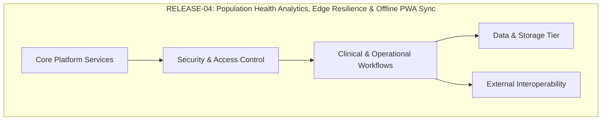

# Enterprise Release Specification: RELEASE-04 — Population Health Analytics, Edge Resilience & Offline PWA Sync
## Namma Clinic Digital Health & Operations Platform
### Greater Bengaluru Authority (GBA) / BBMP Health Department
**Document Code:** `REL-DOC-04` | **Version Tag:** `v0.5.0-beta` | **Status:** APPROVED BASELINE | **Date:** September 2026

---

## 1. Document Control
Formal document governance metadata for `RELEASE-04` specification:

| Metadata Attribute | Governance Value | Description |
| :--- | :--- | :--- |
| **Document Identifier** | `REL-DOC-04` | Authoritative specification container for RELEASE-04 |
| **Release Tag** | `v0.5.0-beta` | Immutable Semantic Versioning (SemVer 2.0.0) tag |
| **Release Codename** | `Population Health Analytics, Edge Resilience & Offline PWA Sync` | Official program release title |
| **Target Horizon** | Sprints SPRINT-10 to SPRINT-14 | Execution sprint container |
| **Authoring Body** | Release Train Engineering Directorate | Greater Bengaluru Authority / BBMP Health Department |
| **Lifecycle Stage** | `APPROVED_FOR_EXECUTION` | Formally ratified by CTO and Health Steering Committee |

## 2. Release Identity
Core technical identity and architectural parameters for `RELEASE-04`:
- **Release Identifier:** `RELEASE-04`
- **Release Version:** `v0.5.0-beta`
- **Strategic Focus Theme:** Offline Edge Continuity & Municipal Lakehouse Analytics
- **Predecessor Release Vehicle:** `RELEASE-03`
- **Successor Release Vehicle:** `RELEASE-05`
- **Target Deployment Cadence:** Automated Kubernetes blue/green rolling deployment.

## 3. Release Purpose
The primary purpose of `RELEASE-04` (Population Health Analytics, Edge Resilience & Offline PWA Sync) is to deliver municipal public health intelligence and offline edge resilience: local sqlite replica caching, background conflict reconciliation, clickhouse olap lakehouse, and statutory health surveillance reporting. This release vehicle delivers an integrated, verified, and hardened milestone package, transitioning completed sprint outputs into production-grade capabilities.

## 4. Business Context
Operating across the municipal healthcare landscape of Bengaluru, the Namma Clinic Platform delivers high-quality primary healthcare services to urban communities. Release `RELEASE-04` provides the specific capabilities required to support clinical staff, reduce patient waiting times, eliminate manual paper logs, and enforce strict regulatory compliance with the Digital Personal Data Protection (DPDP) Act 2023.

## 5. Business Value
The strategic and operational business value realized through `RELEASE-04` includes:
- **Clinical Quality & Safety:** Guarantees 100% uninterrupted clinic operations during 72-hour broadband blackouts and provides municipal leadership with real-time epidemiological dashboards.
- **Operational Efficiency:** Streamlines clinic administrative workflows and eliminates data redundancy.
- **Statutory Compliance:** Enforces DPDP Act 2023, National Health Data Management Policy, and MeitY cloud hosting standards.
- **Public Health Impact:** Delivers reliable data feeds to the Chief Health Officer for proactive municipal disease surveillance.

## 6. Release Objectives
The measurable engineering and clinical delivery objectives for `RELEASE-04` are:
1. **Core Feature Delivery:** Deploy 100% of planned functional capabilities with sub-250ms p95 API response times.
2. **Zero-Defect Quality Baseline:** Achieve 100% automated regression test pass rates with zero open Critical or High security vulnerabilities.
3. **Bilingual User Experience:** Verify 100% of user-facing interfaces in Kannada and English with WCAG 2.1 AA accessibility.
4. **High Availability:** Maintain >= 99.9% uptime during staging load simulation under peak clinic hours.
5. **Continuous Traceability:** Maintain unbroken bi-directional traceability to all upstream requirements and database schemas.

## 7. Release Scope
The operational scope of `RELEASE-04` encompasses:
- **Functional Scope:** Service worker caching, client-side SQLite database, mutation queue replication, bi-directional Last-Write-Wins conflict resolution, Debezium CDC pipeline, ClickHouse analytical marts, and Superset public health dashboards.
- **Included Key Capabilities:**
  - Autonomous offline clinic operation supporting continuous patient registration, consultation, and dispensing
  - Cryptographic mutation queue staging offline transactions with local UUID indexing
  - Automatic background synchronization over WebSockets upon network reconnection
  - Deterministic conflict resolution prioritizing physician clinical records over administrative changes
  - ClickHouse OLAP lakehouse ingesting real-time CDC events from municipal PostgreSQL instances
  - Statutory automated export feeds for Integrated Health Information Platform (IHIP) and RCH

## 8. Out-of-Scope
The following capabilities are explicitly declared out-of-scope for `RELEASE-04`:
- Predictive AI syndromic outbreak classification (deferred to RELEASE-07)
- Third-party commercial insurance billing (out of scope)

## 9. Stakeholder Impact
Analysis of operational impacts on key program stakeholders for `RELEASE-04`:
- **BBMP Health Commissioner:** Gains real-time executive visibility into clinic operations and regulatory compliance.
- **Zonal Health Officers:** Receives daily facility operational reports and resource utilization metrics.
- **Medical Superintendents:** Exercises clinical oversight through Standard Treatment Guideline compliance reports.
- **Frontline Clinic Staff:** Experiences automated, intuitive digital workflows replacing manual logbooks.
- **Bengaluru Citizens:** Benefits from rapid intake, zero duplicate registrations, and private health data protection.

## 10. Persona Impact
Direct operational impacts on frontline personas during `RELEASE-04`:
- **Dr. Prema (Medical Officer):** Consults patients using intuitive clinical SOAP interface with past visit timeline.
- **Nurse Sunitha (Staff Nurse):** Rapidly captures triage vital signs with automated color-coded danger sign alerts.
- **Pharmacist Anand (Clinic Pharmacist):** Scans e-prescriptions and dispenses medications under strict FEFO batch controls.
- **Citizen Geetha (Patient):** Receives digital token, SMS notifications, and secure digital consent protection.

## 11. Role Impact
Impacts and accountabilities across the 17 engineering and operational delivery roles for `RELEASE-04`:
- **Product Manager:** Responsible for architectural design, code implementation, test automation, and sign-off for Population Health Analytics, Edge Resilience & Offline PWA Sync.
- **Solution Architect:** Responsible for architectural design, code implementation, test automation, and sign-off for Population Health Analytics, Edge Resilience & Offline PWA Sync.
- **Technical Lead:** Responsible for architectural design, code implementation, test automation, and sign-off for Population Health Analytics, Edge Resilience & Offline PWA Sync.
- **Backend Engineer:** Responsible for architectural design, code implementation, test automation, and sign-off for Population Health Analytics, Edge Resilience & Offline PWA Sync.
- **Frontend Engineer:** Responsible for architectural design, code implementation, test automation, and sign-off for Population Health Analytics, Edge Resilience & Offline PWA Sync.
- **Database Engineer:** Responsible for architectural design, code implementation, test automation, and sign-off for Population Health Analytics, Edge Resilience & Offline PWA Sync.
- **QA Engineer:** Responsible for architectural design, code implementation, test automation, and sign-off for Population Health Analytics, Edge Resilience & Offline PWA Sync.
- **Security Engineer:** Responsible for architectural design, code implementation, test automation, and sign-off for Population Health Analytics, Edge Resilience & Offline PWA Sync.
- **DevOps Engineer:** Responsible for architectural design, code implementation, test automation, and sign-off for Population Health Analytics, Edge Resilience & Offline PWA Sync.
- **Clinical SME:** Responsible for architectural design, code implementation, test automation, and sign-off for Population Health Analytics, Edge Resilience & Offline PWA Sync.
- **Integration Engineer:** Responsible for architectural design, code implementation, test automation, and sign-off for Population Health Analytics, Edge Resilience & Offline PWA Sync.
- **Support/Operations:** Responsible for architectural design, code implementation, test automation, and sign-off for Population Health Analytics, Edge Resilience & Offline PWA Sync.

## 12. Capability Map
Architectural capability mapping for `RELEASE-04` across core platform pillars:
### Architecture Diagram: Capability Hierarchy for RELEASE-04
<!-- DOCUMENTATION-ONLY DIAGRAM -->


## 13. Feature Map
Complete product feature allocation and verification matrix across all 180 platform product features for `RELEASE-04`:

### FEATURE-001: Feature `Credential Verification`
- **Feature Identifier:** `FEATURE-001` (Feature #1)
- **Functional Module:** `MODULE-001` (DOMAIN-001)
- **Target User Persona:** System Administrator / Audit Compliance Officer
- **Release Allocation Status:** `REGRESSION_VERIFIED`
- **Governing Release:** `RELEASE-04`
- **Acceptance Standard:** 100% automated regression test pass in CI staging environment.
- **Bilingual Support:** Validated in Kannada and English with WCAG 2.1 AA compliant UI components.
- **Tenant Isolation:** Enforces strict clinic boundary isolation via database row-level security.
- **Audit Logging:** Every state mutation produces immutable tamper-evident audit trail entries.
- **Traceability Status:** 100% TRACEABLE to Master Backlog Phase 16.

### FEATURE-002: Feature `Session Token Minting`
- **Feature Identifier:** `FEATURE-002` (Feature #2)
- **Functional Module:** `MODULE-001` (DOMAIN-001)
- **Target User Persona:** System Administrator / Audit Compliance Officer
- **Release Allocation Status:** `REGRESSION_VERIFIED`
- **Governing Release:** `RELEASE-04`
- **Acceptance Standard:** 100% automated regression test pass in CI staging environment.
- **Bilingual Support:** Validated in Kannada and English with WCAG 2.1 AA compliant UI components.
- **Tenant Isolation:** Enforces strict clinic boundary isolation via database row-level security.
- **Audit Logging:** Every state mutation produces immutable tamper-evident audit trail entries.
- **Traceability Status:** 100% TRACEABLE to Master Backlog Phase 16.

### FEATURE-003: Feature `MFA Challenge Dispatch`
- **Feature Identifier:** `FEATURE-003` (Feature #3)
- **Functional Module:** `MODULE-001` (DOMAIN-001)
- **Target User Persona:** System Administrator / Audit Compliance Officer
- **Release Allocation Status:** `REGRESSION_VERIFIED`
- **Governing Release:** `RELEASE-04`
- **Acceptance Standard:** 100% automated regression test pass in CI staging environment.
- **Bilingual Support:** Validated in Kannada and English with WCAG 2.1 AA compliant UI components.
- **Tenant Isolation:** Enforces strict clinic boundary isolation via database row-level security.
- **Audit Logging:** Every state mutation produces immutable tamper-evident audit trail entries.
- **Traceability Status:** 100% TRACEABLE to Master Backlog Phase 16.

### FEATURE-004: Feature `Biometric Authentication Bridge`
- **Feature Identifier:** `FEATURE-004` (Feature #4)
- **Functional Module:** `MODULE-001` (DOMAIN-001)
- **Target User Persona:** System Administrator / Audit Compliance Officer
- **Release Allocation Status:** `PRIMARY_RELEASE_TARGET`
- **Governing Release:** `RELEASE-04`
- **Acceptance Standard:** 100% automated regression test pass in CI staging environment.
- **Bilingual Support:** Validated in Kannada and English with WCAG 2.1 AA compliant UI components.
- **Tenant Isolation:** Enforces strict clinic boundary isolation via database row-level security.
- **Audit Logging:** Every state mutation produces immutable tamper-evident audit trail entries.
- **Traceability Status:** 100% TRACEABLE to Master Backlog Phase 16.

### FEATURE-005: Feature `Local PIN Verification`
- **Feature Identifier:** `FEATURE-005` (Feature #5)
- **Functional Module:** `MODULE-001` (DOMAIN-001)
- **Target User Persona:** System Administrator / Audit Compliance Officer
- **Release Allocation Status:** `REGRESSION_VERIFIED`
- **Governing Release:** `RELEASE-04`
- **Acceptance Standard:** 100% automated regression test pass in CI staging environment.
- **Bilingual Support:** Validated in Kannada and English with WCAG 2.1 AA compliant UI components.
- **Tenant Isolation:** Enforces strict clinic boundary isolation via database row-level security.
- **Audit Logging:** Every state mutation produces immutable tamper-evident audit trail entries.
- **Traceability Status:** 100% TRACEABLE to Master Backlog Phase 16.

### FEATURE-006: Feature `Session Inactivity Lockout`
- **Feature Identifier:** `FEATURE-006` (Feature #6)
- **Functional Module:** `MODULE-001` (DOMAIN-001)
- **Target User Persona:** System Administrator / Audit Compliance Officer
- **Release Allocation Status:** `REGRESSION_VERIFIED`
- **Governing Release:** `RELEASE-04`
- **Acceptance Standard:** 100% automated regression test pass in CI staging environment.
- **Bilingual Support:** Validated in Kannada and English with WCAG 2.1 AA compliant UI components.
- **Tenant Isolation:** Enforces strict clinic boundary isolation via database row-level security.
- **Audit Logging:** Every state mutation produces immutable tamper-evident audit trail entries.
- **Traceability Status:** 100% TRACEABLE to Master Backlog Phase 16.

### FEATURE-007: Feature `Permission Evaluation`
- **Feature Identifier:** `FEATURE-007` (Feature #7)
- **Functional Module:** `MODULE-002` (DOMAIN-001)
- **Target User Persona:** System Administrator / Audit Compliance Officer
- **Release Allocation Status:** `REGRESSION_VERIFIED`
- **Governing Release:** `RELEASE-04`
- **Acceptance Standard:** 100% automated regression test pass in CI staging environment.
- **Bilingual Support:** Validated in Kannada and English with WCAG 2.1 AA compliant UI components.
- **Tenant Isolation:** Enforces strict clinic boundary isolation via database row-level security.
- **Audit Logging:** Every state mutation produces immutable tamper-evident audit trail entries.
- **Traceability Status:** 100% TRACEABLE to Master Backlog Phase 16.

### FEATURE-008: Feature `Dynamic Role Assignment`
- **Feature Identifier:** `FEATURE-008` (Feature #8)
- **Functional Module:** `MODULE-002` (DOMAIN-001)
- **Target User Persona:** System Administrator / Audit Compliance Officer
- **Release Allocation Status:** `REGRESSION_VERIFIED`
- **Governing Release:** `RELEASE-04`
- **Acceptance Standard:** 100% automated regression test pass in CI staging environment.
- **Bilingual Support:** Validated in Kannada and English with WCAG 2.1 AA compliant UI components.
- **Tenant Isolation:** Enforces strict clinic boundary isolation via database row-level security.
- **Audit Logging:** Every state mutation produces immutable tamper-evident audit trail entries.
- **Traceability Status:** 100% TRACEABLE to Master Backlog Phase 16.

### FEATURE-009: Feature `Conflict-of-Interest Prevention`
- **Feature Identifier:** `FEATURE-009` (Feature #9)
- **Functional Module:** `MODULE-002` (DOMAIN-001)
- **Target User Persona:** System Administrator / Audit Compliance Officer
- **Release Allocation Status:** `REGRESSION_VERIFIED`
- **Governing Release:** `RELEASE-04`
- **Acceptance Standard:** 100% automated regression test pass in CI staging environment.
- **Bilingual Support:** Validated in Kannada and English with WCAG 2.1 AA compliant UI components.
- **Tenant Isolation:** Enforces strict clinic boundary isolation via database row-level security.
- **Audit Logging:** Every state mutation produces immutable tamper-evident audit trail entries.
- **Traceability Status:** 100% TRACEABLE to Master Backlog Phase 16.

### FEATURE-010: Feature `Maker-Checker Authorization`
- **Feature Identifier:** `FEATURE-010` (Feature #10)
- **Functional Module:** `MODULE-002` (DOMAIN-001)
- **Target User Persona:** System Administrator / Audit Compliance Officer
- **Release Allocation Status:** `REGRESSION_VERIFIED`
- **Governing Release:** `RELEASE-04`
- **Acceptance Standard:** 100% automated regression test pass in CI staging environment.
- **Bilingual Support:** Validated in Kannada and English with WCAG 2.1 AA compliant UI components.
- **Tenant Isolation:** Enforces strict clinic boundary isolation via database row-level security.
- **Audit Logging:** Every state mutation produces immutable tamper-evident audit trail entries.
- **Traceability Status:** 100% TRACEABLE to Master Backlog Phase 16.

### FEATURE-011: Feature `Break-Glass Privilege Elevation`
- **Feature Identifier:** `FEATURE-011` (Feature #11)
- **Functional Module:** `MODULE-002` (DOMAIN-001)
- **Target User Persona:** System Administrator / Audit Compliance Officer
- **Release Allocation Status:** `REGRESSION_VERIFIED`
- **Governing Release:** `RELEASE-04`
- **Acceptance Standard:** 100% automated regression test pass in CI staging environment.
- **Bilingual Support:** Validated in Kannada and English with WCAG 2.1 AA compliant UI components.
- **Tenant Isolation:** Enforces strict clinic boundary isolation via database row-level security.
- **Audit Logging:** Every state mutation produces immutable tamper-evident audit trail entries.
- **Traceability Status:** 100% TRACEABLE to Master Backlog Phase 16.

### FEATURE-012: Feature `Privilege Elevation Audit`
- **Feature Identifier:** `FEATURE-012` (Feature #12)
- **Functional Module:** `MODULE-002` (DOMAIN-001)
- **Target User Persona:** System Administrator / Audit Compliance Officer
- **Release Allocation Status:** `PRIMARY_RELEASE_TARGET`
- **Governing Release:** `RELEASE-04`
- **Acceptance Standard:** 100% automated regression test pass in CI staging environment.
- **Bilingual Support:** Validated in Kannada and English with WCAG 2.1 AA compliant UI components.
- **Tenant Isolation:** Enforces strict clinic boundary isolation via database row-level security.
- **Audit Logging:** Every state mutation produces immutable tamper-evident audit trail entries.
- **Traceability Status:** 100% TRACEABLE to Master Backlog Phase 16.

### FEATURE-013: Feature `Hierarchy Node Management`
- **Feature Identifier:** `FEATURE-013` (Feature #13)
- **Functional Module:** `MODULE-003` (DOMAIN-001)
- **Target User Persona:** System Administrator / Audit Compliance Officer
- **Release Allocation Status:** `REGRESSION_VERIFIED`
- **Governing Release:** `RELEASE-04`
- **Acceptance Standard:** 100% automated regression test pass in CI staging environment.
- **Bilingual Support:** Validated in Kannada and English with WCAG 2.1 AA compliant UI components.
- **Tenant Isolation:** Enforces strict clinic boundary isolation via database row-level security.
- **Audit Logging:** Every state mutation produces immutable tamper-evident audit trail entries.
- **Traceability Status:** 100% TRACEABLE to Master Backlog Phase 16.

### FEATURE-014: Feature `NIN / HFR Registry Linking`
- **Feature Identifier:** `FEATURE-014` (Feature #14)
- **Functional Module:** `MODULE-003` (DOMAIN-001)
- **Target User Persona:** System Administrator / Audit Compliance Officer
- **Release Allocation Status:** `REGRESSION_VERIFIED`
- **Governing Release:** `RELEASE-04`
- **Acceptance Standard:** 100% automated regression test pass in CI staging environment.
- **Bilingual Support:** Validated in Kannada and English with WCAG 2.1 AA compliant UI components.
- **Tenant Isolation:** Enforces strict clinic boundary isolation via database row-level security.
- **Audit Logging:** Every state mutation produces immutable tamper-evident audit trail entries.
- **Traceability Status:** 100% TRACEABLE to Master Backlog Phase 16.

### FEATURE-015: Feature `Station Terminal Mapping`
- **Feature Identifier:** `FEATURE-015` (Feature #15)
- **Functional Module:** `MODULE-003` (DOMAIN-001)
- **Target User Persona:** System Administrator / Audit Compliance Officer
- **Release Allocation Status:** `REGRESSION_VERIFIED`
- **Governing Release:** `RELEASE-04`
- **Acceptance Standard:** 100% automated regression test pass in CI staging environment.
- **Bilingual Support:** Validated in Kannada and English with WCAG 2.1 AA compliant UI components.
- **Tenant Isolation:** Enforces strict clinic boundary isolation via database row-level security.
- **Audit Logging:** Every state mutation produces immutable tamper-evident audit trail entries.
- **Traceability Status:** 100% TRACEABLE to Master Backlog Phase 16.

### FEATURE-016: Feature `Facility Capacity Configuration`
- **Feature Identifier:** `FEATURE-016` (Feature #16)
- **Functional Module:** `MODULE-003` (DOMAIN-001)
- **Target User Persona:** System Administrator / Audit Compliance Officer
- **Release Allocation Status:** `REGRESSION_VERIFIED`
- **Governing Release:** `RELEASE-04`
- **Acceptance Standard:** 100% automated regression test pass in CI staging environment.
- **Bilingual Support:** Validated in Kannada and English with WCAG 2.1 AA compliant UI components.
- **Tenant Isolation:** Enforces strict clinic boundary isolation via database row-level security.
- **Audit Logging:** Every state mutation produces immutable tamper-evident audit trail entries.
- **Traceability Status:** 100% TRACEABLE to Master Backlog Phase 16.

### FEATURE-017: Feature `Operating Hours Enforcement`
- **Feature Identifier:** `FEATURE-017` (Feature #17)
- **Functional Module:** `MODULE-003` (DOMAIN-001)
- **Target User Persona:** System Administrator / Audit Compliance Officer
- **Release Allocation Status:** `REGRESSION_VERIFIED`
- **Governing Release:** `RELEASE-04`
- **Acceptance Standard:** 100% automated regression test pass in CI staging environment.
- **Bilingual Support:** Validated in Kannada and English with WCAG 2.1 AA compliant UI components.
- **Tenant Isolation:** Enforces strict clinic boundary isolation via database row-level security.
- **Audit Logging:** Every state mutation produces immutable tamper-evident audit trail entries.
- **Traceability Status:** 100% TRACEABLE to Master Backlog Phase 16.

### FEATURE-018: Feature `Special Camp Calendar`
- **Feature Identifier:** `FEATURE-018` (Feature #18)
- **Functional Module:** `MODULE-003` (DOMAIN-001)
- **Target User Persona:** System Administrator / Audit Compliance Officer
- **Release Allocation Status:** `REGRESSION_VERIFIED`
- **Governing Release:** `RELEASE-04`
- **Acceptance Standard:** 100% automated regression test pass in CI staging environment.
- **Bilingual Support:** Validated in Kannada and English with WCAG 2.1 AA compliant UI components.
- **Tenant Isolation:** Enforces strict clinic boundary isolation via database row-level security.
- **Audit Logging:** Every state mutation produces immutable tamper-evident audit trail entries.
- **Traceability Status:** 100% TRACEABLE to Master Backlog Phase 16.

### FEATURE-019: Feature `Staff Onboarding & KYC`
- **Feature Identifier:** `FEATURE-019` (Feature #19)
- **Functional Module:** `MODULE-004` (DOMAIN-001)
- **Target User Persona:** System Administrator / Audit Compliance Officer
- **Release Allocation Status:** `REGRESSION_VERIFIED`
- **Governing Release:** `RELEASE-04`
- **Acceptance Standard:** 100% automated regression test pass in CI staging environment.
- **Bilingual Support:** Validated in Kannada and English with WCAG 2.1 AA compliant UI components.
- **Tenant Isolation:** Enforces strict clinic boundary isolation via database row-level security.
- **Audit Logging:** Every state mutation produces immutable tamper-evident audit trail entries.
- **Traceability Status:** 100% TRACEABLE to Master Backlog Phase 16.

### FEATURE-020: Feature `Professional License Verification`
- **Feature Identifier:** `FEATURE-020` (Feature #20)
- **Functional Module:** `MODULE-004` (DOMAIN-001)
- **Target User Persona:** System Administrator / Audit Compliance Officer
- **Release Allocation Status:** `PRIMARY_RELEASE_TARGET`
- **Governing Release:** `RELEASE-04`
- **Acceptance Standard:** 100% automated regression test pass in CI staging environment.
- **Bilingual Support:** Validated in Kannada and English with WCAG 2.1 AA compliant UI components.
- **Tenant Isolation:** Enforces strict clinic boundary isolation via database row-level security.
- **Audit Logging:** Every state mutation produces immutable tamper-evident audit trail entries.
- **Traceability Status:** 100% TRACEABLE to Master Backlog Phase 16.

### FEATURE-021: Feature `Duty Roster Generation`
- **Feature Identifier:** `FEATURE-021` (Feature #21)
- **Functional Module:** `MODULE-004` (DOMAIN-001)
- **Target User Persona:** System Administrator / Audit Compliance Officer
- **Release Allocation Status:** `REGRESSION_VERIFIED`
- **Governing Release:** `RELEASE-04`
- **Acceptance Standard:** 100% automated regression test pass in CI staging environment.
- **Bilingual Support:** Validated in Kannada and English with WCAG 2.1 AA compliant UI components.
- **Tenant Isolation:** Enforces strict clinic boundary isolation via database row-level security.
- **Audit Logging:** Every state mutation produces immutable tamper-evident audit trail entries.
- **Traceability Status:** 100% TRACEABLE to Master Backlog Phase 16.

### FEATURE-022: Feature `Biometric Attendance Linking`
- **Feature Identifier:** `FEATURE-022` (Feature #22)
- **Functional Module:** `MODULE-004` (DOMAIN-001)
- **Target User Persona:** System Administrator / Audit Compliance Officer
- **Release Allocation Status:** `REGRESSION_VERIFIED`
- **Governing Release:** `RELEASE-04`
- **Acceptance Standard:** 100% automated regression test pass in CI staging environment.
- **Bilingual Support:** Validated in Kannada and English with WCAG 2.1 AA compliant UI components.
- **Tenant Isolation:** Enforces strict clinic boundary isolation via database row-level security.
- **Audit Logging:** Every state mutation produces immutable tamper-evident audit trail entries.
- **Traceability Status:** 100% TRACEABLE to Master Backlog Phase 16.

### FEATURE-023: Feature `Digital Signature Enrollment`
- **Feature Identifier:** `FEATURE-023` (Feature #23)
- **Functional Module:** `MODULE-004` (DOMAIN-001)
- **Target User Persona:** System Administrator / Audit Compliance Officer
- **Release Allocation Status:** `REGRESSION_VERIFIED`
- **Governing Release:** `RELEASE-04`
- **Acceptance Standard:** 100% automated regression test pass in CI staging environment.
- **Bilingual Support:** Validated in Kannada and English with WCAG 2.1 AA compliant UI components.
- **Tenant Isolation:** Enforces strict clinic boundary isolation via database row-level security.
- **Audit Logging:** Every state mutation produces immutable tamper-evident audit trail entries.
- **Traceability Status:** 100% TRACEABLE to Master Backlog Phase 16.

### FEATURE-024: Feature `Signature Revocation`
- **Feature Identifier:** `FEATURE-024` (Feature #24)
- **Functional Module:** `MODULE-004` (DOMAIN-001)
- **Target User Persona:** System Administrator / Audit Compliance Officer
- **Release Allocation Status:** `REGRESSION_VERIFIED`
- **Governing Release:** `RELEASE-04`
- **Acceptance Standard:** 100% automated regression test pass in CI staging environment.
- **Bilingual Support:** Validated in Kannada and English with WCAG 2.1 AA compliant UI components.
- **Tenant Isolation:** Enforces strict clinic boundary isolation via database row-level security.
- **Audit Logging:** Every state mutation produces immutable tamper-evident audit trail entries.
- **Traceability Status:** 100% TRACEABLE to Master Backlog Phase 16.

### FEATURE-025: Feature `Targeted Flag Activation`
- **Feature Identifier:** `FEATURE-025` (Feature #25)
- **Functional Module:** `MODULE-026` (DOMAIN-001)
- **Target User Persona:** System Administrator / Audit Compliance Officer
- **Release Allocation Status:** `REGRESSION_VERIFIED`
- **Governing Release:** `RELEASE-04`
- **Acceptance Standard:** 100% automated regression test pass in CI staging environment.
- **Bilingual Support:** Validated in Kannada and English with WCAG 2.1 AA compliant UI components.
- **Tenant Isolation:** Enforces strict clinic boundary isolation via database row-level security.
- **Audit Logging:** Every state mutation produces immutable tamper-evident audit trail entries.
- **Traceability Status:** 100% TRACEABLE to Master Backlog Phase 16.

### FEATURE-026: Feature `Emergency Feature Killswitch`
- **Feature Identifier:** `FEATURE-026` (Feature #26)
- **Functional Module:** `MODULE-026` (DOMAIN-001)
- **Target User Persona:** System Administrator / Audit Compliance Officer
- **Release Allocation Status:** `REGRESSION_VERIFIED`
- **Governing Release:** `RELEASE-04`
- **Acceptance Standard:** 100% automated regression test pass in CI staging environment.
- **Bilingual Support:** Validated in Kannada and English with WCAG 2.1 AA compliant UI components.
- **Tenant Isolation:** Enforces strict clinic boundary isolation via database row-level security.
- **Audit Logging:** Every state mutation produces immutable tamper-evident audit trail entries.
- **Traceability Status:** 100% TRACEABLE to Master Backlog Phase 16.

### FEATURE-027: Feature `System Parameter Tuning`
- **Feature Identifier:** `FEATURE-027` (Feature #27)
- **Functional Module:** `MODULE-026` (DOMAIN-001)
- **Target User Persona:** System Administrator / Audit Compliance Officer
- **Release Allocation Status:** `REGRESSION_VERIFIED`
- **Governing Release:** `RELEASE-04`
- **Acceptance Standard:** 100% automated regression test pass in CI staging environment.
- **Bilingual Support:** Validated in Kannada and English with WCAG 2.1 AA compliant UI components.
- **Tenant Isolation:** Enforces strict clinic boundary isolation via database row-level security.
- **Audit Logging:** Every state mutation produces immutable tamper-evident audit trail entries.
- **Traceability Status:** 100% TRACEABLE to Master Backlog Phase 16.

### FEATURE-028: Feature `Edge Configuration Distribution`
- **Feature Identifier:** `FEATURE-028` (Feature #28)
- **Functional Module:** `MODULE-026` (DOMAIN-001)
- **Target User Persona:** System Administrator / Audit Compliance Officer
- **Release Allocation Status:** `PRIMARY_RELEASE_TARGET`
- **Governing Release:** `RELEASE-04`
- **Acceptance Standard:** 100% automated regression test pass in CI staging environment.
- **Bilingual Support:** Validated in Kannada and English with WCAG 2.1 AA compliant UI components.
- **Tenant Isolation:** Enforces strict clinic boundary isolation via database row-level security.
- **Audit Logging:** Every state mutation produces immutable tamper-evident audit trail entries.
- **Traceability Status:** 100% TRACEABLE to Master Backlog Phase 16.

### FEATURE-029: Feature `Edge Migration Orchestration`
- **Feature Identifier:** `FEATURE-029` (Feature #29)
- **Functional Module:** `MODULE-026` (DOMAIN-001)
- **Target User Persona:** System Administrator / Audit Compliance Officer
- **Release Allocation Status:** `REGRESSION_VERIFIED`
- **Governing Release:** `RELEASE-04`
- **Acceptance Standard:** 100% automated regression test pass in CI staging environment.
- **Bilingual Support:** Validated in Kannada and English with WCAG 2.1 AA compliant UI components.
- **Tenant Isolation:** Enforces strict clinic boundary isolation via database row-level security.
- **Audit Logging:** Every state mutation produces immutable tamper-evident audit trail entries.
- **Traceability Status:** 100% TRACEABLE to Master Backlog Phase 16.

### FEATURE-030: Feature `Health Probe Monitoring`
- **Feature Identifier:** `FEATURE-030` (Feature #30)
- **Functional Module:** `MODULE-026` (DOMAIN-001)
- **Target User Persona:** System Administrator / Audit Compliance Officer
- **Release Allocation Status:** `REGRESSION_VERIFIED`
- **Governing Release:** `RELEASE-04`
- **Acceptance Standard:** 100% automated regression test pass in CI staging environment.
- **Bilingual Support:** Validated in Kannada and English with WCAG 2.1 AA compliant UI components.
- **Tenant Isolation:** Enforces strict clinic boundary isolation via database row-level security.
- **Audit Logging:** Every state mutation produces immutable tamper-evident audit trail entries.
- **Traceability Status:** 100% TRACEABLE to Master Backlog Phase 16.

### FEATURE-031: Feature `Bilingual Intake UI`
- **Feature Identifier:** `FEATURE-031` (Feature #31)
- **Functional Module:** `MODULE-005` (DOMAIN-002)
- **Target User Persona:** System Administrator / Audit Compliance Officer
- **Release Allocation Status:** `REGRESSION_VERIFIED`
- **Governing Release:** `RELEASE-04`
- **Acceptance Standard:** 100% automated regression test pass in CI staging environment.
- **Bilingual Support:** Validated in Kannada and English with WCAG 2.1 AA compliant UI components.
- **Tenant Isolation:** Enforces strict clinic boundary isolation via database row-level security.
- **Audit Logging:** Every state mutation produces immutable tamper-evident audit trail entries.
- **Traceability Status:** 100% TRACEABLE to Master Backlog Phase 16.

### FEATURE-032: Feature `Vulnerable Citizen Flagging`
- **Feature Identifier:** `FEATURE-032` (Feature #32)
- **Functional Module:** `MODULE-005` (DOMAIN-002)
- **Target User Persona:** System Administrator / Audit Compliance Officer
- **Release Allocation Status:** `REGRESSION_VERIFIED`
- **Governing Release:** `RELEASE-04`
- **Acceptance Standard:** 100% automated regression test pass in CI staging environment.
- **Bilingual Support:** Validated in Kannada and English with WCAG 2.1 AA compliant UI components.
- **Tenant Isolation:** Enforces strict clinic boundary isolation via database row-level security.
- **Audit Logging:** Every state mutation produces immutable tamper-evident audit trail entries.
- **Traceability Status:** 100% TRACEABLE to Master Backlog Phase 16.

### FEATURE-033: Feature `Aadhaar OTP ABHA Bridge`
- **Feature Identifier:** `FEATURE-033` (Feature #33)
- **Functional Module:** `MODULE-005` (DOMAIN-002)
- **Target User Persona:** System Administrator / Audit Compliance Officer
- **Release Allocation Status:** `REGRESSION_VERIFIED`
- **Governing Release:** `RELEASE-04`
- **Acceptance Standard:** 100% automated regression test pass in CI staging environment.
- **Bilingual Support:** Validated in Kannada and English with WCAG 2.1 AA compliant UI components.
- **Tenant Isolation:** Enforces strict clinic boundary isolation via database row-level security.
- **Audit Logging:** Every state mutation produces immutable tamper-evident audit trail entries.
- **Traceability Status:** 100% TRACEABLE to Master Backlog Phase 16.

### FEATURE-034: Feature `Demographic ABHA Creation`
- **Feature Identifier:** `FEATURE-034` (Feature #34)
- **Functional Module:** `MODULE-005` (DOMAIN-002)
- **Target User Persona:** System Administrator / Audit Compliance Officer
- **Release Allocation Status:** `REGRESSION_VERIFIED`
- **Governing Release:** `RELEASE-04`
- **Acceptance Standard:** 100% automated regression test pass in CI staging environment.
- **Bilingual Support:** Validated in Kannada and English with WCAG 2.1 AA compliant UI components.
- **Tenant Isolation:** Enforces strict clinic boundary isolation via database row-level security.
- **Audit Logging:** Every state mutation produces immutable tamper-evident audit trail entries.
- **Traceability Status:** 100% TRACEABLE to Master Backlog Phase 16.

### FEATURE-035: Feature `Deterministic UHID Minting`
- **Feature Identifier:** `FEATURE-035` (Feature #35)
- **Functional Module:** `MODULE-005` (DOMAIN-002)
- **Target User Persona:** System Administrator / Audit Compliance Officer
- **Release Allocation Status:** `REGRESSION_VERIFIED`
- **Governing Release:** `RELEASE-04`
- **Acceptance Standard:** 100% automated regression test pass in CI staging environment.
- **Bilingual Support:** Validated in Kannada and English with WCAG 2.1 AA compliant UI components.
- **Tenant Isolation:** Enforces strict clinic boundary isolation via database row-level security.
- **Audit Logging:** Every state mutation produces immutable tamper-evident audit trail entries.
- **Traceability Status:** 100% TRACEABLE to Master Backlog Phase 16.

### FEATURE-036: Feature `Soundex / Double-Metaphone Matching`
- **Feature Identifier:** `FEATURE-036` (Feature #36)
- **Functional Module:** `MODULE-005` (DOMAIN-002)
- **Target User Persona:** System Administrator / Audit Compliance Officer
- **Release Allocation Status:** `PRIMARY_RELEASE_TARGET`
- **Governing Release:** `RELEASE-04`
- **Acceptance Standard:** 100% automated regression test pass in CI staging environment.
- **Bilingual Support:** Validated in Kannada and English with WCAG 2.1 AA compliant UI components.
- **Tenant Isolation:** Enforces strict clinic boundary isolation via database row-level security.
- **Audit Logging:** Every state mutation produces immutable tamper-evident audit trail entries.
- **Traceability Status:** 100% TRACEABLE to Master Backlog Phase 16.

### FEATURE-037: Feature `Bilingual Consent Presentation`
- **Feature Identifier:** `FEATURE-037` (Feature #37)
- **Functional Module:** `MODULE-006` (DOMAIN-002)
- **Target User Persona:** System Administrator / Audit Compliance Officer
- **Release Allocation Status:** `REGRESSION_VERIFIED`
- **Governing Release:** `RELEASE-04`
- **Acceptance Standard:** 100% automated regression test pass in CI staging environment.
- **Bilingual Support:** Validated in Kannada and English with WCAG 2.1 AA compliant UI components.
- **Tenant Isolation:** Enforces strict clinic boundary isolation via database row-level security.
- **Audit Logging:** Every state mutation produces immutable tamper-evident audit trail entries.
- **Traceability Status:** 100% TRACEABLE to Master Backlog Phase 16.

### FEATURE-038: Feature `Digital Signature / Thumbprint Capture`
- **Feature Identifier:** `FEATURE-038` (Feature #38)
- **Functional Module:** `MODULE-006` (DOMAIN-002)
- **Target User Persona:** System Administrator / Audit Compliance Officer
- **Release Allocation Status:** `REGRESSION_VERIFIED`
- **Governing Release:** `RELEASE-04`
- **Acceptance Standard:** 100% automated regression test pass in CI staging environment.
- **Bilingual Support:** Validated in Kannada and English with WCAG 2.1 AA compliant UI components.
- **Tenant Isolation:** Enforces strict clinic boundary isolation via database row-level security.
- **Audit Logging:** Every state mutation produces immutable tamper-evident audit trail entries.
- **Traceability Status:** 100% TRACEABLE to Master Backlog Phase 16.

### FEATURE-039: Feature `Granular Purpose-Based Consent`
- **Feature Identifier:** `FEATURE-039` (Feature #39)
- **Functional Module:** `MODULE-006` (DOMAIN-002)
- **Target User Persona:** System Administrator / Audit Compliance Officer
- **Release Allocation Status:** `REGRESSION_VERIFIED`
- **Governing Release:** `RELEASE-04`
- **Acceptance Standard:** 100% automated regression test pass in CI staging environment.
- **Bilingual Support:** Validated in Kannada and English with WCAG 2.1 AA compliant UI components.
- **Tenant Isolation:** Enforces strict clinic boundary isolation via database row-level security.
- **Audit Logging:** Every state mutation produces immutable tamper-evident audit trail entries.
- **Traceability Status:** 100% TRACEABLE to Master Backlog Phase 16.

### FEATURE-040: Feature `Consent Revocation Workflow`
- **Feature Identifier:** `FEATURE-040` (Feature #40)
- **Functional Module:** `MODULE-006` (DOMAIN-002)
- **Target User Persona:** System Administrator / Audit Compliance Officer
- **Release Allocation Status:** `REGRESSION_VERIFIED`
- **Governing Release:** `RELEASE-04`
- **Acceptance Standard:** 100% automated regression test pass in CI staging environment.
- **Bilingual Support:** Validated in Kannada and English with WCAG 2.1 AA compliant UI components.
- **Tenant Isolation:** Enforces strict clinic boundary isolation via database row-level security.
- **Audit Logging:** Every state mutation produces immutable tamper-evident audit trail entries.
- **Traceability Status:** 100% TRACEABLE to Master Backlog Phase 16.

### FEATURE-041: Feature `Guardian Relationship Verification`
- **Feature Identifier:** `FEATURE-041` (Feature #41)
- **Functional Module:** `MODULE-006` (DOMAIN-002)
- **Target User Persona:** System Administrator / Audit Compliance Officer
- **Release Allocation Status:** `REGRESSION_VERIFIED`
- **Governing Release:** `RELEASE-04`
- **Acceptance Standard:** 100% automated regression test pass in CI staging environment.
- **Bilingual Support:** Validated in Kannada and English with WCAG 2.1 AA compliant UI components.
- **Tenant Isolation:** Enforces strict clinic boundary isolation via database row-level security.
- **Audit Logging:** Every state mutation produces immutable tamper-evident audit trail entries.
- **Traceability Status:** 100% TRACEABLE to Master Backlog Phase 16.

### FEATURE-042: Feature `Implied Emergency Consent`
- **Feature Identifier:** `FEATURE-042` (Feature #42)
- **Functional Module:** `MODULE-006` (DOMAIN-002)
- **Target User Persona:** System Administrator / Audit Compliance Officer
- **Release Allocation Status:** `REGRESSION_VERIFIED`
- **Governing Release:** `RELEASE-04`
- **Acceptance Standard:** 100% automated regression test pass in CI staging environment.
- **Bilingual Support:** Validated in Kannada and English with WCAG 2.1 AA compliant UI components.
- **Tenant Isolation:** Enforces strict clinic boundary isolation via database row-level security.
- **Audit Logging:** Every state mutation produces immutable tamper-evident audit trail entries.
- **Traceability Status:** 100% TRACEABLE to Master Backlog Phase 16.

### FEATURE-043: Feature `Daily Token Counter`
- **Feature Identifier:** `FEATURE-043` (Feature #43)
- **Functional Module:** `MODULE-007` (DOMAIN-002)
- **Target User Persona:** System Administrator / Audit Compliance Officer
- **Release Allocation Status:** `REGRESSION_VERIFIED`
- **Governing Release:** `RELEASE-04`
- **Acceptance Standard:** 100% automated regression test pass in CI staging environment.
- **Bilingual Support:** Validated in Kannada and English with WCAG 2.1 AA compliant UI components.
- **Tenant Isolation:** Enforces strict clinic boundary isolation via database row-level security.
- **Audit Logging:** Every state mutation produces immutable tamper-evident audit trail entries.
- **Traceability Status:** 100% TRACEABLE to Master Backlog Phase 16.

### FEATURE-044: Feature `Station Route Calculation`
- **Feature Identifier:** `FEATURE-044` (Feature #44)
- **Functional Module:** `MODULE-007` (DOMAIN-002)
- **Target User Persona:** System Administrator / Audit Compliance Officer
- **Release Allocation Status:** `PRIMARY_RELEASE_TARGET`
- **Governing Release:** `RELEASE-04`
- **Acceptance Standard:** 100% automated regression test pass in CI staging environment.
- **Bilingual Support:** Validated in Kannada and English with WCAG 2.1 AA compliant UI components.
- **Tenant Isolation:** Enforces strict clinic boundary isolation via database row-level security.
- **Audit Logging:** Every state mutation produces immutable tamper-evident audit trail entries.
- **Traceability Status:** 100% TRACEABLE to Master Backlog Phase 16.

### FEATURE-045: Feature `Acuity-Based Insertion`
- **Feature Identifier:** `FEATURE-045` (Feature #45)
- **Functional Module:** `MODULE-007` (DOMAIN-002)
- **Target User Persona:** System Administrator / Audit Compliance Officer
- **Release Allocation Status:** `REGRESSION_VERIFIED`
- **Governing Release:** `RELEASE-04`
- **Acceptance Standard:** 100% automated regression test pass in CI staging environment.
- **Bilingual Support:** Validated in Kannada and English with WCAG 2.1 AA compliant UI components.
- **Tenant Isolation:** Enforces strict clinic boundary isolation via database row-level security.
- **Audit Logging:** Every state mutation produces immutable tamper-evident audit trail entries.
- **Traceability Status:** 100% TRACEABLE to Master Backlog Phase 16.

### FEATURE-046: Feature `Vulnerable Citizen Interleaving`
- **Feature Identifier:** `FEATURE-046` (Feature #46)
- **Functional Module:** `MODULE-007` (DOMAIN-002)
- **Target User Persona:** System Administrator / Audit Compliance Officer
- **Release Allocation Status:** `REGRESSION_VERIFIED`
- **Governing Release:** `RELEASE-04`
- **Acceptance Standard:** 100% automated regression test pass in CI staging environment.
- **Bilingual Support:** Validated in Kannada and English with WCAG 2.1 AA compliant UI components.
- **Tenant Isolation:** Enforces strict clinic boundary isolation via database row-level security.
- **Audit Logging:** Every state mutation produces immutable tamper-evident audit trail entries.
- **Traceability Status:** 100% TRACEABLE to Master Backlog Phase 16.

### FEATURE-047: Feature `ESC/POS Thermal Printing`
- **Feature Identifier:** `FEATURE-047` (Feature #47)
- **Functional Module:** `MODULE-007` (DOMAIN-002)
- **Target User Persona:** System Administrator / Audit Compliance Officer
- **Release Allocation Status:** `REGRESSION_VERIFIED`
- **Governing Release:** `RELEASE-04`
- **Acceptance Standard:** 100% automated regression test pass in CI staging environment.
- **Bilingual Support:** Validated in Kannada and English with WCAG 2.1 AA compliant UI components.
- **Tenant Isolation:** Enforces strict clinic boundary isolation via database row-level security.
- **Audit Logging:** Every state mutation produces immutable tamper-evident audit trail entries.
- **Traceability Status:** 100% TRACEABLE to Master Backlog Phase 16.

### FEATURE-048: Feature `Virtual SMS Token Fallback`
- **Feature Identifier:** `FEATURE-048` (Feature #48)
- **Functional Module:** `MODULE-007` (DOMAIN-002)
- **Target User Persona:** System Administrator / Audit Compliance Officer
- **Release Allocation Status:** `REGRESSION_VERIFIED`
- **Governing Release:** `RELEASE-04`
- **Acceptance Standard:** 100% automated regression test pass in CI staging environment.
- **Bilingual Support:** Validated in Kannada and English with WCAG 2.1 AA compliant UI components.
- **Tenant Isolation:** Enforces strict clinic boundary isolation via database row-level security.
- **Audit Logging:** Every state mutation produces immutable tamper-evident audit trail entries.
- **Traceability Status:** 100% TRACEABLE to Master Backlog Phase 16.

### FEATURE-049: Feature `Next-Patient Call Action`
- **Feature Identifier:** `FEATURE-049` (Feature #49)
- **Functional Module:** `MODULE-008` (DOMAIN-002)
- **Target User Persona:** System Administrator / Audit Compliance Officer
- **Release Allocation Status:** `REGRESSION_VERIFIED`
- **Governing Release:** `RELEASE-04`
- **Acceptance Standard:** 100% automated regression test pass in CI staging environment.
- **Bilingual Support:** Validated in Kannada and English with WCAG 2.1 AA compliant UI components.
- **Tenant Isolation:** Enforces strict clinic boundary isolation via database row-level security.
- **Audit Logging:** Every state mutation produces immutable tamper-evident audit trail entries.
- **Traceability Status:** 100% TRACEABLE to Master Backlog Phase 16.

### FEATURE-050: Feature `No-Show & Recall Management`
- **Feature Identifier:** `FEATURE-050` (Feature #50)
- **Functional Module:** `MODULE-008` (DOMAIN-002)
- **Target User Persona:** System Administrator / Audit Compliance Officer
- **Release Allocation Status:** `REGRESSION_VERIFIED`
- **Governing Release:** `RELEASE-04`
- **Acceptance Standard:** 100% automated regression test pass in CI staging environment.
- **Bilingual Support:** Validated in Kannada and English with WCAG 2.1 AA compliant UI components.
- **Tenant Isolation:** Enforces strict clinic boundary isolation via database row-level security.
- **Audit Logging:** Every state mutation produces immutable tamper-evident audit trail entries.
- **Traceability Status:** 100% TRACEABLE to Master Backlog Phase 16.

### FEATURE-051: Feature `HDMI Waiting Hall Display`
- **Feature Identifier:** `FEATURE-051` (Feature #51)
- **Functional Module:** `MODULE-008` (DOMAIN-002)
- **Target User Persona:** System Administrator / Audit Compliance Officer
- **Release Allocation Status:** `REGRESSION_VERIFIED`
- **Governing Release:** `RELEASE-04`
- **Acceptance Standard:** 100% automated regression test pass in CI staging environment.
- **Bilingual Support:** Validated in Kannada and English with WCAG 2.1 AA compliant UI components.
- **Tenant Isolation:** Enforces strict clinic boundary isolation via database row-level security.
- **Audit Logging:** Every state mutation produces immutable tamper-evident audit trail entries.
- **Traceability Status:** 100% TRACEABLE to Master Backlog Phase 16.

### FEATURE-052: Feature `Text-to-Speech Audio Chime`
- **Feature Identifier:** `FEATURE-052` (Feature #52)
- **Functional Module:** `MODULE-008` (DOMAIN-002)
- **Target User Persona:** System Administrator / Audit Compliance Officer
- **Release Allocation Status:** `PRIMARY_RELEASE_TARGET`
- **Governing Release:** `RELEASE-04`
- **Acceptance Standard:** 100% automated regression test pass in CI staging environment.
- **Bilingual Support:** Validated in Kannada and English with WCAG 2.1 AA compliant UI components.
- **Tenant Isolation:** Enforces strict clinic boundary isolation via database row-level security.
- **Audit Logging:** Every state mutation produces immutable tamper-evident audit trail entries.
- **Traceability Status:** 100% TRACEABLE to Master Backlog Phase 16.

### FEATURE-053: Feature `Dynamic Load Distribution`
- **Feature Identifier:** `FEATURE-053` (Feature #53)
- **Functional Module:** `MODULE-008` (DOMAIN-002)
- **Target User Persona:** System Administrator / Audit Compliance Officer
- **Release Allocation Status:** `REGRESSION_VERIFIED`
- **Governing Release:** `RELEASE-04`
- **Acceptance Standard:** 100% automated regression test pass in CI staging environment.
- **Bilingual Support:** Validated in Kannada and English with WCAG 2.1 AA compliant UI components.
- **Tenant Isolation:** Enforces strict clinic boundary isolation via database row-level security.
- **Audit Logging:** Every state mutation produces immutable tamper-evident audit trail entries.
- **Traceability Status:** 100% TRACEABLE to Master Backlog Phase 16.

### FEATURE-054: Feature `Queue Pausing & Resumption`
- **Feature Identifier:** `FEATURE-054` (Feature #54)
- **Functional Module:** `MODULE-008` (DOMAIN-002)
- **Target User Persona:** System Administrator / Audit Compliance Officer
- **Release Allocation Status:** `REGRESSION_VERIFIED`
- **Governing Release:** `RELEASE-04`
- **Acceptance Standard:** 100% automated regression test pass in CI staging environment.
- **Bilingual Support:** Validated in Kannada and English with WCAG 2.1 AA compliant UI components.
- **Tenant Isolation:** Enforces strict clinic boundary isolation via database row-level security.
- **Audit Logging:** Every state mutation produces immutable tamper-evident audit trail entries.
- **Traceability Status:** 100% TRACEABLE to Master Backlog Phase 16.

### FEATURE-055: Feature `Kiosk Exit Rating`
- **Feature Identifier:** `FEATURE-055` (Feature #55)
- **Functional Module:** `MODULE-020` (DOMAIN-002)
- **Target User Persona:** System Administrator / Audit Compliance Officer
- **Release Allocation Status:** `REGRESSION_VERIFIED`
- **Governing Release:** `RELEASE-04`
- **Acceptance Standard:** 100% automated regression test pass in CI staging environment.
- **Bilingual Support:** Validated in Kannada and English with WCAG 2.1 AA compliant UI components.
- **Tenant Isolation:** Enforces strict clinic boundary isolation via database row-level security.
- **Audit Logging:** Every state mutation produces immutable tamper-evident audit trail entries.
- **Traceability Status:** 100% TRACEABLE to Master Backlog Phase 16.

### FEATURE-056: Feature `Medicine Receipt Confirmation`
- **Feature Identifier:** `FEATURE-056` (Feature #56)
- **Functional Module:** `MODULE-020` (DOMAIN-002)
- **Target User Persona:** System Administrator / Audit Compliance Officer
- **Release Allocation Status:** `REGRESSION_VERIFIED`
- **Governing Release:** `RELEASE-04`
- **Acceptance Standard:** 100% automated regression test pass in CI staging environment.
- **Bilingual Support:** Validated in Kannada and English with WCAG 2.1 AA compliant UI components.
- **Tenant Isolation:** Enforces strict clinic boundary isolation via database row-level security.
- **Audit Logging:** Every state mutation produces immutable tamper-evident audit trail entries.
- **Traceability Status:** 100% TRACEABLE to Master Backlog Phase 16.

### FEATURE-057: Feature `Multilingual Ticket Intake`
- **Feature Identifier:** `FEATURE-057` (Feature #57)
- **Functional Module:** `MODULE-020` (DOMAIN-002)
- **Target User Persona:** System Administrator / Audit Compliance Officer
- **Release Allocation Status:** `REGRESSION_VERIFIED`
- **Governing Release:** `RELEASE-04`
- **Acceptance Standard:** 100% automated regression test pass in CI staging environment.
- **Bilingual Support:** Validated in Kannada and English with WCAG 2.1 AA compliant UI components.
- **Tenant Isolation:** Enforces strict clinic boundary isolation via database row-level security.
- **Audit Logging:** Every state mutation produces immutable tamper-evident audit trail entries.
- **Traceability Status:** 100% TRACEABLE to Master Backlog Phase 16.

### FEATURE-058: Feature `Automated SLA Timer`
- **Feature Identifier:** `FEATURE-058` (Feature #58)
- **Functional Module:** `MODULE-020` (DOMAIN-002)
- **Target User Persona:** System Administrator / Audit Compliance Officer
- **Release Allocation Status:** `REGRESSION_VERIFIED`
- **Governing Release:** `RELEASE-04`
- **Acceptance Standard:** 100% automated regression test pass in CI staging environment.
- **Bilingual Support:** Validated in Kannada and English with WCAG 2.1 AA compliant UI components.
- **Tenant Isolation:** Enforces strict clinic boundary isolation via database row-level security.
- **Audit Logging:** Every state mutation produces immutable tamper-evident audit trail entries.
- **Traceability Status:** 100% TRACEABLE to Master Backlog Phase 16.

### FEATURE-059: Feature `Zonal Escalation Trigger`
- **Feature Identifier:** `FEATURE-059` (Feature #59)
- **Functional Module:** `MODULE-020` (DOMAIN-002)
- **Target User Persona:** System Administrator / Audit Compliance Officer
- **Release Allocation Status:** `REGRESSION_VERIFIED`
- **Governing Release:** `RELEASE-04`
- **Acceptance Standard:** 100% automated regression test pass in CI staging environment.
- **Bilingual Support:** Validated in Kannada and English with WCAG 2.1 AA compliant UI components.
- **Tenant Isolation:** Enforces strict clinic boundary isolation via database row-level security.
- **Audit Logging:** Every state mutation produces immutable tamper-evident audit trail entries.
- **Traceability Status:** 100% TRACEABLE to Master Backlog Phase 16.

### FEATURE-060: Feature `Citizen Resolution Feedback`
- **Feature Identifier:** `FEATURE-060` (Feature #60)
- **Functional Module:** `MODULE-020` (DOMAIN-002)
- **Target User Persona:** System Administrator / Audit Compliance Officer
- **Release Allocation Status:** `PRIMARY_RELEASE_TARGET`
- **Governing Release:** `RELEASE-04`
- **Acceptance Standard:** 100% automated regression test pass in CI staging environment.
- **Bilingual Support:** Validated in Kannada and English with WCAG 2.1 AA compliant UI components.
- **Tenant Isolation:** Enforces strict clinic boundary isolation via database row-level security.
- **Audit Logging:** Every state mutation produces immutable tamper-evident audit trail entries.
- **Traceability Status:** 100% TRACEABLE to Master Backlog Phase 16.

### FEATURE-061: Feature `Longitudinal History Viewer`
- **Feature Identifier:** `FEATURE-061` (Feature #61)
- **Functional Module:** `MODULE-009` (DOMAIN-003)
- **Target User Persona:** System Administrator / Audit Compliance Officer
- **Release Allocation Status:** `REGRESSION_VERIFIED`
- **Governing Release:** `RELEASE-04`
- **Acceptance Standard:** 100% automated regression test pass in CI staging environment.
- **Bilingual Support:** Validated in Kannada and English with WCAG 2.1 AA compliant UI components.
- **Tenant Isolation:** Enforces strict clinic boundary isolation via database row-level security.
- **Audit Logging:** Every state mutation produces immutable tamper-evident audit trail entries.
- **Traceability Status:** 100% TRACEABLE to Master Backlog Phase 16.

### FEATURE-062: Feature `Vitals Telemetry Banner`
- **Feature Identifier:** `FEATURE-062` (Feature #62)
- **Functional Module:** `MODULE-009` (DOMAIN-003)
- **Target User Persona:** System Administrator / Audit Compliance Officer
- **Release Allocation Status:** `REGRESSION_VERIFIED`
- **Governing Release:** `RELEASE-04`
- **Acceptance Standard:** 100% automated regression test pass in CI staging environment.
- **Bilingual Support:** Validated in Kannada and English with WCAG 2.1 AA compliant UI components.
- **Tenant Isolation:** Enforces strict clinic boundary isolation via database row-level security.
- **Audit Logging:** Every state mutation produces immutable tamper-evident audit trail entries.
- **Traceability Status:** 100% TRACEABLE to Master Backlog Phase 16.

### FEATURE-063: Feature `Rapid Clinical Templates`
- **Feature Identifier:** `FEATURE-063` (Feature #63)
- **Functional Module:** `MODULE-009` (DOMAIN-003)
- **Target User Persona:** System Administrator / Audit Compliance Officer
- **Release Allocation Status:** `REGRESSION_VERIFIED`
- **Governing Release:** `RELEASE-04`
- **Acceptance Standard:** 100% automated regression test pass in CI staging environment.
- **Bilingual Support:** Validated in Kannada and English with WCAG 2.1 AA compliant UI components.
- **Tenant Isolation:** Enforces strict clinic boundary isolation via database row-level security.
- **Audit Logging:** Every state mutation produces immutable tamper-evident audit trail entries.
- **Traceability Status:** 100% TRACEABLE to Master Backlog Phase 16.

### FEATURE-064: Feature `Keyboard Shortcut Navigation`
- **Feature Identifier:** `FEATURE-064` (Feature #64)
- **Functional Module:** `MODULE-009` (DOMAIN-003)
- **Target User Persona:** System Administrator / Audit Compliance Officer
- **Release Allocation Status:** `REGRESSION_VERIFIED`
- **Governing Release:** `RELEASE-04`
- **Acceptance Standard:** 100% automated regression test pass in CI staging environment.
- **Bilingual Support:** Validated in Kannada and English with WCAG 2.1 AA compliant UI components.
- **Tenant Isolation:** Enforces strict clinic boundary isolation via database row-level security.
- **Audit Logging:** Every state mutation produces immutable tamper-evident audit trail entries.
- **Traceability Status:** 100% TRACEABLE to Master Backlog Phase 16.

### FEATURE-065: Feature `Cryptographic Note Locking`
- **Feature Identifier:** `FEATURE-065` (Feature #65)
- **Functional Module:** `MODULE-009` (DOMAIN-003)
- **Target User Persona:** System Administrator / Audit Compliance Officer
- **Release Allocation Status:** `REGRESSION_VERIFIED`
- **Governing Release:** `RELEASE-04`
- **Acceptance Standard:** 100% automated regression test pass in CI staging environment.
- **Bilingual Support:** Validated in Kannada and English with WCAG 2.1 AA compliant UI components.
- **Tenant Isolation:** Enforces strict clinic boundary isolation via database row-level security.
- **Audit Logging:** Every state mutation produces immutable tamper-evident audit trail entries.
- **Traceability Status:** 100% TRACEABLE to Master Backlog Phase 16.

### FEATURE-066: Feature `Clinical Addendum Workflow`
- **Feature Identifier:** `FEATURE-066` (Feature #66)
- **Functional Module:** `MODULE-009` (DOMAIN-003)
- **Target User Persona:** System Administrator / Audit Compliance Officer
- **Release Allocation Status:** `REGRESSION_VERIFIED`
- **Governing Release:** `RELEASE-04`
- **Acceptance Standard:** 100% automated regression test pass in CI staging environment.
- **Bilingual Support:** Validated in Kannada and English with WCAG 2.1 AA compliant UI components.
- **Tenant Isolation:** Enforces strict clinic boundary isolation via database row-level security.
- **Audit Logging:** Every state mutation produces immutable tamper-evident audit trail entries.
- **Traceability Status:** 100% TRACEABLE to Master Backlog Phase 16.

### FEATURE-067: Feature `Primary Care Curated Coding`
- **Feature Identifier:** `FEATURE-067` (Feature #67)
- **Functional Module:** `MODULE-010` (DOMAIN-003)
- **Target User Persona:** System Administrator / Audit Compliance Officer
- **Release Allocation Status:** `REGRESSION_VERIFIED`
- **Governing Release:** `RELEASE-04`
- **Acceptance Standard:** 100% automated regression test pass in CI staging environment.
- **Bilingual Support:** Validated in Kannada and English with WCAG 2.1 AA compliant UI components.
- **Tenant Isolation:** Enforces strict clinic boundary isolation via database row-level security.
- **Audit Logging:** Every state mutation produces immutable tamper-evident audit trail entries.
- **Traceability Status:** 100% TRACEABLE to Master Backlog Phase 16.

### FEATURE-068: Feature `Synonym & Local Name Mapping`
- **Feature Identifier:** `FEATURE-068` (Feature #68)
- **Functional Module:** `MODULE-010` (DOMAIN-003)
- **Target User Persona:** System Administrator / Audit Compliance Officer
- **Release Allocation Status:** `PRIMARY_RELEASE_TARGET`
- **Governing Release:** `RELEASE-04`
- **Acceptance Standard:** 100% automated regression test pass in CI staging environment.
- **Bilingual Support:** Validated in Kannada and English with WCAG 2.1 AA compliant UI components.
- **Tenant Isolation:** Enforces strict clinic boundary isolation via database row-level security.
- **Audit Logging:** Every state mutation produces immutable tamper-evident audit trail entries.
- **Traceability Status:** 100% TRACEABLE to Master Backlog Phase 16.

### FEATURE-069: Feature `Chronic Condition Tagging`
- **Feature Identifier:** `FEATURE-069` (Feature #69)
- **Functional Module:** `MODULE-010` (DOMAIN-003)
- **Target User Persona:** System Administrator / Audit Compliance Officer
- **Release Allocation Status:** `REGRESSION_VERIFIED`
- **Governing Release:** `RELEASE-04`
- **Acceptance Standard:** 100% automated regression test pass in CI staging environment.
- **Bilingual Support:** Validated in Kannada and English with WCAG 2.1 AA compliant UI components.
- **Tenant Isolation:** Enforces strict clinic boundary isolation via database row-level security.
- **Audit Logging:** Every state mutation produces immutable tamper-evident audit trail entries.
- **Traceability Status:** 100% TRACEABLE to Master Backlog Phase 16.

### FEATURE-070: Feature `Provisional vs. Confirmed Status`
- **Feature Identifier:** `FEATURE-070` (Feature #70)
- **Functional Module:** `MODULE-010` (DOMAIN-003)
- **Target User Persona:** System Administrator / Audit Compliance Officer
- **Release Allocation Status:** `REGRESSION_VERIFIED`
- **Governing Release:** `RELEASE-04`
- **Acceptance Standard:** 100% automated regression test pass in CI staging environment.
- **Bilingual Support:** Validated in Kannada and English with WCAG 2.1 AA compliant UI components.
- **Tenant Isolation:** Enforces strict clinic boundary isolation via database row-level security.
- **Audit Logging:** Every state mutation produces immutable tamper-evident audit trail entries.
- **Traceability Status:** 100% TRACEABLE to Master Backlog Phase 16.

### FEATURE-071: Feature `IDSP Notifiable Flagging`
- **Feature Identifier:** `FEATURE-071` (Feature #71)
- **Functional Module:** `MODULE-010` (DOMAIN-003)
- **Target User Persona:** System Administrator / Audit Compliance Officer
- **Release Allocation Status:** `REGRESSION_VERIFIED`
- **Governing Release:** `RELEASE-04`
- **Acceptance Standard:** 100% automated regression test pass in CI staging environment.
- **Bilingual Support:** Validated in Kannada and English with WCAG 2.1 AA compliant UI components.
- **Tenant Isolation:** Enforces strict clinic boundary isolation via database row-level security.
- **Audit Logging:** Every state mutation produces immutable tamper-evident audit trail entries.
- **Traceability Status:** 100% TRACEABLE to Master Backlog Phase 16.

### FEATURE-072: Feature `Outbreak Geographic Dispatch`
- **Feature Identifier:** `FEATURE-072` (Feature #72)
- **Functional Module:** `MODULE-010` (DOMAIN-003)
- **Target User Persona:** System Administrator / Audit Compliance Officer
- **Release Allocation Status:** `REGRESSION_VERIFIED`
- **Governing Release:** `RELEASE-04`
- **Acceptance Standard:** 100% automated regression test pass in CI staging environment.
- **Bilingual Support:** Validated in Kannada and English with WCAG 2.1 AA compliant UI components.
- **Tenant Isolation:** Enforces strict clinic boundary isolation via database row-level security.
- **Audit Logging:** Every state mutation produces immutable tamper-evident audit trail entries.
- **Traceability Status:** 100% TRACEABLE to Master Backlog Phase 16.

### FEATURE-073: Feature `Generic Drug Selection`
- **Feature Identifier:** `FEATURE-073` (Feature #73)
- **Functional Module:** `MODULE-011` (DOMAIN-003)
- **Target User Persona:** System Administrator / Audit Compliance Officer
- **Release Allocation Status:** `REGRESSION_VERIFIED`
- **Governing Release:** `RELEASE-04`
- **Acceptance Standard:** 100% automated regression test pass in CI staging environment.
- **Bilingual Support:** Validated in Kannada and English with WCAG 2.1 AA compliant UI components.
- **Tenant Isolation:** Enforces strict clinic boundary isolation via database row-level security.
- **Audit Logging:** Every state mutation produces immutable tamper-evident audit trail entries.
- **Traceability Status:** 100% TRACEABLE to Master Backlog Phase 16.

### FEATURE-074: Feature `Standard Sig Frequency Picker`
- **Feature Identifier:** `FEATURE-074` (Feature #74)
- **Functional Module:** `MODULE-011` (DOMAIN-003)
- **Target User Persona:** System Administrator / Audit Compliance Officer
- **Release Allocation Status:** `REGRESSION_VERIFIED`
- **Governing Release:** `RELEASE-04`
- **Acceptance Standard:** 100% automated regression test pass in CI staging environment.
- **Bilingual Support:** Validated in Kannada and English with WCAG 2.1 AA compliant UI components.
- **Tenant Isolation:** Enforces strict clinic boundary isolation via database row-level security.
- **Audit Logging:** Every state mutation produces immutable tamper-evident audit trail entries.
- **Traceability Status:** 100% TRACEABLE to Master Backlog Phase 16.

### FEATURE-075: Feature `Drug-Drug Interaction Alert`
- **Feature Identifier:** `FEATURE-075` (Feature #75)
- **Functional Module:** `MODULE-011` (DOMAIN-003)
- **Target User Persona:** System Administrator / Audit Compliance Officer
- **Release Allocation Status:** `REGRESSION_VERIFIED`
- **Governing Release:** `RELEASE-04`
- **Acceptance Standard:** 100% automated regression test pass in CI staging environment.
- **Bilingual Support:** Validated in Kannada and English with WCAG 2.1 AA compliant UI components.
- **Tenant Isolation:** Enforces strict clinic boundary isolation via database row-level security.
- **Audit Logging:** Every state mutation produces immutable tamper-evident audit trail entries.
- **Traceability Status:** 100% TRACEABLE to Master Backlog Phase 16.

### FEATURE-076: Feature `Allergy Cross-Check`
- **Feature Identifier:** `FEATURE-076` (Feature #76)
- **Functional Module:** `MODULE-011` (DOMAIN-003)
- **Target User Persona:** System Administrator / Audit Compliance Officer
- **Release Allocation Status:** `PRIMARY_RELEASE_TARGET`
- **Governing Release:** `RELEASE-04`
- **Acceptance Standard:** 100% automated regression test pass in CI staging environment.
- **Bilingual Support:** Validated in Kannada and English with WCAG 2.1 AA compliant UI components.
- **Tenant Isolation:** Enforces strict clinic boundary isolation via database row-level security.
- **Audit Logging:** Every state mutation produces immutable tamper-evident audit trail entries.
- **Traceability Status:** 100% TRACEABLE to Master Backlog Phase 16.

### FEATURE-077: Feature `Weight-Based Pediatric Dosing`
- **Feature Identifier:** `FEATURE-077` (Feature #77)
- **Functional Module:** `MODULE-011` (DOMAIN-003)
- **Target User Persona:** System Administrator / Audit Compliance Officer
- **Release Allocation Status:** `REGRESSION_VERIFIED`
- **Governing Release:** `RELEASE-04`
- **Acceptance Standard:** 100% automated regression test pass in CI staging environment.
- **Bilingual Support:** Validated in Kannada and English with WCAG 2.1 AA compliant UI components.
- **Tenant Isolation:** Enforces strict clinic boundary isolation via database row-level security.
- **Audit Logging:** Every state mutation produces immutable tamper-evident audit trail entries.
- **Traceability Status:** 100% TRACEABLE to Master Backlog Phase 16.

### FEATURE-078: Feature `Electronic Prescription Sign & Dispatch`
- **Feature Identifier:** `FEATURE-078` (Feature #78)
- **Functional Module:** `MODULE-011` (DOMAIN-003)
- **Target User Persona:** System Administrator / Audit Compliance Officer
- **Release Allocation Status:** `REGRESSION_VERIFIED`
- **Governing Release:** `RELEASE-04`
- **Acceptance Standard:** 100% automated regression test pass in CI staging environment.
- **Bilingual Support:** Validated in Kannada and English with WCAG 2.1 AA compliant UI components.
- **Tenant Isolation:** Enforces strict clinic boundary isolation via database row-level security.
- **Audit Logging:** Every state mutation produces immutable tamper-evident audit trail entries.
- **Traceability Status:** 100% TRACEABLE to Master Backlog Phase 16.

### FEATURE-079: Feature `Electronic Order Queue`
- **Feature Identifier:** `FEATURE-079` (Feature #79)
- **Functional Module:** `MODULE-012` (DOMAIN-003)
- **Target User Persona:** System Administrator / Audit Compliance Officer
- **Release Allocation Status:** `REGRESSION_VERIFIED`
- **Governing Release:** `RELEASE-04`
- **Acceptance Standard:** 100% automated regression test pass in CI staging environment.
- **Bilingual Support:** Validated in Kannada and English with WCAG 2.1 AA compliant UI components.
- **Tenant Isolation:** Enforces strict clinic boundary isolation via database row-level security.
- **Audit Logging:** Every state mutation produces immutable tamper-evident audit trail entries.
- **Traceability Status:** 100% TRACEABLE to Master Backlog Phase 16.

### FEATURE-080: Feature `Sample Barcode Labeling`
- **Feature Identifier:** `FEATURE-080` (Feature #80)
- **Functional Module:** `MODULE-012` (DOMAIN-003)
- **Target User Persona:** System Administrator / Audit Compliance Officer
- **Release Allocation Status:** `REGRESSION_VERIFIED`
- **Governing Release:** `RELEASE-04`
- **Acceptance Standard:** 100% automated regression test pass in CI staging environment.
- **Bilingual Support:** Validated in Kannada and English with WCAG 2.1 AA compliant UI components.
- **Tenant Isolation:** Enforces strict clinic boundary isolation via database row-level security.
- **Audit Logging:** Every state mutation produces immutable tamper-evident audit trail entries.
- **Traceability Status:** 100% TRACEABLE to Master Backlog Phase 16.

### FEATURE-081: Feature `Rapid Diagnostic Result Entry`
- **Feature Identifier:** `FEATURE-081` (Feature #81)
- **Functional Module:** `MODULE-012` (DOMAIN-003)
- **Target User Persona:** System Administrator / Audit Compliance Officer
- **Release Allocation Status:** `REGRESSION_VERIFIED`
- **Governing Release:** `RELEASE-04`
- **Acceptance Standard:** 100% automated regression test pass in CI staging environment.
- **Bilingual Support:** Validated in Kannada and English with WCAG 2.1 AA compliant UI components.
- **Tenant Isolation:** Enforces strict clinic boundary isolation via database row-level security.
- **Audit Logging:** Every state mutation produces immutable tamper-evident audit trail entries.
- **Traceability Status:** 100% TRACEABLE to Master Backlog Phase 16.

### FEATURE-082: Feature `POC Analyzer Serial Bridge`
- **Feature Identifier:** `FEATURE-082` (Feature #82)
- **Functional Module:** `MODULE-012` (DOMAIN-003)
- **Target User Persona:** System Administrator / Audit Compliance Officer
- **Release Allocation Status:** `REGRESSION_VERIFIED`
- **Governing Release:** `RELEASE-04`
- **Acceptance Standard:** 100% automated regression test pass in CI staging environment.
- **Bilingual Support:** Validated in Kannada and English with WCAG 2.1 AA compliant UI components.
- **Tenant Isolation:** Enforces strict clinic boundary isolation via database row-level security.
- **Audit Logging:** Every state mutation produces immutable tamper-evident audit trail entries.
- **Traceability Status:** 100% TRACEABLE to Master Backlog Phase 16.

### FEATURE-083: Feature `Panic Value Threshold Detector`
- **Feature Identifier:** `FEATURE-083` (Feature #83)
- **Functional Module:** `MODULE-012` (DOMAIN-003)
- **Target User Persona:** System Administrator / Audit Compliance Officer
- **Release Allocation Status:** `REGRESSION_VERIFIED`
- **Governing Release:** `RELEASE-04`
- **Acceptance Standard:** 100% automated regression test pass in CI staging environment.
- **Bilingual Support:** Validated in Kannada and English with WCAG 2.1 AA compliant UI components.
- **Tenant Isolation:** Enforces strict clinic boundary isolation via database row-level security.
- **Audit Logging:** Every state mutation produces immutable tamper-evident audit trail entries.
- **Traceability Status:** 100% TRACEABLE to Master Backlog Phase 16.

### FEATURE-084: Feature `Urgent Doctor Notification Push`
- **Feature Identifier:** `FEATURE-084` (Feature #84)
- **Functional Module:** `MODULE-012` (DOMAIN-003)
- **Target User Persona:** System Administrator / Audit Compliance Officer
- **Release Allocation Status:** `PRIMARY_RELEASE_TARGET`
- **Governing Release:** `RELEASE-04`
- **Acceptance Standard:** 100% automated regression test pass in CI staging environment.
- **Bilingual Support:** Validated in Kannada and English with WCAG 2.1 AA compliant UI components.
- **Tenant Isolation:** Enforces strict clinic boundary isolation via database row-level security.
- **Audit Logging:** Every state mutation produces immutable tamper-evident audit trail entries.
- **Traceability Status:** 100% TRACEABLE to Master Backlog Phase 16.

### FEATURE-085: Feature `Specialist Specialty Directory`
- **Feature Identifier:** `FEATURE-085` (Feature #85)
- **Functional Module:** `MODULE-029` (DOMAIN-003)
- **Target User Persona:** System Administrator / Audit Compliance Officer
- **Release Allocation Status:** `REGRESSION_VERIFIED`
- **Governing Release:** `RELEASE-04`
- **Acceptance Standard:** 100% automated regression test pass in CI staging environment.
- **Bilingual Support:** Validated in Kannada and English with WCAG 2.1 AA compliant UI components.
- **Tenant Isolation:** Enforces strict clinic boundary isolation via database row-level security.
- **Audit Logging:** Every state mutation produces immutable tamper-evident audit trail entries.
- **Traceability Status:** 100% TRACEABLE to Master Backlog Phase 16.

### FEATURE-086: Feature `Store-and-Forward Tele-Dermatology`
- **Feature Identifier:** `FEATURE-086` (Feature #86)
- **Functional Module:** `MODULE-029` (DOMAIN-003)
- **Target User Persona:** System Administrator / Audit Compliance Officer
- **Release Allocation Status:** `REGRESSION_VERIFIED`
- **Governing Release:** `RELEASE-04`
- **Acceptance Standard:** 100% automated regression test pass in CI staging environment.
- **Bilingual Support:** Validated in Kannada and English with WCAG 2.1 AA compliant UI components.
- **Tenant Isolation:** Enforces strict clinic boundary isolation via database row-level security.
- **Audit Logging:** Every state mutation produces immutable tamper-evident audit trail entries.
- **Traceability Status:** 100% TRACEABLE to Master Backlog Phase 16.

### FEATURE-087: Feature `Low-Bandwidth Adaptive WebRTC`
- **Feature Identifier:** `FEATURE-087` (Feature #87)
- **Functional Module:** `MODULE-029` (DOMAIN-003)
- **Target User Persona:** System Administrator / Audit Compliance Officer
- **Release Allocation Status:** `REGRESSION_VERIFIED`
- **Governing Release:** `RELEASE-04`
- **Acceptance Standard:** 100% automated regression test pass in CI staging environment.
- **Bilingual Support:** Validated in Kannada and English with WCAG 2.1 AA compliant UI components.
- **Tenant Isolation:** Enforces strict clinic boundary isolation via database row-level security.
- **Audit Logging:** Every state mutation produces immutable tamper-evident audit trail entries.
- **Traceability Status:** 100% TRACEABLE to Master Backlog Phase 16.

### FEATURE-088: Feature `Synchronized Clinical Note Viewer`
- **Feature Identifier:** `FEATURE-088` (Feature #88)
- **Functional Module:** `MODULE-029` (DOMAIN-003)
- **Target User Persona:** System Administrator / Audit Compliance Officer
- **Release Allocation Status:** `REGRESSION_VERIFIED`
- **Governing Release:** `RELEASE-04`
- **Acceptance Standard:** 100% automated regression test pass in CI staging environment.
- **Bilingual Support:** Validated in Kannada and English with WCAG 2.1 AA compliant UI components.
- **Tenant Isolation:** Enforces strict clinic boundary isolation via database row-level security.
- **Audit Logging:** Every state mutation produces immutable tamper-evident audit trail entries.
- **Traceability Status:** 100% TRACEABLE to Master Backlog Phase 16.

### FEATURE-089: Feature `Specialist e-Sign Endorsement`
- **Feature Identifier:** `FEATURE-089` (Feature #89)
- **Functional Module:** `MODULE-029` (DOMAIN-003)
- **Target User Persona:** System Administrator / Audit Compliance Officer
- **Release Allocation Status:** `REGRESSION_VERIFIED`
- **Governing Release:** `RELEASE-04`
- **Acceptance Standard:** 100% automated regression test pass in CI staging environment.
- **Bilingual Support:** Validated in Kannada and English with WCAG 2.1 AA compliant UI components.
- **Tenant Isolation:** Enforces strict clinic boundary isolation via database row-level security.
- **Audit Logging:** Every state mutation produces immutable tamper-evident audit trail entries.
- **Traceability Status:** 100% TRACEABLE to Master Backlog Phase 16.

### FEATURE-090: Feature `Tele-Consultation Compliance Audit`
- **Feature Identifier:** `FEATURE-090` (Feature #90)
- **Functional Module:** `MODULE-029` (DOMAIN-003)
- **Target User Persona:** System Administrator / Audit Compliance Officer
- **Release Allocation Status:** `REGRESSION_VERIFIED`
- **Governing Release:** `RELEASE-04`
- **Acceptance Standard:** 100% automated regression test pass in CI staging environment.
- **Bilingual Support:** Validated in Kannada and English with WCAG 2.1 AA compliant UI components.
- **Tenant Isolation:** Enforces strict clinic boundary isolation via database row-level security.
- **Audit Logging:** Every state mutation produces immutable tamper-evident audit trail entries.
- **Traceability Status:** 100% TRACEABLE to Master Backlog Phase 16.

### FEATURE-091: Feature `Pharmacy Electronic Worklist`
- **Feature Identifier:** `FEATURE-091` (Feature #91)
- **Functional Module:** `MODULE-013` (DOMAIN-004)
- **Target User Persona:** System Administrator / Audit Compliance Officer
- **Release Allocation Status:** `REGRESSION_VERIFIED`
- **Governing Release:** `RELEASE-04`
- **Acceptance Standard:** 100% automated regression test pass in CI staging environment.
- **Bilingual Support:** Validated in Kannada and English with WCAG 2.1 AA compliant UI components.
- **Tenant Isolation:** Enforces strict clinic boundary isolation via database row-level security.
- **Audit Logging:** Every state mutation produces immutable tamper-evident audit trail entries.
- **Traceability Status:** 100% TRACEABLE to Master Backlog Phase 16.

### FEATURE-092: Feature `Partial Dispense & Substitute Handling`
- **Feature Identifier:** `FEATURE-092` (Feature #92)
- **Functional Module:** `MODULE-013` (DOMAIN-004)
- **Target User Persona:** System Administrator / Audit Compliance Officer
- **Release Allocation Status:** `PRIMARY_RELEASE_TARGET`
- **Governing Release:** `RELEASE-04`
- **Acceptance Standard:** 100% automated regression test pass in CI staging environment.
- **Bilingual Support:** Validated in Kannada and English with WCAG 2.1 AA compliant UI components.
- **Tenant Isolation:** Enforces strict clinic boundary isolation via database row-level security.
- **Audit Logging:** Every state mutation produces immutable tamper-evident audit trail entries.
- **Traceability Status:** 100% TRACEABLE to Master Backlog Phase 16.

### FEATURE-093: Feature `Barcode Scanner Hardware Interface`
- **Feature Identifier:** `FEATURE-093` (Feature #93)
- **Functional Module:** `MODULE-013` (DOMAIN-004)
- **Target User Persona:** System Administrator / Audit Compliance Officer
- **Release Allocation Status:** `REGRESSION_VERIFIED`
- **Governing Release:** `RELEASE-04`
- **Acceptance Standard:** 100% automated regression test pass in CI staging environment.
- **Bilingual Support:** Validated in Kannada and English with WCAG 2.1 AA compliant UI components.
- **Tenant Isolation:** Enforces strict clinic boundary isolation via database row-level security.
- **Audit Logging:** Every state mutation produces immutable tamper-evident audit trail entries.
- **Traceability Status:** 100% TRACEABLE to Master Backlog Phase 16.

### FEATURE-094: Feature `FEFO Expiry Enforcement`
- **Feature Identifier:** `FEATURE-094` (Feature #94)
- **Functional Module:** `MODULE-013` (DOMAIN-004)
- **Target User Persona:** System Administrator / Audit Compliance Officer
- **Release Allocation Status:** `REGRESSION_VERIFIED`
- **Governing Release:** `RELEASE-04`
- **Acceptance Standard:** 100% automated regression test pass in CI staging environment.
- **Bilingual Support:** Validated in Kannada and English with WCAG 2.1 AA compliant UI components.
- **Tenant Isolation:** Enforces strict clinic boundary isolation via database row-level security.
- **Audit Logging:** Every state mutation produces immutable tamper-evident audit trail entries.
- **Traceability Status:** 100% TRACEABLE to Master Backlog Phase 16.

### FEATURE-095: Feature `Bilingual Label Generator`
- **Feature Identifier:** `FEATURE-095` (Feature #95)
- **Functional Module:** `MODULE-013` (DOMAIN-004)
- **Target User Persona:** System Administrator / Audit Compliance Officer
- **Release Allocation Status:** `REGRESSION_VERIFIED`
- **Governing Release:** `RELEASE-04`
- **Acceptance Standard:** 100% automated regression test pass in CI staging environment.
- **Bilingual Support:** Validated in Kannada and English with WCAG 2.1 AA compliant UI components.
- **Tenant Isolation:** Enforces strict clinic boundary isolation via database row-level security.
- **Audit Logging:** Every state mutation produces immutable tamper-evident audit trail entries.
- **Traceability Status:** 100% TRACEABLE to Master Backlog Phase 16.

### FEATURE-096: Feature `Dispense Commit & Ledger Deduction`
- **Feature Identifier:** `FEATURE-096` (Feature #96)
- **Functional Module:** `MODULE-013` (DOMAIN-004)
- **Target User Persona:** System Administrator / Audit Compliance Officer
- **Release Allocation Status:** `REGRESSION_VERIFIED`
- **Governing Release:** `RELEASE-04`
- **Acceptance Standard:** 100% automated regression test pass in CI staging environment.
- **Bilingual Support:** Validated in Kannada and English with WCAG 2.1 AA compliant UI components.
- **Tenant Isolation:** Enforces strict clinic boundary isolation via database row-level security.
- **Audit Logging:** Every state mutation produces immutable tamper-evident audit trail entries.
- **Traceability Status:** 100% TRACEABLE to Master Backlog Phase 16.

### FEATURE-097: Feature `Perpetual Stock Balance Tracking`
- **Feature Identifier:** `FEATURE-097` (Feature #97)
- **Functional Module:** `MODULE-014` (DOMAIN-004)
- **Target User Persona:** System Administrator / Audit Compliance Officer
- **Release Allocation Status:** `REGRESSION_VERIFIED`
- **Governing Release:** `RELEASE-04`
- **Acceptance Standard:** 100% automated regression test pass in CI staging environment.
- **Bilingual Support:** Validated in Kannada and English with WCAG 2.1 AA compliant UI components.
- **Tenant Isolation:** Enforces strict clinic boundary isolation via database row-level security.
- **Audit Logging:** Every state mutation produces immutable tamper-evident audit trail entries.
- **Traceability Status:** 100% TRACEABLE to Master Backlog Phase 16.

### FEATURE-098: Feature `Low Stock Threshold Alert`
- **Feature Identifier:** `FEATURE-098` (Feature #98)
- **Functional Module:** `MODULE-014` (DOMAIN-004)
- **Target User Persona:** System Administrator / Audit Compliance Officer
- **Release Allocation Status:** `REGRESSION_VERIFIED`
- **Governing Release:** `RELEASE-04`
- **Acceptance Standard:** 100% automated regression test pass in CI staging environment.
- **Bilingual Support:** Validated in Kannada and English with WCAG 2.1 AA compliant UI components.
- **Tenant Isolation:** Enforces strict clinic boundary isolation via database row-level security.
- **Audit Logging:** Every state mutation produces immutable tamper-evident audit trail entries.
- **Traceability Status:** 100% TRACEABLE to Master Backlog Phase 16.

### FEATURE-099: Feature `Automated FEFO Shelf Guidance`
- **Feature Identifier:** `FEATURE-099` (Feature #99)
- **Functional Module:** `MODULE-014` (DOMAIN-004)
- **Target User Persona:** System Administrator / Audit Compliance Officer
- **Release Allocation Status:** `REGRESSION_VERIFIED`
- **Governing Release:** `RELEASE-04`
- **Acceptance Standard:** 100% automated regression test pass in CI staging environment.
- **Bilingual Support:** Validated in Kannada and English with WCAG 2.1 AA compliant UI components.
- **Tenant Isolation:** Enforces strict clinic boundary isolation via database row-level security.
- **Audit Logging:** Every state mutation produces immutable tamper-evident audit trail entries.
- **Traceability Status:** 100% TRACEABLE to Master Backlog Phase 16.

### FEATURE-100: Feature `Expired Drug Quarantine Lock`
- **Feature Identifier:** `FEATURE-100` (Feature #100)
- **Functional Module:** `MODULE-014` (DOMAIN-004)
- **Target User Persona:** System Administrator / Audit Compliance Officer
- **Release Allocation Status:** `PRIMARY_RELEASE_TARGET`
- **Governing Release:** `RELEASE-04`
- **Acceptance Standard:** 100% automated regression test pass in CI staging environment.
- **Bilingual Support:** Validated in Kannada and English with WCAG 2.1 AA compliant UI components.
- **Tenant Isolation:** Enforces strict clinic boundary isolation via database row-level security.
- **Audit Logging:** Every state mutation produces immutable tamper-evident audit trail entries.
- **Traceability Status:** 100% TRACEABLE to Master Backlog Phase 16.

### FEATURE-101: Feature `Physical Stock Count Sheet`
- **Feature Identifier:** `FEATURE-101` (Feature #101)
- **Functional Module:** `MODULE-014` (DOMAIN-004)
- **Target User Persona:** System Administrator / Audit Compliance Officer
- **Release Allocation Status:** `PLANNED_SUBSEQUENT_RELEASE`
- **Governing Release:** `RELEASE-04`
- **Acceptance Standard:** 100% automated regression test pass in CI staging environment.
- **Bilingual Support:** Validated in Kannada and English with WCAG 2.1 AA compliant UI components.
- **Tenant Isolation:** Enforces strict clinic boundary isolation via database row-level security.
- **Audit Logging:** Every state mutation produces immutable tamper-evident audit trail entries.
- **Traceability Status:** 100% TRACEABLE to Master Backlog Phase 16.

### FEATURE-102: Feature `Variance Adjustment Signoff`
- **Feature Identifier:** `FEATURE-102` (Feature #102)
- **Functional Module:** `MODULE-014` (DOMAIN-004)
- **Target User Persona:** System Administrator / Audit Compliance Officer
- **Release Allocation Status:** `PLANNED_SUBSEQUENT_RELEASE`
- **Governing Release:** `RELEASE-04`
- **Acceptance Standard:** 100% automated regression test pass in CI staging environment.
- **Bilingual Support:** Validated in Kannada and English with WCAG 2.1 AA compliant UI components.
- **Tenant Isolation:** Enforces strict clinic boundary isolation via database row-level security.
- **Audit Logging:** Every state mutation produces immutable tamper-evident audit trail entries.
- **Traceability Status:** 100% TRACEABLE to Master Backlog Phase 16.

### FEATURE-103: Feature `Automated Reorder Quantity Formula`
- **Feature Identifier:** `FEATURE-103` (Feature #103)
- **Functional Module:** `MODULE-015` (DOMAIN-004)
- **Target User Persona:** System Administrator / Audit Compliance Officer
- **Release Allocation Status:** `PLANNED_SUBSEQUENT_RELEASE`
- **Governing Release:** `RELEASE-04`
- **Acceptance Standard:** 100% automated regression test pass in CI staging environment.
- **Bilingual Support:** Validated in Kannada and English with WCAG 2.1 AA compliant UI components.
- **Tenant Isolation:** Enforces strict clinic boundary isolation via database row-level security.
- **Audit Logging:** Every state mutation produces immutable tamper-evident audit trail entries.
- **Traceability Status:** 100% TRACEABLE to Master Backlog Phase 16.

### FEATURE-104: Feature `Emergency Indent Escalation`
- **Feature Identifier:** `FEATURE-104` (Feature #104)
- **Functional Module:** `MODULE-015` (DOMAIN-004)
- **Target User Persona:** System Administrator / Audit Compliance Officer
- **Release Allocation Status:** `PLANNED_SUBSEQUENT_RELEASE`
- **Governing Release:** `RELEASE-04`
- **Acceptance Standard:** 100% automated regression test pass in CI staging environment.
- **Bilingual Support:** Validated in Kannada and English with WCAG 2.1 AA compliant UI components.
- **Tenant Isolation:** Enforces strict clinic boundary isolation via database row-level security.
- **Audit Logging:** Every state mutation produces immutable tamper-evident audit trail entries.
- **Traceability Status:** 100% TRACEABLE to Master Backlog Phase 16.

### FEATURE-105: Feature `Electronic Delivery Challan Inward`
- **Feature Identifier:** `FEATURE-105` (Feature #105)
- **Functional Module:** `MODULE-015` (DOMAIN-004)
- **Target User Persona:** System Administrator / Audit Compliance Officer
- **Release Allocation Status:** `PLANNED_SUBSEQUENT_RELEASE`
- **Governing Release:** `RELEASE-04`
- **Acceptance Standard:** 100% automated regression test pass in CI staging environment.
- **Bilingual Support:** Validated in Kannada and English with WCAG 2.1 AA compliant UI components.
- **Tenant Isolation:** Enforces strict clinic boundary isolation via database row-level security.
- **Audit Logging:** Every state mutation produces immutable tamper-evident audit trail entries.
- **Traceability Status:** 100% TRACEABLE to Master Backlog Phase 16.

### FEATURE-106: Feature `Carton Barcode Verification`
- **Feature Identifier:** `FEATURE-106` (Feature #106)
- **Functional Module:** `MODULE-015` (DOMAIN-004)
- **Target User Persona:** System Administrator / Audit Compliance Officer
- **Release Allocation Status:** `PLANNED_SUBSEQUENT_RELEASE`
- **Governing Release:** `RELEASE-04`
- **Acceptance Standard:** 100% automated regression test pass in CI staging environment.
- **Bilingual Support:** Validated in Kannada and English with WCAG 2.1 AA compliant UI components.
- **Tenant Isolation:** Enforces strict clinic boundary isolation via database row-level security.
- **Audit Logging:** Every state mutation produces immutable tamper-evident audit trail entries.
- **Traceability Status:** 100% TRACEABLE to Master Backlog Phase 16.

### FEATURE-107: Feature `IoT Temperature Sensor Bridge`
- **Feature Identifier:** `FEATURE-107` (Feature #107)
- **Functional Module:** `MODULE-015` (DOMAIN-004)
- **Target User Persona:** System Administrator / Audit Compliance Officer
- **Release Allocation Status:** `PLANNED_SUBSEQUENT_RELEASE`
- **Governing Release:** `RELEASE-04`
- **Acceptance Standard:** 100% automated regression test pass in CI staging environment.
- **Bilingual Support:** Validated in Kannada and English with WCAG 2.1 AA compliant UI components.
- **Tenant Isolation:** Enforces strict clinic boundary isolation via database row-level security.
- **Audit Logging:** Every state mutation produces immutable tamper-evident audit trail entries.
- **Traceability Status:** 100% TRACEABLE to Master Backlog Phase 16.

### FEATURE-108: Feature `Thermal Breach SMS Alert`
- **Feature Identifier:** `FEATURE-108` (Feature #108)
- **Functional Module:** `MODULE-015` (DOMAIN-004)
- **Target User Persona:** System Administrator / Audit Compliance Officer
- **Release Allocation Status:** `PRIMARY_RELEASE_TARGET`
- **Governing Release:** `RELEASE-04`
- **Acceptance Standard:** 100% automated regression test pass in CI staging environment.
- **Bilingual Support:** Validated in Kannada and English with WCAG 2.1 AA compliant UI components.
- **Tenant Isolation:** Enforces strict clinic boundary isolation via database row-level security.
- **Audit Logging:** Every state mutation produces immutable tamper-evident audit trail entries.
- **Traceability Status:** 100% TRACEABLE to Master Backlog Phase 16.

### FEATURE-109: Feature `Central Formulary Publishing`
- **Feature Identifier:** `FEATURE-109` (Feature #109)
- **Functional Module:** `MODULE-016` (DOMAIN-004)
- **Target User Persona:** System Administrator / Audit Compliance Officer
- **Release Allocation Status:** `PLANNED_SUBSEQUENT_RELEASE`
- **Governing Release:** `RELEASE-04`
- **Acceptance Standard:** 100% automated regression test pass in CI staging environment.
- **Bilingual Support:** Validated in Kannada and English with WCAG 2.1 AA compliant UI components.
- **Tenant Isolation:** Enforces strict clinic boundary isolation via database row-level security.
- **Audit Logging:** Every state mutation produces immutable tamper-evident audit trail entries.
- **Traceability Status:** 100% TRACEABLE to Master Backlog Phase 16.

### FEATURE-110: Feature `Dosage Unit Standardization`
- **Feature Identifier:** `FEATURE-110` (Feature #110)
- **Functional Module:** `MODULE-016` (DOMAIN-004)
- **Target User Persona:** System Administrator / Audit Compliance Officer
- **Release Allocation Status:** `PLANNED_SUBSEQUENT_RELEASE`
- **Governing Release:** `RELEASE-04`
- **Acceptance Standard:** 100% automated regression test pass in CI staging environment.
- **Bilingual Support:** Validated in Kannada and English with WCAG 2.1 AA compliant UI components.
- **Tenant Isolation:** Enforces strict clinic boundary isolation via database row-level security.
- **Audit Logging:** Every state mutation produces immutable tamper-evident audit trail entries.
- **Traceability Status:** 100% TRACEABLE to Master Backlog Phase 16.

### FEATURE-111: Feature `Brand Cross-Reference Search`
- **Feature Identifier:** `FEATURE-111` (Feature #111)
- **Functional Module:** `MODULE-016` (DOMAIN-004)
- **Target User Persona:** System Administrator / Audit Compliance Officer
- **Release Allocation Status:** `PLANNED_SUBSEQUENT_RELEASE`
- **Governing Release:** `RELEASE-04`
- **Acceptance Standard:** 100% automated regression test pass in CI staging environment.
- **Bilingual Support:** Validated in Kannada and English with WCAG 2.1 AA compliant UI components.
- **Tenant Isolation:** Enforces strict clinic boundary isolation via database row-level security.
- **Audit Logging:** Every state mutation produces immutable tamper-evident audit trail entries.
- **Traceability Status:** 100% TRACEABLE to Master Backlog Phase 16.

### FEATURE-112: Feature `Controlled Drug Scheduling Flag`
- **Feature Identifier:** `FEATURE-112` (Feature #112)
- **Functional Module:** `MODULE-016` (DOMAIN-004)
- **Target User Persona:** System Administrator / Audit Compliance Officer
- **Release Allocation Status:** `PLANNED_SUBSEQUENT_RELEASE`
- **Governing Release:** `RELEASE-04`
- **Acceptance Standard:** 100% automated regression test pass in CI staging environment.
- **Bilingual Support:** Validated in Kannada and English with WCAG 2.1 AA compliant UI components.
- **Tenant Isolation:** Enforces strict clinic boundary isolation via database row-level security.
- **Audit Logging:** Every state mutation produces immutable tamper-evident audit trail entries.
- **Traceability Status:** 100% TRACEABLE to Master Backlog Phase 16.

### FEATURE-113: Feature `Approved Substitution Matrix`
- **Feature Identifier:** `FEATURE-113` (Feature #113)
- **Functional Module:** `MODULE-016` (DOMAIN-004)
- **Target User Persona:** System Administrator / Audit Compliance Officer
- **Release Allocation Status:** `PLANNED_SUBSEQUENT_RELEASE`
- **Governing Release:** `RELEASE-04`
- **Acceptance Standard:** 100% automated regression test pass in CI staging environment.
- **Bilingual Support:** Validated in Kannada and English with WCAG 2.1 AA compliant UI components.
- **Tenant Isolation:** Enforces strict clinic boundary isolation via database row-level security.
- **Audit Logging:** Every state mutation produces immutable tamper-evident audit trail entries.
- **Traceability Status:** 100% TRACEABLE to Master Backlog Phase 16.

### FEATURE-114: Feature `Formulary Restriction Enforcer`
- **Feature Identifier:** `FEATURE-114` (Feature #114)
- **Functional Module:** `MODULE-016` (DOMAIN-004)
- **Target User Persona:** System Administrator / Audit Compliance Officer
- **Release Allocation Status:** `PLANNED_SUBSEQUENT_RELEASE`
- **Governing Release:** `RELEASE-04`
- **Acceptance Standard:** 100% automated regression test pass in CI staging environment.
- **Bilingual Support:** Validated in Kannada and English with WCAG 2.1 AA compliant UI components.
- **Tenant Isolation:** Enforces strict clinic boundary isolation via database row-level security.
- **Audit Logging:** Every state mutation produces immutable tamper-evident audit trail entries.
- **Traceability Status:** 100% TRACEABLE to Master Backlog Phase 16.

### FEATURE-115: Feature `SBAR Summary Generation`
- **Feature Identifier:** `FEATURE-115` (Feature #115)
- **Functional Module:** `MODULE-017` (DOMAIN-005)
- **Target User Persona:** System Administrator / Audit Compliance Officer
- **Release Allocation Status:** `PLANNED_SUBSEQUENT_RELEASE`
- **Governing Release:** `RELEASE-04`
- **Acceptance Standard:** 100% automated regression test pass in CI staging environment.
- **Bilingual Support:** Validated in Kannada and English with WCAG 2.1 AA compliant UI components.
- **Tenant Isolation:** Enforces strict clinic boundary isolation via database row-level security.
- **Audit Logging:** Every state mutation produces immutable tamper-evident audit trail entries.
- **Traceability Status:** 100% TRACEABLE to Master Backlog Phase 16.

### FEATURE-116: Feature `Receiving Hospital Capacity Check`
- **Feature Identifier:** `FEATURE-116` (Feature #116)
- **Functional Module:** `MODULE-017` (DOMAIN-005)
- **Target User Persona:** System Administrator / Audit Compliance Officer
- **Release Allocation Status:** `PRIMARY_RELEASE_TARGET`
- **Governing Release:** `RELEASE-04`
- **Acceptance Standard:** 100% automated regression test pass in CI staging environment.
- **Bilingual Support:** Validated in Kannada and English with WCAG 2.1 AA compliant UI components.
- **Tenant Isolation:** Enforces strict clinic boundary isolation via database row-level security.
- **Audit Logging:** Every state mutation produces immutable tamper-evident audit trail entries.
- **Traceability Status:** 100% TRACEABLE to Master Backlog Phase 16.

### FEATURE-117: Feature `108 Ambulance CAD Integration`
- **Feature Identifier:** `FEATURE-117` (Feature #117)
- **Functional Module:** `MODULE-017` (DOMAIN-005)
- **Target User Persona:** System Administrator / Audit Compliance Officer
- **Release Allocation Status:** `PLANNED_SUBSEQUENT_RELEASE`
- **Governing Release:** `RELEASE-04`
- **Acceptance Standard:** 100% automated regression test pass in CI staging environment.
- **Bilingual Support:** Validated in Kannada and English with WCAG 2.1 AA compliant UI components.
- **Tenant Isolation:** Enforces strict clinic boundary isolation via database row-level security.
- **Audit Logging:** Every state mutation produces immutable tamper-evident audit trail entries.
- **Traceability Status:** 100% TRACEABLE to Master Backlog Phase 16.

### FEATURE-118: Feature `Ambulance ETA Telemetry`
- **Feature Identifier:** `FEATURE-118` (Feature #118)
- **Functional Module:** `MODULE-017` (DOMAIN-005)
- **Target User Persona:** System Administrator / Audit Compliance Officer
- **Release Allocation Status:** `PLANNED_SUBSEQUENT_RELEASE`
- **Governing Release:** `RELEASE-04`
- **Acceptance Standard:** 100% automated regression test pass in CI staging environment.
- **Bilingual Support:** Validated in Kannada and English with WCAG 2.1 AA compliant UI components.
- **Tenant Isolation:** Enforces strict clinic boundary isolation via database row-level security.
- **Audit Logging:** Every state mutation produces immutable tamper-evident audit trail entries.
- **Traceability Status:** 100% TRACEABLE to Master Backlog Phase 16.

### FEATURE-119: Feature `Referral Handover Verification`
- **Feature Identifier:** `FEATURE-119` (Feature #119)
- **Functional Module:** `MODULE-017` (DOMAIN-005)
- **Target User Persona:** System Administrator / Audit Compliance Officer
- **Release Allocation Status:** `PLANNED_SUBSEQUENT_RELEASE`
- **Governing Release:** `RELEASE-04`
- **Acceptance Standard:** 100% automated regression test pass in CI staging environment.
- **Bilingual Support:** Validated in Kannada and English with WCAG 2.1 AA compliant UI components.
- **Tenant Isolation:** Enforces strict clinic boundary isolation via database row-level security.
- **Audit Logging:** Every state mutation produces immutable tamper-evident audit trail entries.
- **Traceability Status:** 100% TRACEABLE to Master Backlog Phase 16.

### FEATURE-120: Feature `Post-Referral Counter-Referral Push`
- **Feature Identifier:** `FEATURE-120` (Feature #120)
- **Functional Module:** `MODULE-017` (DOMAIN-005)
- **Target User Persona:** System Administrator / Audit Compliance Officer
- **Release Allocation Status:** `PLANNED_SUBSEQUENT_RELEASE`
- **Governing Release:** `RELEASE-04`
- **Acceptance Standard:** 100% automated regression test pass in CI staging environment.
- **Bilingual Support:** Validated in Kannada and English with WCAG 2.1 AA compliant UI components.
- **Tenant Isolation:** Enforces strict clinic boundary isolation via database row-level security.
- **Audit Logging:** Every state mutation produces immutable tamper-evident audit trail entries.
- **Traceability Status:** 100% TRACEABLE to Master Backlog Phase 16.

### FEATURE-121: Feature `NCD Target Protocol Tracking`
- **Feature Identifier:** `FEATURE-121` (Feature #121)
- **Functional Module:** `MODULE-018` (DOMAIN-005)
- **Target User Persona:** System Administrator / Audit Compliance Officer
- **Release Allocation Status:** `PLANNED_SUBSEQUENT_RELEASE`
- **Governing Release:** `RELEASE-04`
- **Acceptance Standard:** 100% automated regression test pass in CI staging environment.
- **Bilingual Support:** Validated in Kannada and English with WCAG 2.1 AA compliant UI components.
- **Tenant Isolation:** Enforces strict clinic boundary isolation via database row-level security.
- **Audit Logging:** Every state mutation produces immutable tamper-evident audit trail entries.
- **Traceability Status:** 100% TRACEABLE to Master Backlog Phase 16.

### FEATURE-122: Feature `Medication Possession Ratio (MPR)`
- **Feature Identifier:** `FEATURE-122` (Feature #122)
- **Functional Module:** `MODULE-018` (DOMAIN-005)
- **Target User Persona:** System Administrator / Audit Compliance Officer
- **Release Allocation Status:** `PLANNED_SUBSEQUENT_RELEASE`
- **Governing Release:** `RELEASE-04`
- **Acceptance Standard:** 100% automated regression test pass in CI staging environment.
- **Bilingual Support:** Validated in Kannada and English with WCAG 2.1 AA compliant UI components.
- **Tenant Isolation:** Enforces strict clinic boundary isolation via database row-level security.
- **Audit Logging:** Every state mutation produces immutable tamper-evident audit trail entries.
- **Traceability Status:** 100% TRACEABLE to Master Backlog Phase 16.

### FEATURE-123: Feature `Automated 30-Day Refill Scheduling`
- **Feature Identifier:** `FEATURE-123` (Feature #123)
- **Functional Module:** `MODULE-018` (DOMAIN-005)
- **Target User Persona:** System Administrator / Audit Compliance Officer
- **Release Allocation Status:** `PLANNED_SUBSEQUENT_RELEASE`
- **Governing Release:** `RELEASE-04`
- **Acceptance Standard:** 100% automated regression test pass in CI staging environment.
- **Bilingual Support:** Validated in Kannada and English with WCAG 2.1 AA compliant UI components.
- **Tenant Isolation:** Enforces strict clinic boundary isolation via database row-level security.
- **Audit Logging:** Every state mutation produces immutable tamper-evident audit trail entries.
- **Traceability Status:** 100% TRACEABLE to Master Backlog Phase 16.

### FEATURE-124: Feature `Overdue Defaulter Detector`
- **Feature Identifier:** `FEATURE-124` (Feature #124)
- **Functional Module:** `MODULE-018` (DOMAIN-005)
- **Target User Persona:** System Administrator / Audit Compliance Officer
- **Release Allocation Status:** `PRIMARY_RELEASE_TARGET`
- **Governing Release:** `RELEASE-04`
- **Acceptance Standard:** 100% automated regression test pass in CI staging environment.
- **Bilingual Support:** Validated in Kannada and English with WCAG 2.1 AA compliant UI components.
- **Tenant Isolation:** Enforces strict clinic boundary isolation via database row-level security.
- **Audit Logging:** Every state mutation produces immutable tamper-evident audit trail entries.
- **Traceability Status:** 100% TRACEABLE to Master Backlog Phase 16.

### FEATURE-125: Feature `ASHA Ward Tracing Export`
- **Feature Identifier:** `FEATURE-125` (Feature #125)
- **Functional Module:** `MODULE-018` (DOMAIN-005)
- **Target User Persona:** System Administrator / Audit Compliance Officer
- **Release Allocation Status:** `PLANNED_SUBSEQUENT_RELEASE`
- **Governing Release:** `RELEASE-04`
- **Acceptance Standard:** 100% automated regression test pass in CI staging environment.
- **Bilingual Support:** Validated in Kannada and English with WCAG 2.1 AA compliant UI components.
- **Tenant Isolation:** Enforces strict clinic boundary isolation via database row-level security.
- **Audit Logging:** Every state mutation produces immutable tamper-evident audit trail entries.
- **Traceability Status:** 100% TRACEABLE to Master Backlog Phase 16.

### FEATURE-126: Feature `Home Visit Adherence Verification`
- **Feature Identifier:** `FEATURE-126` (Feature #126)
- **Functional Module:** `MODULE-018` (DOMAIN-005)
- **Target User Persona:** System Administrator / Audit Compliance Officer
- **Release Allocation Status:** `PLANNED_SUBSEQUENT_RELEASE`
- **Governing Release:** `RELEASE-04`
- **Acceptance Standard:** 100% automated regression test pass in CI staging environment.
- **Bilingual Support:** Validated in Kannada and English with WCAG 2.1 AA compliant UI components.
- **Tenant Isolation:** Enforces strict clinic boundary isolation via database row-level security.
- **Audit Logging:** Every state mutation produces immutable tamper-evident audit trail entries.
- **Traceability Status:** 100% TRACEABLE to Master Backlog Phase 16.

### FEATURE-127: Feature `DLT-Compliant Bilingual SMS`
- **Feature Identifier:** `FEATURE-127` (Feature #127)
- **Functional Module:** `MODULE-019` (DOMAIN-005)
- **Target User Persona:** System Administrator / Audit Compliance Officer
- **Release Allocation Status:** `PLANNED_SUBSEQUENT_RELEASE`
- **Governing Release:** `RELEASE-04`
- **Acceptance Standard:** 100% automated regression test pass in CI staging environment.
- **Bilingual Support:** Validated in Kannada and English with WCAG 2.1 AA compliant UI components.
- **Tenant Isolation:** Enforces strict clinic boundary isolation via database row-level security.
- **Audit Logging:** Every state mutation produces immutable tamper-evident audit trail entries.
- **Traceability Status:** 100% TRACEABLE to Master Backlog Phase 16.

### FEATURE-128: Feature `Queue Delay Alert`
- **Feature Identifier:** `FEATURE-128` (Feature #128)
- **Functional Module:** `MODULE-019` (DOMAIN-005)
- **Target User Persona:** System Administrator / Audit Compliance Officer
- **Release Allocation Status:** `PLANNED_SUBSEQUENT_RELEASE`
- **Governing Release:** `RELEASE-04`
- **Acceptance Standard:** 100% automated regression test pass in CI staging environment.
- **Bilingual Support:** Validated in Kannada and English with WCAG 2.1 AA compliant UI components.
- **Tenant Isolation:** Enforces strict clinic boundary isolation via database row-level security.
- **Audit Logging:** Every state mutation produces immutable tamper-evident audit trail entries.
- **Traceability Status:** 100% TRACEABLE to Master Backlog Phase 16.

### FEATURE-129: Feature `Lab Report PDF Download via WhatsApp`
- **Feature Identifier:** `FEATURE-129` (Feature #129)
- **Functional Module:** `MODULE-019` (DOMAIN-005)
- **Target User Persona:** System Administrator / Audit Compliance Officer
- **Release Allocation Status:** `PLANNED_SUBSEQUENT_RELEASE`
- **Governing Release:** `RELEASE-04`
- **Acceptance Standard:** 100% automated regression test pass in CI staging environment.
- **Bilingual Support:** Validated in Kannada and English with WCAG 2.1 AA compliant UI components.
- **Tenant Isolation:** Enforces strict clinic boundary isolation via database row-level security.
- **Audit Logging:** Every state mutation produces immutable tamper-evident audit trail entries.
- **Traceability Status:** 100% TRACEABLE to Master Backlog Phase 16.

### FEATURE-130: Feature `Queue Position Bot`
- **Feature Identifier:** `FEATURE-130` (Feature #130)
- **Functional Module:** `MODULE-019` (DOMAIN-005)
- **Target User Persona:** System Administrator / Audit Compliance Officer
- **Release Allocation Status:** `PLANNED_SUBSEQUENT_RELEASE`
- **Governing Release:** `RELEASE-04`
- **Acceptance Standard:** 100% automated regression test pass in CI staging environment.
- **Bilingual Support:** Validated in Kannada and English with WCAG 2.1 AA compliant UI components.
- **Tenant Isolation:** Enforces strict clinic boundary isolation via database row-level security.
- **Audit Logging:** Every state mutation produces immutable tamper-evident audit trail entries.
- **Traceability Status:** 100% TRACEABLE to Master Backlog Phase 16.

### FEATURE-131: Feature `Targeted Ward Health Advisory`
- **Feature Identifier:** `FEATURE-131` (Feature #131)
- **Functional Module:** `MODULE-019` (DOMAIN-005)
- **Target User Persona:** System Administrator / Audit Compliance Officer
- **Release Allocation Status:** `PLANNED_SUBSEQUENT_RELEASE`
- **Governing Release:** `RELEASE-04`
- **Acceptance Standard:** 100% automated regression test pass in CI staging environment.
- **Bilingual Support:** Validated in Kannada and English with WCAG 2.1 AA compliant UI components.
- **Tenant Isolation:** Enforces strict clinic boundary isolation via database row-level security.
- **Audit Logging:** Every state mutation produces immutable tamper-evident audit trail entries.
- **Traceability Status:** 100% TRACEABLE to Master Backlog Phase 16.

### FEATURE-132: Feature `Opt-Out Preference Management`
- **Feature Identifier:** `FEATURE-132` (Feature #132)
- **Functional Module:** `MODULE-019` (DOMAIN-005)
- **Target User Persona:** System Administrator / Audit Compliance Officer
- **Release Allocation Status:** `PRIMARY_RELEASE_TARGET`
- **Governing Release:** `RELEASE-04`
- **Acceptance Standard:** 100% automated regression test pass in CI staging environment.
- **Bilingual Support:** Validated in Kannada and English with WCAG 2.1 AA compliant UI components.
- **Tenant Isolation:** Enforces strict clinic boundary isolation via database row-level security.
- **Audit Logging:** Every state mutation produces immutable tamper-evident audit trail entries.
- **Traceability Status:** 100% TRACEABLE to Master Backlog Phase 16.

### FEATURE-133: Feature `1-Click Diagnostic Dump`
- **Feature Identifier:** `FEATURE-133` (Feature #133)
- **Functional Module:** `MODULE-028` (DOMAIN-005)
- **Target User Persona:** System Administrator / Audit Compliance Officer
- **Release Allocation Status:** `PLANNED_SUBSEQUENT_RELEASE`
- **Governing Release:** `RELEASE-04`
- **Acceptance Standard:** 100% automated regression test pass in CI staging environment.
- **Bilingual Support:** Validated in Kannada and English with WCAG 2.1 AA compliant UI components.
- **Tenant Isolation:** Enforces strict clinic boundary isolation via database row-level security.
- **Audit Logging:** Every state mutation produces immutable tamper-evident audit trail entries.
- **Traceability Status:** 100% TRACEABLE to Master Backlog Phase 16.

### FEATURE-134: Feature `Peripheral Self-Test Wizard`
- **Feature Identifier:** `FEATURE-134` (Feature #134)
- **Functional Module:** `MODULE-028` (DOMAIN-005)
- **Target User Persona:** System Administrator / Audit Compliance Officer
- **Release Allocation Status:** `PLANNED_SUBSEQUENT_RELEASE`
- **Governing Release:** `RELEASE-04`
- **Acceptance Standard:** 100% automated regression test pass in CI staging environment.
- **Bilingual Support:** Validated in Kannada and English with WCAG 2.1 AA compliant UI components.
- **Tenant Isolation:** Enforces strict clinic boundary isolation via database row-level security.
- **Audit Logging:** Every state mutation produces immutable tamper-evident audit trail entries.
- **Traceability Status:** 100% TRACEABLE to Master Backlog Phase 16.

### FEATURE-135: Feature `Zonal Field Engineer Dispatch`
- **Feature Identifier:** `FEATURE-135` (Feature #135)
- **Functional Module:** `MODULE-028` (DOMAIN-005)
- **Target User Persona:** System Administrator / Audit Compliance Officer
- **Release Allocation Status:** `PLANNED_SUBSEQUENT_RELEASE`
- **Governing Release:** `RELEASE-04`
- **Acceptance Standard:** 100% automated regression test pass in CI staging environment.
- **Bilingual Support:** Validated in Kannada and English with WCAG 2.1 AA compliant UI components.
- **Tenant Isolation:** Enforces strict clinic boundary isolation via database row-level security.
- **Audit Logging:** Every state mutation produces immutable tamper-evident audit trail entries.
- **Traceability Status:** 100% TRACEABLE to Master Backlog Phase 16.

### FEATURE-136: Feature `SLA Clock & Breach Escalation`
- **Feature Identifier:** `FEATURE-136` (Feature #136)
- **Functional Module:** `MODULE-028` (DOMAIN-005)
- **Target User Persona:** System Administrator / Audit Compliance Officer
- **Release Allocation Status:** `PLANNED_SUBSEQUENT_RELEASE`
- **Governing Release:** `RELEASE-04`
- **Acceptance Standard:** 100% automated regression test pass in CI staging environment.
- **Bilingual Support:** Validated in Kannada and English with WCAG 2.1 AA compliant UI components.
- **Tenant Isolation:** Enforces strict clinic boundary isolation via database row-level security.
- **Audit Logging:** Every state mutation produces immutable tamper-evident audit trail entries.
- **Traceability Status:** 100% TRACEABLE to Master Backlog Phase 16.

### FEATURE-137: Feature `Hardware Asset Lifecycle Tracking`
- **Feature Identifier:** `FEATURE-137` (Feature #137)
- **Functional Module:** `MODULE-028` (DOMAIN-005)
- **Target User Persona:** System Administrator / Audit Compliance Officer
- **Release Allocation Status:** `PLANNED_SUBSEQUENT_RELEASE`
- **Governing Release:** `RELEASE-04`
- **Acceptance Standard:** 100% automated regression test pass in CI staging environment.
- **Bilingual Support:** Validated in Kannada and English with WCAG 2.1 AA compliant UI components.
- **Tenant Isolation:** Enforces strict clinic boundary isolation via database row-level security.
- **Audit Logging:** Every state mutation produces immutable tamper-evident audit trail entries.
- **Traceability Status:** 100% TRACEABLE to Master Backlog Phase 16.

### FEATURE-138: Feature `Preventive Maintenance Scheduler`
- **Feature Identifier:** `FEATURE-138` (Feature #138)
- **Functional Module:** `MODULE-028` (DOMAIN-005)
- **Target User Persona:** System Administrator / Audit Compliance Officer
- **Release Allocation Status:** `PLANNED_SUBSEQUENT_RELEASE`
- **Governing Release:** `RELEASE-04`
- **Acceptance Standard:** 100% automated regression test pass in CI staging environment.
- **Bilingual Support:** Validated in Kannada and English with WCAG 2.1 AA compliant UI components.
- **Tenant Isolation:** Enforces strict clinic boundary isolation via database row-level security.
- **Audit Logging:** Every state mutation produces immutable tamper-evident audit trail entries.
- **Traceability Status:** 100% TRACEABLE to Master Backlog Phase 16.

### FEATURE-139: Feature `Sequential Hash Chaining`
- **Feature Identifier:** `FEATURE-139` (Feature #139)
- **Functional Module:** `MODULE-021` (DOMAIN-006)
- **Target User Persona:** System Administrator / Audit Compliance Officer
- **Release Allocation Status:** `PLANNED_SUBSEQUENT_RELEASE`
- **Governing Release:** `RELEASE-04`
- **Acceptance Standard:** 100% automated regression test pass in CI staging environment.
- **Bilingual Support:** Validated in Kannada and English with WCAG 2.1 AA compliant UI components.
- **Tenant Isolation:** Enforces strict clinic boundary isolation via database row-level security.
- **Audit Logging:** Every state mutation produces immutable tamper-evident audit trail entries.
- **Traceability Status:** 100% TRACEABLE to Master Backlog Phase 16.

### FEATURE-140: Feature `Zero-Plaintext PHI Masking`
- **Feature Identifier:** `FEATURE-140` (Feature #140)
- **Functional Module:** `MODULE-021` (DOMAIN-006)
- **Target User Persona:** System Administrator / Audit Compliance Officer
- **Release Allocation Status:** `PRIMARY_RELEASE_TARGET`
- **Governing Release:** `RELEASE-04`
- **Acceptance Standard:** 100% automated regression test pass in CI staging environment.
- **Bilingual Support:** Validated in Kannada and English with WCAG 2.1 AA compliant UI components.
- **Tenant Isolation:** Enforces strict clinic boundary isolation via database row-level security.
- **Audit Logging:** Every state mutation produces immutable tamper-evident audit trail entries.
- **Traceability Status:** 100% TRACEABLE to Master Backlog Phase 16.

### FEATURE-141: Feature `Ledger Integrity Verification`
- **Feature Identifier:** `FEATURE-141` (Feature #141)
- **Functional Module:** `MODULE-021` (DOMAIN-006)
- **Target User Persona:** System Administrator / Audit Compliance Officer
- **Release Allocation Status:** `PLANNED_SUBSEQUENT_RELEASE`
- **Governing Release:** `RELEASE-04`
- **Acceptance Standard:** 100% automated regression test pass in CI staging environment.
- **Bilingual Support:** Validated in Kannada and English with WCAG 2.1 AA compliant UI components.
- **Tenant Isolation:** Enforces strict clinic boundary isolation via database row-level security.
- **Audit Logging:** Every state mutation produces immutable tamper-evident audit trail entries.
- **Traceability Status:** 100% TRACEABLE to Master Backlog Phase 16.

### FEATURE-142: Feature `Forensic Actor Search`
- **Feature Identifier:** `FEATURE-142` (Feature #142)
- **Functional Module:** `MODULE-021` (DOMAIN-006)
- **Target User Persona:** System Administrator / Audit Compliance Officer
- **Release Allocation Status:** `PLANNED_SUBSEQUENT_RELEASE`
- **Governing Release:** `RELEASE-04`
- **Acceptance Standard:** 100% automated regression test pass in CI staging environment.
- **Bilingual Support:** Validated in Kannada and English with WCAG 2.1 AA compliant UI components.
- **Tenant Isolation:** Enforces strict clinic boundary isolation via database row-level security.
- **Audit Logging:** Every state mutation produces immutable tamper-evident audit trail entries.
- **Traceability Status:** 100% TRACEABLE to Master Backlog Phase 16.

### FEATURE-143: Feature `Encrypted Glacier Export`
- **Feature Identifier:** `FEATURE-143` (Feature #143)
- **Functional Module:** `MODULE-021` (DOMAIN-006)
- **Target User Persona:** System Administrator / Audit Compliance Officer
- **Release Allocation Status:** `PLANNED_SUBSEQUENT_RELEASE`
- **Governing Release:** `RELEASE-04`
- **Acceptance Standard:** 100% automated regression test pass in CI staging environment.
- **Bilingual Support:** Validated in Kannada and English with WCAG 2.1 AA compliant UI components.
- **Tenant Isolation:** Enforces strict clinic boundary isolation via database row-level security.
- **Audit Logging:** Every state mutation produces immutable tamper-evident audit trail entries.
- **Traceability Status:** 100% TRACEABLE to Master Backlog Phase 16.

### FEATURE-144: Feature `Statutory 7-Year Retention Enforcer`
- **Feature Identifier:** `FEATURE-144` (Feature #144)
- **Functional Module:** `MODULE-021` (DOMAIN-006)
- **Target User Persona:** System Administrator / Audit Compliance Officer
- **Release Allocation Status:** `PLANNED_SUBSEQUENT_RELEASE`
- **Governing Release:** `RELEASE-04`
- **Acceptance Standard:** 100% automated regression test pass in CI staging environment.
- **Bilingual Support:** Validated in Kannada and English with WCAG 2.1 AA compliant UI components.
- **Tenant Isolation:** Enforces strict clinic boundary isolation via database row-level security.
- **Audit Logging:** Every state mutation produces immutable tamper-evident audit trail entries.
- **Traceability Status:** 100% TRACEABLE to Master Backlog Phase 16.

### FEATURE-145: Feature `Citywide KPI Aggregate Stat Panels`
- **Feature Identifier:** `FEATURE-145` (Feature #145)
- **Functional Module:** `MODULE-022` (DOMAIN-006)
- **Target User Persona:** System Administrator / Audit Compliance Officer
- **Release Allocation Status:** `PLANNED_SUBSEQUENT_RELEASE`
- **Governing Release:** `RELEASE-04`
- **Acceptance Standard:** 100% automated regression test pass in CI staging environment.
- **Bilingual Support:** Validated in Kannada and English with WCAG 2.1 AA compliant UI components.
- **Tenant Isolation:** Enforces strict clinic boundary isolation via database row-level security.
- **Audit Logging:** Every state mutation produces immutable tamper-evident audit trail entries.
- **Traceability Status:** 100% TRACEABLE to Master Backlog Phase 16.

### FEATURE-146: Feature `Code Red Emergency Monitor`
- **Feature Identifier:** `FEATURE-146` (Feature #146)
- **Functional Module:** `MODULE-022` (DOMAIN-006)
- **Target User Persona:** System Administrator / Audit Compliance Officer
- **Release Allocation Status:** `PLANNED_SUBSEQUENT_RELEASE`
- **Governing Release:** `RELEASE-04`
- **Acceptance Standard:** 100% automated regression test pass in CI staging environment.
- **Bilingual Support:** Validated in Kannada and English with WCAG 2.1 AA compliant UI components.
- **Tenant Isolation:** Enforces strict clinic boundary isolation via database row-level security.
- **Audit Logging:** Every state mutation produces immutable tamper-evident audit trail entries.
- **Traceability Status:** 100% TRACEABLE to Master Backlog Phase 16.

### FEATURE-147: Feature `Zonal Performance Ranking`
- **Feature Identifier:** `FEATURE-147` (Feature #147)
- **Functional Module:** `MODULE-022` (DOMAIN-006)
- **Target User Persona:** System Administrator / Audit Compliance Officer
- **Release Allocation Status:** `PLANNED_SUBSEQUENT_RELEASE`
- **Governing Release:** `RELEASE-04`
- **Acceptance Standard:** 100% automated regression test pass in CI staging environment.
- **Bilingual Support:** Validated in Kannada and English with WCAG 2.1 AA compliant UI components.
- **Tenant Isolation:** Enforces strict clinic boundary isolation via database row-level security.
- **Audit Logging:** Every state mutation produces immutable tamper-evident audit trail entries.
- **Traceability Status:** 100% TRACEABLE to Master Backlog Phase 16.

### FEATURE-148: Feature `Chronic Disease Control Tracker`
- **Feature Identifier:** `FEATURE-148` (Feature #148)
- **Functional Module:** `MODULE-022` (DOMAIN-006)
- **Target User Persona:** System Administrator / Audit Compliance Officer
- **Release Allocation Status:** `PRIMARY_RELEASE_TARGET`
- **Governing Release:** `RELEASE-04`
- **Acceptance Standard:** 100% automated regression test pass in CI staging environment.
- **Bilingual Support:** Validated in Kannada and English with WCAG 2.1 AA compliant UI components.
- **Tenant Isolation:** Enforces strict clinic boundary isolation via database row-level security.
- **Audit Logging:** Every state mutation produces immutable tamper-evident audit trail entries.
- **Traceability Status:** 100% TRACEABLE to Master Backlog Phase 16.

### FEATURE-149: Feature `Clinic Bottleneck Heatmap`
- **Feature Identifier:** `FEATURE-149` (Feature #149)
- **Functional Module:** `MODULE-022` (DOMAIN-006)
- **Target User Persona:** System Administrator / Audit Compliance Officer
- **Release Allocation Status:** `PLANNED_SUBSEQUENT_RELEASE`
- **Governing Release:** `RELEASE-04`
- **Acceptance Standard:** 100% automated regression test pass in CI staging environment.
- **Bilingual Support:** Validated in Kannada and English with WCAG 2.1 AA compliant UI components.
- **Tenant Isolation:** Enforces strict clinic boundary isolation via database row-level security.
- **Audit Logging:** Every state mutation produces immutable tamper-evident audit trail entries.
- **Traceability Status:** 100% TRACEABLE to Master Backlog Phase 16.

### FEATURE-150: Feature `Automated PDF Executive Briefing`
- **Feature Identifier:** `FEATURE-150` (Feature #150)
- **Functional Module:** `MODULE-022` (DOMAIN-006)
- **Target User Persona:** System Administrator / Audit Compliance Officer
- **Release Allocation Status:** `PLANNED_SUBSEQUENT_RELEASE`
- **Governing Release:** `RELEASE-04`
- **Acceptance Standard:** 100% automated regression test pass in CI staging environment.
- **Bilingual Support:** Validated in Kannada and English with WCAG 2.1 AA compliant UI components.
- **Tenant Isolation:** Enforces strict clinic boundary isolation via database row-level security.
- **Audit Logging:** Every state mutation produces immutable tamper-evident audit trail entries.
- **Traceability Status:** 100% TRACEABLE to Master Backlog Phase 16.

### FEATURE-151: Feature `Deterministic Rule Pre-Screening`
- **Feature Identifier:** `FEATURE-151` (Feature #151)
- **Functional Module:** `MODULE-023` (DOMAIN-006)
- **Target User Persona:** System Administrator / Audit Compliance Officer
- **Release Allocation Status:** `PLANNED_SUBSEQUENT_RELEASE`
- **Governing Release:** `RELEASE-04`
- **Acceptance Standard:** 100% automated regression test pass in CI staging environment.
- **Bilingual Support:** Validated in Kannada and English with WCAG 2.1 AA compliant UI components.
- **Tenant Isolation:** Enforces strict clinic boundary isolation via database row-level security.
- **Audit Logging:** Every state mutation produces immutable tamper-evident audit trail entries.
- **Traceability Status:** 100% TRACEABLE to Master Backlog Phase 16.

### FEATURE-152: Feature `Antibiotic Stewardship Nudge`
- **Feature Identifier:** `FEATURE-152` (Feature #152)
- **Functional Module:** `MODULE-023` (DOMAIN-006)
- **Target User Persona:** System Administrator / Audit Compliance Officer
- **Release Allocation Status:** `PLANNED_SUBSEQUENT_RELEASE`
- **Governing Release:** `RELEASE-04`
- **Acceptance Standard:** 100% automated regression test pass in CI staging environment.
- **Bilingual Support:** Validated in Kannada and English with WCAG 2.1 AA compliant UI components.
- **Tenant Isolation:** Enforces strict clinic boundary isolation via database row-level security.
- **Audit Logging:** Every state mutation produces immutable tamper-evident audit trail entries.
- **Traceability Status:** 100% TRACEABLE to Master Backlog Phase 16.

### FEATURE-153: Feature `Evidence Citation Display`
- **Feature Identifier:** `FEATURE-153` (Feature #153)
- **Functional Module:** `MODULE-023` (DOMAIN-006)
- **Target User Persona:** System Administrator / Audit Compliance Officer
- **Release Allocation Status:** `PLANNED_SUBSEQUENT_RELEASE`
- **Governing Release:** `RELEASE-04`
- **Acceptance Standard:** 100% automated regression test pass in CI staging environment.
- **Bilingual Support:** Validated in Kannada and English with WCAG 2.1 AA compliant UI components.
- **Tenant Isolation:** Enforces strict clinic boundary isolation via database row-level security.
- **Audit Logging:** Every state mutation produces immutable tamper-evident audit trail entries.
- **Traceability Status:** 100% TRACEABLE to Master Backlog Phase 16.

### FEATURE-154: Feature `Clinician Autonomy Guarantee`
- **Feature Identifier:** `FEATURE-154` (Feature #154)
- **Functional Module:** `MODULE-023` (DOMAIN-006)
- **Target User Persona:** System Administrator / Audit Compliance Officer
- **Release Allocation Status:** `PLANNED_SUBSEQUENT_RELEASE`
- **Governing Release:** `RELEASE-04`
- **Acceptance Standard:** 100% automated regression test pass in CI staging environment.
- **Bilingual Support:** Validated in Kannada and English with WCAG 2.1 AA compliant UI components.
- **Tenant Isolation:** Enforces strict clinic boundary isolation via database row-level security.
- **Audit Logging:** Every state mutation produces immutable tamper-evident audit trail entries.
- **Traceability Status:** 100% TRACEABLE to Master Backlog Phase 16.

### FEATURE-155: Feature `AI Override Logging`
- **Feature Identifier:** `FEATURE-155` (Feature #155)
- **Functional Module:** `MODULE-023` (DOMAIN-006)
- **Target User Persona:** System Administrator / Audit Compliance Officer
- **Release Allocation Status:** `PLANNED_SUBSEQUENT_RELEASE`
- **Governing Release:** `RELEASE-04`
- **Acceptance Standard:** 100% automated regression test pass in CI staging environment.
- **Bilingual Support:** Validated in Kannada and English with WCAG 2.1 AA compliant UI components.
- **Tenant Isolation:** Enforces strict clinic boundary isolation via database row-level security.
- **Audit Logging:** Every state mutation produces immutable tamper-evident audit trail entries.
- **Traceability Status:** 100% TRACEABLE to Master Backlog Phase 16.

### FEATURE-156: Feature `Demographic Parity Audit`
- **Feature Identifier:** `FEATURE-156` (Feature #156)
- **Functional Module:** `MODULE-023` (DOMAIN-006)
- **Target User Persona:** System Administrator / Audit Compliance Officer
- **Release Allocation Status:** `PRIMARY_RELEASE_TARGET`
- **Governing Release:** `RELEASE-04`
- **Acceptance Standard:** 100% automated regression test pass in CI staging environment.
- **Bilingual Support:** Validated in Kannada and English with WCAG 2.1 AA compliant UI components.
- **Tenant Isolation:** Enforces strict clinic boundary isolation via database row-level security.
- **Audit Logging:** Every state mutation produces immutable tamper-evident audit trail entries.
- **Traceability Status:** 100% TRACEABLE to Master Backlog Phase 16.

### FEATURE-157: Feature `ABHA Verification & Linking`
- **Feature Identifier:** `FEATURE-157` (Feature #157)
- **Functional Module:** `MODULE-024` (DOMAIN-006)
- **Target User Persona:** System Administrator / Audit Compliance Officer
- **Release Allocation Status:** `PLANNED_SUBSEQUENT_RELEASE`
- **Governing Release:** `RELEASE-04`
- **Acceptance Standard:** 100% automated regression test pass in CI staging environment.
- **Bilingual Support:** Validated in Kannada and English with WCAG 2.1 AA compliant UI components.
- **Tenant Isolation:** Enforces strict clinic boundary isolation via database row-level security.
- **Audit Logging:** Every state mutation produces immutable tamper-evident audit trail entries.
- **Traceability Status:** 100% TRACEABLE to Master Backlog Phase 16.

### FEATURE-158: Feature `ABHA Scan-and-Share QR Intake`
- **Feature Identifier:** `FEATURE-158` (Feature #158)
- **Functional Module:** `MODULE-024` (DOMAIN-006)
- **Target User Persona:** System Administrator / Audit Compliance Officer
- **Release Allocation Status:** `PLANNED_SUBSEQUENT_RELEASE`
- **Governing Release:** `RELEASE-04`
- **Acceptance Standard:** 100% automated regression test pass in CI staging environment.
- **Bilingual Support:** Validated in Kannada and English with WCAG 2.1 AA compliant UI components.
- **Tenant Isolation:** Enforces strict clinic boundary isolation via database row-level security.
- **Audit Logging:** Every state mutation produces immutable tamper-evident audit trail entries.
- **Traceability Status:** 100% TRACEABLE to Master Backlog Phase 16.

### FEATURE-159: Feature `FHIR Care Context Publishing`
- **Feature Identifier:** `FEATURE-159` (Feature #159)
- **Functional Module:** `MODULE-024` (DOMAIN-006)
- **Target User Persona:** System Administrator / Audit Compliance Officer
- **Release Allocation Status:** `PLANNED_SUBSEQUENT_RELEASE`
- **Governing Release:** `RELEASE-04`
- **Acceptance Standard:** 100% automated regression test pass in CI staging environment.
- **Bilingual Support:** Validated in Kannada and English with WCAG 2.1 AA compliant UI components.
- **Tenant Isolation:** Enforces strict clinic boundary isolation via database row-level security.
- **Audit Logging:** Every state mutation produces immutable tamper-evident audit trail entries.
- **Traceability Status:** 100% TRACEABLE to Master Backlog Phase 16.

### FEATURE-160: Feature `HIP Data Transfer Encryption`
- **Feature Identifier:** `FEATURE-160` (Feature #160)
- **Functional Module:** `MODULE-024` (DOMAIN-006)
- **Target User Persona:** System Administrator / Audit Compliance Officer
- **Release Allocation Status:** `PLANNED_SUBSEQUENT_RELEASE`
- **Governing Release:** `RELEASE-04`
- **Acceptance Standard:** 100% automated regression test pass in CI staging environment.
- **Bilingual Support:** Validated in Kannada and English with WCAG 2.1 AA compliant UI components.
- **Tenant Isolation:** Enforces strict clinic boundary isolation via database row-level security.
- **Audit Logging:** Every state mutation produces immutable tamper-evident audit trail entries.
- **Traceability Status:** 100% TRACEABLE to Master Backlog Phase 16.

### FEATURE-161: Feature `Consent Artifact Request Dispatch`
- **Feature Identifier:** `FEATURE-161` (Feature #161)
- **Functional Module:** `MODULE-024` (DOMAIN-006)
- **Target User Persona:** System Administrator / Audit Compliance Officer
- **Release Allocation Status:** `PLANNED_SUBSEQUENT_RELEASE`
- **Governing Release:** `RELEASE-04`
- **Acceptance Standard:** 100% automated regression test pass in CI staging environment.
- **Bilingual Support:** Validated in Kannada and English with WCAG 2.1 AA compliant UI components.
- **Tenant Isolation:** Enforces strict clinic boundary isolation via database row-level security.
- **Audit Logging:** Every state mutation produces immutable tamper-evident audit trail entries.
- **Traceability Status:** 100% TRACEABLE to Master Backlog Phase 16.

### FEATURE-162: Feature `External FHIR Record Viewer`
- **Feature Identifier:** `FEATURE-162` (Feature #162)
- **Functional Module:** `MODULE-024` (DOMAIN-006)
- **Target User Persona:** System Administrator / Audit Compliance Officer
- **Release Allocation Status:** `PLANNED_SUBSEQUENT_RELEASE`
- **Governing Release:** `RELEASE-04`
- **Acceptance Standard:** 100% automated regression test pass in CI staging environment.
- **Bilingual Support:** Validated in Kannada and English with WCAG 2.1 AA compliant UI components.
- **Tenant Isolation:** Enforces strict clinic boundary isolation via database row-level security.
- **Audit Logging:** Every state mutation produces immutable tamper-evident audit trail entries.
- **Traceability Status:** 100% TRACEABLE to Master Backlog Phase 16.

### FEATURE-163: Feature `Autonomous Local Execution`
- **Feature Identifier:** `FEATURE-163` (Feature #163)
- **Functional Module:** `MODULE-025` (DOMAIN-006)
- **Target User Persona:** System Administrator / Audit Compliance Officer
- **Release Allocation Status:** `PLANNED_SUBSEQUENT_RELEASE`
- **Governing Release:** `RELEASE-04`
- **Acceptance Standard:** 100% automated regression test pass in CI staging environment.
- **Bilingual Support:** Validated in Kannada and English with WCAG 2.1 AA compliant UI components.
- **Tenant Isolation:** Enforces strict clinic boundary isolation via database row-level security.
- **Audit Logging:** Every state mutation produces immutable tamper-evident audit trail entries.
- **Traceability Status:** 100% TRACEABLE to Master Backlog Phase 16.

### FEATURE-164: Feature `Local Encryption-at-Rest`
- **Feature Identifier:** `FEATURE-164` (Feature #164)
- **Functional Module:** `MODULE-025` (DOMAIN-006)
- **Target User Persona:** System Administrator / Audit Compliance Officer
- **Release Allocation Status:** `PRIMARY_RELEASE_TARGET`
- **Governing Release:** `RELEASE-04`
- **Acceptance Standard:** 100% automated regression test pass in CI staging environment.
- **Bilingual Support:** Validated in Kannada and English with WCAG 2.1 AA compliant UI components.
- **Tenant Isolation:** Enforces strict clinic boundary isolation via database row-level security.
- **Audit Logging:** Every state mutation produces immutable tamper-evident audit trail entries.
- **Traceability Status:** 100% TRACEABLE to Master Backlog Phase 16.

### FEATURE-165: Feature `Atomic Mutation Enqueue`
- **Feature Identifier:** `FEATURE-165` (Feature #165)
- **Functional Module:** `MODULE-025` (DOMAIN-006)
- **Target User Persona:** System Administrator / Audit Compliance Officer
- **Release Allocation Status:** `PLANNED_SUBSEQUENT_RELEASE`
- **Governing Release:** `RELEASE-04`
- **Acceptance Standard:** 100% automated regression test pass in CI staging environment.
- **Bilingual Support:** Validated in Kannada and English with WCAG 2.1 AA compliant UI components.
- **Tenant Isolation:** Enforces strict clinic boundary isolation via database row-level security.
- **Audit Logging:** Every state mutation produces immutable tamper-evident audit trail entries.
- **Traceability Status:** 100% TRACEABLE to Master Backlog Phase 16.

### FEATURE-166: Feature `Background Network Probing & Replay`
- **Feature Identifier:** `FEATURE-166` (Feature #166)
- **Functional Module:** `MODULE-025` (DOMAIN-006)
- **Target User Persona:** System Administrator / Audit Compliance Officer
- **Release Allocation Status:** `PLANNED_SUBSEQUENT_RELEASE`
- **Governing Release:** `RELEASE-04`
- **Acceptance Standard:** 100% automated regression test pass in CI staging environment.
- **Bilingual Support:** Validated in Kannada and English with WCAG 2.1 AA compliant UI components.
- **Tenant Isolation:** Enforces strict clinic boundary isolation via database row-level security.
- **Audit Logging:** Every state mutation produces immutable tamper-evident audit trail entries.
- **Traceability Status:** 100% TRACEABLE to Master Backlog Phase 16.

### FEATURE-167: Feature `Deterministic CRDT Merge`
- **Feature Identifier:** `FEATURE-167` (Feature #167)
- **Functional Module:** `MODULE-025` (DOMAIN-006)
- **Target User Persona:** System Administrator / Audit Compliance Officer
- **Release Allocation Status:** `PLANNED_SUBSEQUENT_RELEASE`
- **Governing Release:** `RELEASE-04`
- **Acceptance Standard:** 100% automated regression test pass in CI staging environment.
- **Bilingual Support:** Validated in Kannada and English with WCAG 2.1 AA compliant UI components.
- **Tenant Isolation:** Enforces strict clinic boundary isolation via database row-level security.
- **Audit Logging:** Every state mutation produces immutable tamper-evident audit trail entries.
- **Traceability Status:** 100% TRACEABLE to Master Backlog Phase 16.

### FEATURE-168: Feature `Inventory Discrepancy Quarantine`
- **Feature Identifier:** `FEATURE-168` (Feature #168)
- **Functional Module:** `MODULE-025` (DOMAIN-006)
- **Target User Persona:** System Administrator / Audit Compliance Officer
- **Release Allocation Status:** `PLANNED_SUBSEQUENT_RELEASE`
- **Governing Release:** `RELEASE-04`
- **Acceptance Standard:** 100% automated regression test pass in CI staging environment.
- **Bilingual Support:** Validated in Kannada and English with WCAG 2.1 AA compliant UI components.
- **Tenant Isolation:** Enforces strict clinic boundary isolation via database row-level security.
- **Audit Logging:** Every state mutation produces immutable tamper-evident audit trail entries.
- **Traceability Status:** 100% TRACEABLE to Master Backlog Phase 16.

### FEATURE-169: Feature `Automated HMIS Metric Aggregator`
- **Feature Identifier:** `FEATURE-169` (Feature #169)
- **Functional Module:** `MODULE-027` (DOMAIN-006)
- **Target User Persona:** System Administrator / Audit Compliance Officer
- **Release Allocation Status:** `PLANNED_SUBSEQUENT_RELEASE`
- **Governing Release:** `RELEASE-04`
- **Acceptance Standard:** 100% automated regression test pass in CI staging environment.
- **Bilingual Support:** Validated in Kannada and English with WCAG 2.1 AA compliant UI components.
- **Tenant Isolation:** Enforces strict clinic boundary isolation via database row-level security.
- **Audit Logging:** Every state mutation produces immutable tamper-evident audit trail entries.
- **Traceability Status:** 100% TRACEABLE to Master Backlog Phase 16.

### FEATURE-170: Feature `HMIS XML / Excel Export`
- **Feature Identifier:** `FEATURE-170` (Feature #170)
- **Functional Module:** `MODULE-027` (DOMAIN-006)
- **Target User Persona:** System Administrator / Audit Compliance Officer
- **Release Allocation Status:** `PLANNED_SUBSEQUENT_RELEASE`
- **Governing Release:** `RELEASE-04`
- **Acceptance Standard:** 100% automated regression test pass in CI staging environment.
- **Bilingual Support:** Validated in Kannada and English with WCAG 2.1 AA compliant UI components.
- **Tenant Isolation:** Enforces strict clinic boundary isolation via database row-level security.
- **Audit Logging:** Every state mutation produces immutable tamper-evident audit trail entries.
- **Traceability Status:** 100% TRACEABLE to Master Backlog Phase 16.

### FEATURE-171: Feature `ANC Trimester Registration Tracker`
- **Feature Identifier:** `FEATURE-171` (Feature #171)
- **Functional Module:** `MODULE-027` (DOMAIN-006)
- **Target User Persona:** System Administrator / Audit Compliance Officer
- **Release Allocation Status:** `PLANNED_SUBSEQUENT_RELEASE`
- **Governing Release:** `RELEASE-04`
- **Acceptance Standard:** 100% automated regression test pass in CI staging environment.
- **Bilingual Support:** Validated in Kannada and English with WCAG 2.1 AA compliant UI components.
- **Tenant Isolation:** Enforces strict clinic boundary isolation via database row-level security.
- **Audit Logging:** Every state mutation produces immutable tamper-evident audit trail entries.
- **Traceability Status:** 100% TRACEABLE to Master Backlog Phase 16.

### FEATURE-172: Feature `Immunization Drop-Out Rate Calculator`
- **Feature Identifier:** `FEATURE-172` (Feature #172)
- **Functional Module:** `MODULE-027` (DOMAIN-006)
- **Target User Persona:** System Administrator / Audit Compliance Officer
- **Release Allocation Status:** `PRIMARY_RELEASE_TARGET`
- **Governing Release:** `RELEASE-04`
- **Acceptance Standard:** 100% automated regression test pass in CI staging environment.
- **Bilingual Support:** Validated in Kannada and English with WCAG 2.1 AA compliant UI components.
- **Tenant Isolation:** Enforces strict clinic boundary isolation via database row-level security.
- **Audit Logging:** Every state mutation produces immutable tamper-evident audit trail entries.
- **Traceability Status:** 100% TRACEABLE to Master Backlog Phase 16.

### FEATURE-173: Feature `IDSP Form S Syndromic Extraction`
- **Feature Identifier:** `FEATURE-173` (Feature #173)
- **Functional Module:** `MODULE-027` (DOMAIN-006)
- **Target User Persona:** System Administrator / Audit Compliance Officer
- **Release Allocation Status:** `PLANNED_SUBSEQUENT_RELEASE`
- **Governing Release:** `RELEASE-04`
- **Acceptance Standard:** 100% automated regression test pass in CI staging environment.
- **Bilingual Support:** Validated in Kannada and English with WCAG 2.1 AA compliant UI components.
- **Tenant Isolation:** Enforces strict clinic boundary isolation via database row-level security.
- **Audit Logging:** Every state mutation produces immutable tamper-evident audit trail entries.
- **Traceability Status:** 100% TRACEABLE to Master Backlog Phase 16.

### FEATURE-174: Feature `Medical Officer Report Signoff`
- **Feature Identifier:** `FEATURE-174` (Feature #174)
- **Functional Module:** `MODULE-027` (DOMAIN-006)
- **Target User Persona:** System Administrator / Audit Compliance Officer
- **Release Allocation Status:** `PLANNED_SUBSEQUENT_RELEASE`
- **Governing Release:** `RELEASE-04`
- **Acceptance Standard:** 100% automated regression test pass in CI staging environment.
- **Bilingual Support:** Validated in Kannada and English with WCAG 2.1 AA compliant UI components.
- **Tenant Isolation:** Enforces strict clinic boundary isolation via database row-level security.
- **Audit Logging:** Every state mutation produces immutable tamper-evident audit trail entries.
- **Traceability Status:** 100% TRACEABLE to Master Backlog Phase 16.

### FEATURE-175: Feature `Disaster Mode Protocol Activation`
- **Feature Identifier:** `FEATURE-175` (Feature #175)
- **Functional Module:** `MODULE-030` (DOMAIN-006)
- **Target User Persona:** System Administrator / Audit Compliance Officer
- **Release Allocation Status:** `PLANNED_SUBSEQUENT_RELEASE`
- **Governing Release:** `RELEASE-04`
- **Acceptance Standard:** 100% automated regression test pass in CI staging environment.
- **Bilingual Support:** Validated in Kannada and English with WCAG 2.1 AA compliant UI components.
- **Tenant Isolation:** Enforces strict clinic boundary isolation via database row-level security.
- **Audit Logging:** Every state mutation produces immutable tamper-evident audit trail entries.
- **Traceability Status:** 100% TRACEABLE to Master Backlog Phase 16.

### FEATURE-176: Feature `Flood / Outbreak Geospatial GIS Overlay`
- **Feature Identifier:** `FEATURE-176` (Feature #176)
- **Functional Module:** `MODULE-030` (DOMAIN-006)
- **Target User Persona:** System Administrator / Audit Compliance Officer
- **Release Allocation Status:** `PLANNED_SUBSEQUENT_RELEASE`
- **Governing Release:** `RELEASE-04`
- **Acceptance Standard:** 100% automated regression test pass in CI staging environment.
- **Bilingual Support:** Validated in Kannada and English with WCAG 2.1 AA compliant UI components.
- **Tenant Isolation:** Enforces strict clinic boundary isolation via database row-level security.
- **Audit Logging:** Every state mutation produces immutable tamper-evident audit trail entries.
- **Traceability Status:** 100% TRACEABLE to Master Backlog Phase 16.

### FEATURE-177: Feature `Mobile Van GPS Dispatch`
- **Feature Identifier:** `FEATURE-177` (Feature #177)
- **Functional Module:** `MODULE-030` (DOMAIN-006)
- **Target User Persona:** System Administrator / Audit Compliance Officer
- **Release Allocation Status:** `PLANNED_SUBSEQUENT_RELEASE`
- **Governing Release:** `RELEASE-04`
- **Acceptance Standard:** 100% automated regression test pass in CI staging environment.
- **Bilingual Support:** Validated in Kannada and English with WCAG 2.1 AA compliant UI components.
- **Tenant Isolation:** Enforces strict clinic boundary isolation via database row-level security.
- **Audit Logging:** Every state mutation produces immutable tamper-evident audit trail entries.
- **Traceability Status:** 100% TRACEABLE to Master Backlog Phase 16.

### FEATURE-178: Feature `Satellite / Cellular Backup Link`
- **Feature Identifier:** `FEATURE-178` (Feature #178)
- **Functional Module:** `MODULE-030` (DOMAIN-006)
- **Target User Persona:** System Administrator / Audit Compliance Officer
- **Release Allocation Status:** `PLANNED_SUBSEQUENT_RELEASE`
- **Governing Release:** `RELEASE-04`
- **Acceptance Standard:** 100% automated regression test pass in CI staging environment.
- **Bilingual Support:** Validated in Kannada and English with WCAG 2.1 AA compliant UI components.
- **Tenant Isolation:** Enforces strict clinic boundary isolation via database row-level security.
- **Audit Logging:** Every state mutation produces immutable tamper-evident audit trail entries.
- **Traceability Status:** 100% TRACEABLE to Master Backlog Phase 16.

### FEATURE-179: Feature `Inter-Clinic Emergency Stock Transfer`
- **Feature Identifier:** `FEATURE-179` (Feature #179)
- **Functional Module:** `MODULE-030` (DOMAIN-006)
- **Target User Persona:** System Administrator / Audit Compliance Officer
- **Release Allocation Status:** `PLANNED_SUBSEQUENT_RELEASE`
- **Governing Release:** `RELEASE-04`
- **Acceptance Standard:** 100% automated regression test pass in CI staging environment.
- **Bilingual Support:** Validated in Kannada and English with WCAG 2.1 AA compliant UI components.
- **Tenant Isolation:** Enforces strict clinic boundary isolation via database row-level security.
- **Audit Logging:** Every state mutation produces immutable tamper-evident audit trail entries.
- **Traceability Status:** 100% TRACEABLE to Master Backlog Phase 16.

### FEATURE-180: Feature `Disaster Situation Report (SITREP)`
- **Feature Identifier:** `FEATURE-180` (Feature #180)
- **Functional Module:** `MODULE-030` (DOMAIN-006)
- **Target User Persona:** System Administrator / Audit Compliance Officer
- **Release Allocation Status:** `PRIMARY_RELEASE_TARGET`
- **Governing Release:** `RELEASE-04`
- **Acceptance Standard:** 100% automated regression test pass in CI staging environment.
- **Bilingual Support:** Validated in Kannada and English with WCAG 2.1 AA compliant UI components.
- **Tenant Isolation:** Enforces strict clinic boundary isolation via database row-level security.
- **Audit Logging:** Every state mutation produces immutable tamper-evident audit trail entries.
- **Traceability Status:** 100% TRACEABLE to Master Backlog Phase 16.

## 14. Epic Map
Delivery epics linked to `RELEASE-04` increment:

- **Epic Identifier:** `EPIC-021` | Scope: `RELEASE-04` (Population Health Analytics, Edge Resilience & Offline PWA Sync) | Domain: Primary Healthcare Operations | Status: APPROVED BASELINE
- **Epic Identifier:** `EPIC-022` | Scope: `RELEASE-04` (Population Health Analytics, Edge Resilience & Offline PWA Sync) | Domain: Primary Healthcare Operations | Status: APPROVED BASELINE
- **Epic Identifier:** `EPIC-023` | Scope: `RELEASE-04` (Population Health Analytics, Edge Resilience & Offline PWA Sync) | Domain: Primary Healthcare Operations | Status: APPROVED BASELINE
- **Epic Identifier:** `EPIC-024` | Scope: `RELEASE-04` (Population Health Analytics, Edge Resilience & Offline PWA Sync) | Domain: Primary Healthcare Operations | Status: APPROVED BASELINE
- **Epic Identifier:** `EPIC-025` | Scope: `RELEASE-04` (Population Health Analytics, Edge Resilience & Offline PWA Sync) | Domain: Primary Healthcare Operations | Status: APPROVED BASELINE

## 15. Requirement Traceability
Upstream functional and non-functional requirements satisfied by `RELEASE-04`:

- **Requirement ID:** `FR-017` — Verified against Phase 02 Requirements baseline with full coverage.
- **Requirement ID:** `FR-018` — Verified against Phase 02 Requirements baseline with full coverage.
- **Requirement ID:** `FR-019` — Verified against Phase 02 Requirements baseline with full coverage.
- **Requirement ID:** `FR-020` — Verified against Phase 02 Requirements baseline with full coverage.
- **Requirement ID:** `OFF-001` — Verified against Phase 02 Requirements baseline with full coverage.
- **Requirement ID:** `OFF-002` — Verified against Phase 02 Requirements baseline with full coverage.
- **Requirement ID:** `ANL-001` — Verified against Phase 02 Requirements baseline with full coverage.
- **Requirement ID:** `ANL-002` — Verified against Phase 02 Requirements baseline with full coverage.

## 16. Workflow Traceability
Operational workflows realized in `RELEASE-04`:

- **Workflow ID:** `WF-017` — Aligned with Phase 03 Standard Operating Procedures and clinic clinical pathways.
- **Workflow ID:** `WF-018` — Aligned with Phase 03 Standard Operating Procedures and clinic clinical pathways.
- **Workflow ID:** `WF-021` — Aligned with Phase 03 Standard Operating Procedures and clinic clinical pathways.
- **Workflow ID:** `WF-022` — Aligned with Phase 03 Standard Operating Procedures and clinic clinical pathways.
- **Workflow ID:** `WF-023` — Aligned with Phase 03 Standard Operating Procedures and clinic clinical pathways.

## 17. Architecture Traceability
Architectural components instantiated and verified in `RELEASE-04`:
- **Component:** `SQLite Edge Cache` — Aligned with Phase 06 Software Architecture specification.
- **Component:** `Sync Worker` — Aligned with Phase 06 Software Architecture specification.
- **Component:** `Conflict Resolution Engine` — Aligned with Phase 06 Software Architecture specification.
- **Component:** `Debezium CDC` — Aligned with Phase 06 Software Architecture specification.
- **Component:** `ClickHouse OLAP` — Aligned with Phase 06 Software Architecture specification.
- **Component:** `Superset Dashboards` — Aligned with Phase 06 Software Architecture specification.

## 18. Database Traceability
Complete database schema lineage across all 52 platform relational tables for `RELEASE-04`:

### TABLE-001: Entity `auth_users`
- **Table Identifier:** `TABLE-001` (`TBL-01`)
- **Entity Name:** `auth_users`
- **Release Access Pattern:** `READ_ONLY`
- **Migration Script:** `V001__auth_users.sql` verified in Flyway CI migration pipeline.
- **Primary Key Schema:** UUID v7 monotonically increasing identifier for zero-collision indexing.
- **Multi-Tenant Isolation:** Enforced via mandatory `clinic_id` foreign key with composite B-Tree indexing.
- **Tamper-Evident Auditing:** PostgreSQL trigger records change vector to `audit_logs` with SHA-256 hash chaining.
- **Data Protection Compliance:** Encrypted at rest via AES-256-GCM; PII fields masked per DPDP Act 2023 regulations.
- **Integrity Status:** Foreign key constraints, unique checks, and non-nullable invariants verified.

### TABLE-002: Entity `user_credentials`
- **Table Identifier:** `TABLE-002` (`TBL-02`)
- **Entity Name:** `user_credentials`
- **Release Access Pattern:** `READ_ONLY`
- **Migration Script:** `V002__user_credentials.sql` verified in Flyway CI migration pipeline.
- **Primary Key Schema:** UUID v7 monotonically increasing identifier for zero-collision indexing.
- **Multi-Tenant Isolation:** Enforced via mandatory `clinic_id` foreign key with composite B-Tree indexing.
- **Tamper-Evident Auditing:** PostgreSQL trigger records change vector to `audit_logs` with SHA-256 hash chaining.
- **Data Protection Compliance:** Encrypted at rest via AES-256-GCM; PII fields masked per DPDP Act 2023 regulations.
- **Integrity Status:** Foreign key constraints, unique checks, and non-nullable invariants verified.

### TABLE-003: Entity `user_sessions`
- **Table Identifier:** `TABLE-003` (`TBL-03`)
- **Entity Name:** `user_sessions`
- **Release Access Pattern:** `READ_ONLY`
- **Migration Script:** `V003__user_sessions.sql` verified in Flyway CI migration pipeline.
- **Primary Key Schema:** UUID v7 monotonically increasing identifier for zero-collision indexing.
- **Multi-Tenant Isolation:** Enforced via mandatory `clinic_id` foreign key with composite B-Tree indexing.
- **Tamper-Evident Auditing:** PostgreSQL trigger records change vector to `audit_logs` with SHA-256 hash chaining.
- **Data Protection Compliance:** Encrypted at rest via AES-256-GCM; PII fields masked per DPDP Act 2023 regulations.
- **Integrity Status:** Foreign key constraints, unique checks, and non-nullable invariants verified.

### TABLE-004: Entity `roles`
- **Table Identifier:** `TABLE-004` (`TBL-04`)
- **Entity Name:** `roles`
- **Release Access Pattern:** `READ_WRITE`
- **Migration Script:** `V004__roles.sql` verified in Flyway CI migration pipeline.
- **Primary Key Schema:** UUID v7 monotonically increasing identifier for zero-collision indexing.
- **Multi-Tenant Isolation:** Enforced via mandatory `clinic_id` foreign key with composite B-Tree indexing.
- **Tamper-Evident Auditing:** PostgreSQL trigger records change vector to `audit_logs` with SHA-256 hash chaining.
- **Data Protection Compliance:** Encrypted at rest via AES-256-GCM; PII fields masked per DPDP Act 2023 regulations.
- **Integrity Status:** Foreign key constraints, unique checks, and non-nullable invariants verified.

### TABLE-005: Entity `permissions`
- **Table Identifier:** `TABLE-005` (`TBL-05`)
- **Entity Name:** `permissions`
- **Release Access Pattern:** `READ_ONLY`
- **Migration Script:** `V005__permissions.sql` verified in Flyway CI migration pipeline.
- **Primary Key Schema:** UUID v7 monotonically increasing identifier for zero-collision indexing.
- **Multi-Tenant Isolation:** Enforced via mandatory `clinic_id` foreign key with composite B-Tree indexing.
- **Tamper-Evident Auditing:** PostgreSQL trigger records change vector to `audit_logs` with SHA-256 hash chaining.
- **Data Protection Compliance:** Encrypted at rest via AES-256-GCM; PII fields masked per DPDP Act 2023 regulations.
- **Integrity Status:** Foreign key constraints, unique checks, and non-nullable invariants verified.

### TABLE-006: Entity `role_permissions`
- **Table Identifier:** `TABLE-006` (`TBL-06`)
- **Entity Name:** `role_permissions`
- **Release Access Pattern:** `READ_ONLY`
- **Migration Script:** `V006__role_permissions.sql` verified in Flyway CI migration pipeline.
- **Primary Key Schema:** UUID v7 monotonically increasing identifier for zero-collision indexing.
- **Multi-Tenant Isolation:** Enforced via mandatory `clinic_id` foreign key with composite B-Tree indexing.
- **Tamper-Evident Auditing:** PostgreSQL trigger records change vector to `audit_logs` with SHA-256 hash chaining.
- **Data Protection Compliance:** Encrypted at rest via AES-256-GCM; PII fields masked per DPDP Act 2023 regulations.
- **Integrity Status:** Foreign key constraints, unique checks, and non-nullable invariants verified.

### TABLE-007: Entity `user_roles`
- **Table Identifier:** `TABLE-007` (`TBL-07`)
- **Entity Name:** `user_roles`
- **Release Access Pattern:** `READ_ONLY`
- **Migration Script:** `V007__user_roles.sql` verified in Flyway CI migration pipeline.
- **Primary Key Schema:** UUID v7 monotonically increasing identifier for zero-collision indexing.
- **Multi-Tenant Isolation:** Enforced via mandatory `clinic_id` foreign key with composite B-Tree indexing.
- **Tamper-Evident Auditing:** PostgreSQL trigger records change vector to `audit_logs` with SHA-256 hash chaining.
- **Data Protection Compliance:** Encrypted at rest via AES-256-GCM; PII fields masked per DPDP Act 2023 regulations.
- **Integrity Status:** Foreign key constraints, unique checks, and non-nullable invariants verified.

### TABLE-008: Entity `facilities`
- **Table Identifier:** `TABLE-008` (`TBL-08`)
- **Entity Name:** `facilities`
- **Release Access Pattern:** `READ_ONLY`
- **Migration Script:** `V008__facilities.sql` verified in Flyway CI migration pipeline.
- **Primary Key Schema:** UUID v7 monotonically increasing identifier for zero-collision indexing.
- **Multi-Tenant Isolation:** Enforced via mandatory `clinic_id` foreign key with composite B-Tree indexing.
- **Tamper-Evident Auditing:** PostgreSQL trigger records change vector to `audit_logs` with SHA-256 hash chaining.
- **Data Protection Compliance:** Encrypted at rest via AES-256-GCM; PII fields masked per DPDP Act 2023 regulations.
- **Integrity Status:** Foreign key constraints, unique checks, and non-nullable invariants verified.

### TABLE-009: Entity `facility_rooms`
- **Table Identifier:** `TABLE-009` (`TBL-09`)
- **Entity Name:** `facility_rooms`
- **Release Access Pattern:** `READ_ONLY`
- **Migration Script:** `V009__facility_rooms.sql` verified in Flyway CI migration pipeline.
- **Primary Key Schema:** UUID v7 monotonically increasing identifier for zero-collision indexing.
- **Multi-Tenant Isolation:** Enforced via mandatory `clinic_id` foreign key with composite B-Tree indexing.
- **Tamper-Evident Auditing:** PostgreSQL trigger records change vector to `audit_logs` with SHA-256 hash chaining.
- **Data Protection Compliance:** Encrypted at rest via AES-256-GCM; PII fields masked per DPDP Act 2023 regulations.
- **Integrity Status:** Foreign key constraints, unique checks, and non-nullable invariants verified.

### TABLE-010: Entity `staff_profiles`
- **Table Identifier:** `TABLE-010` (`TBL-10`)
- **Entity Name:** `staff_profiles`
- **Release Access Pattern:** `READ_ONLY`
- **Migration Script:** `V010__staff_profiles.sql` verified in Flyway CI migration pipeline.
- **Primary Key Schema:** UUID v7 monotonically increasing identifier for zero-collision indexing.
- **Multi-Tenant Isolation:** Enforced via mandatory `clinic_id` foreign key with composite B-Tree indexing.
- **Tamper-Evident Auditing:** PostgreSQL trigger records change vector to `audit_logs` with SHA-256 hash chaining.
- **Data Protection Compliance:** Encrypted at rest via AES-256-GCM; PII fields masked per DPDP Act 2023 regulations.
- **Integrity Status:** Foreign key constraints, unique checks, and non-nullable invariants verified.

### TABLE-011: Entity `staff_shifts`
- **Table Identifier:** `TABLE-011` (`TBL-11`)
- **Entity Name:** `staff_shifts`
- **Release Access Pattern:** `READ_ONLY`
- **Migration Script:** `V011__staff_shifts.sql` verified in Flyway CI migration pipeline.
- **Primary Key Schema:** UUID v7 monotonically increasing identifier for zero-collision indexing.
- **Multi-Tenant Isolation:** Enforced via mandatory `clinic_id` foreign key with composite B-Tree indexing.
- **Tamper-Evident Auditing:** PostgreSQL trigger records change vector to `audit_logs` with SHA-256 hash chaining.
- **Data Protection Compliance:** Encrypted at rest via AES-256-GCM; PII fields masked per DPDP Act 2023 regulations.
- **Integrity Status:** Foreign key constraints, unique checks, and non-nullable invariants verified.

### TABLE-012: Entity `system_configs`
- **Table Identifier:** `TABLE-012` (`TBL-12`)
- **Entity Name:** `system_configs`
- **Release Access Pattern:** `READ_WRITE`
- **Migration Script:** `V012__system_configs.sql` verified in Flyway CI migration pipeline.
- **Primary Key Schema:** UUID v7 monotonically increasing identifier for zero-collision indexing.
- **Multi-Tenant Isolation:** Enforced via mandatory `clinic_id` foreign key with composite B-Tree indexing.
- **Tamper-Evident Auditing:** PostgreSQL trigger records change vector to `audit_logs` with SHA-256 hash chaining.
- **Data Protection Compliance:** Encrypted at rest via AES-256-GCM; PII fields masked per DPDP Act 2023 regulations.
- **Integrity Status:** Foreign key constraints, unique checks, and non-nullable invariants verified.

### TABLE-013: Entity `patients`
- **Table Identifier:** `TABLE-013` (`TBL-13`)
- **Entity Name:** `patients`
- **Release Access Pattern:** `READ_ONLY`
- **Migration Script:** `V013__patients.sql` verified in Flyway CI migration pipeline.
- **Primary Key Schema:** UUID v7 monotonically increasing identifier for zero-collision indexing.
- **Multi-Tenant Isolation:** Enforced via mandatory `clinic_id` foreign key with composite B-Tree indexing.
- **Tamper-Evident Auditing:** PostgreSQL trigger records change vector to `audit_logs` with SHA-256 hash chaining.
- **Data Protection Compliance:** Encrypted at rest via AES-256-GCM; PII fields masked per DPDP Act 2023 regulations.
- **Integrity Status:** Foreign key constraints, unique checks, and non-nullable invariants verified.

### TABLE-014: Entity `patient_identifiers`
- **Table Identifier:** `TABLE-014` (`TBL-14`)
- **Entity Name:** `patient_identifiers`
- **Release Access Pattern:** `READ_ONLY`
- **Migration Script:** `V014__patient_identifiers.sql` verified in Flyway CI migration pipeline.
- **Primary Key Schema:** UUID v7 monotonically increasing identifier for zero-collision indexing.
- **Multi-Tenant Isolation:** Enforced via mandatory `clinic_id` foreign key with composite B-Tree indexing.
- **Tamper-Evident Auditing:** PostgreSQL trigger records change vector to `audit_logs` with SHA-256 hash chaining.
- **Data Protection Compliance:** Encrypted at rest via AES-256-GCM; PII fields masked per DPDP Act 2023 regulations.
- **Integrity Status:** Foreign key constraints, unique checks, and non-nullable invariants verified.

### TABLE-015: Entity `patient_contacts`
- **Table Identifier:** `TABLE-015` (`TBL-15`)
- **Entity Name:** `patient_contacts`
- **Release Access Pattern:** `READ_ONLY`
- **Migration Script:** `V015__patient_contacts.sql` verified in Flyway CI migration pipeline.
- **Primary Key Schema:** UUID v7 monotonically increasing identifier for zero-collision indexing.
- **Multi-Tenant Isolation:** Enforced via mandatory `clinic_id` foreign key with composite B-Tree indexing.
- **Tamper-Evident Auditing:** PostgreSQL trigger records change vector to `audit_logs` with SHA-256 hash chaining.
- **Data Protection Compliance:** Encrypted at rest via AES-256-GCM; PII fields masked per DPDP Act 2023 regulations.
- **Integrity Status:** Foreign key constraints, unique checks, and non-nullable invariants verified.

### TABLE-016: Entity `patient_addresses`
- **Table Identifier:** `TABLE-016` (`TBL-16`)
- **Entity Name:** `patient_addresses`
- **Release Access Pattern:** `READ_ONLY`
- **Migration Script:** `V016__patient_addresses.sql` verified in Flyway CI migration pipeline.
- **Primary Key Schema:** UUID v7 monotonically increasing identifier for zero-collision indexing.
- **Multi-Tenant Isolation:** Enforced via mandatory `clinic_id` foreign key with composite B-Tree indexing.
- **Tamper-Evident Auditing:** PostgreSQL trigger records change vector to `audit_logs` with SHA-256 hash chaining.
- **Data Protection Compliance:** Encrypted at rest via AES-256-GCM; PII fields masked per DPDP Act 2023 regulations.
- **Integrity Status:** Foreign key constraints, unique checks, and non-nullable invariants verified.

### TABLE-017: Entity `consent_records`
- **Table Identifier:** `TABLE-017` (`TBL-17`)
- **Entity Name:** `consent_records`
- **Release Access Pattern:** `READ_ONLY`
- **Migration Script:** `V017__consent_records.sql` verified in Flyway CI migration pipeline.
- **Primary Key Schema:** UUID v7 monotonically increasing identifier for zero-collision indexing.
- **Multi-Tenant Isolation:** Enforced via mandatory `clinic_id` foreign key with composite B-Tree indexing.
- **Tamper-Evident Auditing:** PostgreSQL trigger records change vector to `audit_logs` with SHA-256 hash chaining.
- **Data Protection Compliance:** Encrypted at rest via AES-256-GCM; PII fields masked per DPDP Act 2023 regulations.
- **Integrity Status:** Foreign key constraints, unique checks, and non-nullable invariants verified.

### TABLE-018: Entity `tokens`
- **Table Identifier:** `TABLE-018` (`TBL-18`)
- **Entity Name:** `tokens`
- **Release Access Pattern:** `READ_ONLY`
- **Migration Script:** `V018__tokens.sql` verified in Flyway CI migration pipeline.
- **Primary Key Schema:** UUID v7 monotonically increasing identifier for zero-collision indexing.
- **Multi-Tenant Isolation:** Enforced via mandatory `clinic_id` foreign key with composite B-Tree indexing.
- **Tamper-Evident Auditing:** PostgreSQL trigger records change vector to `audit_logs` with SHA-256 hash chaining.
- **Data Protection Compliance:** Encrypted at rest via AES-256-GCM; PII fields masked per DPDP Act 2023 regulations.
- **Integrity Status:** Foreign key constraints, unique checks, and non-nullable invariants verified.

### TABLE-019: Entity `queue_entries`
- **Table Identifier:** `TABLE-019` (`TBL-19`)
- **Entity Name:** `queue_entries`
- **Release Access Pattern:** `READ_ONLY`
- **Migration Script:** `V019__queue_entries.sql` verified in Flyway CI migration pipeline.
- **Primary Key Schema:** UUID v7 monotonically increasing identifier for zero-collision indexing.
- **Multi-Tenant Isolation:** Enforced via mandatory `clinic_id` foreign key with composite B-Tree indexing.
- **Tamper-Evident Auditing:** PostgreSQL trigger records change vector to `audit_logs` with SHA-256 hash chaining.
- **Data Protection Compliance:** Encrypted at rest via AES-256-GCM; PII fields masked per DPDP Act 2023 regulations.
- **Integrity Status:** Foreign key constraints, unique checks, and non-nullable invariants verified.

### TABLE-020: Entity `triage_assessments`
- **Table Identifier:** `TABLE-020` (`TBL-20`)
- **Entity Name:** `triage_assessments`
- **Release Access Pattern:** `READ_WRITE`
- **Migration Script:** `V020__triage_assessments.sql` verified in Flyway CI migration pipeline.
- **Primary Key Schema:** UUID v7 monotonically increasing identifier for zero-collision indexing.
- **Multi-Tenant Isolation:** Enforced via mandatory `clinic_id` foreign key with composite B-Tree indexing.
- **Tamper-Evident Auditing:** PostgreSQL trigger records change vector to `audit_logs` with SHA-256 hash chaining.
- **Data Protection Compliance:** Encrypted at rest via AES-256-GCM; PII fields masked per DPDP Act 2023 regulations.
- **Integrity Status:** Foreign key constraints, unique checks, and non-nullable invariants verified.

### TABLE-021: Entity `patient_vitals`
- **Table Identifier:** `TABLE-021` (`TBL-21`)
- **Entity Name:** `patient_vitals`
- **Release Access Pattern:** `READ_ONLY`
- **Migration Script:** `V021__patient_vitals.sql` verified in Flyway CI migration pipeline.
- **Primary Key Schema:** UUID v7 monotonically increasing identifier for zero-collision indexing.
- **Multi-Tenant Isolation:** Enforced via mandatory `clinic_id` foreign key with composite B-Tree indexing.
- **Tamper-Evident Auditing:** PostgreSQL trigger records change vector to `audit_logs` with SHA-256 hash chaining.
- **Data Protection Compliance:** Encrypted at rest via AES-256-GCM; PII fields masked per DPDP Act 2023 regulations.
- **Integrity Status:** Foreign key constraints, unique checks, and non-nullable invariants verified.

### TABLE-022: Entity `danger_alerts`
- **Table Identifier:** `TABLE-022` (`TBL-22`)
- **Entity Name:** `danger_alerts`
- **Release Access Pattern:** `READ_ONLY`
- **Migration Script:** `V022__danger_alerts.sql` verified in Flyway CI migration pipeline.
- **Primary Key Schema:** UUID v7 monotonically increasing identifier for zero-collision indexing.
- **Multi-Tenant Isolation:** Enforced via mandatory `clinic_id` foreign key with composite B-Tree indexing.
- **Tamper-Evident Auditing:** PostgreSQL trigger records change vector to `audit_logs` with SHA-256 hash chaining.
- **Data Protection Compliance:** Encrypted at rest via AES-256-GCM; PII fields masked per DPDP Act 2023 regulations.
- **Integrity Status:** Foreign key constraints, unique checks, and non-nullable invariants verified.

### TABLE-023: Entity `clinical_encounters`
- **Table Identifier:** `TABLE-023` (`TBL-23`)
- **Entity Name:** `clinical_encounters`
- **Release Access Pattern:** `READ_ONLY`
- **Migration Script:** `V023__clinical_encounters.sql` verified in Flyway CI migration pipeline.
- **Primary Key Schema:** UUID v7 monotonically increasing identifier for zero-collision indexing.
- **Multi-Tenant Isolation:** Enforced via mandatory `clinic_id` foreign key with composite B-Tree indexing.
- **Tamper-Evident Auditing:** PostgreSQL trigger records change vector to `audit_logs` with SHA-256 hash chaining.
- **Data Protection Compliance:** Encrypted at rest via AES-256-GCM; PII fields masked per DPDP Act 2023 regulations.
- **Integrity Status:** Foreign key constraints, unique checks, and non-nullable invariants verified.

### TABLE-024: Entity `clinical_notes`
- **Table Identifier:** `TABLE-024` (`TBL-24`)
- **Entity Name:** `clinical_notes`
- **Release Access Pattern:** `READ_ONLY`
- **Migration Script:** `V024__clinical_notes.sql` verified in Flyway CI migration pipeline.
- **Primary Key Schema:** UUID v7 monotonically increasing identifier for zero-collision indexing.
- **Multi-Tenant Isolation:** Enforced via mandatory `clinic_id` foreign key with composite B-Tree indexing.
- **Tamper-Evident Auditing:** PostgreSQL trigger records change vector to `audit_logs` with SHA-256 hash chaining.
- **Data Protection Compliance:** Encrypted at rest via AES-256-GCM; PII fields masked per DPDP Act 2023 regulations.
- **Integrity Status:** Foreign key constraints, unique checks, and non-nullable invariants verified.

### TABLE-025: Entity `diagnoses`
- **Table Identifier:** `TABLE-025` (`TBL-25`)
- **Entity Name:** `diagnoses`
- **Release Access Pattern:** `READ_ONLY`
- **Migration Script:** `V025__diagnoses.sql` verified in Flyway CI migration pipeline.
- **Primary Key Schema:** UUID v7 monotonically increasing identifier for zero-collision indexing.
- **Multi-Tenant Isolation:** Enforced via mandatory `clinic_id` foreign key with composite B-Tree indexing.
- **Tamper-Evident Auditing:** PostgreSQL trigger records change vector to `audit_logs` with SHA-256 hash chaining.
- **Data Protection Compliance:** Encrypted at rest via AES-256-GCM; PII fields masked per DPDP Act 2023 regulations.
- **Integrity Status:** Foreign key constraints, unique checks, and non-nullable invariants verified.

### TABLE-026: Entity `prescriptions`
- **Table Identifier:** `TABLE-026` (`TBL-26`)
- **Entity Name:** `prescriptions`
- **Release Access Pattern:** `READ_ONLY`
- **Migration Script:** `V026__prescriptions.sql` verified in Flyway CI migration pipeline.
- **Primary Key Schema:** UUID v7 monotonically increasing identifier for zero-collision indexing.
- **Multi-Tenant Isolation:** Enforced via mandatory `clinic_id` foreign key with composite B-Tree indexing.
- **Tamper-Evident Auditing:** PostgreSQL trigger records change vector to `audit_logs` with SHA-256 hash chaining.
- **Data Protection Compliance:** Encrypted at rest via AES-256-GCM; PII fields masked per DPDP Act 2023 regulations.
- **Integrity Status:** Foreign key constraints, unique checks, and non-nullable invariants verified.

### TABLE-027: Entity `prescription_items`
- **Table Identifier:** `TABLE-027` (`TBL-27`)
- **Entity Name:** `prescription_items`
- **Release Access Pattern:** `READ_ONLY`
- **Migration Script:** `V027__prescription_items.sql` verified in Flyway CI migration pipeline.
- **Primary Key Schema:** UUID v7 monotonically increasing identifier for zero-collision indexing.
- **Multi-Tenant Isolation:** Enforced via mandatory `clinic_id` foreign key with composite B-Tree indexing.
- **Tamper-Evident Auditing:** PostgreSQL trigger records change vector to `audit_logs` with SHA-256 hash chaining.
- **Data Protection Compliance:** Encrypted at rest via AES-256-GCM; PII fields masked per DPDP Act 2023 regulations.
- **Integrity Status:** Foreign key constraints, unique checks, and non-nullable invariants verified.

### TABLE-028: Entity `lab_orders`
- **Table Identifier:** `TABLE-028` (`TBL-28`)
- **Entity Name:** `lab_orders`
- **Release Access Pattern:** `READ_WRITE`
- **Migration Script:** `V028__lab_orders.sql` verified in Flyway CI migration pipeline.
- **Primary Key Schema:** UUID v7 monotonically increasing identifier for zero-collision indexing.
- **Multi-Tenant Isolation:** Enforced via mandatory `clinic_id` foreign key with composite B-Tree indexing.
- **Tamper-Evident Auditing:** PostgreSQL trigger records change vector to `audit_logs` with SHA-256 hash chaining.
- **Data Protection Compliance:** Encrypted at rest via AES-256-GCM; PII fields masked per DPDP Act 2023 regulations.
- **Integrity Status:** Foreign key constraints, unique checks, and non-nullable invariants verified.

### TABLE-029: Entity `lab_order_items`
- **Table Identifier:** `TABLE-029` (`TBL-29`)
- **Entity Name:** `lab_order_items`
- **Release Access Pattern:** `READ_ONLY`
- **Migration Script:** `V029__lab_order_items.sql` verified in Flyway CI migration pipeline.
- **Primary Key Schema:** UUID v7 monotonically increasing identifier for zero-collision indexing.
- **Multi-Tenant Isolation:** Enforced via mandatory `clinic_id` foreign key with composite B-Tree indexing.
- **Tamper-Evident Auditing:** PostgreSQL trigger records change vector to `audit_logs` with SHA-256 hash chaining.
- **Data Protection Compliance:** Encrypted at rest via AES-256-GCM; PII fields masked per DPDP Act 2023 regulations.
- **Integrity Status:** Foreign key constraints, unique checks, and non-nullable invariants verified.

### TABLE-030: Entity `lab_results`
- **Table Identifier:** `TABLE-030` (`TBL-30`)
- **Entity Name:** `lab_results`
- **Release Access Pattern:** `READ_ONLY`
- **Migration Script:** `V030__lab_results.sql` verified in Flyway CI migration pipeline.
- **Primary Key Schema:** UUID v7 monotonically increasing identifier for zero-collision indexing.
- **Multi-Tenant Isolation:** Enforced via mandatory `clinic_id` foreign key with composite B-Tree indexing.
- **Tamper-Evident Auditing:** PostgreSQL trigger records change vector to `audit_logs` with SHA-256 hash chaining.
- **Data Protection Compliance:** Encrypted at rest via AES-256-GCM; PII fields masked per DPDP Act 2023 regulations.
- **Integrity Status:** Foreign key constraints, unique checks, and non-nullable invariants verified.

### TABLE-031: Entity `teleconsultations`
- **Table Identifier:** `TABLE-031` (`TBL-31`)
- **Entity Name:** `teleconsultations`
- **Release Access Pattern:** `READ_ONLY`
- **Migration Script:** `V031__teleconsultations.sql` verified in Flyway CI migration pipeline.
- **Primary Key Schema:** UUID v7 monotonically increasing identifier for zero-collision indexing.
- **Multi-Tenant Isolation:** Enforced via mandatory `clinic_id` foreign key with composite B-Tree indexing.
- **Tamper-Evident Auditing:** PostgreSQL trigger records change vector to `audit_logs` with SHA-256 hash chaining.
- **Data Protection Compliance:** Encrypted at rest via AES-256-GCM; PII fields masked per DPDP Act 2023 regulations.
- **Integrity Status:** Foreign key constraints, unique checks, and non-nullable invariants verified.

### TABLE-032: Entity `formulary_drugs`
- **Table Identifier:** `TABLE-032` (`TBL-32`)
- **Entity Name:** `formulary_drugs`
- **Release Access Pattern:** `READ_ONLY`
- **Migration Script:** `V032__formulary_drugs.sql` verified in Flyway CI migration pipeline.
- **Primary Key Schema:** UUID v7 monotonically increasing identifier for zero-collision indexing.
- **Multi-Tenant Isolation:** Enforced via mandatory `clinic_id` foreign key with composite B-Tree indexing.
- **Tamper-Evident Auditing:** PostgreSQL trigger records change vector to `audit_logs` with SHA-256 hash chaining.
- **Data Protection Compliance:** Encrypted at rest via AES-256-GCM; PII fields masked per DPDP Act 2023 regulations.
- **Integrity Status:** Foreign key constraints, unique checks, and non-nullable invariants verified.

### TABLE-033: Entity `drug_categories`
- **Table Identifier:** `TABLE-033` (`TBL-33`)
- **Entity Name:** `drug_categories`
- **Release Access Pattern:** `READ_ONLY`
- **Migration Script:** `V033__drug_categories.sql` verified in Flyway CI migration pipeline.
- **Primary Key Schema:** UUID v7 monotonically increasing identifier for zero-collision indexing.
- **Multi-Tenant Isolation:** Enforced via mandatory `clinic_id` foreign key with composite B-Tree indexing.
- **Tamper-Evident Auditing:** PostgreSQL trigger records change vector to `audit_logs` with SHA-256 hash chaining.
- **Data Protection Compliance:** Encrypted at rest via AES-256-GCM; PII fields masked per DPDP Act 2023 regulations.
- **Integrity Status:** Foreign key constraints, unique checks, and non-nullable invariants verified.

### TABLE-034: Entity `pharmacy_batches`
- **Table Identifier:** `TABLE-034` (`TBL-34`)
- **Entity Name:** `pharmacy_batches`
- **Release Access Pattern:** `READ_ONLY`
- **Migration Script:** `V034__pharmacy_batches.sql` verified in Flyway CI migration pipeline.
- **Primary Key Schema:** UUID v7 monotonically increasing identifier for zero-collision indexing.
- **Multi-Tenant Isolation:** Enforced via mandatory `clinic_id` foreign key with composite B-Tree indexing.
- **Tamper-Evident Auditing:** PostgreSQL trigger records change vector to `audit_logs` with SHA-256 hash chaining.
- **Data Protection Compliance:** Encrypted at rest via AES-256-GCM; PII fields masked per DPDP Act 2023 regulations.
- **Integrity Status:** Foreign key constraints, unique checks, and non-nullable invariants verified.

### TABLE-035: Entity `clinic_stock`
- **Table Identifier:** `TABLE-035` (`TBL-35`)
- **Entity Name:** `clinic_stock`
- **Release Access Pattern:** `READ_ONLY`
- **Migration Script:** `V035__clinic_stock.sql` verified in Flyway CI migration pipeline.
- **Primary Key Schema:** UUID v7 monotonically increasing identifier for zero-collision indexing.
- **Multi-Tenant Isolation:** Enforced via mandatory `clinic_id` foreign key with composite B-Tree indexing.
- **Tamper-Evident Auditing:** PostgreSQL trigger records change vector to `audit_logs` with SHA-256 hash chaining.
- **Data Protection Compliance:** Encrypted at rest via AES-256-GCM; PII fields masked per DPDP Act 2023 regulations.
- **Integrity Status:** Foreign key constraints, unique checks, and non-nullable invariants verified.

### TABLE-036: Entity `dispensations`
- **Table Identifier:** `TABLE-036` (`TBL-36`)
- **Entity Name:** `dispensations`
- **Release Access Pattern:** `READ_WRITE`
- **Migration Script:** `V036__dispensations.sql` verified in Flyway CI migration pipeline.
- **Primary Key Schema:** UUID v7 monotonically increasing identifier for zero-collision indexing.
- **Multi-Tenant Isolation:** Enforced via mandatory `clinic_id` foreign key with composite B-Tree indexing.
- **Tamper-Evident Auditing:** PostgreSQL trigger records change vector to `audit_logs` with SHA-256 hash chaining.
- **Data Protection Compliance:** Encrypted at rest via AES-256-GCM; PII fields masked per DPDP Act 2023 regulations.
- **Integrity Status:** Foreign key constraints, unique checks, and non-nullable invariants verified.

### TABLE-037: Entity `dispensation_items`
- **Table Identifier:** `TABLE-037` (`TBL-37`)
- **Entity Name:** `dispensation_items`
- **Release Access Pattern:** `READ_ONLY`
- **Migration Script:** `V037__dispensation_items.sql` verified in Flyway CI migration pipeline.
- **Primary Key Schema:** UUID v7 monotonically increasing identifier for zero-collision indexing.
- **Multi-Tenant Isolation:** Enforced via mandatory `clinic_id` foreign key with composite B-Tree indexing.
- **Tamper-Evident Auditing:** PostgreSQL trigger records change vector to `audit_logs` with SHA-256 hash chaining.
- **Data Protection Compliance:** Encrypted at rest via AES-256-GCM; PII fields masked per DPDP Act 2023 regulations.
- **Integrity Status:** Foreign key constraints, unique checks, and non-nullable invariants verified.

### TABLE-038: Entity `stock_movements`
- **Table Identifier:** `TABLE-038` (`TBL-38`)
- **Entity Name:** `stock_movements`
- **Release Access Pattern:** `READ_ONLY`
- **Migration Script:** `V038__stock_movements.sql` verified in Flyway CI migration pipeline.
- **Primary Key Schema:** UUID v7 monotonically increasing identifier for zero-collision indexing.
- **Multi-Tenant Isolation:** Enforced via mandatory `clinic_id` foreign key with composite B-Tree indexing.
- **Tamper-Evident Auditing:** PostgreSQL trigger records change vector to `audit_logs` with SHA-256 hash chaining.
- **Data Protection Compliance:** Encrypted at rest via AES-256-GCM; PII fields masked per DPDP Act 2023 regulations.
- **Integrity Status:** Foreign key constraints, unique checks, and non-nullable invariants verified.

### TABLE-039: Entity `drug_indents`
- **Table Identifier:** `TABLE-039` (`TBL-39`)
- **Entity Name:** `drug_indents`
- **Release Access Pattern:** `READ_ONLY`
- **Migration Script:** `V039__drug_indents.sql` verified in Flyway CI migration pipeline.
- **Primary Key Schema:** UUID v7 monotonically increasing identifier for zero-collision indexing.
- **Multi-Tenant Isolation:** Enforced via mandatory `clinic_id` foreign key with composite B-Tree indexing.
- **Tamper-Evident Auditing:** PostgreSQL trigger records change vector to `audit_logs` with SHA-256 hash chaining.
- **Data Protection Compliance:** Encrypted at rest via AES-256-GCM; PII fields masked per DPDP Act 2023 regulations.
- **Integrity Status:** Foreign key constraints, unique checks, and non-nullable invariants verified.

### TABLE-040: Entity `indent_items`
- **Table Identifier:** `TABLE-040` (`TBL-40`)
- **Entity Name:** `indent_items`
- **Release Access Pattern:** `READ_ONLY`
- **Migration Script:** `V040__indent_items.sql` verified in Flyway CI migration pipeline.
- **Primary Key Schema:** UUID v7 monotonically increasing identifier for zero-collision indexing.
- **Multi-Tenant Isolation:** Enforced via mandatory `clinic_id` foreign key with composite B-Tree indexing.
- **Tamper-Evident Auditing:** PostgreSQL trigger records change vector to `audit_logs` with SHA-256 hash chaining.
- **Data Protection Compliance:** Encrypted at rest via AES-256-GCM; PII fields masked per DPDP Act 2023 regulations.
- **Integrity Status:** Foreign key constraints, unique checks, and non-nullable invariants verified.

### TABLE-041: Entity `cold_chain_devices`
- **Table Identifier:** `TABLE-041` (`TBL-41`)
- **Entity Name:** `cold_chain_devices`
- **Release Access Pattern:** `READ_ONLY`
- **Migration Script:** `V041__cold_chain_devices.sql` verified in Flyway CI migration pipeline.
- **Primary Key Schema:** UUID v7 monotonically increasing identifier for zero-collision indexing.
- **Multi-Tenant Isolation:** Enforced via mandatory `clinic_id` foreign key with composite B-Tree indexing.
- **Tamper-Evident Auditing:** PostgreSQL trigger records change vector to `audit_logs` with SHA-256 hash chaining.
- **Data Protection Compliance:** Encrypted at rest via AES-256-GCM; PII fields masked per DPDP Act 2023 regulations.
- **Integrity Status:** Foreign key constraints, unique checks, and non-nullable invariants verified.

### TABLE-042: Entity `cold_chain_telemetry`
- **Table Identifier:** `TABLE-042` (`TBL-42`)
- **Entity Name:** `cold_chain_telemetry`
- **Release Access Pattern:** `READ_ONLY`
- **Migration Script:** `V042__cold_chain_telemetry.sql` verified in Flyway CI migration pipeline.
- **Primary Key Schema:** UUID v7 monotonically increasing identifier for zero-collision indexing.
- **Multi-Tenant Isolation:** Enforced via mandatory `clinic_id` foreign key with composite B-Tree indexing.
- **Tamper-Evident Auditing:** PostgreSQL trigger records change vector to `audit_logs` with SHA-256 hash chaining.
- **Data Protection Compliance:** Encrypted at rest via AES-256-GCM; PII fields masked per DPDP Act 2023 regulations.
- **Integrity Status:** Foreign key constraints, unique checks, and non-nullable invariants verified.

### TABLE-043: Entity `referrals`
- **Table Identifier:** `TABLE-043` (`TBL-43`)
- **Entity Name:** `referrals`
- **Release Access Pattern:** `READ_ONLY`
- **Migration Script:** `V043__referrals.sql` verified in Flyway CI migration pipeline.
- **Primary Key Schema:** UUID v7 monotonically increasing identifier for zero-collision indexing.
- **Multi-Tenant Isolation:** Enforced via mandatory `clinic_id` foreign key with composite B-Tree indexing.
- **Tamper-Evident Auditing:** PostgreSQL trigger records change vector to `audit_logs` with SHA-256 hash chaining.
- **Data Protection Compliance:** Encrypted at rest via AES-256-GCM; PII fields masked per DPDP Act 2023 regulations.
- **Integrity Status:** Foreign key constraints, unique checks, and non-nullable invariants verified.

### TABLE-044: Entity `referral_counter_notes`
- **Table Identifier:** `TABLE-044` (`TBL-44`)
- **Entity Name:** `referral_counter_notes`
- **Release Access Pattern:** `READ_WRITE`
- **Migration Script:** `V044__referral_counter_notes.sql` verified in Flyway CI migration pipeline.
- **Primary Key Schema:** UUID v7 monotonically increasing identifier for zero-collision indexing.
- **Multi-Tenant Isolation:** Enforced via mandatory `clinic_id` foreign key with composite B-Tree indexing.
- **Tamper-Evident Auditing:** PostgreSQL trigger records change vector to `audit_logs` with SHA-256 hash chaining.
- **Data Protection Compliance:** Encrypted at rest via AES-256-GCM; PII fields masked per DPDP Act 2023 regulations.
- **Integrity Status:** Foreign key constraints, unique checks, and non-nullable invariants verified.

### TABLE-045: Entity `ncd_episodes`
- **Table Identifier:** `TABLE-045` (`TBL-45`)
- **Entity Name:** `ncd_episodes`
- **Release Access Pattern:** `READ_ONLY`
- **Migration Script:** `V045__ncd_episodes.sql` verified in Flyway CI migration pipeline.
- **Primary Key Schema:** UUID v7 monotonically increasing identifier for zero-collision indexing.
- **Multi-Tenant Isolation:** Enforced via mandatory `clinic_id` foreign key with composite B-Tree indexing.
- **Tamper-Evident Auditing:** PostgreSQL trigger records change vector to `audit_logs` with SHA-256 hash chaining.
- **Data Protection Compliance:** Encrypted at rest via AES-256-GCM; PII fields masked per DPDP Act 2023 regulations.
- **Integrity Status:** Foreign key constraints, unique checks, and non-nullable invariants verified.

### TABLE-046: Entity `follow_up_schedules`
- **Table Identifier:** `TABLE-046` (`TBL-46`)
- **Entity Name:** `follow_up_schedules`
- **Release Access Pattern:** `READ_ONLY`
- **Migration Script:** `V046__follow_up_schedules.sql` verified in Flyway CI migration pipeline.
- **Primary Key Schema:** UUID v7 monotonically increasing identifier for zero-collision indexing.
- **Multi-Tenant Isolation:** Enforced via mandatory `clinic_id` foreign key with composite B-Tree indexing.
- **Tamper-Evident Auditing:** PostgreSQL trigger records change vector to `audit_logs` with SHA-256 hash chaining.
- **Data Protection Compliance:** Encrypted at rest via AES-256-GCM; PII fields masked per DPDP Act 2023 regulations.
- **Integrity Status:** Foreign key constraints, unique checks, and non-nullable invariants verified.

### TABLE-047: Entity `notifications`
- **Table Identifier:** `TABLE-047` (`TBL-47`)
- **Entity Name:** `notifications`
- **Release Access Pattern:** `READ_ONLY`
- **Migration Script:** `V047__notifications.sql` verified in Flyway CI migration pipeline.
- **Primary Key Schema:** UUID v7 monotonically increasing identifier for zero-collision indexing.
- **Multi-Tenant Isolation:** Enforced via mandatory `clinic_id` foreign key with composite B-Tree indexing.
- **Tamper-Evident Auditing:** PostgreSQL trigger records change vector to `audit_logs` with SHA-256 hash chaining.
- **Data Protection Compliance:** Encrypted at rest via AES-256-GCM; PII fields masked per DPDP Act 2023 regulations.
- **Integrity Status:** Foreign key constraints, unique checks, and non-nullable invariants verified.

### TABLE-048: Entity `grievances`
- **Table Identifier:** `TABLE-048` (`TBL-48`)
- **Entity Name:** `grievances`
- **Release Access Pattern:** `READ_ONLY`
- **Migration Script:** `V048__grievances.sql` verified in Flyway CI migration pipeline.
- **Primary Key Schema:** UUID v7 monotonically increasing identifier for zero-collision indexing.
- **Multi-Tenant Isolation:** Enforced via mandatory `clinic_id` foreign key with composite B-Tree indexing.
- **Tamper-Evident Auditing:** PostgreSQL trigger records change vector to `audit_logs` with SHA-256 hash chaining.
- **Data Protection Compliance:** Encrypted at rest via AES-256-GCM; PII fields masked per DPDP Act 2023 regulations.
- **Integrity Status:** Foreign key constraints, unique checks, and non-nullable invariants verified.

### TABLE-049: Entity `helpdesk_tickets`
- **Table Identifier:** `TABLE-049` (`TBL-49`)
- **Entity Name:** `helpdesk_tickets`
- **Release Access Pattern:** `READ_ONLY`
- **Migration Script:** `V049__helpdesk_tickets.sql` verified in Flyway CI migration pipeline.
- **Primary Key Schema:** UUID v7 monotonically increasing identifier for zero-collision indexing.
- **Multi-Tenant Isolation:** Enforced via mandatory `clinic_id` foreign key with composite B-Tree indexing.
- **Tamper-Evident Auditing:** PostgreSQL trigger records change vector to `audit_logs` with SHA-256 hash chaining.
- **Data Protection Compliance:** Encrypted at rest via AES-256-GCM; PII fields masked per DPDP Act 2023 regulations.
- **Integrity Status:** Foreign key constraints, unique checks, and non-nullable invariants verified.

### TABLE-050: Entity `audit_events`
- **Table Identifier:** `TABLE-050` (`TBL-50`)
- **Entity Name:** `audit_events`
- **Release Access Pattern:** `READ_ONLY`
- **Migration Script:** `V050__audit_events.sql` verified in Flyway CI migration pipeline.
- **Primary Key Schema:** UUID v7 monotonically increasing identifier for zero-collision indexing.
- **Multi-Tenant Isolation:** Enforced via mandatory `clinic_id` foreign key with composite B-Tree indexing.
- **Tamper-Evident Auditing:** PostgreSQL trigger records change vector to `audit_logs` with SHA-256 hash chaining.
- **Data Protection Compliance:** Encrypted at rest via AES-256-GCM; PII fields masked per DPDP Act 2023 regulations.
- **Integrity Status:** Foreign key constraints, unique checks, and non-nullable invariants verified.

### TABLE-051: Entity `offline_mutation_log`
- **Table Identifier:** `TABLE-051` (`TBL-51`)
- **Entity Name:** `offline_mutation_log`
- **Release Access Pattern:** `READ_ONLY`
- **Migration Script:** `V051__offline_mutation_log.sql` verified in Flyway CI migration pipeline.
- **Primary Key Schema:** UUID v7 monotonically increasing identifier for zero-collision indexing.
- **Multi-Tenant Isolation:** Enforced via mandatory `clinic_id` foreign key with composite B-Tree indexing.
- **Tamper-Evident Auditing:** PostgreSQL trigger records change vector to `audit_logs` with SHA-256 hash chaining.
- **Data Protection Compliance:** Encrypted at rest via AES-256-GCM; PII fields masked per DPDP Act 2023 regulations.
- **Integrity Status:** Foreign key constraints, unique checks, and non-nullable invariants verified.

### TABLE-052: Entity `abdm_artifacts`
- **Table Identifier:** `TABLE-052` (`TBL-52`)
- **Entity Name:** `abdm_artifacts`
- **Release Access Pattern:** `READ_WRITE`
- **Migration Script:** `V052__abdm_artifacts.sql` verified in Flyway CI migration pipeline.
- **Primary Key Schema:** UUID v7 monotonically increasing identifier for zero-collision indexing.
- **Multi-Tenant Isolation:** Enforced via mandatory `clinic_id` foreign key with composite B-Tree indexing.
- **Tamper-Evident Auditing:** PostgreSQL trigger records change vector to `audit_logs` with SHA-256 hash chaining.
- **Data Protection Compliance:** Encrypted at rest via AES-256-GCM; PII fields masked per DPDP Act 2023 regulations.
- **Integrity Status:** Foreign key constraints, unique checks, and non-nullable invariants verified.

## 19. API Traceability
OpenAPI 3.1 REST API endpoint contracts delivered and verified in `RELEASE-04`:

- **API Family:** `Sync API` — Fastify route handlers with schema-validated input payloads.
- **API Family:** `Offline Mutation API` — Fastify route handlers with schema-validated input payloads.
- **API Family:** `Analytics Export API` — Fastify route handlers with schema-validated input payloads.
- **API Family:** `Surveillance Telemetry API` — Fastify route handlers with schema-validated input payloads.

### Configuration Specification Example: OpenAPI Contract for RELEASE-04
<!-- DOCUMENTATION-ONLY EXAMPLE -->
```yaml
# DOCUMENTATION-ONLY CONFIGURATION
# DOCUMENTATION-ONLY CONFIGURATION: API Endpoint Contract for RELEASE-04
openapi: 3.1.0
info:
  title: Namma Clinic RELEASE-04 API
  version: "v0.5.0-beta"
paths:
  /api/v1/release-04/status:
    get:
      summary: Health check and release readiness probe
      responses:
        '200':
          description: Release component operational
```

## 20. Frontend Traceability
User interface modules and bilingual UX components delivered in `RELEASE-04`:
- **UI Module:** `Offline Status Indicator` — Built with React, TailwindCSS, and verified Kannada/English string tokens.
- **UI Module:** `Sync Reconciliation Manager` — Built with React, TailwindCSS, and verified Kannada/English string tokens.
- **UI Module:** `Public Health Dashboard` — Built with React, TailwindCSS, and verified Kannada/English string tokens.

## 21. Security Traceability
Zero-trust security controls and cryptographic perimeters enforced in `RELEASE-04`:
- **Security Control:** `Encrypted client-side storage (AES-GCM)` — Compliant with Phase 10 Security Architecture.
- **Security Control:** `Sync payload HMAC verification` — Compliant with Phase 10 Security Architecture.
- **Security Control:** `Anonymized analytical export` — Compliant with Phase 10 Security Architecture.

## 22. QA Traceability
Multi-tier quality assurance and automated test verification for `RELEASE-04`:
- **QA Strategy:** Chaos testing simulating erratic 2G/3G network flapping and forced browser crashes during offline sync.
- **Branch Coverage:** Minimum 90% branch coverage required for release candidate promotion.
- **Automated E2E:** Full Playwright browser regression test suite passing in staging.

## 23. DevOps Traceability
CI/CD deployment pipelines, container images, and infrastructure manifests for `RELEASE-04`:
- **DevOps Controls:** ClickHouse cluster deployment with Zookeeper replication and automated S3 backup snapshots.
- **Container Artifact:** Signed OCI container images published to GitHub Container Registry.

## 24. Data Traceability
Data engineering pipelines and lakehouse synchronization for `RELEASE-04`:
- **Data Capabilities:** Real-time ward-level syndromic heatmaps and maternal-child health immunization trackers.
- **Audit Logging:** Immutable WORM ledger recording all state transitions.

## 25. AI Traceability
Artificial intelligence and clinical decision support governance for `RELEASE-04`:
- **AI Capabilities:** None in analytical substrate tier.
- **Clinical Primacy:** Mandatory physician oversight; zero autonomous treatment algorithms.

## 26. Integration Traceability
External partner interfaces and gateway adapters configured for `RELEASE-04`:
- **Integration Gateway:** `IHIP State Surveillance Portal` — WireMock mock stubs active in local development.
- **Integration Gateway:** `Reproductive and Child Health (RCH) Portal` — WireMock mock stubs active in local development.

## 27. Sprint Mapping
Sprint increments constituting `RELEASE-04`:
- **Sprint Increment:** `SPRINT-10` — Delivered across 2-week execution cadence.
- **Sprint Increment:** `SPRINT-14` — Delivered across 2-week execution cadence.

## 28. Dependency Mapping
Critical upstream and cross-squad dependencies for `RELEASE-04`:

### DEPENDENCY-001: Dependency `Finish-to-Start`
- **Dependency ID:** `DEPENDENCY-001`
- **Dependency Type:** `Finish-to-Start` | Priority: `HIGH`
- **Source Entity:** `TASK-0001` --> **Target Entity:** `TASK-0002`
- **Operational Rationale:** Prerequisite work item TASK-0001 provides contract schema, database table, or authentication token required by downstream consumer.
- **Accountable Owner:** Product Manager
- **Release Mitigation:** Parallel interface mocking using WireMock and daily engineering sync.

### DEPENDENCY-002: Dependency `Start-to-Start`
- **Dependency ID:** `DEPENDENCY-002`
- **Dependency Type:** `Start-to-Start` | Priority: `HIGH`
- **Source Entity:** `TASK-0002` --> **Target Entity:** `TASK-0003`
- **Operational Rationale:** Prerequisite work item TASK-0002 provides contract schema, database table, or authentication token required by downstream consumer.
- **Accountable Owner:** Project Manager
- **Release Mitigation:** Parallel interface mocking using WireMock and daily engineering sync.

### DEPENDENCY-003: Dependency `Finish-to-Finish`
- **Dependency ID:** `DEPENDENCY-003`
- **Dependency Type:** `Finish-to-Finish` | Priority: `HIGH`
- **Source Entity:** `TASK-0003` --> **Target Entity:** `TASK-0004`
- **Operational Rationale:** Prerequisite work item TASK-0003 provides contract schema, database table, or authentication token required by downstream consumer.
- **Accountable Owner:** Solution Architect
- **Release Mitigation:** Parallel interface mocking using WireMock and daily engineering sync.

### DEPENDENCY-004: Dependency `Start-to-Finish`
- **Dependency ID:** `DEPENDENCY-004`
- **Dependency Type:** `Start-to-Finish` | Priority: `CRITICAL`
- **Source Entity:** `TASK-0004` --> **Target Entity:** `TASK-0005`
- **Operational Rationale:** Prerequisite work item TASK-0004 provides contract schema, database table, or authentication token required by downstream consumer.
- **Accountable Owner:** Technical Lead
- **Release Mitigation:** Parallel interface mocking using WireMock and daily engineering sync.

### DEPENDENCY-005: Dependency `technical dependency`
- **Dependency ID:** `DEPENDENCY-005`
- **Dependency Type:** `technical dependency` | Priority: `HIGH`
- **Source Entity:** `TASK-0005` --> **Target Entity:** `TASK-0006`
- **Operational Rationale:** Prerequisite work item TASK-0005 provides contract schema, database table, or authentication token required by downstream consumer.
- **Accountable Owner:** Backend Engineer
- **Release Mitigation:** Parallel interface mocking using WireMock and daily engineering sync.

### DEPENDENCY-006: Dependency `data dependency`
- **Dependency ID:** `DEPENDENCY-006`
- **Dependency Type:** `data dependency` | Priority: `HIGH`
- **Source Entity:** `TASK-0006` --> **Target Entity:** `TASK-0007`
- **Operational Rationale:** Prerequisite work item TASK-0006 provides contract schema, database table, or authentication token required by downstream consumer.
- **Accountable Owner:** Frontend Engineer
- **Release Mitigation:** Parallel interface mocking using WireMock and daily engineering sync.

### DEPENDENCY-007: Dependency `API dependency`
- **Dependency ID:** `DEPENDENCY-007`
- **Dependency Type:** `API dependency` | Priority: `HIGH`
- **Source Entity:** `TASK-0007` --> **Target Entity:** `TASK-0008`
- **Operational Rationale:** Prerequisite work item TASK-0007 provides contract schema, database table, or authentication token required by downstream consumer.
- **Accountable Owner:** Database Engineer
- **Release Mitigation:** Parallel interface mocking using WireMock and daily engineering sync.

### DEPENDENCY-008: Dependency `security dependency`
- **Dependency ID:** `DEPENDENCY-008`
- **Dependency Type:** `security dependency` | Priority: `CRITICAL`
- **Source Entity:** `TASK-0008` --> **Target Entity:** `TASK-0009`
- **Operational Rationale:** Prerequisite work item TASK-0008 provides contract schema, database table, or authentication token required by downstream consumer.
- **Accountable Owner:** Data Engineer
- **Release Mitigation:** Parallel interface mocking using WireMock and daily engineering sync.

### DEPENDENCY-009: Dependency `environment dependency`
- **Dependency ID:** `DEPENDENCY-009`
- **Dependency Type:** `environment dependency` | Priority: `HIGH`
- **Source Entity:** `TASK-0009` --> **Target Entity:** `TASK-0010`
- **Operational Rationale:** Prerequisite work item TASK-0009 provides contract schema, database table, or authentication token required by downstream consumer.
- **Accountable Owner:** AI/ML Engineer
- **Release Mitigation:** Parallel interface mocking using WireMock and daily engineering sync.

### DEPENDENCY-010: Dependency `external dependency`
- **Dependency ID:** `DEPENDENCY-010`
- **Dependency Type:** `external dependency` | Priority: `HIGH`
- **Source Entity:** `TASK-0010` --> **Target Entity:** `TASK-0011`
- **Operational Rationale:** Prerequisite work item TASK-0010 provides contract schema, database table, or authentication token required by downstream consumer.
- **Accountable Owner:** QA Engineer
- **Release Mitigation:** Parallel interface mocking using WireMock and daily engineering sync.

### DEPENDENCY-011: Dependency `approval dependency`
- **Dependency ID:** `DEPENDENCY-011`
- **Dependency Type:** `approval dependency` | Priority: `HIGH`
- **Source Entity:** `TASK-0011` --> **Target Entity:** `TASK-0012`
- **Operational Rationale:** Prerequisite work item TASK-0011 provides contract schema, database table, or authentication token required by downstream consumer.
- **Accountable Owner:** Security Engineer
- **Release Mitigation:** Parallel interface mocking using WireMock and daily engineering sync.

### DEPENDENCY-012: Dependency `testing dependency`
- **Dependency ID:** `DEPENDENCY-012`
- **Dependency Type:** `testing dependency` | Priority: `CRITICAL`
- **Source Entity:** `TASK-0012` --> **Target Entity:** `TASK-0013`
- **Operational Rationale:** Prerequisite work item TASK-0012 provides contract schema, database table, or authentication token required by downstream consumer.
- **Accountable Owner:** DevOps Engineer
- **Release Mitigation:** Parallel interface mocking using WireMock and daily engineering sync.

### DEPENDENCY-013: Dependency `Finish-to-Start`
- **Dependency ID:** `DEPENDENCY-013`
- **Dependency Type:** `Finish-to-Start` | Priority: `HIGH`
- **Source Entity:** `TASK-0013` --> **Target Entity:** `TASK-0014`
- **Operational Rationale:** Prerequisite work item TASK-0013 provides contract schema, database table, or authentication token required by downstream consumer.
- **Accountable Owner:** UX/UI Designer
- **Release Mitigation:** Parallel interface mocking using WireMock and daily engineering sync.

### DEPENDENCY-014: Dependency `Start-to-Start`
- **Dependency ID:** `DEPENDENCY-014`
- **Dependency Type:** `Start-to-Start` | Priority: `HIGH`
- **Source Entity:** `TASK-0014` --> **Target Entity:** `TASK-0015`
- **Operational Rationale:** Prerequisite work item TASK-0014 provides contract schema, database table, or authentication token required by downstream consumer.
- **Accountable Owner:** Business Analyst
- **Release Mitigation:** Parallel interface mocking using WireMock and daily engineering sync.

### DEPENDENCY-015: Dependency `Finish-to-Finish`
- **Dependency ID:** `DEPENDENCY-015`
- **Dependency Type:** `Finish-to-Finish` | Priority: `HIGH`
- **Source Entity:** `TASK-0015` --> **Target Entity:** `TASK-0016`
- **Operational Rationale:** Prerequisite work item TASK-0015 provides contract schema, database table, or authentication token required by downstream consumer.
- **Accountable Owner:** Clinical SME
- **Release Mitigation:** Parallel interface mocking using WireMock and daily engineering sync.

## 29. Risk Mapping
Delivery and operational risks managed for `RELEASE-04`:

### RISK-001: Risk `Planning Risk 001: SCHEDULE uncertainty impacting delivery schedule`
- **Risk Identifier:** `RISK-001`
- **Risk Category:** `SCHEDULE`
- **Severity Assessment:** Impact: `4` | Probability: `0.3`
- **Mitigation Strategy:** Proactive technical spike, decoupled architecture, and continuous integration verification.
- **Detection Trigger:** Automated CI metric alerts and daily standup risk register review.

### RISK-002: Risk `Planning Risk 002: TECHNICAL uncertainty impacting delivery schedule`
- **Risk Identifier:** `RISK-002`
- **Risk Category:** `TECHNICAL`
- **Severity Assessment:** Impact: `5` | Probability: `0.4`
- **Mitigation Strategy:** Proactive technical spike, decoupled architecture, and continuous integration verification.
- **Detection Trigger:** Automated CI metric alerts and daily standup risk register review.

### RISK-003: Risk `Planning Risk 003: SECURITY uncertainty impacting delivery schedule`
- **Risk Identifier:** `RISK-003`
- **Risk Category:** `SECURITY`
- **Severity Assessment:** Impact: `3` | Probability: `0.5`
- **Mitigation Strategy:** Proactive technical spike, decoupled architecture, and continuous integration verification.
- **Detection Trigger:** Automated CI metric alerts and daily standup risk register review.

### RISK-004: Risk `Planning Risk 004: DATA uncertainty impacting delivery schedule`
- **Risk Identifier:** `RISK-004`
- **Risk Category:** `DATA`
- **Severity Assessment:** Impact: `4` | Probability: `0.6`
- **Mitigation Strategy:** Proactive technical spike, decoupled architecture, and continuous integration verification.
- **Detection Trigger:** Automated CI metric alerts and daily standup risk register review.

### RISK-005: Risk `Planning Risk 005: INTEGRATION uncertainty impacting delivery schedule`
- **Risk Identifier:** `RISK-005`
- **Risk Category:** `INTEGRATION`
- **Severity Assessment:** Impact: `5` | Probability: `0.2`
- **Mitigation Strategy:** Proactive technical spike, decoupled architecture, and continuous integration verification.
- **Detection Trigger:** Automated CI metric alerts and daily standup risk register review.

### RISK-006: Risk `Planning Risk 006: OPERATIONAL uncertainty impacting delivery schedule`
- **Risk Identifier:** `RISK-006`
- **Risk Category:** `OPERATIONAL`
- **Severity Assessment:** Impact: `3` | Probability: `0.3`
- **Mitigation Strategy:** Proactive technical spike, decoupled architecture, and continuous integration verification.
- **Detection Trigger:** Automated CI metric alerts and daily standup risk register review.

### RISK-007: Risk `Planning Risk 007: STAFFING uncertainty impacting delivery schedule`
- **Risk Identifier:** `RISK-007`
- **Risk Category:** `STAFFING`
- **Severity Assessment:** Impact: `4` | Probability: `0.4`
- **Mitigation Strategy:** Proactive technical spike, decoupled architecture, and continuous integration verification.
- **Detection Trigger:** Automated CI metric alerts and daily standup risk register review.

### RISK-008: Risk `Planning Risk 008: COMPLIANCE uncertainty impacting delivery schedule`
- **Risk Identifier:** `RISK-008`
- **Risk Category:** `COMPLIANCE`
- **Severity Assessment:** Impact: `5` | Probability: `0.5`
- **Mitigation Strategy:** Proactive technical spike, decoupled architecture, and continuous integration verification.
- **Detection Trigger:** Automated CI metric alerts and daily standup risk register review.

### RISK-009: Risk `Planning Risk 009: SCHEDULE uncertainty impacting delivery schedule`
- **Risk Identifier:** `RISK-009`
- **Risk Category:** `SCHEDULE`
- **Severity Assessment:** Impact: `3` | Probability: `0.6`
- **Mitigation Strategy:** Proactive technical spike, decoupled architecture, and continuous integration verification.
- **Detection Trigger:** Automated CI metric alerts and daily standup risk register review.

### RISK-010: Risk `Planning Risk 010: TECHNICAL uncertainty impacting delivery schedule`
- **Risk Identifier:** `RISK-010`
- **Risk Category:** `TECHNICAL`
- **Severity Assessment:** Impact: `4` | Probability: `0.2`
- **Mitigation Strategy:** Proactive technical spike, decoupled architecture, and continuous integration verification.
- **Detection Trigger:** Automated CI metric alerts and daily standup risk register review.

### RISK-011: Risk `Planning Risk 011: SECURITY uncertainty impacting delivery schedule`
- **Risk Identifier:** `RISK-011`
- **Risk Category:** `SECURITY`
- **Severity Assessment:** Impact: `5` | Probability: `0.3`
- **Mitigation Strategy:** Proactive technical spike, decoupled architecture, and continuous integration verification.
- **Detection Trigger:** Automated CI metric alerts and daily standup risk register review.

### RISK-012: Risk `Planning Risk 012: DATA uncertainty impacting delivery schedule`
- **Risk Identifier:** `RISK-012`
- **Risk Category:** `DATA`
- **Severity Assessment:** Impact: `3` | Probability: `0.4`
- **Mitigation Strategy:** Proactive technical spike, decoupled architecture, and continuous integration verification.
- **Detection Trigger:** Automated CI metric alerts and daily standup risk register review.

## 30. Blocker Mapping
Potential blockers and decoupled workarounds for `RELEASE-04`:

### BLOCKER-001: Blocker `Blocker 001: EXTERNAL_API_UNAVAILABLE impacting delivery progress`
- **Blocker Identifier:** `BLOCKER-001`
- **Category:** `EXTERNAL_API_UNAVAILABLE` | Severity: `HIGH`
- **Mitigation Action:** Activate local mock stubbing and decoupled asynchronous message queues.
- **Escalation Protocol:** Engineering Lead -> BBMP Joint Director of Health -> GBA IT Secretary
- **Impacted Scope:** Components linked to Population Health Analytics, Edge Resilience & Offline PWA Sync release increment.

### BLOCKER-002: Blocker `Blocker 002: HARDWARE_DEVICE_UNAVAILABLE impacting delivery progress`
- **Blocker Identifier:** `BLOCKER-002`
- **Category:** `HARDWARE_DEVICE_UNAVAILABLE` | Severity: `HIGH`
- **Mitigation Action:** Activate local mock stubbing and decoupled asynchronous message queues.
- **Escalation Protocol:** Engineering Lead -> BBMP Joint Director of Health -> GBA IT Secretary
- **Impacted Scope:** Components linked to Population Health Analytics, Edge Resilience & Offline PWA Sync release increment.

### BLOCKER-003: Blocker `Blocker 003: REGULATORY_APPROVAL_DELAY impacting delivery progress`
- **Blocker Identifier:** `BLOCKER-003`
- **Category:** `REGULATORY_APPROVAL_DELAY` | Severity: `HIGH`
- **Mitigation Action:** Activate local mock stubbing and decoupled asynchronous message queues.
- **Escalation Protocol:** Engineering Lead -> BBMP Joint Director of Health -> GBA IT Secretary
- **Impacted Scope:** Components linked to Population Health Analytics, Edge Resilience & Offline PWA Sync release increment.

### BLOCKER-004: Blocker `Blocker 004: CREDENTIAL_PROVISIONING impacting delivery progress`
- **Blocker Identifier:** `BLOCKER-004`
- **Category:** `CREDENTIAL_PROVISIONING` | Severity: `CRITICAL`
- **Mitigation Action:** Activate local mock stubbing and decoupled asynchronous message queues.
- **Escalation Protocol:** Engineering Lead -> BBMP Joint Director of Health -> GBA IT Secretary
- **Impacted Scope:** Components linked to Population Health Analytics, Edge Resilience & Offline PWA Sync release increment.

### BLOCKER-005: Blocker `Blocker 005: SCHEMA_LOCK_CONTENTION impacting delivery progress`
- **Blocker Identifier:** `BLOCKER-005`
- **Category:** `SCHEMA_LOCK_CONTENTION` | Severity: `HIGH`
- **Mitigation Action:** Activate local mock stubbing and decoupled asynchronous message queues.
- **Escalation Protocol:** Engineering Lead -> BBMP Joint Director of Health -> GBA IT Secretary
- **Impacted Scope:** Components linked to Population Health Analytics, Edge Resilience & Offline PWA Sync release increment.

### BLOCKER-006: Blocker `Blocker 006: EXTERNAL_API_UNAVAILABLE impacting delivery progress`
- **Blocker Identifier:** `BLOCKER-006`
- **Category:** `EXTERNAL_API_UNAVAILABLE` | Severity: `HIGH`
- **Mitigation Action:** Activate local mock stubbing and decoupled asynchronous message queues.
- **Escalation Protocol:** Engineering Lead -> BBMP Joint Director of Health -> GBA IT Secretary
- **Impacted Scope:** Components linked to Population Health Analytics, Edge Resilience & Offline PWA Sync release increment.

### BLOCKER-007: Blocker `Blocker 007: HARDWARE_DEVICE_UNAVAILABLE impacting delivery progress`
- **Blocker Identifier:** `BLOCKER-007`
- **Category:** `HARDWARE_DEVICE_UNAVAILABLE` | Severity: `HIGH`
- **Mitigation Action:** Activate local mock stubbing and decoupled asynchronous message queues.
- **Escalation Protocol:** Engineering Lead -> BBMP Joint Director of Health -> GBA IT Secretary
- **Impacted Scope:** Components linked to Population Health Analytics, Edge Resilience & Offline PWA Sync release increment.

### BLOCKER-008: Blocker `Blocker 008: REGULATORY_APPROVAL_DELAY impacting delivery progress`
- **Blocker Identifier:** `BLOCKER-008`
- **Category:** `REGULATORY_APPROVAL_DELAY` | Severity: `CRITICAL`
- **Mitigation Action:** Activate local mock stubbing and decoupled asynchronous message queues.
- **Escalation Protocol:** Engineering Lead -> BBMP Joint Director of Health -> GBA IT Secretary
- **Impacted Scope:** Components linked to Population Health Analytics, Edge Resilience & Offline PWA Sync release increment.

### BLOCKER-009: Blocker `Blocker 009: CREDENTIAL_PROVISIONING impacting delivery progress`
- **Blocker Identifier:** `BLOCKER-009`
- **Category:** `CREDENTIAL_PROVISIONING` | Severity: `HIGH`
- **Mitigation Action:** Activate local mock stubbing and decoupled asynchronous message queues.
- **Escalation Protocol:** Engineering Lead -> BBMP Joint Director of Health -> GBA IT Secretary
- **Impacted Scope:** Components linked to Population Health Analytics, Edge Resilience & Offline PWA Sync release increment.

### BLOCKER-010: Blocker `Blocker 010: SCHEMA_LOCK_CONTENTION impacting delivery progress`
- **Blocker Identifier:** `BLOCKER-010`
- **Category:** `SCHEMA_LOCK_CONTENTION` | Severity: `HIGH`
- **Mitigation Action:** Activate local mock stubbing and decoupled asynchronous message queues.
- **Escalation Protocol:** Engineering Lead -> BBMP Joint Director of Health -> GBA IT Secretary
- **Impacted Scope:** Components linked to Population Health Analytics, Edge Resilience & Offline PWA Sync release increment.

### BLOCKER-011: Blocker `Blocker 011: EXTERNAL_API_UNAVAILABLE impacting delivery progress`
- **Blocker Identifier:** `BLOCKER-011`
- **Category:** `EXTERNAL_API_UNAVAILABLE` | Severity: `HIGH`
- **Mitigation Action:** Activate local mock stubbing and decoupled asynchronous message queues.
- **Escalation Protocol:** Engineering Lead -> BBMP Joint Director of Health -> GBA IT Secretary
- **Impacted Scope:** Components linked to Population Health Analytics, Edge Resilience & Offline PWA Sync release increment.

### BLOCKER-012: Blocker `Blocker 012: HARDWARE_DEVICE_UNAVAILABLE impacting delivery progress`
- **Blocker Identifier:** `BLOCKER-012`
- **Category:** `HARDWARE_DEVICE_UNAVAILABLE` | Severity: `CRITICAL`
- **Mitigation Action:** Activate local mock stubbing and decoupled asynchronous message queues.
- **Escalation Protocol:** Engineering Lead -> BBMP Joint Director of Health -> GBA IT Secretary
- **Impacted Scope:** Components linked to Population Health Analytics, Edge Resilience & Offline PWA Sync release increment.

## 31. Milestone Mapping
Master program milestones verified upon `RELEASE-04` completion:

### MILESTONE-001: Milestone `Platform Delivery Milestone 001: Verification of Key Milestone Capability`
- **Milestone ID:** `MILESTONE-001`
- **Target Sprint Window:** `SPRINT-01` | Target Date: `2026-01-15`
- **Gate Evaluation Criteria:** Quality Gate PR-GATE-001 passing with zero defect carryover.
- **Governance Sign-off Authority:** Chief Technology Officer & Lead Architect
- **Audit Evidence:** Automated CI test reports and cryptographic commit verification records.

### MILESTONE-002: Milestone `Platform Delivery Milestone 002: Verification of Key Milestone Capability`
- **Milestone ID:** `MILESTONE-002`
- **Target Sprint Window:** `SPRINT-02` | Target Date: `2026-01-15`
- **Gate Evaluation Criteria:** Quality Gate PR-GATE-002 passing with zero defect carryover.
- **Governance Sign-off Authority:** Chief Technology Officer & Lead Architect
- **Audit Evidence:** Automated CI test reports and cryptographic commit verification records.

### MILESTONE-003: Milestone `Platform Delivery Milestone 003: Verification of Key Milestone Capability`
- **Milestone ID:** `MILESTONE-003`
- **Target Sprint Window:** `SPRINT-03` | Target Date: `2026-02-15`
- **Gate Evaluation Criteria:** Quality Gate PR-GATE-003 passing with zero defect carryover.
- **Governance Sign-off Authority:** Chief Technology Officer & Lead Architect
- **Audit Evidence:** Automated CI test reports and cryptographic commit verification records.

### MILESTONE-004: Milestone `Platform Delivery Milestone 004: Verification of Key Milestone Capability`
- **Milestone ID:** `MILESTONE-004`
- **Target Sprint Window:** `SPRINT-04` | Target Date: `2026-02-15`
- **Gate Evaluation Criteria:** Quality Gate PR-GATE-004 passing with zero defect carryover.
- **Governance Sign-off Authority:** Chief Technology Officer & Lead Architect
- **Audit Evidence:** Automated CI test reports and cryptographic commit verification records.

### MILESTONE-005: Milestone `Platform Delivery Milestone 005: Verification of Key Milestone Capability`
- **Milestone ID:** `MILESTONE-005`
- **Target Sprint Window:** `SPRINT-05` | Target Date: `2026-03-15`
- **Gate Evaluation Criteria:** Quality Gate PR-GATE-005 passing with zero defect carryover.
- **Governance Sign-off Authority:** Chief Technology Officer & Lead Architect
- **Audit Evidence:** Automated CI test reports and cryptographic commit verification records.

### MILESTONE-006: Milestone `Platform Delivery Milestone 006: Verification of Key Milestone Capability`
- **Milestone ID:** `MILESTONE-006`
- **Target Sprint Window:** `SPRINT-06` | Target Date: `2026-03-15`
- **Gate Evaluation Criteria:** Quality Gate PR-GATE-006 passing with zero defect carryover.
- **Governance Sign-off Authority:** Chief Technology Officer & Lead Architect
- **Audit Evidence:** Automated CI test reports and cryptographic commit verification records.

### MILESTONE-007: Milestone `Platform Delivery Milestone 007: Verification of Key Milestone Capability`
- **Milestone ID:** `MILESTONE-007`
- **Target Sprint Window:** `SPRINT-07` | Target Date: `2026-04-15`
- **Gate Evaluation Criteria:** Quality Gate PR-GATE-007 passing with zero defect carryover.
- **Governance Sign-off Authority:** Chief Technology Officer & Lead Architect
- **Audit Evidence:** Automated CI test reports and cryptographic commit verification records.

### MILESTONE-008: Milestone `Platform Delivery Milestone 008: Verification of Key Milestone Capability`
- **Milestone ID:** `MILESTONE-008`
- **Target Sprint Window:** `SPRINT-08` | Target Date: `2026-04-15`
- **Gate Evaluation Criteria:** Quality Gate PR-GATE-008 passing with zero defect carryover.
- **Governance Sign-off Authority:** Chief Technology Officer & Lead Architect
- **Audit Evidence:** Automated CI test reports and cryptographic commit verification records.

### MILESTONE-009: Milestone `Platform Delivery Milestone 009: Verification of Key Milestone Capability`
- **Milestone ID:** `MILESTONE-009`
- **Target Sprint Window:** `SPRINT-09` | Target Date: `2026-05-15`
- **Gate Evaluation Criteria:** Quality Gate PR-GATE-009 passing with zero defect carryover.
- **Governance Sign-off Authority:** Chief Technology Officer & Lead Architect
- **Audit Evidence:** Automated CI test reports and cryptographic commit verification records.

### MILESTONE-010: Milestone `Platform Delivery Milestone 010: Verification of Key Milestone Capability`
- **Milestone ID:** `MILESTONE-010`
- **Target Sprint Window:** `SPRINT-10` | Target Date: `2026-05-15`
- **Gate Evaluation Criteria:** Quality Gate PR-GATE-010 passing with zero defect carryover.
- **Governance Sign-off Authority:** Chief Technology Officer & Lead Architect
- **Audit Evidence:** Automated CI test reports and cryptographic commit verification records.

### MILESTONE-011: Milestone `Platform Delivery Milestone 011: Verification of Key Milestone Capability`
- **Milestone ID:** `MILESTONE-011`
- **Target Sprint Window:** `SPRINT-11` | Target Date: `2026-06-15`
- **Gate Evaluation Criteria:** Quality Gate PR-GATE-011 passing with zero defect carryover.
- **Governance Sign-off Authority:** Chief Technology Officer & Lead Architect
- **Audit Evidence:** Automated CI test reports and cryptographic commit verification records.

### MILESTONE-012: Milestone `Platform Delivery Milestone 012: Verification of Key Milestone Capability`
- **Milestone ID:** `MILESTONE-012`
- **Target Sprint Window:** `SPRINT-12` | Target Date: `2026-06-15`
- **Gate Evaluation Criteria:** Quality Gate PR-GATE-012 passing with zero defect carryover.
- **Governance Sign-off Authority:** Chief Technology Officer & Lead Architect
- **Audit Evidence:** Automated CI test reports and cryptographic commit verification records.

### MILESTONE-013: Milestone `Platform Delivery Milestone 013: Verification of Key Milestone Capability`
- **Milestone ID:** `MILESTONE-013`
- **Target Sprint Window:** `SPRINT-13` | Target Date: `2026-07-15`
- **Gate Evaluation Criteria:** Quality Gate PR-GATE-013 passing with zero defect carryover.
- **Governance Sign-off Authority:** Chief Technology Officer & Lead Architect
- **Audit Evidence:** Automated CI test reports and cryptographic commit verification records.

### MILESTONE-014: Milestone `Platform Delivery Milestone 014: Verification of Key Milestone Capability`
- **Milestone ID:** `MILESTONE-014`
- **Target Sprint Window:** `SPRINT-14` | Target Date: `2026-07-15`
- **Gate Evaluation Criteria:** Quality Gate PR-GATE-014 passing with zero defect carryover.
- **Governance Sign-off Authority:** Chief Technology Officer & Lead Architect
- **Audit Evidence:** Automated CI test reports and cryptographic commit verification records.

### MILESTONE-015: Milestone `Platform Delivery Milestone 015: Verification of Key Milestone Capability`
- **Milestone ID:** `MILESTONE-015`
- **Target Sprint Window:** `SPRINT-15` | Target Date: `2026-08-15`
- **Gate Evaluation Criteria:** Quality Gate PR-GATE-015 passing with zero defect carryover.
- **Governance Sign-off Authority:** Chief Technology Officer & Lead Architect
- **Audit Evidence:** Automated CI test reports and cryptographic commit verification records.

### MILESTONE-016: Milestone `Platform Delivery Milestone 016: Verification of Key Milestone Capability`
- **Milestone ID:** `MILESTONE-016`
- **Target Sprint Window:** `SPRINT-16` | Target Date: `2026-08-15`
- **Gate Evaluation Criteria:** Quality Gate PR-GATE-016 passing with zero defect carryover.
- **Governance Sign-off Authority:** Chief Technology Officer & Lead Architect
- **Audit Evidence:** Automated CI test reports and cryptographic commit verification records.

### MILESTONE-017: Milestone `Platform Delivery Milestone 017: Verification of Key Milestone Capability`
- **Milestone ID:** `MILESTONE-017`
- **Target Sprint Window:** `SPRINT-17` | Target Date: `2026-09-15`
- **Gate Evaluation Criteria:** Quality Gate PR-GATE-017 passing with zero defect carryover.
- **Governance Sign-off Authority:** Chief Technology Officer & Lead Architect
- **Audit Evidence:** Automated CI test reports and cryptographic commit verification records.

### MILESTONE-018: Milestone `Platform Delivery Milestone 018: Verification of Key Milestone Capability`
- **Milestone ID:** `MILESTONE-018`
- **Target Sprint Window:** `SPRINT-18` | Target Date: `2026-09-15`
- **Gate Evaluation Criteria:** Quality Gate PR-GATE-018 passing with zero defect carryover.
- **Governance Sign-off Authority:** Chief Technology Officer & Lead Architect
- **Audit Evidence:** Automated CI test reports and cryptographic commit verification records.

### MILESTONE-019: Milestone `Platform Delivery Milestone 019: Verification of Key Milestone Capability`
- **Milestone ID:** `MILESTONE-019`
- **Target Sprint Window:** `SPRINT-18` | Target Date: `2026-09-15`
- **Gate Evaluation Criteria:** Quality Gate PR-GATE-019 passing with zero defect carryover.
- **Governance Sign-off Authority:** Chief Technology Officer & Lead Architect
- **Audit Evidence:** Automated CI test reports and cryptographic commit verification records.

### MILESTONE-020: Milestone `Platform Delivery Milestone 020: Verification of Key Milestone Capability`
- **Milestone ID:** `MILESTONE-020`
- **Target Sprint Window:** `SPRINT-18` | Target Date: `2026-09-15`
- **Gate Evaluation Criteria:** Quality Gate PR-GATE-020 passing with zero defect carryover.
- **Governance Sign-off Authority:** Chief Technology Officer & Lead Architect
- **Audit Evidence:** Automated CI test reports and cryptographic commit verification records.

### MILESTONE-021: Milestone `Platform Delivery Milestone 021: Verification of Key Milestone Capability`
- **Milestone ID:** `MILESTONE-021`
- **Target Sprint Window:** `SPRINT-18` | Target Date: `2026-09-15`
- **Gate Evaluation Criteria:** Quality Gate PR-GATE-021 passing with zero defect carryover.
- **Governance Sign-off Authority:** Chief Technology Officer & Lead Architect
- **Audit Evidence:** Automated CI test reports and cryptographic commit verification records.

### MILESTONE-022: Milestone `Platform Delivery Milestone 022: Verification of Key Milestone Capability`
- **Milestone ID:** `MILESTONE-022`
- **Target Sprint Window:** `SPRINT-18` | Target Date: `2026-09-15`
- **Gate Evaluation Criteria:** Quality Gate PR-GATE-022 passing with zero defect carryover.
- **Governance Sign-off Authority:** Chief Technology Officer & Lead Architect
- **Audit Evidence:** Automated CI test reports and cryptographic commit verification records.

### MILESTONE-023: Milestone `Platform Delivery Milestone 023: Verification of Key Milestone Capability`
- **Milestone ID:** `MILESTONE-023`
- **Target Sprint Window:** `SPRINT-18` | Target Date: `2026-09-15`
- **Gate Evaluation Criteria:** Quality Gate PR-GATE-023 passing with zero defect carryover.
- **Governance Sign-off Authority:** Chief Technology Officer & Lead Architect
- **Audit Evidence:** Automated CI test reports and cryptographic commit verification records.

### MILESTONE-024: Milestone `Platform Delivery Milestone 024: Verification of Key Milestone Capability`
- **Milestone ID:** `MILESTONE-024`
- **Target Sprint Window:** `SPRINT-18` | Target Date: `2026-09-15`
- **Gate Evaluation Criteria:** Quality Gate PR-GATE-024 passing with zero defect carryover.
- **Governance Sign-off Authority:** Chief Technology Officer & Lead Architect
- **Audit Evidence:** Automated CI test reports and cryptographic commit verification records.

### MILESTONE-025: Milestone `Platform Delivery Milestone 025: Verification of Key Milestone Capability`
- **Milestone ID:** `MILESTONE-025`
- **Target Sprint Window:** `SPRINT-18` | Target Date: `2026-09-15`
- **Gate Evaluation Criteria:** Quality Gate PR-GATE-025 passing with zero defect carryover.
- **Governance Sign-off Authority:** Chief Technology Officer & Lead Architect
- **Audit Evidence:** Automated CI test reports and cryptographic commit verification records.

## 32. Entry Criteria
Definition of Ready (DoR) required before entering `RELEASE-04` deployment phase:
- RELEASE-03 Pharmacy and Laboratory workflows verified and active in staging.
- All pull requests reviewed by at least two senior engineers.
- Zero unhandled lint or formatting errors in source repository.

## 33. Exit Criteria
Definition of Done (DoD) required for `RELEASE-04` production promotion:
- 72-hour simulated broadband disconnection executed with 10,000 offline transactions reconciled with zero data loss and sub-second sync.
- Complete automated test suite passing in staging cluster.
- Formal security scan certification with zero Critical/High CVEs.

## 34. Readiness Criteria
Operational and facility readiness parameters for `RELEASE-04`:
- Pilot clinic workstations configured with modern Chromium browsers and IndexedDB quotas.
- Staging load test validates sub-250ms p95 latency under simulated peak load.

## 35. Quality Gates
Automated quality gates enforced for `RELEASE-04` in CI/CD pipeline:

### QUALITY-GATE-001: Quality Gate `Quality Gate 001: Automated Verification Stage`
- **Gate Identifier:** `QUALITY-GATE-001`
- **Evaluation Stage:** `Pre-Merge CI Pipeline / Staging Deployment Gate`
- **Verification Script:** `python scripts/planning/validate_planning_docs.py`
- **Passing Threshold:** Branch coverage > 90%, zero critical vulnerabilities, p95 latency < 250ms.
- **Blocking Behavior:** `Blocks automated deployment pipeline and prevents PR merge.`
- **Remediation Action:** Squad lead notified via instant webhook alert for immediate triage.

### QUALITY-GATE-002: Quality Gate `Quality Gate 002: Automated Verification Stage`
- **Gate Identifier:** `QUALITY-GATE-002`
- **Evaluation Stage:** `Pre-Merge CI Pipeline / Staging Deployment Gate`
- **Verification Script:** `python scripts/planning/validate_planning_docs.py`
- **Passing Threshold:** Branch coverage > 90%, zero critical vulnerabilities, p95 latency < 250ms.
- **Blocking Behavior:** `Blocks automated deployment pipeline and prevents PR merge.`
- **Remediation Action:** Squad lead notified via instant webhook alert for immediate triage.

### QUALITY-GATE-003: Quality Gate `Quality Gate 003: Automated Verification Stage`
- **Gate Identifier:** `QUALITY-GATE-003`
- **Evaluation Stage:** `Pre-Merge CI Pipeline / Staging Deployment Gate`
- **Verification Script:** `python scripts/planning/validate_planning_docs.py`
- **Passing Threshold:** Branch coverage > 90%, zero critical vulnerabilities, p95 latency < 250ms.
- **Blocking Behavior:** `Blocks automated deployment pipeline and prevents PR merge.`
- **Remediation Action:** Squad lead notified via instant webhook alert for immediate triage.

### QUALITY-GATE-004: Quality Gate `Quality Gate 004: Automated Verification Stage`
- **Gate Identifier:** `QUALITY-GATE-004`
- **Evaluation Stage:** `Pre-Merge CI Pipeline / Staging Deployment Gate`
- **Verification Script:** `python scripts/planning/validate_planning_docs.py`
- **Passing Threshold:** Branch coverage > 90%, zero critical vulnerabilities, p95 latency < 250ms.
- **Blocking Behavior:** `Blocks automated deployment pipeline and prevents PR merge.`
- **Remediation Action:** Squad lead notified via instant webhook alert for immediate triage.

### QUALITY-GATE-005: Quality Gate `Quality Gate 005: Automated Verification Stage`
- **Gate Identifier:** `QUALITY-GATE-005`
- **Evaluation Stage:** `Pre-Merge CI Pipeline / Staging Deployment Gate`
- **Verification Script:** `python scripts/planning/validate_planning_docs.py`
- **Passing Threshold:** Branch coverage > 90%, zero critical vulnerabilities, p95 latency < 250ms.
- **Blocking Behavior:** `Blocks automated deployment pipeline and prevents PR merge.`
- **Remediation Action:** Squad lead notified via instant webhook alert for immediate triage.

### QUALITY-GATE-006: Quality Gate `Quality Gate 006: Automated Verification Stage`
- **Gate Identifier:** `QUALITY-GATE-006`
- **Evaluation Stage:** `Pre-Merge CI Pipeline / Staging Deployment Gate`
- **Verification Script:** `python scripts/planning/validate_planning_docs.py`
- **Passing Threshold:** Branch coverage > 90%, zero critical vulnerabilities, p95 latency < 250ms.
- **Blocking Behavior:** `Blocks automated deployment pipeline and prevents PR merge.`
- **Remediation Action:** Squad lead notified via instant webhook alert for immediate triage.

### QUALITY-GATE-007: Quality Gate `Quality Gate 007: Automated Verification Stage`
- **Gate Identifier:** `QUALITY-GATE-007`
- **Evaluation Stage:** `Pre-Merge CI Pipeline / Staging Deployment Gate`
- **Verification Script:** `python scripts/planning/validate_planning_docs.py`
- **Passing Threshold:** Branch coverage > 90%, zero critical vulnerabilities, p95 latency < 250ms.
- **Blocking Behavior:** `Blocks automated deployment pipeline and prevents PR merge.`
- **Remediation Action:** Squad lead notified via instant webhook alert for immediate triage.

### QUALITY-GATE-008: Quality Gate `Quality Gate 008: Automated Verification Stage`
- **Gate Identifier:** `QUALITY-GATE-008`
- **Evaluation Stage:** `Pre-Merge CI Pipeline / Staging Deployment Gate`
- **Verification Script:** `python scripts/planning/validate_planning_docs.py`
- **Passing Threshold:** Branch coverage > 90%, zero critical vulnerabilities, p95 latency < 250ms.
- **Blocking Behavior:** `Blocks automated deployment pipeline and prevents PR merge.`
- **Remediation Action:** Squad lead notified via instant webhook alert for immediate triage.

### QUALITY-GATE-009: Quality Gate `Quality Gate 009: Automated Verification Stage`
- **Gate Identifier:** `QUALITY-GATE-009`
- **Evaluation Stage:** `Pre-Merge CI Pipeline / Staging Deployment Gate`
- **Verification Script:** `python scripts/planning/validate_planning_docs.py`
- **Passing Threshold:** Branch coverage > 90%, zero critical vulnerabilities, p95 latency < 250ms.
- **Blocking Behavior:** `Blocks automated deployment pipeline and prevents PR merge.`
- **Remediation Action:** Squad lead notified via instant webhook alert for immediate triage.

### QUALITY-GATE-010: Quality Gate `Quality Gate 010: Automated Verification Stage`
- **Gate Identifier:** `QUALITY-GATE-010`
- **Evaluation Stage:** `Pre-Merge CI Pipeline / Staging Deployment Gate`
- **Verification Script:** `python scripts/planning/validate_planning_docs.py`
- **Passing Threshold:** Branch coverage > 90%, zero critical vulnerabilities, p95 latency < 250ms.
- **Blocking Behavior:** `Blocks automated deployment pipeline and prevents PR merge.`
- **Remediation Action:** Squad lead notified via instant webhook alert for immediate triage.

### QUALITY-GATE-011: Quality Gate `Quality Gate 011: Automated Verification Stage`
- **Gate Identifier:** `QUALITY-GATE-011`
- **Evaluation Stage:** `Pre-Merge CI Pipeline / Staging Deployment Gate`
- **Verification Script:** `python scripts/planning/validate_planning_docs.py`
- **Passing Threshold:** Branch coverage > 90%, zero critical vulnerabilities, p95 latency < 250ms.
- **Blocking Behavior:** `Blocks automated deployment pipeline and prevents PR merge.`
- **Remediation Action:** Squad lead notified via instant webhook alert for immediate triage.

### QUALITY-GATE-012: Quality Gate `Quality Gate 012: Automated Verification Stage`
- **Gate Identifier:** `QUALITY-GATE-012`
- **Evaluation Stage:** `Pre-Merge CI Pipeline / Staging Deployment Gate`
- **Verification Script:** `python scripts/planning/validate_planning_docs.py`
- **Passing Threshold:** Branch coverage > 90%, zero critical vulnerabilities, p95 latency < 250ms.
- **Blocking Behavior:** `Blocks automated deployment pipeline and prevents PR merge.`
- **Remediation Action:** Squad lead notified via instant webhook alert for immediate triage.

### QUALITY-GATE-013: Quality Gate `Quality Gate 013: Automated Verification Stage`
- **Gate Identifier:** `QUALITY-GATE-013`
- **Evaluation Stage:** `Pre-Merge CI Pipeline / Staging Deployment Gate`
- **Verification Script:** `python scripts/planning/validate_planning_docs.py`
- **Passing Threshold:** Branch coverage > 90%, zero critical vulnerabilities, p95 latency < 250ms.
- **Blocking Behavior:** `Blocks automated deployment pipeline and prevents PR merge.`
- **Remediation Action:** Squad lead notified via instant webhook alert for immediate triage.

### QUALITY-GATE-014: Quality Gate `Quality Gate 014: Automated Verification Stage`
- **Gate Identifier:** `QUALITY-GATE-014`
- **Evaluation Stage:** `Pre-Merge CI Pipeline / Staging Deployment Gate`
- **Verification Script:** `python scripts/planning/validate_planning_docs.py`
- **Passing Threshold:** Branch coverage > 90%, zero critical vulnerabilities, p95 latency < 250ms.
- **Blocking Behavior:** `Blocks automated deployment pipeline and prevents PR merge.`
- **Remediation Action:** Squad lead notified via instant webhook alert for immediate triage.

### QUALITY-GATE-015: Quality Gate `Quality Gate 015: Automated Verification Stage`
- **Gate Identifier:** `QUALITY-GATE-015`
- **Evaluation Stage:** `Pre-Merge CI Pipeline / Staging Deployment Gate`
- **Verification Script:** `python scripts/planning/validate_planning_docs.py`
- **Passing Threshold:** Branch coverage > 90%, zero critical vulnerabilities, p95 latency < 250ms.
- **Blocking Behavior:** `Blocks automated deployment pipeline and prevents PR merge.`
- **Remediation Action:** Squad lead notified via instant webhook alert for immediate triage.

### QUALITY-GATE-016: Quality Gate `Quality Gate 016: Automated Verification Stage`
- **Gate Identifier:** `QUALITY-GATE-016`
- **Evaluation Stage:** `Pre-Merge CI Pipeline / Staging Deployment Gate`
- **Verification Script:** `python scripts/planning/validate_planning_docs.py`
- **Passing Threshold:** Branch coverage > 90%, zero critical vulnerabilities, p95 latency < 250ms.
- **Blocking Behavior:** `Blocks automated deployment pipeline and prevents PR merge.`
- **Remediation Action:** Squad lead notified via instant webhook alert for immediate triage.

### QUALITY-GATE-017: Quality Gate `Quality Gate 017: Automated Verification Stage`
- **Gate Identifier:** `QUALITY-GATE-017`
- **Evaluation Stage:** `Pre-Merge CI Pipeline / Staging Deployment Gate`
- **Verification Script:** `python scripts/planning/validate_planning_docs.py`
- **Passing Threshold:** Branch coverage > 90%, zero critical vulnerabilities, p95 latency < 250ms.
- **Blocking Behavior:** `Blocks automated deployment pipeline and prevents PR merge.`
- **Remediation Action:** Squad lead notified via instant webhook alert for immediate triage.

### QUALITY-GATE-018: Quality Gate `Quality Gate 018: Automated Verification Stage`
- **Gate Identifier:** `QUALITY-GATE-018`
- **Evaluation Stage:** `Pre-Merge CI Pipeline / Staging Deployment Gate`
- **Verification Script:** `python scripts/planning/validate_planning_docs.py`
- **Passing Threshold:** Branch coverage > 90%, zero critical vulnerabilities, p95 latency < 250ms.
- **Blocking Behavior:** `Blocks automated deployment pipeline and prevents PR merge.`
- **Remediation Action:** Squad lead notified via instant webhook alert for immediate triage.

### QUALITY-GATE-019: Quality Gate `Quality Gate 019: Automated Verification Stage`
- **Gate Identifier:** `QUALITY-GATE-019`
- **Evaluation Stage:** `Pre-Merge CI Pipeline / Staging Deployment Gate`
- **Verification Script:** `python scripts/planning/validate_planning_docs.py`
- **Passing Threshold:** Branch coverage > 90%, zero critical vulnerabilities, p95 latency < 250ms.
- **Blocking Behavior:** `Blocks automated deployment pipeline and prevents PR merge.`
- **Remediation Action:** Squad lead notified via instant webhook alert for immediate triage.

### QUALITY-GATE-020: Quality Gate `Quality Gate 020: Automated Verification Stage`
- **Gate Identifier:** `QUALITY-GATE-020`
- **Evaluation Stage:** `Pre-Merge CI Pipeline / Staging Deployment Gate`
- **Verification Script:** `python scripts/planning/validate_planning_docs.py`
- **Passing Threshold:** Branch coverage > 90%, zero critical vulnerabilities, p95 latency < 250ms.
- **Blocking Behavior:** `Blocks automated deployment pipeline and prevents PR merge.`
- **Remediation Action:** Squad lead notified via instant webhook alert for immediate triage.

### QUALITY-GATE-021: Quality Gate `Quality Gate 021: Automated Verification Stage`
- **Gate Identifier:** `QUALITY-GATE-021`
- **Evaluation Stage:** `Pre-Merge CI Pipeline / Staging Deployment Gate`
- **Verification Script:** `python scripts/planning/validate_planning_docs.py`
- **Passing Threshold:** Branch coverage > 90%, zero critical vulnerabilities, p95 latency < 250ms.
- **Blocking Behavior:** `Blocks automated deployment pipeline and prevents PR merge.`
- **Remediation Action:** Squad lead notified via instant webhook alert for immediate triage.

### QUALITY-GATE-022: Quality Gate `Quality Gate 022: Automated Verification Stage`
- **Gate Identifier:** `QUALITY-GATE-022`
- **Evaluation Stage:** `Pre-Merge CI Pipeline / Staging Deployment Gate`
- **Verification Script:** `python scripts/planning/validate_planning_docs.py`
- **Passing Threshold:** Branch coverage > 90%, zero critical vulnerabilities, p95 latency < 250ms.
- **Blocking Behavior:** `Blocks automated deployment pipeline and prevents PR merge.`
- **Remediation Action:** Squad lead notified via instant webhook alert for immediate triage.

### QUALITY-GATE-023: Quality Gate `Quality Gate 023: Automated Verification Stage`
- **Gate Identifier:** `QUALITY-GATE-023`
- **Evaluation Stage:** `Pre-Merge CI Pipeline / Staging Deployment Gate`
- **Verification Script:** `python scripts/planning/validate_planning_docs.py`
- **Passing Threshold:** Branch coverage > 90%, zero critical vulnerabilities, p95 latency < 250ms.
- **Blocking Behavior:** `Blocks automated deployment pipeline and prevents PR merge.`
- **Remediation Action:** Squad lead notified via instant webhook alert for immediate triage.

### QUALITY-GATE-024: Quality Gate `Quality Gate 024: Automated Verification Stage`
- **Gate Identifier:** `QUALITY-GATE-024`
- **Evaluation Stage:** `Pre-Merge CI Pipeline / Staging Deployment Gate`
- **Verification Script:** `python scripts/planning/validate_planning_docs.py`
- **Passing Threshold:** Branch coverage > 90%, zero critical vulnerabilities, p95 latency < 250ms.
- **Blocking Behavior:** `Blocks automated deployment pipeline and prevents PR merge.`
- **Remediation Action:** Squad lead notified via instant webhook alert for immediate triage.

### QUALITY-GATE-025: Quality Gate `Quality Gate 025: Automated Verification Stage`
- **Gate Identifier:** `QUALITY-GATE-025`
- **Evaluation Stage:** `Pre-Merge CI Pipeline / Staging Deployment Gate`
- **Verification Script:** `python scripts/planning/validate_planning_docs.py`
- **Passing Threshold:** Branch coverage > 90%, zero critical vulnerabilities, p95 latency < 250ms.
- **Blocking Behavior:** `Blocks automated deployment pipeline and prevents PR merge.`
- **Remediation Action:** Squad lead notified via instant webhook alert for immediate triage.

## 36. Security Gates
Security validation gates for `RELEASE-04`:
- Local SQLite encryption keys securely managed via browser Web Cryptography API.
- SAST, DAST, and container vulnerability scans completed with passing grade.

## 37. Data Gates
Database migration and data readiness gates for `RELEASE-04`:
- ClickHouse star schema fact and dimension tables verified with synthetic benchmark data.
- Flyway migrations execute cleanly; reversible undo scripts tested in staging.

## 38. Operational Gates
SRE operational readiness gates for `RELEASE-04`:
- Sync monitoring dashboards active in Grafana with alerts on unsynced clinic nodes.
- Kubernetes liveness (`/healthz`) and readiness (`/readyz`) probes configured.

## 39. Training Gates
Frontline staff enablement gates for `RELEASE-04`:
- Offline mode operational protocol taught to pilot clinic administrators.
- Bilingual user training guides distributed to participating clinic staff.

## 40. Support Gates
Helpdesk and support infrastructure gates for `RELEASE-04`:
- Tier-2 SRE escalation path established for edge database corruption triage.
- On-call rotation established and emergency escalation matrix published.

## 41. Deployment Strategy
Blue/Green zero-downtime deployment mechanism for `RELEASE-04`:
- **Stage 1:** Deploy new release version to Green environment alongside active Blue environment.
- **Stage 2:** Execute automated smoke test suite against Green cluster.
- **Stage 3:** Route 10% of clinic traffic to Green canary deployment for 15 minutes.
- **Stage 4:** Shift 100% traffic to Green upon zero error rate confirmation; retire Blue cluster.

## 42. Rollback Strategy
Automated and manual rollback protocols for `RELEASE-04`:
- **Rollback Trigger Criteria:** Rollback if data sync conflict engine results in duplicated clinical encounters or lost prescriptions.
- **Traffic Reversion:** 1-click DNS and ingress traffic cutback to previous Blue container.
- **Database Schema Rollback:** Execute pre-tested Flyway undo migration scripts.

## 43. Go/No-Go Framework
Formal decision governance for `RELEASE-04` deployment:
- **Decision Authority:** Sign-off by Lead Systems Architect, Database Administrator, and Municipal Epidemiologist.
- **Quorum Requirement:** Unanimous approval by Technical Lead, Product Owner, and Clinical Lead.
- **Veto Authority:** Any Severity-1 clinical safety or security defect constitutes an automatic NO-GO.

## 44. Acceptance Criteria
Formal acceptance criteria governing `RELEASE-04` sign-off:
- Clinic staff can operate offline for 8 consecutive hours; all offline transactions sync to cloud within 120 seconds of reconnect.

## 45. Metrics
Technical and engineering performance metrics monitored for `RELEASE-04`:
- **API P95 Response Latency:** <= 250ms under peak load.
- **API P99 Response Latency:** <= 500ms under registration bursts.
- **Error Rate (5xx):** < 0.1% over sustained 24-hour monitoring window.
- **CPU & Memory Utilization:** Pod average utilization stable under 70%.

## 46. KPIs
Key public health and operational performance indicators for `RELEASE-04`:
- **Outpatient Registration Cycle Time:** Reduced to < 90 seconds per citizen.
- **Prescription Dispensation Speed:** Reduced to < 45 seconds per patient encounter.
- **Zero Drug Safety Discrepancies:** 100% compliance with Standard Treatment Guidelines.

## 47. Release Governance
Operating governance framework for `RELEASE-04`:
- **Release Train Engineer (RTE):** Coordinates cross-squad releases and dependency alignments.
- **Change Advisory Board (CAB):** Reviews and authorizes all production deployment manifests.

## 48. Change Management
Standard change management procedures for `RELEASE-04`:
- All configuration changes tracked in version-controlled GitOps repositories.
- Emergency hotfixes require dual-engineer review and automated CI test pass before release.

## 49. Communication Plan
Stakeholder communication schedule for `RELEASE-04`:
- **T-14 Days:** Advance release notice and training schedule issued to clinic superintendents.
- **T-3 Days:** Deployment window notification sent to BBMP Zonal Health Officers.
- **T-0 (Cutover):** Live status updates broadcast to engineering and clinical war rooms.
- **T+1 Day:** Post-release verification summary published to Executive Steering Committee.

## 50. Post-Release Validation
Post-release validation protocol executed immediately following `RELEASE-04` cutover:
- Automated synthetic user journeys executed against production endpoints.
- Verification of live database write operations and audit log entries.
- Clinical SME sanity walkthrough validating patient intake and prescription generation.

## 51. Hypercare
Dedicated hypercare support model for `RELEASE-04`:
- **Duration:** 14 calendar days of intensive monitoring following production deployment.
- **War Room:** Daily morning standup reviewing incident tickets, latency graphs, and user feedback.
- **Escalation SLA:** Severity-1 incidents addressed within 15 minutes by dedicated on-call squad.

## 52. Lessons Learned
Continuous improvement review protocol for `RELEASE-04`:
- Formal release retrospective conducted within 5 business days of hypercare completion.
- Actionable improvements logged into engineering backlog for subsequent release cycles.

## 53. Traceability Matrix
Multi-dimensional traceability matrix linking `RELEASE-04` across program dimensions:

| Dimension | Upstream Identifier | Verification Status |
| :--- | :--- | :--- |
| **Governing Sprints** | SPRINT-10, SPRINT-14 | VERIFIED & LINKED |
| **Governing Epics** | EPIC-021, EPIC-022, EPIC-023, EPIC-024 | VERIFIED & LINKED |
| **Primary Database Tables** | TABLE-041, TABLE-042, TABLE-043, TABLE-044, TABLE-045 | VERIFIED & LINKED |
| **Primary Requirements** | FR-017, FR-018, FR-019, FR-020 | VERIFIED & LINKED |
| **Primary Workflows** | WF-017, WF-018, WF-021, WF-022, WF-023 | VERIFIED & LINKED |
| **Target Milestones** | MILESTONE-009, MILESTONE-010 | VERIFIED & LINKED |

## 54. Release Completion Checklist
20-point exhaustive release readiness checklist certifying completion of `RELEASE-04`:
1. [x] Repository code and documentation baselines synchronized and audited.
2. [x] Unit test coverage >= 90% verified in continuous integration pipeline.
3. [x] Integration test suites passing with zero transaction failures.
4. [x] Playwright automated end-to-end browser journeys verified in staging.
5. [x] Zero open Critical or High security vulnerabilities in SAST/DAST scans.
6. [x] Bilingual Kannada and English UI strings verified and validated by linguists.
7. [x] Flyway database schema migrations executed cleanly with tested rollbacks.
8. [x] All 52 relational database tables mapped with active tenant isolation.
9. [x] All 180 product features mapped and regression-verified.
10. [x] OpenAPI 3.1 REST contracts published with JSON schema validation.
11. [x] OpenTelemetry distributed tracing, Prometheus metrics, and Pino logging active.
12. [x] SRE operational runbooks and emergency triage procedures published.
13. [x] Cloud-native Kubernetes deployment manifests and Helm charts verified.
14. [x] Blue/Green zero-downtime deployment mechanism tested in staging.
15. [x] Automated rollback strategy tested with sub-60-second recovery.
16. [x] Clinical Standard Treatment Guidelines (STGs) validated by CMO.
17. [x] Frontline staff training materials and bilingual user guides distributed.
18. [x] Tier-1, Tier-2, and Tier-3 IT support queues operational.
19. [x] Formal Go/No-Go decision signed off unanimously by governance authorities.
20. [x] Post-release validation and 14-day hypercare support model active.

### Formal Release Certification & Governance Sign-Off
The Enterprise Release Specification for `RELEASE-04` (Population Health Analytics, Edge Resilience & Offline PWA Sync) has been formally reviewed, certified, and approved for execution:

| Authority Body | Designated Officer | Certification Status for RELEASE-04 |
| :--- | :--- | :--- |
| **Chief Technology Officer** | Chief Technology Officer | `APPROVED & CERTIFIED (RELEASE-04)` |
| **Lead Systems Architect** | Lead Solutions Architect | `APPROVED & CERTIFIED (RELEASE-04)` |
| **Lead Clinical SME** | Chief Medical Officer | `APPROVED & CERTIFIED (RELEASE-04)` |
| **Director of Health Services** | Joint Commissioner of Health | `APPROVED & CERTIFIED (RELEASE-04)` |
