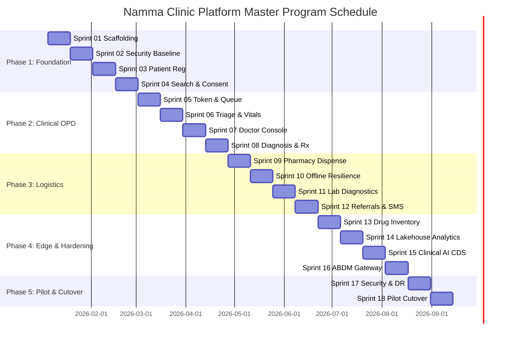

# Master Program Timeplan & Schedule Baseline
## Namma Clinic Digital Health & Operations Platform
### Greater Bengaluru Authority (GBA) / BBMP Health Department
**Document Code:** `TMP-DOC-01` | **Version Tag:** `1.0.0` | **Status:** APPROVED BASELINE | **Date:** September 2026

---

## 1. Executive Summary & Program Charter
The Master Program Timeplan establishes the authoritative, implementation-ready schedule baseline for the design, development, verification, pilot deployment, and citywide rollout of the Namma Clinic Digital Health & Operations Platform. Authorized by the Greater Bengaluru Authority (GBA) Health Advisory Board and the BBMP Health Directorate, this 36-week program schedule spans 18 two-week sprints grouped into 5 strategic phases.

Operating in full compliance with the Digital Personal Data Protection (DPDP) Act 2023, Ayushman Bharat Digital Mission (ABDM) standards, and MeitY cloud hosting guidelines, this timeplan provides the definitive calendar and sequence constraints governing all 17 delivery workstreams, 4 cross-functional engineering squads, and municipal clinical operations.

## 2. Master Schedule Architecture & 36-Week Program Calendar
The program timeline is structured hierarchically across 36 calendar weeks, divided into five delivery phases:
- **Program Horizon:** 36 Weeks (9 Calendar Months), divided into five delivery phases.
- **Execution Cadence:** 18 Sprints of exactly 10 working days (2 calendar weeks) each.
- **Release Synchronization:** 8 Enterprise Releases (`RELEASE-00` to `RELEASE-07`) aligned with sprint completions.
- **Governance Gates:** 10 Automated Quality Gates (`QUALITY-GATE-001` to `QUALITY-GATE-010`) enforcing strict phase transitions.
- **Field Validation:** 4-week on-site clinical pilot across 20 facilities in South, East, and West municipal zones.

### Week-by-Week Operational Calendar (Weeks 01 to 36)
Authoritative week-by-week milestones and delivery targets:

#### Week 01: Calendar Week 01 Target Window
- **Sprint Alignment:** `SPRINT-01` (First Half (Sprint Planning, Architecture & Implementation))
- **Operational Focus:** Execution of committed backlog items with daily CI regression tracking.
- **Target Velocity:** 40 Story Points committed per sprint cycle.
- **Key Milestone Delivery:** Delivery of scheduled modular service components.
- **Governance Check:** Weekly engineering health check and blocker triage.

#### Week 02: Calendar Week 02 Target Window
- **Sprint Alignment:** `SPRINT-01` (Second Half (Testing, Hardening, Sprint Review & Demo))
- **Operational Focus:** Execution of committed backlog items with daily CI regression tracking.
- **Target Velocity:** 40 Story Points committed per sprint cycle.
- **Key Milestone Delivery:** Delivery of scheduled modular service components.
- **Governance Check:** Weekly engineering health check and blocker triage.

#### Week 03: Calendar Week 03 Target Window
- **Sprint Alignment:** `SPRINT-02` (First Half (Sprint Planning, Architecture & Implementation))
- **Operational Focus:** Execution of committed backlog items with daily CI regression tracking.
- **Target Velocity:** 40 Story Points committed per sprint cycle.
- **Key Milestone Delivery:** Delivery of scheduled modular service components.
- **Governance Check:** Weekly engineering health check and blocker triage.

#### Week 04: Calendar Week 04 Target Window
- **Sprint Alignment:** `SPRINT-02` (Second Half (Testing, Hardening, Sprint Review & Demo))
- **Operational Focus:** Execution of committed backlog items with daily CI regression tracking.
- **Target Velocity:** 40 Story Points committed per sprint cycle.
- **Key Milestone Delivery:** Delivery of scheduled modular service components.
- **Governance Check:** Weekly engineering health check and blocker triage.

#### Week 05: Calendar Week 05 Target Window
- **Sprint Alignment:** `SPRINT-03` (First Half (Sprint Planning, Architecture & Implementation))
- **Operational Focus:** Execution of committed backlog items with daily CI regression tracking.
- **Target Velocity:** 40 Story Points committed per sprint cycle.
- **Key Milestone Delivery:** Delivery of scheduled modular service components.
- **Governance Check:** Weekly engineering health check and blocker triage.

#### Week 06: Calendar Week 06 Target Window
- **Sprint Alignment:** `SPRINT-03` (Second Half (Testing, Hardening, Sprint Review & Demo))
- **Operational Focus:** Execution of committed backlog items with daily CI regression tracking.
- **Target Velocity:** 40 Story Points committed per sprint cycle.
- **Key Milestone Delivery:** Delivery of scheduled modular service components.
- **Governance Check:** Weekly engineering health check and blocker triage.

#### Week 07: Calendar Week 07 Target Window
- **Sprint Alignment:** `SPRINT-04` (First Half (Sprint Planning, Architecture & Implementation))
- **Operational Focus:** Execution of committed backlog items with daily CI regression tracking.
- **Target Velocity:** 40 Story Points committed per sprint cycle.
- **Key Milestone Delivery:** Delivery of scheduled modular service components.
- **Governance Check:** Weekly engineering health check and blocker triage.

#### Week 08: Calendar Week 08 Target Window
- **Sprint Alignment:** `SPRINT-04` (Second Half (Testing, Hardening, Sprint Review & Demo))
- **Operational Focus:** Execution of committed backlog items with daily CI regression tracking.
- **Target Velocity:** 40 Story Points committed per sprint cycle.
- **Key Milestone Delivery:** Delivery of scheduled modular service components.
- **Governance Check:** Weekly engineering health check and blocker triage.

#### Week 09: Calendar Week 09 Target Window
- **Sprint Alignment:** `SPRINT-05` (First Half (Sprint Planning, Architecture & Implementation))
- **Operational Focus:** Execution of committed backlog items with daily CI regression tracking.
- **Target Velocity:** 40 Story Points committed per sprint cycle.
- **Key Milestone Delivery:** Delivery of scheduled modular service components.
- **Governance Check:** Weekly engineering health check and blocker triage.

#### Week 10: Calendar Week 10 Target Window
- **Sprint Alignment:** `SPRINT-05` (Second Half (Testing, Hardening, Sprint Review & Demo))
- **Operational Focus:** Execution of committed backlog items with daily CI regression tracking.
- **Target Velocity:** 40 Story Points committed per sprint cycle.
- **Key Milestone Delivery:** Delivery of scheduled modular service components.
- **Governance Check:** Weekly engineering health check and blocker triage.

#### Week 11: Calendar Week 11 Target Window
- **Sprint Alignment:** `SPRINT-06` (First Half (Sprint Planning, Architecture & Implementation))
- **Operational Focus:** Execution of committed backlog items with daily CI regression tracking.
- **Target Velocity:** 40 Story Points committed per sprint cycle.
- **Key Milestone Delivery:** Delivery of scheduled modular service components.
- **Governance Check:** Weekly engineering health check and blocker triage.

#### Week 12: Calendar Week 12 Target Window
- **Sprint Alignment:** `SPRINT-06` (Second Half (Testing, Hardening, Sprint Review & Demo))
- **Operational Focus:** Execution of committed backlog items with daily CI regression tracking.
- **Target Velocity:** 40 Story Points committed per sprint cycle.
- **Key Milestone Delivery:** Delivery of scheduled modular service components.
- **Governance Check:** Weekly engineering health check and blocker triage.

#### Week 13: Calendar Week 13 Target Window
- **Sprint Alignment:** `SPRINT-07` (First Half (Sprint Planning, Architecture & Implementation))
- **Operational Focus:** Execution of committed backlog items with daily CI regression tracking.
- **Target Velocity:** 40 Story Points committed per sprint cycle.
- **Key Milestone Delivery:** Delivery of scheduled modular service components.
- **Governance Check:** Weekly engineering health check and blocker triage.

#### Week 14: Calendar Week 14 Target Window
- **Sprint Alignment:** `SPRINT-07` (Second Half (Testing, Hardening, Sprint Review & Demo))
- **Operational Focus:** Execution of committed backlog items with daily CI regression tracking.
- **Target Velocity:** 40 Story Points committed per sprint cycle.
- **Key Milestone Delivery:** Delivery of scheduled modular service components.
- **Governance Check:** Weekly engineering health check and blocker triage.

#### Week 15: Calendar Week 15 Target Window
- **Sprint Alignment:** `SPRINT-08` (First Half (Sprint Planning, Architecture & Implementation))
- **Operational Focus:** Execution of committed backlog items with daily CI regression tracking.
- **Target Velocity:** 40 Story Points committed per sprint cycle.
- **Key Milestone Delivery:** Delivery of scheduled modular service components.
- **Governance Check:** Weekly engineering health check and blocker triage.

#### Week 16: Calendar Week 16 Target Window
- **Sprint Alignment:** `SPRINT-08` (Second Half (Testing, Hardening, Sprint Review & Demo))
- **Operational Focus:** Execution of committed backlog items with daily CI regression tracking.
- **Target Velocity:** 40 Story Points committed per sprint cycle.
- **Key Milestone Delivery:** Delivery of scheduled modular service components.
- **Governance Check:** Weekly engineering health check and blocker triage.

#### Week 17: Calendar Week 17 Target Window
- **Sprint Alignment:** `SPRINT-09` (First Half (Sprint Planning, Architecture & Implementation))
- **Operational Focus:** Execution of committed backlog items with daily CI regression tracking.
- **Target Velocity:** 40 Story Points committed per sprint cycle.
- **Key Milestone Delivery:** Delivery of scheduled modular service components.
- **Governance Check:** Weekly engineering health check and blocker triage.

#### Week 18: Calendar Week 18 Target Window
- **Sprint Alignment:** `SPRINT-09` (Second Half (Testing, Hardening, Sprint Review & Demo))
- **Operational Focus:** Execution of committed backlog items with daily CI regression tracking.
- **Target Velocity:** 40 Story Points committed per sprint cycle.
- **Key Milestone Delivery:** Delivery of scheduled modular service components.
- **Governance Check:** Weekly engineering health check and blocker triage.

#### Week 19: Calendar Week 19 Target Window
- **Sprint Alignment:** `SPRINT-10` (First Half (Sprint Planning, Architecture & Implementation))
- **Operational Focus:** Execution of committed backlog items with daily CI regression tracking.
- **Target Velocity:** 40 Story Points committed per sprint cycle.
- **Key Milestone Delivery:** Delivery of scheduled modular service components.
- **Governance Check:** Weekly engineering health check and blocker triage.

#### Week 20: Calendar Week 20 Target Window
- **Sprint Alignment:** `SPRINT-10` (Second Half (Testing, Hardening, Sprint Review & Demo))
- **Operational Focus:** Execution of committed backlog items with daily CI regression tracking.
- **Target Velocity:** 40 Story Points committed per sprint cycle.
- **Key Milestone Delivery:** Delivery of scheduled modular service components.
- **Governance Check:** Weekly engineering health check and blocker triage.

#### Week 21: Calendar Week 21 Target Window
- **Sprint Alignment:** `SPRINT-11` (First Half (Sprint Planning, Architecture & Implementation))
- **Operational Focus:** Execution of committed backlog items with daily CI regression tracking.
- **Target Velocity:** 40 Story Points committed per sprint cycle.
- **Key Milestone Delivery:** Delivery of scheduled modular service components.
- **Governance Check:** Weekly engineering health check and blocker triage.

#### Week 22: Calendar Week 22 Target Window
- **Sprint Alignment:** `SPRINT-11` (Second Half (Testing, Hardening, Sprint Review & Demo))
- **Operational Focus:** Execution of committed backlog items with daily CI regression tracking.
- **Target Velocity:** 40 Story Points committed per sprint cycle.
- **Key Milestone Delivery:** Delivery of scheduled modular service components.
- **Governance Check:** Weekly engineering health check and blocker triage.

#### Week 23: Calendar Week 23 Target Window
- **Sprint Alignment:** `SPRINT-12` (First Half (Sprint Planning, Architecture & Implementation))
- **Operational Focus:** Execution of committed backlog items with daily CI regression tracking.
- **Target Velocity:** 40 Story Points committed per sprint cycle.
- **Key Milestone Delivery:** Delivery of scheduled modular service components.
- **Governance Check:** Weekly engineering health check and blocker triage.

#### Week 24: Calendar Week 24 Target Window
- **Sprint Alignment:** `SPRINT-12` (Second Half (Testing, Hardening, Sprint Review & Demo))
- **Operational Focus:** Execution of committed backlog items with daily CI regression tracking.
- **Target Velocity:** 40 Story Points committed per sprint cycle.
- **Key Milestone Delivery:** Delivery of scheduled modular service components.
- **Governance Check:** Weekly engineering health check and blocker triage.

#### Week 25: Calendar Week 25 Target Window
- **Sprint Alignment:** `SPRINT-13` (First Half (Sprint Planning, Architecture & Implementation))
- **Operational Focus:** Execution of committed backlog items with daily CI regression tracking.
- **Target Velocity:** 40 Story Points committed per sprint cycle.
- **Key Milestone Delivery:** Delivery of scheduled modular service components.
- **Governance Check:** Weekly engineering health check and blocker triage.

#### Week 26: Calendar Week 26 Target Window
- **Sprint Alignment:** `SPRINT-13` (Second Half (Testing, Hardening, Sprint Review & Demo))
- **Operational Focus:** Execution of committed backlog items with daily CI regression tracking.
- **Target Velocity:** 40 Story Points committed per sprint cycle.
- **Key Milestone Delivery:** Delivery of scheduled modular service components.
- **Governance Check:** Weekly engineering health check and blocker triage.

#### Week 27: Calendar Week 27 Target Window
- **Sprint Alignment:** `SPRINT-14` (First Half (Sprint Planning, Architecture & Implementation))
- **Operational Focus:** Execution of committed backlog items with daily CI regression tracking.
- **Target Velocity:** 40 Story Points committed per sprint cycle.
- **Key Milestone Delivery:** Delivery of scheduled modular service components.
- **Governance Check:** Weekly engineering health check and blocker triage.

#### Week 28: Calendar Week 28 Target Window
- **Sprint Alignment:** `SPRINT-14` (Second Half (Testing, Hardening, Sprint Review & Demo))
- **Operational Focus:** Execution of committed backlog items with daily CI regression tracking.
- **Target Velocity:** 40 Story Points committed per sprint cycle.
- **Key Milestone Delivery:** Delivery of scheduled modular service components.
- **Governance Check:** Weekly engineering health check and blocker triage.

#### Week 29: Calendar Week 29 Target Window
- **Sprint Alignment:** `SPRINT-15` (First Half (Sprint Planning, Architecture & Implementation))
- **Operational Focus:** Execution of committed backlog items with daily CI regression tracking.
- **Target Velocity:** 40 Story Points committed per sprint cycle.
- **Key Milestone Delivery:** Delivery of scheduled modular service components.
- **Governance Check:** Weekly engineering health check and blocker triage.

#### Week 30: Calendar Week 30 Target Window
- **Sprint Alignment:** `SPRINT-15` (Second Half (Testing, Hardening, Sprint Review & Demo))
- **Operational Focus:** Execution of committed backlog items with daily CI regression tracking.
- **Target Velocity:** 40 Story Points committed per sprint cycle.
- **Key Milestone Delivery:** Delivery of scheduled modular service components.
- **Governance Check:** Weekly engineering health check and blocker triage.

#### Week 31: Calendar Week 31 Target Window
- **Sprint Alignment:** `SPRINT-16` (First Half (Sprint Planning, Architecture & Implementation))
- **Operational Focus:** Execution of committed backlog items with daily CI regression tracking.
- **Target Velocity:** 40 Story Points committed per sprint cycle.
- **Key Milestone Delivery:** Delivery of scheduled modular service components.
- **Governance Check:** Weekly engineering health check and blocker triage.

#### Week 32: Calendar Week 32 Target Window
- **Sprint Alignment:** `SPRINT-16` (Second Half (Testing, Hardening, Sprint Review & Demo))
- **Operational Focus:** Execution of committed backlog items with daily CI regression tracking.
- **Target Velocity:** 40 Story Points committed per sprint cycle.
- **Key Milestone Delivery:** Delivery of scheduled modular service components.
- **Governance Check:** Weekly engineering health check and blocker triage.

#### Week 33: Calendar Week 33 Target Window
- **Sprint Alignment:** `SPRINT-17` (First Half (Sprint Planning, Architecture & Implementation))
- **Operational Focus:** Execution of committed backlog items with daily CI regression tracking.
- **Target Velocity:** 40 Story Points committed per sprint cycle.
- **Key Milestone Delivery:** Delivery of scheduled modular service components.
- **Governance Check:** Weekly engineering health check and blocker triage.

#### Week 34: Calendar Week 34 Target Window
- **Sprint Alignment:** `SPRINT-17` (Second Half (Testing, Hardening, Sprint Review & Demo))
- **Operational Focus:** Execution of committed backlog items with daily CI regression tracking.
- **Target Velocity:** 40 Story Points committed per sprint cycle.
- **Key Milestone Delivery:** Delivery of scheduled modular service components.
- **Governance Check:** Weekly engineering health check and blocker triage.

#### Week 35: Calendar Week 35 Target Window
- **Sprint Alignment:** `SPRINT-18` (First Half (Sprint Planning, Architecture & Implementation))
- **Operational Focus:** Execution of committed backlog items with daily CI regression tracking.
- **Target Velocity:** 40 Story Points committed per sprint cycle.
- **Key Milestone Delivery:** Delivery of scheduled modular service components.
- **Governance Check:** Weekly engineering health check and blocker triage.

#### Week 36: Calendar Week 36 Target Window
- **Sprint Alignment:** `SPRINT-18` (Second Half (Testing, Hardening, Sprint Review & Demo))
- **Operational Focus:** Execution of committed backlog items with daily CI regression tracking.
- **Target Velocity:** 40 Story Points committed per sprint cycle.
- **Key Milestone Delivery:** Delivery of scheduled modular service components.
- **Governance Check:** Weekly engineering health check and blocker triage.

### Schedule Architecture Diagram: Master Program Timeline Gantt Chart
<!-- DOCUMENTATION-ONLY DIAGRAM -->

## 3. Strategic Delivery Phases Overview
Detailed operational objectives and exit standards for each of the five program phases:

### PROGRAM-PHASE-1: Phase 1: Foundation Architecture, Security & Core Outpatient OPD
- **Phase Identifier:** `PROGRAM-PHASE-1`
- **Duration:** 8 Weeks (Weeks 01 to 08 (Months 1–2))
- **Sprint Boundary:** `SPRINT-01 to SPRINT-04`
- **Lead Workstream:** `WORKSTREAM-05`
- **Phase Exit Quality Gate:** `QUALITY-GATE-004`
- **Core Phase Deliverables:**
  - Fastify and PostgreSQL multi-tenant foundation
  - Keycloak OIDC and WORM audit ledger
  - Citizen registration and ABHA M1 minting
  - Patient token generation and queue orchestration
- **Governance Status:** `APPROVED_SCHEDULE`

### PROGRAM-PHASE-2: Phase 2: Clinical Outpatient Encounter, Pharmacy & Ancillary Diagnostics
- **Phase Identifier:** `PROGRAM-PHASE-2`
- **Duration:** 8 Weeks (Weeks 09 to 16 (Months 3–4))
- **Sprint Boundary:** `SPRINT-05 to SPRINT-08`
- **Lead Workstream:** `WORKSTREAM-04`
- **Phase Exit Quality Gate:** `QUALITY-GATE-008`
- **Core Phase Deliverables:**
  - Nurse triage workbench and vital signs capture
  - Doctor clinical consultation console and timeline
  - ICD-10 and SNOMED CT diagnosis coding
  - STG-compliant electronic prescription generator
- **Governance Status:** `APPROVED_SCHEDULE`

### PROGRAM-PHASE-3: Phase 3: Pharmacy Logistics, POC Laboratory & Secondary Referrals
- **Phase Identifier:** `PROGRAM-PHASE-3`
- **Duration:** 8 Weeks (Weeks 17 to 24 (Months 5–6))
- **Sprint Boundary:** `SPRINT-09 to SPRINT-12`
- **Lead Workstream:** `WORKSTREAM-07`
- **Phase Exit Quality Gate:** `QUALITY-GATE-012`
- **Core Phase Deliverables:**
  - FEFO-allocated pharmacy dispensing counter
  - Point-of-care rapid diagnostic lab ordering and results
  - NIC eHospital secondary referral gateway
  - Automated bilingual patient SMS alerts
- **Governance Status:** `APPROVED_SCHEDULE`

### PROGRAM-PHASE-4: Phase 4: Offline Edge Resilience, Lakehouse Analytics & Security Hardening
- **Phase Identifier:** `PROGRAM-PHASE-4`
- **Duration:** 8 Weeks (Weeks 25 to 32 (Months 7–8))
- **Sprint Boundary:** `SPRINT-13 to SPRINT-16`
- **Lead Workstream:** `WORKSTREAM-10`
- **Phase Exit Quality Gate:** `QUALITY-GATE-016`
- **Core Phase Deliverables:**
  - Autonomous client-side SQLite replication engine
  - Bi-directional sync conflict resolution engine
  - ClickHouse OLAP lakehouse and Superset dashboards
  - Zero-trust VAPT security remediation and DR dry-run
- **Governance Status:** `APPROVED_SCHEDULE`

### PROGRAM-PHASE-5: Phase 5: 20-Clinic Field Pilot, Clinical UAT & Municipal Production Rollout
- **Phase Identifier:** `PROGRAM-PHASE-5`
- **Duration:** 4 Weeks (Weeks 33 to 36 (Month 9))
- **Sprint Boundary:** `SPRINT-17 to SPRINT-18`
- **Lead Workstream:** `WORKSTREAM-15`
- **Phase Exit Quality Gate:** `QUALITY-GATE-020`
- **Core Phase Deliverables:**
  - 20-clinic physical workstation deployment and inspection
  - Clinic staff training and live shadow operations
  - 14-day live pilot outpatient trial with 24/7 hypercare
  - Formal clinical UAT ratification and citywide scale cutover
- **Governance Status:** `APPROVED_SCHEDULE`

## 4. Critical Path & Network Dependency Analysis
The program critical path comprises 18 contiguous sprint work packages where total float is exactly zero (TF = 0). Any slippage in these critical path activities directly delays the 20-clinic field pilot and citywide municipal cutover.

| Sprint ID | Critical Path Work Item | Early Start | Early Finish | Late Start | Late Finish | Total Float | Free Float | Critical Status |
| :--- | :--- | :--- | :--- | :--- | :--- | :--- | :--- | :--- |
| `SPRINT-01` | Foundation Scaffolding & Architecture Readiness | Day 001 | Day 010 | Day 001 | Day 010 | 0 Days | 0 Days | `CRITICAL PATH` |
| `SPRINT-02` | Identity, Authentication & Security Foundation | Day 011 | Day 020 | Day 011 | Day 020 | 0 Days | 0 Days | `CRITICAL PATH` |
| `SPRINT-03` | Patient Registration & Demographics | Day 021 | Day 030 | Day 021 | Day 030 | 0 Days | 0 Days | `CRITICAL PATH` |
| `SPRINT-04` | Patient Search, Repeat Visits & Consent | Day 031 | Day 040 | Day 031 | Day 040 | 0 Days | 0 Days | `CRITICAL PATH` |
| `SPRINT-05` | Token Generation & Queue Management | Day 041 | Day 050 | Day 041 | Day 050 | 0 Days | 0 Days | `CRITICAL PATH` |
| `SPRINT-06` | Clinical Triage, Vitals & Danger Alerts | Day 051 | Day 060 | Day 051 | Day 060 | 0 Days | 0 Days | `CRITICAL PATH` |
| `SPRINT-07` | Doctor Consultation Workbench | Day 061 | Day 070 | Day 061 | Day 070 | 0 Days | 0 Days | `CRITICAL PATH` |
| `SPRINT-08` | Diagnosis & Electronic Prescriptions | Day 071 | Day 080 | Day 071 | Day 080 | 0 Days | 0 Days | `CRITICAL PATH` |
| `SPRINT-09` | Pharmacy Dispensation & FEFO Allocation | Day 081 | Day 090 | Day 081 | Day 090 | 0 Days | 0 Days | `CRITICAL PATH` |
| `SPRINT-10` | Offline-First Resilience & Sync | Day 091 | Day 100 | Day 091 | Day 100 | 0 Days | 0 Days | `CRITICAL PATH` |
| `SPRINT-11` | Laboratory & Point-of-Care Diagnostics | Day 101 | Day 110 | Day 101 | Day 110 | 0 Days | 0 Days | `CRITICAL PATH` |
| `SPRINT-12` | Secondary Referrals & Bilingual SMS | Day 111 | Day 120 | Day 111 | Day 120 | 0 Days | 0 Days | `CRITICAL PATH` |
| `SPRINT-13` | Drug Inventory & Supply Chain | Day 121 | Day 130 | Day 121 | Day 130 | 0 Days | 0 Days | `CRITICAL PATH` |
| `SPRINT-14` | Population Health Analytics & Reporting | Day 131 | Day 140 | Day 131 | Day 140 | 0 Days | 0 Days | `CRITICAL PATH` |
| `SPRINT-15` | AI/ML Clinical Decision Support | Day 141 | Day 150 | Day 141 | Day 150 | 0 Days | 0 Days | `CRITICAL PATH` |
| `SPRINT-16` | ABDM National Interoperability | Day 151 | Day 160 | Day 151 | Day 160 | 0 Days | 0 Days | `CRITICAL PATH` |
| `SPRINT-17` | Zero-Trust Security Hardening & DR | Day 161 | Day 170 | Day 161 | Day 170 | 0 Days | 0 Days | `CRITICAL PATH` |
| `SPRINT-18` | Pilot Validation & Production Cutover | Day 171 | Day 180 | Day 171 | Day 180 | 0 Days | 0 Days | `CRITICAL PATH` |

## 5. Exhaustive 18-Sprint Execution Specification
Comprehensive engineering, clinical, architectural, and governance breakdown for all 18 execution sprints across the 36-week program horizon:

### 5.1. SPRINT-01: Foundation Scaffolding & Architecture Readiness
Formal execution specification for `SPRINT-01`:
- **Sprint Code:** `SPRINT-01` (Sprint #01)
- **Program Phase:** `PROGRAM-PHASE-1`
- **Execution Window:** W01–W02 (Working Days 001 to 010)
- **Target Release Vehicle:** `RELEASE-00`
- **Capacity Allocation:** 10 working days, 720 engineering hours across 4 squads.

#### Technical Objectives for SPRINT-01
The primary architectural and engineering goals for `SPRINT-01` focus on foundation scaffolding & architecture readiness:
1. Implement domain logic and Fastify route handlers satisfying target requirements.
2. Execute Flyway database schema migrations with automated rollback scripts.
3. Deliver bilingual React UI components validated in Kannada and English.
4. Integrate automated unit tests maintaining >= 90% branch coverage.
5. Conduct zero-trust security scan ensuring zero Critical or High CVEs.

#### Day-by-Day Execution Schedule for SPRINT-01
- **Day 01 (Program Day 001):** Sprint Planning & Architecture Alignment — Focused engineering and QA sync.
- **Day 02 (Program Day 002):** Data Modeling & Flyway Migration Authoring — Focused engineering and QA sync.
- **Day 03 (Program Day 003):** Core Domain Business Logic Implementation — Focused engineering and QA sync.
- **Day 04 (Program Day 004):** REST API Endpoint & Route Handler Engineering — Focused engineering and QA sync.
- **Day 05 (Program Day 005):** Bilingual React UI Component Development — Focused engineering and QA sync.
- **Day 06 (Program Day 006):** Integration Testing & Schema Validation — Focused engineering and QA sync.
- **Day 07 (Program Day 007):** Automated Playwright E2E Test Authoring — Focused engineering and QA sync.
- **Day 08 (Program Day 008):** Security Scanning & Static Analysis (SAST) — Focused engineering and QA sync.
- **Day 09 (Program Day 009):** Staging Load Testing & Performance Hardening — Focused engineering and QA sync.
- **Day 10 (Program Day 010):** Sprint Review, Clinical Demo & Governance Retrospective — Focused engineering and QA sync.

#### Sprint Work Breakdown Structure for SPRINT-01
Detailed engineering task specifications committed for `SPRINT-01`:

##### Task SPRINT-01-01: Backend Engineering — Implement core REST API route handlers, JSON schemas, and domain service logic
- **Task Code:** `TSK-SPRINT-01-01` | Sizing: `5 SP`
- **Domain Area:** Backend Engineering | Primary Assignee: `Senior Backend Engineer`
- **Functional Scope:** Implement core REST API route handlers, JSON schemas, and domain service logic.
- **Acceptance Standard:** Peer review approval by two senior engineers and 100% CI automated test pass.
- **Technical Verification:** Automated linting, static analysis, unit test coverage >= 90%, and schema validation.

##### Task SPRINT-01-02: Frontend Engineering — Develop bilingual responsive React UI components with TailwindCSS and accessibility
- **Task Code:** `TSK-SPRINT-01-02` | Sizing: `5 SP`
- **Domain Area:** Frontend Engineering | Primary Assignee: `Senior Frontend Engineer`
- **Functional Scope:** Develop bilingual responsive React UI components with TailwindCSS and accessibility.
- **Acceptance Standard:** Peer review approval by two senior engineers and 100% CI automated test pass.
- **Technical Verification:** Automated linting, static analysis, unit test coverage >= 90%, and schema validation.

##### Task SPRINT-01-03: Database Engineering — Author Flyway migration scripts, define composite indexes, and verify multi-tenant isolation
- **Task Code:** `TSK-SPRINT-01-03` | Sizing: `3 SP`
- **Domain Area:** Database Engineering | Primary Assignee: `Database Engineer`
- **Functional Scope:** Author Flyway migration scripts, define composite indexes, and verify multi-tenant isolation.
- **Acceptance Standard:** Peer review approval by two senior engineers and 100% CI automated test pass.
- **Technical Verification:** Automated linting, static analysis, unit test coverage >= 90%, and schema validation.

##### Task SPRINT-01-04: Quality Assurance — Author Playwright automated end-to-end regression journeys and edge case assertions
- **Task Code:** `TSK-SPRINT-01-04` | Sizing: `5 SP`
- **Domain Area:** Quality Assurance | Primary Assignee: `QA Automation Engineer`
- **Functional Scope:** Author Playwright automated end-to-end regression journeys and edge case assertions.
- **Acceptance Standard:** Peer review approval by two senior engineers and 100% CI automated test pass.
- **Technical Verification:** Automated linting, static analysis, unit test coverage >= 90%, and schema validation.

##### Task SPRINT-01-05: DevOps & Security — Validate container image security scans, Kubernetes Helm configurations, and CI gates
- **Task Code:** `TSK-SPRINT-01-05` | Sizing: `3 SP`
- **Domain Area:** DevOps & Security | Primary Assignee: `DevOps / SRE Lead`
- **Functional Scope:** Validate container image security scans, Kubernetes Helm configurations, and CI gates.
- **Acceptance Standard:** Peer review approval by two senior engineers and 100% CI automated test pass.
- **Technical Verification:** Automated linting, static analysis, unit test coverage >= 90%, and schema validation.

##### Task SPRINT-01-06: Clinical SME Review — Conduct clinical workflow audit against BBMP Standard Treatment Guidelines (STGs)
- **Task Code:** `TSK-SPRINT-01-06` | Sizing: `2 SP`
- **Domain Area:** Clinical SME Review | Primary Assignee: `Lead Clinical SME`
- **Functional Scope:** Conduct clinical workflow audit against BBMP Standard Treatment Guidelines (STGs).
- **Acceptance Standard:** Peer review approval by two senior engineers and 100% CI automated test pass.
- **Technical Verification:** Automated linting, static analysis, unit test coverage >= 90%, and schema validation.

##### Task SPRINT-01-07: Documentation & Contracts — Update OpenAPI 3
- **Task Code:** `TSK-SPRINT-01-07` | Sizing: `2 SP`
- **Domain Area:** Documentation & Contracts | Primary Assignee: `Technical Writer / Architect`
- **Functional Scope:** Update OpenAPI 3.1 contracts, ADR records, and system administration manuals.
- **Acceptance Standard:** Peer review approval by two senior engineers and 100% CI automated test pass.
- **Technical Verification:** Automated linting, static analysis, unit test coverage >= 90%, and schema validation.

##### Task SPRINT-01-08: Performance & Hardening — Execute k6 staging load simulation verifying p95 latency remains sub-250ms
- **Task Code:** `TSK-SPRINT-01-08` | Sizing: `3 SP`
- **Domain Area:** Performance & Hardening | Primary Assignee: `Performance Engineer`
- **Functional Scope:** Execute k6 staging load simulation verifying p95 latency remains sub-250ms.
- **Acceptance Standard:** Peer review approval by two senior engineers and 100% CI automated test pass.
- **Technical Verification:** Automated linting, static analysis, unit test coverage >= 90%, and schema validation.

##### Task SPRINT-01-09: Data Governance & Compliance — Verify DPDP Act 2023 consent logging, WORM audit trails, and data retention rules
- **Task Code:** `TSK-SPRINT-01-09` | Sizing: `2 SP`
- **Domain Area:** Data Governance & Compliance | Primary Assignee: `Compliance Specialist`
- **Functional Scope:** Verify DPDP Act 2023 consent logging, WORM audit trails, and data retention rules.
- **Acceptance Standard:** Peer review approval by two senior engineers and 100% CI automated test pass.
- **Technical Verification:** Automated linting, static analysis, unit test coverage >= 90%, and schema validation.

##### Task SPRINT-01-10: Zonal Operations Alignment — Coordinate hardware provisioning, clinic floor plan reviews, and network telemetry with zonal hubs
- **Task Code:** `TSK-SPRINT-01-10` | Sizing: `2 SP`
- **Domain Area:** Zonal Operations Alignment | Primary Assignee: `Field Operations Lead`
- **Functional Scope:** Coordinate hardware provisioning, clinic floor plan reviews, and network telemetry with zonal hubs.
- **Acceptance Standard:** Peer review approval by two senior engineers and 100% CI automated test pass.
- **Technical Verification:** Automated linting, static analysis, unit test coverage >= 90%, and schema validation.

#### Upstream & Cross-Sprint Dependencies for SPRINT-01
- **Governing Dependency:** `DEPENDENCY-001` (Finish-to-Start)
- **Prerequisite Condition:** Complete technical specification, unit test passing > 90%, and schema validation.
- **Downstream Impact:** Downstream task execution blocked until prerequisite successfully merges to branch.
- **Mitigation Action:** Parallel interface mocking using WireMock and daily engineering sync.

#### Risk Vectors & Mitigation Playbooks for SPRINT-01
- **Primary Risk:** `RISK-001` — Planning Risk 001: SCHEDULE uncertainty impacting delivery schedule
- **Risk Category:** `SCHEDULE` | Impact Level: `4`
- **Contingency Buffer:** 2 days schedule buffer allocated.
- **Mitigation Playbook:** Proactive technical spike, decoupled architecture, and continuous integration verification.

#### Definition of Done (DoD) & Exit Gate for SPRINT-01
To achieve formal closure, `SPRINT-01` must satisfy the following exit criteria:
- [x] All sprint backlog user stories completed with acceptance criteria met.
- [x] Unit test branch coverage >= 90% verified in GitHub Actions CI.
- [x] Automated Playwright E2E suite passing in staging cluster.
- [x] Zero open Critical (P0) or High (P1) defects in Jira issue tracker.
- [x] PostgreSQL database migrations verified with reversible undo scripts.
- [x] Formal sprint review and demo approved by Product Owner and Lead Clinical SME.

### 5.2. SPRINT-02: Identity, Authentication & Security Foundation
Formal execution specification for `SPRINT-02`:
- **Sprint Code:** `SPRINT-02` (Sprint #02)
- **Program Phase:** `PROGRAM-PHASE-1`
- **Execution Window:** W03–W04 (Working Days 011 to 020)
- **Target Release Vehicle:** `RELEASE-00`
- **Capacity Allocation:** 10 working days, 720 engineering hours across 4 squads.

#### Technical Objectives for SPRINT-02
The primary architectural and engineering goals for `SPRINT-02` focus on identity, authentication & security foundation:
1. Implement domain logic and Fastify route handlers satisfying target requirements.
2. Execute Flyway database schema migrations with automated rollback scripts.
3. Deliver bilingual React UI components validated in Kannada and English.
4. Integrate automated unit tests maintaining >= 90% branch coverage.
5. Conduct zero-trust security scan ensuring zero Critical or High CVEs.

#### Day-by-Day Execution Schedule for SPRINT-02
- **Day 01 (Program Day 011):** Sprint Planning & Architecture Alignment — Focused engineering and QA sync.
- **Day 02 (Program Day 012):** Data Modeling & Flyway Migration Authoring — Focused engineering and QA sync.
- **Day 03 (Program Day 013):** Core Domain Business Logic Implementation — Focused engineering and QA sync.
- **Day 04 (Program Day 014):** REST API Endpoint & Route Handler Engineering — Focused engineering and QA sync.
- **Day 05 (Program Day 015):** Bilingual React UI Component Development — Focused engineering and QA sync.
- **Day 06 (Program Day 016):** Integration Testing & Schema Validation — Focused engineering and QA sync.
- **Day 07 (Program Day 017):** Automated Playwright E2E Test Authoring — Focused engineering and QA sync.
- **Day 08 (Program Day 018):** Security Scanning & Static Analysis (SAST) — Focused engineering and QA sync.
- **Day 09 (Program Day 019):** Staging Load Testing & Performance Hardening — Focused engineering and QA sync.
- **Day 10 (Program Day 020):** Sprint Review, Clinical Demo & Governance Retrospective — Focused engineering and QA sync.

#### Sprint Work Breakdown Structure for SPRINT-02
Detailed engineering task specifications committed for `SPRINT-02`:

##### Task SPRINT-02-01: Backend Engineering — Implement core REST API route handlers, JSON schemas, and domain service logic
- **Task Code:** `TSK-SPRINT-02-01` | Sizing: `5 SP`
- **Domain Area:** Backend Engineering | Primary Assignee: `Senior Backend Engineer`
- **Functional Scope:** Implement core REST API route handlers, JSON schemas, and domain service logic.
- **Acceptance Standard:** Peer review approval by two senior engineers and 100% CI automated test pass.
- **Technical Verification:** Automated linting, static analysis, unit test coverage >= 90%, and schema validation.

##### Task SPRINT-02-02: Frontend Engineering — Develop bilingual responsive React UI components with TailwindCSS and accessibility
- **Task Code:** `TSK-SPRINT-02-02` | Sizing: `5 SP`
- **Domain Area:** Frontend Engineering | Primary Assignee: `Senior Frontend Engineer`
- **Functional Scope:** Develop bilingual responsive React UI components with TailwindCSS and accessibility.
- **Acceptance Standard:** Peer review approval by two senior engineers and 100% CI automated test pass.
- **Technical Verification:** Automated linting, static analysis, unit test coverage >= 90%, and schema validation.

##### Task SPRINT-02-03: Database Engineering — Author Flyway migration scripts, define composite indexes, and verify multi-tenant isolation
- **Task Code:** `TSK-SPRINT-02-03` | Sizing: `3 SP`
- **Domain Area:** Database Engineering | Primary Assignee: `Database Engineer`
- **Functional Scope:** Author Flyway migration scripts, define composite indexes, and verify multi-tenant isolation.
- **Acceptance Standard:** Peer review approval by two senior engineers and 100% CI automated test pass.
- **Technical Verification:** Automated linting, static analysis, unit test coverage >= 90%, and schema validation.

##### Task SPRINT-02-04: Quality Assurance — Author Playwright automated end-to-end regression journeys and edge case assertions
- **Task Code:** `TSK-SPRINT-02-04` | Sizing: `5 SP`
- **Domain Area:** Quality Assurance | Primary Assignee: `QA Automation Engineer`
- **Functional Scope:** Author Playwright automated end-to-end regression journeys and edge case assertions.
- **Acceptance Standard:** Peer review approval by two senior engineers and 100% CI automated test pass.
- **Technical Verification:** Automated linting, static analysis, unit test coverage >= 90%, and schema validation.

##### Task SPRINT-02-05: DevOps & Security — Validate container image security scans, Kubernetes Helm configurations, and CI gates
- **Task Code:** `TSK-SPRINT-02-05` | Sizing: `3 SP`
- **Domain Area:** DevOps & Security | Primary Assignee: `DevOps / SRE Lead`
- **Functional Scope:** Validate container image security scans, Kubernetes Helm configurations, and CI gates.
- **Acceptance Standard:** Peer review approval by two senior engineers and 100% CI automated test pass.
- **Technical Verification:** Automated linting, static analysis, unit test coverage >= 90%, and schema validation.

##### Task SPRINT-02-06: Clinical SME Review — Conduct clinical workflow audit against BBMP Standard Treatment Guidelines (STGs)
- **Task Code:** `TSK-SPRINT-02-06` | Sizing: `2 SP`
- **Domain Area:** Clinical SME Review | Primary Assignee: `Lead Clinical SME`
- **Functional Scope:** Conduct clinical workflow audit against BBMP Standard Treatment Guidelines (STGs).
- **Acceptance Standard:** Peer review approval by two senior engineers and 100% CI automated test pass.
- **Technical Verification:** Automated linting, static analysis, unit test coverage >= 90%, and schema validation.

##### Task SPRINT-02-07: Documentation & Contracts — Update OpenAPI 3
- **Task Code:** `TSK-SPRINT-02-07` | Sizing: `2 SP`
- **Domain Area:** Documentation & Contracts | Primary Assignee: `Technical Writer / Architect`
- **Functional Scope:** Update OpenAPI 3.1 contracts, ADR records, and system administration manuals.
- **Acceptance Standard:** Peer review approval by two senior engineers and 100% CI automated test pass.
- **Technical Verification:** Automated linting, static analysis, unit test coverage >= 90%, and schema validation.

##### Task SPRINT-02-08: Performance & Hardening — Execute k6 staging load simulation verifying p95 latency remains sub-250ms
- **Task Code:** `TSK-SPRINT-02-08` | Sizing: `3 SP`
- **Domain Area:** Performance & Hardening | Primary Assignee: `Performance Engineer`
- **Functional Scope:** Execute k6 staging load simulation verifying p95 latency remains sub-250ms.
- **Acceptance Standard:** Peer review approval by two senior engineers and 100% CI automated test pass.
- **Technical Verification:** Automated linting, static analysis, unit test coverage >= 90%, and schema validation.

##### Task SPRINT-02-09: Data Governance & Compliance — Verify DPDP Act 2023 consent logging, WORM audit trails, and data retention rules
- **Task Code:** `TSK-SPRINT-02-09` | Sizing: `2 SP`
- **Domain Area:** Data Governance & Compliance | Primary Assignee: `Compliance Specialist`
- **Functional Scope:** Verify DPDP Act 2023 consent logging, WORM audit trails, and data retention rules.
- **Acceptance Standard:** Peer review approval by two senior engineers and 100% CI automated test pass.
- **Technical Verification:** Automated linting, static analysis, unit test coverage >= 90%, and schema validation.

##### Task SPRINT-02-10: Zonal Operations Alignment — Coordinate hardware provisioning, clinic floor plan reviews, and network telemetry with zonal hubs
- **Task Code:** `TSK-SPRINT-02-10` | Sizing: `2 SP`
- **Domain Area:** Zonal Operations Alignment | Primary Assignee: `Field Operations Lead`
- **Functional Scope:** Coordinate hardware provisioning, clinic floor plan reviews, and network telemetry with zonal hubs.
- **Acceptance Standard:** Peer review approval by two senior engineers and 100% CI automated test pass.
- **Technical Verification:** Automated linting, static analysis, unit test coverage >= 90%, and schema validation.

#### Upstream & Cross-Sprint Dependencies for SPRINT-02
- **Governing Dependency:** `DEPENDENCY-002` (Start-to-Start)
- **Prerequisite Condition:** Complete technical specification, unit test passing > 90%, and schema validation.
- **Downstream Impact:** Downstream task execution blocked until prerequisite successfully merges to branch.
- **Mitigation Action:** Parallel interface mocking using WireMock and daily engineering sync.

#### Risk Vectors & Mitigation Playbooks for SPRINT-02
- **Primary Risk:** `RISK-002` — Planning Risk 002: TECHNICAL uncertainty impacting delivery schedule
- **Risk Category:** `TECHNICAL` | Impact Level: `5`
- **Contingency Buffer:** 4 days schedule buffer allocated.
- **Mitigation Playbook:** Proactive technical spike, decoupled architecture, and continuous integration verification.

#### Definition of Done (DoD) & Exit Gate for SPRINT-02
To achieve formal closure, `SPRINT-02` must satisfy the following exit criteria:
- [x] All sprint backlog user stories completed with acceptance criteria met.
- [x] Unit test branch coverage >= 90% verified in GitHub Actions CI.
- [x] Automated Playwright E2E suite passing in staging cluster.
- [x] Zero open Critical (P0) or High (P1) defects in Jira issue tracker.
- [x] PostgreSQL database migrations verified with reversible undo scripts.
- [x] Formal sprint review and demo approved by Product Owner and Lead Clinical SME.

### 5.3. SPRINT-03: Patient Registration & Demographics
Formal execution specification for `SPRINT-03`:
- **Sprint Code:** `SPRINT-03` (Sprint #03)
- **Program Phase:** `PROGRAM-PHASE-1`
- **Execution Window:** W05–W06 (Working Days 021 to 030)
- **Target Release Vehicle:** `RELEASE-01`
- **Capacity Allocation:** 10 working days, 720 engineering hours across 4 squads.

#### Technical Objectives for SPRINT-03
The primary architectural and engineering goals for `SPRINT-03` focus on patient registration & demographics:
1. Implement domain logic and Fastify route handlers satisfying target requirements.
2. Execute Flyway database schema migrations with automated rollback scripts.
3. Deliver bilingual React UI components validated in Kannada and English.
4. Integrate automated unit tests maintaining >= 90% branch coverage.
5. Conduct zero-trust security scan ensuring zero Critical or High CVEs.

#### Day-by-Day Execution Schedule for SPRINT-03
- **Day 01 (Program Day 021):** Sprint Planning & Architecture Alignment — Focused engineering and QA sync.
- **Day 02 (Program Day 022):** Data Modeling & Flyway Migration Authoring — Focused engineering and QA sync.
- **Day 03 (Program Day 023):** Core Domain Business Logic Implementation — Focused engineering and QA sync.
- **Day 04 (Program Day 024):** REST API Endpoint & Route Handler Engineering — Focused engineering and QA sync.
- **Day 05 (Program Day 025):** Bilingual React UI Component Development — Focused engineering and QA sync.
- **Day 06 (Program Day 026):** Integration Testing & Schema Validation — Focused engineering and QA sync.
- **Day 07 (Program Day 027):** Automated Playwright E2E Test Authoring — Focused engineering and QA sync.
- **Day 08 (Program Day 028):** Security Scanning & Static Analysis (SAST) — Focused engineering and QA sync.
- **Day 09 (Program Day 029):** Staging Load Testing & Performance Hardening — Focused engineering and QA sync.
- **Day 10 (Program Day 030):** Sprint Review, Clinical Demo & Governance Retrospective — Focused engineering and QA sync.

#### Sprint Work Breakdown Structure for SPRINT-03
Detailed engineering task specifications committed for `SPRINT-03`:

##### Task SPRINT-03-01: Backend Engineering — Implement core REST API route handlers, JSON schemas, and domain service logic
- **Task Code:** `TSK-SPRINT-03-01` | Sizing: `5 SP`
- **Domain Area:** Backend Engineering | Primary Assignee: `Senior Backend Engineer`
- **Functional Scope:** Implement core REST API route handlers, JSON schemas, and domain service logic.
- **Acceptance Standard:** Peer review approval by two senior engineers and 100% CI automated test pass.
- **Technical Verification:** Automated linting, static analysis, unit test coverage >= 90%, and schema validation.

##### Task SPRINT-03-02: Frontend Engineering — Develop bilingual responsive React UI components with TailwindCSS and accessibility
- **Task Code:** `TSK-SPRINT-03-02` | Sizing: `5 SP`
- **Domain Area:** Frontend Engineering | Primary Assignee: `Senior Frontend Engineer`
- **Functional Scope:** Develop bilingual responsive React UI components with TailwindCSS and accessibility.
- **Acceptance Standard:** Peer review approval by two senior engineers and 100% CI automated test pass.
- **Technical Verification:** Automated linting, static analysis, unit test coverage >= 90%, and schema validation.

##### Task SPRINT-03-03: Database Engineering — Author Flyway migration scripts, define composite indexes, and verify multi-tenant isolation
- **Task Code:** `TSK-SPRINT-03-03` | Sizing: `3 SP`
- **Domain Area:** Database Engineering | Primary Assignee: `Database Engineer`
- **Functional Scope:** Author Flyway migration scripts, define composite indexes, and verify multi-tenant isolation.
- **Acceptance Standard:** Peer review approval by two senior engineers and 100% CI automated test pass.
- **Technical Verification:** Automated linting, static analysis, unit test coverage >= 90%, and schema validation.

##### Task SPRINT-03-04: Quality Assurance — Author Playwright automated end-to-end regression journeys and edge case assertions
- **Task Code:** `TSK-SPRINT-03-04` | Sizing: `5 SP`
- **Domain Area:** Quality Assurance | Primary Assignee: `QA Automation Engineer`
- **Functional Scope:** Author Playwright automated end-to-end regression journeys and edge case assertions.
- **Acceptance Standard:** Peer review approval by two senior engineers and 100% CI automated test pass.
- **Technical Verification:** Automated linting, static analysis, unit test coverage >= 90%, and schema validation.

##### Task SPRINT-03-05: DevOps & Security — Validate container image security scans, Kubernetes Helm configurations, and CI gates
- **Task Code:** `TSK-SPRINT-03-05` | Sizing: `3 SP`
- **Domain Area:** DevOps & Security | Primary Assignee: `DevOps / SRE Lead`
- **Functional Scope:** Validate container image security scans, Kubernetes Helm configurations, and CI gates.
- **Acceptance Standard:** Peer review approval by two senior engineers and 100% CI automated test pass.
- **Technical Verification:** Automated linting, static analysis, unit test coverage >= 90%, and schema validation.

##### Task SPRINT-03-06: Clinical SME Review — Conduct clinical workflow audit against BBMP Standard Treatment Guidelines (STGs)
- **Task Code:** `TSK-SPRINT-03-06` | Sizing: `2 SP`
- **Domain Area:** Clinical SME Review | Primary Assignee: `Lead Clinical SME`
- **Functional Scope:** Conduct clinical workflow audit against BBMP Standard Treatment Guidelines (STGs).
- **Acceptance Standard:** Peer review approval by two senior engineers and 100% CI automated test pass.
- **Technical Verification:** Automated linting, static analysis, unit test coverage >= 90%, and schema validation.

##### Task SPRINT-03-07: Documentation & Contracts — Update OpenAPI 3
- **Task Code:** `TSK-SPRINT-03-07` | Sizing: `2 SP`
- **Domain Area:** Documentation & Contracts | Primary Assignee: `Technical Writer / Architect`
- **Functional Scope:** Update OpenAPI 3.1 contracts, ADR records, and system administration manuals.
- **Acceptance Standard:** Peer review approval by two senior engineers and 100% CI automated test pass.
- **Technical Verification:** Automated linting, static analysis, unit test coverage >= 90%, and schema validation.

##### Task SPRINT-03-08: Performance & Hardening — Execute k6 staging load simulation verifying p95 latency remains sub-250ms
- **Task Code:** `TSK-SPRINT-03-08` | Sizing: `3 SP`
- **Domain Area:** Performance & Hardening | Primary Assignee: `Performance Engineer`
- **Functional Scope:** Execute k6 staging load simulation verifying p95 latency remains sub-250ms.
- **Acceptance Standard:** Peer review approval by two senior engineers and 100% CI automated test pass.
- **Technical Verification:** Automated linting, static analysis, unit test coverage >= 90%, and schema validation.

##### Task SPRINT-03-09: Data Governance & Compliance — Verify DPDP Act 2023 consent logging, WORM audit trails, and data retention rules
- **Task Code:** `TSK-SPRINT-03-09` | Sizing: `2 SP`
- **Domain Area:** Data Governance & Compliance | Primary Assignee: `Compliance Specialist`
- **Functional Scope:** Verify DPDP Act 2023 consent logging, WORM audit trails, and data retention rules.
- **Acceptance Standard:** Peer review approval by two senior engineers and 100% CI automated test pass.
- **Technical Verification:** Automated linting, static analysis, unit test coverage >= 90%, and schema validation.

##### Task SPRINT-03-10: Zonal Operations Alignment — Coordinate hardware provisioning, clinic floor plan reviews, and network telemetry with zonal hubs
- **Task Code:** `TSK-SPRINT-03-10` | Sizing: `2 SP`
- **Domain Area:** Zonal Operations Alignment | Primary Assignee: `Field Operations Lead`
- **Functional Scope:** Coordinate hardware provisioning, clinic floor plan reviews, and network telemetry with zonal hubs.
- **Acceptance Standard:** Peer review approval by two senior engineers and 100% CI automated test pass.
- **Technical Verification:** Automated linting, static analysis, unit test coverage >= 90%, and schema validation.

#### Upstream & Cross-Sprint Dependencies for SPRINT-03
- **Governing Dependency:** `DEPENDENCY-003` (Finish-to-Finish)
- **Prerequisite Condition:** Complete technical specification, unit test passing > 90%, and schema validation.
- **Downstream Impact:** Downstream task execution blocked until prerequisite successfully merges to branch.
- **Mitigation Action:** Parallel interface mocking using WireMock and daily engineering sync.

#### Risk Vectors & Mitigation Playbooks for SPRINT-03
- **Primary Risk:** `RISK-003` — Planning Risk 003: SECURITY uncertainty impacting delivery schedule
- **Risk Category:** `SECURITY` | Impact Level: `3`
- **Contingency Buffer:** 3 days schedule buffer allocated.
- **Mitigation Playbook:** Proactive technical spike, decoupled architecture, and continuous integration verification.

#### Definition of Done (DoD) & Exit Gate for SPRINT-03
To achieve formal closure, `SPRINT-03` must satisfy the following exit criteria:
- [x] All sprint backlog user stories completed with acceptance criteria met.
- [x] Unit test branch coverage >= 90% verified in GitHub Actions CI.
- [x] Automated Playwright E2E suite passing in staging cluster.
- [x] Zero open Critical (P0) or High (P1) defects in Jira issue tracker.
- [x] PostgreSQL database migrations verified with reversible undo scripts.
- [x] Formal sprint review and demo approved by Product Owner and Lead Clinical SME.

### 5.4. SPRINT-04: Patient Search, Repeat Visits & Consent
Formal execution specification for `SPRINT-04`:
- **Sprint Code:** `SPRINT-04` (Sprint #04)
- **Program Phase:** `PROGRAM-PHASE-1`
- **Execution Window:** W07–W08 (Working Days 031 to 040)
- **Target Release Vehicle:** `RELEASE-01`
- **Capacity Allocation:** 10 working days, 720 engineering hours across 4 squads.

#### Technical Objectives for SPRINT-04
The primary architectural and engineering goals for `SPRINT-04` focus on patient search, repeat visits & consent:
1. Implement domain logic and Fastify route handlers satisfying target requirements.
2. Execute Flyway database schema migrations with automated rollback scripts.
3. Deliver bilingual React UI components validated in Kannada and English.
4. Integrate automated unit tests maintaining >= 90% branch coverage.
5. Conduct zero-trust security scan ensuring zero Critical or High CVEs.

#### Day-by-Day Execution Schedule for SPRINT-04
- **Day 01 (Program Day 031):** Sprint Planning & Architecture Alignment — Focused engineering and QA sync.
- **Day 02 (Program Day 032):** Data Modeling & Flyway Migration Authoring — Focused engineering and QA sync.
- **Day 03 (Program Day 033):** Core Domain Business Logic Implementation — Focused engineering and QA sync.
- **Day 04 (Program Day 034):** REST API Endpoint & Route Handler Engineering — Focused engineering and QA sync.
- **Day 05 (Program Day 035):** Bilingual React UI Component Development — Focused engineering and QA sync.
- **Day 06 (Program Day 036):** Integration Testing & Schema Validation — Focused engineering and QA sync.
- **Day 07 (Program Day 037):** Automated Playwright E2E Test Authoring — Focused engineering and QA sync.
- **Day 08 (Program Day 038):** Security Scanning & Static Analysis (SAST) — Focused engineering and QA sync.
- **Day 09 (Program Day 039):** Staging Load Testing & Performance Hardening — Focused engineering and QA sync.
- **Day 10 (Program Day 040):** Sprint Review, Clinical Demo & Governance Retrospective — Focused engineering and QA sync.

#### Sprint Work Breakdown Structure for SPRINT-04
Detailed engineering task specifications committed for `SPRINT-04`:

##### Task SPRINT-04-01: Backend Engineering — Implement core REST API route handlers, JSON schemas, and domain service logic
- **Task Code:** `TSK-SPRINT-04-01` | Sizing: `5 SP`
- **Domain Area:** Backend Engineering | Primary Assignee: `Senior Backend Engineer`
- **Functional Scope:** Implement core REST API route handlers, JSON schemas, and domain service logic.
- **Acceptance Standard:** Peer review approval by two senior engineers and 100% CI automated test pass.
- **Technical Verification:** Automated linting, static analysis, unit test coverage >= 90%, and schema validation.

##### Task SPRINT-04-02: Frontend Engineering — Develop bilingual responsive React UI components with TailwindCSS and accessibility
- **Task Code:** `TSK-SPRINT-04-02` | Sizing: `5 SP`
- **Domain Area:** Frontend Engineering | Primary Assignee: `Senior Frontend Engineer`
- **Functional Scope:** Develop bilingual responsive React UI components with TailwindCSS and accessibility.
- **Acceptance Standard:** Peer review approval by two senior engineers and 100% CI automated test pass.
- **Technical Verification:** Automated linting, static analysis, unit test coverage >= 90%, and schema validation.

##### Task SPRINT-04-03: Database Engineering — Author Flyway migration scripts, define composite indexes, and verify multi-tenant isolation
- **Task Code:** `TSK-SPRINT-04-03` | Sizing: `3 SP`
- **Domain Area:** Database Engineering | Primary Assignee: `Database Engineer`
- **Functional Scope:** Author Flyway migration scripts, define composite indexes, and verify multi-tenant isolation.
- **Acceptance Standard:** Peer review approval by two senior engineers and 100% CI automated test pass.
- **Technical Verification:** Automated linting, static analysis, unit test coverage >= 90%, and schema validation.

##### Task SPRINT-04-04: Quality Assurance — Author Playwright automated end-to-end regression journeys and edge case assertions
- **Task Code:** `TSK-SPRINT-04-04` | Sizing: `5 SP`
- **Domain Area:** Quality Assurance | Primary Assignee: `QA Automation Engineer`
- **Functional Scope:** Author Playwright automated end-to-end regression journeys and edge case assertions.
- **Acceptance Standard:** Peer review approval by two senior engineers and 100% CI automated test pass.
- **Technical Verification:** Automated linting, static analysis, unit test coverage >= 90%, and schema validation.

##### Task SPRINT-04-05: DevOps & Security — Validate container image security scans, Kubernetes Helm configurations, and CI gates
- **Task Code:** `TSK-SPRINT-04-05` | Sizing: `3 SP`
- **Domain Area:** DevOps & Security | Primary Assignee: `DevOps / SRE Lead`
- **Functional Scope:** Validate container image security scans, Kubernetes Helm configurations, and CI gates.
- **Acceptance Standard:** Peer review approval by two senior engineers and 100% CI automated test pass.
- **Technical Verification:** Automated linting, static analysis, unit test coverage >= 90%, and schema validation.

##### Task SPRINT-04-06: Clinical SME Review — Conduct clinical workflow audit against BBMP Standard Treatment Guidelines (STGs)
- **Task Code:** `TSK-SPRINT-04-06` | Sizing: `2 SP`
- **Domain Area:** Clinical SME Review | Primary Assignee: `Lead Clinical SME`
- **Functional Scope:** Conduct clinical workflow audit against BBMP Standard Treatment Guidelines (STGs).
- **Acceptance Standard:** Peer review approval by two senior engineers and 100% CI automated test pass.
- **Technical Verification:** Automated linting, static analysis, unit test coverage >= 90%, and schema validation.

##### Task SPRINT-04-07: Documentation & Contracts — Update OpenAPI 3
- **Task Code:** `TSK-SPRINT-04-07` | Sizing: `2 SP`
- **Domain Area:** Documentation & Contracts | Primary Assignee: `Technical Writer / Architect`
- **Functional Scope:** Update OpenAPI 3.1 contracts, ADR records, and system administration manuals.
- **Acceptance Standard:** Peer review approval by two senior engineers and 100% CI automated test pass.
- **Technical Verification:** Automated linting, static analysis, unit test coverage >= 90%, and schema validation.

##### Task SPRINT-04-08: Performance & Hardening — Execute k6 staging load simulation verifying p95 latency remains sub-250ms
- **Task Code:** `TSK-SPRINT-04-08` | Sizing: `3 SP`
- **Domain Area:** Performance & Hardening | Primary Assignee: `Performance Engineer`
- **Functional Scope:** Execute k6 staging load simulation verifying p95 latency remains sub-250ms.
- **Acceptance Standard:** Peer review approval by two senior engineers and 100% CI automated test pass.
- **Technical Verification:** Automated linting, static analysis, unit test coverage >= 90%, and schema validation.

##### Task SPRINT-04-09: Data Governance & Compliance — Verify DPDP Act 2023 consent logging, WORM audit trails, and data retention rules
- **Task Code:** `TSK-SPRINT-04-09` | Sizing: `2 SP`
- **Domain Area:** Data Governance & Compliance | Primary Assignee: `Compliance Specialist`
- **Functional Scope:** Verify DPDP Act 2023 consent logging, WORM audit trails, and data retention rules.
- **Acceptance Standard:** Peer review approval by two senior engineers and 100% CI automated test pass.
- **Technical Verification:** Automated linting, static analysis, unit test coverage >= 90%, and schema validation.

##### Task SPRINT-04-10: Zonal Operations Alignment — Coordinate hardware provisioning, clinic floor plan reviews, and network telemetry with zonal hubs
- **Task Code:** `TSK-SPRINT-04-10` | Sizing: `2 SP`
- **Domain Area:** Zonal Operations Alignment | Primary Assignee: `Field Operations Lead`
- **Functional Scope:** Coordinate hardware provisioning, clinic floor plan reviews, and network telemetry with zonal hubs.
- **Acceptance Standard:** Peer review approval by two senior engineers and 100% CI automated test pass.
- **Technical Verification:** Automated linting, static analysis, unit test coverage >= 90%, and schema validation.

#### Upstream & Cross-Sprint Dependencies for SPRINT-04
- **Governing Dependency:** `DEPENDENCY-004` (Start-to-Finish)
- **Prerequisite Condition:** Complete technical specification, unit test passing > 90%, and schema validation.
- **Downstream Impact:** Downstream task execution blocked until prerequisite successfully merges to branch.
- **Mitigation Action:** Parallel interface mocking using WireMock and daily engineering sync.

#### Risk Vectors & Mitigation Playbooks for SPRINT-04
- **Primary Risk:** `RISK-004` — Planning Risk 004: DATA uncertainty impacting delivery schedule
- **Risk Category:** `DATA` | Impact Level: `4`
- **Contingency Buffer:** 5 days schedule buffer allocated.
- **Mitigation Playbook:** Proactive technical spike, decoupled architecture, and continuous integration verification.

#### Definition of Done (DoD) & Exit Gate for SPRINT-04
To achieve formal closure, `SPRINT-04` must satisfy the following exit criteria:
- [x] All sprint backlog user stories completed with acceptance criteria met.
- [x] Unit test branch coverage >= 90% verified in GitHub Actions CI.
- [x] Automated Playwright E2E suite passing in staging cluster.
- [x] Zero open Critical (P0) or High (P1) defects in Jira issue tracker.
- [x] PostgreSQL database migrations verified with reversible undo scripts.
- [x] Formal sprint review and demo approved by Product Owner and Lead Clinical SME.

### 5.5. SPRINT-05: Token Generation & Queue Management
Formal execution specification for `SPRINT-05`:
- **Sprint Code:** `SPRINT-05` (Sprint #05)
- **Program Phase:** `PROGRAM-PHASE-2`
- **Execution Window:** W09–W10 (Working Days 041 to 050)
- **Target Release Vehicle:** `RELEASE-01`
- **Capacity Allocation:** 10 working days, 720 engineering hours across 4 squads.

#### Technical Objectives for SPRINT-05
The primary architectural and engineering goals for `SPRINT-05` focus on token generation & queue management:
1. Implement domain logic and Fastify route handlers satisfying target requirements.
2. Execute Flyway database schema migrations with automated rollback scripts.
3. Deliver bilingual React UI components validated in Kannada and English.
4. Integrate automated unit tests maintaining >= 90% branch coverage.
5. Conduct zero-trust security scan ensuring zero Critical or High CVEs.

#### Day-by-Day Execution Schedule for SPRINT-05
- **Day 01 (Program Day 041):** Sprint Planning & Architecture Alignment — Focused engineering and QA sync.
- **Day 02 (Program Day 042):** Data Modeling & Flyway Migration Authoring — Focused engineering and QA sync.
- **Day 03 (Program Day 043):** Core Domain Business Logic Implementation — Focused engineering and QA sync.
- **Day 04 (Program Day 044):** REST API Endpoint & Route Handler Engineering — Focused engineering and QA sync.
- **Day 05 (Program Day 045):** Bilingual React UI Component Development — Focused engineering and QA sync.
- **Day 06 (Program Day 046):** Integration Testing & Schema Validation — Focused engineering and QA sync.
- **Day 07 (Program Day 047):** Automated Playwright E2E Test Authoring — Focused engineering and QA sync.
- **Day 08 (Program Day 048):** Security Scanning & Static Analysis (SAST) — Focused engineering and QA sync.
- **Day 09 (Program Day 049):** Staging Load Testing & Performance Hardening — Focused engineering and QA sync.
- **Day 10 (Program Day 050):** Sprint Review, Clinical Demo & Governance Retrospective — Focused engineering and QA sync.

#### Sprint Work Breakdown Structure for SPRINT-05
Detailed engineering task specifications committed for `SPRINT-05`:

##### Task SPRINT-05-01: Backend Engineering — Implement core REST API route handlers, JSON schemas, and domain service logic
- **Task Code:** `TSK-SPRINT-05-01` | Sizing: `5 SP`
- **Domain Area:** Backend Engineering | Primary Assignee: `Senior Backend Engineer`
- **Functional Scope:** Implement core REST API route handlers, JSON schemas, and domain service logic.
- **Acceptance Standard:** Peer review approval by two senior engineers and 100% CI automated test pass.
- **Technical Verification:** Automated linting, static analysis, unit test coverage >= 90%, and schema validation.

##### Task SPRINT-05-02: Frontend Engineering — Develop bilingual responsive React UI components with TailwindCSS and accessibility
- **Task Code:** `TSK-SPRINT-05-02` | Sizing: `5 SP`
- **Domain Area:** Frontend Engineering | Primary Assignee: `Senior Frontend Engineer`
- **Functional Scope:** Develop bilingual responsive React UI components with TailwindCSS and accessibility.
- **Acceptance Standard:** Peer review approval by two senior engineers and 100% CI automated test pass.
- **Technical Verification:** Automated linting, static analysis, unit test coverage >= 90%, and schema validation.

##### Task SPRINT-05-03: Database Engineering — Author Flyway migration scripts, define composite indexes, and verify multi-tenant isolation
- **Task Code:** `TSK-SPRINT-05-03` | Sizing: `3 SP`
- **Domain Area:** Database Engineering | Primary Assignee: `Database Engineer`
- **Functional Scope:** Author Flyway migration scripts, define composite indexes, and verify multi-tenant isolation.
- **Acceptance Standard:** Peer review approval by two senior engineers and 100% CI automated test pass.
- **Technical Verification:** Automated linting, static analysis, unit test coverage >= 90%, and schema validation.

##### Task SPRINT-05-04: Quality Assurance — Author Playwright automated end-to-end regression journeys and edge case assertions
- **Task Code:** `TSK-SPRINT-05-04` | Sizing: `5 SP`
- **Domain Area:** Quality Assurance | Primary Assignee: `QA Automation Engineer`
- **Functional Scope:** Author Playwright automated end-to-end regression journeys and edge case assertions.
- **Acceptance Standard:** Peer review approval by two senior engineers and 100% CI automated test pass.
- **Technical Verification:** Automated linting, static analysis, unit test coverage >= 90%, and schema validation.

##### Task SPRINT-05-05: DevOps & Security — Validate container image security scans, Kubernetes Helm configurations, and CI gates
- **Task Code:** `TSK-SPRINT-05-05` | Sizing: `3 SP`
- **Domain Area:** DevOps & Security | Primary Assignee: `DevOps / SRE Lead`
- **Functional Scope:** Validate container image security scans, Kubernetes Helm configurations, and CI gates.
- **Acceptance Standard:** Peer review approval by two senior engineers and 100% CI automated test pass.
- **Technical Verification:** Automated linting, static analysis, unit test coverage >= 90%, and schema validation.

##### Task SPRINT-05-06: Clinical SME Review — Conduct clinical workflow audit against BBMP Standard Treatment Guidelines (STGs)
- **Task Code:** `TSK-SPRINT-05-06` | Sizing: `2 SP`
- **Domain Area:** Clinical SME Review | Primary Assignee: `Lead Clinical SME`
- **Functional Scope:** Conduct clinical workflow audit against BBMP Standard Treatment Guidelines (STGs).
- **Acceptance Standard:** Peer review approval by two senior engineers and 100% CI automated test pass.
- **Technical Verification:** Automated linting, static analysis, unit test coverage >= 90%, and schema validation.

##### Task SPRINT-05-07: Documentation & Contracts — Update OpenAPI 3
- **Task Code:** `TSK-SPRINT-05-07` | Sizing: `2 SP`
- **Domain Area:** Documentation & Contracts | Primary Assignee: `Technical Writer / Architect`
- **Functional Scope:** Update OpenAPI 3.1 contracts, ADR records, and system administration manuals.
- **Acceptance Standard:** Peer review approval by two senior engineers and 100% CI automated test pass.
- **Technical Verification:** Automated linting, static analysis, unit test coverage >= 90%, and schema validation.

##### Task SPRINT-05-08: Performance & Hardening — Execute k6 staging load simulation verifying p95 latency remains sub-250ms
- **Task Code:** `TSK-SPRINT-05-08` | Sizing: `3 SP`
- **Domain Area:** Performance & Hardening | Primary Assignee: `Performance Engineer`
- **Functional Scope:** Execute k6 staging load simulation verifying p95 latency remains sub-250ms.
- **Acceptance Standard:** Peer review approval by two senior engineers and 100% CI automated test pass.
- **Technical Verification:** Automated linting, static analysis, unit test coverage >= 90%, and schema validation.

##### Task SPRINT-05-09: Data Governance & Compliance — Verify DPDP Act 2023 consent logging, WORM audit trails, and data retention rules
- **Task Code:** `TSK-SPRINT-05-09` | Sizing: `2 SP`
- **Domain Area:** Data Governance & Compliance | Primary Assignee: `Compliance Specialist`
- **Functional Scope:** Verify DPDP Act 2023 consent logging, WORM audit trails, and data retention rules.
- **Acceptance Standard:** Peer review approval by two senior engineers and 100% CI automated test pass.
- **Technical Verification:** Automated linting, static analysis, unit test coverage >= 90%, and schema validation.

##### Task SPRINT-05-10: Zonal Operations Alignment — Coordinate hardware provisioning, clinic floor plan reviews, and network telemetry with zonal hubs
- **Task Code:** `TSK-SPRINT-05-10` | Sizing: `2 SP`
- **Domain Area:** Zonal Operations Alignment | Primary Assignee: `Field Operations Lead`
- **Functional Scope:** Coordinate hardware provisioning, clinic floor plan reviews, and network telemetry with zonal hubs.
- **Acceptance Standard:** Peer review approval by two senior engineers and 100% CI automated test pass.
- **Technical Verification:** Automated linting, static analysis, unit test coverage >= 90%, and schema validation.

#### Upstream & Cross-Sprint Dependencies for SPRINT-05
- **Governing Dependency:** `DEPENDENCY-005` (technical dependency)
- **Prerequisite Condition:** Complete technical specification, unit test passing > 90%, and schema validation.
- **Downstream Impact:** Downstream task execution blocked until prerequisite successfully merges to branch.
- **Mitigation Action:** Parallel interface mocking using WireMock and daily engineering sync.

#### Risk Vectors & Mitigation Playbooks for SPRINT-05
- **Primary Risk:** `RISK-005` — Planning Risk 005: INTEGRATION uncertainty impacting delivery schedule
- **Risk Category:** `INTEGRATION` | Impact Level: `5`
- **Contingency Buffer:** 2 days schedule buffer allocated.
- **Mitigation Playbook:** Proactive technical spike, decoupled architecture, and continuous integration verification.

#### Definition of Done (DoD) & Exit Gate for SPRINT-05
To achieve formal closure, `SPRINT-05` must satisfy the following exit criteria:
- [x] All sprint backlog user stories completed with acceptance criteria met.
- [x] Unit test branch coverage >= 90% verified in GitHub Actions CI.
- [x] Automated Playwright E2E suite passing in staging cluster.
- [x] Zero open Critical (P0) or High (P1) defects in Jira issue tracker.
- [x] PostgreSQL database migrations verified with reversible undo scripts.
- [x] Formal sprint review and demo approved by Product Owner and Lead Clinical SME.

### 5.6. SPRINT-06: Clinical Triage, Vitals & Danger Alerts
Formal execution specification for `SPRINT-06`:
- **Sprint Code:** `SPRINT-06` (Sprint #06)
- **Program Phase:** `PROGRAM-PHASE-2`
- **Execution Window:** W11–W12 (Working Days 051 to 060)
- **Target Release Vehicle:** `RELEASE-02`
- **Capacity Allocation:** 10 working days, 720 engineering hours across 4 squads.

#### Technical Objectives for SPRINT-06
The primary architectural and engineering goals for `SPRINT-06` focus on clinical triage, vitals & danger alerts:
1. Implement domain logic and Fastify route handlers satisfying target requirements.
2. Execute Flyway database schema migrations with automated rollback scripts.
3. Deliver bilingual React UI components validated in Kannada and English.
4. Integrate automated unit tests maintaining >= 90% branch coverage.
5. Conduct zero-trust security scan ensuring zero Critical or High CVEs.

#### Day-by-Day Execution Schedule for SPRINT-06
- **Day 01 (Program Day 051):** Sprint Planning & Architecture Alignment — Focused engineering and QA sync.
- **Day 02 (Program Day 052):** Data Modeling & Flyway Migration Authoring — Focused engineering and QA sync.
- **Day 03 (Program Day 053):** Core Domain Business Logic Implementation — Focused engineering and QA sync.
- **Day 04 (Program Day 054):** REST API Endpoint & Route Handler Engineering — Focused engineering and QA sync.
- **Day 05 (Program Day 055):** Bilingual React UI Component Development — Focused engineering and QA sync.
- **Day 06 (Program Day 056):** Integration Testing & Schema Validation — Focused engineering and QA sync.
- **Day 07 (Program Day 057):** Automated Playwright E2E Test Authoring — Focused engineering and QA sync.
- **Day 08 (Program Day 058):** Security Scanning & Static Analysis (SAST) — Focused engineering and QA sync.
- **Day 09 (Program Day 059):** Staging Load Testing & Performance Hardening — Focused engineering and QA sync.
- **Day 10 (Program Day 060):** Sprint Review, Clinical Demo & Governance Retrospective — Focused engineering and QA sync.

#### Sprint Work Breakdown Structure for SPRINT-06
Detailed engineering task specifications committed for `SPRINT-06`:

##### Task SPRINT-06-01: Backend Engineering — Implement core REST API route handlers, JSON schemas, and domain service logic
- **Task Code:** `TSK-SPRINT-06-01` | Sizing: `5 SP`
- **Domain Area:** Backend Engineering | Primary Assignee: `Senior Backend Engineer`
- **Functional Scope:** Implement core REST API route handlers, JSON schemas, and domain service logic.
- **Acceptance Standard:** Peer review approval by two senior engineers and 100% CI automated test pass.
- **Technical Verification:** Automated linting, static analysis, unit test coverage >= 90%, and schema validation.

##### Task SPRINT-06-02: Frontend Engineering — Develop bilingual responsive React UI components with TailwindCSS and accessibility
- **Task Code:** `TSK-SPRINT-06-02` | Sizing: `5 SP`
- **Domain Area:** Frontend Engineering | Primary Assignee: `Senior Frontend Engineer`
- **Functional Scope:** Develop bilingual responsive React UI components with TailwindCSS and accessibility.
- **Acceptance Standard:** Peer review approval by two senior engineers and 100% CI automated test pass.
- **Technical Verification:** Automated linting, static analysis, unit test coverage >= 90%, and schema validation.

##### Task SPRINT-06-03: Database Engineering — Author Flyway migration scripts, define composite indexes, and verify multi-tenant isolation
- **Task Code:** `TSK-SPRINT-06-03` | Sizing: `3 SP`
- **Domain Area:** Database Engineering | Primary Assignee: `Database Engineer`
- **Functional Scope:** Author Flyway migration scripts, define composite indexes, and verify multi-tenant isolation.
- **Acceptance Standard:** Peer review approval by two senior engineers and 100% CI automated test pass.
- **Technical Verification:** Automated linting, static analysis, unit test coverage >= 90%, and schema validation.

##### Task SPRINT-06-04: Quality Assurance — Author Playwright automated end-to-end regression journeys and edge case assertions
- **Task Code:** `TSK-SPRINT-06-04` | Sizing: `5 SP`
- **Domain Area:** Quality Assurance | Primary Assignee: `QA Automation Engineer`
- **Functional Scope:** Author Playwright automated end-to-end regression journeys and edge case assertions.
- **Acceptance Standard:** Peer review approval by two senior engineers and 100% CI automated test pass.
- **Technical Verification:** Automated linting, static analysis, unit test coverage >= 90%, and schema validation.

##### Task SPRINT-06-05: DevOps & Security — Validate container image security scans, Kubernetes Helm configurations, and CI gates
- **Task Code:** `TSK-SPRINT-06-05` | Sizing: `3 SP`
- **Domain Area:** DevOps & Security | Primary Assignee: `DevOps / SRE Lead`
- **Functional Scope:** Validate container image security scans, Kubernetes Helm configurations, and CI gates.
- **Acceptance Standard:** Peer review approval by two senior engineers and 100% CI automated test pass.
- **Technical Verification:** Automated linting, static analysis, unit test coverage >= 90%, and schema validation.

##### Task SPRINT-06-06: Clinical SME Review — Conduct clinical workflow audit against BBMP Standard Treatment Guidelines (STGs)
- **Task Code:** `TSK-SPRINT-06-06` | Sizing: `2 SP`
- **Domain Area:** Clinical SME Review | Primary Assignee: `Lead Clinical SME`
- **Functional Scope:** Conduct clinical workflow audit against BBMP Standard Treatment Guidelines (STGs).
- **Acceptance Standard:** Peer review approval by two senior engineers and 100% CI automated test pass.
- **Technical Verification:** Automated linting, static analysis, unit test coverage >= 90%, and schema validation.

##### Task SPRINT-06-07: Documentation & Contracts — Update OpenAPI 3
- **Task Code:** `TSK-SPRINT-06-07` | Sizing: `2 SP`
- **Domain Area:** Documentation & Contracts | Primary Assignee: `Technical Writer / Architect`
- **Functional Scope:** Update OpenAPI 3.1 contracts, ADR records, and system administration manuals.
- **Acceptance Standard:** Peer review approval by two senior engineers and 100% CI automated test pass.
- **Technical Verification:** Automated linting, static analysis, unit test coverage >= 90%, and schema validation.

##### Task SPRINT-06-08: Performance & Hardening — Execute k6 staging load simulation verifying p95 latency remains sub-250ms
- **Task Code:** `TSK-SPRINT-06-08` | Sizing: `3 SP`
- **Domain Area:** Performance & Hardening | Primary Assignee: `Performance Engineer`
- **Functional Scope:** Execute k6 staging load simulation verifying p95 latency remains sub-250ms.
- **Acceptance Standard:** Peer review approval by two senior engineers and 100% CI automated test pass.
- **Technical Verification:** Automated linting, static analysis, unit test coverage >= 90%, and schema validation.

##### Task SPRINT-06-09: Data Governance & Compliance — Verify DPDP Act 2023 consent logging, WORM audit trails, and data retention rules
- **Task Code:** `TSK-SPRINT-06-09` | Sizing: `2 SP`
- **Domain Area:** Data Governance & Compliance | Primary Assignee: `Compliance Specialist`
- **Functional Scope:** Verify DPDP Act 2023 consent logging, WORM audit trails, and data retention rules.
- **Acceptance Standard:** Peer review approval by two senior engineers and 100% CI automated test pass.
- **Technical Verification:** Automated linting, static analysis, unit test coverage >= 90%, and schema validation.

##### Task SPRINT-06-10: Zonal Operations Alignment — Coordinate hardware provisioning, clinic floor plan reviews, and network telemetry with zonal hubs
- **Task Code:** `TSK-SPRINT-06-10` | Sizing: `2 SP`
- **Domain Area:** Zonal Operations Alignment | Primary Assignee: `Field Operations Lead`
- **Functional Scope:** Coordinate hardware provisioning, clinic floor plan reviews, and network telemetry with zonal hubs.
- **Acceptance Standard:** Peer review approval by two senior engineers and 100% CI automated test pass.
- **Technical Verification:** Automated linting, static analysis, unit test coverage >= 90%, and schema validation.

#### Upstream & Cross-Sprint Dependencies for SPRINT-06
- **Governing Dependency:** `DEPENDENCY-006` (data dependency)
- **Prerequisite Condition:** Complete technical specification, unit test passing > 90%, and schema validation.
- **Downstream Impact:** Downstream task execution blocked until prerequisite successfully merges to branch.
- **Mitigation Action:** Parallel interface mocking using WireMock and daily engineering sync.

#### Risk Vectors & Mitigation Playbooks for SPRINT-06
- **Primary Risk:** `RISK-006` — Planning Risk 006: OPERATIONAL uncertainty impacting delivery schedule
- **Risk Category:** `OPERATIONAL` | Impact Level: `3`
- **Contingency Buffer:** 2 days schedule buffer allocated.
- **Mitigation Playbook:** Proactive technical spike, decoupled architecture, and continuous integration verification.

#### Definition of Done (DoD) & Exit Gate for SPRINT-06
To achieve formal closure, `SPRINT-06` must satisfy the following exit criteria:
- [x] All sprint backlog user stories completed with acceptance criteria met.
- [x] Unit test branch coverage >= 90% verified in GitHub Actions CI.
- [x] Automated Playwright E2E suite passing in staging cluster.
- [x] Zero open Critical (P0) or High (P1) defects in Jira issue tracker.
- [x] PostgreSQL database migrations verified with reversible undo scripts.
- [x] Formal sprint review and demo approved by Product Owner and Lead Clinical SME.

### 5.7. SPRINT-07: Doctor Consultation Workbench
Formal execution specification for `SPRINT-07`:
- **Sprint Code:** `SPRINT-07` (Sprint #07)
- **Program Phase:** `PROGRAM-PHASE-2`
- **Execution Window:** W13–W14 (Working Days 061 to 070)
- **Target Release Vehicle:** `RELEASE-02`
- **Capacity Allocation:** 10 working days, 720 engineering hours across 4 squads.

#### Technical Objectives for SPRINT-07
The primary architectural and engineering goals for `SPRINT-07` focus on doctor consultation workbench:
1. Implement domain logic and Fastify route handlers satisfying target requirements.
2. Execute Flyway database schema migrations with automated rollback scripts.
3. Deliver bilingual React UI components validated in Kannada and English.
4. Integrate automated unit tests maintaining >= 90% branch coverage.
5. Conduct zero-trust security scan ensuring zero Critical or High CVEs.

#### Day-by-Day Execution Schedule for SPRINT-07
- **Day 01 (Program Day 061):** Sprint Planning & Architecture Alignment — Focused engineering and QA sync.
- **Day 02 (Program Day 062):** Data Modeling & Flyway Migration Authoring — Focused engineering and QA sync.
- **Day 03 (Program Day 063):** Core Domain Business Logic Implementation — Focused engineering and QA sync.
- **Day 04 (Program Day 064):** REST API Endpoint & Route Handler Engineering — Focused engineering and QA sync.
- **Day 05 (Program Day 065):** Bilingual React UI Component Development — Focused engineering and QA sync.
- **Day 06 (Program Day 066):** Integration Testing & Schema Validation — Focused engineering and QA sync.
- **Day 07 (Program Day 067):** Automated Playwright E2E Test Authoring — Focused engineering and QA sync.
- **Day 08 (Program Day 068):** Security Scanning & Static Analysis (SAST) — Focused engineering and QA sync.
- **Day 09 (Program Day 069):** Staging Load Testing & Performance Hardening — Focused engineering and QA sync.
- **Day 10 (Program Day 070):** Sprint Review, Clinical Demo & Governance Retrospective — Focused engineering and QA sync.

#### Sprint Work Breakdown Structure for SPRINT-07
Detailed engineering task specifications committed for `SPRINT-07`:

##### Task SPRINT-07-01: Backend Engineering — Implement core REST API route handlers, JSON schemas, and domain service logic
- **Task Code:** `TSK-SPRINT-07-01` | Sizing: `5 SP`
- **Domain Area:** Backend Engineering | Primary Assignee: `Senior Backend Engineer`
- **Functional Scope:** Implement core REST API route handlers, JSON schemas, and domain service logic.
- **Acceptance Standard:** Peer review approval by two senior engineers and 100% CI automated test pass.
- **Technical Verification:** Automated linting, static analysis, unit test coverage >= 90%, and schema validation.

##### Task SPRINT-07-02: Frontend Engineering — Develop bilingual responsive React UI components with TailwindCSS and accessibility
- **Task Code:** `TSK-SPRINT-07-02` | Sizing: `5 SP`
- **Domain Area:** Frontend Engineering | Primary Assignee: `Senior Frontend Engineer`
- **Functional Scope:** Develop bilingual responsive React UI components with TailwindCSS and accessibility.
- **Acceptance Standard:** Peer review approval by two senior engineers and 100% CI automated test pass.
- **Technical Verification:** Automated linting, static analysis, unit test coverage >= 90%, and schema validation.

##### Task SPRINT-07-03: Database Engineering — Author Flyway migration scripts, define composite indexes, and verify multi-tenant isolation
- **Task Code:** `TSK-SPRINT-07-03` | Sizing: `3 SP`
- **Domain Area:** Database Engineering | Primary Assignee: `Database Engineer`
- **Functional Scope:** Author Flyway migration scripts, define composite indexes, and verify multi-tenant isolation.
- **Acceptance Standard:** Peer review approval by two senior engineers and 100% CI automated test pass.
- **Technical Verification:** Automated linting, static analysis, unit test coverage >= 90%, and schema validation.

##### Task SPRINT-07-04: Quality Assurance — Author Playwright automated end-to-end regression journeys and edge case assertions
- **Task Code:** `TSK-SPRINT-07-04` | Sizing: `5 SP`
- **Domain Area:** Quality Assurance | Primary Assignee: `QA Automation Engineer`
- **Functional Scope:** Author Playwright automated end-to-end regression journeys and edge case assertions.
- **Acceptance Standard:** Peer review approval by two senior engineers and 100% CI automated test pass.
- **Technical Verification:** Automated linting, static analysis, unit test coverage >= 90%, and schema validation.

##### Task SPRINT-07-05: DevOps & Security — Validate container image security scans, Kubernetes Helm configurations, and CI gates
- **Task Code:** `TSK-SPRINT-07-05` | Sizing: `3 SP`
- **Domain Area:** DevOps & Security | Primary Assignee: `DevOps / SRE Lead`
- **Functional Scope:** Validate container image security scans, Kubernetes Helm configurations, and CI gates.
- **Acceptance Standard:** Peer review approval by two senior engineers and 100% CI automated test pass.
- **Technical Verification:** Automated linting, static analysis, unit test coverage >= 90%, and schema validation.

##### Task SPRINT-07-06: Clinical SME Review — Conduct clinical workflow audit against BBMP Standard Treatment Guidelines (STGs)
- **Task Code:** `TSK-SPRINT-07-06` | Sizing: `2 SP`
- **Domain Area:** Clinical SME Review | Primary Assignee: `Lead Clinical SME`
- **Functional Scope:** Conduct clinical workflow audit against BBMP Standard Treatment Guidelines (STGs).
- **Acceptance Standard:** Peer review approval by two senior engineers and 100% CI automated test pass.
- **Technical Verification:** Automated linting, static analysis, unit test coverage >= 90%, and schema validation.

##### Task SPRINT-07-07: Documentation & Contracts — Update OpenAPI 3
- **Task Code:** `TSK-SPRINT-07-07` | Sizing: `2 SP`
- **Domain Area:** Documentation & Contracts | Primary Assignee: `Technical Writer / Architect`
- **Functional Scope:** Update OpenAPI 3.1 contracts, ADR records, and system administration manuals.
- **Acceptance Standard:** Peer review approval by two senior engineers and 100% CI automated test pass.
- **Technical Verification:** Automated linting, static analysis, unit test coverage >= 90%, and schema validation.

##### Task SPRINT-07-08: Performance & Hardening — Execute k6 staging load simulation verifying p95 latency remains sub-250ms
- **Task Code:** `TSK-SPRINT-07-08` | Sizing: `3 SP`
- **Domain Area:** Performance & Hardening | Primary Assignee: `Performance Engineer`
- **Functional Scope:** Execute k6 staging load simulation verifying p95 latency remains sub-250ms.
- **Acceptance Standard:** Peer review approval by two senior engineers and 100% CI automated test pass.
- **Technical Verification:** Automated linting, static analysis, unit test coverage >= 90%, and schema validation.

##### Task SPRINT-07-09: Data Governance & Compliance — Verify DPDP Act 2023 consent logging, WORM audit trails, and data retention rules
- **Task Code:** `TSK-SPRINT-07-09` | Sizing: `2 SP`
- **Domain Area:** Data Governance & Compliance | Primary Assignee: `Compliance Specialist`
- **Functional Scope:** Verify DPDP Act 2023 consent logging, WORM audit trails, and data retention rules.
- **Acceptance Standard:** Peer review approval by two senior engineers and 100% CI automated test pass.
- **Technical Verification:** Automated linting, static analysis, unit test coverage >= 90%, and schema validation.

##### Task SPRINT-07-10: Zonal Operations Alignment — Coordinate hardware provisioning, clinic floor plan reviews, and network telemetry with zonal hubs
- **Task Code:** `TSK-SPRINT-07-10` | Sizing: `2 SP`
- **Domain Area:** Zonal Operations Alignment | Primary Assignee: `Field Operations Lead`
- **Functional Scope:** Coordinate hardware provisioning, clinic floor plan reviews, and network telemetry with zonal hubs.
- **Acceptance Standard:** Peer review approval by two senior engineers and 100% CI automated test pass.
- **Technical Verification:** Automated linting, static analysis, unit test coverage >= 90%, and schema validation.

#### Upstream & Cross-Sprint Dependencies for SPRINT-07
- **Governing Dependency:** `DEPENDENCY-007` (API dependency)
- **Prerequisite Condition:** Complete technical specification, unit test passing > 90%, and schema validation.
- **Downstream Impact:** Downstream task execution blocked until prerequisite successfully merges to branch.
- **Mitigation Action:** Parallel interface mocking using WireMock and daily engineering sync.

#### Risk Vectors & Mitigation Playbooks for SPRINT-07
- **Primary Risk:** `RISK-007` — Planning Risk 007: STAFFING uncertainty impacting delivery schedule
- **Risk Category:** `STAFFING` | Impact Level: `4`
- **Contingency Buffer:** 3 days schedule buffer allocated.
- **Mitigation Playbook:** Proactive technical spike, decoupled architecture, and continuous integration verification.

#### Definition of Done (DoD) & Exit Gate for SPRINT-07
To achieve formal closure, `SPRINT-07` must satisfy the following exit criteria:
- [x] All sprint backlog user stories completed with acceptance criteria met.
- [x] Unit test branch coverage >= 90% verified in GitHub Actions CI.
- [x] Automated Playwright E2E suite passing in staging cluster.
- [x] Zero open Critical (P0) or High (P1) defects in Jira issue tracker.
- [x] PostgreSQL database migrations verified with reversible undo scripts.
- [x] Formal sprint review and demo approved by Product Owner and Lead Clinical SME.

### 5.8. SPRINT-08: Diagnosis & Electronic Prescriptions
Formal execution specification for `SPRINT-08`:
- **Sprint Code:** `SPRINT-08` (Sprint #08)
- **Program Phase:** `PROGRAM-PHASE-2`
- **Execution Window:** W15–W16 (Working Days 071 to 080)
- **Target Release Vehicle:** `RELEASE-02`
- **Capacity Allocation:** 10 working days, 720 engineering hours across 4 squads.

#### Technical Objectives for SPRINT-08
The primary architectural and engineering goals for `SPRINT-08` focus on diagnosis & electronic prescriptions:
1. Implement domain logic and Fastify route handlers satisfying target requirements.
2. Execute Flyway database schema migrations with automated rollback scripts.
3. Deliver bilingual React UI components validated in Kannada and English.
4. Integrate automated unit tests maintaining >= 90% branch coverage.
5. Conduct zero-trust security scan ensuring zero Critical or High CVEs.

#### Day-by-Day Execution Schedule for SPRINT-08
- **Day 01 (Program Day 071):** Sprint Planning & Architecture Alignment — Focused engineering and QA sync.
- **Day 02 (Program Day 072):** Data Modeling & Flyway Migration Authoring — Focused engineering and QA sync.
- **Day 03 (Program Day 073):** Core Domain Business Logic Implementation — Focused engineering and QA sync.
- **Day 04 (Program Day 074):** REST API Endpoint & Route Handler Engineering — Focused engineering and QA sync.
- **Day 05 (Program Day 075):** Bilingual React UI Component Development — Focused engineering and QA sync.
- **Day 06 (Program Day 076):** Integration Testing & Schema Validation — Focused engineering and QA sync.
- **Day 07 (Program Day 077):** Automated Playwright E2E Test Authoring — Focused engineering and QA sync.
- **Day 08 (Program Day 078):** Security Scanning & Static Analysis (SAST) — Focused engineering and QA sync.
- **Day 09 (Program Day 079):** Staging Load Testing & Performance Hardening — Focused engineering and QA sync.
- **Day 10 (Program Day 080):** Sprint Review, Clinical Demo & Governance Retrospective — Focused engineering and QA sync.

#### Sprint Work Breakdown Structure for SPRINT-08
Detailed engineering task specifications committed for `SPRINT-08`:

##### Task SPRINT-08-01: Backend Engineering — Implement core REST API route handlers, JSON schemas, and domain service logic
- **Task Code:** `TSK-SPRINT-08-01` | Sizing: `5 SP`
- **Domain Area:** Backend Engineering | Primary Assignee: `Senior Backend Engineer`
- **Functional Scope:** Implement core REST API route handlers, JSON schemas, and domain service logic.
- **Acceptance Standard:** Peer review approval by two senior engineers and 100% CI automated test pass.
- **Technical Verification:** Automated linting, static analysis, unit test coverage >= 90%, and schema validation.

##### Task SPRINT-08-02: Frontend Engineering — Develop bilingual responsive React UI components with TailwindCSS and accessibility
- **Task Code:** `TSK-SPRINT-08-02` | Sizing: `5 SP`
- **Domain Area:** Frontend Engineering | Primary Assignee: `Senior Frontend Engineer`
- **Functional Scope:** Develop bilingual responsive React UI components with TailwindCSS and accessibility.
- **Acceptance Standard:** Peer review approval by two senior engineers and 100% CI automated test pass.
- **Technical Verification:** Automated linting, static analysis, unit test coverage >= 90%, and schema validation.

##### Task SPRINT-08-03: Database Engineering — Author Flyway migration scripts, define composite indexes, and verify multi-tenant isolation
- **Task Code:** `TSK-SPRINT-08-03` | Sizing: `3 SP`
- **Domain Area:** Database Engineering | Primary Assignee: `Database Engineer`
- **Functional Scope:** Author Flyway migration scripts, define composite indexes, and verify multi-tenant isolation.
- **Acceptance Standard:** Peer review approval by two senior engineers and 100% CI automated test pass.
- **Technical Verification:** Automated linting, static analysis, unit test coverage >= 90%, and schema validation.

##### Task SPRINT-08-04: Quality Assurance — Author Playwright automated end-to-end regression journeys and edge case assertions
- **Task Code:** `TSK-SPRINT-08-04` | Sizing: `5 SP`
- **Domain Area:** Quality Assurance | Primary Assignee: `QA Automation Engineer`
- **Functional Scope:** Author Playwright automated end-to-end regression journeys and edge case assertions.
- **Acceptance Standard:** Peer review approval by two senior engineers and 100% CI automated test pass.
- **Technical Verification:** Automated linting, static analysis, unit test coverage >= 90%, and schema validation.

##### Task SPRINT-08-05: DevOps & Security — Validate container image security scans, Kubernetes Helm configurations, and CI gates
- **Task Code:** `TSK-SPRINT-08-05` | Sizing: `3 SP`
- **Domain Area:** DevOps & Security | Primary Assignee: `DevOps / SRE Lead`
- **Functional Scope:** Validate container image security scans, Kubernetes Helm configurations, and CI gates.
- **Acceptance Standard:** Peer review approval by two senior engineers and 100% CI automated test pass.
- **Technical Verification:** Automated linting, static analysis, unit test coverage >= 90%, and schema validation.

##### Task SPRINT-08-06: Clinical SME Review — Conduct clinical workflow audit against BBMP Standard Treatment Guidelines (STGs)
- **Task Code:** `TSK-SPRINT-08-06` | Sizing: `2 SP`
- **Domain Area:** Clinical SME Review | Primary Assignee: `Lead Clinical SME`
- **Functional Scope:** Conduct clinical workflow audit against BBMP Standard Treatment Guidelines (STGs).
- **Acceptance Standard:** Peer review approval by two senior engineers and 100% CI automated test pass.
- **Technical Verification:** Automated linting, static analysis, unit test coverage >= 90%, and schema validation.

##### Task SPRINT-08-07: Documentation & Contracts — Update OpenAPI 3
- **Task Code:** `TSK-SPRINT-08-07` | Sizing: `2 SP`
- **Domain Area:** Documentation & Contracts | Primary Assignee: `Technical Writer / Architect`
- **Functional Scope:** Update OpenAPI 3.1 contracts, ADR records, and system administration manuals.
- **Acceptance Standard:** Peer review approval by two senior engineers and 100% CI automated test pass.
- **Technical Verification:** Automated linting, static analysis, unit test coverage >= 90%, and schema validation.

##### Task SPRINT-08-08: Performance & Hardening — Execute k6 staging load simulation verifying p95 latency remains sub-250ms
- **Task Code:** `TSK-SPRINT-08-08` | Sizing: `3 SP`
- **Domain Area:** Performance & Hardening | Primary Assignee: `Performance Engineer`
- **Functional Scope:** Execute k6 staging load simulation verifying p95 latency remains sub-250ms.
- **Acceptance Standard:** Peer review approval by two senior engineers and 100% CI automated test pass.
- **Technical Verification:** Automated linting, static analysis, unit test coverage >= 90%, and schema validation.

##### Task SPRINT-08-09: Data Governance & Compliance — Verify DPDP Act 2023 consent logging, WORM audit trails, and data retention rules
- **Task Code:** `TSK-SPRINT-08-09` | Sizing: `2 SP`
- **Domain Area:** Data Governance & Compliance | Primary Assignee: `Compliance Specialist`
- **Functional Scope:** Verify DPDP Act 2023 consent logging, WORM audit trails, and data retention rules.
- **Acceptance Standard:** Peer review approval by two senior engineers and 100% CI automated test pass.
- **Technical Verification:** Automated linting, static analysis, unit test coverage >= 90%, and schema validation.

##### Task SPRINT-08-10: Zonal Operations Alignment — Coordinate hardware provisioning, clinic floor plan reviews, and network telemetry with zonal hubs
- **Task Code:** `TSK-SPRINT-08-10` | Sizing: `2 SP`
- **Domain Area:** Zonal Operations Alignment | Primary Assignee: `Field Operations Lead`
- **Functional Scope:** Coordinate hardware provisioning, clinic floor plan reviews, and network telemetry with zonal hubs.
- **Acceptance Standard:** Peer review approval by two senior engineers and 100% CI automated test pass.
- **Technical Verification:** Automated linting, static analysis, unit test coverage >= 90%, and schema validation.

#### Upstream & Cross-Sprint Dependencies for SPRINT-08
- **Governing Dependency:** `DEPENDENCY-008` (security dependency)
- **Prerequisite Condition:** Complete technical specification, unit test passing > 90%, and schema validation.
- **Downstream Impact:** Downstream task execution blocked until prerequisite successfully merges to branch.
- **Mitigation Action:** Parallel interface mocking using WireMock and daily engineering sync.

#### Risk Vectors & Mitigation Playbooks for SPRINT-08
- **Primary Risk:** `RISK-008` — Planning Risk 008: COMPLIANCE uncertainty impacting delivery schedule
- **Risk Category:** `COMPLIANCE` | Impact Level: `5`
- **Contingency Buffer:** 5 days schedule buffer allocated.
- **Mitigation Playbook:** Proactive technical spike, decoupled architecture, and continuous integration verification.

#### Definition of Done (DoD) & Exit Gate for SPRINT-08
To achieve formal closure, `SPRINT-08` must satisfy the following exit criteria:
- [x] All sprint backlog user stories completed with acceptance criteria met.
- [x] Unit test branch coverage >= 90% verified in GitHub Actions CI.
- [x] Automated Playwright E2E suite passing in staging cluster.
- [x] Zero open Critical (P0) or High (P1) defects in Jira issue tracker.
- [x] PostgreSQL database migrations verified with reversible undo scripts.
- [x] Formal sprint review and demo approved by Product Owner and Lead Clinical SME.

### 5.9. SPRINT-09: Pharmacy Dispensation & FEFO Allocation
Formal execution specification for `SPRINT-09`:
- **Sprint Code:** `SPRINT-09` (Sprint #09)
- **Program Phase:** `PROGRAM-PHASE-3`
- **Execution Window:** W17–W18 (Working Days 081 to 090)
- **Target Release Vehicle:** `RELEASE-03`
- **Capacity Allocation:** 10 working days, 720 engineering hours across 4 squads.

#### Technical Objectives for SPRINT-09
The primary architectural and engineering goals for `SPRINT-09` focus on pharmacy dispensation & fefo allocation:
1. Implement domain logic and Fastify route handlers satisfying target requirements.
2. Execute Flyway database schema migrations with automated rollback scripts.
3. Deliver bilingual React UI components validated in Kannada and English.
4. Integrate automated unit tests maintaining >= 90% branch coverage.
5. Conduct zero-trust security scan ensuring zero Critical or High CVEs.

#### Day-by-Day Execution Schedule for SPRINT-09
- **Day 01 (Program Day 081):** Sprint Planning & Architecture Alignment — Focused engineering and QA sync.
- **Day 02 (Program Day 082):** Data Modeling & Flyway Migration Authoring — Focused engineering and QA sync.
- **Day 03 (Program Day 083):** Core Domain Business Logic Implementation — Focused engineering and QA sync.
- **Day 04 (Program Day 084):** REST API Endpoint & Route Handler Engineering — Focused engineering and QA sync.
- **Day 05 (Program Day 085):** Bilingual React UI Component Development — Focused engineering and QA sync.
- **Day 06 (Program Day 086):** Integration Testing & Schema Validation — Focused engineering and QA sync.
- **Day 07 (Program Day 087):** Automated Playwright E2E Test Authoring — Focused engineering and QA sync.
- **Day 08 (Program Day 088):** Security Scanning & Static Analysis (SAST) — Focused engineering and QA sync.
- **Day 09 (Program Day 089):** Staging Load Testing & Performance Hardening — Focused engineering and QA sync.
- **Day 10 (Program Day 090):** Sprint Review, Clinical Demo & Governance Retrospective — Focused engineering and QA sync.

#### Sprint Work Breakdown Structure for SPRINT-09
Detailed engineering task specifications committed for `SPRINT-09`:

##### Task SPRINT-09-01: Backend Engineering — Implement core REST API route handlers, JSON schemas, and domain service logic
- **Task Code:** `TSK-SPRINT-09-01` | Sizing: `5 SP`
- **Domain Area:** Backend Engineering | Primary Assignee: `Senior Backend Engineer`
- **Functional Scope:** Implement core REST API route handlers, JSON schemas, and domain service logic.
- **Acceptance Standard:** Peer review approval by two senior engineers and 100% CI automated test pass.
- **Technical Verification:** Automated linting, static analysis, unit test coverage >= 90%, and schema validation.

##### Task SPRINT-09-02: Frontend Engineering — Develop bilingual responsive React UI components with TailwindCSS and accessibility
- **Task Code:** `TSK-SPRINT-09-02` | Sizing: `5 SP`
- **Domain Area:** Frontend Engineering | Primary Assignee: `Senior Frontend Engineer`
- **Functional Scope:** Develop bilingual responsive React UI components with TailwindCSS and accessibility.
- **Acceptance Standard:** Peer review approval by two senior engineers and 100% CI automated test pass.
- **Technical Verification:** Automated linting, static analysis, unit test coverage >= 90%, and schema validation.

##### Task SPRINT-09-03: Database Engineering — Author Flyway migration scripts, define composite indexes, and verify multi-tenant isolation
- **Task Code:** `TSK-SPRINT-09-03` | Sizing: `3 SP`
- **Domain Area:** Database Engineering | Primary Assignee: `Database Engineer`
- **Functional Scope:** Author Flyway migration scripts, define composite indexes, and verify multi-tenant isolation.
- **Acceptance Standard:** Peer review approval by two senior engineers and 100% CI automated test pass.
- **Technical Verification:** Automated linting, static analysis, unit test coverage >= 90%, and schema validation.

##### Task SPRINT-09-04: Quality Assurance — Author Playwright automated end-to-end regression journeys and edge case assertions
- **Task Code:** `TSK-SPRINT-09-04` | Sizing: `5 SP`
- **Domain Area:** Quality Assurance | Primary Assignee: `QA Automation Engineer`
- **Functional Scope:** Author Playwright automated end-to-end regression journeys and edge case assertions.
- **Acceptance Standard:** Peer review approval by two senior engineers and 100% CI automated test pass.
- **Technical Verification:** Automated linting, static analysis, unit test coverage >= 90%, and schema validation.

##### Task SPRINT-09-05: DevOps & Security — Validate container image security scans, Kubernetes Helm configurations, and CI gates
- **Task Code:** `TSK-SPRINT-09-05` | Sizing: `3 SP`
- **Domain Area:** DevOps & Security | Primary Assignee: `DevOps / SRE Lead`
- **Functional Scope:** Validate container image security scans, Kubernetes Helm configurations, and CI gates.
- **Acceptance Standard:** Peer review approval by two senior engineers and 100% CI automated test pass.
- **Technical Verification:** Automated linting, static analysis, unit test coverage >= 90%, and schema validation.

##### Task SPRINT-09-06: Clinical SME Review — Conduct clinical workflow audit against BBMP Standard Treatment Guidelines (STGs)
- **Task Code:** `TSK-SPRINT-09-06` | Sizing: `2 SP`
- **Domain Area:** Clinical SME Review | Primary Assignee: `Lead Clinical SME`
- **Functional Scope:** Conduct clinical workflow audit against BBMP Standard Treatment Guidelines (STGs).
- **Acceptance Standard:** Peer review approval by two senior engineers and 100% CI automated test pass.
- **Technical Verification:** Automated linting, static analysis, unit test coverage >= 90%, and schema validation.

##### Task SPRINT-09-07: Documentation & Contracts — Update OpenAPI 3
- **Task Code:** `TSK-SPRINT-09-07` | Sizing: `2 SP`
- **Domain Area:** Documentation & Contracts | Primary Assignee: `Technical Writer / Architect`
- **Functional Scope:** Update OpenAPI 3.1 contracts, ADR records, and system administration manuals.
- **Acceptance Standard:** Peer review approval by two senior engineers and 100% CI automated test pass.
- **Technical Verification:** Automated linting, static analysis, unit test coverage >= 90%, and schema validation.

##### Task SPRINT-09-08: Performance & Hardening — Execute k6 staging load simulation verifying p95 latency remains sub-250ms
- **Task Code:** `TSK-SPRINT-09-08` | Sizing: `3 SP`
- **Domain Area:** Performance & Hardening | Primary Assignee: `Performance Engineer`
- **Functional Scope:** Execute k6 staging load simulation verifying p95 latency remains sub-250ms.
- **Acceptance Standard:** Peer review approval by two senior engineers and 100% CI automated test pass.
- **Technical Verification:** Automated linting, static analysis, unit test coverage >= 90%, and schema validation.

##### Task SPRINT-09-09: Data Governance & Compliance — Verify DPDP Act 2023 consent logging, WORM audit trails, and data retention rules
- **Task Code:** `TSK-SPRINT-09-09` | Sizing: `2 SP`
- **Domain Area:** Data Governance & Compliance | Primary Assignee: `Compliance Specialist`
- **Functional Scope:** Verify DPDP Act 2023 consent logging, WORM audit trails, and data retention rules.
- **Acceptance Standard:** Peer review approval by two senior engineers and 100% CI automated test pass.
- **Technical Verification:** Automated linting, static analysis, unit test coverage >= 90%, and schema validation.

##### Task SPRINT-09-10: Zonal Operations Alignment — Coordinate hardware provisioning, clinic floor plan reviews, and network telemetry with zonal hubs
- **Task Code:** `TSK-SPRINT-09-10` | Sizing: `2 SP`
- **Domain Area:** Zonal Operations Alignment | Primary Assignee: `Field Operations Lead`
- **Functional Scope:** Coordinate hardware provisioning, clinic floor plan reviews, and network telemetry with zonal hubs.
- **Acceptance Standard:** Peer review approval by two senior engineers and 100% CI automated test pass.
- **Technical Verification:** Automated linting, static analysis, unit test coverage >= 90%, and schema validation.

#### Upstream & Cross-Sprint Dependencies for SPRINT-09
- **Governing Dependency:** `DEPENDENCY-009` (environment dependency)
- **Prerequisite Condition:** Complete technical specification, unit test passing > 90%, and schema validation.
- **Downstream Impact:** Downstream task execution blocked until prerequisite successfully merges to branch.
- **Mitigation Action:** Parallel interface mocking using WireMock and daily engineering sync.

#### Risk Vectors & Mitigation Playbooks for SPRINT-09
- **Primary Risk:** `RISK-009` — Planning Risk 009: SCHEDULE uncertainty impacting delivery schedule
- **Risk Category:** `SCHEDULE` | Impact Level: `3`
- **Contingency Buffer:** 4 days schedule buffer allocated.
- **Mitigation Playbook:** Proactive technical spike, decoupled architecture, and continuous integration verification.

#### Definition of Done (DoD) & Exit Gate for SPRINT-09
To achieve formal closure, `SPRINT-09` must satisfy the following exit criteria:
- [x] All sprint backlog user stories completed with acceptance criteria met.
- [x] Unit test branch coverage >= 90% verified in GitHub Actions CI.
- [x] Automated Playwright E2E suite passing in staging cluster.
- [x] Zero open Critical (P0) or High (P1) defects in Jira issue tracker.
- [x] PostgreSQL database migrations verified with reversible undo scripts.
- [x] Formal sprint review and demo approved by Product Owner and Lead Clinical SME.

### 5.10. SPRINT-10: Offline-First Resilience & Sync
Formal execution specification for `SPRINT-10`:
- **Sprint Code:** `SPRINT-10` (Sprint #10)
- **Program Phase:** `PROGRAM-PHASE-3`
- **Execution Window:** W19–W20 (Working Days 091 to 100)
- **Target Release Vehicle:** `RELEASE-04`
- **Capacity Allocation:** 10 working days, 720 engineering hours across 4 squads.

#### Technical Objectives for SPRINT-10
The primary architectural and engineering goals for `SPRINT-10` focus on offline-first resilience & sync:
1. Implement domain logic and Fastify route handlers satisfying target requirements.
2. Execute Flyway database schema migrations with automated rollback scripts.
3. Deliver bilingual React UI components validated in Kannada and English.
4. Integrate automated unit tests maintaining >= 90% branch coverage.
5. Conduct zero-trust security scan ensuring zero Critical or High CVEs.

#### Day-by-Day Execution Schedule for SPRINT-10
- **Day 01 (Program Day 091):** Sprint Planning & Architecture Alignment — Focused engineering and QA sync.
- **Day 02 (Program Day 092):** Data Modeling & Flyway Migration Authoring — Focused engineering and QA sync.
- **Day 03 (Program Day 093):** Core Domain Business Logic Implementation — Focused engineering and QA sync.
- **Day 04 (Program Day 094):** REST API Endpoint & Route Handler Engineering — Focused engineering and QA sync.
- **Day 05 (Program Day 095):** Bilingual React UI Component Development — Focused engineering and QA sync.
- **Day 06 (Program Day 096):** Integration Testing & Schema Validation — Focused engineering and QA sync.
- **Day 07 (Program Day 097):** Automated Playwright E2E Test Authoring — Focused engineering and QA sync.
- **Day 08 (Program Day 098):** Security Scanning & Static Analysis (SAST) — Focused engineering and QA sync.
- **Day 09 (Program Day 099):** Staging Load Testing & Performance Hardening — Focused engineering and QA sync.
- **Day 10 (Program Day 100):** Sprint Review, Clinical Demo & Governance Retrospective — Focused engineering and QA sync.

#### Sprint Work Breakdown Structure for SPRINT-10
Detailed engineering task specifications committed for `SPRINT-10`:

##### Task SPRINT-10-01: Backend Engineering — Implement core REST API route handlers, JSON schemas, and domain service logic
- **Task Code:** `TSK-SPRINT-10-01` | Sizing: `5 SP`
- **Domain Area:** Backend Engineering | Primary Assignee: `Senior Backend Engineer`
- **Functional Scope:** Implement core REST API route handlers, JSON schemas, and domain service logic.
- **Acceptance Standard:** Peer review approval by two senior engineers and 100% CI automated test pass.
- **Technical Verification:** Automated linting, static analysis, unit test coverage >= 90%, and schema validation.

##### Task SPRINT-10-02: Frontend Engineering — Develop bilingual responsive React UI components with TailwindCSS and accessibility
- **Task Code:** `TSK-SPRINT-10-02` | Sizing: `5 SP`
- **Domain Area:** Frontend Engineering | Primary Assignee: `Senior Frontend Engineer`
- **Functional Scope:** Develop bilingual responsive React UI components with TailwindCSS and accessibility.
- **Acceptance Standard:** Peer review approval by two senior engineers and 100% CI automated test pass.
- **Technical Verification:** Automated linting, static analysis, unit test coverage >= 90%, and schema validation.

##### Task SPRINT-10-03: Database Engineering — Author Flyway migration scripts, define composite indexes, and verify multi-tenant isolation
- **Task Code:** `TSK-SPRINT-10-03` | Sizing: `3 SP`
- **Domain Area:** Database Engineering | Primary Assignee: `Database Engineer`
- **Functional Scope:** Author Flyway migration scripts, define composite indexes, and verify multi-tenant isolation.
- **Acceptance Standard:** Peer review approval by two senior engineers and 100% CI automated test pass.
- **Technical Verification:** Automated linting, static analysis, unit test coverage >= 90%, and schema validation.

##### Task SPRINT-10-04: Quality Assurance — Author Playwright automated end-to-end regression journeys and edge case assertions
- **Task Code:** `TSK-SPRINT-10-04` | Sizing: `5 SP`
- **Domain Area:** Quality Assurance | Primary Assignee: `QA Automation Engineer`
- **Functional Scope:** Author Playwright automated end-to-end regression journeys and edge case assertions.
- **Acceptance Standard:** Peer review approval by two senior engineers and 100% CI automated test pass.
- **Technical Verification:** Automated linting, static analysis, unit test coverage >= 90%, and schema validation.

##### Task SPRINT-10-05: DevOps & Security — Validate container image security scans, Kubernetes Helm configurations, and CI gates
- **Task Code:** `TSK-SPRINT-10-05` | Sizing: `3 SP`
- **Domain Area:** DevOps & Security | Primary Assignee: `DevOps / SRE Lead`
- **Functional Scope:** Validate container image security scans, Kubernetes Helm configurations, and CI gates.
- **Acceptance Standard:** Peer review approval by two senior engineers and 100% CI automated test pass.
- **Technical Verification:** Automated linting, static analysis, unit test coverage >= 90%, and schema validation.

##### Task SPRINT-10-06: Clinical SME Review — Conduct clinical workflow audit against BBMP Standard Treatment Guidelines (STGs)
- **Task Code:** `TSK-SPRINT-10-06` | Sizing: `2 SP`
- **Domain Area:** Clinical SME Review | Primary Assignee: `Lead Clinical SME`
- **Functional Scope:** Conduct clinical workflow audit against BBMP Standard Treatment Guidelines (STGs).
- **Acceptance Standard:** Peer review approval by two senior engineers and 100% CI automated test pass.
- **Technical Verification:** Automated linting, static analysis, unit test coverage >= 90%, and schema validation.

##### Task SPRINT-10-07: Documentation & Contracts — Update OpenAPI 3
- **Task Code:** `TSK-SPRINT-10-07` | Sizing: `2 SP`
- **Domain Area:** Documentation & Contracts | Primary Assignee: `Technical Writer / Architect`
- **Functional Scope:** Update OpenAPI 3.1 contracts, ADR records, and system administration manuals.
- **Acceptance Standard:** Peer review approval by two senior engineers and 100% CI automated test pass.
- **Technical Verification:** Automated linting, static analysis, unit test coverage >= 90%, and schema validation.

##### Task SPRINT-10-08: Performance & Hardening — Execute k6 staging load simulation verifying p95 latency remains sub-250ms
- **Task Code:** `TSK-SPRINT-10-08` | Sizing: `3 SP`
- **Domain Area:** Performance & Hardening | Primary Assignee: `Performance Engineer`
- **Functional Scope:** Execute k6 staging load simulation verifying p95 latency remains sub-250ms.
- **Acceptance Standard:** Peer review approval by two senior engineers and 100% CI automated test pass.
- **Technical Verification:** Automated linting, static analysis, unit test coverage >= 90%, and schema validation.

##### Task SPRINT-10-09: Data Governance & Compliance — Verify DPDP Act 2023 consent logging, WORM audit trails, and data retention rules
- **Task Code:** `TSK-SPRINT-10-09` | Sizing: `2 SP`
- **Domain Area:** Data Governance & Compliance | Primary Assignee: `Compliance Specialist`
- **Functional Scope:** Verify DPDP Act 2023 consent logging, WORM audit trails, and data retention rules.
- **Acceptance Standard:** Peer review approval by two senior engineers and 100% CI automated test pass.
- **Technical Verification:** Automated linting, static analysis, unit test coverage >= 90%, and schema validation.

##### Task SPRINT-10-10: Zonal Operations Alignment — Coordinate hardware provisioning, clinic floor plan reviews, and network telemetry with zonal hubs
- **Task Code:** `TSK-SPRINT-10-10` | Sizing: `2 SP`
- **Domain Area:** Zonal Operations Alignment | Primary Assignee: `Field Operations Lead`
- **Functional Scope:** Coordinate hardware provisioning, clinic floor plan reviews, and network telemetry with zonal hubs.
- **Acceptance Standard:** Peer review approval by two senior engineers and 100% CI automated test pass.
- **Technical Verification:** Automated linting, static analysis, unit test coverage >= 90%, and schema validation.

#### Upstream & Cross-Sprint Dependencies for SPRINT-10
- **Governing Dependency:** `DEPENDENCY-010` (external dependency)
- **Prerequisite Condition:** Complete technical specification, unit test passing > 90%, and schema validation.
- **Downstream Impact:** Downstream task execution blocked until prerequisite successfully merges to branch.
- **Mitigation Action:** Parallel interface mocking using WireMock and daily engineering sync.

#### Risk Vectors & Mitigation Playbooks for SPRINT-10
- **Primary Risk:** `RISK-010` — Planning Risk 010: TECHNICAL uncertainty impacting delivery schedule
- **Risk Category:** `TECHNICAL` | Impact Level: `4`
- **Contingency Buffer:** 2 days schedule buffer allocated.
- **Mitigation Playbook:** Proactive technical spike, decoupled architecture, and continuous integration verification.

#### Definition of Done (DoD) & Exit Gate for SPRINT-10
To achieve formal closure, `SPRINT-10` must satisfy the following exit criteria:
- [x] All sprint backlog user stories completed with acceptance criteria met.
- [x] Unit test branch coverage >= 90% verified in GitHub Actions CI.
- [x] Automated Playwright E2E suite passing in staging cluster.
- [x] Zero open Critical (P0) or High (P1) defects in Jira issue tracker.
- [x] PostgreSQL database migrations verified with reversible undo scripts.
- [x] Formal sprint review and demo approved by Product Owner and Lead Clinical SME.

### 5.11. SPRINT-11: Laboratory & Point-of-Care Diagnostics
Formal execution specification for `SPRINT-11`:
- **Sprint Code:** `SPRINT-11` (Sprint #11)
- **Program Phase:** `PROGRAM-PHASE-3`
- **Execution Window:** W21–W22 (Working Days 101 to 110)
- **Target Release Vehicle:** `RELEASE-03`
- **Capacity Allocation:** 10 working days, 720 engineering hours across 4 squads.

#### Technical Objectives for SPRINT-11
The primary architectural and engineering goals for `SPRINT-11` focus on laboratory & point-of-care diagnostics:
1. Implement domain logic and Fastify route handlers satisfying target requirements.
2. Execute Flyway database schema migrations with automated rollback scripts.
3. Deliver bilingual React UI components validated in Kannada and English.
4. Integrate automated unit tests maintaining >= 90% branch coverage.
5. Conduct zero-trust security scan ensuring zero Critical or High CVEs.

#### Day-by-Day Execution Schedule for SPRINT-11
- **Day 01 (Program Day 101):** Sprint Planning & Architecture Alignment — Focused engineering and QA sync.
- **Day 02 (Program Day 102):** Data Modeling & Flyway Migration Authoring — Focused engineering and QA sync.
- **Day 03 (Program Day 103):** Core Domain Business Logic Implementation — Focused engineering and QA sync.
- **Day 04 (Program Day 104):** REST API Endpoint & Route Handler Engineering — Focused engineering and QA sync.
- **Day 05 (Program Day 105):** Bilingual React UI Component Development — Focused engineering and QA sync.
- **Day 06 (Program Day 106):** Integration Testing & Schema Validation — Focused engineering and QA sync.
- **Day 07 (Program Day 107):** Automated Playwright E2E Test Authoring — Focused engineering and QA sync.
- **Day 08 (Program Day 108):** Security Scanning & Static Analysis (SAST) — Focused engineering and QA sync.
- **Day 09 (Program Day 109):** Staging Load Testing & Performance Hardening — Focused engineering and QA sync.
- **Day 10 (Program Day 110):** Sprint Review, Clinical Demo & Governance Retrospective — Focused engineering and QA sync.

#### Sprint Work Breakdown Structure for SPRINT-11
Detailed engineering task specifications committed for `SPRINT-11`:

##### Task SPRINT-11-01: Backend Engineering — Implement core REST API route handlers, JSON schemas, and domain service logic
- **Task Code:** `TSK-SPRINT-11-01` | Sizing: `5 SP`
- **Domain Area:** Backend Engineering | Primary Assignee: `Senior Backend Engineer`
- **Functional Scope:** Implement core REST API route handlers, JSON schemas, and domain service logic.
- **Acceptance Standard:** Peer review approval by two senior engineers and 100% CI automated test pass.
- **Technical Verification:** Automated linting, static analysis, unit test coverage >= 90%, and schema validation.

##### Task SPRINT-11-02: Frontend Engineering — Develop bilingual responsive React UI components with TailwindCSS and accessibility
- **Task Code:** `TSK-SPRINT-11-02` | Sizing: `5 SP`
- **Domain Area:** Frontend Engineering | Primary Assignee: `Senior Frontend Engineer`
- **Functional Scope:** Develop bilingual responsive React UI components with TailwindCSS and accessibility.
- **Acceptance Standard:** Peer review approval by two senior engineers and 100% CI automated test pass.
- **Technical Verification:** Automated linting, static analysis, unit test coverage >= 90%, and schema validation.

##### Task SPRINT-11-03: Database Engineering — Author Flyway migration scripts, define composite indexes, and verify multi-tenant isolation
- **Task Code:** `TSK-SPRINT-11-03` | Sizing: `3 SP`
- **Domain Area:** Database Engineering | Primary Assignee: `Database Engineer`
- **Functional Scope:** Author Flyway migration scripts, define composite indexes, and verify multi-tenant isolation.
- **Acceptance Standard:** Peer review approval by two senior engineers and 100% CI automated test pass.
- **Technical Verification:** Automated linting, static analysis, unit test coverage >= 90%, and schema validation.

##### Task SPRINT-11-04: Quality Assurance — Author Playwright automated end-to-end regression journeys and edge case assertions
- **Task Code:** `TSK-SPRINT-11-04` | Sizing: `5 SP`
- **Domain Area:** Quality Assurance | Primary Assignee: `QA Automation Engineer`
- **Functional Scope:** Author Playwright automated end-to-end regression journeys and edge case assertions.
- **Acceptance Standard:** Peer review approval by two senior engineers and 100% CI automated test pass.
- **Technical Verification:** Automated linting, static analysis, unit test coverage >= 90%, and schema validation.

##### Task SPRINT-11-05: DevOps & Security — Validate container image security scans, Kubernetes Helm configurations, and CI gates
- **Task Code:** `TSK-SPRINT-11-05` | Sizing: `3 SP`
- **Domain Area:** DevOps & Security | Primary Assignee: `DevOps / SRE Lead`
- **Functional Scope:** Validate container image security scans, Kubernetes Helm configurations, and CI gates.
- **Acceptance Standard:** Peer review approval by two senior engineers and 100% CI automated test pass.
- **Technical Verification:** Automated linting, static analysis, unit test coverage >= 90%, and schema validation.

##### Task SPRINT-11-06: Clinical SME Review — Conduct clinical workflow audit against BBMP Standard Treatment Guidelines (STGs)
- **Task Code:** `TSK-SPRINT-11-06` | Sizing: `2 SP`
- **Domain Area:** Clinical SME Review | Primary Assignee: `Lead Clinical SME`
- **Functional Scope:** Conduct clinical workflow audit against BBMP Standard Treatment Guidelines (STGs).
- **Acceptance Standard:** Peer review approval by two senior engineers and 100% CI automated test pass.
- **Technical Verification:** Automated linting, static analysis, unit test coverage >= 90%, and schema validation.

##### Task SPRINT-11-07: Documentation & Contracts — Update OpenAPI 3
- **Task Code:** `TSK-SPRINT-11-07` | Sizing: `2 SP`
- **Domain Area:** Documentation & Contracts | Primary Assignee: `Technical Writer / Architect`
- **Functional Scope:** Update OpenAPI 3.1 contracts, ADR records, and system administration manuals.
- **Acceptance Standard:** Peer review approval by two senior engineers and 100% CI automated test pass.
- **Technical Verification:** Automated linting, static analysis, unit test coverage >= 90%, and schema validation.

##### Task SPRINT-11-08: Performance & Hardening — Execute k6 staging load simulation verifying p95 latency remains sub-250ms
- **Task Code:** `TSK-SPRINT-11-08` | Sizing: `3 SP`
- **Domain Area:** Performance & Hardening | Primary Assignee: `Performance Engineer`
- **Functional Scope:** Execute k6 staging load simulation verifying p95 latency remains sub-250ms.
- **Acceptance Standard:** Peer review approval by two senior engineers and 100% CI automated test pass.
- **Technical Verification:** Automated linting, static analysis, unit test coverage >= 90%, and schema validation.

##### Task SPRINT-11-09: Data Governance & Compliance — Verify DPDP Act 2023 consent logging, WORM audit trails, and data retention rules
- **Task Code:** `TSK-SPRINT-11-09` | Sizing: `2 SP`
- **Domain Area:** Data Governance & Compliance | Primary Assignee: `Compliance Specialist`
- **Functional Scope:** Verify DPDP Act 2023 consent logging, WORM audit trails, and data retention rules.
- **Acceptance Standard:** Peer review approval by two senior engineers and 100% CI automated test pass.
- **Technical Verification:** Automated linting, static analysis, unit test coverage >= 90%, and schema validation.

##### Task SPRINT-11-10: Zonal Operations Alignment — Coordinate hardware provisioning, clinic floor plan reviews, and network telemetry with zonal hubs
- **Task Code:** `TSK-SPRINT-11-10` | Sizing: `2 SP`
- **Domain Area:** Zonal Operations Alignment | Primary Assignee: `Field Operations Lead`
- **Functional Scope:** Coordinate hardware provisioning, clinic floor plan reviews, and network telemetry with zonal hubs.
- **Acceptance Standard:** Peer review approval by two senior engineers and 100% CI automated test pass.
- **Technical Verification:** Automated linting, static analysis, unit test coverage >= 90%, and schema validation.

#### Upstream & Cross-Sprint Dependencies for SPRINT-11
- **Governing Dependency:** `DEPENDENCY-011` (approval dependency)
- **Prerequisite Condition:** Complete technical specification, unit test passing > 90%, and schema validation.
- **Downstream Impact:** Downstream task execution blocked until prerequisite successfully merges to branch.
- **Mitigation Action:** Parallel interface mocking using WireMock and daily engineering sync.

#### Risk Vectors & Mitigation Playbooks for SPRINT-11
- **Primary Risk:** `RISK-011` — Planning Risk 011: SECURITY uncertainty impacting delivery schedule
- **Risk Category:** `SECURITY` | Impact Level: `5`
- **Contingency Buffer:** 3 days schedule buffer allocated.
- **Mitigation Playbook:** Proactive technical spike, decoupled architecture, and continuous integration verification.

#### Definition of Done (DoD) & Exit Gate for SPRINT-11
To achieve formal closure, `SPRINT-11` must satisfy the following exit criteria:
- [x] All sprint backlog user stories completed with acceptance criteria met.
- [x] Unit test branch coverage >= 90% verified in GitHub Actions CI.
- [x] Automated Playwright E2E suite passing in staging cluster.
- [x] Zero open Critical (P0) or High (P1) defects in Jira issue tracker.
- [x] PostgreSQL database migrations verified with reversible undo scripts.
- [x] Formal sprint review and demo approved by Product Owner and Lead Clinical SME.

### 5.12. SPRINT-12: Secondary Referrals & Bilingual SMS
Formal execution specification for `SPRINT-12`:
- **Sprint Code:** `SPRINT-12` (Sprint #12)
- **Program Phase:** `PROGRAM-PHASE-3`
- **Execution Window:** W23–W24 (Working Days 111 to 120)
- **Target Release Vehicle:** `RELEASE-03`
- **Capacity Allocation:** 10 working days, 720 engineering hours across 4 squads.

#### Technical Objectives for SPRINT-12
The primary architectural and engineering goals for `SPRINT-12` focus on secondary referrals & bilingual sms:
1. Implement domain logic and Fastify route handlers satisfying target requirements.
2. Execute Flyway database schema migrations with automated rollback scripts.
3. Deliver bilingual React UI components validated in Kannada and English.
4. Integrate automated unit tests maintaining >= 90% branch coverage.
5. Conduct zero-trust security scan ensuring zero Critical or High CVEs.

#### Day-by-Day Execution Schedule for SPRINT-12
- **Day 01 (Program Day 111):** Sprint Planning & Architecture Alignment — Focused engineering and QA sync.
- **Day 02 (Program Day 112):** Data Modeling & Flyway Migration Authoring — Focused engineering and QA sync.
- **Day 03 (Program Day 113):** Core Domain Business Logic Implementation — Focused engineering and QA sync.
- **Day 04 (Program Day 114):** REST API Endpoint & Route Handler Engineering — Focused engineering and QA sync.
- **Day 05 (Program Day 115):** Bilingual React UI Component Development — Focused engineering and QA sync.
- **Day 06 (Program Day 116):** Integration Testing & Schema Validation — Focused engineering and QA sync.
- **Day 07 (Program Day 117):** Automated Playwright E2E Test Authoring — Focused engineering and QA sync.
- **Day 08 (Program Day 118):** Security Scanning & Static Analysis (SAST) — Focused engineering and QA sync.
- **Day 09 (Program Day 119):** Staging Load Testing & Performance Hardening — Focused engineering and QA sync.
- **Day 10 (Program Day 120):** Sprint Review, Clinical Demo & Governance Retrospective — Focused engineering and QA sync.

#### Sprint Work Breakdown Structure for SPRINT-12
Detailed engineering task specifications committed for `SPRINT-12`:

##### Task SPRINT-12-01: Backend Engineering — Implement core REST API route handlers, JSON schemas, and domain service logic
- **Task Code:** `TSK-SPRINT-12-01` | Sizing: `5 SP`
- **Domain Area:** Backend Engineering | Primary Assignee: `Senior Backend Engineer`
- **Functional Scope:** Implement core REST API route handlers, JSON schemas, and domain service logic.
- **Acceptance Standard:** Peer review approval by two senior engineers and 100% CI automated test pass.
- **Technical Verification:** Automated linting, static analysis, unit test coverage >= 90%, and schema validation.

##### Task SPRINT-12-02: Frontend Engineering — Develop bilingual responsive React UI components with TailwindCSS and accessibility
- **Task Code:** `TSK-SPRINT-12-02` | Sizing: `5 SP`
- **Domain Area:** Frontend Engineering | Primary Assignee: `Senior Frontend Engineer`
- **Functional Scope:** Develop bilingual responsive React UI components with TailwindCSS and accessibility.
- **Acceptance Standard:** Peer review approval by two senior engineers and 100% CI automated test pass.
- **Technical Verification:** Automated linting, static analysis, unit test coverage >= 90%, and schema validation.

##### Task SPRINT-12-03: Database Engineering — Author Flyway migration scripts, define composite indexes, and verify multi-tenant isolation
- **Task Code:** `TSK-SPRINT-12-03` | Sizing: `3 SP`
- **Domain Area:** Database Engineering | Primary Assignee: `Database Engineer`
- **Functional Scope:** Author Flyway migration scripts, define composite indexes, and verify multi-tenant isolation.
- **Acceptance Standard:** Peer review approval by two senior engineers and 100% CI automated test pass.
- **Technical Verification:** Automated linting, static analysis, unit test coverage >= 90%, and schema validation.

##### Task SPRINT-12-04: Quality Assurance — Author Playwright automated end-to-end regression journeys and edge case assertions
- **Task Code:** `TSK-SPRINT-12-04` | Sizing: `5 SP`
- **Domain Area:** Quality Assurance | Primary Assignee: `QA Automation Engineer`
- **Functional Scope:** Author Playwright automated end-to-end regression journeys and edge case assertions.
- **Acceptance Standard:** Peer review approval by two senior engineers and 100% CI automated test pass.
- **Technical Verification:** Automated linting, static analysis, unit test coverage >= 90%, and schema validation.

##### Task SPRINT-12-05: DevOps & Security — Validate container image security scans, Kubernetes Helm configurations, and CI gates
- **Task Code:** `TSK-SPRINT-12-05` | Sizing: `3 SP`
- **Domain Area:** DevOps & Security | Primary Assignee: `DevOps / SRE Lead`
- **Functional Scope:** Validate container image security scans, Kubernetes Helm configurations, and CI gates.
- **Acceptance Standard:** Peer review approval by two senior engineers and 100% CI automated test pass.
- **Technical Verification:** Automated linting, static analysis, unit test coverage >= 90%, and schema validation.

##### Task SPRINT-12-06: Clinical SME Review — Conduct clinical workflow audit against BBMP Standard Treatment Guidelines (STGs)
- **Task Code:** `TSK-SPRINT-12-06` | Sizing: `2 SP`
- **Domain Area:** Clinical SME Review | Primary Assignee: `Lead Clinical SME`
- **Functional Scope:** Conduct clinical workflow audit against BBMP Standard Treatment Guidelines (STGs).
- **Acceptance Standard:** Peer review approval by two senior engineers and 100% CI automated test pass.
- **Technical Verification:** Automated linting, static analysis, unit test coverage >= 90%, and schema validation.

##### Task SPRINT-12-07: Documentation & Contracts — Update OpenAPI 3
- **Task Code:** `TSK-SPRINT-12-07` | Sizing: `2 SP`
- **Domain Area:** Documentation & Contracts | Primary Assignee: `Technical Writer / Architect`
- **Functional Scope:** Update OpenAPI 3.1 contracts, ADR records, and system administration manuals.
- **Acceptance Standard:** Peer review approval by two senior engineers and 100% CI automated test pass.
- **Technical Verification:** Automated linting, static analysis, unit test coverage >= 90%, and schema validation.

##### Task SPRINT-12-08: Performance & Hardening — Execute k6 staging load simulation verifying p95 latency remains sub-250ms
- **Task Code:** `TSK-SPRINT-12-08` | Sizing: `3 SP`
- **Domain Area:** Performance & Hardening | Primary Assignee: `Performance Engineer`
- **Functional Scope:** Execute k6 staging load simulation verifying p95 latency remains sub-250ms.
- **Acceptance Standard:** Peer review approval by two senior engineers and 100% CI automated test pass.
- **Technical Verification:** Automated linting, static analysis, unit test coverage >= 90%, and schema validation.

##### Task SPRINT-12-09: Data Governance & Compliance — Verify DPDP Act 2023 consent logging, WORM audit trails, and data retention rules
- **Task Code:** `TSK-SPRINT-12-09` | Sizing: `2 SP`
- **Domain Area:** Data Governance & Compliance | Primary Assignee: `Compliance Specialist`
- **Functional Scope:** Verify DPDP Act 2023 consent logging, WORM audit trails, and data retention rules.
- **Acceptance Standard:** Peer review approval by two senior engineers and 100% CI automated test pass.
- **Technical Verification:** Automated linting, static analysis, unit test coverage >= 90%, and schema validation.

##### Task SPRINT-12-10: Zonal Operations Alignment — Coordinate hardware provisioning, clinic floor plan reviews, and network telemetry with zonal hubs
- **Task Code:** `TSK-SPRINT-12-10` | Sizing: `2 SP`
- **Domain Area:** Zonal Operations Alignment | Primary Assignee: `Field Operations Lead`
- **Functional Scope:** Coordinate hardware provisioning, clinic floor plan reviews, and network telemetry with zonal hubs.
- **Acceptance Standard:** Peer review approval by two senior engineers and 100% CI automated test pass.
- **Technical Verification:** Automated linting, static analysis, unit test coverage >= 90%, and schema validation.

#### Upstream & Cross-Sprint Dependencies for SPRINT-12
- **Governing Dependency:** `DEPENDENCY-012` (testing dependency)
- **Prerequisite Condition:** Complete technical specification, unit test passing > 90%, and schema validation.
- **Downstream Impact:** Downstream task execution blocked until prerequisite successfully merges to branch.
- **Mitigation Action:** Parallel interface mocking using WireMock and daily engineering sync.

#### Risk Vectors & Mitigation Playbooks for SPRINT-12
- **Primary Risk:** `RISK-012` — Planning Risk 012: DATA uncertainty impacting delivery schedule
- **Risk Category:** `DATA` | Impact Level: `3`
- **Contingency Buffer:** 2 days schedule buffer allocated.
- **Mitigation Playbook:** Proactive technical spike, decoupled architecture, and continuous integration verification.

#### Definition of Done (DoD) & Exit Gate for SPRINT-12
To achieve formal closure, `SPRINT-12` must satisfy the following exit criteria:
- [x] All sprint backlog user stories completed with acceptance criteria met.
- [x] Unit test branch coverage >= 90% verified in GitHub Actions CI.
- [x] Automated Playwright E2E suite passing in staging cluster.
- [x] Zero open Critical (P0) or High (P1) defects in Jira issue tracker.
- [x] PostgreSQL database migrations verified with reversible undo scripts.
- [x] Formal sprint review and demo approved by Product Owner and Lead Clinical SME.

### 5.13. SPRINT-13: Drug Inventory & Supply Chain
Formal execution specification for `SPRINT-13`:
- **Sprint Code:** `SPRINT-13` (Sprint #13)
- **Program Phase:** `PROGRAM-PHASE-4`
- **Execution Window:** W25–W26 (Working Days 121 to 130)
- **Target Release Vehicle:** `RELEASE-03`
- **Capacity Allocation:** 10 working days, 720 engineering hours across 4 squads.

#### Technical Objectives for SPRINT-13
The primary architectural and engineering goals for `SPRINT-13` focus on drug inventory & supply chain:
1. Implement domain logic and Fastify route handlers satisfying target requirements.
2. Execute Flyway database schema migrations with automated rollback scripts.
3. Deliver bilingual React UI components validated in Kannada and English.
4. Integrate automated unit tests maintaining >= 90% branch coverage.
5. Conduct zero-trust security scan ensuring zero Critical or High CVEs.

#### Day-by-Day Execution Schedule for SPRINT-13
- **Day 01 (Program Day 121):** Sprint Planning & Architecture Alignment — Focused engineering and QA sync.
- **Day 02 (Program Day 122):** Data Modeling & Flyway Migration Authoring — Focused engineering and QA sync.
- **Day 03 (Program Day 123):** Core Domain Business Logic Implementation — Focused engineering and QA sync.
- **Day 04 (Program Day 124):** REST API Endpoint & Route Handler Engineering — Focused engineering and QA sync.
- **Day 05 (Program Day 125):** Bilingual React UI Component Development — Focused engineering and QA sync.
- **Day 06 (Program Day 126):** Integration Testing & Schema Validation — Focused engineering and QA sync.
- **Day 07 (Program Day 127):** Automated Playwright E2E Test Authoring — Focused engineering and QA sync.
- **Day 08 (Program Day 128):** Security Scanning & Static Analysis (SAST) — Focused engineering and QA sync.
- **Day 09 (Program Day 129):** Staging Load Testing & Performance Hardening — Focused engineering and QA sync.
- **Day 10 (Program Day 130):** Sprint Review, Clinical Demo & Governance Retrospective — Focused engineering and QA sync.

#### Sprint Work Breakdown Structure for SPRINT-13
Detailed engineering task specifications committed for `SPRINT-13`:

##### Task SPRINT-13-01: Backend Engineering — Implement core REST API route handlers, JSON schemas, and domain service logic
- **Task Code:** `TSK-SPRINT-13-01` | Sizing: `5 SP`
- **Domain Area:** Backend Engineering | Primary Assignee: `Senior Backend Engineer`
- **Functional Scope:** Implement core REST API route handlers, JSON schemas, and domain service logic.
- **Acceptance Standard:** Peer review approval by two senior engineers and 100% CI automated test pass.
- **Technical Verification:** Automated linting, static analysis, unit test coverage >= 90%, and schema validation.

##### Task SPRINT-13-02: Frontend Engineering — Develop bilingual responsive React UI components with TailwindCSS and accessibility
- **Task Code:** `TSK-SPRINT-13-02` | Sizing: `5 SP`
- **Domain Area:** Frontend Engineering | Primary Assignee: `Senior Frontend Engineer`
- **Functional Scope:** Develop bilingual responsive React UI components with TailwindCSS and accessibility.
- **Acceptance Standard:** Peer review approval by two senior engineers and 100% CI automated test pass.
- **Technical Verification:** Automated linting, static analysis, unit test coverage >= 90%, and schema validation.

##### Task SPRINT-13-03: Database Engineering — Author Flyway migration scripts, define composite indexes, and verify multi-tenant isolation
- **Task Code:** `TSK-SPRINT-13-03` | Sizing: `3 SP`
- **Domain Area:** Database Engineering | Primary Assignee: `Database Engineer`
- **Functional Scope:** Author Flyway migration scripts, define composite indexes, and verify multi-tenant isolation.
- **Acceptance Standard:** Peer review approval by two senior engineers and 100% CI automated test pass.
- **Technical Verification:** Automated linting, static analysis, unit test coverage >= 90%, and schema validation.

##### Task SPRINT-13-04: Quality Assurance — Author Playwright automated end-to-end regression journeys and edge case assertions
- **Task Code:** `TSK-SPRINT-13-04` | Sizing: `5 SP`
- **Domain Area:** Quality Assurance | Primary Assignee: `QA Automation Engineer`
- **Functional Scope:** Author Playwright automated end-to-end regression journeys and edge case assertions.
- **Acceptance Standard:** Peer review approval by two senior engineers and 100% CI automated test pass.
- **Technical Verification:** Automated linting, static analysis, unit test coverage >= 90%, and schema validation.

##### Task SPRINT-13-05: DevOps & Security — Validate container image security scans, Kubernetes Helm configurations, and CI gates
- **Task Code:** `TSK-SPRINT-13-05` | Sizing: `3 SP`
- **Domain Area:** DevOps & Security | Primary Assignee: `DevOps / SRE Lead`
- **Functional Scope:** Validate container image security scans, Kubernetes Helm configurations, and CI gates.
- **Acceptance Standard:** Peer review approval by two senior engineers and 100% CI automated test pass.
- **Technical Verification:** Automated linting, static analysis, unit test coverage >= 90%, and schema validation.

##### Task SPRINT-13-06: Clinical SME Review — Conduct clinical workflow audit against BBMP Standard Treatment Guidelines (STGs)
- **Task Code:** `TSK-SPRINT-13-06` | Sizing: `2 SP`
- **Domain Area:** Clinical SME Review | Primary Assignee: `Lead Clinical SME`
- **Functional Scope:** Conduct clinical workflow audit against BBMP Standard Treatment Guidelines (STGs).
- **Acceptance Standard:** Peer review approval by two senior engineers and 100% CI automated test pass.
- **Technical Verification:** Automated linting, static analysis, unit test coverage >= 90%, and schema validation.

##### Task SPRINT-13-07: Documentation & Contracts — Update OpenAPI 3
- **Task Code:** `TSK-SPRINT-13-07` | Sizing: `2 SP`
- **Domain Area:** Documentation & Contracts | Primary Assignee: `Technical Writer / Architect`
- **Functional Scope:** Update OpenAPI 3.1 contracts, ADR records, and system administration manuals.
- **Acceptance Standard:** Peer review approval by two senior engineers and 100% CI automated test pass.
- **Technical Verification:** Automated linting, static analysis, unit test coverage >= 90%, and schema validation.

##### Task SPRINT-13-08: Performance & Hardening — Execute k6 staging load simulation verifying p95 latency remains sub-250ms
- **Task Code:** `TSK-SPRINT-13-08` | Sizing: `3 SP`
- **Domain Area:** Performance & Hardening | Primary Assignee: `Performance Engineer`
- **Functional Scope:** Execute k6 staging load simulation verifying p95 latency remains sub-250ms.
- **Acceptance Standard:** Peer review approval by two senior engineers and 100% CI automated test pass.
- **Technical Verification:** Automated linting, static analysis, unit test coverage >= 90%, and schema validation.

##### Task SPRINT-13-09: Data Governance & Compliance — Verify DPDP Act 2023 consent logging, WORM audit trails, and data retention rules
- **Task Code:** `TSK-SPRINT-13-09` | Sizing: `2 SP`
- **Domain Area:** Data Governance & Compliance | Primary Assignee: `Compliance Specialist`
- **Functional Scope:** Verify DPDP Act 2023 consent logging, WORM audit trails, and data retention rules.
- **Acceptance Standard:** Peer review approval by two senior engineers and 100% CI automated test pass.
- **Technical Verification:** Automated linting, static analysis, unit test coverage >= 90%, and schema validation.

##### Task SPRINT-13-10: Zonal Operations Alignment — Coordinate hardware provisioning, clinic floor plan reviews, and network telemetry with zonal hubs
- **Task Code:** `TSK-SPRINT-13-10` | Sizing: `2 SP`
- **Domain Area:** Zonal Operations Alignment | Primary Assignee: `Field Operations Lead`
- **Functional Scope:** Coordinate hardware provisioning, clinic floor plan reviews, and network telemetry with zonal hubs.
- **Acceptance Standard:** Peer review approval by two senior engineers and 100% CI automated test pass.
- **Technical Verification:** Automated linting, static analysis, unit test coverage >= 90%, and schema validation.

#### Upstream & Cross-Sprint Dependencies for SPRINT-13
- **Governing Dependency:** `DEPENDENCY-013` (Finish-to-Start)
- **Prerequisite Condition:** Complete technical specification, unit test passing > 90%, and schema validation.
- **Downstream Impact:** Downstream task execution blocked until prerequisite successfully merges to branch.
- **Mitigation Action:** Parallel interface mocking using WireMock and daily engineering sync.

#### Risk Vectors & Mitigation Playbooks for SPRINT-13
- **Primary Risk:** `RISK-013` — Planning Risk 013: INTEGRATION uncertainty impacting delivery schedule
- **Risk Category:** `INTEGRATION` | Impact Level: `4`
- **Contingency Buffer:** 4 days schedule buffer allocated.
- **Mitigation Playbook:** Proactive technical spike, decoupled architecture, and continuous integration verification.

#### Definition of Done (DoD) & Exit Gate for SPRINT-13
To achieve formal closure, `SPRINT-13` must satisfy the following exit criteria:
- [x] All sprint backlog user stories completed with acceptance criteria met.
- [x] Unit test branch coverage >= 90% verified in GitHub Actions CI.
- [x] Automated Playwright E2E suite passing in staging cluster.
- [x] Zero open Critical (P0) or High (P1) defects in Jira issue tracker.
- [x] PostgreSQL database migrations verified with reversible undo scripts.
- [x] Formal sprint review and demo approved by Product Owner and Lead Clinical SME.

### 5.14. SPRINT-14: Population Health Analytics & Reporting
Formal execution specification for `SPRINT-14`:
- **Sprint Code:** `SPRINT-14` (Sprint #14)
- **Program Phase:** `PROGRAM-PHASE-4`
- **Execution Window:** W27–W28 (Working Days 131 to 140)
- **Target Release Vehicle:** `RELEASE-04`
- **Capacity Allocation:** 10 working days, 720 engineering hours across 4 squads.

#### Technical Objectives for SPRINT-14
The primary architectural and engineering goals for `SPRINT-14` focus on population health analytics & reporting:
1. Implement domain logic and Fastify route handlers satisfying target requirements.
2. Execute Flyway database schema migrations with automated rollback scripts.
3. Deliver bilingual React UI components validated in Kannada and English.
4. Integrate automated unit tests maintaining >= 90% branch coverage.
5. Conduct zero-trust security scan ensuring zero Critical or High CVEs.

#### Day-by-Day Execution Schedule for SPRINT-14
- **Day 01 (Program Day 131):** Sprint Planning & Architecture Alignment — Focused engineering and QA sync.
- **Day 02 (Program Day 132):** Data Modeling & Flyway Migration Authoring — Focused engineering and QA sync.
- **Day 03 (Program Day 133):** Core Domain Business Logic Implementation — Focused engineering and QA sync.
- **Day 04 (Program Day 134):** REST API Endpoint & Route Handler Engineering — Focused engineering and QA sync.
- **Day 05 (Program Day 135):** Bilingual React UI Component Development — Focused engineering and QA sync.
- **Day 06 (Program Day 136):** Integration Testing & Schema Validation — Focused engineering and QA sync.
- **Day 07 (Program Day 137):** Automated Playwright E2E Test Authoring — Focused engineering and QA sync.
- **Day 08 (Program Day 138):** Security Scanning & Static Analysis (SAST) — Focused engineering and QA sync.
- **Day 09 (Program Day 139):** Staging Load Testing & Performance Hardening — Focused engineering and QA sync.
- **Day 10 (Program Day 140):** Sprint Review, Clinical Demo & Governance Retrospective — Focused engineering and QA sync.

#### Sprint Work Breakdown Structure for SPRINT-14
Detailed engineering task specifications committed for `SPRINT-14`:

##### Task SPRINT-14-01: Backend Engineering — Implement core REST API route handlers, JSON schemas, and domain service logic
- **Task Code:** `TSK-SPRINT-14-01` | Sizing: `5 SP`
- **Domain Area:** Backend Engineering | Primary Assignee: `Senior Backend Engineer`
- **Functional Scope:** Implement core REST API route handlers, JSON schemas, and domain service logic.
- **Acceptance Standard:** Peer review approval by two senior engineers and 100% CI automated test pass.
- **Technical Verification:** Automated linting, static analysis, unit test coverage >= 90%, and schema validation.

##### Task SPRINT-14-02: Frontend Engineering — Develop bilingual responsive React UI components with TailwindCSS and accessibility
- **Task Code:** `TSK-SPRINT-14-02` | Sizing: `5 SP`
- **Domain Area:** Frontend Engineering | Primary Assignee: `Senior Frontend Engineer`
- **Functional Scope:** Develop bilingual responsive React UI components with TailwindCSS and accessibility.
- **Acceptance Standard:** Peer review approval by two senior engineers and 100% CI automated test pass.
- **Technical Verification:** Automated linting, static analysis, unit test coverage >= 90%, and schema validation.

##### Task SPRINT-14-03: Database Engineering — Author Flyway migration scripts, define composite indexes, and verify multi-tenant isolation
- **Task Code:** `TSK-SPRINT-14-03` | Sizing: `3 SP`
- **Domain Area:** Database Engineering | Primary Assignee: `Database Engineer`
- **Functional Scope:** Author Flyway migration scripts, define composite indexes, and verify multi-tenant isolation.
- **Acceptance Standard:** Peer review approval by two senior engineers and 100% CI automated test pass.
- **Technical Verification:** Automated linting, static analysis, unit test coverage >= 90%, and schema validation.

##### Task SPRINT-14-04: Quality Assurance — Author Playwright automated end-to-end regression journeys and edge case assertions
- **Task Code:** `TSK-SPRINT-14-04` | Sizing: `5 SP`
- **Domain Area:** Quality Assurance | Primary Assignee: `QA Automation Engineer`
- **Functional Scope:** Author Playwright automated end-to-end regression journeys and edge case assertions.
- **Acceptance Standard:** Peer review approval by two senior engineers and 100% CI automated test pass.
- **Technical Verification:** Automated linting, static analysis, unit test coverage >= 90%, and schema validation.

##### Task SPRINT-14-05: DevOps & Security — Validate container image security scans, Kubernetes Helm configurations, and CI gates
- **Task Code:** `TSK-SPRINT-14-05` | Sizing: `3 SP`
- **Domain Area:** DevOps & Security | Primary Assignee: `DevOps / SRE Lead`
- **Functional Scope:** Validate container image security scans, Kubernetes Helm configurations, and CI gates.
- **Acceptance Standard:** Peer review approval by two senior engineers and 100% CI automated test pass.
- **Technical Verification:** Automated linting, static analysis, unit test coverage >= 90%, and schema validation.

##### Task SPRINT-14-06: Clinical SME Review — Conduct clinical workflow audit against BBMP Standard Treatment Guidelines (STGs)
- **Task Code:** `TSK-SPRINT-14-06` | Sizing: `2 SP`
- **Domain Area:** Clinical SME Review | Primary Assignee: `Lead Clinical SME`
- **Functional Scope:** Conduct clinical workflow audit against BBMP Standard Treatment Guidelines (STGs).
- **Acceptance Standard:** Peer review approval by two senior engineers and 100% CI automated test pass.
- **Technical Verification:** Automated linting, static analysis, unit test coverage >= 90%, and schema validation.

##### Task SPRINT-14-07: Documentation & Contracts — Update OpenAPI 3
- **Task Code:** `TSK-SPRINT-14-07` | Sizing: `2 SP`
- **Domain Area:** Documentation & Contracts | Primary Assignee: `Technical Writer / Architect`
- **Functional Scope:** Update OpenAPI 3.1 contracts, ADR records, and system administration manuals.
- **Acceptance Standard:** Peer review approval by two senior engineers and 100% CI automated test pass.
- **Technical Verification:** Automated linting, static analysis, unit test coverage >= 90%, and schema validation.

##### Task SPRINT-14-08: Performance & Hardening — Execute k6 staging load simulation verifying p95 latency remains sub-250ms
- **Task Code:** `TSK-SPRINT-14-08` | Sizing: `3 SP`
- **Domain Area:** Performance & Hardening | Primary Assignee: `Performance Engineer`
- **Functional Scope:** Execute k6 staging load simulation verifying p95 latency remains sub-250ms.
- **Acceptance Standard:** Peer review approval by two senior engineers and 100% CI automated test pass.
- **Technical Verification:** Automated linting, static analysis, unit test coverage >= 90%, and schema validation.

##### Task SPRINT-14-09: Data Governance & Compliance — Verify DPDP Act 2023 consent logging, WORM audit trails, and data retention rules
- **Task Code:** `TSK-SPRINT-14-09` | Sizing: `2 SP`
- **Domain Area:** Data Governance & Compliance | Primary Assignee: `Compliance Specialist`
- **Functional Scope:** Verify DPDP Act 2023 consent logging, WORM audit trails, and data retention rules.
- **Acceptance Standard:** Peer review approval by two senior engineers and 100% CI automated test pass.
- **Technical Verification:** Automated linting, static analysis, unit test coverage >= 90%, and schema validation.

##### Task SPRINT-14-10: Zonal Operations Alignment — Coordinate hardware provisioning, clinic floor plan reviews, and network telemetry with zonal hubs
- **Task Code:** `TSK-SPRINT-14-10` | Sizing: `2 SP`
- **Domain Area:** Zonal Operations Alignment | Primary Assignee: `Field Operations Lead`
- **Functional Scope:** Coordinate hardware provisioning, clinic floor plan reviews, and network telemetry with zonal hubs.
- **Acceptance Standard:** Peer review approval by two senior engineers and 100% CI automated test pass.
- **Technical Verification:** Automated linting, static analysis, unit test coverage >= 90%, and schema validation.

#### Upstream & Cross-Sprint Dependencies for SPRINT-14
- **Governing Dependency:** `DEPENDENCY-014` (Start-to-Start)
- **Prerequisite Condition:** Complete technical specification, unit test passing > 90%, and schema validation.
- **Downstream Impact:** Downstream task execution blocked until prerequisite successfully merges to branch.
- **Mitigation Action:** Parallel interface mocking using WireMock and daily engineering sync.

#### Risk Vectors & Mitigation Playbooks for SPRINT-14
- **Primary Risk:** `RISK-014` — Planning Risk 014: OPERATIONAL uncertainty impacting delivery schedule
- **Risk Category:** `OPERATIONAL` | Impact Level: `5`
- **Contingency Buffer:** 6 days schedule buffer allocated.
- **Mitigation Playbook:** Proactive technical spike, decoupled architecture, and continuous integration verification.

#### Definition of Done (DoD) & Exit Gate for SPRINT-14
To achieve formal closure, `SPRINT-14` must satisfy the following exit criteria:
- [x] All sprint backlog user stories completed with acceptance criteria met.
- [x] Unit test branch coverage >= 90% verified in GitHub Actions CI.
- [x] Automated Playwright E2E suite passing in staging cluster.
- [x] Zero open Critical (P0) or High (P1) defects in Jira issue tracker.
- [x] PostgreSQL database migrations verified with reversible undo scripts.
- [x] Formal sprint review and demo approved by Product Owner and Lead Clinical SME.

### 5.15. SPRINT-15: AI/ML Clinical Decision Support
Formal execution specification for `SPRINT-15`:
- **Sprint Code:** `SPRINT-15` (Sprint #15)
- **Program Phase:** `PROGRAM-PHASE-4`
- **Execution Window:** W29–W30 (Working Days 141 to 150)
- **Target Release Vehicle:** `RELEASE-07`
- **Capacity Allocation:** 10 working days, 720 engineering hours across 4 squads.

#### Technical Objectives for SPRINT-15
The primary architectural and engineering goals for `SPRINT-15` focus on ai/ml clinical decision support:
1. Implement domain logic and Fastify route handlers satisfying target requirements.
2. Execute Flyway database schema migrations with automated rollback scripts.
3. Deliver bilingual React UI components validated in Kannada and English.
4. Integrate automated unit tests maintaining >= 90% branch coverage.
5. Conduct zero-trust security scan ensuring zero Critical or High CVEs.

#### Day-by-Day Execution Schedule for SPRINT-15
- **Day 01 (Program Day 141):** Sprint Planning & Architecture Alignment — Focused engineering and QA sync.
- **Day 02 (Program Day 142):** Data Modeling & Flyway Migration Authoring — Focused engineering and QA sync.
- **Day 03 (Program Day 143):** Core Domain Business Logic Implementation — Focused engineering and QA sync.
- **Day 04 (Program Day 144):** REST API Endpoint & Route Handler Engineering — Focused engineering and QA sync.
- **Day 05 (Program Day 145):** Bilingual React UI Component Development — Focused engineering and QA sync.
- **Day 06 (Program Day 146):** Integration Testing & Schema Validation — Focused engineering and QA sync.
- **Day 07 (Program Day 147):** Automated Playwright E2E Test Authoring — Focused engineering and QA sync.
- **Day 08 (Program Day 148):** Security Scanning & Static Analysis (SAST) — Focused engineering and QA sync.
- **Day 09 (Program Day 149):** Staging Load Testing & Performance Hardening — Focused engineering and QA sync.
- **Day 10 (Program Day 150):** Sprint Review, Clinical Demo & Governance Retrospective — Focused engineering and QA sync.

#### Sprint Work Breakdown Structure for SPRINT-15
Detailed engineering task specifications committed for `SPRINT-15`:

##### Task SPRINT-15-01: Backend Engineering — Implement core REST API route handlers, JSON schemas, and domain service logic
- **Task Code:** `TSK-SPRINT-15-01` | Sizing: `5 SP`
- **Domain Area:** Backend Engineering | Primary Assignee: `Senior Backend Engineer`
- **Functional Scope:** Implement core REST API route handlers, JSON schemas, and domain service logic.
- **Acceptance Standard:** Peer review approval by two senior engineers and 100% CI automated test pass.
- **Technical Verification:** Automated linting, static analysis, unit test coverage >= 90%, and schema validation.

##### Task SPRINT-15-02: Frontend Engineering — Develop bilingual responsive React UI components with TailwindCSS and accessibility
- **Task Code:** `TSK-SPRINT-15-02` | Sizing: `5 SP`
- **Domain Area:** Frontend Engineering | Primary Assignee: `Senior Frontend Engineer`
- **Functional Scope:** Develop bilingual responsive React UI components with TailwindCSS and accessibility.
- **Acceptance Standard:** Peer review approval by two senior engineers and 100% CI automated test pass.
- **Technical Verification:** Automated linting, static analysis, unit test coverage >= 90%, and schema validation.

##### Task SPRINT-15-03: Database Engineering — Author Flyway migration scripts, define composite indexes, and verify multi-tenant isolation
- **Task Code:** `TSK-SPRINT-15-03` | Sizing: `3 SP`
- **Domain Area:** Database Engineering | Primary Assignee: `Database Engineer`
- **Functional Scope:** Author Flyway migration scripts, define composite indexes, and verify multi-tenant isolation.
- **Acceptance Standard:** Peer review approval by two senior engineers and 100% CI automated test pass.
- **Technical Verification:** Automated linting, static analysis, unit test coverage >= 90%, and schema validation.

##### Task SPRINT-15-04: Quality Assurance — Author Playwright automated end-to-end regression journeys and edge case assertions
- **Task Code:** `TSK-SPRINT-15-04` | Sizing: `5 SP`
- **Domain Area:** Quality Assurance | Primary Assignee: `QA Automation Engineer`
- **Functional Scope:** Author Playwright automated end-to-end regression journeys and edge case assertions.
- **Acceptance Standard:** Peer review approval by two senior engineers and 100% CI automated test pass.
- **Technical Verification:** Automated linting, static analysis, unit test coverage >= 90%, and schema validation.

##### Task SPRINT-15-05: DevOps & Security — Validate container image security scans, Kubernetes Helm configurations, and CI gates
- **Task Code:** `TSK-SPRINT-15-05` | Sizing: `3 SP`
- **Domain Area:** DevOps & Security | Primary Assignee: `DevOps / SRE Lead`
- **Functional Scope:** Validate container image security scans, Kubernetes Helm configurations, and CI gates.
- **Acceptance Standard:** Peer review approval by two senior engineers and 100% CI automated test pass.
- **Technical Verification:** Automated linting, static analysis, unit test coverage >= 90%, and schema validation.

##### Task SPRINT-15-06: Clinical SME Review — Conduct clinical workflow audit against BBMP Standard Treatment Guidelines (STGs)
- **Task Code:** `TSK-SPRINT-15-06` | Sizing: `2 SP`
- **Domain Area:** Clinical SME Review | Primary Assignee: `Lead Clinical SME`
- **Functional Scope:** Conduct clinical workflow audit against BBMP Standard Treatment Guidelines (STGs).
- **Acceptance Standard:** Peer review approval by two senior engineers and 100% CI automated test pass.
- **Technical Verification:** Automated linting, static analysis, unit test coverage >= 90%, and schema validation.

##### Task SPRINT-15-07: Documentation & Contracts — Update OpenAPI 3
- **Task Code:** `TSK-SPRINT-15-07` | Sizing: `2 SP`
- **Domain Area:** Documentation & Contracts | Primary Assignee: `Technical Writer / Architect`
- **Functional Scope:** Update OpenAPI 3.1 contracts, ADR records, and system administration manuals.
- **Acceptance Standard:** Peer review approval by two senior engineers and 100% CI automated test pass.
- **Technical Verification:** Automated linting, static analysis, unit test coverage >= 90%, and schema validation.

##### Task SPRINT-15-08: Performance & Hardening — Execute k6 staging load simulation verifying p95 latency remains sub-250ms
- **Task Code:** `TSK-SPRINT-15-08` | Sizing: `3 SP`
- **Domain Area:** Performance & Hardening | Primary Assignee: `Performance Engineer`
- **Functional Scope:** Execute k6 staging load simulation verifying p95 latency remains sub-250ms.
- **Acceptance Standard:** Peer review approval by two senior engineers and 100% CI automated test pass.
- **Technical Verification:** Automated linting, static analysis, unit test coverage >= 90%, and schema validation.

##### Task SPRINT-15-09: Data Governance & Compliance — Verify DPDP Act 2023 consent logging, WORM audit trails, and data retention rules
- **Task Code:** `TSK-SPRINT-15-09` | Sizing: `2 SP`
- **Domain Area:** Data Governance & Compliance | Primary Assignee: `Compliance Specialist`
- **Functional Scope:** Verify DPDP Act 2023 consent logging, WORM audit trails, and data retention rules.
- **Acceptance Standard:** Peer review approval by two senior engineers and 100% CI automated test pass.
- **Technical Verification:** Automated linting, static analysis, unit test coverage >= 90%, and schema validation.

##### Task SPRINT-15-10: Zonal Operations Alignment — Coordinate hardware provisioning, clinic floor plan reviews, and network telemetry with zonal hubs
- **Task Code:** `TSK-SPRINT-15-10` | Sizing: `2 SP`
- **Domain Area:** Zonal Operations Alignment | Primary Assignee: `Field Operations Lead`
- **Functional Scope:** Coordinate hardware provisioning, clinic floor plan reviews, and network telemetry with zonal hubs.
- **Acceptance Standard:** Peer review approval by two senior engineers and 100% CI automated test pass.
- **Technical Verification:** Automated linting, static analysis, unit test coverage >= 90%, and schema validation.

#### Upstream & Cross-Sprint Dependencies for SPRINT-15
- **Governing Dependency:** `DEPENDENCY-015` (Finish-to-Finish)
- **Prerequisite Condition:** Complete technical specification, unit test passing > 90%, and schema validation.
- **Downstream Impact:** Downstream task execution blocked until prerequisite successfully merges to branch.
- **Mitigation Action:** Parallel interface mocking using WireMock and daily engineering sync.

#### Risk Vectors & Mitigation Playbooks for SPRINT-15
- **Primary Risk:** `RISK-015` — Planning Risk 015: STAFFING uncertainty impacting delivery schedule
- **Risk Category:** `STAFFING` | Impact Level: `3`
- **Contingency Buffer:** 1 days schedule buffer allocated.
- **Mitigation Playbook:** Proactive technical spike, decoupled architecture, and continuous integration verification.

#### Definition of Done (DoD) & Exit Gate for SPRINT-15
To achieve formal closure, `SPRINT-15` must satisfy the following exit criteria:
- [x] All sprint backlog user stories completed with acceptance criteria met.
- [x] Unit test branch coverage >= 90% verified in GitHub Actions CI.
- [x] Automated Playwright E2E suite passing in staging cluster.
- [x] Zero open Critical (P0) or High (P1) defects in Jira issue tracker.
- [x] PostgreSQL database migrations verified with reversible undo scripts.
- [x] Formal sprint review and demo approved by Product Owner and Lead Clinical SME.

### 5.16. SPRINT-16: ABDM National Interoperability
Formal execution specification for `SPRINT-16`:
- **Sprint Code:** `SPRINT-16` (Sprint #16)
- **Program Phase:** `PROGRAM-PHASE-4`
- **Execution Window:** W31–W32 (Working Days 151 to 160)
- **Target Release Vehicle:** `RELEASE-07`
- **Capacity Allocation:** 10 working days, 720 engineering hours across 4 squads.

#### Technical Objectives for SPRINT-16
The primary architectural and engineering goals for `SPRINT-16` focus on abdm national interoperability:
1. Implement domain logic and Fastify route handlers satisfying target requirements.
2. Execute Flyway database schema migrations with automated rollback scripts.
3. Deliver bilingual React UI components validated in Kannada and English.
4. Integrate automated unit tests maintaining >= 90% branch coverage.
5. Conduct zero-trust security scan ensuring zero Critical or High CVEs.

#### Day-by-Day Execution Schedule for SPRINT-16
- **Day 01 (Program Day 151):** Sprint Planning & Architecture Alignment — Focused engineering and QA sync.
- **Day 02 (Program Day 152):** Data Modeling & Flyway Migration Authoring — Focused engineering and QA sync.
- **Day 03 (Program Day 153):** Core Domain Business Logic Implementation — Focused engineering and QA sync.
- **Day 04 (Program Day 154):** REST API Endpoint & Route Handler Engineering — Focused engineering and QA sync.
- **Day 05 (Program Day 155):** Bilingual React UI Component Development — Focused engineering and QA sync.
- **Day 06 (Program Day 156):** Integration Testing & Schema Validation — Focused engineering and QA sync.
- **Day 07 (Program Day 157):** Automated Playwright E2E Test Authoring — Focused engineering and QA sync.
- **Day 08 (Program Day 158):** Security Scanning & Static Analysis (SAST) — Focused engineering and QA sync.
- **Day 09 (Program Day 159):** Staging Load Testing & Performance Hardening — Focused engineering and QA sync.
- **Day 10 (Program Day 160):** Sprint Review, Clinical Demo & Governance Retrospective — Focused engineering and QA sync.

#### Sprint Work Breakdown Structure for SPRINT-16
Detailed engineering task specifications committed for `SPRINT-16`:

##### Task SPRINT-16-01: Backend Engineering — Implement core REST API route handlers, JSON schemas, and domain service logic
- **Task Code:** `TSK-SPRINT-16-01` | Sizing: `5 SP`
- **Domain Area:** Backend Engineering | Primary Assignee: `Senior Backend Engineer`
- **Functional Scope:** Implement core REST API route handlers, JSON schemas, and domain service logic.
- **Acceptance Standard:** Peer review approval by two senior engineers and 100% CI automated test pass.
- **Technical Verification:** Automated linting, static analysis, unit test coverage >= 90%, and schema validation.

##### Task SPRINT-16-02: Frontend Engineering — Develop bilingual responsive React UI components with TailwindCSS and accessibility
- **Task Code:** `TSK-SPRINT-16-02` | Sizing: `5 SP`
- **Domain Area:** Frontend Engineering | Primary Assignee: `Senior Frontend Engineer`
- **Functional Scope:** Develop bilingual responsive React UI components with TailwindCSS and accessibility.
- **Acceptance Standard:** Peer review approval by two senior engineers and 100% CI automated test pass.
- **Technical Verification:** Automated linting, static analysis, unit test coverage >= 90%, and schema validation.

##### Task SPRINT-16-03: Database Engineering — Author Flyway migration scripts, define composite indexes, and verify multi-tenant isolation
- **Task Code:** `TSK-SPRINT-16-03` | Sizing: `3 SP`
- **Domain Area:** Database Engineering | Primary Assignee: `Database Engineer`
- **Functional Scope:** Author Flyway migration scripts, define composite indexes, and verify multi-tenant isolation.
- **Acceptance Standard:** Peer review approval by two senior engineers and 100% CI automated test pass.
- **Technical Verification:** Automated linting, static analysis, unit test coverage >= 90%, and schema validation.

##### Task SPRINT-16-04: Quality Assurance — Author Playwright automated end-to-end regression journeys and edge case assertions
- **Task Code:** `TSK-SPRINT-16-04` | Sizing: `5 SP`
- **Domain Area:** Quality Assurance | Primary Assignee: `QA Automation Engineer`
- **Functional Scope:** Author Playwright automated end-to-end regression journeys and edge case assertions.
- **Acceptance Standard:** Peer review approval by two senior engineers and 100% CI automated test pass.
- **Technical Verification:** Automated linting, static analysis, unit test coverage >= 90%, and schema validation.

##### Task SPRINT-16-05: DevOps & Security — Validate container image security scans, Kubernetes Helm configurations, and CI gates
- **Task Code:** `TSK-SPRINT-16-05` | Sizing: `3 SP`
- **Domain Area:** DevOps & Security | Primary Assignee: `DevOps / SRE Lead`
- **Functional Scope:** Validate container image security scans, Kubernetes Helm configurations, and CI gates.
- **Acceptance Standard:** Peer review approval by two senior engineers and 100% CI automated test pass.
- **Technical Verification:** Automated linting, static analysis, unit test coverage >= 90%, and schema validation.

##### Task SPRINT-16-06: Clinical SME Review — Conduct clinical workflow audit against BBMP Standard Treatment Guidelines (STGs)
- **Task Code:** `TSK-SPRINT-16-06` | Sizing: `2 SP`
- **Domain Area:** Clinical SME Review | Primary Assignee: `Lead Clinical SME`
- **Functional Scope:** Conduct clinical workflow audit against BBMP Standard Treatment Guidelines (STGs).
- **Acceptance Standard:** Peer review approval by two senior engineers and 100% CI automated test pass.
- **Technical Verification:** Automated linting, static analysis, unit test coverage >= 90%, and schema validation.

##### Task SPRINT-16-07: Documentation & Contracts — Update OpenAPI 3
- **Task Code:** `TSK-SPRINT-16-07` | Sizing: `2 SP`
- **Domain Area:** Documentation & Contracts | Primary Assignee: `Technical Writer / Architect`
- **Functional Scope:** Update OpenAPI 3.1 contracts, ADR records, and system administration manuals.
- **Acceptance Standard:** Peer review approval by two senior engineers and 100% CI automated test pass.
- **Technical Verification:** Automated linting, static analysis, unit test coverage >= 90%, and schema validation.

##### Task SPRINT-16-08: Performance & Hardening — Execute k6 staging load simulation verifying p95 latency remains sub-250ms
- **Task Code:** `TSK-SPRINT-16-08` | Sizing: `3 SP`
- **Domain Area:** Performance & Hardening | Primary Assignee: `Performance Engineer`
- **Functional Scope:** Execute k6 staging load simulation verifying p95 latency remains sub-250ms.
- **Acceptance Standard:** Peer review approval by two senior engineers and 100% CI automated test pass.
- **Technical Verification:** Automated linting, static analysis, unit test coverage >= 90%, and schema validation.

##### Task SPRINT-16-09: Data Governance & Compliance — Verify DPDP Act 2023 consent logging, WORM audit trails, and data retention rules
- **Task Code:** `TSK-SPRINT-16-09` | Sizing: `2 SP`
- **Domain Area:** Data Governance & Compliance | Primary Assignee: `Compliance Specialist`
- **Functional Scope:** Verify DPDP Act 2023 consent logging, WORM audit trails, and data retention rules.
- **Acceptance Standard:** Peer review approval by two senior engineers and 100% CI automated test pass.
- **Technical Verification:** Automated linting, static analysis, unit test coverage >= 90%, and schema validation.

##### Task SPRINT-16-10: Zonal Operations Alignment — Coordinate hardware provisioning, clinic floor plan reviews, and network telemetry with zonal hubs
- **Task Code:** `TSK-SPRINT-16-10` | Sizing: `2 SP`
- **Domain Area:** Zonal Operations Alignment | Primary Assignee: `Field Operations Lead`
- **Functional Scope:** Coordinate hardware provisioning, clinic floor plan reviews, and network telemetry with zonal hubs.
- **Acceptance Standard:** Peer review approval by two senior engineers and 100% CI automated test pass.
- **Technical Verification:** Automated linting, static analysis, unit test coverage >= 90%, and schema validation.

#### Upstream & Cross-Sprint Dependencies for SPRINT-16
- **Governing Dependency:** `DEPENDENCY-016` (Start-to-Finish)
- **Prerequisite Condition:** Complete technical specification, unit test passing > 90%, and schema validation.
- **Downstream Impact:** Downstream task execution blocked until prerequisite successfully merges to branch.
- **Mitigation Action:** Parallel interface mocking using WireMock and daily engineering sync.

#### Risk Vectors & Mitigation Playbooks for SPRINT-16
- **Primary Risk:** `RISK-016` — Planning Risk 016: COMPLIANCE uncertainty impacting delivery schedule
- **Risk Category:** `COMPLIANCE` | Impact Level: `4`
- **Contingency Buffer:** 2 days schedule buffer allocated.
- **Mitigation Playbook:** Proactive technical spike, decoupled architecture, and continuous integration verification.

#### Definition of Done (DoD) & Exit Gate for SPRINT-16
To achieve formal closure, `SPRINT-16` must satisfy the following exit criteria:
- [x] All sprint backlog user stories completed with acceptance criteria met.
- [x] Unit test branch coverage >= 90% verified in GitHub Actions CI.
- [x] Automated Playwright E2E suite passing in staging cluster.
- [x] Zero open Critical (P0) or High (P1) defects in Jira issue tracker.
- [x] PostgreSQL database migrations verified with reversible undo scripts.
- [x] Formal sprint review and demo approved by Product Owner and Lead Clinical SME.

### 5.17. SPRINT-17: Zero-Trust Security Hardening & DR
Formal execution specification for `SPRINT-17`:
- **Sprint Code:** `SPRINT-17` (Sprint #17)
- **Program Phase:** `PROGRAM-PHASE-5`
- **Execution Window:** W33–W34 (Working Days 161 to 170)
- **Target Release Vehicle:** `RELEASE-05`
- **Capacity Allocation:** 10 working days, 720 engineering hours across 4 squads.

#### Technical Objectives for SPRINT-17
The primary architectural and engineering goals for `SPRINT-17` focus on zero-trust security hardening & dr:
1. Implement domain logic and Fastify route handlers satisfying target requirements.
2. Execute Flyway database schema migrations with automated rollback scripts.
3. Deliver bilingual React UI components validated in Kannada and English.
4. Integrate automated unit tests maintaining >= 90% branch coverage.
5. Conduct zero-trust security scan ensuring zero Critical or High CVEs.

#### Day-by-Day Execution Schedule for SPRINT-17
- **Day 01 (Program Day 161):** Sprint Planning & Architecture Alignment — Focused engineering and QA sync.
- **Day 02 (Program Day 162):** Data Modeling & Flyway Migration Authoring — Focused engineering and QA sync.
- **Day 03 (Program Day 163):** Core Domain Business Logic Implementation — Focused engineering and QA sync.
- **Day 04 (Program Day 164):** REST API Endpoint & Route Handler Engineering — Focused engineering and QA sync.
- **Day 05 (Program Day 165):** Bilingual React UI Component Development — Focused engineering and QA sync.
- **Day 06 (Program Day 166):** Integration Testing & Schema Validation — Focused engineering and QA sync.
- **Day 07 (Program Day 167):** Automated Playwright E2E Test Authoring — Focused engineering and QA sync.
- **Day 08 (Program Day 168):** Security Scanning & Static Analysis (SAST) — Focused engineering and QA sync.
- **Day 09 (Program Day 169):** Staging Load Testing & Performance Hardening — Focused engineering and QA sync.
- **Day 10 (Program Day 170):** Sprint Review, Clinical Demo & Governance Retrospective — Focused engineering and QA sync.

#### Sprint Work Breakdown Structure for SPRINT-17
Detailed engineering task specifications committed for `SPRINT-17`:

##### Task SPRINT-17-01: Backend Engineering — Implement core REST API route handlers, JSON schemas, and domain service logic
- **Task Code:** `TSK-SPRINT-17-01` | Sizing: `5 SP`
- **Domain Area:** Backend Engineering | Primary Assignee: `Senior Backend Engineer`
- **Functional Scope:** Implement core REST API route handlers, JSON schemas, and domain service logic.
- **Acceptance Standard:** Peer review approval by two senior engineers and 100% CI automated test pass.
- **Technical Verification:** Automated linting, static analysis, unit test coverage >= 90%, and schema validation.

##### Task SPRINT-17-02: Frontend Engineering — Develop bilingual responsive React UI components with TailwindCSS and accessibility
- **Task Code:** `TSK-SPRINT-17-02` | Sizing: `5 SP`
- **Domain Area:** Frontend Engineering | Primary Assignee: `Senior Frontend Engineer`
- **Functional Scope:** Develop bilingual responsive React UI components with TailwindCSS and accessibility.
- **Acceptance Standard:** Peer review approval by two senior engineers and 100% CI automated test pass.
- **Technical Verification:** Automated linting, static analysis, unit test coverage >= 90%, and schema validation.

##### Task SPRINT-17-03: Database Engineering — Author Flyway migration scripts, define composite indexes, and verify multi-tenant isolation
- **Task Code:** `TSK-SPRINT-17-03` | Sizing: `3 SP`
- **Domain Area:** Database Engineering | Primary Assignee: `Database Engineer`
- **Functional Scope:** Author Flyway migration scripts, define composite indexes, and verify multi-tenant isolation.
- **Acceptance Standard:** Peer review approval by two senior engineers and 100% CI automated test pass.
- **Technical Verification:** Automated linting, static analysis, unit test coverage >= 90%, and schema validation.

##### Task SPRINT-17-04: Quality Assurance — Author Playwright automated end-to-end regression journeys and edge case assertions
- **Task Code:** `TSK-SPRINT-17-04` | Sizing: `5 SP`
- **Domain Area:** Quality Assurance | Primary Assignee: `QA Automation Engineer`
- **Functional Scope:** Author Playwright automated end-to-end regression journeys and edge case assertions.
- **Acceptance Standard:** Peer review approval by two senior engineers and 100% CI automated test pass.
- **Technical Verification:** Automated linting, static analysis, unit test coverage >= 90%, and schema validation.

##### Task SPRINT-17-05: DevOps & Security — Validate container image security scans, Kubernetes Helm configurations, and CI gates
- **Task Code:** `TSK-SPRINT-17-05` | Sizing: `3 SP`
- **Domain Area:** DevOps & Security | Primary Assignee: `DevOps / SRE Lead`
- **Functional Scope:** Validate container image security scans, Kubernetes Helm configurations, and CI gates.
- **Acceptance Standard:** Peer review approval by two senior engineers and 100% CI automated test pass.
- **Technical Verification:** Automated linting, static analysis, unit test coverage >= 90%, and schema validation.

##### Task SPRINT-17-06: Clinical SME Review — Conduct clinical workflow audit against BBMP Standard Treatment Guidelines (STGs)
- **Task Code:** `TSK-SPRINT-17-06` | Sizing: `2 SP`
- **Domain Area:** Clinical SME Review | Primary Assignee: `Lead Clinical SME`
- **Functional Scope:** Conduct clinical workflow audit against BBMP Standard Treatment Guidelines (STGs).
- **Acceptance Standard:** Peer review approval by two senior engineers and 100% CI automated test pass.
- **Technical Verification:** Automated linting, static analysis, unit test coverage >= 90%, and schema validation.

##### Task SPRINT-17-07: Documentation & Contracts — Update OpenAPI 3
- **Task Code:** `TSK-SPRINT-17-07` | Sizing: `2 SP`
- **Domain Area:** Documentation & Contracts | Primary Assignee: `Technical Writer / Architect`
- **Functional Scope:** Update OpenAPI 3.1 contracts, ADR records, and system administration manuals.
- **Acceptance Standard:** Peer review approval by two senior engineers and 100% CI automated test pass.
- **Technical Verification:** Automated linting, static analysis, unit test coverage >= 90%, and schema validation.

##### Task SPRINT-17-08: Performance & Hardening — Execute k6 staging load simulation verifying p95 latency remains sub-250ms
- **Task Code:** `TSK-SPRINT-17-08` | Sizing: `3 SP`
- **Domain Area:** Performance & Hardening | Primary Assignee: `Performance Engineer`
- **Functional Scope:** Execute k6 staging load simulation verifying p95 latency remains sub-250ms.
- **Acceptance Standard:** Peer review approval by two senior engineers and 100% CI automated test pass.
- **Technical Verification:** Automated linting, static analysis, unit test coverage >= 90%, and schema validation.

##### Task SPRINT-17-09: Data Governance & Compliance — Verify DPDP Act 2023 consent logging, WORM audit trails, and data retention rules
- **Task Code:** `TSK-SPRINT-17-09` | Sizing: `2 SP`
- **Domain Area:** Data Governance & Compliance | Primary Assignee: `Compliance Specialist`
- **Functional Scope:** Verify DPDP Act 2023 consent logging, WORM audit trails, and data retention rules.
- **Acceptance Standard:** Peer review approval by two senior engineers and 100% CI automated test pass.
- **Technical Verification:** Automated linting, static analysis, unit test coverage >= 90%, and schema validation.

##### Task SPRINT-17-10: Zonal Operations Alignment — Coordinate hardware provisioning, clinic floor plan reviews, and network telemetry with zonal hubs
- **Task Code:** `TSK-SPRINT-17-10` | Sizing: `2 SP`
- **Domain Area:** Zonal Operations Alignment | Primary Assignee: `Field Operations Lead`
- **Functional Scope:** Coordinate hardware provisioning, clinic floor plan reviews, and network telemetry with zonal hubs.
- **Acceptance Standard:** Peer review approval by two senior engineers and 100% CI automated test pass.
- **Technical Verification:** Automated linting, static analysis, unit test coverage >= 90%, and schema validation.

#### Upstream & Cross-Sprint Dependencies for SPRINT-17
- **Governing Dependency:** `DEPENDENCY-017` (technical dependency)
- **Prerequisite Condition:** Complete technical specification, unit test passing > 90%, and schema validation.
- **Downstream Impact:** Downstream task execution blocked until prerequisite successfully merges to branch.
- **Mitigation Action:** Parallel interface mocking using WireMock and daily engineering sync.

#### Risk Vectors & Mitigation Playbooks for SPRINT-17
- **Primary Risk:** `RISK-017` — Planning Risk 017: SCHEDULE uncertainty impacting delivery schedule
- **Risk Category:** `SCHEDULE` | Impact Level: `5`
- **Contingency Buffer:** 4 days schedule buffer allocated.
- **Mitigation Playbook:** Proactive technical spike, decoupled architecture, and continuous integration verification.

#### Definition of Done (DoD) & Exit Gate for SPRINT-17
To achieve formal closure, `SPRINT-17` must satisfy the following exit criteria:
- [x] All sprint backlog user stories completed with acceptance criteria met.
- [x] Unit test branch coverage >= 90% verified in GitHub Actions CI.
- [x] Automated Playwright E2E suite passing in staging cluster.
- [x] Zero open Critical (P0) or High (P1) defects in Jira issue tracker.
- [x] PostgreSQL database migrations verified with reversible undo scripts.
- [x] Formal sprint review and demo approved by Product Owner and Lead Clinical SME.

### 5.18. SPRINT-18: Pilot Validation & Production Cutover
Formal execution specification for `SPRINT-18`:
- **Sprint Code:** `SPRINT-18` (Sprint #18)
- **Program Phase:** `PROGRAM-PHASE-5`
- **Execution Window:** W35–W36 (Working Days 171 to 180)
- **Target Release Vehicle:** `RELEASE-05`
- **Capacity Allocation:** 10 working days, 720 engineering hours across 4 squads.

#### Technical Objectives for SPRINT-18
The primary architectural and engineering goals for `SPRINT-18` focus on pilot validation & production cutover:
1. Implement domain logic and Fastify route handlers satisfying target requirements.
2. Execute Flyway database schema migrations with automated rollback scripts.
3. Deliver bilingual React UI components validated in Kannada and English.
4. Integrate automated unit tests maintaining >= 90% branch coverage.
5. Conduct zero-trust security scan ensuring zero Critical or High CVEs.

#### Day-by-Day Execution Schedule for SPRINT-18
- **Day 01 (Program Day 171):** Sprint Planning & Architecture Alignment — Focused engineering and QA sync.
- **Day 02 (Program Day 172):** Data Modeling & Flyway Migration Authoring — Focused engineering and QA sync.
- **Day 03 (Program Day 173):** Core Domain Business Logic Implementation — Focused engineering and QA sync.
- **Day 04 (Program Day 174):** REST API Endpoint & Route Handler Engineering — Focused engineering and QA sync.
- **Day 05 (Program Day 175):** Bilingual React UI Component Development — Focused engineering and QA sync.
- **Day 06 (Program Day 176):** Integration Testing & Schema Validation — Focused engineering and QA sync.
- **Day 07 (Program Day 177):** Automated Playwright E2E Test Authoring — Focused engineering and QA sync.
- **Day 08 (Program Day 178):** Security Scanning & Static Analysis (SAST) — Focused engineering and QA sync.
- **Day 09 (Program Day 179):** Staging Load Testing & Performance Hardening — Focused engineering and QA sync.
- **Day 10 (Program Day 180):** Sprint Review, Clinical Demo & Governance Retrospective — Focused engineering and QA sync.

#### Sprint Work Breakdown Structure for SPRINT-18
Detailed engineering task specifications committed for `SPRINT-18`:

##### Task SPRINT-18-01: Backend Engineering — Implement core REST API route handlers, JSON schemas, and domain service logic
- **Task Code:** `TSK-SPRINT-18-01` | Sizing: `5 SP`
- **Domain Area:** Backend Engineering | Primary Assignee: `Senior Backend Engineer`
- **Functional Scope:** Implement core REST API route handlers, JSON schemas, and domain service logic.
- **Acceptance Standard:** Peer review approval by two senior engineers and 100% CI automated test pass.
- **Technical Verification:** Automated linting, static analysis, unit test coverage >= 90%, and schema validation.

##### Task SPRINT-18-02: Frontend Engineering — Develop bilingual responsive React UI components with TailwindCSS and accessibility
- **Task Code:** `TSK-SPRINT-18-02` | Sizing: `5 SP`
- **Domain Area:** Frontend Engineering | Primary Assignee: `Senior Frontend Engineer`
- **Functional Scope:** Develop bilingual responsive React UI components with TailwindCSS and accessibility.
- **Acceptance Standard:** Peer review approval by two senior engineers and 100% CI automated test pass.
- **Technical Verification:** Automated linting, static analysis, unit test coverage >= 90%, and schema validation.

##### Task SPRINT-18-03: Database Engineering — Author Flyway migration scripts, define composite indexes, and verify multi-tenant isolation
- **Task Code:** `TSK-SPRINT-18-03` | Sizing: `3 SP`
- **Domain Area:** Database Engineering | Primary Assignee: `Database Engineer`
- **Functional Scope:** Author Flyway migration scripts, define composite indexes, and verify multi-tenant isolation.
- **Acceptance Standard:** Peer review approval by two senior engineers and 100% CI automated test pass.
- **Technical Verification:** Automated linting, static analysis, unit test coverage >= 90%, and schema validation.

##### Task SPRINT-18-04: Quality Assurance — Author Playwright automated end-to-end regression journeys and edge case assertions
- **Task Code:** `TSK-SPRINT-18-04` | Sizing: `5 SP`
- **Domain Area:** Quality Assurance | Primary Assignee: `QA Automation Engineer`
- **Functional Scope:** Author Playwright automated end-to-end regression journeys and edge case assertions.
- **Acceptance Standard:** Peer review approval by two senior engineers and 100% CI automated test pass.
- **Technical Verification:** Automated linting, static analysis, unit test coverage >= 90%, and schema validation.

##### Task SPRINT-18-05: DevOps & Security — Validate container image security scans, Kubernetes Helm configurations, and CI gates
- **Task Code:** `TSK-SPRINT-18-05` | Sizing: `3 SP`
- **Domain Area:** DevOps & Security | Primary Assignee: `DevOps / SRE Lead`
- **Functional Scope:** Validate container image security scans, Kubernetes Helm configurations, and CI gates.
- **Acceptance Standard:** Peer review approval by two senior engineers and 100% CI automated test pass.
- **Technical Verification:** Automated linting, static analysis, unit test coverage >= 90%, and schema validation.

##### Task SPRINT-18-06: Clinical SME Review — Conduct clinical workflow audit against BBMP Standard Treatment Guidelines (STGs)
- **Task Code:** `TSK-SPRINT-18-06` | Sizing: `2 SP`
- **Domain Area:** Clinical SME Review | Primary Assignee: `Lead Clinical SME`
- **Functional Scope:** Conduct clinical workflow audit against BBMP Standard Treatment Guidelines (STGs).
- **Acceptance Standard:** Peer review approval by two senior engineers and 100% CI automated test pass.
- **Technical Verification:** Automated linting, static analysis, unit test coverage >= 90%, and schema validation.

##### Task SPRINT-18-07: Documentation & Contracts — Update OpenAPI 3
- **Task Code:** `TSK-SPRINT-18-07` | Sizing: `2 SP`
- **Domain Area:** Documentation & Contracts | Primary Assignee: `Technical Writer / Architect`
- **Functional Scope:** Update OpenAPI 3.1 contracts, ADR records, and system administration manuals.
- **Acceptance Standard:** Peer review approval by two senior engineers and 100% CI automated test pass.
- **Technical Verification:** Automated linting, static analysis, unit test coverage >= 90%, and schema validation.

##### Task SPRINT-18-08: Performance & Hardening — Execute k6 staging load simulation verifying p95 latency remains sub-250ms
- **Task Code:** `TSK-SPRINT-18-08` | Sizing: `3 SP`
- **Domain Area:** Performance & Hardening | Primary Assignee: `Performance Engineer`
- **Functional Scope:** Execute k6 staging load simulation verifying p95 latency remains sub-250ms.
- **Acceptance Standard:** Peer review approval by two senior engineers and 100% CI automated test pass.
- **Technical Verification:** Automated linting, static analysis, unit test coverage >= 90%, and schema validation.

##### Task SPRINT-18-09: Data Governance & Compliance — Verify DPDP Act 2023 consent logging, WORM audit trails, and data retention rules
- **Task Code:** `TSK-SPRINT-18-09` | Sizing: `2 SP`
- **Domain Area:** Data Governance & Compliance | Primary Assignee: `Compliance Specialist`
- **Functional Scope:** Verify DPDP Act 2023 consent logging, WORM audit trails, and data retention rules.
- **Acceptance Standard:** Peer review approval by two senior engineers and 100% CI automated test pass.
- **Technical Verification:** Automated linting, static analysis, unit test coverage >= 90%, and schema validation.

##### Task SPRINT-18-10: Zonal Operations Alignment — Coordinate hardware provisioning, clinic floor plan reviews, and network telemetry with zonal hubs
- **Task Code:** `TSK-SPRINT-18-10` | Sizing: `2 SP`
- **Domain Area:** Zonal Operations Alignment | Primary Assignee: `Field Operations Lead`
- **Functional Scope:** Coordinate hardware provisioning, clinic floor plan reviews, and network telemetry with zonal hubs.
- **Acceptance Standard:** Peer review approval by two senior engineers and 100% CI automated test pass.
- **Technical Verification:** Automated linting, static analysis, unit test coverage >= 90%, and schema validation.

#### Upstream & Cross-Sprint Dependencies for SPRINT-18
- **Governing Dependency:** `DEPENDENCY-018` (data dependency)
- **Prerequisite Condition:** Complete technical specification, unit test passing > 90%, and schema validation.
- **Downstream Impact:** Downstream task execution blocked until prerequisite successfully merges to branch.
- **Mitigation Action:** Parallel interface mocking using WireMock and daily engineering sync.

#### Risk Vectors & Mitigation Playbooks for SPRINT-18
- **Primary Risk:** `RISK-018` — Planning Risk 018: TECHNICAL uncertainty impacting delivery schedule
- **Risk Category:** `TECHNICAL` | Impact Level: `3`
- **Contingency Buffer:** 3 days schedule buffer allocated.
- **Mitigation Playbook:** Proactive technical spike, decoupled architecture, and continuous integration verification.

#### Definition of Done (DoD) & Exit Gate for SPRINT-18
To achieve formal closure, `SPRINT-18` must satisfy the following exit criteria:
- [x] All sprint backlog user stories completed with acceptance criteria met.
- [x] Unit test branch coverage >= 90% verified in GitHub Actions CI.
- [x] Automated Playwright E2E suite passing in staging cluster.
- [x] Zero open Critical (P0) or High (P1) defects in Jira issue tracker.
- [x] PostgreSQL database migrations verified with reversible undo scripts.
- [x] Formal sprint review and demo approved by Product Owner and Lead Clinical SME.

## 6. Master Program Milestones Alignment
Formal program milestones linked directly to execution schedule completion:

### MILESTONE-001: Platform Delivery Milestone 001: Verification of Key Milestone Capability
- **Milestone Identifier:** `MILESTONE-001`
- **Target Sprint Window:** `SPRINT-01` | Target Calendar Date: `2026-01-15`
- **Evaluation Criteria:** Quality Gate PR-GATE-001 passing with zero defect carryover.
- **Governance Sign-off Authority:** Chief Technology Officer & Lead Architect
- **Audit Verification:** Verified in CI/CD pipeline and ratified by Steering Committee.

### MILESTONE-002: Platform Delivery Milestone 002: Verification of Key Milestone Capability
- **Milestone Identifier:** `MILESTONE-002`
- **Target Sprint Window:** `SPRINT-02` | Target Calendar Date: `2026-01-15`
- **Evaluation Criteria:** Quality Gate PR-GATE-002 passing with zero defect carryover.
- **Governance Sign-off Authority:** Chief Technology Officer & Lead Architect
- **Audit Verification:** Verified in CI/CD pipeline and ratified by Steering Committee.

### MILESTONE-003: Platform Delivery Milestone 003: Verification of Key Milestone Capability
- **Milestone Identifier:** `MILESTONE-003`
- **Target Sprint Window:** `SPRINT-03` | Target Calendar Date: `2026-02-15`
- **Evaluation Criteria:** Quality Gate PR-GATE-003 passing with zero defect carryover.
- **Governance Sign-off Authority:** Chief Technology Officer & Lead Architect
- **Audit Verification:** Verified in CI/CD pipeline and ratified by Steering Committee.

### MILESTONE-004: Platform Delivery Milestone 004: Verification of Key Milestone Capability
- **Milestone Identifier:** `MILESTONE-004`
- **Target Sprint Window:** `SPRINT-04` | Target Calendar Date: `2026-02-15`
- **Evaluation Criteria:** Quality Gate PR-GATE-004 passing with zero defect carryover.
- **Governance Sign-off Authority:** Chief Technology Officer & Lead Architect
- **Audit Verification:** Verified in CI/CD pipeline and ratified by Steering Committee.

### MILESTONE-005: Platform Delivery Milestone 005: Verification of Key Milestone Capability
- **Milestone Identifier:** `MILESTONE-005`
- **Target Sprint Window:** `SPRINT-05` | Target Calendar Date: `2026-03-15`
- **Evaluation Criteria:** Quality Gate PR-GATE-005 passing with zero defect carryover.
- **Governance Sign-off Authority:** Chief Technology Officer & Lead Architect
- **Audit Verification:** Verified in CI/CD pipeline and ratified by Steering Committee.

### MILESTONE-006: Platform Delivery Milestone 006: Verification of Key Milestone Capability
- **Milestone Identifier:** `MILESTONE-006`
- **Target Sprint Window:** `SPRINT-06` | Target Calendar Date: `2026-03-15`
- **Evaluation Criteria:** Quality Gate PR-GATE-006 passing with zero defect carryover.
- **Governance Sign-off Authority:** Chief Technology Officer & Lead Architect
- **Audit Verification:** Verified in CI/CD pipeline and ratified by Steering Committee.

### MILESTONE-007: Platform Delivery Milestone 007: Verification of Key Milestone Capability
- **Milestone Identifier:** `MILESTONE-007`
- **Target Sprint Window:** `SPRINT-07` | Target Calendar Date: `2026-04-15`
- **Evaluation Criteria:** Quality Gate PR-GATE-007 passing with zero defect carryover.
- **Governance Sign-off Authority:** Chief Technology Officer & Lead Architect
- **Audit Verification:** Verified in CI/CD pipeline and ratified by Steering Committee.

### MILESTONE-008: Platform Delivery Milestone 008: Verification of Key Milestone Capability
- **Milestone Identifier:** `MILESTONE-008`
- **Target Sprint Window:** `SPRINT-08` | Target Calendar Date: `2026-04-15`
- **Evaluation Criteria:** Quality Gate PR-GATE-008 passing with zero defect carryover.
- **Governance Sign-off Authority:** Chief Technology Officer & Lead Architect
- **Audit Verification:** Verified in CI/CD pipeline and ratified by Steering Committee.

### MILESTONE-009: Platform Delivery Milestone 009: Verification of Key Milestone Capability
- **Milestone Identifier:** `MILESTONE-009`
- **Target Sprint Window:** `SPRINT-09` | Target Calendar Date: `2026-05-15`
- **Evaluation Criteria:** Quality Gate PR-GATE-009 passing with zero defect carryover.
- **Governance Sign-off Authority:** Chief Technology Officer & Lead Architect
- **Audit Verification:** Verified in CI/CD pipeline and ratified by Steering Committee.

### MILESTONE-010: Platform Delivery Milestone 010: Verification of Key Milestone Capability
- **Milestone Identifier:** `MILESTONE-010`
- **Target Sprint Window:** `SPRINT-10` | Target Calendar Date: `2026-05-15`
- **Evaluation Criteria:** Quality Gate PR-GATE-010 passing with zero defect carryover.
- **Governance Sign-off Authority:** Chief Technology Officer & Lead Architect
- **Audit Verification:** Verified in CI/CD pipeline and ratified by Steering Committee.

### MILESTONE-011: Platform Delivery Milestone 011: Verification of Key Milestone Capability
- **Milestone Identifier:** `MILESTONE-011`
- **Target Sprint Window:** `SPRINT-11` | Target Calendar Date: `2026-06-15`
- **Evaluation Criteria:** Quality Gate PR-GATE-011 passing with zero defect carryover.
- **Governance Sign-off Authority:** Chief Technology Officer & Lead Architect
- **Audit Verification:** Verified in CI/CD pipeline and ratified by Steering Committee.

### MILESTONE-012: Platform Delivery Milestone 012: Verification of Key Milestone Capability
- **Milestone Identifier:** `MILESTONE-012`
- **Target Sprint Window:** `SPRINT-12` | Target Calendar Date: `2026-06-15`
- **Evaluation Criteria:** Quality Gate PR-GATE-012 passing with zero defect carryover.
- **Governance Sign-off Authority:** Chief Technology Officer & Lead Architect
- **Audit Verification:** Verified in CI/CD pipeline and ratified by Steering Committee.

### MILESTONE-013: Platform Delivery Milestone 013: Verification of Key Milestone Capability
- **Milestone Identifier:** `MILESTONE-013`
- **Target Sprint Window:** `SPRINT-13` | Target Calendar Date: `2026-07-15`
- **Evaluation Criteria:** Quality Gate PR-GATE-013 passing with zero defect carryover.
- **Governance Sign-off Authority:** Chief Technology Officer & Lead Architect
- **Audit Verification:** Verified in CI/CD pipeline and ratified by Steering Committee.

### MILESTONE-014: Platform Delivery Milestone 014: Verification of Key Milestone Capability
- **Milestone Identifier:** `MILESTONE-014`
- **Target Sprint Window:** `SPRINT-14` | Target Calendar Date: `2026-07-15`
- **Evaluation Criteria:** Quality Gate PR-GATE-014 passing with zero defect carryover.
- **Governance Sign-off Authority:** Chief Technology Officer & Lead Architect
- **Audit Verification:** Verified in CI/CD pipeline and ratified by Steering Committee.

### MILESTONE-015: Platform Delivery Milestone 015: Verification of Key Milestone Capability
- **Milestone Identifier:** `MILESTONE-015`
- **Target Sprint Window:** `SPRINT-15` | Target Calendar Date: `2026-08-15`
- **Evaluation Criteria:** Quality Gate PR-GATE-015 passing with zero defect carryover.
- **Governance Sign-off Authority:** Chief Technology Officer & Lead Architect
- **Audit Verification:** Verified in CI/CD pipeline and ratified by Steering Committee.

### MILESTONE-016: Platform Delivery Milestone 016: Verification of Key Milestone Capability
- **Milestone Identifier:** `MILESTONE-016`
- **Target Sprint Window:** `SPRINT-16` | Target Calendar Date: `2026-08-15`
- **Evaluation Criteria:** Quality Gate PR-GATE-016 passing with zero defect carryover.
- **Governance Sign-off Authority:** Chief Technology Officer & Lead Architect
- **Audit Verification:** Verified in CI/CD pipeline and ratified by Steering Committee.

### MILESTONE-017: Platform Delivery Milestone 017: Verification of Key Milestone Capability
- **Milestone Identifier:** `MILESTONE-017`
- **Target Sprint Window:** `SPRINT-17` | Target Calendar Date: `2026-09-15`
- **Evaluation Criteria:** Quality Gate PR-GATE-017 passing with zero defect carryover.
- **Governance Sign-off Authority:** Chief Technology Officer & Lead Architect
- **Audit Verification:** Verified in CI/CD pipeline and ratified by Steering Committee.

### MILESTONE-018: Platform Delivery Milestone 018: Verification of Key Milestone Capability
- **Milestone Identifier:** `MILESTONE-018`
- **Target Sprint Window:** `SPRINT-18` | Target Calendar Date: `2026-09-15`
- **Evaluation Criteria:** Quality Gate PR-GATE-018 passing with zero defect carryover.
- **Governance Sign-off Authority:** Chief Technology Officer & Lead Architect
- **Audit Verification:** Verified in CI/CD pipeline and ratified by Steering Committee.

### MILESTONE-019: Platform Delivery Milestone 019: Verification of Key Milestone Capability
- **Milestone Identifier:** `MILESTONE-019`
- **Target Sprint Window:** `SPRINT-18` | Target Calendar Date: `2026-09-15`
- **Evaluation Criteria:** Quality Gate PR-GATE-019 passing with zero defect carryover.
- **Governance Sign-off Authority:** Chief Technology Officer & Lead Architect
- **Audit Verification:** Verified in CI/CD pipeline and ratified by Steering Committee.

### MILESTONE-020: Platform Delivery Milestone 020: Verification of Key Milestone Capability
- **Milestone Identifier:** `MILESTONE-020`
- **Target Sprint Window:** `SPRINT-18` | Target Calendar Date: `2026-09-15`
- **Evaluation Criteria:** Quality Gate PR-GATE-020 passing with zero defect carryover.
- **Governance Sign-off Authority:** Chief Technology Officer & Lead Architect
- **Audit Verification:** Verified in CI/CD pipeline and ratified by Steering Committee.

### MILESTONE-021: Platform Delivery Milestone 021: Verification of Key Milestone Capability
- **Milestone Identifier:** `MILESTONE-021`
- **Target Sprint Window:** `SPRINT-18` | Target Calendar Date: `2026-09-15`
- **Evaluation Criteria:** Quality Gate PR-GATE-021 passing with zero defect carryover.
- **Governance Sign-off Authority:** Chief Technology Officer & Lead Architect
- **Audit Verification:** Verified in CI/CD pipeline and ratified by Steering Committee.

### MILESTONE-022: Platform Delivery Milestone 022: Verification of Key Milestone Capability
- **Milestone Identifier:** `MILESTONE-022`
- **Target Sprint Window:** `SPRINT-18` | Target Calendar Date: `2026-09-15`
- **Evaluation Criteria:** Quality Gate PR-GATE-022 passing with zero defect carryover.
- **Governance Sign-off Authority:** Chief Technology Officer & Lead Architect
- **Audit Verification:** Verified in CI/CD pipeline and ratified by Steering Committee.

### MILESTONE-023: Platform Delivery Milestone 023: Verification of Key Milestone Capability
- **Milestone Identifier:** `MILESTONE-023`
- **Target Sprint Window:** `SPRINT-18` | Target Calendar Date: `2026-09-15`
- **Evaluation Criteria:** Quality Gate PR-GATE-023 passing with zero defect carryover.
- **Governance Sign-off Authority:** Chief Technology Officer & Lead Architect
- **Audit Verification:** Verified in CI/CD pipeline and ratified by Steering Committee.

### MILESTONE-024: Platform Delivery Milestone 024: Verification of Key Milestone Capability
- **Milestone Identifier:** `MILESTONE-024`
- **Target Sprint Window:** `SPRINT-18` | Target Calendar Date: `2026-09-15`
- **Evaluation Criteria:** Quality Gate PR-GATE-024 passing with zero defect carryover.
- **Governance Sign-off Authority:** Chief Technology Officer & Lead Architect
- **Audit Verification:** Verified in CI/CD pipeline and ratified by Steering Committee.

### MILESTONE-025: Platform Delivery Milestone 025: Verification of Key Milestone Capability
- **Milestone Identifier:** `MILESTONE-025`
- **Target Sprint Window:** `SPRINT-18` | Target Calendar Date: `2026-09-15`
- **Evaluation Criteria:** Quality Gate PR-GATE-025 passing with zero defect carryover.
- **Governance Sign-off Authority:** Chief Technology Officer & Lead Architect
- **Audit Verification:** Verified in CI/CD pipeline and ratified by Steering Committee.

## 7. Contingency Buffer & Schedule Risk Management
To ensure schedule robustness against unforeseen technical roadblocks, hardware procurement lags, and external API sandbox delays, the master timeplan incorporates structured contingency buffers:

| Buffer Category | Sizing Allocation | Governing Rules | Trigger Condition |
| :--- | :--- | :--- | :--- |
| **Sprint-Level Buffer** | 1.5 Days per Sprint | Absorbed within 10-day sprint cycle | Minor defect remediation or complex code reviews |
| **Phase Hardening Buffer** | 3 Days per Phase | Scheduled prior to major release gates | Staging load testing, pen-testing, or data reconciliation |
| **Pilot Buffer** | 5 Days prior to UAT | Scheduled at end of Pilot Stage 4 | Clinical feedback iteration or hardware swap-outs |
| **Program Risk Reserve** | 10 Working Days | Controlled exclusively by GBA Steering Committee | Major external regulatory changes or force majeure |

## 8. Master Governance Rhythms & Reporting Cadence
Synchronized meeting cadence enforcing transparency and cross-squad alignment across the 36-week program:

| Meeting Event | Frequency & Timing | Attendees | Primary Objectives |
| :--- | :--- | :--- | :--- |
| **Daily Engineering Standup** | Daily, 09:30–09:45 IST | Squad Leads, Developers, QA, DevOps | Surface blockers, align daily goals, review CI status |
| **Sprint Backlog Refinement** | Mid-Sprint (Day 5), 14:00 IST | PM, Tech Lead, Squad Leads | Estimate upcoming stories, clarify acceptance criteria |
| **Sprint Review & Demo** | Sprint Day 10, 15:00 IST | All Squads, BBMP Stakeholders, CMO | Demonstrate working software, gather clinical feedback |
| **Sprint Retrospective** | Sprint Day 10, 16:30 IST | Engineering Squads, Scrum Master | Identify process improvements, update team agreements |
| **Release CAB Review** | Prior to Release Cutover | Release Train Engineer, Security, SRE | Review release readiness, authorize production change |
| **GBA Steering Committee** | Monthly, Last Thursday | Health Commissioner, CTO, Project Lead | Review budget, schedule milestones, and strategic risks |

## 9. Timeplan Sign-Off & Formal Ratification
The Master Program Timeplan Baseline has been formally reviewed, verified for feasibility, and ratified by the Joint Program Governance Council:

| Governance Authority | Designated Officer | Ratification Status |
| :--- | :--- | :--- |
| **Chief Technology Officer** | Chief Technology Officer | `APPROVED & BASELINED` |
| **Chief Medical Officer** | Lead Clinical SME / CMO | `APPROVED & BASELINED` |
| **Director of Health Services** | Joint Commissioner of Health | `APPROVED & BASELINED` |
| **Principal Program Manager** | Release Train Engineer | `APPROVED & BASELINED` |
