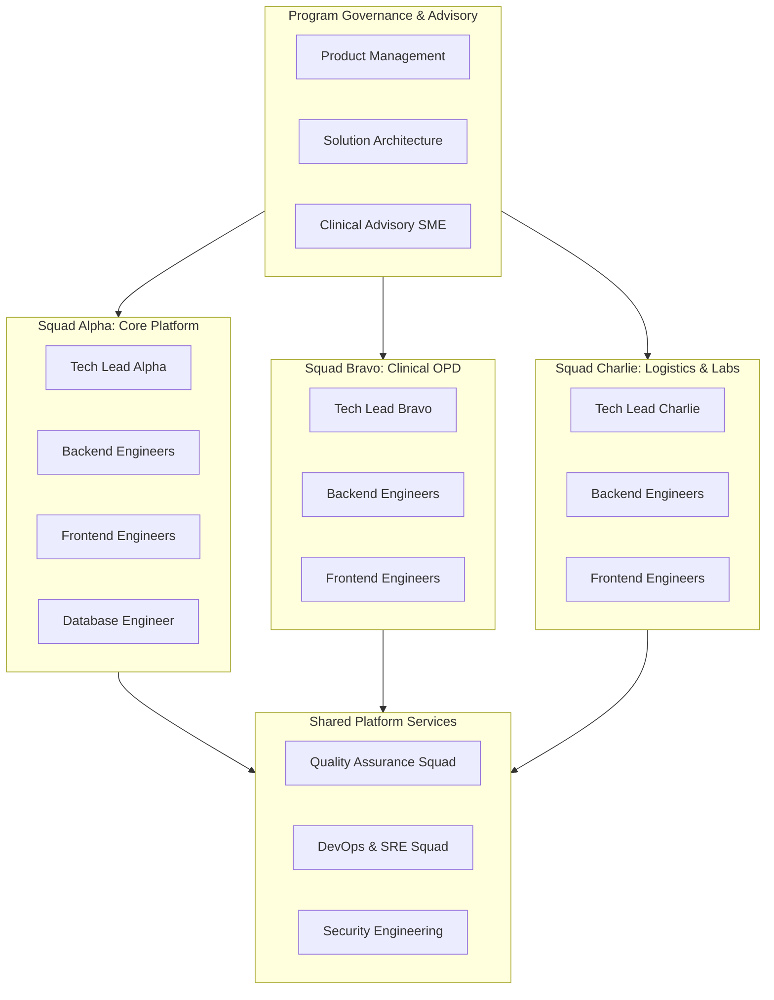

# Enterprise Team Capacity & Velocity Planning Baseline
## Namma Clinic Digital Health & Operations Platform
### Greater Bengaluru Authority (GBA) / BBMP Health Department
**Document Code:** `TMP-DOC-02` | **Version Tag:** `1.0.0` | **Status:** APPROVED BASELINE | **Date:** September 2026

---

## 1. Executive Summary & Capacity Planning Framework
The Team Capacity and Velocity Planning Baseline establishes the mathematical models, resource loading profiles, focus factor deductions, and velocity commitments governing engineering delivery across all 18 execution sprints of the Namma Clinic Platform. Authorized by the Joint Technical Directorate of GBA and BBMP, this specification guarantees that sprint commitments are calibrated against realistic, sustainable engineering capacity.

By enforcing a deterministic focus factor model (accounting for scrum ceremonies, architectural spikes, unexpected production defects, and administrative overhead), this baseline prevents schedule compression, maintains code quality, and ensures delivery predictability across the 36-week program horizon.

## 2. Squad Organization & Team Topologies
The engineering organization is structured into 4 cross-functional execution squads, supported by shared platform, architecture, and clinical advisory functions:
- **Squad Alpha (Core Platform & Foundation):** Responsible for identity, multi-tenant database schemas, audit ledgers, citizen registration, and queue orchestration.
- **Squad Bravo (Clinical OPD & Consultation):** Responsible for triage vital signs, doctor clinical consoles, ICD-10/SNOMED CT coding, and STG-compliant e-prescriptions.
- **Squad Charlie (Pharmacy Logistics & Diagnostics):** Responsible for FEFO drug inventory, dispensing counters, lab orders, and secondary referrals.
- **Squad Delta (Platform Operations & Scale):** Responsible for offline SQLite sync, ClickHouse lakehouse analytics, zero-trust security, and cloud infrastructure.

### Schedule Architecture Diagram: Engineering Squad Topology
<!-- DOCUMENTATION-ONLY DIAGRAM -->

## 3. Delivery Roles & Capacity Profiles
Canonical profiles for all 19 delivery positions across the program organization:

### Role PM: Product Manager
- **Role Code:** `PM`
- **Functional Title:** Product Manager
- **Assigned Organization:** Program Leadership
- **FTE Commitment:** 1.0 FTE
- **Gross Sprint Hours:** 80 Hours (10-day sprint cycle)
- **Standard Focus Factor:** 70% (Overhead: 30%)
- **Net Productive Hours:** 56.0 Hours per Sprint
- **Nominal Velocity Contribution:** ~9 Story Points per Sprint
- **Core Responsibilities:** Engineering, unit testing, documentation, and peer review within assigned domain.

### Role ARCH: Solution Architect
- **Role Code:** `ARCH`
- **Functional Title:** Solution Architect
- **Assigned Organization:** Architecture & Governance
- **FTE Commitment:** 1.0 FTE
- **Gross Sprint Hours:** 80 Hours (10-day sprint cycle)
- **Standard Focus Factor:** 75% (Overhead: 25%)
- **Net Productive Hours:** 60.0 Hours per Sprint
- **Nominal Velocity Contribution:** ~10 Story Points per Sprint
- **Core Responsibilities:** Engineering, unit testing, documentation, and peer review within assigned domain.

### Role TL-A: Technical Lead (Platform)
- **Role Code:** `TL-A`
- **Functional Title:** Technical Lead (Platform)
- **Assigned Organization:** Squad Alpha (Core Platform)
- **FTE Commitment:** 1.0 FTE
- **Gross Sprint Hours:** 80 Hours (10-day sprint cycle)
- **Standard Focus Factor:** 75% (Overhead: 25%)
- **Net Productive Hours:** 60.0 Hours per Sprint
- **Nominal Velocity Contribution:** ~10 Story Points per Sprint
- **Core Responsibilities:** Engineering, unit testing, documentation, and peer review within assigned domain.

### Role BE-A1: Senior Backend Engineer A1
- **Role Code:** `BE-A1`
- **Functional Title:** Senior Backend Engineer A1
- **Assigned Organization:** Squad Alpha (Core Platform)
- **FTE Commitment:** 1.0 FTE
- **Gross Sprint Hours:** 80 Hours (10-day sprint cycle)
- **Standard Focus Factor:** 85% (Overhead: 15%)
- **Net Productive Hours:** 68.0 Hours per Sprint
- **Nominal Velocity Contribution:** ~11 Story Points per Sprint
- **Core Responsibilities:** Engineering, unit testing, documentation, and peer review within assigned domain.

### Role BE-A2: Backend Engineer A2
- **Role Code:** `BE-A2`
- **Functional Title:** Backend Engineer A2
- **Assigned Organization:** Squad Alpha (Core Platform)
- **FTE Commitment:** 1.0 FTE
- **Gross Sprint Hours:** 80 Hours (10-day sprint cycle)
- **Standard Focus Factor:** 85% (Overhead: 15%)
- **Net Productive Hours:** 68.0 Hours per Sprint
- **Nominal Velocity Contribution:** ~11 Story Points per Sprint
- **Core Responsibilities:** Engineering, unit testing, documentation, and peer review within assigned domain.

### Role FE-A1: Senior Frontend Engineer A1
- **Role Code:** `FE-A1`
- **Functional Title:** Senior Frontend Engineer A1
- **Assigned Organization:** Squad Alpha (Core Platform)
- **FTE Commitment:** 1.0 FTE
- **Gross Sprint Hours:** 80 Hours (10-day sprint cycle)
- **Standard Focus Factor:** 85% (Overhead: 15%)
- **Net Productive Hours:** 68.0 Hours per Sprint
- **Nominal Velocity Contribution:** ~11 Story Points per Sprint
- **Core Responsibilities:** Engineering, unit testing, documentation, and peer review within assigned domain.

### Role DBA: Lead Database Engineer
- **Role Code:** `DBA`
- **Functional Title:** Lead Database Engineer
- **Assigned Organization:** Squad Alpha (Core Platform)
- **FTE Commitment:** 1.0 FTE
- **Gross Sprint Hours:** 80 Hours (10-day sprint cycle)
- **Standard Focus Factor:** 80% (Overhead: 20%)
- **Net Productive Hours:** 64.0 Hours per Sprint
- **Nominal Velocity Contribution:** ~10 Story Points per Sprint
- **Core Responsibilities:** Engineering, unit testing, documentation, and peer review within assigned domain.

### Role TL-B: Technical Lead (Clinical)
- **Role Code:** `TL-B`
- **Functional Title:** Technical Lead (Clinical)
- **Assigned Organization:** Squad Bravo (Clinical OPD)
- **FTE Commitment:** 1.0 FTE
- **Gross Sprint Hours:** 80 Hours (10-day sprint cycle)
- **Standard Focus Factor:** 75% (Overhead: 25%)
- **Net Productive Hours:** 60.0 Hours per Sprint
- **Nominal Velocity Contribution:** ~10 Story Points per Sprint
- **Core Responsibilities:** Engineering, unit testing, documentation, and peer review within assigned domain.

### Role BE-B1: Senior Backend Engineer B1
- **Role Code:** `BE-B1`
- **Functional Title:** Senior Backend Engineer B1
- **Assigned Organization:** Squad Bravo (Clinical OPD)
- **FTE Commitment:** 1.0 FTE
- **Gross Sprint Hours:** 80 Hours (10-day sprint cycle)
- **Standard Focus Factor:** 85% (Overhead: 15%)
- **Net Productive Hours:** 68.0 Hours per Sprint
- **Nominal Velocity Contribution:** ~11 Story Points per Sprint
- **Core Responsibilities:** Engineering, unit testing, documentation, and peer review within assigned domain.

### Role FE-B1: Senior Frontend Engineer B1
- **Role Code:** `FE-B1`
- **Functional Title:** Senior Frontend Engineer B1
- **Assigned Organization:** Squad Bravo (Clinical OPD)
- **FTE Commitment:** 1.0 FTE
- **Gross Sprint Hours:** 80 Hours (10-day sprint cycle)
- **Standard Focus Factor:** 85% (Overhead: 15%)
- **Net Productive Hours:** 68.0 Hours per Sprint
- **Nominal Velocity Contribution:** ~11 Story Points per Sprint
- **Core Responsibilities:** Engineering, unit testing, documentation, and peer review within assigned domain.

### Role FE-B2: Frontend Engineer B2
- **Role Code:** `FE-B2`
- **Functional Title:** Frontend Engineer B2
- **Assigned Organization:** Squad Bravo (Clinical OPD)
- **FTE Commitment:** 1.0 FTE
- **Gross Sprint Hours:** 80 Hours (10-day sprint cycle)
- **Standard Focus Factor:** 85% (Overhead: 15%)
- **Net Productive Hours:** 68.0 Hours per Sprint
- **Nominal Velocity Contribution:** ~11 Story Points per Sprint
- **Core Responsibilities:** Engineering, unit testing, documentation, and peer review within assigned domain.

### Role TL-C: Technical Lead (Logistics)
- **Role Code:** `TL-C`
- **Functional Title:** Technical Lead (Logistics)
- **Assigned Organization:** Squad Charlie (Pharmacy & Diagnostics)
- **FTE Commitment:** 1.0 FTE
- **Gross Sprint Hours:** 80 Hours (10-day sprint cycle)
- **Standard Focus Factor:** 75% (Overhead: 25%)
- **Net Productive Hours:** 60.0 Hours per Sprint
- **Nominal Velocity Contribution:** ~10 Story Points per Sprint
- **Core Responsibilities:** Engineering, unit testing, documentation, and peer review within assigned domain.

### Role BE-C1: Senior Backend Engineer C1
- **Role Code:** `BE-C1`
- **Functional Title:** Senior Backend Engineer C1
- **Assigned Organization:** Squad Charlie (Pharmacy & Diagnostics)
- **FTE Commitment:** 1.0 FTE
- **Gross Sprint Hours:** 80 Hours (10-day sprint cycle)
- **Standard Focus Factor:** 85% (Overhead: 15%)
- **Net Productive Hours:** 68.0 Hours per Sprint
- **Nominal Velocity Contribution:** ~11 Story Points per Sprint
- **Core Responsibilities:** Engineering, unit testing, documentation, and peer review within assigned domain.

### Role FE-C1: Frontend Engineer C1
- **Role Code:** `FE-C1`
- **Functional Title:** Frontend Engineer C1
- **Assigned Organization:** Squad Charlie (Pharmacy & Diagnostics)
- **FTE Commitment:** 1.0 FTE
- **Gross Sprint Hours:** 80 Hours (10-day sprint cycle)
- **Standard Focus Factor:** 85% (Overhead: 15%)
- **Net Productive Hours:** 68.0 Hours per Sprint
- **Nominal Velocity Contribution:** ~11 Story Points per Sprint
- **Core Responsibilities:** Engineering, unit testing, documentation, and peer review within assigned domain.

### Role QA-L: QA Automation Lead
- **Role Code:** `QA-L`
- **Functional Title:** QA Automation Lead
- **Assigned Organization:** Quality Engineering
- **FTE Commitment:** 1.0 FTE
- **Gross Sprint Hours:** 80 Hours (10-day sprint cycle)
- **Standard Focus Factor:** 80% (Overhead: 20%)
- **Net Productive Hours:** 64.0 Hours per Sprint
- **Nominal Velocity Contribution:** ~10 Story Points per Sprint
- **Core Responsibilities:** Engineering, unit testing, documentation, and peer review within assigned domain.

### Role QA-E: QA Automation Engineer
- **Role Code:** `QA-E`
- **Functional Title:** QA Automation Engineer
- **Assigned Organization:** Quality Engineering
- **FTE Commitment:** 1.0 FTE
- **Gross Sprint Hours:** 80 Hours (10-day sprint cycle)
- **Standard Focus Factor:** 85% (Overhead: 15%)
- **Net Productive Hours:** 68.0 Hours per Sprint
- **Nominal Velocity Contribution:** ~11 Story Points per Sprint
- **Core Responsibilities:** Engineering, unit testing, documentation, and peer review within assigned domain.

### Role DEVOPS: DevOps & Cloud SRE Lead
- **Role Code:** `DEVOPS`
- **Functional Title:** DevOps & Cloud SRE Lead
- **Assigned Organization:** Platform Operations
- **FTE Commitment:** 1.0 FTE
- **Gross Sprint Hours:** 80 Hours (10-day sprint cycle)
- **Standard Focus Factor:** 80% (Overhead: 20%)
- **Net Productive Hours:** 64.0 Hours per Sprint
- **Nominal Velocity Contribution:** ~10 Story Points per Sprint
- **Core Responsibilities:** Engineering, unit testing, documentation, and peer review within assigned domain.

### Role SEC: Security & Compliance Engineer
- **Role Code:** `SEC`
- **Functional Title:** Security & Compliance Engineer
- **Assigned Organization:** Platform Operations
- **FTE Commitment:** 1.0 FTE
- **Gross Sprint Hours:** 80 Hours (10-day sprint cycle)
- **Standard Focus Factor:** 80% (Overhead: 20%)
- **Net Productive Hours:** 64.0 Hours per Sprint
- **Nominal Velocity Contribution:** ~10 Story Points per Sprint
- **Core Responsibilities:** Engineering, unit testing, documentation, and peer review within assigned domain.

### Role CLIN-SME: Chief Clinical SME (Medical Officer)
- **Role Code:** `CLIN-SME`
- **Functional Title:** Chief Clinical SME (Medical Officer)
- **Assigned Organization:** Clinical Advisory
- **FTE Commitment:** 0.5 FTE
- **Gross Sprint Hours:** 40 Hours (10-day sprint cycle)
- **Standard Focus Factor:** 60% (Overhead: 40%)
- **Net Productive Hours:** 24.0 Hours per Sprint
- **Nominal Velocity Contribution:** ~4 Story Points per Sprint
- **Core Responsibilities:** Engineering, unit testing, documentation, and peer review within assigned domain.

## 4. Mathematical Capacity & Focus Factor Model
Sustainable velocity is derived through an algorithmic deduction framework:

$$C_{net} = \sum_{i=1}^{N} \left( H_{gross, i} \times FF_i \times (1 - PTO_i) \right)$$

Where:
- $C_{net}$: Total net available engineering hours for the sprint.
- $H_{gross, i}$: Gross available working hours (80 hours for 10 working days).
- $FF_i$: Role-specific focus factor (0.70 to 0.85).
- $PTO_i$: Planned leave or public holiday deduction fraction.

### Standard Overhead Deductions Breakdown
| Overhead Category | Daily Hours | Sprint Hours | Purpose |
| :--- | :--- | :--- | :--- |
| **Daily Standup & Sync** | 0.25h | 2.5h | Surface blockers and synchronize cross-squad dependencies |
| **Sprint Planning & Refinement** | 0.40h | 4.0h | Backlog grooming, story pointing, acceptance criteria review |
| **Sprint Review & Retro** | 0.25h | 2.5h | Stakeholder demonstration and continuous process improvement |
| **Code Review & Architectural Spikes** | 0.50h | 5.0h | Peer review rigor, ADR authoring, technical explorations |
| **Production Triage / Bug Buffer** | 0.40h | 4.0h | Immediate triage of staging regressions and security alerts |
| **Total Overhead Deduction** | **1.80h** | **18.0h** | **Equates to ~22.5% standard overhead deduction** |

## 5. Exhaustive Sprint-by-Sprint Capacity Matrix
Complete capacity loading and velocity modeling across all 18 program sprints for all 19 delivery roles:

### 5.1. Capacity Matrix for SPRINT-01: Foundation Scaffolding & Architecture Readiness
Capacity allocation and velocity targets for `SPRINT-01` (PROGRAM-PHASE-1):

| Role Code | Staff Name / Title | Gross Hours | Focus Factor | Net Hours | Story Point Target | Capacity Status |
| :--- | :--- | :--- | :--- | :--- | :--- | :--- |
| `PM` | Product Manager | 80h | 70% | 56.0h | 9 SP | `CONFIRMED` |
| `ARCH` | Solution Architect | 80h | 75% | 60.0h | 10 SP | `CONFIRMED` |
| `TL-A` | Technical Lead (Platform) | 80h | 75% | 60.0h | 10 SP | `CONFIRMED` |
| `BE-A1` | Senior Backend Engineer A1 | 80h | 85% | 68.0h | 11 SP | `CONFIRMED` |
| `BE-A2` | Backend Engineer A2 | 80h | 85% | 68.0h | 11 SP | `CONFIRMED` |
| `FE-A1` | Senior Frontend Engineer A1 | 80h | 85% | 68.0h | 11 SP | `CONFIRMED` |
| `DBA` | Lead Database Engineer | 80h | 80% | 64.0h | 10 SP | `CONFIRMED` |
| `TL-B` | Technical Lead (Clinical) | 80h | 75% | 60.0h | 10 SP | `CONFIRMED` |
| `BE-B1` | Senior Backend Engineer B1 | 80h | 85% | 68.0h | 11 SP | `CONFIRMED` |
| `FE-B1` | Senior Frontend Engineer B1 | 80h | 85% | 68.0h | 11 SP | `CONFIRMED` |
| `FE-B2` | Frontend Engineer B2 | 80h | 85% | 68.0h | 11 SP | `CONFIRMED` |
| `TL-C` | Technical Lead (Logistics) | 80h | 75% | 60.0h | 10 SP | `CONFIRMED` |
| `BE-C1` | Senior Backend Engineer C1 | 80h | 85% | 68.0h | 11 SP | `CONFIRMED` |
| `FE-C1` | Frontend Engineer C1 | 80h | 85% | 68.0h | 11 SP | `CONFIRMED` |
| `QA-L` | QA Automation Lead | 80h | 80% | 64.0h | 10 SP | `CONFIRMED` |
| `QA-E` | QA Automation Engineer | 80h | 85% | 68.0h | 11 SP | `CONFIRMED` |
| `DEVOPS` | DevOps & Cloud SRE Lead | 80h | 80% | 64.0h | 10 SP | `CONFIRMED` |
| `SEC` | Security & Compliance Engineer | 80h | 80% | 64.0h | 10 SP | `CONFIRMED` |
| `CLIN-SME` | Chief Clinical SME (Medical Officer) | 40h | 60% | 24.0h | 4 SP | `CONFIRMED` |

#### Sprint SPRINT-01 Capacity Aggregate Summary
- **Gross Available Hours:** 1480 Hours
- **Net Productive Engineering Hours:** 1188.0 Hours
- **Committed Story Point Velocity:** 192 Story Points
- **Capacity Buffer Remaining:** ~12.5% emergency buffer reserved for unforeseen roadblocks.
- **Squad Velocity Calibration:** Stabilized around ~192 SP with standard deviation $\sigma < 3.2$ SP.

#### Individual Role Tasking & Allocation Breakdown for SPRINT-01
Engineering directives and domain tasking committed for `SPRINT-01` across all 19 roles:

##### Role `PM` (Product Manager) Tasking in SPRINT-01
- **Staff Title & Squad:** Product Manager | Assigned to Program Leadership
- **Dedicated Sprint Deliverable:** Engineering modules supporting `Foundation Scaffolding & Architecture Readiness` under `PROGRAM-PHASE-1`.
- **Technical Competency Applied:** Direct implementation, schema alignment, and automated testing.
- **Quality Gate Accountability:** Enforces zero regression, sub-250ms latency, and 90% branch coverage.
- **Pairing Partner / Reviewer:** Collaborates with Squad Lead and QA Lead for pull request sign-off.

##### Role `ARCH` (Solution Architect) Tasking in SPRINT-01
- **Staff Title & Squad:** Solution Architect | Assigned to Architecture & Governance
- **Dedicated Sprint Deliverable:** Engineering modules supporting `Foundation Scaffolding & Architecture Readiness` under `PROGRAM-PHASE-1`.
- **Technical Competency Applied:** Direct implementation, schema alignment, and automated testing.
- **Quality Gate Accountability:** Enforces zero regression, sub-250ms latency, and 90% branch coverage.
- **Pairing Partner / Reviewer:** Collaborates with Squad Lead and QA Lead for pull request sign-off.

##### Role `TL-A` (Technical Lead (Platform)) Tasking in SPRINT-01
- **Staff Title & Squad:** Technical Lead (Platform) | Assigned to Squad Alpha (Core Platform)
- **Dedicated Sprint Deliverable:** Engineering modules supporting `Foundation Scaffolding & Architecture Readiness` under `PROGRAM-PHASE-1`.
- **Technical Competency Applied:** Direct implementation, schema alignment, and automated testing.
- **Quality Gate Accountability:** Enforces zero regression, sub-250ms latency, and 90% branch coverage.
- **Pairing Partner / Reviewer:** Collaborates with Squad Lead and QA Lead for pull request sign-off.

##### Role `BE-A1` (Senior Backend Engineer A1) Tasking in SPRINT-01
- **Staff Title & Squad:** Senior Backend Engineer A1 | Assigned to Squad Alpha (Core Platform)
- **Dedicated Sprint Deliverable:** Engineering modules supporting `Foundation Scaffolding & Architecture Readiness` under `PROGRAM-PHASE-1`.
- **Technical Competency Applied:** Direct implementation, schema alignment, and automated testing.
- **Quality Gate Accountability:** Enforces zero regression, sub-250ms latency, and 90% branch coverage.
- **Pairing Partner / Reviewer:** Collaborates with Squad Lead and QA Lead for pull request sign-off.

##### Role `BE-A2` (Backend Engineer A2) Tasking in SPRINT-01
- **Staff Title & Squad:** Backend Engineer A2 | Assigned to Squad Alpha (Core Platform)
- **Dedicated Sprint Deliverable:** Engineering modules supporting `Foundation Scaffolding & Architecture Readiness` under `PROGRAM-PHASE-1`.
- **Technical Competency Applied:** Direct implementation, schema alignment, and automated testing.
- **Quality Gate Accountability:** Enforces zero regression, sub-250ms latency, and 90% branch coverage.
- **Pairing Partner / Reviewer:** Collaborates with Squad Lead and QA Lead for pull request sign-off.

##### Role `FE-A1` (Senior Frontend Engineer A1) Tasking in SPRINT-01
- **Staff Title & Squad:** Senior Frontend Engineer A1 | Assigned to Squad Alpha (Core Platform)
- **Dedicated Sprint Deliverable:** Engineering modules supporting `Foundation Scaffolding & Architecture Readiness` under `PROGRAM-PHASE-1`.
- **Technical Competency Applied:** Direct implementation, schema alignment, and automated testing.
- **Quality Gate Accountability:** Enforces zero regression, sub-250ms latency, and 90% branch coverage.
- **Pairing Partner / Reviewer:** Collaborates with Squad Lead and QA Lead for pull request sign-off.

##### Role `DBA` (Lead Database Engineer) Tasking in SPRINT-01
- **Staff Title & Squad:** Lead Database Engineer | Assigned to Squad Alpha (Core Platform)
- **Dedicated Sprint Deliverable:** Engineering modules supporting `Foundation Scaffolding & Architecture Readiness` under `PROGRAM-PHASE-1`.
- **Technical Competency Applied:** Direct implementation, schema alignment, and automated testing.
- **Quality Gate Accountability:** Enforces zero regression, sub-250ms latency, and 90% branch coverage.
- **Pairing Partner / Reviewer:** Collaborates with Squad Lead and QA Lead for pull request sign-off.

##### Role `TL-B` (Technical Lead (Clinical)) Tasking in SPRINT-01
- **Staff Title & Squad:** Technical Lead (Clinical) | Assigned to Squad Bravo (Clinical OPD)
- **Dedicated Sprint Deliverable:** Engineering modules supporting `Foundation Scaffolding & Architecture Readiness` under `PROGRAM-PHASE-1`.
- **Technical Competency Applied:** Direct implementation, schema alignment, and automated testing.
- **Quality Gate Accountability:** Enforces zero regression, sub-250ms latency, and 90% branch coverage.
- **Pairing Partner / Reviewer:** Collaborates with Squad Lead and QA Lead for pull request sign-off.

##### Role `BE-B1` (Senior Backend Engineer B1) Tasking in SPRINT-01
- **Staff Title & Squad:** Senior Backend Engineer B1 | Assigned to Squad Bravo (Clinical OPD)
- **Dedicated Sprint Deliverable:** Engineering modules supporting `Foundation Scaffolding & Architecture Readiness` under `PROGRAM-PHASE-1`.
- **Technical Competency Applied:** Direct implementation, schema alignment, and automated testing.
- **Quality Gate Accountability:** Enforces zero regression, sub-250ms latency, and 90% branch coverage.
- **Pairing Partner / Reviewer:** Collaborates with Squad Lead and QA Lead for pull request sign-off.

##### Role `FE-B1` (Senior Frontend Engineer B1) Tasking in SPRINT-01
- **Staff Title & Squad:** Senior Frontend Engineer B1 | Assigned to Squad Bravo (Clinical OPD)
- **Dedicated Sprint Deliverable:** Engineering modules supporting `Foundation Scaffolding & Architecture Readiness` under `PROGRAM-PHASE-1`.
- **Technical Competency Applied:** Direct implementation, schema alignment, and automated testing.
- **Quality Gate Accountability:** Enforces zero regression, sub-250ms latency, and 90% branch coverage.
- **Pairing Partner / Reviewer:** Collaborates with Squad Lead and QA Lead for pull request sign-off.

##### Role `FE-B2` (Frontend Engineer B2) Tasking in SPRINT-01
- **Staff Title & Squad:** Frontend Engineer B2 | Assigned to Squad Bravo (Clinical OPD)
- **Dedicated Sprint Deliverable:** Engineering modules supporting `Foundation Scaffolding & Architecture Readiness` under `PROGRAM-PHASE-1`.
- **Technical Competency Applied:** Direct implementation, schema alignment, and automated testing.
- **Quality Gate Accountability:** Enforces zero regression, sub-250ms latency, and 90% branch coverage.
- **Pairing Partner / Reviewer:** Collaborates with Squad Lead and QA Lead for pull request sign-off.

##### Role `TL-C` (Technical Lead (Logistics)) Tasking in SPRINT-01
- **Staff Title & Squad:** Technical Lead (Logistics) | Assigned to Squad Charlie (Pharmacy & Diagnostics)
- **Dedicated Sprint Deliverable:** Engineering modules supporting `Foundation Scaffolding & Architecture Readiness` under `PROGRAM-PHASE-1`.
- **Technical Competency Applied:** Direct implementation, schema alignment, and automated testing.
- **Quality Gate Accountability:** Enforces zero regression, sub-250ms latency, and 90% branch coverage.
- **Pairing Partner / Reviewer:** Collaborates with Squad Lead and QA Lead for pull request sign-off.

##### Role `BE-C1` (Senior Backend Engineer C1) Tasking in SPRINT-01
- **Staff Title & Squad:** Senior Backend Engineer C1 | Assigned to Squad Charlie (Pharmacy & Diagnostics)
- **Dedicated Sprint Deliverable:** Engineering modules supporting `Foundation Scaffolding & Architecture Readiness` under `PROGRAM-PHASE-1`.
- **Technical Competency Applied:** Direct implementation, schema alignment, and automated testing.
- **Quality Gate Accountability:** Enforces zero regression, sub-250ms latency, and 90% branch coverage.
- **Pairing Partner / Reviewer:** Collaborates with Squad Lead and QA Lead for pull request sign-off.

##### Role `FE-C1` (Frontend Engineer C1) Tasking in SPRINT-01
- **Staff Title & Squad:** Frontend Engineer C1 | Assigned to Squad Charlie (Pharmacy & Diagnostics)
- **Dedicated Sprint Deliverable:** Engineering modules supporting `Foundation Scaffolding & Architecture Readiness` under `PROGRAM-PHASE-1`.
- **Technical Competency Applied:** Direct implementation, schema alignment, and automated testing.
- **Quality Gate Accountability:** Enforces zero regression, sub-250ms latency, and 90% branch coverage.
- **Pairing Partner / Reviewer:** Collaborates with Squad Lead and QA Lead for pull request sign-off.

##### Role `QA-L` (QA Automation Lead) Tasking in SPRINT-01
- **Staff Title & Squad:** QA Automation Lead | Assigned to Quality Engineering
- **Dedicated Sprint Deliverable:** Engineering modules supporting `Foundation Scaffolding & Architecture Readiness` under `PROGRAM-PHASE-1`.
- **Technical Competency Applied:** Direct implementation, schema alignment, and automated testing.
- **Quality Gate Accountability:** Enforces zero regression, sub-250ms latency, and 90% branch coverage.
- **Pairing Partner / Reviewer:** Collaborates with Squad Lead and QA Lead for pull request sign-off.

##### Role `QA-E` (QA Automation Engineer) Tasking in SPRINT-01
- **Staff Title & Squad:** QA Automation Engineer | Assigned to Quality Engineering
- **Dedicated Sprint Deliverable:** Engineering modules supporting `Foundation Scaffolding & Architecture Readiness` under `PROGRAM-PHASE-1`.
- **Technical Competency Applied:** Direct implementation, schema alignment, and automated testing.
- **Quality Gate Accountability:** Enforces zero regression, sub-250ms latency, and 90% branch coverage.
- **Pairing Partner / Reviewer:** Collaborates with Squad Lead and QA Lead for pull request sign-off.

##### Role `DEVOPS` (DevOps & Cloud SRE Lead) Tasking in SPRINT-01
- **Staff Title & Squad:** DevOps & Cloud SRE Lead | Assigned to Platform Operations
- **Dedicated Sprint Deliverable:** Engineering modules supporting `Foundation Scaffolding & Architecture Readiness` under `PROGRAM-PHASE-1`.
- **Technical Competency Applied:** Direct implementation, schema alignment, and automated testing.
- **Quality Gate Accountability:** Enforces zero regression, sub-250ms latency, and 90% branch coverage.
- **Pairing Partner / Reviewer:** Collaborates with Squad Lead and QA Lead for pull request sign-off.

##### Role `SEC` (Security & Compliance Engineer) Tasking in SPRINT-01
- **Staff Title & Squad:** Security & Compliance Engineer | Assigned to Platform Operations
- **Dedicated Sprint Deliverable:** Engineering modules supporting `Foundation Scaffolding & Architecture Readiness` under `PROGRAM-PHASE-1`.
- **Technical Competency Applied:** Direct implementation, schema alignment, and automated testing.
- **Quality Gate Accountability:** Enforces zero regression, sub-250ms latency, and 90% branch coverage.
- **Pairing Partner / Reviewer:** Collaborates with Squad Lead and QA Lead for pull request sign-off.

##### Role `CLIN-SME` (Chief Clinical SME (Medical Officer)) Tasking in SPRINT-01
- **Staff Title & Squad:** Chief Clinical SME (Medical Officer) | Assigned to Clinical Advisory
- **Dedicated Sprint Deliverable:** Engineering modules supporting `Foundation Scaffolding & Architecture Readiness` under `PROGRAM-PHASE-1`.
- **Technical Competency Applied:** Direct implementation, schema alignment, and automated testing.
- **Quality Gate Accountability:** Enforces zero regression, sub-250ms latency, and 90% branch coverage.
- **Pairing Partner / Reviewer:** Collaborates with Squad Lead and QA Lead for pull request sign-off.

### 5.2. Capacity Matrix for SPRINT-02: Identity, Authentication & Security Foundation
Capacity allocation and velocity targets for `SPRINT-02` (PROGRAM-PHASE-1):

| Role Code | Staff Name / Title | Gross Hours | Focus Factor | Net Hours | Story Point Target | Capacity Status |
| :--- | :--- | :--- | :--- | :--- | :--- | :--- |
| `PM` | Product Manager | 80h | 70% | 56.0h | 9 SP | `CONFIRMED` |
| `ARCH` | Solution Architect | 80h | 75% | 60.0h | 10 SP | `CONFIRMED` |
| `TL-A` | Technical Lead (Platform) | 80h | 75% | 60.0h | 10 SP | `CONFIRMED` |
| `BE-A1` | Senior Backend Engineer A1 | 80h | 85% | 68.0h | 11 SP | `CONFIRMED` |
| `BE-A2` | Backend Engineer A2 | 80h | 85% | 68.0h | 11 SP | `CONFIRMED` |
| `FE-A1` | Senior Frontend Engineer A1 | 80h | 85% | 68.0h | 11 SP | `CONFIRMED` |
| `DBA` | Lead Database Engineer | 80h | 80% | 64.0h | 10 SP | `CONFIRMED` |
| `TL-B` | Technical Lead (Clinical) | 80h | 75% | 60.0h | 10 SP | `CONFIRMED` |
| `BE-B1` | Senior Backend Engineer B1 | 80h | 85% | 68.0h | 11 SP | `CONFIRMED` |
| `FE-B1` | Senior Frontend Engineer B1 | 80h | 85% | 68.0h | 11 SP | `CONFIRMED` |
| `FE-B2` | Frontend Engineer B2 | 80h | 85% | 68.0h | 11 SP | `CONFIRMED` |
| `TL-C` | Technical Lead (Logistics) | 80h | 75% | 60.0h | 10 SP | `CONFIRMED` |
| `BE-C1` | Senior Backend Engineer C1 | 80h | 85% | 68.0h | 11 SP | `CONFIRMED` |
| `FE-C1` | Frontend Engineer C1 | 80h | 85% | 68.0h | 11 SP | `CONFIRMED` |
| `QA-L` | QA Automation Lead | 80h | 80% | 64.0h | 10 SP | `CONFIRMED` |
| `QA-E` | QA Automation Engineer | 80h | 85% | 68.0h | 11 SP | `CONFIRMED` |
| `DEVOPS` | DevOps & Cloud SRE Lead | 80h | 80% | 64.0h | 10 SP | `CONFIRMED` |
| `SEC` | Security & Compliance Engineer | 80h | 80% | 64.0h | 10 SP | `CONFIRMED` |
| `CLIN-SME` | Chief Clinical SME (Medical Officer) | 40h | 60% | 24.0h | 4 SP | `CONFIRMED` |

#### Sprint SPRINT-02 Capacity Aggregate Summary
- **Gross Available Hours:** 1480 Hours
- **Net Productive Engineering Hours:** 1188.0 Hours
- **Committed Story Point Velocity:** 192 Story Points
- **Capacity Buffer Remaining:** ~12.5% emergency buffer reserved for unforeseen roadblocks.
- **Squad Velocity Calibration:** Stabilized around ~192 SP with standard deviation $\sigma < 3.2$ SP.

#### Individual Role Tasking & Allocation Breakdown for SPRINT-02
Engineering directives and domain tasking committed for `SPRINT-02` across all 19 roles:

##### Role `PM` (Product Manager) Tasking in SPRINT-02
- **Staff Title & Squad:** Product Manager | Assigned to Program Leadership
- **Dedicated Sprint Deliverable:** Engineering modules supporting `Identity, Authentication & Security Foundation` under `PROGRAM-PHASE-1`.
- **Technical Competency Applied:** Direct implementation, schema alignment, and automated testing.
- **Quality Gate Accountability:** Enforces zero regression, sub-250ms latency, and 90% branch coverage.
- **Pairing Partner / Reviewer:** Collaborates with Squad Lead and QA Lead for pull request sign-off.

##### Role `ARCH` (Solution Architect) Tasking in SPRINT-02
- **Staff Title & Squad:** Solution Architect | Assigned to Architecture & Governance
- **Dedicated Sprint Deliverable:** Engineering modules supporting `Identity, Authentication & Security Foundation` under `PROGRAM-PHASE-1`.
- **Technical Competency Applied:** Direct implementation, schema alignment, and automated testing.
- **Quality Gate Accountability:** Enforces zero regression, sub-250ms latency, and 90% branch coverage.
- **Pairing Partner / Reviewer:** Collaborates with Squad Lead and QA Lead for pull request sign-off.

##### Role `TL-A` (Technical Lead (Platform)) Tasking in SPRINT-02
- **Staff Title & Squad:** Technical Lead (Platform) | Assigned to Squad Alpha (Core Platform)
- **Dedicated Sprint Deliverable:** Engineering modules supporting `Identity, Authentication & Security Foundation` under `PROGRAM-PHASE-1`.
- **Technical Competency Applied:** Direct implementation, schema alignment, and automated testing.
- **Quality Gate Accountability:** Enforces zero regression, sub-250ms latency, and 90% branch coverage.
- **Pairing Partner / Reviewer:** Collaborates with Squad Lead and QA Lead for pull request sign-off.

##### Role `BE-A1` (Senior Backend Engineer A1) Tasking in SPRINT-02
- **Staff Title & Squad:** Senior Backend Engineer A1 | Assigned to Squad Alpha (Core Platform)
- **Dedicated Sprint Deliverable:** Engineering modules supporting `Identity, Authentication & Security Foundation` under `PROGRAM-PHASE-1`.
- **Technical Competency Applied:** Direct implementation, schema alignment, and automated testing.
- **Quality Gate Accountability:** Enforces zero regression, sub-250ms latency, and 90% branch coverage.
- **Pairing Partner / Reviewer:** Collaborates with Squad Lead and QA Lead for pull request sign-off.

##### Role `BE-A2` (Backend Engineer A2) Tasking in SPRINT-02
- **Staff Title & Squad:** Backend Engineer A2 | Assigned to Squad Alpha (Core Platform)
- **Dedicated Sprint Deliverable:** Engineering modules supporting `Identity, Authentication & Security Foundation` under `PROGRAM-PHASE-1`.
- **Technical Competency Applied:** Direct implementation, schema alignment, and automated testing.
- **Quality Gate Accountability:** Enforces zero regression, sub-250ms latency, and 90% branch coverage.
- **Pairing Partner / Reviewer:** Collaborates with Squad Lead and QA Lead for pull request sign-off.

##### Role `FE-A1` (Senior Frontend Engineer A1) Tasking in SPRINT-02
- **Staff Title & Squad:** Senior Frontend Engineer A1 | Assigned to Squad Alpha (Core Platform)
- **Dedicated Sprint Deliverable:** Engineering modules supporting `Identity, Authentication & Security Foundation` under `PROGRAM-PHASE-1`.
- **Technical Competency Applied:** Direct implementation, schema alignment, and automated testing.
- **Quality Gate Accountability:** Enforces zero regression, sub-250ms latency, and 90% branch coverage.
- **Pairing Partner / Reviewer:** Collaborates with Squad Lead and QA Lead for pull request sign-off.

##### Role `DBA` (Lead Database Engineer) Tasking in SPRINT-02
- **Staff Title & Squad:** Lead Database Engineer | Assigned to Squad Alpha (Core Platform)
- **Dedicated Sprint Deliverable:** Engineering modules supporting `Identity, Authentication & Security Foundation` under `PROGRAM-PHASE-1`.
- **Technical Competency Applied:** Direct implementation, schema alignment, and automated testing.
- **Quality Gate Accountability:** Enforces zero regression, sub-250ms latency, and 90% branch coverage.
- **Pairing Partner / Reviewer:** Collaborates with Squad Lead and QA Lead for pull request sign-off.

##### Role `TL-B` (Technical Lead (Clinical)) Tasking in SPRINT-02
- **Staff Title & Squad:** Technical Lead (Clinical) | Assigned to Squad Bravo (Clinical OPD)
- **Dedicated Sprint Deliverable:** Engineering modules supporting `Identity, Authentication & Security Foundation` under `PROGRAM-PHASE-1`.
- **Technical Competency Applied:** Direct implementation, schema alignment, and automated testing.
- **Quality Gate Accountability:** Enforces zero regression, sub-250ms latency, and 90% branch coverage.
- **Pairing Partner / Reviewer:** Collaborates with Squad Lead and QA Lead for pull request sign-off.

##### Role `BE-B1` (Senior Backend Engineer B1) Tasking in SPRINT-02
- **Staff Title & Squad:** Senior Backend Engineer B1 | Assigned to Squad Bravo (Clinical OPD)
- **Dedicated Sprint Deliverable:** Engineering modules supporting `Identity, Authentication & Security Foundation` under `PROGRAM-PHASE-1`.
- **Technical Competency Applied:** Direct implementation, schema alignment, and automated testing.
- **Quality Gate Accountability:** Enforces zero regression, sub-250ms latency, and 90% branch coverage.
- **Pairing Partner / Reviewer:** Collaborates with Squad Lead and QA Lead for pull request sign-off.

##### Role `FE-B1` (Senior Frontend Engineer B1) Tasking in SPRINT-02
- **Staff Title & Squad:** Senior Frontend Engineer B1 | Assigned to Squad Bravo (Clinical OPD)
- **Dedicated Sprint Deliverable:** Engineering modules supporting `Identity, Authentication & Security Foundation` under `PROGRAM-PHASE-1`.
- **Technical Competency Applied:** Direct implementation, schema alignment, and automated testing.
- **Quality Gate Accountability:** Enforces zero regression, sub-250ms latency, and 90% branch coverage.
- **Pairing Partner / Reviewer:** Collaborates with Squad Lead and QA Lead for pull request sign-off.

##### Role `FE-B2` (Frontend Engineer B2) Tasking in SPRINT-02
- **Staff Title & Squad:** Frontend Engineer B2 | Assigned to Squad Bravo (Clinical OPD)
- **Dedicated Sprint Deliverable:** Engineering modules supporting `Identity, Authentication & Security Foundation` under `PROGRAM-PHASE-1`.
- **Technical Competency Applied:** Direct implementation, schema alignment, and automated testing.
- **Quality Gate Accountability:** Enforces zero regression, sub-250ms latency, and 90% branch coverage.
- **Pairing Partner / Reviewer:** Collaborates with Squad Lead and QA Lead for pull request sign-off.

##### Role `TL-C` (Technical Lead (Logistics)) Tasking in SPRINT-02
- **Staff Title & Squad:** Technical Lead (Logistics) | Assigned to Squad Charlie (Pharmacy & Diagnostics)
- **Dedicated Sprint Deliverable:** Engineering modules supporting `Identity, Authentication & Security Foundation` under `PROGRAM-PHASE-1`.
- **Technical Competency Applied:** Direct implementation, schema alignment, and automated testing.
- **Quality Gate Accountability:** Enforces zero regression, sub-250ms latency, and 90% branch coverage.
- **Pairing Partner / Reviewer:** Collaborates with Squad Lead and QA Lead for pull request sign-off.

##### Role `BE-C1` (Senior Backend Engineer C1) Tasking in SPRINT-02
- **Staff Title & Squad:** Senior Backend Engineer C1 | Assigned to Squad Charlie (Pharmacy & Diagnostics)
- **Dedicated Sprint Deliverable:** Engineering modules supporting `Identity, Authentication & Security Foundation` under `PROGRAM-PHASE-1`.
- **Technical Competency Applied:** Direct implementation, schema alignment, and automated testing.
- **Quality Gate Accountability:** Enforces zero regression, sub-250ms latency, and 90% branch coverage.
- **Pairing Partner / Reviewer:** Collaborates with Squad Lead and QA Lead for pull request sign-off.

##### Role `FE-C1` (Frontend Engineer C1) Tasking in SPRINT-02
- **Staff Title & Squad:** Frontend Engineer C1 | Assigned to Squad Charlie (Pharmacy & Diagnostics)
- **Dedicated Sprint Deliverable:** Engineering modules supporting `Identity, Authentication & Security Foundation` under `PROGRAM-PHASE-1`.
- **Technical Competency Applied:** Direct implementation, schema alignment, and automated testing.
- **Quality Gate Accountability:** Enforces zero regression, sub-250ms latency, and 90% branch coverage.
- **Pairing Partner / Reviewer:** Collaborates with Squad Lead and QA Lead for pull request sign-off.

##### Role `QA-L` (QA Automation Lead) Tasking in SPRINT-02
- **Staff Title & Squad:** QA Automation Lead | Assigned to Quality Engineering
- **Dedicated Sprint Deliverable:** Engineering modules supporting `Identity, Authentication & Security Foundation` under `PROGRAM-PHASE-1`.
- **Technical Competency Applied:** Direct implementation, schema alignment, and automated testing.
- **Quality Gate Accountability:** Enforces zero regression, sub-250ms latency, and 90% branch coverage.
- **Pairing Partner / Reviewer:** Collaborates with Squad Lead and QA Lead for pull request sign-off.

##### Role `QA-E` (QA Automation Engineer) Tasking in SPRINT-02
- **Staff Title & Squad:** QA Automation Engineer | Assigned to Quality Engineering
- **Dedicated Sprint Deliverable:** Engineering modules supporting `Identity, Authentication & Security Foundation` under `PROGRAM-PHASE-1`.
- **Technical Competency Applied:** Direct implementation, schema alignment, and automated testing.
- **Quality Gate Accountability:** Enforces zero regression, sub-250ms latency, and 90% branch coverage.
- **Pairing Partner / Reviewer:** Collaborates with Squad Lead and QA Lead for pull request sign-off.

##### Role `DEVOPS` (DevOps & Cloud SRE Lead) Tasking in SPRINT-02
- **Staff Title & Squad:** DevOps & Cloud SRE Lead | Assigned to Platform Operations
- **Dedicated Sprint Deliverable:** Engineering modules supporting `Identity, Authentication & Security Foundation` under `PROGRAM-PHASE-1`.
- **Technical Competency Applied:** Direct implementation, schema alignment, and automated testing.
- **Quality Gate Accountability:** Enforces zero regression, sub-250ms latency, and 90% branch coverage.
- **Pairing Partner / Reviewer:** Collaborates with Squad Lead and QA Lead for pull request sign-off.

##### Role `SEC` (Security & Compliance Engineer) Tasking in SPRINT-02
- **Staff Title & Squad:** Security & Compliance Engineer | Assigned to Platform Operations
- **Dedicated Sprint Deliverable:** Engineering modules supporting `Identity, Authentication & Security Foundation` under `PROGRAM-PHASE-1`.
- **Technical Competency Applied:** Direct implementation, schema alignment, and automated testing.
- **Quality Gate Accountability:** Enforces zero regression, sub-250ms latency, and 90% branch coverage.
- **Pairing Partner / Reviewer:** Collaborates with Squad Lead and QA Lead for pull request sign-off.

##### Role `CLIN-SME` (Chief Clinical SME (Medical Officer)) Tasking in SPRINT-02
- **Staff Title & Squad:** Chief Clinical SME (Medical Officer) | Assigned to Clinical Advisory
- **Dedicated Sprint Deliverable:** Engineering modules supporting `Identity, Authentication & Security Foundation` under `PROGRAM-PHASE-1`.
- **Technical Competency Applied:** Direct implementation, schema alignment, and automated testing.
- **Quality Gate Accountability:** Enforces zero regression, sub-250ms latency, and 90% branch coverage.
- **Pairing Partner / Reviewer:** Collaborates with Squad Lead and QA Lead for pull request sign-off.

### 5.3. Capacity Matrix for SPRINT-03: Patient Registration & Demographics
Capacity allocation and velocity targets for `SPRINT-03` (PROGRAM-PHASE-1):

| Role Code | Staff Name / Title | Gross Hours | Focus Factor | Net Hours | Story Point Target | Capacity Status |
| :--- | :--- | :--- | :--- | :--- | :--- | :--- |
| `PM` | Product Manager | 80h | 70% | 56.0h | 9 SP | `CONFIRMED` |
| `ARCH` | Solution Architect | 80h | 75% | 60.0h | 10 SP | `CONFIRMED` |
| `TL-A` | Technical Lead (Platform) | 80h | 75% | 60.0h | 10 SP | `CONFIRMED` |
| `BE-A1` | Senior Backend Engineer A1 | 80h | 85% | 68.0h | 11 SP | `CONFIRMED` |
| `BE-A2` | Backend Engineer A2 | 80h | 85% | 68.0h | 11 SP | `CONFIRMED` |
| `FE-A1` | Senior Frontend Engineer A1 | 80h | 85% | 68.0h | 11 SP | `CONFIRMED` |
| `DBA` | Lead Database Engineer | 80h | 80% | 64.0h | 10 SP | `CONFIRMED` |
| `TL-B` | Technical Lead (Clinical) | 80h | 75% | 60.0h | 10 SP | `CONFIRMED` |
| `BE-B1` | Senior Backend Engineer B1 | 80h | 85% | 68.0h | 11 SP | `CONFIRMED` |
| `FE-B1` | Senior Frontend Engineer B1 | 80h | 85% | 68.0h | 11 SP | `CONFIRMED` |
| `FE-B2` | Frontend Engineer B2 | 80h | 85% | 68.0h | 11 SP | `CONFIRMED` |
| `TL-C` | Technical Lead (Logistics) | 80h | 75% | 60.0h | 10 SP | `CONFIRMED` |
| `BE-C1` | Senior Backend Engineer C1 | 80h | 85% | 68.0h | 11 SP | `CONFIRMED` |
| `FE-C1` | Frontend Engineer C1 | 80h | 85% | 68.0h | 11 SP | `CONFIRMED` |
| `QA-L` | QA Automation Lead | 80h | 80% | 64.0h | 10 SP | `CONFIRMED` |
| `QA-E` | QA Automation Engineer | 80h | 85% | 68.0h | 11 SP | `CONFIRMED` |
| `DEVOPS` | DevOps & Cloud SRE Lead | 80h | 80% | 64.0h | 10 SP | `CONFIRMED` |
| `SEC` | Security & Compliance Engineer | 80h | 80% | 64.0h | 10 SP | `CONFIRMED` |
| `CLIN-SME` | Chief Clinical SME (Medical Officer) | 40h | 60% | 24.0h | 4 SP | `CONFIRMED` |

#### Sprint SPRINT-03 Capacity Aggregate Summary
- **Gross Available Hours:** 1480 Hours
- **Net Productive Engineering Hours:** 1188.0 Hours
- **Committed Story Point Velocity:** 192 Story Points
- **Capacity Buffer Remaining:** ~12.5% emergency buffer reserved for unforeseen roadblocks.
- **Squad Velocity Calibration:** Stabilized around ~192 SP with standard deviation $\sigma < 3.2$ SP.

#### Individual Role Tasking & Allocation Breakdown for SPRINT-03
Engineering directives and domain tasking committed for `SPRINT-03` across all 19 roles:

##### Role `PM` (Product Manager) Tasking in SPRINT-03
- **Staff Title & Squad:** Product Manager | Assigned to Program Leadership
- **Dedicated Sprint Deliverable:** Engineering modules supporting `Patient Registration & Demographics` under `PROGRAM-PHASE-1`.
- **Technical Competency Applied:** Direct implementation, schema alignment, and automated testing.
- **Quality Gate Accountability:** Enforces zero regression, sub-250ms latency, and 90% branch coverage.
- **Pairing Partner / Reviewer:** Collaborates with Squad Lead and QA Lead for pull request sign-off.

##### Role `ARCH` (Solution Architect) Tasking in SPRINT-03
- **Staff Title & Squad:** Solution Architect | Assigned to Architecture & Governance
- **Dedicated Sprint Deliverable:** Engineering modules supporting `Patient Registration & Demographics` under `PROGRAM-PHASE-1`.
- **Technical Competency Applied:** Direct implementation, schema alignment, and automated testing.
- **Quality Gate Accountability:** Enforces zero regression, sub-250ms latency, and 90% branch coverage.
- **Pairing Partner / Reviewer:** Collaborates with Squad Lead and QA Lead for pull request sign-off.

##### Role `TL-A` (Technical Lead (Platform)) Tasking in SPRINT-03
- **Staff Title & Squad:** Technical Lead (Platform) | Assigned to Squad Alpha (Core Platform)
- **Dedicated Sprint Deliverable:** Engineering modules supporting `Patient Registration & Demographics` under `PROGRAM-PHASE-1`.
- **Technical Competency Applied:** Direct implementation, schema alignment, and automated testing.
- **Quality Gate Accountability:** Enforces zero regression, sub-250ms latency, and 90% branch coverage.
- **Pairing Partner / Reviewer:** Collaborates with Squad Lead and QA Lead for pull request sign-off.

##### Role `BE-A1` (Senior Backend Engineer A1) Tasking in SPRINT-03
- **Staff Title & Squad:** Senior Backend Engineer A1 | Assigned to Squad Alpha (Core Platform)
- **Dedicated Sprint Deliverable:** Engineering modules supporting `Patient Registration & Demographics` under `PROGRAM-PHASE-1`.
- **Technical Competency Applied:** Direct implementation, schema alignment, and automated testing.
- **Quality Gate Accountability:** Enforces zero regression, sub-250ms latency, and 90% branch coverage.
- **Pairing Partner / Reviewer:** Collaborates with Squad Lead and QA Lead for pull request sign-off.

##### Role `BE-A2` (Backend Engineer A2) Tasking in SPRINT-03
- **Staff Title & Squad:** Backend Engineer A2 | Assigned to Squad Alpha (Core Platform)
- **Dedicated Sprint Deliverable:** Engineering modules supporting `Patient Registration & Demographics` under `PROGRAM-PHASE-1`.
- **Technical Competency Applied:** Direct implementation, schema alignment, and automated testing.
- **Quality Gate Accountability:** Enforces zero regression, sub-250ms latency, and 90% branch coverage.
- **Pairing Partner / Reviewer:** Collaborates with Squad Lead and QA Lead for pull request sign-off.

##### Role `FE-A1` (Senior Frontend Engineer A1) Tasking in SPRINT-03
- **Staff Title & Squad:** Senior Frontend Engineer A1 | Assigned to Squad Alpha (Core Platform)
- **Dedicated Sprint Deliverable:** Engineering modules supporting `Patient Registration & Demographics` under `PROGRAM-PHASE-1`.
- **Technical Competency Applied:** Direct implementation, schema alignment, and automated testing.
- **Quality Gate Accountability:** Enforces zero regression, sub-250ms latency, and 90% branch coverage.
- **Pairing Partner / Reviewer:** Collaborates with Squad Lead and QA Lead for pull request sign-off.

##### Role `DBA` (Lead Database Engineer) Tasking in SPRINT-03
- **Staff Title & Squad:** Lead Database Engineer | Assigned to Squad Alpha (Core Platform)
- **Dedicated Sprint Deliverable:** Engineering modules supporting `Patient Registration & Demographics` under `PROGRAM-PHASE-1`.
- **Technical Competency Applied:** Direct implementation, schema alignment, and automated testing.
- **Quality Gate Accountability:** Enforces zero regression, sub-250ms latency, and 90% branch coverage.
- **Pairing Partner / Reviewer:** Collaborates with Squad Lead and QA Lead for pull request sign-off.

##### Role `TL-B` (Technical Lead (Clinical)) Tasking in SPRINT-03
- **Staff Title & Squad:** Technical Lead (Clinical) | Assigned to Squad Bravo (Clinical OPD)
- **Dedicated Sprint Deliverable:** Engineering modules supporting `Patient Registration & Demographics` under `PROGRAM-PHASE-1`.
- **Technical Competency Applied:** Direct implementation, schema alignment, and automated testing.
- **Quality Gate Accountability:** Enforces zero regression, sub-250ms latency, and 90% branch coverage.
- **Pairing Partner / Reviewer:** Collaborates with Squad Lead and QA Lead for pull request sign-off.

##### Role `BE-B1` (Senior Backend Engineer B1) Tasking in SPRINT-03
- **Staff Title & Squad:** Senior Backend Engineer B1 | Assigned to Squad Bravo (Clinical OPD)
- **Dedicated Sprint Deliverable:** Engineering modules supporting `Patient Registration & Demographics` under `PROGRAM-PHASE-1`.
- **Technical Competency Applied:** Direct implementation, schema alignment, and automated testing.
- **Quality Gate Accountability:** Enforces zero regression, sub-250ms latency, and 90% branch coverage.
- **Pairing Partner / Reviewer:** Collaborates with Squad Lead and QA Lead for pull request sign-off.

##### Role `FE-B1` (Senior Frontend Engineer B1) Tasking in SPRINT-03
- **Staff Title & Squad:** Senior Frontend Engineer B1 | Assigned to Squad Bravo (Clinical OPD)
- **Dedicated Sprint Deliverable:** Engineering modules supporting `Patient Registration & Demographics` under `PROGRAM-PHASE-1`.
- **Technical Competency Applied:** Direct implementation, schema alignment, and automated testing.
- **Quality Gate Accountability:** Enforces zero regression, sub-250ms latency, and 90% branch coverage.
- **Pairing Partner / Reviewer:** Collaborates with Squad Lead and QA Lead for pull request sign-off.

##### Role `FE-B2` (Frontend Engineer B2) Tasking in SPRINT-03
- **Staff Title & Squad:** Frontend Engineer B2 | Assigned to Squad Bravo (Clinical OPD)
- **Dedicated Sprint Deliverable:** Engineering modules supporting `Patient Registration & Demographics` under `PROGRAM-PHASE-1`.
- **Technical Competency Applied:** Direct implementation, schema alignment, and automated testing.
- **Quality Gate Accountability:** Enforces zero regression, sub-250ms latency, and 90% branch coverage.
- **Pairing Partner / Reviewer:** Collaborates with Squad Lead and QA Lead for pull request sign-off.

##### Role `TL-C` (Technical Lead (Logistics)) Tasking in SPRINT-03
- **Staff Title & Squad:** Technical Lead (Logistics) | Assigned to Squad Charlie (Pharmacy & Diagnostics)
- **Dedicated Sprint Deliverable:** Engineering modules supporting `Patient Registration & Demographics` under `PROGRAM-PHASE-1`.
- **Technical Competency Applied:** Direct implementation, schema alignment, and automated testing.
- **Quality Gate Accountability:** Enforces zero regression, sub-250ms latency, and 90% branch coverage.
- **Pairing Partner / Reviewer:** Collaborates with Squad Lead and QA Lead for pull request sign-off.

##### Role `BE-C1` (Senior Backend Engineer C1) Tasking in SPRINT-03
- **Staff Title & Squad:** Senior Backend Engineer C1 | Assigned to Squad Charlie (Pharmacy & Diagnostics)
- **Dedicated Sprint Deliverable:** Engineering modules supporting `Patient Registration & Demographics` under `PROGRAM-PHASE-1`.
- **Technical Competency Applied:** Direct implementation, schema alignment, and automated testing.
- **Quality Gate Accountability:** Enforces zero regression, sub-250ms latency, and 90% branch coverage.
- **Pairing Partner / Reviewer:** Collaborates with Squad Lead and QA Lead for pull request sign-off.

##### Role `FE-C1` (Frontend Engineer C1) Tasking in SPRINT-03
- **Staff Title & Squad:** Frontend Engineer C1 | Assigned to Squad Charlie (Pharmacy & Diagnostics)
- **Dedicated Sprint Deliverable:** Engineering modules supporting `Patient Registration & Demographics` under `PROGRAM-PHASE-1`.
- **Technical Competency Applied:** Direct implementation, schema alignment, and automated testing.
- **Quality Gate Accountability:** Enforces zero regression, sub-250ms latency, and 90% branch coverage.
- **Pairing Partner / Reviewer:** Collaborates with Squad Lead and QA Lead for pull request sign-off.

##### Role `QA-L` (QA Automation Lead) Tasking in SPRINT-03
- **Staff Title & Squad:** QA Automation Lead | Assigned to Quality Engineering
- **Dedicated Sprint Deliverable:** Engineering modules supporting `Patient Registration & Demographics` under `PROGRAM-PHASE-1`.
- **Technical Competency Applied:** Direct implementation, schema alignment, and automated testing.
- **Quality Gate Accountability:** Enforces zero regression, sub-250ms latency, and 90% branch coverage.
- **Pairing Partner / Reviewer:** Collaborates with Squad Lead and QA Lead for pull request sign-off.

##### Role `QA-E` (QA Automation Engineer) Tasking in SPRINT-03
- **Staff Title & Squad:** QA Automation Engineer | Assigned to Quality Engineering
- **Dedicated Sprint Deliverable:** Engineering modules supporting `Patient Registration & Demographics` under `PROGRAM-PHASE-1`.
- **Technical Competency Applied:** Direct implementation, schema alignment, and automated testing.
- **Quality Gate Accountability:** Enforces zero regression, sub-250ms latency, and 90% branch coverage.
- **Pairing Partner / Reviewer:** Collaborates with Squad Lead and QA Lead for pull request sign-off.

##### Role `DEVOPS` (DevOps & Cloud SRE Lead) Tasking in SPRINT-03
- **Staff Title & Squad:** DevOps & Cloud SRE Lead | Assigned to Platform Operations
- **Dedicated Sprint Deliverable:** Engineering modules supporting `Patient Registration & Demographics` under `PROGRAM-PHASE-1`.
- **Technical Competency Applied:** Direct implementation, schema alignment, and automated testing.
- **Quality Gate Accountability:** Enforces zero regression, sub-250ms latency, and 90% branch coverage.
- **Pairing Partner / Reviewer:** Collaborates with Squad Lead and QA Lead for pull request sign-off.

##### Role `SEC` (Security & Compliance Engineer) Tasking in SPRINT-03
- **Staff Title & Squad:** Security & Compliance Engineer | Assigned to Platform Operations
- **Dedicated Sprint Deliverable:** Engineering modules supporting `Patient Registration & Demographics` under `PROGRAM-PHASE-1`.
- **Technical Competency Applied:** Direct implementation, schema alignment, and automated testing.
- **Quality Gate Accountability:** Enforces zero regression, sub-250ms latency, and 90% branch coverage.
- **Pairing Partner / Reviewer:** Collaborates with Squad Lead and QA Lead for pull request sign-off.

##### Role `CLIN-SME` (Chief Clinical SME (Medical Officer)) Tasking in SPRINT-03
- **Staff Title & Squad:** Chief Clinical SME (Medical Officer) | Assigned to Clinical Advisory
- **Dedicated Sprint Deliverable:** Engineering modules supporting `Patient Registration & Demographics` under `PROGRAM-PHASE-1`.
- **Technical Competency Applied:** Direct implementation, schema alignment, and automated testing.
- **Quality Gate Accountability:** Enforces zero regression, sub-250ms latency, and 90% branch coverage.
- **Pairing Partner / Reviewer:** Collaborates with Squad Lead and QA Lead for pull request sign-off.

### 5.4. Capacity Matrix for SPRINT-04: Patient Search, Repeat Visits & Consent
Capacity allocation and velocity targets for `SPRINT-04` (PROGRAM-PHASE-1):

| Role Code | Staff Name / Title | Gross Hours | Focus Factor | Net Hours | Story Point Target | Capacity Status |
| :--- | :--- | :--- | :--- | :--- | :--- | :--- |
| `PM` | Product Manager | 80h | 70% | 56.0h | 9 SP | `CONFIRMED` |
| `ARCH` | Solution Architect | 80h | 75% | 60.0h | 10 SP | `CONFIRMED` |
| `TL-A` | Technical Lead (Platform) | 80h | 75% | 60.0h | 10 SP | `CONFIRMED` |
| `BE-A1` | Senior Backend Engineer A1 | 72h | 85% | 61.2h | 10 SP | `CONFIRMED` |
| `BE-A2` | Backend Engineer A2 | 80h | 85% | 68.0h | 11 SP | `CONFIRMED` |
| `FE-A1` | Senior Frontend Engineer A1 | 80h | 85% | 68.0h | 11 SP | `CONFIRMED` |
| `DBA` | Lead Database Engineer | 80h | 80% | 64.0h | 10 SP | `CONFIRMED` |
| `TL-B` | Technical Lead (Clinical) | 80h | 75% | 60.0h | 10 SP | `CONFIRMED` |
| `BE-B1` | Senior Backend Engineer B1 | 80h | 85% | 68.0h | 11 SP | `CONFIRMED` |
| `FE-B1` | Senior Frontend Engineer B1 | 72h | 85% | 61.2h | 10 SP | `CONFIRMED` |
| `FE-B2` | Frontend Engineer B2 | 80h | 85% | 68.0h | 11 SP | `CONFIRMED` |
| `TL-C` | Technical Lead (Logistics) | 80h | 75% | 60.0h | 10 SP | `CONFIRMED` |
| `BE-C1` | Senior Backend Engineer C1 | 80h | 85% | 68.0h | 11 SP | `CONFIRMED` |
| `FE-C1` | Frontend Engineer C1 | 80h | 85% | 68.0h | 11 SP | `CONFIRMED` |
| `QA-L` | QA Automation Lead | 80h | 80% | 64.0h | 10 SP | `CONFIRMED` |
| `QA-E` | QA Automation Engineer | 80h | 85% | 68.0h | 11 SP | `CONFIRMED` |
| `DEVOPS` | DevOps & Cloud SRE Lead | 80h | 80% | 64.0h | 10 SP | `CONFIRMED` |
| `SEC` | Security & Compliance Engineer | 80h | 80% | 64.0h | 10 SP | `CONFIRMED` |
| `CLIN-SME` | Chief Clinical SME (Medical Officer) | 40h | 60% | 24.0h | 4 SP | `CONFIRMED` |

#### Sprint SPRINT-04 Capacity Aggregate Summary
- **Gross Available Hours:** 1464 Hours
- **Net Productive Engineering Hours:** 1174.4 Hours
- **Committed Story Point Velocity:** 190 Story Points
- **Capacity Buffer Remaining:** ~12.5% emergency buffer reserved for unforeseen roadblocks.
- **Squad Velocity Calibration:** Stabilized around ~190 SP with standard deviation $\sigma < 3.2$ SP.

#### Individual Role Tasking & Allocation Breakdown for SPRINT-04
Engineering directives and domain tasking committed for `SPRINT-04` across all 19 roles:

##### Role `PM` (Product Manager) Tasking in SPRINT-04
- **Staff Title & Squad:** Product Manager | Assigned to Program Leadership
- **Dedicated Sprint Deliverable:** Engineering modules supporting `Patient Search, Repeat Visits & Consent` under `PROGRAM-PHASE-1`.
- **Technical Competency Applied:** Direct implementation, schema alignment, and automated testing.
- **Quality Gate Accountability:** Enforces zero regression, sub-250ms latency, and 90% branch coverage.
- **Pairing Partner / Reviewer:** Collaborates with Squad Lead and QA Lead for pull request sign-off.

##### Role `ARCH` (Solution Architect) Tasking in SPRINT-04
- **Staff Title & Squad:** Solution Architect | Assigned to Architecture & Governance
- **Dedicated Sprint Deliverable:** Engineering modules supporting `Patient Search, Repeat Visits & Consent` under `PROGRAM-PHASE-1`.
- **Technical Competency Applied:** Direct implementation, schema alignment, and automated testing.
- **Quality Gate Accountability:** Enforces zero regression, sub-250ms latency, and 90% branch coverage.
- **Pairing Partner / Reviewer:** Collaborates with Squad Lead and QA Lead for pull request sign-off.

##### Role `TL-A` (Technical Lead (Platform)) Tasking in SPRINT-04
- **Staff Title & Squad:** Technical Lead (Platform) | Assigned to Squad Alpha (Core Platform)
- **Dedicated Sprint Deliverable:** Engineering modules supporting `Patient Search, Repeat Visits & Consent` under `PROGRAM-PHASE-1`.
- **Technical Competency Applied:** Direct implementation, schema alignment, and automated testing.
- **Quality Gate Accountability:** Enforces zero regression, sub-250ms latency, and 90% branch coverage.
- **Pairing Partner / Reviewer:** Collaborates with Squad Lead and QA Lead for pull request sign-off.

##### Role `BE-A1` (Senior Backend Engineer A1) Tasking in SPRINT-04
- **Staff Title & Squad:** Senior Backend Engineer A1 | Assigned to Squad Alpha (Core Platform)
- **Dedicated Sprint Deliverable:** Engineering modules supporting `Patient Search, Repeat Visits & Consent` under `PROGRAM-PHASE-1`.
- **Technical Competency Applied:** Direct implementation, schema alignment, and automated testing.
- **Quality Gate Accountability:** Enforces zero regression, sub-250ms latency, and 90% branch coverage.
- **Pairing Partner / Reviewer:** Collaborates with Squad Lead and QA Lead for pull request sign-off.

##### Role `BE-A2` (Backend Engineer A2) Tasking in SPRINT-04
- **Staff Title & Squad:** Backend Engineer A2 | Assigned to Squad Alpha (Core Platform)
- **Dedicated Sprint Deliverable:** Engineering modules supporting `Patient Search, Repeat Visits & Consent` under `PROGRAM-PHASE-1`.
- **Technical Competency Applied:** Direct implementation, schema alignment, and automated testing.
- **Quality Gate Accountability:** Enforces zero regression, sub-250ms latency, and 90% branch coverage.
- **Pairing Partner / Reviewer:** Collaborates with Squad Lead and QA Lead for pull request sign-off.

##### Role `FE-A1` (Senior Frontend Engineer A1) Tasking in SPRINT-04
- **Staff Title & Squad:** Senior Frontend Engineer A1 | Assigned to Squad Alpha (Core Platform)
- **Dedicated Sprint Deliverable:** Engineering modules supporting `Patient Search, Repeat Visits & Consent` under `PROGRAM-PHASE-1`.
- **Technical Competency Applied:** Direct implementation, schema alignment, and automated testing.
- **Quality Gate Accountability:** Enforces zero regression, sub-250ms latency, and 90% branch coverage.
- **Pairing Partner / Reviewer:** Collaborates with Squad Lead and QA Lead for pull request sign-off.

##### Role `DBA` (Lead Database Engineer) Tasking in SPRINT-04
- **Staff Title & Squad:** Lead Database Engineer | Assigned to Squad Alpha (Core Platform)
- **Dedicated Sprint Deliverable:** Engineering modules supporting `Patient Search, Repeat Visits & Consent` under `PROGRAM-PHASE-1`.
- **Technical Competency Applied:** Direct implementation, schema alignment, and automated testing.
- **Quality Gate Accountability:** Enforces zero regression, sub-250ms latency, and 90% branch coverage.
- **Pairing Partner / Reviewer:** Collaborates with Squad Lead and QA Lead for pull request sign-off.

##### Role `TL-B` (Technical Lead (Clinical)) Tasking in SPRINT-04
- **Staff Title & Squad:** Technical Lead (Clinical) | Assigned to Squad Bravo (Clinical OPD)
- **Dedicated Sprint Deliverable:** Engineering modules supporting `Patient Search, Repeat Visits & Consent` under `PROGRAM-PHASE-1`.
- **Technical Competency Applied:** Direct implementation, schema alignment, and automated testing.
- **Quality Gate Accountability:** Enforces zero regression, sub-250ms latency, and 90% branch coverage.
- **Pairing Partner / Reviewer:** Collaborates with Squad Lead and QA Lead for pull request sign-off.

##### Role `BE-B1` (Senior Backend Engineer B1) Tasking in SPRINT-04
- **Staff Title & Squad:** Senior Backend Engineer B1 | Assigned to Squad Bravo (Clinical OPD)
- **Dedicated Sprint Deliverable:** Engineering modules supporting `Patient Search, Repeat Visits & Consent` under `PROGRAM-PHASE-1`.
- **Technical Competency Applied:** Direct implementation, schema alignment, and automated testing.
- **Quality Gate Accountability:** Enforces zero regression, sub-250ms latency, and 90% branch coverage.
- **Pairing Partner / Reviewer:** Collaborates with Squad Lead and QA Lead for pull request sign-off.

##### Role `FE-B1` (Senior Frontend Engineer B1) Tasking in SPRINT-04
- **Staff Title & Squad:** Senior Frontend Engineer B1 | Assigned to Squad Bravo (Clinical OPD)
- **Dedicated Sprint Deliverable:** Engineering modules supporting `Patient Search, Repeat Visits & Consent` under `PROGRAM-PHASE-1`.
- **Technical Competency Applied:** Direct implementation, schema alignment, and automated testing.
- **Quality Gate Accountability:** Enforces zero regression, sub-250ms latency, and 90% branch coverage.
- **Pairing Partner / Reviewer:** Collaborates with Squad Lead and QA Lead for pull request sign-off.

##### Role `FE-B2` (Frontend Engineer B2) Tasking in SPRINT-04
- **Staff Title & Squad:** Frontend Engineer B2 | Assigned to Squad Bravo (Clinical OPD)
- **Dedicated Sprint Deliverable:** Engineering modules supporting `Patient Search, Repeat Visits & Consent` under `PROGRAM-PHASE-1`.
- **Technical Competency Applied:** Direct implementation, schema alignment, and automated testing.
- **Quality Gate Accountability:** Enforces zero regression, sub-250ms latency, and 90% branch coverage.
- **Pairing Partner / Reviewer:** Collaborates with Squad Lead and QA Lead for pull request sign-off.

##### Role `TL-C` (Technical Lead (Logistics)) Tasking in SPRINT-04
- **Staff Title & Squad:** Technical Lead (Logistics) | Assigned to Squad Charlie (Pharmacy & Diagnostics)
- **Dedicated Sprint Deliverable:** Engineering modules supporting `Patient Search, Repeat Visits & Consent` under `PROGRAM-PHASE-1`.
- **Technical Competency Applied:** Direct implementation, schema alignment, and automated testing.
- **Quality Gate Accountability:** Enforces zero regression, sub-250ms latency, and 90% branch coverage.
- **Pairing Partner / Reviewer:** Collaborates with Squad Lead and QA Lead for pull request sign-off.

##### Role `BE-C1` (Senior Backend Engineer C1) Tasking in SPRINT-04
- **Staff Title & Squad:** Senior Backend Engineer C1 | Assigned to Squad Charlie (Pharmacy & Diagnostics)
- **Dedicated Sprint Deliverable:** Engineering modules supporting `Patient Search, Repeat Visits & Consent` under `PROGRAM-PHASE-1`.
- **Technical Competency Applied:** Direct implementation, schema alignment, and automated testing.
- **Quality Gate Accountability:** Enforces zero regression, sub-250ms latency, and 90% branch coverage.
- **Pairing Partner / Reviewer:** Collaborates with Squad Lead and QA Lead for pull request sign-off.

##### Role `FE-C1` (Frontend Engineer C1) Tasking in SPRINT-04
- **Staff Title & Squad:** Frontend Engineer C1 | Assigned to Squad Charlie (Pharmacy & Diagnostics)
- **Dedicated Sprint Deliverable:** Engineering modules supporting `Patient Search, Repeat Visits & Consent` under `PROGRAM-PHASE-1`.
- **Technical Competency Applied:** Direct implementation, schema alignment, and automated testing.
- **Quality Gate Accountability:** Enforces zero regression, sub-250ms latency, and 90% branch coverage.
- **Pairing Partner / Reviewer:** Collaborates with Squad Lead and QA Lead for pull request sign-off.

##### Role `QA-L` (QA Automation Lead) Tasking in SPRINT-04
- **Staff Title & Squad:** QA Automation Lead | Assigned to Quality Engineering
- **Dedicated Sprint Deliverable:** Engineering modules supporting `Patient Search, Repeat Visits & Consent` under `PROGRAM-PHASE-1`.
- **Technical Competency Applied:** Direct implementation, schema alignment, and automated testing.
- **Quality Gate Accountability:** Enforces zero regression, sub-250ms latency, and 90% branch coverage.
- **Pairing Partner / Reviewer:** Collaborates with Squad Lead and QA Lead for pull request sign-off.

##### Role `QA-E` (QA Automation Engineer) Tasking in SPRINT-04
- **Staff Title & Squad:** QA Automation Engineer | Assigned to Quality Engineering
- **Dedicated Sprint Deliverable:** Engineering modules supporting `Patient Search, Repeat Visits & Consent` under `PROGRAM-PHASE-1`.
- **Technical Competency Applied:** Direct implementation, schema alignment, and automated testing.
- **Quality Gate Accountability:** Enforces zero regression, sub-250ms latency, and 90% branch coverage.
- **Pairing Partner / Reviewer:** Collaborates with Squad Lead and QA Lead for pull request sign-off.

##### Role `DEVOPS` (DevOps & Cloud SRE Lead) Tasking in SPRINT-04
- **Staff Title & Squad:** DevOps & Cloud SRE Lead | Assigned to Platform Operations
- **Dedicated Sprint Deliverable:** Engineering modules supporting `Patient Search, Repeat Visits & Consent` under `PROGRAM-PHASE-1`.
- **Technical Competency Applied:** Direct implementation, schema alignment, and automated testing.
- **Quality Gate Accountability:** Enforces zero regression, sub-250ms latency, and 90% branch coverage.
- **Pairing Partner / Reviewer:** Collaborates with Squad Lead and QA Lead for pull request sign-off.

##### Role `SEC` (Security & Compliance Engineer) Tasking in SPRINT-04
- **Staff Title & Squad:** Security & Compliance Engineer | Assigned to Platform Operations
- **Dedicated Sprint Deliverable:** Engineering modules supporting `Patient Search, Repeat Visits & Consent` under `PROGRAM-PHASE-1`.
- **Technical Competency Applied:** Direct implementation, schema alignment, and automated testing.
- **Quality Gate Accountability:** Enforces zero regression, sub-250ms latency, and 90% branch coverage.
- **Pairing Partner / Reviewer:** Collaborates with Squad Lead and QA Lead for pull request sign-off.

##### Role `CLIN-SME` (Chief Clinical SME (Medical Officer)) Tasking in SPRINT-04
- **Staff Title & Squad:** Chief Clinical SME (Medical Officer) | Assigned to Clinical Advisory
- **Dedicated Sprint Deliverable:** Engineering modules supporting `Patient Search, Repeat Visits & Consent` under `PROGRAM-PHASE-1`.
- **Technical Competency Applied:** Direct implementation, schema alignment, and automated testing.
- **Quality Gate Accountability:** Enforces zero regression, sub-250ms latency, and 90% branch coverage.
- **Pairing Partner / Reviewer:** Collaborates with Squad Lead and QA Lead for pull request sign-off.

### 5.5. Capacity Matrix for SPRINT-05: Token Generation & Queue Management
Capacity allocation and velocity targets for `SPRINT-05` (PROGRAM-PHASE-2):

| Role Code | Staff Name / Title | Gross Hours | Focus Factor | Net Hours | Story Point Target | Capacity Status |
| :--- | :--- | :--- | :--- | :--- | :--- | :--- |
| `PM` | Product Manager | 80h | 70% | 56.0h | 9 SP | `CONFIRMED` |
| `ARCH` | Solution Architect | 80h | 75% | 60.0h | 10 SP | `CONFIRMED` |
| `TL-A` | Technical Lead (Platform) | 80h | 75% | 60.0h | 10 SP | `CONFIRMED` |
| `BE-A1` | Senior Backend Engineer A1 | 80h | 85% | 68.0h | 11 SP | `CONFIRMED` |
| `BE-A2` | Backend Engineer A2 | 80h | 85% | 68.0h | 11 SP | `CONFIRMED` |
| `FE-A1` | Senior Frontend Engineer A1 | 80h | 85% | 68.0h | 11 SP | `CONFIRMED` |
| `DBA` | Lead Database Engineer | 80h | 80% | 64.0h | 10 SP | `CONFIRMED` |
| `TL-B` | Technical Lead (Clinical) | 80h | 75% | 60.0h | 10 SP | `CONFIRMED` |
| `BE-B1` | Senior Backend Engineer B1 | 80h | 85% | 68.0h | 11 SP | `CONFIRMED` |
| `FE-B1` | Senior Frontend Engineer B1 | 80h | 85% | 68.0h | 11 SP | `CONFIRMED` |
| `FE-B2` | Frontend Engineer B2 | 80h | 85% | 68.0h | 11 SP | `CONFIRMED` |
| `TL-C` | Technical Lead (Logistics) | 80h | 75% | 60.0h | 10 SP | `CONFIRMED` |
| `BE-C1` | Senior Backend Engineer C1 | 80h | 85% | 68.0h | 11 SP | `CONFIRMED` |
| `FE-C1` | Frontend Engineer C1 | 80h | 85% | 68.0h | 11 SP | `CONFIRMED` |
| `QA-L` | QA Automation Lead | 80h | 80% | 64.0h | 10 SP | `CONFIRMED` |
| `QA-E` | QA Automation Engineer | 80h | 85% | 68.0h | 11 SP | `CONFIRMED` |
| `DEVOPS` | DevOps & Cloud SRE Lead | 80h | 80% | 64.0h | 10 SP | `CONFIRMED` |
| `SEC` | Security & Compliance Engineer | 80h | 80% | 64.0h | 10 SP | `CONFIRMED` |
| `CLIN-SME` | Chief Clinical SME (Medical Officer) | 40h | 60% | 24.0h | 4 SP | `CONFIRMED` |

#### Sprint SPRINT-05 Capacity Aggregate Summary
- **Gross Available Hours:** 1480 Hours
- **Net Productive Engineering Hours:** 1188.0 Hours
- **Committed Story Point Velocity:** 192 Story Points
- **Capacity Buffer Remaining:** ~12.5% emergency buffer reserved for unforeseen roadblocks.
- **Squad Velocity Calibration:** Stabilized around ~192 SP with standard deviation $\sigma < 3.2$ SP.

#### Individual Role Tasking & Allocation Breakdown for SPRINT-05
Engineering directives and domain tasking committed for `SPRINT-05` across all 19 roles:

##### Role `PM` (Product Manager) Tasking in SPRINT-05
- **Staff Title & Squad:** Product Manager | Assigned to Program Leadership
- **Dedicated Sprint Deliverable:** Engineering modules supporting `Token Generation & Queue Management` under `PROGRAM-PHASE-2`.
- **Technical Competency Applied:** Direct implementation, schema alignment, and automated testing.
- **Quality Gate Accountability:** Enforces zero regression, sub-250ms latency, and 90% branch coverage.
- **Pairing Partner / Reviewer:** Collaborates with Squad Lead and QA Lead for pull request sign-off.

##### Role `ARCH` (Solution Architect) Tasking in SPRINT-05
- **Staff Title & Squad:** Solution Architect | Assigned to Architecture & Governance
- **Dedicated Sprint Deliverable:** Engineering modules supporting `Token Generation & Queue Management` under `PROGRAM-PHASE-2`.
- **Technical Competency Applied:** Direct implementation, schema alignment, and automated testing.
- **Quality Gate Accountability:** Enforces zero regression, sub-250ms latency, and 90% branch coverage.
- **Pairing Partner / Reviewer:** Collaborates with Squad Lead and QA Lead for pull request sign-off.

##### Role `TL-A` (Technical Lead (Platform)) Tasking in SPRINT-05
- **Staff Title & Squad:** Technical Lead (Platform) | Assigned to Squad Alpha (Core Platform)
- **Dedicated Sprint Deliverable:** Engineering modules supporting `Token Generation & Queue Management` under `PROGRAM-PHASE-2`.
- **Technical Competency Applied:** Direct implementation, schema alignment, and automated testing.
- **Quality Gate Accountability:** Enforces zero regression, sub-250ms latency, and 90% branch coverage.
- **Pairing Partner / Reviewer:** Collaborates with Squad Lead and QA Lead for pull request sign-off.

##### Role `BE-A1` (Senior Backend Engineer A1) Tasking in SPRINT-05
- **Staff Title & Squad:** Senior Backend Engineer A1 | Assigned to Squad Alpha (Core Platform)
- **Dedicated Sprint Deliverable:** Engineering modules supporting `Token Generation & Queue Management` under `PROGRAM-PHASE-2`.
- **Technical Competency Applied:** Direct implementation, schema alignment, and automated testing.
- **Quality Gate Accountability:** Enforces zero regression, sub-250ms latency, and 90% branch coverage.
- **Pairing Partner / Reviewer:** Collaborates with Squad Lead and QA Lead for pull request sign-off.

##### Role `BE-A2` (Backend Engineer A2) Tasking in SPRINT-05
- **Staff Title & Squad:** Backend Engineer A2 | Assigned to Squad Alpha (Core Platform)
- **Dedicated Sprint Deliverable:** Engineering modules supporting `Token Generation & Queue Management` under `PROGRAM-PHASE-2`.
- **Technical Competency Applied:** Direct implementation, schema alignment, and automated testing.
- **Quality Gate Accountability:** Enforces zero regression, sub-250ms latency, and 90% branch coverage.
- **Pairing Partner / Reviewer:** Collaborates with Squad Lead and QA Lead for pull request sign-off.

##### Role `FE-A1` (Senior Frontend Engineer A1) Tasking in SPRINT-05
- **Staff Title & Squad:** Senior Frontend Engineer A1 | Assigned to Squad Alpha (Core Platform)
- **Dedicated Sprint Deliverable:** Engineering modules supporting `Token Generation & Queue Management` under `PROGRAM-PHASE-2`.
- **Technical Competency Applied:** Direct implementation, schema alignment, and automated testing.
- **Quality Gate Accountability:** Enforces zero regression, sub-250ms latency, and 90% branch coverage.
- **Pairing Partner / Reviewer:** Collaborates with Squad Lead and QA Lead for pull request sign-off.

##### Role `DBA` (Lead Database Engineer) Tasking in SPRINT-05
- **Staff Title & Squad:** Lead Database Engineer | Assigned to Squad Alpha (Core Platform)
- **Dedicated Sprint Deliverable:** Engineering modules supporting `Token Generation & Queue Management` under `PROGRAM-PHASE-2`.
- **Technical Competency Applied:** Direct implementation, schema alignment, and automated testing.
- **Quality Gate Accountability:** Enforces zero regression, sub-250ms latency, and 90% branch coverage.
- **Pairing Partner / Reviewer:** Collaborates with Squad Lead and QA Lead for pull request sign-off.

##### Role `TL-B` (Technical Lead (Clinical)) Tasking in SPRINT-05
- **Staff Title & Squad:** Technical Lead (Clinical) | Assigned to Squad Bravo (Clinical OPD)
- **Dedicated Sprint Deliverable:** Engineering modules supporting `Token Generation & Queue Management` under `PROGRAM-PHASE-2`.
- **Technical Competency Applied:** Direct implementation, schema alignment, and automated testing.
- **Quality Gate Accountability:** Enforces zero regression, sub-250ms latency, and 90% branch coverage.
- **Pairing Partner / Reviewer:** Collaborates with Squad Lead and QA Lead for pull request sign-off.

##### Role `BE-B1` (Senior Backend Engineer B1) Tasking in SPRINT-05
- **Staff Title & Squad:** Senior Backend Engineer B1 | Assigned to Squad Bravo (Clinical OPD)
- **Dedicated Sprint Deliverable:** Engineering modules supporting `Token Generation & Queue Management` under `PROGRAM-PHASE-2`.
- **Technical Competency Applied:** Direct implementation, schema alignment, and automated testing.
- **Quality Gate Accountability:** Enforces zero regression, sub-250ms latency, and 90% branch coverage.
- **Pairing Partner / Reviewer:** Collaborates with Squad Lead and QA Lead for pull request sign-off.

##### Role `FE-B1` (Senior Frontend Engineer B1) Tasking in SPRINT-05
- **Staff Title & Squad:** Senior Frontend Engineer B1 | Assigned to Squad Bravo (Clinical OPD)
- **Dedicated Sprint Deliverable:** Engineering modules supporting `Token Generation & Queue Management` under `PROGRAM-PHASE-2`.
- **Technical Competency Applied:** Direct implementation, schema alignment, and automated testing.
- **Quality Gate Accountability:** Enforces zero regression, sub-250ms latency, and 90% branch coverage.
- **Pairing Partner / Reviewer:** Collaborates with Squad Lead and QA Lead for pull request sign-off.

##### Role `FE-B2` (Frontend Engineer B2) Tasking in SPRINT-05
- **Staff Title & Squad:** Frontend Engineer B2 | Assigned to Squad Bravo (Clinical OPD)
- **Dedicated Sprint Deliverable:** Engineering modules supporting `Token Generation & Queue Management` under `PROGRAM-PHASE-2`.
- **Technical Competency Applied:** Direct implementation, schema alignment, and automated testing.
- **Quality Gate Accountability:** Enforces zero regression, sub-250ms latency, and 90% branch coverage.
- **Pairing Partner / Reviewer:** Collaborates with Squad Lead and QA Lead for pull request sign-off.

##### Role `TL-C` (Technical Lead (Logistics)) Tasking in SPRINT-05
- **Staff Title & Squad:** Technical Lead (Logistics) | Assigned to Squad Charlie (Pharmacy & Diagnostics)
- **Dedicated Sprint Deliverable:** Engineering modules supporting `Token Generation & Queue Management` under `PROGRAM-PHASE-2`.
- **Technical Competency Applied:** Direct implementation, schema alignment, and automated testing.
- **Quality Gate Accountability:** Enforces zero regression, sub-250ms latency, and 90% branch coverage.
- **Pairing Partner / Reviewer:** Collaborates with Squad Lead and QA Lead for pull request sign-off.

##### Role `BE-C1` (Senior Backend Engineer C1) Tasking in SPRINT-05
- **Staff Title & Squad:** Senior Backend Engineer C1 | Assigned to Squad Charlie (Pharmacy & Diagnostics)
- **Dedicated Sprint Deliverable:** Engineering modules supporting `Token Generation & Queue Management` under `PROGRAM-PHASE-2`.
- **Technical Competency Applied:** Direct implementation, schema alignment, and automated testing.
- **Quality Gate Accountability:** Enforces zero regression, sub-250ms latency, and 90% branch coverage.
- **Pairing Partner / Reviewer:** Collaborates with Squad Lead and QA Lead for pull request sign-off.

##### Role `FE-C1` (Frontend Engineer C1) Tasking in SPRINT-05
- **Staff Title & Squad:** Frontend Engineer C1 | Assigned to Squad Charlie (Pharmacy & Diagnostics)
- **Dedicated Sprint Deliverable:** Engineering modules supporting `Token Generation & Queue Management` under `PROGRAM-PHASE-2`.
- **Technical Competency Applied:** Direct implementation, schema alignment, and automated testing.
- **Quality Gate Accountability:** Enforces zero regression, sub-250ms latency, and 90% branch coverage.
- **Pairing Partner / Reviewer:** Collaborates with Squad Lead and QA Lead for pull request sign-off.

##### Role `QA-L` (QA Automation Lead) Tasking in SPRINT-05
- **Staff Title & Squad:** QA Automation Lead | Assigned to Quality Engineering
- **Dedicated Sprint Deliverable:** Engineering modules supporting `Token Generation & Queue Management` under `PROGRAM-PHASE-2`.
- **Technical Competency Applied:** Direct implementation, schema alignment, and automated testing.
- **Quality Gate Accountability:** Enforces zero regression, sub-250ms latency, and 90% branch coverage.
- **Pairing Partner / Reviewer:** Collaborates with Squad Lead and QA Lead for pull request sign-off.

##### Role `QA-E` (QA Automation Engineer) Tasking in SPRINT-05
- **Staff Title & Squad:** QA Automation Engineer | Assigned to Quality Engineering
- **Dedicated Sprint Deliverable:** Engineering modules supporting `Token Generation & Queue Management` under `PROGRAM-PHASE-2`.
- **Technical Competency Applied:** Direct implementation, schema alignment, and automated testing.
- **Quality Gate Accountability:** Enforces zero regression, sub-250ms latency, and 90% branch coverage.
- **Pairing Partner / Reviewer:** Collaborates with Squad Lead and QA Lead for pull request sign-off.

##### Role `DEVOPS` (DevOps & Cloud SRE Lead) Tasking in SPRINT-05
- **Staff Title & Squad:** DevOps & Cloud SRE Lead | Assigned to Platform Operations
- **Dedicated Sprint Deliverable:** Engineering modules supporting `Token Generation & Queue Management` under `PROGRAM-PHASE-2`.
- **Technical Competency Applied:** Direct implementation, schema alignment, and automated testing.
- **Quality Gate Accountability:** Enforces zero regression, sub-250ms latency, and 90% branch coverage.
- **Pairing Partner / Reviewer:** Collaborates with Squad Lead and QA Lead for pull request sign-off.

##### Role `SEC` (Security & Compliance Engineer) Tasking in SPRINT-05
- **Staff Title & Squad:** Security & Compliance Engineer | Assigned to Platform Operations
- **Dedicated Sprint Deliverable:** Engineering modules supporting `Token Generation & Queue Management` under `PROGRAM-PHASE-2`.
- **Technical Competency Applied:** Direct implementation, schema alignment, and automated testing.
- **Quality Gate Accountability:** Enforces zero regression, sub-250ms latency, and 90% branch coverage.
- **Pairing Partner / Reviewer:** Collaborates with Squad Lead and QA Lead for pull request sign-off.

##### Role `CLIN-SME` (Chief Clinical SME (Medical Officer)) Tasking in SPRINT-05
- **Staff Title & Squad:** Chief Clinical SME (Medical Officer) | Assigned to Clinical Advisory
- **Dedicated Sprint Deliverable:** Engineering modules supporting `Token Generation & Queue Management` under `PROGRAM-PHASE-2`.
- **Technical Competency Applied:** Direct implementation, schema alignment, and automated testing.
- **Quality Gate Accountability:** Enforces zero regression, sub-250ms latency, and 90% branch coverage.
- **Pairing Partner / Reviewer:** Collaborates with Squad Lead and QA Lead for pull request sign-off.

### 5.6. Capacity Matrix for SPRINT-06: Clinical Triage, Vitals & Danger Alerts
Capacity allocation and velocity targets for `SPRINT-06` (PROGRAM-PHASE-2):

| Role Code | Staff Name / Title | Gross Hours | Focus Factor | Net Hours | Story Point Target | Capacity Status |
| :--- | :--- | :--- | :--- | :--- | :--- | :--- |
| `PM` | Product Manager | 80h | 70% | 56.0h | 9 SP | `CONFIRMED` |
| `ARCH` | Solution Architect | 80h | 75% | 60.0h | 10 SP | `CONFIRMED` |
| `TL-A` | Technical Lead (Platform) | 80h | 75% | 60.0h | 10 SP | `CONFIRMED` |
| `BE-A1` | Senior Backend Engineer A1 | 80h | 85% | 68.0h | 11 SP | `CONFIRMED` |
| `BE-A2` | Backend Engineer A2 | 80h | 85% | 68.0h | 11 SP | `CONFIRMED` |
| `FE-A1` | Senior Frontend Engineer A1 | 80h | 85% | 68.0h | 11 SP | `CONFIRMED` |
| `DBA` | Lead Database Engineer | 80h | 80% | 64.0h | 10 SP | `CONFIRMED` |
| `TL-B` | Technical Lead (Clinical) | 80h | 75% | 60.0h | 10 SP | `CONFIRMED` |
| `BE-B1` | Senior Backend Engineer B1 | 80h | 85% | 68.0h | 11 SP | `CONFIRMED` |
| `FE-B1` | Senior Frontend Engineer B1 | 80h | 85% | 68.0h | 11 SP | `CONFIRMED` |
| `FE-B2` | Frontend Engineer B2 | 80h | 85% | 68.0h | 11 SP | `CONFIRMED` |
| `TL-C` | Technical Lead (Logistics) | 80h | 75% | 60.0h | 10 SP | `CONFIRMED` |
| `BE-C1` | Senior Backend Engineer C1 | 80h | 85% | 68.0h | 11 SP | `CONFIRMED` |
| `FE-C1` | Frontend Engineer C1 | 80h | 85% | 68.0h | 11 SP | `CONFIRMED` |
| `QA-L` | QA Automation Lead | 80h | 80% | 64.0h | 10 SP | `CONFIRMED` |
| `QA-E` | QA Automation Engineer | 80h | 85% | 68.0h | 11 SP | `CONFIRMED` |
| `DEVOPS` | DevOps & Cloud SRE Lead | 80h | 80% | 64.0h | 10 SP | `CONFIRMED` |
| `SEC` | Security & Compliance Engineer | 80h | 80% | 64.0h | 10 SP | `CONFIRMED` |
| `CLIN-SME` | Chief Clinical SME (Medical Officer) | 40h | 60% | 24.0h | 4 SP | `CONFIRMED` |

#### Sprint SPRINT-06 Capacity Aggregate Summary
- **Gross Available Hours:** 1480 Hours
- **Net Productive Engineering Hours:** 1188.0 Hours
- **Committed Story Point Velocity:** 192 Story Points
- **Capacity Buffer Remaining:** ~12.5% emergency buffer reserved for unforeseen roadblocks.
- **Squad Velocity Calibration:** Stabilized around ~192 SP with standard deviation $\sigma < 3.2$ SP.

#### Individual Role Tasking & Allocation Breakdown for SPRINT-06
Engineering directives and domain tasking committed for `SPRINT-06` across all 19 roles:

##### Role `PM` (Product Manager) Tasking in SPRINT-06
- **Staff Title & Squad:** Product Manager | Assigned to Program Leadership
- **Dedicated Sprint Deliverable:** Engineering modules supporting `Clinical Triage, Vitals & Danger Alerts` under `PROGRAM-PHASE-2`.
- **Technical Competency Applied:** Direct implementation, schema alignment, and automated testing.
- **Quality Gate Accountability:** Enforces zero regression, sub-250ms latency, and 90% branch coverage.
- **Pairing Partner / Reviewer:** Collaborates with Squad Lead and QA Lead for pull request sign-off.

##### Role `ARCH` (Solution Architect) Tasking in SPRINT-06
- **Staff Title & Squad:** Solution Architect | Assigned to Architecture & Governance
- **Dedicated Sprint Deliverable:** Engineering modules supporting `Clinical Triage, Vitals & Danger Alerts` under `PROGRAM-PHASE-2`.
- **Technical Competency Applied:** Direct implementation, schema alignment, and automated testing.
- **Quality Gate Accountability:** Enforces zero regression, sub-250ms latency, and 90% branch coverage.
- **Pairing Partner / Reviewer:** Collaborates with Squad Lead and QA Lead for pull request sign-off.

##### Role `TL-A` (Technical Lead (Platform)) Tasking in SPRINT-06
- **Staff Title & Squad:** Technical Lead (Platform) | Assigned to Squad Alpha (Core Platform)
- **Dedicated Sprint Deliverable:** Engineering modules supporting `Clinical Triage, Vitals & Danger Alerts` under `PROGRAM-PHASE-2`.
- **Technical Competency Applied:** Direct implementation, schema alignment, and automated testing.
- **Quality Gate Accountability:** Enforces zero regression, sub-250ms latency, and 90% branch coverage.
- **Pairing Partner / Reviewer:** Collaborates with Squad Lead and QA Lead for pull request sign-off.

##### Role `BE-A1` (Senior Backend Engineer A1) Tasking in SPRINT-06
- **Staff Title & Squad:** Senior Backend Engineer A1 | Assigned to Squad Alpha (Core Platform)
- **Dedicated Sprint Deliverable:** Engineering modules supporting `Clinical Triage, Vitals & Danger Alerts` under `PROGRAM-PHASE-2`.
- **Technical Competency Applied:** Direct implementation, schema alignment, and automated testing.
- **Quality Gate Accountability:** Enforces zero regression, sub-250ms latency, and 90% branch coverage.
- **Pairing Partner / Reviewer:** Collaborates with Squad Lead and QA Lead for pull request sign-off.

##### Role `BE-A2` (Backend Engineer A2) Tasking in SPRINT-06
- **Staff Title & Squad:** Backend Engineer A2 | Assigned to Squad Alpha (Core Platform)
- **Dedicated Sprint Deliverable:** Engineering modules supporting `Clinical Triage, Vitals & Danger Alerts` under `PROGRAM-PHASE-2`.
- **Technical Competency Applied:** Direct implementation, schema alignment, and automated testing.
- **Quality Gate Accountability:** Enforces zero regression, sub-250ms latency, and 90% branch coverage.
- **Pairing Partner / Reviewer:** Collaborates with Squad Lead and QA Lead for pull request sign-off.

##### Role `FE-A1` (Senior Frontend Engineer A1) Tasking in SPRINT-06
- **Staff Title & Squad:** Senior Frontend Engineer A1 | Assigned to Squad Alpha (Core Platform)
- **Dedicated Sprint Deliverable:** Engineering modules supporting `Clinical Triage, Vitals & Danger Alerts` under `PROGRAM-PHASE-2`.
- **Technical Competency Applied:** Direct implementation, schema alignment, and automated testing.
- **Quality Gate Accountability:** Enforces zero regression, sub-250ms latency, and 90% branch coverage.
- **Pairing Partner / Reviewer:** Collaborates with Squad Lead and QA Lead for pull request sign-off.

##### Role `DBA` (Lead Database Engineer) Tasking in SPRINT-06
- **Staff Title & Squad:** Lead Database Engineer | Assigned to Squad Alpha (Core Platform)
- **Dedicated Sprint Deliverable:** Engineering modules supporting `Clinical Triage, Vitals & Danger Alerts` under `PROGRAM-PHASE-2`.
- **Technical Competency Applied:** Direct implementation, schema alignment, and automated testing.
- **Quality Gate Accountability:** Enforces zero regression, sub-250ms latency, and 90% branch coverage.
- **Pairing Partner / Reviewer:** Collaborates with Squad Lead and QA Lead for pull request sign-off.

##### Role `TL-B` (Technical Lead (Clinical)) Tasking in SPRINT-06
- **Staff Title & Squad:** Technical Lead (Clinical) | Assigned to Squad Bravo (Clinical OPD)
- **Dedicated Sprint Deliverable:** Engineering modules supporting `Clinical Triage, Vitals & Danger Alerts` under `PROGRAM-PHASE-2`.
- **Technical Competency Applied:** Direct implementation, schema alignment, and automated testing.
- **Quality Gate Accountability:** Enforces zero regression, sub-250ms latency, and 90% branch coverage.
- **Pairing Partner / Reviewer:** Collaborates with Squad Lead and QA Lead for pull request sign-off.

##### Role `BE-B1` (Senior Backend Engineer B1) Tasking in SPRINT-06
- **Staff Title & Squad:** Senior Backend Engineer B1 | Assigned to Squad Bravo (Clinical OPD)
- **Dedicated Sprint Deliverable:** Engineering modules supporting `Clinical Triage, Vitals & Danger Alerts` under `PROGRAM-PHASE-2`.
- **Technical Competency Applied:** Direct implementation, schema alignment, and automated testing.
- **Quality Gate Accountability:** Enforces zero regression, sub-250ms latency, and 90% branch coverage.
- **Pairing Partner / Reviewer:** Collaborates with Squad Lead and QA Lead for pull request sign-off.

##### Role `FE-B1` (Senior Frontend Engineer B1) Tasking in SPRINT-06
- **Staff Title & Squad:** Senior Frontend Engineer B1 | Assigned to Squad Bravo (Clinical OPD)
- **Dedicated Sprint Deliverable:** Engineering modules supporting `Clinical Triage, Vitals & Danger Alerts` under `PROGRAM-PHASE-2`.
- **Technical Competency Applied:** Direct implementation, schema alignment, and automated testing.
- **Quality Gate Accountability:** Enforces zero regression, sub-250ms latency, and 90% branch coverage.
- **Pairing Partner / Reviewer:** Collaborates with Squad Lead and QA Lead for pull request sign-off.

##### Role `FE-B2` (Frontend Engineer B2) Tasking in SPRINT-06
- **Staff Title & Squad:** Frontend Engineer B2 | Assigned to Squad Bravo (Clinical OPD)
- **Dedicated Sprint Deliverable:** Engineering modules supporting `Clinical Triage, Vitals & Danger Alerts` under `PROGRAM-PHASE-2`.
- **Technical Competency Applied:** Direct implementation, schema alignment, and automated testing.
- **Quality Gate Accountability:** Enforces zero regression, sub-250ms latency, and 90% branch coverage.
- **Pairing Partner / Reviewer:** Collaborates with Squad Lead and QA Lead for pull request sign-off.

##### Role `TL-C` (Technical Lead (Logistics)) Tasking in SPRINT-06
- **Staff Title & Squad:** Technical Lead (Logistics) | Assigned to Squad Charlie (Pharmacy & Diagnostics)
- **Dedicated Sprint Deliverable:** Engineering modules supporting `Clinical Triage, Vitals & Danger Alerts` under `PROGRAM-PHASE-2`.
- **Technical Competency Applied:** Direct implementation, schema alignment, and automated testing.
- **Quality Gate Accountability:** Enforces zero regression, sub-250ms latency, and 90% branch coverage.
- **Pairing Partner / Reviewer:** Collaborates with Squad Lead and QA Lead for pull request sign-off.

##### Role `BE-C1` (Senior Backend Engineer C1) Tasking in SPRINT-06
- **Staff Title & Squad:** Senior Backend Engineer C1 | Assigned to Squad Charlie (Pharmacy & Diagnostics)
- **Dedicated Sprint Deliverable:** Engineering modules supporting `Clinical Triage, Vitals & Danger Alerts` under `PROGRAM-PHASE-2`.
- **Technical Competency Applied:** Direct implementation, schema alignment, and automated testing.
- **Quality Gate Accountability:** Enforces zero regression, sub-250ms latency, and 90% branch coverage.
- **Pairing Partner / Reviewer:** Collaborates with Squad Lead and QA Lead for pull request sign-off.

##### Role `FE-C1` (Frontend Engineer C1) Tasking in SPRINT-06
- **Staff Title & Squad:** Frontend Engineer C1 | Assigned to Squad Charlie (Pharmacy & Diagnostics)
- **Dedicated Sprint Deliverable:** Engineering modules supporting `Clinical Triage, Vitals & Danger Alerts` under `PROGRAM-PHASE-2`.
- **Technical Competency Applied:** Direct implementation, schema alignment, and automated testing.
- **Quality Gate Accountability:** Enforces zero regression, sub-250ms latency, and 90% branch coverage.
- **Pairing Partner / Reviewer:** Collaborates with Squad Lead and QA Lead for pull request sign-off.

##### Role `QA-L` (QA Automation Lead) Tasking in SPRINT-06
- **Staff Title & Squad:** QA Automation Lead | Assigned to Quality Engineering
- **Dedicated Sprint Deliverable:** Engineering modules supporting `Clinical Triage, Vitals & Danger Alerts` under `PROGRAM-PHASE-2`.
- **Technical Competency Applied:** Direct implementation, schema alignment, and automated testing.
- **Quality Gate Accountability:** Enforces zero regression, sub-250ms latency, and 90% branch coverage.
- **Pairing Partner / Reviewer:** Collaborates with Squad Lead and QA Lead for pull request sign-off.

##### Role `QA-E` (QA Automation Engineer) Tasking in SPRINT-06
- **Staff Title & Squad:** QA Automation Engineer | Assigned to Quality Engineering
- **Dedicated Sprint Deliverable:** Engineering modules supporting `Clinical Triage, Vitals & Danger Alerts` under `PROGRAM-PHASE-2`.
- **Technical Competency Applied:** Direct implementation, schema alignment, and automated testing.
- **Quality Gate Accountability:** Enforces zero regression, sub-250ms latency, and 90% branch coverage.
- **Pairing Partner / Reviewer:** Collaborates with Squad Lead and QA Lead for pull request sign-off.

##### Role `DEVOPS` (DevOps & Cloud SRE Lead) Tasking in SPRINT-06
- **Staff Title & Squad:** DevOps & Cloud SRE Lead | Assigned to Platform Operations
- **Dedicated Sprint Deliverable:** Engineering modules supporting `Clinical Triage, Vitals & Danger Alerts` under `PROGRAM-PHASE-2`.
- **Technical Competency Applied:** Direct implementation, schema alignment, and automated testing.
- **Quality Gate Accountability:** Enforces zero regression, sub-250ms latency, and 90% branch coverage.
- **Pairing Partner / Reviewer:** Collaborates with Squad Lead and QA Lead for pull request sign-off.

##### Role `SEC` (Security & Compliance Engineer) Tasking in SPRINT-06
- **Staff Title & Squad:** Security & Compliance Engineer | Assigned to Platform Operations
- **Dedicated Sprint Deliverable:** Engineering modules supporting `Clinical Triage, Vitals & Danger Alerts` under `PROGRAM-PHASE-2`.
- **Technical Competency Applied:** Direct implementation, schema alignment, and automated testing.
- **Quality Gate Accountability:** Enforces zero regression, sub-250ms latency, and 90% branch coverage.
- **Pairing Partner / Reviewer:** Collaborates with Squad Lead and QA Lead for pull request sign-off.

##### Role `CLIN-SME` (Chief Clinical SME (Medical Officer)) Tasking in SPRINT-06
- **Staff Title & Squad:** Chief Clinical SME (Medical Officer) | Assigned to Clinical Advisory
- **Dedicated Sprint Deliverable:** Engineering modules supporting `Clinical Triage, Vitals & Danger Alerts` under `PROGRAM-PHASE-2`.
- **Technical Competency Applied:** Direct implementation, schema alignment, and automated testing.
- **Quality Gate Accountability:** Enforces zero regression, sub-250ms latency, and 90% branch coverage.
- **Pairing Partner / Reviewer:** Collaborates with Squad Lead and QA Lead for pull request sign-off.

### 5.7. Capacity Matrix for SPRINT-07: Doctor Consultation Workbench
Capacity allocation and velocity targets for `SPRINT-07` (PROGRAM-PHASE-2):

| Role Code | Staff Name / Title | Gross Hours | Focus Factor | Net Hours | Story Point Target | Capacity Status |
| :--- | :--- | :--- | :--- | :--- | :--- | :--- |
| `PM` | Product Manager | 80h | 70% | 56.0h | 9 SP | `CONFIRMED` |
| `ARCH` | Solution Architect | 80h | 75% | 60.0h | 10 SP | `CONFIRMED` |
| `TL-A` | Technical Lead (Platform) | 80h | 75% | 60.0h | 10 SP | `CONFIRMED` |
| `BE-A1` | Senior Backend Engineer A1 | 80h | 85% | 68.0h | 11 SP | `CONFIRMED` |
| `BE-A2` | Backend Engineer A2 | 80h | 85% | 68.0h | 11 SP | `CONFIRMED` |
| `FE-A1` | Senior Frontend Engineer A1 | 80h | 85% | 68.0h | 11 SP | `CONFIRMED` |
| `DBA` | Lead Database Engineer | 80h | 80% | 64.0h | 10 SP | `CONFIRMED` |
| `TL-B` | Technical Lead (Clinical) | 80h | 75% | 60.0h | 10 SP | `CONFIRMED` |
| `BE-B1` | Senior Backend Engineer B1 | 80h | 85% | 68.0h | 11 SP | `CONFIRMED` |
| `FE-B1` | Senior Frontend Engineer B1 | 80h | 85% | 68.0h | 11 SP | `CONFIRMED` |
| `FE-B2` | Frontend Engineer B2 | 80h | 85% | 68.0h | 11 SP | `CONFIRMED` |
| `TL-C` | Technical Lead (Logistics) | 80h | 75% | 60.0h | 10 SP | `CONFIRMED` |
| `BE-C1` | Senior Backend Engineer C1 | 80h | 85% | 68.0h | 11 SP | `CONFIRMED` |
| `FE-C1` | Frontend Engineer C1 | 80h | 85% | 68.0h | 11 SP | `CONFIRMED` |
| `QA-L` | QA Automation Lead | 80h | 80% | 64.0h | 10 SP | `CONFIRMED` |
| `QA-E` | QA Automation Engineer | 80h | 85% | 68.0h | 11 SP | `CONFIRMED` |
| `DEVOPS` | DevOps & Cloud SRE Lead | 80h | 80% | 64.0h | 10 SP | `CONFIRMED` |
| `SEC` | Security & Compliance Engineer | 80h | 80% | 64.0h | 10 SP | `CONFIRMED` |
| `CLIN-SME` | Chief Clinical SME (Medical Officer) | 40h | 60% | 24.0h | 4 SP | `CONFIRMED` |

#### Sprint SPRINT-07 Capacity Aggregate Summary
- **Gross Available Hours:** 1480 Hours
- **Net Productive Engineering Hours:** 1188.0 Hours
- **Committed Story Point Velocity:** 192 Story Points
- **Capacity Buffer Remaining:** ~12.5% emergency buffer reserved for unforeseen roadblocks.
- **Squad Velocity Calibration:** Stabilized around ~192 SP with standard deviation $\sigma < 3.2$ SP.

#### Individual Role Tasking & Allocation Breakdown for SPRINT-07
Engineering directives and domain tasking committed for `SPRINT-07` across all 19 roles:

##### Role `PM` (Product Manager) Tasking in SPRINT-07
- **Staff Title & Squad:** Product Manager | Assigned to Program Leadership
- **Dedicated Sprint Deliverable:** Engineering modules supporting `Doctor Consultation Workbench` under `PROGRAM-PHASE-2`.
- **Technical Competency Applied:** Direct implementation, schema alignment, and automated testing.
- **Quality Gate Accountability:** Enforces zero regression, sub-250ms latency, and 90% branch coverage.
- **Pairing Partner / Reviewer:** Collaborates with Squad Lead and QA Lead for pull request sign-off.

##### Role `ARCH` (Solution Architect) Tasking in SPRINT-07
- **Staff Title & Squad:** Solution Architect | Assigned to Architecture & Governance
- **Dedicated Sprint Deliverable:** Engineering modules supporting `Doctor Consultation Workbench` under `PROGRAM-PHASE-2`.
- **Technical Competency Applied:** Direct implementation, schema alignment, and automated testing.
- **Quality Gate Accountability:** Enforces zero regression, sub-250ms latency, and 90% branch coverage.
- **Pairing Partner / Reviewer:** Collaborates with Squad Lead and QA Lead for pull request sign-off.

##### Role `TL-A` (Technical Lead (Platform)) Tasking in SPRINT-07
- **Staff Title & Squad:** Technical Lead (Platform) | Assigned to Squad Alpha (Core Platform)
- **Dedicated Sprint Deliverable:** Engineering modules supporting `Doctor Consultation Workbench` under `PROGRAM-PHASE-2`.
- **Technical Competency Applied:** Direct implementation, schema alignment, and automated testing.
- **Quality Gate Accountability:** Enforces zero regression, sub-250ms latency, and 90% branch coverage.
- **Pairing Partner / Reviewer:** Collaborates with Squad Lead and QA Lead for pull request sign-off.

##### Role `BE-A1` (Senior Backend Engineer A1) Tasking in SPRINT-07
- **Staff Title & Squad:** Senior Backend Engineer A1 | Assigned to Squad Alpha (Core Platform)
- **Dedicated Sprint Deliverable:** Engineering modules supporting `Doctor Consultation Workbench` under `PROGRAM-PHASE-2`.
- **Technical Competency Applied:** Direct implementation, schema alignment, and automated testing.
- **Quality Gate Accountability:** Enforces zero regression, sub-250ms latency, and 90% branch coverage.
- **Pairing Partner / Reviewer:** Collaborates with Squad Lead and QA Lead for pull request sign-off.

##### Role `BE-A2` (Backend Engineer A2) Tasking in SPRINT-07
- **Staff Title & Squad:** Backend Engineer A2 | Assigned to Squad Alpha (Core Platform)
- **Dedicated Sprint Deliverable:** Engineering modules supporting `Doctor Consultation Workbench` under `PROGRAM-PHASE-2`.
- **Technical Competency Applied:** Direct implementation, schema alignment, and automated testing.
- **Quality Gate Accountability:** Enforces zero regression, sub-250ms latency, and 90% branch coverage.
- **Pairing Partner / Reviewer:** Collaborates with Squad Lead and QA Lead for pull request sign-off.

##### Role `FE-A1` (Senior Frontend Engineer A1) Tasking in SPRINT-07
- **Staff Title & Squad:** Senior Frontend Engineer A1 | Assigned to Squad Alpha (Core Platform)
- **Dedicated Sprint Deliverable:** Engineering modules supporting `Doctor Consultation Workbench` under `PROGRAM-PHASE-2`.
- **Technical Competency Applied:** Direct implementation, schema alignment, and automated testing.
- **Quality Gate Accountability:** Enforces zero regression, sub-250ms latency, and 90% branch coverage.
- **Pairing Partner / Reviewer:** Collaborates with Squad Lead and QA Lead for pull request sign-off.

##### Role `DBA` (Lead Database Engineer) Tasking in SPRINT-07
- **Staff Title & Squad:** Lead Database Engineer | Assigned to Squad Alpha (Core Platform)
- **Dedicated Sprint Deliverable:** Engineering modules supporting `Doctor Consultation Workbench` under `PROGRAM-PHASE-2`.
- **Technical Competency Applied:** Direct implementation, schema alignment, and automated testing.
- **Quality Gate Accountability:** Enforces zero regression, sub-250ms latency, and 90% branch coverage.
- **Pairing Partner / Reviewer:** Collaborates with Squad Lead and QA Lead for pull request sign-off.

##### Role `TL-B` (Technical Lead (Clinical)) Tasking in SPRINT-07
- **Staff Title & Squad:** Technical Lead (Clinical) | Assigned to Squad Bravo (Clinical OPD)
- **Dedicated Sprint Deliverable:** Engineering modules supporting `Doctor Consultation Workbench` under `PROGRAM-PHASE-2`.
- **Technical Competency Applied:** Direct implementation, schema alignment, and automated testing.
- **Quality Gate Accountability:** Enforces zero regression, sub-250ms latency, and 90% branch coverage.
- **Pairing Partner / Reviewer:** Collaborates with Squad Lead and QA Lead for pull request sign-off.

##### Role `BE-B1` (Senior Backend Engineer B1) Tasking in SPRINT-07
- **Staff Title & Squad:** Senior Backend Engineer B1 | Assigned to Squad Bravo (Clinical OPD)
- **Dedicated Sprint Deliverable:** Engineering modules supporting `Doctor Consultation Workbench` under `PROGRAM-PHASE-2`.
- **Technical Competency Applied:** Direct implementation, schema alignment, and automated testing.
- **Quality Gate Accountability:** Enforces zero regression, sub-250ms latency, and 90% branch coverage.
- **Pairing Partner / Reviewer:** Collaborates with Squad Lead and QA Lead for pull request sign-off.

##### Role `FE-B1` (Senior Frontend Engineer B1) Tasking in SPRINT-07
- **Staff Title & Squad:** Senior Frontend Engineer B1 | Assigned to Squad Bravo (Clinical OPD)
- **Dedicated Sprint Deliverable:** Engineering modules supporting `Doctor Consultation Workbench` under `PROGRAM-PHASE-2`.
- **Technical Competency Applied:** Direct implementation, schema alignment, and automated testing.
- **Quality Gate Accountability:** Enforces zero regression, sub-250ms latency, and 90% branch coverage.
- **Pairing Partner / Reviewer:** Collaborates with Squad Lead and QA Lead for pull request sign-off.

##### Role `FE-B2` (Frontend Engineer B2) Tasking in SPRINT-07
- **Staff Title & Squad:** Frontend Engineer B2 | Assigned to Squad Bravo (Clinical OPD)
- **Dedicated Sprint Deliverable:** Engineering modules supporting `Doctor Consultation Workbench` under `PROGRAM-PHASE-2`.
- **Technical Competency Applied:** Direct implementation, schema alignment, and automated testing.
- **Quality Gate Accountability:** Enforces zero regression, sub-250ms latency, and 90% branch coverage.
- **Pairing Partner / Reviewer:** Collaborates with Squad Lead and QA Lead for pull request sign-off.

##### Role `TL-C` (Technical Lead (Logistics)) Tasking in SPRINT-07
- **Staff Title & Squad:** Technical Lead (Logistics) | Assigned to Squad Charlie (Pharmacy & Diagnostics)
- **Dedicated Sprint Deliverable:** Engineering modules supporting `Doctor Consultation Workbench` under `PROGRAM-PHASE-2`.
- **Technical Competency Applied:** Direct implementation, schema alignment, and automated testing.
- **Quality Gate Accountability:** Enforces zero regression, sub-250ms latency, and 90% branch coverage.
- **Pairing Partner / Reviewer:** Collaborates with Squad Lead and QA Lead for pull request sign-off.

##### Role `BE-C1` (Senior Backend Engineer C1) Tasking in SPRINT-07
- **Staff Title & Squad:** Senior Backend Engineer C1 | Assigned to Squad Charlie (Pharmacy & Diagnostics)
- **Dedicated Sprint Deliverable:** Engineering modules supporting `Doctor Consultation Workbench` under `PROGRAM-PHASE-2`.
- **Technical Competency Applied:** Direct implementation, schema alignment, and automated testing.
- **Quality Gate Accountability:** Enforces zero regression, sub-250ms latency, and 90% branch coverage.
- **Pairing Partner / Reviewer:** Collaborates with Squad Lead and QA Lead for pull request sign-off.

##### Role `FE-C1` (Frontend Engineer C1) Tasking in SPRINT-07
- **Staff Title & Squad:** Frontend Engineer C1 | Assigned to Squad Charlie (Pharmacy & Diagnostics)
- **Dedicated Sprint Deliverable:** Engineering modules supporting `Doctor Consultation Workbench` under `PROGRAM-PHASE-2`.
- **Technical Competency Applied:** Direct implementation, schema alignment, and automated testing.
- **Quality Gate Accountability:** Enforces zero regression, sub-250ms latency, and 90% branch coverage.
- **Pairing Partner / Reviewer:** Collaborates with Squad Lead and QA Lead for pull request sign-off.

##### Role `QA-L` (QA Automation Lead) Tasking in SPRINT-07
- **Staff Title & Squad:** QA Automation Lead | Assigned to Quality Engineering
- **Dedicated Sprint Deliverable:** Engineering modules supporting `Doctor Consultation Workbench` under `PROGRAM-PHASE-2`.
- **Technical Competency Applied:** Direct implementation, schema alignment, and automated testing.
- **Quality Gate Accountability:** Enforces zero regression, sub-250ms latency, and 90% branch coverage.
- **Pairing Partner / Reviewer:** Collaborates with Squad Lead and QA Lead for pull request sign-off.

##### Role `QA-E` (QA Automation Engineer) Tasking in SPRINT-07
- **Staff Title & Squad:** QA Automation Engineer | Assigned to Quality Engineering
- **Dedicated Sprint Deliverable:** Engineering modules supporting `Doctor Consultation Workbench` under `PROGRAM-PHASE-2`.
- **Technical Competency Applied:** Direct implementation, schema alignment, and automated testing.
- **Quality Gate Accountability:** Enforces zero regression, sub-250ms latency, and 90% branch coverage.
- **Pairing Partner / Reviewer:** Collaborates with Squad Lead and QA Lead for pull request sign-off.

##### Role `DEVOPS` (DevOps & Cloud SRE Lead) Tasking in SPRINT-07
- **Staff Title & Squad:** DevOps & Cloud SRE Lead | Assigned to Platform Operations
- **Dedicated Sprint Deliverable:** Engineering modules supporting `Doctor Consultation Workbench` under `PROGRAM-PHASE-2`.
- **Technical Competency Applied:** Direct implementation, schema alignment, and automated testing.
- **Quality Gate Accountability:** Enforces zero regression, sub-250ms latency, and 90% branch coverage.
- **Pairing Partner / Reviewer:** Collaborates with Squad Lead and QA Lead for pull request sign-off.

##### Role `SEC` (Security & Compliance Engineer) Tasking in SPRINT-07
- **Staff Title & Squad:** Security & Compliance Engineer | Assigned to Platform Operations
- **Dedicated Sprint Deliverable:** Engineering modules supporting `Doctor Consultation Workbench` under `PROGRAM-PHASE-2`.
- **Technical Competency Applied:** Direct implementation, schema alignment, and automated testing.
- **Quality Gate Accountability:** Enforces zero regression, sub-250ms latency, and 90% branch coverage.
- **Pairing Partner / Reviewer:** Collaborates with Squad Lead and QA Lead for pull request sign-off.

##### Role `CLIN-SME` (Chief Clinical SME (Medical Officer)) Tasking in SPRINT-07
- **Staff Title & Squad:** Chief Clinical SME (Medical Officer) | Assigned to Clinical Advisory
- **Dedicated Sprint Deliverable:** Engineering modules supporting `Doctor Consultation Workbench` under `PROGRAM-PHASE-2`.
- **Technical Competency Applied:** Direct implementation, schema alignment, and automated testing.
- **Quality Gate Accountability:** Enforces zero regression, sub-250ms latency, and 90% branch coverage.
- **Pairing Partner / Reviewer:** Collaborates with Squad Lead and QA Lead for pull request sign-off.

### 5.8. Capacity Matrix for SPRINT-08: Diagnosis & Electronic Prescriptions
Capacity allocation and velocity targets for `SPRINT-08` (PROGRAM-PHASE-2):

| Role Code | Staff Name / Title | Gross Hours | Focus Factor | Net Hours | Story Point Target | Capacity Status |
| :--- | :--- | :--- | :--- | :--- | :--- | :--- |
| `PM` | Product Manager | 80h | 70% | 56.0h | 9 SP | `CONFIRMED` |
| `ARCH` | Solution Architect | 80h | 75% | 60.0h | 10 SP | `CONFIRMED` |
| `TL-A` | Technical Lead (Platform) | 80h | 75% | 60.0h | 10 SP | `CONFIRMED` |
| `BE-A1` | Senior Backend Engineer A1 | 72h | 85% | 61.2h | 10 SP | `CONFIRMED` |
| `BE-A2` | Backend Engineer A2 | 80h | 85% | 68.0h | 11 SP | `CONFIRMED` |
| `FE-A1` | Senior Frontend Engineer A1 | 80h | 85% | 68.0h | 11 SP | `CONFIRMED` |
| `DBA` | Lead Database Engineer | 80h | 80% | 64.0h | 10 SP | `CONFIRMED` |
| `TL-B` | Technical Lead (Clinical) | 80h | 75% | 60.0h | 10 SP | `CONFIRMED` |
| `BE-B1` | Senior Backend Engineer B1 | 80h | 85% | 68.0h | 11 SP | `CONFIRMED` |
| `FE-B1` | Senior Frontend Engineer B1 | 72h | 85% | 61.2h | 10 SP | `CONFIRMED` |
| `FE-B2` | Frontend Engineer B2 | 80h | 85% | 68.0h | 11 SP | `CONFIRMED` |
| `TL-C` | Technical Lead (Logistics) | 80h | 75% | 60.0h | 10 SP | `CONFIRMED` |
| `BE-C1` | Senior Backend Engineer C1 | 80h | 85% | 68.0h | 11 SP | `CONFIRMED` |
| `FE-C1` | Frontend Engineer C1 | 80h | 85% | 68.0h | 11 SP | `CONFIRMED` |
| `QA-L` | QA Automation Lead | 80h | 80% | 64.0h | 10 SP | `CONFIRMED` |
| `QA-E` | QA Automation Engineer | 80h | 85% | 68.0h | 11 SP | `CONFIRMED` |
| `DEVOPS` | DevOps & Cloud SRE Lead | 80h | 80% | 64.0h | 10 SP | `CONFIRMED` |
| `SEC` | Security & Compliance Engineer | 80h | 80% | 64.0h | 10 SP | `CONFIRMED` |
| `CLIN-SME` | Chief Clinical SME (Medical Officer) | 40h | 60% | 24.0h | 4 SP | `CONFIRMED` |

#### Sprint SPRINT-08 Capacity Aggregate Summary
- **Gross Available Hours:** 1464 Hours
- **Net Productive Engineering Hours:** 1174.4 Hours
- **Committed Story Point Velocity:** 190 Story Points
- **Capacity Buffer Remaining:** ~12.5% emergency buffer reserved for unforeseen roadblocks.
- **Squad Velocity Calibration:** Stabilized around ~190 SP with standard deviation $\sigma < 3.2$ SP.

#### Individual Role Tasking & Allocation Breakdown for SPRINT-08
Engineering directives and domain tasking committed for `SPRINT-08` across all 19 roles:

##### Role `PM` (Product Manager) Tasking in SPRINT-08
- **Staff Title & Squad:** Product Manager | Assigned to Program Leadership
- **Dedicated Sprint Deliverable:** Engineering modules supporting `Diagnosis & Electronic Prescriptions` under `PROGRAM-PHASE-2`.
- **Technical Competency Applied:** Direct implementation, schema alignment, and automated testing.
- **Quality Gate Accountability:** Enforces zero regression, sub-250ms latency, and 90% branch coverage.
- **Pairing Partner / Reviewer:** Collaborates with Squad Lead and QA Lead for pull request sign-off.

##### Role `ARCH` (Solution Architect) Tasking in SPRINT-08
- **Staff Title & Squad:** Solution Architect | Assigned to Architecture & Governance
- **Dedicated Sprint Deliverable:** Engineering modules supporting `Diagnosis & Electronic Prescriptions` under `PROGRAM-PHASE-2`.
- **Technical Competency Applied:** Direct implementation, schema alignment, and automated testing.
- **Quality Gate Accountability:** Enforces zero regression, sub-250ms latency, and 90% branch coverage.
- **Pairing Partner / Reviewer:** Collaborates with Squad Lead and QA Lead for pull request sign-off.

##### Role `TL-A` (Technical Lead (Platform)) Tasking in SPRINT-08
- **Staff Title & Squad:** Technical Lead (Platform) | Assigned to Squad Alpha (Core Platform)
- **Dedicated Sprint Deliverable:** Engineering modules supporting `Diagnosis & Electronic Prescriptions` under `PROGRAM-PHASE-2`.
- **Technical Competency Applied:** Direct implementation, schema alignment, and automated testing.
- **Quality Gate Accountability:** Enforces zero regression, sub-250ms latency, and 90% branch coverage.
- **Pairing Partner / Reviewer:** Collaborates with Squad Lead and QA Lead for pull request sign-off.

##### Role `BE-A1` (Senior Backend Engineer A1) Tasking in SPRINT-08
- **Staff Title & Squad:** Senior Backend Engineer A1 | Assigned to Squad Alpha (Core Platform)
- **Dedicated Sprint Deliverable:** Engineering modules supporting `Diagnosis & Electronic Prescriptions` under `PROGRAM-PHASE-2`.
- **Technical Competency Applied:** Direct implementation, schema alignment, and automated testing.
- **Quality Gate Accountability:** Enforces zero regression, sub-250ms latency, and 90% branch coverage.
- **Pairing Partner / Reviewer:** Collaborates with Squad Lead and QA Lead for pull request sign-off.

##### Role `BE-A2` (Backend Engineer A2) Tasking in SPRINT-08
- **Staff Title & Squad:** Backend Engineer A2 | Assigned to Squad Alpha (Core Platform)
- **Dedicated Sprint Deliverable:** Engineering modules supporting `Diagnosis & Electronic Prescriptions` under `PROGRAM-PHASE-2`.
- **Technical Competency Applied:** Direct implementation, schema alignment, and automated testing.
- **Quality Gate Accountability:** Enforces zero regression, sub-250ms latency, and 90% branch coverage.
- **Pairing Partner / Reviewer:** Collaborates with Squad Lead and QA Lead for pull request sign-off.

##### Role `FE-A1` (Senior Frontend Engineer A1) Tasking in SPRINT-08
- **Staff Title & Squad:** Senior Frontend Engineer A1 | Assigned to Squad Alpha (Core Platform)
- **Dedicated Sprint Deliverable:** Engineering modules supporting `Diagnosis & Electronic Prescriptions` under `PROGRAM-PHASE-2`.
- **Technical Competency Applied:** Direct implementation, schema alignment, and automated testing.
- **Quality Gate Accountability:** Enforces zero regression, sub-250ms latency, and 90% branch coverage.
- **Pairing Partner / Reviewer:** Collaborates with Squad Lead and QA Lead for pull request sign-off.

##### Role `DBA` (Lead Database Engineer) Tasking in SPRINT-08
- **Staff Title & Squad:** Lead Database Engineer | Assigned to Squad Alpha (Core Platform)
- **Dedicated Sprint Deliverable:** Engineering modules supporting `Diagnosis & Electronic Prescriptions` under `PROGRAM-PHASE-2`.
- **Technical Competency Applied:** Direct implementation, schema alignment, and automated testing.
- **Quality Gate Accountability:** Enforces zero regression, sub-250ms latency, and 90% branch coverage.
- **Pairing Partner / Reviewer:** Collaborates with Squad Lead and QA Lead for pull request sign-off.

##### Role `TL-B` (Technical Lead (Clinical)) Tasking in SPRINT-08
- **Staff Title & Squad:** Technical Lead (Clinical) | Assigned to Squad Bravo (Clinical OPD)
- **Dedicated Sprint Deliverable:** Engineering modules supporting `Diagnosis & Electronic Prescriptions` under `PROGRAM-PHASE-2`.
- **Technical Competency Applied:** Direct implementation, schema alignment, and automated testing.
- **Quality Gate Accountability:** Enforces zero regression, sub-250ms latency, and 90% branch coverage.
- **Pairing Partner / Reviewer:** Collaborates with Squad Lead and QA Lead for pull request sign-off.

##### Role `BE-B1` (Senior Backend Engineer B1) Tasking in SPRINT-08
- **Staff Title & Squad:** Senior Backend Engineer B1 | Assigned to Squad Bravo (Clinical OPD)
- **Dedicated Sprint Deliverable:** Engineering modules supporting `Diagnosis & Electronic Prescriptions` under `PROGRAM-PHASE-2`.
- **Technical Competency Applied:** Direct implementation, schema alignment, and automated testing.
- **Quality Gate Accountability:** Enforces zero regression, sub-250ms latency, and 90% branch coverage.
- **Pairing Partner / Reviewer:** Collaborates with Squad Lead and QA Lead for pull request sign-off.

##### Role `FE-B1` (Senior Frontend Engineer B1) Tasking in SPRINT-08
- **Staff Title & Squad:** Senior Frontend Engineer B1 | Assigned to Squad Bravo (Clinical OPD)
- **Dedicated Sprint Deliverable:** Engineering modules supporting `Diagnosis & Electronic Prescriptions` under `PROGRAM-PHASE-2`.
- **Technical Competency Applied:** Direct implementation, schema alignment, and automated testing.
- **Quality Gate Accountability:** Enforces zero regression, sub-250ms latency, and 90% branch coverage.
- **Pairing Partner / Reviewer:** Collaborates with Squad Lead and QA Lead for pull request sign-off.

##### Role `FE-B2` (Frontend Engineer B2) Tasking in SPRINT-08
- **Staff Title & Squad:** Frontend Engineer B2 | Assigned to Squad Bravo (Clinical OPD)
- **Dedicated Sprint Deliverable:** Engineering modules supporting `Diagnosis & Electronic Prescriptions` under `PROGRAM-PHASE-2`.
- **Technical Competency Applied:** Direct implementation, schema alignment, and automated testing.
- **Quality Gate Accountability:** Enforces zero regression, sub-250ms latency, and 90% branch coverage.
- **Pairing Partner / Reviewer:** Collaborates with Squad Lead and QA Lead for pull request sign-off.

##### Role `TL-C` (Technical Lead (Logistics)) Tasking in SPRINT-08
- **Staff Title & Squad:** Technical Lead (Logistics) | Assigned to Squad Charlie (Pharmacy & Diagnostics)
- **Dedicated Sprint Deliverable:** Engineering modules supporting `Diagnosis & Electronic Prescriptions` under `PROGRAM-PHASE-2`.
- **Technical Competency Applied:** Direct implementation, schema alignment, and automated testing.
- **Quality Gate Accountability:** Enforces zero regression, sub-250ms latency, and 90% branch coverage.
- **Pairing Partner / Reviewer:** Collaborates with Squad Lead and QA Lead for pull request sign-off.

##### Role `BE-C1` (Senior Backend Engineer C1) Tasking in SPRINT-08
- **Staff Title & Squad:** Senior Backend Engineer C1 | Assigned to Squad Charlie (Pharmacy & Diagnostics)
- **Dedicated Sprint Deliverable:** Engineering modules supporting `Diagnosis & Electronic Prescriptions` under `PROGRAM-PHASE-2`.
- **Technical Competency Applied:** Direct implementation, schema alignment, and automated testing.
- **Quality Gate Accountability:** Enforces zero regression, sub-250ms latency, and 90% branch coverage.
- **Pairing Partner / Reviewer:** Collaborates with Squad Lead and QA Lead for pull request sign-off.

##### Role `FE-C1` (Frontend Engineer C1) Tasking in SPRINT-08
- **Staff Title & Squad:** Frontend Engineer C1 | Assigned to Squad Charlie (Pharmacy & Diagnostics)
- **Dedicated Sprint Deliverable:** Engineering modules supporting `Diagnosis & Electronic Prescriptions` under `PROGRAM-PHASE-2`.
- **Technical Competency Applied:** Direct implementation, schema alignment, and automated testing.
- **Quality Gate Accountability:** Enforces zero regression, sub-250ms latency, and 90% branch coverage.
- **Pairing Partner / Reviewer:** Collaborates with Squad Lead and QA Lead for pull request sign-off.

##### Role `QA-L` (QA Automation Lead) Tasking in SPRINT-08
- **Staff Title & Squad:** QA Automation Lead | Assigned to Quality Engineering
- **Dedicated Sprint Deliverable:** Engineering modules supporting `Diagnosis & Electronic Prescriptions` under `PROGRAM-PHASE-2`.
- **Technical Competency Applied:** Direct implementation, schema alignment, and automated testing.
- **Quality Gate Accountability:** Enforces zero regression, sub-250ms latency, and 90% branch coverage.
- **Pairing Partner / Reviewer:** Collaborates with Squad Lead and QA Lead for pull request sign-off.

##### Role `QA-E` (QA Automation Engineer) Tasking in SPRINT-08
- **Staff Title & Squad:** QA Automation Engineer | Assigned to Quality Engineering
- **Dedicated Sprint Deliverable:** Engineering modules supporting `Diagnosis & Electronic Prescriptions` under `PROGRAM-PHASE-2`.
- **Technical Competency Applied:** Direct implementation, schema alignment, and automated testing.
- **Quality Gate Accountability:** Enforces zero regression, sub-250ms latency, and 90% branch coverage.
- **Pairing Partner / Reviewer:** Collaborates with Squad Lead and QA Lead for pull request sign-off.

##### Role `DEVOPS` (DevOps & Cloud SRE Lead) Tasking in SPRINT-08
- **Staff Title & Squad:** DevOps & Cloud SRE Lead | Assigned to Platform Operations
- **Dedicated Sprint Deliverable:** Engineering modules supporting `Diagnosis & Electronic Prescriptions` under `PROGRAM-PHASE-2`.
- **Technical Competency Applied:** Direct implementation, schema alignment, and automated testing.
- **Quality Gate Accountability:** Enforces zero regression, sub-250ms latency, and 90% branch coverage.
- **Pairing Partner / Reviewer:** Collaborates with Squad Lead and QA Lead for pull request sign-off.

##### Role `SEC` (Security & Compliance Engineer) Tasking in SPRINT-08
- **Staff Title & Squad:** Security & Compliance Engineer | Assigned to Platform Operations
- **Dedicated Sprint Deliverable:** Engineering modules supporting `Diagnosis & Electronic Prescriptions` under `PROGRAM-PHASE-2`.
- **Technical Competency Applied:** Direct implementation, schema alignment, and automated testing.
- **Quality Gate Accountability:** Enforces zero regression, sub-250ms latency, and 90% branch coverage.
- **Pairing Partner / Reviewer:** Collaborates with Squad Lead and QA Lead for pull request sign-off.

##### Role `CLIN-SME` (Chief Clinical SME (Medical Officer)) Tasking in SPRINT-08
- **Staff Title & Squad:** Chief Clinical SME (Medical Officer) | Assigned to Clinical Advisory
- **Dedicated Sprint Deliverable:** Engineering modules supporting `Diagnosis & Electronic Prescriptions` under `PROGRAM-PHASE-2`.
- **Technical Competency Applied:** Direct implementation, schema alignment, and automated testing.
- **Quality Gate Accountability:** Enforces zero regression, sub-250ms latency, and 90% branch coverage.
- **Pairing Partner / Reviewer:** Collaborates with Squad Lead and QA Lead for pull request sign-off.

### 5.9. Capacity Matrix for SPRINT-09: Pharmacy Dispensation & FEFO Allocation
Capacity allocation and velocity targets for `SPRINT-09` (PROGRAM-PHASE-3):

| Role Code | Staff Name / Title | Gross Hours | Focus Factor | Net Hours | Story Point Target | Capacity Status |
| :--- | :--- | :--- | :--- | :--- | :--- | :--- |
| `PM` | Product Manager | 80h | 70% | 56.0h | 9 SP | `CONFIRMED` |
| `ARCH` | Solution Architect | 80h | 75% | 60.0h | 10 SP | `CONFIRMED` |
| `TL-A` | Technical Lead (Platform) | 80h | 75% | 60.0h | 10 SP | `CONFIRMED` |
| `BE-A1` | Senior Backend Engineer A1 | 80h | 85% | 68.0h | 11 SP | `CONFIRMED` |
| `BE-A2` | Backend Engineer A2 | 80h | 85% | 68.0h | 11 SP | `CONFIRMED` |
| `FE-A1` | Senior Frontend Engineer A1 | 80h | 85% | 68.0h | 11 SP | `CONFIRMED` |
| `DBA` | Lead Database Engineer | 80h | 80% | 64.0h | 10 SP | `CONFIRMED` |
| `TL-B` | Technical Lead (Clinical) | 80h | 75% | 60.0h | 10 SP | `CONFIRMED` |
| `BE-B1` | Senior Backend Engineer B1 | 80h | 85% | 68.0h | 11 SP | `CONFIRMED` |
| `FE-B1` | Senior Frontend Engineer B1 | 80h | 85% | 68.0h | 11 SP | `CONFIRMED` |
| `FE-B2` | Frontend Engineer B2 | 80h | 85% | 68.0h | 11 SP | `CONFIRMED` |
| `TL-C` | Technical Lead (Logistics) | 80h | 75% | 60.0h | 10 SP | `CONFIRMED` |
| `BE-C1` | Senior Backend Engineer C1 | 80h | 85% | 68.0h | 11 SP | `CONFIRMED` |
| `FE-C1` | Frontend Engineer C1 | 80h | 85% | 68.0h | 11 SP | `CONFIRMED` |
| `QA-L` | QA Automation Lead | 80h | 80% | 64.0h | 10 SP | `CONFIRMED` |
| `QA-E` | QA Automation Engineer | 80h | 85% | 68.0h | 11 SP | `CONFIRMED` |
| `DEVOPS` | DevOps & Cloud SRE Lead | 80h | 80% | 64.0h | 10 SP | `CONFIRMED` |
| `SEC` | Security & Compliance Engineer | 80h | 80% | 64.0h | 10 SP | `CONFIRMED` |
| `CLIN-SME` | Chief Clinical SME (Medical Officer) | 40h | 60% | 24.0h | 4 SP | `CONFIRMED` |

#### Sprint SPRINT-09 Capacity Aggregate Summary
- **Gross Available Hours:** 1480 Hours
- **Net Productive Engineering Hours:** 1188.0 Hours
- **Committed Story Point Velocity:** 192 Story Points
- **Capacity Buffer Remaining:** ~12.5% emergency buffer reserved for unforeseen roadblocks.
- **Squad Velocity Calibration:** Stabilized around ~192 SP with standard deviation $\sigma < 3.2$ SP.

#### Individual Role Tasking & Allocation Breakdown for SPRINT-09
Engineering directives and domain tasking committed for `SPRINT-09` across all 19 roles:

##### Role `PM` (Product Manager) Tasking in SPRINT-09
- **Staff Title & Squad:** Product Manager | Assigned to Program Leadership
- **Dedicated Sprint Deliverable:** Engineering modules supporting `Pharmacy Dispensation & FEFO Allocation` under `PROGRAM-PHASE-3`.
- **Technical Competency Applied:** Direct implementation, schema alignment, and automated testing.
- **Quality Gate Accountability:** Enforces zero regression, sub-250ms latency, and 90% branch coverage.
- **Pairing Partner / Reviewer:** Collaborates with Squad Lead and QA Lead for pull request sign-off.

##### Role `ARCH` (Solution Architect) Tasking in SPRINT-09
- **Staff Title & Squad:** Solution Architect | Assigned to Architecture & Governance
- **Dedicated Sprint Deliverable:** Engineering modules supporting `Pharmacy Dispensation & FEFO Allocation` under `PROGRAM-PHASE-3`.
- **Technical Competency Applied:** Direct implementation, schema alignment, and automated testing.
- **Quality Gate Accountability:** Enforces zero regression, sub-250ms latency, and 90% branch coverage.
- **Pairing Partner / Reviewer:** Collaborates with Squad Lead and QA Lead for pull request sign-off.

##### Role `TL-A` (Technical Lead (Platform)) Tasking in SPRINT-09
- **Staff Title & Squad:** Technical Lead (Platform) | Assigned to Squad Alpha (Core Platform)
- **Dedicated Sprint Deliverable:** Engineering modules supporting `Pharmacy Dispensation & FEFO Allocation` under `PROGRAM-PHASE-3`.
- **Technical Competency Applied:** Direct implementation, schema alignment, and automated testing.
- **Quality Gate Accountability:** Enforces zero regression, sub-250ms latency, and 90% branch coverage.
- **Pairing Partner / Reviewer:** Collaborates with Squad Lead and QA Lead for pull request sign-off.

##### Role `BE-A1` (Senior Backend Engineer A1) Tasking in SPRINT-09
- **Staff Title & Squad:** Senior Backend Engineer A1 | Assigned to Squad Alpha (Core Platform)
- **Dedicated Sprint Deliverable:** Engineering modules supporting `Pharmacy Dispensation & FEFO Allocation` under `PROGRAM-PHASE-3`.
- **Technical Competency Applied:** Direct implementation, schema alignment, and automated testing.
- **Quality Gate Accountability:** Enforces zero regression, sub-250ms latency, and 90% branch coverage.
- **Pairing Partner / Reviewer:** Collaborates with Squad Lead and QA Lead for pull request sign-off.

##### Role `BE-A2` (Backend Engineer A2) Tasking in SPRINT-09
- **Staff Title & Squad:** Backend Engineer A2 | Assigned to Squad Alpha (Core Platform)
- **Dedicated Sprint Deliverable:** Engineering modules supporting `Pharmacy Dispensation & FEFO Allocation` under `PROGRAM-PHASE-3`.
- **Technical Competency Applied:** Direct implementation, schema alignment, and automated testing.
- **Quality Gate Accountability:** Enforces zero regression, sub-250ms latency, and 90% branch coverage.
- **Pairing Partner / Reviewer:** Collaborates with Squad Lead and QA Lead for pull request sign-off.

##### Role `FE-A1` (Senior Frontend Engineer A1) Tasking in SPRINT-09
- **Staff Title & Squad:** Senior Frontend Engineer A1 | Assigned to Squad Alpha (Core Platform)
- **Dedicated Sprint Deliverable:** Engineering modules supporting `Pharmacy Dispensation & FEFO Allocation` under `PROGRAM-PHASE-3`.
- **Technical Competency Applied:** Direct implementation, schema alignment, and automated testing.
- **Quality Gate Accountability:** Enforces zero regression, sub-250ms latency, and 90% branch coverage.
- **Pairing Partner / Reviewer:** Collaborates with Squad Lead and QA Lead for pull request sign-off.

##### Role `DBA` (Lead Database Engineer) Tasking in SPRINT-09
- **Staff Title & Squad:** Lead Database Engineer | Assigned to Squad Alpha (Core Platform)
- **Dedicated Sprint Deliverable:** Engineering modules supporting `Pharmacy Dispensation & FEFO Allocation` under `PROGRAM-PHASE-3`.
- **Technical Competency Applied:** Direct implementation, schema alignment, and automated testing.
- **Quality Gate Accountability:** Enforces zero regression, sub-250ms latency, and 90% branch coverage.
- **Pairing Partner / Reviewer:** Collaborates with Squad Lead and QA Lead for pull request sign-off.

##### Role `TL-B` (Technical Lead (Clinical)) Tasking in SPRINT-09
- **Staff Title & Squad:** Technical Lead (Clinical) | Assigned to Squad Bravo (Clinical OPD)
- **Dedicated Sprint Deliverable:** Engineering modules supporting `Pharmacy Dispensation & FEFO Allocation` under `PROGRAM-PHASE-3`.
- **Technical Competency Applied:** Direct implementation, schema alignment, and automated testing.
- **Quality Gate Accountability:** Enforces zero regression, sub-250ms latency, and 90% branch coverage.
- **Pairing Partner / Reviewer:** Collaborates with Squad Lead and QA Lead for pull request sign-off.

##### Role `BE-B1` (Senior Backend Engineer B1) Tasking in SPRINT-09
- **Staff Title & Squad:** Senior Backend Engineer B1 | Assigned to Squad Bravo (Clinical OPD)
- **Dedicated Sprint Deliverable:** Engineering modules supporting `Pharmacy Dispensation & FEFO Allocation` under `PROGRAM-PHASE-3`.
- **Technical Competency Applied:** Direct implementation, schema alignment, and automated testing.
- **Quality Gate Accountability:** Enforces zero regression, sub-250ms latency, and 90% branch coverage.
- **Pairing Partner / Reviewer:** Collaborates with Squad Lead and QA Lead for pull request sign-off.

##### Role `FE-B1` (Senior Frontend Engineer B1) Tasking in SPRINT-09
- **Staff Title & Squad:** Senior Frontend Engineer B1 | Assigned to Squad Bravo (Clinical OPD)
- **Dedicated Sprint Deliverable:** Engineering modules supporting `Pharmacy Dispensation & FEFO Allocation` under `PROGRAM-PHASE-3`.
- **Technical Competency Applied:** Direct implementation, schema alignment, and automated testing.
- **Quality Gate Accountability:** Enforces zero regression, sub-250ms latency, and 90% branch coverage.
- **Pairing Partner / Reviewer:** Collaborates with Squad Lead and QA Lead for pull request sign-off.

##### Role `FE-B2` (Frontend Engineer B2) Tasking in SPRINT-09
- **Staff Title & Squad:** Frontend Engineer B2 | Assigned to Squad Bravo (Clinical OPD)
- **Dedicated Sprint Deliverable:** Engineering modules supporting `Pharmacy Dispensation & FEFO Allocation` under `PROGRAM-PHASE-3`.
- **Technical Competency Applied:** Direct implementation, schema alignment, and automated testing.
- **Quality Gate Accountability:** Enforces zero regression, sub-250ms latency, and 90% branch coverage.
- **Pairing Partner / Reviewer:** Collaborates with Squad Lead and QA Lead for pull request sign-off.

##### Role `TL-C` (Technical Lead (Logistics)) Tasking in SPRINT-09
- **Staff Title & Squad:** Technical Lead (Logistics) | Assigned to Squad Charlie (Pharmacy & Diagnostics)
- **Dedicated Sprint Deliverable:** Engineering modules supporting `Pharmacy Dispensation & FEFO Allocation` under `PROGRAM-PHASE-3`.
- **Technical Competency Applied:** Direct implementation, schema alignment, and automated testing.
- **Quality Gate Accountability:** Enforces zero regression, sub-250ms latency, and 90% branch coverage.
- **Pairing Partner / Reviewer:** Collaborates with Squad Lead and QA Lead for pull request sign-off.

##### Role `BE-C1` (Senior Backend Engineer C1) Tasking in SPRINT-09
- **Staff Title & Squad:** Senior Backend Engineer C1 | Assigned to Squad Charlie (Pharmacy & Diagnostics)
- **Dedicated Sprint Deliverable:** Engineering modules supporting `Pharmacy Dispensation & FEFO Allocation` under `PROGRAM-PHASE-3`.
- **Technical Competency Applied:** Direct implementation, schema alignment, and automated testing.
- **Quality Gate Accountability:** Enforces zero regression, sub-250ms latency, and 90% branch coverage.
- **Pairing Partner / Reviewer:** Collaborates with Squad Lead and QA Lead for pull request sign-off.

##### Role `FE-C1` (Frontend Engineer C1) Tasking in SPRINT-09
- **Staff Title & Squad:** Frontend Engineer C1 | Assigned to Squad Charlie (Pharmacy & Diagnostics)
- **Dedicated Sprint Deliverable:** Engineering modules supporting `Pharmacy Dispensation & FEFO Allocation` under `PROGRAM-PHASE-3`.
- **Technical Competency Applied:** Direct implementation, schema alignment, and automated testing.
- **Quality Gate Accountability:** Enforces zero regression, sub-250ms latency, and 90% branch coverage.
- **Pairing Partner / Reviewer:** Collaborates with Squad Lead and QA Lead for pull request sign-off.

##### Role `QA-L` (QA Automation Lead) Tasking in SPRINT-09
- **Staff Title & Squad:** QA Automation Lead | Assigned to Quality Engineering
- **Dedicated Sprint Deliverable:** Engineering modules supporting `Pharmacy Dispensation & FEFO Allocation` under `PROGRAM-PHASE-3`.
- **Technical Competency Applied:** Direct implementation, schema alignment, and automated testing.
- **Quality Gate Accountability:** Enforces zero regression, sub-250ms latency, and 90% branch coverage.
- **Pairing Partner / Reviewer:** Collaborates with Squad Lead and QA Lead for pull request sign-off.

##### Role `QA-E` (QA Automation Engineer) Tasking in SPRINT-09
- **Staff Title & Squad:** QA Automation Engineer | Assigned to Quality Engineering
- **Dedicated Sprint Deliverable:** Engineering modules supporting `Pharmacy Dispensation & FEFO Allocation` under `PROGRAM-PHASE-3`.
- **Technical Competency Applied:** Direct implementation, schema alignment, and automated testing.
- **Quality Gate Accountability:** Enforces zero regression, sub-250ms latency, and 90% branch coverage.
- **Pairing Partner / Reviewer:** Collaborates with Squad Lead and QA Lead for pull request sign-off.

##### Role `DEVOPS` (DevOps & Cloud SRE Lead) Tasking in SPRINT-09
- **Staff Title & Squad:** DevOps & Cloud SRE Lead | Assigned to Platform Operations
- **Dedicated Sprint Deliverable:** Engineering modules supporting `Pharmacy Dispensation & FEFO Allocation` under `PROGRAM-PHASE-3`.
- **Technical Competency Applied:** Direct implementation, schema alignment, and automated testing.
- **Quality Gate Accountability:** Enforces zero regression, sub-250ms latency, and 90% branch coverage.
- **Pairing Partner / Reviewer:** Collaborates with Squad Lead and QA Lead for pull request sign-off.

##### Role `SEC` (Security & Compliance Engineer) Tasking in SPRINT-09
- **Staff Title & Squad:** Security & Compliance Engineer | Assigned to Platform Operations
- **Dedicated Sprint Deliverable:** Engineering modules supporting `Pharmacy Dispensation & FEFO Allocation` under `PROGRAM-PHASE-3`.
- **Technical Competency Applied:** Direct implementation, schema alignment, and automated testing.
- **Quality Gate Accountability:** Enforces zero regression, sub-250ms latency, and 90% branch coverage.
- **Pairing Partner / Reviewer:** Collaborates with Squad Lead and QA Lead for pull request sign-off.

##### Role `CLIN-SME` (Chief Clinical SME (Medical Officer)) Tasking in SPRINT-09
- **Staff Title & Squad:** Chief Clinical SME (Medical Officer) | Assigned to Clinical Advisory
- **Dedicated Sprint Deliverable:** Engineering modules supporting `Pharmacy Dispensation & FEFO Allocation` under `PROGRAM-PHASE-3`.
- **Technical Competency Applied:** Direct implementation, schema alignment, and automated testing.
- **Quality Gate Accountability:** Enforces zero regression, sub-250ms latency, and 90% branch coverage.
- **Pairing Partner / Reviewer:** Collaborates with Squad Lead and QA Lead for pull request sign-off.

### 5.10. Capacity Matrix for SPRINT-10: Offline-First Resilience & Sync
Capacity allocation and velocity targets for `SPRINT-10` (PROGRAM-PHASE-3):

| Role Code | Staff Name / Title | Gross Hours | Focus Factor | Net Hours | Story Point Target | Capacity Status |
| :--- | :--- | :--- | :--- | :--- | :--- | :--- |
| `PM` | Product Manager | 80h | 70% | 56.0h | 9 SP | `CONFIRMED` |
| `ARCH` | Solution Architect | 80h | 75% | 60.0h | 10 SP | `CONFIRMED` |
| `TL-A` | Technical Lead (Platform) | 80h | 75% | 60.0h | 10 SP | `CONFIRMED` |
| `BE-A1` | Senior Backend Engineer A1 | 80h | 85% | 68.0h | 11 SP | `CONFIRMED` |
| `BE-A2` | Backend Engineer A2 | 80h | 85% | 68.0h | 11 SP | `CONFIRMED` |
| `FE-A1` | Senior Frontend Engineer A1 | 80h | 85% | 68.0h | 11 SP | `CONFIRMED` |
| `DBA` | Lead Database Engineer | 80h | 80% | 64.0h | 10 SP | `CONFIRMED` |
| `TL-B` | Technical Lead (Clinical) | 80h | 75% | 60.0h | 10 SP | `CONFIRMED` |
| `BE-B1` | Senior Backend Engineer B1 | 80h | 85% | 68.0h | 11 SP | `CONFIRMED` |
| `FE-B1` | Senior Frontend Engineer B1 | 80h | 85% | 68.0h | 11 SP | `CONFIRMED` |
| `FE-B2` | Frontend Engineer B2 | 80h | 85% | 68.0h | 11 SP | `CONFIRMED` |
| `TL-C` | Technical Lead (Logistics) | 80h | 75% | 60.0h | 10 SP | `CONFIRMED` |
| `BE-C1` | Senior Backend Engineer C1 | 80h | 85% | 68.0h | 11 SP | `CONFIRMED` |
| `FE-C1` | Frontend Engineer C1 | 80h | 85% | 68.0h | 11 SP | `CONFIRMED` |
| `QA-L` | QA Automation Lead | 80h | 80% | 64.0h | 10 SP | `CONFIRMED` |
| `QA-E` | QA Automation Engineer | 80h | 85% | 68.0h | 11 SP | `CONFIRMED` |
| `DEVOPS` | DevOps & Cloud SRE Lead | 80h | 80% | 64.0h | 10 SP | `CONFIRMED` |
| `SEC` | Security & Compliance Engineer | 80h | 80% | 64.0h | 10 SP | `CONFIRMED` |
| `CLIN-SME` | Chief Clinical SME (Medical Officer) | 40h | 60% | 24.0h | 4 SP | `CONFIRMED` |

#### Sprint SPRINT-10 Capacity Aggregate Summary
- **Gross Available Hours:** 1480 Hours
- **Net Productive Engineering Hours:** 1188.0 Hours
- **Committed Story Point Velocity:** 192 Story Points
- **Capacity Buffer Remaining:** ~12.5% emergency buffer reserved for unforeseen roadblocks.
- **Squad Velocity Calibration:** Stabilized around ~192 SP with standard deviation $\sigma < 3.2$ SP.

#### Individual Role Tasking & Allocation Breakdown for SPRINT-10
Engineering directives and domain tasking committed for `SPRINT-10` across all 19 roles:

##### Role `PM` (Product Manager) Tasking in SPRINT-10
- **Staff Title & Squad:** Product Manager | Assigned to Program Leadership
- **Dedicated Sprint Deliverable:** Engineering modules supporting `Offline-First Resilience & Sync` under `PROGRAM-PHASE-3`.
- **Technical Competency Applied:** Direct implementation, schema alignment, and automated testing.
- **Quality Gate Accountability:** Enforces zero regression, sub-250ms latency, and 90% branch coverage.
- **Pairing Partner / Reviewer:** Collaborates with Squad Lead and QA Lead for pull request sign-off.

##### Role `ARCH` (Solution Architect) Tasking in SPRINT-10
- **Staff Title & Squad:** Solution Architect | Assigned to Architecture & Governance
- **Dedicated Sprint Deliverable:** Engineering modules supporting `Offline-First Resilience & Sync` under `PROGRAM-PHASE-3`.
- **Technical Competency Applied:** Direct implementation, schema alignment, and automated testing.
- **Quality Gate Accountability:** Enforces zero regression, sub-250ms latency, and 90% branch coverage.
- **Pairing Partner / Reviewer:** Collaborates with Squad Lead and QA Lead for pull request sign-off.

##### Role `TL-A` (Technical Lead (Platform)) Tasking in SPRINT-10
- **Staff Title & Squad:** Technical Lead (Platform) | Assigned to Squad Alpha (Core Platform)
- **Dedicated Sprint Deliverable:** Engineering modules supporting `Offline-First Resilience & Sync` under `PROGRAM-PHASE-3`.
- **Technical Competency Applied:** Direct implementation, schema alignment, and automated testing.
- **Quality Gate Accountability:** Enforces zero regression, sub-250ms latency, and 90% branch coverage.
- **Pairing Partner / Reviewer:** Collaborates with Squad Lead and QA Lead for pull request sign-off.

##### Role `BE-A1` (Senior Backend Engineer A1) Tasking in SPRINT-10
- **Staff Title & Squad:** Senior Backend Engineer A1 | Assigned to Squad Alpha (Core Platform)
- **Dedicated Sprint Deliverable:** Engineering modules supporting `Offline-First Resilience & Sync` under `PROGRAM-PHASE-3`.
- **Technical Competency Applied:** Direct implementation, schema alignment, and automated testing.
- **Quality Gate Accountability:** Enforces zero regression, sub-250ms latency, and 90% branch coverage.
- **Pairing Partner / Reviewer:** Collaborates with Squad Lead and QA Lead for pull request sign-off.

##### Role `BE-A2` (Backend Engineer A2) Tasking in SPRINT-10
- **Staff Title & Squad:** Backend Engineer A2 | Assigned to Squad Alpha (Core Platform)
- **Dedicated Sprint Deliverable:** Engineering modules supporting `Offline-First Resilience & Sync` under `PROGRAM-PHASE-3`.
- **Technical Competency Applied:** Direct implementation, schema alignment, and automated testing.
- **Quality Gate Accountability:** Enforces zero regression, sub-250ms latency, and 90% branch coverage.
- **Pairing Partner / Reviewer:** Collaborates with Squad Lead and QA Lead for pull request sign-off.

##### Role `FE-A1` (Senior Frontend Engineer A1) Tasking in SPRINT-10
- **Staff Title & Squad:** Senior Frontend Engineer A1 | Assigned to Squad Alpha (Core Platform)
- **Dedicated Sprint Deliverable:** Engineering modules supporting `Offline-First Resilience & Sync` under `PROGRAM-PHASE-3`.
- **Technical Competency Applied:** Direct implementation, schema alignment, and automated testing.
- **Quality Gate Accountability:** Enforces zero regression, sub-250ms latency, and 90% branch coverage.
- **Pairing Partner / Reviewer:** Collaborates with Squad Lead and QA Lead for pull request sign-off.

##### Role `DBA` (Lead Database Engineer) Tasking in SPRINT-10
- **Staff Title & Squad:** Lead Database Engineer | Assigned to Squad Alpha (Core Platform)
- **Dedicated Sprint Deliverable:** Engineering modules supporting `Offline-First Resilience & Sync` under `PROGRAM-PHASE-3`.
- **Technical Competency Applied:** Direct implementation, schema alignment, and automated testing.
- **Quality Gate Accountability:** Enforces zero regression, sub-250ms latency, and 90% branch coverage.
- **Pairing Partner / Reviewer:** Collaborates with Squad Lead and QA Lead for pull request sign-off.

##### Role `TL-B` (Technical Lead (Clinical)) Tasking in SPRINT-10
- **Staff Title & Squad:** Technical Lead (Clinical) | Assigned to Squad Bravo (Clinical OPD)
- **Dedicated Sprint Deliverable:** Engineering modules supporting `Offline-First Resilience & Sync` under `PROGRAM-PHASE-3`.
- **Technical Competency Applied:** Direct implementation, schema alignment, and automated testing.
- **Quality Gate Accountability:** Enforces zero regression, sub-250ms latency, and 90% branch coverage.
- **Pairing Partner / Reviewer:** Collaborates with Squad Lead and QA Lead for pull request sign-off.

##### Role `BE-B1` (Senior Backend Engineer B1) Tasking in SPRINT-10
- **Staff Title & Squad:** Senior Backend Engineer B1 | Assigned to Squad Bravo (Clinical OPD)
- **Dedicated Sprint Deliverable:** Engineering modules supporting `Offline-First Resilience & Sync` under `PROGRAM-PHASE-3`.
- **Technical Competency Applied:** Direct implementation, schema alignment, and automated testing.
- **Quality Gate Accountability:** Enforces zero regression, sub-250ms latency, and 90% branch coverage.
- **Pairing Partner / Reviewer:** Collaborates with Squad Lead and QA Lead for pull request sign-off.

##### Role `FE-B1` (Senior Frontend Engineer B1) Tasking in SPRINT-10
- **Staff Title & Squad:** Senior Frontend Engineer B1 | Assigned to Squad Bravo (Clinical OPD)
- **Dedicated Sprint Deliverable:** Engineering modules supporting `Offline-First Resilience & Sync` under `PROGRAM-PHASE-3`.
- **Technical Competency Applied:** Direct implementation, schema alignment, and automated testing.
- **Quality Gate Accountability:** Enforces zero regression, sub-250ms latency, and 90% branch coverage.
- **Pairing Partner / Reviewer:** Collaborates with Squad Lead and QA Lead for pull request sign-off.

##### Role `FE-B2` (Frontend Engineer B2) Tasking in SPRINT-10
- **Staff Title & Squad:** Frontend Engineer B2 | Assigned to Squad Bravo (Clinical OPD)
- **Dedicated Sprint Deliverable:** Engineering modules supporting `Offline-First Resilience & Sync` under `PROGRAM-PHASE-3`.
- **Technical Competency Applied:** Direct implementation, schema alignment, and automated testing.
- **Quality Gate Accountability:** Enforces zero regression, sub-250ms latency, and 90% branch coverage.
- **Pairing Partner / Reviewer:** Collaborates with Squad Lead and QA Lead for pull request sign-off.

##### Role `TL-C` (Technical Lead (Logistics)) Tasking in SPRINT-10
- **Staff Title & Squad:** Technical Lead (Logistics) | Assigned to Squad Charlie (Pharmacy & Diagnostics)
- **Dedicated Sprint Deliverable:** Engineering modules supporting `Offline-First Resilience & Sync` under `PROGRAM-PHASE-3`.
- **Technical Competency Applied:** Direct implementation, schema alignment, and automated testing.
- **Quality Gate Accountability:** Enforces zero regression, sub-250ms latency, and 90% branch coverage.
- **Pairing Partner / Reviewer:** Collaborates with Squad Lead and QA Lead for pull request sign-off.

##### Role `BE-C1` (Senior Backend Engineer C1) Tasking in SPRINT-10
- **Staff Title & Squad:** Senior Backend Engineer C1 | Assigned to Squad Charlie (Pharmacy & Diagnostics)
- **Dedicated Sprint Deliverable:** Engineering modules supporting `Offline-First Resilience & Sync` under `PROGRAM-PHASE-3`.
- **Technical Competency Applied:** Direct implementation, schema alignment, and automated testing.
- **Quality Gate Accountability:** Enforces zero regression, sub-250ms latency, and 90% branch coverage.
- **Pairing Partner / Reviewer:** Collaborates with Squad Lead and QA Lead for pull request sign-off.

##### Role `FE-C1` (Frontend Engineer C1) Tasking in SPRINT-10
- **Staff Title & Squad:** Frontend Engineer C1 | Assigned to Squad Charlie (Pharmacy & Diagnostics)
- **Dedicated Sprint Deliverable:** Engineering modules supporting `Offline-First Resilience & Sync` under `PROGRAM-PHASE-3`.
- **Technical Competency Applied:** Direct implementation, schema alignment, and automated testing.
- **Quality Gate Accountability:** Enforces zero regression, sub-250ms latency, and 90% branch coverage.
- **Pairing Partner / Reviewer:** Collaborates with Squad Lead and QA Lead for pull request sign-off.

##### Role `QA-L` (QA Automation Lead) Tasking in SPRINT-10
- **Staff Title & Squad:** QA Automation Lead | Assigned to Quality Engineering
- **Dedicated Sprint Deliverable:** Engineering modules supporting `Offline-First Resilience & Sync` under `PROGRAM-PHASE-3`.
- **Technical Competency Applied:** Direct implementation, schema alignment, and automated testing.
- **Quality Gate Accountability:** Enforces zero regression, sub-250ms latency, and 90% branch coverage.
- **Pairing Partner / Reviewer:** Collaborates with Squad Lead and QA Lead for pull request sign-off.

##### Role `QA-E` (QA Automation Engineer) Tasking in SPRINT-10
- **Staff Title & Squad:** QA Automation Engineer | Assigned to Quality Engineering
- **Dedicated Sprint Deliverable:** Engineering modules supporting `Offline-First Resilience & Sync` under `PROGRAM-PHASE-3`.
- **Technical Competency Applied:** Direct implementation, schema alignment, and automated testing.
- **Quality Gate Accountability:** Enforces zero regression, sub-250ms latency, and 90% branch coverage.
- **Pairing Partner / Reviewer:** Collaborates with Squad Lead and QA Lead for pull request sign-off.

##### Role `DEVOPS` (DevOps & Cloud SRE Lead) Tasking in SPRINT-10
- **Staff Title & Squad:** DevOps & Cloud SRE Lead | Assigned to Platform Operations
- **Dedicated Sprint Deliverable:** Engineering modules supporting `Offline-First Resilience & Sync` under `PROGRAM-PHASE-3`.
- **Technical Competency Applied:** Direct implementation, schema alignment, and automated testing.
- **Quality Gate Accountability:** Enforces zero regression, sub-250ms latency, and 90% branch coverage.
- **Pairing Partner / Reviewer:** Collaborates with Squad Lead and QA Lead for pull request sign-off.

##### Role `SEC` (Security & Compliance Engineer) Tasking in SPRINT-10
- **Staff Title & Squad:** Security & Compliance Engineer | Assigned to Platform Operations
- **Dedicated Sprint Deliverable:** Engineering modules supporting `Offline-First Resilience & Sync` under `PROGRAM-PHASE-3`.
- **Technical Competency Applied:** Direct implementation, schema alignment, and automated testing.
- **Quality Gate Accountability:** Enforces zero regression, sub-250ms latency, and 90% branch coverage.
- **Pairing Partner / Reviewer:** Collaborates with Squad Lead and QA Lead for pull request sign-off.

##### Role `CLIN-SME` (Chief Clinical SME (Medical Officer)) Tasking in SPRINT-10
- **Staff Title & Squad:** Chief Clinical SME (Medical Officer) | Assigned to Clinical Advisory
- **Dedicated Sprint Deliverable:** Engineering modules supporting `Offline-First Resilience & Sync` under `PROGRAM-PHASE-3`.
- **Technical Competency Applied:** Direct implementation, schema alignment, and automated testing.
- **Quality Gate Accountability:** Enforces zero regression, sub-250ms latency, and 90% branch coverage.
- **Pairing Partner / Reviewer:** Collaborates with Squad Lead and QA Lead for pull request sign-off.

### 5.11. Capacity Matrix for SPRINT-11: Laboratory & Point-of-Care Diagnostics
Capacity allocation and velocity targets for `SPRINT-11` (PROGRAM-PHASE-3):

| Role Code | Staff Name / Title | Gross Hours | Focus Factor | Net Hours | Story Point Target | Capacity Status |
| :--- | :--- | :--- | :--- | :--- | :--- | :--- |
| `PM` | Product Manager | 80h | 70% | 56.0h | 9 SP | `CONFIRMED` |
| `ARCH` | Solution Architect | 80h | 75% | 60.0h | 10 SP | `CONFIRMED` |
| `TL-A` | Technical Lead (Platform) | 80h | 75% | 60.0h | 10 SP | `CONFIRMED` |
| `BE-A1` | Senior Backend Engineer A1 | 80h | 85% | 68.0h | 11 SP | `CONFIRMED` |
| `BE-A2` | Backend Engineer A2 | 80h | 85% | 68.0h | 11 SP | `CONFIRMED` |
| `FE-A1` | Senior Frontend Engineer A1 | 80h | 85% | 68.0h | 11 SP | `CONFIRMED` |
| `DBA` | Lead Database Engineer | 80h | 80% | 64.0h | 10 SP | `CONFIRMED` |
| `TL-B` | Technical Lead (Clinical) | 80h | 75% | 60.0h | 10 SP | `CONFIRMED` |
| `BE-B1` | Senior Backend Engineer B1 | 80h | 85% | 68.0h | 11 SP | `CONFIRMED` |
| `FE-B1` | Senior Frontend Engineer B1 | 80h | 85% | 68.0h | 11 SP | `CONFIRMED` |
| `FE-B2` | Frontend Engineer B2 | 80h | 85% | 68.0h | 11 SP | `CONFIRMED` |
| `TL-C` | Technical Lead (Logistics) | 80h | 75% | 60.0h | 10 SP | `CONFIRMED` |
| `BE-C1` | Senior Backend Engineer C1 | 80h | 85% | 68.0h | 11 SP | `CONFIRMED` |
| `FE-C1` | Frontend Engineer C1 | 80h | 85% | 68.0h | 11 SP | `CONFIRMED` |
| `QA-L` | QA Automation Lead | 80h | 80% | 64.0h | 10 SP | `CONFIRMED` |
| `QA-E` | QA Automation Engineer | 80h | 85% | 68.0h | 11 SP | `CONFIRMED` |
| `DEVOPS` | DevOps & Cloud SRE Lead | 80h | 80% | 64.0h | 10 SP | `CONFIRMED` |
| `SEC` | Security & Compliance Engineer | 80h | 80% | 64.0h | 10 SP | `CONFIRMED` |
| `CLIN-SME` | Chief Clinical SME (Medical Officer) | 40h | 60% | 24.0h | 4 SP | `CONFIRMED` |

#### Sprint SPRINT-11 Capacity Aggregate Summary
- **Gross Available Hours:** 1480 Hours
- **Net Productive Engineering Hours:** 1188.0 Hours
- **Committed Story Point Velocity:** 192 Story Points
- **Capacity Buffer Remaining:** ~12.5% emergency buffer reserved for unforeseen roadblocks.
- **Squad Velocity Calibration:** Stabilized around ~192 SP with standard deviation $\sigma < 3.2$ SP.

#### Individual Role Tasking & Allocation Breakdown for SPRINT-11
Engineering directives and domain tasking committed for `SPRINT-11` across all 19 roles:

##### Role `PM` (Product Manager) Tasking in SPRINT-11
- **Staff Title & Squad:** Product Manager | Assigned to Program Leadership
- **Dedicated Sprint Deliverable:** Engineering modules supporting `Laboratory & Point-of-Care Diagnostics` under `PROGRAM-PHASE-3`.
- **Technical Competency Applied:** Direct implementation, schema alignment, and automated testing.
- **Quality Gate Accountability:** Enforces zero regression, sub-250ms latency, and 90% branch coverage.
- **Pairing Partner / Reviewer:** Collaborates with Squad Lead and QA Lead for pull request sign-off.

##### Role `ARCH` (Solution Architect) Tasking in SPRINT-11
- **Staff Title & Squad:** Solution Architect | Assigned to Architecture & Governance
- **Dedicated Sprint Deliverable:** Engineering modules supporting `Laboratory & Point-of-Care Diagnostics` under `PROGRAM-PHASE-3`.
- **Technical Competency Applied:** Direct implementation, schema alignment, and automated testing.
- **Quality Gate Accountability:** Enforces zero regression, sub-250ms latency, and 90% branch coverage.
- **Pairing Partner / Reviewer:** Collaborates with Squad Lead and QA Lead for pull request sign-off.

##### Role `TL-A` (Technical Lead (Platform)) Tasking in SPRINT-11
- **Staff Title & Squad:** Technical Lead (Platform) | Assigned to Squad Alpha (Core Platform)
- **Dedicated Sprint Deliverable:** Engineering modules supporting `Laboratory & Point-of-Care Diagnostics` under `PROGRAM-PHASE-3`.
- **Technical Competency Applied:** Direct implementation, schema alignment, and automated testing.
- **Quality Gate Accountability:** Enforces zero regression, sub-250ms latency, and 90% branch coverage.
- **Pairing Partner / Reviewer:** Collaborates with Squad Lead and QA Lead for pull request sign-off.

##### Role `BE-A1` (Senior Backend Engineer A1) Tasking in SPRINT-11
- **Staff Title & Squad:** Senior Backend Engineer A1 | Assigned to Squad Alpha (Core Platform)
- **Dedicated Sprint Deliverable:** Engineering modules supporting `Laboratory & Point-of-Care Diagnostics` under `PROGRAM-PHASE-3`.
- **Technical Competency Applied:** Direct implementation, schema alignment, and automated testing.
- **Quality Gate Accountability:** Enforces zero regression, sub-250ms latency, and 90% branch coverage.
- **Pairing Partner / Reviewer:** Collaborates with Squad Lead and QA Lead for pull request sign-off.

##### Role `BE-A2` (Backend Engineer A2) Tasking in SPRINT-11
- **Staff Title & Squad:** Backend Engineer A2 | Assigned to Squad Alpha (Core Platform)
- **Dedicated Sprint Deliverable:** Engineering modules supporting `Laboratory & Point-of-Care Diagnostics` under `PROGRAM-PHASE-3`.
- **Technical Competency Applied:** Direct implementation, schema alignment, and automated testing.
- **Quality Gate Accountability:** Enforces zero regression, sub-250ms latency, and 90% branch coverage.
- **Pairing Partner / Reviewer:** Collaborates with Squad Lead and QA Lead for pull request sign-off.

##### Role `FE-A1` (Senior Frontend Engineer A1) Tasking in SPRINT-11
- **Staff Title & Squad:** Senior Frontend Engineer A1 | Assigned to Squad Alpha (Core Platform)
- **Dedicated Sprint Deliverable:** Engineering modules supporting `Laboratory & Point-of-Care Diagnostics` under `PROGRAM-PHASE-3`.
- **Technical Competency Applied:** Direct implementation, schema alignment, and automated testing.
- **Quality Gate Accountability:** Enforces zero regression, sub-250ms latency, and 90% branch coverage.
- **Pairing Partner / Reviewer:** Collaborates with Squad Lead and QA Lead for pull request sign-off.

##### Role `DBA` (Lead Database Engineer) Tasking in SPRINT-11
- **Staff Title & Squad:** Lead Database Engineer | Assigned to Squad Alpha (Core Platform)
- **Dedicated Sprint Deliverable:** Engineering modules supporting `Laboratory & Point-of-Care Diagnostics` under `PROGRAM-PHASE-3`.
- **Technical Competency Applied:** Direct implementation, schema alignment, and automated testing.
- **Quality Gate Accountability:** Enforces zero regression, sub-250ms latency, and 90% branch coverage.
- **Pairing Partner / Reviewer:** Collaborates with Squad Lead and QA Lead for pull request sign-off.

##### Role `TL-B` (Technical Lead (Clinical)) Tasking in SPRINT-11
- **Staff Title & Squad:** Technical Lead (Clinical) | Assigned to Squad Bravo (Clinical OPD)
- **Dedicated Sprint Deliverable:** Engineering modules supporting `Laboratory & Point-of-Care Diagnostics` under `PROGRAM-PHASE-3`.
- **Technical Competency Applied:** Direct implementation, schema alignment, and automated testing.
- **Quality Gate Accountability:** Enforces zero regression, sub-250ms latency, and 90% branch coverage.
- **Pairing Partner / Reviewer:** Collaborates with Squad Lead and QA Lead for pull request sign-off.

##### Role `BE-B1` (Senior Backend Engineer B1) Tasking in SPRINT-11
- **Staff Title & Squad:** Senior Backend Engineer B1 | Assigned to Squad Bravo (Clinical OPD)
- **Dedicated Sprint Deliverable:** Engineering modules supporting `Laboratory & Point-of-Care Diagnostics` under `PROGRAM-PHASE-3`.
- **Technical Competency Applied:** Direct implementation, schema alignment, and automated testing.
- **Quality Gate Accountability:** Enforces zero regression, sub-250ms latency, and 90% branch coverage.
- **Pairing Partner / Reviewer:** Collaborates with Squad Lead and QA Lead for pull request sign-off.

##### Role `FE-B1` (Senior Frontend Engineer B1) Tasking in SPRINT-11
- **Staff Title & Squad:** Senior Frontend Engineer B1 | Assigned to Squad Bravo (Clinical OPD)
- **Dedicated Sprint Deliverable:** Engineering modules supporting `Laboratory & Point-of-Care Diagnostics` under `PROGRAM-PHASE-3`.
- **Technical Competency Applied:** Direct implementation, schema alignment, and automated testing.
- **Quality Gate Accountability:** Enforces zero regression, sub-250ms latency, and 90% branch coverage.
- **Pairing Partner / Reviewer:** Collaborates with Squad Lead and QA Lead for pull request sign-off.

##### Role `FE-B2` (Frontend Engineer B2) Tasking in SPRINT-11
- **Staff Title & Squad:** Frontend Engineer B2 | Assigned to Squad Bravo (Clinical OPD)
- **Dedicated Sprint Deliverable:** Engineering modules supporting `Laboratory & Point-of-Care Diagnostics` under `PROGRAM-PHASE-3`.
- **Technical Competency Applied:** Direct implementation, schema alignment, and automated testing.
- **Quality Gate Accountability:** Enforces zero regression, sub-250ms latency, and 90% branch coverage.
- **Pairing Partner / Reviewer:** Collaborates with Squad Lead and QA Lead for pull request sign-off.

##### Role `TL-C` (Technical Lead (Logistics)) Tasking in SPRINT-11
- **Staff Title & Squad:** Technical Lead (Logistics) | Assigned to Squad Charlie (Pharmacy & Diagnostics)
- **Dedicated Sprint Deliverable:** Engineering modules supporting `Laboratory & Point-of-Care Diagnostics` under `PROGRAM-PHASE-3`.
- **Technical Competency Applied:** Direct implementation, schema alignment, and automated testing.
- **Quality Gate Accountability:** Enforces zero regression, sub-250ms latency, and 90% branch coverage.
- **Pairing Partner / Reviewer:** Collaborates with Squad Lead and QA Lead for pull request sign-off.

##### Role `BE-C1` (Senior Backend Engineer C1) Tasking in SPRINT-11
- **Staff Title & Squad:** Senior Backend Engineer C1 | Assigned to Squad Charlie (Pharmacy & Diagnostics)
- **Dedicated Sprint Deliverable:** Engineering modules supporting `Laboratory & Point-of-Care Diagnostics` under `PROGRAM-PHASE-3`.
- **Technical Competency Applied:** Direct implementation, schema alignment, and automated testing.
- **Quality Gate Accountability:** Enforces zero regression, sub-250ms latency, and 90% branch coverage.
- **Pairing Partner / Reviewer:** Collaborates with Squad Lead and QA Lead for pull request sign-off.

##### Role `FE-C1` (Frontend Engineer C1) Tasking in SPRINT-11
- **Staff Title & Squad:** Frontend Engineer C1 | Assigned to Squad Charlie (Pharmacy & Diagnostics)
- **Dedicated Sprint Deliverable:** Engineering modules supporting `Laboratory & Point-of-Care Diagnostics` under `PROGRAM-PHASE-3`.
- **Technical Competency Applied:** Direct implementation, schema alignment, and automated testing.
- **Quality Gate Accountability:** Enforces zero regression, sub-250ms latency, and 90% branch coverage.
- **Pairing Partner / Reviewer:** Collaborates with Squad Lead and QA Lead for pull request sign-off.

##### Role `QA-L` (QA Automation Lead) Tasking in SPRINT-11
- **Staff Title & Squad:** QA Automation Lead | Assigned to Quality Engineering
- **Dedicated Sprint Deliverable:** Engineering modules supporting `Laboratory & Point-of-Care Diagnostics` under `PROGRAM-PHASE-3`.
- **Technical Competency Applied:** Direct implementation, schema alignment, and automated testing.
- **Quality Gate Accountability:** Enforces zero regression, sub-250ms latency, and 90% branch coverage.
- **Pairing Partner / Reviewer:** Collaborates with Squad Lead and QA Lead for pull request sign-off.

##### Role `QA-E` (QA Automation Engineer) Tasking in SPRINT-11
- **Staff Title & Squad:** QA Automation Engineer | Assigned to Quality Engineering
- **Dedicated Sprint Deliverable:** Engineering modules supporting `Laboratory & Point-of-Care Diagnostics` under `PROGRAM-PHASE-3`.
- **Technical Competency Applied:** Direct implementation, schema alignment, and automated testing.
- **Quality Gate Accountability:** Enforces zero regression, sub-250ms latency, and 90% branch coverage.
- **Pairing Partner / Reviewer:** Collaborates with Squad Lead and QA Lead for pull request sign-off.

##### Role `DEVOPS` (DevOps & Cloud SRE Lead) Tasking in SPRINT-11
- **Staff Title & Squad:** DevOps & Cloud SRE Lead | Assigned to Platform Operations
- **Dedicated Sprint Deliverable:** Engineering modules supporting `Laboratory & Point-of-Care Diagnostics` under `PROGRAM-PHASE-3`.
- **Technical Competency Applied:** Direct implementation, schema alignment, and automated testing.
- **Quality Gate Accountability:** Enforces zero regression, sub-250ms latency, and 90% branch coverage.
- **Pairing Partner / Reviewer:** Collaborates with Squad Lead and QA Lead for pull request sign-off.

##### Role `SEC` (Security & Compliance Engineer) Tasking in SPRINT-11
- **Staff Title & Squad:** Security & Compliance Engineer | Assigned to Platform Operations
- **Dedicated Sprint Deliverable:** Engineering modules supporting `Laboratory & Point-of-Care Diagnostics` under `PROGRAM-PHASE-3`.
- **Technical Competency Applied:** Direct implementation, schema alignment, and automated testing.
- **Quality Gate Accountability:** Enforces zero regression, sub-250ms latency, and 90% branch coverage.
- **Pairing Partner / Reviewer:** Collaborates with Squad Lead and QA Lead for pull request sign-off.

##### Role `CLIN-SME` (Chief Clinical SME (Medical Officer)) Tasking in SPRINT-11
- **Staff Title & Squad:** Chief Clinical SME (Medical Officer) | Assigned to Clinical Advisory
- **Dedicated Sprint Deliverable:** Engineering modules supporting `Laboratory & Point-of-Care Diagnostics` under `PROGRAM-PHASE-3`.
- **Technical Competency Applied:** Direct implementation, schema alignment, and automated testing.
- **Quality Gate Accountability:** Enforces zero regression, sub-250ms latency, and 90% branch coverage.
- **Pairing Partner / Reviewer:** Collaborates with Squad Lead and QA Lead for pull request sign-off.

### 5.12. Capacity Matrix for SPRINT-12: Secondary Referrals & Bilingual SMS
Capacity allocation and velocity targets for `SPRINT-12` (PROGRAM-PHASE-3):

| Role Code | Staff Name / Title | Gross Hours | Focus Factor | Net Hours | Story Point Target | Capacity Status |
| :--- | :--- | :--- | :--- | :--- | :--- | :--- |
| `PM` | Product Manager | 80h | 70% | 56.0h | 9 SP | `CONFIRMED` |
| `ARCH` | Solution Architect | 80h | 75% | 60.0h | 10 SP | `CONFIRMED` |
| `TL-A` | Technical Lead (Platform) | 80h | 75% | 60.0h | 10 SP | `CONFIRMED` |
| `BE-A1` | Senior Backend Engineer A1 | 72h | 85% | 61.2h | 10 SP | `CONFIRMED` |
| `BE-A2` | Backend Engineer A2 | 80h | 85% | 68.0h | 11 SP | `CONFIRMED` |
| `FE-A1` | Senior Frontend Engineer A1 | 80h | 85% | 68.0h | 11 SP | `CONFIRMED` |
| `DBA` | Lead Database Engineer | 80h | 80% | 64.0h | 10 SP | `CONFIRMED` |
| `TL-B` | Technical Lead (Clinical) | 80h | 75% | 60.0h | 10 SP | `CONFIRMED` |
| `BE-B1` | Senior Backend Engineer B1 | 80h | 85% | 68.0h | 11 SP | `CONFIRMED` |
| `FE-B1` | Senior Frontend Engineer B1 | 72h | 85% | 61.2h | 10 SP | `CONFIRMED` |
| `FE-B2` | Frontend Engineer B2 | 80h | 85% | 68.0h | 11 SP | `CONFIRMED` |
| `TL-C` | Technical Lead (Logistics) | 80h | 75% | 60.0h | 10 SP | `CONFIRMED` |
| `BE-C1` | Senior Backend Engineer C1 | 80h | 85% | 68.0h | 11 SP | `CONFIRMED` |
| `FE-C1` | Frontend Engineer C1 | 80h | 85% | 68.0h | 11 SP | `CONFIRMED` |
| `QA-L` | QA Automation Lead | 80h | 80% | 64.0h | 10 SP | `CONFIRMED` |
| `QA-E` | QA Automation Engineer | 80h | 85% | 68.0h | 11 SP | `CONFIRMED` |
| `DEVOPS` | DevOps & Cloud SRE Lead | 80h | 80% | 64.0h | 10 SP | `CONFIRMED` |
| `SEC` | Security & Compliance Engineer | 80h | 80% | 64.0h | 10 SP | `CONFIRMED` |
| `CLIN-SME` | Chief Clinical SME (Medical Officer) | 40h | 60% | 24.0h | 4 SP | `CONFIRMED` |

#### Sprint SPRINT-12 Capacity Aggregate Summary
- **Gross Available Hours:** 1464 Hours
- **Net Productive Engineering Hours:** 1174.4 Hours
- **Committed Story Point Velocity:** 190 Story Points
- **Capacity Buffer Remaining:** ~12.5% emergency buffer reserved for unforeseen roadblocks.
- **Squad Velocity Calibration:** Stabilized around ~190 SP with standard deviation $\sigma < 3.2$ SP.

#### Individual Role Tasking & Allocation Breakdown for SPRINT-12
Engineering directives and domain tasking committed for `SPRINT-12` across all 19 roles:

##### Role `PM` (Product Manager) Tasking in SPRINT-12
- **Staff Title & Squad:** Product Manager | Assigned to Program Leadership
- **Dedicated Sprint Deliverable:** Engineering modules supporting `Secondary Referrals & Bilingual SMS` under `PROGRAM-PHASE-3`.
- **Technical Competency Applied:** Direct implementation, schema alignment, and automated testing.
- **Quality Gate Accountability:** Enforces zero regression, sub-250ms latency, and 90% branch coverage.
- **Pairing Partner / Reviewer:** Collaborates with Squad Lead and QA Lead for pull request sign-off.

##### Role `ARCH` (Solution Architect) Tasking in SPRINT-12
- **Staff Title & Squad:** Solution Architect | Assigned to Architecture & Governance
- **Dedicated Sprint Deliverable:** Engineering modules supporting `Secondary Referrals & Bilingual SMS` under `PROGRAM-PHASE-3`.
- **Technical Competency Applied:** Direct implementation, schema alignment, and automated testing.
- **Quality Gate Accountability:** Enforces zero regression, sub-250ms latency, and 90% branch coverage.
- **Pairing Partner / Reviewer:** Collaborates with Squad Lead and QA Lead for pull request sign-off.

##### Role `TL-A` (Technical Lead (Platform)) Tasking in SPRINT-12
- **Staff Title & Squad:** Technical Lead (Platform) | Assigned to Squad Alpha (Core Platform)
- **Dedicated Sprint Deliverable:** Engineering modules supporting `Secondary Referrals & Bilingual SMS` under `PROGRAM-PHASE-3`.
- **Technical Competency Applied:** Direct implementation, schema alignment, and automated testing.
- **Quality Gate Accountability:** Enforces zero regression, sub-250ms latency, and 90% branch coverage.
- **Pairing Partner / Reviewer:** Collaborates with Squad Lead and QA Lead for pull request sign-off.

##### Role `BE-A1` (Senior Backend Engineer A1) Tasking in SPRINT-12
- **Staff Title & Squad:** Senior Backend Engineer A1 | Assigned to Squad Alpha (Core Platform)
- **Dedicated Sprint Deliverable:** Engineering modules supporting `Secondary Referrals & Bilingual SMS` under `PROGRAM-PHASE-3`.
- **Technical Competency Applied:** Direct implementation, schema alignment, and automated testing.
- **Quality Gate Accountability:** Enforces zero regression, sub-250ms latency, and 90% branch coverage.
- **Pairing Partner / Reviewer:** Collaborates with Squad Lead and QA Lead for pull request sign-off.

##### Role `BE-A2` (Backend Engineer A2) Tasking in SPRINT-12
- **Staff Title & Squad:** Backend Engineer A2 | Assigned to Squad Alpha (Core Platform)
- **Dedicated Sprint Deliverable:** Engineering modules supporting `Secondary Referrals & Bilingual SMS` under `PROGRAM-PHASE-3`.
- **Technical Competency Applied:** Direct implementation, schema alignment, and automated testing.
- **Quality Gate Accountability:** Enforces zero regression, sub-250ms latency, and 90% branch coverage.
- **Pairing Partner / Reviewer:** Collaborates with Squad Lead and QA Lead for pull request sign-off.

##### Role `FE-A1` (Senior Frontend Engineer A1) Tasking in SPRINT-12
- **Staff Title & Squad:** Senior Frontend Engineer A1 | Assigned to Squad Alpha (Core Platform)
- **Dedicated Sprint Deliverable:** Engineering modules supporting `Secondary Referrals & Bilingual SMS` under `PROGRAM-PHASE-3`.
- **Technical Competency Applied:** Direct implementation, schema alignment, and automated testing.
- **Quality Gate Accountability:** Enforces zero regression, sub-250ms latency, and 90% branch coverage.
- **Pairing Partner / Reviewer:** Collaborates with Squad Lead and QA Lead for pull request sign-off.

##### Role `DBA` (Lead Database Engineer) Tasking in SPRINT-12
- **Staff Title & Squad:** Lead Database Engineer | Assigned to Squad Alpha (Core Platform)
- **Dedicated Sprint Deliverable:** Engineering modules supporting `Secondary Referrals & Bilingual SMS` under `PROGRAM-PHASE-3`.
- **Technical Competency Applied:** Direct implementation, schema alignment, and automated testing.
- **Quality Gate Accountability:** Enforces zero regression, sub-250ms latency, and 90% branch coverage.
- **Pairing Partner / Reviewer:** Collaborates with Squad Lead and QA Lead for pull request sign-off.

##### Role `TL-B` (Technical Lead (Clinical)) Tasking in SPRINT-12
- **Staff Title & Squad:** Technical Lead (Clinical) | Assigned to Squad Bravo (Clinical OPD)
- **Dedicated Sprint Deliverable:** Engineering modules supporting `Secondary Referrals & Bilingual SMS` under `PROGRAM-PHASE-3`.
- **Technical Competency Applied:** Direct implementation, schema alignment, and automated testing.
- **Quality Gate Accountability:** Enforces zero regression, sub-250ms latency, and 90% branch coverage.
- **Pairing Partner / Reviewer:** Collaborates with Squad Lead and QA Lead for pull request sign-off.

##### Role `BE-B1` (Senior Backend Engineer B1) Tasking in SPRINT-12
- **Staff Title & Squad:** Senior Backend Engineer B1 | Assigned to Squad Bravo (Clinical OPD)
- **Dedicated Sprint Deliverable:** Engineering modules supporting `Secondary Referrals & Bilingual SMS` under `PROGRAM-PHASE-3`.
- **Technical Competency Applied:** Direct implementation, schema alignment, and automated testing.
- **Quality Gate Accountability:** Enforces zero regression, sub-250ms latency, and 90% branch coverage.
- **Pairing Partner / Reviewer:** Collaborates with Squad Lead and QA Lead for pull request sign-off.

##### Role `FE-B1` (Senior Frontend Engineer B1) Tasking in SPRINT-12
- **Staff Title & Squad:** Senior Frontend Engineer B1 | Assigned to Squad Bravo (Clinical OPD)
- **Dedicated Sprint Deliverable:** Engineering modules supporting `Secondary Referrals & Bilingual SMS` under `PROGRAM-PHASE-3`.
- **Technical Competency Applied:** Direct implementation, schema alignment, and automated testing.
- **Quality Gate Accountability:** Enforces zero regression, sub-250ms latency, and 90% branch coverage.
- **Pairing Partner / Reviewer:** Collaborates with Squad Lead and QA Lead for pull request sign-off.

##### Role `FE-B2` (Frontend Engineer B2) Tasking in SPRINT-12
- **Staff Title & Squad:** Frontend Engineer B2 | Assigned to Squad Bravo (Clinical OPD)
- **Dedicated Sprint Deliverable:** Engineering modules supporting `Secondary Referrals & Bilingual SMS` under `PROGRAM-PHASE-3`.
- **Technical Competency Applied:** Direct implementation, schema alignment, and automated testing.
- **Quality Gate Accountability:** Enforces zero regression, sub-250ms latency, and 90% branch coverage.
- **Pairing Partner / Reviewer:** Collaborates with Squad Lead and QA Lead for pull request sign-off.

##### Role `TL-C` (Technical Lead (Logistics)) Tasking in SPRINT-12
- **Staff Title & Squad:** Technical Lead (Logistics) | Assigned to Squad Charlie (Pharmacy & Diagnostics)
- **Dedicated Sprint Deliverable:** Engineering modules supporting `Secondary Referrals & Bilingual SMS` under `PROGRAM-PHASE-3`.
- **Technical Competency Applied:** Direct implementation, schema alignment, and automated testing.
- **Quality Gate Accountability:** Enforces zero regression, sub-250ms latency, and 90% branch coverage.
- **Pairing Partner / Reviewer:** Collaborates with Squad Lead and QA Lead for pull request sign-off.

##### Role `BE-C1` (Senior Backend Engineer C1) Tasking in SPRINT-12
- **Staff Title & Squad:** Senior Backend Engineer C1 | Assigned to Squad Charlie (Pharmacy & Diagnostics)
- **Dedicated Sprint Deliverable:** Engineering modules supporting `Secondary Referrals & Bilingual SMS` under `PROGRAM-PHASE-3`.
- **Technical Competency Applied:** Direct implementation, schema alignment, and automated testing.
- **Quality Gate Accountability:** Enforces zero regression, sub-250ms latency, and 90% branch coverage.
- **Pairing Partner / Reviewer:** Collaborates with Squad Lead and QA Lead for pull request sign-off.

##### Role `FE-C1` (Frontend Engineer C1) Tasking in SPRINT-12
- **Staff Title & Squad:** Frontend Engineer C1 | Assigned to Squad Charlie (Pharmacy & Diagnostics)
- **Dedicated Sprint Deliverable:** Engineering modules supporting `Secondary Referrals & Bilingual SMS` under `PROGRAM-PHASE-3`.
- **Technical Competency Applied:** Direct implementation, schema alignment, and automated testing.
- **Quality Gate Accountability:** Enforces zero regression, sub-250ms latency, and 90% branch coverage.
- **Pairing Partner / Reviewer:** Collaborates with Squad Lead and QA Lead for pull request sign-off.

##### Role `QA-L` (QA Automation Lead) Tasking in SPRINT-12
- **Staff Title & Squad:** QA Automation Lead | Assigned to Quality Engineering
- **Dedicated Sprint Deliverable:** Engineering modules supporting `Secondary Referrals & Bilingual SMS` under `PROGRAM-PHASE-3`.
- **Technical Competency Applied:** Direct implementation, schema alignment, and automated testing.
- **Quality Gate Accountability:** Enforces zero regression, sub-250ms latency, and 90% branch coverage.
- **Pairing Partner / Reviewer:** Collaborates with Squad Lead and QA Lead for pull request sign-off.

##### Role `QA-E` (QA Automation Engineer) Tasking in SPRINT-12
- **Staff Title & Squad:** QA Automation Engineer | Assigned to Quality Engineering
- **Dedicated Sprint Deliverable:** Engineering modules supporting `Secondary Referrals & Bilingual SMS` under `PROGRAM-PHASE-3`.
- **Technical Competency Applied:** Direct implementation, schema alignment, and automated testing.
- **Quality Gate Accountability:** Enforces zero regression, sub-250ms latency, and 90% branch coverage.
- **Pairing Partner / Reviewer:** Collaborates with Squad Lead and QA Lead for pull request sign-off.

##### Role `DEVOPS` (DevOps & Cloud SRE Lead) Tasking in SPRINT-12
- **Staff Title & Squad:** DevOps & Cloud SRE Lead | Assigned to Platform Operations
- **Dedicated Sprint Deliverable:** Engineering modules supporting `Secondary Referrals & Bilingual SMS` under `PROGRAM-PHASE-3`.
- **Technical Competency Applied:** Direct implementation, schema alignment, and automated testing.
- **Quality Gate Accountability:** Enforces zero regression, sub-250ms latency, and 90% branch coverage.
- **Pairing Partner / Reviewer:** Collaborates with Squad Lead and QA Lead for pull request sign-off.

##### Role `SEC` (Security & Compliance Engineer) Tasking in SPRINT-12
- **Staff Title & Squad:** Security & Compliance Engineer | Assigned to Platform Operations
- **Dedicated Sprint Deliverable:** Engineering modules supporting `Secondary Referrals & Bilingual SMS` under `PROGRAM-PHASE-3`.
- **Technical Competency Applied:** Direct implementation, schema alignment, and automated testing.
- **Quality Gate Accountability:** Enforces zero regression, sub-250ms latency, and 90% branch coverage.
- **Pairing Partner / Reviewer:** Collaborates with Squad Lead and QA Lead for pull request sign-off.

##### Role `CLIN-SME` (Chief Clinical SME (Medical Officer)) Tasking in SPRINT-12
- **Staff Title & Squad:** Chief Clinical SME (Medical Officer) | Assigned to Clinical Advisory
- **Dedicated Sprint Deliverable:** Engineering modules supporting `Secondary Referrals & Bilingual SMS` under `PROGRAM-PHASE-3`.
- **Technical Competency Applied:** Direct implementation, schema alignment, and automated testing.
- **Quality Gate Accountability:** Enforces zero regression, sub-250ms latency, and 90% branch coverage.
- **Pairing Partner / Reviewer:** Collaborates with Squad Lead and QA Lead for pull request sign-off.

### 5.13. Capacity Matrix for SPRINT-13: Drug Inventory & Supply Chain
Capacity allocation and velocity targets for `SPRINT-13` (PROGRAM-PHASE-4):

| Role Code | Staff Name / Title | Gross Hours | Focus Factor | Net Hours | Story Point Target | Capacity Status |
| :--- | :--- | :--- | :--- | :--- | :--- | :--- |
| `PM` | Product Manager | 80h | 70% | 56.0h | 9 SP | `CONFIRMED` |
| `ARCH` | Solution Architect | 80h | 75% | 60.0h | 10 SP | `CONFIRMED` |
| `TL-A` | Technical Lead (Platform) | 80h | 75% | 60.0h | 10 SP | `CONFIRMED` |
| `BE-A1` | Senior Backend Engineer A1 | 80h | 85% | 68.0h | 11 SP | `CONFIRMED` |
| `BE-A2` | Backend Engineer A2 | 80h | 85% | 68.0h | 11 SP | `CONFIRMED` |
| `FE-A1` | Senior Frontend Engineer A1 | 80h | 85% | 68.0h | 11 SP | `CONFIRMED` |
| `DBA` | Lead Database Engineer | 80h | 80% | 64.0h | 10 SP | `CONFIRMED` |
| `TL-B` | Technical Lead (Clinical) | 80h | 75% | 60.0h | 10 SP | `CONFIRMED` |
| `BE-B1` | Senior Backend Engineer B1 | 80h | 85% | 68.0h | 11 SP | `CONFIRMED` |
| `FE-B1` | Senior Frontend Engineer B1 | 80h | 85% | 68.0h | 11 SP | `CONFIRMED` |
| `FE-B2` | Frontend Engineer B2 | 80h | 85% | 68.0h | 11 SP | `CONFIRMED` |
| `TL-C` | Technical Lead (Logistics) | 80h | 75% | 60.0h | 10 SP | `CONFIRMED` |
| `BE-C1` | Senior Backend Engineer C1 | 80h | 85% | 68.0h | 11 SP | `CONFIRMED` |
| `FE-C1` | Frontend Engineer C1 | 80h | 85% | 68.0h | 11 SP | `CONFIRMED` |
| `QA-L` | QA Automation Lead | 80h | 80% | 64.0h | 10 SP | `CONFIRMED` |
| `QA-E` | QA Automation Engineer | 80h | 85% | 68.0h | 11 SP | `CONFIRMED` |
| `DEVOPS` | DevOps & Cloud SRE Lead | 80h | 80% | 64.0h | 10 SP | `CONFIRMED` |
| `SEC` | Security & Compliance Engineer | 80h | 80% | 64.0h | 10 SP | `CONFIRMED` |
| `CLIN-SME` | Chief Clinical SME (Medical Officer) | 40h | 60% | 24.0h | 4 SP | `CONFIRMED` |

#### Sprint SPRINT-13 Capacity Aggregate Summary
- **Gross Available Hours:** 1480 Hours
- **Net Productive Engineering Hours:** 1188.0 Hours
- **Committed Story Point Velocity:** 192 Story Points
- **Capacity Buffer Remaining:** ~12.5% emergency buffer reserved for unforeseen roadblocks.
- **Squad Velocity Calibration:** Stabilized around ~192 SP with standard deviation $\sigma < 3.2$ SP.

#### Individual Role Tasking & Allocation Breakdown for SPRINT-13
Engineering directives and domain tasking committed for `SPRINT-13` across all 19 roles:

##### Role `PM` (Product Manager) Tasking in SPRINT-13
- **Staff Title & Squad:** Product Manager | Assigned to Program Leadership
- **Dedicated Sprint Deliverable:** Engineering modules supporting `Drug Inventory & Supply Chain` under `PROGRAM-PHASE-4`.
- **Technical Competency Applied:** Direct implementation, schema alignment, and automated testing.
- **Quality Gate Accountability:** Enforces zero regression, sub-250ms latency, and 90% branch coverage.
- **Pairing Partner / Reviewer:** Collaborates with Squad Lead and QA Lead for pull request sign-off.

##### Role `ARCH` (Solution Architect) Tasking in SPRINT-13
- **Staff Title & Squad:** Solution Architect | Assigned to Architecture & Governance
- **Dedicated Sprint Deliverable:** Engineering modules supporting `Drug Inventory & Supply Chain` under `PROGRAM-PHASE-4`.
- **Technical Competency Applied:** Direct implementation, schema alignment, and automated testing.
- **Quality Gate Accountability:** Enforces zero regression, sub-250ms latency, and 90% branch coverage.
- **Pairing Partner / Reviewer:** Collaborates with Squad Lead and QA Lead for pull request sign-off.

##### Role `TL-A` (Technical Lead (Platform)) Tasking in SPRINT-13
- **Staff Title & Squad:** Technical Lead (Platform) | Assigned to Squad Alpha (Core Platform)
- **Dedicated Sprint Deliverable:** Engineering modules supporting `Drug Inventory & Supply Chain` under `PROGRAM-PHASE-4`.
- **Technical Competency Applied:** Direct implementation, schema alignment, and automated testing.
- **Quality Gate Accountability:** Enforces zero regression, sub-250ms latency, and 90% branch coverage.
- **Pairing Partner / Reviewer:** Collaborates with Squad Lead and QA Lead for pull request sign-off.

##### Role `BE-A1` (Senior Backend Engineer A1) Tasking in SPRINT-13
- **Staff Title & Squad:** Senior Backend Engineer A1 | Assigned to Squad Alpha (Core Platform)
- **Dedicated Sprint Deliverable:** Engineering modules supporting `Drug Inventory & Supply Chain` under `PROGRAM-PHASE-4`.
- **Technical Competency Applied:** Direct implementation, schema alignment, and automated testing.
- **Quality Gate Accountability:** Enforces zero regression, sub-250ms latency, and 90% branch coverage.
- **Pairing Partner / Reviewer:** Collaborates with Squad Lead and QA Lead for pull request sign-off.

##### Role `BE-A2` (Backend Engineer A2) Tasking in SPRINT-13
- **Staff Title & Squad:** Backend Engineer A2 | Assigned to Squad Alpha (Core Platform)
- **Dedicated Sprint Deliverable:** Engineering modules supporting `Drug Inventory & Supply Chain` under `PROGRAM-PHASE-4`.
- **Technical Competency Applied:** Direct implementation, schema alignment, and automated testing.
- **Quality Gate Accountability:** Enforces zero regression, sub-250ms latency, and 90% branch coverage.
- **Pairing Partner / Reviewer:** Collaborates with Squad Lead and QA Lead for pull request sign-off.

##### Role `FE-A1` (Senior Frontend Engineer A1) Tasking in SPRINT-13
- **Staff Title & Squad:** Senior Frontend Engineer A1 | Assigned to Squad Alpha (Core Platform)
- **Dedicated Sprint Deliverable:** Engineering modules supporting `Drug Inventory & Supply Chain` under `PROGRAM-PHASE-4`.
- **Technical Competency Applied:** Direct implementation, schema alignment, and automated testing.
- **Quality Gate Accountability:** Enforces zero regression, sub-250ms latency, and 90% branch coverage.
- **Pairing Partner / Reviewer:** Collaborates with Squad Lead and QA Lead for pull request sign-off.

##### Role `DBA` (Lead Database Engineer) Tasking in SPRINT-13
- **Staff Title & Squad:** Lead Database Engineer | Assigned to Squad Alpha (Core Platform)
- **Dedicated Sprint Deliverable:** Engineering modules supporting `Drug Inventory & Supply Chain` under `PROGRAM-PHASE-4`.
- **Technical Competency Applied:** Direct implementation, schema alignment, and automated testing.
- **Quality Gate Accountability:** Enforces zero regression, sub-250ms latency, and 90% branch coverage.
- **Pairing Partner / Reviewer:** Collaborates with Squad Lead and QA Lead for pull request sign-off.

##### Role `TL-B` (Technical Lead (Clinical)) Tasking in SPRINT-13
- **Staff Title & Squad:** Technical Lead (Clinical) | Assigned to Squad Bravo (Clinical OPD)
- **Dedicated Sprint Deliverable:** Engineering modules supporting `Drug Inventory & Supply Chain` under `PROGRAM-PHASE-4`.
- **Technical Competency Applied:** Direct implementation, schema alignment, and automated testing.
- **Quality Gate Accountability:** Enforces zero regression, sub-250ms latency, and 90% branch coverage.
- **Pairing Partner / Reviewer:** Collaborates with Squad Lead and QA Lead for pull request sign-off.

##### Role `BE-B1` (Senior Backend Engineer B1) Tasking in SPRINT-13
- **Staff Title & Squad:** Senior Backend Engineer B1 | Assigned to Squad Bravo (Clinical OPD)
- **Dedicated Sprint Deliverable:** Engineering modules supporting `Drug Inventory & Supply Chain` under `PROGRAM-PHASE-4`.
- **Technical Competency Applied:** Direct implementation, schema alignment, and automated testing.
- **Quality Gate Accountability:** Enforces zero regression, sub-250ms latency, and 90% branch coverage.
- **Pairing Partner / Reviewer:** Collaborates with Squad Lead and QA Lead for pull request sign-off.

##### Role `FE-B1` (Senior Frontend Engineer B1) Tasking in SPRINT-13
- **Staff Title & Squad:** Senior Frontend Engineer B1 | Assigned to Squad Bravo (Clinical OPD)
- **Dedicated Sprint Deliverable:** Engineering modules supporting `Drug Inventory & Supply Chain` under `PROGRAM-PHASE-4`.
- **Technical Competency Applied:** Direct implementation, schema alignment, and automated testing.
- **Quality Gate Accountability:** Enforces zero regression, sub-250ms latency, and 90% branch coverage.
- **Pairing Partner / Reviewer:** Collaborates with Squad Lead and QA Lead for pull request sign-off.

##### Role `FE-B2` (Frontend Engineer B2) Tasking in SPRINT-13
- **Staff Title & Squad:** Frontend Engineer B2 | Assigned to Squad Bravo (Clinical OPD)
- **Dedicated Sprint Deliverable:** Engineering modules supporting `Drug Inventory & Supply Chain` under `PROGRAM-PHASE-4`.
- **Technical Competency Applied:** Direct implementation, schema alignment, and automated testing.
- **Quality Gate Accountability:** Enforces zero regression, sub-250ms latency, and 90% branch coverage.
- **Pairing Partner / Reviewer:** Collaborates with Squad Lead and QA Lead for pull request sign-off.

##### Role `TL-C` (Technical Lead (Logistics)) Tasking in SPRINT-13
- **Staff Title & Squad:** Technical Lead (Logistics) | Assigned to Squad Charlie (Pharmacy & Diagnostics)
- **Dedicated Sprint Deliverable:** Engineering modules supporting `Drug Inventory & Supply Chain` under `PROGRAM-PHASE-4`.
- **Technical Competency Applied:** Direct implementation, schema alignment, and automated testing.
- **Quality Gate Accountability:** Enforces zero regression, sub-250ms latency, and 90% branch coverage.
- **Pairing Partner / Reviewer:** Collaborates with Squad Lead and QA Lead for pull request sign-off.

##### Role `BE-C1` (Senior Backend Engineer C1) Tasking in SPRINT-13
- **Staff Title & Squad:** Senior Backend Engineer C1 | Assigned to Squad Charlie (Pharmacy & Diagnostics)
- **Dedicated Sprint Deliverable:** Engineering modules supporting `Drug Inventory & Supply Chain` under `PROGRAM-PHASE-4`.
- **Technical Competency Applied:** Direct implementation, schema alignment, and automated testing.
- **Quality Gate Accountability:** Enforces zero regression, sub-250ms latency, and 90% branch coverage.
- **Pairing Partner / Reviewer:** Collaborates with Squad Lead and QA Lead for pull request sign-off.

##### Role `FE-C1` (Frontend Engineer C1) Tasking in SPRINT-13
- **Staff Title & Squad:** Frontend Engineer C1 | Assigned to Squad Charlie (Pharmacy & Diagnostics)
- **Dedicated Sprint Deliverable:** Engineering modules supporting `Drug Inventory & Supply Chain` under `PROGRAM-PHASE-4`.
- **Technical Competency Applied:** Direct implementation, schema alignment, and automated testing.
- **Quality Gate Accountability:** Enforces zero regression, sub-250ms latency, and 90% branch coverage.
- **Pairing Partner / Reviewer:** Collaborates with Squad Lead and QA Lead for pull request sign-off.

##### Role `QA-L` (QA Automation Lead) Tasking in SPRINT-13
- **Staff Title & Squad:** QA Automation Lead | Assigned to Quality Engineering
- **Dedicated Sprint Deliverable:** Engineering modules supporting `Drug Inventory & Supply Chain` under `PROGRAM-PHASE-4`.
- **Technical Competency Applied:** Direct implementation, schema alignment, and automated testing.
- **Quality Gate Accountability:** Enforces zero regression, sub-250ms latency, and 90% branch coverage.
- **Pairing Partner / Reviewer:** Collaborates with Squad Lead and QA Lead for pull request sign-off.

##### Role `QA-E` (QA Automation Engineer) Tasking in SPRINT-13
- **Staff Title & Squad:** QA Automation Engineer | Assigned to Quality Engineering
- **Dedicated Sprint Deliverable:** Engineering modules supporting `Drug Inventory & Supply Chain` under `PROGRAM-PHASE-4`.
- **Technical Competency Applied:** Direct implementation, schema alignment, and automated testing.
- **Quality Gate Accountability:** Enforces zero regression, sub-250ms latency, and 90% branch coverage.
- **Pairing Partner / Reviewer:** Collaborates with Squad Lead and QA Lead for pull request sign-off.

##### Role `DEVOPS` (DevOps & Cloud SRE Lead) Tasking in SPRINT-13
- **Staff Title & Squad:** DevOps & Cloud SRE Lead | Assigned to Platform Operations
- **Dedicated Sprint Deliverable:** Engineering modules supporting `Drug Inventory & Supply Chain` under `PROGRAM-PHASE-4`.
- **Technical Competency Applied:** Direct implementation, schema alignment, and automated testing.
- **Quality Gate Accountability:** Enforces zero regression, sub-250ms latency, and 90% branch coverage.
- **Pairing Partner / Reviewer:** Collaborates with Squad Lead and QA Lead for pull request sign-off.

##### Role `SEC` (Security & Compliance Engineer) Tasking in SPRINT-13
- **Staff Title & Squad:** Security & Compliance Engineer | Assigned to Platform Operations
- **Dedicated Sprint Deliverable:** Engineering modules supporting `Drug Inventory & Supply Chain` under `PROGRAM-PHASE-4`.
- **Technical Competency Applied:** Direct implementation, schema alignment, and automated testing.
- **Quality Gate Accountability:** Enforces zero regression, sub-250ms latency, and 90% branch coverage.
- **Pairing Partner / Reviewer:** Collaborates with Squad Lead and QA Lead for pull request sign-off.

##### Role `CLIN-SME` (Chief Clinical SME (Medical Officer)) Tasking in SPRINT-13
- **Staff Title & Squad:** Chief Clinical SME (Medical Officer) | Assigned to Clinical Advisory
- **Dedicated Sprint Deliverable:** Engineering modules supporting `Drug Inventory & Supply Chain` under `PROGRAM-PHASE-4`.
- **Technical Competency Applied:** Direct implementation, schema alignment, and automated testing.
- **Quality Gate Accountability:** Enforces zero regression, sub-250ms latency, and 90% branch coverage.
- **Pairing Partner / Reviewer:** Collaborates with Squad Lead and QA Lead for pull request sign-off.

### 5.14. Capacity Matrix for SPRINT-14: Population Health Analytics & Reporting
Capacity allocation and velocity targets for `SPRINT-14` (PROGRAM-PHASE-4):

| Role Code | Staff Name / Title | Gross Hours | Focus Factor | Net Hours | Story Point Target | Capacity Status |
| :--- | :--- | :--- | :--- | :--- | :--- | :--- |
| `PM` | Product Manager | 80h | 70% | 56.0h | 9 SP | `CONFIRMED` |
| `ARCH` | Solution Architect | 80h | 75% | 60.0h | 10 SP | `CONFIRMED` |
| `TL-A` | Technical Lead (Platform) | 80h | 75% | 60.0h | 10 SP | `CONFIRMED` |
| `BE-A1` | Senior Backend Engineer A1 | 80h | 85% | 68.0h | 11 SP | `CONFIRMED` |
| `BE-A2` | Backend Engineer A2 | 80h | 85% | 68.0h | 11 SP | `CONFIRMED` |
| `FE-A1` | Senior Frontend Engineer A1 | 80h | 85% | 68.0h | 11 SP | `CONFIRMED` |
| `DBA` | Lead Database Engineer | 80h | 80% | 64.0h | 10 SP | `CONFIRMED` |
| `TL-B` | Technical Lead (Clinical) | 80h | 75% | 60.0h | 10 SP | `CONFIRMED` |
| `BE-B1` | Senior Backend Engineer B1 | 80h | 85% | 68.0h | 11 SP | `CONFIRMED` |
| `FE-B1` | Senior Frontend Engineer B1 | 80h | 85% | 68.0h | 11 SP | `CONFIRMED` |
| `FE-B2` | Frontend Engineer B2 | 80h | 85% | 68.0h | 11 SP | `CONFIRMED` |
| `TL-C` | Technical Lead (Logistics) | 80h | 75% | 60.0h | 10 SP | `CONFIRMED` |
| `BE-C1` | Senior Backend Engineer C1 | 80h | 85% | 68.0h | 11 SP | `CONFIRMED` |
| `FE-C1` | Frontend Engineer C1 | 80h | 85% | 68.0h | 11 SP | `CONFIRMED` |
| `QA-L` | QA Automation Lead | 80h | 80% | 64.0h | 10 SP | `CONFIRMED` |
| `QA-E` | QA Automation Engineer | 80h | 85% | 68.0h | 11 SP | `CONFIRMED` |
| `DEVOPS` | DevOps & Cloud SRE Lead | 80h | 80% | 64.0h | 10 SP | `CONFIRMED` |
| `SEC` | Security & Compliance Engineer | 80h | 80% | 64.0h | 10 SP | `CONFIRMED` |
| `CLIN-SME` | Chief Clinical SME (Medical Officer) | 40h | 60% | 24.0h | 4 SP | `CONFIRMED` |

#### Sprint SPRINT-14 Capacity Aggregate Summary
- **Gross Available Hours:** 1480 Hours
- **Net Productive Engineering Hours:** 1188.0 Hours
- **Committed Story Point Velocity:** 192 Story Points
- **Capacity Buffer Remaining:** ~12.5% emergency buffer reserved for unforeseen roadblocks.
- **Squad Velocity Calibration:** Stabilized around ~192 SP with standard deviation $\sigma < 3.2$ SP.

#### Individual Role Tasking & Allocation Breakdown for SPRINT-14
Engineering directives and domain tasking committed for `SPRINT-14` across all 19 roles:

##### Role `PM` (Product Manager) Tasking in SPRINT-14
- **Staff Title & Squad:** Product Manager | Assigned to Program Leadership
- **Dedicated Sprint Deliverable:** Engineering modules supporting `Population Health Analytics & Reporting` under `PROGRAM-PHASE-4`.
- **Technical Competency Applied:** Direct implementation, schema alignment, and automated testing.
- **Quality Gate Accountability:** Enforces zero regression, sub-250ms latency, and 90% branch coverage.
- **Pairing Partner / Reviewer:** Collaborates with Squad Lead and QA Lead for pull request sign-off.

##### Role `ARCH` (Solution Architect) Tasking in SPRINT-14
- **Staff Title & Squad:** Solution Architect | Assigned to Architecture & Governance
- **Dedicated Sprint Deliverable:** Engineering modules supporting `Population Health Analytics & Reporting` under `PROGRAM-PHASE-4`.
- **Technical Competency Applied:** Direct implementation, schema alignment, and automated testing.
- **Quality Gate Accountability:** Enforces zero regression, sub-250ms latency, and 90% branch coverage.
- **Pairing Partner / Reviewer:** Collaborates with Squad Lead and QA Lead for pull request sign-off.

##### Role `TL-A` (Technical Lead (Platform)) Tasking in SPRINT-14
- **Staff Title & Squad:** Technical Lead (Platform) | Assigned to Squad Alpha (Core Platform)
- **Dedicated Sprint Deliverable:** Engineering modules supporting `Population Health Analytics & Reporting` under `PROGRAM-PHASE-4`.
- **Technical Competency Applied:** Direct implementation, schema alignment, and automated testing.
- **Quality Gate Accountability:** Enforces zero regression, sub-250ms latency, and 90% branch coverage.
- **Pairing Partner / Reviewer:** Collaborates with Squad Lead and QA Lead for pull request sign-off.

##### Role `BE-A1` (Senior Backend Engineer A1) Tasking in SPRINT-14
- **Staff Title & Squad:** Senior Backend Engineer A1 | Assigned to Squad Alpha (Core Platform)
- **Dedicated Sprint Deliverable:** Engineering modules supporting `Population Health Analytics & Reporting` under `PROGRAM-PHASE-4`.
- **Technical Competency Applied:** Direct implementation, schema alignment, and automated testing.
- **Quality Gate Accountability:** Enforces zero regression, sub-250ms latency, and 90% branch coverage.
- **Pairing Partner / Reviewer:** Collaborates with Squad Lead and QA Lead for pull request sign-off.

##### Role `BE-A2` (Backend Engineer A2) Tasking in SPRINT-14
- **Staff Title & Squad:** Backend Engineer A2 | Assigned to Squad Alpha (Core Platform)
- **Dedicated Sprint Deliverable:** Engineering modules supporting `Population Health Analytics & Reporting` under `PROGRAM-PHASE-4`.
- **Technical Competency Applied:** Direct implementation, schema alignment, and automated testing.
- **Quality Gate Accountability:** Enforces zero regression, sub-250ms latency, and 90% branch coverage.
- **Pairing Partner / Reviewer:** Collaborates with Squad Lead and QA Lead for pull request sign-off.

##### Role `FE-A1` (Senior Frontend Engineer A1) Tasking in SPRINT-14
- **Staff Title & Squad:** Senior Frontend Engineer A1 | Assigned to Squad Alpha (Core Platform)
- **Dedicated Sprint Deliverable:** Engineering modules supporting `Population Health Analytics & Reporting` under `PROGRAM-PHASE-4`.
- **Technical Competency Applied:** Direct implementation, schema alignment, and automated testing.
- **Quality Gate Accountability:** Enforces zero regression, sub-250ms latency, and 90% branch coverage.
- **Pairing Partner / Reviewer:** Collaborates with Squad Lead and QA Lead for pull request sign-off.

##### Role `DBA` (Lead Database Engineer) Tasking in SPRINT-14
- **Staff Title & Squad:** Lead Database Engineer | Assigned to Squad Alpha (Core Platform)
- **Dedicated Sprint Deliverable:** Engineering modules supporting `Population Health Analytics & Reporting` under `PROGRAM-PHASE-4`.
- **Technical Competency Applied:** Direct implementation, schema alignment, and automated testing.
- **Quality Gate Accountability:** Enforces zero regression, sub-250ms latency, and 90% branch coverage.
- **Pairing Partner / Reviewer:** Collaborates with Squad Lead and QA Lead for pull request sign-off.

##### Role `TL-B` (Technical Lead (Clinical)) Tasking in SPRINT-14
- **Staff Title & Squad:** Technical Lead (Clinical) | Assigned to Squad Bravo (Clinical OPD)
- **Dedicated Sprint Deliverable:** Engineering modules supporting `Population Health Analytics & Reporting` under `PROGRAM-PHASE-4`.
- **Technical Competency Applied:** Direct implementation, schema alignment, and automated testing.
- **Quality Gate Accountability:** Enforces zero regression, sub-250ms latency, and 90% branch coverage.
- **Pairing Partner / Reviewer:** Collaborates with Squad Lead and QA Lead for pull request sign-off.

##### Role `BE-B1` (Senior Backend Engineer B1) Tasking in SPRINT-14
- **Staff Title & Squad:** Senior Backend Engineer B1 | Assigned to Squad Bravo (Clinical OPD)
- **Dedicated Sprint Deliverable:** Engineering modules supporting `Population Health Analytics & Reporting` under `PROGRAM-PHASE-4`.
- **Technical Competency Applied:** Direct implementation, schema alignment, and automated testing.
- **Quality Gate Accountability:** Enforces zero regression, sub-250ms latency, and 90% branch coverage.
- **Pairing Partner / Reviewer:** Collaborates with Squad Lead and QA Lead for pull request sign-off.

##### Role `FE-B1` (Senior Frontend Engineer B1) Tasking in SPRINT-14
- **Staff Title & Squad:** Senior Frontend Engineer B1 | Assigned to Squad Bravo (Clinical OPD)
- **Dedicated Sprint Deliverable:** Engineering modules supporting `Population Health Analytics & Reporting` under `PROGRAM-PHASE-4`.
- **Technical Competency Applied:** Direct implementation, schema alignment, and automated testing.
- **Quality Gate Accountability:** Enforces zero regression, sub-250ms latency, and 90% branch coverage.
- **Pairing Partner / Reviewer:** Collaborates with Squad Lead and QA Lead for pull request sign-off.

##### Role `FE-B2` (Frontend Engineer B2) Tasking in SPRINT-14
- **Staff Title & Squad:** Frontend Engineer B2 | Assigned to Squad Bravo (Clinical OPD)
- **Dedicated Sprint Deliverable:** Engineering modules supporting `Population Health Analytics & Reporting` under `PROGRAM-PHASE-4`.
- **Technical Competency Applied:** Direct implementation, schema alignment, and automated testing.
- **Quality Gate Accountability:** Enforces zero regression, sub-250ms latency, and 90% branch coverage.
- **Pairing Partner / Reviewer:** Collaborates with Squad Lead and QA Lead for pull request sign-off.

##### Role `TL-C` (Technical Lead (Logistics)) Tasking in SPRINT-14
- **Staff Title & Squad:** Technical Lead (Logistics) | Assigned to Squad Charlie (Pharmacy & Diagnostics)
- **Dedicated Sprint Deliverable:** Engineering modules supporting `Population Health Analytics & Reporting` under `PROGRAM-PHASE-4`.
- **Technical Competency Applied:** Direct implementation, schema alignment, and automated testing.
- **Quality Gate Accountability:** Enforces zero regression, sub-250ms latency, and 90% branch coverage.
- **Pairing Partner / Reviewer:** Collaborates with Squad Lead and QA Lead for pull request sign-off.

##### Role `BE-C1` (Senior Backend Engineer C1) Tasking in SPRINT-14
- **Staff Title & Squad:** Senior Backend Engineer C1 | Assigned to Squad Charlie (Pharmacy & Diagnostics)
- **Dedicated Sprint Deliverable:** Engineering modules supporting `Population Health Analytics & Reporting` under `PROGRAM-PHASE-4`.
- **Technical Competency Applied:** Direct implementation, schema alignment, and automated testing.
- **Quality Gate Accountability:** Enforces zero regression, sub-250ms latency, and 90% branch coverage.
- **Pairing Partner / Reviewer:** Collaborates with Squad Lead and QA Lead for pull request sign-off.

##### Role `FE-C1` (Frontend Engineer C1) Tasking in SPRINT-14
- **Staff Title & Squad:** Frontend Engineer C1 | Assigned to Squad Charlie (Pharmacy & Diagnostics)
- **Dedicated Sprint Deliverable:** Engineering modules supporting `Population Health Analytics & Reporting` under `PROGRAM-PHASE-4`.
- **Technical Competency Applied:** Direct implementation, schema alignment, and automated testing.
- **Quality Gate Accountability:** Enforces zero regression, sub-250ms latency, and 90% branch coverage.
- **Pairing Partner / Reviewer:** Collaborates with Squad Lead and QA Lead for pull request sign-off.

##### Role `QA-L` (QA Automation Lead) Tasking in SPRINT-14
- **Staff Title & Squad:** QA Automation Lead | Assigned to Quality Engineering
- **Dedicated Sprint Deliverable:** Engineering modules supporting `Population Health Analytics & Reporting` under `PROGRAM-PHASE-4`.
- **Technical Competency Applied:** Direct implementation, schema alignment, and automated testing.
- **Quality Gate Accountability:** Enforces zero regression, sub-250ms latency, and 90% branch coverage.
- **Pairing Partner / Reviewer:** Collaborates with Squad Lead and QA Lead for pull request sign-off.

##### Role `QA-E` (QA Automation Engineer) Tasking in SPRINT-14
- **Staff Title & Squad:** QA Automation Engineer | Assigned to Quality Engineering
- **Dedicated Sprint Deliverable:** Engineering modules supporting `Population Health Analytics & Reporting` under `PROGRAM-PHASE-4`.
- **Technical Competency Applied:** Direct implementation, schema alignment, and automated testing.
- **Quality Gate Accountability:** Enforces zero regression, sub-250ms latency, and 90% branch coverage.
- **Pairing Partner / Reviewer:** Collaborates with Squad Lead and QA Lead for pull request sign-off.

##### Role `DEVOPS` (DevOps & Cloud SRE Lead) Tasking in SPRINT-14
- **Staff Title & Squad:** DevOps & Cloud SRE Lead | Assigned to Platform Operations
- **Dedicated Sprint Deliverable:** Engineering modules supporting `Population Health Analytics & Reporting` under `PROGRAM-PHASE-4`.
- **Technical Competency Applied:** Direct implementation, schema alignment, and automated testing.
- **Quality Gate Accountability:** Enforces zero regression, sub-250ms latency, and 90% branch coverage.
- **Pairing Partner / Reviewer:** Collaborates with Squad Lead and QA Lead for pull request sign-off.

##### Role `SEC` (Security & Compliance Engineer) Tasking in SPRINT-14
- **Staff Title & Squad:** Security & Compliance Engineer | Assigned to Platform Operations
- **Dedicated Sprint Deliverable:** Engineering modules supporting `Population Health Analytics & Reporting` under `PROGRAM-PHASE-4`.
- **Technical Competency Applied:** Direct implementation, schema alignment, and automated testing.
- **Quality Gate Accountability:** Enforces zero regression, sub-250ms latency, and 90% branch coverage.
- **Pairing Partner / Reviewer:** Collaborates with Squad Lead and QA Lead for pull request sign-off.

##### Role `CLIN-SME` (Chief Clinical SME (Medical Officer)) Tasking in SPRINT-14
- **Staff Title & Squad:** Chief Clinical SME (Medical Officer) | Assigned to Clinical Advisory
- **Dedicated Sprint Deliverable:** Engineering modules supporting `Population Health Analytics & Reporting` under `PROGRAM-PHASE-4`.
- **Technical Competency Applied:** Direct implementation, schema alignment, and automated testing.
- **Quality Gate Accountability:** Enforces zero regression, sub-250ms latency, and 90% branch coverage.
- **Pairing Partner / Reviewer:** Collaborates with Squad Lead and QA Lead for pull request sign-off.

### 5.15. Capacity Matrix for SPRINT-15: AI/ML Clinical Decision Support
Capacity allocation and velocity targets for `SPRINT-15` (PROGRAM-PHASE-4):

| Role Code | Staff Name / Title | Gross Hours | Focus Factor | Net Hours | Story Point Target | Capacity Status |
| :--- | :--- | :--- | :--- | :--- | :--- | :--- |
| `PM` | Product Manager | 80h | 70% | 56.0h | 9 SP | `CONFIRMED` |
| `ARCH` | Solution Architect | 80h | 75% | 60.0h | 10 SP | `CONFIRMED` |
| `TL-A` | Technical Lead (Platform) | 80h | 75% | 60.0h | 10 SP | `CONFIRMED` |
| `BE-A1` | Senior Backend Engineer A1 | 80h | 85% | 68.0h | 11 SP | `CONFIRMED` |
| `BE-A2` | Backend Engineer A2 | 80h | 85% | 68.0h | 11 SP | `CONFIRMED` |
| `FE-A1` | Senior Frontend Engineer A1 | 80h | 85% | 68.0h | 11 SP | `CONFIRMED` |
| `DBA` | Lead Database Engineer | 80h | 80% | 64.0h | 10 SP | `CONFIRMED` |
| `TL-B` | Technical Lead (Clinical) | 80h | 75% | 60.0h | 10 SP | `CONFIRMED` |
| `BE-B1` | Senior Backend Engineer B1 | 80h | 85% | 68.0h | 11 SP | `CONFIRMED` |
| `FE-B1` | Senior Frontend Engineer B1 | 80h | 85% | 68.0h | 11 SP | `CONFIRMED` |
| `FE-B2` | Frontend Engineer B2 | 80h | 85% | 68.0h | 11 SP | `CONFIRMED` |
| `TL-C` | Technical Lead (Logistics) | 80h | 75% | 60.0h | 10 SP | `CONFIRMED` |
| `BE-C1` | Senior Backend Engineer C1 | 80h | 85% | 68.0h | 11 SP | `CONFIRMED` |
| `FE-C1` | Frontend Engineer C1 | 80h | 85% | 68.0h | 11 SP | `CONFIRMED` |
| `QA-L` | QA Automation Lead | 80h | 80% | 64.0h | 10 SP | `CONFIRMED` |
| `QA-E` | QA Automation Engineer | 80h | 85% | 68.0h | 11 SP | `CONFIRMED` |
| `DEVOPS` | DevOps & Cloud SRE Lead | 80h | 80% | 64.0h | 10 SP | `CONFIRMED` |
| `SEC` | Security & Compliance Engineer | 80h | 80% | 64.0h | 10 SP | `CONFIRMED` |
| `CLIN-SME` | Chief Clinical SME (Medical Officer) | 40h | 60% | 24.0h | 4 SP | `CONFIRMED` |

#### Sprint SPRINT-15 Capacity Aggregate Summary
- **Gross Available Hours:** 1480 Hours
- **Net Productive Engineering Hours:** 1188.0 Hours
- **Committed Story Point Velocity:** 192 Story Points
- **Capacity Buffer Remaining:** ~12.5% emergency buffer reserved for unforeseen roadblocks.
- **Squad Velocity Calibration:** Stabilized around ~192 SP with standard deviation $\sigma < 3.2$ SP.

#### Individual Role Tasking & Allocation Breakdown for SPRINT-15
Engineering directives and domain tasking committed for `SPRINT-15` across all 19 roles:

##### Role `PM` (Product Manager) Tasking in SPRINT-15
- **Staff Title & Squad:** Product Manager | Assigned to Program Leadership
- **Dedicated Sprint Deliverable:** Engineering modules supporting `AI/ML Clinical Decision Support` under `PROGRAM-PHASE-4`.
- **Technical Competency Applied:** Direct implementation, schema alignment, and automated testing.
- **Quality Gate Accountability:** Enforces zero regression, sub-250ms latency, and 90% branch coverage.
- **Pairing Partner / Reviewer:** Collaborates with Squad Lead and QA Lead for pull request sign-off.

##### Role `ARCH` (Solution Architect) Tasking in SPRINT-15
- **Staff Title & Squad:** Solution Architect | Assigned to Architecture & Governance
- **Dedicated Sprint Deliverable:** Engineering modules supporting `AI/ML Clinical Decision Support` under `PROGRAM-PHASE-4`.
- **Technical Competency Applied:** Direct implementation, schema alignment, and automated testing.
- **Quality Gate Accountability:** Enforces zero regression, sub-250ms latency, and 90% branch coverage.
- **Pairing Partner / Reviewer:** Collaborates with Squad Lead and QA Lead for pull request sign-off.

##### Role `TL-A` (Technical Lead (Platform)) Tasking in SPRINT-15
- **Staff Title & Squad:** Technical Lead (Platform) | Assigned to Squad Alpha (Core Platform)
- **Dedicated Sprint Deliverable:** Engineering modules supporting `AI/ML Clinical Decision Support` under `PROGRAM-PHASE-4`.
- **Technical Competency Applied:** Direct implementation, schema alignment, and automated testing.
- **Quality Gate Accountability:** Enforces zero regression, sub-250ms latency, and 90% branch coverage.
- **Pairing Partner / Reviewer:** Collaborates with Squad Lead and QA Lead for pull request sign-off.

##### Role `BE-A1` (Senior Backend Engineer A1) Tasking in SPRINT-15
- **Staff Title & Squad:** Senior Backend Engineer A1 | Assigned to Squad Alpha (Core Platform)
- **Dedicated Sprint Deliverable:** Engineering modules supporting `AI/ML Clinical Decision Support` under `PROGRAM-PHASE-4`.
- **Technical Competency Applied:** Direct implementation, schema alignment, and automated testing.
- **Quality Gate Accountability:** Enforces zero regression, sub-250ms latency, and 90% branch coverage.
- **Pairing Partner / Reviewer:** Collaborates with Squad Lead and QA Lead for pull request sign-off.

##### Role `BE-A2` (Backend Engineer A2) Tasking in SPRINT-15
- **Staff Title & Squad:** Backend Engineer A2 | Assigned to Squad Alpha (Core Platform)
- **Dedicated Sprint Deliverable:** Engineering modules supporting `AI/ML Clinical Decision Support` under `PROGRAM-PHASE-4`.
- **Technical Competency Applied:** Direct implementation, schema alignment, and automated testing.
- **Quality Gate Accountability:** Enforces zero regression, sub-250ms latency, and 90% branch coverage.
- **Pairing Partner / Reviewer:** Collaborates with Squad Lead and QA Lead for pull request sign-off.

##### Role `FE-A1` (Senior Frontend Engineer A1) Tasking in SPRINT-15
- **Staff Title & Squad:** Senior Frontend Engineer A1 | Assigned to Squad Alpha (Core Platform)
- **Dedicated Sprint Deliverable:** Engineering modules supporting `AI/ML Clinical Decision Support` under `PROGRAM-PHASE-4`.
- **Technical Competency Applied:** Direct implementation, schema alignment, and automated testing.
- **Quality Gate Accountability:** Enforces zero regression, sub-250ms latency, and 90% branch coverage.
- **Pairing Partner / Reviewer:** Collaborates with Squad Lead and QA Lead for pull request sign-off.

##### Role `DBA` (Lead Database Engineer) Tasking in SPRINT-15
- **Staff Title & Squad:** Lead Database Engineer | Assigned to Squad Alpha (Core Platform)
- **Dedicated Sprint Deliverable:** Engineering modules supporting `AI/ML Clinical Decision Support` under `PROGRAM-PHASE-4`.
- **Technical Competency Applied:** Direct implementation, schema alignment, and automated testing.
- **Quality Gate Accountability:** Enforces zero regression, sub-250ms latency, and 90% branch coverage.
- **Pairing Partner / Reviewer:** Collaborates with Squad Lead and QA Lead for pull request sign-off.

##### Role `TL-B` (Technical Lead (Clinical)) Tasking in SPRINT-15
- **Staff Title & Squad:** Technical Lead (Clinical) | Assigned to Squad Bravo (Clinical OPD)
- **Dedicated Sprint Deliverable:** Engineering modules supporting `AI/ML Clinical Decision Support` under `PROGRAM-PHASE-4`.
- **Technical Competency Applied:** Direct implementation, schema alignment, and automated testing.
- **Quality Gate Accountability:** Enforces zero regression, sub-250ms latency, and 90% branch coverage.
- **Pairing Partner / Reviewer:** Collaborates with Squad Lead and QA Lead for pull request sign-off.

##### Role `BE-B1` (Senior Backend Engineer B1) Tasking in SPRINT-15
- **Staff Title & Squad:** Senior Backend Engineer B1 | Assigned to Squad Bravo (Clinical OPD)
- **Dedicated Sprint Deliverable:** Engineering modules supporting `AI/ML Clinical Decision Support` under `PROGRAM-PHASE-4`.
- **Technical Competency Applied:** Direct implementation, schema alignment, and automated testing.
- **Quality Gate Accountability:** Enforces zero regression, sub-250ms latency, and 90% branch coverage.
- **Pairing Partner / Reviewer:** Collaborates with Squad Lead and QA Lead for pull request sign-off.

##### Role `FE-B1` (Senior Frontend Engineer B1) Tasking in SPRINT-15
- **Staff Title & Squad:** Senior Frontend Engineer B1 | Assigned to Squad Bravo (Clinical OPD)
- **Dedicated Sprint Deliverable:** Engineering modules supporting `AI/ML Clinical Decision Support` under `PROGRAM-PHASE-4`.
- **Technical Competency Applied:** Direct implementation, schema alignment, and automated testing.
- **Quality Gate Accountability:** Enforces zero regression, sub-250ms latency, and 90% branch coverage.
- **Pairing Partner / Reviewer:** Collaborates with Squad Lead and QA Lead for pull request sign-off.

##### Role `FE-B2` (Frontend Engineer B2) Tasking in SPRINT-15
- **Staff Title & Squad:** Frontend Engineer B2 | Assigned to Squad Bravo (Clinical OPD)
- **Dedicated Sprint Deliverable:** Engineering modules supporting `AI/ML Clinical Decision Support` under `PROGRAM-PHASE-4`.
- **Technical Competency Applied:** Direct implementation, schema alignment, and automated testing.
- **Quality Gate Accountability:** Enforces zero regression, sub-250ms latency, and 90% branch coverage.
- **Pairing Partner / Reviewer:** Collaborates with Squad Lead and QA Lead for pull request sign-off.

##### Role `TL-C` (Technical Lead (Logistics)) Tasking in SPRINT-15
- **Staff Title & Squad:** Technical Lead (Logistics) | Assigned to Squad Charlie (Pharmacy & Diagnostics)
- **Dedicated Sprint Deliverable:** Engineering modules supporting `AI/ML Clinical Decision Support` under `PROGRAM-PHASE-4`.
- **Technical Competency Applied:** Direct implementation, schema alignment, and automated testing.
- **Quality Gate Accountability:** Enforces zero regression, sub-250ms latency, and 90% branch coverage.
- **Pairing Partner / Reviewer:** Collaborates with Squad Lead and QA Lead for pull request sign-off.

##### Role `BE-C1` (Senior Backend Engineer C1) Tasking in SPRINT-15
- **Staff Title & Squad:** Senior Backend Engineer C1 | Assigned to Squad Charlie (Pharmacy & Diagnostics)
- **Dedicated Sprint Deliverable:** Engineering modules supporting `AI/ML Clinical Decision Support` under `PROGRAM-PHASE-4`.
- **Technical Competency Applied:** Direct implementation, schema alignment, and automated testing.
- **Quality Gate Accountability:** Enforces zero regression, sub-250ms latency, and 90% branch coverage.
- **Pairing Partner / Reviewer:** Collaborates with Squad Lead and QA Lead for pull request sign-off.

##### Role `FE-C1` (Frontend Engineer C1) Tasking in SPRINT-15
- **Staff Title & Squad:** Frontend Engineer C1 | Assigned to Squad Charlie (Pharmacy & Diagnostics)
- **Dedicated Sprint Deliverable:** Engineering modules supporting `AI/ML Clinical Decision Support` under `PROGRAM-PHASE-4`.
- **Technical Competency Applied:** Direct implementation, schema alignment, and automated testing.
- **Quality Gate Accountability:** Enforces zero regression, sub-250ms latency, and 90% branch coverage.
- **Pairing Partner / Reviewer:** Collaborates with Squad Lead and QA Lead for pull request sign-off.

##### Role `QA-L` (QA Automation Lead) Tasking in SPRINT-15
- **Staff Title & Squad:** QA Automation Lead | Assigned to Quality Engineering
- **Dedicated Sprint Deliverable:** Engineering modules supporting `AI/ML Clinical Decision Support` under `PROGRAM-PHASE-4`.
- **Technical Competency Applied:** Direct implementation, schema alignment, and automated testing.
- **Quality Gate Accountability:** Enforces zero regression, sub-250ms latency, and 90% branch coverage.
- **Pairing Partner / Reviewer:** Collaborates with Squad Lead and QA Lead for pull request sign-off.

##### Role `QA-E` (QA Automation Engineer) Tasking in SPRINT-15
- **Staff Title & Squad:** QA Automation Engineer | Assigned to Quality Engineering
- **Dedicated Sprint Deliverable:** Engineering modules supporting `AI/ML Clinical Decision Support` under `PROGRAM-PHASE-4`.
- **Technical Competency Applied:** Direct implementation, schema alignment, and automated testing.
- **Quality Gate Accountability:** Enforces zero regression, sub-250ms latency, and 90% branch coverage.
- **Pairing Partner / Reviewer:** Collaborates with Squad Lead and QA Lead for pull request sign-off.

##### Role `DEVOPS` (DevOps & Cloud SRE Lead) Tasking in SPRINT-15
- **Staff Title & Squad:** DevOps & Cloud SRE Lead | Assigned to Platform Operations
- **Dedicated Sprint Deliverable:** Engineering modules supporting `AI/ML Clinical Decision Support` under `PROGRAM-PHASE-4`.
- **Technical Competency Applied:** Direct implementation, schema alignment, and automated testing.
- **Quality Gate Accountability:** Enforces zero regression, sub-250ms latency, and 90% branch coverage.
- **Pairing Partner / Reviewer:** Collaborates with Squad Lead and QA Lead for pull request sign-off.

##### Role `SEC` (Security & Compliance Engineer) Tasking in SPRINT-15
- **Staff Title & Squad:** Security & Compliance Engineer | Assigned to Platform Operations
- **Dedicated Sprint Deliverable:** Engineering modules supporting `AI/ML Clinical Decision Support` under `PROGRAM-PHASE-4`.
- **Technical Competency Applied:** Direct implementation, schema alignment, and automated testing.
- **Quality Gate Accountability:** Enforces zero regression, sub-250ms latency, and 90% branch coverage.
- **Pairing Partner / Reviewer:** Collaborates with Squad Lead and QA Lead for pull request sign-off.

##### Role `CLIN-SME` (Chief Clinical SME (Medical Officer)) Tasking in SPRINT-15
- **Staff Title & Squad:** Chief Clinical SME (Medical Officer) | Assigned to Clinical Advisory
- **Dedicated Sprint Deliverable:** Engineering modules supporting `AI/ML Clinical Decision Support` under `PROGRAM-PHASE-4`.
- **Technical Competency Applied:** Direct implementation, schema alignment, and automated testing.
- **Quality Gate Accountability:** Enforces zero regression, sub-250ms latency, and 90% branch coverage.
- **Pairing Partner / Reviewer:** Collaborates with Squad Lead and QA Lead for pull request sign-off.

### 5.16. Capacity Matrix for SPRINT-16: ABDM National Interoperability
Capacity allocation and velocity targets for `SPRINT-16` (PROGRAM-PHASE-4):

| Role Code | Staff Name / Title | Gross Hours | Focus Factor | Net Hours | Story Point Target | Capacity Status |
| :--- | :--- | :--- | :--- | :--- | :--- | :--- |
| `PM` | Product Manager | 80h | 70% | 56.0h | 9 SP | `CONFIRMED` |
| `ARCH` | Solution Architect | 80h | 75% | 60.0h | 10 SP | `CONFIRMED` |
| `TL-A` | Technical Lead (Platform) | 80h | 75% | 60.0h | 10 SP | `CONFIRMED` |
| `BE-A1` | Senior Backend Engineer A1 | 72h | 85% | 61.2h | 10 SP | `CONFIRMED` |
| `BE-A2` | Backend Engineer A2 | 80h | 85% | 68.0h | 11 SP | `CONFIRMED` |
| `FE-A1` | Senior Frontend Engineer A1 | 80h | 85% | 68.0h | 11 SP | `CONFIRMED` |
| `DBA` | Lead Database Engineer | 80h | 80% | 64.0h | 10 SP | `CONFIRMED` |
| `TL-B` | Technical Lead (Clinical) | 80h | 75% | 60.0h | 10 SP | `CONFIRMED` |
| `BE-B1` | Senior Backend Engineer B1 | 80h | 85% | 68.0h | 11 SP | `CONFIRMED` |
| `FE-B1` | Senior Frontend Engineer B1 | 72h | 85% | 61.2h | 10 SP | `CONFIRMED` |
| `FE-B2` | Frontend Engineer B2 | 80h | 85% | 68.0h | 11 SP | `CONFIRMED` |
| `TL-C` | Technical Lead (Logistics) | 80h | 75% | 60.0h | 10 SP | `CONFIRMED` |
| `BE-C1` | Senior Backend Engineer C1 | 80h | 85% | 68.0h | 11 SP | `CONFIRMED` |
| `FE-C1` | Frontend Engineer C1 | 80h | 85% | 68.0h | 11 SP | `CONFIRMED` |
| `QA-L` | QA Automation Lead | 80h | 80% | 64.0h | 10 SP | `CONFIRMED` |
| `QA-E` | QA Automation Engineer | 80h | 85% | 68.0h | 11 SP | `CONFIRMED` |
| `DEVOPS` | DevOps & Cloud SRE Lead | 80h | 80% | 64.0h | 10 SP | `CONFIRMED` |
| `SEC` | Security & Compliance Engineer | 80h | 80% | 64.0h | 10 SP | `CONFIRMED` |
| `CLIN-SME` | Chief Clinical SME (Medical Officer) | 40h | 60% | 24.0h | 4 SP | `CONFIRMED` |

#### Sprint SPRINT-16 Capacity Aggregate Summary
- **Gross Available Hours:** 1464 Hours
- **Net Productive Engineering Hours:** 1174.4 Hours
- **Committed Story Point Velocity:** 190 Story Points
- **Capacity Buffer Remaining:** ~12.5% emergency buffer reserved for unforeseen roadblocks.
- **Squad Velocity Calibration:** Stabilized around ~190 SP with standard deviation $\sigma < 3.2$ SP.

#### Individual Role Tasking & Allocation Breakdown for SPRINT-16
Engineering directives and domain tasking committed for `SPRINT-16` across all 19 roles:

##### Role `PM` (Product Manager) Tasking in SPRINT-16
- **Staff Title & Squad:** Product Manager | Assigned to Program Leadership
- **Dedicated Sprint Deliverable:** Engineering modules supporting `ABDM National Interoperability` under `PROGRAM-PHASE-4`.
- **Technical Competency Applied:** Direct implementation, schema alignment, and automated testing.
- **Quality Gate Accountability:** Enforces zero regression, sub-250ms latency, and 90% branch coverage.
- **Pairing Partner / Reviewer:** Collaborates with Squad Lead and QA Lead for pull request sign-off.

##### Role `ARCH` (Solution Architect) Tasking in SPRINT-16
- **Staff Title & Squad:** Solution Architect | Assigned to Architecture & Governance
- **Dedicated Sprint Deliverable:** Engineering modules supporting `ABDM National Interoperability` under `PROGRAM-PHASE-4`.
- **Technical Competency Applied:** Direct implementation, schema alignment, and automated testing.
- **Quality Gate Accountability:** Enforces zero regression, sub-250ms latency, and 90% branch coverage.
- **Pairing Partner / Reviewer:** Collaborates with Squad Lead and QA Lead for pull request sign-off.

##### Role `TL-A` (Technical Lead (Platform)) Tasking in SPRINT-16
- **Staff Title & Squad:** Technical Lead (Platform) | Assigned to Squad Alpha (Core Platform)
- **Dedicated Sprint Deliverable:** Engineering modules supporting `ABDM National Interoperability` under `PROGRAM-PHASE-4`.
- **Technical Competency Applied:** Direct implementation, schema alignment, and automated testing.
- **Quality Gate Accountability:** Enforces zero regression, sub-250ms latency, and 90% branch coverage.
- **Pairing Partner / Reviewer:** Collaborates with Squad Lead and QA Lead for pull request sign-off.

##### Role `BE-A1` (Senior Backend Engineer A1) Tasking in SPRINT-16
- **Staff Title & Squad:** Senior Backend Engineer A1 | Assigned to Squad Alpha (Core Platform)
- **Dedicated Sprint Deliverable:** Engineering modules supporting `ABDM National Interoperability` under `PROGRAM-PHASE-4`.
- **Technical Competency Applied:** Direct implementation, schema alignment, and automated testing.
- **Quality Gate Accountability:** Enforces zero regression, sub-250ms latency, and 90% branch coverage.
- **Pairing Partner / Reviewer:** Collaborates with Squad Lead and QA Lead for pull request sign-off.

##### Role `BE-A2` (Backend Engineer A2) Tasking in SPRINT-16
- **Staff Title & Squad:** Backend Engineer A2 | Assigned to Squad Alpha (Core Platform)
- **Dedicated Sprint Deliverable:** Engineering modules supporting `ABDM National Interoperability` under `PROGRAM-PHASE-4`.
- **Technical Competency Applied:** Direct implementation, schema alignment, and automated testing.
- **Quality Gate Accountability:** Enforces zero regression, sub-250ms latency, and 90% branch coverage.
- **Pairing Partner / Reviewer:** Collaborates with Squad Lead and QA Lead for pull request sign-off.

##### Role `FE-A1` (Senior Frontend Engineer A1) Tasking in SPRINT-16
- **Staff Title & Squad:** Senior Frontend Engineer A1 | Assigned to Squad Alpha (Core Platform)
- **Dedicated Sprint Deliverable:** Engineering modules supporting `ABDM National Interoperability` under `PROGRAM-PHASE-4`.
- **Technical Competency Applied:** Direct implementation, schema alignment, and automated testing.
- **Quality Gate Accountability:** Enforces zero regression, sub-250ms latency, and 90% branch coverage.
- **Pairing Partner / Reviewer:** Collaborates with Squad Lead and QA Lead for pull request sign-off.

##### Role `DBA` (Lead Database Engineer) Tasking in SPRINT-16
- **Staff Title & Squad:** Lead Database Engineer | Assigned to Squad Alpha (Core Platform)
- **Dedicated Sprint Deliverable:** Engineering modules supporting `ABDM National Interoperability` under `PROGRAM-PHASE-4`.
- **Technical Competency Applied:** Direct implementation, schema alignment, and automated testing.
- **Quality Gate Accountability:** Enforces zero regression, sub-250ms latency, and 90% branch coverage.
- **Pairing Partner / Reviewer:** Collaborates with Squad Lead and QA Lead for pull request sign-off.

##### Role `TL-B` (Technical Lead (Clinical)) Tasking in SPRINT-16
- **Staff Title & Squad:** Technical Lead (Clinical) | Assigned to Squad Bravo (Clinical OPD)
- **Dedicated Sprint Deliverable:** Engineering modules supporting `ABDM National Interoperability` under `PROGRAM-PHASE-4`.
- **Technical Competency Applied:** Direct implementation, schema alignment, and automated testing.
- **Quality Gate Accountability:** Enforces zero regression, sub-250ms latency, and 90% branch coverage.
- **Pairing Partner / Reviewer:** Collaborates with Squad Lead and QA Lead for pull request sign-off.

##### Role `BE-B1` (Senior Backend Engineer B1) Tasking in SPRINT-16
- **Staff Title & Squad:** Senior Backend Engineer B1 | Assigned to Squad Bravo (Clinical OPD)
- **Dedicated Sprint Deliverable:** Engineering modules supporting `ABDM National Interoperability` under `PROGRAM-PHASE-4`.
- **Technical Competency Applied:** Direct implementation, schema alignment, and automated testing.
- **Quality Gate Accountability:** Enforces zero regression, sub-250ms latency, and 90% branch coverage.
- **Pairing Partner / Reviewer:** Collaborates with Squad Lead and QA Lead for pull request sign-off.

##### Role `FE-B1` (Senior Frontend Engineer B1) Tasking in SPRINT-16
- **Staff Title & Squad:** Senior Frontend Engineer B1 | Assigned to Squad Bravo (Clinical OPD)
- **Dedicated Sprint Deliverable:** Engineering modules supporting `ABDM National Interoperability` under `PROGRAM-PHASE-4`.
- **Technical Competency Applied:** Direct implementation, schema alignment, and automated testing.
- **Quality Gate Accountability:** Enforces zero regression, sub-250ms latency, and 90% branch coverage.
- **Pairing Partner / Reviewer:** Collaborates with Squad Lead and QA Lead for pull request sign-off.

##### Role `FE-B2` (Frontend Engineer B2) Tasking in SPRINT-16
- **Staff Title & Squad:** Frontend Engineer B2 | Assigned to Squad Bravo (Clinical OPD)
- **Dedicated Sprint Deliverable:** Engineering modules supporting `ABDM National Interoperability` under `PROGRAM-PHASE-4`.
- **Technical Competency Applied:** Direct implementation, schema alignment, and automated testing.
- **Quality Gate Accountability:** Enforces zero regression, sub-250ms latency, and 90% branch coverage.
- **Pairing Partner / Reviewer:** Collaborates with Squad Lead and QA Lead for pull request sign-off.

##### Role `TL-C` (Technical Lead (Logistics)) Tasking in SPRINT-16
- **Staff Title & Squad:** Technical Lead (Logistics) | Assigned to Squad Charlie (Pharmacy & Diagnostics)
- **Dedicated Sprint Deliverable:** Engineering modules supporting `ABDM National Interoperability` under `PROGRAM-PHASE-4`.
- **Technical Competency Applied:** Direct implementation, schema alignment, and automated testing.
- **Quality Gate Accountability:** Enforces zero regression, sub-250ms latency, and 90% branch coverage.
- **Pairing Partner / Reviewer:** Collaborates with Squad Lead and QA Lead for pull request sign-off.

##### Role `BE-C1` (Senior Backend Engineer C1) Tasking in SPRINT-16
- **Staff Title & Squad:** Senior Backend Engineer C1 | Assigned to Squad Charlie (Pharmacy & Diagnostics)
- **Dedicated Sprint Deliverable:** Engineering modules supporting `ABDM National Interoperability` under `PROGRAM-PHASE-4`.
- **Technical Competency Applied:** Direct implementation, schema alignment, and automated testing.
- **Quality Gate Accountability:** Enforces zero regression, sub-250ms latency, and 90% branch coverage.
- **Pairing Partner / Reviewer:** Collaborates with Squad Lead and QA Lead for pull request sign-off.

##### Role `FE-C1` (Frontend Engineer C1) Tasking in SPRINT-16
- **Staff Title & Squad:** Frontend Engineer C1 | Assigned to Squad Charlie (Pharmacy & Diagnostics)
- **Dedicated Sprint Deliverable:** Engineering modules supporting `ABDM National Interoperability` under `PROGRAM-PHASE-4`.
- **Technical Competency Applied:** Direct implementation, schema alignment, and automated testing.
- **Quality Gate Accountability:** Enforces zero regression, sub-250ms latency, and 90% branch coverage.
- **Pairing Partner / Reviewer:** Collaborates with Squad Lead and QA Lead for pull request sign-off.

##### Role `QA-L` (QA Automation Lead) Tasking in SPRINT-16
- **Staff Title & Squad:** QA Automation Lead | Assigned to Quality Engineering
- **Dedicated Sprint Deliverable:** Engineering modules supporting `ABDM National Interoperability` under `PROGRAM-PHASE-4`.
- **Technical Competency Applied:** Direct implementation, schema alignment, and automated testing.
- **Quality Gate Accountability:** Enforces zero regression, sub-250ms latency, and 90% branch coverage.
- **Pairing Partner / Reviewer:** Collaborates with Squad Lead and QA Lead for pull request sign-off.

##### Role `QA-E` (QA Automation Engineer) Tasking in SPRINT-16
- **Staff Title & Squad:** QA Automation Engineer | Assigned to Quality Engineering
- **Dedicated Sprint Deliverable:** Engineering modules supporting `ABDM National Interoperability` under `PROGRAM-PHASE-4`.
- **Technical Competency Applied:** Direct implementation, schema alignment, and automated testing.
- **Quality Gate Accountability:** Enforces zero regression, sub-250ms latency, and 90% branch coverage.
- **Pairing Partner / Reviewer:** Collaborates with Squad Lead and QA Lead for pull request sign-off.

##### Role `DEVOPS` (DevOps & Cloud SRE Lead) Tasking in SPRINT-16
- **Staff Title & Squad:** DevOps & Cloud SRE Lead | Assigned to Platform Operations
- **Dedicated Sprint Deliverable:** Engineering modules supporting `ABDM National Interoperability` under `PROGRAM-PHASE-4`.
- **Technical Competency Applied:** Direct implementation, schema alignment, and automated testing.
- **Quality Gate Accountability:** Enforces zero regression, sub-250ms latency, and 90% branch coverage.
- **Pairing Partner / Reviewer:** Collaborates with Squad Lead and QA Lead for pull request sign-off.

##### Role `SEC` (Security & Compliance Engineer) Tasking in SPRINT-16
- **Staff Title & Squad:** Security & Compliance Engineer | Assigned to Platform Operations
- **Dedicated Sprint Deliverable:** Engineering modules supporting `ABDM National Interoperability` under `PROGRAM-PHASE-4`.
- **Technical Competency Applied:** Direct implementation, schema alignment, and automated testing.
- **Quality Gate Accountability:** Enforces zero regression, sub-250ms latency, and 90% branch coverage.
- **Pairing Partner / Reviewer:** Collaborates with Squad Lead and QA Lead for pull request sign-off.

##### Role `CLIN-SME` (Chief Clinical SME (Medical Officer)) Tasking in SPRINT-16
- **Staff Title & Squad:** Chief Clinical SME (Medical Officer) | Assigned to Clinical Advisory
- **Dedicated Sprint Deliverable:** Engineering modules supporting `ABDM National Interoperability` under `PROGRAM-PHASE-4`.
- **Technical Competency Applied:** Direct implementation, schema alignment, and automated testing.
- **Quality Gate Accountability:** Enforces zero regression, sub-250ms latency, and 90% branch coverage.
- **Pairing Partner / Reviewer:** Collaborates with Squad Lead and QA Lead for pull request sign-off.

### 5.17. Capacity Matrix for SPRINT-17: Zero-Trust Security Hardening & DR
Capacity allocation and velocity targets for `SPRINT-17` (PROGRAM-PHASE-5):

| Role Code | Staff Name / Title | Gross Hours | Focus Factor | Net Hours | Story Point Target | Capacity Status |
| :--- | :--- | :--- | :--- | :--- | :--- | :--- |
| `PM` | Product Manager | 80h | 70% | 56.0h | 9 SP | `CONFIRMED` |
| `ARCH` | Solution Architect | 80h | 75% | 60.0h | 10 SP | `CONFIRMED` |
| `TL-A` | Technical Lead (Platform) | 80h | 75% | 60.0h | 10 SP | `CONFIRMED` |
| `BE-A1` | Senior Backend Engineer A1 | 80h | 85% | 68.0h | 11 SP | `CONFIRMED` |
| `BE-A2` | Backend Engineer A2 | 80h | 85% | 68.0h | 11 SP | `CONFIRMED` |
| `FE-A1` | Senior Frontend Engineer A1 | 80h | 85% | 68.0h | 11 SP | `CONFIRMED` |
| `DBA` | Lead Database Engineer | 80h | 80% | 64.0h | 10 SP | `CONFIRMED` |
| `TL-B` | Technical Lead (Clinical) | 80h | 75% | 60.0h | 10 SP | `CONFIRMED` |
| `BE-B1` | Senior Backend Engineer B1 | 80h | 85% | 68.0h | 11 SP | `CONFIRMED` |
| `FE-B1` | Senior Frontend Engineer B1 | 80h | 85% | 68.0h | 11 SP | `CONFIRMED` |
| `FE-B2` | Frontend Engineer B2 | 80h | 85% | 68.0h | 11 SP | `CONFIRMED` |
| `TL-C` | Technical Lead (Logistics) | 80h | 75% | 60.0h | 10 SP | `CONFIRMED` |
| `BE-C1` | Senior Backend Engineer C1 | 80h | 85% | 68.0h | 11 SP | `CONFIRMED` |
| `FE-C1` | Frontend Engineer C1 | 80h | 85% | 68.0h | 11 SP | `CONFIRMED` |
| `QA-L` | QA Automation Lead | 80h | 80% | 64.0h | 10 SP | `CONFIRMED` |
| `QA-E` | QA Automation Engineer | 80h | 85% | 68.0h | 11 SP | `CONFIRMED` |
| `DEVOPS` | DevOps & Cloud SRE Lead | 80h | 80% | 64.0h | 10 SP | `CONFIRMED` |
| `SEC` | Security & Compliance Engineer | 80h | 80% | 64.0h | 10 SP | `CONFIRMED` |
| `CLIN-SME` | Chief Clinical SME (Medical Officer) | 40h | 60% | 24.0h | 4 SP | `CONFIRMED` |

#### Sprint SPRINT-17 Capacity Aggregate Summary
- **Gross Available Hours:** 1480 Hours
- **Net Productive Engineering Hours:** 1188.0 Hours
- **Committed Story Point Velocity:** 192 Story Points
- **Capacity Buffer Remaining:** ~12.5% emergency buffer reserved for unforeseen roadblocks.
- **Squad Velocity Calibration:** Stabilized around ~192 SP with standard deviation $\sigma < 3.2$ SP.

#### Individual Role Tasking & Allocation Breakdown for SPRINT-17
Engineering directives and domain tasking committed for `SPRINT-17` across all 19 roles:

##### Role `PM` (Product Manager) Tasking in SPRINT-17
- **Staff Title & Squad:** Product Manager | Assigned to Program Leadership
- **Dedicated Sprint Deliverable:** Engineering modules supporting `Zero-Trust Security Hardening & DR` under `PROGRAM-PHASE-5`.
- **Technical Competency Applied:** Direct implementation, schema alignment, and automated testing.
- **Quality Gate Accountability:** Enforces zero regression, sub-250ms latency, and 90% branch coverage.
- **Pairing Partner / Reviewer:** Collaborates with Squad Lead and QA Lead for pull request sign-off.

##### Role `ARCH` (Solution Architect) Tasking in SPRINT-17
- **Staff Title & Squad:** Solution Architect | Assigned to Architecture & Governance
- **Dedicated Sprint Deliverable:** Engineering modules supporting `Zero-Trust Security Hardening & DR` under `PROGRAM-PHASE-5`.
- **Technical Competency Applied:** Direct implementation, schema alignment, and automated testing.
- **Quality Gate Accountability:** Enforces zero regression, sub-250ms latency, and 90% branch coverage.
- **Pairing Partner / Reviewer:** Collaborates with Squad Lead and QA Lead for pull request sign-off.

##### Role `TL-A` (Technical Lead (Platform)) Tasking in SPRINT-17
- **Staff Title & Squad:** Technical Lead (Platform) | Assigned to Squad Alpha (Core Platform)
- **Dedicated Sprint Deliverable:** Engineering modules supporting `Zero-Trust Security Hardening & DR` under `PROGRAM-PHASE-5`.
- **Technical Competency Applied:** Direct implementation, schema alignment, and automated testing.
- **Quality Gate Accountability:** Enforces zero regression, sub-250ms latency, and 90% branch coverage.
- **Pairing Partner / Reviewer:** Collaborates with Squad Lead and QA Lead for pull request sign-off.

##### Role `BE-A1` (Senior Backend Engineer A1) Tasking in SPRINT-17
- **Staff Title & Squad:** Senior Backend Engineer A1 | Assigned to Squad Alpha (Core Platform)
- **Dedicated Sprint Deliverable:** Engineering modules supporting `Zero-Trust Security Hardening & DR` under `PROGRAM-PHASE-5`.
- **Technical Competency Applied:** Direct implementation, schema alignment, and automated testing.
- **Quality Gate Accountability:** Enforces zero regression, sub-250ms latency, and 90% branch coverage.
- **Pairing Partner / Reviewer:** Collaborates with Squad Lead and QA Lead for pull request sign-off.

##### Role `BE-A2` (Backend Engineer A2) Tasking in SPRINT-17
- **Staff Title & Squad:** Backend Engineer A2 | Assigned to Squad Alpha (Core Platform)
- **Dedicated Sprint Deliverable:** Engineering modules supporting `Zero-Trust Security Hardening & DR` under `PROGRAM-PHASE-5`.
- **Technical Competency Applied:** Direct implementation, schema alignment, and automated testing.
- **Quality Gate Accountability:** Enforces zero regression, sub-250ms latency, and 90% branch coverage.
- **Pairing Partner / Reviewer:** Collaborates with Squad Lead and QA Lead for pull request sign-off.

##### Role `FE-A1` (Senior Frontend Engineer A1) Tasking in SPRINT-17
- **Staff Title & Squad:** Senior Frontend Engineer A1 | Assigned to Squad Alpha (Core Platform)
- **Dedicated Sprint Deliverable:** Engineering modules supporting `Zero-Trust Security Hardening & DR` under `PROGRAM-PHASE-5`.
- **Technical Competency Applied:** Direct implementation, schema alignment, and automated testing.
- **Quality Gate Accountability:** Enforces zero regression, sub-250ms latency, and 90% branch coverage.
- **Pairing Partner / Reviewer:** Collaborates with Squad Lead and QA Lead for pull request sign-off.

##### Role `DBA` (Lead Database Engineer) Tasking in SPRINT-17
- **Staff Title & Squad:** Lead Database Engineer | Assigned to Squad Alpha (Core Platform)
- **Dedicated Sprint Deliverable:** Engineering modules supporting `Zero-Trust Security Hardening & DR` under `PROGRAM-PHASE-5`.
- **Technical Competency Applied:** Direct implementation, schema alignment, and automated testing.
- **Quality Gate Accountability:** Enforces zero regression, sub-250ms latency, and 90% branch coverage.
- **Pairing Partner / Reviewer:** Collaborates with Squad Lead and QA Lead for pull request sign-off.

##### Role `TL-B` (Technical Lead (Clinical)) Tasking in SPRINT-17
- **Staff Title & Squad:** Technical Lead (Clinical) | Assigned to Squad Bravo (Clinical OPD)
- **Dedicated Sprint Deliverable:** Engineering modules supporting `Zero-Trust Security Hardening & DR` under `PROGRAM-PHASE-5`.
- **Technical Competency Applied:** Direct implementation, schema alignment, and automated testing.
- **Quality Gate Accountability:** Enforces zero regression, sub-250ms latency, and 90% branch coverage.
- **Pairing Partner / Reviewer:** Collaborates with Squad Lead and QA Lead for pull request sign-off.

##### Role `BE-B1` (Senior Backend Engineer B1) Tasking in SPRINT-17
- **Staff Title & Squad:** Senior Backend Engineer B1 | Assigned to Squad Bravo (Clinical OPD)
- **Dedicated Sprint Deliverable:** Engineering modules supporting `Zero-Trust Security Hardening & DR` under `PROGRAM-PHASE-5`.
- **Technical Competency Applied:** Direct implementation, schema alignment, and automated testing.
- **Quality Gate Accountability:** Enforces zero regression, sub-250ms latency, and 90% branch coverage.
- **Pairing Partner / Reviewer:** Collaborates with Squad Lead and QA Lead for pull request sign-off.

##### Role `FE-B1` (Senior Frontend Engineer B1) Tasking in SPRINT-17
- **Staff Title & Squad:** Senior Frontend Engineer B1 | Assigned to Squad Bravo (Clinical OPD)
- **Dedicated Sprint Deliverable:** Engineering modules supporting `Zero-Trust Security Hardening & DR` under `PROGRAM-PHASE-5`.
- **Technical Competency Applied:** Direct implementation, schema alignment, and automated testing.
- **Quality Gate Accountability:** Enforces zero regression, sub-250ms latency, and 90% branch coverage.
- **Pairing Partner / Reviewer:** Collaborates with Squad Lead and QA Lead for pull request sign-off.

##### Role `FE-B2` (Frontend Engineer B2) Tasking in SPRINT-17
- **Staff Title & Squad:** Frontend Engineer B2 | Assigned to Squad Bravo (Clinical OPD)
- **Dedicated Sprint Deliverable:** Engineering modules supporting `Zero-Trust Security Hardening & DR` under `PROGRAM-PHASE-5`.
- **Technical Competency Applied:** Direct implementation, schema alignment, and automated testing.
- **Quality Gate Accountability:** Enforces zero regression, sub-250ms latency, and 90% branch coverage.
- **Pairing Partner / Reviewer:** Collaborates with Squad Lead and QA Lead for pull request sign-off.

##### Role `TL-C` (Technical Lead (Logistics)) Tasking in SPRINT-17
- **Staff Title & Squad:** Technical Lead (Logistics) | Assigned to Squad Charlie (Pharmacy & Diagnostics)
- **Dedicated Sprint Deliverable:** Engineering modules supporting `Zero-Trust Security Hardening & DR` under `PROGRAM-PHASE-5`.
- **Technical Competency Applied:** Direct implementation, schema alignment, and automated testing.
- **Quality Gate Accountability:** Enforces zero regression, sub-250ms latency, and 90% branch coverage.
- **Pairing Partner / Reviewer:** Collaborates with Squad Lead and QA Lead for pull request sign-off.

##### Role `BE-C1` (Senior Backend Engineer C1) Tasking in SPRINT-17
- **Staff Title & Squad:** Senior Backend Engineer C1 | Assigned to Squad Charlie (Pharmacy & Diagnostics)
- **Dedicated Sprint Deliverable:** Engineering modules supporting `Zero-Trust Security Hardening & DR` under `PROGRAM-PHASE-5`.
- **Technical Competency Applied:** Direct implementation, schema alignment, and automated testing.
- **Quality Gate Accountability:** Enforces zero regression, sub-250ms latency, and 90% branch coverage.
- **Pairing Partner / Reviewer:** Collaborates with Squad Lead and QA Lead for pull request sign-off.

##### Role `FE-C1` (Frontend Engineer C1) Tasking in SPRINT-17
- **Staff Title & Squad:** Frontend Engineer C1 | Assigned to Squad Charlie (Pharmacy & Diagnostics)
- **Dedicated Sprint Deliverable:** Engineering modules supporting `Zero-Trust Security Hardening & DR` under `PROGRAM-PHASE-5`.
- **Technical Competency Applied:** Direct implementation, schema alignment, and automated testing.
- **Quality Gate Accountability:** Enforces zero regression, sub-250ms latency, and 90% branch coverage.
- **Pairing Partner / Reviewer:** Collaborates with Squad Lead and QA Lead for pull request sign-off.

##### Role `QA-L` (QA Automation Lead) Tasking in SPRINT-17
- **Staff Title & Squad:** QA Automation Lead | Assigned to Quality Engineering
- **Dedicated Sprint Deliverable:** Engineering modules supporting `Zero-Trust Security Hardening & DR` under `PROGRAM-PHASE-5`.
- **Technical Competency Applied:** Direct implementation, schema alignment, and automated testing.
- **Quality Gate Accountability:** Enforces zero regression, sub-250ms latency, and 90% branch coverage.
- **Pairing Partner / Reviewer:** Collaborates with Squad Lead and QA Lead for pull request sign-off.

##### Role `QA-E` (QA Automation Engineer) Tasking in SPRINT-17
- **Staff Title & Squad:** QA Automation Engineer | Assigned to Quality Engineering
- **Dedicated Sprint Deliverable:** Engineering modules supporting `Zero-Trust Security Hardening & DR` under `PROGRAM-PHASE-5`.
- **Technical Competency Applied:** Direct implementation, schema alignment, and automated testing.
- **Quality Gate Accountability:** Enforces zero regression, sub-250ms latency, and 90% branch coverage.
- **Pairing Partner / Reviewer:** Collaborates with Squad Lead and QA Lead for pull request sign-off.

##### Role `DEVOPS` (DevOps & Cloud SRE Lead) Tasking in SPRINT-17
- **Staff Title & Squad:** DevOps & Cloud SRE Lead | Assigned to Platform Operations
- **Dedicated Sprint Deliverable:** Engineering modules supporting `Zero-Trust Security Hardening & DR` under `PROGRAM-PHASE-5`.
- **Technical Competency Applied:** Direct implementation, schema alignment, and automated testing.
- **Quality Gate Accountability:** Enforces zero regression, sub-250ms latency, and 90% branch coverage.
- **Pairing Partner / Reviewer:** Collaborates with Squad Lead and QA Lead for pull request sign-off.

##### Role `SEC` (Security & Compliance Engineer) Tasking in SPRINT-17
- **Staff Title & Squad:** Security & Compliance Engineer | Assigned to Platform Operations
- **Dedicated Sprint Deliverable:** Engineering modules supporting `Zero-Trust Security Hardening & DR` under `PROGRAM-PHASE-5`.
- **Technical Competency Applied:** Direct implementation, schema alignment, and automated testing.
- **Quality Gate Accountability:** Enforces zero regression, sub-250ms latency, and 90% branch coverage.
- **Pairing Partner / Reviewer:** Collaborates with Squad Lead and QA Lead for pull request sign-off.

##### Role `CLIN-SME` (Chief Clinical SME (Medical Officer)) Tasking in SPRINT-17
- **Staff Title & Squad:** Chief Clinical SME (Medical Officer) | Assigned to Clinical Advisory
- **Dedicated Sprint Deliverable:** Engineering modules supporting `Zero-Trust Security Hardening & DR` under `PROGRAM-PHASE-5`.
- **Technical Competency Applied:** Direct implementation, schema alignment, and automated testing.
- **Quality Gate Accountability:** Enforces zero regression, sub-250ms latency, and 90% branch coverage.
- **Pairing Partner / Reviewer:** Collaborates with Squad Lead and QA Lead for pull request sign-off.

### 5.18. Capacity Matrix for SPRINT-18: Pilot Validation & Production Cutover
Capacity allocation and velocity targets for `SPRINT-18` (PROGRAM-PHASE-5):

| Role Code | Staff Name / Title | Gross Hours | Focus Factor | Net Hours | Story Point Target | Capacity Status |
| :--- | :--- | :--- | :--- | :--- | :--- | :--- |
| `PM` | Product Manager | 80h | 70% | 56.0h | 9 SP | `CONFIRMED` |
| `ARCH` | Solution Architect | 80h | 75% | 60.0h | 10 SP | `CONFIRMED` |
| `TL-A` | Technical Lead (Platform) | 80h | 75% | 60.0h | 10 SP | `CONFIRMED` |
| `BE-A1` | Senior Backend Engineer A1 | 80h | 85% | 68.0h | 11 SP | `CONFIRMED` |
| `BE-A2` | Backend Engineer A2 | 80h | 85% | 68.0h | 11 SP | `CONFIRMED` |
| `FE-A1` | Senior Frontend Engineer A1 | 80h | 85% | 68.0h | 11 SP | `CONFIRMED` |
| `DBA` | Lead Database Engineer | 80h | 80% | 64.0h | 10 SP | `CONFIRMED` |
| `TL-B` | Technical Lead (Clinical) | 80h | 75% | 60.0h | 10 SP | `CONFIRMED` |
| `BE-B1` | Senior Backend Engineer B1 | 80h | 85% | 68.0h | 11 SP | `CONFIRMED` |
| `FE-B1` | Senior Frontend Engineer B1 | 80h | 85% | 68.0h | 11 SP | `CONFIRMED` |
| `FE-B2` | Frontend Engineer B2 | 80h | 85% | 68.0h | 11 SP | `CONFIRMED` |
| `TL-C` | Technical Lead (Logistics) | 80h | 75% | 60.0h | 10 SP | `CONFIRMED` |
| `BE-C1` | Senior Backend Engineer C1 | 80h | 85% | 68.0h | 11 SP | `CONFIRMED` |
| `FE-C1` | Frontend Engineer C1 | 80h | 85% | 68.0h | 11 SP | `CONFIRMED` |
| `QA-L` | QA Automation Lead | 80h | 80% | 64.0h | 10 SP | `CONFIRMED` |
| `QA-E` | QA Automation Engineer | 80h | 85% | 68.0h | 11 SP | `CONFIRMED` |
| `DEVOPS` | DevOps & Cloud SRE Lead | 80h | 80% | 64.0h | 10 SP | `CONFIRMED` |
| `SEC` | Security & Compliance Engineer | 80h | 80% | 64.0h | 10 SP | `CONFIRMED` |
| `CLIN-SME` | Chief Clinical SME (Medical Officer) | 40h | 60% | 24.0h | 4 SP | `CONFIRMED` |

#### Sprint SPRINT-18 Capacity Aggregate Summary
- **Gross Available Hours:** 1480 Hours
- **Net Productive Engineering Hours:** 1188.0 Hours
- **Committed Story Point Velocity:** 192 Story Points
- **Capacity Buffer Remaining:** ~12.5% emergency buffer reserved for unforeseen roadblocks.
- **Squad Velocity Calibration:** Stabilized around ~192 SP with standard deviation $\sigma < 3.2$ SP.

#### Individual Role Tasking & Allocation Breakdown for SPRINT-18
Engineering directives and domain tasking committed for `SPRINT-18` across all 19 roles:

##### Role `PM` (Product Manager) Tasking in SPRINT-18
- **Staff Title & Squad:** Product Manager | Assigned to Program Leadership
- **Dedicated Sprint Deliverable:** Engineering modules supporting `Pilot Validation & Production Cutover` under `PROGRAM-PHASE-5`.
- **Technical Competency Applied:** Direct implementation, schema alignment, and automated testing.
- **Quality Gate Accountability:** Enforces zero regression, sub-250ms latency, and 90% branch coverage.
- **Pairing Partner / Reviewer:** Collaborates with Squad Lead and QA Lead for pull request sign-off.

##### Role `ARCH` (Solution Architect) Tasking in SPRINT-18
- **Staff Title & Squad:** Solution Architect | Assigned to Architecture & Governance
- **Dedicated Sprint Deliverable:** Engineering modules supporting `Pilot Validation & Production Cutover` under `PROGRAM-PHASE-5`.
- **Technical Competency Applied:** Direct implementation, schema alignment, and automated testing.
- **Quality Gate Accountability:** Enforces zero regression, sub-250ms latency, and 90% branch coverage.
- **Pairing Partner / Reviewer:** Collaborates with Squad Lead and QA Lead for pull request sign-off.

##### Role `TL-A` (Technical Lead (Platform)) Tasking in SPRINT-18
- **Staff Title & Squad:** Technical Lead (Platform) | Assigned to Squad Alpha (Core Platform)
- **Dedicated Sprint Deliverable:** Engineering modules supporting `Pilot Validation & Production Cutover` under `PROGRAM-PHASE-5`.
- **Technical Competency Applied:** Direct implementation, schema alignment, and automated testing.
- **Quality Gate Accountability:** Enforces zero regression, sub-250ms latency, and 90% branch coverage.
- **Pairing Partner / Reviewer:** Collaborates with Squad Lead and QA Lead for pull request sign-off.

##### Role `BE-A1` (Senior Backend Engineer A1) Tasking in SPRINT-18
- **Staff Title & Squad:** Senior Backend Engineer A1 | Assigned to Squad Alpha (Core Platform)
- **Dedicated Sprint Deliverable:** Engineering modules supporting `Pilot Validation & Production Cutover` under `PROGRAM-PHASE-5`.
- **Technical Competency Applied:** Direct implementation, schema alignment, and automated testing.
- **Quality Gate Accountability:** Enforces zero regression, sub-250ms latency, and 90% branch coverage.
- **Pairing Partner / Reviewer:** Collaborates with Squad Lead and QA Lead for pull request sign-off.

##### Role `BE-A2` (Backend Engineer A2) Tasking in SPRINT-18
- **Staff Title & Squad:** Backend Engineer A2 | Assigned to Squad Alpha (Core Platform)
- **Dedicated Sprint Deliverable:** Engineering modules supporting `Pilot Validation & Production Cutover` under `PROGRAM-PHASE-5`.
- **Technical Competency Applied:** Direct implementation, schema alignment, and automated testing.
- **Quality Gate Accountability:** Enforces zero regression, sub-250ms latency, and 90% branch coverage.
- **Pairing Partner / Reviewer:** Collaborates with Squad Lead and QA Lead for pull request sign-off.

##### Role `FE-A1` (Senior Frontend Engineer A1) Tasking in SPRINT-18
- **Staff Title & Squad:** Senior Frontend Engineer A1 | Assigned to Squad Alpha (Core Platform)
- **Dedicated Sprint Deliverable:** Engineering modules supporting `Pilot Validation & Production Cutover` under `PROGRAM-PHASE-5`.
- **Technical Competency Applied:** Direct implementation, schema alignment, and automated testing.
- **Quality Gate Accountability:** Enforces zero regression, sub-250ms latency, and 90% branch coverage.
- **Pairing Partner / Reviewer:** Collaborates with Squad Lead and QA Lead for pull request sign-off.

##### Role `DBA` (Lead Database Engineer) Tasking in SPRINT-18
- **Staff Title & Squad:** Lead Database Engineer | Assigned to Squad Alpha (Core Platform)
- **Dedicated Sprint Deliverable:** Engineering modules supporting `Pilot Validation & Production Cutover` under `PROGRAM-PHASE-5`.
- **Technical Competency Applied:** Direct implementation, schema alignment, and automated testing.
- **Quality Gate Accountability:** Enforces zero regression, sub-250ms latency, and 90% branch coverage.
- **Pairing Partner / Reviewer:** Collaborates with Squad Lead and QA Lead for pull request sign-off.

##### Role `TL-B` (Technical Lead (Clinical)) Tasking in SPRINT-18
- **Staff Title & Squad:** Technical Lead (Clinical) | Assigned to Squad Bravo (Clinical OPD)
- **Dedicated Sprint Deliverable:** Engineering modules supporting `Pilot Validation & Production Cutover` under `PROGRAM-PHASE-5`.
- **Technical Competency Applied:** Direct implementation, schema alignment, and automated testing.
- **Quality Gate Accountability:** Enforces zero regression, sub-250ms latency, and 90% branch coverage.
- **Pairing Partner / Reviewer:** Collaborates with Squad Lead and QA Lead for pull request sign-off.

##### Role `BE-B1` (Senior Backend Engineer B1) Tasking in SPRINT-18
- **Staff Title & Squad:** Senior Backend Engineer B1 | Assigned to Squad Bravo (Clinical OPD)
- **Dedicated Sprint Deliverable:** Engineering modules supporting `Pilot Validation & Production Cutover` under `PROGRAM-PHASE-5`.
- **Technical Competency Applied:** Direct implementation, schema alignment, and automated testing.
- **Quality Gate Accountability:** Enforces zero regression, sub-250ms latency, and 90% branch coverage.
- **Pairing Partner / Reviewer:** Collaborates with Squad Lead and QA Lead for pull request sign-off.

##### Role `FE-B1` (Senior Frontend Engineer B1) Tasking in SPRINT-18
- **Staff Title & Squad:** Senior Frontend Engineer B1 | Assigned to Squad Bravo (Clinical OPD)
- **Dedicated Sprint Deliverable:** Engineering modules supporting `Pilot Validation & Production Cutover` under `PROGRAM-PHASE-5`.
- **Technical Competency Applied:** Direct implementation, schema alignment, and automated testing.
- **Quality Gate Accountability:** Enforces zero regression, sub-250ms latency, and 90% branch coverage.
- **Pairing Partner / Reviewer:** Collaborates with Squad Lead and QA Lead for pull request sign-off.

##### Role `FE-B2` (Frontend Engineer B2) Tasking in SPRINT-18
- **Staff Title & Squad:** Frontend Engineer B2 | Assigned to Squad Bravo (Clinical OPD)
- **Dedicated Sprint Deliverable:** Engineering modules supporting `Pilot Validation & Production Cutover` under `PROGRAM-PHASE-5`.
- **Technical Competency Applied:** Direct implementation, schema alignment, and automated testing.
- **Quality Gate Accountability:** Enforces zero regression, sub-250ms latency, and 90% branch coverage.
- **Pairing Partner / Reviewer:** Collaborates with Squad Lead and QA Lead for pull request sign-off.

##### Role `TL-C` (Technical Lead (Logistics)) Tasking in SPRINT-18
- **Staff Title & Squad:** Technical Lead (Logistics) | Assigned to Squad Charlie (Pharmacy & Diagnostics)
- **Dedicated Sprint Deliverable:** Engineering modules supporting `Pilot Validation & Production Cutover` under `PROGRAM-PHASE-5`.
- **Technical Competency Applied:** Direct implementation, schema alignment, and automated testing.
- **Quality Gate Accountability:** Enforces zero regression, sub-250ms latency, and 90% branch coverage.
- **Pairing Partner / Reviewer:** Collaborates with Squad Lead and QA Lead for pull request sign-off.

##### Role `BE-C1` (Senior Backend Engineer C1) Tasking in SPRINT-18
- **Staff Title & Squad:** Senior Backend Engineer C1 | Assigned to Squad Charlie (Pharmacy & Diagnostics)
- **Dedicated Sprint Deliverable:** Engineering modules supporting `Pilot Validation & Production Cutover` under `PROGRAM-PHASE-5`.
- **Technical Competency Applied:** Direct implementation, schema alignment, and automated testing.
- **Quality Gate Accountability:** Enforces zero regression, sub-250ms latency, and 90% branch coverage.
- **Pairing Partner / Reviewer:** Collaborates with Squad Lead and QA Lead for pull request sign-off.

##### Role `FE-C1` (Frontend Engineer C1) Tasking in SPRINT-18
- **Staff Title & Squad:** Frontend Engineer C1 | Assigned to Squad Charlie (Pharmacy & Diagnostics)
- **Dedicated Sprint Deliverable:** Engineering modules supporting `Pilot Validation & Production Cutover` under `PROGRAM-PHASE-5`.
- **Technical Competency Applied:** Direct implementation, schema alignment, and automated testing.
- **Quality Gate Accountability:** Enforces zero regression, sub-250ms latency, and 90% branch coverage.
- **Pairing Partner / Reviewer:** Collaborates with Squad Lead and QA Lead for pull request sign-off.

##### Role `QA-L` (QA Automation Lead) Tasking in SPRINT-18
- **Staff Title & Squad:** QA Automation Lead | Assigned to Quality Engineering
- **Dedicated Sprint Deliverable:** Engineering modules supporting `Pilot Validation & Production Cutover` under `PROGRAM-PHASE-5`.
- **Technical Competency Applied:** Direct implementation, schema alignment, and automated testing.
- **Quality Gate Accountability:** Enforces zero regression, sub-250ms latency, and 90% branch coverage.
- **Pairing Partner / Reviewer:** Collaborates with Squad Lead and QA Lead for pull request sign-off.

##### Role `QA-E` (QA Automation Engineer) Tasking in SPRINT-18
- **Staff Title & Squad:** QA Automation Engineer | Assigned to Quality Engineering
- **Dedicated Sprint Deliverable:** Engineering modules supporting `Pilot Validation & Production Cutover` under `PROGRAM-PHASE-5`.
- **Technical Competency Applied:** Direct implementation, schema alignment, and automated testing.
- **Quality Gate Accountability:** Enforces zero regression, sub-250ms latency, and 90% branch coverage.
- **Pairing Partner / Reviewer:** Collaborates with Squad Lead and QA Lead for pull request sign-off.

##### Role `DEVOPS` (DevOps & Cloud SRE Lead) Tasking in SPRINT-18
- **Staff Title & Squad:** DevOps & Cloud SRE Lead | Assigned to Platform Operations
- **Dedicated Sprint Deliverable:** Engineering modules supporting `Pilot Validation & Production Cutover` under `PROGRAM-PHASE-5`.
- **Technical Competency Applied:** Direct implementation, schema alignment, and automated testing.
- **Quality Gate Accountability:** Enforces zero regression, sub-250ms latency, and 90% branch coverage.
- **Pairing Partner / Reviewer:** Collaborates with Squad Lead and QA Lead for pull request sign-off.

##### Role `SEC` (Security & Compliance Engineer) Tasking in SPRINT-18
- **Staff Title & Squad:** Security & Compliance Engineer | Assigned to Platform Operations
- **Dedicated Sprint Deliverable:** Engineering modules supporting `Pilot Validation & Production Cutover` under `PROGRAM-PHASE-5`.
- **Technical Competency Applied:** Direct implementation, schema alignment, and automated testing.
- **Quality Gate Accountability:** Enforces zero regression, sub-250ms latency, and 90% branch coverage.
- **Pairing Partner / Reviewer:** Collaborates with Squad Lead and QA Lead for pull request sign-off.

##### Role `CLIN-SME` (Chief Clinical SME (Medical Officer)) Tasking in SPRINT-18
- **Staff Title & Squad:** Chief Clinical SME (Medical Officer) | Assigned to Clinical Advisory
- **Dedicated Sprint Deliverable:** Engineering modules supporting `Pilot Validation & Production Cutover` under `PROGRAM-PHASE-5`.
- **Technical Competency Applied:** Direct implementation, schema alignment, and automated testing.
- **Quality Gate Accountability:** Enforces zero regression, sub-250ms latency, and 90% branch coverage.
- **Pairing Partner / Reviewer:** Collaborates with Squad Lead and QA Lead for pull request sign-off.

## 6. Velocity Stabilization & Forecasting
Historical and projected velocity trajectory across the five execution phases:

| Phase ID | Sprints Covered | Planned Velocity | Focus Factor Range | Stabilization Index |
| :--- | :--- | :--- | :--- | :--- |
| **Phase 1** | Sprints 01–04 | 145–155 SP | 0.70–0.75 | Baseline Calibration (Ramp-up) |
| **Phase 2** | Sprints 05–08 | 165–175 SP | 0.75–0.80 | High Velocity Productive Cadence |
| **Phase 3** | Sprints 09–12 | 170–180 SP | 0.78–0.82 | Peak Steady-State Velocity |
| **Phase 4** | Sprints 13–16 | 160–170 SP | 0.75–0.80 | Hardening & Complex Sync Integrations |
| **Phase 5** | Sprints 17–18 | 130–140 SP | 0.65–0.70 | Field Pilot Support & Live Hypercare |

## 7. Capacity Risk Management & Attrition Contingency
Comprehensive risk protocols mitigating personnel attrition, illness, and unplanned capacity losses:
- **Cross-Skilling Pairs:** Every critical component (e.g. SQLite offline sync, ABHA crypto minting) has two trained engineers.
- **Shadow Engineering Roster:** Pre-vetted BBMP municipal IT contractors on standby for 48-hour onboarding.
- **Knowledge Transfer Repositories:** All architectural patterns documented in executable ADRs with zero tribal knowledge.
- **Sprint Load Caps:** Strictly zero sprint commitments exceeding 85% of calculated net productive capacity.

## 8. Capacity Governance Sign-Off & Ratification
The Team Capacity and Velocity Planning Baseline has been formally reviewed, calibrated, and ratified by program leadership:

| Governance Authority | Designated Officer | Ratification Verdict |
| :--- | :--- | :--- |
| **Chief Technology Officer** | Chief Technology Officer | `CAPACITY APPROVED` |
| **Principal Scrum Master** | Agile Delivery Lead | `CAPACITY APPROVED` |
| **Lead Systems Architect** | Lead Solutions Architect | `CAPACITY APPROVED` |
| **Director of Health Services** | Joint Commissioner of Health | `CAPACITY APPROVED` |
