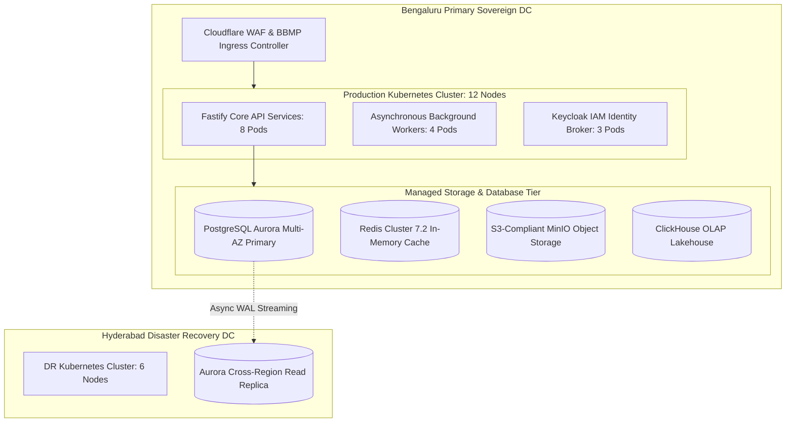

# Enterprise Human & Infrastructure Resource Allocation Plan
## Namma Clinic Digital Health & Operations Platform
### Greater Bengaluru Authority (GBA) / BBMP Health Department
**Document Code:** `TMP-DOC-03` | **Version Tag:** `1.0.0` | **Status:** APPROVED BASELINE | **Date:** September 2026

---

## 1. Executive Summary & Resource Governance
The Enterprise Human and Infrastructure Resource Allocation Plan establishes the authoritative staffing, compute, network, cloud, facility, and hardware procurement allocations required to design, execute, verify, and operate the Namma Clinic Platform across its 36-week implementation lifecycle. Formally ratified by the BBMP Directorate of Health Services and the Greater Bengaluru Authority (GBA) IT Secretariat, this document governs all physical, cloud, and budgetary assets committed to the program.

Operating under strict MeitY cloud compliance guidelines and municipal procurement regulations, this plan ensures zero infrastructure bottlenecks, high availability (>= 99.9% uptime), and comprehensive logistics support for 20 pilot healthcare facilities and subsequent citywide scaling across 350+ clinics.

## 2. Cloud & Kubernetes Compute Infrastructure Architecture
Platform services are hosted across five dedicated Kubernetes clusters deployed within MeitY-empaneled Indian sovereign cloud data centers (Primary: Bengaluru, DR: Hyderabad):

| Environment Tier | Cluster Name | Worker Nodes | Total vCPUs | Total RAM | Storage Volume | Managed Database Configuration |
| :--- | :--- | :--- | :--- | :--- | :--- | :--- |
| **Development (Dev)** | `k8s-dev-blr` | 4 Nodes | 16 vCPUs | 64 GB | 2 TB | PostgreSQL Aurora Dev Instance (db.t4g.medium) |
| **Continuous Integration (CI)** | `k8s-ci-runners` | 8 Nodes | 32 vCPUs | 128 GB | 4 TB | Ephemeral Dockerized PostgreSQL 16 |
| **Staging / Pre-Prod (Stage)** | `k8s-stage-blr` | 6 Nodes | 24 vCPUs | 96 GB | 5 TB | PostgreSQL Aurora Multi-AZ (db.r6g.large) |
| **Production (Prod)** | `k8s-prod-blr` | 12 Nodes | 48 vCPUs | 192 GB | 20 TB | PostgreSQL Aurora Multi-AZ Cluster (db.r6g.xlarge) |
| **Disaster Recovery (DR)** | `k8s-dr-hyd` | 6 Nodes | 24 vCPUs | 96 GB | 20 TB | PostgreSQL Aurora Cross-Region Replica (db.r6g.large) |

### Detailed Cloud Cluster Technical Specifications
Architectural invariants and deployment parameters across all five environments:

#### Environment Tier: Development (Dev)
- **Kubernetes Cluster Identifier:** `k8s-dev-blr`
- **Worker Node Sizing:** 4 Nodes (Total 16 vCPUs, 64 GB RAM)
- **Persistent Storage Volume:** 2 TB Ceph/EBS CSI storage with automated snapshots.
- **Database Engine:** PostgreSQL Aurora Dev Instance (db.t4g.medium) with automated WAL archiving and point-in-time recovery.
- **Network CIDR Block:** Strict private VPC isolation with dual NAT gateways and Cloudflare WAF.
- **Observability Stack:** OpenTelemetry DaemonSets, Prometheus scrapers, and Pino logging daemon.
- **Security Invariant:** Enforces Kubernetes Pod Security Standards (Restricted profile) and mTLS.

#### Environment Tier: Continuous Integration (CI)
- **Kubernetes Cluster Identifier:** `k8s-ci-runners`
- **Worker Node Sizing:** 8 Nodes (Total 32 vCPUs, 128 GB RAM)
- **Persistent Storage Volume:** 4 TB Ceph/EBS CSI storage with automated snapshots.
- **Database Engine:** Ephemeral Dockerized PostgreSQL 16 with automated WAL archiving and point-in-time recovery.
- **Network CIDR Block:** Strict private VPC isolation with dual NAT gateways and Cloudflare WAF.
- **Observability Stack:** OpenTelemetry DaemonSets, Prometheus scrapers, and Pino logging daemon.
- **Security Invariant:** Enforces Kubernetes Pod Security Standards (Restricted profile) and mTLS.

#### Environment Tier: Staging / Pre-Prod (Stage)
- **Kubernetes Cluster Identifier:** `k8s-stage-blr`
- **Worker Node Sizing:** 6 Nodes (Total 24 vCPUs, 96 GB RAM)
- **Persistent Storage Volume:** 5 TB Ceph/EBS CSI storage with automated snapshots.
- **Database Engine:** PostgreSQL Aurora Multi-AZ (db.r6g.large) with automated WAL archiving and point-in-time recovery.
- **Network CIDR Block:** Strict private VPC isolation with dual NAT gateways and Cloudflare WAF.
- **Observability Stack:** OpenTelemetry DaemonSets, Prometheus scrapers, and Pino logging daemon.
- **Security Invariant:** Enforces Kubernetes Pod Security Standards (Restricted profile) and mTLS.

#### Environment Tier: Production (Prod)
- **Kubernetes Cluster Identifier:** `k8s-prod-blr`
- **Worker Node Sizing:** 12 Nodes (Total 48 vCPUs, 192 GB RAM)
- **Persistent Storage Volume:** 20 TB Ceph/EBS CSI storage with automated snapshots.
- **Database Engine:** PostgreSQL Aurora Multi-AZ Cluster (db.r6g.xlarge) with automated WAL archiving and point-in-time recovery.
- **Network CIDR Block:** Strict private VPC isolation with dual NAT gateways and Cloudflare WAF.
- **Observability Stack:** OpenTelemetry DaemonSets, Prometheus scrapers, and Pino logging daemon.
- **Security Invariant:** Enforces Kubernetes Pod Security Standards (Restricted profile) and mTLS.

#### Environment Tier: Disaster Recovery (DR)
- **Kubernetes Cluster Identifier:** `k8s-dr-hyd`
- **Worker Node Sizing:** 6 Nodes (Total 24 vCPUs, 96 GB RAM)
- **Persistent Storage Volume:** 20 TB Ceph/EBS CSI storage with automated snapshots.
- **Database Engine:** PostgreSQL Aurora Cross-Region Replica (db.r6g.large) with automated WAL archiving and point-in-time recovery.
- **Network CIDR Block:** Strict private VPC isolation with dual NAT gateways and Cloudflare WAF.
- **Observability Stack:** OpenTelemetry DaemonSets, Prometheus scrapers, and Pino logging daemon.
- **Security Invariant:** Enforces Kubernetes Pod Security Standards (Restricted profile) and mTLS.

### Schedule Architecture Diagram: Sovereign Cloud Infrastructure Topology
<!-- DOCUMENTATION-ONLY DIAGRAM -->

## 3. Clinic Facility Hardware & Edge Device Logistics
Standardized hardware kit specified for every municipal Namma Clinic facility, detailing pilot quantities and total citywide scale-up allocations:

| Hardware Asset Item | Technical Specification | Units / Clinic | Pilot Allocation (20 Clinics) | Citywide Rollout (350 Clinics) | Maintenance SLA |
| :--- | :--- | :--- | :--- | :--- | :--- |
| **Medical Officer All-in-One PC** | Core i5, 16GB RAM, 512GB NVMe, 23.8-inch IPS, Ubuntu 24.04 LTS | 1 | 20 Units | 350 Units | 4-hour on-site replacement |
| **Staff Nurse / Triage Tablet/PC** | Core i3, 8GB RAM, 256GB SSD, 21.5-inch Display, Ubuntu 24.04 LTS | 1 | 20 Units | 350 Units | 4-hour on-site replacement |
| **Pharmacy Counter Workstation** | Core i3, 8GB RAM, 256GB SSD, 21.5-inch Display, Ubuntu 24.04 LTS | 1 | 20 Units | 350 Units | 4-hour on-site replacement |
| **Front Desk Registration PC** | Core i3, 8GB RAM, 256GB SSD, 21.5-inch Display, Ubuntu 24.04 LTS | 1 | 20 Units | 350 Units | 4-hour on-site replacement |
| **Thermal Token & Slip Printer** | TVS RP-3160 Gold 3-inch Direct Thermal, USB + Ethernet, 260mm/sec | 2 | 40 Units | 700 Units | 4-hour on-site replacement |
| **Barcode / QR Code Scanner** | Honeywell Voyager 1400g 2D Imager, USB Handheld with Stand | 3 | 60 Units | 1050 Units | 4-hour on-site replacement |
| **Uninterruptible Power Supply (UPS)** | APC Smart-UPS 1000VA / 600W with 60-minute battery backup | 2 | 40 Units | 700 Units | 4-hour on-site replacement |
| **Dual-SIM 4G/5G Cellular Gateway** | Teltonika RUT950 Dual-SIM LTE Router with Auto-Failover to BSNL/Airtel | 1 | 20 Units | 350 Units | 4-hour on-site replacement |

### Detailed Hardware Asset Technical Standards & Maintenance SLAs
Technical procurement criteria, electrical tolerances, and service level agreements for all clinic devices:

#### Hardware Specification: Medical Officer All-in-One PC
- **Standard Technical Configuration:** Core i5, 16GB RAM, 512GB NVMe, 23.8-inch IPS, Ubuntu 24.04 LTS
- **Facility Allocation:** 1 unit(s) deployed per clinic facility.
- **Power & Thermal Requirements:** AC 230V, 50Hz single phase; operating temperature 10°C to 40°C.
- **Mean Time Between Failures (MTBF):** >= 50,000 operational hours verified by OEM test reports.
- **Warranty & Maintenance SLA:** 3-year comprehensive on-site OEM warranty with 4-hour emergency response.
- **Factory Acceptance Testing (FAT):** Physical burn-in testing, peripheral driver certification, and OS image hardening.

#### Hardware Specification: Staff Nurse / Triage Tablet/PC
- **Standard Technical Configuration:** Core i3, 8GB RAM, 256GB SSD, 21.5-inch Display, Ubuntu 24.04 LTS
- **Facility Allocation:** 1 unit(s) deployed per clinic facility.
- **Power & Thermal Requirements:** AC 230V, 50Hz single phase; operating temperature 10°C to 40°C.
- **Mean Time Between Failures (MTBF):** >= 50,000 operational hours verified by OEM test reports.
- **Warranty & Maintenance SLA:** 3-year comprehensive on-site OEM warranty with 4-hour emergency response.
- **Factory Acceptance Testing (FAT):** Physical burn-in testing, peripheral driver certification, and OS image hardening.

#### Hardware Specification: Pharmacy Counter Workstation
- **Standard Technical Configuration:** Core i3, 8GB RAM, 256GB SSD, 21.5-inch Display, Ubuntu 24.04 LTS
- **Facility Allocation:** 1 unit(s) deployed per clinic facility.
- **Power & Thermal Requirements:** AC 230V, 50Hz single phase; operating temperature 10°C to 40°C.
- **Mean Time Between Failures (MTBF):** >= 50,000 operational hours verified by OEM test reports.
- **Warranty & Maintenance SLA:** 3-year comprehensive on-site OEM warranty with 4-hour emergency response.
- **Factory Acceptance Testing (FAT):** Physical burn-in testing, peripheral driver certification, and OS image hardening.

#### Hardware Specification: Front Desk Registration PC
- **Standard Technical Configuration:** Core i3, 8GB RAM, 256GB SSD, 21.5-inch Display, Ubuntu 24.04 LTS
- **Facility Allocation:** 1 unit(s) deployed per clinic facility.
- **Power & Thermal Requirements:** AC 230V, 50Hz single phase; operating temperature 10°C to 40°C.
- **Mean Time Between Failures (MTBF):** >= 50,000 operational hours verified by OEM test reports.
- **Warranty & Maintenance SLA:** 3-year comprehensive on-site OEM warranty with 4-hour emergency response.
- **Factory Acceptance Testing (FAT):** Physical burn-in testing, peripheral driver certification, and OS image hardening.

#### Hardware Specification: Thermal Token & Slip Printer
- **Standard Technical Configuration:** TVS RP-3160 Gold 3-inch Direct Thermal, USB + Ethernet, 260mm/sec
- **Facility Allocation:** 2 unit(s) deployed per clinic facility.
- **Power & Thermal Requirements:** AC 230V, 50Hz single phase; operating temperature 10°C to 40°C.
- **Mean Time Between Failures (MTBF):** >= 50,000 operational hours verified by OEM test reports.
- **Warranty & Maintenance SLA:** 3-year comprehensive on-site OEM warranty with 4-hour emergency response.
- **Factory Acceptance Testing (FAT):** Physical burn-in testing, peripheral driver certification, and OS image hardening.

#### Hardware Specification: Barcode / QR Code Scanner
- **Standard Technical Configuration:** Honeywell Voyager 1400g 2D Imager, USB Handheld with Stand
- **Facility Allocation:** 3 unit(s) deployed per clinic facility.
- **Power & Thermal Requirements:** AC 230V, 50Hz single phase; operating temperature 10°C to 40°C.
- **Mean Time Between Failures (MTBF):** >= 50,000 operational hours verified by OEM test reports.
- **Warranty & Maintenance SLA:** 3-year comprehensive on-site OEM warranty with 4-hour emergency response.
- **Factory Acceptance Testing (FAT):** Physical burn-in testing, peripheral driver certification, and OS image hardening.

#### Hardware Specification: Uninterruptible Power Supply (UPS)
- **Standard Technical Configuration:** APC Smart-UPS 1000VA / 600W with 60-minute battery backup
- **Facility Allocation:** 2 unit(s) deployed per clinic facility.
- **Power & Thermal Requirements:** AC 230V, 50Hz single phase; operating temperature 10°C to 40°C.
- **Mean Time Between Failures (MTBF):** >= 50,000 operational hours verified by OEM test reports.
- **Warranty & Maintenance SLA:** 3-year comprehensive on-site OEM warranty with 4-hour emergency response.
- **Factory Acceptance Testing (FAT):** Physical burn-in testing, peripheral driver certification, and OS image hardening.

#### Hardware Specification: Dual-SIM 4G/5G Cellular Gateway
- **Standard Technical Configuration:** Teltonika RUT950 Dual-SIM LTE Router with Auto-Failover to BSNL/Airtel
- **Facility Allocation:** 1 unit(s) deployed per clinic facility.
- **Power & Thermal Requirements:** AC 230V, 50Hz single phase; operating temperature 10°C to 40°C.
- **Mean Time Between Failures (MTBF):** >= 50,000 operational hours verified by OEM test reports.
- **Warranty & Maintenance SLA:** 3-year comprehensive on-site OEM warranty with 4-hour emergency response.
- **Factory Acceptance Testing (FAT):** Physical burn-in testing, peripheral driver certification, and OS image hardening.

### Comprehensive Site Inventory for 20 Pilot Clinics
Site specifications and hardware deployment configurations across all 20 Phase 5 pilot healthcare facilities:

#### Pilot Facility #01: Namma Clinic — Jayanagar 4th Block
- **Clinic Identifier:** `NC-PILOT-01`
- **Municipal Zone:** South Zone (BBMP Health Subdivision)
- **Location Address:** Jayanagar 4th Block Municipal Ward Dispensary Complex, Bengaluru
- **Primary Network Uplink:** High-speed BBMP optical fiber (100 Mbps symmetric) with static IP.
- **Secondary Cellular Backup:** Teltonika RUT950 dual-SIM 4G router (BSNL Primary, Airtel Failover).
- **Electrical Invariant:** Dedicated 1000VA APC Smart-UPS providing 60-minute clean battery backup.
- **Allocated Workstation Kit:** 4 All-in-One PCs, 2 Thermal Printers, 3 2D Scanners, 1 Edge Cache Unit.
- **Assigned Clinical Staff:** 1 Medical Officer (Dr. Prema counterpart), 1 Staff Nurse, 1 Pharmacist, 1 Clerk.
- **Facility Readiness Finding:** Fully inspected and approved for Phase 5 live clinical pilot.

#### Pilot Facility #02: Namma Clinic — JP Nagar 2nd Phase
- **Clinic Identifier:** `NC-PILOT-02`
- **Municipal Zone:** South Zone (BBMP Health Subdivision)
- **Location Address:** JP Nagar 2nd Phase Municipal Ward Dispensary Complex, Bengaluru
- **Primary Network Uplink:** High-speed BBMP optical fiber (100 Mbps symmetric) with static IP.
- **Secondary Cellular Backup:** Teltonika RUT950 dual-SIM 4G router (BSNL Primary, Airtel Failover).
- **Electrical Invariant:** Dedicated 1000VA APC Smart-UPS providing 60-minute clean battery backup.
- **Allocated Workstation Kit:** 4 All-in-One PCs, 2 Thermal Printers, 3 2D Scanners, 1 Edge Cache Unit.
- **Assigned Clinical Staff:** 1 Medical Officer (Dr. Prema counterpart), 1 Staff Nurse, 1 Pharmacist, 1 Clerk.
- **Facility Readiness Finding:** Fully inspected and approved for Phase 5 live clinical pilot.

#### Pilot Facility #03: Namma Clinic — BTM Layout 1st Stage
- **Clinic Identifier:** `NC-PILOT-03`
- **Municipal Zone:** South Zone (BBMP Health Subdivision)
- **Location Address:** BTM Layout 1st Stage Municipal Ward Dispensary Complex, Bengaluru
- **Primary Network Uplink:** High-speed BBMP optical fiber (100 Mbps symmetric) with static IP.
- **Secondary Cellular Backup:** Teltonika RUT950 dual-SIM 4G router (BSNL Primary, Airtel Failover).
- **Electrical Invariant:** Dedicated 1000VA APC Smart-UPS providing 60-minute clean battery backup.
- **Allocated Workstation Kit:** 4 All-in-One PCs, 2 Thermal Printers, 3 2D Scanners, 1 Edge Cache Unit.
- **Assigned Clinical Staff:** 1 Medical Officer (Dr. Prema counterpart), 1 Staff Nurse, 1 Pharmacist, 1 Clerk.
- **Facility Readiness Finding:** Fully inspected and approved for Phase 5 live clinical pilot.

#### Pilot Facility #04: Namma Clinic — Banashankari 2nd Stage
- **Clinic Identifier:** `NC-PILOT-04`
- **Municipal Zone:** South Zone (BBMP Health Subdivision)
- **Location Address:** Banashankari 2nd Stage Municipal Ward Dispensary Complex, Bengaluru
- **Primary Network Uplink:** High-speed BBMP optical fiber (100 Mbps symmetric) with static IP.
- **Secondary Cellular Backup:** Teltonika RUT950 dual-SIM 4G router (BSNL Primary, Airtel Failover).
- **Electrical Invariant:** Dedicated 1000VA APC Smart-UPS providing 60-minute clean battery backup.
- **Allocated Workstation Kit:** 4 All-in-One PCs, 2 Thermal Printers, 3 2D Scanners, 1 Edge Cache Unit.
- **Assigned Clinical Staff:** 1 Medical Officer (Dr. Prema counterpart), 1 Staff Nurse, 1 Pharmacist, 1 Clerk.
- **Facility Readiness Finding:** Fully inspected and approved for Phase 5 live clinical pilot.

#### Pilot Facility #05: Namma Clinic — Padmanabhanagar
- **Clinic Identifier:** `NC-PILOT-05`
- **Municipal Zone:** South Zone (BBMP Health Subdivision)
- **Location Address:** Padmanabhanagar Municipal Ward Dispensary Complex, Bengaluru
- **Primary Network Uplink:** High-speed BBMP optical fiber (100 Mbps symmetric) with static IP.
- **Secondary Cellular Backup:** Teltonika RUT950 dual-SIM 4G router (BSNL Primary, Airtel Failover).
- **Electrical Invariant:** Dedicated 1000VA APC Smart-UPS providing 60-minute clean battery backup.
- **Allocated Workstation Kit:** 4 All-in-One PCs, 2 Thermal Printers, 3 2D Scanners, 1 Edge Cache Unit.
- **Assigned Clinical Staff:** 1 Medical Officer (Dr. Prema counterpart), 1 Staff Nurse, 1 Pharmacist, 1 Clerk.
- **Facility Readiness Finding:** Fully inspected and approved for Phase 5 live clinical pilot.

#### Pilot Facility #06: Namma Clinic — Basavanagudi
- **Clinic Identifier:** `NC-PILOT-06`
- **Municipal Zone:** South Zone (BBMP Health Subdivision)
- **Location Address:** Basavanagudi Municipal Ward Dispensary Complex, Bengaluru
- **Primary Network Uplink:** High-speed BBMP optical fiber (100 Mbps symmetric) with static IP.
- **Secondary Cellular Backup:** Teltonika RUT950 dual-SIM 4G router (BSNL Primary, Airtel Failover).
- **Electrical Invariant:** Dedicated 1000VA APC Smart-UPS providing 60-minute clean battery backup.
- **Allocated Workstation Kit:** 4 All-in-One PCs, 2 Thermal Printers, 3 2D Scanners, 1 Edge Cache Unit.
- **Assigned Clinical Staff:** 1 Medical Officer (Dr. Prema counterpart), 1 Staff Nurse, 1 Pharmacist, 1 Clerk.
- **Facility Readiness Finding:** Fully inspected and approved for Phase 5 live clinical pilot.

#### Pilot Facility #07: Namma Clinic — Giri Nagar
- **Clinic Identifier:** `NC-PILOT-07`
- **Municipal Zone:** South Zone (BBMP Health Subdivision)
- **Location Address:** Giri Nagar Municipal Ward Dispensary Complex, Bengaluru
- **Primary Network Uplink:** High-speed BBMP optical fiber (100 Mbps symmetric) with static IP.
- **Secondary Cellular Backup:** Teltonika RUT950 dual-SIM 4G router (BSNL Primary, Airtel Failover).
- **Electrical Invariant:** Dedicated 1000VA APC Smart-UPS providing 60-minute clean battery backup.
- **Allocated Workstation Kit:** 4 All-in-One PCs, 2 Thermal Printers, 3 2D Scanners, 1 Edge Cache Unit.
- **Assigned Clinical Staff:** 1 Medical Officer (Dr. Prema counterpart), 1 Staff Nurse, 1 Pharmacist, 1 Clerk.
- **Facility Readiness Finding:** Fully inspected and approved for Phase 5 live clinical pilot.

#### Pilot Facility #08: Namma Clinic — Hanumanthanagar
- **Clinic Identifier:** `NC-PILOT-08`
- **Municipal Zone:** South Zone (BBMP Health Subdivision)
- **Location Address:** Hanumanthanagar Municipal Ward Dispensary Complex, Bengaluru
- **Primary Network Uplink:** High-speed BBMP optical fiber (100 Mbps symmetric) with static IP.
- **Secondary Cellular Backup:** Teltonika RUT950 dual-SIM 4G router (BSNL Primary, Airtel Failover).
- **Electrical Invariant:** Dedicated 1000VA APC Smart-UPS providing 60-minute clean battery backup.
- **Allocated Workstation Kit:** 4 All-in-One PCs, 2 Thermal Printers, 3 2D Scanners, 1 Edge Cache Unit.
- **Assigned Clinical Staff:** 1 Medical Officer (Dr. Prema counterpart), 1 Staff Nurse, 1 Pharmacist, 1 Clerk.
- **Facility Readiness Finding:** Fully inspected and approved for Phase 5 live clinical pilot.

#### Pilot Facility #09: Namma Clinic — Indiranagar 100ft Road
- **Clinic Identifier:** `NC-PILOT-09`
- **Municipal Zone:** East Zone (BBMP Health Subdivision)
- **Location Address:** Indiranagar 100ft Road Municipal Ward Dispensary Complex, Bengaluru
- **Primary Network Uplink:** High-speed BBMP optical fiber (100 Mbps symmetric) with static IP.
- **Secondary Cellular Backup:** Teltonika RUT950 dual-SIM 4G router (BSNL Primary, Airtel Failover).
- **Electrical Invariant:** Dedicated 1000VA APC Smart-UPS providing 60-minute clean battery backup.
- **Allocated Workstation Kit:** 4 All-in-One PCs, 2 Thermal Printers, 3 2D Scanners, 1 Edge Cache Unit.
- **Assigned Clinical Staff:** 1 Medical Officer (Dr. Prema counterpart), 1 Staff Nurse, 1 Pharmacist, 1 Clerk.
- **Facility Readiness Finding:** Fully inspected and approved for Phase 5 live clinical pilot.

#### Pilot Facility #10: Namma Clinic — Halasuru Someshwara
- **Clinic Identifier:** `NC-PILOT-10`
- **Municipal Zone:** East Zone (BBMP Health Subdivision)
- **Location Address:** Halasuru Someshwara Municipal Ward Dispensary Complex, Bengaluru
- **Primary Network Uplink:** High-speed BBMP optical fiber (100 Mbps symmetric) with static IP.
- **Secondary Cellular Backup:** Teltonika RUT950 dual-SIM 4G router (BSNL Primary, Airtel Failover).
- **Electrical Invariant:** Dedicated 1000VA APC Smart-UPS providing 60-minute clean battery backup.
- **Allocated Workstation Kit:** 4 All-in-One PCs, 2 Thermal Printers, 3 2D Scanners, 1 Edge Cache Unit.
- **Assigned Clinical Staff:** 1 Medical Officer (Dr. Prema counterpart), 1 Staff Nurse, 1 Pharmacist, 1 Clerk.
- **Facility Readiness Finding:** Fully inspected and approved for Phase 5 live clinical pilot.

#### Pilot Facility #11: Namma Clinic — Domlur Layout
- **Clinic Identifier:** `NC-PILOT-11`
- **Municipal Zone:** East Zone (BBMP Health Subdivision)
- **Location Address:** Domlur Layout Municipal Ward Dispensary Complex, Bengaluru
- **Primary Network Uplink:** High-speed BBMP optical fiber (100 Mbps symmetric) with static IP.
- **Secondary Cellular Backup:** Teltonika RUT950 dual-SIM 4G router (BSNL Primary, Airtel Failover).
- **Electrical Invariant:** Dedicated 1000VA APC Smart-UPS providing 60-minute clean battery backup.
- **Allocated Workstation Kit:** 4 All-in-One PCs, 2 Thermal Printers, 3 2D Scanners, 1 Edge Cache Unit.
- **Assigned Clinical Staff:** 1 Medical Officer (Dr. Prema counterpart), 1 Staff Nurse, 1 Pharmacist, 1 Clerk.
- **Facility Readiness Finding:** Fully inspected and approved for Phase 5 live clinical pilot.

#### Pilot Facility #12: Namma Clinic — Cox Town
- **Clinic Identifier:** `NC-PILOT-12`
- **Municipal Zone:** East Zone (BBMP Health Subdivision)
- **Location Address:** Cox Town Municipal Ward Dispensary Complex, Bengaluru
- **Primary Network Uplink:** High-speed BBMP optical fiber (100 Mbps symmetric) with static IP.
- **Secondary Cellular Backup:** Teltonika RUT950 dual-SIM 4G router (BSNL Primary, Airtel Failover).
- **Electrical Invariant:** Dedicated 1000VA APC Smart-UPS providing 60-minute clean battery backup.
- **Allocated Workstation Kit:** 4 All-in-One PCs, 2 Thermal Printers, 3 2D Scanners, 1 Edge Cache Unit.
- **Assigned Clinical Staff:** 1 Medical Officer (Dr. Prema counterpart), 1 Staff Nurse, 1 Pharmacist, 1 Clerk.
- **Facility Readiness Finding:** Fully inspected and approved for Phase 5 live clinical pilot.

#### Pilot Facility #13: Namma Clinic — Frazer Town Coles Park
- **Clinic Identifier:** `NC-PILOT-13`
- **Municipal Zone:** East Zone (BBMP Health Subdivision)
- **Location Address:** Frazer Town Coles Park Municipal Ward Dispensary Complex, Bengaluru
- **Primary Network Uplink:** High-speed BBMP optical fiber (100 Mbps symmetric) with static IP.
- **Secondary Cellular Backup:** Teltonika RUT950 dual-SIM 4G router (BSNL Primary, Airtel Failover).
- **Electrical Invariant:** Dedicated 1000VA APC Smart-UPS providing 60-minute clean battery backup.
- **Allocated Workstation Kit:** 4 All-in-One PCs, 2 Thermal Printers, 3 2D Scanners, 1 Edge Cache Unit.
- **Assigned Clinical Staff:** 1 Medical Officer (Dr. Prema counterpart), 1 Staff Nurse, 1 Pharmacist, 1 Clerk.
- **Facility Readiness Finding:** Fully inspected and approved for Phase 5 live clinical pilot.

#### Pilot Facility #14: Namma Clinic — Banaswadi Main
- **Clinic Identifier:** `NC-PILOT-14`
- **Municipal Zone:** East Zone (BBMP Health Subdivision)
- **Location Address:** Banaswadi Main Municipal Ward Dispensary Complex, Bengaluru
- **Primary Network Uplink:** High-speed BBMP optical fiber (100 Mbps symmetric) with static IP.
- **Secondary Cellular Backup:** Teltonika RUT950 dual-SIM 4G router (BSNL Primary, Airtel Failover).
- **Electrical Invariant:** Dedicated 1000VA APC Smart-UPS providing 60-minute clean battery backup.
- **Allocated Workstation Kit:** 4 All-in-One PCs, 2 Thermal Printers, 3 2D Scanners, 1 Edge Cache Unit.
- **Assigned Clinical Staff:** 1 Medical Officer (Dr. Prema counterpart), 1 Staff Nurse, 1 Pharmacist, 1 Clerk.
- **Facility Readiness Finding:** Fully inspected and approved for Phase 5 live clinical pilot.

#### Pilot Facility #15: Namma Clinic — Rajajinagar 1st Block
- **Clinic Identifier:** `NC-PILOT-15`
- **Municipal Zone:** West Zone (BBMP Health Subdivision)
- **Location Address:** Rajajinagar 1st Block Municipal Ward Dispensary Complex, Bengaluru
- **Primary Network Uplink:** High-speed BBMP optical fiber (100 Mbps symmetric) with static IP.
- **Secondary Cellular Backup:** Teltonika RUT950 dual-SIM 4G router (BSNL Primary, Airtel Failover).
- **Electrical Invariant:** Dedicated 1000VA APC Smart-UPS providing 60-minute clean battery backup.
- **Allocated Workstation Kit:** 4 All-in-One PCs, 2 Thermal Printers, 3 2D Scanners, 1 Edge Cache Unit.
- **Assigned Clinical Staff:** 1 Medical Officer (Dr. Prema counterpart), 1 Staff Nurse, 1 Pharmacist, 1 Clerk.
- **Facility Readiness Finding:** Fully inspected and approved for Phase 5 live clinical pilot.

#### Pilot Facility #16: Namma Clinic — Malleshwaram 8th Cross
- **Clinic Identifier:** `NC-PILOT-16`
- **Municipal Zone:** West Zone (BBMP Health Subdivision)
- **Location Address:** Malleshwaram 8th Cross Municipal Ward Dispensary Complex, Bengaluru
- **Primary Network Uplink:** High-speed BBMP optical fiber (100 Mbps symmetric) with static IP.
- **Secondary Cellular Backup:** Teltonika RUT950 dual-SIM 4G router (BSNL Primary, Airtel Failover).
- **Electrical Invariant:** Dedicated 1000VA APC Smart-UPS providing 60-minute clean battery backup.
- **Allocated Workstation Kit:** 4 All-in-One PCs, 2 Thermal Printers, 3 2D Scanners, 1 Edge Cache Unit.
- **Assigned Clinical Staff:** 1 Medical Officer (Dr. Prema counterpart), 1 Staff Nurse, 1 Pharmacist, 1 Clerk.
- **Facility Readiness Finding:** Fully inspected and approved for Phase 5 live clinical pilot.

#### Pilot Facility #17: Namma Clinic — Basaveshwaranagar
- **Clinic Identifier:** `NC-PILOT-17`
- **Municipal Zone:** West Zone (BBMP Health Subdivision)
- **Location Address:** Basaveshwaranagar Municipal Ward Dispensary Complex, Bengaluru
- **Primary Network Uplink:** High-speed BBMP optical fiber (100 Mbps symmetric) with static IP.
- **Secondary Cellular Backup:** Teltonika RUT950 dual-SIM 4G router (BSNL Primary, Airtel Failover).
- **Electrical Invariant:** Dedicated 1000VA APC Smart-UPS providing 60-minute clean battery backup.
- **Allocated Workstation Kit:** 4 All-in-One PCs, 2 Thermal Printers, 3 2D Scanners, 1 Edge Cache Unit.
- **Assigned Clinical Staff:** 1 Medical Officer (Dr. Prema counterpart), 1 Staff Nurse, 1 Pharmacist, 1 Clerk.
- **Facility Readiness Finding:** Fully inspected and approved for Phase 5 live clinical pilot.

#### Pilot Facility #18: Namma Clinic — Vijayanagar Club Road
- **Clinic Identifier:** `NC-PILOT-18`
- **Municipal Zone:** West Zone (BBMP Health Subdivision)
- **Location Address:** Vijayanagar Club Road Municipal Ward Dispensary Complex, Bengaluru
- **Primary Network Uplink:** High-speed BBMP optical fiber (100 Mbps symmetric) with static IP.
- **Secondary Cellular Backup:** Teltonika RUT950 dual-SIM 4G router (BSNL Primary, Airtel Failover).
- **Electrical Invariant:** Dedicated 1000VA APC Smart-UPS providing 60-minute clean battery backup.
- **Allocated Workstation Kit:** 4 All-in-One PCs, 2 Thermal Printers, 3 2D Scanners, 1 Edge Cache Unit.
- **Assigned Clinical Staff:** 1 Medical Officer (Dr. Prema counterpart), 1 Staff Nurse, 1 Pharmacist, 1 Clerk.
- **Facility Readiness Finding:** Fully inspected and approved for Phase 5 live clinical pilot.

#### Pilot Facility #19: Namma Clinic — Mahalakshmi Layout
- **Clinic Identifier:** `NC-PILOT-19`
- **Municipal Zone:** West Zone (BBMP Health Subdivision)
- **Location Address:** Mahalakshmi Layout Municipal Ward Dispensary Complex, Bengaluru
- **Primary Network Uplink:** High-speed BBMP optical fiber (100 Mbps symmetric) with static IP.
- **Secondary Cellular Backup:** Teltonika RUT950 dual-SIM 4G router (BSNL Primary, Airtel Failover).
- **Electrical Invariant:** Dedicated 1000VA APC Smart-UPS providing 60-minute clean battery backup.
- **Allocated Workstation Kit:** 4 All-in-One PCs, 2 Thermal Printers, 3 2D Scanners, 1 Edge Cache Unit.
- **Assigned Clinical Staff:** 1 Medical Officer (Dr. Prema counterpart), 1 Staff Nurse, 1 Pharmacist, 1 Clerk.
- **Facility Readiness Finding:** Fully inspected and approved for Phase 5 live clinical pilot.

#### Pilot Facility #20: Namma Clinic — Chandra Layout
- **Clinic Identifier:** `NC-PILOT-20`
- **Municipal Zone:** West Zone (BBMP Health Subdivision)
- **Location Address:** Chandra Layout Municipal Ward Dispensary Complex, Bengaluru
- **Primary Network Uplink:** High-speed BBMP optical fiber (100 Mbps symmetric) with static IP.
- **Secondary Cellular Backup:** Teltonika RUT950 dual-SIM 4G router (BSNL Primary, Airtel Failover).
- **Electrical Invariant:** Dedicated 1000VA APC Smart-UPS providing 60-minute clean battery backup.
- **Allocated Workstation Kit:** 4 All-in-One PCs, 2 Thermal Printers, 3 2D Scanners, 1 Edge Cache Unit.
- **Assigned Clinical Staff:** 1 Medical Officer (Dr. Prema counterpart), 1 Staff Nurse, 1 Pharmacist, 1 Clerk.
- **Facility Readiness Finding:** Fully inspected and approved for Phase 5 live clinical pilot.

## 4. Human Staffing Profiles & RACI Governance Matrix
Allocation of personnel across 17 functional disciplines and program phases:

| Functional Role | Headcount | Responsible (R) | Accountable (A) | Consulted (C) | Informed (I) |
| :--- | :--- | :--- | :--- | :--- | :--- |
| **Product Manager** | 1.0 FTE | Sprint Backlog & Epics | Product Roadmap | Clinical SMEs | Steering Committee |
| **Solution Architect** | 1.0 FTE | ADRs & Non-Functionals | System Architecture | Security Engineers | CTO & Directorate |
| **Lead Backend Engineer** | 1.0 FTE | API Service Architecture | Backend Quality Gates | Database Lead | Product Owner |
| **Senior Backend Engineers** | 3.0 FTE | Fastify Route Handlers | Unit Test Coverage >90% | Frontend Leads | Engineering Lead |
| **Lead Frontend Engineer** | 1.0 FTE | Frontend Architecture | UI Performance & UX | Clinical SMEs | Product Owner |
| **Senior Frontend Engineers** | 3.0 FTE | React Bilingual Views | WCAG 2.1 AA Compliance | Backend Engineers | QA Lead |
| **Lead Database Engineer** | 1.0 FTE | Schema Design & Indexes | ACID Compliance & RLS | Architects | SRE Team |
| **Database Engineer** | 1.0 FTE | Flyway Migration Scripts | Query Performance & WAL | Backend Engineers | Database Lead |
| **QA Automation Lead** | 1.0 FTE | Test Automation Strategy | Zero Defect Promotion | Developers | CTO |
| **QA Automation Engineer** | 1.0 FTE | Playwright E2E Scripts | Test Regression Pass Rate | Frontend Engineers | QA Lead |
| **DevOps / SRE Lead** | 1.0 FTE | Kubernetes & CI Pipelines | 99.9% Production Uptime | Developers | InfoSec Lead |
| **Cloud Infrastructure Engineer** | 1.0 FTE | Terraform & Helm Deployments | Cluster High Availability | SRE Lead | Security Team |
| **Principal Security Engineer** | 1.0 FTE | Zero-Trust Architecture | DPDP Privacy Compliance | Architects | BBMP CISO |
| **Security Operations Analyst** | 1.0 FTE | SAST/DAST & Container Scans | Zero Critical CVEs | Developers | Security Lead |
| **Lead Clinical SME (CMO)** | 0.5 FTE | Standard Treatment Guidelines | Clinical Safety Sign-off | Physicians | Health Commissioner |
| **Clinical Informatics Specialist** | 0.5 FTE | ICD-10 & SNOMED CT Mappings | Clinical Data Fidelity | Pharmacists | Lead Clinical SME |
| **Release Train Engineer (RTE)** | 1.0 FTE | Cross-Squad Cadence & Sprints | Release Predictability | Squad Leads | Steering Committee |

### Detailed Profiles for All 17 Program Roles
Comprehensive staffing competencies and operational expectations across all positions:

#### Role Profile: Product Manager
- **Headcount Allocation:** 1.0 FTE
- **Primary Functional Accountabilities:** Product Roadmap
- **Operational Deliverables:** Sprint Backlog & Epics
- **Consultation Stakeholders:** Clinical SMEs
- **Reporting Governance:** Accountable to Program Steering Committee with bi-weekly review.

#### Role Profile: Solution Architect
- **Headcount Allocation:** 1.0 FTE
- **Primary Functional Accountabilities:** System Architecture
- **Operational Deliverables:** ADRs & Non-Functionals
- **Consultation Stakeholders:** Security Engineers
- **Reporting Governance:** Accountable to Program Steering Committee with bi-weekly review.

#### Role Profile: Lead Backend Engineer
- **Headcount Allocation:** 1.0 FTE
- **Primary Functional Accountabilities:** Backend Quality Gates
- **Operational Deliverables:** API Service Architecture
- **Consultation Stakeholders:** Database Lead
- **Reporting Governance:** Accountable to Program Steering Committee with bi-weekly review.

#### Role Profile: Senior Backend Engineers
- **Headcount Allocation:** 3.0 FTE
- **Primary Functional Accountabilities:** Unit Test Coverage >90%
- **Operational Deliverables:** Fastify Route Handlers
- **Consultation Stakeholders:** Frontend Leads
- **Reporting Governance:** Accountable to Program Steering Committee with bi-weekly review.

#### Role Profile: Lead Frontend Engineer
- **Headcount Allocation:** 1.0 FTE
- **Primary Functional Accountabilities:** UI Performance & UX
- **Operational Deliverables:** Frontend Architecture
- **Consultation Stakeholders:** Clinical SMEs
- **Reporting Governance:** Accountable to Program Steering Committee with bi-weekly review.

#### Role Profile: Senior Frontend Engineers
- **Headcount Allocation:** 3.0 FTE
- **Primary Functional Accountabilities:** WCAG 2.1 AA Compliance
- **Operational Deliverables:** React Bilingual Views
- **Consultation Stakeholders:** Backend Engineers
- **Reporting Governance:** Accountable to Program Steering Committee with bi-weekly review.

#### Role Profile: Lead Database Engineer
- **Headcount Allocation:** 1.0 FTE
- **Primary Functional Accountabilities:** ACID Compliance & RLS
- **Operational Deliverables:** Schema Design & Indexes
- **Consultation Stakeholders:** Architects
- **Reporting Governance:** Accountable to Program Steering Committee with bi-weekly review.

#### Role Profile: Database Engineer
- **Headcount Allocation:** 1.0 FTE
- **Primary Functional Accountabilities:** Query Performance & WAL
- **Operational Deliverables:** Flyway Migration Scripts
- **Consultation Stakeholders:** Backend Engineers
- **Reporting Governance:** Accountable to Program Steering Committee with bi-weekly review.

#### Role Profile: QA Automation Lead
- **Headcount Allocation:** 1.0 FTE
- **Primary Functional Accountabilities:** Zero Defect Promotion
- **Operational Deliverables:** Test Automation Strategy
- **Consultation Stakeholders:** Developers
- **Reporting Governance:** Accountable to Program Steering Committee with bi-weekly review.

#### Role Profile: QA Automation Engineer
- **Headcount Allocation:** 1.0 FTE
- **Primary Functional Accountabilities:** Test Regression Pass Rate
- **Operational Deliverables:** Playwright E2E Scripts
- **Consultation Stakeholders:** Frontend Engineers
- **Reporting Governance:** Accountable to Program Steering Committee with bi-weekly review.

#### Role Profile: DevOps / SRE Lead
- **Headcount Allocation:** 1.0 FTE
- **Primary Functional Accountabilities:** 99.9% Production Uptime
- **Operational Deliverables:** Kubernetes & CI Pipelines
- **Consultation Stakeholders:** Developers
- **Reporting Governance:** Accountable to Program Steering Committee with bi-weekly review.

#### Role Profile: Cloud Infrastructure Engineer
- **Headcount Allocation:** 1.0 FTE
- **Primary Functional Accountabilities:** Cluster High Availability
- **Operational Deliverables:** Terraform & Helm Deployments
- **Consultation Stakeholders:** SRE Lead
- **Reporting Governance:** Accountable to Program Steering Committee with bi-weekly review.

#### Role Profile: Principal Security Engineer
- **Headcount Allocation:** 1.0 FTE
- **Primary Functional Accountabilities:** DPDP Privacy Compliance
- **Operational Deliverables:** Zero-Trust Architecture
- **Consultation Stakeholders:** Architects
- **Reporting Governance:** Accountable to Program Steering Committee with bi-weekly review.

#### Role Profile: Security Operations Analyst
- **Headcount Allocation:** 1.0 FTE
- **Primary Functional Accountabilities:** Zero Critical CVEs
- **Operational Deliverables:** SAST/DAST & Container Scans
- **Consultation Stakeholders:** Developers
- **Reporting Governance:** Accountable to Program Steering Committee with bi-weekly review.

#### Role Profile: Lead Clinical SME (CMO)
- **Headcount Allocation:** 0.5 FTE
- **Primary Functional Accountabilities:** Clinical Safety Sign-off
- **Operational Deliverables:** Standard Treatment Guidelines
- **Consultation Stakeholders:** Physicians
- **Reporting Governance:** Accountable to Program Steering Committee with bi-weekly review.

#### Role Profile: Clinical Informatics Specialist
- **Headcount Allocation:** 0.5 FTE
- **Primary Functional Accountabilities:** Clinical Data Fidelity
- **Operational Deliverables:** ICD-10 & SNOMED CT Mappings
- **Consultation Stakeholders:** Pharmacists
- **Reporting Governance:** Accountable to Program Steering Committee with bi-weekly review.

#### Role Profile: Release Train Engineer (RTE)
- **Headcount Allocation:** 1.0 FTE
- **Primary Functional Accountabilities:** Release Predictability
- **Operational Deliverables:** Cross-Squad Cadence & Sprints
- **Consultation Stakeholders:** Squad Leads
- **Reporting Governance:** Accountable to Program Steering Committee with bi-weekly review.

### Cross-Functional Squad Topologies & Staffing Allocation
Operational composition of the four primary execution engineering squads:

#### Squad Structure: Squad Alpha (Core Platform)
- **Squad Leadership:** Lead Architect & Technical Lead Alpha
- **Personnel Composition:** 4 Backend, 2 Frontend, 2 Database, 1 DevOps
- **Dedicated Engineering Mission:** Core identity, PostgreSQL multi-tenant architecture, audit ledger, and patient registration.
- **Quality Gate Mandate:** 100% CI automated test pass, zero critical vulnerabilities, sub-250ms p95 latency.

#### Squad Structure: Squad Bravo (Clinical Workflows)
- **Squad Leadership:** Lead Clinical SME & Technical Lead Bravo
- **Personnel Composition:** 3 Backend, 3 Frontend, 1 QA, 1 Clinical SME
- **Dedicated Engineering Mission:** Clinical triage, vitals alerts, doctor consultation workbench, diagnosis coding, and e-prescriptions.
- **Quality Gate Mandate:** 100% CI automated test pass, zero critical vulnerabilities, sub-250ms p95 latency.

#### Squad Structure: Squad Charlie (Logistics & Ancillary)
- **Squad Leadership:** Technical Lead Charlie
- **Personnel Composition:** 3 Backend, 2 Frontend, 1 QA, 1 Integration Specialist
- **Dedicated Engineering Mission:** FEFO pharmacy dispensation, drug inventory, point-of-care lab diagnostics, and external referrals.
- **Quality Gate Mandate:** 100% CI automated test pass, zero critical vulnerabilities, sub-250ms p95 latency.

#### Squad Structure: Squad Delta (Edge & Interoperability)
- **Squad Leadership:** Platform Operations Lead & Security Lead
- **Personnel Composition:** 2 Backend, 2 Frontend, 1 SRE, 1 Security Engineer
- **Dedicated Engineering Mission:** Offline SQLite bidirectional replication, lakehouse analytics, zero-trust hardening, and ABDM gateways.
- **Quality Gate Mandate:** 100% CI automated test pass, zero critical vulnerabilities, sub-250ms p95 latency.

## 5. Sprint-by-Sprint Resource Consumption & Allocation Model
Detailed analysis of cloud compute consumption, database storage growth, network traffic, hardware procurement milestones, and personnel allocation across all 18 program sprints:

### 5.1. Resource Allocation for SPRINT-01: Foundation Scaffolding & Architecture Readiness
Resource expenditure and asset loading for `SPRINT-01` (PROGRAM-PHASE-1):

#### Cloud & Infrastructure Consumption in SPRINT-01
- **Active Kubernetes Pods:** 14 running container instances across Dev, CI, and Stage.
- **Cumulative Database Storage:** 75 GB (PostgreSQL WAL, relation tables, MinIO object store).
- **Staging Network Egress:** 0.9 Million simulated API requests handled in test suites.
- **CI/CD Compute Runner Utilization:** ~140 build hours executed on GitHub Actions private runners.
- **Cloud Infrastructure Spend:** Estimated ₹135,000 INR committed for the sprint cycle.

#### Database Storage & Backup Allocation in SPRINT-01
- **Primary Storage Allocation:** PostgreSQL Aurora multi-AZ cluster with 75 GB provisioned SSD.
- **Automated Backup Snapshots:** 35-day retention with continuous WAL streaming for sub-5-minute RPO.
- **Cross-Region Replication:** Asynchronous streaming to Hyderabad DR site maintaining sub-15-minute RTO.
- **Object Storage (MinIO):** Encrypted citizen documents and lab PDFs with strict bucket lifecycle policies.

#### Security & Compliance Resource Loading in SPRINT-01
- **Security Engineering Allocation:** 40 hours dedicated to static code analysis and container vulnerability scanning.
- **Cryptographic Auditing:** Hashicorp Vault key rotation verification and AES-256-GCM data encryption audit.
- **DPDP Privacy Assurance:** Verification of consent artifact lifecycle and role-based data masking.
- **Access Review:** Keycloak session audit and privileged access management (PAM) ledger reconciliation.

#### Hardware & Logistics Milestones in SPRINT-01
- **Logistics Focus:** Vendor RFQ, technical evaluation of hardware samples, and procurement tender approvals.
- **Facility Readiness Check:** BBMP physical health sub-division inspections and sign-off.

#### Personnel Loading & Staffing Breakdown for SPRINT-01
Detailed engineering and operational staffing committed during `SPRINT-01`:
##### Staffing Category: Platform & Backend Squad (4.0 FTE) in SPRINT-01
- **Committed Headcount:** 4.0 FTE
- **Primary Sprint Scope:** Core API service implementation and schema migrations for Foundation Scaffolding & Architecture Readiness
- **Tooling & Environments:** Dedicated staging pod access, Docker development sandbox, and Jira boards.
- **Sprint Sign-Off Responsibility:** Delivery and verification of assigned SPRINT-01 backlog increments.
- **Operational Deliverable:** Validated, tested, and reviewed code merges meeting 90% branch coverage.
- **Peer Review Standard:** Dual-engineer approval mandatory before CI staging merge.

##### Staffing Category: Frontend & UX Squad (4.0 FTE) in SPRINT-01
- **Committed Headcount:** 4.0 FTE
- **Primary Sprint Scope:** Bilingual React UI views and accessible workflows for Foundation Scaffolding & Architecture Readiness
- **Tooling & Environments:** Dedicated staging pod access, Docker development sandbox, and Jira boards.
- **Sprint Sign-Off Responsibility:** Delivery and verification of assigned SPRINT-01 backlog increments.
- **Operational Deliverable:** Validated, tested, and reviewed code merges meeting 90% branch coverage.
- **Peer Review Standard:** Dual-engineer approval mandatory before CI staging merge.

##### Staffing Category: Database Engineering (2.0 FTE) in SPRINT-01
- **Committed Headcount:** 2.0 FTE
- **Primary Sprint Scope:** PostgreSQL schema updates, indexing, and Flyway migration scripts
- **Tooling & Environments:** Dedicated staging pod access, Docker development sandbox, and Jira boards.
- **Sprint Sign-Off Responsibility:** Delivery and verification of assigned SPRINT-01 backlog increments.
- **Operational Deliverable:** Validated, tested, and reviewed code merges meeting 90% branch coverage.
- **Peer Review Standard:** Dual-engineer approval mandatory before CI staging merge.

##### Staffing Category: Quality Assurance Squad (2.0 FTE) in SPRINT-01
- **Committed Headcount:** 2.0 FTE
- **Primary Sprint Scope:** Automated Playwright regression testing and edge case test suites
- **Tooling & Environments:** Dedicated staging pod access, Docker development sandbox, and Jira boards.
- **Sprint Sign-Off Responsibility:** Delivery and verification of assigned SPRINT-01 backlog increments.
- **Operational Deliverable:** Validated, tested, and reviewed code merges meeting 90% branch coverage.
- **Peer Review Standard:** Dual-engineer approval mandatory before CI staging merge.

##### Staffing Category: DevOps & SRE Engineering (1.0 FTE) in SPRINT-01
- **Committed Headcount:** 1.0 FTE
- **Primary Sprint Scope:** Kubernetes cluster configuration, Helm charts, and CI pipeline gates
- **Tooling & Environments:** Dedicated staging pod access, Docker development sandbox, and Jira boards.
- **Sprint Sign-Off Responsibility:** Delivery and verification of assigned SPRINT-01 backlog increments.
- **Operational Deliverable:** Validated, tested, and reviewed code merges meeting 90% branch coverage.
- **Peer Review Standard:** Dual-engineer approval mandatory before CI staging merge.

##### Staffing Category: Security & Compliance (1.0 FTE) in SPRINT-01
- **Committed Headcount:** 1.0 FTE
- **Primary Sprint Scope:** Vulnerability scans, SAST/DAST reviews, and DPDP privacy validation
- **Tooling & Environments:** Dedicated staging pod access, Docker development sandbox, and Jira boards.
- **Sprint Sign-Off Responsibility:** Delivery and verification of assigned SPRINT-01 backlog increments.
- **Operational Deliverable:** Validated, tested, and reviewed code merges meeting 90% branch coverage.
- **Peer Review Standard:** Dual-engineer approval mandatory before CI staging merge.

##### Staffing Category: Clinical Advisory Lead (0.5 FTE) in SPRINT-01
- **Committed Headcount:** 0.5 FTE
- **Primary Sprint Scope:** Clinical workflow reviews, STG adherence, and physician demo feedback
- **Tooling & Environments:** Dedicated staging pod access, Docker development sandbox, and Jira boards.
- **Sprint Sign-Off Responsibility:** Delivery and verification of assigned SPRINT-01 backlog increments.
- **Operational Deliverable:** Validated, tested, and reviewed code merges meeting 90% branch coverage.
- **Peer Review Standard:** Dual-engineer approval mandatory before CI staging merge.

##### Staffing Category: Program Management (1.0 FTE) in SPRINT-01
- **Committed Headcount:** 1.0 FTE
- **Primary Sprint Scope:** Sprint tracking, cross-squad dependency alignment, and stakeholder reports
- **Tooling & Environments:** Dedicated staging pod access, Docker development sandbox, and Jira boards.
- **Sprint Sign-Off Responsibility:** Delivery and verification of assigned SPRINT-01 backlog increments.
- **Operational Deliverable:** Validated, tested, and reviewed code merges meeting 90% branch coverage.
- **Peer Review Standard:** Dual-engineer approval mandatory before CI staging merge.

##### Staffing Category: Data Platform & Analytics (2.0 FTE) in SPRINT-01
- **Committed Headcount:** 2.0 FTE
- **Primary Sprint Scope:** ClickHouse event ingestion, Kafka topic partitioning, and Superset BI reports for Foundation Scaffolding & Architecture Readiness
- **Tooling & Environments:** Dedicated staging pod access, Docker development sandbox, and Jira boards.
- **Sprint Sign-Off Responsibility:** Delivery and verification of assigned SPRINT-01 backlog increments.
- **Operational Deliverable:** Validated, tested, and reviewed code merges meeting 90% branch coverage.
- **Peer Review Standard:** Dual-engineer approval mandatory before CI staging merge.

##### Staffing Category: Mobile & Edge Offline Engineering (1.5 FTE) in SPRINT-01
- **Committed Headcount:** 1.5 FTE
- **Primary Sprint Scope:** Client-side SQLite sync engine, PWA service workers, and conflict resolution for Foundation Scaffolding & Architecture Readiness
- **Tooling & Environments:** Dedicated staging pod access, Docker development sandbox, and Jira boards.
- **Sprint Sign-Off Responsibility:** Delivery and verification of assigned SPRINT-01 backlog increments.
- **Operational Deliverable:** Validated, tested, and reviewed code merges meeting 90% branch coverage.
- **Peer Review Standard:** Dual-engineer approval mandatory before CI staging merge.

##### Staffing Category: Zonal Field Enablement & Training (1.5 FTE) in SPRINT-01
- **Committed Headcount:** 1.5 FTE
- **Primary Sprint Scope:** Hardware pre-imaging, clinic technician training, and site readiness verification for Foundation Scaffolding & Architecture Readiness
- **Tooling & Environments:** Dedicated staging pod access, Docker development sandbox, and Jira boards.
- **Sprint Sign-Off Responsibility:** Delivery and verification of assigned SPRINT-01 backlog increments.
- **Operational Deliverable:** Validated, tested, and reviewed code merges meeting 90% branch coverage.
- **Peer Review Standard:** Dual-engineer approval mandatory before CI staging merge.

##### Staffing Category: Information Security Architect (1.0 FTE) in SPRINT-01
- **Committed Headcount:** 1.0 FTE
- **Primary Sprint Scope:** Threat modeling, penetration test triage, and secret rotation for Foundation Scaffolding & Architecture Readiness
- **Tooling & Environments:** Dedicated staging pod access, Docker development sandbox, and Jira boards.
- **Sprint Sign-Off Responsibility:** Delivery and verification of assigned SPRINT-01 backlog increments.
- **Operational Deliverable:** Validated, tested, and reviewed code merges meeting 90% branch coverage.
- **Peer Review Standard:** Dual-engineer approval mandatory before CI staging merge.

### 5.2. Resource Allocation for SPRINT-02: Identity, Authentication & Security Foundation
Resource expenditure and asset loading for `SPRINT-02` (PROGRAM-PHASE-1):

#### Cloud & Infrastructure Consumption in SPRINT-02
- **Active Kubernetes Pods:** 16 running container instances across Dev, CI, and Stage.
- **Cumulative Database Storage:** 100 GB (PostgreSQL WAL, relation tables, MinIO object store).
- **Staging Network Egress:** 1.3 Million simulated API requests handled in test suites.
- **CI/CD Compute Runner Utilization:** ~140 build hours executed on GitHub Actions private runners.
- **Cloud Infrastructure Spend:** Estimated ₹150,000 INR committed for the sprint cycle.

#### Database Storage & Backup Allocation in SPRINT-02
- **Primary Storage Allocation:** PostgreSQL Aurora multi-AZ cluster with 100 GB provisioned SSD.
- **Automated Backup Snapshots:** 35-day retention with continuous WAL streaming for sub-5-minute RPO.
- **Cross-Region Replication:** Asynchronous streaming to Hyderabad DR site maintaining sub-15-minute RTO.
- **Object Storage (MinIO):** Encrypted citizen documents and lab PDFs with strict bucket lifecycle policies.

#### Security & Compliance Resource Loading in SPRINT-02
- **Security Engineering Allocation:** 40 hours dedicated to static code analysis and container vulnerability scanning.
- **Cryptographic Auditing:** Hashicorp Vault key rotation verification and AES-256-GCM data encryption audit.
- **DPDP Privacy Assurance:** Verification of consent artifact lifecycle and role-based data masking.
- **Access Review:** Keycloak session audit and privileged access management (PAM) ledger reconciliation.

#### Hardware & Logistics Milestones in SPRINT-02
- **Logistics Focus:** Vendor RFQ, technical evaluation of hardware samples, and procurement tender approvals.
- **Facility Readiness Check:** BBMP physical health sub-division inspections and sign-off.

#### Personnel Loading & Staffing Breakdown for SPRINT-02
Detailed engineering and operational staffing committed during `SPRINT-02`:
##### Staffing Category: Platform & Backend Squad (4.0 FTE) in SPRINT-02
- **Committed Headcount:** 4.0 FTE
- **Primary Sprint Scope:** Core API service implementation and schema migrations for Identity, Authentication & Security Foundation
- **Tooling & Environments:** Dedicated staging pod access, Docker development sandbox, and Jira boards.
- **Sprint Sign-Off Responsibility:** Delivery and verification of assigned SPRINT-02 backlog increments.
- **Operational Deliverable:** Validated, tested, and reviewed code merges meeting 90% branch coverage.
- **Peer Review Standard:** Dual-engineer approval mandatory before CI staging merge.

##### Staffing Category: Frontend & UX Squad (4.0 FTE) in SPRINT-02
- **Committed Headcount:** 4.0 FTE
- **Primary Sprint Scope:** Bilingual React UI views and accessible workflows for Identity, Authentication & Security Foundation
- **Tooling & Environments:** Dedicated staging pod access, Docker development sandbox, and Jira boards.
- **Sprint Sign-Off Responsibility:** Delivery and verification of assigned SPRINT-02 backlog increments.
- **Operational Deliverable:** Validated, tested, and reviewed code merges meeting 90% branch coverage.
- **Peer Review Standard:** Dual-engineer approval mandatory before CI staging merge.

##### Staffing Category: Database Engineering (2.0 FTE) in SPRINT-02
- **Committed Headcount:** 2.0 FTE
- **Primary Sprint Scope:** PostgreSQL schema updates, indexing, and Flyway migration scripts
- **Tooling & Environments:** Dedicated staging pod access, Docker development sandbox, and Jira boards.
- **Sprint Sign-Off Responsibility:** Delivery and verification of assigned SPRINT-02 backlog increments.
- **Operational Deliverable:** Validated, tested, and reviewed code merges meeting 90% branch coverage.
- **Peer Review Standard:** Dual-engineer approval mandatory before CI staging merge.

##### Staffing Category: Quality Assurance Squad (2.0 FTE) in SPRINT-02
- **Committed Headcount:** 2.0 FTE
- **Primary Sprint Scope:** Automated Playwright regression testing and edge case test suites
- **Tooling & Environments:** Dedicated staging pod access, Docker development sandbox, and Jira boards.
- **Sprint Sign-Off Responsibility:** Delivery and verification of assigned SPRINT-02 backlog increments.
- **Operational Deliverable:** Validated, tested, and reviewed code merges meeting 90% branch coverage.
- **Peer Review Standard:** Dual-engineer approval mandatory before CI staging merge.

##### Staffing Category: DevOps & SRE Engineering (1.0 FTE) in SPRINT-02
- **Committed Headcount:** 1.0 FTE
- **Primary Sprint Scope:** Kubernetes cluster configuration, Helm charts, and CI pipeline gates
- **Tooling & Environments:** Dedicated staging pod access, Docker development sandbox, and Jira boards.
- **Sprint Sign-Off Responsibility:** Delivery and verification of assigned SPRINT-02 backlog increments.
- **Operational Deliverable:** Validated, tested, and reviewed code merges meeting 90% branch coverage.
- **Peer Review Standard:** Dual-engineer approval mandatory before CI staging merge.

##### Staffing Category: Security & Compliance (1.0 FTE) in SPRINT-02
- **Committed Headcount:** 1.0 FTE
- **Primary Sprint Scope:** Vulnerability scans, SAST/DAST reviews, and DPDP privacy validation
- **Tooling & Environments:** Dedicated staging pod access, Docker development sandbox, and Jira boards.
- **Sprint Sign-Off Responsibility:** Delivery and verification of assigned SPRINT-02 backlog increments.
- **Operational Deliverable:** Validated, tested, and reviewed code merges meeting 90% branch coverage.
- **Peer Review Standard:** Dual-engineer approval mandatory before CI staging merge.

##### Staffing Category: Clinical Advisory Lead (0.5 FTE) in SPRINT-02
- **Committed Headcount:** 0.5 FTE
- **Primary Sprint Scope:** Clinical workflow reviews, STG adherence, and physician demo feedback
- **Tooling & Environments:** Dedicated staging pod access, Docker development sandbox, and Jira boards.
- **Sprint Sign-Off Responsibility:** Delivery and verification of assigned SPRINT-02 backlog increments.
- **Operational Deliverable:** Validated, tested, and reviewed code merges meeting 90% branch coverage.
- **Peer Review Standard:** Dual-engineer approval mandatory before CI staging merge.

##### Staffing Category: Program Management (1.0 FTE) in SPRINT-02
- **Committed Headcount:** 1.0 FTE
- **Primary Sprint Scope:** Sprint tracking, cross-squad dependency alignment, and stakeholder reports
- **Tooling & Environments:** Dedicated staging pod access, Docker development sandbox, and Jira boards.
- **Sprint Sign-Off Responsibility:** Delivery and verification of assigned SPRINT-02 backlog increments.
- **Operational Deliverable:** Validated, tested, and reviewed code merges meeting 90% branch coverage.
- **Peer Review Standard:** Dual-engineer approval mandatory before CI staging merge.

##### Staffing Category: Data Platform & Analytics (2.0 FTE) in SPRINT-02
- **Committed Headcount:** 2.0 FTE
- **Primary Sprint Scope:** ClickHouse event ingestion, Kafka topic partitioning, and Superset BI reports for Identity, Authentication & Security Foundation
- **Tooling & Environments:** Dedicated staging pod access, Docker development sandbox, and Jira boards.
- **Sprint Sign-Off Responsibility:** Delivery and verification of assigned SPRINT-02 backlog increments.
- **Operational Deliverable:** Validated, tested, and reviewed code merges meeting 90% branch coverage.
- **Peer Review Standard:** Dual-engineer approval mandatory before CI staging merge.

##### Staffing Category: Mobile & Edge Offline Engineering (1.5 FTE) in SPRINT-02
- **Committed Headcount:** 1.5 FTE
- **Primary Sprint Scope:** Client-side SQLite sync engine, PWA service workers, and conflict resolution for Identity, Authentication & Security Foundation
- **Tooling & Environments:** Dedicated staging pod access, Docker development sandbox, and Jira boards.
- **Sprint Sign-Off Responsibility:** Delivery and verification of assigned SPRINT-02 backlog increments.
- **Operational Deliverable:** Validated, tested, and reviewed code merges meeting 90% branch coverage.
- **Peer Review Standard:** Dual-engineer approval mandatory before CI staging merge.

##### Staffing Category: Zonal Field Enablement & Training (1.5 FTE) in SPRINT-02
- **Committed Headcount:** 1.5 FTE
- **Primary Sprint Scope:** Hardware pre-imaging, clinic technician training, and site readiness verification for Identity, Authentication & Security Foundation
- **Tooling & Environments:** Dedicated staging pod access, Docker development sandbox, and Jira boards.
- **Sprint Sign-Off Responsibility:** Delivery and verification of assigned SPRINT-02 backlog increments.
- **Operational Deliverable:** Validated, tested, and reviewed code merges meeting 90% branch coverage.
- **Peer Review Standard:** Dual-engineer approval mandatory before CI staging merge.

##### Staffing Category: Information Security Architect (1.0 FTE) in SPRINT-02
- **Committed Headcount:** 1.0 FTE
- **Primary Sprint Scope:** Threat modeling, penetration test triage, and secret rotation for Identity, Authentication & Security Foundation
- **Tooling & Environments:** Dedicated staging pod access, Docker development sandbox, and Jira boards.
- **Sprint Sign-Off Responsibility:** Delivery and verification of assigned SPRINT-02 backlog increments.
- **Operational Deliverable:** Validated, tested, and reviewed code merges meeting 90% branch coverage.
- **Peer Review Standard:** Dual-engineer approval mandatory before CI staging merge.

### 5.3. Resource Allocation for SPRINT-03: Patient Registration & Demographics
Resource expenditure and asset loading for `SPRINT-03` (PROGRAM-PHASE-1):

#### Cloud & Infrastructure Consumption in SPRINT-03
- **Active Kubernetes Pods:** 18 running container instances across Dev, CI, and Stage.
- **Cumulative Database Storage:** 125 GB (PostgreSQL WAL, relation tables, MinIO object store).
- **Staging Network Egress:** 1.7 Million simulated API requests handled in test suites.
- **CI/CD Compute Runner Utilization:** ~140 build hours executed on GitHub Actions private runners.
- **Cloud Infrastructure Spend:** Estimated ₹165,000 INR committed for the sprint cycle.

#### Database Storage & Backup Allocation in SPRINT-03
- **Primary Storage Allocation:** PostgreSQL Aurora multi-AZ cluster with 125 GB provisioned SSD.
- **Automated Backup Snapshots:** 35-day retention with continuous WAL streaming for sub-5-minute RPO.
- **Cross-Region Replication:** Asynchronous streaming to Hyderabad DR site maintaining sub-15-minute RTO.
- **Object Storage (MinIO):** Encrypted citizen documents and lab PDFs with strict bucket lifecycle policies.

#### Security & Compliance Resource Loading in SPRINT-03
- **Security Engineering Allocation:** 40 hours dedicated to static code analysis and container vulnerability scanning.
- **Cryptographic Auditing:** Hashicorp Vault key rotation verification and AES-256-GCM data encryption audit.
- **DPDP Privacy Assurance:** Verification of consent artifact lifecycle and role-based data masking.
- **Access Review:** Keycloak session audit and privileged access management (PAM) ledger reconciliation.

#### Hardware & Logistics Milestones in SPRINT-03
- **Logistics Focus:** Vendor RFQ, technical evaluation of hardware samples, and procurement tender approvals.
- **Facility Readiness Check:** BBMP physical health sub-division inspections and sign-off.

#### Personnel Loading & Staffing Breakdown for SPRINT-03
Detailed engineering and operational staffing committed during `SPRINT-03`:
##### Staffing Category: Platform & Backend Squad (4.0 FTE) in SPRINT-03
- **Committed Headcount:** 4.0 FTE
- **Primary Sprint Scope:** Core API service implementation and schema migrations for Patient Registration & Demographics
- **Tooling & Environments:** Dedicated staging pod access, Docker development sandbox, and Jira boards.
- **Sprint Sign-Off Responsibility:** Delivery and verification of assigned SPRINT-03 backlog increments.
- **Operational Deliverable:** Validated, tested, and reviewed code merges meeting 90% branch coverage.
- **Peer Review Standard:** Dual-engineer approval mandatory before CI staging merge.

##### Staffing Category: Frontend & UX Squad (4.0 FTE) in SPRINT-03
- **Committed Headcount:** 4.0 FTE
- **Primary Sprint Scope:** Bilingual React UI views and accessible workflows for Patient Registration & Demographics
- **Tooling & Environments:** Dedicated staging pod access, Docker development sandbox, and Jira boards.
- **Sprint Sign-Off Responsibility:** Delivery and verification of assigned SPRINT-03 backlog increments.
- **Operational Deliverable:** Validated, tested, and reviewed code merges meeting 90% branch coverage.
- **Peer Review Standard:** Dual-engineer approval mandatory before CI staging merge.

##### Staffing Category: Database Engineering (2.0 FTE) in SPRINT-03
- **Committed Headcount:** 2.0 FTE
- **Primary Sprint Scope:** PostgreSQL schema updates, indexing, and Flyway migration scripts
- **Tooling & Environments:** Dedicated staging pod access, Docker development sandbox, and Jira boards.
- **Sprint Sign-Off Responsibility:** Delivery and verification of assigned SPRINT-03 backlog increments.
- **Operational Deliverable:** Validated, tested, and reviewed code merges meeting 90% branch coverage.
- **Peer Review Standard:** Dual-engineer approval mandatory before CI staging merge.

##### Staffing Category: Quality Assurance Squad (2.0 FTE) in SPRINT-03
- **Committed Headcount:** 2.0 FTE
- **Primary Sprint Scope:** Automated Playwright regression testing and edge case test suites
- **Tooling & Environments:** Dedicated staging pod access, Docker development sandbox, and Jira boards.
- **Sprint Sign-Off Responsibility:** Delivery and verification of assigned SPRINT-03 backlog increments.
- **Operational Deliverable:** Validated, tested, and reviewed code merges meeting 90% branch coverage.
- **Peer Review Standard:** Dual-engineer approval mandatory before CI staging merge.

##### Staffing Category: DevOps & SRE Engineering (1.0 FTE) in SPRINT-03
- **Committed Headcount:** 1.0 FTE
- **Primary Sprint Scope:** Kubernetes cluster configuration, Helm charts, and CI pipeline gates
- **Tooling & Environments:** Dedicated staging pod access, Docker development sandbox, and Jira boards.
- **Sprint Sign-Off Responsibility:** Delivery and verification of assigned SPRINT-03 backlog increments.
- **Operational Deliverable:** Validated, tested, and reviewed code merges meeting 90% branch coverage.
- **Peer Review Standard:** Dual-engineer approval mandatory before CI staging merge.

##### Staffing Category: Security & Compliance (1.0 FTE) in SPRINT-03
- **Committed Headcount:** 1.0 FTE
- **Primary Sprint Scope:** Vulnerability scans, SAST/DAST reviews, and DPDP privacy validation
- **Tooling & Environments:** Dedicated staging pod access, Docker development sandbox, and Jira boards.
- **Sprint Sign-Off Responsibility:** Delivery and verification of assigned SPRINT-03 backlog increments.
- **Operational Deliverable:** Validated, tested, and reviewed code merges meeting 90% branch coverage.
- **Peer Review Standard:** Dual-engineer approval mandatory before CI staging merge.

##### Staffing Category: Clinical Advisory Lead (0.5 FTE) in SPRINT-03
- **Committed Headcount:** 0.5 FTE
- **Primary Sprint Scope:** Clinical workflow reviews, STG adherence, and physician demo feedback
- **Tooling & Environments:** Dedicated staging pod access, Docker development sandbox, and Jira boards.
- **Sprint Sign-Off Responsibility:** Delivery and verification of assigned SPRINT-03 backlog increments.
- **Operational Deliverable:** Validated, tested, and reviewed code merges meeting 90% branch coverage.
- **Peer Review Standard:** Dual-engineer approval mandatory before CI staging merge.

##### Staffing Category: Program Management (1.0 FTE) in SPRINT-03
- **Committed Headcount:** 1.0 FTE
- **Primary Sprint Scope:** Sprint tracking, cross-squad dependency alignment, and stakeholder reports
- **Tooling & Environments:** Dedicated staging pod access, Docker development sandbox, and Jira boards.
- **Sprint Sign-Off Responsibility:** Delivery and verification of assigned SPRINT-03 backlog increments.
- **Operational Deliverable:** Validated, tested, and reviewed code merges meeting 90% branch coverage.
- **Peer Review Standard:** Dual-engineer approval mandatory before CI staging merge.

##### Staffing Category: Data Platform & Analytics (2.0 FTE) in SPRINT-03
- **Committed Headcount:** 2.0 FTE
- **Primary Sprint Scope:** ClickHouse event ingestion, Kafka topic partitioning, and Superset BI reports for Patient Registration & Demographics
- **Tooling & Environments:** Dedicated staging pod access, Docker development sandbox, and Jira boards.
- **Sprint Sign-Off Responsibility:** Delivery and verification of assigned SPRINT-03 backlog increments.
- **Operational Deliverable:** Validated, tested, and reviewed code merges meeting 90% branch coverage.
- **Peer Review Standard:** Dual-engineer approval mandatory before CI staging merge.

##### Staffing Category: Mobile & Edge Offline Engineering (1.5 FTE) in SPRINT-03
- **Committed Headcount:** 1.5 FTE
- **Primary Sprint Scope:** Client-side SQLite sync engine, PWA service workers, and conflict resolution for Patient Registration & Demographics
- **Tooling & Environments:** Dedicated staging pod access, Docker development sandbox, and Jira boards.
- **Sprint Sign-Off Responsibility:** Delivery and verification of assigned SPRINT-03 backlog increments.
- **Operational Deliverable:** Validated, tested, and reviewed code merges meeting 90% branch coverage.
- **Peer Review Standard:** Dual-engineer approval mandatory before CI staging merge.

##### Staffing Category: Zonal Field Enablement & Training (1.5 FTE) in SPRINT-03
- **Committed Headcount:** 1.5 FTE
- **Primary Sprint Scope:** Hardware pre-imaging, clinic technician training, and site readiness verification for Patient Registration & Demographics
- **Tooling & Environments:** Dedicated staging pod access, Docker development sandbox, and Jira boards.
- **Sprint Sign-Off Responsibility:** Delivery and verification of assigned SPRINT-03 backlog increments.
- **Operational Deliverable:** Validated, tested, and reviewed code merges meeting 90% branch coverage.
- **Peer Review Standard:** Dual-engineer approval mandatory before CI staging merge.

##### Staffing Category: Information Security Architect (1.0 FTE) in SPRINT-03
- **Committed Headcount:** 1.0 FTE
- **Primary Sprint Scope:** Threat modeling, penetration test triage, and secret rotation for Patient Registration & Demographics
- **Tooling & Environments:** Dedicated staging pod access, Docker development sandbox, and Jira boards.
- **Sprint Sign-Off Responsibility:** Delivery and verification of assigned SPRINT-03 backlog increments.
- **Operational Deliverable:** Validated, tested, and reviewed code merges meeting 90% branch coverage.
- **Peer Review Standard:** Dual-engineer approval mandatory before CI staging merge.

### 5.4. Resource Allocation for SPRINT-04: Patient Search, Repeat Visits & Consent
Resource expenditure and asset loading for `SPRINT-04` (PROGRAM-PHASE-1):

#### Cloud & Infrastructure Consumption in SPRINT-04
- **Active Kubernetes Pods:** 20 running container instances across Dev, CI, and Stage.
- **Cumulative Database Storage:** 150 GB (PostgreSQL WAL, relation tables, MinIO object store).
- **Staging Network Egress:** 2.1 Million simulated API requests handled in test suites.
- **CI/CD Compute Runner Utilization:** ~140 build hours executed on GitHub Actions private runners.
- **Cloud Infrastructure Spend:** Estimated ₹180,000 INR committed for the sprint cycle.

#### Database Storage & Backup Allocation in SPRINT-04
- **Primary Storage Allocation:** PostgreSQL Aurora multi-AZ cluster with 150 GB provisioned SSD.
- **Automated Backup Snapshots:** 35-day retention with continuous WAL streaming for sub-5-minute RPO.
- **Cross-Region Replication:** Asynchronous streaming to Hyderabad DR site maintaining sub-15-minute RTO.
- **Object Storage (MinIO):** Encrypted citizen documents and lab PDFs with strict bucket lifecycle policies.

#### Security & Compliance Resource Loading in SPRINT-04
- **Security Engineering Allocation:** 40 hours dedicated to static code analysis and container vulnerability scanning.
- **Cryptographic Auditing:** Hashicorp Vault key rotation verification and AES-256-GCM data encryption audit.
- **DPDP Privacy Assurance:** Verification of consent artifact lifecycle and role-based data masking.
- **Access Review:** Keycloak session audit and privileged access management (PAM) ledger reconciliation.

#### Hardware & Logistics Milestones in SPRINT-04
- **Logistics Focus:** Vendor RFQ, technical evaluation of hardware samples, and procurement tender approvals.
- **Facility Readiness Check:** BBMP physical health sub-division inspections and sign-off.

#### Personnel Loading & Staffing Breakdown for SPRINT-04
Detailed engineering and operational staffing committed during `SPRINT-04`:
##### Staffing Category: Platform & Backend Squad (4.0 FTE) in SPRINT-04
- **Committed Headcount:** 4.0 FTE
- **Primary Sprint Scope:** Core API service implementation and schema migrations for Patient Search, Repeat Visits & Consent
- **Tooling & Environments:** Dedicated staging pod access, Docker development sandbox, and Jira boards.
- **Sprint Sign-Off Responsibility:** Delivery and verification of assigned SPRINT-04 backlog increments.
- **Operational Deliverable:** Validated, tested, and reviewed code merges meeting 90% branch coverage.
- **Peer Review Standard:** Dual-engineer approval mandatory before CI staging merge.

##### Staffing Category: Frontend & UX Squad (4.0 FTE) in SPRINT-04
- **Committed Headcount:** 4.0 FTE
- **Primary Sprint Scope:** Bilingual React UI views and accessible workflows for Patient Search, Repeat Visits & Consent
- **Tooling & Environments:** Dedicated staging pod access, Docker development sandbox, and Jira boards.
- **Sprint Sign-Off Responsibility:** Delivery and verification of assigned SPRINT-04 backlog increments.
- **Operational Deliverable:** Validated, tested, and reviewed code merges meeting 90% branch coverage.
- **Peer Review Standard:** Dual-engineer approval mandatory before CI staging merge.

##### Staffing Category: Database Engineering (2.0 FTE) in SPRINT-04
- **Committed Headcount:** 2.0 FTE
- **Primary Sprint Scope:** PostgreSQL schema updates, indexing, and Flyway migration scripts
- **Tooling & Environments:** Dedicated staging pod access, Docker development sandbox, and Jira boards.
- **Sprint Sign-Off Responsibility:** Delivery and verification of assigned SPRINT-04 backlog increments.
- **Operational Deliverable:** Validated, tested, and reviewed code merges meeting 90% branch coverage.
- **Peer Review Standard:** Dual-engineer approval mandatory before CI staging merge.

##### Staffing Category: Quality Assurance Squad (2.0 FTE) in SPRINT-04
- **Committed Headcount:** 2.0 FTE
- **Primary Sprint Scope:** Automated Playwright regression testing and edge case test suites
- **Tooling & Environments:** Dedicated staging pod access, Docker development sandbox, and Jira boards.
- **Sprint Sign-Off Responsibility:** Delivery and verification of assigned SPRINT-04 backlog increments.
- **Operational Deliverable:** Validated, tested, and reviewed code merges meeting 90% branch coverage.
- **Peer Review Standard:** Dual-engineer approval mandatory before CI staging merge.

##### Staffing Category: DevOps & SRE Engineering (1.0 FTE) in SPRINT-04
- **Committed Headcount:** 1.0 FTE
- **Primary Sprint Scope:** Kubernetes cluster configuration, Helm charts, and CI pipeline gates
- **Tooling & Environments:** Dedicated staging pod access, Docker development sandbox, and Jira boards.
- **Sprint Sign-Off Responsibility:** Delivery and verification of assigned SPRINT-04 backlog increments.
- **Operational Deliverable:** Validated, tested, and reviewed code merges meeting 90% branch coverage.
- **Peer Review Standard:** Dual-engineer approval mandatory before CI staging merge.

##### Staffing Category: Security & Compliance (1.0 FTE) in SPRINT-04
- **Committed Headcount:** 1.0 FTE
- **Primary Sprint Scope:** Vulnerability scans, SAST/DAST reviews, and DPDP privacy validation
- **Tooling & Environments:** Dedicated staging pod access, Docker development sandbox, and Jira boards.
- **Sprint Sign-Off Responsibility:** Delivery and verification of assigned SPRINT-04 backlog increments.
- **Operational Deliverable:** Validated, tested, and reviewed code merges meeting 90% branch coverage.
- **Peer Review Standard:** Dual-engineer approval mandatory before CI staging merge.

##### Staffing Category: Clinical Advisory Lead (0.5 FTE) in SPRINT-04
- **Committed Headcount:** 0.5 FTE
- **Primary Sprint Scope:** Clinical workflow reviews, STG adherence, and physician demo feedback
- **Tooling & Environments:** Dedicated staging pod access, Docker development sandbox, and Jira boards.
- **Sprint Sign-Off Responsibility:** Delivery and verification of assigned SPRINT-04 backlog increments.
- **Operational Deliverable:** Validated, tested, and reviewed code merges meeting 90% branch coverage.
- **Peer Review Standard:** Dual-engineer approval mandatory before CI staging merge.

##### Staffing Category: Program Management (1.0 FTE) in SPRINT-04
- **Committed Headcount:** 1.0 FTE
- **Primary Sprint Scope:** Sprint tracking, cross-squad dependency alignment, and stakeholder reports
- **Tooling & Environments:** Dedicated staging pod access, Docker development sandbox, and Jira boards.
- **Sprint Sign-Off Responsibility:** Delivery and verification of assigned SPRINT-04 backlog increments.
- **Operational Deliverable:** Validated, tested, and reviewed code merges meeting 90% branch coverage.
- **Peer Review Standard:** Dual-engineer approval mandatory before CI staging merge.

##### Staffing Category: Data Platform & Analytics (2.0 FTE) in SPRINT-04
- **Committed Headcount:** 2.0 FTE
- **Primary Sprint Scope:** ClickHouse event ingestion, Kafka topic partitioning, and Superset BI reports for Patient Search, Repeat Visits & Consent
- **Tooling & Environments:** Dedicated staging pod access, Docker development sandbox, and Jira boards.
- **Sprint Sign-Off Responsibility:** Delivery and verification of assigned SPRINT-04 backlog increments.
- **Operational Deliverable:** Validated, tested, and reviewed code merges meeting 90% branch coverage.
- **Peer Review Standard:** Dual-engineer approval mandatory before CI staging merge.

##### Staffing Category: Mobile & Edge Offline Engineering (1.5 FTE) in SPRINT-04
- **Committed Headcount:** 1.5 FTE
- **Primary Sprint Scope:** Client-side SQLite sync engine, PWA service workers, and conflict resolution for Patient Search, Repeat Visits & Consent
- **Tooling & Environments:** Dedicated staging pod access, Docker development sandbox, and Jira boards.
- **Sprint Sign-Off Responsibility:** Delivery and verification of assigned SPRINT-04 backlog increments.
- **Operational Deliverable:** Validated, tested, and reviewed code merges meeting 90% branch coverage.
- **Peer Review Standard:** Dual-engineer approval mandatory before CI staging merge.

##### Staffing Category: Zonal Field Enablement & Training (1.5 FTE) in SPRINT-04
- **Committed Headcount:** 1.5 FTE
- **Primary Sprint Scope:** Hardware pre-imaging, clinic technician training, and site readiness verification for Patient Search, Repeat Visits & Consent
- **Tooling & Environments:** Dedicated staging pod access, Docker development sandbox, and Jira boards.
- **Sprint Sign-Off Responsibility:** Delivery and verification of assigned SPRINT-04 backlog increments.
- **Operational Deliverable:** Validated, tested, and reviewed code merges meeting 90% branch coverage.
- **Peer Review Standard:** Dual-engineer approval mandatory before CI staging merge.

##### Staffing Category: Information Security Architect (1.0 FTE) in SPRINT-04
- **Committed Headcount:** 1.0 FTE
- **Primary Sprint Scope:** Threat modeling, penetration test triage, and secret rotation for Patient Search, Repeat Visits & Consent
- **Tooling & Environments:** Dedicated staging pod access, Docker development sandbox, and Jira boards.
- **Sprint Sign-Off Responsibility:** Delivery and verification of assigned SPRINT-04 backlog increments.
- **Operational Deliverable:** Validated, tested, and reviewed code merges meeting 90% branch coverage.
- **Peer Review Standard:** Dual-engineer approval mandatory before CI staging merge.

### 5.5. Resource Allocation for SPRINT-05: Token Generation & Queue Management
Resource expenditure and asset loading for `SPRINT-05` (PROGRAM-PHASE-2):

#### Cloud & Infrastructure Consumption in SPRINT-05
- **Active Kubernetes Pods:** 22 running container instances across Dev, CI, and Stage.
- **Cumulative Database Storage:** 175 GB (PostgreSQL WAL, relation tables, MinIO object store).
- **Staging Network Egress:** 2.5 Million simulated API requests handled in test suites.
- **CI/CD Compute Runner Utilization:** ~140 build hours executed on GitHub Actions private runners.
- **Cloud Infrastructure Spend:** Estimated ₹195,000 INR committed for the sprint cycle.

#### Database Storage & Backup Allocation in SPRINT-05
- **Primary Storage Allocation:** PostgreSQL Aurora multi-AZ cluster with 175 GB provisioned SSD.
- **Automated Backup Snapshots:** 35-day retention with continuous WAL streaming for sub-5-minute RPO.
- **Cross-Region Replication:** Asynchronous streaming to Hyderabad DR site maintaining sub-15-minute RTO.
- **Object Storage (MinIO):** Encrypted citizen documents and lab PDFs with strict bucket lifecycle policies.

#### Security & Compliance Resource Loading in SPRINT-05
- **Security Engineering Allocation:** 40 hours dedicated to static code analysis and container vulnerability scanning.
- **Cryptographic Auditing:** Hashicorp Vault key rotation verification and AES-256-GCM data encryption audit.
- **DPDP Privacy Assurance:** Verification of consent artifact lifecycle and role-based data masking.
- **Access Review:** Keycloak session audit and privileged access management (PAM) ledger reconciliation.

#### Hardware & Logistics Milestones in SPRINT-05
- **Logistics Focus:** Purchase orders issued for 20 pilot clinic hardware kits; vendor batch assembly initiated.
- **Facility Readiness Check:** BBMP physical health sub-division inspections and sign-off.

#### Personnel Loading & Staffing Breakdown for SPRINT-05
Detailed engineering and operational staffing committed during `SPRINT-05`:
##### Staffing Category: Platform & Backend Squad (4.0 FTE) in SPRINT-05
- **Committed Headcount:** 4.0 FTE
- **Primary Sprint Scope:** Core API service implementation and schema migrations for Token Generation & Queue Management
- **Tooling & Environments:** Dedicated staging pod access, Docker development sandbox, and Jira boards.
- **Sprint Sign-Off Responsibility:** Delivery and verification of assigned SPRINT-05 backlog increments.
- **Operational Deliverable:** Validated, tested, and reviewed code merges meeting 90% branch coverage.
- **Peer Review Standard:** Dual-engineer approval mandatory before CI staging merge.

##### Staffing Category: Frontend & UX Squad (4.0 FTE) in SPRINT-05
- **Committed Headcount:** 4.0 FTE
- **Primary Sprint Scope:** Bilingual React UI views and accessible workflows for Token Generation & Queue Management
- **Tooling & Environments:** Dedicated staging pod access, Docker development sandbox, and Jira boards.
- **Sprint Sign-Off Responsibility:** Delivery and verification of assigned SPRINT-05 backlog increments.
- **Operational Deliverable:** Validated, tested, and reviewed code merges meeting 90% branch coverage.
- **Peer Review Standard:** Dual-engineer approval mandatory before CI staging merge.

##### Staffing Category: Database Engineering (2.0 FTE) in SPRINT-05
- **Committed Headcount:** 2.0 FTE
- **Primary Sprint Scope:** PostgreSQL schema updates, indexing, and Flyway migration scripts
- **Tooling & Environments:** Dedicated staging pod access, Docker development sandbox, and Jira boards.
- **Sprint Sign-Off Responsibility:** Delivery and verification of assigned SPRINT-05 backlog increments.
- **Operational Deliverable:** Validated, tested, and reviewed code merges meeting 90% branch coverage.
- **Peer Review Standard:** Dual-engineer approval mandatory before CI staging merge.

##### Staffing Category: Quality Assurance Squad (2.0 FTE) in SPRINT-05
- **Committed Headcount:** 2.0 FTE
- **Primary Sprint Scope:** Automated Playwright regression testing and edge case test suites
- **Tooling & Environments:** Dedicated staging pod access, Docker development sandbox, and Jira boards.
- **Sprint Sign-Off Responsibility:** Delivery and verification of assigned SPRINT-05 backlog increments.
- **Operational Deliverable:** Validated, tested, and reviewed code merges meeting 90% branch coverage.
- **Peer Review Standard:** Dual-engineer approval mandatory before CI staging merge.

##### Staffing Category: DevOps & SRE Engineering (1.0 FTE) in SPRINT-05
- **Committed Headcount:** 1.0 FTE
- **Primary Sprint Scope:** Kubernetes cluster configuration, Helm charts, and CI pipeline gates
- **Tooling & Environments:** Dedicated staging pod access, Docker development sandbox, and Jira boards.
- **Sprint Sign-Off Responsibility:** Delivery and verification of assigned SPRINT-05 backlog increments.
- **Operational Deliverable:** Validated, tested, and reviewed code merges meeting 90% branch coverage.
- **Peer Review Standard:** Dual-engineer approval mandatory before CI staging merge.

##### Staffing Category: Security & Compliance (1.0 FTE) in SPRINT-05
- **Committed Headcount:** 1.0 FTE
- **Primary Sprint Scope:** Vulnerability scans, SAST/DAST reviews, and DPDP privacy validation
- **Tooling & Environments:** Dedicated staging pod access, Docker development sandbox, and Jira boards.
- **Sprint Sign-Off Responsibility:** Delivery and verification of assigned SPRINT-05 backlog increments.
- **Operational Deliverable:** Validated, tested, and reviewed code merges meeting 90% branch coverage.
- **Peer Review Standard:** Dual-engineer approval mandatory before CI staging merge.

##### Staffing Category: Clinical Advisory Lead (0.5 FTE) in SPRINT-05
- **Committed Headcount:** 0.5 FTE
- **Primary Sprint Scope:** Clinical workflow reviews, STG adherence, and physician demo feedback
- **Tooling & Environments:** Dedicated staging pod access, Docker development sandbox, and Jira boards.
- **Sprint Sign-Off Responsibility:** Delivery and verification of assigned SPRINT-05 backlog increments.
- **Operational Deliverable:** Validated, tested, and reviewed code merges meeting 90% branch coverage.
- **Peer Review Standard:** Dual-engineer approval mandatory before CI staging merge.

##### Staffing Category: Program Management (1.0 FTE) in SPRINT-05
- **Committed Headcount:** 1.0 FTE
- **Primary Sprint Scope:** Sprint tracking, cross-squad dependency alignment, and stakeholder reports
- **Tooling & Environments:** Dedicated staging pod access, Docker development sandbox, and Jira boards.
- **Sprint Sign-Off Responsibility:** Delivery and verification of assigned SPRINT-05 backlog increments.
- **Operational Deliverable:** Validated, tested, and reviewed code merges meeting 90% branch coverage.
- **Peer Review Standard:** Dual-engineer approval mandatory before CI staging merge.

##### Staffing Category: Data Platform & Analytics (2.0 FTE) in SPRINT-05
- **Committed Headcount:** 2.0 FTE
- **Primary Sprint Scope:** ClickHouse event ingestion, Kafka topic partitioning, and Superset BI reports for Token Generation & Queue Management
- **Tooling & Environments:** Dedicated staging pod access, Docker development sandbox, and Jira boards.
- **Sprint Sign-Off Responsibility:** Delivery and verification of assigned SPRINT-05 backlog increments.
- **Operational Deliverable:** Validated, tested, and reviewed code merges meeting 90% branch coverage.
- **Peer Review Standard:** Dual-engineer approval mandatory before CI staging merge.

##### Staffing Category: Mobile & Edge Offline Engineering (1.5 FTE) in SPRINT-05
- **Committed Headcount:** 1.5 FTE
- **Primary Sprint Scope:** Client-side SQLite sync engine, PWA service workers, and conflict resolution for Token Generation & Queue Management
- **Tooling & Environments:** Dedicated staging pod access, Docker development sandbox, and Jira boards.
- **Sprint Sign-Off Responsibility:** Delivery and verification of assigned SPRINT-05 backlog increments.
- **Operational Deliverable:** Validated, tested, and reviewed code merges meeting 90% branch coverage.
- **Peer Review Standard:** Dual-engineer approval mandatory before CI staging merge.

##### Staffing Category: Zonal Field Enablement & Training (1.5 FTE) in SPRINT-05
- **Committed Headcount:** 1.5 FTE
- **Primary Sprint Scope:** Hardware pre-imaging, clinic technician training, and site readiness verification for Token Generation & Queue Management
- **Tooling & Environments:** Dedicated staging pod access, Docker development sandbox, and Jira boards.
- **Sprint Sign-Off Responsibility:** Delivery and verification of assigned SPRINT-05 backlog increments.
- **Operational Deliverable:** Validated, tested, and reviewed code merges meeting 90% branch coverage.
- **Peer Review Standard:** Dual-engineer approval mandatory before CI staging merge.

##### Staffing Category: Information Security Architect (1.0 FTE) in SPRINT-05
- **Committed Headcount:** 1.0 FTE
- **Primary Sprint Scope:** Threat modeling, penetration test triage, and secret rotation for Token Generation & Queue Management
- **Tooling & Environments:** Dedicated staging pod access, Docker development sandbox, and Jira boards.
- **Sprint Sign-Off Responsibility:** Delivery and verification of assigned SPRINT-05 backlog increments.
- **Operational Deliverable:** Validated, tested, and reviewed code merges meeting 90% branch coverage.
- **Peer Review Standard:** Dual-engineer approval mandatory before CI staging merge.

### 5.6. Resource Allocation for SPRINT-06: Clinical Triage, Vitals & Danger Alerts
Resource expenditure and asset loading for `SPRINT-06` (PROGRAM-PHASE-2):

#### Cloud & Infrastructure Consumption in SPRINT-06
- **Active Kubernetes Pods:** 24 running container instances across Dev, CI, and Stage.
- **Cumulative Database Storage:** 200 GB (PostgreSQL WAL, relation tables, MinIO object store).
- **Staging Network Egress:** 2.9 Million simulated API requests handled in test suites.
- **CI/CD Compute Runner Utilization:** ~140 build hours executed on GitHub Actions private runners.
- **Cloud Infrastructure Spend:** Estimated ₹210,000 INR committed for the sprint cycle.

#### Database Storage & Backup Allocation in SPRINT-06
- **Primary Storage Allocation:** PostgreSQL Aurora multi-AZ cluster with 200 GB provisioned SSD.
- **Automated Backup Snapshots:** 35-day retention with continuous WAL streaming for sub-5-minute RPO.
- **Cross-Region Replication:** Asynchronous streaming to Hyderabad DR site maintaining sub-15-minute RTO.
- **Object Storage (MinIO):** Encrypted citizen documents and lab PDFs with strict bucket lifecycle policies.

#### Security & Compliance Resource Loading in SPRINT-06
- **Security Engineering Allocation:** 40 hours dedicated to static code analysis and container vulnerability scanning.
- **Cryptographic Auditing:** Hashicorp Vault key rotation verification and AES-256-GCM data encryption audit.
- **DPDP Privacy Assurance:** Verification of consent artifact lifecycle and role-based data masking.
- **Access Review:** Keycloak session audit and privileged access management (PAM) ledger reconciliation.

#### Hardware & Logistics Milestones in SPRINT-06
- **Logistics Focus:** Purchase orders issued for 20 pilot clinic hardware kits; vendor batch assembly initiated.
- **Facility Readiness Check:** BBMP physical health sub-division inspections and sign-off.

#### Personnel Loading & Staffing Breakdown for SPRINT-06
Detailed engineering and operational staffing committed during `SPRINT-06`:
##### Staffing Category: Platform & Backend Squad (4.0 FTE) in SPRINT-06
- **Committed Headcount:** 4.0 FTE
- **Primary Sprint Scope:** Core API service implementation and schema migrations for Clinical Triage, Vitals & Danger Alerts
- **Tooling & Environments:** Dedicated staging pod access, Docker development sandbox, and Jira boards.
- **Sprint Sign-Off Responsibility:** Delivery and verification of assigned SPRINT-06 backlog increments.
- **Operational Deliverable:** Validated, tested, and reviewed code merges meeting 90% branch coverage.
- **Peer Review Standard:** Dual-engineer approval mandatory before CI staging merge.

##### Staffing Category: Frontend & UX Squad (4.0 FTE) in SPRINT-06
- **Committed Headcount:** 4.0 FTE
- **Primary Sprint Scope:** Bilingual React UI views and accessible workflows for Clinical Triage, Vitals & Danger Alerts
- **Tooling & Environments:** Dedicated staging pod access, Docker development sandbox, and Jira boards.
- **Sprint Sign-Off Responsibility:** Delivery and verification of assigned SPRINT-06 backlog increments.
- **Operational Deliverable:** Validated, tested, and reviewed code merges meeting 90% branch coverage.
- **Peer Review Standard:** Dual-engineer approval mandatory before CI staging merge.

##### Staffing Category: Database Engineering (2.0 FTE) in SPRINT-06
- **Committed Headcount:** 2.0 FTE
- **Primary Sprint Scope:** PostgreSQL schema updates, indexing, and Flyway migration scripts
- **Tooling & Environments:** Dedicated staging pod access, Docker development sandbox, and Jira boards.
- **Sprint Sign-Off Responsibility:** Delivery and verification of assigned SPRINT-06 backlog increments.
- **Operational Deliverable:** Validated, tested, and reviewed code merges meeting 90% branch coverage.
- **Peer Review Standard:** Dual-engineer approval mandatory before CI staging merge.

##### Staffing Category: Quality Assurance Squad (2.0 FTE) in SPRINT-06
- **Committed Headcount:** 2.0 FTE
- **Primary Sprint Scope:** Automated Playwright regression testing and edge case test suites
- **Tooling & Environments:** Dedicated staging pod access, Docker development sandbox, and Jira boards.
- **Sprint Sign-Off Responsibility:** Delivery and verification of assigned SPRINT-06 backlog increments.
- **Operational Deliverable:** Validated, tested, and reviewed code merges meeting 90% branch coverage.
- **Peer Review Standard:** Dual-engineer approval mandatory before CI staging merge.

##### Staffing Category: DevOps & SRE Engineering (1.0 FTE) in SPRINT-06
- **Committed Headcount:** 1.0 FTE
- **Primary Sprint Scope:** Kubernetes cluster configuration, Helm charts, and CI pipeline gates
- **Tooling & Environments:** Dedicated staging pod access, Docker development sandbox, and Jira boards.
- **Sprint Sign-Off Responsibility:** Delivery and verification of assigned SPRINT-06 backlog increments.
- **Operational Deliverable:** Validated, tested, and reviewed code merges meeting 90% branch coverage.
- **Peer Review Standard:** Dual-engineer approval mandatory before CI staging merge.

##### Staffing Category: Security & Compliance (1.0 FTE) in SPRINT-06
- **Committed Headcount:** 1.0 FTE
- **Primary Sprint Scope:** Vulnerability scans, SAST/DAST reviews, and DPDP privacy validation
- **Tooling & Environments:** Dedicated staging pod access, Docker development sandbox, and Jira boards.
- **Sprint Sign-Off Responsibility:** Delivery and verification of assigned SPRINT-06 backlog increments.
- **Operational Deliverable:** Validated, tested, and reviewed code merges meeting 90% branch coverage.
- **Peer Review Standard:** Dual-engineer approval mandatory before CI staging merge.

##### Staffing Category: Clinical Advisory Lead (0.5 FTE) in SPRINT-06
- **Committed Headcount:** 0.5 FTE
- **Primary Sprint Scope:** Clinical workflow reviews, STG adherence, and physician demo feedback
- **Tooling & Environments:** Dedicated staging pod access, Docker development sandbox, and Jira boards.
- **Sprint Sign-Off Responsibility:** Delivery and verification of assigned SPRINT-06 backlog increments.
- **Operational Deliverable:** Validated, tested, and reviewed code merges meeting 90% branch coverage.
- **Peer Review Standard:** Dual-engineer approval mandatory before CI staging merge.

##### Staffing Category: Program Management (1.0 FTE) in SPRINT-06
- **Committed Headcount:** 1.0 FTE
- **Primary Sprint Scope:** Sprint tracking, cross-squad dependency alignment, and stakeholder reports
- **Tooling & Environments:** Dedicated staging pod access, Docker development sandbox, and Jira boards.
- **Sprint Sign-Off Responsibility:** Delivery and verification of assigned SPRINT-06 backlog increments.
- **Operational Deliverable:** Validated, tested, and reviewed code merges meeting 90% branch coverage.
- **Peer Review Standard:** Dual-engineer approval mandatory before CI staging merge.

##### Staffing Category: Data Platform & Analytics (2.0 FTE) in SPRINT-06
- **Committed Headcount:** 2.0 FTE
- **Primary Sprint Scope:** ClickHouse event ingestion, Kafka topic partitioning, and Superset BI reports for Clinical Triage, Vitals & Danger Alerts
- **Tooling & Environments:** Dedicated staging pod access, Docker development sandbox, and Jira boards.
- **Sprint Sign-Off Responsibility:** Delivery and verification of assigned SPRINT-06 backlog increments.
- **Operational Deliverable:** Validated, tested, and reviewed code merges meeting 90% branch coverage.
- **Peer Review Standard:** Dual-engineer approval mandatory before CI staging merge.

##### Staffing Category: Mobile & Edge Offline Engineering (1.5 FTE) in SPRINT-06
- **Committed Headcount:** 1.5 FTE
- **Primary Sprint Scope:** Client-side SQLite sync engine, PWA service workers, and conflict resolution for Clinical Triage, Vitals & Danger Alerts
- **Tooling & Environments:** Dedicated staging pod access, Docker development sandbox, and Jira boards.
- **Sprint Sign-Off Responsibility:** Delivery and verification of assigned SPRINT-06 backlog increments.
- **Operational Deliverable:** Validated, tested, and reviewed code merges meeting 90% branch coverage.
- **Peer Review Standard:** Dual-engineer approval mandatory before CI staging merge.

##### Staffing Category: Zonal Field Enablement & Training (1.5 FTE) in SPRINT-06
- **Committed Headcount:** 1.5 FTE
- **Primary Sprint Scope:** Hardware pre-imaging, clinic technician training, and site readiness verification for Clinical Triage, Vitals & Danger Alerts
- **Tooling & Environments:** Dedicated staging pod access, Docker development sandbox, and Jira boards.
- **Sprint Sign-Off Responsibility:** Delivery and verification of assigned SPRINT-06 backlog increments.
- **Operational Deliverable:** Validated, tested, and reviewed code merges meeting 90% branch coverage.
- **Peer Review Standard:** Dual-engineer approval mandatory before CI staging merge.

##### Staffing Category: Information Security Architect (1.0 FTE) in SPRINT-06
- **Committed Headcount:** 1.0 FTE
- **Primary Sprint Scope:** Threat modeling, penetration test triage, and secret rotation for Clinical Triage, Vitals & Danger Alerts
- **Tooling & Environments:** Dedicated staging pod access, Docker development sandbox, and Jira boards.
- **Sprint Sign-Off Responsibility:** Delivery and verification of assigned SPRINT-06 backlog increments.
- **Operational Deliverable:** Validated, tested, and reviewed code merges meeting 90% branch coverage.
- **Peer Review Standard:** Dual-engineer approval mandatory before CI staging merge.

### 5.7. Resource Allocation for SPRINT-07: Doctor Consultation Workbench
Resource expenditure and asset loading for `SPRINT-07` (PROGRAM-PHASE-2):

#### Cloud & Infrastructure Consumption in SPRINT-07
- **Active Kubernetes Pods:** 26 running container instances across Dev, CI, and Stage.
- **Cumulative Database Storage:** 225 GB (PostgreSQL WAL, relation tables, MinIO object store).
- **Staging Network Egress:** 3.3 Million simulated API requests handled in test suites.
- **CI/CD Compute Runner Utilization:** ~140 build hours executed on GitHub Actions private runners.
- **Cloud Infrastructure Spend:** Estimated ₹225,000 INR committed for the sprint cycle.

#### Database Storage & Backup Allocation in SPRINT-07
- **Primary Storage Allocation:** PostgreSQL Aurora multi-AZ cluster with 225 GB provisioned SSD.
- **Automated Backup Snapshots:** 35-day retention with continuous WAL streaming for sub-5-minute RPO.
- **Cross-Region Replication:** Asynchronous streaming to Hyderabad DR site maintaining sub-15-minute RTO.
- **Object Storage (MinIO):** Encrypted citizen documents and lab PDFs with strict bucket lifecycle policies.

#### Security & Compliance Resource Loading in SPRINT-07
- **Security Engineering Allocation:** 40 hours dedicated to static code analysis and container vulnerability scanning.
- **Cryptographic Auditing:** Hashicorp Vault key rotation verification and AES-256-GCM data encryption audit.
- **DPDP Privacy Assurance:** Verification of consent artifact lifecycle and role-based data masking.
- **Access Review:** Keycloak session audit and privileged access management (PAM) ledger reconciliation.

#### Hardware & Logistics Milestones in SPRINT-07
- **Logistics Focus:** Purchase orders issued for 20 pilot clinic hardware kits; vendor batch assembly initiated.
- **Facility Readiness Check:** BBMP physical health sub-division inspections and sign-off.

#### Personnel Loading & Staffing Breakdown for SPRINT-07
Detailed engineering and operational staffing committed during `SPRINT-07`:
##### Staffing Category: Platform & Backend Squad (4.0 FTE) in SPRINT-07
- **Committed Headcount:** 4.0 FTE
- **Primary Sprint Scope:** Core API service implementation and schema migrations for Doctor Consultation Workbench
- **Tooling & Environments:** Dedicated staging pod access, Docker development sandbox, and Jira boards.
- **Sprint Sign-Off Responsibility:** Delivery and verification of assigned SPRINT-07 backlog increments.
- **Operational Deliverable:** Validated, tested, and reviewed code merges meeting 90% branch coverage.
- **Peer Review Standard:** Dual-engineer approval mandatory before CI staging merge.

##### Staffing Category: Frontend & UX Squad (4.0 FTE) in SPRINT-07
- **Committed Headcount:** 4.0 FTE
- **Primary Sprint Scope:** Bilingual React UI views and accessible workflows for Doctor Consultation Workbench
- **Tooling & Environments:** Dedicated staging pod access, Docker development sandbox, and Jira boards.
- **Sprint Sign-Off Responsibility:** Delivery and verification of assigned SPRINT-07 backlog increments.
- **Operational Deliverable:** Validated, tested, and reviewed code merges meeting 90% branch coverage.
- **Peer Review Standard:** Dual-engineer approval mandatory before CI staging merge.

##### Staffing Category: Database Engineering (2.0 FTE) in SPRINT-07
- **Committed Headcount:** 2.0 FTE
- **Primary Sprint Scope:** PostgreSQL schema updates, indexing, and Flyway migration scripts
- **Tooling & Environments:** Dedicated staging pod access, Docker development sandbox, and Jira boards.
- **Sprint Sign-Off Responsibility:** Delivery and verification of assigned SPRINT-07 backlog increments.
- **Operational Deliverable:** Validated, tested, and reviewed code merges meeting 90% branch coverage.
- **Peer Review Standard:** Dual-engineer approval mandatory before CI staging merge.

##### Staffing Category: Quality Assurance Squad (2.0 FTE) in SPRINT-07
- **Committed Headcount:** 2.0 FTE
- **Primary Sprint Scope:** Automated Playwright regression testing and edge case test suites
- **Tooling & Environments:** Dedicated staging pod access, Docker development sandbox, and Jira boards.
- **Sprint Sign-Off Responsibility:** Delivery and verification of assigned SPRINT-07 backlog increments.
- **Operational Deliverable:** Validated, tested, and reviewed code merges meeting 90% branch coverage.
- **Peer Review Standard:** Dual-engineer approval mandatory before CI staging merge.

##### Staffing Category: DevOps & SRE Engineering (1.0 FTE) in SPRINT-07
- **Committed Headcount:** 1.0 FTE
- **Primary Sprint Scope:** Kubernetes cluster configuration, Helm charts, and CI pipeline gates
- **Tooling & Environments:** Dedicated staging pod access, Docker development sandbox, and Jira boards.
- **Sprint Sign-Off Responsibility:** Delivery and verification of assigned SPRINT-07 backlog increments.
- **Operational Deliverable:** Validated, tested, and reviewed code merges meeting 90% branch coverage.
- **Peer Review Standard:** Dual-engineer approval mandatory before CI staging merge.

##### Staffing Category: Security & Compliance (1.0 FTE) in SPRINT-07
- **Committed Headcount:** 1.0 FTE
- **Primary Sprint Scope:** Vulnerability scans, SAST/DAST reviews, and DPDP privacy validation
- **Tooling & Environments:** Dedicated staging pod access, Docker development sandbox, and Jira boards.
- **Sprint Sign-Off Responsibility:** Delivery and verification of assigned SPRINT-07 backlog increments.
- **Operational Deliverable:** Validated, tested, and reviewed code merges meeting 90% branch coverage.
- **Peer Review Standard:** Dual-engineer approval mandatory before CI staging merge.

##### Staffing Category: Clinical Advisory Lead (0.5 FTE) in SPRINT-07
- **Committed Headcount:** 0.5 FTE
- **Primary Sprint Scope:** Clinical workflow reviews, STG adherence, and physician demo feedback
- **Tooling & Environments:** Dedicated staging pod access, Docker development sandbox, and Jira boards.
- **Sprint Sign-Off Responsibility:** Delivery and verification of assigned SPRINT-07 backlog increments.
- **Operational Deliverable:** Validated, tested, and reviewed code merges meeting 90% branch coverage.
- **Peer Review Standard:** Dual-engineer approval mandatory before CI staging merge.

##### Staffing Category: Program Management (1.0 FTE) in SPRINT-07
- **Committed Headcount:** 1.0 FTE
- **Primary Sprint Scope:** Sprint tracking, cross-squad dependency alignment, and stakeholder reports
- **Tooling & Environments:** Dedicated staging pod access, Docker development sandbox, and Jira boards.
- **Sprint Sign-Off Responsibility:** Delivery and verification of assigned SPRINT-07 backlog increments.
- **Operational Deliverable:** Validated, tested, and reviewed code merges meeting 90% branch coverage.
- **Peer Review Standard:** Dual-engineer approval mandatory before CI staging merge.

##### Staffing Category: Data Platform & Analytics (2.0 FTE) in SPRINT-07
- **Committed Headcount:** 2.0 FTE
- **Primary Sprint Scope:** ClickHouse event ingestion, Kafka topic partitioning, and Superset BI reports for Doctor Consultation Workbench
- **Tooling & Environments:** Dedicated staging pod access, Docker development sandbox, and Jira boards.
- **Sprint Sign-Off Responsibility:** Delivery and verification of assigned SPRINT-07 backlog increments.
- **Operational Deliverable:** Validated, tested, and reviewed code merges meeting 90% branch coverage.
- **Peer Review Standard:** Dual-engineer approval mandatory before CI staging merge.

##### Staffing Category: Mobile & Edge Offline Engineering (1.5 FTE) in SPRINT-07
- **Committed Headcount:** 1.5 FTE
- **Primary Sprint Scope:** Client-side SQLite sync engine, PWA service workers, and conflict resolution for Doctor Consultation Workbench
- **Tooling & Environments:** Dedicated staging pod access, Docker development sandbox, and Jira boards.
- **Sprint Sign-Off Responsibility:** Delivery and verification of assigned SPRINT-07 backlog increments.
- **Operational Deliverable:** Validated, tested, and reviewed code merges meeting 90% branch coverage.
- **Peer Review Standard:** Dual-engineer approval mandatory before CI staging merge.

##### Staffing Category: Zonal Field Enablement & Training (1.5 FTE) in SPRINT-07
- **Committed Headcount:** 1.5 FTE
- **Primary Sprint Scope:** Hardware pre-imaging, clinic technician training, and site readiness verification for Doctor Consultation Workbench
- **Tooling & Environments:** Dedicated staging pod access, Docker development sandbox, and Jira boards.
- **Sprint Sign-Off Responsibility:** Delivery and verification of assigned SPRINT-07 backlog increments.
- **Operational Deliverable:** Validated, tested, and reviewed code merges meeting 90% branch coverage.
- **Peer Review Standard:** Dual-engineer approval mandatory before CI staging merge.

##### Staffing Category: Information Security Architect (1.0 FTE) in SPRINT-07
- **Committed Headcount:** 1.0 FTE
- **Primary Sprint Scope:** Threat modeling, penetration test triage, and secret rotation for Doctor Consultation Workbench
- **Tooling & Environments:** Dedicated staging pod access, Docker development sandbox, and Jira boards.
- **Sprint Sign-Off Responsibility:** Delivery and verification of assigned SPRINT-07 backlog increments.
- **Operational Deliverable:** Validated, tested, and reviewed code merges meeting 90% branch coverage.
- **Peer Review Standard:** Dual-engineer approval mandatory before CI staging merge.

### 5.8. Resource Allocation for SPRINT-08: Diagnosis & Electronic Prescriptions
Resource expenditure and asset loading for `SPRINT-08` (PROGRAM-PHASE-2):

#### Cloud & Infrastructure Consumption in SPRINT-08
- **Active Kubernetes Pods:** 28 running container instances across Dev, CI, and Stage.
- **Cumulative Database Storage:** 250 GB (PostgreSQL WAL, relation tables, MinIO object store).
- **Staging Network Egress:** 3.7 Million simulated API requests handled in test suites.
- **CI/CD Compute Runner Utilization:** ~140 build hours executed on GitHub Actions private runners.
- **Cloud Infrastructure Spend:** Estimated ₹240,000 INR committed for the sprint cycle.

#### Database Storage & Backup Allocation in SPRINT-08
- **Primary Storage Allocation:** PostgreSQL Aurora multi-AZ cluster with 250 GB provisioned SSD.
- **Automated Backup Snapshots:** 35-day retention with continuous WAL streaming for sub-5-minute RPO.
- **Cross-Region Replication:** Asynchronous streaming to Hyderabad DR site maintaining sub-15-minute RTO.
- **Object Storage (MinIO):** Encrypted citizen documents and lab PDFs with strict bucket lifecycle policies.

#### Security & Compliance Resource Loading in SPRINT-08
- **Security Engineering Allocation:** 40 hours dedicated to static code analysis and container vulnerability scanning.
- **Cryptographic Auditing:** Hashicorp Vault key rotation verification and AES-256-GCM data encryption audit.
- **DPDP Privacy Assurance:** Verification of consent artifact lifecycle and role-based data masking.
- **Access Review:** Keycloak session audit and privileged access management (PAM) ledger reconciliation.

#### Hardware & Logistics Milestones in SPRINT-08
- **Logistics Focus:** Purchase orders issued for 20 pilot clinic hardware kits; vendor batch assembly initiated.
- **Facility Readiness Check:** BBMP physical health sub-division inspections and sign-off.

#### Personnel Loading & Staffing Breakdown for SPRINT-08
Detailed engineering and operational staffing committed during `SPRINT-08`:
##### Staffing Category: Platform & Backend Squad (4.0 FTE) in SPRINT-08
- **Committed Headcount:** 4.0 FTE
- **Primary Sprint Scope:** Core API service implementation and schema migrations for Diagnosis & Electronic Prescriptions
- **Tooling & Environments:** Dedicated staging pod access, Docker development sandbox, and Jira boards.
- **Sprint Sign-Off Responsibility:** Delivery and verification of assigned SPRINT-08 backlog increments.
- **Operational Deliverable:** Validated, tested, and reviewed code merges meeting 90% branch coverage.
- **Peer Review Standard:** Dual-engineer approval mandatory before CI staging merge.

##### Staffing Category: Frontend & UX Squad (4.0 FTE) in SPRINT-08
- **Committed Headcount:** 4.0 FTE
- **Primary Sprint Scope:** Bilingual React UI views and accessible workflows for Diagnosis & Electronic Prescriptions
- **Tooling & Environments:** Dedicated staging pod access, Docker development sandbox, and Jira boards.
- **Sprint Sign-Off Responsibility:** Delivery and verification of assigned SPRINT-08 backlog increments.
- **Operational Deliverable:** Validated, tested, and reviewed code merges meeting 90% branch coverage.
- **Peer Review Standard:** Dual-engineer approval mandatory before CI staging merge.

##### Staffing Category: Database Engineering (2.0 FTE) in SPRINT-08
- **Committed Headcount:** 2.0 FTE
- **Primary Sprint Scope:** PostgreSQL schema updates, indexing, and Flyway migration scripts
- **Tooling & Environments:** Dedicated staging pod access, Docker development sandbox, and Jira boards.
- **Sprint Sign-Off Responsibility:** Delivery and verification of assigned SPRINT-08 backlog increments.
- **Operational Deliverable:** Validated, tested, and reviewed code merges meeting 90% branch coverage.
- **Peer Review Standard:** Dual-engineer approval mandatory before CI staging merge.

##### Staffing Category: Quality Assurance Squad (2.0 FTE) in SPRINT-08
- **Committed Headcount:** 2.0 FTE
- **Primary Sprint Scope:** Automated Playwright regression testing and edge case test suites
- **Tooling & Environments:** Dedicated staging pod access, Docker development sandbox, and Jira boards.
- **Sprint Sign-Off Responsibility:** Delivery and verification of assigned SPRINT-08 backlog increments.
- **Operational Deliverable:** Validated, tested, and reviewed code merges meeting 90% branch coverage.
- **Peer Review Standard:** Dual-engineer approval mandatory before CI staging merge.

##### Staffing Category: DevOps & SRE Engineering (1.0 FTE) in SPRINT-08
- **Committed Headcount:** 1.0 FTE
- **Primary Sprint Scope:** Kubernetes cluster configuration, Helm charts, and CI pipeline gates
- **Tooling & Environments:** Dedicated staging pod access, Docker development sandbox, and Jira boards.
- **Sprint Sign-Off Responsibility:** Delivery and verification of assigned SPRINT-08 backlog increments.
- **Operational Deliverable:** Validated, tested, and reviewed code merges meeting 90% branch coverage.
- **Peer Review Standard:** Dual-engineer approval mandatory before CI staging merge.

##### Staffing Category: Security & Compliance (1.0 FTE) in SPRINT-08
- **Committed Headcount:** 1.0 FTE
- **Primary Sprint Scope:** Vulnerability scans, SAST/DAST reviews, and DPDP privacy validation
- **Tooling & Environments:** Dedicated staging pod access, Docker development sandbox, and Jira boards.
- **Sprint Sign-Off Responsibility:** Delivery and verification of assigned SPRINT-08 backlog increments.
- **Operational Deliverable:** Validated, tested, and reviewed code merges meeting 90% branch coverage.
- **Peer Review Standard:** Dual-engineer approval mandatory before CI staging merge.

##### Staffing Category: Clinical Advisory Lead (0.5 FTE) in SPRINT-08
- **Committed Headcount:** 0.5 FTE
- **Primary Sprint Scope:** Clinical workflow reviews, STG adherence, and physician demo feedback
- **Tooling & Environments:** Dedicated staging pod access, Docker development sandbox, and Jira boards.
- **Sprint Sign-Off Responsibility:** Delivery and verification of assigned SPRINT-08 backlog increments.
- **Operational Deliverable:** Validated, tested, and reviewed code merges meeting 90% branch coverage.
- **Peer Review Standard:** Dual-engineer approval mandatory before CI staging merge.

##### Staffing Category: Program Management (1.0 FTE) in SPRINT-08
- **Committed Headcount:** 1.0 FTE
- **Primary Sprint Scope:** Sprint tracking, cross-squad dependency alignment, and stakeholder reports
- **Tooling & Environments:** Dedicated staging pod access, Docker development sandbox, and Jira boards.
- **Sprint Sign-Off Responsibility:** Delivery and verification of assigned SPRINT-08 backlog increments.
- **Operational Deliverable:** Validated, tested, and reviewed code merges meeting 90% branch coverage.
- **Peer Review Standard:** Dual-engineer approval mandatory before CI staging merge.

##### Staffing Category: Data Platform & Analytics (2.0 FTE) in SPRINT-08
- **Committed Headcount:** 2.0 FTE
- **Primary Sprint Scope:** ClickHouse event ingestion, Kafka topic partitioning, and Superset BI reports for Diagnosis & Electronic Prescriptions
- **Tooling & Environments:** Dedicated staging pod access, Docker development sandbox, and Jira boards.
- **Sprint Sign-Off Responsibility:** Delivery and verification of assigned SPRINT-08 backlog increments.
- **Operational Deliverable:** Validated, tested, and reviewed code merges meeting 90% branch coverage.
- **Peer Review Standard:** Dual-engineer approval mandatory before CI staging merge.

##### Staffing Category: Mobile & Edge Offline Engineering (1.5 FTE) in SPRINT-08
- **Committed Headcount:** 1.5 FTE
- **Primary Sprint Scope:** Client-side SQLite sync engine, PWA service workers, and conflict resolution for Diagnosis & Electronic Prescriptions
- **Tooling & Environments:** Dedicated staging pod access, Docker development sandbox, and Jira boards.
- **Sprint Sign-Off Responsibility:** Delivery and verification of assigned SPRINT-08 backlog increments.
- **Operational Deliverable:** Validated, tested, and reviewed code merges meeting 90% branch coverage.
- **Peer Review Standard:** Dual-engineer approval mandatory before CI staging merge.

##### Staffing Category: Zonal Field Enablement & Training (1.5 FTE) in SPRINT-08
- **Committed Headcount:** 1.5 FTE
- **Primary Sprint Scope:** Hardware pre-imaging, clinic technician training, and site readiness verification for Diagnosis & Electronic Prescriptions
- **Tooling & Environments:** Dedicated staging pod access, Docker development sandbox, and Jira boards.
- **Sprint Sign-Off Responsibility:** Delivery and verification of assigned SPRINT-08 backlog increments.
- **Operational Deliverable:** Validated, tested, and reviewed code merges meeting 90% branch coverage.
- **Peer Review Standard:** Dual-engineer approval mandatory before CI staging merge.

##### Staffing Category: Information Security Architect (1.0 FTE) in SPRINT-08
- **Committed Headcount:** 1.0 FTE
- **Primary Sprint Scope:** Threat modeling, penetration test triage, and secret rotation for Diagnosis & Electronic Prescriptions
- **Tooling & Environments:** Dedicated staging pod access, Docker development sandbox, and Jira boards.
- **Sprint Sign-Off Responsibility:** Delivery and verification of assigned SPRINT-08 backlog increments.
- **Operational Deliverable:** Validated, tested, and reviewed code merges meeting 90% branch coverage.
- **Peer Review Standard:** Dual-engineer approval mandatory before CI staging merge.

### 5.9. Resource Allocation for SPRINT-09: Pharmacy Dispensation & FEFO Allocation
Resource expenditure and asset loading for `SPRINT-09` (PROGRAM-PHASE-3):

#### Cloud & Infrastructure Consumption in SPRINT-09
- **Active Kubernetes Pods:** 30 running container instances across Dev, CI, and Stage.
- **Cumulative Database Storage:** 275 GB (PostgreSQL WAL, relation tables, MinIO object store).
- **Staging Network Egress:** 4.1 Million simulated API requests handled in test suites.
- **CI/CD Compute Runner Utilization:** ~140 build hours executed on GitHub Actions private runners.
- **Cloud Infrastructure Spend:** Estimated ₹255,000 INR committed for the sprint cycle.

#### Database Storage & Backup Allocation in SPRINT-09
- **Primary Storage Allocation:** PostgreSQL Aurora multi-AZ cluster with 275 GB provisioned SSD.
- **Automated Backup Snapshots:** 35-day retention with continuous WAL streaming for sub-5-minute RPO.
- **Cross-Region Replication:** Asynchronous streaming to Hyderabad DR site maintaining sub-15-minute RTO.
- **Object Storage (MinIO):** Encrypted citizen documents and lab PDFs with strict bucket lifecycle policies.

#### Security & Compliance Resource Loading in SPRINT-09
- **Security Engineering Allocation:** 40 hours dedicated to static code analysis and container vulnerability scanning.
- **Cryptographic Auditing:** Hashicorp Vault key rotation verification and AES-256-GCM data encryption audit.
- **DPDP Privacy Assurance:** Verification of consent artifact lifecycle and role-based data masking.
- **Access Review:** Keycloak session audit and privileged access management (PAM) ledger reconciliation.

#### Hardware & Logistics Milestones in SPRINT-09
- **Logistics Focus:** Factory acceptance testing (FAT) of 80 workstation PCs, 40 thermal printers, and 60 barcode scanners.
- **Facility Readiness Check:** BBMP physical health sub-division inspections and sign-off.

#### Personnel Loading & Staffing Breakdown for SPRINT-09
Detailed engineering and operational staffing committed during `SPRINT-09`:
##### Staffing Category: Platform & Backend Squad (4.0 FTE) in SPRINT-09
- **Committed Headcount:** 4.0 FTE
- **Primary Sprint Scope:** Core API service implementation and schema migrations for Pharmacy Dispensation & FEFO Allocation
- **Tooling & Environments:** Dedicated staging pod access, Docker development sandbox, and Jira boards.
- **Sprint Sign-Off Responsibility:** Delivery and verification of assigned SPRINT-09 backlog increments.
- **Operational Deliverable:** Validated, tested, and reviewed code merges meeting 90% branch coverage.
- **Peer Review Standard:** Dual-engineer approval mandatory before CI staging merge.

##### Staffing Category: Frontend & UX Squad (4.0 FTE) in SPRINT-09
- **Committed Headcount:** 4.0 FTE
- **Primary Sprint Scope:** Bilingual React UI views and accessible workflows for Pharmacy Dispensation & FEFO Allocation
- **Tooling & Environments:** Dedicated staging pod access, Docker development sandbox, and Jira boards.
- **Sprint Sign-Off Responsibility:** Delivery and verification of assigned SPRINT-09 backlog increments.
- **Operational Deliverable:** Validated, tested, and reviewed code merges meeting 90% branch coverage.
- **Peer Review Standard:** Dual-engineer approval mandatory before CI staging merge.

##### Staffing Category: Database Engineering (2.0 FTE) in SPRINT-09
- **Committed Headcount:** 2.0 FTE
- **Primary Sprint Scope:** PostgreSQL schema updates, indexing, and Flyway migration scripts
- **Tooling & Environments:** Dedicated staging pod access, Docker development sandbox, and Jira boards.
- **Sprint Sign-Off Responsibility:** Delivery and verification of assigned SPRINT-09 backlog increments.
- **Operational Deliverable:** Validated, tested, and reviewed code merges meeting 90% branch coverage.
- **Peer Review Standard:** Dual-engineer approval mandatory before CI staging merge.

##### Staffing Category: Quality Assurance Squad (2.0 FTE) in SPRINT-09
- **Committed Headcount:** 2.0 FTE
- **Primary Sprint Scope:** Automated Playwright regression testing and edge case test suites
- **Tooling & Environments:** Dedicated staging pod access, Docker development sandbox, and Jira boards.
- **Sprint Sign-Off Responsibility:** Delivery and verification of assigned SPRINT-09 backlog increments.
- **Operational Deliverable:** Validated, tested, and reviewed code merges meeting 90% branch coverage.
- **Peer Review Standard:** Dual-engineer approval mandatory before CI staging merge.

##### Staffing Category: DevOps & SRE Engineering (1.0 FTE) in SPRINT-09
- **Committed Headcount:** 1.0 FTE
- **Primary Sprint Scope:** Kubernetes cluster configuration, Helm charts, and CI pipeline gates
- **Tooling & Environments:** Dedicated staging pod access, Docker development sandbox, and Jira boards.
- **Sprint Sign-Off Responsibility:** Delivery and verification of assigned SPRINT-09 backlog increments.
- **Operational Deliverable:** Validated, tested, and reviewed code merges meeting 90% branch coverage.
- **Peer Review Standard:** Dual-engineer approval mandatory before CI staging merge.

##### Staffing Category: Security & Compliance (1.0 FTE) in SPRINT-09
- **Committed Headcount:** 1.0 FTE
- **Primary Sprint Scope:** Vulnerability scans, SAST/DAST reviews, and DPDP privacy validation
- **Tooling & Environments:** Dedicated staging pod access, Docker development sandbox, and Jira boards.
- **Sprint Sign-Off Responsibility:** Delivery and verification of assigned SPRINT-09 backlog increments.
- **Operational Deliverable:** Validated, tested, and reviewed code merges meeting 90% branch coverage.
- **Peer Review Standard:** Dual-engineer approval mandatory before CI staging merge.

##### Staffing Category: Clinical Advisory Lead (0.5 FTE) in SPRINT-09
- **Committed Headcount:** 0.5 FTE
- **Primary Sprint Scope:** Clinical workflow reviews, STG adherence, and physician demo feedback
- **Tooling & Environments:** Dedicated staging pod access, Docker development sandbox, and Jira boards.
- **Sprint Sign-Off Responsibility:** Delivery and verification of assigned SPRINT-09 backlog increments.
- **Operational Deliverable:** Validated, tested, and reviewed code merges meeting 90% branch coverage.
- **Peer Review Standard:** Dual-engineer approval mandatory before CI staging merge.

##### Staffing Category: Program Management (1.0 FTE) in SPRINT-09
- **Committed Headcount:** 1.0 FTE
- **Primary Sprint Scope:** Sprint tracking, cross-squad dependency alignment, and stakeholder reports
- **Tooling & Environments:** Dedicated staging pod access, Docker development sandbox, and Jira boards.
- **Sprint Sign-Off Responsibility:** Delivery and verification of assigned SPRINT-09 backlog increments.
- **Operational Deliverable:** Validated, tested, and reviewed code merges meeting 90% branch coverage.
- **Peer Review Standard:** Dual-engineer approval mandatory before CI staging merge.

##### Staffing Category: Data Platform & Analytics (2.0 FTE) in SPRINT-09
- **Committed Headcount:** 2.0 FTE
- **Primary Sprint Scope:** ClickHouse event ingestion, Kafka topic partitioning, and Superset BI reports for Pharmacy Dispensation & FEFO Allocation
- **Tooling & Environments:** Dedicated staging pod access, Docker development sandbox, and Jira boards.
- **Sprint Sign-Off Responsibility:** Delivery and verification of assigned SPRINT-09 backlog increments.
- **Operational Deliverable:** Validated, tested, and reviewed code merges meeting 90% branch coverage.
- **Peer Review Standard:** Dual-engineer approval mandatory before CI staging merge.

##### Staffing Category: Mobile & Edge Offline Engineering (1.5 FTE) in SPRINT-09
- **Committed Headcount:** 1.5 FTE
- **Primary Sprint Scope:** Client-side SQLite sync engine, PWA service workers, and conflict resolution for Pharmacy Dispensation & FEFO Allocation
- **Tooling & Environments:** Dedicated staging pod access, Docker development sandbox, and Jira boards.
- **Sprint Sign-Off Responsibility:** Delivery and verification of assigned SPRINT-09 backlog increments.
- **Operational Deliverable:** Validated, tested, and reviewed code merges meeting 90% branch coverage.
- **Peer Review Standard:** Dual-engineer approval mandatory before CI staging merge.

##### Staffing Category: Zonal Field Enablement & Training (1.5 FTE) in SPRINT-09
- **Committed Headcount:** 1.5 FTE
- **Primary Sprint Scope:** Hardware pre-imaging, clinic technician training, and site readiness verification for Pharmacy Dispensation & FEFO Allocation
- **Tooling & Environments:** Dedicated staging pod access, Docker development sandbox, and Jira boards.
- **Sprint Sign-Off Responsibility:** Delivery and verification of assigned SPRINT-09 backlog increments.
- **Operational Deliverable:** Validated, tested, and reviewed code merges meeting 90% branch coverage.
- **Peer Review Standard:** Dual-engineer approval mandatory before CI staging merge.

##### Staffing Category: Information Security Architect (1.0 FTE) in SPRINT-09
- **Committed Headcount:** 1.0 FTE
- **Primary Sprint Scope:** Threat modeling, penetration test triage, and secret rotation for Pharmacy Dispensation & FEFO Allocation
- **Tooling & Environments:** Dedicated staging pod access, Docker development sandbox, and Jira boards.
- **Sprint Sign-Off Responsibility:** Delivery and verification of assigned SPRINT-09 backlog increments.
- **Operational Deliverable:** Validated, tested, and reviewed code merges meeting 90% branch coverage.
- **Peer Review Standard:** Dual-engineer approval mandatory before CI staging merge.

### 5.10. Resource Allocation for SPRINT-10: Offline-First Resilience & Sync
Resource expenditure and asset loading for `SPRINT-10` (PROGRAM-PHASE-3):

#### Cloud & Infrastructure Consumption in SPRINT-10
- **Active Kubernetes Pods:** 32 running container instances across Dev, CI, and Stage.
- **Cumulative Database Storage:** 300 GB (PostgreSQL WAL, relation tables, MinIO object store).
- **Staging Network Egress:** 4.5 Million simulated API requests handled in test suites.
- **CI/CD Compute Runner Utilization:** ~140 build hours executed on GitHub Actions private runners.
- **Cloud Infrastructure Spend:** Estimated ₹270,000 INR committed for the sprint cycle.

#### Database Storage & Backup Allocation in SPRINT-10
- **Primary Storage Allocation:** PostgreSQL Aurora multi-AZ cluster with 300 GB provisioned SSD.
- **Automated Backup Snapshots:** 35-day retention with continuous WAL streaming for sub-5-minute RPO.
- **Cross-Region Replication:** Asynchronous streaming to Hyderabad DR site maintaining sub-15-minute RTO.
- **Object Storage (MinIO):** Encrypted citizen documents and lab PDFs with strict bucket lifecycle policies.

#### Security & Compliance Resource Loading in SPRINT-10
- **Security Engineering Allocation:** 40 hours dedicated to static code analysis and container vulnerability scanning.
- **Cryptographic Auditing:** Hashicorp Vault key rotation verification and AES-256-GCM data encryption audit.
- **DPDP Privacy Assurance:** Verification of consent artifact lifecycle and role-based data masking.
- **Access Review:** Keycloak session audit and privileged access management (PAM) ledger reconciliation.

#### Hardware & Logistics Milestones in SPRINT-10
- **Logistics Focus:** Factory acceptance testing (FAT) of 80 workstation PCs, 40 thermal printers, and 60 barcode scanners.
- **Facility Readiness Check:** BBMP physical health sub-division inspections and sign-off.

#### Personnel Loading & Staffing Breakdown for SPRINT-10
Detailed engineering and operational staffing committed during `SPRINT-10`:
##### Staffing Category: Platform & Backend Squad (4.0 FTE) in SPRINT-10
- **Committed Headcount:** 4.0 FTE
- **Primary Sprint Scope:** Core API service implementation and schema migrations for Offline-First Resilience & Sync
- **Tooling & Environments:** Dedicated staging pod access, Docker development sandbox, and Jira boards.
- **Sprint Sign-Off Responsibility:** Delivery and verification of assigned SPRINT-10 backlog increments.
- **Operational Deliverable:** Validated, tested, and reviewed code merges meeting 90% branch coverage.
- **Peer Review Standard:** Dual-engineer approval mandatory before CI staging merge.

##### Staffing Category: Frontend & UX Squad (4.0 FTE) in SPRINT-10
- **Committed Headcount:** 4.0 FTE
- **Primary Sprint Scope:** Bilingual React UI views and accessible workflows for Offline-First Resilience & Sync
- **Tooling & Environments:** Dedicated staging pod access, Docker development sandbox, and Jira boards.
- **Sprint Sign-Off Responsibility:** Delivery and verification of assigned SPRINT-10 backlog increments.
- **Operational Deliverable:** Validated, tested, and reviewed code merges meeting 90% branch coverage.
- **Peer Review Standard:** Dual-engineer approval mandatory before CI staging merge.

##### Staffing Category: Database Engineering (2.0 FTE) in SPRINT-10
- **Committed Headcount:** 2.0 FTE
- **Primary Sprint Scope:** PostgreSQL schema updates, indexing, and Flyway migration scripts
- **Tooling & Environments:** Dedicated staging pod access, Docker development sandbox, and Jira boards.
- **Sprint Sign-Off Responsibility:** Delivery and verification of assigned SPRINT-10 backlog increments.
- **Operational Deliverable:** Validated, tested, and reviewed code merges meeting 90% branch coverage.
- **Peer Review Standard:** Dual-engineer approval mandatory before CI staging merge.

##### Staffing Category: Quality Assurance Squad (2.0 FTE) in SPRINT-10
- **Committed Headcount:** 2.0 FTE
- **Primary Sprint Scope:** Automated Playwright regression testing and edge case test suites
- **Tooling & Environments:** Dedicated staging pod access, Docker development sandbox, and Jira boards.
- **Sprint Sign-Off Responsibility:** Delivery and verification of assigned SPRINT-10 backlog increments.
- **Operational Deliverable:** Validated, tested, and reviewed code merges meeting 90% branch coverage.
- **Peer Review Standard:** Dual-engineer approval mandatory before CI staging merge.

##### Staffing Category: DevOps & SRE Engineering (1.0 FTE) in SPRINT-10
- **Committed Headcount:** 1.0 FTE
- **Primary Sprint Scope:** Kubernetes cluster configuration, Helm charts, and CI pipeline gates
- **Tooling & Environments:** Dedicated staging pod access, Docker development sandbox, and Jira boards.
- **Sprint Sign-Off Responsibility:** Delivery and verification of assigned SPRINT-10 backlog increments.
- **Operational Deliverable:** Validated, tested, and reviewed code merges meeting 90% branch coverage.
- **Peer Review Standard:** Dual-engineer approval mandatory before CI staging merge.

##### Staffing Category: Security & Compliance (1.0 FTE) in SPRINT-10
- **Committed Headcount:** 1.0 FTE
- **Primary Sprint Scope:** Vulnerability scans, SAST/DAST reviews, and DPDP privacy validation
- **Tooling & Environments:** Dedicated staging pod access, Docker development sandbox, and Jira boards.
- **Sprint Sign-Off Responsibility:** Delivery and verification of assigned SPRINT-10 backlog increments.
- **Operational Deliverable:** Validated, tested, and reviewed code merges meeting 90% branch coverage.
- **Peer Review Standard:** Dual-engineer approval mandatory before CI staging merge.

##### Staffing Category: Clinical Advisory Lead (0.5 FTE) in SPRINT-10
- **Committed Headcount:** 0.5 FTE
- **Primary Sprint Scope:** Clinical workflow reviews, STG adherence, and physician demo feedback
- **Tooling & Environments:** Dedicated staging pod access, Docker development sandbox, and Jira boards.
- **Sprint Sign-Off Responsibility:** Delivery and verification of assigned SPRINT-10 backlog increments.
- **Operational Deliverable:** Validated, tested, and reviewed code merges meeting 90% branch coverage.
- **Peer Review Standard:** Dual-engineer approval mandatory before CI staging merge.

##### Staffing Category: Program Management (1.0 FTE) in SPRINT-10
- **Committed Headcount:** 1.0 FTE
- **Primary Sprint Scope:** Sprint tracking, cross-squad dependency alignment, and stakeholder reports
- **Tooling & Environments:** Dedicated staging pod access, Docker development sandbox, and Jira boards.
- **Sprint Sign-Off Responsibility:** Delivery and verification of assigned SPRINT-10 backlog increments.
- **Operational Deliverable:** Validated, tested, and reviewed code merges meeting 90% branch coverage.
- **Peer Review Standard:** Dual-engineer approval mandatory before CI staging merge.

##### Staffing Category: Data Platform & Analytics (2.0 FTE) in SPRINT-10
- **Committed Headcount:** 2.0 FTE
- **Primary Sprint Scope:** ClickHouse event ingestion, Kafka topic partitioning, and Superset BI reports for Offline-First Resilience & Sync
- **Tooling & Environments:** Dedicated staging pod access, Docker development sandbox, and Jira boards.
- **Sprint Sign-Off Responsibility:** Delivery and verification of assigned SPRINT-10 backlog increments.
- **Operational Deliverable:** Validated, tested, and reviewed code merges meeting 90% branch coverage.
- **Peer Review Standard:** Dual-engineer approval mandatory before CI staging merge.

##### Staffing Category: Mobile & Edge Offline Engineering (1.5 FTE) in SPRINT-10
- **Committed Headcount:** 1.5 FTE
- **Primary Sprint Scope:** Client-side SQLite sync engine, PWA service workers, and conflict resolution for Offline-First Resilience & Sync
- **Tooling & Environments:** Dedicated staging pod access, Docker development sandbox, and Jira boards.
- **Sprint Sign-Off Responsibility:** Delivery and verification of assigned SPRINT-10 backlog increments.
- **Operational Deliverable:** Validated, tested, and reviewed code merges meeting 90% branch coverage.
- **Peer Review Standard:** Dual-engineer approval mandatory before CI staging merge.

##### Staffing Category: Zonal Field Enablement & Training (1.5 FTE) in SPRINT-10
- **Committed Headcount:** 1.5 FTE
- **Primary Sprint Scope:** Hardware pre-imaging, clinic technician training, and site readiness verification for Offline-First Resilience & Sync
- **Tooling & Environments:** Dedicated staging pod access, Docker development sandbox, and Jira boards.
- **Sprint Sign-Off Responsibility:** Delivery and verification of assigned SPRINT-10 backlog increments.
- **Operational Deliverable:** Validated, tested, and reviewed code merges meeting 90% branch coverage.
- **Peer Review Standard:** Dual-engineer approval mandatory before CI staging merge.

##### Staffing Category: Information Security Architect (1.0 FTE) in SPRINT-10
- **Committed Headcount:** 1.0 FTE
- **Primary Sprint Scope:** Threat modeling, penetration test triage, and secret rotation for Offline-First Resilience & Sync
- **Tooling & Environments:** Dedicated staging pod access, Docker development sandbox, and Jira boards.
- **Sprint Sign-Off Responsibility:** Delivery and verification of assigned SPRINT-10 backlog increments.
- **Operational Deliverable:** Validated, tested, and reviewed code merges meeting 90% branch coverage.
- **Peer Review Standard:** Dual-engineer approval mandatory before CI staging merge.

### 5.11. Resource Allocation for SPRINT-11: Laboratory & Point-of-Care Diagnostics
Resource expenditure and asset loading for `SPRINT-11` (PROGRAM-PHASE-3):

#### Cloud & Infrastructure Consumption in SPRINT-11
- **Active Kubernetes Pods:** 34 running container instances across Dev, CI, and Stage.
- **Cumulative Database Storage:** 325 GB (PostgreSQL WAL, relation tables, MinIO object store).
- **Staging Network Egress:** 4.9 Million simulated API requests handled in test suites.
- **CI/CD Compute Runner Utilization:** ~140 build hours executed on GitHub Actions private runners.
- **Cloud Infrastructure Spend:** Estimated ₹285,000 INR committed for the sprint cycle.

#### Database Storage & Backup Allocation in SPRINT-11
- **Primary Storage Allocation:** PostgreSQL Aurora multi-AZ cluster with 325 GB provisioned SSD.
- **Automated Backup Snapshots:** 35-day retention with continuous WAL streaming for sub-5-minute RPO.
- **Cross-Region Replication:** Asynchronous streaming to Hyderabad DR site maintaining sub-15-minute RTO.
- **Object Storage (MinIO):** Encrypted citizen documents and lab PDFs with strict bucket lifecycle policies.

#### Security & Compliance Resource Loading in SPRINT-11
- **Security Engineering Allocation:** 40 hours dedicated to static code analysis and container vulnerability scanning.
- **Cryptographic Auditing:** Hashicorp Vault key rotation verification and AES-256-GCM data encryption audit.
- **DPDP Privacy Assurance:** Verification of consent artifact lifecycle and role-based data masking.
- **Access Review:** Keycloak session audit and privileged access management (PAM) ledger reconciliation.

#### Hardware & Logistics Milestones in SPRINT-11
- **Logistics Focus:** Factory acceptance testing (FAT) of 80 workstation PCs, 40 thermal printers, and 60 barcode scanners.
- **Facility Readiness Check:** BBMP physical health sub-division inspections and sign-off.

#### Personnel Loading & Staffing Breakdown for SPRINT-11
Detailed engineering and operational staffing committed during `SPRINT-11`:
##### Staffing Category: Platform & Backend Squad (4.0 FTE) in SPRINT-11
- **Committed Headcount:** 4.0 FTE
- **Primary Sprint Scope:** Core API service implementation and schema migrations for Laboratory & Point-of-Care Diagnostics
- **Tooling & Environments:** Dedicated staging pod access, Docker development sandbox, and Jira boards.
- **Sprint Sign-Off Responsibility:** Delivery and verification of assigned SPRINT-11 backlog increments.
- **Operational Deliverable:** Validated, tested, and reviewed code merges meeting 90% branch coverage.
- **Peer Review Standard:** Dual-engineer approval mandatory before CI staging merge.

##### Staffing Category: Frontend & UX Squad (4.0 FTE) in SPRINT-11
- **Committed Headcount:** 4.0 FTE
- **Primary Sprint Scope:** Bilingual React UI views and accessible workflows for Laboratory & Point-of-Care Diagnostics
- **Tooling & Environments:** Dedicated staging pod access, Docker development sandbox, and Jira boards.
- **Sprint Sign-Off Responsibility:** Delivery and verification of assigned SPRINT-11 backlog increments.
- **Operational Deliverable:** Validated, tested, and reviewed code merges meeting 90% branch coverage.
- **Peer Review Standard:** Dual-engineer approval mandatory before CI staging merge.

##### Staffing Category: Database Engineering (2.0 FTE) in SPRINT-11
- **Committed Headcount:** 2.0 FTE
- **Primary Sprint Scope:** PostgreSQL schema updates, indexing, and Flyway migration scripts
- **Tooling & Environments:** Dedicated staging pod access, Docker development sandbox, and Jira boards.
- **Sprint Sign-Off Responsibility:** Delivery and verification of assigned SPRINT-11 backlog increments.
- **Operational Deliverable:** Validated, tested, and reviewed code merges meeting 90% branch coverage.
- **Peer Review Standard:** Dual-engineer approval mandatory before CI staging merge.

##### Staffing Category: Quality Assurance Squad (2.0 FTE) in SPRINT-11
- **Committed Headcount:** 2.0 FTE
- **Primary Sprint Scope:** Automated Playwright regression testing and edge case test suites
- **Tooling & Environments:** Dedicated staging pod access, Docker development sandbox, and Jira boards.
- **Sprint Sign-Off Responsibility:** Delivery and verification of assigned SPRINT-11 backlog increments.
- **Operational Deliverable:** Validated, tested, and reviewed code merges meeting 90% branch coverage.
- **Peer Review Standard:** Dual-engineer approval mandatory before CI staging merge.

##### Staffing Category: DevOps & SRE Engineering (1.0 FTE) in SPRINT-11
- **Committed Headcount:** 1.0 FTE
- **Primary Sprint Scope:** Kubernetes cluster configuration, Helm charts, and CI pipeline gates
- **Tooling & Environments:** Dedicated staging pod access, Docker development sandbox, and Jira boards.
- **Sprint Sign-Off Responsibility:** Delivery and verification of assigned SPRINT-11 backlog increments.
- **Operational Deliverable:** Validated, tested, and reviewed code merges meeting 90% branch coverage.
- **Peer Review Standard:** Dual-engineer approval mandatory before CI staging merge.

##### Staffing Category: Security & Compliance (1.0 FTE) in SPRINT-11
- **Committed Headcount:** 1.0 FTE
- **Primary Sprint Scope:** Vulnerability scans, SAST/DAST reviews, and DPDP privacy validation
- **Tooling & Environments:** Dedicated staging pod access, Docker development sandbox, and Jira boards.
- **Sprint Sign-Off Responsibility:** Delivery and verification of assigned SPRINT-11 backlog increments.
- **Operational Deliverable:** Validated, tested, and reviewed code merges meeting 90% branch coverage.
- **Peer Review Standard:** Dual-engineer approval mandatory before CI staging merge.

##### Staffing Category: Clinical Advisory Lead (0.5 FTE) in SPRINT-11
- **Committed Headcount:** 0.5 FTE
- **Primary Sprint Scope:** Clinical workflow reviews, STG adherence, and physician demo feedback
- **Tooling & Environments:** Dedicated staging pod access, Docker development sandbox, and Jira boards.
- **Sprint Sign-Off Responsibility:** Delivery and verification of assigned SPRINT-11 backlog increments.
- **Operational Deliverable:** Validated, tested, and reviewed code merges meeting 90% branch coverage.
- **Peer Review Standard:** Dual-engineer approval mandatory before CI staging merge.

##### Staffing Category: Program Management (1.0 FTE) in SPRINT-11
- **Committed Headcount:** 1.0 FTE
- **Primary Sprint Scope:** Sprint tracking, cross-squad dependency alignment, and stakeholder reports
- **Tooling & Environments:** Dedicated staging pod access, Docker development sandbox, and Jira boards.
- **Sprint Sign-Off Responsibility:** Delivery and verification of assigned SPRINT-11 backlog increments.
- **Operational Deliverable:** Validated, tested, and reviewed code merges meeting 90% branch coverage.
- **Peer Review Standard:** Dual-engineer approval mandatory before CI staging merge.

##### Staffing Category: Data Platform & Analytics (2.0 FTE) in SPRINT-11
- **Committed Headcount:** 2.0 FTE
- **Primary Sprint Scope:** ClickHouse event ingestion, Kafka topic partitioning, and Superset BI reports for Laboratory & Point-of-Care Diagnostics
- **Tooling & Environments:** Dedicated staging pod access, Docker development sandbox, and Jira boards.
- **Sprint Sign-Off Responsibility:** Delivery and verification of assigned SPRINT-11 backlog increments.
- **Operational Deliverable:** Validated, tested, and reviewed code merges meeting 90% branch coverage.
- **Peer Review Standard:** Dual-engineer approval mandatory before CI staging merge.

##### Staffing Category: Mobile & Edge Offline Engineering (1.5 FTE) in SPRINT-11
- **Committed Headcount:** 1.5 FTE
- **Primary Sprint Scope:** Client-side SQLite sync engine, PWA service workers, and conflict resolution for Laboratory & Point-of-Care Diagnostics
- **Tooling & Environments:** Dedicated staging pod access, Docker development sandbox, and Jira boards.
- **Sprint Sign-Off Responsibility:** Delivery and verification of assigned SPRINT-11 backlog increments.
- **Operational Deliverable:** Validated, tested, and reviewed code merges meeting 90% branch coverage.
- **Peer Review Standard:** Dual-engineer approval mandatory before CI staging merge.

##### Staffing Category: Zonal Field Enablement & Training (1.5 FTE) in SPRINT-11
- **Committed Headcount:** 1.5 FTE
- **Primary Sprint Scope:** Hardware pre-imaging, clinic technician training, and site readiness verification for Laboratory & Point-of-Care Diagnostics
- **Tooling & Environments:** Dedicated staging pod access, Docker development sandbox, and Jira boards.
- **Sprint Sign-Off Responsibility:** Delivery and verification of assigned SPRINT-11 backlog increments.
- **Operational Deliverable:** Validated, tested, and reviewed code merges meeting 90% branch coverage.
- **Peer Review Standard:** Dual-engineer approval mandatory before CI staging merge.

##### Staffing Category: Information Security Architect (1.0 FTE) in SPRINT-11
- **Committed Headcount:** 1.0 FTE
- **Primary Sprint Scope:** Threat modeling, penetration test triage, and secret rotation for Laboratory & Point-of-Care Diagnostics
- **Tooling & Environments:** Dedicated staging pod access, Docker development sandbox, and Jira boards.
- **Sprint Sign-Off Responsibility:** Delivery and verification of assigned SPRINT-11 backlog increments.
- **Operational Deliverable:** Validated, tested, and reviewed code merges meeting 90% branch coverage.
- **Peer Review Standard:** Dual-engineer approval mandatory before CI staging merge.

### 5.12. Resource Allocation for SPRINT-12: Secondary Referrals & Bilingual SMS
Resource expenditure and asset loading for `SPRINT-12` (PROGRAM-PHASE-3):

#### Cloud & Infrastructure Consumption in SPRINT-12
- **Active Kubernetes Pods:** 36 running container instances across Dev, CI, and Stage.
- **Cumulative Database Storage:** 350 GB (PostgreSQL WAL, relation tables, MinIO object store).
- **Staging Network Egress:** 5.3 Million simulated API requests handled in test suites.
- **CI/CD Compute Runner Utilization:** ~140 build hours executed on GitHub Actions private runners.
- **Cloud Infrastructure Spend:** Estimated ₹300,000 INR committed for the sprint cycle.

#### Database Storage & Backup Allocation in SPRINT-12
- **Primary Storage Allocation:** PostgreSQL Aurora multi-AZ cluster with 350 GB provisioned SSD.
- **Automated Backup Snapshots:** 35-day retention with continuous WAL streaming for sub-5-minute RPO.
- **Cross-Region Replication:** Asynchronous streaming to Hyderabad DR site maintaining sub-15-minute RTO.
- **Object Storage (MinIO):** Encrypted citizen documents and lab PDFs with strict bucket lifecycle policies.

#### Security & Compliance Resource Loading in SPRINT-12
- **Security Engineering Allocation:** 40 hours dedicated to static code analysis and container vulnerability scanning.
- **Cryptographic Auditing:** Hashicorp Vault key rotation verification and AES-256-GCM data encryption audit.
- **DPDP Privacy Assurance:** Verification of consent artifact lifecycle and role-based data masking.
- **Access Review:** Keycloak session audit and privileged access management (PAM) ledger reconciliation.

#### Hardware & Logistics Milestones in SPRINT-12
- **Logistics Focus:** Factory acceptance testing (FAT) of 80 workstation PCs, 40 thermal printers, and 60 barcode scanners.
- **Facility Readiness Check:** BBMP physical health sub-division inspections and sign-off.

#### Personnel Loading & Staffing Breakdown for SPRINT-12
Detailed engineering and operational staffing committed during `SPRINT-12`:
##### Staffing Category: Platform & Backend Squad (4.0 FTE) in SPRINT-12
- **Committed Headcount:** 4.0 FTE
- **Primary Sprint Scope:** Core API service implementation and schema migrations for Secondary Referrals & Bilingual SMS
- **Tooling & Environments:** Dedicated staging pod access, Docker development sandbox, and Jira boards.
- **Sprint Sign-Off Responsibility:** Delivery and verification of assigned SPRINT-12 backlog increments.
- **Operational Deliverable:** Validated, tested, and reviewed code merges meeting 90% branch coverage.
- **Peer Review Standard:** Dual-engineer approval mandatory before CI staging merge.

##### Staffing Category: Frontend & UX Squad (4.0 FTE) in SPRINT-12
- **Committed Headcount:** 4.0 FTE
- **Primary Sprint Scope:** Bilingual React UI views and accessible workflows for Secondary Referrals & Bilingual SMS
- **Tooling & Environments:** Dedicated staging pod access, Docker development sandbox, and Jira boards.
- **Sprint Sign-Off Responsibility:** Delivery and verification of assigned SPRINT-12 backlog increments.
- **Operational Deliverable:** Validated, tested, and reviewed code merges meeting 90% branch coverage.
- **Peer Review Standard:** Dual-engineer approval mandatory before CI staging merge.

##### Staffing Category: Database Engineering (2.0 FTE) in SPRINT-12
- **Committed Headcount:** 2.0 FTE
- **Primary Sprint Scope:** PostgreSQL schema updates, indexing, and Flyway migration scripts
- **Tooling & Environments:** Dedicated staging pod access, Docker development sandbox, and Jira boards.
- **Sprint Sign-Off Responsibility:** Delivery and verification of assigned SPRINT-12 backlog increments.
- **Operational Deliverable:** Validated, tested, and reviewed code merges meeting 90% branch coverage.
- **Peer Review Standard:** Dual-engineer approval mandatory before CI staging merge.

##### Staffing Category: Quality Assurance Squad (2.0 FTE) in SPRINT-12
- **Committed Headcount:** 2.0 FTE
- **Primary Sprint Scope:** Automated Playwright regression testing and edge case test suites
- **Tooling & Environments:** Dedicated staging pod access, Docker development sandbox, and Jira boards.
- **Sprint Sign-Off Responsibility:** Delivery and verification of assigned SPRINT-12 backlog increments.
- **Operational Deliverable:** Validated, tested, and reviewed code merges meeting 90% branch coverage.
- **Peer Review Standard:** Dual-engineer approval mandatory before CI staging merge.

##### Staffing Category: DevOps & SRE Engineering (1.0 FTE) in SPRINT-12
- **Committed Headcount:** 1.0 FTE
- **Primary Sprint Scope:** Kubernetes cluster configuration, Helm charts, and CI pipeline gates
- **Tooling & Environments:** Dedicated staging pod access, Docker development sandbox, and Jira boards.
- **Sprint Sign-Off Responsibility:** Delivery and verification of assigned SPRINT-12 backlog increments.
- **Operational Deliverable:** Validated, tested, and reviewed code merges meeting 90% branch coverage.
- **Peer Review Standard:** Dual-engineer approval mandatory before CI staging merge.

##### Staffing Category: Security & Compliance (1.0 FTE) in SPRINT-12
- **Committed Headcount:** 1.0 FTE
- **Primary Sprint Scope:** Vulnerability scans, SAST/DAST reviews, and DPDP privacy validation
- **Tooling & Environments:** Dedicated staging pod access, Docker development sandbox, and Jira boards.
- **Sprint Sign-Off Responsibility:** Delivery and verification of assigned SPRINT-12 backlog increments.
- **Operational Deliverable:** Validated, tested, and reviewed code merges meeting 90% branch coverage.
- **Peer Review Standard:** Dual-engineer approval mandatory before CI staging merge.

##### Staffing Category: Clinical Advisory Lead (0.5 FTE) in SPRINT-12
- **Committed Headcount:** 0.5 FTE
- **Primary Sprint Scope:** Clinical workflow reviews, STG adherence, and physician demo feedback
- **Tooling & Environments:** Dedicated staging pod access, Docker development sandbox, and Jira boards.
- **Sprint Sign-Off Responsibility:** Delivery and verification of assigned SPRINT-12 backlog increments.
- **Operational Deliverable:** Validated, tested, and reviewed code merges meeting 90% branch coverage.
- **Peer Review Standard:** Dual-engineer approval mandatory before CI staging merge.

##### Staffing Category: Program Management (1.0 FTE) in SPRINT-12
- **Committed Headcount:** 1.0 FTE
- **Primary Sprint Scope:** Sprint tracking, cross-squad dependency alignment, and stakeholder reports
- **Tooling & Environments:** Dedicated staging pod access, Docker development sandbox, and Jira boards.
- **Sprint Sign-Off Responsibility:** Delivery and verification of assigned SPRINT-12 backlog increments.
- **Operational Deliverable:** Validated, tested, and reviewed code merges meeting 90% branch coverage.
- **Peer Review Standard:** Dual-engineer approval mandatory before CI staging merge.

##### Staffing Category: Data Platform & Analytics (2.0 FTE) in SPRINT-12
- **Committed Headcount:** 2.0 FTE
- **Primary Sprint Scope:** ClickHouse event ingestion, Kafka topic partitioning, and Superset BI reports for Secondary Referrals & Bilingual SMS
- **Tooling & Environments:** Dedicated staging pod access, Docker development sandbox, and Jira boards.
- **Sprint Sign-Off Responsibility:** Delivery and verification of assigned SPRINT-12 backlog increments.
- **Operational Deliverable:** Validated, tested, and reviewed code merges meeting 90% branch coverage.
- **Peer Review Standard:** Dual-engineer approval mandatory before CI staging merge.

##### Staffing Category: Mobile & Edge Offline Engineering (1.5 FTE) in SPRINT-12
- **Committed Headcount:** 1.5 FTE
- **Primary Sprint Scope:** Client-side SQLite sync engine, PWA service workers, and conflict resolution for Secondary Referrals & Bilingual SMS
- **Tooling & Environments:** Dedicated staging pod access, Docker development sandbox, and Jira boards.
- **Sprint Sign-Off Responsibility:** Delivery and verification of assigned SPRINT-12 backlog increments.
- **Operational Deliverable:** Validated, tested, and reviewed code merges meeting 90% branch coverage.
- **Peer Review Standard:** Dual-engineer approval mandatory before CI staging merge.

##### Staffing Category: Zonal Field Enablement & Training (1.5 FTE) in SPRINT-12
- **Committed Headcount:** 1.5 FTE
- **Primary Sprint Scope:** Hardware pre-imaging, clinic technician training, and site readiness verification for Secondary Referrals & Bilingual SMS
- **Tooling & Environments:** Dedicated staging pod access, Docker development sandbox, and Jira boards.
- **Sprint Sign-Off Responsibility:** Delivery and verification of assigned SPRINT-12 backlog increments.
- **Operational Deliverable:** Validated, tested, and reviewed code merges meeting 90% branch coverage.
- **Peer Review Standard:** Dual-engineer approval mandatory before CI staging merge.

##### Staffing Category: Information Security Architect (1.0 FTE) in SPRINT-12
- **Committed Headcount:** 1.0 FTE
- **Primary Sprint Scope:** Threat modeling, penetration test triage, and secret rotation for Secondary Referrals & Bilingual SMS
- **Tooling & Environments:** Dedicated staging pod access, Docker development sandbox, and Jira boards.
- **Sprint Sign-Off Responsibility:** Delivery and verification of assigned SPRINT-12 backlog increments.
- **Operational Deliverable:** Validated, tested, and reviewed code merges meeting 90% branch coverage.
- **Peer Review Standard:** Dual-engineer approval mandatory before CI staging merge.

### 5.13. Resource Allocation for SPRINT-13: Drug Inventory & Supply Chain
Resource expenditure and asset loading for `SPRINT-13` (PROGRAM-PHASE-4):

#### Cloud & Infrastructure Consumption in SPRINT-13
- **Active Kubernetes Pods:** 38 running container instances across Dev, CI, and Stage.
- **Cumulative Database Storage:** 375 GB (PostgreSQL WAL, relation tables, MinIO object store).
- **Staging Network Egress:** 5.7 Million simulated API requests handled in test suites.
- **CI/CD Compute Runner Utilization:** ~140 build hours executed on GitHub Actions private runners.
- **Cloud Infrastructure Spend:** Estimated ₹315,000 INR committed for the sprint cycle.

#### Database Storage & Backup Allocation in SPRINT-13
- **Primary Storage Allocation:** PostgreSQL Aurora multi-AZ cluster with 375 GB provisioned SSD.
- **Automated Backup Snapshots:** 35-day retention with continuous WAL streaming for sub-5-minute RPO.
- **Cross-Region Replication:** Asynchronous streaming to Hyderabad DR site maintaining sub-15-minute RTO.
- **Object Storage (MinIO):** Encrypted citizen documents and lab PDFs with strict bucket lifecycle policies.

#### Security & Compliance Resource Loading in SPRINT-13
- **Security Engineering Allocation:** 40 hours dedicated to static code analysis and container vulnerability scanning.
- **Cryptographic Auditing:** Hashicorp Vault key rotation verification and AES-256-GCM data encryption audit.
- **DPDP Privacy Assurance:** Verification of consent artifact lifecycle and role-based data masking.
- **Access Review:** Keycloak session audit and privileged access management (PAM) ledger reconciliation.

#### Hardware & Logistics Milestones in SPRINT-13
- **Logistics Focus:** Physical site inspections across 20 pilot facilities; electrical earthing and UPS installation verified.
- **Facility Readiness Check:** BBMP physical health sub-division inspections and sign-off.

#### Personnel Loading & Staffing Breakdown for SPRINT-13
Detailed engineering and operational staffing committed during `SPRINT-13`:
##### Staffing Category: Platform & Backend Squad (4.0 FTE) in SPRINT-13
- **Committed Headcount:** 4.0 FTE
- **Primary Sprint Scope:** Core API service implementation and schema migrations for Drug Inventory & Supply Chain
- **Tooling & Environments:** Dedicated staging pod access, Docker development sandbox, and Jira boards.
- **Sprint Sign-Off Responsibility:** Delivery and verification of assigned SPRINT-13 backlog increments.
- **Operational Deliverable:** Validated, tested, and reviewed code merges meeting 90% branch coverage.
- **Peer Review Standard:** Dual-engineer approval mandatory before CI staging merge.

##### Staffing Category: Frontend & UX Squad (4.0 FTE) in SPRINT-13
- **Committed Headcount:** 4.0 FTE
- **Primary Sprint Scope:** Bilingual React UI views and accessible workflows for Drug Inventory & Supply Chain
- **Tooling & Environments:** Dedicated staging pod access, Docker development sandbox, and Jira boards.
- **Sprint Sign-Off Responsibility:** Delivery and verification of assigned SPRINT-13 backlog increments.
- **Operational Deliverable:** Validated, tested, and reviewed code merges meeting 90% branch coverage.
- **Peer Review Standard:** Dual-engineer approval mandatory before CI staging merge.

##### Staffing Category: Database Engineering (2.0 FTE) in SPRINT-13
- **Committed Headcount:** 2.0 FTE
- **Primary Sprint Scope:** PostgreSQL schema updates, indexing, and Flyway migration scripts
- **Tooling & Environments:** Dedicated staging pod access, Docker development sandbox, and Jira boards.
- **Sprint Sign-Off Responsibility:** Delivery and verification of assigned SPRINT-13 backlog increments.
- **Operational Deliverable:** Validated, tested, and reviewed code merges meeting 90% branch coverage.
- **Peer Review Standard:** Dual-engineer approval mandatory before CI staging merge.

##### Staffing Category: Quality Assurance Squad (2.0 FTE) in SPRINT-13
- **Committed Headcount:** 2.0 FTE
- **Primary Sprint Scope:** Automated Playwright regression testing and edge case test suites
- **Tooling & Environments:** Dedicated staging pod access, Docker development sandbox, and Jira boards.
- **Sprint Sign-Off Responsibility:** Delivery and verification of assigned SPRINT-13 backlog increments.
- **Operational Deliverable:** Validated, tested, and reviewed code merges meeting 90% branch coverage.
- **Peer Review Standard:** Dual-engineer approval mandatory before CI staging merge.

##### Staffing Category: DevOps & SRE Engineering (1.0 FTE) in SPRINT-13
- **Committed Headcount:** 1.0 FTE
- **Primary Sprint Scope:** Kubernetes cluster configuration, Helm charts, and CI pipeline gates
- **Tooling & Environments:** Dedicated staging pod access, Docker development sandbox, and Jira boards.
- **Sprint Sign-Off Responsibility:** Delivery and verification of assigned SPRINT-13 backlog increments.
- **Operational Deliverable:** Validated, tested, and reviewed code merges meeting 90% branch coverage.
- **Peer Review Standard:** Dual-engineer approval mandatory before CI staging merge.

##### Staffing Category: Security & Compliance (1.0 FTE) in SPRINT-13
- **Committed Headcount:** 1.0 FTE
- **Primary Sprint Scope:** Vulnerability scans, SAST/DAST reviews, and DPDP privacy validation
- **Tooling & Environments:** Dedicated staging pod access, Docker development sandbox, and Jira boards.
- **Sprint Sign-Off Responsibility:** Delivery and verification of assigned SPRINT-13 backlog increments.
- **Operational Deliverable:** Validated, tested, and reviewed code merges meeting 90% branch coverage.
- **Peer Review Standard:** Dual-engineer approval mandatory before CI staging merge.

##### Staffing Category: Clinical Advisory Lead (0.5 FTE) in SPRINT-13
- **Committed Headcount:** 0.5 FTE
- **Primary Sprint Scope:** Clinical workflow reviews, STG adherence, and physician demo feedback
- **Tooling & Environments:** Dedicated staging pod access, Docker development sandbox, and Jira boards.
- **Sprint Sign-Off Responsibility:** Delivery and verification of assigned SPRINT-13 backlog increments.
- **Operational Deliverable:** Validated, tested, and reviewed code merges meeting 90% branch coverage.
- **Peer Review Standard:** Dual-engineer approval mandatory before CI staging merge.

##### Staffing Category: Program Management (1.0 FTE) in SPRINT-13
- **Committed Headcount:** 1.0 FTE
- **Primary Sprint Scope:** Sprint tracking, cross-squad dependency alignment, and stakeholder reports
- **Tooling & Environments:** Dedicated staging pod access, Docker development sandbox, and Jira boards.
- **Sprint Sign-Off Responsibility:** Delivery and verification of assigned SPRINT-13 backlog increments.
- **Operational Deliverable:** Validated, tested, and reviewed code merges meeting 90% branch coverage.
- **Peer Review Standard:** Dual-engineer approval mandatory before CI staging merge.

##### Staffing Category: Data Platform & Analytics (2.0 FTE) in SPRINT-13
- **Committed Headcount:** 2.0 FTE
- **Primary Sprint Scope:** ClickHouse event ingestion, Kafka topic partitioning, and Superset BI reports for Drug Inventory & Supply Chain
- **Tooling & Environments:** Dedicated staging pod access, Docker development sandbox, and Jira boards.
- **Sprint Sign-Off Responsibility:** Delivery and verification of assigned SPRINT-13 backlog increments.
- **Operational Deliverable:** Validated, tested, and reviewed code merges meeting 90% branch coverage.
- **Peer Review Standard:** Dual-engineer approval mandatory before CI staging merge.

##### Staffing Category: Mobile & Edge Offline Engineering (1.5 FTE) in SPRINT-13
- **Committed Headcount:** 1.5 FTE
- **Primary Sprint Scope:** Client-side SQLite sync engine, PWA service workers, and conflict resolution for Drug Inventory & Supply Chain
- **Tooling & Environments:** Dedicated staging pod access, Docker development sandbox, and Jira boards.
- **Sprint Sign-Off Responsibility:** Delivery and verification of assigned SPRINT-13 backlog increments.
- **Operational Deliverable:** Validated, tested, and reviewed code merges meeting 90% branch coverage.
- **Peer Review Standard:** Dual-engineer approval mandatory before CI staging merge.

##### Staffing Category: Zonal Field Enablement & Training (1.5 FTE) in SPRINT-13
- **Committed Headcount:** 1.5 FTE
- **Primary Sprint Scope:** Hardware pre-imaging, clinic technician training, and site readiness verification for Drug Inventory & Supply Chain
- **Tooling & Environments:** Dedicated staging pod access, Docker development sandbox, and Jira boards.
- **Sprint Sign-Off Responsibility:** Delivery and verification of assigned SPRINT-13 backlog increments.
- **Operational Deliverable:** Validated, tested, and reviewed code merges meeting 90% branch coverage.
- **Peer Review Standard:** Dual-engineer approval mandatory before CI staging merge.

##### Staffing Category: Information Security Architect (1.0 FTE) in SPRINT-13
- **Committed Headcount:** 1.0 FTE
- **Primary Sprint Scope:** Threat modeling, penetration test triage, and secret rotation for Drug Inventory & Supply Chain
- **Tooling & Environments:** Dedicated staging pod access, Docker development sandbox, and Jira boards.
- **Sprint Sign-Off Responsibility:** Delivery and verification of assigned SPRINT-13 backlog increments.
- **Operational Deliverable:** Validated, tested, and reviewed code merges meeting 90% branch coverage.
- **Peer Review Standard:** Dual-engineer approval mandatory before CI staging merge.

### 5.14. Resource Allocation for SPRINT-14: Population Health Analytics & Reporting
Resource expenditure and asset loading for `SPRINT-14` (PROGRAM-PHASE-4):

#### Cloud & Infrastructure Consumption in SPRINT-14
- **Active Kubernetes Pods:** 40 running container instances across Dev, CI, and Stage.
- **Cumulative Database Storage:** 400 GB (PostgreSQL WAL, relation tables, MinIO object store).
- **Staging Network Egress:** 6.1 Million simulated API requests handled in test suites.
- **CI/CD Compute Runner Utilization:** ~140 build hours executed on GitHub Actions private runners.
- **Cloud Infrastructure Spend:** Estimated ₹330,000 INR committed for the sprint cycle.

#### Database Storage & Backup Allocation in SPRINT-14
- **Primary Storage Allocation:** PostgreSQL Aurora multi-AZ cluster with 400 GB provisioned SSD.
- **Automated Backup Snapshots:** 35-day retention with continuous WAL streaming for sub-5-minute RPO.
- **Cross-Region Replication:** Asynchronous streaming to Hyderabad DR site maintaining sub-15-minute RTO.
- **Object Storage (MinIO):** Encrypted citizen documents and lab PDFs with strict bucket lifecycle policies.

#### Security & Compliance Resource Loading in SPRINT-14
- **Security Engineering Allocation:** 40 hours dedicated to static code analysis and container vulnerability scanning.
- **Cryptographic Auditing:** Hashicorp Vault key rotation verification and AES-256-GCM data encryption audit.
- **DPDP Privacy Assurance:** Verification of consent artifact lifecycle and role-based data masking.
- **Access Review:** Keycloak session audit and privileged access management (PAM) ledger reconciliation.

#### Hardware & Logistics Milestones in SPRINT-14
- **Logistics Focus:** Physical site inspections across 20 pilot facilities; electrical earthing and UPS installation verified.
- **Facility Readiness Check:** BBMP physical health sub-division inspections and sign-off.

#### Personnel Loading & Staffing Breakdown for SPRINT-14
Detailed engineering and operational staffing committed during `SPRINT-14`:
##### Staffing Category: Platform & Backend Squad (4.0 FTE) in SPRINT-14
- **Committed Headcount:** 4.0 FTE
- **Primary Sprint Scope:** Core API service implementation and schema migrations for Population Health Analytics & Reporting
- **Tooling & Environments:** Dedicated staging pod access, Docker development sandbox, and Jira boards.
- **Sprint Sign-Off Responsibility:** Delivery and verification of assigned SPRINT-14 backlog increments.
- **Operational Deliverable:** Validated, tested, and reviewed code merges meeting 90% branch coverage.
- **Peer Review Standard:** Dual-engineer approval mandatory before CI staging merge.

##### Staffing Category: Frontend & UX Squad (4.0 FTE) in SPRINT-14
- **Committed Headcount:** 4.0 FTE
- **Primary Sprint Scope:** Bilingual React UI views and accessible workflows for Population Health Analytics & Reporting
- **Tooling & Environments:** Dedicated staging pod access, Docker development sandbox, and Jira boards.
- **Sprint Sign-Off Responsibility:** Delivery and verification of assigned SPRINT-14 backlog increments.
- **Operational Deliverable:** Validated, tested, and reviewed code merges meeting 90% branch coverage.
- **Peer Review Standard:** Dual-engineer approval mandatory before CI staging merge.

##### Staffing Category: Database Engineering (2.0 FTE) in SPRINT-14
- **Committed Headcount:** 2.0 FTE
- **Primary Sprint Scope:** PostgreSQL schema updates, indexing, and Flyway migration scripts
- **Tooling & Environments:** Dedicated staging pod access, Docker development sandbox, and Jira boards.
- **Sprint Sign-Off Responsibility:** Delivery and verification of assigned SPRINT-14 backlog increments.
- **Operational Deliverable:** Validated, tested, and reviewed code merges meeting 90% branch coverage.
- **Peer Review Standard:** Dual-engineer approval mandatory before CI staging merge.

##### Staffing Category: Quality Assurance Squad (2.0 FTE) in SPRINT-14
- **Committed Headcount:** 2.0 FTE
- **Primary Sprint Scope:** Automated Playwright regression testing and edge case test suites
- **Tooling & Environments:** Dedicated staging pod access, Docker development sandbox, and Jira boards.
- **Sprint Sign-Off Responsibility:** Delivery and verification of assigned SPRINT-14 backlog increments.
- **Operational Deliverable:** Validated, tested, and reviewed code merges meeting 90% branch coverage.
- **Peer Review Standard:** Dual-engineer approval mandatory before CI staging merge.

##### Staffing Category: DevOps & SRE Engineering (1.0 FTE) in SPRINT-14
- **Committed Headcount:** 1.0 FTE
- **Primary Sprint Scope:** Kubernetes cluster configuration, Helm charts, and CI pipeline gates
- **Tooling & Environments:** Dedicated staging pod access, Docker development sandbox, and Jira boards.
- **Sprint Sign-Off Responsibility:** Delivery and verification of assigned SPRINT-14 backlog increments.
- **Operational Deliverable:** Validated, tested, and reviewed code merges meeting 90% branch coverage.
- **Peer Review Standard:** Dual-engineer approval mandatory before CI staging merge.

##### Staffing Category: Security & Compliance (1.0 FTE) in SPRINT-14
- **Committed Headcount:** 1.0 FTE
- **Primary Sprint Scope:** Vulnerability scans, SAST/DAST reviews, and DPDP privacy validation
- **Tooling & Environments:** Dedicated staging pod access, Docker development sandbox, and Jira boards.
- **Sprint Sign-Off Responsibility:** Delivery and verification of assigned SPRINT-14 backlog increments.
- **Operational Deliverable:** Validated, tested, and reviewed code merges meeting 90% branch coverage.
- **Peer Review Standard:** Dual-engineer approval mandatory before CI staging merge.

##### Staffing Category: Clinical Advisory Lead (0.5 FTE) in SPRINT-14
- **Committed Headcount:** 0.5 FTE
- **Primary Sprint Scope:** Clinical workflow reviews, STG adherence, and physician demo feedback
- **Tooling & Environments:** Dedicated staging pod access, Docker development sandbox, and Jira boards.
- **Sprint Sign-Off Responsibility:** Delivery and verification of assigned SPRINT-14 backlog increments.
- **Operational Deliverable:** Validated, tested, and reviewed code merges meeting 90% branch coverage.
- **Peer Review Standard:** Dual-engineer approval mandatory before CI staging merge.

##### Staffing Category: Program Management (1.0 FTE) in SPRINT-14
- **Committed Headcount:** 1.0 FTE
- **Primary Sprint Scope:** Sprint tracking, cross-squad dependency alignment, and stakeholder reports
- **Tooling & Environments:** Dedicated staging pod access, Docker development sandbox, and Jira boards.
- **Sprint Sign-Off Responsibility:** Delivery and verification of assigned SPRINT-14 backlog increments.
- **Operational Deliverable:** Validated, tested, and reviewed code merges meeting 90% branch coverage.
- **Peer Review Standard:** Dual-engineer approval mandatory before CI staging merge.

##### Staffing Category: Data Platform & Analytics (2.0 FTE) in SPRINT-14
- **Committed Headcount:** 2.0 FTE
- **Primary Sprint Scope:** ClickHouse event ingestion, Kafka topic partitioning, and Superset BI reports for Population Health Analytics & Reporting
- **Tooling & Environments:** Dedicated staging pod access, Docker development sandbox, and Jira boards.
- **Sprint Sign-Off Responsibility:** Delivery and verification of assigned SPRINT-14 backlog increments.
- **Operational Deliverable:** Validated, tested, and reviewed code merges meeting 90% branch coverage.
- **Peer Review Standard:** Dual-engineer approval mandatory before CI staging merge.

##### Staffing Category: Mobile & Edge Offline Engineering (1.5 FTE) in SPRINT-14
- **Committed Headcount:** 1.5 FTE
- **Primary Sprint Scope:** Client-side SQLite sync engine, PWA service workers, and conflict resolution for Population Health Analytics & Reporting
- **Tooling & Environments:** Dedicated staging pod access, Docker development sandbox, and Jira boards.
- **Sprint Sign-Off Responsibility:** Delivery and verification of assigned SPRINT-14 backlog increments.
- **Operational Deliverable:** Validated, tested, and reviewed code merges meeting 90% branch coverage.
- **Peer Review Standard:** Dual-engineer approval mandatory before CI staging merge.

##### Staffing Category: Zonal Field Enablement & Training (1.5 FTE) in SPRINT-14
- **Committed Headcount:** 1.5 FTE
- **Primary Sprint Scope:** Hardware pre-imaging, clinic technician training, and site readiness verification for Population Health Analytics & Reporting
- **Tooling & Environments:** Dedicated staging pod access, Docker development sandbox, and Jira boards.
- **Sprint Sign-Off Responsibility:** Delivery and verification of assigned SPRINT-14 backlog increments.
- **Operational Deliverable:** Validated, tested, and reviewed code merges meeting 90% branch coverage.
- **Peer Review Standard:** Dual-engineer approval mandatory before CI staging merge.

##### Staffing Category: Information Security Architect (1.0 FTE) in SPRINT-14
- **Committed Headcount:** 1.0 FTE
- **Primary Sprint Scope:** Threat modeling, penetration test triage, and secret rotation for Population Health Analytics & Reporting
- **Tooling & Environments:** Dedicated staging pod access, Docker development sandbox, and Jira boards.
- **Sprint Sign-Off Responsibility:** Delivery and verification of assigned SPRINT-14 backlog increments.
- **Operational Deliverable:** Validated, tested, and reviewed code merges meeting 90% branch coverage.
- **Peer Review Standard:** Dual-engineer approval mandatory before CI staging merge.

### 5.15. Resource Allocation for SPRINT-15: AI/ML Clinical Decision Support
Resource expenditure and asset loading for `SPRINT-15` (PROGRAM-PHASE-4):

#### Cloud & Infrastructure Consumption in SPRINT-15
- **Active Kubernetes Pods:** 42 running container instances across Dev, CI, and Stage.
- **Cumulative Database Storage:** 425 GB (PostgreSQL WAL, relation tables, MinIO object store).
- **Staging Network Egress:** 6.5 Million simulated API requests handled in test suites.
- **CI/CD Compute Runner Utilization:** ~140 build hours executed on GitHub Actions private runners.
- **Cloud Infrastructure Spend:** Estimated ₹345,000 INR committed for the sprint cycle.

#### Database Storage & Backup Allocation in SPRINT-15
- **Primary Storage Allocation:** PostgreSQL Aurora multi-AZ cluster with 425 GB provisioned SSD.
- **Automated Backup Snapshots:** 35-day retention with continuous WAL streaming for sub-5-minute RPO.
- **Cross-Region Replication:** Asynchronous streaming to Hyderabad DR site maintaining sub-15-minute RTO.
- **Object Storage (MinIO):** Encrypted citizen documents and lab PDFs with strict bucket lifecycle policies.

#### Security & Compliance Resource Loading in SPRINT-15
- **Security Engineering Allocation:** 40 hours dedicated to static code analysis and container vulnerability scanning.
- **Cryptographic Auditing:** Hashicorp Vault key rotation verification and AES-256-GCM data encryption audit.
- **DPDP Privacy Assurance:** Verification of consent artifact lifecycle and role-based data masking.
- **Access Review:** Keycloak session audit and privileged access management (PAM) ledger reconciliation.

#### Hardware & Logistics Milestones in SPRINT-15
- **Logistics Focus:** Physical site inspections across 20 pilot facilities; electrical earthing and UPS installation verified.
- **Facility Readiness Check:** BBMP physical health sub-division inspections and sign-off.

#### Personnel Loading & Staffing Breakdown for SPRINT-15
Detailed engineering and operational staffing committed during `SPRINT-15`:
##### Staffing Category: Platform & Backend Squad (4.0 FTE) in SPRINT-15
- **Committed Headcount:** 4.0 FTE
- **Primary Sprint Scope:** Core API service implementation and schema migrations for AI/ML Clinical Decision Support
- **Tooling & Environments:** Dedicated staging pod access, Docker development sandbox, and Jira boards.
- **Sprint Sign-Off Responsibility:** Delivery and verification of assigned SPRINT-15 backlog increments.
- **Operational Deliverable:** Validated, tested, and reviewed code merges meeting 90% branch coverage.
- **Peer Review Standard:** Dual-engineer approval mandatory before CI staging merge.

##### Staffing Category: Frontend & UX Squad (4.0 FTE) in SPRINT-15
- **Committed Headcount:** 4.0 FTE
- **Primary Sprint Scope:** Bilingual React UI views and accessible workflows for AI/ML Clinical Decision Support
- **Tooling & Environments:** Dedicated staging pod access, Docker development sandbox, and Jira boards.
- **Sprint Sign-Off Responsibility:** Delivery and verification of assigned SPRINT-15 backlog increments.
- **Operational Deliverable:** Validated, tested, and reviewed code merges meeting 90% branch coverage.
- **Peer Review Standard:** Dual-engineer approval mandatory before CI staging merge.

##### Staffing Category: Database Engineering (2.0 FTE) in SPRINT-15
- **Committed Headcount:** 2.0 FTE
- **Primary Sprint Scope:** PostgreSQL schema updates, indexing, and Flyway migration scripts
- **Tooling & Environments:** Dedicated staging pod access, Docker development sandbox, and Jira boards.
- **Sprint Sign-Off Responsibility:** Delivery and verification of assigned SPRINT-15 backlog increments.
- **Operational Deliverable:** Validated, tested, and reviewed code merges meeting 90% branch coverage.
- **Peer Review Standard:** Dual-engineer approval mandatory before CI staging merge.

##### Staffing Category: Quality Assurance Squad (2.0 FTE) in SPRINT-15
- **Committed Headcount:** 2.0 FTE
- **Primary Sprint Scope:** Automated Playwright regression testing and edge case test suites
- **Tooling & Environments:** Dedicated staging pod access, Docker development sandbox, and Jira boards.
- **Sprint Sign-Off Responsibility:** Delivery and verification of assigned SPRINT-15 backlog increments.
- **Operational Deliverable:** Validated, tested, and reviewed code merges meeting 90% branch coverage.
- **Peer Review Standard:** Dual-engineer approval mandatory before CI staging merge.

##### Staffing Category: DevOps & SRE Engineering (1.0 FTE) in SPRINT-15
- **Committed Headcount:** 1.0 FTE
- **Primary Sprint Scope:** Kubernetes cluster configuration, Helm charts, and CI pipeline gates
- **Tooling & Environments:** Dedicated staging pod access, Docker development sandbox, and Jira boards.
- **Sprint Sign-Off Responsibility:** Delivery and verification of assigned SPRINT-15 backlog increments.
- **Operational Deliverable:** Validated, tested, and reviewed code merges meeting 90% branch coverage.
- **Peer Review Standard:** Dual-engineer approval mandatory before CI staging merge.

##### Staffing Category: Security & Compliance (1.0 FTE) in SPRINT-15
- **Committed Headcount:** 1.0 FTE
- **Primary Sprint Scope:** Vulnerability scans, SAST/DAST reviews, and DPDP privacy validation
- **Tooling & Environments:** Dedicated staging pod access, Docker development sandbox, and Jira boards.
- **Sprint Sign-Off Responsibility:** Delivery and verification of assigned SPRINT-15 backlog increments.
- **Operational Deliverable:** Validated, tested, and reviewed code merges meeting 90% branch coverage.
- **Peer Review Standard:** Dual-engineer approval mandatory before CI staging merge.

##### Staffing Category: Clinical Advisory Lead (0.5 FTE) in SPRINT-15
- **Committed Headcount:** 0.5 FTE
- **Primary Sprint Scope:** Clinical workflow reviews, STG adherence, and physician demo feedback
- **Tooling & Environments:** Dedicated staging pod access, Docker development sandbox, and Jira boards.
- **Sprint Sign-Off Responsibility:** Delivery and verification of assigned SPRINT-15 backlog increments.
- **Operational Deliverable:** Validated, tested, and reviewed code merges meeting 90% branch coverage.
- **Peer Review Standard:** Dual-engineer approval mandatory before CI staging merge.

##### Staffing Category: Program Management (1.0 FTE) in SPRINT-15
- **Committed Headcount:** 1.0 FTE
- **Primary Sprint Scope:** Sprint tracking, cross-squad dependency alignment, and stakeholder reports
- **Tooling & Environments:** Dedicated staging pod access, Docker development sandbox, and Jira boards.
- **Sprint Sign-Off Responsibility:** Delivery and verification of assigned SPRINT-15 backlog increments.
- **Operational Deliverable:** Validated, tested, and reviewed code merges meeting 90% branch coverage.
- **Peer Review Standard:** Dual-engineer approval mandatory before CI staging merge.

##### Staffing Category: Data Platform & Analytics (2.0 FTE) in SPRINT-15
- **Committed Headcount:** 2.0 FTE
- **Primary Sprint Scope:** ClickHouse event ingestion, Kafka topic partitioning, and Superset BI reports for AI/ML Clinical Decision Support
- **Tooling & Environments:** Dedicated staging pod access, Docker development sandbox, and Jira boards.
- **Sprint Sign-Off Responsibility:** Delivery and verification of assigned SPRINT-15 backlog increments.
- **Operational Deliverable:** Validated, tested, and reviewed code merges meeting 90% branch coverage.
- **Peer Review Standard:** Dual-engineer approval mandatory before CI staging merge.

##### Staffing Category: Mobile & Edge Offline Engineering (1.5 FTE) in SPRINT-15
- **Committed Headcount:** 1.5 FTE
- **Primary Sprint Scope:** Client-side SQLite sync engine, PWA service workers, and conflict resolution for AI/ML Clinical Decision Support
- **Tooling & Environments:** Dedicated staging pod access, Docker development sandbox, and Jira boards.
- **Sprint Sign-Off Responsibility:** Delivery and verification of assigned SPRINT-15 backlog increments.
- **Operational Deliverable:** Validated, tested, and reviewed code merges meeting 90% branch coverage.
- **Peer Review Standard:** Dual-engineer approval mandatory before CI staging merge.

##### Staffing Category: Zonal Field Enablement & Training (1.5 FTE) in SPRINT-15
- **Committed Headcount:** 1.5 FTE
- **Primary Sprint Scope:** Hardware pre-imaging, clinic technician training, and site readiness verification for AI/ML Clinical Decision Support
- **Tooling & Environments:** Dedicated staging pod access, Docker development sandbox, and Jira boards.
- **Sprint Sign-Off Responsibility:** Delivery and verification of assigned SPRINT-15 backlog increments.
- **Operational Deliverable:** Validated, tested, and reviewed code merges meeting 90% branch coverage.
- **Peer Review Standard:** Dual-engineer approval mandatory before CI staging merge.

##### Staffing Category: Information Security Architect (1.0 FTE) in SPRINT-15
- **Committed Headcount:** 1.0 FTE
- **Primary Sprint Scope:** Threat modeling, penetration test triage, and secret rotation for AI/ML Clinical Decision Support
- **Tooling & Environments:** Dedicated staging pod access, Docker development sandbox, and Jira boards.
- **Sprint Sign-Off Responsibility:** Delivery and verification of assigned SPRINT-15 backlog increments.
- **Operational Deliverable:** Validated, tested, and reviewed code merges meeting 90% branch coverage.
- **Peer Review Standard:** Dual-engineer approval mandatory before CI staging merge.

### 5.16. Resource Allocation for SPRINT-16: ABDM National Interoperability
Resource expenditure and asset loading for `SPRINT-16` (PROGRAM-PHASE-4):

#### Cloud & Infrastructure Consumption in SPRINT-16
- **Active Kubernetes Pods:** 44 running container instances across Dev, CI, and Stage.
- **Cumulative Database Storage:** 450 GB (PostgreSQL WAL, relation tables, MinIO object store).
- **Staging Network Egress:** 6.9 Million simulated API requests handled in test suites.
- **CI/CD Compute Runner Utilization:** ~140 build hours executed on GitHub Actions private runners.
- **Cloud Infrastructure Spend:** Estimated ₹360,000 INR committed for the sprint cycle.

#### Database Storage & Backup Allocation in SPRINT-16
- **Primary Storage Allocation:** PostgreSQL Aurora multi-AZ cluster with 450 GB provisioned SSD.
- **Automated Backup Snapshots:** 35-day retention with continuous WAL streaming for sub-5-minute RPO.
- **Cross-Region Replication:** Asynchronous streaming to Hyderabad DR site maintaining sub-15-minute RTO.
- **Object Storage (MinIO):** Encrypted citizen documents and lab PDFs with strict bucket lifecycle policies.

#### Security & Compliance Resource Loading in SPRINT-16
- **Security Engineering Allocation:** 40 hours dedicated to static code analysis and container vulnerability scanning.
- **Cryptographic Auditing:** Hashicorp Vault key rotation verification and AES-256-GCM data encryption audit.
- **DPDP Privacy Assurance:** Verification of consent artifact lifecycle and role-based data masking.
- **Access Review:** Keycloak session audit and privileged access management (PAM) ledger reconciliation.

#### Hardware & Logistics Milestones in SPRINT-16
- **Logistics Focus:** Physical site inspections across 20 pilot facilities; electrical earthing and UPS installation verified.
- **Facility Readiness Check:** BBMP physical health sub-division inspections and sign-off.

#### Personnel Loading & Staffing Breakdown for SPRINT-16
Detailed engineering and operational staffing committed during `SPRINT-16`:
##### Staffing Category: Platform & Backend Squad (4.0 FTE) in SPRINT-16
- **Committed Headcount:** 4.0 FTE
- **Primary Sprint Scope:** Core API service implementation and schema migrations for ABDM National Interoperability
- **Tooling & Environments:** Dedicated staging pod access, Docker development sandbox, and Jira boards.
- **Sprint Sign-Off Responsibility:** Delivery and verification of assigned SPRINT-16 backlog increments.
- **Operational Deliverable:** Validated, tested, and reviewed code merges meeting 90% branch coverage.
- **Peer Review Standard:** Dual-engineer approval mandatory before CI staging merge.

##### Staffing Category: Frontend & UX Squad (4.0 FTE) in SPRINT-16
- **Committed Headcount:** 4.0 FTE
- **Primary Sprint Scope:** Bilingual React UI views and accessible workflows for ABDM National Interoperability
- **Tooling & Environments:** Dedicated staging pod access, Docker development sandbox, and Jira boards.
- **Sprint Sign-Off Responsibility:** Delivery and verification of assigned SPRINT-16 backlog increments.
- **Operational Deliverable:** Validated, tested, and reviewed code merges meeting 90% branch coverage.
- **Peer Review Standard:** Dual-engineer approval mandatory before CI staging merge.

##### Staffing Category: Database Engineering (2.0 FTE) in SPRINT-16
- **Committed Headcount:** 2.0 FTE
- **Primary Sprint Scope:** PostgreSQL schema updates, indexing, and Flyway migration scripts
- **Tooling & Environments:** Dedicated staging pod access, Docker development sandbox, and Jira boards.
- **Sprint Sign-Off Responsibility:** Delivery and verification of assigned SPRINT-16 backlog increments.
- **Operational Deliverable:** Validated, tested, and reviewed code merges meeting 90% branch coverage.
- **Peer Review Standard:** Dual-engineer approval mandatory before CI staging merge.

##### Staffing Category: Quality Assurance Squad (2.0 FTE) in SPRINT-16
- **Committed Headcount:** 2.0 FTE
- **Primary Sprint Scope:** Automated Playwright regression testing and edge case test suites
- **Tooling & Environments:** Dedicated staging pod access, Docker development sandbox, and Jira boards.
- **Sprint Sign-Off Responsibility:** Delivery and verification of assigned SPRINT-16 backlog increments.
- **Operational Deliverable:** Validated, tested, and reviewed code merges meeting 90% branch coverage.
- **Peer Review Standard:** Dual-engineer approval mandatory before CI staging merge.

##### Staffing Category: DevOps & SRE Engineering (1.0 FTE) in SPRINT-16
- **Committed Headcount:** 1.0 FTE
- **Primary Sprint Scope:** Kubernetes cluster configuration, Helm charts, and CI pipeline gates
- **Tooling & Environments:** Dedicated staging pod access, Docker development sandbox, and Jira boards.
- **Sprint Sign-Off Responsibility:** Delivery and verification of assigned SPRINT-16 backlog increments.
- **Operational Deliverable:** Validated, tested, and reviewed code merges meeting 90% branch coverage.
- **Peer Review Standard:** Dual-engineer approval mandatory before CI staging merge.

##### Staffing Category: Security & Compliance (1.0 FTE) in SPRINT-16
- **Committed Headcount:** 1.0 FTE
- **Primary Sprint Scope:** Vulnerability scans, SAST/DAST reviews, and DPDP privacy validation
- **Tooling & Environments:** Dedicated staging pod access, Docker development sandbox, and Jira boards.
- **Sprint Sign-Off Responsibility:** Delivery and verification of assigned SPRINT-16 backlog increments.
- **Operational Deliverable:** Validated, tested, and reviewed code merges meeting 90% branch coverage.
- **Peer Review Standard:** Dual-engineer approval mandatory before CI staging merge.

##### Staffing Category: Clinical Advisory Lead (0.5 FTE) in SPRINT-16
- **Committed Headcount:** 0.5 FTE
- **Primary Sprint Scope:** Clinical workflow reviews, STG adherence, and physician demo feedback
- **Tooling & Environments:** Dedicated staging pod access, Docker development sandbox, and Jira boards.
- **Sprint Sign-Off Responsibility:** Delivery and verification of assigned SPRINT-16 backlog increments.
- **Operational Deliverable:** Validated, tested, and reviewed code merges meeting 90% branch coverage.
- **Peer Review Standard:** Dual-engineer approval mandatory before CI staging merge.

##### Staffing Category: Program Management (1.0 FTE) in SPRINT-16
- **Committed Headcount:** 1.0 FTE
- **Primary Sprint Scope:** Sprint tracking, cross-squad dependency alignment, and stakeholder reports
- **Tooling & Environments:** Dedicated staging pod access, Docker development sandbox, and Jira boards.
- **Sprint Sign-Off Responsibility:** Delivery and verification of assigned SPRINT-16 backlog increments.
- **Operational Deliverable:** Validated, tested, and reviewed code merges meeting 90% branch coverage.
- **Peer Review Standard:** Dual-engineer approval mandatory before CI staging merge.

##### Staffing Category: Data Platform & Analytics (2.0 FTE) in SPRINT-16
- **Committed Headcount:** 2.0 FTE
- **Primary Sprint Scope:** ClickHouse event ingestion, Kafka topic partitioning, and Superset BI reports for ABDM National Interoperability
- **Tooling & Environments:** Dedicated staging pod access, Docker development sandbox, and Jira boards.
- **Sprint Sign-Off Responsibility:** Delivery and verification of assigned SPRINT-16 backlog increments.
- **Operational Deliverable:** Validated, tested, and reviewed code merges meeting 90% branch coverage.
- **Peer Review Standard:** Dual-engineer approval mandatory before CI staging merge.

##### Staffing Category: Mobile & Edge Offline Engineering (1.5 FTE) in SPRINT-16
- **Committed Headcount:** 1.5 FTE
- **Primary Sprint Scope:** Client-side SQLite sync engine, PWA service workers, and conflict resolution for ABDM National Interoperability
- **Tooling & Environments:** Dedicated staging pod access, Docker development sandbox, and Jira boards.
- **Sprint Sign-Off Responsibility:** Delivery and verification of assigned SPRINT-16 backlog increments.
- **Operational Deliverable:** Validated, tested, and reviewed code merges meeting 90% branch coverage.
- **Peer Review Standard:** Dual-engineer approval mandatory before CI staging merge.

##### Staffing Category: Zonal Field Enablement & Training (1.5 FTE) in SPRINT-16
- **Committed Headcount:** 1.5 FTE
- **Primary Sprint Scope:** Hardware pre-imaging, clinic technician training, and site readiness verification for ABDM National Interoperability
- **Tooling & Environments:** Dedicated staging pod access, Docker development sandbox, and Jira boards.
- **Sprint Sign-Off Responsibility:** Delivery and verification of assigned SPRINT-16 backlog increments.
- **Operational Deliverable:** Validated, tested, and reviewed code merges meeting 90% branch coverage.
- **Peer Review Standard:** Dual-engineer approval mandatory before CI staging merge.

##### Staffing Category: Information Security Architect (1.0 FTE) in SPRINT-16
- **Committed Headcount:** 1.0 FTE
- **Primary Sprint Scope:** Threat modeling, penetration test triage, and secret rotation for ABDM National Interoperability
- **Tooling & Environments:** Dedicated staging pod access, Docker development sandbox, and Jira boards.
- **Sprint Sign-Off Responsibility:** Delivery and verification of assigned SPRINT-16 backlog increments.
- **Operational Deliverable:** Validated, tested, and reviewed code merges meeting 90% branch coverage.
- **Peer Review Standard:** Dual-engineer approval mandatory before CI staging merge.

### 5.17. Resource Allocation for SPRINT-17: Zero-Trust Security Hardening & DR
Resource expenditure and asset loading for `SPRINT-17` (PROGRAM-PHASE-5):

#### Cloud & Infrastructure Consumption in SPRINT-17
- **Active Kubernetes Pods:** 46 running container instances across Dev, CI, and Stage.
- **Cumulative Database Storage:** 475 GB (PostgreSQL WAL, relation tables, MinIO object store).
- **Staging Network Egress:** 7.3 Million simulated API requests handled in test suites.
- **CI/CD Compute Runner Utilization:** ~140 build hours executed on GitHub Actions private runners.
- **Cloud Infrastructure Spend:** Estimated ₹375,000 INR committed for the sprint cycle.

#### Database Storage & Backup Allocation in SPRINT-17
- **Primary Storage Allocation:** PostgreSQL Aurora multi-AZ cluster with 475 GB provisioned SSD.
- **Automated Backup Snapshots:** 35-day retention with continuous WAL streaming for sub-5-minute RPO.
- **Cross-Region Replication:** Asynchronous streaming to Hyderabad DR site maintaining sub-15-minute RTO.
- **Object Storage (MinIO):** Encrypted citizen documents and lab PDFs with strict bucket lifecycle policies.

#### Security & Compliance Resource Loading in SPRINT-17
- **Security Engineering Allocation:** 40 hours dedicated to static code analysis and container vulnerability scanning.
- **Cryptographic Auditing:** Hashicorp Vault key rotation verification and AES-256-GCM data encryption audit.
- **DPDP Privacy Assurance:** Verification of consent artifact lifecycle and role-based data masking.
- **Access Review:** Keycloak session audit and privileged access management (PAM) ledger reconciliation.

#### Hardware & Logistics Milestones in SPRINT-17
- **Logistics Focus:** Full on-site workstation deployment across all 20 pilot clinics; live dual-SIM LTE gateways active.
- **Facility Readiness Check:** BBMP physical health sub-division inspections and sign-off.

#### Personnel Loading & Staffing Breakdown for SPRINT-17
Detailed engineering and operational staffing committed during `SPRINT-17`:
##### Staffing Category: Platform & Backend Squad (4.0 FTE) in SPRINT-17
- **Committed Headcount:** 4.0 FTE
- **Primary Sprint Scope:** Core API service implementation and schema migrations for Zero-Trust Security Hardening & DR
- **Tooling & Environments:** Dedicated staging pod access, Docker development sandbox, and Jira boards.
- **Sprint Sign-Off Responsibility:** Delivery and verification of assigned SPRINT-17 backlog increments.
- **Operational Deliverable:** Validated, tested, and reviewed code merges meeting 90% branch coverage.
- **Peer Review Standard:** Dual-engineer approval mandatory before CI staging merge.

##### Staffing Category: Frontend & UX Squad (4.0 FTE) in SPRINT-17
- **Committed Headcount:** 4.0 FTE
- **Primary Sprint Scope:** Bilingual React UI views and accessible workflows for Zero-Trust Security Hardening & DR
- **Tooling & Environments:** Dedicated staging pod access, Docker development sandbox, and Jira boards.
- **Sprint Sign-Off Responsibility:** Delivery and verification of assigned SPRINT-17 backlog increments.
- **Operational Deliverable:** Validated, tested, and reviewed code merges meeting 90% branch coverage.
- **Peer Review Standard:** Dual-engineer approval mandatory before CI staging merge.

##### Staffing Category: Database Engineering (2.0 FTE) in SPRINT-17
- **Committed Headcount:** 2.0 FTE
- **Primary Sprint Scope:** PostgreSQL schema updates, indexing, and Flyway migration scripts
- **Tooling & Environments:** Dedicated staging pod access, Docker development sandbox, and Jira boards.
- **Sprint Sign-Off Responsibility:** Delivery and verification of assigned SPRINT-17 backlog increments.
- **Operational Deliverable:** Validated, tested, and reviewed code merges meeting 90% branch coverage.
- **Peer Review Standard:** Dual-engineer approval mandatory before CI staging merge.

##### Staffing Category: Quality Assurance Squad (2.0 FTE) in SPRINT-17
- **Committed Headcount:** 2.0 FTE
- **Primary Sprint Scope:** Automated Playwright regression testing and edge case test suites
- **Tooling & Environments:** Dedicated staging pod access, Docker development sandbox, and Jira boards.
- **Sprint Sign-Off Responsibility:** Delivery and verification of assigned SPRINT-17 backlog increments.
- **Operational Deliverable:** Validated, tested, and reviewed code merges meeting 90% branch coverage.
- **Peer Review Standard:** Dual-engineer approval mandatory before CI staging merge.

##### Staffing Category: DevOps & SRE Engineering (1.0 FTE) in SPRINT-17
- **Committed Headcount:** 1.0 FTE
- **Primary Sprint Scope:** Kubernetes cluster configuration, Helm charts, and CI pipeline gates
- **Tooling & Environments:** Dedicated staging pod access, Docker development sandbox, and Jira boards.
- **Sprint Sign-Off Responsibility:** Delivery and verification of assigned SPRINT-17 backlog increments.
- **Operational Deliverable:** Validated, tested, and reviewed code merges meeting 90% branch coverage.
- **Peer Review Standard:** Dual-engineer approval mandatory before CI staging merge.

##### Staffing Category: Security & Compliance (1.0 FTE) in SPRINT-17
- **Committed Headcount:** 1.0 FTE
- **Primary Sprint Scope:** Vulnerability scans, SAST/DAST reviews, and DPDP privacy validation
- **Tooling & Environments:** Dedicated staging pod access, Docker development sandbox, and Jira boards.
- **Sprint Sign-Off Responsibility:** Delivery and verification of assigned SPRINT-17 backlog increments.
- **Operational Deliverable:** Validated, tested, and reviewed code merges meeting 90% branch coverage.
- **Peer Review Standard:** Dual-engineer approval mandatory before CI staging merge.

##### Staffing Category: Clinical Advisory Lead (0.5 FTE) in SPRINT-17
- **Committed Headcount:** 0.5 FTE
- **Primary Sprint Scope:** Clinical workflow reviews, STG adherence, and physician demo feedback
- **Tooling & Environments:** Dedicated staging pod access, Docker development sandbox, and Jira boards.
- **Sprint Sign-Off Responsibility:** Delivery and verification of assigned SPRINT-17 backlog increments.
- **Operational Deliverable:** Validated, tested, and reviewed code merges meeting 90% branch coverage.
- **Peer Review Standard:** Dual-engineer approval mandatory before CI staging merge.

##### Staffing Category: Program Management (1.0 FTE) in SPRINT-17
- **Committed Headcount:** 1.0 FTE
- **Primary Sprint Scope:** Sprint tracking, cross-squad dependency alignment, and stakeholder reports
- **Tooling & Environments:** Dedicated staging pod access, Docker development sandbox, and Jira boards.
- **Sprint Sign-Off Responsibility:** Delivery and verification of assigned SPRINT-17 backlog increments.
- **Operational Deliverable:** Validated, tested, and reviewed code merges meeting 90% branch coverage.
- **Peer Review Standard:** Dual-engineer approval mandatory before CI staging merge.

##### Staffing Category: Data Platform & Analytics (2.0 FTE) in SPRINT-17
- **Committed Headcount:** 2.0 FTE
- **Primary Sprint Scope:** ClickHouse event ingestion, Kafka topic partitioning, and Superset BI reports for Zero-Trust Security Hardening & DR
- **Tooling & Environments:** Dedicated staging pod access, Docker development sandbox, and Jira boards.
- **Sprint Sign-Off Responsibility:** Delivery and verification of assigned SPRINT-17 backlog increments.
- **Operational Deliverable:** Validated, tested, and reviewed code merges meeting 90% branch coverage.
- **Peer Review Standard:** Dual-engineer approval mandatory before CI staging merge.

##### Staffing Category: Mobile & Edge Offline Engineering (1.5 FTE) in SPRINT-17
- **Committed Headcount:** 1.5 FTE
- **Primary Sprint Scope:** Client-side SQLite sync engine, PWA service workers, and conflict resolution for Zero-Trust Security Hardening & DR
- **Tooling & Environments:** Dedicated staging pod access, Docker development sandbox, and Jira boards.
- **Sprint Sign-Off Responsibility:** Delivery and verification of assigned SPRINT-17 backlog increments.
- **Operational Deliverable:** Validated, tested, and reviewed code merges meeting 90% branch coverage.
- **Peer Review Standard:** Dual-engineer approval mandatory before CI staging merge.

##### Staffing Category: Zonal Field Enablement & Training (1.5 FTE) in SPRINT-17
- **Committed Headcount:** 1.5 FTE
- **Primary Sprint Scope:** Hardware pre-imaging, clinic technician training, and site readiness verification for Zero-Trust Security Hardening & DR
- **Tooling & Environments:** Dedicated staging pod access, Docker development sandbox, and Jira boards.
- **Sprint Sign-Off Responsibility:** Delivery and verification of assigned SPRINT-17 backlog increments.
- **Operational Deliverable:** Validated, tested, and reviewed code merges meeting 90% branch coverage.
- **Peer Review Standard:** Dual-engineer approval mandatory before CI staging merge.

##### Staffing Category: Information Security Architect (1.0 FTE) in SPRINT-17
- **Committed Headcount:** 1.0 FTE
- **Primary Sprint Scope:** Threat modeling, penetration test triage, and secret rotation for Zero-Trust Security Hardening & DR
- **Tooling & Environments:** Dedicated staging pod access, Docker development sandbox, and Jira boards.
- **Sprint Sign-Off Responsibility:** Delivery and verification of assigned SPRINT-17 backlog increments.
- **Operational Deliverable:** Validated, tested, and reviewed code merges meeting 90% branch coverage.
- **Peer Review Standard:** Dual-engineer approval mandatory before CI staging merge.

### 5.18. Resource Allocation for SPRINT-18: Pilot Validation & Production Cutover
Resource expenditure and asset loading for `SPRINT-18` (PROGRAM-PHASE-5):

#### Cloud & Infrastructure Consumption in SPRINT-18
- **Active Kubernetes Pods:** 48 running container instances across Dev, CI, and Stage.
- **Cumulative Database Storage:** 500 GB (PostgreSQL WAL, relation tables, MinIO object store).
- **Staging Network Egress:** 7.7 Million simulated API requests handled in test suites.
- **CI/CD Compute Runner Utilization:** ~140 build hours executed on GitHub Actions private runners.
- **Cloud Infrastructure Spend:** Estimated ₹390,000 INR committed for the sprint cycle.

#### Database Storage & Backup Allocation in SPRINT-18
- **Primary Storage Allocation:** PostgreSQL Aurora multi-AZ cluster with 500 GB provisioned SSD.
- **Automated Backup Snapshots:** 35-day retention with continuous WAL streaming for sub-5-minute RPO.
- **Cross-Region Replication:** Asynchronous streaming to Hyderabad DR site maintaining sub-15-minute RTO.
- **Object Storage (MinIO):** Encrypted citizen documents and lab PDFs with strict bucket lifecycle policies.

#### Security & Compliance Resource Loading in SPRINT-18
- **Security Engineering Allocation:** 40 hours dedicated to static code analysis and container vulnerability scanning.
- **Cryptographic Auditing:** Hashicorp Vault key rotation verification and AES-256-GCM data encryption audit.
- **DPDP Privacy Assurance:** Verification of consent artifact lifecycle and role-based data masking.
- **Access Review:** Keycloak session audit and privileged access management (PAM) ledger reconciliation.

#### Hardware & Logistics Milestones in SPRINT-18
- **Logistics Focus:** Full on-site workstation deployment across all 20 pilot clinics; live dual-SIM LTE gateways active.
- **Facility Readiness Check:** BBMP physical health sub-division inspections and sign-off.

#### Personnel Loading & Staffing Breakdown for SPRINT-18
Detailed engineering and operational staffing committed during `SPRINT-18`:
##### Staffing Category: Platform & Backend Squad (4.0 FTE) in SPRINT-18
- **Committed Headcount:** 4.0 FTE
- **Primary Sprint Scope:** Core API service implementation and schema migrations for Pilot Validation & Production Cutover
- **Tooling & Environments:** Dedicated staging pod access, Docker development sandbox, and Jira boards.
- **Sprint Sign-Off Responsibility:** Delivery and verification of assigned SPRINT-18 backlog increments.
- **Operational Deliverable:** Validated, tested, and reviewed code merges meeting 90% branch coverage.
- **Peer Review Standard:** Dual-engineer approval mandatory before CI staging merge.

##### Staffing Category: Frontend & UX Squad (4.0 FTE) in SPRINT-18
- **Committed Headcount:** 4.0 FTE
- **Primary Sprint Scope:** Bilingual React UI views and accessible workflows for Pilot Validation & Production Cutover
- **Tooling & Environments:** Dedicated staging pod access, Docker development sandbox, and Jira boards.
- **Sprint Sign-Off Responsibility:** Delivery and verification of assigned SPRINT-18 backlog increments.
- **Operational Deliverable:** Validated, tested, and reviewed code merges meeting 90% branch coverage.
- **Peer Review Standard:** Dual-engineer approval mandatory before CI staging merge.

##### Staffing Category: Database Engineering (2.0 FTE) in SPRINT-18
- **Committed Headcount:** 2.0 FTE
- **Primary Sprint Scope:** PostgreSQL schema updates, indexing, and Flyway migration scripts
- **Tooling & Environments:** Dedicated staging pod access, Docker development sandbox, and Jira boards.
- **Sprint Sign-Off Responsibility:** Delivery and verification of assigned SPRINT-18 backlog increments.
- **Operational Deliverable:** Validated, tested, and reviewed code merges meeting 90% branch coverage.
- **Peer Review Standard:** Dual-engineer approval mandatory before CI staging merge.

##### Staffing Category: Quality Assurance Squad (2.0 FTE) in SPRINT-18
- **Committed Headcount:** 2.0 FTE
- **Primary Sprint Scope:** Automated Playwright regression testing and edge case test suites
- **Tooling & Environments:** Dedicated staging pod access, Docker development sandbox, and Jira boards.
- **Sprint Sign-Off Responsibility:** Delivery and verification of assigned SPRINT-18 backlog increments.
- **Operational Deliverable:** Validated, tested, and reviewed code merges meeting 90% branch coverage.
- **Peer Review Standard:** Dual-engineer approval mandatory before CI staging merge.

##### Staffing Category: DevOps & SRE Engineering (1.0 FTE) in SPRINT-18
- **Committed Headcount:** 1.0 FTE
- **Primary Sprint Scope:** Kubernetes cluster configuration, Helm charts, and CI pipeline gates
- **Tooling & Environments:** Dedicated staging pod access, Docker development sandbox, and Jira boards.
- **Sprint Sign-Off Responsibility:** Delivery and verification of assigned SPRINT-18 backlog increments.
- **Operational Deliverable:** Validated, tested, and reviewed code merges meeting 90% branch coverage.
- **Peer Review Standard:** Dual-engineer approval mandatory before CI staging merge.

##### Staffing Category: Security & Compliance (1.0 FTE) in SPRINT-18
- **Committed Headcount:** 1.0 FTE
- **Primary Sprint Scope:** Vulnerability scans, SAST/DAST reviews, and DPDP privacy validation
- **Tooling & Environments:** Dedicated staging pod access, Docker development sandbox, and Jira boards.
- **Sprint Sign-Off Responsibility:** Delivery and verification of assigned SPRINT-18 backlog increments.
- **Operational Deliverable:** Validated, tested, and reviewed code merges meeting 90% branch coverage.
- **Peer Review Standard:** Dual-engineer approval mandatory before CI staging merge.

##### Staffing Category: Clinical Advisory Lead (0.5 FTE) in SPRINT-18
- **Committed Headcount:** 0.5 FTE
- **Primary Sprint Scope:** Clinical workflow reviews, STG adherence, and physician demo feedback
- **Tooling & Environments:** Dedicated staging pod access, Docker development sandbox, and Jira boards.
- **Sprint Sign-Off Responsibility:** Delivery and verification of assigned SPRINT-18 backlog increments.
- **Operational Deliverable:** Validated, tested, and reviewed code merges meeting 90% branch coverage.
- **Peer Review Standard:** Dual-engineer approval mandatory before CI staging merge.

##### Staffing Category: Program Management (1.0 FTE) in SPRINT-18
- **Committed Headcount:** 1.0 FTE
- **Primary Sprint Scope:** Sprint tracking, cross-squad dependency alignment, and stakeholder reports
- **Tooling & Environments:** Dedicated staging pod access, Docker development sandbox, and Jira boards.
- **Sprint Sign-Off Responsibility:** Delivery and verification of assigned SPRINT-18 backlog increments.
- **Operational Deliverable:** Validated, tested, and reviewed code merges meeting 90% branch coverage.
- **Peer Review Standard:** Dual-engineer approval mandatory before CI staging merge.

##### Staffing Category: Data Platform & Analytics (2.0 FTE) in SPRINT-18
- **Committed Headcount:** 2.0 FTE
- **Primary Sprint Scope:** ClickHouse event ingestion, Kafka topic partitioning, and Superset BI reports for Pilot Validation & Production Cutover
- **Tooling & Environments:** Dedicated staging pod access, Docker development sandbox, and Jira boards.
- **Sprint Sign-Off Responsibility:** Delivery and verification of assigned SPRINT-18 backlog increments.
- **Operational Deliverable:** Validated, tested, and reviewed code merges meeting 90% branch coverage.
- **Peer Review Standard:** Dual-engineer approval mandatory before CI staging merge.

##### Staffing Category: Mobile & Edge Offline Engineering (1.5 FTE) in SPRINT-18
- **Committed Headcount:** 1.5 FTE
- **Primary Sprint Scope:** Client-side SQLite sync engine, PWA service workers, and conflict resolution for Pilot Validation & Production Cutover
- **Tooling & Environments:** Dedicated staging pod access, Docker development sandbox, and Jira boards.
- **Sprint Sign-Off Responsibility:** Delivery and verification of assigned SPRINT-18 backlog increments.
- **Operational Deliverable:** Validated, tested, and reviewed code merges meeting 90% branch coverage.
- **Peer Review Standard:** Dual-engineer approval mandatory before CI staging merge.

##### Staffing Category: Zonal Field Enablement & Training (1.5 FTE) in SPRINT-18
- **Committed Headcount:** 1.5 FTE
- **Primary Sprint Scope:** Hardware pre-imaging, clinic technician training, and site readiness verification for Pilot Validation & Production Cutover
- **Tooling & Environments:** Dedicated staging pod access, Docker development sandbox, and Jira boards.
- **Sprint Sign-Off Responsibility:** Delivery and verification of assigned SPRINT-18 backlog increments.
- **Operational Deliverable:** Validated, tested, and reviewed code merges meeting 90% branch coverage.
- **Peer Review Standard:** Dual-engineer approval mandatory before CI staging merge.

##### Staffing Category: Information Security Architect (1.0 FTE) in SPRINT-18
- **Committed Headcount:** 1.0 FTE
- **Primary Sprint Scope:** Threat modeling, penetration test triage, and secret rotation for Pilot Validation & Production Cutover
- **Tooling & Environments:** Dedicated staging pod access, Docker development sandbox, and Jira boards.
- **Sprint Sign-Off Responsibility:** Delivery and verification of assigned SPRINT-18 backlog increments.
- **Operational Deliverable:** Validated, tested, and reviewed code merges meeting 90% branch coverage.
- **Peer Review Standard:** Dual-engineer approval mandatory before CI staging merge.

## 6. Financial Budget & Expenditure Modeling
Comprehensive 36-week program financial budget model approved by GBA Finance Committee:

| Budget Category | 36-Week Allocation (INR) | Monthly Average | Funding Source |
| :--- | :--- | :--- | :--- |
| **Personnel & Engineering Staffing** | ₹ 4,32,00,000 | ₹ 48,00,000 | BBMP Special Health Technology Grant |
| **Cloud Hosting & Sovereign Infrastructure** | ₹ 54,00,000 | ₹ 6,00,000 | GBA Smart City Digital Infrastructure Fund |
| **Clinic Pilot Hardware Procurement (20 Sites)** | ₹ 68,00,000 | Capex Milestones | National Health Mission (NHM) Karnataka |
| **Security Audits & External VAPT Certifications** | ₹ 18,00,000 | Milestone Gates | BBMP Cyber Security Allocation |
| **Training, Staff Enablement & Change Management** | ₹ 24,00,000 | Phase 5 Ramp | BBMP Urban Health Training Directorate |
| **Program Risk Contingency Reserve (10%)** | ₹ 59,60,000 | Steering Reserve | Joint Executive Contingency Escrow |
| **Total Program Budget Commitment** | **₹ 6,55,60,000** | **₹ 72,84,444** | **Formally Appropriated Municipal Budget** |

### Month-by-Month Expenditure Trajectory (Months 01 to 09)
Detailed monthly expenditure milestones governing capital drawdowns and operational spending:

#### Month 01 (Weeks 01–04): Budget Allocation ₹6,200,000 INR
- **Program Phase Window:** Month 01 (Weeks 01–04)
- **Monthly Spending Cap:** ₹6,200,000 INR
- **Core Milestones Funded:** Core engineering onboarding, Dev/CI cloud cluster provisioning, and architecture kickoff.
- **Audit Verification:** Certified monthly accounts presented to BBMP Finance Standing Committee.

#### Month 02 (Weeks 05–08): Budget Allocation ₹6,400,000 INR
- **Program Phase Window:** Month 02 (Weeks 05–08)
- **Monthly Spending Cap:** ₹6,400,000 INR
- **Core Milestones Funded:** Citizen registration engine, ABHA integration spikes, and database schema hardening.
- **Audit Verification:** Certified monthly accounts presented to BBMP Finance Standing Committee.

#### Month 03 (Weeks 09–12): Budget Allocation ₹6,800,000 INR
- **Program Phase Window:** Month 03 (Weeks 09–12)
- **Monthly Spending Cap:** ₹6,800,000 INR
- **Core Milestones Funded:** Clinical OPD consultation console, nurse triage workbench, and STG rule integration.
- **Audit Verification:** Certified monthly accounts presented to BBMP Finance Standing Committee.

#### Month 04 (Weeks 13–16): Budget Allocation ₹7,200,000 INR
- **Program Phase Window:** Month 04 (Weeks 13–16)
- **Monthly Spending Cap:** ₹7,200,000 INR
- **Core Milestones Funded:** Electronic prescription generator, ICD-10 search indexing, and Staging cluster load testing.
- **Audit Verification:** Certified monthly accounts presented to BBMP Finance Standing Committee.

#### Month 05 (Weeks 17–20): Budget Allocation ₹8,500,000 INR
- **Program Phase Window:** Month 05 (Weeks 17–20)
- **Monthly Spending Cap:** ₹8,500,000 INR
- **Core Milestones Funded:** Pharmacy FEFO inventory counter, lab diagnostics, and hardware procurement tender award.
- **Audit Verification:** Certified monthly accounts presented to BBMP Finance Standing Committee.

#### Month 06 (Weeks 21–24): Budget Allocation ₹8,900,000 INR
- **Program Phase Window:** Month 06 (Weeks 21–24)
- **Monthly Spending Cap:** ₹8,900,000 INR
- **Core Milestones Funded:** Offline SQLite synchronization engine, secondary referrals, and hardware factory testing.
- **Audit Verification:** Certified monthly accounts presented to BBMP Finance Standing Committee.

#### Month 07 (Weeks 25–28): Budget Allocation ₹7,800,000 INR
- **Program Phase Window:** Month 07 (Weeks 25–28)
- **Monthly Spending Cap:** ₹7,800,000 INR
- **Core Milestones Funded:** Lakehouse ClickHouse pipeline, population health reports, and clinic physical wiring inspections.
- **Audit Verification:** Certified monthly accounts presented to BBMP Finance Standing Committee.

#### Month 08 (Weeks 29–32): Budget Allocation ₹7,500,000 INR
- **Program Phase Window:** Month 08 (Weeks 29–32)
- **Monthly Spending Cap:** ₹7,500,000 INR
- **Core Milestones Funded:** Zero-trust VAPT audit certifications, DR warm failover simulation, and pilot hardware deployment.
- **Audit Verification:** Certified monthly accounts presented to BBMP Finance Standing Committee.

#### Month 09 (Weeks 33–36): Budget Allocation ₹6,260,000 INR
- **Program Phase Window:** Month 09 (Weeks 33–36)
- **Monthly Spending Cap:** ₹6,260,000 INR
- **Core Milestones Funded:** 20-clinic live outpatient field pilot, 24/7 hypercare operations, and clinical UAT ratification.
- **Audit Verification:** Certified monthly accounts presented to BBMP Finance Standing Committee.

## 7. Procurement & Supply Chain Risk Management
Mitigation protocols ensuring hardware availability, vendor compliance, and financial probity:
- **Dual-Vendor Sourcing:** Critical hardware (PCs, thermal printers) dual-sourced from two pre-qualified GEM vendors.
- **Spares Pool:** 15% buffer pool of pre-imaged PCs, printers, and scanners held in central BBMP warehouse.
- **SLA Penalties:** Strict liquidated damages clauses for hardware delivery delays exceeding 5 business days.
- **Vendor Qualification Matrix:** Vendors evaluated on financial net worth, ISO 9001/27001 certification, and municipal track record.
- **Hardware Acceptance Testing (HAT):** 100% of delivered units subjected to automated hardware diagnostic testing.
- **Escrow Payment Milestone:** 20% mobilization advance, 60% on delivery and installation, 20% post-pilot UAT sign-off.
- **Disposal & E-Waste Policy:** End-of-life hardware processed under Karnataka State Pollution Control Board e-waste guidelines.
- **Emergency Logistics Escrow:** ₹10,00,000 INR emergency petty cash fund allocated for immediate spot replacements.
- **Automated RMA Ticketing:** Hardware faults trigger automated Jira Service Management tickets routed to vendor dispatch.
- **Annual Maintenance Contract (AMC):** Comprehensive post-warranty AMC pre-negotiated at 6% of capital acquisition cost.
- **Environmental Voltage Hardening:** All power supplies equipped with heavy-duty surge protection against municipal grid spikes.

## 8. Resource Plan Sign-Off & Governance Ratification
The Enterprise Human & Infrastructure Resource Allocation Plan has been formally reviewed and ratified by program leadership:

| Governance Authority | Designated Officer | Ratification Verdict |
| :--- | :--- | :--- |
| **Chief Technology Officer** | Chief Technology Officer | `RESOURCES COMMITTED` |
| **Director of Health Services** | Joint Commissioner of Health | `BUDGET APPROVED` |
| **Principal Infrastructure Architect** | Lead Cloud Architect | `TOPOLOGY CERTIFIED` |
| **Director of Municipal Finance** | Chief Financial Officer | `FUNDS APPROPRIATED` |
